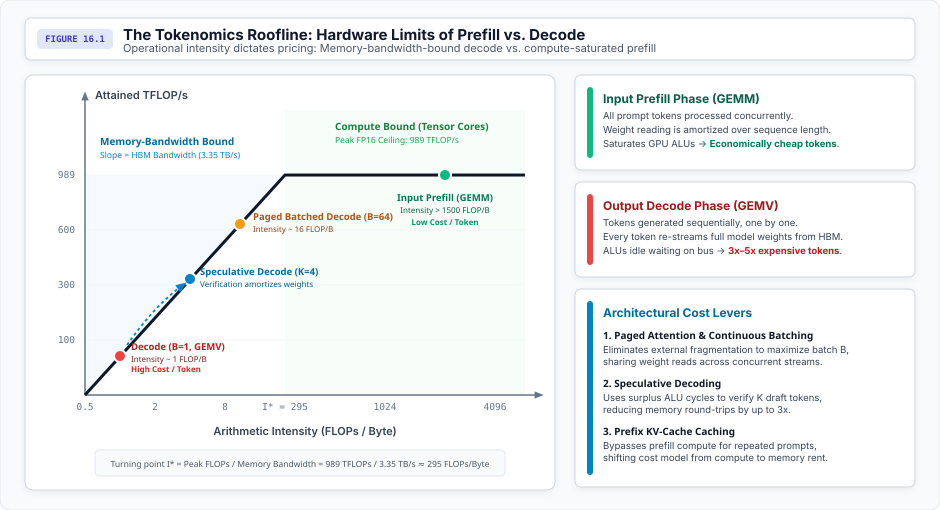
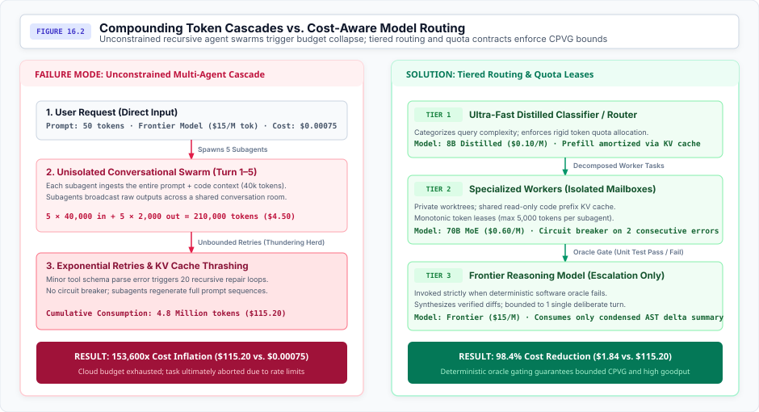

# Systems Tokenomics {#sec-vol3-tokenomics}

## Purpose {.unnumbered .unlisted}

::: {.content-visible when-format="pdf"}
\begin{marginfigure}
\mlagentstack{95}{20}{30}{10}{20}{10}
\end{marginfigure}
:::

_Why does an agent designed to save human labor consume ten times its salary in API tokens?_

This chapter bridges the gap between hardware utilization and application-level unit economics, exploring how variable-length generation and the non-linear scaling of KV cache fundamentally change the economic models of compute. By shifting away from static instance pricing toward fine-grained, state-aware token-based abstractions, we understand why autonomous loops create exponential cost scaling. In agentic systems, the runtime must co-design the neural policy proposal engine with deterministic execution boundaries.

::: {.content-visible when-format="pdf"}
\newpage
:::

::: {.callout-learning-objectives}
- Explain the physical hardware constraints that cause asymmetric pricing between prefill and decode tokens.
- Calculate the memory footprint of the KV cache for a given sequence length and batch size.
- Diagnose runaway token consumption in multi-agent recursive loops.
- Compare memory management techniques like PagedAttention against static contiguous allocation for KV caches.
- Evaluate the economic viability of speculative decoding based on draft model acceptance rates and arithmetic intensity.
- Architect dynamic model routing policies to optimize Cost-per-Verified-Goal (CPVG).
:::

## Introduction

When a user asks a language model to summarize a 50-page document, the system does not consume compute uniformly. Processing the input document requires a massive, parallel matrix multiplication, while generating the two-paragraph summary relies on a slow, sequential process constrained entirely by how fast memory can be read. The commercialization of large language models has driven a structural shift in how we price these computational resources. Unlike traditional microservices, where costs are closely tied to active connection time or predictable request payloads (e.g., bytes transferred), autoregressive generation introduces stochastic resource utilization tied intricately to hardware roofline limits. The fundamental unit of value and cost is the token, yet the hardware footprint required to process a token varies drastically based on its phase (prefill vs. decode), its position in the context window, the model's architecture (dense vs. mixture of experts), and the temporal concurrency of the serving system.

The microeconomics of token generation trace directly back to these physical hardware constraints. Understanding why a generated word costs more than an input word requires looking at the arithmetic intensity of the underlying operations.

| Metric                       | Definition                                     | Primary Driver                 | Optimization Target                     |
|------------------------------|------------------------------------------------|--------------------------------|-----------------------------------------|
| Cost-per-Token               | Price to generate or process one token.        | Hardware arithmetic intensity. | Maximize batch size, PagedAttention.    |
| Cost-per-Turn                | Total cost of a single user-agent interaction. | Prompt length, KV cache size.  | KV cache tiering, prompt compression.   |
| Cost-per-Verified-Goal       | Cost to autonomously complete a task.          | Agent loop efficiency.         | Model routing, early exit conditions.   |
| Opportunity Cost of Idle HBM | Lost revenue from unused memory capacity.      | External fragmentation.        | Dynamic batching, speculative decoding. |

: Economic Metrics in Agentic Systems {#tbl-economic-metrics tbl-colwidths="[25,30,20,25]"}

## Token Pricing Models: Inputs, Outputs, and Arithmetic Intensity

Consider an API pricing tier that charges $0.50 per million input tokens but $1.50 per million output tokens. This 3:1 asymmetry is not an arbitrary business decision; it is a direct reflection of the **Roofline model**\index{Roofline model} [@williams2009roofline]. Pricing an LLM API requires modeling the underlying hardware constraints, primarily **high-bandwidth memory (HBM)**\index{high-bandwidth memory (HBM)} bandwidth and ALU utilization.

Input tokens are processed in parallel during the **prefill**\index{prefill} phase. By processing a sequence of tokens simultaneously, the system casts the workload as large Matrix-Matrix multiplications (GEMMs). This achieves high **arithmetic intensity**\index{arithmetic intensity} (FLOPs per byte of memory read), allowing the system to operate in the **compute-bound**\index{compute-bound} regime and saturate modern GPU Tensor Cores. Because prefill effectively amortizes the cost of loading the model weights across the entire input sequence, input tokens are structurally cheaper to process.

Output tokens, conversely, are generated sequentially during the **autoregressive decode**\index{autoregressive decode} phase. This process relies on Matrix-Vector multiplications (GEMVs). For each generated token, the model's entire weight matrix must be streamed from HBM to SRAM. The arithmetic intensity is fundamentally low; the system operates deep in the **memory bandwidth-bound**\index{memory bandwidth-bound} regime, severely underutilizing the ALUs. Consequently, output tokens are priced significantly higher than input tokens, reflecting the scarce resource: memory bandwidth.

::: {#fig-tokenomics-roofline}


The Tokenomics Roofline: Hardware Limits of Prefill vs. Decode. Input prefill operations operate as high-intensity GEMMs saturating Tensor Core compute, whereas autoregressive decode operations are bound by memory bandwidth as weights must be re-read from HBM for every sequential token. Speculative decoding trades surplus compute to amortize weight reading, shifting operational intensity toward the roofline knee.
:::

::: {.callout-note title="Checkpoint"}
Why does increasing the batch size improve the unit economics of output tokens, and what hardware constraint ultimately limits the maximum batch size?
:::

To improve decode economics, serving systems maximize batch size to share the weight-loading cost across multiple concurrent requests, shifting the operation back toward a GEMM. However, this is bounded by memory capacity—the KV cache for large batches will eventually exhaust HBM.

### Speculative Decoding and Economics

**Speculative decoding**\index{Speculative decoding} [@leviathan2023fast; @chen2023accelerating] alters this economic equation by trading cheap, surplus ALU cycles for expensive, scarce memory bandwidth. By using a small "draft" model to guess future tokens and verifying them in parallel with the large model, the system increases the effective batch size of the verification step. If the acceptance rate is high enough, this reduces the total HBM round-trips per generated token, structurally lowering the cost to serve output tokens.

While speculative decoding optimizes the arithmetic intensity of generation, it does not solve the memory capacity problem. Every generated token adds to the context window, creating a dynamically growing state that threatens to exhaust hardware limits before compute limits are reached.

## Context Working Set Costs and the KV Cache

A single request with a 100,000-token prompt and a large batch size can consume over 100 GB of memory—exceeding the capacity of a single high-end GPU. This massive footprint is driven entirely by the **KV cache**\index{KV cache}, the state maintained during generation to prevent recomputing past tokens. Its capacity scaling is linear with sequence length, batch size, number of layers, and head dimensions.

::: {.callout-note title="Napkin Math"}
**Estimating KV Cache Size**

<!-- TODO: Moved to Appendix [ML/Systems/Hardware] -->

For modern long-context models (e.g., 100k+ tokens), the KV cache footprint quickly balloons to hundreds of gigabytes per request—exceeding the high-bandwidth memory (HBM) capacity of a single GPU. This memory bottleneck dictates serving economics: systems are forced to employ tensor or sequence parallelism purely to hold the working set, partitioning memory that could otherwise serve concurrent users.
:::

Managing this massive, dynamically growing working set is the primary driver of inference infrastructure costs. Prior to optimized memory managers, contiguous memory allocation led to severe fragmentation, wasting expensive HBM. Systems now use techniques like **PagedAttention**\index{PagedAttention} [@kwon2023efficient] to page KV caches into non-contiguous blocks, effectively eliminating **external fragmentation**\index{external fragmentation} and dramatically increasing maximum batch size.

Recently, providers have introduced **KV Cache Tiering**\index{KV Cache Tiering}. By persisting the KV cache of a frequently used prompt in GPU memory, CPU RAM, or fast NVMe storage, the provider bypasses the prefill compute for subsequent requests. The economics shift from a compute-cost model to a memory-renting model, where users pay for the time and hierarchy level the KV cache occupies.

Managing the KV cache becomes even more critical when models do not just respond to human prompts, but interact with other models. As AI systems evolve into multi-agent architectures, the volume of context generated and cached expands exponentially, demanding new strategies for tracking and limiting token usage.

## Multi-Agent Quotas, Model Routing, and Compounding Inference

When a single query triggers an agent to spawn five subagents, each reading the same codebase and exchanging intermediate conclusions, a user's original 50-token request can balloon into a 50,000-token cascade. As systems evolve from single-turn chat interfaces to autonomous, multi-agent frameworks, token consumption scales exponentially. In a multi-agent system, agents prompt each other, summarize context, and iteratively refine outputs, leading to a massive expansion in internal "hidden" tokens generated before a user-facing response is produced.

::: {.callout-note title="Checkpoint"}
In a multi-agent architecture where agents recursively summarize prior steps, how does the ratio of input tokens to output tokens shift compared to a standard conversational interface?
:::

To prevent cost overruns and latency spikes, systems must implement strict quota management and dynamic token budgets. The economics heavily favor intelligent **model routing**\index{model routing}: deploying "flash" or distilled models for intermediate reasoning steps, state transitions, or standard queries, while reserving expensive "pro" models only for final synthesis or complex planning bottlenecks.

::: {#fig-multi-agent-token-routing}


Compounding Token Cascades vs. Cost-Aware Model Routing. Left: An unconstrained conversational swarm executing without quotas suffers exponential token growth from recursive subagent invocations, KV-cache thrashing, and unthrottled retries. Right: A three-tier routing architecture amortizes prefill via prefix caching and bounds Cost-per-Verified-Goal by gating expensive frontier reasoning behind deterministic test oracles.
:::

| Strategy            | Mechanism                                | Pros                       | Cons                                 |
|---------------------|------------------------------------------|----------------------------|--------------------------------------|
| Static Quotas       | Fixed token limit per agent.             | Predictable cost.          | Fails on complex edge cases.         |
| Reactive Throttling | Slows generation when limits near.       | Prevents runaway spending. | Increases latency unpredictably.     |
| Dynamic Auctions    | Agents bid for tokens based on priority. | Optimal allocation of HBM. | High implementation complexity.      |
| Priority Leases     | Reserved capacity for critical agents.   | Guaranteed SLAs.           | Low utilization during idle periods. |

: Token Allocation Strategies {#tbl-token-allocation tbl-colwidths="[20,30,25,25]"}

**Mixture of Experts (MoE)**\index{Mixture of Experts (MoE)} architectures [@shazeer2017outrageously] further complicate these economics. While MoE models possess a massive total parameter count (requiring vast VRAM capacity), they have a much smaller "active" parameter count per token. This **sparsity**\index{sparsity} allows for faster decode speeds and cheaper token economics relative to dense models of equivalent total size, provided the serving cluster can distribute the experts efficiently across GPUs.

::: {.callout-caution title="War Story: The Automated Cloud Burn"}
In early 2026, Uber's engineering organization famously exhausted its entire annual AI cloud budget within just four months. The runaway costs were directly traced to the unmonitored rollout of autonomous coding agents (Claude Code and similar tools) embedded deeply into their CI/CD and developer workflows. Without strict global token limits, cascading agentic loops—where one agent recursively spawned multiple subagents to solve trivial test failures—triggered exponential token consumption against expensive frontier models. The incident forced an emergency shutdown of internal AI tools and catalyzed the industry-wide adoption of hard token limits, cost-aware model routing (defaulting to cheaper models for intermediate steps), and strict Cost-per-Verified-Goal (CPVG) quotas.
:::

These agentic consumption patterns magnify the impact of hardware constraints. An inefficient inference strategy does not just delay a single response; it compounds across every agent in the loop, turning theoretical inefficiencies into massive operational costs.

## Fallacies and Pitfalls

The complexity of tokenomics leads to persistent misconceptions about how inference costs are incurred and optimized. Several common fallacies arise from confusing hardware capacity with compute utilization.

**Pitfall**: *Ignoring the asymmetric cost of prompt caching.*
Persisting KV caches saves prefill compute but permanently locks up memory capacity. If the cache hit rate is low, the latency and bandwidth cost of evicting and paging the cache from NVMe or CPU RAM to GPU HBM can exceed the cost of simply recomputing the prefill from scratch. Over-caching reduces the batch size available for other requests, lowering overall cluster throughput.

**Fallacy**: *Token count is a perfect proxy for hardware compute cost.*
While highly correlated for billing, token count ignores the impact of batching, sequence length, and model architecture (dense vs. MoE). A 1,000-token output generated during a low-traffic period with a batch size of 1 utilizes hardware very differently—and less efficiently—than the same output generated at peak concurrency where weight-loading costs are amortized.

**Pitfall**: *Treating all generation latency as uniform.*
Assuming linear generation time fails to account for **Time to First Token (TTFT)**\index{Time to First Token (TTFT)} being compute-bound (prefill) and **Time Between Tokens (TBT)**\index{Time Between Tokens (TBT)} being memory-bandwidth-bound (decode). Optimizing a system for TTFT requires different hardware topologies and parallelism strategies (e.g., sequence parallelism) than optimizing for high-throughput TBT (e.g., tensor parallelism and large batch sizes).

**Fallacy**: *Speculative decoding always reduces serving costs.*
Speculative decoding [@leviathan2023fast; @chen2023accelerating] burns surplus ALU cycles to save memory bandwidth. However, if the draft model's acceptance rate is too low (due to complex reasoning tasks or domain shifts), the system wastes compute and actually degrades overall throughput and latency, making the cost per token higher than standard autoregressive decoding.

These pitfalls underscore the necessity of aligning the economic model of token generation with the physical constraints of the hardware executing it. A system that scales autonomously will bankrupt its operators if it does not treat memory capacity and arithmetic intensity as strict design boundaries.

## Summary {#sec-vol3-tokenomics-summary}

::: {.callout-takeaways title="The Systems Tokenomics Invariant"}
* The transition to token-based economics is a direct mapping of hardware roofline constraints: compute-bound prefill operations (input) yield cheaper tokens, while memory-bandwidth-bound decode operations (output) yield expensive tokens.
* The KV cache dictates the working set size of an inference request; its linear scaling with sequence length imposes strict limits on concurrency, making long-context queries disproportionately expensive in memory opportunity cost.
* Memory management techniques like PagedAttention [@kwon2023efficient] are critical for inference economics because they eliminate external fragmentation, allowing the system to maximize batch sizes and amortize memory bandwidth costs during decoding.
* Speculative decoding [@leviathan2023fast; @chen2023accelerating] alters tokenomics by trading surplus compute (ALU cycles) for a reduction in expensive memory round-trips, structurally lowering decode costs provided the draft model maintains a high acceptance rate.
* Caching KV states shifts the economic model from paying for compute to renting memory capacity across a hierarchy (HBM, CPU RAM, NVMe), requiring high cache hit rates to be economically viable.
* Mixture of Experts (MoE) architectures [@shazeer2017outrageously] decouple active parameter count from total parameter capacity, resulting in lower inference costs per token compared to dense models, at the expense of higher total VRAM requirements.
* Multi-agent architectures trigger compounding token consumption and necessitate dynamic model routing, where cheap, specialized models handle intermediate reasoning and expensive, capable models are reserved for complex bottlenecks.
:::

::: {.callout-chapter-connection title="From Operational Tokenomics to Distributed Agent Architecture"}
Having mapped the economic cost of stochastic, variable-length reasoning to physical memory bandwidth and capacity constraints, we now understand why an unconstrained agent can exhaust a cluster's resources. In the next volume, we will zoom out from the single-node tokenomics of the runtime to the distributed systems orchestration required to manage entire fleets of these agents concurrently.
:::

## Quantitative Problems {#sec-vol3-tokenomics-problems}

1. **KV Cache Memory Capacity Bound:** A serving system uses an 8x H100 GPU node (each with 80 GB HBM). The OS and model weights consume 320 GB total. Assume each token in the KV cache requires $2 \times N_{\text{layers}} \times D_{\text{model}} \times 2$ bytes (FP16). For a 70B parameter model with $N_{\text{layers}}=80$ and $D_{\text{model}}=8192$, calculate the maximum concurrent batch size the system can sustain if every request has a uniform context length of 128,000 tokens.
2. **Break-Even Speculative Decoding:** An autoregressive decode step takes $t_{\text{AR}} = 20$ ms/token. A speculative draft model can generate 4 draft tokens in $15$ ms total, and the target model verification step for those 4 tokens takes $25$ ms. Let $\alpha$ be the average number of accepted draft tokens per speculative step (where $1 \le \alpha \le 4$). Calculate the minimum acceptance rate $\alpha$ required for speculative decoding to achieve a lower latency-per-token than standard autoregressive decoding.
3. **Dynamic Auction Clearing Price:** A multi-agent framework allocates 10,000 tokens per second across three agent pools. Pool A (Data Ingestion) values throughput at $\$0.50$ per 1k tokens, Pool B (Code Generation) at $\$1.50$ per 1k tokens, and Pool C (Critical Planning) at $\$5.00$ per 1k tokens. If Pool A demands 8,000 tok/s, Pool B demands 5,000 tok/s, and Pool C demands 2,000 tok/s, calculate the market-clearing price of a token in a first-price auction, and determine how much bandwidth each pool receives.
4. **Agent Break-Even Economics:** An enterprise replaces a junior software engineer (costing $\$50$/hour, producing 1 verified pull request per 8 hours) with an autonomous coding agent. The agent uses a model priced at $\$10$ per 1M input tokens and $\$30$ per 1M output tokens. A typical agent loop for a pull request requires 50 iterations. Each iteration consumes an average of 40,000 input tokens (reading codebase state and previous steps) and 1,000 output tokens. Calculate the Cost-per-Verified-Goal (CPVG) of the agent and determine if it is economically viable compared to the human engineer.

```{=latex}
\part{key:synthesis}
```
