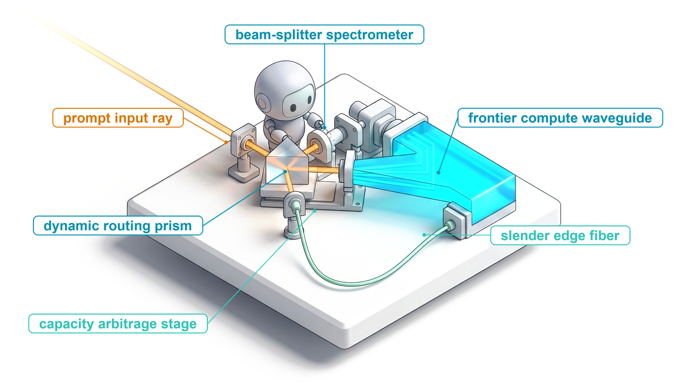
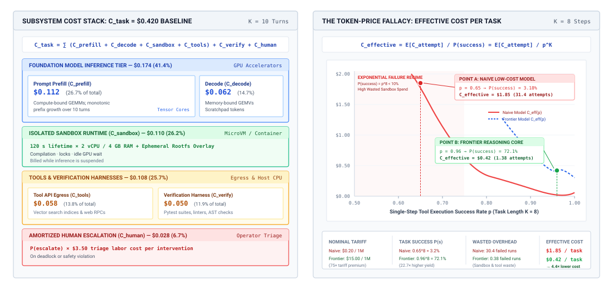
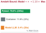
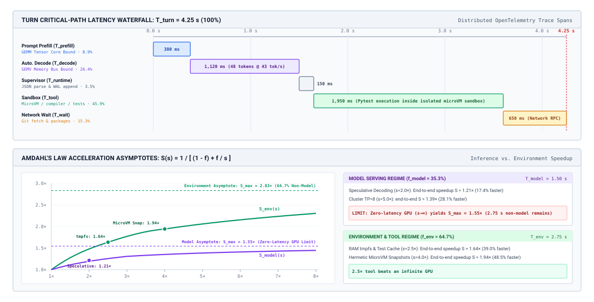
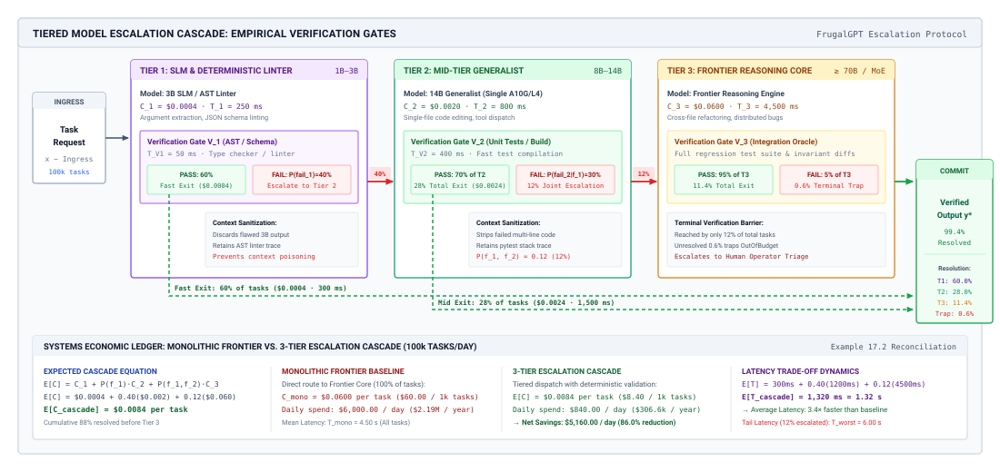
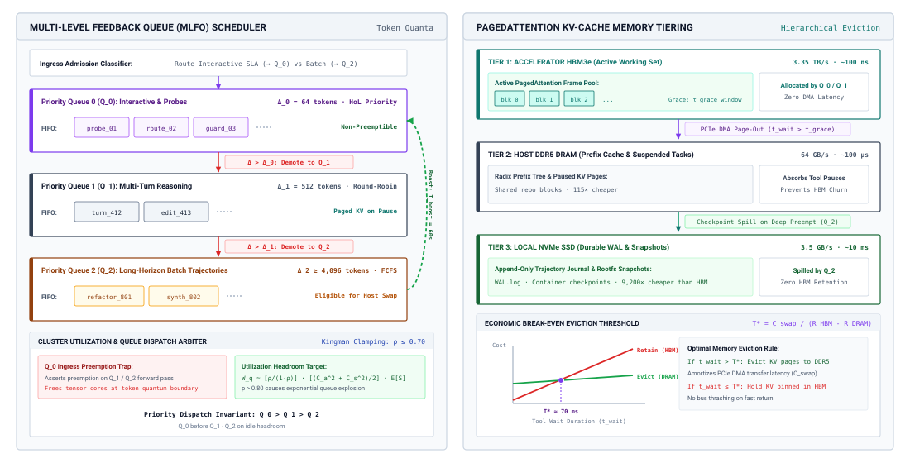
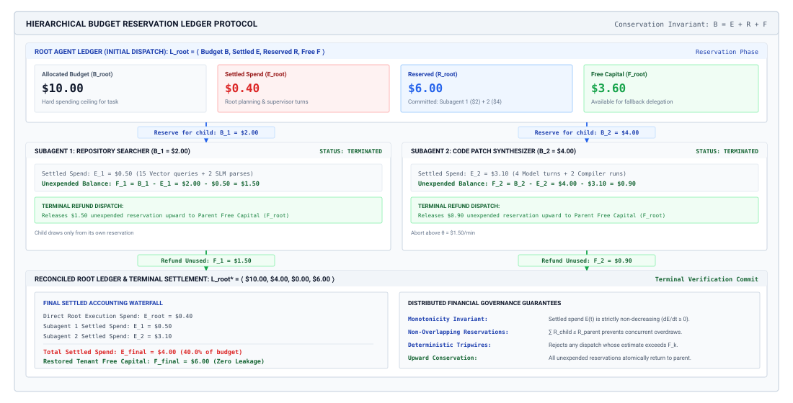
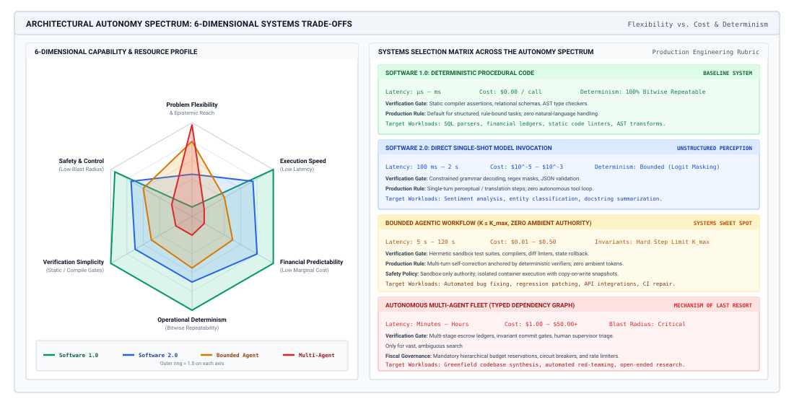
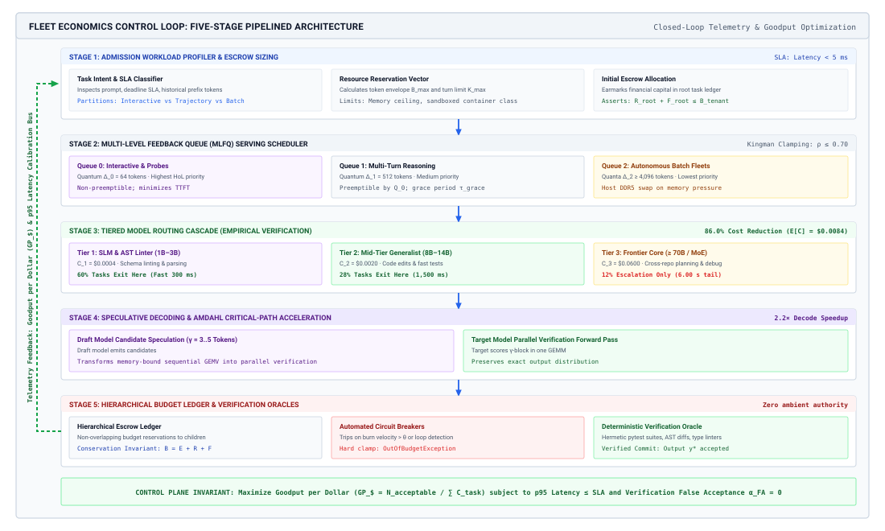

# Agent Economics {#sec-vol3-agent-economics}

::: {layout-narrow}
::: {.column-margin}

\chapterminitoc

:::

::: {.content-visible when-format="pdf"}
\noindent
{fig-alt="Blueprint for Agent Economics."}
:::

::: {.content-visible unless-format="pdf"}
{fig-alt="Blueprint for Agent Economics."}
:::

:::

## Purpose {.unnumbered .unlisted}

\begin{marginfigure}
\mlagentstack{100}{0}{0}{0}{0}{0}
\end{marginfigure}

_Why can a model with a tenth of the token price make an agent cost more for every task it finishes?_

A team that prices an agent the way it prices a chat service multiplies tokens by the provider's rate and is surprised by the bill. The agent does not buy tokens; it buys finished tasks, and each finished task carries every turn, re-sent context, sandbox second, test run, retry, and human review that it took to get one result past verification, plus the cost of every attempt that never passed. A cheaper model that fails more often multiplies all of those terms, a faster model barely moves a trajectory whose time goes to tests and tool waits, and a delegation tree with no reserved budgets can spend money that no rollback returns. Economics therefore decides which model to call, what to cache, how much reasoning to buy, when to escalate, how much capacity to hold, and whether a task deserves an agent at all, each judged by cost and time per accepted task. Horizon sets how many turns are paid for, state sets how much context is re-sent on each of them, and authority sets how much verification and approval each result must clear, so the price of an accepted task is the price of closing all three exposures.

::: {.content-visible when-format="pdf"}

\newpage

:::

::: {.callout-learning-objectives}

- Calculate cost per accepted task from whole-trajectory cost and acceptance rate, and explain why per-token price misleads.
- Estimate how prefix-cache hits, compaction, and reasoning or retry budgets change the dollar cost of a multi-turn trajectory.
- Diagnose a trajectory's critical path from its trace and decide when faster inference, including speculative decoding, pays.
- Design a verifier-gated model cascade and compute its expected cost, tail latency, and false-accept penalty.
- Size capacity for trajectories using Little's law and provider rate limits, and find the break-even between dedicated serving and per-token APIs.
- Design hierarchical budget reservations and spend-rate limits that bound money across a delegation tree.
- Evaluate whether a task warrants a fixed workflow, a bounded agent loop, or several agents by pricing each per accepted task.

:::

## Cost per Accepted Task {#sec-vol3-agent-economics-accounting}

::: {.column-margin}
{width="100%" fig-alt="Curve of effective cost multiplier against task acceptance rate, rising steeply below 50 percent acceptance, with a cheaper Model B at 25 percent acceptance and a four-times multiplier and Model A at 75 percent acceptance and a 1.3-times multiplier."}

*Below half acceptance, the cost of failed attempts outruns any discount on tokens.*
:::

A platform team replaces the frontier model behind its bug-fixing agent with one whose tokens cost a tenth as much. The following month the bill for fixed bugs goes up. Nothing in the serving logs explains it, because the serving logs count tokens, and tokens were never what the agent was buying. A chat service bills per call, so its cost is tokens times price. An agent runs a trajectory, and what the organization pays for is a trajectory whose result passed verification. Trajectory goodput (@sec-vol3-intro-macro-vs-micro-efficiency) already counts only the resources spent on verified trajectories, and @sec-vol3-evaluation-contract defined the accepted task that verification produces. This section puts a price on each accepted task and shows which parts of the system that price actually buys.

::: {#fig-vol3-task-cost-treemap fig-env="figure" fig-pos="htb" fig-cap="**Where an Agent Task's Money Goes**: Left, an illustrative whole-trajectory cost stack in which model input and output tokens are less than half of the bill and sandbox hosting, tool fees, verification, and amortized human escalation make up the rest. Right, effective cost per accepted task as a function of single-step success rate for an eight-step task, where a low-priced model at modest step accuracy costs more per accepted task than a frontier model at high step accuracy." fig-alt="Two-panel diagram. The left panel stacks trajectory cost into model input tokens, model output tokens, sandbox runtime, tool fees, verification, and human escalation, with model tokens under half of the total. The right panel plots effective cost per accepted task against single-step success rate, marking a low-cost model at 0.65 step success with high effective cost and a frontier model at 0.96 step success with lower effective cost."}

:::

The left panel of @fig-vol3-task-cost-treemap decomposes one illustrative task. Model tokens, split between re-sent input and generated output, are less than half of the bill. The rest pays for the sandbox that runs the agent's commands, the tools it calls, the tests that verify its result, and a share of the human review that failed attempts trigger. Across a trajectory of $K$ turns, the **whole-trajectory cost** of one attempt is

$$C_{\text{attempt}} = \sum_{k=1}^K \left( C_{\text{in}, k} + C_{\text{out}, k} + C_{\text{tools}, k} + C_{\text{sandbox}, k} \right) + C_{\text{verify}} + C_{\text{human}}$$ {#eq-vol3-attempt-cost}

where $C_{\text{in}, k}$ pays for the context sent on turn $k$ (system prompt, tool definitions, the transcript so far, and the newest tool result), $C_{\text{out}, k}$ pays for the tokens the model generates, including reasoning tokens and tool-call arguments, $C_{\text{tools}, k}$ covers fees charged by external services, $C_{\text{sandbox}, k}$ covers the isolated environment that executes the agent's commands, $C_{\text{verify}}$ covers the tests and checks that decide acceptance, and $C_{\text{human}}$ covers review when the runtime escalates. The input term of @eq-vol3-attempt-cost grows with every turn, because the model keeps nothing between calls and each turn re-sends a longer context (@sec-vol3-foundation-model-cost). That growth is why the next section treats caching as the first lever.

One attempt is not one accepted task. The right panel of @fig-vol3-task-cost-treemap shows why. If each step of an eight-step task succeeds independently with probability $p$, the whole task succeeds with probability $p^8$, and every failed attempt is paid for in full before it is discarded. Trajectory goodput and the accepted task (principle \ref{pri-vol3-trajectory-goodput}) names what a fleet must therefore minimize, the effective cost per accepted task. If a fleet makes $N$ attempts and $N_{\text{acc}}$ of them are accepted,

$$C_{\text{eff}} = \frac{\sum_{i=1}^N C_{\text{attempt}, i}}{N_{\text{acc}}} = C_{\text{succ}} + \frac{1 - \alpha}{\alpha} C_{\text{fail}}$$ {#eq-vol3-effective-cost}

where $\alpha = N_{\text{acc}}/N$ is the acceptance rate, $C_{\text{succ}}$ is the mean cost of an attempt that passes, and $C_{\text{fail}}$ is the mean cost of one that fails before it is abandoned. The odds ratio $(1 - \alpha)/\alpha$ counts how many failed attempts each accepted task carries. It is small near $\alpha = 1$ and grows without bound as $\alpha$ falls, which is the steep left edge of the margin figure.

::: {#dfn-whole-trajectory-cost .callout-definition title="Whole-trajectory cost"}

***Whole-trajectory cost***\index{Whole-trajectory cost!definition}\index{Agent economics!cost per accepted task} is the total spent on model tokens, tools, sandboxes, verification, and human review across every attempt, divided by the number of attempts whose results were accepted, $C_{\text{eff}} = C_{\text{succ}} + \frac{1 - \alpha}{\alpha} C_{\text{fail}}$.

1.  **Significance**: It is the quantity that model choice, caching, routing, and capacity decisions must lower, and it can rise when token prices fall.
2.  **Distinction**: Per-token pricing bills what the model emits whether or not the task succeeds; whole-trajectory cost charges every failed attempt and every non-model term to the tasks that were accepted.
3.  **Common pitfall**: Budgeting an agent from a provider's price sheet, which ignores both the non-model terms and the odds ratio $\frac{1 - \alpha}{\alpha}$ that multiplies failed attempts.

:::

```{python}
#| label: calc-vol3-agent-economics-token-price
#| echo: false
# ┌─────────────────────────────────────────────────────────────────────────────
# │ THE TOKEN-PRICE FALLACY IN AUTOMATED BUG REPAIR (LEGO)
# ├─────────────────────────────────────────────────────────────────────────────
# │ Context: @tbl-vol3-token-price-fallacy and the notebook in
# │          @sec-vol3-agent-economics-accounting; the first fallacy in
# │          @sec-vol3-agent-economics-fallacies.
# │
# │ Goal: Show that a model with a tenth of the input price can cost more per
# │       accepted task once turns, hosting, verification, and failed attempts
# │       are counted.
# │ Show: Per-attempt model cost, per-attempt total cost, cost per accepted
# │       task with and without human triage, and the ratios between models.
# │ How:  Whole-trajectory cost per attempt, divided by acceptance rate.
# │       All inputs are illustrative scenario values stated in the table.
# └─────────────────────────────────────────────────────────────────────────────
from mlsysim import *

class TokenPriceFallacy:
    # ┌── 1. LOAD (Constants & Parameters) ─────────────────────────────────
    a_in, a_out = 3.00, 15.00  # scenario: frontier model, $ per million tokens
    b_in, b_out = 0.30, 1.20  # scenario: low-cost model, $ per million tokens
    a_turns, b_turns = 4, 7  # scenario: mean turns per attempt
    a_ctx, a_gen = 16_000, 800  # scenario: input and output tokens per turn, frontier
    b_ctx, b_gen = 28_000, 1_200  # scenario: input and output tokens per turn, low-cost
    a_acc, b_acc = 0.75, 0.25  # scenario: acceptance rate per attempt
    c_env = 0.03  # scenario: sandbox and tool cost per turn, $
    c_verify = 0.05  # scenario: regression tests per attempt, $
    c_human = 10.00  # scenario: engineer triage per failed attempt, $

    # ┌── 2. EXECUTE (Compute) ─────────────────────────────────────────────
    a_model = a_turns * (a_ctx * a_in + a_gen * a_out) / 1e6
    b_model = b_turns * (b_ctx * b_in + b_gen * b_out) / 1e6
    a_attempt = a_model + a_turns * c_env + c_verify
    b_attempt = b_model + b_turns * c_env + c_verify
    a_eff = a_attempt / a_acc
    b_eff = b_attempt / b_acc
    a_eff_h = (a_attempt + (1 - a_acc) * c_human) / a_acc
    b_eff_h = (b_attempt + (1 - b_acc) * c_human) / b_acc
    model_ratio = a_model / b_model
    attempt_gap = 1 - b_attempt / a_attempt
    eff_ratio = b_eff / a_eff
    eff_h_ratio = b_eff_h / a_eff_h
    a_odds = (1 - a_acc) / a_acc
    b_odds = (1 - b_acc) / b_acc

    # ┌── 3. GUARD (Invariants) ───────────────────────────────────────────
    check(model_ratio > 3, "The low-cost model must look much cheaper per attempt on tokens alone")
    check(eff_ratio > 2, "The low-cost model must cost more per accepted task")
    check(eff_h_ratio > eff_ratio, "Human triage must widen the gap")

    # ┌── 4. OUTPUT (Formatting) ──────────────────────────────────────────
    a_in_str = fmt_usd(a_in, precision=0)
    a_out_str = fmt_usd(a_out, precision=0)
    b_in_str = fmt_usd(b_in, precision=2)
    b_out_str = fmt_usd(b_out, precision=2)
    in_discount_mult_str = fmt_multiple(round(a_in / b_in), precision=0)
    a_turns_str = fmt_int(a_turns)
    b_turns_str = fmt_int(b_turns)
    a_ctx_str = fmt_int(a_ctx)
    a_gen_str = fmt_int(a_gen)
    b_ctx_str = fmt_int(b_ctx)
    b_gen_str = fmt_int(b_gen)
    a_acc_str = fmt(a_acc, precision=2)
    b_acc_str = fmt(b_acc, precision=2)
    c_env_str = fmt_usd(c_env, precision=2)
    c_verify_str = fmt_usd(c_verify, precision=2)
    c_human_str = fmt_usd(c_human, precision=0)
    a_model_str = fmt_usd(a_model, precision=3)
    b_model_str = fmt_usd(b_model, precision=3)
    a_attempt_str = fmt_usd(a_attempt, precision=3)
    b_attempt_str = fmt_usd(b_attempt, precision=3)
    a_eff_str = fmt_usd(a_eff, precision=2)
    b_eff_str = fmt_usd(b_eff, precision=2)
    a_eff_h_str = fmt_usd(a_eff_h, precision=2)
    b_eff_h_str = fmt_usd(b_eff_h, precision=2)
    model_ratio_mult_str = fmt_multiple(model_ratio, precision=1)
    attempt_gap_str = fmt_percent(round(attempt_gap, 2), precision=0)
    eff_ratio_mult_str = fmt_multiple(eff_ratio, precision=1)
    eff_h_ratio_mult_str = fmt_multiple(eff_h_ratio, precision=1)
    a_odds_str = fmt(a_odds, precision=2)
    b_odds_str = fmt_int(b_odds)
```

::: {#nbk-17-the-token-price-fallacy-in-automated .callout-notebook title="The token-price fallacy in automated bug repair"}

**Problem**: A bug-fixing agent can run on a frontier model or on a low-cost model whose input tokens are `{python} TokenPriceFallacy.in_discount_mult_str` cheaper. The illustrative workload in @tbl-vol3-token-price-fallacy retries each ticket until an attempt passes the regression tests. Which model costs less per accepted fix?

| Parameter                             | Frontier model                                                                  | Low-cost model                                                                  |
|:--------------------------------------|:--------------------------------------------------------------------------------|:--------------------------------------------------------------------------------|
| Input / output price per 10^6^ tokens | `{python} TokenPriceFallacy.a_in_str` / `{python} TokenPriceFallacy.a_out_str`  | `{python} TokenPriceFallacy.b_in_str` / `{python} TokenPriceFallacy.b_out_str`  |
| Turns per attempt                     | `{python} TokenPriceFallacy.a_turns_str`                                        | `{python} TokenPriceFallacy.b_turns_str`                                        |
| Input / output tokens per turn        | `{python} TokenPriceFallacy.a_ctx_str` / `{python} TokenPriceFallacy.a_gen_str` | `{python} TokenPriceFallacy.b_ctx_str` / `{python} TokenPriceFallacy.b_gen_str` |
| Acceptance rate $\alpha$              | `{python} TokenPriceFallacy.a_acc_str`                                          | `{python} TokenPriceFallacy.b_acc_str`                                          |
| Sandbox and tools per turn            | `{python} TokenPriceFallacy.c_env_str`                                          | `{python} TokenPriceFallacy.c_env_str`                                          |
| Verification per attempt              | `{python} TokenPriceFallacy.c_verify_str`                                       | `{python} TokenPriceFallacy.c_verify_str`                                       |
| Human triage per failed attempt       | `{python} TokenPriceFallacy.c_human_str`                                        | `{python} TokenPriceFallacy.c_human_str`                                        |

: **Illustrative Bug-Repair Workload**: Scenario prices, trajectory lengths, and acceptance rates for a frontier model and a low-cost model. {#tbl-vol3-token-price-fallacy}

**Math**: On tokens alone, one attempt costs `{python} TokenPriceFallacy.a_model_str` on the frontier model and `{python} TokenPriceFallacy.b_model_str` on the low-cost model, which looks `{python} TokenPriceFallacy.model_ratio_mult_str` cheaper. The low-cost model needs more turns, and every turn pays for the sandbox, so with hosting and verification the attempts cost `{python} TokenPriceFallacy.a_attempt_str` and `{python} TokenPriceFallacy.b_attempt_str`, a gap of only `{python} TokenPriceFallacy.attempt_gap_str` percent. Dividing by acceptance rate (@eq-vol3-effective-cost with $C_{\text{fail}} = C_{\text{succ}}$) gives `{python} TokenPriceFallacy.a_eff_str` per accepted fix for the frontier model and `{python} TokenPriceFallacy.b_eff_str` for the low-cost model, which carries `{python} TokenPriceFallacy.b_odds_str` failed attempts per success against `{python} TokenPriceFallacy.a_odds_str`. When each failed attempt also costs `{python} TokenPriceFallacy.c_human_str` of engineer triage, the figures become `{python} TokenPriceFallacy.a_eff_h_str` and `{python} TokenPriceFallacy.b_eff_h_str`.

**Systems insight**: The low-cost model is `{python} TokenPriceFallacy.eff_ratio_mult_str` more expensive per accepted fix without triage and `{python} TokenPriceFallacy.eff_h_ratio_mult_str` more expensive with it. The token discount was real, and it was spent many times over on turns, sandbox time, and failed attempts.

:::

Reporting follows from the same account. An agent evaluated only on success rate hides what the success cost, and an agent evaluated only on cost hides what it failed to finish. A result is complete when it reports acceptance rate with its confidence interval (@sec-vol3-evaluation-rigor) and cost per accepted task on the same runs, so that designs can be placed on a cost-accuracy plane and a design that is both cheaper and more accurate than another dominates it. Repository-level issue benchmarks [@jimenez2024swebench] make this concrete, since each resolved issue has a verifiable test outcome and a measurable bill. Comparisons between designs are made at a matched budget (@sec-vol3-evaluation-pass-k), because a design allowed to spend more can buy success with money alone. Throughout this chapter, the reciprocal of $C_{\text{eff}}$, accepted tasks per dollar, is the number every lever is judged by.

The whole-trajectory account also shows where to push first. In most agent trajectories the largest token term is not what the model writes but what the runtime re-sends to it on every turn.

## Caching and Reasoning Budgets {#sec-vol3-agent-economics-caching}

By turn thirty, a coding agent sends the model a context of tens of thousands of tokens, almost all of which it already sent on turn twenty-nine. Paying full price for that repetition is the default, and it is avoidable. @Sec-vol3-foundation-model-cost counted the tokens a trajectory re-sends (@eq-vol3-trajectory-resend) and introduced prefix caching, which reuses the attention state for a prompt prefix the service has already processed. Context engineering arranged the context so that the prefix stays stable (@sec-vol3-context-engineering-staging), and @sec-vol3-kvcache-radix-tree showed how the serving system shares that state. Both rest on the fact that the attention state is a function of the exact token prefix (principle \ref{pri-vol3-prefix-coherence}). This section prices the result in dollars and then prices the other budget the runtime controls on every call, how much reasoning and how many attempts to buy.

### What a cache hit is worth

Providers that support prompt caching bill input tokens read from a cached prefix at a fraction of the normal input price, and bill only the tokens after the prefix at full price. With an append-only transcript, turn $k$ extends turn $k-1$, so under ideal reuse each turn pays full price only for what it appended. The same trajectory that @sec-vol3-foundation-model-cost counted in tokens can now be priced.

```{python}
#| label: calc-vol3-agent-economics-prefix-cache
#| echo: false
# ┌─────────────────────────────────────────────────────────────────────────────
# │ WHAT PREFIX CACHING AND COMPACTION ARE WORTH IN DOLLARS (LEGO)
# ├─────────────────────────────────────────────────────────────────────────────
# │ Context: The notebook in @sec-vol3-agent-economics-caching, the compaction
# │          paragraph that follows it, and the cache-layout pitfall in
# │          @sec-vol3-agent-economics-fallacies.
# │
# │ Goal: Price the re-sent context of a multi-turn trajectory with and
# │       without prefix caching, and decide when compaction pays.
# │ Show: Input, output, and total cost per trajectory; the caching ratio;
# │       the cost of the remaining turns with and without a compaction; the
# │       break-even horizon for compaction.
# │ How:  Arithmetic series of re-sent prompts (the same scenario as the
# │       per-call estimate of the foundation-model chapter, with trajectory
# │       length from the MLSysIM coding-agent profile). Prices and the
# │       cached-read fraction are illustrative scenario inputs.
# └─────────────────────────────────────────────────────────────────────────────
from mlsysim import *

class PrefixCacheCost:
    # ┌── 1. LOAD (Constants & Parameters) ─────────────────────────────────
    agent = Agents.Coding.SWE_Bench_Runner
    turns = agent.max_trajectory_steps
    s0 = 8_000  # scenario: first-turn prompt (same as the per-call estimate)
    delta = 1_500  # scenario: tokens appended per turn
    k_turn = 200  # scenario: output tokens per turn
    p_in = 3.0  # scenario: $ per million input tokens
    p_out = 15.0  # scenario: $ per million output tokens
    cached_share = 0.10  # scenario: cached input billed at this fraction of p_in
    compact_turn = 16  # scenario: turn at which the runtime compacts
    compact_to = 12_000  # scenario: context size after compaction
    summary_out = 1_500  # scenario: output tokens of the summarization call

    # ┌── 2. EXECUTE (Compute) ─────────────────────────────────────────────
    sent = turns * s0 + delta * turns * (turns - 1) // 2
    fresh = s0 + delta * (turns - 1)
    cached = sent - fresh
    in_nocache = sent * p_in / 1e6
    in_cache = (fresh * p_in + cached * p_in * cached_share) / 1e6
    out_cost = turns * k_turn * p_out / 1e6
    total_nocache = in_nocache + out_cost
    total_cache = in_cache + out_cost
    cache_ratio = total_nocache / total_cache

    ctx_at = s0 + (compact_turn - 1) * delta
    rest = turns - compact_turn + 1
    keep_sum = rest * ctx_at + delta * rest * (rest - 1) // 2
    keep_cost = (rest * delta * p_in + (keep_sum - rest * delta) * p_in * cached_share) / 1e6
    comp_sum = rest * compact_to + delta * rest * (rest - 1) // 2
    comp_fresh = compact_to + (rest - 1) * delta
    comp_cost = (comp_fresh * p_in + (comp_sum - comp_fresh) * p_in * cached_share) / 1e6
    summary_cost = ((ctx_at - delta) * p_in * cached_share + delta * p_in + summary_out * p_out) / 1e6
    comp_total = comp_cost + summary_cost
    upfront = (compact_to * p_in - (delta * p_in + (ctx_at - delta) * p_in * cached_share)) / 1e6 + summary_cost
    per_turn_saving = (ctx_at - compact_to) * p_in * cached_share / 1e6
    breakeven_turns = upfront / per_turn_saving

    # ┌── 3. GUARD (Invariants) ───────────────────────────────────────────
    check(cache_ratio > 4, f"Prefix caching should cut the bill by more than 4x, got {cache_ratio:.1f}")
    check(comp_total < keep_cost, "Over the remaining turns compaction should pay back its cache miss and summary call")
    check(rest > breakeven_turns > rest / 2, "Break-even should fall inside the remaining horizon, but not trivially early")

    # ┌── 4. OUTPUT (Formatting) ──────────────────────────────────────────
    turns_str = fmt_int(turns)
    s0_str = fmt_int(s0)
    delta_str = fmt_int(delta)
    k_turn_str = fmt_int(k_turn)
    p_in_str = fmt_usd(p_in, precision=0)
    p_out_str = fmt_usd(p_out, precision=0)
    cached_pct_str = fmt_percent(cached_share, precision=0)
    sent_str = fmt_int(sent)
    fresh_str = fmt_int(fresh)
    in_nocache_str = fmt_usd(in_nocache, precision=2)
    in_cache_str = fmt_usd(in_cache, precision=2)
    out_cost_str = fmt_usd(out_cost, precision=2)
    total_nocache_str = fmt_usd(total_nocache, precision=2)
    total_cache_str = fmt_usd(total_cache, precision=2)
    cache_ratio_mult_str = fmt_multiple(cache_ratio, precision=1)
    compact_turn_str = fmt_int(compact_turn)
    ctx_at_str = fmt_int(ctx_at)
    compact_to_str = fmt_int(compact_to)
    summary_out_str = fmt_int(summary_out)
    rest_str = fmt_int(rest)
    keep_cost_str = fmt_usd(keep_cost, precision=3)
    comp_cost_str = fmt_usd(comp_cost, precision=3)
    summary_cost_str = fmt_usd(summary_cost, precision=3)
    comp_total_str = fmt_usd(comp_total, precision=3)
    breakeven_turns_str = fmt_int(breakeven_turns)
```

::: {#nbk-17-prefix-cache-dollars .callout-notebook title="Pricing a thirty-turn trajectory with and without a cache"}

**Problem**: The coding agent of @sec-vol3-foundation-model-cost runs `{python} PrefixCacheCost.turns_str` turns. Its first prompt is `{python} PrefixCacheCost.s0_str` tokens, each turn appends `{python} PrefixCacheCost.delta_str` tokens, and each turn emits `{python} PrefixCacheCost.k_turn_str` output tokens. Input costs `{python} PrefixCacheCost.p_in_str` and output `{python} PrefixCacheCost.p_out_str` per million tokens, and cached input is billed at `{python} PrefixCacheCost.cached_pct_str` percent of the input price. What does the trajectory cost with and without prefix caching?

**Math**: The trajectory sends `{python} PrefixCacheCost.sent_str` input tokens in total, which cost `{python} PrefixCacheCost.in_nocache_str` at full price. With an append-only context, only the first prompt and each turn's appended tokens, `{python} PrefixCacheCost.fresh_str` in all, are billed at full price and the rest are cache reads, so input falls to `{python} PrefixCacheCost.in_cache_str`. Output costs `{python} PrefixCacheCost.out_cost_str` either way. The trajectory costs `{python} PrefixCacheCost.total_nocache_str` without the cache and `{python} PrefixCacheCost.total_cache_str` with it.

**Systems insight**: Prefix caching makes the same trajectory `{python} PrefixCacheCost.cache_ratio_mult_str` cheaper, and it changes no model and no answer. It is also fragile. A timestamp at the head of the system prompt, a reordered tool list, or an edit to an early message turns every turn back into a full-price read.

:::

The layout rules of @sec-vol3-context-engineering-staging exist to protect this saving, and the cache-hit rate belongs on the harness dashboard beside cost per accepted task. Two qualifications keep the estimate honest. Some providers charge a premium to write a prefix into the cache and expire cached prefixes after minutes of inactivity, so a trajectory that pauses on a long tool wait or an approval (@sec-vol3-controlplane-hitl) can return to a cold cache. The serving-side view of the same decision, whether to keep the attention state resident during the wait, belongs to @sec-vol3-kvcache-swapping.

### The price of compaction

Compaction (@sec-vol3-context-engineering-compaction) shrinks the context when it grows too long, usually by replacing old turns with a summary. On a cached trajectory, compaction has a price that is easy to miss. The summary is new text, so the turn after compaction reads its whole context at full price, and the summary itself costs a model call. In the notebook's trajectory, suppose the runtime compacts at turn `{python} PrefixCacheCost.compact_turn_str`, when the context holds `{python} PrefixCacheCost.ctx_at_str` tokens, down to `{python} PrefixCacheCost.compact_to_str` tokens, with a summary call that emits `{python} PrefixCacheCost.summary_out_str` tokens. Without compaction, the remaining `{python} PrefixCacheCost.rest_str` turns cost `{python} PrefixCacheCost.keep_cost_str` in input. With it, they cost `{python} PrefixCacheCost.comp_cost_str`, plus `{python} PrefixCacheCost.summary_cost_str` for the summary, `{python} PrefixCacheCost.comp_total_str` in all. Compaction pays back its cache miss and its summary call only after about `{python} PrefixCacheCost.breakeven_turns_str` more turns.

Two consequences follow. Compacting early in a long trajectory saves money, and compacting near the end costs money, so a runtime that compacts on a fixed schedule should at least compare the expected remaining horizon against the break-even. More often the decision is not about money at all. Compaction is justified by the context window and by decision quality as the context fills with stale material (@sec-vol3-context-engineering-context-rot), and the dollar account only says what that quality costs.

### Reasoning and retry budgets

The other per-call budget the runtime sets is how much deliberation to buy. The call surface exposes a reasoning-token budget (@sec-vol3-foundation-model-contract), and reasoning tokens are billed as output tokens, the expensive kind, and generated serially, so a larger budget raises both price and latency on every call that uses it. @Sec-vol3-test-time-compute-computation-allocation decided when more deliberation raises the evidence for a decision. The economic question here is narrower. For a task with a sealed verifier, the runtime can buy a better answer from one expensive call or several attempts from a cheaper one, and the two options have different costs per accepted task.

With a verifier that the runtime trusts, retries can stop at the first accepted result. If each attempt of a cheap configuration succeeds with probability $p$ at cost $c$, and attempts are independent, the expected cost per accepted task of sequential retry is $c/p$ however many retries are allowed, because each allowed retry is used only when the previous one failed. The retry cap $k$ changes coverage, $1 - (1-p)^k$, not cost per accepted task. Running $k$ attempts in parallel buys latency instead, at cost $kc$ per task and $kc/(1-(1-p)^k)$ per accepted task. Pass@$k$ as a selection ceiling (@sec-vol3-test-time-compute-candidate-diversity) is the coverage term in both cases.

```{python}
#| label: calc-vol3-agent-economics-retry-budget
#| echo: false
# ┌─────────────────────────────────────────────────────────────────────────────
# │ RETRY A CHEAP CONFIGURATION OR CALL AN EXPENSIVE ONE (LEGO)
# ├─────────────────────────────────────────────────────────────────────────────
# │ Context: The reasoning and retry budget paragraphs in
# │          @sec-vol3-agent-economics-caching.
# │
# │ Goal: Compare sequential retry, parallel sampling, and a stronger model
# │       per accepted task when a sealed verifier decides acceptance.
# │ Show: Coverage and cost per accepted task for each option.
# │ How:  Independent attempts; sequential retry stops at the first accepted
# │       result. All inputs are illustrative scenario values.
# └─────────────────────────────────────────────────────────────────────────────
from mlsysim import *

class RetryBudget:
    # ┌── 1. LOAD (Constants & Parameters) ─────────────────────────────────
    p_small = 0.30  # scenario: acceptance per attempt, cheaper configuration
    c_small = 0.10  # scenario: $ per attempt, cheaper configuration
    p_big = 0.70  # scenario: acceptance per attempt, stronger configuration
    c_big = 0.40  # scenario: $ per attempt, stronger configuration
    k = 5  # scenario: retry cap or parallel sample count

    # ┌── 2. EXECUTE (Compute) ─────────────────────────────────────────────
    coverage = 1 - (1 - p_small) ** k
    seq_attempts = coverage / p_small
    seq_per_acc = c_small / p_small
    par_per_acc = k * c_small / coverage
    big_per_acc = c_big / p_big

    # ┌── 3. GUARD (Invariants) ───────────────────────────────────────────
    check(seq_per_acc < big_per_acc < par_per_acc, "Sequential retry must be cheapest and parallel sampling dearest")

    # ┌── 4. OUTPUT (Formatting) ──────────────────────────────────────────
    p_small_str = fmt(p_small, precision=2)
    c_small_str = fmt_usd(c_small, precision=2)
    p_big_str = fmt(p_big, precision=2)
    c_big_str = fmt_usd(c_big, precision=2)
    k_str = fmt_int(k)
    coverage_str = fmt_percent(round(coverage, 2), precision=0)
    seq_attempts_str = fmt(seq_attempts, precision=1)
    seq_per_acc_str = fmt_usd(seq_per_acc, precision=2)
    par_per_acc_str = fmt_usd(par_per_acc, precision=2)
    big_per_acc_str = fmt_usd(big_per_acc, precision=2)
```

Take an illustrative cheap configuration that succeeds with probability `{python} RetryBudget.p_small_str` at `{python} RetryBudget.c_small_str` per attempt, and a stronger one (a larger model or a larger reasoning budget) that succeeds with probability `{python} RetryBudget.p_big_str` at `{python} RetryBudget.c_big_str`. With a cap of `{python} RetryBudget.k_str` attempts, sequential retry of the cheap configuration covers `{python} RetryBudget.coverage_str` percent of tasks, uses `{python} RetryBudget.seq_attempts_str` attempts on average, and costs `{python} RetryBudget.seq_per_acc_str` per accepted task. The stronger configuration costs `{python} RetryBudget.big_per_acc_str` per accepted task in one attempt. Sampling `{python} RetryBudget.k_str` cheap attempts in parallel is fastest and dearest at `{python} RetryBudget.par_per_acc_str`. The cheap configuration wins on cost and loses on latency and coverage, the stronger one wins on latency, and the parallel option is justified only when the deadline pays for it.

The comparison has two conditions that decide whether it holds in practice. The verifier must be trustworthy, because retrying against a verifier that sometimes accepts a wrong answer converts retries into false accepts (principle \ref{pri-vol3-verification-asymmetry}). Attempts must also fail independently, and they rarely do. Attempts from the same model on the same task share its blind spots, so coverage flattens well below $1 - (1-p)^k$, and the gap between pass@$k$ and reliability over repeated runs (@sec-vol3-evaluation-pass-k) is the measured form of that correlation. The per-task stopping rules of @sec-vol3-test-time-compute-bounded-search then cap how much of the budget a hopeless task can consume.

Caching lowers what each turn costs, and the reasoning and retry budget decides how many turns and attempts are bought. Neither says how long the task takes. A trajectory can be cheap and still too slow to be useful, and time has its own account.

## Critical-Path Latency {#sec-vol3-agent-economics-criticalpath}

::: {.column-margin}
{width="100%" fig-alt="Three horizontal bars decomposing trajectory wall-clock time: test execution in the sandbox dominates at 78.6 percent, container lifecycle takes about 12 percent, and model inference takes 9.4 percent."}

*Test execution in the sandbox dominates wall-clock time, capping what faster inference can buy.*
:::

```{python}
#| label: calc-vol3-agent-economics-critical-path
#| echo: false
# ┌─────────────────────────────────────────────────────────────────────────────
# │ WHERE A TRAJECTORY'S TIME GOES (LEGO)
# ├─────────────────────────────────────────────────────────────────────────────
# │ Context: The opening of @sec-vol3-agent-economics-criticalpath,
# │          @fig-vol3-critical-path-waterfall prose, @tbl-vol3-trace-critical-path,
# │          and the second pitfall in @sec-vol3-agent-economics-fallacies.
# │
# │ Goal: Show that a trajectory's wall-clock time is set by its critical
# │       path, where tools and sandboxes often dominate the model.
# │ Show: Opening upgrade scenario; per-turn span shares and Amdahl bounds;
# │       per-span durations and shares of an illustrative trace.
# │ How:  Amdahl's law over measured span durations. All durations are
# │       illustrative scenario inputs.
# └─────────────────────────────────────────────────────────────────────────────
from mlsysim import *

class CriticalPath:
    # ┌── 1. LOAD (Constants & Parameters) ─────────────────────────────────
    up_total = 420.0  # scenario: trajectory wall-clock time, s
    up_model = 84.0  # scenario: of which model generation, s
    up_speed = 4.0  # scenario: generation speedup from a serving upgrade
    # one turn of @fig-vol3-critical-path-waterfall, ms
    w_pre, w_dec, w_rt, w_tool, w_wait = 380.0, 1_120.0, 150.0, 1_950.0, 650.0
    w_spec = 2.0  # scenario: model-side speedup, speculative decoding
    w_env = 2.5  # scenario: speedup of tools and waits
    # illustrative trace of one three-turn trajectory, s
    t_init, t_box, t_pre1, t_dec1, t_git = 0.12, 14.80, 1.20, 8.40, 0.08
    t_pre2, t_dec2, t_test, t_pre3, t_dec3, t_snap = 1.85, 11.20, 245.60, 2.10, 4.50, 22.55
    t_fast = 4.0  # scenario: model speedup in the pitfall

    # ┌── 2. EXECUTE (Compute) ─────────────────────────────────────────────
    up_new = up_total - up_model + up_model / up_speed
    up_cut = 1 - up_new / up_total
    up_rest = up_total - up_model

    w_total = (w_pre + w_dec + w_rt + w_tool + w_wait) / 1000
    w_model = (w_pre + w_dec) / 1000
    w_f = w_model / w_total
    w_smax = 1 / (1 - w_f)
    w_s_spec = 1 / ((1 - w_f) + w_f / w_spec)
    w_s_env = 1 / (w_f + (1 - w_f) / w_env)

    t_total = t_init + t_box + t_pre1 + t_dec1 + t_git + t_pre2 + t_dec2 + t_test + t_pre3 + t_dec3 + t_snap
    t_model = t_pre1 + t_dec1 + t_pre2 + t_dec2 + t_pre3 + t_dec3
    f_model = t_model / t_total
    f_test = t_test / t_total
    f_box = (t_box + t_snap) / t_total
    t_smax = 1 / (1 - f_model)
    t_s_fast = 1 / ((1 - f_model) + f_model / t_fast)

    # ┌── 3. GUARD (Invariants) ───────────────────────────────────────────
    check(up_cut < 0.2, "A 4x faster model should cut this trajectory by under a fifth")
    check(w_s_env > w_smax, "A 2.5x faster environment must beat an instant model")
    check(f_model < 0.1, "The model must be under a tenth of the traced critical path")

    # ┌── 4. OUTPUT (Formatting) ──────────────────────────────────────────
    up_total_str = fmt_int(up_total)
    up_model_str = fmt_int(up_model)
    up_speed_mult_str = fmt_multiple(up_speed, precision=0)
    up_new_str = fmt_int(up_new)
    up_cut_str = fmt_percent(round(up_cut, 2), precision=0)
    up_rest_str = fmt_int(up_rest)
    w_total_str = fmt(w_total, precision=2)
    w_model_str = fmt(w_model, precision=1)
    w_f_str = fmt_percent(w_f, precision=1)
    w_smax_mult_str = fmt_multiple(w_smax, precision=2)
    w_spec_mult_str = fmt_multiple(w_spec, precision=0)
    w_s_spec_mult_str = fmt_multiple(w_s_spec, precision=2)
    w_env_mult_str = fmt_multiple(w_env, precision=1)
    w_s_env_mult_str = fmt_multiple(w_s_env, precision=2)
    t_init_str = fmt(t_init, precision=2)
    t_box_str = fmt(t_box, precision=2)
    t_pre1_str = fmt(t_pre1, precision=2)
    t_dec1_str = fmt(t_dec1, precision=2)
    t_git_str = fmt(t_git, precision=2)
    t_pre2_str = fmt(t_pre2, precision=2)
    t_dec2_str = fmt(t_dec2, precision=2)
    t_test_str = fmt(t_test, precision=2)
    t_pre3_str = fmt(t_pre3, precision=2)
    t_dec3_str = fmt(t_dec3, precision=2)
    t_snap_str = fmt(t_snap, precision=2)
    t_total_str = fmt(t_total, precision=2)
    t_model_str = fmt(t_model, precision=2)
    f_model_prose_str = fmt_percent(f_model, precision=1)
    f_test_str = fmt_percent(f_test, precision=1)
    f_box_str = fmt_percent(round(f_box, 2), precision=0)
    t_smax_mult_str = fmt_multiple(t_smax, precision=2)
    t_fast_mult_str = fmt_multiple(t_fast, precision=0)
    t_s_fast_mult_str = fmt_multiple(t_s_fast, precision=2)
```

A coding agent takes `{python} CriticalPath.up_total_str` seconds to repair a failing test, and its model spends `{python} CriticalPath.up_model_str` of those seconds generating tokens. The platform team moves it to a serving tier that generates tokens `{python} CriticalPath.up_speed_mult_str` faster. The next run takes `{python} CriticalPath.up_new_str` seconds, a `{python} CriticalPath.up_cut_str` percent improvement for a large investment, because the other `{python} CriticalPath.up_rest_str` seconds belong to container startup, test execution, file synchronization, and package downloads, and none of them got faster. The duration identity of @sec-vol3-intro-duration-accounting already splits each turn into model, tool, wait, and runtime time and bounds the payoff of a faster model with Amdahl's law. This section turns that bound into a diagnostic. The trace identifies the critical path, the runtime shortens what lies on it, and faster inference is worth buying only when the model is what lies on it.

::: {#fig-vol3-critical-path-waterfall fig-env="figure" fig-pos="htb" fig-cap="**Where One Agent Turn Spends Its Time**: Top, an illustrative turn decomposed into trace spans for reading the context, generating output, runtime validation, tool execution in the sandbox, and a network wait. Bottom, Amdahl's-law speedup curves for accelerating the model versus accelerating tools and waits; the model curve flattens at the bound set by the non-model share, while a moderate speedup of the environment exceeds it." fig-alt="Two-panel chart. The top panel is a waterfall of five sequential spans in a 4.25-second turn: 380 milliseconds reading the context, 1,120 milliseconds generating output, 150 milliseconds of runtime work, 1,950 milliseconds of sandbox test execution, and 650 milliseconds of network wait. The bottom panel plots end-to-end speedup against component speedup; the model curve levels off near 1.55 times while the environment curve passes it by a 2.5-times speedup."}

:::

The turn in @fig-vol3-critical-path-waterfall takes `{python} CriticalPath.w_total_str` s, of which the model's two phases, reading the context and generating output, take `{python} CriticalPath.w_model_str` s, or `{python} CriticalPath.w_f_str` percent. No model speedup can make this turn more than `{python} CriticalPath.w_smax_mult_str` faster. A `{python} CriticalPath.w_spec_mult_str` faster model gives `{python} CriticalPath.w_s_spec_mult_str`. Making tools and waits `{python} CriticalPath.w_env_mult_str` faster, through warm sandbox pools, cached builds, and test selection, gives `{python} CriticalPath.w_s_env_mult_str`, more than an instant model could. Which side to invest in is therefore a measurement, not an opinion, and the measurement is the trace.

### Critical paths from traces

A trajectory's trace (@sec-vol3-evaluation-tracing) records every model call, tool call, sandbox operation, and wait as a span with a start time, a duration, and a parent. Real trajectories branch, retry, and run tools in parallel, so the spans form a directed acyclic graph in which an edge $(u, v)$ means $v$ could not start until $u$ finished. It is the task graph of @sec-vol3-multiagent-topologies at the finer grain of single calls, and as there, the time of the trajectory is the length of its longest path,

$$T_{\text{critical}} = \max_{\pi \in \Pi} \sum_{v \in \pi} t(v)$$ {#eq-vol3-critical-path}

where $\Pi$ is the set of source-to-sink paths and $t(v)$ is the duration of span $v$. A span off the critical path has slack, and shortening it changes nothing the user sees. The spans that matter differ in what bounds them and in what shortens them, as @tbl-vol3-span-taxonomy summarizes.

| Span                 | What sets its duration                         | What shortens it                                                         |
|:---------------------|:-----------------------------------------------|:-------------------------------------------------------------------------|
| Model, reading input | Context length, prefix-cache misses, queueing  | Cache-stable layout, smaller context, less queueing                      |
| Model, generating    | Output and reasoning tokens                    | Shorter outputs, smaller reasoning budget, speculative decoding          |
| Sandbox and tools    | Build size, test-suite size, cold starts       | Warm pools, snapshots, build caches, test selection, parallel tool calls |
| Network and services | Round trips, payload size, provider throttling | Response caching, prefetching, rate-limit headroom                       |
| Runtime              | Parsing, validation, logging, snapshotting     | Streaming parsers, incremental snapshots                                 |

: **Trajectory Span Types**: What bounds each kind of span on an agent's critical path and which techniques shorten it. {#tbl-vol3-span-taxonomy}

@Tbl-vol3-trace-critical-path shows an illustrative trace of a three-turn repair trajectory, with durations of the kind a harness collects.

| Span                    |                            Duration (s) |
|:------------------------|----------------------------------------:|
| Runtime initialization  |      `{python} CriticalPath.t_init_str` |
| Sandbox creation        |       `{python} CriticalPath.t_box_str` |
| Turn 1, read context    |      `{python} CriticalPath.t_pre1_str` |
| Turn 1, generate        |      `{python} CriticalPath.t_dec1_str` |
| Tool: repository status |       `{python} CriticalPath.t_git_str` |
| Turn 2, read context    |      `{python} CriticalPath.t_pre2_str` |
| Turn 2, generate        |      `{python} CriticalPath.t_dec2_str` |
| Tool: run test suite    |      `{python} CriticalPath.t_test_str` |
| Turn 3, read context    |      `{python} CriticalPath.t_pre3_str` |
| Turn 3, generate        |      `{python} CriticalPath.t_dec3_str` |
| Sandbox snapshot export |      `{python} CriticalPath.t_snap_str` |
| **All model spans**     | **`{python} CriticalPath.t_model_str`** |
| **Trajectory**          | **`{python} CriticalPath.t_total_str`** |

: **An Illustrative Trace**: Span durations for a three-turn repair trajectory, with the model's spans summed. {#tbl-vol3-trace-critical-path}

All six model spans together take `{python} CriticalPath.f_model_prose_str` percent of the trajectory. The test run takes `{python} CriticalPath.f_test_str` percent, and creating and exporting the sandbox take another `{python} CriticalPath.f_box_str` percent. An instant model would make this trajectory at most `{python} CriticalPath.t_smax_mult_str` faster. The team that reads this trace works on test selection and sandbox snapshots, not on inference.

### Compressing the critical path

Once the trace names the critical path of @eq-vol3-critical-path, three techniques shorten it without changing what the model sees. The first is running independent tool calls in parallel. When the model requests several reads in one turn, as the call surface allows (@sec-vol3-foundation-model-contract), the runtime can execute them concurrently, and the turn waits only for the slowest, $T_{\text{tools}} = \max_i T_{\text{tool}, i}$ rather than their sum.

The second is starting work while the model is still generating. Tool calls arrive in a streamed response, and the tool name and early arguments are known before the call is complete, so the runtime can take a sandbox from a warm pool or fetch the target file while the rest of the call streams in. The work is speculative and must be discarded if the completed call fails validation, which is safe only for preparation that has no side effects.

The third is ending tool runs early. A test suite streams its results, and the first failed assertion is often enough for the model's next decision. A runtime that forwards failures as they occur and stops the remaining tests turns a minute-long run into seconds on the failing path, at the price of a less complete observation.

### When speculative decoding pays {#sec-vol3-agent-economics-speculative}

When the trace does show generation on the critical path, as it does for long patches and long plans, faster generation becomes worth buying, and speculative decoding is the standard way to buy it. A small draft model proposes several tokens, and the target model checks all of them in one pass, keeping the prefix it agrees with (@sec-vol3-foundation-model-autoregressive). Because generation for a single stream is bounded by memory bandwidth, not arithmetic (principle \ref{pri-vol3-memory-bandwidth-decoding}), checking several tokens costs about as much time as generating one, and an acceptance rule makes the output distribution identical to the target model's [@leviathan2023fast; @chen2023accelerating]. @Sec-vol3-appendix-inference-roofline derives the first fact and @sec-vol3-appendix-inference-decode-loop the acceptance rule behind the second. The agent engineer's question is only when the technique pays.

If the draft proposes $\gamma$ tokens per round, a draft token costs a fraction $r$ of a target step, and the target accepts $\bar{\alpha}$ draft tokens per round on average, each round advances $\bar{\alpha} + 1$ tokens in the time of $\gamma r + 1$ target steps, so the speedup is

$$S_{\text{spec}} = \frac{\bar{\alpha} + 1}{\gamma r + 1}$$ {#eq-vol3-spec-speedup}

and the technique pays only when $\bar{\alpha} > \gamma r$. Acceptance depends on how predictable the output is. Structured output and code scaffolding are predictable, and a draft model agrees with the target on most tokens. Open-ended planning and high-temperature sampling are not, and the draft's work is wasted. @Tbl-speculative-entropy-profiles evaluates @eq-vol3-spec-speedup for illustrative acceptance rates across agent workloads.

```{python}
#| label: calc-vol3-agent-economics-spec-gate
#| echo: false
# ┌─────────────────────────────────────────────────────────────────────────────
# │ WHEN SPECULATIVE DECODING PAYS (LEGO)
# ├─────────────────────────────────────────────────────────────────────────────
# │ Context: @tbl-speculative-entropy-profiles in
# │          @sec-vol3-agent-economics-speculative.
# │
# │ Goal: Evaluate the speculative speedup across agent workloads.
# │ Show: Speedup for each illustrative acceptance rate, and the break-even.
# │ How:  S = (alpha + 1) / (gamma * r + 1). Acceptance rates, the draft
# │       length, and the draft cost ratio are illustrative scenario inputs.
# └─────────────────────────────────────────────────────────────────────────────
from mlsysim import *

class SpecGate:
    # ┌── 1. LOAD (Constants & Parameters) ─────────────────────────────────
    gamma = 5  # scenario: draft tokens per round
    r = 0.08  # scenario: draft token cost as a fraction of a target step
    a_json, a_code, a_trace, a_plan, a_open = 4.4, 3.6, 2.5, 1.4, 0.6  # scenario: accepted tokens per round

    # ┌── 2. EXECUTE (Compute) ─────────────────────────────────────────────
    denom = gamma * r + 1
    s_json = (a_json + 1) / denom
    s_code = (a_code + 1) / denom
    s_trace = (a_trace + 1) / denom
    s_plan = (a_plan + 1) / denom
    s_open = (a_open + 1) / denom
    breakeven = gamma * r

    # ┌── 3. GUARD (Invariants) ───────────────────────────────────────────
    check(s_json > s_code > s_trace > s_plan > s_open > 1, "Speedup must fall with output entropy and stay above one here")

    # ┌── 4. OUTPUT (Formatting) ──────────────────────────────────────────
    gamma_str = fmt_int(gamma)
    r_str = fmt(r, precision=2)
    a_json_str = fmt(a_json, precision=1)
    a_code_str = fmt(a_code, precision=1)
    a_trace_str = fmt(a_trace, precision=1)
    a_plan_str = fmt(a_plan, precision=1)
    a_open_str = fmt(a_open, precision=1)
    s_json_mult_str = fmt_multiple(s_json, precision=2)
    s_code_mult_str = fmt_multiple(s_code, precision=2)
    s_trace_mult_str = fmt_multiple(s_trace, precision=2)
    s_plan_mult_str = fmt_multiple(s_plan, precision=2)
    s_open_mult_str = fmt_multiple(s_open, precision=2)
    breakeven_str = fmt(breakeven, precision=1)
```

| Agent workload                 | Output predictability | Accepted tokens per round ($\gamma =$ `{python} SpecGate.gamma_str`) |            Speedup $S_{\text{spec}}$ |
|:-------------------------------|:----------------------|---------------------------------------------------------------------:|-------------------------------------:|
| Structured output (JSON, YAML) | Very high             |                                       `{python} SpecGate.a_json_str` |  `{python} SpecGate.s_json_mult_str` |
| Code edits and scaffolding     | High                  |                                       `{python} SpecGate.a_code_str` |  `{python} SpecGate.s_code_mult_str` |
| Error-trace diagnosis          | Medium                |                                      `{python} SpecGate.a_trace_str` | `{python} SpecGate.s_trace_mult_str` |
| Algorithmic planning           | Low                   |                                       `{python} SpecGate.a_plan_str` |  `{python} SpecGate.s_plan_mult_str` |
| Open-ended, high temperature   | Very low              |                                       `{python} SpecGate.a_open_str` |  `{python} SpecGate.s_open_mult_str` |

: **Speculative Decoding by Agent Workload**: Illustrative accepted draft tokens per round and the resulting speedup with a draft token costing `{python} SpecGate.r_str` of a target step; speculation pays whenever more than `{python} SpecGate.breakeven_str` draft tokens are accepted per round. {#tbl-speculative-entropy-profiles}

Two conditions outside the table decide whether to turn speculation on. The first is the critical path. A `{python} SpecGate.s_code_mult_str` faster generator applied to a trajectory whose model share is under a tenth changes its duration by a few percent, so speculation belongs on the latency-critical calls that the trace shows on the path, not everywhere. The second is load. Speculation spends extra arithmetic to save time for one stream, which is free only while the serving system has idle arithmetic. Under heavy batching the arithmetic is no longer idle, the draft model also occupies memory that would otherwise hold other trajectories' attention state, and speculation can lower the throughput of the whole fleet. Serving systems therefore enable it when queues are short and a request is latency-critical, and disable it when the batch is full. The same rule applies to every acceleration in this section, which pays only on the critical path and only while its resource cost is slack.

::: {#chk-17-whole-trajectory-economics .callout-checkpoint title="Cost and time per accepted task"}

Before routing calls across models, check the accounting so far:

- [ ] **Failed attempts**: With acceptance rate $\alpha = 0.25$, how many failed attempts does each accepted task carry, and why does that make a ten-times token discount a poor predictor of cost?
- [ ] **Cache layout**: Which single change to a system prompt turns every turn of a cached trajectory back into a full-price read?
- [ ] **Compaction**: Why can compacting a context near the end of a trajectory raise its cost even though it lowers the token count?
- [ ] **Critical path**: A trace shows model spans at one tenth of the trajectory. What is the most any model speedup can buy, and where should the team look instead?

:::

Critical-path analysis says when faster calls matter. For the many calls that do not sit on the critical path, and for the many that do not need the most capable model at all, the larger saving comes from not making the expensive call in the first place.

## Model Cascades and Routing {#sec-vol3-agent-economics-cascades}

::: {.column-margin}
{width="100%" fig-alt="Horizontal bars on a logarithmic scale comparing cost per thousand tasks: a frontier model at 60 dollars, a cascade at 8.40 dollars, a 14-billion-parameter generalist at 2 dollars, and a 3-billion-parameter small model at 0.40 dollars."}

*A verifier-gated cascade resolves most tasks on small models and cuts expected cost by an order of magnitude.*
:::

An agent that sends every call to its most capable model pays frontier prices to format JSON, extract a file path from a stack trace, and summarize a log. An agent that sends every call to a small model saves on those calls and fails on the ones that need planning or diagnosis, and every failure costs a full attempt. Most turns in a trajectory need much less than the best model, and a few need all of it. A **model cascade**\index{Model cascade} exploits that spread. It tries a cheaper model first and escalates only when a check says the result is not good enough [@chen2023frugalgpt]. The check is what makes the cascade safe, and the verifiers of @sec-vol3-test-time-compute-verification are what the runtime has to check with.

### Tiers and routes

A production runtime typically has three kinds of callee, summarized in @tbl-vol3-model-tier-taxonomy. Deterministic code and small models handle transformations with little ambiguity. Mid-sized generalists handle routine tool use and local edits. Frontier models handle planning, diagnosis across many files, and recovery after the smaller tiers have failed.

| Tier                           | Typical callee                                      | Typical agent role                                                | Gate that decides escalation                |
|:-------------------------------|:----------------------------------------------------|:------------------------------------------------------------------|:--------------------------------------------|
| **1: Deterministic and small** | Parsers, regular expressions, small language models | Argument extraction, schema repair, log triage, command filtering | Schema and syntax checks                    |
| **2: Mid-sized generalist**    | Instruction-tuned models of moderate size           | Single-file edits, routine tool calls, summarization              | Type checks, builds, fast unit tests        |
| **3: Frontier**                | The most capable available model                    | Planning, cross-file diagnosis, recovery from lower-tier failure  | Full regression suite, approval if required |

: **Cascade Tiers**: The callees, roles, and escalation gates of a three-tier model cascade. {#tbl-vol3-model-tier-taxonomy}

A runtime can choose a tier in two ways. Static routing classifies each call before it is made, from the task description or the call's features, and sends it to one tier. It adds almost nothing to latency, and it fails in a predictable way. A request that looks simple ("fix the failing assertion in the lock test") may require tracing a race across many files, and a router that judges by the request sends it to a model that loops until the budget runs out. Escalation routing tries the cheapest plausible tier and moves up only when that tier's output fails a check. It pays for the failed attempts, and in return its decisions rest on evidence about the output rather than a guess about the input.

Learned routers sit between the two. The harness's own logs (@sec-vol3-evaluation-tracing) record which tier's output passed verification on which kind of call, which is exactly the labeled data a router needs, and a classifier trained on it predicts whether a cheap tier is likely to pass. The router's errors have asymmetric costs. Routing down wrongly costs one failed cheap attempt plus the escalation. Routing up wrongly costs the price difference between tiers. Its threshold should be set from those two costs, and its predictions still feed an escalation gate, so a router that is wrong costs money but not correctness.

::: {#fig-vol3-model-cascade-flowchart fig-env="figure" fig-pos="htb" fig-cap="**A Verifier-Gated Model Cascade**: Tasks enter a small-model tier whose output must pass a schema and syntax gate; failures escalate with only the verifier's diagnostic to a generalist tier gated by builds and fast tests, and remaining failures escalate to a frontier tier gated by the full regression suite. In this illustrative example 60 percent of tasks exit at tier 1 and 28 percent at tier 2, so the expected cost is \\$0.0084 per task against \\$0.0600 for sending every task to the frontier model, with a mean latency of 1.32 s." fig-alt="Flowchart of a three-tier cascade. Tier 1, a 3-billion-parameter model with a schema gate, passes 60 percent of tasks and escalates 40 percent. Tier 2, a 14-billion-parameter generalist with a build and unit-test gate, passes 70 percent of what it receives, 28 percent of all tasks, and escalates 12 percent. Tier 3, a frontier model with a full regression gate, passes 95 percent of what it receives and leaves 0.6 percent unresolved. A ledger below compares an expected cascade cost of 0.0084 dollars per task with a monolithic frontier cost of 0.06 dollars."}

:::

### Expected cost and latency of a cascade

In @fig-vol3-model-cascade-flowchart, every task enters tier 1. Its candidate output is held in the runtime's pending-proposal buffer and checked by a schema and syntax gate. If it passes, the task exits. If not, the runtime escalates to tier 2 with the verifier's diagnostic, and only the tasks that also fail tier 2's build and test gate reach tier 3. Let $C_j$ be the cost of a call at tier $j$, with $C_1 \ll C_2 \ll C_3$, and let $P(\text{fail}_1)$ and $P(\text{fail}_1, \text{fail}_2)$ be the probabilities that a task fails tier 1 and fails both lower tiers. The expected cost per task is

$$E[C_{\text{cascade}}] = C_1 + P(\text{fail}_1) \cdot C_2 + P(\text{fail}_1, \text{fail}_2) \cdot C_3$$ {#eq-cascade-cost}

and the cascade beats sending everything to tier 3 when

$$C_1 + P(\text{fail}_1) \cdot C_2 < \Big(1 - P(\text{fail}_1, \text{fail}_2)\Big) \cdot C_3$$ {#eq-cascade-viability}

The right-hand side of @eq-cascade-viability is the frontier cost avoided on tasks the lower tiers resolve. Because frontier calls typically cost one to two orders of magnitude more than small-model calls, the inequality holds even when the lower tiers resolve a modest share of tasks.

Latency moves the other way for the tasks that escalate. With tier latencies $T_j$ and gate latencies $T_{V,j}$, a task that reaches the top pays for every tier on the way,

$$T_{\text{worst}} = T_1 + T_{V,1} + T_2 + T_{V,2} + T_3$$ {#eq-cascade-latency-worst}

while the expected latency is

$$E[T_{\text{cascade}}] = T_1 + T_{V,1} + P(\text{fail}_1) \cdot \Big(T_2 + T_{V,2}\Big) + P(\text{fail}_1, \text{fail}_2) \cdot T_3$$ {#eq-cascade-latency-expected}

so a cascade usually lowers mean latency and always raises the tail, whose upper bound is @eq-cascade-latency-worst.

```{python}
#| label: calc-vol3-agent-economics-cascade
#| echo: false
# ┌─────────────────────────────────────────────────────────────────────────────
# │ COST AND LATENCY OF A THREE-TIER CASCADE (LEGO)
# ├─────────────────────────────────────────────────────────────────────────────
# │ Context: The notebook in @sec-vol3-agent-economics-cascades and
# │          @fig-vol3-model-cascade-flowchart (whose ledger uses the same
# │          inputs).
# │
# │ Goal: Show that a verifier-gated cascade cuts expected cost and mean
# │       latency while raising tail latency.
# │ Show: Expected cost per task, daily spend, expected and worst-case latency.
# │ How:  @eq-cascade-cost and @eq-cascade-latency-expected. All inputs are
# │       illustrative scenario values.
# └─────────────────────────────────────────────────────────────────────────────
from mlsysim import *

class CascadeCost:
    # ┌── 1. LOAD (Constants & Parameters) ─────────────────────────────────
    tasks = 100_000  # scenario: tasks per day
    c1, c2, c3 = 0.0004, 0.0020, 0.0600  # scenario: $ per call by tier
    t1, t2, t3 = 250, 800, 4_500  # scenario: ms per call by tier
    v1, v2 = 50, 400  # scenario: ms per gate check, tiers 1 and 2
    f1 = 0.40  # scenario: P(tier 1 fails)
    f2 = 0.30  # scenario: P(tier 2 fails | tier 1 failed)

    # ┌── 2. EXECUTE (Compute) ─────────────────────────────────────────────
    f12 = f1 * f2
    cost = c1 + f1 * c2 + f12 * c3
    saving = 1 - cost / c3
    daily_mono = tasks * c3
    daily_casc = tasks * cost
    t_exp = (t1 + v1) + f1 * (t2 + v2) + f12 * t3
    t_worst = t1 + v1 + t2 + v2 + t3
    mean_speedup = t3 / t_exp
    tail_rise = t_worst / t3 - 1

    # ┌── 3. GUARD (Invariants) ───────────────────────────────────────────
    check(cost < c3, "The cascade must be cheaper than the frontier tier")
    check(t_exp < t3 < t_worst, "Mean latency must fall while tail latency rises")

    # ┌── 4. OUTPUT (Formatting) ──────────────────────────────────────────
    tasks_str = fmt_int(tasks)
    c1_str = fmt_usd(c1, precision=4)
    c2_str = fmt_usd(c2, precision=4)
    c3_str = fmt_usd(c3, precision=4)
    t1_str = fmt_int(t1)
    t2_str = fmt_int(t2)
    t3_str = fmt_int(t3)
    v1_str = fmt_int(v1)
    v2_str = fmt_int(v2)
    f1_str = fmt(f1, precision=2)
    f2_str = fmt(f2, precision=2)
    f12_str = fmt(f12, precision=2)
    cost_str = fmt_usd(cost, precision=4)
    saving_str = fmt_percent(round(saving, 2), precision=0)
    daily_mono_str = fmt_usd(daily_mono, precision=0)
    daily_casc_str = fmt_usd(daily_casc, precision=0)
    t_exp_str = fmt(t_exp / 1000, precision=2)
    t_worst_str = fmt_int(t_worst / 1000)
    t_frontier_str = fmt(t3 / 1000, precision=1)
    mean_speedup_mult_str = fmt_multiple(mean_speedup, precision=1)
    tail_rise_str = fmt_percent(round(tail_rise, 2), precision=0)
```

::: {#nbk-17-cost-and-latency-trade-offs-in .callout-notebook title="Cost and latency in a three-tier cascade"}

**Problem**: A coding fleet serves `{python} CascadeCost.tasks_str` small editing tasks a day. Tier calls cost `{python} CascadeCost.c1_str`, `{python} CascadeCost.c2_str`, and `{python} CascadeCost.c3_str` and take `{python} CascadeCost.t1_str`, `{python} CascadeCost.t2_str`, and `{python} CascadeCost.t3_str` ms. The tier 1 and tier 2 gates take `{python} CascadeCost.v1_str` and `{python} CascadeCost.v2_str` ms. Tier 1 fails with probability `{python} CascadeCost.f1_str`, and tier 2 fails `{python} CascadeCost.f2_str` of what it receives. Should the fleet cascade, and what does it cost in latency?

**Math**: A share `{python} CascadeCost.f12_str` of tasks reaches tier 3. By @eq-cascade-cost the expected cost is `{python} CascadeCost.cost_str` per task, `{python} CascadeCost.saving_str` percent below the frontier-only `{python} CascadeCost.c3_str`, and daily spend falls from `{python} CascadeCost.daily_mono_str` to `{python} CascadeCost.daily_casc_str`. By @eq-cascade-latency-expected the mean latency is `{python} CascadeCost.t_exp_str` s, `{python} CascadeCost.mean_speedup_mult_str` faster than the frontier model's `{python} CascadeCost.t_frontier_str` s. A task that escalates through every tier takes `{python} CascadeCost.t_worst_str` s, `{python} CascadeCost.tail_rise_str` percent longer than a direct frontier call.

**Systems insight**: The cascade is cheaper and faster on average and slower in the tail. Whether that trade is acceptable depends on whether escalated tasks sit on a deadline-bound critical path.

:::

### The false-accept penalty and escalation discipline

@Eq-cascade-cost assumes the gates never accept a wrong output. They do. A gate that checks syntax passes a patch that parses and drops an authorization check, and the cascade stops at tier 2 with a broken invariant in the workspace. If $\alpha_{\text{FA}}$ is the rate at which a gate accepts a wrong output and $C_{\text{recovery}}$ is the cost of finding and undoing it later, the effective cost is

$$C_{\text{eff}} = E[C_{\text{cascade}}] + \alpha_{\text{FA}} \cdot C_{\text{recovery}}$$ {#eq-cascade-leakage-cost}

and because recovery can involve rollback (@sec-vol3-sagas-architecture) or human review, a small $\alpha_{\text{FA}}$ in @eq-cascade-leakage-cost can erase the cascade's savings. The gate therefore has to check the property that matters, which for code means running tests, not only linting. Under the verification asymmetry (principle \ref{pri-vol3-verification-asymmetry}), a learned judge can rank candidates or decide which tier to try, but the gate that lets an output stand must be a check whose errors are known and small.

A second failure is self-inflicted. A runtime that escalates by appending the failed attempt, its stack trace, and the original prompt to the next tier's context pays to re-send a long wrong answer and invites the stronger model to build on it. Escalation should pass the task and the verifier's diagnostic, not the failed output, as the following dispatcher does.

```python
def dispatch_with_escalation(task, tiers, sandbox):
    feedback = []
    for tier in tiers:
        # the prompt carries the task and the last verifier diagnostic only
        prompt = build_prompt(task, verifier_feedback=feedback)
        candidate = tier.generate(prompt, max_tokens=tier.token_limit)

        # the candidate stays pending until an external check accepts it
        result = sandbox.run_verifier(candidate)
        if result.passed:
            sandbox.commit(candidate)
            return StepResult(status="ACCEPTED", tier=tier.name, output=candidate)

        # drop the failed output; keep a short, deterministic diagnostic
        feedback = [f"tier {tier.name} failed: {result.diagnostic}"]
    return StepResult(status="ESCALATION_EXHAUSTED", tier=None, output=None)
```

Escalation itself needs a stopping rule. Moving from tier $j$ to tier $j+1$ costs $\Delta C_{j \to j+1}$ and raises the probability of acceptance by $\Delta P_{j \to j+1}$. If $V_{\text{task}}$ is what an accepted task is worth, escalation pays only when

$$\Delta C_{j \to j+1} < \Delta P_{j \to j+1} \cdot V_{\text{task}}$$ {#eq-vol3-escalation-rule}

and otherwise the runtime should stop and report a bounded failure. @Eq-vol3-escalation-rule is the cascade's version of the stopping rules in @sec-vol3-test-time-compute-bounded-search, and it keeps a cheap task from escalating into an expensive one.

Cascades and caching lower the cost of each call a trajectory makes. A fleet must also have somewhere to make those calls, and the capacity an agent fleet needs is not the capacity a request-serving system needs.

## Capacity for Trajectories {#sec-vol3-agent-economics-capacity}

A team sizes its agent platform the way it sized its chat service, from the rate of model calls and their service time, and finds it both starved and idle. Calls queue behind a provider's rate limit while the dedicated nodes it reserved sit half empty, and trajectories that hold sandboxes and cached context for twenty minutes crowd out new ones. The unit that holds resources is the trajectory, not the call (principle \ref{pri-vol3-heavy-tailed-scheduling}). This section sizes capacity in that unit and then decides where the capacity should come from.

```{python}
#| label: calc-vol3-agent-economics-trajectory-capacity
#| echo: false
# ┌─────────────────────────────────────────────────────────────────────────────
# │ TRAJECTORY CONCURRENCY, TAILS, AND PROVIDER RATE LIMITS (LEGO)
# ├─────────────────────────────────────────────────────────────────────────────
# │ Context: The concurrency, Kingman, tail, and rate-limit paragraphs of
# │          @sec-vol3-agent-economics-capacity.
# │
# │ Goal: Show that a provider's token-per-minute limit caps the rate of
# │       trajectories, and that concurrency then follows from Little's law.
# │ Show: Probability of meeting a tail delay; tokens per trajectory; demand
# │       against the limit; the maximum trajectory rate; concurrency.
# │ How:  1 - (1 - p)^n for tails; tokens per trajectory times trajectory
# │       rate for demand; L = lambda W. All inputs are illustrative.
# └─────────────────────────────────────────────────────────────────────────────
from mlsysim import *

class TrajectoryCapacity:
    # ┌── 1. LOAD (Constants & Parameters) ─────────────────────────────────
    n_calls = 30  # scenario: serial model calls per trajectory
    p_tail = 0.01  # scenario: chance a call meets a p99 delay
    lam = 1.0  # scenario: trajectories started per minute
    calls = 60  # scenario: model calls per trajectory
    tok_call = 30_000  # scenario: input tokens per call
    life_min = 20.0  # scenario: trajectory lifetime, minutes
    tpm_limit = 2_000_000  # scenario: provider tokens-per-minute limit
    ca2 = 2.0  # scenario: squared coefficient of variation, bursty call arrivals
    cs2 = 4.0  # scenario: squared coefficient of variation, generation lengths
    rho_lo, rho_hi = 0.70, 0.90  # scenario: serving utilization, below and near the knee

    # ┌── 2. EXECUTE (Compute) ─────────────────────────────────────────────
    var_factor = (ca2 + cs2) / 2
    wait_lo = var_factor * rho_lo / (1 - rho_lo)  # Kingman wait, in mean service times
    wait_hi = var_factor * rho_hi / (1 - rho_hi)
    p_hit = 1 - (1 - p_tail) ** n_calls
    tok_traj = calls * tok_call
    demand = lam * tok_traj
    util = demand / tpm_limit
    lam_max = tpm_limit / tok_traj
    conc = lam * life_min
    per_traj_rate = calls / life_min

    # ┌── 3. GUARD (Invariants) ───────────────────────────────────────────
    check(0.2 < p_hit < 0.3, "About a quarter of trajectories should meet a tail delay")
    check(0.8 < util < 1.0, "Demand should sit just under the provider limit")
    check(wait_hi > 3 * wait_lo, "Queueing delay must rise steeply between the two utilizations")

    # ┌── 4. OUTPUT (Formatting) ──────────────────────────────────────────
    ca2_str = fmt_int(ca2)
    cs2_str = fmt_int(cs2)
    var_factor_str = fmt_int(var_factor)
    rho_lo_str = fmt_percent(rho_lo, precision=0)
    rho_hi_str = fmt_percent(rho_hi, precision=0)
    wait_lo_str = fmt_int(wait_lo)
    wait_hi_str = fmt_int(wait_hi)
    n_calls_str = fmt_int(n_calls)
    p_tail_str = fmt(p_tail, precision=2)
    p_hit_str = fmt(p_hit, precision=2)
    lam_str = fmt_int(lam)
    calls_str = fmt_int(calls)
    tok_call_str = fmt_int(tok_call)
    life_min_str = fmt_int(life_min)
    tpm_limit_str = fmt_int(tpm_limit)
    tok_traj_str = fmt_int(tok_traj)
    util_str = fmt_percent(round(util, 2), precision=0)
    lam_max_str = fmt(lam_max, precision=2)
    conc_str = fmt_int(conc)
    per_traj_rate_str = fmt_int(per_traj_rate)
```

### Trajectory concurrency

A model call lasts seconds. A trajectory lasts minutes, most of which it spends waiting on tools, and for all of that time it holds a sandbox, a slot in the runtime, and often cached attention state on a serving node. Little's law, which @sec-vol3-kv-capacity-formulations applied to the trajectories resident on one serving node, gives the number in flight across the fleet,

$$L_{\text{traj}} = \lambda_{\text{traj}} \cdot \mathbb{E}[T_{\text{traj}}]$$ {#eq-vol3-trajectory-concurrency}

where $\lambda_{\text{traj}}$ is the rate at which trajectories start and $\mathbb{E}[T_{\text{traj}}]$ is their mean lifetime. Sizing sandboxes, runtime workers, and cache memory from the call rate and call duration, rather than from @eq-vol3-trajectory-concurrency, undercounts concurrency by the ratio of trajectory lifetime to call duration, which is two to three orders of magnitude. What a trajectory holds while it waits is a design choice. @Sec-vol3-kvcache-swapping decides whether its attention state stays resident, is evicted and recomputed, or is offloaded during a tool wait, and @sec-vol3-appendix-inference-queueing derives how tool waits inflate concurrency.

Two consequences follow from how trajectories issue calls. Calls arrive in correlated bursts, when a trajectory fans out tool calls or a coordinator launches subagents, and their service times range from a few tokens to thousands. Queueing delay grows with that variability and rises steeply as utilization approaches saturation, and Kingman's approximation for a single queue (@sec-vol3-appendix-inference-queueing) puts a number on both effects. With bursty arrivals ($c_a^2 =$ `{python} TrajectoryCapacity.ca2_str`) and generation lengths with $c_s^2 =$ `{python} TrajectoryCapacity.cs2_str`, the variability factor $(c_a^2 + c_s^2)/2$ is `{python} TrajectoryCapacity.var_factor_str`, and a serving pool at `{python} TrajectoryCapacity.rho_lo_str` percent utilization makes the average call wait about `{python} TrajectoryCapacity.wait_lo_str` mean service times, while one at `{python} TrajectoryCapacity.rho_hi_str` percent makes it wait about `{python} TrajectoryCapacity.wait_hi_str`. Capacity is therefore provisioned to run below the knee of the utilization curve. Tail delays also compound along a trajectory, the serial counterpart of the fan-out stragglers of @sec-vol3-multiagent-backpressure. A trajectory of `{python} TrajectoryCapacity.n_calls_str` serial calls, each of which meets a 99th-percentile delay with probability `{python} TrajectoryCapacity.p_tail_str`, meets at least one such delay with probability `{python} TrajectoryCapacity.p_hit_str`, so a fleet sized for good mean latency still delivers slow trajectories routinely [@dean2013tail].

### Provider rate limits

For a team that calls a hosted model, the first capacity limit it meets is usually not hardware but the provider's quota, expressed as tokens per minute and requests per minute. The quota caps the rate at which trajectories can run, not how many can be open. Each trajectory needs a fixed number of tokens to finish, so in steady state token demand is the trajectory rate times tokens per trajectory, whatever the trajectories' lifetimes. Suppose trajectories start at `{python} TrajectoryCapacity.lam_str` per minute, and each makes `{python} TrajectoryCapacity.calls_str` calls of `{python} TrajectoryCapacity.tok_call_str` input tokens, `{python} TrajectoryCapacity.tok_traj_str` tokens per trajectory. Against a limit of `{python} TrajectoryCapacity.tpm_limit_str` tokens per minute, demand uses `{python} TrajectoryCapacity.util_str` percent of the quota, and the fleet can sustain at most `{python} TrajectoryCapacity.lam_max_str` trajectories per minute. With a lifetime of `{python} TrajectoryCapacity.life_min_str` minutes, Little's law puts `{python} TrajectoryCapacity.conc_str` trajectories in flight, each issuing about `{python} TrajectoryCapacity.per_traj_rate_str` calls per minute.

Running this close to a quota has the same consequence as running a server close to saturation. Throttled calls retry after backoff, trajectories live longer, they hold sandboxes and cache longer, and their deadlines slip. Three levers apply. Prefix caching lowers the bill, and whether it also lowers usage against the quota depends on how the provider counts cached tokens, which the capacity plan must check rather than assume. Short, reliable trajectories consume fewer tokens per accepted task, which raises the accepted-task rate under a fixed quota as directly as a higher quota would. Discounted batch endpoints, which return results within hours, suit single-call work such as offline evaluation runs, trajectory scoring, and curation, but not a multi-turn loop in which each turn must wait for the previous one.

### Priority lanes

Interactive trajectories, where a person waits on the result, and batch trajectories, such as overnight issue triage or evaluation runs, share the same models and quota and have very different deadlines. Mixed in one first-come queue, a burst of long batch generations delays every short interactive call behind it. The runtime separates them into lanes with different priorities and gives the interactive lane admission control and reserved headroom. Within a serving system, a scheduler that cannot know how long a generation will run can still demote calls that exceed a token quantum to a lower-priority queue, so short calls never wait behind long ones (principle \ref{pri-vol3-heavy-tailed-scheduling}). Batch work then fills the capacity interactive work leaves idle, which matters most for the decision that closes this section, whether to own that capacity.

### Queueing dynamics

Because agent platforms cannot decouple accelerator scheduling from the stochastic nature of agent behavior, sizing a fleet requires queueing-theoretic models that capture extreme variability. Standard introductory systems analysis frequently relies on $M/M/1$ or $M/M/k$ formulations, which presume Poisson arrival processes (exponential inter-arrival distributions) and memoryless, exponentially distributed service durations. In production agent fleets, both assumptions are demonstrably invalid.

The arrival process of model invocations generated by autonomous agents is structurally bursty. When an orchestrator spawns parallel verification sub-agents or when an agent executes a multi-step planning loop, requests hit the serving layer in tightly correlated batches rather than uncorrelated Poisson streams. The squared coefficient of variation of inter-arrival times, defined as $C_a^2 = \sigma_a^2 / (\mathbb{E}[T_a])^2$, routinely exceeds unity ($C_a^2 > 1$).

Simultaneously, the distribution of model service times is radically non-exponential. An agent fleet processes a bimodal mixture of workloads: lightweight, low-latency classification probes, JSON schema validations, and single-token tool-routing decisions consuming tens of milliseconds ($S \ll 100\text{ ms}$), juxtaposed against heavy, multi-thousand-token chain-of-thought generations and complex code syntheses lasting several seconds ($S > 10\text{ s}$). This bimodal dispersion yields a service time squared coefficient of variation substantially greater than one ($C_s^2 = \sigma_s^2 / (\mathbb{E}[S])^2 \gg 1$).

To estimate expected waiting times in queues characterized by arbitrary arrival and service distributions without resorting immediately to cycle-accurate discrete-event simulations, systems engineers rely on Kingman's heavy-traffic approximation for a $G/G/1$ queue (@eq-vol3-kingman-gg1):

$$W_q \approx \left( \frac{C_a^2 + C_s^2}{2} \right) \left( \frac{\rho}{1 - \rho} \right) \frac{1}{\mu}$$ {#eq-vol3-kingman-gg1}

where $\rho = \lambda / \mu$ denotes server utilization, and $\mu = 1 / \mathbb{E}[S]$ is the mean service rate. Kingman's formula decomposes mean queue wait time $W_q$ into three explicit multiplicative components:

1. **The Variability Factor $\frac{C_a^2 + C_s^2}{2}$:** This term scales latency directly by the combined dispersion of the arrival and service processes. In an idealized $M/M/1$ system where $C_a^2 = C_s^2 = 1$, this factor equals 1. In an agent fleet where correlated bursts and bimodal generation lengths push $C_a = 1.8$ and $C_s = 2.4$, the variability factor reaches $\frac{1.8^2 + 2.4^2}{2} = \frac{3.24 + 5.76}{2} = 4.5$. The system experiences a $4.5\times$ amplification in mean queue delay purely due to workload variance, holding hardware throughput and mean arrival rates identical.
2. **The Utilization Factor $\frac{\rho}{1 - \rho}$:** This hyperbolic penalty governs the non-linear asymptote as server utilization approaches saturation. As $\rho$ advances from $0.70$ to $0.90$, the multiplier jumps from $2.33$ to $9.00$—nearly a four-fold increase.
3. **The Base Service Scale $\frac{1}{\mu}$:** The unweighted mean processing duration of the underlying model.

::: {.column-margin}
As Jeffrey Dean and Luiz André Barroso articulated in *The Datacenter as a Computer*, tail latency—not mean latency—dictates the user-perceived performance of distributed systems. In an agent trajectory comprising $N$ serial model calls, the probability of completing without hitting a 99th-percentile queue delay decays as $(1 - 0.01)^N$.
:::

In an enterprise fleet operating $k$ parallel accelerator instances, the single-server $G/G/1$ model transitions to an aggregate multi-server $G/G/k$ system. Using the Allen-Cunneen approximation, multi-server queue waiting time scales proportional to the Erlang-C waiting probability $P_{\text{wait}}(M/M/k)$ (@eq-vol3-allen-cunneen):

$$W_q(G/G/k) \approx \left( \frac{C_a^2 + C_s^2}{2} \right) \frac{P_{\text{wait}}(M/M/k)}{k\mu(1 - \rho)}$$ {#eq-vol3-allen-cunneen}

While pooling $k$ accelerators into a unified serving cluster provides statistical multiplexing benefits that dampen average wait times relative to isolated single-server silos, it exacerbates tail-latency amplification across multi-turn trajectories. If an agent workflow requires $N = 30$ sequential model invocations to complete an end-to-end task, and the runtime operates at an aggressive hardware utilization $\rho = 0.85$, the likelihood that the trajectory encounters an extreme tail delay ($P_{99}$) on at least one critical-path turn is:

$$P(\text{Tail Incident}) = 1 - (1 - 0.01)^{30} = 1 - 0.7397 \approx 0.26$$

More than one-quarter of all executed agent trajectories will suffer an extreme tail delay. Because an agent trajectory executes synchronously across sequential turns, a single tail delay on turn 7 cascades directly into the total time-to-completion, often causing the host orchestrator to breach its global Service Level Objective (SLO).

::: {#nbk-17-sizing-queue-capacity-and-tail .callout-notebook title="Queue sizing under heavy-tailed traffic"}
An infrastructure team operates an inference cluster dedicated to serving intermediate agent reasoning loops. The cluster processes an aggregate arrival rate of $\lambda = 160\text{ requests/sec}$ distributed across pooled accelerator workers. Profiling reveals that the mean model service time is $\mathbb{E}[S] = 20\text{ ms}$ ($\mu = 50\text{ req/sec/worker}$), but the workload exhibits extreme bimodality: 80 percent of requests are fast JSON schema evaluations ($\mathbb{E}[S_1] = 5\text{ ms}$), while 20 percent are extended chain-of-thought generations ($\mathbb{E}[S_2] = 80\text{ ms}$). Empirical measurements indicate an arrival coefficient of variation $C_a = 1.4$ and a service coefficient of variation $C_s = 2.2$.

The engineering lead proposes provisioning $k = 4$ worker nodes to run at an average utilization of $\rho = \frac{\lambda}{k \mu} = \frac{160}{4 \times 50} = 0.80$. Compute the expected queue wait time $W_q$ under this configuration using the Allen-Cunneen approximation, and contrast it with an alternative provisioning plan of $k = 5$ workers ($\rho = 0.64$).

**Step 1: Compute the variability scaling factor.**
$$\frac{C_a^2 + C_s^2}{2} = \frac{1.4^2 + 2.2^2}{2} = \frac{1.96 + 4.84}{2} = \frac{6.80}{2} = 3.40$$

**Step 2: Evaluate Erlang-C waiting probability for $k = 4$ at $\rho = 0.80$.**
For an $M/M/4$ queue with offered load $A = k\rho = 3.2\text{ Erlangs}$:
$$P_{\text{wait}}(M/M/4) = \frac{\frac{A^4}{4!(1 - \rho)}}{\sum_{n=0}^{3} \frac{A^n}{n!} + \frac{A^4}{4!(1 - \rho)}} \approx 0.554$$

**Step 3: Calculate $W_q$ for $k = 4$.**
$$W_q \approx 3.40 \times \frac{0.554}{4 \times 50 \times (1 - 0.80)} = 3.40 \times \frac{0.554}{200 \times 0.20} = 3.40 \times \frac{0.554}{40} = 3.40 \times 0.01385\text{ s} \approx 47.1\text{ ms}$$
Under $k = 4$ workers, the average queue wait time ($47.1\text{ ms}$) exceeds the mean execution time of the request itself ($20\text{ ms}$) by more than $2.3\times$.

**Step 4: Evaluate the cluster over-provisioned to $k = 5$ at $\rho = 0.64$.**
For $M/M/5$ with $A = 3.2\text{ Erlangs}$, the waiting probability drops sharply to $P_{\text{wait}}(M/M/5) \approx 0.237$.
$$W_q \approx 3.40 \times \frac{0.237}{5 \times 50 \times (1 - 0.64)} = 3.40 \times \frac{0.237}{250 \times 0.36} = 3.40 \times \frac{0.237}{90} = 3.40 \times 0.00263\text{ s} \approx 8.95\text{ ms}$$

**Takeaway:** Increasing capacity by a single accelerator node ($25\%$ hardware expansion) reduces average queue waiting time from $47.1\text{ ms}$ down to $8.95\text{ ms}$—a latency reduction of over $80\%$. In heavy-tailed agent serving environments, operating below the knee of the utilization curve ($\rho \le 0.70$) is mandatory to absorb variance and protect multi-turn trajectory critical paths.
:::

### Multi-level feedback queueing for agent workloads

When an agent serving cluster schedules all requests through an undifferentiated First-Come-First-Served (FCFS) queue, it encounters the classic *head-of-line blocking* pathology. A massive, multi-step code-generation invocation requiring 4,096 output tokens will occupy an accelerator's continuous batching slots for several contiguous seconds. If an interactive user or an latency-critical supervisory agent submits a 10-token routing query behind this massive job, the short query is delayed behind the long-running decode phase. This degradation violates the core scheduling objective of computing systems: minimizing mean response time by prioritizing short jobs (Shortest Job First), without possessing prior knowledge of exact execution durations.

Because the host runtime cannot predict the exact token length of an autoregressive generation prior to inference, it cannot implement pure Shortest Processing Time (SPT) scheduling. Instead, the cluster must employ an adaptive **Multi-Level Feedback Queue (MLFQ)** discipline tailored to the memory and compute mechanics of token generation (@fig-vol3-mlfq-serving-architecture).

::: {#fig-vol3-mlfq-serving-architecture fig-env="figure" fig-pos="htb" fig-cap="**Multi-Level Feedback Queue (MLFQ) Serving Architecture and KV-Cache Memory Tiering**: The left scheduling engine isolates interactive probes, multi-turn reasoning loops, and background batch trajectories into discrete priority queues ($Q_0, Q_1, Q_2$) with token-based quanta ($\Delta_0 = 64, \Delta_1 = 512, \Delta_2 \ge 4{,}096\text{ tokens}$) and starvation prevention ($T_{\text{boost}} = 60\text{ s}$). The right panel illustrates the corresponding physical memory hierarchy, where PagedAttention dynamically manages HBM block allocations across active batch slots, staging evicted pages into host DDR5 memory via asynchronous DMA transfers and NVMe storage based on an economic eviction threshold $T^* \approx 70\text{ ms}$." fig-alt="Systems schematic of an MLFQ serving architecture showing three prioritized queues Q0, Q1, and Q2 with token quanta demotions and a 60-second priority boost arc on the left, paired with an accelerator HBM continuous batching slot allocator and tiered memory migration to host DDR5 and NVMe on the right."}

:::

As detailed in the systems schematic of @fig-vol3-mlfq-serving-architecture, the architecture bifurcates between an active priority scheduler on the left and a physical memory hierarchy on the right. In the scheduling plane, all incoming agent jobs enter $Q_0$ with an initial non-preemptible token quantum of $\Delta_0 = 64\text{ tokens}$. Short semantic classifier probes and tool-dispatch decisions complete within this quantum and exit the system with sub-millisecond queue delay. Jobs requiring extended deliberation exhaust $\Delta_0$ and are demoted to $Q_1$ ($\Delta_1 = 512\text{ tokens}$, round-robin scheduling), while long-horizon code-generation and repository-refactoring passes demote to $Q_2$ ($\Delta_2 \ge 4{,}096\text{ tokens}$, FCFS batching). Starvation of background jobs is physically prevented by the upward priority boost arc, which atomically flushes all pending requests across $Q_1$ and $Q_2$ back to $Q_0$ every $T_{\text{boost}} = 60\text{ seconds}$.

Simultaneously, the right panel of @fig-vol3-mlfq-serving-architecture demonstrates how the scheduler interfaces with PagedAttention memory management across physical hardware tiers. When a $Q_1$ or $Q_2$ request yields its continuous batching slot during preemption, its key-value cache blocks in accelerator HBM are protected by a grace period $\tau_{\text{grace}}$ to prevent thrashing. Under sustained memory pressure, the memory manager activates PCIe Gen5 DMA channels to migrate inactive pages to host DDR5 RAM ($64\text{ GB/s}$ bidirectional transfer). If idle times exceed the economic eviction break-even threshold ($T^* \approx 70\text{ ms}$), pages spill to local NVMe storage ($7\text{ GB/s}$), ensuring high HBM residency for latency-critical $Q_0$ invocations without discarding expensive prefill state.

The agent-aware MLFQ structures accelerator capacity into distinct priority tiers, governing preemption, batch assembly, and memory tenancy:

1. **Priority Queue 0 ($Q_0$, Interactive & Probes):** All newly arriving model invocations enter $Q_0$. This tier is allocated the highest dispatch priority and a strictly bounded token generation quantum (for example, $\Delta_0 = 64\text{ tokens}$). Invocations in $Q_0$ consist of interactive user queries, fast semantic classifier probes, tool-call routing decisions, and safety guardrail checks. If an invocation completes its generation within $\Delta_0$ tokens (emitting an `EOS` token or tool-dispatch sequence), it exits the system immediately, achieving minimal queue wait time and near-zero tail latency.
2. **Priority Queue 1 ($Q_1$, Multi-Turn Reasoning):** If an invocation exhausts its $Q_0$ token quantum without terminating, the scheduler preempts its forward pass at the token boundary, demotes the task to $Q_1$, and context-switches its execution state. $Q_1$ operates with a larger quantum (for example, $\Delta_1 = 512\text{ tokens}$) and intermediate dispatch priority. It accommodates routine agent deliberation turns, standard code edits, and multi-sentence reasoning steps.
3. **Priority Queue 2 ($Q_2$, Long-Horizon Batch Trajectories):** Tasks that exceed $\Delta_1$ tokens are demoted to $Q_2$, the lowest-priority background queue. $Q_2$ operates with expansive token quanta ($\Delta_2 \ge 4,096\text{ tokens}$) or unconstrained run-to-completion mechanics. This tier processes asynchronous background tasks: extensive repository-wide refactoring passes, synthetic test-suite generation, offline embedding pipelines, and non-urgent verification passes. Invocations in $Q_2$ are explicitly preemptible; if $Q_0$ or $Q_1$ experiences an arrival surge, active $Q_2$ requests yield their continuous batching slots. The operational parameters across these tiers are summarized in @tbl-vol3-mlfq-queue-tiers.

| Queue Level | Priority | Token Quantum ($\Delta$) | Target Workload                                           | Preemption Policy                                  |
|:------------|:---------|:-------------------------|:----------------------------------------------------------|:---------------------------------------------------|
| **$Q_0$**   | Highest  | 64 tokens                | Interactive UI, Guardrails, Tool-call routing probes      | Non-preemptible within quantum                     |
| **$Q_1$**   | Medium   | 512 tokens               | Standard reasoning loops, Single-file code generation     | Preemptible by $Q_0$                               |
| **$Q_2$**   | Lowest   | 4,096+ tokens            | Repository refactoring, Test generation, Batch evaluation | Preemptible by $Q_0$/$Q_1$; Eligible for host swap |

: **Multi-Level Feedback Queue Priority Tier Configuration**: Queue priorities, token quanta allocations, target workload profiles, and preemption policies. {#tbl-vol3-mlfq-queue-tiers}

To maintain architectural stability, an agent MLFQ must resolve two critical systems challenges: *starvation* and *KV-cache memory churn*.

If high-priority interactive traffic in $Q_0$ and $Q_1$ saturates the cluster, long-running batch trajectories in $Q_2$ will starve indefinitely. To enforce forward progress invariants, the scheduler implements periodic *priority boosting*. At regular time intervals $T_{\text{boost}}$ (e.g., every 60 seconds), all unserviced tasks across all priority tiers are flushed back into $Q_0$, resetting their elapsed quantum counters and ensuring that background trajectories periodically advance (\ref{not-17-mlfq-transition-protocol}).

::: {#not-17-mlfq-transition-protocol .callout-note title="Multi-level feedback queue discipline"}
The cluster scheduler partitions agent inference jobs into prioritized execution tiers with deterministic transition rules:

1. **Ingress Allocation:** All incoming invocations enter highest-priority queue $Q_0$ allocated an initial token quantum of $\Delta_0 = 64$ tokens.
2. **Quantum Exhaustion Demotion:** If an execution thread exhausts its assigned quantum without completing or issuing an I/O wait, it demotes downward:
   $$Q_k \xrightarrow{\text{exhausts } \Delta_k} Q_{k+1}$$
   specifically transitioning from $Q_0 \to Q_1$ ($\Delta_1 = 512\text{ tokens}$) and $Q_1 \to Q_2$ ($\Delta_2 \ge 4{,}096\text{ tokens}$).
3. **Completion Exit:** An invocation that finishes decoding or yields for tool execution within its quantum $\Delta_k$ immediately exits the scheduling queue and returns results.
4. **Periodic Priority Boosting:** To eliminate long-horizon starvation in $Q_2$, every $T_{\text{boost}}$ seconds all active tasks across $Q_1$ and $Q_2$ are atomically promoted back to $Q_0$ with reset quanta.
5. **Tiered Memory Retention:** Preempted $Q_1$ tasks retain physical HBM allocations during grace interval $\tau_{\text{grace}}$; prolonged memory pressure migrates $Q_2$ blocks to host memory via PagedAttention.
:::

The second challenge involves physical memory management during preemption. When a $Q_2$ job is preempted to free tensor cores for an incoming $Q_0$ burst, evicting its accumulated 4,000-token KV cache to host CPU RAM consumes valuable interconnect bandwidth. If the preempted task is re-admitted milliseconds later, swapping those physical pages back into HBM creates severe PCIe/NVLink thrashing. The MLFQ scheduler mitigates this via *tiered eviction thresholds*: preempted $Q_1$ tasks retain their physical HBM page allocations in a suspended state for a grace period $\tau_{\text{grace}}$. Only if memory pressure persists and $Q_0$ exhausts the free HBM frame pool does the PagedAttention memory manager trigger asynchronous page migration to host DDR5 memory. The comparative trade-offs among classical and adaptive queueing disciplines are evaluated in @tbl-vol3-scheduling-disciplines.

| Scheduling Discipline                 | Mean Wait ($W_q$) | Tail Latency ($P_{99}$)                | Starvation Risk                | Preemption Overhead                  | Memory Efficiency (KV Cache)   |
|:--------------------------------------|:------------------|:---------------------------------------|:-------------------------------|:-------------------------------------|:-------------------------------|
| **First-Come-First-Served (FCFS)**    | High              | Severe (HoL blocking)                  | None                           | Zero                                 | Low (pinned memory stalls)     |
| **Shortest Processing Time (SPT)**    | Optimal           | Low for short jobs; High for long      | Severe for large tasks         | Zero (requires oracle)               | High (fast job clearance)      |
| **Multi-Level Feedback Queue (MLFQ)** | Near-Optimal      | Low across $Q_0/Q_1$; Bounded on $Q_2$ | Bounded via $T_{\text{boost}}$ | Low to Moderate (quantum boundaries) | High (tiered memory migration) |

: **Comparative Analysis of Cluster Scheduling Disciplines for Agent Inferences**: Mean wait times, tail latency bounds, starvation risks, preemption overheads, and memory retention characteristics. {#tbl-vol3-scheduling-disciplines}

### Dedicated capacity versus per-token APIs

A team can pay for model calls per token or reserve dedicated serving capacity and run models itself. Per-token pricing converts every cost into a variable one and hands queueing, throttling, and multi-tenant interference to the provider. Dedicated capacity costs the same per hour whether it is busy or idle, and in return removes the quota, fixes the tail, and allows serving choices such as speculation and cache policy to be tuned to the workload. Which is cheaper depends on how busy the dedicated capacity would be.

Let $C_{\text{node}}$ be the hourly cost of a dedicated node, including amortized hardware or lease, power, and operations, and let the node sustain $R_{\text{out}}$ output tokens per second on the workload's traces. If the workload sends $\kappa$ input tokens for each output token and the API charges $P_{\text{in}}$ and $P_{\text{out}}$ per token, the hour of work that a fully busy node does would cost

$$V_{\text{node}} = 3600 \cdot R_{\text{out}} \cdot \left( P_{\text{out}} + \kappa \cdot P_{\text{in}} \right)$$ {#eq-vol3-node-value}

at API prices. A node busy a fraction $\rho$ of the time does $\rho V_{\text{node}}$ of API-priced work, so dedicated capacity is cheaper when $\rho$ exceeds the break-even utilization, $C_{\text{node}}$ divided by @eq-vol3-node-value,

$$\rho^* = \frac{C_{\text{node}}}{3600 \cdot R_{\text{out}} \cdot \left( P_{\text{out}} + \kappa \cdot P_{\text{in}} \right)}$$ {#eq-vol3-breakeven-utilization}

The input term deserves care. Agent workloads have large $\kappa$ because every turn re-sends its context, and an API's cached-input discount lowers the effective $P_{\text{in}}$, which raises $\rho^*$ and makes dedicated capacity harder to justify. The comparison should use the cached input price the workload actually pays, not the list price.

```{python}
#| label: calc-vol3-agent-economics-breakeven
#| echo: false
# ┌─────────────────────────────────────────────────────────────────────────────
# │ BREAK-EVEN UTILIZATION FOR DEDICATED SERVING (LEGO)
# ├─────────────────────────────────────────────────────────────────────────────
# │ Context: The break-even notebook in @sec-vol3-agent-economics-capacity.
# │
# │ Goal: Find the utilization above which dedicated capacity costs less than
# │       per-token API pricing, and the saving at a projected utilization.
# │ Show: API-equivalent value per node-hour, break-even utilization, savings.
# │ How:  @eq-vol3-node-value and @eq-vol3-breakeven-utilization. Prices,
# │       node cost, throughput, and utilization are illustrative inputs.
# └─────────────────────────────────────────────────────────────────────────────
from mlsysim import *

class DedicatedBreakEven:
    # ┌── 1. LOAD (Constants & Parameters) ─────────────────────────────────
    kappa = 5.0  # scenario: input tokens per output token
    p_in = 3.0  # scenario: API $ per million input tokens
    p_out = 15.0  # scenario: API $ per million output tokens
    c_node = 28.0  # scenario: dedicated node, $ per hour
    r_out = 1_200  # scenario: sustained output tokens per second per node
    rho = 0.52  # scenario: projected mean utilization

    # ┌── 2. EXECUTE (Compute) ─────────────────────────────────────────────
    p_eff = (p_out + kappa * p_in) / 1e6
    v_node = 3600 * r_out * p_eff
    rho_star = c_node / v_node
    value = rho * v_node
    saving = value - c_node
    saving_share = saving / value

    # ┌── 3. GUARD (Invariants) ───────────────────────────────────────────
    check(rho > rho_star, "The projected utilization must exceed break-even")

    # ┌── 4. OUTPUT (Formatting) ──────────────────────────────────────────
    kappa_str = fmt_int(kappa)
    p_in_str = fmt_usd(p_in, precision=0)
    p_out_str = fmt_usd(p_out, precision=0)
    c_node_str = fmt_usd(c_node, precision=0)
    r_out_str = fmt_int(r_out)
    rho_str = fmt(rho, precision=2)
    p_eff_str = fmt_usd(p_eff * 1e6, precision=0)
    v_node_str = fmt_usd(v_node, precision=2)
    rho_star_str = fmt(rho_star, precision=2)
    value_str = fmt_usd(value, precision=2)
    saving_str = fmt_usd(saving, precision=2)
    saving_pct_str = fmt_percent(round(saving_share, 2), precision=0)
```

::: {#nbk-17-financial-break-even-utilization-for-dedicated .callout-notebook title="Break-even for dedicated serving capacity"}

**Problem**: A software-engineering agent fleet sends `{python} DedicatedBreakEven.kappa_str` input tokens per output token. The API charges `{python} DedicatedBreakEven.p_in_str` per million input and `{python} DedicatedBreakEven.p_out_str` per million output tokens. A reserved node costs `{python} DedicatedBreakEven.c_node_str` per hour and sustains `{python} DedicatedBreakEven.r_out_str` output tokens per second on the fleet's traces. The fleet's load would keep dedicated nodes busy `{python} DedicatedBreakEven.rho_str` of the time. Should it reserve capacity?

**Math**: Each output token and its inputs cost `{python} DedicatedBreakEven.p_eff_str` per million at API prices, so a fully busy node does `{python} DedicatedBreakEven.v_node_str` of API-priced work per hour, and by @eq-vol3-breakeven-utilization the break-even utilization is `{python} DedicatedBreakEven.rho_star_str`. At the projected utilization a node does `{python} DedicatedBreakEven.value_str` of work per hour for its `{python} DedicatedBreakEven.c_node_str`, saving `{python} DedicatedBreakEven.saving_str` per hour, `{python} DedicatedBreakEven.saving_pct_str` percent of the API bill.

**Systems insight**: Token-heavy agent workloads reach break-even at low utilization, but only with the list input price. A cached-input discount shrinks the API bill for the same work, and the break-even must be recomputed with it before capacity is reserved.

:::

Most fleets end up with both, as @tbl-vol3-hybrid-fleet-provisioning shows. A dedicated pool is sized for the base load and kept below the knee of its utilization curve, interactive trajectories get priority on it, batch trajectories fill its idle hours, and bursts beyond it overflow to per-token APIs.

| Provisioning tier  | Capacity source        | Sized for                  | Cost model     | Workload                                                  |
|:-------------------|:-----------------------|:---------------------------|:---------------|:----------------------------------------------------------|
| **Dedicated pool** | Reserved serving nodes | Base load, below the knee  | Fixed per hour | Interactive lane first; batch trajectories fill idle time |
| **Per-token API**  | Hosted model endpoints | Bursts above the base load | Per token      | Overflow, and models the fleet does not host              |

: **Hybrid Provisioning**: A dedicated pool for base load with per-token overflow for bursts. {#tbl-vol3-hybrid-fleet-provisioning}

::: {#chk-17-mlfq-scheduling .callout-checkpoint title="Capacity for trajectories"}

Before governing spend, check the capacity model:

- [ ] **Concurrency**: Trajectories start at two per minute and live fifteen minutes. How many are in flight, and why does sizing from calls per second miss this?
- [ ] **Quotas**: Why does a token-per-minute quota cap the rate of trajectories rather than their number, and what raises accepted tasks per hour under a fixed quota?
- [ ] **Lanes**: Why should batch trajectories share dedicated capacity with interactive ones rather than run on a separate pool?
- [ ] **Break-even**: How does a cached-input discount change the utilization at which dedicated capacity pays?

:::

Capacity bounds how fast a fleet can spend. It does not bound how much. A trajectory stuck in a loop, or a tree of subagents that keeps delegating, will spend whatever capacity it is given, and the runtime needs limits on money itself.

## Spending Governance {#sec-vol3-agent-economics-governance}

The harness budget of @sec-vol3-controlplane-accounting stops one trajectory's runaway loop (@fig-vol3-epistemic-attractor-cycle). Delegation opens a failure that no single-trajectory budget sees. A coordinator with two dollars left launches two subagents. Each reads the shared balance, sees two dollars free, and starts a call that costs almost two dollars. Both checks pass, both calls run, and together they spend nearly twice what the parent had. A sandbox write can be rolled back, but money spent on tokens and tool fees cannot, which makes spending the one resource an agent consumes that no recovery mechanism restores. Invariant closure (principle \ref{pri-invariant-closure}) applies directly. The model cannot be trusted to meter its own spending or to notice when it should stop, so the bound must come from a check the runtime makes before each dispatch. This section extends the dollar budget of @sec-vol3-controlplane-accounting to many agents spending concurrently from one allocation, and adds a limit on the rate of spending.

### The spending invariant

Let $C(t)$ be what a task has spent by step $t$. Every billable operation adds a positive amount, so $C(t)$ only rises. The runtime also knows what it has committed but not yet paid for. A model call in flight will cost at most its maximum output tokens times the output price plus its input, and a tool call has a known fee. Let $R(t)$ be the sum of those reservations. The runtime maintains

$$C(t) + R(t) \le B_{\text{task}}$$ {#eq-vol3-spend-invariant}

for the task's budget $B_{\text{task}}$ at every step. Before dispatching an operation, it reserves the operation's worst-case cost; if the reservation would violate the inequality, it does not dispatch and instead returns a typed budget-exceeded observation, the control action of @sec-vol3-controlplane-signals. When the operation completes, the reservation is replaced by the actual cost and the difference is released. Using the call's maximum-output field (@sec-vol3-foundation-model-contract) as the reservation makes the bound hold even if the call runs to its limit.

### Hierarchical budget reservations

With one agent, @eq-vol3-spend-invariant is a counter. With a coordinator and subagents (@sec-vol3-multiagent-need), several agents spend at once, and a shared balance invites the race that opened this section. Monotonic delegation (principle \ref{pri-vol3-monotonic-delegation}) supplies the rule that removes the race. Whatever budget a child receives is withheld from the parent until the child returns it. @Sec-vol3-multiagent-authority applied that rule to authority. Here it becomes a **budget reservation**\index{Budget reservation} ledger, traced through one delegation in @fig-vol3-hierarchical-budget-ledger.

::: {#fig-vol3-hierarchical-budget-ledger fig-env="figure" fig-pos="htb" fig-cap="**Hierarchical Budget Reservations**: A root task with a \\$10.00 budget reserves \\$2.00 and \\$4.00 for two subagents, which spend only from their own reservations. When they finish, their settled spending (\\$0.50 and \\$3.10) is committed to the root and their unspent balances (\\$1.50 and \\$0.90) are released back, leaving the root with \\$4.00 spent and \\$6.00 free. At every step, budget equals spent plus reserved plus free." fig-alt="Ledger diagram. The root ledger starts with a 10-dollar budget, 0.40 dollars spent, 6 dollars reserved, and 3.60 dollars free. Two subagents receive 2-dollar and 4-dollar reservations, spend 0.50 and 3.10 dollars, and return 1.50 and 0.90 dollars. The reconciled root shows 4 dollars spent, 0 reserved, and 6 dollars free."}

:::

Every node $k$ in the delegation tree keeps a ledger $\mathcal{L}_k = \langle B_k, E_k, R_k, F_k \rangle$ of its budget $B_k$, settled spending $E_k$, reserved amount $R_k$, and free balance $F_k$, subject to

$$B_k = E_k + R_k + F_k, \quad E_k, R_k, F_k \ge 0$$ {#eq-vol3-ledger-conservation}

Settled spending only grows. Reserved money covers calls in flight and children's budgets, and cannot be pledged again. Only free money can fund a new operation. @Tbl-vol3-ledger-transitions gives the four transitions, each of which preserves @eq-vol3-ledger-conservation.

| Transaction        | Precondition                  | Parent ledger                                                                              | Child ledger                                                                                                 |
|:-------------------|:------------------------------|:-------------------------------------------------------------------------------------------|:-------------------------------------------------------------------------------------------------------------|
| **Spawn child**    | $\Delta B \le F_P$            | $R_P \leftarrow R_P + \Delta B$, $F_P \leftarrow F_P - \Delta B$                           | $B_C = F_C = \Delta B$, $E_C = R_C = 0$                                                                      |
| **Dispatch call**  | $c_{\text{est}} \le F_C$      | unchanged                                                                                  | $R_C \leftarrow R_C + c_{\text{est}}$, $F_C \leftarrow F_C - c_{\text{est}}$                                 |
| **Settle call**    | actual cost $c$ known         | unchanged                                                                                  | $E_C \leftarrow E_C + c$, $R_C \leftarrow R_C - c_{\text{est}}$, $F_C \leftarrow F_C + (c_{\text{est}} - c)$ |
| **Child finishes** | child stopped, for any reason | $E_P \leftarrow E_P + E_C$, $R_P \leftarrow R_P - B_C$, $F_P \leftarrow F_P + (B_C - E_C)$ | closed                                                                                                       |

: **Budget Ledger Transitions**: Preconditions and updates for spawning a child, dispatching and settling a call, and closing a child. {#tbl-vol3-ledger-transitions}

A child can see only its own ledger and cannot draw on its parent's free balance; a grandchild is funded from its parent's free balance in turn. Because every reservation is subtracted before it is spent and every child's spending is bounded by its reservation, no sequence of spawns and calls can spend more than the root budget, however deep or concurrent the tree. A child that loops exhausts its own reservation and stops, and its siblings and parent are untouched. The ledger also answers a question operators ask of every fleet, who spent the money. With one root per tenant or per ticket, cost attribution is a read of the root ledgers.

```{python}
#| label: calc-vol3-agent-economics-ledger
#| echo: false
# ┌─────────────────────────────────────────────────────────────────────────────
# │ A BUDGET LEDGER THROUGH A FAILED SUBAGENT (LEGO)
# ├─────────────────────────────────────────────────────────────────────────────
# │ Context: The ledger notebook in @sec-vol3-agent-economics-governance.
# │
# │ Goal: Show that reservations bound spending even when a subagent fails.
# │ Show: Root ledger after planning, after delegation, and after
# │       reconciliation.
# │ How:  The transitions of @tbl-vol3-ledger-transitions. Token counts,
# │       prices, budgets, and child spending are illustrative inputs.
# └─────────────────────────────────────────────────────────────────────────────
from mlsysim import *

class BudgetLedger:
    # ┌── 1. LOAD (Constants & Parameters) ─────────────────────────────────
    b_root = 5.00  # scenario: authorized task budget, $
    plan_in, plan_out = 8_000, 1_200  # scenario: planning call tokens
    p_in, p_out = 3.0, 15.0  # scenario: $ per million tokens
    b_trace, b_fuzz = 1.20, 2.50  # scenario: child reservations, $
    e_trace, e_fuzz = 0.38, 0.85  # scenario: child settled spending, $

    # ┌── 2. EXECUTE (Compute) ─────────────────────────────────────────────
    c_plan = (plan_in * p_in + plan_out * p_out) / 1e6
    f_after_plan = b_root - c_plan
    r_deleg = b_trace + b_fuzz
    f_after_deleg = f_after_plan - r_deleg
    refund_trace = b_trace - e_trace
    refund_fuzz = b_fuzz - e_fuzz
    e_final = c_plan + e_trace + e_fuzz
    f_final = f_after_deleg + refund_trace + refund_fuzz

    # ┌── 3. GUARD (Invariants) ───────────────────────────────────────────
    check(abs(e_final + f_final - b_root) < 1e-9, "Spent plus free must equal the budget after reconciliation")
    check(e_fuzz < b_fuzz, "The failed child must stop inside its reservation")

    # ┌── 4. OUTPUT (Formatting) ──────────────────────────────────────────
    b_root_str = fmt_usd(b_root, precision=0)
    plan_in_str = fmt_int(plan_in)
    plan_out_str = fmt_int(plan_out)
    c_plan_str = fmt_usd(c_plan, precision=3)
    f_after_plan_str = fmt_usd(f_after_plan, precision=3)
    b_trace_str = fmt_usd(b_trace, precision=2)
    b_fuzz_str = fmt_usd(b_fuzz, precision=2)
    r_deleg_str = fmt_usd(r_deleg, precision=2)
    f_after_deleg_str = fmt_usd(f_after_deleg, precision=3)
    e_trace_str = fmt_usd(e_trace, precision=2)
    e_fuzz_str = fmt_usd(e_fuzz, precision=2)
    refund_trace_str = fmt_usd(refund_trace, precision=2)
    refund_fuzz_str = fmt_usd(refund_fuzz, precision=2)
    e_final_str = fmt_usd(e_final, precision=3)
    f_final_str = fmt_usd(f_final, precision=3)
```

::: {#nbk-17-hierarchical-multi-agent-budget-allocation-and .callout-notebook title="A budget ledger through a failed subagent"}

**Problem**: An operator authorizes `{python} BudgetLedger.b_root_str` for a repair task. The coordinator plans with one frontier call of `{python} BudgetLedger.plan_in_str` input and `{python} BudgetLedger.plan_out_str` output tokens, then delegates a trace analysis with a `{python} BudgetLedger.b_trace_str` reservation and a fuzzing run with `{python} BudgetLedger.b_fuzz_str`. The trace agent finds the fault for `{python} BudgetLedger.e_trace_str`. The fuzzing agent hits a sandbox timeout, retries in a loop, and is stopped by progress detection (@sec-vol3-sagas-watchdogs) after spending `{python} BudgetLedger.e_fuzz_str`. What does the root ledger hold at the end?

**Math**: Planning settles `{python} BudgetLedger.c_plan_str`, leaving `{python} BudgetLedger.f_after_plan_str` free. Delegation reserves `{python} BudgetLedger.r_deleg_str`, leaving `{python} BudgetLedger.f_after_deleg_str` free for the coordinator's own calls. When both children stop, their spending settles into the root and their unspent reservations, `{python} BudgetLedger.refund_trace_str` and `{python} BudgetLedger.refund_fuzz_str`, return to its free balance. The root ends with `{python} BudgetLedger.e_final_str` spent, nothing reserved, and `{python} BudgetLedger.f_final_str` free.

**Systems insight**: The looping child could never have spent more than its reservation, whatever it did, and the coordinator keeps enough to try another approach. The bound came from the ledger, not from the child's behavior.

:::

#### Ledger accounting invariants {.unnumbered}
Every node $k$ in the agent delegation tree maintains an independent, isolated ledger context defined by a four-tuple:

$$\mathcal{L}_k = \langle B_k, E_k, R_k, F_k \rangle$$

The semantics of these fields represent distinct physical and financial states of capital:

1. **Allocated Budget ($B_k$):** The total upper bound of capital granted to node $k$ by its immediate parent. This value is static throughout the lifetime of node $k$.
2. **Settled Expenditure ($E_k$):** The non-recoverable capital permanently debited for completed inference passes, finalized tool executions, and completed child processes. Settled expenditure increases monotonically.
3. **Escrow Reservation ($R_k$):** Capital actively earmarked for in-flight child agents or pending asynchronous tool invocations. Escrowed capital cannot be pledged to new operations.
4. **Free Capital ($F_k$):** The uncommitted, unreserved balance immediately available for dispatching new operations.

These variables are governed by the strict Conservation Invariant:

$$B_k = E_k + R_k + F_k, \quad \text{where } E_k \ge 0, \; R_k \ge 0, \; F_k \ge 0$$

### Multi-rate circuit breakers

While a static cumulative spending ceiling $B_{\text{task}}$ guarantees that an agent cannot exceed an absolute fiscal budget, static caps represent a dangerously coarse control mechanism. If an autonomous agent with a $\$50.00$ ceiling enters a pathological code generation loop that burns $\$10.00$ per minute, a static cap allows the system to run uncontrolled for five full minutes, generating hundreds of useless files and thrashing execution sandboxes before halting.

The tool circuit breakers of @sec-vol3-sagas-containment already let the runtime cut off a failing dependency without the model's cooperation. Here the same tri-state breaker watches different signals, financial burn velocity and *epistemic utility decay*, rather than socket timeouts and error ratios.

::: {.column-margin}
**The Circuit Breaker Analogy**
In electrical grids, a circuit breaker trips when current draw ($I = \frac{dQ}{dt}$) spikes dangerously, preventing fires. In agentic systems, the breaker trips when the financial burn rate ($\frac{dC}{dt}$) exceeds safe envelope bounds.
:::

An agentic circuit breaker acts as a dynamic supervisor wrapped around the model dispatch pipeline. It continuously transitions between three operational states:

1. **CLOSED (Nominal):** Operations dispatch normally. Incurred costs and state deltas are logged to a rolling sliding window.
2. **OPEN (Tripped):** The breaker has detected an invariant violation. All subsequent inference requests, tool dispatches, and child agent initializations fail immediately (`fail-fast`). The active trajectory is suspended, and the runtime invokes automated rollback or human operator escalation.
3. **HALF-OPEN (Canary Probing):** After a cooldown interval or an environmental checkpoint restore, the runtime permits a single, bounded "canary" probe (such as an inexpensive reflection pass or a single deterministic unit test) to verify whether the agent has recovered coherence. If the probe fails, the breaker immediately reverts to `OPEN`. The state transitions and operational invariants governing this control loop are formalized in @tbl-vol3-circuit-breaker-fsm.

| Current State          | Transition Trigger / Condition                                                                                    | Target State  | Invariant Guard & Operational Semantics                                                      | System Recovery Action                                      |
|:-----------------------|:------------------------------------------------------------------------------------------------------------------|:--------------|:---------------------------------------------------------------------------------------------|:------------------------------------------------------------|
| **CLOSED (Nominal)**   | Velocity spike ($\bar{\nu}_W > \nu_{\max}$), utility decay ($\Delta \mathcal{U} < \epsilon$), or invariant breach | **OPEN**      | Immediate fail-fast trap; halts inference and tool dispatches                                | Suspends trajectory, cancels pending child jobs, logs alert |
| **OPEN (Tripped)**     | Cooldown window elapsed ($\Delta t > \tau_{\text{cool}}$) or checkpoint rollback complete                         | **HALF-OPEN** | Permits isolated, single-step canary evaluation probe                                        | Emits bounded introspection or isolated unit test           |
| **HALF-OPEN (Canary)** | Canary probe fails or re-triggers invariant breach                                                                | **OPEN**      | Enforces exponential cooldown backoff ($\tau_{\text{cool}} \leftarrow 2 \tau_{\text{cool}}$) | Escalates to human operator or terminates trajectory        |
| **HALF-OPEN (Canary)** | Canary probe succeeds and state verification passes                                                               | **CLOSED**    | Resets consecutive failure counter and clears escrow hold                                    | Restores normal multi-turn model dispatch pipeline          |

: **Circuit Breaker State Machine**: Agentic Circuit Breaker Finite State Machine and Transition Semantics. {#tbl-vol3-circuit-breaker-fsm}

To provide comprehensive defense-in-depth, the host runtime implements three distinct, orthogonal circuit breaker triggers.

#### Financial velocity limiting {.unnumbered}
The financial velocity breaker monitors the instantaneous first derivative of expenditure with respect to time: $\nu(t) = \frac{dC}{dt}$. In a discrete runtime, this is computed over a backward-looking sliding window of duration $W$ (e.g., 60 seconds):

$$\bar{\nu}_W(t) = \frac{C(t) - C(t - W)}{W}$$

If $\bar{\nu}_W(t)$ exceeds an authorized burn-rate threshold $\nu_{\max}$ (e.g., $\$2.00 / \text{minute}$), the circuit breaker immediately trips to `OPEN`. Velocity spikes typically signify that an agent has spawned a wide fan-out of uncoordinated sub-agents, entered an unthrottled polling loop against external APIs, or triggered an autoregressive loop that saturates local GPU prefill engines with redundant context windows.

#### Cumulative trajectory caps {.unnumbered}
The cumulative breaker enforces the hard boundary condition $C(t) + R(t) \ge B_{\text{task}}$. Unlike the velocity breaker, which triggers on rates, the cumulative breaker enforces total volume. It acts as the ultimate fail-safe against low-velocity, highly persistent agent trajectories that make minimal progress over hours of execution. When tripped, the runtime preserves the current sandbox state, dumps a diagnostic execution trace, and transitions the agent to a quiescent state awaiting human authorization for budget expansion.

#### Marginal epistemic utility decay {.unnumbered}
The most subtle and destructive failure mode in autonomous systems is the *epistemic loop*: an agent remains well within its financial velocity limit and has consumed only a fraction of its total budget, but it has ceased making measurable progress toward task completion. The agent generates code, runs a unit test, observes an assertion error, modifies an unrelated comment or variable name, runs the test again, and repeats the cycle indefinitely.

To detect this pathology, the runtime evaluates the *marginal epistemic utility* of the trajectory. Let $\mathcal{S}_t$ represent the observable state of the environment at turn $t$ (e.g., the directory tree of source code, compiler diagnostic vectors, and test execution outcomes). We define a progress metric $\mathcal{M}(\mathcal{S}_t) \in [0, 1]$ that measures objective proximity to goal invariants:

$$\mathcal{M}(\mathcal{S}_t) = w_1 \cdot \text{PassRatio}(\mathcal{S}_t) + w_2 \cdot (1 - \text{LintErrors}(\mathcal{S}_t)) + w_3 \cdot \text{DiffConvergence}(\mathcal{S}_t)$$

where $w_1, w_2, w_3$ represent normalized domain weights. The marginal utility across an evaluation window of $K$ turns is defined as:

$$\Delta \mathcal{M}_K(t) = \mathcal{M}(\mathcal{S}_t) - \mathcal{M}(\mathcal{S}_{t - K})$$

If the runtime observes that over $K$ consecutive turns, cumulative spending has increased significantly ($\sum_{j=t-K+1}^t c_j > \theta_C$) while the marginal progress metric has remained stagnant or decayed:

$$\Delta \mathcal{M}_K(t) \le \epsilon_{\text{progress}}$$

the epistemic decay breaker trips to `OPEN`. The runtime halts the loop, diagnosing that the model has exhausted its reasoning capability for the current environmental state and that continuing execution will merely burn financial capital without increasing the probability of goal satisfaction. The monitored metrics, mathematical trigger conditions, and mitigated failure modes across the three circuit breakers are summarized in @tbl-vol3-circuit-breakers.

| Circuit Breaker      | Monitored Metric                                       | Mathematical Trigger Condition                                    | Primary Failure Mode Mitigated                                         |
|:---------------------|:-------------------------------------------------------|:------------------------------------------------------------------|:-----------------------------------------------------------------------|
| **Velocity Limiter** | Burn Rate $\frac{dC}{dt}$                              | $\frac{C(t) - C(t - W)}{W} > \nu_{\max}$                          | Concurrent child fan-out explosions; unthrottled API polling loops     |
| **Cumulative Cap**   | Total Exposure                                         | $C(t) + R(t) \ge B_{\text{task}}$                                 | Long-running creeping exhaustion; unauthorized project budget overruns |
| **Epistemic Decay**  | Marginal Utility $\frac{\Delta \mathcal{M}}{\Delta C}$ | $\Delta \mathcal{M}_K \le \epsilon$ while $\Delta C_K > \theta_C$ | Flailing retry loops; cosmetic code shuffling; cyclic reasoning traps  |

: **Multi-Rate Circuit Breaker Triggers and Failure-Mode Mitigations**: Monitored metrics, mathematical trigger conditions, and primary failure modes for agent financial safety. {#tbl-vol3-circuit-breakers}

Once spending is mathematically bounded by monotonic ledgers, hierarchical escrow, and multi-rate circuit breakers, the systems engineer can safely deploy autonomous agents into production environments. However, enforcing spending bounds addresses only the negative risk of fleet operations—preventing economic catastrophe. The positive design challenge remains: given a specific production task with known latency, budget, and accuracy constraints, how does an architect determine whether to solve it with a deterministic compiler script, a single model invocation with structured outputs, a sequential chain of specialized models, or a fully dynamic multi-agent system? Synthesizing these operational variables into a principled selection rubric is the subject of the next section.

## Pricing the Choice of Architecture {#sec-vol3-agent-economics-selection}

A team with a working agent is tempted to point it at every task. @Sec-vol3-intro-workflow-vs-loop gave the decision of whether a task needs a model-directed loop at all. With cost per accepted task, critical-path latency, and spending risk in hand, that decision can now be priced, and the price often decides it. Agency is the most expensive and least predictable way to complete a task, and it is worth buying only where cheaper ways fail.

### The spectrum, priced {#sec-vol3-selection-spectrum}

@Tbl-vol3-architecture-spectrum places four designs along the spectrum that the four questions of @sec-vol3-intro-workflow-vs-loop select from: deterministic code, a single model call inside a fixed workflow, a bounded agent loop, and several agents on one task. The latency and cost columns give orders of magnitude, not measurements. Each step to the right buys flexibility and pays in cost, latency, variance, and the closure the runtime must supply.

| Dimension              | Deterministic code           | Single model call                              | Bounded agent loop                             | Several agents                                            |
|:-----------------------|:-----------------------------|:-----------------------------------------------|:-----------------------------------------------|:----------------------------------------------------------|
| **Control flow**       | Fixed in code                | Fixed pipeline, one model step                 | Model-directed within a turn cap               | Task graph with typed handoffs                            |
| **Latency**            | Microseconds to milliseconds | Hundreds of milliseconds to seconds            | Seconds to minutes                             | Minutes to hours                                          |
| **Cost per task**      | Negligible                   | Fixed per call, $10^{-5}$ to $10^{-3}$ dollars | Sum over turns, $10^{-2}$ to $10^{-1}$ dollars | Dollars to tens of dollars                                |
| **State carried**      | Program variables and tables | None beyond the request                        | Context, workspace, trajectory record          | Partitioned contexts and workspaces                       |
| **Failure recovery**   | Exceptions and retries       | Re-parse, fallback model                       | Retry with feedback, rollback, compensation    | Re-planning at the coordinator, human escalation          |
| **Verification basis** | Unit tests and types         | Schema checks                                  | Tests and checks in the sandbox                | Invariant gate per commit, end-to-end tests, human review |

: **The Architecture Spectrum, Priced**: Control flow, orders of magnitude of latency and cost, carried state, recovery, and verification for four designs. {#tbl-vol3-architecture-spectrum}

@Fig-vol3-architectural-radar-chart maps these dimensional trade-offs across the architectural autonomy spectrum.

::: {#fig-vol3-architectural-radar-chart fig-env="figure" fig-pos="htb" fig-cap="**Dimensional Trade-Offs Across the Architectural Autonomy Spectrum and Systems Selection Matrix**: A six-dimensional systems evaluation comparing Software 1.0 (deterministic procedural code), Software 2.0 (direct single-shot model inference), Bounded Agentic Workflows ($K \\le K_{\\max}$, $A_1$), and Autonomous Multi-Agent Fleets. Expanding autonomy monotonically increases flexibility at the cost of operational determinism, execution speed, financial predictability, verification simplicity, and blast radius safety. The accompanying systems selection matrix establishes definitive decision boundaries based on epistemic ambiguity, state mutability, latency tolerance, and verifiable ground truth." fig-alt="Six-axis radar chart comparing Software 1.0, Software 2.0, Bounded Agentic, and Autonomous Fleets across flexibility, speed, financial predictability, operational determinism, verification simplicity, and safety, paired with a systems selection matrix defining workload profiles and governance invariants."}

:::

### The four questions, priced {#sec-vol3-selection-questions}

::: {.column-margin}
{width="100%" fig-alt="H·S·A locator with all three axes, Horizon, State, and Authority, highlighted in purple."}

*Horizon, state, and authority each set the closure a task must pay for.*
:::

The four questions of @sec-vol3-intro-workflow-vs-loop place a task by its three H·S·A exposures (@sec-vol3-intro-hsa) and by the closure evidence (@sec-vol3-intro-closure-evidence) the runtime can collect for it. Each has a price that this chapter can now state.

*Horizon* is priced in time and in the odds ratio. Every turn adds critical-path time and re-sent context, and a task with a deadline of a second or two cannot afford a loop whose turns each take seconds. Longer horizons also compound per-step failure, so a task whose natural length is many turns needs either a high per-step success rate or verified intermediate milestones to keep $(1-\alpha)/\alpha$ small.

*State* is priced in context. A transformation from input to output with no state to carry is a single call, and wrapping it in a loop adds re-sent context and failure modes without adding value. A task that must observe and change a workspace pays for the context growth of @sec-vol3-agent-economics-caching on every turn, and the cache layout and compaction policy decide how much.

*Authority* is priced in approvals and in the cost of mistakes. A task whose effects stay in a disposable sandbox ($A_1$) can run as a bounded loop. A task whose effects are compensable ($A_2$) can too, provided each timed-out action is settled before it is retried (principle \ref{pri-vol3-exactly-once-settlement}), and it pays for compensation machinery. A task with irreversible effects ($A_3$) pays for an approval gate (@sec-vol3-controlplane-hitl) on every such action, and its $C_{\text{human}}$ term is no longer occasional.

*Closure evidence* is priced in verification, and it is the question that most often decides. If a fast, trustworthy check exists, such as a test suite or a compiler, a cheap model can iterate against it and the cost per accepted task falls with every attempt the check filters. If no such check exists, more turns and more agents do not converge on correctness; they add cost, and the result still needs human review. Such tasks belong in a single call with review, whose cost is dominated by $C_{\text{human}}$.

### Where a loop pays {#sec-vol3-selection-economics}

The comparison that most often matters is between a single strong call and a bounded loop around a cheaper model. For a loop of at most $K$ turns against a verifier, with conditional success probability $r_k$ on turn $k$ given earlier failures, the probability of producing an accepted result is

$$p_{\text{loop}}(K) = 1 - \prod_{k=1}^K (1 - r_k)$$ {#eq-vol3-loop-success}

and its expected cost is the per-turn cost times the expected number of turns taken. When unresolved tasks go to a person at cost $C_{\text{human}}$, each design's cost per ticket is its compute cost plus $(1 - p) C_{\text{human}}$, and the human term usually decides.

```{python}
#| label: calc-vol3-agent-economics-architecture
#| echo: false
# ┌─────────────────────────────────────────────────────────────────────────────
# │ A RULE-BASED REWRITER, ONE MODEL CALL, OR A BOUNDED LOOP (LEGO)
# ├─────────────────────────────────────────────────────────────────────────────
# │ Context: The architecture notebook in @sec-vol3-agent-economics-selection.
# │
# │ Goal: Price three designs for dependency-upgrade tickets per ticket,
# │       including human handling of the tickets each design fails.
# │ Show: Loop success rate, expected turns, cost and latency per ticket;
# │       effective cost and monthly cost per design; savings.
# │ How:  @eq-vol3-loop-success; cost per ticket = compute + (1 - p) * human.
# │       All inputs are illustrative scenario values.
# └─────────────────────────────────────────────────────────────────────────────
from mlsysim import *

class ArchitectureChoice:
    # ┌── 1. LOAD (Constants & Parameters) ─────────────────────────────────
    tickets = 10_000  # scenario: tickets per month
    c_human = 35.0  # scenario: $ to fix a failed ticket by hand
    c_rules, p_rules = 0.001, 0.32  # scenario: rule-based rewriter
    c_call, p_call = 0.045, 0.68  # scenario: one frontier call
    c_turn, c_ver = 0.006, 0.002  # scenario: loop turn and test run, $
    t_model, t_ver = 3.2, 4.0  # scenario: loop turn and test run, s
    r1, r2, r3 = 0.55, 0.42, 0.30  # scenario: conditional success by turn

    # ┌── 2. EXECUTE (Compute) ─────────────────────────────────────────────
    p_loop = 1 - (1 - r1) * (1 - r2) * (1 - r3)
    turns = 1 + (1 - r1) + (1 - r1) * (1 - r2)
    c_loop = turns * (c_turn + c_ver)
    t_loop = turns * (t_model + t_ver)
    eff_rules = c_rules + (1 - p_rules) * c_human
    eff_call = c_call + (1 - p_call) * c_human
    eff_loop = c_loop + (1 - p_loop) * c_human
    save_vs_call = 1 - eff_loop / eff_call
    save_vs_rules = 1 - eff_loop / eff_rules

    # ┌── 3. GUARD (Invariants) ───────────────────────────────────────────
    check(eff_loop < eff_call < eff_rules, "The loop must be cheapest and the rewriter dearest per ticket")

    # ┌── 4. OUTPUT (Formatting) ──────────────────────────────────────────
    tickets_str = fmt_int(tickets)
    c_human_str = fmt_usd(c_human, precision=0)
    c_rules_str = fmt_usd(c_rules, precision=3)
    p_rules_str = fmt(p_rules, precision=2)
    c_call_str = fmt_usd(c_call, precision=3)
    p_call_str = fmt(p_call, precision=2)
    c_turn_str = fmt_usd(c_turn, precision=3)
    c_ver_str = fmt_usd(c_ver, precision=3)
    r1_str = fmt(r1, precision=2)
    r2_str = fmt(r2, precision=2)
    r3_str = fmt(r3, precision=2)
    p_loop_str = fmt(p_loop, precision=2)
    turns_str = fmt(turns, precision=2)
    c_loop_str = fmt_usd(c_loop, precision=3)
    t_loop_str = fmt(t_loop, precision=1)
    eff_rules_str = fmt_usd(eff_rules, precision=2)
    eff_call_str = fmt_usd(eff_call, precision=2)
    eff_loop_str = fmt_usd(eff_loop, precision=2)
    month_rules_str = fmt_usd(eff_rules * tickets, precision=0)
    month_call_str = fmt_usd(eff_call * tickets, precision=0)
    month_loop_str = fmt_usd(eff_loop * tickets, precision=0)
    save_vs_call_str = fmt_percent(round(save_vs_call, 2), precision=0)
    save_vs_rules_str = fmt_percent(round(save_vs_rules, 2), precision=0)
```

::: {#nbk-17-architectural-frontier-migration-under-cost .callout-notebook title="Pricing three designs for dependency upgrades"}

**Problem**: A team handles `{python} ArchitectureChoice.tickets_str` security-advisory tickets a month, each requiring a dependency upgrade, edits to deprecated calls, and a passing build and test run. A ticket that automation fails costs `{python} ArchitectureChoice.c_human_str` to fix by hand. A rule-based rewriter costs `{python} ArchitectureChoice.c_rules_str` per ticket and succeeds with probability `{python} ArchitectureChoice.p_rules_str`. One frontier call that proposes a diff costs `{python} ArchitectureChoice.c_call_str` and succeeds with probability `{python} ArchitectureChoice.p_call_str`. A bounded loop around a cheaper model costs `{python} ArchitectureChoice.c_turn_str` per turn plus `{python} ArchitectureChoice.c_ver_str` per test run, runs at most three turns, and succeeds on each turn, given earlier failures, with probability `{python} ArchitectureChoice.r1_str`, `{python} ArchitectureChoice.r2_str`, and `{python} ArchitectureChoice.r3_str`. Which design costs least per ticket?

**Math**: By @eq-vol3-loop-success the loop succeeds with probability `{python} ArchitectureChoice.p_loop_str` in `{python} ArchitectureChoice.turns_str` turns on average, for `{python} ArchitectureChoice.c_loop_str` of compute and about `{python} ArchitectureChoice.t_loop_str` s per ticket. Adding human handling of failures, a ticket costs `{python} ArchitectureChoice.eff_rules_str` with the rewriter, `{python} ArchitectureChoice.eff_call_str` with the single call, and `{python} ArchitectureChoice.eff_loop_str` with the loop, or `{python} ArchitectureChoice.month_rules_str`, `{python} ArchitectureChoice.month_call_str`, and `{python} ArchitectureChoice.month_loop_str` a month.

**Systems insight**: The loop costs `{python} ArchitectureChoice.save_vs_call_str` percent less than the single call and `{python} ArchitectureChoice.save_vs_rules_str` percent less than the rewriter, although its compute is cheaper than the call's by only cents. Its advantage is the test suite. A cheap model that can see a failing build and try again converts inexpensive attempts into accepted fixes. Without that check, the loop would have nothing to iterate against.

:::

Several agents follow the same logic one step further. A multi-agent design earns its place only by beating one agent with the same total budget on cost per accepted task, time, or acceptance without losing on the others (principle \ref{pri-vol3-tri-axial-evaluation}), and it pays the coordination tax (principle \ref{pri-vol3-coordination-tax}) whether or not it does. Autonomy should grow only while the returns on accepted tasks exceed the added cost of turns, verification, coordination, and governance, and the accounting of this chapter is how to tell.

## Serving economics synthesis {#sec-vol3-agent-economics-synthesis}

A cluster administrator who independently optimizes model serving, tool execution, and scheduling policies inevitably discovers that local efficiencies compound into catastrophic fleet-level inefficiencies. Accelerating an autoregressive decode kernel via custom flash-attention or speculative verification reduces GPU-bound decode latency by $2.5\times$, yet total trajectory wall-clock time drops by less than $6\%$ if the agent runtime spends $82\%$ of its critical path stalled on synchronous container re-imaging and external sandbox RPCs. Similarly, deploying aggressive model cascades that route queries to sub-billion-parameter models slashes nominal token inference fees, but if the cheaper model's lower instruction compliance triggers repeated syntax retries and trajectory rollbacks, the cumulative cost per accepted task explodes.

**Economic viability in autonomous agent fleets is not an intrinsic property of the underlying neural weights or inference kernels, but an emergent property of the closed-loop control system that governs their invocation.** Maximizing the system's economic return requires unifying whole-trajectory cost accounting, critical-path latency decomposition, speculative acceleration, tiered model routing, and queueing-theoretic cluster provisioning into a single, self-balancing operational runtime. When these subsystems operate in isolation, they generate impedance mismatches: schedulers flood GPU memory with long-context trajectories that starve interactive queries, while routing cascades dispatch complex reasoning tasks to low-capacity models that consume disproportionate tool and verification budgets before failing.

### The multi-tier economic control loop {#sec-vol3-synthesis-control-loop}

To prevent these failure modes, a production agent platform must structure its control flow as a five-stage pipelined closed-loop feedback engine (@fig-vol3-fleet-economics-architecture). Each stage enforces a formal systems contract, transforming an unprivileged user intent into verified external state modifications while actively minimizing resource consumption.

::: {#fig-vol3-fleet-economics-architecture fig-env="figure" fig-pos="htb" fig-cap="**The Fleet Economics Closed-Loop Control Architecture**: A five-stage pipelined serving engine integrating admission workload profiling and escrow reservation, MLFQ cluster scheduling ($\rho \le 0.70$), tiered model routing cascades (60 percent SLM exit at \\$0.0004, 28 percent generalist exit at \\$0.0024, 12 percent frontier escalation), speculative decoding acceleration ($\gamma = 3..5$), and hierarchical budget ledger accounting under zero ambient authority. Telemetry from verified task completions feeds an outer Goodput per Dollar feedback bus that dynamically retunes admission escrows, queue quanta, and cascade confidence thresholds." fig-alt="Pipelined systems architecture of the fleet economics control loop illustrating five sequential processing stages from admission profiling to MLFQ, cascade routing, speculative decoding, and hierarchical budget ledger, wrapped in a global Goodput per Dollar feedback loop."}

:::

As traced across the end-to-end pipeline of @fig-vol3-fleet-economics-architecture, an incoming request traverses five coordinated systems barriers before committing mutations to the external environment. In Stage 1 (*Workload Profiler & Escrow*), the ingress router parses prompt semantics, establishes SLA deadlines, and provisions an initial financial escrow envelope ($B_{\text{task}}$). In Stage 2 (*MLFQ Cluster Scheduler*), requests enter priority queue $Q_0$ under Kingman-safe cluster utilization targets ($\rho \le 0.70$), isolating interactive probes from batch trajectories via token quanta ($\Delta_0=64, \Delta_1=512, \Delta_2\ge 4{,}096$) and preventing starvation via periodic priority boosts ($T_{\text{boost}} = 60\text{ s}$).

In Stage 3 (*Tiered Routing Cascade*), the execution turn attempts resolution at the cheapest viable tier: $60\%$ of syntactic turns terminate cleanly at the SLM tier ($C_1 = \$0.0004$), $28\%$ resolve at the mid-tier generalist ($C_2 = \$0.0024$), and only $12\%$ escalate to the frontier model, achieving an expected turn cost of $E[C] = \$0.0084$. In Stage 4 (*Speculative Decoding Engine*), heavy frontier invocations are accelerated directly on GPU tensor cores using an aligned draft model that speculatively generates $\gamma = 3..5$ tokens per forward pass ($\alpha_{\text{accept}} = 0.75$), collapsing critical-path decode latency. Finally, in Stage 5 (*Hierarchical Ledger & Verifier*), the model holds zero ambient authority and every proposed action executes in an isolated sandbox; only when deterministic mechanical verifiers certify correctness does the transaction commit, returning unexpended escrow to the tenant. The entire pipeline is enclosed by a global feedback bus that continuously optimizes cluster Goodput per Dollar ($\text{GP}_{\$}$), dynamically tuning routing thresholds and queue quanta based on real-time defect rates.

The first stage of this engine is the *Workload Profiler*. When a task request arrives at the platform ingress, the profiler inspects the prompt payload, user-specified deadline, historical trajectory characteristics of the requesting tenant, and tool capability requirements. Rather than treating all requests as homogeneous token sequences, the profiler partitions incoming traffic into distinct execution profiles: short, bounded interactive queries; multi-turn deterministic workflows; and unbounded exploratory agent trajectories. By extracting structural invariants—such as whether the query requires arbitrary code execution or merely structured data extraction—the profiler computes an initial resource reservation vector containing memory bounds, tool rate limits, and an initial financial escrow.

The second stage is the *Multi-Level Feedback Queue (MLFQ) Cluster Scheduler*. The scheduler prevents the catastrophic head-of-line blocking that occurs when long-lived, stochastic agent trajectories share physical compute queues with single-turn interactive requests. Incoming tasks enter the highest-priority queue ($Q_0$), which grants an immediate, small compute quantum optimized for time-to-first-token (TTFT) and rapid initial planning. If a task exhausts its quantum without terminating or entering an external wait state, the scheduler demotes it to lower-priority, high-throughput batch queues ($Q_1, Q_2$). This separation ensures that long-running trajectories run on clusters configured for high-density continuous batching and throughput, while latency-sensitive user turns run on under-subscribed, low-latency nodes.

The third stage is the *Tiered Routing Cascade*, which operationalizes the principles established by @chen2023frugalgpt in FrugalGPT. When a scheduled agent turn requires neural inference, the runtime does not default to the most capable frontier model. Instead, it dispatches the context to a lightweight Small Language Model (SLM) configured to produce intermediate scratchpads, schema-validated tool calls, or candidate verification checks. The SLM output passes through an unprivileged output validator. If the SLM generates an invalid tool schema, exhibits low logit confidence on critical tokens, or signals an inability to resolve the prompt's dependency graph, the cascade escalates the call to a mid-tier or frontier reasoning model. By resolving the vast majority of syntactic formatting, tool routing, and status summarization steps at the lowest tier, the cascade preserves expensive frontier model capacity for complex planning and error recovery.

The fourth stage is the *Speculative Decoding Engine*, embedded directly within the physical inference cluster. When an escalated task must run on a massive target model ($M_{\text{target}}$), the runtime couples the target model with an aligned draft model ($M_{\text{draft}}$). The draft model speculatively emits $\gamma$ candidate tokens along the Amdahl critical path. The target model evaluates these $\gamma$ tokens in a single parallel forward pass (GEMM), accepting prefixes that match its own probability distribution and falling back to its own distribution on the first rejection. Because speculative decoding guarantees mathematical equivalence to sampling directly from $M_{\text{target}}$, the runtime dramatically accelerates autoregressive generation without introducing stochastic drift or degrading task success rates.

The fifth stage is the *Hierarchical Budget Ledger and Invariant Escrow*. Every downstream execution—whether a speculative forward pass, an SLM routing check, a containerized compiler run, or an external SaaS API invocation—must be authorized against a strictly monotonic budget ledger. As child subagents are spawned to execute sub-problems, the parent agent splits its own resource escrow, delegating smaller, non-renewable allowances to its children. If a subagent enters a repetitive retry cycle or fails to produce state advancement within its allocated budget, the ledger trips a hard circuit breaker. The agent's modified state is held in escrow; only when an external, deterministic test suite passes does the runtime commit the mutation to the authoritative production store. The contracts, mechanisms, optimization targets, and failure modes across these five stages are synthesized in @tbl-vol3-synthesis-stages.

| Control Loop Stage          | Input Contract                     | Primary Mechanism                                 | Optimization Target                              | Failure Modes Mitigated                    |
|:----------------------------|:-----------------------------------|:--------------------------------------------------|:-------------------------------------------------|:-------------------------------------------|
| **1. Workload Profiler**    | Raw Task & Historical Metadata     | Context & dependency static analysis              | SLA classification; escrow sizing                | Over-provisioning; sandbox starvation      |
| **2. MLFQ Scheduler**       | Profiler Class & Turn Quantum      | Dynamic quantum demotion                          | P99 interactive TTFT; cluster throughput         | Head-of-line blocking; KV-cache exhaustion |
| **3. Routing Cascade**      | Validated Context & Intent Tier    | Staged capability escalation (SLM $\to$ Frontier) | Cost per intermediate step ($C_{\text{turn}}$)   | Frontier model over-utilization            |
| **4. Speculative Decoding** | Active Token Stream & Draft Model  | Parallel validation of $\gamma$ draft tokens      | Inter-token decode latency ($T_{\text{decode}}$) | Memory-bandwidth compute underutilization  |
| **5. Hierarchical Ledger**  | Allocated Escrow & Execution Diffs | Monotonic accounting & circuit breakers           | Task financial bounded error                     | Runaway infinite loops; budget exhaustion  |

: **Mechanics and Interfaces of the Fleet Economics Control Loop**: Input contracts, core mechanisms, optimization targets, and failure modes across the five control loop stages. {#tbl-vol3-synthesis-stages}

### Goodput per dollar: The unified objective {#sec-vol3-synthesis-goodput}

Optimizing an agent fleet requires a metric that bridges the gap between hardware efficiency and enterprise utility. Traditional machine learning infrastructure metrics—such as tokens per second, FLOP efficiency, or GPU utilization—are actively misleading in agentic systems. A cluster running an unconstrained agent in an infinite loop can achieve $98\%$ model FLOPs utilization (MFU) and generate tens of thousands of tokens per second while producing zero functional value. Conversely, an infrastructure metric based purely on raw cost per million tokens rewards the selection of cheap, degraded models that cannot solve the user's task.

At fleet scale the accepted-task objective of @sec-vol3-agent-economics-accounting appears as *Goodput per Dollar* ($\text{GP}_{\$}$), the number of verified, defect-free tasks completed per unit of total economic expenditure. It is the reciprocal of $C_{\text{effective}}$. Where the trajectory goodput of @sec-vol3-intro-macro-vs-micro-efficiency measures the share of resources that reaches accepted tasks, goodput per dollar measures how many accepted tasks each dollar buys:

$$\text{GP}_{\$} = \frac{N_{\text{acceptable}}}{\sum_{i=1}^M C_{\text{task}}^{(i)}}$$

In this formulation, $M$ represents the total number of tasks admitted to the cluster, and $C_{\text{task}}^{(i)}$ represents the comprehensive, whole-trajectory cost of task $i$. As established in our task cost accounting framework, $C_{\text{task}}$ encompasses every resource consumed across the attempt lifecycle:

$$C_{\text{task}} = \sum_{k=1}^K \left( C_{\text{prefill}}^{(k)} + C_{\text{decode}}^{(k)} + C_{\text{tool}}^{(k)} + C_{\text{sandbox}}^{(k)} \right) + C_{\text{verify}} + C_{\text{human}}$$

The numerator, $N_{\text{acceptable}}$, represents the count of tasks that satisfy all functional invariants without unbudgeted human intervention:

$$N_{\text{acceptable}} = \sum_{i=1}^M \mathbf{1}\left( \text{Verified}(i) \land \neg \text{Defect}(i) \right)$$

Here, $\text{Verified}(i)$ is a binary indicator denoting that the task's final output successfully passed the external, deterministic validation harness (such as unit test suites, integration linters, or schema checkers). The term $\neg \text{Defect}(i)$ ensures that false acceptances—solutions that pass syntactic tests but introduce latent regressions or security vulnerabilities—are excluded.

::: {#dfn-goodput-per-dollar .callout-definition title="Goodput per dollar"}
The definitive economic objective metric $\text{GP}_{\$} = \frac{N_{\text{acceptable}}}{\sum_{i=1}^M C_{\text{task}}^{(i)}}$ that quantifies the number of verified, defect-free agent task completions achieved per unit of total financial expenditure. By coupling deterministic post-condition verification with whole-trajectory cost accounting, goodput per dollar aligns accelerator scheduling, model selection, and execution caching with true enterprise utility.
:::

::: {#nbk-17-quantitative-evaluation-of-fleet-goodput .callout-notebook title="Evaluation of fleet goodput per dollar"}
Consider an enterprise software engineering benchmark consisting of $M = 1{,}000$ code repair tasks. We compare two operational configurations: a *Naive Monolithic Architecture* that routes every interaction directly to an unassisted frontier model, and a *Synthesized Control-Loop Architecture* that deploys profiling, MLFQ scheduling, tiered cascades, and speculative decoding.

**1. Hardware and Provider Pricing Basis:**

- Frontier Model ($M_{\text{target}}$): $\$10.00$ per $10^6$ prefill tokens; $\$30.00$ per $10^6$ decode tokens.
- Small Language Model ($M_{\text{draft}}$ / Cascade Tier 1): $\$0.20$ per $10^6$ prefill tokens; $\$0.60$ per $10^6$ decode tokens.
- Ephemeral Execution Sandbox: $\$0.06$ per CPU-hour ($\$1.67 \times 10^{-5}$ per second).
- Deterministic Verification Suite: $\$0.02$ per execution run.
- Human Escalation Triage: $\$15.00$ per defect remediation.

**2. Baseline: Naive Monolithic Architecture**

- Trajectory dynamics: Every task runs on $M_{\text{target}}$. Average trajectory requires $K = 6$ turns.
- Per turn: $4{,}000$ prefill tokens, $500$ decode tokens, $45$ seconds of sandbox execution.
- Task accuracy: First-pass acceptance rate is $p = 0.65$. The remaining $35\%$ fail verification and are discarded without human remediation ($N_{\text{acceptable}} = 650$).
- Turn token cost: $(4{,}000 \times 10^{-5}) + (500 \times 3 \times 10^{-5}) = \$0.040 + \$0.015 = \$0.055$.
- Turn sandbox cost: $45 \times (1.67 \times 10^{-5}) = \$0.00075$.
- Trajectory cost ($6$ turns): $6 \times (\$0.055 + \$0.00075) = \$0.3345$.
- Verification cost: $\$0.02$. Total cost per task: $\$0.3545$.
- Fleet total cost: $1{,}000 \times \$0.3545 = \$354.50$.
- **Baseline Goodput:**
  $$\text{GP}_{\$}^{\text{naive}} = \frac{650 \text{ tasks}}{\$354.50} \approx \mathbf{1.83 \text{ accepted tasks / dollar}}$$

**3. Synthesized Architecture:**

- Workload Profiling & Cascading: $60\%$ of all turns (file searching, syntax linting, git staging) are resolved entirely by $M_{\text{draft}}$. Only $40\%$ of turns escalate to $M_{\text{target}}$ for complex algorithmic synthesis.
- Speculative Decoding: Applied to all $M_{\text{target}}$ invocations with draft model $M_{\text{draft}}$ ($\gamma = 4$, mean acceptance rate $\alpha = 0.75$). Decoding wall-clock time drops by $2.1\times$, reducing sandbox hold times during generation.
- Turn token cost (Cascade Tier 1 - SLM, 60 percent of turns):
  $$(4{,}000 \times 2 \times 10^{-7}) + (500 \times 6 \times 10^{-7}) = \$0.0008 + \$0.0003 = \$0.0011$$

- Turn token cost (Cascade Tier 2 - Frontier + Speculative Draft, 40 percent of turns):
  Frontier cost remains $\$0.055$. Draft generation overhead adds $500 \times \gamma \times (6 \times 10^{-7}) \approx \$0.0012$. Total turn token cost: $\$0.0562$.

- Average turn token cost: $(0.60 \times \$0.0011) + (0.40 \times \$0.0562) = \$0.00066 + \$0.02248 = \$0.02314$.
- Sandbox cost per turn: Reduced latency lowers sandbox residency from $45\text{s}$ to $28\text{s}$:
  $$28 \times (1.67 \times 10^{-5}) = \$0.00047$$

- Task success and retries: Hierarchical budgeting allows up to $K = 8$ turns for difficult tasks. First-pass acceptance rises to $p = 0.82$. For the remaining $180$ tasks, $100$ are resolved via an automated escalation retry (adding $3$ turns of Tier 2), and $80$ fail cleanly and are flagged for human review ($C_{\text{human}}$ omitted for rejected batch, or resolved: assume $N_{\text{acceptable}} = 820 + 75 = 895$).
- Effective average turns across 1,000 tasks: $6.8$ turns.
- Trajectory execution cost: $6.8 \times (\$0.02314 + \$0.00047) = \$0.1605$.
- Verification cost: $\$0.02$. Average cost per task: $\$0.1805$.
- Fleet total cost: $1{,}000 \times \$0.1805 = \$180.50$.
- **Synthesized Goodput:**
  $$\text{GP}_{\$}^{\text{synth}} = \frac{895 \text{ tasks}}{\$180.50} \approx \mathbf{4.96 \text{ accepted tasks / dollar}}$$

The synthesized system achieves a **$2.71\times$ improvement in Goodput per Dollar**, simultaneously cutting fleet expenditure by $49.1\%$ and boosting task yield by $37.7\%$.
:::

Maximizing Goodput per Dollar reveals the fundamental trade-off of serving economics: spending more money per task is economically rational if and only if the marginal expenditure yields a super-linear increase in the probability of task acceptance. Conversely, cost reduction strategies that depress task success rates—even slightly—frequently crater Goodput per Dollar because the fixed costs of tool infrastructure, prefill tokens, and verification are squandered on unrecoverable failures.

### The fleet economic operating envelope {#sec-vol3-synthesis-envelope}

Scaling an agent fleet beyond a single isolated instance introduces severe non-linearities governed by queueing theory and shared resource contention. To maintain economic solvency and satisfy Service Level Agreements (SLAs), an infrastructure architect must define the system's *Economic Operating Envelope*. This envelope represents the multidimensional parameter space—bounded by arrival rate ($\lambda$), concurrency ($N$), task complexity ($K$), and budget ceilings ($B$)—within which the fleet operates stably.

::: {.column-margin}
Neil J. Gunther's Universal Scalability Law models system capacity under concurrency $N$:
$$C(N) = \frac{N}{1 + \sigma(N - 1) + \kappa N(N - 1)}$$
where $\sigma$ measures contention for serialization bottlenecks and $\kappa$ measures crosstalk or coherency delays.
:::

When modeling fleet scaling, simple linear capacity assumptions fail. We apply Neil J. Gunther's Universal Scalability Law (USL) to characterize the effective capacity $C(N)$ of an agent serving cluster under concurrent trajectory load $N$. In an agentic system, the contention parameter $\sigma$ captures queuing for shared physical resources: high-bandwidth memory (HBM) on GPU worker nodes, limits on concurrent container instantiations within the container hypervisor, and provider rate limits on external tool APIs. The coherency parameter $\kappa$ captures retrograde effects arising from coordination and crosstalk: distributed lock contention in shared budget ledgers, context cache invalidations across cluster nodes, and database serialization during parallel state commits.

If an operator pushes concurrency $N$ beyond the peak of the USL curve ($N_{\max} = \lfloor \sqrt{(1 - \sigma)/\kappa} \rfloor$), the system enters a retrograde collapse regime. Queues back up, prefill activations spill from GPU SRAM to host system DRAM, and sandbox initialization times experience extreme tail latency amplification. Because agent trajectories are governed by sequential dependency chains, a latency spike in turn $k$ delays turns $k+1$ through $K$. If the latency exceeds client timeouts, the entire trajectory aborts, reducing $N_{\text{acceptable}}$ to zero while retaining $100\%$ of the incurred cost.

To enforce operation strictly within the stable envelope, the synthesized runtime implements three hard boundary invariants:

First, the *Dynamic Admission Boundary* regulates entry based on current cluster queue depths. Using the $M/G/k$ queueing models developed in our capacity provisioning framework, the scheduler rejects or sheds low-priority background trajectories when the estimated wait time in $Q_0$ threatens the P95 TTFT SLA of interactive sessions:

$$W_{Q_0}(\lambda) + \mathbb{E}[T_{\text{prefill}}] \le \text{SLA}_{\text{interactive}}$$

Second, the *Monotonic Escalation Ceiling* limits the depth and financial velocity of model cascading. An agent is forbidden from invoking a higher-tier reasoning model unless the expected information gain exceeds the cost delta. Formally, if an escalation from model tier $j$ to tier $j+1$ incurs an incremental cost $\Delta C_{j \to j+1}$, the escalation is permitted if and only if:

$$\Delta C_{j \to j+1} < \left( \mathbb{P}_{j+1}(\text{Success}) - \mathbb{P}_j(\text{Success}) \right) \cdot V_{\text{task}}$$

where $V_{\text{task}}$ represents the economic value of successfully completing the task. If this condition is not met, the runtime terminates the trajectory, reporting a bounded failure rather than burning capital on low-probability recovery attempts.

Third, the *Amdahl Efficiency Gate* dictates speculative decoding and acceleration investments. The runtime continuously measures the fraction of critical-path wall-clock time spent in autoregressive decode ($\alpha_{\text{decode}}$) versus tool and sandbox execution ($\alpha_{\text{env}} = 1 - \alpha_{\text{decode}}$). If profiling reveals that $\alpha_{\text{decode}} < 0.20$, the runtime disables speculative drafting for that task profile. When environmental latencies dominate the critical path, dedicating GPU memory bandwidth and compute cores to speculative draft verification yields negligible end-to-end speedup while wasting memory capacity that could otherwise support larger batch sizes for parallel requests.

By continuously balancing admission rates, model tiers, decode acceleration, and budget ledgers against empirical operating bounds, the synthesized architecture ensures that the fleet operates at peak Goodput per Dollar.

Yet, translating these architectural principles into production systems is fraught with hazard. When system designers move from theoretical formulations to practical implementations, they frequently fall victim to intuitive but catastrophic operational traps. Refuting these common systems misconceptions and delineating the precise physical fallacies of foundation model deployment is the necessary final step in mastering serving economics.

## Fallacies and pitfalls {#sec-vol3-agent-economics-fallacies}

Designing and operating production agent systems requires navigating the treacherous gap between micro-benchmarked inference latency and macroeconomic fleet stability. Hardware accelerators, network fabrics, and foundation model APIs exhibit non-linear cost surfaces that punish naive operational assumptions. When systems engineers treat non-deterministic agent trajectories as equivalent to traditional stateless Remote Procedure Calls (RPCs), the resulting architectures suffer catastrophic financial runaway, severe throughput collapse, and wasted engineering effort. The following fallacies and pitfalls illuminate the specific physical and economic failure modes that emerge across agent serving infrastructures.

::: {.fallacy-pitfall}
**Fallacy:** *Evaluating model cost strictly by per-token API prices identifies the most economical model.*

Foundation model providers publish headline pricing denominated in dollars per million tokens, establishing an intuitive but perilous heuristic: that substituting a cheaper model directly reduces operational expenditure. This micro-level price metric is structurally deceptive because it isolates raw token ingestion and generation from the stochastic state-space traversal required to resolve an autonomous task. In an agentic runtime, total financial expenditure is governed not by unit token rates, but by the whole-trajectory cost equation:

$$C_{\text{effective}} = \frac{\mathbb{E}[C_{\text{task}}] + (1 - p_{\text{success}}) C_{\text{human}}}{p_{\text{success}}}$$

where $\mathbb{E}[C_{\text{task}}] = \sum_{k=1}^K C_{\text{turn}, k} + C_{\text{tool}} + C_{\text{runtime}} + C_{\text{verify}}$ captures the cumulative prefill and decode expense across $K$ sequential trajectory steps, sandboxed environment execution fees, tool invocation overhead, and deterministic verification runs. The parameter $p_{\text{success}}$ represents the empirical probability that the generated trajectory passes all ground-truth acceptance tests without violating environment invariants, and $C_{\text{human}}$ denotes the post-hoc triage cost incurred when a failed or corrupted state must be inspected and remediated by an engineer.

When an unprivileged predictor exhibits lower latent capability, the trajectory dynamics degrade along three interdependent axes. First, the model generates malformed tool calls, invalid schemas, and hallucinated file paths, triggering iterative self-correction loops that dramatically inflate trajectory length $K$. Because every conversational step appends preceding tool outputs to the working context, input token prefill scales quadratically:

$$\text{Total Tokens} \approx \sum_{k=1}^K (S_{\text{prompt}} + k \cdot \Delta S)$$

where $S_{\text{prompt}}$ is the base system prompt and $\Delta S$ is the incremental context accumulated per turn. A nominally cheap model requiring $K=12$ turns to complete a task processes far more aggregate tokens than an advanced frontier model that plans correctly in $K=2$ turns.

Second, weaker models execute extraneous and destructive tool actions. Each supplementary turn incurs external sandboxed compute costs, database read/write units, and network egress fees that frequently dwarf inference API charges. Third, and most crucially, lower reasoning capability degrades the terminal pass rate $p_{\text{success}}$. Because downstream business processes cannot tolerate unverified hallucinations, failures that escape automated sandboxes spill over into human review queues. If human engineering triage costs $\$60.00$ per hour ($\$1.00$ per minute) and reviewing a flawed patch requires five minutes ($C_{\text{human}} = \$5.00$), a failure rate of $30\%$ adds an amortized overhead of $\$2.14$ per task attempt—swamping any fractional-cent savings achieved on token discounts.

The architectural defense demands shifting telemetry from unit token consumption to effective cost per accepted task completion ($C_{\text{effective}}$). Production serving harnesses must instrument end-to-end accounting ledgers that track full trajectory lifecycles, binding token usage, sandbox runtime hours, tool API fees, and verification overhead to the binary outcome of the task verification suite. Optimization targets must be defined across the Pareto frontier of verified yield per dollar, routing tasks to cheaper models only when their empirical single-pass success probability $p_{\text{success}}$ matches the operational threshold.
:::

::: {.fallacy-pitfall}
**Pitfall:** *Optimizing token generation speed when tool wait time dominates the critical path.*

When an interactive agent displays sluggish responsiveness, systems engineers frequently focus their optimization efforts on inference serving: tuning autoregressive decode kernels, implementing speculative decoding, or migrating from 16-bit floating-point weights (FP16) to 4-bit integer quantization (INT4). While these interventions increase generation throughput, they routinely fail to produce perceptible improvements in end-to-end task wall-clock time.

This misallocation of engineering effort stems from ignoring the sequential dependencies governing an agent trajectory. The critical path latency $T_{\text{trajectory}}$ is partitioned across three disjoint execution domains:

$$T_{\text{trajectory}} = \sum_{k=1}^K \left( T_{\text{model}, k} + T_{\text{tool}, k} + T_{\text{runtime}, k} \right)$$

where $T_{\text{model}, k}$ is the combined prefill and autoregressive decode duration for turn $k$, $T_{\text{tool}, k}$ represents external API or environment interaction latency, and $T_{\text{runtime}, k}$ encompasses host overhead, including IPC serialization, sandboxed container isolation barriers, and context reconstruction. Amdahl's Law dictates that the theoretical speedup $S_{\text{task}}$ achievable by accelerating the inference component is strictly bounded by the fraction of execution time that the model occupies:

$$S_{\text{task}} = \frac{1}{(1 - f_{\text{model}}) + \frac{f_{\text{model}}}{s_{\text{model}}}}, \quad \text{where } f_{\text{model}} = \frac{\sum_{k=1}^K T_{\text{model}, k}}{T_{\text{trajectory}}}$$

In the trace of @tbl-vol3-trace-critical-path, the model accounts for `{python} CriticalPath.f_model_prose_str` percent of wall-clock time, so a `{python} CriticalPath.t_fast_mult_str` faster model makes the trajectory only `{python} CriticalPath.t_s_fast_mult_str` faster, and an instant one only `{python} CriticalPath.t_smax_mult_str`. The test run alone takes `{python} CriticalPath.f_test_str` percent. The remedy is to read the trace before investing: warm sandbox pools, build caches, test selection, and parallel tool calls shorten what is actually on the critical path.

In autonomous software engineering, data analysis, or multi-service orchestration agents, $f_{\text{model}}$ is routinely small. Consider a software engineering agent executing a test suite: a frontier model may generate a bash command in $1.5\text{ s}$ ($T_{\text{model}} = 1.5\text{ s}$), but executing that command requires spinning up an isolated container, compiling an abstract syntax tree, pulling package dependencies, and executing a test suite taking $45\text{ s}$ ($T_{\text{tool}} = 45\text{ s}$), followed by $1.0\text{ s}$ of runtime log truncation and sandbox synchronization ($T_{\text{runtime}} = 1.0\text{ s}$). In this scenario, $f_{\text{model}} \approx 0.031$ (the model accounts for roughly $3.1\%$ of the critical path). Quadrupling inference decode speed from $30\text{ tokens/s}$ to $120\text{ tokens/s}$ ($s_{\text{model}} = 4.0$) compresses generation time from $1.5\text{ s}$ to $0.375\text{ s}$, yielding an end-to-end task speedup of:

$$S_{\text{task}} = \frac{1}{(1 - 0.031) + \frac{0.031}{4.0}} = \frac{1}{0.969 + 0.00775} \approx 1.024$$

The engineering intervention expends significant architectural complexity to achieve an imperceptible $2.4\%$ overall latency reduction.

The correct systems mitigation requires strict distributed tracing of the critical path before embarking on optimization. By propagating distributed trace context headers across agent loop iterations, engineers isolate the actual structural bottlenecks: cold-start container initialization, blocking network I/O, synchronous database polling, and redundant environment state teardown. Mitigations must focus where $f$ is highest: pre-warming warm pools of container sandboxes with Copy-on-Write (CoW) memory forks, parallelizing independent tool calls via asynchronous runtimes, caching deterministic tool outputs, and streaming execution logs to initiate speculative prefill before tool completion.
:::

::: {.fallacy-pitfall}
**Fallacy:** *Speculative decoding reduces model resource usage across all serving loads.*

Speculative decoding leverages a lightweight draft model $M_{\text{draft}}$ to predict a sequence of $\gamma$ candidate tokens, which are subsequently verified in parallel by the primary target model $M_{\text{target}}$ within a single modified forward pass. Because verification transforms $\gamma$ sequential memory-bound vector-matrix multiplications (GEMVs) into a single compute-bound matrix-matrix multiplication (GEMM), speculative decoding substantially reduces per-token decoding latency for isolated, single-batch inference requests. This latency reduction frequently misleads system architects into assuming that speculative decoding unconditionally conserves hardware compute resources and should be enabled globally across all serving tiers.

The failure mechanism arises from a fundamental physical trade-off: speculative decoding trades raw computational floating-point operations (FLOPs) to buy down wall-clock latency. For each verification step generating an accepted sequence of length $\alpha \le \gamma + 1$, the serving system expends the computational effort of running $\gamma$ forward passes through $M_{\text{draft}}$ plus one forward pass through $M_{\text{target}}$ across $\gamma + 1$ tokens. Because the speculative acceptance rate is strictly less than unity ($\beta < 1.0$), rejected draft tokens represent discarded computation. The total FLOPs consumed per verified token generated is rigorously higher under speculative decoding than under standard autoregressive decoding:

$$\text{FLOPs}_{\text{speculative}} = \frac{\gamma \cdot \text{FLOPs}(M_{\text{draft}}) + (\gamma + 1) \cdot \text{FLOPs}_{\text{attn+proj}}(M_{\text{target}}) + \text{FLOPs}_{\text{FFN}}(M_{\text{target}})}{\mathbb{E}[\alpha]}$$

Under low-concurrency serving workloads where batch size is minimal ($B \approx 1$), the GPU memory bus is the binding operational bottleneck. The hardware sits deep within the memory-bound regime of the Roofline model, with arithmetic intensity far below the saturation threshold of the accelerator's Tensor Cores. Under these conditions, the extra FLOPs executed on cached weights are effectively "free," hidden behind the memory fetch latency of $M_{\text{target}}$, yielding net wall-clock speedups without throughput penalties.

However, in production agent fleets serving hundreds of concurrent trajectories, the inference cluster operates under heavy saturation at high aggregate batch sizes ($B \gg 1$). At this operating point, batching saturates memory bandwidth, pushing the engine into the compute-bound regime where Tensor Core arithmetic utilization approaches physical capacity. In this state, arithmetic cycles are no longer free. The redundant FLOPs executed by $M_{\text{draft}}$ and the validation of discarded draft branches directly compete with concurrent requests for execution pipelines, functional units, and SRAM register files. Furthermore, co-locating $M_{\text{draft}}$ consumes critical high-bandwidth memory (HBM), stealing capacity that would otherwise be allocated to the PagedAttention physical KV cache pool. The resulting contraction of KV cache frames forces the scheduler to preempt active sequences or artificially constrain maximum batch sizes, directly depressing overall cluster throughput ($tokens/second$) and inflating queueing delay $W$ in the scheduling pool.

The architectural defense mandates load-aware, dynamic speculative decoding gating. Runtimes must continuously monitor accelerator compute utilization, active batch sizes, and scheduling queue depths. Speculative decoding should be dynamically engaged only for latency-critical, unbatched tasks executing on the critical path, and automatically disengaged the moment serving clusters enter compute-bound saturation where global aggregate Goodput per Dollar must be maximized.
:::

::: {.fallacy-pitfall}
**Pitfall:** *Allowing subagents to spawn child workers without hierarchical budget reservations.*

Complex agent frameworks frequently implement dynamic task decomposition, allowing a parent agent to instantiate specialized child subagents to execute auxiliary subroutines, run parallel web searches, or investigate code compilation failures. A widespread and catastrophic implementation anti-pattern grants child workers ambient access to the parent's organizational API credentials or global spending limits. When subagents possess unmetered, ambient authority to allocate compute, recursive delegation creates an unbounded distributed resource exhaustion vulnerability.

The mechanism of failure stems from the non-deterministic nature of unprivileged model planning combined with cyclic fault-recovery trajectories. If a child agent encounters an ambiguous tool failure or unresolvable environment state, its internal prompt loop may determine that decomposing the issue into multiple parallel sub-tasks is the optimal recovery strategy. If each child subagent can in turn spawn further workers without structural bounds, the system generates an uncontrolled cascade of asynchronous processes:

$$N_{\text{active}}(d) = \prod_{i=0}^d b_i$$

where $b_i$ is the branching factor of spawned workers at recursion depth $d$. If an upstream tool API experiences a transient outage or semantic schema change, every active worker encounters the same error simultaneously. Interpreting the fault as a problem requiring further decomposition, the fleet initiates a recursive explosion of remedial workers, each reading lengthy error traces into their working contexts.

Because token ingestion cost compounds across all active branches, an unconstrained subagent cascade drains thousands of dollars in commercial API credits or starves an on-premise GPU cluster's KV cache within minutes. Furthermore, child workers running in unmetered concurrency generate distributed denial-of-service (DDoS) conditions against internal sandboxes, saturating container daemon socket queues, exhausting ephemeral network ports, and triggering database connection pool depletion. Post-hoc cancellations sent by the parent process traverse asynchronous queues, often arriving after the child workers have already executed extensive chains of redundant, fee-incurring inference calls.

The architectural mitigation requires the rigorous implementation of Hierarchical Budget Reservation Ledgers governed by the principle of least privilege. In this architecture, subagent creation is mediated by a transactional credit escrow system (@tbl-vol3-subagent-ledger-invariants):

| Budget Ledger Invariant               | Architectural Enforcement Mechanism                                                                                                                                                        | Systems Failure Prevented                                                                                                                                                |
|:--------------------------------------|:-------------------------------------------------------------------------------------------------------------------------------------------------------------------------------------------|:-------------------------------------------------------------------------------------------------------------------------------------------------------------------------|
| **Zero ambient authority**            | Child workers receive strictly ephemeral, cryptographically scoped session tokens containing hard token and currency caps.                                                                 | Prevents workers from billing against global organization keys or parent pool accounts.                                                                                  |
| **Strict Conservation of Budgets**    | A parent with remaining allocation $B_{\text{parent}}$ spawning child $k$ must escrow a slice $B_{\text{child}} \le B_{\text{parent}} - B_{\text{reserved}}$, decrementing its own ledger. | Eliminates infinite financial expansion; the total fleet expenditure tree is strictly bounded by the root user allocation: $\sum B_{\text{leaves}} \le B_{\text{root}}$. |
| **Monotonic Non-Replenishing Limits** | Child ledgers can only decrease; budget replenishment requires an explicit, blocking RPC request to the parent supervisor.                                                                 | Halts runaway looping; when a child exhausts its micro-budget, it is forcibly paused and placed into runtime escrow.                                                     |
| **Velocity Circuit Breakers**         | The host supervisor evaluates instantaneous burn rate $dC/dt$ across sliding windows.                                                                                                      | Trips deterministic shutdown if token burn rate exceeds safe operational parameters, isolating buggy recursion before quota depletion.                                   |

: **Budget Ledger Invariants for Subagent Cascade Mitigation**: Architectural enforcement mechanisms and systems failures prevented under hierarchical delegation. {#tbl-vol3-subagent-ledger-invariants}

Under this regime, when a child worker exhausts its allocated escrow, the runtime supervisor intercepts the boundary violation, terminates speculative execution branches, reclaims unused KV cache blocks, and forces the parent to handle the failure deterministically rather than spawning unchecked remedial workers.
:::

Mastering the physical and economic boundaries of model serving dismantles the illusion that agent fleets can be engineered as stateless, decoupled software modules. The interplay of whole-trajectory cost accounting, critical-path Amdahl limits, dynamic speculative decoding thresholds, and hierarchical escrow governance demonstrates that dependability and economic viability are emergent properties of the entire runtime supervisor. Synthesizing these economic invariants into a unified systems discipline provides the foundation for sustainable fleet operations.

## Summary {#sec-vol3-agent-economics-summary}

An agent is paid for by the task it finishes, not by the tokens it emits, and every design decision in a fleet is judged by cost and time per accepted task. That cost includes every turn, every re-sent context, every sandbox second and test run, and every failed attempt, which the odds ratio $(1-\alpha)/\alpha$ charges to the attempts that succeeded. The largest token term in a long trajectory is re-sent context, so prefix caching with a stable layout is the first lever, compaction pays only over a long enough remaining horizon, and reasoning and retry budgets are chosen by whether a trustworthy verifier lets cheap attempts stop at the first success. Time follows the critical path in the trace, where tools and sandboxes often dominate, so faster inference and speculative decoding pay only for the calls on that path and only while serving capacity is slack. Verifier-gated cascades keep the frontier model off calls that do not need it, provided the gates check what matters. Capacity is sized in trajectories through Little's law and, for hosted models, by the provider's quota, and dedicated capacity pays above a break-even utilization that caching discounts raise. Money is the one resource no recovery restores, so reservations bound what any subtree can spend and spend-rate limits bound how fast, and the same accounting decides whether a task deserves an agent at all.

::: {.callout-takeaways title="Price the accepted task, not the token"}

* **Failed attempts set the price**: Cost per accepted task charges every failed attempt and every non-model term to the successes, so a model with far cheaper tokens can cost several times more per finished task.
* **Re-sent context is the largest token term**: On a long trajectory, prefix caching with an append-only layout cuts the bill several-fold; one volatile field at the head of the prompt forfeits it, and compaction pays only over a long remaining horizon.
* **The trace decides where time goes**: Faster inference, including speculative decoding, shortens a trajectory only in proportion to the model's share of the critical path, which tools and sandboxes often dominate.
* **Cheap models need trustworthy gates**: Cascades and retries lower cost only when an external check stops wrong outputs; a weak gate turns savings into false accepts and recovery work.
* **Capacity and money are held by trajectories**: Size concurrency from trajectory lifetimes and quotas from tokens per trajectory, and reserve every child's budget before it spends, because spent money is never rolled back.

:::

The chapter gave quantitative form to three principles. Trajectory goodput and the accepted task (principle \ref{pri-vol3-trajectory-goodput}) became the whole-trajectory cost equation and its odds ratio, and it judged every lever, from caching and cascades to dedicated capacity. Trajectory-lifetime capacity and tail-aware scheduling (principle \ref{pri-vol3-heavy-tailed-scheduling}) became trajectory concurrency under Little's law, the observation that a provider quota caps the rate of trajectories, and the compounding of tail delays across serial calls. Monotonic delegation (principle \ref{pri-vol3-monotonic-delegation}) became a reservation ledger that no concurrent child can overdraw, which matters because a sandbox write can be rolled back and a dollar cannot.

::: {.callout-chapter-connection title="From priced parts to one trajectory"}
With every part of the system priced, who owns each transition when all of them run on one trajectory, and what remains that no subsystem can own?

@Sec-vol3-multi-agent decided when splitting a task pays, and this chapter priced each accepted task, provisioned capacity for trajectory lifetimes, and held spending to reserved budgets. @Sec-vol3-conclusion runs every subsystem the book has built on a single trajectory, gives each state transition an owner, and ends at the boundary the runtime cannot cross, the specification of what the task was for.
:::

```{=latex}
\part{key:vol3_synthesis}
```
