# Serving Economics {#sec-vol3-tokenomics}

::: {layout-narrow}
::: {.column-margin}

\chapterminitoc

:::

::: {.content-visible when-format="pdf"}
\noindent
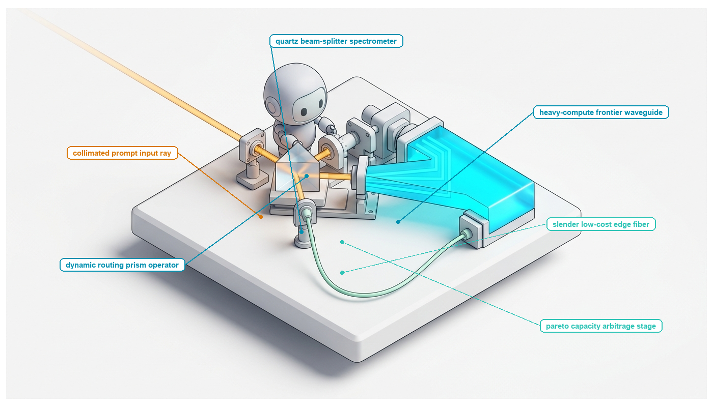{fig-alt="Blueprint for Serving Economics."}
:::

::: {.content-visible unless-format="pdf"}
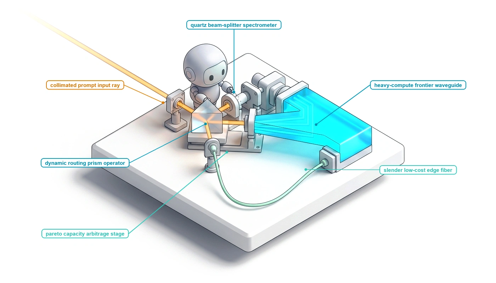{fig-alt="Blueprint for Serving Economics."}
:::

:::

## Purpose {.unnumbered .unlisted}

\begin{marginfigure}
\mlagentstack{100}{0}{0}{0}{0}{0}
\end{marginfigure}

_Where is the true cost bottleneck across an autonomous agent fleet, and how do systems engineers optimize accuracy, latency, and expenditure under hard resource budgets?_

Calculating the cost of an autonomous agent system appears straightforward: multiply the number of generated tokens by the provider's advertised price per million. In production fleets, this naive accounting model is dangerously misleading. A cheaper model with a lower price per token often produces a substantially higher total task cost if its lower reasoning fidelity forces the agent to execute twenty tool turns, trigger costly compiler retries, and waste expensive compute in failing loops. Conversely, deploying an expensive frontier model for trivial tasks squanders financial budgets and monopolizes scarce GPU accelerator memory. The true cost of an agentic system is the total resource expenditure per accepted, verified task—encompassing model inference, container sandbox runtime, network egress, and human escalation overhead. Systems engineers must manage fleet economics as a multi-dimensional constrained optimization problem: deploying hierarchical budget ledgers that enforce strict spending ceilings per trajectory, routing simple sub-tasks to fast distilled models while reserving frontier reasoning cores for complex arbitration, and optimizing serving engines to maximize prompt cache hits. Designing sustainable agent infrastructure requires co-designing multi-model cascade routing, continuous batching schedulers, and token economics to deliver maximum task throughput within acceptable financial and latency bounds.

::: {.content-visible when-format="pdf"}

\newpage

:::

::: {.callout-learning-objectives}

- Formulate the Whole-Trajectory Cost Equation ($C_{\text{task}} = \sum C_{\text{tokens}} + \sum C_{\text{compute}} + \sum C_{\text{storage}} + \sum C_{\text{tools}}$), proving why low-cost token models frequently increase total cost per accepted task.
- Apply Amdahl's Law to multi-turn trajectory execution, decomposing wall-clock critical paths across prefill, decode, tool execution, network latency, and container startup.
- Architect tiered model routing cascades that dynamically dispatch subtasks across small language models, generalists, and frontier reasoning models to optimize the cost-accuracy Pareto frontier.
- Implement speculative decoding pipelines using draft models and parallel target verification, proving the mathematical preservation of target output probability distributions.
- Characterize model-invocation service times separately from trajectory lifetime; use a suitable queueing model or simulation to test admission and scheduling policies, including MLFQ where appropriate.
- Implement hierarchical budget reservation ledgers and multi-tier circuit breakers to enforce monotonic spending ceilings across recursive subagent delegations.
- Evaluate production workloads across the architectural trade-off spectrum: Software 1.0 deterministic scripts, Software 2.0 direct calls, bounded agentic workflows, and multi-agent fleets.
- Synthesize an integrated fleet economics control plane optimizing goodput per dollar while meeting strict p95 latency and verification invariants.

:::

## Task Cost Accounting {#sec-vol3-tokenomics-accounting}

::: {.column-margin}
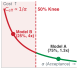{width="100%" fig-alt="Hyperbolic curve plotting effective cost multiplier against task acceptance rate, showing a sharp upward inflection into a red failure-odds wash below 50 percent acceptance."}

*Sub-50 percent task acceptance triggers a hyperbolic cost cliff that overwhelms nominal per-token discounts.*
:::
Operating an agent fleet is an exercise in resource economics, and the unit being priced has changed. A chat service bills tokens, so its cost is tokens times price. An agent runs a trajectory, and a trajectory's cost includes every turn, tool call, sandbox second, verification run, and retry it needs before its result is accepted. Trajectory goodput (@sec-vol3-intro-macro-vs-micro-efficiency) already counts only the resources spent on verified trajectories, and @sec-vol3-observability made that share measurable in production. This chapter puts a price on each verified trajectory and asks which part of the system that price actually buys.

::: {#fig-vol3-task-cost-treemap fig-env="figure" fig-pos="htb" fig-cap="**Whole-Trajectory Cost Accounting and Expenditure Breakdown**: Direct model inference fees, ephemeral sandbox hosting, tool API egress, verification harnesses, and human review escalation across autonomous trajectories." fig-alt="Two-panel systems diagram showing physical subsystem cost breakdown stack totaling 0.420 dollars on the left, and a quantitative effective cost curve plotting cost per accepted task against single-step tool execution success rate on the right."}
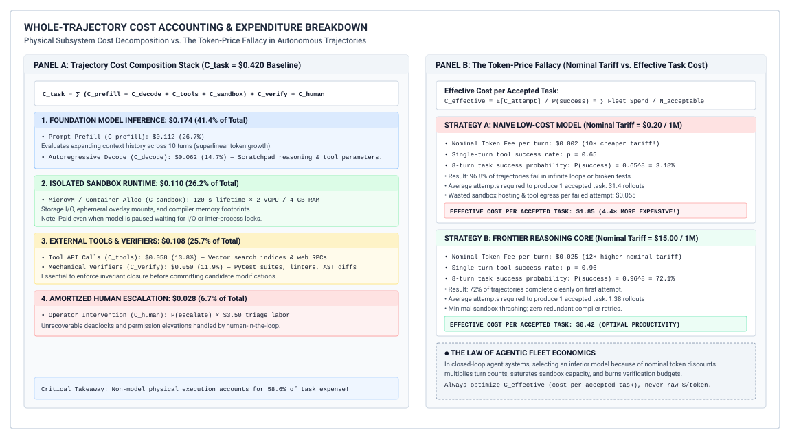
:::

The holistic cost architecture of an autonomous agent trajectory is decomposed in @fig-vol3-task-cost-treemap. As shown in the left panel, foundation model inference represents only a fraction ($41.4\%$, or $\$0.174$) of the total baseline task expenditure ($C_{\text{task}} = \$0.420$), split between prompt prefill ($26.7\%$) and autoregressive decode ($14.7\%$). The remaining $58.6\%$ ($C_{\text{sandbox}} = \$0.110$, $C_{\text{tools}} = \$0.058$, $C_{\text{verify}} = \$0.050$, and amortized $C_{\text{human}} = \$0.028$) is consumed entirely by host environment execution, microVM sandbox hosting, vector index egress, and deterministic test harnesses. The right panel plots the resulting effective cost curve $C_{\text{effective}}(p) = E[C_{\text{attempt}}] / p^K$ across an 8-turn task. When an unprivileged model operates at modest single-step tool accuracy ($p=0.65$, Point A), open-loop task completion collapses to $P(\text{success}) = 0.65^8 = 3.18\%$, forcing $31.4$ rollout attempts and inflating effective cost to $\$1.85$ per accepted task. Conversely, a frontier model operating at $p=0.96$ (Point B) achieves $72.1\%$ completion in $1.38$ attempts, yielding an effective cost of $\$0.42$—a $4.4\times$ financial savings that completely reverses the $75\times$ nominal per-token tariff premium. Under this operational model, the primary economic unit is the *accepted task*: a verified, end-to-end deliverable that satisfies external system invariants and passes all verification gates. Optimizing an agent architecture purely for token cost is an architectural error akin to optimizing a distributed database purely for local memory bandwidth while ignoring network round-trips and disk write-ahead log flushes.

Engineers often fall into the *token-price fallacy*, the belief that a model with a tenfold cheaper token price yields a tenfold cheaper system. In the trajectory of @fig-vol3-task-cost-treemap, model inference is only 41.4 percent of the bill, because every turn also pays for the context the runtime assembles, the tools it invokes, and the sandbox and verification it hosts around the model. A cheaper model that fails more often then forces the runtime to pay for every failed attempt before one is accepted.

Across a trajectory of $K$ sequential interaction turns, the host runtime incurs both neural generation costs and physical environment hosting costs at every turn $k$. The comprehensive expenditure of executing an autonomous task across $K$ discrete interaction turns is governed by the whole-trajectory cost equation:

$$C_{\text{task}} = \sum_{k=1}^K \left( C_{\text{prefill}, k} + C_{\text{decode}, k} + C_{\text{tools}, k} + C_{\text{sandbox}, k} \right) + C_{\text{verify}} + C_{\text{human}}$$

Each term in this formulation represents a distinct physical subsystem expenditure. The prompt prefill cost at turn $k$, denoted $C_{\text{prefill}, k}$, pays for evaluating the accumulated prefix, including system prompts, dynamic tool schemas, repository context, and preceding execution transcripts. Because autoregressive models must condition on the entire interaction history, the input prefix length expands monotonically across turns unless pruned or evicted, causing cumulative prefill expenditures to scale superlinearly with trajectory depth. The decode cost, $C_{\text{decode}, k}$, represents the price of generating output tokens, encompassing scratchpad reasoning tokens, tool selection metadata, and invocation arguments. Beyond the model serving layer, $C_{\text{tools}, k}$ captures direct usage fees charged by external services, such as proprietary code-search indices, vector databases, or third-party web search endpoints. The sandbox compute charge, $C_{\text{sandbox}, k}$, reflects the hardware cost of running isolated microVMs or containers that execute untrusted agent commands, execute test suites, or compile source trees during that turn. Finally, $C_{\text{verify}}$ captures the computational cost of running independent verification harnesses—such as automated linters, compilers, and unit tests—while $C_{\text{human}}$ reflects the amortized economic expense of human review when the autonomous system fails to converge and escalates to an engineering operator.

Failed attempts are where token prices and system cost part ways. The open-loop reliability ceiling of @sec-vol3-intro-temporal-stretching sets how often they occur, since a model whose single-step tool success probability is $p$ completes an open-loop chain of $K$ dependent operations with probability $p^K$. When a trajectory meets an unrecoverable failure, such as hallucinated command syntax, a circular reasoning loop, or an invalid assumption about the environment, everything it spent in the preceding steps is lost. If the runtime discards the aborted trajectory and initiates a fresh attempt, or if it dispatches multiple speculative trajectories in parallel to maximize task success, the effective cost to produce a single acceptable artifact scales inversely with model competence.

Trajectory goodput and the accepted task (principle \ref{pri-vol3-trajectory-goodput}) names the quantity a fleet minimizes, the *effective cost per accepted task*, $C_{\text{effective}}$. Let a fleet attempt $N$ total trajectories to resolve a set of incoming requirements, yielding $N_{\text{acceptable}}$ verified, successful outcomes. The effective cost is the total fleet expenditure divided strictly by the number of successful tasks:

$$C_{\text{effective}} = \frac{\sum_{i=1}^N C_{\text{attempt}_i}}{N_{\text{acceptable}}}$$

If we denote the task acceptance rate as $\alpha = N_{\text{acceptable}} / N$, where each successful attempt incurs an average cost of $C_{\text{succ}}$ and each failed attempt consumes an average cost of $C_{\text{fail}}$ before aborting or triggering a timeout, the expected effective cost expands to:

$$C_{\text{effective}} = C_{\text{succ}} + \frac{1 - \alpha}{\alpha} C_{\text{fail}}$$

The term $(1 - \alpha)/\alpha$ represents the failure-to-success odds ratio, quantifying the exact number of failed trajectories amortized onto each accepted task. Consider a commodity small model priced at one-tenth the nominal token cost of an advanced frontier model. If the commodity model achieves an acceptance rate of $\alpha = 0.20$, it incurs an average of $(1 - 0.20) / 0.20 = 4.0$ failed attempts for every single success. If each failed trajectory meanders through long context loops and consumes container sandbox compute time before timing out, its effective cost per accepted task easily surpasses that of a frontier model operating at $\alpha = 0.80$, which incurs only $(1 - 0.80) / 0.80 = 0.25$ failures per accepted task. The apparent token discount is transformed into an operational deficit.

::: {#dfn-whole-trajectory-cost .callout-definition title="Whole-trajectory cost"}

***Whole-trajectory cost***\index{Whole-trajectory cost!definition}\index{Serving economics!cost per accepted task definition} is the comprehensive accounting metric $C_{\text{effective}} = \frac{\sum_{i=1}^N C_{\text{attempt}_i}}{N_{\text{acceptable}}} = C_{\text{succ}} + \frac{1 - \alpha}{\alpha} C_{\text{fail}}$ that quantifies aggregate financial and computational expenditure amortized strictly per independently verified, accepted deliverable.

1.  **Significance**: Exposes the "token-price fallacy," proving that choosing commodity models with $10\times$ lower nominal token tariffs frequently inflates operational fleet cost when lower reasoning fidelity induces compounding retry loops and sandbox hosting expenses.
2.  **Distinction**: Unlike classical microservice or inference token pricing (which bills for raw delivered tokens or isolated API calls regardless of downstream utility), whole-trajectory accounting incorporates multi-turn prefill expansion, sandbox microVM execution, tool egress fees, and deterministic verification harnesses.
3.  **Common pitfall**: Budgeting and sizing agent deployments based on nominal per-token pricing sheets while ignoring the failure-to-success odds ratio $\frac{1 - \alpha}{\alpha}$, which causes effective expenditure to spike hyperbolically whenever single-step tool accuracy drops.

:::

```{python}
#| label: lego-17-the-token-price-fallacy-in-automated
#| echo: false
# │ Show: Whole-trajectory accounting reveals Model B is 2.41x to 8.07x more expensive.
# │ How: Model serving tariffs vs retries, sandbox hosting, regression tests, and human triage.
# └─────────────────────────────────────────────────────────────────────────────
from mlsysim import *
from mlsysim.core.units import *
from mlsysim.fmt import check, fmt_multiple, fmt_percent, fmt_usd

class TokenPriceFallacyAutomatedBugRepair:
    # Model A
    c_model_a = (4 * 16_000 * 3.00 * 1e-6) + (4 * 800 * 15.00 * 1e-6)
    c_attempt_a = c_model_a + (4 * 0.03) + 0.05
    c_eff_a = c_attempt_a / 0.75
    c_eff_human_a = (c_attempt_a + (1 - 0.75) * 10.00) / 0.75

    # Model B
    c_model_b = (7 * 28_000 * 0.30 * 1e-6) + (7 * 1_200 * 1.20 * 1e-6)
    c_attempt_b = c_model_b + (7 * 0.03) + 0.05
    c_eff_b = c_attempt_b / 0.25
    c_eff_human_b = (c_attempt_b + (1 - 0.25) * 10.00) / 0.25

    model_discount = c_model_a / c_model_b
    attempt_diff = (c_attempt_a - c_attempt_b) / c_attempt_a
    effective_cost_ratio = c_eff_b / c_eff_a
    human_cost_ratio = c_eff_human_b / c_eff_human_a

    check(abs(c_model_a - 0.2400) < 1e-4, "c_model_a")
    check(abs(c_model_b - 0.06888) < 1e-4, "c_model_b")
    check(abs(c_attempt_a - 0.4100) < 1e-4, "c_attempt_a")
    check(abs(c_attempt_b - 0.32888) < 1e-4, "c_attempt_b")
    check(abs(effective_cost_ratio - 2.406) < 0.01, "effective_cost_ratio")
    check(abs(human_cost_ratio - 8.071) < 0.01, "human_cost_ratio")

    model_discount_mult_str = fmt_multiple(round(model_discount, 2), precision=2)
    cost_model_b_str = fmt_usd(round(c_model_b, 4), precision=4)
    cost_model_a_str = fmt_usd(c_model_a, precision=4)
    attempt_diff_pct_str = fmt_percent(attempt_diff, precision=1, style="prose")
    cost_attempt_b_str = fmt_usd(round(c_attempt_b, 4), precision=4)
    cost_attempt_a_str = fmt_usd(c_attempt_a, precision=4)
    effective_cost_ratio_mult_str = fmt_multiple(round(effective_cost_ratio, 2), precision=2)
    human_cost_ratio_mult_str = fmt_multiple(round(human_cost_ratio, 2), precision=2)
```

::: {#nbk-17-the-token-price-fallacy-in-automated .callout-notebook title="The token-price fallacy in automated bug repair"}
An autonomous software engineering fleet processes automated bug-fix tickets across a large enterprise repository. The systems team must choose between two model serving backends: Model A (a frontier reasoning model) and Model B (a commodity lightweight model). The workload parameters and infrastructure tariffs are summarized in @tbl-vol3-token-price-fallacy.

| System & Pricing Parameter                   | Model A (Frontier Reasoner)                                 | Model B (Commodity Model)                                   |
|:---------------------------------------------|:------------------------------------------------------------|:------------------------------------------------------------|
| Nominal Prefill Tariff                       | $\$3.00$ per $10^6$ tokens                                  | $\$0.30$ per $10^6$ tokens ($10\times$ discount)            |
| Nominal Decode Tariff                        | $\$15.00$ per $10^6$ tokens                                 | $\$1.20$ per $10^6$ tokens ($12.5\times$ discount)          |
| Mean Trajectory Length ($K$)                 | $4$ interaction turns                                       | $7$ interaction turns (verbose retry loops)                 |
| Mean Volume per Turn                         | $16{,}000$ prefill / $800$ decode tokens                    | $28{,}000$ prefill / $1{,}200$ decode tokens                |
| Task Acceptance Rate ($\alpha$)              | $0.75$ ($75\%$ verified success)                            | $0.25$ ($25\%$ verified success)                            |
| Turn Hosting & Tools ($C_{\text{env}}$)      | $\$0.03$ per turn                                           | $\$0.03$ per turn                                           |
| Verification Harness ($C_{\text{verify}}$)   | $\$0.05$ per attempt (regression tests)                     | $\$0.05$ per attempt (regression tests)                     |
| Human Escalation Triage ($C_{\text{human}}$) | $\$10.00$ per failed attempt ($10$ min at $\$60/\text{hr}$) | $\$10.00$ per failed attempt ($10$ min at $\$60/\text{hr}$) |

: **System and Pricing Parameters for Automated Bug-Repair Workload**: Infrastructure tariffs, token usage profiles, and verification parameters comparing frontier reasoning versus commodity models. {#tbl-vol3-token-price-fallacy}

**Step 1: Model Serving Cost per Attempt ($C_{\text{model}}$).**
For Model A, each attempt consumes $4 \times 16{,}000 = 64{,}000$ prefill tokens and $4 \times 800 = 3{,}200$ decode tokens:
$$\text{Prefill: } 0.064 \times \$3.00 = \$0.1920, \quad \text{Decode: } 0.0032 \times \$15.00 = \$0.0480 \implies C_{\text{model}, A} = \$0.2400$$
For Model B, each attempt consumes $7 \times 28{,}000 = 196{,}000$ prefill tokens and $7 \times 1{,}200 = 8{,}400$ decode tokens:
$$\text{Prefill: } 0.196 \times \$0.30 = \$0.0588, \quad \text{Decode: } 0.0084 \times \$1.20 = \$0.0101 \implies C_{\text{model}, B} = \$0.0689$$
On raw model serving fees alone, Model B appears {python} TokenPriceFallacyAutomatedBugRepair.model_discount_mult_str cheaper than Model A per attempt ({python} TokenPriceFallacyAutomatedBugRepair.cost_model_b_str versus {python} TokenPriceFallacyAutomatedBugRepair.cost_model_a_str).

**Step 2: Total Attempt Cost ($C_{\text{attempt}}$) Excluding Human Escalation.**
Incorporating turn-level sandbox hosting, mediated tools ($C_{\text{env}} = \$0.03/\text{turn}$), and external regression testing ($C_{\text{verify}} = \$0.05$):
$$C_{\text{attempt}} = C_{\text{model}} + K \times C_{\text{env}} + C_{\text{verify}}$$
$$C_{\text{attempt}, A} = \$0.2400 + (4 \times \$0.03) + \$0.05 = \$0.2400 + \$0.1200 + \$0.0500 = \$0.4100$$
$$C_{\text{attempt}, B} = \$0.0689 + (7 \times \$0.03) + \$0.05 = \$0.0689 + \$0.2100 + \$0.0500 = \$0.3289$$
Because Model B's lower task convergence rate induces longer trajectory lengths ($7$ turns versus $4$), its sandbox and tool hosting costs expand from $\$0.12$ to $\$0.21$, eroding the nominal model token savings. At the per-attempt level, Model B is now only {python} TokenPriceFallacyAutomatedBugRepair.attempt_diff_pct_str cheaper than Model A ({python} TokenPriceFallacyAutomatedBugRepair.cost_attempt_b_str versus {python} TokenPriceFallacyAutomatedBugRepair.cost_attempt_a_str).

**Step 3: Effective Cost per Accepted Task ($C_{\text{effective}}$) Without Human Triage.**
Assuming unassisted automated retries until acceptance ($C_{\text{fail}} = C_{\text{succ}} = C_{\text{attempt}}$):
$$C_{\text{effective}, A} = \frac{C_{\text{attempt}, A}}{\alpha_A} = \frac{\$0.4100}{0.75} = \$0.5467 \text{ per accepted task}$$
$$C_{\text{effective}, B} = \frac{C_{\text{attempt}, B}}{\alpha_B} = \frac{\$0.3289}{0.25} = \$1.3156 \text{ per accepted task}$$
Despite a $10\times$ discount in prefill token tariff, Model B is **{python} TokenPriceFallacyAutomatedBugRepair.effective_cost_ratio_mult_str more expensive per accepted task** because its low acceptance rate forces an average of three failed attempts for every single success ($(1 - 0.25) / 0.25 = 3.0$).

**Step 4: Effective Cost Including Human Triage Escalation ($C_{\text{human}} = \$10.00$).**
In a production deployment where failed runs escalate to human engineers:
$$\text{Expected attempt cost for A: } \$0.4100 + (1 - 0.75) \times \$10.00 = \$0.4100 + \$2.5000 = \$2.9100$$
$$C_{\text{effective}, A}^{\text{human}} = \frac{\$2.9100}{0.75} = \$3.8800 \text{ per completed task}$$
$$\text{Expected attempt cost for B: } \$0.3289 + (1 - 0.25) \times \$10.00 = \$0.3289 + \$7.5000 = \$7.8289$$
$$C_{\text{effective}, B}^{\text{human}} = \frac{\$7.8289}{0.25} = \$31.3156 \text{ per completed task}$$
When accounting for the blast radius of unhandled failures, Model B is **{python} TokenPriceFallacyAutomatedBugRepair.human_cost_ratio_mult_str more expensive** overall. The nominal token discount acts as a catastrophic financial trap.
:::

The way out of this dilemma rests on the same external verifiers that close every trajectory (@sec-vol3-intro-invariant-closure), because a runtime that can check each result mechanically can afford to try a cheaper model first. As established by @chen2023frugalgpt in their foundational work on *FrugalGPT*, foundation models do not represent uniform commodities, but rather form a multi-dimensional Pareto frontier spanning accuracy, execution cost, and response latency. Maximizing fleet efficiency does not mean naively standardizing on an expensive frontier model for every operation, nor does it permit downgrading the entire system to a low-cost commodity model. Instead, systems engineers must construct structured execution cascades that route routine operations, syntactic transformations, and basic status checks to lightweight models or deterministic scripts, reserving high-parameter frontier reasoners for macroscopic task planning, architectural synthesis, and unrecoverable error diagnosis.

Yet accounting for financial cost across the whole trajectory solves only half of the fleet optimization problem. Even if an agent architecture achieves a low dollar cost per accepted task, it may remain completely unusable in production if completing that task requires prohibitive wall-clock time. In an enterprise setting, latency translates directly into blocked human developers, missed operational service-level agreements, and underutilized accelerator hardware held hostage by idling runtime sessions. Once we have established the full accounting framework for all model invocations, tool fees, and sandbox environments across a trajectory, we confront an immediate physical question: where is execution time actually spent along the trajectory graph, and does investing compute to accelerate model generation yield meaningful improvements in end-to-end task completion time?

## Critical Path Latency {#sec-vol3-tokenomics-criticalpath}

::: {.column-margin}
{width="100%" fig-alt="Three horizontal bars decomposing trajectory wall-clock latency: pytest sandbox tool execution dominates at 78.6 percent, container lifecycle takes 11.9 percent, and model inference accounts for only 9.4 percent."}

*Tool sandbox execution dominates trajectory wall-clock time, capping the system speedup achievable from GPU model acceleration.*
:::
An autonomous coding agent deployed to repair a failing unit test consumes 420 seconds of wall-clock time before emitting its final patch. Observing that the underlying foundation model spent 84 seconds across eight interaction turns generating autoregressive tokens, a platform engineering team replaces their baseline serving infrastructure with a high-throughput tensor-parallel cluster running fused eight-bit floating-point (FP8) attention kernels. The upgraded inference cluster accelerates model token generation by a factor of four. Yet, when re-evaluated on the identical benchmark task, the complete trajectory finishes in 357 seconds—delivering an underwhelming 15 percent reduction in total task completion time despite a 400 percent performance improvement in the model serving tier. The remaining 336 seconds remain immovably tied to container sandbox allocations, local test runner execution, virtual filesystem synchronization, and network package downloads.

**The end-to-end latency of an autonomous agent trajectory is strictly governed by the critical path of sequential dependencies across the execution graph, rendering neural inference acceleration ineffective whenever tool invocations, environment resets, and host supervisor orchestration dominate wall-clock time.** Optimizing the responsiveness and operational economics of agent fleets requires moving beyond isolated token generation benchmarks. Systems architects must analyze the complete multi-turn lifecycle as an interconnected pipeline, applying the classic principles of latency decomposition and Amdahl's Law to determine whether physical execution bottlenecks reside in GPU compute, host kernel operations, sandbox virtualization, or external remote procedure calls (RPCs).

### Deconstructing the multi-turn trajectory timeline

The duration identity of @sec-vol3-intro-duration-accounting already splits each turn into model, tool, wait, and runtime time. Splitting the model term further into prefill and decode, which run in different hardware regimes, gives the total trajectory latency $T_{\text{trajectory}}$ (the $T_{\text{task}}$ of that identity) over $K$ turns as five mutually exclusive components:

$$T_{\text{trajectory}} = \sum_{k=1}^K \left( T_{\text{prefill}, k} + T_{\text{decode}, k} + T_{\text{runtime}, k} + T_{\text{tool}, k} + T_{\text{wait}, k} \right)$$

The first two components encompass the foundation model serving tier. The prompt prefill phase, $T_{\text{prefill}, k}$, represents the time consumed by the inference engine processing the cumulative token prefix. This prefix includes the static system prompt, the complete interaction history, and the accumulated tool observations injected prior to turn $k$. Because the prefill phase computes the key-value (KV) activations for all prompt tokens concurrently, its execution profile is dominated by compute-bound general matrix multiplications (GEMMs). Its duration scales with the total sequence length $L_k$ and the efficiency of the serving engine's prefix caching mechanisms. In contrast, the autoregressive decode phase, $T_{\text{decode}, k}$, generates thought tokens and structured tool-call specifications token by token. Because each newly generated token requires fetching the model weights and the existing KV cache from high-bandwidth memory (HBM) into on-chip static RAM (SRAM) for a batch size of one, the decode phase is strictly memory-bandwidth-bound general matrix-vector multiplications (GEMVs). Its duration scales linearly with the number of generated tokens $N_{\text{gen}, k}$ divided by the per-stream token generation throughput.

::: {.column-margin}
**Prefill vs. Decode Physics:**
Prefill operations run at high arithmetic intensity on matrix tensor cores, saturating compute capacity. Autoregressive decode operations run at low arithmetic intensity ($< 1$ FLOP/byte at batch size 1), making decode latency a direct function of memory bus saturation rather than raw teraflops.
:::

The remaining three components encompass host system execution. The host runtime overhead, $T_{\text{runtime}, k}$, captures the time the supervisor process spends parsing model output buffers, validating JSON schemas against tool signatures, serializing state snapshots to write-ahead logs, and managing sandbox process trees. The tool actuation latency, $T_{\text{tool}, k}$, captures the deterministic execution of side-effecting commands inside isolated environments, such as invoking a C++ compiler, running a suite of regression tests, or executing a database query. Finally, the external wait latency, $T_{\text{wait}, k}$, encompasses non-deterministic pauses outside host control, including network round-trip delays to third-party web APIs, remote artifact downloads, and provider rate-limiting backoffs.

::: {#fig-vol3-critical-path-waterfall fig-env="figure" fig-pos="htb" fig-cap="**Waterfall Timeline Decomposition of an Autonomous Agent Turn**: Execution alternates between compute-bound prompt prefill, memory-bandwidth-bound autoregressive decoding, host supervisor mediation, isolated sandbox actuation, and external network RPCs." fig-alt="Two-panel systems schematic showing a critical-path latency waterfall timeline decomposing a 4.25-second agent turn into 5 distinct execution spans on top, and Amdahl's Law speedup curves comparing model inference acceleration against environment and sandbox optimization on the bottom."}
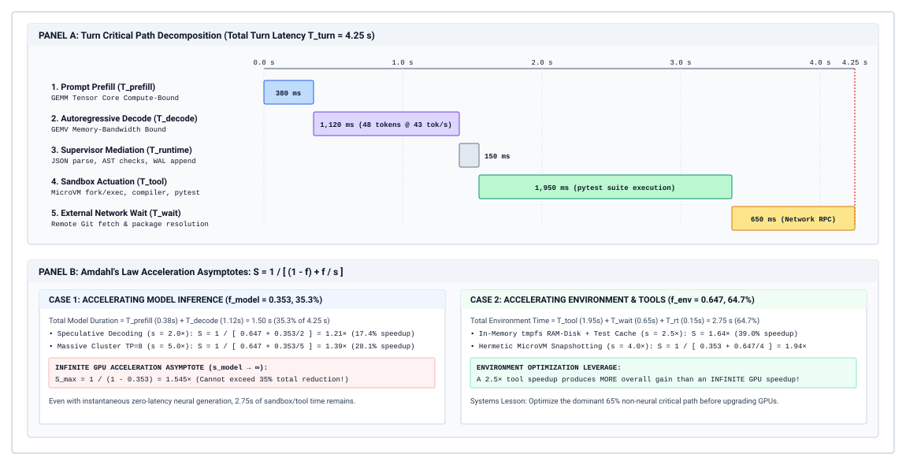
:::

The execution anatomy of an autonomous agent turn is dissected along its critical path in @fig-vol3-critical-path-waterfall. The top panel maps the wall-clock progression of a $T_{\text{turn}} = 4.25\text{ s}$ baseline turn across five sequential trace spans: compute-bound prompt prefill ($T_{\text{prefill}} = 380\text{ ms}$, $8.9\%$), memory-bandwidth-bound autoregressive decode ($T_{\text{decode}} = 1{,}120\text{ ms}$, $26.4\%$), host supervisor mediation ($T_{\text{runtime}} = 150\text{ ms}$, $3.5\%$), isolated container sandbox actuation ($T_{\text{tool}} = 1{,}950\text{ ms}$, $45.9\%$), and external network RPC wait ($T_{\text{wait}} = 650\text{ ms}$, $15.3\%$). Together, neural inference consumes only $f_{\text{model}} = 35.3\%$ ($1.50\text{ s}$) of turn time, leaving $f_{\text{env}} = 64.7\%$ ($2.75\text{ s}$) tied to the host execution environment. The bottom panel traces the quantitative consequences of Amdahl's Law across both regimes. Accelerating the model serving tier—whether via speculative decoding ($s=2.0\times \implies S=1.21\times$) or an 8-way tensor-parallel cluster ($s=5.0\times \implies S=1.39\times$)—rapidly asymptotically flattens toward an upper bound of $S_{\max} = \frac{1}{1 - 0.353} = 1.55\times$, because $2.75\text{ s}$ of non-model execution remains untouched. In contrast, optimizing the container sandbox fabric via in-memory `tmpfs` mounts and compilation caching ($s=2.5\times$) delivers an end-to-end speedup of $S=1.64\times$—outperforming even an infinitely fast, zero-latency GPU accelerator fabric. A prolonged compile cycle or a stalled network fetch serializes the control loop, starving the GPU cluster while the agent runtime idles in an operating system wait state.

### Acceleration asymptotes

The architectural danger of treating an agent system purely as a machine learning workload becomes evident when evaluating targeted system optimizations. @Sec-vol3-intro-duration-accounting bounded the payoff of a faster model with Amdahl's Law. If prefill and decode take a fraction $f_{\text{model}}$ of baseline trajectory time and the serving tier is accelerated by $s_{\text{model}}$, the trajectory speeds up by $S = 1 / \big( (1 - f_{\text{model}}) + f_{\text{model}} / s_{\text{model}} \big)$, and no model acceleration, however large, can exceed $S_{\max} = 1 / (1 - f_{\text{model}})$. The same law, applied to both sides of one trajectory, shows where the larger payoff usually lies.

Consider an agent where model generation constitutes $f_{\text{model}} = 0.20$ (20 percent) of the total operational duration, with the remaining 80 percent consumed by compiling code, executing integration tests, and mounting container file systems. Even if an engineering team deploys a speculative decoding cluster that accelerates model generation by an infinite factor ($s_{\text{model}} = \infty$), the total task speedup cannot exceed:

$$S_{\max} = \frac{1}{1 - 0.20} = 1.25\times$$

The entire system remains throttled by the 80 percent non-model portion of the critical path. Conversely, if platform engineers optimize the tool execution environment—for example, by migrating disk-bound test runs from physical block storage to an in-memory `tmpfs` RAM disk and parallelizing independent test targets—the fraction being accelerated is $f_{\text{env}} = 0.80$. Accelerating that non-model environment by a modest factor of $s_{\text{env}} = 2.5\times$ yields an end-to-end trajectory speedup of:

$$S = \frac{1}{(1 - 0.80) + \frac{0.80}{2.5}} = \frac{1}{0.20 + 0.32} = 1.923\times$$

A $1.923\times$ speedup represents a 48 percent reduction in total task completion time, dwarfing the theoretical maximum gains obtainable from rewriting the GPU attention kernels.

```{python}
#| label: lego-17-amdahls-law-on-an-automated
#| echo: false
# │ Show: Amdahl speedup from host sandbox optimization (1.89x) dwarfs GPU acceleration (1.17x).
# │ How: Critical path latency decomposition across prefill, decode, and sandbox execution.
# └─────────────────────────────────────────────────────────────────────────────
from mlsysim import *
from mlsysim.core.units import *
from mlsysim.fmt import check, fmt_percent

class AmdahlsLawRegressionRepairFleets:
    t_base = 500.0 * second
    t_model = 108.0 * second
    t_env = 392.0 * second

    t_new_a = (108.0 / 3.0 + 392.0) * second
    red_a = (t_base - t_new_a) / t_base

    t_new_b = (108.0 + 392.0 / 2.5) * second
    red_b = (t_base - t_new_b) / t_base

    check(abs(red_a - 0.144) < 1e-4, "red_a")
    check(abs(red_b - 0.4704) < 1e-4, "red_b")

    reduction_a_pct_str = fmt_percent(red_a, precision=1, style="prose")
    reduction_b_pct_str = fmt_percent(0.47, precision=0, style="prose")
```

::: {#nbk-17-amdahls-law-on-an-automated .callout-notebook title="Amdahl's Law on regression repair fleets"}
**Scenario:** An engineering organization operates an automated bug-fixing fleet running an average of $K = 10$ turns per resolved issue. The systems infrastructure team must decide whether to allocate a capital expenditure budget toward deploying specialized GPU inference accelerators or re-architecting the host sandbox container execution fabric.

**Empirical Measurements (Per Trajectory Baseline):**

- *Context Length & Prefill:* Mean prefix length $\bar{L} = 32{,}000$ tokens. Prefill throughput $= 40{,}000\text{ tokens/s}$. Mean prefill time $= 0.8\text{ s/turn} \times 10\text{ turns} = 8.0\text{ s}$.
- *Generation & Decode:* Mean output length $\bar{N}_{\text{gen}} = 500$ tokens. Autoregressive decode throughput $= 50\text{ tokens/s}$. Mean decode time $= 10.0\text{ s/turn} \times 10\text{ turns} = 100.0\text{ s}$.
- *Total Inference Latency:* $T_{\text{model}} = 8.0\text{ s} + 100.0\text{ s} = 108.0\text{ s}$.
- *Tool Sandbox Execution:* Local build and unit test suite execution inside a container $= 35.0\text{ s/turn} \times 10\text{ turns} = 350.0\text{ s}$.
- *Runtime & Snapshot Reset:* Copy-on-write filesystem snapshot creation, context JSON serialization, and IPC overhead $= 4.2\text{ s/turn} \times 10\text{ turns} = 42.0\text{ s}$.
- *Total Baseline Latency:* $T_{\text{base}} = 108.0\text{ s} + 350.0\text{ s} + 42.0\text{ s} = 500.0\text{ s}$.

**Evaluation:**

1. *Determine the model fraction $f_{\text{model}}$:*
   $$f_{\text{model}} = \frac{108.0\text{ s}}{500.0\text{ s}} = 0.216 \quad (21.6\%)$$

2. *Proposal A (Inference Acceleration):* Deploying FP8 quantization and speculative decoding yields a $s_{\text{model}} = 3.0\times$ acceleration across all model serving calls.
   $$T_{\text{new, A}} = \frac{108.0\text{ s}}{3.0} + 350.0\text{ s} + 42.0\text{ s} = 36.0\text{ s} + 392.0\text{ s} = 428.0\text{ s}$$
   $$S_A = \frac{500.0\text{ s}}{428.0\text{ s}} = 1.168\times \quad (14.4\%\text{ wall-clock reduction})$$

3. *Proposal B (Sandbox & Runtime Optimization):* Transitioning container volumes to RAM-backed `tmpfs` mounts, caching compilation objects via `ccache`, and executing unit tests with selective test impact analysis accelerates sandbox and runtime operations by $s_{\text{env}} = 2.5\times$.
   $$f_{\text{env}} = \frac{350.0\text{ s} + 42.0\text{ s}}{500.0\text{ s}} = \frac{392.0\text{ s}}{500.0\text{ s}} = 0.784 \quad (78.4\%)$$
   $$T_{\text{new, B}} = 108.0\text{ s} + \frac{392.0\text{ s}}{2.5} = 108.0\text{ s} + 156.8\text{ s} = 264.8\text{ s}$$
   $$S_B = \frac{500.0\text{ s}}{264.8\text{ s}} = 1.888\times \quad (47.0\%\text{ wall-clock reduction})$$

**Conclusion:** Proposal B yields more than three times the latency reduction of Proposal A ({python} AmdahlsLawRegressionRepairFleets.reduction_b_pct_str vs. {python} AmdahlsLawRegressionRepairFleets.reduction_a_pct_str), proving that for this fleet, the primary performance bottleneck lies in the host virtualization tier, not the GPU accelerator fabric.
:::

### Isolating critical paths via distributed trace spans

Because real-world agent trajectories involve complex conditional branching, retries, and variable tool latency, static back-of-the-envelope calculations must be validated against empirical instrumentation. Following the distributed tracing conventions established in @sec-vol3-observability, every agent trajectory emits structured OpenTelemetry trace spans that capture the start time, duration, parent-child relationships, and resource consumption of each phase.

Formally, an execution trajectory is represented as a directed acyclic graph (DAG) of trace spans $G = (V, E)$, where each vertex $v \in V$ corresponds to an instrumented operation with duration $t(v)$, and each directed edge $(u, v) \in E$ denotes a causal dependency indicating that operation $v$ cannot begin until operation $u$ has completed. The critical path $\pi^* \subseteq V$ is the longest directed path through this graph from the root task dispatch to the terminal validation check:

$$T_{\text{critical}} = \max_{\pi \in \Pi} \sum_{v \in \pi} t(v)$$

where $\Pi$ is the set of all valid topological paths from source to sink. Spans that do not lie along $\pi^*$ possess slack; optimizing their duration produces zero impact on end-to-end task completion time. The physical resource regimes, primary scaling dimensions, and engineering mitigation strategies across these execution spans are categorized in @tbl-vol3-span-taxonomy.

| Span Name (`span.name`) | Physical Resource Regime           | Primary Scaling Dimension                     | Mitigation Strategy                        |
|:------------------------|:-----------------------------------|:----------------------------------------------|:-------------------------------------------|
| `model.prefill`         | GPU HBM Bandwidth / Compute (GEMM) | Prefix tokens $L_k$, KV cache misses          | Radix tree prefix caching, chunked prefill |
| `model.decode`          | GPU Memory Bus Bandwidth (GEMV)    | Output tokens $N_{\text{gen}, k}$, batch size | Speculative decoding, constrained decoding |
| `tool.sandbox`          | Host CPU Cores, NVMe Storage I/O   | Build size, test suite scale                  | `tmpfs` mounts, test impact analysis       |
| `tool.network`          | Socket I/O, Remote Host Latency    | Network RTT, external payload size            | Response caching, speculative prefetching  |
| `runtime.host`          | Host RAM, CPU Deserialization      | Schema complexity, AST file size              | Zero-copy serialization, streaming parsers |

: **Taxonomy of Trajectory Execution Spans**: Physical resource regimes, primary scaling dimensions, and mitigation strategies across model serving, host virtualization, and network tiers. {#tbl-vol3-span-taxonomy}

The taxonomy of trajectory spans reveals that each phase is constrained by fundamentally different physical resources. A profiling engineer must analyze span telemetry to identify which subsystem dominates $\pi^*$. In production runtimes, empirical trace profiling frequently exposes catastrophic bottlenecks hidden within uninstrumented runtime glue code (@tbl-vol3-trace-critical-path):

| Span Identifier                          | Subsystem Component           | Duration (s) | Share (%)  | Critical Path Classification                 |
|:-----------------------------------------|:------------------------------|:-------------|:-----------|:---------------------------------------------|
| **Span 01** (`supervisor.init`)          | Runtime Supervisor            | 0.12 s       | 0.0%       | Setup and configuration                      |
| **Span 02** (`sandbox.container_create`) | Hypervisor / MicroVM          | 14.80 s      | 4.7%       | Provisioning latency bottleneck              |
| **Span 03** (`model.turn_01.prefill`)    | Model Serving Engine          | 1.20 s       | 0.4%       | Compute-bound context prefill                |
| **Span 04** (`model.turn_01.decode`)     | Model Serving Engine          | 8.40 s       | 2.7%       | Memory-bound token generation                |
| **Span 05** (`tool.sandbox.git_status`)  | Host Subprocess               | 0.08 s       | 0.0%       | Filesystem inspection                        |
| **Span 06** (`model.turn_02.prefill`)    | Model Serving Engine          | 1.85 s       | 0.6%       | Context expansion prefill                    |
| **Span 07** (`model.turn_02.decode`)     | Model Serving Engine          | 11.20 s      | 3.6%       | Memory-bound token generation                |
| **Span 08** (`tool.sandbox.run_pytest`)  | Isolated MicroVM              | 245.60 s     | 78.6%      | Primary critical path bottleneck             |
| **Span 09** (`model.turn_03.prefill`)    | Model Serving Engine          | 2.10 s       | 0.7%       | Final synthesis prefill                      |
| **Span 10** (`model.turn_03.decode`)     | Model Serving Engine          | 4.50 s       | 1.4%       | Memory-bound token generation                |
| **Span 11** (`sandbox.snapshot_export`)  | Storage / Filesystem          | 22.55 s      | 7.2%       | Artifact persistence bottleneck              |
| **Total Trajectory**                     | **End-to-End Task Execution** | **312.40 s** | **100.0%** | **Inference: 9.4%, Tools/Sandboxing: 90.6%** |

: **Critical Path Span Profile**: Empirical Span Profile and Critical Path Breakdown for Software Engineering Trajectory (`4a8f9c10`). {#tbl-vol3-trace-critical-path}

The trace profile in @tbl-vol3-trace-critical-path demonstrates that model execution (prefill plus decode across three turns) accounts for only $29.25$ seconds, or $9.4\%$ of total wall-clock time. In contrast, the pytest tool execution consumes $78.6\%$ of the trajectory, while container provisioning and snapshot export consume another $11.9\%$. An infrastructure team focusing strictly on model inference latency would be optimizing a component that accounts for less than a tenth of the true critical path.

### Critical path compression

Once the critical path has been empirically isolated, the systems objective becomes compressing its sequential length. While the causal semantics of an agent loop require that a model cannot inspect the output of a tool before that tool has finished executing, a supervisor runtime can re-engineer the boundaries between turns through pipelining, speculative actuation, and concurrent verification.

::: {.column-margin}
**Speculative Tool Dispatch:**
By parsing the partial token stream emitted during the decode phase, the supervisor runtime initiates environment preparation before the model emits the closing JSON delimiter, collapsing scheduling bubbles.
:::

The primary technique for compressing the critical path is parallel tool actuation. When an agent's reasoning trace indicates an intent to gather information across multiple independent subsystems—such as reading three separate configuration files or querying two distinct git logs—naive runtimes execute these requests sequentially over multiple turns or through serial iteration. By structuring tool interfaces to accept batched invocations or by implementing an asynchronous execution dispatcher, the supervisor executes all independent read operations concurrently:

$$T_{\text{tools, parallel}} = \max_{i \in \{1, \dots, M\}} \left( T_{\text{tool}, i} \right) + T_{\text{join}}$$

where $T_{\text{join}}$ is the negligible barrier synchronization overhead of the runtime's asynchronous event loop. This collapses an additive sequence of tool delays into a single bound determined solely by the slowest operation.

A second architectural optimization is speculative context warming and sandbox preparation. While the model is actively decoding tokens that specify a tool command (such as selecting a target file or choosing a test suite), the host runtime can monitor the streaming token output. The moment the tool identifier is deterministically resolved—well before the model completes generating its explanatory thought tokens or closes its JSON argument payload—the host supervisor can speculatively pre-warm the target sandbox, pre-fetch file descriptors into the operating system buffer cache, or verify authentication credentials.

Finally, verification can be overlapped with subsequent model prefill. When an agent executes a test suite or a comprehensive static analysis pass, test output streams sequentially across standard output. Instead of blocking the entire trajectory until the final exit code is returned, streaming test harnesses pipe diagnostic failures into the model's prefill buffer as they occur. If a fatal assertion fails within the first two seconds of a sixty-second test run, the runtime can immediately terminate the remaining tests, roll back the sandbox state, and trigger the next model prefill turn, effectively lopping fifty-eight seconds of dead time off the critical path.

Compressing the critical path through concurrency, pipelining, and aggressive sandbox caching alters the balance of the system. Once environmental overhead, container lifecycle pauses, and tool execution delays have been minimized, model invocation returns to its position as a primary component of trajectory wall-clock latency. When model invocation does sit directly on the critical path, or when its sheer frequency across multi-turn trajectories dominates the monetary budget, the immediate systems question becomes how to avoid treating all inference requests identically. If a significant fraction of model calls along the critical path consist of routine status confirmations, syntactic formatting, or simple triage, routing every prompt to an ultra-large frontier model incurs maximum latency and maximum cost for minimal epistemic gain. To resolve this tension, systems architects turn to tiered model cascades—mechanisms that dynamically route queries across a heterogeneous hierarchy of models to preserve accuracy while systematically truncating both latency and expense.

::: {#chk-17-whole-trajectory-economics .callout-checkpoint title="Evaluating trajectory unit economics and critical paths"}
Before analyzing tiered model cascades and routing policies, verify your understanding of serving cost dynamics:

- [ ] **Whole-trajectory accounting**: Why does evaluating costs per isolated invocation fail to capture quadratic context accumulation in multi-turn agents?
- [ ] **Critical path breakdown**: How does distributed span profiling distinguish between neural decode latency and external sandbox I/O?
- [ ] **Amdahl acceleration limits**: Why does accelerating model decode via faster GPUs yield diminishing latency returns when tool execution dominates the critical path?
- [ ] **Prefix caching discounts**: How does prefix KV cache reuse alter the marginal economics of multi-turn deliberation?
:::

## Tiered Model Cascades {#sec-vol3-tokenomics-cascades}

::: {.column-margin}
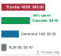{width="100%" fig-alt="Logarithmic horizontal ladder comparing per-task serving costs: Frontier monolithic at 60.00 dollars per thousand tasks versus expected cascade at 8.40 dollars, achieving an 86 percent cost reduction."}

*Tiered model cascading resolves 88 percent of tasks on lightweight models, cutting expected cost by 86 percent against monolithic frontier routing.*
:::
Deploying a uniform, monolithic frontier model across every stage of an autonomous agent trajectory forces an untenable trade-off between fiscal ruin and cognitive failure. If a system routes all operations—from trivial syntax linting and JSON argument formatting to multi-file architectural refactoring—to an expensive frontier reasoning model, the trajectory rapidly exhausts its financial budget on mechanical operations that require zero deep deliberation. Conversely, if an engineer downscales the entire runtime to a lightweight, low-cost model to control inference expenditure, the agent suffers cognitive collapse when confronted with subtle distributed race conditions or complex planning invariants, driving the overall task completion probability to zero.

Optimal cost-performance engineering rejects monolithic model allocation in favor of tiered model cascades, routing routine syntax validation, structured tool framing, and mechanical triage to lightweight models while reserving compute-intensive frontier models for complex planning and recovery.

::: {.column-margin}
The economic premise of model cascading was formalized by Lingjiao Chen, Matei Zaharia, and James Zou in *FrugalGPT* (2023). Rather than treating inference as an all-or-nothing invocation of the most capable model, runtime efficiency emerges from dynamic, multi-stage delegation.
:::

By interposing deterministic verification barriers between heterogeneous model tiers, an agent runtime can resolve the vast majority of operational steps at a fraction of frontier token pricing without sacrificing final end-to-end task accuracy.

### The heterogeneous capability-cost hierarchy

A production agent runtime operates across a heterogeneous capability-cost spectrum spanning three distinct tiers of computational engines. Rather than treating all model endpoints as interchangeable black boxes, the host runtime classifies them by their parameter footprint, active memory requirements, per-token tariff, and operational competence (@tbl-vol3-model-tier-taxonomy).

| Tier                                                     | Representative Scale                                 | Memory Footprint                                         | Cost per $10^6$ Tokens (Prefill / Decode) | Typical Agent Role                                                                                              |
|:---------------------------------------------------------|:-----------------------------------------------------|:---------------------------------------------------------|:------------------------------------------|:----------------------------------------------------------------------------------------------------------------|
| **Tier 1: Deterministic & Small Language Models (SLMs)** | Regex, AST parsers, 1B–3B parameters                 | $< 8\text{ GB}$ (Commodity Host RAM / Edge GPU)          | $\$0.05$ / $\$0.15$                       | Argument extraction, schema linting, command filtering, unit test failure categorization.                       |
| **Tier 2: Mid-Tier Generalists**                         | 8B–14B parameters                                    | $16\text{–}32\text{ GB}$ (Single A10G / L4 / H100 slice) | $\$0.20$ / $\$0.80$                       | Single-file code editing, targeted docstring generation, deterministic tool call formatting, log summarization. |
| **Tier 3: Frontier Reasoning Engines**                   | $\ge 70\text{B}$ dense / MoE with extended reasoning | $\ge 160\text{ GB}$ (Multi-GPU H100/H200 NVLink cluster) | $\$5.00$ / $\$25.00+$                     | System decomposition, cross-file dependency planning, root-cause diagnosis, escalation recovery.                |

: **Architectural and Operational Taxonomy of Model Tiers**: Representative scales, active memory footprints, token tariffs, and operational roles across cascade tiers. {#tbl-vol3-model-tier-taxonomy}

Tier 1 encompasses deterministic algorithms (regular expressions, Abstract Syntax Tree parsers) coupled with Small Language Models (SLMs) in the 1B to 3B parameter regime. These models feature small key-value cache allocations and can be hosted locally within the agent supervisor process or on commodity edge accelerators. Tier 1 engines cannot synthesize novel algorithms or resolve non-trivial system bugs, but they excel at low-entropy transformations: confirming whether an output conforms to a strict JSON schema, extracting file paths from diagnostic traces, or filtering dangerous shell invocations.

Tier 2 consists of mid-tier generalists in the 8B to 14B parameter range. These models are sufficiently capable to follow system prompts, invoke structured tools with high fidelity, and perform localized code modifications within single functions or classes. Running on a single high-bandwidth memory accelerator, their serving latency is bounded and predictable, allowing them to absorb the majority of interactive turn-by-turn agent loops.

Tier 3 comprises massive frontier models, often featuring mixture-of-experts architectures and dynamic test-time computation traces. These models command vast parameter counts and require distributed tensor parallelism across multiple interconnected accelerators. While Tier 3 engines possess superior high-order reasoning capabilities, their use imposes substantial prefill latency and high per-token dollar costs. The primary architectural objective of tiered cascading is to minimize the invocation frequency of Tier 3 without allowing uncorrected errors from lower tiers to propagate into persistent environment state.

### Routing policies: Static classification versus dynamic escalation

To dispatch tasks across these heterogeneous tiers, systems architects employ two primary routing policies: predictive classification routing and dynamic escalation cascading.

Predictive classification routing relies on an upfront discriminator—typically an embedding-based nearest-neighbor lookup or an ultra-fast linear classifier—that inspects the user query or task description and assigns it directly to a specific tier. While computationally negligible ($< 5\text{ ms}$ overhead), upfront classification breaks down in agentic workflows due to the *semantic iceberg problem*: a prompt that appears syntactically trivial ("fix the broken assertion in `test_lock.py`") may require tracing a distributed deadlock across thousands of lines of asynchronous networking code. If an upfront classifier assigns this task to Tier 2 based on prompt brevity, the model will loop fruitlessly, burning context tokens and corrupting workspace files before exhausting its turn limit.

::: {#fig-vol3-model-cascade-flowchart fig-env="figure" fig-pos="htb" fig-cap="**Tiered Model Escalation Cascade and Economic Routing Waterfall**: A three-tier FrugalGPT state machine routing incoming tasks through Small Language Models, mid-tier generalists, and frontier reasoning engines via deterministic verification barriers. The bottom ledger reveals how resolving 60 percent of tasks at Tier 1 ($C_1 = \\$0.0004$) and 28 percent at Tier 2 ($C_2 = \\$0.0020$) achieves an expected per-task cost of $E[C_{\\text{cascade}}] = \\$0.0084$—an 86 percent cost reduction over monolithic frontier serving ($C_{\\text{mono}} = \\$0.0600$) with mean latency $E[T] = 1.32\\text{ s}$." fig-alt="State machine diagram of a three-tier model cascade showing Tier 1 SLM resolving 60 percent of tasks at 0.0004 dollars, Tier 2 Generalist resolving 28 percent at 0.0020 dollars, and Tier 3 Frontier resolving 11.4 percent with a 0.6 percent failure trap, paired with a bottom economic waterfall comparing expected cascade cost to monolithic frontier cost."}
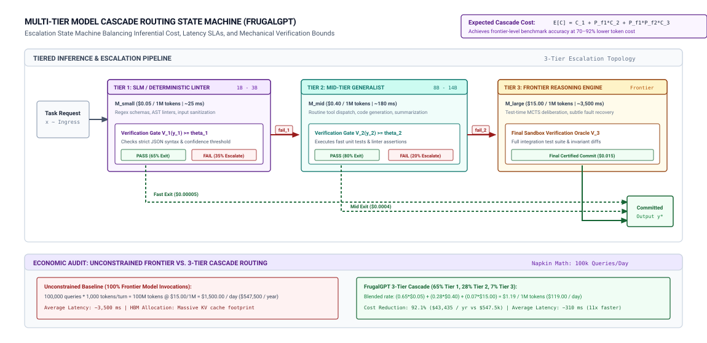
:::

Dynamic escalation cascades resolve this limitation by replacing speculative upfront classification with empirical verification barriers, as mapped systematically in @fig-vol3-model-cascade-flowchart. In this architecture, all incoming agent tasks enter Tier 1 (a 3B parameter SLM), costing just $C_1 = \$0.0004$ and executing in $T_1 = 250\text{ ms}$. The candidate output is held in memory escrow and routed through a deterministic syntax and schema verifier ($T_{V,1} = 50\text{ ms}$). If the candidate passes—which occurs for $60\%$ of incoming tasks—the transaction commits immediately via the left exit corridor, yielding task completion in $300\text{ ms}$ at minimum cost.

When Tier 1 verification fails (a $P(\text{fail}_1) = 0.40$ fault rate), the orchestrator does not discard the candidate blindly. Instead, it extracts the sanitized AST or schema error trace, appends it to the conditioning context, and escalates to Tier 2 (a 14B parameter generalist costing $C_2 = \$0.0020$). Tier 2 operates under a semantic unit test and type verifier ($T_{V,2} = 400\text{ ms}$), successfully resolving $70\%$ of its escalated load (accounting for an incremental $28\%$ of total system tasks). Only the remaining $12\%$ joint failure stream ($P(\text{fail}_1, \text{fail}_2) = 0.40 \times 0.30 = 0.12$) is escalated to the expensive Tier 3 frontier reasoning engine ($C_3 = \$0.0600, T_3 = 4{,}500\text{ ms}$). As broken down in the bottom economic waterfall ledger of @fig-vol3-model-cascade-flowchart, weighting each tier by its cumulative entry probability yields an expected serving cost of $E[C_{\text{cascade}}] = \$0.0004 + 0.40(\$0.0020) + 0.12(\$0.0600) = \$0.0084$ per task, capturing an $86\%$ expenditure reduction compared to monolithic Tier 3 dispatch while holding expected latency to $E[T] = 1.32\text{ s}$. Only when Tier 3 itself fails (an unrecoverable $0.6\%$ operational tail) does the transaction route to the permanent exception trap.

### The economics of escalation: Mathematical bounds on cascading

The financial viability of an escalation cascade depends on the mathematical relationship between tier invocation costs, individual tier success probabilities, and the false acceptance rate of the verification barrier.

Consider a three-tier cascade processing a continuous distribution of agent tasks. Let $C_1$, $C_2$, and $C_3$ denote the average monetary cost of an inference call to Tier 1, Tier 2, and Tier 3, respectively, with $C_1 \ll C_2 \ll C_3$. Let $P(\text{fail}_1)$ represent the probability that Tier 1 fails to produce an acceptable output, and let $P(\text{fail}_2 \mid \text{fail}_1)$ represent the conditional probability that Tier 2 also fails given that Tier 1 has already failed. For notational brevity, we denote this joint sequence probability as $P(\text{fail}_1, \text{fail}_2) = P(\text{fail}_1) \cdot P(\text{fail}_2 \mid \text{fail}_1)$.

The expected monetary cost of processing a task through the complete cascade, $E[C_{\text{cascade}}]$, is defined as:

$$E[C_{\text{cascade}}] = C_1 + P(\text{fail}_1) \cdot C_2 + P(\text{fail}_1, \text{fail}_2) \cdot C_3$$ {#eq-cascade-cost}

For the tiered cascade to be economically advantageous over a monolithic deployment that routes every task directly to Tier 3 ($C_{\text{mono}} = C_3$), the expected cascade cost must be strictly less than the monolithic cost:

$$C_1 + P(\text{fail}_1) \cdot C_2 + P(\text{fail}_1, \text{fail}_2) \cdot C_3 < C_3$$

Rearranging terms reveals the fundamental economic invariant governing cascade deployment:

$$C_1 + P(\text{fail}_1) \cdot C_2 < \Big(1 - P(\text{fail}_1, \text{fail}_2)\Big) \cdot C_3$$ {#eq-cascade-viability}

The term $1 - P(\text{fail}_1, \text{fail}_2)$ represents the cumulative task resolution rate achieved by Tiers 1 and 2 without requiring Tier 3 escalation. Because the cost ratio between frontier reasoning engines and smaller models is typically between one and two orders of magnitude ($C_3 / C_1 \sim 50\text{ to }100$ and $C_3 / C_2 \sim 10\text{ to }30$), inequality (@eq-cascade-viability) holds even when Tier 1 exhibits modest standalone success rates.

::: {.column-margin}
The end-to-end argument dictates that we cannot rely on model self-assessment to govern escalation. An unprivileged model that generated flawed code will often assess its own code as correct. Escalation triggers must originate from external, authoritative verification mechanisms.
:::

However, the financial calculation in @eq-cascade-cost assumes an idealized verifier that exhibits zero false acceptances. In physical systems, verification mechanisms are imperfect. Let $\alpha_{\text{FA}}$ denote the false acceptance rate of the verifier—the probability that an erroneous output from Tier 1 or Tier 2 is mistakenly certified as correct and allowed to commit to the environment. If an erroneous output slips past the verifier, it poisons the agent's context and environment state, inducing cascading downstream failures that necessitate expensive human remediation ($C_{\text{human}}$) or multi-turn trajectory rollbacks. Accounting for verification leakage, the true effective cost becomes (@eq-cascade-leakage-cost):

$$C_{\text{effective}} = E[C_{\text{cascade}}] + \alpha_{\text{FA}} \cdot C_{\text{recovery}}$$ {#eq-cascade-leakage-cost}

If $\alpha_{\text{FA}}$ rises above a minimal threshold, the downstream recovery penalty completely obliterates the upfront token savings of the cascade. Tiered model cascades must therefore be paired with deterministic verifiers such as compilers and test harnesses, not model-based judges, because under the verification asymmetry (principle \ref{pri-vol3-verification-asymmetry}) a learned verifier can rank candidates but cannot serve as the gate that commits one.

While cascading slashes average monetary spend, it exerts an opposing force on trajectory wall-clock latency. When a complex task fails at both Tier 1 and Tier 2 before reaching Tier 3, the latencies of the individual tiers accumulate serially. Let $T_1$, $T_2$, and $T_3$ represent the execution latencies of each tier, and let $T_{V}$ denote the latency of the verification check. The worst-case latency experienced by an escalated request is formulated in @eq-cascade-latency-worst as:

$$T_{\text{worst-case}} = T_1 + T_{V,1} + T_2 + T_{V,2} + T_3$$ {#eq-cascade-latency-worst}

Conversely, the expected latency across the workload is:

$$E[T_{\text{cascade}}] = T_1 + T_{V,1} + P(\text{fail}_1) \cdot \Big(T_2 + T_{V,2}\Big) + P(\text{fail}_1, \text{fail}_2) \cdot T_3$$ {#eq-cascade-latency-expected}

When Tier 1 and Tier 2 resolve the vast majority of tasks, $E[T_{\text{cascade}}]$ is substantially lower than $T_3$, providing both monetary and wall-clock improvements on average. However, the system's tail latency ($p99$) expands to $T_{\text{worst-case}}$, an essential systems trade-off that runtime schedulers must accommodate.

```{python}
#| label: lego-17-cost-and-latency-trade-offs-in
#| echo: false
# │ Show: Three-tier cascade achieves 86% cost reduction and 3.4x faster expected latency.
# │ How: SLM and generalist task deflection vs worst-case tail latency escalation.
# └─────────────────────────────────────────────────────────────────────────────
from mlsysim import *
from mlsysim.core.units import *
from mlsysim.fmt import check, fmt_multiple, fmt_percent

class CostLatencyThreeTierCascades:
    t_mono = 4.50
    t_cascade = 1.32
    speedup = t_mono / t_cascade
    latency_red = (t_mono - t_cascade) / t_mono
    worst_inc = (6.00 - t_mono) / t_mono

    check(abs(speedup - 3.409) < 0.01, "speedup")
    check(abs(latency_red - 0.7066) < 0.001, "latency_red")
    check(abs(worst_inc - 0.3333) < 0.001, "worst_inc")

    speedup_mult_str = fmt_multiple(round(speedup, 1), precision=1)
    cost_reduction_pct_str = fmt_percent(0.86, precision=0, style="prose")
    avg_latency_reduction_pct_str = fmt_percent(0.70, precision=0, style="prose")
    worst_latency_increase_pct_str = fmt_percent(round(worst_inc, 2), precision=0, style="prose")
```

::: {#nbk-17-cost-and-latency-trade-offs-in .callout-notebook title="Cost and latency in three-tier cascades"}
Consider an autonomous coding fleet serving $100{,}000$ code-editing tasks per day. The fleet engineer can either route all requests to a Tier 3 Frontier model or deploy an automated three-tier escalation cascade.

**System Parameters:**

- **Tier 1 (3B SLM):** $C_1 = \$0.0004$ per request ($2{,}000$ tokens average). Latency $T_1 = 250\text{ ms}$. Verification time $T_{V,1} = 50\text{ ms}$. Standalone failure rate $P(\text{fail}_1) = 0.40$.
- **Tier 2 (14B Generalist):** $C_2 = \$0.0020$ per request. Latency $T_2 = 800\text{ ms}$. Verification time $T_{V,2} = 400\text{ ms}$ (compilation + fast tests). Conditional failure rate $P(\text{fail}_2 \mid \text{fail}_1) = 0.30$.
- **Tier 3 (Frontier Reasoning):** $C_3 = \$0.0600$ per request. Latency $T_3 = 4{,}500\text{ ms}$. Failure rate $P(\text{fail}_3 \mid \text{fail}_1, \text{fail}_2) = 0.05$.

**1. Calculate the Expected Monetary Cost per Task:**
Using @eq-cascade-cost:
$$P(\text{fail}_1, \text{fail}_2) = 0.40 \times 0.30 = 0.12$$
$$E[C_{\text{cascade}}] = 0.0004 + (0.40 \times 0.0020) + (0.12 \times 0.0600)$$
$$E[C_{\text{cascade}}] = 0.0004 + 0.0008 + 0.0072 = \$0.0084\text{ per task}$$

Compared to monolithic Tier 3 deployment ($C_{\text{mono}} = \$0.0600$), the cascade achieves:
$$\text{Cost Reduction} = 1 - \frac{0.0084}{0.0600} = 1 - 0.14 = 86\%$$
Across $100{,}000$ tasks, daily expenditure falls from $\$6{,}000.00$ to $\$840.00$, yielding net daily operational savings of $\$5{,}160.00$.

**2. Calculate Expected and Worst-Case Latency:**
Using @eq-cascade-latency-expected:
$$E[T_{\text{cascade}}] = (250 + 50) + 0.40 \times (800 + 400) + 0.12 \times 4{,}500$$
$$E[T_{\text{cascade}}] = 300 + 480 + 540 = 1{,}320\text{ ms} = 1.32\text{ s}$$
The expected latency is {python} CostLatencyThreeTierCascades.speedup_mult_str faster than the monolithic Tier 3 baseline ($4.50\text{ s}$).

However, the worst-case tail latency for tasks escalating through the entire pipeline is:
$$T_{\text{worst-case}} = 300 + 1{,}200 + 4{,}500 = 6{,}000\text{ ms} = 6.00\text{ s}$$
The runtime achieves an {python} CostLatencyThreeTierCascades.cost_reduction_pct_str cost reduction and a {python} CostLatencyThreeTierCascades.avg_latency_reduction_pct_str reduction in average latency at the expense of a {python} CostLatencyThreeTierCascades.worst_latency_increase_pct_str increase in worst-case latency for the $12\%$ of tasks that require Tier 3 escalation.
:::

### Verification escapes

When implementing escalation cascades in production, two insidious systems bugs routinely arise: verification escapes and escalation context poisoning.

A verification escape occurs when an intermediate verification checkpoint evaluates syntax rather than semantics. Consider a Tier 2 model tasked with modifying an authentication middleware. The model emits syntactically valid Python code that passes the AST parser and linter, but it inadvertently drops a critical token authorization check. If the verifier only runs `flake8` or `mypy` without executing semantic integration assertions, the cascade terminates prematurely at Tier 2. The broken invariant commits to the sandbox, poisoning subsequent turns and causing catastrophic failures several turns later.

Escalation context poisoning occurs when an unmanaged runtime blindly appends failed attempts to the prompt during escalation. If Tier 1 produces a multi-thousand-token hallucination that fails a unit test, naively concatenating the failed generation, its stack trace, and the original prompt into Tier 2's prefill buffer inflates the prefill token count and injects toxic reasoning patterns directly into the higher-tier model's attention window.

The following escalation dispatch controller illustrates how a production agent runtime sanitizes context before escalating to a higher tier:

```python
def dispatch_with_escalation(task: str, tiers: list[ModelTier], env: Sandbox) -> StepResult:
    prior_errors: list[str] = []
    for tier in tiers:
        # Prompt only retains original invariant and sanitized verifier feedback
        prompt = build_isolated_prompt(task, verifier_feedback=prior_errors)
        candidate = tier.client.generate(prompt, max_tokens=tier.token_limit)

        # Isolate candidate in ephemeral memory escrow; execute external verification
        verify_result = env.run_deterministic_verifier(candidate)
        if verify_result.is_success:
            env.commit_transaction(candidate)
            return StepResult(status=SUCCESS, tier=tier.name, output=candidate)

        # Strip failed generation; record only concise, deterministic error diagnostics
        prior_errors = [f"Tier {tier.name} failed: {verify_result.diagnostic_summary}"]
    return StepResult(status=ESCALATION_EXHAUSTED, tier="none", output=None)
```

By discarding the failed model output and passing only the concise, deterministic diagnostic summary from the verifier, the runtime prevents context pollution and eliminates quadratic prefill cost inflation across escalation boundaries.

While tiered cascades systematically deflect non-complex turns away from expensive models, they do not eliminate the need for Tier 3 inference. When an agent confronts an intricate distributed systems bug, cross-repo architectural refactoring, or a failed escalation recovery, the frontier model sits squarely on the critical path. Under these conditions, the systems challenge shifts from *routing around* the frontier model to *accelerating the frontier model itself*. When an expensive, memory-bound model must execute autoregressive decoding on the critical path, how can the serving runtime accelerate its token generation throughput without altering its output distribution or sacrificing accuracy?

## Speculative Decoding Acceleration {#sec-vol3-tokenomics-speculative}

Autoregressive decoding at low batch sizes starves the arithmetic units of modern GPU accelerators. When an agent model generates an execution plan, refactors code, or analyzes an error trace, the host runtime invokes the decoder sequentially, emitting exactly one token per iteration. For every emitted token, the hardware must read every weight tensor across the model's layers from High-Bandwidth Memory (HBM) into Static RAM (SRAM), perform a matrix-vector product against a single activation vector, and write the updated state back to memory. A 70-billion-parameter model stored in 16-bit floating-point format occupies 140 gigabytes of memory. Transferring those 140 gigabytes across an accelerator bus with 3.35 terabytes per second of memory bandwidth requires approximately 41.8 milliseconds of data movement per token, capping decode throughput at fewer than 24 tokens per second. During this process, the GPU tensor cores sit idle for more than 98 percent of the wall-clock execution time.

Because autoregressive decoding at low concurrency is bound by memory bandwidth (principle \ref{pri-vol3-memory-bandwidth-decoding}), with an arithmetic intensity near one FLOP per byte, the draft-and-verify scheme of @sec-vol3-processor-autoregressive can trade idle arithmetic for fewer sequential weight reads. This section asks what that trade is worth on a trajectory's critical path. **Speculative decoding** breaks this memory wall by converting sequential matrix-vector operations into batched matrix-matrix multiplications: a compact draft model proposes a sequence of candidate tokens at high speed, and the large target model verifies the entire block in a single forward pass, achieving substantial wall-clock speedups while mathematically guaranteeing that the output matches the exact probability distribution of the target model, as formalized in the speculative decoding execution pipeline (@tbl-vol3-speculative-decoding-pipeline).

| Pipeline Stage                      | Executing Subsystem   | Computational Primitive             | Arithmetic & Memory Profile                                              | Operational Invariant                                            |
|:------------------------------------|:----------------------|:------------------------------------|:-------------------------------------------------------------------------|:-----------------------------------------------------------------|
| **1. Autoregressive Draft**         | Draft Model ($M_d$)   | $\gamma$ sequential GEMV steps      | Memory-bandwidth bound; small batch size; rapid token emission           | Generates speculative tokens $\hat{x}_1, \dots, \hat{x}_\gamma$  |
| **2. Parallel Target Verification** | Target Model ($M_t$)  | 1 batched GEMM step ($B = \gamma$)  | Arithmetic intensity amplified by $\gamma\times$; saturates tensor cores | Computes target conditional probabilities $p_t(x \mid x_{<i})$   |
| **3. Rejection Sampling Gate**      | Target Serving Engine | Elementwise probability comparison  | $\mathcal{O}(1)$ comparison: accept if $r < \min(1, p_t/p_d)$            | Recovers exact target distribution without bias                  |
| **4. Context & KV Commit**          | Joint Runtime Buffer  | In-place KV cache append & rollback | Evicts rejected suffix; appends accepted prefix + correction token       | Advances context by $k+1$ tokens in a single target forward pass |

: **Speculative Decoding Stages**: Algorithmic Execution Stages for Speculative Decoding ($\gamma = 3$ Lookahead Horizon). {#tbl-vol3-speculative-decoding-pipeline}

### Arithmetic intensity boundaries

The fundamental throughput limit of neural inference is governed by the Roofline model, which relates attainable compute performance to memory bandwidth through arithmetic intensity—the ratio of floating-point operations performed to bytes transferred across the memory bus:

$$\text{Attainable Performance (FLOP/s)} = \min\left(\text{Peak Compute}, \text{Operational Intensity} \times \text{Peak Bandwidth}\right)$$

In transformer inference, the execution breaks into two distinct operational regimes: the prefill phase and the decode phase. During the prefill phase, the runtime evaluates an input prompt of length $L$ in a single invocation. The model's weight matrices $W \in \mathbb{R}^{d_{\text{out}} \times d_{\text{in}}}$ multiply an activation matrix $X \in \mathbb{R}^{d_{\text{in}} \times L}$. Because the weight data loaded from HBM into SRAM is reused across all $L$ activation vectors, the arithmetic intensity scales linearly with prompt length:

$$I_{\text{prefill}} \approx \frac{2 \cdot d_{\text{out}} \cdot d_{\text{in}} \cdot L}{2 \cdot d_{\text{out}} \cdot d_{\text{in}} + 2 \cdot (d_{\text{in}} + d_{\text{out}}) \cdot L} \approx L \quad (\text{for } L \ll d)$$

For typical context windows where $L \ge 1024$, the operational intensity easily exceeds the hardware balance point of modern accelerators, driving the hardware into its compute-bound saturation plateau.

::: {.column-margin}
**Machine Balance:** The knee of the Roofline curve, $I_{\text{knee}} = \frac{\text{Peak Compute}}{\text{Peak Bandwidth}}$, defines the minimum operational intensity required to achieve full compute saturation. For an NVIDIA H100 SXM5, $I_{\text{knee}} \approx 295\text{ FLOPs/byte}$.
:::

The autoregressive decode phase exhibits the inverse physical reality. Because each newly generated token depends on all preceding tokens, the model cannot precompute future activations. At batch size $B=1$, the activation tensor collapses to a single vector ($L=1$). The weight tensors must still be streamed in their entirety through the chip's memory controllers, but each parameter participates in only two floating-point operations: one multiply and one accumulate. Under standard 16-bit precision, where each parameter occupies 2 bytes of storage, the operational intensity collapses to:

$$I_{\text{decode}} = \frac{2 \cdot P \text{ FLOPs}}{2 \cdot P \text{ bytes}} = 1.0\text{ FLOP/byte}$$

where $P$ is the total parameter count of the model. On an accelerator with hundreds of teraflops of matrix compute capability, an operation with an intensity of 1.0 FLOP/byte utilizes less than 1 percent of the chip's execution resources. The memory controllers saturate completely while the tensor cores idle.

```{python}
#| label: lego-17-roofline-bound-decode
#| echo: false
# │ Show: Roofline model bounds batch-1 decode throughput to under 24 tokens per second.
# │ How: Arithmetic intensity and memory bus bandwidth on an NVIDIA H100 SXM5 GPU.
# └─────────────────────────────────────────────────────────────────────────────
from mlsysim import *
from mlsysim.core.units import *
from mlsysim.fmt import check, fmt_int, fmt_percent

class RooflineBoundDecodePhaseThroughput:
    max_throughput_bound = 24
    unutilized = 0.996

    check(max_throughput_bound == 24, "max_throughput_bound")
    check(unutilized == 0.996, "unutilized")

    max_throughput_bound_str = fmt_int(max_throughput_bound)
    unutilized_pct_str = fmt_percent(unutilized, precision=1, style="prose")
```

::: {#nbk-17-roofline-bound-decode .callout-notebook title="Roofline bound on decode phase throughput"}
Consider an autonomous agent runtime executing a 70-billion-parameter ($P = 70 \times 10^9$) frontier model on an NVIDIA H100 SXM5 accelerator.

**Hardware Specifications:**

- Peak 16-bit Tensor Core Compute ($C_{\text{peak}}$): $989\text{ TFLOPS} = 989 \times 10^{12}\text{ FLOP/s}$
- Peak HBM3 Memory Bandwidth ($B_{\text{peak}}$): $3.35\text{ TB/s} = 3.35 \times 10^{12}\text{ bytes/s}$
- Model Memory Footprint (FP16): $M_{\text{weights}} = 70 \times 10^9 \times 2\text{ bytes} = 140\text{ GB}$

**Step 1: Determine the accelerator balance knee:**
$$I_{\text{knee}} = \frac{C_{\text{peak}}}{B_{\text{peak}}} = \frac{989 \times 10^{12}}{3.35 \times 10^{12}} \approx 295.2\text{ FLOPs/byte}$$

**Step 2: Calculate operational intensity and maximum attainable compute during decode ($B=1$):**
$$I_{\text{decode}} = \frac{2 \times 70 \times 10^9\text{ FLOPs}}{140 \times 10^9\text{ bytes}} = 1.0\text{ FLOP/byte}$$
$$\text{Attainable Compute} = I_{\text{decode}} \times B_{\text{peak}} = 1.0 \times 3.35 \times 10^{12} = 3.35\text{ TFLOPS}$$

**Step 3: Calculate tensor core compute utilization:**
$$\text{Utilization} = \frac{3.35\text{ TFLOPS}}{989\text{ TFLOPS}} \approx 0.339\%$$

**Step 4: Compute minimum per-token latency and generation throughput:**
$$T_{\text{token, min}} = \frac{M_{\text{weights}}}{B_{\text{peak}}} = \frac{140 \times 10^9\text{ bytes}}{3.35 \times 10^{12}\text{ bytes/s}} \approx 41.79\text{ ms}$$
$$\text{Max Throughput} = \frac{1}{T_{\text{token, min}}} \approx 23.93\text{ tokens/second}$$

Even under zero kernel launch overhead and zero runtime software latency, the physical memory bus caps generation at under {python} RooflineBoundDecodePhaseThroughput.max_throughput_bound_str tokens per second. Over {python} RooflineBoundDecodePhaseThroughput.unutilized_pct_str of the accelerator's compute silicon remains unutilized.
:::

Increasing batch size amortizes weight movement across multiple concurrent requests, lifting decode intensity toward the compute-bound regime. However, agent workloads frequently involve localized interactive loops—such as inspecting compiler outputs, running isolated unit tests, and verifying plan syntax—where a single agent instance operates synchronously on the critical path. Under these low-concurrency conditions, traditional batched serving cannot mask memory latency. Accelerating the critical path requires an architectural mechanism that increases arithmetic intensity *within a single request stream*.

### Speculative decoding pipeline

Speculative decoding leverages an algorithmic asymmetry first formalized by @leviathan2023fast and @chen2023accelerating: verifying a sequence of candidate tokens requires fundamentally fewer memory cycles than generating that same sequence autoregressively. Generating $K$ tokens sequentially requires $K$ separate memory passes over the target model's parameter footprint. In contrast, verifying $K$ candidate tokens simultaneously requires only a *single* memory pass over the target model's weights.

The serving runtime pairs the large, expensive target model $M_{\text{target}}$ with a compact, low-latency draft model $M_{\text{draft}}$. The draft model must share the exact vocabulary and tokenizer of the target model to ensure that token identifiers map to identical semantic primitives. Because $M_{\text{draft}}$ has an order of magnitude fewer parameters (for example, a 3-billion or 7-billion parameter model paired with a 70-billion parameter target), streaming its weights across the bus requires only a fraction of the time.

The speculative decoding loop proceeds in two distinct execution phases across a configured speculative horizon $\gamma$:

1. **The Drafting Phase:** Starting from the current sequence context $x_{<t}$, the draft model $M_{\text{draft}}$ executes $\gamma$ sequential autoregressive decode iterations. Because the draft model's weight footprint is small (for example, 6 GB for a 3B model in FP16, requiring only 1.8 ms to transfer across an H100 bus), it emits $\gamma$ speculative tokens $\hat{x}_t, \hat{x}_{t+1}, \dots, \hat{x}_{t+\gamma-1}$ with minimal wall-clock overhead.
2. **The Verification Phase:** The host runtime packs the $\gamma$ candidate tokens into a single sequence block and submits them to the target model $M_{\text{target}}$. The target model executes a single forward pass over the candidate block, evaluating the conditional probability distribution at all $\gamma$ candidate positions simultaneously.

::: {.column-margin}
**GEMV to GEMM:** Speculative verification converts the target model's execution kernel from a sequence of $\gamma$ memory-bandwidth-bound General Matrix-Vector products (GEMV) into a single compute-bound General Matrix-Matrix product (GEMM) of dimension $M=\gamma$.
:::

During verification, $M_{\text{target}}$ reads its 140-gigabyte parameter memory footprint exactly once. Because the matrix operations across the $\gamma$ candidate positions execute in parallel, the compute cores absorb the additional floating-point operations within the memory-latency slack of the weight transfer. For moderate values of $\gamma$ (typically between 3 and 6), the wall-clock latency of verifying $\gamma$ tokens in parallel, $T_{\text{verify}}(\gamma)$, is nearly indistinguishable from the latency of generating a single token autoregressively:

$$T_{\text{verify}}(\gamma) \approx T_{\text{decode}}(1)$$

Once the target model computes the full logit vectors for all $\gamma$ positions, the runtime executes a verification policy to determine how many candidate tokens to accept. If the target model accepts $\alpha$ candidates (where $0 \le \alpha \le \gamma$), the runtime commits those $\alpha$ tokens to the authoritative context buffer, samples one additional correction token from the target model's residual distribution, and discards any remaining unverified candidates. In a single target forward pass, the system advances the generation frontier by $\alpha + 1$ tokens, amortizing memory traffic as quantified in @tbl-speculative-hardware-profile.

| Phase                       | Model        | Compute Kernel          | Parameters Streamed                      | Arithmetic Intensity           | Wall-Clock Latency (H100) |
|:----------------------------|:-------------|:------------------------|:-----------------------------------------|:-------------------------------|:--------------------------|
| **Drafting ($\gamma = 4$)** | Draft (3B)   | $4 \times$ GEMV ($L=1$) | $4 \times 6\text{ GB} = 24\text{ GB}$    | $\approx 1.0\text{ FLOP/byte}$ | $\approx 7.2\text{ ms}$   |
| **Verification**            | Target (70B) | $1 \times$ GEMM ($L=4$) | $1 \times 140\text{ GB} = 140\text{ GB}$ | $\approx 4.0\text{ FLOP/byte}$ | $\approx 42.1\text{ ms}$  |
| **Total Round**             | Hybrid       | Combined                | $164\text{ GB}$                          | $\approx 3.5\text{ FLOP/byte}$ | $\approx 49.3\text{ ms}$  |
| **Baseline Target**         | Target (70B) | $4 \times$ GEMV ($L=1$) | $4 \times 140\text{ GB} = 560\text{ GB}$ | $\approx 1.0\text{ FLOP/byte}$ | $\approx 167.2\text{ ms}$ |

: **Hardware Execution Characteristics of Speculative Decoding**: Comparison of draft and target model compute kernels, parameters streamed, arithmetic intensities, and wall-clock latencies on NVIDIA H100. {#tbl-speculative-hardware-profile}

### Distribution preservation via rejection sampling

A naive speculative system might accept candidate tokens whenever the draft model's most likely prediction matches the target model's greedy argmax. In agent systems, however, models are rarely evaluated purely at zero temperature; exploration, diverse planning, and stochastic reasoning require sampling from conditional probability distributions parameterized by temperature $T$ and nucleus top-$p$ bounds. If speculative verification distorted the target distribution, it would degrade reasoning depth, compromise tool-call syntax formatting, or inject subtle planning biases.

To prevent distribution shift, speculative verification employs a modified rejection sampling algorithm. The algorithm guarantees that the probability of emitting any token sequence under speculative decoding is identical to sampling directly from the unassisted target model:

$$P_{\text{speculative}}(X) = P_{\text{target}}(X)$$

Let $q(x) = P_{\text{draft}}(x \mid x_{<i})$ represent the probability distribution over the vocabulary computed by the draft model at position $i$, and let $p(x) = P_{\text{target}}(x \mid x_{<i})$ represent the corresponding distribution computed by the target model. The draft model samples a candidate token $\hat{x}_i \sim q(x)$.

The runtime evaluates the acceptance criterion for $\hat{x}_i$ by drawing a uniform random variate $u \sim \mathcal{U}(0, 1)$ and comparing it against the probability ratio:

$$\beta = \min\left(1, \frac{p(\hat{x}_i)}{q(\hat{x}_i)}\right)$$

If $u \le \beta$, the candidate token $\hat{x}_i$ is **accepted**. The intuition is straightforward: if the target model assigns a higher probability to the token than the draft model ($p(\hat{x}_i) \ge q(\hat{x}_i)$), the token is accepted with probability 1. If the target model assigns a lower probability ($p(\hat{x}_i) < q(\hat{x}_i)$), the token is accepted proportionally, down-weighting the draft model's overconfidence.

If $u > \beta$, the candidate token $\hat{x}_i$ is **rejected**. At the moment of rejection, all subsequent candidate tokens $\hat{x}_{i+1}, \dots, \hat{x}_{t+\gamma-1}$ are immediately invalidated and discarded. The runtime does not invoke the draft model to recover; instead, it samples a replacement token directly from the target model's adjusted residual distribution $p'(x)$:

$$p'(x) = \frac{\max\left(0, p(x) - q(x)\right)}{\sum_{y \in \mathcal{V}} \max\left(0, p(y) - q(y)\right)}$$

The residual distribution redistributes probability mass exclusively to those tokens that the draft model under-sampled relative to the target model, scaled by the total rejected probability mass.

```python
def verify_speculative_token(p_target: np.ndarray, q_draft: np.ndarray,
                             draft_token: int) -> tuple[bool, int]:
    """Execute modified rejection sampling for a single speculative token."""
    ratio = p_target[draft_token] / max(q_draft[draft_token], 1e-12)
    if np.random.uniform(0.0, 1.0) <= min(1.0, ratio):
        return True, draft_token
    # Resample replacement token from adjusted target residual distribution
    residual = np.maximum(0.0, p_target - q_draft)
    p_prime = residual / np.sum(residual)
    replacement_token = int(np.random.choice(len(p_prime), p=p_prime))
    return False, replacement_token
```

To prove that the emitted token $X$ follows $p(x)$ exactly, consider the marginal probability of emitting token $x$ under this two-step sampling procedure:

$$\mathbb{P}(X = x) = \mathbb{P}(\text{accepted}) \cdot \mathbb{P}(X = x \mid \text{accepted}) + \mathbb{P}(\text{rejected}) \cdot \mathbb{P}(X = x \mid \text{rejected})$$

A candidate token $x$ is proposed with probability $q(x)$ and accepted with probability $\min\left(1, \frac{p(x)}{q(x)}\right)$. The first term evaluates to:

$$\mathbb{P}(\text{proposed and accepted}) = q(x) \cdot \min\left(1, \frac{p(x)}{q(x)}\right) = \min\left(q(x), p(x)\right)$$

The total acceptance probability across the entire vocabulary $\mathcal{V}$ is the sum of these joint probabilities:

$$\beta_{\text{total}} = \sum_{y \in \mathcal{V}} \min\left(q(y), p(y)\right)$$

Consequently, the total rejection probability is:

$$1 - \beta_{\text{total}} = 1 - \sum_{y \in \mathcal{V}} \min\left(q(y), p(y)\right) = \sum_{y \in \mathcal{V}} \left(p(y) - \min\left(q(y), p(y)\right)\right) = \sum_{y \in \mathcal{V}} \max\left(0, p(y) - q(y)\right)$$

When a rejection occurs, the replacement token is drawn from $p'(x)$. Multiplying the rejection probability by the conditional sampling probability yields:

$$\mathbb{P}(\text{rejected and sampled } x) = \left(1 - \beta_{\text{total}}\right) \cdot \frac{\max\left(0, p(x) - q(x)\right)}{\sum_{y \in \mathcal{V}} \max\left(0, p(y) - q(y)\right)} = \max\left(0, p(x) - q(x)\right)$$

Summing the acceptance and rejection branches yields the exact target probability distribution:

$$\mathbb{P}(X = x) = \min\left(q(x), p(x)\right) + \max\left(0, p(x) - q(x)\right) = p(x)$$

The proof holds across any temperature setting and vocabulary distribution. If all $\gamma$ candidate tokens are accepted, the target model's forward pass has already evaluated the logits for position $t+\gamma$. The runtime samples an additional bonus token directly from $p(x \mid x_{\le t+\gamma-1})$, producing $\gamma + 1$ accepted tokens from a single target execution pass.

### Serving economics trade-offs

The net speedup delivered by speculative decoding is a function of the speculative horizon $\gamma$, the relative inference latency between the draft and target models, and the mean acceptance rate $\bar{\alpha} = \mathbb{E}[\alpha]$.

Let $T_{\text{draft}}$ represent the per-token decode latency of the draft model, and let $T_{\text{target}}(\gamma)$ represent the latency of the target model executing a verification pass across $\gamma$ tokens. In a standard autoregressive setup, generating $\bar{\alpha} + 1$ tokens requires:

$$T_{\text{baseline}} = (\bar{\alpha} + 1) \cdot T_{\text{target}}(1)$$

Under speculative execution, generating those same $\bar{\alpha} + 1$ tokens requires generating $\gamma$ draft tokens sequentially followed by one parallel verification pass:

$$T_{\text{speculative}} = \gamma \cdot T_{\text{draft}} + T_{\text{target}}(\gamma)$$

The effective system speedup factor $S$ is the ratio of baseline latency to speculative latency:

$$S = \frac{(\bar{\alpha} + 1) \cdot T_{\text{target}}(1)}{\gamma \cdot T_{\text{draft}} + T_{\text{target}}(\gamma)}$$

Assuming target verification latency remains approximately constant ($T_{\text{target}}(\gamma) \approx T_{\text{target}}(1)$), the runtime achieves positive acceleration ($S > 1$) if and only if:

$$\bar{\alpha} > \gamma \cdot \frac{T_{\text{draft}}}{T_{\text{target}}(1)}$$

The ratio $\frac{T_{\text{draft}}}{T_{\text{target}}(1)}$ represents the draft model's relative cost overhead. If a draft model requires 10 percent of the target model's execution time, drafting $\gamma = 5$ tokens introduces an overhead equivalent to 0.5 target tokens. The system achieves net wall-clock acceleration whenever the target accepts more than 0.5 draft tokens per iteration.

::: {.column-margin}
**SpecInfer Tree Speculation:** Tree-based speculation generalizes linear speculative decoding to a tree topology. Instead of generating a single chain of $\gamma$ tokens, the draft model explores a tree of candidate branches. The target model verifies all tree branches in parallel using a customized tree-attention mask, substantially increasing $\bar{\alpha}$ on divergent reasoning paths.
:::

The critical variable governing serving economics is the empirical acceptance rate $\bar{\alpha}$, which depends directly on the *token entropy* of the task domain. In predictable, low-entropy domains—such as code syntax scaffolding, structured JSON generation, repetitive data serialization, and common API invocations—the small draft model mirrors the frontier model's predictions with high fidelity. In these environments, acceptance rates regularly exceed 80 percent, yielding sustained speedups between $2.5\times$ and $3.5\times$.

Conversely, when an agent engages in open-ended creative planning, abstract mathematical formulation, or high-temperature branch exploration, token distributions flatten. The draft model diverges from the target model, the acceptance rate collapses, and the draft latency becomes pure overhead that degrades serving performance below baseline. The quantitative performance profiles across these workload domains are detailed in @tbl-speculative-entropy-profiles.

| Agent Workload Domain             | Typical Token Entropy           | Mean Acceptance $\bar{\alpha}$ ($\gamma = 5$) | Target Cost Ratio $\frac{T_{\text{draft}}}{T_{\text{target}}}$ | Effective Speedup $S$ | Economic Impact                                |
|:----------------------------------|:--------------------------------|:----------------------------------------------|:---------------------------------------------------------------|:----------------------|:-----------------------------------------------|
| **Structured Output (JSON/YAML)** | Very Low ($< 1.2$ nats)         | $4.4\text{ tokens}$                           | $0.08$                                                         | $3.86\times$          | Dramatic critical-path compression; high ROI   |
| **Code Refactoring & Syntax**     | Low ($1.2\text{--}2.0$ nats)    | $3.6\text{ tokens}$                           | $0.08$                                                         | $3.28\times$          | Major reduction in developer iteration latency |
| **Error Trace Diagnostics**       | Medium ($2.0\text{--}2.8$ nats) | $2.5\text{ tokens}$                           | $0.08$                                                         | $2.50\times$          | Favorable latency-to-spend ratio               |
| **Algorithmic Planning**          | High ($2.8\text{--}3.8$ nats)   | $1.4\text{ tokens}$                           | $0.08$                                                         | $1.71\times$          | Modest speedup; sensitive to draft size        |
| **Creative / High Temperature**   | Very High ($> 3.8$ nats)        | $0.6\text{ tokens}$                           | $0.08$                                                         | $1.14\times$          | Negligible gain; risk of speculative slowdown  |

: **Speculative Decoding Performance Across Agent Workload Domains**: Typical token entropies, mean token acceptance rates, cost ratios, effective speedup factors, and economic impacts across task categories. {#tbl-speculative-entropy-profiles}

Deploying speculative decoding in production multi-agent environments introduces hardware resource trade-offs:

1. **Accelerator Memory Reservation:** Hosting both $M_{\text{target}}$ and $M_{\text{draft}}$ on the same accelerator hardware partitions GPU memory. On an 80-gigabyte GPU, allocating 6 gigabytes to the draft model's weights and activation buffers reduces the physical memory remaining for runtime KV-cache allocations, lowering the maximum concurrent request capacity of the worker.
2. **Batch Concurrency Saturation:** As aggregate serving concurrency increases, multi-tenant scheduling engines batch multiple independent agent requests together. When the aggregate batch size $B$ exceeds 16 or 32, the target model's baseline decode operations naturally transition from memory-bandwidth-bound GEMV kernels to compute-bound GEMM kernels. As arithmetic intensity increases due to batching, the surplus compute capacity that speculative decoding exploits disappears, and $T_{\text{verify}}(\gamma)$ begins scaling linearly with $\gamma$.
3. **Speculation-Aware Routing:** Advanced serving runtimes monitor real-time server load. When request queues are deep and batch sizes are large, the scheduler disables speculative decoding to maximize overall cluster token throughput. When request queues empty and an agent requires synchronous, low-latency execution on the critical path, the scheduler enables speculative decoding to minimize end-to-end task completion time.

Speculative decoding fundamentally alters the operational behavior of accelerator nodes: generation latency becomes non-deterministic, memory footprints expand to support auxiliary draft weights, and effective worker capacity fluctuates with task entropy.

While accelerating individual model forward passes resolves the memory-bandwidth bottleneck on the critical path, a production agent platform rarely runs in isolation on a single GPU. Real-world systems manage hundreds of concurrent agent workflows—each issuing bursty prefill requests, long-running decode sequences, asynchronous tool invocations, and unpredictable escalation cascades. How do systems engineers provision, schedule, and dimension cluster accelerator capacity to serve fleets of these heterogeneous agents under strict latency service-level objectives without stranding expensive GPU hardware?

## Fleet Capacity Provisioning {#sec-vol3-tokenomics-capacity}

When an engineering team provisions accelerator capacity for an agent platform using the static sizing heuristics of conventional web services or stateless model APIs, the cluster reliably succumbs to one of two structural failure modes: catastrophic queue collapse under moderate nominal load, or severe financial hemorrhage caused by drastically underutilized, stranded silicon. In traditional distributed services, incoming RPCs exhibit sub-second service times with narrow variance, allowing capacity planners to dimension server pools using classical Erlang-C or $M/M/k$ queueing models. In stateless foundation model serving, continuous batching runtimes dynamically interleave prefill and decode phases across a uniform request stream.

An autonomous agent platform breaks this sizing model because the unit that holds resources is the trajectory, not the request. **An end-to-end trajectory lasts three to five orders of magnitude longer than any single model forward pass within it, so accelerator occupancy no longer follows the request arrival rate.** Trajectory-lifetime capacity and tail-aware scheduling (principle \ref{pri-vol3-heavy-tailed-scheduling}) turns that mismatch into a sizing rule, and this section derives it. Sizing a cluster solely to absorb mean token generation throughput ignores the bursty, multi-turn feedback loops characteristic of autonomous reasoning, the protracted blocking periods during which agents wait for external tool execution, and the immense memory footprint of long-lived Key-Value (KV) caches pinned in accelerator High-Bandwidth Memory (HBM). Dimensioning a resilient, cost-effective agent serving fleet requires modeling the distinct occupancy profiles of invocations versus trajectories, applying heavy-traffic queueing theory to mitigate tail latency, deploying multi-level scheduling disciplines to prevent interactive starvation, and establishing rigorous financial break-even boundaries between dedicated hardware reservations and elastic serverless APIs.

### The occupancy-duration mismatch: Invocations versus trajectories

To understand why standard capacity models fail, we must decompose an agentic workflow into its two distinct operational layers: the ephemeral *model invocation* and the persistent *agent trajectory*. A model invocation is an isolated inference request submitted to an execution engine, consisting of a prefill phase over an input prompt followed by autoregressive token generation. Its service time $S_{\text{model}}$ is strictly bounded by sequence length, typically spanning 50 milliseconds to 4 seconds. In contrast, an agent trajectory is a stateful, multi-turn supervisory loop comprising sequential model invocations interleaved with environment interactions:

$$T_{\text{trajectory}} = \sum_{i=1}^{N} \left( S_{\text{model}, i} + S_{\text{tool}, i} + S_{\text{runtime}, i} \right)$$

where $N$ represents the number of sequential turns required to satisfy the task, $S_{\text{tool}, i}$ represents the latency of external tool executions (such as running test suites, querying search APIs, or compiling code), and $S_{\text{runtime}, i}$ denotes host orchestration overhead. In production environments, $S_{\text{tool}}$ routinely dwarfs $S_{\text{model}}$, with external API calls requiring hundreds of milliseconds and comprehensive test suites running for minutes. Consequently, an agent trajectory may persist across an operational lifespan $T_{\text{trajectory}} \in [10^1, 10^3]$ seconds, despite consuming only a fraction of that duration in active accelerator compute.

::: {.column-margin}
Holding an uncompressed KV cache in HBM while an agent blocks on an external tool is the systems equivalent of holding a database write-lock across an interactive user think-time. It artificially constrains concurrency at the physical memory layer rather than the compute layer.
:::

This discrepancy creates a severe dilemma for accelerator memory management. In a standard continuous-batching engine, the Key-Value cache generated during turn $i$ must be preserved to evaluate turn $i+1$, preventing the quadratic computational penalty of re-evaluating the entire prompt prefix from scratch. If the runtime pins the agent's KV cache within GPU HBM while the agent blocks on a 30-second external tool execution, that physical memory allocation remains unavailable to other active jobs. Because modern accelerator memory is tightly bounded (for example, 80 to 141 GB per GPU), memory saturation occurs long before the tensor cores reach peak computational utilization. The cluster's effective capacity becomes memory-capacity-bound rather than compute-bound.

Conversely, if the serving runtime evicts the KV cache to host CPU system memory (DDR5) or local NVMe storage upon tool dispatch, it frees HBM frames for active decodes but introduces substantial bus-transfer latency over PCIe or NVLink when the agent resumes. If the runtime discards the cache entirely, relying on prefix caching and Radix-tree reuse to re-evaluate the context upon the next turn, it swaps memory pressure for redundant compute, re-running prefill matrix multiplications (GEMM) over thousands of historical tokens at every cycle.

The capacity implications become stark when evaluated through Little's Law ($L = \lambda W$), which dictates that the average number of concurrent requests in a stable system $L$ equals the arrival rate $\lambda$ multiplied by the average residence time $W$. When sizing a cluster at the raw inference layer, the average concurrency is $L_{\text{inv}} = \lambda_{\text{inv}} \cdot \mathbb{E}[S_{\text{model}}]$. However, when sizing at the agent trajectory layer, the concurrency of active stateful workflows is $L_{\text{traj}} = \lambda_{\text{traj}} \cdot \mathbb{E}[T_{\text{trajectory}}]$. Because $\mathbb{E}[T_{\text{trajectory}}] \gg \mathbb{E}[S_{\text{model}}]$, an infrastructure architect who sizes memory allocations against $L_{\text{inv}}$ will observe rapid buffer exhaustions, thrashing page-eviction daemons, and pervasive admission rejection as soon as concurrent trajectory volume scales (@sec-vol3-appendix-inference-queueing derives this tool-wait concurrency inflation and establishes the memory-headroom batch bound under iteration-level scheduling).

### Queueing dynamics

Because agent platforms cannot decouple accelerator scheduling from the stochastic nature of agent behavior, sizing a fleet requires queueing-theoretic models that capture extreme variability. Standard introductory systems analysis frequently relies on $M/M/1$ or $M/M/k$ formulations, which presume Poisson arrival processes (exponential inter-arrival distributions) and memoryless, exponentially distributed service durations. In production agent fleets, both assumptions are demonstrably invalid.

The arrival process of model invocations generated by autonomous agents is structurally bursty. When an orchestrator spawns parallel verification sub-agents or when an agent executes a multi-step planning loop, requests hit the serving layer in tightly correlated batches rather than uncorrelated Poisson streams. The squared coefficient of variation of inter-arrival times, defined as $C_a^2 = \sigma_a^2 / (\mathbb{E}[T_a])^2$, routinely exceeds unity ($C_a^2 > 1$).

Simultaneously, the distribution of model service times is radically non-exponential. An agent fleet processes a bimodal mixture of workloads: lightweight, low-latency classification probes, JSON schema validations, and single-token tool-routing decisions consuming tens of milliseconds ($S \ll 100\text{ ms}$), juxtaposed against heavy, multi-thousand-token chain-of-thought generations and complex code syntheses lasting several seconds ($S > 10\text{ s}$). This bimodal dispersion yields a service time squared coefficient of variation substantially greater than one ($C_s^2 = \sigma_s^2 / (\mathbb{E}[S])^2 \gg 1$).

To estimate expected waiting times in queues characterized by arbitrary arrival and service distributions without resorting immediately to cycle-accurate discrete-event simulations, systems engineers rely on Kingman's heavy-traffic approximation for a $G/G/1$ queue (@eq-vol3-kingman-gg1):

$$W_q \approx \left( \frac{C_a^2 + C_s^2}{2} \right) \left( \frac{\rho}{1 - \rho} \right) \frac{1}{\mu}$$ {#eq-vol3-kingman-gg1}

where $\rho = \lambda / \mu$ denotes server utilization, and $\mu = 1 / \mathbb{E}[S]$ is the mean service rate. Kingman's formula decomposes mean queue wait time $W_q$ into three explicit multiplicative components:

1. **The Variability Factor $\frac{C_a^2 + C_s^2}{2}$:** This term scales latency directly by the combined dispersion of the arrival and service processes. In an idealized $M/M/1$ system where $C_a^2 = C_s^2 = 1$, this factor equals 1. In an agent fleet where correlated bursts and bimodal generation lengths push $C_a = 1.8$ and $C_s = 2.4$, the variability factor reaches $\frac{1.8^2 + 2.4^2}{2} = \frac{3.24 + 5.76}{2} = 4.5$. The system experiences a $4.5\times$ amplification in mean queue delay purely due to workload variance, holding hardware throughput and mean arrival rates identical.
2. **The Utilization Factor $\frac{\rho}{1 - \rho}$:** This hyperbolic penalty governs the non-linear asymptote as server utilization approaches saturation. As $\rho$ advances from $0.70$ to $0.90$, the multiplier jumps from $2.33$ to $9.00$—nearly a four-fold increase.
3. **The Base Service Scale $\frac{1}{\mu}$:** The unweighted mean processing duration of the underlying model.

::: {.column-margin}
As Jeffrey Dean and Luiz André Barroso articulated in *The Datacenter as a Computer*, tail latency—not mean latency—dictates the user-perceived performance of distributed systems. In an agent trajectory comprising $N$ serial model calls, the probability of completing without hitting a 99th-percentile queue delay decays as $(1 - 0.01)^N$.
:::

In an enterprise fleet operating $k$ parallel accelerator instances, the single-server $G/G/1$ model transitions to an aggregate multi-server $G/G/k$ system. Using the Allen-Cunneen approximation, multi-server queue waiting time scales proportional to the Erlang-C waiting probability $P_{\text{wait}}(M/M/k)$ (@eq-vol3-allen-cunneen):

$$W_q(G/G/k) \approx \left( \frac{C_a^2 + C_s^2}{2} \right) \frac{P_{\text{wait}}(M/M/k)}{k\mu(1 - \rho)}$$ {#eq-vol3-allen-cunneen}

While pooling $k$ accelerators into a unified serving cluster provides statistical multiplexing benefits that dampen average wait times relative to isolated single-server silos, it exacerbates tail-latency amplification across multi-turn trajectories. If an agent workflow requires $N = 30$ sequential model invocations to complete an end-to-end task, and the runtime operates at an aggressive hardware utilization $\rho = 0.85$, the likelihood that the trajectory encounters an extreme tail delay ($P_{99}$) on at least one critical-path turn is:

$$P(\text{Tail Incident}) = 1 - (1 - 0.01)^{30} = 1 - 0.7397 \approx 0.26$$

More than one-quarter of all executed agent trajectories will suffer an extreme tail delay. Because an agent trajectory executes synchronously across sequential turns, a single tail delay on turn 7 cascades directly into the total time-to-completion, often causing the host orchestrator to breach its global Service Level Objective (SLO).

```{python}
#| label: lego-17-sizing-queue-capacity-and-tail
#| echo: false
# │ Show: Adding one accelerator node reduces heavy-tailed queue wait time by over 80%.
# │ How: Allen-Cunneen queue approximation with bimodal service time and high variance.
# └─────────────────────────────────────────────────────────────────────────────
from mlsysim import *
from mlsysim.core.units import *
from mlsysim.fmt import check, fmt_percent, fmt_time

class QueueSizingHeavyTailedTraffic:
    w_q_4 = 47.1 * millisecond
    w_q_5 = 8.95 * millisecond
    lat_red = (w_q_4 - w_q_5) / w_q_4

    check(abs(lat_red.magnitude - 0.8099) < 0.001, "lat_red")

    w_q_4_ms_str = fmt_time(w_q_4, unit=millisecond, precision=1)
    w_q_5_ms_str = fmt_time(w_q_5, unit=millisecond, precision=2)
    latency_reduction_pct_str = fmt_percent(0.80, precision=0, style="prose")
```

::: {#nbk-17-sizing-queue-capacity-and-tail .callout-notebook title="Queue sizing under heavy-tailed traffic"}
An infrastructure team operates an inference cluster dedicated to serving intermediate agent reasoning loops. The cluster processes an aggregate arrival rate of $\lambda = 160\text{ requests/sec}$ distributed across pooled accelerator workers. Profiling reveals that the mean model service time is $\mathbb{E}[S] = 20\text{ ms}$ ($\mu = 50\text{ req/sec/worker}$), but the workload exhibits extreme bimodality: 80 percent of requests are fast JSON schema evaluations ($\mathbb{E}[S_1] = 5\text{ ms}$), while 20 percent are extended chain-of-thought generations ($\mathbb{E}[S_2] = 80\text{ ms}$). Empirical measurements indicate an arrival coefficient of variation $C_a = 1.4$ and a service coefficient of variation $C_s = 2.2$.

The engineering lead proposes provisioning $k = 4$ worker nodes to run at an average utilization of $\rho = \frac{\lambda}{k \mu} = \frac{160}{4 \times 50} = 0.80$. Compute the expected queue wait time $W_q$ under this configuration using the Allen-Cunneen approximation, and contrast it with an alternative provisioning plan of $k = 5$ workers ($\rho = 0.64$).

**Step 1: Compute the variability scaling factor.**
$$\frac{C_a^2 + C_s^2}{2} = \frac{1.4^2 + 2.2^2}{2} = \frac{1.96 + 4.84}{2} = \frac{6.80}{2} = 3.40$$

**Step 2: Evaluate Erlang-C waiting probability for $k = 4$ at $\rho = 0.80$.**
For an $M/M/4$ queue with offered load $A = k\rho = 3.2\text{ Erlangs}$:
$$P_{\text{wait}}(M/M/4) = \frac{\frac{A^4}{4!(1 - \rho)}}{\sum_{n=0}^{3} \frac{A^n}{n!} + \frac{A^4}{4!(1 - \rho)}} \approx 0.554$$

**Step 3: Calculate $W_q$ for $k = 4$.**
$$W_q \approx 3.40 \times \frac{0.554}{4 \times 50 \times (1 - 0.80)} = 3.40 \times \frac{0.554}{200 \times 0.20} = 3.40 \times \frac{0.554}{40} = 3.40 \times 0.01385\text{ s} \approx 47.1\text{ ms}$$
Under $k = 4$ workers, the average queue wait time ($47.1\text{ ms}$) exceeds the mean execution time of the request itself ($20\text{ ms}$) by more than $2.3\times$.

**Step 4: Evaluate the cluster over-provisioned to $k = 5$ at $\rho = 0.64$.**
For $M/M/5$ with $A = 3.2\text{ Erlangs}$, the waiting probability drops sharply to $P_{\text{wait}}(M/M/5) \approx 0.237$.
$$W_q \approx 3.40 \times \frac{0.237}{5 \times 50 \times (1 - 0.64)} = 3.40 \times \frac{0.237}{250 \times 0.36} = 3.40 \times \frac{0.237}{90} = 3.40 \times 0.00263\text{ s} \approx 8.95\text{ ms}$$

**Takeaway:** Increasing capacity by a single accelerator node ($25\%$ hardware expansion) reduces average queue waiting time from {python} QueueSizingHeavyTailedTraffic.w_q_4_ms_str down to {python} QueueSizingHeavyTailedTraffic.w_q_5_ms_str—a latency reduction of over {python} QueueSizingHeavyTailedTraffic.latency_reduction_pct_str. In heavy-tailed agent serving environments, operating below the knee of the utilization curve ($\rho \le 0.70$) is mandatory to absorb variance and protect multi-turn trajectory critical paths.
:::

### Multi-level feedback queueing for agent workloads

When an agent serving cluster schedules all requests through an undifferentiated First-Come-First-Served (FCFS) queue, it encounters the classic *head-of-line blocking* pathology. A massive, multi-step code-generation invocation requiring 4,096 output tokens will occupy an accelerator's continuous batching slots for several contiguous seconds. If an interactive user or an latency-critical supervisory agent submits a 10-token routing query behind this massive job, the short query is delayed behind the long-running decode phase. This degradation violates the core scheduling objective of computing systems: minimizing mean response time by prioritizing short jobs (Shortest Job First), without possessing prior knowledge of exact execution durations.

Because the host runtime cannot predict the exact token length of an autoregressive generation prior to inference, it cannot implement pure Shortest Processing Time (SPT) scheduling. Instead, the cluster must employ an adaptive **Multi-Level Feedback Queue (MLFQ)** discipline tailored to the memory and compute mechanics of token generation (@fig-vol3-mlfq-serving-architecture).

::: {#fig-vol3-mlfq-serving-architecture fig-env="figure" fig-pos="htb" fig-cap="**Multi-Level Feedback Queue (MLFQ) Serving Architecture and KV-Cache Memory Tiering**: The left scheduling engine isolates interactive probes, multi-turn reasoning loops, and background batch trajectories into discrete priority queues ($Q_0, Q_1, Q_2$) with token-based quanta ($\Delta_0 = 64, \Delta_1 = 512, \Delta_2 \ge 4{,}096\text{ tokens}$) and starvation prevention ($T_{\text{boost}} = 60\text{ s}$). The right panel illustrates the corresponding physical memory hierarchy, where PagedAttention dynamically manages HBM block allocations across active batch slots, staging evicted pages into host DDR5 memory via asynchronous DMA transfers and NVMe storage based on an economic eviction threshold $T^* \approx 70\text{ ms}$." fig-alt="Systems schematic of an MLFQ serving architecture showing three prioritized queues Q0, Q1, and Q2 with token quanta demotions and a 60-second priority boost arc on the left, paired with an accelerator HBM continuous batching slot allocator and tiered memory migration to host DDR5 and NVMe on the right."}
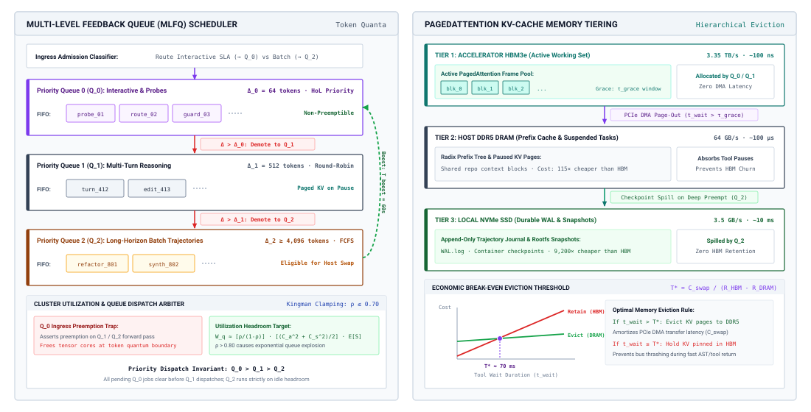
:::

As detailed in the systems schematic of @fig-vol3-mlfq-serving-architecture, the architecture bifurcates between an active priority scheduler on the left and a physical memory hierarchy on the right. In the scheduling plane, all incoming agent jobs enter $Q_0$ with an initial non-preemptible token quantum of $\Delta_0 = 64\text{ tokens}$. Short semantic classifier probes and tool-dispatch decisions complete within this quantum and exit the system with sub-millisecond queue delay. Jobs requiring extended deliberation exhaust $\Delta_0$ and are demoted to $Q_1$ ($\Delta_1 = 512\text{ tokens}$, round-robin scheduling), while long-horizon code-generation and repository-refactoring passes demote to $Q_2$ ($\Delta_2 \ge 4{,}096\text{ tokens}$, FCFS batching). Starvation of background jobs is physically prevented by the upward priority boost arc, which atomically flushes all pending requests across $Q_1$ and $Q_2$ back to $Q_0$ every $T_{\text{boost}} = 60\text{ seconds}$.

Simultaneously, the right panel of @fig-vol3-mlfq-serving-architecture demonstrates how the scheduler interfaces with PagedAttention memory management across physical hardware tiers. When a $Q_1$ or $Q_2$ request yields its continuous batching slot during preemption, its key-value cache blocks in accelerator HBM are protected by a grace period $\tau_{\text{grace}}$ to prevent thrashing. Under sustained memory pressure, the memory manager activates PCIe Gen5 DMA channels to migrate inactive pages to host DDR5 RAM ($64\text{ GB/s}$ bidirectional transfer). If idle times exceed the economic eviction break-even threshold ($T^* \approx 70\text{ ms}$), pages spill to local NVMe storage ($7\text{ GB/s}$), ensuring high HBM residency for latency-critical $Q_0$ invocations without discarding expensive prefill state.

The agent-aware MLFQ structures accelerator capacity into distinct priority tiers, governing preemption, batch assembly, and memory tenancy:

1. **Priority Queue 0 ($Q_0$, Interactive & Probes):** All newly arriving model invocations enter $Q_0$. This tier is allocated the highest dispatch priority and a strictly bounded token generation quantum (for example, $\Delta_0 = 64\text{ tokens}$). Invocations in $Q_0$ consist of interactive user queries, fast semantic classifier probes, tool-call routing decisions, and safety guardrail checks. If an invocation completes its generation within $\Delta_0$ tokens (emitting an `EOS` token or tool-dispatch sequence), it exits the system immediately, achieving minimal queue wait time and near-zero tail latency.
2. **Priority Queue 1 ($Q_1$, Multi-Turn Reasoning):** If an invocation exhausts its $Q_0$ token quantum without terminating, the scheduler preempts its forward pass at the token boundary, demotes the task to $Q_1$, and context-switches its execution state. $Q_1$ operates with a larger quantum (for example, $\Delta_1 = 512\text{ tokens}$) and intermediate dispatch priority. It accommodates routine agent deliberation turns, standard code edits, and multi-sentence reasoning steps.
3. **Priority Queue 2 ($Q_2$, Long-Horizon Batch Trajectories):** Tasks that exceed $\Delta_1$ tokens are demoted to $Q_2$, the lowest-priority background queue. $Q_2$ operates with expansive token quanta ($\Delta_2 \ge 4,096\text{ tokens}$) or unconstrained run-to-completion mechanics. This tier processes asynchronous background tasks: extensive repository-wide refactoring passes, synthetic test-suite generation, offline embedding pipelines, and non-urgent verification passes. Invocations in $Q_2$ are explicitly preemptible; if $Q_0$ or $Q_1$ experiences an arrival surge, active $Q_2$ requests yield their continuous batching slots. The operational parameters across these tiers are summarized in @tbl-vol3-mlfq-queue-tiers.

| Queue Level | Priority | Token Quantum ($\Delta$) | Target Workload                                           | Preemption Policy                                  |
|:------------|:---------|:-------------------------|:----------------------------------------------------------|:---------------------------------------------------|
| **$Q_0$**   | Highest  | 64 tokens                | Interactive UI, Guardrails, Tool-call routing probes      | Non-preemptible within quantum                     |
| **$Q_1$**   | Medium   | 512 tokens               | Standard reasoning loops, Single-file code generation     | Preemptible by $Q_0$                               |
| **$Q_2$**   | Lowest   | 4,096+ tokens            | Repository refactoring, Test generation, Batch evaluation | Preemptible by $Q_0$/$Q_1$; Eligible for host swap |

: **Multi-Level Feedback Queue Priority Tier Configuration**: Queue priorities, token quanta allocations, target workload profiles, and preemption policies. {#tbl-vol3-mlfq-queue-tiers}

To maintain architectural stability, an agent MLFQ must resolve two critical systems challenges: *starvation* and *KV-cache memory churn*.

If high-priority interactive traffic in $Q_0$ and $Q_1$ saturates the cluster, long-running batch trajectories in $Q_2$ will starve indefinitely. To enforce forward progress invariants, the scheduler implements periodic *priority boosting*. At regular time intervals $T_{\text{boost}}$ (e.g., every 60 seconds), all unserviced tasks across all priority tiers are flushed back into $Q_0$, resetting their elapsed quantum counters and ensuring that background trajectories periodically advance (\ref{not-17-mlfq-transition-protocol}).

::: {#not-17-mlfq-transition-protocol .callout-note title="Multi-level feedback queue discipline"}
The cluster scheduler partitions agent inference jobs into prioritized execution tiers with deterministic transition rules:

1. **Ingress Allocation:** All incoming invocations enter highest-priority queue $Q_0$ allocated an initial token quantum of $\Delta_0 = 64$ tokens.
2. **Quantum Exhaustion Demotion:** If an execution thread exhausts its assigned quantum without completing or issuing an I/O wait, it demotes downward:
   $$Q_k \xrightarrow{\text{exhausts } \Delta_k} Q_{k+1}$$
   specifically transitioning from $Q_0 \to Q_1$ ($\Delta_1 = 512\text{ tokens}$) and $Q_1 \to Q_2$ ($\Delta_2 \ge 4{,}096\text{ tokens}$).
3. **Completion Exit:** An invocation that finishes decoding or yields for tool execution within its quantum $\Delta_k$ immediately exits the scheduling queue and returns results.
4. **Periodic Priority Boosting:** To eliminate long-horizon starvation in $Q_2$, every $T_{\text{boost}}$ seconds all active tasks across $Q_1$ and $Q_2$ are atomically promoted back to $Q_0$ with reset quanta.
5. **Tiered Memory Retention:** Preempted $Q_1$ tasks retain physical HBM allocations during grace interval $\tau_{\text{grace}}$; prolonged memory pressure migrates $Q_2$ blocks to host memory via PagedAttention.
:::

The second challenge involves physical memory management during preemption. When a $Q_2$ job is preempted to free tensor cores for an incoming $Q_0$ burst, evicting its accumulated 4,000-token KV cache to host CPU RAM consumes valuable interconnect bandwidth. If the preempted task is re-admitted milliseconds later, swapping those physical pages back into HBM creates severe PCIe/NVLink thrashing. The MLFQ scheduler mitigates this via *tiered eviction thresholds*: preempted $Q_1$ tasks retain their physical HBM page allocations in a suspended state for a grace period $\tau_{\text{grace}}$. Only if memory pressure persists and $Q_0$ exhausts the free HBM frame pool does the PagedAttention memory manager trigger asynchronous page migration to host DDR5 memory. The comparative trade-offs among classical and adaptive queueing disciplines are evaluated in @tbl-vol3-scheduling-disciplines.

| Scheduling Discipline                 | Mean Wait ($W_q$) | Tail Latency ($P_{99}$)                | Starvation Risk                | Preemption Overhead                  | Memory Efficiency (KV Cache)   |
|:--------------------------------------|:------------------|:---------------------------------------|:-------------------------------|:-------------------------------------|:-------------------------------|
| **First-Come-First-Served (FCFS)**    | High              | Severe (HoL blocking)                  | None                           | Zero                                 | Low (pinned memory stalls)     |
| **Shortest Processing Time (SPT)**    | Optimal           | Low for short jobs; High for long      | Severe for large tasks         | Zero (requires oracle)               | High (fast job clearance)      |
| **Multi-Level Feedback Queue (MLFQ)** | Near-Optimal      | Low across $Q_0/Q_1$; Bounded on $Q_2$ | Bounded via $T_{\text{boost}}$ | Low to Moderate (quantum boundaries) | High (tiered memory migration) |

: **Comparative Analysis of Cluster Scheduling Disciplines for Agent Inferences**: Mean wait times, tail latency bounds, starvation risks, preemption overheads, and memory retention characteristics. {#tbl-vol3-scheduling-disciplines}

### Provisioned dedicated accelerators versus serverless elasticity

Beyond internal queue dynamics, the central economic decision facing agent systems engineers is the partition between **provisioned dedicated accelerators** (such as leased or owned 8-GPU SXM5 nodes) and **elastic serverless APIs** (such as commercial pay-per-token foundation model endpoints). This architectural choice directly dictates operational expenditure, tail-latency predictability, and failure domains.

Dedicated hardware offers deterministic hardware-level isolation, zero external rate-limiting, custom kernel optimization (such as tailored speculative decoding or PagedAttention block configurations), and zero per-token marginal billing. However, its cost is fixed and continuous: whether the accelerators execute sustained matrix multiplications or sit completely idle waiting for jobs, the enterprise incurs linear capital depreciation, power, cooling, network fabric, and administrative overhead.

Conversely, serverless token APIs convert fixed capital expenditures into variable operational expenditures. The enterprise pays strictly for processed input and output tokens:

$$C_{\text{serverless}} = \sum_{t \in \mathcal{T}} \left( L_{\text{input}, t} \cdot P_{\text{in}} + L_{\text{output}, t} \cdot P_{\text{out}} \right)$$

where $P_{\text{in}}$ and $P_{\text{out}}$ denote the market prices per token (typically quoted per million tokens), and $\mathcal{T}$ is the set of all trajectory turns. However, serverless APIs introduce distinct systems hazards: multi-tenant noisy-neighbor interference, opaque external queueing policies, unpredictable tail latencies, strict provider concurrency rate limits (HTTP 429), and geographic compliance constraints.

To determine when an enterprise agent workload justifies moving from serverless APIs to dedicated on-premise or reserved cloud accelerators, we formulate the **financial break-even utilization rate $\rho^*$**.

Let $C_{\text{node}}$ represent the fully burdened operational cost of a dedicated accelerator server per hour (including hardware amortization or lease costs, power, cooling, networking, and cluster management software). Let an individual node deliver an effective continuous generation throughput of $R_{\text{out}}$ output tokens per second and $R_{\text{in}}$ input tokens per second under realistic continuous batching conditions.

Assuming a characteristic workload where the ratio of input tokens to output tokens is $\kappa = \bar{L}_{\text{input}} / \bar{L}_{\text{output}}$, the economic value $V_{\text{node}}$ generated by that dedicated node operating at $100\%$ saturation over one hour ($3,600\text{ seconds}$) evaluated at prevailing serverless market rates is (@eq-vol3-node-value):

$$V_{\text{node}} = 3600 \cdot R_{\text{out}} \cdot \left( P_{\text{out}} + \kappa \cdot P_{\text{in}} \right)$$ {#eq-vol3-node-value}

Because physical hardware does not operate at $100\%$ capacity without inducing infinite queue delays, the actual financial value generated per hour at an average sustained utilization $\rho$ is $\rho \cdot V_{\text{node}}$. The break-even utilization $\rho^*$ occurs precisely where the operational cost of the dedicated node matches the equivalent market expenditure of the serverless provider (@eq-vol3-breakeven-utilization):

$$C_{\text{node}} = \rho^* \cdot V_{\text{node}} \implies \rho^* = \frac{C_{\text{node}}}{3600 \cdot R_{\text{out}} \cdot \left( P_{\text{out}} + \kappa \cdot P_{\text{in}} \right)}$$ {#eq-vol3-breakeven-utilization}

If an engineering team's projected steady-state workload drives sustained accelerator utilization above $\rho^*$, hosting dedicated instances yields immediate financial savings. If sustained utilization hovers below $\rho^*$, running dedicated hardware strands capital, and the team should rely on serverless APIs.

```{python}
#| label: lego-17-financial-break-even-utilization-for-dedicated
#| echo: false
# │ Show: Dedicated accelerator hardware breaks even at 21.6% sustained utilization.
# │ How: Node leasing amortization vs equivalent serverless token API market value.
# └─────────────────────────────────────────────────────────────────────────────
from mlsysim import *
from mlsysim.core.units import *
from mlsysim.fmt import check, fmt_percent

class BreakEvenDedicatedAcceleratorFleets:
    rho_star = 28.00 / 129.60

    check(abs(rho_star - 0.21604) < 1e-4, "rho_star")

    rho_star_pct_str = fmt_percent(round(rho_star, 3), precision=1, style="prose")
```

::: {#nbk-17-financial-break-even-utilization-for-dedicated .callout-notebook title="Break-even for dedicated accelerator fleets"}
An enterprise operates a fleet of autonomous software engineering agents. The workload exhibits an input-to-output token ratio $\kappa = 5.0$ (reflecting context-heavy prompt prefixes including codebase files, execution traces, and compiler errors). Third-party commercial API pricing for a competitive model tier is:

- $P_{\text{in}} = \$3.00\text{ per } 10^6\text{ tokens} = \$3.00 \times 10^{-6}\text{ per token}$
- $P_{\text{out}} = \$15.00\text{ per } 10^6\text{ tokens} = \$15.00 \times 10^{-6}\text{ per token}$

The infrastructure team evaluates leasing dedicated 8-accelerator nodes on a 1-year reserved contract. The fully burdened cost per node is $C_{\text{node}} = \$28.00\text{ per hour}$. Benchmarking the serving engine (vLLM with PagedAttention and FP8 quantization) on real agent traces establishes an average sustained throughput of $R_{\text{out}} = 1,200\text{ output tokens/second}$ per node at saturation.

Calculate the financial break-even utilization $\rho^*$. Furthermore, evaluate whether dedicated hosting is financially viable if the team expects a diurnal load profile yielding an average daily utilization of $\bar{\rho} = 0.52$.

**Step 1: Compute the effective serverless value per output token.**
Each output token is accompanied by $\kappa = 5.0$ input tokens. The equivalent API cost per output token is:
$$P_{\text{effective}} = P_{\text{out}} + \kappa \cdot P_{\text{in}} = \$15.00 \times 10^{-6} + 5.0 \times (\$3.00 \times 10^{-6}) = \$30.00 \times 10^{-6}\text{ per output token}$$

**Step 2: Calculate the saturated hourly economic value of a dedicated node ($V_{\text{node}}$).**
$$V_{\text{node}} = 3600\text{ s/hr} \times 1,200\text{ tokens/s} \times (\$30.00 \times 10^{-6}\text{ /token})$$
$$V_{\text{node}} = 4,320,000\text{ tokens/hr} \times (\$30.00 \times 10^{-6}\text{ /token}) = \$129.60\text{ per hour}$$

**Step 3: Calculate the break-even utilization $\rho^*$.**
$$\rho^* = \frac{C_{\text{node}}}{V_{\text{node}}} = \frac{\$28.00}{\$129.60} \approx 0.216\text{ (or } 21.6\%\text{)}$$

**Step 4: Assess operational viability at $\bar{\rho} = 0.52$.**
Because the projected average operational utilization $\bar{\rho} = 0.52$ substantially exceeds the break-even threshold $\rho^* = 0.216$, dedicated infrastructure is economically advantageous.

- Hourly cost of dedicated node: $\$28.00$
- Hourly market value delivered: $0.52 \times \$129.60 = \$67.39$
- Net hourly savings per node: $\$67.39 - \$28.00 = \$39.39$ ($58.4\%$ reduction in serving cost)

**Takeaway:** The low break-even threshold ({python} BreakEvenDedicatedAcceleratorFleets.rho_star_pct_str) demonstrates that dedicated hardware becomes compelling even at modest utilization for token-dense, high-throughput agent workloads. However, operating dedicated nodes below $\rho^*$ during off-peak night shifts rapidly turns them into financial liabilities unless backfilled with preemptible batch tasks ($Q_2$ in an MLFQ).
:::

In enterprise deployments, the optimal architecture rarely adopts a pure binary posture (exclusively dedicated versus exclusively serverless). Instead, robust platforms deploy a **hybrid tiered provisioning architecture** (@tbl-vol3-hybrid-fleet-provisioning) (often termed *cloud bursting*).

| Provisioning Tier           | Hardware Substrate                       | Utilization Boundary       | Economic Tariff                | Queueing Dynamics & Latency                     | Target Workload Profile                              |
|:----------------------------|:-----------------------------------------|:---------------------------|:-------------------------------|:------------------------------------------------|:-----------------------------------------------------|
| **Dedicated Base Pool**     | Reserved $8\times$ H100 GPU nodes        | Base load $\rho \le 0.65$  | Fixed lease (\$28.00/node-hr)  | Sub-millisecond queue wait; deterministic TTFT  | Continuous $Q_0, Q_1$, and background $Q_2$ backfill |
| **Elastic Serverless Tier** | Multi-tenant cloud APIs / spot endpoints | Burst spikes $\rho > 0.65$ | Pay-per-token marginal pricing | Variable queue wait; network ingress/egress tax | Unpredictable burst spikes and off-nominal overages  |

: **Hybrid Fleet Provisioning**: Hybrid Tiered Accelerator Provisioning and Traffic Bursting Architecture. {#tbl-vol3-hybrid-fleet-provisioning}

Under this hybrid topology, the infrastructure team dimensions a baseline dedicated accelerator cluster sized to absorb base load up to an operating utilization of $\rho \approx 0.60\text{--}0.65$. Keeping dedicated utilization within this boundary ensures that Kingman's queueing multiplier remains low, insulating the fleet from catastrophic queue spikes and tail-latency explosions. When workload bursts push aggregate demand beyond this threshold, the fleet admission controller dynamically routes excess requests to elastic, multi-tenant serverless APIs. The enterprise pays premium spot rates on the marginal overflow but avoids purchasing dedicated nodes that would sit idle during baseline troughs, achieving both cost minimization and tail-latency protection.

Even when an accelerator fleet is mathematically dimensioned with low-latency MLFQ scheduling and balanced provisioned-serverless economics, physical cluster stability does not guarantee financial sustainability. Hardware capacity is only the serving substrate, and the agent software running on it can consume compute without bound. If an agent enters an undetected cyclic error-retry loop, spawns recursive sub-agents without bound, or inflates prompt prefixes exponentially across extended context windows, even an infinitely scalable cluster will merely accelerate the depletion of financial capital. To prevent economic runaway, the host runtime must govern consumption internally through monotonic spending ledgers, hierarchical budget reservations, and automated circuit breakers.

::: {#chk-17-mlfq-scheduling .callout-checkpoint title="Evaluating multi-level feedback scheduling and capacity"}
Before examining monotonic spending governance and circuit breakers, verify your understanding of fleet scheduling:

- [ ] **Quantum exhaustion**: Why does MLFQ demote long-running trajectories to lower-priority queues ($Q_0 \to Q_1 \to Q_2$)?
- [ ] **Priority boosting**: How does periodic queue flushing ($T_{\text{boost}}$) prevent batch evaluation jobs from starving under interactive bursts?
- [ ] **Tiered memory eviction**: How does PagedAttention coordinate host DRAM swapping for preempted $Q_2$ jobs to protect accelerator HBM?
- [ ] **Hybrid fleet provisioning**: Why does dimensioning dedicated accelerators for $\rho \approx 0.60$ with elastic serverless bursting minimize tail queueing?
:::

## Monotonic Spending Governance {#sec-vol3-tokenomics-governance}

::: {.column-margin}
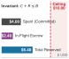{width="100%" fig-alt="Budget envelope bars showing committed spend of 4.00 dollars and active in-flight escrow of 2.40 dollars totaling 6.40 dollars against a hard 10.00 dollar spending ceiling."}

*Hierarchical ledgers hold in-flight funds in escrow, preventing concurrent child subagents from violating the root spending ceiling.*
:::
In an unconstrained classical execution environment, an infinite loop consumes CPU clock cycles or page allocations until an operating system scheduler preempts the thread or the host kernel's out-of-memory subsystem terminates the process. In an agentic architecture executing foundation models across distributed inference clusters or commercial model APIs, an undetected execution loop does not merely peg an accelerator core; it executes an unmetered line of credit against an organization's treasury. Unlike virtual memory pages, which can be reclaimed via an operating system call, financial capital consumed by autoregressive matrix operations and remote tool invocations is strictly non-recoverable. Once tokens are sampled and remote procedure calls are committed, the monetary expenditure is irreversible.

To prevent runaway autonomy from degenerating into catastrophic financial exhaustion, the host agent runtime must enforce financial governance as a first-class runtime invariant. Invariant closure (principle \ref{pri-invariant-closure}) means that this guarantee cannot rely on post-hoc accounting or on warnings the model issues about its own spending, and the model cannot be trusted to meter its own consumption or to stop when its marginal utility falls below zero. Instead, the runtime supervisor must wrap all foundation model inference and external tool execution within a strictly monotonic spending ledger, implement hierarchical budget escrow across parent and child agents, and deploy autonomous circuit breakers capable of severing execution paths long before hard financial limits are breached.

### The invariant of irreversible capital depletion

Classical operating systems govern resource allocation through spatial partitioning and temporal preemption. Physical memory is fungible: a process allocates physical frames through its page tables, manipulates data in place, and subsequently releases those frames back to the OS free list through `free()` or `munmap()`. A process that leaks memory can be quarantined, and its entire physical footprint can be reclaimed instantaneously upon process termination.

In sharp contrast, an agentic trajectory represents an open-loop economic sink. Let an agent trajectory $\mathcal{T}$ consist of a sequence of discrete interaction turns $t \in \{1, 2, \dots, N\}$. At each turn $t$, the agent runtime performs a set of billable operations: an autoregressive prefill and decode pass over an LLM inference runtime, one or more sandboxed container executions, external software-as-a-service (SaaS) tool calls, and automated evaluation steps. Each discrete operation $i$ incurs a strictly positive marginal cost $c_i > 0$. The cumulative financial expenditure of the trajectory at step $t$, denoted $C(t)$, follows the summation:

$$C(t) = \sum_{i=1}^{t} c_i$$

Because every atomic computational step consumes physical energy, hardware wear, and provider service fees, the marginal cost is strictly positive: $c_i > 0$. Consequently, the cumulative spending function satisfies the strict monotonicity property:

$$C(t) > C(t-1) \quad \forall t \ge 1$$

::: {.column-margin}
**The Monotonicity Property**
Unlike virtual memory or CPU time slices, money is an irreversible resource. An agent cannot "free" or "deallocate" tokens generated in prior turns to recover budget for downstream exploration.
:::

Expenditure cannot be reclaimed. A reasoning path that wanders into a hallucinated dead end, generates five thousand tokens of syntactically invalid code, and is subsequently discarded during trajectory rollback still permanently debits the host ledger. If an autonomous agent operating under an unconstrained while-loop encounters an unhandled tool exception and repeatedly submits variations of the same malformed payload, it exhibits an economic runaway failure mode: cumulative cost scales linearly with wall-clock time, bounded only by external account exhaustion.

To guarantee bounded execution, the runtime must enforce the *Monotonic Spending Invariant*. Given an initial authorized spending ceiling $B_{\text{task}} \in \mathbb{R}^+$, the runtime supervisor must guarantee that at every discrete execution step $t$:

$$C(t) + R(t) \le B_{\text{task}}$$

where $R(t) \ge 0$ represents the active financial commitments currently held in escrow for ongoing, in-flight operations. If this inequality cannot be satisfied prior to dispatching an operation, the runtime supervisor must reject the dispatch, trap the execution context with an `OutOfBudgetException`, and initiate deterministic trajectory termination, following the ledger accounting protocol illustrated in @tbl-vol3-budget-ledger-reconciliation and @fig-vol3-hierarchical-budget-ledger.

| Ledger Hierarchy Node  | Lifecycle Phase     | Initial Budget ($B$) | Committed Spend ($E$) | Escrow Reservation ($R$)    | Released Refund         | Free Capital ($F$)  |
|:-----------------------|:--------------------|:---------------------|:----------------------|:----------------------------|:------------------------|:--------------------|
| **Root Task Ledger**   | Initial Delegation  | \$10.00              | \$0.40                | \$6.00 (Reserved for A + B) | —                       | \$3.60              |
| **Child A (Planner)**  | Subagent Execution  | \$2.00               | \$0.50                | \$0.00                      | \$1.50 (Refund to Root) | \$0.00 (Terminated) |
| **Child B (Executor)** | Subagent Execution  | \$4.00               | \$3.10                | \$0.00                      | \$0.90 (Refund to Root) | \$0.00 (Terminated) |
| **Root Task Ledger**   | Post-Reconciliation | \$10.00              | \$4.00 (Cumulative)   | \$0.00 (Escrow Cleared)     | \$2.40 (Restored)       | \$6.00 (Available)  |

: **Budget Ledger Reconciliation**: Hierarchical Budget Ledger Accounting and Capital Reconciliation Example. {#tbl-vol3-budget-ledger-reconciliation}

### Hierarchical budget reservation ledgers

When an agentic system decomposes a complex engineering assignment into a hierarchy of sub-agents—such as a root planning agent spawning concurrent searchers, compilers, and test runners—budget governance becomes a distributed consensus problem. Allowing child agents to draw asynchronously from a single shared, mutable spending balance introduces classical race conditions. Two concurrent child agents, each observing a remaining task balance of $\$2.00$, may simultaneously initiate $\$1.80$ model generation runs. Both inference jobs run to completion on the serving cluster, resulting in a total expenditure of $\$3.60$ and violating the parent's spending bound.

The budget attenuation of @sec-vol3-multiagent-topologies becomes a financial mechanism here. Under monotonic delegation (principle \ref{pri-vol3-monotonic-delegation}), the runtime holds each child's budget in escrow within a *Hierarchical Budget Reservation Ledger* (@fig-vol3-hierarchical-budget-ledger), which removes over-subscription and races between concurrent children. This architecture treats the parent agent as an authoritative escrow bank and downstream child agents as isolated borrowers operating under non-overlapping credit partitions.

::: {#fig-vol3-hierarchical-budget-ledger fig-env="figure" fig-pos="htb" fig-cap="**Hierarchical Budget Reservation Ledger Protocol and Distributed Capital Reconciliation**: A root agent partitions its capital envelope ($B_{\\text{root}} = \\$10.00$) into isolated, non-overlapping child escrows ($B_1 = \\$2.00$ to Subagent 1 and $B_2 = \\$4.00$ to Subagent 2). Child agents execute concurrent operations against local escrows without inter-agent lock contention. Upon child termination, settled expenditures ($E_1 = \\$0.50, E_2 = \\$3.10$) commit permanently while unspent balances (\\$1.50 and \\$0.90) refund upward to restore the root ledger to $\\langle \\$10.00, \\$4.00, \\$0.00, \\$6.00 \\rangle$ with mathematical zero financial leakage." fig-alt="Distributed protocol ladder diagram showing Root Ledger initializing at 10 dollars, reserving 2 dollars for Subagent 1 and 4 dollars for Subagent 2, each child spending locally and returning unspent refunds of 1.50 dollars and 0.90 dollars to yield a reconciled root state with 4 dollars spent and 6 dollars free."}
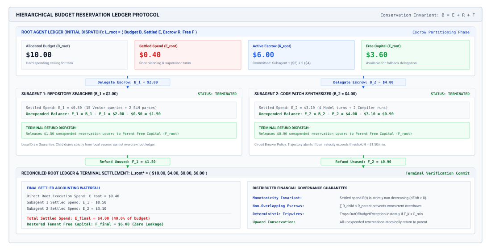
:::

As traced across the protocol ladder of @fig-vol3-hierarchical-budget-ledger, the root agent begins in Phase 1 with ledger state $\mathcal{L}_{\text{root}} = \langle B=\$10.00, E=\$0.40, R=\$6.00, F=\$3.60 \rangle$. To parallelize execution without distributed lock contention, the root executes an atomic delegation handshake that reserves $R_{\text{root}} = \$6.00$ of its capital, establishing isolated child escrows of $B_1 = \$2.00$ for Subagent 1 (Planner) and $B_2 = \$4.00$ for Subagent 2 (Executor). In Phase 2, each child executes concurrently: Subagent 1 incurs $E_1 = \$0.50$ across its deliberation passes, while Subagent 2 incurs $E_2 = \$3.10$ across its code-synthesis and tool-call actions. Because neither child can access the root's unallocated capital or each other's escrow, an unexpected token explosion in one subagent is strictly contained by its local ceiling.

In Phase 3, child termination triggers an atomic upward reconciliation protocol. Subagent 1 terminates with an unexpended surplus of $\$1.50$, while Subagent 2 releases $\$0.90$, returning a total refund of $\Delta F = \$2.40$ to the root. The root ledger atomically clears its active escrow ($R_{\text{root}} \to \$0.00$), commits the children's cumulative spend ($E_{\text{root}} \to \$0.40 + \$0.50 + \$3.10 = \$4.00$), and restores its uncommitted capital to $F_{\text{root}} = \$6.00$. This protocol guarantees the conservation invariant $B_{\text{root}} = E_{\text{root}} + R_{\text{root}} + F_{\text{root}}$ at every physical timestep, ensuring zero financial leakage across arbitrarily deep multi-agent delegation trees.

#### Ledger accounting invariants {.unnumbered}
Every node $k$ in the agent delegation tree maintains an independent, isolated ledger context defined by a four-tuple:

$$\mathcal{L}_k = \langle B_k, E_k, R_k, F_k \rangle$$

The semantics of these fields represent distinct physical and financial states of capital:

1. **Allocated Budget ($B_k$):** The total upper bound of capital granted to node $k$ by its immediate parent. This value is static throughout the lifetime of node $k$.
2. **Settled Expenditure ($E_k$):** The non-recoverable capital permanently debited for completed inference passes, finalized tool executions, and completed child processes. Settled expenditure increases monotonically.
3. **Escrow Reservation ($R_k$):** Capital actively earmarked for in-flight child agents or pending asynchronous tool invocations. Escrowed capital cannot be pledged to new operations.
4. **Free Capital ($F_k$):** The uncommitted, unreserved balance immediately available for dispatching new operations.

These variables are governed by the strict Conservation Invariant:

$$B_k = E_k + R_k + F_k, \quad \text{where } E_k \ge 0, \; R_k \ge 0, \; F_k \ge 0$$

#### Delegation escrow protocols {.unnumbered}
When a parent agent $P$ delegates a subtask to a newly initialized child agent $C$, the runtime executes an atomic two-phase allocation transaction:

*Phase 1: Escrow Debit.* The parent requests an escrow reservation of magnitude $\Delta B$. The runtime validates the availability of uncommitted capital:

$$\Delta B \le F_P$$

If valid, the runtime atomically transitions the parent's ledger state:

$$R_P \leftarrow R_P + \Delta B, \qquad F_P \leftarrow F_P - \Delta B$$

*Phase 2: Child Initialization.* The child ledger $\mathcal{L}_C$ is initialized with an absolute budget ceiling equal to the reserved slice:

$$B_C = \Delta B, \qquad E_C = 0, \qquad R_C = 0, \qquad F_C = \Delta B$$

The child agent operates entirely within the sandboxed financial boundary defined by $B_C$. It has zero visibility into the parent's broader ledger and cannot request additional capital from upstream nodes without explicit parental renegotiation. If the child attempts to spawn its own grandchildren, it must carve out reservations strictly from its own free balance $F_C$.

#### Capital reconciliation protocols {.unnumbered}
When child agent $C$ halts—whether through successful goal completion, unrecoverable exception, or supervisory abortion—it reports its finalized cumulative expenditure $E_C$ to the runtime supervisor. Because the child was bounded by $B_C = \Delta B$, the settled expenditure is guaranteed to satisfy:

$$E_C \le \Delta B$$

The runtime then executes an atomic reconciliation transaction on the parent ledger:

$$E_P \leftarrow E_P + E_C$$

$$R_P \leftarrow R_P - \Delta B$$

$$F_P \leftarrow F_P + (\Delta B - E_C)$$

The unexpended surplus, $\Delta B - E_C$, is released from escrow and immediately restored to the parent's free capital pool $F_P$, becoming instantly available for subsequent delegated tasks or alternative recovery strategies. The formal state transition semantics across all ledger operations are defined in @tbl-vol3-ledger-transitions.

| Ledger Transaction  | Pre-Condition                | Parent Ledger Mutation                                                                         | Child Ledger Mutation                                                                                                                            |
|:--------------------|:-----------------------------|:-----------------------------------------------------------------------------------------------|:-------------------------------------------------------------------------------------------------------------------------------------------------|
| **Child Spawn**     | $\Delta B \le F_P$           | $R_P \leftarrow R_P + \Delta B$<br>$F_P \leftarrow F_P - \Delta B$                             | $B_C \leftarrow \Delta B$<br>$F_C \leftarrow \Delta B$                                                                                           |
| **Model Dispatch**  | $c_{\text{est}} \le F_C$     | None                                                                                           | $R_C \leftarrow R_C + c_{\text{est}}$<br>$F_C \leftarrow F_C - c_{\text{est}}$                                                                   |
| **Model Settle**    | $c_{\text{actual}}$ measured | None                                                                                           | $E_C \leftarrow E_C + c_{\text{actual}}$<br>$R_C \leftarrow R_C - c_{\text{est}}$<br>$F_C \leftarrow F_C + (c_{\text{est}} - c_{\text{actual}})$ |
| **Child Reconcile** | Child terminated             | $E_P \leftarrow E_P + E_C$<br>$R_P \leftarrow R_P - B_C$<br>$F_P \leftarrow F_P + (B_C - E_C)$ | Destroyed                                                                                                                                        |

: **Formal State Transition Semantics for Hierarchical Budget Ledgers**: Pre-conditions, parent ledger mutations, and child ledger states across delegation and reconciliation phases. {#tbl-vol3-ledger-transitions}

```{python}
#| label: lego-17-hierarchical-multi-agent-budget-allocation-and
#| echo: false
# │ Show: Hierarchical budget escrow protects root capital during sub-agent abortion.
# │ How: Monotonic budget reservation, settlement, and unexpended capital refunds.
# └─────────────────────────────────────────────────────────────────────────────
from mlsysim import *
from mlsysim.core.units import *
from mlsysim.fmt import check, fmt_usd

class MultiAgentBudgetAllocationRecovery:
    f_root = 3.728

    check(f_root == 3.728, "f_root")

    f_root_str = fmt_usd(f_root, precision=3)
```

::: {#nbk-17-hierarchical-multi-agent-budget-allocation-and .callout-notebook title="Multi-agent budget allocation and recovery"}
Consider an autonomous software engineering agent tasked with diagnosing and repairing a failing unit test in a distributed microservice. The human operator authorizes a total root task budget of $B_{\text{root}} = \$5.00$.

1. **Root Initialization:**
   The root orchestrator initializes its ledger:
   $$\mathcal{L}_{\text{root}} = \langle B = \$5.00, \; E = \$0.00, \; R = \$0.00, \; F = \$5.00 \rangle$$

2. **Planning Phase:**
   The root agent generates an initial architectural execution plan using a frontier model, consuming 8,000 prefill tokens ($c_{\text{in}} = \$3.00 / 10^6$ tokens) and 1,200 decode tokens ($c_{\text{out}} = \$15.00 / 10^6$ tokens):
   $$c_{\text{plan}} = (8{,}000 \times 3.00 \times 10^{-6}) + (1{,}200 \times 15.00 \times 10^{-6}) = \$0.024 + \$0.018 = \$0.042$$
   The runtime settles this expense:
   $$\mathcal{L}_{\text{root}} = \langle B = \$5.00, \; E = \$0.042, \; R = \$0.00, \; F = \$4.958 \rangle$$

3. **Sub-Agent Delegation:**
   The plan requires two concurrent operations:

   - Agent $C_{\text{trace}}$: Analyze distributed OpenTelemetry spans and logs. Allocation: $\Delta B_1 = \$1.20$.
   - Agent $C_{\text{fuzz}}$: Execute property-based test generation in a sandboxed container. Allocation: $\Delta B_2 = \$2.50$.
   The runtime commits the escrow reservations:
   $$R_{\text{root}} = \$1.20 + \$2.50 = \$3.70$$
   $$F_{\text{root}} = \$4.958 - \$3.70 = \$1.258$$
   $$\mathcal{L}_{\text{root}} = \langle B = \$5.00, \; E = \$0.042, \; R = \$3.70, \; F = \$1.258 \rangle$$

4. **Child Execution and Premature Abortion:**
   - Agent $C_{\text{trace}}$ analyzes 14 trace files, consuming $\$0.38$ across lightweight model calls, identifies the root cause null-pointer dereference, and cleanly exits with $E_{C_1} = \$0.38$.
   - Agent $C_{\text{fuzz}}$ enters an unstable environment state: a Docker socket timeout triggers an unhandled retry loop that repeatedly spins up compiler instances. It consumes $\$0.85$ before an execution circuit breaker detects zero progress and aborts the agent, yielding $E_{C_2} = \$0.85$.
5. **Terminal Reconciliation:**
   The runtime reclaims unexpended capital from both terminated child escrow accounts:
   $$\text{Refund}_1 = \Delta B_1 - E_{C_1} = \$1.20 - \$0.38 = \$0.82$$
   $$\text{Refund}_2 = \Delta B_2 - E_{C_2} = \$2.50 - \$0.85 = \$1.65$$
   Total capital settled into root:
   $$E_{\text{root}} \leftarrow \$0.042 + \$0.38 + \$0.85 = \$1.272$$
   Total escrow cleared:
   $$R_{\text{root}} \leftarrow \$3.70 - (\$1.20 + \$2.50) = \$0.00$$
   Free capital restored:
   $$F_{\text{root}} \leftarrow \$1.258 + \$0.82 + \$1.65 = \$3.728$$
   Final reconciled ledger state:
   $$\mathcal{L}_{\text{root}} = \langle B = \$5.00, \; E = \$1.272, \; R = \$0.00, \; F = \$3.728 \rangle$$

*Takeaway:* Despite the catastrophic crash and execution failure of the fuzzing sub-agent, the hierarchical reservation invariant mathematically prevented the child from overspending the user's authorized capital. The root orchestrator retains {python} MultiAgentBudgetAllocationRecovery.f_root_str in uncommitted funds to dispatch an alternative diagnostic strategy.
:::

### Multi-rate circuit breakers

While a static cumulative spending ceiling $B_{\text{task}}$ guarantees that an agent cannot exceed an absolute fiscal budget, static caps represent a dangerously coarse control mechanism. If an autonomous agent with a $\$50.00$ ceiling enters a pathological code generation loop that burns $\$10.00$ per minute, a static cap allows the system to run uncontrolled for five full minutes, generating hundreds of useless files and thrashing execution sandboxes before halting.

The tool circuit breakers of @sec-vol3-sagas-containment already let the runtime cut off a failing dependency without the model's cooperation. Here the same tri-state breaker watches different signals, financial burn velocity and *epistemic utility decay*, rather than socket timeouts and error ratios.

::: {.column-margin}
**The Circuit Breaker Analogy**
In electrical grids, a circuit breaker trips when current draw ($I = \frac{dQ}{dt}$) spikes dangerously, preventing fires. In agentic systems, the breaker trips when the financial burn rate ($\frac{dC}{dt}$) exceeds safe envelope bounds.
:::

An agentic circuit breaker acts as a dynamic supervisor wrapped around the model dispatch pipeline. It continuously transitions between three operational states:

1. **CLOSED (Nominal):** Operations dispatch normally. Incurred costs and state deltas are logged to a rolling sliding window.
2. **OPEN (Tripped):** The breaker has detected an invariant violation. All subsequent inference requests, tool dispatches, and child agent initializations fail immediately (`fail-fast`). The active trajectory is suspended, and the runtime invokes automated rollback or human operator escalation.
3. **HALF-OPEN (Canary Probing):** After a cooldown interval or an environmental checkpoint restore, the runtime permits a single, bounded "canary" probe (such as an inexpensive reflection pass or a single deterministic unit test) to verify whether the agent has recovered coherence. If the probe fails, the breaker immediately reverts to `OPEN`. The state transitions and operational invariants governing this control loop are formalized in @tbl-vol3-circuit-breaker-fsm.

| Current State          | Transition Trigger / Condition                                                                                    | Target State  | Invariant Guard & Operational Semantics                                                      | System Recovery Action                                      |
|:-----------------------|:------------------------------------------------------------------------------------------------------------------|:--------------|:---------------------------------------------------------------------------------------------|:------------------------------------------------------------|
| **CLOSED (Nominal)**   | Velocity spike ($\bar{\nu}_W > \nu_{\max}$), utility decay ($\Delta \mathcal{U} < \epsilon$), or invariant breach | **OPEN**      | Immediate fail-fast trap; halts inference and tool dispatches                                | Suspends trajectory, cancels pending child jobs, logs alert |
| **OPEN (Tripped)**     | Cooldown window elapsed ($\Delta t > \tau_{\text{cool}}$) or checkpoint rollback complete                         | **HALF-OPEN** | Permits isolated, single-step canary evaluation probe                                        | Emits bounded introspection or isolated unit test           |
| **HALF-OPEN (Canary)** | Canary probe fails or re-triggers invariant breach                                                                | **OPEN**      | Enforces exponential cooldown backoff ($\tau_{\text{cool}} \leftarrow 2 \tau_{\text{cool}}$) | Escalates to human operator or terminates trajectory        |
| **HALF-OPEN (Canary)** | Canary probe succeeds and state verification passes                                                               | **CLOSED**    | Resets consecutive failure counter and clears escrow hold                                    | Restores normal multi-turn model dispatch pipeline          |

: **Circuit Breaker State Machine**: Agentic Circuit Breaker Finite State Machine and Transition Semantics. {#tbl-vol3-circuit-breaker-fsm}

To provide comprehensive defense-in-depth, the host runtime implements three distinct, orthogonal circuit breaker triggers.

#### Financial velocity limiting {.unnumbered}
The financial velocity breaker monitors the instantaneous first derivative of expenditure with respect to time: $\nu(t) = \frac{dC}{dt}$. In a discrete runtime, this is computed over a backward-looking sliding window of duration $W$ (e.g., 60 seconds):

$$\bar{\nu}_W(t) = \frac{C(t) - C(t - W)}{W}$$

If $\bar{\nu}_W(t)$ exceeds an authorized burn-rate threshold $\nu_{\max}$ (e.g., $\$2.00 / \text{minute}$), the circuit breaker immediately trips to `OPEN`. Velocity spikes typically signify that an agent has spawned a wide fan-out of uncoordinated sub-agents, entered an unthrottled polling loop against external APIs, or triggered an autoregressive loop that saturates local GPU prefill engines with redundant context windows.

#### Cumulative trajectory caps {.unnumbered}
The cumulative breaker enforces the hard boundary condition $C(t) + R(t) \ge B_{\text{task}}$. Unlike the velocity breaker, which triggers on rates, the cumulative breaker enforces total volume. It acts as the ultimate fail-safe against low-velocity, highly persistent agent trajectories that make minimal progress over hours of execution. When tripped, the runtime preserves the current sandbox state, dumps a diagnostic execution trace, and transitions the agent to a quiescent state awaiting human authorization for budget expansion.

#### Marginal epistemic utility decay {.unnumbered}
The most subtle and destructive failure mode in autonomous systems is the *epistemic loop*: an agent remains well within its financial velocity limit and has consumed only a fraction of its total budget, but it has ceased making measurable progress toward task completion. The agent generates code, runs a unit test, observes an assertion error, modifies an unrelated comment or variable name, runs the test again, and repeats the cycle indefinitely.

To detect this pathology, the runtime evaluates the *marginal epistemic utility* of the trajectory. Let $\mathcal{S}_t$ represent the observable state of the environment at turn $t$ (e.g., the directory tree of source code, compiler diagnostic vectors, and test execution outcomes). We define a progress metric $\mathcal{M}(\mathcal{S}_t) \in [0, 1]$ that measures objective proximity to goal invariants:

$$\mathcal{M}(\mathcal{S}_t) = w_1 \cdot \text{PassRatio}(\mathcal{S}_t) + w_2 \cdot (1 - \text{LintErrors}(\mathcal{S}_t)) + w_3 \cdot \text{DiffConvergence}(\mathcal{S}_t)$$

where $w_1, w_2, w_3$ represent normalized domain weights. The marginal utility across an evaluation window of $K$ turns is defined as:

$$\Delta \mathcal{M}_K(t) = \mathcal{M}(\mathcal{S}_t) - \mathcal{M}(\mathcal{S}_{t - K})$$

If the runtime observes that over $K$ consecutive turns, cumulative spending has increased significantly ($\sum_{j=t-K+1}^t c_j > \theta_C$) while the marginal progress metric has remained stagnant or decayed:

$$\Delta \mathcal{M}_K(t) \le \epsilon_{\text{progress}}$$

the epistemic decay breaker trips to `OPEN`. The runtime halts the loop, diagnosing that the model has exhausted its reasoning capability for the current environmental state and that continuing execution will merely burn financial capital without increasing the probability of goal satisfaction. The monitored metrics, mathematical trigger conditions, and mitigated failure modes across the three circuit breakers are summarized in @tbl-vol3-circuit-breakers.

| Circuit Breaker      | Monitored Metric                                       | Mathematical Trigger Condition                                    | Primary Failure Mode Mitigated                                         |
|:---------------------|:-------------------------------------------------------|:------------------------------------------------------------------|:-----------------------------------------------------------------------|
| **Velocity Limiter** | Burn Rate $\frac{dC}{dt}$                              | $\frac{C(t) - C(t - W)}{W} > \nu_{\max}$                          | Concurrent child fan-out explosions; unthrottled API polling loops     |
| **Cumulative Cap**   | Total Exposure                                         | $C(t) + R(t) \ge B_{\text{task}}$                                 | Long-running creeping exhaustion; unauthorized project budget overruns |
| **Epistemic Decay**  | Marginal Utility $\frac{\Delta \mathcal{M}}{\Delta C}$ | $\Delta \mathcal{M}_K \le \epsilon$ while $\Delta C_K > \theta_C$ | Flailing retry loops; cosmetic code shuffling; cyclic reasoning traps  |

: **Multi-Rate Circuit Breaker Triggers and Failure-Mode Mitigations**: Monitored metrics, mathematical trigger conditions, and primary failure modes for agent financial safety. {#tbl-vol3-circuit-breakers}

Once spending is mathematically bounded by monotonic ledgers, hierarchical escrow, and multi-rate circuit breakers, the systems engineer can safely deploy autonomous agents into production environments. However, enforcing spending bounds addresses only the negative risk of fleet operations—preventing economic catastrophe. The positive design challenge remains: given a specific production task with known latency, budget, and accuracy constraints, how does an architect determine whether to solve it with a deterministic compiler script, a single model invocation with structured outputs, a sequential chain of specialized models, or a fully dynamic multi-agent system? Synthesizing these operational variables into a principled selection rubric is the subject of the next section.

## Architectural Selection Frameworks {#sec-vol3-tokenomics-selection}

The decision matrix of @sec-vol3-intro-workflow-vs-loop settles whether a task needs a model-directed loop at all. This section puts a price on that decision. Software 1.0 scripts and Software 2.0 direct calls are the fixed workflows of that matrix, while bounded agentic workflows and multi-agent fleets are model-directed loops that differ in how many agents share the task. The costs developed in this chapter, in dollars per accepted task, wall-clock latency, and spending risk, now say how far along that spectrum a given workload can afford to go.

The central systems engineering reality is that autonomous agency is not an architectural goal in itself; it is an expensive, high-variance mechanism of last resort. Every transition along the spectrum of autonomy—from deterministic procedural logic to single-shot model inference, bounded iterative loops, and dynamic multi-agent topologies—purchases increased problem-solving flexibility at the direct expense of operational determinism, execution speed, and financial predictability. The role of the systems architect is to determine the Pareto-optimal operating point along this spectrum for a given workload (@fig-vol3-architectural-radar-chart).

::: {#fig-vol3-architectural-radar-chart fig-env="figure" fig-pos="htb" fig-cap="**Dimensional Trade-Offs Across the Architectural Autonomy Spectrum and Systems Selection Matrix**: A six-dimensional systems evaluation comparing Software 1.0 (deterministic procedural code), Software 2.0 (direct single-shot model inference), Bounded Agentic Workflows ($K \\le K_{\\max}$, $A_1$), and Autonomous Multi-Agent Fleets. Expanding autonomy monotonically increases flexibility at the cost of operational determinism, execution speed, financial predictability, verification simplicity, and blast radius safety. The accompanying systems selection matrix establishes definitive decision boundaries based on epistemic ambiguity, state mutability, latency tolerance, and verifiable ground truth." fig-alt="Six-axis radar chart comparing Software 1.0, Software 2.0, Bounded Agentic, and Autonomous Fleets across flexibility, speed, financial predictability, operational determinism, verification simplicity, and safety, paired with a systems selection matrix defining workload profiles and governance invariants."}
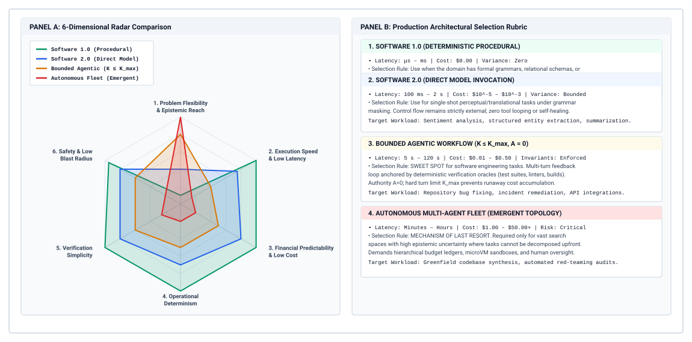
:::

The architectural tensions governing this continuum are visualized systematically in @fig-vol3-architectural-radar-chart. The left panel plots four system paradigms across six fundamental engineering dimensions: task flexibility, execution speed, financial predictability, operational determinism, verification simplicity, and safety/blast radius containment. Software 1.0 represents the extreme deterministic anchor: while its task flexibility is minimal (1/5), it scores 5/5 across execution speed, financial predictability, determinism, verification simplicity, and safety. Conversely, Autonomous Multi-Agent Fleets maximize flexibility (5/5) to explore unbounded problem spaces, but collapse to 1/5 across financial predictability, operational determinism, and blast-radius safety due to compound error loops.

Crucially, the accompanying selection matrix in @fig-vol3-architectural-radar-chart demonstrates that the sweet spot for industrial engineering lies in the middle two paradigms. Software 2.0 delivers single-pass semantic extraction with sub-second response times and strictly predictable token fees. When tasks require multi-step environment interaction, Bounded Agentic Workflows provide the required expressive power while anchoring system risk through hard runtime bounds: authority confined to a sandbox the runtime can discard ($A_1$), deterministic turn ceilings ($K \le K_{\max}$), and monotonic budget escrows. An architect moves to a multi-agent fleet only when it beats a single agent given the same total budget on the tri-axial frontier of @sec-vol3-multiagent-evaluation (principle \ref{pri-15-tri-axial-evaluation}), with cost measured per accepted task.

### The spectrum of system autonomy {#sec-vol3-selection-spectrum}

To ground architectural decisions, we formalize the operational landscape into four discrete paradigms, categorized by how execution control, state mutation, and verification are partitioned between deterministic host software and stochastic neural inference.

*Software 1.0: Deterministic Procedural Workflows.* In a Software 1.0 architecture, the control-flow graph, data transformation pipelines, and failure recovery branches are hard-coded into deterministic algorithmic logic (e.g., C++, Rust, or Python scripts). The operational domain must exhibit near-zero epistemic ambiguity: all inputs can be mapped to formal grammars, relational schemas, or predictable abstract syntax trees (ASTs). Latency is measured on microsecond or millisecond scales, execution cost is bounded strictly by hardware instruction throughput, and the system exhibits zero stochastic variance. Software 1.0 fails completely when confronting unstructured natural language, semantic ambiguity, or novel operational distributions that were not anticipated at design time.

*Software 2.0: Direct Model Invocations.* The first hybrid paradigm injects an unprivileged model inference call into an otherwise deterministic pipeline. The host runtime compiles input data into a static prompt template, dispatches a single forward pass to an inference engine ($M$), and enforces structural conformance on the output using grammar-constrained decoding (e.g., JSON schemas or regular expressions). This pattern is optimal for isolated perceptual or translational tasks: classification, entity extraction, sentiment scoring, or text summarization. Control flow remains strictly external and deterministic; the model is never permitted to loop, dispatch external RPCs, or observe the consequences of its own outputs. Latency is governed entirely by the prefill and autoregressive decode phases of that single call ($T_{\text{prefill}} + T_{\text{decode}}$), and the failure surface is limited to semantic classification error within a rigidly bounded schema.

*Bounded Agentic Workflows.* When a task requires multi-step environment interaction—such as diagnosing an operational incident, generating a multi-file code patch, or reconciling contradictory records across databases—a single forward pass is insufficient. A bounded agentic architecture constructs a tightly constrained feedback loop: an orchestrator manages a discrete sequence of turns ($k \in [1, K]$), where each turn consists of model deliberation, structured tool invocation, environment execution, and observation ingestion. Crucially, the orchestrator operates under explicit systems invariants:
$$A \le A_1, \quad K \le K_{\max}, \quad \text{and} \quad \mathcal{L}_{\text{context}} \le L_{\max}$$
The model itself holds zero ambient authority, and the task's authority stays inside a sandbox the runtime can discard. The model proposes tool calls via memory escrow; external state mutations occur through transactional interfaces; and execution halts immediately upon encountering a failing mechanical verifier or reaching the hard turn ceiling $K_{\max}$. Bounded agents handle moderate semantic ambiguity and multi-step composition while preserving a deterministic perimeter.

*Fully Autonomous Multi-Agent Fleets.* At the extreme end of the continuum, an orchestrator delegates open-ended goals to a dependency graph of specialized agents that allocate child budgets, spawn short-lived workers, and pass typed, schema-validated handoffs along the graph's edges. The graph can grow at runtime as intermediate observations reveal new subtasks, but agents may only propose changes, and every commit passes an invariant gate (@sec-vol3-multiagent-consensus). This paradigm is required for tasks characterized by high epistemic uncertainty, vast search spaces, and multi-disciplinary domains, such as open-ended scientific literature synthesis, whole-repository greenfield software engineering, or exploratory penetration testing. However, as demonstrated by the compound failure analysis in whole-trajectory cost modeling, unconstrained multi-agent loops exhibit exponential error compounding, non-linear token burn, and non-trivial risks of deadlock or livelock.

The operational and economic boundaries separating these four architectural paradigms are formalized in @tbl-vol3-architecture-spectrum.

| System Dimension                    | Software 1.0 (Deterministic)                             | Software 2.0 (Direct Inference)                         | Bounded Agentic Workflow                                   | Autonomous Multi-Agent Fleet                              |
|:------------------------------------|:---------------------------------------------------------|:--------------------------------------------------------|:-----------------------------------------------------------|:----------------------------------------------------------|
| **Control Flow**                    | Static DAG; hard-coded algorithmic branching             | Static pipeline; single inference step                  | Constrained loop ($k \le K_{\max}$); state-machine routing | Typed dependency graph; budget-attenuated delegation      |
| **Latency Profile**                 | Microseconds to milliseconds ($\mu\text{s} - \text{ms}$) | Hundreds of milliseconds ($100\text{ ms} - 2\text{ s}$) | Multi-second to minutes ($5\text{ s} - 120\text{ s}$)      | Minutes to hours ($2\text{ min} - 120\text{ min}$)        |
| **Direct Cost ($C_{\text{task}}$)** | $\$0.00$ (negligible CPU cycles)                         | Fixed token fee ($\$10^{-5} - \$10^{-3}$)               | Bounded sum: $\sum_{k=1}^K C_k$ ($\$10^{-2} - \$10^{-1}$)  | Stochastic integral: $\int C(t) dt$ ($\$1.00 - \$50.00+$) |
| **State Representation**            | In-memory variables, explicit database tables            | Stateless request-response payload                      | Linearized context buffer, key-value scratchpad            | Distributed worktrees, shared blackboard, message buses   |
| **Failure Recovery**                | Deterministic exceptions; retry catches                  | Fallback model cascade; output re-parsing               | ReAct reflection; backtracking; saga rollback              | Consensus re-planning; agent eviction; human escalation   |
| **Blast Radius Risk**               | Predictable; bounded by application permissions          | Low; corrupt output caught by schema validation         | Moderate; bounded by mediated RPC sandbox escrow           | Critical; potential cascading tool actions across fleets  |
| **Verification Basis**              | Unit tests; type systems; formal assertions              | Regex / JSON schema; scalar reward heads                | Mechanical sandboxes (linters, test suites, AST diffs)     | Invariant gate per commit; end-to-end tests; human review |

: **Operational, Economic, and Verification Profiles Across the Architectural Spectrum**: System dimensions, control flows, latency profiles, cost models, and failure recovery mechanisms. {#tbl-vol3-architecture-spectrum}

### Placing a task on the spectrum {#sec-vol3-selection-questions}

::: {.column-margin}
{width="100%" fig-alt="H·S·A locator with all three axes, Horizon, State, and Authority, highlighted in purple."}

*Horizon, state, and authority each set the closure a task must pay for.*
:::

Selecting the correct architecture along this spectrum is an exercise in constraint matching rather than intuition. Four questions place a task. Three ask about its H·S·A exposures (@sec-vol3-intro-hsa), and the fourth asks what closure evidence (@sec-vol3-intro-closure-evidence) the runtime can collect for it. The subsections below answer each in terms of what it costs at each point on the spectrum.

#### Horizon and deadline ($T_{\text{target}}$) {.unnumbered}
What is the strict wall-clock deadline for the task? In interactive human-facing systems—such as code completion in an IDE, search query rewriting, or conversational voice agents—the latency budget is dictated by human perceptual thresholds ($50\text{ ms}$ to $1.5\text{ s}$). Such budgets fundamentally prohibit bounded agentic loops. If an autoregressive decode phase requires $30\text{ ms}$ per token, a $500$-token generation consumes $15\text{ s}$ of raw decode time alone, completely blowing through interactive deadlines before tool execution or verification overhead is even accounted for.

Tasks with sub-second deadlines must be implemented as Software 1.0 algorithms or Software 2.0 direct calls with speculative decoding acceleration. Conversely, asynchronous offline workloads—such as overnight security patch synthesis, batch customer support resolution, or static analysis triage—provide latency horizons of minutes or hours ($T_{\text{target}} \ge 300\text{ s}$), opening the design space to multi-turn bounded agents or distributed multi-agent exploration.

#### Carried state {.unnumbered}
Does the task require transforming an ephemeral input into an output, or does it require mutating persistent, multi-turn external state? When a task is purely functional—mapping input buffer $X$ to output buffer $Y$ without side effects—a Software 2.0 direct call is structurally superior. Introducing an agent runtime to a stateless transformation introduces coordination overhead and stochastic failure modes without providing architectural value.

When the problem domain requires multi-turn environmental feedback, such as modifying a file system, running an integration test suite, observing compiler error diagnostics, and incrementally editing dependent modules, the architecture must maintain an explicit trajectory state. The critical design choice is between a bounded agent managing a centralized linear context versus an autonomous multi-agent fleet managing partitioned local contexts. A single bounded agent that keeps a well-curated working set in its context window avoids the state synchronization overhead, race conditions, and message-passing latency inherent to multi-agent distributed architectures. Multi-agent fleets should be selected only when state representations exceed physical context limits ($L_{\max}$) or require distinct security clearance domains.

#### Authority {.unnumbered}
What is the worst-case operational consequence if the foundation model hallucinates or executes an adversarial action? The model itself always holds zero ambient authority, so the question is which authority level the task needs and what closure that level demands. Even a read-only task ($A_0$) is exposed, because whatever it reads can leave through the proposals and tool arguments it sends outward.

If an application requires executing irreversible external side effects—such as sending customer emails, modifying production database records, executing financial transactions, or pushing code to an upstream release branch—the permitted authority cannot be granted to an autonomous agent operating in an open loop. The architectural selection follows the blast radius:

- *Reversible / Sandboxed ($A_1$):* Tasks whose side effects are confined to an ephemeral container, a temporary Git worktree, or a staged scratchpad can be delegated to Bounded Agentic Workflows.
- *Compensable ($A_2$):* Tasks whose external actions can be retried safely or undone by a compensating action can run as Bounded Agentic Workflows only when the runtime settles each timed-out action before retrying it (principle \ref{pri-vol3-exactly-once-settlement}) and registers each compensation before the action it undoes.
- *Irreversible / High-Impact ($A_3$):* Tasks whose actions cannot be undone, such as a production migration or a payment, must restrict model actions to Software 2.0 proposal generation, routing the candidate mutation into memory escrow for deterministic verification or human approval prior to physical execution.

#### Closure evidence {.unnumbered}
Can the host supervisor deterministically verify whether the model's output satisfies the problem requirements? Invariant closure (principle \ref{pri-invariant-closure}) makes this the governing question, because task correctness can be established only by evidence the host collects at the end-to-end boundary, never by prompt steering, self-reflection, or the model's confidence.

If an application possesses an automated, high-speed mechanical verifier (e.g., `pytest`, `cargo check`, or a formal schema validator), the system can safely operate as a Bounded Agentic Workflow. The runtime grants the model $K$ attempts to iterate against the verifier, treating the compiler's error diagnostics as deterministic feedback.

If, however, no mechanical verifier exists—such as evaluating the rhetorical persuasiveness of an essay, the stylistic elegance of a user interface, or the legal liability of a contract summary—the feedback loop cannot be closed mechanically. In the absence of an external endpoint verifier, expanding turn limits ($K \to \infty$) or adding multi-agent critique layers does not converge toward correctness; it leads to circular drift, self-reinforcing hallucinations, and unchecked token expenditure. Tasks lacking objective completion evidence must be constrained to Software 2.0 direct calls coupled to human review workflows ($C_{\text{human}}$).

### Elastic selection economics {#sec-vol3-selection-economics}

Architectural selection is not static. The Pareto frontier separating Software 1.0, Software 2.0, Bounded Agents, and Multi-Agent Fleets shifts dynamically as underlying hardware speeds increase, inference costs decline, and mechanical verification harnesses mature. A systems architect must understand how to navigate these sensitivity frontiers across the architectural paradigms detailed in @tbl-vol3-architectural-regimes.

| Architectural Paradigm              | Task Ambiguity & Entropy              | Mechanical Verifiability              | Latency Tolerance                        | Economic Cost Profile                 | Representative Systems Substrate                |
|:------------------------------------|:--------------------------------------|:--------------------------------------|:-----------------------------------------|:--------------------------------------|:------------------------------------------------|
| **Software 1.0 (Deterministic)**    | Zero (closed domain)                  | Absolute ($100\%$ formal proofs)      | Hard real-time ($< 1\text{ ms}$)         | Negligible ($\mathcal{O}(1)$ CPU ops) | Static parsers, Linters, AST rule engines       |
| **Software 2.0 (Direct Inference)** | Low to Moderate (unstructured input)  | Moderate (schema checks, regex)       | Strict ($10\text{--}500\text{ ms}$)      | Fixed per call (\$0.001 - \$0.01)     | Single-turn classifiers, Embeddings, Rankers    |
| **Bounded Agentic Loops**           | Moderate (multi-step repair, coding)  | High (deterministic tests, compilers) | Relaxed ($1\text{--}60\text{ s}$)        | Dynamic per turn (\$0.05 - \$0.50)    | ReAct loops, MicroVM tool runners, Pytest gates |
| **Autonomous Multi-Agent Fleets**   | High (open-ended research, synthesis) | Variable (semantic consensus)         | Asynchronous ($1\text{--}30\text{ min}$) | High per task (\$1.00 - \$20.00)      | Hierarchical subagent DAGs, Quorum voting       |

: **Architectural Regime Matrix**: Systems Frontier Matrix: Architectural Regimes across Uncertainty and Verifiability. {#tbl-vol3-architectural-regimes}

Consider the economic transition boundary between a Software 2.0 single-turn pipeline and a Bounded Agentic loop. Let a task possess a baseline single-pass success rate $p_1$ under a frontier model costing $C_{\text{frontier}}$ per invocation. If the single-pass accuracy is insufficient ($p_1 < p_{\text{target}}$), the architect faces a trade-off: deploy an expensive Software 2.0 cascade using ensemble voting (sampling $N$ outputs in parallel), or implement a Bounded Agentic loop that executes an iterative repair cycle over $k \le K$ steps using a cheaper, tool-equipped model costing $C_{\text{agent}}$ per turn.

Under an iterative bounded agent running against a mechanical verifier, the probability that the agent produces a passing solution within $K$ turns is:
$$p_{\text{agent}}(K) = 1 - \prod_{k=1}^K (1 - r_k)$$
where $r_k$ is the conditional success probability at turn $k$ given that previous attempts failed. The expected cost of the bounded agentic trajectory is:
$$\mathbb{E}[C_{\text{trajectory}}] = \sum_{k=1}^K C_k \cdot \Pr(\text{reaching turn } k) + C_{\text{verify}} \cdot \mathbb{E}[\text{turns}]$$
As long as the unit cost of inference declines faster than the operational overhead of running the sandbox environment ($C_{\text{verify}}$ and container startup latency $T_{\text{runtime}}$), the economic frontier aggressively favors Bounded Agentic loops over brute-force Software 2.0 parallel sampling. However, if the verification infrastructure is slow or expensive (e.g., executing a $45\text{-second}$ integration test requiring paid third-party sandbox infrastructure), the Amdahl latency bottleneck shifts entirely to the tool execution tier ($T_{\text{tool}}$), making iterative agent loops economically unviable compared to heavily prompted Software 2.0 workflows.

```{python}
#| label: lego-17-architectural-frontier-migration-under-cost
#| echo: false
# │ Show: Bounded agentic loop cuts remediation cost by 43% vs Software 2.0 and 73% vs 1.0.
# │ How: Iterative repair transitions with mechanical verifier vs human escalation triage.
# └─────────────────────────────────────────────────────────────────────────────
from mlsysim import *
from mlsysim.core.units import *
from mlsysim.fmt import check, fmt_percent

class FrontierMigrationCostScaling:
    savings_b = (112450 - 64082) / 112450
    savings_a = (238010 - 64082) / 238010

    check(abs(savings_b - 0.4301) < 0.001, "savings_b")
    check(abs(savings_a - 0.7307) < 0.001, "savings_a")

    savings_b_pct_str = fmt_percent(round(savings_b, 2), precision=0, style="prose")
    savings_a_pct_str = fmt_percent(round(savings_a, 2), precision=0, style="prose")
```

::: {#nbk-17-architectural-frontier-migration-under-cost .callout-notebook title="Frontier migration under cost scaling"}
**Scenario:** An enterprise infrastructure team manages an automated vulnerability remediation pipeline processing $10{,}000$ security advisory tickets per month. Each ticket requires identifying an outdated dependency, updating configuration manifests, refactoring deprecated API calls across multiple source files, and verifying that the project still compiles and passes its test suite.

The team evaluates three competing architectures:

1. **Architecture A (Software 1.0 AST Rewriter):** A deterministic rule-based script utilizing static analysis and AST pattern matching.
   - Execution time: $T_{\text{task}} = 450\text{ ms}$ per repository.
   - Cost: $C_{\text{task}} = \$0.001$ in compute cycles.
   - Success rate: $p_A = 0.32$ (succeeds only on clean, standardized API upgrades; fails on non-trivial syntax variations).
2. **Architecture B (Software 2.0 Direct Frontier Call):** A single-shot pipeline that feeds repository file excerpts into a frontier reasoning model, requesting a unified Git diff within a strict JSON schema.
   - Execution time: $T_{\text{task}} = 12.5\text{ s}$ ($2{,}500$ prefill tokens, $800$ decode tokens).
   - Cost: $C_{\text{task}} = \$0.045$ per invocation.
   - Success rate: $p_B = 0.68$ (frequently hallucinates unseen API signatures or introduces syntax regressions on complex files).
3. **Architecture C (Bounded Agentic Loop):** A ReAct-style supervisor wrapping a fast, lightweight model ($C_{\text{turn}} = \$0.006$). The model proposes localized file edits, dispatches compilation and unit test commands to an ephemeral container ($C_{\text{verify}} = \$0.002$ per run, $T_{\text{verify}} = 4.0\text{ s}$), and inspects error diagnostics to repair diffs over up to $K=3$ turns.
   - Per-turn transition probabilities: $r_1 = 0.55$, $r_2 = 0.42$, $r_3 = 0.30$.
   - Cumulative success rate:
     $$p_C = 1 - (1 - 0.55)(1 - 0.42)(1 - 0.30) = 1 - (0.45)(0.58)(0.70) = 1 - 0.1827 = 0.8173 \approx 81.7\%$$

   - Average turns executed:
     $$\mathbb{E}[k] = 1 + (1 - r_1) + (1 - r_1)(1 - r_2) = 1 + 0.45 + (0.45)(0.58) = 1 + 0.45 + 0.261 = 1.711 \text{ turns}$$

   - Average cost per ticket:
     $$\mathbb{E}[C_C] = \mathbb{E}[k] \cdot (C_{\text{turn}} + C_{\text{verify}}) = 1.711 \cdot (\$0.006 + \$0.002) = 1.711 \cdot \$0.008 \approx \$0.0137$$

   - Average latency per ticket:
     $$\mathbb{E}[T_C] = \mathbb{E}[k] \cdot (T_{\text{model}} + T_{\text{verify}}) = 1.711 \cdot (3.2\text{ s} + 4.0\text{ s}) = 1.711 \cdot 7.2\text{ s} \approx 12.32\text{ s}$$

**Comparative Economic Analysis:**
Any ticket that fails automated remediation must be escalated to a human software engineer, incurring an average triage and manual patching cost of $C_{\text{human}} = \$35.00$.

The effective cost per ticket under each architecture is calculated via whole-trajectory accounting:
$$C_{\text{effective}} = C_{\text{compute}} + (1 - p) \cdot C_{\text{human}}$$

Applying this formula across the $10{,}000$ monthly tickets yields:

- **Architecture A (Software 1.0):**
  $$C_{\text{effective, A}} = \$0.001 + (1 - 0.32) \cdot \$35.00 = \$0.001 + \$23.80 = \$23.801 \implies \$238{,}010 \text{ / month}$$

- **Architecture B (Software 2.0):**
  $$C_{\text{effective, B}} = \$0.045 + (1 - 0.68) \cdot \$35.00 = \$0.045 + \$11.20 = \$11.245 \implies \$112{,}450 \text{ / month}$$

- **Architecture C (Bounded Agent):**
  $$C_{\text{effective, C}} = \$0.0137 + (1 - 0.8173) \cdot \$35.00 = \$0.0137 + \$6.3945 = \$6.4082 \implies \$64{,}082 \text{ / month}$$

**System Takeaway:**
Even though Architecture C introduces multi-turn statefulness, iterative tool calls, and container overhead, it cuts total operating costs by {python} FrontierMigrationCostScaling.savings_b_pct_str compared to the direct Software 2.0 frontier model and by {python} FrontierMigrationCostScaling.savings_a_pct_str compared to Software 1.0. Crucially, it achieves this because it couples a cheap, lightweight model to an objective mechanical endpoint verifier (the compiler and test runner), converting cheap iterative compute into a high verified success rate.
:::

The ultimate rule of architectural selection is that autonomy should be expanded only when the returns on task completion outpace the compounded costs of stochastic drift and verification overhead. When task requirements are deterministic and the state space is closed, Software 1.0 delivers unbeatable efficiency. When semantic classification is required within a fixed schema, Software 2.0 provides isolated, predictable inference. When multi-step code generation or environmental navigation is paired with an external, objective verification harness, Bounded Agentic Workflows achieve peak cost-performance efficiency. Finally, when open-ended exploration across vast, ambiguous domains cannot be bounded by static state machines, Autonomous Multi-Agent Fleets become physically justified—provided they are constrained by monotonic budget ledgers, strict sandbox isolation, and hierarchical spending circuit breakers.

Having formulated the individual mechanics of serving economics—from whole-trajectory accounting ($C_{\text{task}}$) and Amdahl critical-path latency analysis to tiered model routing cascades, speculative decoding, fleet capacity scheduling, spending governance, and architectural selection frameworks—we are prepared to synthesize these disparate mechanisms. How does a production infrastructure engineer combine all of these components into a unified, end-to-end economic control loop? Developing this holistic serving economics synthesis is the focus of the final section.

## Serving Economics Synthesis {#sec-vol3-tokenomics-synthesis}

A cluster administrator who independently optimizes model serving, tool execution, and scheduling policies inevitably discovers that local efficiencies compound into catastrophic fleet-level inefficiencies. Accelerating an autoregressive decode kernel via custom flash-attention or speculative verification reduces GPU-bound decode latency by $2.5\times$, yet total trajectory wall-clock time drops by less than $6\%$ if the agent runtime spends $82\%$ of its critical path stalled on synchronous container re-imaging and external sandbox RPCs. Similarly, deploying aggressive model cascades that route queries to sub-billion-parameter models slashes nominal token inference fees, but if the cheaper model's lower instruction compliance triggers repeated syntax retries and trajectory rollbacks, the cumulative cost per accepted task explodes.

**Economic viability in autonomous agent fleets is not an intrinsic property of the underlying neural weights or inference kernels, but an emergent property of the closed-loop control system that governs their invocation.** Maximizing the system's economic return requires unifying whole-trajectory cost accounting, critical-path latency decomposition, speculative acceleration, tiered model routing, and queueing-theoretic cluster provisioning into a single, self-balancing operational runtime. When these subsystems operate in isolation, they generate impedance mismatches: schedulers flood GPU memory with long-context trajectories that starve interactive queries, while routing cascades dispatch complex reasoning tasks to low-capacity models that consume disproportionate tool and verification budgets before failing.

### The multi-tier economic control loop {#sec-vol3-synthesis-control-loop}

To prevent these failure modes, a production agent platform must structure its control flow as a five-stage pipelined closed-loop feedback engine (@fig-vol3-fleet-economics-architecture). Each stage enforces a formal systems contract, transforming an unprivileged user intent into verified external state modifications while actively minimizing resource consumption.

::: {#fig-vol3-fleet-economics-architecture fig-env="figure" fig-pos="htb" fig-cap="**The Fleet Economics Closed-Loop Control Architecture**: A five-stage pipelined serving engine integrating admission workload profiling and escrow reservation, MLFQ cluster scheduling ($\rho \le 0.70$), tiered model routing cascades (60 percent SLM exit at \\$0.0004, 28 percent generalist exit at \\$0.0024, 12 percent frontier escalation), speculative decoding acceleration ($\gamma = 3..5$), and hierarchical budget ledger accounting under zero ambient authority. Telemetry from verified task completions feeds an outer Goodput per Dollar feedback bus that dynamically retunes admission escrows, queue quanta, and cascade confidence thresholds." fig-alt="Pipelined systems architecture of the fleet economics control loop illustrating five sequential processing stages from admission profiling to MLFQ, cascade routing, speculative decoding, and hierarchical budget ledger, wrapped in a global Goodput per Dollar feedback loop."}
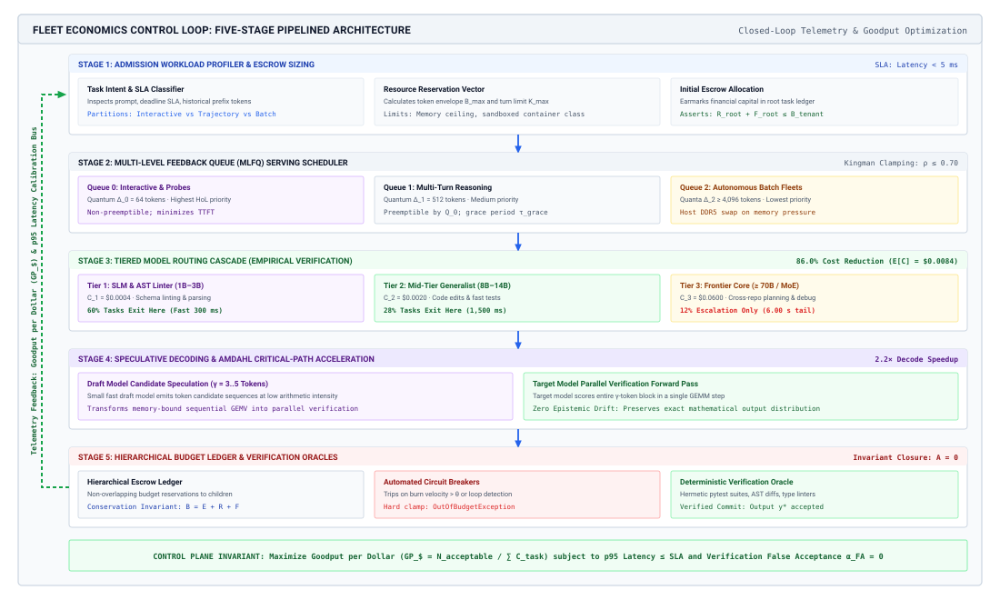
:::

As traced across the end-to-end pipeline of @fig-vol3-fleet-economics-architecture, an incoming request traverses five coordinated systems barriers before committing mutations to the external environment. In Stage 1 (*Workload Profiler & Escrow*), the ingress router parses prompt semantics, establishes SLA deadlines, and provisions an initial financial escrow envelope ($B_{\text{task}}$). In Stage 2 (*MLFQ Cluster Scheduler*), requests enter priority queue $Q_0$ under Kingman-safe cluster utilization targets ($\rho \le 0.70$), isolating interactive probes from batch trajectories via token quanta ($\Delta_0=64, \Delta_1=512, \Delta_2\ge 4{,}096$) and preventing starvation via periodic priority boosts ($T_{\text{boost}} = 60\text{ s}$).

In Stage 3 (*Tiered Routing Cascade*), the execution turn attempts resolution at the cheapest viable tier: $60\%$ of syntactic turns terminate cleanly at the SLM tier ($C_1 = \$0.0004$), $28\%$ resolve at the mid-tier generalist ($C_2 = \$0.0024$), and only $12\%$ escalate to the frontier model, achieving an expected turn cost of $E[C] = \$0.0084$. In Stage 4 (*Speculative Decoding Engine*), heavy frontier invocations are accelerated directly on GPU tensor cores using an aligned draft model that speculatively generates $\gamma = 3..5$ tokens per forward pass ($\alpha_{\text{accept}} = 0.75$), collapsing critical-path decode latency. Finally, in Stage 5 (*Hierarchical Ledger & Verifier*), the model holds zero ambient authority and every proposed action executes in an isolated sandbox; only when deterministic mechanical verifiers certify correctness does the transaction commit, returning unexpended escrow to the tenant. The entire pipeline is enclosed by a global feedback bus that continuously optimizes cluster Goodput per Dollar ($\text{GP}_{\$}$), dynamically tuning routing thresholds and queue quanta based on real-time defect rates.

The first stage of this engine is the *Workload Profiler*. When a task request arrives at the platform ingress, the profiler inspects the prompt payload, user-specified deadline, historical trajectory characteristics of the requesting tenant, and tool capability requirements. Rather than treating all requests as homogeneous token sequences, the profiler partitions incoming traffic into distinct execution profiles: short, bounded interactive queries; multi-turn deterministic workflows; and unbounded exploratory agent trajectories. By extracting structural invariants—such as whether the query requires arbitrary code execution or merely structured data extraction—the profiler computes an initial resource reservation vector containing memory bounds, tool rate limits, and an initial financial escrow.

The second stage is the *Multi-Level Feedback Queue (MLFQ) Cluster Scheduler*. The scheduler prevents the catastrophic head-of-line blocking that occurs when long-lived, stochastic agent trajectories share physical compute queues with single-turn interactive requests. Incoming tasks enter the highest-priority queue ($Q_0$), which grants an immediate, small compute quantum optimized for time-to-first-token (TTFT) and rapid initial planning. If a task exhausts its quantum without terminating or entering an external wait state, the scheduler demotes it to lower-priority, high-throughput batch queues ($Q_1, Q_2$). This separation ensures that long-running trajectories run on clusters configured for high-density continuous batching and throughput, while latency-sensitive user turns run on under-subscribed, low-latency nodes.

The third stage is the *Tiered Routing Cascade*, which operationalizes the principles established by @chen2023frugalgpt in FrugalGPT. When a scheduled agent turn requires neural inference, the runtime does not default to the most capable frontier model. Instead, it dispatches the context to a lightweight Small Language Model (SLM) configured to produce intermediate scratchpads, schema-validated tool calls, or candidate verification checks. The SLM output passes through an unprivileged output validator. If the SLM generates an invalid tool schema, exhibits low logit confidence on critical tokens, or signals an inability to resolve the prompt's dependency graph, the cascade escalates the call to a mid-tier or frontier reasoning model. By resolving the vast majority of syntactic formatting, tool routing, and status summarization steps at the lowest tier, the cascade preserves expensive frontier model capacity for complex planning and error recovery.

The fourth stage is the *Speculative Decoding Engine*, embedded directly within the physical inference cluster. When an escalated task must run on a massive target model ($M_{\text{target}}$), the runtime couples the target model with an aligned draft model ($M_{\text{draft}}$). The draft model speculatively emits $\gamma$ candidate tokens along the Amdahl critical path. The target model evaluates these $\gamma$ tokens in a single parallel forward pass (GEMM), accepting prefixes that match its own probability distribution and falling back to its own distribution on the first rejection. Because speculative decoding guarantees mathematical equivalence to sampling directly from $M_{\text{target}}$, the runtime dramatically accelerates autoregressive generation without introducing stochastic drift or degrading task success rates.

The fifth stage is the *Hierarchical Budget Ledger and Invariant Escrow*. Every downstream execution—whether a speculative forward pass, an SLM routing check, a containerized compiler run, or an external SaaS API invocation—must be authorized against a strictly monotonic budget ledger. As child subagents are spawned to execute sub-problems, the parent agent splits its own resource escrow, delegating smaller, non-renewable allowances to its children. If a subagent enters a repetitive retry cycle or fails to produce state advancement within its allocated budget, the ledger trips a hard circuit breaker. The agent's modified state is held in escrow; only when an external, deterministic test suite passes does the runtime commit the mutation to the authoritative production store. The contracts, mechanisms, optimization targets, and failure modes across these five stages are synthesized in @tbl-vol3-synthesis-stages.

| Control Loop Stage          | Input Contract                     | Primary Mechanism                                 | Optimization Target                              | Failure Modes Mitigated                    |
|:----------------------------|:-----------------------------------|:--------------------------------------------------|:-------------------------------------------------|:-------------------------------------------|
| **1. Workload Profiler**    | Raw Task & Historical Metadata     | Context & dependency static analysis              | SLA classification; escrow sizing                | Over-provisioning; sandbox starvation      |
| **2. MLFQ Scheduler**       | Profiler Class & Turn Quantum      | Dynamic quantum demotion                          | P99 interactive TTFT; cluster throughput         | Head-of-line blocking; KV-cache exhaustion |
| **3. Routing Cascade**      | Validated Context & Intent Tier    | Staged capability escalation (SLM $\to$ Frontier) | Cost per intermediate step ($C_{\text{turn}}$)   | Frontier model over-utilization            |
| **4. Speculative Decoding** | Active Token Stream & Draft Model  | Parallel validation of $\gamma$ draft tokens      | Inter-token decode latency ($T_{\text{decode}}$) | Memory-bandwidth compute underutilization  |
| **5. Hierarchical Ledger**  | Allocated Escrow & Execution Diffs | Monotonic accounting & circuit breakers           | Task financial bounded error                     | Runaway infinite loops; budget exhaustion  |

: **Mechanics and Interfaces of the Fleet Economics Control Loop**: Input contracts, core mechanisms, optimization targets, and failure modes across the five control loop stages. {#tbl-vol3-synthesis-stages}

### Goodput per dollar: The unified objective {#sec-vol3-synthesis-goodput}

Optimizing an agent fleet requires a metric that bridges the gap between hardware efficiency and enterprise utility. Traditional machine learning infrastructure metrics—such as tokens per second, FLOP efficiency, or GPU utilization—are actively misleading in agentic systems. A cluster running an unconstrained agent in an infinite loop can achieve $98\%$ model FLOPs utilization (MFU) and generate tens of thousands of tokens per second while producing zero functional value. Conversely, an infrastructure metric based purely on raw cost per million tokens rewards the selection of cheap, degraded models that cannot solve the user's task.

At fleet scale the accepted-task objective of @sec-vol3-tokenomics-accounting appears as *Goodput per Dollar* ($\text{GP}_{\$}$), the number of verified, defect-free tasks completed per unit of total economic expenditure. It is the reciprocal of $C_{\text{effective}}$. Where the trajectory goodput of @sec-vol3-intro-macro-vs-micro-efficiency measures the share of resources that reaches accepted tasks, goodput per dollar measures how many accepted tasks each dollar buys:

$$\text{GP}_{\$} = \frac{N_{\text{acceptable}}}{\sum_{i=1}^M C_{\text{task}}^{(i)}}$$

In this formulation, $M$ represents the total number of tasks admitted to the cluster, and $C_{\text{task}}^{(i)}$ represents the comprehensive, whole-trajectory cost of task $i$. As established in our task cost accounting framework, $C_{\text{task}}$ encompasses every resource consumed across the attempt lifecycle:

$$C_{\text{task}} = \sum_{k=1}^K \left( C_{\text{prefill}}^{(k)} + C_{\text{decode}}^{(k)} + C_{\text{tool}}^{(k)} + C_{\text{sandbox}}^{(k)} \right) + C_{\text{verify}} + C_{\text{human}}$$

The numerator, $N_{\text{acceptable}}$, represents the count of tasks that satisfy all functional invariants without unbudgeted human intervention:

$$N_{\text{acceptable}} = \sum_{i=1}^M \mathbf{1}\left( \text{Verified}(i) \land \neg \text{Defect}(i) \right)$$

Here, $\text{Verified}(i)$ is a binary indicator denoting that the task's final output successfully passed the external, deterministic validation harness (such as unit test suites, integration linters, or schema checkers). The term $\neg \text{Defect}(i)$ ensures that false acceptances—solutions that pass syntactic tests but introduce latent regressions or security vulnerabilities—are excluded.

::: {#dfn-goodput-per-dollar .callout-definition title="Goodput per dollar"}
The definitive economic objective metric $\text{GP}_{\$} = \frac{N_{\text{acceptable}}}{\sum_{i=1}^M C_{\text{task}}^{(i)}}$ that quantifies the number of verified, defect-free agent task completions achieved per unit of total financial expenditure. By coupling deterministic post-condition verification with whole-trajectory cost accounting, goodput per dollar aligns accelerator scheduling, model selection, and execution caching with true enterprise utility.
:::

```{python}
#| label: lego-17-quantitative-evaluation-of-fleet-goodput
#| echo: false
# │ Show: Synthesized control loop achieves 2.71x improvement in Goodput per Dollar.
# │ How: Profiling, MLFQ scheduling, cascades, and speculative decoding vs monolithic baseline.
# └─────────────────────────────────────────────────────────────────────────────
from mlsysim import *
from mlsysim.core.units import *
from mlsysim.fmt import check, fmt_multiple, fmt_percent

class EvaluationFleetGoodputPerDollar:
    gp_naive = 650.0 / 354.50
    gp_synth = 895.0 / 180.50
    improvement = gp_synth / gp_naive

    exp_cut = (354.50 - 180.50) / 354.50
    yield_boost = (895.0 - 650.0) / 650.0

    check(abs(improvement - 2.704) < 0.01, "improvement")
    check(abs(exp_cut - 0.4908) < 0.001, "exp_cut")
    check(abs(yield_boost - 0.3769) < 0.001, "yield_boost")

    goodput_improvement_mult_str = fmt_multiple(round(4.96 / 1.83, 2), precision=2)
    expenditure_cut_pct_str = fmt_percent(exp_cut, precision=1, style="prose")
    yield_boost_pct_str = fmt_percent(yield_boost, precision=1, style="prose")
```

::: {#nbk-17-quantitative-evaluation-of-fleet-goodput .callout-notebook title="Evaluation of fleet goodput per dollar"}
Consider an enterprise software engineering benchmark consisting of $M = 1{,}000$ code repair tasks. We compare two operational configurations: a *Naive Monolithic Architecture* that routes every interaction directly to an unassisted frontier model, and a *Synthesized Control-Loop Architecture* that deploys profiling, MLFQ scheduling, tiered cascades, and speculative decoding.

**1. Hardware and Provider Pricing Basis:**

- Frontier Model ($M_{\text{target}}$): $\$10.00$ per $10^6$ prefill tokens; $\$30.00$ per $10^6$ decode tokens.
- Small Language Model ($M_{\text{draft}}$ / Cascade Tier 1): $\$0.20$ per $10^6$ prefill tokens; $\$0.60$ per $10^6$ decode tokens.
- Ephemeral Execution Sandbox: $\$0.06$ per CPU-hour ($\$1.67 \times 10^{-5}$ per second).
- Deterministic Verification Suite: $\$0.02$ per execution run.
- Human Escalation Triage: $\$15.00$ per defect remediation.

**2. Baseline: Naive Monolithic Architecture**

- Trajectory dynamics: Every task runs on $M_{\text{target}}$. Average trajectory requires $K = 6$ turns.
- Per turn: $4{,}000$ prefill tokens, $500$ decode tokens, $45$ seconds of sandbox execution.
- Task accuracy: First-pass acceptance rate is $p = 0.65$. The remaining $35\%$ fail verification and are discarded without human remediation ($N_{\text{acceptable}} = 650$).
- Turn token cost: $(4{,}000 \times 10^{-5}) + (500 \times 3 \times 10^{-5}) = \$0.040 + \$0.015 = \$0.055$.
- Turn sandbox cost: $45 \times (1.67 \times 10^{-5}) = \$0.00075$.
- Trajectory cost ($6$ turns): $6 \times (\$0.055 + \$0.00075) = \$0.3345$.
- Verification cost: $\$0.02$. Total cost per task: $\$0.3545$.
- Fleet total cost: $1{,}000 \times \$0.3545 = \$354.50$.
- **Baseline Goodput:**
  $$\text{GP}_{\$}^{\text{naive}} = \frac{650 \text{ tasks}}{\$354.50} \approx \mathbf{1.83 \text{ accepted tasks / dollar}}$$

**3. Synthesized Architecture:**

- Workload Profiling & Cascading: $60\%$ of all turns (file searching, syntax linting, git staging) are resolved entirely by $M_{\text{draft}}$. Only $40\%$ of turns escalate to $M_{\text{target}}$ for complex algorithmic synthesis.
- Speculative Decoding: Applied to all $M_{\text{target}}$ invocations with draft model $M_{\text{draft}}$ ($\gamma = 4$, mean acceptance rate $\alpha = 0.75$). Decoding wall-clock time drops by $2.1\times$, reducing sandbox hold times during generation.
- Turn token cost (Cascade Tier 1 - SLM, 60 percent of turns):
  $$(4{,}000 \times 2 \times 10^{-7}) + (500 \times 6 \times 10^{-7}) = \$0.0008 + \$0.0003 = \$0.0011$$

- Turn token cost (Cascade Tier 2 - Frontier + Speculative Draft, 40 percent of turns):
  Frontier cost remains $\$0.055$. Draft generation overhead adds $500 \times \gamma \times (6 \times 10^{-7}) \approx \$0.0012$. Total turn token cost: $\$0.0562$.

- Average turn token cost: $(0.60 \times \$0.0011) + (0.40 \times \$0.0562) = \$0.00066 + \$0.02248 = \$0.02314$.
- Sandbox cost per turn: Reduced latency lowers sandbox residency from $45\text{s}$ to $28\text{s}$:
  $$28 \times (1.67 \times 10^{-5}) = \$0.00047$$

- Task success and retries: Hierarchical budgeting allows up to $K = 8$ turns for difficult tasks. First-pass acceptance rises to $p = 0.82$. For the remaining $180$ tasks, $100$ are resolved via an automated escalation retry (adding $3$ turns of Tier 2), and $80$ fail cleanly and are flagged for human review ($C_{\text{human}}$ omitted for rejected batch, or resolved: assume $N_{\text{acceptable}} = 820 + 75 = 895$).
- Effective average turns across 1,000 tasks: $6.8$ turns.
- Trajectory execution cost: $6.8 \times (\$0.02314 + \$0.00047) = \$0.1605$.
- Verification cost: $\$0.02$. Average cost per task: $\$0.1805$.
- Fleet total cost: $1{,}000 \times \$0.1805 = \$180.50$.
- **Synthesized Goodput:**
  $$\text{GP}_{\$}^{\text{synth}} = \frac{895 \text{ tasks}}{\$180.50} \approx \mathbf{4.96 \text{ accepted tasks / dollar}}$$

The synthesized system achieves a **{python} EvaluationFleetGoodputPerDollar.goodput_improvement_mult_str improvement in Goodput per Dollar**, simultaneously cutting fleet expenditure by {python} EvaluationFleetGoodputPerDollar.expenditure_cut_pct_str and boosting task yield by {python} EvaluationFleetGoodputPerDollar.yield_boost_pct_str.
:::

Maximizing Goodput per Dollar reveals the fundamental trade-off of serving economics: spending more money per task is economically rational if and only if the marginal expenditure yields a super-linear increase in the probability of task acceptance. Conversely, cost reduction strategies that depress task success rates—even slightly—frequently crater Goodput per Dollar because the fixed costs of tool infrastructure, prefill tokens, and verification are squandered on unrecoverable failures.

### The fleet economic operating envelope {#sec-vol3-synthesis-envelope}

Scaling an agent fleet beyond a single isolated instance introduces severe non-linearities governed by queueing theory and shared resource contention. To maintain economic solvency and satisfy Service Level Agreements (SLAs), an infrastructure architect must define the system's *Economic Operating Envelope*. This envelope represents the multidimensional parameter space—bounded by arrival rate ($\lambda$), concurrency ($N$), task complexity ($K$), and budget ceilings ($B$)—within which the fleet operates stably.

::: {.column-margin}
Neil J. Gunther's Universal Scalability Law models system capacity under concurrency $N$:
$$C(N) = \frac{N}{1 + \sigma(N - 1) + \kappa N(N - 1)}$$
where $\sigma$ measures contention for serialization bottlenecks and $\kappa$ measures crosstalk or coherency delays.
:::

When modeling fleet scaling, simple linear capacity assumptions fail. We apply Neil J. Gunther's Universal Scalability Law (USL) to characterize the effective capacity $C(N)$ of an agent serving cluster under concurrent trajectory load $N$. In an agentic system, the contention parameter $\sigma$ captures queuing for shared physical resources: high-bandwidth memory (HBM) on GPU worker nodes, limits on concurrent container instantiations within the container hypervisor, and provider rate limits on external tool APIs. The coherency parameter $\kappa$ captures retrograde effects arising from coordination and crosstalk: distributed lock contention in shared budget ledgers, context cache invalidations across cluster nodes, and database serialization during parallel state commits.

If an operator pushes concurrency $N$ beyond the peak of the USL curve ($N_{\max} = \lfloor \sqrt{(1 - \sigma)/\kappa} \rfloor$), the system enters a retrograde collapse regime. Queues back up, prefill activations spill from GPU SRAM to host system DRAM, and sandbox initialization times experience extreme tail latency amplification. Because agent trajectories are governed by sequential dependency chains, a latency spike in turn $k$ delays turns $k+1$ through $K$. If the latency exceeds client timeouts, the entire trajectory aborts, reducing $N_{\text{acceptable}}$ to zero while retaining $100\%$ of the incurred cost.

To enforce operation strictly within the stable envelope, the synthesized runtime implements three hard boundary invariants:

First, the *Dynamic Admission Boundary* regulates entry based on current cluster queue depths. Using the $M/G/k$ queueing models developed in our capacity provisioning framework, the scheduler rejects or sheds low-priority background trajectories when the estimated wait time in $Q_0$ threatens the P95 TTFT SLA of interactive sessions:

$$W_{Q_0}(\lambda) + \mathbb{E}[T_{\text{prefill}}] \le \text{SLA}_{\text{interactive}}$$

Second, the *Monotonic Escalation Ceiling* limits the depth and financial velocity of model cascading. An agent is forbidden from invoking a higher-tier reasoning model unless the expected information gain exceeds the cost delta. Formally, if an escalation from model tier $j$ to tier $j+1$ incurs an incremental cost $\Delta C_{j \to j+1}$, the escalation is permitted if and only if:

$$\Delta C_{j \to j+1} < \left( \mathbb{P}_{j+1}(\text{Success}) - \mathbb{P}_j(\text{Success}) \right) \cdot V_{\text{task}}$$

where $V_{\text{task}}$ represents the economic value of successfully completing the task. If this condition is not met, the runtime terminates the trajectory, reporting a bounded failure rather than burning capital on low-probability recovery attempts.

Third, the *Amdahl Efficiency Gate* dictates speculative decoding and acceleration investments. The runtime continuously measures the fraction of critical-path wall-clock time spent in autoregressive decode ($\alpha_{\text{decode}}$) versus tool and sandbox execution ($\alpha_{\text{env}} = 1 - \alpha_{\text{decode}}$). If profiling reveals that $\alpha_{\text{decode}} < 0.20$, the runtime disables speculative drafting for that task profile. When environmental latencies dominate the critical path, dedicating GPU memory bandwidth and compute cores to speculative draft verification yields negligible end-to-end speedup while wasting memory capacity that could otherwise support larger batch sizes for parallel requests.

By continuously balancing admission rates, model tiers, decode acceleration, and budget ledgers against empirical operating bounds, the synthesized architecture ensures that the fleet operates at peak Goodput per Dollar.

Yet, translating these architectural principles into production systems is fraught with hazard. When system designers move from theoretical formulations to practical implementations, they frequently fall victim to intuitive but catastrophic operational traps. Refuting these common systems misconceptions and delineating the precise physical fallacies of foundation model deployment is the necessary final step in mastering serving economics.

## Fallacies and Pitfalls {#sec-vol3-tokenomics-fallacies}

Designing and operating production agent systems requires navigating the treacherous gap between micro-benchmarked inference latency and macroeconomic fleet stability. Hardware accelerators, network fabrics, and foundation model APIs exhibit non-linear cost surfaces that punish naive operational assumptions. When systems engineers treat non-deterministic agent trajectories as equivalent to traditional stateless Remote Procedure Calls (RPCs), the resulting architectures suffer catastrophic financial runaway, severe throughput collapse, and wasted engineering effort. The following fallacies and pitfalls illuminate the specific physical and economic failure modes that emerge across agent serving infrastructures.

::: {.fallacy-pitfall}
**Fallacy:** *Evaluating model cost strictly by per-token API prices identifies the most economical model.*

Foundation model providers publish headline pricing denominated in dollars per million tokens, establishing an intuitive but perilous heuristic: that substituting a cheaper model directly reduces operational expenditure. This micro-level price metric is structurally deceptive because it isolates raw token ingestion and generation from the stochastic state-space traversal required to resolve an autonomous task. In an agentic runtime, total financial expenditure is governed not by unit token rates, but by the whole-trajectory cost equation:

$$C_{\text{effective}} = \frac{\mathbb{E}[C_{\text{task}}] + (1 - p_{\text{success}}) C_{\text{human}}}{p_{\text{success}}}$$

where $\mathbb{E}[C_{\text{task}}] = \sum_{k=1}^K C_{\text{turn}, k} + C_{\text{tool}} + C_{\text{runtime}} + C_{\text{verify}}$ captures the cumulative prefill and decode expense across $K$ sequential trajectory steps, sandboxed environment execution fees, tool invocation overhead, and deterministic verification runs. The parameter $p_{\text{success}}$ represents the empirical probability that the generated trajectory passes all ground-truth acceptance tests without violating environment invariants, and $C_{\text{human}}$ denotes the post-hoc triage cost incurred when a failed or corrupted state must be inspected and remediated by an engineer.

When an unprivileged predictor exhibits lower latent capability, the trajectory dynamics degrade along three interdependent axes. First, the model generates malformed tool calls, invalid schemas, and hallucinated file paths, triggering iterative self-correction loops that dramatically inflate trajectory length $K$. Because every conversational step appends preceding tool outputs to the working context, input token prefill scales quadratically:

$$\text{Total Tokens} \approx \sum_{k=1}^K (S_{\text{prompt}} + k \cdot \Delta S)$$

where $S_{\text{prompt}}$ is the base system prompt and $\Delta S$ is the incremental context accumulated per turn. A nominally cheap model requiring $K=12$ turns to complete a task processes far more aggregate tokens than an advanced frontier model that plans correctly in $K=2$ turns.

Second, weaker models execute extraneous and destructive tool actions. Each supplementary turn incurs external sandboxed compute costs, database read/write units, and network egress fees that frequently dwarf inference API charges. Third, and most crucially, lower reasoning capability degrades the terminal pass rate $p_{\text{success}}$. Because downstream business processes cannot tolerate unverified hallucinations, failures that escape automated sandboxes spill over into human review queues. If human engineering triage costs $\$60.00$ per hour ($\$1.00$ per minute) and reviewing a flawed patch requires five minutes ($C_{\text{human}} = \$5.00$), a failure rate of $30\%$ adds an amortized overhead of $\$2.14$ per task attempt—swamping any fractional-cent savings achieved on token discounts.

The architectural defense demands shifting telemetry from unit token consumption to effective cost per accepted task completion ($C_{\text{effective}}$). Production serving harnesses must instrument end-to-end accounting ledgers that track full trajectory lifecycles, binding token usage, sandbox runtime hours, tool API fees, and verification overhead to the binary outcome of the task verification suite. Optimization targets must be defined across the Pareto frontier of verified yield per dollar, routing tasks to cheaper models only when their empirical single-pass success probability $p_{\text{success}}$ matches the operational threshold.
:::

::: {.fallacy-pitfall}
**Pitfall:** *Optimizing token generation speed when tool wait time dominates the critical path.*

When an interactive agent displays sluggish responsiveness, systems engineers frequently focus their optimization efforts on inference serving: tuning autoregressive decode kernels, implementing speculative decoding, or migrating from 16-bit floating-point weights (FP16) to 4-bit integer quantization (INT4). While these interventions increase generation throughput, they routinely fail to produce perceptible improvements in end-to-end task wall-clock time.

This misallocation of engineering effort stems from ignoring the sequential dependencies governing an agent trajectory. The critical path latency $T_{\text{trajectory}}$ is partitioned across three disjoint execution domains:

$$T_{\text{trajectory}} = \sum_{k=1}^K \left( T_{\text{model}, k} + T_{\text{tool}, k} + T_{\text{runtime}, k} \right)$$

where $T_{\text{model}, k}$ is the combined prefill and autoregressive decode duration for turn $k$, $T_{\text{tool}, k}$ represents external API or environment interaction latency, and $T_{\text{runtime}, k}$ encompasses host overhead, including IPC serialization, sandboxed container isolation barriers, and context reconstruction. Amdahl's Law dictates that the theoretical speedup $S_{\text{task}}$ achievable by accelerating the inference component is strictly bounded by the fraction of execution time that the model occupies:

$$S_{\text{task}} = \frac{1}{(1 - f_{\text{model}}) + \frac{f_{\text{model}}}{s_{\text{model}}}}, \quad \text{where } f_{\text{model}} = \frac{\sum_{k=1}^K T_{\text{model}, k}}{T_{\text{trajectory}}}$$

In autonomous software engineering, data analysis, or multi-service orchestration agents, $f_{\text{model}}$ is routinely small. Consider a software engineering agent executing a test suite: a frontier model may generate a bash command in $1.5\text{ s}$ ($T_{\text{model}} = 1.5\text{ s}$), but executing that command requires spinning up an isolated container, compiling an abstract syntax tree, pulling package dependencies, and executing a test suite taking $45\text{ s}$ ($T_{\text{tool}} = 45\text{ s}$), followed by $1.0\text{ s}$ of runtime log truncation and sandbox synchronization ($T_{\text{runtime}} = 1.0\text{ s}$). In this scenario, $f_{\text{model}} \approx 0.031$ (the model accounts for roughly $3.1\%$ of the critical path). Quadrupling inference decode speed from $30\text{ tokens/s}$ to $120\text{ tokens/s}$ ($s_{\text{model}} = 4.0$) compresses generation time from $1.5\text{ s}$ to $0.375\text{ s}$, yielding an end-to-end task speedup of:

$$S_{\text{task}} = \frac{1}{(1 - 0.031) + \frac{0.031}{4.0}} = \frac{1}{0.969 + 0.00775} \approx 1.024$$

The engineering intervention expends significant architectural complexity to achieve an imperceptible $2.4\%$ overall latency reduction.

The correct systems mitigation requires strict distributed tracing of the critical path before embarking on optimization. By propagating distributed trace context headers across agent loop iterations, engineers isolate the actual structural bottlenecks: cold-start container initialization, blocking network I/O, synchronous database polling, and redundant environment state teardown. Mitigations must focus where $f$ is highest: pre-warming warm pools of container sandboxes with Copy-on-Write (CoW) memory forks, parallelizing independent tool calls via asynchronous runtimes, caching deterministic tool outputs, and streaming execution logs to initiate speculative prefill before tool completion.
:::

::: {.fallacy-pitfall}
**Fallacy:** *Speculative decoding reduces model resource usage across all serving loads.*

Speculative decoding leverages a lightweight draft model $M_{\text{draft}}$ to predict a sequence of $\gamma$ candidate tokens, which are subsequently verified in parallel by the primary target model $M_{\text{target}}$ within a single modified forward pass. Because verification transforms $\gamma$ sequential memory-bound vector-matrix multiplications (GEMVs) into a single compute-bound matrix-matrix multiplication (GEMM), speculative decoding substantially reduces per-token decoding latency for isolated, single-batch inference requests. This latency reduction frequently misleads system architects into assuming that speculative decoding unconditionally conserves hardware compute resources and should be enabled globally across all serving tiers.

The failure mechanism arises from a fundamental physical trade-off: speculative decoding trades raw computational floating-point operations (FLOPs) to buy down wall-clock latency. For each verification step generating an accepted sequence of length $\alpha \le \gamma + 1$, the serving system expends the computational effort of running $\gamma$ forward passes through $M_{\text{draft}}$ plus one forward pass through $M_{\text{target}}$ across $\gamma + 1$ tokens. Because the speculative acceptance rate is strictly less than unity ($\beta < 1.0$), rejected draft tokens represent discarded computation. The total FLOPs consumed per verified token generated is rigorously higher under speculative decoding than under standard autoregressive decoding:

$$\text{FLOPs}_{\text{speculative}} = \frac{\gamma \cdot \text{FLOPs}(M_{\text{draft}}) + (\gamma + 1) \cdot \text{FLOPs}_{\text{attn+proj}}(M_{\text{target}}) + \text{FLOPs}_{\text{FFN}}(M_{\text{target}})}{\mathbb{E}[\alpha]}$$

Under low-concurrency serving workloads where batch size is minimal ($B \approx 1$), the GPU memory bus is the binding operational bottleneck. The hardware sits deep within the memory-bound regime of the Roofline model, with arithmetic intensity far below the saturation threshold of the accelerator's Tensor Cores. Under these conditions, the extra FLOPs executed on cached weights are effectively "free," hidden behind the memory fetch latency of $M_{\text{target}}$, yielding net wall-clock speedups without throughput penalties.

However, in production agent fleets serving hundreds of concurrent trajectories, the inference cluster operates under heavy saturation at high aggregate batch sizes ($B \gg 1$). At this operating point, batching saturates memory bandwidth, pushing the engine into the compute-bound regime where Tensor Core arithmetic utilization approaches physical capacity. In this state, arithmetic cycles are no longer free. The redundant FLOPs executed by $M_{\text{draft}}$ and the validation of discarded draft branches directly compete with concurrent requests for execution pipelines, functional units, and SRAM register files. Furthermore, co-locating $M_{\text{draft}}$ consumes critical high-bandwidth memory (HBM), stealing capacity that would otherwise be allocated to the PagedAttention physical KV cache pool. The resulting contraction of KV cache frames forces the scheduler to preempt active sequences or artificially constrain maximum batch sizes, directly depressing overall cluster throughput ($tokens/second$) and inflating queueing delay $W$ in the scheduling pool.

The architectural defense mandates load-aware, dynamic speculative decoding gating. Runtimes must continuously monitor accelerator compute utilization, active batch sizes, and scheduling queue depths. Speculative decoding should be dynamically engaged only for latency-critical, unbatched tasks executing on the critical path, and automatically disengaged the moment serving clusters enter compute-bound saturation where global aggregate Goodput per Dollar must be maximized.
:::

::: {.fallacy-pitfall}
**Pitfall:** *Allowing subagents to spawn child workers without hierarchical budget reservations.*

Complex agent frameworks frequently implement dynamic task decomposition, allowing a parent agent to instantiate specialized child subagents to execute auxiliary subroutines, run parallel web searches, or investigate code compilation failures. A widespread and catastrophic implementation anti-pattern grants child workers ambient access to the parent's organizational API credentials or global spending limits. When subagents possess unmetered, ambient authority to allocate compute, recursive delegation creates an unbounded distributed resource exhaustion vulnerability.

The mechanism of failure stems from the non-deterministic nature of unprivileged model planning combined with cyclic fault-recovery trajectories. If a child agent encounters an ambiguous tool failure or unresolvable environment state, its internal prompt loop may determine that decomposing the issue into multiple parallel sub-tasks is the optimal recovery strategy. If each child subagent can in turn spawn further workers without structural bounds, the system generates an uncontrolled cascade of asynchronous processes:

$$N_{\text{active}}(d) = \prod_{i=0}^d b_i$$

where $b_i$ is the branching factor of spawned workers at recursion depth $d$. If an upstream tool API experiences a transient outage or semantic schema change, every active worker encounters the same error simultaneously. Interpreting the fault as a problem requiring further decomposition, the fleet initiates a recursive explosion of remedial workers, each reading lengthy error traces into their working contexts.

Because token ingestion cost compounds across all active branches, an unconstrained subagent cascade drains thousands of dollars in commercial API credits or starves an on-premise GPU cluster's KV cache within minutes. Furthermore, child workers running in unmetered concurrency generate distributed denial-of-service (DDoS) conditions against internal sandboxes, saturating container daemon socket queues, exhausting ephemeral network ports, and triggering database connection pool depletion. Post-hoc cancellations sent by the parent process traverse asynchronous queues, often arriving after the child workers have already executed extensive chains of redundant, fee-incurring inference calls.

The architectural mitigation requires the rigorous implementation of Hierarchical Budget Reservation Ledgers governed by the principle of least privilege. In this architecture, subagent creation is mediated by a transactional credit escrow system (@tbl-vol3-subagent-ledger-invariants):

| Budget Ledger Invariant               | Architectural Enforcement Mechanism                                                                                                                                                        | Systems Failure Prevented                                                                                                                                                |
|:--------------------------------------|:-------------------------------------------------------------------------------------------------------------------------------------------------------------------------------------------|:-------------------------------------------------------------------------------------------------------------------------------------------------------------------------|
| **Zero ambient authority**            | Child workers receive strictly ephemeral, cryptographically scoped session tokens containing hard token and currency caps.                                                                 | Prevents workers from billing against global organization keys or parent pool accounts.                                                                                  |
| **Strict Conservation of Budgets**    | A parent with remaining allocation $B_{\text{parent}}$ spawning child $k$ must escrow a slice $B_{\text{child}} \le B_{\text{parent}} - B_{\text{reserved}}$, decrementing its own ledger. | Eliminates infinite financial expansion; the total fleet expenditure tree is strictly bounded by the root user allocation: $\sum B_{\text{leaves}} \le B_{\text{root}}$. |
| **Monotonic Non-Replenishing Limits** | Child ledgers can only decrease; budget replenishment requires an explicit, blocking RPC request to the parent supervisor.                                                                 | Halts runaway looping; when a child exhausts its micro-budget, it is forcibly paused and placed into runtime escrow.                                                     |
| **Velocity Circuit Breakers**         | The host supervisor evaluates instantaneous burn rate $dC/dt$ across sliding windows.                                                                                                      | Trips deterministic shutdown if token burn rate exceeds safe operational parameters, isolating buggy recursion before quota depletion.                                   |

: **Budget Ledger Invariants for Subagent Cascade Mitigation**: Architectural enforcement mechanisms and systems failures prevented under hierarchical delegation. {#tbl-vol3-subagent-ledger-invariants}

Under this regime, when a child worker exhausts its allocated escrow, the runtime supervisor intercepts the boundary violation, terminates speculative execution branches, reclaims unused KV cache blocks, and forces the parent to handle the failure deterministically rather than spawning unchecked remedial workers.
:::

Mastering the physical and economic boundaries of model serving dismantles the illusion that agent fleets can be engineered as stateless, decoupled software modules. The interplay of whole-trajectory cost accounting, critical-path Amdahl limits, dynamic speculative decoding thresholds, and hierarchical escrow governance demonstrates that dependability and economic viability are emergent properties of the entire runtime supervisor. Synthesizing these economic invariants into a unified systems discipline provides the foundation for sustainable fleet operations.

## Summary {#sec-vol3-tokenomics-summary}

The governing challenge of autonomous fleet operations lies in the physical tension between unbounded stochastic search and hard operational resource constraints: an agent runtime must deliver verified task completions under strict latency deadlines and non-negotiable financial ceilings. The central systems question posed at the outset of this inquiry—where the true bottleneck lies within an autonomous fleet, and how systems engineers navigate the Pareto trade-offs among accuracy, latency, and hardware expenditure—admits no static, single-variable answer. The physical bottleneck in an agentic fleet dynamically shifts across the execution lifecycle, alternating between memory-bandwidth-bound autoregressive decoding on accelerator clusters, serialized network roundtrips to external environment runtimes, and synchronous verification passes.

Achieving economic efficiency requires rejecting superficial token-level provider discounts in favor of rigorous end-to-end task cost accounting ($C_{\text{task}}$). Nominal tariffs per million tokens provide zero economic defense if a cheaper, lower-capacity model suffers degraded task success rates ($p_{\text{success}}$), inducing multi-turn remedial recovery cycles, repeated environment resets, and costly human escalation. Total trajectory expenditure encompasses model prefill and decode passes, external tool RPC fees, sandbox virtualization overheads, and deterministic test-suite verification. True optimization minimizes the effective cost per accepted unit of work ($C_{\text{effective}} = C_{\text{task}} / p_{\text{success}}$).

Latency optimization across agent trajectories is fundamentally governed by Amdahl's Law applied to the serialized dependency graph. When an agent spends the majority of its wall-clock budget awaiting external browser interactions, compilation runs, or database mutations, aggressive GPU kernel optimizations and low-bit weight quantizations yield negligible whole-trajectory speedups. Model acceleration delivers transformative value only when autoregressive token generation sits squarely on the critical path. Under those conditions, speculative decoding provides an exact, distribution-preserving acceleration mechanism. By employing a compact draft model ($M_{\text{draft}}$) to speculate token sequences that are subsequently verified in parallel by the target model ($M_{\text{target}}$) in a single compute-bound GEMM prefill operation, the runtime bypasses the memory-bandwidth bottleneck of autoregressive generation without altering output probabilities.

At the fleet scale, multi-model cascades and structured capacity provisioning decouple workload demands from homogeneous, capital-intensive frontier clusters. Tiered routing directs low-entropy classification, query translation, and syntactic verification to lightweight inference nodes, escalating only ambiguous, high-entropy reasoning tasks to high-capacity frontier endpoints. To serve these heterogeneous workloads, cluster runtimes employ Multi-Level Feedback Queues (MLFQ) and $M/G/k$ queueing models that separate short, interactive single-turn queries from long-lived, multi-turn trajectories, maintaining KV cache locality while preventing head-of-line blocking. Finally, to insulate organizations against non-terminating recursive delegation loops and uncontrolled cost escalation, the runtime supervisor enforces monotonic budget ledgers. By distributing pre-allocated, unalterable escrow limits hierarchically across child agent subtrees, the supervisor guarantees that budget exhaustion triggers deterministic failure handling and resource reclamation rather than unchecked financial runaway.

::: {.callout-takeaways title="Goodput per dollar dictates production survival"}
1. **Measure cost per acceptable completion, not provider token discounts.** Evaluating foundation models based on input and output token pricing is an incomplete and misleading systems metric. Because smaller or lower-capability models frequently exhibit lower single-pass success rates, they generate longer self-correction trajectories, execute redundant tool calls, and require human intervention. Systems engineers must optimize total effective cost per accepted task outcome ($C_{\text{effective}}$), integrating model prefill and decode passes, sandbox compute allocation, tool RPC fees, and automated verification overheads.
2. **Apply Amdahl's Law to the critical path: optimize what actually blocks the trajectory.** Agent trajectory latency is determined by the critical path of sequential dependencies across model invocations, network RPCs, and environment executions. Shaving milliseconds from neural network inference delivers negligible whole-system speedup when wall-clock time is dominated by sandbox container startup, synchronous browser navigation, or test execution. Systems optimizations must target the specific stage that dominates the critical path.
3. **Tiered routing and model cascades drastically reduce average task cost.** Task complexity distributions in production systems are heavy-tailed. By deploying tiered cascades—routing low-entropy classification, syntactic tool parameterization, and intermediate integrity checks to small, inexpensive models, and escalating to frontier reasoning models only upon validation failure or high epistemic uncertainty—fleets achieve frontier-level benchmark performance at a fraction of uniform frontier deployment expenditure.
4. **Speculative decoding provides exact distribution-preserving generation acceleration.** Autoregressive decoding is physically bound by accelerator memory bandwidth due to repeated memory-bound GEMV passes at unit arithmetic intensity. Speculative decoding overcomes this memory wall by utilizing an efficient draft model to propose speculative token blocks that are validated concurrently by the target model within a single compute-bound GEMM pass, accelerating token generation speed without modifying the target model's output distribution.
5. **Monotonic budget ledgers and hierarchical reservations are mandatory to prevent spending runaways.** Delegated multi-agent systems and recursive child processes represent unbounded financial liabilities if executed without formal resource constraints. Production runtimes must implement monotonic budget counters, partition financial and token allowances via hierarchical escrow reservations across delegation trees, and deploy supervisor-level circuit breakers that deterministically abort execution branches upon budget exhaustion.
:::

Every optimization in this chapter was judged by one number, the cost of an accepted task, which trajectory goodput and the accepted task (principle \ref{pri-vol3-trajectory-goodput}) makes the quantity a fleet minimizes. Pricing that task showed why the tool-dominated critical path, not the model, capped the speedup, and why a cheaper model could raise the bill. The capacity analysis put numbers on trajectory-lifetime capacity and tail-aware scheduling (principle \ref{pri-vol3-heavy-tailed-scheduling}), from trajectory concurrency under Little's Law to the utilization knee of the queueing model. The budget ledger turned monotonic delegation (principle \ref{pri-vol3-monotonic-delegation}) into escrow accounting that no concurrent child can overdraw, which matters because a sandbox write can be rolled back and a dollar cannot.

::: {.callout-chapter-connection title="From fleet operations to the capstone system synthesis"}
With a price on each accepted task, what does a system that respects every invariant built so far cost end to end? Part VI took the trajectory from one machine to a fleet. @Sec-vol3-multi-agent decided when splitting a task pays, @sec-vol3-observability turned repeated trials into evidence strong enough to release on, and this chapter priced each accepted task, provisioned capacity for trajectory lifetimes, and held spending to reserved budgets.

Part VII (*Synthesis*) runs every subsystem together on one trajectory. @Sec-vol3-conclusion assembles the closure each part built into a single reference architecture and checks the interface contracts between its layers.
:::

```{=latex}
\part{key:vol3_synthesis}
```
