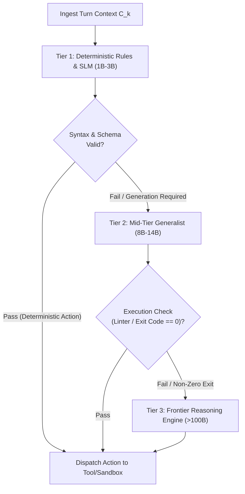
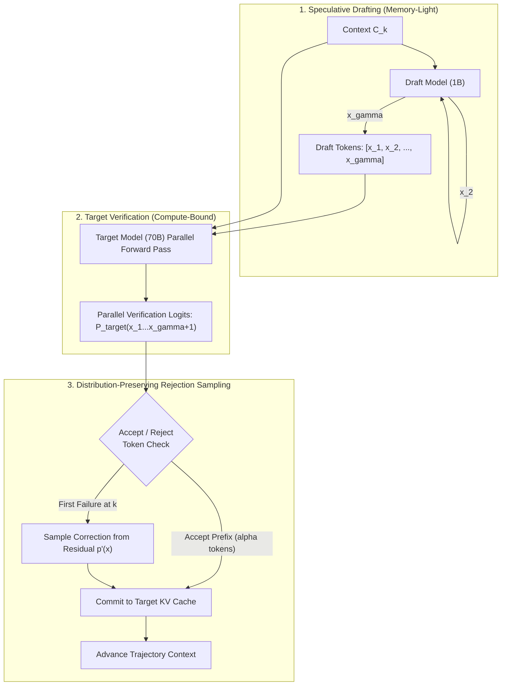
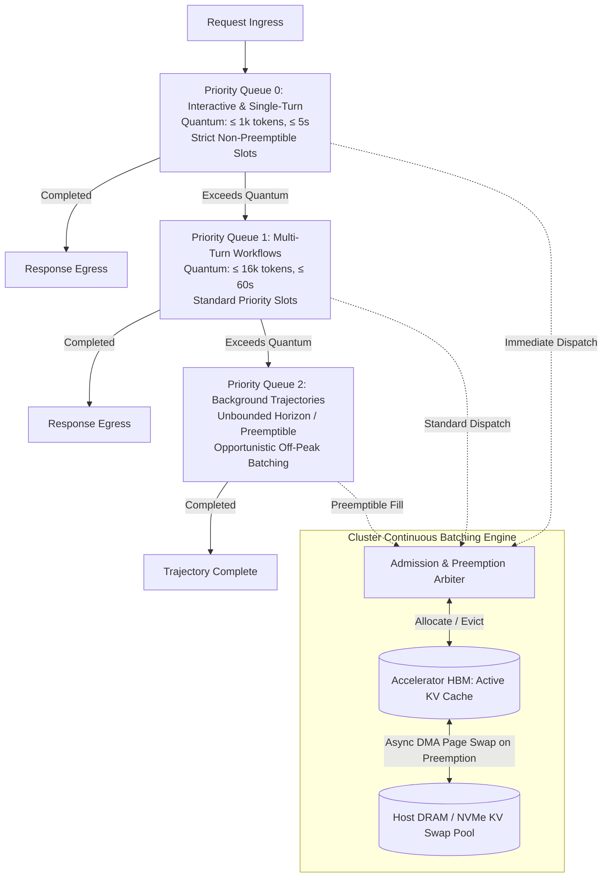
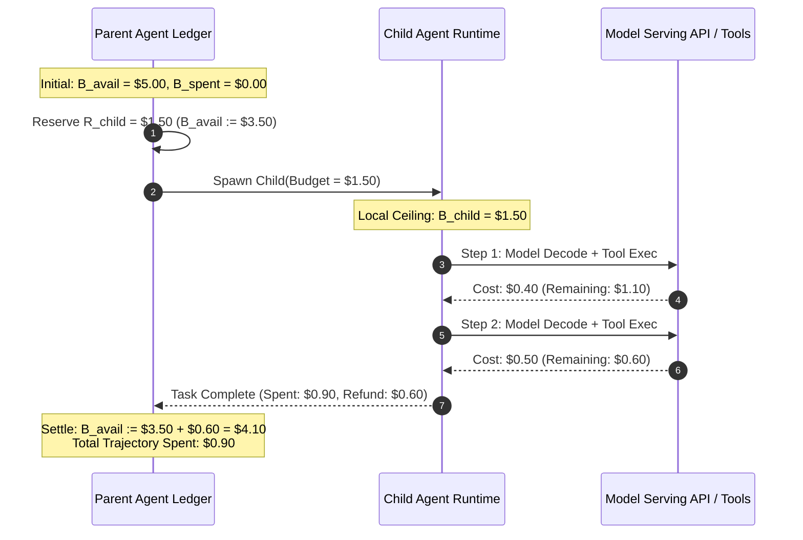

# Performance, Cost, and Fleet Economics {#sec-vol3-tokenomics}

::: {layout-narrow}
::: {.column-margin}

\chapterminitoc

:::

::: {.content-visible when-format="pdf"}
\noindent
{fig-alt="Blueprint for Performance, Cost, and Fleet Economics."}
:::

::: {.content-visible unless-format="pdf"}
{fig-alt="Blueprint for Performance, Cost, and Fleet Economics."}
:::

:::

## Purpose {.unnumbered .unlisted}

\begin{marginfigure}
\mlagentstack{95}{10}{10}{10}{10}{10}
\end{marginfigure}

_*Where is the true bottleneck in an autonomous fleet, and how do we trade off accuracy, latency, and hardware expenditure under hard budgets?*_

Building an autonomous agent that solves complex tasks in a research sandbox is an engineering achievement; operating that agent across an enterprise fleet of millions of daily users within strict latency and financial boundaries is a systems necessity. Autonomous agents are among the most resource-intensive workloads in modern computing: an agent attempting to resolve a single software defect can easily execute 40 trajectory turns, consume hundreds of thousands of context tokens, and monopolize GPU accelerator memory for minutes. In production, unoptimized agent fleets lead to astronomical cloud computing bills, severe cluster queuing delays, and unacceptable user-facing latency. Systems engineers must actively engineer the economic and performance Pareto frontier of the entire fleet: balancing compute-bound prefill against memory-bound decode, implementing speculative model routing, aggressively caching prompt prefixes, and designing multi-tenant cluster admission controls through whole-trajectory Roofline modeling.

::: {.callout-learning-objectives}

- Formulate the Whole-Trajectory Cost Equation ($C_{\text{task}} = \sum C_{\text{tokens}} + \sum C_{\text{compute}} + \sum C_{\text{storage}} + \sum C_{\text{tools}}$), identifying primary cost drivers across diverse workload archetypes.
- Apply the Roofline model to agent serving infrastructure, identifying when multi-turn trajectory execution transitions between arithmetic-bound prefill and memory-bandwidth-bound autoregressive decode.
- Architect tiered model routing cascades, training lightweight classifiers to dynamically dispatch subtasks across small fast models and frontier reasoning models to optimize the cost-accuracy Pareto frontier.
- Implement aggressive semantic and prompt caching architectures, calculating hit rates, cache invalidation boundaries, and financial amortization across multi-tenant workloads.
- Design multi-tenant cluster capacity planning and admission control algorithms that enforce token rate limits, priority queuing, and fair-share budget quotas under bursty traffic.
- Formulate empirical optimization methodologies to prune unnecessary reasoning steps, compress tool documentation, and minimize trajectory token consumption without degrading task success.

:::

<!-- SECTION_START: 17.1 (#sec-vol3-tokenomics-accounting) -->
## Task Cost Accounting {#sec-vol3-tokenomics-accounting}

<!-- OUTLINE_SPEC:

- **Heading & Anchor:** `## Task Cost Accounting {#sec-vol3-tokenomics-accounting}`
- **The Single Key Point:** True agent cost accounting encompasses model prefill/decode, tool API fees, sandbox compute time, assessment overhead, failed attempts, and human review costs—not merely model provider token rates.
- **Concrete Systems Hook:**
  - An engineering director switches the company's agent pipeline to a provider charging 60% less per million tokens. However, monthly infrastructure costs increase by 45% because the cheaper model has lower reasoning capacity, requiring 3.5x more trajectory turns, 5x more retries, and $12,000 in additional human intervention hours to achieve acceptable work.
- **Points to explain (paragraph-by-paragraph):**
  - *The Token-Price Fallacy:* Evaluating agent systems strictly on provider token pricing ($/1M tokens) ignores the systemic reality of multi-turn autonomous execution.
  - *The Comprehensive Cost Equation:*
    $$C_{\text{task}} = C_{\text{model}}(\text{prefill, decode}) + C_{\text{tools}}(\text{APIs, licenses}) + C_{\text{infra}}(\text{sandboxes, network}) + C_{\text{verify}} + C_{\text{human}}$$
  - *Cost per Acceptable Completion:* Calculating cost normalized strictly by successful outcomes:
    $$C_{\text{effective}} = \frac{\sum_{i=1}^N C_{\text{attempt}_i}}{N_{\text{acceptable}}}$$
    Demonstrating how low-accuracy cheap models rapidly become more expensive per completed task than high-accuracy expensive models.
- **Visuals & Tables:**
  - Cost Breakdown Treemap: Direct Model Token Fees vs. Sandbox Hosting vs. Tool APIs vs. Human Verification Overhead.
- **Causal Bridge to 17.2:** Once we account for all task costs and durations, how do we identify which specific component bottlenecks execution latency?
-->

In distributed inference systems, cost models designed for stateless, single-turn language model serving fail when applied to autonomous agent architectures. A single-turn query—such as translation or summarization—incurs a deterministic cost proportional to input prompt length and output generation length. An autonomous agent, by contrast, executes a stateful trajectory loop across $K$ discrete environment turns, where each step appends tool definitions, environment observations, error traces, and intermediate scratchpad reasoning to an expanding context window. Evaluating agent systems strictly on provider token pricing ($/1\text{M}$ tokens) constitutes the *token-price fallacy*: it measures the nominal unit price of an intermediate execution cycle while ignoring the total work required to reach a verified terminal state.

### The Token-Price Fallacy in Multi-Turn Trajectories

Consider an operational migration across an enterprise coding agent fleet executing defect repairs in isolated microVM sandboxes. An engineering team replaces a high-capability frontier model ($P_{\text{prefill}} = \$3.00/\text{Mtok}$, $P_{\text{decode}} = \$15.00/\text{Mtok}$) with an alternative model offering a 60% nominal rate reduction ($P_{\text{prefill}} = \$1.20/\text{Mtok}$, $P_{\text{decode}} = \$6.00/\text{Mtok}$). Under static single-turn accounting assumptions, this migration projects an immediate 60% decline in operational expenditure.

In production, however, total monthly infrastructure and operational spend increases by 45%. Because the lower-capability model exhibits degraded reasoning density and weaker adherence to complex tool schemas, average trajectory length expands from 8 turns to 28 turns ($3.5\times$). The expanded trajectory compounds prompt context quadratically across execution steps, negating unit token savings. Furthermore, lower task fidelity produces a $5\times$ increase in failed build attempts, extended microVM lease times, and $\$12{,}000$ in additional human developer triage hours to diagnose unviable pull requests. Token price represents only an input tariff; the true system cost is a function of trajectory depth, resource residency, and task verification.

### The Comprehensive Cost Equation

A rigorous systems accounting model must capture every physical resource consumed across the end-to-end lifecycle of an agent trajectory. The total cost of an agent task $C_{\text{task}}$ decomposes into five coupled components:

$$C_{\text{task}} = C_{\text{model}} + C_{\text{tools}} + C_{\text{infra}} + C_{\text{verify}} + C_{\text{human}}$$ {#eq-cost-comprehensive}

Each component represents a distinct physical subsystem with its own scaling characteristics:

1. **Model Processing ($C_{\text{model}}$):** The direct compute fee charged by internal serving clusters or external model providers. In a trajectory of $K$ turns, input tokens $N_{\text{in}, k}$ and output tokens $N_{\text{out}, k}$ are priced asymmetrically:
   $$C_{\text{model}} = \sum_{k=1}^{K} \left( P_{\text{prefill}} \cdot N_{\text{in}, k} + P_{\text{decode}} \cdot N_{\text{out}, k} \right)$$
   Because the history buffer accumulates prior tool call outputs, environment state snapshots, and reasoning tokens, $N_{\text{in}, k}$ grows monotonically with turn index $k$. Unless prefix caching is employed, prompt prefill costs scale with the triangular number of trajectory turns, dominating total token expenditures at large $K$.

2. **External Tool Execution ($C_{\text{tools}}$):** The transactional fees incurred by querying third-party APIs, vector indices, commercial web search engines, or external database management systems during tool dispatches.
3. **Ephemeral Infrastructure ($C_{\text{infra}}$):** The hardware allocation cost for isolated compute environments—such as gVisor sandboxes, Linux containers, or Firecracker microVMs—that host compiler toolchains, interpreters, and file systems:
   $$C_{\text{infra}} = \int_{0}^{T_{\text{wall}}} R_{\text{sandbox}}(t) \, dt \approx R_{\text{sandbox}} \cdot T_{\text{wall}}$$
   where $R_{\text{sandbox}}$ is the hourly allocation rate for assigned vCPUs, memory, and ephemeral storage, and $T_{\text{wall}}$ is the total wall-clock duration of the task trajectory.

4. **Deterministic Verification ($C_{\text{verify}}$):** Compute resources consumed by automated validation pipelines, including test suite execution, static linters, security fuzzers, and auxiliary evaluator model passes invoked to verify output correctness before environmental state changes are committed.
5. **Human Escalation and Triage ($C_{\text{human}}$):** The labor cost of human engineer intervention when an agent exhausts its retry budget, halts on ambiguous specifications, or generates artifacts flagged by validation checks:
   $$C_{\text{human}} = R_{\text{human}} \cdot T_{\text{review}} \cdot P(\text{escalation})$$
   where $R_{\text{human}}$ is the fully loaded hourly labor rate, $T_{\text{review}}$ is the duration required to inspect and repair the failure, and $P(\text{escalation})$ is the probability of trajectory failure.

As illustrated in @fig-task-cost-breakdown, direct model token processing fees rarely account for the majority of end-to-end expenditure in mission-critical agent deployments. Ephemeral sandbox reservation and human remediation frequently dominate total operating costs.

::: {#fig-task-cost-breakdown}
```
+-----------------------------------------------------------------------------------+
| Total Agent Task Operating Cost (C_task)                                          |
+------------------------------------+----------------------------------------------+
| Direct Token Processing (C_model)  | Ephemeral Sandbox Infrastructure (C_infra)   |
| - Prefill Context (Triangular Sum) | - MicroVM vCPU / RAM Allocation              |
| - Autoregressive Decode Steps      | - Disk I/O & Network Ingress/Egress          |
| [ ~20% - 35% of Total ]            | [ ~25% - 35% of Total ]                      |
+------------------------------------+----------------------------------------------+
| Verification & Tools (C_verify)    | Human Oversight & Escalation (C_human)       |
| - Deterministic Test Suites        | - Failure Diagnosis & Triage                 |
| - External Paid APIs & Search      | - Unviable Patch Remediation                 |
| [ ~10% - 15% of Total ]            | [ ~25% - 40% of Total ]                      |
+------------------------------------+----------------------------------------------+
```
Hierarchical allocation of agent execution expenditures. In multi-turn workloads requiring sandboxed code execution and human validation, direct model token charges represent a minority fraction of total operational cost.
:::

### Cost per Acceptable Completion

Aggregating raw task costs $C_{\text{task}}$ across execution attempts produces a misleading efficiency metric if the system does not enforce strict quality boundaries. An agent that rapidly fails and terminates consumes few tokens and minimal sandbox time, yet yields zero system utility. The governing metric for fleet economics is the *effective cost per acceptable completion* ($C_{\text{effective}}$), which normalizes total resource expenditure strictly by verified, successful outcomes:

$$C_{\text{effective}} = \frac{\sum_{i=1}^{N} C_{\text{attempt}_i}}{N_{\text{acceptable}}}$$ {#eq-cost-effective}

When task trials are modeled as independent Bernoulli events with a per-attempt success probability $P_{\text{success}}$, where successful trajectories consume on average $\bar{C}_{\text{success}}$ and failed trajectories consume $\bar{C}_{\text{fail}}$, the expected effective cost simplifies to:

$$C_{\text{effective}} = \frac{\bar{C}_{\text{attempt}}}{P_{\text{success}}} = \bar{C}_{\text{success}} + \left( \frac{1 - P_{\text{success}}}{P_{\text{success}}} \right) \bar{C}_{\text{fail}}$$ {#eq-cost-effective-expanded}

The multiplier $(1 - P_{\text{success}}) / P_{\text{success}}$ represents the *failure burden*. As success probability $P_{\text{success}}$ drops, the failure burden scales hyperbolically. Even if a low-capability model exhibits a negligible token price, any accompanying drop in task success rapidly inflates $C_{\text{effective}}$ beyond that of a more expensive, high-accuracy model.

: Comparison of execution economics between a high-capability frontier model and a discounted commodity model on an automated defect-repair benchmark. {#tbl-task-cost-breakdown}

| System Metric                                                                 | High-Capability Model         | Discounted Commodity Model   | Delta        |
|:------------------------------------------------------------------------------|:------------------------------|:-----------------------------|:-------------|
| Nominal Token Rate ($P_{\text{prefill}} / P_{\text{decode}}$)                 | $\$3.00\,/\,\$15.00$ per Mtok | $\$1.20\,/\,\$6.00$ per Mtok | $-60\%$      |
| Average Trajectory Turns ($K$)                                                | $8.2$ turns                   | $28.7$ turns                 | $+250\%$     |
| Total Tokens Processed ($N_{\text{in}} + N_{\text{out}}$)                     | $42{,}000$ tokens             | $186{,}000$ tokens           | $+343\%$     |
| Direct Model Cost ($\bar{C}_{\text{model}}$)                                  | $\$0.21$                      | $\$0.34$                     | $+62\%$      |
| Sandbox Runtime Cost ($\bar{C}_{\text{infra}}$)                               | $\$0.14$ ($70\text{ s}$)      | $\$0.58$ ($290\text{ s}$)    | $+314\%$     |
| Tool & Verification Cost ($\bar{C}_{\text{tools}} + \bar{C}_{\text{verify}}$) | $\$0.08$                      | $\$0.32$                     | $+300\%$     |
| Single-Attempt Cost ($\bar{C}_{\text{attempt}}$)                              | $\$0.43$                      | $\$1.24$                     | $+188\%$     |
| Task Success Probability ($P_{\text{success}}$)                               | $74\%$                        | $26\%$                       | $-65\%$      |
| Human Triage Burden per Task ($\bar{C}_{\text{human}}$)                       | $\$0.65$                      | $\$2.85$                     | $+338\%$     |
| **Effective Cost per Success ($C_{\text{effective}}$)**                       | **$\$1.46$**                  | **$\$7.62$**                 | **$+422\%$** |

@tbl-task-cost-breakdown details this non-linear interaction on a defect-repair benchmark. Although the commodity model reduces token unit prices by 60%, its lower reasoning density causes context explosion ($+343\%$ total tokens), longer microVM residency ($+314\%$ sandbox runtime), and frequent validation failures. Factoring in failure retries and human escalation, the effective cost per acceptable completion increases by $422\%$.

Every dollar expended in an autonomous fleet is tied directly to physical execution time: long-running trajectories simultaneously accumulate token prefill costs, hold container sandboxes open, and monopolize memory bandwidth on host accelerators. Having established the multi-resource cost surface of autonomous execution, systems engineers must pinpoint the hardware bottlenecks that govern trajectory latency. In @sec-vol3-tokenomics-roofline, we apply the Roofline model to agent serving infrastructure to analyze where multi-turn execution transitions between compute-bound prefill and memory-bandwidth-bound autoregressive decode.

<!-- SECTION_END: 17.1 -->

<!-- SECTION_START: 17.2 (#sec-vol3-tokenomics-criticalpath) -->
## Critical Path Latency {#sec-vol3-tokenomics-criticalpath}

<!-- OUTLINE_SPEC:

- **Heading & Anchor:** `## Critical Path Latency {#sec-vol3-tokenomics-criticalpath}`
- **The Single Key Point:** Trajectory latency is governed by the critical path of sequential dependencies; applying Amdahl's Law reveals when accelerating model generation yields diminishing returns compared to tool waits or environment resets.
- **Concrete Systems Hook:**
  - An engineering team spends three months optimizing inference kernels to double LLM token generation speed from 30 to 60 tokens/sec. When deployed, overall agent task duration decreases by only 4.8% because 85% of the trajectory's wall-clock time was spent waiting for remote CI/CD builds and Docker container startups.
- **Points to explain (paragraph-by-paragraph):**
  - *Deconstructing the Agent Trajectory Timeline:*
    $$T_{\text{trajectory}} = \sum_{k=1}^K \left( T_{\text{prefill}, k} + T_{\text{decode}, k} + T_{\text{tool}, k} + T_{\text{wait}, k} + T_{\text{runtime}, k} \right)$$
  - *Applying Amdahl's Law to Multi-Turn Execution:*
    $$S = \frac{1}{(1-f) + \frac{f}{s}}$$
    If model generation represents fraction $f = 0.20$ of total trajectory time, even an infinite acceleration of generation ($s = \infty$) can yield at most a 1.25x speedup in total task latency.
  - *Identifying the True Bottleneck:* Techniques for measuring overlapping vs. blocking operations on the critical path using distributed trace data from Chapter 16.
- **Visuals & Tables:**
  - Waterfall Latency Breakdown: Sequential Trajectory Stages (Model Prefill vs. Model Decode vs. Tool Subprocess vs. Network Wait vs. Environment Reset).
- **Seminal Literature:**
  - Gene M. Amdahl (1967, *Validity of the Single Processor Approach to Achieving Large Scale Computing Capabilities*).
- **Causal Bridge to 17.3:** If model invocation is on the critical path or dominates cost, how can we route requests across heterogeneous model tiers to optimize both?
-->

The wall-clock latency of an autonomous agent trajectory is strictly governed by the critical path through its directed acyclic graph of execution dependencies. In multi-turn systems, engineering teams frequently misallocate optimization effort toward accelerator kernels while neglecting the dominant components of end-to-end task duration. For example, doubling model autoregressive generation throughput from 30 to 60 tokens per second via custom fused attention kernels and weight quantization reduces total trajectory wall-clock time by only 4.8% if 85% of the task duration is spent waiting on remote container provisioning, file system synchronizations, and external integration test suites. Identifying the operations that lie on the critical path is a prerequisite for optimizing agent performance.

### Deconstructing the Trajectory Timeline

An autonomous agent trajectory consists of $K$ discrete interaction turns. Each turn $k \in \{1, \dots, K\}$ constitutes a single iteration of the environment interaction loop, alternating between neural model inference and external tool execution. The total wall-clock duration of a trajectory, $T_{\text{trajectory}}$, decomposes into five distinct, physically bounded latency components:

$$T_{\text{trajectory}} = \sum_{k=1}^K \left( T_{\text{prefill}, k} + T_{\text{decode}, k} + T_{\text{tool}, k} + T_{\text{wait}, k} + T_{\text{runtime}, k} \right)$$ {#eq-trajectory-latency}

Each term in @eq-trajectory-latency represents a specific hardware or operational boundary:

1. **Context Prefill Latency ($T_{\text{prefill}, k}$)**: The compute-bound time-to-first-token (TTFT) consumed by the accelerator cluster to ingest the input prompt, conversation history, system instructions, and newly appended tool results into the key-value (KV) cache. Because context length accumulates monotonically across turns, $T_{\text{prefill}, k}$ exhibits superlinear scaling with turn index $k$ unless mitigated by prefix caching or context eviction.
2. **Autoregressive Decode Latency ($T_{\text{decode}, k}$)**: The memory-bandwidth-bound duration required to generate $N_{\text{out}, k}$ output tokens representing chain-of-thought tokens and structured tool invocations:
   $$T_{\text{decode}, k} = \sum_{j=1}^{N_{\text{out}, k}} \tau_{\text{decode}, j}$$
   where $\tau_{\text{decode}, j}$ is the per-token decode step latency, fundamentally constrained by high-bandwidth memory (HBM) read speeds.
3. **Tool Execution Latency ($T_{\text{tool}, k}$)**: The physical compute and storage I/O time consumed by tools running within local host environments or isolated execution sandboxes. This includes compiler invocations, test suite runs, code linters, and database queries.
4. **Network and External Wait Latency ($T_{\text{wait}, k}$)**: Blocking idle time spent waiting across network boundaries, including third-party API round trips, remote continuous integration (CI) webhooks, and distributed remote procedure call (RPC) transport latencies.
5. **Runtime and Orchestration Latency ($T_{\text{runtime}, k}$)**: Orchestration overhead imposed by the agent framework, including prompt serialization, JSON schema validation, output parsing, state checkpointing, and container or microVM snapshot resets.

::: {#fig-trajectory-latency-waterfall}
```
Turn k-1                      Turn k
+----------------------------+--------------------------------------------------------------+
| ...                        |                                                              |
+----------------------------+--------------------------------------------------------------+
|<----------------------------------- Wall-Clock Time ------------------------------------->|

Turn k Execution Subsystems:
+----------------+------------------+----------------+--------------------+-----------------+
| Prefill Context| Model Generation | Host Runtime   | Tool Execution     | Network Wait    |
| (Compute Bound)| (Mem-BW Bound)   | Overhead       | (Sandbox vCPU/Disk)| (Remote RPC/CI) |
| T_prefill,k    | T_decode,k       | T_runtime,k    | T_tool,k           | T_wait,k        |
+----------------+------------------+----------------+--------------------+-----------------+
|<- Accelerator->|<- Accelerator -->|<- Agent Host ->|<- MicroVM / OS --->|<- Network I/O ->|
|                                                                                           |
|=============================== CRITICAL PATH (Sequential) ===============================>
```
Waterfall decomposition of a single turn within an agent trajectory. Sequential synchronization barriers enforce that downstream stages cannot begin until upstream outputs are fully realized, serialized, and ingested.
:::

### Amdahl's Law in Multi-Turn Execution

The systemic limit of trajectory speedup is governed by Amdahl's Law (Amdahl, 1967). If an optimized subsystem accounts for an execution fraction $f$ of the total trajectory wall-clock duration and is accelerated by a factor of $s$, the overall trajectory speedup $S$ is bounded by:

$$S = \frac{1}{(1 - f) + \frac{f}{s}}$$ {#eq-amdahl-agent}

In agentic systems, model inference comprises only a subset of total trajectory execution:

$$f_{\text{model}} = \frac{\sum_{k=1}^K (T_{\text{prefill}, k} + T_{\text{decode}, k})}{T_{\text{trajectory}}}$$ {#eq-model-fraction}

When an agent interacts with external developer infrastructure—such as executing unit tests, compiling binaries, or searching web indexes—$f_{\text{model}}$ frequently ranges between $0.15$ and $0.30$. Under a workload profile where $f_{\text{model}} = 0.20$, an infinite acceleration of the inference engine ($s \to \infty$, rendering both prefill and decode instantaneous) yields a theoretical maximum trajectory speedup of:

$$S_{\max} = \frac{1}{1 - 0.20} = 1.25\times$$

Even a five-fold acceleration of model serving ($s = 5$) delivers an overall trajectory speedup of only:

$$S = \frac{1}{(1 - 0.20) + \frac{0.20}{5}} = \frac{1}{0.80 + 0.04} \approx 1.19\times$$

Conversely, if sandbox container initialization and test execution account for $f_{\text{env}} = 0.70$ of trajectory wall-clock time, reducing environment reset latency by $3\times$ via copy-on-write microVM memory forks achieves an overall speedup of $1.88\times$. Optimizing components outside the critical path yields negligible fleet-level returns.

### Critical Path Profiling and Synchronization Barriers

The critical path of an agent trajectory represents the longest directed sequence of dependent operations that must execute sequentially from initial input ingestion to the terminal state transition. Identifying this path requires distributed tracing infrastructure that records synchronized span timestamps across accelerator runtimes, host orchestration processes, network boundaries, and execution sandboxes.

Not all trajectory operations reside on the critical path. When an agent framework supports concurrency, operations outside the critical path can be hidden:

* **Asynchronous Tool Concurrency**: When an agent emits multiple read-only tool calls $\{a_1, a_2, \dots, a_m\}$ within a single turn, the runtime can dispatch them concurrently across worker threads or sandboxes. The resulting tool latency is determined by the slowest span, $\max_{i} T_{\text{tool}, i}$, rather than their sequential sum $\sum_{i} T_{\text{tool}, i}$, moving non-maximal tool spans off the critical path.
* **Overlapped Speculative Drafting**: While the primary model performs speculative verification, draft generation models or KV cache state transfers can execute concurrently across idle accelerator clusters.
* **Streaming Socket Pre-Warming**: As the model streams generation tokens representing an outbound network call, the runtime can establish transport connections and authenticate remote sessions before token generation completes.

Despite these concurrency optimizations, agent architectures contain hard *synchronization barriers* that enforce sequential execution across turns. Because an environment state update depends strictly on the execution of action $a_k$, and the subsequent prompt context $C_{k+1}$ must incorporate the tool result $r_k$, the transition between tool execution and context prefill forms a strict barrier. The system cannot initiate prefill for turn $k+1$ until tool $k$ terminates, its stdout and exit codes are serialized into the context buffer, and the runtime validates the schema.

When profiling reveals that model invocation resides directly on the critical path or dominates operational expenditure, systems cannot rely solely on low-level kernel optimizations. Instead, architectures must exploit the trade-off between capability, latency, and cost across heterogeneous model tiers. In @sec-vol3-tokenomics-routing, we analyze speculative and hierarchical model routing, directing routine tool invocations to low-latency commodity models while reserving frontier reasoning engines for trajectory-critical decisions.

<!-- SECTION_END: 17.2 -->

<!-- SECTION_START: 17.3 (#sec-vol3-tokenomics-cascades) -->
## Tiered Model Cascades {#sec-vol3-tokenomics-cascades}

<!-- OUTLINE_SPEC:

- **Heading & Anchor:** `## Tiered Model Cascades {#sec-vol3-tokenomics-cascades}`
- **The Single Key Point:** Optimal cost-performance engineering routes routine tasks and intermediate checks to lightweight, cheap models, reserving expensive frontier reasoning models for complex planning or escalation recovery.
- **Concrete Systems Hook:**
  - An autonomous agent uses a frontier reasoning model costing $15.00/1M tokens to verify whether a git branch name conforms to kebab-case, spending $400/day on trivial string formatting checks that could be executed by a 1B local model for $0.02 or by a local regex for free.
- **Points to explain (paragraph-by-paragraph):**
  - *The Tiered Routing Architecture:*
    - *Tier 1: Local Deterministic / SLM:* Simple regexes, format checks, and lightweight 1B–3B models for syntax validation and command filtering.
    - *Tier 2: Mid-Tier Generalist:* Fast 8B–14B models for routine tool invocation, code linting, and summarization.
    - *Tier 3: Frontier Reasoning Engine:* High-parameter frontier models with extended test-time deliberation reserved for initial architecture decomposition and complex debugging.
  - *Routing Policies:*
    - *Classification Router:* Lightweight classifier predicts task difficulty and assigns tier.
    - *Escalation Cascade:* Attempt task with Tier 1/2 model; verify outcome; escalate to Tier 3 only if verification fails.
  - *The Escalation Cost Formula:*
    $$C_{\text{cascade}} = C_1 + P(\text{fail}_1) \cdot C_2 + P(\text{fail}_1) P(\text{fail}_2) \cdot C_3$$
- **Visuals & Tables:**
  - Flowchart: Tiered Model Escalation Cascade with Verification Checkpoints.
- **Seminal Literature:**
  - Lingjiao Chen, Matei Zaharia, & James Zou (2023, *FrugalGPT: How to Use Large Language Models While Reducing Cost and Improving Performance*).
- **Causal Bridge to 17.4:** When running high-capacity models on the critical path, how can we accelerate their token generation speed without sacrificing accuracy?
-->

In an unoptimized agent architecture, every trajectory turn—regardless of operational complexity—dispatches to the same high-capacity foundation model. When an autonomous software engineering agent employs a frontier reasoning model priced at $\$15.00$ per million output tokens to verify whether a proposed git branch name adheres to `kebab-case` conventions, the fleet incurs an extreme economic penalty for trivial compute. Across a fleet executing tens of thousands of multi-turn trajectories daily, dedicating frontier model parameters to syntax verification, structural formatting, and basic command parsing consumes hundreds of dollars per day in inference expenditure that could be executed by a compiled regular expression in sub-microsecond host time, or by a 1-billion-parameter local model costing under $\$0.02$ per million tokens. Allocating homogeneous frontier models across all trajectory steps violates the systems engineering principle of matching workload complexity to the minimum necessary hardware and model capacity.

### The Tiered Routing Architecture

To eliminate this structural inefficiency, production platforms decouple execution into a heterogeneous hierarchy of specialized model tiers. Compute is organized across three primary operational boundaries:

* **Tier 1: Local Deterministic Filters and Small Language Models (1B–3B Parameters)**: Co-located on the agent host CPU or a lightweight auxiliary accelerator. Tier 1 executes deterministic filters, compiled regular expressions, JSON schema validators, output format repairs, and low-latency token classifiers. With sub-millisecond execution overhead and negligible token expenditure, Tier 1 intercepts syntax errors, enforces argument constraints, and filters malformed tool payloads before requests reach external accelerator clusters.
* **Tier 2: Mid-Tier Generalists (8B–14B Parameters)**: High-throughput, memory-bandwidth-efficient models hosted on commodity accelerator nodes (such as single-GPU PCIe instances). Tier 2 models execute routine, well-bounded agent operations: generating standard tool invocations, summarizing file diffs, translating database schemas, and running iterative code linting. Operating at $\$0.10$ to $\$0.50$ per million tokens, these models deliver an order of magnitude lower latency and cost than frontier engines while achieving high execution fidelity on constrained sub-tasks.
* **Tier 3: Frontier Reasoning Engines (>100B Parameters or Dense MoE Topologies)**: High-capacity clusters deployed across tensor-parallel accelerator fabrics with multi-node networking. Tier 3 engines are reserved strictly for trajectory-critical junctures: initial system-level goal decomposition, multi-file architectural planning, ambiguous failure diagnosis, and recovery from cascading tool errors.

### Routing Policies and Verification Cascades

Directing trajectory turns across these heterogeneous tiers requires an explicit dispatch policy. Systems implement two primary routing paradigms:

1. **Classification Routing**: A lightweight discriminative classifier or embedding-based router intercepts context $C_k$ and predicts the minimum necessary tier prior to generation. While classification routing introduces minimal runtime overhead ($<5\,\text{ms}$), it suffers from routing misclassifications on open-ended problems where task difficulty is not apparent from context tokens alone.
2. **Escalation Cascades**: Rather than predicting difficulty *a priori*, the runtime dispatches the task optimistically to the lowest viable tier (Tier 1 or Tier 2) and evaluates the resulting output against an objective verification barrier. If the lower tier produces an invalid output—manifesting as a schema violation, a syntax error, or a nonzero exit code from a sandbox test—the runtime intercepts the failure and escalates context $C_k$ to the next higher tier, invoking Tier 3 only when simpler tiers fail.

::: {#fig-tiered-escalation-cascade}

Tiered model escalation cascade with objective verification checkpoints. Context $C_k$ is evaluated optimistically at the lowest compute tier; execution escalates to larger parameter classes only upon verification failure.
:::

A verification checkpoint must rely on deterministic, runtime-enforced invariants rather than subjective model self-evaluation. Effective verification primitives include strict JSON Schema parsing, abstract syntax tree (AST) compilation, linter return codes (`eslint`, `mypy`), and sandbox test suite outcomes (`pytest`, `cargo test`). When a Tier 2 model emits a patch that fails syntactic compilation, the runtime intercepts the nonzero exit code, appends the compiler diagnostics to context $C_k$, and escalates to Tier 3. The frontier model does not restart the trajectory turn from scratch; it ingests the failed attempt and structured compiler output, targeting its reasoning capacity directly at error recovery.

### The Escalation Cost Formulation

The economics of tiered model routing were formalized by Chen, Zaharia, and Zou (2023) in *FrugalGPT*. Consider a three-tier cascade with per-invocation costs $C_1$, $C_2$, and $C_3$, where $C_1 \ll C_2 \ll C_3$. Let $P(\text{fail}_1)$ denote the probability that Tier 1 fails to produce an acceptable output, and let $P(\text{fail}_2 \mid \text{fail}_1)$ denote the conditional probability that Tier 2 also fails given a Tier 1 failure. The expected execution cost per turn, $C_{\text{cascade}}$, is:

$$C_{\text{cascade}} = C_1 + P(\text{fail}_1) \cdot C_2 + P(\text{fail}_1) P(\text{fail}_2 \mid \text{fail}_1) \cdot C_3$$ {#eq-cascade-cost}

For an escalation cascade to be economically superior to unconditionally invoking Tier 3 ($C_{\text{cascade}} < C_3$), the expenditure saved on successful early-exit turns must exceed the compounding costs of multi-tier retries. Assuming failure independence across modular sub-tasks, the break-even condition requires:

$$\frac{C_1 + P(\text{fail}_1) \cdot C_2}{1 - P(\text{fail}_1) P(\text{fail}_2)} < C_3$$ {#eq-cascade-breakeven}

In production software agents, routine operational turns (such as reading files, querying commit logs, and executing unit tests) exhibit high success rates at lower tiers, yielding $P(\text{fail}_1) \approx 0.15$ and $P(\text{fail}_2) \approx 0.10$. Under representative cloud API pricing where $C_1 = \$0.0001$, $C_2 = \$0.003$, and $C_3 = \$0.045$, the expected turn cost under @eq-cascade-cost evaluates to:

$$C_{\text{cascade}} = 0.0001 + (0.15 \times 0.003) + (0.15 \times 0.10 \times 0.045) = 0.0001 + 0.00045 + 0.000675 \approx \$0.0012$$

This deployment achieves an approximate $37\times$ cost reduction compared to routing all operations to the Tier 3 frontier engine.

The systems trade-off lies in turn latency. When escalation triggers, execution latency accumulates sequentially along the critical path:

$$T_{\text{turn}} = T_1 + T_2 + T_3$$ {#eq-cascade-latency}

Because failed attempts sum additively, escalation cascades are optimal when early-tier failure probabilities remain bounded ($P(\text{fail}) \le 0.20$) and verification mechanisms execute with sub-second latency. When verification requires multi-minute compilation runs or remote integration suites, optimistic execution becomes cost-inefficient and latency-prohibitive.

While cascading routes routine turns away from frontier models, high-capacity reasoning engines remain irreplaceable on the critical path during architectural planning and complex debugging. When these large models must execute within the trajectory loop, how can systems engineers accelerate their autoregressive token generation without sacrificing numerical accuracy or reasoning capacity? In @sec-vol3-tokenomics-speculative, we analyze speculative decoding and hardware-aligned draft verification.

<!-- SECTION_END: 17.3 -->

<!-- SECTION_START: 17.4 (#sec-vol3-tokenomics-speculative) -->
## Speculative Decoding Acceleration {#sec-vol3-tokenomics-speculative}

<!-- OUTLINE_SPEC:

- **Heading & Anchor:** `## Speculative Decoding Acceleration {#sec-vol3-tokenomics-speculative}`
- **The Single Key Point:** Speculative decoding accelerates autoregressive generation without altering the output probability distribution by drafting tokens with a small model and verifying them in parallel with the target model.
- **Concrete Systems Hook:**
  - Serving a 70B parameter model at batch size 1 is memory-bandwidth bound, yielding only 22 tokens/second. Integrating speculative decoding with a 1B draft model increases generation throughput to 58 tokens/second (a 2.6x speedup) while mathematically guaranteeing identical sample quality to the base model.
- **Points to explain (paragraph-by-paragraph):**
  - *The Autoregressive Memory-Bandwidth Wall:* In decode phase, generating each token requires loading all model weights from HBM to SRAM. Low batch size inference is memory-bandwidth bound.
  - *Speculative Decoding Mechanics:*
    1. *Drafting Phase:* A small, fast draft model autoregressively proposes $\gamma$ candidate tokens.
    2. *Verification Phase:* The large target model evaluates all $\gamma$ tokens in a single parallel forward pass (compute-bound matrix multiplication).
    3. *Rejection Sampling:* Target accepts valid prefix of length $\alpha \le \gamma$ and samples a corrected replacement token.
  - *Mathematical Guarantees:* Modified rejection sampling ensures the accepted tokens follow the exact output distribution of the target model:
    $$P(x) = P_{\text{target}}(x)$$
  - *Serving Trade-offs:* Slower draft models or low acceptance rates can cause speculative decoding to run slower than vanilla autoregression; optimal deployment requires monitoring acceptance length $\alpha$.
- **Visuals & Tables:**
  - Diagram: Speculative Decoding Pipeline (Draft Proposal $\rightarrow$ Parallel Target Verification $\rightarrow$ Rejection Sampling).
- **Seminal Literature:**
  - Charlie Chen et al. (2023, *SpecInfer: Accelerating Generative Large Language Model Serving with Tree-based Speculative Inference and Verification*).
- **Causal Bridge to 17.5:** How do we size and provision cluster accelerator capacity to serve fleets of these agents under unpredictable traffic spikes?
-->

### The Autoregressive Memory-Bandwidth Wall

Autoregressive token generation in large frontier models is fundamentally bounded by memory bandwidth rather than arithmetic throughput during the decode phase. Consider serving a 70-billion-parameter model in 16-bit precision (`FP16` or `BF16`, requiring $140\,\text{GB}$ of physical memory) on an accelerator such as an NVIDIA H100 SXM5 GPU, which provides $3.35\,\text{TB/s}$ of High-Bandwidth Memory (HBM3) bandwidth and $989\,\text{TFLOPS}$ of dense FP16 tensor core throughput. At batch size $B = 1$—typical for interactive agent execution loops—generating a single token requires loading the entire $140\,\text{GB}$ parameter array from HBM to on-chip SRAM to execute two floating-point operations per weight:

$$\text{Operational Intensity} = \frac{2 \times 70 \times 10^9\,\text{FLOPs}}{140 \times 10^9\,\text{Bytes}} = 1.0\,\text{FLOP/Byte}$$

Because the GPU's hardware balance point requires roughly $295\,\text{FLOPs/Byte}$ ($989\,\text{TFLOPS} / 3.35\,\text{TB/s}$) to achieve compute saturation, decoding operates deep within the memory-bound regime of the Roofline model. Weight streaming takes at least $140 \times 10^9\,\text{bytes} / (3.35 \times 10^{12}\,\text{bytes/s}) \approx 41.8\,\text{ms}$, capping peak output throughput at roughly 24 tokens per second ($22\,\text{tokens/s}$ in practical serving runtimes). During this interval, the tensor cores sit idle for over $99\%$ of the execution clock cycles.

### Speculative Decoding Mechanics

Speculative decoding circumvents the sequential memory bottleneck by decomposing inference into an inexpensive token proposal step and a parallelized verification step. The architecture pairs the target frontier model ($M_{\text{target}}$, e.g., 70B parameters) with a structurally aligned, compact draft model ($M_{\text{draft}}$, e.g., 1B parameters) sharing an identical vocabulary $\mathcal{V}$. Execution proceeds in two alternating phases across a speculative horizon of $\gamma$ steps:

1. **Drafting Phase**: The compact draft model executes $\gamma$ standard autoregressive decode iterations. Because streaming the 1B parameter array ($2\,\text{GB}$ in FP16) requires only $0.6\,\text{ms}$ per token on the same memory bus, $M_{\text{draft}}$ rapidly generates a speculative candidate prefix: $[\hat{x}_1, \hat{x}_2, \dots, \hat{x}_\gamma]$.
2. **Parallel Verification Phase**: Rather than verifying candidates iteratively, the target model $M_{\text{target}}$ ingests the current context together with all $\gamma$ candidate tokens simultaneously in a single forward pass. This execution step transforms sequential token decoding into a parallel prefill evaluation over a $(\gamma + 1)$-token sequence.
3. **Rejection Sampling and KV Cache State Commit**: The runtime evaluates the target model's output distribution against the draft model's predictions at each position $i \in \{1, \dots, \gamma\}$. The system accepts candidate tokens up to the first rejection at index $k \le \gamma$, appends an exact replacement token sampled from a corrected distribution, discards the unverified suffix $\hat{x}_{k+1 \dots \gamma}$, and commits the accepted sequence to the target Key-Value (KV) cache.

::: {#fig-speculative-decoding-pipeline}

Speculative decoding execution pipeline. The small draft model produces $\gamma$ candidate tokens via fast, low-parameter decode steps. The large target model evaluates all candidates in a single parallel tensor-core pass, amortizing memory-bandwidth load across multiple accepted tokens.
:::

### Mathematical Guarantees: Distributional Invariance

Speculative decoding does not approximate or perturb output quality; it preserves the exact probability distribution of the target model. Let $q(x) = P_{\text{draft}}(x \mid x_{<i})$ and $p(x) = P_{\text{target}}(x \mid x_{<i})$ denote the next-token probability distributions at sequence index $i$.

The runtime accepts candidate token $\hat{x}_i \sim q(x)$ with probability:

$$\beta_i = \min\left(1, \frac{p(\hat{x}_i)}{q(\hat{x}_i)}\right)$$ {#eq-spec-acceptance}

If candidate $\hat{x}_i$ is rejected, evaluation terminates for that cycle. The runtime draws a replacement token $x_i$ from the normalized positive residual distribution $p'(x)$:

$$p'(x) = \frac{\max(0, p(x) - q(x))}{\sum_{x' \in \mathcal{V}} \max(0, p(x') - q(x'))}$$ {#eq-spec-residual}

The net probability of emitting token $x$ is the sum of accepting it during drafting and sampling it upon rejection:

$$\begin{aligned}
P(x) &= q(x) \min\left(1, \frac{p(x)}{q(x)}\right) + \left(1 - \sum_{x' \in \mathcal{V}} q(x') \min\left(1, \frac{p(x')}{q(x')}\right)\right) p'(x) \\
&= \min(q(x), p(x)) + \max(0, p(x) - q(x)) = p(x) = P_{\text{target}}(x)
\end{aligned}$$

Because $P(x) \equiv P_{\text{target}}(x)$ across all vocabulary positions, the output trajectory remains mathematically indistinguishable from unaccelerated greedy or temperature-scaled sampling from $M_{\text{target}}$.

### Systems Performance Modeling and Trade-Offs

Let $T_{\text{draft}}$ denote the per-token latency of the draft model, and let $T_{\text{target}}(\gamma + 1)$ represent the latency of evaluating $\gamma + 1$ candidate tokens in a single target model pass. Let $\bar{\alpha} = \mathbb{E}[\alpha]$ represent the expected number of accepted tokens per round ($0 \le \bar{\alpha} \le \gamma$). Because an accepted round samples one final correction token from the target model's verified logits, each round yields $\bar{\alpha} + 1$ tokens.

The total round duration is:

$$T_{\text{round}} = \gamma \cdot T_{\text{draft}} + T_{\text{target}}(\gamma + 1)$$ {#eq-spec-round-latency}

Yielding an effective average latency per generated token:

$$T_{\text{token}} = \frac{\gamma \cdot T_{\text{draft}} + T_{\text{target}}(\gamma + 1)}{\bar{\alpha} + 1}$$ {#eq-spec-token-latency}

Speculative decoding yields an end-to-end speedup over standard autoregression ($T_{\text{base}} = T_{\text{target}}(1)$) if and only if $T_{\text{token}} < T_{\text{base}}$. Solving for $\bar{\alpha}$ defines the minimum required acceptance threshold:

$$\bar{\alpha} > \frac{\gamma \cdot T_{\text{draft}} + \left[T_{\text{target}}(\gamma + 1) - T_{\text{target}}(1)\right]}{T_{\text{target}}(1)}$$ {#eq-spec-breakeven}

Because parallel verification of small sequence lengths $(\gamma \le 8)$ remains memory-bandwidth bound on modern GPUs, $T_{\text{target}}(\gamma + 1) \approx T_{\text{target}}(1)$. When drafting code or structured tool calls where syntax exhibits low entropy, acceptance rates reach $\bar{\alpha} \approx 3.2$ for $\gamma = 5$. On our reference 70B model paired with a 1B draft engine, generation throughput climbs from $22\,\text{tokens/s}$ to $58\,\text{tokens/s}$—a $2.6\times$ wall-clock speedup.

```
+-----------------------------------------------------------------------------+
| SPECULATIVE SERVING EFFICIENCY ENVELOPE (70B Target + 1B Draft, gamma = 5)  |
+-----------------------------------------------------------------------------+
| Acceptance (alpha) | Target FLOP Utilization | Latency/Tok | Net Speedup    |
|--------------------+-------------------------+-------------+----------------|
| alpha = 0.5 (Poor) | Low (Memory-Bound)      | 47.3 ms     | 0.88x (Slowdown|
| alpha = 1.8 (Fair) | Moderate                | 25.4 ms     | 1.65x Speedup  |
| alpha = 3.2 (Good) | High (Compute-Saturated)| 17.2 ms     | 2.43x Speedup  |
| alpha = 4.6 (Code) | Maximum                 | 12.9 ms     | 3.24x Speedup  |
+-----------------------------------------------------------------------------+
```

When trajectory contexts involve high entropy (such as creative prose or unstructured reasoning), acceptance drops ($\bar{\alpha} < 0.8$), causing $T_{\text{token}} > T_{\text{base}}$ due to wasted draft passes. To stabilize acceptance across complex branches, Charlie Chen et al. (2023) developed *SpecInfer*, which generalizes sequential drafting to tree-based speculative inference. Instead of generating a linear sequence, the draft model samples a directed acyclic tree of candidate token sequences. The target model verifies all candidate paths concurrently using tree-structured attention masks, expanding the effective acceptance rate without adding extra memory-streaming overhead.

While speculative decoding eliminates memory stalls for individual execution streams on single accelerators, deploying autonomous fleets across thousands of concurrent users introduces aggregate cluster provisioning dilemmas. How do systems engineers size, partition, and dynamically balance accelerator capacity to absorb stochastic traffic spikes without violating latency budgets or stranding expensive memory? In @sec-vol3-tokenomics-capacity, we examine cluster capacity planning, continuous batching dynamics, and fleet-wide admission control.

<!-- SECTION_END: 17.4 -->

<!-- SECTION_START: 17.5 (#sec-vol3-tokenomics-capacity) -->
## Fleet Capacity Provisioning {#sec-vol3-tokenomics-capacity}

<!-- OUTLINE_SPEC:

- **Heading & Anchor:** `## Fleet Capacity Provisioning {#sec-vol3-tokenomics-capacity}`
- **The Single Key Point:** Sizing GPU cluster capacity for agentic workloads requires modeling bimodal service time distributions (short queries vs. 30-minute trajectories) using multi-level feedback queues to prevent head-of-line blocking.
- **Concrete Systems Hook:**
  - An engineering platform hosts both interactive user chat agents (service time ~2 seconds) and autonomous coding agents (service time ~25 minutes) on a shared GPU cluster. A burst of 10 coding tasks fills all batch slots, causing interactive chat response latency to spike from 200 ms to 18 minutes.
- **Points to explain (paragraph-by-paragraph):**
  - *The Bimodal Service Time Challenge:* Unlike web applications where request service times are relatively uniform, agentic workloads exhibit variance spanning four orders of magnitude ($10^0$ to $10^4$ seconds).
  - *Queueing Theory in Agent Clusters:* Applying $M/G/k$ queueing models to understand how high service time variance ($\,C_v^2 \gg 1\,$) dramatically inflates queue waiting times:
    $$W_q \approx \frac{C_a^2 + C_s^2}{2} \cdot \frac{\rho}{1-\rho} \cdot \frac{1}{\mu}$$
  - *Multi-Level Feedback Queues (MLFQ) for Serving:*
    - Priority Queue 0: Short interactive requests, single-turn tool calls.
    - Priority Queue 1: Medium multi-turn workflows.
    - Priority Queue 2: Long-running background trajectories (preemptible, batched during off-peak hours).
  - *Provisioned vs. On-Demand Economics:* Calculating the cost break-even point between reserving dedicated GPU instances and using dynamic serverless API calls.
- **Visuals & Tables:**
  - Queueing Architecture Diagram: Multi-Level Feedback Queue (MLFQ) partitioning interactive agent queries from long-horizon batch trajectories.
- **Causal Bridge to 17.6:** As fleets of autonomous agents execute concurrently, how do we enforce hard spending limits and prevent financial runaway?
-->

Cluster capacity sizing for autonomous agent fleets diverges fundamentally from standard web microservices and stateless inference serving. In traditional stateless endpoints, request service times follow narrow, unimodal distributions where the variance is tightly bounded ($C_s \approx 1$). In contrast, an agentic fleet presents a multimodal service-time distribution spanning four orders of magnitude, ranging from single-turn interactive completions ($10^0\text{ s}$) to multi-turn autonomous coding, verification, and tool-use trajectories ($10^3\text{ to } 10^4\text{ s}$). When these heterogeneous workloads share an undifferentiated accelerator pool, long-duration trajectories monopolize high-bandwidth memory (HBM) allocations and continuous batching slots, inducing catastrophic head-of-line (HoL) blocking for short interactive requests.

### The Bimodal Service Time Challenge

Consider a shared cluster of 8 compute nodes (64 accelerator devices, each with 80 GB HBM) hosting both interactive user-facing agents and autonomous software engineering (SWE) workflows. Under continuous batching, an inference engine dynamically assigns KV cache memory pages to active requests until physical memory saturation is reached. When a burst of 10 long-horizon coding tasks arrives, each task immediately initiates an iterative execution loop spanning dozens of tool interactions and accumulating up to 32,000 context tokens.

If the cluster scheduler treats all requests uniformly within a single First-Come, First-Served (FCFS) or fair-share queue, the 10 background tasks saturate the active batch slots and memory pools. An incoming interactive developer query—requiring only 512 tokens and 1.2 seconds of execution time—is placed in the admission queue behind the active long-horizon trajectories. The time-to-first-token (TTFT) for the interactive user surges from an expected baseline of $180\text{ ms}$ to over $18\text{ minutes}$, completely violating interactive Service Level Objectives (SLOs) despite the cluster possessing ample aggregate compute capacity.

### Queueing Theory in Agent Clusters

The theoretical foundation of this degradation is modeled using heavy-tailed queueing theory. In an $M/G/k$ queueing system—where arrivals follow a Poisson process with rate $\lambda$ and service times follow a general distribution with mean $1/\mu$ and variance $\sigma_s^2$ across $k$ parallel servers—the expected waiting time in queue $W_q$ is governed by the Allen-Cunneen approximation:

$$W_q \approx \left(\frac{C_a^2 + C_s^2}{2}\right) \left(\frac{\rho^{\sqrt{2(k+1)}-1}}{k(1-\rho)}\right) \frac{1}{\mu}$$

For a consolidated batch serving engine operating at aggregate utilization $\rho = \lambda / (k\mu) < 1$, Kingman's heavy-traffic approximation highlights the operational bottleneck:

$$W_q \approx \left(\frac{C_a^2 + C_s^2}{2}\right) \left(\frac{\rho}{1-\rho}\right) \frac{1}{\mu}$$ {#eq-kingman-agent}

where $C_a^2 = \sigma_a^2 / (1/\lambda)^2$ is the squared coefficient of variation of inter-arrival times, and $C_s^2 = \sigma_s^2 / (1/\mu)^2$ is the squared coefficient of variation of service times.

In uniform inference workloads, service times exhibit low variance ($C_s^2 \approx 1$). In agent fleets, mixing short queries ($T_1 \approx 2\text{ s}$) with long-horizon tasks ($T_2 \approx 1800\text{ s}$) causes $C_s^2$ to exceed 50. Because queue waiting time $W_q$ scales linearly with $C_s^2$, waiting times expand by more than an order of magnitude at identical utilization levels ($\rho$). Even under modest cluster load ($\rho = 0.65$), unpartitioned scheduling subjects interactive traffic to severe queuing delays dictated entirely by the variance of the long-duration trajectory distribution.

### Multi-Level Feedback Queues for Serving

To isolate short interactive queries from variance-inflating trajectories without stranding accelerator capacity, fleet admission control must implement a Multi-Level Feedback Queue (MLFQ) architecture (@fig-mlfq-serving). Because an agent runtime cannot determine the total trajectory depth or step count of an incoming agent a priori, the scheduler dynamically classifies and demotes requests based on accumulated execution quanta:

- **Priority Queue 0 ($Q_0$ - Interactive / Single-Turn):** Ingress tier for all new requests. Schedulers allocate high-priority continuous batching slots with strict preemption protection. Requests that complete within a small execution quantum (such as $\le 1024$ generated tokens or a single tool invocation, $T \le 5\text{ s}$) terminate and exit with sub-second latencies ($W_q < 50\text{ ms}$).
- **Priority Queue 1 ($Q_1$ - Multi-Turn Workflows):** Requests exceeding the $Q_0$ quantum are demoted to $Q_1$. These represent intermediate multi-turn tasks (such as chain-of-thought analysis or localized refactoring). $Q_1$ tasks run on standard-priority workers up to an intermediate context limit (e.g., 16,384 tokens).
- **Priority Queue 2 ($Q_2$ - Background Trajectories):** Tasks transitioning into unbounded, long-horizon operation (such as full repository test suites or recursive tree search) are demoted to $Q_2$. Workers in this tier operate as preemptible batch jobs. When an influx of $Q_0$ traffic arrives, the admission arbiter preempts $Q_2$ tasks by swapping their active KV cache pages to host system memory (DRAM) or local NVMe storage via asynchronous Direct Memory Access (DMA), freeing accelerator HBM immediately.


::: {#fig-mlfq-serving}
Multi-Level Feedback Queue (MLFQ) scheduling architecture for agent fleets. Incoming requests enter $Q_0$ to guarantee low time-to-first-token for interactive users. Long-running trajectories migrate to lower priority tiers and are evicted to host DRAM during traffic bursts.
:::

### Provisioned vs. On-Demand Economics

Fleet capacity planning requires balancing physical hardware procurement against serverless API invocation. Dedicated accelerator infrastructure entails fixed capital and operational expenditures ($C_{\text{prov}}$, measured in dollars per node-hour), yielding a constant cost rate irrespective of instantaneous usage. Serverless APIs bill strictly per token processed.

Let $C_{\text{prov}}$ denote the fully burdened hourly operating cost of a dedicated node (for example, an 8-accelerator server amortized at $\$28.00/\text{hour}$). Let $\mu_{\text{node}}$ represent the sustained throughput of the node (tokens per second). Let $p_{\text{in}}$ and $p_{\text{out}}$ represent the serverless API cost per input and output token, respectively. For an agent workload with an input-to-output token ratio $R = N_{\text{in}} / N_{\text{out}}$, the effective token cost under serverless pricing is:

$$\bar{p}_{\text{token}} = \frac{R \cdot p_{\text{in}} + p_{\text{out}}}{1 + R}$$

The equivalent cost of running a dedicated node at continuous average utilization $\rho$ over one hour via a serverless provider is:

$$C_{\text{serverless}}(\rho) = 3600 \cdot \rho \cdot \mu_{\text{node}} \cdot \bar{p}_{\text{token}}$$

Equating dedicated cost $C_{\text{prov}}$ to serverless cost $C_{\text{serverless}}(\rho)$ yields the economic break-even utilization threshold $\rho^*$:

$$\rho^* = \frac{C_{\text{prov}}}{3600 \cdot \mu_{\text{node}} \cdot \bar{p}_{\text{token}}}$$ {#eq-fleet-breakeven}

If fleet telemetry indicates sustained utilization $\rho > \rho^*$, dedicated infrastructure yields lower total cost of ownership. However, because agent workloads exhibit high peak-to-average ratios (often exceeding $4:1$ between daytime development cycles and nighttime troughs), provisioning dedicated hardware for peak demand leaves expensive accelerator capacity underutilized during off-peak periods ($\rho \ll \rho^*$). Efficient fleet architectures adopt a hybrid sizing model: provisioning dedicated instances to absorb baseline demand up to the diurnal minimum, while dynamically overflowing transient $Q_0$ and $Q_1$ bursts to on-demand serverless endpoints.

Provisioning sufficient accelerator capacity and scheduling it across multi-level priority tiers resolves physical queueing bottlenecks and guarantees operational goodput. Yet, even on well-provisioned clusters, unconstrained agent trajectories can loop indefinitely through tool invocations and autonomous retries, consuming millions of tokens without converging on a valid solution. In @sec-vol3-tokenomics-budgets, we address financial safety mechanisms: constructing deterministic token budgets, designing bounding circuits, and enforcing hard economic limits against trajectory runaway.

<!-- SECTION_END: 17.5 -->

<!-- SECTION_START: 17.6 (#sec-vol3-tokenomics-governance) -->
## Monotonic Spending Governance {#sec-vol3-tokenomics-governance}

<!-- OUTLINE_SPEC:

- **Heading & Anchor:** `## Monotonic Spending Governance {#sec-vol3-tokenomics-governance}`
- **The Single Key Point:** Production agent runtimes require monotonic token and financial budgets, hierarchical reservation ledgers across delegated child agents, and circuit breakers against runaway spending loops.
- **Concrete Systems Hook:**
  - A recursive subagent delegation loop spawns 128 child agents to search technical documentation. Each child agent encounters an ambiguous query and spawns 8 additional subagents. In 3 hours, the fleet runs up an unexpected $28,000 API bill before engineers manually pull the power plug on the cluster.
- **Points to explain (paragraph-by-paragraph):**
  - *The Need for Monotonic Spending Bounds:* Software 1.0 loops are bounded by memory and CPU cycles; Software 3.0 agent loops are bounded by financial dollars. An uncontrolled loop directly drains corporate capital.
  - *Hierarchical Budget Reservation Ledgers:*
    - Root task is allocated a hard budget (e.g. $5.00).
    - When spawning a child agent, the parent must *reserve* a slice of its budget (e.g. $1.50).
    - The child's budget is strictly bounded by its reservation.
    - Unspent funds are refunded to the parent ledger upon child termination.
  - *Circuit Breaker Triggers:*
    1. *Velocity Limit:* Abort if spending exceeds $X/minute.
    2. *Cumulative Limit:* Hard cap on total trajectory spend.
    3. *Marginal Utility Decay:* Abort if consecutive turns generate zero verifiable progress toward completion criteria.
- **Visuals & Tables:**
  - Diagram: Hierarchical Budget Ledger (Parent budget reservation, child debiting, and unspent fund refunds).
- **Causal Bridge to 17.7:** How do we synthesize cost, latency, capability, and safety into a final architectural decision for a production system?
-->

In conventional operating systems, execution loops are constrained by physical hardware boundaries: kernel schedulers enforce time-slice preemptions, and memory managers terminate runaway processes via virtual memory ceilings (`RLIMIT_AS`, `cgroups`) and the Out-Of-Memory (OOM) killer. In autonomous agent architectures, execution loops cross an external economic boundary. Because foundation model inference and external tool invocations are billed on a metered basis—either as serverless API tokens or provisioned accelerator node-hours—an unconstrained control loop directly expends financial capital.

Consider a distributed failure mode where an autonomous agent tasked with technical documentation search fans out queries across 128 child subagents. Each child encounters an ambiguous query and recursively delegates to 8 additional subagents, instantiating an active execution tree of 1,024 concurrent trajectories. Without an explicit, distributed financial boundary, the fleet executes thousands of API calls per minute. In three hours, this recursive expansion accumulates $\$28,000$ in model API charges before human operators detect the runaway trajectory and manually terminate the cluster processes. Preventing such runaway spend requires *monotonic spending governance*: an architectural invariant where every execution grant strictly and irreversibly decrements an allocated financial balance, and no execution step may proceed without an upfront, non-negative budget reservation.

### Hierarchical Budget Reservation Ledgers

Production agent runtimes enforce economic safety through hierarchical budget reservation ledgers (@fig-budget-ledger). Under this pattern, ambient credit does not exist; every task, subagent, and tool call operates within an explicit credit allocation managed as an atomic, two-phase transaction.


::: {#fig-budget-ledger}
Hierarchical budget reservation protocol. The parent reserves a discrete credit slice from its available balance before spawning a child subagent. The child operates strictly within this allocated ceiling. Upon termination, unspent credit is settled and refunded atomically to the parent ledger.
:::

When an ingress request instantiates a root task $T_{\text{root}}$, the scheduler assigns it a hard financial ceiling $B_{\text{root}}$ (for example, $\$5.00$). The runtime maintains two registers: cumulative spent capital $B_{\text{spent}}$ and unallocated available capital $B_{\text{avail}}$, initialized such that $B_{\text{avail}} = B_{\text{root}}$ and $B_{\text{spent}} = 0$. When $T_{\text{root}}$ spawns a child subagent $T_{\text{child}}$, the parent cannot permit the child to draw directly from an open pool. Instead, the parent executes a budget reservation:

1. **Reservation Phase:** The parent decrements its available balance by a fixed reservation amount $R_{\text{child}} \le B_{\text{avail}}$, updating $B_{\text{avail}} \leftarrow B_{\text{avail}} - R_{\text{child}}$.
2. **Child Initialization:** The child agent is initialized with an absolute ceiling $B_{\text{child}} = R_{\text{child}}$. The child treats $B_{\text{child}}$ as its local root budget, recursively subdividing it among downstream sub-delegations if necessary.
3. **Debiting and Enforcement:** As the child generates tokens and invokes external tools, it debits against its local balance. If the child reaches $B_{\text{child\_spent}} \ge B_{\text{child}}$, the local runtime immediately blocks further inference requests and halts execution.
4. **Refund and Settlement:** Upon child termination (whether through successful completion, an unhandled exception, or a timeout), the child returns its unspent balance $B_{\text{refund}} = B_{\text{child}} - B_{\text{child\_spent}}$ to the parent. The parent updates its register: $B_{\text{avail}} \leftarrow B_{\text{avail}} + B_{\text{refund}}$.

This protocol guarantees the hierarchical ledger invariant across any arbitrary delegation tree:

$$\sum_{i \in \text{children}} B_i + B_{\text{self\_spent}} + B_{\text{avail}} = B_{\text{parent}}$$ {#eq-hierarchical-budget}

Because each reservation is an explicit deduction and refunds cannot exceed the initial reservation ($B_{\text{refund}} \le R_{\text{child}}$), the total fleet expenditure across the entire trajectory tree cannot exceed $B_{\text{root}}$, regardless of recursion depth, worker failure, or concurrent fan-out.

### Circuit Breaker Triggers

While hierarchical ledgers enforce a hard ceiling, static budget allocations alone do not prevent pathological behaviors that burn capital up to the maximum limit without generating useful work. Production runtimes implement active *circuit breakers*—continuous supervisory monitors that trip and preempt trajectories when telemetry detects anomalous spending patterns:

1. **Spending Velocity Limit ($\dot{C}_{\text{max}}$):** An agent trapped in a parallel fan-out or a tight polling loop can exhaust a multi-dollar budget within seconds. The runtime monitors the instantaneous expenditure rate over a sliding time window $\Delta t$:

   $$\frac{\Delta C}{\Delta t} \le \dot{C}_{\text{max}}$$ {#eq-spending-velocity}

   If spending velocity exceeds the configured threshold $\dot{C}_{\text{max}}$ (for example, $\$1.00/\text{minute}$), the execution supervisor trips the velocity breaker. The runtime suspends active requests, checkpoints the agent state to durable storage, and routes the trajectory to an administrative inspection queue.
2. **Cumulative Trajectory Limit ($C_{\text{max}}$):** The non-negotiable economic ceiling across all aggregated trajectory turns. When $C_{\text{spent}} \ge B_{\text{root}}$, the supervisor broadcasts an asynchronous cancellation signal to all active workers and sandboxed tool environments. The runtime immediately deallocates GPU memory pages, flushes context buffers, and returns an economic preemption status to the client.
3. **Marginal Utility Decay ($\Delta U / \Delta C$):** Agents frequently enter cycles of unproductive spinning, repeatedly issuing identical failed tool calls or generating repetitive chain-of-thought tokens that yield zero state progress. The runtime tracks a domain-specific progress metric $U(t)$ (such as unit test pass rates, AST edit distances, or structural validation checks). If an expenditure $\Delta C$ over an observation window of $K$ turns yields no measured delta ($\Delta U = 0$), the marginal utility rate $\frac{\Delta U}{\Delta C}$ drops to zero. The circuit breaker aborts the trajectory early, preventing the agent from expending the remainder of its budget on an unresolvable local minimum.

### Distributed Ledger Synchronization and Leases

In distributed runtimes where parent and child workers execute across distinct compute nodes, budget ledgers must maintain monotonic consistency across network partitions without incurring synchronous round-trip latency on every generated token. Centralized transactional databases introduce unacceptable serialization delays into the model decoding loop.

To eliminate this bottleneck, distributed runtimes employ time-bounded *credit leases*. Worker nodes request a localized token allowance (for example, 8,192 tokens or a 30-second execution quantum) from the central ledger. Workers decrement their local lease cache asynchronously during decoding. If a network partition prevents a worker from renewing its lease before expiration, the worker halts local inference immediately. This design enforces safety over availability: a transient network partition halts the agent rather than permitting it to execute unmetered, out-of-band API calls.

Hierarchical reservation ledgers and dynamic circuit breakers establish deterministic financial bounds on autonomous execution. However, direct dollar expenditure is only one facet of fleet economics; model capability, context capacity, and inference latency interact directly with financial cost. In @sec-vol3-tokenomics-synthesis, we integrate these operational dimensions into a comprehensive Pareto evaluation framework for production agent fleets.

<!-- SECTION_END: 17.6 -->

<!-- SECTION_START: 17.7 (#sec-vol3-tokenomics-selection) -->
## Architectural Selection Frameworks {#sec-vol3-tokenomics-selection}

<!-- OUTLINE_SPEC:

- **Heading & Anchor:** `## Architectural Selection Frameworks {#sec-vol3-tokenomics-selection}`
- **The Single Key Point:** The optimal agent architecture is a Pareto trade-off between task complexity, latency constraints, financial budget, and tolerable blast radius—ranging from deterministic scripts to bounded autonomous agents.
- **Concrete Systems Hook:**
  - A high-frequency trading firm spends $5M attempting to build an autonomous agent to execute real-time market trades. After catastrophic slippage losses caused by 800 ms model inference latencies, they realize that deterministic C++ execution engines with bounded ML signal features dominate autonomous agent loops in microsecond environments.
- **Points to explain (paragraph-by-paragraph):**
  - *The Architecture Spectrum:*
    1. *Software 1.0 Deterministic Workflow:* Best for low ambiguity, microsecond latency, zero tolerance for stochastic variation.
    2. *Software 2.0 Direct Model Call:* Best for single-turn classification, summarization, or extraction.
    3. *Bounded Agentic Workflow:* Best for multi-step tasks with structured tool interfaces and mechanical verifiers.
    4. *Fully Autonomous Multi-Agent Fleet:* Reserved for open-ended exploration, multi-disciplinary research, and high-latency engineering tasks.
  - *The Architectural Selection Framework:* Evaluating proposed applications against the 4 Engineering Questions: Duration, State, Permitted Authority, and Completion Evidence.
  - *Sensitivity Analysis:* Determining how choices shift as model prices fall, inference speeds increase, and verifier capabilities expand.
- **Visuals & Tables:**
  - Radar Chart: Architectural Trade-offs across Software 1.0, Software 2.0, Bounded Agentic Systems, and Autonomous Fleets.
- **Causal Bridge to Scaffolds:** Direct handoff to Fallacies and Pitfalls.

#### Fallacies and Pitfalls
`## Fallacies and Pitfalls {#sec-vol3-tokenomics-fallacies}`
- **Fallacy 1:** *Evaluating model cost strictly by per-token API prices identifies the most economical model.*
  - Refutation: Cheaper models with lower reasoning capability require significantly more turns, retries, and human interventions, resulting in higher total cost per acceptable task completion.
- **Pitfall 1:** *Optimizing token generation speed when tool wait time dominates the critical path.*
  - Refutation: Amdahl's Law dictates that accelerating a component that represents only 10% of total wall-clock time yields negligible end-to-end task speedup.
- **Fallacy 2:** *Speculative decoding reduces model resource usage across all serving loads.*
  - Refutation: Speculative decoding increases total FLOPS to achieve lower latency; under heavily saturated, high-batch-size serving conditions, it can reduce overall cluster throughput.
- **Pitfall 2:** *Allowing subagents to spawn child workers without hierarchical budget reservations.*
  - Refutation: Recursive delegation loops without hard budget caps create runaway spending that can drain thousands of dollars in minutes.

#### Summary & Chapter Connection
`## Summary {#sec-vol3-tokenomics-summary}`
- **Authoritative Synthesis:** Synthesizing task accounting, Amdahl's Law, model cascades, speculative decoding, capacity sizing, and budget governance.
- `::: {.callout-takeaways title="Core Systems Principles of Fleet Economics & Performance"}`
  1. *Measure cost per acceptable completion, not provider token discounts.*
  2. *Apply Amdahl's Law to the critical path: optimize what actually blocks the trajectory.*
  3. *Tiered routing and model cascades drastically reduce average task cost.*
  4. *Speculative decoding provides exact distribution-preserving generation acceleration.*
  5. *Monotonic budget ledgers and hierarchical reservations are mandatory to prevent spending runaways.*
- `::: {.callout-chapter-connection title="From Fleet Operations to the Capstone System Synthesis"}`
  - Handoff forward: We have now traversed the entire curriculum of Agentic Machine Learning Systems: the Stochastic Processor (Part I), the Memory Hierarchy (Part II), Sandboxed Peripherals (Part III), the Operating System Runtime (Part IV), the Policy Compiler (Part V), and Distributed Fleet Operations (Part VI). In Part VII (*System Synthesis*), Chapter 18 (*Designing the Stochastic Computer*), we bring every single invariant, interface, and trade-off together into the capstone reference architecture, synthesizing the Stochastic Computer into a cohesive, enduring engineering discipline.

---

## Part VII: System Synthesis
-->

The operational boundary of an autonomous agent is defined by the physical constraints of autoregressive decoding, network round-trip time, and compounding error probability. Deploying an autonomous agent into an environment whose latency and variance tolerances are incompatible with these physics results in immediate systems failure. Consider an automated execution engine in quantitative finance designed to manage order placement across market exchanges. Attempting to drive this loop with an autonomous agent introduces an autoregressive forward pass with a minimum time-to-first-token of several hundred milliseconds ($T_{\text{model}} \ge 500\text{ ms}$). During this decoding window, market state evolves over millions of network packets. Slippage losses accumulate before the model emits its first tool invocation token, whereas a deterministic compiled pipeline evaluates statically configured risk filters and routes orders in sub-microsecond intervals ($T \le 10^{-6}\text{ s}$).

Autonomous architectures do not replace classical computing; they occupy an operational tier characterized by high latency, nonzero failure probabilities, and substantial marginal cost per execution. Systems engineering requires placing a workload into the correct operational regime along the architectural spectrum.

### The Architecture Spectrum

System implementations for automated decision-making fall into four distinct tiers across the latency-cost-autonomy Pareto frontier, as detailed in @tbl-arch-selection-tradeoffs:

1. **Software 1.0 (Deterministic Workflows):** Statically compiled code, explicit finite-state machines, and deterministic directed acyclic graphs (DAGs). Execution paths are strictly enumerable at build time. Per-task latency is governed entirely by CPU execution and peripheral I/O ($T_{\text{task}} < 10\text{ ms}$), marginal cost per execution approaches zero ($C_{\text{task}} \approx \$0$), and state transitions are mathematically reproducible. This tier is mandatory for low-ambiguity tasks, high-frequency operations, and environments with zero tolerance for stochastic deviation.
2. **Software 2.0 (Direct Model Invocations):** Single-turn, stateless inference calls (such as sequence classification, entity extraction, or embedding generation). The execution graph remains statically defined by classical software, but individual nodes invoke a model forward pass. End-to-end latency is bounded by a single prefill and bounded decode phase ($T_{\text{task}} \approx 50\text{--}500\text{ ms}$), financial cost is bounded by a static prompt size, and output variance is confined to the boundary of that specific node.
3. **Bounded Agentic Workflows:** Iterative closed-loop execution where a model alternates between generation and tool execution within a strictly constrained topological graph. The execution runtime enforces hard limits on maximum trajectory steps ($N \le N_{\text{max}}$), restricts tool surfaces to typed schemas, and interposes mechanical verifiers (such as compilers, schema validators, or linters) to evaluate state transitions. Task latency ranges from seconds to minutes ($T_{\text{task}} \approx 5\text{--}60\text{ s}$), expenditure is bounded by pre-allocated reservation tokens, and errors are intercepted before state commits.
4. **Fully Autonomous Multi-Agent Fleets:** Hierarchical, dynamically scheduled worker graphs capable of recursive sub-delegation, arbitrary tool discovery, and open-ended trajectory synthesis. Latency spans minutes to hours ($T_{\text{task}} \approx 10^2\text{--}10^4\text{ s}$), context memory footprint expands dynamically, and financial consumption requires the distributed hierarchical ledgers and lease protocols established in @sec-vol3-tokenomics-budget. This tier is reserved exclusively for high-complexity, loosely specified engineering tasks where the financial value of a completed trajectory exceeds the substantial compute expenditure.

| Architectural Tier   | Latency ($T_{\text{task}}$)     | Cost / Task ($C_{\text{task}}$) | State Transition Graph                            | Verifier Mechanism                   | Blast Radius Boundary                |
|:---------------------|:--------------------------------|:--------------------------------|:--------------------------------------------------|:-------------------------------------|:-------------------------------------|
| **Software 1.0**     | Microseconds to Milliseconds    | $\approx \$0.00$                | Statically compiled, deterministic                | Deterministic assertions, unit tests | Hermetic sandboxes, OS primitives    |
| **Software 2.0**     | $50\text{ ms} - 500\text{ ms}$  | $\$10^{-5} - \$10^{-3}$         | Fixed control flow, stochastic leaf nodes         | Schema validation, logit constraints | Scoped API contracts                 |
| **Bounded Agent**    | $5\text{ s} - 60\text{ s}$      | $\$10^{-2} - \$10^{-1}$         | Constrained cyclical FSM ($N \le N_{\text{max}}$) | External test suites, AST linters    | Ephemeral containers, lease timeouts |
| **Autonomous Fleet** | $10^2\text{ s} - 10^4\text{ s}$ | $\$1.00 - \$100.00+$            | Dynamic, self-directed tree expansion             | Multi-stage integration testbeds     | Hierarchical budget ceilings         |
: Operational trade-offs across the architectural spectrum. {#tbl-arch-selection-tradeoffs}

### The Architectural Selection Framework

Selecting the appropriate tier requires evaluating proposed workloads against four physical systems constraints:

1. **Duration and Latency Deadline ($T_{\text{deadline}}$):** Autoregressive token generation introduces a fundamental latency floor governed by memory bandwidth during decoding:
   $$T_{\text{task}} = \sum_{i=1}^N \left( T_{\text{prefill}, i} + T_{\text{decode}, i} + T_{\text{tool}, i} + T_{\text{wait}, i} \right)$$ {#eq-selection-latency}
   If the operational environment enforces $T_{\text{deadline}} < 1\text{ s}$, multi-turn agent loops are physically precluded. If the deadline satisfies $T_{\text{deadline}} \ge 60\text{ s}$, bounded agent workflows become viable.
2. **State Complexity and Transition Entropy:** If the graph of valid system states can be enumerated at compile time, hardcoded control logic in Software 1.0 dominates stochastic agent planning in latency, cost, and reliability. Agentic architectures are justified only when the input space exhibits high semantic entropy that cannot be reduced to deterministic heuristics without exponential combinatorial explosion.
3. **Permitted Authority and Blast Radius:** Systems authority dictates the maximum tolerable damage resulting from an incorrect action. In environments with irreversible external mutations (such as dropping database partitions or transferring financial assets), an autonomous agent cannot be granted direct write access. Authority must be constrained through read-only inspection tools or mediated by human-in-the-loop checkpoints.
4. **Mechanical Verifiability:** An autonomous trajectory can achieve acceptable reliability over long horizons only if the runtime possesses a mechanical verifier $V(S) \in \{0, 1\}$ that executes independently of model hallucinations (such as a compiler or integration test suite). Because success probability decays exponentially with trajectory length ($P_{\text{success}} \le p^N$), an agent operating without a deterministic verifier collapses into failure as $N$ grows.

### Sensitivity Analysis and Boundary Migration

The boundaries separating these architectural tiers are not static; they shift as hardware infrastructure and unit economics evolve. When inference costs decline by an order of magnitude, workloads that were historically constrained to Software 1.0 or single-turn extraction become economically viable for bounded agent workflows. Similarly, when speculative decoding and hardware acceleration reduce time-to-first-token, latency-sensitive applications migrate from rigid rule engines to bounded agentic loops.

However, Amdahl's Law establishes a hard asymptote on this migration. As model inference accelerates, tool execution latency ($T_{\text{tool}}$) and network wait states ($T_{\text{wait}}$) increasingly dominate the critical path. Furthermore, reducing token pricing does not alter the fundamental reliability bound $P_{\text{success}} \le p^N$: without mechanical verification, compounding trajectory errors prevent open-ended autonomous fleets from achieving production reliability, regardless of hardware efficiency. When systems engineers fail to recognize these physical limits, fleet deployments suffer predictable and catastrophic failures, as formalized in @sec-vol3-tokenomics-fallacies.

<!-- SECTION_END: 17.7 -->

<!-- FALLACIES_START (#sec-vol3-ch17-fallacies) -->
## Fallacies and Pitfalls {#sec-vol3-ch17-fallacies}

<!-- FALLACIES_SPEC:

- **Fallacy 1:** *Evaluating model cost strictly by per-token API prices identifies the most economical model.*
  - Refutation: Cheaper models with lower reasoning capability require significantly more turns, retries, and human interventions, resulting in higher total cost per acceptable task completion.
- **Pitfall 1:** *Optimizing token generation speed when tool wait time dominates the critical path.*
  - Refutation: Amdahl's Law dictates that accelerating a component that represents only 10% of total wall-clock time yields negligible end-to-end task speedup.
- **Fallacy 2:** *Speculative decoding reduces model resource usage across all serving loads.*
  - Refutation: Speculative decoding increases total FLOPS to achieve lower latency; under heavily saturated, high-batch-size serving conditions, it can reduce overall cluster throughput.
- **Pitfall 2:** *Allowing subagents to spawn child workers without hierarchical budget reservations.*
  - Refutation: Recursive delegation loops without hard budget caps create runaway spending that can drain thousands of dollars in minutes.
-->

::: {.fallacy-pitfall}

**Fallacy**: *Evaluating model cost strictly by per-token API prices identifies the most economical model.*

Calculating system expenditure solely through input and output token tariff rates commits a classic unit-level accounting error by detaching unit costs from end-to-end trajectory dynamics. In agentic workflows, task completion is not an atomic single-token generation event; it is an iterative state-machine loop across multi-turn environment interactions. A lower-capability model priced at one-fifth the cost per million tokens often exhibits higher sample entropy and degraded planning fidelity. Consequently, such models generate longer trajectories, encounter frequent tool-invocation syntax errors, enter repetitive backtracking cycles, and suffer from context poisoning as unrecoverable errors accumulate in the prompt buffer. Because transformer self-attention scales quadratically with sequence length unless linear approximations are used, and KV cache memory traffic increases linearly with history length, context accumulation inflates the cumulative token denominator exponentially over successive turns. Furthermore, when trajectories fail to satisfy verification invariants, systems must trigger automated retries or escalate to human supervisors, which introduces severe operational overhead. A workload running on an ostensibly inexpensive model that requires eight corrective turns and achieves a forty percent first-pass success rate incurs a substantially higher effective cost per successful task than an advanced frontier model completing the assignment deterministically in a single turn. Architectural evaluation must therefore optimize for the amortized cost per verified unit of work rather than nominal per-token pricing.

:::

::: {.fallacy-pitfall}

**Pitfall**: *Optimizing token generation speed when tool wait time dominates the critical path.*

Engineering teams frequently expend significant capital profiling kernel compute graphs, tuning quantization schemes, and optimizing time-per-output-token (TPOT) for language model inference while ignoring the holistic critical path of agent execution. In real-world autonomous deployments, an agent alternates between autoregressive token generation and synchronous remote procedure calls (RPCs) to external APIs, relational databases, code execution sandboxes, and web scrapers. Under Amdahl's Law, the overall system speedup achievable by accelerating an individual subsystem is strictly bounded by the fraction of execution time that subsystem occupies. If model inference constitutes only ten percent of wall-clock duration while external tool execution, network round-trip time, and database locking account for the remaining ninety percent, reducing inference latency by half yields a meager 5.26 percent end-to-end latency reduction. Even if inference latency were driven to zero through infinite compute resources, total execution time would improve by merely ten percent. Furthermore, tool invocations introduce heavy tail latencies governed by distributed network variance and third-party rate limits, completely obscuring microsecond-level gains achieved in the GPU forward pass. Optimizing token generation under such conditions represents misguided profiling; fleet architects must instead focus engineering effort on parallelizing independent tool calls, establishing speculative environmental pre-fetching, deploying asynchronous I/O loops, and caching deterministic external state transitions to compress the dominant non-inference fraction of the critical path.

:::

::: {.fallacy-pitfall}

**Fallacy**: *Speculative decoding reduces model resource usage across all serving loads.*

Speculative decoding accelerates generation latency by coupling a small, computationally inexpensive draft model with a larger target model, using the target model to verify multiple candidate tokens in a single parallel forward pass. While this technique reduces per-request latency under low-concurrency regimes where execution is strictly memory-bandwidth bound, it is fundamentally an algorithmic trade-off that increases total floating-point operations (FLOPS) per accepted token. Every unaccepted draft token represents discarded computation, and executing draft forward passes consumes non-trivial GPU compute and memory bandwidth. In a high-throughput serving cluster operating near saturation, the operating regime shifts from memory-bandwidth bound to compute-bound as continuous batching aggregates requests across large batch sizes. Under these heavy loads, modern tensor cores already achieve high arithmetic intensity without speculation. Introducing speculative draft generation and verification kernels consumes functional units and high-bandwidth memory (HBM) capacity that would otherwise sustain larger batch sizes for independent concurrent requests. The resulting resource contention increases queueing delays at the cluster scheduler and degrades aggregate token throughput across the fleet. Consequently, while speculative decoding succeeds as a latency-reduction mechanism for dedicated single-stream or tail-latency-sensitive agents, deploying it universally across saturated serving infrastructure diminishes total fleet capacity, elevates per-token server amortization costs, and ultimately wastes hardware resources.

:::

::: {.fallacy-pitfall}

**Pitfall**: *Allowing subagents to spawn child workers without hierarchical budget reservations.*

Treating agent delegation as unmetered process spawning replicates the catastrophic failure modes of recursive fork bombs in unconstrained operating systems. When an autonomous coordinator decomposes an ambiguous objective by spawning subordinate agents, each child worker inherits the authority to formulate independent sub-tasks, query retrieval pipelines, and instantiate further descendants. Without an explicit, hierarchical capability reservation mechanism enforced at the orchestration runtime, recursive delegation loops emerge when ambiguous error codes or conflicting environment feedback induce infinite self-healing routines. In an unbudgeted topology, the agent tree branches exponentially ($O(b^d)$ where $b$ is the fan-out branching factor and $d$ is delegation depth). Because each generated leaf worker executes multi-turn tool loops that append thousands of tokens to its active context window, aggregate API consumption scales multiplicatively across concurrent network requests. In production environments, such unregulated distributed concurrency routinely exhausts rate limits, starves cluster memory buffers, and drains corporate financial credit balances within minutes. To preserve system stability, agent architectures must treat computational budget as a first-class, non-fungible kernel resource. Parent agents must explicitly partition and lease bounded token, dollar, and recursion-depth quotas to child workers using a transactional reservation protocol, such that a child process and its transitive sub-tree cannot exceed their allocated sub-budget under any failure condition.

:::

<!-- FALLACIES_END -->

<!-- SUMMARY_START (#sec-vol3-ch17-summary) -->
## Summary {#sec-vol3-ch17-summary}

<!-- SUMMARY_SPEC:

- **Authoritative Synthesis:** Synthesizing task accounting, Amdahl's Law, model cascades, speculative decoding, capacity sizing, and budget governance.
- `::: {.callout-takeaways title="Core Systems Principles of Fleet Economics & Performance"}`
  1. *Measure cost per acceptable completion, not provider token discounts.*
  2. *Apply Amdahl's Law to the critical path: optimize what actually blocks the trajectory.*
  3. *Tiered routing and model cascades drastically reduce average task cost.*
  4. *Speculative decoding provides exact distribution-preserving generation acceleration.*
  5. *Monotonic budget ledgers and hierarchical reservations are mandatory to prevent spending runaways.*
- `::: {.callout-chapter-connection title="From Fleet Operations to the Capstone System Synthesis"}`
  - Handoff forward: We have now traversed the entire curriculum of Agentic Machine Learning Systems: the Stochastic Processor (Part I), the Memory Hierarchy (Part II), Sandboxed Peripherals (Part III), the Operating System Runtime (Part IV), the Policy Compiler (Part V), and Distributed Fleet Operations (Part VI). In Part VII (*System Synthesis*), Chapter 18 (*Designing the Stochastic Computer*), we bring every single invariant, interface, and trade-off together into the capstone reference architecture, synthesizing the Stochastic Computer into a cohesive, enduring engineering discipline.
-->

Engineering production-grade agentic fleets requires abandoning naive micro-benchmarks and token-rate metrics in favor of holistic systems economics. Because agentic workflows represent iterative, stateful execution graphs rather than isolated inference queries, performance optimization cannot be decoupled from algorithmic convergence and financial governance. Systems architects must formulate optimization around the end-to-end cost per acceptable task completion, evaluating how variance in model competence compounds across multi-step trajectories. As dictated by Amdahl's Law, accelerating frontier model inference yields diminishing returns when round-trip tool execution, network input/output, or serialization bottlenecks dominate the critical path. Conversely, techniques such as distribution-preserving speculative decoding and speculative tool execution actively compress critical path latency without degrading task success rates. Economically sustainable fleet sizing demands tiered model cascades that route routine steps to lightweight, specialized models, reserving expensive frontier reasoning for ambiguous or high-entropy recovery states. Finally, because autonomous loops introduce non-deterministic execution branching that can induce unbounded financial failure modes, runtime schedulers must enforce hard, monotonic budget ledgers with two-phase hierarchical reservations. Only by treating token expenditure, server capacity, and peripheral latencies as tightly coupled resources can an autonomous agent fleet achieve predictable operational scale under stringent enterprise service-level agreements.

::: {.callout-takeaways title="Core Systems Principles of Fleet Economics & Performance"}
1. *Measure cost per acceptable completion, not provider token discounts.* System efficiency cannot be evaluated by raw input and output token pricing in isolation; an inexpensive model that exhibits a low primary success rate incurs compounding retries, validator invocations, and peripheral context bloat that systematically exceed the single-pass cost of a frontier reasoner.
2. *Apply Amdahl's Law to the critical path: optimize what actually blocks the trajectory.* Autonomous agent latency is partitioned between autoregressive model generation and synchronous tool execution. Accelerating model inference through smaller models or hardware speedups yields negligible end-to-end wall-clock improvements if external API timeouts, database queries, and sandbox initialization dominate trajectory execution time.
3. *Tiered routing and model cascades drastically reduce average task cost.* Structuring execution into asymmetric pipelines—wherein small, high-throughput models execute routine structural parsing, classification, and drafting while larger frontier models resolve rare recovery branches—lowers median fleet operating costs by orders of magnitude while preserving frontier-grade success guarantees.
4. *Speculative decoding provides exact distribution-preserving generation acceleration.* By verifying draft model token proposals in parallel through the target model in a single forward pass, speculative decoding reduces serving latency without altering the target sampling distribution, eliminating the trade-off between speed and task accuracy.
5. *Monotonic budget ledgers and hierarchical reservations are mandatory to prevent spending runaways.* Because non-deterministic agent control flows can fall into infinite retry loops or exploratory path explosions, execution runtimes must enforce strict, decremental budget boundaries that abort or throttle trajectories before financial allocations are exhausted.
:::

::: {.callout-chapter-connection title="From Fleet Operations to the Capstone System Synthesis"}
We have now traversed the entire curriculum of Agentic Machine Learning Systems: the Stochastic Processor (Part I), the Memory Hierarchy (Part II), Sandboxed Peripherals (Part III), the Operating System Runtime (Part IV), the Policy Compiler (Part V), and Distributed Fleet Operations (Part VI). Across these modules, the stochastic computer has evolved from an abstract mathematical formulation into a multi-tiered, fault-tolerant operating system managing volatile memory, sandboxed peripheral input/output, formal policy compilation, and fleet economics. In Part VII (*System Synthesis*), Chapter 18 (*Designing the Stochastic Computer*), we bring every single invariant, interface, and trade-off together into the capstone reference architecture, synthesizing the Stochastic Computer into a cohesive, enduring engineering discipline.
:::

<!-- SUMMARY_END -->
