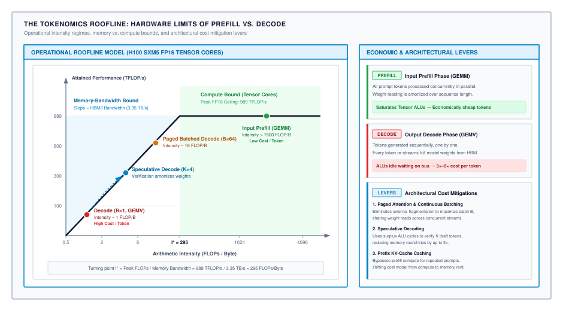
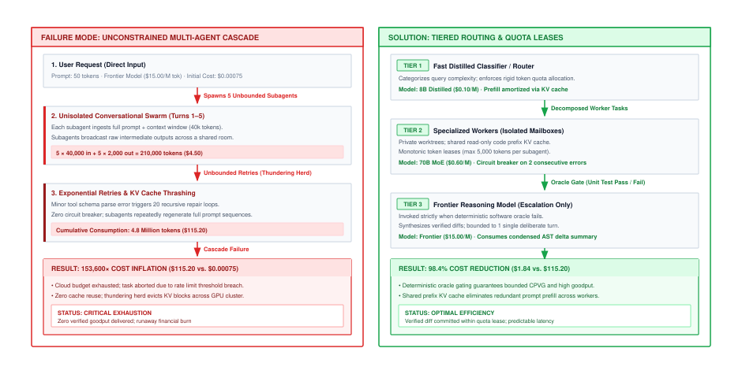

# System Tokenomics, Capacity Sizing & Cost Modeling {#sec-vol3-tokenomics}

Autonomous agent architectures transform foundation models from passive, query-response text generators into stateful, long-horizon decision engines executing dozens or hundreds of sequential forward passes. While classical software systems incur compute costs proportional to deterministic CPU cycles and network bytes transferred, agentic systems introduce an economic regime governed by stochastic token consumption, non-linear key-value (KV) cache accumulation, and severe accelerator memory-bandwidth saturation. When an unmonitored agent enters an infinite retry loop or expands its prompt context across fifty tool-calling iterations, the financial expenditure does not scale linearly with task complexity—it explodes superlinearly. Sizing infrastructure fleets and governing operating costs for autonomous workloads requires abandoning simplistic "cost per million tokens" metrics in favor of hardware-grounded tokenomics: modeling the physical roofline limits of accelerator memory hierarchies, quantifying the asymmetric economics of prefill and decode phases, sizing server clusters against heavy-tailed arrival distributions, and establishing formal decision boundaries where autonomous delegation must yield to deterministic software or human intervention.

## Purpose {.unnumbered .unlisted}

::: {.content-visible when-format="pdf"}
\begin{marginfigure}
\mlagentstack{95}{10}{10}{10}{10}{10}
\caption{The Agentic Machine Learning Systems Stack.}
\end{marginfigure}
:::

_Why does an autonomous software agent designed to eliminate human labor costs consume ten times its equivalent wage in unmonitored inference tokens?_

This chapter bridges the gap between accelerator silicon microarchitecture and organizational unit economics, establishing the analytical models required to size, provision, and govern distributed agent fleets. We analyze the physical roofline constraints that separate compute-bound prompt ingestion from memory-bandwidth-bound token generation, derive the true infrastructure cost of key-value cache memory allocation under dynamic context expansion, and formulate capacity planning models using queueing theory under bursty, heavy-tailed agentic demand. Furthermore, we develop multi-tier speculative cascading policies that combine lightweight specialized models with guarded frontier reasoning engines, establishing the mathematical frontiers where autonomous agent execution yields provable economic return over traditional deterministic software and human labor.

::: {.content-visible when-format="pdf"}
\newpage
:::

::: {.callout-learning-objectives}
- Derive the tokenomic roofline model parameterizing arithmetic intensity ($I$), memory bandwidth ($B_{\text{mem}}$), and compute ceiling ($P_{\text{peak}}$) across prefill and decode execution regimes.
- Quantify the unit economics of prompt prefill versus autoregressive decode, calculating the Cost-per-Verified-Goal (CPVG) and KV cache memory footprint across multi-turn agent horizons.
- Size accelerator serving clusters using queueing theory ($M/M/k$ and $M/G/k$ approximations, Little's Law) to guarantee tail-latency service-level agreements under heavy-tailed agent request arrivals.
- Architect multi-tier model cascades and speculative routers that optimize the Pareto frontier between task completion accuracy, end-to-end latency, and inference expenditure.
- Formulate cost-optimal autonomy boundaries using decision-theoretic utility models to identify when to employ autonomous agents versus deterministic heuristics or human-in-the-loop escalation.
- Implement enterprise economic governance frameworks, including cryptographic capability token budgets, monotonic quota attenuation, and automated financial circuit breakers.
:::

## The Tokenomic Roofline Model {#sec-vol3-tokenomics-roofline}

In late 2025, an enterprise engineering organization deployed an internal autonomous coding assistant across 1,200 software developers. The platform engineering team selected an open-weight 70-billion-parameter dense model, hosting it on private 8-way NVIDIA H100 SXM5 nodes. Each node provided 640 GB of high-bandwidth memory (HBM3) running at 3.35 TB/s per GPU, with aggregate peak compute exceeding 7.9 PFLOP/s in 16-bit half-precision floating-point arithmetic. Within hours of deployment, developer pull-request automation crawled to an intolerable 12 tokens per second per stream, and the cluster began rejecting incoming requests.

Yet cluster telemetry revealed a bewildering anomaly: GPU Tensor Core utilization across the cluster hovered below $6\%$, while total server power consumption remained far below rated thermal design limits. Suspecting a software configuration defect, systems operators doubled the provisioned GPU count. The token generation latency did not improve by a single millisecond. The cluster was not constrained by floating-point execution units, PCIe transfer overhead, or network contention. It had collided head-on with the physical boundaries of the **Tokenomic Roofline Model**.

### The classical Roofline model in accelerator silicon

To diagnose why massive accelerator clusters sit largely idle during agentic execution, we must ground our performance model in physical silicon constraints. An accelerator like the NVIDIA H100 SXM5 contains two fundamentally different physical subsystems: massive parallel arithmetic units (Tensor Cores delivering up to $989.4\text{ TFLOP/s}$ in 16-bit tensor compute) and a high-bandwidth memory (HBM) subsystem (specifically HBM3) delivering $3.35\text{ TB/s}$ across a wide silicon interposer.

Moving a byte from off-chip HBM into on-chip registers costs substantially more energy and latency than executing a multiply-accumulate operation inside an ALU. If a computational kernel cannot reuse operands repeatedly once they arrive in on-chip SRAM, the Tensor Cores spend the vast majority of their clock cycles stalled, waiting for memory controllers to deliver data.

The classical Roofline model formulated by Williams, Waterman, and Patterson [@williams2009] formalizes this boundary condition. It bounds the attainable floating-point performance $P$ ($\text{FLOP/s}$) in @eq-vol3-tokenomics-roofline-bound as a function of the operational **arithmetic intensity** $I$ ($\text{FLOPs per byte}$ transferred across the memory bus):

$$P = \min\left(P_{\text{peak}},\, I \cdot B_{\text{mem}}\right)$$ {#eq-vol3-tokenomics-roofline-bound}

where $P_{\text{peak}}$ represents the accelerator's theoretical peak floating-point throughput when every execution unit is fully saturated, and $B_{\text{mem}}$ represents the physical throughput limit of the memory bus streaming bytes from HBM into the on-chip register file. The critical parameter governing which physical subsystem throttles the workload is the **arithmetic intensity** $I$ defined in @eq-vol3-tokenomics-arithmetic-intensity:

$$I = \frac{\text{Total Floating-Point Operations Retired (FLOPs)}}{\text{Total Memory Traffic Transferred Across HBM Bus (Bytes)}}$$ {#eq-vol3-tokenomics-arithmetic-intensity}

Arithmetic intensity is an intrinsic property of the computational algorithm and its memory access patterns, not the GPU silicon. It quantifies how many mathematical operations the execution pipeline can perform on each byte of data before that byte is evicted from the register file or shared memory. Equating the memory-bandwidth delivery ceiling ($P = I \cdot B_{\text{mem}}$) to the peak computational retirement rate ($P = P_{\text{peak}}$) reveals the hardware balance point—the **roofline knee** $I^*$ defined in @eq-vol3-tokenomics-roofline-knee:[^fn-tokenomics-roofline-knee]

$$I^* = \frac{P_{\text{peak}}}{B_{\text{mem}}}$$ {#eq-vol3-tokenomics-roofline-knee}

Any kernel whose operational arithmetic intensity falls below the knee ($I < I^*$) is strictly **memory-bandwidth bound**. Its execution time is dominated by memory bus transfer latencies; the compute units sit idle, and scaling up Tensor Core clocks provides zero speedup. Conversely, when $I \ge I^*$, the kernel enters the **compute-bound** plateau: the memory bus supplies operands faster than the ALUs can consume them, enabling near-$100\%$ hardware compute efficiency. As summarized in @tbl-vol3-tokenomics-roofline-parameters, the physical subsystem boundaries dictate the hardware balance point:

| Hardware Subsystem                  |              Physical Metric (H100 SXM5) | Systems Implication                           |
|:------------------------------------|-----------------------------------------:|:----------------------------------------------|
| Peak Compute ($P_{\text{peak}}$)    | $989.4\text{ TFLOP/s}$ (dense FP16/BF16) | Maximum ALU retirement rate                   |
| Memory Bandwidth ($B_{\text{mem}}$) |                $3.35\text{ TB/s}$ (HBM3) | Maximum bus streaming throughput              |
| **Roofline Knee ($I^*$)**           |             **$295.3\text{ FLOP/Byte}$** | Minimum arithmetic intensity to saturate ALUs |

: **H100 SXM5 Roofline Parameters**: Physical compute ceilings and memory bus bandwidth governing operational intensity. {#tbl-vol3-tokenomics-roofline-parameters}

> **The Systems Rule of Thumb (The Rule of 600):** In 16-bit precision, every parameter and activation occupies 2 bytes. To achieve the $295.3\text{ FLOP/Byte}$ balance point on an H100, **every single 2-byte weight loaded from HBM must be reused in at least $2 \times 295.3 \approx 590$ separate floating-point operations** before being discarded from on-chip SRAM. Any workload that reuses weights fewer than $600$ times is fundamentally a memory-bandwidth-bound streaming workload, leaving over $90\%$ of the GPU's compute silicon cold. Capacity planners must design serving runtimes to ensure batch sizes push operational intensity across this threshold.

[^fn-tokenomics-roofline-knee]: Equating the memory-bandwidth-limited throughput $P = I^* \cdot B_{\text{mem}}$ to peak compute $P_{\text{peak}}$ yields $I^* = P_{\text{peak}} / B_{\text{mem}}$. On an NVIDIA H100 SXM5, $I^* = (989.4 \times 10^{12}\text{ FLOP/s}) / (3.35 \times 10^{12}\text{ Bytes/s}) \approx 295.3\text{ FLOP/Byte}$.

### Autoregressive decode in silicon: The memory wall

During the autoregressive decode phase of an agent trajectory, the language model generates output tokens sequentially, one token per step. For a single agent stream (batch size $B = 1$), each decode step is fundamentally a **matrix-vector product**: the incoming 1-token activation vector $\mathbf{x} \in \mathbb{R}^{1 \times d_{\text{model}}}$ is multiplied across every weight tensor in all $L$ Transformer layers.

Because the GPU's on-chip SRAM register file (roughly $50\text{ MB}$ on an NVIDIA H100) cannot hold the tens or hundreds of gigabytes of model weights, **the memory controllers must stream every single weight parameter from off-chip HBM into on-chip registers for every single token generated**.

Let $P_{\text{params}}$ denote the total active model parameters. In 16-bit precision (FP16 or BF16), each parameter occupies $2\text{ bytes}$ of storage. Neglecting KV cache reads for a moment, the memory traffic required to generate a single token is:[^fn-tokenomics-decode-traffic]

$$\text{Traffic}_{\text{decode}}(B=1) \approx 2 \cdot P_{\text{params}} \text{ Bytes}$$ {#eq-vol3-tokenomics-decode-traffic-b1}

Multiplying a single incoming activation token vector $\mathbf{x}$ across the Transformer's weight projections requires computing a dot product between the activation vector and each weight column. In floating-point arithmetic, each multiply-accumulate operation constitutes two operations (one multiplication and one addition). Thus, retiring the forward pass for one token executes exactly two FLOPs per parameter:

$$\text{FLOPs}_{\text{decode}}(B=1) \approx 2 \cdot P_{\text{params}} \text{ FLOPs}$$ {#eq-vol3-tokenomics-decode-flops-b1}

Because both the floating-point operations and the memory bus traffic scale strictly proportionally to the model size $P_{\text{params}}$, the parameter count cancels out completely ($I_{\text{decode}} = \frac{2 P_{\text{params}}}{2 P_{\text{params}}}$). Substituting the workload's floating-point demand from @eq-vol3-tokenomics-decode-flops-b1 and memory bus traffic from @eq-vol3-tokenomics-decode-traffic-b1 into our arithmetic intensity definition yields the invariant single-stream intensity in @eq-vol3-tokenomics-decode-intensity-b1:

$$I_{\text{decode}}(B=1) = 1.0 \text{ FLOP/Byte}$$ {#eq-vol3-tokenomics-decode-intensity-b1}

As detailed in @tbl-vol3-tokenomics-single-stream-decode, single-stream decoding operates at less than $0.34\%$ of the H100 hardware balance knee ($I^* \approx 295.3\text{ FLOP/Byte}$):

| Decoding Metric             |            H100 SXM5 Hardware Ceiling |                     Single-Stream Decode ($B=1$) | Attained Efficiency            |
|:----------------------------|--------------------------------------:|-------------------------------------------------:|:-------------------------------|
| Operational Intensity ($I$) |       $295.3\text{ FLOP/Byte}$ (knee) |                           $1.0\text{ FLOP/Byte}$ | **$0.339\%$** of hardware knee |
| Attained Throughput ($P$)   | $989.4\text{ TFLOP/s}$ (peak compute) | $3.35\text{ TFLOP/s}$ ($I \cdot B_{\text{mem}}$) | **$0.339\%$** MFU              |
| Idle Silicon Fraction       |             $0.0\%$ (fully saturated) |                       $99.66\%$ (stalled on bus) | **$99.66\%$** cold silicon     |

: **Single-Stream Autoregressive Decode Efficiency on NVIDIA H100 SXM5**: Severe ALU starvation under batch size $B=1$. {#tbl-vol3-tokenomics-single-stream-decode}

> **The Systems Rule of Thumb (The Law of Single-Stream Decode):** At $B = 1$, the accelerator is completely memory-bus starved. The Tensor Cores sit idle for $99.66\%$ of every clock cycle, waiting for weights to arrive across the interposer. Upgrading to a GPU architecture with $2\times$ more Tensor Cores yields **zero increase** in single-stream generation speed; generation latency is dictated solely by memory bandwidth $B_{\text{mem}}$. Serving runtimes must batch concurrent agent requests to overcome this memory wall [@hennessy2011computer; @hennessy2019golden].

[^fn-tokenomics-decode-traffic]: For a 70-billion parameter model in 16-bit precision ($140\text{ GB}$ of weights), generating 100 output tokens for an unbatched agent loop requires streaming $100 \times 140\text{ GB} = 14\text{ TB}$ of data across the memory bus, regardless of prompt length.

### Amortizing memory traffic via batching

The primary systems mechanism to escape memory-bandwidth starvation during decoding is **concurrent request batching**. When the serving engine groups $B$ active agent streams into a single forward execution pass, the model weights are streamed across the HBM bus into on-chip SRAM exactly once, but the Tensor Cores multiply each loaded weight against $B$ independent token activations simultaneously. This algorithmic transition converts memory-bound matrix-vector operations into dense general matrix multiply (GEMM) operations.

For a batch of $B$ concurrent streams, the floating-point execution demand scales linearly with $B$, while the weight-loading traffic across the memory bus remains invariant:[^fn-tokenomics-batch-amortization]

$$I_{\text{decode}}(B) \approx B \text{ FLOP/Byte}$$ {#eq-vol3-tokenomics-batched-decode-intensity}

Under this linear scaling relationship defined in @eq-vol3-tokenomics-batched-decode-intensity, an agent runtime's operational arithmetic intensity is directly proportional to its concurrency. To shift an NVIDIA H100 GPU from the memory-bandwidth slope onto the compute-saturated plateau, the serving runtime must sustain the active saturation batch size defined in @eq-vol3-tokenomics-saturation-batch-size:

$$B^* \ge 295 \text{ concurrent streams}$$ {#eq-vol3-tokenomics-saturation-batch-size}

As illustrated in @fig-tokenomics-roofline, increasing concurrency pushes decode throughput up the memory-bandwidth slope toward the compute ceiling:

::: {#fig-tokenomics-roofline fig-env="figure" fig-pos="htb" fig-cap="**The Tokenomics Roofline: Hardware Limits of Prefill vs. Decode**: Operational intensity dictates inference economics. Single-sequence autoregressive decode ($B=1$) operates deep in the memory-bandwidth-bound regime at $I \approx 1\text{ FLOP/Byte}$, utilizing less than $1\%$ of H100 Tensor Cores. Batching ($B=64$) and speculative decoding shift operational intensity toward the roofline knee ($I^* \approx 295\text{ FLOP/Byte}$), while input prefill operates deep in the compute-bound plateau ($I > 1500\text{ FLOP/Byte}$), fully saturating the accelerator." fig-alt="Roofline model diagram plotting attained TFLOPs per second against arithmetic intensity in FLOPs per byte, illustrating memory-bandwidth bound decode operations at the bottom-left and compute-bound prefill operations at the top-right."}
{width="100%"}
:::

As summarized in @tbl-vol3-tokenomics-batch-scaling, batching amortizes memory traffic across concurrent streams:

| Concurrency Level         | Operational Intensity ($I$) |             Attained Throughput ($P$) | Primary Hardware Bottleneck     |
|:--------------------------|----------------------------:|--------------------------------------:|:--------------------------------|
| Single stream ($B=1$)     |      $1.0\text{ FLOP/Byte}$ |  $3.35\text{ TFLOP/s}$ ($0.34\%$ MFU) | HBM bus streaming bandwidth     |
| Small batch ($B=32$)      |     $32.0\text{ FLOP/Byte}$ | $107.2\text{ TFLOP/s}$ ($10.8\%$ MFU) | Memory bus transfer latency     |
| Saturated batch ($B=295$) |    $295.3\text{ FLOP/Byte}$ |  $989.4\text{ TFLOP/s}$ ($100\%$ MFU) | Tensor Core ALU retirement rate |

: **Impact of Batch Size on H100 Accelerator Utilization**: Scaling concurrency amortizes weight transfers and shifts decode toward compute saturation. {#tbl-vol3-tokenomics-batch-scaling}

> **The Systems Rule of Thumb (The Dilemma of Batched Decode):** While setting $B \ge 295$ theoretically achieves $100\%$ Tensor Core saturation, real-world agent serving engines rarely reach this knee. Each active stream requires allocating dedicated memory pages for its key-value (KV) cache. At high batch counts, KV-cache allocations exhaust the GPU's $80\text{ GB}$ of HBM long before reaching $B=295$, precipitating out-of-memory (OOM) evictions or extreme request queuing. Serving architectures must navigate this fundamental trade-off between compute saturation and memory exhaustion.

[^fn-tokenomics-batch-amortization]: In batched execution, total floating-point operations equal $\text{FLOPs}_{\text{decode}}(B) \approx 2 \cdot B \cdot P_{\text{params}}$, while weight traffic from HBM remains $\text{Traffic}_{\text{weights}}(B) \approx 2 \cdot P_{\text{params}}$ bytes. Dividing FLOPs by bytes cancels $2 \cdot P_{\text{params}}$, yielding $I \approx B\text{ FLOP/Byte}$ when neglecting KV cache reads.

### Comparative accelerator Roofline topologies

The physical trade-offs governing token generation vary across hardware generations and accelerator architectures. @Tbl-vol3-accelerator-roofline details the roofline parameters across industry-standard AI accelerators, calculating the critical batch size $B^*$ required to reach the compute-bound knee.

| Accelerator Architecture      | Peak Compute $P_{\text{peak}}$ (FP16/BF16 TFLOP/s) | Memory Bandwidth $B_{\text{mem}}$ (TB/s) | Memory Capacity $M_{\text{HBM}}$ (GB) | Roofline Knee $I^*$ (FLOP/Byte) | Critical Batch Size $B^*$ | Single-Stream ALU Utilization $\eta_{\text{ALU}}(B=1)$ |
|:------------------------------|:--------------------------------------------------:|:----------------------------------------:|:-------------------------------------:|:-------------------------------:|:-------------------------:|:------------------------------------------------------:|
| **NVIDIA A100 SXM4**          |                        312                         |                   2.04                   |                   80                  |              152.9              |            153            |                         0.65%                          |
| **NVIDIA H100 SXM5**          |                        989                         |                   3.35                   |                   80                  |              295.3              |            295            |                         0.34%                          |
| **NVIDIA H200 SXM5**          |                        989                         |                   4.80                   |                  141                  |              206.0              |            206            |                         0.49%                          |
| **NVIDIA B200 (Blackwell)**   |                       2,250                        |                   8.00                   |                  192                  |              281.3              |            281            |                         0.36%                          |
| **Google TPU v5e**            |                        197                         |                   0.82                   |                   16                  |              240.2              |            240            |                         0.42%                          |
| **NVIDIA GH200 Grace Hopper** |                        989                         |       4.00 (HBM3) + 0.50 (LPDDR5X)       |                96 + 480               |              219.8              |            220            |                         0.45%                          |

: **Accelerator Roofline Topologies and Architectural Knee Thresholds**: Comparison across industry silicon for dense FP16/BF16 operations without structured sparsity. {#tbl-vol3-accelerator-roofline tbl-colwidths="[24,14,14,12,12,12,12]"}

Notice from @tbl-vol3-accelerator-roofline that across successive hardware generations, compute throughput $P_{\text{peak}}$ has outpaced memory bandwidth $B_{\text{mem}}$. From A100 to H100, compute increased by $3.17\times$, while memory bandwidth increased by only $1.64\times$. Consequently, the roofline knee $I^*$ shifted upward from 153 to 295 FLOP/Byte. Sizing fleets for modern accelerators requires even larger batch sizes or aggressive architectural optimizations to prevent silicon starvation.

### The economic corollary of the Roofline

Because cloud accelerators are leased by wall-clock time rather than retired instructions (typically $\$3.50$ to $\$4.50$ per H100 GPU-hour), low ALU utilization directly inflates per-token unit economics. When an autonomous agent executes unbatched decode at batch size $B=1$, the infrastructure buyer pays for $989.4\text{ TFLOP/s}$ of compute capability but receives only $3.35\text{ TFLOP/s}$ of actual operational work. The remaining $99.66\%$ of the hardware invoice finances idle memory stalls.

Let $C_{\text{GPU}}$ denote the amortized hourly lease cost of an accelerator node ($\$/\text{hr}$). The infrastructure expenditure required to generate $N_{\text{out}}$ output tokens across a batch of $B$ concurrent streams is the lease cost scaled by execution time:

$$\text{Cost}_{\text{decode}}(B) = \frac{C_{\text{GPU}}}{3600} \cdot \frac{N_{\text{out}}}{\text{TokensPerSec}(B)}$$ {#eq-vol3-tokenomics-cost-decode-general}

The aggregate token generation rate $\text{TokensPerSec}(B)$ is throttled by memory bus throughput. Each decode step requires streaming the full model weights $2 \cdot P_{\text{params}}$ plus the active KV cache traffic $\text{KV}_{\text{bytes}}(B)$ across the bus:[^fn-tokenomics-decode-rate]

$$\text{TokensPerSec}(B) \approx \frac{B \cdot B_{\text{mem}}}{2 \cdot P_{\text{params}} + \text{KV}_{\text{bytes}}(B)}$$ {#eq-vol3-tokenomics-aggregate-decode-throughput}

Because the parameter traffic $2 \cdot P_{\text{params}}$ is read once per batch, generation throughput scales almost linearly with $B$ until KV cache traffic or compute limits intervene. Substituting @eq-vol3-tokenomics-aggregate-decode-throughput into @eq-vol3-tokenomics-cost-decode-general demonstrates that the marginal infrastructure cost per output token $c_{\text{token}}(B)$ is fundamentally inversely proportional to concurrency, as captured in @eq-vol3-tokenomics-token-cost-proportionality:

$$c_{\text{token}}(B) \propto \frac{1}{B}$$ {#eq-vol3-tokenomics-token-cost-proportionality}

As shown in @tbl-vol3-tokenomics-batch-economics, scaling concurrency from single-stream to batched serving slashes generation expenses:

| Concurrency Regime          | Decode Speed (70B Model) |       Attained Cost (\$4.00/GPU-hr) | Relative Multiplier  |
|:----------------------------|-------------------------:|------------------------------------:|:---------------------|
| Isolated Agent ($B=1$)      |     $24\text{ tokens/s}$ | $\$46.30\text{ per million tokens}$ | $32.0\times$ premium |
| Light Batched ($B=8$)       |    $190\text{ tokens/s}$ |  $\$5.85\text{ per million tokens}$ | $4.0\times$ premium  |
| Production Serving ($B=32$) |    $750\text{ tokens/s}$ |  $\$1.48\text{ per million tokens}$ | Baseline parity      |

: **Economic Impact of Decode Batching for a 70B Parameter Model**: Increasing batch concurrency directly amortizes the fixed hourly hardware lease. {#tbl-vol3-tokenomics-batch-economics}

> **The Systems Rule of Thumb (The Decode Cost Multiplier):** An isolated, unbatched agent loop running on dedicated hardware is up to $30\times$ more expensive per token than the same agent multiplexed into a continuous-batching cluster. System designers must never dedicate static GPU resources to single-agent interactive sessions; agent runtimes must stream requests into shared multi-tenant schedulers to share the memory-bus tax.

[^fn-tokenomics-decode-rate]: Each generation step takes $T_{\text{step}} = (2 P_{\text{params}} + \text{KV}_{\text{bytes}}) / B_{\text{mem}}$ seconds and emits $B$ output tokens, yielding aggregate generation rate $\text{TokensPerSec} = B / T_{\text{step}}$.

## Prefill vs. Decode Unit Economics {#sec-vol3-tokenomics-prefill-decode}

Every commercial foundation model API exhibits a stark pricing asymmetry: input tokens are priced between $3\times$ and $6\times$ cheaper than output tokens. For instance, frontier model APIs frequently bill input tokens at $\$2.50$ per million tokens, while billing output tokens at $\$10.00$ or $\$15.00$ per million tokens. Many software architects view this price spread as an arbitrary business markup designed to extract consumer surplus from conversational chat users who submit long prompts and receive short responses.

In autonomous agentic workloads, this assumption is catastrophically invalid. The pricing spread is rooted in the distinct physical mechanics of prompt prefill versus token decode. Furthermore, when agents execute multi-turn workflows, this price asymmetry creates an unexpected economic inversion: **input prefill costs end up dominating the total bill**, routinely accounting for $80\%$ to $90\%$ of total invoice expenditure, despite the lower nominal price per input token.

### Prefill arithmetic: Saturation and model FLOPs utilization

During the **prefill** phase, an agent runtime submits a prompt consisting of $S_{\text{in}}$ tokens to the model. Unlike the serialized single-token forward passes of decode, the transformer ingests all $S_{\text{in}}$ tokens simultaneously. This structural concurrency converts the memory-bound matrix-vector products of decode into massive, compute-dense **general matrix-matrix multiplications (GEMMs)** ($\mathbf{X} \in \mathbb{R}^{S_{\text{in}} \times d_{\text{model}}}$ multiplied by weight projections).

For an input sequence of length $S_{\text{in}}$, the floating-point execution demand across a dense Transformer with $P_{\text{params}}$ parameters and $L$ layers scales with both linear feedforward projections and quadratic self-attention:[^fn-tokenomics-prefill-derivation]

$$\text{FLOPs}_{\text{prefill}} \approx 2 \cdot P_{\text{params}} \cdot S_{\text{in}} + 4 \cdot L \cdot d_{\text{model}} \cdot S_{\text{in}}^2$$ {#eq-vol3-tokenomics-prefill-flops}

where $2 \cdot P_{\text{params}} \cdot S_{\text{in}}$ represents linear feedforward and projection weight multiplications, and $4 \cdot L \cdot d_{\text{model}} \cdot S_{\text{in}}^2$ accounts for self-attention matrix multiplications ($\mathbf{Q}\mathbf{K}^T$ and $\mathbf{A}\mathbf{V}$).

Because model weights ($2 \cdot P_{\text{params}}\text{ Bytes}$) are read from HBM once while each weight operand is reused across all $S_{\text{in}}$ activation rows, the operational arithmetic intensity scales directly with prompt length defined in @eq-vol3-tokenomics-prefill-intensity:

$$I_{\text{prefill}}(S_{\text{in}}) \approx S_{\text{in}} \text{ FLOP/Byte}$$ {#eq-vol3-tokenomics-prefill-intensity}

As detailed in @tbl-vol3-tokenomics-prefill-intensity-scaling, any prompt exceeding $S_{\text{in}} \ge 512$ tokens easily crosses the H100 hardware knee ($I^* \approx 295.3\text{ FLOP/Byte}$):

| Prompt Length ($S_{\text{in}}$)     | Arithmetic Intensity ($I$) | Hardware Regime          | Attained MFU | Primary Bottleneck         |
|:------------------------------------|---------------------------:|:-------------------------|:-------------|:---------------------------|
| Short prompt ($128$ tokens)         |     $128\text{ FLOP/Byte}$ | Memory-bandwidth bound   | $\sim 25\%$  | Memory bus latency         |
| Medium prompt ($512$ tokens)        |     $512\text{ FLOP/Byte}$ | Compute saturated (knee) | $\sim 45\%$  | Tensor Core compute        |
| Long agent context ($4,096$ tokens) |   $4,096\text{ FLOP/Byte}$ | Deeply compute bound     | $55\%–62\%$  | Thermal & power throttling |

: **Prefill Arithmetic Intensity Across Context Lengths on NVIDIA H100 SXM5**: Longer prompts shift execution deep into the compute-bound plateau. {#tbl-vol3-tokenomics-prefill-intensity-scaling}

Because $I_{\text{prefill}}$ sits deep within the compute-bound plateau of @fig-tokenomics-roofline, prefill kernels achieve exceptional model FLOPs utilization (MFU)---typically $45\%$ to $60\%$ in production runtimes utilizing FlashAttention [@dao2022].

> **The Systems Rule of Thumb (The Prefill-Decode Interference Law):** Prefill is compute-bound and monopolizes Tensor Cores; decode is memory-bound and stalls waiting for the HBM bus. Colocating prefill and decode on the same accelerator creates severe **head-of-line blocking**: an incoming $4,000$-token agent prompt will commandeer the Tensor Cores for $50\text{–}100\text{ ms}$, completely stalling the decode token generation of all other active agents on that node.

[^fn-tokenomics-prefill-derivation]: Dividing total prefill floating-point operations from @eq-vol3-tokenomics-prefill-flops by memory traffic $(2 P_{\text{params}} + \text{KV}_{\text{write}}(S_{\text{in}}))$ yields $I_{\text{prefill}} \approx (2 P_{\text{params}} S_{\text{in}}) / (2 P_{\text{params}}) \approx S_{\text{in}}\text{ FLOP/Byte}$, since KV cache write traffic is small relative to model parameters for standard sequence lengths.

### Latency dissection: Time-to-first-token vs. time-between-tokens

The physical divergence between prefill and decode produces two fundamentally distinct latency metrics:

1. **Time-to-First-Token (TTFT):** The wall-clock duration from request submission to the emission of the very first generated token. TTFT is dominated by prefill compute and queueing delay:

$$\text{TTFT} = \frac{\text{FLOPs}_{\text{prefill}}(S_{\text{in}})}{\text{MFU}_{\text{prefill}} \cdot P_{\text{peak}}} + T_{\text{queue}}$$

2. **Time-Between-Tokens (TBT) or Inter-Token Latency (ITL):** The wall-clock duration between each successive autoregressive token. TBT is bounded by memory bandwidth:

$$\text{TBT} = \frac{2 \cdot P_{\text{params}} + \text{KV}_{\text{read}}(S_{\text{ctx}})}{B_{\text{mem}}}$$

In agentic systems, TTFT dictates how fast an agent can ingest tool observations, compile stack traces, or read codebases. TBT dictates the speed at which the agent emits thoughts, plans, and tool call syntax. Because prefill is compute-bound and decode is memory-bound, co-locating both phases on the same physical accelerator causes severe phase interference, where a massive prefill burst freezes active decode streams, spiking p99 TBT [@kwon2023].

### The key-value cache memory footprint

While model weights maintain a static, invariant footprint in HBM throughout serving, the **Key-Value (KV) cache** expands dynamically with every single token ingested and generated. The KV cache stores the key and value activation vectors across all prior context tokens to prevent redundant self-attention recomputation on every generation step.

For a Transformer with $L$ layers, hidden dimension $d_{\text{model}}$, and Multi-Head Attention (MHA), each token requires storing two vectors (Key and Value) per layer in 16-bit precision ($2\text{ bytes}$ per element). Under **Grouped-Query Attention (GQA)** [@shazeer2019fast], where $n_{\text{heads}}$ query heads share $n_{\text{kv}}$ key-value heads with compression ratio $g = n_{\text{heads}} / n_{\text{kv}}$, the total memory footprint across $B$ concurrent agent streams at context length $S$ is defined in @eq-vol3-tokenomics-kv-cache-footprint:[^fn-tokenomics-kv-footprint]

$$\text{Memory}_{\text{KV}}(B, S) = B \cdot S \cdot \left( \frac{4 \cdot L \cdot d_{\text{model}}}{g} \right) \text{ Bytes}$$ {#eq-vol3-tokenomics-kv-cache-footprint}

Evaluating @eq-vol3-tokenomics-kv-cache-footprint for the industry-standard Llama-3-70B architecture ($L = 80$ layers, hidden dimension $d_{\text{model}} = 8,192$, and GQA grouping ratio $g = 64/8 = 8$) yields an invariant memory requirement of $\frac{4 \cdot 80 \cdot 8,192}{8} = 327,680\text{ bytes}$, or approximately **$320\text{ KB per token}$**.

Every single context token retained across an agent trajectory consumes approximately $320\text{ KB}$ of scarce GPU HBM. As shown in @tbl-vol3-tokenomics-kv-cache-sizing, when context length or concurrency grows, activation memory rapidly dwarfs the model weights themselves:

| Concurrency ($B$)           | Context Length ($S$)              | Total Tokens Stored |  KV Cache Footprint | Physical HBM Impact       |
|:----------------------------|:----------------------------------|--------------------:|--------------------:|:--------------------------|
| Single stream ($B=1$)       | Short prompt ($4\text{k}$)        |         $4,000$ tok |    $1.31\text{ GB}$ | Fits easily on 1 GPU      |
| Single stream ($B=1$)       | Extended horizon ($64\text{k}$)   |        $64,000$ tok |   $20.97\text{ GB}$ | $26\%$ of an 80 GB GPU    |
| Team fleet ($B=16$)         | Extended horizon ($64\text{k}$)   |     $1,024,000$ tok |   $335.5\text{ GB}$ | **Exceeds 4x H100 GPUs**  |
| Production cluster ($B=64$) | Deep agent search ($128\text{k}$) |     $8,192,000$ tok | $2,684.4\text{ GB}$ | **Exceeds 33x H100 GPUs** |

: **KV Cache Memory Sizing for Llama-3-70B Across Concurrency and Context**: Activation memory scales multiplicatively ($B \times S$), rapidly overtaking model weight storage. {#tbl-vol3-tokenomics-kv-cache-sizing}

> **The Systems Rule of Thumb (The 320 KB Context Cliff):** At $320\text{ KB/token}$, an agent holding a $64\text{k}$ context window consumes $21\text{ GB}$ of HBM purely for activation state—more memory than the entire 70B model's weights on a 4-way tensor parallel partition. When designing agent loops, uncontrolled context accumulation is fundamentally an infrastructure denial-of-service attack against GPU memory.

[^fn-tokenomics-kv-footprint]: In 16-bit precision, each scalar element occupies 2 bytes. Storing both Key and Value vectors requires $2 \times 2 = 4$ bytes per hidden dimension channel. Across $L$ layers with hidden size $d_{\text{model}}$ compressed by GQA ratio $g$, each token requires $(4 L d_{\text{model}})/g$ bytes. Multiplying by batch size $B$ and sequence length $S$ yields total footprint.

### The compounding turn tax in multi-turn agents

In a standard single-turn conversational interface, prompt evaluation is a one-time upfront cost: total billing is simply $c_{\text{in}} S_{\text{in}} + c_{\text{out}} S_{\text{out}}$. In an autonomous agent system, however, execution is an iterative state machine. On every turn $n \in \{1, \dots, N\}$, the agent does not merely consume its latest action; it re-evaluates the entire accumulated transcript—the initial system prompt $S_0$, every prior reasoning step $\Delta_{\text{act}}(j)$, and every environment tool return $\Delta_{\text{obs}}(j)$.

If the serving engine does not maintain active prefix state in its KV cache across turns, the hardware must re-prefill this accumulated context from scratch on every single iteration. Because context expands with each tool call, the cumulative input tokens processed across an $N$-turn trajectory explode quadratically defined in @eq-vol3-tokenomics-quadratic-prefill:[^fn-tokenomics-turn-tax]

$$S_{\text{total\_in}} = N \cdot S_0 + \bar{\Delta} \cdot \frac{N(N - 1)}{2}$$ {#eq-vol3-tokenomics-quadratic-prefill}

where:

- $S_0$ is the base repository and system prompt size ($\text{tokens}$).
- $\bar{\Delta} = \bar{\Delta}_{\text{act}} + \bar{\Delta}_{\text{obs}}$ is the average incremental context added per turn ($\text{tokens/turn}$).
- $N$ is the interaction depth ($\text{turns}$).

Meanwhile, generated decode tokens scale strictly linearly with interaction depth defined in @eq-vol3-tokenomics-linear-decode:

$$S_{\text{total\_out}} = N \cdot \bar{\Delta}_{\text{act}}$$ {#eq-vol3-tokenomics-linear-decode}

Because input tokens grow quadratically ($\mathcal{O}(N^2 \bar{\Delta})$) while output tokens grow linearly ($\mathcal{O}(N \bar{\Delta}_{\text{act}})$), **input prefill expenditure inevitably swamps decode expenditure in extended agent workflows**, as demonstrated in @tbl-vol3-tokenomics-turn-tax-breakdown:

| Trajectory Metric    | Turn 1 ($N=1$) | Turn 10 ($N=10$) | Turn 30 ($N=30$) | Systems Consequence           |
|:---------------------|---------------:|-----------------:|-----------------:|:------------------------------|
| Context Evaluated    |   $15,000$ tok |     $41,100$ tok |     $99,100$ tok | $6.6\times$ prompt expansion  |
| Cumulative Prefill   |   $15,000$ tok |    $280,500$ tok |  $1,711,500$ tok | Quadratic recomputation surge |
| Cumulative Decode    |      $400$ tok |      $4,000$ tok |     $12,000$ tok | Purely linear decode          |
| Prefill Cost (\$3/M) |      $\$0.045$ |        $\$0.842$ |        $\$5.135$ | **$96.6\%$** of total bill    |
| Decode Cost (\$15/M) |      $\$0.006$ |        $\$0.060$ |        $\$0.180$ | **$3.4\%$** of total bill     |

: **Compounding Turn Tax for an Autonomous Coding Agent**: Evaluated at $S_0 = 15,000$ tokens, $\bar{\Delta}_{\text{act}} = 400$, and $\bar{\Delta}_{\text{obs}} = 2,500$ tokens/turn under standard commercial pricing tiers. {#tbl-vol3-tokenomics-turn-tax-breakdown}

> **The Systems Rule of Thumb (The Turn Tax Invariant):** For any autonomous workflow exceeding $N \ge 10$ turns, quadratic recomputation renders stateless inference economically unviable. Even though commercial providers charge $5\times$ more per output token than input token, re-prefilling history makes input tokens account for over $95\%$ of the total cloud invoice. Runtimes must implement radix prefix caching or stateful session pinning to convert $\mathcal{O}(N^2)$ prefill compute back to linear $\mathcal{O}(N)$ increments.

[^fn-tokenomics-turn-tax]: At turn $n$, context length is $S_{\text{in}}(n) = S_0 + \sum_{j=1}^{n-1} \Delta(j)$. Summing over all $N$ turns yields $S_{\text{total\_in}} = \sum_{n=1}^N S_{\text{in}}(n) = N S_0 + \bar{\Delta} \sum_{n=1}^N (n - 1) = N S_0 + \bar{\Delta} \frac{N(N - 1)}{2} = \mathcal{O}(N S_0 + N^2 \bar{\Delta})$.

### Radix prefix caching economics

To eliminate this quadratic prefill tax, state-of-the-art serving runtimes employ **Radix Tree Prefix Caching** [@kwon2023]. The serving runtime maintains a radix tree indexing the physical KV cache blocks stored in GPU memory. When Turn $n$ arrives, the engine matches the prefix tokens against cached blocks, skipping the prefill forward pass for all shared history and computing prefill exclusively for the incremental delta $\Delta_{\text{obs}}(n-1)$.

With prefix caching, input token processing collapses from quadratic to linear:

$$S_{\text{cached\_in}} = S_0 + \sum_{n=1}^N \Delta_{\text{obs}}(n-1) = \mathcal{O}(N \cdot \bar{\Delta})$$

In our 30-turn coding scenario, prefix caching slashes input token processing from 1,711,500 tokens down to 99,100 tokens, reducing the input bill from $\$5.13$ to $\$0.30$—a **$94.2\%$ cost reduction**.

However, prefix caching is not an unconstrained free lunch. It alters the fundamental economic model: **it trades compute cost for memory capacity holding cost**.

To retain cached KV blocks, the serving system must "rent" scarce GPU HBM, holding memory pages that could otherwise serve concurrent requests. Let $C_{\text{HBM}}$ denote the amortized capital cost per gigabyte-second of GPU memory, and let $\tau_{\text{idle}}$ denote the idle wall-clock time between agent turns (while the agent waits for external tool execution). The holding cost to persist the KV cache is:

$$C_{\text{rent}} = C_{\text{HBM}} \cdot \text{Footprint}_{\text{KV}} \cdot \tau_{\text{idle}}$$

The cache break-even duration $T_{\text{break-even}}$ is the maximum idle time an agent can wait before the cost of holding the KV cache in HBM exceeds the cost of recomputing the prefill:

$$T_{\text{break-even}} = \frac{c_{\text{prefill}} \cdot S_{\text{prefix}}}{C_{\text{HBM}} \cdot \text{Footprint}_{\text{KV}}(S_{\text{prefix}})}$$

If an agent waits on a slow, human-in-the-loop approval or a 10-minute container compilation where $\tau_{\text{idle}} > T_{\text{break-even}}$, retaining the KV cache in HBM degrades cluster economics. High-performance runtimes resolve this by asynchronously swapping idle KV blocks to host system RAM (via PCIe Gen5) or fast NVMe storage, preserving prefix state without stranding accelerator HBM.

### Cost-per-verified-goal (CPVG)

The disconnect between token pricing and engineering value necessitates a systems-grounded economic metric: **Cost-per-Verified-Goal (CPVG)**. In autonomous systems, evaluating an architecture by raw cost per million tokens is an economic trap: generating millions of cheap tokens is worthless if the agent fails to resolve the underlying objective.

Let an agent task require up to $K_{\text{attempts}}$ independent trajectory attempts, where each attempt consumes dollar cost $C_{\text{trajectory}}(k)$ in accelerator compute and token allocations. Let $P_{\text{success}}$ denote the probability that an autonomous trajectory successfully satisfies a deterministic verification oracle (such as passing a unit test suite, compiler type-check, or schema validator). The expected Cost-per-Verified-Goal is defined in @eq-vol3-tokenomics-cpvg-simple:[^fn-tokenomics-cpvg-derivation]

$$\text{CPVG} = \frac{\bar{C}_{\text{trajectory}}}{P_{\text{success}}}$$ {#eq-vol3-tokenomics-cpvg-simple}

where $\bar{C}_{\text{trajectory}}$ is the mean dollar cost of an end-to-end trajectory attempt, and $P_{\text{success}}$ is the single-pass verification probability.

When an autonomous agent executes an unguided open-loop trajectory consisting of $N$ sequential interaction steps, overall trajectory success compounds exponentially with per-step reliability $p$ ($P_{\text{success}} \approx p^N$).

Substituting this exponential decay into our cost-per-goal relation exposes the severe non-linear cost cliff of extended autonomous agency:

$$\text{CPVG} \approx \frac{\bar{C}_{\text{trajectory}}}{p^N}$$ {#eq-vol3-tokenomics-cpvg-exponential}

@Tbl-vol3-cpvg-comparison demonstrates how small differences in per-step reliability cause radical divergences in fleet economics across a 20-step software engineering task:

| Model Tier                     | Cost per 1M In / Out Tokens | Average Trajectory Cost $\bar{C}_{\text{traj}}$ | Per-Step Reliability $p$ | 20-Step Success Rate $P_{\text{success}} = p^{20}$ | Expected Attempts $1 / P_{\text{success}}$ | Cost-per-Verified-Goal (CPVG) | Economic Outcome             |
|:-------------------------------|:---------------------------:|:-----------------------------------------------:|:------------------------:|:--------------------------------------------------:|:------------------------------------------:|:-----------------------------:|:-----------------------------|
| **Small Open SLM (8B)**        |     $\$0.15$ / $\$0.60$     |                     $\$0.12$                    |          88.0%           |                        7.8%                        |                    12.8                    |          **$\$1.54$**         | Severe attempt multiplier    |
| **Mid-Tier MoE (8x7B)**        |     $\$0.60$ / $\$1.80$     |                     $\$0.45$                    |          94.0%           |                       29.0%                        |                    3.45                    |          **$\$1.55$**         | Balanced cost and retries    |
| **Dense High-Tier (70B)**      |     $\$2.00$ / $\$6.00$     |                     $\$1.50$                    |          97.0%           |                       54.4%                        |                    1.84                    |          **$\$2.76$**         | Moderate cost penalty        |
| **Frontier Reasoning (400B+)** |    $\$10.00$ / $\$30.00$    |                     $\$7.50$                    |          99.0%           |                       81.8%                        |                    1.22                    |          **$\$9.15$**         | High single-pass reliability |

: **Unit Economics and Cost-per-Verified-Goal (CPVG)**: Comparison across model tiers for a 20-step task with prefix caching enabled across turns. {#tbl-vol3-cpvg-comparison tbl-colwidths="[20,18,12,12,14,12,12]" }

Notice the counter-intuitive systems relationship revealed by @tbl-vol3-cpvg-comparison: While the 8B model is $62.5\times$ cheaper per raw trajectory than the frontier model ($\$0.12$ vs. $\$7.50$), its CPVG ($\$1.54$) is virtually identical to the 8x7B mixture-of-experts model ($\$1.55$). Because its per-step reliability is lower ($88\%$ vs. $94\%$), the 8B model requires an average of nearly 13 repeated attempts to deliver a single verified solution.

> **The Systems Rule of Thumb (The Cheap Token Fallacy):** Sizing agent clusters based purely on nominal token pricing is an operational trap. When an 8B model requires 13 attempts to succeed, it consumes $13\times$ more cluster queue capacity, holds accelerator memory across 13 retries, and forces end-users to wait $13\times$ longer. Capacity planners must size fleets by the product of trajectory compute and verification probability, not raw token rates.

[^fn-tokenomics-cpvg-derivation]: For independent identically distributed attempts terminated upon the first successful verification, the number of attempts follows a geometric distribution with expectation $\mathbb{E}[K] = 1 / P_{\text{success}}$. Multiplying average trajectory cost $\bar{C}_{\text{trajectory}}$ by expected attempts $\mathbb{E}[K]$ directly yields $\text{CPVG} = \bar{C}_{\text{trajectory}} / P_{\text{success}}$.

## Fleet Sizing and Accelerator Capacity Provisioning {#sec-vol3-tokenomics-fleet-sizing}

In the third quarter of 2025, a financial software enterprise deployed an autonomous tax-audit agent fleet. During standard operating conditions, the service handled an average arrival rate of $\lambda = 50$ client requests per second across a cluster of 64 NVIDIA H100 GPUs, maintaining median response latencies under 4.5 seconds. On the final day of the fiscal quarter, arrival traffic surged by $2.2\times$ to $\lambda = 110$ requests per second.

In traditional stateless web microservices, such a traffic spike produces linear queue buildup managed by horizontal autoscaling. In the agentic cluster, the spike triggered a systemic queue collapse: p99 Time-to-First-Token surged from 250 milliseconds to 192 seconds, GPU memory allocation suffered cascading Out-Of-Memory (OOM) aborts, and client connections timed out en masse. SRE teams discovered that the cluster's effective goodput dropped to near zero, even though every GPU was pinned at $100\%$ memory occupancy.

The failure stemmed from applying classical stateless capacity models to a **stateful, heavy-tailed queueing network with positive feedback loops**.

### The stochastic profile of agent workloads

Unlike traditional web requests, which exhibit low variance in service time ($T_{\text{service}} \approx 50\text{--}200\text{ ms}$) and carry zero persistent accelerator state, autonomous agent workloads exhibit three pathological systems properties:

1. **Heavy-Tailed, High-Variance Service Times:** A single agent request may require a 2-step retrieval (taking 1.5 seconds) or an 80-step iterative debugging loop across multiple compiler environments (taking 400 seconds). Service times follow log-normal or Pareto distributions where the variance $\sigma^2$ dwarfs the squared mean $\mu^{-2}$. The **coefficient of variation** $C_v = \sigma / \mu$ routinely exceeds $2.5$ to $4.0$ (compared to $C_v \approx 1.0$ for Poisson web traffic).
2. **Stateful Memory Stranding:** Throughout an agent's multi-minute execution, its growing KV cache remains pinned in GPU HBM. An agent waiting on a 15-second external database query holds gigabytes of accelerator memory completely hostage, preventing waiting requests from acquiring memory pages.
3. **Compounding Arrival Cascades:** When an autonomous task fails midway due to a timeout or rate-limit error, upstream client orchestrators immediately retry the entire trajectory. A cluster operating near capacity experiences an endogenous burst of retry traffic, multiplying effective arrival rate $\lambda_{\text{eff}} = \lambda / P_{\text{success}}$ and driving the cluster into a permanent unrecoverable livelock.

### Queueing theory for agent cluster provisioning

To size accelerator clusters rigorously, we model the serving fleet using classical queueing theory [@kleinrock1975queueing]. Let $\lambda$ denote the mean arrival rate of agent tasks (tasks per second), and let $\mu = 1 / \mathbb{E}[S]$ denote the mean service rate of a single processing instance, where $\mathbb{E}[S]$ is the average wall-clock duration of a complete trajectory.

By **Little's Law**, the average number of active trajectories $N_{\text{active}}$ in a stable system is:

$$N_{\text{active}} = \lambda \cdot \mathbb{E}[T_{\text{trajectory}}]$$

where $\mathbb{E}[T_{\text{trajectory}}] = W_q + \mathbb{E}[S]$, with $W_q$ representing the mean queue waiting time prior to execution.

For a single-server queue with general service time distribution ($M/G/1$), the mean waiting time in queue is governed by the **Pollaczek-Khinchine (P-K) formula**:

$$W_q = \frac{\rho \cdot \mathbb{E}[S]}{1 - \rho} \cdot \left( \frac{1 + C_v^2}{2} \right)$$ {#eq-vol3-tokenomics-pk-formula}

where $\rho = \lambda / \mu < 1$ represents server utilization, and $C_v = \sigma / \mathbb{E}[S]$ is the coefficient of variation.

Examining @eq-vol3-tokenomics-pk-formula reveals why agent workloads break traditional sizing heuristics. The term $\left(\frac{1 + C_v^2}{2}\right)$ acts as a **variance multiplier**:

- For an idealized exponential service distribution ($C_v = 1.0$), the multiplier is $(1 + 1)/2 = 1.0$.
- For a typical heavy-tailed agent workload ($C_v = 3.0$), the multiplier is:

$$\frac{1 + 3^2}{2} = \frac{1 + 9}{2} = 5.0$$

At the exact same utilization $\rho = 0.80$, an autonomous agent cluster suffers **five times longer queue delays** than a standard Poisson service! If operators attempt to run the cluster at $\rho = 0.90$ to maximize expensive GPU utilization, the term $\frac{\rho}{1-\rho} = 9.0$ combines with the variance multiplier to inflate queue delays by $45\times$, causing immediate client timeouts.

For a multi-server cluster with $k$ parallel GPU serving instances ($M/G/k$), queue waiting time can be modeled using **Kingman's Heavy-Traffic Approximation** (@eq-vol3-tokenomics-kingman-multiserver):

$$W_q \approx \left( \frac{C_a^2 + C_s^2}{2} \right) \cdot \left( \frac{\rho^{\sqrt{2(k+1)} - 1}}{k(1 - \rho)} \right) \cdot \mathbb{E}[S]$$ {#eq-vol3-tokenomics-kingman-multiserver}

where $C_a$ is the arrival coefficient of variation, $C_s$ is the service coefficient of variation, and $\rho = \frac{\lambda}{k \mu}$ is the aggregate cluster utilization.

To guarantee a tail-latency service level agreement (SLA) (e.g., $P(W_q \le t_{\text{max}}) \ge 0.99$), the cluster utilization $\rho$ must be strictly clamped below a critical stability ceiling $\rho_{\text{crit}} \approx 0.65\text{--}0.70$. Attempting to achieve $90\%$ hardware utilization on heavy-tailed agent fleets is a mathematical impossibility without violating latency SLAs.

### Provisioned throughput units (ptus) vs. serverless on-demand pay-per-token

When architecting production agent infrastructure, platform engineering teams must decide between two financial procurement models:

1. **Provisioned Capacity (Reserved Instances / PTUs):** Reserving dedicated accelerator hardware (such as 8-way NVIDIA H100 SXM nodes leased by the month). The infrastructure expenditure is strictly fixed, paid as a flat monthly capital lease regardless of whether the Tensor Cores are crunching tokens or sitting completely idle in the data center:

$$\text{Cost}_{\text{reserved}}(k) = k \cdot C_{\text{instance/hr}} \cdot 730 \text{ Hours/Month}$$ {#eq-vol3-tokenomics-cost-reserved}

2. **Serverless Pay-per-Token APIs:** Consuming managed model endpoints where costs scale strictly with runtime request volume. The organization incurs zero capital expenditure during idle hours, but pays commercial provider margins on every million input and output tokens processed across the network interface:

$$\text{Cost}_{\text{serverless}}(\lambda) = \lambda \cdot \left( \bar{S}_{\text{in}} \cdot c_{\text{in}} + \bar{S}_{\text{out}} \cdot c_{\text{out}} \right) \cdot T_{\text{month}}$$ {#eq-vol3-tokenomics-cost-serverless}

where $T_{\text{month}} \approx 2.628 \times 10^6\text{ seconds/month}$.

The financial decision boundary between these models is the **break-even duty cycle** $\rho^*$ defined in @eq-vol3-tokenomics-ptu-breakeven. Equating reserved capacity expenses to peak serverless expenditures establishes the utilization threshold required for dedicated silicon to be economically advantageous:[^fn-tokenomics-ptu-breakeven]

$$\rho^* = \frac{\text{Cost}_{\text{reserved}}(k)}{\text{Cost}_{\text{serverless}}(\lambda_{\text{peak}})}$$ {#eq-vol3-tokenomics-ptu-breakeven}

As detailed in @tbl-vol3-tokenomics-procurement-tradeoffs, cluster utilization dictates whether dedicated or serverless infrastructure minimizes total cost of ownership (TCO):

| Operating Duty Cycle ($\bar{\rho}$) | Monthly Bill (Reserved 8xH100) | Monthly Bill (Serverless API) | Economic Recommendation                                         |
|:------------------------------------|-------------------------------:|------------------------------:|:----------------------------------------------------------------|
| Low / Burst ($15\%$)                |                     $\$23,360$ |                     $\$8,500$ | **Serverless Pay-per-Token** (prevents paying for idle silicon) |
| Break-even knee ($\sim 40\%$)       |                     $\$23,360$ |                    $\$23,100$ | Transition threshold                                            |
| High / Sustained ($75\%$)           |                     $\$23,360$ |                    $\$44,200$ | **Reserved Instances / PTUs** ($47\%$ cost reduction)           |
| Continuous Batch ($95\%$)           |                     $\$23,360$ |                    $\$57,800$ | **Reserved Instances / PTUs** ($60\%$ cost reduction)           |

: **Capacity Procurement Comparison for 70B Parameter Model**: Dedicated hardware achieves massive savings under high duty cycles, while serverless absorbs spiky, intermittent traffic. {#tbl-vol3-tokenomics-procurement-tradeoffs}

If the organization's average baseline workload utilization satisfies $\bar{\rho} \ge \rho^*$ (typically $35\%–45\%$ for modern accelerator pricing), provisioned dedicated silicon strictly dominates serverless APIs. For sustained enterprise agent workloads (such as continuous code review bots or overnight testing suites), provisioned instances routinely achieve a $3\times$ to $5\times$ cost reduction over commercial pay-per-token APIs.

> **The Systems Rule of Thumb (The 80/20 Hybrid Serving Policy):** Never size dedicated clusters for peak traffic, and never run steady-state enterprise agents on pure serverless APIs. The cost-optimal architecture provisions dedicated instances to absorb baseline steady-state load (the predictable $70\%–80\%$), while configuring dynamic overflow routing that bursts transient spikes ($\lambda > \lambda_{\text{peak}}$) to serverless pay-per-token endpoints.

[^fn-tokenomics-ptu-breakeven]: Expanding the ratio of @eq-vol3-tokenomics-cost-reserved to @eq-vol3-tokenomics-cost-serverless at peak throughput $\lambda_{\text{peak}}$ gives $\rho^* = (k \cdot C_{\text{instance/hr}} \cdot 730) / (\lambda_{\text{peak}} (\bar{S}_{\text{in}} c_{\text{in}} + \bar{S}_{\text{out}} c_{\text{out}}) \cdot 2.628 \times 10^6)$. When average duty cycle $\bar{\rho} > \rho^*$, reserved cost per token drops below commercial API rates.

### Prefill-decode (PD) disaggregated cluster provisioning

Because prefill is compute-bound ($I \gg I^*$) and decode is memory-bound ($I \ll I^*$), hosting both phases on identical homogeneous GPU nodes creates severe operational inefficiency. State-of-the-art inference fleets employ **Prefill-Decode (PD) Disaggregation** [@qin2024mooncake; @kwon2023], partitioning the accelerator cluster into two specialized pools:

1. **Prefill Nodes ($k_P$ instances):** Engineered for dense GEMM throughput. Configured with maximum Tensor Core compute density, utilizing high-power accelerators (such as liquid-cooled H100/B200 SXM) running large chunked prefills.
2. **Decode Nodes ($k_D$ instances):** Engineered for memory bandwidth and capacity. Configured with maximum aggregated HBM capacity and fast inter-GPU communication (e.g., H200 nodes with 141 GB HBM3e per GPU) to maximize continuous batch sizes.

The optimal capacity balance ratio between prefill and decode instances is governed by the aggregate token ratio and respective hardware throughputs:

$$\frac{k_P}{k_D} = \frac{\lambda \cdot \mathbb{E}[S_{\text{in}}] / \text{Throughput}_P}{\lambda \cdot \mathbb{E}[S_{\text{out}}] / \text{Throughput}_D} = \frac{\mathbb{E}[S_{\text{in}}]}{\mathbb{E}[S_{\text{out}}]} \cdot \frac{\text{Throughput}_D}{\text{Throughput}_P}$$

When a Prefill node completes the prompt forward pass, it transfers the generated KV cache directly to the assigned Decode node over high-speed remote direct memory access (RDMA) fabrics (InfiniBand or RoCEv2) or NVLink:

$$t_{\text{transfer}} = \frac{\text{Footprint}_{\text{KV}}}{B_{\text{network}}}$$

On an 800 Gbps (100 GB/s) RoCEv2 network fabric, transferring a 2 GB KV cache block takes exactly 20 milliseconds—substantially less than a single decode token generation step. Disaggregation eliminates phase interference, stabilizes inter-token latency (ITL), and allows independent autoscaling of prefill compute and decode memory pools.

@Tbl-vol3-fleet-sizing-scenarios illustrates sizing configurations and monthly cost trajectories across four operational demand profiles.

| Workload Demand Profile | Mean Arrival $\lambda$ (tasks/s) | Context Profile $S_{\text{in}} / S_{\text{out}}$ | Service Variance $C_v$ | Target SLA (p95 Wait $W_q$) | Optimal Sizing Architecture      | Monthly Cost (Serverless API) | Monthly Cost (Provisioned Clust.) |            Cost Advantage           |
|:------------------------|:--------------------------------:|:------------------------------------------------:|:----------------------:|:---------------------------:|:---------------------------------|:-----------------------------:|:---------------------------------:|:-----------------------------------:|
| **Low-Volume Ad-Hoc**   |               1.5                |                     4k / 500                     |          1.2           |       $< 2.0\text{ s}$      | Serverless On-Demand             |         **$\$4,860$**         |             $\$12,200$            |   Serverless ($2.5\times$ cheaper)  |
| **Steady Interactive**  |               25.0               |                    12k / 800                     |          1.8           |       $< 1.5\text{ s}$      | 16x H100 SXM5 (PagedAttn)        |           $\$94,500$          |           **$\$48,800$**          |    Reserved ($1.9\times$ cheaper)   |
| **Heavy Coding Swarm**  |              120.0               |                    45k / 2.5k                    |          3.2           |       $< 3.0\text{ s}$      | Disaggregated: 32 P + 64 D Nodes |         $\$1,417,500$         |          **$\$292,800$**          | Disaggregated ($4.8\times$ cheaper) |
| **Batch Nightly Audit** |              250.0               |                    32k / 1.2k                    |          2.5           |       $< 30\text{ s}$       | 96x H200 (Prefix Cached)         |         $\$2,362,000$         |          **$\$365,000$**          |    Reserved ($6.5\times$ cheaper)   |

: **Fleet Capacity Sizing and Financial Tipping Points**: Provisioning requirements and cost equilibria evaluated across scale profiles. {#tbl-vol3-fleet-sizing-scenarios tbl-colwidths="[15,9,9,7,9,16,13,13,9]"}

## Multi-Tier Model Cascades and Speculative Routing {#sec-vol3-tokenomics-cascades}

A pervasive architectural failure in enterprise agent deployments is the **Monolithic Frontier Anti-Pattern**: configuring an agent runtime to route every single interaction step—from parsing a trivial JSON timestamp to analyzing complex architectural trade-offs—to an expensive frontier reasoning model.

An empirical audit of 500,000 production agent execution traces revealed that $68\%$ of all large language model (LLM) forward passes were purely mechanical operations: extracting a key from a dictionary, formatting a shell command argument, checking a file path existence, or validating an HTTP status code. Executing these deterministic, low-entropy operations on a $\$15.00/\text{M}$-token frontier model represents an extreme waste of capital.

Conversely, attempting to build an autonomous agent entirely out of a cheap 8-billion-parameter model triggers the **Hallucination Cascading Trap**. When an 8B model misinterprets a complex multi-file dependency or emits invalid tool call syntax, the agent enters an unrecoverable repair loop, consuming dozens of retries and ultimately failing the task while burning more cumulative tokens than a single deliberate forward pass from a frontier model.

The systems solution is **Multi-Tier Model Cascading and Speculative Routing**.

### Three-tier model hierarchy

High-efficiency agent architectures organize heterogeneous models into three distinct operational tiers:

- **Tier 1: Ultra-Fast Distilled Small Language Models (SLMs, 1B–8B parameters).** Hosted locally on lightweight accelerators (e.g., L4 or Tensor Processing Unit (TPU) v5e), priced under $\$ 0.20/\text{M}$ tokens with median latency $< 80\text{ ms}$. Tier 1 models handle intent classification, JSON argument formatting, tool parameter extraction, and fast schema validation.
- **Tier 2: Domain-Specialized Mixture-of-Experts (MoE) models (8x7B–70B parameters).** Hosted on standard mid-tier GPU clusters, priced around $\$ 0.60\text{--}\$ 1.50/\text{M}$ tokens with median latency $< 400\text{ ms}$. Tier 2 models execute primary tool-use trajectories, code editing, local bug fixing, and test execution analysis.
- **Tier 3: Frontier Deliberation and Planning Engines (400B+ / Extended Test-Time Search).** Consumed via high-end provisioned clusters or premium APIs, priced at $\$ 10.00\text{--}\$ 30.00/\text{M}$ tokens with latency spanning $2\text{--}15\text{ seconds}$. Tier 3 models are invoked strictly for initial global planning, multi-repository architectural synthesis, and root-cause recovery when lower tiers fail.

@Fig-multi-agent-token-routing illustrates the radical economic contrast between an unconstrained, monolithic agent swarm and a cost-aware tiered routing architecture.

::: {#fig-multi-agent-token-routing fig-env="figure" fig-pos="htb" fig-cap="**Compounding Token Cascades vs. Cost-Aware Model Routing**: Left: An unconstrained conversational swarm executing without quotas suffers exponential token inflation ($153,600\times$ cost blowup) from recursive subagent invocations, KV-cache thrashing, and unthrottled retries. Right: A three-tier routing architecture amortizes prefill via prefix caching, routes routine tool interactions to lightweight Tier 1/2 models, and gates expensive Tier 3 frontier deliberation behind deterministic test oracles, delivering a $98.4\%$ cost reduction." fig-alt="Two-panel architectural comparison showing unconstrained swarm cascade on the left failing with massive cost inflation, and tiered model routing on the right achieving high reliability and low cost."}
{width="100%"}
:::

### Mathematical formulation of cascade economics

Consider a two-model cascade serving an autonomous task distribution $\mathcal{X}$. Let $M_1$ denote a fast, inexpensive model with per-task inference cost $c_1$ and success probability $P_1$. Let $M_2$ denote an expensive frontier model with cost $c_2$ ($c_2 \gg c_1$) and success probability $P_2$ ($P_2 > P_1$).

The runtime routes incoming task $x \in \mathcal{X}$ to $M_1$. The candidate output $y_1 = M_1(x)$ is evaluated by an automated verification oracle $\mathcal{V}(y_1) \in \{0, 1\}$ (such as a unit test suite, a syntax parser, or a lightweight verifier model) incurring evaluation cost $c_v$. If $\mathcal{V}(y_1) = 1$, the solution is accepted and execution terminates. If $\mathcal{V}(y_1) = 0$, the task is escalated to $M_2$, producing output $y_2 = M_2(x)$.

The expected cost of the cascade $\mathbb{E}[C_{\text{cascade}}]$ defined in @eq-vol3-tokenomics-cascade-cost combines the Tier 1 invocation, verification overhead, and the conditional fallback cost:

$$\mathbb{E}[C_{\text{cascade}}] = c_1 + c_v + (1 - P_1) \cdot c_2$$ {#eq-vol3-tokenomics-cascade-cost}

The overall success probability of the cascade is $P_{\text{cascade}} = P_1 + (1 - P_1) \cdot P_{2 \mid \bar{1}}$, where $P_{2 \mid \bar{1}}$ denotes the conditional probability that $M_2$ succeeds given that $M_1$ failed.

For the cascade to strictly dominate routing $100\%$ of requests directly to frontier model $M_2$ on cost ($\mathbb{E}[C_{\text{cascade}}] < c_2$) while maintaining comparable reliability ($P_{\text{cascade}} \approx P_2$), the Tier 1 pass rate must exceed the ratio of lower-tier execution overhead to frontier cost. Setting $\mathbb{E}[C_{\text{cascade}}] < c_2$ yields the **Cascade Viability Invariant**:[^fn-tokenomics-cascade-derivation]

$$P_1 > \frac{c_1 + c_v}{c_2}$$ {#eq-vol3-tokenomics-cascade-dominance}

Consider an enterprise deployment where frontier deliberation costs $c_2 = \$ 2.00$ per task, lightweight execution costs $c_1 = \$ 0.05$, and deterministic verification costs $c_v = \$ 0.01$. Under @eq-vol3-tokenomics-cascade-dominance, the lightweight model must succeed on only $(\$0.05 + \$0.01) / \$2.00 = 3\%$ of tasks to achieve financial parity with pure frontier routing. As shown in @tbl-vol3-tokenomics-cascade-economics, if $M_1$ successfully resolves $60\%$ of incoming tasks ($P_1 = 0.60$), the expected expenditure drops to $\$0.86$ per task—a $57\%$ reduction in infrastructure budget.

| Architecture Routing Policy         | Tier 1 Pass Rate ($P_1$) | Verification Overhead ($c_v$) | Expected Cost / Task ($\mathbb{E}[C]$) | Savings vs. Frontier Baseline |
|:------------------------------------|:-------------------------|:------------------------------|:---------------------------------------|:------------------------------|
| **Frontier-Only Baseline ($M_2$)**  | ---                      | ---                           | $\$2.00$                               | Baseline ($0\%$)              |
| **Cascade at Break-Even**           | $3.0\%$                  | $\$0.01$                      | $\$2.00$                               | $0.0\%$                       |
| **Cascade Moderate ($P_1 = 60\%$)** | $60.0\%$                 | $\$0.01$                      | $\$0.86$                               | $57.0\%$                      |
| **Cascade High ($P_1 = 85\%$)**     | $85.0\%$                 | $\$0.01$                      | $\$0.36$                               | $82.0\%$                      |

: **Cascade Economics Under Varying Tier 1 Resolution Rates**: Financial performance of a two-stage cascade ($c_1 = \$0.05$, $c_2 = \$2.00$, $c_v = \$0.01$). Even modest Tier 1 success rates deliver massive infrastructure cost reductions while preserving frontier capability through fallback escalation. {#tbl-vol3-tokenomics-cascade-economics}

> **The Systems Rule of Thumb (The Cascade Latency Tax):** While sequential cascading reduces aggregate token expenditure by $50\text{--}80\%$, it converts financial savings into serial latency overhead ($T_{\text{cascade}} = T_1 + T_v + (1 - P_1) T_2$). For latency-critical agent loops, never execute verification fallbacks strictly in series; deploy speculative routing or early cancellation to prevent P99 latency explosions on escalated tasks.

[^fn-tokenomics-cascade-derivation]: Setting expected expenditure below frontier cost $c_1 + c_v + (1 - P_1) c_2 < c_2$ expands to $c_1 + c_v + c_2 - P_1 c_2 < c_2$. Subtracting $c_2$ from both sides yields $c_1 + c_v < P_1 c_2$, which simplifies directly to $P_1 > (c_1 + c_v) / c_2$.

### Speculative routing in agentic loops

Traditional cascading evaluates models sequentially: $M_1$ runs to completion, its output is verified, and only upon failure is $M_2$ invoked. While cost-optimal, this sequential escalation incurs an additive latency penalty:

$$T_{\text{cascade}} = T_1 + T_v + (1 - P_1) T_2$$

In interactive environments where latency SLAs are strict, sequential fallback may violate deadlines. The systems remedy is **Speculative Agent Routing**.

In speculative routing, the runtime issues task $x$ to $M_1$ while simultaneously initializing the context block for $M_2$. In parallel, a fast speculative confidence estimator $\kappa(x) \in [0, 1]$ scores the probability that $M_1$ can handle the task without escalation.

1. **High Confidence ($\kappa(x) \ge \theta_{\text{high}}$):** Dispatch exclusively to $M_1$. Cancel $M_2$ initialization.
2. **Ambiguous Confidence ($\theta_{\text{low}} \le \kappa(x) < \theta_{\text{high}}$):** Speculatively dispatch to $M_1$. Concurrently stream the prefill pass of $M_2$ on a background prefill node. If $M_1$'s generated tool call passes immediate deterministic syntax parsing, commit $M_1$'s action and abort $M_2$ decode before expensive token generation begins.
3. **Low Confidence ($\kappa(x) < \theta_{\text{low}}$):** Bypass $M_1$ entirely and execute directly on $M_2$.

Speculative routing collapses the tail latency of cascaded systems, capturing the low cost of small models on simple steps without incurring serial delay on complex reasoning steps.

### The tri-objective Pareto frontier: Accuracy, latency, and cost

Systems tokenomics is fundamentally a multi-objective optimization problem. An agent architecture cannot be evaluated along a single axis; it operates on a three-dimensional **Pareto surface** trading off Task Accuracy ($P_{\text{success}}$), End-to-End Latency ($\bar{T}$), and Financial Expenditure ($\bar{C}$):

$$\min_{\boldsymbol{\pi} \in \Pi} \Big( -P_{\text{success}}(\boldsymbol{\pi}), \, \bar{T}_{\text{latency}}(\boldsymbol{\pi}), \, \bar{C}_{\text{cost}}(\boldsymbol{\pi}) \Big)$$

@Tbl-vol3-routing-pareto maps candidate architectural configurations along this Pareto frontier for an automated repository refactoring benchmark.

| Routing Policy Configuration                      | Verification Mechanism         | Success Rate (Pass@1) | Mean Latency $\bar{T}$ (p50 / p95) | Mean Cost per 1k Tasks | Cost-per-Verified-Goal (CPVG) | Pareto Status                        |
|:--------------------------------------------------|:-------------------------------|:---------------------:|:----------------------------------:|:----------------------:|:-----------------------------:|:-------------------------------------|
| **Monolithic Small (8B)**                         | None (Open-loop)               |         18.2%         |         **1.2 s / 2.8 s**          |     **$\$12.40$**      |           $\$68.13$           | Dominated (Low Accuracy)             |
| **Monolithic Mid (70B)**                          | None (Open-loop)               |         52.4%         |           4.8 s / 11.2 s           |       $\$125.00$       |           $\$238.55$          | Dominated (Sub-optimal CPVG)         |
| **Monolithic Frontier**                           | None (Open-loop)               |         78.6%         |          14.5 s / 38.0 s           |      $\$1,850.00$      |          $\$2,353.69$         | Frontier (High Acc., High Cost)      |
| **Sequential Cascade (8B $\to$ Frontier)**        | Deterministic Unit Test Oracle |         84.2%         |           5.2 s / 42.0 s           |       $\$482.00$       |         **$\$572.45$**        | **Pareto-Optimal (Lowest CPVG)**     |
| **Speculative Cascade (8B $\parallel$ Frontier)** | Test Oracle + KV Prefetch      |       **85.1%**       |         3.1 s / **18.5 s**         |       $\$610.00$       |           $\$716.80$          | **Pareto-Optimal (Fast & Accurate)** |
| **Self-Reflective Frontier ($k=3$)**              | LLM-as-a-Judge Loop            |         82.0%         |          48.0 s / 120.0 s          |      $\$5,550.00$      |          $\$6,768.29$         | Anti-Pattern (Runaway Burn)          |

: **Tri-Objective Pareto Frontier Evaluation**: Routing policies on an enterprise refactoring workload balancing cost, latency, and accuracy. {#tbl-vol3-routing-pareto tbl-colwidths="[20,18,10,14,12,14,12]"}

Examining @tbl-vol3-routing-pareto reveals that the **Sequential Cascade backed by a deterministic test oracle** achieves the absolute lowest Cost-per-Verified-Goal ($\$572.45$ per 1,000 verified tasks)—outperforming the monolithic frontier model by over $4\times$ on cost while delivering higher overall success ($84.2\%$ vs. $78.6\%$). When tail latency is critical, the **Speculative Cascade** reduces p95 latency from 42.0 seconds to 18.5 seconds at a modest $\$144$ cost premium. Meanwhile, the unconstrained self-reflective loop represents an engineering anti-pattern: it consumes $9\times$ more capital to achieve lower reliability than an oracle-gated cascade.

## Cost-Optimal Autonomy Boundaries: When Not to Use Agents {#sec-vol3-tokenomics-boundaries}

In early 2026, an enterprise retail organization deployed an autonomous customer-support agent to automate product return authorizations. An audit of production billing revealed that the agent was consuming an average of $\$3.40$ in foundation model API tokens per customer return. The agent ingested email text, parsed order dates, executed an SQL query via a database tool, evaluated corporate return policy rules, and composed a confirmation email.

Prior to this deployment, an automated 40-line Python microservice had executed the exact same return authorization workflow for five years at an average compute cost of $\$0.00004$ per transaction. The autonomous agent had introduced an **$85,000\times$ cost inflation**, increased transaction latency from 12 milliseconds to 8.5 seconds, and caused an increase in edge-case errors due to stochastic formatting hallucinations.

This incident illustrates the most critical architectural determination in systems tokenomics: **establishing the formal boundary where autonomous agency must be explicitly rejected in favor of deterministic software or human labor**.

### The autonomy decision framework

An autonomous agent is a non-deterministic, high-entropy, computationally expensive execution unit. Deploying an agent is mathematically justified if and only if the problem space possesses high input entropy, dynamic combinatorial tool compositions, and unstructured perceptual ambiguity that cannot be modeled by deterministic software (Software 1.0) or classical machine learning classifiers (Software 2.0).

To formalize this boundary, we establish a **Decision-Theoretic Utility Model**. Let a business task have gross economic value $V_{\text{task}}$ upon successful completion. We evaluate three competing execution modalities:

1. **Deterministic Software ($\mathcal{M}_{\text{code}}$):** Hardcoded rules, finite-state machines (FSMs), or microservice scripts. Characterized by near-zero marginal compute cost $C_{\text{code}} \approx 0$, negligible latency $T_{\text{code}} \approx 0$, and fixed deterministic reliability $R_{\text{code}} \in \{0, 1\}$.
2. **Autonomous Agent System ($\mathcal{M}_{\text{agent}}$):** Stochastic multi-turn foundation model policy interacting with tools. Characterized by significant token cost $C_{\text{agent}}$, substantial latency $T_{\text{agent}}$, stochastic reliability $R_{\text{agent}} \in [0, 1]$, and nonzero catastrophic blast-radius risk $B_{\text{agent}}$.
3. **Human Specialist ($\mathcal{M}_{\text{human}}$):** Manual human labor. Characterized by wage cost $C_{\text{human}}$, human latency $T_{\text{human}}$, human reliability $R_{\text{human}}$, and near-zero blast radius.

The expected net utility $U(\mathcal{M})$ of execution modality $\mathcal{M}$ is:

$$U(\mathcal{M}) = R_{\mathcal{M}} \cdot V_{\text{task}} - C_{\mathcal{M}} - (1 - R_{\mathcal{M}}) \cdot B_{\mathcal{M}} - \gamma \cdot T_{\mathcal{M}}$$

where $B_{\mathcal{M}}$ represents the financial blast-radius penalty of an unhandled task failure (e.g., corrupted database, customer churn, or security breach), and $\gamma$ is the organizational cost of latency (dollars per second of delay).

An autonomous agent is cost-optimal if and only if its expected utility strictly exceeds both deterministic code and human labor:

$$U(\mathcal{M}_{\text{agent}}) > \max\left( U(\mathcal{M}_{\text{code}}), \, U(\mathcal{M}_{\text{human}}) \right)$$ {#eq-vol3-tokenomics-autonomy-condition}

### The five forbidden regimes of autonomous agency

Evaluating @eq-vol3-tokenomics-autonomy-condition establishes five operational regimes where autonomous agents must be strictly forbidden in production systems architecture:

#### Regime 1: Deterministic structured workflows

When the input data conforms to a known schema, the business logic follows well-defined decision trees, and the outputs are standard API mutations (e.g., extract, transform, load (ETL) pipelines, user authentication, invoice calculation, and relational CRUD operations), $R_{\text{code}} \approx 1.0$.

Because $C_{\text{code}} \le 10^{-4} \cdot C_{\text{agent}}$ and $T_{\text{code}} \le 10^{-3} \cdot T_{\text{agent}}$, deterministic software dominates autonomous agents by four to six orders of magnitude across every utility dimension. Employing an LLM to parse structured JSON or execute SQL queries over known schemas is an architectural anti-pattern.

#### Regime 2: Hard real-time systems ($< 200\text{ ms}$)

Because autoregressive decoding is bound by memory bandwidth ($I \approx 1$ FLOP/Byte), generating a modest 100-token thought sequence on a 70B parameter model requires a physical minimum execution time:

$$T_{\text{decode}} = 100 \cdot \frac{2 \cdot P_{\text{params}}}{B_{\text{mem}}} = 100 \cdot \frac{140 \times 10^9}{3.35 \times 10^{12}} \approx 4.18 \text{ seconds}$$

Even with speculative decoding and small models, multi-turn agent loops cannot cross the sub-200 ms latency barrier. Systems requiring real-time reactivity (such as high-frequency trading, real-time robotics control loops, and interactive UI typing autocompletion) must deploy deterministic compiled code or single-pass distilled embedding classifiers.

#### Regime 3: Irreversible, high blast-radius mutations with weak verifiability

When an agent executes actions with severe, non-compensating external side effects (such as dropping production database partitions, wiring bank funds, submitting legally binding filings, or reconfiguring core BGP routing tables), the failure penalty $B_{\mathcal{M}}$ dwarfs the task value:

$$B_{\mathcal{M}} \gg V_{\text{task}}$$

If the runtime lacks a 100 percent deterministic software verification oracle capable of trapping catastrophic mistakes prior to physical execution, the expected failure penalty $(1 - R_{\text{agent}}) B_{\text{agent}}$ completely annihilates the net utility:

$$U(\mathcal{M}_{\text{agent}}) \ll 0$$

These operations mandate **Human-in-the-Loop Escrow**, where the agent acts solely as a proposal engine, requiring cryptographic out-of-band human sign-off before mutating external state.

#### Regime 4: Unbounded horizon trajectories without intermediate oracles

As established in @eq-vol3-tokenomics-cpvg-exponential, trajectory reliability decays geometrically with step count: $P_{\text{success}} \le p^N$. If a proposed autonomous task requires $N = 100$ sequential reasoning turns, and the runtime lacks intermediate unit tests or environmental oracles to verify progress every 3 to 5 steps, even an exceptional per-step accuracy of $p = 0.98$ results in a catastrophic completion rate:

$$P_{\text{success}} = (0.98)^{100} \approx 0.133$$

Executing open-loop agents over long horizons burns massive token budgets to produce garbage state. Tasks lacking intermediate verification boundaries must be decomposed into human-managed sub-tasks.

#### Regime 5: Low-economic-surplus micro-tasks ($V_{\text{task}} < C_{\text{agent}}$)

When the business value of an automated outcome is negligible (e.g., auto-categorizing internal bug tracker tags worth $\$0.02$ in engineering time), spending $\$0.15$ in multi-turn agent tokens to autonomously read comments and inspect historical tickets produces a negative return on investment. Tasks must be triaged by economic surplus:

$$V_{\text{task}} - C_{\mathcal{M}} > 0$$

Micro-tasks with low economic surplus must be routed to static heuristics or lightweight zero-shot embedding classifiers.

### Enterprise economic governance and circuit breakers

To prevent autonomous agent swarms from exhausting corporate cloud budgets during production edge-case loops, platforms must implement runtime **Economic Governance** (@tbl-vol3-economic-governance-bus):

| Governance Tier                    | Monitored Invariant & Telemetry                                                                  | Tripwire Trigger Condition                                                                                          | Automated Circuit Breaker Action                                                                    |
|:-----------------------------------|:-------------------------------------------------------------------------------------------------|:--------------------------------------------------------------------------------------------------------------------|:----------------------------------------------------------------------------------------------------|
| **Capability Quota Attenuation**   | Cryptographic token budget lease $\mathcal{B}_{\text{task}}$; child leases                       | Subagent spawn request exceeds attenuated quota ($\mathcal{B}_{\text{child}} > \alpha \mathcal{B}_{\text{parent}}$) | Reject subagent instantiation; enforce geometric ceiling $\mathcal{B}_{\text{root}} / (1 - \alpha)$ |
| **Derivative Spend-Rate Monitor**  | Instantaneous burn rate $\dot{C}(t) = dC/dt$ over 60-second window                               | Burn rate exceeds velocity threshold ($\dot{C}(t) > \$10.00/\text{min}$)                                            | Trigger hard execution freeze; pause gateway requests; page SRE on-call                             |
| **Environmental State Progress**   | Workspace state hash delta $\Delta \mathcal{S}_n = \mathcal{H}(s_n) \oplus \mathcal{H}(s_{n-1})$ | State mutation delta vanishes ($\Delta \mathcal{S}_n = \emptyset$) for 3 turns                                      | Revoke tool execution leases; detect cycle flapping; terminate loop                                 |
| **Hard Financial Circuit Breaker** | Cumulative trajectory cost $C_{\text{traj}}$ and wall-clock timeout                              | Spend reaches hard ceiling ($C_{\text{traj}} \ge C_{\text{max}}$) or timeout trips                                  | Forcibly evict agent; flush active KV cache to NVMe; escalate to human queue                        |

: **Enterprise Agent Economic Governance Architecture**: Systems telemetry, trigger conditions, and automated circuit breaker actions across the runtime financial control plane. {#tbl-vol3-economic-governance-bus tbl-colwidths="[20,25,25,30]"}

#### Monotonic capability quota attenuation

When an autonomous agent spawns subagents to parallelize work, it must not grant children unconstrained spending authority. Subagent capability tokens must enforce **monotonic quota attenuation**:

$$\mathcal{B}_{\text{child}} \le \alpha \cdot \mathcal{B}_{\text{parent}}, \quad \alpha \in (0, 1)$$

A root supervisor with a $\$2.00$ task budget and attenuation factor $\alpha = 0.5$ can lease at most $\$1.00$ to a child agent, which in turn can lease at most $\$0.50$ to a grandchild. This geometric decay guarantees that the cumulative expenditure of an arbitrarily deep subagent tree is bounded by a finite geometric series:

$$\text{Total Spend} \le \mathcal{B}_{\text{root}} \sum_{d=0}^\infty \alpha^d = \frac{\mathcal{B}_{\text{root}}}{1 - \alpha}$$

For $\alpha = 0.5$, the total financial blast radius of the entire subagent swarm can never exceed $2 \cdot \mathcal{B}_{\text{root}}$, completely eliminating infinite subagent recursion bombs.

#### Derivative spend-rate tripwires

Runtimes must monitor the temporal spending derivative:

$$\dot{C}(t) = \frac{dC}{dt}$$

If an agent enters a tight retry loop against an external API returning HTTP 429 or compilation errors, $\dot{C}(t)$ surges. If the instantaneous burn rate exceeds a configured threshold (e.g., $\dot{C}(t) > \$10.00/\text{minute}$ for an individual task), the financial circuit breaker trips, terminating execution and alerting operators.

#### Environmental state progress tripwires

An agent trapped in a semantic dead-end often generates novel thoughts while repeating identical actions, burning tokens without mutating the environment. The runtime computes the environmental state delta between turns:

$$\Delta \mathcal{S}_n = \mathcal{H}\left(s_n\right) \oplus \mathcal{H}\left(s_{n-1}\right)$$

where $\mathcal{H}$ represents a cryptographic hash of the workspace filesystem, database state, or git diff. If $\Delta \mathcal{S}_n = \emptyset$ across 3 consecutive turns, the runtime detects **conversational flapping**, forcibly terminating the trajectory to preserve budget.

## Fallacies and Pitfalls {#sec-vol3-tokenomics-fallacies}

::: {.fallacy-pitfall}

**Fallacy:** *Token count is a faithful, linear proxy for infrastructure serving costs.*

Software architects frequently design cost models assuming that generating 10,000 tokens always incurs the same infrastructure expense regardless of execution conditions. In hardware reality, token count is completely decoupled from silicon resource consumption unless batch size, context length, and operational intensity are held constant. Emitting 1,000 decode tokens at batch size $B = 1$ requires reading the entire 140 GB weight tensor of a 70B model 1,000 times (140 terabytes of HBM memory traffic). Generating the exact same 1,000 tokens within a continuous batch of $B = 64$ streams requires reading model weights only $1000 / 64 \approx 16$ times (2.2 terabytes of memory traffic). The physical memory bandwidth consumed per token differs by more than $60\times$. Sizing fleets or billing customers based strictly on raw token counts without accounting for concurrency and hardware memory intensity leads to severe financial miscalculations.

:::

::: {.fallacy-pitfall}

**Pitfall:** *Ignoring KV cache memory holding taxes during asynchronous external tool execution.*

When an agent invokes an external compiler, runs a browser automation script, or queries a slow enterprise database, the tool execution frequently takes between 5 and 30 seconds. If the serving runtime does not actively unbind or swap the agent's KV cache during this idle I/O window, tens of gigabytes of accelerator HBM remain locked. Holding 24 GB of HBM on an H100 GPU for 20 seconds of idle tool wait incurs a memory opportunity cost that routinely exceeds the cost of the model forward passes themselves. Across a fleet of 5,000 concurrent agents, this "tool-wait tax" strands terabytes of accelerator memory, artificially starving the serving engine and forcing premature cluster scaling. Runtimes must implement immediate asynchronous KV swapping to host RAM or NVMe when invoking tools whose latency exceeds the cache break-even threshold $T_{\text{break-even}}$.

:::

::: {.fallacy-pitfall}

**Fallacy:** *Speculative decoding always reduces serving costs and latency.*

Because speculative decoding trades surplus ALU compute to verify multiple draft tokens in a single forward pass, developers often assume it is a universal optimization. However, speculative decoding is economically viable if and only if the draft acceptance rate $\alpha$ exceeds the critical break-even threshold $\alpha^* \approx 1 / (K + 1)$. In complex agentic tasks—such as mathematical theorem proving, highly indented syntax trees, or dense code generation—small draft models exhibit poor acceptance rates ($\alpha < 0.35$). When $\alpha$ drops below $\alpha^*$, the target model wastes Tensor Core cycles verifying rejected tokens while still reading model weights from HBM, increasing end-to-end latency by $15\%$ to $30\%$ and driving up the cost per token compared to standard autoregressive decode. Speculative decoding must be dynamically disabled when empirical acceptance rates fall below the mathematical break-even point.

:::

::: {.fallacy-pitfall}

**Pitfall:** *Deploying unconstrained subagent swarms without financial circuit breakers.*

Engineering teams building multi-agent architectures frequently allow planner agents to autonomously spawn worker subagents, which in turn spawn specialists to resolve sub-tasks. In unconstrained swarms, an edge-case error (such as a minor package dependency conflict) can cause subagents to recursively instantiate sibling agents to investigate the problem. With a branching factor of $b = 4$ across depth $D = 3$, an unthrottled swarm spawns 85 active agents, consuming millions of tokens within minutes. In several high-profile enterprise cloud incidents, runaway recursive agent swarms exhausted annual department AI budgets over a single weekend. Production runtimes mandate strict monotonic quota attenuation ($\mathcal{B}_{\text{child}} \le \alpha \mathcal{B}_{\text{parent}}$), depth limits, and derivative spend-rate tripwires.

:::

::: {.fallacy-pitfall}

**Fallacy:** *A 98 percent accurate frontier model is always economically superior to a 90 percent accurate small model.*

Engineers often justify using frontier models exclusively because "failure is too expensive." However, when intermediate task verification is deterministic and computationally cheap (e.g., running `cargo check`, a unit test suite, or a schema validator), running a smaller model with multiple attempts strictly dominates the frontier model. Consider a task where verification costs $\$0.005$. A small model costing $\$0.20/\text{M}$ tokens achieves $90\%$ single-pass accuracy; with up to 3 retries, its effective success rate is $1 - (0.10)^3 = 99.9\%$ at an average cost of $\$0.22/\text{M}$. A frontier model costing $\$15.00/\text{M}$ tokens achieves $98\%$ accuracy on a single pass. The small model cascade delivers **higher end-to-end reliability ($99.9\%$ vs. $98.0\%$) at less than $2\%$ of the frontier model's cost**. The economic viability of an agent architecture depends on verification cost, not raw foundation model perfection.

:::

::: {.fallacy-pitfall}

**Pitfall:** *Treating Prompt Prefix Caching as a zero-cost performance optimization.*

Prompt prefix caching dramatically slashes TTFT and prefill compute by reusing previously computed KV cache blocks for shared prompt prefixes. However, caching is an architectural trade-off: it consumes permanent physical HBM pages to store activation state. If an agent system caches hundreds of diverse system prompts, repository outlines, and tool schemas with low query reuse, the cache hit rate collapses while the cached blocks occupy memory that could otherwise serve active decoding batches. The resulting reduction in effective batch size forces the serving engine to operate at lower arithmetic intensity, depressing overall cluster goodput. Runtimes must implement aggressive Least Recently Used (LRU) cache eviction policies and monitor the cache hit-to-rent ratio.

:::

## Summary {#sec-vol3-tokenomics-summary}

Governing the economics and capacity of autonomous agent systems requires an uncompromising grounding in hardware physics and queueing theory. Because autoregressive decoding is bound by memory bandwidth ($I \approx 1\text{ FLOP/Byte}$) while prefill is bound by compute ($I \gg I^*$), raw token counts fail to reflect hardware expenditure. Sizing clusters for heavy-tailed agent workloads requires managing high service variance ($C_v > 2.5$) and preventing memory thrashing through disaggregated prefill-decode architectures and prefix caching. By deploying multi-tier speculative cascades, engineering teams capture frontier reasoning capabilities at a fraction of monolithic costs, while rigorous autonomy decision boundaries protect enterprise organizations from automated cloud burn.

::: {.callout-takeaways title="The system tokenomics contract"}
1. **The Roofline Operational Invariant:** Single-sequence autoregressive decode is fundamentally memory-bandwidth bound ($I \approx 1.0\text{ FLOP/Byte}$), utilizing less than $1\%$ of modern GPU Tensor Cores. Accelerator cost per token is inversely proportional to batch size. Saturated continuous batching ($B \ge I^* \approx 295$) is the primary hardware mechanism to achieve economic viability.
2. **The Quadratic Prefill Turn Tax:** In multi-turn agent loops, context accumulation causes total input token processing to explode quadratically ($\mathcal{O}(N^2 \bar{\Delta})$), causing prefill to dominate $80\text{--}90\%$ of total invoice dollars. Radix prefix caching collapses prefill complexity to linear ($\mathcal{O}(N \bar{\Delta})$), trading compute cost for memory holding rent.
3. **The Sovereign Metric of Agency (CPVG):** Evaluating agents by nominal token price is an engineering fallacy. Systems economics are governed by Cost-per-Verified-Goal ($\text{CPVG} = \bar{C}_{\text{trajectory}} / p^N$). A cheap model with low per-step reliability exhibits astronomical CPVG due to compounding failure retries, whereas tiered verification cascades optimize both cost and success.
4. **Heavy-Tailed Capacity Provisioning:** Agent service times exhibit extreme variance ($C_v > 2.5$). Under the Pollaczek-Khinchine relation, heavy-tailed agent workloads incur $5\times$ higher queue waiting times than Poisson web traffic at identical utilization. Sizing clusters requires clamping utilization below $\rho \le 0.70$ and adopting Prefill-Decode (PD) disaggregation over RDMA fabrics.
5. **The Autonomy Decision Boundary:** Autonomous agents must be strictly rejected for deterministic workflows, hard real-time deadlines ($< 200\text{ ms}$), unverified irreversible mutations, and unbounded open-loop horizons. Enterprise economic governance mandates cryptographic capability leases, monotonic quota attenuation ($\mathcal{B}_{\text{child}} \le \alpha \mathcal{B}_{\text{parent}}$), and derivative spend-rate tripwires.
:::

::: {.callout-chapter-connection title="From fleet tokenomics to architectural synthesis"}
Having established the hardware rooflines, queueing dynamics, and capacity models required to govern distributed agent fleets, we have assembled the complete operational infrastructure of autonomous machine learning systems. In @sec-vol3-conclusion, we synthesize the volume's five-part architecture—Processor, Memory, Actuation, Compiler, and Fleet—into the permanent architectural invariants of agentic computing and bridge forward to the physical frontier of embodied artificial intelligence.
:::
