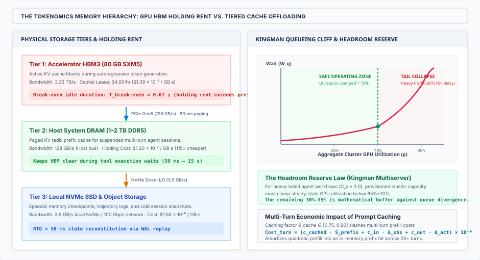
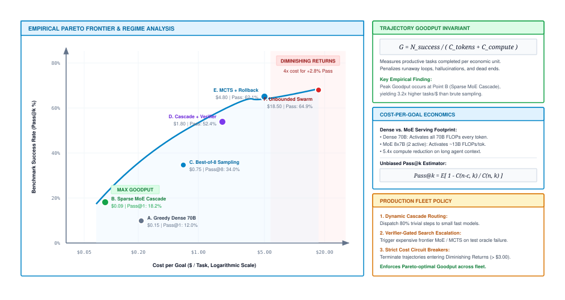

# Tokenomics and Capacity Sizing {#sec-vol3-tokenomics}

::: {layout-narrow}
::: {.column-margin}

\chapterminitoc

:::

::: {.content-visible when-format="pdf"}
\noindent
{fig-alt="Isometric blueprint showing system tokenomics, capacity sizing, and cost modeling: incoming task prompt stream, complexity difficulty classifier, low-cost local model routing path, lightweight edge model socket, frontier model accelerator cluster, high-throughput frontier bus, and real-time token cost and latency meters."}
:::

::: {.content-visible unless-format="pdf"}
{fig-alt="Isometric blueprint showing system tokenomics, capacity sizing, and cost modeling: incoming task prompt stream, complexity difficulty classifier, low-cost local model routing path, lightweight edge model socket, frontier model accelerator cluster, high-throughput frontier bus, and real-time token cost and latency meters."}
:::

:::

## Purpose {.unnumbered .unlisted}

::: {.content-visible when-format="pdf"}
\begin{marginfigure}
\mlagentstack{10}{10}{10}{10}{10}{95}
\end{marginfigure}
:::

_Which architectural change improves acceptable task completion under actual latency and financial budgets, and how do we govern fleet expenditure?_

In @sec-vol3-observability, we established the distributed tracing infrastructure, hermetic evaluation gyms, and statistical verification protocols required to monitor and evaluate autonomous stochastic agents in production. However, observing that an agent executes reliably is only half of the production equation.

In classical enterprise software engineering, compute resources scale linearly with user traffic: doubling web requests roughly doubles serverless function invocations or database queries. In agentic systems, this linear predictability collapses. When an autonomous agent navigates a multi-step debugging or deployment trajectory, each interaction turn expands its active context buffer, consuming compute-bound prompt prefill FLOPs and memory-bandwidth-bound token decode cycles. If an agent enters an unmonitored reasoning loop or triggers cascading tool retries, it can consume tens of millions of tokens in minutes, running up hundreds of dollars in cloud infrastructure expenditure without advancing task state. Furthermore, serving fleets must handle bursty, heavy-tailed arrival distributions where long-horizon reasoning tasks threaten to exhaust high-bandwidth memory (HBM) and starve interactive requests.

This chapter establishes the systems tokenomics and economic engineering required to size, provision, and govern production agent fleets. We construct comprehensive task-level cost accounts that encompass model prefill/decode, tool waiting, sandbox execution, assessment, failed attempts, and human review; decompose trajectory latency along the critical path using Amdahl's Law; evaluate tiered model routing and escalation cascades; accelerate token generation using distribution-preserving speculative decoding; size accelerator cluster capacity using $M/G/k$ queueing models under heavy-tailed service times; engineer monotonic spending governance ledgers; and formulate architectural selection frameworks along the Pareto frontier.

::: {.content-visible when-format="pdf"}
\newpage
:::

::: {.callout-learning-objectives}
- **Construct** task-level cost accounts that encompass model prefill/decode, tool waiting, sandbox execution, assessment, failed attempts, and human review.
- **Identify** the critical path of an agent trajectory and estimate the end-to-end system speedup of proposed optimizations using Amdahl's Law.
- **Evaluate** tiered model routing and deliberation policies across quality, latency, and financial budget constraints.
- **Implement** distribution-preserving speculative decoding to accelerate token generation while analyzing serving-throughput trade-offs.
- **Size** accelerator cluster capacity and manage multi-level feedback queues to prevent interactive query starvation under heavy-tailed agent service times.
- **Architect** monotonic spending governance ledgers and hierarchical budget reservations across delegated subagent fleets.
- **Select** cost-optimal autonomy architectures along the Pareto frontier balancing deterministic scripts, single-turn models, and autonomous agents.
:::

## Task Cost Accounting {#sec-vol3-tokenomics-accounting}[]{#sec-vol3-tokenomics-intro}{#sec-vol3-tokenomics-prefill-decode}

Evaluating agent economics strictly by model provider token rates (e.g., dollars per million tokens) is a dangerous anti-pattern that masks systemic operational expenditures.

Consider a common enterprise incident: an engineering director switched a production coding agent pipeline to an alternative model provider charging 60 percent less per million tokens. Cluster metrics showed an immediate drop in raw token unit pricing. Three weeks later, the monthly cloud infrastructure bill had surged by 45 percent. Because the cheaper model possessed lower reasoning and instruction-following capability, agents required 3.5 times more trajectory turns, 5 times more environment retries, and over \$12{,}000 in additional human engineering intervention hours to triage and correct defective code patches. The unit token price had dropped, but the cost per verified completion had skyrocketed.

### The comprehensive cost equation

To evaluate systems accurately, engineers must formulate the **Comprehensive Task Cost Equation**\index{Task Cost Accounting} across all physical and human operational dimensions:

$$C_{\text{task}} = C_{\text{model}}(\text{prefill, decode}) + C_{\text{tools}}(\text{APIs, licenses}) + C_{\text{infra}}(\text{sandboxes, network}) + C_{\text{verify}} + C_{\text{human}}$$

where:

- $C_{\text{model}}$ represents provider token fees or dedicated GPU cluster power and amortization across prompt prefill and token generation.
- $C_{\text{tools}}$ represents commercial API invocation charges (e.g., search engine indexes, vector databases, third-party microservices).
- $C_{\text{infra}}$ represents container and microVM execution runtime, disk I/O, and egress network bandwidth (@sec-vol3-virtualization).
- $C_{\text{verify}}$ represents the compute expenditure required to execute automated unit test suites, compilers, linters, or verification judges (@sec-vol3-observability).
- $C_{\text{human}}$ represents the wage value of human engineering time spent triaging stalled trajectories, resolving escalations, or reviewing proposed actions.

### Cost per acceptable completion

A raw accounting of single-attempt cost provides misleading economics when agents exhibit nonzero failure rates. If an agent succeeds on only 50 percent of attempts, deploying it requires retrying tasks or discarding failed work. Systems engineers must normalize expenditure by calculating **Cost per Acceptable Completion** (or Cost-per-Verified-Goal, CPVG)\index{Cost-per-Verified-Goal}:

$$C_{\text{effective}} = \frac{\sum_{i=1}^N C_{\text{attempt}_i}}{N_{\text{acceptable}}}$$

where $N$ is the total number of candidate attempts executed across a task cohort and $N_{\text{acceptable}}$ is the number of attempts that passed all verification gates (@sec-vol3-observability-contract). If an inexpensive model costs \$0.10 per run but achieves only a 20 percent verified completion rate, its effective cost is \$0.50 per acceptable completion. If an advanced reasoning model costs \$0.35 per run but achieves an 85 percent completion rate, its effective cost is \$0.41 per acceptable completion. The superficially more expensive model is 18 percent cheaper in production.

@Tbl-vol3-tokenomics-cost-breakdown contrasts superficial token accounting with comprehensive task-level systems accounting.

| Expense Category   | Superficial Metric           | Comprehensive Systems Metric                    | Operational Risk of Omission                   |
|:-------------------|:-----------------------------|:------------------------------------------------|:-----------------------------------------------|
| **Model Serving**  | Provider rate (\$/1M tokens) | Total prefill and decode cost per trajectory    | Ignores context growth across turns            |
| **Tool Execution** | Bare API call cost           | Cumulative API fees across retry loops          | Unbounded spending in cyclic retries           |
| **Infrastructure** | VM hourly compute rental     | Ephemeral sandbox instantiation and storage I/O | Severe cluster overhead from microVM thrashing |
| **Verification**   | Ignored (treated as free)    | Test suite execution and compiler compute       | Expensive CI test suites dominate task budget  |
| **Human Review**   | Ignored                      | Engineer triage and intervention wage cost      | Low-accuracy models overwhelm human staff      |

: **Comprehensive Task Cost Accounting Taxonomy**: Contrasting superficial token-level billing metrics with true end-to-end systems and organizational expenditures. {#tbl-vol3-tokenomics-cost-breakdown tbl-colwidths="[18,22,28,32]"}

## Critical Path Latency {#sec-vol3-tokenomics-criticalpath}[]{#sec-vol3-tokenomics-roofline}

When users complain that an autonomous agent is slow, software teams frequently react by profiling and optimizing neural model inference. Yet in multi-turn autonomous systems, model execution is only one segment of an asynchronous distributed dependency graph.

Consider a real-world case study: an engineering team spent three months optimizing GPU inference kernels, successfully doubling LLM generation speed from 30 tokens per second to 60 tokens per second. When deployed to production coding agents, overall task completion latency decreased by only 4.8 percent. A distributed trace analysis (@sec-vol3-observability-tracing) revealed why: 85 percent of the agent's wall-clock time was spent waiting for remote CI/CD compilation jobs and Docker container spin-up latencies. Doubling model generation speed had targeted a non-critical-path component.

### Deconstructing the trajectory timeline

The total wall-clock duration of an agent trajectory across $K$ operational turns is decomposed as:

$$T_{\text{trajectory}} = \sum_{k=1}^K \left( T_{\text{prefill}, k} + T_{\text{decode}, k} + T_{\text{tool}, k} + T_{\text{wait}, k} + T_{\text{runtime}, k} \right)$$

where:

- $T_{\text{prefill}, k}$ is Time to First Token (TTFT), governed by prompt context length and GPU compute throughput (@sec-vol3-processor-analogy).
- $T_{\text{decode}, k}$ is token generation duration, governed by output length and GPU memory bandwidth.
- $T_{\text{tool}, k}$ is tool execution latency inside the sandbox (e.g., compiler passes, unit test executions).
- $T_{\text{wait}, k}$ is external network latency and third-party API response time.
- $T_{\text{runtime}, k}$ is Agent OS scheduling, checkpoint serialization, and context assembly overhead (@sec-vol3-checkpointing).

### Applying Amdahl's Law to multi-turn execution

The fundamental limit of systems acceleration is governed by **Amdahl's Law**\index{Amdahl's Law} [@amdahl1967]:

$$S = \frac{1}{(1-f) + \frac{f}{s}}$$

where $f$ is the fraction of total baseline execution time spent inside the subsystem being optimized, and $s$ is the local speedup factor achieved within that subsystem.

If model generation accounts for fraction $f = 0.20$ of total trajectory duration, even an infinite acceleration of model inference ($s \to \infty$) can yield at most:

$$S_{\text{max}} = \frac{1}{1 - 0.20} = 1.25\times$$

A system speedup of 25 percent is the absolute theoretical ceiling. Conversely, if tool waiting time accounts for fraction $f = 0.70$ of total duration, parallelizing test execution or caching compiler artifacts to achieve a modest $3\times$ speedup ($s = 3$) yields:

$$S = \frac{1}{(1 - 0.70) + \frac{0.70}{3}} = \frac{1}{0.30 + 0.233} \approx 1.88\times$$

Optimizing tool execution yields nearly triple the end-to-end performance improvement of completely eliminating model latency. Systems engineers must always profile distributed traces before selecting optimization targets.

## Tiered Model Cascades {#sec-vol3-tokenomics-cascades}

Not all reasoning steps within an agent trajectory require frontier intelligence. Using a frontier model costing \$15.00 per million tokens to determine whether a string is valid JSON or whether a git branch name follows kebab-case is economically reckless.

Production agent platforms mandate **Tiered Model Cascades**\index{Tiered Model Cascades} [@chen2023frugalgpt].

::: {#fig-vol3-tokenomics-cascade-routing fig-env="figure" fig-pos="htb" fig-cap="**Multi-Tier Model Cascade and Routing Architecture**: Routing incoming tasks across local deterministic filters, mid-tier generalists, and frontier reasoning engines governed by verification gates. Source: Conceptualized by author based on @chen2023frugalgpt." fig-alt="Flowchart showing task ingress passing to Tier 1 Local Filter, routing either to completion or escalating to Tier 2 Mid-Tier Generalist, and escalating to Tier 3 Frontier Reasoning Engine only upon verification failure."}
{width="100%"}
:::

As illustrated in @fig-vol3-tokenomics-cascade-routing, execution is partitioned across three capability tiers:

1. **Tier 1: Local Deterministic / Small Language Models (SLMs):**
   - Regex patterns, abstract syntax tree (AST) linters, and lightweight 1B to 3B parameter models ($<\$0.10\text{ per 1M tokens}$).
   - Responsibilities: Input sanitization, tool argument schema validation, and simple classification.
2. **Tier 2: Mid-Tier Generalist Models:**
   - 8B to 14B parameter models ($<\$0.50\text{ per 1M tokens}$).
   - Responsibilities: Routine tool dispatch, documentation summarization, and boilerplate code generation.
3. **Tier 3: Frontier Reasoning Engines:**
   - Frontier models with test-time deliberation ($>\$10.00\text{ per 1M tokens}$).
   - Responsibilities: Initial architecture decomposition, subtle debugging, and high-complexity failure recovery.

### The cascade escalation cost formula

In an escalation cascade, a task is first routed to Tier 1. If Tier 1 output fails mechanical verification (@sec-vol3-observability-contract), the task escalates to Tier 2, and subsequently to Tier 3 if Tier 2 fails. The expected financial cost of a three-tier cascade is:

$$C_{\text{cascade}} = C_1 + P(\text{fail}_1) \cdot C_2 + P(\text{fail}_1) \cdot P(\text{fail}_2 \mid \text{fail}_1) \cdot C_3$$

Suppose Tier 1 costs $C_1 = \$0.01$ with failure rate $P(\text{fail}_1) = 0.30$, Tier 2 costs $C_2 = \$0.05$ with conditional failure rate $P(\text{fail}_2 \mid \text{fail}_1) = 0.20$, and Tier 3 costs $C_3 = \$1.00$. The expected cascade cost is:

$$C_{\text{cascade}} = 0.01 + 0.30 \cdot 0.05 + 0.30 \cdot 0.20 \cdot 1.00 = 0.01 + 0.015 + 0.060 = \$0.085$$

Routing all requests directly to the Tier 3 frontier model would cost \$1.00 per task. The tiered cascade reduces average cost by 91.5 percent while maintaining the high terminal success rate of the frontier engine.

## Speculative Decoding Acceleration {#sec-vol3-tokenomics-speculative}

While tiered cascades optimize routing across tasks, accelerating model execution when a frontier model *is* on the critical path requires addressing the hardware memory wall.

In standard autoregressive generation, generating each token requires loading all tens of billions of model parameters from off-chip high-bandwidth memory (HBM) into on-chip registers. For a single agent stream (batch size $B = 1$), compute units sit idle waiting for memory controllers, achieving less than 10 percent of peak GPU floating-point capacity (@sec-vol3-processor-analogy).

### Speculative decoding mechanics

**Speculative Decoding**\index{Speculative Decoding} [@leviathan2023fast; @chen2023accelerating] breaks this memory-bandwidth bottleneck by coupling a small, fast draft model $M_{\text{draft}}$ with a large target model $M_{\text{target}}$:

1. **Drafting Phase:** The draft model autoregressively generates $\gamma$ candidate tokens sequentially:
   $$\tilde{x}_1, \tilde{x}_2, \ldots, \tilde{x}_\gamma \sim M_{\text{draft}}$$
   Because $M_{\text{draft}}$ is small (e.g., 1B parameters vs. 70B), it generates candidates rapidly at low memory-bandwidth cost.
2. **Parallel Verification Phase:** The large target model evaluates all $\gamma$ candidate tokens simultaneously in a single forward pass. Because the tokens are already known, the target model processes them as a parallel matrix-matrix multiplication (GEMM), running compute-bound at high arithmetic intensity.
3. **Rejection Sampling:** The target model accepts a prefix of length $\alpha \le \gamma$ based on the probability ratio:
   $$P_{\text{accept}}(x_t) = \min\left(1, \frac{P_{\text{target}}(x_t \mid x_{<t})}{P_{\text{draft}}(x_t \mid x_{<t})}\right)$$
   Upon the first rejected token at position $\alpha + 1$, the target model samples a replacement token directly from the adjusted residual distribution, discarding the remaining draft candidates.

### Distribution-preservation guarantee

A vital property for systems engineers is that **speculative decoding preserves the exact output probability distribution of the target model**:

$$P(x) \equiv P_{\text{target}}(x)$$

Speculative decoding is not an approximation. Unlike model quantization or pruning, speculative decoding introduces zero degradation in reasoning capability, tool argument accuracy, or benchmark pass rates.

### Serving throughput trade-offs

While speculative decoding accelerates single-stream latency by $2\times$ to $3\times$, it increases total FLOPs retired per token. In saturated multi-tenant clusters operating at high batch sizes ($B \ge 64$), where GPU execution is already compute-bound, speculative verification consumes tensor core cycles that could otherwise serve concurrent streams. Runtimes must dynamically enable speculative decoding when serving queues are uncongested and disable it during peak saturation.

## Fleet Capacity Provisioning {#sec-vol3-tokenomics-capacity}[]{#sec-vol3-tokenomics-fleet-sizing}

Sizing GPU accelerator clusters for autonomous agent fleets is vastly more challenging than sizing web server farms. Web requests exhibit uniform service times spanning tens of milliseconds. In contrast, agentic workloads exhibit extreme **bimodal service time distributions**: interactive user prompts complete in 2 seconds, while autonomous software engineering trajectories execute for 30 minutes across dozens of tool interactions.

Consider a shared cluster disaster: an engineering organization hosted both interactive code-completion agents (service time $\sim 2\text{ s}$) and autonomous refactoring agents (service time $\sim 25\text{ min}$) on a shared pool of 32 H100 GPUs. When a developer dispatched a batch of 12 refactoring tasks, all available GPU memory slots were occupied by long-running trajectories. Interactive developers across the enterprise experienced autocomplete latency spikes from $200\text{ ms}$ to over 15 minutes, bringing engineering productivity to a standstill.

### Heavy-tailed queueing models

To model this congestion mathematically, systems engineers employ $M/G/k$ queueing models\index{Queueing Theory} governed by the **Kingman and Allen-Cunneen Approximations**:

$$W_q \approx \left( \frac{C_a^2 + C_s^2}{2} \right) \cdot \left( \frac{\rho^{\sqrt{2(k+1)}-1}}{k(1-\rho)} \right) \cdot \frac{1}{\mu}$$

where:

- $C_a^2$ is the squared coefficient of variation of request arrival times.
- $C_s^2$ is the squared coefficient of variation of service times.
- $\rho = \frac{\lambda}{k \mu}$ is the cluster utilization across $k$ accelerator worker nodes.
- $\mu$ is the mean service rate.

In classical microservices, service times follow an exponential distribution ($C_s^2 \approx 1$). In agentic workloads, the bimodal mixture of short interactive calls and long autonomous trajectories inflates variance dramatically ($C_s^2 \gg 10$). Under high variance, queue waiting times explode even at moderate cluster utilization ($\rho = 0.60$).

::: {#fig-vol3-tokenomics-memory-caching fig-env="figure" fig-pos="htb" fig-cap="**Queueing and Memory Hierarchy for Multi-Horizon Serving**: Multi-Level Feedback Queue (MLFQ) isolating interactive requests from long-horizon trajectories, backed by tiered KV cache eviction. Source: Conceptualized by author." fig-alt="Architecture diagram showing Priority Queue 0 for interactive queries, Priority Queue 1 for multi-turn tasks, and Priority Queue 2 for long-horizon batch trajectories, routing into GPU clusters with tiered memory paging."}
{width="100%"}
:::

### Multi-level feedback queue scheduling

To prevent head-of-line blocking, the Agent OS implements **Multi-Level Feedback Queues (MLFQ)**\index{Multi-Level Feedback Queue} as shown in @fig-vol3-tokenomics-memory-caching:

- **Priority Queue 0 (Interactive SLA):** Dedicated GPU capacity reserved strictly for single-turn interactive queries and user-facing chat ($< 5\text{ s}$). Preemption-safe; zero long-running tasks permitted.
- **Priority Queue 1 (Standard Trajectories):** Moderate-length agent workflows ($10\text{ s}$ to $2\text{ min}$).
- **Priority Queue 2 (Batch Autonomous Fleets):** Long-horizon coding and research tasks ($> 15\text{ min}$). These tasks execute under preemptible scheduling, checkpointing their Agent Control Blocks (@sec-vol3-checkpointing) to disk whenever interactive traffic surges.

## Monotonic Spending Governance {#sec-vol3-tokenomics-governance}

In Software 1.0, an infinite `while(true)` loop exhausts CPU clock cycles or causes a stack overflow, triggering an operating system crash. In Software 3.0, an unmonitored agent execution loop directly drains corporate bank accounts.

Consider an enterprise horror story: an autonomous documentation agent was given a web search tool and delegated the goal of indexing external API changes. Due to an unhandled HTTP 404 response, the agent spawned 8 child subagents to search alternative domains. Each child agent encountered ambiguous redirects and recursively spawned 8 additional subagents. In under 3 hours, a fleet of hundreds of recursive subagents burned through \$28{,}000 in API tokens before site reliability engineers manually severed the cluster's network connection.

### Hierarchical budget reservation ledgers

To prevent runaway spending, the Agent OS enforces **Monotonic Spending Governance**\index{Monotonic Spending Governance} using hierarchical budget reservation ledgers:

1. **Root Allocation:** When a user initiates a task, the platform assigns a hard non-renewable financial ceiling (e.g., $B_{\text{root}} = \$5.00$).
2. **Delegation Reservations:** When an agent spawns a child subagent (@sec-vol3-multiagent), the parent must *carve out and reserve* a fraction of its own remaining budget:
   $$B_{\text{parent}} \gets B_{\text{parent}} - B_{\text{reserved}}, \quad B_{\text{child}} \gets B_{\text{reserved}}$$
3. **Strict Invariant:** A child agent cannot exceed $B_{\text{reserved}}$. If the child exhausts its allocation, its execution context is immediately suspended.
4. **Refund on Termination:** Upon successful or failed completion, any unspent funds are refunded to the parent ledger:
   $$B_{\text{parent}} \gets B_{\text{parent}} + (B_{\text{reserved}} - B_{\text{spent}})$$

Under this ledger architecture, the total expenditure across any arbitrarily deep subagent hierarchy is mathematically bounded by $B_{\text{root}}$.

### Automated financial circuit breakers

In addition to static caps, production runtimes implement real-time **Financial Circuit Breakers**\index{Circuit Breaker}:

- **Spending Velocity Breaker:** Tripped if an agent or team exceeds $\$X\text{ per minute}$, halting execution to detect recursive fan-out anomalies.
- **Marginal Utility Breaker:** Tripped if an agent executes 5 consecutive tool interactions without generating measurable progress toward state verification criteria (e.g., zero change in failing test counts or repository AST diffs).
- **Global Emergency Stop:** A signed administrative interrupt (@sec-vol3-interrupts) that atomically suspends all active worker containers across the cluster.

## Architectural Selection Frameworks {#sec-vol3-tokenomics-selection}[]{#sec-vol3-tokenomics-boundaries}

Autonomous agents are not the optimal solution for every computing problem. Systems engineering is the discipline of selecting the most cost-effective architecture that satisfies functional requirements within acceptable operational risk.

Consider a cautionary case study: a high-frequency trading firm spent \$5M building an autonomous agent to execute real-time algorithmic trades. The agent suffered from 800 ms LLM inference latency; by the time the agent generated its trade order, market prices had moved, causing millions of dollars in execution slippage. Deterministic C++ execution engines operating at microsecond latencies completely dominate stochastic agents in low-latency, deterministic domains.

::: {#fig-vol3-tokenomics-goodput-pareto fig-env="figure" fig-pos="htb" fig-cap="**The Trajectory Goodput and Economic Pareto Frontier**: Mapping system paradigms across task complexity, verified completion rate, and operational cost. Source: Conceptualized by author." fig-alt="Scatter plot showing Software 1.0 deterministic scripts at low cost and low complexity, Software 2.0 direct model calls at medium cost, and Software 3.0 autonomous agents dominating high-complexity open-ended tasks along the Pareto frontier."}
{width="100%"}
:::

As illustrated in @fig-vol3-tokenomics-goodput-pareto, systems architects must evaluate candidate applications across four computational regimes:

1. **Software 1.0 (Deterministic Code):** Best for deterministic rules, zero-tolerance error environments, microsecond latency budgets, and low ambiguity.
2. **Software 2.0 (Direct Single-Turn Inference):** Best for classification, summarization, and embedding generation where no iterative environment feedback is required.
3. **Bounded Agentic Systems:** Best for multi-step workflows with structured APIs, deterministic verifiers (compilers, linters), and bounded failure blast radiuses.
4. **Autonomous Multi-Agent Fleets:** Reserved for open-ended software development, scientific discovery, and complex distributed system refactoring where human intervention costs exceed compute fees.

@Tbl-vol3-tokenomics-architecture-comparison summarizes the architectural selection trade-offs across all four paradigms.

| Dimension              | Software 1.0 (Code)          | Software 2.0 (Model)           | Bounded Agent                          | Autonomous Fleet                                |
|:-----------------------|:-----------------------------|:-------------------------------|:---------------------------------------|:------------------------------------------------|
| **Execution Latency**  | Microseconds ($\mu\text{s}$) | Milliseconds ($\text{ms}$)     | Seconds ($10^0\text{--}10^2\text{ s}$) | Minutes to Hours ($10^3\text{--}10^4\text{ s}$) |
| **Unit Cost**          | $\sim \$0.00$                | $<\$0.001$                     | $\$0.05\text{--}\$1.00$                | $\$5.00\text{--}\$100.00+$                      |
| **Verification Basis** | Formal compiler assertions   | Statistical benchmark accuracy | State-delta verification gates         | Multi-stage consensus and regression suites     |
| **Blast Radius**       | Deterministic and testable   | Confined to single prompt      | Bounded by sandbox cgroups             | High; requires supervisory control plane        |

: **Architectural Selection Decision Matrix**: Comparative trade-offs across Software 1.0, Software 2.0, Bounded Agentic Systems, and Autonomous Fleets. {#tbl-vol3-tokenomics-architecture-comparison tbl-colwidths="[18,22,22,20,18]"}

## Fallacies and Pitfalls {#sec-vol3-tokenomics-fallacies}

::: {.fallacy-pitfall}
### Fallacy: Evaluating model cost strictly by per-token API prices identifies the most economical model {-}

Comparing foundation models strictly on provider pricing tables (e.g., dollars per million tokens) ignores multi-turn systems reality. Cheaper models with lower reasoning capacity routinely require 3 to 5 times more turns, suffer frequent tool invocation errors, trigger expensive environment resets, and necessitate human engineer intervention. Systems teams must always measure cost normalized by verified successful outcomes (Cost-per-Verified-Goal).

### Pitfall: Optimizing token generation speed when tool wait time dominates the critical path {-}

Engineering teams frequently spend months optimizing GPU inference kernels to double token generation speed, only to achieve a negligible end-to-end task speedup. Amdahl's Law dictates that accelerating a subsystem that represents only 15 percent of total trajectory wall-clock time yields at most an 8 percent overall improvement. Optimization must be guided by distributed trace critical-path profiling, focusing on tool subprocesses and network waits.

### Fallacy: Speculative decoding reduces model resource usage across all serving loads {-}

While speculative decoding dramatically reduces latency for batch size 1 streams, it increases the total number of floating-point operations retired per token. In saturated multi-tenant clusters operating at high batch sizes where GPUs are already compute-bound, speculative decoding competes for execution units, reducing aggregate cluster throughput. Runtimes must dynamically disable speculation under high queue congestion.

### Pitfall: Allowing subagents to spawn child workers without hierarchical budget reservations {-}

Allowing autonomous agents to recursively delegate tasks without hard budget carving creates catastrophic financial runaway risks. A single unhandled error can trigger an exponential subagent fan-out that drains tens of thousands of dollars in minutes. Runtimes must enforce monotonic budget ledgers where child allocations are carved directly from parent budgets and unspent funds are refunded upon termination.
:::

## Summary {#sec-vol3-tokenomics-summary}

Sustainable agentic systems engineering requires uniting accelerator microarchitecture with organizational unit economics. Deploying stochastic models into autonomous operational loops without rigorous cost accounting, critical-path optimization, capacity provisioning, and spending governance guarantees financial exhaustion and cluster collapse.

By moving beyond naive token pricing to measure Cost per Acceptable Completion, decomposing trajectories using Amdahl's Law, architecting tiered model cascades with small specialized models, accelerating critical inference via speculative decoding, managing bimodal workloads with Multi-Level Feedback Queues, enforcing monotonic spending ledgers, and matching tasks to the appropriate architectural paradigm, systems engineers transform unpredictable token expenditures into predictable, high-value enterprise infrastructure.

@Tbl-vol3-tokenomics-synthesis synthesizes the core subsystems, governing principles, primary failure modes, and operational invariants across system tokenomics.

| Subsystem                  | Governing Principle                        | Primary Failure Mode                          | Systems Mitigation                              | Operational Invariant                               |
|:---------------------------|:-------------------------------------------|:----------------------------------------------|:------------------------------------------------|:----------------------------------------------------|
| **Task Costing**           | Complete Accounting                        | Low token price masking high retry costs      | Measure Cost-per-Verified-Goal                  | Evaluate cost per acceptable completion             |
| **Latency Profiling**      | Amdahl's Law [@amdahl1967]                 | Optimizing non-bottleneck inference           | Distributed trace critical-path profiling       | Optimize the limiting trajectory stage              |
| **Model Cascades**         | Tiered Routing [@chen2023frugalgpt]        | Frontier model waste on trivial regex         | Local SLM filters and escalation gates          | Escalate to frontier only upon verification failure |
| **Speculative Serving**    | Distribution Coupling [@leviathan2023fast] | Increased FLOP waste under high batch load    | Dynamic speculation gating based on queue load  | Exact output distribution preservation              |
| **Fleet Capacity**         | $M/G/k$ Heavy-Tailed Queues                | Interactive query starvation by batch jobs    | Multi-Level Feedback Queues (MLFQ)              | Strict priority isolation for interactive traffic   |
| **Budget Governance**      | Monotonic Accounting                       | Unbounded recursive subagent spending         | Hierarchical reservation ledgers                | Total fleet spend $\le B_{\text{root}}$             |
| **Architecture Selection** | Pareto Utility Frontier                    | Using stochastic agents for microsecond tasks | Selection matrix across 4 Engineering Questions | Select lowest-complexity viable paradigm            |

: **System Tokenomics and Fleet Capacity Synthesis**: Summary of core architectural subsystems, governing principles, primary failure modes, systems mitigations, and operational invariants across production fleet engineering. {#tbl-vol3-tokenomics-synthesis tbl-colwidths="[16,18,24,22,20]"}

::: {.callout-takeaways title="Core systems principles of tokenomics and fleet economics"}
1. **Measure Cost-per-Verified-Goal:** Never evaluate agent economics by provider token discounts; measure total financial expenditure divided by acceptable completed outcomes.
2. **Apply Amdahl's Law to the Critical Path:** Profile distributed trajectory traces before optimizing; accelerating model inference yields negligible gains if tool waits dominate wall-clock time.
3. **Deploy Tiered Model Cascades:** Route routine schema validation and tool calls to lightweight local models, reserving expensive frontier reasoning engines for complex escalation.
4. **Leverage Speculative Decoding Responsibly:** Use speculative decoding to break the single-stream memory wall with mathematical distribution preservation, but disable speculation during peak cluster congestion.
5. **Partition Queues for Bimodal Workloads:** Prevent long-horizon agent trajectories from starving interactive queries by enforcing Multi-Level Feedback Queues with preemptible batch tiers.
6. **Enforce Monotonic Budget Ledgers:** Subagent delegations must carve allocations hierarchically from parent budgets; total distributed expenditure must never exceed the root task cap.
7. **Respect the Autonomy Pareto Frontier:** Autonomous agents are expensive and stochastic; avoid agentic loops when deterministic code or single-turn models achieve acceptable outcomes.
:::

::: {.callout-chapter-connection title="From fleet tokenomics to the capstone system synthesis"}
We have now traversed the entire curriculum of Agentic Machine Learning Systems: the Stochastic Processor (Part I), the Memory Hierarchy (Part II), Sandboxed Peripherals (Part III), the Operating System Runtime (Part IV), the Policy Compiler (Part V), and Distributed Fleet Operations (Part VI).

Across seventeen chapters, we have analyzed how to sample, deliberate, page, persist, isolate, checkpoint, schedule, compile, coordinate, observe, and economically govern autonomous agents in non-deterministic environments.

In Part VII (*System Synthesis*), @sec-vol3-conclusion (*Designing the Stochastic Computer*), we bring every single component invariant, interface contract, and engineering trade-off together into a unified reference architecture. We close the bookend opened in @sec-vol3-introduction, formalizing the complete Stochastic Computer as an enduring discipline of systems engineering.
:::
