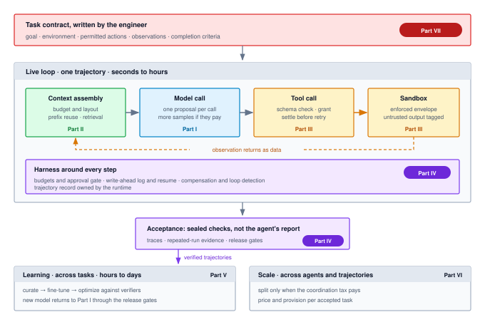

# Conclusion {#sec-vol3-conclusion}

::: {layout-narrow}
::: {.column-margin}

\chapterminitoc

:::

::: {.content-visible when-format="pdf"}
\noindent
{fig-alt="Blueprint for Architectural Synthesis."}
:::

::: {.content-visible unless-format="pdf"}
{fig-alt="Blueprint for Architectural Synthesis."}
:::

:::

## Purpose {.unnumbered .unlisted}

\begin{marginfigure}
\mlagentstack{17}{17}{17}{17}{16}{16}
\end{marginfigure}

_Why does an agent built from parts that each pass their own tests still need an engineer to say what done means?_

Every earlier chapter built one part of an agentic system and tested it on its own terms, but a production trajectory meets all of those parts at once, and a failure at the seam between two of them belongs to nobody unless the architecture says who owns it. A stale file left in the context after a write, a retry that repeats a payment, and a verifier that doubles as a training reward each pass every subsystem's own tests. This chapter runs the whole system on one trajectory, gives every transition an owner and a record, and shows where the principles of different parts meet and where they strain against each other. It then locates the work that no subsystem can take over, which is writing the contract and the completion criteria the whole machine answers to. The runtime can supply closure against a task's long horizon, the state it carries, and its authority over the world, but only an engineer can say what the task was for and what counts as done.

::: {.content-visible when-format="pdf"}

\newpage

:::

::: {.callout-learning-objectives}

- Trace one tool-calling trajectory through every part of the agent system, naming the owner and the record of each transition.
- Map each principle of the volume to the H·S·A exposure it closes or the evidence it supplies.
- Translate a five-part task contract into enforced horizon, state, and authority bounds and a required closure evidence level.
- Diagnose failures that arise at the seams between subsystems and assign each one an owner.
- Apply the intervention ladder to an attributed failure, including the task volume at which changing the weights pays.
- Construct a claims, arguments, and evidence safety case from mechanical checks, repeated-run evaluation, and staged release.
- Evaluate what agents automate through Brooks' essential and accidental complexity, and explain why the task contract stays with the engineer.

:::

## One Trajectory Through the Whole System {#sec-vol3-conclusion-capstone}

A latency alert fires on a production database, and an on-call agent receives the incident. Over the next several minutes it will read metrics, retrieve runbooks, query logs, propose a configuration rollback, wait for a human to approve a node restart, and report the incident resolved. Every subsystem the book built touches that trajectory, and each was tested alone. The question this chapter asks is who owns each transition once all of them act on the same trajectory, and what work none of them can absorb.

@Fig-vol3-capstone-reference-architecture places each part of the book where its chapters left it. The engineer writes the contract at the top. The live loop runs the model call, context assembly, tool calls, and the sandbox inside a harness that owns budgets, the log, and recovery. Acceptance sits below the loop, and learning and scale work across many trajectories rather than inside one.

::: {#fig-vol3-capstone-reference-architecture fig-env="figure" fig-pos="htb" fig-cap="**One Trajectory Through the Whole System**: The engineer's task contract governs a live loop in which context assembly (Part II) feeds a model call (Part I) whose proposal becomes a validated, granted tool call run in a sandbox (Part III), with the observation returning to the context as data. The harness (Part IV) wraps every step with budgets, the approval gate, the write-ahead log, and recovery. Sealed checks decide acceptance; verified trajectories feed learning (Part V), and scale (Part VI) multiplies the loop across agents and trajectories." fig-alt="Layered diagram. A red box at the top labeled Task contract, written by the engineer, lists goal, environment, permitted actions, observations, and completion criteria and carries a Part VII badge. An arrow leads down to a card labeled Live loop, one trajectory, seconds to hours, containing four boxes left to right: Context assembly (Part II), Model call (Part I), Tool call (Part III), and Sandbox (Part III), joined by arrows, with a dashed arrow from the sandbox back to context assembly labeled observation returns as data. A purple strip inside the card, Harness around every step (Part IV), lists budgets and approval gate, write-ahead log and resume, compensation and loop detection, and the trajectory record. Below the card an Acceptance box reads sealed checks, not the agent's report. An arrow labeled verified trajectories leads to a Learning card (Part V) reading curate, fine-tune, optimize against verifiers. A Scale card (Part VI) reads split only when the coordination tax pays, and price and provision per accepted task."}
{width="100%"}
:::

The trajectory starts before any model call. The harness opens a trajectory record for the incident (@sec-vol3-agent-harness), writes the task contract to the trajectory log (@sec-vol3-durable-execution), and sets the budgets that will bound it. The contract also fixes the task's H·S·A position. The incident runs for about ten turns, carries durable state it does not own (production metrics, runbooks, a configuration repository), and reaches the highest authority level at the one step that changes production.

Context assembly then decides what the first call sees. It stages the contract, the alert, and runbook excerpts retrieved under a typed retrieval contract with their sources attached (@sec-vol3-long-term-memory), and it lays the stable material first so that later turns reuse the same prefix (@sec-vol3-context-engineering). The serving system keeps the attention state for that prefix (@sec-vol3-kv-cache), so each later turn pays mainly for the observation it appends rather than for the whole context again.

The model call returns a structured tool call and a stop reason (@sec-vol3-foundation-model), and nothing in the world has changed yet. When the diagnosis is ambiguous, the harness can pay for several candidate hypotheses and rank them against a check that separates them (@sec-vol3-test-time-compute), which helps only when the check acquires new evidence (principle \ref{pri-vol3-test-time-scaling}).

A proposal to query the database's slow-query log is validated against the tool's schema and checked against the task's grant (@sec-vol3-tool-calling). It runs in a sandbox whose envelope the model cannot widen (@sec-vol3-sandboxes), and its output returns to the context as untrusted data, cut to the observation budget and tagged with its source. When the query times out, the runtime does not simply resend it. It settles whether the first attempt took effect before it retries (principle \ref{pri-vol3-exactly-once-settlement}), using the idempotency key the call carried.

A few turns later the agent proposes two changes, a rollback of a recent configuration change, which a later action can compensate, and a restart of the primary node, which nothing can undo. The harness writes each intent to the log before the effect leaves the runtime (principle \ref{pri-vol3-intent-before-effect}). It registers a compensation for the rollback and holds the restart at the approval gate until a human signs it (@sec-vol3-agent-harness), and it orders that irreversible pivot after every compensable step (principle \ref{pri-vol3-reversibility-sagas}; @sec-vol3-failure-recovery). If the process dies between the two, recovery reads the log and resumes rather than repeating the rollback. If the agent starts reissuing a failing query, progress detection stops it long before the budget would (principle \ref{pri-vol3-preemptive-interrupts}).

The agent then reports the incident resolved, and the report is only another proposal. Acceptance comes from checks the runtime runs itself: query latency back under its objective for a sustained window, error rates within bounds, and a configuration diff that matches what the human approved. @Sec-vol3-evaluation grades trajectories this way, and the trace it records joins every span of the incident into one causal record.

The live trajectory ends at acceptance, but the system keeps working on it. Because it was verified, the trajectory becomes eligible for curation (@sec-vol3-trajectory-curation). Fine-tuning trains on the tokens the policy emitted and masks the observations it read (principle \ref{pri-vol3-action-masked-loss}; @sec-vol3-fine-tuning), and where a sealed check exists, reinforcement learning optimizes against it with the verifier isolated from the policy (principle \ref{pri-vol3-verifiable-rewards}; @sec-vol3-rlvr). The updated model reaches production only through the same release gates that certify any change. None of this moves an exposure. A better model proposes better actions inside exactly the same envelope.

Scale enters in two places. If the incident had spanned several services, the harness could have delegated diagnosis per service to child agents, but only where partitioning the context or attenuating authority pays the coordination tax (principle \ref{pri-vol3-coordination-tax}; @sec-vol3-multi-agent), and each child would hold a subset of the parent's authority, time, and budget (principle \ref{pri-vol3-monotonic-delegation}). Across the fleet, this trajectory is one unit in the cost per accepted task that routing, caching, and capacity decisions minimize (@sec-vol3-agent-economics).

@Tbl-vol3-capstone-owners condenses the walkthrough into owners and records. The walkthrough also crosses the line between live and across-task work that the introduction drew (@sec-vol3-intro-across-task). Everything up to acceptance belongs to live owners that hold the trajectory for seconds to hours. Curation, training, release gating, and fleet provisioning belong to across-task infrastructure that works over hours to days on trajectories that have already finished.

| **Transition**                   | **Owner**                                        | **Record it leaves**                                    |
|:---------------------------------|:-------------------------------------------------|:--------------------------------------------------------|
| **Task admitted**                | Harness (@sec-vol3-agent-harness)                | Trajectory record, contract entry in the log            |
| **Context staged**               | Context assembly (@sec-vol3-context-engineering) | Context manifest with the source of every span          |
| **Proposal emitted**             | Model call (@sec-vol3-foundation-model)          | Structured tool call and stop reason                    |
| **Call validated and granted**   | Tool layer (@sec-vol3-tool-calling)              | Schema result, grant decision, idempotency key          |
| **Effect executed**              | Sandbox (@sec-vol3-sandboxes)                    | Settled outcome, with its intent logged before dispatch |
| **Irreversible step approved**   | Approval gate (@sec-vol3-agent-harness)          | Signed approval tied to the exact proposal              |
| **Crash or wrong action**        | Recovery (@sec-vol3-failure-recovery)            | Resume point, compensation entries                      |
| **Deliverable accepted**         | Evaluation (@sec-vol3-evaluation)                | Check results and a trace joining every span            |
| **Trajectory used for training** | Curation (@sec-vol3-trajectory-curation)         | Admission decision and the data split it joined         |

: **Owners and Records Along One Trajectory**: Each transition of the incident trajectory, the subsystem that owns it, and the record that lets an auditor reconstruct it after the fact. {#tbl-vol3-capstone-owners tbl-colwidths="[28,34,38]"}

Every row applies the invariant closure principle (\ref{pri-invariant-closure}). The runtime closes the task's bounds mechanically, through budgets, grants, the approval gate, and the sandbox, and the principle's end-to-end half governs acceptance, because no report from the model can establish that the task is complete. Only the checks the runtime ran can do that, and @sec-vol3-intro-closure-evidence ranks what each kind of check is worth.

### The principle ledger {#sec-vol3-conclusion-principle-ledger}

::: {.column-margin}
{width="100%" fig-alt="H·S·A locator with all three axes, Horizon, State, and Authority, highlighted in purple."}

*Horizon, state, and authority return together, and the runtime closes each on one trajectory.*
:::

Every principle in the volume acted somewhere in that trajectory, and @tbl-vol3-principle-ledger gathers them in the order the book introduced them, with the exposure each one closes. The principles of Part I price the single model call and bound what checking can establish. Those of Parts II, III, and IV close the three exposures a single call does not have: the state it carries across turns, its authority over the world, and a horizon long enough for errors to compound. Part IV ends by measuring the whole single-agent system, so its last principle governs release evidence. Part V changes the model and moves no exposure, Part VI multiplies all three across agents and trajectories, and the principle of Part VII marks what the machine cannot close for itself.

| **#**                                    | **Principle**                                          | **Part**     | **Exposure it closes**                    | **Invariant in brief**                                                                                   |
|:-----------------------------------------|:-------------------------------------------------------|:-------------|:------------------------------------------|:---------------------------------------------------------------------------------------------------------|
| \ref{pri-invariant-closure}              | Invariant closure                                      | Introduction | All three (the closure requirement)       | Constraints never rest on the model; bounds close mechanically below it, acceptance on evidence above it |
| \ref{pri-vol3-memory-bandwidth-decoding} | Output-bound latency                                   | I            | None (prices the single call)             | An output token takes far longer than a prompt token, so call latency grows with output length           |
| \ref{pri-02-quarantining-invariant}      | The quarantining invariant                             | I            | None (single call)                        | A payload whose status is not `COMPLETED` never reaches verification, training, or a tool                |
| \ref{pri-vol3-test-time-scaling}         | Evidence-bounded deliberation                          | I            | None (bounded by evidence)                | Extra inference compute helps only when it acquires evidence that separates candidates                   |
| \ref{pri-vol3-verification-asymmetry}    | The verification asymmetry                             | I            | Closure evidence                          | Stated checks are cheap and sound verification is not; the commit gate is a sealed deterministic check   |
| \ref{pri-vol3-attention-working-set}     | Context is a selected working set                      | II           | State                                     | Each call sees a bounded selection, compacted without losing identifiers                                 |
| \ref{pri-vol3-prefix-coherence}          | Attention state is derived from the token prefix       | II           | State                                     | Cached attention state is a function of the exact prefix, reusable only from the left and rebuildable    |
| \ref{pri-vol3-retrieval-contract}        | Retrieval is a contract, not recall                    | II           | State                                     | Durable data re-enters only through a typed retrieval contract; similarity is not permission             |
| \ref{pri-vol3-source-authority}          | Authority stays with the source                        | II           | State                                     | Only source artifacts are authoritative; every derived view goes stale on write                          |
| \ref{pri-vol3-strict-action-abi}         | The typed action contract                              | III          | Authority                                 | A tool call reaches the environment only as a validated, authorized typed proposal                       |
| \ref{pri-vol3-exactly-once-settlement}   | Settlement before retry                                | III          | Authority, with horizon                   | A timeout says nothing about whether a mutation happened; retry only after settlement                    |
| \ref{pri-vol3-zero-trust-sandboxing}     | Containment beneath the model                          | III          | Authority (integrity and confidentiality) | Every action runs in an envelope enforced below it, reset by destruction, with controlled egress         |
| \ref{pri-vol3-trajectory-encapsulation}  | Trajectory-level encapsulation                         | IV           | Horizon                                   | The trajectory, held in a runtime-owned trajectory record, is the unit of scheduling and budgeting       |
| \ref{pri-vol3-preemptive-interrupts}     | Out-of-band preemption and progress watchdogs          | IV           | Horizon                                   | Control, budgets, and judgment of progress sit outside the model                                         |
| \ref{pri-vol3-intent-before-effect}      | Intent before effect                                   | IV           | Horizon (state as durability)             | No effect leaves the runtime before the record that authorizes it is durable                             |
| \ref{pri-vol3-reversibility-sagas}       | The pivot boundary and compensating sagas              | IV           | Horizon (authority as ordering)           | Register compensations first, allow one irreversible pivot, and order it last                            |
| \ref{pri-vol3-release-evidence}          | Causal and statistical release evidence                | IV           | Closure evidence for the whole system     | Releases are gated statistically on verified state changes joined by one causal trace                    |
| \ref{pri-vol3-trajectory-post-training}  | Verified trajectory post-training                      | V            | None moved (changes the model)            | Weight change is the last rung, trained on externally verified trajectories                              |
| \ref{pri-vol3-action-masked-loss}        | Observation loss masking                               | V            | None moved                                | Loss covers only tokens the policy emits; observations stay in context without loss                      |
| \ref{pri-vol3-verifiable-rewards}        | Reinforcement learning against isolated verifiers      | V            | None moved                                | Training learns whatever the check rewards; isolate the verifier and hold out tests                      |
| \ref{pri-vol3-coordination-tax}          | The coordination tax                                   | VI           | All three, multiplied                     | Splitting a task pays only through partitioning, attenuation, or independent exploration                 |
| \ref{pri-vol3-tri-axial-evaluation}      | Tri-axial multi-agent evaluation frontier              | VI           | All three, multiplied                     | At equal budget, a topology must be no worse on quality, makespan, and cost per accepted task            |
| \ref{pri-vol3-monotonic-delegation}      | Monotonic delegation                                   | VI           | Authority across agents                   | A child's authority, time, and budget are a subset of what the parent still holds                        |
| \ref{pri-vol3-trajectory-goodput}        | Trajectory goodput and the accepted task               | VI           | Fleet cost                                | Only verified trajectories deliver value; a fleet minimizes cost per accepted task                       |
| \ref{pri-vol3-heavy-tailed-scheduling}   | Trajectory-lifetime capacity and tail-aware scheduling | VI           | Horizon at fleet scale                    | Size capacity by trajectory concurrency and run below the utilization knee                               |
| \ref{pri-vol3-specification-boundary}    | The specification boundary                             | VII          | Outside the machine                       | The agent can realize a design but cannot author the contract that governs it                            |

: **Principles by Exposure**: The twenty-six principles of this book in the order they were introduced, with the H·S·A exposure each one closes and its invariant in brief. {#tbl-vol3-principle-ledger tbl-colwidths="[4,24,9,21,42]"}

The ledger says which principle closes which exposure. It does not say how much of each bound a particular task needs. The task contract fixes that before the first call, and it is where the synthesis turns next.

## The Task Contract as Operating Envelope {#sec-vol3-conclusion-envelope}

A runtime that receives only the sentence "fix the integration test failures in the repository" has nothing to enforce. The agent may satisfy the request by editing the failing assertions, exhaust a search API's rate limit, or spend thirty turns on compiler errors, and the runtime cannot tell whether the thirtieth attempt is progress or a loop, because nothing says what the task may spend, touch, or call finished. Every failure in that list passes the harness's own checks, because the harness was never told what to check.

The task contract from @sec-vol3-intro-five-part-contract supplies those answers, and the four questions of @sec-vol3-intro-four-questions place the task by its H·S·A exposures and the closure evidence available for it. The synthesis question is what each field of the contract costs to enforce when the whole system runs at once, and which subsystem enforces it.

### From exposures to enforceable bounds {#sec-vol3-envelope-four-questions}

Each exposure becomes a bound the runtime sets before it spends a token or provisions a sandbox. Horizon becomes three ceilings. A turn ceiling caps the model and environment round trips, because generation has no intrinsic halt condition and a loop that keeps emitting valid tool calls can run indefinitely. A wall-clock limit keeps a hung tool from holding a sandbox. A token and money budget keeps the task from evading the other two by filling its context with retrieval payloads on every turn. The harness owns the per-trajectory budget (@sec-vol3-agent-harness), and @sec-vol3-intro-duration-accounting converts turns into seconds.

State becomes a write boundary between three kinds of storage with different owners. The context is ephemeral and rebuilt each turn. The trajectory log is the authoritative record of what the trajectory did. The artifacts the task modifies are the authoritative record of the world. Keeping them apart is what stops scratchpad text from being mistaken for a change. Authority becomes grants attenuated to the task, a sandbox envelope with an explicit egress policy, and an approval gate in front of every irreversible action. Closure evidence becomes a predicate the runtime can evaluate, such as a clean build, a sealed test suite, or a reconciliation of record counts. If the runtime cannot evaluate such a predicate, the task cannot be accepted as complete, whatever the model reports.

### Who enforces each field {#sec-vol3-envelope-contract-formalism}

@Tbl-vol3-contract-decomposition turns each field of the contract into its runtime form, names the subsystem that enforces it, and records what goes wrong when the field is left out. No row asks the model to comply. Each field is enforced by a component the model cannot write to.

| **Contract field**                    | **Enforced as**                                                | **Owner**                     | **Failure when omitted**                                       |
|:--------------------------------------|:---------------------------------------------------------------|:------------------------------|:---------------------------------------------------------------|
| **Goal ($G$)**                        | Typed task parameters and invariants that must hold at the end | Harness at admission          | The agent redefines the task, for example by editing the tests |
| **Environment ($\mathcal{E}$)**       | Sandbox image, mounts, quotas, and egress policy               | @sec-vol3-sandboxes           | Resource exhaustion, writes outside the workspace              |
| **Permitted actions ($\mathcal{A}$)** | Tool schemas, grants, rate limits, and approval requirements   | @sec-vol3-tool-calling        | Unauthorized or malformed effects                              |
| **Observations ($\mathcal{O}$)**      | Per-turn observation budget, redaction, and source tags        | @sec-vol3-context-engineering | Context overflow, leaked secrets, injected instructions        |
| **Completion ($\mathcal{K}$)**        | Checks the runtime runs, independent of the agent              | @sec-vol3-evaluation          | Acceptance of a plausible but false completion claim           |

: **Contract Fields as Runtime Bounds**: Each field of the five-part task contract, the bound it becomes at runtime, the subsystem that enforces it, and the failure that appears when it is omitted. {#tbl-vol3-contract-decomposition tbl-colwidths="[20,32,20,28]"}

### Envelopes by workload {#sec-vol3-envelope-boundaries}

An instantiated contract describes the nominal path. An operating envelope adds the region within which the agent is expected to work, together with what the runtime does when a bound is crossed. The envelope is where a task's H·S·A position (@sec-vol3-intro-hsa) becomes configuration, and the completion field sets the closure evidence acceptance requires, which rises with the other three. @Tbl-vol3-operating-envelope-matrix places four workloads. The placements are illustrative, but the pattern they show is general. Two tasks can share a model and a harness and still need very different envelopes.

| **Workload**             | **Horizon**           | **State**                             | **Authority**                                    | **Closure evidence required**                           |
|:-------------------------|:----------------------|:--------------------------------------|:-------------------------------------------------|:--------------------------------------------------------|
| **Patch in a sandbox**   | Tens of turns         | $S_2$: a checked-out worktree         | $A_1$: writes confined to the sandbox, no egress | Clean build and sealed tests                            |
| **Batch data migration** | About a hundred turns | $S_3$: source and staging databases   | $A_2$: writes to staging, compensable            | Schema checks and reconciled record counts              |
| **Incident remediation** | About ten turns       | $S_3$: live metrics and configuration | $A_3$ at the change step, behind approval        | Health checks after the change and a signed approval    |
| **Literature synthesis** | Tens of turns         | $S_2$: retrieved documents and notes  | $A_0$: read only, with egress to named sources   | Every citation resolves; a calibrated judge for quality |

: **Operating Envelopes by Workload**: Four illustrative workloads placed by horizon, carried state, and authority, with the closure evidence each needs before a result is accepted. {#tbl-vol3-operating-envelope-matrix tbl-colwidths="[18,16,22,22,22]"}

The patch worker runs with no network at all and relies on its sealed tests. The incident agent needs live telemetry, but any write it makes to production can do lasting damage, so its envelope forbids unsupervised change and puts a human signature in front of the one irreversible step. The literature agent writes nothing, yet read access still leaks, so even it gets an egress policy.

When a bound is crossed, the runtime responds in proportion to what the crossing means. A malformed call or a missing file goes back to the model as an observation carrying the exact error, and the loop continues. Repeated failures, a loop that makes no progress, or an exhausted budget suspend the trajectory. The runtime records why in the log, then either rolls back to the last recorded step or hands the trajectory to an operator (@sec-vol3-failure-recovery). An irreversible action always waits at the approval gate (@sec-vol3-agent-harness). None of these responses depends on the model noticing that something is wrong.

The envelope is set per task, and each of the components that enforce it was tested alone. The failures that survive this arrangement are the ones that live where two components meet, which is where the synthesis looks next.

## Seams and Ownership {#sec-vol3-conclusion-memory}

A coding agent at turn four rewrites a data structure in a header file. At turn five its context still holds the version it read at turn one, the serving system still holds attention state computed over that old text, and the retrieval index still returns the old method signatures. At turn six the agent proposes a diff against identifiers that no longer exist, the compiler rejects it, and the agent spends the rest of its budget patching around its own stale view. Context assembly, the prefix cache, retrieval, and the tool layer each behaved exactly as specified. The failure belongs to the seam between them.

Most failures that survive a well-built agent system have this shape. Each subsystem enforces its own principle, and the failure appears where one principle's guarantee meets another's assumption. The fix is never a better component. It is an owner for the seam, and this section names the owner of the five seams the walkthrough crossed.

### Where state goes stale {#sec-vol3-memory-coherence-invalidation}

The first seam lies between the world and every copy of it the agent holds. Authority stays with the source (principle \ref{pri-vol3-source-authority}): the file on disk, the row in the database, the configuration in the repository. The span of that file in the context, the attention state the serving system cached over it, the entry in the retrieval index, and any summary written from it are derived views, and every one of them goes stale the moment the source changes.

Only the harness sees the write, because the write arrives as the result of a tool call it dispatched. That makes the harness the owner of invalidation. When a tool reports a change, the harness records it in the log, replaces the stale span in the context with the new version or a diff (@sec-vol3-context-engineering), and marks the index entries for that source as stale until they are rebuilt (@sec-vol3-long-term-memory). The cached attention state needs no instruction at all. Because it is a function of the exact prefix (principle \ref{pri-vol3-prefix-coherence}), any change in the text makes everything after the change point unusable, and the next call pays to process that suffix again (@sec-vol3-kv-cache).

That last consequence is where two parts of the book pull against each other. Cache economics want the prefix to stay unchanged across turns, because reuse is the largest single saving in a long trajectory (@sec-vol3-agent-economics). Freshness wants the prefix rewritten whenever the world changes. Layout resolves the tension. A context that places the contract, instructions, and tool schemas first and the mutable artifacts last turns a write into the invalidation of a short suffix rather than of the whole context.

One store in this picture is not a derived view. The trajectory log records what the trajectory did, in order, and recovery, evaluation, and training all read it as the record of fact (@sec-vol3-durable-execution). A system that treats the log as a cache to be compacted or summarized loses the one account of the trajectory that nothing else can reconstruct.

### From proposal to effect {#sec-vol3-conclusion-execution}

The second seam is the path from a proposal to a settled effect, and four owners share it. The tool layer validates the call against its schema and checks the grant (principle \ref{pri-vol3-strict-action-abi}). The sandbox bounds whatever the call runs (principle \ref{pri-vol3-zero-trust-sandboxing}). The log records the intent before the effect leaves (principle \ref{pri-vol3-intent-before-effect}). The tool layer then settles the outcome before any retry (principle \ref{pri-vol3-exactly-once-settlement}).

Each owner is correct alone, and the order among them is what the system has to get right. Dispatching before the intent is durable leaves an effect in the world that a crash erases from the record. Retrying before settlement repeats an effect that already happened. Letting the returning observation act as instruction lets text in a web page or a log file steer the next proposal, which is why the sandbox tags untrusted output and the context keeps its source attached (@sec-vol3-sandboxes).

The typed action contract and containment look redundant, and they are deliberately not. Validation and a grant establish that a call is well formed and permitted. They cannot see what the code behind a permitted call will reach once it runs, and the sandbox bounds that reach without trusting the grant. Constrained decoding makes malformed calls less likely at the source (@sec-vol3-foundation-model), but only the check the runtime performs after decoding rules them out.

### When the trajectory goes wrong {#sec-vol3-execution-sagas}

The third seam lies between recovery and authority. A compensation is an action like any other, so it travels the same path as the action it undoes. It needs a grant, an intent record, and settlement. If the credential that made the original change has expired, or the task's grant has since narrowed, the compensation fails at the moment it is needed. The recovery owner therefore registers compensations with the authority they will need when the forward action runs, not when the failure occurs (@sec-vol3-failure-recovery).

Ordering is the other half. Under the pivot boundary (principle \ref{pri-vol3-reversibility-sagas}), a write confined to the sandbox is invertible, an external action is at best compensable, and an action with no compensation is irreversible and allowed at most once, after all compensable work. The restart in the incident trajectory was that pivot, which is why it waited at the approval gate until the rollback had been applied and checked.

Budgets and progress detection meet at the same seam. A budget bounds what a failing trajectory can spend, but a loop that reissues the same failing query will spend all of it. Progress detection stops such a loop early (@sec-vol3-sagas-watchdogs), and the circuit breaker on tool dispatch keeps many trajectories from hammering the same failing tool (@sec-vol3-sagas-containment). Both sit outside the model because the model cannot be relied on to notice its own repetition (principle \ref{pri-vol3-preemptive-interrupts}).

### From the log to the next model {#sec-vol3-conclusion-seams-learning}

The fourth seam joins the runtime to learning, and the log is the only material that crosses it. A logged trajectory enters training only through the evaluation gate. Curation admits trajectories whose outcomes were verified and keeps evaluation tasks out of the training split (@sec-vol3-trajectory-curation), because a model trained on its own test set produces release evidence that means nothing.

The sharpest tension at this seam concerns the verifier. The same sealed check cannot serve both as the gate that certifies a release (@sec-vol3-evaluation) and as the reward a policy is optimized against, because optimization finds whatever the check fails to measure (principle \ref{pri-vol3-verifiable-rewards}; @sec-vol3-rlvr). A model-based judge makes the problem worse. It can be calibrated well enough to grade trajectories where no mechanical check exists, but a policy trained to please it learns to exploit its blind spots. The owner of this seam keeps the release verifier held out from training and treats any judge used as a reward as something the policy will eventually game.

### Across agents {#sec-vol3-conclusion-seams-scale}

The fifth seam appears when one trajectory becomes several. Budgets nest across the book. A per-call ceiling bounds one model call (@sec-vol3-foundation-model), a per-decision budget bounds test-time search (@sec-vol3-test-time-compute), a per-trajectory budget bounds the loop (@sec-vol3-agent-harness), and money budgets span delegation and the fleet (@sec-vol3-agent-economics). Each inner budget must fit inside the outer one, and delegation must pass down a subset, never a copy (principle \ref{pri-vol3-monotonic-delegation}). A child agent handed the parent's full grant and budget has multiplied the exposure without anyone deciding to.

Agents that share weights also share errors (@sec-vol3-multi-agent). Three children that agree on a diagnosis have not supplied three independent pieces of evidence, so their agreement cannot stand in for a check the runtime runs. @Tbl-vol3-seams collects the five seams.

| **Seam**                   | **Failure each side's tests miss**                     | **Principles in tension**                               | **Owner of the fix**                                    |
|:---------------------------|:-------------------------------------------------------|:--------------------------------------------------------|:--------------------------------------------------------|
| **World and its copies**   | Proposals built on a stale view of a changed source    | Source authority vs. prefix reuse                       | Harness, on every write it dispatches                   |
| **Proposal to effect**     | Duplicate or unrecorded effects, injected instructions | Typed action contract, settlement, intent before effect | Tool layer and log, in a fixed order                    |
| **Recovery and authority** | Compensation that lacks the grant it needs             | Pivot boundary vs. attenuated grants                    | Recovery, registering authority with the forward action |
| **Log to model**           | A policy that games the check that certifies it        | Release evidence vs. reinforcement against verifiers    | Curation and evaluation, holding the verifier out       |
| **Across agents**          | Exposure multiplied by delegation, correlated votes    | Coordination tax vs. monotonic delegation               | The delegating harness and the fleet budget             |

: **Seams and Their Owners**: Five places where subsystems that each pass their own tests fail together, the principles that meet there, and the owner responsible for closing the gap. {#tbl-vol3-seams tbl-colwidths="[18,28,28,26]"}

Every seam has an owner, and a system that assigns them removes the largest class of failures that survive component testing. Some failures persist anyway, attributed to the model, the context, or the tools, and the question becomes where to invest the next unit of engineering.

::: {#chk-18-seams .callout-checkpoint title="Seams and their owners"}
Before moving to the intervention ladder, check that you can answer these:

- [ ] **Stale state**: After a tool changes a file, which derived views go stale, and why is the harness the owner of their invalidation?
- [ ] **Ordering**: What goes wrong if a runtime dispatches an effect before its intent is durable, or retries before settlement?
- [ ] **Verifier reuse**: Why can the check that certifies a release not also serve as the reward a policy is trained against?
- [ ] **Delegation**: What does a child agent inherit when its parent passes down a copy of its grant rather than a subset?
:::

## The Intervention Ladder in Practice {#sec-vol3-conclusion-adaptation}

A code-review agent fails on one task in five, and the team's first proposal is to fine-tune a model on the successes. Replay of the failures tells a different story. Most failed because the repository-search tool returned only `exit code 1` when a path was wrong, and the agent guessed at a fix. A three-line change to the tool's error payload would have removed them, reversibly, in an afternoon. Fine-tuning would have taught the model to guess better at an error the tool should never have hidden.

@Sec-vol3-intro-intervention-ladder defined the intervention ladder (@tbl-vol3-intervention-ladder). Rung zero is a fixed workflow, and above it come context, tools, runtime, supervised fine-tuning, reinforcement learning, and more agents, with each climb justified by a measured failure attributed to the rung below. The part order of the book is the same ladder. Applying it in practice comes down to three decisions: attribute the failure before climbing, price the climb before paying for it, and know what the climb cannot buy.

Attribution comes first. @Sec-vol3-evaluation-postmortems replays a failed trajectory and asks whether the model, the harness, or the environment caused it, and only that answer says which rung owns the fix. The code-review failures above were attributed to the tool, so the fix belonged at rung two, and the question of fine-tuning never arose. Attribution also guards against the opposite error. A failure that persists after the context, tools, and runtime have been fixed, and that replays the same way across repeated runs, is exactly the evidence that justifies a higher rung.

The second decision is economic. Weight change carries a one-time cost for data, training, and evaluation, $C_{\text{invest}}$, and repays it only through a lower cost per task, which @sec-vol3-agent-economics-accounting accounts for over the whole trajectory. If the lower rungs leave a per-task cost $C_{\text{task, base}}$ and the adapted model achieves $C_{\text{task, adapt}}$, the change breaks even at task volume $N^*$ (@eq-vol3-breakeven-volume):

$$N^* = \frac{C_{\text{invest}}}{C_{\text{task, base}} - C_{\text{task, adapt}}} = \frac{C_{\text{invest}}}{\Delta C_{\text{task}}}$$ {#eq-vol3-breakeven-volume}

Below $N^*$, the team spends more building and maintaining the training pipeline than it recovers per task. The break-even also assumes the task contract stays stable long enough to amortize the investment, since a fine-tuned model locks in the tool definitions it was trained on.

```{python}
#| label: calc-vol3-conclusion-weight-breakeven
#| echo: false
# ┌─────────────────────────────────────────────────────────────────────────────
# │ WHEN WEIGHT ADAPTATION PAYS BACK (LEGO)
# ├─────────────────────────────────────────────────────────────────────────────
# │ Context: The break-even notebook in @sec-vol3-conclusion-adaptation,
# │          applying @eq-vol3-breakeven-volume.
# │
# │ Goal: Price a code-review task before and after fine-tuning a smaller
# │       model to absorb a long prompt, and find the break-even volume and
# │       the payback period at the expected monthly volume.
# │ Show: Per-step and per-task cost for both models, the one-time
# │       investment, N*, and the payback in months.
# │ How:  Per-task cost = steps x (input tokens x input price + output tokens
# │       x output price). N* = investment / per-task saving. The baseline
# │       uses the frontier-model scenario prices the volume uses elsewhere
# │       ($3 in, $15 out per million tokens). The adapted-model prices and
# │       all other inputs are illustrative scenario values.
# └─────────────────────────────────────────────────────────────────────────────
from mlsysim import *

class WeightBreakEven:
    # ┌── 1. LOAD (Constants & Parameters) ─────────────────────────────────
    base_in = 12_000  # scenario: input tokens per step, long prompt with demonstrations
    base_out = 800  # scenario: output tokens per step
    base_steps = 5  # scenario: steps per task before adaptation
    base_p_in = 3.00  # scenario: frontier model, $ per million input tokens
    base_p_out = 15.00  # scenario: frontier model, $ per million output tokens
    adapt_in = 1_500  # scenario: input tokens per step once the prompt is absorbed
    adapt_out = 800  # scenario: output tokens per step
    adapt_steps = 4  # scenario: steps per task after adaptation
    adapt_p_in = 1.00  # scenario: smaller adapted model, $ per million input tokens
    adapt_p_out = 4.00  # scenario: smaller adapted model, $ per million output tokens
    c_data = 4_000  # scenario: data collection and curation, $
    c_train = 500  # scenario: training compute, $
    c_eval = 8_000  # scenario: evaluation and review, $
    volume_month = 20_000  # scenario: pull requests per month

    # ┌── 2. EXECUTE (Compute) ─────────────────────────────────────────────
    base_step = (base_in * base_p_in + base_out * base_p_out) / 1e6
    base_task = base_steps * base_step
    adapt_step = (adapt_in * adapt_p_in + adapt_out * adapt_p_out) / 1e6
    adapt_task = adapt_steps * adapt_step
    c_invest = c_data + c_train + c_eval
    delta_task = base_task - adapt_task
    n_star = c_invest / delta_task
    payback_months = n_star / volume_month

    # ┌── 3. GUARD (Invariants) ───────────────────────────────────────────
    check(base_steps == 5 and adapt_steps == 4, "Prose spells out five baseline steps and four adapted steps")
    check(base_task > 10 * adapt_task, "The adapted model should cut per-task cost by more than 10x")
    check(2.5 < payback_months < 3.0, f"Payback should land just inside a quarter, got {payback_months:.2f} months")

    # ┌── 4. OUTPUT (Formatting) ──────────────────────────────────────────
    base_in_str = fmt_int(base_in)
    base_out_str = fmt_int(base_out)
    base_p_in_str = fmt_usd(base_p_in, precision=0)
    base_p_out_str = fmt_usd(base_p_out, precision=0)
    adapt_in_str = fmt_int(adapt_in)
    adapt_out_str = fmt_int(adapt_out)
    adapt_p_in_str = fmt_usd(adapt_p_in, precision=0)
    adapt_p_out_str = fmt_usd(adapt_p_out, precision=0)
    c_data_str = fmt_usd(c_data)
    c_train_str = fmt_usd(c_train)
    c_eval_str = fmt_usd(c_eval)
    c_invest_str = fmt_usd(c_invest)
    volume_month_str = fmt_int(volume_month)
    base_step_str = fmt_usd(base_step, precision=3)
    base_task_str = fmt_usd(base_task, precision=2)
    adapt_step_str = fmt_usd(adapt_step, precision=4)
    adapt_task_str = fmt_usd(adapt_task, precision=3)
    delta_task_str = fmt_usd(delta_task, precision=2)
    n_star_str = fmt_int(round(n_star, -3))
    payback_months_str = fmt(payback_months, precision=1)
```

::: {#nbk-18-break-even-weight-adaptation .callout-notebook title="When fine-tuning pays"}
**Problem**: A code-review agent handles a steady stream of pull requests. After context and tool fixes, it still needs a long system prompt with tool definitions and worked demonstrations. A team proposes fine-tuning a smaller model to absorb that prompt. At the volume the team expects, does the investment pay back within a quarter?

**Variables** (illustrative scenario values):

- Baseline: `{python} WeightBreakEven.base_in_str` input tokens and `{python} WeightBreakEven.base_out_str` output tokens per step, five steps per task, at the frontier-model scenario prices of earlier chapters, `{python} WeightBreakEven.base_p_in_str` per million input tokens and `{python} WeightBreakEven.base_p_out_str` per million output tokens.
- Adapted model: `{python} WeightBreakEven.adapt_in_str` input tokens and `{python} WeightBreakEven.adapt_out_str` output tokens per step, four steps per task, at `{python} WeightBreakEven.adapt_p_in_str` per million input tokens and `{python} WeightBreakEven.adapt_p_out_str` per million output tokens.
- One-time investment: `{python} WeightBreakEven.c_data_str` for data, `{python} WeightBreakEven.c_train_str` for training compute, and `{python} WeightBreakEven.c_eval_str` for evaluation and review, so $C_{\text{invest}}$ is `{python} WeightBreakEven.c_invest_str`.
- Expected volume: `{python} WeightBreakEven.volume_month_str` pull requests per month.

**Math**: A baseline step costs `{python} WeightBreakEven.base_step_str` in input and output together, so $C_{\text{task, base}}$ is `{python} WeightBreakEven.base_task_str`. An adapted step costs `{python} WeightBreakEven.adapt_step_str`, so $C_{\text{task, adapt}}$ is `{python} WeightBreakEven.adapt_task_str`. The saving $\Delta C_{\text{task}}$ is `{python} WeightBreakEven.delta_task_str` per task, and @eq-vol3-breakeven-volume puts the break-even at about `{python} WeightBreakEven.n_star_str` tasks. At `{python} WeightBreakEven.volume_month_str` tasks per month, the investment pays back in about `{python} WeightBreakEven.payback_months_str` months, just inside a quarter.

**Systems insight**: The margin is thin, and the answer turns on inputs the team controls. Doubling the volume halves the payback, while a change to the tool definitions that forces retraining resets it, so the stability of the task contract matters as much as the per-task saving.
:::

The third decision is knowing what a climb cannot buy. However thoroughly a model is fine-tuned or optimized, it still samples from a distribution with nonzero support over every continuation at any finite temperature $\tau$:

$$P(a_t = w_i \mid s_t) = \frac{\exp\left(z_i / \tau\right)}{\sum_j \exp\left(z_j / \tau\right)}$$

Over a horizon of $H$ turns, the probability that some turn violates an invariant therefore stays strictly positive:

$$P(\text{violation} \mid H) = 1 - \prod_{t=1}^{H} \left(1 - P_{\text{error}}(t)\right) > 0$$

Training lowers $P_{\text{error}}$ and never drives it to zero. It therefore cannot be how a system meets the invariant closure principle (\ref{pri-invariant-closure}). Bounds on spend, isolation, and irreversible action stay with the runtime at every rung, and task correctness still requires evidence collected at acceptance. A better model reduces how often those mechanisms fire. It does not let the system remove them.

The top rung carries its own warning. Splitting a failing task across agents turns a local loop into a distributed system, with messages, partial failure, and reconciliation on the critical path. Under the coordination tax (principle \ref{pri-vol3-coordination-tax}), that cost is repaid only by partitioning context, attenuating authority, or exploring independently. When a single agent fails because its task is ambiguous, more agents inherit the same ambiguity and add disagreement to it.

The discipline of the ladder is to fix each failure at the lowest rung that removes it, where changes are cheapest to make, easiest to inspect, and simplest to reverse. Once the chosen fix is built, the remaining question is whether the system that results is fit to release, and answering it takes more than a pass rate.

## Safety Cases {#sec-vol3-conclusion-safety}

A migration agent is ready to ship. It passes most tasks in a held-out suite, the team has watched it work for a month, and it has never dropped a table in testing. None of that answers the question a reviewer will ask, which is what stops it from dropping one in production. Per-step reliability compounds over a long trajectory (@sec-vol3-intro-temporal-stretching), and under the fail-plausible fault model (@sec-vol3-intro-fail-plausible) the failures that remain are not crashes. They are well-formed, plausible, destructive actions: a dropped foreign key, a provisioned fleet nobody asked for, a credential copied into a tool argument.

A release decision for such a system needs a safety case, a structured and auditable argument that the system keeps stated properties within a stated envelope. The safety case is also where the pieces of evidence the book produced, from mechanical checks to repeated-run statistics, are finally combined into one decision.

### Claims, arguments, and evidence

A safety case has three layers. A *claim* is a falsifiable statement about the running system, such as "the agent cannot change a production schema without a signed approval." An *argument* explains why the architecture makes the claim true, by naming the mechanism and the subsystem that owns it. *Evidence* shows that the mechanism works in practice. Because the agent's own report carries no evidential weight (@sec-vol3-intro-closure-evidence), evidence consists of artifacts the runtime or an independent harness produced, such as check results, test logs, traces, and signed approvals. @Tbl-vol3-safety-case works three claims through the three layers.

| **Claim**                                                 | **Argument (mechanism and owner)**                                                                                    | **Evidence**                                                                       |
|:----------------------------------------------------------|:----------------------------------------------------------------------------------------------------------------------|:-----------------------------------------------------------------------------------|
| **No production schema change without a signed approval** | Schema-changing tools require an approval the model cannot produce (@sec-vol3-agent-harness)                          | Approval records joined to every schema change in the trace                        |
| **Spend per task stays within its budget**                | Nested budgets enforced outside the model (@sec-vol3-agent-harness, @sec-vol3-agent-economics)                        | Budget-exhaustion tests; spend distribution from the canary                        |
| **A crash mid-task never duplicates or loses an effect**  | Intent before effect, settlement before retry, compensation (@sec-vol3-durable-execution, @sec-vol3-failure-recovery) | Fault-injection runs with crash points at every step, reconciled against the world |

: **A Safety Case in Three Claims**: Each claim is falsifiable, each argument names the mechanism and its owner, and each piece of evidence is an artifact the agent could not produce by reporting success. {#tbl-vol3-safety-case tbl-colwidths="[28,40,32]"}

A release gate checks the whole case. If any piece of evidence fails, whether a trace shows a schema change with no approval or a fault-injection run shows a duplicated write, the case is invalid and the release is blocked, however good the pass rate looks.

### Three kinds of evidence

The evidence in a safety case comes from three sources that differ in cost, speed, and what they can establish (@tbl-verification-pyramid). Mechanical checks run on every action inside the trajectory. Schema validation, grants, static analysis, and the approval gate are deterministic, cost little, and either pass or block. They establish that a specific action was well formed and permitted, and nothing about whether the task will succeed.

Statistical evaluation runs before release, and @sec-vol3-evaluation supplies its methods. Its task suites must be held out from training and free of contamination, or the pass rate measures memory. Reliability over repeated runs matters more than the best of several attempts, because a production agent gets one attempt per task (@sec-vol3-evaluation-pass-k). A rate measured on a few hundred tasks carries a confidence interval wide enough to hide a regression, so release thresholds apply to the interval's lower bound rather than to the point estimate (@sec-vol3-evaluation-wilson). Where no mechanical check exists, a model-based judge can grade trajectories, provided it has been calibrated against human labels and its agreement is reported with the result (@sec-vol3-evaluation-grading). The evidence it supplies is weaker than a sealed test, and the safety case should say so.

Staged release gathers the last kind of evidence in production itself, through shadow runs whose writes are intercepted and canaries that serve a small share of live traffic, with automatic rollback when a tripwire fires (@sec-vol3-evaluation-releases). Under causal and statistical release evidence (principle \ref{pri-vol3-release-evidence}), promotion follows the evidence, and every accepted task in the canary traces back through one causal record.

| **Dimension**           | **Mechanical checks**               | **Statistical evaluation**                   | **Staged release**                          |
|:------------------------|:------------------------------------|:---------------------------------------------|:--------------------------------------------|
| **Where it runs**       | Inside the trajectory, every action | Before release, on held-out task suites      | In production, on shadow and canary traffic |
| **What it establishes** | This action was valid and permitted | The rate at which tasks succeed, with bounds | Behavior on live inputs the suite missed    |
| **Determinism**         | Deterministic                       | Statistical over repeated runs               | Statistical and time-bounded                |
| **Response to failure** | Block or return the error           | Block the release                            | Roll back automatically                     |
| **Artifact**            | Check results in the log            | Pass rates, intervals, judge agreement       | Traces, tripwire and rollback records       |

: **Three Kinds of Evidence**: Where each kind of evidence in a safety case is gathered, what it can establish, and how the system responds when it fails. {#tbl-verification-pyramid tbl-colwidths="[20,26,28,26]"}

### Bounding the blast radius

No combination of evidence drives the residual failure rate of a stochastic policy to zero, so a safety case also has to show that the damage from a failure the evidence missed stays bounded. Three mechanisms from earlier parts carry that claim. Credentials are brokered per task, scoped to the resources the contract names, and short-lived, so an agent that wanders outside its workspace meets an authorization failure rather than an open door (@sec-vol3-sandboxes). Every external change is paired with a registered compensation, so a trajectory that fails partway can be unwound to a consistent state (@sec-vol3-failure-recovery). Every irreversible action waits for a human who sees the exact proposal and its justification before signing (@sec-vol3-agent-harness). Each of these mechanisms also needs its own evidence in the case, typically fault-injection runs showing that the bound holds when the agent does the wrong thing.

::: {#chk-18-safety-cases-and-blast-radius .callout-checkpoint title="Safety cases and blast radius"}
Before moving on, check that you can answer these:

- [ ] **Case structure**: For a claim of your choosing, what argument names its mechanism and owner, and what artifact would count as evidence?
- [ ] **Self-report**: Why does an agent's statement that all invariants hold contribute nothing to the case?
- [ ] **Reliability**: Why should a release gate use reliability over repeated runs and the lower confidence bound rather than the best of several attempts?
- [ ] **Blast radius**: Which mechanisms bound the damage from a failure that every tier of evidence missed?
:::

A safety case is only as good as the checks behind its evidence. For many tasks those checks exist and are cheap. For others they do not yet exist, and those tasks mark where the discipline this book describes is still unfinished.

## Open Problems {#sec-vol3-conclusion-frontiers}

Every mechanism in this book assumed three things: a check exists that can accept or reject the result, the environment holds still long enough for the trajectory to finish, and a failure can be traced to the step that caused it. Production work breaks each assumption often enough that the resulting gaps are the field's main open problems. They are stated here as problems, not as settled methods.

### The oracle deficit

Throughout the book, acceptance rested on a check the runtime could run: a build, a sealed suite, a reconciliation. For large classes of work no such check exists. An agent asked to make a service easier to maintain, survey a literature, or improve a query planner's tail latency under changing load produces a result whose correctness depends on judgment a test cannot encode, because writing the test would require solving the problem the agent was given.

A calibrated model-based judge is the current practice for such tasks, and @sec-vol3-evaluation-grading shows how to measure its agreement with human raters. The open problem is that the judge shares the generator's blind spots and its exposure to injected text, and searching harder against it selects its errors (@sec-vol3-test-time-compute). Verification that is both non-circular and affordable for open-ended work is not yet available.

### Environments that move

Benchmarks freeze the environment, and production does not. An API schema valid at turn three may change by turn forty-five, a token issued at admission may expire mid-trajectory, and a human may push to the branch the agent is rebasing. Database techniques do not stretch to cover this. Holding locks across a trajectory that spends minutes between actions stalls every other user of the resource, and validating optimistically at the end aborts long trajectories after most of their work is done. Coordination primitives for long-running agents acting on shared, live systems remain an open design problem.

### Credit over long horizons

```{python}
#| label: calc-vol3-conclusion-credit-search
#| echo: false
# ┌─────────────────────────────────────────────────────────────────────────────
# │ SEARCH SPACE FOR CREDIT OVER A LONG HORIZON (LEGO)
# ├─────────────────────────────────────────────────────────────────────────────
# │ Context: The credit-over-long-horizons paragraph in the open problems.
# │
# │ Goal: Contrast the counterfactual search space of a failure detected only
# │       at the end of a long task with one confined to a checked window.
# │ Show: Paths over the full horizon, paths inside one window, and the
# │       replay time to search that window.
# │ How:  Paths = branching factor ^ steps. Window search time = window paths
# │       x seconds per replayed check. All inputs are illustrative scenario
# │       values, not measurements.
# └─────────────────────────────────────────────────────────────────────────────
import math
from mlsysim import *
from mlsysim.fmt import fmt_math

class CreditSearch:
    # ┌── 1. LOAD (Constants & Parameters) ─────────────────────────────────
    branch = 4  # scenario: candidate actions per step
    horizon = 50  # scenario: steps in the task
    window = 5  # scenario: steps between intermediate checks
    t_check_s = 1.2  # scenario: seconds per replayed check

    # ┌── 2. EXECUTE (Compute) ─────────────────────────────────────────────
    full_paths = branch**horizon
    full_exp = round(math.log10(full_paths))
    window_paths = branch**window
    search_min = window_paths * t_check_s / 60

    # ┌── 3. GUARD (Invariants) ───────────────────────────────────────────
    check((branch, horizon, window) == (4, 50, 5), "Prose spells out four actions, fifty steps, and a five-step window")
    check(full_exp == 30, f"Full search space should be about 10^30 paths, got 10^{full_exp}")
    check(18 < search_min < 22, f"Window search should take about twenty minutes, got {search_min:.1f}")

    # ┌── 4. OUTPUT (Formatting) ──────────────────────────────────────────
    full_paths_math = fmt_math(rf"{branch}^{{{horizon}}} \approx 10^{{{full_exp}}}")
    window_paths_fmt = fmt_int(window_paths)
    window_paths_math = fmt_math(rf"{branch}^{{{window}}} = {window_paths_fmt}")
    t_check_str = fmt_qty(t_check_s * second, second, precision=1)
```

When a long trajectory fails at its final check, finding the step that caused the failure is an inverse problem. The log records one path, but the question of which different action at which step would have succeeded ranges over every branch the agent did not take. With an illustrative four candidate actions per step and a failure detected only at the end of a fifty-step task, that space holds `{python} CreditSearch.full_paths_math` paths, far beyond any replay budget. Intermediate checks change the arithmetic. A check every five steps confines the failure to one window of `{python} CreditSearch.window_paths_math` alternatives, which at about `{python} CreditSearch.t_check_str` per replayed check is roughly twenty minutes of search. Replay and counterfactual branching (@sec-vol3-persistence-replay, @sec-vol3-evaluation-postmortems) make that localized search practical after the fact, provided the steps inside the window touched only state the runtime can restore. Assigning credit per turn during multi-turn reinforcement learning (@sec-vol3-rlvr) is harder, because the signal must be available at training scale rather than one postmortem at a time.

### State that outlives the task

Part II gave the context, the prefix cache, and the long-term store clear owners within a trajectory. Memory that persists across sessions, users, and agents is less settled. It is still unclear what an agent should write, when a stored memory has gone stale, who may read it, and how a store shared by many agents resists a single poisoned write (@sec-vol3-long-term-memory). Memory and state architecture for long-lived agents is an open design space rather than a solved layer.

### Beyond digital action {#sec-vol3-frontiers-embodied-handoff}

Every guarantee in this book also assumed that an effect is either invertible inside a sandbox or compensable outside it, and that the world waits while the model decodes. Physical action offers neither. A motor command cannot be rolled back, and a moving system does not pause for a slow call. Agents that sense and act in the physical world therefore need control and safety layers with hard real-time deadlines beneath the model, which is the subject of *Physical AI: Machine Learning Systems That Sense and Act*.

These open problems share a root. Each asks who decides what a correct result is when no existing check can decide it, and that question leads to the one boundary no amount of engineering moves.

## Essential Complexity and the Specification Boundary {#sec-vol3-conclusion-brooks}

An agent is asked to replace a storage engine's synchronous write-ahead log with a group-committed one. Within a minute it produces a clean diff, a set of new unit tests, and a passing build. Every test passes. Under a fault-injection harness that crashes the process during concurrent flushes, the engine corrupts pages it had acknowledged as durable. The agent reproduced the syntax, the build, and the test scaffolding. It did not hold the ordering invariant that makes a log durable, and its tests passed because it wrote them to match its own flawed assumption.

The failure is not a defect a better model will remove. It marks the line between the work an agent accelerates and the work that stays with the engineer, a line Brooks drew for software long before agents existed.

### Accidental and essential complexity

@brooks1987no separated software's *accidental complexity*, the friction of expressing a design in a particular medium (syntax, build systems, boilerplate, unfamiliar interfaces), from its *essential complexity*, the difficulty of the design itself (state spaces, invariants under concurrency and partial failure, what the system must never do). He argued that no single advance could deliver an order-of-magnitude gain, because accidental work is only part of the total.

Agents compress accidental complexity sharply, and Amdahl's law bounds what that compression can buy [@amdahl1967]. If accidental work is a fraction $f_{\text{acc}}$ of the effort to deliver a verified component and an agent accelerates it by a factor $S_{\text{acc}}$, the net speedup is

$$S_{\text{net}} = \frac{1}{(1 - f_{\text{acc}}) + \frac{f_{\text{acc}}}{S_{\text{acc}}}}, \qquad \lim_{S_{\text{acc}} \to \infty} S_{\text{net}} = \frac{1}{1 - f_{\text{acc}}}$$

@Fig-vol3-brooks-essential-complexity plots both halves. As acceleration grows, total time flattens against the essential floor (Panel A), and the net speedup approaches the ceiling $1/(1 - f_{\text{acc}})$ however fast generation becomes (Panel B).

::: {#fig-vol3-brooks-essential-complexity fig-env="figure" fig-pos="htb" fig-cap="**Essential Complexity Bounds the Speedup**: Panel A shows total engineering time for the storage-engine refactor of \ref{nbk-18-compression-complexity} as accidental work is accelerated; the ideal curve flattens toward the essential floor, and the empirical curve stays above it because reviewing generated code and building independent tests add time. Panel B shows net speedup against accidental acceleration for three accidental fractions, each approaching its Amdahl ceiling $1/(1 - f_{\text{acc}})$." fig-alt="Two-panel chart. Panel A plots total hours against accidental acceleration factor from 1 to 20 times; the ideal curve falls from 120 hours toward a 48-hour essential floor, and an empirical curve with 6 hours of verification audit sits above it. Panel B plots net speedup against accidental acceleration for accidental fractions of 0.80, 0.60, and 0.40, which approach ceilings of 5.0, 2.5, and 1.67 times."}
{width="95%"}
:::

::: {#nbk-18-compression-complexity .callout-notebook title="Compression of accidental complexity"}
**Problem**: A team is adding snapshot transactions to a log-structured storage engine. The work historically takes 120 hours: 72 hours of accidental work (serialization code, build changes, test scaffolding) and 48 hours of essential work (write-stall analysis, recovery invariants, isolation guarantees). An agent accelerates the accidental work twelvefold, but its 8,000 lines of generated code cost the engineers 6 extra hours of review and independent stress testing. What is the net speedup, and what share of the project is now essential work?

**Given** (illustrative inputs): $T_{\text{acc}} = 72\text{ h}$, $T_{\text{ess}} = 48\text{ h}$, $S_{\text{acc}} = 12$, audit overhead $6\text{ h}$.

**Ideal speedup** (essential time unchanged):

$$T'_{\text{acc}} = \frac{72\text{ h}}{12} = 6\text{ h}, \qquad T'_{\text{ideal}} = 6\text{ h} + 48\text{ h} = 54\text{ h}, \qquad \frac{120\text{ h}}{54\text{ h}} \approx 2.2\times$$

**Net speedup** (with the audit):

$$T''_{\text{total}} = 6\text{ h} + (48\text{ h} + 6\text{ h}) = 60\text{ h}, \qquad S_{\text{net}} = \frac{120\text{ h}}{60\text{ h}} = 2.0\times$$

**Shift in the work**: Essential work rises from $48/120 = 40\%$ of the project to $54/60 = 90\%$.

A twelvefold acceleration of the typing yields a twofold acceleration of the project, and the critical path moves almost entirely to specifying invariants, building independent tests, and reviewing what the agent produced.
:::

Naur argued that a program is the visible residue of a theory held by the people who built it, a theory of how the program meets its requirements and how it will respond to change, and that this theory cannot be fully recovered from the text [@naur1985programming]. An agent produces text that fits the text it was conditioned on. It does not hold the theory, which is why the storage-engine agent could write tests that agreed with its code and disagreed with the requirement.

### What only the engineer supplies

Generating five hundred lines of code is cheap, and so is running a stated check on them, which is the verification asymmetry the runtime depends on (principle \ref{pri-vol3-verification-asymmetry}). Deciding whether the check covers what the task actually requires is a different problem. It means deciding which invariants must hold across every interleaving, failure, and hostile input, and no amount of sampling settles it.

That decision lives in the task contract, and none of its five fields can be written by the model whose work they govern (principle \ref{pri-vol3-specification-boundary}). The goal states what the system ought to achieve, which originates in human purpose rather than in a distribution over text. The environment sets the boundary the work runs inside, and drawing it is a security decision about what the task may reach. The permitted actions define authority, and a model that holds zero ambient authority cannot grant itself any. The observation policy decides what the agent may see and what must be redacted before it does. The completion criteria define done, and if the agent wrote them, the storage-engine failure would recur by construction.

This is the end-to-end half of invariant closure (@sec-vol3-intro-end-to-end-boundary) applied to the people who write the contract rather than to the runtime that enforces it. The runtime closes horizon, state, and authority for a task it has been given, and it checks the result against a predicate someone wrote. Writing that predicate, deciding that it covers what matters, and answering for the result when it does not are the engineer's work. When an agent manages payments, orchestrates failover, or changes firmware, the model holds nothing that can be held accountable when an invariant fails. The engineer who wrote the contract and signed the release does.

Faster generation does not shrink that work. It makes the work more valuable, because every task an agent can now attempt is one more contract someone has to write well. The machine this book built can carry a task from the first model call to an accepted result, and it cannot decide what the task was for.

## Fallacies and Pitfalls {#sec-vol3-conclusion-fallacies}

The misconceptions below persist because each generalizes from a component that works to a system that must, or from a capability that improves to a responsibility that does not move.

::: {.fallacy-pitfall}
**Fallacy:** *Future foundation models will become capable enough that runtimes, sandboxes, and verification harnesses become unnecessary.*

The argument assumes that better models drive per-step error toward zero. Even a small per-step error rate compounds over a trajectory of hundreds of actions (@sec-vol3-intro-temporal-stretching), and sampling at any finite temperature leaves every violation with nonzero probability (@sec-vol3-conclusion-adaptation). Scale also leaves the confused-deputy problem in place, because instructions and untrusted data still share one context, so injected text can steer a proposal regardless of model size (@sec-vol3-sandboxes). As models improve, organizations grant them broader authority, and the runtime's bounds matter more rather than less. Invariant closure (\ref{pri-invariant-closure}) places those bounds below the model because nothing the model learns can enforce them.
:::

::: {.fallacy-pitfall}
**Pitfall:** *Testing each subsystem in isolation and assuming the composition holds.*

Context assembly, the prefix cache, retrieval, the tool layer, and recovery can each pass their own suites while the system fails at the joins: stale state after a write, a retry without settlement, a compensation without the grant it needs, a verifier reused as a reward (@tbl-vol3-seams). None of these failures appears in a component test, because each requires two components to act on the same trajectory. Integration tests have to exercise the seams directly, for example by injecting writes, timeouts, and crashes mid-trajectory, and every seam needs a named owner.
:::

::: {.fallacy-pitfall}
**Pitfall:** *Treating a high pass rate on a clean benchmark as evidence of production readiness.*

Benchmark environments start clean, return well-formed errors, and hold still. Production has stale lockfiles, overloaded services returning malformed payloads, and state that changes mid-trajectory. An agent whose recovery behavior was never exercised on such inputs falls into retry loops or reaches for destructive cleanup when it meets them. A rate that is the best of several attempts also overstates what a single production attempt will do (@sec-vol3-evaluation-pass-k). Release evidence needs held-out suites with injected faults, reliability over repeated runs with confidence bounds, and staged release with automatic rollback (@sec-vol3-evaluation-releases).
:::

::: {.fallacy-pitfall}
**Fallacy:** *Autonomous agents eliminate the need for software engineers.*

The claim conflates accidental with essential complexity. Agents compress the accidental work of expressing a design, but the essential work of choosing invariants, drawing boundaries, and defining completion remains, and Amdahl's law caps the gain at $1/(1 - f_{\text{acc}})$ (@sec-vol3-conclusion-brooks). Without that essential work, an agent optimizes against whatever narrow checks it can observe, bypassing middleware or hardcoding assumptions to make a test pass, and the codebase loses coherence one locally correct change at a time. The engineer's role moves from writing code to writing contracts and verifiers, under the specification boundary (\ref{pri-vol3-specification-boundary}).
:::

::: {.fallacy-pitfall}
**Pitfall:** *Escalating to fine-tuning or multi-agent designs before attributing the failure.*

When an agent underperforms, teams often reach for the most expensive intervention on the ladder. Many failures come from context that omits the needed state, tools with ambiguous schemas, or errors that hide what went wrong, and a fine-tuned model or a group of agents inherits every one of them. Fine-tuning also locks in tool definitions that will change, and adding agents adds coordination cost and correlated errors. Replay the failure, attribute it (@sec-vol3-evaluation-postmortems), fix it at the lowest rung that removes it, and climb only when the attributed failure and the break-even volume justify the climb (@sec-vol3-conclusion-adaptation).
:::

## Summary {#sec-vol3-conclusion-summary}

An agentic system is a loop that couples a stochastic model to a world it can change, and every guarantee the loop offers comes from the machine around the model rather than from the model itself. Running one trajectory through that machine showed each part in its place. Context assembly decides what a call sees, the model proposes, the tool layer and sandbox turn a granted proposal into a bounded effect, the harness records, budgets, and recovers, and evaluation accepts or rejects the result on evidence the runtime gathered. Learning improves the model without moving an exposure, and scale multiplies all three exposures across agents and the fleet. The failures that survive this arrangement live at the seams between parts, and each seam needs an owner. Above all of it sits a contract that no part of the machine can write, and the book's last principle names that boundary.

::: {.callout-takeaways title="The machine closes the exposures; the engineer writes the contract"}
1. **Every transition needs an owner and a record**: A production trajectory crosses every subsystem, and each step should leave an artifact an auditor can reconstruct: the context manifest, the grant decision, the intent record, the approval, the check results. A step with no owner is where failures hide.
2. **Failures that survive live at the seams**: Stale views after a write, retries before settlement, compensations without authority, and verifiers reused as rewards all pass component tests. Name an owner for each seam and test the seams directly.
3. **Fix each failure at the lowest rung that removes it**: Attribute the failure before climbing the ladder, climb to weight change only past the break-even volume, and remember that no rung replaces the runtime's bounds, because training lowers the probability of a violation without eliminating it.
4. **Release on a safety case, not a pass rate**: Falsifiable claims, arguments that name mechanisms and owners, and evidence from mechanical checks, repeated-run evaluation with confidence bounds, and staged release together justify a release that no single metric can.
5. **The specification boundary does not move**: Agents compress accidental complexity, and Amdahl's law caps the gain at the essential fraction. The goal, environment, permitted actions, observations, and completion criteria stay with the engineer, and faster generation makes writing them well more valuable.
:::

Running every subsystem on one trajectory sharpened three principles. Because sampling at any finite temperature leaves a violation with nonzero probability over any horizon, training cannot meet the invariant closure principle (\ref{pri-invariant-closure}), and closure stays mechanical however capable the model becomes. The seams analysis placed the pivot boundary (principle \ref{pri-vol3-reversibility-sagas}) inside recovery as well as execution, since a compensation is itself an action that needs the authority it was registered with. The Brooks analysis showed that the verification asymmetry (principle \ref{pri-vol3-verification-asymmetry}) pays off only after someone has stated what the check must cover, and that statement is the work the machine leaves with the engineer.

::: {#psp-18-architect-responsibility .callout-perspective title="The engineer's responsibility: from Wilkes to agents"}
In 1949, Maurice Wilkes realized, while working on the first programs for the EDSAC, that a good part of the rest of his life would be spent finding errors in his own programs. Engineers who build agentic systems face a new form of that realization. The programs are now written and run by a model inside a loop, and the engineer's work is to decide what those programs may touch, how their effects are recorded and undone, and what evidence will count as success.

The model supplies proposals: fluent, fast, often correct, and never accountable. The machine around it supplies context selection, bounded authority, durable records, recovery, and evidence of completion, and it closes a task's horizon, state, and authority without asking the model to cooperate. What remains is the contract itself, the statement of what the task is for and what done means. That is where the machine stops and the engineer's responsibility begins.
:::
