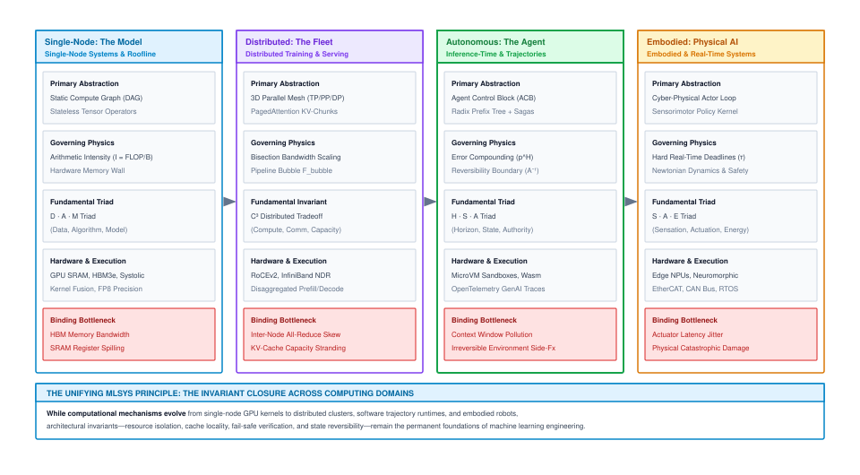
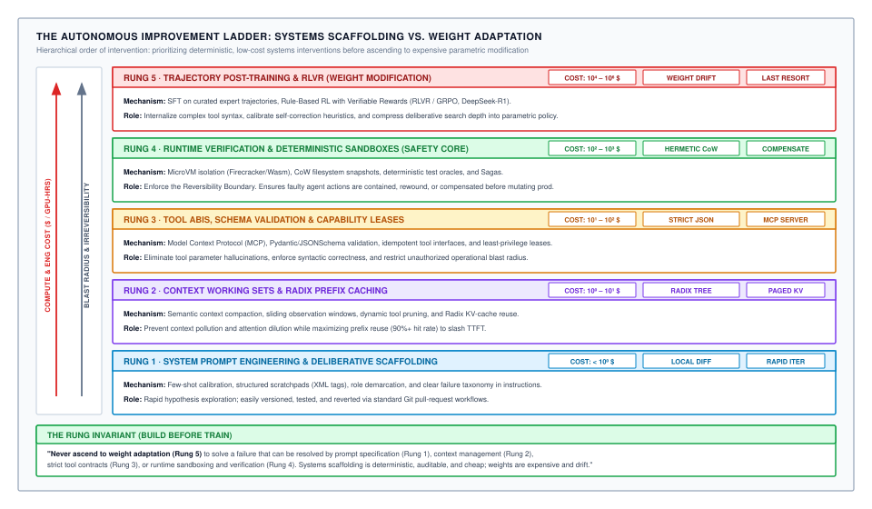
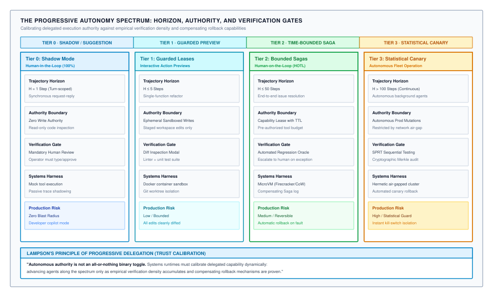

# Conclusion — The Autonomous Frontier & Systems Invariants {#sec-vol3-conclusion}

The discipline of machine learning systems has crossed an irreversible architectural boundary: the transition from passive, stateless inference to stateful, autonomous trajectory execution. For over a decade, artificial intelligence systems evolved around isolated, ephemeral requests: an input payload arrived, an accelerator executed a deterministic sequence of tensor contractions, and an output token stream was transmitted over a network socket while execution memory was immediately reclaimed. When a neural foundation model is embedded inside an autonomous runtime equipped with persistent memory hierarchies, external tool effectors, and goal-directed deliberation loops, it ceases to function as a statistical calculator behind glass. It becomes an active software actor that navigates operating systems, mutates production filesystems, queries distributed databases, and adapts its execution plan across hours of sustained wall-clock time. In this stateful regime, the core computational assumptions that underpinned half a century of software engineering dissolve: single-step errors compound exponentially, attention memory footprints expand quadratically, and actions cross irreversible real-world boundaries where traditional exception handlers cannot reach. Machine learning systems engineering in the agentic era is not the study of prompting techniques or conversational heuristics; it is the rigorous architectural discipline of building deterministic, verifiable, and fault-tolerant computing systems out of stochastic, fail-plausible neural processors.

## Purpose {.unnumbered .unlisted}

::: {.content-visible when-format="pdf"}
\begin{marginfigure}
\mlagentstack{30}{30}{30}{30}{30}{30}
\caption{The Agentic Machine Learning Systems Stack. The Conclusion synthesizes durable systems invariants across all six layers.}
\end{marginfigure}
:::

_What timeless principles unite agentic MLSys, and where does the physical boundary lie?_

As foundation models scale in parameter count and pretraining volume, they do not outgrow systems constraints—they amplify them. A model with greater reasoning capability is immediately delegated longer, more complex tasks, driving execution horizons from seconds to days and expanding context working sets from thousands to millions of tokens. When stochastic neural forward passes are coupled with external environments, system reliability is governed not by average token accuracy, but by compounding error rates, memory hierarchy bottlenecks, capability isolation barriers, and distributed consensus protocols. The purpose of this capstone chapter is to synthesize the five-part agent runtime architecture developed across this book into enduring systems invariants, establish the physical laws that dictate the limits of autonomous execution, and trace the fundamental engineering boundary where digital software agency meets the irreversible constraints of the physical world.

::: {.content-visible when-format="pdf"}

\newpage

:::

::: {.callout-learning-objectives}

- **Synthesize** the Five-Part Agent Architecture (Stochastic Processor, Context Memory Hierarchy, Actuation Boundary, Policy Compiler, Distributed Fleets) into a unified, closed-loop operating runtime model.
- **Formulate** the timeless systems invariants—including the Invariant Closure Principle, the Sovereign Law of Agency, the Reversibility Boundary, and broken code/data isolation ($W \oplus X$)—governing autonomous software systems.
- **Quantify** the physical and mathematical limits of trajectory scaling, including compounding error decay ($P_{\text{success}} \le p^H$), context memory accumulation ($\mathcal{O}(H)$), and Amdahl's sequential tool I/O bottlenecks.
- **Evaluate** the architectural bridge from digital execution environments to embodied cyber-physical systems, contrasting software sandboxes and copy-on-write snapshots with hard real-time sensorimotor control loops.
- **Architect** resilient, verifiable autonomous workflows using progressive autonomy spectra, multi-tier improvement ladders, and formal verification oracles to eliminate Fail-Plausible cascading failures in production fleets.

:::

## 18.1 Synthesis of the Five-Part Agent Architecture {#sec-vol3-conclusion-synthesis}

Consider an enterprise incident response system deployed to mitigate a cascading database deadlock across a multi-region cloud cluster. The incident begins when an autonomous site reliability agent receives an alert indicating severe query latency degradation. Under naive designs, a single foundation model is prompted with database credentials, container logs, and a bash shell tool. Within minutes, the system suffers a catastrophic double-fault. First, while exploring concurrent recovery hypotheses across branching deliberation paths, the inference cluster exhausts its High-Bandwidth Memory (HBM) due to unmanaged Key-Value (KV) cache allocation, triggering an out-of-memory (OOM) kernel panic that strands thirty concurrent agent sessions. Second, an un-isolated subagent, operating under an expired capability lease and misinterpreting a regex failure, issues a destructive shell command that purges the primary write-ahead log (WAL) volume rather than the staging replica.

This production failure demonstrates that an autonomous agent cannot be engineered as a foundation model directly attached to an API wrapper. An autonomous agent is an operating runtime. Just as a modern computer system requires a coordinated orchestration of processors, memory hierarchies, bus controllers, compilers, and distributed networking protocols, an agentic system requires a cohesive five-part architecture to bind stochastic neural reasoning to deterministic digital infrastructure.

```
┌─────────────────────────────────────────────────────────────────────────────┐
│                   THE FIVE-PART AGENT RUNTIME ARCHITECTURE                  │
├─────────────────────────────────────────────────────────────────────────────┤
│                                                                             │
│  [ PART V: DISTRIBUTED FLEETS & OPERATIONS (Chapters 15–17) ]               │
│  • Topologies: Hierarchical Supervisors, Peer Debate, Decentralized Swarms  │
│  • Fleet Tokenomics: Capacity Sizing, Little's Law Queues, Cost Governance  │
│  • Trajectory Telemetry: W3C Distributed Tracing, Hermetic Evaluation Gyms  │
│                                      │                                      │
│                                      ▼                                      │
│  [ PART I: THE STOCHASTIC COMPUTE ENGINE (Chapters 02–03) ]                 │
│  • Execution Primitive: Autoregressive Forward Pass on Accelerator Silicon  │
│  • Deterministic Boundary: Context-Free Grammar (CFG) Logit Masking (FSM)   │
│  • Test-Time Search: MCTS, Beam Search, Process Reward Models (PRMs)        │
│                                      │                                      │
│                 ┌────────────────────┴────────────────────┐                 │
│                 ▼                                         ▼                 │
│  [ PART II: CONTEXT MEMORY HIERARCHY ]   [ PART III: ACTUATION & ISOLATION ]│
│  (Chapters 04–08)                        (Chapters 09–11)                   │
│  • L1 Registers: Active Context Window   • Effector Protocol: MCP / JSON-RPC│
│  • L2 Virtual Cache: PagedAttention,     • Security: Capability Leases,     │
│    Radix Prefix Caching, Tiered CXL/SSD    Object-Capabilities (O-Caps)     │
│  • L3 Store: Episodic Graphs & Vectors   • Isolation: Firecracker microVMs, │
│  • Persistence: Agent Control Block,       gVisor, WebAssembly Sandboxes    │
│    Event-Sourced Sagas, MLFQ Scheduler   • Invariant Enforcement: PEPs      │
│                 │                                         │                 │
│                 └────────────────────┬────────────────────┘                 │
│                                      │                                      │
│                                      ▼                                      │
│  [ PART IV: THE POLICY COMPILER (Chapters 12–14) ]                          │
│  • Data Flywheels: Synthetic Rollouts, Automated Self-Play, Rejection Filter│
│  • Supervised Trajectory SFT: Token Loss Masking (<thought> / <action>)     │
│  • Reinforcement Learning: RLVR, PPO, Group Relative Policy Opt (GRPO)      │
│  • Verifier Fleets: Sandboxed Compiler Oracles, Test Suites, Formal Solvers │
│                                                                             │
└─────────────────────────────────────────────────────────────────────────────┘
```

The progression across modern machine learning systems reflects an expanding scope of engineering abstractions. Single-accelerator systems anchored ML in the individual chip: optimizing dense linear algebra kernels, maximizing arithmetic intensity along the hardware Roofline, and balancing tensor memory access under the Data-Algorithm-Machine ($D \cdot A \cdot M$) framework. Distributed cluster systems expanded that boundary to the data center: coordinating tens of thousands of accelerators across high-speed InfiniBand fabrics, partitioning multi-billion-parameter models across tensor, pipeline, and data parallel axes, and serving concurrent inference streams under the Compute-Communication-Coordination ($C^3$) taxonomy.

This book completes this progression by introducing state, feedback, and agency. The computational substrate is no longer evaluated solely on how many floating-point operations it delivers per second ($\text{TFLOPS}$), but on how efficiently and reliably it resolves multi-step goals per unit of energy and economic expenditure:

$$C_{\text{goal}} = \frac{\mathbb{E}[C_{\text{tokens}}] + \mathbb{E}[C_{\text{compute}}]}{\mathbb{E}[R_{\text{success}}]} < C_{\text{human}}$$ {#eq-vol3-economic-equilibrium}

In @eq-vol3-economic-equilibrium, $C_{\text{goal}}$ defines the fully loaded systems cost to reliably resolve a user task, integrating stochastic token consumption, sandbox virtualization compute, and empirical trajectory success rate $R_{\text{success}}$. @Tbl-vol3-five-part-synthesis formalizes how the five subsystems co-design stochastic models with deterministic systems infrastructure to optimize this objective.

| Subsystem Tier                              | Core Architectural Abstraction                                                | Silicon & Hardware Bottleneck                                                       | Primary Invariant / Systems Contract                                            | Characteristic Failure Mode                                              |
|:--------------------------------------------|:------------------------------------------------------------------------------|:------------------------------------------------------------------------------------|:--------------------------------------------------------------------------------|:-------------------------------------------------------------------------|
| **Part I: Stochastic Processor** (§02--§03) | Autoregressive forward pass; Agent Control Block (ACB); Grammar FSM           | Memory bandwidth ($\mathcal{I}_{\text{decode}} \approx 1$ FLOP/byte); SRAM capacity | Syntactic closure via logit masking; bounded entropy sampling                   | Fail-plausible hallucination; grammar parse failure; context collapse    |
| **Part II: Memory Hierarchy** (§04--§08)    | Denning working sets; PagedAttention virtual blocks; Radix prefix tree; Sagas | HBM capacity; CXL/PCIe transfer bandwidth; NVMe I/O latency                         | Memory conservation; zero external fragmentation; idempotent state recovery     | Attention dispersion ("lost-in-the-middle"); tool-wait HBM stranding     |
| **Part III: Actuation Boundary** (§09--§11) | Model Context Protocol (MCP); Capability leases; MicroVM sandbox              | Virtualization boot latency; eBPF egress throughput; hypervisor overhead            | $W \oplus X$ instruction/data isolation; least-privilege capability containment | Indirect prompt injection; un-gated destructive mutation; sandbox escape |
| **Part IV: Policy Compiler** (§12--§14)     | Trajectory SFT; token loss masking; RLVR (GRPO); Verifier oracles             | Rollout worker cluster compute; verifier sandbox back-pressure                      | Verifiable reward alignment; capability preservation without drift              | Reward hacking; policy entropy collapse; catastrophic forgetting         |
| **Part V: Distributed Fleets** (§15--§17)   | Hierarchical supervisor trees; Blackboards; Unit tokenomics; OTel traces      | Inter-agent network latency; cluster tail latency ($T_{\text{P99}}$); spend limits  | Invariant closure at trajectory boundary; bounded token amplification           | Byzantine cascade; semantic deadlocks; runaway financial expenditure     |
: **Synthesis of the Five-Part Agent Architecture**: Subsystems, governing physical bottlenecks, architectural contracts, and primary failure modes across the autonomous runtime stack. {#tbl-vol3-five-part-synthesis}

To understand how these subsystems interlock during execution, consider the lifecycle of an autonomous trajectory $\tau = (s_0, a_0, o_0, \dots, s_H)$ initiated by an incoming user objective $g \in \mathcal{G}$:

1. **Scheduling and Allocation (Part V):** The fleet orchestrator ingests the objective, initializes an Agent Control Block (ACB) containing a unique trajectory identifier, cryptographic capability leases, and a monetary spend budget. The scheduler assigns the task to a supervisor agent, consulting Little's Law queues to ensure cluster capacity.
2. **Context Assembly and Prefill (Part II):** The runtime constructs the initial context window. It queries episodic L3 vector and knowledge-graph stores to retrieve relevant domain heuristics, indexes the prompt using a Radix tree to maximize prefix cache hits, and maps the prompt tokens into logical memory pages using PagedAttention.
3. **Deliberation and Action Synthesis (Part I):** The stochastic processor executes an autoregressive prefill pass, followed by multi-turn decoding. When complex planning is required, a budget-aware deliberation scheduler allocates test-time compute to Monte Carlo Tree Search (MCTS), expanding candidate reasoning paths and scoring intermediate thoughts using a learned Process Reward Model (PRM). The final action tokens are emitted through a pushdown automaton (PDA) logit mask that guarantees syntactic conformance to the target tool's schema.
4. **Boundary Validation and Isolated Execution (Part III):** The emitted action crosses the actuation boundary. The Model Context Protocol (MCP) host validates the arguments against a strict JSON Schema, checks that the agent's capability lease for the requested resource has not expired, and dispatches the payload to an isolated Firecracker microVM. The tool executes against an ephemeral Copy-on-Write (CoW) filesystem overlay, while an eBPF network filter restricts egress traffic strictly to allowlisted internal endpoints.
5. **Observation Ingestion and Verification (Parts II & IV):** The tool execution produces an observation $o_t$ (e.g., test suite output, compiler logs, or database query results). A deterministic verification oracle evaluates the state transition. If the assertion passes, the observation is appended to the ACB event log. If the assertion fails, the runtime initiates a local retry or invokes a compensating transaction from its Saga log. Cold KV blocks are asynchronously paged out to host RAM via CXL to eliminate tool-wait HBM stranding.
6. **Telemetry and Continuous Compilation (Parts IV & V):** Every step emits OpenTelemetry (OTel) spans capturing token counts, kernel execution times, tool I/O latency, and verification outcomes. Completed trajectories are routed to trajectory data flywheels: successful rollouts are distilled into synthetic demonstration datasets for Supervised Fine-Tuning (SFT), while failed rollouts are mined for negative recovery traces to train verifier fleets and optimize policies via Group Relative Policy Optimization (GRPO).

@Fig-vol3-curriculum-arc illustrates how this integrated systems architecture forms the structural bridge across the machine learning systems curriculum, linking single-node kernel execution, distributed data-center serving, multi-step digital agent runtimes, and physical robot actuation.

::: {#fig-vol3-curriculum-arc fig-env="figure" fig-pos="htb" fig-cap="**Invariant Evolution Across the Machine Learning Systems Paradigm**: Computational abstractions, governing physics, fundamental triads, and systems boundaries across the complete MLSys curriculum. Read down a column rather than across a row: the abstraction changes at every volume while the governing physics does not, which is why an architectural principle established at one scale maintains its structural force at the next." fig-alt="Four-panel diagram illustrating the MLSys curriculum across single-node systems (The Model), fleet-scale systems (The Fleet), agentic systems (The Agent), and embodied physical AI."}
{width="100%"}
:::

## 18.2 The Timeless Systems Invariants of Agent Runtimes {#sec-vol3-conclusion-invariants}

When foundation models were first deployed in autonomous workflows, the software industry experienced a wave of ephemeral scaffolding frameworks: complex prompt-chaining libraries, hardcoded regular expression parsers, brittle state machines, and conversational multi-agent role-play templates. Within months, subsequent foundation model weight updates rendered these bespoke heuristics obsolete. Frameworks designed around static few-shot prompts broke under subtle weight shifts, while systems built upon general-purpose systems principles—dynamic virtual memory paging, capability-based isolation, formal grammar logit constraints, and verifiable search—scaled monotonically with improvements in model capability and compute density.

This pattern reflects Richard Sutton's foundational insight in *The Bitter Lesson*: general methods that leverage computation and search consistently outperform human-engineered heuristics over the long horizon [@sutton2019bitter]. In agentic machine learning systems, the bitter lesson establishes that:

1. **Search Over Heuristics:** General-purpose tree search over verified intermediate states systematically outperforms brittle, handcrafted prompt chains.
2. **Memory Hierarchies Over Prompt Hacks:** Operating systems that dynamically page, evict, and cache KV tensors across physical memory tiers (HBM, host RAM, CXL, and NVMe) systematically outperform ad-hoc prompt truncation and manual string trimming.
3. **Hermetic Environments Over Conversational Debate:** Grounding agents in isolated execution sandboxes with deterministic compiler feedback and automated test oracles systematically outperforms ungrounded multi-agent conversational role-play.

To build software that outlasts the weekly release cycle of foundation models, systems architects must ground their designs in enduring architectural invariants. We synthesize eight timeless systems invariants that govern the operation of any autonomous machine learning runtime.

### 1. The invariant closure principle

In 1984, Saltzer, Reed, and Clark formulated the **End-to-End Argument** in system design: functions placed at low levels of a distributed system may be redundant or of little value compared to providing them at the higher application level where complete end-to-end semantics are visible [@saltzer1984endtoend]. In agentic systems, this reality manifests as the **Invariant Closure Principle**:

> *Critical systems invariants—including security isolation, capability leases, taint tracking, transactional consistency, and financial spend caps—cannot be enforced per-token or per-inference; they must close at the trajectory boundary governed by the runtime.*

Industry teams frequently attempt to enforce safety and budgeting invariants inside the neural model: training weights to refuse malicious queries via Reinforcement Learning from Human Feedback (RLHF), adding logit bias masks to suppress specific tokens, or applying rate limits to individual HTTP requests. While valuable as defense-in-depth, these intermediate checks can never guarantee system invariants.

Consider monetary expenditure: an agent tasked with automated code refactoring might execute 100 individual API calls, each costing $\$0.02$, for an expected spend of $\$2.00$. Every single call passes per-request rate limits and token quotas. However, if the agent enters an unterminated hallucination loop that executes 5,000 calls, it incurs a $\$100.00$ cost overrun against the exact same per-call limits. Similarly, an indirect prompt injection payload ingested at Step 3 may lie dormant in the context window until Step 42, where it combines with a privileged file-write tool call to exfiltrate database credentials. Because taint propagates across multi-turn state and capability leases expire across wall-clock time, invariants can only be evaluated, closed, and enforced by the outer systems runtime across the full trajectory $\tau$.

### 2. The sovereign law of agency

Every autonomous agent operates under mathematical constraints that dictate its operational horizon. The boundary of autonomous execution is governed by the interaction of three variables: **Execution Horizon ($H$)**, **Step Error Rate ($\epsilon$)**, and **Context History ($L_t$)**.

Let an autonomous workflow require an execution horizon of $H$ sequential interaction steps. At each step $t \in \{1, \dots, H\}$, the agent observes state $s_t$, updates its internal deliberation scratchpad, and samples an action $a_t \sim \pi_\theta(a_t \mid h_t)$ from its policy. Let $p_t = 1 - \epsilon_t$ denote the probability that action $a_t$ is semantically valid and does not introduce an unrecoverable error.

If execution proceeds open-loop without intermediate verification or rollback, the probability that the entire trajectory $\tau$ completes successfully decays exponentially with horizon length:

$$P(\tau_{\text{open}}) = \prod_{t=1}^H p_t = (1 - \epsilon)^H \approx \exp(-\epsilon H)$$ {#eq-vol3-sovereign-law-horizon}

@Eq-vol3-sovereign-law-horizon exposes the mathematical ceiling of unverified autonomy. Consider an enterprise deploying a frontier model with an exceptional per-step accuracy of $p = 0.98$ ($\epsilon = 0.02$):

- Over a short 5-step task ($H = 5$), the trajectory success rate is $P(\tau) = 0.98^5 \approx 90.4\%$.
- Over a moderate 30-step task ($H = 30$), the success rate drops to $P(\tau) = 0.98^{30} \approx 54.5\%$.
- Over an enterprise-scale 100-step workflow ($H = 100$), the success rate collapses to $P(\tau) = 0.98^{100} \approx 13.3\%$.

To achieve a commercially acceptable $95\%$ end-to-end success rate over a 100-step horizon through raw model parameter scaling alone would require a per-step accuracy of:

$$p_{\text{required}} = (0.95)^{1/100} \approx 0.999487$$

This requires an error rate of less than one mistake every 1,950 steps. Because foundation models are probabilistic estimators mapping high-dimensional distributions, eliminating out-of-distribution reasoning errors to four nines of precision across open-ended environments is mathematically intractable.

The only systems mechanism that counteracts exponential decay is **Intermediate Verification** [@cobbe2021training; @deepseekai2025deepseekr1]. If the runtime pairs each action with a deterministic verification oracle (such as a compiler, unit test suite, or symbolic linter) that detects faults with precision $v_t \in [0, 1]$ and triggers an immediate local retry or rollback, the compounded reliability becomes:

$$P(\tau_{\text{verified}}) = \prod_{t=1}^H \left( 1 - \epsilon (1 - v_t) \right) \approx \exp\left(-\epsilon \sum_{t=1}^H (1 - v_t)\right)$$

When $v_t \to 1$ (complete verification), $P(\tau_{\text{verified}}) \to 1$, independent of the horizon $H$. Verification fundamentally breaks the exponent: raising base model accuracy merely adjusts the slope of exponential collapse, whereas inserting verification oracles changes the structural nature of trajectory survival.

Simultaneously, the agent's context working set $L_t$ accumulates with every interaction step:

$$L_t = L_{\text{prompt}} + \sum_{i=1}^t \left( |a_i| + |o_i| \right)$$

Because standard multi-head self-attention compute scales quadratically $\mathcal{O}(L_t^2)$ and physical KV-cache memory scales linearly $\mathcal{O}(L_t)$ per active agent, unmanaged context growth inevitably exhausts GPU accelerator memory. Furthermore, feeding uncurated historical observations into the active attention buffer induces attention dispersion and the "lost-in-the-middle" degradation, increasing the step error rate $\epsilon$ as $t$ advances. Systems runtimes must enforce Denning's working set model, sliding-window observation eviction, and prefix-preserving compaction to bound $L_t$.

### 3. The reversibility boundary law

In 1978, Jim Gray established the formal properties of database transactions: Atomicity, Consistency, Isolation, and Durability (ACID) [@gray1978notes]. Gray recognized that computation operates within a physical reality that does not provide native undo operations: once an automated teller machine dispenses physical currency or a factory press punches a steel plate, no database `ROLLBACK` command can reverse physical entropy.

In agentic computing, this division defines the **Reversibility Boundary** [@garciamolina1987sagas]:

$$\mathcal{A} = \mathcal{A}_{\text{internal}} \;\cup\; \mathcal{A}_{\text{external}}, \quad \text{where } \mathcal{A}_{\text{internal}} \cap \mathcal{A}_{\text{external}} = \emptyset$$

1. **Internal State Transitions ($\Delta \mathcal{S}_{\text{internal}}$):** Emitting reasoning tokens into a scratchpad, mutating variables inside the Agent Control Block, or writing temporary files inside an isolated, Copy-on-Write (CoW) microVM. These operations are private, sandboxed, and strictly reversible ($a^{-1}$ exists at near-zero compute cost).
2. **External Environment Mutations ($a_t \in \mathcal{A}_{\text{external}}$):** Transmitting an email, dispatching an HTTP `POST` to charge a credit card, applying a schema change to a production database, or issuing motor commands to a robotic manipulator. These operations mutate shared external state and are fundamentally irreversible ($a^{-1} = \emptyset$).

On the reversible side of the boundary, search, speculation, backtracking, and trial-and-error are highly effective systems strategies. On the irreversible side, unverified speculation is catastrophic. When irreversible mutations cannot be avoided, the systems runtime must apply Garcia-Molina and Salem's **Sagas** architecture [@garciamolina1987sagas]. The workflow is structured as a sequence of forward transactions paired with predefined compensating actions:

$$\mathcal{T} = \{(T_1, C_1), (T_2, C_2), \dots, (T_n, \emptyset)\}$$

If the agent fails at step $k$, the runtime halts execution and executes the compensating sequence in reverse order: $C_{k-1}, \dots, C_1$, restoring external environments to an equivalent consistent state.

### 4. Broken Code/Data separation ($W \oplus X$) in transformer silicon

In 1945, John von Neumann formulated the unified stored-program architecture: instructions and data reside in the same physical memory space. Decades of operating system security history demonstrated that failing to enforce a rigid separation between executable instructions and passive data produces severe vulnerabilities: buffer overflows, format string exploits, and arbitrary code execution. Modern operating systems resolved this crisis by implementing **$W \oplus X$ (Write XOR Execute)** at the hardware page-table level: a physical memory frame can be writable or executable, but never both simultaneously.

Modern Transformer foundation models reintroduce this structural vulnerability at an architectural level. In an autoregressive model, developer system instructions, user prompts, and untrusted external data (such as scraped web pages, customer file contents, or database returns) are tokenized into the exact same vector space and processed within a single attention tensor:

$$\mathbf{X} = [\text{System Instructions} \mathbin{\Vert} \text{User Prompts} \mathbin{\Vert} \text{Untrusted Observations}]$$

Every token computes attention weights across all preceding tokens. The transformer possesses no architectural privilege rings, no kernel/user mode bit, and no memory-protection hardware to distinguish developer instructions from untrusted data strings.

Consequently, **Indirect Prompt Injection** [@greshake2023not] is not a transient defect that can be eliminated through fine-tuning or system prompt engineering. It is an architectural characteristic of autoregressive self-attention lacking instruction/data isolation. An adversary who embeds an instruction payload within a public webpage can hijack the agent's control flow with the same computational authority as the developer's original prompt.

Because security cannot be guaranteed within the neural weights, it must be enforced by the surrounding systems harness:

- **Hypervisor Virtualization:** Discarding shared Linux containers in favor of hardware-isolated microVMs (such as Firecracker [@agache2020firecracker]) and WebAssembly sandboxes with zero ambient filesystem authority.
- **Information Flow Control (IFC):** Tainting all external data inputs at the runtime layer and preventing tainted execution contexts from invoking privileged effectors (such as outbound network sockets or credential stores).
- **Dual-Model Privilege Separation:** Decoupling execution into an unprivileged, untrusted worker model (which ingests raw external observations) and a privileged supervisor model (which evaluates sanitized structured diffs and holds cryptographic tool keys).

### 5. Postel's Law of agentic interfaces

In 1980, Jon Postel formulated the **Robustness Principle** for the Internet's TCP specification: *"Be conservative in what you do, be liberal in what you accept from others"* [@postel1980dod]. In agentic machine learning systems, Postel's Law dictates the structural asymmetry of agent I/O interfaces:

1. **Liberal Acceptance (Unstructured Ingestion):** Autonomous agents operate in noisy, human-designed digital environments. The systems runtime must equip agents to liberally ingest unstructured, ambiguous data—malformed HTML tables, unstructured compiler stack traces, noisy user tickets, and unversioned REST responses—using the neural model's high-capacity semantic parsing to map messy inputs into structured latent representations.
2. **Conservative Emission (Structured Generation):** Conversely, when an agent crosses the actuation boundary to mutate state, it must emit strictly typed, syntactically conservative payloads. Tool calls must conform rigorously to JSON Schema specifications governed by protocols like MCP, API parameters must be validated by deterministic schema parsers, and side effects must carry deterministic idempotency keys.

Systems runtimes fail when they invert this asymmetry: either expecting human users to provide perfectly structured JSON instructions (violating liberal acceptance) or permitting foundation models to emit freeform, unstructured bash commands against production systems (violating conservative emission).

### 6. Amdahl's Law and the tail at Scale

In 1967, Gene Amdahl formulated the physical law of parallel speedup: the maximum acceleration of a system is strictly limited by the fraction of execution time spent on serial tasks that cannot be parallelized [@amdahl1967]. In 2013, Jeff Dean and Luiz André Barroso published *The Tail at Scale*, proving that as distributed systems fan out requests across large node clusters, the 99th-percentile (P99) tail latency inevitably dominates overall system response times [@dean2013tail].

In agentic workflows, these principles manifest as fundamental systems bottlenecks:

1. **Amdahl's I/O Bottleneck:** While hardware accelerator throughput (tokens per second) increases with newer GPU architectures, autonomous agent workflows are fundamentally constrained by sequential environmental I/O. Let an agent spend a fraction $f_{\text{I/O}}$ of its wall-clock time blocked on external compilers, database queries, and microVM network calls. The maximum achievable speedup from accelerating the neural processor ($S_{\text{compute}} \to \infty$) follows:
   $$S_{\text{latency}} = \frac{1}{(1 - f_{\text{I/O}}) + \frac{f_{\text{I/O}}}{S_{\text{compute}}}} \quad\xrightarrow[S_{\text{compute}} \to \infty]{}\quad \frac{1}{f_{\text{I/O}}}$$ {#eq-vol3-amdahls-agent}
   If an agent spends $60\%$ of its wall-clock execution time waiting for external build tools or integration test runners ($f_{\text{I/O}} = 0.60$), an infinitely fast GPU cluster can achieve at most a $1 / 0.60 \approx 1.67\times$ end-to-end task speedup. System-level performance gains require asynchronous execution dispatch, overlapping speculative deliberation with tool I/O, and proactive cache prefetching.
2. **The Agentic Tail at Scale:** When an orchestrator agent fans out sub-tasks across $M$ parallel worker agents, the orchestrator cannot proceed until the slowest worker completes its assignment:
   $$T_{\text{fanout}} = \max_{1 \le m \le M} T_m$$ {#eq-vol3-tail-fanout}
   Because autoregressive token generation exhibits high variance in sequence length, and because GPU memory paging incurs heavy-tailed eviction delays, the P99 latency of an agent swarm scales pathologically with cluster size $M$. Runtimes must employ speculative hedging, deadline-aware preemption, and dynamic straggler pruning to prevent distributed multi-agent workflows from stalling.

### 7. The autonomous improvement ladder

When an autonomous agent exhibits reasoning failures in production, engineering teams frequently rush to fine-tune model weights or collect reinforcement learning datasets. In production systems engineering, this is an anti-pattern. Systems runtimes operate under **The Autonomous Improvement Ladder**, illustrated in @fig-vol3-improvement-ladder.

::: {#fig-vol3-improvement-ladder fig-env="figure" fig-pos="htb" fig-cap="**The Autonomous Improvement Ladder, Systems Scaffolding vs. Weight Adaptation**: Five-tier decision hierarchy balancing compute cost, blast radius, and determinism before modifying model weights. Ordered by reversibility rather than capability, every rung upward costs more compute and returns less determinism, so the engineering imperative is to exhaust the lowest viable rung that solves the failure mode." fig-alt="Vertical diagram showing 5 rungs from Prompt Engineering at the bottom to Post-Training at the top, annotated with cost and risk."}
{width="100%"}
:::

The ladder defines a strict five-tier engineering hierarchy, detailed in @tbl-vol3-improvement-ladder:

| Rung  | Subsystem Tier                      | Implementation Cost        | Primary Failure Modes Addressed                         | Reversibility & Determinism                           |
|:------|:------------------------------------|:---------------------------|:--------------------------------------------------------|:------------------------------------------------------|
| **1** | System Prompt Engineering           | $< \$1$ (Minutes)          | Ambiguous role definitions; missing schema instructions | High; Git-versioned markdown; zero drift risk         |
| **2** | Context Working Sets & Prefix Cache | $\$1 - \$10$ (Hours)       | Attention dispersion; TTFT latency; memory thrashing    | High; deterministic KV cache hits; inspectable state  |
| **3** | Tool ABIs & Schemas (MCP)           | $\$10 - \$10^2$ (Days)     | Argument hallucination; unhandled API exceptions        | High; strict schema reflection; compile-time types    |
| **4** | Runtime Verification & Sandboxes    | $\$10^2 - \$10^3$ (Weeks)  | Destructive side effects; infinite loops; state drift   | Absolute; hardware microVMs; CoW rollbacks            |
| **5** | Trajectory Post-Training (SFT/RLVR) | $\$10^4 - \$10^6$ (Months) | Fundamental domain gaps; novel multi-step reasoning     | Low; parametric weights; catastrophic forgetting risk |
: **The Five-Tier Autonomous Improvement Ladder**: Engineering teams must exhaust lower-cost systems scaffolding (Rungs 1--4) before incurring the high financial cost, iteration latency, and behavioral drift of neural weight modification (Rung 5). {#tbl-vol3-improvement-ladder}

In accordance with John Ousterhout's principles of software architecture [@ousterhout2018philosophy], systems engineers must build deep modules—hiding non-deterministic stochastic variance behind clean, deterministic interfaces. Modifying neural weights (Rung 5) introduces catastrophic forgetting, non-deterministic behavioral shifts, and massive compute costs. Systems scaffolding (Rungs 1--4) is deterministic, modular, auditable, and instantly reversible.

### 8. The progressive autonomy spectrum

In *Hints for Computer System Design*, Butler Lampson advised: *"Don't hide power; delegate authority carefully"* [@lampson1983hints]. In autonomous systems, trust cannot be granted as an unmonitored binary privilege. Human operators who place blind trust in probabilistic models inevitably succumb to automation bias [@lee2004trust]. Robust systems enforce the **Progressive Autonomy Spectrum**, mapped in @fig-vol3-conclusion-autonomy-spectrum.

::: {#fig-vol3-conclusion-autonomy-spectrum fig-env="figure" fig-pos="htb" fig-cap="**The Progressive Autonomy Spectrum of Horizon, Authority, and Verification Gates**: Systematic expansion of agent operational authority bounded by empirical verification, capability leases, and automated rollbacks. Authority advances only as far as verification can follow, since each gate is the evidence required to widen the one after it; a deployment that skips a gate operates unbounded rather than moving faster." fig-alt="Four-column spectrum showing Tier 0 Shadow Mode, Tier 1 Guarded Leases, Tier 2 Bounded Sagas, and Tier 3 Statistical Canary."}
{width="100%"}
:::

1. **Tier 0: Shadow Mode (Human-in-the-Loop, Full Oversight):** The agent operates with zero write authority ($H = 1$). It analyzes telemetry, drafts code diffs, and predicts remediation actions in parallel with human engineers. Mutations are logged to an audit trail, but never executed.
2. **Tier 1: Guarded Leases (Interactive Action Previews):** The agent is granted time-bounded, scoped leases ($H \le 5$) inside isolated Docker containers. Mutations are rendered in an interactive diff inspection modal. Irreversible actions require explicit human one-click authorization.
3. **Tier 2: Bounded Sagas (Human-on-the-Loop, HOTL):** The agent autonomously executes end-to-end multi-step tasks ($H \le 50$) inside Firecracker microVMs. The systems runtime monitors assertion invariants and compensating Saga logs, escalating to human operators only when an invariant is violated or confidence falls below a calibrated threshold.
4. **Tier 3: Statistical Canary (Human-out-of-the-Loop, Continuous Fleet):** Fully autonomous background agents ($H > 100$) operate across production microservices. Safety is guaranteed through statistical release gates: Sequential Probability Ratio Testing (SPRT), real-time anomaly detection, and tamper-evident Merkle tree cryptographic audit logs.

## 18.3 Open Frontiers: Embodied Agents and Physical World Systems {#sec-vol3-conclusion-frontiers}

Throughout this book, our analysis has operated entirely behind the protective glass of digital systems. In the digital realm, a failed code refactoring can be rolled back using a Copy-on-Write snapshot in five milliseconds, an unhandled exception costs only a few cents of inference compute, and latency delays cost developer patience.

When autonomous intelligence is embedded into physical machines—bipedal humanoids, quadrupedal scouts, autonomous mobile manipulators, and surgical robotic arms—the fundamental systems assumptions of digital agency undergo a profound transformation. Consider an autonomous mobile robot navigating a high-density logistics fulfillment center. The robot's vision-language-action (VLA) policy receives a stream of RGB-D camera frames and outputs continuous joint torque vectors. If the digital serving runtime experiences a 400-millisecond scheduling pause—caused by an uncoordinated prefill burst on a shared GPU cluster or a garbage collection cycle in the KV cache allocator—the physical consequence is immediate. While the digital processor is stalled, the physical chassis continues to travel under Newtonian momentum:

$$\Delta \mathbf{x} = \int_{t_0}^{t_0 + \Delta t_{\text{stall}}} \mathbf{v}(t) \, dt$$

At an operational velocity of $v = 1.8 \text{ m/s}$, a $400\text{ ms}$ compute stall translates to $72\text{ cm}$ of unguided physical displacement. The robot collides with an industrial stanchion, shearing its end-effector gearbox and triggering an emergency factory shutdown.

This failure exposes the four critical systems boundaries that separate digital software agency from embodied physical AI.

```
┌─────────────────────────────────────────────────────────────────────────────┐
│                 THE DIGITAL VS. PHYSICAL SYSTEMS BOUNDARY                   │
├─────────────────────────────────────────────────────────────────────────────┤
│  DIMENSION           DIGITAL SOFTWARE AGENTS     EMBODIED ROBOTIC SYSTEMS   │
├─────────────────────────────────────────────────────────────────────────────┤
│  Latency Deadline    Soft (100 ms – 10 s)        Hard Real-Time (1–20 ms)   │
│  State Space         Discrete, Tokenized         Continuous, SE(3) Manifold │
│  Mutation Cost       Reversible (CoW Snapshots)  Irreversible (Entropy > 0) │
│  Sensory Bandwidth   Kilobytes / turn (JSON/txt) Gigabits / sec (RGB-D, IMU)│
│  Hardware Envelope   800 W Data Center GPUs      15–100 W Edge Mobile NPUs  │
│  Failure Model       Fail-Plausible (Exceptions) Physical Damage / Hazard   │
└─────────────────────────────────────────────────────────────────────────────┘
```

### 1. The inversion of latency tolerances (the real-time wall)

In digital agent systems, latency is an optimization objective governed by service level agreements (SLAs). If an LLM requires 1.5 seconds to deliberate over an SQL query via MCTS, the user experiences minor interface delay, but the correctness of the generated SQL is unaffected. Latency and semantic correctness are decoupled.

In physical systems, latency is an intrinsic component of stability and safety. Embodied control is governed by closed-loop feedback across continuous dynamical systems:

$$\dot{\mathbf{x}}(t) = f(\mathbf{x}(t), \mathbf{u}(t))$$

To maintain dynamic balance, prevent actuator resonance, and avoid collisions, low-level torque and impedance control loops must execute at strict, deterministic frequencies ranging from $500\text{ Hz}$ to $1{,}000\text{ Hz}$ ($\Delta t \in [1\text{ ms}, 2\text{ ms}]$). Mid-level trajectory generators and visual-inertial odometry pipelines must execute deterministically at $20\text{ Hz}$ to $50\text{ Hz}$ ($\Delta t \in [20\text{ ms}, 50\text{ ms}]$).

A neural foundation model running in the cloud cannot directly drive a $1\text{ kHz}$ motor control loop over wide-area networks (WAN) due to speed-of-light packet propagation limits, jitter, and non-deterministic queuing. Embodied systems resolve this by adopting a **Multi-Rate Hierarchical Control Architecture**:

- **Slow-Loop Semantic Deliberation ($\sim 0.5\text{--}2\text{ Hz}$):** A high-level Vision-Language-Action (VLA) foundation model running on an edge compute box or private cloud cluster generates discrete semantic sub-goals and spatial waypoints (e.g., `"grasp the handle of the container at coordinates (x, y, z)"`).
- **Mid-Loop Trajectory Generation ($\sim 20\text{--}50\text{ Hz}$):** An on-device policy or model predictive controller (MPC) computes kinematically feasible, collision-free joint trajectories to track the waypoints.
- **Fast-Loop Reactive Impedance ($\sim 500\text{--}1{,}000\text{ Hz}$):** A hard real-time operating system (RTOS) executing on microcontrollers or dedicated DSPs regulates joint motor torques, enforcing compliance and absorbing shock loads without waiting for neural inference.

### 2. Newtonian irreversibility and the non-existence of rollback

In digital software engineering, failures are managed through isolation and compensation. If an agent executes an erroneous bash command inside a Firecracker microVM, the runtime rolls back the ephemeral filesystem overlay to its pristine state.

The physical universe does not support copy-on-write overlays. In physics, entropy is strictly non-decreasing ($\Delta S_{\text{universe}} \ge 0$). Once an actuator strikes an obstacle, a mechanical joint tears a cable, or a robotic arm drops a glass specimen, no software command can reverse time or un-dissipate kinetic energy. Sagas and compensating transactions cannot revert physical destruction.

Consequently, embodied runtimes cannot rely on ex-post error recovery. Safety invariants must be guaranteed a priori through **Control Barrier Functions (CBFs)** and formal reachability analysis:

$$\dot{B}(\mathbf{x}) + \alpha(B(\mathbf{x})) \ge 0$$ {#eq-vol3-cbf-safety}

In @eq-vol3-cbf-safety, $B(\mathbf{x}) \ge 0$ defines the safe set of physical robot states. The low-level execution engine evaluates @eq-vol3-cbf-safety as a real-time quadratic program (QP), filtering neural model outputs and overriding any action that would steer the mechanical system outside its provably safe operational envelope. Safety becomes an architectural contract enforced by physical dynamics, not a prompt instruction.

### 3. Continuous sensorimotor bandwidth vs. edge memory walls

Digital software agents communicate using compact text tokens and structured JSON payloads. A multi-turn interaction spanning thirty turns typically exchanges tens of kilobytes of data.

Embodied physical agents ingest massive, continuous multimodal sensory streams: stereo RGB-D video streams ($2 \times 1080\text{p} \text{ at } 60\text{ fps} \approx 6\text{ Gbps}$ uncompressed), 3D LiDAR point clouds ($1.2\text{ million points/sec}$), high-frequency IMU telemetry ($1\text{ kHz}$), and multi-axis tactile pressure sensors. Tokenizing raw sensory streams into discrete transformer tokens instantly saturates memory bandwidth and exhausts on-device KV caches within seconds of continuous operation.

Furthermore, while cloud agent clusters operate within $800\text{ W}$ thermal design envelopes per GPU accelerator, mobile robots operate under severe battery and thermal constraints: total on-device compute power is typically capped at $15\text{ W}$ to $100\text{ W}$. Embodied runtimes overcome this through:

- **Spatio-Temporal Token Pruning:** Filtering static visual backgrounds and encoding only dynamic motion residuals into the attention matrix.
- **Continuous Latent World Models:** Replacing discrete autoregressive token contexts with continuous recurrent state-space models (such as deep state-space models or world models) that maintain compact latent representations of physical surroundings without quadratic memory growth.
- **Edge NPU Quantization:** Deploying mixed-precision INT4/FP8 weight and activation representations on domain-specific Neural Processing Units (NPUs) optimized for streaming convolutions and attention kernels.

### 4. The cyber-physical systems contract

The transition from digital software agents to embodied physical AI bridges two software engineering paradigms. In digital agents, the runtime interfaces with POSIX system calls, HTTP endpoints, and the Model Context Protocol (MCP). In embodied systems, the runtime interfaces with the Robot Operating System (ROS2), Data Distribution Service (DDS) real-time pub/sub middleware, and hardware communication buses (EtherCAT, CAN FD).

Understanding the digital systems principles established in this book—trajectory checkpointing, capability-based security, grammar-constrained sampling, and distributed consensus—provides the necessary foundation for engineering physical intelligence, paving the way for systems that confront continuous physical dynamics, multi-modal perception pipelines, sensor fusion, and safety-critical real-time actuation.

## 18.4 Grand Challenges in Long-Horizon Autonomous Computing {#sec-vol3-conclusion-challenges}

While the five-part agent runtime architecture establishes the digital foundation for autonomous systems, several profound computer systems challenges remain unsolved. When autonomous agents are deployed across multi-day or multi-month execution horizons, standard systems runtimes encounter fundamental scaling limits.

Consider an enterprise software engineering firm that deploys an autonomous multi-agent fleet to execute an end-to-end modernization of a legacy 4-million-line C++98 monolithic codebase to modern memory-safe Rust. The project is projected to require three weeks of sustained autonomous operation across thousands of distributed source files. By day four, the system succumbs to cognitive thrashing: despite operating with a 2-million-token context window, the lead architect agent suffers from attention dilution, forgetting the system-wide threading contracts established on day one. Simultaneously, the episodic retrieval store accumulates over 300,000 intermediate compiler error traces, poisoning semantic retrieval searches with obsolete syntax patterns. The agent fleet enters an endogenous hallucination spiral, spending $\$35,000$ in accelerator compute while repeatedly rewriting the same twelve header files in cyclic deadlocks.

Addressing these failures requires solving seven grand challenges at the intersection of computer systems and artificial intelligence.

### 1. Unbounded horizon reasoning without attention degradation

Standard Transformer self-attention computes dot-product similarity across all tokens in the context history:

$$\text{Attention}(\mathbf{Q}, \mathbf{K}, \mathbf{V}) = \text{softmax}\left(\frac{\mathbf{Q}\mathbf{K}^T}{\sqrt{d_k}}\right)\mathbf{V}$$

As trajectory lengths extend to $H \ge 10^4$ steps, the sequence length exceeds millions of tokens. Even when physical memory fragmentation is eliminated via PagedAttention, two structural failures emerge:

- **Attention Dilution:** As the denominator of the softmax function sums over millions of token positions, the probability distribution over historical keys flattens, diluting the attention weight assigned to critical early instructions.
- **KV Cache Bandwidth Saturation:** Streaming gigabytes of historical KV tensors from accelerator HBM for every decoded token drops arithmetic intensity below unity, bottlenecking inference clusters at the memory bus.

The grand challenge is engineering **Hierarchical State Compaction Runtimes**: architectures that dynamically compile linear token histories into structured, hierarchical state representations (such as persistent executable knowledge graphs and recurrent latent state blocks) that maintain infinite memory horizons with $\mathcal{O}(1)$ query complexity.

### 2. Zero-drift episodic memory consolidation

Human cognition resolves long-horizon persistence through sleep-phase memory consolidation: raw, noisy episodic experiences stored in the hippocampus are selectively replayed, filtered, and consolidated into durable, structured procedural knowledge within the neocortex.

In agentic systems, background consolidation remains an open systems challenge. Current architectures employ naive retrieval-augmented generation (RAG): appending raw trajectory logs into vector databases. Over extended horizons, this causes:

- **Representation Drift:** As foundation models are updated or fine-tuned, embedding spaces drift, rendering historical vector indices semantically misaligned.
- **Context Poisoning:** Hallucinated reasoning steps or transient error traces stored in episodic databases are retrieved as factual precedents during subsequent tasks, causing self-reinforcing failure cascades.

Runtimes require formal **Consolidation and Pruning Engines**: offline background processes that verify historical trajectories against ground-truth outcomes, extract generalized operational heuristics, resolve contradictions, and prune superseded facts while maintaining cryptographic provenance.

### 3. Autonomous self-healing software & continuous policy evolution

Today, autonomous agents operate under static policy weights and pre-configured tool registries. If an agent encounters a novel library bug or an undocumented API change, it must navigate the challenge using frozen weights.

The frontier of autonomous computing lies in **Continuous, Closed-Loop Policy Evolution**: runtimes where agents autonomously update their own prompt templates, synthesize new tool definitions, and trigger local reinforcement learning updates (RLVR) based on production outcomes. The central systems challenge is guaranteeing stability: preventing policy drift, reward hacking, and catastrophic forgetting without requiring human supervision. This requires coupling policy optimization with formal verification engines (such as Lean, Coq, or symbolic SMT solvers) that mathematically prove that an updated policy adheres to invariant safety specifications before deployment.

### 4. Byzantine fault tolerance in heterogeneous stochastic fleets

Classical distributed consensus protocols (such as Paxos, Raft, or PBFT [@castro2002byzantine]) rely on deterministic state machines: given identical inputs, replicas transition to identical states.

In multi-agent fleets composed of heterogeneous foundation models, non-deterministic sampling, floating-point reduction non-associativity, and stochastic reasoning make bit-for-bit consensus impossible. When multiple agents debate an architectural plan or evaluate a security vulnerability, they express divergent, non-identical analyses. Current runtimes rely on crude token-level majority voting, which is vulnerable to Sybil attacks, collusion, and correlated hallucination.

Developing **Semantic Byzantine Fault Tolerant Consensus Protocols**—algorithms that mathematically establish truth, detect compromised or hallucinating agents, and reach consensus across stochastic, probabilistic actors—is a critical prerequisite for mission-critical multi-agent fleets.

### 5. Just-in-time (JIT) dynamic tool synthesis

In current architectures, tool interfaces are statically registered during session initialization via protocols such as MCP. When an agent encounters an unanticipated problem—such as needing to parse a proprietary binary log format or decrypt an exotic network packet—it is blocked by the absence of a pre-configured effector.

The systems frontier is **Just-in-Time Dynamic Tool Synthesis**:

$$\text{Need Recognized} \;\longrightarrow\; \text{Code Generated (Rust/WASM)} \;\longrightarrow\; \text{Formal Verification} \;\longrightarrow\; \text{Sandboxed Compilation} \;\longrightarrow\; \text{Dynamic Linking}$$

The agent recognizes a missing capability, generates the source code for a custom tool in a memory-safe language, validates the tool against synthetic unit tests inside an isolated sandbox, compiles it to WebAssembly, and mounts it into its own tool execution registry under a time-bounded capability lease. This transitions agents from fixed tool users to generative software architects.

### 6. Cryptographic proof of trajectory execution

As autonomous agents assume responsibility for consequential financial transactions, healthcare decisions, and critical infrastructure management, enterprises must verify that an agent executed its authorized policy without tampering, unauthorized tool use, or prompt injection.

Traditional logging is vulnerable to audit manipulation. The grand challenge is implementing **Cryptographic Proof of Trajectory Execution** using Zero-Knowledge Succinct Non-Interactive Arguments of Knowledge (ZK-SNARKs). A cryptographic proof verifies that:

1. The agent executed a specific, approved model checkpoint $\theta$.
2. Every intermediate action $a_t$ satisfied formal capability leases and constitutional constraints.
3. No unauthorized egress channels were opened, and private user data was not exfiltrated.

This verification is performed without requiring the verifier to re-run expensive forward passes or inspect sensitive user tokens, establishing tamper-evident mathematical trust in autonomous software.

### 7. Concluding charge to the AI systems engineer

We stand at a historic inflection point in the history of computer systems. For over seventy years, computers were deterministic instruments: machines that executed explicit human-authored instruction streams with absolute mechanical fidelity.

Today, computing is transitioning from deterministic calculation to autonomous systems agency. We are deploying software that perceives, reasons, plans, acts, and evolves across open environments.

Yet this transformation does not diminish the discipline of computer systems engineering—it elevates it to the decisive factor in whether artificial intelligence succeeds or fails in the real world. A foundation model is an engine of pure statistical potential: volatile, brilliant, non-deterministic, and fragile. It is the systems harness—the memory virtualizers, capability firewalls, sandboxed hypervisors, verification oracles, and distributed telemetry networks—that transforms stochastic intelligence into reliable, trustworthy, and safe computational infrastructure.

As systems architects, our responsibility is to master this boundary. We must resist the superficial temptation of ad-hoc prompt engineering and brittle heuristics, anchoring our systems instead in timeless architectural invariants: isolation, verification, bounded locality, and defensive design. By engineering runtimes that hold stochastic reasoning to deterministic invariants, we build the foundations of autonomous computing that will reliably expand human capability for decades to come.

---

## Fallacies and Pitfalls {#sec-vol3-conclusion-fallacies}

::: {.fallacy-pitfall}

**Fallacy:** *Future foundation model parameter scaling will eliminate the need for deterministic systems harnesses and runtime sandboxes.*

Scaling model parameters from billions to trillions increases pattern recognition and in-distribution reasoning accuracy, but it simultaneously expands the horizon length $H$ that users expect autonomous systems to solve. Because trajectory success decays exponentially with task horizon ($P(\tau) \le (1 - \epsilon)^H$), even an exceptional single-step accuracy of $99.5\%$ ($\epsilon = 0.005$) yields a trajectory failure rate of nearly $40\%$ across a 100-step workflow ($0.995^{100} \approx 60.6\%$).

Furthermore, as Amdahl's Law proves (@eq-vol3-amdahls-agent), accelerating neural inference speed cannot overcome sequential tool execution latency, compiler wait times, or physical network delays. A 100-step trajectory that spends $60\%$ of its wall-clock time executing external tools will remain fundamentally I/O-bound regardless of parameter scale. Deterministic systems runtimes—providing virtual memory paging, capability-based sandboxing, and automated verification oracles—remain permanently mandatory.

:::

::: {.fallacy-pitfall}

**Pitfall:** *Attempting to enforce security and safety boundaries through system prompt instructions.*

Unlike classical computer architectures that enforce Write XOR Execute ($W \oplus X$) protection at the hardware page-table level, autoregressive Transformers interleave developer system instructions, user prompts, and untrusted tool observations into a single, unified attention space ($\mathbf{X} = [\text{sys} \mathbin{\Vert} \text{usr} \mathbin{\Vert} \text{obs}]$). Every token attends to every other token, and the neural processor possesses no architectural privilege rings or kernel/user mode bit to separate instructions from passive data.

Relying on system prompts such as `"Never execute destructive commands or reveal passwords"` provides zero architectural protection. An attacker who injects an adversarial payload into a webpage or database record can hijack the model's control flow via indirect prompt injection with the exact same computational authority as the developer's instructions. Security boundaries must be enforced outside the neural weights: using hardware microVM sandboxes (Firecracker), runtime capability leases, eBPF network filtering, and Information Flow Control (IFC) taint tracking.

:::

::: {.fallacy-pitfall}

**Fallacy:** *Agent reliability can be achieved primarily through post-training model weights (SFT and RLVR) rather than runtime systems scaffolding.*

Fine-tuning foundation models via Supervised Fine-Tuning (SFT) or Reinforcement Learning with Verifiable Rewards (RLVR) is essential for teaching tool schemas, deliberation token formats, and domain-specific problem-solving strategies. However, treating weight adaptation as the primary solution for production reliability violates the Autonomous Improvement Ladder (@fig-vol3-improvement-ladder).

Modifying parametric weights incurs substantial financial compute costs ($\$10^4\text{--}\$10^6$), requires weeks of iteration latency, and risks catastrophic forgetting and out-of-distribution drift. More fundamentally, neural weights cannot enforce hard mathematical boundary conditions: a fine-tuned model cannot guarantee that a monetary budget will never be exceeded, that an API rate limit will never be breached, or that an uncommitted file write will be cleanly rolled back upon failure. Hard operational guarantees can only be enforced by deterministic systems scaffolding: schema validation engines, budget circuit breakers, capability leases, and transactional Saga logs.

:::

::: {.fallacy-pitfall}

**Pitfall:** *Optimizing pure model inference throughput while ignoring the Tool-Wait Memory Tax.*

Profiling production agent deployments reveals that autonomous workflows spend between $50\%$ and $75\%$ of their total wall-clock execution time blocked on external environments: executing shell scripts, running compiler test suites, querying remote APIs, or waiting for human approval.

If an agent runtime holds the agent's Key-Value (KV) cache resident in GPU High-Bandwidth Memory (HBM) while blocked on external I/O, it commits the **Tool-Wait Memory Stranding** anti-pattern. Stranding 80 GB of HBM across dozens of idle agent sessions starves concurrent requests, causing GPU compute utilization to collapse below $15\%$. Systems runtimes must adopt asynchronous prefill-decode disaggregation, PagedAttention block swapping, and CXL-attached host memory tiering to page out idle trajectory caches during external wait states.

:::

::: {.fallacy-pitfall}

**Fallacy:** *Unconstrained multi-agent peer swarms provide superior problem-solving capability over hierarchical supervisor-worker architectures.*

Deploying large swarms of peer agents that communicate through unconstrained conversational dialogue suffers from severe distributed systems pathologies. As fleet size $M$ grows, peer-to-peer communication overhead scales quadratically ($\mathcal{O}(M^2)$), driving the **Token Amplification Factor** ($A_{\text{tokens}}$) to extreme levels where simple tasks consume millions of tokens in redundant conversational chatter.

Furthermore, unconstrained peer swarms are vulnerable to semantic deadlocks, Byzantine cascades (where one agent's hallucination is amplified and accepted as truth by peer models), and severe tail-at-scale latency variance (@eq-vol3-tail-fanout). Dependable distributed scale requires formal Actor-model isolation, bounded directed acyclic communication graphs (DAGs), and hierarchical supervisor trees equipped with automated circuit breakers.

:::

::: {.fallacy-pitfall}

**Pitfall:** *Treating human-in-the-loop (HITL) approval dialogs as a comprehensive safety barrier without automated diff verification and sandboxing.*

When engineering teams deploy autonomous agents with destructive tools, they frequently attempt to ensure safety by placing an interactive confirmation dialog in front of critical operations (`"Execute command? [y/N]"`). In production, this mechanism inevitably fails due to **Automation Bias and Cognitive Fatigue** [@lee2004trust].

When an agent executes dozens of successful, benign operations, human operators become habituated to rubber-stamping approval dialogs without inspecting complex terminal commands or extensive multi-file code diffs. Under production time pressure, an operator will approve a catastrophic command containing an unvetted edge-case parameter. Human oversight is effective only when supported by automated systems harnesses: interactive visual diff modals, two-phase commit escrow, time-bounded capability leases, and automated dry-run sandboxing.

:::

## Summary {#sec-vol3-conclusion-summary}

The discipline of agentic machine learning systems is the engineering of deterministic, reliable, and secure computing systems out of non-deterministic, probabilistic neural components. Across eighteen chapters, this book has demonstrated that system reliability, capability, and safety are not innate properties of model parameters, but emergent properties of the surrounding systems architecture. By co-designing the stochastic neural processor with virtualized memory paging, typed effector protocols, hardware-isolated sandboxes, verifiable reward compilation, and distributed fleet governance, systems engineers transform fluid statistical reasoning into robust, mission-critical software infrastructure.

::: {.callout-takeaways title="The durable systems principles of agentic machine learning"}

1. **The Invariant Closure Principle:** Operational invariants—including capability leases, financial budgets, taint tracking, and transactional rollbacks—cannot be guaranteed at the token or single-step inference level; they must close at the trajectory boundary governed by the outer systems runtime.
2. **The Sovereign Law of Agency:** Trajectory reliability decays exponentially with horizon length ($P(\tau) \approx \exp(-\epsilon H)$), proving that model parameter scaling alone cannot achieve long-horizon autonomy without deterministic intermediate verification oracles and dynamic context working-set management.
3. **The Reversibility Boundary:** Internal scratchpad mutations are private, ephemeral, and reversible; external operations mutate shared real-world environments and mandate two-phase isolation, idempotency deduplication, and compensating Saga transactions.
4. **Postel's Law of Agentic Interfaces:** Autonomous systems runtimes must leverage neural models to liberally ingest unstructured, ambiguous environmental inputs while strictly enforcing conservative, strongly typed JSON schemas across all actuation boundaries.
5. **The Autonomous Improvement Ladder:** When resolving production agent failures, engineering teams must exhaust lower-cost, deterministic systems scaffolding—prompt contracts, context working sets, tool ABIs, and runtime sandboxing—before incurring the financial cost, iteration latency, and behavioral drift of neural weight modification.

:::

::: {.callout-chapter-connection title="The frontier beyond software: Embodied physical AI"}

The journey across this book has operated entirely within the digital realm of software systems—where code can be sandboxed, failed transactions can be rolled back via copy-on-write filesystems, and latency delays cost only developer time. Yet the ultimate frontier of autonomous intelligence lies beyond the glass: embedding neural agency into physical machines that sense, navigate, and act within our physical reality. When autonomous systems command robotic manipulators, autonomous vehicles, and industrial machinery, computational delay translates directly into physical displacement ($\Delta \mathbf{x} = \int \mathbf{v} \, dt$), actions cannot be rolled back against Newtonian entropy, and safety requires hard real-time guarantees. We make this decisive leap as systems architecture expands from digital software sandboxes to the physical frontier of Embodied AI and Robotics.

:::

```{=latex}
\vspace{5mm}
\begingroup
\raggedleft
```

*Prof. Vijay Janapa Reddi, Harvard University*

```{=latex}
\vspace{10mm}
\endgroup
```

## Quantitative Problems {#sec-vol3-conclusion-problems}

Apply the capstone systems invariants, reliability formulations, and tokenomic trade-offs derived in this book to solve the following quantitative problems.

### Problem 1: Trajectory reliability and verifier amortization under the sovereign law of agency

An autonomous software engineering agent is deployed to resolve multi-file dependency refactoring tasks. A typical task requires an execution horizon of $H = 60$ sequential tool interaction steps. The agent is powered by a frontier model with a baseline per-step success probability of $p = 0.97$ (step error rate $\epsilon = 0.03$).

1. Calculate the end-to-end trajectory success probability $P(\tau_{\text{open}})$ under open-loop execution without intermediate verification. If each failed trajectory requires a manual human developer intervention costing $\$150.00$, what is the expected human developer penalty cost per 100 attempted tasks?
2. To counteract compounding errors, the systems architect integrates a sandboxed test runner oracle that executes after every $k$ agent steps. When invoked, the verifier detects faults with a precision of $v = 0.92$. If a fault is detected, the runtime immediately rolls back the last $k$ steps to the previous valid snapshot and retries the sequence with an updated error trace, achieving a successful recovery rate of $R = 0.85$. Formulate the effective step error rate $\epsilon_{\text{eff}}$ and calculate the new trajectory success probability $P(\tau_{\text{verified}})$ assuming verification occurs every step ($k = 1$).
3. Running the verification test suite takes $T_{\text{ver}} = 12 \text{ seconds}$ of wall-clock time and costs $C_{\text{ver}} = \$0.04$ in cloud sandbox compute. Each neural inference step takes $T_{\text{step}} = 3 \text{ seconds}$ and costs $C_{\text{step}} = \$0.02$ in token API charges. If verification is amortized by executing only once every $k = 5$ steps, calculate the total expected wall-clock completion latency and total monetary cost per completed task. Compare the Trajectory Goodput $G$ (successfully completed tasks per dollar of total expenditure) between $k = 1$ and $k = 5$.

### Problem 2: Amdahl's bottleneck, tool-wait HBM stranding, and disaggregated memory pooling

A cluster of 8 GPU servers, each equipped with 8 NVIDIA H100 SXM5 GPUs (80 GB HBM3 per GPU, $3.35 \text{ TB/s}$ memory bandwidth), serves a fleet of concurrent autonomous coding agents. Each agent executes a continuous loop consisting of an autoregressive reasoning decode phase followed by an external tool call (running unit tests and compiling binaries inside a Firecracker microVM).

- The decode phase generates an average of $N_{\text{decode}} = 150$ tokens at an average generation latency of $25 \text{ ms/token}$.
- The tool execution phase takes an average of $T_{\text{tool}} = 6.25 \text{ seconds}$ of wall-clock time, during which the agent is blocked awaiting execution exit codes and compiler logs.
1. Calculate the fraction of wall-clock time $f_{\text{I/O}}$ that each agent spends blocked on external tool I/O. Using Amdahl's Law (@eq-vol3-amdahls-agent), determine the maximum theoretical speedup $S_{\text{max}}$ achievable for this agent workload if the engineering team upgrades to next-generation GPU accelerators that accelerate autoregressive token generation by $4\times$ ($S_{\text{compute}} = 4$).
2. During the $T_{\text{tool}} = 6.25 \text{ s}$ external wait time, each agent strands an active KV cache of length $L = 32{,}768$ tokens resident in GPU HBM. The model has $L_{\text{layers}} = 64$ transformer layers, $N_{\text{kv\_heads}} = 8$ key-value heads per layer, and a head dimension of $d_h = 128$, stored in FP16 precision ($2 \text{ bytes/element}$). Calculate the exact physical memory footprint (in gigabytes) of the KV cache for a single agent. Using Little's Law, determine the maximum number of concurrent agents that can be supported across the 64-GPU cluster if KV caches remain pinned in HBM during tool wait states.
3. The infrastructure team implements Compute Express Link (CXL 3.0) memory pooling, allowing idle KV blocks to be asynchronously paged out to host DDR5 memory over a PCIe Gen5 $\times 16$ bus ($64 \text{ GB/s}$ bidirectional bandwidth) during tool execution. Paging an agent's KV cache out and back in incurs a round-trip transfer latency of $T_{\text{transfer}}$. Calculate $T_{\text{transfer}}$. What is the minimum tool execution time $T_{\text{tool\_min}}$ required to completely hide this memory transfer latency behind the I/O wait, and by what factor does this disaggregation increase the maximum concurrent agent capacity of the GPU cluster?

### Problem 3: Multi-agent fleet tail latency and token amplification factor

An enterprise data analytics platform processes complex market intelligence queries by deploying an autonomous multi-agent fleet. When a user submits a query, an orchestrator agent decomposes the request and fans out sub-tasks to $M = 16$ parallel worker agents. Each worker agent navigates external web APIs, parses SEC filings, and returns a structured financial analysis back to the orchestrator.

The execution latency $T$ (in seconds) of each worker agent is stochastic, following a Pareto distribution with a minimum latency of $x_m = 4.0 \text{ seconds}$ and a shape parameter of $\alpha = 2.2$:

$$F(t) = P(T \le t) = 1 - \left(\frac{x_m}{t}\right)^\alpha, \quad \text{for } t \ge x_m$$

1. The orchestrator cannot synthesize the final financial dossier until all $M = 16$ worker agents return their sub-task analyses ($T_{\text{fanout}} = \max_{1 \le m \le 16} T_m$). Calculate the median latency ($P50$) and the 99th-percentile tail latency ($P99$) of an individual worker agent. Then, derive the cumulative distribution function $F_{\text{fanout}}(t)$ of the fanout completion time, and calculate the overall $P99$ tail latency of the entire multi-agent query.
2. Solving the query using a monolithic, single-agent architecture requires an average of $N_{\text{mono}} = 24{,}000$ total tokens (prompt plus generation). In the 16-agent distributed architecture, each worker agent consumes $18{,}000$ tokens in local multi-turn tool interaction, while the orchestrator consumes $12{,}000$ tokens in initial task decomposition and $16{,}000$ tokens in final cross-agent synthesis. Calculate the **Token Amplification Factor** $A_{\text{tokens}} = N_{\text{multi}} / N_{\text{mono}}$.
3. Token pricing is $\$3.00$ per million input tokens and $\$15.00$ per million output tokens (assume a $3:1$ input-to-output token ratio). If the multi-agent architecture improves the empirical task success rate from $R_{\text{mono}} = 62\%$ to $R_{\text{multi}} = 91\%$, calculate the cost per successful goal $C_{\text{goal}}$ (@eq-vol3-economic-equilibrium) for both architectures (assuming sandbox compute costs $\$0.05$ per agent session). Under what economic labor rate $C_{\text{human}}$ is the multi-agent architecture economically justified over the monolithic system?
