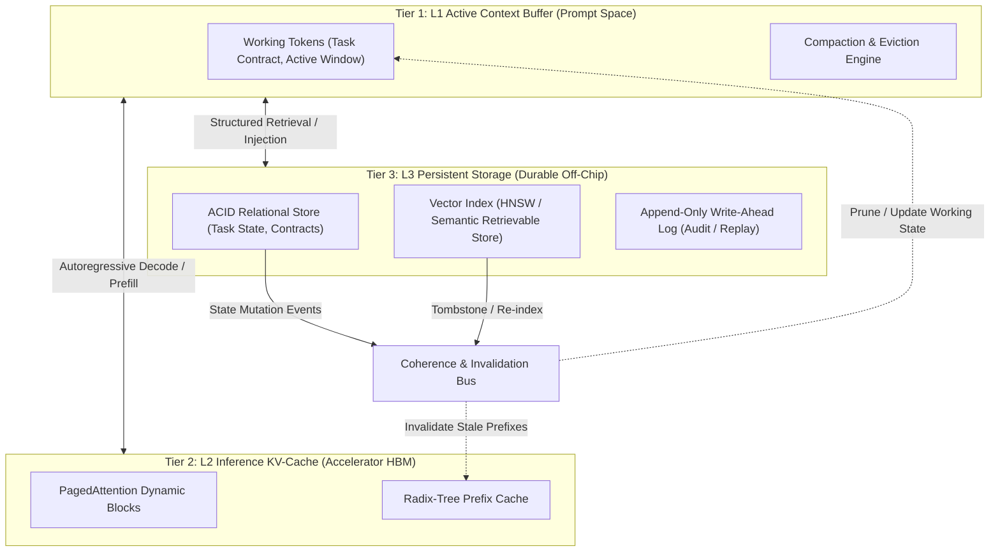
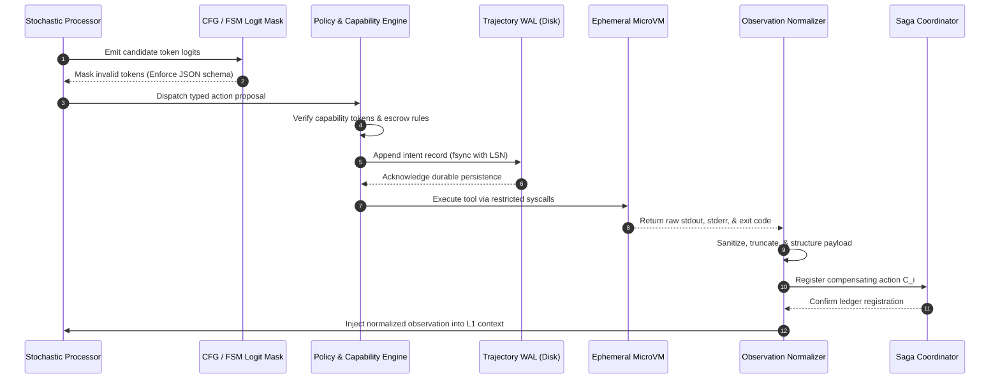
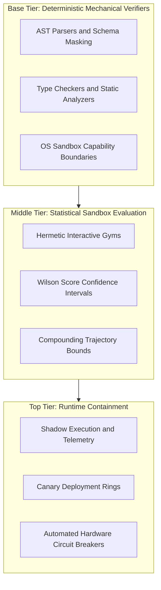
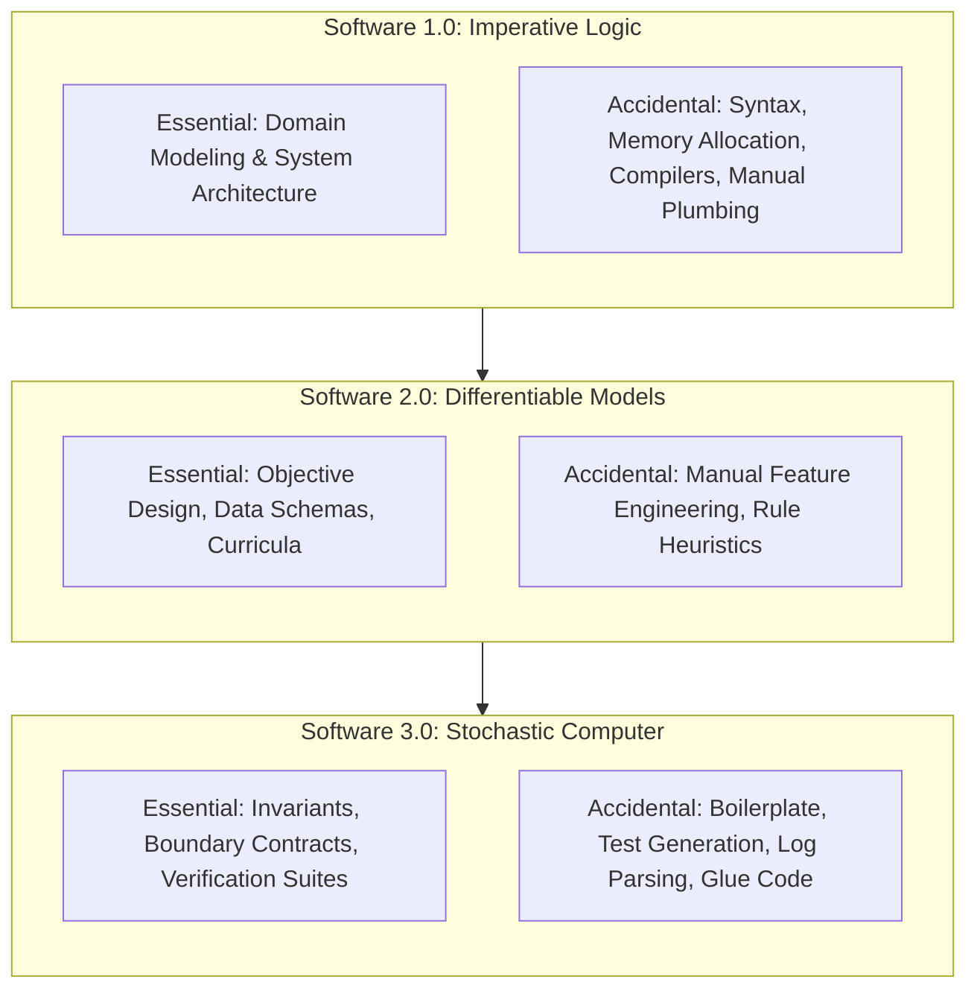
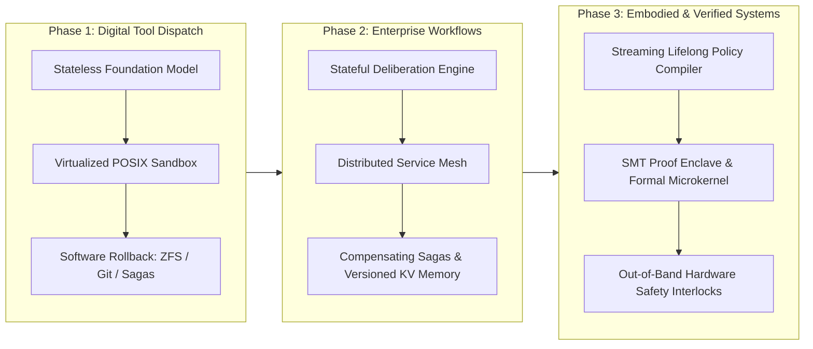

# System Synthesis: Designing the Stochastic Computer {#sec-vol3-conclusion}

::: {layout-narrow}
::: {.column-margin}

\chapterminitoc

:::

::: {.content-visible when-format="pdf"}
\noindent
{fig-alt="Blueprint for System Synthesis: Designing the Stochastic Computer."}
:::

::: {.content-visible unless-format="pdf"}
{fig-alt="Blueprint for System Synthesis: Designing the Stochastic Computer."}
:::

:::

## Purpose {.unnumbered .unlisted}

\begin{marginfigure}
\mlagentstack{30}{30}{30}{30}{30}{30}
\end{marginfigure}

_*How do all these subsystems synthesize into an accountable machine, and where is the permanent boundary between systems engineering and learned models?*_

Having examined each subsystem in isolation—the stochastic processor, deliberation engines, context working memory, physical KV paging, persistent storage, tool peripherals, virtualization sandboxes, the operating system control plane, checkpointing engines, fault-tolerant Sagas, data flywheels, policy compilers, multi-agent fleet protocols, observability pipelines, and economic schedulers—the architecture can now be synthesized whole: bringing together every contract, invariant, and trade-off into a complete, cohesive, and production-grade Stochastic Computer. We trace an end-to-end reference architecture through a mission-critical enterprise scenario, observing how every subsystem cooperates to advance delegated intent into an accepted, verified deliverable. Finally, we look toward the frontier: examining open research challenges including self-modifying autonomous kernels, neurosymbolic hardware architectures, formal verification of learned policies, and the evolving societal implications of autonomous systems. We close where modern computing began—with Maurice Wilkes reflecting on the burden of debugging—reminding systems architects that our enduring mission is not to eliminate uncertainty, but to construct accountable, transparent, and resilient machines that tame it.

::: {.callout-learning-objectives}

- Synthesize the four fundamental subsystems (Processor, Memory/Storage, I/O Peripherals, Runtime Governance) into a unified, end-to-end production reference architecture.
- Trace a complete enterprise incident resolution trajectory through the synthesized architecture, verifying state transitions across every subsystem boundary.
- Formulate the Invariant Matrix: mapping every core architectural guarantee (security, durability, consistency, budget limits) to its enforcing subsystem mechanism.
- Analyze the permanent boundary between deterministic systems engineering and learned stochastic computation, articulating why systems invariants must never be delegated to neural self-reporting.
- Evaluate emerging architectural frontiers, including hardware-accelerated KV memory hierarchies, dedicated neurosymbolic execution units, and autonomous self-tuning kernels.
- Articulate the ethical, safety, and governance responsibilities inherent in deploying autonomous agentic systems into mission-critical human infrastructure.

:::

<!-- SECTION_START: 18.1 (#sec-vol3-conclusion-capstone) -->
## The Capstone Reference Architecture {#sec-vol3-conclusion-capstone}

<!-- OUTLINE_SPEC:

- **Heading & Anchor:** `## The Capstone Reference Architecture {#sec-vol3-conclusion-capstone}`
- **The Single Key Point:** The Stochastic Computer is an integrated software-level functional architecture where the Stochastic Processor, Memory Hierarchy, Sandboxed Peripherals, Operating System Control Plane, Policy Compiler, and Distributed Coordination mesh into a unified computing machine.
- **Concrete Systems Hook:**
  - An enterprise attempts to build an autonomous software engineer by stitching together disparate open-source libraries: LangChain for prompt formatting, Docker for sandboxes, Celery for task queues, and Datadog for logging. The system collapses in production because it lacks a unified architectural contract governing state ownership, capability attenuation, and durable event sourcing across subsystems.
- **Points to explain (paragraph-by-paragraph):**
  - *The Complete Functional Architecture:*
    1. *The Stochastic Processor (Chapters 2–3):* Probabilistic proposal engine with grammar-constrained decoding and test-time deliberation.
    2. *The Memory Hierarchy (Chapters 4–6):* L1 active context buffer, L2 KV-cache paging, and L3 persistent relational/vector stores.
    3. *Sandboxed Peripherals (Chapters 7–8):* Typed tool contracts, $W \oplus X$ instruction-data isolation, and capability firewalls.
    4. *The Operating System Control Plane (Chapters 9–11):* Trajectory lifecycle state machines, WAL event sourcing, compensable Sagas, and semantic watchdogs.
    5. *The Policy Compiler (Chapters 12–14):* Trajectory data curation, action-targeted loss masking, and RLVR optimization.
    6. *Distributed Fleets and Operations (Chapters 15–17):* Multi-agent task DAGs, OpenTelemetry observability, and critical-path Amdahl economics.
  - *Closing the Bookend to Chapter 1:* Returning to the von Neumann and Wilkes stored-program computing paradigm, showing how the Stochastic Computer operates *above* the host OS to tame non-deterministic execution.
- **Visuals & Tables:**
  - Comprehensive Architecture Diagram: The Complete Capstone Reference Architecture of the Stochastic Computer (Illustrating all 6 integrated subsystems, data flows, and isolation boundaries).
- **Seminal Literature:**
  - John von Neumann (1945, *First Draft of a Report on the EDVAC*).
  - Maurice V. Wilkes, David J. Wheeler, & Stanley Gill (1951, *The Preparation of Programs for an Electronic Digital Computer*).
- **Causal Bridge to 18.2:** When designing a real-world implementation of this architecture, how do we formalize the task specification and operational envelope?
-->

Building an enterprise-grade autonomous software engineer by stitching together disparate open-source libraries—employing a framework such as LangChain for prompt formatting, unprivileged Docker containers for code execution, Celery for asynchronous task dispatch, and Datadog for telemetry logging—inevitably collapses under production workloads. The point of failure is rarely the statistical capacity of the underlying neural network. Instead, the collapse stems from the absence of a unified architectural contract. When subsystems operate without shared invariants governing state ownership, capability attenuation, durable event sourcing, and transactional memory consistency, operational faults compound catastrophically. An uncheckpointed tool call mutates an external database during a transient network partition; an uncoordinated queue retry triggers duplicate side effects; unattenuated ambient credentials leak across execution boundaries; and prompt-injection payloads carried in retrieved web data hijack control flow by rewriting the instruction stream. Reliability cannot be retrofitted onto an uncoordinated collection of client libraries. It requires an integrated functional architecture.

The Stochastic Computer resolves these failure modes by defining an explicit boundary between probabilistic proposal and deterministic verification. Operating directly above the host operating system, the Stochastic Computer integrates six functional subsystems into a cohesive execution environment (@fig-capstone-reference-architecture).

### Subsystem Decomposition and Architectural Contracts

Each subsystem in the reference architecture enforces specific systems invariants that isolate, verify, and persist the operations of the probabilistic core:

1. **The Stochastic Processor (Chapters 2–3):** At the core of the execution pipeline lies the autoregressive transformer, operating as a probabilistic instruction and action proposal engine. Rather than allowing unconstrained sampling, the processor couples neural generation with deterministic grammar-constrained decoding. Logit masks derived from Context-Free Grammars (CFGs) or Pushdown Automata (PDAs) enforce strict syntactic validity over output tokens before they materialize in host memory. During test-time deliberation, the processor executes Monte Carlo tree search or beam rollout algorithms, evaluating candidate trajectories against explicit verification functions prior to dispatching external side effects.
2. **The Memory Hierarchy (Chapters 4–6):** Memory management is organized across three discrete physical tiers that balance latency, throughput, and volatility:
   - *L1 Active Context Buffer:* The fixed-size token sequence resident in GPU High-Bandwidth Memory (HBM) during forward passes, bounded by the physical attention window.
   - *L2 Paged Key-Value Cache:* Virtual memory paging that allocates non-contiguous physical DRAM and HBM blocks to prevent external fragmentation during multi-turn generation. For a sequence length $L$, $n_{\text{layers}}$ transformer layers, and head dimension $d_{\text{head}}$, the memory consumption per token sequence follows:
     $$M_{\text{KV}} = 2 \times L \times n_{\text{layers}} \times d_{\text{head}} \times b_{\text{elem}} \quad [\text{bytes}]$$
     where $b_{\text{elem}}$ denotes the precision byte width (for example, 2 bytes for FP16 or BF16).
   - *L3 Persistent State Store:* Durable relational, vector, and document stores providing long-term recall. Access to L3 storage occurs through explicit paging, cache eviction policies, and semantic retrieval interfaces subject to access-control filtering.
3. **Sandboxed Peripherals and Capability Firewalls (Chapters 7–8):** Peripherals provide the interface between internal tensor operations and external physical systems. To prevent malicious or malformed tool invocations, the peripheral subsystem enforces strict $W \oplus X$ (Write XOR Execute) isolation: untrusted data retrieved from external environments is tagged with data tainting and can never be interpreted as control instructions. All tool invocations execute against strongly typed schema contracts inside isolated microVMs or hardened containers with dropped kernel capabilities, read-only root filesystems, and strict egress networking firewalls.
4. **The Operating System Control Plane (Chapters 9–11):** The control plane governs the trajectory lifecycle through a deterministic state machine. It maintains an append-only Write-Ahead Log (WAL) recording every token logit distribution, internal deliberation trace, external peripheral invocation, and environment observation. Multi-step workflows with external side effects execute as compensable Sagas; if an intermediate step fails validation, the control plane invokes registered compensating transactions to restore external consistency. Out-of-band semantic watchdogs continuously monitor execution invariants, aborting trajectories that violate token, monetary, or wall-clock latency budgets:
   $$T_{\text{task}} = T_{\text{model}} + T_{\text{tool}} + T_{\text{wait}} + T_{\text{runtime}} \le T_{\text{budget}}$$
5. **The Policy Compiler (Chapters 12–14):** System efficiency improves over time through an automated policy optimization loop. The compiler ingests execution traces from the Write-Ahead Log, applies action-targeted loss masking to isolate high-value decision tokens, and generates optimized model checkpoints via Reinforcement Learning with Verifiable Rewards (RLVR) and direct preference tuning. This process compiles expensive, multi-step test-time deliberation into fast, single-turn parametric execution.
6. **Distributed Fleets and Operational Economics (Chapters 15–17):** Complex goals decompose into Directed Acyclic Graphs (DAGs) executed by heterogeneous agent fleets. The scheduler dynamically routes subtasks to model classes based on task complexity, optimizing critical-path latency in accordance with Amdahl's Law. Observability pipelines ingest distributed OpenTelemetry traces, evaluating performance via Trajectory Goodput ($G$):
   $$G = \frac{\sum_{i=1}^M T_{\text{success}, i}}{\sum_{j=1}^K T_{\text{total}, j}}$$
   ensuring that operational spend yields verified, non-regressive deliverables.

::: {#fig-capstone-reference-architecture}
```{mermaid}
flowchart TD
    subgraph CP["OPERATING SYSTEM CONTROL PLANE (Ch 9–11)"]
        direction TB
        WAL["Append-Only Write-Ahead Log (WAL)"]
        SM["Lifecycle State Machine & Sagas"]
        WD["Semantic Watchdogs & Budget Enforcers"]
        SM <--> WAL
        WD --> SM
    end

    subgraph SP["STOCHASTIC PROCESSOR (Ch 2–3)"]
        direction TB
        DE["Deliberation Engine (MCTS / Search)"]
        CD["Grammar-Constrained Decoding (CFG)"]
        LLM["Probabilistic Proposal Engine (Transformer)"]
        DE --> LLM --> CD
    end

    subgraph MH["MEMORY HIERARCHY (Ch 4–6)"]
        direction TB
        L1["L1: Active Context Buffer (HBM)"]
        L2["L2: Paged KV-Cache (Virtual Blocks)"]
        L3["L3: Persistent Store (Vector / Relational)"]
        L1 <--> L2 <--> L3
    end

    subgraph PER["SANDBOXED PERIPHERALS (Ch 7–8)"]
        direction TB
        FW["Capability Firewall & W ⊕ X Filter"]
        SAND["Isolated MicroVM Execution Boundary"]
        TOOLS["Typed Schema Contracts (Tools / RPC)"]
        FW --> SAND --> TOOLS
    end

    subgraph POL["POLICY COMPILER (Ch 12–14)"]
        direction TB
        FLY["Data Flywheel Curation"]
        RLVR["RLVR & Direct Preference Tuning"]
        FLY --> RLVR
    end

    subgraph DIST["DISTRIBUTED FLEETS & OPS (Ch 15–17)"]
        direction TB
        SCHED["DAG Task Scheduler & Router"]
        OTEL["Distributed Tracing & Goodput Monitor"]
        SCHED --> OTEL
    end

    DIST --> CP
    CP <--> SP
    SP <--> MH
    CP <--> PER
    WAL -. Execution Traces .-> POL
    POL -. Optimized Weights .-> SP
```
The Capstone Reference Architecture of the Stochastic Computer, illustrating the six integrated functional subsystems, isolation boundaries, and control flows.
:::

### The Stored-Program Paradigm Revisited

This integrated architecture mirrors the fundamental transition in classical computing marked by John von Neumann's 1945 *First Draft of a Report on the EDVAC* and the practical systems work of Maurice V. Wilkes, David J. Wheeler, and Stanley Gill (1951) on the EDSAC. Von Neumann unified data and instructions within a single address space, establishing a universal computing machine. Yet, as Wilkes, Wheeler, and Gill recognized, hardware alone could not guarantee operational utility; making computers usable required inventing subroutines, relocatable loaders, and structured libraries—the foundational software abstractions that converted raw electronic switching into disciplined program execution.

The Stochastic Computer represents the contemporary evolution of this paradigm, operating *above* the host operating system to tame a fundamentally probabilistic processing element. When an agent executes an $N$-step trajectory where each discrete step exhibits an empirical success probability $p_i$, unconstrained composition causes overall reliability to collapse:
$$P_{\text{success}} \le \prod_{i=1}^N p_i$$
If an agent executes a 20-step trajectory with an unmonitored per-step success rate of $p_i = 0.95$, the unconditioned completion probability falls to $0.95^{20} \approx 0.358$. Systems engineering does not attempt to eliminate the stochastic nature of neural sampling through wishful prompting. Instead, it encases the stochastic core within deterministic state machines, capability-constrained sandboxes, and verified compensation sagas. The Stochastic Computer does not replace the classical principles of computer systems design; it extends them to an execution regime where instructions are proposed by probability distributions and validated by deterministic machines.

When translating this abstract functional architecture into an actual production implementation, systems engineers cannot rely on informal specifications. How do we formalize the task specification and operational envelope to guarantee that an autonomous agent executes strictly within its verified performance, safety, and economic bounds?

<!-- SECTION_END: 18.1 -->

<!-- SECTION_START: 18.2 (#sec-vol3-conclusion-envelope) -->
## Workload Contract Specification {#sec-vol3-conclusion-envelope}

<!-- OUTLINE_SPEC:

- **Heading & Anchor:** `## Workload Contract Specification {#sec-vol3-conclusion-envelope}`
- **The Single Key Point:** Designing an agent system begins by formalizing the 5-part task contract (Goal, Environment, Permitted Actions, Available Observations, Completion Criteria) and answering the 4 Engineering Questions (Duration, State, Authority, Evidence).
- **Concrete Systems Hook:**
  - A financial institution deploys an autonomous loan processing agent. The deployment triggers a regulatory audit and severe financial losses because the task contract omitted explicit completion criteria and authority escrows for loans exceeding $50,000, allowing the agent to approve high-risk credits without human counter-signatures.
- **Points to explain (paragraph-by-paragraph):**
  - *Revisiting the 4 Engineering Questions under Production Scale:*
    1. *Duration:* Does the task span milliseconds, minutes, or days? What is the wall-clock timeout and critical path?
    2. *State:* What data lives in ephemeral context vs. durable persistent storage? How are cache invalidations handled?
    3. *Permitted Authority:* What mutating tools may the agent invoke? Where are cryptographic human escrows required?
    4. *Completion Evidence:* What verifiable artifacts (test logs, signed diffs, database constraints) certify acceptable completion?
  - *The 5-Part Task Contract Specification:* Drafting the formal machine-readable specification that governs the trajectory from creation to termination.
  - *Establishing the Operating Envelope:* Defining boundary conditions where the system is guaranteed to operate safely vs. regimes where it must refuse execution or abstain.
- **Visuals & Tables:**
  - Table: The Production Operating Envelope Matrix (Workload family, duration bounds, state tiers, authority bounds, and verification criteria).
- **Causal Bridge to 18.3:** Once the operating envelope is established, how do we synthesize the information and memory subsystems to support it?
-->

Autonomous agent execution cannot safely proceed against an unconstrained prompt or an ambiguous operational scope. In classical systems design, a process operates within a well-defined contract established by the operating system kernel: a virtual address space, file descriptor tables, execution privilege rings, and deterministic system call signatures. In contrast, the fundamental vulnerability of stochastic execution is contract under-specification. When an autonomous agent is deployed without rigorous constraints on its execution bounds, duration, persistent state access, mutation authorities, and completion criteria, the compounding probability of subtask failure guarantees eventual system deviation.

Consider the failure mode of an automated credit-underwriting agent deployed within a financial institution. The agent was tasked with evaluating retail credit applications, assessing risk profiles against internal policy manuals, and issuing loan determinations. Because the system was specified via natural language instructions rather than a machine-enforceable contract, it lacked two systems invariants: an explicit authority ceiling requiring cryptographic human counter-signatures for credit facilities exceeding $50,000, and a deterministic completion oracle capable of verifying applicant data against external credit-bureau records. When exposed to an out-of-distribution batch of applications containing unusual collateral structures, the stochastic processor generated plausible justifications for high-risk credit facilities and issued binding loan approvals totaling over $12,000,000 before out-of-band accounting alerts intervened. The underlying defect was not a failure of neural reasoning; it was an architecture-level failure to bind the stochastic core within a verifiable workload contract.

### The Four Engineering Questions

Before allocating compute resources or granting tool capabilities to an autonomous agent, systems architects must resolve four physical engineering dimensions:

1. **Duration:** What is the allowable wall-clock latency ceiling $T_{\text{budget}}$, and how does it decompose across system components? Total task latency is governed by:
   $$T_{\text{task}} = T_{\text{model}} + T_{\text{tool}} + T_{\text{wait}} + T_{\text{runtime}} \le T_{\text{budget}}$$
   Short-horizon interactive workloads require tight bounds ($T_{\text{budget}} \le 5\,\text{s}$) where deliberation depth is strictly truncated. Conversely, long-horizon asynchronous workflows span hours or days ($T_{\text{budget}} \ge 10^4\,\text{s}$), demanding heartbeat monitors, preemptible scheduling, and state checkpointing to survive host reboots or infrastructure evictions.
2. **State:** How is state partitioned between ephemeral working memory and durable storage? Active context buffers (L1) and paged KV caches (L2) reside in volatile high-bandwidth memory (HBM) and must be actively managed to prevent context window saturation. Durable state (L3)—including the append-only Write-Ahead Log (WAL), entity relationship graphs, and external artifact stores—must be held in transactional databases. Systems must define explicit cache invalidation mechanisms: when external tools execute mutating actions, stale representations cached within the model's context window must be refreshed or explicitly invalidated.
3. **Permitted Authority:** What mutating operations may the agent execute autonomously, and where must cryptographic escrows intervene? Tools must be partitioned into read-only, idempotent queries and side-effecting mutations. Operations exceeding predefined risk, financial, or infrastructural thresholds require an out-of-band authorization token signed by an authenticated human operator. The agent cannot forge or bypass this escrow; the control plane blocks execution until the cryptographic signature is validated.
4. **Completion Evidence:** What deterministic, non-stochastic artifact certifies that the objective has been met? The system cannot accept natural language assertions of completion from the stochastic processor (e.g., "The task is complete"). Termination requires verifiable evidence: a test suite returning exit code zero, an immutable schema validation check, a signed transaction receipt, or a structural diff passing static analysis.

### The Five-Part Task Contract Specification

To operationalize these bounds, every autonomous trajectory must be governed by a structured, machine-readable task contract. This contract establishes the operational sandbox within which the stochastic processor is permitted to propose actions:

* **Goal ($G$):** A strictly typed declaration of the objective, specified as input parameters and desired output schemas rather than unparsed conversational text.
* **Environment ($E$):** The operational boundary defining compute limits, memory quotas, virtual network namespaces, mounted filesystem paths, and environment variable scrubbers.
* **Permitted Actions ($A$):** The closed set of tool definitions exposed to the model via grammar-constrained decoding schemas, complete with input validation types, execution timeouts, and rate limits.
* **Available Observations ($O$):** The sensory interface through which peripheral outputs return to the agent, including truncation thresholds, structural parsers, and secret-redaction filters that prevent credential leakage into the context buffer.
* **Completion Criteria ($C$):** The deterministic verification oracles that evaluate candidate deliverables. The control plane refuses to transition a trajectory to the committed state until the verification oracle evaluates to `true`.

### The Production Operating Envelope

The task contract defines the system's *operating envelope*—the verified regime of operational parameters within which the agent guarantees execution safety and nonzero Trajectory Goodput. @tbl-workload-envelope-matrix formalizes this envelope across standard production workload classes.

::: {#tbl-workload-envelope-matrix}
| Workload Family           | Duration Bound ($T_{\text{budget}}$) | State Locality Tiers                                       | Permitted Authority                                                        | Completion Verification Oracle                                               |
|:--------------------------|:-------------------------------------|:-----------------------------------------------------------|:---------------------------------------------------------------------------|:-----------------------------------------------------------------------------|
| **Interactive Query**     | $\le 3\,\text{s}$                    | Ephemeral L1/L2 context; no persistent write state         | Read-only idempotent lookups; no mutation privileges                       | Response matches strict context-free grammar schema                          |
| **Code Refactoring**      | $\le 900\,\text{s}$                  | L1 context + local workspace checkout; transient git cache | Sandbox filesystem writes; local git branch operations                     | Deterministic test suite exit code 0; zero linter errors; valid AST parse    |
| **Transactional Finance** | $\le 60\,\text{s}$                   | L1 context + L3 ACID Write-Ahead Log (WAL)                 | Read-only ledger queries; disbursements require multi-sig escrow           | Cryptographic signature validation; dual-entry accounting invariant balance  |
| **Fleet Infrastructure**  | $\le 86,400\,\text{s}$               | Checkpointed L3 Saga log; distributed key-value store      | Staging cluster mutations; canary deployments; no direct production writes | Health check telemetry within error budget; automated canary analysis passes |

The Production Operating Envelope Matrix across four representative workload classes, defining physical latency bounds, state tiering, authority boundaries, and deterministic verification oracles.
:::

When input parameters or environmental conditions breach these boundaries—such as when input complexity exhausts physical KV page capacity, or tool failures trigger cascading compensation transactions—the system must not attempt unguided recovery through random sampling. Instead, the runtime invokes an explicit abstention policy: it suspends the trajectory, commits an error trace to the Write-Ahead Log, rolls back partial side effects, and raises an alert to human operators.

Once the operating envelope and workload contract are formalized, the architecture requires an underlying memory and context substrate capable of maintaining state consistency across long-horizon executions. How the memory hierarchy—from ephemeral high-bandwidth KV pages to durable transactional stores—is synthesized to fulfill these contractual invariants is examined next.

<!-- SECTION_END: 18.2 -->

<!-- SECTION_START: 18.3 (#sec-vol3-conclusion-memory) -->
## Memory Hierarchy Synthesis {#sec-vol3-conclusion-memory}

<!-- OUTLINE_SPEC:

- **Heading & Anchor:** `## Memory Hierarchy Synthesis {#sec-vol3-conclusion-memory}`
- **The Single Key Point:** Synthesizing the 3-tier memory hierarchy (L1 Context Buffer, L2 KV-Cache, L3 Persistent Vector/Relational Stores) matches data lifetimes and invalidation rules to the workload's operational cadence.
- **Concrete Systems Hook:**
  - An autonomous medical diagnostic assistant operating over 50,000 clinical records suffers from silent state corruption: an ad-hoc RAG retrieval script pulls a 2018 treatment protocol into L1 context, overriding a 2024 contraindication warning stored in the persistent L3 database, leading to a dangerous prescription proposal.
- **Points to explain (paragraph-by-paragraph):**
  - *Memory Tier Alignment:*
    - *L1 Active Context Buffer:* Working memory. Governed by eviction policies, structured compaction, and semantic chunking. Strict token budget limits.
    - *L2 Inference KV-Cache:* Ephemeral accelerator memory. Managed via PagedAttention and Radix-tree caching for multi-turn prefix reuse.
    - *L3 Persistent Storage:* Durable memory. ACID relational tables for task status, vector indices for semantic search, and append-only event logs for execution replay.
  - *Cache Invalidation & Consistency:* Establishing explicit cache coherence: when an agent mutates an environment file via a tool, the corresponding L1 context and L3 retrieval index must be invalidated or updated atomically.
  - *Provenance and Attribution Tracking:* Ensuring every token injected into context carries cryptographic metadata linking back to its original source document or tool execution.
- **Visuals & Tables:**
  - Architecture Diagram: The Synthesized Memory Hierarchy (L1 working buffer $\leftrightarrow$ L2 paged KV-cache $\leftrightarrow$ L3 persistent stores with coherence invalidation bus).
- **Causal Bridge to 18.4:** How do we assemble tools, sandboxes, and execution runtimes into a resilient execution harness?
-->

In an agentic computer, state management fails when the boundaries between memory tiers are blurred. Consider an autonomous clinical diagnostic system operating over 50,000 patient records. If an uncoordinated retrieval step injects a clinical summary from 2018 into the model's active context, it can shadow a 2024 contraindication update stored in the durable system of record. Because the stochastic processor computes attention solely over the tokens physically materialized in its sequence window, the stale context dominates generation, synthesizing an invalid and dangerous therapeutic recommendation. In classical processor design, memory hierarchies maintain cache coherence across L1, L2, and main storage through snooping or directory-based hardware protocols. In a stochastic computer, where tiers span volatile high-bandwidth memory (HBM), prefix caches, vector indices, and relational databases, coherence cannot rely on hardware silicon; it must be enforced by an explicit software-defined memory hierarchy.

### Memory Tier Characteristics and Physical Bounds

The memory architecture of the stochastic computer partitions state across three distinct physical tiers according to latency, capacity, and volatility:

* **Level 1 (L1) Active Context Buffer:** Ephemeral working memory. Resides within the tokenized sequence window passed directly into the model's forward pass. It is bounded by the context window capacity $N_{\text{ctx}}$ and governed by strict token budgets. Because self-attention over dense contexts incurs computational and memory overheads that scale quadratically with sequence length (or linearly with modern sparse/recurrent kernels), the L1 buffer cannot serve as general storage. It must be managed using deterministic eviction policies, sliding-window attention masks, structured message compaction, and semantic chunking.
* **Level 2 (L2) Inference Key-Value (KV) Cache:** Ephemeral accelerator memory. Resides in physical High-Bandwidth Memory (HBM) on the accelerator (GPU or TPU), holding the pre-computed key and value projection tensors for all previously decoded tokens. The physical memory footprint for an autoregressive model with $n_{\text{layers}}$ layers, $n_{\text{heads}}$ key-value heads, head dimension $d_{\text{head}}$, and precision $b_{\text{bytes}}$ per element over an active sequence of $N$ tokens is:
$$M_{\text{KV}} = 2 \times n_{\text{layers}} \times n_{\text{heads}} \times d_{\text{head}} \times N \times b_{\text{bytes}}$$
At 16-bit precision ($b_{\text{bytes}} = 2$), a 70-billion-parameter model decoding an 8,192-token sequence requires gigabytes of volatile HBM solely for its KV tensors. The L2 tier is orchestrated using PagedAttention to eliminate external fragmentation and Radix-tree caching to enable zero-copy prefix sharing across iterative reasoning loops and branching tool evaluations.
* **Level 3 (L3) Persistent Storage Substrate:** Durable off-accelerator memory. Retains permanent state across process lifecycles and physical host reboots. This tier combines three complementary storage engines: (1) ACID-compliant relational databases that track task contract states, execution locks, and cryptographic escrows; (2) Approximate Nearest Neighbor (ANN) vector indices (such as Hierarchical Navigable Small World graphs) providing semantic retrieval over vast unstructured corpora; and (3) append-only Write-Ahead Logs (WAL) recording the deterministic trajectory trace of every prompt, tool call, and observation for verification and replay.

::: {#fig-synthesized-memory-hierarchy}


The synthesized three-tier memory hierarchy of the Stochastic Computer. The Coherence and Invalidation Bus propagates mutation events from persistent storage to prune active context tokens in L1 and evict invalidated prefix subtrees in the L2 Radix cache.
:::

### Cross-Tier Cache Coherence and Invalidation

A primary source of non-determinism and operational failure in autonomous agents is silent cache divergence between L1 working state and L3 durable storage (@fig-synthesized-memory-hierarchy). When an agent invokes a tool peripheral that modifies the external environment—such as committing a patch to a source file, updating a database row, or reallocating an infrastructure route—the representations cached in the L1 context window and the L2 Radix prefix cache become instantaneously stale.

To prevent the stochastic processor from hallucinating against outdated context, the runtime implements an explicit write-invalidation protocol through a Coherence and Invalidation Bus. When a mutating tool transaction commits to the L3 store, the bus broadcasts an invalidation event across all tiers:

1. **L2 Radix Invalidation:** Any cached KV-prefix node containing the pre-mutation token sequence is marked dirty and severed from the Radix tree, preventing subsequent inference requests from reusing invalidated key-value states.
2. **L1 Active Context Refresh:** The active trajectory runner either injects an atomic update record (such as a unified diff or state update notification) into the context stream or triggers a structured compaction step that replaces the stale text span with the newly verified value.
3. **L3 Index Synchronization:** Inverted indices and vector stores apply immediate write-through tombstones to stale embeddings, scheduling background asynchronous re-indexing while blocking retrieval pipelines from serving deprecated records.

### Provenance Tracking and Attribution Lineage

Because the stochastic processor cannot distinguish between verified authoritative facts, external tool outputs, and malicious untrusted inputs once tokens are flattened into L1, every segment within the active context must carry strict provenance metadata. The memory manager wraps retrieved chunks and tool returns in an envelope containing a cryptographic content hash (such as SHA-256), a monotonically increasing epoch timestamp, and an authorization tag.

During prefill, the runtime maintains a token attribution map that binds contiguous token ranges $[t_i, t_j]$ directly to their origin entries in the L3 Write-Ahead Log. If a generated action or proposed diagnosis cites an ungrounded or superseded claim, the verification oracle queries the attribution map. If the supporting tokens trace to an unverified external source or an invalidated L3 document, the runtime rejects the action prior to dispatch.

Establishing a coherent, attributable memory hierarchy guarantees that the stochastic processor reasons over current and verifiable state. However, memory alone cannot alter the external environment. To translate validated context into safe, observable effects, the stochastic computer requires an isolated execution environment coupled with deterministic peripheral interfaces. How tools, sandboxes, and verification monitors synthesize into a resilient runtime harness is addressed next.

<!-- SECTION_END: 18.3 -->

<!-- SECTION_START: 18.4 (#sec-vol3-conclusion-execution) -->
## Execution Harness Synthesis {#sec-vol3-conclusion-execution}

<!-- OUTLINE_SPEC:

- **Heading & Anchor:** `## Execution Harness Synthesis {#sec-vol3-conclusion-execution}`
- **The Single Key Point:** Safe execution connects typed action schemas, unbypassable virtualization boundaries, Write-Ahead Logging, and compensable Sagas into an atomic trajectory harness.
- **Concrete Systems Hook:**
  - An autonomous DevOps agent deploying an enterprise Kubernetes cluster encounters a transient network partition on step 4 of a 6-step rollout. Because the execution harness lacked a Write-Ahead Log and compensating Saga actions, the cluster was left in an unrecoverable split-brain state that required 14 hours of manual teardown.
- **Points to explain (paragraph-by-paragraph):**
  - *The Synthesized Execution Pipeline:*
    1. *Model Proposal:* Generation constrained by CFG/FSM grammar to emit valid JSON schemas.
    2. *Authority Verification:* Policy engine checks capability tokens and escrow triggers before dispatch.
    3. *Durable Logging (WAL):* Intent logged to append-only trajectory storage before side-effects occur.
    4. *Sandboxed Execution:* Tool executed inside an ephemeral MicroVM/container with seccomp/eBPF syscall filtering and strict network namespaces.
    5. *Observation Normalization:* Tool outputs truncated, sanitized, and typed before ingestion into context.
    6. *Compensating Sagas:* Every mutating step registers an explicit compensating action or semantic amendment in the Saga ledger.
  - *The Semantic Watchdog Harness:* Monitoring trajectory progress, detecting non-advancing reasoning loops, and enforcing circuit breakers against runaway retries.
- **Visuals & Tables:**
  - Sequence Flowchart: The Complete Trajectory Execution Pipeline (From model proposal to authority check, WAL append, sandbox execution, and Saga registration).
- **Seminal Literature:**
  - Hector Garcia-Molina & Kenneth Salem (1987, *Sagas*).
  - Jim Gray (1981, *The Transaction Concept: Virtues and Limitations*).
- **Causal Bridge to 18.5:** When this synthesized system encounters capability limits, how do engineers systematically decide which layer to adapt?
-->

The operational boundary between the stochastic processor and external environments requires an execution harness that enforces determinism, atomicity, and fault containment over unverified model generations. When an agent interacts with external infrastructure without transactional boundaries, partial failures cause state corruption. Consider an autonomous operations agent executing a six-step infrastructure rollout across a Kubernetes cluster: (1) allocate persistent storage volumes, (2) provision secret manifests, (3) register custom resource definitions, (4) configure ingress routing rules, (5) launch deployment pods, and (6) drain legacy traffic. If a transient network partition severs communication during step 4, a runtime lacking transactional coordination either aborts silently or blindly retries without recording prior side-effects. The cluster is stranded in an inconsistent, split-brain state where storage and secrets are provisioned, routing is partially updated, and traffic is dropped. Remediating such divergent state requires hours of destructive manual intervention. A resilient execution harness eliminates this vulnerability by treating tool invocations not as ad-hoc remote procedure calls, but as atomic, logged, and compensable state transitions.

### The Synthesized Execution Pipeline

To guarantee system integrity across untrusted and stochastic outputs, the execution harness synthesizes six pipelined stages (@fig-trajectory-execution-pipeline):

1. **Model Proposal and Grammar-Constrained Decoding:** Rather than allowing the stochastic processor to emit arbitrary free-form strings, autoregressive generation is constrained at the token level using Context-Free Grammars (CFG) or pushdown automata compiled into inference logit masks. This ensures that every generated action conforms strictly to valid, statically typed JSON or protocol buffer schemas, eliminating syntax parsing errors before the payload reaches the runtime.
2. **Authority Verification and Capability Checking:** Following the principle of least privilege, the action proposal is routed to an independent policy engine. The engine verifies cryptographically signed capability tokens, enforces per-tenant rate limits, and triggers human-in-the-loop escrows for high-blast-radius actions (such as data deletion or credential revocation) before execution permits are issued [@gray1981transaction].
3. **Durable Intent Logging (Write-Ahead Log):** Before any side-effecting instruction crosses the network or modifies local disk state, the execution harness appends the intent record to a durable Write-Ahead Log (WAL) and issues a synchronous `fsync`. Storing the intent with a monotonically increasing Log Sequence Number (LSN) ensures that if the host crashes mid-execution, the crash recovery manager can unambiguously determine whether an external operation was initiated, completed, or orphaned.
4. **Sandboxed Isolation:** The authorized payload executes inside an ephemeral virtualization boundary, such as a microVM or an unprivileged container. System calls are restricted using `seccomp` profiles and eBPF filters, while network access is confined to dedicated network namespaces with default-deny firewall policies. This physical containment isolates arbitrary code execution, prevents host privilege escalation, and enforces deterministic CPU, memory, and wall-clock execution quotas.
5. **Observation Sanitization and Normalization:** Raw process outputs (`stdout`, `stderr`, operating system return codes) are not injected directly into working context. The harness truncates payloads exceeding predefined token budgets, sanitizes text against prompt injection patterns and ANSI control sequences, and structures the observation into typed records before presenting it to the L1 context manager.
6. **Compensating Saga Registration:** Because long-running multi-step operations cannot hold distributed database locks without inducing catastrophic cascading stalls, the harness implements the Saga pattern [@garciamolina1987sagas]. For every forward action $A_i$ that mutates external state, the harness registers an explicit compensating action $C_i$ in an append-only Saga ledger. If downstream operations fail irrecoverably, the coordinator executes the compensating sequence in reverse order ($C_{k}, \dots, C_1$) to restore system consistency semantically.

::: {#fig-trajectory-execution-pipeline}


The synthesized execution harness pipeline. Every proposed action undergoes grammar-constrained decoding, capability verification, write-ahead logging, sandboxed execution, output normalization, and Saga compensation registration before the environment state returns to the context buffer.
:::

### Semantic Watchdogs and Circuit Breakers

Even within an isolated sandbox, a stochastic processor can enter non-terminating or repetitive failure loops, consuming resources without making measurable progress toward task completion. The execution harness deploys a semantic watchdog to enforce trajectory progress.

The physical latency of an individual execution step decomposes into distinct operational phases:
$$T_{\text{step}} = T_{\text{infer}} + T_{\text{verify}} + T_{\text{wal}} + T_{\text{sandbox}} + T_{\text{norm}}$$
where $T_{\text{infer}}$ is the autoregressive decode time, $T_{\text{verify}}$ is policy evaluation overhead, $T_{\text{wal}}$ is durable disk write latency, $T_{\text{sandbox}}$ is isolated execution time, and $T_{\text{norm}}$ is observation filtering latency. While $T_{\text{verify}}$, $T_{\text{wal}}$, and $T_{\text{norm}}$ are tightly bounded deterministic operations ($< 10\text{ ms}$), $T_{\text{sandbox}}$ and $T_{\text{infer}}$ can vary by orders of magnitude.

The semantic watchdog continuously computes the Trajectory Goodput ($G$), defined as the ratio of useful task advancement to total expended machine time across all execution trajectories:
$$G = \frac{\sum_{k \in \mathcal{K}_{\text{success}}} T_{\text{task}, k}}{\sum_{j \in \mathcal{K}_{\text{all}}} T_{\text{task}, j}}$$
To maximize goodput and minimize wasted inference cycles, the watchdog tracks environmental state deltas. By computing semantic hash signatures over consecutive observations and context states, the monitor detects cycle repetition (such as identical error codes produced across repeated parameter mutations). When the number of non-advancing steps exceeds a retry budget $N_{\text{retry}}$ or when token consumption exceeds an allocated dollar ceiling, the watchdog trips a circuit breaker. This halts further model dispatch, marks the trajectory as aborted in the WAL, and invokes the Saga coordinator to safely unwind partial mutations.

When a synthesized execution harness halts an agent trajectory or encounters hard failure bounds in production, the underlying cause is rarely uniform across the stack. The challenge shifts from runtime isolation to diagnostic attribution: how do systems engineers systematically determine whether a failure originated in the stochastic model weights, the context construction, the interface schema, or the underlying infrastructure? Section 18.5 addresses this diagnostic imperative by establishing an architectural framework for capability boundaries and targeted system adaptation.

<!-- SECTION_END: 18.4 -->

<!-- SECTION_START: 18.5 (#sec-vol3-conclusion-adaptation) -->
## The Systems Intervention Ladder {#sec-vol3-conclusion-adaptation}

<!-- OUTLINE_SPEC:

- **Heading & Anchor:** `## The Systems Intervention Ladder {#sec-vol3-conclusion-adaptation}`
- **The Single Key Point:** When an agentic system exhibits capability limits, systems engineers must evaluate candidate interventions across an evidence-based ladder (Prompt Context $
ightarrow$ Tool Schemas $
ightarrow$ Runtime Guards $
ightarrow$ Supervised Fine-Tuning $
ightarrow$ RLVR $
ightarrow$ Multi-Agent Delegation) rather than defaulting to retraining or swarm frameworks.
- **Concrete Systems Hook:**
  - An engineering team spends $350,000 and two months fine-tuning an open-source 70B parameter model to improve SQL querying accuracy. A post-project audit reveals that adding an automated SQL syntax linter tool and a 3-line database schema definition into the prompt context achieved 14% higher accuracy than the fine-tuned model at zero training cost.
- **Points to explain (paragraph-by-paragraph):**
  - *The Hierarchy of Systems Interventions:*
    1. *Level 1: Information & Context Engineering:* Supply missing facts, reduce context distraction, refine prompts. (Fastest, cheapest, non-invasive).
    2. *Level 2: Tool Interface & Schema Redesign:* Disaggregate complex tools, clarify parameter types, provide better error messages.
    3. *Level 3: Runtime Harness Hardening:* Add semantic watchdogs, retry policies, circuit breakers, and human escrows.
    4. *Level 4: Supervised Policy Adaptation (SFT):* Compile established procedures, format discipline, and recovery demonstrations into weights.
    5. *Level 5: Reinforcement Learning (RLVR):* Optimize complex multi-step search in domains with mechanically verifiable reward oracles.
    6. *Level 6: Multi-Agent Delegation:* Partition work across specialized agents when task state exceeds single-context boundaries or requires true parallel search.
  - *Economic Break-Even Analysis:* Calculating the financial break-even volume $N^*$ where the upfront cost of model training $C_{\text{train}}$ is amortized by per-task token savings:
    $$N^* = \frac{C_{\text{train}}}{\Delta C_{\text{task}}}$$
- **Visuals & Tables:**
  - Table: The Systems Intervention Trade-off Matrix (Intervention Level, Engineering Effort, Financial Cost, Latency Impact, Risk Profile, Best Applied When).
- **Seminal Literature:**
  - Jerome H. Saltzer, David P. Reed, & David D. Clark (1984, *End-to-End Arguments in System Design*).
- **Causal Bridge to 18.6:** Before deploying any synthesized configuration into production, how do we build an empirical safety case?
-->

When an agent trajectory fails in production, the failure rarely stems from an intrinsic deficit in abstract reasoning. In operational environments, failures most often arise from an interface mismatch: incomplete or distracting working context, ambiguous tool parameters, unhandled peripheral exceptions, or the absence of deterministic execution bounds. When confronted with capability plateaus or high error rates, engineering teams frequently misdiagnose the underlying failure mode, reflexively resorting to expensive weight adaptation or convoluted multi-agent frameworks.

Consider a representative systems failure: an enterprise engineering team expended $350,000 in dedicated GPU compute and two months of infrastructure effort fine-tuning an open-source 70-billion-parameter base model to improve relational database querying accuracy. A post-project systems audit revealed that modifying the execution harness—injecting a three-line database schema definition into the prompt context and equipping the harness with an automated SQL syntax linter tool that fed parser diagnostics back to the model—achieved a 14% higher query execution accuracy than the fine-tuned checkpoint at zero training cost.

To prevent misallocating capital and engineering effort, systems architects must evaluate candidate interventions along a structured, evidence-based hierarchy: the *Systems Intervention Ladder*. Each successive rung ascends in implementation cost, operational latency, and stateful entanglement.

### The Hierarchy of Systems Interventions

**Level 1: Information and Context Engineering.** The fastest and least invasive intervention modifies the dynamic working memory ($L_1$ context buffer). It rectifies information deficits by supplying missing domain facts, pruning irrelevant observations that induce attention dispersion across long context windows, and refining prompts with explicit negative constraints or compact few-shot demonstrations. Because context adjustments require neither model recompilation nor infrastructure deployment, they represent the first and cheapest line of remediation.

**Level 2: Tool Interface and Schema Redesign.** When an agent fails despite possessing adequate contextual information, the interface boundary between the stochastic processor and its peripherals is typically malformed. Complex, multi-stage tools should be disaggregated into atomic, single-responsibility functions. Replacing free-text string parameters with rigid, typed JSON schemas—enforced at the logit level via context-free grammar masks—eliminates serialization and parameter validation errors. Furthermore, structuring tool error outputs to return actionable diagnostics rather than opaque operating system return codes provides the model with the exact state signal required to formulate a corrective action.

**Level 3: Runtime Harness Hardening.** If interfaces are typed and validated but trajectories still degrade, the defect resides in the control plane. Engineers deploy deterministic runtime primitives: semantic watchdogs that compute state-delta hashes over consecutive observations to break cyclic execution, bounded retry policies with exponential backoff for idempotent peripheral operations, and circuit breakers that halt execution when token spend or step counts exceed predetermined budgets. Irreversible physical mutations (such as deleting cloud resources or initiating wire transfers) are gated behind human-in-the-loop escrow queues.

**Level 4: Supervised Policy Adaptation (SFT).** When prompt contexts become saturated—consuming thousands of tokens per step simply to sustain format adherence, internalize domain jargon, or enforce standard operating procedures—systems engineers compile these behaviors directly into model weights. Supervised fine-tuning amortizes context memory consumption into the static parameter matrix $\Theta$. SFT is best applied not to teach new world knowledge, but to establish strict schema compliance, internalize complex serialization syntaxes, and instill robust error-recovery trajectories derived from gold-standard human traces.

**Level 5: Reinforcement Learning with Verifiable Rewards (RLVR).** In domains where optimal intermediate execution trajectories are unknown but final outcomes can be mechanically verified, offline supervised demonstrations prove insufficient. RLVR optimizes policy weights by pairing multi-step trajectory search with external deterministic oracles (such as unit test harnesses, formal theorem provers, or static code analysis suites). The reinforcement algorithm updates policy logits to favor reasoning chains that pass mechanical verification, yielding substantial gains in deterministic task completion for programming, symbolic mathematics, and formal schema migrations.

**Level 6: Multi-Agent Delegation.** The highest rung of the ladder partitions execution state across specialized, independent agents communicating via asynchronous message queues. Multi-agent delegation is structurally justified only when a task exceeds the physical capacity of a single context window, requires distinct cryptographic capability boundaries (preventing privilege escalation across security domains), or benefits from parallel exploration of decoupled search spaces. Introducing multi-agent swarms prematurely compounds non-deterministic execution paths, introduces distributed race conditions, and multiplies per-task token expenditure.

### The End-to-End Principle in Agentic Systems

The discipline enforced by the Systems Intervention Ladder directly embodies the classic *End-to-End Argument in System Design* formulated by Saltzer, Reed, and Clark [@saltzer1984endtoend]. Lower-level subsystems should not attempt to anticipate or compensate for functions that can only be completely and correctly implemented at the application endpoints.

Attempting to eliminate database query errors by baking static relational schemas into model weights violates this fundamental invariant. Database schemas drift continuously under routine application development; static weights inevitably become stale, leading to silent schema hallucinations. Conversely, maintaining schema resolution at the endpoint—via runtime context injection and deterministic grammar validation—guarantees semantic correctness without requiring weight retraining.

### Economic Break-Even Analysis

Deciding whether to ascend from runtime context engineering (Levels 1–3) to weight adaptation (Levels 4–5) requires rigorous amortized cost accounting. Let $C_{\text{train}}$ represent the total non-recurring engineering and compute expense required to curate training datasets, run hyperparameter sweeps, and execute fine-tuning runs. Let $\Delta C_{\text{task}}$ represent the operational marginal cost saved per completed task, primarily realized by eliminating $K_{\text{pruned}}$ prompt tokens previously required for in-context instructions and few-shot exemplars:

$$\Delta C_{\text{task}} = K_{\text{pruned}} \cdot p_{\text{in}} - \Delta C_{\text{host}}$$

where $p_{\text{in}}$ is the financial cost per input token, and $\Delta C_{\text{host}}$ represents the differential hosting cost per inference step (such as maintaining a dedicated self-hosted inference cluster rather than utilizing commodity multi-tenant APIs).

The break-even task volume $N^*$, representing the threshold at which upfront model adaptation costs are fully amortized by runtime inference savings, is defined as:

$$N^* = \frac{C_{\text{train}}}{\Delta C_{\text{task}}}$$

If the projected lifetime volume of an operational task $\mathcal{V}_{\text{prod}}$ satisfies $\mathcal{V}_{\text{prod}} < N^*$, fine-tuning is an economically irrational intervention. The system operates with higher capital efficiency by retaining procedural logic within the dynamic context memory.

::: {#tbl-systems-intervention-matrix}
| Level | Intervention Type             | Engineering Overhead | Capital Cost            | Latency Impact ($\Delta T$)                                 | Operational Risk Profile                    | Recommended Application                             |
|:------|:------------------------------|:---------------------|:------------------------|:------------------------------------------------------------|:--------------------------------------------|:----------------------------------------------------|
| **1** | Context Engineering           | Hours                | Negligible ($\$0$)      | $+50$ to $+500\text{ ms}$ (Prompt prefill)                  | Low (Easily reverted)                       | Missing facts; prompt ambiguity; few-shot guidance  |
| **2** | Tool Interface Redesign       | Days                 | Negligible ($\$0$)      | $\approx 0\text{ ms}$ (Schema mask overhead)                | Low (Deterministic contract)                | Malformed JSON payloads; parameter hallucinations   |
| **3** | Runtime Harness Hardening     | Days                 | Minimal (Infra compute) | $+5$ to $+20\text{ ms}$ (Watchdog checks)                   | Low (Fails safe)                            | Non-terminating execution loops; runaway spend      |
| **4** | Supervised Adaptation (SFT)   | Weeks                | $\$10^3$ to $\$10^5$    | Decreased (Shorter context prefill)                         | Moderate (Dataset bias, distribution drift) | Standard operating procedures; token compression    |
| **5** | Reinforcement Learning (RLVR) | Months               | $\$10^4$ to $\$10^6$    | Increased (Deliberation tokens)                             | High (Reward hacking, over-optimization)    | Code synthesis; formal proofs; verifiable search    |
| **6** | Multi-Agent Delegation        | Weeks to Months      | Minimal (Dev time)      | Multiplied ($N \times T_{\text{infer}} + T_{\text{queue}}$) | Severe (Deadlocks, cascading failures)      | Context limit exhaustion; isolated trust boundaries |

: The Systems Intervention Trade-off Matrix across development effort, financial capital, runtime latency, and failure risk. {#tbl-systems-intervention-matrix}
:::

Selecting the appropriate intervention level from @tbl-systems-intervention-matrix resolves architectural allocation, but it does not guarantee production correctness. Whether a capability boundary is addressed through dynamic schema validation, runtime circuit breakers, or fine-tuned policy weights, systems engineers must empirically validate that the modified system satisfies strict operational constraints under load. Before deploying any synthesized configuration into a live production environment, the engineering organization must construct an empirical safety case—a topic examined in @sec-vol3-conclusion-evals.

<!-- SECTION_END: 18.5 -->

<!-- SECTION_START: 18.6 (#sec-vol3-conclusion-safety) -->
## Empirical Safety Cases {#sec-vol3-conclusion-safety}

<!-- OUTLINE_SPEC:

- **Heading & Anchor:** `## Empirical Safety Cases {#sec-vol3-conclusion-safety}`
- **The Single Key Point:** Releasing an autonomous agent into production requires a defensible multi-tier safety case: combining deterministic mechanical verifiers, statistical evaluation on held-out gyms, and canary telemetry.
- **Concrete Systems Hook:**
  - An autonomous code-generation agent passes 99% of synthetic benchmark tests and is deployed directly to production. Within 48 hours, it introduces a severe SQL injection vulnerability in a customer-facing billing endpoint because the benchmark tests only verified functional output syntax without testing for security input sanitization.
- **Points to explain (paragraph-by-paragraph):**
  - *The Anatomy of an Agent Safety Case:* An explicit, evidence-backed argument that the system will satisfy safety invariants under production operating conditions:
    1. *Claim:* Stated boundary of safe operation (e.g. "Agent will never commit unreviewed schema alterations to production databases").
    2. *Evidence:* Data supporting the claim (test suite results, formal solver proofs, sandbox audit logs).
    3. *Argument:* Causal logic linking evidence to claim (e.g. "The execution harness enforces read-only database connections at the network layer, preventing physical writes").
  - *The Verification Pyramid:*
    - *Base:* Deterministic mechanical verifiers (AST linters, compilers, type checkers).
    - *Middle:* Statistical evaluation on hermetic, interactive gyms with Wilson score confidence intervals.
    - *Top:* Runtime telemetry, shadow execution, and canary deployments with automated circuit breakers.
  - *Handling Residual Uncertainty:* Acknowledging that no test suite is exhaustive; designing systems that fail safely when encountering unmeasured edge cases.
- **Visuals & Tables:**
  - Diagram: The Multi-Tier Agent Safety Case (Claims $\rightarrow$ Arguments $\rightarrow$ Empirical Evidence $\rightarrow$ Runtime Containment).
- **Causal Bridge to 18.7:** As we reflect on the capabilities of the Stochastic Computer, what timeless software engineering principles govern what AI can and cannot solve?
-->

An autonomous code-generation agent can achieve a 99% pass rate across a synthetic unit-test suite, yet introduce a critical SQL injection vulnerability into a production billing endpoint within 48 hours of receiving commit privileges. This failure demonstrates a fundamental systems reality: functional correctness on synthetic distributions does not establish invariant safety under open-world execution. The benchmark suite verified that synthesized queries returned valid schema datatypes for canonical inputs, but it failed to evaluate input sanitization against adversarial escape sequences. In conventional software systems, static analysis and compiler enforcement eliminate entire classes of vulnerabilities prior to binary deployment. In a stochastic computer, where multi-step reasoning trajectories and tool invocations are generated dynamically, safety cannot be inferred from aggregate benchmark accuracy. Safe deployment requires an explicit, defensible *safety case*—a structured, evidence-backed argument demonstrating that the system will satisfy bounded behavioral invariants across its physical operational envelope.

### The Anatomy of an Agent Safety Case

Adapting the assurance case frameworks developed for safety-critical avionics and nuclear control architectures [@leveson2011engineering], an agent safety case decomposes operational requirements into three formal components:

1. **Claims**: High-level, falsifiable propositions defining the operational boundaries within which the agent is guaranteed to function safely. A rigorous systems claim does not assert general alignment; it defines concrete invariant guarantees. Typical claims include: *"The agent shall never commit unreviewed schema alterations to production storage"* or *"Cumulative execution cost per workflow shall not exceed \$2.50 under any input distribution."*
2. **Evidence**: Objective, reproducible measurement data supporting the claim. Evidence includes deterministic compiler logs, static taint analysis outputs, formal solver counterexamples, sandbox audit trails, and statistically bounded performance evaluations across held-out benchmark environments.
3. **Argument**: The causal, mechanistic logic linking the evidence to the claims. The argument demonstrates *why* the provided evidence guarantees the stated claim under physical operating constraints. For example, if the claim is read-only database isolation, the argument does not rely on prompt-level instructions (*"Please do not execute database writes"*); it demonstrates that the execution harness routes all agent transactions through an unprivileged network proxy that physically rejects `INSERT`, `UPDATE`, and `DELETE` RPC opcodes at the transport layer.

### The Verification Pyramid

To construct a coherent argument, verification must be structured hierarchically. Relying entirely on runtime monitors introduces unacceptable latency and risk, while relying exclusively on offline unit tests leaves open-world edge cases unmitigated. @fig-multi-tier-safety-case illustrates the multi-tier verification pyramid required to validate agentic systems.

::: {#fig-multi-tier-safety-case}

The Multi-Tier Agent Safety Case, progressing from deterministic static guarantees at the base to statistical evaluation in gyms, culminating in runtime containment and telemetry.
:::

**Base Tier: Deterministic Mechanical Verifiers.** The foundation of any agent safety architecture consists of deterministic, non-learned gatekeepers. These include abstract syntax tree (AST) linters, static taint analyzers, strict schema validators, and capability-based operating system sandboxes. Because these verifiers operate without stochastic inference, their error rate is zero relative to their formal grammar. If an agent emits a tool call payload that violates an OpenAPI schema specification or attempts an unauthorized POSIX syscall inside its container, the mechanical layer intercepts the execution vector immediately ($T_{\text{intercept}} < 1\text{ ms}$) without dispatching the request to physical peripherals.

**Middle Tier: Statistical Evaluation on Hermetic Gyms.** For semantic behaviors that cannot be fully captured by static grammars, the agent must be evaluated across interactive, hermetic execution environments (gyms). Because agent trajectories compound non-deterministic transitions over $M$ distinct interaction steps, the overall trajectory safety probability $P_{\text{safe}}$ degrades geometrically with sequence depth:

$$P_{\text{safe}} \le \prod_{i=1}^{M} p_i$$

where $p_i$ represents the probability of adhering to safety constraints at execution step $i$. If an agent maintains a per-step safety probability of $p = 0.99$, a 50-step autonomous workflow exhibits an aggregate safety bound of only $P_{\text{safe}} \le 0.99^{50} \approx 0.605$.

To prevent deployment decisions from relying on point estimates skewed by small sample sizes, empirical pass rates $\hat{p} = k / n$ across $n$ independent trajectory trials must be bounded using Wilson score confidence intervals:

$$w = \frac{\hat{p} + \frac{z^2}{2n} \pm z \sqrt{\frac{\hat{p}(1 - \hat{p})}{n} + \frac{z^2}{4n^2}}}{1 + \frac{z^2}{n}}$$

where $z$ corresponds to the target confidence level (such as $z = 2.576$ for a $99\%$ confidence interval). A claim that an agent meets an operational reliability threshold of $99.9\%$ requires verifying that the lower interval bound $w^{-}$ exceeds $0.999$ across hundreds of thousands of independent, fully sandboxed execution traces.

**Top Tier: Runtime Telemetry and Canary Containment.** Offline testing cannot enumerate the unbounded combinatorial state space of production environments. The peak of the pyramid deploys shadow execution pipelines and canary rings. In shadow execution, the autonomous agent processes live production RPC traffic alongside human operators or legacy deterministic systems, but its tool calls are sinked into a dry-run log rather than committed to external storage. Once shadow telemetry confirms parity and zero safety boundary violations, the agent transitions to canary execution—handling an isolated $1\%$ slice of traffic. Runtime monitors track trajectory divergence, token velocity, and tool error rates. If operational metrics exceed established threshold limits, hardware circuit breakers immediately trip, severing the agent's capability leases and routing incoming tasks to deterministic fallbacks.

### Handling Residual Uncertainty and Fail-Safe Defaults

No finite suite of deterministic verifiers or offline gyms can eliminate the residual risk inherent in stochastic computation. Systems engineering therefore requires that the agent runtime enforce *fail-safe defaults* [@saltzer1975]. When an agent encounters an unmeasured execution state, exhausts its token budget, or experiences a network partition during a multi-step Saga transaction, the runtime must not attempt unguided heuristic recovery. Instead, the control plane revokes the agent's temporary capability tokens, rolls back uncommitted transactional state using recorded write-ahead logs, and transitions the workflow into a safe quarantine state. Safety in autonomous systems is not the complete absence of model errors; it is the structural guarantee that when an error occurs, the containment boundary absorbs the failure before persistent state is corrupted.

Synthesizing these deterministic verifiers, statistical evaluation gyms, and runtime containment monitors establishes the empirical safety case required to govern the Stochastic Computer. Yet, as systems architects integrate increasingly capable autonomous agents across enterprise infrastructure, a deeper question emerges: what are the timeless software engineering principles that permanently dictate what learned models can and cannot solve? We turn next to the fundamental boundary separating statistical inference from systems engineering.

<!-- SECTION_END: 18.6 -->

<!-- SECTION_START: 18.7 (#sec-vol3-conclusion-brooks) -->
## Essential Complexity {#sec-vol3-conclusion-brooks}

<!-- OUTLINE_SPEC:

- **Heading & Anchor:** `## Essential Complexity {#sec-vol3-conclusion-brooks}`
- **The Single Key Point:** Autonomous agents dramatically reduce the accidental complexity of software systems (syntax boilerplate, test running, log parsing), but leave the essential complexity (problem specification, architectural coherence, domain modeling) fundamentally unchanged.
- **Concrete Systems Hook:**
  - A software startup fires its systems architects, believing autonomous agents can generate entire enterprise platforms from one-line user prompts. Six months later, the company has 500,000 lines of generated code across 30 microservices that cannot communicate, duplicate customer schemas, and lack consistent authentication. The project collapses under its own structural incoherence.
- **Points to explain (paragraph-by-paragraph):**
  - *Revisiting Brooks' No Silver Bullet (1986):*
    - *Accidental Complexity:* Difficulties that attend the practical realization of software (typing syntax, configuring compilers, debugging memory leaks, managing build tools).
    - *Essential Complexity:* The inherent difficulty of conceptualizing abstract software entities, modeling business domain logic, establishing architectural boundaries, and ensuring semantic consistency.
  - *The Role of Software 3.0:* Language models and autonomous agents are the ultimate tools for eliminating accidental complexity. They write unit tests, scaffold boilerplate, run shell commands, and format APIs with superhuman speed.
  - *The Unsolved Essential Complexity:* Agents cannot infer intent that the user has not articulated. They cannot decide what business problem is worth solving, nor can they intuitively understand the ethical, legal, or organizational trade-offs of an architectural decision. The human engineer's role evolves from *typist and debugger* to *specifier, verifier, and system architect*.
- **Visuals & Tables:**
  - Conceptual Diagram: Accidental vs. Essential Complexity across Software 1.0, 2.0, and 3.0 (Illustrating how agents compress accidental friction while human specification remains the essential core).
- **Seminal Literature:**
  - Frederick P. Brooks Jr. (1986, *No Silver Bullet: Essence and Accidents of Software Engineering*).
- **Causal Bridge to 18.8:** What final open frontiers lie ahead for the engineering discipline of Agentic Machine Learning Systems?
-->

The limits of autonomous software synthesis become apparent when systems engineering discipline is decoupled from code generation bandwidth. Consider an enterprise migration where manual implementation is delegated entirely to autonomous agents driven by unstructured natural language directives. Over several months of continuous execution, autonomous pipelines synthesize over 500,000 lines of executable code across 30 microservices. Each individual component compiles cleanly and passes local unit tests generated by the same agentic workflows. Yet, during cluster-wide integration, the composite platform experiences catastrophic failure. Individual services maintain divergent and irreconcilable definitions of core domain schemas; distributed operations lack unified idempotency keys, leading to duplicate state mutations during network retries; and disparate RPC interfaces enforce contradictory authentication lifecycles. Although the organization achieved unprecedented velocity in emitting syntactic artifacts, the architecture collapsed under structural incoherence. High token throughput cannot compensate for undefined system boundaries.

### Brooks' Dichotomy: Essence versus Accident

This operational breakdown illustrates the enduring principle articulated by Frederick P. Brooks Jr. in his analysis of software engineering limits [@brooks1987no]. Brooks partitioned the difficulties of software construction into two fundamental categories:

1. **Accidental Complexity:** The mechanical and practical difficulties attending the physical implementation of software in concrete computing substrates. Accidental complexity includes formatting syntax, resolving compiler errors, managing raw memory allocations, configuring build systems, serializing data between disparate memory layouts, and running test suites.
2. **Essential Complexity:** The intrinsic difficulty of formulating the abstract conceptual structure of the software itself. Essential complexity resides in modeling complex domain logic, defining consistent state spaces, designing unyielding interface boundaries, establishing concurrency invariants, and guaranteeing semantic correctness under failure conditions.

Brooks' central thesis—that no single technological breakthrough will yield an order-of-magnitude improvement in software productivity—derives from the observation that most engineering labor is eventually dominated by essential complexity once accidental friction is minimized.

### The Compression of Accidental Friction

Autonomous agents powered by large language models represent the most powerful mechanism yet devised for stripping away accidental complexity (@fig-brooks-complexity-evolution).

::: {#fig-brooks-complexity-evolution}

The allocation of engineering effort across software paradigms. While successive abstractions compress accidental implementation friction to near zero, the essential complexity of architectural modeling and invariant specification remains invariant.
:::

In Software 1.0, engineers manually expressed algorithms in deterministic syntax, bearing the full cognitive overhead of language grammar, memory management, and peripheral IO protocols. Software 2.0 replaced hand-crafted algorithmic heuristics with statistical models trained on empirical data distributions, eliminating manual feature engineering across perception tasks while introducing the operational friction of training pipelines and tensor management.

In the Software 3.0 paradigm instantiated by the Stochastic Computer, autonomous agents compress realization latency ($T_{\text{realization}} \to 0$) across virtually all domains of accidental overhead. An agent can scaffold complete OpenAPI-compliant gRPC service stubs from an interface schema in milliseconds, synthesize deterministic unit and integration tests from function signatures, analyze gigabytes of raw execution logs to pinpoint build failures, and translate queries across heterogeneous database dialects without manual intervention.

### The Invariant Core of Specification

Despite this dramatic acceleration of physical realization, the essential complexity of software remains fundamentally unaffected by learned models. Language models generate tokens by sampling from learned probability distributions conditioned on an input context window. They possess neither an independent conception of operational intent nor access to real-world domain constraints that have not been formally articulated in their input prompts or retrieved knowledge stores.

When an agent is instructed to "build a reliable payment settlement service," it cannot unilaterally deduce whether the underlying business model mandates strict linearizability at the cost of write availability during network partitions, or whether eventual consistency with compensating transactions satisfies regulatory audit standards. It cannot independently determine the acceptable financial risk budget of reconciliation failures, arbitrate contradictory requirements between legal compliance and operational latency, or anticipate the organizational boundaries between teams that dictate microservice decomposition.

When humans fail to specify these foundational architectural invariants, the agent resolves the ambiguity by sampling the most statistically probable completion from its training predistribution. In an isolated component, this statistical guess may appear entirely reasonable. In a distributed multi-agent system executing across dozens of services, these uncoordinated assumptions compound geometrically. Each agent chooses a statistically plausible but mutually incompatible variant of the domain model, resulting in systemic integration failure.

### The Evolution of the Systems Engineer

The widespread adoption of autonomous agents does not deprecate the systems architect; it elevates the discipline by stripping away mechanical distractions. When typing syntax, assembling boilerplate, and chasing simple build breaks cease to be the primary bottlenecks of software production, the human engineer's responsibilities crystallize around the remaining essential challenges:

* **Formal Specification:** Formulating rigorous, unambiguous contracts, schema definitions, and operational constraints that govern autonomous code generation.
* **Invariant Engineering:** Defining the non-negotiable state invariants, safety boundaries, and transactional guarantees that autonomous systems must never violate.
* **Verification Harness Architecture:** Designing the deterministic static checkers, hermetic execution gyms, and runtime telemetry rings required to validate stochastic execution before production commits.

The software engineer ceases to function as a manual typist and becomes a system verifier and architect. The Stochastic Computer provides immense execution velocity, but the responsibility for conceptual coherence, interface integrity, and system safety remains an exclusively human engineering discipline.

Recognizing that autonomous agents automate implementation while leaving fundamental architectural specification to human engineering clarifies the operational boundary of modern software systems. With the reference architecture established and the division of cognitive labor defined, we turn finally to the open research frontiers that will shape the next era of agentic systems engineering.

<!-- SECTION_END: 18.7 -->

<!-- SECTION_START: 18.8 (#sec-vol3-conclusion-frontiers) -->
## Embodied Agency Frontiers {#sec-vol3-conclusion-frontiers}

<!-- OUTLINE_SPEC:

- **Heading & Anchor:** `## Embodied Agency Frontiers {#sec-vol3-conclusion-frontiers}`
- **The Single Key Point:** The future of agentic ML systems lies in expanding the physical boundary of the Stochastic Computer: from digital tool invocation to embodied robotics, continuous lifelong learning, and provably verified autonomous systems.
- **Concrete Systems Hook:**
  - An autonomous agent controlling physical laboratory liquid-handling robots demonstrates that when actions have irreversible physical consequences (chemical synthesis, robotic collisions), the Fail-Plausible fault model demands formal, physical interlocks and hardware safety circuits that operate completely outside the software stack.
- **Points to explain (paragraph-by-paragraph):**
  - *The Transition to Physical & Embodied Agency:* Bridging the gap between digital tool dispatch and physical actuators. In the physical world, there are no rollback snapshots, git resets, or sandboxed copy-on-write filesystems.
  - *Continuous & Lifelong Policy Compilation:* Moving from static offline fine-tuning batches to real-time, streaming policy compilation where the agent updates its neural representations directly from daily operational experience without catastrophic forgetting.
  - *Provably Verified Agentic Systems:* Combining neural generative proposals with formal methods (SMT solvers, model checkers, verified microkernels) to provide mathematical proofs of safety for autonomous systems in aviation, medicine, and critical infrastructure.
  - *The Enduring Engineering Discipline:* Concluding that regardless of how powerful future foundation models become, the fundamental systems principles of modularity, isolation, caching, durable logging, and verification will continue to govern autonomous machines.
- **Visuals & Tables:**
  - Future Roadmap: Evolution of the Stochastic Computer (From Digital Code Assistants $\rightarrow$ Enterprise Autonomous Workflows $\rightarrow$ Physical Embodied Agents & Verified Autonomous Systems).
- **Causal Bridge to Scaffolds:** Direct handoff to Fallacies and Pitfalls.

#### Fallacies and Pitfalls
`## Fallacies and Pitfalls {#sec-vol3-conclusion-fallacies}`
- **Fallacy 1:** *Future foundation models will become so powerful that systems engineering, isolation, and verification harnesses will be unnecessary.*
  - Refutation: Model scale increases capability but does not eliminate non-determinism, stochastic drift, or adversarial prompt injection; the need for robust systems isolation, logging, and verification grows *more* critical as model agency expands.
- **Pitfall 1:** *Treating passing synthetic unit tests as complete proof of production readiness.*
  - Refutation: Synthetic tests frequently test narrow, nominal cases; production environments introduce dirty states, network drops, and adversarial inputs that require multi-tier safety cases.
- **Fallacy 2:** *Autonomous agents eliminate the need for human software engineers.*
  - Refutation: Agents automate accidental complexity (typing syntax, running builds); they leave essential complexity (system specification, architecture, domain modeling) entirely in human hands.
- **Pitfall 2:** *Defaulting to multi-agent swarms or model retraining before exhausting prompt context and tool redesign.*
  - Refutation: Jumps directly to the most expensive, brittle, and unmaintainable interventions; always ascend the intervention ladder systematically.

#### Summary & Book Conclusion
`## Summary {#sec-vol3-conclusion-summary}`
- **Authoritative Synthesis:** Synthesizing the complete Stochastic Computer across all six subsystems, the 4 Engineering Questions, and the future of Software 3.0.
- `::: {.callout-takeaways title="The Five Timeless Invariants of the Stochastic Computer"}`
  1. *The Invariant Closure Principle: Probabilistic proposal engines require deterministic runtime harnesses to enforce safety and correctness.*
  2. *The Memory Hierarchy is Continuous: Context is working memory, KV-cache is accelerator memory, and durable stores are persistent disk; manage them with strict invalidation coherence.*
  3. *Actions Require Isolation and Sagas: Never allow direct un-sandboxed side-effects; execute in disposable containers with Write-Ahead Logging and compensable transaction ledgers.*
  4. *Ascend the Intervention Ladder: Solve failures through context and interfaces before adapting weights, and benchmark multi-agent systems against optimized single-agent baselines.*
  5. *Accidental Complexity is Automated, Essential Complexity Remains: Agents write the code, but human architects specify the system, verify the invariants, and govern the machine.*
- `::: {.callout-closing title="The Architect's Responsibility: From Wilkes to Software 3.0"}`
  - In 1949, Maurice Wilkes realized that a good part of the remainder of his life was going to be spent in finding errors in his own programs. In the era of Software 3.0, our challenge is no longer merely finding errors in deterministic code we write line by line—it is architecting, governing, and verifying machines that write and execute their own programs under stochastic uncertainty.
  - The foundation model is not a silicon chip, and a prompt is not machine code. But by wrapping the statistical power of neural processors in the rigorous, disciplined engineering of operating systems, memory hierarchies, and verification enclaves, we construct a reliable computer out of an unreliable core. That is the discipline of Agentic Machine Learning Systems. That is the Stochastic Computer.
-->

The operational boundary of the Stochastic Computer has historically terminated at digital input/output interfaces: POSIX system calls, network sockets, database connections, and virtualized container runtimes. Within this purely digital perimeter, systems engineering relies on the foundational invariant of *state reversibility*. When an autonomous agent issues an erroneous command, transactional architectures limit systemic damage through deterministic recovery mechanisms: copy-on-write filesystem snapshots, write-ahead log rollbacks, Git branch resets, and compensating transactions orchestrated by distributed Saga coordinators. Speculative actions that violate verification constraints can be discarded with zero residual entropy on the underlying physical hardware.

When an agentic system is coupled to physical actuators—such as multi-axis gantry robots, automated chemical synthesis platforms, or high-throughput liquid-handling instruments—the assumption of state reversibility breaks down entirely. Physical entropy is strictly non-invertible: $T_{\text{reversal}} = \infty$. Consider an autonomous agent dispatching low-level machine instructions to an automated pipetting workstation. A stochastic hallucination in parameter extraction that aspirates $1000\,\mu\text{L}$ instead of $10\,\mu\text{L}$, or an erroneous Cartesian coordinate sequence that drives a steel aspiration tip directly into a 96-well ceramic plate, produces catastrophic physical deformation, chemical cross-contamination, and hardware destruction.

Because the underlying neural policy operates under the Fail-Plausible fault model, software-level assertions inside the host operating system cannot serve as the terminal line of defense. Embodied agency demands an architectural separation between *stochastic trajectory generation* and *deterministic physical interlocks*. Hard safety boundaries must be implemented through out-of-band hardware circuits: current-limiting servo relays, optical beam-break sensors, mechanical limit switches, and isolated programmable logic controllers (PLCs) executing formal safety state machines on verified microcontrollers. The neural agent proposes kinematic trajectories and actuation primitives, but the deterministic interlock domain evaluates those commands against invariant physical safety envelopes, dropping or clamping violating operations at the physical interface before actuator power stages can energize.

::: {#fig-stochastic-computer-evolution}

The evolutionary trajectory of the Stochastic Computer across execution environments. As systems expand from digital sandboxes to irreversible physical actuation, recovery mechanisms shift from software-defined rollbacks to formal mathematical verification and out-of-band hardware interlocks.
:::

### Continuous Policy Compilation and Streaming Memory

The reference architecture of the Stochastic Computer maintains an asynchronous bifurcation between online inference and policy adaptation. Active requests execute against static weight checkpoints ($W_0$), while trajectory logs are batched, sanitized, and dispatched to offline compute clusters for reinforcement learning or supervised fine-tuning over weekly or monthly cadences.

In embodied and long-horizon operating environments, this offline cadence introduces severe operational latency. When an autonomous system encounters mechanical wear, tool degradation, or unmodeled physical dynamics, recording failure trajectories to durable storage leaves the production policy vulnerable to repeating identical failures across millions of intervening tokens.

Bridging this gap requires transitioning from static weights to continuous, streaming policy compilation. In this regime, the memory hierarchy treats neural parameter adaptations as dynamic cache lines. Low-rank adaptation (LoRA) matrices and structured key-value memory banks are updated in real time directly from verified execution feedback.

Streaming policy compilation introduces a severe concurrency and correctness challenge: *catastrophic interference*. Rapid online weight updates risk degrading foundational reasoning capabilities or corrupting previously compiled operational invariants. A robust systems architecture isolates streaming updates through shadow evaluation rings. Delta parameters ($\Delta W$) are compiled asynchronously from verified task completions, staged into an isolated execution ring, and benchmarked against continuous regression test suites before an atomic pointer swap commits the updated weights into the live serving cluster without dropping active inference streams.

### Provably Verified Neurosymbolic Enclaves

While statistical validation and empirical integration tests suffice for web scraping and code formatting, safety-critical systems—including autonomous avionics, surgical robotics, and electrical grid management—require mathematical certainty. Empirical evaluation over finite test suites cannot prove the absence of latent catastrophic edge cases within high-dimensional parameter spaces.

The ultimate frontier of agentic system architecture is the construction of *provably verified neurosymbolic enclaves*. In this paradigm, neural models are explicitly classified as untrusted heuristic proposal generators. A foundation model synthesizes candidate control programs, assembly sequences, or transactional workflows; however, no proposed plan is committed to execution until it passes through an automated formal verification harness, such as a Satisfiability Modulo Theories (SMT) solver, a model checker, or a formally verified microkernel (such as seL4).

The system translates the natural language or multimodal goal into an invariant specification expressed in formal temporal logic. The candidate action sequence generated by the stochastic processor is submitted to the verification harness alongside the environment's axiomatic transition rules. The solver verifies that the trajectory satisfies all defined invariants within a bounded compute budget ($T_{\text{verify}} \le \tau_{\text{deadline}}$). If the proof succeeds, the instruction envelope is cryptographically signed and dispatched to the execution plane. If the proof fails or times out, the proposal is rejected, and control falls back deterministically to a verified, rule-based safe state. System safety is thus decoupled from model hallucinations: the correctness of the overall machine rests not on the statistical likelihood of neural sampling, but on the mathematical soundness of the verification engine.

### The Enduring Engineering Discipline

The historical evolution of computing reveals an invariant pattern: as underlying hardware abstractions advance, the fundamental principles of systems architecture do not dissolve—they become more critical. The emergence of the Stochastic Computer does not eliminate the necessity of rigorous engineering. Increasing model capacity, expanding context windows, and emergent reasoning capabilities do not absolve systems architects from the constraints of latency, memory bandwidth, fault tolerance, and security boundaries.

Amdahl's Law continues to govern parallel agent dispatch. Physical memory hierarchies continue to dictate KV cache economics. The Principle of Least Privilege remains the only viable defense against malicious prompt injection and tool misuse. Most fundamentally, no machine learning model, regardless of scale, can verify its own correctness from within its own stochastic inference loop. The permanent mission of the systems engineer is to construct the deterministic scaffolds, memory hierarchies, physical interlocks, and verification harnesses that convert raw, probabilistic prediction into a dependable, accountable, and resilient computer.

Before synthesizing these architectural principles into a unified design blueprint, we must confront the common misconceptions and engineering anti-patterns that emerge when building stochastic systems. Misinterpreting the boundary between learned probabilistic policies and deterministic systems harnesses produces brittle architectures, catastrophic operational failures, and misplaced engineering effort. We examine these structural failure modes in the fallacies and pitfalls that follow.

<!-- SECTION_END: 18.8 -->

<!-- FALLACIES_START (#sec-vol3-ch18-fallacies) -->
## Fallacies and Pitfalls {#sec-vol3-ch18-fallacies}

<!-- FALLACIES_SPEC:

- **Fallacy 1:** *Future foundation models will become so powerful that systems engineering, isolation, and verification harnesses will be unnecessary.*
  - Refutation: Model scale increases capability but does not eliminate non-determinism, stochastic drift, or adversarial prompt injection; the need for robust systems isolation, logging, and verification grows *more* critical as model agency expands.
- **Pitfall 1:** *Treating passing synthetic unit tests as complete proof of production readiness.*
  - Refutation: Synthetic tests frequently test narrow, nominal cases; production environments introduce dirty states, network drops, and adversarial inputs that require multi-tier safety cases.
- **Fallacy 2:** *Autonomous agents eliminate the need for human software engineers.*
  - Refutation: Agents automate accidental complexity (typing syntax, running builds); they leave essential complexity (system specification, architecture, domain modeling) entirely in human hands.
- **Pitfall 2:** *Defaulting to multi-agent swarms or model retraining before exhausting prompt context and tool redesign.*
  - Refutation: Jumps directly to the most expensive, brittle, and unmaintainable interventions; always ascend the intervention ladder systematically.
-->

::: {.fallacy-pitfall}

**Fallacy**: *Future foundation models will become so powerful that systems engineering, isolation, and verification harnesses will be unnecessary.*

Scaling parameters and training compute expands the frontier of in-distribution reasoning and pattern completion, but it cannot alter the fundamental physical and mathematical properties of stochastic execution. Learned weights operate as probabilistic approximations rather than deterministic state machines. Under concurrent GPU execution, floating-point non-associativity across parallel tensor cores introduces non-deterministic bit-level variance in intermediate activations, meaning identical model weights produce divergent token trajectories across different runtimes. Furthermore, scaling exacerbates context poisoning and vulnerability to indirect prompt injection: as context windows expand across millions of tokens, the attentional surface area exposed to adversarial payloads scales linearly, increasing the likelihood of goal hijacking. Expanding the operational autonomy of an agent without corresponding sandboxing—such as hardware virtualization, Linux namespaces, and strict boundary invariants—turns rare tail-risk hallucinations into catastrophic systemic failures. When an agent possesses write access to external state, file systems, or network sockets, the blast radius of an unverified action is bounded only by the operating system isolation enforcing the perimeter. Rather than obsolescing systems engineering, expanded model agency escalates verification, comprehensive deterministic logging, and fault-domain containment from defensive conveniences into non-negotiable architectural requisites.

:::

::: {.fallacy-pitfall}

**Pitfall**: *Treating passing synthetic unit tests as complete proof of production readiness.*

Synthetic unit test suites evaluate systems under sterilized, deterministic preconditions where mock interfaces return predictable responses, network topologies exhibit zero jitter, and input sequences mirror nominal trajectories. In production, stochastic computers operate against dirty states, partial system outages, and unconstrained environmental entropy. Real-world execution environments introduce transient network drops, socket timeouts, rate limits, and non-atomic filesystem mutations that fracture brittle assumption chains. When a language model encounters an unexpected error code or an unhandled schema mutation caused by an upstream service change, it frequently exhibits catastrophic retry loops or hallucinates synthetic parameters to satisfy immediate syntactic constraints. Furthermore, synthetic benchmarks fail to capture context window degradation: as multi-turn conversations accumulate hundreds of tool call round-trips, subtle prompt leakage and cumulative context drift degrade reasoning fidelity, triggering invariant violations that never manifest in single-turn unit tests. Rigorous production qualification demands multi-tier safety cases that transcend functional correctness. Systems engineers must subject agent loops to chaotic fault injection, adversarial fuzzing, out-of-order event delivery, and Byzantine tool responses. Production readiness is not demonstrated by green unit tests under idealized conditions; it is measured by the ability of a system to maintain safe fallback states, enforce idempotency tokens, and preserve data integrity when underlying external dependencies fail unpredictably.

:::

::: {.fallacy-pitfall}

**Fallacy**: *Autonomous agents eliminate the need for human software engineers.*

This view conflates accidental complexity with essential complexity. As Fred Brooks established, accidental complexity arises from the mechanical friction of translating intent into code—typing syntax, memorizing library interfaces, navigating build systems, and writing boilerplate scaffolding. Autonomous agents excel at compressing this accidental overhead by matching syntactic patterns and generating routine functions from statistical correlations. However, essential complexity—the formulation of abstract conceptual constructs, specification of strict domain invariants, architectural decomposition, and reconciliation of contradictory system requirements—remains entirely unautomated. A neural network lacks an intrinsic causal world model; it cannot autonomously deduce why a distributed consensus protocol requires linearizability rather than eventual consistency without human specification. When software engineers delegate task implementation to stochastic agents, the primary role of the engineer shifts from manual authoring to formal specification, adversarial code auditing, and invariant enforcement. An agent can generate syntactically valid code that subtly violates memory-safety invariants, introduces asynchronous data races, or mishandles tail-risk boundary conditions. Verifying that generated components compose correctly without context poisoning or emergent deadlocks requires deep conceptual reasoning. Software engineering has never been defined by the physical act of emitting source lines; it is the discipline of specifying, bounding, and proving the behavior of complex systems under physical resource constraints.

:::

::: {.fallacy-pitfall}

**Pitfall**: *Defaulting to multi-agent swarms or model retraining before exhausting prompt context and tool redesign.*

Engineering teams frequently react to task failures by deploying multi-agent swarms or launching costly parameter fine-tuning runs, skipping lower-complexity interventions. This premature escalation violates the principle of the intervention ladder. Multi-agent topologies introduce severe systems overhead: serialization penalties, compounding network latency, and quadratic communication complexity across agent interfaces. Mathematically, chaining $N$ stochastic steps where each agent exhibits independent success probability $p$ degrades the overall reliability to $p^N$; an architecture of ten agents operating at ninety percent individual accuracy yields a catastrophic aggregate success rate of thirty-five percent. Fine-tuning models or training parameter adapters prematurely locks unstable domain semantics into static weights, requiring expensive retraining cycles whenever schemas evolve while doing nothing to resolve context poisoning or tool misattribution. In contrast, the most effective systems interventions reside at the lowest rungs of the ladder: refining prompt context, enforcing strict typed schemas (such as JSON Schema or validation contracts), and redesigning tool interfaces. Restructuring a tool interface from an ambiguous shell invocation to an atomic, idempotent RPC endpoint with deterministic argument validation routinely resolves operational failures without adding a single millisecond of model overhead. Engineers must systematically exhaust prompt structuring, tool ergonomics, and deterministic middleware assertions before incurring the operational fragility, latency penalties, and financial debt of multi-agent coordination or model retraining.

:::

<!-- FALLACIES_END -->

<!-- SUMMARY_START (#sec-vol3-ch18-summary) -->
## Summary {#sec-vol3-ch18-summary}

<!-- SUMMARY_SPEC:

- **Authoritative Synthesis:** Synthesizing the complete Stochastic Computer across all six subsystems, the 4 Engineering Questions, and the future of Software 3.0.
- `::: {.callout-takeaways title="The Five Timeless Invariants of the Stochastic Computer"}`
  1. *The Invariant Closure Principle: Probabilistic proposal engines require deterministic runtime harnesses to enforce safety and correctness.*
  2. *The Memory Hierarchy is Continuous: Context is working memory, KV-cache is accelerator memory, and durable stores are persistent disk; manage them with strict invalidation coherence.*
  3. *Actions Require Isolation and Sagas: Never allow direct un-sandboxed side-effects; execute in disposable containers with Write-Ahead Logging and compensable transaction ledgers.*
  4. *Ascend the Intervention Ladder: Solve failures through context and interfaces before adapting weights, and benchmark multi-agent systems against optimized single-agent baselines.*
  5. *Accidental Complexity is Automated, Essential Complexity Remains: Agents write the code, but human architects specify the system, verify the invariants, and govern the machine.*
- `::: {.callout-closing title="The Architect's Responsibility: From Wilkes to Software 3.0"}`
  - In 1949, Maurice Wilkes realized that a good part of the remainder of his life was going to be spent in finding errors in his own programs. In the era of Software 3.0, our challenge is no longer merely finding errors in deterministic code we write line by line—it is architecting, governing, and verifying machines that write and execute their own programs under stochastic uncertainty.
  - The foundation model is not a silicon chip, and a prompt is not machine code. But by wrapping the statistical power of neural processors in the rigorous, disciplined engineering of operating systems, memory hierarchies, and verification enclaves, we construct a reliable computer out of an unreliable core. That is the discipline of Agentic Machine Learning Systems. That is the Stochastic Computer.
-->

The architecture of the Stochastic Computer demonstrates that autonomous intelligence cannot function reliably as an unconstrained neural substrate; it requires the structural discipline of classic systems engineering. Across the six foundational subsystems—the context compiler, the orchestrator and execution runtime, the multi-tiered memory hierarchy, the sandboxed action engine, the verification harness, and the continuous evaluation telemetry—reliability emerges not from the elimination of stochastic variance, but from its systematic containment. By addressing the four fundamental engineering questions of resource allocation, state coherence, execution isolation, and formal verification, systems architects establish a rigorous boundary where probabilistic models propose candidate solutions while deterministic software guarantees safety, termination, and correctness. This division of responsibility defines Software 3.0: human engineers no longer manually script procedural logic or micromanage deterministic control flows, but instead formulate invariants, configure hierarchical memory tiers, parameterize sandboxed execution enclaves, and enforce cryptographic and semantic ledgers. The foundation model provides semantic flexibility, but the classical operating system harness provides durability and truth. Consequently, building accountable agentic machines is fundamentally an architectural endeavor. The success of the Stochastic Computer depends entirely on our ability to compose these complementary regimes into a unified, fault-tolerant whole.

::: {.callout-takeaways title="The Five Timeless Invariants of the Stochastic Computer"}
1. *The Invariant Closure Principle: Probabilistic proposal engines require deterministic runtime harnesses to enforce safety and correctness.* Model outputs must always be treated as untrusted inputs and subjected to deterministic invariant validators, formal type checkers, and capability-scoped security policies prior to state mutation.
2. *The Memory Hierarchy is Continuous: Context is working memory, KV-cache is accelerator memory, and durable stores are persistent disk; manage them with strict invalidation coherence.* System performance and correctness depend upon treating context windows, accelerator caches, and external retrieval stores as a unified storage hierarchy governed by explicit eviction, paging, and cache-invalidation protocols.
3. *Actions Require Isolation and Sagas: Never allow direct un-sandboxed side-effects; execute in disposable containers with Write-Ahead Logging and compensable transaction ledgers.* Irreversible operations in external environments demand ephemeral container isolation, write-ahead telemetry, and distributed compensating workflows to guarantee fault tolerance and safe recovery from failure states.
4. *Ascend the Intervention Ladder: Solve failures through context and interfaces before adapting weights, and benchmark multi-agent systems against optimized single-agent baselines.* System designers must exhaust context engineering, interface redesign, and algorithmic prompting before incurring the operational complexity of fine-tuning, while demonstrating that multi-agent topologies outperform robust, single-agent architectures.
5. *Accidental Complexity is Automated, Essential Complexity Remains: Agents write the code, but human architects specify the system, verify the invariants, and govern the machine.* As generative models absorb routine synthesis and implementation tasks, the primary responsibility of the software architect shifts decisively toward domain modeling, boundary enforcement, and global system governance.
:::

::: {.callout-closing title="The Architect's Responsibility: From Wilkes to Software 3.0"}
In 1949, Maurice Wilkes realized that a good part of the remainder of his life was going to be spent in finding errors in his own programs. In the era of Software 3.0, our challenge is no longer merely finding errors in deterministic code we write line by line—it is architecting, governing, and verifying machines that write and execute their own programs under stochastic uncertainty.

The foundation model is not a silicon chip, and a prompt is not machine code. But by wrapping the statistical power of neural processors in the rigorous, disciplined engineering of operating systems, memory hierarchies, and verification enclaves, we construct a reliable computer out of an unreliable core. That is the discipline of Agentic Machine Learning Systems. That is the Stochastic Computer.
:::

<!-- SUMMARY_END -->
