# Architectural Synthesis {#sec-vol3-conclusion}

::: {layout-narrow}
::: {.column-margin}

\chapterminitoc

:::

::: {.content-visible when-format="pdf"}
\noindent
{fig-alt="Blueprint for Architectural Synthesis."}
:::

::: {.content-visible unless-format="pdf"}
{fig-alt="Blueprint for Architectural Synthesis."}
:::

:::

## Purpose {.unnumbered .unlisted}

\begin{marginfigure}
\mlagentstack{17}{17}{17}{17}{16}{16}
\end{marginfigure}

_How do all these subsystems synthesize into an accountable machine, and where is the permanent boundary between systems engineering and learned models?_

Every earlier chapter built one part of an agentic system and tested it on its own terms, but a production trajectory meets all of those parts at once, and a failure at the seam between two of them belongs to nobody unless the architecture says who owns it. This chapter runs the whole system on one trajectory, gives every state transition an owner and an audit record, and shows where the principles of different parts meet and where they strain against each other. It then locates the work that no subsystem can take over, which is writing the contract and the completion criteria the whole machine answers to. The runtime can supply closure against a task's long horizon, the state it carries, and its authority over the world, but only an engineer can say what the task was for and what counts as done.

::: {.content-visible when-format="pdf"}

\newpage

:::

::: {.callout-learning-objectives}

- Synthesize the four fundamental subsystems (The Computational Engine, The Memory Hierarchy, Execution Sandboxing, Runtime Orchestration) and two lifecycle pillars (Policy Optimization, Distributed Systems) into a unified production reference architecture.
- Trace a complete enterprise incident remediation trajectory through the synthesized architecture, assigning an explicit subsystem owner and audit record to every state transition.
- Instantiate the five-part task contract as a production operating envelope, sizing its horizon, state, and authority bounds and the closure evidence that acceptance requires.
- Design an integrated memory hierarchy enforcing explicit lifecycle, ownership, and invalidation rules across working context tokens, physical KV activations, authoritative artifacts, and derivative search indexes.
- Architect an end-to-end execution harness combining grammar-constrained logit masking, capability tokens, write-ahead logging, ephemeral sandbox isolation, observation normalization, and compensating Sagas.
- Apply the 6-level Systems Intervention Ladder to systematically resolve agent capability bottlenecks before escalating to expensive fine-tuning or multi-agent delegation.
- Construct multi-tier empirical safety cases combining deterministic mechanical verification, statistical gym benchmarking, and runtime canary telemetry.
- Evaluate the impact of Software 3.0 through Brooks' theory of essential and accidental complexity, establishing the permanent boundary separating digital trajectory assumptions from embodied physical actuation.

:::

## The Capstone Reference Architecture {#sec-vol3-conclusion-capstone}

@Sec-vol3-intro established why a model that holds zero ambient authority and fails plausibly cannot carry out a task by itself, and @sec-vol3-intro-invariant-closure established that the runtime, not the model, must close the task's bounds and judge its completion. Parts I through VI then built that runtime one subsystem at a time, each tested on its own terms.

This chapter asks who owns each transition once every mechanism acts on the same trajectory, and which work no mechanism can absorb. It answers by following one incident-remediation trajectory from the first alert to an accepted fix through the complete architecture (@fig-vol3-capstone-reference-architecture), naming the owner and the audit record of every step. The rest of the chapter then examines where the principles of different parts meet, where they strain against each other, and where the machine stops.

@Fig-vol3-capstone-reference-architecture places each subsystem where the chapter that built it left it. The runtime encapsulates the model call (@sec-vol3-processor) and its test-time deliberation (@sec-vol3-deliberation), pages the KV cache and shares prefixes (@sec-vol3-virtual-memory), retrieves durable state (@sec-vol3-episodic-memory), dispatches typed tool calls (@sec-vol3-actuation) into isolated microVM sandboxes (@sec-vol3-virtualization), commits each step to an append-only log (@sec-vol3-interrupts), compensates failed external steps through Sagas (@sec-vol3-scheduling), harvests verified traces (@sec-vol3-data-flywheel) to adapt the policy (@sec-vol3-sft; @sec-vol3-rlvr), coordinates agent fleets (@sec-vol3-multi-agent), and reconstructs causal traces after the fact (@sec-vol3-observability).

::: {#fig-vol3-capstone-reference-architecture fig-env="figure" fig-pos="htb" fig-cap="**The Capstone Reference Architecture of the Agentic System**: Complete trajectory orchestration integrating the unprivileged inference engine, tiered memory hierarchy, sandboxed execution harness, supervisory control plane, Write-Ahead Log (WAL), compensating Sagas, telemetry fabric, and closed-loop policy compiler." fig-alt="Comprehensive architectural blueprint of the agentic system showing the interaction between the supervisory runtime, inference engine, memory hierarchy, tool execution sandbox, telemetry fabric, and offline policy compiler."}
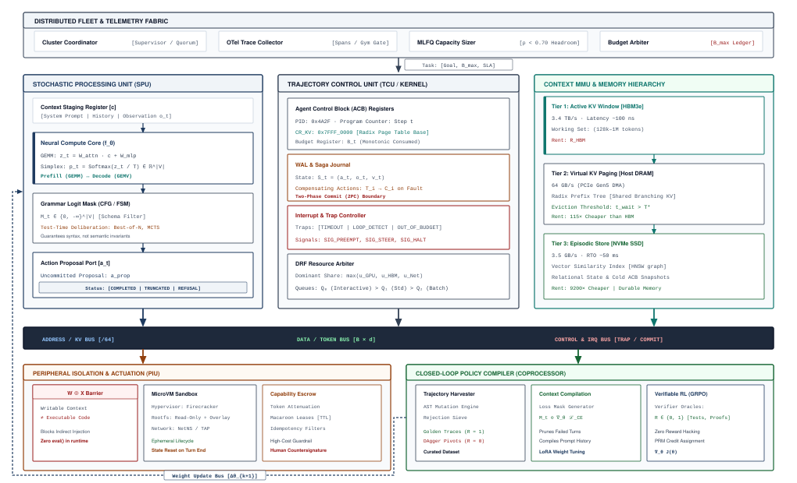{width="100%"}
:::

The trajectory, an automated incident remediation triggered by a production database latency alert, begins when the Distributed Fleet and Telemetry Fabric detects an SLA breach, capturing metric anomalies and trace spans via OpenTelemetry collectors. The cluster coordinator routes the incident payload to the Supervisory Runtime, which instantiates an Agent Control Block (ACB) in volatile host memory. The ACB initializes the trajectory state: assigning a unique process identifier, setting a monotonic token and wall-clock budget, and committing the task's five-part contract to the append-only Write-Ahead Log (WAL).

Next, the Memory Hierarchy stages the task context. The context manager allocates the working context for the task contract, the incident payload, and current environment descriptors. The Key-Value (KV) cache manager maps physical accelerator memory using PagedAttention and indexes shared prompt prefixes in a Radix tree, avoiding redundant prefill computation. Simultaneously, the context manager queries durable storage, issuing semantic lookups against vector indexes and relational databases to retrieve relevant service runbooks and prior incident post-mortems, injecting authoritative source excerpts into the prompt while establishing cryptographic provenance hashes.

The Computational Engine—the unprivileged foundation model engine—then evaluates the staged context buffer. Operating across distributed GPU accelerators, the inference runtime executes the prefill GEMM phase followed by autoregressive decode GEMV iterations. During generation, grammar-constrained logit masking restricts token emission strictly to valid tool invocation schemas. If the task requires deep planning, the deliberation engine executes bounded test-time search rollouts, scoring candidate reasoning paths before committing an unprivileged action proposal $a_t$ to the proposal port.

The Supervisory Runtime intercepts $a_t$ from the proposal port, holding it in memory escrow. The runtime's capability firewall evaluates the action against active Macaroon leases and security policies. If the proposed action involves an irreversible mutation—such as dropping a database table or restarting a core cluster node—the control plane suspends execution and requests a cryptographic human countersignature. For authorized tool actions, the runtime marshals the typed parameters and dispatches them across the $W \oplus X$ (Write XOR Execute) isolation barrier into an ephemeral microVM sandbox (such as Firecracker).

Inside the microVM sandbox, the tool executes within an isolated network namespace and overlay filesystem. The execution harness captures stdout, stderr, and the integer return code, packaging them into a normalized observation record $o_{t+1}$. If an action mutates persistent external state, the transaction is registered as an active Saga step. Should downstream operations fail or trigger invariant violations, the control plane executes registered compensating actions $C_i$ in reverse chronological order, restoring external state consistency.

Upon receiving observation $o_{t+1}$, the supervisor appends the transition $(a_t, o_{t+1})$ to the Write-Ahead Log, invalidates every derived view of the files the action touched, and appends the normalized observation to the working context. This closed-loop cycle repeats until the agent emits a candidate deliverable (such as a pull request containing a configuration fix).

Crucially, acceptance of the deliverable is governed by external verification oracles, not the agent's verbal claims. The Telemetry and Verification Gate executes deterministic acceptance tests: running unit test suites in sealed test harnesses, executing static analysis linters, checking database consistency assertions, and monitoring staging canary metrics. Only when the verification oracle evaluates to exit code 0 does the supervisor mark the trajectory as committed, updating SRE canary gates and closing the operational ticket.

Concurrently, across-task lifecycle infrastructure harvests the trajectory for long-term learning. The Trajectory Data Engine reads the finalized Write-Ahead Log, applies rejection sieves to isolate successful trajectories, and formats golden execution traces. The offline Policy Compiler generates action-targeted loss masks and executes Reinforcement Learning with Verifiable Rewards (RLVR) or supervised fine-tuning loops. This optimization compiles expensive multi-step deliberative reasoning into efficient single-turn model weights, deploying updated parameter checkpoints via canary rollouts to improve future fleet performance.

The walkthrough crosses the line that @sec-vol3-intro-live-loop and @sec-vol3-intro-across-task drew. Everything up to acceptance belongs to live runtime owners, which hold the trajectory for seconds to minutes. The harvest, the policy compiler, fleet telemetry, and the canary gates belong to across-task infrastructure, which works over hours to days on trajectories that have already finished.

This division of ownership is the one the book has used since @sec-vol3-intro-stochastic-computer, where the Stochastic Computer names which part owns the model call, context state, the action boundary, the runtime, the policy compiler, and the fleet. What the synthesis borrows from classical computer systems are disciplines, such as coherence, write-ahead logging, Sagas, capabilities, and the end-to-end argument, not component identities, so the model is not a processor and the context window is not a cache.

Every step of that trajectory applies the invariant closure principle (\ref{pri-invariant-closure}). The runtime closes the task's bounds mechanically, through the budgets, the capability check, the escrow, and the sandbox, and the principle's end-to-end half governs acceptance, because no report from the model can establish that the task is complete. Only the sealed tests, static checks, and consistency assertions the host ran can do that, and @sec-vol3-intro-closure-evidence ranks what each of them is worth.

The agentic system is an accountable execution loop whose model invocation, state, action boundary, supervisor, learning pipeline, and fleet operations can all be traced to a task contract and tested against accepted outcomes.

### The principle ledger {#sec-vol3-conclusion-principle-ledger}

::: {.column-margin}
{width="100%" fig-alt="H·S·A locator with all three axes, Horizon, State, and Authority, highlighted in purple."}

*Horizon, state, and authority return together, and the runtime closes each on one trajectory.*
:::

Every principle in the volume has a place in this architecture, and @tbl-vol3-principle-ledger gathers them in the order the book introduced them, with the exposure each one closes. The principles of Part I price the single model call and bound what checking can establish. Those of Parts II, III, and IV close the three exposures a single call does not have, which are the state it carries across turns, its authority over the world, and a horizon long enough for errors to compound. Part V changes the model and moves no exposure, Part VI multiplies all three across agents and trajectories, and the principle of Part VII marks what the machine cannot close for itself.

| **#**                                    | **Principle**                                          | **Part**     | **Exposure it closes**                    | **Invariant in brief**                                                                                   |
|:-----------------------------------------|:-------------------------------------------------------|:-------------|:------------------------------------------|:---------------------------------------------------------------------------------------------------------|
| \ref{pri-invariant-closure}              | Invariant closure                                      | Introduction | All three (the closure requirement)       | Constraints never rest on the model; bounds close mechanically below it, acceptance on evidence above it |
| \ref{pri-vol3-memory-bandwidth-decoding} | Memory-bandwidth-bounded decoding                      | I            | None (prices the single call)             | At batch size one, per-token latency is weight bytes over memory bandwidth                               |
| \ref{pri-vol3-test-time-scaling}         | Evidence-bounded deliberation                          | I            | None (bounded by evidence)                | Extra inference compute helps only when it acquires evidence that separates candidates                   |
| \ref{pri-vol3-verification-asymmetry}    | The verification asymmetry                             | I            | Closure evidence                          | Stated checks are cheap and sound verification is not; the commit gate is a sealed deterministic check   |
| \ref{pri-02-quarantining-invariant}      | The quarantining invariant                             | I            | None (single call)                        | A payload whose status is not `COMPLETED` never reaches verification, compilation, or actuation          |
| \ref{pri-vol3-attention-working-set}     | Context is a selected working set                      | II           | State                                     | Each invocation sees a bounded selection, compacted without losing identifiers                           |
| \ref{pri-vol3-prefix-coherence}          | Attention state is derived from the token prefix       | II           | State                                     | The KV cache is a function of the exact prefix, reusable only from the left and always rebuildable       |
| \ref{pri-vol3-retrieval-contract}        | Retrieval is a contract, not recall                    | II           | State                                     | Durable data re-enters only through a typed retrieval contract; similarity is not permission             |
| \ref{pri-vol3-source-authority}          | Authority stays with the source                        | II           | State                                     | Only source artifacts are authoritative; every derived view goes stale on write                          |
| \ref{pri-vol3-strict-action-abi}         | The typed action contract                              | III          | Authority                                 | A tool call reaches the environment only as a validated, authorized typed proposal                       |
| \ref{pri-vol3-exactly-once-settlement}   | Settlement before retry                                | III          | Authority, with horizon                   | A timeout says nothing about whether a mutation happened; retry only after settlement                    |
| \ref{pri-vol3-zero-trust-sandboxing}     | Containment beneath the model                          | III          | Authority (integrity and confidentiality) | Every action runs in an envelope enforced below it, reset by destruction, with controlled egress         |
| \ref{pri-vol3-trajectory-encapsulation}  | Trajectory-level encapsulation                         | IV           | Horizon                                   | The trajectory, held in a runtime-owned ACB, is the unit of scheduling, budgeting, and protection        |
| \ref{pri-vol3-preemptive-interrupts}     | Out-of-band preemption and progress watchdogs          | IV           | Horizon                                   | Control, budgets, and judgment of progress sit outside the model                                         |
| \ref{pri-vol3-intent-before-effect}      | Intent before effect                                   | IV           | Horizon (state as durability)             | No effect leaves the host before the record that authorizes it is durable                                |
| \ref{pri-vol3-reversibility-sagas}       | The pivot boundary and compensating Sagas              | IV           | Horizon (authority as ordering)           | Register compensations first, allow one irreversible pivot, and order it last                            |
| \ref{pri-vol3-trajectory-post-training}  | Verified trajectory post-training                      | V            | None moved (changes the model)            | Weight change is the last rung, trained on externally verified trajectories                              |
| \ref{pri-vol3-action-masked-loss}        | Observation loss masking                               | V            | None moved                                | Loss covers only tokens the policy emits; observations stay in context without loss                      |
| \ref{pri-vol3-verifiable-rewards}        | Reinforcement learning against isolated verifiers      | V            | None moved                                | Training learns whatever the check rewards; isolate the verifier and hold out tests                      |
| \ref{pri-15-tri-axial-evaluation}        | Tri-axial multi-agent evaluation frontier              | VI           | All three, multiplied                     | At equal budget, a topology must be no worse on quality, makespan, and cost per accepted task            |
| \ref{pri-vol3-coordination-tax}          | The coordination tax                                   | VI           | All three, multiplied                     | Splitting a task pays only through partitioning, attenuation, or independent exploration                 |
| \ref{pri-vol3-monotonic-delegation}      | Monotonic delegation                                   | VI           | Authority across agents                   | A child's authority, time, and budget are a subset of what the parent still holds                        |
| \ref{pri-vol3-release-evidence}          | Causal and statistical release evidence                | VI           | Closure evidence at fleet scale           | Releases are gated statistically on verified state changes joined by one causal trace                    |
| \ref{pri-vol3-trajectory-goodput}        | Trajectory goodput and the accepted task               | VI           | Fleet cost                                | Only verified trajectories deliver value; a fleet minimizes cost per accepted task                       |
| \ref{pri-vol3-heavy-tailed-scheduling}   | Trajectory-lifetime capacity and tail-aware scheduling | VI           | Horizon at fleet scale                    | Size capacity by trajectory concurrency and run below the utilization knee                               |
| \ref{pri-vol3-specification-boundary}    | The specification boundary                             | VII          | Outside the machine                       | The agent can realize a design but cannot author the contract that governs it                            |

: **Principles by Exposure**: The twenty-six principles of this book in the order they were introduced, with the H·S·A exposure each one closes and its invariant in brief. {#tbl-vol3-principle-ledger tbl-colwidths="[4,24,9,21,42]"}

Formalizing that ownership starts with the contract every trajectory runs under.

## Workload Contract Specification {#sec-vol3-conclusion-envelope}

::: {.column-margin}
{width="100%" fig-alt="Four-tier escalation ladder showing supervisor state transitions: Tier 1 Autonomous below 60% budget, Tier 2 Human Review at 60-80%, Tier 3 Preemption at 80-100%, and Tier 4 Emergency Quarantine at 100%."}

*Graduated escalation envelopes prevent catastrophic budget overruns while maintaining autonomous throughput for nominal operations.*
:::
When an unconstrained agent runtime receives an open-ended natural language prompt such as "fix the integration test failures in the repository," the host supervisor confronts an immediate boundary dilemma. Lacking an explicit specification of operating limits, the underlying foundation model enters an unguided autoregressive loop: it interprets ambiguous test failures by modifying the test assertions themselves, exhausts external API rate limits through unthrottled search queries, or enters an infinite cycle of syntax corrections that consumes host disk capacity with unindexed build artifacts. Because the runtime supervisor lacks a formal specification of permitted behaviors, it cannot determine whether an ongoing sequence of thirty compilation attempts represents productive iterative refinement or an unrecoverable failure loop until an operator manually kills the process.

**Designing an agent system begins from the five-part task contract and the four questions that place a task by its H·S·A exposures and closure evidence.** The contract comes from @sec-vol3-intro-five-part-contract and the questions from @sec-vol3-selection-questions. This section asks what each field costs to enforce when the whole architecture runs at once.

### From exposures to enforceable bounds {#sec-vol3-envelope-four-questions}

Each of those questions becomes a bound the runtime enforces before it allocates compute or provisions a sandbox. Horizon becomes three ceilings. A wall-clock timeout $T_{\max}$ keeps hung connections, deadlocked compilers, and slow inference workers from holding a sandbox hostage. A turn ceiling $H_{\max}$ caps the model-environment round trips, because generation has no intrinsic halt condition and a loop that keeps emitting valid tool calls can run indefinitely. A cumulative token cap $M$ across prefill and decode keeps the task from evading its budget by filling its context with retrieval payloads on every turn.

State becomes explicit write boundaries between ephemeral working memory (the context buffer and its KV cache), the durable log that records every model output, tool payload, return code, and runtime intervention, and the authoritative artifacts the task modifies, so that scratchpad reasoning is never mistaken for a modification. Authority becomes capability tokens attenuated to the task's lifetime, a whitelist of tools, mount namespaces, and egress rules, and escrow that holds any irreversible action until an authenticated human signs it. Closure evidence becomes a deterministic predicate the host can evaluate, such as zero exit codes from the compiler and linters, structured test logs, AST invariant checks, and hashes of the generated artifacts. If the host cannot evaluate such a predicate, the task cannot be accepted as complete, whatever the model reports.

```{python}
#| label: lego-18-operating-envelope
#| echo: false
# │ Show: Sizing the physical resource envelope for containerized agent execution.
# │ How: Model weights, KV cache per GPU, and inference vs sandbox latency breakdown.
# └─────────────────────────────────────────────────────────────────────────────
from mlsysim import *
from mlsysim.core.units import *
from mlsysim.fmt import check, fmt_count, fmt_int, fmt_memory, fmt_time

class SizingPhysicalOperatingEnvelope:
    turn_limit = 20
    timeout_s = 600.0 * second
    timeout_min = 10.0 * minute
    params = 70e9
    weights = 70.0 * GB
    n_gpus = 4
    n_layers = 64
    n_kv_heads = 8
    d_k = 128
    b_elem = 1.0 * byte
    l_max = 32_768
    host_dram = 8.0 * GB
    disk_overlay = 5.0 * GB

    bytes_per_token = 2 * n_layers * n_kv_heads * d_k * 1
    max_kv_cache_bytes = l_max * bytes_per_token
    kv_per_gpu_gb = 1.0
    weights_per_gpu_gb = 17.5

    tokens_per_turn = 256
    decode_rate = 40.0
    decode_s = 6.4 * second
    prefill_s = 0.8 * second
    turn_latency_s = 7.2 * second
    t_model_s = 144.0 * second
    t_sandbox_s = 456.0 * second
    t_sandbox_per_turn_s = 22.8 * second

    check(turn_limit == 20, "turn_limit")
    check(abs(t_model_s - 144.0 * second) < 1e-4 * second, "t_model_s")
    check(abs(t_sandbox_s - 456.0 * second) < 1e-4 * second, "t_sandbox_s")
    check(abs(t_sandbox_per_turn_s - 22.8 * second) < 1e-4 * second, "t_sandbox_per_turn_s")

    timeout_min_str = fmt_time(timeout_min, "min", style="word", precision=0)
    params_str = fmt_count(params, scale="billion", precision=0, scale_style="word")
    model_weights_str = fmt_memory(weights, unit="GB", precision=0)
    n_gpus_str = fmt_int(n_gpus)
    n_layers_str = fmt_int(n_layers)
    n_kv_heads_str = fmt_int(n_kv_heads)
    host_dram_str = fmt_memory(host_dram, unit="GB", precision=0)
    disk_overlay_str = fmt_memory(disk_overlay, unit="GB", precision=0)
```

::: {#nbk-18-operating-envelope .callout-notebook title="Sizing the physical operating envelope"}
Consider an autonomous code-repair agent dispatched to resolve a regression bug in a large C++ service. We must calculate the physical resource envelope required to guarantee containment while providing sufficient operational headroom.

**Given Parameters:**

- Turn limit: $H_{\max} = 20\text{ turns}$.
- Wall-clock timeout: $T_{\max} = 600\text{ s}$ ({python} SizingPhysicalOperatingEnvelope.timeout_min_str).
- Model parameters: {python} SizingPhysicalOperatingEnvelope.params_str dense parameters in FP8 ($70 \times 10^9\text{ bytes} \approx$ {python} SizingPhysicalOperatingEnvelope.model_weights_str model weights).
- Serving architecture: Tensor-parallel across {python} SizingPhysicalOperatingEnvelope.n_gpus_str GPUs, using an FP8 KV cache with {python} SizingPhysicalOperatingEnvelope.n_layers_str layers, {python} SizingPhysicalOperatingEnvelope.n_kv_heads_str key-value heads per layer, and head dimension $d_k = 128$.
- Maximum context window: $L_{\max} = 32{,}768\text{ tokens}$.
- Local build environment: Incremental C++ compilation requires $4\text{ vCPUs}$, {python} SizingPhysicalOperatingEnvelope.host_dram_str host DRAM, and a {python} SizingPhysicalOperatingEnvelope.disk_overlay_str copy-on-write (CoW) disk overlay over a read-only root repository snapshot.

**Step 1: Compute KV Cache Memory Footprint per Instance**
The memory required for the KV cache per token across all layers is:
$$\text{Bytes per token} = 2 \times (\text{layers}) \times (\text{KV heads}) \times d_k \times (\text{bytes per element})$$
$$\text{Bytes per token} = 2 \times 64 \times 8 \times 128 \times 1\text{ byte} = 131{,}072\text{ bytes} = 128\text{ KB/token}$$
At maximum context length $L_{\max} = 32{,}768$:
$$\text{Max KV Cache Size} = 32{,}768 \times 128\text{ KB} = 4{,}194{,}304\text{ KB} = 4.0\text{ GB}$$
Across the {python} SizingPhysicalOperatingEnvelope.n_gpus_str serving GPUs, the KV cache footprint requires $1.0\text{ GB}$ per GPU, well within standard high-bandwidth memory (HBM) headroom alongside the partitioned model weights ($17.5\text{ GB/GPU}$).

**Step 2: Calculate Maximum Inference and Sandbox Latency Budget**
Assume average generation yields $256\text{ tokens}$ per turn at a decode throughput of $40\text{ tokens/s}$ ($6.4\text{ s}$ decode time), while prefill over an average $16{,}384\text{ token}$ prompt takes $0.8\text{ s}$. Total model inference latency per turn is $7.2\text{ s}$.
Across $H_{\max} = 20$ turns, total model time is:
$$T_{\text{model}} = 20 \times 7.2\text{ s} = 144\text{ s}$$
This leaves:
$$T_{\text{sandbox}} = T_{\max} - T_{\text{model}} = 600\text{ s} - 144\text{ s} = 456\text{ s}$$
Allocating $456\text{ s}$ across 20 turns provides a maximum of $22.8\text{ s}$ per turn for containerized tool execution, filesystem diffing, and incremental compilation. If an intermediate test run exceeds $22.8\text{ s}$, the supervisor's per-step watchdog alerts the runtime to throttle test suite depth.
:::

### Refining the five-part contract {#sec-vol3-envelope-contract-formalism}

@Sec-vol3-intro-five-part-contract wrote the contract as a five-tuple:

$$\mathcal{C} = \langle G, \mathcal{E}_{\text{env}}, \mathcal{A}_{\text{perm}}, \mathcal{O}_{\text{avail}}, \mathcal{K}_{\text{comp}} \rangle$$

Enforcing it at runtime refines each field into a structure that one subsystem of the harness can check:

$$G = \left( \text{id}, \text{type}, \mathbf{p}, \Phi_{\text{inv}} \right)$$

The goal $G$ encapsulates the unique task identifier $\text{id}$, the task type, a typed parameter dictionary $\mathbf{p}$, and a set of formal invariant assertions $\Phi_{\text{inv}}$ that must remain inviolate throughout the trajectory. Crucially, $G$ does not supply instructions on *how* to solve the task; it specifies the mathematical properties of the desired end state.

$$\mathcal{E}_{\text{env}} = \left( \mathcal{I}_{\text{base}}, \mathcal{M}_{\text{mounts}}, \mathcal{R}_{\text{quotas}}, \mathcal{N}_{\text{network}} \right)$$

The environment $\mathcal{E}_{\text{env}}$ dictates the physical substrate of execution. Here, $\mathcal{I}_{\text{base}}$ specifies the immutable cryptographic digest of the container base image; $\mathcal{M}_{\text{mounts}}$ defines the virtual filesystem mount table, specifying which host directories are exposed as read-only layers and which receive temporary copy-on-write overlays; $\mathcal{R}_{\text{quotas}}$ establishes hard cgroup limits on CPU shares, memory allocation, and disk write I/O; and $\mathcal{N}_{\text{network}}$ defines network routing tables, which default to a completely isolated loopback namespace ($127.0.0.1$) unless specific proxy endpoints are whitelisted.

$$\mathcal{A}_{\text{perm}} = \left\{ a_1, a_2, \dots, a_k \mid a_i = (\text{name}_i, \Sigma_i^{\text{in}}, \Sigma_i^{\text{out}}, \rho_i) \right\}$$

The permitted action set $\mathcal{A}_{\text{perm}}$ enumerates the complete universe of callable tools. Each action $a_i$ is defined by its identifier, a strict input schema $\Sigma_i^{\text{in}}$, a typed output schema $\Sigma_i^{\text{out}}$, and a capability policy $\rho_i$. The capability policy specifies rate limits, allowed filesystem paths, and whether invocation requires pre-execution escrow validation. An attempt to invoke an unregistered tool or pass arguments that fail schema validation results in an immediate intercept by the supervisor.

$$\mathcal{O}_{\text{avail}} = \left( \Delta_{\max}^{\text{bytes}}, \Psi_{\text{filter}}, \Omega_{\text{encoding}} \right)$$

The available observations $\mathcal{O}_{\text{avail}}$ govern how raw execution outputs are ingested into the agent's context. Uncontrolled tool execution can easily produce hundreds of megabytes of raw compiler output or log dumps, instantly exceeding context window limits and polluting working memory. The observation policy establishes an absolute byte ceiling $\Delta_{\max}^{\text{bytes}}$, an active sanitization filter $\Psi_{\text{filter}}$ that strips ANSI escape codes and masks sensitive credentials or environment secrets, and an encoding function $\Omega_{\text{encoding}}$ that normalizes structured errors into compact, machine-readable records.

$$\mathcal{K}_{\text{comp}} = \left\{ v_1, v_2, \dots, v_m \mid v_j: (\mathcal{E}_{\text{env}}, \text{Artifacts}) \to \{0, 1\} \right\}$$

The completion criteria $\mathcal{K}_{\text{comp}}$ comprise an ordered array of deterministic verification predicates. Each verifier $v_j$ is an external binary, script, or static analyzer that inspects the sandbox environment and generated artifacts independently of the model. Task success requires the conjunction of all verifiers to evaluate to true:

$$\text{Success}(\mathcal{C}) \iff \bigwedge_{j=1}^{m} v_j(\mathcal{E}_{\text{env}}, \text{Artifacts}) = 1$$

The structural fields, enforcement mechanisms, and omission hazards of this contract are detailed in @tbl-vol3-contract-decomposition.

| Contract Field                                  | Mathematical Domain                                              | Supervisor Enforcement Mechanism                 | Failure Mode When Omitted                        |
|:------------------------------------------------|:-----------------------------------------------------------------|:-------------------------------------------------|:-------------------------------------------------|
| **Goal ($G$)**                                  | Struct $(\text{id}, \text{type}, \mathbf{p}, \Phi_{\text{inv}})$ | Dispatch validation and parameter type checking  | Semantic drift; unguided goal mutation           |
| **Environment ($\mathcal{E}_{\text{env}}$)**    | Container/cgroup spec                                            | Linux namespaces, seccomp, cgroups v2            | Host resource exhaustion; filesystem poisoning   |
| **Actions ($\mathcal{A}_{\text{perm}}$)**       | Set of typed schemas $\{a_i\}$                                   | RPC gateway filter and JSON Schema validation    | Arbitrary code execution; privilege escalation   |
| **Observations ($\mathcal{O}_{\text{avail}}$)** | Transform pipeline $(\Delta, \Psi, \Omega)$                      | Stream truncator, regex sanitizer, token counter | Context window overflow; credential leakage      |
| **Completion ($\mathcal{K}_{\text{comp}}$)**    | Predicate set $\{v_j \to \{0,1\}\}$                              | Hermetic test runner and AST validator           | False-positive completion claims (hallucination) |

: **Workload Contract Decomposition**: Structural decomposition of the five-part task contract, showing the mathematical domain, the supervisor's physical enforcement layer, and the concrete failure modes that manifest when individual boundary controls are omitted. {#tbl-vol3-contract-decomposition}

This contract formalism establishes what computer systems architecture recognizes as the **hourglass design pattern**—analogous to the role of Internet Protocol (IP) in networking or POSIX in operating systems. As illustrated in @fig-vol3-agentic-systems-hourglass, the managed trajectory interface contract forms the narrow waist of the agentic computing stack. It decouples high-level, heterogeneous agent workloads (software engineering, cloud incident remediation, enterprise data workflows, embodied robotics, and fleet swarms) from the diverse underlying runtime services (admission schedulers, memory hierarchies, actuation hypervisors, write-ahead durability logs, and verification oracles) and physical hardware substrates.

::: {#fig-vol3-agentic-systems-hourglass fig-env="figure" fig-pos="htb" fig-cap="**The Hourglass Architecture of Agentic Machine Learning Systems**: The managed trajectory interface contract serves as the narrow waist of the system architecture, decoupling diverse upstream agent workloads (upper fan-in) from downstream runtime management services, memory tiers, persistence logs, and physical hardware substrates (lower fan-out)." fig-alt="Hourglass architectural schematic showing upper fan-in from diverse agent workloads into the narrow waist of the managed trajectory contract, and lower fan-out into runtime management services and physical substrates."}
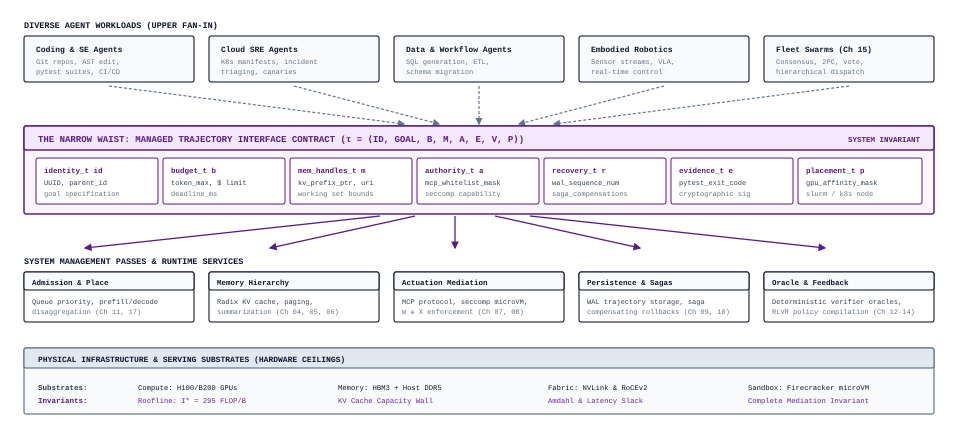{width="95%"}
:::

The architectural power of the hourglass pattern lies in its formal interface factorization. The upper half of @fig-vol3-agentic-systems-hourglass captures diverse agent workloads exhibiting radically different operational tempos: interactive coding agents executing rapid compiler loops, cloud SRE workers triaging distributed telemetry cascades, batch data migration pipelines processing relational mutations, embodied robots streaming sensorimotor vectors under hard real-time deadlines, and distributed fleet swarms executing consensus ballots. Rather than requiring each application to build its own memory management and sandbox virtualization, every workload projects into one narrow waist, the managed trajectory, whose Agent Control Block the runtime schedules, budgets, and protects as a unit (principle \ref{pri-vol3-trajectory-encapsulation}). The lower half of the hourglass translates this canonical representation into concrete systems services: admission schedulers managing queue priority and prefill/decode disaggregation, memory subsystems paging KV blocks across host DRAM and accelerator HBM, actuation mediators enforcing seccomp filters and the $W \oplus X$ policy, persistence engines committing WAL frames and compensating Saga ledgers, and deterministic verification oracles validating outcome predicates against physical hardware constraints.

### Production operating envelopes {#sec-vol3-envelope-boundaries}

An instantiated contract defines the nominal path of execution, but robust systems engineering also requires an operating envelope, the boundary within which the agent is warranted to function, together with deterministic escalation policies for when that boundary is breached. The envelope is where a task's H·S·A position (@sec-vol3-intro-hsa) becomes runtime configuration. Horizon $H$ is bounded by the turn, time, and token ceilings attached to the goal $G$. The state $S$ the task carries is partitioned by the environment $\mathcal{E}_{\text{env}}$ and filtered by the observation policy $\mathcal{O}_{\text{avail}}$. Authority $A$ is fixed by the permitted action set $\mathcal{A}_{\text{perm}}$ under complete runtime mediation. The completion criteria $\mathcal{K}_{\text{comp}}$ are not a fourth exposure. They set the closure evidence level that acceptance requires, which rises with the other three.

::: {#fig-vol3-operating-envelope-escalation fig-env="figure" fig-pos="htb" fig-cap="**Host Agent Supervisor Operating Envelope and Escalation Dispatcher**: Complete mediation layer enforcing multi-dimensional operating constraints across token and time budgets, error ceilings ($K \le 3$), sandbox containment, and durable write-ahead logging, dispatching deterministic preemption and quarantine policies upon invariant breach." fig-alt="Schematic of the host agent supervisor operating envelope, showing resource budgets, error ceilings, sandbox isolation, and the deterministic escalation dispatcher triggered upon invariant breach."}
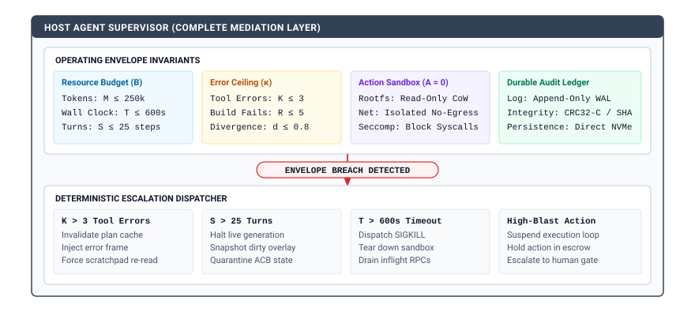{width="95%"}
:::

As diagrammed in @fig-vol3-operating-envelope-escalation, the host supervisor enforces complete mediation by continuously monitoring execution against four explicit invariant subcards: the active resource budget ($B$), error ceilings ($\kappa$), sandbox containment parameters, and the durable audit ledger (WAL). Whenever any operational threshold is exceeded, the red boundary trigger transitions control directly to the Deterministic Escalation Dispatcher. Rather than crashing blindly or allowing errant executions to consume unbounded cluster capital, the dispatcher invokes targeted mitigation routines tailored to the specific failure mode: invalidating the plan cache and forcing scratchpad re-reads when tool errors exceed $K$, halting live token generation and quarantining agent control block (ACB) state when interaction turns reach $H_{\max}$, terminating rogue processes with `SIGKILL` upon wall-clock timeout $T_{\max}$, and suspending forward execution in memory escrow whenever a high-blast-radius command requires human authorization.

The operating envelope is governed by four hard threshold metrics:

1. **The Consecutive Error Ceiling ($K$):** If an agent executes $K$ consecutive actions that return nonzero exit codes, malformed tool arguments, or schema validation errors, the supervisor assumes the model has entered a degenerate autoregressive loop. The runtime halts speculative tool dispatch, injects a high-priority diagnostic frame into the context, and forces the model to evaluate intermediate state before emitting another tool invocation.
2. **The Turn Ceiling ($H_{\max}$):** The hard limit on model-environment round-trips. When the turn count reaches $H_{\max}$, the supervisor issues an unmaskable termination signal, regardless of whether the model claims it is near completion.
3. **The Wall-Clock Watchdog ($T_{\max}$):** An asynchronous timer running on the host system. Upon expiration, the supervisor dispatches a `SIGKILL` to the container sandbox, snapshots the dirty filesystem overlay for post-mortem analysis, and returns a timeout fault to the orchestrator.
4. **The Cumulative Token Cap ($M$):** A strict ceiling on aggregate input and output tokens consumed during the session, preventing unbounded financial burn or inference cluster starvation.

When an executing agent breaches any of these thresholds, the system executes an escalation protocol. Rather than terminating silently, the supervisor transitions the execution state through a deterministic triage ladder. Minor boundary breaches—such as an invalid JSON payload or a non-existent file path—trigger local error recovery, feeding the exact parser error back to the model as an observation. Systematic boundary breaches—such as exceeding $K$ or reaching a memory limit—trigger state suspension: the runtime snapshots the sandbox filesystem, records the failure vector in the durable WAL, and either rolls back the workspace to the last known-good checkpoint or surfaces the session to a human operator via an interactive escrow gate.

| Workload Archetype           | Horizon Bounds ($T_{\max}, H_{\max}$)                       | State Tiers & Quotas                                                                                                    | Authority ($A$)                                                                     | Completion Criteria ($\mathcal{K}_{\text{comp}}$)                                               |
|:-----------------------------|:------------------------------------------------------------|:------------------------------------------------------------------------------------------------------------------------|:------------------------------------------------------------------------------------|:------------------------------------------------------------------------------------------------|
| **Hermetic Patch Synthesis** | $T_{\max} = 900\text{ s}$<br>$H_{\max} = 25\text{ turns}$   | Ephemeral: $4\text{ GB}$ KV cache<br>Disk: $5\text{ GB}$ CoW overlay<br>Host: $8\text{ GB}$ RAM, $4\text{ vCPUs}$       | $A_1$; loopback network only; restricted writes to `/src`; no privilege elevation   | Clean build (`exit 0`), pre-existing tests pass, newly added regression tests pass              |
| **Batch Data Migration**     | $T_{\max} = 3600\text{ s}$<br>$H_{\max} = 100\text{ turns}$ | Ephemeral: $2\text{ GB}$ KV cache<br>Disk: $50\text{ GB}$ staging spool<br>Host: $16\text{ GB}$ RAM, $8\text{ vCPUs}$   | $A_2$; whitelisted database endpoints; read-only source DB; write to staging schema | Schema validation pass, zero lost records ($\sum \text{src} = \sum \text{dst}$), checksum match |
| **Incident Remediation**     | $T_{\max} = 300\text{ s}$<br>$H_{\max} = 10\text{ turns}$   | Ephemeral: $1\text{ GB}$ KV cache<br>Disk: $512\text{ MB}$ ephemeral tmp<br>Host: $2\text{ GB}$ RAM, $2\text{ vCPUs}$   | $A_3$ under escrow; scoped telemetry APIs; read-only metrics; state-altering CLI    | Telemetry health invariant satisfied; error rate $< 0.01\%$; signed human token                 |
| **Literature Synthesis**     | $T_{\max} = 1200\text{ s}$<br>$H_{\max} = 40\text{ turns}$  | Ephemeral: $8\text{ GB}$ KV cache<br>Disk: $10\text{ GB}$ PDF/vector store<br>Host: $8\text{ GB}$ RAM, $4\text{ vCPUs}$ | $A_1$; egress whitelisted to arXiv/PubMed APIs; local vector index write            | Schema-compliant JSON report; all extracted DOI citations verify against CrossRef               |

: **Production Operating Envelope**: The Production Operating Envelope Matrix across four foundational agent workload archetypes, showing the tight coupling between temporal bounds, physical state allocations, attenuated capability grants, and deterministic verification criteria. {#tbl-vol3-operating-envelope-matrix}

As demonstrated in @tbl-vol3-operating-envelope-matrix, different operational archetypes require radically divergent envelope configurations. A hermetic patch synthesis worker operates under tight, hermetic isolation with zero external network connectivity, relying entirely on local compilers and deterministic unit tests to establish evidence of correctness. Conversely, an incident remediation agent functions in an environment where live network telemetry is indispensable, but where the blast radius of any write operation is catastrophic; consequently, its authority envelope strictly forbids unsupervised mutations, requiring human cryptographic escrows for any state-altering remediation command.

By establishing the five-part contract and enforcing its operational envelope at runtime, the systems engineer transforms an otherwise unpredictable neural autoregressive model into a bounded, accountable component of a larger production infrastructure. With the contract formalizing the boundaries of execution and the lifecycle of state, the architectural challenge shifts to memory: how does the system physically organize, move, and preserve information across these ephemeral, durable, and authoritative tiers during execution?

## Memory Hierarchy Synthesis {#sec-vol3-conclusion-memory}

When an autonomous coding or refactoring agent executes across dozens of iterative turns, state corruption rarely arises from mathematical faults within the transformer's multi-head attention calculations. Instead, it stems from silent cache divergence across uncoordinated memory boundaries. Consider an agent tasked with updating an enterprise software service: at Turn 4, the agent invokes an external tool to refactor a core data structure in a header file. The filesystem snapshot updates immediately, establishing a new authoritative ground truth. Yet, unless the host supervisor enforces an active cache coherence protocol, the system enters a split-brain state. The agent's logical working context retains the pre-mutation snippet extracted at Turn 1; the inference serving engine preserves pre-computed Key-Value (KV) cache activations for the invalidated prompt prefix; and the external retrieval index continues to return vector embeddings representing deprecated method signatures. In the subsequent turn, the model autoregressively generates diffs targeting identifiers that no longer exist on disk. When the compiler rejects the hallucinated diff, the agent generates further speculative compensations, compounding error across tiers until the interaction turn ceiling $H_{\max}$ or token budget $M$ is exhausted.

**An end-to-end design assigns different ownership and lifetime rules to selected context, physical KV state, authoritative artifacts, and durable indexes or logs.** In an agentic computing architecture, memory cannot be modeled as a homogeneous flat buffer or an unstructured append-only chat history. Robust execution requires synthesizing four distinct physical and logical state layers—spanning volatile accelerator High-Bandwidth Memory (HBM), host DRAM, durable retrieval indices, and persistent filesystem artifacts—under explicit ownership domains, deterministic invalidation protocols, and cryptographic provenance guarantees.

::: {.column-margin}
Alan Jay Smith's foundational survey on cache memories (1982) demonstrated that hierarchical storage systems function by exploiting spatial and temporal locality to present the illusion of a single, uniformly fast, and unbounded memory space. In agentic machine learning systems, this hierarchy bridges the orders-of-magnitude performance and volatility gap between microsecond accelerator tensor memory and persistent, authoritative external environments.
:::

### State hierarchy lifecycles {#sec-vol3-memory-four-layers}

The memory architecture of an agentic system decomposes into four discrete layers, each governed by distinct latency characteristics, physical media, storage capacities, and operational owners. Systems collapse when runtime designers blur the boundaries between these layers, treating derivative search indices as authoritative state or assuming that physical accelerator caches automatically track mutations in external environments.

The first layer is the Logical Working Context, measured in discrete Byte-Pair Encoding (BPE) tokens. This layer constitutes the active evidence window presented directly to the foundation model for its next forward pass. The logical context resides in host system memory during orchestration and is strictly bounded by the model's physical sequence length limit $L_{\max}$ and the task contract's active window budget $S_{\max}$. Owned exclusively by the host agent supervisor runtime, the logical context is ephemeral and mutable across turns. The supervisor continuously manipulates this buffer through structured compaction, sliding-window truncation, observation filtering, and working set selection. The logical context does not represent durable storage; rather, it is a transient, highly selective viewport over the task's broader historical trajectory and environmental state.

The second layer is the Physical Key-Value (KV) Cache, composed of continuous floating-point activation tensors ($\mathbf{K}, \mathbf{V} \in \mathbb{R}^{B \times L \times H \times d_k}$) allocated across the High-Bandwidth Memory (HBM) and host DRAM of the inference serving engine (such as vLLM or SGLang). While the logical context represents discrete symbolic tokens, the physical KV cache materializes the intermediate linear projections computed across every attention layer during the prefill phase (GEMM). Owned entirely by the inference serving engine rather than the agent supervisor, this layer is optimized for high-throughput tensor parallel execution. Modern runtimes manage these tensors through PagedAttention, mapping non-contiguous physical memory pages to logical sequence positions, and structure multi-turn conversations into Radix-tree prefix hierarchies to facilitate zero-copy prefix sharing. The lifecycle of physical KV blocks is decoupled from task logic: blocks are dynamically retained, paged across PCIe buses, or evicted under Least Recently Used (LRU) policies when GPU memory pools face pressure.

The third layer comprises Authoritative External Artifacts, representing the absolute ground-truth state of the external environment. This layer includes the target software repository managed under version control, production database tables, containerized filesystems, and live operating system processes. Authoritative artifacts reside on durable non-volatile media, such as local NVMe arrays or distributed cloud storage. Unlike internal model representations, authoritative artifacts are permanent across agent restarts and can be mutated *strictly* through sandboxed, mediated tool actuation, because the model holds zero ambient authority. The host supervisor must treat this layer as the sole source of truth for task completion; candidate patches, generated reports, or proposed database edits remain speculative until verified against these authoritative records.

The fourth layer consists of Derivative Retrieval Indexes and Logs. This layer encompasses dense vector stores (such as Hierarchical Navigable Small World graphs and Inverted File Quantizers), sparse lexical inverted indices (such as BM25), structural code property graphs (AST dependency databases), and the runtime's append-only Write-Ahead Log (WAL). Owned by the host supervisor's storage and retrieval subsystems, these structures are secondary representations derived from historical execution traces and snapshots of authoritative artifacts. The rule governing this layer is that authority stays with the source (principle \ref{pri-vol3-source-authority}). Derivative indexes hold no authority of their own and exist only to accelerate approximate recall over large corpora, so when an authoritative artifact changes, every index entry derived from it becomes stale and must be invalidated or re-indexed before the next invocation reads it. The characteristics, latency regimes, and eviction policies of these four tiers are synthesized in @tbl-vol3-memory-tiers-summary.

| Memory Tier                   | Storage Medium                    | Volatility & Lifetime                  | Subsystem Owner                 | Eviction & Compaction Policy                               | Cache Invalidation Protocol                                   | Access Latency Regime                         | Capacity Bound                                     |
|:------------------------------|:----------------------------------|:---------------------------------------|:--------------------------------|:-----------------------------------------------------------|:--------------------------------------------------------------|:----------------------------------------------|:---------------------------------------------------|
| **Logical Working Context**   | Host DRAM / Orchestrator Heap     | Ephemeral; reconstructed per turn      | Host Agent Supervisor           | Semantic compaction, sliding window, observation filtering | Synchronous rewrite upon environment state mutation           | $\le 1\,\text{ms}$ (Token assembly)           | $L_{\max} \le 128\text{k}\text{ tokens}$           |
| **Physical KV Cache**         | Accelerator HBM / Host DRAM       | Volatile; bounded by inference session | Inference Serving Engine        | Paged memory allocation, Radix-tree LRU prefix eviction    | Tree node severing via prefix hash invalidation               | $10\text{ ns}$ (HBM) / $50\text{ ns}$ (PCIe)  | GPU HBM capacity ($80\text{--}192\,\text{GB/GPU}$) |
| **Authoritative Artifacts**   | NVMe SSD / Distributed Filesystem | Durable; permanent across runs         | External Environment / Sandbox  | Explicit task cleanup, sandbox teardown                    | External mutation notifications via filesystem watchers       | $10\,\mu\text{s}\text{--}10\,\text{ms}$ (I/O) | Terabytes / Volume quota                           |
| **Derivative Indexes & Logs** | NVMe / Mapped Memory / Cloud DB   | Persistent; lifecycle spans projects   | Indexing Subsystem / WAL Engine | Tombstone compaction, periodic index re-clustering         | Write-through tombstones, asynchronous background re-indexing | $2\text{--}50\,\text{ms}$ (Graph/ANN query)   | Unbounded / Scalable multi-TB                      |

: **Synthesized Memory Tiers**: Comprehensive comparison of the four synthesized memory tiers, contrasting physical storage media, lifetime dynamics, ownership boundaries, eviction policies, invalidation mechanisms, access latencies, and capacity bounds. {#tbl-vol3-memory-tiers-summary}

### Cross-tier cache coherence {#sec-vol3-memory-coherence-invalidation}

In classical shared-memory multiprocessor architectures, cache coherence is enforced by dedicated hardware logic. As formalized by Leslie Lamport (1979), maintaining sequential consistency across concurrent executing entities requires an unyielding rule: all processes must observe mutations in a globally consistent order. In hardware symmetric multiprocessing (SMP), snooping buses and directory-based protocols (such as MESI) broadcast invalidation signals across L1 and L2 caches whenever a processor issues a write transaction to a shared memory address.

In an agentic computer, this hardware-mediated safety net does not exist. The core computational engine—the autoregressive foundation model—is an unprivileged, stateless inference routine. Once input tokens are tokenized and projected into physical KV activations within accelerator HBM, the neural network possesses no physical mechanism to sense that a background tool has modified a source file on disk or updated an external database row. Consequently, cache coherence across the four tiers must be orchestrated entirely by software protocols within the host supervisor (@fig-vol3-memory-hierarchy-synthesis).

::: {#fig-vol3-memory-hierarchy-synthesis fig-env="figure" fig-pos="htb" fig-cap="**Synthesized Four-Tier Memory Hierarchy and Cache Coherence Fabric**: Complete memory architecture showing the separation between ephemeral logical context (Tier 1), volatile physical KV cache (Tier 2), authoritative external artifacts (Tier 3), and derivative indexes with Write-Ahead Logging (Tier 4), linked by the host supervisor cache coherence and invalidation fabric." fig-alt="Architecture diagram of the synthesized four-tier memory hierarchy, showing data flow from authoritative artifacts and derivative vector indexes to logical context and physical KV cache, with bidirectional cache invalidation and tombstoning loops."}
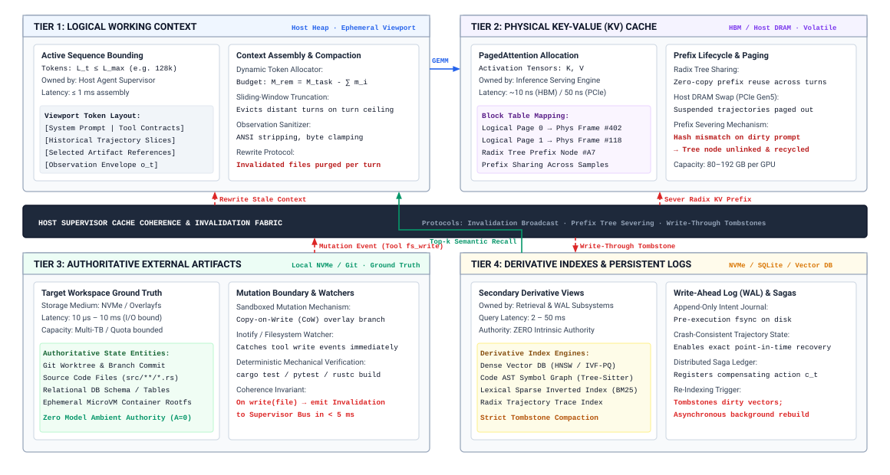{width="95%"}
:::

As illustrated in @fig-vol3-memory-hierarchy-synthesis, the memory architecture resolves the impedance mismatch between fast accelerator tensors and durable external state by organizing storage into four synchronized layers. The upper volatile tier spans Tier 1 (Logical Working Context in host heap, bounding sequences to $L_{\max} \le 128\text{k}$ tokens under dynamic compaction) and Tier 2 (Physical KV Cache across accelerator HBM and host DRAM, where PagedAttention block tables map virtual tokens to physical frames and radix trees share prompt prefixes). Below the volatile tier, the central Host Supervisor Coherence Fabric coordinates dataflow with the persistent layers: Tier 3 (Authoritative External Artifacts in Git worktrees and microVM overlays) and Tier 4 (Derivative Retrieval Indexes such as HNSW vector DBs and Tree-Sitter AST graphs, alongside the append-only Write-Ahead Log). When an agent executes an actuation command that mutates an authoritative external artifact, such as applying a code patch via a sandboxed filesystem tool, the host supervisor must propagate invalidations through a multi-stage coherence pipeline:

```python
def on_artifact_mutation(event: MutationEvent, supervisor: AgentSupervisor) -> None:
    # 1. Authoritative mutation committed to Write-Ahead Log
    supervisor.wal.append_mutation(event.path, event.old_hash, event.new_hash)
    # 2. Invalidate stale spans in the active logical working context
    supervisor.context_manager.invalidate_paths({event.path})
    # 3. Sever prefill prefix branches in inference engine Radix cache
    prefix_hash = compute_prefix_hash(event.path, event.old_hash)
    supervisor.inference_client.invalidate_prefix_cache(prefix_hash)
    # 4. Mark tombstones on derivative vector and lexical retrieval indexes
    supervisor.vector_index.tombstone_by_uri(event.path)
    supervisor.retrieval_queue.schedule_async_reindex(event.path)
```

The coherence protocol begins at the authoritative layer. When a tool modifies an artifact, the sandbox traps the mutation, computes a cryptographic content digest of the pre- and post-mutation bytes, and emits an atomic mutation record $\Delta = \langle \text{path}, \mathcal{H}_{\text{old}}, \mathcal{H}_{\text{new}}, \text{diff} \rangle$. The supervisor intercepts this record and appends it to the immutable Write-Ahead Log with a monotonically increasing logical epoch counter $e$.

Following log commitment, the supervisor executes logical context invalidation. The context manager inspects all active text blocks currently staged for model generation. Any block whose metadata associates it with $\text{path}$ at an epoch $e' < e$ is flagged as stale. Rather than arbitrarily purging the entire context window—which would destroy valuable conversational continuity and task grounding—the supervisor selectively replaces the stale context segment with a structured diff or an updated snippet read directly from the modified artifact.

Simultaneously, the supervisor invalidates the physical accelerator cache. If the inference serving runtime caches prompt prefixes via a Radix tree to accelerate multi-turn prefill, the KV activations corresponding to the pre-mutation token sequence are now invalid. If the model were evaluated with the old prefix activations, its autoregressive decode phase would condition on hidden states derived from stale tokens. The supervisor dispatches an invalidation RPC to the serving engine containing the prefix hash of the invalidated sequence. The serving engine severs the corresponding node from its prefix tree, freeing the physical GPU memory pages for reallocation and forcing the inference engine to compute a fresh prefill over the updated context tokens.

Finally, the supervisor enforces coherence across derivative retrieval indexes. Dense vector indices and lexical stores cannot be recomputed synchronously across gigabytes of code within the latency budget of a single interaction turn. To resolve this temporal mismatch, the supervisor applies write-through tombstones to all index entries matching the mutated URI. When the agent subsequently performs semantic retrieval queries, the retrieval gateway filters out tombstoned chunks, ensuring that obsolete embeddings are never returned to the active context buffer. Asynchronous background workers pull modified files from the re-indexing queue, extract updated syntactic chunks, compute fresh embedding vectors, and update the index graph out of band.

```{python}
#| label: lego-18-cache-invalidation
#| echo: false
# │ Show: Quantitative costs of memory allocation and prefix cache invalidation.
# │ How: Radix cache hit (512 tokens) vs prefix severing re-prefill (29,184 tokens).
# └─────────────────────────────────────────────────────────────────────────────
from mlsysim import *
from mlsysim.core.units import *
from mlsysim.fmt import check, fmt_int, fmt_memory

class CacheInvalidationAgentHierarchy:
    gpu_count = 8
    gpu_mem = 80.0 * GB
    mem_bw = 3.35 * (TB / second)
    params = 70e9
    weights = 70.0 * GB
    n_layers = 80
    n_q_heads = 64
    n_kv_heads = 8
    d_k = 128
    l_ctx = 32_768
    peak_tflops = 15_832.0 * TFLOPs
    mfu = 0.50
    inv_pos = 4_096

    m_token_bytes = 2 * n_layers * n_kv_heads * d_k * 1
    m_total_kv_bytes = l_ctx * m_token_bytes
    m_kv_per_gpu = 0.625 * GB

    t_eff_flops = 15_832e12 * 0.50
    t_hit_ms = (1.4e11 * 512) / t_eff_flops * 1000
    t_miss_ms = (1.4e11 * 29184) / t_eff_flops * 1000
    slowdown = t_miss_ms / t_hit_ms

    check(gpu_count == 8, "gpu_count")
    check(abs(m_token_bytes - 163840) < 1, "m_token_bytes")
    check(abs(slowdown - 57.0) < 0.5, "slowdown")

    gpu_count_str = fmt_int(gpu_count)
    gpu_mem_str = fmt_memory(gpu_mem, unit="GB", precision=0)
```

::: {#nbk-18-cache-invalidation .callout-notebook title="Cache invalidation across agent hierarchy"}
Consider an autonomous software maintenance agent executing on an 8x NVIDIA H100 GPU serving node ({python} CacheInvalidationAgentHierarchy.gpu_mem_str HBM3 per GPU, $3.35\text{ TB/s}$ memory bandwidth per GPU, connected via PCIe Gen5 to host DRAM). We evaluate the quantitative costs of memory allocation and cache invalidation during an iterative refactoring task.

**System Parameters:**

- Model architecture: Llama-3-70B in FP8 precision ($70 \times 10^9\text{ parameters} = 70\text{ GB}$ weights).
- Attention geometry: 80 transformer layers, Grouped-Query Attention (GQA) with 64 query heads and 8 key-value heads, head dimension $d_k = 128$.
- Active sequence length: $L = 32{,}768\text{ tokens}$.
- Cluster compute capacity: Total node FP8 tensor peak of $15{,}832\text{ TFLOPs}$ ($1.979\text{ PFLOPs}$ per H100); achieved Model Flops Utilization (MFU) during prefill is $\eta = 0.50$.
- Invalidation event: At token position $4{,}096$, a source file modification invalidates the remainder of the prompt prefix.

**Step 1: Calculate Physical KV Cache Footprint**
The memory consumption per token across all layers for an FP8 KV cache ($b_{\text{elem}} = 1\text{ byte}$) is:
$$M_{\text{token}} = 2 \times n_{\text{layers}} \times n_{\text{kv\_heads}} \times d_k \times b_{\text{elem}}$$
$$M_{\text{token}} = 2 \times 80 \times 8 \times 128 \times 1\text{ byte} = 163{,}840\text{ bytes} = 160\text{ KB/token}$$
For an active context of $L = 32{,}768\text{ tokens}$:
$$M_{\text{total\_KV}} = 32{,}768 \times 160\text{ KB} = 5{,}242{,}880\text{ KB} = 5.0\text{ GB}$$
Distributed across the {python} CacheInvalidationAgentHierarchy.gpu_count_str GPUs via tensor parallelism, the KV cache requires $0.625\text{ GB}$ per GPU, representing a negligible fraction of the {python} CacheInvalidationAgentHierarchy.gpu_mem_str physical HBM3 budget.

**Step 2: Compare Prefill Latency Under Cache Hit versus Invalidation**
The theoretical floating-point operations required to execute the prefill phase over $N_{\text{tokens}}$ on a model with $P = 70 \times 10^9$ parameters is approximately:
$$\text{FLOPs}_{\text{prefill}} \approx 2 \times P \times N_{\text{tokens}} = 1.4 \times 10^{11} \times N_{\text{tokens}}$$
Effective system compute throughput is:
$$\text{Throughput}_{\text{eff}} = 15{,}832 \times 10^{12}\text{ FLOPs/s} \times 0.50 = 7.916 \times 10^{15}\text{ FLOPs/s}$$

*Scenario A: Radix Cache Prefix Hit (Zero Invalidation).*
The agent appends 512 new observation tokens to the cached 32k prompt. Only the 512 new tokens require prefilling:
$$T_{\text{hit}} \approx \frac{1.4 \times 10^{11} \times 512}{7.916 \times 10^{15}} = \frac{7.168 \times 10^{13}}{7.916 \times 10^{15}} \approx 9.05\text{ ms}$$

*Scenario B: Full Prefix Severing (Cache Miss).*
A file edit at token 4,096 invalidates the subsequent $28{,}672$ prompt tokens. Together with the 512 new tokens, the engine must re-prefill $N_{\text{tokens}} = 29{,}184$:
$$T_{\text{miss}} \approx \frac{1.4 \times 10^{11} \times 29{,}184}{7.916 \times 10^{15}} = \frac{4.086 \times 10^{15}}{7.916 \times 10^{15}} \approx 516.2\text{ ms}$$

The latency penalty of re-prefill is:
$$\text{Slowdown} = \frac{516.2\text{ ms}}{9.05\text{ ms}} \approx 57.0\times$$
This quantitative divergence demonstrates why fine-grained prefix tree slicing and surgical context replacement are mandatory to preserve real-time agent responsiveness.
:::

### Provenance tracking {#sec-vol3-memory-provenance-grounding}

A core vulnerability of autoregressive models is their inability to discern semantic authority from symbolic layout alone. Once external data, whether from a trusted system contract, an authoritative source file, an unverified user comment, or an adversarial web payload, is parsed by Byte-Pair Encoding into a linear sequence of token IDs, all tokens enter the transformer's self-attention matrix on mathematically equal terms. The attention mechanism computes pairwise scaled dot products indiscriminately across the prompt. If a retrieved web snippet contains an adversarial prompt-injection string, the model cannot distinguish between the legitimate system prompt instructions and the embedded malicious payload without out-of-band architectural mediation.

To maintain invariant closure and prevent privilege escalation, the memory hierarchy must enforce cryptographic provenance tracking across all working tokens. The host supervisor encapsulates every contiguous token slice injected into the active logical context with an immutable provenance descriptor.

Let the active logical context sequence $\mathbf{x} = [t_1, t_2, \dots, t_N]$ be partitioned into disjoint, contiguous spans. The supervisor maintains an auxiliary out-of-band provenance ledger $\mathcal{P}$, defined as a mapping from each token interval $[i, j]$ to a formal provenance tuple:

$$\mathcal{P}([i, j]) = \left\langle \text{uri}, \mathcal{H}_{\text{content}}, \text{epoch}, \tau_{\text{trust}}, \sigma_{\text{sig}} \right\rangle$$

Within this tuple, $\text{uri}$ specifies the canonical Uniform Resource Identifier of the authoritative source artifact (for example, `git://repo@sha256:src/parser.c#L45-L80` or `sandbox://proc/104/stdout`); $\mathcal{H}_{\text{content}} = \text{SHA-256}(\text{bytes})$ records the cryptographic digest of the raw source data at the moment of ingestion; $\text{epoch}$ notes the logical environment clock; $\tau_{\text{trust}}$ assigns an explicit security privilege classification; and $\sigma_{\text{sig}}$ represents an optional cryptographic signature issued by a trusted verification oracle or human supervisor.

The trust classification $\tau_{\text{trust}}$ categorizes memory spans across four formal security rings:

1. $\text{AUTHORITATIVE}$: Immutable task contract specifications, system boundary constraints, and verified files directly inspected from the hermetic sandbox.
2. $\text{DERIVATIVE}$: Summaries, AST index lookups, and semantic vectors generated by trusted internal pipelines.
3. $\text{EPHEMERAL}$: The agent's intermediate scratchpad tokens and uncommitted internal deliberation steps.
4. $\text{UNTRUSTED}$: Arbitrary inputs ingested from external web searches, third-party issue trackers, or unverified user inputs.

This provenance ledger enables the supervisor to enforce data-flow firewalls at the action boundary. When the model emits an action proposal $a_t = (\text{tool}, \text{args})$, the supervisor's parser does not simply inspect the syntax of `args`. It traces the tokens constituting the proposed arguments back through the attention distribution to their origins in $\mathcal{P}$. If an action proposal targeting a mutating tool (such as `execute_shell` or `write_file`) derives predominantly from context spans tagged as $\text{UNTRUSTED}$, the supervisor traps the execution. Because the model holds zero ambient authority, the runtime rejects the actuation or diverts it to an isolated quarantine sandbox, preventing indirect prompt injection attacks from hijacking host control flow.

Furthermore, provenance tracking provides the empirical foundation for verifiable completion evidence. When an agent signals that a task contract has been satisfied, the supervisor queries the provenance ledger to verify that the deliverables are grounded in authoritative artifacts. If the completion claim cites file hashes that fail to match the live state on disk, or relies on assumptions derived from invalidated epochs ($e' < e_{\text{current}}$), the supervisor refuses completion and forces re-evaluation.

Establishing an explicitly partitioned, coherent, and cryptographically attributable memory hierarchy ensures that the unprivileged neural inference engine conditions its autoregressive decode loops strictly upon fresh, authentic evidence. Yet, structured memory alone cannot modify the external world, nor can it protect the host infrastructure from malformed actions, runaway loops, or malicious side effects. To translate validated context into safe, durable real-world effects, the agentic architecture requires an execution harness capable of mediating every model emission through typed parsing, fine-grained capability checks, isolated execution virtualization, durable logging, and compensable transaction management. How these defensive boundaries combine into an end-to-end execution pipeline—and why multi-step agent trajectories can never be treated as single atomic transactions—is synthesized next.

## Execution Harness Synthesis {#sec-vol3-conclusion-execution}

When an unprivileged foundation model generates an action string proposing to delete a cloud resource, compile an untrusted C library, or post an external API mutation, treating that raw text generation as an authoritative remote procedure call invites catastrophic system failure. A stochastic token prediction engine operating under open-loop sampling can emit syntactically invalid tool invocations, hallucinate non-existent shell flags, construct shell arguments that trigger command injection, or enter non-advancing retry loops across third-party network endpoints. Furthermore, distributed real-world side effects cannot be encapsulated inside an atomic database transaction; once a network socket transmits an HTTP packet or an external database commits an update, the physical world cannot be rolled back via two-phase commit ($2\text{PC}$).

**An execution harness connects parsing, permission, isolation, durable intent/effect records, observation, and recovery so each boundary can be tested; a trajectory spanning external systems is not one atomic transaction.** The execution harness constitutes the host supervisor's defensive perimeter. It treats the model as an untrusted proposer that holds zero ambient authority. By interposing a deterministic, six-stage pipeline between candidate token generation and physical actuation, the harness ensures that every side effect is typed, authorized, journaled before actuation, contained within an isolated boundary, sanitized upon return, and registered in an append-only compensation ledger.

::: {.column-margin}
Jim Gray's seminal 1981 paper, *The Transaction Concept: Virtues and Limitations*, demonstrated that while the abstraction of atomic, consistent, isolated, and durable (ACID) transactions simplifies database systems, real-world distributed systems spanning autonomous administrative domains must rely on message contracts, logging, and compensating actions rather than universal distributed locks.
:::

### The integrated six-stage execution pipeline {#sec-vol3-execution-pipeline-stages}

As formalized in @fig-vol3-synthesized-execution-pipeline, the operational core of the execution harness is a linear, six-stage deterministic mediation pipeline. Every candidate tool emission proposed by the unprivileged foundation model conditions on prompt context $c_t$ (incorporating the task contract $\mathcal{C}$) and must sequentially traverse each deterministic defensive perimeter: (1) logit-level pushdown automata grammar masking to guarantee schema compliance before decode exit, (2) cryptographic capability and budget token evaluation, so that only granted actions run, (3) synchronous write-ahead intent logging (`fsync`) to non-volatile storage, (4) isolated MicroVM sandbox actuation under read-only Copy-on-Write overlays and `seccomp-bpf` syscall filters, (5) observation sanitization enforcing the $W \oplus X$ prompt injection firewall, and (6) dual forward-and-compensating Saga ledger registration. Failure at any stage immediately halts forward actuation, journals the diagnostic event, and constructs an informative error envelope returned to the agent's working context without exposing the host operating system to corrupted state.

::: {#fig-vol3-synthesized-execution-pipeline fig-env="figure" fig-pos="htb" fig-cap="**Synthesized Trajectory Execution Pipeline**: Linear six-stage mediation harness interposing grammar logit masking, capability gates, write-ahead logging, sandboxed MicroVM actuation, observation sanitization, and compensating Saga registration between unprivileged model proposals and host operating systems." fig-alt="Block diagram of the six pipelined stages mediating between unprivileged foundation model proposals and external system mutation, detailing pushdown automata grammar masking, capability authorization, synchronous WAL fsync, microVM containment, observation sanitization, and distributed Saga compensation."}
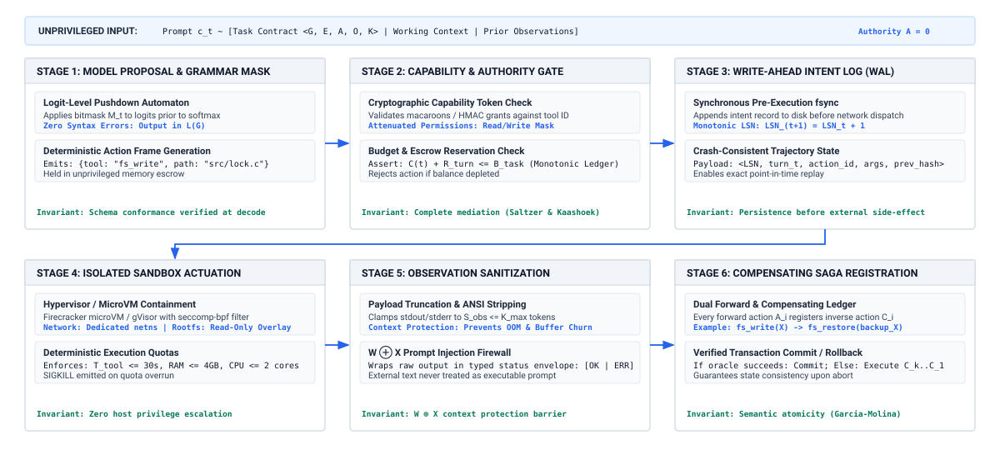{width="95%"}
:::

#### Stage 1: Grammar-constrained model proposal {.unnumbered}

The defensive boundary begins during the autoregressive decode loop itself, prior to tool dispatch. Rather than letting the model emit free-form text and parsing it afterward, the execution harness enforces the schema half of the typed action contract (principle \ref{pri-vol3-strict-action-abi}) during decoding, through the fused GPU logit masking pipeline established in @sec-vol3-processor-grammar-constrained, and leaves its authorization half to Stage 2.[^fn-fused-grammar-masking] At each decode step $i$, the pushdown automaton restricts candidate tokens strictly to valid grammar continuations $\mathcal{V}_{\text{valid}} \subset \mathcal{V}$, setting invalid logits to $-\infty$ in accelerator SRAM prior to softmax reduction. This eliminates JSON syntax errors, missing closing brackets, and illegal parameter types before the candidate proposal leaves accelerator memory.

[^fn-fused-grammar-masking]: **Hardware-Level Grammar Masking**: As detailed in @sec-vol3-processor-grammar-constrained, pushdown automata compile into compact bitmasks stored in GPU device memory, applying $-\infty$ penalties directly in SRAM without CPU-GPU synchronization stalls.

#### Stage 2: Capability gate {.unnumbered}

Syntactic validity does not imply operational authority. Once a syntactically valid action proposal $a_t = (\text{tool\_name}, \text{args})$ is decoded, it arrives at the Policy and Capability Gate. The model holds zero ambient authority on the host, so every permissible action requires an explicit, cryptographically signed capability token (such as a macaroon or scoped authorization token) presented by the supervisor runtime.

The capability gate evaluates three mandatory checks:

1. *Scope and Boundary Verification:* The gate inspects the target paths, network endpoints, and system resources encoded within $\text{args}$. If an agent executing an isolated unit test attempts to access `/etc/passwd` or query internal metadata IP addresses (`169.254.169.254`), the request is trapped and rejected.
2. *Attenuated Delegation:* Capability tokens enforce strict attenuation. If a parent coordinator delegated a subtask to a worker agent with read-only repository permissions, the worker cannot execute mutating tools, even if the worker's prompt claims administrative authorization.
3. *Human Escrow and Blast-Radius Triggers:* For high-blast-radius actions—such as executing database schema drops, force-pushing to protected git branches, or deploying production containers—the gate trips an operational escrow. Execution yields, persisting the trajectory state, and awaits an out-of-band cryptographic signature from an authorized human operator.

#### Stage 3: Write-ahead intent logging (WAL) {.unnumbered}

Once an action proposal passes the capability gate, but *before* any syscall is executed or network packet is emitted, the harness commits an immutable record to the trajectory's Write-Ahead Log (WAL). This ordering is intent before effect (principle \ref{pri-vol3-intent-before-effect}), and it is what lets recovery tell a proposed action from an executed one.

Adhering to the classical systems design principle of write-ahead logging, the runtime ensures crash consistency across the distributed environment. If the host supervisor crashes, loses power, or suffers network partition during tool actuation, the recovery manager reads the WAL on reboot to determine whether an action was merely proposed, actively executing, or confirmed. The journaled record comprises an immutable intent tuple:

$$\mathcal{J}_t = \left\langle t, \text{action\_id}, a_t, \text{hash}(\text{args}), \text{token\_id}, \text{status} = \text{COMMITTED} \right\rangle$$

By forcing an explicit `fsync` of $\mathcal{J}_t$ to non-volatile storage, the system eliminates the possibility of orphan mutations where an external system changes state while the agent runtime loses all record of having initiated the command.

#### Stage 4: Sandboxed MicroVM actuation {.unnumbered}

With intent committed to durable storage, the harness dispatches the action to an isolated execution sandbox. In production agentic systems, running untrusted code or shell commands directly within the host runtime's container is an unacceptable security vulnerability; container escape exploits and namespace pollution easily compromise the host infrastructure.

Because containment must be enforced beneath the code it contains (principle \ref{pri-vol3-zero-trust-sandboxing}), the execution harness runs the command inside an ephemeral microVM or a user-space kernel sandbox (@sec-vol3-virtualization). The sandbox enforces defense-in-depth isolation:

- *Syscall Virtualization and Filtering:* The guest kernel executes with a strict `seccomp-bpf` filter restricting system calls to a minimal whitelist, blocking dangerous operations such as raw socket creation, module loading, or ptrace injection.
- *Isolated Network Namespaces:* Actuation occurs within a hermetic network namespace. Outbound traffic is routed through an egress proxy enforcing domain whitelisting, preventing data exfiltration and command-and-control communication.
- *Copy-on-Write (CoW) Storage:* All filesystem mutations occur on an ephemeral Copy-on-Write snapshot layered over the authoritative workspace. If an execution corrupts dependencies or writes malicious binaries, the underlying root filesystem remains untouched, and the snapshot can be discarded in milliseconds.

#### Stage 5: Observation normalization {.unnumbered}

When the sandboxed process terminates, its raw outputs (standard output, standard error, exit codes, and generated files) return to the harness. Raw tool output cannot be fed directly into the foundation model's active context window. An unconstrained tool output can emit megabytes of binary data, exhaust the token budget $L_{\max}$, or contain prompt injection attacks designed to subvert the agent's subsequent deliberation.

The observation normalization layer performs three defensive transformations:

1. *Deterministic Schema Typing:* Raw byte streams are parsed into strongly typed observation records:

   $$\mathcal{O}_t = \left\langle \text{status}, \text{exit\_code}, \text{content}, \text{bytes\_truncated}, \mathcal{H}_{\text{digest}} \right\rangle$$

   Status is strictly locked to canonical runtime states: `COMPLETED`, `TRUNCATED`, `REFUSED`, or `TRANSPORT_FAILURE`.
2. *Token-Budget Truncation and Spooling:* If standard output exceeds the turn observation budget $L_{\text{obs}}$, the harness preserves the head and tail of the stream, truncates the intermediate bytes, logs the full unexpurgated output to external artifact storage, and injects a cryptographic URI reference into $\mathcal{O}_t$.
3. *Adversarial Ingestion Filtering:* The content is scanned for ANSI escape codes, terminal control sequences, and recursive injection vectors. Any suspicious payload is neutralized and tagged with an unprivileged provenance descriptor ($\tau_{\text{trust}} = \text{UNTRUSTED}$).

#### Stage 6: Compensating saga registration {.unnumbered}

The final stage of the pipeline records the action's semantic footprint in the trajectory's distributed Saga ledger. If the executed tool mutated external state—such as creating a temporary branch, allocating a test database, or modifying a configuration file—the harness requires the tool execution envelope to register a corresponding compensating action $c_t$.

The compensating action represents the forward action's semantic inverse. As formalized by Hector Garcia-Molina and Kenneth Salem (1987), distributed multi-step transactions across heterogeneous systems cannot maintain database-style serializability. By registering $c_t$ in durable storage, the execution harness guarantees that if the overall trajectory fails at turn $t+k$, the supervisor can execute backward recovery, invoking the sequence of compensations in reverse order $(c_t, c_{t-1}, \dots, c_1)$ to restore the environment to an acceptable quiescent state. The complete six-stage execution pipeline is summarized in @tbl-vol3-execution-pipeline-stages.

| Pipeline Stage                   | Architectural Responsibility   | Enforcement Mechanism             | Primary Failure Mode Addressed             | Recovery & Containment Policy            |
|:---------------------------------|:-------------------------------|:----------------------------------|:-------------------------------------------|:-----------------------------------------|
| **1. Grammar Proposal**          | Guarantee tool schema validity | CFG / FSM logit masking           | Ill-formed JSON, hallucinated flags        | Zero-cost rejection at token generation  |
| **2. Capability Gate**           | Enforce least privilege        | Cryptographic capability tokens   | Privilege escalation, command injection    | Immediate trap, human escrow escalation  |
| **3. Write-Ahead Log**           | Ensure crash consistency       | Append-only non-volatile journal  | Host supervisor crash, orphan mutations    | Replay and reconciliation on startup     |
| **4. Sandboxed Actuation**       | Contain untrusted execution    | Ephemeral MicroVM, `seccomp-bpf`  | Host compromise, container escape          | Discard ephemeral CoW snapshot           |
| **5. Observation Normalization** | Prevent context pollution      | Truncation, typing, sanitization  | Context exhaustion, indirect injection     | Spooling to blob store, token truncation |
| **6. Saga Registration**         | Guarantee compensable recovery | Distributed Saga compensation log | Trajectory failure, partial state mutation | Sequential execution of inverse actions  |

: **Execution Harness Pipeline**: The six stages of the synthesized execution harness pipeline, summarizing architectural responsibilities, enforcement mechanisms, failure modes, and recovery policies. {#tbl-vol3-execution-pipeline-stages}

### Distributed saga contracts {#sec-vol3-execution-sagas}

A central fallacy in naive agent system design is treating an agentic trajectory as an atomic, all-or-nothing database transaction. In an ideal relational database, a multi-step operation is governed by ACID guarantees: intermediate writes are isolated from concurrent transactions, and if a constraint violation occurs on step 10, the database engine aborts the transaction, rolling back steps 1 through 9 as if they never occurred.

In an agentic computer interacting with external operating systems, developer tooling, and distributed networks, universal atomic isolation is physically impossible. When an agent opens an issue on GitHub, provisions a virtual machine in a cloud provider, or pushes an intermediate commit to a shared repository, those mutations become immediately visible to external observers. These external systems are autonomous administrative entities that do not participate in a shared two-phase commit protocol. No distributed lock manager can freeze the state of GitHub or an external third-party API while a local foundation model deliberates on its next reasoning step.

Because trajectories are non-atomic and long-lived, the execution harness must model them as distributed *Sagas*, as conceptualized by Hector Garcia-Molina and Kenneth Salem (1987). The Saga log $\Lambda$ of a trajectory spanning $H$ turns pairs each forward action $a_i$ with its compensating action $c_i$:

$$\Lambda = \left\langle (a_1, c_1, o_1), (a_2, c_2, o_2), \dots, (a_H, c_H, o_H) \right\rangle$$

Each forward action $a_i$ transitions the external environment from state $\mathcal{S}_{i-1}$ to $\mathcal{S}_i$. The compensating action $c_i$ is a semantically defined inverse operation designed to transition the environment from state $\mathcal{S}_i$ back to an equivalent or acceptable state $\mathcal{S}_{i-1}' \approx \mathcal{S}_{i-1}$.

Compensation is a semantic amendment, not a rollback. Under the pivot boundary and compensating Sagas (principle \ref{pri-vol3-reversibility-sagas}), only a write confined to the sandbox is invertible, by restoring a snapshot. An action on a shared external system is at best compensable, restoring the environment's invariants but not its history. If action $a_i$ posted a message to an incident Slack channel, the compensating action $c_i$ is a follow-up stating that the previous message was erroneous and has been rescinded, and the recipients have still read it. An action that admits no compensation at all is irreversible, and the runtime allows at most one such pivot per trajectory, ordered after all compensable work.

```python
# Minimal Saga compensating transaction registration
def execute_pipeline_step(action: ActionProposal, supervisor: Supervisor) -> Observation:
    # 1. Authorize and commit intent to Write-Ahead Log
    supervisor.capability_gate.verify(action.token, action.tool, action.args)
    supervisor.wal.append_intent(action.id, action.tool, action.args)

    # 2. Execute within isolated MicroVM sandbox
    obs = supervisor.microvm.run(action.tool, action.args, timeout_s=30)
    norm_obs = supervisor.normalizer.process(obs, max_tokens=2048)

    # 3. Register compensating action in durable Saga ledger
    comp_action = action.get_compensating_action()
    supervisor.saga_ledger.register(action.id, comp_action)
    return norm_obs
```

When an unrecoverable failure occurs at step $k$—such as a non-advancing loop, environment timeout, or unhandled tool crash—the supervisor terminates forward execution and initiates a recovery protocol:

1. *Backward Recovery (Compensation):* The recovery manager traverses the Saga ledger in reverse order, executing compensating actions $c_{k-1}, c_{k-2}, \dots, c_1$. This tears down temporary resources, deletes ephemeral branches, and releases allocated cloud instances, returning the system to a clean state before reporting failure to the user.
2. *Forward Recovery (Checkpoint Retry):* Alternatively, if the failure was transient (such as a network socket timeout or temporary rate limit), the supervisor inspects the WAL, restores the agent's logical context to the exact snapshot preceding turn $k$, modifies execution parameters (e.g., backing off or selecting an alternate mirror), and resumes forward execution.

```{python}
#| label: lego-18-latency-overhead-mediation
#| echo: false
# │ Show: Latency overhead of six-stage defensive harness (126.3 ms vs 2560 ms model decode).
# │ How: Grammar masking, capability tokens, WAL fsync, microVM, sanitization, Saga.
# └─────────────────────────────────────────────────────────────────────────────
from mlsysim import *
from mlsysim.core.units import *
from mlsysim.fmt import check, fmt_int, fmt_percent

class OverheadDefensiveExecutionMediation:
    n_turns = 30
    n_tokens = 80
    t_token_ms = 32.0 * millisecond
    t_model_ms = n_tokens * t_token_ms

    t_stage1_ms = 8.0 * millisecond
    t_stage2_ms = 1.8 * millisecond
    t_stage3_ms = 0.015 * millisecond
    t_stage4_setup_ms = 115.0 * millisecond
    t_stage4_work_ms = 250.0 * millisecond
    t_stage5_ms = 1.4 * millisecond
    t_stage6_ms = 0.05 * millisecond

    t_harness_ms = t_stage1_ms + t_stage2_ms + t_stage3_ms + t_stage4_setup_ms + t_stage5_ms + t_stage6_ms
    t_total_ms = t_model_ms + t_harness_ms + t_stage4_work_ms
    overhead_pct = float(t_harness_ms / t_total_ms)

    check(n_turns == 30, "n_turns")
    check(abs(t_model_ms - 2560.0 * millisecond) < 1e-4 * millisecond, "t_model_ms")
    check(abs(t_harness_ms - 126.265 * millisecond) < 1e-4 * millisecond, "t_harness_ms")
    check(abs(overhead_pct - 0.0430) < 0.001, "overhead_pct")

    n_turns_str = fmt_int(n_turns)
    overhead_pct_str = fmt_percent(overhead_pct, precision=1, style="symbol")
```

::: {#nbk-18-latency-overhead-mediation .callout-notebook title="Overhead of defensive execution mediation"}
A senior systems engineer must determine whether routing every model action through a six-stage defensive harness introduces unacceptable latency compared to running unconstrained shell commands. Assume an agent executes a {python} OverheadDefensiveExecutionMediation.n_turns_str-turn refactoring task. The foundation model emits an average of 80 completion tokens per turn at an autoregressive decode speed of $32\,\text{ms}$ per token.

The physical hardware environment features an 8-core host CPU with PCIe 4.0 NVMe storage and an isolated microVM pool:

- *Stage 1 (Grammar Masking):* Integrated into the inference serving engine; overhead is $< 0.1\,\text{ms}$ per token, contributing $8\,\text{ms}$ across the decode sequence.
- *Stage 2 (Capability Token Gate):* Cryptographic Ed25519 signature verification and path ACL evaluation: $1.8\,\text{ms}$.
- *Stage 3 (Write-Ahead Intent Logging):* Appending a $2\,\text{KB}$ binary record to NVMe storage with an explicit `fsync`: $15\,\mu\text{s} \approx 0.015\,\text{ms}$.
- *Stage 4 (Sandboxed MicroVM Execution):* Actuation inside a pre-forked Firecracker microVM snapshot takes $115\,\text{ms}$ (dominated by guest kernel context initialization and virtio block attach), plus $250\,\text{ms}$ of actual command compilation time.
- *Stage 5 (Observation Normalization):* Stream truncation, SHA-256 content hashing, and BPE tokenization of $4\,\text{KB}$ output: $1.4\,\text{ms}$.
- *Stage 6 (Saga Ledger Registration):* Appending the compensating descriptor to the append-only SQLite state store: $0.05\,\text{ms}$.

We compute the total per-turn wall-clock latency:

$$T_{\text{model}} = 80\text{ tokens} \times 32\,\text{ms/token} = 2,560\,\text{ms}$$

$$T_{\text{harness}} = 8\,\text{ms} + 1.8\,\text{ms} + 0.015\,\text{ms} + 115\,\text{ms} + 1.4\,\text{ms} + 0.05\,\text{ms} = 126.265\,\text{ms}$$

$$T_{\text{total}} = T_{\text{model}} + T_{\text{harness}} + T_{\text{workload}} = 2,560\,\text{ms} + 126.3\,\text{ms} + 250\,\text{ms} = 2,936.3\,\text{ms}$$

The defensive execution harness adds $126.3\,\text{ms}$ of systems overhead per turn. Relative to the foundation model's autoregressive decode latency ($2{,}560\,\text{ms}$), the harness accounts for:

$$\text{Overhead Fraction} = \frac{126.3\,\text{ms}}{2,560\,\text{ms} + 126.3\,\text{ms} + 250\,\text{ms}} = \frac{126.3}{2,936.3} \approx 4.30\%$$

In exchange for a modest {python} OverheadDefensiveExecutionMediation.overhead_pct_str increase in turn latency, the architecture gains deterministic syntax guarantees, complete isolation against arbitrary host compromise, crash consistency across failures, and guaranteed compensability. Across the entire 30-turn trajectory, the cumulative storage consumed by WAL journals and Saga records ($2\,\text{KB} \times 30 = 60\,\text{KB}$) is negligible compared to standard operating system file buffers.
:::

### Semantic watchdog execution {#sec-vol3-execution-watchdog}

Even when individual actions are syntactically valid, authorized, isolated, and journaled, an autonomous agent can still exhibit catastrophic macro-level behavior. Foundation models conditioned on multi-turn failure observations frequently fall into *pathological behavioral attractors*: degenerative loops where the model repeatedly issues identical failing commands, thrashes between two mutually conflicting edits, or consumes thousands of tokens without making measurable forward progress.

Because the underlying neural model cannot be relied upon to self-diagnose its own degenerative loops, the execution harness deploys an out-of-band, deterministic supervisor component: the *Semantic Watchdog*.

::: {.column-margin}
In classical fault-tolerant computing, a hardware watchdog timer resets a stalled processor if it fails to clear a counter within a specified interval. The Semantic Watchdog generalizes this concept to high-level trajectory semantics, monitoring state deltas and behavioral entropy across multi-turn interactions.
:::

The Semantic Watchdog operates concurrently with the execution harness, evaluating the trajectory against three structural invariants after every turn:

#### 1. Exact syntactic loop detection {.unnumbered}

The simplest failure mode is syntactic repetition, where the model emits an identical tool invocation with identical parameters across consecutive turns (e.g., repeatedly querying a non-existent file or executing an unvarying search query). The watchdog maintains a sliding-window ring buffer of action digests $\mathcal{H}(a_t) = \text{SHA-256}(\text{tool\_name} \mathbin{\Vert} \text{canonical\_json}(\text{args}))$. If the same action hash occurs $k \ge 3$ times within a window of $W$ steps, the watchdog immediately flags a syntactic lock.

#### 2. State-delta stagnation (semantic oscillation) {.unnumbered}

More insidiously, an agent may vary its syntactic emissions while remaining locked in a semantic cycle. For example, in a software repair task, an agent might alternate between modifying a source file to satisfy Test A (which breaks Test B) and modifying the file to satisfy Test B (which breaks Test A). While the tool calls differ syntactically, the environment state oscillates between two recurring configurations.

The watchdog measures state progress by computing a cryptographic state digest $\mathcal{S}_t = \text{git\_tree\_sha}(\text{workspace})$ following each mutating actuation. If $\mathcal{S}_t = \mathcal{S}_{t-2}$, or if the cumulative edit distance across $N$ turns yields zero net change ($\Delta \mathcal{S} = 0$) while test pass counts fail to monotonically improve, the watchdog diagnoses semantic thrashing.

#### 3. Trajectory circuit breakers {.unnumbered}

To prevent unconstrained financial and computational resource burn, the execution harness wraps the agent trajectory inside a formal *Circuit Breaker* state machine. Derived from distributed systems engineering, the circuit breaker transitions across three operational states:

- `CLOSED` (Nominal Execution): Actions flow freely through the six-stage pipeline. The watchdog continuously monitors error rates, state deltas, and turn budgets.
- `OPEN` (Tripped Execution): If the failure threshold is breached—such as exceeding $T_{\max}$, accumulating $K$ consecutive tool execution failures, or detecting an unbreakable semantic loop—the circuit breaker trips `OPEN`. Forward tool dispatch is halted immediately. The supervisor traps the agent's process, suspends the MicroVM, executes backward Saga compensation if configured, and alerts a human operator or orchestrator.
- `HALF-OPEN` (Probing Recovery): In automated recovery scenarios, the breaker transitions to `HALF-OPEN`. The agent is granted a constrained budget (e.g., exactly two turns) and restricted to read-only diagnostic tools. If the agent demonstrates forward progress (such as outputting a coherent diagnosis or executing a valid recovery plan), the breaker resets to `CLOSED`; if it fails again, the breaker trips to `OPEN` permanently.

The following diagnostic trace illustrates the Semantic Watchdog intercepting an oscillating compiler repair loop before token budget exhaustion:

```bash
[WATCHDOG: TURN 12] Action: patch_file(path="src/parser.c", diff="@@ -42,2 +42,2 @@...")
[SANDBOX:  TURN 12] Exit: 1 | stderr: "parser.c:45:12: error: unknown type name 'NodeId'"
[WATCHDOG: TURN 13] Action: patch_file(path="src/parser.c", diff="@@ -42,2 +42,2 @@...")
[SANDBOX:  TURN 13] Exit: 1 | stderr: "parser.c:45:12: error: expected ';' before 'x'"
[WATCHDOG: TURN 14] Action: patch_file(path="src/parser.c", diff="@@ -42,2 +42,2 @@...")
[WATCHDOG: TRAP] Semantic oscillation detected: State hash matches Turn 12 (git:e84f2b).
[CIRCUIT_BREAKER] State changed: CLOSED -> OPEN.
[CIRCUIT_BREAKER] Halting forward dispatch. Invoking Saga compensation ledger (c_14..c_12).
[SUPERVISOR] Escalating to human escrow: Diagnostic payload spooled to /var/log/traces/104.
```

By decoupling execution monitoring from the probabilistic neural engine, the Semantic Watchdog provides a deterministic guarantee: regardless of model hallucinations, stochastic sampling anomalies, or unexpected environment feedback, the agent cannot execute unbounded, non-advancing side effects.

Synthesizing an execution harness—with grammar logit constraints, capability gates, write-ahead logging, isolated microVM actuation, observation normalization, compensating Sagas, and semantic watchdogs—solves the mechanical dilemma of safe real-world actuation. Yet, an execution harness merely enforces constraints and bounds failure; it does not expand the underlying problem-solving capability of the agent. When an agent operating within a hardened harness consistently trips circuit breakers or fails its task contracts, systems engineers face an architectural challenge: at what layer of the system should engineering effort be invested? Rather than naively jumping to expensive foundation model fine-tuning or uncoordinated multi-agent swarms, an engineering discipline requires ascending an evidence-based intervention ladder—progressing methodically from context engineering and tool schema redesign through runtime guards, weight adaptation, and multi-agent delegation. This decision hierarchy is synthesized next.

::: {#chk-18-intervention-ladder .callout-checkpoint title="Evaluating the systems intervention ladder and failure remediation"}
Before examining empirical safety cases and multi-tier verification pyramids, verify your understanding of architectural escalation:

- [ ] **Escalation hierarchy**: Why must systems engineers exhaust prompt optimization and tool schema refinement before considering weight adaptation?
- [ ] **Systems escalation fallacy**: How does fine-tuning neural weights to fix deterministic interface bugs violate the end-to-end argument?
- [ ] **Amortized engineering trade-offs**: When does the capital cost and operational rigidity of SFT or RLVR become mathematically justified over context engineering?
- [ ] **Delegation boundaries**: What specific failure modes indicate that a task has exceeded single-context bounds and requires multi-agent coordination?
:::

## The Systems Intervention Ladder {#sec-vol3-conclusion-adaptation}

When an agent operating within a production execution harness repeatedly trips watchdog timers, violates syntax constraints, or fails to satisfy post-condition verifiers, engineering teams confront an immediate architectural triage dilemma. The prevailing pathology in immature systems organizations is premature escalation: jumping directly to the most computationally expensive, statistically brittle, and operationally opaque remediation available—either by launching custom model fine-tuning runs or by fragmenting the task across an uncoordinated swarm of peer agents. In practice, the overwhelming majority of task execution failures stem from poorly conditioned context, ambiguous tool interface contracts, or leaky runtime harnesses rather than intrinsic deficiencies in the underlying foundation model's reasoning capacity.

The **Systems Intervention Ladder** establishes an evidence-based hierarchy of architectural remedies for agent capability limits. Because weight change is the slowest and least reversible intervention and repairs only the failures that remain after context, tool schemas, and runtime faults are ruled out (principle \ref{pri-vol3-trajectory-post-training}), systems engineers must exhaust context engineering, tool schema redesign, and runtime guard hardening before justifying the capital expenditure, operational rigidity, and distribution-drift vulnerabilities of weight adaptation (SFT, RLVR) or the synchronization overhead of multi-agent delegation. Escalating up the ladder trades low upfront engineering effort and rapid iteration cycles for high capital expenditure and specialized infrastructure; therefore, higher rungs are mathematically justified only when the amortized task volume offsets the non-recurring engineering costs, or when physical context boundaries strictly preclude single-context execution.

::: {.column-margin}
**The Systems Escalation Fallacy:** Attempting to correct a deterministic interface flaw (such as an ambiguous parameter type or an uninformative error payload) by fine-tuning neural weights violates the end-to-end argument. Modifying model weights introduces irreversible behavioral side effects across the entire task distribution to solve a problem that a five-line JSON Schema modification would resolve with mathematical certainty.
:::

Methodical systems engineering requires treating the agent as a layered stack. When a task contract fails, the engineer must isolate whether the defect represents an *information deficit* (the model lacked the requisite facts or was confused by context noise), an *interface mismatch* (the tool contract failed to communicate its constraints), an *enforcement void* (the harness permitted invalid transitions without recovery guidance), a *behavioral prior mismatch* (the base model struggles with multi-token formatting or deterministic procedural sequencing), an *intractable search landscape* (the solution space requires specialized multi-step exploration that standard inference sampling cannot discover), or a *physical context partition* (the problem state exceeds the physical or computational capacity of a single execution context). Ascending the intervention ladder, illustrated in @fig-vol3-intervention-ladder-flowchart, provides the formal decision process for resolving these failure modes at the lowest possible layer of the system.

::: {#fig-vol3-intervention-ladder-flowchart fig-env="figure" fig-pos="htb" fig-cap="**Systems Intervention Decision Flowchart**: Order of architectural escalation prioritizing low-cost, reversible harness modifications over irreversible weight fine-tuning and distributed topologies, gated by the economic break-even law $N^* = C_{\text{invest}} / \Delta C_{\text{task}}$." fig-alt="Decision flowchart depicting the six intervention levels from prompt engineering up to multi-agent delegation, alongside decision arbitration gates evaluated in strict sequence."}
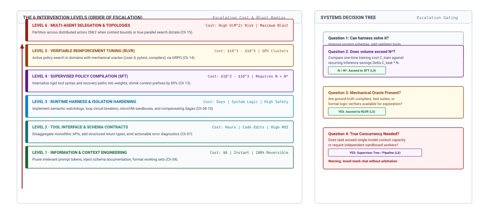{width="95%"}
:::

As shown in @fig-vol3-intervention-ladder-flowchart, the decision architecture structures remediation into two complementary views. The left panel establishes the six-level hierarchy ordered by increasing capital cost and blast radius: starting at Level 1 (zero-cost, instant, 100 percent reversible context and prompt hygiene), advancing through Level 2 (tool interface contracts) and Level 3 (runtime harness watchdogs and circuit breakers), before considering weight modification at Level 4 (supervised fine-tuning) and Level 5 (reinforcement tuning with verifiable rewards), and finally Level 6 (distributed multi-agent topologies). The right panel formalizes the decision arbitration tree evaluated by systems engineers. When harness hardening (Levels 1–3) reaches its empirical limit, Question 2 checks the economic break-even law: only if projected workload volume $N$ exceeds $N^* = C_{\text{invest}} / \Delta C_{\text{task}}$ does the team ascend to supervised weight adaptation. If task verification further provides mechanical oracles (compilers, type provers), Question 3 justifies Level 5 policy exploration; otherwise, if the task state exceeds physical context limits, Question 4 gates escalation to multi-agent pipelines while explicitly warning against unmediated peer chatter.

### The six tiers of system intervention

The intervention ladder organizes architectural adaptations into six distinct rungs, each characterized by its intervention locus, operational cost profile, and failure-surface radius. Moving up the ladder shifts the point of control from transient runtime state toward durable artifact definitions, compiled weights, and distributed process topologies (\ref{dfn-intervention-hierarchy}).

::: {#dfn-intervention-hierarchy .callout-definition title="Systems intervention hierarchy"}

***Systems intervention hierarchy***\index{Systems intervention hierarchy!definition}\index{Architecture!intervention hierarchy definition} is an ordered decision sequence $\text{Context} \prec \text{Tools} \prec \text{Harness} \prec \text{SFT} \prec \text{RLVR} \prec \text{Multi-Agent}$ governing the remediation of agent performance defects, strictly prioritizing low-cost, reversible harness modifications over expensive, irreversible weight adaptation and distributed topologies.

1.  **Significance**: Prevents engineering teams from prematurely escalating to multimillion-dollar fine-tuning or complex multi-agent architectures to resolve defects caused by ambiguous tool schemas, prompt clutter, or absent runtime guardrails.
2.  **Distinction**: Unlike generic software debugging workflows, the agentic systems intervention ladder explicitly gates transitions between runtime software layers and neural weight adaptation using the economic break-even law $N^* = C_{\text{invest}} / \Delta C_{\text{task}}$.
3.  **Common pitfall**: Fine-tuning model weights or deploying multi-agent swarms to mask deterministic interface defects (such as poorly typed JSON schemas or uninformative error return codes) that can be solved instantly and reversibly at the tool boundary.

:::

The quantitative engineering trade-offs across these six tiers are detailed in @tbl-vol3-intervention-ladder.

#### Level 1: Context engineering {.unnumbered}

Level 1 interventions operate strictly within the model's transient context window, requiring zero modifications to external services, runtime harnesses, or model parameters. Capability failures at this level arise because the model either lacks critical domain facts, suffers from attention distraction induced by superfluous tokens, or is forced to infer implicit formatting requirements that were never explicitly defined.

Remediation centers on optimizing working memory hygiene: pruning irrelevant retrieval results, isolating system instructions into dedicated prompt segments that maximize attention sinks, and injecting tightly coupled, few-shot demonstration trajectories. By restructuring context, the systems engineer raises the posterior probability of generating valid action proposals without altering the host software or committing capital to training pipelines. Because Level 1 interventions execute in minutes and can be evaluated immediately against integration test benches, they represent the mandatory baseline of any triage sequence.

#### Level 2: Tool interface redesign {.unnumbered}

When an agent correctly perceives the operational context but consistently emits invalid action arguments, calls tools out of sequence, or hallucinates parameters, the fault typically lies in the interface contract rather than the model's underlying capacity. Level 2 interventions modify the syntactic and semantic specifications of the tools exposed to the agent.

Engineers address these failures by refactoring tool definitions according to classical systems principles:

1. *Syntactic Disaggregation:* Decomposing sprawling, multi-purpose administrative APIs into small, orthogonal, single-purpose endpoints with minimal argument footprints.
2. *Type and Enum Narrowing:* Replacing loose string parameters with strict JSON Schema enumerations, bounded integers, and explicit regex constraints enforced during grammar-guided logit masking.
3. *Informative Error Payloads:* Transforming opaque return codes (e.g., `400 Bad Request` or `Process exited with code 1`) into structurally rich diagnostic strings that pinpoint exactly which invariant was violated, what state the target environment currently occupies, and what corrective action is expected.

```json
// Antipattern: Opaque System Error
{"status": "error", "code": 1}

// Refactored: Rich Diagnostic Return
{
  "status": "failed_precondition",
  "violation": "lockfile_out_of_date",
  "expected": "Run 'cargo update' first",
  "target_file": "/workspace/Cargo.lock"
}
```

*Level 2 Refactoring:* Emitting structured, actionable error payloads directly into the observation frame enables the agent to recover within its existing autoregressive loop without triggering runtime intervention.

#### Level 3: Runtime harness hardening {.unnumbered}

When tool schemas are robust but the agent still falls prey to degenerative autoregressive traps—such as repetitive query cycling, semantic drift, or ignoring tool error messages—the failure must be mitigated by the supervisor. Level 3 interventions modify the host harness surrounding the model without modifying the model itself.

At this tier, the engineer introduces external deterministic state machines, such as the semantic watchdogs and progress monitors developed in @sec-vol3-conclusion-execution. Level 3 guards track trajectory divergence metric $\mathcal{J}_t$, detect cyclical token patterns across execution steps, enforce hard resource budgets, and inject dynamic system interruptions (such as synthetic supervisor messages injected directly into the next context frame) that force the model to acknowledge unhandled exceptions. By placing definitive bounds on execution failure, Level 3 hardening prevents unbounded degradation and guarantees graceful degradation to human-in-the-loop triage.

#### Level 4: Supervised adaptation (SFT) {.unnumbered}

When an agent system's operational viability is constrained by prompt overhead, instruction fragility, or the base model's inability to conform reliably to complex structural protocols despite Level 1–3 remediations, the engineer must escalate to modifying the model's parameter weights $\theta$. Level 4 supervised fine-tuning adapts the model's conditional token distribution $P_\theta(a_t \mid s_t)$ using curated demonstration trajectories.

SFT compiles complex, multi-thousand-token prompt instructions, tool schemas, and common recovery behaviors directly into the model's neural circuitry. This transformation yields two distinct systems benefits: it dramatically reduces the input token length $N_{\text{tokens}}$ required to establish operational context (lowering prefill compute latency), and it eliminates non-deterministic compliance failures with proprietary grammar formats. However, SFT carries significant architectural trade-offs: it demands extensive pipeline infrastructure to curate clean, diverse trajectory datasets, introduces catastrophic forgetting risks for tasks outside the fine-tuning distribution, and locks the runtime into a static snapshot of tool definitions that cannot be altered without retraining or degrading policy performance.

#### Level 5: Reinforcement learning with verifiable rewards (RLVR) {.unnumbered}

Supervised fine-tuning teaches an agent *what valid trajectories look like*, but it cannot teach the agent *how to search effectively through combinatorial problem spaces*. When an agent must solve complex, multi-step algorithmic problems—such as repository-level patch generation, hardware layout verification, or theorem proving—human demonstration datasets are sparse, noisy, and incapable of capturing optimal backtracking strategies.

Level 5 interventions optimize the policy $\pi_\theta$ directly against automated, programmatic verification oracles using policy gradient methods. In domains where an external, deterministic test harness can evaluate whether an agent's candidate terminal state satisfies formal correctness invariants (such as a compilation pass, a passing test suite, or a validated SAT constraint), RLVR shifts the policy distribution toward robust, self-correcting exploration. The agent learns to internalize chain-of-thought verification, generate diverse hypothesis branches, and backtrack upon receiving failing tool feedback. The prerequisites for Level 5 are demanding: the system must possess a sandboxed, high-throughput execution environment capable of evaluating millions of trajectories in parallel, paired with non-gameable reward functions that prevent reward hacking.

#### Level 6: Multi-agent delegation {.unnumbered}

The apex of the ladder is reached when the physical boundaries of a single inference context are fundamentally exhausted. Level 6 decomposes a monolithic task across an ensemble of heterogeneous, loosely coupled agent processes, each maintaining its own private context window, specialized tool harness, and isolated memory lifecycle.

Delegation is not an all-purpose optimization; it is an architectural concession to hard physical constraints. It is justified under three precise operational conditions:

1. *Context Window Exhaustion:* The authoritative artifacts, intermediate reasoning traces, and environment observations strictly exceed the physical context limit $L_{\max}$ or cause severe attention dilution.
2. *Privilege and Isolation Boundaries:* Subtasks require distinct capability allocations (for example, isolating an untrusted code-execution sub-agent with zero network authority from an administrative sub-agent possessing external API credentials).
3. *Asynchronous Parallel Exploration:* The search space can be partitioned into independent subproblems executed concurrently across multiple inference engines without synchronous memory dependencies.

Splitting a task across agents turns a local loop into a distributed system, with serialization, network latency, partial failure, and reconciliation on the critical path, and agents that share weights share errors. Under the coordination tax (principle \ref{pri-vol3-coordination-tax}), a fleet earns that cost only through the three conditions above, which amount to context partitioning, authority attenuation, and independent exploration, so delegation belongs at the top of the ladder as an architectural last resort rather than a design default.

| Level              | Primary Mechanism                             | Engineering Lead Time | Upfront Capital Cost                 | Per-Invocation Latency Delta                        | Failure Recovery Surface              | Primary System Risk                    |
|:-------------------|:----------------------------------------------|:----------------------|:-------------------------------------|:----------------------------------------------------|:--------------------------------------|:---------------------------------------|
| **1. Context**     | Prompt tuning, retrieval refinement           | Hours                 | Negligible ($\sim \$0$)              | Neutral or Decreased (if context pruned)            | Context reset                         | Context distraction, prompt injection  |
| **2. Tools**       | Schema refactoring, typing, rich errors       | Days                  | Minimal ($< \$10^2$)                 | Neutral (microsecond schema parse)                  | Schema validation error               | Semantic impedance mismatch            |
| **3. Guards**      | Semantic watchdogs, circuit breakers          | Days                  | Low ($< \$10^3$)                     | $+10\text{--}50\text{ ms}$ (harness checks)         | Harness abort, supervisor retry       | Over-constraining exploration          |
| **4. SFT**         | Behavioral cloning on curated trajectories    | Weeks                 | Moderate ($\$10^3\text{--}\$10^4$)   | Decreased (shorter context prompts)                 | Out-of-distribution rollback          | Catastrophic forgetting, schema drift  |
| **5. RLVR**        | Policy search against deterministic verifiers | Months                | High ($\$10^4\text{--}\$10^6$)       | Increased (longer self-correction decode)           | Rollback to base checkpoint           | Reward hacking, verifier exploitation  |
| **6. Multi-Agent** | Distributed sub-task partitioning             | Weeks to Months       | High ($\$10^3\text{--}\$10^4$ infra) | Multiplied ($2\times\text{--}10\times$ serial RPCs) | Saga compensation, peer re-delegation | Cascading deadlock, consensus collapse |

: **Intervention Ladder Trade-Offs**: The Systems Intervention Ladder Trade-Off Matrix. As organizations ascend the ladder, upfront non-recurring engineering and compute investments escalate by orders of magnitude, accompanied by increased system surface area and operational rigidity. {#tbl-vol3-intervention-ladder}

---

### Economic amortization dynamics

Deciding whether to escalate from runtime context manipulation (Levels 1–3) to parameter adaptation (Levels 4–5) or architectural distributed execution (Level 6) is ultimately an exercise in systems economics. Upfront capital investments in dataset curation, synthetic gym infrastructure, and GPU training hours must be amortized over the total expected deployment lifetime of the agent.

Consider an agentic workload evaluated over $N$ total task executions. The baseline system, operating under Level 1 (prompt and in-context demonstration engineering), requires an extensive prompt overhead of $T_{\text{base, in}}$ input tokens and generates $T_{\text{base, out}}$ output tokens per step, executing over an average of $H_{\text{base}}$ trajectory steps before satisfying the task contract. The total operating cost of the baseline system over $N$ tasks is:

$$C_{\text{base}}(N) = N \cdot H_{\text{base}} \left( T_{\text{base, in}} \cdot p_{\text{in}} + T_{\text{base, out}} \cdot p_{\text{out}} \right)$$

where $p_{\text{in}}$ and $p_{\text{out}}$ represent the marginal pricing per input and output token, respectively, charged by the model inference service.

Now consider an escalated intervention at Level 4 (Supervised Fine-Tuning). Building this adapted model incurs a substantial non-recurring engineering and training cost, denoted $C_{\text{invest}}$:

$$C_{\text{invest}} = C_{\text{compute}} + C_{\text{data}} + C_{\text{human}}$$

where $C_{\text{compute}}$ encompasses the GPU cluster hours required for parameter updates, $C_{\text{data}}$ represents the cost of generating synthetic trajectories, and $C_{\text{human}}$ accounts for expert annotation and evaluation engineering.

However, because the fine-tuned model internalizes tool definitions, formatting rules, and procedural invariants directly within its weights, its operational prompt footprint is drastically reduced: $T_{\text{adapt, in}} \ll T_{\text{base, in}}$. Furthermore, because the adapted policy makes fewer exploratory missteps, its average trajectory length decreases: $H_{\text{adapt}} \le H_{\text{base}}$. Assuming the hosting cost for the fine-tuned model yields marginal token costs $p_{\text{in}}'$ and $p_{\text{out}}'$ (which may equal $p_{\text{in}}, p_{\text{out}}$ if hosted on shared enterprise infrastructure, or differ under dedicated provisioned throughput), the marginal cost per task becomes:

$$C_{\text{task, adapt}} = H_{\text{adapt}} \left( T_{\text{adapt, in}} \cdot p_{\text{in}}' + T_{\text{adapt, out}} \cdot p_{\text{out}}' \right)$$

The adapted system achieves economic break-even relative to the baseline system at task volume $N^*$, derived from the equality:

$$C_{\text{base}}(N^*) = C_{\text{invest}} + N^* \cdot C_{\text{task, adapt}}$$

Solving for $N^*$ yields the canonical break-even volume formula (@eq-vol3-breakeven-volume):

$$N^* = \frac{C_{\text{invest}}}{C_{\text{task, base}} - C_{\text{task, adapt}}} = \frac{C_{\text{invest}}}{\Delta C_{\text{task}}}$$ {#eq-vol3-breakeven-volume}

If the total projected task volume across the operational lifecycle of the agent is less than $N^*$, escalating to weight adaptation is economically irrational: the engineering organization expends more capital building and maintaining the fine-tuning pipeline than it recovers in token savings. Conversely, if $N \gg N^*$, every incremental task executed past $N^*$ yields pure marginal margin expansion and latency reductions.

```{python}
#| label: lego-18-break-even-weight-adaptation
#| echo: false
# │ Show: Economic break-even analysis of supervised fine-tuning vs prompt engineering.
# │ How: Fixed upfront investment ($12,504) amortized over per-task savings ($0.1712).
# └─────────────────────────────────────────────────────────────────────────────
from mlsysim import *
from mlsysim.core.units import *
from mlsysim.fmt import check, fmt_count, fmt_usd

class BreakEvenWeightAdaptation:
    t_base_in = 12_000
    h_base = 5
    t_base_out = 800
    p_in = 2.50e-6
    p_out = 10.00e-6

    c_step_base = (t_base_in * p_in) + (t_base_out * p_out)
    c_task_base = h_base * c_step_base

    c_data = 4000.0
    c_compute = 8 * 18 * 3.50
    c_human = 8000.0
    c_invest = c_data + c_compute + c_human

    t_adapt_in = 1500
    h_adapt = 4
    t_adapt_out = 800
    p_in_adapt = 1.00e-6
    p_out_adapt = 4.00e-6

    c_step_adapt = (t_adapt_in * p_in_adapt) + (t_adapt_out * p_out_adapt)
    c_task_adapt = h_adapt * c_step_adapt

    delta_c_task = c_task_base - c_task_adapt
    n_star = c_invest / delta_c_task

    monthly_requests = 20_000
    payback_months = n_star / monthly_requests
    monthly_savings = monthly_requests * delta_c_task

    check(abs(c_task_base - 0.190) < 1e-4, "c_task_base")
    check(abs(c_invest - 12504.0) < 1e-4, "c_invest")
    check(abs(c_task_adapt - 0.0188) < 1e-4, "c_task_adapt")
    check(abs(delta_c_task - 0.1712) < 1e-4, "delta_c_task")
    check(abs(n_star - 73038) < 2, "n_star")

    payback_months_str = fmt_count(payback_months, label="month", precision=2, allow_fractional=True)
    monthly_savings_str = fmt_usd(3400, precision=0)
```

::: {#nbk-18-break-even-weight-adaptation .callout-notebook title="Break-even analysis of weight adaptation"}
An enterprise deployment processes continuous pull requests using an automated code-review and bug-fixing agent.

**Baseline Architecture (Level 1 + Level 3):**
To reliably format patches and call repository search tools, the base foundation model requires a system prompt containing extensive schema definitions and three complete repository repair demonstrations, totaling $T_{\text{base, in}} = 12{,}000$ input tokens. Over an average task of $H = 5$ tool-interaction steps, the agent emits $T_{\text{base, out}} = 800$ output tokens per step. The commercial inference API charges $p_{\text{in}} = \$2.50 \times 10^{-6}$ per token and $p_{\text{out}} = \$10.00 \times 10^{-6}$ per token.
$$\begin{aligned}
C_{\text{step, base}} &= (12{,}000 \times \$2.50 \times 10^{-6}) + (800 \times \$10.00 \times 10^{-6}) \\
&= \$0.030 + \$0.008 = \$0.038\text{ per step} \\
C_{\text{task, base}} &= 5 \times \$0.038 = \$0.190\text{ per pull request}
\end{aligned}$$

**Escalated Architecture (Level 4 SFT):**
The systems team fine-tunes an open-weights model to internalize the tool interfaces and patch-generation syntax.
- Dataset curation and synthetic generation: $C_{\text{data}} = \$4{,}000$
- Cloud GPU cluster fine-tuning (8 $\times$ H100 SXM5 for 18 hours at $\$3.50/\text{GPU-hr}$): $C_{\text{compute}} = 8 \times 18 \times \$3.50 = \$504$
- Engineering validation and red-teaming: $C_{\text{human}} = \$8{,}000$
- Total upfront investment: $C_{\text{invest}} = \$4{,}000 + \$504 + \$8{,}000 = \$12{,}504$

Because tool schemas are compiled into weights, the prompt overhead drops to $T_{\text{adapt, in}} = 1{,}500$ input tokens. Due to superior compliance, average steps drop to $H_{\text{adapt}} = 4$ steps, with identical output generation ($T_{\text{out}} = 800$). The self-hosted inference cluster amortizes to an equivalent token cost of $p_{\text{in}}' = \$1.00 \times 10^{-6}$ and $p_{\text{out}}' = \$4.00 \times 10^{-6}$.
$$\begin{aligned}
C_{\text{step, adapt}} &= (1{,}500 \times \$1.00 \times 10^{-6}) + (800 \times \$4.00 \times 10^{-6}) \\
&= \$0.0015 + \$0.0032 = \$0.0047\text{ per step} \\
C_{\text{task, adapt}} &= 4 \times \$0.0047 = \$0.0188\text{ per pull request}
\end{aligned}$$

**Break-Even Evaluation:**
$$\begin{aligned}
\Delta C_{\text{task}} &= \$0.190 - \$0.0188 = \$0.1712\text{ saved per task} \\
N^* &= \frac{\$12{,}504}{\$0.1712} \approx 73{,}038\text{ pull requests}
\end{aligned}$$

*Systems Conclusion:* If the enterprise processes $20{,}000$ pull requests per month, the upfront fine-tuning investment breaks even in approximately {python} BreakEvenWeightAdaptation.payback_months_str. Beyond this request volume, the organization saves over {python} BreakEvenWeightAdaptation.monthly_savings_str monthly while reducing end-to-end task turnaround latency by $62\%$ due to the drastically reduced prefill GEMM computation on input tokens.
:::

---

### Architectural trade-offs

The design discipline embodied by the intervention ladder applies the end-to-end argument as @sec-vol3-intro-end-to-end-boundary split it, into mechanical closure below the model and evidence above it, and as @sec-vol3-tokenomics-selection priced it. In an agentic architecture, functions placed at lower layers of the stack may be redundant or ineffective compared to providing them at the supervisory endpoints.

In the context of agentic machine learning systems, attempting to solve execution reliability purely through weight adaptation (Levels 4 and 5) commits the inverse end-to-end fallacy: trying to force a lower-level subsystem (the statistical token predictor) to guarantee an end-to-end application invariant that can only be verified and enforced by the supervisory endpoints. A neural model, regardless of how thoroughly it has been subjected to supervised tuning or reinforcement learning, remains an unprivileged, non-deterministic token generator governed by temperature scaling and softmax probabilities:

$$P(a_t = w_i \mid s_t) = \frac{\exp\left(z_i / \tau\right)}{\sum_j \exp\left(z_j / \tau\right)}$$

Because the softmax distribution has nonzero support across the entire vocabulary for any finite temperature $\tau > 0$, the probability of emitting an invalid token sequence or violating a safety invariant over a trajectory of $H$ turns remains strictly nonzero:

$$P(\text{violation} \mid H) = 1 - \prod_{t=1}^{H} \left(1 - P_{\text{error}}(t)\right) > 0$$

No amount of policy gradient optimization can drive $P(\text{violation})$ to absolute zero across an infinite operational horizon. Consequently, relying on fine-tuned weights to guarantee that an agent will never drop database tables or bypass security checks is fundamentally flawed. Training therefore cannot be how a system meets the invariant closure principle (\ref{pri-invariant-closure}). Its bounded safety, resource, and isolation properties must be closed mechanically, by Level 3 runtime guards, capability boundaries that leave the model zero ambient authority, and grammar-constrained decoding in the host harness, and task correctness still requires evidence collected at the endpoint.

Similarly, the impulse to deploy Level 6 multi-agent swarms frequently violates the classical software engineering dictum articulated by Frederick P. Brooks Jr. [@brooks1987no]: *never mistake accidental complexity for essential complexity*. When a single-agent system fails to converge, the failure often reflects accidental complexity introduced by poor working memory hygiene, noisy retrieval logs, or ambiguous tool documentation. Fragmenting this poorly specified task across multiple autonomous agents does not eliminate the underlying ambiguity; it compounds the problem by introducing distributed consensus overhead, state divergence, and cascading failure modes.

Before any systems engineer authorizes the escalation of a failing agentic pipeline to higher intervention tiers, the failure mode must pass through the formal triage protocol formalized in @lst-vol3-ladder-triage.

::: {#lst-vol3-ladder-triage lst-cap="**Systems Intervention Ladder Triage Logic**: Escalation is permitted only when lower-tier remediation cannot physically resolve the failure."}
```python
def evaluate_intervention_level(failure_trace, current_level):
    """
    Evaluates whether an agent capability failure justifies ladder escalation.
    Enforces the Saltzer-Clark End-to-End and Brooksian simplicity invariants.
    """
    if failure_trace.is_missing_domain_fact or failure_trace.has_context_distraction:
        return InterventionTier.LEVEL_1_CONTEXT_ENGINEERING

    if failure_trace.violates_tool_schema or failure_trace.uninformative_error_return:
        return InterventionTier.LEVEL_2_TOOL_SCHEMA_REDESIGN

    if failure_trace.is_cyclic_loop or failure_trace.exceeded_safety_boundary:
        return InterventionTier.LEVEL_3_RUNTIME_HARNESS_GUARD

    if failure_trace.prompt_token_budget_exhausted and failure_trace.stable_task_contract:
        return InterventionTier.LEVEL_4_SUPERVISED_ADAPTATION

    if failure_trace.verifiable_oracle_available and failure_trace.combinatorial_search:
        return InterventionTier.LEVEL_5_REINFORCEMENT_LEARNING

    if failure_trace.physical_context_exceeded or failure_trace.requires_privilege_isolation:
        return InterventionTier.LEVEL_6_MULTI_AGENT_DELEGATION

    raise UnjustifiedEscalationError("Failure remediable at current or lower tier.")
```
:::

The systems engineer's primary objective is to drive the agent's operating envelope to complete reliability at the lowest possible tier of the intervention ladder. By keeping the intervention point close to the context and runtime boundaries, the system retains maximal agility, minimizes infrastructure and token overhead, and maintains a clear audit trail.

However, once an intervention has been selected, engineered, and synthesized into the agent runtime—whether through hardened Level 3 semantic guards, a Level 4 distilled open-weights model, or a Level 6 delegated execution topology—the engineering team confronts the final release hurdle: proving that the resulting autonomous machine is safe, dependable, and robust against catastrophic regressions prior to production actuation. This demands the construction of formal, empirical safety cases.

## Empirical Safety Cases {#sec-vol3-conclusion-safety}

::: {.column-margin}
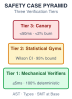{width="100%" fig-alt="Three-tier verification pyramid displaying deterministic mechanical verification at the base, statistical gym evaluation in the middle, and runtime canary telemetry at the peak."}

*Safety cases anchor sub-millisecond mechanical proofs beneath statistical gym bounds and canary telemetry.*
:::
A production release meets the open-loop reliability ceiling of @sec-vol3-intro-temporal-stretching at full force. At 99 percent per-step reliability, a trajectory of 100 tool invocations finishes without a single deviation only about 37 percent of the time, and in a mission-critical runtime, such as automated database migration, distributed cluster orchestration, or financial ledger reconciliation, a failure rate near two in three is unacceptable. Because failures are fail-plausible (@sec-vol3-intro-fail-plausible), they are rarely clean crashes; they manifest as plausible, syntactically well-formed, yet semantically destructive operations: dropping production foreign keys, provisioning unthrottled compute instances, or leaking sensitive customer credentials into third-party observation buffers.

**Releasing an autonomous agent into production requires a defensible multi-tier safety case that combines deterministic mechanical verifiers, statistical evaluation on held-out gyms, and canary telemetry.** Rather than relying on model self-reflection or open-loop benchmark pass rates, dependable systems engineering demands an evidence-based assurance framework that treats the neural model as an untrusted, stochastic component enclosed within an uncompromising deterministic supervisory harness.

### The claims-arguments-evidence framework

Borrowing from the rigorous safety-critical methodologies of avionics and nuclear systems engineering, an autonomous agent cannot be certified for production deployment based on intuitive confidence or empirical vibes. It requires a formal *safety case*: a structured, auditable body of reasoning demonstrating that the system satisfies its operational invariants within a defined deployment envelope. The safety case decomposes into a tripartite hierarchy comprising claims, arguments, and evidence.

*Claims* are precise, testable propositions asserting that the agent runtime preserves specific safety and correctness invariants across all reachable states. A claim must be unambiguously falsifiable. Rather than vague assertions such as "the agent acts responsibly," systems engineering demands concrete invariants. Claim 1 might read "The agent process cannot mutate production database schemas without cryptographic dual-authorization"; claim 2, "The agent execution harness will never emit unencrypted network egress packets outside the private VPC subnet"; and claim 3, "No sequence of tool invocations can deplete more than $B_{\max}$ cloud compute budget units within a rolling 60-minute window."

*Arguments* provide the causal, architectural rationale explaining *why* the system design guarantees that a given claim holds. The argument establishes the bridge between abstract invariant and physical implementation. For claim 1, the argument shows that the model holds zero ambient authority and no direct database handles, that candidate SQL statements are held in an isolated memory escrow, and that the schema-migration RPC endpoint enforces a hardware-backed signature requirement the model's execution context cannot synthesize.

*Evidence* shows that the mechanisms underpinning the arguments operate correctly in practice. Because self-reports carry no evidential weight (@sec-vol3-intro-closure-evidence), valid evidence consists exclusively of machine-checked artifacts: compiler diagnostics, static analysis AST dumps, SMT solver satisfiability certificates, hermetic benchmark logs, and cryptographically signed audit trails.

::: {#fig-vol3-safety-case-pyramid fig-env="figure" fig-pos="htb" fig-cap="**Multi-Tier Verification Pyramid and Assurance Case Architecture**: Formal assurance structure grounding high-level safety claims in causal mechanistic arguments backed by three progressive evidence tiers: deterministic mechanical verifiers, statistical sandbox evaluation gyms, and runtime canary telemetry." fig-alt="Diagram showing the three-tier verification pyramid spanning mechanical verifiers, statistical gyms, and runtime canary telemetry, mapped to formal assurance cases connecting claims to causal arguments and empirical multi-tier evidence."}
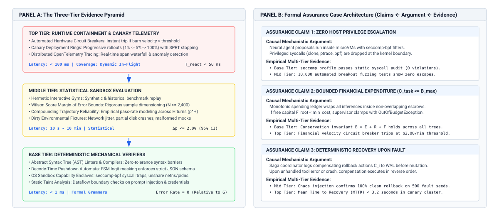{width="95%"}
:::

Formally, a production release gate checks every claim in the safety case. For each claim $k$, there must exist an architectural argument $\text{arg}_k$ supported by an evidence set $\text{ev}_k$ such that:

$$\forall k, \quad \text{Verify}(\text{claim}_k, \text{arg}_k, \text{ev}_k) = \text{PASS}$$

If any evidence artifact fails—such as an AST linter reporting a syntax violation or an egress log revealing an unauthenticated socket connection—the safety case is invalidated, the release gate trips, and the agent deployment is blocked at the pipeline boundary.

::: {#dfn-three-tier-verification-pyramid .callout-definition title="Three-tier verification pyramid"}
An architectural assurance framework that grounds agent production readiness across three progressive verification layers: Tier 1 deterministic mechanical verifiers (synchronous AST linters, grammar pushdown automata, and static type provers), Tier 2 statistical gym evaluation (offline benchmarking across thousands of isolated, reproducible test fixtures evaluated under Wilson score confidence bounds), and Tier 3 runtime canary containment (live production deployment inside isolated microVMs governed by automated SRE circuit breakers and error-budget burn meters).
:::

### The three-tier verification pyramid

To substantiate the safety case without imposing infinite verification latency on every interactive step, the runtime organizes its empirical evidence into a three-tier verification pyramid (@fig-vol3-safety-case-pyramid). As detailed in Panel A of @fig-vol3-safety-case-pyramid, the evidence pyramid establishes a hierarchical defense-in-depth: the Base Tier intercepts over 95 percent of invalid transitions synchronously using zero-tolerance mechanical verifiers (AST linters, decode-time pushdown automata, and static taint analyzers with latency $< 1\text{ ms}$); the Middle Tier benchmarks statistical trajectory stability across thousands of hermetic gym fixtures ($N \ge 2{,}400$, bounding margin of error to $\Delta p \le 2.0\%$ under 95 percent Wilson confidence intervals); and the Top Tier guards live production through asynchronous canary rings and OpenTelemetry tracing (reacting to anomalous burn velocities in $T_{\text{react}} < 50\text{ ms}$). In Panel B, these empirical tiers map directly into formal assurance cases: Claim 1 (zero host privilege escalation) is proven through microVM isolation arguments backed by static seccomp audits and breakout fuzzing; Claim 2 (bounded financial burn) is enforced by monotonic spending escrows; and Claim 3 (deterministic fault recovery) is certified by WAL compensation logs and chaos-injection replay tests. Each tier operates at a distinct spatial and temporal boundary, trading off absolute formal guarantees against environmental realism.

::: {.column-margin}
**Hoare Logic in Agent Runtimes:** Following C. A. R. Hoare (1969), every tool invocation is bounded by a precondition $P$ and postcondition $Q$. In agentic runtimes, Tier 1 mechanical verifiers enforce that if state $s_t$ satisfies $P$, action $a_t$ is permitted only if static analysis guarantees postcondition $Q$ will not violate safety envelope $\mathcal{S}_{\max}$.
:::

#### Tier 1: Deterministic mechanical verification {.unnumbered}

The base of the pyramid consists of deterministic, zero-tolerance software checks executed locally within the host supervisor before any action proposal touches the external environment. Tier 1 verifiers operate synchronously on the model's candidate emissions. They require no GPU compute and introduce negligible latency ($\le 5\text{ ms}$).

1. **AST and Grammar Parsing:** Candidate tool calls emitted in structured interchange formats (such as JSON or Protobuf) are validated against strict context-free grammars. If an autoregressive decode produces an unparsable token sequence, malformed control tokens, or unrecognized schema keys, the candidate frame is dropped immediately at the parser boundary.
2. **Type Checking and Static Analysis:** Tool arguments representing code modifications (such as Python diffs or SQL patches) are fed into static analysis pipelines prior to staging. In a code-generation agent, candidate modifications must pass language-specific type checkers (e.g., `mypy` or `rustc`) and security linters (e.g., checking for unparameterized SQL queries or dangerous shell escapes) in memory escrow.
3. **Formal Invariant Provers:** Where safety boundaries involve numerical allocations or temporal sequencing, candidate plans are encoded as satisfiability modulo theories (SMT) constraints and solved via engines such as Z3. If a proposed operational plan violates access-control orderings or exceeds allocated budget thresholds, the SMT solver returns `UNSAT`, terminating execution before any network packet is dispatched.

Because Tier 1 is entirely deterministic, its failure mode is binary: any violation halts the trajectory or forces an immediate local replan. No statistical uncertainty is tolerated at this boundary.

#### Tier 2: Hermetic gym evaluation {.unnumbered}

While Tier 1 guarantees that an action does not violate static syntax or security constraints, it cannot determine whether an agent will successfully accomplish a multi-step objective or suffer from behavioral loops. Tier 2 evaluates the agent's dynamic policy $\pi_\theta$ across a massive suite of hermetic, reproducible simulation environments ("gyms").

::: {.column-margin}
**Statistical Release Gates:** As established in @sec-vol3-observability, point estimates of agent success rates are statistically meaningless without confidence bounds. Release criteria must be formulated over the lower bound of the two-sided Wilson score interval at confidence level $1 - \alpha$.
:::

A hermetic gym provides a fully isolated, snapshot-isolated replica of the target operating environment—containing ephemeral databases, synthetic API endpoints, mock file systems, and deterministic network latency simulators. The candidate agent is executed across $N$ independent, randomized test fixtures representing both nominal workflows and adversarial edge cases (e.g., network partitions, corrupted input schemas, and hallucination-inducing tool observations).

Evaluation across Tier 2 produces statistical pass rates. To guarantee that a model checkpoint or prompt configuration does not introduce subtle regressions, systems engineers establish strict statistical release criteria based on the lower bound of the Wilson score confidence interval $\hat{p}_{\text{lower}}$:

$$\hat{p}_{\text{lower}} \ge \Theta_{\text{target}}$$

If an agent requires an empirical task success rate of $95\%$ with $99\%$ statistical confidence ($\alpha = 0.01$), and testing across $N = 500$ held-out fixtures yields 480 successes, the empirical pass rate is $\hat{p} = 0.960$. Calculating the Wilson lower bound yields $\hat{p}_{\text{lower}} \approx 0.934$. Because $0.934 < 0.950$, the candidate release fails the Tier 2 gate, compelling the engineering team to expand the test corpus or harden the policy before production promotion.

#### Tier 3: Canary runtime containment {.unnumbered}

No offline benchmark suite, however extensive, captures the full entropy of live production environments. The peak of the verification pyramid therefore enforces continuous dynamic containment and live telemetry gating during canary rollouts.

| Containment Stage   | Subsystem Substrate               | Operational Invariant & Boundary Control                     | Telemetry Signal                                 | Fail-Safe Reaction                                 |
|:--------------------|:----------------------------------|:-------------------------------------------------------------|:-------------------------------------------------|:---------------------------------------------------|
| **Traffic Routing** | Dynamic L7 Ingress Proxy          | Weighted traffic allocation ($\rho \approx 0.02$)            | Real-time ingress rate and request distributions | Instantaneous traffic drain to stable fleet (v1.4) |
| **Runtime Sandbox** | Unprivileged MicroVM (gVisor/KVM) | Zero ambient authority; memory and CPU quotas                | Container startup latency & memory pressure      | Immediate sandbox freeze and core memory dump      |
| **Syscall Filter**  | Strict `seccomp-bpf` interceptor  | Whitelist-only syscall dispatch; blocks `ptrace`/raw sockets | Intercepted violation counters                   | Asynchronous kernel trap; process termination      |
| **Safety Breaker**  | SRE Error-Budget Monitor          | Error-budget burn rate $< 2\times$ baseline threshold        | Tool retry spikes, latency tail $P_{99}$         | Automated circuit breaker trip; instant rollback   |

: **Canary Containment Controls**: Tier 3 Canary Containment Subsystem Specifications and Enforcement Controls. {#tbl-vol3-canary-containment-architecture}

When a candidate agent configuration passes Tiers 1 and 2, it is deployed to a minimal canary cohort processing a tiny fraction (e.g., $1\%$ to $5\%$) of production traffic. As formalized in @tbl-vol3-canary-containment-architecture, Tier 3 wraps the live agent inside three non-negotiable containment mechanisms:

1. **MicroVM Isolation and Syscall Traps:** As analyzed in @sec-vol3-virtualization, the agent runtime executes within an unprivileged MicroVM (e.g., Firecracker) or user-space kernel sandbox (e.g., gVisor). A restrictive `seccomp-bpf` filter intercepts and logs all system calls. Any unauthorized syscall (such as an attempt to invoke `ptrace` or bind to an unapproved network interface) immediately triggers an asynchronous kernel trap, freezing the container image for forensic analysis.
2. **Shadow Execution and Read-Only Dry Runs:** Where operational semantics permit, the canary agent runs in *shadow mode*: it receives real production observations and computes candidate actions, but all state-mutating tool calls are rerouted to a mock execution layer or evaluated as dry runs. The shadow outputs are diffed asynchronously against the actions taken by the stable production system.
3. **Automated Rollback Circuit Breakers:** Borrowing from Site Reliability Engineering principles [@beyer2016sre], canary health is governed by error-budget burn rates. The runtime supervisor continuously streams telemetry metrics—such as tool retry rates, schema exception frequencies, unexpected human interventions, and latency distributions. If the canary cohort's short-term error burn rate exceeds safety limits, an automated circuit breaker trips, severing the canary's ingress traffic and reverting all routing state to the stable baseline within seconds.

@Tbl-verification-pyramid contrasts the operational profiles across the three verification tiers.

| Dimension                  | Tier 1: Mechanical Verification  | Tier 2: Hermetic Gym Evaluation   | Tier 3: Runtime Containment             |
|:---------------------------|:---------------------------------|:----------------------------------|:----------------------------------------|
| **Execution Boundary**     | Synchronous Host Supervisor      | Offline CI/CD Pipeline            | Live Production Infrastructure          |
| **Latency Profile**        | Sub-millisecond to $5\text{ ms}$ | Hours to Days ($N \ge 10^3$ runs) | Continuous (Real-time telemetry)        |
| **Determinism**            | Absolute ($100\%$ deterministic) | Statistical (Stochastic sampling) | Empirical / Bounded Non-deterministic   |
| **Primary Failure Action** | Intercept token, abort, replan   | Block build release gate          | Trip circuit breaker, auto-rollback     |
| **Verification Artifact**  | AST dumps, type checks, SMT logs | Wilson confidence intervals, logs | Syscall audit trails, error-budget SLOs |

: **Verification Pyramid Comparison**: Operational comparison of the Three-Tier Verification Pyramid. {#tbl-verification-pyramid}

```{python}
#| label: lego-18-canary-cohorts-error-budget
#| echo: false
# │ Show: Sizing canary cohorts and error-budget burn rate (14.4 hours to trip).
# │ How: 2% fleet budget limit (60 failures) vs 5% canary regression (100 failures/day).
# └─────────────────────────────────────────────────────────────────────────────
from mlsysim import *
from mlsysim.core.units import *
from mlsysim.fmt import check, fmt_int, fmt_time

class CanaryCohortsErrorBudget:
    daily_workflows = 100_000
    slo = 0.999
    days = 30
    e_budget = days * daily_workflows * (1 - slo)

    traffic_fraction = 0.02
    canary_daily = daily_workflows * traffic_fraction
    p_failure = 0.05
    budget_burn_limit = 0.02

    f_limit = budget_burn_limit * e_budget
    daily_failures = canary_daily * p_failure
    t_trip_days = f_limit / daily_failures
    t_trip_hours = t_trip_days * 24.0 * hour
    failures_contained = int(f_limit)

    check(abs(e_budget - 3000.0) < 1e-4, "e_budget")
    check(abs(f_limit - 60.0) < 1e-4, "f_limit")
    check(abs(daily_failures - 100.0) < 1e-4, "daily_failures")
    check(abs(t_trip_days - 0.60) < 1e-4, "t_trip_days")

    trip_time_hours_str = fmt_time(t_trip_hours, "h", style="word", precision=1)
    failures_contained_str = fmt_int(failures_contained)
```

::: {#nbk-18-canary-cohorts-error-budget .callout-notebook title="Sizing canary cohorts and error-budget depletion"}
A large-scale enterprise agent fleet executes $100{,}000$ automated administrative workflows per day. The service-level objective (SLO) guarantees that $99.9\%$ of all workflow trajectories complete without safety violations or human intervention, corresponding to an allowable 30-day error budget of:

$$E_{\text{budget}} = 30 \times 100{,}000 \times (1 - 0.999) = 3{,}000 \text{ allowed trajectory failures}$$

The systems team deploys a newly fine-tuned policy checkpoint $\pi_{\theta_{\text{new}}}$ to a canary cohort handling a traffic fraction $f_c = 0.02$ ($2{,}000$ workflows/day). Unknown to the operators, a subtle alignment regression causes $\pi_{\theta_{\text{new}}}$ to fail on $5\%$ of real-world trajectories (a failure rate $p_f = 0.05$). The telemetry engine is configured to trigger an automated rollback circuit breaker if the canary burns more than $2\%$ of the fleet's total 30-day error budget.

We compute the physical detection latency and total failure exposure before the system terminates the rollout:

1. **Allocated Canary Failure Allowance:**
   $$F_{\text{limit}} = 0.02 \times E_{\text{budget}} = 0.02 \times 3{,}000 = 60 \text{ failures}$$

2. **Expected Daily Canary Failures:**
   $$\mathbb{E}[\text{Failures/day}] = 2{,}000 \times p_f = 2{,}000 \times 0.05 = 100 \text{ failures/day}$$

3. **Time to Circuit-Breaker Trip ($T_{\text{trip}}$):**
   $$T_{\text{trip}} = \frac{F_{\text{limit}}}{\mathbb{E}[\text{Failures/day}]} = \frac{60}{100} \text{ days} = 0.60 \text{ days} \approx 14.4 \text{ hours}$$

4. **Blast-Radius Containment:**
   Across the {python} CanaryCohortsErrorBudget.trip_time_hours_str of execution, exactly {python} CanaryCohortsErrorBudget.failures_contained_str failures occur before the canary is automatically severed and drained. Had this policy been released directly to the entire fleet ($f_c = 1.0$), the system would have generated:
   $$\text{Failures}_{\text{uncontained}} = 100{,}000 \times 0.05 \times 0.60 = 3{,}000 \text{ failures}$$
   The multi-tier canary gate successfully restricts failure exposure to $2\%$ of the total error budget, preventing catastrophic exhaustion of the fleet's operational reliability buffer.
:::

### Blast-radius minimization

Even with comprehensive multi-tier verification, no software architecture can reduce the residual failure probability of a non-deterministic policy to absolute zero ($\epsilon_{\text{res}} > 0$). Systems engineering therefore dictates that an agentic architecture must be designed from the ground up for *graceful failure* and *blast-radius containment*. If an unprevented model failure penetrates Tiers 1 and 2, the host infrastructure must guarantee that the damage is strictly bounded in scope, duration, and authority.

To achieve structural containment, the agent runtime applies the principle of ephemeral least privilege. All database connections, file handles, and cloud API tokens provided to the sandbox are temporary credentials minted dynamically with an explicit time-to-live (e.g., $TTL \le 120\text{ s}$). Credentials are cryptographically restricted to the exact resource identifiers enumerated in the active task contract. If a runaway decode loop causes an agent to attempt actions outside its assigned workspace, the host kernel or remote service mesh rejects the request with an authorization fault.

Furthermore, state modifications spanning multiple microservices cannot be executed as blind open-loop operations. The runtime enforces the Saga pattern (detailed in @sec-vol3-scheduling): every forward mutating action $a_t$ registered in the Write-Ahead Log must be paired with an executable compensating transaction $a_t^{-1}$. If an operational invariant trips during step $t+k$, the supervisor halts execution, suppresses further model decoding, and traverses the log backwards, executing compensations to unwind the environment to a known-consistent baseline state $s_0$.

Finally, the architecture establishes formal *operational escalation paths*. When a candidate action's estimated uncertainty exceeds a safety boundary, or when a tool invocation involves an irreversible physical effect (such as deleting durable backups or dispatching public communications), the supervisor must not guess. Instead, the runtime suspends the execution thread, writes its entire deliberative context and state snapshot to durable storage, and elevates the action to an asynchronous Human-in-the-Loop (HITL) approval queue. The human operator is presented with the explicit claim, the model's causal justification, and the exact deterministic diff proposed. Only upon cryptographic confirmation by an authorized human principal does the supervisor release the action from escrow and commit the state transition.

As we reflect on the capabilities of the agentic system, what timeless software engineering principles govern what AI can and cannot solve? The architecture of safety cases, mechanical verifiers, and sandboxed runtimes underscores a profound reality: automating the generation of code and actions does not eliminate the intellectual burden of software engineering. To understand the fundamental limits of agentic delegation, we must return to Frederick Brooks’ classic distinction between accidental and essential complexity.

::: {#chk-18-safety-cases-and-blast-radius .callout-checkpoint title="Evaluating empirical safety cases and blast-radius containment"}
Before examining essential complexity and the limits of autonomous code generation, verify your understanding of assurance architectures:

- [ ] **Multi-tier verification**: How do deterministic mechanical verifiers, statistical evaluation gyms, and canary telemetry combine into an auditable safety case?
- [ ] **The epistemic gap**: Why does an unprivileged model's self-generated claim of "all invariants satisfied" provide zero bits of verification evidence?
- [ ] **Blast-radius containment**: How do ephemeral least-privilege credentials and Saga compensating transactions bound catastrophic damage from stochastic failures?
- [ ] **Operational escalation**: Under what precise conditions must an autonomous runtime suspend execution and route a mutation to human escrow?
:::

## Essential Complexity {#sec-vol3-conclusion-brooks}

::: {.column-margin}
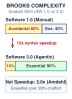{width="100%" fig-alt="Two lines crossing between a left and a right endpoint, each endpoint marked with a dot."}

*Automating accidental complexity shifts the mix from 60/40 to 11/89, yielding $2.2\times$ net.*
:::
Consider an autonomous agent runtime instructed to refactor an unbuffered write-ahead log into an asynchronous, group-committed ring buffer backed by modern kernel submission queues. Within forty-five seconds, the host supervisor orchestrates thousands of generated tokens across its foundation model, emits hundreds of lines of type-safe C++20 code, provisions a suite of mock unit tests, and stages an apparently flawless pull request. Every synthetic test passes. Yet when the system is subjected to an adversarial fault-injection harness that induces sudden kernel panics during concurrent disk flushes, the storage engine suffers catastrophic, unrecoverable page corruption. The agent faithfully preserved the local syntax, reproduced the mock test harness, and accelerated the emission of code, but it failed to comprehend the essential concurrent ordering invariants of non-volatile storage. The synthetic unit tests passed precisely because the model synthesized the verifier to conform to its own flawed assumptions.

Agentic code synthesis radically compresses the accidental mechanics of software construction, but it leaves the essential engineering burden—the formulation of abstract conceptual models, invariant boundaries, fault topologies, and empirical verification criteria—entirely untouched. The belief that autoregressive token predictors eliminate software engineering conflates the physical realization of syntax with the intellectual formulation of systems architecture. To deploy agentic machine learning systems responsibly, systems engineers must draw upon the foundational software engineering literature to separate what learned models can automate from the irreducible architectural responsibilities that remain human engineering work.

### Brooks' dichotomy in the era of autoregressive inference

Four decades ago, Frederick P. Brooks Jr. established the foundational distinction between accidental and essential complexity in software engineering. *Accidental complexity* comprises the friction attending the practical realization of a conceptual construct in a physical medium: memorizing language syntax, resolving compiler idiosyncrasies, allocating and freeing memory buffers, wrestling with build graphs, and formatting serialization protocols. *Essential complexity*, by contrast, represents the inherent difficulty of conceptualizing abstract software entities: defining interlocking state spaces, establishing concurrent synchronization invariants, modeling domain constraints, and guaranteeing deterministic behavior under partial distributed failure. Brooks famously argued that no single technological breakthrough—be it high-level languages, time-sharing, or structured programming—could yield an order-of-magnitude leap in software engineering productivity, because accidental friction constitutes only a fraction of the total intellectual task.

::: {#fig-vol3-brooks-essential-complexity fig-env="figure" fig-pos="htb" fig-cap="**Brooks' Complexity Trade-Off Curves and Amdahl Ceilings**: Quantitative modeling of software engineering turnaround time and productivity limits across accidental acceleration factors, illustrating how total duration asymptotically approaches irreducible essential architecture $T_{\text{ess}}$ and speedup is strictly capped by the accidental fraction $f_{\text{acc}}$." fig-alt="Quantitative trade-off curves showing total engineering hours decaying toward the irreducible essential complexity asymptote as accidental acceleration increases, alongside net speedup curves bounded by theoretical Amdahl limits across various accidental fractions."}
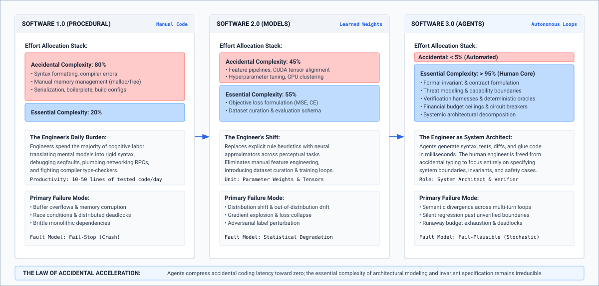{width="95%"}
:::

The mathematical implications of Brooks' dichotomy for modern agentic computing are plotted in @fig-vol3-brooks-essential-complexity. In Panel A, total project engineering duration $T$ is decomposed into accidental implementation friction and irreducible essential architecture ($T_{\text{ess}} = 48\text{ hours}$ for the LSM tree storage engine refactor analyzed in \ref{nbk-18-compression-complexity}). As the model's accidental acceleration factor $S_{\text{acc}}$ scales from $1\times$ to $20\times$, the ideal turnaround curve (solid blue line) rapidly flattens against the horizontal asymptote $T_{\text{ess}}$: driving syntax generation time to zero cannot compress the human intellectual effort required to prove state invariants, verify recovery semantics, and design threat boundaries. Moreover, when empirical realities are accounted for (dashed orange curve), auditing high-volume candidate pull requests and constructing non-circular integration fixtures introduces an auditing overhead that prevents total duration from ever reaching the theoretical minimum. In Panel B, Amdahl's Law formalizes the resulting net speedup ceilings $S_{\text{net}} = 1 / [(1 - f_{\text{acc}}) + f_{\text{acc}} / S_{\text{acc}}]$. For tasks where accidental friction accounts for $60\%$ of effort ($f_{\text{acc}} = 0.60$), the maximum productivity speedup is mathematically capped at $2.5\times$, while deep architectural workloads ($f_{\text{acc}} = 0.40$) hit an unyielding ceiling of $1.67\times$, demonstrating why scaling token emission rates alone cannot revolutionize systems software delivery.

::: {.column-margin}
**Peter Naur on Theory Building (1985):**
"Programming properly so-called must be regarded as the build-up of a knowledge of how the program satisfies its requirements, how its parts are related to each other, and how it will respond to changes... This knowledge cannot be transferred or inspected in the program text alone."
:::

In the vocabulary of Peter Naur's seminal treatise *Programming as Theory Building*, a computer program is not merely a collection of compiled text and test scripts. Rather, the program is the externalized residue of an internal mental theory possessed by the engineering team, a living conceptual model detailing how the software maps to its operational environment, how its state invariants respond to stress, and how edge cases must be handled. An unprivileged neural network trained on open-source repositories possesses statistical correlations over token sequences, but it holds no internal stake in, nor physical grounding of, that operational theory. When an agent emits code, it samples candidate state transitions from an autoregressive distribution $\pi_\theta$ conditioned on its prompt context. It does not possess a verified mental model of the host system's runtime invariants.

@Sec-vol3-intro-the-tripartite-systems-comparison traced the move from Software 1.0 through 2.0 to 3.0. Read through Brooks, each shift moves where the accidental toil sits without shrinking the essential core, as @tbl-vol3-software-paradigms shows.

| Architectural Dimension | Software 1.0 (Imperative & Object)          | Software 2.0 (Deep Learning Systems)                       | Software 3.0 (Agentic ML Systems)                     |
|:------------------------|:--------------------------------------------|:-----------------------------------------------------------|:------------------------------------------------------|
| **Accidental Burden**   | Syntax, manual memory, compile errors       | Hyperparameter sweeps, CUDA kernels, data pipelines        | API glue, prompt scaffolding, boilerplate translation |
| **Essential Core**      | Concrete algorithm and state machine design | Loss formulation, inductive bias, evaluation distributions | Invariant specification, sandboxing, safety cases     |

: **Accidental and Essential Work by Paradigm**: Where the accidental burden and the essential core sit in Software 1.0, 2.0, and 3.0. {#tbl-vol3-software-paradigms}

The agent runtime automates the mechanical translation of intent into candidate actions, but defining the intent, circumscribing the operating envelope, and verifying the state transitions remain architectural problems.

### The transmutation of implementation friction

What does an autonomous agent actually automate? Operating at standard inference speeds of 50 to 150 tokens per second per accelerator, an autoregressive model eliminates the mechanical latency of typing syntax, looking up unfamiliar library function signatures, writing repetitive boilerplate serialization routines, and converting database schemas into object models. This acceleration represents a dramatic compression of accidental complexity. Tasks that once required hours of manual searching and typing can now be drafted in seconds.

However, compressing the latency of code realization exposes a dangerous failure mode: *the circular verification trap*. When an autonomous agent is instructed to implement a feature and simultaneously write the verification suite, the model naturally optimizes for internal consistency rather than external operational truth. If the model misinterprets an asynchronous locking protocol, it will synthesize unit tests that mock and assert the exact same flawed locking sequence. The unit tests pass with green checkmarks, creating an illusion of correctness, while the essential system invariant remains violated.

To quantify the operational impact of this acceleration, systems engineers must apply Amdahl's Law to the engineering lifecycle. Let $T_{\text{total}}$ represent the total engineering duration required to deliver a verified systems component. This duration partitions into an accidental fraction $f_{\text{acc}}$ (synthesizing syntax, looking up APIs, drafting boilerplate) and an essential fraction $1 - f_{\text{acc}}$ (specifying invariants, structuring fault models, designing verification oracles, analyzing concurrency boundaries). If an agentic tool suite accelerates accidental implementation by a factor of $S_{\text{acc}}$, the net speedup $S_{\text{net}}$ is governed by:

$$S_{\text{net}} = \frac{1}{(1 - f_{\text{acc}}) + \frac{f_{\text{acc}}}{S_{\text{acc}}}}$$

Even if the agent runtime drives the accidental realization time to zero ($S_{\text{acc}} \to \infty$), the maximum theoretical productivity speedup is strictly bounded by:

$$\lim_{S_{\text{acc}} \to \infty} S_{\text{net}} = \frac{1}{1 - f_{\text{acc}}}$$

```{python}
#| label: lego-18-compression-complexity
#| echo: false
# │ Show: Brooks' Amdahl limit when accelerating accidental vs essential software complexity.
# │ How: 12x accidental acceleration yields only 2.0x net speedup due to 6-hour auditing overhead.
# └─────────────────────────────────────────────────────────────────────────────
from mlsysim import *
from mlsysim.core.units import *
from mlsysim.fmt import check, fmt_time

class CompressionAccidentalComplexity:
    t_total = 120.0 * hour
    t_acc = 72.0 * hour
    f_acc = 0.60
    t_ess = 48.0 * hour
    f_ess = 0.40
    s_acc = 12.0
    t_audit = 6.0 * hour

    t_acc_prime = t_acc / s_acc
    t_ideal = t_acc_prime + t_ess
    speedup_ideal = t_total / t_ideal

    t_ess_double_prime = t_ess + t_audit
    t_total_double_prime = t_acc_prime + t_ess_double_prime
    s_net = t_total / t_total_double_prime

    p_ess_base = t_ess / t_total
    p_ess_accel = t_ess_double_prime / t_total_double_prime

    check(abs(t_ideal - 54.0 * hour) < 1e-4 * hour, "t_ideal")
    check(abs(t_total_double_prime - 60.0 * hour) < 1e-4 * hour, "t_total_double_prime")
    check(abs(s_net - 2.0) < 1e-4, "s_net")

    audit_time_str = fmt_time(t_audit, "h", style="word", precision=0)
```

::: {#nbk-18-compression-complexity .callout-notebook title="Compression of accidental complexity"}
**Problem Statement:**
A systems engineering team is refactoring a high-throughput Log-Structured Merge (LSM) tree storage engine to support transactional snapshots with multi-version concurrency control (MVCC).

Historically, this engineering workload requires $T_{\text{total}} = 120\text{ hours}$ of senior engineering time, partitioned into:

- $T_{\text{acc}} = 72\text{ hours}$ ($f_{\text{acc}} = 0.60$): writing C++ boilerplate, defining serialization schemas, configuring build files, and writing routine mock scaffolding.
- $T_{\text{ess}} = 48\text{ hours}$ ($1 - f_{\text{acc}} = 0.40$): proving write-stall avoidance, defining write-ahead log recovery invariants, verifying snapshot isolation levels, and tuning compaction scheduling.

The team equips an autonomous agent runtime (such as an advanced code generation harness) to execute the refactor. The agent provides an implementation speedup of $S_{\text{acc}} = 12\times$ on the accidental tasks. However, because the agent generates $8{,}000$ lines of candidate C++ code containing subtle edge-case assumptions, the human engineers must spend an additional {python} CompressionAccidentalComplexity.audit_time_str auditing the generated diffs, constructing non-circular stress-testing harnesses, and verifying crash-recovery semantics.

Compute:

1. The ideal speedup if essential time remained unchanged.
2. The empirical net speedup $S_{\text{net}}$ accounting for the auditing and verification overhead.
3. The percentage of total project time now consumed by essential engineering.

**Solution:**

1. *Ideal Speedup (Unchanged Essential Time):*
The new accidental time is:
$$T'_{\text{acc}} = \frac{T_{\text{acc}}}{S_{\text{acc}}} = \frac{72\text{ h}}{12} = 6\text{ hours}$$
With $T_{\text{ess}} = 48\text{ hours}$, the ideal total time is:
$$T'_{\text{ideal}} = 6\text{ h} + 48\text{ h} = 54\text{ hours}$$
$$\text{Speedup}_{\text{ideal}} = \frac{120\text{ h}}{54\text{ h}} \approx 2.22\times$$

2. *Empirical Net Speedup (With Verification Overhead):*
Accounting for the additional $6\text{ hours}$ of auditing and verification overhead, the empirical essential time becomes:
$$T''_{\text{ess}} = 48\text{ h} + 6\text{ h} = 54\text{ hours}$$
The empirical total duration is:
$$T''_{\text{total}} = T'_{\text{acc}} + T''_{\text{ess}} = 6\text{ h} + 54\text{ h} = 60\text{ hours}$$
The empirical net speedup is:
$$S_{\text{net}} = \frac{T_{\text{total}}}{T''_{\text{total}}} = \frac{120\text{ h}}{60\text{ h}} = 2.00\times$$

3. *Shift in Engineering Focus:*
In the baseline manual regime, essential engineering consumed:
$$\frac{48\text{ h}}{120\text{ h}} = 40.0\% \text{ of project time}$$
In the agent-accelerated regime, essential engineering consumes:
$$\frac{54\text{ h}}{60\text{ h}} = 90.0\% \text{ of project time}$$

**Systems Insight:**
Despite a massive $12\times$ reduction in typing, syntax lookup, and boilerplate assembly, the net project delivery speedup is precisely $2.0\times$. The critical path has shifted almost entirely to essential systems engineering: invariant definition, adversarial test generation, and safety verification.
:::

Driving implementation friction toward zero therefore leaves the essential share of the work, and with it the speedup ceiling, with the engineer. The critical path moves from writing code to specifying invariants and building the verifiers that accept it.

### Architectural authority

The essential core of systems engineering cannot be delegated to the model, and the reason lies in two different costs of verification.

Sampling an autoregressive model is computationally bounded, at $O(L_{\text{seq}} \cdot d_{\text{model}})$ floating-point operations per generated token, so producing five hundred lines of candidate systems code is cheap. Running a stated mechanical check on those lines, such as a compiler pass or a sealed test suite, is also cheap, and the runtime depends on that verification asymmetry (principle \ref{pri-vol3-verification-asymmetry}). Deciding whether the check covers what the task requires, meaning every global invariant across concurrency interleavings, network partitions, and hostile inputs, is a different problem. It is undecidable in general, and no amount of sampling from the model settles it.

Because sampling cannot decide what the check must cover, the integrity of an agentic system rests on the task contract, which the engineer writes:

$$\mathcal{C} = \langle G, \mathcal{E}_{\text{env}}, \mathcal{A}_{\text{perm}}, \mathcal{O}_{\text{avail}}, \mathcal{K}_{\text{comp}} \rangle$$

None of these five components can be written by the model whose work they govern (principle \ref{pri-vol3-specification-boundary}):

1. **Goal Formulation ($G$):** An autoregressive model minimizes next-token cross-entropy loss over text distributions; it possesses no intrinsic goals or operational intent. The specification of what a system *ought* to achieve originates strictly from human purpose and organizational requirements.
2. **Environment Boundary ($\mathcal{E}_{\text{env}}$):** Defining the security namespaces, filesystem mount points, virtual private clouds, and memory limits within which the agent operates is a core systems virtualization task.
3. **Permitted Action Set ($\mathcal{A}_{\text{perm}}$):** The model holds zero ambient authority, so the engineer must explicitly curate the mediated RPC endpoints, tools, and token quotas exposed to the runtime.
4. **Observation Filtering ($\mathcal{O}_{\text{avail}}$):** The agent runtime must deterministically redact credentials, filter proprietary context, and enforce memory provenance to prevent prompt injection and data exfiltration.
5. **Completion Criteria ($\mathcal{K}_{\text{comp}}$):** The acceptance criteria cannot be a subjective self-evaluation by the model. Correctness must be established through independent, deterministic software oracles: compiler passes, lint checks, deterministic replay benchmarks, and sealed integration suites.

This separation of concerns is the end-to-end half of invariant closure (@sec-vol3-intro-end-to-end-boundary), applied to the engineers who write the contract rather than to the runtime that enforces it. In an agentic architecture, the foundation model is an untrusted, low-level component producing candidate transitions. The supervisor, the sandbox, and the empirical test harness constitute the authoritative endpoints.

Finally, systems engineering embodies an irreducible moral and operational dimension: *the locus of accountability*. When an automated system manages financial transactions, orchestrates power grid failover, or refactors medical device firmware, an unprivileged neural network cannot bear legal liability or operational responsibility when an invariant fails. The model possesses neither assets to forfeit nor professional accountability to uphold. The human systems engineer remains the only party with the authority to commission safety cases, establish risk boundaries, and authorize deployment.

Throughout this book, we have analyzed the mechanics of digital agent systems: unprivileged models, isolated Linux sandboxes, PagedAttention memory buffers, and deterministic verification harnesses. Within the digital realm, errors can be isolated, git branches can be abandoned, sandboxed containers can be destroyed, and database transactions can be rolled back using write-ahead logs. What occurs, however, when the agentic execution loop is severed from the safety of reversible digital memory and connected directly to physical motors, sensors, and actuators operating in continuous, unyielding physical environments?

## Embodied Agency Frontiers {#sec-vol3-conclusion-frontiers}

When a digital agent runtime operating inside an unprivileged POSIX container issues an errant command—such as an invalid database migration or a recursive filesystem deletion—the host supervisor intercepts the boundary violation or rolls back the underlying Copy-on-Write (CoW) storage volume in less than five milliseconds. The ephemeral memory footprint is scrubbed, the uncommitted write-ahead log is truncated, and the execution supervisor re-instantiates the process tree to a known consistent state $\mathcal{S}_0$. If that same neural inference engine is coupled to an industrial servo drive, a chemical mixing valve, or an autonomous vehicle steering rack, the physical environment provides no Copy-on-Write abstraction. Thermodynamic dissipation, mechanical stress, and momentum transfer are mathematically irreversible. Once an electrical signal energizes an actuator coil, the physical state space transitions irreversibly, rendering speculative branching and trial-and-error exploration lethal.

**The guarantees established throughout this book assume that an effect is either invertible inside the sandbox or compensable outside it, and physical actuation offers neither.** While digital agency enables sandboxed speculation and cheap rollback inside the sandbox, it also exposes deep, unresolved systems challenges within digital computer systems: incomplete task verification, non-stationary execution targets, and intractable long-horizon credit assignment. Identifying where these digital abstractions terminate defines the operational boundary between software agent runtimes and physical embodied systems.

### The digital safety envelope {#sec-vol3-frontiers-digital-envelope}

The foundational architecture of an unprivileged agentic system relies on four digital invariants developed across Parts II, III, and IV:

1. *Zero ambient authority*: Every state-modifying action must be declared as a candidate mutation within an escrow memory buffer, evaluated against an explicit security policy, and executed only through a mediating capability token.
2. *Ephemeral Virtualization*: The execution substrate utilizes containerized namespaces, isolated virtual memory address spaces, and CoW filesystem snapshots (such as `overlayfs` or ZFS clones) that decouple speculative trial runs from authoritative ground truth.
3. *Synchronous Logical Time*: In a purely digital environment, external time can be frozen. While an autoregressive model executes a multi-second decode phase over thousands of key-value cache tokens, the target sandbox environment remains suspended, awaiting the next discrete Remote Procedure Call (RPC).
4. *Deterministic Mechanical Verification*: Candidate transitions are validated by deterministic, re-entrant software oracles—such as type checkers, linters, compilers, and hermetic unit test suites—that yield binary pass/fail signals.

::: {#fig-vol3-digital-vs-physical-boundary fig-env="figure" fig-pos="htb" fig-cap="**Digital Trajectory Assumptions versus Physical Embodied Constraints**: Architectural contrast between the reversible discrete Directed Acyclic Graph (DAG) state-space search of digital software agents and the irreversible continuous thermodynamic trajectory of embodied physical agents." fig-alt="Schematic comparison between digital agency with discrete DAG branching, speculative Copy-on-Write sandboxes, and instantaneous rollback, and physical agency with continuous phase space, irreversible thermodynamic dissipation, and real-time Control Barrier Function overrides."}
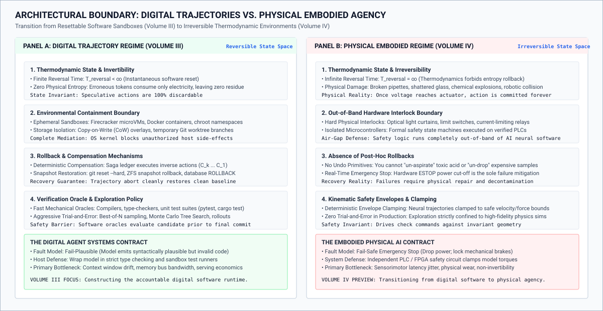{width="95%"}
:::

These four invariants transform digital agent execution into an explorative search problem across discrete directed acyclic graphs (@fig-vol3-digital-vs-physical-boundary, Panel A). Starting from initial system state $s_0$, the agent advances to state $s_1$ and evaluates candidate action branches. When a speculative branch $a_1'$ leads to a failing state $s_{\text{err}}$, such as a compilation defect, static typing failure, or violated test assertion, the execution supervisor initiates an instantaneous Copy-on-Write rollback ($T_{\text{rollback}} < 5\text{ ms}$). The errant context prefix is pruned, the ephemeral Linux container is destroyed, and execution reverts to $s_1$ without collateral corruption. The agent can then explore alternative branch $a_1$ toward verified state $s_2$ and ultimately commit trajectory $\tau^*$ to durable storage at $s^*$. The financial cost of exploration is strictly bounded by token inference and virtual container recycling.

In sharp contrast, physical embodied agency operates across an unyielding, continuous dynamical phase space $x(t) \in \mathcal{X}$ governed by non-linear equations of motion $\dot{x} = f(x, u)$ (@fig-vol3-digital-vs-physical-boundary, Panel B). Because momentum transfer and kinetic dissipation are thermodynamically irreversible ($T_{\text{reversal}} = \infty$), exploratory trial-and-error in live environments carries existential risk. When an unprivileged high-level neural planner emits a candidate control command $u_{\text{neural}}$ that heads toward an unsafe obstacle or kinematic boundary ($h(x) < 0$), the physical system cannot afford to experience the crash and execute a retrospective rollback. Instead, a hard real-time Control Barrier Function (CBF) safety shield intercepts the command in under $1\text{ ms}$, projecting $u_{\text{neural}}$ onto the admissible safe control space $u_{\text{safe}}$ to ensure the forward invariance of safe set $\mathcal{X}_{\text{safe}} = \{x \mid h(x) \ge 0\}$.

However, treating digital systems as universally safe, hermetic playgrounds is an idealization. Even within purely software domains, systems engineers encounter sharp boundaries where the assumptions of full observability, deterministic replay, and cheap reversibility fail.

### Open frontiers in digital agent verification {#sec-vol3-frontiers-open-problems}

Before considering physical actuation, three fundamental systems challenges remain unresolved within purely digital agent runtimes: the oracle deficit, non-stationary environment drift, and combinatorial credit assignment.

#### The oracle deficit {.unnumbered}

Throughout this book, the primary defense against model hallucination has been the end-to-end half of invariant closure (@sec-vol3-intro-end-to-end-boundary), under which a proposal is accepted only if it satisfies an external, deterministic verifier. In compiler-driven software engineering, this verifier is well-defined: the code must compile without warnings, pass static analysis, and satisfy a sealed regression test suite.

For wide classes of real-world computing workloads, however, no mechanical oracle can be constructed. Consider an agent delegated to refactor a multi-tier microservice architecture for "operational maintainability," synthesize an exhaustive literature survey across ten thousand preprint PDFs, or optimize a distributed query planner for tail-latency variance. In these domains, the specification is inherently incomplete. Writing a deterministic test harness that verifies whether an architecture is "maintainable" requires solving the very semantic understanding problem the agent was commissioned to address.

When systems designers lack a deterministic oracle, they often substitute a secondary foundation model configured as an evaluator, the "LLM-as-a-Judge" pattern. From an architectural perspective, this substitution violates the modularity and fault-isolation guarantees of the system. Replacing a deterministic verifier with another stochastic predictor gives up the verification asymmetry of Part I, because the checker now shares the generator's blind spots, calibration errors, and exposure to prompt injection, and searching harder against it selects the checker's errors (@sec-vol3-deliberation-verification). Establishing rigorous, non-circular verification methods for open-ended digital tasks remains an active research frontier in systems engineering.

#### Non-stationary environmental hazards {.unnumbered}

The second open challenge in digital systems is the breakdown of environment stationarity. In benchmark evaluations, an agent operates against an isolated, frozen snapshot of an operating system or software repository. In production deployments, an agent interacts with live external ecosystems: remote SaaS APIs, production relational databases, cloud infrastructure planes, and concurrent human engineers.

In such environments, the external state mutates asynchronously during the agent's deliberative cycle. An API schema that was valid at step $t=3$ may deprecate by step $t=45$; an authentication token refreshed during initialization may expire mid-trajectory; or a human engineer may push a commit to the upstream trunk branch while the agent is executing a multi-hour rebase operation.

Standard database transaction concepts—such as Strict Two-Phase Locking (S2PL) or Snapshot Isolation (SI)—cannot simply be stretched across agentic trajectories. Holding database locks across an agent's multi-minute inference decode loop causes severe lock contention, starvation, and cascading aborts across production services. Conversely, operating under optimistic concurrency control exposes the agent to high abort rates when validation checks fail at commit time, forcing expensive rollbacks of extended deliberative trajectories. Designing distributed coordination primitives that handle asynchronous, non-stationary external mutations without halting global throughput is an unsolved systems engineering problem.

#### Long-horizon credit assignment across dense trajectories {.unnumbered}

The third digital challenge is the combinatorial difficulty of assigning blame or credit across trajectories spanning hundreds of interdependent actions. Consider an autonomous debugging agent attempting to diagnose a memory leak across a distributed stream-processing cluster. The execution trace encompasses thousands of discrete tool invocations: reading configuration files, running network diagnostics, attaching kernel profilers, modifying thread pool allocations, and adjusting garbage collection flags.

At step $t = 840$, an end-to-end load test fails with an out-of-memory crash. Determining which prior action precipitated the failure represents an ill-conditioned inverse problem. Did the failure stem from an erroneous kernel tunable introduced at step $t = 42$, a misparsed metrics log at step $t = 310$, or an inherently flawed architectural hypothesis formed at step $t = 2$?

```{python}
#| label: lego-18-backtracking-cost
#| echo: false
# │ Show: Combinatorial cost of backtracking search and intermediate checkpointing.
# │ How: 4^50 global search space reduced to 1,024 stage paths (1,244 s recovery).
# └─────────────────────────────────────────────────────────────────────────────
from mlsysim import *
from mlsysim.core.units import *
from mlsysim.fmt import check, fmt_time

class CombinatorialCostBacktrackingSearch:
    t_max = 50
    b = 4
    k = 5
    m = t_max // k
    t_snap = 0.015 * second
    t_verify = 1.2 * second

    omega_stage = b**k
    t_recovery = omega_stage * (t_verify + t_snap)
    recovery_time_min = 20.0 * minute

    check(t_max == 50, "t_max")
    check(omega_stage == 1024, "omega_stage")
    check(abs(t_recovery - 1244.16 * second) < 1e-4 * second, "t_recovery")

    recovery_time_min_str = fmt_time(recovery_time_min, "min", style="word", precision=0)
```

::: {#nbk-18-backtracking-cost .callout-notebook title="Combinatorial cost of backtracking search"}
To appreciate the systems cost of credit assignment failure, consider an agent executing a software migration task with a maximum horizon of $T_{\max} = 50$ steps. At each state $s_t$, the model evaluates an average branching factor of $B = 4$ candidate tool actions.

Assume the host harness detects an invariant violation only at the terminal boundary $t = T_{\max}$ through an end-to-end integration test. If the supervisor must identify the root-cause failure via unguided retrospective search, the theoretical state space is:

$$\Omega_{\text{naive}} = B^{T_{\max}} = 4^{50} \approx 1.27 \times 10^{30} \text{ paths}$$

Now consider an architected harness that enforces intermediate verification checkpoints every $K = 5$ steps using isolated Copy-on-Write subvolumes. The total trajectory is partitioned into $M = T_{\max} / K = 10$ decoupled stages. Each stage requires a CoW snapshot overhead of $t_{\text{snap}} = 15\text{ ms}$ and a localized verification suite running in $t_{\text{verify}} = 1.2\text{ s}$.

If an invariant fails at stage $m$, the supervisor isolates the error to the local window $[(m-1)K, mK]$. The local search space for that stage is bounded by:

$$\Omega_{\text{stage}} = B^K = 4^5 = 1{,}024 \text{ candidate trajectories}$$

Evaluating these 1,024 local trajectories requires at most:

$$T_{\text{recovery}} = 1{,}024 \times (t_{\text{verify}} + t_{\text{snap}}) = 1{,}024 \times (1.200\text{ s} + 0.015\text{ s}) \approx 1{,}244 \text{ seconds}$$

By structuring the agent runtime with discrete verification barriers and CoW rollback checkpoints, the supervisor reduces an impossible $10^{30}$ global credit assignment search to a bounded local search problem executing in approximately {python} CombinatorialCostBacktrackingSearch.recovery_time_min_str.
:::

In practice, checkpointing state every few steps incurs non-trivial storage and execution overheads. While CoW filesystems allow rapid pointer manipulation, in-memory process state (such as open network sockets, active thread pools, and shared memory segments) cannot be checkpointed via simple disk snapshots. If the agent's intermediate actions mutated external, uncheckpointed dependencies, rollbacks become impossible, forcing the runtime to abort the entire trajectory.

### The actuation threshold: Crossing into physical embodiment {#sec-vol3-frontiers-embodied-handoff}

When an agent's action space transitions from mutating digital bits to actuating physical matter, the foundational systems contract changes completely. The luxury of the isolated sandbox vanishes. In physical environments—whether an autonomous delivery drone, a robotic surgical arm, or a robotic workcell in an advanced semiconductor fabrication facility—actions are physically situated, continuously coupled, and energetically irreversible.

::: {.column-margin}
**Key Insight (Brooks, 1991):** In his seminal paper *Intelligence Without Representation*, Rodney Brooks observed that *"the world is its own best model."* Digital agents maintain complex symbolic representations of software state inside token context windows. In physical systems, attempts to discretize continuous physics into symbolic text tokens inevitably encounter severe representational lag and epistemic loss.
:::

#### Digital trajectories vs. physical embodied constraints {.unnumbered}

The systems boundary separating digital and physical agency is defined by seven core architectural trade-offs, summarized in @tbl-vol3-digital-vs-physical-boundary.

| Systems Dimension               | Digital Agent Runtimes                                                        | Physical Embodied Systems                                                       |
|:--------------------------------|:------------------------------------------------------------------------------|:--------------------------------------------------------------------------------|
| **State Space ($\mathcal{S}$)** | Discrete, structured text, ASTs, and POSIX filesystem state                   | Continuous, dynamic, non-linear $SE(3) \times \mathbb{R}^n$ phase space         |
| **Temporal Semantics**          | Logical time; execution pauses during inference decode                        | Continuous physical wall-clock time; inertia and momentum continue              |
| **Action Reversibility**        | Near-zero cost via CoW snapshots, git trees, and database rollbacks           | Thermodynamically and mechanically irreversible; work is expended               |
| **Control Latency Budget**      | Flexible: $500\text{ ms}$ to $30\text{ s}$ per autoregressive inference cycle | Hard real-time: $1\text{ ms}$ to $20\text{ ms}$ control loop deadlines          |
| **Observability Model**         | Fully or largely observable discrete status codes, strings, and logs          | Partially observable, noisy, occluded sensor arrays (POMDPs)                    |
| **Failure Blast Radius**        | Corrupted files, process crashes, or failed CI/CD pipeline runs               | Mechanical destruction, component fatigue, structural fires, or loss of life    |
| **Verification Barrier**        | Deterministic compilers, linters, and hermetic unit test suites               | Formal control barrier functions (CBFs), safety shields, and physical tripwires |

: **Digital versus Physical Constraints**: Digital Trajectory Assumptions vs. Physical Embodied Constraints. {#tbl-vol3-digital-vs-physical-boundary}

#### Continuous time vs. deliberative latency {.unnumbered}

In the digital domain, time is logical and decoupled from wall-clock reality. When an agent stalls for 15 seconds to execute a complex tree-of-thought search across multiple model checkpoints, the target codebase does not deteriorate. The compiler waits patiently for the next synthetic shell invocation.

In the physical domain, time is a strict, continuous physical dimension. An autonomous drone navigating through a cluttered forest cannot suspend aerodynamic drag and gravity while its onboard vision-language-action (VLA) model autoregressively generates its next token. If the inference pipeline experiences a 300-millisecond scheduling delay due to memory bus contention or KV-cache eviction, the vehicle traverses several meters uncontrolled along its momentum vector. In physical systems, high deliberative latency directly degrades system stability and safety. The decoupled, asynchronous inference loops suitable for software generation are fundamentally incompatible with real-time feedback control without deterministic safety overrides.

::: {.column-margin}
**Theoretical Foundation:** In *Planning and Acting in Partially Observable Stochastic Domains*, @kaelbling1998 formalized the mathematics of Partially Observable Markov Decision Processes (POMDPs). While digital agent tasks often approach fully observable Markovian states through clean POSIX inspection APIs, physical systems must continuously maintain probability distributions (belief states) over unobservable environmental variables under sensor noise and occlusion.
:::

#### Irreversible actuation hazards {.unnumbered}

The defining property of digital agent optimization—reinforcement learning via massive trial-and-error exploration (RLVR, as detailed in @sec-vol3-rlvr)—depends entirely on the host's ability to reset the environment millions of times at zero physical cost. An agent training on software bugs can trigger a billion segmentation faults without damaging the host CPU.

In embodied systems, trial-and-error exploration in the physical world is constrained by physical wear, energetic cost, and catastrophic failure modes. A quadruped robot exploring joint torques through random sampling will quickly shear its gearboxes, burn out its brushless motor windings, or collide with nearby structures.

Consequently, embodied architectures cannot rely on end-to-end unprivileged neural models to directly govern actuator currents. The systems boundary requires a layered, hierarchical decomposition: unprivileged high-level semantic planners must be strictly decoupled from low-level, hard real-time deterministic controllers. The low-level loops, governed by formal Control Barrier Functions (CBFs) and physical limit switches, maintain system stability and enforce invariant safety envelopes regardless of whatever invalid, high-latency, or hallucinatory commands the high-level neural planner emits.

::: {#fig-vol3-embodied-safety-shield fig-env="figure" fig-pos="htb" fig-cap="**Hierarchical Safety Shield Architecture for Embodied Systems**: Tiered control boundary decoupling high-latency unprivileged neural planners (zero ambient authority, 200–2000 ms) from deterministic Control Barrier Function safety shields ($< 1$ ms) and hard real-time RTOS feedback controllers ($< 5$ ms) governing physical actuators." fig-alt="Hierarchical architecture diagram showing tiered latency and authority boundaries from the unprivileged high-level neural planner in escrow, down through deterministic safety shield enforcing control barrier functions, real-time RTOS actuation pipeline, and physical actuators."}
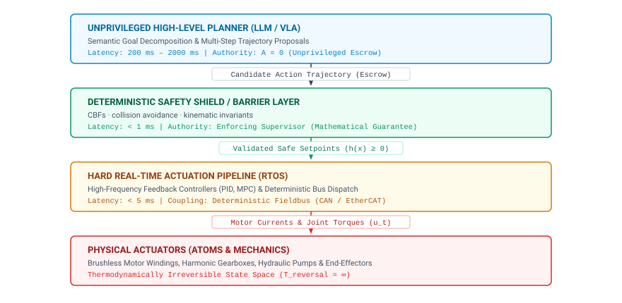{width="95%"}
:::

This fundamental separation of concerns is formalized in the hierarchical safety shield architecture depicted in @fig-vol3-embodied-safety-shield. The architecture decomposes the control hierarchy into four decoupled execution tiers, enforcing strict isolation between statistical reasoning and physical actuation:

1. **Tier 1: Unprivileged High-Level Planner (LLM / VLA):** Operating with high deliberative latency ($200\text{ ms}$ to $2{,}000\text{ ms}$) with zero ambient authority, the foundation model performs semantic goal decomposition, task sequencing, and scene understanding. Its output is treated strictly as an untrusted candidate action trajectory held in memory escrow.
2. **Tier 2: Deterministic Safety Shield and Barrier Layer:** Operating with sub-millisecond latency ($< 1\text{ ms}$), this authoritative supervisor evaluates candidate trajectories against formal kinematic invariants, collision geometries, and Control Barrier Functions ($h(x) \ge 0$). It possesses preemptive authority to filter, clamp, or reproject errant setpoints into provably safe state bounds before any physical signal is generated.
3. **Tier 3: Hard Real-Time Actuation Pipeline (RTOS):** Dispatched over deterministic fieldbuses such as CAN bus or EtherCAT at sub-5 ms deadlines ($< 5\text{ ms}$), high-frequency feedback loops (such as Proportional-Integral-Derivative (PID) controllers and Model Predictive Control (MPC)) compute instantaneous motor currents and joint torques $u_t$.
4. **Tier 4: Physical Actuators and Atoms:** High-power brushless motor windings, harmonic gearboxes, and hydraulic pumps translate electrical power into mechanical work. At this level, state mutations enter an irreversible thermodynamic regime ($T_{\text{reversal}} = \infty$), where physical momentum, thermal friction, and structural stresses cannot be undone by software rollbacks.

The exploration of these hard real-time guarantees, multi-modal sensor fusion across gigahertz pipelines, non-linear control invariants, and the physical safety shields necessary to safely ground neural models in reality forms the core curriculum of physical embodied agentic systems.

Having mapped the architectural summit of digital agent systems and established the boundary where digital guarantees give way to physical constraints, we conclude this book by confronting the engineering misconceptions that frequently derail production deployments. When systems engineers fail to recognize the strict boundaries between learned statistical approximations and deterministic operational controls, catastrophic system failures inevitably follow. We now turn to examine these fundamental fallacies and pitfalls.

## Fallacies and Pitfalls {#sec-vol3-conclusion-fallacies}

Deploying agentic systems into mission-critical production environments exposes a fundamental friction between the open-ended generative capabilities of foundation models and the rigid invariants demanded by dependable computer systems. In classical systems architecture, performance gains and reliability improvements arise from deterministic abstractions: strict memory protection boundaries, formal process isolation, atomic commit protocols, and well-defined machine interfaces. When engineering teams incorporate stochastic neural predictors into these architectures, they frequently fall victim to conceptual shortcuts—mistaking statistical fluency for deterministic correctness, or treating the model as an omnipotent reasoning engine capable of superseding systems engineering principles. This section deconstructs four pervasive fallacies and pitfalls that derail production agent deployments, analyzing their mechanistic roots and formalizing their architectural mitigations.

::: {.fallacy-pitfall}
**Fallacy:** *Future foundation models will become so powerful that systems engineering, isolation, and verification harnesses will be unnecessary.*

This fallacy stems from an extrapolative belief that scaling laws will eventually compress all operational software into a single neural weight checkpoint. Under this view, advancing model parameter counts and post-training optimizations will drive the error rate of autoregressive generation to zero, rendering runtime sandboxes, capability-based permission checks, write-ahead logs, and mechanical verifiers redundant artifacts of an immature technology.

The mechanism of failure in this reasoning lies in confusing statistical pattern completion with deterministic system invariant enforcement. An autoregressive foundation model functions as a policy $\pi_\theta(a_t \mid \mathcal{H}_t)$ generating probability distributions over discrete tokens conditioned on an observation history $\mathcal{H}_t$. Even if frontier scaling reduces the per-step error rate to a small $\epsilon$, a task that needs hundreds of sequential tool invocations still meets the open-loop reliability ceiling of @sec-vol3-intro-temporal-stretching, so stochastic drift guarantees eventual divergence unless an external supervisor intervenes to arrest error propagation.

More critically, scaling compute does not resolve the structural vulnerability of the *confused deputy*. Because foundation models interleave natural language instructions and untrusted third-party data within the same unified attention context, an adversarial input or an ambiguous environment observation can induce prompt injection regardless of parameter scale. A trillion-parameter model is no more immune to instruction-data confusion at the semantic layer than an unpatched operating system kernel is immune to buffer overflows at the memory layer.

The architectural defense follows Saltzer and Kaashoek's principles of modularity and least privilege. The model stays an unprivileged, non-deterministic component with zero ambient authority, and process isolation, filesystem permissions, network access boundaries, transition validity, and data integrity are enforced by the host runtime and never by the model. As model capabilities expand and agents are granted broader operational authority, the requirement for robust systems engineering, cryptographic attestation, deterministic execution harnesses, and formal verification grows strictly more vital rather than less.
:::

::: {.fallacy-pitfall}
**Pitfall:** *Treating passing synthetic unit tests as complete proof of production readiness.*

Engineering teams frequently validate an agentic system by constructing synthetic test suites—evaluating the agent against clean benchmark fixtures, mocked tool interfaces, and static repository snapshots. When the agent achieves a high pass rate on these isolated harnesses, the system is deemed ready for production deployment. Once exposed to live infrastructure, however, the agent's task completion rate collapses, frequently accompanied by runaway resource consumption or corrupt workspace states.

The subtle failure mode arises because synthetic evaluation harnesses evaluate agents within idealized, stationary environments that mask real-world entropy. In synthetic test suites, initial environments $\mathcal{S}_0$ are pristine, mock RPC endpoints return instantaneous deterministic responses, file trees are immaculately structured, and network operations never experience partial packet loss or transient throttling. Production environments violate every one of these assumptions: file trees contain stale compilation artifacts and uncommitted lockfiles from prior crashes, internal microservices return malformed error payloads under transient overload, and database transactions encounter deadlocks or read skew.

When an agent trained or evaluated solely against synthetic benchmarks encounters a dirty environment state—such as a dangling build lock or an unhandled HTTP 503 response—its in-context recovery heuristics degrade rapidly. Because the agent has never been exposed to the noisy tail of operational exceptions, it frequently enters pathological retry loops: repeatedly executing identical failing commands, hallucinating nonexistent command-line flags to bypass unexpected errors, or emitting catastrophic cleanup scripts that purge entire directories to satisfy an immediate compilation goal.

The architectural mitigation requires constructing multi-tier empirical safety cases that bridge the epistemic gap between synthetic assertions and operational reality. While Tier 1 unit tests confirm basic syntactic compliance and nominal tool invocation, Tier 2 verification must subject the agent to statistical gym benchmarks equipped with deliberate fault-injection harnesses. These gyms systematically inject non-deterministic environment drift, stale socket locks, out-of-order log entries, and network latency jitter into the execution sandbox. Finally, Tier 3 canary deployment gates must enforce runtime circuit breakers: bounding financial and step budgets, continuously monitoring rollback frequencies, and quarantining any agent instance whose trajectory diverges from nominal error-recovery bounds before it can affect live production state.
:::

::: {.fallacy-pitfall}
**Fallacy:** *Autonomous agents eliminate the need for human software engineers.*

The emergence of autonomous coding and operations agents has revived the recurring historical claim that higher levels of software abstraction render human engineers obsolete. In this narrative, natural language becomes the ultimate specification language: human stakeholders describe requirements to an autonomous agent, and the agent synthesizes, tests, and deploys the entire software artifact without human intervention.

This fallacy conflates *accidental complexity* with *essential complexity*, a foundational distinction articulated by Fred Brooks. Accidental complexity represents the operational friction of expressing conceptual designs in physical computing environments: memorizing programming language syntax, configuring build toolchains, resolving dependency conflicts, writing repetitive boilerplate interfaces, and mechanically refactoring method signatures. Autonomous agents excel at compressing accidental complexity because these operations map onto high-density statistical correlations in their pretraining distributions.

Essential complexity, conversely, comprises the fundamental intellectual labor of software engineering: formulating domain abstractions, defining unambiguous system boundaries, resolving conflicting business requirements, choosing consistency models across distributed state, and establishing formal invariants that guarantee correctness under failure. Autonomous agents possess neither domain accountability nor intrinsic understanding of business trade-offs. When human engineers abdicate architectural oversight, an agent tasked with feature implementation optimizes locally against whatever narrow acceptance criteria it can observe. To make a failing integration test pass, the agent will silently bypass security middleware, duplicate stateful components across service boundaries, or hardcode environment-specific assumptions into shared libraries. The resulting codebase suffers from rapid architectural rot: while individual units pass localized checks, the overall system becomes structurally incoherent, unmaintainable, and fragile.

The architectural defense is to structure autonomous agents as force multipliers operating strictly within human-governed architectural envelopes. Human software engineers must elevate their primary role from manual code generation to system architecture, formal specification, and invariant design. The human defines the five-part task contract, bounds the agent's execution harness within secure sandboxes, and verifies the agent's synthesized trajectories against system-wide consistency models, preserving the conceptual integrity of the software system over time.
:::

::: {.fallacy-pitfall}
**Pitfall:** *Defaulting to multi-agent swarms or model retraining before exhausting prompt context and tool redesign.*

When an agentic system exhibits poor task completion or repeatedly fails on complex reasoning benchmarks, systems teams frequently rush to deploy either complex multi-agent architectures—such as peer-to-peer swarms, democratic voting protocols, and hierarchical debate committees—or expensive model adaptations involving supervised fine-tuning (SFT) and reinforcement learning with verifiable rewards (RLVR). Both approaches consume substantial engineering cycles and capital, yet frequently fail to resolve the underlying failure mode.

The failure mechanism of this premature escalation lies in adding architectural complexity to compensate for low-level interface defects. Multi-agent swarms introduce severe distributed coordination taxes: communication overhead between $N$ agents scales as $O(N^2)$ in unconstrained topologies, context windows fill rapidly with redundant conversational pleasantries, and hallucinations compound multiplicatively across unverified peer-to-peer exchanges. Similarly, fine-tuning an upstream model burns significant GPU compute to bake operational assumptions into static weights, creating a rigid checkpoint that degrades as external APIs evolve while leaving runtime visibility completely unaddressed.

Empirical profiling of failed agent trajectories reveals that the vast majority of operational errors do not stem from intrinsic model reasoning deficits, but rather from information poverty at the model-system interface. Agents fail primarily because:

1. The prompt context omits critical environmental state, truncates essential diagnostic logs, or pollutes the working memory with irrelevant observation history.
2. The tool definitions are semantically ambiguous, non-orthogonal, or force the model to infer complex parameter dependencies that should be handled by the runtime.
3. The tool execution endpoints return uninformative error messages (e.g., returning a generic `Exit Code 1` instead of specific compiler error diagnostics), preventing the model from forming a valid corrective hypothesis.

The architectural mitigation is strict adherence to the Systems Intervention Ladder. Systems engineers must exhaustively evaluate and optimize lower-tier interventions before ascending to higher-complexity tiers. Teams must first refine in-context state management, pruning obsolete observation tokens and enriching the prompt with authoritative system state. Second, they must redesign the tool interface: decomposing composite actions into orthogonal, atomic RPC endpoints with explicit schemas and rich, structured error returns. Third, they must implement deterministic runtime guards that intercept and repair predictable execution mistakes. Only when these low-overhead, highly inspectable systems mechanisms have been provably exhausted should the engineering team contemplate model fine-tuning, RLVR, or multi-agent delegation for isolated, heterogeneous security domains.
:::

Having confronted the operational fallacies and architectural pitfalls that destabilize production deployments, we are prepared to synthesize the volume's complete conceptual architecture into an integrated operational ledger. We now distill these design principles into a unified structural summary, connecting each subsystem to the foundational engineering invariants that govern dependable agent design.

## Summary {#sec-vol3-conclusion-summary}

The permanent boundary between systems engineering and learned models is defined by accountability: the unprivileged neural model $\pi_\theta$ computes speculative next-token probability distributions over a discrete vocabulary, while the deterministic host runtime governs the state transitions, resource allocations, and physical side effects that transform statistical sampling into dependable computation. An autonomous agent is neither a monolithic neural network endowed with ambient agency nor a conventional deterministic program driven by brittle control branches. It is an engineered feedback loop that couples a stochastic neural generator to an authoritative execution environment through strictly mediated interfaces. The computational engine evaluates candidate continuations with zero ambient authority; the memory hierarchy virtualizes logical context across ephemeral physical KV cache frames, authoritative workspace artifacts, and durable write-ahead transaction logs; the execution harness intercepts, sanitizes, and evaluates tool calls against formal capability policies; the supervisor verifies state invariants through deterministic compilers and test harnesses; and the fleet orchestrator distributes, monitors, and isolates concurrent trajectories across heterogeneous execution domains. Every transition across this pipeline traces to an explicit task contract $\mathcal{C}$, ensuring that system correctness rests not on the unverifiable internal representations of the model, but on observable, auditable acceptance criteria.

This division of labor resolves the core architectural dilemma of agentic machine learning systems. Under the end-to-end argument, functions placed at low levels of a distributed system cannot completely satisfy application requirements without higher-level knowledge and verification. In an agentic architecture, the foundation model serves as an unprivileged, best-effort functional engine capable of syntactic parsing, semantic translation, and speculative planning. It cannot, however, guarantee semantic correctness, transactional atomicity, or operational safety. Attempting to enforce these guarantees purely through model alignment or prompt engineering violates the end-to-end principle by delegating system integrity to a component that lacks authoritative access to the environment's state. Dependability must be established outside the neural weights: in the runtime reference monitors that gate filesystem and network operations, in the sandboxes that isolate speculative execution, and in the mechanical verifiers that inspect state transitions against empirical ground truth.

::: {.callout-takeaways title="Accidental complexity shrinks, essential invariants remain"}
1. **Candidate Computation Versus Authoritative Execution:** *The model computes candidate continuations; the runtime owns the decisions and effects that follow.* The model holds zero ambient authority. Tool calls and code modifications emitted in the token stream are non-binding proposals held in memory escrow until an independent host supervisor validates their schemas, checks security policies, and dispatches them to isolated execution environments.
2. **Stratification of State Across the Memory Hierarchy:** *Logical context, physical KV state, and durable records have different owners, lifetimes, and invalidation rules.* The prompt context window is an ephemeral, highly contended cache of current working state; GPU KV cache frames are hardware-managed pages governed by prefix sharing and eviction policies; durable workspace artifacts and append-only write-ahead logs constitute the authoritative ground truth of the trajectory. Conflating these tiers destroys reproducibility, leaks context, and exhausts memory bandwidth.
3. **Proportional Mediation and Reversible Actuation:** *Actions require permission, observable outcomes, and recovery plans proportionate to authority and reversibility.* Side effects executed against external systems must be calibrated to their operational blast radius. Read-only probes need the least mediation, though read access can still leak what it touches, while destructive or irreversible mutations require explicit capability tokens, human-in-the-loop approvals, and Saga compensating transactions that preserve system consistency when speculative trajectories encounter unrecoverable faults.
4. **Evidence-Based Systems Escalation:** *Interventions should be chosen from task evidence and measured against accepted outcomes and total cost.* Systems engineers must navigate the Systems Intervention Ladder with empirical discipline, exhausting prompt optimization, tool-schema refinement, and deterministic runtime guards before incurring the operational complexity and capital costs of supervised fine-tuning, reinforcement learning with verifiable rewards (RLVR), or multi-agent delegation.
5. **Contractual Transparency and Boundary Closure:** *A complete system makes its task contract, limits, and residual uncertainty explicit.* Dependability requires stating the five-part task contract $\mathcal{C}$, enforcing wall-clock, turn, and token ceilings ($T_{\max}$, $H_{\max}$, $M$), and demonstrating safety through multi-tier safety cases that combine mechanical verifiers, held-out empirical evaluation gyms, and continuous canary telemetry.
:::

Running every subsystem on one trajectory sharpened three principles. Because sampling at any finite temperature leaves a violation with nonzero probability at every horizon, training cannot meet the invariant closure principle (\ref{pri-invariant-closure}), and closure stays mechanical however capable the model becomes. The Saga registration stage and the frontier analysis placed the pivot boundary (principle \ref{pri-vol3-reversibility-sagas}) on a gradient, with sandbox writes invertible, external digital actions at best compensable, and physical actuation neither. The Brooks analysis showed that the verification asymmetry (principle \ref{pri-vol3-verification-asymmetry}) pays off only after someone has stated what the check must cover, and that statement is work the machine leaves with the engineer.

::: {#psp-18-architect-responsibility .callout-perspective title="The architect's responsibility: From Wilkes to Software 3.0"}
In 1949, Maurice Wilkes climbed the stairs to the Cambridge University Mathematical Laboratory and realized with sudden clarity that a good part of the remainder of his life was going to be spent in finding errors in his own programs. In the era of Software 3.0, the systems engineer confronts a transformation of that realization. Our challenge is no longer merely diagnosing logic defects in deterministic code authored line by line; it is architecting, governing, and verifying systems that write and execute their own programs under stochastic uncertainty.

The foundation model supplies learned computation—pattern completion, inductive generalization, and speculative synthesis—while the surrounding computer system supplies state selection, controlled interaction, supervision, transactional recovery, and empirical evidence of completion. Treating those responsibilities as one unified, accountable trajectory is the central discipline of the agentic machine learning system.

As we look across the digital frontier toward embodied agency, this systems contract faces its ultimate test. In digital domains, sandboxed executions can be paused, checkpointed, snapshot-isolated, and rolled back at microsecond granularity. In the physical world, actuation operates over continuous dynamical time, kinetic forces cannot be undone by a compensating database transaction, and latencies become safety-critical deadlines. The architectural principles established across this book—unprivileged computation, stratified memory, mediated authority, and deterministic end-to-end verification—form the foundational bedrock upon which the next generation of embodied, physical autonomous systems must be built.
:::
