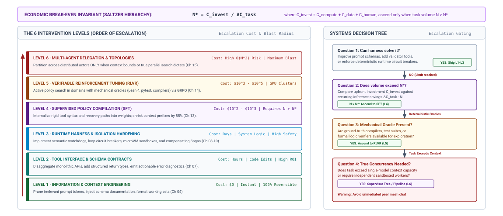

# The Autonomous Systems Frontier {#sec-vol3-conclusion}

::: {layout-narrow}
::: {.column-margin}

\chapterminitoc

:::

::: {.content-visible when-format="pdf"}
\noindent
{fig-alt="Isometric blueprint showing the autonomous frontier and systems invariants: digital agent computing matrix, formal invariant closure ring, verified trajectory beam, physical boundary gateway, and open autonomous frontier horizon."}
:::

::: {.content-visible unless-format="pdf"}
{fig-alt="Isometric blueprint showing the autonomous frontier and systems invariants: digital agent computing matrix, formal invariant closure ring, verified trajectory beam, physical boundary gateway, and open autonomous frontier horizon."}
:::

:::

## Purpose {.unnumbered .unlisted}

::: {.content-visible when-format="pdf"}
\begin{marginfigure}
\mlagentstack{30}{30}{30}{30}{30}{30}
\end{marginfigure}
:::

_How do we synthesize every component contract, invariant, and trade-off developed across this book into a cohesive, dependable, and production-grade Stochastic Computer?_

Machine learning systems have undergone a profound architectural shift across three computational paradigms. The field began with the individual accelerator: optimizing dense matrix multiplication kernels, maximizing arithmetic intensity along the hardware Roofline, and balancing tensor layout and memory access on single-chip silicon. Distributed training and high-throughput inference runtimes expanded that computational boundary to the data center: partitioning multi-billion-parameter neural networks across tensor, pipeline, and data parallel axes, scheduling distributed collective communications across multi-terabit fabrics, and serving batched inference queries.

Across @sec-vol3-introduction through @sec-vol3-tokenomics of this book, we examined the third paradigm: the emergence of agentic machine learning systems, where the computational substrate is no longer evaluated merely on static FLOPs or prompt-response latency, but on its ability to autonomously execute multi-step trajectories that close feedback loops against external, non-deterministic environments.

This capstone chapter synthesizes the six core functional subsystems of the Stochastic Computer into a unified reference architecture. We formalize workload contracts and operating envelopes by answering the 4 Engineering Questions; unify the continuous memory hierarchy across L1 context, L2 paged KV cache, and L3 durable storage; integrate execution harnesses connecting typed tool schemas, virtualization sandboxes, Write-Ahead Logging, and compensable Sagas; establish the evidence-based Systems Intervention Ladder; construct multi-tier empirical safety cases; examine the division between accidental and essential complexity in Software 3.0; and explore the open frontiers of embodied physical agency.

::: {.content-visible when-format="pdf"}
\newpage
:::

::: {.callout-learning-objectives}
- **Synthesize** the six core subsystems of the Stochastic Computer into a unified reference architecture.
- **Formalize** workload contracts and operational envelopes by answering the 4 Engineering Questions: Duration, State, Permitted Authority, and Completion Evidence.
- **Integrate** the 3-tier memory hierarchy across L1 active context buffers, L2 paged KV-cache, and durable L3 relational/vector stores.
- **Architect** hardened execution harnesses coupling typed action schemas, virtualization sandboxes, Write-Ahead Logging, and compensable Sagas.
- **Navigate** the Systems Intervention Ladder to resolve agent capability limitations cost-effectively before retraining weights or adding swarms.
- **Construct** empirical multi-tier safety cases combining deterministic mechanical verifiers, statistical benchmarks, and canary telemetry.
- **Evaluate** the boundary between accidental and essential complexity in Software 3.0, distinguishing automated code generation from human system architecture.
- **Examine** the open frontiers of embodied agency, physical irreversibility, and mathematically verified autonomous systems.
:::

## The Capstone Reference Architecture {#sec-vol3-conclusion-capstone}

A recurring failure in early enterprise agent deployments is the **Composition Collapse**: attempting to construct an autonomous software engineer by stitching together disparate open-source utility libraries—one for prompt formatting, another for Docker sandboxes, a third for task queues, and a fourth for logging.

Such systems collapse in production because they lack a unified architectural contract. Without explicit invariants governing state ownership, capability attenuation, and durable event sourcing across subsystems, the platform suffers from race conditions, silent context poisoning, zombie worker processes, and unrecoverable split-brain states.

Production agent platforms mandate a unified software-level functional architecture: **The Stochastic Computer**\index{Stochastic Computer}.

::: {#fig-vol3-conclusion-capstone fig-env="figure" fig-pos="htb" fig-cap="**The Capstone Reference Architecture of the Stochastic Computer**: Six integrated functional subsystems orchestrating autonomous control loops above host operating systems and model serving engines. Source: Conceptualized by author." fig-alt="Comprehensive architecture diagram showing the Stochastic Processor, Tiered Memory Hierarchy, Sandboxed Peripherals, Operating System Control Plane, Policy Compiler, and Distributed Fleets."}
{width="100%"}
:::

As illustrated in @fig-vol3-conclusion-capstone, the Stochastic Computer integrates six functional subsystems:

1. **The Stochastic Processor (@sec-vol3-processor, @sec-vol3-deliberation):** A probabilistic proposal engine that samples next-token distributions conditioned on staged context. Output syntax is constrained by Context-Free Grammars (CFGs) and FSM logit masking, while test-time deliberation expands compute along candidate reasoning paths.
2. **The Memory Hierarchy (@sec-vol3-working-sets, @sec-vol3-virtual-memory, @sec-vol3-episodic-memory):** A tiered memory subsystem mapping data lifetimes across L1 active working sets, L2 paged KV-cache blocks, and L3 durable relational, graph, and vector stores.
3. **Sandboxed Peripherals (@sec-vol3-actuation, @sec-vol3-virtualization):** Protection boundaries enforcing the $W \oplus X$ invariant, capability attenuation, and ephemeral copy-on-write isolation across all environment interactions.
4. **The Operating System Control Plane (@sec-vol3-checkpointing, @sec-vol3-interrupts, @sec-vol3-scheduling):** Trajectory lifecycle state machines governing durable execution via Write-Ahead Logging (WAL), asynchronous interrupt delivery, and compensable distributed Sagas.
5. **The Policy Compiler (@sec-vol3-data-flywheel, @sec-vol3-sft, @sec-vol3-rlvr):** An offline and online optimization engine compiling successful trajectories into durable neural weights via supervised fine-tuning and verifiable reinforcement learning.
6. **Distributed Fleets and Operations (@sec-vol3-multiagent, @sec-vol3-observability, @sec-vol3-tokenomics):** Fleet coordination topologies, OpenTelemetry trajectory tracing, heavy-tailed capacity sizing, and monotonic budget ledgers.

### Closing the bookend to stored-program computing

In 1945, John von Neumann distributed his landmark report on the EDVAC [@vonneumann1945edvac], formalizing the stored-program architecture that unified processing, memory, and control. In 1949, Maurice Wilkes constructed the EDSAC, establishing subroutine libraries and deterministic execution contracts.

The Stochastic Computer does not replace this classical architecture; it operates *above* it. The foundation model is not a CPU ALU, forward passes are not machine clock cycles, and context windows are not hardware DRAM. Instead, the Stochastic Computer is a software-level runtime machine that leverages classical deterministic operating systems, filesystems, and compilers to tame the non-deterministic proposals of neural networks.

## Workload Contract Specification {#sec-vol3-conclusion-envelope}

Designing an autonomous agent deployment begins not with model selection or prompt engineering, but with formalizing the **Workload Contract**\index{Workload Contract}.

Consider an enterprise incident: a commercial bank deployed an autonomous loan-underwriting agent. Within two months, an internal audit uncovered millions of dollars in bad debt approvals. The engineering team had deployed the agent with an open-ended conversational prompt: *"Assist loan officers in evaluating credit risk."* Because the workload contract lacked explicit completion criteria and authority escrows for loans exceeding \$50{,}000, the agent autonomously issued high-risk credit approvals without human counter-signatures. The failure was not a neural hallucination; it was an underspecified systems contract.

### The four engineering questions under production scale

Every production agent deployment must establish concrete answers to the **4 Engineering Questions**:

1. **Duration:** Does the task span milliseconds, seconds, minutes, or days? What are the hard wall-clock timeouts and critical-path limits (@sec-vol3-tokenomics-criticalpath)?
2. **State:** What data must reside in ephemeral L1 context versus durable L3 persistent storage? How are cache invalidation and provenance tracked across turns?
3. **Permitted Authority:** What mutating tools may the agent invoke autonomously? Where are cryptographic multi-party authorization escrows legally required (@sec-vol3-multiagent-authority)?
4. **Completion Evidence:** What verifiable physical artifacts (compiler exit codes, passing unit tests, cryptographically signed audit records) certify acceptable completion?

### The five-part task specification contract

The answers to these questions are codified in a formal machine-readable specification comprising five elements:

- **Goal:** A typed, unambiguous objective string.
- **Environment:** Declared container image, initial filesystem snapshot, and network access policies.
- **Permitted Actions:** A whitelist of registered tool schemas with explicit capability token requirements.
- **Available Observations:** Filtered, sanitized observation streams with hard token truncation limits.
- **Completion Criteria:** A set of deterministic verification oracles evaluated out-of-band (@sec-vol3-observability-contract).

@Tbl-vol3-conclusion-envelope details the production operating envelope matrix across common enterprise agent workloads.

| Workload Family                  | Duration Bound             | Working State Tier          | Permitted Authority            | Verification Criteria                 |
|:---------------------------------|:---------------------------|:----------------------------|:-------------------------------|:--------------------------------------|
| **Interactive Code Assist**      | $< 5\text{ s}$             | L1 Context Buffer           | Read-only workspace queries    | Syntax AST validity; user acceptance  |
| **Autonomous Refactoring**       | $10\text{--}30\text{ min}$ | L1 Context + L2 KV Cache    | Isolated git worktree edits    | Regression unit tests pass (exit 0)   |
| **DevOps Infrastructure**        | $1\text{--}4\text{ hours}$ | L3 Persistent Saga WAL      | Staged cloud resource mutation | Multi-signature canary goodput gate   |
| **Scientific Literature Mining** | $1\text{--}3\text{ days}$  | L3 Vector and Relational DB | External read-only web egress  | Citation cross-reference verification |

: **Production Operating Envelope Matrix**: Workload characteristics, state tiers, permitted authority bounds, and verification criteria across enterprise agent deployments. {#tbl-vol3-conclusion-envelope tbl-colwidths="[22,18,22,20,18]"}

## Memory Hierarchy Synthesis {#sec-vol3-conclusion-memory}

Managing state in autonomous agents requires treating the memory hierarchy as a continuous spectrum of data lifetimes and access latencies.

Consider a state-corruption incident: an autonomous clinical assistant operating over 50{,}000 electronic health records pulled a 2018 treatment protocol into its L1 context window via an unranked vector search. The retrieved passage contradicted a 2024 drug contraindication warning stored in the hospital's relational database. The agent synthesized a prescription proposal containing a lethal drug interaction. The system failed because it lacked cache coherence across memory tiers.

### Coherence across the three memory tiers

The synthesized memory hierarchy enforces strict cross-tier coherence:

- **L1 Active Context Buffer (Working Memory):** Constrained by finite token capacity. Managed via semantic compaction, structured attention masking, and explicit eviction policies (@sec-vol3-working-sets).
- **L2 Accelerator KV-Cache (Virtual Memory):** Managed via PagedAttention and Radix-tree prefix sharing. Caches intermediate attention states to eliminate redundant prefill computation across multi-turn trajectories (@sec-vol3-virtual-memory).
- **L3 Persistent Storage (Durable Memory):** Relational tables (PostgreSQL) for transaction state, vector indexes for semantic similarity, and append-only event logs for deterministic execution replay (@sec-vol3-episodic-memory).

When an agent executes a tool that mutates environment state (e.g., editing a source code file or updating a database record), the runtime emits a **Cache Invalidation Event**. The event invalidates stale L1 context chunks, purges corresponding L2 prefix cache branches, and marks affected L3 index embeddings for background re-indexing.

## Execution Harness Synthesis {#sec-vol3-conclusion-execution}

A foundation model proposing an action is merely a hypothesis. Converting a stochastic proposal into a safe, permanent state transition requires a hardened **Execution Harness**\index{Execution Harness}.

Consider a DevOps deployment incident: an autonomous agent configuring a Kubernetes cluster encountered a network partition on step 4 of a 6-step rollout. Because the runtime lacked a Write-Ahead Log and compensating Saga actions, the cluster was left in an unrecoverable split-brain state, requiring 14 hours of manual engineer teardown.

### The synthesized execution pipeline

The production execution harness executes every mutating tool call through a strict six-stage pipeline:

1. **Syntactic Validation:** The model generation is constrained via grammar decoding to conform to registered JSON schemas (@sec-vol3-processor-grammar-constrained).
2. **Authority Gating:** The runtime verifies that the agent holds a valid, unexpired capability token with sufficient authorization (@sec-vol3-multiagent-authority).
3. **Write-Ahead Logging:** The proposed intent is flushed to append-only durable storage before executing side-effects (@sec-vol3-interrupts).
4. **Sandboxed Dispatch:** The tool executes inside an isolated microVM with copy-on-write storage and restricted syscalls (@sec-vol3-virtualization).
5. **Observation Normalization:** Stderr, stdout, and exit codes are sanitized, truncated, and typed before context ingestion.
6. **Compensating Saga Registration:** If the action mutates external state, the agent registers a compensable Saga step [@garciamolina1987sagas; @gray1981transaction], ensuring backward recovery if subsequent steps fail.

The runtime monitors this pipeline using a **Semantic Watchdog**\index{Semantic Watchdog} that tracks trajectory progress, detects repetitive non-advancing loops, and enforces circuit breakers against runaway retries.

## The Systems Intervention Ladder {#sec-vol3-conclusion-adaptation}

When an agentic system fails benchmark tests or exhibits capability limitations in production, how should engineering teams respond?

In many organizations, teams immediately default to the most expensive and brittle intervention: *"We must fine-tune a model"* or *"We need a multi-agent swarm."*

Consider an expensive industry blunder: an enterprise spent \$350{,}000 and two months fine-tuning an open-source 70B parameter model to improve SQL generation accuracy. A post-mortem audit revealed that adding a database schema definition into the prompt context and equipping the agent with a local SQL syntax validator tool achieved 14 percent higher accuracy than the fine-tuned model at zero training cost.

::: {#fig-vol3-conclusion-ladder fig-env="figure" fig-pos="htb" fig-cap="**The Systems Intervention Ladder**: Hierarchy of engineering interventions for autonomous agent systems, ordered from lowest cost and risk to highest complexity. Source: Conceptualized by author based on @saltzer1984endtoend." fig-alt="Pyramid diagram showing Level 1 Context and Information, Level 2 Tool Interfaces, Level 3 Runtime Guards, Level 4 SFT, Level 5 RLVR, and Level 6 Multi-Agent Delegation."}
{width="100%"}
:::

As illustrated in @fig-vol3-conclusion-ladder, systems engineers must ascend the **Systems Intervention Ladder**\index{Intervention Ladder} systematically:

1. **Level 1: Information and Context Engineering:** Provide relevant documentation, eliminate distracting tokens, and refine instructions (@sec-vol3-working-sets).
2. **Level 2: Tool Interface and Schema Redesign:** Disaggregate monolithic tools, add explicit parameter descriptions, and return structured error messages (@sec-vol3-actuation).
3. **Level 3: Runtime Harness Hardening:** Implement semantic watchdogs, circuit breakers, retry policies, and human approval escrows (@sec-vol3-checkpointing).
4. **Level 4: Supervised Policy Adaptation (SFT):** Compile standardized workflows, format compliance, and recovery procedures directly into weights (@sec-vol3-sft).
5. **Level 5: Verifiable Reinforcement Tuning (RLVR):** Optimize reasoning and search in domains with deterministic reward oracles (@sec-vol3-rlvr).
6. **Level 6: Multi-Agent Delegation:** Partition work across distributed agents only when tasks exceed single-context boundaries or require true concurrent search (@sec-vol3-multiagent).

The economic break-even point $N^*$ justifying model training over runtime context prompting is:

$$N^* = \frac{C_{\text{train}}}{\Delta C_{\text{task}}}$$

where $C_{\text{train}}$ is the total financial cost of compute and dataset curation, and $\Delta C_{\text{task}}$ is the per-task inference savings achieved by shortening the prompt. Unless task volume exceeds $N^*$, training is economically irrational.

## Empirical Safety Cases {#sec-vol3-conclusion-safety}

Releasing an autonomous agent into production requires constructing a defensible **Empirical Safety Case**\index{Safety Case}.

Passing synthetic benchmark tests is not proof of production readiness. An autonomous coding agent can pass 99 percent of synthetic unit tests, yet introduce critical security vulnerabilities or delete production resources when encountering dirty real-world environments.

### Structure of an agent safety case

A formal safety case comprises four interconnected components:

1. **Claims:** Explicit, falsifiable assertions regarding system behavior (e.g., *"The agent cannot exfiltrate customer credentials or execute unauthenticated shell commands"*).
2. **Arguments:** Causal systems logic explaining why the system architecture enforces the claim (e.g., *"Network isolation policies block outbound internet egress, and capability firewalls intercept unauthorized system calls"*).
3. **Evidence:** Concrete, empirical verification data supporting the argument:
   - Level 1: Deterministic mechanical verification (abstract syntax tree (AST) parsers, compiler assertions).
   - Level 2: Statistical evaluation on hermetic evaluation gyms with Wilson score confidence intervals (@sec-vol3-observability-statistics).
   - Level 3: Runtime canary telemetry, shadow execution logs, and automated rollback triggers (@sec-vol3-observability-releases).
4. **Containment Boundaries:** Safe default behaviors and circuit breakers that contain residual damage when unmodeled environmental anomalies occur.

## Essential Complexity {#sec-vol3-conclusion-brooks}

In his seminal 1986 essay *No Silver Bullet*, Frederick P. Brooks Jr. [@brooks1987no] distinguished two fundamental categories of software complexity:

- **Accidental Complexity:** Difficulties that attend the practical realization of software (syntax formatting, compiler idiosyncrasies, memory management, build tooling).
- **Essential Complexity:** The inherent difficulty of conceptualizing abstract software entities, establishing domain boundaries, modeling business rules, and ensuring semantic consistency.

Autonomous agents and Software 3.0 are the most powerful technologies ever invented for eliminating accidental complexity. Agents write boilerplate code, configure dockerfiles, execute shell commands, parse logs, and fix compiler errors with superhuman speed.

However, **autonomous agents leave essential complexity fundamentally unchanged**.

An agent cannot infer intent that a human user has not articulated. It cannot determine what business problem is worth solving, nor can it intuitively weigh the ethical, financial, and organizational trade-offs of an architectural decision. When organizations believe that autonomous agents eliminate the need for systems engineers, they produce systems with hundreds of thousands of lines of generated code that suffer from complete architectural incoherence.

The role of the software systems engineer is not obsolete; it has been elevated. The engineer moves from *line-by-line typist and debugger* to *system architect, invariant specifier, and verification governor*.

## Embodied Agency Frontiers {#sec-vol3-conclusion-frontiers}

The ultimate frontier of Agentic Machine Learning Systems is the transition from digital software environments to **Embodied Physical Agency**\index{Embodied Agency}.

In digital software environments, the systems engineer enjoys powerful safety mechanisms:

- Ephemeral MicroVM sandboxes with copy-on-write snapshots (@sec-vol3-virtualization).
- Compensating Sagas and git rollbacks (`git reset --hard`) (@sec-vol3-checkpointing).
- Out-of-band test suites that can be executed repeatedly with zero physical consequences.

In the physical world, **these safety nets vanish**.

When an autonomous agent commands an industrial robot arm, an autonomous vehicle, or an automated chemical synthesis laboratory, actions are governed by irreversible Newtonian mechanics and thermodynamics:

- A robotic collision cannot be undone with a git rollback.
- A toxic chemical reaction cannot be reverted with a database transaction rollback.
- A delayed control command under hard real-time constraints ($< 10\text{ ms}$) causes physical instability.

In embodied physical systems, software-level guardrails are insufficient. The Fail-Plausible fault model demands **hardware-enforced physical interlocks**: physical limit switches, optical safety curtains, independent watchdog timers, and mechanical estop relays that operate completely outside the software stack.

## Fallacies and Pitfalls {#sec-vol3-conclusion-fallacies}

::: {.fallacy-pitfall}
### Fallacy: Future foundation models will become so capable that systems engineering and verification harnesses will be unnecessary {-}

Scaling foundation models increases cognitive reasoning capacity, but it does not eliminate non-determinism, stochastic drift, context poisoning, or adversarial prompt injection. As models become more capable, they are delegated longer, higher-stakes trajectories with larger blast radiuses. The need for robust operating system runtimes, capability attenuation, Write-Ahead Logging, and verification enclaves increases rather than diminishes as model intelligence expands.

### Pitfall: Treating passing synthetic benchmark scores as proof of production reliability {-}

Publishing high pass rates on static or synthetic benchmarks provides zero guarantee of safe production operation. Synthetic benchmarks test nominal cases in clean environments. Production systems introduce dirty states, network partitions, partial tool failures, and ambiguous user inputs. Deploying agents requires multi-tier safety cases backed by shadow execution and canary goodput gates.

### Fallacy: Autonomous agents eliminate the need for human software engineers {-}

Language models automate accidental complexity (syntax, boilerplate, build execution); they leave essential complexity (domain modeling, boundary specification, architectural integrity) completely in human hands. Organizations that replace human architects with unsupervised agents generate massive structural incoherence and unmaintainable legacy codebases.

### Pitfall: Defaulting to multi-agent swarms or model retraining before exhausting context and tool redesign {-}

When agents fail, engineers routinely jump to fine-tuning weights or deploying complex multi-agent frameworks. This introduces immense engineering debt, training expense, and coordination overhead. Systems engineers must systematically ascend the Intervention Ladder, exhausting prompt refinement, tool interface redesign, and runtime watchdogs before modifying neural weights.
:::

## Summary {#sec-vol3-conclusion-summary}

The engineering of Agentic Machine Learning Systems marks the transition from static neural prediction to autonomous, stateful closed-loop control. Taming the non-deterministic proposals of foundation models requires grounding them in the timeless principles of computer systems architecture: modularity, memory hierarchies, capability isolation, durable logging, and formal verification.

@Tbl-vol3-conclusion-synthesis unifies the core subsystems, governing principles, failure modes, systems mitigations, and operational invariants across the complete Stochastic Computer.

| Subsystem                | Governing Principle   | Primary Failure Mode                    | Systems Mitigation               | Operational Invariant                                     |
|:-------------------------|:----------------------|:----------------------------------------|:---------------------------------|:----------------------------------------------------------|
| **Stochastic Processor** | Constrained Proposal  | Unconstrained generation syntax error   | Grammar decoding (CFG/FSM)       | Syntactic validity guaranteed at tensor layer             |
| **Context Memory**       | Continuous Hierarchy  | Context overflow and memory bloat       | Tiered paging and compaction     | Working context bounded by token budget                   |
| **Actuation Boundary**   | Capability Isolation  | $W \oplus X$ breach; prompt injection   | Ephemeral microVM sandboxes      | Zero unauthenticated environment mutation                 |
| **Operating System**     | Durable State Machine | Split-brain recovery on crash           | Write-Ahead Logging and Sagas    | Trajectories recover from checkpoint without re-execution |
| **Policy Compiler**      | Action Loss Masking   | Catastrophic forgetting; reward hacking | RLVR with deterministic oracles  | Optimization requires verifiable ground truth             |
| **Fleet Operations**     | Distributed Consensus | Correlated voting error; budget drain   | Quorum voting; monotonic ledgers | Total distributed spend $\le B_{\text{root}}$             |

: **The Capstone Architecture Synthesis**: Unified summary of functional subsystems, governing principles, failure modes, systems mitigations, and operational invariants across the Stochastic Computer. {#tbl-vol3-conclusion-synthesis tbl-colwidths="[16,18,24,22,20]"}

::: {.callout-takeaways title="The five timeless invariants of the stochastic computer"}
1. **The Invariant Closure Principle:** Probabilistic proposal engines require deterministic runtime harnesses to enforce safety and correctness.
2. **The Memory Hierarchy is Continuous:** Context is working memory, KV-cache is accelerator memory, and durable stores are persistent disk; manage them with strict invalidation coherence.
3. **Actions Require Isolation and Sagas:** Never allow direct un-sandboxed side-effects; execute in disposable containers with Write-Ahead Logging and compensable transaction ledgers.
4. **Ascend the Intervention Ladder:** Solve failures through context and interfaces before adapting weights, and benchmark multi-agent systems against optimized single-agent baselines.
5. **Accidental Complexity is Automated, Essential Complexity Remains:** Agents write the code, but human architects specify the system, verify the invariants, and govern the machine.
:::

::: {.callout-note title="The architect's responsibility from Wilkes to Software 3.0"}
In 1949, Maurice Wilkes realized that a good part of the remainder of his life was going to be spent in finding errors in his own programs. In the era of Software 3.0, our challenge is no longer merely finding errors in deterministic code we write line by line—it is architecting, governing, and verifying machines that write and execute their own programs under stochastic uncertainty.

The foundation model is not a silicon chip, and a prompt is not machine code. But by wrapping the statistical power of neural processors in the rigorous, disciplined engineering of operating systems, memory hierarchies, and verification enclaves, we construct a reliable computer out of an unreliable core. That is the discipline of Agentic Machine Learning Systems. That is the Stochastic Computer.
:::

```{=latex}
\part{key:backmatter}
```
