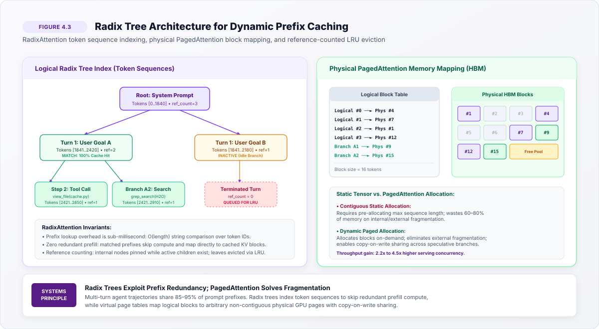

# Virtual Context Memory {#sec-vol3-virtual-memory}

<!--
Chapter Metrics & Metadata
- Volume: 3 (Autonomous Reasoning & Agentic Systems)
- Section: Context & Execution Substrates (Part II)
- Sequence: Chapter 4 of 16
- Role: Virtual Context Memory (The Neural Paging Substrate)
- Target Word Count: 5,500 - 7,000 words
- Prerequisites: Vol 1 (Transformer Memory Walls, KV Cache Sizing), Vol 3 (01_processor, 02_deliberation, 03_working_sets)
- Core Concepts: PagedAttention, RadixAttention, Copy-on-Write, KV Cache Fragmentation, Dynamic Prefix Indexing, Search Tree Paging
- Companion Code: src/vol3/04_virtual_memory/ (paged_kv_allocator.py, radix_cache_tree.py, cow_speculative_branch.py)
-->

## Purpose {.unnumbered .unlisted}

This chapter introduces the systems architecture required to transform volatile accelerator memory into a virtualized, demand-paged context substrate for autonomous agents. While @sec-vol3-working-sets analyzed the token dynamics of an agent's working set from a capacity perspective, this chapter focuses on the physical memory allocation mechanics required to sustain long-horizon agent execution. We explore how modern serving systems eliminate internal and external Key-Value (KV) cache fragmentation, examine the temporal and spatial prefix locality inherent in iterative tool execution loops, dissect the mechanics of block-level virtual memory translation (PagedAttention), and analyze dynamic prefix indexing via Radix trees (RadixAttention) to support zero-overhead speculative branching in tree search.

::: {.callout-note appearance="minimal"}
Virtual context memory is the operating system abstraction layer that decouples an agent's logical reasoning trajectory from physical accelerator High-Bandwidth Memory (HBM). Without dynamic paging and zero-copy prefix sharing, multi-turn tool execution and test-time deliberation collapse under quadratic prefill compute costs and catastrophic memory fragmentation.
:::

{#fig-vol3-vm-agent-stack}

::: {.callout-learning-objectives}
- **Derive** the physical memory footprint of Key-Value caches across Multi-Head, Multi-Query, Grouped-Query, and Multi-Head Latent Attention geometries, quantifying the arithmetic sources of internal and external memory fragmentation.
- **Analyze** the prefix locality inherent in autonomous agent trajectories, demonstrating why stateless inference architectures impose unacceptable quadratic prefill latency penalties during iterative tool use.
- **Evaluate** the virtual-to-physical address translation mechanics of PagedAttention, understanding how fixed-size block paging eliminates external fragmentation and bounds internal waste.
- **Formulate** the operational lifecycle of dynamic Radix tree prefix indexing, tracing prefix matching, node splitting, reference counting, and LRU eviction during multi-turn agent conversations.
- **Architect** Copy-on-Write (CoW) page sharing for speculative search trees (such as Tree-of-Thoughts and MCTS), calculating the memory capacity expansion achieved by aliasing parent reasoning paths.
- **Diagnose** common systems failure modes in virtual context management, including tokenizer boundary shifts, prompt template instability, and cache invalidation under tool-induced environment mutations.
:::

## Introduction {#sec-vol3-vm-intro}

In the classic Von Neumann computer architecture, the central processing unit interacts with a hierarchical memory subsystem: fast, expensive registers and SRAM caches sit adjacent to the arithmetic logic units, backed by larger, slower DRAM, which is in turn paged to non-volatile secondary storage. Operating systems bridge these tiers through **virtual memory** [@kilburn1962one; @denning1970virtual], presenting software with an illusion of vast, contiguous, isolated address spaces while dynamically mapping logical pages onto fragmented physical frames in silicon.

An autonomous LLM agent operates under a strikingly similar paradigm. The transformer foundation model functions as the central reasoning engine. Its registers and primary working memory, however, do not consist of standard byte-addressable DRAM. Instead, the active working memory of an agent consists of token sequences materialized as high-dimensional **Key-Value (KV) activation tensors** resident within accelerator High-Bandwidth Memory (HBM).

When an agent interacts with external environments—issuing shell commands, querying databases, inspecting web pages, or evaluating speculative reasoning branches—it executes an iterative perception-action loop:

$$s_t \xrightarrow{\text{policy}} a_t \xrightarrow{\text{runtime}} o_t \longrightarrow s_{t+1}$$

At step $t+1$, the agent's context window contains the entire prior sequence $s_t$, the action $a_t$, and the resulting observation $o_t$. In a conventional, unvirtualized serving infrastructure, this iterative loop triggers two severe systems pathologies:

1. **The Allocation Pathology (Memory Fragmentation):** Standard deep learning frameworks allocate memory in contiguous chunks. Because the runtime cannot predict how many tokens an agent will generate or how many interaction turns a task will require, it must either pre-allocate memory for the theoretical maximum context window (e.g., $128\text{k}$ tokens) or dynamically re-allocate and copy tensors as the sequence grows. Pre-allocation leads to massive **internal fragmentation**, where up to $80\%$ of accelerator HBM sits idle, reserved for tokens that are never generated. Dynamic reallocation causes severe **external fragmentation**, where memory becomes partitioned into unusable gaps, precipitating premature Out-of-Memory (OOM) crashes even when total free memory is abundant [@kwon2023efficient].
2. **The Compute Pathology (Redundant Prefill):** Consecutive turns of an agent trajectory share between $85\%$ and $98\%$ of their prompt tokens. In test-time search algorithms (such as Tree-of-Thoughts and Monte Carlo Tree Search, detailed in @sec-vol3-deliberation), dozens of speculative branches share identical parent reasoning chains. If the serving runtime treats each turn or branch as an isolated request, it recomputes the prompt prefill from scratch, burning tens of billions of floating-point operations (FLOPs) re-evaluating invariant system instructions, tool schemas, and historical steps.

Resolving these pathologies requires virtualizing the agent's context memory. Just as Ferranti Atlas engineers resolved core-memory scarcity in 1962 by introducing virtual memory paging [@kilburn1962one], modern agent serving systems introduce **Virtual Context Memory**. By partitioning continuous Key-Value tensors into uniform physical memory blocks and indexing those blocks through dynamic Radix prefix trees, the inference engine decouples logical sequence representations from physical silicon addresses, unlocking zero-copy prefix sharing and demand-paged execution.

::: {#dfn-virtual-context-memory .callout-definition title="Virtual context memory"}

***Virtual context memory***\index{virtual context memory!definition} is a neural serving runtime architecture that decouples an agent's logical token sequences from physical accelerator memory by partitioning Key-Value activation tensors into uniform, demand-paged blocks indexed through dynamic prefix trees.

1.  **Significance**: Resolves the dual crises of physical memory fragmentation (stranding 60% to 80% of accelerator HBM) and redundant prefill computation (wasting over 90% of prompt FLOPs across consecutive turns and speculative search branches).
2.  **Distinction**: Unlike classical operating system virtual memory, which maps contiguous scalar byte addresses through hardware MMUs, virtual context memory maps multidimensional attention activation tensors through software-managed page tables directly consumed by custom GPU attention kernels.
3.  **Common pitfall**: Assuming virtual context memory acts as persistent long-term storage; it virtualizes volatile, high-bandwidth accelerator RAM during active execution and must be paired with external episodic storage for durable retention.

:::

::: {.callout-note title="Checkpoint"}

Before dissecting physical tensor geometries, verify your understanding of why stateful agent loops necessitate neural virtual memory systems:

**Stateful Trajectories vs. Stateless Serving:**

- [ ] **Control Loop Memory Pressures**: Why does the iterative agent control loop ($s_t \xrightarrow{\text{policy}} a_t \xrightarrow{\text{runtime}} o_t \longrightarrow s_{t+1}$) make static memory reservation infeasible, and why does treating each turn as an independent request induce severe prefill compute waste?
- [ ] **Hardware MMU vs. Neural Page Tables**: How does classical operating system paging (hardware-managed TLBs translating contiguous virtual byte addresses to 4 KB DRAM pages) differ fundamentally from neural virtual context memory (software-managed page tables mapping non-contiguous attention activation blocks directly into GPU SRAM)?
- [ ] **Dual Serving Pathologies**: Distinguish between the Allocation Pathology (memory fragmentation stranding up to $80\%$ of accelerator HBM) and the Compute Pathology (redundant prefill burning tens of PFLOPs re-evaluating invariant prompts).

:::

## KV-Cache Tensor Layouts {#sec-vol3-vm-kv-cache-layouts}

To engineer virtual memory management for neural agents, one must first dissect the physical geometry and arithmetic footprint of the Key-Value cache. During autoregressive decoding, each transformer layer attends to all previous tokens in the sequence. To avoid recomputing Key and Value vectors for historical tokens at every generation step, the engine caches these intermediate activations in accelerator HBM.

### Mathematical Derivation of Footprint Per Token

Let a transformer architecture possess the following hyperparameters:

- $n_{\text{layers}}$: total number of transformer layers.
- $d_{\text{model}}$: hidden state dimension.
- $n_{\text{heads}}$: number of query attention heads.
- $d_{\text{head}} = d_{\text{model}} / n_{\text{heads}}$: dimension of each individual attention head.
- $n_{\text{kv\_heads}}$: number of Key and Value attention heads.
- $b$: precision in bytes per parameter (e.g., $b = 2$ for FP16/BF16, $b = 1$ for FP8).

For standard Multi-Head Attention (MHA), where $n_{\text{kv\_heads}} = n_{\text{heads}}$, each token requires storing one Key vector and one Value vector per layer. Each vector contains $n_{\text{kv\_heads}} \times d_{\text{head}} = d_{\text{model}}$ elements. The memory footprint per token, denoted $S_{\text{token}}$, is derived as:

$$S_{\text{token}} = 2 \times b \times n_{\text{layers}} \times d_{\text{model}} \quad \text{[bytes/token]}$$ {#eq-vol3-vm-mha-footprint}

For a sequence of context length $L$, the total KV cache memory consumed by a single agent instance is:

$$M_{\text{KV}}(L) = L \times S_{\text{token}} = 2 \cdot b \cdot n_{\text{layers}} \cdot d_{\text{model}} \cdot L$$ {#eq-vol3-vm-total-kv-footprint}

### Attention Geometries: MHA, MQA, GQA, and MLA

As context windows expanded from $4\text{k}$ to $128\text{k}$ and $1\text{M}$ tokens to accommodate dense agent scratchpads and codebases, standard MHA became a severe memory bandwidth and capacity bottleneck. Modern models employ architectural variants that alter the KV tensor layout:

1. **Multi-Query Attention (MQA)** [@shazeer2019fast]: Collapses all Key and Value heads into a single head shared across all Query heads ($n_{\text{kv\_heads}} = 1$). The footprint reduces by a factor of $n_{\text{heads}}$:
   $$S_{\text{token, MQA}} = 2 \times b \times n_{\text{layers}} \times d_{\text{head}}$$
2. **Grouped-Query Attention (GQA)** [@ainslie2023gqa]: Partitions Query heads into $G$ groups, assigning one Key and one Value head to each group ($n_{\text{kv\_heads}} = G$). The memory footprint scales as:
   $$S_{\text{token, GQA}} = 2 \times b \times n_{\text{layers}} \times (G \cdot d_{\text{head}}) = \frac{G}{n_{\text{heads}}} S_{\text{token, MHA}}$$
3. **Multi-Head Latent Attention (MLA)** [@deepseek2024v2]: Rather than caching uncompressed Key and Value heads, MLA projects Key and Value vectors into a low-dimensional latent space of dimension $d_c \ll n_{\text{heads}} \times d_{\text{head}}$, alongside a decoupled rotary key vector $d_R$. During generation, only the compressed latent vector $\mathbf{c}_t^{\text{KV}}$ and the rotary key $\mathbf{k}_t^R$ are stored:
   $$S_{\text{token, MLA}} = b \times n_{\text{layers}} \times (d_c + d_R)$$

| Model Architecture      | Parameter Count | $n_{\text{layers}}$ | $d_{\text{model}}$ | Attention Type | $n_{\text{heads}} / n_{\text{kv\_heads}}$ | $S_{\text{token}}$ (FP16, bytes)             | KV Cache at $32\text{k}$ Tokens | KV Cache at $128\text{k}$ Tokens |
|:------------------------|:----------------|:--------------------|:-------------------|:---------------|:------------------------------------------|:---------------------------------------------|:--------------------------------|:---------------------------------|
| **LLaMA-1 / LLaMA-2**   | 70B             | 80                  | 8192               | MHA            | 64 / 64                                   | $1\text{,}310\text{,}720$ ($1.31\text{ MB}$) | $41.94\text{ GB}$               | $167.77\text{ GB}$               |
| **Llama-3 / Llama-3.1** | 70B             | 80                  | 8192               | GQA ($8:1$)    | 64 / 8                                    | $163\text{,}840$ ($160\text{ KB}$)           | $5.24\text{ GB}$                | $20.97\text{ GB}$                |
| **Qwen-2.5**            | 72B             | 80                  | 8192               | GQA ($8:1$)    | 64 / 8                                    | $163\text{,}840$ ($160\text{ KB}$)           | $5.24\text{ GB}$                | $20.97\text{ GB}$                |
| **Command R+**          | 104B            | 64                  | 12288              | GQA ($8:1$)    | 96 / 8                                    | $131\text{,}072$ ($128\text{ KB}$)           | $4.19\text{ GB}$                | $16.78\text{ GB}$                |
| **DeepSeek-V2 / V3**    | 236B / 671B     | 60                  | 5120               | MLA            | Latent ($512 + 64$)                       | $69\text{,}120$ ($67.5\text{ KB}$)           | $2.21\text{ GB}$                | $8.85\text{ GB}$                 |
: Memory footprint per token across modern foundation model attention architectures. {#tbl-vol3-vm-model-kv-footprint}

### Physical Tensor Layouts and Memory Fragmentation

In unvirtualized serving frameworks, the KV cache for a batch of $B$ requests across $n_{\text{layers}}$ is allocated as a static 5-dimensional tensor:

$$\mathcal{T}_{\text{KV}} \in \mathbb{R}^{B \times n_{\text{layers}} \times 2 \times L_{\text{max}} \times n_{\text{kv\_heads}} \times d_{\text{head}}}$$ {#eq-vol3-vm-static-tensor}

Because memory is physically contiguous along the sequence dimension $L$, two forms of memory waste emerge:

1. **Internal Waste:** If request $i$ completes after generating $L_i$ tokens, the remaining capacity $(L_{\text{max}} - L_i) \times S_{\text{token}}$ remains reserved in HBM and cannot be assigned to another agent.
2. **External Fragmentation:** Even if dynamic memory pools (e.g., PyTorch caching allocators) allocate blocks incrementally, variable request termination times leave holes in physical memory. A new agent trajectory requiring $32\text{k}$ contiguous tokens will fail to allocate if the largest contiguous free slice is only $16\text{k}$, even if total aggregate unallocated memory exceeds $100\text{ GB}$.

Empirical measurements across production inference clusters indicate that static and unpaged allocators waste between **$60\%$ and $80\%$** of total accelerator memory [@kwon2023efficient]. This memory waste directly caps agent concurrency, stranding expensive GPU compute silicon.

::: {.callout-checkpoint title="KV-cache geometry and fragmentation"}

Checking quantitative command of KV cache sizing, attention head scaling, and memory fragmentation.

**Memory geometry across attention topologies**

- [ ] **Footprint derivation**: Can you derive the exact memory footprint per token ($S_{\text{token}}$) for a 32-layer transformer using GQA with 32 query heads, 4 KV heads, and head dimension 128 under FP8 precision ($b=1$)?
- [ ] **MLA compression ratio**: Why does DeepSeek-V3's Multi-Head Latent Attention achieve a smaller per-token footprint than Llama-3-70B despite having larger total parameter count? What specific architectural projections enable this reduction?
- [ ] **Internal vs. external fragmentation**: Under dynamic memory pool allocation without paging, describe the exact physical memory state where an inference engine triggers an Out-of-Memory (OOM) fault despite 50 GB of unallocated HBM being available.
- [ ] **Batch capacity scaling**: On an 80 GB NVIDIA H100 GPU hosting a 70B model (consuming 35 GB in INT4 weights), calculate the maximum concurrent agent trajectories supported at $64\text{k}$ context length under MHA versus GQA ($8:1$).

:::

## Prefix Locality in Trajectories {#sec-vol3-vm-prefix-locality}

Autonomous agent workloads exhibit fundamentally different memory access and lifespan characteristics than standard conversational chatbots. A chatbot interaction typically consists of short, independent queries with localized dialogue history. In contrast, an autonomous agent interacts through structured, long-horizon operational environments.

### Trajectory Prompt Anatomy

At turn $t$, the full prompt sequence submitted to the inference engine, denoted $X^{(t)}$, can be decomposed into five structural components:

$$X^{(t)} = \left[ \mathbf{x}_{\text{sys}}, \, \mathbf{x}_{\text{tools}}, \, \mathbf{x}_{\text{env}}, \, \mathbf{x}_{\text{history}}^{(1:t-1)}, \, \mathbf{x}_{\text{action}}^{(t-1)}, \, \mathbf{x}_{\text{obs}}^{(t)} \right]$$ {#eq-vol3-vm-prompt-decomposition}

| Segment                                                                                | Representation                                                  | Token Length ($L$)             | Mutation Cadence         | Cache Invalidation Risk           |
|:---------------------------------------------------------------------------------------|:----------------------------------------------------------------|:-------------------------------|:-------------------------|:----------------------------------|
| **System Prompt** ($\mathbf{x}_{\text{sys}}$)                                          | Core identity, behavioral guardrails, reasoning protocols       | $500 - 2\text{,}000$           | Static across all agents | Zero (invariant within runtime)   |
| **Tool Schemas** ($\mathbf{x}_{\text{tools}}$)                                         | JSON/OpenAPI schemas for MCP tools, APIs, shell functions       | $1\text{,}500 - 8\text{,}000$  | Static per task/agent    | Zero (unless dynamic tools added) |
| **Environment Context** ($\mathbf{x}_{\text{env}}$)                                    | Repo map, file tree, system environment, user issue description | $2\text{,}000 - 30\text{,}000$ | Static per agent session | Low (updates on major state sync) |
| **Trajectory History** ($\mathbf{x}_{\text{history}}^{(1:t-1)}$)                       | Prior thought traces, actions executed, observations returned   | $1\text{,}000 - 80\text{,}000$ | Append-only per turn     | Low (strictly monotonic growth)   |
| **Current Step** ($\mathbf{x}_{\text{action}}^{(t-1)}, \mathbf{x}_{\text{obs}}^{(t)}$) | The latest tool invocation and external observation payload     | $200 - 10\text{,}000$          | Dynamic (new every turn) | High (frequently divergent)       |
: Structural decomposition and mutation characteristics of an autonomous agent prompt. {#tbl-vol3-vm-prompt-anatomy}

Notice the critical operational property revealed in @tbl-vol3-vm-prompt-anatomy: the vast majority of tokens in $X^{(t)}$ are **strictly invariant prefixes** of $X^{(t+1)}$.

{#fig-vol3-vm-prefix-locality}

### Denning's Principle of Locality in Agent Contexts

In his foundational 1970 paper, Peter Denning established that programs exhibit **temporal locality** (memory locations referenced recently are likely to be referenced again soon) and **spatial locality** (storage locations adjacent to recently referenced memory are likely to be accessed together) [@denning1970virtual].

In autonomous agent systems, context access patterns exhibit an extreme variant: **Trajectory Prefix Locality**.

::: {#pri-trajectory-prefix-locality .callout-principle title="The Trajectory Prefix Locality Invariant"}
For any autonomous agent executing an append-only perception-action trajectory of length $T$, the prefix sharing ratio between consecutive turns $t$ and $t+1$:

$$\rho(t, t+1) = \frac{|X^{(t)} \cap X^{(t+1)}|}{|X^{(t+1)}|} = \frac{|X^{(t)}|}{|X^{(t)}| + |\Delta \mathbf{x}^{(t+1)}|}$$

approaches unity as trajectory horizon $t$ increases:

$$\lim_{t \to \infty} \rho(t, t+1) = 1.0$$
:::

### The Computational Disaster of Stateless Serving

When an agent interacts with a conventional stateless inference endpoint, the serving engine treats every turn as an entirely new request. For an input prompt of length $L = |X^{(t)}|$, the engine must execute a complete prompt prefill forward pass. For a transformer with $P$ parameters, the prefill arithmetic complexity scales as:

$$\text{FLOPs}_{\text{prefill}}(L) \approx 2 P L + 4 n_{\text{layers}} d_{\text{model}} L^2$$ {#eq-vol3-vm-prefill-flops}

Consider serving Llama-3-70B ($P \approx 7 \times 10^{10}$) on a $32\text{,}768$-token agent prompt. Computing the prefill pass requires:

$$\text{FLOPs}_{\text{prefill}} \approx 2 \times (7 \times 10^{10}) \times 32\text{,}768 \approx 4.59 \times 10^{15} \text{ FLOPs} \quad (4.59\text{ PFLOPs})$$

On an NVIDIA H100 SXM5 GPU operating at an effective sustained BF16 Tensor Core throughput of $500\text{ TFLOPS}$ ($5 \times 10^{14}$ FLOPs/s), computing this prefill requires:

$$T_{\text{prefill}} = \frac{4.59 \times 10^{15} \text{ FLOPs}}{5 \times 10^{14} \text{ FLOPs/s}} \approx 9.18 \text{ seconds}$$

If an agent executes a 20-turn trajectory on a stateless serving infrastructure, the cluster spends over **$180$ seconds** of pure GPU time re-evaluating identical tokens. This redundant computation destroys interactive response times (inflating Time-to-First-Token, TTFT), wastes enormous electrical power, and creates severe queueing backpressure.

If the serving system caches and reuses the KV states corresponding to $X^{(t)}$, the prefill for turn $t+1$ requires evaluating only the incremental delta $\Delta = |\mathbf{x}_{\text{action}}^{(t)}| + |\mathbf{x}_{\text{obs}}^{(t+1)}|$ (e.g., 500 tokens). Computing 500 tokens on Llama-3-70B requires only $0.07\text{ PFLOPs}$, completing in approximately **$140\text{ ms}$**—a **$65\times$ reduction in prefill latency**.

::: {.callout-note title="Napkin Math: Multi-Turn TTFT Latency and Prefix Cache Hit Rates"}

**Problem:** An autonomous software engineering agent runs a $T = 20$-turn coding trajectory on an 8-GPU NVIDIA H100 node serving Llama-3-70B in BF16 ($P = 70 \times 10^9$ parameters; sustained prefill throughput $R = 500\text{ TFLOPS}$). The root prompt contains $L_1 = 16\text{,}000$ tokens (system prompt, MCP tool definitions, and repository context). At each turn $t \in [1, 20]$, the agent emits an action and receives an environment observation adding an incremental delta $\Delta = 800$ tokens. Calculate: (1) the effective prefix cache hit rate across the trajectory, (2) the turn-20 Time-to-First-Token (TTFT) under stateless serving versus Radix prefix caching, and (3) the aggregate prefill GPU time saved over the entire session.

**Variables:**

- Model parameters: $P = 70 \times 10^9$ (BF16 precision).
- Cluster prefill compute throughput: $R = 500\text{ TFLOPS} = 5 \times 10^{14}\text{ FLOPs/s}$.
- Trajectory horizon: $T = 20$ turns.
- Root prompt length: $L_1 = 16{,}000\text{ tokens}$.
- Per-turn prompt expansion: $\Delta = 800\text{ tokens/turn}$.
- Context length at turn $t$: $L_t = L_1 + (t-1)\Delta$. At turn 20, $L_{20} = 16{,}000 + 19 \times 800 = 31{,}200\text{ tokens}$.
- Prefill arithmetic intensity: $\text{FLOPs}(L) \approx 2 P L = 1.4 \times 10^{11} \times L\text{ FLOPs}$.
- Time per prefill token: $\tau_{\text{prefill}} = \frac{2P}{R} = \frac{1.4 \times 10^{11}}{5 \times 10^{14}} = 2.8 \times 10^{-4}\text{ s/token} = 0.28\text{ ms/token}$.

**Math:**

1. *Stateless Serving (Zero Prefix Caching):*
Every turn $t$ re-evaluates all $L_t$ tokens from scratch:
$$\text{Tokens}_{\text{stateless}} = \sum_{t=1}^{20} [16{,}000 + 800(t-1)] = 20 \times 16{,}000 + 800 \times \frac{19 \times 20}{2} = 320{,}000 + 152{,}000 = 472{,}000\text{ tokens}$$
Cumulative prefill FLOPs:
$$\text{FLOPs}_{\text{stateless}} = 472{,}000 \times 1.4 \times 10^{11} \approx 6.608 \times 10^{16}\text{ FLOPs} = 66.08\text{ PFLOPs}$$
Cumulative prefill latency:
$$T_{\text{prefill, stateless}} = \frac{6.608 \times 10^{16}\text{ FLOPs}}{5 \times 10^{14}\text{ FLOPs/s}} = \mathbf{132.16\text{ seconds}}$$
At turn 20 ($L_{20} = 31{,}200$ tokens), the user or orchestrator waits:
$$\text{TTFT}_{\text{turn-20, stateless}} = 31{,}200 \times 2.8 \times 10^{-4}\text{ s} = \mathbf{8.74\text{ seconds}}$$

2. *Radix Prefix Caching Serving:*
Turn 1 performs cold prefill on $L_1 = 16{,}000$ tokens:
$$T_1 = 16{,}000 \times 2.8 \times 10^{-4}\text{ s} = 4.48\text{ seconds}$$
For each subsequent turn $t \in [2, 20]$, the serving engine matches the entire preceding sequence of length $L_{t-1}$ in the Radix tree ($100\%$ prefix hit on history), prefilling *only* the new delta $\Delta = 800$ tokens:
$$\text{Tokens}_{\text{cached}} = 16{,}000 + (19 \times 800) = 31{,}200\text{ tokens}$$
Cumulative prefill FLOPs:
$$\text{FLOPs}_{\text{cached}} = 31{,}200 \times 1.4 \times 10^{11} \approx 4.368 \times 10^{15}\text{ FLOPs} = 4.368\text{ PFLOPs}$$
Cumulative prefill latency across all 20 turns:
$$T_{\text{prefill, cached}} = 4.48\text{ s} + 19 \times (800 \times 2.8 \times 10^{-4}\text{ s}) = 4.48\text{ s} + 19 \times 0.224\text{ s} = 4.48\text{ s} + 4.26\text{ s} = \mathbf{8.74\text{ seconds}}$$
Per-turn TTFT for every subsequent turn $t \ge 2$:
$$\text{TTFT}_{\text{turn-}t\text{, cached}} = 800 \times 2.8 \times 10^{-4}\text{ s} = \mathbf{224\text{ ms}}$$

3. *Effective Hit Rate and Aggregate Speedup:*
$$\text{Hit Rate} = \frac{\text{Tokens Reused}}{\text{Total Tokens Requested}} = \frac{472{,}000 - 31{,}200}{472{,}000} = \frac{440{,}800}{472{,}000} \approx \mathbf{93.39\%}$$
Turn-20 TTFT latency speedup:
$$\text{Speedup}_{\text{TTFT}} = \frac{8.74\text{ s}}{0.224\text{ s}} \approx \mathbf{39.0\times}$$
Cumulative trajectory prefill compute speedup:
$$\text{Speedup}_{\text{cumulative}} = \frac{132.16\text{ s}}{8.74\text{ s}} \approx \mathbf{15.1\times}$$

**Result:** Prefix caching achieves a $93.39\%$ effective hit rate across the 20-turn trajectory. At turn 20, TTFT drops from an unacceptably sluggish $8.74\text{ seconds}$ to an interactive $224\text{ ms}$ ($39.0\times$ speedup). Across the session, cumulative prefill compute shrinks from $132.16\text{ seconds}$ to $8.74\text{ seconds}$ ($15.1\times$ speedup), eliminating $61.71\text{ PFLOPs}$ of redundant matrix multiplications.

**Systems Insight:** In agentic workflows, prompt expansion is strictly monotonic ($\rho(t, t+1) \to 1.0$ as $t$ grows). Treating consecutive agent steps as stateless calls turns linear execution into quadratic prefill complexity ($\mathcal{O}(T \cdot L_1 + T^2 \Delta)$), choking GPU Tensor Cores with duplicate work. Retaining the KV cache converts trajectory serving into an incremental streaming model ($\mathcal{O}(L_1 + T \Delta)$), reducing interactive latency from multi-second stalls down to sub-second tool execution loops.

:::

::: {.callout-checkpoint title="Trajectory prefix dynamics and prefill economics"}

Evaluating prompt anatomy, prefix sharing ratios, and computational prefill costs during multi-turn agent execution.

**Prefix sharing and arithmetic cost**

- [ ] **Prompt anatomy decomposition**: Can you identify the five operational segments of an autonomous agent prompt and classify their respective mutation cadences and cache residency lifetimes?
- [ ] **Denning's locality in neural agents**: How do temporal and spatial locality manifest within the context window of an iterative agent control loop?
- [ ] **Prefill arithmetic ceiling**: Why does stateless serving of a 20-turn agent trajectory inflate Time-to-First-Token by over $60\times$ compared to a prefix-caching serving runtime?
- [ ] **Prefix sharing ratio calculation**: Given a $40\text{,}000$-token historical trajectory appending a 400-token tool observation, what is the exact prefix sharing ratio ($\rho$), and how many PFLOPs of prefill computation are eliminated by reusing cached activations?

:::

## Block-Level Allocation (PagedAttention) {#sec-vol3-vm-pagedattention}

To solve the dual challenges of physical memory fragmentation and zero-copy prefix sharing, Kwon et al. introduced **PagedAttention** [@kwon2023efficient]. Inspired by classical operating system virtual memory paging, PagedAttention breaks the requirement that an agent's KV cache must occupy contiguous memory in accelerator HBM.

::: {#dfn-paged-attention .callout-definition title="PagedAttention"}

***PagedAttention***\index{PagedAttention!definition} is an attention algorithm and memory management architecture that stores Key and Value activation vectors in non-contiguous, fixed-size physical memory blocks, translating logical token positions to physical memory addresses via dynamic page tables during kernel execution.

1.  **Significance**: Completely eliminates external memory fragmentation and bounds internal fragmentation to the final memory block of a sequence, unlocking near-$100\%$ accelerator memory utilization.
2.  **Distinction**: Traditional attention kernels require continuous memory strides to compute $\text{softmax}(QK^T/\sqrt{d})V$. PagedAttention executes attention directly across scattered physical memory blocks through an integrated address lookup table inside GPU SRAM.
3.  **Common pitfall**: Assuming small block sizes are unconditionally optimal; excessively small blocks ($B \le 4$) degrade memory coalescing on GPU global memory buses, while large blocks ($B \ge 64$) increase internal tail fragmentation.

:::

### Virtual-to-Physical Block Mapping

Under PagedAttention, an agent's logical sequence of tokens $(x_0, x_1, \dots, x_{L-1})$ is partitioned into logical blocks of fixed size $B$ (typically $B \in \{16, 32\}$ tokens):

$$\text{Logical Block } j = (x_{j \cdot B}, \, x_{j \cdot B + 1}, \, \dots, \, x_{(j+1) \cdot B - 1})$$

The serving engine maintains a centralized **Page Table** that maps each logical block number to a physical block index in accelerator memory:

$$\mathcal{M}: (\text{Request\_ID}, \, \text{Logical\_Block\_Index}) \longrightarrow \text{Physical\_Block\_Index}$$ {#eq-vol3-vm-page-table-map}

When the attention kernel executes on the GPU, it computes the physical memory address for a given token at logical position $i$ using integer division and modulo operations:

$$\text{Logical Block Index } j = \lfloor i / B \rfloor$$
$$\text{Block Offset } o = i \pmod B$$
$$\text{Physical Address} = \text{Base}(\mathcal{M}(j)) + o \times S_{\text{token\_layer}}$$ {#eq-vol3-vm-phys-addr}

During the generation phase, the model emits one token at a time. The engine appends the newly computed Key and Value vectors into the current physical block's next free slot. Only when the current block becomes completely saturated ($o = B - 1$) does the runtime allocate a new physical block from the global free-block pool.

### Elimination of Fragmentation

PagedAttention fundamentally alters the memory efficiency equation:

1. **Elimination of External Fragmentation:** Because all physical blocks share an identical fixed size $B$, any free block in HBM can satisfy any allocation request from any agent. Memory allocation is reduced to managing a simple free-list stack or bitmask. Memory compactions, defragmentation pauses, and contiguous allocation failures are mathematically impossible.
2. **Bounding Internal Fragmentation:** Internal fragmentation is restricted strictly to the final block of an active sequence. For block size $B$, the expected internal waste per agent sequence is:
   $$\mathbb{E}[\text{Waste}_{\text{internal}}] = \frac{B - 1}{2} \times S_{\text{token}}$$
   For $B = 16$ on Llama-3-70B ($S_{\text{token}} = 160\text{ KB}$), the expected waste per agent is only:
   $$\mathbb{E}[\text{Waste}] = 7.5 \times 160\text{ KB} \approx 1.20\text{ MB}$$
   In a $32\text{k}$-token context ($5.24\text{ GB}$ total KV footprint), internal fragmentation represents **less than $0.025\%$** of allocated memory.

| Block Size ($B$) | Memory Footprint per Block (Llama-3-70B FP16) | Maximum Tail Waste per Trajectory |   GPU Global Memory Bus Coalescing   |  Kernel Scheduling Overhead  | Optimal Deployment Regime       |
|:----------------:|:---------------------------------------------:|:---------------------------------:|:------------------------------------:|:----------------------------:|:--------------------------------|
|   **$B = 8$**    |                $1.28\text{ MB}$               |          $1.12\text{ MB}$         |  Poor ($128$-byte unaligned reads)   | High (frequent page lookups) | Memory-constrained edge devices |
|   **$B = 16$**   |                $2.56\text{ MB}$               |          $2.40\text{ MB}$         |  Good ($256$-byte sector alignment)  |           Moderate           | General agent serving (default) |
|   **$B = 32$**   |                $5.12\text{ MB}$               |          $4.96\text{ MB}$         | Optimal ($512$-byte coalesced burst) |             Low              | High-throughput batch serving   |
|   **$B = 64$**   |               $10.24\text{ MB}$               |          $9.92\text{ MB}$         |               Optimal                |           Very Low           | Massive batched prefill engines |
: Trade-offs in PagedAttention block size selection ($B$) across memory efficiency and GPU memory bus throughput. {#tbl-vol3-vm-block-size-tradeoffs}

### Copy-on-Write (CoW) for Speculative Trajectories

The most powerful capability unlocked by virtual block paging is **zero-copy branching** via Copy-on-Write (CoW).

In agent deliberation engines (@sec-vol3-deliberation), an agent often evaluates multiple speculative continuations from an identical intermediate state. For example, a code generation agent might fork three parallel rollouts: Branch $A$ attempts an in-place refactor, Branch $B$ rewrites the module from scratch, and Branch $C$ executes an existing test suite.

Under unpaged serving, generating three branches from a $32\text{k}$-token context requires duplicating the $32\text{k}$-token KV cache three times, consuming $3 \times 5.24\text{ GB} = 15.72\text{ GB}$ of physical memory and incurring gigabytes of PCIe/HBM tensor copy overhead.

With PagedAttention:

1. **Shared Block Aliasing:** When Branch $A$, $B$, and $C$ are initialized, their page tables simply copy the physical block pointers of the parent context. No activation data is copied. The physical blocks enter a shared state, incrementing their internal **reference counter** ($\text{ref\_count} = 3$).
2. **Copy-on-Write Execution:** As each branch autoregressively generates its own divergent tokens, it writes into its own physical blocks. If a branch needs to write to an unsaturated shared block (e.g., the final block of the prefix containing fewer than $B$ tokens), the allocator allocates a fresh physical block, copies only that single block's tokens ($B \times S_{\text{token}} = 2.56\text{ MB}$), decrements the parent block's reference counter, and redirects the child branch's page table.

<!-- MERMAID SOURCE PRESERVATION
flowchart LR
    subgraph LA["Logical Memory: Branch A"]
        LA0["Logical Block 0"]
        LA1["Logical Block 1"]
        LA2["Logical Block 2 (Action A)"]
    end

    subgraph LB["Logical Memory: Branch B"]
        LB0["Logical Block 0"]
        LB1["Logical Block 1"]
        LB2["Logical Block 2 (Action B)"]
    end

    subgraph PT["Physical Block Allocator (HBM)"]
        PB3["Physical Block 3 (ref=2)<br>[System Prompt]"]
        PB7["Physical Block 7 (ref=2)<br>[Tool Schemas]"]
        PB2["Physical Block 2 (ref=1)<br>[Branch A Rollout]"]
        PB9["Physical Block 9 (ref=1)<br>[Branch B Rollout]"]
        PBF["Free Block Pool: [4, 5, 8, 11...]"]
    end

    LA0 -- > PB3
    LB0 -- > PB3
    LA1 -- > PB7
    LB1 -- > PB7
    LA2 -- > PB2
    LB2 -- > PB9

    style PB3 fill:#d5c4a1,stroke:#665c54
    style PB7 fill:#d5c4a1,stroke:#665c54
    style PB2 fill:#b8bb26,stroke:#79740e
    style PB9 fill:#fabd2f,stroke:#b57614

-->
{#fig-vol3-vm-pagedattention}

::: {#pri-virtual-context-invariant .callout-principle title="The Virtual Context Invariant"}
In any virtual context memory architecture deploying block-level paging, the physical memory consumed by $K$ divergent agent trajectories sharing an identical parent prefix of length $L_{\text{prefix}}$ and generating divergent rollouts of length $L_{\text{branch}}$ is strictly bounded by:

$$M_{\text{physical}} = M_{\text{KV}}(L_{\text{prefix}}) + K \cdot M_{\text{KV}}(L_{\text{branch}}) + \mathcal{O}(K \cdot B \cdot S_{\text{token}})$$

as opposed to $K \cdot M_{\text{KV}}(L_{\text{prefix}} + L_{\text{branch}})$ in unpaged architectures.
:::

::: {.callout-checkpoint title="PagedAttention and copy-on-write mechanics"}

Verifying architectural mastery of virtual-to-physical address mapping, block sizing constraints, and Copy-on-Write page sharing.

**Paging mechanics and CoW state transitions**

- [ ] **Physical address translation**: For an agent sequence at logical token index $i = 457$ with block size $B = 16$, calculate the logical block index $j$ and block offset $o$. Write the mathematical expression used by the Triton/CUDA attention kernel to retrieve the key vector.
- [ ] **Block size trade-off analysis**: Why does choosing $B = 64$ provide higher memory bus efficiency on an NVIDIA H100 GPU than $B = 8$? Under what specific agent workload profile does $B = 64$ become disadvantageous?
- [ ] **CoW reference counter lifecycle**: Trace the reference counter values of a physical block holding a parent system prompt when an agent forks into 4 parallel Monte Carlo Tree Search rollouts, two rollouts terminate due to verifier rejection, and one rollout completes successfully.
- [ ] **Memory savings calculation**: An agent forks 8 speculative branches from a $48\text{,}000$-token codebase context. Each branch generates 500 tokens of speculative code. Using Llama-3-70B ($S_{\text{token}} = 160\text{ KB}$), calculate the exact physical memory saved by CoW paging compared to unpaged replication.

:::

## Radix Tree Prefix Indexing {#sec-vol3-vm-radix-tree}

While PagedAttention provides the physical paging mechanism to store non-contiguous blocks and share identical physical pages across known forks, an autonomous serving system requires a higher-level data structure to **automatically discover and index** reusable prefixes across arbitrary agent requests.

In production multi-agent environments, agents do not explicitly declare which parts of their context are shared. Multiple subagents launched independently might share identical system prompts and tool definitions without sharing request handles. To solve this, SGLang introduced **RadixAttention** [@zheng2024sglang].

::: {#dfn-radix-attention .callout-definition title="RadixAttention"}

***RadixAttention***\index{RadixAttention!definition} is a prefix caching and memory scheduling algorithm that maintains a dynamic, compressed Trie (Radix Tree) over token sequences, mapping logical prompt prefixes to physical PagedAttention blocks in accelerator memory.

1.  **Significance**: Automates prefix discovery across arbitrary requests, enabling automatic cache reuse across multi-turn dialogues, multi-agent swarms, and branching test-time search without manual cache-key engineering.
2.  **Distinction**: Unlike static hash-table prompt caches that match only identical full prompts, a Radix tree performs longest-prefix matching, dynamically splitting and merging tree edges as token sequences grow and diverge.
3.  **Common pitfall**: Failing to evict child leaf nodes when GPU memory reaches saturation; without an LRU eviction policy linked to physical block allocators, the Radix tree can cause memory deadlocks during bursty multi-agent workloads.

:::

### Radix Tree Data Structure

A Radix tree (or compact transition tree) is a space-optimized Trie where each node with only one child is merged with its child. In the context of virtual context memory, edges are labeled with **contiguous sequences of tokens**, and nodes maintain pointers to the physical PagedAttention blocks storing the KV activations for those tokens.

Each node $v$ in the Radix tree maintains:

- $\text{tokens}(v)$: the sub-sequence of tokens represented by this edge.
- $\text{blocks}(v)$: array of physical block IDs storing the KV cache tensors.
- $\text{ref\_count}(v)$: number of currently active, in-flight agent requests referencing this node.
- $\text{last\_accessed}(v)$: timestamp used for Least-Recently-Used (LRU) cache eviction.
- $\text{children}(v)$: dictionary mapping first token of child edges to child node pointers.

### Tree Operations: Lookup, Chunk Prefill, and Insertion

When an agent submits a prompt $X = (x_0, x_1, \dots, x_{N-1})$ to the serving runtime, the engine executes three discrete tree operations:

1. **Prefix Matching (Lookup):** The scheduler traverses the Radix tree from the root node, comparing the prompt tokens $X$ against edge labels. Traversal continues until the first token mismatch or until prompt tokens are exhausted. Let the longest matched prefix have length $M \le N$.
   - If $M > 0$, the scheduler reuses all physical blocks associated with the matched path $(0 \dots M-1)$. No prefill computation is executed for these $M$ tokens.
2. **Chunked Prefill:** The engine computes prefill activations *only* for the remaining suffix tokens $(x_M, \dots, x_{N-1})$. The prefill kernel processes this chunk in parallel, allocating fresh physical blocks from the free pool.
3. **Tree Insertion and Edge Splitting:** If the matched path terminates in the middle of an edge label, the engine splits the edge: a new internal node is created at the divergence point, the existing edge is shortened, and a new child branch is inserted for the new suffix. The newly allocated physical blocks are attached to the new leaf node.

### Reference Counting and LRU Eviction

Because accelerator HBM is finite, the Radix tree cannot retain all historical trajectories indefinitely. Memory management is governed by a **Reference-Counted LRU Eviction Policy**:

- **Active Nodes ($\text{ref\_count} > 0$):** A node currently in use by an active generation thread is **pinned**. It cannot be evicted, as GPU kernels are actively reading or appending to its physical memory blocks.
- **Cached Nodes ($\text{ref\_count} = 0$):** When an agent turn finishes or an external tool execution begins, the agent's request terminates. The engine does *not* immediately free the physical blocks. Instead, it decrements the reference counters along the trajectory path. Nodes reaching $\text{ref\_count} = 0$ enter the **eviction pool** while remaining resident in HBM.
- **Eviction Under Memory Pressure:** When a new request requires physical blocks and the free pool is exhausted, the allocator triggers eviction. It selects nodes from the eviction pool in Least-Recently-Used order ($\min \text{last\_accessed}$). To preserve tree consistency, **only leaf nodes** can be evicted. Evicting a leaf frees its physical blocks back to the free pool and removes the leaf from its parent's child table. If the parent node now has only one remaining child, the engine merges the parent and child edges.

If the agent issues its subsequent turn before memory pressure forces eviction, the system achieves a 100% cache hit on the historical prefix, replaying physical blocks directly from accelerator memory with zero prefill latency.

The holistic coordination between logical prefix indexing and physical memory allocation is illustrated in @fig-vol3-vm-radix-tree.

::: {#fig-vol3-vm-radix-tree fig-env="figure" fig-pos="htb" fig-cap="**Radix Tree Architecture for Dynamic Prefix Caching**: Logical Radix tree nodes index agent token sequences, mapping directly onto non-contiguous physical PagedAttention blocks in accelerator HBM. Internal nodes remain pinned while active child trajectories exist. Nodes with zero reference count enter the LRU eviction queue, allowing returning agents to achieve zero-recomputation cache hits unless memory pressure forces eviction. Source: Adapted from Zheng et al. [@zheng2024sglang]." fig-alt="Two-panel architecture diagram. The left panel shows a Radix tree rooted at a system prompt node that branches into two first-turn user goal nodes and then into tool-call and search leaves, each labeled with a token range and reference count; one branch is marked as a full cache hit and a zero-count leaf is queued for eviction. The right panel shows a logical block table mapping logical block numbers to scattered physical HBM block numbers, alongside a grid of physical blocks with the unmapped ones shown as a free pool."}

:::

As depicted in @fig-vol3-vm-radix-tree, maintaining the Radix tree in host runtime memory allows the scheduler to resolve prefix matches in sub-millisecond time ($\mathcal{O}(L_{\text{prefix}})$ string operations) before submitting execution kernels to the accelerator. By linking Radix tree nodes directly to PagedAttention physical block descriptors, the runtime achieves zero-overhead cache hits: incoming tokens matching an existing prefix bypass the prefill compute pass entirely and map immediately into the request's page table.

::: {.callout-note title="Napkin Math: Multi-Agent Swarm Warm-up and Prefix Memory Amortization"}

**Problem:** An orchestration platform dispatches a swarm of $N = 16$ parallel subagents (e.g., automated test generators or parallel SWE-bench patch workers) against a shared target repository. All 16 subagents share an identical root prefix of $L_{\text{shared}} = 24\text{,}000$ tokens comprising system prompts, MCP tool schemas, and repository ASTs, followed by unique $L_{\text{sub}} = 500$-token task instructions. The node runs Llama-3-70B (GQA: 8 KV heads, $d_{\text{head}} = 128$, 80 layers $\implies S_{\text{token}} = 327{,}680\text{ bytes/token}$) on an 8-GPU H100 node with $436\text{ GB}$ usable KV cache capacity and $500\text{ TFLOPS}$ sustained prefill throughput. Quantify the accelerator memory savings and swarm initialization speedup delivered by Radix tree prefix sharing versus isolated per-agent allocation.

**Variables:**

- Swarm size: $N = 16$ concurrent subagents.
- Shared prefix length: $L_{\text{shared}} = 24{,}000\text{ tokens}$.
- Unique per-subagent task prompt: $L_{\text{sub}} = 500\text{ tokens}$.
- KV cache footprint per token: $S_{\text{token}} = 327{,}680\text{ bytes} \approx 320\text{ KB}$.
- Model parameters: $P = 70 \times 10^9$ ($\text{FLOPs/token} = 2P = 1.4 \times 10^{11}$).
- Node KV cache capacity: $C_{\text{KV}} = 436\text{ GB}$.
- Sustained prefill compute throughput: $R = 500\text{ TFLOPS} = 5 \times 10^{14}\text{ FLOPs/s}$.

**Math:**

1. *Accelerator Memory Allocation:*
Physical memory for the shared $24\text{k}$-token prefix:
$$M_{\text{shared}} = 24{,}000 \times 327{,}680\text{ bytes} \approx 7.864\text{ GB}$$
Physical memory for a unique $500$-token task prompt:
$$M_{\text{sub}} = 500 \times 327{,}680\text{ bytes} \approx 0.164\text{ GB}$$
- *Without Prefix Sharing (Isolated Allocation):*
Each agent allocates private memory for both shared prefix and task:
$$M_{\text{total, isolated}} = 16 \times (7.864\text{ GB} + 0.164\text{ GB}) = 16 \times 8.028\text{ GB} = \mathbf{128.45\text{ GB}}$$
Fraction of node KV capacity consumed before any agent generates a single token:
$$\rho_{\text{KV, isolated}} = \frac{128.45\text{ GB}}{436\text{ GB}} \approx \mathbf{29.46\%}$$
- *With Radix Tree Prefix Sharing:*
The $24\text{k}$ prefix blocks are instantiated once ($7.864\text{ GB}$) with reference count $\text{ref\_count} = 16$. Only the unique task blocks are allocated independently:
$$M_{\text{total, shared}} = 7.864\text{ GB} + (16 \times 0.164\text{ GB}) = 7.864\text{ GB} + 2.624\text{ GB} = \mathbf{10.49\text{ GB}}$$
Fraction of node KV capacity consumed:
$$\rho_{\text{KV, shared}} = \frac{10.49\text{ GB}}{436\text{ GB}} \approx \mathbf{2.41\%}$$
Net memory reclaimed: $128.45\text{ GB} - 10.49\text{ GB} = \mathbf{117.96\text{ GB}}$ (a **$91.83\%$ reduction** in initialization memory footprint).

2. *Swarm Launch Compute and TTFT Latency:*
- *Without Prefix Sharing:*
The cluster must prefill $16 \times 24{,}500 = 392{,}000$ tokens:
$$\text{FLOPs}_{\text{isolated}} = 392{,}000 \times 1.4 \times 10^{11} = 5.488 \times 10^{16}\text{ FLOPs} = 54.88\text{ PFLOPs}$$
Total GPU swarm warm-up time:
$$T_{\text{launch, isolated}} = \frac{5.488 \times 10^{16}}{5 \times 10^{14}} = \mathbf{109.76\text{ GPU-seconds}}$$
Average TTFT per subagent under sequential queueing: $109.76 / 16 \approx 6.86\text{ seconds}$.
- *With Radix Tree Prefix Sharing:*
Subagent 1 executes a cold prefill on $24\text{,}500$ tokens ($L_{\text{shared}} + L_{\text{sub}}$):
$$T_1 = \frac{24{,}500 \times 1.4 \times 10^{11}}{5 \times 10^{14}} = \mathbf{6.86\text{ seconds}}$$
Subagents 2 through 16 hit the Radix cache for the shared $24\text{,}000$ tokens ($100\%$ prefix hit) and prefill *only* their $500$-token task prompts:
$$T_{2\dots 16} = 15 \times \left(\frac{500 \times 1.4 \times 10^{11}}{5 \times 10^{14}}\right) = 15 \times 0.14\text{ s} = \mathbf{2.10\text{ GPU-seconds}}$$
Total swarm launch compute drops to $6.86\text{ s} + 2.10\text{ s} = \mathbf{8.96\text{ GPU-seconds}}$ ($12.25\times$ overall compute reduction).
Individual TTFT for Subagents 2 through 16:
$$\text{TTFT}_{\text{subagent } 2\dots 16} = \frac{500 \times 1.4 \times 10^{11}}{5 \times 10^{14}} = \mathbf{140\text{ ms}}$$

**Result:** Radix tree prefix sharing reclaims $117.96\text{ GB}$ of accelerator memory ($91.83\%$ savings), compressing the initial swarm footprint from $128.45\text{ GB}$ to $10.49\text{ GB}$. Swarm initialization compute plummets from $109.76\text{ GPU-seconds}$ to $8.96\text{ GPU-seconds}$ ($12.25\times$ aggregate speedup), while secondary subagents experience near-instantaneous ($140\text{ ms}$) Time-to-First-Token.

**Systems Insight:** In multi-agent swarms, repository and tooling boilerplate represents over $97\%$ of initial prompt tokens. Treating worker agents as independent execution contexts causes severe accelerator memory thrashing and long initialization queues. Radix tree deduplication decouples cluster concurrency from workspace size, turning swarm dispatch into an $\mathcal{O}(L_{\text{shared}} + N \cdot L_{\text{sub}})$ operation rather than $\mathcal{O}(N \cdot L_{\text{shared}})$.

:::

### Branching Speculation in Search Trees

In test-time search topologies (such as Tree-of-Thoughts and Monte Carlo Tree Search, @sec-vol3-deliberation), an agent evaluates $K$ alternative actions branching from a root state $s_0$.

If the serving system evaluates these $K^D$ trajectory rollouts independently, total tokens prefilled across the search tree scales exponentially:

$$\text{Tokens}_{\text{naive}} = \sum_{d=0}^{D} K^d \cdot \left( L_{\text{root}} + d \cdot \Delta L \right) = \mathcal{O}\left( K^D \cdot L_{\text{root}} \right)$$ {#eq-vol3-vm-naive-mcts-tokens}

With PagedAttention and Radix tree indexing, the runtime prefills the root sequence $s_0$ exactly once. All $K$ child branches alias the root's physical blocks. The total memory footprint required to maintain the entire search tree in GPU HBM scales as:

$$M_{\text{tree}} = M_{\text{KV}}(L_{\text{root}}) + \sum_{d=1}^{D} K^d \cdot M_{\text{KV}}(\Delta L) = \mathcal{O}\left( L_{\text{root}} + K^D \cdot \Delta L \right)$$ {#eq-vol3-vm-shared-mcts-memory}

| Search Topology      | Branching Factor ($K$) | Tree Depth ($D$) | Total Leaves ($K^D$) | Naive Token Ingestion ($L_{\text{root}} = 16\text{k}, \Delta L = 500$) | Radix Tree Token Ingestion | Compute Savings Ratio | Physical KV Footprint (Llama-3-70B) |
|:---------------------|:----------------------:|:----------------:|:--------------------:|:----------------------------------------------------------------------:|:--------------------------:|:---------------------:|:-----------------------------------:|
| **Linear CoT**       |           1            |        10        |          1           |                            $210\text{,}000$                            |      $21\text{,}000$       |      $10.0\times$     |           $3.44\text{ GB}$          |
| **Beam Search**      |           4            |        3         |          64          |                       $1\text{,}120\text{,}000$                        |      $58\text{,}000$       |      $19.3\times$     |           $9.50\text{ GB}$          |
| **Tree-of-Thoughts** |           3            |        4         |          81          |                       $1\text{,}458\text{,}000$                        |      $76\text{,}500$       |      $19.1\times$     |          $12.53\text{ GB}$          |
| **Dense MCTS**       |           5            |        3         |         125          |                       $2\text{,}187\text{,}500$                        |      $93\text{,}500$       |      $23.4\times$     |          $15.32\text{ GB}$          |
: Scaling arithmetic for speculative tree search algorithms under naive execution versus Radix tree prefix caching. {#tbl-vol3-vm-deliberation-scaling}

The physical KV cache memory mapping during a branching search rollout is visualized in @fig-vol3-vm-tree-kv-cache.

{#fig-vol3-vm-tree-kv-cache}

::: {.callout-notebook title="Speculative branch capacity on an 8-GPU node"}

**Problem**: On an 8-GPU node serving Llama-3-70B in FP16, calculate the maximum number of concurrent speculative branches ($K$) that can be evaluated from a $32\text{,}768$-token codebase context under naive replication versus Radix tree prefix sharing.

**System parameters**:

- Node Configuration: 8 $\times$ NVIDIA H100 SXM5 (80 GB HBM3 per GPU; 640 GB total).
- Model Allocation: Llama-3-70B model weights in FP16 consume 140 GB. CUDA runtime, activations, and serving buffers consume 64 GB.
- Remaining Node HBM for KV Cache: $640\text{ GB} - 140\text{ GB} - 64\text{ GB} = 436\text{ GB}$.
- Shared Root Context: $L_{\text{root}} = 32\text{,}768$ tokens.
- Speculative Branch Horizon: $L_{\text{branch}} = 1\text{,}024$ tokens per branch.
- Memory Footprint per Token (Llama-3-70B GQA): $S_{\text{token}} = 163\text{,}840\text{ bytes} \approx 0.16\text{ MB}$.

**Mathematical derivation**:
KV cache footprint for the shared root context:
$$M_{\text{root}} = 32\text{,}768 \times 163\text{,}840\text{ bytes} \approx 5.37\text{ GB}$$
KV cache footprint per speculative branch:
$$M_{\text{branch}} = 1\text{,}024 \times 163\text{,}840\text{ bytes} \approx 0.168\text{ GB}$$

1. *Under Naive Replication (Independent Allocation)*:
Each speculative branch must allocate memory for both the root context and its branch tokens:
$$M_{\text{per\_branch, naive}} = M_{\text{root}} + M_{\text{branch}} = 5.37\text{ GB} + 0.168\text{ GB} = 5.538\text{ GB}$$
Maximum concurrent speculative branches:
$$K_{\text{naive}} = \left\lfloor \frac{436\text{ GB}}{5.538\text{ GB}} \right\rfloor = \mathbf{78\text{ branches}}$$

2. *Under Radix Tree Prefix Sharing (PagedAttention + CoW)*:
The shared root context is materialized **once** across the node. The remaining memory is allocated purely to divergent branch tokens:
$$M_{\text{available\_branches}} = 436\text{ GB} - M_{\text{root}} = 436\text{ GB} - 5.37\text{ GB} = 430.63\text{ GB}$$
Maximum concurrent speculative branches:
$$K_{\text{shared}} = \left\lfloor \frac{430.63\text{ GB}}{0.168\text{ GB}} \right\rfloor = \mathbf{2\text{,}563\text{ branches}}$$

**Systems insight**: Radix prefix sharing widens the speculative search capacity from **$78$ to $2\text{,}563$ concurrent branches**—a **$32.8\times$ expansion** on identical physical silicon. In naive serving, $97\%$ of accelerator memory is consumed by redundant copies of the root prompt. Sharing prefixes shifts the capacity bottleneck from prompt length to branch length, making deep test-time deliberation economically viable.

:::

::: {#ws-vm-openai-redis-2023 .callout-war-story title="The shared cache boundary: The ChatGPT cache disclosure"}

**Context**: In March 2023, OpenAI experienced a high-profile data disclosure incident in ChatGPT [@openai2023chatgptoutage]. ChatGPT utilized a shared Redis cache in front of its persistent databases to cache user profile and session metadata, accessed via an asynchronous Python client (`redis-py`) running under `asyncio`.

**Mechanism**: The `redis-py` client maintained an internal pool of shared TCP connections. Under asynchronous execution, requests and responses operate as paired queue operations: a task pushes a query onto the connection and awaits the response. When a request was canceled (e.g., due to a client disconnect or timeout) between the dispatch and the response read, the connection was returned to the shared pool without being purged. The unread response remained queued in the TCP buffer. When an unrelated request subsequently borrowed that connection, it dequeued the orphaned response data belonging to the previous user.

**Impact**: For a nine-hour window, active users were exposed to conversation titles and the initial message of newly created chats belonging to other users. In 1.2% of active ChatGPT Plus sessions, payment-related metadata (billing names, email addresses, and the last four digits of credit cards) was displayed to unintended accounts.

**Fix**: OpenAI patched the asynchronous client connection manager to immediately close and terminate any TCP connection upon query cancellation rather than returning it to the pool, ensuring that unread responses in network buffers could never be replayed to subsequent sessions. Additionally, cache keys were partitioned under isolated security domains with mandatory tenant identity validation.

**Systems lesson**: The lookup logic in Redis was entirely correct; the failure stemmed from assuming that the communication channel delivering an answer was bound to the identity of the requester. A neural Radix prefix cache introduces the exact same architectural vulnerability: physical KV blocks are matched purely on **token sequence identity**, agnostic to user tenant or security domain. If a multi-tenant serving cluster caches a proprietary prompt containing private keys, confidential source code, or patient health information, an adversarial tenant who discovers or guesses the prompt prefix could potentially observe or reconstruct those activations. In production agent runtimes, shared prefix caches must be partitioned by cryptographic tenant boundaries, and block allocation must enforce capability leases to prevent cross-tenant information leakage.

:::

::: {.callout-note title="Checkpoint"}

Before investigating failure modes, verify your analytical understanding of Radix tree prefix indexing and eviction dynamics:

**Radix Tree State Transitions and Paging:**

- [ ] **Physical-to-Tree Linkage**: How does an inference server translate an inverted Radix tree path into a sequence of PagedAttention physical block table indices, and why does this mapping incur zero tensor copy overhead?
- [ ] **Reference Count Mechanics**: Trace the reference counter of a shared prefix node when three child speculative rollout branches fork from a common parent and subsequently terminate. At what point can the parent node's physical blocks be reclaimed?
- [ ] **LRU Eviction Ordering**: Under severe memory pressure, why must the cache manager evict unpinned leaf nodes before internal branch nodes? What systemic risk arises if an intermediate node is prematurely evicted while its leaves remain indexed?

**Search Tree Scalability:**

- [ ] **Branching Amortization**: In a Monte Carlo Tree Search rollout with branching factor $b = 4$ and depth $d = 5$, what fraction of the total token volume across all $1\text{,}024$ leaves consists of shared ancestral prefixes?
- [ ] **Host CPU Indexing Latency**: Why does managing the Radix tree structure in host memory (RAM) not create a latency bottleneck for high-throughput GPU kernel dispatch?

:::

## Fallacies and Pitfalls {#sec-vol3-vm-fallacies}

::: {.callout-warning title="Fallacy: Prefix caching makes prompt template design and token serialization irrelevant"}
**The Fallacy**: Assuming that because an inference engine deploys Radix tree prefix caching, developers can format prompt strings without regard for whitespace, JSON structure, or dynamic variable placement.

**The Reality**: Radix trees match on **exact token IDs**, not semantic strings. Subword tokenizers (such as BPE) are notoriously sensitive to whitespace and leading characters. Consider formatting a tool schema in JSON. If Turn 1 formats the string as:
```json
{"tool": "bash", "args": {"command": "ls -l"}}
```
and Turn 2 serializes the dictionary with a space after the colon:
```json
{"tool":  "bash",  "args":  {"command":  "ls -l"}}
```
the tokenizer emits completely distinct token IDs starting from token position 3. The Radix tree fails to match, dropping the cache hit rate from $98\%$ to **$0\%$**, forcing a complete, expensive prefill forward pass. Production prompt compilers must enforce **canonical serialization** (e.g., deterministic JSON sorting, normalized whitespace, and frozen AST representations).
:::

::: {.callout-warning title="Fallacy: Adopting PagedAttention completely eliminates memory capacity limits in test-time search"}
**The Fallacy**: Believing that zero-copy Copy-on-Write branching allows an agent to expand speculative search trees (Tree-of-Thoughts or MCTS) to arbitrary breadth and depth.

**The Reality**: While PagedAttention shares parent nodes with zero replication overhead, the leaves of the search tree expand exponentially:

$$\text{Leaf Count} = K^D$$

Even if each leaf generates only $\Delta L = 256$ tokens, a search tree with branching factor $K = 8$ at depth $D = 4$ generates $4\text{,}096$ concurrent leaf trajectories. The memory consumed by the leaves alone is:

$$M_{\text{leaves}} = 4\text{,}096 \times (256 \times 160\text{ KB}) \approx 167.77\text{ GB}$$

This exhausts available KV cache memory on an 8-GPU node. Without strict **admission control, depth pruning, and token-level budgeting**, speculative rollouts trigger memory thrashing, forcing the runtime to abort branches or swap blocks to slow host DRAM.
:::

::: {.callout-caution title="Pitfall: Silent cache poisoning across tool-environment mutations (The Semantic Invalidation Dilemma)"}
**The Mechanism**: In an autonomous SWE agent, an agent executes a bash command that edits a file:
```bash
sed -i 's/PORT = 8080/PORT = 9090/g' config.py
```
In Turn 1, the prompt included the output of `cat config.py` showing `PORT = 8080`. The Radix tree caches this trajectory. If an optimization system truncates or rewrites history to insert the updated file state *in-place* inside the historical context, it invalidates the prefix.

More dangerously, if the agent runtime attempts to cache environment representations across multiple independent agent runs, changes committed by Agent $A$ will not be reflected in Agent $B$'s cached prefix if the prompt prefix matches an outdated cache entry. Cache entries that incorporate external environment states must be leased with **cryptographic content hashes** ($\text{BLAKE3}$) of the referenced filesystem state.
:::

::: {.callout-caution title="Pitfall: Placing dynamic nonces, timestamps, or session IDs at the root of prompt templates"}
**The Mechanism**: Prefix matching proceeds strictly from left to right (token index $0$ to $L-1$). If a mismatch occurs at token index $k$, all subsequent tokens $k+1 \dots L-1$ are inaccessible from that branch of the Radix tree.

**The Reality**: Developers frequently inject session-tracking metadata at the top of system prompts:
```python
prompt = f"System: You are an agent. Current Time: {time.time()}. UUID: {uuid.uuid4()}\n{history}"
```
By placing a millisecond timestamp or random UUID at the root of the prompt string, every incoming request presents a completely unique initial 20 tokens. The Radix tree lookup fails immediately at the root node. The entire cluster operates at a **$0.0\%$ prefix cache hit rate**, causing prefill compute demand to surge by an order of magnitude and inducing severe cluster-wide queueing livelocks. Dynamic variables must always be placed at the absolute tail of the prompt.
:::

::: {.callout-note title="Checkpoint"}

Verify your operational understanding of prefix cache invalidation, prompt formatting traps, and memory admission controls:

**Structural Formatting and Serialization:**

- [ ] **Tokenization Boundary Poisoning**: Why does introducing a trailing whitespace or non-deterministic key ordering in a JSON tool schema invalidate the Radix tree path for all subsequent tokens, even when the underlying semantic content is identical?
- [ ] **Prompt Component Ordering**: Contrast the prefix cache hit rate of an agent prompt template that places a dynamic UTC timestamp at token position 0 versus one that places the timestamp at the trailing edge of the latest user turn.

**Semantic Invalidation and Admission:**

- [ ] **The Invalidation Dilemma**: When an agent executes a bash tool that modifies a source code file (`app/main.py`), how can the runtime verify whether the cached KV activations of previously displayed directory listings or file view outputs remain valid?
- [ ] **Admission Control in Speculative Search**: Why does PagedAttention alone fail to prevent out-of-memory crashes during wide speculative rollouts, and what threshold triggers emergency preemption (swapping vs. recomputation) in the block allocator?

:::

## Summary {#sec-vol3-vm-summary}

Virtual Context Memory establishes the physical serving substrate for stateful autonomous agents. By translating classical operating system virtual memory paging into neural tensor runtimes, modern serving engines eliminate memory fragmentation and unlock massive prefix reuse across long-horizon trajectories.

Table @tbl-vol3-vm-synthesis synthesizes the five foundational layers of the Virtual Context Memory architecture, detailing their core data structures, governing algorithms, operational granularities, failure modes, and systems mitigations.

| Subsystem Layer                | Core Data Structure                              | Governing Algorithm                                                      |                 Operational Granularity                  | Primary Failure Mode                                                    | Architectural Mitigation                                                                 |
|:-------------------------------|:-------------------------------------------------|:-------------------------------------------------------------------------|:--------------------------------------------------------:|:------------------------------------------------------------------------|:-----------------------------------------------------------------------------------------|
| **Activation Storage Layer**   | Physical Key-Value Tensors in HBM                | Low-rank latent projections (MLA) / GQA head grouping                    | Per-token scalar activation vectors ($S_{\text{token}}$) | Memory bandwidth wall & physical OOM faults                             | Architectural head reduction ($8:1$ GQA) and latent compression (MLA)                    |
| **Virtual Block Paging**       | Logical Page Tables & Global Free-Block Pool     | Block-level virtual address translation (@eq-vol3-vm-phys-addr)          |    Fixed-size memory block ($B=16$ or $B=32$ tokens)     | Internal tail fragmentation & allocator contention                      | Uniform block sizing eliminating external fragmentation; bounded tail waste ($< 0.05\%$) |
| **Dynamic Prefix Index**       | Compressed Radix Tree with token-labeled edges   | Deterministic prefix matching & edge splitting (@sec-vol3-vm-radix-tree) |     Variable-length common token prefix ($M \le N$)      | Tokenizer sensitivity (BPE whitespace shift dropping hit rate to $0\%$) | Deterministic prompt serialization; canonical AST and JSON formatting                    |
| **Speculative Page Sharing**   | Logical Page Table Aliasing & Reference Counters | Copy-on-Write (CoW) page duplication on branch split                     |  Divergent suffix physical blocks ($L_{\text{branch}}$)  | Premature block deallocation during concurrent child reads              | Reference counting ($\text{ref\_count} \ge 1$); atomic pointer updates on split          |
| **Cache Eviction & Admission** | Pinned Node Registry & LRU Candidate Queue       | Reference-counted LRU leaf eviction under memory pressure                |          PagedAttention leaf block deallocation          | Severe cache thrashing & dynamic root nonce poisoning                   | Strict immutable prefix ordering; BLAKE3 hash leases; tenant boundary isolation          |
: Holistic synthesis of the five core subsystem layers comprising the Virtual Context Memory architecture. {#tbl-vol3-vm-synthesis}

::: {.callout-takeaways title="Virtual context memory principles"}
1.  **Decouple Logical State from Physical Silicon**: Autonomous agent trajectories must not be allocated as contiguous physical tensors. Block-level paging (PagedAttention) eliminates external fragmentation and bounds internal waste to the final block of a sequence.
2.  **Exploit Trajectory Prefix Locality**: Agent perception-action loops exhibit monotonic prefix expansion ($\lim_{t \to \infty} \rho(t, t+1) = 1.0$). Recomputing prompt prefills on stateless infrastructure wastes over $90\%$ of cluster FLOPs and inflates Time-to-First-Token by orders of magnitude.
3.  **Dynamic Prefix Trees Automate Sharing**: Radix tree indexing (RadixAttention) automatically identifies common prefix paths across multi-turn trajectories, parallel swarms, and speculative search branches, executing chunked prefills only for divergent suffixes.
4.  **Speculative Branching via Copy-on-Write**: Evaluating alternative reasoning branches in Tree-of-Thoughts and MCTS requires aliasing parent page tables rather than copying activation tensors, widening speculative search capacity by over $30\times$.
5.  **Enforce Strict Prompt Hygiene**: Prefix caching operates on token sequence identity. Non-deterministic JSON serialization, BPE whitespace shifts, and dynamic root nonces (timestamps, UUIDs) drop cache hit rates to zero, inducing cluster-wide queueing thrash.
:::

::: {.callout-chapter-connection title="From volatile context to persistent episodic storage"}
Virtual context memory optimizes volatile accelerator memory during active execution. However, when an agent finishes an interaction epoch, undergoes state suspension during a human approval loop, or crashes due to infrastructure failure, volatile KV caches in GPU HBM cannot serve as persistent records. In @sec-vol3-checkpointing (*State Checkpointing & Fault Recovery*), we investigate how the active Agent Control Block (ACB) and execution state are safely serialized to non-volatile storage tiers.
:::
