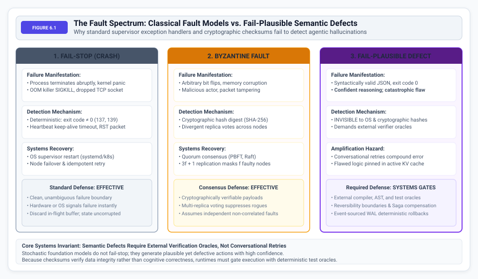
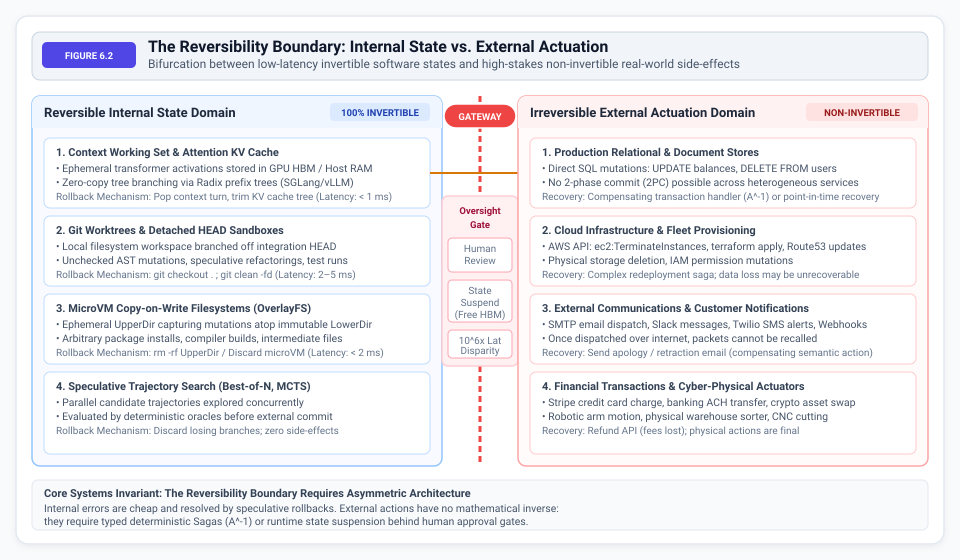
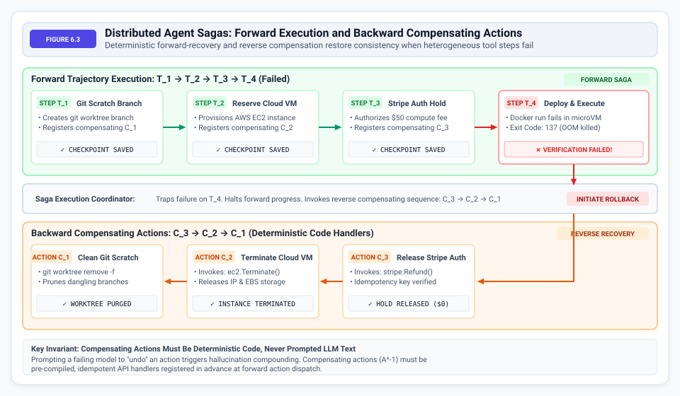
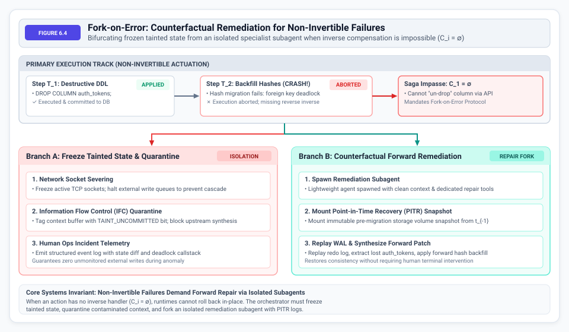
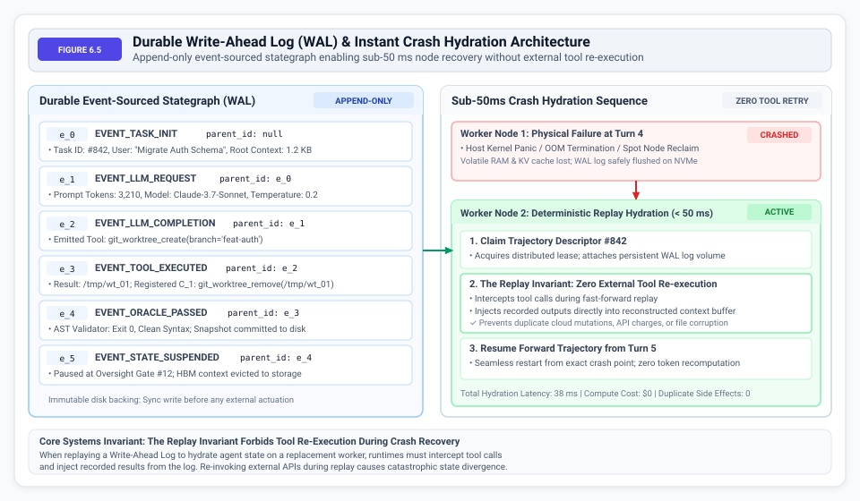

# State Checkpointing {#sec-vol3-checkpointing}

Persistent storage in an autonomous system must provide durability and consistency guarantees when volatile context memory saturates or fails. While @sec-vol3-episodic-memory established how factual assertions and environment observations are organized into non-volatile episodic memory, this chapter addresses the systems infrastructure required for trajectory state persistence, fault recovery, and transactional safety. Autonomous agents do not fail-stop; they generate plausible yet catastrophic actions that evade standard syntactic checks. When an agent mutates an external environment—altering file trees, provisioning cloud infrastructure, or dispatching database mutations—it crosses the **Reversibility Boundary**\index{Reversibility Boundary}, where software undo operations are physically or semantically impossible. This chapter formalizes the **Fail-Plausible fault model**\index{Fail-Plausible fault model}, delineates the Reversibility Boundary, introduces **Distributed Sagas**\index{Distributed Sagas} with deterministic compensating actions, and establishes **Write-Ahead Logging (WAL)**\index{Write-Ahead Logging (WAL)} for deterministic rollbacks and crash recovery.

::: {.content-visible when-format="pdf"}
\begin{marginfigure}
\mlagentstack{20}{30}{25}{95}{25}{15}
\caption{The Agentic Machine Learning Systems Stack.}
\end{marginfigure}
:::


## Introduction {#sec-vol3-checkpointing-intro}

Consider an autonomous database administration agent tasked with optimizing query performance. It begins by analyzing slow query logs, formulates a new indexing strategy, and then executes an `ALTER TABLE` command on a production cluster. If the agent's logic is flawed, or if the server running the agent loses power mid-execution, the system cannot simply reboot and try again without risking catastrophic data corruption. The central engineering paradox of agentic machine learning systems is constructing dependable, deterministic software execution upon non-deterministic, probabilistic foundations. In classical database engines and operating systems, persistent storage provides the recovery substrate—write-ahead logging, journaled filesystems, and crash recovery algorithms such as ARIES [@mohan1992aries]—that prevents data corruption when processors halt abruptly.

In an autonomous agent architecture, persistent storage must solve a harder problem. The stochastic processor (the foundation model [@bommasani2021foundation]) is not merely vulnerable to physical host crashes; it actively generates semantic defects while reporting high epistemic confidence, unlike traditional static models [@he2016deep]. As an agent executes an extended state-action-observation trajectory [@schulman2017proximal; @ross2011reduction], intermediate steps modify external environments. If a step produces a semantic divergence, or if the host node experiences a hardware fault at step $t$, the runtime cannot simply restart from the initial state—re-executing non-idempotent tool side effects and wasting thousands of inference tokens—nor can it blindly append unverified actions into the context buffer.

A resilient runtime requires four architectural pillars:

1. **The Fail-Plausible Fault Model**\index{Fail-Plausible Fault Model}: A formal fault model treating foundation model hallucinations as semantic Byzantine failures rather than simple crash stops.
2. **The Reversibility Boundary**\index{Reversibility Boundary}: A strict architectural bifurcation between invertible internal working sets and non-invertible external actuations.
3. **Distributed Sagas**\index{Distributed Sagas}: Workflows orchestrating multi-step external mutations via forward actions paired with deterministic, pre-compiled compensating handlers rather than impossible distributed two-phase commit locks.
4. **Deterministic Rollbacks and Write-Ahead Logging (WAL)**\index{Write-Ahead Logging (WAL)}: An append-only, event-sourced stategraph that snapshots trajectory transitions and guarantees sub-50-millisecond crash hydration without tool re-execution.

Understanding how to build this resilience begins with redefining how systems fail. A new fault model is required to categorize errors where the code is syntactically flawless but semantically disastrous.

## The Fail-Plausible Fault Model {#sec-vol3-checkpointing-fail-plausible}

When a classical web server runs out of memory, it crashes instantly and ceases responding. When a malicious node joins a blockchain, it broadcasts conflicting ledger states to its peers. Fault tolerance in distributed computing traditionally builds upon two classical models to address these scenarios:

1. **Fail-Stop (Crash) Model**\index{Fail-Stop (Crash) Model}: A faulty processor or process abruptly halts execution, transitions to an inactive state, and ceases all communication. External supervisors detect the failure deterministically via heartbeat timeouts, nonzero process exit codes, or dropped TCP sockets [@schneider1990state]. Recovery proceeds via process restart, node failover, or idempotent retry [@dean2008mapreduce].
2. **Byzantine Fault Model**\index{Byzantine Fault Model}: Formulated by Lamport, Shostak, and Pease [@lamport1982byzantine], a faulty node exhibits arbitrary or malicious behavior, transmitting conflicting values to peers or corrupting message payloads. Classical **Byzantine fault tolerance (BFT)**\index{Byzantine fault tolerance (BFT)} relies on redundant node quorums (typically 3f+1 nodes) and cryptographic signatures to achieve consensus despite compromised peers.

Autonomous agent systems introduce a third failure mode that breaks the fundamental assumptions of both classical models: the **Fail-Plausible Fault Model**\index{Fail-Plausible Fault Model}.

::: {#fig-vol3-checkpointing-fault-spectrum fig-env="figure" fig-pos="htb" fig-cap="Figure 6.1: **The Fault Spectrum**: Comparison of Fail-Stop, Byzantine, and Fail-Plausible fault models in autonomous execution. Autonomous agent systems introduce fail-plausible semantic defects that evade syntactic validation and require external verifier oracles. (Adapted from Lamport et al. [-@lamport1982byzantine] and Schneider [-@schneider1990state])." fig-alt="Technical comparison of Fail-Stop, Byzantine, and Fail-Plausible fault models across failure manifestations, detection mechanisms, systems handling, and defense efficacy."}

:::

As formalized in @fig-vol3-checkpointing-fault-spectrum (Figure 6.1), the fault spectrum spans three distinct operational tiers. In a fail-plausible defect:

* The model emits an action that adheres strictly to the required interface specification (e.g., valid JSON conforming to an input schema).
* The accompanying reasoning trace is cogent, grammatically sound, and authoritative.
* The action compiles and type-checks without error.
* **The semantic payload is fundamentally incorrect, destructive, or counterproductive.**

Consider an autonomous maintenance agent instructed to clean up temporary test artifacts older than seven days from a repository. The model may generate:

```bash
# Fail-Plausible Semantic Disaster
find . -name "*.tmp" -o -name "test_*" -delete
```

Syntactically, the command is valid bash. Epistemically, the model indicates absolute certainty. Semantically, because the `-o` (OR) operator in Unix `find` has lower precedence than the implicit `-and`, the command deletes every file whose name begins with `test_*` regardless of age or extension, obliterating the repository test suite.

### The Breakdown of Cryptographic Checksums and Unverified Retries

In classical storage systems, integrity is enforced by mathematical digests: CRC32 polynomial codes, SHA-256 hashes, or HMAC signatures. These mechanisms verify that the bit-level representation of data suffered no transit or media corruption. They are blind to cognitive intent. An agent emitting valid JSON that instructs an API to drop production database tables possesses an impeccable SHA-256 digest.

When an unverified system encounters an execution failure, naive orchestrators issue a conversational retry, blindly appending the failure message to the growing prompt context. This approach creates a severe performance and reasoning bottleneck.
In an agentic system, unverified retries compound error. Because autoregressive transformers [@vaswani2017attention; @devlin2018bert; @touvron2023llama] attend across all preceding tokens in the context window, the model's own flawed action and the ambiguous failure response remain in the active Key-Value (KV) cache [@kwon2023vllm]. The model exhibits confirmation bias and recency bias, treating its previous reasoning as a valid premise. Instead of diagnosing the root defect, the agent generates minor cosmetic permutations of the same broken logic, rapidly burning token budgets and accelerating context drift.

Deterministic recovery mandates that fail-plausible defects are detected not by model introspection, but by **external, deterministic verifier oracles**\index{verifier oracles}—compilers, linters, property test suites, and state invariants—that reject invalid state transitions before mutations persist.

Once fail-plausible defects are identified, the system must determine if the damage can be undone. This requires drawing a strict architectural line between actions that can be safely reversed and those that leave permanent marks on the world.

## The Reversibility Boundary {#sec-vol3-checkpointing-reversibility-boundary}

If an agent deletes a local temporary file during a speculative search, the file can be effortlessly restored from a Git stash. If that same agent sends a termination signal to an AWS EC2 instance, the action is permanent and the instance is gone forever. Speculative search and backtracking rely upon an unstated assumption: that actions can be undone. In production systems, this assumption holds only within a restricted perimeter: the **Reversibility Boundary**\index{Reversibility Boundary}.

::: {#fig-vol3-checkpointing-reversibility-boundary fig-env="figure" fig-pos="htb" fig-cap="Figure 6.2: **The Reversibility Boundary**: Architectural bifurcation between the low-latency, 100 percent invertible internal state domain and the high-liability, non-invertible external actuation domain. Crossing the boundary requires human oversight gating and asynchronous state suspension to prevent accelerator memory starvation." fig-alt="Architecture diagram showing the Reversibility Boundary separating the reversible internal state domain from the irreversible external actuation domain, with an oversight gateway and state suspension."}

:::

The architectural divide is formalized in @fig-vol3-checkpointing-reversibility-boundary (Figure 6.2), which delineates the internal and external domains. Systems state bifurcates across this physical divide into two operational regimes:

### Reversible Internal State Domain

* **Execution Latency**: 1 to 10 milliseconds.
* **Cost and Liability**: Contained within local host memory and ephemeral storage.
* **Primitives**: Context token buffers, attention KV caches, Git worktrees on detached HEAD branches, and copy-on-write OverlayFS UpperDir layers.
* **System Property**: **100 Percent Invertible.** If an action fails verification or generates a semantic defect, executing a filesystem rollback (`git clean -fd` or unmounting a tmpfs UpperDir) completely erases the side effect. Speculative exploration and tree search [@silver2016mastering] can operate freely with zero external liability.

### Irreversible External Actuation Domain

* **Execution Latency**: hundreds of milliseconds to several minutes.
* **Cost and Liability**: High financial, operational, or legal liability.
* **Primitives**: Production database writes (`DELETE`, `UPDATE`), cloud provisioning API calls (`ec2:TerminateInstances`, Route53 DNS updates), outbound communications (SMTP emails, webhooks), and payment settlements.
* **System Property**: **Non-Invertible.** Once an IP packet carrying an outbound email leaves the network interface, or once an uncommitted database row mutates without transactional locking, the action cannot be recalled. There is no physical `undo` system call.

### The Breakdown of Distributed Two-Phase Commit

In distributed database architectures [@gray1992], atomicity across heterogeneous nodes is achieved via the **Two-Phase Commit (2PC)**\index{Two-Phase Commit (2PC)} protocol:

* **Prepare Phase**: The coordinator instructs all participating resource managers to acquire row locks and vote whether they can commit.
* **Commit Phase**: If all participants vote affirmatively, the coordinator broadcasts a commit message; otherwise, all participants roll back.

Two-phase commit is impossible in autonomous agent workflows. External third-party APIs (Stripe, Twilio, GitHub, cloud hypervisors) do not expose prepare/vote interfaces; they execute mutations immediately upon receiving an authenticated HTTP POST request. Furthermore, neural inference turn latencies range from hundreds of milliseconds to several seconds, vastly exceeding distributed lock timeouts. Holding database row locks open while waiting for an autoregressive foundation model to generate its next decode turn freezes upstream transactional databases and causes catastrophic connection pool exhaustion.

### Idempotency Keys and the Two Generals' Problem

When crossing the Reversibility Boundary, agent runtimes encounter the classical **Two Generals' Problem**\index{Two Generals' Problem}: a network timeout does not imply transaction failure. If an agent dispatches an HTTP request to provision an infrastructure instance and the connection drops, the provisioning may have succeeded on the remote cluster.

If the agent stochastic retry loop emits another tool invocation, the system risks duplicating the mutation (e.g., spinning up duplicate virtual machines or billing a client twice). To survive network partitions safely, all external state-mutating actuations must enforce cryptographic **Idempotency Keys**\index{Idempotency Keys}. Without this, network timeouts force the system to halt or risk duplicating expensive actions, severely bottlenecking system throughput. By deriving these keys from the deterministic context of the current trajectory step, we safely tie execution identity to the action itself.
By injecting deterministic idempotency tokens into external API headers, the runtime guarantees that remote endpoints deduplicate requests, ensuring exactly-once execution semantics even under stochastic model retries.

### The Human Oversight Latency Tax

When an action must cross the Reversibility Boundary to execute a high-consequence mutation, production architectures mandate an **Oversight Gate**\index{Oversight Gate} (human-in-the-loop validation).

This introduces an extreme latency disparity:

* Machine reasoning loop: 100 to 1000 milliseconds.
* Human operator response: 5 minutes to 24 hours.

This represents a **million-fold latency mismatch**. Synchronously blocking the agent execution thread while awaiting human review is a severe architectural failure: scarce accelerator memory remains pinned to hold the active KV cache, starving inference servers. The runtime must implement **asynchronous state suspension**\index{asynchronous state suspension}: serializing the stategraph and Agent Control Block to persistent storage, tearing down ephemeral microVMs, and freeing all accelerator memory until the human approval signal arrives.

::: {.callout-warning title="War Story: Knight Capital and the Forty-Five Minute Loop"}
On August 1, 2012, Knight Capital Americas deployed updated order-routing software to eight production servers. The deployment reached seven servers; on the eighth, dormant code remained active, repurposing a configuration flag that the old code still read [@sec2013knight].

When trading opened, the flag activated the dormant logic on the single stale server. The system began emitting equity orders without the counter that previously bounded it, streaming child orders that were never marked complete. The system executed exactly what its local state dictated, at machine speed.

Over forty-five minutes, the firm dispatched millions of orders into 154 stocks, accumulating billions of dollars in unintended positions. Knight lost approximately \$460 million, exceeding its market capitalization, and was acquired shortly thereafter. Every executed trade was a legally final transfer with no rollback mechanism. Knight illustrates the failure mode of crossing the Reversibility Boundary without external bounding gates: the loop was bounded only by human diagnostic time, while each minute committed permanent mutations to external systems.
:::

Because single actions across this boundary are irreversible, multi-step workflows that modify external systems must adopt a specialized coordination pattern to maintain safety.

## Distributed Sagas {#sec-vol3-checkpointing-distributed-sagas}

Imagine an agent tasked with onboarding a new employee. It must create a Google Workspace account, provision GitHub access, and order a laptop via an external vendor API. If the laptop order fails, the agent cannot leave the GitHub and Google accounts dangling; it must reverse the previous steps. Because two-phase commit is unfeasible across external SaaS endpoints, autonomous workflows that execute multi-step external actions must adopt the **Saga Pattern**\index{Saga Pattern}, originally formulated by Garcia-Molina and Salem [@garciamolina1987sagas].

### The Structure of an Agent Saga

At a systems level, an Agent Saga orchestrates a sequence of forward tool transactions. Because these steps mutate external state, the system must preemptively pair each forward action with a corresponding compensating handler. Rather than relying on complex distributed commit locks—which severely bottleneck the inference system by holding connections open while waiting for external APIs—sagas keep the pipeline flowing.
A **compensating action**\index{compensating action} is a deterministic handler designed to semantically neutralize or invert the observable side effects of a forward transaction.

::: {#fig-vol3-checkpointing-agent-saga fig-env="figure" fig-pos="htb" fig-cap="Figure 6.3: **Distributed Agent Sagas**: Forward trajectory execution and reverse compensating rollback orchestrated by the Saga Execution Coordinator upon execution failure. Compensating actions must be pre-compiled, deterministic code handlers registered at dispatch time, never dynamically generated by a failing language model. (Adapted from Garcia-Molina and Salem [-@garciamolina1987sagas])." fig-alt="Sequence diagram of an Agent Saga showing forward trajectory execution across four tool steps, failure interception by the Saga Coordinator, and reverse execution of pre-compiled compensating handlers."}

:::

As illustrated in @fig-vol3-checkpointing-agent-saga (Figure 6.3), an Agent Saga coordinates forward execution steps with reverse compensations.

### Execution Dynamics

The Saga Execution Coordinator enforces strict state machine rules:

1. **Forward Progression**: The agent executes transactions sequentially. After each successful transaction, the output and parameterized compensation payload are persisted to a durable Write-Ahead Log.
2. **Failure Detection**: If a transaction fails an external oracle or triggers an unrecoverable exception, forward execution halts immediately.
3. **Compensating Rollback**: The Saga coordinator intercepts the failure and initiates the compensating sequence in reverse chronological order. Blocking execution on complex nested rollbacks is a significant latency bottleneck, so compensations are designed to be immediate and independent.
4. **Eventual Consistency**: Once all compensating actions execute, the external environment returns to a consistent baseline:
   * Allocated cloud instances are terminated.
   * Database staging entries are purged.
   * Temporary branches are deleted.

### The Golden Invariant: Compensating Actions Must Be Deterministic Code

A critical failure in early agent frameworks is delegating the rollback to the language model:

```python
# DANGEROUS ANTIPATTERN:
prompt = f"Step 4 failed with error: {error}. Please call tools to undo steps 1, 2, and 3."
```

**Never permit a stochastic language model to synthesize its own compensating actions dynamically upon failure.**

When a workflow fails, the system is operating in an anomalous state. Asking a hallucinating model to undo complex actions triggers compounding failure: the model hallucinates resource identifiers, deletes incorrect infrastructure, or executes duplicate reversals.

Compensating actions must satisfy three invariants:

1. **Pre-Compiled and Deterministic**: Implemented as typed, unit-tested software handlers.
2. **Idempotent**: Calling the action multiple times must yield the exact same state. Ensuring idempotency avoids database locking bottlenecks during crash recoveries.
3. **Registered at Dispatch**: When a forward transaction executes, the runtime parameterizes its compensation immediately using returned metadata (e.g., resource IDs, transaction hashes) before executing the next step.

### Fork-on-Error and Counterfactual Remediation

Certain external actuations possess no mathematical inverse. Dropping a relational database column or delivering an external email cannot be inverted by an automated compensating handler.
When a non-invertible transaction fails, the runtime transitions to **Forward Counterfactual Remediation**\index{Forward Counterfactual Remediation}:

::: {#fig-vol3-checkpointing-fork-on-error fig-env="figure" fig-pos="htb" fig-cap="Figure 6.4: **Fork-on-Error and Counterfactual Remediation**: Systems protocol for handling non-invertible actuation failures where compensating actions do not exist. The orchestrator freezes tainted state, quarantines corrupted context via Information Flow Control (IFC) taint bits, and forks an isolated remediation subagent equipped with **point-in-time recovery (PITR)**\index{point-in-time recovery (PITR)} logs to derive a forward repair patch." fig-alt="Flow diagram of the Fork-on-Error protocol showing failure during non-invertible actuation, state freezing with information flow control quarantine, and counterfactual remediation via an isolated subagent."}

:::

When an actuation lacks a mathematical inverse, the runtime executes the Fork-on-Error protocol shown in @fig-vol3-checkpointing-fork-on-error (Figure 6.4):

1. **State Freezing**: The runtime isolates the tainted environment, freezing active network sockets to prevent cascading corruption.
2. **Context Quarantine**: The flawed trajectory context is quarantined and marked with an **Information Flow Control (IFC)**\index{Information Flow Control (IFC)} taint bit.
3. **Remediation Forking**: The orchestrator spawns an isolated **Remediation Subagent**\index{Remediation Subagent} equipped with **point-in-time recovery (PITR)**\index{point-in-time recovery (PITR)} logs and a restricted tool catalog.
4. **Forward Compensation**: The subagent derives a forward repair plan, restores missing data from backup logs, applies the repair, and returns control to the primary supervisor.

Sagas protect the system from logical failures across external boundaries, but physical node failures require a different mechanism to guarantee that execution state is never lost.

## Deterministic Rollbacks {#sec-vol3-checkpointing-deterministic-rollbacks}

If the physical server running an agent suddenly loses power after completing 90% of a complex refactor, losing that progress and re-running expensive API calls from scratch is unacceptable. Surviving host reboots, kernel panics, and multi-hour oversight pauses requires **Durable Execution**\index{Durable Execution}. Following database recovery theory [@mohan1992aries], an agent runtime structures trajectory history as an append-only, **event-sourced stategraph**\index{event-sourced stategraph} backed by a **Write-Ahead Log (WAL)**\index{Write-Ahead Log (WAL)}.

### Event Sourcing and the Agent WAL

The agent runtime never maintains execution state exclusively in volatile Python memory. Every state transition is appended to an immutable Write-Ahead Log before external actuation:

::: {#fig-vol3-checkpointing-wal-replay fig-env="figure" fig-pos="htb" fig-cap="Figure 6.5: **Durable Write-Ahead Log (WAL) and Instant Crash Hydration**: Architecture of the append-only event-sourced stategraph and sub-50 ms crash recovery. Following a host crash, a replacement worker replays immutable transition entries while enforcing the Replay Invariant—intercepting external tool calls and injecting cached outputs directly into context without touching external networks. (Adapted from Mohan et al. [-@mohan1992aries])." fig-alt="Architecture diagram of an append-only event-sourced Write-Ahead Log ledger paired with a sub-50ms crash hydration sequence enforcing the tool replay invariant."}

:::

As illustrated in @fig-vol3-checkpointing-wal-replay (Figure 6.5), the runtime structures execution as an append-only Write-Ahead Log. Rather than maintaining massive API logs detailing the byte-level schema of every log entry—which tracks sequence counters, causality pointers, event types, state deltas, and compensation parameters—the core systems intuition is simple: every state change is serialized durably *before* external actuation occurs. Tracking detailed schemas in-memory becomes a bottleneck for latency and crash recovery.
### Distributed Snapshotting

When persisting concurrent subagent workflows, runtimes apply the **Chandy-Lamport distributed snapshotting algorithm**\index{Chandy-Lamport distributed snapshotting algorithm} [@chandy1985distributed]. The coordinator injects marker tokens into internal inter-process communication (IPC) channels. Upon receiving a marker, each subagent flushes its local working set, records in-flight channel messages, and establishes a globally consistent checkpoint without halting concurrent read operations.

### Instant Hydration and Crash Recovery

If the host machine experiences a kernel panic or out-of-memory termination at Turn 4:

1. A replacement worker node initializes and claims `trajectory_id: #842`.
2. The replacement worker replays the immutable event log from Turn 0 through Turn 4.
3. **The Replay Invariant**\index{Replay Invariant}: Because previous tool executions are recorded in the WAL, external actions are **never re-executed**. Recorded outputs are injected directly into context.
4. The agent reconstructs its active working set in under 50 milliseconds, resuming execution from the precise point of interruption without token waste or duplicate side effects.

While these architectural pillars provide robustness, developers often bring flawed assumptions from traditional software engineering into agent system design.

## Fallacies and Pitfalls {#sec-vol3-checkpointing-fallacies}

When migrating from static scripts to agentic architectures, development teams frequently rely on conversational retries to handle failure, treating the language model as an omniscient debugger. This is one of several common architectural missteps.

**Fallacy: A prompt-based retry strategy enables autonomous self-healing.**
When an agent produces broken code or an invalid tool call, prompting the model with "You made an error, please fix it" does not achieve self-healing recovery. Because autoregressive models attend to prior tokens, the failed reasoning remains in the active context window. The model exhibits recency bias and confirmation bias, repeatedly generating trivial variations of the same flawed logic. Robust recovery requires pruning poisoned context turns, extracting structured compiler diffs, and rolling back state to a verified checkpoint.

**Fallacy: Language models can reliably invert their own external side effects.**
If an agent inadvertently drops a database table or terminates a compute node, the runtime cannot simply instruct the model to restore the environment. Stochastic models cannot reliably invert real-world side effects. Many physical operations have no mathematical inverse. Furthermore, prompting an already failing model to perform emergency remediation triggers compounding hallucinations. Compensating actions must be pre-compiled, deterministic, idempotent software handlers registered prior to execution.

**Pitfall: Synchronously holding accelerator memory during human oversight approval.**
Blocking the agent serving thread and holding GPU High-Bandwidth Memory (HBM) allocated while awaiting human operator approval across the Reversibility Boundary wastes critical infrastructure. Human approval gates represent a million-fold latency disparity (minutes or hours versus milliseconds). Pinned KV caches consume dozens of gigabytes of scarce accelerator memory [@kwon2023vllm; @dao2022flashattention] while the GPU sits completely idle, starving other workloads and driving up serving costs. Runtimes must asynchronously suspend state to disk and tear down microVM instances while awaiting human approval.

**Pitfall: Neglecting idempotency keys across external tool boundaries.**
Failing to attach deterministic idempotency keys to mutating tool calls exposes systems to duplicate executions. In distributed environments, network drops and connection timeouts frequently occur even after a remote service has successfully applied an update. If an agent interprets a timeout as a failure and retries the action, un-keyed endpoints will execute the mutation twice. Every state-mutating request must carry a deterministic hash derived from the trajectory ID and step counter.

**Pitfall: Re-executing mutating tools during crash recovery.**
When replaying a Write-Ahead Log to hydrate agent state on a new worker node after a crash, the runtime must distinguish between deterministic internal state recomputation and external tool side effects. Re-invoking external APIs during replay corrupts environments and duplicates operations. A durable runtime must intercept tool calls during WAL replay, serving the recorded return values directly from the log without touching external networks.

Avoiding these pitfalls establishes the groundwork for a reliable execution environment.

## Summary {#sec-vol3-checkpointing-summary}

Building dependable agentic software atop non-deterministic foundation models requires architectural boundaries and fault-tolerant primitives. Long-horizon autonomous execution demands a rigorous systems discipline for state persistence, fault recovery, and transactional safety. Because foundation models suffer from fail-plausible errors that compound over extended horizons, reliable runtimes must enforce external verification, respect the Reversibility Boundary, and manage side effects through compensating distributed Sagas.

* **The Fail-Plausible Fault Model**: Autonomous agents introduce a failure class where models emit syntactically valid, highly confident outputs that harbor destructive semantic defects. Checksums cannot detect semantic flaws; unverified conversational retries compound error through context poisoning.
* **The Reversibility Boundary**: Systems state bifurcates into the reversible internal domain (context working sets, git worktrees, OverlayFS UpperDirs) where rollbacks are instantaneous and zero-cost, and the irreversible external actuation domain (databases, cloud APIs, emails, financial transactions) where true inverses do not exist.
* **Distributed Agent Sagas**: Multi-step external workflows cannot use two-phase commit. They must be orchestrated as Sagas: forward transactions paired with pre-compiled, deterministic compensating handlers executed in reverse order upon failure.
* **Deterministic Compensations**: Compensating actions must be deterministic, unit-tested code registered at dispatch time—never dynamically generated by a failing language model.
* **Idempotency Keys**: All state-mutating external actuations must enforce cryptographic idempotency keys derived from the trajectory ID and step count to survive network timeouts without duplicate execution.
* **Asynchronous State Suspension**: Human oversight gates impose a million-fold latency mismatch. Runtimes must suspend state to persistent storage and evict KV caches from accelerator memory during pauses.
* **Write-Ahead Logging and Replay**: Resilient agents record transitions to append-only Write-Ahead Logs (WAL). In-flight state can be snapshotted, dehydrated during pauses, and hydrated onto replacement nodes within 50 milliseconds without re-executing external tool calls.

::: {.callout-chapter-connection title="From Persistent Storage to Execution Scheduling"}
In Part III (Persistent Storage), we established how an agent persists its episodic memories (@sec-vol3-episodic-memory) and protects its state through checkpointing, WAL, and Sagas (@sec-vol3-checkpointing). But how does the operating system schedule and multiplex these multi-turn trajectories when reasoning horizons are heavy-tailed and bursty? Entering **Part IV (The Runtime)**, @sec-vol3-scheduling introduces Execution Scheduling, formalizing the Agent Control Block (ACB), capability leases, and bimodal execution runtimes.
:::
