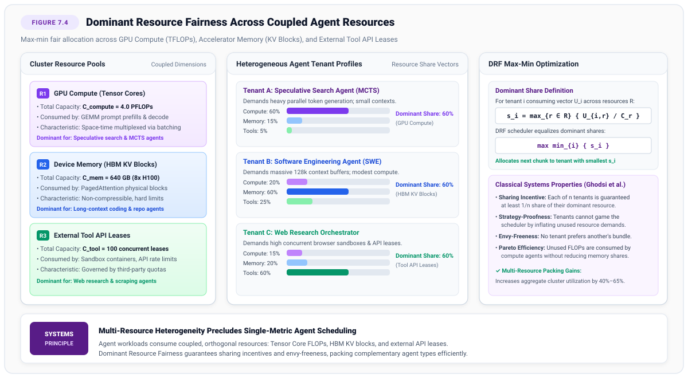
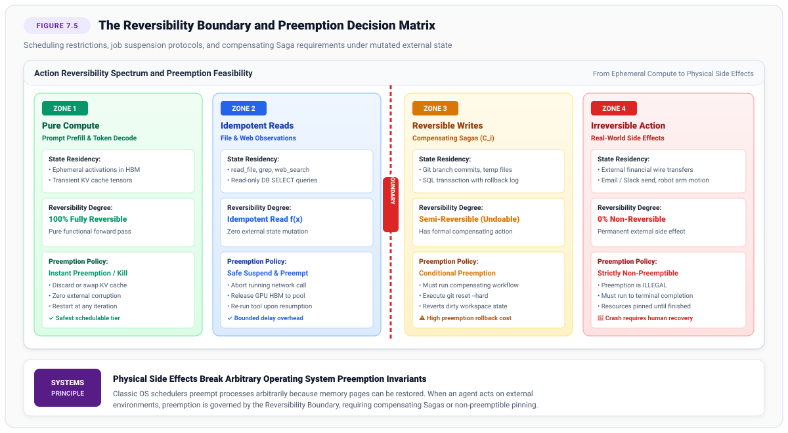

# Execution Scheduling {#sec-vol3-scheduling}

Execution scheduling in agentic machine learning systems represents the architectural transition from static, request-scoped batching to the dynamic orchestration of stateful, multi-step autonomous processes. In classical foundation model serving, runtimes optimize over stateless, single-turn forward passes with narrow, predictable service times. Agentic workloads completely shatter these assumptions: execution trajectories unfold over unpredictable, heavy-tailed Pareto horizons; inference compute alternates with multi-second external tool invocations and multi-hour human approval gates; and multi-resource coupling binds GPU tensor cores, device High-Bandwidth Memory (HBM), host DRAM, and sandboxed execution leases in complex co-dependencies. This chapter examines the systems architecture of agent execution scheduling. We formalize the Agent Control Block (ACB) as the authoritative kernel descriptor governing capability leases, resource quotas, and lifecycle transitions. We analyze the queueing dynamics of heavy-tailed workloads, demonstrating why First-In-First-Out disciplines suffer catastrophic head-of-line blocking and proving the mathematical optimality of Least Attained Service (LAS) scheduling. We develop bimodal execution mechanics, deriving the analytical breakeven threshold for asynchronous multi-tier context swapping across HBM, host DRAM, and NVMe fabrics during external I/O stalls. Finally, we establish chunked prefill disaggregation protocols, decoupling compute-bound prompt evaluation from memory-bandwidth-bound autoregressive decoding to eliminate phase interference and prevent cluster-wide Coffman deadlocks.

## Introduction {#sec-vol3-scheduling-intro}

In Part III of this text, we examined agent state as data at rest. In @sec-vol3-episodic-memory, we designed vector indices and knowledge graph topologies for non-volatile episodic retrieval; in @sec-vol3-checkpointing, we formalized distributed Sagas and write-ahead logs to guarantee transactional recovery across node crashes. Yet, when an agent's execution state is restored to active hardware, it ceases to be a static record on disk. It becomes an active, mutating, stochastic process that must contend with hundreds of peer trajectories for physical compute, memory bandwidth, and network I/O.

In classical machine learning systems (Volumes I and II), the serving runtime operates under the **Request-Response Paradigm**. An incoming client request carries a prompt, the serving engine batches it with concurrent queries via continuous iteration batching (e.g., vLLM, TensorRT-LLM), executes prompt prefill, autoregressively decodes tokens until an end-of-sequence delimiter is reached, and returns the generated payload. The transaction is atomic, isolated, and brief. Once the final token leaves the GPU, all execution state is destroyed or relegated to passive prefix caches.

Agentic systems shatter this operational paradigm by introducing **trajectory-level statefulness**:

1. **Unpredictable Execution Horizons:** Unlike single-turn queries whose completion lengths are tightly constrained, an autonomous agent tasked with resolving an open-ended software issue may terminate in two steps (detecting a syntax typo) or expand into hundreds of steps across multiple subagents (bisecting an upstream regression, compiling native binaries, running full integration test suites).
2. **Extreme Bimodal Latency:** Neural token generation operates on millisecond timescales ($20\text{ to }50\,\text{ms}$ per token). Conversely, executing tools within deterministic sandboxes—running compilers, web scrapers, or database migrations—consumes seconds to minutes, while waiting on human authorization gates consumes hours to days. An agent spends up to $90\%$ of its wall-clock lifetime waiting on external systems. Holding scarce GPU High-Bandwidth Memory (HBM) during these idle periods collapses serving utilization.
3. **Multi-Resource Coupling:** Traditional schedulers optimize for a single scalar resource—typically GPU compute utilization or token throughput. Agentic trajectories contend simultaneously for coupled, multi-dimensional resources: Tensor Core floating-point throughput, physical HBM allocations for Key-Value (KV) activations, host DRAM, PCIe bus bandwidth, and finite external tool leases (e.g., container sandboxes, rate-limited third-party APIs).
4. **Phase Interference and Head-of-Line Blocking:** A single agent submitting an expanded $64\text{k}$-token context prompt initiates a massive, compute-bound prefill phase that monopolizes accelerator streaming multiprocessors, freezing active decoding iterations for dozens of concurrent interactive agents and inducing severe jitter in Inter-Token Latency (ITL).

To manage these operational realities, the machine learning runtime must evolve into a distributed operating system kernel. Just as a classical time-sharing operating system multiplexes hundreds of user processes across physical CPU cores and RAM via process control blocks, preemption, and virtual memory paging, an agent runtime must multiplex autonomous stochastic trajectories across heterogeneous accelerator clusters.

## The Agent Control Block (ACB) {#sec-vol3-scheduling-acb}

A computer operating system does not execute raw machine code in a vacuum; it schedules *processes*. In classical systems theory, as established by Ritchie and Thompson in the design of UNIX [@ritchie1974], a process is defined by its authoritative execution descriptor: the **Process Control Block (PCB)**. The PCB encapsulates the processor registers, memory page table pointers, open file descriptors, signal handlers, and security credentials of an executing program.

In an agentic architecture, scheduling naked prompts or raw API sessions directly against foundation models is an anti-pattern. If the runtime treats an agent simply as an open conversational prompt buffer, it lacks the mechanisms to enforce security isolation, track financial expenditures, preempt execution, or recover from divergent reasoning paths.

The fundamental unit of execution in an agentic runtime is the **Agent Control Block (ACB)**.

### Formal Definition of the ACB

The Agent Control Block is a strongly typed, persistent, and authoritative kernel data structure that encapsulates the complete operational identity, authority, memory references, and lifecycle state of an autonomous trajectory.

::: {#dfn-acb .callout-definition title="Agent Control Block (ACB)"}
An **Agent Control Block** is formally defined as a 9-tuple:
$$\text{ACB} = \langle \text{AID}, \, \mathcal{P}_{\text{id}}, \, \mathcal{G}, \, \mathcal{K}_{\text{leases}}, \, \mathcal{Q}_{\text{budget}}, \, \mathcal{M}_{\text{handles}}, \, \mathcal{S}_{\text{fsm}}, \, \mathcal{L}_{\text{lineage}}, \, \mathcal{V}_{\text{clock}} \rangle$$
where:

- $\text{AID} \in \mathbb{U}_{128}$: A globally unique, cryptographically random, time-ordered 128-bit identifier (UUIDv7 or ULID) encoding creation epoch and cluster locality.
- $\mathcal{P}_{\text{id}}$: The authenticated principal identity (human user, service account, or tenant organization) on whose authority the trajectory executes.
- $\mathcal{G}$: The immutable operational goal specification, encompassing the initial task prompt, formal completion predicates, and safety invariants.
- $\mathcal{K}_{\text{leases}}$: A set of cryptographically signed, time-limited, and monotonically attenuating capability leases granting access to external tools and system APIs.
- $\mathcal{Q}_{\text{budget}}$: A multi-dimensional resource quota vector bounding token consumption, financial cost, execution depth, and wall-clock time.
- $\mathcal{M}_{\text{handles}}$: Memory pointers referencing volatile PagedAttention block tables in GPU HBM, host DRAM swap arenas, and persistent episodic WAL URIs.
- $\mathcal{S}_{\text{fsm}} \in \Sigma_{\text{lifecycle}}$: The discrete operational state of the trajectory within the kernel's lifecycle finite state machine.
- $\mathcal{L}_{\text{lineage}}$: The hierarchical ancestry tuple $\langle \text{PID}, \{\text{CID}_1, \dots, \text{CID}_k\}, d \rangle$ recording parent agent ID, child subagent IDs, and recursion delegation depth.
- $\mathcal{V}_{\text{clock}} \in \mathbb{N}^M$: A Lamport vector clock establishing causal event ordering across asynchronous tool executions and multi-agent message passing.
:::

The structural duality between classical UNIX processes and agentic trajectories is detailed in Table 7.1 (@tbl-pcb-acb-comparison).

| Architectural Dimension     | Classical POSIX PCB                                       | Agent Control Block (ACB)                                               |
|:----------------------------|:----------------------------------------------------------|:------------------------------------------------------------------------|
| **Primary Identifier**      | Process ID (`pid_t`, 32-bit integer)                      | Agent ID (`AID`, 128-bit UUIDv7)                                        |
| **Execution State**         | Hardware registers (`RIP`, `RSP`, general registers)      | KV-cache block descriptors, context working set, FSM state              |
| **Memory Isolation**        | MMU page tables (CR3 register, virtual 4 KB pages)        | PagedAttention virtual block tables, Radix tree prefix handles          |
| **System Interface**        | POSIX system call table (`sys_enter`, `int 0x80`)         | Tool Execution Interface / Typed Application Binary Interface (ABI)     |
| **Authority Model**         | POSIX permissions (`rwx`, UID/GID, Linux capabilities)    | Monotonic capability leases, parameter schema filters                   |
| **Resource Accounting**     | CPU user/kernel ticks, Resident Set Size (RSS)            | Token burn velocity ($v_{\text{burn}}$), GPU HBM bytes, API dollar cost |
| **Context Switch Overhead** | Microseconds ($1\text{ to }10\,\mu\text{s}$)              | Milliseconds to seconds ($10\text{ to }5,000\,\text{ms}$)               |
| **Failure Recovery**        | Core dump, signal handler (`SIGSEGV`), process restart    | Sagas compensating transactions, reflection rollbacks                   |
| **Scheduling Granularity**  | Instruction cycle / time slice ($1\text{--}10\text{ ms}$) | Token iteration / execution step ($20\text{--}50\text{ ms}$ / step)     |

: Table 7.1: **Architectural Comparison between POSIX PCB and Agent Control Block**: Structural mapping of operating system primitives, memory virtualization handles, execution privileges, and recovery mechanisms between classical processes and autonomous agents. {#tbl-pcb-acb-comparison}

### The ACB Lifecycle State Machine

An agent trajectory does not run as an unbroken stream of execution. It transitions through a formal **Finite State Machine (FSM)** governed by invariant checks, preemption triggers, and external I/O completions (@fig-vol3-scheduling-acb-lifecycle).

::: {#fig-vol3-scheduling-acb-lifecycle fig-env="figure" fig-pos="htb" fig-cap="Figure 7.1: **The ACB Lifecycle Finite State Machine**: Deterministic state transitions governing agent execution across active compute phases, bimodal tool and human gate suspensions, memory swapping, and compensating rollback paths. Source: Author design." fig-alt="Finite state machine diagram of an Agent Control Block lifecycle, showing transitions between Initialized, Active Prefill, Active Decode, Suspended Tool-Wait, Suspended Human-Gate, Memory Swapping, Compensating Rollback, and Terminated states."}

:::

The runtime kernel manages nine operational lifecycle states:

1. **`INITIALIZED`:** The ACB data structure is allocated in host memory. The principal's credentials are authenticated, the goal specification $\mathcal{G}$ is validated, root capability leases $\mathcal{K}_{\text{leases}}$ are signed, and initial token/cost reserves are escrowed. The session is queued in the admission gate.
2. **`ACTIVE_PREFILL`:** The scheduler assigns the agent to an accelerator prefill worker. The foundation model processes system instructions, tool schemas, and multi-turn history. This phase is compute-bound, maximizing Tensor Core operational intensity to establish the Time-To-First-Token (TTFT).
3. **`ACTIVE_DECODE`:** The model autoregressively generates reasoning thought tokens and tool-call schemas. This phase is memory-bandwidth bound, reading the entire model weight matrix for every generated token.
4. **`SUSPENDED_TOOL_WAIT`:** The model emits an actionable tool invocation. The runtime traps the call, validates arguments against capability lease schemas, and dispatches the request to an isolated sandbox (see @sec-vol3-virtualization). The agent relinquishes its active decode slot on the accelerator.
5. **`SUSPENDED_HUMAN_GATE`:** The agent attempts a sensitive or irreversible action (e.g., executing a database write or committing financial payments) that requires explicit human consent. The execution state is serialized to cold storage, and the ACB enters an asynchronous sleep state.
6. **`MEMORY_SWAPPING`:** If cluster HBM pressure exceeds critical thresholds, or if a tool execution is anticipated to block beyond a mathematically derived breakeven duration, the memory manager swaps physical KV blocks from accelerator HBM to host DDR5 DRAM or local NVMe storage.
7. **`ROLLBACK_COMPENSATING`:** A verification failure, invariant violation, or runtime fault is detected. The kernel executes backward compensating transactions ($A^{-1}$) defined in the ACB's undo ledger to restore the environment to a consistent state.
8. **`TERMINATED_SUCCESS`:** The goal completion predicate evaluates to true. Final deliverables are returned to the principal, unspent budget escrows are refunded, and memory allocations are reclaimed.
9. **`TERMINATED_FAILED`:** The agent exhausts its resource envelope, violates a safety invariant, encounters an unrecoverable exception, or is aborted by supervisor preemption. Audit traces and causality vectors are frozen for post-mortem telemetry.

Table 7.2 (@tbl-vol3-scheduling-acb-states) formalizes the operational characteristics, hardware resource residency, transition triggers, and recovery invariants across the nine lifecycle states of the Agent Control Block.

| Lifecycle State             | Operational Phase         | Hardware Resource Allocation                     | Primary Transition Trigger                       | Kernel Action and Safety Invariant                                             |
|:----------------------------|:--------------------------|:-------------------------------------------------|:-------------------------------------------------|:-------------------------------------------------------------------------------|
| **`INITIALIZED`**           | Admission gating          | Host DRAM only (metadata descriptor)             | Quota escrow verification & goal validation      | Enqueues ACB in priority admission queue; escrows token and dollar budgets     |
| **`ACTIVE_PREFILL`**        | Context ingestion         | Accelerator Tensor Cores (GEMM) + HBM            | Scheduler dispatch from ready queue              | Computes prompt KV activations; maximizes compute intensity to bound TTFT      |
| **`ACTIVE_DECODE`**         | Autoregressive generation | Accelerator Memory Bandwidth (GEMV) + HBM        | Prefill completion or prior token emit           | Generates tokens until tool schema emit, stop token, or budget breach          |
| **`SUSPENDED_TOOL_WAIT`**   | External actuation        | Host DRAM (evacuated) or pinned HBM (short wait) | Tool invocation schema emitted by model          | Traps tool call; triggers DMA swap if $t_{\text{wait}} > T_{\text{breakeven}}$ |
| **`SUSPENDED_HUMAN_GATE`**  | Supervisory approval      | Host DRAM or cold non-volatile storage           | Reversibility boundary crossing (`SYS_ESCALATE`) | Evacuates volatile GPU HBM; registers non-blocking promise handle              |
| **`MEMORY_SWAPPING`**       | DMA migration             | PCIe Gen5 bus bandwidth + Host DRAM pages        | HBM pressure ($>75\%$) or tool suspension        | Transfers PagedAttention blocks asynchronously; reclaims physical HBM          |
| **`ROLLBACK_COMPENSATING`** | Fault recovery            | Ephemeral sandbox + host compensation ledger     | Invariant violation or verifier rejection        | Executes backward compensating actions ($A^{-1}$); purges dirty context        |
| **`TERMINATED_SUCCESS`**    | Goal fulfillment          | Reclaimed / deallocated                          | Task predicate evaluates to true                 | Releases remaining quotas; emits final deliverable; refunds escrows            |
| **`TERMINATED_FAILED`**     | Terminal fault            | Reclaimed; telemetry snapshot frozen             | Quota breach, livelock, or unmaskable abort      | Freezes vector clocks and audit trace; burns leases; logs post-mortem          |

: Table 7.2: **Agent Control Block Lifecycle States and Execution Invariants**: Hardware resource residency, operational phases, transition triggers, and kernel management actions across the ACB finite state machine. {#tbl-vol3-scheduling-acb-states}

### Resource Quotas and Token Burn Accounting

In classical operating systems, rogue processes are constrained by CPU quotas (e.g., CFS bandwidth limits) and memory limits (e.g., cgroup OOM killers). In agentic systems, runaway execution manifests as **Token Burn**—the rapid, exponential consumption of inference compute, API credit, and context capacity driven by degenerative reasoning loops.

The ACB enforces multi-dimensional quota accounting across five orthogonal resource axes:
$$\mathbf{q}_t = \big[ T_{\text{in}}(t), \, T_{\text{out}}(t), \, C_{\text{dollar}}(t), \, \Delta t_{\text{wall}}(t), \, K_{\text{tools}}(t) \big]^T$$

Every forward pass and sandbox invocation updates these counters atomically:
$$\mathbf{q}_{t+1} = \mathbf{q}_t + \Delta \mathbf{q}$$

If any dimension breaches its maximum limit $\mathbf{q}_{\text{max}}$, the runtime kernel halts model invocation immediately, triggering a transition to `TERMINATED_FAILED` (or initiating checkpointed recovery).

#### Token Burn Velocity and Degeneracy Detection

Static budget caps protect against catastrophic financial loss, but they fail to prevent an agent from wasting $95\%$ of its budget inside a tight, productive-looking failure loop. To catch semantic livelocks early, the scheduler monitors **Token Burn Velocity** ($v_{\text{burn}}$) and **Action Repetition Entropy**:

$$v_{\text{burn}}(t) = \frac{\Delta T_{\text{in}} + \Delta T_{\text{out}}}{\Delta t} \quad \left[ \frac{\text{tokens}}{\text{second}} \right]$$

When an agent enters a degenerative retry loop (e.g., repeatedly querying an invalid directory path and receiving identical error payloads), its burn velocity spikes while its action diversity collapses to zero.

To detect this phenomenon algorithmically, the ACB tracks the **Action Repetition Jaccard Distance** over a sliding window of the last $k$ tool invocations:
$$J(a_t, a_{t-1}) = \frac{|T(a_t) \cap T(a_{t-1})|}{|T(a_t) \cup T(a_{t-1})|}$$
where $T(a)$ represents the normalized n-gram token multiset of the serialized tool arguments. If:
$$\min_{j \in \{1, \dots, k\}} J(a_t, a_{t-j}) > 0.95 \quad \text{for } k \ge 3$$
the runtime kernel fires a `LIVELOCK_DEGENERACY_TRAP`, suspending the agent and forcing a reflection intervention before the token envelope is incinerated.

### Causality Vectors and Trace Provenance

In an enterprise runtime executing concurrent subagents or dispatching asynchronous parallel tool calls (e.g., scraping ten web domains concurrently), physical wall-clock timestamps are insufficient to determine event ordering. Multi-core scheduling jitter, network packet reordering, and clock skew across distributed GPU nodes can cause observation responses to arrive out of chronological order.

If an agent incorporates an observation that logically depended on an action that has not yet completed, it suffers from **Causal Inversion**—generating reasoning steps based on an impossible timeline.

To guarantee rigorous causal ordering, each ACB maintains a **Vector Clock** [@lamport1978time; @mattern1989]:
$$\mathcal{V}_{\text{clock}} = [v_1, v_2, \dots, v_M]$$
for a system of $M$ cooperating entities (coordinator, subagents, sandboxes).

The vector clock transitions under strict invariants:

1. **Local Thought / Dispatch:** Before generating a thought token sequence or emitting a tool request, agent $i$ increments its local clock:
   $$\mathcal{V}_i[i] \leftarrow \mathcal{V}_i[i] + 1$$
2. **Message / Tool Call Snapshot:** Every outbound action carries a serialized copy of $\mathcal{V}_i$.
3. **Observation Merge:** Upon receiving an observation $o$ tagged with vector $\mathcal{V}_{\text{ext}}$, agent $i$ updates its internal vector via a component-wise maximum prior to processing:
   $$\mathcal{V}_i[k] \leftarrow \max(\mathcal{V}_i[k], \, \mathcal{V}_{\text{ext}}[k]) \quad \forall k \in \{1, \dots, M\}$$
   $$\mathcal{V}_i[i] \leftarrow \mathcal{V}_i[i] + 1$$

Recording $\mathcal{V}_{\text{clock}}$ at every turn produces an immutable Directed Acyclic Graph (DAG) of the execution trajectory, enabling deterministic time-travel replay and causal debugging in post-mortem evaluations.

### Python Implementation of the ACB

The following implementation illustrates the production kernel data structures and state validation logic governing the Agent Control Block:

```python
from __future__ import annotations
import enum
import time
import uuid
from dataclasses import dataclass, field
from typing import Any, Dict, List, Optional, Set

class ACBState(enum.Enum):
    INITIALIZED = "INITIALIZED"
    ACTIVE_PREFILL = "ACTIVE_PREFILL"
    ACTIVE_DECODE = "ACTIVE_DECODE"
    SUSPENDED_TOOL_WAIT = "SUSPENDED_TOOL_WAIT"
    SUSPENDED_HUMAN_GATE = "SUSPENDED_HUMAN_GATE"
    MEMORY_SWAPPING = "MEMORY_SWAPPING"
    ROLLBACK_COMPENSATING = "ROLLBACK_COMPENSATING"
    TERMINATED_SUCCESS = "TERMINATED_SUCCESS"
    TERMINATED_FAILED = "TERMINATED_FAILED"

@dataclass
class ResourceQuota:
    max_input_tokens: int = 200_000
    max_output_tokens: int = 50_000
    max_cost_dollars: float = 25.0
    max_wall_time_seconds: float = 3600.0
    max_tool_calls: int = 150

    consumed_input_tokens: int = 0
    consumed_output_tokens: int = 0
    consumed_cost_dollars: float = 0.0
    elapsed_wall_time: float = 0.0
    consumed_tool_calls: int = 0

    def check_and_update(self, in_tok: int, out_tok: int, cost: float, tool_calls: int = 0) -> None:
        self.consumed_input_tokens += in_tok
        self.consumed_output_tokens += out_tok
        self.consumed_cost_dollars += cost
        self.consumed_tool_calls += tool_calls

        if (self.consumed_input_tokens > self.max_input_tokens or
            self.consumed_output_tokens > self.max_output_tokens or
            self.consumed_cost_dollars > self.max_cost_dollars or
            self.consumed_tool_calls > self.max_tool_calls):
            raise ResourceExhaustionError("Resource quota exceeded across operational bounds.")

class ResourceExhaustionError(RuntimeError):
    pass

@dataclass
class AgentControlBlock:
    aid: uuid.UUID = field(default_factory=uuid.uuid7)
    principal_id: str = "tenant_enterprise_prod"
    goal_envelope: Dict[str, Any] = field(default_factory=dict)
    capability_leases: Set[str] = field(default_factory=set)
    quotas: ResourceQuota = field(default_factory=ResourceQuota)
    memory_handles: Dict[str, Any] = field(default_factory=dict)
    state: ACBState = ACBState.INITIALIZED
    parent_aid: Optional[uuid.UUID] = None
    child_aids: List[uuid.UUID] = field(default_factory=list)
    delegation_depth: int = 0
    vector_clock: Dict[str, int] = field(default_factory=dict)
    created_at: float = field(default_factory=time.time)
    action_history: List[str] = field(default_factory=list)

    VALID_TRANSITIONS: Dict[ACBState, Set[ACBState]] = field(default_factory=lambda: {
        ACBState.INITIALIZED: {ACBState.ACTIVE_PREFILL, ACBState.TERMINATED_FAILED},
        ACBState.ACTIVE_PREFILL: {ACBState.ACTIVE_DECODE, ACBState.TERMINATED_FAILED},
        ACBState.ACTIVE_DECODE: {
            ACBState.SUSPENDED_TOOL_WAIT, ACBState.SUSPENDED_HUMAN_GATE,
            ACBState.MEMORY_SWAPPING, ACBState.TERMINATED_SUCCESS,
            ACBState.ROLLBACK_COMPENSATING, ACBState.TERMINATED_FAILED
        },
        ACBState.SUSPENDED_TOOL_WAIT: {ACBState.ACTIVE_PREFILL, ACBState.MEMORY_SWAPPING, ACBState.TERMINATED_FAILED},
        ACBState.SUSPENDED_HUMAN_GATE: {ACBState.ACTIVE_PREFILL, ACBState.TERMINATED_FAILED},
        ACBState.MEMORY_SWAPPING: {ACBState.SUSPENDED_TOOL_WAIT, ACBState.ACTIVE_PREFILL, ACBState.TERMINATED_FAILED},
        ACBState.ROLLBACK_COMPENSATING: {ACBState.TERMINATED_FAILED},
        ACBState.TERMINATED_SUCCESS: set(),
        ACBState.TERMINATED_FAILED: set(),
    })

    def transition_to(self, new_state: ACBState) -> None:
        allowed = self.VALID_TRANSITIONS.get(self.state, set())
        if new_state not in allowed:
            raise StateTransitionError(f"Illegal transition from {self.state} to {new_state}")
        self.state = new_state

    def detect_livelock(self, window_size: int = 3) -> bool:
        if len(self.action_history) < window_size:
            return False
        recent = self.action_history[-window_size:]
        first_tokens = set(recent[0].split())
        for act in recent[1:]:
            tokens = set(act.split())
            intersection = len(first_tokens & tokens)
            union = len(first_tokens | tokens)
            jaccard = intersection / union if union > 0 else 1.0
            if jaccard < 0.95:
                return False
        return True

class StateTransitionError(RuntimeError):
    pass
```

## Heavy-Tailed Workloads {#sec-vol3-scheduling-heavy-tails}

In traditional web search, database querying, and stateless LLM serving, job service times typically follow light-tailed distributions—such as exponential, Gaussian, or Poisson models—characterized by finite, well-behaved means and bounded variances [@kleinrock1975queueing]. Schedulers operating over such workloads exploit this low variance to construct tight tail-latency Service Level Objectives (SLOs) through classical $M/M/k$ or $M/G/k$ queueing models.

Empirical measurements of autonomous agent trajectories reveal a fundamentally different reality: **agent service times exhibit extreme, heavy-tailed Pareto distributions**.

### Empirical Characterization Across Serving Regimes

Table 7.3 (@tbl-vol3-scheduling-workload-comparison) contrasts the workload profiles of classical serving against autonomous agent deployments across standard benchmarks.

| Workload Domain          | Benchmark / Trace      | Mean Steps $\mathbb{E}[N]$ | P99 Steps | Sample Step Variance $s^2$ | Mean Tool Wait Fraction | Context Growth / Step | Peak KV Memory (70B GQA) |
|:-------------------------|:-----------------------|:--------------------------:|:---------:|:--------------------------:|:-----------------------:|:---------------------:|:------------------------:|
| **Stateless Serving**    | LMSYS Chatbot Arena    |            1.0             |    1.0    |            0.0             |         $0.0\%$         |        0 tokens       |          0.8 GB          |
| **Multi-Turn Chat**      | MT-Bench               |            2.0             |    2.0    |            0.0             |         $0.0\%$         |       450 tokens      |          1.4 GB          |
| **Web Navigation**       | WebArena / VisualWeb   |            7.4             |    35.0   |            48.2            |         $72.4\%$        |      1,850 tokens     |         14.2 GB          |
| **Software Engineering** | SWE-bench Verified     |            24.8            |   142.0   |           812.6            |         $84.1\%$        |       820 tokens      |         22.4 GB          |
| **Deep Research**        | GAIA / Research Fleets |            38.2            |   260.0   |          1,440.0           |         $88.6\%$        |      1,400 tokens     |         34.8 GB          |

: Table 7.3: **Empirical Workload Characteristics Across Serving Regimes**: Measurement of trajectory step counts, variance, external tool wait fractions, context growth, and resident KV-cache memory footprints across conversational, interactive, and autonomous agent benchmarks. {#tbl-vol3-scheduling-workload-comparison}

In software engineering and autonomous research traces, while the vast majority of tasks ($70\text{--}80\%$) resolve in fewer than 5 steps, a stubborn $3\text{--}5\%$ tail expands into massive trajectories exceeding 100 to 500 steps.

To manage these operational characteristics, production systems structure the serving stack into a multi-tier trajectory-aware scheduling architecture (@fig-vol3-scheduling-architecture). Rather than dispatching prompts independently to isolated workers, the controller coordinates admission gates, predictive horizon estimators, and session-affinity routers to direct in-flight agent turns to workers holding warm prefix trees.

::: {#fig-vol3-scheduling-architecture fig-env="figure" fig-pos="htb" fig-cap="Figure 7.2: **Trajectory-Aware Serving and Scheduling Architecture**: Multi-tier control plane integrating heavy-tailed Pareto ingestion queues, capacity-aware predictive admission control, and session-affinity routing to GPU workers maintaining warm prefix trees. Source: Author design." fig-alt="System architecture diagram of trajectory-aware serving, illustrating the agent ingestion pipeline with heavy-tailed Pareto queues, a global scheduling controller coordinating horizon prediction, capacity admission, and affinity routing, and a heterogeneous GPU worker fleet."}

:::

### The Mathematical Collapse of FIFO Queueing

Let the trajectory length $N$ (measured in discrete steps or execution cycles) be modeled as a continuous Pareto distribution:
$$P(N > x) = \left( \frac{x_m}{x} \right)^\alpha, \quad x \ge x_m > 0$$
where $x_m$ is the minimum scale parameter and $\alpha$ is the shape parameter (tail index).

For empirical agent workloads, the tail index $\alpha$ consistently falls in the heavy-tailed regime:
$$\alpha \in (1.0, \, 1.4)$$

The mean and variance of a Pareto random variable are given by:
$$\mathbb{E}[N] = \frac{\alpha x_m}{\alpha - 1} \quad (\text{for } \alpha > 1)$$
$$\operatorname{Var}(N) = \frac{\alpha x_m^2}{(\alpha - 1)^2 (\alpha - 2)} \quad (\text{for } \alpha > 2)$$

When $\alpha \le 2$, as is the case in production agent traces ($\alpha \approx 1.1$), the theoretical population variance **diverges to infinity**:
$$\operatorname{Var}(N) \to \infty$$

This unbounded variance induces the complete breakdown of classical queueing systems. Consider an $M/G/1$ queueing system where requests arrive according to a Poisson process with rate $\lambda$, and service times $S$ follow an arbitrary distribution with mean $\mathbb{E}[S]$ and variance $\sigma_S^2$.

The **Pollaczek-Khinchine (P-K) Formula** dictates that the expected waiting time in the queue is:
$$\mathbb{E}[W] = \frac{\lambda \mathbb{E}[S^2]}{2(1 - \rho)} = \frac{\lambda (\sigma_S^2 + \mathbb{E}[S]^2)}{2(1 - \rho)}$$
where $\rho = \lambda \mathbb{E}[S] < 1$ represents server utilization.

As $\sigma_S^2 \to \infty$, the expected queue waiting time explodes:
$$\mathbb{E}[W] \to \infty$$

In a naive First-In-First-Out (FIFO) queue, this mathematical property manifests as catastrophic **Head-of-Line (HoL) Blocking**. When the scheduler admits a 250-step trajectory, that single task monopolizes accelerator HBM and compute slots for tens of minutes. Hundreds of subsequent quick, 2-step tasks are forced to wait in the queue, driving cluster tail latency to unacceptable extremes and stranding aggregate throughput.

### Clairvoyant vs. Non-Clairvoyant Scheduling

To minimize mean response time across jobs with arbitrary service times, classical scheduling theory points to **Shortest Remaining Processing Time (SRPT)** [@harchol2001srpt; @harchol-balter2013].

::: {.callout-note title="Optimality of SRPT"}
Across any single-server or multi-server queueing system with known job sizes, the preemptive **Shortest Remaining Processing Time (SRPT)** discipline mathematically minimizes mean response time:
$$\mathbb{E}[T_{\text{response}}] = \mathbb{E}[W] + \mathbb{E}[S]$$
At every decision epoch $t$, SRPT assigns the server to the job $i^*$ with the minimum remaining service time:
$$i^* = \arg\min_{j \in \mathcal{A}_{\text{ready}}} \left\{ S_j^{\text{rem}}(t) \right\}$$
:::

However, SRPT is a **clairvoyant** algorithm: it requires an exact oracle that knows the future processing requirement of every admitted job before execution finishes. In autonomous agent systems, clairvoyance is fundamentally impossible. An agent is a non-deterministic, open-ended reasoner operating over an unconstrained environment. Predicting whether an agent will finish in 3 steps or 200 steps with $100\%$ precision reduces to solving the Halting Problem over neural policy executions.

### Least Attained Service (LAS) Scheduling

When service durations are unknown a priori, the optimal non-clairvoyant scheduling discipline for heavy-tailed workloads is **Least Attained Service (LAS)**—historically termed Feedback (FB) or Foreground-Background (FB) scheduling [@kleinrock1975queueing; @harchol-balter2013].

Under LAS:

1. The kernel maintains the cumulative service $A_i(t)$ (measured in total executed steps $n_i$ or total tokens generated) attained by each active session up to time $t$.
2. At every scheduling quantum, the processor is allocated exclusively to the job that has received the least total service:
   $$i^* = \arg\min_{j \in \mathcal{A}_{\text{active}}} \left\{ A_j(t) \right\}$$
3. If multiple trajectories share the identical minimum attained service, they share compute resources equally via processor sharing.

#### The Decreasing Hazard Rate Principle

The mathematical superiority of LAS on Pareto workloads stems directly from the **Decreasing Hazard Rate (DHR)** property of power-law distributions.

The hazard rate $h(x)$ represents the conditional probability density that a job will finish in the next infinitesimal interval $[x, x + dx]$, given that it has already survived for duration $x$:
$$h(x) = \frac{f(x)}{1 - F(x)} = -\frac{d}{dx} \ln(1 - F(x))$$

For a Pareto distribution where $1 - F(x) = (x_m / x)^\alpha$:
$$h(x) = \frac{\alpha x_m^\alpha x^{-(\alpha + 1)}}{x_m^\alpha x^{-\alpha}} = \frac{\alpha}{x}$$

The hazard rate $h(x)$ is a **strictly decreasing function of $x$**.

This leads to a profound systems property: **the longer an agent trajectory has been executing, the longer its expected remaining lifetime becomes**.

The conditional remaining lifetime (Mean Residual Life) of an agent that has already attained $x$ steps is:
$$\mathbb{E}[N - x \mid N > x] = \int_0^\infty \frac{1 - F(x + t)}{1 - F(x)} \, dt = \int_0^\infty \left( \frac{x}{x + t} \right)^\alpha dt = \frac{x}{\alpha - 1}$$

Contrast this with the memoryless exponential distribution ($h(x) = \lambda$, constant), where elapsed time provides zero information about remaining work:

```
        Hazard Rate h(x)
          ^
          |   Pareto (Heavy-Tailed, \alpha = 1.1)
          |   h(x) = 1.1 / x  (Decreasing: older jobs run longer)
          |\
          | \
          |  \
          |   \-------------------------------  Exponential (Memoryless, h(x) = \lambda)
          |    \
          +------------------------------------> Attained Service x
```

Under a decreasing hazard rate, a brand-new agent ($x = 1$) has the highest instantaneous probability of completing immediately, whereas an agent that has accumulated $x = 100$ steps has an expected remaining lifetime of:
$$\mathbb{E}[N - 100 \mid N > 100] = \frac{100}{1.1 - 1} = 1,000 \text{ additional steps!}$$

LAS exploits this property optimally: by preemptively favoring tasks with the least attained service, it guarantees that quick, short-horizon agents are whisked through the system at maximum priority, completely eliminating Head-of-Line blocking without requiring clairvoyant predictors.

### Multi-Level Feedback Queues (MLFQ)

In production GPU clusters, switching active execution contexts at every single token or forward pass induces intolerable PCIe and HBM swapping overhead. To implement LAS practically, schedulers discretize attained service using a **Multi-Level Feedback Queue (MLFQ)** [@harchol-balter2013], as modeled in the flowchart below:

{#fig-mlfq_priority_ladder}

1. Incoming agents enter the highest-priority queue ($Q_0$) with a small execution quantum (e.g., $\tau_0 = 2$ steps).
2. If an agent completes within its quantum, it terminates with minimum possible latency.
3. If an agent exhausts its quantum without completing, the kernel interrupts it, demotes it to $Q_1$ with a multiplied quantum ($\tau_1 = 8$ steps), and swaps its KV blocks if higher-priority jobs are waiting.
4. To prevent long-running tasks in $Q_3$ from experiencing total starvation, the scheduler implements a periodic **Priority Boost** tick (e.g., every 60 seconds), flushing all active jobs back to $Q_0$.

Table 7.4 (@tbl-vol3-scheduling-discipline-comparison) contrasts classical request-scheduling disciplines against heavy-tail-optimized algorithms, highlighting their informational assumptions, priority metrics, head-of-line blocking vulnerability, and deployment trade-offs.

| Scheduling Discipline                 | Information Model    | Priority Criterion                         | Heavy-Tail HoL Vulnerability                        | Starvation Risk                       | Context Swapping Overhead                 | Optimal Serving Environment                     |
|:--------------------------------------|:---------------------|:-------------------------------------------|:----------------------------------------------------|:--------------------------------------|:------------------------------------------|:------------------------------------------------|
| **First-In-First-Out (FIFO)**         | Non-clairvoyant      | Arrival timestamp $t_{\text{arrive}}$      | Severe ($\mathbb{E}[W] \to \infty$ on Pareto tails) | Zero (strict order)                   | Zero (run to completion)                  | Homogeneous single-turn queries                 |
| **Round-Robin / Cont. Batching**      | Non-clairvoyant      | Equal time-slice per iteration             | High (long jobs dilute token iteration slots)       | Low (fair sharing)                    | Minimal (in-place iteration)              | Multi-turn conversational chat                  |
| **Shortest Job First (SJF)**          | Clairvoyant          | Total service time $S_i$                   | Moderate (long jobs queued behind short)            | High for large jobs                   | Zero                                      | Static batch jobs with known runtimes           |
| **Shortest Remaining Time (SRPT)**    | Clairvoyant (Oracle) | Remaining service $S_i^{\text{rem}}(t)$    | Zero (theoretically minimal mean latency)           | High for large jobs                   | High (frequent preemption)                | Theoretical upper bound (infeasible in LLMs)    |
| **Least Attained Service (LAS)**      | Non-clairvoyant      | Cumulative service $A_i(t)$                | Immune (exploits decreasing hazard rate)            | Moderate for heavy tails              | High (per-step context eviction)          | Continuous agent runtimes with unknown horizons |
| **Multi-Level Feedback Queue (MLFQ)** | Non-clairvoyant      | Discretized priority tiers ($Q_0 \to Q_k$) | Immune (fast tasks exit in high tiers)              | Bounded (via periodic priority boost) | Controlled (swaps only on quantum expiry) | Production agent clusters with bimodal I/O      |

: Table 7.4: **Comparison of Scheduling Disciplines for Agent Workloads**: Theoretical properties, information requirements, tail-latency vulnerabilities, and implementation trade-offs across classical and agent-centric queueing disciplines. {#tbl-vol3-scheduling-discipline-comparison}

## Bimodal Execution {#sec-vol3-scheduling-bimodal}

Stateless inference workloads are compute-and-memory bound within the accelerator. In contrast, autonomous agent trajectories are characterized by **extreme bimodal execution dynamics**: they alternate between lightning-fast GPU forward passes and protracted, blocking external I/O operations.

### The Temporal Disparity

As demonstrated in Table 7.3 (@tbl-vol3-scheduling-workload-comparison), an agent engaged in software engineering or deep research spends **$72\%$ to $88\%$ of its total wall-clock lifetime** waiting on external tools.

The timeline of a single agentic reasoning step decomposes into three radically disparate regimes:

1. **Neural Inference Phase ($20\text{ to }500\,\text{ms}$):** The model consumes context tokens and autoregressively generates thought sequences and tool-call arguments.
2. **Deterministic Sandbox Execution ($1\text{ to }60\,\text{s}$):** The agent blocks while an external container compiles C++ code, executes pytest suites, or fetches remote DOM trees.
3. **Human Authorization Gate ($5\text{ minutes to }24\text{ hours}$):** If the agent requires supervisory consent for a high-privilege action, execution pauses indefinitely in an external mailbox queue.

The latency mismatch between neural token generation ($10^{-2}\,\text{s}$) and human approval gates ($10^4\,\text{s}$) spans **six orders of magnitude ($10^6\times$)**.

If the scheduler permits an agent to pin its physical KV cache within GPU HBM while blocked in `SUSPENDED_TOOL_WAIT` or `SUSPENDED_HUMAN_GATE`, expensive High-Bandwidth Memory sits idle, starving active requests and collapsing cluster goodput by an order of magnitude.

### Multi-Tier Memory Hierarchy

To decouple execution state from physical accelerator pinning, the agent runtime organizes memory into a multi-tier hierarchy, as detailed in Table 7.5 (@tbl-vol3-scheduling-memory-hierarchy):

| Memory Tier                     | Physical Medium     | Transfer Interconnect |                  Peak Bus Bandwidth                  |        Typical Capacity       | Amortized Cost / GB-hr | Primary Latency Role                        |
|:--------------------------------|:--------------------|:----------------------|:----------------------------------------------------:|:-----------------------------:|:----------------------:|:--------------------------------------------|
| **Tier 1: Active Accelerator**  | HBM3e / HBM4        | On-package crossbar   |           $3.35\text{--}4.8\,\text{TB/s}$            |  $80\text{--}144\,\text{GB}$  |       $\$0.045$        | Active prefill and decode execution         |
| **Tier 2: Host System Memory**  | DDR5 DRAM           | PCIe Gen5 x16 DMA     | $64\,\text{GB/s}$ (bus) / $300\,\text{GB/s}$ (local) | $512\text{--}2048\,\text{GB}$ |       $\$0.002$        | Tool-wait context swapping ($<60\text{ s}$) |
| **Tier 3: Local NVMe Fabric**   | PCIe Gen5 NVMe SSD  | Direct NVMe DMA       |             $14\text{--}28\,\text{GB/s}$             |   $4\text{--}30\,\text{TB}$   |       $\$0.0001$       | Long-term tool wait & local checkpoints     |
| **Tier 4: Distributed Storage** | Ceph / NVMe-oF / S3 | 400 Gbps RoCEv2       |             $10\text{--}50\,\text{GB/s}$             |           Petabytes           |      $\$0.00002$       | Human approval gates & cold recovery        |

: Table 7.5: **Multi-Tier Memory Hierarchy for Agent Context Swapping**: Physical media, interconnect bandwidths, capacities, and amortized operational costs across accelerator, host, and distributed storage tiers. {#tbl-vol3-scheduling-memory-hierarchy}

As illustrated in @fig-vol3-scheduling-memory-swapping, the runtime mitigates the tool-wait memory tax by organizing accelerator and host storage into a hierarchical swapping fabric. During extended external stalls, Key-Value cache pages are migrated across PCIe Gen5 DMA channels, releasing scarce HBM frames to concurrent active sessions.

::: {#fig-vol3-scheduling-memory-swapping fig-env="figure" fig-pos="htb" fig-cap="Figure 7.3: **Multi-Tier Context and KV-Cache Swapping Architecture**: Asynchronous migration of agent execution state and Key-Value cache blocks across Accelerator HBM, Host DDR5 DRAM, and NVMe SSD over PCIe Gen5 x16 DMA, governed by the analytical breakeven suspension threshold $T_{\text{breakeven}}$. Source: Author design." fig-alt="Diagram of the three-tier agent memory hierarchy showing Tier 1 GPU HBM3e, Tier 2 Host DDR5 DRAM, and Tier 3 NVMe SSD, connected by bidirectional PCIe Gen5 x16 DMA channels for asynchronous context eviction and prefetching."}

:::

### Derivation of the Breakeven Suspension Duration

Swapping a multi-gigabyte KV cache over the PCIe bus consumes memory bus bandwidth and incurs prefetch latency when the agent resumes. Therefore, memory swapping should not occur unconditionally. The runtime must only swap an agent if the anticipated suspension duration exceeds an analytical **Breakeven Threshold ($T_{\text{breakeven}}$)**.

Let:

- $S_{\text{KV}}$ be the size of the agent's allocated KV cache in bytes:
  $$S_{\text{KV}} = 2 \times n_{\text{layers}} \times n_{\text{heads}} \times d_{\text{head}} \times L_{\text{ctx}} \times b_{\text{precision}}$$
- $B_{\text{PCIe}}$ be the effective unidirectional DMA transfer bandwidth across PCIe Gen5 x16 ($\approx 64\,\text{GB/s}$).
- $\mathcal{C}_{\text{HBM}}$ be the financial amortization cost per byte-second of holding GPU HBM.
- $\mathcal{C}_{\text{DRAM}}$ be the financial amortization cost per byte-second of holding host DDR5 DRAM ($\mathcal{C}_{\text{HBM}} \gg \mathcal{C}_{\text{DRAM}}$, typically a $15\times\text{ to }25\times$ ratio).
- $t_{\text{wait}}$ be the expected duration of the external tool or human gate suspension.

The cost of pinning the KV cache in GPU HBM throughout the wait interval is:
$$\text{Cost}_{\text{hold}} = S_{\text{KV}} \times \mathcal{C}_{\text{HBM}} \times t_{\text{wait}}$$

The cost of swapping the KV cache out to host DRAM and prefetching it back upon resumption is:
$$\text{Cost}_{\text{swap}} = S_{\text{KV}} \times \mathcal{C}_{\text{DRAM}} \times t_{\text{wait}} + \text{Cost}_{\text{DMA\_transfer}}$$

The round-trip DMA transfer time is:
$$t_{\text{transfer}} = \frac{2 \times S_{\text{KV}}}{B_{\text{PCIe}}}$$

Assuming DMA bus transfer energy and overhead are amortized into the bandwidth cost:
$$\text{Cost}_{\text{swap}} = S_{\text{KV}} \times \mathcal{C}_{\text{DRAM}} \times t_{\text{wait}} + S_{\text{KV}} \times \mathcal{C}_{\text{HBM}} \times \left( \frac{2 \times S_{\text{KV}}}{B_{\text{PCIe}}} \right)$$

Equating $\text{Cost}_{\text{hold}} = \text{Cost}_{\text{swap}}$:
$$S_{\text{KV}} \cdot \mathcal{C}_{\text{HBM}} \cdot t_{\text{wait}} = S_{\text{KV}} \cdot \mathcal{C}_{\text{DRAM}} \cdot t_{\text{wait}} + \frac{2 S_{\text{KV}}}{B_{\text{PCIe}}} \cdot \mathcal{C}_{\text{HBM}}$$

Dividing through by $S_{\text{KV}}$ and solving for $t_{\text{wait}} = T_{\text{breakeven}}$:
$$(\mathcal{C}_{\text{HBM}} - \mathcal{C}_{\text{DRAM}}) \cdot T_{\text{breakeven}} = \frac{2 S_{\text{KV}}}{B_{\text{PCIe}}} \cdot \mathcal{C}_{\text{HBM}}$$

$$T_{\text{breakeven}} = \frac{2 \times S_{\text{KV}}}{B_{\text{PCIe}}} \times \left( \frac{\mathcal{C}_{\text{HBM}}}{\mathcal{C}_{\text{HBM}} - \mathcal{C}_{\text{DRAM}}} \right)$$

Because $\mathcal{C}_{\text{HBM}} \gg \mathcal{C}_{\text{DRAM}}$, the ratio $\frac{\mathcal{C}_{\text{HBM}}}{\mathcal{C}_{\text{HBM}} - \mathcal{C}_{\text{DRAM}}} \approx 1.05\text{--}1.07 \approx 1$.

Thus, the breakeven suspension threshold reduces to:
$$T_{\text{breakeven}} \approx \frac{2 \times S_{\text{KV}}}{B_{\text{PCIe}}}$$

#### Numerical Case Study: Llama-3-70B

Consider a 70B parameter model utilizing Grouped-Query Attention (GQA) with $n_{\text{layers}} = 80$, $n_{\text{heads}} = 8$, $d_{\text{head}} = 128$, running at FP16 precision ($b_{\text{precision}} = 2\text{ bytes}$).

For an agent with context length $L_{\text{ctx}} = 65,536$ ($64\text{k}$ tokens):
$$S_{\text{KV}} = 2 \times 80 \times 8 \times 128 \times 65,536 \times 2 = 21,474,836,480 \text{ bytes} \approx 21.5\,\text{GB}$$

Over a PCIe Gen5 x16 interconnect operating at $B_{\text{PCIe}} = 64\,\text{GB/s}$:
$$t_{\text{swap\_out}} = \frac{21.5\,\text{GB}}{64\,\text{GB/s}} \approx 0.336\,\text{seconds} \quad (336\,\text{ms})$$
$$T_{\text{breakeven}} \approx 2 \times 336\,\text{ms} \approx 672\,\text{ms}$$

::: {.callout-tip title="The Systems Rule of Thumb"}
If an external tool call is anticipated to block for more than **$700\,\text{ms}$**, the scheduler should immediately initiate asynchronous DMA eviction to host DRAM. Since virtually all external web scrapes ($5\text{--}30\,\text{s}$), compiler builds ($2\text{--}45\,\text{s}$), and database migrations ($1\text{--}10\,\text{s}$) exceed this duration by factors of $5\times$ to $50\times$, eager context swapping is the dominant economic strategy.
:::

Table 7.6 (@tbl-vol3-scheduling-breakeven-tradeoffs) quantifies KV-cache memory footprints, unidirectional DMA swap-out latencies over PCIe Gen5 x16 ($64\text{ GB/s}$), and analytical breakeven suspension thresholds ($T_{\text{breakeven}}$) across leading model architectures and context horizons.

| Model Architecture | Attention Geometry                |      Precision      | Context Length ($L_{\text{ctx}}$) | KV Footprint ($S_{\text{KV}}$) | PCIe DMA Transfer ($t_{\text{dma}}$) | Breakeven Duration ($T_{\text{breakeven}}$) | Typical Tool Action Match            |
|:-------------------|:----------------------------------|:-------------------:|:---------------------------------:|:------------------------------:|:------------------------------------:|:-------------------------------------------:|:-------------------------------------|
| **Llama-3-8B**     | GQA (32 layers, 8 heads, $d=128$) | FP16 ($2\text{ B}$) |           16,384 tokens           |        $1.07\text{ GB}$        |           $16.8\text{ ms}$           |           $\approx 33.5\text{ ms}$          | Fast grep / AST query $\to$ Evict    |
| **Llama-3-8B**     | GQA (32 layers, 8 heads, $d=128$) | FP16 ($2\text{ B}$) |           65,536 tokens           |        $4.29\text{ GB}$        |           $67.1\text{ ms}$           |          $\approx 134.2\text{ ms}$          | Web request / linter $\to$ Evict     |
| **Llama-3-70B**    | GQA (80 layers, 8 heads, $d=128$) | FP16 ($2\text{ B}$) |           16,384 tokens           |        $5.37\text{ GB}$        |           $83.9\text{ ms}$           |          $\approx 167.8\text{ ms}$          | Sandbox bash command $\to$ Evict     |
| **Llama-3-70B**    | GQA (80 layers, 8 heads, $d=128$) | FP16 ($2\text{ B}$) |           65,536 tokens           |       $21.47\text{ GB}$        |          $335.5\text{ ms}$           |          $\approx 671.1\text{ ms}$          | Compiler build / pytest $\to$ Evict  |
| **Llama-3-70B**    | GQA (80 layers, 8 heads, $d=128$) | FP16 ($2\text{ B}$) |           131,072 tokens          |       $42.95\text{ GB}$        |          $671.1\text{ ms}$           |         $\approx 1,342.2\text{ ms}$         | Integration test run $\to$ Evict     |
| **Qwen-2.5-72B**   | GQA (80 layers, 8 heads, $d=128$) |  FP8 ($1\text{ B}$) |           65,536 tokens           |       $10.74\text{ GB}$        |          $167.8\text{ ms}$           |          $\approx 335.5\text{ ms}$          | Web browsing / DOM parse $\to$ Evict |
| **DeepSeek-V3**    | MLA (61 layers, $d_c=512$)        |  FP8 ($1\text{ B}$) |           65,536 tokens           |        $2.05\text{ GB}$        |           $32.0\text{ ms}$           |           $\approx 64.0\text{ ms}$          | Micro-tool invocation $\to$ Evict    |
| **DeepSeek-V3**    | MLA (61 layers, $d_c=512$)        |  FP8 ($1\text{ B}$) |           131,072 tokens          |        $4.10\text{ GB}$        |           $64.0\text{ ms}$           |          $\approx 128.1\text{ ms}$          | Multi-step bash tool $\to$ Evict     |

: Table 7.6: **KV-Cache Footprints, DMA Transfer Times, and Breakeven Suspension Thresholds**: Analytical evaluation of state sizes, bus migration latencies over PCIe Gen5 x16, and economic breakeven times across diverse model sizes, attention geometries, and context windows. {#tbl-vol3-scheduling-breakeven-tradeoffs}

### The Three-Phase Asynchronous Suspension Protocol

To prevent context swapping from blocking the scheduler control loop, the runtime orchestrates transitions via an asynchronous three-phase lifecycle, as illustrated in the sequence diagram below:

<!-- MERMAID SOURCE PRESERVATION
sequenceDiagram
    autonumber
    participant M as Autoregressive Model
    participant S as Trajectory Scheduler
    participant MM as Memory Manager (DMA)
    participant SB as Isolated Sandbox

    M->>S: Emit Tool Invocation Token (tool_call)
    S->>S: Transition ACB to SUSPENDED_TOOL_WAIT
    S->>SB: Dispatch Execution Payload
    opt Expected Wait > T_breakeven (e.g. > 700 ms)
        S->>MM: Issue Background DMA Eviction
        MM->>MM: Copy KV Blocks (HBM -> Host DDR5)
        MM-- >>S: HBM Physical Frames Reclaimed
    end
    SB->>S: Tool Process Exit (Observation Payload)
    opt State Swapped to Host
        S->>MM: Issue Background DMA Prefetch
        MM->>MM: Copy KV Blocks (Host DDR5 -> HBM)
    end
    S->>M: Re-enqueue in Active Run Queue (Prefill / Decode)

-->
{#fig-mermaid-07_scheduling-1}

1. **Phase 1: Yield and Mark Inactive:** The model emits the closing token of a tool-call schema. The parser traps the token, transitions the ACB to `SUSPENDED_TOOL_WAIT`, removes its active slot from the continuous batching iteration, and dispatches the execution payload to the sandbox daemon.
2. **Phase 2: Asynchronous Evacuation:** If cluster HBM allocation pressure exceeds safety thresholds ($M_{\text{used}} > 75\%$), the memory manager triggers asynchronous DMA transfer over PCIe, writing the agent's PagedAttention frames directly into pre-pinned Host DRAM pages. The freed HBM page frames are immediately recycled into the global allocator.
3. **Phase 3: Event-Driven Prefetch:** The tool process terminates in the sandbox container, posting its stdout payload to the scheduler's completion queue. The completion handler allocates fresh HBM frames, issues an asynchronous DMA read command to stream the KV blocks back from host DRAM, and places the ACB into the high-priority ready queue. By overlapping DMA prefetch with prompt assembly, swap-in latency is completely masked.

### Dominant Resource Fairness (DRF)

In an enterprise platform hosting multi-tenant agent workloads, different agent personas exhibit radically conflicting resource bottlenecks:

- **Tree-Search Deliberation Agents (MCTS):** Saturated by GPU compute ($75\%$ compute share) running parallel rollouts; minimal memory footprint due to Radix tree Copy-on-Write prefix sharing; zero external tool calls.
- **Repository-Scale Software Engineers:** Saturated by device memory ($80\%$ HBM share) holding $128\text{k}$-token context files; moderate compute requirements; modest tool usage.
- **Web Navigation and Research Swarms:** Saturated by external tool leases ($85\%$ sandbox leases) running dozens of concurrent headless browser instances; low GPU compute and modest context footprints.

Schedulers that optimize solely for a single resource (e.g., token throughput or GPU hours) fail completely in this setting, starving tenants whose dominant constraint is memory or external licenses.

To achieve Pareto-optimal cluster allocation across heterogeneous agents, the scheduler extends **Dominant Resource Fairness (DRF)** [@ghodsi2011; @grandl2014].

Let $\mathcal{R} = \{\text{compute}, \text{mem}, \text{tool}\}$ denote the set of cluster resources, with total capacities $\mathbf{C} = \langle C_{\text{compute}}, C_{\text{mem}}, C_{\text{tool}} \rangle$.

Suppose tenant $i$ requires a demand vector $\mathbf{r}_i = \langle r_{i,\text{compute}}, r_{i,\text{mem}}, r_{i,\text{tool}} \rangle$ per active agent instance. Given an allocated resource vector $\mathbf{U}_i = \langle U_{i,\text{compute}}, U_{i,\text{mem}}, U_{i,\text{tool}} \rangle$, tenant $i$'s consumption share of resource $r$ is:
$$u_{i,r} = \frac{U_{i,r}}{C_r}$$

::: {#dfn-drf .callout-definition title="Dominant Resource Fairness"}
Tenant $i$'s **dominant resource** is the resource type for which the tenant has acquired the largest fractional share of total cluster capacity:
$$s_i = \max_{r \in \mathcal{R}} \{ u_{i,r} \} = \max \left\{ \frac{U_{i,\text{compute}}}{C_{\text{compute}}}, \, \frac{U_{i,\text{mem}}}{C_{\text{mem}}}, \, \frac{U_{i,\text{tool}}}{C_{\text{tool}}} \right\}$$
The scalar $s_i$ is tenant $i$'s **dominant share**.

The DRF scheduling algorithm allocates the next available scheduling slot to the tenant whose dominant share is currently minimal:
$$i^* = \arg\min_{i} \{ s_i \}$$
:::

The resource contention landscape across heterogeneous agent personas is illustrated in @fig-vol3-scheduling-drf. When speculative search agents (dominated by Tensor Core compute), software engineering agents (dominated by HBM KV-cache buffers), and research swarms (dominated by external tool leases) share the cluster, DRF equalizes their dominant shares to achieve Pareto-optimal multiplexing.

::: {#fig-vol3-scheduling-drf fig-env="figure" fig-pos="htb" fig-cap="Figure 7.4: **Dominant Resource Fairness Across Coupled Agent Resources**: Max-min fair allocation balancing GPU Compute (Tensor Cores), Accelerator Memory (PagedAttention KV blocks), and External Tool API Leases across heterogeneous agent personas. Source: Adapted from Ghodsi et al. (2011)." fig-alt="Three-panel diagram of Dominant Resource Fairness, showing cluster resource pools of compute, memory, and tool leases, tenant resource consumption vectors for MCTS, SWE, and research agents, and the max-min dominant share optimization equation."}

:::

As proven by Ghodsi et al. [@ghodsi2011], DRF guarantees four foundational systems properties:

1. **Sharing Incentive:** Each of $n$ active tenants is guaranteed to receive at least a $1/n$ share of its dominant resource. No tenant achieves worse throughput than if the cluster were partitioned statically into equal $1/n$ slices.
2. **Strategy-Proofness:** A tenant cannot gain an advantage by falsely inflating its declared demand for resources it does not consume.
3. **Envy-Freeness:** No tenant prefers the resource allocation bundle assigned to any peer tenant.
4. **Pareto Efficiency:** It is impossible to increase the allocation of any tenant without diminishing the allocation of another.

By packing complementary workloads together—pairing compute-bound reasoning trees with memory-bound coding agents and tool-bound research crawlers—DRF increases aggregate cluster utilization by **$40\%$ to $65\%$** compared to static GPU partitioning [@grandl2014].

### Preemption and the Reversibility Boundary

In classical operating systems, the kernel preempts running threads arbitrarily because memory pages in RAM can be restored without corrupting external state. In autonomous agent architectures, arbitrary preemption breaks down whenever an agent performs external side effects.

If an agent has written uncommitted records to an external database, modified files in a repository, or initiated a payment transaction, preempting the agent by discarding its memory frames leaves the external environment in an inconsistent state.

To govern preemption safely, the scheduler categorizes agent execution into four distinct zones along the **Reversibility Spectrum**, detailed in Table 7.7 (@tbl-vol3-scheduling-policy-matrix) and illustrated in @fig-vol3-scheduling-preemption-matrix:

| Execution Zone |     Action Type     | Typical Operations                | State Residency           | Reversibility Guarantee          |   Preemption Feasibility   | Scheduler Action on Memory Shortage       |
|:---------------|:-------------------:|:----------------------------------|:--------------------------|:---------------------------------|:--------------------------:|:------------------------------------------|
| **Zone 1**     |     Pure Compute    | Prefill, autoregressive decode    | GPU HBM / SRAM            | 100% Functional                  |       Instantaneous        | Evict / Discard / Recompute               |
| **Zone 2**     |   Idempotent Read   | `read_file`, `grep`, `web_search` | Sandbox socket / cache    | Read Idempotent $f(f(x)) = f(x)$ |        Safe Suspend        | Abort network call; re-issue on wake      |
| **Zone 3**     |   Reversible Write  | Git commit, SQL transaction       | Workspace filesystem / DB | Semi-Reversible ($C_i$ inverse)  | Conditional (Compensating) | Execute compensating action $C_i$; revert |
| **Zone 4**     | Irreversible Action | Wire transfer, email, live deploy | External physical world   | 0% Non-Reversible                |     Strictly Forbidden     | Pin execution; allocate emergency HBM     |

: Table 7.7: **Preemption Policy Across the Four Execution Zones**: Action classifications, state residency, reversibility invariants, and scheduler preemption mechanisms along the reversibility boundary. {#tbl-vol3-scheduling-policy-matrix}

::: {#fig-vol3-scheduling-preemption-matrix fig-env="figure" fig-pos="htb" fig-cap="Figure 7.5: **The Preemption Decision Matrix**: Categorization of agent execution into four zones along the external reversibility spectrum governing whether an in-flight trajectory can be safely evicted, conditionally compensated via Sagas, or pinned to completion. Source: Author taxonomy." fig-alt="Diagram of four execution zones arranged along a reversibility spectrum, running from pure compute through idempotent reads, then across a marked boundary to reversible writes and irreversible actions, indicating state residency, reversibility degree, and preemption policies."}

:::

When memory shortages occur, the scheduler enforces a strict invariant:

- **Zones 1 and 2 (Ephemeral & Idempotent):** The scheduler may immediately swap or discard KV blocks, restarting the computation or re-issuing read calls upon resumption.
- **Zone 3 (Reversible Writes):** Preemption requires triggering compensating Saga transactions (e.g., executing `git reset --hard` or rolling back database savepoints) to restore environmental consistency.
- **Zone 4 (Irreversible Actions):** Preemption is strictly prohibited. The scheduler must elevate the agent to **Pinned Real-Time Status**, allocating emergency memory headroom until the physical action reaches terminal completion.

## Chunked Prefill Disaggregation {#sec-vol3-scheduling-disaggregation}

In classical inference serving, prompt prefill and autoregressive token decoding are co-located on the same physical GPUs. In multi-turn agent workloads, this architectural co-location induces severe phase interference that destroys serving predictability and causes cluster deadlocks.

### The Phase Interference Crisis

Prompt prefill and token decoding represent polar opposites across the computer architecture Roofline model:

```
  Operational Intensity (FLOPs / byte)
     ^
     |         Compute-Bound Roofline
     |       +------------------------------------+  Prefill Phase (GEMM)
     |      /                                        Intensity > 100 FLOPs/byte
     |     /                                         Saturates Tensor Cores
     |    /                                          Optimizes TTFT
     |   /
     |  /  Memory-Bandwidth Bound
     | /   Decode Phase (GEMV)
     |/    Intensity ~ 1 FLOP/byte
     |     Bottlenecked by HBM read bandwidth
     |     Optimizes ITL
     +---------------------------------------------> Memory Bandwidth (TB/s)
```

- **The Prefill Phase:** Evaluates all input tokens concurrently using dense General Matrix Multiplication (GEMM). Operating squarely in the compute-bound regime of the hardware Roofline, it achieves high operational intensity ($I > 100\text{ FLOPs/byte}$) and saturates Tensor Cores at peak utilization.
- **The Decode Phase:** Generates a single token per stream autoregressively using matrix-vector multiplication (GEMV). Operating in the memory-bandwidth-bound regime ($I \approx 1\text{ FLOP/byte}$), it spends over $90\%$ of its cycle time loading parameter weights from HBM to register files.

When an agent submitting a $48\text{k}$-token context prompt is scheduled on a GPU currently executing continuous decode iterations for 32 active agents, the compute-bound prefill monopolizes the streaming multiprocessors for several seconds. All ongoing decode passes are completely frozen. This creates catastrophic spikes in Inter-Token Latency (ITL)—inducing severe jitter in streaming interfaces and causing time-sensitive agent tool watchdogs to fire falsely.

### Chunked Prefill and Piggybacking

To resolve phase interference without requiring separate physical hardware clusters, modern single-node inference engines implement **Chunked Prefill** and **Decode Piggybacking** [@agrawal2024sarathi].

Rather than processing an agent's $48\text{k}$-token prompt as an indivisible, monolithic prefill block, the scheduler slices the sequence into fixed-size chunks (e.g., $C = 512\text{ to }2,048$ tokens). In each execution batch, the scheduler pairs one prefill chunk from an incoming agent with the decode tokens of ongoing active sessions:
$$\text{Batch}_t = \{ \text{PrefillChunk}(K_{\text{tokens}}) \} \cup \{ \text{DecodeToken}_1, \dots, \text{DecodeToken}_M \}$$

This hybrid batching transforms the economics of decoding:

1. The memory-bandwidth-bound decode tokens require loading the entire model weight matrix $\mathbf{W}$ from HBM into on-chip cache.
2. The chunked prefill forward pass "piggybacks" on this exact same memory transfer, multiplying the cached parameter matrices against the chunk's token embeddings inside the Tensor Cores with zero additional memory read overhead.
3. Operational intensity surges from $I \approx 1$ up toward hardware saturation, eliminating memory idle bubbles while keeping Inter-Token Latency completely stable.

### Physical Prefill-Decode Disaggregation

While chunked prefill alleviates phase collision on a single node, scaling enterprise agent fleets demands complete physical separation: **Prefill-Decode (P/D) Disaggregation** [@patel2024; @zhong2024distserve].

Physical prefill-decode disaggregation completely decouples these conflicting computational regimes by assigning prompt prefill and autoregressive decoding to separate, specialized GPU worker pools linked by a high-throughput RDMA network fabric (@fig-vol3-scheduling-disaggregation).

::: {#fig-vol3-scheduling-disaggregation fig-env="figure" fig-pos="htb" fig-cap="Figure 7.6: **Disaggregated Serving Architecture: Decoupled Prefill and Decode**: Decoupling compute-bound prompt prefill nodes (P-Nodes) from memory-bandwidth-bound token decode nodes (D-Nodes) over a 400 Gbps RDMA interconnect, eliminating phase interference and bounding tail Inter-Token Latency. Source: Adapted from Patel et al. (2024) and Mooncake architecture." fig-alt="Architecture diagram of disaggregated serving showing Prefill Nodes optimized for high-TFLOPS GEMM operations connected to Decode Nodes optimized for high-bandwidth GEMV operations via a 400 Gbps RoCEv2 or InfiniBand zero-copy RDMA network fabric."}

:::

1. **Prefill Nodes (P-Nodes):** Clustered nodes equipped with high-TFLOPS accelerators (e.g., NVIDIA H100 SXM5) optimized for dense FP8/FP16 GEMMs. P-Nodes ingest prompts, compute KV activations for the suffix, package PagedAttention blocks, and optimize Time-To-First-Token.
2. **Decode Nodes (D-Nodes):** Clustered nodes equipped with massive HBM capacity (e.g., NVIDIA H200 with $141\,\text{GB}$ HBM3e at $4.8\,\text{TB/s}$). D-Nodes host hundreds of concurrent PagedAttention sessions, decoding tokens sequentially without ever suffering prefill interruptions.
3. **High-Speed RDMA Interconnect:** P-Nodes and D-Nodes are joined by an ultra-low-latency $400\text{ to }800\,\text{Gbps}$ Remote Direct Memory Access (RDMA) network fabric running RoCEv2 or InfiniBand [@guo2016rdma].

#### KV Streaming Network Invariant

For prefill-decode disaggregation to maintain high throughput, network transfer latency must remain strictly lower than prefill compute latency:
$$T_{\text{network}} = \frac{S_{\text{KV}}}{B_{\text{network}}} \le T_{\text{prefill}} = \frac{2 P L}{\text{FLOPS}_{\text{eff}}}$$
where $P$ is model parameter count, $L$ is context length, and $\text{FLOPS}_{\text{eff}}$ is sustained Tensor Core throughput.

With modern $400\,\text{Gbps}$ ($50\,\text{GB/s}$) ConnectX-7 RDMA interfaces, streaming a $2.1\,\text{GB}$ KV cache slice between nodes requires:
$$T_{\text{network}} = \frac{2.1 \times 10^9 \text{ bytes}}{50 \times 10^9 \text{ bytes/s}} \approx 42\,\text{ms}$$

Because $42\,\text{ms}$ is an order of magnitude smaller than the multiple seconds required to compute the prefill or decode a response, RDMA KV streaming introduces zero measurable delay. Disaggregating the phases increases cluster serving goodput by **$2.5\times$ to $4.2\times$** while guaranteeing strict tail ITL SLOs [@zhong2024distserve].

Table 7.8 (@tbl-vol3-scheduling-disaggregation-comparison) provides an architectural comparison across the four generations of inference serving and disaggregation strategies, detailing their phase decoupling mechanisms, hardware topologies, and performance profiles.

| Serving Architecture                     | Phase Coupling Mechanism                                             | Interconnect Requirement                                 | TTFT vs. ITL Interference                                 | Memory Allocation Efficiency                            | Tail ITL Stability                          | Serving Goodput Speedup |
|:-----------------------------------------|:---------------------------------------------------------------------|:---------------------------------------------------------|:----------------------------------------------------------|:--------------------------------------------------------|:--------------------------------------------|:-----------------------:|
| **Monolithic Co-located Serving**        | Temporal time-slicing on identical GPU SMs                           | Local PCIe only (intra-node)                             | Severe (large prefill GEMMs freeze active decode GEMVs)   | Low (memory fragmentation from dynamic prompt bursts)   | Poor (frequent multi-second latency spikes) |  $1.0\times$ (Baseline) |
| **Chunked Prefill & Piggybacking**       | Sliced GEMM chunks ($512\text{--}2\text{k}$) interleaved with decode | Local PCIe only (intra-node)                             | Moderate (partially amortized over memory weight loads)   | Medium (predictable batch token counts)                 | Moderate (bounded jitter within chunk time) | $1.4\text{--}1.8\times$ |
| **Physical P/D Disaggregation**          | Physical separation into dedicated P-Nodes and D-Nodes               | $400\text{--}800\text{ Gbps}$ RDMA (RoCEv2 / InfiniBand) | Zero (complete hardware isolation across GPU pools)       | High (specialized compute-dense vs memory-dense nodes)  | High (deterministic iteration cycles)       | $2.5\text{--}4.2\times$ |
| **KVCache-Centric Global Memory Fabric** | Disaggregated RDMA pool + global prefix Radix metadata               | Multi-tier RoCEv2 fabric + distributed NVMe-oF           | Zero (decoupled compute from elastic distributed storage) | Optimal (zero-copy prefix deduplication across cluster) | Highest (pre-warmed remote cache hits)      | $3.5\text{--}5.0\times$ |

: Table 7.8: **Architectural Comparison of Serving Paradigm Disaggregation Strategies**: Systems characteristics, network interconnect demands, phase interference isolation, memory efficiency, and throughput scaling across serving architectures. {#tbl-vol3-scheduling-disaggregation-comparison}

### KVCache-Centric Datacenter Architectures

As agent workflows scale, binding an agent's KV cache to a single physical machine creates severe availability bottlenecks. If an agent executes step $t$ on Node A, and step $t+1$ is dispatched to Node B, Node B lacks the prefix activations and is forced to recompute them from scratch.

To overcome this, systems such as Mooncake [@qin2024mooncake] establish **KVCache-Centric Datacenter Architectures**, elevating the KV cache to a globally shared distributed memory tier:

- **Global Radix Tree Coordinator:** A distributed metadata service tracks all cached prefix blocks across the data center.
- **Zero-Copy RDMA Remote Prefetch:** When an agent request lands on any server, the node matches the prompt prefix against the global Radix tree and issues asynchronous RDMA reads to pull existing KV blocks from peer DRAM or SSD pools at line rate.

#### Structural Immutability and Cache Coherence

In classical distributed systems, sharing memory across nodes requires complex, high-overhead cache coherence protocols (e.g., MESI, directory invalidation broadcasts) to handle concurrent mutations.

Autoregressive KV caches possess an extraordinary systems property: **token sequences and their mathematical KV activations are strictly immutable**. The Key and Value tensors for the token string `[System: You are an agent]` never mutate, regardless of how many thousands of concurrent trajectories branch from that prefix.

Because KV tensors are immutable and append-only:

- The distributed memory fabric requires **zero invalidation broadcasts**.
- No distributed read/write locks or lease revocations are ever acquired.
- The global metadata coordinator only tracks block *placement*, never block *mutation*.

This immutability enables disaggregated KV pools to scale gracefully across thousands of nodes without distributed synchronization bottlenecks.

### Deadlock Prevention in Shared KV Pools

While KV pooling unlocks massive elasticity, memory-constrained agent serving introduces a dangerous distributed failure mode: **Coffman Memory Deadlocks** [@coffman1971].

Consider a cluster where physical HBM across all decode nodes is $98\%$ committed. Two long-running agents, Agent 1 and Agent 2, are actively decoding on the same node. Each agent requires $200$ additional KV blocks to reach its goal completion predicate. However, only $250$ total physical blocks remain free in the node's PagedAttention allocator.

The four classical Coffman conditions are satisfied:

1. **Mutual Exclusion:** Physical HBM page frames cannot be shared between contradictory trajectory branches.
2. **Hold and Wait:** Agent 1 holds 2,000 allocated blocks while waiting for 200 additional blocks to complete decoding; Agent 2 does the same.
3. **No Preemption:** The serving engine will not arbitrarily discard allocated blocks mid-generation without aborting the transaction.
4. **Circular Wait:** Agent 1 cannot finish until more blocks are freed; Agent 2 cannot finish until more blocks are freed; neither can proceed.

The cluster enters a permanent freeze: forward token generation halts, GPU utilization collapses to zero, and the system hangs indefinitely until client timeout watchdogs sever the connections.

::: {.callout-warning title="Deadlock Prevention Protocol"}
To prevent Coffman deadlocks, the scheduler must enforce strict **Capacity-Aware Admission Invariants** based on Dijkstra's Banker's Algorithm:
$$\sum_{i \in \mathcal{A}_{\text{active}}} M_{\text{reserve}}^{(i)} \le M_{\text{total}} - M_{\text{headroom}}$$
where $M_{\text{reserve}}^{(i)}$ represents the maximum guaranteed memory envelope reserved for agent $i$'s current step. If an active session attempts an allocation that violates this invariant, the kernel immediately triggers preemptive context swapping, demoting lower-priority sessions to host DRAM before a hardware lockup can materialize.
:::

## Fallacies and Pitfalls {#sec-vol3-scheduling-fallacies}

Designing execution schedulers for autonomous agent systems requires discarding decades of classical assumptions rooted in stateless request-response serving. Systems architects routinely stumble into predictable traps:

### Fallacy 1: First-In-First-Out (FIFO) with continuous batching is sufficient for agent workloads.
*Debunking:* Continuous iteration batching (vLLM) was engineered for stateless, single-turn inference where request durations exhibit low variance. In agent workloads, execution horizons follow heavy-tailed Pareto distributions with $\alpha \approx 1.1$, where theoretical variance is unbounded. In an $M/G/1$ queue with unbounded service-time variance, Pollaczek-Khinchine proves that expected waiting time $\mathbb{E}[W] \to \infty$. Under FIFO, admitting a single 300-step refactoring task freezes accelerator capacity, causing catastrophic Head-of-Line blocking for hundreds of short 2-step tasks. Schedulers must implement Least Attained Service (LAS) or Multi-Level Feedback Queues.

### Fallacy 2: Pinning the KV cache in GPU HBM throughout tool execution avoids prefill latency and maximizes performance.
*Debunking:* This intuition confuses single-job latency with aggregate cluster throughput. While holding HBM avoids a DMA swap overhead of $300\text{--}600\,\text{ms}$, agent tool calls block for $2\text{ to }60\,\text{seconds}$. Because $T_{\text{wait}} \gg T_{\text{breakeven}} \approx 700\,\text{ms}$, holding allocated HBM across tool stalls pins $16\text{ to }32\,\text{GB}$ of memory in total idleness. In a cluster of 8 H100 GPUs, holding resident memory across tool waits drops serving concurrency from 64 concurrent agents down to fewer than 8, driving cluster goodput down by $80\%$.

### Fallacy 3: Offline static task estimators can eliminate the need for dynamic preemption.
*Debunking:* Attempting to predict the exact horizon of an autonomous agent before scheduling it reduces to the stochastic Halting Problem. An agent interacting with an external environment may hit an unexpected permission error, trigger a deprecation warning, or hallucinate an invalid tool syntax, expanding a predicted 5-step task into a 60-step recovery journey. Schedulers must be non-clairvoyant, relying on dynamic attained-service tracking and preemptive multi-tier paging rather than static pre-allocation.

### Fallacy 4: Co-locating prefill and decode phases on the same GPUs maximizes hardware efficiency.
*Debunking:* Prefill and decode sit at opposite extremes of the Roofline model. Schedulers that co-locate long multi-turn prefills ($>16\text{k}$ tokens) with ongoing decode streams inflict massive phase interference. The compute-bound GEMM forward pass saturates streaming multiprocessors, freezing ongoing memory-bound GEMVs and causing severe Inter-Token Latency (ITL) spikes that breach SLA targets. Separating the cluster into disaggregated Prefill and Decode pools over an RDMA interconnect increases serving goodput by up to $4\times$.

### Pitfall 1: Unbounded subagent spawning leading to cyclic Coffman deadlocks.
When an agent coordinator dynamically spawns child subagents, allowing children to recursively spawn grandchild agents without quota attenuation causes exponential process tree explosion. If two subagents contend for the same shared memory allocations or external sandbox leases, the system enters an unrecoverable Coffman circular wait. Kernels must enforce strict monotonic delegation limits ($D_{\text{depth}} \le 3$) and global Banker's headroom reserves.

### Pitfall 2: Causal inversion from unsynchronized asynchronous tool callbacks.
When an agent fires multiple asynchronous tool requests concurrently, variable network latencies mean that tool responses can return out of chronological order. If the runtime appends observations to the context window strictly in order of network arrival rather than using Lamport vector clocks ($\mathcal{V}_{\text{clock}}$), the neural policy observes an inverted causal timeline, prompting invalid deductions and hallucinations.

### Pitfall 3: Thundering herd during cluster-wide KV cache rehydration.
When an inference worker crashes, naive fault-recovery systems attempt to rehydrate all lost agent sessions simultaneously by submitting full prompt histories back to the prefill queue. This triggers a catastrophic prefill burst that saturates cluster tensor cores and starves all active decode streams. Schedulers must throttle rehydration through an exponential admission leaky bucket, prioritizing sessions with low attained service.

::: {#ws-scheduling-cluster-freeze .callout-war-story title="War Story: The 1.2 Terabyte Cluster Memory Freeze"}
In late 2024, an enterprise software company deployed an autonomous coding fleet of 60 agents to automatically generate unit tests across a legacy microservices repository. The runtime utilized a state-of-the-art inference engine with continuous batching, but lacked an Agent Control Block descriptor and bimodal suspension mechanics.

At 02:00 UTC, an upstream network partition severed connectivity to the company's internal artifact registry. Simultaneously, all 60 agents executed a `bash(npm test)` tool invocation. Because the network was down, the npm CLI commands hung indefinitely awaiting TCP socket timeouts (configured to 15 minutes).

Because the serving runtime possessed no bimodal swapping, all 60 agents remained resident in GPU memory. Each agent held an active $48\text{k}$-token context window, pinning $19.2\,\text{GB}$ of HBM per instance—locking up over $1.15\,\text{TB}$ of HBM across 16 NVIDIA H100 GPUs.

When high-priority interactive developer queries arrived at the cluster, the allocator found zero free PagedAttention blocks. The scheduler had no mechanism to preempt the blocked agents because their process state was tied directly to the running forward passes. The entire cluster entered a catastrophic Coffman livelock: memory allocation threads spun at $100\%$ CPU, health check heartbeats timed out across Kubernetes pods, and the automated cluster orchestrator declared the entire GPU fleet unhealthy, triggering an automated rolling reboot storm that wiped all in-flight trajectory states.

**The Lesson:** Never permit a stochastic agent process to hold physical accelerator frames across an un-sandboxed external boundary. The absence of bimodal context swapping transforms a minor external network glitch into a total cluster infrastructure collapse.
:::

## Summary {#sec-vol3-scheduling-summary}

This chapter established the systems principles and architectural protocols required to schedule stateful, long-horizon autonomous agents:

1. **The Agent Control Block (ACB):** The authoritative kernel descriptor encapsulating identity ($\text{AID}$), principal authority ($\mathcal{P}_{\text{id}}$), goal invariants ($\mathcal{G}$), capability leases ($\mathcal{K}_{\text{leases}}$), multi-dimensional quotas ($\mathcal{Q}_{\text{budget}}$), memory handles ($\mathcal{M}_{\text{handles}}$), and vector clocks ($\mathcal{V}_{\text{clock}}$). The ACB abstracts stochastic execution into a governed operating system process.
2. **Heavy-Tailed Scheduling with LAS:** Agent trajectory horizons follow Pareto power laws with tail indices $\alpha \in (1.0, 1.4)$, yielding unbounded theoretical variance that causes catastrophic Head-of-Line blocking in classical FIFO queues. Because service times exhibit decreasing hazard rates ($h(x) = \alpha / x$), non-clairvoyant Least Attained Service (LAS) and Multi-Level Feedback Queues (MLFQ) mathematically minimize mean response time by continuously prioritizing low-attained-service jobs.
3. **Bimodal Execution and Context Swapping:** Agents spend up to $90\%$ of their wall-clock lifetime waiting on deterministic external sandboxes and human approval gates. The scheduler resolves this by deriving the analytical breakeven duration:
   $$T_{\text{breakeven}} \approx \frac{2 S_{\text{KV}}}{B_{\text{PCIe}}}$$
   evacuating idle KV blocks from GPU HBM to host DDR5 DRAM via asynchronous DMA when wait durations exceed $\approx 700\,\text{ms}$, and balancing coupled compute, memory, and tool resources via Dominant Resource Fairness (DRF).
4. **Chunked Prefill and Phase Disaggregation:** Schedulers eliminate the severe phase interference between compute-bound prompt prefill ($I > 100\text{ FLOPs/byte}$) and memory-bandwidth-bound token decode ($I \approx 1\text{ FLOP/byte}$) by interleaving chunked prefills on single nodes, or physically decoupling the cluster into dedicated P-Nodes and D-Nodes linked by a $400\text{--}800\,\text{Gbps}$ RDMA fabric. Exploiting the structural immutability of autoregressive KV tensors enables global data center memory pooling without cache coherence overhead.

Table 7.9 (@tbl-vol3-scheduling-synthesis) synthesizes the foundational subsystems, governing algorithms, mathematical principles, operational latency scales, failure modes, and architectural mitigations established across this chapter.

| Subsystem Tier                        | Core Architectural Abstraction     | Governing Algorithm / Protocol                         |           Operational Latency Scale           | Primary Failure Mode                           | Systems Mitigation                                                    |
|:--------------------------------------|:-----------------------------------|:-------------------------------------------------------|:---------------------------------------------:|:-----------------------------------------------|:----------------------------------------------------------------------|
| **Execution Identity & Governance**   | Agent Control Block (ACB)          | FSM State Machine & Monotonic Leases                   |   $1\text{--}50\text{ ms}$ (kernel dispatch)  | Semantic livelock & token burning              | Sliding-window Jaccard divergence trap & budget vectors               |
| **Heavy-Tailed Admission & Queueing** | Pareto Ingestion Control           | Least Attained Service (LAS) / MLFQ                    |    $10\text{--}500\text{ ms}$ (queue wait)    | Head-of-Line blocking under FIFO               | Discretized priority queues with periodic starvation boost            |
| **Bimodal Memory Management**         | Multi-Tier Swapping Fabric         | Analytical Breakeven Eviction ($T_{\text{breakeven}}$) |   $10\text{--}700\text{ ms}$ (PCIe Gen5 DMA)  | Idle HBM pinning during tool stalls            | Asynchronous three-phase eviction to host DDR5 DRAM                   |
| **Heterogeneous Cluster Packing**     | Multi-Dimensional Resource Arbiter | Dominant Resource Fairness (DRF)                       | $50\text{--}200\text{ ms}$ (scheduling cycle) | Tenant starvation on non-compute resources     | Max-min dominant share equalization across compute/mem/tools          |
| **Preemption Safety & Rollback**      | Reversibility Boundary Gate        | 4-Zone Matrix & Sagas Compensation                     |   $1\text{ ms to hours}$ (action dependent)   | Inconsistent external side-effects on eviction | Reversibility classification, compensating actions, real-time pinning |
| **Compute-Memory Phase Decoupling**   | Disaggregated Serving Fabric (P/D) | Zero-Copy RDMA KV-Cache Streaming                      |  $10\text{--}50\text{ ms}$ (network transfer) | Inter-token latency jitter from long prefills  | Separate P-Node and D-Node clusters over $400\text{ Gbps}$ fabric     |
| **Cluster Memory Concurrency**        | Global Distributed KV Pool         | Capacity-Aware Banker's Invariant                      |  $1\text{--}10\text{ ms}$ (allocation check)  | Cyclic Coffman memory deadlocks                | Strict reservation envelopes and preemptive downward swapping         |

: Table 7.9: **Architectural Synthesis of Agent Execution Scheduling Systems**: Core subsystems, governing algorithms, operational timescales, failure modes, and systems mitigations across the execution control plane. {#tbl-vol3-scheduling-synthesis}

With the execution scheduler established, the agentic runtime possesses the mechanisms to allocate compute, memory, and time across stochastic processes. However, scheduling is merely the operating system's internal management of resources; an autonomous agent must eventually act upon the world outside the GPU. In **Chapter 8: The Actuation Boundary**, we examine how the runtime governs external mutations—formalizing tools not as informal prompt completions, but as unprivileged user-space traps into a deterministic kernel governed by typed application binary interfaces, capability-based security attenuation, and mathematical idempotency guarantees.
