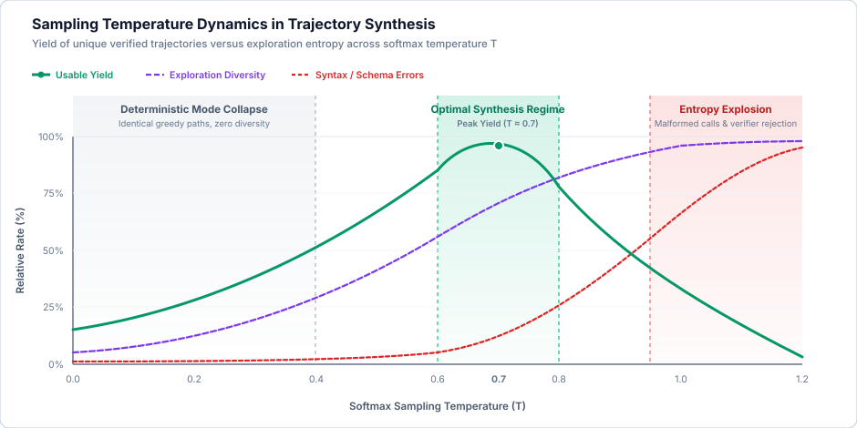

# The Synthetic Data Flywheel {#sec-vol3-data-flywheel}

::: {layout-narrow}
::: {.column-margin}

\chapterminitoc

:::
:::

::: {.content-visible when-format="pdf"}
\begin{marginfigure}
\mlagentstack{15}{25}{95}{25}{20}{15}
\caption{The Agentic Machine Learning Systems Stack.}
\end{marginfigure}
:::

## Purpose {.unnumbered .unlisted}

_How do we synthesize, verify, and scale multi-turn agent execution data to train autonomous policies when human demonstration data is economically and combinatorially exhausted?_

Treating the foundation model as a static, frozen stochastic processor requires designing elaborate external operating systems around it: context working sets to conserve high-bandwidth memory (HBM), virtual memory paging for multi-tenant KV caches, episodic vector storage for non-volatile recall, execution schedulers to manage heavy-tailed workloads, system calls to enforce capability boundaries, and microVM sandboxes to isolate untrusted execution. While this runtime scaffolding is indispensable for system stability and security, relying exclusively on inference-time prompting imposes severe economic and physical penalties: quadratic attention prefill overhead, KV-cache saturation, token recall degradation across extended horizons, and brittle adherence to complex API schemas.

To overcome these constraints, agent systems engineering must transition from pure runtime containment to **Policy Adaptation**\index{Policy Adaptation}. This transition begins with the **Synthetic Data Flywheel**\index{Synthetic Data Flywheel}. Human trajectory demonstrations are too slow, prohibitively expensive, and fundamentally unscalable for the combinatorial state spaces of multi-turn tool interaction. Furthermore, human annotators emit almost exclusively happy-path traces, starving the policy of essential error-recovery signals. The synthetic data flywheel bypasses human annotation through automated task generation, stochastic teacher exploration, execution-based rejection sampling against deterministic oracles (compilers, linters, test harnesses), and search distillation from high-compute deliberation trees into compact, single-pass policy weights. This chapter formalizes the end-to-end systems architecture required to run this closed-loop flywheel at data-center scale.

::: {.content-visible when-format="pdf"}

\newpage

:::

::: {.callout-learning-objectives}

- Explain the physical and economic boundaries of the post-training data bottleneck in multi-turn agent domains
- Formulate execution-based rejection sampling as a hard deterministic indicator gate over stochastic proposals
- Quantify the mathematical relationship between exploration temperature, candidate yield ($\text{pass@k}$), and sample purity
- Architect distributed, disaggregated systems that decouple GPU trajectory rollouts from CPU-bound deterministic verification oracles
- Implement high-density microVM and container recycling to achieve sub-50 ms sandbox resets during rejection sampling
- Formalize search distillation to compress multi-branch Monte Carlo Tree Search (MCTS) trajectories into single-pass student policies
- Identify and mitigate the primary failure modes of synthetic data generation: LLM-as-a-judge bias, golden-path brittleness, oracle starvation, and student entropy collapse

:::

## Introduction {#sec-vol3-flywheel-intro}

Consider an autonomous agent tasked with debugging a critical database regression. To coax the agent to retrieve logs, execute SQL queries, and patch the faulty logic without altering the model's weights, engineers must build extensive runtime scaffolding: system prompts stuffed with dozens of JSON schemas, few-shot demonstration exemplars, dynamic in-context retrieval, and deterministic statecharts. This mirrors classical computer architecture, where compilers translate high-level logic to respect a fixed CPU interface. The underlying foundation model is treated as an immutable neural processor.

While this runtime-centric approach enables rapid prototyping, it introduces three crippling systems bottlenecks:

1. **Quadratic Prefill and KV-Cache Memory Bloat:** Stuffer prompts that encode complete API specifications, domain rules, and multi-turn exemplars routinely consume $8{,}000$ to $32{,}000$ tokens of the active context window. As established in earlier chapters, attention prefill compute scales quadratically with sequence length, and KV-cache allocation scales linearly. Serving an agent that must ingest a $32\text{K}$-token prefix on every interaction turn rapidly exhausts GPU HBM, throttling batch sizes and driving inference costs to unsustainable levels.
2. **Attention Dispersion and Contextual Amnesia:** As sequence length grows, transformer attention distributions suffer from contextual degradation. The "lost in the middle" phenomenon demonstrates that models recall information at the extremes of their context far more reliably than information embedded within deep conversational histories [@liu2024lost]. When an agent relies on lengthy system prompts to remember tool constraints during a 40-step interaction, parameter recall plummets, resulting in hallucinated arguments and invalid schema structures.
3. **The Brittleness of Prompted Coordination:** Prompt-based instructions are fundamentally advisory. A stochastic processor conditioned via natural language instructions possesses no formal mathematical guarantee of schema compliance or termination. Under distributional drift or unexpected tool exceptions, prompted agents frequently enter infinite semantic loops or emit malformed execution payloads.

The solution to these operational bottlenecks is **Context Compilation**\index{Context Compilation}: compiling recurring runtime context, tool schemas, and multi-step decision patterns directly into the static parameter weights of the neural network. By fine-tuning the model on high-quality agent trajectories, the system internalizes operational protocols into its weights, shrinking prompt prefixes by over 80 percent, eliminating redundant prefill computation, and radically improving tool invocation reliability.

The closed-loop architecture of the synthetic data flywheel is illustrated in @fig-vol3-flywheel-lifecycle.

::: {#fig-vol3-flywheel-lifecycle fig-env="figure" fig-pos="htb" fig-cap="**The Closed-Loop Synthetic Data Flywheel**: Systems architecture of the automated trajectory generation and policy adaptation lifecycle. Generative task creation feeds a high-throughput GPU rollout engine. Candidate traces are verified by deterministic CPU oracles. Accepted golden paths and mined error recovery trajectories form a curated training corpus that updates policy weights via distillation, deploying an improved policy $\pi_{k+1}$ to drive subsequent data generation iterations." fig-alt="Flowchart showing closed-loop synthetic data flywheel with task generation, rollout engine, verification oracles, bifurcated curation into golden paths and error recovery, and policy distillation closing the loop."}

{#fig-synthetic_data_flywheel}

:::

Compiling execution capability into weights requires massive volumes of high-fidelity trajectory data. Rather than relying on manual human labeling, modern agent post-training leverages the execution environment itself as a tireless, automated supervisor. By coupling generative task creation, stochastic candidate rollouts, deterministic execution-based verification, and search distillation, engineering teams create a self-reinforcing flywheel: improved policies resolve more complex environment states, generating richer execution traces that fuel subsequent training generations. The first barrier to spinning up this flywheel is the physical limit of generating those initial trajectories.

## The Post-Training Data Bottleneck {#sec-vol3-flywheel-bottleneck}

To train an agent to resolve a real-world software issue, an engineering team might consider hiring human engineers to record their debugging steps. But an agent trajectory is not a single text completion; it is an ordered sequence of state-action-observation tuples. At commercial billing rates, collecting a modest dataset of $50{,}000$ human trajectories costs between $3.75\text{M}$ and $20\text{M}$ dollars and requires months of calendar time. In contrast to standard language model pretraining where data is abundant, the post-training regime for autonomous agents faces a severe **Data Bottleneck**\index{Data Bottleneck}.

### The Arithmetic of Human Demonstration Failure

Supervised Fine-Tuning (SFT) for basic conversational assistants (such as standard instruction-following models) relies on crowdsourced human demonstrations. A human worker is given a prompt (e.g., *"Summarize this article"*) and writes a single-turn target completion. This pipeline fails catastrophically when applied to agentic systems:

1. **Extreme Temporal and Financial Cost:** An agent trajectory is not a single text completion; it is an ordered sequence of state-action-observation tuples:
   $$\tau = (s_0, a_0, o_0, s_1, a_1, o_1, \dots, s_H, a_H, o_H)$$
   Resolving a real-world software engineering task (such as a GitHub issue in SWE-bench [@jimenez2024swebench]), a cloud infrastructure failure, or an intricate financial audit requires between 20 and 100 interaction steps. A human software engineer typically requires between 30 and 120 minutes of deep cognitive effort to navigate the codebase, formulate hypotheses, edit files, execute test suites, and verify the patch. At commercial engineering billing rates ($75 to $200 per hour), collecting a modest dataset of $50{,}000$ human trajectories costs between $3.75\text{M}$ and $20\text{M}$ dollars and requires months of calendar time.
2. **Combinatorial Explosion of State Spaces:** In classical single-turn NLP, the input space is static. In an agentic environment, the state space is combinatorially explosive. At each time step $t$, the agent selects an action from a continuous or vast discrete action space (arbitrary bash commands, SQL queries, code edits) and transitions into a new environment state $s_{t+1}$ based on non-deterministic external responses. A 15-step trajectory with an effective branching factor of $b \approx 8$ encompasses $8^{15} \approx 3.5 \times 10^{10}$ possible paths. Human annotators can only ever sample an infinitesimal fraction of this graph, leaving the vast majority of the environment topology unexplored.
3. **The "Golden Path" Bias and Covariate Shift:** Human engineers naturally exhibit survivorship bias in their logged demonstrations: they explore mentally, make corrections internally, and write out clean, direct solutions. When human demonstrations are recorded, annotators rarely document their intermediate mistakes, dead ends, or recoveries from obscure shell errors. Consequently, human trajectory corpora consist almost exclusively of "golden paths"—traces where every command succeeds on the first attempt. Training a model exclusively on golden paths produces severe **Autoregressive Covariate Shift**\index{Autoregressive Covariate Shift} [@ross2011reduction]: the moment the deployed agent encounters an unexpected runtime error (e.g., an HTTP 503 gateway timeout or a missing compiler dependency), the context enters an out-of-distribution state that never appeared in the training data. The model panics, hallucinates non-existent flags, and cascades into fatal failure loops.

@Tbl-vol3-human-vs-synthetic-data quantifies the physical, temporal, and economic boundaries separating human trajectory logging from closed-loop synthetic generation.

| **Dimension**              | **Human Expert Trajectories**                            | **Synthetic Flywheel Rollouts**                                     | **Systems Implication**                                               |
|:---------------------------|:---------------------------------------------------------|:--------------------------------------------------------------------|:----------------------------------------------------------------------|
| **Generation Cost**        | $75.00 – $200.00 / hour ($37.50 – $400.00 / trace)       | $0.10 – $1.50 / verified trace                                      | 100× to 1,000× cost reduction enables $10^5 – 10^7$ training scale    |
| **Collection Latency**     | 30 – 120 minutes per trajectory                          | 5 – 60 seconds per trajectory                                       | Enables continuous closed-loop retraining and rapid policy iteration  |
| **State Space Coverage**   | Sparse; infinitesimal fraction ($<10^{-8}$) of path tree | Dense; systematic branch exploration via Best-of-$N$ and MCTS       | Exposes policy to broad state graph and rare boundary conditions      |
| **Trajectory Traversal**   | Golden paths only; errors edited out mentally            | Bifurcated; 70% golden paths, 30% injected error-recovery traces    | Mitigates autoregressive covariate shift during runtime tool failures |
| **Verification Authority** | Subjective human inspection; noisy, fatigue-prone        | Deterministic non-differentiable oracles (compilers, tests, ASTs)   | Eliminates length and style bias; zero circular hallucinations        |
| **Scalability Bottleneck** | Human engineering headcount and recruiting velocity      | Elastic GPU rollout inference and CPU microVM verification clusters | Governed by Amdahl's law and data-center cluster economics            |

: **Human Demonstrations vs. Automated Synthetic Trajectory Generation**: Quantitative and architectural comparison across generation cost, collection latency, state space coverage, trajectory traversal, verification authority, and scalability boundaries. {#tbl-vol3-human-vs-synthetic-data tbl-colwidths="[20,26,26,28]"}

### Self-Play and Environment Bootstrapping

To escape the human data bottleneck, agent architectures adopt the core breakthrough that enabled reinforcement learning systems to surpass human performance in games like Go, Chess, and Shogi [@silver2017mastering]: **Self-Play in Simulated Environments**\index{Self-Play in Simulated Environments}.

In board games, the environment is defined by rigid mathematical rules: piece moves, turn alternation, and terminal win/loss states. In agentic software engineering and tool execution, the external environment serves as an identical ground-truth referee:

- A compiler (`rustc`, `gcc`, `javac`) deterministically accepts or rejects syntax.
- A test harness (`pytest`, `jest`, `cargo test`) deterministically evaluates functional correctness.
- An operating system kernel deterministically enforces permissions, file paths, and return codes.
- An API gateway deterministically validates JSON schema contracts.

Because the execution environment provides unambiguous, non-differentiable ground-truth feedback, we can replace human annotators with automated **Self-Supervised Environment Bootstrapping**\index{Self-Supervised Environment Bootstrapping}.

The seminal formalization of this principle for language models was demonstrated by the **Toolformer** architecture [@schick2023toolformer]. Toolformer established that a model can autonomously discover when and how to invoke external APIs without manual supervision by optimizing for self-supervised perplexity reduction.

<!-- TODO: Moved to Appendix [ML/Systems/Hardware] -->

Intuitively, the model proposes candidate API calls during text generation. These calls are executed in a sandbox, and the returned information is injected back into the context. If the API invocation returns irrelevant data or a runtime error, the model's uncertainty about future tokens remains unchanged or increases, and the trace is discarded. However, if the tool returns precise, grounded facts (e.g., an exact mathematical calculation), the model's prediction of future tokens becomes highly certain. The system accepts trajectories into the training corpus only when the environment feedback acts as a massive \"entropy reducer,\" filtering out useless tool use and rewarding factual grounding.

The synthetic data flywheel generalizes this primitive across entire multi-turn trajectories: candidate action sequences are rolled out in parallel, evaluated against environment invariants, and filtered to construct massive, pristine post-training corpora. The mathematical engine that filters these candidates is execution-based rejection sampling.

## Execution-Based Rejection Sampling {#sec-vol3-flywheel-rejection-sampling}

Consider generating a trajectory to resolve a compilation error. We could sample hundreds of candidate bash commands from a language model, but how do we know which one works without human review? The core algorithmic mechanism driving data generation in the flywheel is **Execution-Based Rejection Sampling**\index{Execution-Based Rejection Sampling}.

### Mathematical Formulation

Rejection sampling relies on generating candidates from a readily available proposal model and filtering them against a target distribution of verified solutions.

<!-- TODO: Moved to Appendix [ML/Systems/Hardware] -->

In the context of agentic post-training, the proposal generator is the model's stochastic rollout policy. The system evaluates each candidate trajectory against a strict, execution-based verification indicator $R(\tau, x) \in \{0, 1\}$. Because the execution oracle provides a deterministic binary outcome, the sampling probability collapses into a hard gate:

- If the trajectory passes all deterministic execution checks ($R(\tau, x) = 1$), it is accepted into the fine-tuning dataset.
- If the trajectory fails any assertion, triggers a fatal exception, or violates an environment invariant ($R(\tau, x) = 0$), it is rejected with probability 1.

This multi-stage gating mechanism is diagrammed in @fig-vol3-flywheel-rejection-gate.

::: {#fig-vol3-flywheel-rejection-gate fig-env="figure" fig-pos="htb" fig-cap="**Execution-Based Rejection Sampling Gate**: Architectural flow of candidate trajectories through a cascading multi-stage verification oracle. Proposed trajectories $\tau \sim \pi_\theta$ are evaluated through AST syntax parsing, schema validation, environment invariant verification, and unit test suites. Only candidates satisfying all conjunctive checks ($R=1$) enter the golden training pool; failing traces ($R=0$) route to the error-recovery mining tier." fig-alt="Flowchart showing proposed trajectories passing through syntax verification, schema validation, state invariant checks, and unit test execution into acceptance or rejection."}

{#fig-rejection_sampling_gate}

:::

### The Structure of Deterministic Verification Oracles

The reliability of rejection sampling depends entirely on the design of the verification reward function $R(\tau, x)$. In production agent architectures, $R(\tau, x)$ decomposes into a conjunctive series of hard deterministic checks:

$$R(\tau, x) = \mathbb{I}_{\text{syntax}}(\tau) \times \mathbb{I}_{\text{schema}}(\tau) \times \mathbb{I}_{\text{state}}(\tau) \times \prod_{k=1}^K \mathbb{I}(\text{Test}_k(\mathcal{E}_{\text{final}}) == \text{PASS})$$

where:

1. **$\mathbb{I}_{\text{syntax}}(\tau)$:** Enforces that every intermediate tool call, code block, or query generated by the agent is syntactically valid according to the target language grammar (e.g., parses into a valid Abstract Syntax Tree via Tree-Sitter).
2. **$\mathbb{I}_{\text{schema}}(\tau)$:** Verifies that all emitted API parameters conform strictly to the formal JSON Schema or OpenAPI specification, ensuring correct typing and required argument presence.
3. **$\mathbb{I}_{\text{state}}(\tau)$:** Validates environmental state invariants (e.g., no unauthorized file deletions outside the workspace sandbox, no memory leaks, database foreign key constraints remain intact).
4. **$\prod_{k=1}^K \mathbb{I}(\text{Test}_k(\mathcal{E}_{\text{final}}) == \text{PASS})$:** Evaluates the terminal state of the environment $\mathcal{E}_{\text{final}}$ against a suite of $K$ independent, deterministic unit and integration test assertions.

The execution latency, evaluation substrate, and failure modes across these verification tiers are formalized in @tbl-vol3-verification-oracles.

| **Verification Tier**                                   | **Target Invariant**                               | **Evaluation Mechanism**                                  | **Typical Latency** | **Execution Substrate**                      | **Failure Signature**                                     |
|:--------------------------------------------------------|:---------------------------------------------------|:----------------------------------------------------------|:-------------------:|:---------------------------------------------|:----------------------------------------------------------|
| **Syntax AST Gate ($\mathbb{I}_{\text{syntax}}$)**      | Grammar validity of code, bash, and queries        | Tree-sitter AST parser, language lexers                   |        <1 ms        | In-process worker thread                     | `SyntaxError`, `ParseError`, nonzero lexer exit           |
| **Schema Contract Gate ($\mathbb{I}_{\text{schema}}$)** | Typing, parameter arity, OpenAPI specifications    | JSON Schema validator, Pydantic type validator            |        <5 ms        | In-process worker thread                     | `ValidationError`, missing required fields, type mismatch |
| **State Invariant Gate ($\mathbb{I}_{\text{state}}$)**  | Sandbox containment, zero data leaks, DB integrity | Kernel filesystem diffs, memory leaks, foreign key checks |      10 – 50 ms     | Ephemeral OS cgroup / host diff engine       | `StateLeakError`, orphan processes, permission faults     |
| **Unit Test Gate ($\prod \mathbb{I}(\text{Test}_k)$)**  | Functional logic and regression assertions         | Test runners (`pytest`, `cargo test`, `jest`)             |       1 – 30 s      | Isolated microVM / container sandbox         | `AssertionError`, test timeout, nonzero test suite exit   |
| **End-to-End Integration Gate**                         | Multi-service API responses, visual DOM mutations  | Integration harness, Playwright browser snapshots         |       2 – 15 s      | Sandboxed virtual network & headless browser | `HTTP 5xx`, DOM assertion timeout, visual regression      |

: **Deterministic Verification Oracle Cascade**: Systems characteristics, evaluation mechanisms, latency budgets, and failure signatures across the multi-stage trajectory verification pipeline. {#tbl-vol3-verification-oracles tbl-colwidths="[18,20,22,12,14,14]"}

::: {.callout-note title="Execution oracle vs. LLM-as-a-judge"}
Rejection sampling in agent systems must never be confused with subjective "LLM-as-a-Judge" evaluation [@zheng2023judging]. In conversational tuning, a secondary large language model (LLM) is frequently prompted to score candidate answers for politeness, helpfulness, or fluency. In agentic execution, LLM judges are catastrophic: they exhibit extreme length bias (favoring verbose, rambling code over concise solutions), style bias, and severe circular hallucination (approving syntactically plausible code that fails silently at runtime). A compiler or unit test suite possesses zero style bias; an exit code of `0` is an objective, mathematical truth.
:::

### Sampling Dynamics and the Temperature-Yield Trade-Off

The efficiency of execution-based rejection sampling is governed by the model's sampling hyperparameters, particularly the softmax temperature $T$.

To quantify the yield of verified trajectories, systems evaluate the $\text{pass@k}$ metric [@chen2021codex]. If we draw $n$ independent trajectory candidates for a task prompt $x$ and $c$ of those candidates satisfy the execution oracle ($R=1$), the unbiased estimator for the probability that at least one of $k$ randomly chosen samples succeeds is:

$$\text{pass}@k = \mathbb{E}_{x \sim \mathcal{D}} \left[ 1 - \frac{\binom{n - c}{k}}{\binom{n}{k}} \right]$$

The choice of temperature $T$ navigates a fundamental systems trade-off:

- **Low Temperature ($T \to 0$):** The policy samples near the greedy argmax. Trajectory diversity collapses: all $n$ samples follow identical reasoning branches. If the greedy path is flawed, $c = 0$, and the entire generation batch is wasted. While the per-sample success rate on easy tasks is high, the pipeline fails to explore alternative solution topologies for difficult problems.
- **High Temperature ($T \ge 1.0$):** Semantic entropy increases, encouraging broad exploratory branching across tool combinations. However, the probability of emitting invalid tool arguments, syntax errors, or hallucinated paths compounds exponentially over trajectory length $H$. Consequently, the acceptance probability $\alpha(\tau)$ plummets, requiring thousands of GPU rollouts to yield a single passing trace ($c/n \to 0$).

This dynamic is captured in @fig-vol3-flywheel-temperature-yield.

::: {#fig-vol3-flywheel-temperature-yield fig-env="figure" fig-pos="htb" fig-cap="**Sampling Temperature Dynamics in Trajectory Synthesis**: Interaction between softmax temperature $T$, usable trajectory yield, exploration diversity, and execution error rates. At low temperatures ($T < 0.4$), the policy suffers mode collapse, producing deterministic but uncreative traces. At elevated temperatures ($T > 1.0$), entropy explosion drives syntax and schema failures, collapsing net verifier yield. The optimal synthesis regime ($T \in [0.6, 0.8]$) balances exploratory diversity with high verification success, peaking near $T \approx 0.7$." fig-alt="Plot showing usable trajectory yield, exploration diversity, and syntax error rate curves across temperature range from 0.0 to 1.2, highlighting mode collapse, optimal synthesis regime, and entropy explosion."}
{width=100%}
:::

In production generation pipelines, engineering teams employ **Adaptive Temperature Annealing**\index{Adaptive Temperature Annealing}: sampling the first $k_1$ rollouts at $T = 0.2$ to capture high-probability solutions, and conditionally escalating to $T = 0.7$ and $T = 0.9$ with Best-of-$N$ search only when low-temperature rollouts fail the execution verifier.

### Trajectory Economy: Minimal Golden Path Extraction

When generating $n$ candidates for a task, multiple trajectories may satisfy the execution verifier ($\mathcal{T}_{\text{pass}} = \{\tau \mid R(\tau) = 1\}$). Naively adding all passing trajectories into the SFT dataset degrades policy efficiency, because stochastic search rollouts often stumble upon the correct solution after executing redundant commands, exploratory loops, or unnecessary status checks.

To instill operational efficiency, the curation pipeline applies **Trajectory Economy Filtering**\index{Trajectory Economy Filtering}.

<!-- TODO: Moved to Appendix [ML/Systems/Hardware] -->

By algorithmically selecting the minimal-step trajectory that achieves the goal (based on length or token count), the fine-tuning process teaches the model the shortest, most direct computational path to goal satisfaction, actively penalizing operational meandering. Evaluating thousands of these candidate paths requires executing actual code, which reveals a glaring systems mismatch between GPU generation and CPU verification.

## Scaling Deterministic Oracles {#sec-vol3-flywheel-scaling-oracles}

Imagine provisioning a thousand-node GPU cluster to generate agent trajectories, only to find the entire fleet sitting idle because it is waiting for a Docker container to finish running `cargo build`. While generating candidate trajectories requires massive GPU capacity, verifying them introduces a distributed systems challenge: **Deterministic Oracle Scalability**\index{Deterministic Oracle Scalability}.

### The Heterogeneous Compute Mismatch

Modern LLM inference engines (such as vLLM [@kwon2023vllm], TensorRT-LLM, and SGLang [@zheng2023sglang]) leverage tensor parallelism, continuous batching [@yu2022orca], and PagedAttention to process thousands of tokens per second per GPU node. In contrast, verifying an agent trajectory requires running real-world software workflows on conventional CPU hardware:

- Compiling a C++ or Rust repository (`cmake`, `cargo build`) takes 10 to 90 seconds of multi-threaded CPU compute.
- Running an end-to-end integration test suite (`pytest`, `mvn test`) takes 5 to 60 seconds.
- Starting a headless browser session (Playwright/Puppeteer) to verify web agent DOM mutations requires 2 to 5 seconds.

If trajectory generation and verification are coupled synchronously—where the GPU worker process generates a tool call, blocks waiting for a local Docker container to execute the command, and resumes generation—the system encounters a catastrophic compute mismatch. GPU tensor cores sit completely idle in high-bandwidth memory residency, waiting on slow disk I/O, compilation locks, and process forks. GPU compute utilization drops from $>85\%$ to $<8\%$, wasting millions of dollars in accelerator capacity.

### Architectural Disaggregation: Decoupling Rollout and Verification

To achieve line-rate GPU throughput during synthetic data generation, system architectures must enforce **Strict Compute Disaggregation**\index{Strict Compute Disaggregation}. The generation cluster and the verification cluster are decoupled into independent distributed subsystems connected via asynchronous, durable message queues.

The disaggregated compute topology is detailed in @fig-vol3-flywheel-disaggregated-fleet.

::: {#fig-vol3-flywheel-disaggregated-fleet fig-env="figure" fig-pos="htb" fig-cap="**Disaggregated Compute Architecture for Trajectory Synthesis**: Heterogeneous separation between the GPU rollout inference fleet and the CPU verification oracle fleet. GPU nodes run continuous batching (vLLM) to maximize tensor core utilization without blocking on external tool latency. Asynchronous message queues (Kafka / Redis Streams) buffer candidate traces for dense pools of Firecracker microVMs on CPU hosts, streaming verified datasets directly to columnar Parquet storage." fig-alt="Architecture diagram showing GPU inference nodes streaming candidate rollouts into a distributed message queue, which feeds CPU oracle hosts running Firecracker microVM pools, outputting verified traces to distributed Parquet storage."}

{#fig-disaggregated_compute_architecture}

:::

1. **The GPU Rollout Fleet:** High-throughput GPU nodes run uninterrupted continuous batching inference. Their sole responsibility is autoregressive token generation: proposing actions $a_t$ conditioned on state prefixes $s_t$. When an environment interaction is required, the incomplete trajectory state is enqueued to a message broker (e.g., Apache Kafka or Redis Streams), and the GPU worker immediately swaps in another active trajectory, maintaining near-100 percent tensor core saturation.
2. **The CPU Verification Fleet:** A dynamically scaled pool of commodity CPU nodes consumes candidate rollouts from the queue. Each CPU worker manages a dense cluster of lightweight execution sandboxes. The CPU worker executes the agent's tool invocations, captures stdout/stderr, evaluates assertions, computes environment state diffs, and assigns the binary reward $R(\tau)$.
3. **The Data Staging Tier and Active Telemetry:** Trajectories are routed through a bifurcated storage path. High-value error-recovery traces and golden paths ($R=1$) bypass cold storage and are streamed directly into hot memory-mapped file systems for continuous online policy updates (e.g., online DPO [@rafailov2023direct] / PPO [@schulman2017proximal]). Bulk analytical logs ($R=0$ unrecoverable failures) are serialized into columnar formats (Apache Parquet), indexed by AST failure types, and flushed to cold distributed object storage (Amazon S3, Google Cloud Storage). This telemetry tier actively monitors verifier yield rates, triggering automated alerting if the oracle rejection rate spikes, indicating environment drift or a degraded base model checkpoint.

### Sandbox Lifecycle Optimization: MicroVMs and CoW Overlays

When executing millions of untrusted agent-generated code snippets per day, container security and launch overhead become binding constraints.

Standard Linux containers (Docker) share the host kernel. Hallucinated agent actions (such as fork-bombs, malicious kernel module insertions, or memory exhaustion) can crash host worker nodes or escape container boundaries (detailed in earlier architecture chapters). Conversely, traditional hardware-assisted virtual machines (QEMU/KVM) provide strict hardware-enforced Ring 0 isolation, but their cold-boot latencies (5 to 30 seconds) and high memory footprints make high-throughput verification impossible.

Modern verification infrastructure resolves this tension through **MicroVM Sandboxes**\index{MicroVM Sandboxes} (such as AWS Firecracker [@agache2020firecracker]) combined with **Copy-on-Write (CoW) Storage Overlays**\index{Copy-on-Write (CoW) Storage Overlays}:

- **Sub-50 Millisecond Boot Latencies:** Firecracker strips away legacy PC peripherals, BIOS routines, and PCI buses, providing a minimal virtualized environment that boots a dedicated Linux kernel in under 30 milliseconds.
- **Copy-on-Write Root Filesystems:** Instead of copying multi-gigabyte disk images for each trajectory rollout, base repository environments (containing the OS, programming language runtimes, compilers, pre-installed package dependencies, and repository source code) are mounted as **immutable, read-only block devices**.
- **Ephemeral Snapshot Restores:** Each candidate trajectory attaches an ephemeral, in-memory Copy-on-Write overlay (`tmpfs` or device-mapper). When the trajectory completes its execution and verification pass, the overlay is discarded instantly. Resetting the environment to its pristine initial state requires under $5\text{ ms}$, enabling a single 64-core CPU host to execute hundreds of trajectory verifications per minute without persistent disk I/O bottlenecks.

The performance and isolation trade-offs across candidate sandboxing technologies are compared in @tbl-vol3-sandbox-technologies.

| **Isolation Primitive**         | **Cold Boot Latency** | **Snapshot Reset Latency** | **Memory Overhead** | **Density per 64-Core Host** | **Kernel Boundary**                | **Production Suitability for Rejection Sampling**                 |
|:--------------------------------|:---------------------:|:--------------------------:|:-------------------:|:----------------------------:|:-----------------------------------|:------------------------------------------------------------------|
| **Bare-Metal Process**          |         <1 ms         |   Manual cleanup (>5 s)    |        ~0 MB        |            >2,000            | Shared host kernel (Ring 0)        | **Unsafe**: Malicious or broken agent commands escape into host   |
| **Linux Container (Docker)**    |      500 ms – 2 s     | 1 – 3 s (`docker rm/run`)  |      20 – 50 MB     |          100 – 250           | Shared host kernel (cgroups v2)    | **Poor**: `dockerd` daemon locks, slow resets, kernel escape risk |
| **Application Kernel (gVisor)** |      100 – 300 ms     |        100 – 200 ms        |      30 – 80 MB     |          150 – 350           | Intercepted syscalls (Sentry)      | **Viable**: Good security, but system call emulation overhead     |
| **MicroVM (AWS Firecracker)**   |       15 – 30 ms      | <5 ms (CoW tmpfs overlay)  |        <5 MB        |         500 – 2,000+         | Dedicated guest Linux kernel (KVM) | **Optimal**: Sub-5 ms CoW resets, hardware Ring 0 containment     |
| **Full VM (QEMU / KVM)**        |        5 – 30 s       |         10 – 30 s          |    512 MB – 2 GB    |           16 – 64            | Emulated PC hardware (KVM Ring 0)  | **Prohibitive**: Extreme memory overhead and cold boot delays     |

: **Virtualization and Sandboxing Primitives for Verification Fleets**: Systems latency, memory footprints, host consolidation density, and security isolation across candidate verification execution technologies. {#tbl-vol3-sandbox-technologies tbl-colwidths="[16,14,14,14,14,14,14]"}

The microVM sandbox lifecycle and CoW storage architecture are illustrated in @fig-vol3-flywheel-microvm-cow.

::: {#fig-vol3-flywheel-microvm-cow fig-env="figure" fig-pos="htb" fig-cap="**MicroVM Sandbox Lifecycle with Ephemeral Copy-on-Write Overlays**: High-density execution sandboxing on CPU verification nodes. Multiple Firecracker microVMs run isolated Linux guest kernels on a single host. Each guest attaches an ephemeral in-memory Copy-on-Write (`tmpfs`) overlay to capture mutations during test execution, while reading unmodified system binaries, compilers, and repository source code from a shared, immutable read-only base rootfs. Discarding the overlay enables sub-5 millisecond environment resets." fig-alt="Architecture diagram of microVM isolation showing host Linux kernel managing Firecracker microVMs with ephemeral Copy-on-Write overlays reading unmodified blocks from a shared read-only base image."}

<!-- ERADICATED MERMAID PNG -->

:::

### Amdahl's Law of Synthetic Data Infrastructure

The balance between GPU rollout compute and CPU verification compute is governed by systems scaling laws heavily analogous to Amdahl's Law. Throughput is constrained by whichever stage—generation or verification—has insufficient parallel capacity relative to its work duration.

<!-- TODO: Moved to Appendix [ML/Systems/Hardware] -->

If the verification fleet is under-provisioned relative to the fast GPU inference workers, the system enters an **Oracle-Bound Stall**\index{Oracle-Bound Stall}: CPU verification queues fill to capacity, backpressure propagates upstream, and the GPU inference fleet halts. Because GPU time is orders of magnitude more expensive than CPU time, any bottleneck that forces tensor cores to idle waiting for compiler feedback represents a catastrophic collapse in cluster cost efficiency. In enterprise code-synthesis pipelines, maintaining balanced throughput requires provisioning between 32 and 64 dedicated CPU verification cores for every single 8-way H100 GPU rollout node. Even with perfectly balanced CPU-GPU clusters, generating thousands of rollouts per query at inference time is impossible for production customer traffic. The solution is to move this deliberation offline.

## Search Distillation {#sec-vol3-flywheel-search-distillation}

Suppose an agent encounters a broken database dependency that requires exploring several incompatible package versions, backtracking from failures, and branching into new debugging paths. While execution-based rejection sampling filters independent stochastic paths, complex multi-step reasoning tasks frequently require exploring combinatorial decision trees. In @sec-vol3-deliberation, we established that **Test-Time Deliberation**\index{Test-Time Deliberation}—using Monte Carlo Tree Search (MCTS), beam search, and verifier-guided tree rollouts—allows language models to solve problems far beyond the reach of single-pass greedy decoding.

However, deploying test-time search directly into production customer runtimes is economically and operationally prohibitive. Running an MCTS search that explores 120 candidate actions across 15 tree levels can require generating over $100{,}000$ tokens per task, introducing latencies of two to five minutes and compute costs exceeding ten dollars per query.

**Search Distillation**\index{Search Distillation} resolves this operational dilemma by converting expensive, runtime search compute into offline post-training parameters [@hinton2015distilling; @zeng2023agenttuning].

### Search Tree Collapsing

During offline synthetic generation, we grant the system massive compute budgets: high-capacity frontier models or MCTS search harnesses explore extensive candidate trees, back-track from dead ends, evaluate intermediate node values with learned value functions, and discover successful trajectory solutions.

Once the search terminates with a verified goal state, the complex search graph is collapsed:

This process of search tree collapsing and policy distillation is diagrammed in @fig-vol3-flywheel-search-distillation.

::: {#fig-vol3-flywheel-search-distillation fig-env="figure" fig-pos="htb" fig-cap="**Search Tree Deliberation Collapsing and Policy Distillation**: Monte Carlo Tree Search (MCTS) explores extensive combinatorial reasoning branches, generating tens of thousands of intermediate deliberation tokens across dead ends and rollbacks. The distillation pipeline prunes failed branches, collapses the tree into the verified minimal winning path $\tau^*$, and trains a compact student policy $\pi_\phi$ via behavioral cloning to internalize complex search heuristics into feedforward parameters." fig-alt="Diagram showing an exploratory Monte Carlo Tree Search graph pruned of failed exploratory branches and collapsed into a single minimal winning trajectory that trains a compact student policy."}

<!-- ERADICATED MERMAID PNG -->

:::

The exploratory dead ends and backtracked nodes are pruned, extracting exclusively the minimal winning trajectory path $\tau^*$.

<!-- TODO: Moved to Appendix [ML/Systems/Hardware] -->

A compact student policy $\pi_\phi$ (e.g., an 8-billion parameter dense model) is then fine-tuned via behavioral cloning to predict only the successful action sequence.

### The Policy Improvement Connection

Why does training a model on the collapsed winning path $\tau^*$ work, given that the student model never sees the extensive search tree during inference?

This mechanism is mathematically grounded in the **Policy Improvement Theorem**\index{Policy Improvement Theorem} of reinforcement learning [@sutton2018reinforcement]. Search algorithms like MCTS act as an iterative policy improvement operator, finding a solution trajectory that exceeds the baseline performance of the underlying proposal model.

<!-- TODO: Moved to Appendix [ML/Systems/Hardware] -->

By applying maximum likelihood estimation (behavioral cloning) on the extracted winning path, the student policy internalizes the complex search heuristics into its static feedforward weights. The multi-layer attention heads and feedforward networks of the student model learn to approximate the pruning and ranking decisions that originally required hundreds of explicit forward passes during tree search.

### Cross-Branch Rationale Distillation

A major failure mode of naive search tree collapsing is that it discards the valuable cognitive information embedded within the failed exploratory branches. If an agent attempted Branch B and failed because a specific library dependency was incompatible, that negative experience contains critical causal reasoning.

Advanced search distillation pipelines employ **Cross-Branch Rationale Distillation**\index{Cross-Branch Rationale Distillation}:

1. **Failure Rationale Extraction:** When the search tree identifies that an exploratory branch collapsed due to an error, a summarization module extracts a concise reflective constraint (e.g., \"Attempting to use `asyncio.run()` directly inside an existing Tornado event loop triggers a RuntimeError; use `asyncio.create_task()` instead.\").
2. **Scratchpad Prefix Injection:** The extracted reflection is injected into the student model's internal reasoning scratchpad immediately prior to emitting the successful action.
3. **Conditioned Distillation:** The student policy is trained to first predict the rationale and then output the correct action.

<!-- TODO: Moved to Appendix [ML/Systems/Hardware] -->

Through cross-branch rationale distillation, the student model inherits both the correct action and the explicit counterfactual awareness required to avoid common failure traps, dramatically boosting zero-shot robustness.

@Tbl-vol3-synthesis-comparison summarizes the structural trade-offs between the primary methodologies in the synthetic data flywheel.

| **Methodology**              | **Proposal Generator**                         | **Verification Mechanism**            | **Systems Bottleneck**            |             **Data Yield**            | **Compute Cost per Trajectory** |
|:-----------------------------|:-----------------------------------------------|:--------------------------------------|:----------------------------------|:-------------------------------------:|:-------------------------------:|
| **Human Expert Traces**      | Senior Human Engineers                         | Manual Peer Review                    | Human Labor & Calendar Time       |    Extremely Low ($<10$ traces/day)   |        $150.00 – $500.00        |
| **Model Rejection Sampling** | Stochastic LLM Policy ($T \in [0.6, 0.8]$)     | Unit Tests & Compiler Exit Codes      | CPU MicroVM Sandboxing Throughput |         Moderate (15% to 35%)         |          $0.20 – $1.50          |
| **STaR Bootstrapping**       | Self-Generation with Hints [@zelikman2022star] | Ground-Truth Final State Match        | Multi-Epoch Policy Drift          |         Moderate (25% to 45%)         |          $0.10 – $0.80          |
| **Search Tree Distillation** | Monte Carlo Tree Search (MCTS)                 | Stepwise Verifiers & State Invariants | GPU Deliberation Memory & Latency | Low Yield (<10%), Exceptional Quality |          $5.00 – $25.00         |

: **Trajectory Synthesis Methodologies**: Systems characteristics, verification mechanisms, primary operational bottlenecks, and financial cost structures across synthetic data generation approaches. {#tbl-vol3-synthesis-comparison tbl-colwidths="[18,20,20,18,12,12]"}

While these mechanisms theoretically align into a pristine learning loop, operating them at scale exposes the system to counterintuitive failure modes. The architecture is only as robust as its mitigations against these pitfalls.

## Fallacies and Pitfalls {#sec-vol3-flywheel-fallacies}

When an engineering team first spins up a synthetic data flywheel, they invariably encounter situations where supposedly verified trajectories lead to degraded model performance in production. Engineering a production-scale synthetic data flywheel is fraught with counterintuitive failure modes. Below are the major architectural pitfalls documented in frontier agent laboratories.

**Fallacy: LLM-as-a-Judge is a sufficient verifier for agent trajectories.**
Relying on a frontier LLM prompted as an evaluator to score candidate synthetic trajectories as "Correct" or "Incorrect" avoids the engineering complexity of deploying microVM sandboxes, but introduces fatal flaws. LLMs exhibit severe length bias (favoring verbose, rambling code) and circular hallucination (certifying non-existent API parameters). Trajectory verification must be grounded in non-differentiable execution oracles like compilers, linters, and unit test suites.

**Pitfall: The "Golden Path" purity illusion.**
Filtering rejection sampling datasets so rigorously that only flawless trajectories are retained induces catastrophic golden path brittleness. In production, APIs experience network jitter and file systems contain unexpected formats. A model trained exclusively on golden paths enters a repetitive failure loop when encountering runtime errors because the error token induces autoregressive covariate shift. Systems must intentionally curate bifurcated datasets containing both golden paths and error-recovery trajectories.

**Fallacy: Deterministic oracles have zero systems overhead compared to GPUs.**
Provisioning massive GPU clusters for trajectory rollouts while running verification tests in standard Docker containers on shared CPU nodes leads to immediate queue saturation. Docker daemon contention and disk I/O bottlenecks stall the verification workers, causing GPU utilization to collapse to single digits. Oracle verification must be treated as a first-class distributed computing tier using high-density microVM runtimes (e.g., Firecracker) and rigorous CPU-to-GPU core ratios.

**Pitfall: Distilling search trees preserves exploration entropy.**
Assuming that distilling a winning trajectory from an MCTS search into a student policy grants the student exploratory adaptability is flawed. Search distillation via behavioral cloning sharpens the student's token logits aggressively around the observed winning path, leading to student entropy collapse. The action distribution degenerates into brittle Dirac deltas. Systems must regularize distillation by blending exploratory rollouts and applying entropy penalties.

**Fallacy: Synthetic task generators possess infinite diversity for free.**
Prompting an unconstrained LLM to iteratively generate synthetic programming tasks results in synthesizer mode collapse. The model falls into tight attractor basins, recycling the same narrow semantic templates (e.g., basic REST APIs). Training on this produces overfitted policies. Task generation must be seeded with diverse real-world ASTs, programmatic mutation testing, and semantic embedding distance filtering to ensure broad coverage.

@Tbl-vol3-flywheel-failure-modes synthesizes these core architectural pitfalls, mapping each failure mode to its root cause, runtime symptom, and systems mitigation.

| **Failure Mode**                | **Root Mechanism**                                                                        | **Operational Symptom**                                                                                 | **Systems Mitigation**                                                                                                       |
|:--------------------------------|:------------------------------------------------------------------------------------------|:--------------------------------------------------------------------------------------------------------|:-----------------------------------------------------------------------------------------------------------------------------|
| **LLM-as-a-Judge Evaluation**   | Length and style bias; shared priors lead to circular hallucinations of non-existent APIs | Syntactically fluent but broken code accepted into training pool; silent runtime failures               | Enforce non-differentiable deterministic oracles: compiler return codes, AST parsers, test suites                            |
| **Golden Path Purity Bias**     | Over-filtering candidate traces to include only error-free minimal paths                  | Autoregressive covariate shift; model panics and loops infinitely upon encountering first runtime error | Curate bifurcated datasets: 70% golden paths, 30% error-recovery traces with explicit fault injection                        |
| **Oracle-Bound GPU Starvation** | Heterogeneous compute mismatch; GPU inference blocks on slow CPU test suites              | GPU compute utilization collapses to single digits (<10%); queue saturation stalls rollout fleet        | Complete architectural disaggregation; async message streaming; Firecracker microVMs with sub-5 ms CoW resets                |
| **Student Entropy Collapse**    | Behavioral cloning on narrow collapsed winning paths ($a_t^*$) sharpens token logits      | Student loses exploratory adaptability; action distribution degenerates into brittle Dirac deltas       | Blend distilled trajectories with exploratory rollouts; apply entropy penalties; cross-branch rationale distillation         |
| **Synthesizer Mode Collapse**   | Unconstrained LLM task generator falls into semantic attractor basins                     | Policy overfits to narrow problem templates (e.g., basic REST APIs); fails on enterprise codebases      | Seed task generation with diverse ASTs from public repositories; programmatic mutation testing; embedding distance filtering |

: **Architectural Pitfalls and Mitigations in Synthetic Data Flywheels**: Structural summary of root failure mechanisms, manifested operational symptoms, and engineering mitigations across the data flywheel lifecycle. {#tbl-vol3-flywheel-failure-modes tbl-colwidths="[18,26,28,28]"}

Recognizing these pitfalls allows engineers to build reliable synthetic data pipelines. These lessons distill into a core set of architectural principles.

## Summary {#sec-vol3-flywheel-summary}

A working synthetic data flywheel transforms the problem of agent capabilities from a human-labor bottleneck into a scalable compute problem.

* **The Post-Training Data Bottleneck:** Human trajectory demonstrations are too expensive, slow, and constrained by golden-path bias to effectively train multi-turn autonomous agents. Scaling agent capabilities requires replacing human annotation with self-supervised environment bootstrapping.
* **Execution-Based Rejection Sampling:** Trajectory validity must be gated by hard, non-differentiable deterministic oracles (compilers, linters, state assertions) rather than subjective LLM-as-a-judge evaluators to prevent length bias and circular hallucinations.
* **Disaggregated Compute Architectures:** To prevent GPU tensor core starvation, trajectory rollout generation and CPU-bound oracle verification must be completely decoupled via asynchronous message queues, ensuring both tiers operate at maximum utilization.
* **High-Density MicroVM Sandboxing:** Standard Linux containers are too slow and insecure for high-throughput verification. Production flywheels rely on hardware-isolated microVMs (e.g., AWS Firecracker) with ephemeral Copy-on-Write (CoW) memory overlays to achieve sub-50 ms environment resets.
* **Bifurcated Trajectory Curation:** Training exclusively on successful traces creates brittle policies vulnerable to autoregressive covariate shift. Flywheels must explicitly mine and inject error-recovery trajectories to teach the policy self-diagnosis and failure resilience.
* **Search Distillation:** High-latency, multi-branch deliberation (like MCTS) can be collapsed offline into a single minimal winning path and distilled into a student policy. This transfers complex search heuristics into static feedforward parameters, enabling zero-search inference latencies.
* **Active Telemetry and Hot Storage Routing:** Modern data staging tiers bifurcate synthetic outputs, streaming high-value verified traces into hot memory-mapped storage for continuous policy updates while flushing unrecoverable failures to cold columnar storage for offline analytics.

### Bridging to Trajectory Fine-Tuning {#sec-vol3-flywheel-bridging}

The synthetic data flywheel solves the data supply problem: it produces millions of verified, high-purity, multi-turn trajectories across diverse environment fixtures.

However, possessing a massive dataset of execution traces is only half the battle. How do we actually compute parameter updates over a multi-turn trajectory? Standard language model training treats all tokens identically, but an agent trajectory contains a mixture of system prompts, user queries, internal thoughts, tool calls, and external environment outputs.

In @sec-vol3-sft, we turn to the training dynamics of the model itself. We will formalize trajectory-level loss formulations, derive why backpropagation must strictly enforce **Environmental Causality Boundaries**\index{Environmental Causality Boundaries} through action masking, analyze how to mitigate autoregressive covariate shift via **DAgger-style error injection** [@ross2011reduction], and engineer parameter-efficient multi-tenant serving runtimes using dynamic **LoRA adapter swapping** [@hu2021lora].

The systemic connection between the synthetic data flywheel and the trajectory fine-tuning pipeline is illustrated in @fig-vol3-flywheel-ch11-ch12-bridge.

::: {#fig-vol3-flywheel-ch11-ch12-bridge fig-env="figure" fig-pos="htb" fig-cap="**The Synthesis-to-Training Pipeline and Loss Masking Bridge**: Coordinated architectural progression from seed task generation, teacher rollouts, and deterministic rejection sampling to bifurcated trajectory curation. Curated traces flow directly into the selective loss masking engine of @sec-vol3-sft, where backpropagation updates weights exclusively on agent control actions while strictly masking external environment observations." fig-alt="System architecture diagram detailing the five-stage pipeline from task seed corpus generation to teacher rollouts, execution verification, golden path extraction, error recovery synthesis, and selective loss masking for fine-tuning."}
{width=100%}
:::

This hardware-to-training bridge sets the stage for formalizing these policy updates in the next chapter.
