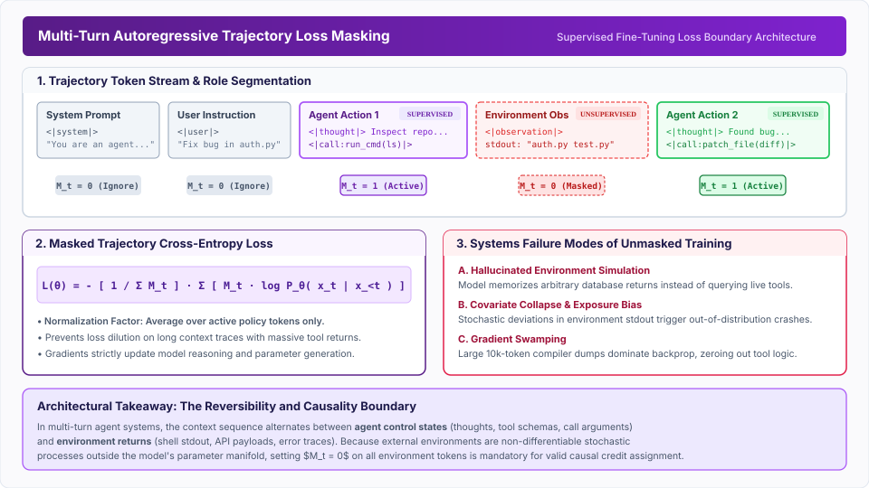
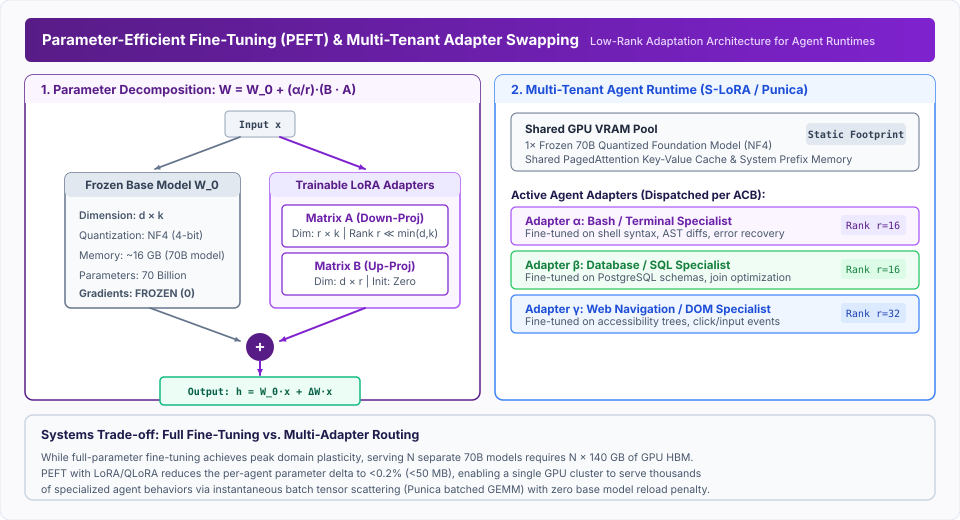

# Trajectory Fine-Tuning {#sec-vol3-sft}

Supervised fine-tuning on multi-turn execution trajectories represents the foundational bridge between static pretrained representations and autonomous agency. While pretraining optimizes for next-token entropy across unstructured web text and standard instruction tuning aligns single-turn conversational style, neither endows a model with the causal priors required for multi-step closed-loop actuation. Following the synthesis and rejection-sampling pipelines of Chapter 11, dynamic execution traces must be compiled directly into model parameters. Trajectory loss objectives, strict masking of environment observations during backpropagation, autoregressive error compounding, and parameter-efficient multi-tenant adapter runtimes form the systems mechanics of this process. By treating fine-tuning as context compilation, we establish the algorithmic and systems foundations necessary before policies can be exposed to active reinforcement learning in Chapter 13.

::: {.content-visible when-format="pdf"}
\begin{marginfigure}
\mlagentstack{15}{25}{95}{25}{20}{15}
\caption{The Agentic Machine Learning Systems Stack.}
\end{marginfigure}
:::


## Introduction {#sec-vol3-sft-intro}

Consider an agent deployed to execute a 30-step data migration: sending instructions, reading database schemas, and parsing error logs. In early prototypes and naive implementations, systems architects rely entirely on **in-context learning (ICL)**\index{in-context learning (ICL)} to drive this processor: every execution step is preceded by a monolithic prompt containing dozens of OpenAPI tool definitions, detailed behavioral guardrails, and lengthy few-shot execution demonstrations.

While in-context prompting allows rapid prototyping without dedicated training infrastructure, it imposes severe systems penalties that make it economically and computationally non-viable for production-scale autonomy:

1. **Quadratic Prefill Saturation:** The computational complexity of standard multi-head attention [@vaswani2017attention] scales quadratically with sequence length $T$ during prompt prefill ($\mathcal{O}(T^2 \cdot d_{\text{model}})$). Appending verbose tool schemas, system rules, and prior execution steps to the prompt causes prefill times to dominate the per-step latency budget.
2. **Key-Value Cache Exhaustion:** The high-bandwidth memory (HBM) consumed by the **Key-Value (KV) cache**\index{Key-Value (KV) cache} grows linearly with sequence length.
<!-- TODO: Moved to Appendix [ML/Systems/Hardware] -->
   Maintaining a large context history consumes massive VRAM per active agent instance solely for KV storage. When thousands of concurrent agent sessions run in parallel, KV cache capacity becomes the primary throughput ceiling of the cluster [@kaplan2020scaling].
3. **Attention Dispersion and "Lost in the Middle":** Transformer attention mechanisms do not maintain uniform fidelity across massive context windows. As demonstrated by @liu2024lost, retrieval accuracy follows a pronounced U-shaped distribution: tokens placed in the middle of long prompts suffer severe recall degradation compared to tokens at the boundaries. When an agent's tool definitions or intermediate scratchpad thoughts are submerged in an expansive prompt, parameter extraction accuracy drops, resulting in hallucinated arguments and invalid schema formatting.

::: {.callout-note title="Definition: Context Compilation"}
**Context Compilation**\index{Context Compilation} is the mathematical transformation of dynamic runtime prompt context (tool definitions, syntax invariants, and reasoning heuristics) into static neural network weights via supervised gradient descent. Context compilation compresses prompt overhead by up to 85%, eliminates repetitive prefill computation, and mitigates attention degradation across extended horizons.
:::

This shift is formalized through **context compilation**\index{Context Compilation}, which maps dynamic prompt scaffolding directly into static policy parameters (@fig-vol3-sft-context-compilation).

::: {#fig-vol3-sft-context-compilation fig-env="figure" fig-pos="htb" fig-cap="**Figure 12.1: Context Compilation versus In-Context Prompting Runtimes**: Structural comparison of runtime execution profiles. (Top) In-context prompting prepends expansive tool definitions, schema specifications, and few-shot traces to every invocation, incurring quadratic prefill latency $\mathcal{O}(T^2)$ and exhausting accelerator KV-cache capacity (~10.5 GB per agent instance). (Bottom) Context compilation transforms dynamic prompt context into static neural network weights via supervised fine-tuning, shrinking prompt prefixes by up to 85%, eliminating redundant prefill computation, and protecting critical tool-following circuits from attention dispersion. Source: Author illustration." fig-alt="Architectural flowchart contrasting an uncompiled in-context prompting agent against a context-compiled policy runtime."}

{width=100%}

:::

Static instruction tuning (e.g., InstructGPT [@ouyang2022instructgpt]) is fundamentally single-turn and request-scoped: a prompt $x$ maps directly to a completed response $y \sim P_\theta(y \mid x)$. In contrast, an agentic trajectory is stateful and temporally extended. The model must alternate between generating internal chain-of-thought tokens, emitting structured tool call invocations, pausing to await external environment feedback, and digesting non-deterministic execution logs. Bridging this chasm requires an entirely distinct post-training paradigm: **Trajectory Fine-Tuning**\index{Trajectory Fine-Tuning}. The structural differences between single-turn prompts and multi-turn trajectories fundamentally alter how loss must be calculated across the token sequence.

## Trajectory Loss Formulations {#sec-vol3-sft-loss}

When an agent issues a bash command to list directory contents, the terminal returns a string of filenames and permissions. The agent processes this string to decide its next command, but it cannot control the terminal's output. Modeling this dynamic requires formalizing an agent's multi-step execution as an alternating sequence of agent decisions and environmental observations over a horizon of $H$ steps.

A full trajectory captures an agent's multi-step execution as an alternating sequence of internal reasoning, action emissions, and external observations over a defined horizon.

<!-- TODO: Moved to Appendix [ML/Systems/Hardware] -->

@Fig-vol3-sft-pipeline illustrates the end-to-end synthetic trajectory generation, execution verification, rejection sampling, and loss-masking pipeline that produces this training corpus.

::: {#fig-vol3-sft-pipeline fig-env="figure" fig-pos="htb" fig-cap="**Figure 12.2: Trajectory Synthesis, Rejection Sampling, and Curation Pipeline**: The post-training data curation pipeline operates across five coordinated stages. Task prompts $x \sim \mathcal{D}_{\text{tasks}}$ seed multi-turn stochastic rollouts by a high-capacity frontier teacher policy $\pi^*_\theta$ within isolated execution sandboxes. Deterministic execution verifiers evaluate unit test suites, compiler return codes, and environment state diffs to filter completions. Passing traces are partitioned into minimal-step golden paths and fault-injection error-recovery traces, which are then processed by a selective loss-masking engine before batch compilation into policy weights. Source: Adapted from Zelikman et al. [@zelikman2022star] and Ouyang et al. [@ouyang2022instructgpt]." fig-alt="System flow diagram detailing the five stages of agent trajectory synthesis, execution verification, rejection sampling, and loss-masking."}
{width=100%}
:::

### Standard Next-Token Prediction vs. Trajectory Objectives

In classical pretraining and conversational fine-tuning, the objective is the unweighted cross-entropy loss over all tokens in an arbitrary sequence.
<!-- TODO: Moved to Appendix [ML/Systems/Hardware] -->
Applying this directly to an agent trajectory sequence introduces a contradiction. The token sequence represents a mixture of endogenous processes (internal reasoning and emitted actions) and exogenous processes (external environment observations). Because the environment is a non-differentiable external system whose governing dynamics lie entirely outside the parameter manifold of the language model, backpropagating gradients through external observations violates causal credit assignment. The trajectory-level **Supervised Fine-Tuning (SFT)**\index{Supervised Fine-Tuning (SFT)} objective must therefore evaluate likelihood strictly over the agent's endogenous tokens.

### Normalization Dynamics Across Variable-Length Observations

When implementing trajectory fine-tuning in distributed training systems, the normalization denominator of the loss function has a decisive impact on optimization stability.
<!-- TODO: Moved to Appendix [ML/Systems/Hardware] -->
If a training framework naively normalizes the masked loss by the total sequence length, the effective gradient magnitude becomes inversely proportional to the verbosity of the external environment. If an agent executes a tool that returns an 8,000-token compiler dump, the loss contribution of the agent's critical tool call is diluted by an order of magnitude. This gradient swamping artificially suppresses parameter updates on trajectories that interact with verbose tools. To maintain consistent step sizes across heterogeneous environments, the loss must be normalized strictly by the count of active policy tokens [@deepseek2024v3].
where $M_i \in \{0, 1\}$ is the binary action mask for token $i$. Implementing this selective normalization requires physical boundaries between agent cognition and environment feedback.

## Action Masking {#sec-vol3-sft-masking}

If a training pipeline inadvertently backpropagates gradients through a 10,000-token compiler error log, the optimizer wastes parameter capacity trying to predict stochastic system noise. The systems implementation of trajectory fine-tuning requires enforcing the **Environmental Causality Boundary**\index{Environmental Causality Boundary} within the training pipeline (@fig-vol3-sft-loss-masking).

::: {#fig-vol3-sft-loss-masking fig-env="figure" fig-pos="htb" fig-cap="**Figure 12.3: Autoregressive Trajectory Loss Masking and Environmental Causality Boundary**: The token sequence alternates between agent control states (system prompt, user query, thoughts, tool calls) and external environment observations (standard output, exit codes, API payloads). The binary loss mask vector $M_t$ is set strictly to 1 for endogenous agent thoughts and tool call arguments, and 0 for exogenous environment observations and initial prompts. During backpropagation, only masked policy tokens contribute to cross-entropy loss, preventing hallucinated execution collapse and gradient swamping from verbose execution outputs. Source: Author illustration." fig-alt="Technical diagram illustrating token sequence role segmentation, binary loss mask vectors, and backpropagation gating for multi-turn agent trajectories."}
{width=100%}
:::

### The Environmental Causality Boundary

Why is action masking non-negotiable? Training on unmasked trajectories ($M_t = 1$ everywhere) triggers three catastrophic failure modes in production agents:

1. **Hallucinated Execution Collapse:** When an LLM is trained to predict observation tokens $o_t$, it internalizes the transition function of the environment within its own autoregressive weights. During deployment, rather than emitting a tool call `<call:exec_sql>` and yielding control to the runtime kernel, the model generates both the tool call and a hallucinated observation in a single forward pass:
   ```
   Agent Output: <call:exec_sql query="SELECT balance FROM accounts WHERE id=42;"/>
   Agent Output (Hallucinated): [OBSERVATION: balance = $1,450,000.00]
   Agent Output: Based on the account balance of $1.45M, the loan is approved.
   ```
   The agent hallucinates the execution output, bypassing real-world actuators and corrupting downstream business logic.
2. **Gradient Swamping from External Noise:** Real-world tools return variable, noisy outputs: UUIDs, system timestamps, network socket addresses, and verbose HTML trees. These tokens possess high entropy and are largely uncompressible by language models. Forcing the optimizer to minimize perplexity over stochastic system noise wastes parameter capacity on memorizing transient environment states rather than learning structured reasoning policies.
3. **Causal Inversion:** Autoregressive prediction of observation tokens incentivizes the model to fit parameters to the past ($o_{<t}$) rather than optimizing the conditional probability of future actions ($a_t \mid s_t$).

### Systems Implementation of Masked Loss

In modern high-performance training systems (such as PyTorch [@paszke2019pytorch] with FlashAttention [@dao2022flashattention] and Megatron-LM [@shoeybi2019megatron]), action masking is implemented by transforming target sequence arrays prior to computing cross-entropy.

<!-- TODO: Moved to Appendix [ML/Systems/Hardware] -->
The standard cross-entropy loss in deep learning frameworks accepts an `ignore_index` argument (typically set to `-100`). Tokens assigned this index are skipped by the CUDA loss kernel, contributing neither to the loss scalar nor to the backward gradient pass.

::: {.callout-tip title="Systems Insight: Role Boundary Delimiters"}
To guarantee that the action mask aligns perfectly with model generation boundaries, production data loaders do not rely on fragile string matching or regular expressions. Instead, the tokenizer is extended with explicit control tokens:

* `<|start_thought|>` ... `<|end_thought|>`
* `<|start_action|>` ... `<|end_action|>`
* `<|start_observation|>` ... `<|end_observation|>`
The data ingestion pipeline sets $M_t = 1$ strictly for tokens falling within the `thought` and `action` intervals, guaranteeing that backpropagation never leaks into the observation stream.
:::

While strict masking isolates the policy from environment noise, it creates a new vulnerability: a policy trained exclusively on successful executions will collapse the moment it encounters a real-world error.

## Covariate Shift Mitigation {#sec-vol3-sft-covariate-shift}

Consider an agent trained exclusively on flawless demonstrations where every shell command succeeds and every database query executes without syntax errors. The moment it encounters a real-world `HTTP 504` timeout or a `grep: file not found` error, its execution collapses. This trap is known as **Golden Path Brittleness**\index{Golden Path Brittleness}.

When a training dataset is constructed exclusively from these flawless expert demonstrations—where every shell command succeeds, every API returns HTTP 200, and every database query executes without syntax errors—the model learns under the implicit prior that environments are completely deterministic and infallible.

During live production deployment, however, the real world intervenes:

* Network proxies time out with HTTP 504.
* Bash commands fail with exit code 1 (e.g., `grep: file not found`).
* Web scraping tools return HTTP 429 (Rate Limit Exceeded).
* Database engines return syntax errors due to schema mismatches.

The moment the agent receives an error observation $o_{\text{err}}$, it encounters a context state $s_t$ that lies completely outside its training distribution ($s_t \notin \mathcal{D}_{\text{train}}$).

### The Mechanics of Autoregressive Covariate Shift

This phenomenon is governed by **Autoregressive Covariate Shift**\index{Autoregressive Covariate Shift}. In classical supervised learning, errors are assumed to be independent and identically distributed (i.i.d.). In sequential decision making, however, an error committed at time step $t$ alters the input state for all future time steps $t' > t$.

In their seminal work on imitation learning, @ross2011reduction proved that training a policy strictly on expert demonstrations results in quadratic error compounding with respect to the trajectory horizon.

<!-- TODO: Moved to Appendix [ML/Systems/Hardware] -->

As the agent deviates from the expert demonstration path, it enters unfamiliar states where its error rate is high. In an agentic system, this manifests as a degenerative failure loop:

1. Tool call fails with an unfamiliar error.
2. The agent cannot interpret the error observation, so it emits the exact same tool call again.
3. The environment returns the exact same error.
4. The agent enters a semantic livelock, generating repetitive tokens until the context window or budget ceiling is exhausted.

@Fig-vol3-sft-covariate-shift contrasts the quadratic compounding error dynamics of naive golden-path imitation against the stabilizing closed-loop DAgger fault-injection architecture.

::: {#fig-vol3-sft-covariate-shift fig-env="figure" fig-pos="htb" fig-cap="**Figure 12.4: Autoregressive Covariate Shift Dynamics and Closed-Loop DAgger Fault-Injection Architecture**: (Top) Pure behavioral cloning on golden paths suffers quadratic compounding error ($\mathcal{O}(\epsilon H^2)$) because single-step perturbations push the agent out of distribution ($s_t \notin \text{supp}(d_{\text{expert}})$), inducing semantic livelocks and repetitive execution failures. (Bottom) Closed-loop DAgger adaptation bounds cumulative regret linearly ($\mathcal{O}(\epsilon H)$) by intentionally injecting sandboxed environment faults during rollout generation, collecting teacher remediation demonstrations, and compiling diagnostic self-correction traces into policy parameters. Source: Adapted from Ross et al. [@ross2011reduction]." fig-alt="Comparative diagram illustrating the quadratic error compounding failure mode of golden-path imitation learning alongside the stabilizing closed-loop DAgger fault-injection and recovery pipeline."}

{width=100%}

:::

### The DAgger Formulation for Autonomous Agents

To reduce the error bound from quadratic ($\mathcal{O}(\epsilon H^2)$) to linear ($\mathcal{O}(\epsilon H)$), the training distribution must match the policy's own rollout distribution. This is achieved via Dataset Aggregation (**DAgger**\index{DAgger} [@ross2011reduction]), adapted specifically for agentic execution loops.

In agent post-training, DAgger is operationalized through **Intentional Fault Injection**\index{Intentional Fault Injection}:

1. **Sandboxed Chaos Injection:** During synthetic rollout generation (as architected in Chapter 11), the execution sandbox artificially injects deterministic faults:
   * Injecting transient network errors (HTTP 429, 502, 504).
   * Modifying file permissions (`chmod 000`) to trigger `Permission Denied`.
   * Altering database column names to trigger SQL syntax exceptions.
   * Injecting compiler warnings and missing package headers.
2. **Teacher Recovery Rollouts:** When a fault is triggered, a frontier teacher model (or test-time search algorithm) is prompted with the error context. The teacher diagnoses the failure, reasons through alternative remediation paths, and executes corrective actions:
   * Performing exponential backoff with jitter on HTTP 429.
   * Issuing `chmod +x` or changing directory paths on shell permission errors.
   * Inspecting `information_schema.tables` to discover actual database columns.
3. **Supervised Recovery Compilation:** The entire interaction trace—including the original command, the injected error observation, the internal diagnosis scratchpad, and the successful corrective action—is compiled into the SFT dataset.

By training on thousands of error-recovery pairs, the model learns that environment errors are not catastrophic exceptions, but standard informational control signals that guide trajectory navigation.

## Parameter-Efficient Fine-Tuning {#sec-vol3-sft-peft}

Consider an enterprise agent platform supporting 50 specialized tools, from shell navigation to Kubernetes pod debugging. Deploying 50 independent full-parameter 70B models for these tasks would require 50 distinct GPU serving clusters, demanding millions of dollars in infrastructure overhead.

* $\mathcal{T}_{\text{bash}}$: Shell navigation, git operations, AST manipulation.
* $\mathcal{T}_{\text{sql}}$: Relational join planning, schema inspection, query tuning.
* $\mathcal{T}_{\text{browser}}$: DOM accessibility tree navigation, form submission, pagination.
* $\mathcal{T}_{\text{k8s}}$: Pod debugging, YAML reconciliation, log filtering.

While full-parameter fine-tuning updates all weights $W \in \mathbb{R}^{d \times k}$ across all transformer layers, it introduces insurmountable systems bottlenecks in multi-tenant production serving.

### Low-Rank Adaptation (LoRA)

**Parameter-Efficient Fine-Tuning (PEFT)**\index{Parameter-Efficient Fine-Tuning (PEFT)} via Low-Rank Adaptation (**LoRA**\index{LoRA} [@hu2021lora]) resolves this challenge. LoRA freezes the pretrained base model weights and parameterizes the accumulated weight update as the product of two low-rank matrices.
<!-- TODO: Moved to Appendix [ML/Systems/Hardware] -->
During training, gradients are computed exclusively with respect to these low-rank adaptations, leaving the base weights untouched.

::: {#tbl-vol3-peft-memory-footprints}
| Model Architecture                | Base Weights (16-bit) | Base Weights (NF4 QLoRA) | Rank-16 Adapter ($Q, V$) | Footprint Ratio (Adapter / Base) |
|:----------------------------------|:----------------------|:-------------------------|:-------------------------|:---------------------------------|
| **8B Dense** (e.g., Llama-3-8B)   | 16.0 GB               | 4.2 GB                   | ~18.8 MB                 | 0.11%                            |
| **70B Dense** (e.g., Llama-3-70B) | 140.0 GB              | 35.0 GB                  | ~150.9 MB                | 0.10%                            |

: **Parameter-Efficient Fine-Tuning Memory Footprints**: Base model weights versus specialized LoRA adapters across 16-bit and 4-bit NormalFloat precision. {#tbl-vol3-peft-memory-footprints}
:::

In **Quantized LoRA (QLoRA)**\index{Quantized LoRA (QLoRA)} [@dettmers2023qlora], base weights $W_0$ are quantized to 4-bit NormalFloat (NF4) with double dequantization. As shown in @tbl-vol3-peft-memory-footprints, QLoRA compresses the base memory footprint of a 70B model from 140 GB to 35 GB, enabling fine-tuning to execute on commodity hardware while maintaining 16-bit adapter gradients.

### Multi-Tenant Serving and Dynamic Adapter Swapping

For agentic execution systems, the primary architectural advantage of LoRA lies in runtime multi-tenancy (implemented in runtimes like S-LoRA [@lin2023slora] and Punica [@chen2023punica]). @Fig-vol3-sft-lora-adapters illustrates this dual-tier architecture: low-rank parameter decomposition during training on the left, and runtime dynamic adapter streaming in GPU accelerator memory on the right.

::: {#fig-vol3-sft-lora-adapters fig-env="figure" fig-pos="htb" fig-cap="**Figure 12.5: Parameter-Efficient Fine-Tuning and Multi-Tenant Adapter Swapping in Accelerator Memory**: (Left) LoRA parameter decomposition: base model weights $W_0 \in \mathbb{R}^{d \times k}$ are frozen in 4-bit NormalFloat (NF4) precision, while incremental adaptations $\Delta W$ are factorized into low-rank matrices $B \in \mathbb{R}^{d \times r}$ and $A \in \mathbb{R}^{r \times k}$. (Right) Multi-tenant serving architecture: a single 70B quantized base model and shared PagedAttention KV-cache pool reside permanently in GPU HBM (~35 GB). Specialized agent adapters ($\sim 150\text{ MB}$ each for Bash, SQL, and Browser) reside in host RAM and are streamed dynamically over PCIe Gen5 in sub-millisecond transfer times, enabling heterogeneous batched GEMM execution without base model reloading. Source: Adapted from Hu et al. [@hu2021lora] and Sheng et al. [@sheng2023flexgen]." fig-alt="Architectural diagram showing LoRA parameter decomposition on the left and dynamic multi-tenant adapter swapping across host RAM and GPU VRAM on the right."}
{width=100%}
:::

1. **Shared Static Footprint:** A single copy of the 70B base model is loaded into GPU HBM alongside a shared PagedAttention [@kwon2023vllm] KV-cache pool.
2. **On-Demand Adapter Streaming:** Specialized task adapters ($\sim 150\text{ MB}$ each) reside in host CPU RAM. When an Agent Control Block (ACB) schedules a tool step requiring SQL expertise, the corresponding adapter weights $A_{\text{sql}}, B_{\text{sql}}$ are streamed across PCIe to GPU memory in sub-millisecond transfer times.
3. **Segmented Batched GEMM:** Serving runtimes execute heterogeneous batches where Request 1 uses the Bash adapter, Request 2 uses the SQL adapter, and Request 3 uses the Kubernetes adapter. The base forward pass is computed in a single unified GEMM ($W_0 X$), while the adapter updates are applied via segmented matrix multiplication, eliminating base-model reloading latency.

### Schema Generalization vs. Rigid Memorization

A subtle risk in parameter-efficient fine-tuning is **Schema Overfitting**\index{Schema Overfitting}. When a small adapter ($r \le 16$) is trained repeatedly on a fixed set of enterprise APIs, its attention layers overfit to the exact parameter names and structural ordering of those schemas [@tang2023toolalpaca].

If an API later introduces an optional argument or alters a key from `user_id` to `account_identifier`, the adapter's execution collapses. The model attempts to emit the memorized training arguments rather than attending to the updated schema in the prompt prefix.

To enforce schema generalization during adapter SFT, training pipelines must apply **Schema Regularization**\index{Schema Regularization}:

* **Argument Aliasing:** Dynamically permuting parameter names during dataset generation (e.g., alternating between `repo_path`, `repository_dir`, and `workspace_root`).
* **Field Shuffling:** Randomizing JSON schema key ordering across training samples to break positional dependence.
* **Synthetic Tool Morphing:** Injecting synthetic, fictional tool schemas during training (e.g., `quantum_teleport_service(flux_density, node_vector)`). Because the model possesses zero prior knowledge of fictional tools, it is mathematically forced to attend to the in-context schema definitions, preserving generalizable tool-following circuits.

## Fallacies and Pitfalls {#sec-vol3-sft-fallacies}

**Fallacy: Single-turn instruction tuning naturally generalizes to multi-step agent loops.**
It is widely assumed that a model fine-tuned on instruction datasets (such as Alpaca [@taori2023alpaca], Dolly [@conover2023dolly], or standard chat datasets) can effortlessly execute agentic workflows if prompted with a ReAct [@yao2022react] loop. In reality, single-turn instruction tuning trains models to act as oracles that produce definitive answers in one shot. When deployed in a multi-turn environment, these models refuse to wait for tool observations, emit unstructured stream-of-consciousness text instead of valid JSON schemas, and cannot maintain a coherent belief state over 30 interaction turns. Trajectory SFT is required to rewire the model's behavioral dynamics from single-turn generation to stateful execution.

**Fallacy: Training on golden paths produces robust production policies.**
Curating only optimal, error-free trajectories creates brittle, non-recoverable policies. Under the mathematics of imitation learning, a policy trained without error states has zero probability mass assigned to recovery behaviors. When an environment inevitably throws a socket timeout or syntax exception, the agent enters an out-of-distribution state, causing autoregressive error compounding ($\mathcal{O}(\epsilon H^2)$) and semantic livelocks. Robust production agents require that at least 20% to 30% of the training trajectory corpus consists of environmental failures followed by successful diagnostic and self-healing actions.

**Pitfall: Leaking unmasked environment stdout into backpropagation.**
Failing to enforce $M_t = 0$ over external observation tokens causes the model to attempt to fit the stochastic transition dynamics of the external environment. Over training epochs, this triggers Hallucinated Execution Collapse: the agent begins generating both the action and the environment's response within a single forward pass, bypassing the real environment entirely. Furthermore, verbose tool outputs (such as 10,000-token build logs) swamp the loss gradients, diluting the signal needed to optimize decision-making logic.

**Pitfall: Sequence-length loss normalization.**
Normalizing masked trajectory loss by the total token length $T$ rather than the active action token count $\sum M_t$ artificially scales gradients by environment verbosity. Trajectories that interact with verbose tools receive tiny gradient updates, while trajectories interacting with compact tools receive large updates. Loss must be normalized strictly by $\sum M_t$.

**Pitfall: Benchmark contamination and evaluation leakage.**
Public agent benchmarks (such as SWE-bench [@jimenez2024swebench], HumanEval [@chen2021codex], and GAIA [@mialon2023gaia]) evaluate agents on real GitHub issues and web tasks. When scraping public code repositories or GitHub interaction logs to construct SFT datasets, evaluation instances can easily leak into training splits. Contaminated models memorize specific patches rather than learning generalizable debugging heuristics. Production pipelines must implement 13-gram overlap filtering, dense embedding similarity gating, and git commit blacklisting to ensure rigorous benchmark hygiene.

## Summary {#sec-vol3-sft-summary}

Supervised fine-tuning on trajectory data compiles fluid in-context prompts and operational exemplars into static model parameters, optimizing both the systems economics and behavioral reliability of autonomous agents.

* **Context Compilation:** SFT transforms volatile prompt tokens into permanent weight updates, shrinking prompt prefixes by up to 85%, freeing high-bandwidth KV-cache memory, and eliminating "Lost in the Middle" attention degradation.
* **Trajectory Causal Factorization:** Trajectories factorize into endogenous policy actions ($P_\theta$) and exogenous environment transitions ($P_{\text{env}}$). Backpropagation must optimize likelihood exclusively over policy tokens.
* **Action Masking:** Enforcing the Environmental Causality Boundary via binary loss masking ($M_t = 1$ for actions, $M_t = 0$ for observations) prevents Hallucinated Execution Collapse and eliminates gradient swamping from verbose system logs.
* **Active Token Normalization:** Trajectory loss must be normalized by the active policy token count $\sum M_t$ rather than the total sequence length $T$ to prevent gradient attenuation on verbose tool returns.
* **Covariate Shift Mitigation:** Pure expert imitation compounds errors quadratically ($\mathcal{O}(\epsilon H^2)$). Injecting intentional environment faults during synthetic trajectory generation and training on recovery traces reduces error growth to linear bounds ($\mathcal{O}(\epsilon H)$).
* **Dynamic Adapter Multi-Tenancy:** Quantized LoRA (QLoRA) and dynamic adapter swapping runtimes enable hundreds of specialized tool policies to share a single base model instance in GPU HBM, supporting sub-millisecond task switching and efficient multi-tenant agent serving.

::: {.callout-note title="Chapter Connection: From Supervised Trajectories to Active Reinforcement"}
Supervised fine-tuning compiles known demonstration trajectories into weights, but imitation remains inherently bounded by the quality and coverage of its training data. A policy trained strictly on SFT cannot discover novel problem-solving paths that surpass its demonstrators, nor can it assign negative probability mass to sub-optimal exploratory actions. In **Chapter 13: Reinforcement Learning**, we transcend the imitation ceiling by exposing policies to active environment reinforcement learning—exploring search spaces via critic-free policy gradients, incentivizing autonomous backtracking, and optimizing directly against verifiable execution rewards.
:::
