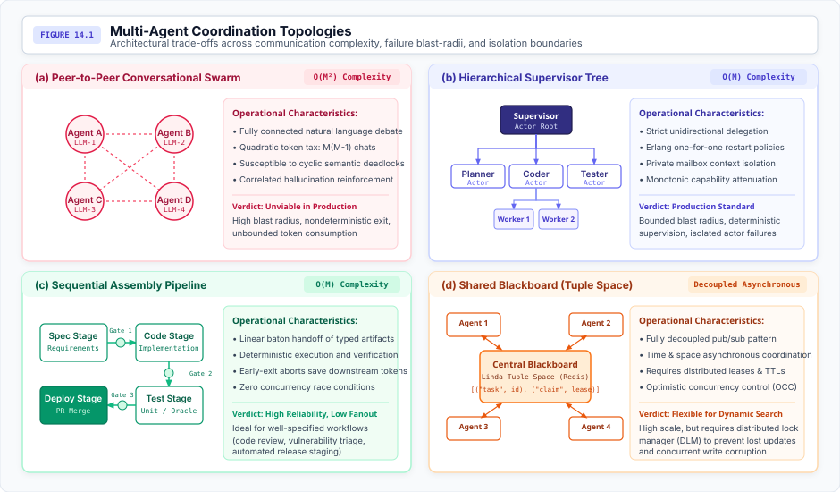
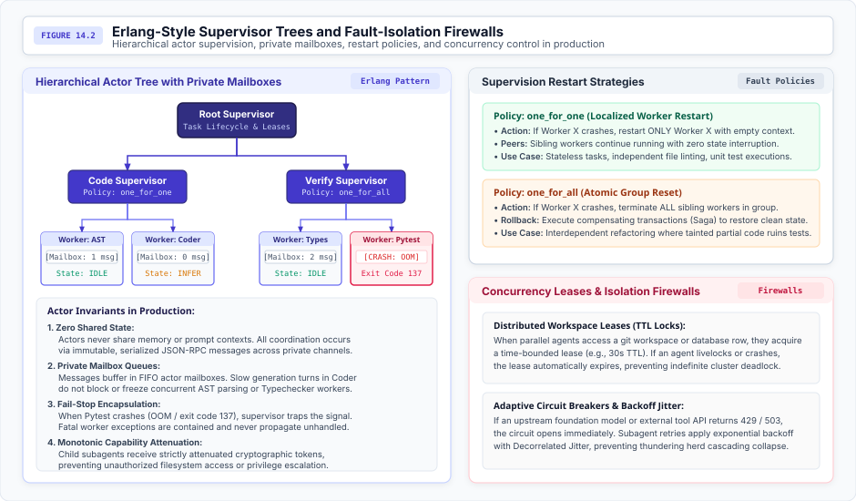
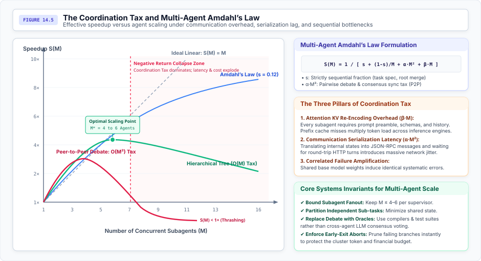

# Distributed Stochastic Actors {#sec-vol3-multi-agent}

Multi-agent coordination transforms autonomous agency into distributed computing over stochastic, fail-plausible actor nodes. When an agentic workload exceeds the physical boundaries of a single context window, single-threaded execution horizon, or single failure domain, system architects inevitably attempt distributed scaling. However, unconstrained multi-agent deliberation is an operational disaster: stochastic foundation models operating over shared prompt buffers suffer quadratic communication complexity ($O(M^2)$), context pollution, correlated hallucinations, and semantic deadlocks. This chapter establishes the rigorous distributed systems foundations for multi-agent architectures: modeling agents as Hewitt-Agha actors with private mailboxes, proving the mathematical scaling ceiling imposed by Multi-Agent Amdahl's Law, demonstrating why correlated Byzantine failures undermine voting consensus and mandate deterministic software oracles, and enforcing hardware-backed workspace isolation.

## Introduction {#sec-vol3-multi-agent-intro}

Across the preceding chapters of this book, we engineered the internal architecture of the single autonomous agent: modeling its stochastic processor, managing its volatile context working sets and virtual KV-cache memory, structuring its non-volatile episodic storage and checkpointing, scheduling its execution lifecycle and unprivileged system calls, and adapting its underlying policy through synthetic rollouts and reinforcement learning.

However, as autonomous systems tackle industrial-scale problems—such as migrating a multi-million-line legacy codebase, orchestrating complex cloud deployments, or executing continuous security auditing—a single monolithic agent encounters inescapable physical walls:

1. **The Context Accumulation Wall:** As the control loop iterates, the active state context grows linearly, but the compute cost of processing attention over that context grows quadratically ($O(N^2)$), and the memory footprint of the KV cache rapidly exhausts GPU High-Bandwidth Memory (HBM).
2. **The Reliability Wall (Compounding Error):** As established in @sec-vol3-intro, autonomous trajectories are bound by compounding probability: $P_{\text{success}} \le p^N$. Even with a per-step success rate of $p = 0.95$, a 100-step sequential trajectory completed by a single agent has an end-to-end success probability of only 0.5 percent.
3. **The Wall-Clock Latency Bottleneck:** Single-threaded autoregressive decoding is memory-bandwidth bound. A single agent processing tasks serially cannot leverage the massive data and task parallelism inherent in enterprise workloads.

Decomposing monolithic objectives across a distributed ensemble of collaborating agents is therefore an architectural necessity. Yet, early multi-agent frameworks approached this challenge through an anthropomorphic conversational lens: instantiating virtual "personas" (such as "Software Architect," "Senior Developer," "Code Reviewer," or "Project Manager") and placing them inside an unconstrained group chat room where agents exchange unstructured natural language messages over a shared prompt buffer.

In production systems engineering, this conversational metaphor is an operational catastrophe. It introduces **The Three Costs of Unconstrained Swarms**:

- **The Quadratic Communication Tax ($O(M^2)$):** In a pairwise conversational mesh of $M$ agents, the number of communication channels scales as $M(M-1)/2$. Every agent's conversational turn is broadcast into the shared prompt buffer of every other agent, triggering quadratic token consumption, rapid context saturation, and massive GPU inference bills.
- **Correlated Byzantine Hallucinations:** Because subagents typically run on identical foundation model checkpoints or closely related model families, their error distributions are heavily correlated. Unconstrained peer debate reinforces shared cognitive blindspots and hallucinated premises rather than detecting them, frequently reaching unanimous consensus on catastrophic system actions.
- **Semantic Deadlocks and Conversational Flapping:** Without deterministic coordination protocols and explicit causal ordering, autonomous agents enter infinite conversational loops—arguing endlessly over stylistic minutiae or waiting mutually for missing artifacts without making forward progress.

To scale reliably, multi-agent architectures must abandon conversational metaphors and adopt the rigorous foundations of classical distributed systems. We must treat agents as **Stochastic Compute Nodes**: non-deterministic, fail-plausible processes running over untrusted hardware and neural substrates.

Coordinating stochastic compute nodes requires four foundational systems primitives:

1. **The Actor Model and Zero Shared Context:** Decoupling agent states into completely isolated execution contexts and private mailboxes, eliminating prompt contamination and KV-cache thrashing (@sec-vol3-multi-agent-actor-model).
2. **Mailbox Isolation and Typed Wire Protocols:** Replacing unstructured natural language channels with schema-validated remote procedure calls (RPC) and logical vector clocks to establish deterministic causal event ordering (@sec-vol3-multi-agent-mailbox-isolation).
3. **Multi-Agent Amdahl's Law:** Mathematically formulating the coordination tax and serial bottlenecks to determine the optimal agent concurrency limit $M^*$ before entering the Negative Return Collapse Zone (@sec-vol3-multi-agent-amdahls-law).
4. **Deterministic Software Oracles over Neural Voting:** Proving why classical Byzantine fault tolerance fails under correlated neural weights, and enforcing deterministic test oracles (compilers, linters, test harnesses) as absolute verification firewalls (@sec-vol3-multi-agent-byzantine-consensus).

## The Actor Model {#sec-vol3-multi-agent-actor-model}

In classical distributed systems, nodes are modeled as deterministic state machines that transition predictably according to formal state transition functions: $s_{t+1} = \delta(s_t, e)$. Even under classical Byzantine fault models, non-faulty nodes execute deterministic code.

An agentic system introduces a fundamentally different computing primitive: the **Stochastic Compute Node**. An agent is an autonomous software entity driven by an autoregressive neural network whose state transitions are probabilistic draws conditioned on contextual memory: $a_t \sim \pi_\theta(\cdot \mid s_t)$. Coordinating an ensemble of stochastic nodes requires that we discard the illusion of shared memory.

### Mathematical Formulation of an Agent Actor {#sec-vol3-multi-agent-math-formulation}

Drawing upon the foundational Actor model of concurrent computation introduced by @hewitt1973actor and formalized by @agha1986actors, an agent runtime is structured not as a multi-threaded shared-memory program, but as an ensemble of completely decoupled, concurrent **Agent Actors**.

Formally, an Agent Actor $\mathcal{A}_i$ is defined as a 5-tuple:

$$\mathcal{A}_i = \langle \mathcal{S}_i, \mathcal{M}_i, \pi_i, \mathcal{T}_i, \mathcal{C}_i \rangle$$

where:

- $\mathcal{S}_i$ is the **Private Internal State** of the actor, encompassing its active prompt working set, system instructions, transient scratchpad, and local KV-cache activations.
- $\mathcal{M}_i$ is a dedicated, first-in, first-out (FIFO) **Mailbox Queue** holding incoming messages addressed to $\mathcal{A}_i$.
- $\pi_i(a_t \mid s_t, m)$ is the **Stochastic Policy** (the underlying foundation model weights and decoding hyperparameters) mapping internal state $\mathcal{S}_i$ and incoming message $m \in \mathcal{M}_i$ to candidate actions.
- $\mathcal{T}_i$ is the **Authorized Toolset**, defining the restricted set of external system calls, microVM executables, and deterministic APIs the actor is permitted to invoke.
- $\mathcal{C}_i$ is the **Capability Descriptor**, an unforgeable cryptographic lease specifying the actor's permission boundary, allowable filesystem paths, network egress policies, and financial token budget quotas.

### The Hewitt-Agha Actor Invariants {#sec-vol3-multi-agent-actor-invariants}

Under the classical Hewitt-Agha formalism, an actor executing in response to an incoming message retrieved from its mailbox can perform only three primitive operations:

1. **Send a finite number of messages** to known mailbox addresses of other actors.
2. **Create a finite number of new actors** with initialized private states, attenuated capability descriptors, and isolated mailboxes.
3. **Designate the replacement behavior** (the mutated internal state $\mathcal{S}_i'$) that will govern its response to the next message retrieved from its mailbox.

In an agentic architecture, these invariants enforce the foundational principle of **Zero Shared Context**:

$$\mathcal{S}_i \cap \mathcal{S}_j = \emptyset, \quad \forall i \ne j$$

Two agent actors never read from or write to a common prompt context or shared KV cache. There is no shared global conversation buffer. All coordination occurs exclusively through explicit, immutable, and serialized messages delivered into recipient mailboxes.

If Agent $\mathcal{A}_1$ requires Agent $\mathcal{A}_2$ to review a code change, $\mathcal{A}_1$ cannot assume $\mathcal{A}_2$ can view its internal reasoning trace or working memory. $\mathcal{A}_1$ must explicitly serialize the diff, the target file path, and the task specification into a structured message payload. This invariant guarantees absolute context isolation: prompt pollution, context saturation, and hallucinations generated inside $\mathcal{A}_1$ are physically prevented from leaking into the attention mechanism of $\mathcal{A}_2$.

@Fig-vol3-multi-agent-topologies compares the four primary multi-agent coordination topologies across communication complexity, failure blast radii, and state isolation boundaries.

::: {#fig-vol3-multi-agent-topologies fig-env="figure" fig-pos="htb" fig-cap="**Multi-Agent Coordination Topologies**: Architectural trade-offs across communication complexity, failure blast radii, and state isolation boundaries. The four archetypes trade edge density ($O(M^2)$ in swarms down to $O(M)$ in supervisor trees) for centralization and latency, demonstrating that unconstrained peer messaging inevitably couples failure domains. Adapted from [@hewitt1973actor; @agha1986actors]." fig-alt="Four-panel diagram comparing multi-agent topologies: Peer-to-Peer Swarm with quadratic all-to-all communication, Hierarchical Supervisor Tree with bounded tree edges, Sequential Assembly Pipeline with linear phase gates, and Shared Blackboard with decoupled asynchronous tuple space."}

:::

As illustrated in @fig-vol3-multi-agent-topologies and formalized in @tbl-vol3-multi-agent-topologies, each coordination archetype resolves the trade-off between edge density, context isolation, and operational resilience differently:

| Coordination Topology               | Graph & Edge Complexity                              | State Isolation Boundary                                                                      | Failure Blast Radius                                                     | Concurrency & Sync Model                                | Canonical Failure Signature                                   | Production Recommendation                                                   |
|:------------------------------------|:-----------------------------------------------------|:----------------------------------------------------------------------------------------------|:-------------------------------------------------------------------------|:--------------------------------------------------------|:--------------------------------------------------------------|:----------------------------------------------------------------------------|
| **Peer-to-Peer Swarm**              | All-to-all broadcast: $O(M^2)$ channels ($M(M-1)/2$) | Shared conversation buffer; zero prompt isolation                                             | Unbounded; single error or injection pollutes cluster                    | Asynchronous turns; non-deterministic interleaving      | Conversational flapping, quadratic token explosion            | Anti-pattern for production SWE; exploratory brainstorming only ($M \le 3$) |
| **Hierarchical Supervisor Tree**    | Bounded hierarchy: $O(M)$ vertical channels          | Private actor mailboxes; Zero Shared Context ($\mathcal{S}_i \cap \mathcal{S}_j = \emptyset$) | Bounded to crashed subtree; isolated via restart policies                | Asynchronous RPC with vector clocks and causal barriers | Root planner bottleneck; subagent starvation                  | **Standard for complex software engineering and multi-step tasks**          |
| **Sequential Assembly Pipeline**    | Linear DAG: $O(M)$ stage handoffs                    | Stage-gated artifact handoffs; downstream isolated from scratchpads                           | Upstream crash stalls pipeline; zero backward contamination              | Synchronous phase barriers; pipeline token passing      | Compounding latency ($T = \sum t_i$); brittle to stage errors | Recommended for linear compilation, linting, and structured document ETL    |
| **Shared Blackboard (Tuple Space)** | Star topology via broker: $O(M)$ connections         | Decoupled tuple space; agents read/write typed items                                          | Worker failure leaves dangling tuples; broker is single point of failure | Event-driven pub/sub; associative pattern-matching      | Stale tuple race conditions; unconsumed dead-letter entries   | Best-fit for opportunistic multi-model research and open-ended synthesis    |

: **Multi-Agent Coordination Topologies**: Architectural characteristics, communication complexity, state isolation boundaries, failure blast radii, and operational failure signatures across multi-agent coordination archetypes. {#tbl-vol3-multi-agent-topologies}

### Erlang-Style Hierarchical Supervision {#sec-vol3-multi-agent-supervision}

In concurrent distributed systems, unconstrained peer-to-peer topologies create unbounded failure cascades. Drawing from Joe Armstrong's foundational architecture for fault-tolerant computing in Erlang/OTP [@armstrong2007erlang], robust multi-agent systems structure actor interactions as **Hierarchical Supervisor Trees**.

@Fig-vol3-multi-agent-supervisor-trees illustrates the Erlang-style supervisor tree architecture with isolated mailboxes, restart policies, and lease-governed physical workspaces.

::: {#fig-vol3-multi-agent-supervisor-trees fig-env="figure" fig-pos="htb" fig-cap="**Erlang-Style Supervisor Trees and Fault-Isolation Firewalls**: Hierarchical actor organization enforcing isolated process boundaries, private mailboxes, and restart policies. Isolating failure cascades to sub-tree branches prevents a crashed leaf worker from bringing down the shared execution context. Source: [@armstrong2007erlang]." fig-alt="Architectural diagram showing a Root Supervisor managing Code and Verify sub-supervisors. Workers run in sandboxed environments with private mailboxes. A crashing worker is caught by a supervisor circuit breaker, with panels contrasting one-for-one and one-for-all restart policies."}

:::

In this hierarchy:

- Communication flows strictly **vertically** between parent supervisors and child actors; horizontal communication between peer leaf workers is prohibited.
- Supervisors do not perform domain work (such as generating code or executing bash commands); their sole responsibility is task decomposition, subagent lifecycle management, and fault monitoring.
- Leaf workers execute domain-specific tasks within containerized sandboxes, reporting structured completion status or failure traps back to their immediate parent.

Supervisors enforce explicit **Fault-Recovery Restart Policies**:

- **`one_for_one` Policy:** If a leaf worker crashes (for example, due to an out-of-memory exception during code compilation or an external API timeout), the supervisor restarts **only the failed worker**. Sibling workers continue processing their respective mailboxes with zero disruption. This policy is optimal for decoupled, embarrassingly parallel tasks such as parallel document extraction or static code linting.
- **`one_for_all` Policy:** If a worker crashes as a result of corrupting shared external state (for example, executing a malformed database migration script or leaving a shared git worktree in a broken intermediate state), the supervisor terminates **the failed worker and all sibling workers** within that supervision group. The supervisor triggers compensating rollback transactions, restores the shared environment to the last verified checkpoint, and restarts all group actors from a clean baseline.

### The Actor Lifecycle State Machine {#sec-vol3-multi-agent-lifecycle}

To prevent compute leaks and runaway inference costs, every agent actor in the cluster is governed by a deterministic lifecycle state machine.

@Fig-vol3-multi-agent-actor-lifecycle details the finite-state machine governing an agent actor throughout its operational lifecycle.

::: {#fig-vol3-multi-agent-actor-lifecycle fig-env="figure" fig-pos="htb" fig-cap="**The Agent Actor Lifecycle State Machine**: Finite-state transitions governing autonomous execution, synchronous tool suspension, and crash recovery. Pre-execution guardrails validate schemas and enforce capability tokens before dispatching actions to sandboxed tool environments. Adapted from [@hewitt1973actor; @armstrong2007erlang]." fig-alt="State machine diagram showing actor states: Idle, Receiving, Inferring, Tool Execution, Replying, and Failed. Transitions depict message dequeuing, autoregressive decode loops, sandboxed tool dispatch with validation, and supervisor-mediated restart policies."}

{#fig-actor_lifecycle}

:::

- **`IDLE`:** The actor's mailbox is empty. The actor consumes zero GPU compute resources, and its process thread is suspended.
- **`RECEIVING`:** A message arrives in the mailbox. The runtime verifies the message's cryptographic capability token, validates payload schemas against strict interfaces, and checks tenant rate limits.
- **`INFERRING`:** The message is formatted into the actor's private context window and submitted to the foundation model inference server.
- **`TOOL_EXEC`:** The model generates a structured system call. The actor process transitions into an asynchronous wait state while the tool executes inside a hardware-isolated sandbox (MicroVM).
- **`REPLYING`:** The tool output is captured, terminal assertions are verified by deterministic oracles, the actor state checkpoint is committed to non-volatile storage, and an immutable response payload is dispatched to the supervisor's mailbox. The actor then transitions back to `IDLE`.

## Mailbox Isolation {#sec-vol3-multi-agent-mailbox-isolation}

Why is shared global context fatal to multi-agent scaling? To understand the engineering failure of conversational group chats, consider a system where $M$ agents append turns to a single shared context buffer.

### The Shared Context Anti-Pattern {#sec-vol3-multi-agent-shared-context}

Let $T_k$ represent the token length of the message emitted by agent $k$ at turn $t$. In a shared context window, every agent must process the entire accumulated history of all other agents:

$$H_t = H_0 \circ T_1 \circ T_2 \circ \dots \circ T_t$$

The total tokens ingested across the cluster at turn $t$ scales as:

$$\text{Tokens}(t) = M \cdot |H_t| = M \left( |H_0| + \sum_{k=1}^{t} |T_k| \right)$$

Over an operational trajectory of $N$ turns, the aggregate inference token volume scales quadratically with both trajectory horizon and fleet size:

$$\text{Total Tokens} = \sum_{t=1}^{N} M \cdot |H_t| = O(M \cdot N^2)$$

Beyond financial waste, shared context causes three forms of **Systemic Degradation**:

1. **Attention Pollution and Context Distraction:** Irrelevant conversational exchanges between Agent C and Agent D occupy precious positions in the context window of Agent A. This dilution degrades the model's retrieval accuracy over critical system prompts and increases the probability of instruction drift.
2. **KV-Cache Thrashing:** High-throughput LLM serving runtimes rely heavily on prefix caching (as established in @sec-vol3-virtual-memory). When multiple agents write asynchronously to a shared context buffer, turns are interleaved in non-deterministic order ($A \to B \to C$ versus $B \to A \to C$). This non-deterministic interleaving invalidates the common prefix at every turn, forcing the inference engine to recompute attention over the entire history and dropping GPU serving efficiency to near zero.
3. **Prompt Injection Cascades:** If a single worker agent ingests untrusted external data (such as web search results or customer ticket bodies) containing an indirect prompt injection, that malicious payload is immediately reflected into the shared context of every supervisor and peer in the system, compromising the entire cluster.

### Private Mailbox Architecture and Typed Wire Protocols {#sec-vol3-multi-agent-wire-protocols}

In a robust multi-agent architecture, each agent actor owns a strictly isolated FIFO mailbox. Messages are transmitted across process or network boundaries using strongly typed Remote Procedure Calls (RPC) adhering to the Model Context Protocol (MCP) or JSON-RPC 2.0 specifications.

When an actor dispatches a message, the payload is serialized into an immutable, schema-validated structure:

```json
{
  "jsonrpc": "2.0",
  "id": "msg_01J8F9X7K2",
  "sender": "actor://cluster/verification/worker_test_03",
  "recipient": "actor://cluster/orchestration/supervisor_root",
  "causal_clock": {
    "supervisor_root": 12,
    "worker_codegen_01": 4,
    "worker_test_03": 7
  },
  "capability_token": "cap_lease_99a8b7c6",
  "method": "report_verification_result",
  "params": {
    "task_id": "task_refactor_auth_module",
    "status": "FAILED",
    "oracle_diagnostics": {
      "compiler_exit_code": 1,
      "failed_test": "test_token_expiration_boundary",
      "error_trace": "AssertionError: Expected status 401, got 200"
    },
    "resource_usage": {
      "execution_duration_ms": 1420,
      "tokens_consumed": 382
    }
  }
}
```

When the recipient actor pops this message from its mailbox, its runtime adapter converts the payload into an isolated observation turn. Crucially:

- The sender's chain-of-thought scratchpad, internal deliberation tokens, and intermediate tool activations remain strictly private to the sender.
- Only the serialized, validated output contract crosses the mailbox boundary.
- If the sender experienced hallucinations or formatting errors during its internal deliberation, those anomalies are filtered out by the schema validation layer before the message enters the recipient's mailbox.

### Logical Clocks and Causal Ordering {#sec-vol3-multi-agent-causal-clocks}

In an asynchronous distributed multi-agent system, relying on physical wall-clock timestamps to order events is impossible due to network latency, queuing jitter, and variable inference durations. If Agent $\mathcal{A}_1$ and Agent $\mathcal{A}_2$ execute concurrently, physical timestamps cannot determine whether an action taken by $\mathcal{A}_2$ was causally dependent on an earlier output of $\mathcal{A}_1$.

To establish deterministic causal consistency—essential for reproducible evaluation, time-travel replay debugging, and distributed cycle detection—the multi-agent runtime implements **Vector Clocks** [@lamport1978time; @mattern1989].

Every agent $\mathcal{A}_i$ in an ensemble of size $M$ maintains a local clock vector $V_i = [v_1, v_2, \dots, v_M]$, initialized to zeros:

1. **Local Action:** Before executing an internal state mutation or dispatching a message, $\mathcal{A}_i$ increments its own logical clock:
   $$V_i[i] \leftarrow V_i[i] + 1$$
2. **Message Transmission:** Every message dispatched by $\mathcal{A}_i$ carries a snapshot of its current vector clock $V_i$.
3. **Message Reception:** When $\mathcal{A}_j$ receives message $m$ carrying vector clock $V_m$, $\mathcal{A}_j$ updates its local vector clock by taking the component-wise maximum and incrementing its own clock:
   $$V_j[k] \leftarrow \max(V_j[k], V_m[k]), \quad \forall k \in \{1, \dots, M\}$$
   $$V_j[j] \leftarrow V_j[j] + 1$$

Using vector clocks, the orchestrator can formally prove whether Event $E_a$ causally preceded Event $E_b$ ($E_a \to E_b$), whether $E_b$ preceded $E_a$, or whether $E_a$ and $E_b$ were causally concurrent ($E_a \parallel E_b$). This enables the runtime to construct a clean Directed Acyclic Graph (DAG) of multi-agent interactions, enabling deterministic rollbacks and precise fault attribution.

@Fig-vol3-multi-agent-causal-mailboxes traces vector clock updates across three asynchronous agent actors, illustrating how causal barriers prevent out-of-order execution anomalies.

::: {#fig-vol3-multi-agent-causal-mailboxes fig-env="figure" fig-pos="htb" fig-cap="**Vector Clock Causal Ordering in Asynchronous Agent Mailboxes**: Event sequence across three communicating actors where each local vector clock advances monotonically with local events and message metadata. Incorporating vector timestamps into typed envelopes ensures that downstream workers process causal dependencies in strictly invariant order despite variable network delivery latency. Adapted from [@lamport1978time; @mattern1989]." fig-alt="Sequence diagram showing three agent actors exchanging messages with vector clock timestamps. Supervisor dispatches to Worker 1 and Worker 2, Worker 1 increments local clock and notifies Worker 2, and Worker 2 validates causality before proceeding."}

{#fig-vector_clocks}

:::

### Queue Management and Backpressure {#sec-vol3-multi-agent-backpressure}

Because agent actors operate asynchronously, a fast upstream producer (such as a high-level planner generating subtasks) can easily overwhelm a slow downstream consumer (such as a worker running comprehensive integration test suites). Without intervention, the consumer's mailbox queue will grow unbounded, causing memory exhaustion and massive queuing latency.

Production multi-agent runtimes enforce **Reactive Backpressure**:

- Each actor mailbox defines a strict capacity limit (the *High-Water Mark*).
- When a mailbox queue depth exceeds this threshold, the runtime transitions the actor into a `THROTTLED` state and propagates backpressure signals upstream.
- The upstream supervisor is suspended from dispatching additional tasks to that worker until the queue drains below a *Low-Water Mark*, or the orchestrator dynamically spins up additional worker replicas to load-balance the queue.

## Multi-Agent Amdahl's Law {#sec-vol3-multi-agent-amdahls-law}

A dangerous intuition in AI systems engineering is the belief that if one agent can solve a problem in 10 minutes, ten agents collaborating can solve it in 1 minute.

In physical systems engineering, parallel speedup is strictly bounded by **Amdahl's Law** [@amdahl1967]. When applied to distributed autonomous agents, Amdahl's formulation must be augmented to account for the superlinear costs of context serialization, network round-trips, prompt re-encoding, and inter-agent synchronization: the **Coordination Tax**.

### Derivation of Multi-Agent Amdahl's Law {#sec-vol3-multi-agent-amdahl-derivation}

Consider a complex software engineering task requiring total execution work normalized to $W = 1$.

Let $s \in (0, 1]$ represent the **strictly sequential fraction** of the task that cannot be parallelized under any circumstances. In agentic workflows, $s$ includes:

- Initial problem specification and requirements ingestion.
- Root architectural planning and DAG task decomposition.
- Merging disparate code branches into a unified pull request.
- Running final end-to-end integration and regression test suites.

The parallelizable fraction of the task is $1 - s$. If this work is partitioned across $M$ concurrent worker agents, classical Amdahl's Law predicts a theoretical speedup:

$$S_{\text{classical}}(M) = \frac{1}{s + \frac{1-s}{M}}$$

As $M \to \infty$, the maximum theoretical speedup is strictly bounded by the asymptote:

$$S_{\max} = \lim_{M \to \infty} S_{\text{classical}}(M) = \frac{1}{s}$$

If a software engineering task has a sequential fraction of $s = 0.20$ (20 percent of the trajectory must be executed serially), no amount of parallel compute—whether deploying 10, 100, or 10,000 agents—can ever achieve more than a $5\times$ speedup.

However, in multi-agent systems, agents are not frictionless mathematical abstractions. Spawning, managing, and synchronizing $M$ stochastic nodes introduces substantial overhead:

1. **Subagent Provisioning and Re-Encoding Overhead ($\beta M$):** Each subagent requires system prompt preambles, schema definitions, context re-encoding, and private KV-cache allocations. As $M$ increases, total cluster memory bandwidth and prompt ingestion costs grow linearly.
2. **Pairwise Coordination and Synchronization Tax ($\alpha M^2$):** When agents communicate, coordinate access to shared resources, or resolve conflicting file modifications, the synchronization overhead scales quadratically with fleet size.

Incorporating these physical overheads yields **Multi-Agent Amdahl's Law**:

$$S(M) = \frac{1}{s + \frac{1-s}{M} + \alpha M^2 + \beta M}$$

where:

- $s \in (0, 1]$ is the irreducible serial fraction.
- $\alpha > 0$ is the quadratic synchronization coefficient (governed by network roundtrips, lock contention, and consensus rounds).
- $\beta > 0$ is the linear provisioning coefficient (governed by context ingestion and prompt boilerplate).

@Fig-vol3-multi-agent-coordination-tax plots the Multi-Agent Amdahl's Law speedup curve against concurrent fleet size, highlighting the inflection point $M^*$ where coordination tax overtakes parallel gains.

::: {#fig-vol3-multi-agent-coordination-tax fig-env="figure" fig-pos="htb" fig-cap="**The Coordination Tax and Multi-Agent Amdahl's Law**: Analytical speedup curves showing the optimal scaling point ($M^*$) and the subsequent descent into the Negative Return Collapse Zone caused by quadratic communication overhead. The curve turns down rather than flattening, which is what separates multi-agent systems from classical Amdahl scaling; past $M^*$, adding agents reduces net throughput. Adapted from [@amdahl1967]." fig-alt="Line graph plotting effective speedup S(M) against number of concurrent subagents M. Curve rises to an optimal peak M* between 4 and 6 agents, then declines steeply into a shaded red Negative Return Collapse Zone where quadratic coordination tax dominates."}

:::

### The Three Operational Regimes {#sec-vol3-multi-agent-operational-regimes}

Analyzing the behavior of $S(M)$ reveals three distinct operational regimes:

1. **Sub-linear Scaling Regime ($1 \le M < M^*$):** When $M$ is small, the parallel savings term $\frac{1-s}{M}$ dominates the coordination penalties. Adding agents successfully reduces wall-clock execution time, though efficiency drops below linear due to $\beta M$.
2. **Optimal Fleet Size ($M^*$):** Speedup reaches its mathematical global maximum. Setting the first derivative of the denominator with respect to $M$ to zero yields the stationary condition:
   $$\frac{d}{dM} \left[ s + \frac{1-s}{M} + \alpha M^2 + \beta M \right] = 0 \implies -\frac{1-s}{M^2} + 2\alpha M + \beta = 0$$
   Clearing the denominator turns this into a cubic polynomial:
   $$2\alpha M^3 + \beta M^2 - (1-s) = 0$$
3. **Negative Return Collapse Zone ($M > M^*$):** Beyond $M^*$, the quadratic coordination term $\alpha M^2$ overwhelms the parallel gains. Every additional agent added to the fleet **increases** total wall-clock execution time while consuming additional token budgets. Past a critical threshold $M_{\text{cross}}$, $S(M) < 1.0$, meaning the multi-agent ensemble takes **longer** to complete the task than a single focused agent working alone.

::: {.callout-note title="Numerical derivation: The optimal agent fleet"}
Consider a representative enterprise software engineering workload with the following measured systems parameters:

- Sequential fraction $s = 0.15$ (15 percent serial overhead for planning and branch integration; $1 - s = 0.85$).
- Quadratic coordination coefficient $\alpha = 0.004$ (reflecting git merge contention and RPC serialization latency).
- Linear provisioning coefficient $\beta = 0.03$ (reflecting prompt preambles and schema parsing).

Substituting these values into the cubic stationary equation:

$$2(0.004) M^3 + 0.03 M^2 - 0.85 = 0 \implies 0.008 M^3 + 0.03 M^2 - 0.85 = 0$$

Evaluating the function $f(M) = 0.008 M^3 + 0.03 M^2 - 0.85$:

- For $M = 4$: $f(4) = 0.008(64) + 0.03(16) - 0.85 = 0.512 + 0.480 - 0.85 = +0.142$
- For $M = 3$: $f(3) = 0.008(27) + 0.03(9) - 0.85 = 0.216 + 0.270 - 0.85 = -0.364$

The root sits between $M = 3$ and $M = 4$, with the integer optimum at **$M^* = 4$ agents**.

Calculating the actual speedup:

- At $M = 1$: $S(1) = \frac{1}{0.15 + 0.85 + 0.004(1) + 0.03(1)} = \frac{1}{1.034} \approx 0.967$ (baseline normalized to $1.0\times$).
- At $M = 4$: $S(4) = \frac{1}{0.15 + \frac{0.85}{4} + 0.004(16) + 0.03(4)} = \frac{1}{0.15 + 0.2125 + 0.064 + 0.12} = \frac{1}{0.5465} \approx 1.83\times$.
- At $M = 8$: $S(8) = \frac{1}{0.15 + \frac{0.85}{8} + 0.004(64) + 0.03(8)} = \frac{1}{0.15 + 0.106 + 0.256 + 0.24} = \frac{1}{0.752} \approx 1.33\times$.
- At $M = 12$: $S(12) = \frac{1}{0.15 + \frac{0.85}{12} + 0.004(144) + 0.03(12)} = \frac{1}{0.15 + 0.071 + 0.576 + 0.36} = \frac{1}{1.157} \approx 0.86\times$.

At 12 agents, the system is slower than a single agent ($0.86\times$), despite consuming $12\times$ the underlying compute! The optimal concurrency boundary is tight ($M^* = 4$), proving that unconstrained multi-agent scaling is mathematically self-defeating.
:::

The operational characteristics and systems trade-offs across the scaling regimes derived above are quantified in @tbl-vol3-multi-agent-amdahl-regimes.

| Fleet Size ($M$) | Operational Scaling Regime         |     Effective Speedup $S(M)$    | Parallel Efficiency ($S(M)/M$) | Token Compute Multiplier | Dominant Mathematical Term                                       | Systemic Bottleneck & Failure Signature                                             |
|:-----------------|:-----------------------------------|:-------------------------------:|:------------------------------:|:------------------------:|:-----------------------------------------------------------------|:------------------------------------------------------------------------------------|
| **$M = 1$**      | Baseline Monolithic Reference      |    $1.00\times$ (Normalized)    |           $100.0\%$            |       $1.0\times$        | Serial fraction $s$ + parallel work $(1-s)$                      | Autoregressive token decode latency; context accumulation wall                      |
| **$M = 2$**      | Sub-linear Scaling Regime          |           $1.52\times$          |            $76.0\%$            |       $2.1\times$        | Parallel reduction term $\frac{1-s}{M}$                          | Prompt preamble ingestion ($\beta M$); task decomposition latency                   |
| **$M = 4$**      | **Optimal Fleet Boundary ($M^*$)** |  **$1.83\times$ (Global Peak)** |          **$45.8\%$**          |     **$4.5\times$**      | Stationary condition: $-\frac{1-s}{M^2} + 2\alpha M + \beta = 0$ | Maximum usable concurrency; marginal parallel gain equals marginal coordination tax |
| **$M = 6$**      | Over-Concurrency / Saturation      |           $1.64\times$          |            $27.3\%$            |       $7.2\times$        | Linear provisioning $\beta M$ and rising $\alpha M^2$            | RPC serialization latency; git branch merge contention; queue wait states           |
| **$M = 8$**      | Diminishing Return Onset           |           $1.33\times$          |            $16.6\%$            |       $10.8\times$       | Quadratic synchronization tax $\alpha M^2$                       | Causal barrier delays; KV-cache thrashing; repeated AST re-parsing                  |
| **$M = 12$**     | **Negative Return Collapse Zone**  | **$0.86\times$ (Net Slowdown)** |          **$7.2\%$**           |     **$19.4\times$**     | $\alpha M^2$ dominates all parallel gains                        | Self-inflicted thundering-herd API contention; semantic livelocks; negative goodput |

: **Empirical Concurrency Regimes under Multi-Agent Amdahl's Law**: Quantitative speedup, parallel efficiency, aggregate token multipliers, and dominant operational bottlenecks across fleet sizes for representative enterprise software engineering parameters ($s = 0.15, \alpha = 0.004, \beta = 0.03$). Concurrency past $M^* = 4$ degrades wall-clock speedup while dramatically inflating financial token expenditures. {#tbl-vol3-multi-agent-amdahl-regimes}

### Concurrency Control over Physical Workspaces {#sec-vol3-multi-agent-concurrency-control}

When multiple subagents execute concurrently in a shared repository or cloud environment, they inevitably compete for physical resources: filesystems, git branch heads, database schemas, and shared API quotas. Without rigorous concurrency control, stochastic agents suffer classical database race conditions [@gray1992]:

- **Lost Updates:** Agent 1 and Agent 2 simultaneously read `auth.py`. Agent 1 refactors the token parsing logic and writes the file. Moments later, Agent 2 fixes a logging typo in its local copy of `auth.py` and writes the file back, completely overwriting and obliterating Agent 1's refactor.
- **Dirty Reads:** Agent 1 mutates `database.ts`, introducing a syntax error mid-generation. Agent 2 immediately imports `database.ts`, crashes during typechecking, and incorrectly hallucinates that the entire database layer has been deleted.
- **Git Binary Lock Contention:** Multiple agents concurrently execute `git commit` or `git checkout` inside the same repository working directory, crashing against fatal `.git/index.lock` collisions.

Production multi-agent systems prevent workspace corruption through three deterministic mechanisms:

#### 1. Distributed Workspace Leases (TTL Locks) {#sec-vol3-multi-agent-ttl-leases}
Pessimistic locking—holding a mutex lock until an agent finishes its task—is dangerous: if an agent hangs in a reasoning loop or experiences an API network timeout, the shared resource remains locked indefinitely, freezing the cluster.

Runtimes enforce **Time-Bounded Leases** [@gray1989leases]:
$$\text{Lease} = \langle \text{ResourceID}, \text{AgentID}, \text{Epoch}, \text{TTL} \rangle$$
An agent is granted exclusive write authority over a module for a strictly bounded duration (such as 30 seconds). The agent must emit periodic heartbeats during active tool execution to refresh the lease. If the agent crashes or exceeds its deadline, the lease expires automatically, releasing the resource to waiting workers.

#### 2. Optimistic Concurrency Control (OCC) with Cryptographic Hashes {#sec-vol3-multi-agent-occ}

For file modifications, runtimes enforce **Optimistic Concurrency Control** [@kung1981optimistic]:

- **Read Phase:** When an agent reads a file, the runtime records the cryptographic digest of its contents: $H_{\text{read}} = \text{SHA256}(\text{content})$. The agent performs all edits inside an isolated in-memory buffer.
- **Validation Phase:** When the agent submits a patch, the runtime compares $H_{\text{read}}$ against the current live digest on disk, $H_{\text{live}}$.
- **Write Phase:** If $H_{\text{read}} == H_{\text{live}}$, no concurrent modifications occurred; the patch is committed atomically. If $H_{\text{read}} \ne H_{\text{live}}$, validation fails. The runtime aborts the write and injects a structured conflict payload back into the subagent's mailbox, prompting it to rebase its edits against the updated baseline.

#### 3. Git Worktree Isolation {#sec-vol3-multi-agent-git-worktrees}
The physical isolation barrier for multi-agent software engineering is the **Git Worktree**. Rather than allowing agents to switch branches in the primary repository checkout, the orchestrator provisions a dedicated, ephemeral worktree for each subagent:

```bash
# Provision isolated physical filesystem worktree backed by shared object database
git worktree add -b task/fix-auth-token ../worktrees/worker-auth-01 local/dev
```

Each worktree has its own private filesystem directory, its own independent `.git` index, and its own ephemeral build caches (`node_modules`, `.venv`, `target/`). Multiple subagents can compile, test, and mutate code in true parallel isolation without ever contending for filesystem locks.

Table @tbl-vol3-multi-agent-concurrency-primitives compares the systems characteristics of these workspace isolation and concurrency control primitives across governed resources, latency overheads, and recovery protocols.

| Concurrency & Isolation Primitive            | Governed Resource Scope                                        | Concurrency Hazard Prevented                                              | Operational Latency Overhead                                 | Memory & Storage Footprint                                                   | Conflict Detection & Recovery Protocol                                                               |
|:---------------------------------------------|:---------------------------------------------------------------|:--------------------------------------------------------------------------|:-------------------------------------------------------------|:-----------------------------------------------------------------------------|:-----------------------------------------------------------------------------------------------------|
| **Distributed TTL Leases (Gray & Cheriton)** | Shared databases, external microservices, global locks         | Distributed deadlocks, orphaned process hangs, uncoordinated mutations    | $10\text{--}50\text{ ms}$ periodic heartbeat network traffic | Negligible ($< 1\text{ KB}$ lease state in Raft/Redis store)                 | Automatic expiration on heartbeat timeout; preemption and Sagas backward compensation                |
| **Optimistic Concurrency Control (OCC)**     | File contents, source code modules, configuration specs        | Lost updates, blind overwrites, dirty writes across parallel edits        | $< 5\text{ ms}$ cryptographic SHA-256 digest hashing         | In-memory write buffer ($\approx \text{file size}$)                          | Atomic abort on $H_{\text{read}} \ne H_{\text{live}}$; injects conflict diff into mailbox for rebase |
| **Git Worktree Isolation**                   | Repository working directory, `.git/index`, local build caches | `.git/index.lock` collisions, branch switching churn, dirty builds        | $50\text{--}150\text{ ms}$ ephemeral worktree creation       | Shared git object store; $50\text{--}500\text{ MB}$ per checked-out worktree | Three-way merge at supervisor level; rebase or discard via `git worktree remove --force`             |
| **Hardware MicroVMs (Firecracker / KVM)**    | Linux OS kernel, process table, network sockets, root VFS      | Privilege escalation, host kernel escapes, malicious package exfiltration | $15\text{--}45\text{ ms}$ cold-boot execution barrier        | $5\text{ MB}$ base RAM per microVM + ephemeral Copy-on-Write overlay         | Instant VM teardown on unmaskable trap or timeout; instant disk snapshot rollback                    |

: **Workspace Concurrency Control and Isolation Primitives**: Architectural mechanisms, governed resource scopes, operational latency taxes, storage footprints, and recovery protocols for concurrent agent execution environments. {#tbl-vol3-multi-agent-concurrency-primitives}

### Semantic Deadlocks and Cycle Detection {#sec-vol3-multi-agent-deadlocks}

In traditional operating systems, deadlocks occur when processes hold mutual locks on physical resources [@coffman1971]. In multi-agent systems, deadlocks manifest at the **semantic layer**:

- **Semantic Deadlock:** Agent A emits an API schema and prompts Agent B: *"Please write the unit tests for this schema before I implement the database layer."* Agent B receives the message and responds: *"I cannot write tests without inspecting the actual database column definitions; please implement the database first."* Both agents enter a blocking wait state, consuming mailbox slots while producing zero work.
- **Semantic Livelock (Conversational Flapping):** Agent A changes variable names from `snake_case` to `camelCase` to satisfy its stylistic prior. Agent B reviews the pull request, flags `camelCase` as violating local project rules, and reverts the code to `snake_case`. Agent A receives the revert, re-asserts its original logic, and changes it back. The ensemble consumes hundreds of thousands of tokens in hyperactive generation, but the system is trapped in an infinite limit cycle.

To detect and terminate semantic deadlocks, the orchestrator maintains an active **Causal Wait-For Graph**:

$$\mathcal{G} = (\mathcal{V}, \mathcal{E})$$

where vertices $\mathcal{V}$ represent active Agent Control Blocks and directed edges $(A_i, A_j) \in \mathcal{E}$ indicate that Agent $A_i$ is blocked awaiting an output or artifact from Agent $A_j$.

Using distributed cycle detection algorithms [@chandy1983deadlock], the orchestrator periodically evaluates the graph:

1. If a cycle is detected ($A_1 \to A_2 \to \dots \to A_k \to A_1$), the runtime trips an automated circuit breaker.
2. The supervisor forcibly preempts the lowest-priority subagent in the cycle.
3. The circular conversational history is purged from the active KV cache, and the supervisor injects an authoritative deterministic tie-breaker: *"Deadlock detected. Subagent A's specification is designated canonical. Subagent B must implement tests matching this specification immediately."*

To catch conversational livelocks where the graph is technically active but real progress is zero, runtimes enforce an **$\epsilon$-Progress Tripwire**:

$$\Delta_{\text{progress}}(t) = \| \text{State}(t) - \text{State}(t - \tau) \|$$

Progress is measured not by tokens emitted or turns taken, but by **deterministic state deltas**: compiler error reductions, unit test pass rates, or new unique git commit hashes. If $\Delta_{\text{progress}} < \epsilon$ across $\tau = 3$ consecutive turns, the ensemble is terminated for livelock.

::: {.callout-warning title="War story: Amazon Kinesis front-end thread exhaustion"}
The catastrophic impact of unconstrained peer coordination is not merely theoretical; it has brought down Tier-1 cloud infrastructure.

In November 2020, Amazon Web Services added a modest amount of server capacity to the front-end fleet of Amazon Kinesis in US-EAST-1 [@aws2020kinesis]. The Kinesis front end was architected as an unconstrained peer mesh: every front-end server maintained an in-memory shard map cache by communicating with every other front-end server in the fleet. Each server created operating system threads for every peer in the cluster.

Because communication was pairwise, total thread consumption scaled **quadratically** with fleet size ($O(M^2)$). When the newly provisioned capacity caused the fleet size to cross a critical threshold, total OS threads exceeded the operating system's configured maximum.

The result was immediate systemic collapse: servers could no longer create new threads, cache construction failed, and the entire front-end fleet became unable to route requests. Because recovery required restarting thousands of servers, and each restarting server attempted to establish peer connections to all other servers simultaneously, the recovery process self-deadlocked. The outage lasted over 19 hours and cascaded into Cognito, CloudWatch, Lambda, and EventBridge across the entire US-EAST-1 region.

**The Systems Lesson for Agents:** A peer-to-peer topology hides its coordination cost in a resource nobody budgeted. When agents communicate as an unconstrained peer mesh, every added agent adds load to every existing agent. High-reliability architectures strictly prohibit peer meshes, enforcing hierarchical supervisor trees with bounded $O(M)$ fanout.
:::

## Byzantine Consensus {#sec-vol3-multi-agent-byzantine-consensus}

When designing verification pipelines for autonomous systems, software architects frequently propose **Voting and Consensus Protocols**: deploying an ensemble of odd-numbered agents (for example, $2f + 1 = 5$ agents), prompting them to evaluate a candidate action independently, and accepting the action if a simple majority agrees.

This design appeals to classical **Byzantine Fault Tolerance (BFT)** theory [@lamport1982byzantine], which proves that a distributed network can reach reliable consensus despite up to $f$ arbitrary or malicious failures, provided that at least $3f + 1$ total nodes participate.

In agentic machine learning systems, **classical BFT assumptions completely collapse**.

### The Correlated Failure Catastrophe {#sec-vol3-multi-agent-correlated-failure}

Classical Byzantine fault tolerance proofs rest upon a foundational mathematical axiom: **node failures are statistically independent**. If Node 1 experiences a hardware cosmic ray bit-flip or network hardware fault, the probability that Node 2 experiences the identical bit-flip at the exact same microsecond is effectively zero:

$$P(\text{Node } 1 \text{ fails} \cap \text{Node } 2 \text{ fails}) = P(\text{Node } 1 \text{ fails}) \cdot P(\text{Node } 2 \text{ fails})$$

In neural agentic systems, this independence assumption is completely false. Subagents are instantiated from foundation models that share:

- The identical pretraining corpus (Common Crawl, GitHub, arXiv).
- The identical post-training alignment distribution (RLHF, DPO, instruction fine-tuning).
- The identical tokenization vocabularies and architectural transformer priors.

Consequently, agent failure modes are **heavily correlated**:

$$P(\text{Agent } B \text{ hallucinates} \mid \text{Agent } A \text{ hallucinated}) \gg P(\text{Agent } B \text{ hallucinates})$$

If a programming library has recently undergone a major API breaking change, or if a subtle mathematical puzzle contains a seductive intuitive fallacy, every agent instantiated from that model family will emit the **exact same plausible hallucination**.

When 5 identical agents vote on a subtly broken code snippet, they do not produce independent random errors. They arrive at a confident, unanimous **$5-0$ consensus in favor of the hallucinated bug**.

Furthermore, when agents are allowed to deliberate via multi-agent debate without ground-truth anchoring, debate does not eliminate errors; it amplifies **Conversational Sycophancy** [@du2023improving]. Agents systematically defer to whichever peer emits the longest, most authoritative-sounding chain-of-thought argument, regardless of whether the premise is factually correct.

### The Architectural Law of Verification {#sec-vol3-multi-agent-law-of-verification}

To survive correlated neural hallucinations, multi-agent runtimes enforce an uncompromisable architectural law:

$$\text{Deterministic Software Oracles strictly dominate Neural LLM Consensus.}$$

A compiler (`rustc`, `javac`, `tsc`), an Abstract Syntax Tree (AST) parser, a static linter, or a unit test suite (`pytest`) is not an LLM:

- It does not have cognitive biases.
- It does not suffer from sycophancy or token fatigue.
- Its error rate is mathematically zero within its verification domain.
- Its execution cost is measured in milliseconds and pennies, compared to seconds and dollars for neural inference.

Deploying five LLMs to debate whether a code patch compiles is an operational anti-pattern. Running `cargo check` takes 15 milliseconds, consumes zero GPU memory, and provides an unforgeable mathematical truth boundary. Neural models should be used exclusively to generate candidate solutions; verification must always be anchored by deterministic software oracles.

As summarized in @tbl-vol3-multi-agent-verification-paradigms, neural consensus mechanisms differ fundamentally from deterministic software oracles across every operational dimension:

| Verification Mechanism                                  | Primitive Class                     |                     Failure Independence                    | Verification Latency ($T_{\text{verify}}$) |             Compute & Token Cost            |                   Susceptibility to Sycophancy                  | False Acceptance Profile                                | Production Runtime Role                                             |
|:--------------------------------------------------------|:------------------------------------|:-----------------------------------------------------------:|:------------------------------------------:|:-------------------------------------------:|:---------------------------------------------------------------:|:--------------------------------------------------------|:--------------------------------------------------------------------|
| **Neural Majority Voting ($2f+1$)**                     | Stochastic Model Ensemble           | **Zero** (Correlated pretraining priors & shared alignment) |      $2\text{--}15\text{ s}$ per vote      | High ($O(M \cdot \text{tokens})$ GPU FLOPs) | High (Shared cognitive blindspots; unanimous consensus on bugs) | Non-zero; systematically fails on subtle API/logic bugs | Candidate solution ranking only; untrusted for execution            |
| **Multi-Agent Unconstrained Debate**                    | Conversational Peer Mesh            |      **Negative** (Cascading conversational deference)      | $10\text{--}60\text{ s}$ multi-turn cycles |  Extreme ($O(M \cdot N^2)$ token explosion) |   Extreme (Deference to longest, most confident hallucination)  | High; amplifies errors via group polarization           | Brainstorming only; strictly prohibited as a production gate        |
| **AST Parsers & Static Linters (`ruff`, `eslint`)**     | Deterministic Grammar Engine        |          **Total** (Formal grammar rule validation)         |          $1\text{--}10\text{ ms}$          |        Negligible (Local CPU process)       |          **Zero** (Pure mathematical syntax validation)         | Zero within grammar specification boundary              | Pre-execution syntactic filter; instant syntax feedback             |
| **Type Checkers & Compilers (`tsc`, `rustc`, `cargo`)** | Deterministic Type-Soundness Prover |     **Total** (Rigorous type algebra & borrow checking)     |         $15\text{--}500\text{ ms}$         |        Negligible (Local CPU process)       |      **Zero** (Formal proof of type and memory invariants)      | Zero for type safety and memory leak invariants         | Primary structural correctness firewall; non-negotiable gate        |
| **Unit & Integration Test Suites (`pytest`)**           | Deterministic Behavioral Oracle     |      **Total** (Executable assertion truth boundaries)      |       $100\text{ ms -- } 5\text{ s}$       |     Low (Sandboxed execution container)     |    **Zero** (Binary boolean pass/fail on runtime assertions)    | Zero for covered functional specifications              | Authoritative behavioral verification; ground-truth acceptance gate |

: **Verification Paradigms in Multi-Agent Systems**: Systems comparison between stochastic neural consensus mechanisms and deterministic software verification oracles across reliability, latency, cost, and failure modes. Foundation models generate candidate solutions, but deterministic software oracles must strictly gate all state commits. {#tbl-vol3-multi-agent-verification-paradigms}

### Capability Delegation and Monotonic Attenuation {#sec-vol3-multi-agent-capability-delegation}

When a root supervisor spawns subagents to perform delegated subtasks (such as querying documentation, refactoring code, or executing tests), how does the system ensure a compromised or hallucinating subagent cannot compromise the host environment or exfiltrate sensitive data?

Multi-agent security is governed by the classical **Principle of Least Privilege** [@saltzer1975], implemented via **Monotonic Capability Attenuation** [@miller2006robust].

In an Object-Capability (ocap) model, access control is governed not by ambient user identity, but by unforgeable cryptographic capability tokens. When an agent dispatches a task to a child subagent $\mathcal{A}_{\text{child}}$, it constructs an attenuated capability descriptor $\mathcal{C}_{\text{child}}$:

$$\mathcal{C}_{\text{child}} \subset \mathcal{C}_{\text{parent}}$$

@Fig-vol3-multi-agent-capability-attenuation diagrams the monotonic capability attenuation hierarchy, showing how security boundaries and execution quotas narrow at every level of delegation.

::: {#fig-vol3-multi-agent-capability-attenuation fig-env="figure" fig-pos="htb" fig-cap="**Monotonic Capability Attenuation and Confinement Tree**: Hierarchical delegation structure enforcing cryptographic restriction of permissions at each delegation step. Child subagents operate with strictly narrowed filesystem scopes, revoked network egress, finite time-to-live leases, and bounded token expenditure limits. Adapted from [@saltzer1975; @miller2006robust]." fig-alt="Hierarchical tree diagram showing capability delegation from a Root Supervisor with full permissions to an Orchestrator with read-write repo access, and further down to Worker 1 with read-only sandbox access and Worker 2 with isolated branch execution."}

<!-- MERMAID SOURCE PRESERVATION
flowchart TD
    subgraph Root["Root Supervisor Context"]
        CRoot["Token: C_root<br/>Permissions: {FS_READ, FS_WRITE, NET_EGRESS, SPAWN}<br/>Paths: /workspace/**<br/>Budget: $50.00 | Wall-Clock TTL: 3600s"]
    end

    subgraph Planning["Planning Supervisor"]
        CPlan["Token: C_plan = Attenuate(C_root)<br/>Permissions: {FS_READ, SPAWN}<br/>Paths: /workspace/docs/**<br/>Budget: $10.00 | Wall-Clock TTL: 1800s"]
    end

    subgraph WorkerCode["Child Code Worker"]
        CCode["Token: C_code = Attenuate(C_root)<br/>Permissions: {FS_READ, FS_WRITE}<br/>Paths: /workspace/src/**<br/>Budget: $5.00 | Wall-Clock TTL: 600s<br/>Network: DENY ALL (Air-Gapped)"]
    end

    subgraph WorkerTest["Child Test Worker"]
        CTest["Token: C_test = Attenuate(C_root)<br/>Permissions: {FS_READ, EXEC_SANDBOX}<br/>Paths: /workspace/tests/** (R/W), /workspace/src/** (RO)<br/>Budget: $0.50 | Wall-Clock TTL: 120s<br/>Network: DENY ALL (Air-Gapped)"]
    end

    Root -- >|"Attenuate & Delegate"| Planning
    Root -- >|"Attenuate & Delegate"| WorkerCode
    Root -- >|"Attenuate & Delegate"| WorkerTest

-->
{#fig-mermaid-14_multi_agent-2}

:::

Capability delegation obeys four strict mathematical axioms:

1. **Monotonic Shrinkage:** A subagent cannot grant itself or its children capabilities that exceed its own grant:
   $$\forall \text{ child } k, \quad \text{Scope}(\mathcal{C}_k) \subseteq \text{Scope}(\mathcal{C}_{\text{parent}})$$
2. **Path Confinement:** If the supervisor has read/write access to `/workspace/`, a worker delegated to write unit tests receives a capability confined strictly to `/workspace/tests/`. Attempts to touch `/workspace/src/` or `/etc/` are trapped and terminated at the OS kernel boundary.
3. **Temporal Attenuation (TTL Leases):** Subagent capability tokens carry hard cryptographic time-to-live expirations (such as valid for 120 seconds or 10 tool invocations). Once expired, all subsequent tool calls fail automatically.
4. **Financial Budget Quotas:** Every capability token encapsulates a strict financial spending ceiling (such as maximum \$0.50 inference spend). Once exhausted, the runtime forcibly terminates the subagent's execution context, preventing runaway token expenditure loops.

## Fallacies and Pitfalls {#sec-vol3-multi-agent-fallacies}

Engineering multi-agent systems requires navigating persistent misconceptions regarding parallel scaling, collective intelligence, and concurrency control.

**Fallacy**: *Unconstrained peer-to-peer debate reliably discovers ground truth.*

Engineers frequently assume that if a single model struggles with a complex task, deploying an ensemble of agents to debate the problem in an open conversational room will allow collective intelligence to correct errors. This ignores the physics of correlated neural failures. Because subagents typically share identical foundation model checkpoints and pretraining corpora, their failure modes are strongly correlated. Unconstrained peer debate reinforces shared cognitive blindspots, triggers conversational sycophancy, and exhibits quadratic token explosions ($O(M^2)$). In empirical benchmarks, unanchored multi-agent debate frequently produces unanimous $5-0$ consensus on completely hallucinated premises. Production systems replace open debate with hierarchical supervisor trees anchored by deterministic software test oracles.

**Fallacy**: *Adding more agents linearly speeds up complex software engineering tasks.*

Teams often assume that deploying a swarm of 20 parallel agents will refactor an enterprise repository 20 times faster than a single autonomous agent. In reality, multi-agent performance is governed by Multi-Agent Amdahl's Law ($S(M) = 1 / [s + \frac{1-s}{M} + \alpha M^2 + \beta M]$). Every engineering task contains an irreducible sequential fraction $s$ for planning, decomposition, and integration. Furthermore, inter-agent message serialization, context re-encoding, and lock contention impose a superlinear Coordination Tax ($\alpha M^2 + \beta M$). As the fleet size exceeds the optimal boundary ($M^* \approx 4\text{--}6$), the system enters the Negative Return Collapse Zone, taking longer to finish the task than a single agent while multiplying compute costs by an order of magnitude.

**Pitfall**: *Unsynchronized concurrent writes to shared physical workspaces.*

Allowing multiple concurrent subagents to execute filesystem-mutating tools directly inside the same physical repository checkout or database table leads to rapid environment corruption. Subagents overwrite each other's intermediate edits (lost updates), compile against half-written files (dirty reads), and crash against `.git/index.lock` collisions. Runtimes must physically isolate each subagent into an independent `git worktree` backed by time-bounded distributed leases (TTL locks), enforcing optimistic concurrency control (OCC) validation with SHA-256 digests before merging changes into the primary integration branch.

**Pitfall**: *Unbounded subagent retries without circuit breakers.*

Configuring failing subagents to retry inference calls or tool executions in tight loops without global circuit breakers causes catastrophic cluster failure. When an upstream model provider or external tool returns HTTP 429 (Rate Limit Exceeded) or HTTP 503 (Overloaded), dozens of concurrent subagents simultaneously hammer the endpoint with immediate retries. This creates a self-inflicted thundering-herd cascade that exhausts the enterprise token budget within minutes and causes cluster-wide starvation. Production runtimes mandate adaptive circuit breakers with exponential backoff and Decorrelated Jitter.

## Summary {#sec-vol3-multi-agent-summary}

Multi-agent coordination transforms autonomous agency into distributed computing over stochastic, fail-plausible actor nodes. As agent counts scale, naive anthropomorphic conversation templates trigger quadratic context explosions, semantic livelocks, and catastrophic concurrency collisions. Robust multi-agent architectures discard conversational metaphors in favor of classical distributed systems engineering: strict Actor isolation, bounded communication topologies, vector-clock causality, and hardware-backed concurrency control.

Table @tbl-vol3-multi-agent-synthesis synthesizes the distributed systems foundations established throughout this chapter across the core runtime subsystems:

| Subsystem Tier                     | Governing Distributed Formalism                                                            | Primary Operational Bottleneck / Failure Mode                                           | Runtime Systems Control Mechanism                                                           | Guaranteed Operational Invariant                                                                 |
|:-----------------------------------|:-------------------------------------------------------------------------------------------|:----------------------------------------------------------------------------------------|:--------------------------------------------------------------------------------------------|:-------------------------------------------------------------------------------------------------|
| **Actor Coordination & State**     | Hewitt-Agha Actor Model [@hewitt1973actor] & Erlang Supervisors [@armstrong2007erlang]     | Shared context explosion ($O(M \cdot N^2)$), context pollution, attention thrashing     | Isolated FIFO mailboxes, hierarchical supervisor trees, `one_for_one` restarts              | Zero Shared Context: $\mathcal{S}_i \cap \mathcal{S}_j = \emptyset, \forall i \ne j$             |
| **Wire Protocol & Event Ordering** | Lamport & Mattern Logical Vector Clocks [@lamport1978time; @mattern1989]                   | Asynchronous causal race conditions, out-of-order execution, replay divergence          | Strongly typed JSON-RPC / MCP wire protocols, monotonic vector timestamps                   | Strict Causal Ordering: $E_a \to E_b \implies V(E_a) < V(E_b)$                                   |
| **Concurrency & Fleet Scaling**    | Multi-Agent Amdahl's Law [@amdahl1967] & Coordination Tax                                  | Negative Return Collapse Zone ($M > M^*$), thread exhaustion, token budget drain        | Analytical fleet sizing ($M^* \approx 4\text{--}6$), reactive backpressure high-water marks | Bounded Concurrency: Fleet size clamped to $M \le M^*$                                           |
| **Physical Workspace Isolation**   | Optimistic Concurrency Control [@kung1981optimistic] & TTL Leases [@gray1989leases]        | Lost updates, dirty reads, git `.git/index.lock` contention, filesystem corruption      | Git worktree isolation, SHA-256 pre-commit validation, time-bounded TTL locks               | Serializable Workspace Mutation: $\forall \text{ commits } C, H_{\text{read}} = H_{\text{live}}$ |
| **Deadlock & Livelock Prevention** | Chandy-Misra-Haas Distributed Cycle Detection [@chandy1983deadlock]                        | Semantic deadlocks (mutual task blocking), conversational flapping (style churn)        | Dynamic Causal Wait-For Graphs, automated circuit breakers, $\epsilon$-progress tripwires   | Guaranteed Progress: $\Delta_{\text{progress}}(t) \ge \epsilon$ across sliding horizon $\tau$    |
| **Consensus & Verification**       | Byzantine Fault Tolerance Limits [@lamport1982byzantine] & Software Oracles                | Correlated neural hallucinations, sycophantic debate collapse, false positive consensus | Deterministic compilers (`rustc`), linters, sandboxed test suites (`pytest`)                | Oracle Dominance: Software oracles strictly gate all candidate code merges                       |
| **Security & Privilege Control**   | Saltzer-Schroeder Least Privilege [@saltzer1975] & Object-Capabilities [@miller2006robust] | Prompt injection propagation, privilege escalation, unauthorized host mutations         | Monotonic capability attenuation, path confinement, temporal TTL, token spending quotas     | Monotonic Capability Shrinkage: $\mathcal{C}_{\text{child}} \subset \mathcal{C}_{\text{parent}}$ |

: **Distributed Stochastic Actors Architectural Synthesis**: Summary of core architectural subsystems, governing theoretical formalisms, primary failure modes, systems mitigations, and operational invariants in production multi-agent systems. {#tbl-vol3-multi-agent-synthesis}

::: {.callout-takeaways title="Distributed stochastic actor foundations"}
- **The Stochastic Actor Model:** Multi-agent collaboration is distributed computing over non-deterministic, fail-plausible nodes. Systems must abandon conversational metaphors in favor of the formal Actor model: private state, FIFO mailboxes, explicit message serialization, and zero shared context ($\mathcal{S}_i \cap \mathcal{S}_j = \emptyset$).
- **Mailbox Isolation & Wire Protocols:** Shared conversation buffers trigger $O(M \cdot N^2)$ token explosion, attention pollution, and KV-cache thrashing. Private mailboxes enforce context isolation, while strongly typed JSON-RPC/MCP wire protocols and logical vector clocks guarantee deterministic causal ordering.
- **Topological Invariants:** Peer-to-peer swarms suffer from $O(M^2)$ quadratic communication overhead and cyclic deadlocks. Production systems rely on Hierarchical Supervisor Trees ($O(M)$ bounded fanout) with Erlang-style restart policies (`one_for_one` vs. `one_for_all`).
- **Multi-Agent Amdahl's Law:** Parallel agent speedup is strictly bounded by sequential fractions and the Coordination Tax: $S(M) = 1 / [s + \frac{1-s}{M} + \alpha M^2 + \beta M]$. In production workloads, effective speedup peaks at $M^* \approx 4\text{--}6$ agents before collapsing into negative returns.
- **Concurrency Control & Workspace Isolation:** Concurrent mutations mandate Git Worktree isolation, distributed TTL leases, and Optimistic Concurrency Control (OCC) with cryptographic SHA-256 digests.
- **Semantic Deadlocks & Progress Tripwires:** Semantic deadlocks and conversational flapping are trapped by maintaining causal wait-for DAGs and enforcing $\epsilon$-progress tripwires based on deterministic state metrics.
- **Dominance of Deterministic Oracles:** Because foundation models share pretraining weights, voting-based neural consensus fails due to correlated hallucinations. Deterministic software oracles (compilers, linters, test suites) strictly dominate neural critics as verification boundaries.
- **Monotonic Capability Attenuation:** Subagents must operate under the Principle of Least Privilege, enforcing monotonic capability shrinkage ($\mathcal{C}_{\text{child}} \subset \mathcal{C}_{\text{parent}}$), path confinement, temporal TTL expirations, and strict financial token quotas.
:::

::: {.callout-chapter-connection title="From multi-agent coordination to system observability"}
Structuring distributed agent communication prevents message collapse, but evaluating whether a fleet of autonomous agents delivers reliable business value requires deep observability and standardized evaluation harnesses. In @sec-vol3-observability, we build the execution evaluation gyms, distributed telemetry span hierarchies, time-travel replay engines, and Trajectory Goodput economics required to measure, benchmark, and govern autonomous agents in production.
:::
