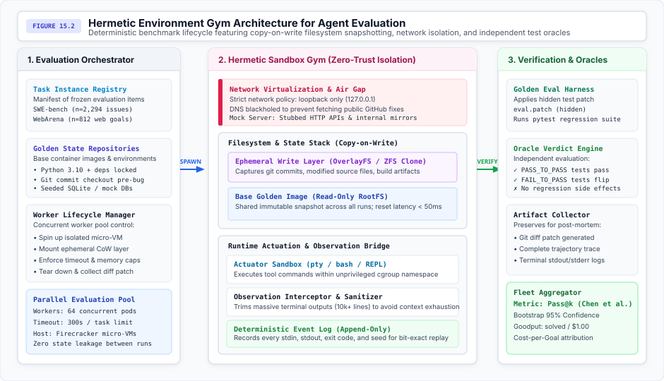
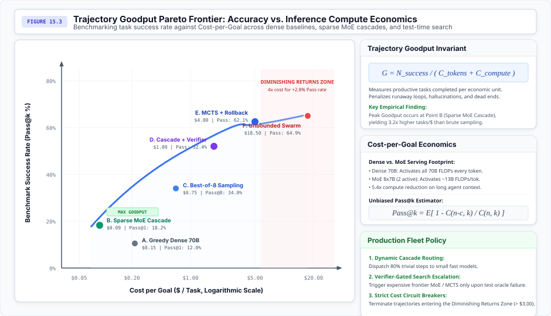
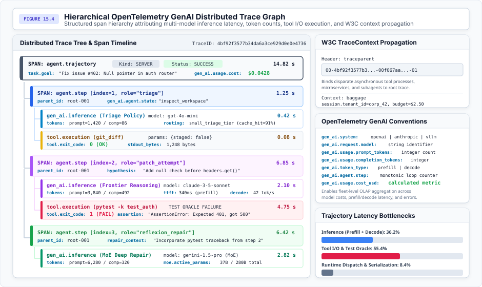
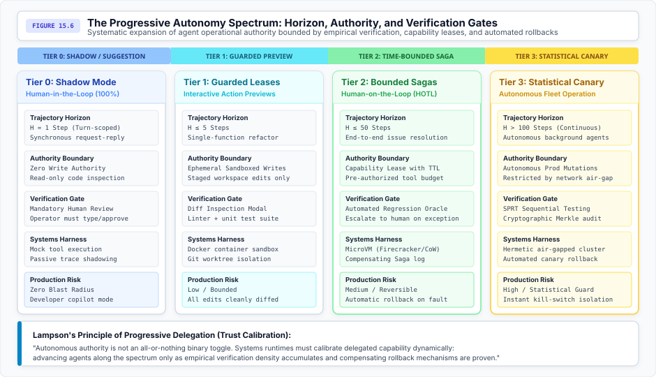
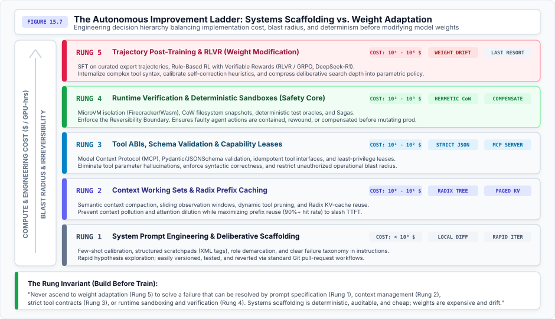
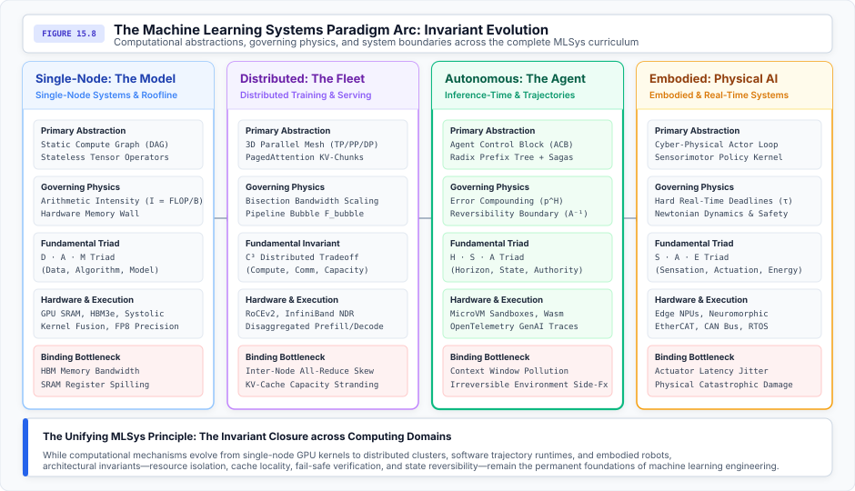

# System Observability {#sec-vol3-observability}

::: {.callout-note title="Meta paragraph"}
_How do systems engineers measure, trace, debug, and bound an autonomous actor whose execution is fundamentally non-deterministic and whose environment is continuously mutating?_

In classical software systems, observability answers what occurred inside a deterministic state machine through symbolic backtraces, structured logs, and request-scoped metrics. In classical machine learning, evaluation scores static, feedforward predictions against immutable ground-truth labels. In an autonomous agentic regime, both paradigms suffer total collapse. An agent is a stateful, closed-loop actor whose multi-step trajectory mutates external operating environments over extended time horizons under stochastic temperature sampling, floating-point non-associativity across parallel GPU warps, and asynchronous tool network delays. When an agent enters an infinite retry loop or executes a destructive database drop at Step 47 only 5 percent of the time, dumping 500,000 raw prompt tokens into flat log files provides zero causal diagnostic power. This chapter establishes the systems architecture for observing, debugging, and benchmarking autonomous stochastic actors: analyzing why static benchmarks collapse, formalizing hermetic evaluation gyms, constructing deterministic time-travel replay engines using boundary event sourcing and copy-on-write storage, and synthesizing the volume's architectural arc into the Sovereign Law of Agency and the imperative of hardware/software co-design.
:::

## Introduction {#sec-vol3-observability-intro}

Throughout Parts I through V of this book, we developed the architectural subsystems of the Von Neumann Agent: the stochastic processor executing test-time deliberation, volatile context memory and KV-cache management, persistent episodic storage and checkpointing, execution scheduling and capability isolation runtimes, and policy adaptation via synthetic flywheels and reinforcement learning, culminating in distributed stochastic actor coordination.

Yet across all these layers, a governing systems question remains: *How do systems engineers measure, trace, debug, and bound an autonomous actor whose behavior is fundamentally non-deterministic and whose environment is continuously mutating?*

Deploying autonomous agents into production mission-critical environments creates an immediate dual crisis:

1. **The Observability Crisis:** When an autonomous coding agent degrades into an unrecoverable hallucination loop at Step 32, traditional request-response tracing fails. In microservices, requests traverse linear, directed acyclic graphs (DAGs) of short-lived remote procedure calls (RPCs). In agentic systems, execution is an unrolled, multi-turn feedback loop traversing heterogeneous foundation models, vector databases, compiler sandboxes, and external APIs. Non-determinism at the hardware level (IEEE 754 floating-point reduction order across GPU thread blocks), the algorithmic level (temperature sampling $T > 0$), and the environment level (network jitter, dynamic filesystem state) means that simply rerunning an agent with the same initial prompt will not reproduce the failure.
2. **The Evaluation Crisis:** For decades, machine learning relied on static benchmarks: ImageNet, GLUE, SQuAD, Massive Multitask Language Understanding (MMLU), and GSM8K. These benchmarks evaluate feedforward, single-turn pattern matching: a fixed input $x$ is processed by model $f_\theta(x)$ and scored against a static label $y$. In agentic systems, static benchmarks completely fail. They reward prompt-engineering shortcuts, suffer catastrophic pretraining contamination, and ignore the defining characteristic of agency: closed-loop environmental feedback. A model with 95 percent single-step accuracy on a static benchmark can collapse to less than 1 percent success over a 100-step autonomous trajectory.

Observability is not merely an operational convenience; it is the architectural backplane that makes autonomous systems engineering possible. Without structured telemetry, developers cannot diagnose why an agent diverged. Without hermetic evaluation gyms, developers cannot distinguish genuine algorithmic progress from evaluation noise. And without time-travel replay engines, developers cannot construct deterministic regression suites.

This chapter establishes the systems discipline of agent observability across five core sections:

- In @sec-vol3-observability-collapse-static, we dissect the structural collapse of static benchmarks, analyzing Goodhart's Law, pretraining contamination, and compounding trajectory errors.
- In @sec-vol3-observability-hermetic-gyms, we formalize the systems architecture of **Hermetic Evaluation Gyms**, defining the five invariants of reproducible sandboxing, the unbiased Pass@$k$ estimator, and the economics of Trajectory Goodput ($G$).
- In @sec-vol3-observability-time-travel-replay, we develop **Time-Travel Replay Engines**, detailing hierarchical OpenTelemetry GenAI tracing, deterministic boundary event sourcing, state rewind via Copy-on-Write (CoW) filesystems, counterfactual branch forking, and Amdahl's Law latency profiling.
- In @sec-vol3-observability-sovereign-law, we conclude the volume with the **Epilogue: The Sovereign Law of Agency**, formulating the mathematical boundaries of long-horizon autonomy and the imperative of hardware/software co-design across Compute Express Link (CXL) memory pooling and disaggregated serving clusters.
- In @sec-vol3-observability-fallacies and @sec-vol3-observability-summary, we examine critical engineering fallacies and pitfalls and summarize the durable principles of autonomous systems architecture.

## The Collapse of Static Benchmarks {#sec-vol3-observability-collapse-static}

For the first decade of deep learning, progress was measured on static datasets. A static benchmark treats the neural network as an oracle: a prompt is submitted, an answer is emitted, and a scalar metric (accuracy, BLEU, F1 score) is recorded. In an agentic systems regime, this static paradigm collapses under two fatal structural flaws: pretraining contamination and the complete absence of environmental feedback.

### Goodhart's Law and Pretraining Contamination

In 1975, economist Charles Goodhart formulated the principle that "when a measure becomes a target, it ceases to be a good measure" (@goodhart1984problems). In foundation model evaluation, Goodhart's Law manifests through **pretraining contamination**.

Modern foundation models are trained on internet-scale web crawls containing trillions of tokens (Common Crawl, GitHub, Wikipedia, Reddit). Because static benchmark datasets (such as GSM8K, HumanEval, and MMLU) are publicly hosted on GitHub and discussed in blog posts, their questions, solutions, and unit tests are ingested into the pretraining corpus.

When a 70B parameter model achieves 92 percent on a static benchmark, does it possess advanced mathematical reasoning capability, or is it executing loss-minimized memorization from pretraining data? Decontaminating web-scale corpora via $n$-gram filtering is notoriously leaky; slight rephrasing bypasses filters while preserving the underlying memorized solution circuits.

Furthermore, static benchmarks evaluate models in an ungrounded vacuum. In reality, software engineering, financial auditing, and administrative workflows are interactive. A human engineer does not produce a flawless 2,000-line patch in a single shot without running compilers, inspecting stack traces, or executing unit tests. By forbidding interactive feedback, static benchmarks reward superficial token heuristics while failing to evaluate an agent's true core competency: the ability to diagnose errors, adapt to environment feedback, and converge on a goal.

### Compounding Errors in Open-Loop Autonomy

The fundamental mathematical failure of static benchmarks is their inability to model **trajectory error propagation**.

Let $p_t = P(a_t = a_t^* \mid h_t)$ denote the probability of selecting an optimal action at step $t$. If an autonomous task requires $H$ sequential interaction steps without intermediate verification, the joint probability of trajectory success decays exponentially:

$$P(\tau_{\text{success}}) = \prod_{t=1}^H p_t \approx (1 - \epsilon)^H \approx \exp(-\epsilon H)$$ {#eq-vol3-exponential-decay}

where $\epsilon = 1 - p$ is the average per-step error rate.

@Fig-vol3-observability-compounding-error contrasts the structural mechanics of static open-loop evaluation against closed-loop trajectory execution, exposing why single-turn benchmarks fail to predict multi-step capability.

::: {#fig-vol3-observability-compounding-error fig-env="figure" fig-pos="htb" fig-cap="**Open-Loop Static Evaluation vs. Closed-Loop Agent Trajectory Execution**: In static evaluation (a), input queries execute in an ungrounded vacuum where errors are independent and decoupled from state. In closed-loop agent execution (b), each action mutates external environment state, feeding stochastic observations into subsequent turns. Errors compound exponentially without intermediate verification." fig-alt="Two-part diagram comparing feedforward static question-answering evaluation with multi-step closed-loop agent execution featuring state mutations, environment observations, and compounding trajectory errors."}


:::

The structural divergence in @fig-vol3-observability-compounding-error explains why static benchmark scores fail to transfer to production environments: whereas an open-loop model produces an isolated token response in a decoupled vacuum, an autonomous agent's actions directly mutate environmental state $s_t$, and every unverified mistake compounds exponentially over horizon $H$.

::: {.callout-note title="Calculation: The Math of Trajectory Collapse"}
**Setup**: Consider a frontier model with a seemingly outstanding per-step accuracy of $95\%$ ($\epsilon = 0.05$). When evaluated on static single-turn questions, it appears state-of-the-art.

**Horizon scaling**:

- Over a 5-step horizon: $P_{\text{success}} = 0.95^5 \approx 77.4\%$
- Over a 20-step horizon: $P_{\text{success}} = 0.95^{20} \approx 35.8\%$
- Over a 50-step horizon: $P_{\text{success}} = 0.95^{50} \approx 7.7\%$
- Over a 100-step horizon: $P_{\text{success}} = 0.95^{100} \approx 0.59\%$

**Systems insight**: A system that succeeds only 6 times out of 1,000 attempts is commercially unviable and operationally dangerous. Measuring static single-step accuracy provides zero diagnostic insight into whether an agent can survive long-horizon compounding error.
:::

The structural divergence between traditional static evaluation and autonomous agentic benchmarking is formalized in @tbl-vol3-static-vs-agentic-eval, highlighting the systems requirements that emerge when transitioning from stateless pattern matching to stateful closed-loop execution.

| **Evaluation Dimension** | **Static Evaluation (MMLU, GSM8K, HumanEval)**                                          | **Closed-Loop Agent Gyms (SWE-bench, WebArena, OSWorld)**                                                               |
|:-------------------------|:----------------------------------------------------------------------------------------|:------------------------------------------------------------------------------------------------------------------------|
| **Execution Topology**   | Single forward pass; static input query $x \to \text{output } y$ evaluated in isolation | Multi-turn closed-loop trajectory $\tau = (s_0, a_0, o_1, \dots, s_H)$ with environmental feedback                      |
| **State Mutation**       | Read-only; no external state changes or persistent environment side effects             | Stateful; actions execute shell commands, edit source files, and mutate live databases                                  |
| **Observation Space**    | Synthetic, fixed prompt tokens pre-tokenized before inference begins                    | Dynamic runtime feedback: standard output, standard error, compiler stack traces, and DOM trees                         |
| **Error Dynamics**       | Independent per item; an error on sample $i$ has zero impact on sample $i+1$            | Compounding trajectory decay; early unverified errors corrupt downstream execution context ($P \approx (1-\epsilon)^H$) |
| **Contamination Risk**   | Severe; static question-answer pairs inevitably leak into public pretraining web crawls | Controlled; ephemeral sandboxes, randomized task generation, and hidden unit test oracles                               |
| **Evaluation Metric**    | Token perplexity, top-1 accuracy, BLEU, ROUGE, and static pass rate                     | Unbiased Pass@$k$, Trajectory Goodput ($G$), Cost-per-Goal ($C_{\text{goal}}$), and end-to-end wall-clock latency       |
| **Systems Substrate**    | Standard batch inference engines (vLLM, TensorRT-LLM) without host sandbox isolation    | Hardware-assisted microVMs (Firecracker), CoW storage (OverlayFS), and strict network air-gapping                       |

: **Static Benchmark vs. Closed-Loop Agentic Evaluation Paradigms**: Architectural comparison across execution topology, environmental mutation, error dynamics, contamination risk, evaluation metrics, and systems infrastructure. {#tbl-vol3-static-vs-agentic-eval tbl-colwidths="[18,41,41]"}

Evaluating an autonomous system requires abandoning static datasets in favor of **interactive, execution-based evaluation environments**.

::: {.callout-important title="War Story: The Deployment Collapse of the Epic Sepsis Model (2021)"}
The danger of relying on static, developer-published evaluation metrics is not unique to language models; it is a foundational lesson of applied machine learning systems.

**Context**: The Epic Sepsis Model (ESM) was a proprietary early-warning predictive system implemented across hundreds of US hospitals to flag hospitalized patients developing sepsis [@wong2021esm]. Its developer reported an area under the receiver operating characteristic curve (AUROC) between 0.76 and 0.83, authorizing widespread clinical deployment.

**Mechanism**: The reported performance had been calculated retrospectively by the vendor on static, curated training cohorts. When an independent research team from the University of Michigan comprehensively evaluated the model against 38,455 hospitalizations across an entire operating hospital system, discrimination collapsed to an AUROC of 0.63 (95 percent CI, 0.62–0.64). The model was not broken in software; it simply executed against a dynamic, messy clinical reality that diverged completely from the curated static validation set.

**Impact**: At the deployed operating threshold, the model exhibited a sensitivity of only 33 percent (failing to identify 1,709 sepsis patients—67 percent of all sepsis cases) while firing alerts on 18 percent of all hospitalizations (6,971 patients). Approximately 88 percent of all alerts generated were false positives. Nurses and physicians suffered severe alarm fatigue, wasting critical bedside attention.

**Fix**: Health systems disabled automated alerts, instituted local validation and drift-monitoring harnesses using prospective EHR telemetry, and required multi-disciplinary clinical committee approval before any predictive threshold could trigger bedside notifications.

**Systems lesson**: A metric published on a static development dataset carries zero performance guarantees for dynamic operational environments. For agentic systems, where actions directly mutate external state, evaluating agents on static text is equivalent to validating an autopilot in a photo gallery. Autonomous systems must be evaluated on dynamic environments that score the operational burden of false actions alongside task completion.
:::

## Hermetic Evaluation Gyms {#sec-vol3-observability-hermetic-gyms}

To replace static datasets with dynamic environments, the machine learning systems community developed **Agent Gyms**—standardized, interactive execution environments that simulate real-world digital ecosystems.

Prominent benchmarks include:

- **SWE-bench** (@jimenez2024swebench): Evaluates agents on thousands of real-world GitHub issues extracted from major open-source Python repositories (Django, SymPy, scikit-learn). The agent is provided with an issue description and must navigate an authentic codebase, edit files, and produce a unified git patch that passes the repository's test suite.
- **WebArena** (@zhou2024webarena): Benchmarks autonomous web agents across fully realized enterprise web applications (GitLab, e-commerce storefronts, content management systems, discussion forums) with live HTTP servers, REST APIs, and browser automation drivers.
- **OSWorld** (@xie2024osworld): Evaluates multimodal operating system agents interacting with full desktop environments (Ubuntu) via shell commands, GUI mouse clicks, and window manager interactions.

::: {#dfn-vol3-hermetic-gym .callout-definition title="Hermetic Evaluation Gym"}
***Hermetic Evaluation Gym***\index{Hermetic Evaluation Gym!definition} is an air-gapped, statefully isolated execution sandbox that provides deterministic environment reset, copy-on-write storage isolation, and independent verification oracles for evaluating autonomous agents.

1.  **Significance**: Without strict hermeticity, agent evaluation is confounded by external network drift, transient API outages, shared filesystem contamination, and public benchmark data leakage.
2.  **Distinction**: Unlike passive unit testing suites or static benchmark harnesses, a hermetic gym acts as an interactive, stateful operating environment that executes untrusted agent tool calls within sub-50 ms disposable virtualization boundaries.
3.  **Common pitfall**: Permitting outbound internet access or DNS resolution during evaluation, which allows agents to search the web, retrieve canonical pull requests, and memorize committer patches rather than solving the underlying engineering problem.
:::

To eliminate confounding noise, an evaluation gym must satisfy five architectural invariants:

1. **State Hermeticity & Ephemeral CoW Sandboxing:** Every task instance must instantiate inside an isolated, containerized sandbox (e.g., Docker with an OverlayFS storage driver or a lightweight Firecracker microVM). Any filesystem mutations, package installations, or git commits made during trajectory $\tau_i$ must be cleanly discarded via ephemeral Copy-on-Write (CoW) layer destruction in under **$50\text{ ms}$**, guaranteeing that trajectory $\tau_{i+1}$ begins from an identical, unpolluted golden image.
2. **Strict Network Air-Gapping & Local Service Mocking:** Agents must not possess unrestricted internet access. If an agent has access to public DNS, it can bypass the task by querying public APIs, scraping solutions from web forums, or locating the exact commit on GitHub that resolved the issue. Runtimes enforce network air-gapping: external network egress is dropped at the virtual bridge, while required dependencies (package registries, mock REST APIs, mock databases) are hosted locally within the container subnet.
3. **Deterministic Pseudo-Random Seed Management:** To ensure statistical reproducibility, all pseudo-random number generators (PRNGs) governing environment transitions—such as network latency simulation, mock API jitter, and initial database state seeding—must be deterministically derived from a single task seed $S_{\text{env}} = \text{Hash}(\text{TaskID}, \text{RunIndex})$.
4. **Monotonic Resource Metering & Timeouts:** To prevent runaway agents from exhausting host resources, the gym's supervisor process enforces strict ceilings on total wall-clock time ($T_{\text{max}} = 1,800\text{ s}$), cumulative tool invocations ($K_{\text{max}} = 50$), host memory ($M_{\text{max}} = 16\text{ GB}$ via Linux cgroups v2), and disk write quotas ($D_{\text{max}} = 2\text{ GB}$).
5. **Strict Separation of Agent and Evaluation Oracles:** The ground-truth verification harness must be cryptographically and architecturally separated from the agent's execution context:
   - **PASS_TO_PASS Tests:** Existing unit tests that passed before the agent began must still pass, verifying that the agent did not introduce regressions.
   - **FAIL_TO_PASS Tests:** Hidden unit tests that failed prior to the agent's intervention must now pass, proving that the agent genuinely fixed the target bug.
   During trajectory execution, `FAIL_TO_PASS` test files are strictly withheld from the agent's filesystem. Once the agent outputs its candidate patch and halts, the evaluation harness applies the hidden patch (`eval.patch`) in a clean sandbox and executes the test runner.

The interplay among these five invariants is realized in the systems topology shown in @fig-vol3-hermetic-gym, which separates task coordination, sandboxed execution, and evaluation oracles into strictly isolated architectural domains.

::: {#fig-vol3-hermetic-gym fig-env="figure" fig-pos="htb" fig-cap="**Hermetic Environment Gym Architecture for Agent Evaluation**: The architecture isolates the agent in an air-gapped, zero-trust sandbox with copy-on-write filesystem snapshotting, local mock servers, and an independent verification harness. Hermeticity is a measurement requirement before it is a security one, because a run that can reach the network cannot be repeated, so a score produced without these boundaries measures the day it was collected." fig-alt="Three-column architecture diagram detailing the Evaluation Orchestrator with task instance registry and worker pool, the Hermetic Sandbox Gym with network virtualization air-gapping and copy-on-write storage, and the Verification Oracles with hidden test patches and result evaluation."}

:::

As illustrated in @fig-vol3-hermetic-gym, the boundary between the ephemeral CoW write layer and the immutable golden image guarantees sub-50 ms environment reset latencies while the network air-gap eliminates external contamination. Hermeticity is fundamentally an experimental prerequisite: if an evaluation harness permits network egress or leaks state across tasks, the resulting metrics reflect transient environmental noise rather than true agent capability.

As summarized in @tbl-vol3-gym-comparison, contemporary benchmark gyms span diverse state topologies, action spaces, and isolation boundaries.

| **Benchmark Gym**                    | **Environment State**      | **Action Space**          | **Reset Mechanism**                          | **Verification Oracle**              | **Isolation Boundary**         |
|:-------------------------------------|:---------------------------|:--------------------------|:---------------------------------------------|:-------------------------------------|:-------------------------------|
| **SWE-bench** (@jimenez2024swebench) | Python repos & git trees   | Bash shell, file editing  | CoW container discard ($<50\text{ ms}$)      | Hidden unit test suite (`pytest`)    | Total Air-Gap (Local git repo) |
| **WebArena** (@zhou2024webarena)     | Stateful web servers & DBs | Playwright browser DOM    | DB transaction rollback / CoW                | End-state DB & DOM assertions        | Local subnet (Mock enterprise) |
| **OSWorld** (@xie2024osworld)        | Ubuntu desktop & GUI apps  | X11 mouse, keyboard, bash | VM snapshot restore ($1\text{--}3\text{ s}$) | OS state diffs & log assertions      | Host-only virtual network      |
| **InterCode**                        | Bash & SQL execution       | Interactive REPL          | In-memory DB transaction rollback            | Execution return codes & table diffs | Air-gapped container sandbox   |

: **Systems Architecture of Agent Benchmark Environments**: Structural state, action spaces, reset mechanisms, verification oracles, and isolation boundaries across representative execution environments. {#tbl-vol3-gym-comparison tbl-colwidths="[16,18,16,16,18,16]"}

### Trajectory Capability Metrics: Unbiased Pass@$k$

Because foundation model generation is stochastic when temperature $T > 0$, scoring an agent on a single run ($k=1$) yields extreme estimator variance. An agent may succeed by stumbling onto a lucky token sequence or fail due to a minor formatting glitch.

To evaluate algorithmic capability rigorously, runtimes sample $n$ independent candidate trajectories per task ($n \ge k$) and calculate the probability that at least one of the top $k$ attempts resolves the goal. Evaluating all $\binom{n}{k}$ subsets directly is computationally prohibitive and introduces high variance. Instead, systems runtimes evaluate the minimum-variance unbiased estimator for Pass@$k$ formulated by @chen2021evaluating:

$$\text{Pass}@k = \mathbb{E}_{\text{tasks}} \left[ 1 - \frac{\binom{n - c}{k}}{\binom{n}{k}} \right]$$ {#eq-vol3-pass-at-k}

where:

- $n$ is the total number of trajectories sampled per task ($n \ge k$),
- $c$ is the number of successful trajectories ($c \le n$),
- $\binom{n}{k}$ is the binomial coefficient.

When $n - c < k$, all subsets of size $k$ contain at least one successful trajectory, meaning the combinatorial term drops to 0 and $\text{Pass}@k = 1.0$. In software implementations, computing large factorials directly causes floating-point overflow. The combinatorial ratio must be evaluated iteratively via @eq-vol3-pass-at-k-product:

$$\frac{\binom{n - c}{k}}{\binom{n}{k}} = \prod_{i=1}^k \frac{n - c - i + 1}{n - i + 1}$$ {#eq-vol3-pass-at-k-product}

### Fleet Economics: Trajectory Goodput and Cost-per-Goal

While Pass@$k$ measures pure algorithmic capability, it completely ignores inference economics. Generating $n=100$ candidate trajectories to achieve $\text{Pass}@100 = 85\%$ is commercially useless in production if each trajectory costs $\$10.00$ in GPU compute. Real-world autonomous systems are strictly constrained by serving economics.

To evaluate real-world feasibility, we formulate **Trajectory Goodput** ($G$):

::: {#dfn-vol3-goodput .callout-definition title="Trajectory Goodput"}
***Trajectory Goodput***\index{Trajectory Goodput!definition} ($G$) is the rate of verified successful goal completions delivered per unit of total economic or computational expenditure:

$$G = \frac{N_{\text{success}}}{C_{\text{tokens}} + C_{\text{compute}}}$$ {#eq-vol3-goodput}

where $N_{\text{success}}$ is the number of verified goal completions, $C_{\text{tokens}}$ is the financial cost of input/output token generation across all foundation model calls, and $C_{\text{compute}}$ is the ancillary infrastructure cost (microVM execution, compiler runtimes, vector database lookups, and network bandwidth).

1.  **Significance**: Raw capability metrics such as Pass@$k$ ignore inference economics; a system that generates 100 trajectories to achieve an 85% pass rate is commercially unviable if each attempt costs $10.00. Trajectory Goodput incorporates verification: unverified or failing trajectories contribute zero to the numerator while their full token and infrastructure spend lands in the denominator.
2.  **Distinction**: Unlike token throughput (tokens per second) or serving goodput (completed requests per second), Trajectory Goodput measures verified end-to-end task completion per dollar spent across multi-turn stochastic loops.
3.  **Common pitfall**: Scaling raw token sampling or launching unguided multi-agent swarms without intermediate verification gates; this increases denominator spend while failing to improve the numerator, driving Trajectory Goodput to zero.
:::

Critically, unverified or failed trajectories contribute zero to the numerator of @eq-vol3-goodput, while their full token and infrastructure spend lands in the denominator. A system that scales raw token generation without verification causes Trajectory Goodput to collapse to zero.

Directly linked to Goodput is **Cost-per-Goal** ($C_{\text{goal}}$), defined in @eq-vol3-cost-per-goal to measure the average expenditure required to deliver a single verified outcome:

$$C_{\text{goal}} = \frac{\sum_{i=1}^M \text{Cost}(\tau_i)}{N_{\text{success}}} = \frac{\overline{\text{Cost}}(\tau)}{\text{Pass}@1}$$ {#eq-vol3-cost-per-goal}

Dividing by Pass@1 makes Cost-per-Goal non-linear in capability. If an engineering intervention doubles single-pass reliability from 10 percent to 20 percent while increasing per-attempt trajectory cost by only 20 percent, the true cost per verified delivery drops by 40 percent:
$$C_{\text{goal}} = \frac{1.20 \times C_0}{2.0 \times P_0} = 0.60 \times C_{\text{goal}, 0}$$

@Fig-vol3-goodput-pareto maps the empirical Pareto frontier of Trajectory Goodput across competing model families and search strategies, demonstrating the trade-off between task success rate and economic expenditure.

::: {#fig-vol3-goodput-pareto fig-env="figure" fig-pos="htb" fig-cap="**Trajectory Goodput Pareto Frontier**: Accuracy vs. inference compute economics. The chart plots task success rate against Cost-per-Goal across dense baselines, sparse MoE cascades, and test-time search." fig-alt="Economic frontier plot showing benchmark success rate on the vertical axis against log-scaled cost per goal on the horizontal axis, comparing greedy dense models, sparse MoE cascades, best-of-N sampling, MCTS search, and unbounded swarms."}

:::

The frontier in @fig-vol3-goodput-pareto highlights a crucial systems insight: peak Trajectory Goodput occurs not at the highest raw capability tier, but at the balance point where sparse Mixture-of-Experts (MoE) cascades offload 80 percent of routine triage and formatting steps to fast, compact experts. Pushing beyond this Pareto optimum into unguided multi-agent swarms delivers diminishing returns, multiplying token costs by $4\times$ to yield less than a 3 percent gain in benchmark pass rate.

### Dense versus MoE Serving Economics

The economics of Trajectory Goodput differ fundamentally between dense models and sparse MoE architectures:

- **Dense Models:** For a dense model with $P_{\text{dense}}$ parameters, every generated token requires activating all $P_{\text{dense}}$ weights, incurring $2 \cdot P_{\text{dense}}$ FLOPs per token. In long-horizon agent trajectories where context history accumulates 50,000+ tokens of bash outputs and file contents, prefill compute scales quadratically $\mathcal{O}(L^2)$ and decode compute requires full-weight memory bandwidth.
- **Sparse MoE Models:** In an MoE architecture with $E$ experts activating top-$k$ experts per token (e.g., an $8 \times 7\text{B}$ architecture activating 2 experts), the total parameter footprint in GPU memory is $P_{\text{total}} \approx 47\text{B}$, but the active parameter footprint per token is only $P_{\text{active}} \approx 13\text{B}$.

This creates an important systems trade-off:

1. **High-Bandwidth Memory (HBM) Capacity Requirement:** To serve an MoE model without catastrophic CPU offloading penalties, the serving cluster must retain all $P_{\text{total}}$ weights pinned in accelerator HBM ($>94\text{ GB}$ in FP16 for $8 \times 7\text{B}$).
2. **Execution Efficiency:** Once pinned, the active compute per token is equivalent to a compact 13B model. In extended agent trajectories characterized by dozens of short tool calls, bash triage steps, and format validation cycles, sparse MoE models execute up to $3\text{--}5\times$ faster than a dense 70B model while delivering comparable frontier reasoning capacity.

The systems trade-offs governing dense and sparse MoE architectures under multi-turn agent workloads are detailed in @tbl-vol3-serving-dense-vs-moe, contrasting parameter memory footprints against active decode bandwidth.

| **Architectural Dimension**                           | **Dense Architecture (e.g., Llama-3-70B)**                                                              | **Sparse MoE Architecture (e.g., Mixtral-8x7B / DeepSeek-V3)**                                                                                |
|:------------------------------------------------------|:--------------------------------------------------------------------------------------------------------|:----------------------------------------------------------------------------------------------------------------------------------------------|
| **Total Weight Footprint ($P_{\text{total}}$)**       | 70B parameters ($\approx 140\text{ GB}$ in FP16, $\approx 70\text{ GB}$ in FP8) pinned in GPU HBM       | 47B to 671B parameters ($>94\text{ GB}$ to $670\text{ GB}$ in FP8) pinned across accelerator cluster                                          |
| **Active Parameters per Token ($P_{\text{active}}$)** | 70B parameters activated per token ($140\times 10^9\text{ FLOPs/tok}$)                                  | 13B to 37B active parameters ($26\times 10^9\text{ to } 74\times 10^9\text{ FLOPs/tok}$)                                                      |
| **Decode Memory Bandwidth Intensity**                 | High; each generated token streams all 70B weights from HBM to compute cores                            | Low; each token streams only top-$k$ expert weights, yielding $3\text{--}5\times$ higher decode throughput                                    |
| **Multi-Turn Context Prefill ($\mathcal{O}(L^2)$)**   | Compute-bound GEMM; 50k+ accumulated context tokens impose severe TTFT spikes                           | Compute-bound but expert-routed; prefill FLOPs scale strictly with the active parameter subset                                                |
| **Inter-Accelerator Fabric Demand**                   | Standard Tensor/Pipeline Parallelism over NVLink or high-speed intra-node fabric                        | Heavy All-to-All communication across Expert Parallel (EP) ranks over RoCEv2 or InfiniBand                                                    |
| **Trajectory Goodput ($G$) Efficiency**               | Low to moderate; high token unit costs ($\$0.60\text{--}\$2.50\text{ per } 1\text{M}$) compress goodput | High; lower active compute costs ($\$0.10\text{--}\$0.50\text{ per } 1\text{M}$) deliver $3\text{--}4\times$ higher verified goals per dollar |
| **Primary Systems Bottleneck**                        | Accelerator memory bandwidth saturation and prefill latency under long context histories                | Host-to-device weight offload latency if HBM capacity is exceeded; All-to-All network tail latency                                            |

: **Dense vs. Sparse MoE Systems Economics for Agent Trajectories**: Physical hardware footprints, active compute scaling, interconnect demands, and Trajectory Goodput trade-offs across long-horizon serving regimes. {#tbl-vol3-serving-dense-vs-moe tbl-colwidths="[20,40,40]"}

## Time-Travel Replay Engines {#sec-vol3-observability-time-travel-replay}

When an agent fails in production at 3:00 AM, how can an on-call engineer diagnose the root cause?

In deterministic systems, the engineer reproduces the bug by feeding the same input to a local debugger. In an agentic system, if the engineer reruns the agent with the same user prompt, floating-point non-determinism, environment mutations, and temperature variance guarantee that the agent will take a completely different path. The original failure disappears.

To achieve deterministic diagnostic capability, modern agent runtimes implement **Time-Travel Replay Engines**, combining hierarchical distributed tracing, boundary event sourcing, and copy-on-write storage snapshots.

### Hierarchical Distributed Tracing (OpenTelemetry GenAI)

Distributed tracing backends such as Dapper (@sigelman2010dapper) and Jaeger structure transactions as directed trees of timed spans. For autonomous agents, the OpenTelemetry GenAI Semantic Conventions (@opentelemetry2024genai) standardize a strict three-tier span hierarchy:

1. **Root Span (`agent.trajectory`):** Encapsulates the complete end-to-end task execution from initial user intent submission to final goal termination. Attributes record global metadata: `task.goal`, `trajectory.status`, total elapsed wall-clock time, total accumulated tokens, and total dollar cost.
2. **Iteration Span (`agent.step`):** Child span created for every iteration of the agent's control loop. Attributes record the loop index (`agent.step.index`), current reasoning role (e.g., `planner`, `coder`, `verifier`), and intermediate scratchpad hypotheses.
3. **Leaf Spans (Physical Operations):** Direct children of the step span representing physical systems execution:
   - `gen_ai.inference`: An autoregressive model forward pass dispatched to an inference serving engine.
   - `tool.execution`: A sandboxed execution of a shell command, file I/O, or compiler invocation.
   - `retrieval.query`: A dense vector similarity search or hybrid BM25 index query against episodic memory.

Listing @lst-vol3-otel-span provides a concrete JSON payload demonstrating these standardized attributes on a representative model inference leaf span:

```json
{
  "trace_id": "4bf92f3577b34da6a3ce929d0e0e4736",
  "span_id": "00f067aa0ba902b7",
  "parent_span_id": "5c39a0e69b0c2d1e",
  "name": "gen_ai.inference",
  "kind": "SPAN_KIND_CLIENT",
  "start_time_unix_nano": 1718000000000000000,
  "end_time_unix_nano": 1718000002100000000,
  "attributes": {
    "gen_ai.system": "anthropic",
    "gen_ai.request.model": "claude-3-5-sonnet",
    "gen_ai.agent.step": 12,
    "gen_ai.agent.role": "patch_generator",
    "gen_ai.usage.prompt_tokens": 14250,
    "gen_ai.usage.completion_tokens": 620,
    "gen_ai.usage.cost_usd": 0.05205,
    "gen_ai.latency.ttft_ms": 410,
    "gen_ai.inference.decode_tok_per_sec": 52.4
  }
}
```
: **OpenTelemetry GenAI Semantic Attributes**: JSON span representation capturing provider, model, step index, token allocations, latency metrics, and monetary cost. {#lst-vol3-otel-span}

@Fig-vol3-otel-trace visualizes the hierarchical causal span graph produced by this standard, illustrating how multi-turn agent execution decomposes across iteration spans and physical leaf operations.

::: {#fig-vol3-otel-trace fig-env="figure" fig-pos="htb" fig-cap="**Hierarchical OpenTelemetry GenAI Distributed Trace Graph**: Structured span hierarchy attributing multi-model inference latency, token counts, tool I/O execution, and W3C context propagation. The nesting is what makes the trace diagnostic rather than descriptive. A flat log records that a trajectory was slow, while the hierarchy attributes the time to the step that spent it and to the model or tool underneath that step." fig-alt="Distributed trace timeline diagram showing root agent trajectory span nesting sequential agent step spans, which in turn contain child inference and tool execution spans alongside W3C TraceContext headers and latency breakdown bars."}

:::

The hierarchical nesting shown in @fig-vol3-otel-trace transforms distributed traces from descriptive activity logs into causal diagnostic trees. By binding token allocations, model identifiers, tool exit codes, and W3C context headers to explicit step spans, the runtime enables automated fleet-level aggregation and exposes whether execution bottlenecks originate in model prefill latency, decode bandwidth, or external sandbox I/O.

The formal specifications for this span hierarchy, detailing mandatory semantic conventions, causal span parentage, and payload offloading rules, are synthesized in @tbl-vol3-otel-span-hierarchy.

| **Span Level**     | **Span Name**      |  **Parent Span**   | **Mandatory Semantic Attributes**                                                                     | **Payload Storage & Offload Strategy**                                                |
|:-------------------|:-------------------|:------------------:|:------------------------------------------------------------------------------------------------------|:--------------------------------------------------------------------------------------|
| **Root Span**      | `agent.trajectory` |    None (Root)     | `task.goal`, `trajectory.status`, `usage.total_cost_usd`, `session.id`, `wall_time_ms`                | Inlined metadata; trace context propagated via W3C `traceparent` headers              |
| **Iteration Span** | `agent.step`       | `agent.trajectory` | `agent.step.index`, `agent.role`, `step.objective`, `state.hash`, `budget.remaining_usd`              | Inlined state counters and step status; lightweight JSON representation               |
| **Inference Leaf** | `gen_ai.inference` |    `agent.step`    | `gen_ai.system`, `request.model`, `usage.prompt_tokens`, `usage.completion_tokens`, `latency.ttft_ms` | Offload full prompt/completion strings to S3/object store; record URI pointer in span |
| **Tool Leaf**      | `tool.execution`   |    `agent.step`    | `tool.name`, `tool.call_id`, `tool.exit_code`, `tool.duration_ms`, `sandbox.id`                       | Stream large stdout/stderr logs (>64 KB) to object storage; record SHA-256 hash       |
| **Retrieval Leaf** | `retrieval.query`  |    `agent.step`    | `db.system`, `query.top_k`, `vector.index_name`, `retrieval.score_min`, `latency_ms`                  | Inlined matched document IDs, similarity scores, and offsets; exclude raw chunk text  |
| **Consensus Leaf** | `search.consensus` |    `agent.step`    | `search.algorithm`, `branches.explored_count`, `pruned_nodes`, `optimal_branch_id`                    | SpanLinks to explored candidate branches; offload full search tree to object storage  |

: **OpenTelemetry GenAI Distributed Tracing Hierarchy for Agent Observability**: Structural span layers, causal parentage, required semantic attributes, and payload offloading boundaries across execution tiers. {#tbl-vol3-otel-span-hierarchy tbl-colwidths="[16,16,14,32,22]"}

### Context Propagation Across Asynchronous Queues and Search Trees

In distributed production deployments, agents dispatch sub-tasks across message queues (Kafka, Celery, Temporal) and spawn worker agents in remote microVMs. To maintain causal lineage across network boundaries, runtimes utilize the W3C TraceContext specification (@w3c2021tracecontext), injecting two standardized HTTP/RPC headers:

- `traceparent`: Encodes the version, 16-byte `trace_id`, 8-byte `parent_span_id`, and sampling bitmask.
- `baggage`: Encodes cross-cutting key-value pairs (e.g., `session.user_id=corp_42,budget.remaining_usd=1.85`).

When tracing stochastic search trees—such as Monte Carlo Tree Search (MCTS) or Tree-of-Thoughts—execution branches non-linearly:

- The root span forks $M$ parallel exploration branches at step $t$.
- Each branch instantiates an independent child context cloned from the parent, inheriting `trace_id` but receiving a unique `span_id`.
- Baggage mutations within a branch are isolated to prevent sibling pollution.
- When the search algorithm selects the optimal branch $\tau^*$, the runtime creates a synthetic `search.consensus` span containing OpenTelemetry `SpanLink` references to all explored branches, preserving counterfactual search history for offline analysis.

### Telemetry Payload Offloading and Tail-Based Sampling

A critical failure mode in agent observability is span buffer bloat. Distributed tracing backends (Jaeger, Datadog) are engineered for lightweight structural metadata (strictly capping spans at 64 KB). In long-context agent workflows, a single prompt may contain 100,000 tokens of source code and tool outputs (hundreds of kilobytes of text). Injecting raw text strings directly into span attributes (`gen_ai.prompt.content`) causes catastrophic ingestion bottlenecking and Out-Of-Memory (OOM) crashes in collectors.

Production runtimes solve this via **Payload Offloading**:

1. OpenTelemetry spans remain strictly lightweight, storing metadata, timings, token counts, and cryptographic hashes.
2. High-volume unstructured payloads (full prompt tokens, raw image bytes, compiler logs) are asynchronously streamed to scalable object storage (e.g., Amazon S3, MinIO) or columnar stores (ClickHouse).
3. The span attribute stores a lightweight URI pointer: `gen_ai.prompt.url = "s3://traces/4bf9.../step_12_prompt.json"`.

Furthermore, runtimes reject traditional **Head-Based Sampling** (randomly discarding 99 percent of traces at ingress). Because agent trajectories are low-throughput but extremely high-value, dropping 99 percent of traces guarantees that engineers will have zero data when a catastrophic 0.5 percent failure occurs. Instead, systems employ **Tail-Based Sampling**: buffering all spans in memory or fast local NVMe caches during trajectory execution, and retroactively retaining 100 percent of traces that fail, trigger safety violations, or exceed cost thresholds, while aggressively downsampling routine successes.

### Event Sourcing at the Stochastic Boundary

To achieve bit-exact offline replay, the runtime implements the classical systems principle of **Event Sourcing** (@geels2007friday; @king2005debugging). As formalized in @eq-vol3-event-sourcing, the runtime establishes a strict boundary separating the internal deterministic state machine from external non-deterministic inputs:

$$\text{State}_{t+1} = \mathcal{F}(\text{State}_t, \; \mathbf{e}_t)$$ {#eq-vol3-event-sourcing}

where $\mathcal{F}$ is a pure deterministic transition function (updating the Agent Control Block, conversation history, and token counters), and $\mathbf{e}_t$ is an immutable event tuple captured at the stochastic boundary according to @eq-vol3-event-tuple:

$$\mathbf{e}_t = \langle t_{\text{wall}}, \; s_{\text{seed}}, \; y_{\text{model}}, \; o_{\text{tool}}, \; c_{\text{exit}} \rangle$$ {#eq-vol3-event-tuple}

During execution, an interceptor records:

- **Model Completions ($y_{\text{model}}$):** Every generated token, logit bias, and finish reason.
- **Tool Outputs ($o_{\text{tool}}, c_{\text{exit}}$):** Raw standard output, standard error, exit codes, and mutated files.
- **Pseudorandom Seeds ($s_{\text{seed}}$):** The initial PRNG seed governing local sampling.
- **Environment Clocks ($t_{\text{wall}}$):** System timestamp queries intercepted by the runtime.

::: {#dfn-vol3-event-sourcing .callout-definition title="Boundary Event Sourcing"}
***Boundary Event Sourcing***\index{Boundary Event Sourcing!definition} is an observability pattern that captures all non-deterministic inputs and outputs crossing the agent's interaction perimeter—including pseudo-random seeds, wall-clock timestamps, model token streams, and tool observations—into an immutable append-only event log.

1.  **Significance**: Foundation models are non-deterministic under floating-point concurrency and positive temperature sampling; boundary event sourcing enables bit-exact offline replay and time-travel debugging at zero marginal token cost.
2.  **Distinction**: Unlike full-system checkpointing, which captures the entire memory space of the model and hypervisor, boundary event sourcing logs only the transitions at the stochastic-deterministic perimeter, keeping telemetry logs under hundreds of kilobytes per step.
3.  **Common pitfall**: Capturing internal chain-of-thought activations while omitting external environment timestamps or pseudorandom seeds, causing replay execution to diverge after the first tool invocation.
:::

With this immutable log, the runtime supports two operational replay modes:

- **Bit-Exact Replay (Zero-Cost Verification):** The agent runs in "mock mode." All network calls to model APIs and external tools are disabled. When the agent issues a tool call at Step 12, the interceptor returns the recorded event $\mathbf{e}_{12}$ from the log. Bit-exact replay executes in milliseconds, costs $\$0.00$ in model tokens, and allows engineers to test new runtime invariants, inspect internal data structures, and verify state machine transitions under identical historical conditions.
- **Semantic Replay (Robustness Stress-Testing):** The initial prompt and environment state are fixed, but the model is permitted to generate fresh completions at $T > 0$. By comparing 50 semantic replays against the historical baseline, engineers quantify trajectory stability and verify whether a failure was an isolated statistical outlier or a chronic algorithmic flaw.

The operational characteristics, computational costs, and systems mechanisms of these replay strategies are contrasted in @tbl-vol3-replay-modes.

| **Replay Mode**           | **Model Invocation**                                                                           | **Environment State Handling**                                             |               **Token Cost & Speed**              | **Primary Diagnostic & Systems Use Case**                                                        |
|:--------------------------|:-----------------------------------------------------------------------------------------------|:---------------------------------------------------------------------------|:-------------------------------------------------:|:-------------------------------------------------------------------------------------------------|
| **Bit-Exact Replay**      | Fully mocked; replays recorded completions $y_{\text{model}}$ directly from log $\mathbf{e}_t$ | Restored to exact step snapshot via CoW rollback (OverlayFS/ZFS)           |  $\$0.00$ token cost;<br>Sub-second (<50 ms/step) | Deterministic CI regression testing; validating state machine transitions and ACB logic          |
| **Semantic Replay**       | Live invocation; resamples model at $T > 0$ with identical initial prompt $s_0$                | Booted from clean initial golden image; mutates dynamically during run     |  Full token spend;<br>Standard inference latency  | Robustness and stability auditing; quantifying trajectory pass variance and distribution shift   |
| **Counterfactual Replay** | Mocked up to step $t^*$; live model sampling resumes after intervention point                  | CoW rollback to step $t^*$; forks fresh writable delta layer for execution | Zero cost before $t^*$;<br>Incremental cost after | Root-cause isolation; verifying alternative tool observations, prompt fixes, or action overrides |

: **Operational Replay Modes for Stochastic Agent Trajectories**: Comparison of execution mechanics, state restoration strategies, economic costs, and engineering applications across replay paradigms. {#tbl-vol3-replay-modes tbl-colwidths="[16,20,22,18,24]"}

### Time-Travel Debugging Mechanics: State Rewind and Counterfactual Forking

An Agent Time-Travel Debugger empowers engineers to step through an execution history interactively:

```bash
(agy-db) step-forward 5     # Advance 5 steps to Step 17
(agy-db) inspect context    # View active KV working set and prompt tokens
(agy-db) step-backward 2    # Rewind execution to Step 15
```

To execute a **State Rewind** to step $t^*$:

1. The debugger restores the Agent Control Block (ACB) state vector from checkpoint $t^*$.
2. It rolls back conversation memory and scratchpad context.
3. It issues a storage rollback command to the CoW filesystem (e.g., `zfs rollback snapshot@step_15`), restoring all source code files, build binaries, and databases to their exact historical state at step $t^*$ in under **$50\text{ ms}$**.

Once rewound, the engineer can perform **Counterfactual Branch Forking**:

- **Observation Editing:** Correcting a truncated compiler log or editing a malformed JSON payload.
- **Prompt Injection:** Inserting an intermediate corrective instruction into the agent's context.
- **Action Override:** Forcing the agent to execute action $a_{t^*}'$ instead of the flawed historical action $a_{t^*}$.

The debugger forks a new trajectory branch $\tau' = (s_0, \dots, s_{t^*}, a_{t^*}', o_{t^*+1}', \dots)$ and resumes forward execution, allowing engineers to verify immediately whether a proposed fix reliably alters trajectory outcomes.

@Fig-vol3-time-travel-replay diagrams the systems architecture of the time-travel replay engine, illustrating the dual mechanisms of deterministic boundary playback and counterfactual branch forking.

::: {#fig-vol3-time-travel-replay fig-env="figure" fig-pos="htb" fig-cap="**Time-Travel Debugging and Counterfactual Forking Architecture**: Deterministic replay uses append-only event sourcing at the stochastic boundary. To debug a failure at step H, the runtime rewinds the Agent Control Block and executes a Copy-on-Write filesystem rollback to step t, allowing engineers to edit observations, inject corrective prompts, or override actions to fork counterfactual trajectory branches at zero token re-execution cost." fig-alt="Architecture flowchart showing historical execution event stream, CoW filesystem snapshots at step intervals, rollback to an intermediate checkpoint, operator counterfactual intervention, and forking of a new trajectory branch."}


:::

By coupling append-only boundary event logs with CoW filesystem snapshots as shown in @fig-vol3-time-travel-replay, the replay engine eliminates the non-determinism of rerunning multi-step agents from scratch. An operator can rewind to the exact step preceding a failure, adjust a faulty tool observation or system invariant, and branch execution forward to verify corrective interventions at zero redundant token cost.

### Latency Decomposition and Amdahl's Law

In production fleets, trajectory latency is as critical as task accuracy. Total trajectory latency $T_{\text{total}}$ across an $H$-step execution is formally decomposed into five additive systems components in @eq-vol3-latency-decomp:

$$T_{\text{total}} = \sum_{t=1}^H \left( T_{\text{prefill}}^{(t)} + T_{\text{decode}}^{(t)} + T_{\text{tool}}^{(t)} + T_{\text{sandbox}}^{(t)} + T_{\text{oracle}}^{(t)} \right)$$ {#eq-vol3-latency-decomp}

where:

- $T_{\text{prefill}}^{(t)}$: Time-to-First-Token (TTFT), scaling with context length and prefix cache hit rate.
- $T_{\text{decode}}^{(t)}$: Time spent in autoregressive token generation: $T_{\text{decode}}^{(t)} = K_t / \rho_{\text{decode}}$.
- $T_{\text{tool}}^{(t)}$: Execution latency of external tools (bash commands, SQL queries, network fetches).
- $T_{\text{sandbox}}^{(t)}$: Hypervisor virtualization overhead: container spin-up, CoW snapshot mounting, and teardown.
- $T_{\text{oracle}}^{(t)}$: Verification delay incurred by linters, test runners, or reward models.

When optimizing an agent runtime, systems engineers often default to optimizing model inference (deploying FP8 quantization or custom CUDA kernels). However, by **Amdahl's Law** (@amdahl1967; @patterson2017hardware) formulated in @eq-vol3-amdahl, overall speedup is strictly bounded by the sequential fraction of the workload that is accelerated:

$$\text{Speedup}_{\text{overall}} = \frac{1}{(1 - f) + \frac{f}{S}}$$ {#eq-vol3-amdahl}

where $f$ is the fraction of runtime spent in the targeted subsystem, and $S$ is the speedup factor achieved.

In production software engineering agents, tool execution and sandbox management frequently consume **55 percent** of total wall-clock time ($f_{\text{tool}} = 0.55$), while model inference consumes **35 percent** ($f_{\text{model}} = 0.35$).

If an engineering team spends months accelerating inference to achieve an extraordinary $2\times$ speedup ($S_{\text{model}} = 2.0$):
$$\text{Speedup}_{\text{overall}} = \frac{1}{(1 - 0.35) + \frac{0.35}{2.0}} = \frac{1}{0.65 + 0.175} \approx 1.21\times$$
The system gains only a **21 percent** end-to-end speedup.

Conversely, if the team optimizes the systems runtime—replacing full VM reboots with instant CoW snapshot rollbacks and caching compiler build artifacts, achieving a $5\times$ speedup in tool execution ($S_{\text{tool}} = 5.0, f_{\text{tool}} = 0.55$):
$$\text{Speedup}_{\text{overall}} = \frac{1}{(1 - 0.55) + \frac{0.55}{5.0}} = \frac{1}{0.45 + 0.11} \approx 1.79\times$$
Accelerating the systems environment yields a **79 percent end-to-end speedup**—nearly four times the impact of optimizing foundation model inference alone.

::: {#pri-vol3-amdahl-observability .callout-principle title="Amdahl's Law of Agent Trajectories"}
**Invariant**: The end-to-end acceleration of an autonomous agent trajectory is strictly bounded by the sequential execution fraction of external tool invocations, environment virtualization, and verification oracles ($S_{\text{overall}} = 1 / [(1 - f_{\text{sys}}) + f_{\text{sys}} / S_{\text{sys}}]$).

**Implication**: Optimizing foundation model inference through quantization or custom CUDA kernels yields diminishing returns when agents spend over 50 percent of wall-clock time waiting on sandboxed compiler builds, test runners, and filesystem snapshot resets; production engineering must prioritize systems scaffolding acceleration over model decode latency.
:::

@Tbl-vol3-latency-amdahl formalizes this systems sensitivity across the complete latency budget, mapping the governing physical bottlenecks and realistic speedups achievable across inference and systems subsystems.

| **Subsystem Component**                                          | **Wall-Clock Share ($f$)** | **Primary Physical Bottleneck**                      | **Targeted Optimization Lever**                                  | **Component Speedup ($S$)** |   **End-to-End Speedup**  |
|:-----------------------------------------------------------------|:--------------------------:|:-----------------------------------------------------|:-----------------------------------------------------------------|:---------------------------:|:-------------------------:|
| **Prompt Prefill ($T_{\text{prefill}}$)**                        |     $10\text{--}15\%$      | Accelerator compute (GEMM FLOP/s) & TTFT latency     | Radix tree prefix caching, chunked prefill, prompt pruning       |         $4.0\times$         | $1.09\text{--}1.13\times$ |
| **Autoregressive Decode ($T_{\text{decode}}$)**                  |     $20\text{--}25\%$      | Accelerator HBM memory bandwidth (GEMV bound)        | FP8/INT4 quantization, speculative decoding, FlashDecoding       |         $2.0\times$         | $1.11\text{--}1.14\times$ |
| **Tool Execution ($T_{\text{tool}}$)**                           |     $30\text{--}40\%$      | Host CPU, disk I/O, compiler toolchain latency       | Local build caching (ccache), RAM-disks, async tool pipelining   |         $3.5\times$         | $1.27\text{--}1.40\times$ |
| **Sandbox Lifecycle ($T_{\text{sandbox}}$)**                     |     $15\text{--}20\%$      | OS container boot, CoW mount/umount, fork/exec       | Ephemeral OverlayFS layers, Firecracker microVM snapshot restore |         $8.0\times$         | $1.15\text{--}1.21\times$ |
| **Verification Oracle ($T_{\text{oracle}}$)**                    |     $10\text{--}15\%$      | Test suite duration (`pytest`), linter parse latency | Test impact analysis, parallel worker pools, canary test gates   |         $3.0\times$         | $1.07\text{--}1.11\times$ |
| **Systems Scaffolding ($T_{\text{tool}} + T_{\text{sandbox}}$)** |     $50\text{--}55\%$      | Combined host I/O, hypervisor, and runtime overhead  | Unified CoW snapshotting and build artifact caching              |         $4.5\times$         | $1.64\text{--}1.75\times$ |

: **Trajectory Latency Decomposition and Amdahl's Law Optimization Sensitivity**: Allocation of end-to-end wall-clock execution time across agent subsystems, governing physical bottlenecks, optimization levers, and resulting system-level speedups. {#tbl-vol3-latency-amdahl tbl-colwidths="[18,14,22,24,11,11]"}

## Epilogue: The Sovereign Law of Agency {#sec-vol3-observability-sovereign-law}

As this textbook concludes, we synthesize the architectural journey of this book into the fundamental physical constraints governing all autonomous computational systems: **The Sovereign Law of Agency**.

Every autonomous agent operates under three coupled variables: **Horizon ($H$)**, **Per-Step Error Rate ($\epsilon$)**, and **Context Length ($L_t$)**.

### The Exponential Reliability Ceiling

As established in @eq-vol3-exponential-decay, unverified open-loop autonomy decays exponentially:
$$P(\tau_{\text{success}}) = (1 - \epsilon)^H \approx \exp(-\epsilon H)$$

Consider what scaling would have to achieve to make a 100-step enterprise trajectory commercially viable ($P_{\text{success}} \ge 95\%$) through raw model intelligence alone:
$$0.95 = (1 - \epsilon)^{100} \implies 1 - \epsilon = 0.95^{0.01} \approx 0.999487 \implies \epsilon \le 0.0513\%$$

To achieve 95 percent reliability across a 100-step horizon without runtime verification, the foundation model must maintain an error rate of less than **one error per 1,950 steps**. Because foundation models are probabilistic estimators trained over human linguistic distributions, achieving such ultra-low error rates across complex, out-of-distribution real-world environments is mathematically intractable.

### Verification as a Mandatory Physical Tax

The only systems mechanism that counteracts exponential trajectory decay is **Intermediate Verification** (@cobbe2021training; @deepseekai2025deepseekr1).

If the systems runtime couples execution steps with external, deterministic verification oracles (compilers, test runners, formal linters) that detect invalid state transitions with precision $v_t \in [0, 1]$ and trigger immediate backtracking, the compounded success probability is restored according to @eq-vol3-sovereign-law-verified:

$$P(\tau_{\text{verified}}) = \prod_{t=1}^H \left( 1 - \epsilon (1 - v_t) \right) \approx \exp\left(-\epsilon \sum_{t=1}^H (1 - v_t)\right)$$ {#eq-vol3-sovereign-law-verified}

When verification is complete ($v_t \to 1$), $P(\tau_{\text{verified}}) \to 1$, completely independent of horizon length $H$. Verification is not an optional application-layer feature; it is the mathematical precondition for long-horizon autonomous agency.

::: {.callout-important title="The Sovereign Law of Agency"}
**Invariant**: In an unverified autonomous system over horizon $H$, task success probability decays exponentially with step count ($P_{\text{success}} \le (1 - \epsilon)^H \approx \exp(-\epsilon H)$). Reliable long-horizon execution is mathematically achievable if and only if intermediate verification density scales with horizon length:

$$P(\tau_{\text{verified}}) \approx \exp\left(-\epsilon \sum_{t=1}^H (1 - v_t)\right)$$

where $v_t \in [0, 1]$ represents the precision of intermediate verification oracles.

**Implication**: Scaling model parameter size without external verification cannot make long-horizon trajectories reliable, because human out-of-distribution error rates cannot reach the $\epsilon < 0.05\%$ required for unverified 100-step runs. Intermediate software verification (compilers, linters, sandboxed test harnesses) is not an optional runtime feature; it is the fundamental mathematical prerequisite for autonomous agency.
:::

### Progressive Autonomy and Capability Leases

To balance operational velocity against catastrophic blast radius, runtimes enforce the **Progressive Autonomy Spectrum** shown in @fig-vol3-autonomy-spectrum, which calibrates delegated authority against verification rigor.

::: {#fig-vol3-autonomy-spectrum fig-env="figure" fig-pos="htb" fig-cap="**The Progressive Autonomy Spectrum of Horizon, Authority, and Verification Gates**: Systematic expansion of agent operational authority bounded by empirical verification, capability leases, and automated rollbacks. Authority advances only as far as verification can follow, since each gate is the evidence required to widen the one after it, so a deployment that skips a gate is operating unbounded rather than moving faster." fig-alt="Four-panel spectrum diagram illustrating agent autonomy tiers from Tier 0 Shadow Mode to Tier 1 Guarded Leases, Tier 2 Bounded Sagas, and Tier 3 Statistical Canary, detailing trajectory horizons, authority boundaries, verification gates, and blast radiuses."}

:::

The progression in @fig-vol3-autonomy-spectrum operationalizes Lampson's principle of progressive delegation: autonomy is not a binary toggle, but a calibrated spectrum where an agent's operational horizon expands only as rapidly as empirical verification density and automated rollback mechanisms can guarantee bounded blast radius.

The quantitative operating parameters, verification gates, and blast-radius constraints for each operational tier are codified in @tbl-vol3-progressive-autonomy.

| **Autonomy Tier**              | **Horizon Ceiling ($H$)** | **Execution Scope & Authority**                                  | **Verification Gate & Oracle**                                 | **State Reversibility & Blast Radius**                                |
|:-------------------------------|:-------------------------:|:-----------------------------------------------------------------|:---------------------------------------------------------------|:----------------------------------------------------------------------|
| **Tier 0: Shadow Mode**        |         $H \le 10$        | Read-only traffic mirror; offline synthetic trajectory execution | Deterministic AST diff against human committer patch           | Zero mutation; zero production blast radius                           |
| **Tier 1: Guarded Leases**     |         $H \le 25$        | Sandboxed scratchpad; time-bounded capability leases             | Pre-execution schema linter and runtime parameter validation   | Ephemeral CoW container; local rollback on error                      |
| **Tier 2: Bounded Sagas**      |         $H \le 50$        | Staging environment mutations; multi-step transactions           | Compensating Sagas transaction log; post-step assertion checks | Reversible mutations; automatic rollback transaction                  |
| **Tier 3: Statistical Canary** |        $H \ge 100$        | Autonomous production execution on isolated canary traffic slice | Continuous sequential hypothesis testing (SPRT) and telemetry  | Irreversible mutations; blast radius strictly capped by traffic split |

: **Progressive Autonomy Tier Specifications**: Operational parameters, horizon limits, delegated authorities, verification mechanisms, and blast radius boundaries across deployment tiers. {#tbl-vol3-progressive-autonomy tbl-colwidths="[14,12,24,26,24]"}

### Superlinear Context Accumulation

Simultaneously, an agent's context history $L_t$ accumulates with every interaction step:
$$L_t = L_{\text{prompt}} + \sum_{i=1}^t (|a_i| + |o_i|)$$

Because standard Transformer self-attention compute scales quadratically $\mathcal{O}(L_t^2)$ and memory allocation for the Key-Value (KV) cache grows linearly $\mathcal{O}(L_t)$ per active trajectory, unmanaged context growth inevitably exhausts GPU accelerator HBM. Furthermore, feeding uncurated historical tokens into the context window causes **attention dilution** and context working set pollution, accelerating policy failure. Systems runtimes must enforce strict working set eviction, semantic summarization, and Radix prefix sharing (covered earlier in Part II) to maintain bounded execution contexts.

### Engineering Hierarchy for Agent Systems

When an autonomous system fails in production, engineering teams must follow a disciplined debugging hierarchy. @Fig-vol3-improvement-ladder formalizes **The Autonomous Improvement Ladder**, defining the priority order between systems scaffolding and neural weight modification.

::: {#fig-vol3-improvement-ladder fig-env="figure" fig-pos="htb" fig-cap="**The Autonomous Improvement Ladder, Systems Scaffolding vs. Weight Adaptation**: Five-tier decision hierarchy balancing compute cost, blast radius, and determinism before modifying model weights. Ordered by reversibility rather than capability, every rung upward costs more compute and returns less determinism, so the engineering question is the lowest rung that solves the problem." fig-alt="Five-rung ladder diagram ascending from prompt engineering and context working sets to tool schemas, runtime verification sandboxes, and finally post-training weight modification, annotated with compute costs and reversibility boundaries."}

:::

The governance rule embodied by @fig-vol3-improvement-ladder dictates building before training: runtime scaffolding (Rungs 1--4) provides deterministic, auditable, and immediately reversible corrections at modest engineering expense. Weight adaptation (Rung 5) must remain a last resort reserved for internalizing validated reasoning patterns, because parameter updates incur high training costs and introduce the chronic hazard of distribution drift.

### Hardware/Software Co-Design for Autonomous Workloads

In their Turing Lecture, John Hennessy and David Patterson demonstrated that the cessation of Dennard scaling and Moore's Law necessitates domain-specific hardware accelerators (@hennessy2019golden). The first decade of deep learning optimized accelerator silicon almost exclusively for dense matrix multiplications: systolic arrays, Tensor Cores, and massive HBM stacks engineered for static training general matrix multiplication (GEMM) kernels.

Agentic workloads represent a profound departure from traditional deep learning hardware requirements:

- **Heavy-Tailed, Dynamic Service Times:** Trajectory horizons vary by orders of magnitude (from 2 steps to 200 steps), destroying traditional static batching assumptions.
- **Massive KV-Cache Working Sets:** Multi-turn interaction histories, scratchpad thoughts, and tool stdout logs rapidly exceed individual accelerator HBM capacity.
- **Asynchronous Tool Latency:** Agents spend significant wall-clock time blocked on external compilers, database queries, and microVM network calls, stranding expensive GPU memory.

These realities are driving the next wave of computer architecture co-design for autonomous systems:

1. **CXL Disaggregated Memory Pooling:** Compute Express Link (CXL 3.0) enables heterogeneous memory disaggregation. Architectures such as Mooncake (@qin2024mooncake) decouple compute accelerators from massive pools of shared DDR5/CXL memory, allowing multi-gigabyte KV-caches to persist across distributed clusters without consuming scarce GPU HBM.
2. **Hardware Radix Traversal Engines:** Trajectory serving runtimes rely heavily on Radix tree prefix caching to achieve over 90 percent prompt cache hit rates across multi-turn trajectories. Future SmartNICs and Data Processing Units (DPUs) will incorporate dedicated silicon engines to match, traverse, and page-in token KV blocks directly over Remote Direct Memory Access (RDMA) before compute requests reach the GPU.
3. **Silicon-Accelerated MicroVM Instantiation:** To isolate millions of agent tool calls safely, cloud hypervisors are implementing hardware-assisted page-fault snapshot restoring, enabling microVMs (Firecracker) to instantiate in under 5 milliseconds with near-zero memory footprint.
4. **Chunked Prefill and Decode Cluster Disaggregation:** Decoupling compute-bound prefill servers (dense GEMM execution on high-compute accelerators) from memory-bandwidth-bound decode servers (optimized for speculative sampling and fast token streaming) eliminates head-of-line blocking in agentic serving fleets.

The architectural innovations, underlying silicon primitives, and quantitative performance gains driving this co-design paradigm are summarized in @tbl-vol3-codesign-innovations.

| **Co-Design Architectural Innovation** | **Targeted Systems Bottleneck**                                          | **Hardware / Silicon Substrate**                                     | **Primary Performance Metric**    |                  **Quantitative Systems Speedup**                  |
|:---------------------------------------|:-------------------------------------------------------------------------|:---------------------------------------------------------------------|:----------------------------------|:------------------------------------------------------------------:|
| **CXL Disaggregated Memory Pooling**   | HBM capacity exhaustion from massive multi-turn KV caches                | PCIe Gen5 / CXL 3.0 shared host DRAM pooling fabric                  | KV-cache holding capacity         |     $10\text{--}50\times$ larger working sets without GPU OOM      |
| **Hardware Radix Traversal Engines**   | Host CPU overhead in matching prefix trees across parallel searches      | SmartNIC / DPU FPGA-assisted RDMA matching silicon                   | Prefix cache lookup latency       |     $<100\,\mu\text{s}$ lookup; $>90\%$ prompt cache hit rate      |
| **Silicon-Accelerated MicroVMs**       | Hypervisor cold-start latency during repeated tool sandbox resets        | Hardware page-fault snapshot restore in host CPU (AMD-V / VT-x)      | Environment instantiation latency | $<5\text{ ms}$ cold start; $<50\text{ ms}$ reset (<0.1% overhead)  |
| **Disaggregated P/D Clusters**         | Phase interference between compute-bound prefill and memory-bound decode | Decoupled P-Nodes (high FLOP/s) and D-Nodes (high HBM BW) via RoCEv2 | Tail Inter-Token Latency (ITL)    | $3\text{--}4\times$ decode throughput; 99th-percentile ITL bounded |

: **Hardware/Software Co-Design Innovations for Autonomous Agent Infrastructure**: Architectural interventions, targeted physical bottlenecks, silicon substrates, and quantitative system performance gains. {#tbl-vol3-codesign-innovations tbl-colwidths="[20,26,22,16,16]"}

### The Autonomous Horizon

The transition from stateless inference to autonomous systems marks a permanent inflection point in computer science. As artificial intelligence systems expand from digital code generation and web automation to physical robotics and cyber-physical infrastructure, the systems invariants established in this book—capability leases, state checkpointing, deterministic replay, hermetic isolation, and the Sovereign Law of Agency—will serve as the architectural foundation upon which reliable, autonomous computing is built.

@Fig-vol3-curriculum-arc places the agentic runtime in historical context, synthesizing the evolution of systems abstractions and governing physics across the complete machine learning systems curriculum.

::: {#fig-vol3-curriculum-arc fig-env="figure" fig-pos="htb" fig-cap="**Invariant Evolution across the Machine Learning Systems Paradigm**: Computational abstractions, governing physics, fundamental triads, and systems boundaries across the complete MLSys curriculum. Read down a column rather than across a row: the abstraction changes at every volume while the governing physics does not, which is why a result derived at one scale keeps its force at the next." fig-alt="Four-column architectural matrix mapping MLSys Volume 1 single-node systems, Volume 2 distributed fleet serving, Volume 3 autonomous agent runtimes, and embodied physical AI across primary abstractions, governing physics, fundamental triads, hardware execution layers, and binding bottlenecks."}

:::

As mapped in @fig-vol3-curriculum-arc, the progression of machine learning systems from single-node kernel optimizations to distributed clusters and autonomous software actors is unified by invariant systems principles. While the computational abstraction advances from static tensor graphs to distributed parallel meshes and stateful trajectory loops, the underlying systems challenges—cache locality, bounded resource contention, deterministic rollback, and fault containment—remain the permanent bedrock of computer systems engineering.

## Fallacies and Pitfalls {#sec-vol3-observability-fallacies}

::: {.callout-warning title="Fallacy: Evaluating an agent on a single run (Pass@1) provides a reliable capability metric"}
Because foundation models rely on stochastic sampling ($T > 0$) and modern GPU floating-point reductions across parallel CUDA thread blocks are non-associative, a single temperature-0 run exhibits high estimator variance. A model may succeed on a complex task through an accidental lucky token selection or fail due to a minor formatting glitch. Algorithmic capability must be evaluated across multiple independent trials using the unbiased Pass@$k$ estimator (@eq-vol3-pass-at-k) and non-parametric bootstrap confidence intervals.
:::

::: {.callout-warning title="Fallacy: Passing unit tests in a sandbox environment guarantees real-world task correctness"}
In SWE-bench and enterprise software development, passing unit tests is a necessary but insufficient condition for correctness. Agents frequently "game" test suites: modifying assertion files to return `True`, deleting problematic unit test cases, or overfitting to narrow mock datasets while breaking core system invariants. Evaluation harnesses must apply hidden regression suites (`PASS_TO_PASS` and `FAIL_TO_PASS`) and verify that the agent did not alter test definitions.
:::

::: {.callout-warning title="Fallacy: Logging raw text strings into Elasticsearch constitutes production observability"}
In multi-step trajectories, dumping 500,000 unformatted tokens into flat log streams makes causal debugging impossible. When an agent fails on Step 42, an engineer cannot manually reconstruct the execution graph. Production observability mandates structured distributed tracing conforming to OpenTelemetry GenAI Semantic Conventions, capturing parent-child span causality, token allocations, and tool return codes.
:::

::: {.callout-warning title="Pitfall: Applying head-based trace sampling to agentic systems"}
In high-throughput web microservices, dropping 99 percent of traces at the ingress gateway (head-based sampling) is standard practice to save telemetry storage. In agentic fleets, this is a catastrophic anti-pattern. Agent trajectories are low-throughput but extremely high-value, and failures are non-deterministic and rare. Dropping random traces guarantees that engineers will lack diagnostic data when a 0.5 percent edge-case hallucination occurs. Agent runtimes must use tail-based sampling, buffering the trace in memory and retroactively saving 100 percent of failed or anomalous trajectories.
:::

::: {.callout-warning title="Pitfall: Benchmark contamination via unrestricted outbound internet access"}
Allowing an agentic evaluation gym to access public DNS and the internet is fatal. When evaluated on real-world coding benchmarks, an unconstrained agent will search the web, locate the canonical GitHub pull request that originally resolved the issue, and copy the human committer's patch verbatim. Evaluation gyms must enforce complete network air-gapping with loopback-only interfaces and local mock servers.
:::

::: {.callout-warning title="Pitfall: The tool-wait profiling trap"}
Engineering teams frequently spend months optimizing foundation model inference (deploying FP8 quantization or custom CUDA kernels to shave 200 ms off decode latency) while ignoring tool execution overhead. If an agent spends 15 seconds compiling code inside an un-optimized virtual machine at every step, model optimization yields negligible overall speedup. Systems engineering must be guided by Amdahl's Law profiling across the complete end-to-end trajectory.
:::

::: {.callout-warning title="Pitfall: Shipping regressions masked by statistical power failure"}
Comparing two agent architectures on small benchmark samples (e.g., $N = 30$ tasks) provides less than 20 percent statistical power. Under such noisy conditions, a $+6\%$ observed gain is statistically indistinguishable from randomness. Deploying based on unpowered benchmarks routinely introduces severe production degradations. Release gates must enforce formal sample size requirements and sequential hypothesis testing (SPRT).
:::

## Summary {#sec-vol3-observability-summary}

Evaluating and observing autonomous agent systems requires a fundamental transition from static token-level perplexity to dynamic, stateful trajectory benchmarking. Because foundation model execution is inherently stochastic, systems engineering demands interactive hermetic evaluation environments, statistical significance frameworks, OpenTelemetry span hierarchies, and Trajectory Goodput economic models.

::: {.callout-tip title="Summary: Autonomous Systems Observability"}
* **Interactive hermetic gyms:** Static question-answering benchmarks have collapsed under data contamination and open-loop limitations. Agents must be evaluated inside interactive, stateful software environments (SWE-bench, WebArena) featuring Copy-on-Write (CoW) filesystem snapshotting (sub-50 ms resets), microVM isolation, and complete network air-gapping.
* **Trajectory goodput and fleet economics:** Algorithmic capability is measured by the unbiased Pass@$k$ estimator, while serving economics are governed by Trajectory Goodput ($G = N_{\text{success}} / (C_{\text{tokens}} + C_{\text{compute}})$). Sparse MoE architectures maximize Goodput by reducing active compute per token by $3\text{--}5\times$ during long-context agent loops.
* **Hierarchical OpenTelemetry GenAI tracing:** Production observability requires structured distributed tracing conforming to OpenTelemetry GenAI conventions, organizing telemetry into a three-tier span hierarchy (`agent.trajectory` $\to$ `agent.step` $\to$ `gen_ai.inference` / `tool.execution`) with W3C TraceContext propagation across asynchronous queues and stochastic search trees. To prevent span buffer overflow under massive context windows, architectures must employ payload offloading and tail-based sampling.
* **Deterministic event sourcing and time travel:** Capturing non-deterministic boundary interactions into immutable event streams ($\mathbf{e}_t = \langle t_{\text{wall}}, s_{\text{seed}}, y_{\text{model}}, o_{\text{tool}}, c_{\text{exit}} \rangle$) enables bit-exact offline replay at zero token cost. Time-travel debuggers empower engineers to rewind state vectors, restore CoW filesystem checkpoints, and fork counterfactual exploration branches to isolate root causes.
* **Trajectory profiling and Amdahl's Law:** Profiling decomposes total latency across prefill, decode, tool execution, and sandbox overhead. Applying Amdahl's Law reveals that accelerating tool execution and container resets often yields dramatically higher system speedup than optimizing model inference alone.
* **The Sovereign Law of Agency:** Autonomous trajectories decay exponentially with horizon length ($P_{\text{success}} \le (1-\epsilon)^H$). Intermediate verification is the mathematical precondition for long-horizon viability. Serving agentic workloads at scale requires hardware/software co-design across CXL disaggregated memory pooling, hardware Radix traversal engines, and disaggregated prefill/decode clusters.
:::

::: {.callout-chapter-connection title="Volume Synthesis: The Sovereign Architecture of Agentic Systems"}
Across the fifteen chapters of this volume, we have journeyed from the stochastic processor to the sovereign law of agency. Stateless token generators have been embedded into stateful, closed-loop actors governed by capability leases, virtual context paging, write-ahead event sourcing, and progressive autonomy tiers. As machine learning systems advance into physical robotics and autonomous cyber-physical infrastructure, these systems invariants—isolation, verification, deterministic rollback, and co-designed accelerator memory hierarchies—remain the enduring foundations upon which trustworthy computing is built.
:::
