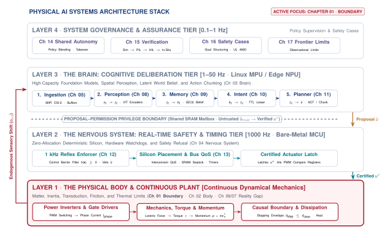
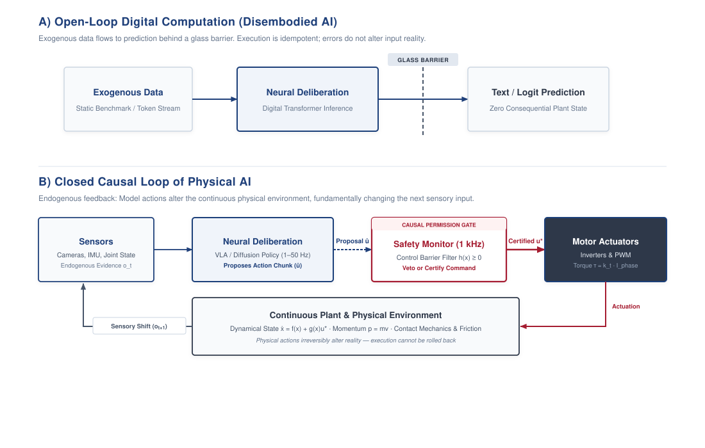
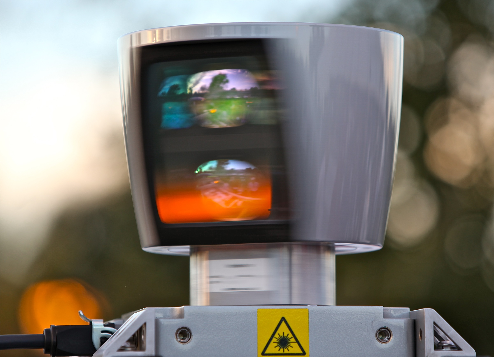
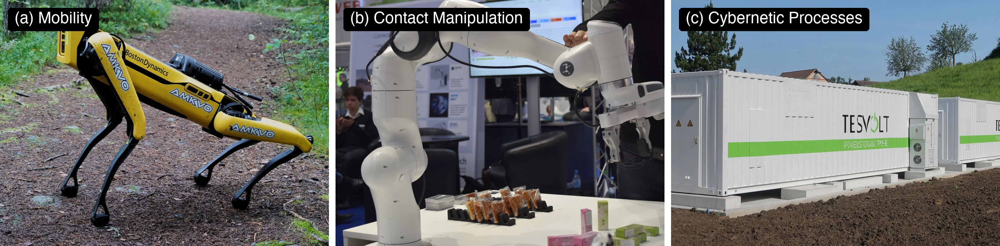
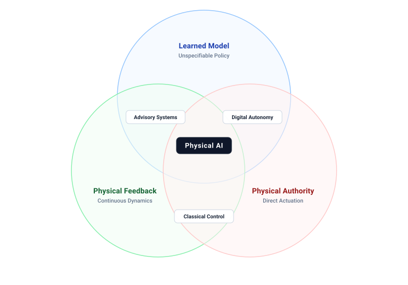
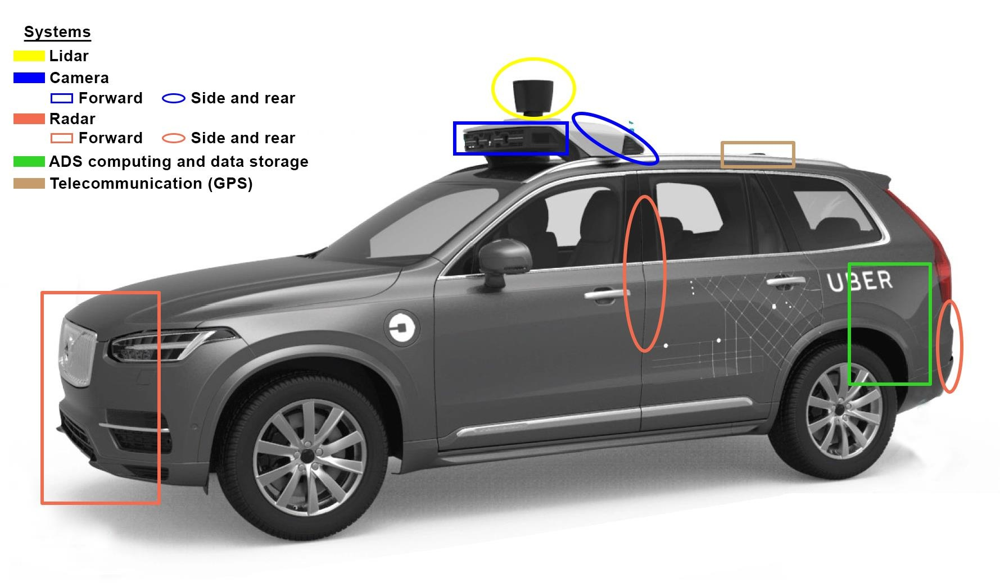
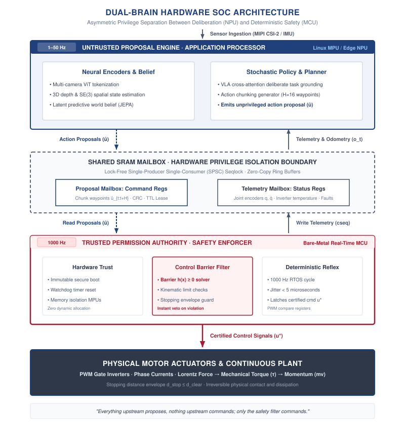

# The Causal Boundary {#sec-boundary}

::: {.column-margin}

\chapterminitoc

:::


::: {#fig-01-locator fig-env="figure" fig-pos="H" fig-cap="**Physical AI Systems Architecture Stack**: The master systems hierarchy spanning System Governance (Layer 4), Cognitive Deliberation (Layer 3), Hard Real-Time Reflex & Silicon (Layer 2), and the Physical Body (Layer 1). In this introductory chapter, our active focus centers on the causal boundary at the interface between digital software and the physical plant." fig-alt="Diagram titled Physical AI Systems Architecture Stack, drawn as four stacked tiers. Layer 4 is system governance and assurance at 0.1 to 1 hertz, holding boxes for shared autonomy, verification, safety cases, and frontier limits. Layer 3 is the brain, a cognitive deliberation tier at 1 to 50 hertz, holding five stages named ingestion, perception, memory, intent, and planner. A dashed proposal-permission privilege boundary separates it from layer 2, the nervous system, a real-time safety and timing tier at 1000 hertz. Layer 1 is the physical body and continuous plant. Layer 1 is outlined in red and the badge reads Active Focus, Chapter 01, Boundary."}
{width="100%"}
:::

*What must an autonomous physical agent guarantee before commanding physical work, and why does digital software fail to provide that guarantee?*

Across humanoid robotics, autonomous transport fleets, and surgical workcells, high-capacity neural foundation models are stepping out of cloud data centers to command physical machines. Yet inside engineering design reviews at companies from Tesla and Figure to Boston Dynamics and Waymo, teams find themselves locked in an architectural crisis: machine learning researchers celebrate 99 percent virtual benchmark scores, while robotics engineers watch hardware shake, overheat, and strip precision gearboxes on the physical floor. An error that costs nothing on a screen destroys hardware in the physical world.

This book is the founding curriculum for **physical AI systems architecture**\index{Physical AI Systems Architecture}—the discipline of embedding high-capacity learned statistical models into closed-loop machines governed by classical mechanics, thermodynamics, and hard real-time silicon determinism. It bridges open-world cognitive intelligence and dynamical physics, teaching engineers how to build dependable, certifiable machines that sense, reason, and act in the physical world.



::: {.callout-learning-objectives}
After studying this chapter, you will be able to:

1. Locate the causal boundary in a system architecture and state what changes on each side of it.
2. Diagnose the "Tower of Babel" conflict between ML, Systems, Controls, and Embedded disciplines.
3. Classify an embodied machine into one of three canonical physical archetypes and identify which physical budget binds it first.
4. Apply the three-pillar scope test to determine whether a given system requires the engineering discipline of physical AI.
5. Identify the Four Pillars of an embodied machine: Dynamical Body, Cognitive Brain, Real-Time Nervous System, and Governance Envelope.
6. Trace how latency, classification instability, and missing authority boundaries caused the 2018 Tempe autonomous vehicle collision.
7. State the Four Bedrock Laws that govern physical machines across the causal boundary.
8. Explain how the heterogeneous Dual-Brain architecture (MPU proposer + MCU referee across shared SRAM) enforces physical safety invariants.
9. Trace the four-part architectural arc of this textbook and map each chapter to its corresponding tier in the physical AI systems stack.

*Core chapter takeaway.* The causal boundary is a physical location, not an abstraction. Below it, the machine shapes its own future sensory observations, computational delay is paid in physical displacement, and energy released into the world cannot be recalled.
:::

## The Industrial Frontier: Artificial Intelligence Beyond Glass {#sec-boundary-1-1}

As highlighted in @fig-01-locator, this section introduces the core focus of the chapter within the broader physical AI systems architecture.

\vspace{1em}\begin{center}
\mlphysicalstackfull{0}{20}{40}{100}{100}
\end{center}\vspace{1em}

Every major epoch in computing has been defined by the boundary across which bits travel. In personal computing, bits crossed from mainframe backplanes to human eyes through glowing cathode-ray displays. In cloud computing, bits crossed global fiber-optic networks to synchronize distributed relational databases. In modern generative artificial intelligence, bits traverse trillion-parameter neural networks to generate text, synthesize images, or recommend financial actions. Yet across all these transformations, one fundamental property of computer software remained inviolate: the computation lived safely behind glass.

Today, a massive global industrial race is underway to bring artificial intelligence beyond the glass. Companies developing humanoid robots (such as Tesla Optimus, Figure, and Boston Dynamics), autonomous vehicle fleets (such as Waymo and Zoox), intelligent aerial drones (such as Skydio), and robotic surgery platforms are deploying deep neural policies directly aboard mobile, articulated hardware. Yet as these systems transition from virtual benchmarks to real-world deployment, they encounter the profound historical asymmetry known as **Moravec's paradox**\index{Moravec's paradox}[^fn-ai-moravec] [@moravec1988mind]: tasks that demand high-level human intellectual reasoning (such as symbolic logic, chess, or legal analysis) require astonishingly little computational effort, whereas low-level sensorimotor perception and dynamic coordination (such as walking across uneven gravel or dexterously manipulating an egg) demand astronomical sensory processing and continuous motor adaptation shaped by hundreds of millions of years of evolutionary survival. That race is measurable rather than rhetorical. @Fig-boundary-autonomous-miles tracks the cumulative physical experience these fleets have accumulated, and the inflection after 2016 is the moment the discipline acquired a body of operational evidence rather than a set of demonstrations.

::: {#fig-boundary-autonomous-miles fig-env="figure" fig-pos="htb" fig-cap="**Autonomous Miles Scaling**: Cumulative autonomous miles by year as an industry proxy, flat through 2016 and then climbing steeply toward one hundred twenty million by 2024. The inflection marks the point at which physical deployment stopped being a demonstration and started generating the exposure that safety arguments must cover." fig-alt="Line chart of cumulative autonomous miles from 2009 to 2024, flat through 2016 and then rising steeply to about one hundred twenty million."}

```{python}
#| echo: false
import pandas as pd
import matplotlib.pyplot as plt
from mlsysim import viz

data = pd.read_csv("vol4/01_boundary/data/autonomous_miles_scaling.csv")
fig, ax, COLORS, plt = viz.setup_plot(figsize=(8, 5))
ax.plot(data["Year"], data["Cumulative_Miles_Millions"], marker="o", linewidth=2.5, color="#b30000")
plt.fill_between(data["Year"], data["Cumulative_Miles_Millions"], color="#b30000", alpha=0.1)
plt.title("Scaling of Physical AI: cumulative autonomous miles", fontsize=14, pad=15)
plt.xlabel("Year", fontsize=12)
plt.ylabel("Cumulative Miles (Millions)", fontsize=12)
plt.xticks(data["Year"][::2])
plt.tight_layout()
plt.show()
plt.close()
```

:::

When digital models attempt to steer physical embodiments, they re-enter the circular causal chains first formalized by Norbert Wiener in his foundational formulation of cybernetics [@wiener1948cybernetics]: information is not a passive, open-loop stream terminating at a screen, but an active feedback loop where a machine's actions continuously reshape its subsequent physical observations under Newtonian mechanics. Engineering teams that attempt to bridge these worlds encounter a fundamental architectural barrier: the **Tower of Babel**\index{Tower of Babel} crisis.

In a typical embodied AI design review, four distinct engineering cultures clash:

- **The Machine Learning Perspective:** Focuses on training deep transformer backbones and diffusion policies on millions of simulated steps, optimizing statistical loss functions and celebrating high validation scores, often assuming that real-world deployment is primarily a challenge of scaling compute and collecting broader teleoperation datasets.
- **The Systems and Computer Architecture Perspective:** Focuses on memory bus bandwidth, DRAM bank conflicts, cache contention, and tail latency percentiles, recognizing that streaming multi-gigabyte foundation model weights at $50\text{ Hz}$ threatens to saturate the memory bus and starve real-time camera direct memory access (DMA) pipelines [@williams2009roofline].
- **The Robotics and Classical Control Perspective:** Focuses on Newton-Euler equations, coordinate transforms, actuator torque saturation, and stability margins, recognizing that unconstrained neural action chunks risk injecting high-frequency jerk that degrades mechanical gearboxes and excites unmodeled resonance.
- **The Embedded Silicon and Functional Safety Perspective:** Focuses on bare-metal interrupt service routines, watchdog timers, hardware PWM trip zones, and safety standards (such as ISO 26262 and UL 4600), ensuring that non-deterministic neural weights never hold unverified direct write access to motor inverter registers.

None of these four perspectives can succeed in isolation. You cannot solve a broken gearbox or an inductive rail voltage collapse with gradient descent, and you cannot achieve open-vocabulary semantic task generalization with a hand-tuned PID controller.

::: {#dfn-boundary-physical-artificial-intelligence-physical-ai .callout-definition title="Physical artificial intelligence (physical AI)"}

**physical artificial intelligence (physical AI)**\index{Physical Artificial Intelligence!definition}\index{Physical AI!definition} is the systems engineering science of embedding high-capacity learned statistical models into closed-loop physical machines governed by classical mechanics, thermodynamics, and hard real-time silicon determinism.

1.  **Significance**: Advisory AI models terminate safely behind digital glass, where computational errors are idempotent and bounded by software exception handling. Physical AI crosses into the continuous physical universe, where digital bits command motor currents, kinetic momentum accumulates, and unhandled software stalls produce mechanical fractures, thermal runaways, or physical collisions.
2.  **Distinction**: Unlike classical robotics (which relies on hand-engineered state machines and explicit kinematic models) or internet-scale machine learning (which operates on static offline datasets), Physical AI couples high-capacity statistical generalization with deterministic hardware safety filters across an endogenous closed causal loop.
3.  **Common pitfall**: Treating physical embodiments as peripheral I/O devices for foundation models. Scaling laws and benchmark accuracies do not prevent inductive rail collapse, gearbox shear, or actuator saturation; physical survival requires an asymmetric architecture where real-time silicon holds unconditional veto authority over learned proposals.

:::

Physical AI is the systems engineering synthesis that unifies these four cultures into a single coherent architecture. It trains the **physical AI systems architect**\index{Physical AI Systems Architect}—the bilingual systems leader who designs the complete end-to-end container, ensuring that high-capacity neural deliberation (Layer 3) safely and deterministically coordinates with real-time silicon (Layer 2) and physical dynamics (Layer 1) under formal governance (Layer 4).

To understand why this closed causal loop requires a fundamentally new systems architecture, we must examine what physically occurs at the hardware register level when software commands an actuator.

## Software That Acts: The Causal Boundary {#sec-boundary-1-2}

Advisory software operates inside an informational container where errors carry negligible physical momentum. When a recommender model serves an irrelevant product, a classifier mislabels an image, or a language model emits an inaccurate token, the computational pipeline terminates in a display buffer, a network socket, or a sandboxed database table. The failure remains bounded by the digital medium. A user dismisses the recommendation, a human analyst closes the alert, or a database transaction coordinator issues an abort that restores memory pages from an undo log. *Advisory software is immune to its own errors because of where it stops, not because of how it was built.* The safety of the pipeline does not stem from statistical guarantees in the training objective or rigorous validation on test splits, but from the physical detachment of the interface. Between the output of the neural network and any change in the physical world, an air gap or a human operator intercepts the signal.

Physical artificial intelligence eliminates that detachment. In a physical machine, the final instruction of a control loop does not write to a screen or populate a web response. For a machine learning systems engineer accustomed to writing `action = policy(observation)` in PyTorch, the causal boundary is where floating-point tensors meet physical silicon. The output tensor—typically an action chunk [@zhao2023aloha] with shape $[B, H, d_a]$ predicting a sequence of $H$ future waypoints across $d_a$ action dimensions (such as joint position targets $\hat{\mathbf{q}} \in \mathbb{R}^d$, velocity vectors $\hat{\dot{\mathbf{q}}} \in \mathbb{R}^d$, Cartesian end-effector pose deltas $\Delta \mathbf{x} \in SE(3)$, or discrete token bins)—does not execute directly on hardware.

Instead, the host application runtime serializes those floating-point predictions into a structured C/Rust memory payload dispatched across a shared-memory mailbox to a hard real-time microcontroller. There, an independent safety referee evaluates physical barrier invariants at $1000\text{ Hz}$. If approved, the kinematic setpoints pass into a deterministic cascaded control loop: a joint position and velocity loop calculates required motor torques, which feed an inner **Field-Oriented Control (FOC)**\index{Field-Oriented Control}[^fn-ctrl-foc] loop running at $10\text{--}25\text{ kHz}$ to compute target quadrature current $I_q$. Finally, these current references are scaled into integer compare thresholds written into a hardware timer register.

Depending on the machine architecture, that hardware register acts as a digital-to-analog converter (DAC) latch holding a commanded reference voltage, a pulse-width modulation (PWM) compare register setting the duty cycle of a power inverter stage, or a serial control word configuring an H-bridge gate driver.[^fn-hw-tim-pwm] <!-- TODO: Moved exhaustive hardware register lists to the hardware appendix --> At that exact memory address, informational abstraction ends. When the hardware timer counter reaches the latched value, it toggles a digital GPIO output line, modulating gate voltages across power MOSFETs and drawing current from a DC bus into the copper windings of a motor. Current develops magnetic flux, which generates mechanical Lorentz torque across the rotor. That torque accelerates the rotor and transmission against reflected load inertia, imparting physical momentum to the mechanism.

::: {#dfn-boundary-causal-boundary .callout-definition title="The causal boundary"}

**causal boundary**\index{Causal boundary!definition} is the physical and electrical interface where digital computational bits convert into physical forces, currents, or flows.

1.  **Significance**: Above the boundary, software state is digital, sandboxed, and computationally idempotent. Below the boundary, actions permanently alter the physical environment, dissipate irreversible thermodynamic entropy ($I^2 R$ heat, kinetic friction), and endogenously reshape all subsequent sensory observations.
2.  **Distinction**: Unlike a logical software interface (such as a POSIX system call or network socket) where operations can be aborted, retried, or rolled back from a journal, actions crossing the causal boundary commit irreversible physical energy that cannot be undone.
3.  **Common pitfall**: Assuming software exceptions or thread cancellations can arrest physical momentum. Once a PWM compare register latches, current flows and mass accelerates; arresting that motion requires dedicated stopping distance ($d_{\text{stop}}$) and friction braking.

:::

When a digital neural network misclassifies an image in a cloud benchmark, the consequence is confined to an incorrect integer stored in a memory register. When an autoregressive language model generates an ungrounded hallucination, the failure manifests as superfluous text on a browser screen. Software engineers can catch runtime errors, discard invalid outputs, roll back transactions to a clean checkpoint, or rely on human users to ignore an answer. In computer systems engineering, this property is known as *idempotency*: the state of the surrounding physical universe remains completely decoupled from the intermediate outputs of the software pipeline.[^fn-math-idempotency-physical] Memory can be cleared, registers zeroed, and processes restarted without permanent side effects on the environment.

Physical artificial intelligence begins at the exact instant this isolation breaks. The moment an algorithmic prediction leaves the digital domain to modulate a pulse-width modulation motor drive, fire a valve solenoid, or adjust an electrical grid inverter, computation ceases to be advice and becomes physical force. At this threshold, an unhandled exception is no longer a benign runtime error; it is a burnt motor winding, a sheared gearbox, or a collision with an obstacle in the physical world.

This transition from digital state to physical force destroys the statistical foundation of classical machine learning. In offline vision, natural language processing, and tabular prediction, data collection is exogenous: the world generates a distribution of inputs, and the model processes them without altering the mechanism that created them. An incorrect classification on one image has zero effect on the distribution governing the next image. In a physical system, the environment evolves in a closed causal loop: the next physical state and sensor observation depend directly on the action produced by the prior model inference.

The sensory input stream is endogenous, generated by the machine's own past actions. When a policy produces an erroneous torque command, the joint rotates, the platform shifts, and mounted cameras or lidar units swing into new viewpoints. The machine drives itself into an unfamiliar region of the state space where training data is sparse, increasing the probability of subsequent inference errors and compounding the divergence from nominal operation. This fundamental architectural divergence is illustrated in @fig-01-causal-loop, contrasting the open-loop, idempotent execution of advisory digital machine learning with the closed causal loop of Physical AI crossing the actuator register boundary.

::: {#fig-01-causal-loop fig-env="figure" fig-pos="t" fig-cap="**The Closed Causal Loop of Physical AI versus Open-Loop Digital Computation**: (a) Open-loop advisory machine learning operates behind glass on exogenous benchmark distributions, where computational errors are idempotent and bounded by software exception handling or transactional rollbacks. (b) In Physical AI, neural deliberation proposals pass through a deterministic nervous system safety gate before committing to hardware actuator registers. Once memory-mapped pulse-width modulation compare registers latch, electrical current converts into Lorentz force, mechanical torque, kinetic momentum, and Joule heat, permanently mutating environment state and endogenously shifting all subsequent sensory observations." fig-alt="The Closed Causal Loop of Physical AI versus Open-Loop Digital Computation. (a) Open-loop advisory machine learning operates behind glass on exogenous benchmark distributions, where computational errors are idempotent and bounded by software exception handling or transactional rollbacks. (b) In Physical AI, neural deliberation proposals pass through a deterministic nervous system safety gate before committing to hardware actuator registers. Once memory-mapped pulse-width modulation compare registers latch, electrical current converts into Lorentz force, mechanical torque, kinetic momentum, and Joule heat, permanently mutating environment state and endogenously shifting all subsequent sensory observations."}
{width="95%"}
:::

Because physical mass possesses inertia and computation takes finite time, latency in physical AI translates directly into physical displacement. As shown on the autonomous testbed in @fig-01-sensor-rack, real-world robotic systems rely on dense multi-modal sensor suites—including spinning LiDAR scanners, camera arrays, and radar units—that continuously stream high-bandwidth telemetry to onboard processors. Every stage in this pipeline—from photodiode exposure and sensor bus serialization,[^fn-hw-serdes-bus] to neural inference on accelerator silicon and packet transmission over deterministic fieldbuses—consumes precious milliseconds. <!-- TODO: Moved specific fieldbus standards to the fieldbus appendix --> During this aggregate delay window, the machine cannot incorporate new sensory information and continues moving along the trajectory dictated by its existing momentum.

::: {#psp-boundary-latency-in-millimeters .callout-perspective title="Latency is paid in millimeters"}
In advisory machine learning, computational delay only frustrates a user; in physical AI, latency is paid directly in physical displacement. At velocity $v$, an unbudgeted delay $\Delta t$ consumes unguided motion that no downstream neural capacity can ever recover.
:::

As a concrete example, consider a mobile platform traveling at a modest walking speed of $2.0\text{ m/s}$. If the perception pipeline, neural policy inference, and motor controller communication consume a combined latency of $150\text{ ms}$, the platform traverses $(2.0\text{ m/s}) \times (0.15\text{ s}) = 0.30\text{ m}$ ($30\text{ cm}$) before the first motor response can occur. During those $30\text{ cm}$, the vehicle is entirely blind to any environmental change that occurred after the initial sensor exposure. If an obstacle enters the path $20\text{ cm}$ ahead during that inference window, no amount of model capacity or predictive accuracy can alter the outcome, because the physical displacement has already been accumulated by the body.

Once digital commands transition into mechanical work, the state change becomes thermodynamically irreversible. In standard software systems, erroneous mutations are contained through exception handling, memory isolation, and atomic rollback protocols. When an unhandled exception occurs, the runtime unwinds the call stack, reclaims heap allocations, and restores the machine state to a known clean checkpoint. The physical world provides no rollback mechanism. This physical asymmetry directly reflects the thermodynamic foundations established by @landauer1961: while logical bit operations can theoretically be reset, erasing information or coupling computation to physical state transitions dissipates nonzero thermodynamic entropy ($E_{\text{dissipated}} \ge k_B T \ln 2$). When an actuator controller applies current to a motor, electrical energy transfers from the battery into kinetic energy in mechanical linkages or thermal energy dissipated through resistive Joule heating in the stator windings. If an incorrect joint torque drives a manipulator into a rigid steel fixture, the kinetic energy converts into plastic deformation of the tool, mechanical strain on the gearbox teeth, and heat. No software interrupt can pull that kinetic energy out of the crushed structure or restore sheared gear teeth to their original geometry.

::: {#fig-01-sensor-rack fig-env="figure" fig-pos="t" fig-cap="**Spinning Multi-Beam LiDAR Sensor Hardware for Real-Time Perception**: Close-up photograph of the 64-beam spinning optical LiDAR sensor assembly (Velodyne HDL-64E) mounted aboard an autonomous research testbed. In Physical AI, high-bandwidth sensor streams (1.33 million points/second) must be serialized over real-time interfaces (e.g., FPD-Link III, GMSL2, Automotive Ethernet), synchronized via hardware timestamps, and processed through neural perception backbones within strict end-to-end latency budgets, because every millisecond of transport and compute delay converts directly into unguided physical displacement. (Source: Steve Jurvetson, CC BY 2.0)." fig-alt="Spinning Multi-Beam LiDAR Sensor Hardware for Real-Time Perception. Close-up photograph of the 64-beam spinning optical LiDAR sensor assembly (Velodyne HDL-64E) mounted aboard an autonomous research testbed. In Physical AI, high-bandwidth sensor streams (1.33 million points/second) must be serialized over real-time interfaces (e.g., FPD-Link III, GMSL2, Automotive Ethernet), synchronized via hardware timestamps, and processed through neural perception backbones within strict end-to-end latency budgets, because every millisecond of transport and compute delay converts directly into unguided physical displacement. (Source: Steve Jurvetson, CC BY 2.0)."}
{width="85%"}
:::

Understanding why Physical AI requires a distinct systems engineering discipline requires contrasting its core properties against both advisory digital machine learning and classical control theory. As summarized in @tbl-01-paradigm-comparison, the three paradigms are sorted from pure software isolation on the left, to pure classical dynamics in the middle, to the unified physical AI synthesis on the right.

| Architectural Dimension   | Digital Machine Learning (Advisory)                                        | Classical Robotics & Control                                                         | Physical Artificial Intelligence (Closed-Loop)                                                 |
|:--------------------------|:---------------------------------------------------------------------------|:-------------------------------------------------------------------------------------|:-----------------------------------------------------------------------------------------------|
| **Operational Substrate** | Decoupled virtual memory buffers (GPU VRAM, DRAM, web endpoints)           | Continuous analog state space governed by differential equations                     | Hybrid: high-dimensional neural representations mapped to analog physical actuators            |
| **Model Formulation**     | High-capacity statistical approximators (LLMs, ViTs, diffusion policies)   | Analytically specified transfer functions and deterministic state-space matrices     | Foundation policies paired with deterministic runtime safety filters                           |
| **Feedback Dynamics**     | Exogenous and static; independent and identically distributed samples      | Continuous deterministic state feedback with Gaussian sensor noise                   | Endogenous, non-stationary closed loop; actions shape future observations                      |
| **Execution Cadence**     | Throughput-optimized batching; soft or unbounded latency budgets           | Hard real-time single-rate loops on microcontrollers (100–1000 Hz)                   | Asynchronous multi-rate cadences: System 2 (1 Hz), System 1.5 (50 Hz), System 1 (1000 Hz)      |
| **Actuation Authority**   | Advisory; sandboxed APIs, display buffers, or human-in-the-loop validation | Hardcoded feedback directly driving power inverter timers and PWM registers          | Decoupled Proposal–Permission architecture; untrusted proposals gated by MCU safety referee    |
| **Failure Semantics**     | Idempotent; call-stack unwind, database rollback, or human alert dismissal | Actuator saturation or tracking error within analytically bounded stability envelope | Irreversible thermodynamic work, plastic deformation, kinetic collision, or stator overheating |
| **Safety Assurance**      | Offline statistical loss minimization on validation splits                 | Formal mathematical stability proofs (Lyapunov functions, gain/phase margins)        | Layered runtime invariant enforcement, forward-invariant barrier filters, and fault injection  |

: **Comparison Matrix of Computing Paradigms across the Causal Boundary**:  Systematic comparison of Advisory Digital Machine Learning (left), Classical Robotics & Control Theory (middle), and Physical Artificial Intelligence (right) across operational substrate, model formulation, feedback dynamics, execution cadence, actuation authority, failure semantics, and safety certification primitives. {#tbl-01-paradigm-comparison tbl-colwidths="[18,26,26,30]"}

## Three Machine Archetypes {#sec-boundary-1-3}

Once digital predictions cross the causal boundary into physical force, they interact with physical machines of every conceivable shape and scale. An autonomous delivery drone navigating turbulent wind gusts seems to share nothing with a six-axis robotic arm assembling an automotive transmission, and neither appears related to a containerized battery management plant regulating liquid coolant. A practitioner or student might wonder: how can a single systems engineering curriculum possibly encompass such wildly diverse physical systems without dissolving into a collection of bespoke, ad-hoc recipes?

The key is to look past cosmetic form factors and examine the underlying physical conservation law that binds the machine. Beneath the surface diversity of shapes, sizes, and applications, every embodied AI system can be systematically categorized into one of three canonical physical archetypes based on the physical quantity its actuators manipulate (@fig-01-three-archetypes): moving mass across space, applying force through physical contact, or regulating continuous fluid and thermal flows. By viewing physical AI through this three-archetype lens, a systems architect can immediately determine which resource budget is exhausted first during a software stall or model anomaly, and design the real-time nervous system accordingly.

### Class 1: Mass-dominated mobility systems (moving through space)

Class 1 machines move mass across space, where execution is bound first by momentum conservation and kinetic energy dissipation (@fig-01-three-archetypes a). In autonomous transport platforms, quadruped robots navigating rugged terrain, mobile manipulators, and aerial drones, the actuator bridge applies force to translate or rotate a body with mass $m$ at velocity $v$. Because kinetic energy $E_k = \frac{1}{2}m v^2$ cannot be recalled once delivered to the chassis, safety is measured as remaining spatial clearance. When braking begins at maximum allowable deceleration $a_{\max}$, the physical floor for stopping distance follows the fundamental kinematic relation:

$$d_{\text{stop}} = v \cdot t_{\text{lag}} + \frac{v^2}{2a_{\max}}$$

where $t_{\text{lag}}$ is the total sense-to-actuation transport and inference delay. In a mass-moving system, computational latency converts directly into unguided spatial displacement ($v \cdot t_{\text{lag}}$), while braking distance scales quadratically with velocity ($v^2 / 2a_{\max}$). The first boundary breached during a software stall or model misclassification is the physical distance to an external obstacle.

### Class 2: Contact-dominated manipulation systems (applying contact force)

Class 2 machines apply mechanical force through contact, where the primary binding limit is actuator torque saturation, current loop bandwidth, and structural stiffness (@fig-01-three-archetypes b). In articulated manipulators, precision assembly fixtures, and robot learning workcells executing contact-rich insertion and grasping, the end-effector interacts directly with a rigid or compliant workpiece. Unlike a mobile platform operating in open space, an arm in contact with a surface cannot resolve an unexpected displacement command by rolling forward. When an actuator commands position into a rigid boundary, displacement is constrained and the interaction is governed by mechanical impedance. By Hooke's law, the contact force generated by a spatial penetration error $\Delta x$ against an environment of stiffness $k$ is $F = k \Delta x$.[^fn-math-contact-lcp]

Because contact stiffness in metal and tooling fixtures is extremely high ($k \ge 10^5\text{ N/m}$), small geometric trajectory deviations convert into massive contact forces within milliseconds. If the nervous system fails to clamp motor current within sub-millisecond response windows, the motor drives the transmission past its mechanical yield stress. For example, a tooling tip moving at just $0.20\text{ m/s}$ that encounters a stiff workcell fixture will accumulate $30\text{ mm}$ of uncorrected displacement during a $150\text{ ms}$ software stall—generating thousands of Newtons of force that instantly shears precision gear teeth. The critical floor in contact systems is not stopping distance, but the time rate of force rise relative to actuator current loop bandwidth and structural yield stress.

### Class 3: Flow-dominated process and energy systems (regulating energy and fluid flows)

Beyond moving linkages and rigid contacts, Class 3 machines regulate continuous fluid, thermal, or electrical power flows—a domain that serves both as dedicated process plants and as the foundational electrical and thermal substrate underlying all high-performance mobile and manipulation systems (@fig-01-three-archetypes c). In grid-scale battery storage facilities, data center liquid cooling loops, and grid-tied power inverters managing renewable generation, actuators manipulate coolant pumps, flow valves, and high-frequency power semiconductors rather than mechanical joints. The state of the system is governed by mass transport, thermal capacitance, and energy balance rather than kinematic positions. When a coolant valve or pump stalls, accumulated heat drives rapid temperature excursions toward chemical decomposition thresholds. Similarly, a grid-tied inverter operating on a $60\text{ Hz}$ utility network faces an electrical phase cycle of $16.6\text{ ms}$ (half-cycle zero crossing of $8.33\text{ ms}$), where an unhandled scheduling delay creates alternating-current phase angle errors that drive destructive surge currents through substation transformers. The deadline in flow architectures is set by thermal capacitance, transport delay, and grid phase timing, defining physical budgets where accumulated energy cannot be quickly reversed once started.

### The integrative capstone: Multi-class embodiments and humanoid robotics

A central question for physical AI systems architects is: *Where do complex general-purpose embodiments, such as humanoid robots, fit into this tri-archetype framework?*

A humanoid robot is not a disjoint fourth archetype. Rather, it represents the **integrative capstone embodiment**\index{Integrative Capstone Embodiment}—the ultimate cyber-physical convergence where all three canonical physical classes operate and contend simultaneously on a single, tightly constrained mobile chassis:

1. **Class 1 Dynamics in Locomotion:** Underactuated bipedal balancing, dynamic footstep placement, momentum conservation ($m\mathbf{v}$), and ground contact slip during walking and stair climbing require continuous spatial clearance and kinetic energy management.
2. **Class 2 Dynamics in Manipulation:** High-DOF bimanual arms and dexterous tactile hands interacting with rigid workpieces, opening doors, and grasping tools generate instantaneous contact wrenches ($\mathbf{F} = k \Delta \mathbf{x}$) bounded by gearbox yield stress and joint impedance control bandwidth.
3. **Class 3 Dynamics in Actuation & Power Delivery:** Driving 20 to 50 high-torque actuators simultaneously from a single onboard DC battery pack pushes inverter thermal dissipation ($I^2 R$) to its limits and creates severe inductive power-rail voltage droop ($L \frac{dI}{dt}$) during simultaneous leg shock absorption and heavy arm lifting.

While a single-class machine (such as a wheeled AMR or a fixed industrial arm) isolates its physical budget to a single dominant conservation law, a humanoid robot forces the systems architect to manage **cross-class coupled contention**\index{Cross-Class Coupled Contention}. When a bipedal robot catches a falling heavy object, the contact wrench (Class 2) shifts its center of mass, requiring an instantaneous balancing recovery step (Class 1) that draws peak phase currents threatening to collapse the electrical bus and overheat the knee actuators (Class 3). Throughout this book, we will use individual archetypes to isolate specific architectural principles in depth, while using humanoid robotics as the capstone testbed where all physical constraints collide.

::: {#fig-01-three-archetypes fig-env="figure" fig-pos="t" fig-cap="**The Three Canonical Machine Archetypes of Physical AI**: Mass-dominated mobility, contact-dominated manipulation, and flow-dominated thermal plants, each bound first by a different physical quantity. What separates the three is which constraint binds before any other, because that ordering decides what the control loop must respect and what it can safely approximate. A humanoid is the capstone precisely because all three bind at once on one chassis. (Sources: Wikimedia Commons, CC BY-SA 4.0)." fig-alt="The Three Canonical Machine Archetypes of Physical AI. (a) Mass-dominated mobility systems (such as the Boston Dynamics Spot quadruped robot navigating rugged outdoor terrain) bound first by momentum, kinetic energy dissipation, and spatial clearance. (b) Contact-dominated manipulation systems (such as the Franka Emika Panda articulated arm) bound first by contact impedance, joint torque saturation, and structural yield stress. (c) Flow-dominated process and thermal plants (such as containerized grid-scale battery storage systems) bound first by lumped thermal capacity, transport lag, and electrical phase timing. Complex embodiments like humanoid robots serve as the integrative capstone uniting all three classes on a single chassis. (Sources: Wikimedia Commons, CC BY-SA 4.0)."}
{width="100%"}
:::

For any physical AI system, engineering the nervous system begins by determining which physical budget is exhausted first during a failure. In software systems, resource constraints center on processor cycles, memory allocation, and network bandwidth. In physical systems, the systems architect must identify whether spatial clearance, structural stress, or heat dissipation creates the critical timing deadline. In a high-speed vehicle or quadruped, spatial clearance fails within fractions of a second while motor winding temperatures remain safely below thermal limits. In an assembly press, mechanical stress exceeds the yield point of structural members within tens of milliseconds long before the chassis moves perceptibly or heats up. In a chemical reactor or battery pack, mechanical stress is negligible, but accumulated thermal energy breaches safe operational envelopes over several seconds. The shortest time to failure across these three domains defines the deterministic execution deadline that the nervous system must meet.

Yet understanding that a machine belongs to one of these three physical archetypes does not automatically mean it requires the full systems discipline of Physical AI. A classical hydraulic press or a deterministic PID drone autopilot manipulates mass and contact force, but operates entirely within classical control theory. To determine when a machine crosses into Physical AI, we must establish a rigorous diagnostic scope test.

## The Physical AI Scope Test {#sec-boundary-1-4}

Before designing or deploying an embodied architecture, a system architect or practitioner must establish whether a machine actually requires the full systems engineering discipline of Physical AI. Without a rigorous scope boundary, engineering teams make two symmetric mistakes: they over-engineer classical deterministic machines with bloated neural models where closed-form PID control is provably optimal, or they dangerously under-engineer stochastic neural models by granting them unverified motor authority in safety-critical physical loops.

The scope of Physical AI is defined by the simultaneous intersection of three structural criteria (@fig-01-scope-venn):

1. **Learned Statistical Model (Unspecifiable Policy):** The system relies on a policy, perception encoder, or world model acquired from data (e.g., neural networks, foundation models, diffusion policies [@chi2023diffusionpolicy]) whose transfer function cannot be written in closed-form analytical equations and whose worst-case outputs cannot be mathematically bounded offline.
2. **Consequential Physical Feedback:** Actuator actions alter the material state of the physical environment, endogenously determining what the sensors observe next under the governing laws of classical mechanics, thermodynamics, or electromagnetism.
3. **Delegated Physical Authority (Direct Actuator Write):** Automated software routines write directly to hardware actuator registers without synchronous human approval in the control loop, operating within the temporal window where delay or error converts directly into irreversible physical momentum.

::: {#fig-01-scope-venn fig-env="figure" fig-pos="t" fig-cap="**The Physical AI Scope Test**: Physical AI sits at the three-way intersection of learned models, consequential physical feedback, and delegated physical authority. Read the figure by the regions outside the center, since a system meeting exactly two of the three criteria is a well-understood adjacent field rather than a weaker instance of this one. The shared autonomy reflex gap sets where the boundary actually falls, because a human cannot reclaim authority faster than neuromuscular latency allows." fig-alt="The Physical AI Scope Test. Physical AI exists strictly at the three-way intersection of learned models (unspecifiable policies), consequential physical feedback (actions govern future sensory observations under mechanics and thermodynamics), and delegated physical authority (automated register writes without synchronous human intervention). Systems satisfying exactly two criteria define adjacent engineering fields: Advisory Decision Support (no physical authority), Classical Control Theory (analytical transfer functions with Lyapunov certificates), and Digital Autonomous Systems (transactional databases with idempotency and rollback). The shared autonomy reflex gap marks the operational boundary where human neuromuscular reflex latency (150--250 ms) delegates transient authority to the learned model."}
{width="90%"}
:::

A closed feedback loop is necessary for physical interaction, but feedback alone does not place a machine in this domain. Classical proportional-integral-derivative controllers run at $1000\text{ Hz}$ across aerospace and industrial automation, regulating valve positions and motor torques through tight sensory feedback. Their feedback loops are continuous and physical, but their control laws are specified entirely by fixed mathematical formulas whose stability bounds can be proven analytically from transfer functions. They hold physical authority and experience physical feedback, but they lack a learned model. Conversely, high-frequency algorithmic trading engines execute automated market orders under learned predictive models within microseconds. They combine learned policies with delegated transactional authority, but the feedback they receive is purely digital and informational. When an order executes, it alters an electronic order book rather than momentum, friction, or thermal energy. An unhandled stall in algorithmic trading costs financial capital, but it does not cause an inertia-driven collision with a structural fixture.

A learned model is equally insufficient on its own to define the field. Modern engineering workflows frequently deploy deep neural networks to optimize robot trajectories offline or inspect manufactured parts on assembly lines. An offline neural trajectory optimizer may compute time-optimal paths for a six-axis robotic manipulator over several seconds of cluster compute, but if that trajectory is verified by an engineer or executed through a classical deterministic controller with hard-coded envelope stops, the learned model holds no delegated physical authority over the plant. Similarly, a convolutional neural network monitoring an assembly line may classify surface defects at $60\text{ frames/s}$. If the classification output merely logs an entry in a database or flags a display for a human operator, the model operates outside the causal loop. A false negative or an inference timeout produces a corrupted record, but it cannot directly command an actuator to over-torque a mechanical joint.

Systems that satisfy exactly two criteria demonstrate where the structural boundary lies. A real-time driver drowsiness monitor uses a learned computer vision model to track eyelid movement and vehicle lane position, receiving continuous physical feedback from the vehicle state. Yet it lacks delegated physical authority because its only output is an auditory warning chime. If the vision model fails completely during an inference stall, the speaker emits no sound, but the steering rack and brake calipers remain under human control. An analog bimetallic thermostat possesses delegated physical authority over a gas furnace valve and operates in continuous feedback with the thermal mass of a building, but its transfer function is a fixed thermodynamic property of two bonded metals rather than a learned representation. An automated trading bot possesses both a learned policy and delegated execution authority, but its actions propagate through network packets and databases without interacting with the physical laws of mass and motion.

The most demanding edge cases occur in shared autonomy, where physical authority is divided dynamically between a human operator and a learned model. In robotic surgery or advanced driver assistance, a human operator provides continuous steering or tool guidance while a learned policy injects corrections to filter hand tremors, avoid anatomical boundaries, or compensate for vehicle slip. These architectures satisfy both the learned component and physical feedback criteria. Whether they fall within the scope of Physical AI depends strictly on the temporal authority granted to the model. If the learned policy can command even $2.0\text{ N}$ of force or adjust steering angle without requiring human confirmation within the $200\text{ ms}$ threshold of human reflex latency, the model possesses delegated physical authority. During that $200\text{ ms}$ window, an erroneous model output or a delayed inference packet acts on the physical world before the operator can intercede.

Evaluating an ambiguous machine requires a three-step decision rubric that tests each criterion independently (@tbl-01-scope-matrix). The first test determines whether the system contains a policy component whose mapping is learned from data rather than specified analytically in closed form. If it does not, the machine belongs to classical control theory. The second test determines whether actuator commands alter a physical plant such that subsequent sensor observations are governed by mechanics, thermodynamics, or fluid dynamics. If they do not, the machine is a digital machine learning system. The third test determines whether the learned component writes commands to physical actuators without a human supervisor or an independent deterministic barrier capable of vetoing the action before physical momentum accumulates. If it does not, the machine is an offline decision-support tool. When all three tests pass, the system operates as Physical AI, and its engineering must be governed by the laws of the causal boundary.

| System Candidate / Case                       | Criterion 1: Learned Model (Unspecifiable Policy)                 | Criterion 2: Consequential Physical Feedback                    | Criterion 3: Delegated Physical Authority (Direct Actuator Write) | Scope Classification & Discipline      | Limiting Physics & Critical Failure Mode                         |
|:----------------------------------------------|:------------------------------------------------------------------|:----------------------------------------------------------------|:------------------------------------------------------------------|:---------------------------------------|:-----------------------------------------------------------------|
| **Autonomous Warehouse AMR (Class 1)**        | **Yes** (Learned navigation policy / costmap)                     | **Yes** (Kinetic momentum, chassis inertia, and wheel traction) | **Yes** (Direct motor drive packets without human in loop)        | **Physical AI**                        | Kinetic impact; traction slip and odometry loss                  |
| **Articulated Contact Manipulator (Class 2)** | **Yes** (Diffusion action chunking for assembly [@zhao2023aloha]) | **Yes** (Mechanical contact impedance and reaction forces)      | **Yes** (Direct joint torque and velocity register writes)        | **Physical AI**                        | Structural yield stress exceedance; gearbox tooth shear          |
| **High-Speed Drone Classical Autopilot**      | **No** (Analytically tuned 1000 Hz PID / cascaded loop)           | **Yes** (Aerodynamic lift, drag, and gyroscopic dynamics)       | **Yes** (Direct PWM motor speed control)                          | **Classical Control Theory**           | Control margin erosion; rotor thrust saturation                  |
| **High-Frequency Market Maker**               | **Yes** (Deep transformer sequence predictor)                     | **No** (Digital order-book state; memory and network queues)    | **Yes** (Automated limit order execution over 10 GbE)             | **Digital Machine Learning / FinTech** | Financial capital loss; market flash crash (idempotent rollback) |
| **Advisory Driver Drowsiness Monitor**        | **Yes** (Facial landmark vision network)                          | **Yes** (Vehicle kinematics and driver physiology)              | **No** (Auditory warning buzzer and dashboard LED only)           | **Advisory Decision Support**          | Human perception-reaction latency; zero physical authority       |
| **Offline Trajectory Optimizer**              | **Yes** (Deep neural network for time-optimal path search)        | **No** (Static CAD workcell model; offline batch execution)     | **No** (Motion plan verified and loaded via human engineer)       | **Offline Optimization Tool**          | Numerical non-convergence; zero direct runtime plant coupling    |
| **Shared-Autonomy Surgical Assist**           | **Yes** (Learned haptic tremor filter / virtual fixtures)         | **Yes** (Anatomical tissue compliance and reaction forces)      | **Conditional** (Model injects forces within human reflex window) | **Borderline / Shared Physical AI**    | Human neuromuscular reflex latency vs. tool force rise rate      |

: **The Physical AI Scope Test Decision Matrix**:  Systematic evaluation of representative engineering systems across the three joint criteria (Learned Model, Consequential Physical Feedback, and Delegated Physical Authority), establishing the governing engineering discipline, limiting physical factors, and primary failure modes for each candidate. {#tbl-01-scope-matrix tbl-colwidths="[18,16,16,18,15,17]"}

## The Four Pillars of an Embodied Agent {#sec-boundary-1-5}

Before exploring how physical systems fail or examining the silicon circuits that control them, we must map the complete anatomical landscape of an embodied machine. Every physical AI system—whether a humanoid biped, an autonomous tractor, or an automated surgical console—is composed of four fundamental architectural pillars that operate across distinct physical timescales:

1. **Pillar 1: The Dynamical Body (Layer 1):** The physical plant itself. Comprising mechanical linkages, structural mass, gear transmissions, motor windings, power electronic inverters, and battery packs. The body does not obey software abstractions, but rather the governing conservation laws of classical mechanics, thermodynamics, and electromagnetism. It accumulates fatigue, dissipates resistive Joule heat ($I^2 R$), and resists instantaneous acceleration through reflected rotor inertia ($N^2 J$).
2. **Pillar 2: The Real-Time Nervous System (Layer 2):** The deterministic cyber-physical bridge. Comprising hard real-time microcontrollers (bare-metal MCUs), deterministic fieldbus networks (CAN-FD, EtherCAT, TSN Ethernet), and lock-free shared memory fabrics. The nervous system enforces sub-millisecond execution deadlines ($1000\text{ Hz}$), guarantees microsecond clock synchronization,[^fn-hw-ptp-timestamps] evaluates candidate commands, and retains exclusive physical authority over actuator registers.
3. **Pillar 3: The Cognitive Brain (Layer 3):** The high-capacity learned intelligence. Comprising multi-modal vision-language-action (VLA) foundation models [@brohan2022rt1; @brohan2023rt2], diffusion policies [@chi2023diffusionpolicy], and semantic world models [@ahn2022saycan] running on high-performance compute accelerators (GPUs, NPUs). The brain provides open-vocabulary generalization, spatial scene understanding, and long-horizon affordance reasoning. Its competence arises from high-dimensional statistical approximation across massive datasets, meaning it is fundamentally stochastic, non-deterministic, and prone to out-of-distribution hallucinations.
4. **Pillar 4: The Governance Envelope (Layer 4):** The formal safety, verification, and certification harness. Comprising forward-invariant safety monitors (Control Barrier Functions) [@ames2019controlbarrier], decaying cryptographic operating leases, cross-layer hardware fault injection, and auditable Claim-Argument-Evidence (CAE) safety cases that qualify the complete machine for deployment.

These four pillars form an integrated physical container. The Cognitive Brain (Pillar 3) generates high-level intentions and proposed action trajectories; the Real-Time Nervous System (Pillar 2) evaluates those proposals against the physical constraints of the Dynamical Body (Pillar 1); and the Governance Envelope (Pillar 4) bounds the operational envelope and provides formal assurance. This layered organization directly operationalizes Rodney Brooks's foundational principles of situatedness and subsumption [@brooks1986robust; @brooks1991intelligence]: intelligent physical interaction does not require a monolithic, high-latency world model to oversee every microsecond of physical motion. Rather, physical survival requires fast, uninhibited reactive layers operating directly on sensory feedback, with high-level deliberative goals modulating behavior without bypassing low-level physical reflexes.

When any one of these four pillars is missing or compromised, the causal boundary breaks. To see this catastrophic failure mode in forensic detail, we examine one of the most famous real-world failures in autonomous systems history.

## Anatomy of a Crash: When the Boundary Fails {#sec-boundary-1-6}

To understand why the boundary conditions of Physical AI are not mere theoretical classifications, but life-critical systems requirements, we must examine what happens when an embodied machine violates them. When a high-capacity learned model is granted unverified motor authority over physical mass, software failure does not remain behind glass—it converts into kinetic destruction. A physical crash in an autonomous machine is rarely caused by an inaccurate prediction alone, but by the absence of an architectural mechanism with the authority to refuse one.

### The 2018 tempe autonomous collision

On a clear night in March 2018, an automated test vehicle—a modified Volvo XC90 SUV operating Uber Advanced Technologies Group's developmental Automated Driving System (ADS)[^fn-inc-uber-tempe]—was traveling at forty-three miles per hour ($v_0 = 19.2\text{ m/s}$, mass $m \approx 2100\text{ kg}$) along a public multi-lane roadway in Tempe, Arizona [@ntsb2019uber]. With a total kinetic energy of approximately $387\text{ kJ}$,[^fn-math-kinetic-tempe] the moving vehicle struck and fatally injured a pedestrian pushing a bicycle across the asphalt.

The vehicle was equipped with an expansive, state-of-the-art physical sensor suite (@fig-01-tempe-vehicle): a roof-mounted 64-beam Velodyne LiDAR (360° azimuth, $> 100\text{ m}$ range), ten optical cameras, and eight medium- and long-range radar units. At timestamp $T - 5.6\text{ s}$, while the vehicle was still $82.0\text{ m}$ away, the primary LiDAR and radar sensors established positive contact with the obstacle, initializing a dynamic track in host computer memory.

### Perception toggling and state erasure

Despite continuous sensor contact over more than five seconds, the vehicle failed to brake. Between $T - 4.4\text{ s}$ and $T - 1.2\text{ s}$, the stochastic neural perception classifier repeatedly toggled its semantic classification label between an *unknown vehicle*, a *bicycle*, and an *unclassified static obstacle*.

Because the software tracking architecture associated Kalman filter state estimators with discrete semantic categories, each classification label switch caused the runtime to discard the existing kinematic track and re-initialize a new filter instance with an assumed velocity vector of zero. As a direct consequence of this classification instability, the downstream trajectory planner never accumulated persistent evidence of an imminent collision course.

### Latency suppression and kinematic depletion

At $T - 1.2\text{ s}$, the software finally consolidated the track but triggered an internal $1.2\text{ s}$ "suppression delay"—a software counter designed by developers to prevent false-positive emergency braking alarms from disrupting passenger comfort.

::: {#nbk-boundary-tempe-stopping-budget .callout-notebook title="The kinematic stopping budget"}
* **Givens:** Cruising velocity $v_0 = 19.2\text{ m/s}$ ($43\text{ mph}$), vehicle mass $m = 2100\text{ kg}$, software suppression lag $t_{\text{suppress}} = 1.2\text{ s}$, maximum emergency braking deceleration on dry asphalt $a_{\max} \approx 8.0\text{ m/s}^2$.
* **Lag displacement:** During the $1.2\text{ s}$ suppression delay, the unguided chassis traverses $d_{\text{lag}} = v_0 \cdot t_{\text{suppress}} = (19.2\text{ m/s}) \times (1.2\text{ s}) \approx 23.0\text{ m}$.
* **Physical braking distance:** Bringing the mass to a complete halt requires an additional $d_{\text{brake}} = \frac{v_0^2}{2 a_{\max}} = \frac{(19.2\text{ m/s})^2}{2 \times 8.0\text{ m/s}^2} \approx 23.0\text{ m}$.
* **Total required stopping clearance:** The total physical clearance required to stop safely is $d_{\text{stop}} = d_{\text{lag}} + d_{\text{brake}} \approx 46.0\text{ m}$.
* **Scaling judgment:** When the planner finally cleared the suppression window and requested emergency braking at $T - 0.2\text{ s}$, the remaining physical clearance had collapsed to just $3.8\text{ m}$—less than one-twelfth of the required stopping envelope ($3.8\text{ m} \ll 46.0\text{ m}$). Latency alone ($23.0\text{ m}$) consumed six times the available clearance before braking force was even commanded. Kinetic collision at full cruising speed was mathematically sealed two full seconds before impact.
:::

::: {#fig-01-tempe-vehicle fig-env="figure" fig-pos="t" fig-cap="**Autonomous Test Vehicle Sensor Configuration from NTSB Collision Investigation**: The modified 2017 Volvo XC90 running Uber ATG's developmental Automated Driving System during the March 2018 fatal collision in Tempe, Arizona. Its suite held a 64-beam LiDAR, ten cameras, and eight radar units, and it never lost the pedestrian. Sensor contact began at 82 meters, 5.6 seconds out, and braking was not requested until 0.2 seconds before impact, so the failure sits in classification stability and a 1.2-second suppression delay rather than in what the sensors saw. (Source: NTSB Highway Accident Report NTSB/HAR-19/03 [@ntsb2019uber], Public Domain)." fig-alt="Autonomous Test Vehicle Sensor Configuration from NTSB Collision Investigation. The modified 2017 Volvo XC90 sport utility vehicle operating Uber ATG's developmental Automated Driving System (ADS) during the March 2018 fatal collision in Tempe, Arizona. The physical sensor suite comprised a roof-mounted 64-beam Velodyne LiDAR (360° azimuth, >100 m range), a 10-camera optical sensing suite including forward-facing stereo and wide-angle cameras, and eight medium- and long-range radar units providing 360° perimeter coverage. Despite continuous sensor contact starting at 82 meters (T-5.6 s), classification instability in the perception pipeline and an unverified 1.2-second suppression delay prevented the planner from requesting braking until 0.2 seconds before impact. (Source: NTSB Highway Accident Report NTSB/HAR-19/03 [@ntsb2019uber], Public Domain)."}
{width="95%"}
:::

::: {#ws-boundary-missing-safety-referee .callout-war-story title="The missing safety referee (2018)"}
**Context**: A developmental Automated Driving System (ADS) on a 2017 Volvo XC90 SUV ($2100\text{ kg}$, $19.2\text{ m/s}$) operating on an urban roadway, equipped with roof-mounted 64-beam LiDAR, radar, and optical cameras.

**Mechanism**: The perception neural network repeatedly toggled its semantic classification of the obstacle between vehicle, bicycle, and unknown. Because kinematic tracking was tightly coupled to discrete ML classifications, each toggle erased the object's velocity history. An artificial 1.2-second software delay suppressed emergency braking to avoid false positives.

**Impact**: The vehicle struck and fatally injured a pedestrian. Physical kinematic clearance collapsed because braking was not requested until $T - 0.2\text{ s}$.

**Response**: The NTSB investigation mandated architectural separation between primary driving ML models and deterministic collision avoidance.

**Systems lesson**: An open-world statistical ML model will inevitably encounter out-of-distribution scenes and transient classification oscillations. The architecture must include an isolated nervous system running on dedicated real-time silicon with the independent authority to evaluate spatial clearance and execute an emergency stop when the ML model hesitates [@ntsb2019uber].
:::

This investigation autopsy demonstrates why refining perception models or expanding offline training datasets cannot compensate for an architectural absence of authority boundaries. An open-world statistical model will inevitably encounter out-of-distribution scenes, sensor degradations, and transient classification oscillations. The Tempe vehicle crashed not because its neural network was imperfect, but because the autonomy architecture lacked an isolated nervous system running on dedicated real-time silicon with the independent authority to evaluate spatial clearance and execute an emergency stop. If a deterministic safety enforcer had continuously checked the stopping clearance invariant at the hardware floor, the machine would have executed emergency braking at $T - 2.5\text{ s}$, bringing the vehicle to a controlled halt long before available clearance collapsed.[^fn-std-iso-automotive]

The forensic breakdown of the Tempe crash reveals four universal bedrock laws that govern all physical machines across the causal boundary.

## The Four Bedrock Laws {#sec-boundary-1-7}

Four bedrock laws govern every machine whose nervous system translates compute cycles into physical action. Notice how these four laws map symmetrically to the **four pillars of an embodied agent** and the **four parts of this textbook**:

::: {#psp-boundary-physical-causality .callout-perspective title="1. Physical causality and irreversibility (the body law — part I)"}
Software state can be caught with an exception block, isolated in a virtual container, or restored from a checkpoint. Physical actions governed by mass, inertia, friction, and gravity are permanent and irreversible. Every actuation permanently alters the physical environment, dissipates energy, and alters all future sensory observations endogenously.
:::

The first bedrock law is the thermodynamic irreversibility of physical action. In a pure software system, an erroneous operation is reversed by rolling back a database transaction, restoring a file from a snapshot, or restarting a process with clean memory. In a physical machine, an actuator converts electrical charge into kinetic energy, structural strain, or fluid pressure. Once that energy crosses the causal boundary into the environment, it cannot be recalled. When an erroneous command accelerates a warehouse robot toward an obstacle, the kinetic energy deposited into the chassis can only be counteracted by applying opposing forces through friction brakes, which dissipates the energy as heat. If an over-current command drives a six-axis manipulator into an assembly jig, the mechanical stress exceeds the yield point of the metal within milliseconds, permanently deforming the tooling. Software transactions can be rolled back, but thermodynamic work cannot be undone.

::: {#psp-boundary-endogenous-data .callout-perspective title="2. Endogenous data and compounding drift (the policy law — part II)"}
A physical agent shapes its own future data distribution. Naive behavioral cloning on open-loop benchmarks suffers compounding covariate drift ($\mathcal{O}(T^2 \epsilon)$) in closed-loop execution. An error on step $t$ creates an out-of-distribution observation at step $t+1$, causing policy confidence to collapse into mechanical divergence.
:::

The second bedrock law governs how embodied policies learn and fail. In traditional computer vision or natural language processing, data is exogenous: whether a model correctly identifies an image has zero effect on the distribution of subsequent images. In standard supervised learning with per-step error probability $\epsilon$, expected cumulative errors across an episode of horizon $T$ grow linearly: $\mathbb{E}[\text{Errors}] \le T\epsilon$, because samples are drawn independently from a stationary distribution $p_{\text{data}}(x)$.

In Physical AI, that independence assumption is shattered because the data stream is endogenous—created entirely by the machine's own past actions. Every torque command rotates joints, shifts camera angles, and alters contact forces. An error $\epsilon$ on step $t=1$ pushes the robot slightly off its demonstration trajectory into an unvisited state $s_2$. Because the neural network was never trained on demonstrations originating from $s_2$, its conditional error probability on step 2 is significantly higher. The robot drifts further away on step 3, accumulating unguided divergence across all remaining $T - t$ steps. Integrating this compounding deviation over the horizon yields an error growth that scales quadratically: $\mathcal{O}(T^2 \epsilon)$ [@ross2011reduction]. For a rigorous mathematical derivation of this compounding error under covariate shift, refer to @sec-appendix-ml. For an ML systems engineer, this means that an embodied policy with $99\%$ single-step offline validation accuracy can suffer a $100\%$ task failure rate after only 50 closed-loop physical steps.

::: {#psp-boundary-proposal-permission .callout-perspective title="3. Proposal–permission privilege and freshness (the nervous system law — part III)"}
No stochastic neural network may hold direct motor authority. Learned models running on application processors are unprivileged proposal services. Real-time physical permission belongs exclusively to dedicated microcontrollers executing deterministic safety filters at 1000 Hz. Latency is physical displacement; stale proposals older than their freshness deadline must be discarded.
:::

The third bedrock law requires strict separation between proposal and permission. The subsystem of the nervous system that generates complex, goal-directed behavior operates by optimization over high-dimensional learned representations. Because deep neural networks are uninterpretable and produce erratic outputs under out-of-distribution inputs, a learned policy must never hold direct write access to physical actuator registers. The role of the learned model is strictly to propose candidate trajectories. The authority to grant permission, clip commands to safe physical envelopes, or reject the proposed action entirely must belong to a separate, deterministic supervisory layer running on isolated execution hardware.

::: {#psp-boundary-governed-authority .callout-perspective title="4. Governed authority and defensible release (the governance law — part IV)"}
Physical AI systems are never 'generally safe'; operating authority is a decaying lease strictly conditioned on bounded evidence. A cherry-picked video demonstration is not evidence of safety; defensible release requires cross-layer hardware fault injection, formal barrier guarantees, and an auditable safety case.
:::

The fourth bedrock law dictates that deployment readiness cannot be justified by empirical validation loss. In cloud computing, software reliability is evaluated statistically: an engineer measures mean accuracy, accepts an uptime target of $99.9\%$, and resolves rare corner-case crashes through automated restarts and rolling updates. In physical AI, the tail of the error distribution manifests as mechanical destruction. Safe operation cannot be certified by average-case performance metrics gathered over finite training sets. It requires formal, worst-case envelope bounds verified against the physical laws of the plant, ensuring that even if the learned proposal violates safety limits, the machine remains within guaranteed physical boundaries.

The four bedrock laws establish the physical constraints that govern every machine. But of these four, the Law of Proposal–Permission Privilege dictates how we must architect and physically build the computer system. How do we take an untrusted, stochastic neural policy and safely translate its high-level intelligence into physical motion on real hardware?

## The Dual-Brain Architecture {#sec-boundary-1-8}

To safely bridge high-capacity learned policies and real-time physical machines, the systems architect implements the **Proposal–Permission Architecture**\index{Proposal–Permission Architecture} across heterogeneous silicon. The system partitions compute into two physically separated execution domains: an unprivileged application processor (Linux MPU or Edge NPU) generating candidate action proposals at deliberative cadences ($10\text{--}50\text{ Hz}$), paired with an isolated, zero-allocation real-time microcontroller (bare-metal MCU) executing deterministic safety filters and physical fallbacks at $1000\text{ Hz}$ with exclusive electrical authority over actuator drive stages.

Authority over actuation must belong to a mechanism that can refuse execution even when the proposer is broken. This separation between proposal and permission is a foundational structural principle: in a pure software system, an unprivileged process can be granted direct write access to application memory because an erroneous write costs only compute cycles and memory bandwidth to correct. In a physical machine, state changes move mass, dissipate heat, and expend momentum that cannot be recalled. In artificial intelligence research, Richard Sutton's "Bitter Lesson" [@sutton2019bitter] famously observed that general-purpose methods leveraging massive search and compute scaling consistently overpower human-engineered heuristics over long historical horizons. In the pure digital world behind glass, compute scaling is unconstrained by mass or momentum. In Physical AI, however, Sutton's scaling law collides head-on with what this textbook terms the **physical wall**\index{Physical Wall}: onboard compute is strictly bounded by battery energy density, inductive rail collapse ($L\,dI/dt$), thermal dissipation limits ($15\text{--}60\text{ W}$ on a mobile edge system-on-chip [SoC]), sensor transduction noise, and reflected rotor inertia ($N^2 J$). A model that scales parameter count without respecting the physical latency budget between perception and collision does not achieve higher physical intelligence—it simply crashes into obstacles before its forward pass finishes computing. Because a learned policy is an inductive statistical model whose worst-case outputs under distribution shift cannot be mathematically bounded, the neural network must function strictly as an unprivileged proposer. Routing learned model outputs directly to actuator registers couples the mechanical integrity of the machine to the unverified tail of a probability distribution.

For computer systems engineers, this is the physical equivalent of hardware-enforced protection rings: the learned foundation model runs in unprivileged user space (Ring 3), while the deterministic safety enforcer operates as the hardware Memory Management Unit (MMU) or Ring-0 kernel supervisor. Just as an operating system kernel traps an illegal memory access with a page fault or `SIGSEGV` instead of letting an unprivileged user thread corrupt physical DRAM, the real-time MCU safety referee intercepts and overrides an inadmissible torque command before gate drivers can short a DC bus or ram a manipulator into a rigid hard stop.

Training-time optimization cannot substitute for runtime invariant enforcement. In reinforcement learning and imitation learning pipelines, developers frequently attempt to enforce safety by augmenting the loss function with penalty terms, barrier losses, or negative reward shaping [@TODO:cite_residualRL]. These numerical penalties influence gradient descent during training, reducing the empirical frequency of undesirable states across the training distribution. But they provide zero hard guarantees at runtime. When the deployed policy encounters novel sensor noise, lens occlusion, or out-of-distribution state combinations, offline optimization cannot prevent the network from generating an unsafe control vector. Soft optimization incentives shape probability distributions, but physical safety requires deterministic boundary enforcement. Safety constraints must therefore live downstream of the model as an explicit, hard architectural gate positioned between the policy output and the actuator registers.

In computer systems engineering, developers often ask: *why cannot we run this proposal–permission gate inside the same high-performance Linux processor that runs the neural network?* The answer lies in the fundamental conflict between high-capacity statistical computing and hard real-time determinism. A modern vision-language-action model or diffusion policy requires billions of floating-point operations and gigabytes of memory bandwidth, necessitating multi-core application processors (MPUs) or neural accelerators (NPUs) running complex operating systems like Linux. However, general-purpose operating systems introduce non-deterministic scheduling preemption, dynamic memory allocation locks, and interrupt latencies ranging from $10\text{ ms}$ to over $100\text{ ms}$. In a physical system, a $50\text{ ms}$ OS scheduling hiccup is not a dropped animation frame; it is $50\text{ ms}$ of unguided kinetic displacement that drives mechanical linkages past structural limits. Conversely, one cannot run high-capacity neural models inside a microcontroller (MCU), because microcontrollers lack the memory bandwidth and tensor execution units required for high-dimensional inference.

Therefore, every robust physical AI machine physically partitions its compute across heterogeneous silicon (@fig-01-dual-brain):

1. **The Cognitive Proposer (Linux MPU / Edge NPU):** Operates in unprivileged user space at a deliberative cadence ($10\text{--}50\text{ Hz}$). It executes high-capacity neural policies, multi-modal perception backbones, and trajectory generators. It possesses **zero direct electrical wiring to physical actuator registers**. It can only write candidate trajectory proposals into a shared SRAM mailbox or lock-free circular ring buffer across an inter-processor communication (IPC) channel.
2. **The Real-Time Permission Referee (Bare-Metal / RTOS MCU):** Operates on isolated, dedicated silicon at a hard real-time cadence ($1000\text{ Hz}$, $1\text{ ms}$ deadline, $< 50\,\mu\text{s}$ jitter) with static, zero-allocation memory (`malloc` is strictly forbidden at runtime). It holds **exclusive physical authority** over the PWM compare registers, digital-to-analog converters, and gate drivers. The MCU continuously checks physical safety invariants and stopping clearance. If the proposed command satisfies all physical constraints, the MCU latches the values to hardware; if the proposal is unsafe, stalls, or panics, the MCU vetoes the command and executes a deterministic physical fallback.

To bridge the asynchronous Linux OS and deterministic bare-metal firmware without priority inversion or lock contention, the MPU and MCU communicate across a shared SRAM mailbox using lock-free concurrency patterns.[^fn-hw-soc-mailbox] The shared memory region bypasses typical caching to ensure deterministic reads and writes. <!-- TODO: Moved hardware cache barrier details to the concurrency appendix --> The MPU publishes candidate action chunks by writing an odd sequence version, populating the trajectory payload, and committing with an even sequence version; the MCU reads the trajectory atomically without ever blocking on a mutex. If an MPU core stalls, crashes, or suffers an OS scheduling delay, the sequence version fails to advance, immediately signaling the MCU that proposed commands have aged beyond their freshness deadline.

::: {#fig-01-dual-brain fig-env="figure" fig-pos="t" fig-cap="**The Physical AI Dual-Brain Privilege Separation Architecture**: Heterogeneous silicon partitioning between the untrusted proposal engine (Linux MPU / Edge NPU) executing high-capacity foundation models and the trusted permission authority (bare-metal real-time MCU) executing zero-allocation 1 kHz safety filters over shared SRAM mailboxes. The permission authority exercises sole veto over actuator phase current setpoints, guaranteeing physical invariants even during total model stalls or numerical divergence." fig-alt="The Physical AI Dual-Brain Privilege Separation Architecture. Heterogeneous silicon partitioning between the untrusted proposal engine (Linux MPU / Edge NPU) executing high-capacity foundation models and the trusted permission authority (bare-metal real-time MCU) executing zero-allocation 1 kHz safety filters over shared SRAM mailboxes. The permission authority exercises sole veto over actuator phase current setpoints, guaranteeing physical invariants even during total model stalls or numerical divergence."}
{width="100%"}
:::

### The three real-time referee gates

Because a machine learning model running on an application processor is strictly a proposal generator, exclusive authority to commit physical register writes belongs to the real-time referee. The referee operates on dedicated microcontroller silicon at a fixed $1\text{ kHz}$ interrupt cadence ($1.0\text{ ms}$ deadline) and enforces three mandatory gates before latching any command to motor drivers:

1. **Temporal Freshness Gate:** If the proposal timestamp is older than the strict freshness deadline ($\Delta t > \Delta t_{\text{fresh}}$), the referee drops the stale proposal.
2. **Physical Invariant Gate:** If the commanded torque, velocity, or trajectory breaches dynamic stopping clearance ($d_{\text{stop}}$) or current limits, the referee mathematically projects the candidate command back to the safe admissible boundary. Because microcontrollers have strict cycle budgets, this projection must be computed using lightweight, closed-form safety filters or constrained optimization routines that execute in microseconds without requiring dynamic memory allocation or non-deterministic mathematical operations. For the rigorous mathematical formulation of these Control Barrier Functions (CBFs) and Quadratic Programs (QPs), refer to @sec-appendix-control.
3. **Deterministic Fallback Gate:** If the neural proposer crashes, hangs, or outputs numerical anomalies ($\text{NaNs} / \pm\infty$), the referee autonomously engages verified regenerative braking or passive dynamic centering.

When a candidate action is refused, the permission authority must execute a deterministic intervention strategy that maintains the physical machine within its safe operating envelope. Refusal cannot consist of simply dropping the command and allowing actuator registers to float. If a mobile base moving at $2.0\text{ m/s}$ suddenly receives zero motor current without controlled deceleration, momentum drives the unconstrained mass into obstacles or induces wheel slip that invalidates odometry. The permission authority applies a graded hierarchy of interventions matched to the severity of the violation:

- *Rate Clamping & Admissible Projection:* For minor envelope exceedances, the gate mathematically projects the candidate vector to the nearest admissible boundary point, enforcing current limits and voltage ceilings.
- *Kinematic Slicing:* For dynamic trajectory proposals, the gate clips acceleration and jerk to maximum allowable mechanical transmission bounds.
- *Deterministic Physical Fallback:* When the proposer suffers a numerical exception (NaNs/Infinities), latency timeout, or heartbeat loss, the MCU engages an autonomous physical fallback—commanding controlled regenerative braking or executing a verified deceleration trajectory to bring the mass to a stationary, passive state.

Understanding this dual-brain realization of proposal and permission is essential because it fundamentally restructures how we develop, verify, and govern the entire machine. In traditional software services, engineering teams treat functional safety, cyber-security, and audit logging as three completely isolated disciplines handled by separate organizations across disjoint software layers. In Physical AI, the dual-brain proposal–permission boundary collapses all three concerns onto a single physical primitive.

## Safety Convergence {#sec-boundary-1-9}

Safety asks whether the machine caused harm. Security asks whether an external agent forced it to. Accountability asks whether an auditor can determine afterwards what occurred and why. In software services, these three concerns belong to separate engineering organizations and distinct runtimes, dividing along application logic, network firewalls, and audit logging databases. In a machine that moves mass and commands current, all three questions collapse into a single physical primitive at the causal boundary, determining whether an independent gate possessed the state and the authority to refuse a register write before torque reached the plant.

Safety failures arise without an adversary. A camera lens accumulates dust over $500\text{ h}$ of operation, shifting the input distribution away from the training domain until an attention head generates an out-of-distribution steering torque. A joint bearing develops mechanical play, introducing unmodeled compliance that converts a stable learned position trajectory into a resonant limit cycle. Or a sudden change in surface friction drops tire traction below the friction coefficient assumed by the learned policy. In each case, the proposer generates an action that is statistically plausible to the network but physically hazardous to the body. If the permission gate lacks the independent kinematic model or thermal budget to detect the exceedance, the unrefused command writes to the motor drive registers, and stored kinetic energy is released into the workspace.

Security failures introduce an adversary who deliberately exploits the gap between statistical inference and physical reality. An attacker does not need to compromise cryptographic keys or gain root access on the host operating system if they can manipulate sensory inputs. Projected structured light can spoof a depth sensor, acoustic injection can resonate MEMS gyroscopes at their resonant frequency of $27\text{ kHz}$ to corrupt inertial odometry,[^fn-hw-mems-acoustic] or adversarial visual perturbations on a factory floor can induce a vision-language-action model to output maximum actuator velocity. On a traditional server, an injection attack compromises data confidentiality or integrity within an abstract memory space. In physical AI, an injection attack commands physical work, turning an unvalidated inference into mechanical force. The security perimeter cannot terminate at the network interface or the operating system syscall boundary. It terminates at the permission gate, which must evaluate every candidate command against physical invariants regardless of whether the proposer acted in good faith or under adversarial control.

Traditional software authorization models fail in physical machines because capability tokens and access control lists assume discrete, memoryless transactions. In a web service, possessing a valid credential grants permission to write a record to a database, and the cost of the operation is bounded by compute cycles and storage bytes. In physical space, permission is not a static binary entitlement. In an analytical robotic joint, a command to apply $50\text{ N}\cdot\text{m}$ of torque is valid when the link is stationary at mid-stroke, but the identical command causes structural yield if the joint is $2\text{ mm}$ from its hard stop moving at $1.5\text{ rad/s}$. Physical authority is state-dependent, continuous, and dynamic, governed by velocity, momentum, thermal accumulation, and spatial occupancy. A permission gate cannot evaluate an action in isolation as a stateless remote procedure call. It must integrate the action over time against the current physical state of the body, validating that the applied forces remain within the safe invariant reachable set of the plant.

Accountability requires proving the exact causal chain that led to actuation when a machine damages hardware or breaches an envelope. In standard computing systems, logging is asynchronous, best-effort, and coarse-grained, dropping records during buffer pressure or recording timestamps with millisecond jitter. At the causal boundary, accountability demands deterministic, high-rate telemetry captured synchronously with the control loop. If a joint actuator commands $1000\text{ Hz}$ updates with a $1\text{ ms}$ deadline, the permission gate must record the raw candidate vector proposed by the model, the state estimate used by the gate, the mathematical criterion applied by the safety filter, and the exact vector written to the hardware registers. Sealing these records in tamper-evident, append-only circular buffers in non-volatile SRAM/FRAM provides post-incident reconstruction. When an anomaly occurs, an engineer can verify mathematically whether the failure originated in a corrupted sensor reading, a degraded policy proposal, an erroneous permission rule, or a mechanical component that failed to produce the commanded counter-torque.

## Architecture of This Book: The Journey Ahead {#sec-boundary-1-10}

Engineering dependable physical AI systems requires mastering how statistical learning, physical dynamics, and hard real-time computer systems compose across every tier of the machine. To build this discipline systematically from first principles, this textbook is organized as an unbroken intellectual journey across four foundational movements (@tbl-01-book-roadmap):

### The four movements of physical AI

**Part I: The Physical Container (@sec-boundary through @sec-brain).** Before writing a single line of policy code or launching a neural network training cluster, an engineer must first step onto the hardware floor. We begin by characterizing what the physical world will not negotiate—the unyielding laws of momentum, reflected gear inertia, thermal dissipation, and microsecond clock jitter that bound the body, the nervous system, and the cognitive brain. By treating the physical plant as an immutable container, we establish the non-negotiable temporal and dynamic budgets that every upstream algorithm must satisfy.

**Part II: The Policy Lifecycle (@sec-data through @sec-evaluation).** Once the physical container is defined, we confront where an embodied policy's intelligence comes from. We trace the messy, endogenous reality of physical data collection, evaluate why naive behavioral cloning suffers compounding drift in closed-loop deployment, and establish why statistical benchmark accuracy is powerless to guarantee physical survival without rigorous, non-asymptotic testing and an understanding of the Butler & Finelli exposure wall.

**Part III: The Runtime Architecture (@sec-perception through @sec-placement).** With a trained policy in hand, we construct the live, multi-rate software engine that runs aboard the machine. We follow the continuous flow of signals from photons striking image sensors, through 3D spatial memory representations and expiring intent leases, down through receding-horizon trajectory planning and the bare-metal safety shields that execute on heterogeneous silicon without starving under bus contention or voltage droop.

**Part IV: Governance and Defensible Release (@sec-intervention through @sec-frontier).** In the final movement, we address the human and societal reality of physical embodiment. We establish how machines safely hand authority back to human supervisors without mode confusion, how we break the assembled system through systematic hardware fault injection across the qualification ladder, how engineering teams construct auditable Claim-Argument-Evidence safety cases under emerging international standards, and how we confront the fundamental epistemic limits of what AI can and cannot know in the physical world.

| Part                                | Chapter           | Subsystem / Focus             | Core Constraint or Limit                          | Key Systems Mechanism                                  |
|:------------------------------------|:------------------|:------------------------------|:--------------------------------------------------|:-------------------------------------------------------|
| **Part I: The Constraints**         | @sec-boundary     | The Causal Boundary & Scope   | Idempotency loss; actuation registers             | Proposal–Permission dual-brain contract                |
|                                     | @sec-body         | Mechanical & Thermal Dynamics | Reflected inertia ($N^2 J$); Joulean heat         | Dynamic stopping envelope ($d_{\text{stop}}$)          |
|                                     | @sec-nervous      | Real-Time Computing Bridge    | Multi-rate deadlines & jitter                     | Lock-free `seqlock` & 5x5 synthesis grid               |
|                                     | @sec-brain        | Cognitive Deliberation        | Memory wall ($M_{\text{weights}}/B_{\text{mem}}$) | VLA models & action chunking                           |
| **Part II: Teaching the System**    | @sec-data         | Endogenous Telemetry          | Teleoperation lag; covariate shift                | 4-stream synchronous logging ring buffer               |
|                                     | @sec-training     | Policy Synthesis Regimes      | Compounding drift ($\mathcal{O}(T^2 \epsilon)$)   | Diffusion policy & sim-to-real domain rand.            |
|                                     | @sec-evaluation   | Closed-Loop Survival Testing  | Butler & Finelli exposure wall                    | Clopper-Pearson exact confidence bounds                |
| **Part III: Running the System**    | @sec-perception   | Spatial Perception Waterfall  | Sensor transduction lag & shear                   | Geometric clearance insets & depth cones               |
|                                     | @sec-memory       | Persistent Spatial Belief     | Dynamic occlusion; transform staleness            | TSDF volumetric fusion & temporal decay                |
|                                     | @sec-intent       | Grounded Task Affordances     | Semantic ambiguity & open horizons                | Expiring Intent Leases ($\mathcal{L}_{\text{intent}}$) |
|                                     | @sec-planning     | Trajectory Synthesis & Seams  | Seam torque spikes; execution lag                 | $\mathcal{C}^2$ jerk spline blending & stop suffixes   |
|                                     | @sec-enforcement  | Deterministic Safety Shield   | Microcontroller cycle budget ($1\text{ ms}$)      | Bare-metal 1 kHz CBF-QP safety filter                  |
|                                     | @sec-placement    | Heterogeneous Silicon QoS     | Crossbar starvation; $L dI/dt$ droop              | AXI QoS bandwidth arbitration & fences                 |
| **Part IV: Governance & Assurance** | @sec-intervention | Shared Human-Machine Autonomy | Operator reaction delay ($1\text{ s}$)            | 4-phase handshake & $\mathcal{C}^1$ bumpless transfer  |
|                                     | @sec-verification | Hardware Qualification Ladder | Untested environmental states                     | SIL $\to$ PIL $\to$ HIL fault injection harness        |
|                                     | @sec-release      | Safety Cases & Deployment     | Open-world ODD boundary drift                     | Claim-Argument-Evidence trees & canary OTA             |
|                                     | @sec-frontier     | Epistemic Limits & Research   | Detectorless physical failure gaps                | Multi-timescale governor & epistemic bounds            |

: **The Architecture of Physical AI Systems: Chapter-by-Chapter Systems Matrix**:  Complete structural roadmap of the textbook across the four foundational parts, mapping each chapter to its operational focus, primary physical/silicon constraint, and core engineering mechanism. {#tbl-01-book-roadmap tbl-colwidths="[18,14,20,24,24]"}

## Fallacies and Pitfalls {#sec-boundary-1-11}

With the core architectural principles, physical archetypes, bedrock laws, and dual-brain silicon partitioning established, an engineer must be able to diagnose complex, borderline systems in the field. The following fallacies and pitfalls capture common design traps, challenging you to apply the scope test, physical limiting budgets, and proposal–permission contracts to real-world edge cases:

::: {.fallacy-pitfall}

**Fallacy**: *Any system using deep neural networks in robotics is Physical AI.*

*The scenario.* An automotive driver assistance module executes a 50-layer deep convolutional network to detect highway lane markings, sounding an auditory buzzer whenever the vehicle drifts across a boundary.

*The dilemma.* The system satisfies Criterion 1 (learned perception model) and Criterion 2 (vehicle motion continuously shifts camera viewpoints). However, it completely lacks Criterion 3 (delegated physical authority). Because its only output is an auditory chime, an algorithmic failure or inference stall cannot directly alter steering torque or vehicle momentum.

*Systems takeaway: Advisory Decision Support.* The system operates entirely behind glass, relying on the human driver to provide physical closed-loop actuation.

:::

::: {.fallacy-pitfall}

**Fallacy**: *Hard real-time control alone requires the systems discipline of Physical AI.*

*The scenario.* An acrobatic quadrotor executes extreme trajectory tracking through turbulent outdoor wind gusts, calculating motor PWM commands at $1000\text{ Hz}$ on a bare-metal microcontroller [@maxwell1868governors].

*The dilemma.* The system satisfies Criterion 2 (rotor thrust directly accelerates physical mass) and Criterion 3 (microcontroller latches write directly to motor inverter registers without human intervention). However, it lacks Criterion 1 (learned model). The autopilot control law is derived from analytical Newton-Euler equations and linear state-space feedback whose stability margins are proven mathematically in closed form.

*Systems takeaway: Classical Control Theory.* It requires hard real-time execution, but does not involve stochastic neural representations.

:::

::: {.fallacy-pitfall}

**Fallacy**: *Autonomous digital agents face the same operational constraints as embodied robots.*

*The scenario.* An automated high-frequency trading engine executes thousands of market transactions per second using deep transformer sequence models to predict price fluctuations.

*The dilemma.* The system satisfies Criterion 1 (deep learned predictive model) and Criterion 3 (automated execution of transactions without human approval). However, it lacks Criterion 2 (consequential physical feedback). Its outputs alter electronic memory buffers and order-book records, but do not interact with momentum, contact friction, or thermodynamic heat.

*Systems takeaway: Digital Autonomous Systems.* If an algorithm diverges, market circuit breakers can freeze accounts, unwind transactions, and restore clean database states—privileges unavailable in the physical universe.

:::

::: {.fallacy-pitfall}

**Pitfall**: *Treating human supervisory intervention as instantaneous in shared-autonomy systems.*

*The scenario.* A robotic surgical scalpel applies learned haptic guidance forces to keep a surgeon's tool tip within a safe anatomical resection zone.

*The dilemma.* The system satisfies Criterion 1 (learned anatomical spatial models) and Criterion 2 (tool forces directly deform living tissue). Whether it satisfies Criterion 3 depends strictly on the actuator force rise time relative to human neuromuscular reflex latency ($150\text{--}250\text{ ms}$). If the haptic actuator can apply forces within that $200\text{ ms}$ window, the learned policy exercises transient, uncontested physical authority over tissue before the human surgeon can react.

*Systems takeaway: Physical AI (Shared Autonomy).* The system requires a deterministic bare-metal safety filter to clip tool forces and prevent tissue damage during neural inference anomalies.

:::

::: {.fallacy-pitfall}

**Pitfall**: *Assuming software latency merely degrades performance gracefully.*

*The scenario.* A visual-motor policy on a high-speed quadruped robot suffers a $300\text{ ms}$ inference stall due to a DRAM thermal throttle, and the software team assumes the robot will merely pause or execute less optimally.

*The dilemma.* In a Class 1 mass-moving system, the robot is already accumulating spatial displacement at its current velocity vector. A $300\text{ ms}$ delay at $3.0\text{ m/s}$ translates to $0.9\text{ m}$ of unguided drift. The environment does not wait for the inference loop to catch up, leading to a kinetic collision before the next command arrives.

*Systems takeaway: Inelastic Latency.* In physical AI, latency is paid directly in physical displacement. The system requires hard real-time reflex loops to enforce safe stopping envelopes when the deliberative policy misses its deadline.

:::

::: {.fallacy-pitfall}

**Fallacy**: *Assuming physical actions can be rolled back like database transactions.*

*The scenario.* A robotic manipulator incorrectly commands a $50\text{ Nm}$ torque into a delicate assembly fixture. The higher-level monitoring system detects the anomaly $50\text{ ms}$ later and issues an emergency abort command to reverse the motor direction.

*The dilemma.* The software can reset the motor command, but it cannot undo the mechanical work already done. The $50\text{ Nm}$ torque has already been converted into plastic deformation of the fixture and heat dissipation ($I^2 R$) in the stator windings. The physical state transition is thermodynamically irreversible.

*Systems takeaway: Non-Idempotency.* Physical actuation commits irreversible energy. Unlike software environments, physical errors require prevention via deterministic barrier certificates rather than reactive rollback.

:::

## Summary {#sec-boundary-1-12}

The causal boundary marks the physical and electrical threshold where digital bits convert irreversibly into thermodynamic momentum, contact force, and Joule heat at memory-mapped actuator registers. Past this boundary, computational abstraction terminates: latency is paid directly in unguided physical displacement, and released kinetic energy cannot be undone by a software exception handler.

::: {.callout-takeaways title="The causal boundary invariant"}
* **Physical Register Address (Causal Boundary):** Informational abstraction terminates at memory-mapped actuator registers; digital bits convert irreversibly into magnetic flux, kinetic momentum ($\frac{1}{2}mv^2$), and Joule heat ($I^2 R$) where software exceptions cannot unwind thermodynamic work.
* **Unguided Displacement (Inelastic Latency):** Information decays continuously with age ($t_{\text{age}}$); every millisecond of computational and transport delay at velocity $v$ accumulates unguided physical drift ($\Delta x = \int v \, dt$), requiring sensing-to-actuation timing budgets to be bounded by strict worst-case tail percentiles ($P_{99.9}$) rather than optimistic medians.
* **Tri-Archetype Resource Floors (Physical Floors):** Embodied platforms partition into Mass-Dominated systems bound by kinetic stopping envelopes ($v^2 / 2a_{\max}$), Contact-Dominated mechanisms bound by structural impedance ($k \Delta x$) and shear limits, and Flow-Dominated processes bound by lumped thermal capacitance ($C_{\text{th}} \, dT/dt$) and mass-balance continuity.
* **Three-Pillar Scope Test (Physical AI Boundary):** An architecture requires the full systems discipline of Physical AI if and only if it simultaneously combines an unspecifiable learned model ($\mathcal{M}_{\text{learned}}$), tight closed-loop physical feedback ($\mathcal{L}_{\text{closed}}$), and delegated actuator authority ($\mathcal{A}_{\text{delegated}}$).
* **Proposal–Permission Contract (Dual-Brain Architecture):** High-capacity neural policies on application processors operate strictly as unprivileged proposal engines ($p_t$), while isolated real-time microcontrollers retain exclusive hardware authority to evaluate barrier certificates ($\dot{h} \ge -\alpha(h)$) before committing PWM gate pulses.
* **Four Anatomy Pillars (Layered Container):** Every embodied machine organizes into a four-tier operational container: the Dynamical Body (Layer 1, physical plant and conservation laws), the Real-Time Nervous System (Layer 2, deterministic reflexes), the Cognitive Brain (Layer 3, learned deliberation), and the Governance Envelope (Layer 4, operational leases and safety cases).
* **Thermodynamic Irreversibility (Non-Idempotency):** Unlike cloud software where failed operations can be retried or rolled back to a database checkpoint, physical actuation is strictly non-idempotent; every inverter pulse and valve displacement consumes non-recoverable free energy and permanently modifies the thermodynamic state of the environment.
:::

Software engineering inside glass relies on the assumption that computation is free from mechanical consequences and that failed operations can be retried or rolled back. In physical AI, that assumption is invalid: energy drawn from battery cells cannot be reclaimed, momentum cannot be halted instantaneously, and unmodeled friction will destroy mechanical hardware regardless of training loss convergence.

::: {.callout-chapter-connection title="From causal boundary to physical body"}
With the causal boundary established and the proposal–permission contract defined, we pass from foundational physical limits to the hardware engineering of embodied machines. **Part I (The Machine Anatomy)** begins with @sec-body, descending to the mechanical chassis, power inverter stages, and sensor instrumentation to establish the governing equations of time, inertia, actuation, and heat that every learned policy must obey.
:::

[^fn-math-idempotency-physical]: **Idempotency**\index{Idempotency}: In digital software, this means an operation can be executed multiple times without changing the final state (e.g., refreshing a webpage or retrying a database write). In physical systems, no operation is idempotent—every motor command consumes irreversible energy and alters the physical environment.

[^fn-hw-tim-pwm]: **Power Inverter Timers**\index{Power Inverter Timers}: These hardware timers ensure electrical switches turn on and off in exactly the right sequence, preventing short circuits that could destroy the motor drive. For a detailed breakdown of timer register configurations and pulse width modulation hardware, see @sec-appendix-systems.

[^fn-hw-serdes-bus]: **Automotive Data Links**\index{Automotive Data Links}: Specialized cables and chips that compress and transmit massive amounts of camera data incredibly fast, ensuring all cameras take their pictures at the exact same microsecond. For the technical specifications of these high-speed buses, see @sec-appendix-systems.

[^fn-math-contact-lcp]: **Rigid Contact Physics**\index{Rigid Contact Physics}: When a robot touches a hard surface, the sudden stop creates massive force spikes that can destabilize the control loop. Engineers soften this in software using "virtual springs" to keep the robot stable. For a rigorous mathematical formulation of these contact dynamics, see @sec-appendix-control.

[^fn-inc-uber-tempe]: **2018 Tempe Autonomous Collision**\index{2018 Tempe Autonomous Collision}: NTSB Highway Accident Report NTSB/HAR-19/03 (2019). The investigation established that semantic classification toggling repeatedly reset tracking histories and suppressed emergency braking for $1.2\text{ s}$, while factory autonomous emergency braking was disabled to prevent diagnostic bus conflicts with the prototype software stack.

[^fn-std-iso-automotive]: **Safety-Critical Standards**\index{Safety-Critical Standards}: Safety-critical systems combine deterministic functional safety (ISO 26262 ASIL-D, IEC 61508 SIL-3) with autonomous system standards: ISO 21448 (SOTIF) governs perception hazards and out-of-distribution limits, while UL 4600 mandates goal-structured safety cases requiring guaranteed transitions to a Minimal Risk Condition (MRC) upon subsystem anomaly.

[^fn-hw-ptp-timestamps]: **Precision Time Protocol**\index{Precision Time Protocol}: Because computer clocks drift slightly due to heat, networks use special protocols to synchronize time across the entire robot to within a fraction of a microsecond. For a deep dive into hardware clock synchronization, see @sec-appendix-systems.

[^fn-hw-soc-mailbox]: **Processor Mailboxes**\index{Processor Mailboxes}: When the "brain" processor and the "nervous system" processor share a chip, they communicate by dropping messages into a shared memory box. They use strict rules to ensure one processor doesn't read a message before the other is finished writing it. For a rigorous treatment of memory barriers and concurrent hardware communication, see @sec-appendix-systems.

[^fn-hw-mems-acoustic]: **MEMS Acoustic Resonance**\index{MEMS Acoustic Resonance}: Resonant acoustic frequencies ($18\text{--}32\text{ kHz}$) can saturate MEMS gyroscopes, requiring physical damping and MCU kinematic cross-checks.

[^fn-ai-moravec]: **Moravec's Paradox**\index{Moravec's Paradox}: The observation in artificial intelligence that high-level reasoning requires very little computation, but low-level sensorimotor skills require enormous computational resources.

[^fn-ctrl-foc]: **Field-Oriented Control**\index{Field-Oriented Control}: Also known as vector control, this is a variable-frequency drive control method in which the stator currents of a three-phase AC electric motor are identified as two orthogonal components that can be visualized with a vector.

[^fn-math-kinetic-tempe]: **Kinetic Energy**\index{Kinetic Energy}: Kinetic energy is calculated as $E_k = \frac{1}{2} m v_0^2 = \frac{1}{2}(2100\text{ kg})(19.2\text{ m/s})^2 \approx 387\text{ kJ}$.

```{=latex}
\part{key:vol4_anatomy}
```
