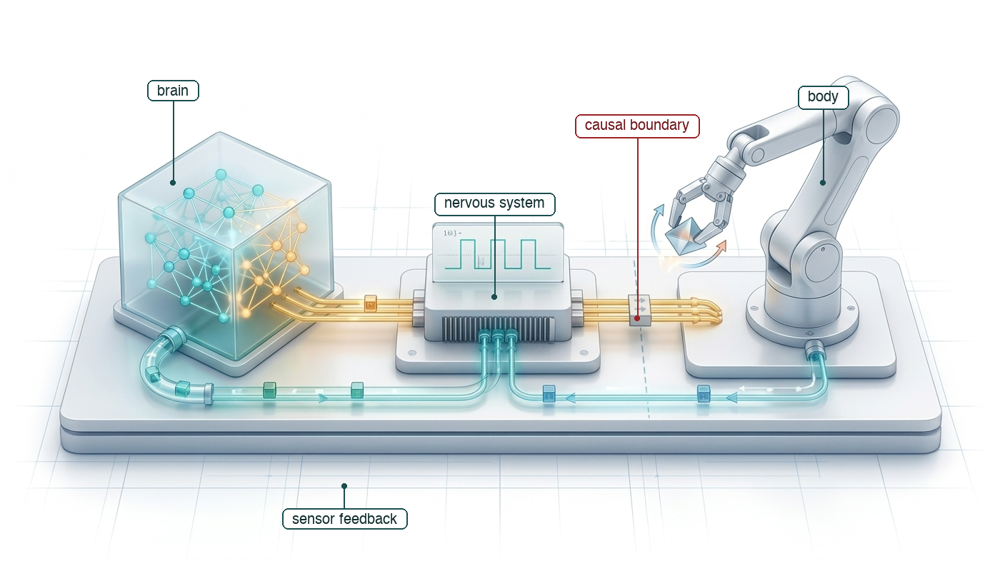
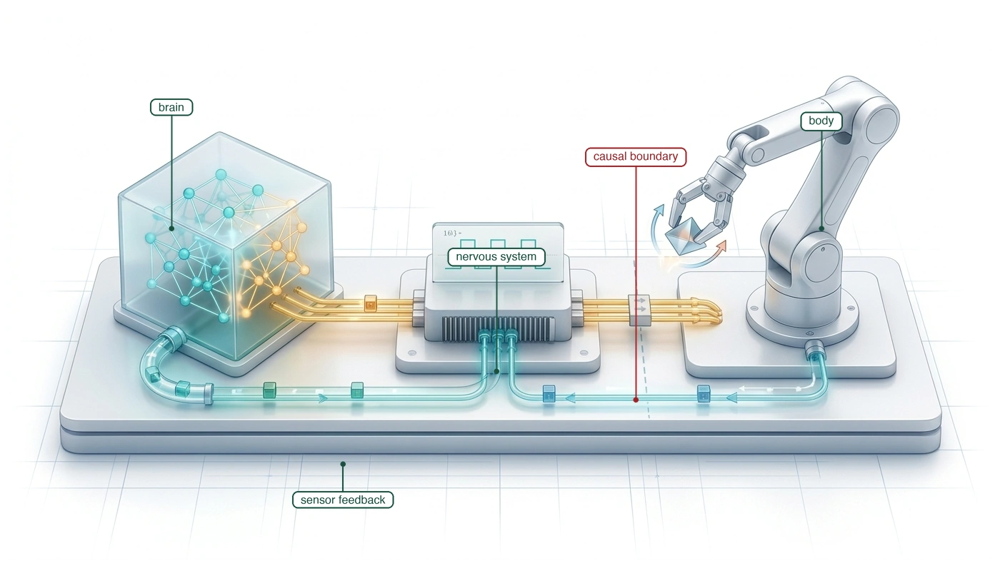
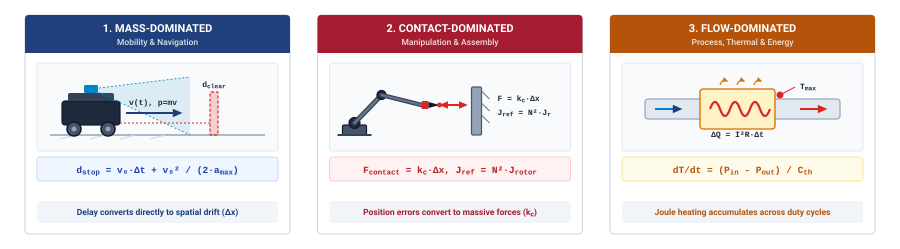
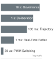
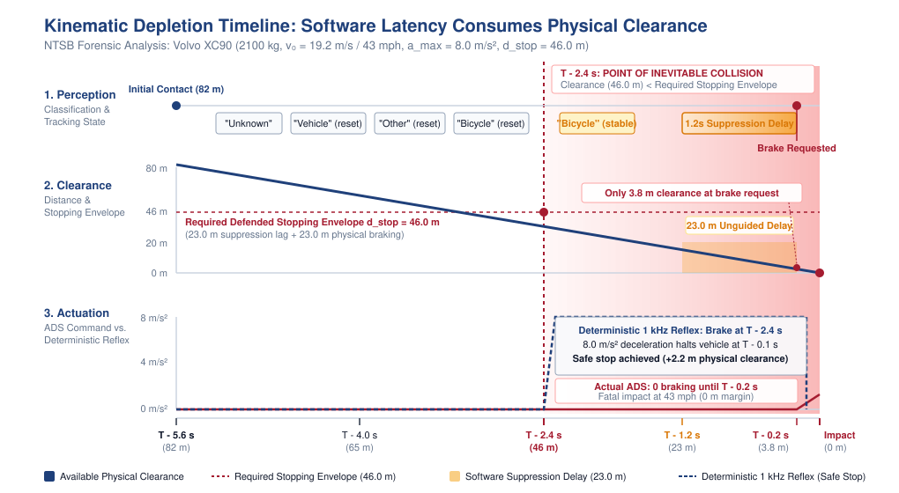
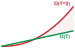

# The Causal Boundary {#sec-boundary}

::: {layout-narrow}
::: {.column-margin}

\chapterminitoc

:::

::: {.content-visible when-format="pdf"}
\noindent
{fig-alt="Isometric blueprint showing the tripartite physical AI architecture: the deliberative cognitive brain, the deterministic real-time nervous bridge, and the physical plant crossing the causal boundary."}
:::

::: {.content-visible unless-format="pdf"}
{fig-alt="Isometric blueprint showing the tripartite physical AI architecture: the deliberative cognitive brain, the deterministic real-time nervous bridge, and the physical plant crossing the causal boundary."}
:::

:::

## Purpose {.unnumbered .unlisted}

::: {.content-visible when-format="pdf"}
\begin{marginfigure}
\vspace{1em}
\resizebox{\linewidth}{!}{\mlphysicalstackfull{0}{20}{40}{100}{100}}
\end{marginfigure}
:::

_What must an autonomous physical agent guarantee before commanding physical work, and why does digital software fail to provide that guarantee?_

A learned policy can select a plausible action without establishing that the machine can execute it safely. Once a command reaches a motor, current generates torque and moving mass carries momentum. Canceling the computation cannot undo that motion. A robot approaching an obstacle continues traveling while its software processes observations, and any delay leaves less distance available for stopping. Prediction accuracy alone therefore cannot establish whether an action should proceed. The system must check proposed movement against the body's physical limits and retain the authority to stop or reject a command when those limits would be exceeded. That authority must remain available when the learned policy is late or wrong. Physical AI systems architecture connects these responsibilities across the whole machine, linking the brain's proposals to the nervous system's timing and enforcement and the body's capacity to move, absorb energy, and stop within the available space.

::: {.column-margin .margin-pointer}
↳ **Downstream:** The physical laws governing the causal boundary are mapped onto hardware failure modes in @sec-body-measuring-limits.
:::



::: {.callout-learning-objectives}

- Explain what changes when software outputs command actuators in a physical machine
- Classify physical machines by their dominant motion, contact, or flow constraints
- Apply the physical AI scope test to distinguish advisory models from autonomous physical systems
- Trace sensing, reasoning, control, and governance responsibilities through a complete physical system
- Diagnose how timing and authority failures combine in an autonomous machine incident
- Evaluate separation of learned proposals from actuation authority under conflicting control and hardware requirements

:::

## Artificial Intelligence Beyond Glass {#sec-boundary-beyond-glass}

A robot approaching an open doorway must do more than recognize the portal in its camera stream. It must evaluate whether its physical chassis fits through the opening, select a viable trajectory, and continuously adjust that path as momentum carries it forward. If a sudden obstacle appears, canceling the software thread or throwing an unhandled exception cannot recall the machine's moving mass. While the neural network computes, the machine continues traveling along its existing vector, and every millisecond of inference delay erodes the physical distance available for braking. Designing this behavior requires tracing a decision all the way from sensory evidence to electromagnetic torque and mechanical work. That complete closed loop is the domain of physical artificial intelligence systems engineering.

Standard software engineering rests on an assumption of digital idempotence: computations execute behind glass, where errors carry zero kinetic energy and terminate safely within display buffers, network packets, or sandboxed database tables. If an advisory machine learning model emits an incorrect classification or a hallucinatory token, an analyst closes the alert or an exception handler resets the thread. In a physical machine, that detachment vanishes. Digital bits command electrical currents across power inverters, magnetic flux generates mechanical torque, and moving mass accumulates physical momentum. A software failure manifests not as an entry in an error log, but as a sheared gearbox, a collapsed battery voltage rail, or a high-energy collision.

This asymmetry underlies **Moravec's paradox**\index{Moravec's paradox}[^fn-ai-moravec-paradox] [@moravec1988mind]: tasks that require intense human conscious effort, such as playing chess or proving theorems, require modest computation, whereas sensorimotor skills executed effortlessly—such as walking across uneven gravel or grasping an egg without crushing it—demand vast computational and control resources. As high-capacity neural networks are deployed to master these sensorimotor tasks, engineering teams encounter the *exposure barrier*: offline benchmark accuracy can neither predict nor guarantee closed-loop stability in the open world. As shown by the steep rise in commercial autonomous fleet mileage in @fig-boundary-autonomous-miles, physical deployment transitions machine learning from controlled laboratory demonstrations into massive cumulative exposure, where safety arguments must withstand millions of hours of non-stationary physical interaction.

[^fn-ai-moravec-paradox]: **Moravec's Paradox**\index{Moravec's Paradox}: The observation in artificial intelligence [@moravec1988mind] that high-level reasoning requires comparatively little computation, whereas low-level sensorimotor coordination demands enormous perceptual and computational resources.

::: {#fig-boundary-autonomous-miles fig-env="figure" fig-pos="htb" fig-cap="**Autonomous Miles Scaling**: Cumulative autonomous miles by year as an industry proxy, flat through 2016 and then climbing steeply toward one hundred twenty million by 2024. The inflection marks the point at which physical deployment stopped being a demonstration and started generating the exposure that safety arguments must cover." fig-alt="Line chart of cumulative autonomous miles from 2009 to 2024, flat through 2016 and then rising steeply to about one hundred twenty million."}

```{python}
#| echo: false
import pandas as pd
import matplotlib.pyplot as plt
from mlsysim import viz

data = pd.read_csv("vol4/01_boundary/data/autonomous_miles_scaling.csv")
fig, ax, COLORS, plt = viz.setup_plot(figsize=(8, 5))
ax.plot(data["Year"], data["Cumulative_Miles_Millions"], marker="o", linewidth=2.5, color="#b30000")
plt.fill_between(data["Year"], data["Cumulative_Miles_Millions"], color="#b30000", alpha=0.1)
plt.title("Scaling of Physical AI: cumulative autonomous miles", fontsize=14, pad=15)
plt.xlabel("Year", fontsize=12)
plt.ylabel("Cumulative Miles (Millions)", fontsize=12)
plt.xticks(data["Year"][::2])
plt.tight_layout()
plt.show()
plt.close()
```

:::

When digital models command physical actuators, they enter the closed causal feedback loops first formalized by Norbert Wiener in cybernetics[^fn-boundary-wiener-feedback] [@wiener1948cybernetics]. Information ceases to be an open-loop stream terminating at a display. Instead, every physical motion repositions the machine's sensors, reshaping subsequent observations under the deterministic laws of classical mechanics. Engineering teams bridging these domains encounter an intellectual Tower of Babel where four distinct technical cultures clash:

[^fn-boundary-wiener-feedback]: **Cybernetic Feedback Loops**\index{Cybernetic Feedback Loops}: In Norbert Wiener's cybernetic framework [@wiener1948cybernetics], feedback denotes adjusting future action using past performance. In physical AI, feedback is endogenous: actuation physically alters the pose of sensors and the state of the plant, directly dictating the probability distribution of subsequent observations.

The machine learning perspective focuses on scaling parameter counts, transformer backbones, and diffusion policies across millions of simulation steps, treating real-world deployment as a challenge of broader demonstration datasets and dataset coverage. The computer systems perspective focuses on memory bus bandwidth, cache hierarchies, and tail-latency percentiles, recognizing that streaming multi-gigabyte neural weights at high frequencies threatens to saturate memory interconnects and starve camera direct memory access pipelines [@williams2009roofline]. The classical robotics perspective focuses on Newton-Euler dynamics, coordinate transformations, and feedback stability margins, recognizing that unconstrained neural action setpoints risk injecting high-frequency jerk that destroys gearboxes and excites structural resonance. Finally, the embedded silicon and safety perspective focuses on bare-metal interrupt service routines, hardware trip zones, and functional safety standards (such as ISO 26262 and UL 4600), ensuring that unverified statistical models never hold direct write access to motor power stages.

Each perspective defends a necessary truth. Gradient descent does not repair a fractured transmission or prevent an inductive power rail collapse, while a hand-tuned classical controller cannot provide open-world semantic scene understanding. A viable physical AI systems architecture must unify their responsibilities without asking any single discipline to shoulder the entire problem.

::: {.column-margin .margin-pointer}
↳ **Downstream:** The dual-brain proposal-permission privilege boundary is mapped to isolated silicon domains in @sec-nervous-silicon-partitioning.
:::



::: {#dfn-boundary-physical-artificial-intelligence-physical-ai .callout-definition title="Physical artificial intelligence (physical AI)"}

***Physical artificial intelligence (physical AI)***\index{Physical Artificial Intelligence!definition}\index{Physical AI!definition} is the systems engineering science of embedding high-capacity learned statistical models into closed-loop physical machines governed by classical mechanics, thermodynamics, and hard real-time silicon determinism.

1.  **Significance**: Advisory AI models terminate safely behind digital glass, where computational errors carry no kinetic energy and are safely bounded by software exception handling. Physical AI crosses into the continuous physical universe, where digital bits command motor currents, kinetic momentum accumulates, and unhandled software stalls produce mechanical fractures, thermal runaways, or physical collisions.
2.  **Distinction**: Unlike classical robotics (which relies on hand-engineered state machines and explicit kinematic models) or internet-scale machine learning (which operates on static offline datasets), Physical AI couples high-capacity statistical generalization with deterministic hardware safety filters across an endogenous closed causal loop.
3.  **Common pitfall**: Treating physical embodiments as peripheral I/O devices for foundation models. Scaling laws and benchmark accuracies do not prevent inductive rail collapse, gearbox shear, or actuator force saturation; physical survival requires an asymmetric architecture where real-time silicon holds unconditional veto authority over learned proposals.

:::

To coordinate these competing engineering disciplines, the physical AI systems architect organizes the machine into the four-tier systems hierarchy shown in @fig-01-locator. At the foundation sits Layer 1, the Physical Body, comprising the continuous electromechanical and thermodynamic plant of motors, linkages, and power rails. Operating immediately above it is Layer 2, the Real-Time Nervous System, executed on deterministic microcontrollers at $1000\text{ Hz}$ to $20\text{ kHz}$ to enforce physical safety invariants. Across the **Proposal-Permission Privilege Boundary**[^fn-boundary-privilege-boundary] sits Layer 3, the Cognitive Brain, where high-capacity neural policies deliberate at variable cadences ($1\text{--}50\text{ Hz}$) to interpret multimodal scenes and synthesize candidate action chunks. Overarching the entire stack is Layer 4, System Governance, which coordinates multi-agent assurance, verification, and human oversight.

[^fn-boundary-privilege-boundary]: **Proposal–Permission Privilege Boundary**\index{Proposal–Permission Privilege Boundary}: The architectural division separating stochastic neural policies from physical actuation registers. High-capacity models propose candidate motion trajectories, while isolated, cycle-deterministic microcontrollers retain sole hardware authority to accept, modify, or veto commands before committing inverter pulses.

::: {#fig-01-locator fig-env="figure" fig-pos="htb" fig-cap="**Physical AI Systems Architecture Stack**: The master systems hierarchy spanning System Governance (Layer 4), Cognitive Deliberation (Layer 3), Hard Real-Time Reflex & Silicon (Layer 2), and the Physical Body (Layer 1). In this introductory chapter, our active focus centers on the causal boundary at the interface between digital software and the physical plant." fig-alt="Diagram titled Physical AI Systems Architecture Stack, drawn as four stacked tiers. Layer 4 is system governance and assurance at 0.1 to 1 hertz, holding boxes for shared autonomy, verification, safety cases, and frontier limits. Layer 3 is the brain, a cognitive deliberation tier at 1 to 50 hertz, holding five stages named ingestion, perception, memory, intent, and planner. A dashed proposal-permission privilege boundary separates it from layer 2, the nervous system, a real-time safety and timing tier at 1000 hertz. Layer 1 is the physical body and continuous plant. Layer 1 is outlined in red and the badge reads Active Focus, Chapter 01, Boundary."}
{width="100%"}
:::

Resolving the tension between unprivileged neural deliberation and deterministic physical survival requires establishing the fundamental systems principles that govern this stack. This opening chapter develops that foundation in nine stages:

Our investigation begins in @sec-boundary-causal-boundary by formalizing the causal boundary—the precise memory-mapped register interface where computational bits convert into physical Lorentz forces and irreversible momentum. In @sec-boundary-four-archetypes, we classify physical machines into four core archetypes based on whether their physical dynamics are dominated by kinetic motion, contact mechanics, fluid and thermal energy flows, or their multi-physics union. In @sec-boundary-scope-test, we establish the physical AI scope test, providing a rigorous diagnostic to determine whether an autonomous workload qualifies as an embodied physical system or remains an advisory software model. With scope defined, in @sec-boundary-four-tiers we decompose the machine into four architectural tiers that isolate timescales, interfaces, and authority across time.

To examine what happens when these systems fail, @sec-boundary-when-fails conducts an engineering autopsy of the 2018 Tempe autonomous vehicle collision, diagnosing how software classification toggling, latency suppression, and eroded actuation authority caused a fatal loss of stopping distance. From this failure analysis, @sec-boundary-bedrock-laws derives the four bedrock physical laws that bound all physical AI implementations. In @sec-boundary-dual-brain, we translate these laws into concrete hardware silicon through the dual-brain architectural pattern, isolating stochastic neural inference from cycle-deterministic reflex logic. In @sec-boundary-safety-convergence, we prove how safety convergence is maintained across radically mismatched software and hardware release cycles. Finally, @sec-boundary-book-architecture charts the architectural map for the entire four-part journey through this book.

To understand why this separation is non-negotiable, we begin in @sec-boundary-causal-boundary by tracing the exact physical boundary where computational bits become irreversible Lorentz forces and physical momentum.

## The Causal Boundary {#sec-boundary-causal-boundary}

Advisory software operates inside an informational container where errors carry negligible physical momentum. When a recommender model serves an irrelevant product, a classifier mislabels an image, or a language model emits an inaccurate token, the computational pipeline terminates in a display buffer, a network socket, or a sandboxed database table. The failure remains bounded by the digital medium. A user dismisses the recommendation, a human analyst closes the alert, or a database transaction coordinator issues an abort that restores memory pages from an undo log. In computer systems engineering, this property is known as *idempotency*: the state of the surrounding physical universe remains completely decoupled from the intermediate outputs of the software pipeline.[^fn-math-idempotency-physical] *Advisory software is immune to its own errors because of where it stops, not because of how it was built.* The safety of the pipeline does not stem from statistical guarantees in the training objective or rigorous validation on test splits, but from the physical detachment of the interface. Between the output of the neural network and any change in the physical world, an air gap or a human operator intercepts the signal.

[^fn-math-idempotency-physical]: **Idempotency**\index{Idempotency}: In digital software, an operation is idempotent if executing it multiple times leaves the system in the identical final state. In physical systems across the causal boundary, no actuation is idempotent: every motor command dissipates non-recoverable energy, alters mechanical state, and endogenously shifts future sensory observations.

[^fn-bridge-control-state]: **Control State vs. Latent ML State**\index{State!control vs. machine learning}: In classical control, state $\mathbf{x}(t)$ is strictly defined as the minimal set of physical coordinates and velocities required to compute future system trajectories. In contrast, deep learning literature frequently conflates state with high-dimensional latent activations or history windows. Relying on latent representations without observable physical derivatives ($dq/dt$) prevents control barriers from proving forward invariance.

Physical artificial intelligence eliminates that detachment. In a physical machine, the final instruction of a control loop does not write to a screen or populate a web response. For a machine learning systems engineer accustomed to writing `action = policy(observation)` in PyTorch, the causal boundary is where floating-point tensors meet physical silicon. The policy's output tensor—typically an action chunk predicting a sequence of upcoming waypoints (joint positions, velocities, or 6-DOF Cartesian poses)[^fn-action-chunk-repr]—cannot execute directly on physical motors.

[^fn-action-chunk-repr]: **Action Chunk Representations**\index{Action Chunk Representations}: In robot learning literature [@zhao2023learning], action chunks are typically tensors of shape $[B, H, d_a]$ where $B$ is batch size, $H$ is the planning prediction horizon, and $d_a$ is action dimension (e.g., target joint positions $\hat{\mathbf{q}} \in \mathbb{R}^d$ or Cartesian pose deltas in $SE(3)$, which mathematically encode both 3D translation and 3D rotation).

Instead, the host application runtime serializes those floating-point predictions into a structured memory payload dispatched across a shared-memory mailbox to a hard real-time microcontroller. There, an independent safety referee evaluates physical barrier invariants at $1000\text{ Hz}$. If approved, the kinematic setpoints pass into a deterministic cascaded control loop: a joint position and velocity loop calculates required motor torques, which feed an inner **Field-Oriented Control (FOC)**\index{Field-Oriented Control}[^fn-ctrl-foc-vector] loop running at $10\text{--}25\text{ kHz}$ to compute the torque-producing quadrature current $I_q$.

To build intuition for Field-Oriented Control, consider pedaling a bicycle. If you push straight down when the pedal crank is at the top (12 o'clock, the direct axis $I_d$), you produce zero rotational torque—you merely compress the crank arm, strain the bearings, and dissipate effort into useless heat. To propel the bicycle forward efficiently, you must apply force perpendicular to the crank when it is forward (3 o'clock, the quadrature axis $I_q$), where 100 percent of your effort converts into useful driving torque. In a three-phase brushless motor, stator coils exert magnetic forces on spinning rotor magnets; FOC continuously measures rotor angle with a high-resolution encoder, mathematically rotating the coordinate frame ($dq$-transformation) to ensure that commanded current is applied strictly at "3 o'clock" ($I_q$), while clamping parasitic direct current ($I_d \approx 0$) to eliminate wasted thermal dissipation.

At the microsecond layer, this quadrature current command $I_q$ is scaled into an integer compare threshold and written into a hardware timer compare register. Inside the microcontroller silicon, a dedicated hardware counter increments at 200 MHz, counting from 0 to a fixed period value (such as 10,000 clock cycles for a 20 kHz PWM carrier). When the counter matches the compare register, dedicated silicon comparator logic flips the PWM gate drive pin in under 5 nanoseconds—completely independent of CPU software execution. Depending on the machine architecture, that hardware register acts as a digital-to-analog converter latch holding a commanded reference voltage, a pulse-width modulation (PWM) compare register setting inverter duty cycle, or a serial control word configuring a gate driver.[^fn-hw-inverter-deadtime] At that exact memory address, informational abstraction ends. Modulating the gate voltages across power MOSFETs draws current from the high-voltage DC bus into the stator windings, generating Lorentz forces that accelerate the rotor against its reflected load inertia.

[^fn-ctrl-foc-vector]: **Field-Oriented Control (FOC)**\index{Field-Oriented Control!vector control}: Also termed vector control, FOC mathematically transforms three-phase stator currents into decoupled direct and quadrature components ($I_d, I_q$) aligned with rotor magnetic flux. This transformation allows real-time firmware to govern torque and flux independently, treating complex AC synchronous machines with the linear dynamics of a DC motor.

[^fn-hw-inverter-deadtime]: **Power Inverter Timers**\index{Power Inverter Timers!dead-time insertion}: Advanced microcontroller timer peripherals generate complementary pulse-width-modulated (PWM) drive signals with hardware-enforced dead-time insertion. Dead-time guarantees that high-side and low-side power switches in an inverter half-bridge never conduct simultaneously, preventing catastrophic shoot-through short circuits across the DC bus.

::: {#dfn-boundary-causal-boundary .callout-definition title="The causal boundary"}

***Causal boundary***\index{Causal boundary!definition} is the physical and electrical interface where digital computational bits convert into physical forces, currents, or flows.

1.  **Significance**: Above the boundary, software state is digital, sandboxed, and computationally idempotent. Below the boundary, actions permanently alter the physical environment, dissipate irreversible thermodynamic heat ($I^2 R$ resistive heating, kinetic friction), and endogenously reshape all subsequent sensory observations.
2.  **Distinction**: Unlike a logical software interface (such as a POSIX system call or network socket) where operations can be aborted, retried, or rolled back from a journal, actions crossing the causal boundary commit irreversible physical energy that cannot be undone.
3.  **Common pitfall**: Assuming software exceptions or thread cancellations can arrest physical momentum. Once a PWM compare register latches, current flows and mass accelerates; arresting that motion requires dedicated stopping distance ($d_{\text{stop}}$) and friction braking.

:::

This transition from digital state to physical force destroys the statistical foundation of classical machine learning. In offline vision, natural language processing, and tabular prediction, data collection is exogenous: the world generates a distribution of inputs, and the model processes them without altering the mechanism that created them. An incorrect classification on one image has zero effect on the distribution governing the next image. In a physical system, the environment evolves in a closed causal loop: the next physical state[^fn-bridge-control-state] and sensor observation depend directly on the action produced by the prior model inference.

::: {.column-margin .margin-pointer}
↳ **Downstream:** The non-smooth contact mechanics and torque saturation limits governing motor irreversibility are derived in @sec-body-actuator-limits.
:::

The sensory input stream is endogenous, generated by the machine's own past actions. When a policy produces an erroneous torque command, the joint rotates, the platform shifts, and mounted cameras or lidar units swing into new viewpoints. The machine drives itself into an unfamiliar region of the state space where training data is sparse, increasing the probability of subsequent inference errors and compounding the divergence from nominal operation. This fundamental architectural divergence is illustrated in @fig-01-causal-loop, contrasting the open-loop, idempotent execution of advisory digital machine learning with the closed causal loop of Physical AI crossing the actuator register boundary.

::: {#fig-01-causal-loop fig-env="figure" fig-pos="t" fig-cap="**The Closed Causal Loop**: In open-loop digital machine learning (top), computation operates behind glass on static data where software errors are idempotent. In physical AI (bottom), model proposals cross the causal boundary into hardware registers, where electrical currents produce Lorentz forces and physical motion. The machine's physical actions alter the environment, endogenously transforming all subsequent sensory observations." fig-alt="Flowchart contrasting open-loop digital computation with the closed causal loop of physical AI. In open-loop digital computation, exogenous data flows through neural deliberation to logit predictions behind an informational glass barrier with zero plant state. In the closed causal loop of physical AI, sensors provide endogenous observations to a neural deliberation tier proposing candidate action chunks at 1 to 50 hertz, passing across a causal permission gate to a 1000 hertz safety monitor, which certifies commands before latching into motor actuators, mutating the continuous plant and physical environment."}
{width="95%"}
:::

Because physical mass possesses inertia and computation takes finite time, latency in physical AI translates directly into physical displacement. As shown on the autonomous testbed in @fig-01-sensor-rack, real-world robotic systems rely on dense multi-modal sensor suites—including spinning LiDAR scanners, camera arrays, and radar units—that continuously stream high-bandwidth telemetry to onboard processors. Every stage in this pipeline—from photodiode exposure and sensor bus serialization,[^fn-hw-serdes-bus] to neural inference on accelerator silicon and packet transmission over deterministic fieldbuses—consumes precious milliseconds. During this aggregate delay window, the machine cannot incorporate new sensory information and continues moving along the trajectory dictated by its existing momentum.

[^fn-hw-serdes-bus]: **Automotive Serializer/Deserializer (SerDes)**\index{SerDes!sensor links}: High-speed physical-layer links (such as FPD-Link or GMSL) that transport uncompressed, low-latency multi-gigabit video streams over lightweight coaxial or shielded twisted-pair cables. Combined with dedicated hardware trigger lines, SerDes interfaces ensure microsecond-synchronized shutter capture across the sensor ring. For bus specifications, see @sec-appendix-systems.

::: {#psp-boundary-latency-in-millimeters .callout-perspective title="Latency is paid in millimeters"}
In advisory machine learning, computational delay only frustrates a user; in physical AI, latency is paid directly in physical displacement. At velocity $v$, an unbudgeted delay $\Delta t$ consumes unguided motion that no downstream neural capacity can ever recover.
:::

As a concrete example, consider a mobile platform traveling at a modest walking speed of $2.0\text{ m/s}$. If the perception pipeline, neural policy inference, and motor controller communication consume a combined latency of $150\text{ ms}$, the platform traverses $(2.0\text{ m/s}) \times (0.15\text{ s}) = 0.30\text{ m}$ ($30\text{ cm}$) before the first motor response can occur. During those $30\text{ cm}$, the vehicle is entirely blind to any environmental change that occurred after the initial sensor exposure. If an obstacle enters the path $20\text{ cm}$ ahead during that inference window, no amount of model capacity or predictive accuracy can alter the outcome, because the physical displacement has already been accumulated by the body.

This trade-off between computational delay and physical clearance is formalized by the **Kinematic Roofline Nomogram**\index{Kinematic Roofline Nomogram}. In classical computer systems architecture, the Roofline Model [@williams2009roofline] visually relates operational arithmetic intensity ($\text{FLOPs/byte}$) to bound achievable throughput by either peak memory bandwidth or peak execution throughput. In physical AI, the Kinematic Roofline couples neural deliberation latency $\tau_{\text{compute}}$ and platform velocity $v$ to bound physical stopping clearance against maximum actuator braking deceleration $a_{\text{max}}$.

Under emergency braking, total stopping distance $d_{\text{stop}}$ decomposes into an informational transport term and a mechanical dissipation term:
$$d_{\text{stop}}(v, \tau_{\text{compute}}) = \underbrace{v \cdot \tau_{\text{compute}}}_{d_{\text{reaction}}} + \underbrace{\frac{v^2}{2 a_{\text{max}}}}_{d_{\text{braking}}}$$
The reaction term $d_{\text{reaction}}$ is strictly non-negotiable: during delay $\tau_{\text{compute}}$, zero braking force can be applied because the sensor exposure has not yet propagated through neural inference and the fieldbus to the brake calipers. As detailed in @tbl-01-kinematic-roofline across representative embodied platforms, for agile robots and high-speed vehicles, computational latency consumes an alarming proportion of the total stopping envelope.

| Physical Platform & Velocity $v$                              | Braking Decel $a_{\text{max}}$       | Mechanical Braking $d_{\text{braking}}$ | $\tau = 10\text{ ms}$ (MCU Reflex)   | $\tau = 50\text{ ms}$ (Fast Policy)   | $\tau = 200\text{ ms}$ (Multimodal VLA) | Latency Fraction at $200\text{ ms}$ |
|:--------------------------------------------------------------|:-------------------------------------|:----------------------------------------|:-------------------------------------|:--------------------------------------|:----------------------------------------|:------------------------------------|
| **Humanoid / Quadruped** ($1.0\text{ m/s} = 3.6\text{ km/h}$) | $4.0\text{ m/s}^2$ ($0.41\text{ g}$) | $0.125\text{ m}$ ($12.5\text{ cm}$)     | $0.135\text{ m}$ ($+1.0\text{ cm}$)  | $0.175\text{ m}$ ($+5.0\text{ cm}$)   | $0.325\text{ m}$ ($+20.0\text{ cm}$)    | **61.5% of total stop**             |
| **Warehouse AMR** ($2.5\text{ m/s} = 9.0\text{ km/h}$)        | $3.5\text{ m/s}^2$ ($0.36\text{ g}$) | $0.893\text{ m}$ ($89.3\text{ cm}$)     | $0.918\text{ m}$ ($+2.5\text{ cm}$)  | $1.018\text{ m}$ ($+12.5\text{ cm}$)  | $1.393\text{ m}$ ($+50.0\text{ cm}$)    | **35.9% of total stop**             |
| **Urban Delivery Bot** ($6.0\text{ m/s} = 21.6\text{ km/h}$)  | $4.5\text{ m/s}^2$ ($0.46\text{ g}$) | $4.000\text{ m}$                        | $4.060\text{ m}$ ($+6.0\text{ cm}$)  | $4.300\text{ m}$ ($+30.0\text{ cm}$)  | $5.200\text{ m}$ ($+120.0\text{ cm}$)   | **23.1% of total stop**             |
| **Autonomous Vehicle** ($20.0\text{ m/s} = 72.0\text{ km/h}$) | $7.0\text{ m/s}^2$ ($0.71\text{ g}$) | $28.57\text{ m}$                        | $28.77\text{ m}$ ($+20.0\text{ cm}$) | $29.57\text{ m}$ ($+100.0\text{ cm}$) | $32.57\text{ m}$ ($+400.0\text{ cm}$)   | **12.3% of total stop**             |
: **Kinematic Roofline Nomogram**: Stopping clearance trade-offs across embodied platforms. At $200\text{ ms}$ inference latency, an autonomous passenger car travels four additional meters—an entire vehicle length—before brakes physically engage. {#tbl-01-kinematic-roofline}

Just as an architect cannot resolve a memory-bound arithmetic pipeline by adding more ALU execution units, an autonomous vehicle systems engineer cannot resolve an emergency stopping clearance violation by adding model parameters if doing so increases inference latency $\tau_{\text{compute}}$. A heavier foundation model that adds $150\text{ ms}$ of computation consumes an extra 3.0 meters of physical travel at highway speeds—distance that no friction brake or collision-avoidance logic can ever claw back.

Once digital commands transition into mechanical work, the state change becomes thermodynamically irreversible. The physical world provides no rollback mechanism.[^fn-phys-landauer-limit] When an actuator controller applies current to a motor, electrical energy transfers from the battery into kinetic energy in mechanical linkages or thermal energy dissipated through resistive Joule heating ($I^2 R$) in the stator windings. If an incorrect joint torque drives a manipulator into a rigid steel fixture, the kinetic energy converts into plastic deformation of the tool, mechanical strain on the gearbox teeth, and heat. No software interrupt can pull that kinetic energy out of the crushed structure or restore sheared gear teeth to their original geometry.

[^fn-phys-landauer-limit]: **Thermodynamic Limits of Computation**\index{Thermodynamic Limits of Computation}: At a fundamental level, @landauer1961 established that erasing logical bits dissipates at least $k_B T \ln 2$ of thermodynamic entropy. In physical AI systems, however, the dominant irreversibility is macroscopic: motor inverters draw tens of Amperes from battery packs, dissipating kilowatt-scale Joule heat ($I^2 R$) and imparting physical momentum to moving linkages that cannot be recalled.

::: {#fig-01-sensor-rack fig-env="figure" fig-pos="t" fig-cap="**LiDAR Sensor Ingress**: A 64-beam spinning optical LiDAR assembly mounted aboard an autonomous research testbed. In physical AI, sensor streams delivering over 1.3 million points per second must be serialized over real-time hardware interfaces, synchronized with sub-microsecond timestamps, and processed through neural perception backbones within strict latency deadlines; every millisecond of unbudgeted transport or compute delay translates directly into unguided physical displacement. (Source: Steve Jurvetson, CC BY 2.0)." fig-alt="Close-up photograph of a roof-mounted 64-beam spinning optical LiDAR sensor assembly on an autonomous research vehicle testbed, showing optical lenses and aluminum housing."}
{width="85%"}
:::

Understanding why Physical AI requires a distinct systems engineering discipline requires contrasting its core properties against both advisory digital machine learning and classical control theory. As summarized in @tbl-01-paradigm-comparison, the three paradigms are sorted from pure software isolation on the left, to pure classical dynamics in the middle, to the unified physical AI synthesis on the right.

| Architectural Dimension   | Digital Machine Learning (Advisory)                                        | Classical Robotics & Control                                                         | Physical Artificial Intelligence (Closed-Loop)                                                 |
|:--------------------------|:---------------------------------------------------------------------------|:-------------------------------------------------------------------------------------|:-----------------------------------------------------------------------------------------------|
| **Operational Substrate** | Decoupled virtual memory buffers (GPU VRAM, DRAM, web endpoints)           | Continuous analog state space governed by differential equations                     | Hybrid: high-dimensional neural representations mapped to analog physical actuators            |
| **Model Formulation**     | High-capacity statistical approximators (LLMs, ViTs, diffusion policies)   | Analytically specified transfer functions and deterministic state-space matrices     | Foundation policies paired with deterministic runtime safety filters                           |
| **Feedback Dynamics**     | Exogenous and static; independent and identically distributed samples      | Continuous deterministic state feedback with Gaussian sensor noise                   | Endogenous, non-stationary closed loop; actions shape future observations                      |
| **Execution Cadence**     | Throughput-optimized batching; soft or unbounded latency budgets           | Hard real-time single-rate loops on microcontrollers (100–1000 Hz)                   | Asynchronous multi-rate cadences: System 2 (1 Hz), System 1.5 (50 Hz), System 1 (1000 Hz)      |
| **Actuation Authority**   | Advisory; sandboxed APIs, display buffers, or human-in-the-loop validation | Hardcoded feedback directly driving power inverter timers and PWM registers          | Decoupled Proposal–Permission architecture; untrusted proposals gated by MCU safety referee    |
| **Failure Semantics**     | Idempotent; call-stack unwind, database rollback, or human alert dismissal | Actuator saturation or tracking error within analytically bounded stability envelope | Irreversible thermodynamic work, plastic deformation, kinetic collision, or stator overheating |
| **Safety Assurance**      | Offline statistical loss minimization on validation splits                 | Formal mathematical stability proofs (Lyapunov functions, gain/phase margins)        | Layered runtime invariant enforcement, forward-invariant barrier filters, and fault injection  |

: **Comparison Matrix of Computing Paradigms across the Causal Boundary**:  Systematic comparison of Advisory Digital Machine Learning (left), Classical Robotics & Control Theory (middle), and Physical Artificial Intelligence (right) across operational substrate, model formulation, feedback dynamics, execution cadence, actuation authority, failure semantics, and safety certification primitives. {#tbl-01-paradigm-comparison tbl-colwidths="[18,26,26,30]"}

## The Four Machine Archetypes {#sec-boundary-four-archetypes}

Building on the causal boundary established in @sec-boundary-causal-boundary, once digital predictions cross into physical force, they interact with physical machines of every conceivable shape and scale. An autonomous delivery drone navigating turbulent wind gusts seems to share nothing with a six-axis robotic arm assembling an automotive transmission, and neither appears related to a containerized battery management plant regulating liquid coolant. A practitioner or student might wonder: how can a single systems engineering curriculum possibly encompass such wildly diverse physical systems without dissolving into a collection of bespoke, ad-hoc recipes?

The key is to look past cosmetic form factors and examine the underlying physical conservation law that binds the machine. Beneath the surface diversity of shapes, sizes, and applications, every embodied AI system can be systematically categorized into three foundational physical classes based on the dominant conservation law governing its actuators (@fig-01-three-archetypes, @fig-01-real-three-archetypes): moving mass across space, applying force through physical contact, or regulating continuous fluid and thermal flows. These three classes culminate in a fourth, integrative archetype—the humanoid and multi-physics embodiment—where all three conservation regimes operate simultaneously on a single chassis. By viewing Physical AI through this four-archetype lens, a systems architect can immediately determine which resource budget is exhausted first during a software stall or model anomaly, and design the real-time nervous system accordingly.

::: {#fig-01-three-archetypes fig-env="figure" fig-pos="t" fig-cap="**Machine Archetypes of Physical AI**: The three foundational physical embodiments classified by their primary binding conservation laws: (a) mass-dominated mobility (Class 1) governed by momentum and spatial clearance; (b) contact-dominated manipulation (Class 2) governed by mechanical impedance and structural yield stress; and (c) flow-dominated process plants (Class 3) governed by thermal capacitance and transport lag. Complex embodiments such as humanoids serve as the integrative capstone uniting all three classes on a single chassis." fig-alt="Three canonical machine archetypes of physical AI classified by binding conservation laws: mass-dominated mobility governed by momentum and stopping clearance, contact-dominated manipulation governed by mechanical impedance and structural yield stress, and flow-dominated process plants governed by thermal capacitance and transport lag."}
{width="100%"}
:::

::: {#fig-01-real-three-archetypes fig-env="figure" fig-pos="t" fig-cap="**Embodied Archetypes in Physical AI**: Field deployments representing the three foundational physical conservation regimes: (a) mass-dominated mobility exemplified by Boston Dynamics' Spot quadruped negotiating unstructured terrain; (b) contact-dominated manipulation exemplified by the Franka Emika Panda collaborative arm regulating fine assembly contact forces; and (c) flow-dominated process plants exemplified by containerized utility-scale battery energy storage systems (Tesvolt BESS) governing high-capacity thermal dissipation and liquid cooling loops. Complex embodiments such as humanoids integrate all three regimes into a single chassis. (Attribution: Wikimedia Commons, CC BY-SA 4.0)." fig-alt="Photographic plate showing three physical AI embodiments: Boston Dynamics Spot quadruped robot on a forest trail, Franka Panda robot arm on an assembly fixture, and a containerized Tesvolt battery energy storage system."}
{width="100%"}
:::

### Class 1: Mobility systems

Class 1 machines move mass across space, where execution is bound first by momentum conservation and kinetic energy dissipation (@fig-01-three-archetypes a, @fig-01-real-three-archetypes a). In autonomous transport platforms, quadruped robots navigating rugged terrain (such as Boston Dynamics' Spot), mobile manipulators, and aerial drones, the actuator bridge applies force to translate or rotate a body with mass $m$ at velocity $v$. Because kinetic energy $E_k = \frac{1}{2}m v^2$ cannot be instantaneously erased once delivered to the chassis—it must be physically scrubbed off through friction, aerodynamic drag, or regenerative braking—safety is primarily measured as remaining spatial clearance. When braking begins at maximum allowable deceleration $a_{\max}$, the physical floor for stopping distance follows the fundamental kinematic relation:

$$d_{\text{stop}} = v \cdot t_{\text{lag}} + \frac{v^2}{2a_{\max}}$$

where $t_{\text{lag}}$ is the total sense-to-actuation transport and inference delay. In a mass-moving system, every millisecond of computational latency converts directly into unguided spatial displacement ($v \cdot t_{\text{lag}}$) as the machine coasts blindly, while the subsequent braking distance scales quadratically with velocity ($v^2 / 2a_{\max}$). The first boundary breached during a software stall or model misclassification is the physical distance to an external obstacle.

To see the physical consequences of this scaling, consider an autonomous mobile robot or quadruped such as Spot in a facility corridor with mass $m = 32\text{ kg}$ or a warehouse transport base with $m = 250\text{ kg}$ cruising at $v_0 = 1.8\text{ m/s}$ ($4.0\text{ mph}$). The perception camera runs at $30\text{ Hz}$ ($33.3\text{ ms}$ exposure and readout). The vision-language-action (VLA) navigation policy runs on an edge accelerator with an inference latency of $120\text{ ms}$. Motor controller CAN bus communication consumes $15\text{ ms}$. If the maximum allowable braking deceleration without tipping cargo is $a_{\max} = 2.0\text{ m/s}^2$, the total sense-to-actuation lag is $t_{\text{lag}} = 33.3 + 120 + 15 = 168.3\text{ ms} \approx 0.168\text{ s}$. During this computational window, the unguided robot coasts $d_{\text{lag}} = v_0 \cdot t_{\text{lag}} = (1.8\text{ m/s})(0.1683\text{ s}) \approx 0.303\text{ m}$ ($30.3\text{ cm}$). Bringing the physical mass to a complete halt requires an additional braking distance of $d_{\text{brake}} = v_0^2 / (2a_{\max}) = 1.8^2 / (2 \cdot 2.0) = 0.810\text{ m}$ ($81.0\text{ cm}$), yielding a total required stopping clearance of $d_{\text{stop}} = 0.303 + 0.810 = 1.113\text{ m}$. If an engineer upgrades to a larger foundation model that increases inference latency from $120\text{ ms}$ to $320\text{ ms}$, total lag expands to $t_{\text{lag}}' = 368.3\text{ ms}$, driving unguided displacement to $d_{\text{lag}}' = 0.663\text{ m}$ and total stopping distance to $d_{\text{stop}}' = 1.473\text{ m}$—an additional $36.0\text{ cm}$, representing a 32.3 percent expansion in required clearance. In narrow warehouse aisles, that 200 ms computational delay directly consumes the entire safety margin.

::: {#chk-boundary-latency-budget .callout-checkpoint title="The inelastic latency budget"}

Before analyzing contact-dominated mechanics, verify your understanding of how computational latency translates into physical space:

- [ ] **Sense-to-actuation lag**: Can you explain how camera exposure, neural inference latency, and fieldbus serialization combine into an unguided coasting displacement $d_{\text{lag}} = v \cdot t_{\text{lag}}$?
- [ ] **Nonlinear stopping scaling**: Can you describe why doubling the vehicle velocity quadruples the physical braking distance while linearly expanding the reaction distance?
- [ ] **Model scaling trade-offs**: Can you distinguish between a software system where extra inference latency merely delays screen rendering and a physical robot where extra latency directly consumes physical safety margin?

:::

### Class 2: Manipulation systems

Class 2 machines apply mechanical force through contact, where the primary binding limits are actuator torque saturation, the structural stiffness of the environment, and the current loop bandwidth—how fast the motor controller can sense and throttle electrical current to regulate applied torque (@fig-01-three-archetypes b, @fig-01-real-three-archetypes b). In articulated manipulators, precision assembly fixtures, and robot learning workcells executing contact-rich insertion and grasping, the end-effector interacts directly with a rigid or compliant workpiece. Unlike a mobile platform operating in open space, an arm in contact with a surface cannot resolve an unexpected displacement command by rolling forward. When an actuator commands position into a rigid boundary, physical displacement is blocked, and the interaction acts like a compressed spring governed by mechanical impedance. By Hooke's law, the contact force generated by a spatial penetration error $\Delta x$ against an environment of stiffness $k$ is $F = k \Delta x$.[^fn-math-contact-lcp]

[^fn-math-contact-lcp]: **Rigid Contact Mechanics**\index{Rigid Contact Mechanics!complementarity}: Unilateral physical contact imposes kinematic constraints governed by Linear Complementarity Problems (LCPs), where sudden collision produces impulsive contact forces and infinite instantaneous stiffness. Physical controllers prevent high-gain instability and chatter by implementing virtual impedance control or compliant proxy models. For the mathematical formulation of contact dynamics, see @sec-appendix-control.

Because the contact stiffness of metal and tooling fixtures is extremely high ($k \ge 10^5\text{ N/m}$), even sub-millimeter geometric trajectory deviations instantly convert into massive contact forces. If the nervous system fails to clamp motor current within sub-millisecond response windows, the motor drives the transmission past its mechanical yield stress. For example, consider a 6-axis articulated robotic arm assembling automotive transmission components where the end-effector approaches a rigid steel fixture ($k = 2.5 \times 10^5\text{ N/m}$) at $v = 0.20\text{ m/s}$, with cycloidal transmissions rated for a maximum allowable shock yield force of $F_{\text{yield}} = 1500\text{ N}$. If an unhandled operating system scheduling hiccup or memory lock pauses the control loop for $\Delta t = 75\text{ ms}$, unguided penetration into the fixture accumulates $\Delta x = v \cdot \Delta t = (0.20\text{ m/s})(0.075\text{ s}) = 0.015\text{ m} = 15.0\text{ mm}$. By Hooke's law, the resulting mechanical contact force is $F = k \cdot \Delta x = (2.5 \times 10^5\text{ N/m})(0.015\text{ m}) = 3750\text{ N}$—generating a contact force 2.5 times greater than the gearbox shear limit and causing catastrophic mechanical tooth shear. The maximum allowable penetration before yield is $\Delta x_{\max} = 1500\text{ N} / (2.5 \times 10^5\text{ N/m}) = 6.0\text{ mm}$, setting a hard deadline of $t_{\text{deadline}} = \Delta x_{\max} / v = 0.006\text{ m} / 0.20\text{ m/s} = 0.030\text{ s} = 30\text{ ms}$ for the bare-metal current loop to detect the collision and clamp motor torque. Because structural destruction occurs within 30 ms, a high-level 20 Hz neural policy (with its 50 ms cycle period) cannot protect the mechanical plant; invariant enforcement must belong to a sub-millisecond microcontroller reflex loop.

::: {#chk-boundary-contact-stiffness .callout-checkpoint title="Contact stiffness and operating system stalls"}

Before exploring continuous flow and energy archetypes, verify your understanding of contact mechanics and execution timing:

- [ ] **Hookean force rise**: Can you explain why contact with stiff environments ($k \ge 10^5\text{ N/m}$) converts sub-millimeter position errors into structural shock loads that exceed gearbox yield limits?
- [ ] **Operating system latency vs. reflex loop**: Can you describe why an operating system scheduling jitter of $75\text{ ms}$ is catastrophic for rigid contact manipulation even if it is negligible for perception models?
- [ ] **Asymmetric authority**: Can you distinguish the operational responsibilities of a $20\text{ Hz}$ neural motion planner from a $1\text{ kHz}$ bare-metal torque-clamping reflex loop during unexpected collision?

:::

### Class 3: Process and energy systems

Beyond moving linkages and rigid contacts, Class 3 machines regulate continuous fluid, thermal, or electrical power flows—a domain that serves both as dedicated process plants and as the foundational electrical and thermal substrate underlying all high-performance mobile and manipulation systems (@fig-01-three-archetypes c, @fig-01-real-three-archetypes c). In grid-scale battery storage facilities, data center liquid cooling loops, and grid-tied power inverters managing renewable generation, actuators manipulate coolant pumps, flow valves, and high-frequency power semiconductors rather than mechanical joints. The state of the system is governed by mass transport, energy balance, and thermal capacitance—the physical system's thermal inertia, which dictates how quickly it heats up—rather than kinematic positions. When a coolant valve or pump stalls, accumulated heat drives rapid temperature excursions toward chemical decomposition thresholds. Similarly, a grid-tied inverter operating on a $60\text{ Hz}$ utility network faces an electrical phase cycle of $16.6\text{ ms}$ (half-cycle zero crossing of $8.33\text{ ms}$), where an unhandled software scheduling delay misaligns the inverter's electrical pulse with the grid's rhythm, creating alternating-current phase angle errors that drive destructive surge currents through substation transformers. The deadline in flow architectures is set by thermal capacitance, transport delay, and grid phase timing, defining physical budgets where accumulated energy cannot be quickly reversed once started.

::: {.column-margin .margin-pointer}
↳ **Downstream:** Preemption of proposal streams across the causal boundary is arbitrated by the supervisor state machine in @sec-intervention-authority-transitions.
:::

::: {#chk-boundary-thermal-capacitance .callout-checkpoint title="Thermal capacitance and grid phase alignment"}

Before analyzing multi-physics capstone systems, verify your understanding of continuous flow dynamics and thermal/electrical budgets:

- [ ] **Thermal capacitance time constants**: Can you explain how thermal inertia and transport lag dictate temperature rise ($\Delta T = \int \frac{P}{C_{\text{th}}} \, dt$) when coolant pumps or valve scheduling loops stall?
- [ ] **Grid phase alignment deadlines**: Can you describe why an unhandled software scheduling delay of less than $8.33\text{ ms}$ (a half-cycle in $60\text{ Hz}$ grids) causes alternating-current phase mismatch and destructive surge currents?
- [ ] **Continuous flow vs. kinematic state**: Can you contrast systems bounded by spatial clearance or contact force against process systems bounded by mass-energy balances, enthalpy transport, and phase synchronization?

:::

### Class 4: Integrative capstone systems

A central question for physical AI systems architects is: *Where do complex general-purpose embodiments, such as humanoid robots, fit into this physical taxonomy?*

A humanoid robot is not a simple variation of a single machine class. Rather, it constitutes **Class 4: The Integrative Capstone Archetype**\index{Integrative Capstone Embodiment}\index{Humanoid robotics!capstone archetype}—the ultimate cyber-physical convergence where all three foundational physical regimes operate and contend simultaneously on a single, tightly constrained mobile chassis:

1. **Class 1 Dynamics in Locomotion:** Underactuated bipedal balancing, dynamic footstep placement, momentum conservation ($m\mathbf{v}$), and ground contact slip during walking and stair climbing require continuous spatial clearance and kinetic energy management.
2. **Class 2 Dynamics in Manipulation & Contact:** Bimanual end-effectors, multi-fingered grasping, and rigid contact transitions with environmental workpieces subject kinematic chains to high shock loads ($F = k \Delta x$), joint torque saturation, and transmission yield stress during physical interaction.
3. **Class 3 Dynamics in Actuation & Power Delivery:** Driving 20 to 50 high-torque actuators simultaneously from a single onboard DC battery pack pushes inverter thermal dissipation ($I_{\text{phase}}^2 R_{\text{phase}}$) to its limits. Rapid simultaneous current spikes ($dI_{\text{bus}}/dt$) across the parasitic inductance ($L_{\text{bus}}$) of internal wiring harnesses induce severe inductive voltage droop ($\Delta V = L_{\text{bus}} \frac{dI_{\text{bus}}}{dt}$). This transient bus sag can brown out onboard coprocessors precisely during leg impact absorption or high-torque disturbance recovery.

::: {#capstone-boundary-humanoid-crucible .callout-perspective title="The humanoid crucible"}
Humanoid robotics represents the ultimate systems engineering crucible of Physical AI because it eliminates the simplifying luxury of domain isolation. While a wheeled robot isolates its primary safety budget to momentum ($E_k = \frac{1}{2} m v^2$) and an industrial arm isolates its budget to contact impedance ($F = k \Delta x$), a humanoid couples all physical domains simultaneously:

* **Momentum–Contact Coupling (Classes 1 & 2):** When a $65\text{ kg}$ bipedal robot catches an unexpected $12\text{ kg}$ payload with its hands, the sudden contact force (Class 2) introduces a high-torque disturbance ($>180\text{ N}\cdot\text{m}$) that immediately perturbs its inverted-pendulum center of mass. To avoid tipping, the underactuated floating base must synthesize a dynamic recovery step within $180\text{ ms}$, converting a contact problem into a momentum-braking problem (Class 1).
* **Kinematic–Thermal Contention (Classes 1, 2 & 3):** That single dynamic recovery step demands peak current bursts ($>45\text{ A}$ per phase) across hip and knee actuators. In an enclosed humanoid torso and leg casing without external cooling fans, continuous locomotion generates rapid $I_{\text{phase}}^2 R_{\text{phase}}$ Joule heating ($\Delta T = \frac{P \cdot t}{C_{\text{th}}}$), pushing winding temperatures toward insulation limits ($125^\circ\text{C}$) and forcing the nervous system to derate available torque precisely when maximum authority is needed to sustain balance.
* **Electrical Bus Transients ($\Delta V = L_{\text{bus}} \, dI_{\text{bus}}/dt$):** Driving thirty to fifty high-bandwidth actuators simultaneously from a single internal $48\text{ V}$ lithium-ion bus creates sharp current transients ($dI_{\text{bus}}/dt > 100\text{ A/ms}$). The parasitic inductance of dense wiring harnesses creates voltage droops that can brown out the vision-language deliberate coprocessor unless power domains and real-time safety microcontrollers are physically decoupled.

Throughout this textbook, every foundational principle—from real-time fieldbuses and proposal-permission decoupling to Control Barrier Functions and silicon placement—is first isolated across Classes 1, 2, and 3, and then tested against the Humanoid Crucible at the end of each stage.
:::

While a single-class machine (such as a wheeled AMR or a fixed industrial arm) isolates its physical budget to a single dominant conservation law, a humanoid robot forces the systems architect to manage **cross-class coupled contention**\index{Cross-Class Coupled Contention}. When a bipedal robot catches a falling heavy object, the contact force (Class 2) shifts its center of mass, requiring an instantaneous balancing recovery step (Class 1) that draws peak phase currents threatening to collapse the electrical bus and overheat the knee actuators (Class 3). To quantify how electrical transients threaten cognitive processing, consider a bipedal humanoid powering its onboard edge compute ($12.0\text{ V}$ regulated rail with a $10.8\text{ V}$ brownout reset threshold) and 12 joint actuators from a common $48.0\text{ V}$ battery pack. The high-current DC distribution path connecting the battery pack to the motor power stages has a lumped total loop inductance of $L_{\text{bus}} = 25.0\,\mu\text{H}$, cumulative across pack interconnects, safety fuses, contactors, and chassis cabling. During a dynamic jump landing, the leg actuators simultaneously command a current surge from $10\text{ A}$ to $110\text{ A}$ in $\Delta t = 0.2\text{ ms}$, generating a current slew rate of $dI_{\text{bus}}/dt = (110\text{ A} - 10\text{ A}) / (0.2 \times 10^{-3}\text{ s}) = 5.0 \times 10^5\text{ A/s} = 500\text{ A/ms}$. By Faraday's law of induction, the transient voltage droop across the bus is $\Delta V_{\text{droop}} = L_{\text{bus}} \cdot (dI_{\text{bus}}/dt) = (25.0 \times 10^{-6}\text{ H})(5.0 \times 10^5\text{ A/s}) = 12.5\text{ V}$, plunging the instantaneous bus voltage to $V_{\text{bus, min}} = 48.0\text{ V} - 12.5\text{ V} = 35.5\text{ V}$. If the DC-DC step-down converter feeding the $12\text{ V}$ compute rail drops out when input voltage falls below $38.0\text{ V}$, this landing spike instantly triggers an unrecoverable processor brownout reset and bipedal collapse. Physical AI demands physical power domain isolation: high-capacity neural computers cannot share unbuffered, inductive power rails with high-torque motor drives.

::: {#chk-boundary-inductive-droop .callout-checkpoint title="Inductive rail droop and processor brownouts"}

Before applying the Physical AI scope test, verify your understanding of multi-physics interactions and electrical bus transients:

- [ ] **Lumped bus inductance**: Can you explain how sudden actuator current surges ($dI_{\text{bus}}/dt$) during dynamic locomotion generate inductive voltage droop ($\Delta V = L_{\text{bus}} \, dI_{\text{bus}}/dt$) across lumped loop inductance (interconnects, fuses, contactors, cable loops)?
- [ ] **Brownout vulnerability**: Can you describe how transient voltage sags on high-torque motor buses can reset digital coprocessors and trigger unrecoverable mechanical collapse?
- [ ] **Power domain decoupling**: Can you distinguish the architectural mechanisms required to protect digital computing boards from motor back-EMF spikes and inductive rail collapse?

:::

For any Physical AI system, engineering the nervous system begins by determining which physical budget is exhausted first during a failure. In software systems, resource constraints center on processor cycles, memory allocation, and network bandwidth. In physical systems, the systems architect must identify whether spatial clearance, structural stress, or heat dissipation creates the critical timing deadline. In a high-speed vehicle or quadruped, spatial clearance fails within fractions of a second while motor winding temperatures remain safely below thermal limits. In an assembly press, mechanical stress exceeds the yield point of structural members within tens of milliseconds long before the chassis moves perceptibly or heats up. In a chemical reactor or battery pack, mechanical stress is negligible, but accumulated thermal energy breaches safe operational envelopes over several seconds. The shortest time to failure across these three domains defines the deterministic execution deadline that the nervous system must meet.

Yet understanding that a machine belongs to one of these three physical archetypes does not automatically mean it requires the full systems discipline of Physical AI. A classical hydraulic press or a deterministic PID drone autopilot manipulates mass and contact force, but operates entirely within classical control theory. To determine when a machine crosses into Physical AI, we must establish a rigorous diagnostic scope test.

## The Physical AI Scope Test {#sec-boundary-scope-test}

Before designing or deploying an embodied architecture, a system architect or practitioner must establish whether a machine actually requires the full systems engineering discipline of Physical AI. Without a rigorous scope boundary, engineering teams make two symmetric mistakes: they over-engineer classical deterministic machines with bloated neural models where closed-form PID control is provably optimal, or they dangerously under-engineer stochastic neural models by granting them unverified motor authority in safety-critical physical loops.

The scope of Physical AI is defined by the simultaneous intersection of three structural criteria (@fig-01-scope-venn):

1. **Learned Statistical Model (Unspecifiable Policy):** The system relies on a policy, perception encoder, or world model acquired from data (e.g., neural networks, foundation models, diffusion policies [@chi2024diffusionpolicy]) whose input–output transfer function cannot be written in closed-form analytical equations and whose worst-case outputs cannot be mathematically bounded offline.
2. **Consequential Physical Feedback:** Actuator actions alter the material state of the physical environment, which in turn directly dictates what the sensors observe next under the governing laws of classical mechanics, thermodynamics, or electromagnetism.
3. **Delegated Physical Authority (Direct Actuator Write):** Automated software routines write directly to hardware actuator registers—such as PWM timer compare latches or DAC buffers—without synchronous human approval in the control loop. They operate within the critical temporal window where a software delay or computation error converts directly into irreversible physical momentum.

::: {#fig-01-scope-venn fig-env="figure" fig-pos="t" fig-cap="**The Physical AI Scope Test**: Physical AI exists strictly at the three-way intersection of learned models (unspecifiable policies), consequential physical feedback (continuous mechanics and thermodynamics), and delegated physical authority (direct actuation). Systems satisfying exactly two criteria define adjacent engineering fields: Advisory Systems (lacking physical authority), Digital Autonomy (lacking physical feedback), and Classical Control (lacking learned representations)." fig-alt="Three-set Venn diagram defining the scope of Physical AI at the intersection of Learned Models, Physical Feedback, and Physical Authority. Two-way intersections highlight adjacent disciplines: Advisory Systems, Digital Autonomy, and Classical Control."}
{width="90%"}
:::

A closed feedback loop is necessary for physical interaction, but feedback alone does not place a machine in this domain. Classical proportional-integral-derivative (PID) controllers run at $1000\text{ Hz}$ across aerospace and industrial automation, regulating valve positions and motor torques through tight sensory feedback. Their feedback loops are continuous and physical, but their control laws are specified entirely by fixed mathematical formulas whose stability bounds can be proven analytically from transfer functions. They hold physical authority and experience physical feedback, but they lack a learned model. Conversely, high-frequency algorithmic trading engines execute automated market orders under learned predictive models within microseconds. They combine learned policies with delegated transactional authority, but the feedback they receive is purely digital and informational. When an order executes, it alters an electronic order book rather than momentum, friction, or thermal energy. An unhandled stall in algorithmic trading costs financial capital, but it does not cause an inertia-driven collision with a structural fixture.

A learned model is equally insufficient on its own to define the field. Modern engineering workflows frequently deploy deep neural networks to optimize robot trajectories offline or inspect manufactured parts on assembly lines. An offline neural trajectory optimizer may compute time-optimal paths for a six-axis robotic manipulator over several seconds of cluster compute, but if that trajectory is verified by an engineer or executed through a classical deterministic controller with hard-coded envelope stops that cut actuator power if kinematic limits are breached, the learned model holds no delegated physical authority over the plant. Similarly, a convolutional neural network monitoring an assembly line may classify surface defects at $60\text{ frames/s}$. If the classification output merely logs an entry in a database or flags a display for a human operator, the model operates outside the causal loop. A false negative or an inference timeout produces a corrupted record, but it cannot directly command an actuator to over-torque a mechanical joint.

Systems that satisfy exactly two criteria demonstrate where the structural boundary lies. A real-time driver drowsiness monitor uses a learned computer vision model to track eyelid movement and vehicle lane position, receiving continuous physical feedback from the vehicle state. Yet it lacks delegated physical authority because its only output is an auditory warning chime. If the vision model fails completely during an inference timeout or pipeline stall, the speaker simply emits no sound, but the physical steering rack and brake calipers remain safely under human control. An analog bimetallic thermostat possesses delegated physical authority over a gas furnace valve and operates in continuous feedback with the thermal mass of a building, but its transfer function is a fixed thermodynamic property of two bonded metals rather than a learned representation. An automated trading bot possesses both a learned policy and delegated execution authority, but its actions propagate through network packets and databases without interacting with the physical laws of mass and motion.

The most demanding edge cases occur in shared autonomy, where physical authority is divided dynamically between a human operator and a learned model. In robotic surgery or advanced driver assistance, a human operator provides continuous steering or tool guidance while a learned policy injects corrections to filter hand tremors, avoid anatomical boundaries, or compensate for vehicle slip. These architectures satisfy both the learned component and physical feedback criteria. Whether they fall within the scope of Physical AI depends strictly on the temporal authority granted to the model. If the learned policy can command even $2.0\text{ N}$ of force or adjust steering angle without requiring human confirmation within the $200\text{ ms}$ threshold of human reflex latency, the model possesses delegated physical authority. During that $200\text{ ms}$ window, an erroneous model output or a delayed inference packet exerts real physical forces on the world—potentially causing a swerve or tissue damage—before the human operator's neuromuscular system can physically react to intercede.

Evaluating an ambiguous machine requires a three-step decision rubric that tests each criterion independently (@tbl-01-scope-matrix). The first test determines whether the system contains a policy component whose mapping is learned from data rather than specified analytically in closed form. If it does not, the machine belongs to classical control theory. The second test determines whether actuator commands alter a physical plant such that subsequent sensor observations are governed by mechanics, thermodynamics, or fluid dynamics. If they do not, the machine is a digital machine learning system. The third test determines whether the learned component writes commands to physical actuators without a human supervisor or an independent deterministic barrier capable of vetoing the action before physical momentum accumulates. If it does not, the machine is an offline decision-support tool. When all three tests pass, the system operates as Physical AI, and its engineering must be governed by the laws of the causal boundary established in @sec-boundary-causal-boundary.

| System Candidate / Case                       | Criterion 1: Learned Model (Unspecifiable Policy)                    | Criterion 2: Consequential Physical Feedback                    | Criterion 3: Delegated Physical Authority (Direct Actuator Write) | Scope Classification & Discipline      | Limiting Physics & Critical Failure Mode                         |
|:----------------------------------------------|:---------------------------------------------------------------------|:----------------------------------------------------------------|:------------------------------------------------------------------|:---------------------------------------|:-----------------------------------------------------------------|
| **Autonomous Warehouse AMR (Class 1)**        | **Yes** (Learned navigation policy / costmap)                        | **Yes** (Kinetic momentum, chassis inertia, and wheel traction) | **Yes** (Direct motor drive packets without human in loop)        | **Physical AI**                        | Kinetic impact; traction slip and odometry loss                  |
| **Articulated Contact Manipulator (Class 2)** | **Yes** (Diffusion action chunking for assembly [@zhao2023learning]) | **Yes** (Mechanical contact impedance and reaction forces)      | **Yes** (Direct joint torque and velocity register writes)        | **Physical AI**                        | Structural yield stress exceedance; gearbox tooth shear          |
| **High-Speed Drone Classical Autopilot**      | **No** (Analytically tuned $1000\text{ Hz}$ PID / cascaded loop)     | **Yes** (Aerodynamic lift, drag, and gyroscopic dynamics)       | **Yes** (Direct PWM motor speed control)                          | **Classical Control Theory**           | Control margin erosion; rotor thrust saturation                  |
| **High-Frequency Market Maker**               | **Yes** (Deep transformer sequence predictor)                        | **No** (Digital order-book state; memory and network queues)    | **Yes** (Automated limit order execution over 10 GbE)             | **Digital Machine Learning / FinTech** | Financial capital loss; market flash crash (idempotent rollback) |
| **Advisory Driver Drowsiness Monitor**        | **Yes** (Facial landmark vision network)                             | **Yes** (Vehicle kinematics and driver physiology)              | **No** (Auditory warning buzzer and dashboard LED only)           | **Advisory Decision Support**          | Human perception-reaction latency; zero physical authority       |
| **Offline Trajectory Optimizer**              | **Yes** (Deep neural network for time-optimal path search)           | **No** (Static CAD workcell model; offline batch execution)     | **No** (Motion plan verified and loaded via human engineer)       | **Offline Optimization Tool**          | Numerical non-convergence; zero direct runtime plant coupling    |
| **Shared-Autonomy Surgical Assist**           | **Yes** (Learned haptic tremor filter / virtual fixtures)            | **Yes** (Anatomical tissue compliance and reaction forces)      | **Conditional** (Model injects forces within human reflex window) | **Borderline / Shared Physical AI**    | Human neuromuscular reflex latency vs. tool force rise rate      |

: **The Physical AI Scope Test Decision Matrix**:  Systematic evaluation of representative engineering systems across the three joint criteria (Learned Model, Consequential Physical Feedback, and Delegated Physical Authority), establishing the governing engineering discipline, limiting physical factors, and primary failure modes for each candidate. {#tbl-01-scope-matrix tbl-colwidths="[18,16,16,18,15,17]"}

::: {#chk-boundary-scope-test .callout-checkpoint title="Applying the physical AI scope test"}

Before examining the four architectural tiers, verify your diagnostic ability to categorize ambiguous autonomous machines:

- [ ] **Three-criteria scope evaluation**: Can you evaluate whether an automated system qualifies as Physical AI by testing for the simultaneous presence of an unspecifiable learned model, consequential physical feedback, and delegated actuator authority?
- [ ] **Digital autonomy vs. physical embodiment**: Can you explain why a high-frequency algorithmic trading system executing automated market orders under a deep transformer policy falls outside the scope of Physical AI?
- [ ] **Shared autonomy reflex boundary**: Can you identify why a haptic surgical tool or lane-centering assist transitions into Physical AI whenever software actuation authority acts within the $150\text{--}250\text{ ms}$ human neuromuscular reflex interval?

:::

## The Four Architectural Tiers {#sec-boundary-four-tiers}

Before exploring how physical systems fail or examining the silicon circuits that control them, we must map how an embodied machine organizes compute and authority across the causal boundary. As introduced in @fig-01-locator, every physical AI system—whether a humanoid biped, an autonomous tractor, or an automated surgical console—is structured across four architectural tiers: the **Dynamical Body** (Layer 1), the **Real-Time Nervous System** (Layer 2), the **Cognitive Brain** (Layer 3), and the **Governance Envelope** (Layer 4).

::: {.column-margin}
{width="100%" fig-alt="Five-tier physical AI hierarchy ladder from twenty kilohertz motor control to sub-hertz cognitive models."}

*Control loops span five orders of magnitude between cognitive deliberation and inverter switching.*
:::

Rather than treating these tiers as an undifferentiated software stack, systems engineering requires organizing them around **timescale separation**, **hardware interfaces**, and **contract boundaries**:

1. **Timescale Separation Across the Hierarchy:**
   Embodied machines cannot execute as a monolithic control loop because physical dynamics and neural deliberation operate at irreconcilable cadences:

   - *Continuous Time (Layer 1: Dynamical Body):* The continuous physical plant, governed by classical mechanics, thermodynamics ($I^2 R$ Joule heating), and electromagnetism ($N^2 J$ reflected rotor inertia).
   - *Kilohertz Hard Real-Time ($1000\text{ Hz}$, $1\text{ ms}$; Layer 2: Real-Time Nervous System):* Bare-metal microcontrollers (MCUs) and deterministic fieldbuses (CAN-FD, EtherCAT, TSN) running cycle-deterministic loops, sub-microsecond clock synchronization,[^fn-hw-ptp-timestamps] and low-level current control.
   - *Decahertz Deliberative Cadence ($1\text{--}50\text{ Hz}$, $20\text{--}1000\text{ ms}$; Layer 3: Cognitive Brain):* Vision-language-action (VLA) foundation models [@brohan2023rt1; @brohan2023rt2], diffusion policies [@chi2024diffusionpolicy], and semantic world models [@ahn2022saycan] running on high-performance accelerators (GPUs, NPUs) with stochastic execution times.
   - *Sub-Hertz Governance Cadence ($0.1\text{--}1\text{ Hz}$; Layer 4: Governance Envelope):* Operational lease renewal, system health monitoring, and mission-level fault degradation.
2. **The Actuation and Sensing Interface (Layer 1 $\leftrightarrow$ Layer 2):**
   The hardware boundary between the continuous plant and deterministic silicon. The nervous system samples motor phase currents, optical encoders, and tactile arrays via high-speed ADCs and fieldbus transceivers, converting continuous physical states into discrete digital observations. In the reverse direction, it writes duty cycles to memory-mapped PWM timer registers, switching power inverters to apply electromagnetic torque. This interface is governed strictly by the physical limits of the plant: peak phase current, thermal capacitance ($C_{\text{th}}$), and bus voltage droop ($L_{\text{bus}} \, dI/dt$).

3. **The Proposal–Permission Privilege Boundary (Layer 2 $\leftrightarrow$ Layer 3):**
   The architectural firewall separating stochastic neural inference from physical actuation. High-capacity foundation models in Layer 3 are unprivileged proposal engines: they emit candidate action chunks [@zhao2023learning] across asynchronous, lock-free ring buffers. Layer 2 microcontrollers retain exclusive execution authority over actuator registers, acting as a real-time permission referee. Layer 2 evaluates candidate trajectories against forward-invariant safety monitors (Control Barrier Functions) [@ames2019control], clamping unsafe torques and substituting a deterministic safe stop if a proposal arrives stale or the neural engine hangs.

4. **The Operational Lease and Assurance Contract (Layers 2/3 $\leftrightarrow$ Layer 4):**
   The supervisory contract binding runtime execution to formal safety cases. Layer 4 does not command motor currents directly; instead, it dispenses time-bounded cryptographic or hardware watchdog operating leases. If runtime telemetry indicates that perception uncertainty exceeds certified bounds or an invariant is breached, Layer 4 revokes the lease, commanding Layer 2 to execute a Minimal Risk Maneuver (MRM) independently of Layer 3 deliberation.

[^fn-hw-ptp-timestamps]: **Precision Time Protocol (IEEE 1588)**\index{Precision Time Protocol!clock synchronization}: A network protocol that uses hardware timestamping at the Ethernet PHY layer to synchronize clocks across distributed microcontrollers, sensors, and compute nodes to sub-microsecond precision. Sub-microsecond time synchronization is mandatory to eliminate temporal registration skew across high-frequency sensor fusion streams. For hardware clock synchronization details, see @sec-appendix-systems.

This tiered organization operationalizes Rodney Brooks's foundational principles of situatedness and subsumption [@brooks1986robust; @brooks1991intelligence]: intelligent physical interaction does not require a monolithic, high-latency model to oversee every microsecond of motion. Fast, uninhibited reactive layers operate directly on sensory feedback to protect the plant, while high-level deliberative goals modulate behavior across verified contract boundaries. Because physical state changes past the causal boundary cannot be rolled back, these contracts must enforce safety proactively at every interface.

## The S·P·A Intersection Landscape {#sec-boundary-spa-triad}

In single-node machine learning systems, engineering is organized around the **D·A·M taxonomy** (Data, Algorithm, Machine). Physical AI demands an architectural lens centered on the closed cyber-physical loop. We formalize this through the **S·P·A triad**: **Sense**, **Plan**, and **Act**.

::: {.column-margin}
{width="100%" fig-alt="S·P·A locator triad highlighting the central causal boundary intersection."}

*The S·P·A intersection landscape: physical AI operates at the coupled triad core.*
:::

In classical robotics, Sense–Plan–Act was conceived as an open-loop sequential waterfall ($\text{Sense} \to \text{Plan} \to \text{Act}$). In physical reality, that sequential pipeline failed because unmodeled friction, transmission backlash, and processing delays destroyed tracking stability. In modern Physical AI, the three axes operate as an interdependent, continuous system (@fig-01-spa-triad). While each axis represents a distinct physical and computational discipline, practical systems engineering lives at their **pairwise intersections** and their shared center:

1. **Sense $\cap$ Plan ($S \cap P$): "What the Machine Believes" (Active Perception & State Estimation).** How raw, high-bandwidth sensory streams (photons, point clouds, tactile taxels) are transformed into actionable spatial beliefs and geometric representations without blowing latency budgets. Here live ray-frustum voxel lifting optimizations, Age-of-Information (AoI) tracking, active negative evidence raycasting, and 3D Gaussian Splatting scene attention buffers (@sec-perception, @sec-memory, @sec-intent).
2. **Plan $\cap$ Act ($P \cap A$): "How the Machine Moves" (Kinodynamic Feasibility & Feedforward Synthesis).** How high-capacity neural policies emit candidate action chunks that respect motor current limits and reflected rotor inertia ($N^2 J$). Here live $\mathcal{C}^2$ quintic polynomial spline blending (collapsing torque shocks by $50\times$), extreme replacement tail scheduling ($P_{99.99997}$), precomputed stopping suffixes, and receding-horizon replanning buffers (@sec-brain, @sec-planning, @sec-enforcement).
3. **Act $\cap$ Sense ($A \cap S$): "How the Machine Responds" (Physical Reflexes & Contact Dynamics).** How direct physical interaction with the world immediately informs and constrains the control loop before slow deliberative policies can react. Here live kilohertz joint impedance control, sub-millisecond tactile reflex loops, Coulomb friction cone compliance ($F = k \Delta x$), dynamic shunt braking, and closed-loop kinematic drift integration (@sec-body, @sec-nervous, @sec-enforcement).
4. **Sense $\cap$ Plan $\cap$ Act ($S \cap P \cap A$): "Physical AI Systems Engineering" (The Causal Boundary & Provable Runtime Enclosure).** The shared center where all three axes converge across the causal boundary. Here lives the overarching engineering discipline of this textbook: the dual-brain proposal–permission architecture, Control Barrier Function (CBF-QP) minimal-intervention filtering ($\mathbf{u}^* = \mathbf{u}_{\text{nom}} - \lambda^* \mathbf{a}$), bumpless supervisory authority handovers ($1.875$ jerk multiplier), heterogeneous system-on-chip (SoC) bus and power rail isolation ($L \cdot dI/dt$), and end-to-end photon-to-torque latency budgeting (this chapter, @sec-enforcement, @sec-placement, @sec-intervention, @sec-release).

The complete diagnostic playbook, troubleshooting matrix, and systems scorecard for the S·P·A taxonomy are developed in @sec-appendix-spa.

::: {#fig-01-spa-triad fig-env="figure" fig-pos="t" fig-cap="**The S·P·A Intersection Landscape**: Sense, Plan, and Act begin as distinct architectural axes, but physical AI systems operate at their boundaries. Pairwise intersections govern active state grounding ($S \\cap P$), kinodynamic feasibility ($P \\cap A$), and physical reflex dynamics ($A \\cap S$). Their center is Physical AI systems engineering, where the causal boundary is defended by provable runtime safety enclosures." fig-alt="Three-circle Venn diagram labeled Sense, Plan, and Act. Sense lists transduction, timestamps, spatial covariance, TSDFs, and aging. Plan lists VLA models, diffusion policies, action chunking, and splines. Act lists inverters, FOC current loops, fieldbuses, lockstep MCUs, and kinetic momentum. Pairwise overlaps show What the Machine Believes, How the Machine Responds, and How the Machine Moves. Central three-way intersection is Physical AI Systems Engineering, highlighting the causal boundary."}
{width="95%"}
:::

When any of these contract boundaries is missing or violated, the causal boundary breaks. To see this catastrophic failure mode in forensic detail, we examine one of the most famous real-world failures in autonomous systems history.

::: {.column-margin .margin-pointer}
↳ **Downstream:** Physical proposal generation crossing into deterministic permission domains feeds the trajectory generator in @sec-planning-continuous-trajectories.
:::

## When the Boundary Fails {#sec-boundary-when-fails}

To understand why the boundary conditions of Physical AI are not mere theoretical classifications, but life-critical systems requirements, we must examine what happens when an embodied machine violates them. When a high-capacity learned model is granted unverified motor authority over physical mass, the loss of idempotency converts software failure directly into kinetic destruction. A physical crash in an autonomous machine is rarely caused by an inaccurate prediction alone, but by the absence of an architectural mechanism with the authority to refuse one.

### The 2018 Tempe autonomous collision

On a clear night in March 2018, an automated test vehicle—a modified Volvo XC90 SUV operating Uber Advanced Technologies Group's developmental Automated Driving System (ADS)[^fn-inc-tempe-investigation]—was traveling at forty-three miles per hour ($v_0 = 19.2\text{ m/s}$, mass $m \approx 2100\text{ kg}$) along a public multi-lane roadway in Tempe, Arizona [@ntsb2019uber]. With a total kinetic energy of approximately $387\text{ kJ}$,[^fn-math-kinetic-tempe] the moving vehicle struck and fatally injured a pedestrian pushing a bicycle across the asphalt.

[^fn-inc-tempe-investigation]: **2018 Tempe Autonomous Collision**\index{2018 Tempe Autonomous Collision!NTSB report}: The NTSB investigation (NTSB/HAR-19/03) established that semantic classification toggling repeatedly reset tracking histories and suppressed emergency braking for $1.2\text{ s}$. Crucially, factory emergency braking had been disabled to prevent diagnostic bus conflicts with the prototype software stack, leaving the moving platform without an independent safety fallback.

[^fn-math-kinetic-tempe]: **Kinetic Energy and Braking Dissipation**\index{Kinetic energy!braking dissipation}: A $2100\text{ kg}$ vehicle traveling at $19.2\text{ m/s}$ possesses $E_k = \frac{1}{2} m v_0^2 \approx 387\text{ kJ}$ of kinetic energy. Arresting this moving mass within the available $1.2\text{ s}$ clearance window required dissipating over $320\text{ kW}$ of mechanical power through friction brakes, exceeding the thermal capacity of electrical holding systems and leading to fatal impact.

The vehicle was equipped with an expansive, state-of-the-art physical sensor suite (@fig-01-tempe-vehicle): a roof-mounted 64-beam Velodyne LiDAR (360° azimuth, $> 100\text{ m}$ range), ten optical cameras, and eight medium- and long-range radar units. At timestamp $T - 5.6\text{ s}$, while the vehicle was still $82.0\text{ m}$ away, the primary LiDAR and radar sensors established positive contact with the obstacle, initializing a dynamic track in host computer memory.

### Perception toggling and state erasure

Despite continuous sensor contact over more than five seconds, the vehicle failed to brake. Between $T - 4.4\text{ s}$ and $T - 1.2\text{ s}$, the stochastic neural perception classifier repeatedly toggled its semantic classification label between an *unknown vehicle*, a *bicycle*, and an *unclassified static obstacle*.

::: {.column-margin .margin-pointer}
↳ **Downstream:** The Tempe sensor toggling failure is formally prevented by the forward-invariant stopping envelopes in @sec-enforcement-stopping-envelopes.
:::

Because the software tracking architecture coupled its Kalman filter state estimators[^fn-ctrl-kalman-tracking] to discrete semantic classification labels, each classification toggle caused the runtime to discard the existing kinematic track and re-initialize a new filter instance with an assumed velocity vector of zero. As a direct consequence of this classification instability, the downstream trajectory planner never accumulated persistent evidence of an imminent collision course.

[^fn-ctrl-kalman-tracking]: **Kalman Filter**\index{Kalman Filter!kinematic tracking reset}: A recursive Bayesian state-estimation algorithm that predicts and updates an unobserved physical state by fusing noisy sensor observations with a dynamic motion model [@kalman1960new]. In physical AI architectures, coupling continuous filter state to discrete neural classification outputs creates an existential hazard: classification flicker purges accumulated kinematic history, resetting obstacle momentum estimates to zero and blinding collision-avoidance planners.

### Latency suppression and kinematic depletion

At $T - 1.2\text{ s}$, the software finally consolidated the obstacle track and determined that braking was required, but triggered an internal $1.2\text{ s}$ "suppression delay"—a software counter designed by developers to prevent false-positive emergency braking alarms from disrupting passenger comfort. Under this logic, emergency actuation was suppressed until either the timer expired or an extreme hazard threshold was breached. At $T - 0.2\text{ s}$ ($1.0\text{ s}$ into the $1.2\text{ s}$ suppression window), the system cleared this intermediate critical threshold and finally initiated the actuation request path—leaving only $0.2\text{ s}$ before impact.

```{python}
#| label: tempe-stopping-budget-calc
#| echo: false
# ┌─────────────────────────────────────────────────────────────────────────────
# │ TEMPE KINEMATIC STOPPING BUDGET (LEGO)
# ├─────────────────────────────────────────────────────────────────────────────
# │ Context: @nbk-boundary-tempe-stopping-budget
# │ Goal:    Quantify safety stopping distance vs software suppression lag.
# │ Show:    d_lag = 23.0 m, d_brake = 23.0 m, d_stop = 46.1 m vs 3.8 m remaining.
# │ How:     Kinematic delay model v0 * t_suppress + v0^2 / (2 * a_max).
# └─────────────────────────────────────────────────────────────────────────────
from mlsysim import *
from mlsysim.core.units import *
from mlsysim.fmt import fmt_qty, fmt_length, fmt_energy, fmt_time, fmt_velocity, fmt_acceleration, check

class TempeStoppingBudget:
    """Kinematic stopping budget accounting for the 2018 Tempe autonomous vehicle collision."""

    # ┌── 1. LOAD (Constants & Parameters) ─────────────────────────────────
    vehicle = Embodied.Vehicle.UberATG_VolvoXC90
    v0 = 19.2 * (meter / second)
    mass = vehicle.mass
    t_suppress = 1.2 * second
    a_max = vehicle.max_acceleration
    d_remaining_at_request = 3.8 * meter

    # ┌── 2. EXECUTE (Compute) ─────────────────────────────────────────────
    d_lag = (v0 * t_suppress).to(meter)
    d_brake = ((v0**2) / (2 * a_max)).to(meter)
    d_stop = calc_safe_stopping_distance(v0, t_suppress, a_max)
    kinetic_energy = calc_kinetic_energy(mass, v0)

    # ┌── 3. GUARD (Invariants) ───────────────────────────────────────────
    check(abs(d_lag.to(meter).magnitude - 23.04) < 0.1, f"Unexpected lag displacement: {d_lag}")
    check(abs(d_brake.to(meter).magnitude - 23.04) < 0.1, f"Unexpected braking distance: {d_brake}")
    check(abs(d_stop.to(meter).magnitude - 46.08) < 0.1, f"Unexpected stopping distance: {d_stop}")
    check(
        d_stop.to(meter).magnitude > d_remaining_at_request.to(meter).magnitude * 12,
        "Remaining clearance should be less than 1/12 of stopping envelope",
    )

    # ┌── 4. OUTPUT (Formatting) ──────────────────────────────────────────
    v0_str = fmt_velocity(v0, unit=meter / second, precision=1)
    mass_str = fmt_qty(mass, kilogram, precision=0)
    t_suppress_str = fmt_time(t_suppress, 'second', precision=1)
    a_max_str = fmt_acceleration(a_max, unit=meter / (second**2), precision=0)
    d_lag_str = fmt_length(d_lag, unit=meter, precision=1)
    d_brake_str = fmt_length(d_brake, unit=meter, precision=1)
    d_stop_str = fmt_length(d_stop, unit=meter, precision=1)
    d_remaining_str = fmt_length(d_remaining_at_request, unit=meter, precision=1)
    kinetic_energy_kj_str = fmt_energy(kinetic_energy, unit=kilojoule, precision=1)
```

::: {#nbk-boundary-tempe-stopping-budget .callout-notebook title="The kinematic stopping budget"}
* **Givens:** Cruising velocity $v_0 =$ `{python} TempeStoppingBudget.v0_str` ($43\text{ mph}$), vehicle mass $m =$ `{python} TempeStoppingBudget.mass_str`, software suppression lag $t_{\text{suppress}} =$ `{python} TempeStoppingBudget.t_suppress_str`, maximum emergency braking deceleration on dry asphalt $a_{\max} \approx$ `{python} TempeStoppingBudget.a_max_str`.
* **Lag displacement:** During the `{python} TempeStoppingBudget.t_suppress_str` suppression delay, the unguided chassis traverses $d_{\text{lag}} = v_0 \cdot t_{\text{suppress}} \approx$ `{python} TempeStoppingBudget.d_lag_str`.
* **Physical braking distance:** Bringing the mass to a complete halt requires an additional $d_{\text{brake}} = \frac{v_0^2}{2 a_{\max}} \approx$ `{python} TempeStoppingBudget.d_brake_str`.
* **Total required stopping clearance:** The total physical clearance required to stop safely is $d_{\text{stop}} = d_{\text{lag}} + d_{\text{brake}} \approx$ `{python} TempeStoppingBudget.d_stop_str`.
* **Scaling judgment:** When the system cleared an intermediate threshold and initiated the actuation request path at $T - 0.2\text{ s}$ ($1.0\text{ s}$ into the $1.2\text{ s}$ suppression window), the remaining physical clearance had collapsed to just `{python} TempeStoppingBudget.d_remaining_str`—less than one-twelfth of the required stopping envelope (`{python} TempeStoppingBudget.d_remaining_str` $\ll$ `{python} TempeStoppingBudget.d_stop_str`). Latency alone (`{python} TempeStoppingBudget.d_lag_str`) consumed six times the available clearance before braking force was even commanded. Dissipating the vehicle's `{python} TempeStoppingBudget.kinetic_energy_kj_str` of kinetic energy required physical clearance the software had already consumed. Kinetic collision at full cruising speed was mathematically sealed two full seconds before impact (@fig-01-tempe-kinematics).
:::

::: {#fig-01-tempe-kinematics fig-env="figure" fig-pos="t" fig-cap="**Latency and Kinematic Depletion**: The kinematic timeline of a fatal autonomous vehicle collision [@ntsb2019uber]. Despite continuous sensor contact starting at $T - 5.6\text{ s}$ ($82\text{ m}$), perception classification toggles between vehicle, bicycle, and unknown reset kinematic tracking history. A $1.2\text{ s}$ software suppression delay further consumed $23.0\text{ m}$ of unguided physical travel before the system cleared an intermediate threshold and initiated the actuation request path at $T - 0.2\text{ s}$ ($1.0\text{ s}$ into the suppression window). Because stopping from $19.2\text{ m/s}$ required a defended stopping envelope of $d_{\text{stop}} = 46.0\text{ m}$ ($23.0\text{ m}$ lag $+ 23.0\text{ m}$ braking), collision became mathematically sealed at $T - 2.4\text{ s}$, long before the planner ever commanded braking. A dedicated $1\text{ kHz}$ safety reflex checking spatial clearance would have arrested the vehicle at $T - 0.1\text{ s}$ with $+2.2\text{ m}$ of safe margin." fig-alt="Kinematic depletion timeline of the NTSB Tempe autonomous vehicle collision across three stacked tracks: perception classification toggles, available clearance versus defended stopping envelope, and actuator deceleration. A vertical line at T minus 2.4 seconds marks the point of inevitable collision where remaining clearance drops below the 46.0 meter stopping envelope. A 1.2 second software suppression delay traverses 23 meters unguided, leaving only 3.8 meters remaining when emergency braking is requested at T minus 0.2 seconds. A bottom trace contrasts the actual zero-braking trajectory against a counterfactual 1 kHz deterministic safety reflex that halts the chassis safely with 2.2 meters of margin."}
{width="100%"}
:::

::: {#fig-01-tempe-vehicle fig-env="figure" fig-pos="t" fig-cap="**Autonomous Vehicle Sensor Suite**: The developmental testbed involved in the 2018 Tempe collision [@ntsb2019uber], equipped with a roof-mounted 64-beam LiDAR, ten optical cameras, and eight radar units. Continuous sensor contact began at 82 meters, demonstrating that the fatal failure stemmed from software classification thrashing and an unverified suppression delay across the causal boundary rather than sensor blindness. (Source: NTSB, Public Domain)." fig-alt="Side-view diagram of a sport utility vehicle equipped with an autonomous driving sensor suite, highlighting the roof-mounted spinning LiDAR, forward and side camera arrays, radar units, and onboard computing payload."}
{width="95%"}
:::

::: {#ws-boundary-missing-safety-referee .callout-war-story title="The missing safety referee (2018)"}
**Context**: On March 18, 2018, a developmental Automated Driving System (ADS) on a 2017 Volvo XC90 SUV ($2100\text{ kg}$, $19.2\text{ m/s}$) struck and killed a pedestrian crossing an urban roadway in Tempe, Arizona [@ntsb2019uber]. The test vehicle was equipped with a roof-mounted 64-beam LiDAR, radar, and optical cameras.

**Mechanism**: The perception neural network repeatedly toggled its semantic classification of the obstacle between vehicle, bicycle, and unknown. Because kinematic tracking was tightly coupled to discrete ML classifications, each toggle erased the object's velocity history. An artificial 1.2-second software delay suppressed emergency braking to avoid false positives; at $T - 0.2\text{ s}$ ($1.0\text{ s}$ into the suppression window), the system cleared an intermediate threshold to initiate the actuation request path. Crucially, factory-installed autonomous emergency braking had been intentionally disabled by developers to prevent CAN diagnostic bus contention with the experimental autonomy stack.

**Impact**: The vehicle struck and fatally injured a pedestrian. Physical kinematic clearance collapsed because braking was suppressed until $T - 0.2\text{ s}$, leaving only $3.8\text{ m}$ of remaining clearance.

**Response**: The NTSB investigation mandated architectural separation between primary driving ML models and deterministic collision avoidance.

**Systems lesson**: An open-world statistical ML model will inevitably encounter out-of-distribution scenes and transient classification oscillations. The architecture must include an isolated nervous system running on dedicated real-time silicon with the independent authority to evaluate spatial clearance and execute an emergency stop when the ML model hesitates.
:::

This investigation autopsy demonstrates why refining perception models or expanding offline training datasets cannot compensate for an architectural absence of authority boundaries. As highlighted in the systems lesson, an open-world statistical model inevitably encounters out-of-distribution scenes, sensor degradations, and transient classification oscillations. The Tempe vehicle crashed not because its neural network was imperfect, but because it lacked an independent, hardware-isolated safety referee. If a deterministic safety referee had continuously checked the stopping clearance invariant at the hardware floor, the machine would have executed emergency braking at $T - 2.5\text{ s}$, bringing the vehicle to a controlled halt long before available clearance collapsed.[^fn-std-safety-standards]

[^fn-std-safety-standards]: **Safety-Critical Standards**\index{Safety-Critical Standards!autonomous systems}: Safety-critical systems combine deterministic functional safety (ISO 26262 ASIL-D, IEC 61508 SIL-3) with autonomous perception standards like ISO 21448 (SOTIF) and UL 4600. These frameworks mandate provable transitions to a Minimal Risk Condition (MRC) on isolated hardware whenever deliberative neural models encounter out-of-distribution hesitation.

While Tempe illustrates failure *before* impact—where classification toggling and an unvetted software suppression delay prevented timely braking—the October 2023 Cruise San Francisco robotaxi incident [@quinnemanuel2024cruise; @exponent2024cruise] demonstrates the symmetric hazard *after* impact. In that event, the robotaxi executed an emergency stop when a pedestrian was launched into its path by an adjacent human-driven vehicle, but its subsequent post-collision behavioral fallback executed an automated pull-over maneuver without floorpan tactile or underbody sensing, dragging the pinned pedestrian 20 feet. Together, Tempe and Cruise establish the two failure poles across the causal boundary: unvetted software suppressing necessary braking, and unvetted fallback routines commanding mechanical motion without complete physical state awareness.

The forensic breakdown of these incidents reveals four universal bedrock laws that govern all physical machines across the causal boundary.

::: {#chk-boundary-forensic-failure .callout-checkpoint title="Forensics of boundary and authority failures"}

Before studying the four bedrock physical laws, verify your understanding of the failure mechanisms diagnosed in the Tempe incident:

- [ ] **Perception toggling and tracking reset**: Can you explain why coupling Kalman filter state estimators to discrete semantic classification labels caused the tracking pipeline to repeatedly erase obstacle velocity history?
- [ ] **Software suppression vs. kinematic clearance**: Can you calculate why an artificial $1.2\text{ s}$ false-positive suppression delay consumed $23.0\text{ m}$ of unguided travel and sealed kinetic collision $2.4\text{ s}$ before impact?
- [ ] **Safety referee separation**: Can you describe why disabling factory emergency braking to avoid bus contention demonstrates the lethal hazard of merging experimental neural software with low-level vehicle safety controllers?
- [ ] **Dual-failure poles across the boundary**: Can you contrast the pre-impact failure mode (suppressing braking due to classification thrashing) with the post-impact failure mode (autonomous pull-over without tactile underbody verification)?

*If any check reveals uncertainty, review the forensic autopsy in this section before proceeding to the four physical laws.*
:::

## The Four Bedrock Laws {#sec-boundary-bedrock-laws}

Four bedrock laws govern every machine whose nervous system translates compute cycles into physical action. These four laws map directly to the four architectural tiers of an embodied machine (@sec-boundary-four-tiers) and provide the organizational spine for the four parts of this textbook:

::: {#psp-boundary-physical-causality .callout-perspective title="Physical causality and irreversibility"}
As established by the loss of idempotency at the causal boundary, physical actions are strictly irreversible. Every actuation dissipates energy, permanently alters the environment, and endogenously reshapes all future sensory observations.
:::

The first bedrock law operationalizes the thermodynamic irreversibility of physical action. As established by the loss of idempotency at the causal boundary, an actuator converts electrical power into non-recoverable kinetic momentum, structural strain, or fluid enthalpy that cannot be rolled back. When an erroneous command accelerates a warehouse robot toward an obstacle, the kinetic energy deposited into the chassis cannot be undone with an exception handler; it can only be counteracted by applying opposing forces through friction brakes, dissipating the energy irreversibly as heat. Similarly, if an over-current command drives a six-axis manipulator into an assembly jig, the mechanical stress exceeds the yield point of the metal within milliseconds, permanently deforming the tooling. Because thermodynamic work cannot be recalled, safety cannot be deferred to post-hoc recovery; it must be enforced proactively at the actuation boundary.

::: {#psp-boundary-endogenous-data .callout-perspective title="Endogenous data and compounding drift"}
A physical agent shapes its own future data distribution. Naive behavioral cloning on open-loop benchmarks suffers compounding covariate drift ($\mathcal{O}(T^2 \epsilon)$) in closed-loop execution. An error on step $t$ creates an out-of-distribution observation at step $t+1$, causing policy confidence to collapse into mechanical divergence.
:::

The second bedrock law governs how embodied policies learn and fail. In traditional computer vision or natural language processing, data is exogenous: whether a model correctly identifies an image has zero effect on the distribution of subsequent images. In standard supervised learning with per-step error probability $\epsilon$, expected cumulative errors across an episode of horizon $T$ grow linearly: $\mathbb{E}[\text{Errors}] \le T\epsilon$, because samples are drawn independently from a stationary distribution $p_{\text{data}}(x)$.

In Physical AI, that independence assumption is shattered because the data stream is endogenous—created entirely by the machine's own past actions. Every torque command rotates joints, shifts camera angles, and alters contact forces. To see why errors compound quadratically rather than linearly, consider the step-by-step drift under behavioral cloning [@ross2011reduction]. Suppose an agent makes an unrecoverable steering error $\epsilon$ on step $t=1$. On step $t=2$, the physical state is slightly off-manifold; because the policy was never trained on demonstrations starting from this perturbed state, its conditional probability of continuing the mistake is elevated. The error committed at step $t=1$ continues to bias the machine's state across all remaining $T-1$ steps. Similarly, an error at step $t=2$ persists for $T-2$ steps. Summing this compounding divergence across the entire episode horizon $T$ produces a triangular summation:
$$\text{Expected Regret} = \sum_{t=1}^{T} (T - t) \epsilon = \epsilon \sum_{k=0}^{T-1} k = \epsilon \, \frac{T(T-1)}{2} = \mathcal{O}(T^2 \epsilon)$$
For discrete decision regret, error scales with $T^2$. When translated into continuous physical kinematics, the divergence is even more severe. If an erroneous torque command imparts a constant lateral acceleration disturbance $\ddot{y} = a_{\epsilon}$, kinematic double-integration over duration $t$ yields lateral position offset $y(t) = \frac{1}{2} a_{\epsilon} t^2$. Integrating this spatial offset over an uncorrected episode horizon $T$ results in a volume of displacement that scales cubically: $\int_0^T \frac{1}{2} a_{\epsilon} t^2 \, dt = \frac{1}{6} a_{\epsilon} T^3$. For an ML systems engineer, this means that an embodied policy with 99 percent single-step offline validation accuracy ($\epsilon = 0.01$) can suffer a 100 percent task failure rate after only 50 closed-loop physical steps ($50^2 \times 0.01 = 25$ compounded error units), running off the road long before the horizon terminates. For a rigorous mathematical derivation of this compounding error under covariate shift,[^fn-ml-covariate-drift] refer to @sec-appendix-ml.

::: {.column-margin}
{width="100%" fig-alt="Quadratic error divergence curve showing 99 percent accurate policy collapsing within 50 steps."}

*Closed-loop interaction compounds policy errors quadratically, collapsing 99 percent accuracy within 50 steps.*
:::

[^fn-ml-covariate-drift]: **Compounding Covariate Shift**\index{Covariate Shift!compounding drift}: In open-loop supervised learning, errors accumulate linearly over horizon $T$ ($\mathcal{O}(T\epsilon)$) because inputs are drawn from a stationary distribution. In closed-loop physical control, each execution error alters the physical state, feeding out-of-distribution inputs back into the policy and causing trajectory error to compound quadratically: $\mathcal{O}(T^2\epsilon)$ [@ross2011reduction].

[^fn-hw-gpu-thermal]: **Edge Accelerator Thermal Limits**\index{GPU!thermal design power}: On mobile chassis, accelerator power is capped between $15\text{ W}$ and $60\text{ W}$ by passive conduction limits and battery discharge endurance. Exceeding this envelope requires active liquid cooling loops whose pumps and radiators add parasitic mass that degrades platform payload capacity. Thermal dissipation limits force architects to partition heavy multimodal deliberation away from high-rate motor loops.

::: {#psp-boundary-proposal-permission .callout-perspective title="Proposal–permission privilege"}
No stochastic neural network may hold direct motor authority. Learned models running on application processors are unprivileged proposal services. Real-time physical permission belongs exclusively to dedicated microcontrollers executing deterministic safety filters at 1000 Hz. Latency is physical displacement; stale proposals older than their freshness deadline must be discarded.
:::

The third bedrock law requires strict separation between proposal and permission. The subsystem of the nervous system that generates complex, goal-directed behavior operates by optimization over high-dimensional learned representations. Because deep neural networks are uninterpretable and produce erratic outputs under out-of-distribution inputs, a learned policy must never hold direct write access to physical actuator registers. The role of the learned model is strictly to propose candidate trajectories. The authority to grant permission, clip commands to safe physical envelopes, or reject the proposed action entirely must belong to a separate, deterministic supervisory layer running on isolated execution hardware. Furthermore, because a moving robot physically displaces itself over time, compute latency translates directly into spatial error. A command delayed by $50 \text{ ms}$ on a machine moving at $1 \text{ m/s}$ is applied 5 centimeters away from where the policy intended; therefore, stale proposals that miss their real-time freshness deadlines must be instantly discarded.

::: {#psp-boundary-governed-authority .callout-perspective title="Governed authority and release"}
Physical AI systems are never 'generally safe'; operating authority is a decaying lease strictly conditioned on bounded evidence. A cherry-picked video demonstration is not evidence of safety; defensible release requires cross-layer hardware fault injection, formal barrier guarantees, and an auditable safety case.
:::

The fourth bedrock law dictates that deployment readiness cannot be justified by empirical validation loss. In cloud computing, software reliability is evaluated statistically: an engineer measures mean accuracy, accepts an uptime target of 99.9 percent, and resolves rare corner-case crashes through automated restarts and rolling updates. In Physical AI, the tail of the error distribution manifests as mechanical destruction. Safe operation cannot be certified by average-case performance metrics gathered over finite training sets. Instead, operating authority must be treated as a decaying lease—a hardware watchdog timer that automatically cuts motor power if not continuously renewed by a healthy system. True defensible release requires formal, worst-case envelope bounds verified against the physical laws of the plant, ensuring that even if the learned proposal violently violates safety limits, the machine remains securely confined within guaranteed physical boundaries.

While these four laws bound every embodied machine, the Law of Proposal–Permission Privilege dictates the physical computer architecture. Safely translating high-capacity statistical intelligence into real-time physical motion requires partitioning the machine into two hardware-isolated execution domains.

## The Dual-Brain Architecture {#sec-boundary-dual-brain}

To safely bridge high-capacity learned policies and real-time physical machines, the systems architect implements the **Proposal–Permission Architecture**\index{Proposal–Permission Architecture} across heterogeneous silicon. The system partitions compute into two physically separated execution domains: an unprivileged application processor (Linux MPU or Edge NPU) generating candidate action proposals at deliberative cadences ($10\text{--}50\text{ Hz}$), paired with an isolated, zero-allocation real-time microcontroller (bare-metal MCU) executing deterministic safety filters and physical fallbacks at $1000\text{ Hz}$ with exclusive electrical authority over actuator drive stages.

Authority over actuation must belong to a mechanism that can refuse execution even when the proposer is broken. This separation between proposal and permission is a foundational structural principle: in a pure software system, an unprivileged process can be granted direct write access to application memory because an erroneous write costs only compute cycles and memory bandwidth to correct. In a physical machine, state changes move mass, dissipate heat, and expend momentum that cannot be recalled. In artificial intelligence research, Richard Sutton's "Bitter Lesson" [@sutton2019bitter] famously observed that general-purpose methods leveraging massive search and compute scaling consistently overpower human-engineered heuristics over long historical horizons. In unconstrained digital computation, compute scaling is unaffected by mass or momentum. In Physical AI, however, Sutton's scaling law collides head-on with what this textbook terms the **physical wall**\index{Physical Wall}: onboard compute is strictly bounded by battery energy density, inductive rail collapse ($\Delta V = L_{\text{bus}} \, dI_{\text{bus}}/dt$, where rapid current transients drop supply voltage below digital logic thresholds), thermal dissipation limits ($15\text{--}60\text{ W}$ on a mobile edge SoC),[^fn-hw-gpu-thermal] sensor transduction noise, and reflected rotor inertia ($J_{\text{ref}} = N^2 J_{\text{rotor}}$, where transmission gear ratio $N$ quadratically magnifies the motor's reflected inertia). A model that scales parameter count without respecting the physical latency budget between perception and collision does not achieve higher physical intelligence—it simply crashes into obstacles before its forward pass finishes computing. Because a learned policy is an inductive statistical model whose worst-case outputs under distribution shift cannot be mathematically bounded, the neural network must function strictly as an unprivileged proposer. Routing learned model outputs directly to actuator registers couples the mechanical integrity of the machine to the unverified tail of a probability distribution.

For computer systems engineers, this is the physical equivalent of hardware-enforced protection rings: the learned foundation model runs in unprivileged user space (Ring 3), while the deterministic safety enforcer operates as the hardware Memory Management Unit (MMU) or Ring-0 kernel supervisor. Just as an operating system kernel traps an illegal memory access with a page fault or `SIGSEGV` instead of letting an unprivileged user thread corrupt physical DRAM, the real-time MCU safety referee intercepts and overrides an inadmissible torque command before gate drivers can induce shoot-through on a DC bus or drive a manipulator into a rigid hard stop.

Training-time optimization cannot substitute for runtime invariant enforcement. In reinforcement learning and imitation learning pipelines, developers frequently attempt to enforce safety by augmenting the loss function with penalty terms, barrier losses, or negative reward shaping. These numerical penalties influence gradient descent during training, reducing the empirical frequency of undesirable states across the training distribution. But they provide zero hard guarantees at runtime. When the deployed policy encounters novel sensor noise, lens occlusion, or out-of-distribution state combinations, offline optimization cannot prevent the network from generating an unsafe control vector. Soft optimization incentives shape probability distributions, but physical safety requires deterministic boundary enforcement. Safety constraints must therefore live downstream of the model as an explicit, hard architectural gate positioned between the policy output and the actuator registers.

Consolidating proposal and permission onto a single high-performance application processor is precluded by the fundamental conflict between high-throughput statistical computing and hard real-time determinism. A modern vision-language-action model or diffusion policy requires billions of floating-point operations and gigabytes of memory bandwidth, necessitating multi-core application processors (MPUs) or neural accelerators (NPUs) running complex operating systems like Linux. However, general-purpose operating systems introduce non-deterministic thread scheduling preemption, dynamic memory allocation latency, and interrupt handling jitter ranging from $10\text{ ms}$ to over $100\text{ ms}$. In an embodied system moving at operational speed, a $50\text{ ms}$ kernel preemption is not a dropped display frame; it represents $50\text{ ms}$ of unguided physical displacement that carries mechanical linkages past structural stopping boundaries. Conversely, high-capacity neural models cannot run on microcontrollers (MCUs) because microcontrollers lack the memory bandwidth and tensor execution units required for high-dimensional inference.

Therefore, every robust physical AI machine physically partitions its compute across heterogeneous silicon (@fig-01-dual-brain):

1. **The Cognitive Proposer (Linux MPU / Edge NPU):** Operates in unprivileged user space at a deliberative cadence ($10\text{--}50\text{ Hz}$). It executes high-capacity neural policies, multi-modal perception backbones, and trajectory generators. It possesses **zero direct electrical wiring to physical actuator registers**. It can only write candidate trajectory proposals into a shared SRAM mailbox or lock-free circular ring buffer across an inter-processor communication (IPC) channel.
2. **The Real-Time Permission Referee (Bare-Metal / RTOS MCU):** Operates on isolated, dedicated silicon at a hard real-time cadence ($1000\text{ Hz}$, $1\text{ ms}$ deadline, $< 50\,\mu\text{s}$ jitter) with static, zero-allocation memory execution (dynamic heap allocation is strictly forbidden at runtime). It holds **exclusive physical authority** over timer compare registers, digital-to-analog converters, and gate driver circuits that govern phase currents to the motors. The MCU continuously checks physical safety invariants and stopping clearance. If the proposed command satisfies all physical constraints, the MCU latches the values to hardware; if the proposal is unsafe, stalls, or panics, the MCU vetoes the command and executes a deterministic physical fallback.

To bridge the asynchronous Linux OS and deterministic bare-metal firmware without priority inversion or lock contention, the MPU and MCU communicate across a shared SRAM mailbox using lock-free concurrency patterns in non-cacheable SRAM, enforcing memory ordering via hardware data synchronization barriers (`DSB`/`DMB`).[^fn-hw-soc-mailbox] The shared memory region bypasses typical caching to ensure deterministic reads and writes (see @sec-appendix-systems for memory barrier details). The MPU publishes candidate action chunks by writing an odd sequence version, populating the trajectory payload, and committing with an even sequence version; the MCU reads the trajectory atomically without ever blocking on a mutex. If an MPU core stalls, crashes, or suffers an OS scheduling delay, the sequence version fails to advance, immediately signaling the MCU that proposed commands have aged beyond their freshness deadline.

[^fn-hw-soc-mailbox]: **Processor Mailboxes and Seqlocks**\index{Processor Mailboxes!shared SRAM}: Heterogeneous systems-on-chip decouple the non-deterministic Linux application processor from the real-time microcontroller using lock-free shared SRAM buffers synchronized by sequence counters (`seqlock`). The writer increments an odd sequence counter before writing and an even counter upon completion; the reader retries if the sequence counter changes during the read, guaranteeing atomicity without blocking on operating system mutexes. For memory barriers (`DSB`/`DMB`) and cache coherency, see @sec-appendix-systems.

::: {#fig-01-dual-brain fig-env="figure" fig-pos="t" fig-cap="**Dual-Brain Privilege Separation**: Heterogeneous silicon partitioning between the untrusted proposal engine (Linux MPU or NPU) running high-capacity neural policies at $1\text{--}50\text{ Hz}$ and the trusted permission authority (bare-metal real-time MCU) evaluating zero-allocation safety filters at $1000\text{ Hz}$. A shared SRAM mailbox decouples the two domains via seqlock synchronization, ensuring the MCU retains sole veto authority over motor current registers even during model stalls or memory bus saturation." fig-alt="Block diagram of the dual-brain hardware system-on-chip architecture. At the top, an untrusted proposal engine on a Linux MPU or Edge NPU processes camera and IMU sensor data through neural encoders and policies, proposing candidate action chunks. In the middle, a shared SRAM mailbox isolates the domains using lock-free single-producer single-consumer ring buffers. At the bottom, a trusted permission authority on a bare-metal microcontroller evaluates control barrier functions and deterministic reflexes at 1000 hertz, outputting certified control signals to physical motor inverters and continuous plant."}
{width="100%"}
:::

When processing candidate actions from the shared mailbox, the real-time referee enforces three mandatory gates before latching any command to the motor drivers:

1. **Temporal Freshness Gate:** If the proposal timestamp is older than the strict freshness deadline ($\Delta t > \Delta t_{\text{fresh}}$), the referee drops the stale proposal.
2. **Physical Invariant Gate:** If the commanded torque, velocity, or trajectory breaches dynamic stopping clearance ($d_{\text{stop}}$) or current limits, the referee mathematically projects the candidate command back to the safe admissible boundary. Because microcontrollers have strict cycle budgets, this projection must be computed using lightweight, closed-form safety filters[^fn-ctrl-cbf-barrier] or constrained optimization routines that execute in microseconds without requiring dynamic memory allocation or non-deterministic mathematical operations. For the rigorous mathematical formulation of these Control Barrier Functions (CBFs) and Quadratic Programs (QPs), refer to @sec-appendix-control.
3. **Deterministic Fallback Gate:** If the neural proposer crashes, hangs, or outputs numerical anomalies ($\text{NaNs} / \pm\infty$), the referee autonomously engages verified regenerative braking (operating traction motors as generators to dissipate kinetic energy into the DC bus or braking resistors) or passive dynamic centering.

[^fn-ctrl-cbf-barrier]: **Control Barrier Functions (CBFs)**\index{Control Barrier Functions!safety filter}: A Lyapunov-like method in control theory that guarantees a dynamic system remains within a forward-invariant safe set [@ames2019control]. When formulated as a real-time Quadratic Program (QP), a CBF minimally perturbs the learned policy's proposed command to enforce physical safety constraints within microsecond cycle budgets.

When a candidate action is refused, the permission authority must execute a deterministic intervention strategy that maintains the physical machine within its safe operating envelope. Refusal cannot consist of simply dropping the command and allowing actuator registers to float. If a mobile base moving at $2.0\text{ m/s}$ suddenly receives zero motor current without controlled deceleration, momentum drives the unconstrained mass into obstacles or induces wheel slip that invalidates odometry. To enforce these gates, the permission authority applies a graded hierarchy of interventions matched to the severity of the violation. Minor envelope exceedances trigger rate clamping and kinematic slicing (clipping acceleration and jerk to mechanical transmission bounds), while severe failures—such as numerical exceptions, latency timeouts, or heartbeat loss—trigger the deterministic physical fallback to bring the mass to a stationary, passive state.

Understanding this dual-brain realization of proposal and permission is essential because it fundamentally restructures how we develop, verify, and govern the entire machine. In traditional software services, engineering teams treat functional safety, cyber-security, and audit logging as three completely isolated disciplines handled by separate organizations across disjoint software layers. In Physical AI, the dual-brain proposal–permission boundary collapses all three concerns onto a single physical primitive.

::: {#chk-boundary-dual-brain .callout-checkpoint title="Dual-brain privilege separation and mailbox synchronization"}

Before examining safety convergence across software and hardware lifecycles, verify your understanding of heterogeneous silicon partitioning:

- [ ] **Protection ring analogy**: Can you explain why a learned foundation model runs as an unprivileged Ring-3 proposer while a bare-metal microcontroller acts as a Ring-0 hardware supervisor with exclusive PWM register authority?
- [ ] **Lock-free mailbox mechanics**: Can you describe how sequence version counters (`seqlock`) in non-cacheable shared SRAM allow a $1000\text{ Hz}$ MCU to read trajectory chunks atomically without blocking on Linux OS mutexes?
- [ ] **Three-gate referee intervention**: Can you distinguish the actions taken by the permission referee when encountering a proposal that violates freshness deadlines, breaches physical barrier invariants, or emits numerical exceptions?

:::

## Safety Convergence {#sec-boundary-safety-convergence}

Safety asks whether the machine caused harm. Security asks whether an external agent forced it to. Accountability asks whether an auditor can determine afterwards what occurred and why. In software services, these three concerns belong to separate engineering organizations and distinct runtimes, dividing along application logic, network firewalls, and audit logging databases. In a machine that moves mass and commands current, all three questions collapse into a single physical primitive at the causal boundary, determining whether an independent gate possessed the state and the authority to refuse a register write before a digital command became actual physical torque acting on the plant.

Safety failures arise without an adversary. A camera lens accumulates dust over $500\text{ h}$ of operation, shifting the input distribution away from the training domain until an attention head generates an out-of-distribution steering torque. A joint bearing develops mechanical play, introducing unmodeled backlash and joint compliance that converts a stable learned position trajectory into a destructive limit-cycle oscillation. Or a sudden change in surface friction drops tire traction below the friction coefficient assumed by the learned policy. In each case, the proposer generates an action that is statistically plausible to the network but physically hazardous to the body. If the permission gate lacks the independent kinematic model or thermal budget to detect the exceedance, the unrefused command writes to the motor drive registers, and stored kinetic energy is released into the workspace.

Security failures introduce an adversary who deliberately exploits the gap between statistical inference and physical reality. An attacker does not need to compromise cryptographic keys or gain root access on the host operating system if they can manipulate sensory inputs. Projected structured light can spoof a depth sensor, acoustic injection can resonate the micro-machined capacitive proof masses inside MEMS gyroscopes at their natural frequencies ($18\text{--}32\text{ kHz}$), tricking the sensor into reporting phantom angular velocity,[^fn-hw-mems-acoustic] or cleverly patterned stickers (adversarial visual perturbations) on a factory floor can induce a vision-language-action model to output maximum actuator velocity. On a traditional server, an injection attack compromises data confidentiality or integrity within an abstract memory space. In physical AI, an injection attack\index{Injection attack!physical} commands physical work, turning an unvalidated inference into mechanical force. The security perimeter cannot terminate at the network interface or the operating system syscall boundary. It terminates at the permission gate, which must evaluate every candidate command against physical invariants regardless of whether the proposer acted in good faith or under adversarial control.

[^fn-hw-mems-acoustic]: **MEMS Acoustic Resonance**\index{MEMS Acoustic Resonance}: Resonant acoustic frequencies ($18\text{--}32\text{ kHz}$) can physically vibrate the micro-machined capacitive proof masses inside MEMS gyroscopes, inducing signal saturation and false rate readings. Hardening against acoustic spoofing requires physical damping barriers and real-time kinematic cross-validation on the microcontroller.

Traditional software authorization models fail in physical machines because capability tokens and access control lists assume discrete, memoryless transactions. In a web service, possessing a valid credential grants permission to write a record to a database, and the cost of the operation is bounded by compute cycles and storage bytes. In physical space, permission is not a static binary entitlement. In an analytical robotic joint, a command to apply $50\text{ N}\cdot\text{m}$ of torque is valid when the link is stationary at mid-stroke, but the identical command causes structural yield (shaft fracture or gear tooth shear) if the joint is $2\text{ mm}$ from its hard stop moving at $1.5\text{ rad/s}$. Physical authority is state-dependent, continuous, and dynamic, governed by velocity, momentum, thermal accumulation, and spatial occupancy. A permission gate cannot evaluate an action in isolation as a stateless remote procedure call. It must integrate the action over time against the current physical state of the body, validating that applied forces remain within the forward-invariant reachable set[^fn-ctrl-reachable-set]\index{Reachable set} of the plant—the subset of state space from which the machine can be guaranteed to remain within safe operational bounds for all future time.

[^fn-ctrl-reachable-set]: **Forward-Invariant Reachable Sets**\index{Reachable Set!forward invariance}: The set of physical states (positions, velocities, and temperatures) from which a system can be guaranteed to remain within safe operational bounds for all time under an admissible control law [@mitchell2005time]. Evaluating candidate actions against the forward-invariant set prevents a robot from entering states where collision or structural yield becomes inevitable, regardless of future commands.

Accountability requires proving the exact causal chain that led to actuation when a machine damages hardware or breaches an envelope. In standard computing systems, logging is asynchronous, best-effort, and coarse-grained, dropping records during buffer pressure or recording timestamps with millisecond jitter. At the causal boundary, accountability demands deterministic, high-rate telemetry captured synchronously with the control loop. If a joint actuator commands $1000\text{ Hz}$ updates with a $1\text{ ms}$ deadline, the permission gate must record the raw candidate vector proposed by the model, the state estimate used by the gate, the mathematical criterion applied by the safety filter, and the exact vector written to the hardware registers. Sealing these records in tamper-evident, append-only circular buffers in non-volatile SRAM/FRAM—memory that survives a sudden power loss when a safety breaker trips—provides post-incident reconstruction. When an anomaly occurs, an engineer can verify mathematically whether the failure originated in a corrupted sensor reading, a degraded policy proposal, an erroneous permission rule, or a mechanical component that failed to produce the commanded counter-torque.

::: {#chk-boundary-safety-convergence .callout-checkpoint title="State-dependent authority and causal accountability"}

Before reviewing the roadmap for the entire textbook, verify your understanding of safety, security, and accountability at the causal boundary:

- [ ] **State-dependent physical authority**: Can you explain why traditional stateless software permissions (such as RBAC or API capability tokens) fail to protect a dynamic physical robot whose allowable torque depends continuously on joint velocity and distance to hard stops?
- [ ] **Sensor physics injection attacks**: Can you describe how an adversary can manipulate physical actuation without compromising operating system root credentials by exploiting acoustic resonance ($18\text{--}32\text{ kHz}$) in MEMS gyroscopes?
- [ ] **Deterministic post-incident accountability**: Can you identify why post-incident reconstruction requires capturing candidate proposals, barrier criteria, and executed register commands synchronously in non-volatile SRAM/FRAM circular buffers?

:::

## The Architecture of This Book {#sec-boundary-book-architecture}

Engineering dependable physical AI systems requires mastering how statistical learning, physical dynamics, and hard real-time computer systems compose across every tier of the machine. To build this discipline systematically from first principles, this textbook is organized as an unbroken intellectual journey across four foundational movements (@tbl-01-book-roadmap):

**Part I: The Machine Anatomy (@sec-boundary through @sec-nervous).** Before writing a single line of policy code or launching a neural network training cluster, an engineer must first step onto the hardware floor. We begin by characterizing what the physical world will not negotiate—the unyielding laws of momentum, reflected gear inertia ($J_{\text{ref}} = N^2 J_{\text{rotor}}$), thermal dissipation, and microsecond clock jitter that bound the body, the nervous system, and the cognitive brain. By treating the physical plant as an immutable container, we establish the non-negotiable temporal and dynamic budgets that every upstream algorithm must satisfy.

**Part II: Teaching the Machine (@sec-data through @sec-evaluation).** Once the physical container is defined, we confront where an embodied policy's intelligence comes from. We trace the messy, endogenous reality of physical data collection, evaluate why naive behavioral cloning suffers compounding drift in closed-loop deployment, and establish why statistical benchmark accuracy is powerless to guarantee physical survival without rigorous, non-asymptotic testing and an understanding of the Butler & Finelli exposure wall (@sec-evaluation).

**Part III: Running the Machine (@sec-perception through @sec-placement).** With a trained policy in hand, we construct the live, multi-rate software engine that runs aboard the machine. We follow the continuous flow of signals from photons striking image sensors, through 3D spatial memory representations and expiring intent leases, down through receding-horizon trajectory planning and the bare-metal safety shields that execute on heterogeneous silicon without starving under interconnect bus contention or inductive voltage droop.

**Part IV: Governing the Machine (@sec-intervention through @sec-frontier).** In the final movement, we address the human and societal reality of physical embodiment. We establish how machines safely hand authority back to human supervisors without mode confusion, how we stress the assembled system through systematic hardware fault injection across the qualification ladder, how engineering teams construct auditable Claim-Argument-Evidence (CAE) safety cases under emerging international standards, and how we confront the fundamental epistemic limits of what AI can and cannot know in the physical world.

| Part                               | Chapter           | Subsystem / Focus             | Core Constraint or Limit                          | Key Systems Mechanism                                  |
|:-----------------------------------|:------------------|:------------------------------|:--------------------------------------------------|:-------------------------------------------------------|
| **Part I: The Machine Anatomy**    | @sec-boundary     | The Causal Boundary & Scope   | Idempotency loss; actuation registers             | Proposal–Permission dual-brain contract                |
|                                    | @sec-body         | Mechanical & Thermal Dynamics | Reflected inertia ($N^2 J$); Joulean heat         | Dynamic stopping envelope ($d_{\text{stop}}$)          |
|                                    | @sec-brain        | Cognitive Deliberation        | Memory wall ($M_{\text{weights}}/B_{\text{mem}}$) | VLA models & action chunking                           |
|                                    | @sec-nervous      | Real-Time Computing Bridge    | Multi-rate deadlines & jitter                     | Lock-free `seqlock` & 5x5 synthesis grid               |
| **Part II: Teaching the Machine**  | @sec-data         | Endogenous Telemetry          | Teleoperation lag; covariate shift                | 4-stream synchronous logging ring buffer               |
|                                    | @sec-training     | Policy Synthesis Regimes      | Compounding drift ($\mathcal{O}(T^2 \epsilon)$)   | Diffusion policy & sim-to-real domain rand.            |
|                                    | @sec-evaluation   | Closed-Loop Survival Testing  | Butler & Finelli exposure wall                    | Clopper-Pearson exact confidence bounds                |
| **Part III: Running the Machine**  | @sec-perception   | Spatial Perception Waterfall  | Sensor transduction lag & shear                   | Geometric clearance insets & depth cones               |
|                                    | @sec-memory       | Persistent Spatial Belief     | Dynamic occlusion; transform staleness            | TSDF volumetric fusion & temporal decay                |
|                                    | @sec-intent       | Grounded Task Affordances     | Semantic ambiguity & open horizons                | Expiring Intent Leases ($\mathcal{L}_{\text{intent}}$) |
|                                    | @sec-planning     | Trajectory Synthesis & Seams  | Seam torque spikes; execution lag                 | $\mathcal{C}^2$ jerk spline blending & stop suffixes   |
|                                    | @sec-enforcement  | Deterministic Safety Shield   | Microcontroller cycle budget ($1\text{ ms}$)      | Bare-metal 1 kHz CBF-QP safety filter                  |
|                                    | @sec-placement    | Heterogeneous Silicon QoS     | Crossbar starvation; $L dI/dt$ droop              | AXI QoS bandwidth arbitration & fences                 |
| **Part IV: Governing the Machine** | @sec-intervention | Shared Human-Machine Autonomy | Operator reaction delay ($1\text{ s}$)            | 4-phase handshake & $\mathcal{C}^1$ bumpless transfer  |
|                                    | @sec-verification | Hardware Qualification Ladder | Untested environmental states                     | SIL $\to$ PIL $\to$ HIL fault injection harness        |
|                                    | @sec-release      | Safety Cases & Deployment     | Open-world ODD boundary drift                     | Claim-Argument-Evidence trees & canary OTA             |
|                                    | @sec-frontier     | Epistemic Limits & Research   | Detectorless physical failure gaps                | Multi-timescale governor & epistemic bounds            |

: **The Architecture of Physical AI Systems: Chapter-by-Chapter Systems Matrix**:  Complete structural roadmap of the textbook across the four foundational parts, mapping each chapter to its operational focus, primary physical/silicon constraint, and core engineering mechanism. {#tbl-01-book-roadmap tbl-colwidths="[18,14,20,24,24]"}

## Fallacies and Pitfalls {#sec-boundary-fallacies-pitfalls}

The scope test becomes useful when systems combine learning, physical feedback, and different degrees of human supervision. These examples show how overlooking one of those distinctions changes the architecture an engineer chooses.

::: {.fallacy-pitfall}

**Fallacy**: *Any system using deep neural networks in robotics is Physical AI.*

A lane-departure warning system uses a learned vision model to detect lane markings and sounds a buzzer when the vehicle drifts. It meets the first two scope criteria: perception is learned, and vehicle motion changes what the camera observes. Its output, however, does not command steering or braking. The driver closes the physical control loop by applying manual steering torque, so the system lacks the third criterion, delegated physical authority. The relevant distinction is who can change the vehicle's motion, not the depth of the neural network. Adding steering authority would change the engineering responsibilities at that boundary.

:::

::: {.fallacy-pitfall}

**Fallacy**: *Hard real-time control alone requires the systems discipline of Physical AI.*

A quadrotor can track a trajectory through wind gusts using an analytical control law, issuing motor commands at $1000\text{ Hz}$ from a bare-metal microcontroller. Rotor thrust changes its motion, and the controller acts without waiting for a person, satisfying the physical-feedback and delegated-authority criteria. Yet a controller derived from Newton–Euler equations and state-space feedback need not contain a learned model. The design therefore belongs to classical control, whose foundations precede neural policies [@maxwell1868governors]. Hard deadlines remain essential, but they alone do not create the additional problem of integrating learned proposals with physical control.

:::

::: {.fallacy-pitfall}

**Fallacy**: *Autonomous digital agents face the same operational constraints as embodied robots.*

A trading engine uses learned models to predict prices and executes transactions without human approval. It combines learning with delegated authority, but its action interface updates digital orders and account records rather than commanding a physical body governed by momentum and inertia. Its immediate operating constraints therefore differ from those of a robot whose delayed command changes stopping distance or contact force. Trading failures can still have serious consequences; the distinction does not make digital autonomy harmless or universally reversible. It identifies which constraints the architecture must represent. A robot additionally needs control over physical motion while its learned model computes.

:::

::: {.fallacy-pitfall}

**Pitfall**: *Treating human supervisory intervention as instantaneous in shared-autonomy systems.*

A surgical tool applies haptic guidance force feedback from a learned anatomical model while a surgeon holds the instrument. Human supervision does not remove delegated authority during the interval before the surgeon can respond. If an actuator builds force faster than the stated human reflex interval of $150\text{--}250\text{ ms}$, its commands can deform tissue before the operator corrects them. The engineering question is therefore how much force the system can apply during that interval. Local force limits and a deterministic safety filter must constrain the actuator without depending on either a timely neural prediction or an immediate human response.

:::

::: {.fallacy-pitfall}

**Pitfall**: *Assuming software latency merely degrades performance gracefully.*

A quadruped's visual-motor policy stalls for $300\text{ ms}$ when its memory subsystem throttles. The computation pauses, but physical momentum ensures the robot keeps moving. At a constant $3.0\text{ m/s}$, the machine essentially coasts blind for $0.9\text{ m}$ before the next policy command arrives. That displacement can consume the available clearance and leave too little distance to stop if an obstacle appears. Inference latency therefore belongs in the motion budget, even when the model's eventual prediction is correct. A hard real-time reflex loop must maintain the stopping envelope and respond to missed deadlines while the deliberative policy is unavailable.

:::

::: {.fallacy-pitfall}

**Fallacy**: *Assuming physical actions can be rolled back like database transactions.*

A manipulator applies an erroneous $50\text{ N}\cdot\text{m}$ torque to a delicate fixture. Its monitor detects the anomaly $50\text{ ms}$ later and reverses the motor command. Reversing a command cannot restore a fixture that has already plastically deformed or recover the energy already dissipated as physical heat in the motor windings ($I^2 R$). Detection can limit further damage, but it cannot erase the intervening physical work. The control architecture must therefore check commands against force and motion limits before execution. Recovery remains necessary, but it complements preventive enforcement rather than replacing it.

:::

## Summary {#sec-boundary-summary}

The causal boundary marks the physical and electrical threshold where digital bits convert irreversibly into kinetic momentum, contact force, and Joule heat at memory-mapped actuator registers. Past this boundary, computational abstraction terminates: latency is paid directly in unguided physical displacement, and released kinetic energy cannot be undone by a software exception handler.

::: {.callout-takeaways title="The causal boundary invariant"}
* **Physical Register Address (Causal Boundary):** Informational abstraction terminates at memory-mapped actuator registers; digital bits convert irreversibly into magnetic flux, kinetic momentum ($\frac{1}{2}mv^2$), and Joule heat ($I^2 R$) where software exceptions cannot unwind thermodynamic work.
* **Unguided Displacement (Inelastic Latency):** Information decays continuously with age; every millisecond of computational and transport delay at velocity $v$ accumulates unguided physical drift ($\Delta x = \int v \, dt$), requiring sensing-to-actuation timing budgets to be bounded by strict worst-case tail percentiles ($P_{99.9}$) rather than optimistic medians.
* **Four-Archetype Resource Floors:** Embodied platforms partition into Mass-Dominated systems (Class 1) bound by kinetic stopping envelopes ($v^2 / 2a_{\max}$), Contact-Dominated mechanisms (Class 2) bound by structural impedance ($k \Delta x$) and shear limits, Flow-Dominated processes (Class 3) bound by lumped thermal capacitance and mass-balance continuity, and Integrative Capstone systems (Class 4, e.g., humanoids) where all three dynamic regimes contend simultaneously on a single tightly-coupled chassis.
* **Three-Pillar Scope Test (Physical AI Boundary):** An architecture requires the full systems discipline of Physical AI if and only if it simultaneously combines an unspecifiable learned model, tight closed-loop physical feedback, and delegated actuator authority.
* **Proposal–Permission Contract (Dual-Brain Architecture):** High-capacity neural policies on application processors operate strictly as unprivileged proposal engines, while isolated real-time microcontrollers retain exclusive hardware authority to evaluate safety barrier certificates before committing PWM gate pulses to inverter switches.
* **Four Architectural Tiers (Layered Container):** Every embodied machine organizes into a four-tier operational hierarchy: the Dynamical Body (Layer 1, physical plant and conservation laws), the Real-Time Nervous System (Layer 2, deterministic reflexes), the Cognitive Brain (Layer 3, learned deliberation), and the Governance Envelope (Layer 4, operational leases and safety cases).
* **Thermodynamic Irreversibility (Non-Idempotency):** Actuation across the causal boundary is strictly non-idempotent; every inverter pulse and valve displacement consumes non-recoverable free energy and permanently modifies the thermodynamic state of the plant and its environment.
:::

As established by the loss of idempotency across the causal boundary, computation cannot be decoupled from physical consequence: battery energy drawn cannot be reclaimed, momentum cannot be halted instantaneously, and unmodeled mechanical stress will destroy hardware regardless of offline training convergence.

::: {.callout-chapter-connection title="From causal boundary to physical body"}
With the causal boundary established and the proposal–permission contract defined, we pass from the foundational boundary to the physical plant. **Part I (The Machine Anatomy)** proceeds to the physical body in @sec-body, descending to the mechanical chassis, power inverter stages, and sensor instrumentation to establish the governing equations of time, inertia, actuation, and heat that every learned policy must obey.
:::

```{=latex}
\part{key:vol4_anatomy}
```
