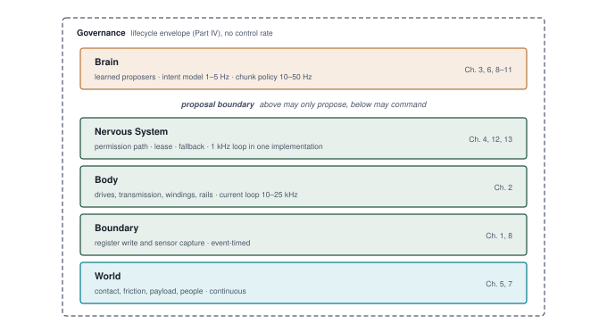
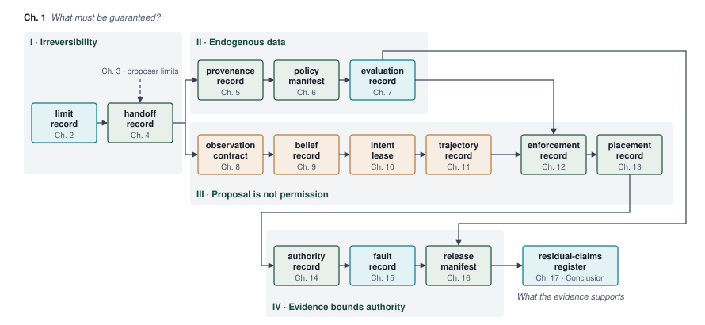

---
format:
  html:
    title: "The Causal Boundary"
---

# The Causal Boundary {#sec-boundary}

::: {layout-narrow}
::: {.column-margin}

\chapterminitoc

:::

::: {.content-visible when-format="pdf"}
\noindent
{fig-alt="Isometric blueprint of a physical AI machine on a single base plate. A translucent cube of connected nodes labeled Brain holds the learned models, a controller module labeled Nervous System carries a square-wave signal to a robot arm labeled Body, and the line where that signal enters the arm is labeled causal boundary. Return lines carry sensor data from the arm back to the Brain."}
:::

::: {.content-visible unless-format="pdf"}
{fig-alt="Isometric blueprint of a physical AI machine: learned models labeled Brain, a controller module labeled Nervous System, and a robot arm labeled Body, with the causal boundary marked where commands enter the arm."}
:::

:::

## Purpose {.unnumbered .unlisted}

::: {.content-visible when-format="pdf"}
\begin{marginfigure}
\resizebox{0.92\linewidth}{!}{\mlphysicalstackfull{20}{20}{20}{100}{20}}
\caption{The five-level machine stack with the Boundary level highlighted.}
\end{marginfigure}
:::

_What must a machine guarantee before a learned model's proposal becomes physical work?_

A learned policy may select actions the machine cannot safely execute. Once a command reaches a motor, current generates torque and moving mass carries momentum. Canceling the computation cannot undo that motion. As a robot's software processes observations, its physical chassis continues coasting toward an obstacle. Every millisecond of computational delay consumes physical space, irreversibly shrinking the available braking envelope. Prediction accuracy alone cannot determine if an action should proceed; a policy with 99.9 percent benchmark precision still commands catastrophic collisions when scaled across thousands of operating hours in unconstrained physical environments.

Physical artificial intelligence resolves this tension by structuring the machine across five distinct operating levels. High-capacity learned models residing in the Brain propose candidate trajectories, but between statistical proposals and physical execution sits the causal boundary: the definitive interface where digital bits command motor currents. The Brain holds proposal authority, while the deterministic Nervous System retains hard real-time execution authority to verify commands against the Body's measured kinematic and thermal limits. When a learned policy experiences tail latency, memory exhaustion, or semantic error, the Nervous System arrests motion via a verified stopping suffix before the machine exhausts its clearance budget.

::: {.column-margin .margin-pointer}
↳ **Downstream:** The plant limits behind the causal boundary are measured and recorded in @sec-body-measuring-limits.
:::



::: {.callout-learning-objectives}

- Explain why a command that crosses the causal boundary cannot be recalled by software
- Calculate the blind travel of a pre-brake delay and compare it with the braking distance
- Classify physical machines by the budget that exhausts first: clearance, contact force, or a thermal or phase margin
- Apply the physical AI scope test to distinguish advisory models from autonomous physical systems
- Locate the proposal boundary in the five-level machine and explain why only the permission path may command the actuators
- Diagnose how timing and authority failures combine in an autonomous machine incident
- Evaluate how irreversibility, closed-loop data, and limited evidence each make an independent permission path necessary
- Explain why physical authority depends on state, so that safety, security, and accountability meet at the permission path

:::

## Artificial Intelligence Beyond Glass {#sec-boundary-beyond-glass}

A robot approaching an open doorway must do more than recognize the portal in its camera stream. It must evaluate whether its physical chassis fits through the opening, select a viable trajectory, and continuously adjust that path as momentum carries it forward. If a sudden obstacle appears, canceling the software thread or throwing an unhandled exception cannot stop the machine's momentum. Designing this behavior requires tracing a decision all the way from sensory evidence to electromagnetic torque and mechanical work. That complete closed loop is the domain of physical artificial intelligence systems engineering.

In a physical machine, digital bits can command electrical currents across power inverters, magnetic flux generates mechanical torque, and moving mass accumulates momentum. An erroneous command can therefore produce a sheared gearbox, a collapsed battery voltage rail, or a collision before software can correct it.

**Moravec's paradox**\index{Moravec's paradox}[^fn-ai-moravec-paradox] [@moravec1988mind] explains why learned models are entering this loop at all: tasks that require intense human conscious effort, such as playing chess or proving theorems, require modest computation, whereas sensorimotor skills executed effortlessly (such as walking across uneven gravel or grasping an egg without crushing it) demand vast computational and control resources. As high-capacity neural networks are deployed to master these sensorimotor tasks, engineering teams encounter the exposure wall, which @sec-evaluation-trial-limits derives. Offline benchmark accuracy cannot predict closed-loop stability in the open world, and no feasible amount of failure-free testing can by itself demonstrate the rare-failure rates that growing physical deployment requires, so safety arguments must cover cumulative exposure, not only controlled demonstrations.

[^fn-ai-moravec-paradox]: **Moravec's Paradox**\index{Moravec's Paradox}: The observation in artificial intelligence [@moravec1988mind] that high-level reasoning requires comparatively little computation, whereas low-level sensorimotor coordination demands enormous perceptual and computational resources.

When digital models command physical actuators, they enter the closed causal feedback loops first formalized by Norbert Wiener in cybernetics[^fn-boundary-wiener-feedback] [@wiener1948cybernetics]. Information ceases to be an open-loop stream terminating at a display. Instead, every physical motion repositions the machine's sensors, reshaping subsequent observations under the deterministic laws of classical mechanics. Building such a machine draws on four technical cultures (machine learning, computer systems, classical robotics, and embedded silicon and safety), and teams that bridge them find each culture framing the problem in its own terms.

[^fn-boundary-wiener-feedback]: **Cybernetic Feedback Loops**\index{Cybernetic Feedback Loops}: In Norbert Wiener's cybernetic framework [@wiener1948cybernetics], feedback denotes adjusting future action using past performance.

The machine learning perspective focuses on scaling parameter counts, transformer backbones, and diffusion policies across millions of simulation steps, treating real-world deployment as a challenge of broader demonstration datasets and dataset coverage. The computer systems perspective focuses on memory bus bandwidth, cache hierarchies, and tail-latency percentiles, recognizing that streaming multi-gigabyte neural weights at high frequencies threatens to saturate memory interconnects and starve camera direct memory access pipelines [@williams2009roofline]. The classical robotics perspective relies on Newton-Euler dynamics to manage mechanical forces and motion. If a neural network commands rapid changes in motion (high-frequency jerk), it can shear gearboxes or trigger structural resonance, making classical stability margins critical. Finally, the embedded silicon and safety perspective focuses on bare-metal interrupt service routines, hardware trip zones, and functional safety standards (such as ISO 26262 and UL 4600), ensuring that unverified statistical models never hold direct write access to motor power stages.

Each perspective offers a critical insight. Gradient descent does not repair a fractured transmission or prevent a supply-voltage collapse, while a hand-tuned classical controller cannot provide open-world semantic scene understanding. A viable physical AI systems architecture must unify their responsibilities without asking any single discipline to shoulder the entire problem.

::: {.column-margin .margin-pointer}
↳ **Downstream:** The separation of learned proposals from actuation authority is mapped to isolated silicon domains in @sec-nervous-silicon-partitioning.
:::



::: {#dfn-boundary-physical-artificial-intelligence-physical-ai .callout-definition title="Physical artificial intelligence"}

***Physical artificial intelligence***\index{Physical Artificial Intelligence!definition}\index{Physical AI!definition} is the engineering of closed-loop physical machines in which high-capacity learned models propose actions that classical mechanics, thermodynamics, and hard real-time silicon constrain.

1.  **Significance**: Advisory AI outputs lack direct actuator authority, although people or downstream systems may act on them. Physical AI crosses into a continuous plant, where digital bits command motor currents, kinetic momentum accumulates, and software stalls can contribute to mechanical fractures, overheating, or collisions.
2.  **Distinction**: Unlike classical robotics (which relies on hand-engineered state machines and explicit kinematic models) or internet-scale machine learning (which operates on static offline datasets), physical AI couples high-capacity statistical generalization with deterministic hardware safety filters across an endogenous closed causal loop.
3.  **Common pitfall**: Treating physical embodiments as peripheral I/O devices for foundation models. Scaling laws and benchmark accuracies do not prevent supply-voltage collapse, gearbox shear, or actuator force saturation; physical safety requires an asymmetric architecture in which an independent real-time check can veto any learned proposal.

:::

The chapter follows a command from computation to physical work, compares the budgets of three machine classes, applies a scope test to decide which machines fall within the discipline, orders the machine into five levels, and uses the Tempe collision to test the boundary between learned proposals and actuation permission. The final sections turn that failure analysis into four laws, trace where safety, security, and accountability meet, and set out the architecture of the book.

## The Causal Boundary {#sec-boundary-causal-boundary}

An advisory model that only displays a recommendation has no direct path to a motor or valve. A user may dismiss the recommendation, and a database transaction may be rolled back before an external action commits.[^fn-math-idempotency-physical] Neither property makes digital errors harmless: a person may follow bad advice, and an automated trading system may execute a consequential order. The relevant distinction is whether a model's output can automatically reach a physical actuator.

[^fn-math-idempotency-physical]: **Idempotency**\index{Idempotency}: Repeating an idempotent operation has the same specified result as executing it once. A motor setpoint command can have idempotent command semantics, but repeated execution may still dissipate energy. Idempotency does not imply reversibility or harmlessness.

Physical AI removes the gap between a model's output and an actuator. In a physical machine, the final instruction of a control loop does not write to a screen or populate a web response. For a machine learning systems engineer accustomed to writing `action = policy(observation)` in PyTorch, the causal boundary is where floating-point tensors meet physical silicon. The policy's output tensor, typically an action chunk predicting a sequence of upcoming waypoints (joint positions, velocities, or 6-DOF Cartesian poses),[^fn-action-chunk-repr] cannot execute directly on physical motors.

[^fn-action-chunk-repr]: **Action Chunk Representations**\index{Action Chunk Representations}: In robot learning literature [@zhao2023learning], action chunks are typically tensors of shape $[B, H, d_a]$ where $B$ is batch size, $H$ is the planning prediction horizon, and $d_a$ is action dimension (such as target joint positions $\hat{\mathbf{q}} \in \mathbb{R}^d$ or 3D Cartesian position and orientation deltas). The formal Lie group formulation ($SE(3)$) is deferred to @sec-appendix-control-spatial; @sec-brain defines the chunk and its horizon.

An independent check must stand between a learned proposal and the actuator command. If the check admits the proposal, its setpoints pass through a deterministic cascade of drive loops that turns them into motor current, and the last software act in that cascade is a value written to a hardware register. Depending on the machine architecture, that hardware register acts as a digital-to-analog converter latch holding a commanded reference voltage, a pulse-width modulation (PWM) compare register setting inverter duty cycle, or a serial control word configuring a gate driver. At that exact memory address, informational abstraction ends. Modulating the gate voltages across power MOSFETs draws current from the high-voltage DC bus into the stator windings, generating Lorentz forces that accelerate the rotor against its reflected load inertia.

::: {#dfn-boundary-causal-boundary .callout-definition title="Causal boundary"}

***Causal boundary***\index{Causal boundary!definition} is the physical and electrical interface where digital computational bits convert into physical forces, currents, or flows.

1.  **Significance**: Before actuation, a proposal can be rejected without applying physical work. After actuation, actions can alter the environment, dissipate heat ($I^2 R$ resistive heating, kinetic friction), and reshape subsequent sensory observations.
2.  **Distinction**: Unlike a staged digital proposal, which can be rejected before it commits, an applied force cannot be canceled, and the physical work it has already performed remains in the plant.
3.  **Common pitfall**: Assuming software exceptions or thread cancellations can arrest physical momentum. Once a PWM compare register latches, current flows and mass accelerates; arresting that motion requires dedicated stopping distance ($d_{\text{stop}}$) and friction braking.

:::

Transitioning from digital state to physical force breaks the assumption, central to offline machine learning, that the data do not depend on the model's outputs. In offline vision, natural language processing, and tabular prediction, data collection is exogenous: the world generates a distribution of inputs, and the model processes them without altering the mechanism that created them. In a physical system, the environment evolves in a closed causal loop: the next physical state and sensor observation depend directly on the action produced by the prior model inference.

The sensory input stream is endogenous, generated by the machine's own past actions. When a policy produces an erroneous torque command, the joint rotates, the platform shifts, and mounted cameras or lidar units swing into new viewpoints. The machine drives itself into an unfamiliar region of the state space where training data is sparse, increasing the probability of subsequent inference errors and compounding the divergence from nominal operation (@fig-01-causal-loop).

::: {#fig-01-causal-loop fig-env="figure" fig-pos="t" fig-cap="**The closed causal loop**: Advisory output (top) stops at an informational interface. In physical AI (bottom), permitted model proposals reach hardware registers, where electrical current produces force and motion. Those actions alter the environment and subsequent sensor observations." fig-alt="Flowchart contrasting advisory predictions with physical AI. The upper path ends at an informational interface; the lower path carries sensor observations to a proposal, the permission path, motor actuators, and a changing physical plant."}
{width="95%"}
:::

Because physical mass possesses inertia and computation takes finite time, latency in physical AI translates directly into physical displacement. As shown on the autonomous testbed in @fig-01-sensor-rack, real-world robotic systems rely on dense multi-modal sensor suites (spinning lidar scanners, camera arrays, and radar units) that continuously stream high-bandwidth telemetry to onboard processors. Every stage in this pipeline, from photodiode exposure and sensor bus serialization,[^fn-hw-serdes-bus] to neural inference on accelerator silicon and packet transmission over deterministic fieldbuses, consumes milliseconds.

[^fn-hw-serdes-bus]: **Automotive Serializer/Deserializer (SerDes)**\index{SerDes!sensor links}: High-speed physical-layer links (such as FPD-Link or GMSL) that transport uncompressed, low-latency multi-gigabit video streams over lightweight coaxial or shielded twisted-pair cables. Combined with dedicated hardware trigger lines, SerDes interfaces ensure microsecond-synchronized shutter capture across the sensor ring. For bus specifications, see @sec-appendix-systems.

```{python}
#| label: boundary-blind-travel
#| echo: false
# ┌─────────────────────────────────────────────────────────────────────────────
# │ BLIND TRAVEL OF THE RUNNING MACHINE (LEGO)
# ├─────────────────────────────────────────────────────────────────────────────
# │ Context: The blind-travel paragraph in @sec-boundary-causal-boundary.
# │ Goal: Convert the running machine's total pre-brake delay into distance.
# │ Show: Drive limit, total pre-brake delay, and travel before braking begins.
# │ How: v * tau_delay from the warehouse mobile manipulator and its aisle
# │      scenario in mlsysim; no value is retyped here.
# └─────────────────────────────────────────────────────────────────────────────
from mlsysim import *
from mlsysim.core.units import *
from mlsysim.fmt import fmt_length, fmt_latency, fmt_velocity, check

RM = Embodied.MobileManipulator.WarehouseMobileManipulator
AISLE = Embodied.Scenario.WarehouseAisle

class BlindTravel:
    """Travel of the running machine's base before braking begins (illustrative inputs)."""

    # ┌── 1. LOAD (Constants & Parameters) ─────────────────────────────────
    v = RM.base.max_velocity  # category: illustrative (drive limit)
    tau_delay = AISLE.tau_delay  # category: derived (capture to retarding force)

    # ┌── 2. EXECUTE (Compute) ─────────────────────────────────────────────
    blind = (v * tau_delay).to(millimeter)
    blind_display = round(blind.to(millimeter).magnitude) * millimeter

    # ┌── 3. GUARD (Invariants) ───────────────────────────────────────────
    check(abs(v.to(meter / second).magnitude - 1.5) < 1e-9, f"Canon drive limit is 1.5 m/s, got {v}.")
    check(abs(tau_delay.to(millisecond).magnitude - 133.6) < 5e-3, f"Canon tau_delay is 133.6 ms, got {tau_delay}.")
    check(abs(blind.to(millimeter).magnitude - 200.4) < 5e-3, f"Canon blind travel is 200 mm, got {blind}.")

    # ┌── 4. OUTPUT (Formatting) ──────────────────────────────────────────
    v_str = fmt_velocity(v, unit=meter / second, precision=1)
    tau_delay_str = fmt_latency(tau_delay, unit=millisecond, precision=1)
    blind_str = fmt_length(blind_display, unit=millimeter, precision=0)
```

As a concrete example, consider the wheeled base of a warehouse mobile manipulator (introduced in full in @sec-boundary-four-archetypes), cruising down an aisle at its `{python} BlindTravel.v_str` drive limit (illustrative; see the Reader Guide). Its pre-brake delay, which later chapters assemble term by term, is at most `{python} BlindTravel.tau_delay_str`, from the capture of the camera frame that shows a person stepping out from a rack end to the onset of braking force. Over that interval the base travels `{python} BlindTravel.blind_str` with no response to anything the frame recorded. A person who steps out closer than that is reached before braking begins, and no amount of model capacity can alter that outcome.

This trade-off between computational delay and physical clearance is formalized by the **kinematic roofline**\index{Kinematic roofline}. In classical computer systems architecture, the Roofline Model [@williams2009roofline] bounds achievable throughput by the lower of two ceilings, peak memory bandwidth times arithmetic intensity\index{Arithmetic intensity} (the ratio of arithmetic operations to bytes moved, in $\text{FLOPs/byte}$) and peak compute. In physical AI, the kinematic roofline couples the delay before braking $\tau_{\text{delay}}$ and platform velocity $v$ to bound physical stopping clearance against the credible braking deceleration $a_{\text{brake}}$, but it adds its two terms rather than capping one by the other.

Under emergency braking, the total stopping distance $d_{\text{stop}}$ is the sum of the blind travel during the delay, which grows linearly with the delay, and the braking distance, which grows with the square of speed. @Sec-body-kinetic-momentum derives the relation. The blind travel is non-negotiable. During the delay, no braking force can be applied, because the sensor exposure has not yet propagated through perception and the fieldbus to the brakes. As @tbl-01-kinematic-roofline shows across representative embodied platforms, the delay's share of the stop is largest for slow, agile platforms, while its absolute travel is largest for fast vehicles.

```{python}
#| label: boundary-kinematic-roofline
#| echo: false
# ┌─────────────────────────────────────────────────────────────────────────────
# │ KINEMATIC ROOFLINE NOMOGRAM (LEGO)
# ├─────────────────────────────────────────────────────────────────────────────
# │ Context: @tbl-01-kinematic-roofline (cells and caption) and the paragraph
# │          after it (the heavier-model example).
# │ Goal: Show how a fixed delay before braking adds to braking distance for
# │       platforms of increasing speed.
# │ Show: Braking distance, stopping distance at three delays, and the delay
# │       share of the stop at the longest delay, per platform.
# │ How: d_stop = v*tau + v^2/(2a) via calc_safe_stopping_distance. The running
# │      machine's row reads its drive limit and credible deceleration from
# │      mlsysim; the other three rows are generic platform classes whose
# │      speeds and decelerations are scenario assumptions for the contrast.
# └─────────────────────────────────────────────────────────────────────────────
from mlsysim import *
from mlsysim.core.units import *
from mlsysim.fmt import fmt, fmt_length, fmt_latency, fmt_velocity, fmt_acceleration, fmt_percent, check
from decimal import Decimal, ROUND_HALF_UP

RM = Embodied.MobileManipulator.WarehouseMobileManipulator
AISLE = Embodied.Scenario.WarehouseAisle
_MPS = meter / second
_MPS2 = meter / second**2

def _roofline_row(v, a, taus):
    """Braking distance, stopping distances, delay travel, and delay share at the last delay."""
    brake = (v**2 / (2 * a)).to(meter)
    totals = [calc_safe_stopping_distance(v, t, a) for t in taus]
    adds = [(v * t).to(ureg.centimeter) for t in taus]
    share = (adds[-1] / totals[-1]).to("dimensionless").magnitude
    return brake, totals, adds, share

def _sig3_length(d):
    """A distance in meters to three significant figures (half up), with its decimal count."""
    x = Decimal(repr(d.to(meter).magnitude))
    places = max(0, 2 - x.adjusted())
    return float(x.quantize(Decimal(1).scaleb(-places), rounding=ROUND_HALF_UP)) * meter, places

def _fmt_sig3(d):
    """Format a distance in meters to three significant figures."""
    rounded, places = _sig3_length(d)
    if float(rounded.magnitude).is_integer():
        places = 0  # the formatter forbids trailing zeros on integer-like values
    return fmt_length(rounded, unit=meter, precision=places)

def _roofline_strs(v, a, taus):
    """Formatted table cells for one platform row: one precision rule per column."""
    brake, totals, adds, share = _roofline_row(v, a, taus)
    cells = [f"{_fmt_sig3(t)} (+{fmt_length(d, unit=ureg.centimeter)})" for t, d in zip(totals, adds)]
    return (
        fmt_velocity(v, unit=_MPS),
        fmt_velocity(v, unit=kilometer / hour),
        fmt_acceleration(a, unit=_MPS2),
        fmt((a / ureg.standard_gravity).to("dimensionless").magnitude, precision=2, suffix=" g"),
        _fmt_sig3(brake),
        cells[0],
        cells[1],
        cells[2],
        fmt_percent(share, precision=1, style="symbol"),
    )

class KinematicRoofline:
    """Stopping distance against delay for four platform classes (illustrative inputs)."""

    # ┌── 1. LOAD (Constants & Parameters) ─────────────────────────────────
    tau_reflex = 10 * millisecond  # category: illustrative (reflex-class delay column)
    tau_fast = 50 * millisecond  # category: illustrative (short-class delay column)
    tau_vla = 200 * millisecond  # category: illustrative (long-class delay column)
    hum_v = 1.0 * _MPS  # category: illustrative (scenario assumption, humanoid or quadruped)
    hum_a = 4.0 * _MPS2  # category: illustrative (scenario assumption)
    rm_v = RM.base.max_velocity  # category: illustrative (running machine drive limit)
    rm_a = AISLE.a_brake  # category: illustrative (running machine credible deceleration)
    bot_v = 6.0 * _MPS  # category: illustrative (scenario assumption, urban delivery robot)
    bot_a = 4.5 * _MPS2  # category: illustrative (scenario assumption)
    av_v = 20.0 * _MPS  # category: illustrative (scenario assumption, passenger vehicle)
    av_a = 7.0 * _MPS2  # category: illustrative (scenario assumption)
    model_extra = 150 * millisecond  # category: illustrative (scenario assumption, heavier model)

    # ┌── 2. EXECUTE (Compute) ─────────────────────────────────────────────
    taus = [tau_reflex, tau_fast, tau_vla]
    hum_brake, hum_totals, hum_adds, hum_share = _roofline_row(hum_v, hum_a, taus)
    rm_brake, rm_totals, rm_adds, rm_share = _roofline_row(rm_v, rm_a, taus)
    bot_brake, bot_totals, bot_adds, bot_share = _roofline_row(bot_v, bot_a, taus)
    av_brake, av_totals, av_adds, av_share = _roofline_row(av_v, av_a, taus)
    av_vla_travel = (av_v * tau_vla).to(meter)
    av_extra_travel = (av_v * model_extra).to(meter)

    # ┌── 3. GUARD (Invariants) ───────────────────────────────────────────
    check(
        abs(rm_v.to(_MPS).magnitude - 1.5) < 1e-9 and abs(rm_a.to(_MPS2).magnitude - 2.0) < 1e-9,
        "The running machine row is canon: 1.5 m/s at 2.0 m/s^2.",
    )
    check(abs(rm_brake.to(meter).magnitude - 0.5625) < 1e-9, f"Canon braking at 1.5 m/s is 562.5 mm, got {rm_brake}.")
    check(abs(rm_totals[-1].to(meter).magnitude - 0.8625) < 1e-9, f"Running machine stop at 200 ms is 0.8625 m, got {rm_totals[-1]}.")
    check(abs(rm_share - 0.3478) < 5e-4, f"Delay share of the running machine's stop is about 34.8 percent, got {rm_share}.")
    check(hum_share > rm_share > bot_share > av_share, "The delay share must fall as platform speed rises.")
    check(abs(bot_brake.to(meter).magnitude - 4.0) < 1e-9, f"Delivery robot braking is 4.00 m, got {bot_brake}.")
    check(abs(av_vla_travel.to(meter).magnitude - 4.0) < 1e-9, "The caption claims 4 m of travel for the vehicle at 200 ms.")
    check(abs(av_extra_travel.to(meter).magnitude - 3.0) < 1e-9, "The prose claims 3 m of travel for 150 ms at highway speed.")

    # ┌── 4. OUTPUT (Formatting) ──────────────────────────────────────────
    tau_reflex_str = fmt_latency(tau_reflex, unit=millisecond, precision=0)
    tau_fast_str = fmt_latency(tau_fast, unit=millisecond, precision=0)
    tau_vla_str = fmt_latency(tau_vla, unit=millisecond, precision=0)
    hum_v_str, hum_kmh_str, hum_a_str, hum_g_str, hum_brake_str, hum_t1_str, hum_t2_str, hum_t3_str, hum_share_str = _roofline_strs(
        hum_v, hum_a, taus
    )
    rm_v_str, rm_kmh_str, rm_a_str, rm_g_str, rm_brake_str, rm_t1_str, rm_t2_str, rm_t3_str, rm_share_str = _roofline_strs(rm_v, rm_a, taus)
    bot_v_str, bot_kmh_str, bot_a_str, bot_g_str, bot_brake_str, bot_t1_str, bot_t2_str, bot_t3_str, bot_share_str = _roofline_strs(
        bot_v, bot_a, taus
    )
    av_v_str, av_kmh_str, av_a_str, av_g_str, av_brake_str, av_t1_str, av_t2_str, av_t3_str, av_share_str = _roofline_strs(av_v, av_a, taus)
    av_vla_travel_str = fmt_length(av_vla_travel, unit=meter, precision=0)
    model_extra_str = fmt_latency(model_extra, unit=millisecond, precision=0)
    av_extra_travel_str = fmt_length(av_extra_travel, unit=meter, precision=0)
```

| Physical Platform & Velocity $v$                                                                                         | Braking Decel $a_{\text{brake}}$                                                | Mechanical Braking $d_{\text{braking}}$    | $\tau_{\text{delay}} =$ `{python} KinematicRoofline.tau_reflex_str` (Reflex Class) | $\tau_{\text{delay}} =$ `{python} KinematicRoofline.tau_fast_str` (Short Class) | $\tau_{\text{delay}} =$ `{python} KinematicRoofline.tau_vla_str` (Long Class) | Latency Fraction at `{python} KinematicRoofline.tau_vla_str` |
|:-------------------------------------------------------------------------------------------------------------------------|:--------------------------------------------------------------------------------|:-------------------------------------------|:-----------------------------------------------------------------------------------|:--------------------------------------------------------------------------------|:------------------------------------------------------------------------------|:-------------------------------------------------------------|
| **Humanoid / Quadruped** (`{python} KinematicRoofline.hum_v_str` = `{python} KinematicRoofline.hum_kmh_str`)             | `{python} KinematicRoofline.hum_a_str` (`{python} KinematicRoofline.hum_g_str`) | `{python} KinematicRoofline.hum_brake_str` | `{python} KinematicRoofline.hum_t1_str`                                            | `{python} KinematicRoofline.hum_t2_str`                                         | `{python} KinematicRoofline.hum_t3_str`                                       | **`{python} KinematicRoofline.hum_share_str` of total stop** |
| **Warehouse Mobile Manipulator, Base** (`{python} KinematicRoofline.rm_v_str` = `{python} KinematicRoofline.rm_kmh_str`) | `{python} KinematicRoofline.rm_a_str` (`{python} KinematicRoofline.rm_g_str`)   | `{python} KinematicRoofline.rm_brake_str`  | `{python} KinematicRoofline.rm_t1_str`                                             | `{python} KinematicRoofline.rm_t2_str`                                          | `{python} KinematicRoofline.rm_t3_str`                                        | **`{python} KinematicRoofline.rm_share_str` of total stop**  |
| **Urban Delivery Bot** (`{python} KinematicRoofline.bot_v_str` = `{python} KinematicRoofline.bot_kmh_str`)               | `{python} KinematicRoofline.bot_a_str` (`{python} KinematicRoofline.bot_g_str`) | `{python} KinematicRoofline.bot_brake_str` | `{python} KinematicRoofline.bot_t1_str`                                            | `{python} KinematicRoofline.bot_t2_str`                                         | `{python} KinematicRoofline.bot_t3_str`                                       | **`{python} KinematicRoofline.bot_share_str` of total stop** |
| **Autonomous Vehicle** (`{python} KinematicRoofline.av_v_str` = `{python} KinematicRoofline.av_kmh_str`)                 | `{python} KinematicRoofline.av_a_str` (`{python} KinematicRoofline.av_g_str`)   | `{python} KinematicRoofline.av_brake_str`  | `{python} KinematicRoofline.av_t1_str`                                             | `{python} KinematicRoofline.av_t2_str`                                          | `{python} KinematicRoofline.av_t3_str`                                        | **`{python} KinematicRoofline.av_share_str` of total stop**  |
: **Kinematic roofline nomogram**: Stopping clearance trade-offs across embodied platforms. The warehouse mobile manipulator's row uses its drive limit and credible deceleration. The three delay columns are classes of pre-brake delay, not the delay of any one platform. Stopping distances are rounded to three significant figures, and the added blind travel is given in centimeters to the nearest millimeter. At `{python} KinematicRoofline.tau_vla_str` of delay, an autonomous passenger car travels an additional `{python} KinematicRoofline.av_vla_travel_str`, an entire vehicle length, before its brakes engage. {#tbl-01-kinematic-roofline}

Just as an architect cannot resolve a memory-bound arithmetic pipeline by adding more ALU execution units, an autonomous vehicle systems engineer cannot resolve an emergency stopping clearance violation by adding model parameters if doing so lengthens the delay $\tau_{\text{delay}}$ before braking. A heavier foundation model that adds `{python} KinematicRoofline.model_extra_str` of computation consumes an extra `{python} KinematicRoofline.av_extra_travel_str` of physical travel at highway speeds, distance that no friction brake or collision-avoidance logic can recover.

The physical reality of this trade-off is captured longitudinally across five decades of autonomous vehicle systems (@fig-boundary-latency-vs-velocity). The safe operating speed of any physical AI platform is strictly bounded by the **kinematic stopping roofline**:
$$d_{\text{stop}} = v \tau_{\text{delay}} + \frac{v^2}{2 a_{\text{max}}} \le R_{\text{sensor}}$$
where $v$ is vehicle velocity, $\tau_{\text{delay}}$ is the end-to-end sense-to-act loop latency, $a_{\text{max}}$ is emergency braking deceleration ($0.7\,\text{g} \approx 6.86\,\text{m/s}^2$ on dry asphalt), and $R_{\text{sensor}}$ is the effective sensor perception horizon.

In the early deliberative era (1970–1980), SRI's Shakey and Moravec's Stanford Cart operated with loop latencies between $15$ and $30\,\text{seconds}$ due to offboard mainframe compute bottlenecks, capping safe crawl speeds below $0.2\,\text{km/h}$. By the mid-1980s and 1990s, Ernst Dickmanns' VaMoRs demonstrated that running custom 4D dynamic vision algorithms at $25\,\text{Hz}$ ($\tau = 40\,\text{ms}$) unlocked $96\,\text{km/h}$ highway speeds on the German Autobahn, proving that control loop cadence—rather than raw cognitive deliberation depth—governs safe mobility. During the DARPA Grand Challenges (2004–2007), Stanford Stanley and CMU Boss operated at $10\text{--}12\,\text{Hz}$ ($85\text{--}100\,\text{ms}$) to navigate desert trails and urban intersections at $48\text{--}60\,\text{km/h}$. Today, production robotaxis such as the Waymo Driver maintain $\sim 80\,\text{ms}$ loop latencies to ensure stopping envelopes remain well within their $200\,\text{m}$ sensor horizons at highway velocities ($110\,\text{km/h}$), while autonomous racing vehicles (such as the Indy Autonomous Challenge PoliMOVE team) push loop latencies down to $28\,\text{ms}$ ($>35\,\text{Hz}$) to operate safely at speeds exceeding $309\,\text{km/h}$.

::: {#fig-boundary-latency-vs-velocity fig-env="figure" fig-pos="htb" fig-cap="**The causal boundary: sense-to-act loop latency versus vehicle operational speed envelope (1970–2026)**: Empirical milestones spanning five decades of autonomous ground vehicles plotted against physical kinematic stopping rooflines under emergency deceleration ($a_{\\text{max}} = 0.7\\,\\text{g} = 6.86\\,\\text{m/s}^2$) across four sensor horizons ($R = 5\\,\\text{m}$ to $200\\,\\text{m}$). Vehicles above the $R = 200\\,\\text{m}$ ceiling enter the physically unrecoverable regime, where stopping distance exceeds sensor range regardless of downstream algorithm cleverness. Milestones: SRI Shakey (1970), Stanford Cart (1979), CMU Navlab 1 (1986), UniBwM VaMoRs (1987), CMU Navlab 5 (1995), Stanford Stanley (2005), CMU Boss (2007), Waymo Driver Gen 5/6 (2024), and Indy Autonomous Challenge PoliMOVE AV-24 (2024)." fig-alt="Log-log scatter plot of sense-to-act loop latency from 10 milliseconds to 60 seconds against operational vehicle speed from 0.1 to 350 km/h. Four kinematic roofline curves show maximum safe speeds for sensor horizons from 5 to 200 meters. Historical vehicles are plotted from Shakey at 30 seconds and 0.18 km/h to modern Indy Autonomous racing at 28 milliseconds and 309 km/h, highlighting shaded eras from Deliberative (1970-1980) to High-Speed Real-Time (2020-2026)."}

```{python}
#| label: fig-boundary-latency-vs-velocity
#| echo: false
# ┌─────────────────────────────────────────────────────────────────────────────
# │ SENSE-TO-ACT LOOP LATENCY VS. OPERATIONAL SPEED ENVELOPE (1970–2026)
# ├─────────────────────────────────────────────────────────────────────────────
# │ Context: Section 1.2, @fig-boundary-latency-vs-velocity.
# │ Goal:    Show the physical kinematic roofline bounding autonomous vehicles:
# │          d_stop = v * tau + v^2 / (2 * a) <= R_sensor
# │          Across 50+ years of milestones (Shakey, Navlab, Stanley, Waymo, IAC).
# └─────────────────────────────────────────────────────────────────────────────
import matplotlib as mpl

mpl.use("Agg")
import matplotlib.pyplot as plt
import matplotlib.ticker as ticker
import numpy as np

plt.rcParams["font.sans-serif"] = ["Helvetica", "Arial", "DejaVu Sans"]
plt.rcParams["axes.edgecolor"] = "#334155"
plt.rcParams["axes.linewidth"] = 1.0

fig, ax = plt.subplots(figsize=(14, 8), dpi=200, facecolor="#FFFFFF")
ax.set_facecolor("#FFFFFF")
ax.spines["top"].set_visible(False)
ax.spines["right"].set_visible(False)
ax.grid(True, linestyle="--", linewidth=0.6, alpha=0.5, color="#E2E8F0")
ax.set_axisbelow(True)

# Era Shading
era_colors = ["#F1F5F9", "#EFF6FF", "#ECFDF5", "#FFFBEB"]
ax.axvspan(5000, 60000, color=era_colors[0], alpha=0.6, zorder=0)
ax.axvspan(400, 5000, color=era_colors[1], alpha=0.5, zorder=0)
ax.axvspan(50, 400, color=era_colors[2], alpha=0.4, zorder=0)
ax.axvspan(10, 50, color=era_colors[3], alpha=0.5, zorder=0)

era_y = 450
ax.text(25000, era_y, "Deliberative Era\n(1970–1980)", ha="center", va="center", fontsize=8.5, fontweight="bold", color="#64748B", style="italic")
ax.text(
    2000, era_y, "Early Vision & Systolic\n(1985–1995)", ha="center", va="center", fontsize=8.5, fontweight="bold", color="#64748B", style="italic"
)
ax.text(180, era_y, "DARPA Grand Challenges\n(2004–2010)", ha="center", va="center", fontsize=8.5, fontweight="bold", color="#64748B", style="italic")
ax.text(23, era_y, "High-Speed Real-Time\n(2020–2026)", ha="center", va="center", fontsize=8.5, fontweight="bold", color="#64748B", style="italic")

# Kinematic Curves: d_stop = v * tau + v^2 / (2 * a) <= R
a = 6.86  # 0.7 g emergency deceleration
tau_ms = np.logspace(np.log10(10), np.log10(60000), 500)
tau_s = tau_ms / 1000.0

horizons = [
    (200, "Sensor Horizon R = 200 m (Highway LiDAR/Radar)", "#A51C30", "-"),
    (100, "R = 100 m (Suburban / Rural)", "#D97706", "--"),
    (30, "R = 30 m (Urban Occlusion / Crosswalk)", "#008080", "-."),
    (5, "R = 5 m (Indoor Warehouse / Hallway)", "#6B21A8", ":"),
]

for R, label, col, ls in horizons:
    v_max_ms = np.sqrt((a * tau_s) ** 2 + 2 * a * R) - a * tau_s
    v_max_kmh = v_max_ms * 3.6
    ax.plot(tau_ms, v_max_kmh, linestyle=ls, color=col, linewidth=1.8, alpha=0.85, label=label, zorder=2)

v_max_200 = (np.sqrt((a * tau_s) ** 2 + 2 * a * 200) - a * tau_s) * 3.6
ax.fill_between(tau_ms, v_max_200, 520, color="#FEE2E2", alpha=0.35, zorder=1)
ax.text(
    12000,
    180,
    "PHYSICALLY UNRECOVERABLE REGIME\n(Stopping Distance > 200 m Sensor Horizon)",
    fontsize=8.8,
    fontweight="bold",
    color="#A51C30",
    alpha=0.75,
    rotation=-14,
    ha="center",
)

def add_badge(ax, text, xy, xytext, color="#1E293B", fontsize=8.2, arrow=True, arrow_color="#94A3B8"):
    bbox = dict(boxstyle="round,pad=0.45", facecolor="#FFFFFF", edgecolor="#CBD5E1", alpha=0.96, linewidth=0.8)
    ap = dict(arrowstyle="->", color=arrow_color, linewidth=1.1, shrinkA=3, shrinkB=4) if arrow else None
    ax.annotate(
        text, xy=xy, xytext=xytext, fontsize=fontsize, fontweight="medium", color=color, bbox=bbox, arrowprops=ap, ha="center", va="center", zorder=10
    )

milestones = [
    {
        "name": "SRI Shakey (1970)",
        "tau": 30000,
        "v": 0.18,
        "badge_xytext": (14000, 0.45),
        "text": "1970 · SRI Shakey\nτ ≈ 30 s · v = 0.18 km/h\nSTRIPS stop-and-plan",
        "color": "#6B21A8",
        "marker": "o",
    },
    {
        "name": "Stanford Cart (1979)",
        "tau": 15000,
        "v": 0.10,
        "badge_xytext": (4500, 0.20),
        "text": "1979 · Stanford Cart (Moravec)\nτ ≈ 15 s · v = 0.10 km/h\nStereo obstacle mapping",
        "color": "#475569",
        "marker": "s",
    },
    {
        "name": "CMU Navlab 1 (1986)",
        "tau": 1500,
        "v": 15.0,
        "badge_xytext": (2800, 6.5),
        "text": "1986 · CMU Navlab 1\nτ ≈ 1.5 s · v = 15 km/h\nALVINN neural net on WARP",
        "color": "#D97706",
        "marker": "o",
    },
    {
        "name": "UniBwM VaMoRs (1987)",
        "tau": 40,
        "v": 96.0,
        "badge_xytext": (16, 50),
        "text": "1987 · Dickmanns VaMoRs\nτ = 40 ms (25 Hz) · v = 96 km/h\nAutobahn 4D dynamic vision",
        "color": "#008080",
        "marker": "^",
    },
    {
        "name": "CMU Navlab 5 (1995)",
        "tau": 120,
        "v": 95.0,
        "badge_xytext": (230, 85),
        "text": "1995 · CMU Navlab 5\nτ ≈ 120 ms · v = 95 km/h\nNo Hands Across America",
        "color": "#B45309",
        "marker": "s",
    },
    {
        "name": "Stanford Stanley (2005)",
        "tau": 100,
        "v": 60.0,
        "badge_xytext": (40, 20),
        "text": "2005 · Stanford Stanley\nτ ≈ 100 ms (10 Hz) · v = 60 km/h\nDARPA Grand Challenge winner",
        "color": "#004B87",
        "marker": "D",
    },
    {
        "name": "CMU Tartan Boss (2007)",
        "tau": 85,
        "v": 48.0,
        "badge_xytext": (150, 18),
        "text": "2007 · CMU Boss (Urban Challenge)\nτ ≈ 85 ms · v = 48 km/h\nUrban intersection autonomy",
        "color": "#1E793C",
        "marker": "D",
    },
    {
        "name": "Waymo Driver (2024)",
        "tau": 80,
        "v": 110.0,
        "badge_xytext": (280, 220),
        "text": "2024 · Waymo Driver (Gen 5/6)\nτ ≈ 80 ms · v = 110 km/h (68 mph)\nCommercial highway robotaxi fleet",
        "color": "#0284C7",
        "marker": "o",
    },
    {
        "name": "Indy Autonomous (2024)",
        "tau": 28,
        "v": 309.3,
        "badge_xytext": (13, 190),
        "text": "2024 · Indy Autonomous (PoliMOVE)\nτ ≈ 28 ms (35+ Hz) · v = 309 km/h (192 mph)\nAV-24 oval racing world record",
        "color": "#A51C30",
        "marker": "*",
    },
]

for m in milestones:
    ax.scatter(
        m["tau"], m["v"], color=m["color"], s=110 if m["marker"] != "*" else 220, marker=m["marker"], edgecolor="#FFFFFF", linewidth=1.5, zorder=12
    )
    add_badge(ax, m["text"], xy=(m["tau"], m["v"]), xytext=m["badge_xytext"], color="#1E293B", fontsize=8.2, arrow=True, arrow_color=m["color"])

ax.set_xscale("log")
ax.set_yscale("log")
ax.set_xlim(10, 65000)
ax.set_ylim(0.06, 520)

ax.set_xticks([10, 30, 100, 300, 1000, 3000, 10000, 30000, 60000])
ax.get_xaxis().set_major_formatter(ticker.FuncFormatter(lambda x, p: f"{int(x)} ms" if x < 1000 else f"{int(x/1000)} s"))
ax.set_yticks([0.1, 0.5, 1, 5, 15, 50, 100, 200, 350])
ax.get_yaxis().set_major_formatter(ticker.FuncFormatter(lambda y, p: f"{y:g} km/h"))

ax.set_xlabel(r"Sense-to-Act Loop Latency $\tau_{\mathrm{delay}}$ (log scale)", fontsize=11, fontweight="bold", labelpad=8)
ax.set_ylabel("Vehicle Operational Speed Envelope $v$ (km/h, log scale)", fontsize=11, fontweight="bold", labelpad=8)

fig.suptitle(
    "The Causal Boundary: Sense-to-Act Latency vs Safe Operating Speed (1970–2026)",
    fontsize=14,
    fontweight="bold",
    x=0.08,
    y=0.98,
    ha="left",
    color="#1E293B",
)
ax.set_title(
    r"Physical AI kinematic roofline: stopping envelope $d_{\mathrm{stop}} = v \tau + \frac{v^2}{2 a_{\max}} \leq R_{\mathrm{sensor}}$ under emergency braking ($a = 0.7\,\mathrm{g}$)",
    fontsize=9.5,
    color="#475569",
    loc="left",
    pad=14,
)

legend = ax.legend(
    loc="lower left",
    frameon=True,
    framealpha=0.95,
    edgecolor="#CBD5E1",
    fontsize=8.5,
    title=r"Kinematic Safety Ceilings ($a_{\max} = 6.86\,\mathrm{m/s}^2$)",
    title_fontsize=9.0,
)
legend.get_title().set_fontweight("bold")
legend.set_zorder(15)

plt.tight_layout()
plt.subplots_adjust(top=0.90, bottom=0.10, left=0.08, right=0.96)
plt.show()
```
:::

Once digital commands transition into mechanical work, the state change becomes thermodynamically irreversible. The physical world provides no rollback mechanism.[^fn-phys-landauer-limit] When an actuator controller applies current to a motor, electrical energy transfers from the battery into kinetic energy in mechanical linkages or thermal energy dissipated through resistive Joule heating ($I^2 R$) in the stator windings. If an incorrect joint torque drives a manipulator into a rigid steel fixture, the kinetic energy converts into plastic deformation of the tool, mechanical strain on the gearbox teeth, and heat. No software interrupt can pull that kinetic energy out of the crushed structure or restore sheared gear teeth to their original geometry.

[^fn-phys-landauer-limit]: **Thermodynamic Limits of Computation**\index{Thermodynamic Limits of Computation}: At a fundamental level, @landauer1961 established that erasing logical bits dissipates at least $k_B T \ln 2$ of heat per erased bit. In physical AI systems, however, the dominant irreversibility is macroscopic: motor inverters draw tens of Amperes from battery packs, dissipating kilowatt-scale Joule heat ($I^2 R$) and imparting momentum to moving linkages.

::: {.column-margin .margin-pointer}
↳ **Downstream:** The non-smooth contact mechanics and torque saturation limits governing motor irreversibility are derived in @sec-body-actuator-limits.
:::

::: {#fig-01-sensor-rack fig-env="figure" fig-pos="t" fig-cap="**Lidar sensor ingress**: A 64-beam spinning optical lidar assembly mounted aboard an autonomous research testbed. In physical AI, sensor streams delivering over 1.3 million points per second must be serialized over real-time hardware interfaces, synchronized to microsecond timestamps, and processed through neural perception backbones within strict latency deadlines. (Source: Steve Jurvetson, CC BY 2.0)." fig-alt="Close-up photograph of a roof-mounted 64-beam spinning optical lidar sensor assembly on an autonomous research vehicle testbed, showing optical lenses and aluminum housing."}
{width="85%"}
:::

```{python}
#| label: boundary-machine-levels
#| echo: false
# ┌─────────────────────────────────────────────────────────────────────────────
# │ PINNED RATES OF THE FIVE-LEVEL MACHINE (LEGO)
# ├─────────────────────────────────────────────────────────────────────────────
# │ Context: @tbl-01-paradigm-comparison execution-cadence row, the
# │          @sec-boundary-machine-model paragraph, and @tbl-01-machine-levels.
# │ Goal: Hold the only rates the book attaches to a level, in one place.
# │ Show: Intent-model and chunk-policy bands, the permission loop of the running
# │       machine (one implementation), and the current-loop band.
# │ How: Pinned level rates; chosen values, not measurements of any machine. The
# │      permission-loop example comes from the warehouse mobile manipulator in
# │      mlsysim. A chapter that needs a different rate derives it from a limit
# │      record instead of relabeling a level.
# └─────────────────────────────────────────────────────────────────────────────
from mlsysim import *
from mlsysim.core.units import *
from mlsysim.fmt import fmt, fmt_frequency, fmt_length, check, MarkdownStr

class MachineLevelRates:
    """Pinned level rates of the five-level machine (chosen values, not measurements)."""

    # ┌── 1. LOAD (Constants & Parameters) ─────────────────────────────────
    intent_lo = ReferenceStats.PhysicalAIRates.IntentLo  # category: chosen (intent model, lower bound)
    intent_hi = ReferenceStats.PhysicalAIRates.IntentHi  # category: chosen (intent model, upper bound)
    chunk_lo = ReferenceStats.PhysicalAIRates.ChunkLo  # category: chosen (chunk policy, lower bound)
    chunk_hi = ReferenceStats.PhysicalAIRates.ChunkHi  # category: chosen (chunk policy, upper bound)
    permission_example = (
        Embodied.MobileManipulator.WarehouseMobileManipulator.permission_rate
    )  # category: chosen (running machine, one implementation)
    current_lo = ReferenceStats.PhysicalAIRates.CurrentLoopLo  # category: chosen (current loop, lower bound)
    current_hi = ReferenceStats.PhysicalAIRates.CurrentLoopHi  # category: chosen (current loop, upper bound)
    switching_lo = ReferenceStats.PhysicalAIRates.GateSwitchingLo  # category: chosen (switching frequency, lower bound)
    switching_hi = ReferenceStats.PhysicalAIRates.GateSwitchingHi  # category: chosen (switching frequency, upper bound)

    # ┌── 2. EXECUTE (Compute) ─────────────────────────────────────────────
    intent_period_lo = (1 / intent_hi).to(millisecond)
    intent_period_hi = (1 / intent_lo).to(millisecond)
    chunk_period_lo = (1 / chunk_hi).to(millisecond)
    chunk_period_hi = (1 / chunk_lo).to(millisecond)
    permission_period = (1 / permission_example).to(millisecond)
    current_period_lo = (1 / current_hi).to(microsecond)
    current_period_hi = (1 / current_lo).to(microsecond)
    switching_period_lo = (1 / switching_hi).to(microsecond)
    switching_period_hi = (1 / switching_lo).to(microsecond)

    # ┌── 3. GUARD (Invariants) ───────────────────────────────────────────
    check(intent_hi < chunk_lo, "The intent-model band must sit below the chunk-policy band.")
    check(chunk_hi < permission_example < current_lo, "The permission loop must sit between the chunk policy and the current loop.")
    check(abs(permission_period.magnitude - 1.0) < 1e-9, "A 1 kHz loop has a 1 ms period.")
    check(current_lo < switching_lo, "Inverter switching frequency must exceed current loop frequency.")

    # ┌── 4. OUTPUT (Formatting) ──────────────────────────────────────────
    intent_to_str = MarkdownStr(f"{fmt(intent_lo.magnitude, precision=0)} to {fmt_frequency(intent_hi, unit=hertz, precision=0)}")
    chunk_to_str = MarkdownStr(f"{fmt(chunk_lo.magnitude, precision=0)} to {fmt_frequency(chunk_hi, unit=hertz, precision=0)}")
    current_to_str = MarkdownStr(f"{fmt(current_lo.magnitude, precision=0)} to {fmt_frequency(current_hi, unit=ureg.kilohertz, precision=0)}")
    intent_range_str = MarkdownStr(f"{fmt(intent_lo.magnitude, precision=0)}–{fmt_frequency(intent_hi, unit=hertz, precision=0)}")
    chunk_range_str = MarkdownStr(f"{fmt(chunk_lo.magnitude, precision=0)}–{fmt_frequency(chunk_hi, unit=hertz, precision=0)}")
    current_range_str = MarkdownStr(f"{fmt(current_lo.magnitude, precision=0)}–{fmt_frequency(current_hi, unit=ureg.kilohertz, precision=0)}")
    switching_range_str = MarkdownStr(
        f"{fmt(switching_lo.to(ureg.kilohertz).magnitude, precision=0)}–{fmt_frequency(switching_hi, unit=ureg.kilohertz, precision=0)}"
    )
    permission_str = fmt_frequency(permission_example, unit=ureg.kilohertz, precision=0)

    intent_period_str = MarkdownStr(f"{fmt(intent_period_lo.magnitude, precision=0)}–{fmt(intent_period_hi.magnitude, precision=0)} ms")
    chunk_period_str = MarkdownStr(f"{fmt(chunk_period_lo.magnitude, precision=0)}–{fmt(chunk_period_hi.magnitude, precision=0)} ms")
    permission_period_str = MarkdownStr(f"{fmt(permission_period.magnitude, precision=0)} ms")
    current_period_str = MarkdownStr(f"{fmt(current_period_lo.magnitude, precision=0)}–{fmt(current_period_hi.magnitude, precision=0)} µs")
    switching_period_str = MarkdownStr(f"{fmt(switching_period_lo.magnitude, precision=0)}–{fmt(switching_period_hi.magnitude, precision=0)} µs")

    intent_blind_str = MarkdownStr(f"{fmt(intent_period_lo.magnitude, precision=0)}–{fmt(intent_period_hi.magnitude, precision=0)} mm")
    chunk_blind_str = MarkdownStr(f"{fmt(chunk_period_lo.magnitude, precision=0)}–{fmt(chunk_period_hi.magnitude, precision=0)} mm")
    permission_blind_str = fmt_length(1 * millimeter, unit=millimeter, precision=0)
    current_blind_str = MarkdownStr(f"{fmt(current_period_lo.magnitude, precision=0)}–{fmt(current_period_hi.magnitude, precision=0)} µm")
    switching_blind_str = MarkdownStr(f"{fmt(switching_period_lo.magnitude, precision=0)}–{fmt(switching_period_hi.magnitude, precision=0)} µm")
```

Physical AI inherits the learned model of advisory machine learning and the actuator of classical control, and with them a combination of failure modes that neither field faces alone (@tbl-01-paradigm-comparison).

| Architectural Dimension   | Digital Machine Learning (Advisory)                                                                        | Classical Robotics & Control                                                     | Physical Artificial Intelligence (Closed-Loop)                                                                                                                                                                                                      |
|:--------------------------|:-----------------------------------------------------------------------------------------------------------|:---------------------------------------------------------------------------------|:----------------------------------------------------------------------------------------------------------------------------------------------------------------------------------------------------------------------------------------------------|
| **Operational Substrate** | Decoupled virtual memory buffers (GPU VRAM, DRAM, web endpoints)                                           | Continuous analog state space governed by differential equations                 | Hybrid: high-dimensional neural representations mapped to analog physical actuators                                                                                                                                                                 |
| **Model Formulation**     | High-capacity statistical approximators (LLMs, ViTs, diffusion policies)                                   | Analytically specified transfer functions and deterministic state-space matrices | Foundation policies paired with deterministic runtime safety filters                                                                                                                                                                                |
| **Feedback Dynamics**     | Exogenous and static; independent and identically distributed samples                                      | Continuous deterministic state feedback with Gaussian sensor noise               | Endogenous, non-stationary closed loop; actions shape future observations                                                                                                                                                                           |
| **Execution Cadence**     | Throughput-optimized batching; soft or unbounded latency budgets                                           | Hard real-time single-rate loops on microcontrollers (100 Hz to 1 kHz)           | Multi-rate: an intent model (`{python} MachineLevelRates.intent_range_str`) and a chunk policy (`{python} MachineLevelRates.chunk_range_str`) propose; a permission loop, `{python} MachineLevelRates.permission_str` in one implementation, admits |
| **Actuation Authority**   | Advisory; sandboxed APIs, display buffers, or human-in-the-loop validation                                 | Hardcoded feedback directly driving power inverter timers and PWM registers      | Learned proposals checked by an independent path before any reaches an actuator                                                                                                                                                                     |
| **Failure Semantics**     | Outputs may be dismissed or transactions reversed before external action; downstream harm remains possible | Actuator saturation, tracking error, or loss of stability                        | Irreversible thermodynamic work, plastic deformation, kinetic collision, or stator overheating                                                                                                                                                      |
| **Safety Assurance**      | Offline statistical loss minimization on validation splits                                                 | Formal mathematical stability proofs (Lyapunov functions, gain/phase margins)    | Layered runtime invariant enforcement, forward-invariant barrier filters, and fault injection                                                                                                                                                       |

: **Comparison matrix of computing paradigms across the causal boundary**: Advisory digital machine learning (left), classical robotics and control theory (middle), and physical artificial intelligence (right) compared by operational substrate, model formulation, feedback dynamics, execution cadence, actuation authority, failure semantics, and safety certification primitives. {#tbl-01-paradigm-comparison tbl-colwidths="[18,26,26,30]"}

The failure-semantics and actuation-authority rows of the right-hand column trace to irreversibility. A permitted command delivers work that no later software action can recall, so the check on it has to finish first. What that work damages first, and how quickly, depends on what the machine moves, and that dependence sets the deadline the check must meet.

## Three Machine Classes {#sec-boundary-four-archetypes}

An autonomous delivery drone navigating turbulent wind gusts seems to share nothing with a six-axis robotic arm assembling an automotive transmission, and neither appears related to a containerized battery management plant regulating liquid coolant. One curriculum can cover them all, without becoming a collection of ad hoc recipes, only if it classifies them by something deeper than their shape.

The key is to look past cosmetic form factors to the underlying physical conservation laws. Every embodied AI system is governed by one or more of three foundational physical classes, each defined by the conservation law that dominates its actuators (@fig-01-three-archetypes, @fig-01-real-three-archetypes): moving mass across space, applying force through physical contact, or regulating continuous fluid and thermal flows. A humanoid couples all three on one chassis. Classifying a machine this way allows system architects to determine which resource budget exhausts first during a software stall or anomaly and to size the machine's safety response to it. @Tbl-01-archetype-budgets sets those budgets beside the failure each one ends in and the gate that has to catch it.

::: {#fig-01-three-archetypes fig-env="figure" fig-pos="t" fig-cap="**Three machine classes**: The three foundational physical embodiments classified by their primary binding conservation laws: (a) mass-dominated mobility (Class 1) governed by momentum and spatial clearance; (b) contact-dominated manipulation (Class 2) governed by mechanical impedance and structural yield stress; and (c) flow-dominated process plants (Class 3) governed by thermal capacitance and transport lag." fig-alt="Three machine classes of physical AI classified by binding conservation laws: mass-dominated mobility governed by momentum and stopping clearance, contact-dominated manipulation governed by mechanical impedance and structural yield stress, and flow-dominated process plants governed by thermal capacitance and transport lag."}
{width="100%"}
:::

| Class             | Exemplars                             | First budget to exhaust                                       | Failure mode                        | Safety gate                                                                                           |
|:------------------|:--------------------------------------|:--------------------------------------------------------------|:------------------------------------|:------------------------------------------------------------------------------------------------------|
| Mass-dominated    | AMRs, AVs, drones, mobile bases       | Stopping distance and pre-brake delay ($\tau_{\text{delay}}$) | Kinetic collision; momentum breach  | Independent braking check at a rate set by the stopping budget ($1\text{ kHz}$ in one implementation) |
| Contact-dominated | Manipulators, grippers, presses       | Actuator current and gearbox stress                           | Gear tooth shear; workpiece damage  | Torque-derivative clamp and $C^2$-smooth trajectory limit (continuous acceleration)                   |
| Flow-dominated    | Thermal loops, inverters, bioreactors | Thermal or phase margin                                       | Thermal runaway; insulation blowout | Hardware thermal observer and interlock                                                               |

: **Binding budget by class**: Each class exhausts a different resource first when software stalls, and that resource determines the enforcement mechanism the machine must carry. The gates are design responses to the failure mode in the same row, not certified performance claims. {#tbl-01-archetype-budgets tbl-colwidths="[15,21,22,21,21]"}

::: {#fig-01-real-three-archetypes fig-env="figure" fig-pos="t" fig-cap="**Three machine classes in the field**: Field deployments representing the three foundational physical conservation regimes: (a) mass-dominated mobility exemplified by Boston Dynamics' Spot quadruped negotiating unstructured terrain; (b) contact-dominated manipulation exemplified by the Franka Emika Panda collaborative arm regulating fine assembly contact forces; and (c) flow-dominated process plants exemplified by containerized utility-scale battery energy storage systems (Tesvolt BESS) governing high-capacity thermal dissipation and liquid cooling loops. (Attribution: Wikimedia Commons, CC BY-SA 4.0)." fig-alt="Photographic plate showing three physical AI embodiments: Boston Dynamics Spot quadruped robot on a forest trail, Franka Panda robot arm on an assembly fixture, and a containerized Tesvolt battery energy storage system."}
{width="100%"}
:::

This book follows one machine from its first chapter to its last. The warehouse mobile manipulator is a wheeled base that carries a seven-joint arm, a navigation camera and lidar, a wrist camera, and two computers. An application processor runs its learned models, and a separate safety microcontroller decides, on a fixed short period, whether a proposed motion may reach the motors. Its chunk policy is a whole-body action-chunking model that proposes base velocity and arm joint targets together, as mobile manipulation systems of this class do [@fu2024mobile]. The base is a mass-dominated Class 1 machine that must stop before it reaches a person who steps out from the end of a rack. The arm is a contact-dominated Class 2 machine that must open a spring-latched cage door, lift an unfamiliar mug from a moving conveyor, and hand the mug to a coworker at the packing station, each without exceeding a contact force. The chapters that own a term of the machine's stopping budget add that term in turn, so the value one chapter computes is the value the next one uses. The remaining chapters treat the proposer that spends that budget and the evidence that decides how much of it the proposer may spend. A Class 3 process plant appears once in each part as a contrast.

### Class 1: Mobility systems

Class 1 machines move mass across space, bound by momentum conservation and kinetic energy dissipation (@fig-01-three-archetypes a, @fig-01-real-three-archetypes a). In autonomous transport platforms, quadruped robots navigating rugged terrain (such as Boston Dynamics' Spot), mobile manipulators, and aerial drones, the actuator bridge applies force to translate or rotate a body with mass $m$ at velocity $v$. Because kinetic energy $E_k = \frac{1}{2}m v^2$ cannot be instantaneously erased once delivered to the chassis (it must be scrubbed off through friction, aerodynamic drag, or regenerative braking), safety is primarily measured as remaining spatial clearance. The stopping distance of @tbl-01-kinematic-roofline is this class's budget, and the first boundary breached during a software stall or model misclassification is the physical distance to an external obstacle.

```{python}
#| label: boundary-class1-momentum
#| echo: false
# ┌─────────────────────────────────────────────────────────────────────────────
# │ MOMENTUM OF THE LOADED RUNNING MACHINE (LEGO)
# ├─────────────────────────────────────────────────────────────────────────────
# │ Context: The Class 1 worked paragraph in @sec-boundary-four-archetypes.
# │ Goal: Show what the loaded base carries at its drive limit and how the
# │       blind travel of the pre-brake delay compares with braking itself.
# │ Show: Loaded mass, kinetic energy, braking distance, and the blind travel
# │       as a share of the braking distance.
# │ How: calc_kinetic_energy and v^2/(2 a_brake) from the warehouse mobile
# │      manipulator and its aisle scenario in mlsysim; no value is retyped.
# └─────────────────────────────────────────────────────────────────────────────
from mlsysim import *
from mlsysim.core.units import *
from mlsysim.fmt import fmt_length, fmt_energy, fmt_mass, fmt_velocity, fmt_acceleration, fmt_percent, check

RM = Embodied.MobileManipulator.WarehouseMobileManipulator
AISLE = Embodied.Scenario.WarehouseAisle

class MachineMomentum:
    """Energy and braking distance of the loaded base at its drive limit (illustrative inputs)."""

    # ┌── 1. LOAD (Constants & Parameters) ─────────────────────────────────
    m_loaded = RM.loaded_mass  # category: derived (upper bound: base, arm, full tote rack)
    v = RM.base.max_velocity  # category: illustrative (drive limit)
    a_brake = AISLE.a_brake  # category: illustrative (credible deceleration, loaded, dry floor)
    tau_delay = AISLE.tau_delay  # category: derived (capture to retarding force)

    # ┌── 2. EXECUTE (Compute) ─────────────────────────────────────────────
    e_kinetic = calc_kinetic_energy(m_loaded, v).to(joule)
    d_brake = (v**2 / (2 * a_brake)).to(millimeter)
    blind = (v * tau_delay).to(millimeter)
    blind_share = (blind / d_brake).to("dimensionless").magnitude
    blind_display = round(blind.to(millimeter).magnitude) * millimeter

    # ┌── 3. GUARD (Invariants) ───────────────────────────────────────────
    check(abs(m_loaded.to(kilogram).magnitude - 368.0) < 1e-9, f"Canon loaded mass is 368 kg, got {m_loaded}.")
    check(abs(e_kinetic.to(joule).magnitude - 414.0) < 1e-9, f"Canon kinetic energy is 414 J, got {e_kinetic}.")
    check(abs(d_brake.to(millimeter).magnitude - 562.5) < 1e-9, f"Canon braking distance is 562.5 mm, got {d_brake}.")
    check(abs(blind_share - 0.356) < 5e-4, f"Blind travel is about 35.6 percent of braking, got {blind_share}.")

    # ┌── 4. OUTPUT (Formatting) ──────────────────────────────────────────
    m_loaded_str = fmt_mass(m_loaded, unit=kilogram, precision=0)
    v_str = fmt_velocity(v, unit=meter / second, precision=1)
    a_brake_str = fmt_acceleration(a_brake, unit=meter / second**2)
    e_kinetic_str = fmt_energy(e_kinetic, unit=joule, precision=0)
    d_brake_str = fmt_length(d_brake, unit=millimeter, precision=1)
    blind_str = fmt_length(blind_display, unit=millimeter, precision=0)
    blind_share_str = fmt_percent(blind_share, precision=1, style="prose")
```

To see how the two terms of that budget scale, return to the warehouse base cruising at its `{python} MachineMomentum.v_str` drive limit toward a rack end where a person has stepped out. Loaded with its tote rack, its mass is at most `{python} MachineMomentum.m_loaded_str`, and it carries `{python} MachineMomentum.e_kinetic_str` of kinetic energy, which braking must shed through the grip of its wheels on the floor. At a credible deceleration of `{python} MachineMomentum.a_brake_str`, braking alone takes `{python} MachineMomentum.d_brake_str` of floor. The `{python} MachineMomentum.blind_str` of blind travel over the `{python} BlindTravel.tau_delay_str` pre-brake delay comes before any of that braking and adds `{python} MachineMomentum.blind_share_str` to the braking distance. @Tbl-01-kinematic-roofline reaches a similar figure for the same base, `{python} KinematicRoofline.rm_share_str`, by a different measure, the travel over its `{python} KinematicRoofline.tau_vla_str` long delay class as a share of the whole stop. The two terms answer to different design choices. A larger model that lengthens the delay lengthens the blind travel in proportion, whereas doubling the cruising speed would quadruple both the energy and the braking distance.

### Class 2: Manipulation systems

Class 2 machines apply mechanical force through contact, limited by actuator torque saturation, environmental stiffness, and current loop bandwidth, meaning how quickly the motor controller senses and regulates current to control torque (@fig-01-three-archetypes b, @fig-01-real-three-archetypes b). In articulated manipulators, precision assembly fixtures, and robot learning workcells executing contact-rich insertion and grasping, the end-effector interacts directly with a rigid or compliant workpiece. Unlike a mobile platform, an arm in contact with a surface cannot resolve unexpected displacement by rolling forward. When an actuator commands position into a rigid boundary, physical displacement is blocked, and the interaction acts like a compressed spring governed by mechanical impedance. By Hooke's law, the contact force generated by a spatial penetration error $\Delta x$ against an environment of stiffness $k$ is $F = k \Delta x$.[^fn-math-contact-lcp]

[^fn-math-contact-lcp]: **Rigid Contact Mechanics**\index{Rigid Contact Mechanics!complementarity}: Unilateral physical contact is fundamentally one-way: an end-effector can push against an obstacle, but it cannot pull without gripping. Modeling rigid contact mathematically leads to Linear Complementarity Problems (LCPs), where abrupt collisions create impulse chatter and non-smooth forces. Real-time physical systems avoid chatter through compliant impedance models ($F = k \Delta x$); the complete mathematical formulation of contact complementarity is deferred to @sec-appendix-control-contact.

```{python}
#| label: boundary-class2-contact
#| echo: false
# ┌─────────────────────────────────────────────────────────────────────────────
# │ HELD COMMAND AGAINST THE LATCH PLATE (LEGO)
# ├─────────────────────────────────────────────────────────────────────────────
# │ Context: The Class 2 worked paragraph in @sec-boundary-four-archetypes.
# │ Goal: Show how a stiff contact turns a short stall into a large force.
# │ Show: Deflection and force after a held-command stall, and the force as a
# │       multiple of the latch limit. The contact deadline is @sec-training's.
# │ How: F = k v t on the machine's arm against
# │      the spring-latched door of the aisle scenario in mlsysim; only the
# │      stall duration is a chapter-local scenario assumption.
# └─────────────────────────────────────────────────────────────────────────────
from mlsysim import *
from mlsysim.core.units import *
from mlsysim.fmt import fmt, fmt_length, fmt_latency, fmt_velocity, fmt_force, fmt_sci_qty, check

AISLE = Embodied.Scenario.WarehouseAisle

class LatchContact:
    """A held arm command driving into the latch plate (illustrative inputs)."""

    # ┌── 1. LOAD (Constants & Parameters) ─────────────────────────────────
    v = AISLE.v_latch_high  # category: illustrative (faster approach to the plate)
    k = AISLE.k_latch  # category: illustrative (strike-plate stiffness)
    f_limit = AISLE.f_latch_limit  # category: illustrative (latch contact-force limit)
    t_stall = 75 * millisecond  # category: illustrative (scenario assumption, planner stall)

    # ┌── 2. EXECUTE (Compute) ─────────────────────────────────────────────
    dx = (v * t_stall).to(millimeter)
    force = (k * dx).to(newton)
    force_ratio = (force / f_limit).to("dimensionless").magnitude

    # ┌── 3. GUARD (Invariants) ───────────────────────────────────────────
    check(abs(k.to(newton / meter).magnitude - 4.0e5) < 1e-6, f"Canon latch stiffness is 4.0e5 N/m, got {k}.")
    check(abs(v.to(meter / second).magnitude - 0.10) < 1e-9, f"Canon faster latch approach is 0.10 m/s, got {v}.")
    check(abs(f_limit.to(newton).magnitude - 100.0) < 1e-9, f"Canon latch limit is 100 N, got {f_limit}.")
    check(abs(dx.to(millimeter).magnitude - 7.5) < 1e-9, f"Deflection after the stall is 7.5 mm, got {dx}.")
    check(abs(force.to(newton).magnitude - 3000.0) < 1e-6, f"Contact force after the stall is 3,000 N, got {force}.")
    check(abs(force_ratio - 30.0) < 1e-9, f"The stall force is 30 times the latch limit, got {force_ratio}.")
    check(force_ratio > 10, "The stall must overshoot the latch limit by more than an order of magnitude.")

    # ┌── 4. OUTPUT (Formatting) ──────────────────────────────────────────
    v_str = fmt_velocity(v, unit=meter / second, precision=2)
    k_str = fmt_sci_qty(k, newton / meter, precision=1)
    f_limit_str = fmt_force(f_limit, precision=0)
    t_stall_str = fmt_latency(t_stall, unit=millisecond, precision=0)
    dx_str = fmt_length(dx, unit=millimeter, precision=1)
    force_str = fmt_force(force, precision=0, commas=True)
    force_ratio_str = fmt(force_ratio, precision=0)
```

Contact stiffness can make a held motion command expensive before the high-level planner returns. Consider the arm of the same warehouse mobile manipulator driving its gripper toward the strike plate of the cage door at `{python} LatchContact.v_str`, and suppose its low-level controller keeps executing that command while the high-level process stalls for `{python} LatchContact.t_stall_str`. The plate acts as a spring of stiffness `{python} LatchContact.k_str`, the latch tolerates at most `{python} LatchContact.f_limit_str` of contact force, and the arm is assumed to have enough torque to keep moving through contact. The plate then deflects by $\Delta x = v \cdot \Delta t =$ `{python} LatchContact.dx_str`, and the spring model gives $F = k \cdot \Delta x =$ `{python} LatchContact.force_str`, `{python} LatchContact.force_ratio_str` times the limit. Motor saturation, compliance elsewhere, or a controller that stops on stale commands would change that result. Against a plate this stiff, the time available to detect contact and bring commanded motion within the limit is a matter of milliseconds, far shorter than the stall, and @sec-training derives that budget for this plate.

### Class 3: Process and energy systems

```{python}
#| label: boundary-class3-budgets
#| echo: false
# ┌─────────────────────────────────────────────────────────────────────────────
# │ CLASS 3 FLOW BUDGETS (LEGO)
# ├─────────────────────────────────────────────────────────────────────────────
# │ Context: The Class 3 paragraph in @sec-boundary-four-archetypes.
# │ Goal: Show that a flow plant's permitted software delay follows from its
# │       physical margin, for a stalled cooling loop and a grid-tied inverter.
# │ Show: Warming rate and time to exhaust a thermal margin; phase error from a
# │       phase-estimation delay; the grid half-cycle.
# │ How: dT/dt = P / C_th and t = margin / (dT/dt); phase error = 360 deg * f * delay.
# │      All inputs are scenario assumptions for the contrast; no running-machine
# │      value is used.
# └─────────────────────────────────────────────────────────────────────────────
from mlsysim import *
from mlsysim.core.units import *
from mlsysim.fmt import fmt, fmt_power, fmt_heat_capacity, fmt_temperature_rate, fmt_temperature, fmt_latency, fmt_frequency, check

class ProcessBudgets:
    """Thermal and phase budgets for two illustrative flow plants."""

    # ┌── 1. LOAD (Constants & Parameters) ─────────────────────────────────
    p_heat = 1 * kilowatt  # category: illustrative (net heating power, scenario assumption)
    c_thermal = 10 * kilojoule / kelvin  # category: illustrative (thermal capacitance)
    margin = 5 * kelvin  # category: illustrative (thermal margin to the assumed limit)
    f_grid = 60 * hertz  # category: datasheet (North American grid frequency)
    t_phase_delay = 1 * millisecond  # category: illustrative (uncompensated phase-estimation delay)

    # ┌── 2. EXECUTE (Compute) ─────────────────────────────────────────────
    warming_rate = (p_heat / c_thermal).to(kelvin / second)
    t_margin = (margin / warming_rate).to(second)
    phase_error_deg = 360 * (f_grid * t_phase_delay).to("dimensionless").magnitude
    half_cycle = (1 / (2 * f_grid)).to(millisecond)

    # ┌── 3. GUARD (Invariants) ───────────────────────────────────────────
    check(abs(warming_rate.to(kelvin / second).magnitude - 0.1) < 1e-9, f"Prose claims 0.1 K/s, got {warming_rate}.")
    check(abs(t_margin.to(second).magnitude - 50.0) < 1e-6, f"Prose claims about 50 s, got {t_margin}.")
    check(abs(phase_error_deg - 21.6) < 1e-9, f"Prose claims 21.6 degrees, got {phase_error_deg}.")
    check(abs(half_cycle.to(millisecond).magnitude - 8.333) < 5e-4, f"Prose claims an 8.33 ms half-cycle, got {half_cycle}.")

    # ┌── 4. OUTPUT (Formatting) ──────────────────────────────────────────
    p_heat_str = fmt_power(p_heat, unit=kilowatt, precision=0)
    c_thermal_str = fmt_heat_capacity(c_thermal, unit=kilojoule / kelvin, precision=0)
    warming_rate_str = fmt_temperature_rate(warming_rate, precision=1)
    margin_str = fmt_temperature(margin, precision=0)
    t_margin_str = fmt_latency(t_margin, unit=second, precision=0)
    f_grid_str = fmt_frequency(f_grid, unit=hertz, precision=0)
    t_phase_delay_str = fmt_latency(t_phase_delay, unit=millisecond, precision=0)
    phase_error_str = fmt(phase_error_deg, precision=1, suffix="°")
    half_cycle_str = fmt_latency(half_cycle, unit=millisecond, precision=2)
```

Beyond moving linkages and contacts, Class 3 machines regulate continuous fluid, thermal, or electrical power flows (@fig-01-three-archetypes c, @fig-01-real-three-archetypes c). A cooling loop must remove heat as fast as the process generates it. With net heating power $P$ and thermal capacitance $C_{\text{th}}$, a stalled pump produces a temperature rise $\Delta T = \int P/C_{\text{th}}\,dt$ until flow resumes; a transport delay adds time before new coolant reaches the hot component. For an illustrative constant $P$ of `{python} ProcessBudgets.p_heat_str` and $C_{\text{th}}$ of `{python} ProcessBudgets.c_thermal_str`, the component warms at `{python} ProcessBudgets.warming_rate_str`, so a `{python} ProcessBudgets.margin_str` margin provides about `{python} ProcessBudgets.t_margin_str` before the assumed limit. A grid-tied inverter faces a different budget: on a `{python} ProcessBudgets.f_grid_str` network, an uncompensated `{python} ProcessBudgets.t_phase_delay_str` phase-estimation delay corresponds to `{python} ProcessBudgets.phase_error_str` of phase error. Whether that error causes unacceptable current depends on the inverter's impedance and protection design; the `{python} ProcessBudgets.half_cycle_str` half-cycle is not itself a universal failure deadline. In each plant, the permitted software delay follows from the physical margin and the available protection, rather than the clock period alone.

### The humanoid couples all three

A humanoid robot does not belong to a single machine class.\index{Humanoid robotics!coupled classes} All three physical regimes operate and contend simultaneously on its single, tightly constrained mobile chassis:

1. **Class 1 Dynamics in Locomotion:** Underactuated bipedal balancing, dynamic footstep placement, momentum conservation ($m\mathbf{v}$), and ground contact slip during walking and stair climbing require continuous spatial clearance and kinetic energy management.
2. **Class 2 Dynamics in Manipulation & Contact:** Bimanual end-effectors, multi-fingered grasping, and rigid contact transitions with environmental workpieces subject kinematic chains to high shock loads ($F = k \Delta x$), joint torque saturation, and transmission yield stress during physical interaction.
3. **Class 3 Dynamics in Actuation & Power Delivery:** Driving 20 to 50 high-torque actuators simultaneously from a single onboard DC battery pack pushes inverter thermal dissipation ($I_{\text{phase}}^2 R_{\text{phase}}$) to its limits.

::: {#capstone-boundary-humanoid-crucible .callout-perspective title="The humanoid crucible"}
A humanoid couples stopping clearance, contact force, and electrical power on one chassis, so a demand in one regime becomes a demand in the other two within a single step. When a hand catches an unexpected load:

* **Contact becomes momentum (Classes 1 and 2):** The contact force perturbs the center of mass, and the robot must place a recovery step before it tips, turning a contact problem into a braking problem.
* **Momentum becomes heat (Classes 1 and 3):** The recovery step draws peak current through the hip and knee drives, and winding temperature forces the drives to derate torque when balance needs it most.
* **Current becomes brownout (Class 3):** The same current transient sags the shared battery bus and can reset the computer running the learned models in mid-step unless its power domain is decoupled from the drives.

Each part of this book ends by testing its law on a humanoid.
:::

While a single-class machine (such as a wheeled AMR or a fixed industrial arm) isolates its physical budget to a single dominant conservation law, a humanoid robot forces the systems architect to manage coupled contention across classes, in which no one budget can be sized without the other two (@sec-body-power-integrity quantifies the bus droop).

For any physical AI system, designing the independent check begins by determining which physical budget is exhausted first during a failure. In software systems, resource constraints center on processor cycles, memory allocation, and network bandwidth. In physical systems, the systems architect must identify whether spatial clearance, structural stress, or heat dissipation creates the critical timing deadline. In a high-speed vehicle or quadruped, spatial clearance fails within fractions of a second while motor winding temperatures remain safely below thermal limits. In an assembly press, mechanical stress exceeds the yield point of structural members within tens of milliseconds long before the chassis moves perceptibly or heats up. In a chemical reactor or battery pack, mechanical stress is negligible, but accumulated thermal energy breaches safe operational envelopes over several seconds. The shortest time to failure across these three domains defines the deterministic execution deadline that the independent check must meet.

Belonging to one of these three physical classes does not by itself mean that a machine requires the full systems discipline of physical AI. A classical hydraulic press or a deterministic PID drone autopilot manipulates mass and contact force, but operates entirely within classical control theory.

## The Physical AI Scope Test {#sec-boundary-scope-test}

Without a scope boundary, teams err in two directions, putting neural models where closed-form PID control already suffices, or granting stochastic models unverified motor authority in safety-critical loops.

The scope of physical AI is defined by the simultaneous intersection of three structural criteria (@fig-01-scope-venn):

1. **Learned Statistical Model (Unspecifiable Policy):** The system relies on a policy, perception encoder, or world model acquired from data (e.g., neural networks, foundation models, diffusion policies [@chi2024diffusionpolicy]) whose input–output transfer function cannot be written in closed-form analytical equations and whose worst-case outputs cannot be mathematically bounded offline.
2. **Consequential Physical Feedback:** Actuator actions alter the material state of the physical environment, which in turn directly dictates what the sensors observe next under the governing laws of classical mechanics, thermodynamics, or electromagnetism.
3. **Delegated Physical Authority (System-Level Actuation):** A learned component supplies live proposals that an automated system can execute without synchronous human approval. The learned model need not write an actuator register itself; the system holds physical authority because an accepted proposal can reach one.

::: {#fig-01-scope-venn fig-env="figure" fig-pos="t" fig-cap="**The physical AI scope test**: Physical AI combines a learned component, consequential physical feedback, and system-level authority to execute accepted proposals without human approval. An independent veto belongs inside this intersection because accepted proposals can still move the plant. The pairwise overlaps locate advisory systems, digital autonomy, and classical control." fig-alt="Three-set Venn diagram defining physical AI at the intersection of learned models, physical feedback, and physical authority. The pairwise overlaps show advisory systems, digital autonomy, and classical control."}
{width="90%"}
:::

A closed feedback loop is necessary for physical interaction, but feedback alone does not qualify a machine for this domain. Classical proportional-integral-derivative (PID) controllers run at $1\text{ kHz}$ across aerospace and industrial automation, regulating valve positions and motor torques through tight sensory feedback. Their feedback loops are continuous and physical, but their control laws are specified entirely by fixed mathematical formulas whose stability bounds can be proven analytically from transfer functions. They hold physical authority and experience physical feedback, but they lack a learned model. Conversely, high-frequency algorithmic trading engines execute automated market orders under learned predictive models within microseconds. They combine learned policies with delegated transactional authority, but the feedback they receive is purely digital and informational. When an order executes, it alters an electronic order book rather than momentum, friction, or thermal energy. An unhandled stall in algorithmic trading costs financial capital, but it does not cause an inertia-driven collision with a structural fixture.

A learned model alone cannot define the field. An offline neural trajectory optimizer may compute paths for a manipulator, but if an engineer must inspect and explicitly load each path before execution, its outputs have no delegated runtime authority. Similarly, a neural network that only logs assembly-line defects or flags a display remains advisory because its output cannot automatically command the line.

The remaining pairing, a learned model with physical feedback but no authority, completes the boundary. A real-time driver drowsiness monitor uses a learned computer vision model to track eyelid movement and vehicle lane position, receiving continuous physical feedback from the vehicle state. Yet it lacks delegated physical authority because its only output is an auditory warning chime. If the vision model fails completely during an inference timeout or pipeline stall, the speaker simply emits no sound, but the physical steering rack and brake calipers remain safely under human control.

The most demanding edge cases arise in shared autonomy, where physical authority is dynamically divided between a human operator and a learned model. In robotic surgery or advanced driver assistance, a human operator provides continuous steering or tool guidance while a learned policy injects corrections to filter hand tremors, avoid anatomical boundaries, or compensate for vehicle slip. These architectures satisfy both the learned component and physical feedback criteria. Whether they fall within the scope of physical AI depends strictly on the temporal authority granted to the model. If the learned policy can command even $2.0\text{ N}$ of force or adjust steering angle without requiring human confirmation within the human reflex interval of $150\text{--}250\text{ ms}$, the model possesses delegated physical authority. During that window, an erroneous model output or a delayed inference packet exerts real physical forces on the world, potentially causing a swerve or tissue damage, before the human operator's neuromuscular system can physically react to intercede.

Evaluating an ambiguous machine means testing each criterion independently, as @tbl-01-scope-matrix does for representative systems. A deterministic veto does not remove delegated authority; a mandatory human review of an offline plan does. When all three tests pass, the system operates as physical AI, and its engineering must respect the causal boundary established in @sec-boundary-causal-boundary.

| System Candidate / Case                       | Criterion 1: Learned Model (Unspecifiable Policy)                      | Criterion 2: Consequential Physical Feedback                    | Criterion 3: Delegated Physical Authority (Automatic Gated Execution)   | Scope Classification & Discipline      | Limiting Physics & Critical Failure Mode                      |
|:----------------------------------------------|:-----------------------------------------------------------------------|:----------------------------------------------------------------|:------------------------------------------------------------------------|:---------------------------------------|:--------------------------------------------------------------|
| **Autonomous Warehouse AMR (Class 1)**        | **Yes** (Learned navigation policy / costmap)                          | **Yes** (Kinetic momentum, chassis inertia, and wheel traction) | **Yes** (Accepted proposals reach motor control without human approval) | **Physical AI**                        | Kinetic impact; traction slip and odometry loss               |
| **Articulated Contact Manipulator (Class 2)** | **Yes** (Transformer action chunking for assembly [@zhao2023learning]) | **Yes** (Mechanical contact impedance and reaction forces)      | **Yes** (Safety-gated proposals drive live joint commands)              | **Physical AI**                        | Structural yield stress exceedance; gearbox tooth shear       |
| **High-Speed Drone Classical Autopilot**      | **No** (Analytically tuned $1\text{ kHz}$ PID / cascaded loop)         | **Yes** (Aerodynamic lift, drag, and gyroscopic dynamics)       | **Yes** (Direct PWM motor speed control)                                | **Classical Control Theory**           | Control margin erosion; rotor thrust saturation               |
| **High-Frequency Market Maker**               | **Yes** (Deep transformer sequence predictor)                          | **No** (Digital order-book state; memory and network queues)    | **No** (No physical actuation; orders execute automatically)            | **Digital Machine Learning / FinTech** | Financial capital loss; market disruption                     |
| **Advisory Driver Drowsiness Monitor**        | **Yes** (Facial landmark vision network)                               | **Yes** (Vehicle kinematics and driver physiology)              | **No** (Auditory warning buzzer and dashboard LED only)                 | **Advisory Decision Support**          | Human perception-reaction latency; zero physical authority    |
| **Offline Trajectory Optimizer**              | **Yes** (Deep neural network for time-optimal path search)             | **No** (Static CAD workcell model; offline batch execution)     | **No** (Motion plan verified and loaded via human engineer)             | **Offline Optimization Tool**          | Numerical non-convergence; zero direct runtime plant coupling |
| **Shared-Autonomy Surgical Assist**           | **Yes** (Learned haptic tremor filter / virtual fixtures)              | **Yes** (Anatomical tissue compliance and reaction forces)      | **Conditional** (Model injects forces within human reflex window)       | **Borderline / shared physical AI**    | Human neuromuscular reflex latency vs. tool force rise rate   |

: **The physical AI scope test decision matrix**: Representative engineering systems tested against the three joint criteria (Learned Model, Consequential Physical Feedback, and Delegated Physical Authority), establishing the governing engineering discipline, limiting physical factors, and primary failure modes for each candidate. {#tbl-01-scope-matrix tbl-colwidths="[18,16,16,18,15,17]"}

::: {#chk-boundary-scope-test .callout-checkpoint title="Binding budgets and the scope test"}

Before examining the five-level machine, verify that you can place an unfamiliar machine by its binding budget and by the scope test:

- [ ] **Blind travel and braking**: Can you explain why the pre-brake delay $\tau_{\text{delay}}$ becomes blind travel $v\,\tau_{\text{delay}}$ that no braking can recover, and why doubling speed quadruples the braking distance but only doubles the blind travel?
- [ ] **First budget to exhaust**: Can you name which budget runs out first, and on roughly what timescale, for a mobile base, for an arm pressing against a stiff latch plate, and for a stalled cooling loop, and explain why a humanoid couples all three?
- [ ] **Three-criteria scope test**: Can you test an automated system for a learned model, consequential physical feedback, and delegated physical authority, and explain why a trading engine falls outside physical AI while a shared-autonomy surgical tool falls inside whenever it can apply force before the surgeon can react?

:::

## The Machine in Five Levels {#sec-boundary-machine-model}

A machine that passes the scope test needs an organization that keeps its learned models from writing directly to the actuators they could damage, while still letting those models steer it.

The machine in this book has five levels, ordered from the learned models down to the physics they act on and divided by a single line of authority. Control rates rise from the Brain to the Body; below the Body, the Boundary is timed by events and the World runs continuously. The Brain holds the learned proposers. An intent model revises goals at `{python} MachineLevelRates.intent_to_str`, and a chunk policy emits short sequences of future setpoints at `{python} MachineLevelRates.chunk_to_str`; perception and memory run on the same side at sensor rates.

The Brain may only propose. Beneath it lies the proposal boundary, and beneath that the Nervous System, which holds the permission path. The permission path checks every proposal against fresh state and the margin that delay has left, admits, modifies, or refuses it, and owns a fallback that does not wait for the proposer. A `{python} MachineLevelRates.permission_str` loop on a dedicated microcontroller is one implementation; the rate a machine actually needs follows from its stopping budget. The Body is the machine's own physics under its drives, from the current loop that turns an admitted setpoint into torque at `{python} MachineLevelRates.current_to_str` to the transmissions, windings, and power rails whose limits @sec-body measures. The Boundary is the causal boundary itself, the transducers that face both ways. At one face a register write becomes current in a winding; at the other, light or force becomes a measurement with a capture time. The World is everything the machine does not own, including floors, payloads, contact, and people, and it evolves continuously whether any level is watching or not.

Governance is not a sixth level. It is the lifecycle envelope around all five, deciding who may command the machine, what evidence licenses it to operate, and when that license expires, and it changes on the timescale of interventions and releases rather than control cycles.

::: {.column-margin .margin-pointer}
↳ **Downstream:** Transfers of command authority, and preemption of the proposal stream, are governed by the supervisor state machine in @sec-intervention-authority-transitions.
:::

::: {#dfn-boundary-proposal-boundary .callout-definition title="Proposal boundary"}

***Proposal boundary***\index{Proposal boundary!definition}\index{Permission path!definition} is the line between a learned model, which may only propose an action, and the **permission path**, an independent mechanism with bounded latency that the model cannot delay or corrupt and that alone may permit the action to reach an actuator. The permission path checks each proposal against fresh evidence, the stopping envelope, and a fallback feasible from the current state, and refuses when any check fails.

1.  **Significance**: Keeps model outputs from directly commanding actuators; the protection holds only while the permission path's sensing, physical limits, and fallback remain valid.
2.  **Distinction**: A policy that outputs torque values still has no actuator-write authority; its output is a proposal until the permission path admits it.
3.  **Common pitfall**: Treating the permission path as a post-processing clamp on model outputs rather than an independent mechanism that can refuse execution when the proposer is late, wrong, or silent.

:::

The margin stack that opens every chapter draws the same five levels (@fig-01-locator) and highlights the one that chapter works on; @tbl-01-machine-levels pins their rates and lists the chapters for each.

| Level                   | What it is                                                               | Pinned rate                                                                                                                                      | Where the book works on it                                  |
|:------------------------|:-------------------------------------------------------------------------|:-------------------------------------------------------------------------------------------------------------------------------------------------|:------------------------------------------------------------|
| **Brain**               | Learned proposers and the evidence they consume                          | Intent model `{python} MachineLevelRates.intent_range_str`; chunk policy `{python} MachineLevelRates.chunk_range_str`; perception at sensor rate | @sec-brain, @sec-training, @sec-perception to @sec-planning |
| *Proposal boundary*     | *Above may only propose; below may command*                              | —                                                                                                                                                | —                                                           |
| **Nervous System**      | The permission path: timing, lease, admission, fallback, and its silicon | `{python} MachineLevelRates.permission_str` as one implementation; the required rate follows from the stopping budget                            | @sec-nervous, @sec-enforcement, @sec-placement              |
| **Body**                | The plant under its drives                                               | Current loop `{python} MachineLevelRates.current_range_str`                                                                                      | @sec-body                                                   |
| **Boundary**            | Actuator register write and sensor capture                               | Event-timed                                                                                                                                      | This chapter; the capture epoch in @sec-perception          |
| **World**               | Contact, friction, payload, people, and the operating domain             | Continuous                                                                                                                                       | @sec-data, @sec-evaluation                                  |
| **Governance envelope** | Who may command, what licenses operation, and when that license expires  | Lifecycle; no control rate                                                                                                                       | @sec-intervention to @sec-frontier                          |

: **The five levels and their pinned rates**: These are the only rates the book attaches to a level. A machine that needs a different rate derives it from its own measured limits rather than relabeling a level. {#tbl-01-machine-levels tbl-colwidths="[16,28,34,22]"}

::: {#fig-01-locator fig-env="figure" fig-pos="htb" fig-cap="**The five-level machine**: Each band carries its pinned rate and the chapters that work on it. The wider gap between Brain and Nervous System marks the proposal boundary, above which a component may only propose. A chapter-opening stack with no level highlighted marks a governance chapter. The permission-loop rate shown is one implementation." fig-alt="Five stacked horizontal bands labeled from top to bottom Brain (learned proposers, intent model 1 to 5 hertz, chunk policy 10 to 50 hertz), Nervous System (permission path, lease, fallback, a 1 kilohertz loop in one implementation), Body (drives, transmission, windings, rails, current loop 10 to 25 kilohertz), Boundary (register write and sensor capture, event-timed), and World (contact, friction, payload, people, continuous). A wider gap between Brain and Nervous System is labeled proposal boundary, above may only propose, below may command. A dashed outline enclosing all five bands is labeled governance, lifecycle envelope, Part IV, no control rate. Chapter numbers sit at the right edge of each band: Brain 3, 6, 8 to 11; Nervous System 4, 12, 13; Body 2; Boundary 1, 8; World 5, 7."}
{width="100%"}
:::

This organization operationalizes Rodney Brooks's principles of situatedness and subsumption [@brooks1986robust; @brooks1991intelligence], in which fast reactive layers protect the plant directly from sensory feedback while high-level deliberative goals modulate behavior across verified contract boundaries. For diagnosing a failure, a sense–plan–act decomposition locates the earliest broken contract; @sec-appendix-spa develops it as a playbook.

The five levels span five orders of magnitude in operational frequency and latency (@tbl-physical-ai-rate-hierarchy). At the top, deliberative foundation models plan at human reaction scales (`{python} MachineLevelRates.intent_range_str`); at the bottom, power electronic inverters switch stator currents at tens to hundreds of kilohertz (`{python} MachineLevelRates.switching_range_str`). Bridging these extremes is the physical reality that latency is distance: every millisecond of uninspected delay in a machine moving at $1\text{ m/s}$ produces $1\text{ mm}$ of unrecoverable blind travel.

| Machine Level                   | Frequency Band                                   | Cycle Period                                       | Blind Travel at 1 m/s                             | Architectural Role & Dominant Constraint                 |
|:--------------------------------|:-------------------------------------------------|:---------------------------------------------------|:--------------------------------------------------|:---------------------------------------------------------|
| **Brain (Deliberation)**        | `{python} MachineLevelRates.intent_range_str`    | `{python} MachineLevelRates.intent_period_str`     | `{python} MachineLevelRates.intent_blind_str`     | Multimodal VLA reasoning; compute- and memory-bound      |
| **Brain (Action Chunking)**     | `{python} MachineLevelRates.chunk_range_str`     | `{python} MachineLevelRates.chunk_period_str`      | `{python} MachineLevelRates.chunk_blind_str`      | Reactive trajectory generation; bandwidth amortized      |
| **Nervous System (Permission)** | `{python} MachineLevelRates.permission_str`      | `{python} MachineLevelRates.permission_period_str` | `{python} MachineLevelRates.permission_blind_str` | Barrier certificates & stopping envelopes; deadline hard |
| **Body (Current Loop)**         | `{python} MachineLevelRates.current_range_str`   | `{python} MachineLevelRates.current_period_str`    | `{python} MachineLevelRates.current_blind_str`    | FOC stator current & torque control; inductive $L/R$     |
| **Body (Inverter Switching)**   | `{python} MachineLevelRates.switching_range_str` | `{python} MachineLevelRates.switching_period_str`  | `{python} MachineLevelRates.switching_blind_str`  | MOSFET gate drive & dead time; $L dI/dt$ droop           |

: **Latency and Rate Numbers for Physical AI Systems**: Order-of-magnitude frequencies, cycle periods, and kinetic translation rates across the five machine levels that dictate physical feasibility. Spanning five frequency decades, from sub-microsecond MOSFET switching up to second-scale foundation model deliberation, these physical constraints dictate how computational delay converts into irreversible mechanical motion. For a comprehensive quick-reference including thermal time constants, edge rooflines, bus jitter, and statistical safety bounds, see @sec-appendix-systems-numbers-to-know. {#tbl-physical-ai-rate-hierarchy tbl-colwidths="[18,18,18,18,28]"}

::: {.column-margin .margin-pointer}
↳ **Downstream:** The Brain's committed trajectory is built in @sec-planning-continuous-trajectories.
:::

## When the Boundary Fails {#sec-boundary-when-fails}

A physical crash can involve both an inaccurate prediction and a failure to respond when available evidence already warrants intervention. The Tempe investigation shows how object tracking, braking policy, operator reliance, and lost redundancy interacted.

### The 2018 Tempe autonomous collision

On a March night in 2018, a modified Volvo XC90 operating Uber Advanced Technologies Group's developmental automated driving system (ADS) struck and fatally injured a pedestrian pushing a bicycle across a road in Tempe, Arizona [@ntsb2019uber].[^fn-inc-tempe-investigation]

[^fn-inc-tempe-investigation]: **2018 Tempe Autonomous Collision**\index{2018 Tempe Autonomous Collision!NTSB report}: The event times and design details in this section come from NTSB highway accident report NTSB/HAR-19/03 [@ntsb2019uber].

The vehicle carried lidar, radar, and cameras (@fig-01-tempe-vehicle). The ADS first detected the pedestrian $5.6\text{ s}$ before impact, but detection alone did not provide a correct path prediction [@ntsb2019uber].

### Classification changes and lost tracking history

Despite continuing to track the detected object, the ADS did not brake in response to it. The NTSB record shows classification changes among vehicle, bicycle, and other before $T-1.2\text{ s}$ [@ntsb2019uber].

When the classification changed, the ADS path predictor did not use the object's earlier locations; for an "other" object it could assume a static path.[^fn-ctrl-kalman-tracking] The resulting path predictions did not place the pedestrian in the SUV's lane until $T-1.2\text{ s}$ [@ntsb2019uber].

[^fn-ctrl-kalman-tracking]: **Tracking History**\index{Tracking history!classification changes}: A path predictor can estimate motion from successive object locations. In the Tempe ADS, a changed classification caused the predictor to omit earlier locations; the NTSB report does not specify a Kalman-filter reset or a zero-velocity initialization [@ntsb2019uber].

::: {.column-margin .margin-pointer}
↳ **Downstream:** The stopping envelopes in @sec-enforcement-stopping-envelopes bound what a classification change like Tempe's can cost.
:::

### Action suppression and the lost stopping margin

At $T-1.2\text{ s}$, with the vehicle traveling at $43.2\text{ mph}$, the ADS recognized an emergency and entered its one-second action-suppression period. The design withheld braking while it checked the hazard or waited for operator intervention. At $T-0.2\text{ s}$, suppression ended. The ADS then initiated a plan for gradual slowdown and sounded an alert; it did not request emergency braking. The NTSB notes that communication delay leaves unclear whether that slowdown began before the operator disengaged the ADS at $T-0.02\text{ s}$ [@ntsb2019uber].

```{python}
#| label: tempe-stopping-budget-calc
#| echo: false
# ┌─────────────────────────────────────────────────────────────────────────────
# │ TEMPE KINEMATIC STOPPING BUDGET (LEGO)
# An illustrative constant-speed calculation based on the NTSB event times.
# ├─────────────────────────────────────────────────────────────────────────────
# │ Context: @nbk-boundary-tempe-stopping-budget, NTSB/HAR-19/03 table on page 16.
# │ Goal: Compare the one-second suppression period with an idealized braking budget.
# │ Show: Constant-speed suppression travel and braking distance at T-0.2 s.
# │ How: Use rounded recorded speeds, assumed 8 m/s² deceleration, and d=v²/(2a).
# └─────────────────────────────────────────────────────────────────────────────
from mlsysim import *
from mlsysim.core.units import *
from mlsysim.fmt import fmt_length, fmt_time, fmt_velocity, fmt_acceleration, check

class TempeStoppingBudget:
    """Illustrative kinematics using the NTSB event times, not a crash reconstruction."""

    # ┌── 1. LOAD (Constants & Parameters) ─────────────────────────────────
    vehicle = Embodied.Vehicle.UberATG_VolvoXC90  # category: illustrative (registry vehicle; supplies the assumed deceleration)
    v0 = 19.2 * (meter / second)  # category: measured (NTSB recorded speed near T-1.2 s, rounded)
    t_suppress = 1.0 * second  # category: datasheet (ADS action-suppression period, as reported by NTSB)
    v_end = 18.1 * (meter / second)  # category: measured (NTSB 40.5 mph at T-0.2 s, rounded)
    t_remaining = 0.2 * second  # category: measured (NTSB event time to impact)
    a_max = vehicle.max_acceleration  # category: illustrative (assumed idealized constant deceleration)

    # ┌── 2. EXECUTE (Compute) ─────────────────────────────────────────────
    d_lag = (v0 * t_suppress).to(meter)  # constant-speed illustration
    d_brake = ((v_end**2) / (2 * a_max)).to(meter)
    d_remaining = (v_end * t_remaining).to(meter)  # constant-speed illustration

    # ┌── 3. GUARD (Invariants) ───────────────────────────────────────────
    check(abs(d_lag.to(meter).magnitude - 19.2) < 0.1, f"Unexpected illustrative travel: {d_lag}")
    check(d_brake > d_remaining, "Illustrative braking distance should exceed remaining travel")

    # ┌── 4. OUTPUT (Formatting) ──────────────────────────────────────────
    v0_str = fmt_velocity(v0, unit=meter / second, precision=1)
    v_end_str = fmt_velocity(v_end, unit=meter / second, precision=1)
    t_suppress_str = fmt_time(t_suppress, 'second', precision=0)
    a_max_str = fmt_acceleration(a_max, unit=meter / (second**2), precision=0)
    d_lag_str = fmt_length(d_lag, unit=meter, precision=1)
    d_brake_str = fmt_length(d_brake, unit=meter, precision=1)
    d_remaining_str = fmt_length(d_remaining, unit=meter, precision=1)
```

::: {#nbk-boundary-tempe-stopping-budget .callout-notebook title="The kinematic stopping budget"}
* **Problem:** Given the reported one-second suppression period and speed at its end, could idealized full braking beginning at $T-0.2\text{ s}$ stop the vehicle before the impact point?
* **Assumptions:** Approximate speed near hazard recognition as $v_0 =$ `{python} TempeStoppingBudget.v0_str`, speed at $T-0.2\text{ s}$ as `{python} TempeStoppingBudget.v_end_str` (reported as $40.5\text{ mph}$), and idealized constant braking deceleration as $a_{\text{brake}} =$ `{python} TempeStoppingBudget.a_max_str`. Travel is computed at constant speed.
* **Suppression interval:** Over the reported `{python} TempeStoppingBudget.t_suppress_str`, holding $v_0$ constant would give $d_{\text{blind}} = v_0 t_{\text{suppress}} =$ `{python} TempeStoppingBudget.d_lag_str`. The vehicle was in fact slowing for a turn, so this is not measured suppression travel.
* **Braking comparison:** From the rounded speed at $T-0.2\text{ s}$, idealized stopping requires $d_{\text{brake}} = v^2/(2a_{\text{brake}}) \approx$ `{python} TempeStoppingBudget.d_brake_str`. Holding that speed for the remaining $0.2\text{ s}$ gives only about `{python} TempeStoppingBudget.d_remaining_str` of travel to impact. Even immediate full braking at that late instant could not stop before the impact point. The ADS in fact planned gradual slowdown, not full braking [@ntsb2019uber].
:::

@Fig-01-tempe-kinematics draws the recorded event times and that braking comparison on one time axis, which places the one-second suppression interval directly against the stopping distance the vehicle needed at the moment suppression ended.

::: {#fig-01-tempe-kinematics fig-env="figure" fig-pos="t" fig-cap="**Tempe ADS event timeline**: NTSB recorded first detection at $T-5.6\text{ s}$, hazard recognition and the start of one-second action suppression at $T-1.2\text{ s}$, and a gradual-slowdown plan at $T-0.2\text{ s}$. The lower comparison assumes a constant $8\text{ m/s}^2$ deceleration from the recorded $40.5\text{ mph}$ speed. Idealized stopping distance at $T-0.2\text{ s}$ is about $20.5\text{ m}$, far beyond the roughly $3.6\text{ m}$ of constant-speed travel remaining." fig-alt="Timeline with detection at T minus 5.6 seconds, hazard recognition at T minus 1.2 seconds, one-second action suppression, gradual slowdown planned at T minus 0.2 seconds, and impact. A separate idealized braking comparison shows about 20.5 meters needed to stop versus about 3.6 meters of travel remaining at T minus 0.2 seconds."}
{width="100%"}
:::

::: {#fig-01-tempe-vehicle fig-env="figure" fig-pos="t" fig-cap="**Tempe test vehicle sensor locations**: The NTSB diagram identifies the developmental ADS vehicle's lidar, camera, radar, computing, and telecommunications locations. (Source: NTSB, public domain)." fig-alt="NTSB side-view diagram of the Volvo test vehicle with colored outlines marking lidar, cameras, radar, ADS computing and data storage, and GPS equipment."}
{width="95%"}
:::

::: {#ws-boundary-missing-safety-referee .callout-war-story title="The disabled safety redundancy (2018)"}
**Context**: On March 18, 2018, a developmental ADS on a 2017 Volvo XC90 struck and killed a pedestrian crossing a road in Tempe, Arizona [@ntsb2019uber].

**Mechanism**: As traced above, classification changes discarded the object's tracking history, and the one-second suppression withheld braking until only a gradual slowdown was planned. The design did not use maximum braking solely to mitigate an unavoidable collision [@ntsb2019uber].

**Impact**: The vehicle struck and fatally injured the pedestrian. The late gradual-slowdown plan could not recover the lost stopping opportunity.

**Response**: The NTSB found that disabling the Volvo warning and braking systems, which Uber ATG had done over possible radar interference, removed a safety redundancy layer and recommended stronger safety risk management for testing automated vehicles [@ntsb2019uber].

**Systems lesson**: Classification uncertainty, a delayed response rule, and reliance on an inattentive operator can combine. A design needs timely hazard assessment and a response that can mitigate impact when avoidance is no longer possible; the investigation does not prescribe a particular processor or mailbox architecture.
:::

The investigation supports a broader architectural requirement. A developmental ADS needs safety redundancy and a timely mitigation path even when perception or path prediction fails, and simulation tests by Volvo that the NTSB cites suggest that the factory emergency braking might have prevented or mitigated this collision. The report does not establish when a separate permission path would have triggered or where it would have stopped the vehicle.[^fn-std-safety-standards]

[^fn-std-safety-standards]: **Safety-Critical Standards**\index{Safety-Critical Standards!autonomous systems}: Functional safety and intended-functionality standards can inform the safety case for sensing, actuation, and fallback. Their applicability and required implementation depend on the system and jurisdiction; the NTSB Tempe report did not mandate an isolated microcontroller architecture.

Tempe illustrates failure *before* impact, where classification changes and a software suppression delay prevented timely braking. The 2023 Cruise robotaxi incident [@quinnemanuel2024cruise] marks the opposite pole *after* impact, a post-collision fallback that moved the vehicle while a pedestrian was pinned beneath it (@sec-enforcement-fallback-ladder).

Neither failure reduces to an inaccurate model. The first spent stopping distance before braking began, and no later action could recover it. The second chose motion after the impact. Together they show what must hold before the machine acts and what a fallback may do once harm has begun, and the four laws that follow state those demands for every machine.

::: {#chk-boundary-forensic-failure .callout-checkpoint title="Forensics of boundary and authority failures"}

Before studying the four bedrock laws, verify your understanding of the failure mechanisms diagnosed in the Tempe incident:

- [ ] **Classification changes and path prediction**: Can you explain how classification changes caused the ADS path predictor to omit earlier object locations, despite continued tracking?
- [ ] **Software suppression vs. kinematic clearance**: Can you distinguish the $T-1.2\text{ s}$ recognition time from the one-second suppression period and compare the idealized stopping distance with travel remaining at $T-0.2\text{ s}$?
- [ ] **Safety redundancy**: Can you explain why disabling factory collision warning and emergency braking removed a layer of protection from a developmental ADS?

:::

## The Four Bedrock Laws {#sec-boundary-bedrock-laws}

Tempe's lost second is the first law at work. That law and three others hold for every machine whose learned proposals can reach an actuator, and each leads a part of this book. Together they turn the causal boundary into requirements.

**The first law: irreversibility.** Physical work cannot be recalled, so every check must finish before actuation, inside the margin that delay has not yet consumed. An actuator converts electrical energy into motion, strain, or heat, and no software action removes it afterward. Braking can oppose momentum only by applying force over time and distance, and a deformed fixture stays deformed when its setpoint is reversed. Because the machine keeps moving while it computes, delay is paid in distance: every millisecond between capture and response is travel the stop can no longer use. Part I turns this law into budgets.

**The second law: endogenous data.** A physical agent's actions choose its next observations, so competence holds only for the states a closed-loop test has covered. In an offline benchmark, a prediction does not change the next example. On a machine, an erroneous command moves the joints and the cameras and delivers the policy into states its demonstrations never showed. Under bounded per-step cost, the worst-case excess cost of a behavior-cloned policy grows as $T^2\epsilon$ over a horizon of $T$ steps with per-step disagreement $\epsilon$ [@ross2011reduction]; @sec-data-endogenous-experience develops the bound. The bound predicts no particular failure rate, but it shows why single-step accuracy cannot certify a closed loop. Part II asks what a learned proposer's competence rests on.

::: {.column-margin}
{width="100%" fig-alt="Illustrative plot comparing a quadratic upper bound on cumulative cost with a linear reference as the episode horizon grows."}

*The behavior-cloning bound grows with the square of the horizon, against a linear reference.*
:::

**The third law: proposal is not permission.** A learned model may propose; only an independent path that the model cannot delay or corrupt may permit. The permission path decides every action on state of known age, within a deadline set by the plant, and owns a fallback it can execute without the proposer. Separate silicon is one way to build it. Hardware isolation within one chip is another, provided the response bound and the fault containment are demonstrated. Freshness is part of the test, because a proposal computed from an old observation describes a machine that has already moved. Part III builds the runtime around this law.

**The fourth law: evidence bounds authority.** Authority to act is granted on recorded evidence; it expires with that evidence, and a premise the evidence cannot settle must restrict operation. Average performance over finite trials cannot certify a tail whose failures are mechanical, and a demonstration is not evidence of safety. A release case instead bounds sensing, model error, actuator response, stopping clearance, and hardware faults for a declared operating domain, and it names what it leaves open. Part IV decides who may command the machine and which conditions it may enter.

The third law is the one the other three serve. Irreversibility makes permission necessary, endogenous data leaves the proposer's competence partial, and evidence bounds how much authority the permission path may grant. Scaling the proposer does not relax the third law. Richard Sutton's "bitter lesson" [@sutton2019bitter] holds that general methods that exploit growing computation eventually overtake engineered heuristics. On a machine, that lesson meets what this book terms the **physical wall**\index{Physical Wall}. Onboard compute is bounded by battery energy, heat dissipation, memory bandwidth, and the integrity of the supply rail, so added model size is paid for in delay. Once that delay outruns the stopping budget, the machine reaches the obstacle before the forward pass finishes. @Sec-brain-cognitive-pipeline measures what that wall leaves the machine's proposers. In the terms of hardware protection rings, the learned model proposes from an unprivileged domain and the permission path refuses from a trusted one, with the difference that a refusal must also leave the machine a physical fallback, because no page fault stops a moving mass.

## Safety Convergence {#sec-boundary-safety-convergence}

Safety examines whether the machine caused harm. Security considers whether an external agent forced it. Accountability assesses whether an auditor can determine what occurred and why. In software services, these concerns reside in separate engineering organizations and distinct runtimes, divided by application logic, network firewalls, and audit logging databases. In a machine that moves mass and commands current, all three converge on the causal boundary, where the question becomes whether the permission path has the state and authority to refuse a register write before the command becomes torque acting on the plant.

Safety failures arise without an adversary. A camera lens accumulates dust over $500\text{ h}$ of operation, shifting the input distribution away from the training domain until an attention head generates an out-of-distribution steering torque. A joint bearing develops mechanical play, introducing unmodeled backlash and joint compliance that converts a stable learned position trajectory into a destructive limit-cycle oscillation. A sudden change in surface friction can also drop tire traction below the friction coefficient assumed by the learned policy. In each case, the proposer generates an action that is statistically plausible to the network but physically hazardous to the body. If the permission path lacks an independent kinematic model or thermal budget to detect exceedance, the unrefused command writes to the motor drive registers, releasing stored kinetic energy into the workspace.

Security failures introduce an adversary who deliberately exploits the gap between statistical inference and physical reality. An attacker does not need to compromise cryptographic keys or gain root access on the host operating system if they can manipulate sensory inputs. Projected structured light can spoof a depth sensor, acoustic injection can resonate the micro-machined capacitive proof masses inside MEMS gyroscopes at their natural frequencies, tricking the sensor into reporting phantom angular velocity,[^fn-hw-mems-acoustic] or patterned stickers (adversarial visual perturbations) on a factory floor can induce a vision-language-action model (a learned policy that maps camera images and a language instruction to actuator commands) to output maximum actuator velocity. On a traditional server, an injection attack compromises data confidentiality or integrity within an abstract memory space. In physical AI, an injection attack\index{Injection attack!physical} commands physical work, turning an unvalidated inference into mechanical force. The security perimeter cannot terminate at the network interface or the operating system syscall boundary. It terminates at the permission path, which must evaluate every candidate command against physical invariants regardless of whether the proposer acted in good faith or under adversarial control.

[^fn-hw-mems-acoustic]: **MEMS Acoustic Resonance**\index{MEMS Acoustic Resonance}: Resonant acoustic frequencies ($18\text{--}32\text{ kHz}$) can physically vibrate the micro-machined capacitive proof masses inside MEMS gyroscopes, inducing signal saturation and false rate readings. Hardening against acoustic spoofing requires physical damping barriers and real-time kinematic cross-validation on the microcontroller.

Traditional software authorization models fail in physical machines because capability tokens and access control lists assume discrete, memoryless transactions. In a web service, possessing a valid credential grants permission to write a record to a database, and the cost of the operation is bounded by compute cycles and storage bytes. In physical space, permission is not a static binary entitlement. In an analytical robotic joint, a command to apply $50\text{ N}\cdot\text{m}$ of torque is valid when the link is stationary at mid-stroke, but the identical command causes structural yield (shaft fracture or gear tooth shear) if the joint is $2\text{ mm}$ from its hard stop moving at $1.5\text{ rad/s}$. Physical authority is state-dependent, continuous, and dynamic, governed by velocity, momentum, thermal accumulation, and spatial occupancy. The permission path cannot evaluate an action in isolation as a stateless remote procedure call. It must integrate the action over time against the current physical state of the body, checking whether the proposed motion stays within a validated recoverable set[^fn-ctrl-reachable-set]\index{Recoverable set} for the plant, load, state-estimation error, and response deadline.

[^fn-ctrl-reachable-set]: **Recoverable Sets**\index{Recoverable set!forward invariance}: A modeled set of physical states (positions, velocities, and temperatures) from which an admissible controller can keep the plant within specified bounds under stated disturbances and actuator limits [@mitchell2005time]. Admission against this set is meaningful only while those state, plant, and timing premises hold.

Accountability requires proving the exact causal chain that led to actuation when a machine damages hardware or breaches an envelope. In standard computing systems, logging is asynchronous, best-effort, and coarse-grained, dropping records during buffer pressure or recording timestamps with millisecond jitter. At the causal boundary, accountability demands deterministic, high-rate telemetry captured synchronously with the control loop. If a joint actuator commands $1\text{ kHz}$ updates with a $1\text{ ms}$ deadline, the permission path must record the raw candidate vector proposed by the model, the state estimate it judged against, the criterion it applied, and the exact vector written to the hardware registers. Sealing these records in tamper-evident, append-only circular buffers in battery-backed SRAM or FRAM (memory that survives a sudden power loss when a safety breaker trips) provides post-incident reconstruction. When an anomaly occurs, an engineer can verify mathematically whether the failure originated in a corrupted sensor reading, a degraded policy proposal, an erroneous permission rule, or a mechanical component that failed to produce the commanded counter-torque.

Safety, security, and accountability therefore ask the same three things of the permission path that guards the causal boundary: state fresh enough to judge the command, authority to refuse it, and a record of what was proposed, what was admitted, and what was written. Building that path, and the evidence that it does what its record claims, is the work of the rest of the book.

## The Architecture of This Book {#sec-boundary-book-architecture}

The four parts of the book pursue the question this chapter opened with. @Sec-frontier-architectural-synthesis answers it in conditional form, each guarantee holding only while its premises do. Each part is led by one of the four laws, and every chapter of Parts I to IV except @sec-brain closes by producing a record that a later chapter consumes (@fig-01-spine). Read in order, the records carry the argument forward: what the plant can do, what the learned proposer has shown it can do, what it proposes now, what the permission path admits, and what the evidence licenses. The first two of these run as one strand and the third as another, and the two strands meet at the permission decision, which is the third law in the form of an interface.

::: {#fig-01-spine fig-env="figure" fig-pos="htb" fig-cap="**The spine of the book**: Each part is led by one law, and each chapter of Parts I to IV except @sec-brain produces a record that a later one consumes. What the plant can do and what the proposer has shown it can do run as one strand, what the proposer proposes now as another, and the two meet at the permission decision." fig-alt="Flow diagram of fifteen record boxes, each labeled with its chapter number, on shaded bands for the four parts. A label at top left reads Chapter 1, What must be guaranteed. In the Part I band, labeled Irreversibility, the limit record of Chapter 2 feeds the handoff record of Chapter 4, and a dashed arrow labeled Chapter 3, proposer limits, also enters the handoff record. The handoff record forks into two rows. The upper row, in the Part II band labeled Endogenous data, runs provenance record 5, policy manifest 6, and evaluation record 7. The lower row, in the Part III band labeled Proposal is not permission, runs observation contract 8, belief record 9, intent lease 10, and trajectory record 11. Both rows converge on the enforcement record of Chapter 12, which feeds the placement record of Chapter 13. An arrow then runs down to a lower row in the Part IV band, labeled Evidence bounds authority: authority record 14, fault record 15, and release manifest 16, which feeds the residual-claims register of Chapter 17, labeled Conclusion and What the evidence supports. A separate arrow runs from the evaluation record around the top and right edges to the release manifest."}
{width="100%"}
:::

Part I, The Machine Anatomy, is led by the first law. @Sec-body measures the plant's budgets and writes each one as a limit record, the root of the chain. @Sec-brain states what the learned proposer can supply and how quickly its evidence ages. @Sec-nervous derives the permission path's rates and lease from the stopping budget and records every handoff in a handoff record that extends the limit record. Part II, Teaching the Machine, is led by the second law. @Sec-data, @sec-training, and @sec-evaluation turn demonstrations into a provenance record, a policy manifest, and an evaluation record whose claims stay inside a declared operating domain and whose gaps are cataloged. Part III, Running the Machine, is led by the third law. @Sec-perception through @sec-placement follow one command from a timestamped observation to a belief, an intent lease, a committed trajectory, an admitted command, and the silicon that keeps the permission path on time. Part IV, Governing the Machine, is led by the fourth law. @Sec-intervention, @sec-verification, and @sec-release decide who may command the machine, what the fault tests established, and which conditions the machine may enter. @Sec-frontier concludes the book with what the records support and a register of the premises that remain open. Every record is worked out on one machine, the warehouse mobile manipulator introduced in @sec-boundary-four-archetypes.

## Fallacies and Pitfalls {#sec-boundary-fallacies-pitfalls}

Each misconception below imports an assumption that holds for software, for offline learning, or for classical control into a machine whose learned proposals can reach an actuator. The first assumes that training can do the permission path's work, and the other three assume that a human can intervene instantly, that latency only degrades performance, or that physical work can be undone.

::: {.fallacy-pitfall}

**Fallacy**: *Safety constraints can be trained into the policy.*

Reinforcement and imitation learning pipelines often try to make a policy safe by adding penalty terms, barrier losses, or negative reward shaping to its objective. These terms steer gradient descent and lower the frequency of undesirable states across the training distribution, but they do not bound what the deployed policy emits. Under novel sensor noise, a lens occlusion, or an out-of-distribution combination of states, nothing in the offline objective prevents an unsafe command. A training incentive shapes a probability distribution, whereas a stopping envelope requires a bound that holds on every cycle. The constraint therefore belongs downstream of the model, as a gate between the policy output and the actuator registers, which is where the third law places the permission path.

:::

::: {.fallacy-pitfall}

**Pitfall**: *Treating human supervisory intervention as instantaneous in shared-autonomy systems.*

A surgical tool applies haptic guidance force feedback from a learned anatomical model while a surgeon holds the instrument. Human supervision does not remove delegated authority during the interval before the surgeon can respond. If an actuator builds force faster than the stated human reflex interval of $150\text{--}250\text{ ms}$, its commands can deform tissue before the operator corrects them. The engineering question is how much force the system can apply during that interval. Local force limits enforced by the permission path must constrain the actuator without depending on either a timely neural prediction or an immediate human response.

:::

```{python}
#| label: boundary-stall-coast
#| echo: false
# ┌─────────────────────────────────────────────────────────────────────────────
# │ COASTING THROUGH A POLICY STALL (LEGO)
# ├─────────────────────────────────────────────────────────────────────────────
# │ Context: The pitfall on software latency degrading gracefully.
# │ Goal: Show the blind travel of a stall that no lease bounds.
# │ Show: Stall duration and coasting distance at the drive limit. The lease is
# │       sized in @sec-nervous-cadences; a lease held too long is priced
# │       in @sec-enforcement-authority-refuse.
# │ How: v * t from the warehouse mobile manipulator and its aisle scenario in
# │      mlsysim; only the stall duration is a scenario assumption.
# └─────────────────────────────────────────────────────────────────────────────
from mlsysim import *
from mlsysim.core.units import *
from mlsysim.fmt import fmt_length, fmt_latency, fmt_velocity, check

RM = Embodied.MobileManipulator.WarehouseMobileManipulator
AISLE = Embodied.Scenario.WarehouseAisle

class StallCoast:
    """Blind travel during an unbounded policy stall (illustrative inputs)."""

    # ┌── 1. LOAD (Constants & Parameters) ─────────────────────────────────
    v = RM.base.max_velocity  # category: illustrative (drive limit)
    t_stall = 300 * millisecond  # category: illustrative (scenario assumption, memory throttling)

    # ┌── 2. EXECUTE (Compute) ─────────────────────────────────────────────
    coast = (v * t_stall).to(millimeter)

    # ┌── 3. GUARD (Invariants) ───────────────────────────────────────────
    check(abs(coast.to(millimeter).magnitude - 450.0) < 1e-9, f"Stall coast at 1.5 m/s for 300 ms is 450 mm, got {coast}.")
    check(abs(v.to(meter / second).magnitude - 1.5) < 1e-9, f"Canon drive limit is 1.5 m/s, got {v}.")

    # ┌── 4. OUTPUT (Formatting) ──────────────────────────────────────────
    v_str = fmt_velocity(v, unit=meter / second, precision=1)
    t_stall_str = fmt_latency(t_stall, unit=millisecond, precision=0)
    coast_str = fmt_length(coast, unit=millimeter, precision=0)
```

::: {.fallacy-pitfall}

**Pitfall**: *Assuming software latency merely degrades performance gracefully.*

Suppose the machine's chunk policy stalls for `{python} StallCoast.t_stall_str` while its memory subsystem throttles. The computation pauses, but physical momentum ensures the base keeps moving. A base that kept executing its last proposal at `{python} StallCoast.v_str` would travel blind for `{python} StallCoast.coast_str` before the next command arrived, and that displacement can consume the clearance it needs to stop if a person steps out. The machine does not allow that blind travel. A lease bounds how long the base may act on the last proposal, and when it expires the permission path brakes whether or not a new proposal has arrived, so the stopping envelope holds while the deliberative policy is unavailable. @Sec-nervous-cadences sizes that lease from the stopping budget, and @sec-enforcement-authority-refuse prices one held too long.

The physical reality of this constraint is governed by the kinematic roofline: stopping envelope $d_{\text{stop}} = v \tau + \frac{v^2}{2 a_{\max}} \le R_{\text{sensor}}$ under emergency braking (@fig-01-latency-vs-velocity). Across fifty years of autonomous systems, every order-of-magnitude reduction in sense-to-act loop latency $\tau$ unlocked a corresponding expansion in safe operational speed $v$, from the stop-and-plan deliberation of Shakey ($\tau \approx 30\text{ s}, v = 0.18\text{ km/h}$) and the Stanford Cart [@moravec1988mind], through the early neural vision of ALVINN [@pomerleau1989alvinn], to modern autonomous vehicles operating at highway velocities.

::: {#fig-01-latency-vs-velocity fig-env="figure" fig-pos="htb" fig-cap="**The causal boundary: sense-to-act loop latency versus safe vehicle operating speed (1970–2026)**: The kinematic roofline dictates maximum safe operational speed $v$ as a function of total round-trip control loop latency $\\tau$ and emergency deceleration ($a = 6.86\\text{ m/s}^2$, $0.7\\text{ g}$) across four sensor horizons $R$. Historical milestones from SRI Shakey (1970) and Stanford Cart [@moravec1988mind] through CMU Navlab [@pomerleau1989alvinn], the DARPA Grand Challenges, and modern autonomous fleets demonstrate how latency reductions directly expand the safe physical operating envelope." fig-alt="Kinematic roofline plot showing safe vehicle operational speed in kilometers per hour on a logarithmic scale from 0.1 to 350 km/h versus sense-to-act loop latency in milliseconds on a logarithmic scale from 10 ms to 60 seconds. Four descending curves represent sensor horizons R equals 200 meters, 100 meters, 30 meters, and 5 meters under 0.7 g emergency deceleration. Shaded background eras show Deliberative Era (1970 to 1980), Early Vision and Systolic (1985 to 1995), DARPA Grand Challenges (2004 to 2010), and High-Speed Real-Time (2020 to 2026). Historical milestones include SRI Shakey, Stanford Cart, CMU Navlab 1, Dickmanns VaMoRs, CMU Navlab 5, Stanford Stanley, CMU Boss, Waymo Driver, and PoliMOVE Indy Autonomous."}

```{python}
#| echo: false
#| message: false
#| warning: false
import numpy as np
import matplotlib as mpl

mpl.use("Agg")
import matplotlib.pyplot as plt
import matplotlib.ticker as ticker

fig, ax = plt.subplots(figsize=(14, 8), dpi=150, facecolor="#FFFFFF")
ax.set_facecolor("#FFFFFF")
ax.spines["top"].set_visible(False)
ax.spines["right"].set_visible(False)
ax.grid(True, linestyle="--", linewidth=0.6, alpha=0.5, color="#E2E8F0")
ax.set_axisbelow(True)

# 1. Background era shading
ax.axvspan(5000, 60000, color="#F1F5F9", alpha=0.6, zorder=0)
ax.axvspan(400, 5000, color="#EFF6FF", alpha=0.5, zorder=0)
ax.axvspan(50, 400, color="#ECFDF5", alpha=0.4, zorder=0)
ax.axvspan(10, 50, color="#FAF5FF", alpha=0.5, zorder=0)

era_y = 450
ax.text(25000, era_y, "Deliberative Era\n(1970–1980)", ha="center", va="center", fontsize=8.5, fontweight="bold", color="#64748B", style="italic")
ax.text(
    2000, era_y, "Early Vision & Systolic\n(1985–1995)", ha="center", va="center", fontsize=8.5, fontweight="bold", color="#64748B", style="italic"
)
ax.text(180, era_y, "DARPA Grand Challenges\n(2004–2010)", ha="center", va="center", fontsize=8.5, fontweight="bold", color="#64748B", style="italic")
ax.text(23, era_y, "High-Speed Real-Time\n(2020–2026)", ha="center", va="center", fontsize=8.5, fontweight="bold", color="#64748B", style="italic")

# 2. Kinematic Envelope Curves
a = 6.86
tau_ms = np.logspace(np.log10(10), np.log10(60000), 500)
tau_s = tau_ms / 1000.0

horizons = [
    (200, "Sensor Horizon R = 200 m (Highway LiDAR/Radar)", "#A51C30", "-"),
    (100, "R = 100 m (Suburban / Rural)", "#D97706", "--"),
    (30, "R = 30 m (Urban Occlusion / Crosswalk)", "#008080", "-."),
    (5, "R = 5 m (Indoor Warehouse / Hallway)", "#6B21A8", ":"),
]

for R, label, col, ls in horizons:
    v_max_ms = np.sqrt((a * tau_s) ** 2 + 2 * a * R) - a * tau_s
    v_max_kmh = v_max_ms * 3.6
    ax.plot(tau_ms, v_max_kmh, linestyle=ls, color=col, linewidth=1.8, alpha=0.85, label=label, zorder=2)

v_max_200 = (np.sqrt((a * tau_s) ** 2 + 2 * a * 200) - a * tau_s) * 3.6
ax.fill_between(tau_ms, v_max_200, 520, color="#FEE2E2", alpha=0.35, zorder=1)
ax.text(
    12000,
    180,
    "PHYSICALLY UNRECOVERABLE REGIME\n(Stopping Distance > 200 m Sensor Horizon)",
    fontsize=8.8,
    fontweight="bold",
    color="#A51C30",
    alpha=0.75,
    rotation=-14,
    ha="center",
)

d_blind = 20
v_blind_kmh = (d_blind / tau_s) * 3.6
mask = (v_blind_kmh >= 0.1) & (v_blind_kmh <= 500)
ax.plot(tau_ms[mask], v_blind_kmh[mask], color="#94A3B8", linestyle=":", linewidth=1.0, alpha=0.6, zorder=2)
ax.text(1600, (d_blind / (1.6)) * 3.6 * 1.15, "Blind Travel d = 20m", fontsize=7.5, color="#64748B", rotation=-28, alpha=0.85)

def add_badge(ax, text, xy, xytext, color="#1E293B", fontsize=8.0, arrow=True):
    bbox = dict(boxstyle="round,pad=0.35", facecolor="#FFFFFF", edgecolor="#CBD5E1", alpha=0.95, linewidth=0.8)
    ap = dict(arrowstyle="->", color="#94A3B8", linewidth=0.8, shrinkA=3, shrinkB=3) if arrow else None
    ax.annotate(text, xy=xy, xytext=xytext, fontsize=fontsize, color=color, bbox=bbox, arrowprops=ap, va="center", zorder=10)

milestones = [
    {
        "tau": 30000,
        "v": 0.18,
        "xytext": (14000, 0.45),
        "text": "1970 · SRI Shakey\nτ ≈ 30 s · v = 0.18 km/h\nSTRIPS stop-and-plan",
        "color": "#6B21A8",
        "m": "o",
    },
    {
        "tau": 15000,
        "v": 0.10,
        "xytext": (4500, 0.20),
        "text": "1979 · Stanford Cart (Moravec)\nτ ≈ 15 s · v = 0.10 km/h\nStereo obstacle mapping",
        "color": "#475569",
        "m": "s",
    },
    {
        "tau": 1500,
        "v": 15.0,
        "xytext": (2800, 6.5),
        "text": "1986 · CMU Navlab 1\nτ ≈ 1.5 s · v = 15 km/h\nALVINN neural net on WARP",
        "color": "#D97706",
        "m": "o",
    },
    {
        "tau": 40,
        "v": 96.0,
        "xytext": (16, 50),
        "text": "1987 · Dickmanns VaMoRs\nτ = 40 ms (25 Hz) · v = 96 km/h\nAutobahn 4D dynamic vision",
        "color": "#008080",
        "m": "^",
    },
    {
        "tau": 120,
        "v": 95.0,
        "xytext": (220, 110),
        "text": "1995 · CMU Navlab 5\nτ ≈ 120 ms · v = 95 km/h\nNo Hands Across America",
        "color": "#B45309",
        "m": "s",
    },
    {
        "tau": 100,
        "v": 60.0,
        "xytext": (35, 24),
        "text": "2005 · Stanford Stanley\nτ ≈ 100 ms (10 Hz) · v = 60 km/h\nDARPA Grand Challenge winner",
        "color": "#004B87",
        "m": "D",
    },
    {
        "tau": 85,
        "v": 48.0,
        "xytext": (160, 20),
        "text": "2007 · CMU Boss (Urban Challenge)\nτ ≈ 85 ms · v = 48 km/h\nUrban intersection autonomy",
        "color": "#1E793C",
        "m": "D",
    },
    {
        "tau": 80,
        "v": 110.0,
        "xytext": (240, 195),
        "text": "2024 · Waymo Driver (Gen 5/6)\nτ ≈ 80 ms · v = 110 km/h (68 mph)\nCommercial highway robotaxi fleet",
        "color": "#0284C7",
        "m": "o",
    },
    {
        "tau": 28,
        "v": 309.0,
        "xytext": (28, 205),
        "text": "2024 · Indy Autonomous (PoliMOVE)\nτ ≈ 28 ms (35+ Hz) · v = 309 km/h (192 mph)\nAV-24 oval racing world record",
        "color": "#A51C30",
        "m": "*",
    },
]

for pt in milestones:
    s = 160 if pt["m"] == "*" else 80
    ax.scatter(pt["tau"], pt["v"], color=pt["color"], marker=pt["m"], s=s, edgecolors="#FFFFFF", linewidth=1.5, zorder=5)
    add_badge(ax, pt["text"], (pt["tau"], pt["v"]), pt["xytext"], color="#1E293B", fontsize=7.2)

ax.set_xscale("log")
ax.set_yscale("log")
ax.set_xlim(10, 60000)
ax.set_ylim(0.08, 520)

ax.set_xticks([10, 30, 100, 300, 1000, 3000, 10000, 30000, 60000])
ax.get_xaxis().set_major_formatter(ticker.FuncFormatter(lambda x, p: f"{int(x)} ms" if x < 1000 else f"{int(x/1000)} s"))
ax.set_yticks([0.1, 0.5, 1, 5, 15, 50, 100, 200, 350])
ax.get_yaxis().set_major_formatter(ticker.FuncFormatter(lambda y, p: f"{y:g} km/h"))

ax.set_xlabel(r"Sense-to-Act Loop Latency $\tau_{\mathrm{delay}}$ (log scale)", fontsize=11, fontweight="bold", labelpad=8)
ax.set_ylabel(r"Vehicle Operational Speed Envelope $v$ (km/h, log scale)", fontsize=11, fontweight="bold", labelpad=8)

fig.suptitle(
    "The Causal Boundary: Sense-to-Act Latency vs Safe Operating Speed (1970–2026)",
    fontsize=13.5,
    fontweight="bold",
    color="#1E293B",
    x=0.08,
    y=0.96,
    ha="left",
)
ax.set_title(
    r"Physical AI kinematic roofline: stopping envelope $d_{\mathrm{stop}} = v \tau + \frac{v^2}{2a_{\max}} \leq R_{\mathrm{sensor}}$ under emergency braking ($a = 0.7\mathrm{ g}$)",
    fontsize=8.8,
    color="#475569",
    loc="left",
    pad=14,
)

legend = ax.legend(
    loc="lower left",
    bbox_to_anchor=(0.02, 0.02),
    frameon=True,
    facecolor="#FFFFFF",
    edgecolor="#CBD5E1",
    fontsize=8.0,
    framealpha=0.95,
    title=r"Kinematic Safety Ceilings ($a_{\max} = 6.86\,\mathrm{m/s}^2$)",
)
legend.get_title().set_fontweight("bold")
legend.get_frame().set_linewidth(0.8)

plt.tight_layout()
plt.subplots_adjust(top=0.88, bottom=0.10, left=0.08, right=0.96)
plt.show()
plt.close()
```
:::

:::

::: {.fallacy-pitfall}

**Fallacy**: *Assuming physical actions can be rolled back like database transactions.*

A manipulator applies an erroneous $50\text{ N}\cdot\text{m}$ torque to a delicate fixture. Its monitor detects the anomaly $50\text{ ms}$ later and reverses the motor command. Reversing a command cannot restore a fixture that has already plastically deformed or recover the energy already dissipated as physical heat in the motor windings ($I^2 R$). Detection can limit further damage, but it cannot erase the intervening physical work. The control architecture must therefore check commands against force and motion limits before execution. Recovery remains necessary, but it complements preventive enforcement rather than replacing it.

:::

## Summary {#sec-boundary-summary}

The causal boundary marks the physical and electrical threshold where digital bits convert irreversibly into kinetic momentum, contact force, and Joule heat at memory-mapped actuator registers. Past this boundary, computational abstraction ends. Latency is paid in unguided physical displacement, so the chapter's requirements on timing and authority place the check before the register write rather than after it.

::: {.callout-takeaways title="The causal boundary invariant"}
* **Delay is paid in distance**: A permitted command becomes motion and heat that no later software action recalls, and a moving machine travels $v\,\tau_{\text{delay}}$ before braking begins. On the warehouse mobile manipulator at its drive limit, that blind travel adds `{python} MachineMomentum.blind_share_str` to the braking distance.
* **The binding budget sets the deadline**: Mass-dominated machines exhaust stopping clearance first, contact-dominated machines exhaust force, and flow-dominated machines exhaust thermal or phase margin. The shortest time to failure fixes the deadline the independent check must meet, and a humanoid couples all three.
* **Scope requires all three criteria**: A learned component, consequential physical feedback, and delegated authority together make a machine physical AI. An independent veto does not remove delegated authority; mandatory human approval of each action does.
* **Proposal is not permission**: In the five-level machine, the Brain's learned proposers may only propose, and the permission path in the Nervous System admits, modifies, or refuses each proposal against current state and owns a fallback that does not wait for the proposer. Safety, security, and accountability meet at that path, which also records what it admitted.
* **Physical failures combine**: At Tempe, classification changes, a designed one-second braking suppression, and reliance on an inattentive operator interacted, and the factory emergency braking that might have mitigated the impact had been disabled. No single component's accuracy explains the outcome, which is why the requirements fall on timing, response, and redundancy.
* **Four laws organize the book**: Irreversibility, endogenous data, proposal is not permission, and evidence bounds authority each lead one part of the book. The third law is the one the other three serve, and the records the later chapters produce carry each law forward on the warehouse mobile manipulator.
:::

::: {.callout-chapter-connection title="From the causal boundary to physical limits"}
With the five-level machine and the four laws in place, Part I begins with the first law. This chapter took the machine's speed, braking deceleration, and contact stiffness as given, yet every deadline the permission path must meet is derived from them. @Sec-body asks which physical limits actually bound the machine, how each one is measured, and under what conditions it holds, and it writes each limit down as a limit record, the first record in the chain the rest of the book extends.
:::

```{=latex}
\part{key:vol4_anatomy}
```
