---
format:
  html:
    title: "The Causal Boundary"
---

# The Causal Boundary {#sec-boundary}

::: {layout-narrow}
::: {.column-margin}

\chapterminitoc

:::

::: {.content-visible when-format="pdf"}
\noindent
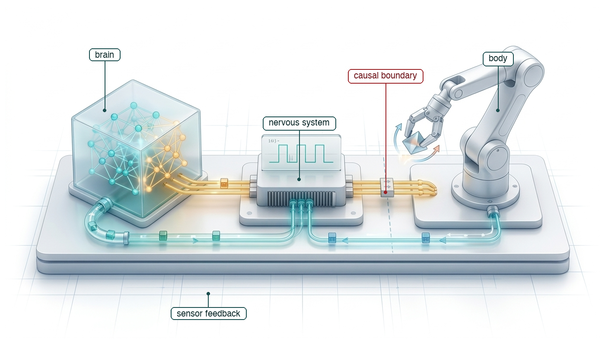{fig-alt="Isometric blueprint of a physical AI machine on a single base plate. A translucent cube of connected nodes labeled Brain holds the learned models, a controller module labeled Nervous System carries a square-wave signal to a robot arm labeled Body, and the line where that signal enters the arm is labeled causal boundary. Return lines carry sensor data from the arm back to the Brain."}
:::

::: {.content-visible unless-format="pdf"}
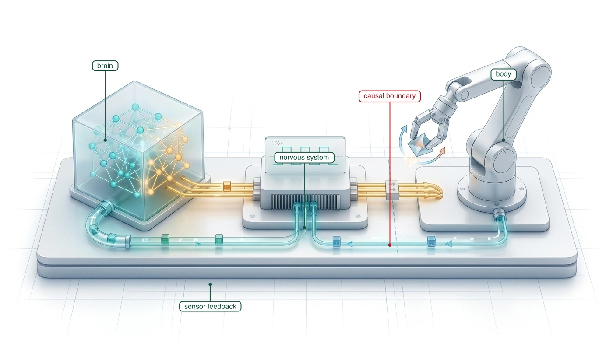{fig-alt="Isometric blueprint of a physical AI machine: learned models labeled Brain, a controller module labeled Nervous System, and a robot arm labeled Body, with the causal boundary marked where commands enter the arm."}
:::

:::

## Purpose {.unnumbered .unlisted}

::: {.content-visible when-format="pdf"}
\begin{marginfigure}
\resizebox{0.92\linewidth}{!}{\mlphysicalstackfull{20}{20}{20}{100}{20}}
\end{marginfigure}
:::

_Why can a better prediction still produce a worse physical action?_

A learned model can recognize a task correctly and still act too late to stop a moving machine or prevent excessive contact force. Once a command produces motion or heat, replacing the prediction cannot undo the work already delivered. The engineer must therefore connect model quality to the body's limits, the time available to respond, and the evidence supporting the next action. An independent permission path must be able to refuse a proposal and carry out a feasible fallback even when the model stalls. At the causal boundary, where commands become physical work, irreversibility makes these responsibilities part of the system's architecture.



::: {.callout-learning-objectives}

- Trace how machine learning systems evolved from disembodied prediction through digital agency to physical embodiment, and explain why that progression gives data, compute, evaluation, and deployment physical stakes
- Explain why physical actions require reasoning about consequences that software rollback cannot undo
- Calculate how response delay consumes a moving machine's stopping clearance
- Apply the scope test to distinguish physical AI from advisory learning and classical control
- Distinguish learned proposals from permission to execute them in the five-level machine
- Diagnose how perception, response timing, and missing redundancy interacted in the Tempe collision
- Relate the four laws to their established names in the field and to the book's four parts

:::
## Artificial Intelligence Beyond Glass {#sec-boundary-beyond-glass}

Machine learning systems engineering has progressed through three fundamental paradigms: traditional predictive machine learning, digital agentic machine learning, and physical artificial intelligence. Understanding where physical AI diverges from what preceded it requires examining how the relationship among computation, agency, time, and environmental consequences changes across these three operational regimes (@tbl-01-paradigms).

Traditional machine learning systems deliver advisory outputs evaluated against static, offline corpora. Whether classifying an image, predicting customer churn, estimating a bounding box, or ranking search results, the model operates in open loop. Its input data distribution is strictly exogenous: the predictions generated by the model do not alter the statistical process that generates subsequent test instances. Systems engineering in this regime centers on throughput and arithmetic intensity, maximizing accelerator utilization by amortizing memory traffic across large batch sizes ($\BatchSize \gg 1$) and pipeline stages. The system exercises no agency. An inference error carries purely informational consequences: an incorrect classification label or an irrelevant search result can be ignored, filtered, or recalculated. The digital substrate remains compliant, and errors do not alter external reality.

The emergence of agentic machine learning marked an architectural transition from passive, single-shot prediction to active, sequential decision-making. Endowed with reasoning loops and test-time deliberation, an agentic model formulates multi-step plans, maintains internal state across execution traces, and autonomously invokes external tools: executing database queries, calling web APIs, running generated code in execution environments, and coordinating software subagents. In this regime, the execution loop is closed: an action taken at step $t$ alters the state of the software environment, so that subsequent observations $\mathbf{o}_{t+1}$ depend directly on prior decisions $\mathbf{a}_t$. The system possesses genuine agency.

Yet this agency operates entirely within the protective envelope of digital software—"behind the glass." Digital software environments grant agentic systems three structural privileges:

* **Elastic virtual time**: The software environment waits while the model computes. Whether an agent requires $200\text{ ms}$ or $30\text{ s}$ of test-time compute to plan its next tool call, the external digital state remains frozen until the action is emitted.
* **Transactional rollback and sandboxing**: Tool execution occurs within isolated containers, virtual machines, or transactional databases. When an action produces an error, software exceptions catch the fault, database transactions roll back, or the container restarts from a clean snapshot.
* **Discrete symbolic interfaces**: Actions are structured strings, JSON schemas, or API payloads whose syntax and validity can be verified by deterministic compilers and linters before execution.

Physical artificial intelligence represents the arrival of agency in the physical world. A physical AI system does not invoke a software API inside a virtual sandbox; its outputs cross the **causal boundary** into physical actuators. A learned model's output becomes a target setpoint, the setpoint becomes electrical current in a motor phase winding, and the current becomes electromagnetic torque that accelerates physical mass through gearboxes, linkages, and contact surfaces sharing space with people and objects. That physical embodiment strips away every digital privilege:

* **Continuous, inexorable time**: Physical time marches forward under Newtonian mechanics regardless of processor state. The physical plant does not pause while a neural network deliberates. In a moving robot, computational latency is not a software delay; it is physical distance traveled toward an obstacle under unguided momentum ($\HiddenDimension = v \PrebrakeDelay$). Delay is physical distance.
* **Mechanical and thermodynamic irreversibility**: Physical state transitions admit no software rollback. Once software commands current through an inverter, electromagnetic force accelerates mass, dissipating irreversible Joule heat ($P_{\text{phase}} = \MotorPhaseRmsCurrent^2 \PhaseInductanceAndResistanceTwo$ in each phase winding) and altering mechanical contact states. Kinetic energy ($E_k = \frac{1}{2}mv^2$) cannot be garbage-collected, and a mechanical impact cannot be undone by restoring a checkpoint. A command that has moved a machine can be answered only by another physical action, which itself consumes time, clearance, and energy.
* **Single-batch, hard real-time execution**: Physical inference is strictly non-batchable across time ($\BatchSize=1$) because each action alters the physical plant and dictates subsequent sensor measurements. Furthermore, control loops must satisfy hard real-time deadlines across multiple coupled timescales, from $20\text{ kHz}$ pulse-width modulated (PWM) current control to $1\text{ kHz}$ impedance loops (which regulate contact forces and compliance) and $10\text{ Hz}$ to $50\text{ Hz}$ neural policy inference. A missed deadline does not degrade user experience; it destabilizes the physical plant.
* **Architectural separation of proposal and permission**: Because statistical deep neural networks are approximate function approximators vulnerable to distributional shift, sensor noise, and hallucinations, they cannot be granted unmediated authority over physical actuators. Physical AI therefore demands an architectural separation: high-capacity learned models act strictly as *proposers* in an unprivileged cognitive tier (the Brain), while an independent, deterministic *permission path* (the Nervous System) enforces formal safety invariants and maintains an executable fallback on isolated real-time silicon before any action crosses the causal boundary into the physical plant (the Body).

| Paradigm           | Execution Substrate           | Primary Output                              | Environmental Coupling                        | Time Semantics                                 | Failure & Recovery                                 | Safety & Authority Model                            |
|:-------------------|:------------------------------|:--------------------------------------------|:----------------------------------------------|:-----------------------------------------------|:---------------------------------------------------|:----------------------------------------------------|
| **Traditional ML** | Cloud servers / accelerators  | Advisory prediction (label, score, token)   | Open-loop (static dataset, exogenous data)    | Batchable, independent of plant time           | Informational discard; retry without side effects  | Advisory; downstream software or human decides      |
| **Agentic ML**     | Digital software environments | Tool execution (API payload, code snippet)  | Closed-loop in software (actions alter state) | Elastic virtual time (world waits for compute) | Software exception, container restart, database (DB) rollback | Sandboxed permission; API scopes and virtual gates  |
| **Physical AI**    | Embodied physical plant       | Physical force and motion (current, torque) | Closed-loop in physics (actions alter world)  | Inexorable continuous time; delay is distance  | Irreversible work; energy dissipation; damage      | Proposal vs. permission; deterministic runtime veto |

: **The three paradigms of machine learning systems**: From disembodied prediction to digital agency to physical embodiment. The unit of engineering shifts from advisory prediction to digital tool execution, and finally to irreversible physical action across the causal boundary. {#tbl-01-paradigms tbl-colwidths="[14,14,14,14,14,15,15]"}

Physical AI did not arrive solely through the scaling of language models. It represents the convergence of two long-standing engineering traditions: robotics and control, which learned to act reliably on a physical world that pushes back, and machine learning, which learned to extract representations from data at scale. Over eighty years, the learned model has moved step by step from the periphery of the machine toward its actuators, and each step shifted what the surrounding systems architecture had to guarantee. That history explains what physical AI inherits from classical control and digital learning, and why its central systems challenge is fundamentally new.

### From prediction to action {#sec-boundary-prediction-to-action}

The acting line begins with feedback. Wiener's cybernetics described animals and machines alike as systems that measure the result of their own action and use it to correct the next one [@wiener1948cybernetics], and control theory soon learned to estimate a moving system's state from noisy measurements [@kalman1960new]. The first industrial robots needed little of this at the level of the task. In 1961 a Unimate arm began stacking hot die-cast parts at General Motors by replaying step-by-step commands stored on a magnetic drum [@chm1961unimate]. Nothing in that program could notice a person in the arm's path, so protecting people meant keeping them out of its reach. The machine acted, but it did not perceive, and nothing in it was learned. @Fig-01-evolution traces this historical convergence across two parallel engineering tracks from 1948 to 2026: an upper lane for robotics and control (from Wiener's cybernetics and Unimate through Shakey, subsumption, and the Defense Advanced Research Projects Agency (DARPA) Grand Challenge) and a lower lane for machine learning (from ALVINN through ImageNet). Around 2015, both lanes merge into learned action—advancing from visuomotor policies to action chunking and vision-language-action (VLA) models—while the horizontal band below tracks how the locus of learned execution shifted from zero learned components to pretrained motion proposers.

::: {#fig-01-evolution fig-env="figure" fig-pos="t" fig-cap="**From prediction to action**: Robotics and control (top) learned to act on the physical world, and machine learning (bottom) learned to predict from data; the two lines merge in learned action. The band beneath the time axis shows where the learned output lands in typical deployed systems of each era, from no learned component, to learned perception feeding hand-written planners, to learned motor commands, to pretrained models that propose motion. The time axis widens after 2005." fig-alt="Timeline from the late 1940s to 2026 with two horizontal lanes that merge. The upper lane, robotics and control, learning to act, marks cybernetics 1948, Unimate 1961, Shakey 1966 to 1972, subsumption 1986, probabilistic robotics from the 1990s to 2005, and the Grand Challenge 2005. The lower lane, machine learning, learning to predict, marks ALVINN 1989 and deep networks on ImageNet 2012. Around 2015 both lanes curve into one thicker lane labeled learned action, marking visuomotor policies 2016, chunked and diffusion policies 2023, and VLA models 2023 to 2025, ending in an arrow. The time axis widens after 2005. A band beneath the axis, labeled where the learned output lands in typical deployed systems, reads nothing learned until the mid 1980s, then learned perception feeds hand-written planners until about 2015, then learned motor commands, then pretrained proposers."}
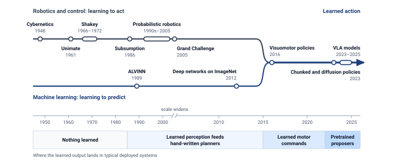{width="100%"}
:::

Shakey, developed at Stanford Research Institute (SRI) from 1966 through 1972, joined perception to planning [@nilsson1984shakey]. It took camera images and range-finder readings, kept a model of its surroundings, and used a planner called STRIPS to compose sequences of actions that would achieve a stated goal. This organization, later summarized as sense-plan-act (S·P·A), treats acting as the last step of a computation. Shakey moved very slowly, and its designers treated its motion as running asynchronously to the programs directing it [@nilsson1984shakey]; the world was assumed to wait while the computer thought. Shakey also carried a detail that anticipates this book's architecture. When one of its catwhiskers touched an obstacle, the robot stopped by a reflex action beneath the planner.

Brooks inverted that organization. His subsumption architecture built control from layers of simple, asynchronous behaviors, each coupling sensing to action. Higher layers could suppress the outputs of lower ones, but the lower layers continued to run as higher ones were added [@brooks1986robust]. A fast layer that keeps working while a slow one is busy or wrong is an ancestor of the permission path this book develops. The difficulty every approach faced had a name. **Moravec's paradox**\index{Moravec's paradox}[^fn-ai-moravec-paradox] observes that sensorimotor skills people perform with little conscious effort can be difficult to reproduce computationally, which is why learning became attractive for physical tasks.

[^fn-ai-moravec-paradox]: **Moravec's Paradox**: @moravec1988mind observed that computers could be made to perform at an adult level on intelligence tests or at checkers far more easily than they could be given a one-year-old's perception and mobility, and he traced the gap to evolutionary age, since sensorimotor skill was refined over a far longer history than abstract reasoning. For a physical machine the hard part is therefore the part that touches the causal boundary, perceiving a changing world and acting on it before a deadline, which is where learning and this book both concentrate. \index{Moravec's Paradox!sensorimotor skill}

Learning had already entered the loop. In 1989 ALVINN, a small neural network, mapped camera and laser range images to the direction a vehicle should steer, and followed real roads under some field conditions [@pomerleau1989alvinn]. Through the 1990s robotics also made uncertainty explicit. Probabilistic robotics represents what a machine believes about itself and its surroundings as probability distributions, updated as actions and measurements arrive [@thrun2005probabilistic]. The DARPA Grand Challenge tested these ideas at scale. In the first race, in 2004, no vehicle covered more than a small fraction of the desert course. In 2005 five vehicles finished, and the winner, Stanford's Stanley, relied predominantly on machine learning and probabilistic reasoning [@thrun2006stanley]. In systems of this kind, learning mostly estimated what the world was like, and hand-written planners and controllers decided what to do. A decade later, the DARPA Robotics Challenge Finals asked robots to work at a simulated disaster site, driving a vehicle, opening a door, turning a valve, and climbing stairs. The organizers deliberately degraded the communications link to the remote human operators, so that each robot had to carry out parts of every task under supervised autonomy rather than direct teleoperation [@krotkov2017darpa]. Even at that stage, a person remained close to the loop.

Deep learning then changed how much a machine could perceive. In 2012 a deep convolutional network trained on GPUs classified ImageNet photographs with error well below the previous state of the art [@krizhevsky2012imagenet], and learned detectors spread into the perception systems of robots and automated vehicles. The architecture around them usually stayed modular, with a learned percept feeding a planner written as rules or as an optimization. The learned outputs were still predictions, yet no person stood between them and the brakes. The Tempe vehicle examined in @sec-boundary-when-fails was a machine of this kind.

Learning reached the actuator itself in the following years. Levine and colleagues trained convolutional networks that mapped raw camera images directly to the torques at a robot's motors, for tasks such as screwing a cap onto a bottle [@levine2016endtoend]. Grasping systems learned from hundreds of thousands of their own attempts, gathered by groups of robot arms working in parallel [@levine2018learning; @kalashnikov2018qtopt], and deep reinforcement learning in simulation produced controllers for a legged robot and a dexterous hand that transferred to hardware [@hwangbo2019learning; @akkaya2019solving]. With that step the data changed character. A robot that learns from its own attempts chooses the states it will see, so its training data depends on its own behavior.

Imitation learning made human demonstration a practical route to new manipulation skills, and two ideas shaped the policies now in use. Action chunking predicts a short sequence of future actions from each observation, a design its authors motivated partly by the way a cloned policy's errors compound over time [@zhao2023learning]. Diffusion policies generate action sequences by iterative denoising, which lets one policy represent the several different ways a demonstrator might complete the same task [@chi2024diffusionpolicy]. The learned output had become a short plan of future motion, executed by controllers beneath it.

The latest step changed where learned proposals come from. In digital software systems, foundation models matured as agentic reasoning engines capable of decomposing abstract goals, generating plans, and invoking external tools. Bringing that agentic reasoning into physical embodiment required grounding multimodal representations in spatial geometry, continuous dynamics, and motor coordination. Large multitask datasets collected on many robots prepared the ground [@brohan2023rt1; @open_x_embodiment_collaboration2024open], and between 2023 and 2025 several groups showed that a model pretrained on web-scale images and text can be fine-tuned to emit robot actions directly. These **vision-language-action (VLA) models**\index{Vision-language-action model} share one mechanism. A pretrained vision-language backbone encodes the camera images and an instruction, and an action head converts the backbone's output into motor commands. The head either decodes actions as discrete tokens, the way a language model decodes words [@brohan2023rt2; @kim2024openvla], or produces a continuous *action chunk*, a short sequence of future setpoints from one inference [@black2024pi0]. A backbone with billions of parameters cannot run at a controller's rate, so recent designs split the work across rates: a slow model interprets the scene and a fast action model or on-robot decoder emits chunks that controllers execute [@bjorck2025gr00t; @geminirobotics2025]. These systems are dated instances of one step, in which a pretrained general-purpose backbone, rather than a policy trained for one task on one robot, proposes the motion; @tbl-03-state-of-practice records the sizes and rates their authors report. The running machine adopts the same hierarchy, with an intent model and a chunk policy at the rates fixed on its card in @sec-boundary-running-machine. The consequence for this book is direct. A general-purpose learned model can now propose motion for a general-purpose machine, so deciding which component may *permit* that motion becomes a design question for every machine that adopts one.

The name *physical AI* is recent, and industry usage since 2024 applies it broadly to almost any AI that perceives and acts in the physical world [@nvidia2026physicalai]. The history above runs through two research traditions that cover much of the same ground. **Embodied AI**\index{Embodied AI} descends from Brooks's argument that intelligent behavior arises from a body situated in and interacting with its environment rather than from abstract representation alone [@brooks1991intelligence]. **Cyber-physical systems**\index{Cyber-physical systems} name the integration of computation and networking with physical processes [@lee2008cyber], and they carry the timing and verification discipline of embedded engineering [@leeseshia2017embedded]. Embodied AI supplies much of the learning this book uses, and cyber-physical systems supply much of its timing and verification practice. The book's subject is where the two meet at an actuator, and the definition at the end of this section is deliberately narrower than industry usage: the scope test in @sec-boundary-scope-test makes it testable.

Read as one story, this history moves the learned model step by step toward the actuator. At first nothing was learned. Then learned percepts fed hand-written planners, learned policies emitted motor commands, and finally pretrained general-purpose models began to propose motion for many kinds of machine. At each step, a guarantee that separation or human inspection used to supply had to move inside the machine. The familiar concerns of machine learning systems engineering come along, and each acquires physical stakes. Data stops being a fixed corpus, because the machine's own actions choose what it will observe next. Compute stops being a matter of throughput and cost alone, because a late answer is paid for in stopping distance. Evaluation stops being a score on held-out examples, because competence that matters is shown only in the closed loop. Deployment stops being a version rollout, because a release grants a machine authority over motion near people. When a learned output becomes an irreversible action, none of these concerns can be settled inside the model. They belong to the whole machine, and they meet at the boundary where its commands become physical work.

### The question this book answers {#sec-boundary-central-question}

That convergence is why the problem now faces the whole field rather than a few robotics specialists. The central question of this book is why a better prediction can still produce a worse physical action, and what the rest of the machine must supply so that a learned proposal becomes useful work within justified limits. The book's answer is an argument in four steps. The body's physical limits bound what any proposal may ask for. The learned proposer's competence holds only over the states its data and evaluation covered, and its own actions choose those states. An independent permission path, not the model, decides what may execute. The evidence gathered about the whole machine bounds the conditions under which it may operate. This chapter establishes the vocabulary of that argument: the causal boundary and the cost of delay at it, the scope of physical AI, a five-level model of the machine that separates proposal from permission, and the four laws that organize the rest of the book.

One machine carries the argument through every chapter. A warehouse mobile manipulator must collect an object from a conveyor, open a spring-latched cage door, and carry its load through an aisle shared with people. These tasks join abilities often studied separately. The machine must recognize an unfamiliar object, choose a grasp, coordinate its arm and base, and respond when contact or the scene differs from expectation. Learning makes varied behavior possible; engineering must turn that behavior into useful, repeatable physical work.

This book develops the ability to design, teach, integrate, evaluate, and maintain such a machine within justified operating limits. Its recurring warehouse machine is an illustrative engineering design, not a report of a qualified deployment. The same task connects physical budgets, learning experiments, runtime decisions, and evidence for service. When the evidence is incomplete, the engineer must identify what measurement, new experience, or design change would support the next capability.

Consider the base approaching the end of a storage rack while its model processes a camera image. A worker steps into the aisle before the next proposal returns. The computer can still discard that proposal, but the robot has continued moving throughout the calculation. Choosing an action requires reasoning about both the prediction and the physical state in which it will execute.

Restoring a software state cannot restore the position of a moving robot or repair an object it has struck. The **physical plant**\index{Physical plant!definition}, the apparatus being controlled such as the robot's wheeled base or arm, changes state while the computer calculates. The model must recognize a useful action, the execution mechanism must judge it while the observation remains relevant, and the body must be able to deliver the admitted motion or a feasible alternative. A stronger prediction alone cannot recover clearance already consumed during computation, so the engineering problem leads from physical limits to the architecture that checks each proposed action.

Building such a machine requires contributions from several disciplines. Machine learning supplies perception and action proposals. Computer systems determine how quickly the computation and communication finish, including the limits imposed by memory traffic [@williams2009roofline]. Mechanics and control establish which motions the plant can sustain. Embedded systems enforce the timing and access rules that connect a proposal to an actuator. These responsibilities meet at a common decision: whether the proposed action can execute under the machine's current conditions. This book develops the reasoning needed to make and justify that decision.



::: {#dfn-boundary-physical-artificial-intelligence-physical-ai .callout-definition title="Physical artificial intelligence"}

***Physical artificial intelligence***\index{Physical Artificial Intelligence!definition}\index{Physical AI!definition} is the engineering of closed-loop machines in which learned models influence, without synchronous human approval, physical actions that change subsequent observations.

1.  **Significance**: Model performance becomes a property of an operating machine. Its actions must fit the plant's physical limits and the time available to respond.
2.  **Distinction**: The scope test later in this chapter combines a learned model, consequential physical feedback, and delegated physical authority. Neither a model used only for advice nor an automated machine without a learned component meets all three criteria.
3.  **Common pitfall**: Treating the body as a peripheral device for a model. A useful proposal still needs an independent permission decision based on the current state, physical limits, and available fallback.

:::

The argument starts where the definition does, with the difference between a proposed action and its physical effect. A short stopping calculation then puts a number on what delay costs at the causal boundary, and a documented collision later in the chapter shows these responsibilities failing together before four laws distill them.

## Defining the Causal Boundary {#sec-boundary-causal-boundary}

An advisory model that renders an inference on a dashboard or returns a JSON payload across a network has no direct electrical or mechanical coupling to physical actuators. An operator or downstream software filter can inspect, validate, or discard its output before any physical energy is expended. Digital errors are never benign—an operator who acts on flawed guidance may cause catastrophic damage—but advisory software cannot directly alter physical state. Physical AI begins when an automated system acquires the authority to turn a computed proposal directly into physical motion. Because that authority couples software execution to mechanical work, safety arbitration cannot remain an external afterthought. It must live inside the machine architecture, actively policing the causal boundary between digital intent and physical consequence.

### From a proposed action to motion {#sec-boundary-tensors-to-silicon}

In modern computational frameworks, executing `action_chunk = policy(observation)` produces a floating-point tensor. That tensor represents an uncommitted proposal; converting it into physical motion requires an entire chain of intermediate controllers, bus interfaces, and power electronics. The causal boundary is the exact interface through which an admitted digital command begins driving physical change in the plant.

A learned policy typically proposes a trajectory of future joint positions, target velocities, or motor torques. Those numerical arrays remain purely informational descriptions until a low-level controller validates, accepts, and begins executing them. The internal representation and predictive horizon of such action sequences are developed in subsequent modeling; here the fundamental systems distinction is between proposing an action and authorizing its irreversible consequences.

That authorization is governed by the permission path, an independent mechanism defined in @sec-boundary-machine-model that alone holds the authority to pass commands to motor drives. The permission path verifies whether a proposed trajectory satisfies physical kinematic constraints, obeys velocity and acceleration bounds, and can complete safely within current time allowances. Once admitted, trajectory setpoints feed into dedicated motor controllers: a position loop calculates required dynamic corrections, and a current controller regulates power electronics to generate magnetic flux.

Consider an electric motor driven by pulse-width modulation. A software write updates a compare register in a microcontroller timer peripheral. The resulting digital switching pattern drives the gate drivers of an inverter bridge, modulating high-voltage current through the stator windings. Stator current interacts with the rotor's magnetic field to produce electromagnetic torque, which accelerates the rotor shaft, transmission gears, and mechanical payload. This physical progression highlights an essential asymmetry: rewriting a planned setpoint in memory requires negligible energy and can be undone before the next clock cycle, but modifying a command that has already energized a winding requires physical work performed against mechanical inertia over finite time. A subsequent command can apply brakes or reverse drive current, but that corrective maneuver requires its own physical distance and must obey strict actuator limits.

::: {#dfn-boundary-causal-boundary .callout-definition title="Causal boundary"}

***Causal boundary***\index{Causal boundary!definition} is the interface through which a digital command produces physical forces, currents, or flows.

1.  **Significance**: A proposal can be rejected before it changes the plant. Once executed, it can alter the environment, dissipate energy, and change subsequent observations.
2.  **Distinction**: Restoring a command in memory does not restore the machine's prior physical state. Recovery requires another physical action, with its own limits and consequences.
3.  **Common pitfall**: Assuming that canceling a software task stops the motion it initiated. The machine needs a feasible stopping or holding response even when its proposer stops computing.

:::

Offline supervised learning evaluates models against static datasets where predictions never influence future test inputs. An embodied robot cannot rely on this decoupling. When the mobile base steers its chassis, its onboard cameras immediately capture a different visual field; when its manipulator nudges a carton, the object's spatial coordinates and contact forces change; and when the vehicle cruises along an aisle, its closing distance to personnel shifts in real time. The closed-loop feedback introduced in @sec-boundary-prediction-to-action applies directly to the learned model: an acting machine reshapes the very environment that produces its future training and inference inputs.

In any embodied system, the environment evolves through closed-loop dynamics: the subsequent physical state $s_{t+1}$ and incoming sensory observation $\mathbf{o}_{t+1}$ depend directly on the action $\mathbf{a}_t$ issued by the policy inference:
$$s_{t+1} = f(\StateAtTurn, \mathbf{a}_t), \quad \mathbf{o}_{t+1} \sim \HiddenDimensionFour(\mathbf{o} \mid s_{t+1})$$
Here $f$ represents the physical plant and environmental dynamics (formulated without process noise for this introductory overview), and $\HiddenDimensionFour$ denotes the observation model transforming underlying physical states into discrete sensor measurements.

A flawed action proposal can steer the machine into unfamiliar physical configurations unrepresented in its training distribution. In those out-of-distribution states, model outputs degrade further, accelerating departures from safe nominal trajectories. The flowchart in @fig-01-causal-loop contrasts this closed physical loop against conventional advisory machine learning: while advisory pipelines terminate at an informational interface (top), physical AI couples model proposals through an independent permission path into motor actuators, where electrical current drives mechanical work in the physical plant and irreversibly reshapes subsequent sensory observations $\MultimodalObservation$.[^fn-alvinn-recovery-data] Imitation learning formalizes this compounding divergence as **covariate shift**\index{Covariate shift!closed loop}: because the policy encounters states induced by its own previous errors rather than expert demonstrations, the expected cost of mistakes can grow quadratically with the task horizon, $\CompoundingCovariateDrift$, rather than linearly [@ross2011reduction]. While contractive feedback controllers or well-damped passive mechanics can absorb minor trajectory errors, verifying safety over extended operational horizons requires closed-loop evaluation rather than static offline benchmark scoring.

[^fn-alvinn-recovery-data]: **Recovery Data (ALVINN)**: The neural network that steered Carnegie Mellon's Navlab autonomous van directly from camera imagery confronted this challenge in early trials: because human test drivers kept the van centered in the driving lane, training logs contained no examples of recovering from the road shoulder, causing the system to veer off whenever it drifted off center. To synthesize recovery demonstrations without hazardous trials, @pomerleau1991efficient transformed recorded road images using synthetic lateral shifts and calculated corresponding steering corrections back toward the lane center. While programmatic synthesis works for predictable geometric perturbations, multi-modal physical policies must ultimately be trained over the actual state distributions their own actions induce. \index{ALVINN!recovery data}

::: {#fig-01-causal-loop fig-env="figure" fig-pos="t" fig-cap="**The closed causal loop**: Advisory output (top) stops at an informational interface. In physical AI (bottom), permitted model proposals reach hardware registers, where electrical current produces force and motion. Those actions alter the environment and subsequent sensor observations." fig-alt="Flowchart contrasting advisory predictions with physical AI. The upper path ends at an informational interface; the lower path carries sensor observations to a proposal, the permission path, motor actuators, and a changing physical plant."}
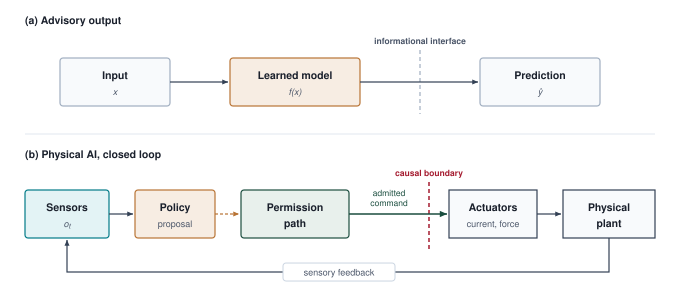{width="95%"}
:::

### Delay consumes stopping clearance {#sec-boundary-kinematic-roofline}

A moving vehicle requires dedicated stopping clearance across two distinct phases: distance traveled before braking forces engage, and distance traversed while mechanical braking brings momentum to zero. Assuming steady initial velocity $v$, uniform deceleration $\CredibleDecelerationBrake$ once brakes engage, and a stationary obstacle, the elementary stopping distance satisfies the kinematic budget:
$$\StoppingDistance = \underbrace{v \PrebrakeDelay}_{\text{travel during response delay}} + \underbrace{\frac{v^2}{2 \CredibleDecelerationBrake}}_{\text{mechanical dissipation}} \le \ClearDistance$$ {#eq-boundary-stopping-budget}
Here $v$ denotes initial forward speed, $\PrebrakeDelay$ represents total pre-brake response latency, $\CredibleDecelerationBrake$ is the sustained braking deceleration, and $\ClearDistance$ is the usable line-of-sight clearance. The pre-brake delay $\PrebrakeDelay$ spans the time from when an obstacle first appears in a sensor exposure to the physical onset of retarding force. Specifically, it sums the age of the sensor observation upon handoff, the unexpired lease duration of any currently executing motion chunk (the guaranteed duration a permitted action may drive before requiring re-authorization), one discrete permission-path evaluation tick (the cycle time of the safety monitor), one bus communication cycle (the latency to transmit commands to the hardware), and mechanical brake onset latency. This term deliberately excludes the dispatch-to-admission interval—the time consumed while the learned policy computes a proposal and the permission path admits it—which the comprehensive composite stopping budget incorporates into a comprehensive composite stopping budget.

The stopping budget exposes two contrasting physical regimes: linear travel during computational and mechanical delay ($v \PrebrakeDelay$), and quadratic travel while shedding kinetic energy ($v^2 / (2 \CredibleDecelerationBrake)$). Equating these two terms identifies the crossover speed $v^{*} = 2 \CredibleDecelerationBrake \PrebrakeDelay$. @Fig-01-kinematic-roofline plots this stopping envelope as a function of forward speed from 0 to 2 m/s, isolating the intersection of the linear delay line ($v \PrebrakeDelay$) and the quadratic braking parabola ($v^2 / (2 \CredibleDecelerationBrake)$) at the crossover knee $v^{*} \approx 0.53\text{ \MicrobatchCount/s}$. Below $v^{*}$, computational and signaling latencies dominate total displacement; above $v^{*}$, kinetic energy dissipation governs the curve. The total stopping distance curve rises toward the dashed clearance ceiling $\ClearDistance$, demonstrating that the loaded base at its 1.5 m/s drive limit remains within available clearance prior to adding downstream dynamic allowances. Because mechanical dissipation scales with the square of velocity, operating at reduced speed reclaims stopping distance far more rapidly than optimizing inference latency. Solving @eq-boundary-stopping-budget for $v$ establishes the maximum safe cruising speed permissible within a verified clear distance, derived formally subsequent derivation of dynamic velocity ceilings.

```{python}
#| label: boundary-stopping-budget
#| echo: false
#| warning: false
#| message: false
# ┌─────────────────────────────────────────────────────────────────────────────
# │ THE RUNNING MACHINE'S ELEMENTARY STOPPING BUDGET (LEGO)
# ├─────────────────────────────────────────────────────────────────────────────
# │ Context: @nbk-boundary-stopping-budget in @sec-boundary-kinematic-roofline,
# │          and the takeaways.
# │ Goal:    Close the stopping inequality against the card's clear distance,
# │          open the pre-brake delay into its registry terms, and show the
# │          crossover speed and a half-speed what-if.
# │ Show:    133.6 ms = 51.6 + 60 + 1 + 1 + 20 ms; 200.4 + 562.5 = 762.9 mm
# │          inside 1.10 m (337.1 mm spare); v* = 0.53 m/s; backbone 22 ms is
# │          33 mm; at 0.75 m/s the stop is 240.8 mm. Guard: the finished
# │          budget of the comprehensive composite stopping budget exceeds D_clear at the
# │          drive limit, which the prose states without printing it.
# │ How:     RM/AISLE fields from the warehouse mobile manipulator in mlsysim;
# │          the guard reuses calc_c2_stop_suffix and calc_scurve_stop_distance
# │          exactly as the comprehensive composite stopping budget does. No value is retyped.
# └─────────────────────────────────────────────────────────────────────────────
from mlsysim import *
from mlsysim.core.units import *
from mlsysim.physics.robotics import calc_c2_stop_suffix, calc_scurve_stop_distance
from mlsysim.fmt import fmt, fmt_length, fmt_latency, fmt_velocity, fmt_acceleration, fmt_percent, fmt_multiple, fmt_display_math, check

RM = Embodied.MobileManipulator.WarehouseMobileManipulator
AISLE = Embodied.Scenario.WarehouseAisle

class StoppingBudget:
    """Elementary stopping budget of the loaded base at its drive limit (illustrative inputs)."""

    # ┌── 1. LOAD (Constants & Parameters) ─────────────────────────────────
    v = RM.base.max_velocity  # category: illustrative (drive limit)
    v_aisle = AISLE.v_aisle  # category: chosen (aisle speed on the card)
    a_brake = AISLE.a_brake  # category: illustrative (credible deceleration, loaded, dry floor)
    d_clear = AISLE.d_clear  # category: illustrative (rack-end clear distance)
    t_age = AISLE.perception_age  # category: derived (mid-exposure to proposer dispatch)
    t_backbone = AISLE.t_backbone  # category: illustrative (perception backbone, inside t_age)
    t_lease = AISLE.t_lease  # category: chosen (chunk lease)
    t_tick = AISLE.t_tick  # category: chosen (one permission tick)
    t_bus = AISLE.t_bus  # category: illustrative (one bus cycle)
    t_onset = AISLE.t_brake_onset  # category: illustrative (brake command to retarding force)
    tau_delay = AISLE.tau_delay  # category: derived (sum of the five terms above)

    # ┌── 2. EXECUTE (Compute) ─────────────────────────────────────────────
    tau_sum = (t_age + t_lease + t_tick + t_bus + t_onset).to(millisecond)
    blind = (v * tau_delay).to(millimeter)
    d_brake = (v**2 / (2 * a_brake)).to(millimeter)
    d_stop = (blind + d_brake).to(millimeter)
    spare = (d_clear - d_stop).to(millimeter)
    blind_share = (blind / d_brake).to("dimensionless").magnitude
    brake_over_blind = (d_brake / blind).to("dimensionless").magnitude
    v_star = (2 * a_brake * tau_delay).to(meter / second)
    d_backbone = (v * t_backbone).to(millimeter)
    d_lease = (v * t_lease).to(millimeter)
    d_per_ms = (v * (1 * millisecond)).to(millimeter)
    v_half = v / 2
    blind_half = (v_half * tau_delay).to(millimeter)
    brake_half = (v_half**2 / (2 * a_brake)).to(millimeter)
    d_stop_half = (blind_half + brake_half).to(millimeter)
    # Guard only: the finished budget of the comprehensive composite stopping budget at the drive limit
    j_brake = calc_c2_stop_suffix(v, a_brake)["peak_jerk"].to(meter / second**3)
    d_finished = (calc_scurve_stop_distance(v, a_brake, j_brake) + blind + AISLE.delta_loc + AISLE.delta_margin + AISLE.eps_track).to(millimeter)

    # ┌── 3. GUARD (Invariants) ───────────────────────────────────────────
    check(abs(tau_sum.magnitude - tau_delay.to(millisecond).magnitude) < 1e-9, "tau_delay must equal its five registry terms.")
    check(abs(tau_delay.to(millisecond).magnitude - 133.6) < 5e-3, f"Canon tau_delay is 133.6 ms, got {tau_delay}.")
    check(abs(d_stop.magnitude - 762.9) < 5e-3, f"Canon elementary stop is 762.9 mm, got {d_stop}.")
    check(spare.magnitude > 0, "The elementary budget must fit inside D_clear at the drive limit.")
    check(v_star < v, "At the drive limit braking, not delay, must dominate.")
    check(d_finished > d_clear, "Prose says the finished budget exceeds D_clear at the drive limit.")
    check(v_aisle < v, "Prose says the aisle speed sits below the drive limit.")
    # margin_prebrake_delay_composition_bar.svg fig-alt hand-types 29.6, 2, and 20 ms
    check(abs((t_age - t_backbone).to(millisecond).magnitude - 29.6) < 5e-3, "fig-alt: rest of observation age is 29.6 ms.")
    check(abs((t_tick + t_bus).to(millisecond).magnitude - 2.0) < 1e-9, "fig-alt: tick plus bus is 2 ms.")
    check(abs(t_onset.to(millisecond).magnitude - 20.0) < 1e-9, "fig-alt: brake onset is 20 ms.")
    check(t_lease > t_age, "Margin caption says the lease costs more than the backbone; it is the largest term.")

    # ┌── 4. OUTPUT (Formatting) ──────────────────────────────────────────
    v_str = fmt_velocity(v, unit=meter / second, precision=1)
    v_aisle_str = fmt_velocity(v_aisle, unit=meter / second, precision=1)
    a_brake_str = fmt_acceleration(a_brake, unit=meter / second**2)
    d_clear_str = fmt_length(d_clear, unit=meter, precision=2)
    tau_delay_str = fmt_latency(tau_delay, unit=millisecond, precision=1)
    t_age_str = fmt_latency(t_age, unit=millisecond, precision=1)
    t_backbone_str = fmt_latency(t_backbone, unit=millisecond, precision=0)
    t_lease_str = fmt_latency(t_lease, unit=millisecond, precision=0)
    t_tick_str = fmt_latency(t_tick, unit=millisecond, precision=0)
    t_bus_str = fmt_latency(t_bus, unit=millisecond, precision=0)
    t_onset_str = fmt_latency(t_onset, unit=millisecond, precision=0)
    spare_str = fmt_length(spare, unit=millimeter, precision=1)
    blind_share_str = fmt_percent(blind_share, precision=1, style="prose")
    brake_over_blind_mult_str = fmt_multiple(brake_over_blind, precision=1)
    d_backbone_str = fmt_length(d_backbone, unit=millimeter, precision=0)
    d_lease_str = fmt_length(d_lease, unit=millimeter, precision=0)
    d_per_ms_str = fmt_length(d_per_ms, unit=millimeter, precision=1)
    v_half_str = fmt_velocity(v_half, unit=meter / second, precision=2)
    d_stop_half_str = fmt_length(d_stop_half, unit=millimeter, precision=1)
    blind_half_str = fmt_length(blind_half, unit=millimeter, precision=1)
    brake_half_str = fmt_length(brake_half, unit=millimeter, precision=1)

    _v = fmt(v, unit=meter / second, precision=1)
    _a = fmt(a_brake, unit=meter / second**2, precision=0)
    _tau_s = fmt(tau_delay, unit=second, precision=4)
    _blind = fmt(blind, unit=millimeter, precision=1)
    _brake = fmt(d_brake, unit=millimeter, precision=1)
    _stop = fmt(d_stop, unit=millimeter, precision=1)
    _clear = fmt(d_clear, unit=millimeter, precision=0, commas=False)
    _spare = fmt(spare, unit=millimeter, precision=1)
    _vstar = fmt(v_star, unit=meter / second, precision=2)
    tau_sum_math = fmt_display_math(
        rf"\tau_{{\text{{delay}}}} = {fmt(t_age, unit=millisecond, precision=1)} + {fmt(t_lease, unit=millisecond, precision=0)} + {fmt(t_tick, unit=millisecond, precision=0)} + {fmt(t_bus, unit=millisecond, precision=0)} + {fmt(t_onset, unit=millisecond, precision=0)} = {fmt(tau_delay, unit=millisecond, precision=1)}\ \text{{ms}}"
    )
    blind_math = fmt_display_math(rf"v\,\tau_{{\text{{delay}}}} = {_v}\ \text{{m/s}} \times {_tau_s}\ \text{{s}} = {_blind}\ \text{{mm}}")
    brake_math = fmt_display_math(
        rf"\frac{{v^2}}{{2 a_{{\text{{brake}}}}}} = \frac{{({_v}\ \text{{m/s}})^2}}{{2 \times {_a}\ \text{{m/s}}^2}} = {_brake}\ \text{{mm}}"
    )
    close_math = fmt_display_math(
        rf"d_{{\text{{stop}}}} = {_blind} + {_brake} = {_stop}\ \text{{mm}} \le D_{{\text{{clear}}}} = {_clear}\ \text{{mm}}, \quad D_{{\text{{clear}}}} - d_{{\text{{stop}}}} = {_spare}\ \text{{mm}}"
    )
    vstar_math = fmt_display_math(
        rf"v^{{*}} = 2 a_{{\text{{brake}}}} \tau_{{\text{{delay}}}} = 2 \times {_a}\ \text{{m/s}}^2 \times {_tau_s}\ \text{{s}} \approx {_vstar}\ \text{{m/s}}"
    )
```

For the reference warehouse robot, all baseline operating parameters are drawn directly from the machine card cataloged in @sec-boundary-running-machine. The notebook below evaluates whether the vehicle can stop safely inside the aisle clearance.

::: {.column-margin}
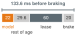{width="100%" fig-alt="One stacked horizontal bar for the 133.6 milliseconds of pre-brake delay, bracketed above. Left to right: the learned model's backbone, 22 milliseconds, in orange; the rest of the observation age, 29.6; the chunk lease, 60 milliseconds, in dark slate and the widest segment; a thin sliver of 2 for the permission tick and bus cycle; and brake onset, 20. All other segments are gray."}

*The learned backbone is `{python} StoppingBudget.t_backbone_str` of the `{python} StoppingBudget.tau_delay_str` delay; the lease costs more.*
:::

::: {#nbk-boundary-stopping-budget .callout-notebook title="Does the base stop inside its clearance?"}

**Problem**: The loaded base cruises toward a rack end at its drive limit, and a worker may step out at the end of the rack. The permission path must stop the base inside the rack-end clear distance on the machine card. Does the elementary stopping budget of @eq-boundary-stopping-budget fit, which term dominates, and how much of the delay belongs to the learned model?

**Variables**:

* Speed $v =$ `{python} StoppingBudget.v_str`, the drive limit (illustrative).
* Credible deceleration $\CredibleDecelerationBrake =$ `{python} StoppingBudget.a_brake_str`, loaded on a dry floor (illustrative).
* Clear distance $\ClearDistance =$ `{python} StoppingBudget.d_clear_str` (illustrative).
* Pre-brake delay $\PrebrakeDelay =$ `{python} StoppingBudget.tau_delay_str` (derived). It is the sum of five registry terms: the observation age of the camera frame that first shows the worker, `{python} StoppingBudget.t_age_str`, which includes the `{python} StoppingBudget.t_backbone_str` perception backbone; the chunk lease of `{python} StoppingBudget.t_lease_str`, the longest an admitted command may drive before the permission path must act; one permission tick of `{python} StoppingBudget.t_tick_str`; one bus cycle of `{python} StoppingBudget.t_bus_str`; and a brake onset of `{python} StoppingBudget.t_onset_str`. It excludes the dispatch-to-admission interval, the time between perception handing the frame to the proposer and the permission path admitting the chunk built on it; the finished budget charges that interval against the spare this budget leaves, and dispatch-to-admission allocation allocates it.

**Math**:

`{python} StoppingBudget.tau_sum_math`
`{python} StoppingBudget.blind_math`
`{python} StoppingBudget.brake_math`
`{python} StoppingBudget.close_math`
`{python} StoppingBudget.vstar_math`

**Result**: The elementary budget fits, with `{python} StoppingBudget.spare_str` to spare. The drive limit sits above the crossover speed, so braking dominates: it needs `{python} StoppingBudget.brake_over_blind_mult_str` the travel of the delay, and the delay adds `{python} StoppingBudget.blind_share_str` to the braking distance. At half speed, `{python} StoppingBudget.v_half_str`, delay travel halves to `{python} StoppingBudget.blind_half_str` while braking quarters to `{python} StoppingBudget.brake_half_str`, for a stop of `{python} StoppingBudget.d_stop_half_str`.

**Systems insight**: The learned model's backbone accounts for `{python} StoppingBudget.t_backbone_str` of the delay, or `{python} StoppingBudget.d_backbone_str` of travel; the chunk lease alone costs `{python} StoppingBudget.d_lease_str`. Each added millisecond of delay anywhere in the chain costs `{python} StoppingBudget.d_per_ms_str` at this speed, so a slower but more accurate model is a distance cost the budget must absorb. The spare is not yet a safety margin. The finished budget adds the localization bound, a protective margin, tracking error, and the longer stop of a jerk-limited brake (one that limits jerk, the rate of change of deceleration, by ramping its braking up instead of stepping it); together they exceed the clear distance at the drive limit, which is why the card sets the aisle speed at `{python} StoppingBudget.v_aisle_str`.

:::

::: {#fig-01-kinematic-roofline fig-env="figure" fig-pos="htb" fig-cap="**Delay travel and braking travel against speed**: The elementary stopping budget of the loaded base, split into travel during the `{python} StoppingBudget.tau_delay_str` pre-brake delay, which grows linearly with speed, and braking travel at `{python} StoppingBudget.a_brake_str`, which grows with its square. The two terms are equal at the crossover speed $v^{*}$; above it braking dominates. At the `{python} StoppingBudget.v_str` drive limit the elementary stop fits inside the `{python} StoppingBudget.d_clear_str` clear distance, before the allowances that later chapters add." fig-alt="Plot of distance in millimeters against speed from 0 to 2 meters per second. A straight line for travel during the delay and a rising parabola for braking travel cross at a marked crossover speed near 0.5 meters per second. Their sum rises more steeply and meets a dashed horizontal line marking the clear distance. A marked point at the drive limit of 1.5 meters per second sits on the sum curve below the line."}

```{python}
#| label: plot-01-kinematic-roofline
#| echo: false
#| warning: false
#| message: false
# ┌─────────────────────────────────────────────────────────────────────────────
# │ DELAY TRAVEL AND BRAKING TRAVEL AGAINST SPEED (FIGURE)
# ├─────────────────────────────────────────────────────────────────────────────
# │ Context: @fig-01-kinematic-roofline in @sec-boundary-kinematic-roofline
# │ Goal:    show the two terms of the elementary budget crossing at v*, and the
# │          drive-limit stop against the clear distance
# │ Show:    v tau_delay (133.6 ms), v^2/(2 a_brake) (2.0 m/s^2), their sum,
# │          D_clear 1.10 m, v* = 0.53 m/s, the 1.5 m/s point at 762.9 mm
# │ How:     StoppingBudget inputs over a speed grid; no value is retyped
# └─────────────────────────────────────────────────────────────────────────────
import numpy as np
from mlsysim import viz
from mlsysim.fmt import check

SB = StoppingBudget
MPS = meter / second

# ┌── 1. LOAD (from boundary-stopping-budget) ─────────────────────────────────
tau = SB.tau_delay.to(second).magnitude
a = SB.a_brake.to(MPS / second).magnitude
d_clear = SB.d_clear.to(millimeter).magnitude
v_op = SB.v.to(MPS).magnitude
v_star = SB.v_star.to(MPS).magnitude
d_op = SB.d_stop.to(millimeter).magnitude

# ┌── 2. EXECUTE ──────────────────────────────────────────────────────────────
v = np.linspace(0.0, 2.0, 401)
delay = v * tau * 1000.0
braking = v**2 / (2 * a) * 1000.0
total = delay + braking

# ┌── 3. GUARD ────────────────────────────────────────────────────────────────
check(abs(v_op * tau * 1000.0 + v_op**2 / (2 * a) * 1000.0 - d_op) < 1e-6, "The plotted point must equal the notebook's stop.")
check(abs(v_star * tau - v_star**2 / (2 * a)) < 1e-9, "The two terms must be equal at v*.")
check(d_op < d_clear, "The drive-limit point must sit below the clear distance.")

# ┌── 4. PLOT ─────────────────────────────────────────────────────────────────
fig, ax, COLORS, plt = viz.setup_plot(figsize=(9, 4.4))
ax.plot(v, delay, color=COLORS["BrownLine"], lw=1.8, label=r"travel during the delay, $v\,\tau_{\mathrm{delay}}$")
ax.plot(v, braking, color=COLORS["BlueLine"], lw=1.8, label=r"braking travel, $v^2/(2a_{\mathrm{brake}})$")
ax.plot(v, total, color=COLORS["primary"], lw=2.0, label=r"elementary stop, $d_{\mathrm{stop}}$")
ax.axhline(d_clear, color=COLORS["RedLine"], lw=1.3, ls=(0, (6, 3)))
ax.text(0.04, d_clear + 30, f"clear distance {d_clear / 1000:.2f} m", color=COLORS["RedLine"], fontsize=9, va="bottom")
ax.plot([v_star], [v_star * tau * 1000.0], "o", ms=6, mfc="white", mec=COLORS["primary"], mew=1.4, zorder=5)
ax.annotate(
    f"$v^*$ = {v_star:.2f} m/s",
    xy=(v_star, v_star * tau * 1000.0),
    xytext=(v_star + 0.12, 25),
    fontsize=9,
    arrowprops=dict(arrowstyle="-", color=COLORS["primary"], lw=0.8),
)
ax.plot([v_op], [d_op], "o", ms=7, color=COLORS["primary"], zorder=5)
ax.annotate(
    f"drive limit {v_op:.1f} m/s: {d_op:.1f} mm",
    xy=(v_op, d_op),
    xytext=(v_op - 0.62, d_op + 170),
    fontsize=9,
    arrowprops=dict(arrowstyle="-", color=COLORS["primary"], lw=0.8),
    bbox=dict(boxstyle="square,pad=0.1", fc="white", ec="none"),
)
ax.set_xlim(0, 2.0)
ax.set_ylim(0, 1600)
ax.set_xlabel("Initial speed, $v$ (m/s)")
ax.set_ylabel("Distance (mm)")
ax.legend(loc="upper left", bbox_to_anchor=(0.0, 0.93), fontsize=8.5, frameon=False)
plt.tight_layout()
plt.show()
```
:::

These calculations reflect representative system parameters and a derived latency profile rather than empirically measured stopping distances for an isolated chassis. Systems architects can reshape this stopping envelope through concrete design choices. Shortening response latency contracts the linear travel term, whereas lowering cruising speed contracts both terms—diminishing mechanical braking distance quadratically. Selecting a deep learning architecture purely on offline accuracy metrics overlooks this physical reality: increased inference latency directly consumes stopping clearance. Crucially, however, model inference time does not inevitably dictate the worst-case braking delay. If an independent protective path monitors safety boundaries, it can trigger an emergency stop even when a learned policy stalls or drops frames—provided the protective subsystem maintains its own isolated sensing, timing, power, and fallback logic. Under this decoupled architecture, the latency of the deterministic safety monitor, rather than the execution time of the complex neural network, governs the physical stopping budget. Industrial automated guided vehicles (AGVs) implement this exact separation today: safety standards mandate certified safety scanners that halt the machine before human contact, independent of fleet management or guidance computers [@iso3691part4]. This book layers learned sensorimotor proposers atop deterministic safety kernels and analyzes the architectural contracts required between them.

Deploying this budget in real-world facilities requires several additional physical allowances. Beyond the conservative margins cataloged in the notebook, real-world controllers must account for unmodeled initial acceleration, finite brake jerk, and degraded tire-floor traction. Dynamic obstacles complicate the clearance budget even further: if a pedestrian walks toward the mobile robot at speed $\HumanWalkingSpeedBound$, the relative closing distance contracts during both the pre-brake delay and the mechanical deceleration phase. For this reason, functional safety standards mandate adding a pedestrian approach-speed allowance to the vehicle's own braking distance [@iso13855]. While later chapters formalize these dynamic constraints and allocate delay budgets across compute hardware, the core systems lesson is immediate: an embodied policy must guarantee safe, predictable physical behavior within the hard real-time envelope dictated by plant momentum.

### Irreversibility and recovery {#sec-boundary-thermodynamic-irreversibility}

In digital computation, transactional fault tolerance relies on checkpointing and rollback: software can unwind invalid state mutations by reverting to a snapshot stored in memory. Physical systems offer no such symmetry. A database transaction can abort and restore its previous state in memory, but a robot gripper that has permanently deformed a workholding fixture or an overheated motor winding that has degraded its insulation has enacted an irreversible thermodynamic change. Once an admitted command delivers torque to an actuator, the machine expends energy, increases physical entropy, and permanently alters its physical plant and surroundings.

Subsequent corrective commands can brake the motors, release a grasp, or plan a diversion, but recovery itself constitutes a new physical trajectory subject to actuator torque saturation, friction, and kinodynamic limits. For an autonomous mobile base, irreversibility manifests primarily as stopping clearance under momentum. When a mobile manipulator closes its jaws on a fragile component or braces against an assembly fixture, contact forces, transmission compliance, and thermal dissipation become the governing constraints. Safe physical AI architectures must therefore enforce preventive admission invariants ahead of the causal boundary, guaranteeing that admitted actions remain physically recoverable before hardware executes them.

## Three Machine Classes {#sec-boundary-three-classes}

The physical constraints that govern an embodied system shift dynamically across its operating cycle. As our warehouse mobile manipulator travels down an aisle, its primary engineering challenge is kinetic: it must preserve sufficient clearance to stop safely before an obstacle. When pressing against a door latch, the governing constraint shifts to contact mechanics: it must regulate interaction forces to avoid damaging the mechanism or the workpiece. When holding a suspended payload stationary, the machine performs zero mechanical work, yet its actuators must sustain continuous stall torque without exhausting thermal headroom or browning out the shared electrical supply. @Fig-01-three-archetypes partitions physical machines into three canonical classes according to the dominant governing constraint and the physical margin each regime expends: Class 1 mass-dominated mobility (panel a) expends line-of-sight stopping clearance $\ClearDistance$ under momentum; Class 2 contact-dominated manipulation (panel b) expends force and compliance margin $\ContactStiffness \Delta x$ against structural yield limits; and Class 3 energy- and thermal-dominated operation (panel c) expends heat dissipation and electrical headroom under continuous stall loads.

**Mass-dominated mobility** spends stopping clearance. A mobile base, delivery vehicle, or aerial drone carries significant momentum and cannot halt instantaneously. Forward velocity, control and sensing latency, and available braking deceleration or reverse thrust jointly dictate the spatial clearance required to arrest or redirect its motion.

**Contact-dominated manipulation** spends force and deformation margin. When an articulated arm presses against a stiff fixture, minute position displacements can generate destructive contact forces over fractions of a millimeter. Physical contact is both the primary vehicle of task success—seating a part or opening a latch requires deliberate force—and the immediate hazard. The engineering task is to supply the wrenches (the combined forces and torques) needed to complete the assembly while guaranteeing that contact forces never exceed the mechanical yield limits of the payload or the manipulator.

**Energy- and thermal-dominated operation** spends heat and electrical supply margins. Supporting a heavy load or resisting gravity demands sustained motor current, driving continuous Joule heating in actuator windings even when joints remain stationary. Concurrent peak current draws from drive inverters, compute accelerators, and sensor payloads can induce voltage sag across a shared DC bus. The system must sustain these thermal and electrical loads across the entire operational profile while reserving sufficient energy and thermal headroom to execute a safe protective abort.

::: {#fig-01-three-archetypes fig-env="figure" fig-pos="t" fig-cap="**Three machine classes**: Each class is named for the constraint that dominates it and the margin it spends: (a) mass-dominated mobility (Class 1) spends stopping clearance, set by momentum and braking; (b) contact-dominated manipulation (Class 2) spends force and deformation margin, set by contact stiffness and the strength of the object and mechanism; and (c) energy- and thermal-dominated operation (Class 3) spends heat and supply margin, set by Joule heating, thermal capacitance, and power delivery." fig-alt="Three panels. Class 1, mass-dominated mobility: a wheeled base moving at speed v toward a rack end, with the clear distance D clear marked in red, above the relation d stop equals v tau delay plus v squared over 2 a brake. Class 2, contact-dominated manipulation: an arm whose gripper presses a spring of stiffness k contact into a stiff fixture, deformation delta x and force F in red, above F approximately equals k contact delta x. Class 3, energy- and thermal-dominated: power P in entering a winding of thermal capacitance C th, heat P out leaving, and a temperature bar T wind below a red T limit line, above d T wind over d t equals P in minus P out over C th. Each panel names the margin it spends: stopping clearance, force and deformation margin, heat and supply margin."}
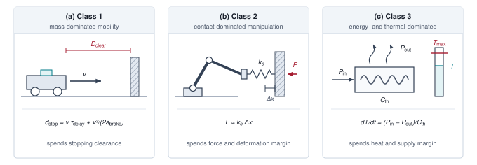{width="100%"}
:::

These three classes identify dominant physical constraints rather than mutually exclusive hardware categories. A practical robot transitions across all three regimes throughout a single task. Our reference mobile manipulator integrates a wheeled base, an articulated arm, navigation lidar, and wrist cameras. An end-to-end learned policy can coordinate simultaneous base trajectories and arm proposals [@fu2024mobile], but the integrated machine must enforce the safety envelopes of every regime concurrently. A fixed-base arm still faces thermal and bus-voltage limits during prolonged holding, just as a wheeled base encounters contact constraints when docking against a workstation.

::: {#capstone-boundary-humanoid-crucible .callout-perspective title="The humanoid crucible"}
A humanoid robot exposes the tight coupling across all three regimes. Catching a shifted load perturbs dynamic balance, requiring an immediate recovery step that demands peak joint torque. That torque surge draws heavy current from the shared DC bus and injects rapid thermal energy into the joint windings. If the power distribution network sags or thermal protection limits current, the recovery step fails and the machine falls. Shielding the onboard computing stack from reset does not by itself supply the transient mechanical energy needed to stabilize the body. The part-ending humanoid examples throughout this book test how each systems principle survives these tightly coupled physical demands.
:::

### The running machine {#sec-boundary-running-machine}

To ground the design trade-offs across later chapters, we anchor our analyses to a single, concrete reference platform: an industrial mobile manipulator. Rather than assuming arbitrary numbers for each derivation, we fix its physical and computational parameters here. @Tbl-01-machine-card collects the fifteen parameters that appear most frequently across our derivations, cataloged alongside the evidence categories that the reader guide defines. Subsequent worked examples cite these values directly by parameter name. For complete hardware specifications, the machine data sheet in the appendix catalogs every other input alongside its programmatic registry key.

```{python}
#| label: boundary-machine-card
#| echo: false
#| warning: false
#| message: false
# ┌─────────────────────────────────────────────────────────────────────────────
# │ THE RUNNING MACHINE'S CARD (LEGO)
# ├─────────────────────────────────────────────────────────────────────────────
# │ Context: @tbl-01-machine-card in @sec-boundary-running-machine.
# │ Goal:    Fix the fifteen parameters later chapters use most, with their
# │          evidence categories, and state the premise the credible
# │          deceleration rests on.
# │ Show:    368 kg; 1.5 and 1.3 m/s; 2.0 m/s^2 on a dry floor (mu >= 0.204 with
# │          all weight on the driven wheels, 0.250 at the load share the drive
# │          motors allow; tip-over unchecked); 7.11 m/s^3; 1.10 m; 133.6 ms;
# │          1 ms tick; 60 ms lease; 25 ms step and 50 ms replan; 336 ms intent
# │          latency at 2 Hz; 605 ms and 4.47 s takeovers.
# │ How:     machine_card() reads each row from the registry through the same
# │          helper that prints the full data sheet; the friction premise comes
# │          from calc_required_friction. Nothing is retyped here.
# └─────────────────────────────────────────────────────────────────────────────
from mlsysim import *
from mlsysim.embodied.datasheet import data_sheet_lookup, machine_card
from mlsysim.fmt import MarkdownStr, fmt, check

class MachineCard:
    """The running machine's most-used parameters, with their evidence categories."""

    # ┌── 1. LOAD (Constants & Parameters) ─────────────────────────────────
    card = machine_card()  # category: per row, from the registry and its provenance
    sheet = data_sheet_lookup()  # the braking premise rows of the full sheet

    # ┌── 2. EXECUTE (Compute) ─────────────────────────────────────────────
    mu_all = sheet["mu_req"].value  # friction a_brake needs, all weight on the driven wheels
    mu_share = sheet["mu_req_rated"].value  # friction it needs at the largest allowed load share
    cg_unknown = sheet["cg_height"].value is None

    # ┌── 3. GUARD (Invariants) ───────────────────────────────────────────
    check(len(card) == 15, f"The machine card prints fifteen rows, got {len(card)}.")
    check(abs(mu_all - 0.204) < 5e-4, f"Dry-floor premise is mu >= 0.204, got {mu_all}.")
    check(abs(mu_share - 0.250) < 5e-4, f"At the rated load share the premise is mu >= 0.250, got {mu_share}.")
    check(cg_unknown, "The tip-over check stays open until the loaded center of gravity is measured.")

    # ┌── 4. OUTPUT (Formatting) ──────────────────────────────────────────
    value_str = {r.key: MarkdownStr(r.value_str) for r in card}
    category_str = {r.key: MarkdownStr(r.category_str) for r in card}
    mu_all_str = fmt(mu_all, precision=3)
    mu_share_str = fmt(mu_share, precision=3)
```

| Parameter                                          | Value                                              | Category                                              | Basis                                                                                                                                                                                                                                                                                                                           |
|:---------------------------------------------------|:---------------------------------------------------|:------------------------------------------------------|:--------------------------------------------------------------------------------------------------------------------------------------------------------------------------------------------------------------------------------------------------------------------------------------------------------------------------------|
| Loaded mass $\MicrobatchCount$                     | `{python} MachineCard.value_str["m_loaded"]`       | `{python} MachineCard.category_str["m_loaded"]`       | Base, arm, and a full tote rack; an upper bound (the limit record constraints)                                                                                                                                                                                                                                                        |
| Drive limit $\SpeedBound$                          | `{python} MachineCard.value_str["v_drive"]`        | `{python} MachineCard.category_str["v_drive"]`        | Class profile of a warehouse base                                                                                                                                                                                                                                                                                               |
| Aisle speed $v_{\text{aisle}}$                     | `{python} MachineCard.value_str["v_aisle"]`        | `{python} MachineCard.category_str["v_aisle"]`        | Set below the dry-floor speed ceiling (the comprehensive composite stopping budget)                                                                                                                                                                                                                                                       |
| Credible deceleration $\CredibleDecelerationBrake$ | `{python} MachineCard.value_str["a_brake"]`        | `{python} MachineCard.category_str["a_brake"]`        | Loaded, on a dry floor that supplies $\CoulombFrictionCoefficient \ge$ `{python} MachineCard.mu_all_str` with all weight on the driven wheels, or `{python} MachineCard.mu_share_str` at the share the drive motors allow; tip-over is unchecked until the center of gravity is measured (stopping distance analyses) |
| Stop jerk bound $\JerkLimit$                       | `{python} MachineCard.value_str["j_brake"]`        | `{python} MachineCard.category_str["j_brake"]`        | Stipulated for the jerk-limited stop, whose deceleration bound is $\ProfileAccelerationBound = \CredibleDecelerationBrake$ (the jerk-limited stop profile)                                                                                                                                                                   |
| Rack-end clear distance $\ClearDistance$           | `{python} MachineCard.value_str["d_clear"]`        | `{python} MachineCard.category_str["d_clear"]`        | Clearance the stop must fit inside                                                                                                                                                                                                                                                                                              |
| Pre-brake delay $\PrebrakeDelay$                   | `{python} MachineCard.value_str["tau_delay"]`      | `{python} MachineCard.category_str["tau_delay"]`      | Observation age, lease path, and brake onset (the latency waterfall model); excludes the dispatch-to-admission interval, which the spare pays for (dispatch-to-admission allocation)                                                                                                                                     |
| Permission tick $\PermissionloopPeriodTick$        | `{python} MachineCard.value_str["t_tick"]`         | `{python} MachineCard.category_str["t_tick"]`         | Period of the chosen permission-loop rate (time constant analysis)                                                                                                                                                                                                                                               |
| Chunk lease $\ChunkLease$                          | `{python} MachineCard.value_str["t_lease"]`        | `{python} MachineCard.category_str["t_lease"]`        | Longest an admitted chunk may drive without renewal (lease sizing analysis)                                                                                                                                                                                                                                                 |
| Setpoint step $\Delta t$                           | `{python} MachineCard.value_str["t_step"]`         | `{python} MachineCard.category_str["t_step"]`         | Spacing of the chunk policy's setpoints (subsequent modeling)                                                                                                                                                                                                                                                            |
| Chunk replan period                                | `{python} MachineCard.value_str["t_period"]`       | `{python} MachineCard.category_str["t_period"]`       | A whole number of setpoint steps                                                                                                                                                                                                                                                                                                |
| Intent-model latency                               | `{python} MachineCard.value_str["t_intent"]`       | `{python} MachineCard.category_str["t_intent"]`       | Prefill plus decode on the application processor (the cognitive pipeline analysis)                                                                                                                                                                                                                                                       |
| Intent-model rate                                  | `{python} MachineCard.value_str["f_intent"]`       | `{python} MachineCard.category_str["f_intent"]`       | Largest rate whose period covers the latency                                                                                                                                                                                                                                                                                    |
| In-loop takeover $T_{\Sigma,1}$                    | `{python} MachineCard.value_str["t_takeover_in"]`  | `{python} MachineCard.category_str["t_takeover_in"]`  | Slow-bound human reaction plus console video and handshake (human reaction analysis)                                                                                                                                                                                                                                   |
| Out-of-loop takeover $T_{\Sigma,2}$                | `{python} MachineCard.value_str["t_takeover_out"]` | `{python} MachineCard.category_str["t_takeover_out"]` | Take-over time of the 90th-percentile study condition plus video and handshake                                                                                                                                                                                                                                                  |

: **The running machine's card**: The fifteen parameters of the warehouse mobile manipulator that later calculations use most. A derived value built on illustrative inputs is illustrative evidence. Values print from the MLSysIM registry when the book is built. {#tbl-01-machine-card tbl-colwidths="[24,12,12,52]"}

With these parameters fixed, every subsequent design problem on this platform begins from the same physical foundation: identify which margin the commanded action approaches, and determine whether the system can execute an assured protective response before that margin is exhausted. Whether a given physical deployment also requires the learned policies and delegated-authority architecture developed throughout this book is a separate question, addressed by the scope test in the next section.

## The Physical AI Scope Test {#sec-boundary-scope-test}

A robotic arm in a fulfillment center can track a fixed proportional-integral-derivative profile, execute an offline trajectory pre-screened and loaded by a human technician, or stream joint torques directly from a learned policy running on real-time sensor frames. While all three regimes actuate identical electric motors and gear trains, they impose fundamentally different architectural obligations on the computing system. The scope test establishes the operational boundaries that define physical AI throughout this book.

The scope of physical AI is defined by the simultaneous intersection of three structural criteria:

1. **Learned Statistical Model:** The system relies on a policy, perception encoder, or world model whose runtime behavior emerges from training data rather than an inspectable closed-form specification, as seen in deep neural networks or diffusion policies [@chi2024diffusionpolicy]. Correctness cannot be formally proven across all state configurations from source code alone; engineers must establish operational validity empirically across a defined operating domain. By contrast, a linear plant model fitted through classical system identification,[^fn-sysid-scope-test] where parameter uncertainty yields provable stability margins, falls outside this category. A high-capacity neural policy falls squarely within it.
2. **Consequential Physical Feedback:** Actuator commands alter the material state of the surrounding physical world, and those state changes directly govern what onboard sensors measure in subsequent time steps under classical mechanics, thermodynamics, or electromagnetism. The environment cannot be paused or rolled back: energy dissipated into the physical world cannot be recalled.
3. **Delegated Physical Authority (System-Level Actuation):** A learned component's output—whether a raw percept, a semantic state estimate, or a proposed motion trajectory—can propagate to live physical actuators without requiring synchronous human approval for each control cycle. The learned network need not write directly to motor driver registers; the system possesses delegated authority whenever learned signals actively shape downstream actuation commands. Adding downstream safety checks or deterministic rate limiters does not vacate this authority, provided accepted proposals still drive hardware motion. Furthermore, an automated monitor that validates action candidates using the same learned perception pipeline provides no true independence: a single perceptual misclassification can corrupt both the candidate trajectory and the safety check simultaneously.

Together, these three criteria delineate the domain of physical AI. The three-set Venn diagram in @fig-01-scope-venn formalizes this boundary, locating physical AI at the central intersection where learned models, continuous physical feedback, and automated physical authority converge. The pairwise overlaps isolate advisory systems (learned models with feedback but without execution authority), digital autonomy (learned models with software authority but lacking physical plant dynamics), and classical control (closed-loop physical actuation governed by analytical laws rather than statistical models).

[^fn-sysid-scope-test]: **System Identification**: The control-engineering practice of fitting low-order dynamic models to measured input-output time series. Because classical system identification produces bounded parameter uncertainties, control theorists can construct provable stability guarantees before deploying the controller. In contrast, modern high-dimensional neural representations lack tractable closed-form uncertainty bounds, requiring empirical verification across explicitly specified operational domains. \index{System identification!scope test}

::: {#fig-01-scope-venn fig-env="figure" fig-pos="t" fig-cap="**The physical AI scope test**: Physical AI combines a learned component, consequential physical feedback, and system-level authority to let learned outputs reach actuation without human approval. An independent veto belongs inside this intersection because accepted proposals can still move the plant. The pairwise overlaps locate advisory systems, digital autonomy, and classical control." fig-alt="Three-set Venn diagram defining physical AI at the intersection of learned models, physical feedback, and physical authority. The pairwise overlaps show advisory systems, digital autonomy, and classical control."}
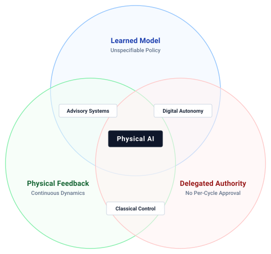{width="90%"}
:::

Examining systems that satisfy only two of these criteria highlights why each dimension demands distinct engineering practices. A classical proportional-integral-derivative (PID) speed governor operates in a tight closed loop under relentless physical feedback, yet relies entirely on analytical control laws rather than learned statistical models. At another extreme, an automated algorithmic trading engine processes millions of learned market forecasts and executes real-time financial transactions; while highly consequential, its closed loop unfolds entirely across digital networks rather than through physical work governed by Newtonian dynamics. Excluding these architectures from physical AI circumscribes our design problem to systems where statistical uncertainty directly collides with physical irreversibility.

A learned model alone does not make a machine a physical AI system. Consider an offline trajectory generator that optimizes smooth paths using a learned diffusion model. If a manufacturing engineer must inspect, validate, and load those toolpaths onto a Computer Numerical Control (CNC) mill prior to cutting metal, the statistical model operates strictly as an advisory tool. The human retains ultimate physical authority. Similarly, a vision model that highlights defects on an assembly line display assists human inspection without closing the physical loop.

Conversely, delegated authority does not require end-to-end neural control. Most production autonomous systems adopt modular architectures where deep neural networks handle perception while deterministic trajectory planners compute actual actuator setpoints. These systems satisfy the physical authority test through perception: if an unvetted object detection or bounding-box estimate triggers an automated swerve or emergency braking maneuver, the learned representation directly dictates plant dynamics. The autonomous test vehicle in the Tempe collision discussed in @sec-boundary-when-fails exemplifies this failure mode, where misclassifications in modular perception cascaded into catastrophic actuation decisions.

Shared autonomy falls squarely within physical AI whenever a learned sub-system modifies live motion before a human operator can intervene. In a robotic surgical console equipped with learned haptic virtual fixtures, for example, the assistive policy exerts real forces on the master tool manipulators to guide the surgeon around delicate anatomical structures. Even if the surgeon holds administrative responsibility for the procedure, high-bandwidth force cues alter physical tissue contact well within normal human neurological reaction latency (typically 150 ms to 250 ms). Because the machine enforces learned spatial guidance dynamically without requiring the surgeon to review and acknowledge each micro-correction, it exercises delegated physical authority in the physical domain.

When classifying an ambiguous machine, engineers must evaluate each of the three criteria independently. Implementing an independent deterministic veto—such as an analog brake relay triggered by a certified safety lidar—does not strip a machine of delegated authority, because learned proposals still govern all nominal motion up to the intervention threshold. In contrast, requiring a human operator to screen and authorize every trajectory command before transmission reliably removes that authority. Once a design satisfies all three criteria, it qualifies as physical AI, and its computing architecture must respect the hard timing and causal boundaries established in @sec-boundary-causal-boundary.

::: {#chk-boundary-scope-test .callout-checkpoint title="Binding budgets and the scope test"}

- [ ] **Delay vs. braking**: Can you explain why response delay and active braking consume separate portions of stopping clearance, and which one dominates above the crossover speed?
- [ ] **Stopping budget estimate**: Using the machine card, can you estimate how far the elementary stop at the `{python} StoppingBudget.v_str` drive limit grows if the `{python} StoppingBudget.t_lease_str` chunk lease doubles, and whether it still fits inside the `{python} StoppingBudget.d_clear_str` clear distance?
- [ ] **Binding margins**: Can you identify the relevant physical margin when the warehouse machine travels, presses a latch, and holds a load?
- [ ] **Scope criteria**: Can you apply all three scope criteria to a new machine, including one whose learned output passes through an independent veto?

:::

Satisfying the scope test binds statistical uncertainty directly to hardware consequences. To design systems that operate safely under these demands, computer systems engineers must map how timing, state estimation, and control authority distribute along the execution path from raw sensor frames to physical actuator motion.

## The Machine in Five Levels {#sec-boundary-machine-model}

An embodied machine requires an architecture that prevents unverified, learned models from writing directly to the actuators they could damage, while still granting those models the authority to guide physical behavior.

The Body establishes what motion, force, and mechanical power the hardware can physically sustain. The Brain generates learned proposals intended to operate within those capabilities. Mediating between them, the Nervous System coordinates communication and control, preserving both the temporal margin and the hardware authority required to intercept and refuse an inadmissible command. We organize these responsibilities into a five-level model spanning learned computation down to the physical environment:

1. **The Brain (Level 1):** The learned models that interpret sensory observations and propose candidate goals, trajectories, or torques. Generating a proposed trajectory or sequence of setpoints confers no intrinsic authority to execute it.
2. **The Nervous System (Level 2):** The deterministic communication buses, real-time schedulers, and control loops that bridge proposals to physical execution. Its permission path evaluates, filters, or rejects proposals against fresh sensory evidence and invariant physical limits, and it executes a guaranteed safe fallback whenever the proposer falters.
3. **The Body (Level 3):** The physical plant—including motor drives, transmissions, electromagnetic windings, structural linkages, and energy storage—that delivers mechanical action.
4. **The Boundary (Level 4):** The hard physical and electrical interface where digital registers translate into actuator voltages or currents, and where physical phenomena register across sensor transducers as raw measurements.
5. **The World (Level 5):** The external physical environment—surfaces, payloads, obstacles, ambient lighting, and human collaborators—which evolves continuously under the laws of physics regardless of whether the machine measures it.

A concrete physical AI implementation often maps this hierarchy across distinct computational tiers: learned proposers run on high-throughput accelerator hosts (such as an application processor paired with a GPU or neural processing unit), the permission path executes on an independent real-time microcontroller or dedicated real-time operating system core, and the field-oriented current loops run directly on dedicated motor drives. This architectural isolation is rooted in strict timing guarantees and fault-containment boundaries rather than specific silicon families or nominal operating system labels.

Governance does not constitute a sixth level in this real-time control hierarchy. Instead, it serves as the operational and lifecycle envelope enclosing all five. Governance determines which entity holds valid command authority, what verification evidence licenses the machine to operate, and when those operational leases expire. Crucially, governance transitions unfold across the human and operational timescales of safety interventions, policy rollouts, and maintenance releases, rather than the millisecond rhythms of real-time control loops.

::: {#dfn-boundary-proposal-boundary .callout-definition title="Proposal boundary"}

***Proposal boundary***\index{Proposal boundary!definition}\index{Permission path!definition} is the line between a learned model, which may only propose an action, and the **permission path**, an independent mechanism with bounded latency that the model cannot delay or corrupt and that alone may permit the action to reach an actuator. The permission path validates every proposal against fresh sensory evidence, the stopping envelope (the state space from which the machine can safely decelerate to a halt prior to obstacle collision), and a certified fallback trajectory reachable from the current state. If any condition is violated, the permission path rejects the proposal immediately.

1.  **Significance**: Prevents learned model outputs from directly manipulating actuators. This architectural protection remains dependable only as long as the permission path's independent sensing, dynamic models, and fallback maneuvers remain physically valid.
2.  **Distinction**: Even a deep reinforcement learning policy trained to emit joint torques possesses zero raw actuator-write authority; its output remains a mere proposal until explicitly admitted by the permission path.
3.  **Common pitfall**: Treating the permission path as a cosmetic post-processing filter or output clamp, rather than an autonomous supervisory mechanism capable of seizing control when the learned proposer hangs, violates deadlines, emits pathological values, or falls silent.

The proposal boundary determines who holds the authority to approve an action, whereas the causal boundary marks the physical interface where an admitted command alters the state of the plant. The Nervous System bridges this divide, verifying proposals against hard constraints before energizing the drives.

:::

Readers steeped in classical control theory will recognize this design as a supervisory architecture. Specifically, the proposal boundary implements runtime assurance. In classic Simplex architectures, a complex, high-performance controller (here, the learned policy) is paired with a certified baseline controller, coordinated by decision logic that determines which subsystem drives the plant [@seto1998simplex; @sha2001using]. @Tbl-01-law-lineage maps our terminology directly to classic control literature.

Crucially, hardware fault isolation alone does not guarantee safety: architectural independence also constrains the permission path's sensor inputs. If an enforcement monitor validates a proposed trajectory using the very same learned perception pipeline that synthesized it, a single perception error will corrupt both components simultaneously. The sensing pipelines that grant execution authority must therefore maintain distinct failure modes from the learned models they supervise.

@Fig-01-locator partitions the machine into five stacked architectural tiers, mapping each level to its characteristic control frequency and governing chapters: from the continuous physical World (bottom) up through the event-timed Boundary, the 10–25 kHz current loops of the mechanical Body, and the 1 kHz permission loops of the Nervous System, to the hierarchical Brain (operating from 40 Hz setpoints to 2 Hz intent models at the top). The prominent gap between Brain and Nervous System marks the foundational proposal boundary: components above this line may only formulate proposals, while only deterministic subsystems below it possess the authority to command physical actuators. The operating frequencies charted across the levels reflect the reference architecture analyzed throughout this book, rather than immutable physical constants for every robotic platform. Subsequent chapters derive these timing budgets directly from task dynamics and mechanical plant characteristics. What remains fundamental across all physical AI systems is the proposal boundary that severs learned computation from unchecked execution authority.

```{python}
#| label: boundary-locator-rates
#| echo: false
#| warning: false
#| message: false
# ┌─────────────────────────────────────────────────────────────────────────────
# │ LOCATOR RATES (LEGO GUARD FOR A HAND-DRAWN FIGURE)
# ├─────────────────────────────────────────────────────────────────────────────
# │ Context: @fig-01-locator (fig01_machine_levels.svg) in
# │          @sec-boundary-machine-model.
# │ Goal:    Keep the rates drawn on the Brain and Nervous System bands equal to
# │          the running machine's registry values.
# │ Show:    intent model 2 Hz; chunk renewal 20 Hz; setpoints 40 Hz; 1 kHz tick.
# │ How:     Read the registry; check() fails the build if a registry change
# │          leaves the SVG labels stale. Nothing prints.
# └─────────────────────────────────────────────────────────────────────────────
from mlsysim import *
from mlsysim.fmt import check

class LocatorRates:
    """Registry rates that fig01_machine_levels.svg draws as text."""

    # ┌── 1. LOAD (Constants & Parameters) ─────────────────────────────────
    RM = Embodied.MobileManipulator.WarehouseMobileManipulator
    f_intent = RM.intent_rate.to(hertz).magnitude  # category: chosen
    f_chunk = RM.chunk_rate.to(hertz).magnitude  # category: chosen
    f_step = (1 / RM.chunk_step).to(hertz).magnitude  # category: derived from the chosen step
    f_tick = RM.permission_rate.to(hertz).magnitude  # category: chosen

    # ┌── 3. GUARD (Invariants) ───────────────────────────────────────────
    drawn = {"intent": 2.0, "chunk": 20.0, "step": 40.0, "tick": 1000.0}  # labels in the SVG
    check(abs(f_intent - drawn["intent"]) < 1e-9, f"Locator draws intent at 2 Hz; registry says {f_intent}.")
    check(abs(f_chunk - drawn["chunk"]) < 1e-9, f"Locator draws chunk renewal at 20 Hz; registry says {f_chunk}.")
    check(abs(f_step - drawn["step"]) < 1e-9, f"Locator draws setpoints at 40 Hz; registry says {f_step}.")
    check(abs(f_tick - drawn["tick"]) < 1e-9, f"Locator draws a 1 kHz permission loop; registry says {f_tick}.")

    # ┌── 4. OUTPUT (Formatting) ──────────────────────────────────────────
    # Guard-only class: it pins the values drawn in the figure; no prose outputs.
```

::: {#fig-01-locator fig-env="figure" fig-pos="htb" fig-cap="**The five-level machine**: Each band carries its pinned rate and the chapters that work on it. The wider gap between Brain and Nervous System marks the proposal boundary, above which a component may only propose. A chapter-opening stack with no level highlighted marks a governance chapter. The permission-loop rate shown is one implementation." fig-alt="Five stacked horizontal bands labeled from top to bottom Brain (learned proposers, intent model 2 hertz, chunk renewal 20 hertz, setpoints 40 hertz), Nervous System (permission path, lease, fallback, a 1 kilohertz loop in one implementation), Body (drives, transmission, windings, rails, current loop 10 to 25 kilohertz), Boundary (register write and sensor capture, event-timed), and World (contact, friction, payload, people, continuous). A wider gap between Brain and Nervous System is labeled proposal boundary, above may only propose, below may command. A dashed outline enclosing all five bands is labeled governance, lifecycle envelope, Part IV, no control rate. Chapter numbers sit at the right edge of each band: Brain 3, 6, 8 to 11; Nervous System 4, 12, 13; Body 2; Boundary 1, 8; World 5, 7."}
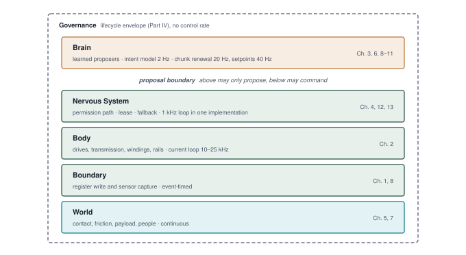{width="100%"}
:::

Deploying capable physical AI requires balancing expressive policy proposals with deterministic execution guarantees. This separation of concerns does not demand rejecting every imperfect proposal out of hand; real-time intervention mechanisms can project a trajectory onto safe constraints or smoothly blend corrections, preserving task progress while strictly respecting physical invariants. Rigorous systems evaluation must therefore disentangle what the learned proposer achieves in isolation, how effectively the integrated machine executes under routine supervisory filtering, and whether the fallback mechanisms themselves introduce secondary hazards.

Distributing responsibilities across these five levels establishes the structural foundation for the remainder of this book. More importantly, it provides a principled framework for diagnosing real-world failures without reflexively reducing every physical malfunction to a deficiency in neural network weights.

## When the Responsibilities Fail Together {#sec-boundary-when-fails}

A warehouse model that recognizes an obstacle too late cannot recover the clearance already consumed. In a road vehicle, the same timing problem can combine with tracking errors, delayed intervention, and missing redundancy. The 2018 Tempe collision provides a documented example of these interacting failures; it does not establish that one prescribed hardware architecture would have prevented them. The National Transportation Safety Board (NTSB) attributed the crash primarily to the vehicle operator's distraction. The design choices traced below explain why the automated system had made that single, unmonitored person the last line of defense.

```{python}
#| label: boundary-incident-record
#| echo: false
#| warning: false
#| message: false
# ┌─────────────────────────────────────────────────────────────────────────────
# │ THE TEMPE AND CRUISE RECORDS (LEGO)
# ├─────────────────────────────────────────────────────────────────────────────
# │ Context: @tbl-01-law-lineage and @sec-boundary-when-fails (Tempe timeline,
# │          action suppression, braking cap, Cruise pullover, checkpoint).
# │ Goal:    Print the investigators' own values once, and derive the travel
# │          during action suppression from the two recorded speeds.
# │ Show:    5.6 s first detection; 43.2 mph at 1.2 s before impact; 1 s
# │          suppression ending at 0.2 s and 40.5 mph; takeover at 0.02 s;
# │          18.7 m during suppression; 7 m/s^2 (0.71 g) chosen cap against
# │          0.92 g (9.0 m/s^2) capability; Cruise about 20 ft (6.1 m) at up
# │          to 7.7 mph.
# │ How:     Literature values from NTSB/HAR-19/03 and the Quinn Emanuel report,
# │          loaded here until the literature registry holds them. Suppression
# │          travel uses the mean of the two recorded speeds (trapezoid rule);
# │          no counterfactual stop is computed.
# └─────────────────────────────────────────────────────────────────────────────
from mlsysim.core.units import *
from mlsysim.fmt import fmt, fmt_latency, fmt_length, fmt_velocity, fmt_acceleration, fmt_math, check

class IncidentRecord:
    """Investigator-reported values for the Tempe (2018) and Cruise (2023) cases."""

    # ┌── 1. LOAD (Constants & Parameters) ─────────────────────────────────
    # category: literature. NTSB/HAR-19/03 (2019), p. v and table pp. 15-16
    t_detect = 5.6 * second  # first detection, before impact
    t_recognize = 1.2 * second  # emergency recognized and suppression begins, before impact
    v_recognize = 43.2 * ureg.mph  # recorded speed at that instant
    t_suppress = 1.0 * second  # action-suppression period (p. 13)
    t_supp_end = 0.2 * second  # suppression ends, before impact
    v_supp_end = 40.5 * ureg.mph  # recorded speed at that instant
    t_takeover = 0.02 * second  # operator takes the wheel, before impact
    # category: literature. NTSB/HAR-19/03, p. 13 and footnote 33
    a_cap = 7.0 * meter / second**2  # ADS emergency threshold and braking cap (chosen by the developer)
    g_capable = 0.92  # police-determined average deceleration capability in the crash area, in g
    # category: literature. Quinn Emanuel report to the Cruise boards (2024), p. 10
    d_drag = 20 * ureg.foot  # approximate distance moved during the pullover
    v_drag = 7.7 * ureg.mph  # maximum speed during the pullover

    # ┌── 2. EXECUTE (Compute) ─────────────────────────────────────────────
    g0 = (1 * ureg.standard_gravity).to(meter / second**2)
    d_suppress = (0.5 * (v_recognize + v_supp_end) * t_suppress).to(meter)
    a_cap_g = (a_cap / g0).to("dimensionless").magnitude
    a_capable = (g_capable * g0).to(meter / second**2)
    d_drag_m = d_drag.to(meter)

    # ┌── 3. GUARD (Invariants) ───────────────────────────────────────────
    check(abs((t_recognize - t_supp_end - t_suppress).to(second).magnitude) < 1e-9, "Suppression must span the two table rows.")
    check(abs(a_cap_g - 0.71) < 5e-3, f"NTSB states the cap as 0.71 g, got {a_cap_g}.")
    check(a_capable > a_cap, "The chosen cap must sit below the vehicle's capability.")
    check(abs(d_suppress.magnitude - 18.7) < 0.05, f"Suppression travel is about 18.7 m, got {d_suppress}.")

    # ┌── 4. OUTPUT (Formatting) ──────────────────────────────────────────
    t_detect_str = fmt_latency(t_detect, unit=second, precision=1)
    t_suppress_str = fmt_latency(t_suppress, unit=second, precision=0)
    t_recognize_math = fmt_math(rf"T-{fmt(t_recognize, unit=second, precision=1)}\text{{ s}}")
    t_supp_end_math = fmt_math(rf"T-{fmt(t_supp_end, unit=second, precision=1)}\text{{ s}}")
    t_takeover_math = fmt_math(rf"T-{fmt(t_takeover, unit=second, precision=2)}\text{{ s}}")
    v_recognize_str = fmt_velocity(v_recognize, unit=ureg.mph, precision=1)
    v_supp_end_str = fmt_velocity(v_supp_end, unit=ureg.mph, precision=1)
    d_suppress_str = fmt_length(d_suppress, unit=meter, precision=1)
    a_cap_str = fmt_acceleration(a_cap, unit=meter / second**2, precision=0)
    a_cap_g_str = fmt(a_cap_g, precision=2)
    g_capable_str = fmt(g_capable, precision=2)
    a_capable_str = fmt_acceleration(a_capable, unit=meter / second**2, precision=1)
    d_drag_str = fmt_length(d_drag, unit=ureg.foot, precision=0)
    d_drag_m_str = fmt_length(d_drag_m, unit=meter, precision=1)
    v_drag_str = fmt_velocity(v_drag, unit=ureg.mph, precision=1)
```

On a March night in 2018, a modified Volvo XC90 operating Uber Advanced Technologies Group (ATG)'s developmental automated driving system (ADS) struck and fatally injured a pedestrian pushing a bicycle across a road in Tempe, Arizona [@ntsb2019uber].[^fn-inc-tempe-investigation] The NTSB architectural profile in @fig-01-tempe-vehicle maps the developmental sensor and computing payload integrated onto the Volvo XC90 chassis: a roof-mounted lidar pod, forward and side radars, surround cameras, and rooftop GPS antennas, routed back to automated driving system (ADS) compute and data-storage racks installed in the cargo bay. The ADS first detected the pedestrian `{python} IncidentRecord.t_detect_str` before impact, but detection alone did not provide a correct path prediction [@ntsb2019uber].

[^fn-inc-tempe-investigation]: **Reading the Tempe Record**\index{2018 Tempe Autonomous Collision!NTSB report}: Times in this section count backward from impact at $\Time$, as the event table of NTSB/HAR-19/03 does, and speeds are those the ADS itself recorded [@ntsb2019uber]. The report also cautions that communication delay leaves unclear exactly when the planned slowdown began. Reading each time as an interval before impact, rather than as a clock time, is what lets it be converted into distance traveled at the recorded speed, the conversion this section applies.

::: {#fig-01-tempe-vehicle fig-env="figure" fig-pos="t" fig-cap="**Tempe test vehicle sensor locations**: The NTSB diagram identifies the developmental ADS vehicle's lidar, camera, radar, computing, and telecommunications locations. (Source: NTSB, public domain)." fig-alt="NTSB side-view diagram of the Volvo test vehicle with colored outlines marking lidar, cameras, radar, ADS computing and data storage, and GPS equipment."}
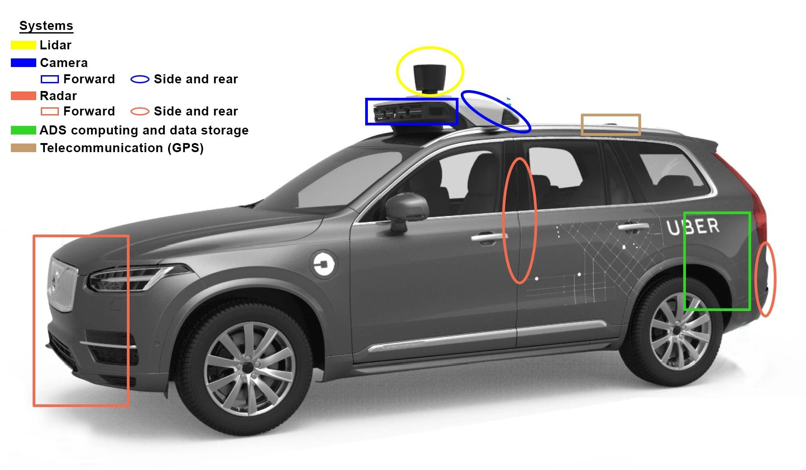{width="95%"}
:::

### Tracking history loss under classification churn {#sec-boundary-tracking-churn}

Despite continuing to track the detected object, the ADS did not brake in response to it. The NTSB record shows classification changes among vehicle, bicycle, and other before `{python} IncidentRecord.t_recognize_math` [@ntsb2019uber].

When the classification changed, the ADS path predictor did not use the object's earlier locations; for an "other" object it could assume a static path.[^fn-ctrl-kalman-tracking] The loss of earlier locations matters because successive positions provide evidence of motion across the roadway. A changing semantic label must not silently discard that evidence. The resulting path predictions did not place the pedestrian in the sport utility vehicle (SUV)'s lane until `{python} IncidentRecord.t_recognize_math` [@ntsb2019uber].

[^fn-ctrl-kalman-tracking]: **Tracking-History Loss**\index{Tracking history!classification changes}: The NTSB record states only that a changed classification caused the predictor to omit the object's earlier locations; it does not describe a Kalman-filter reset or a zero-velocity initialization, so neither should be read into it [@ntsb2019uber]. The consequence follows from the omission alone. Each relabeling shortened the evidence window from which motion is estimated, so an object crossing the lane began again, after each change, as one with no recorded history of crossing.

### Action suppression and the kinematic stopping deficit {#sec-boundary-action-suppression}

The ADS included an action-suppression interval intended to reduce responses to false alarms while the system checked the situation and allowed operator intervention [@ntsb2019uber]. That software choice also consumed time available for a physical response.

At `{python} IncidentRecord.t_recognize_math`, with the vehicle traveling at `{python} IncidentRecord.v_recognize_str`, the ADS recognized an emergency and entered its one-second action-suppression period. The design withheld braking while it checked the hazard or waited for operator intervention. At `{python} IncidentRecord.t_supp_end_math`, suppression ended with the vehicle at `{python} IncidentRecord.v_supp_end_str`. The ADS then initiated a plan for gradual slowdown and sounded an alert; it did not request emergency braking. The NTSB notes that communication delay leaves unclear whether that slowdown began before the operator disengaged the ADS at `{python} IncidentRecord.t_takeover_math` [@ntsb2019uber].

::: {.column-margin}
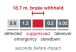{width="100%" fig-alt="A strip of five equal cells in time order, labeled in seconds before impact: detected at 5.6 seconds, emergency recognized at 1.2 seconds, a red cell for the one-second action suppression bracketed as 18.7 meters with the brake withheld, slowdown planned at 0.2 seconds, and operator takeover at 0.02 seconds. Cell widths are not to scale."}

*Detection, recognition, and braking were separate events; suppression spent `{python} IncidentRecord.d_suppress_str`.*
:::

The first term of the warehouse stopping budget applies directly. Averaging the two recorded speeds over the `{python} IncidentRecord.t_suppress_str` of suppression, the vehicle traveled about `{python} IncidentRecord.d_suppress_str` while emergency braking was withheld, distance that no later action could recover. The speed still fell during that second because a slowdown for the planned right turn at the next intersection was already under way; what the suppression withheld was the emergency response [@ntsb2019uber]. The emergency itself was defined by a chosen limit. The ADS treated a situation as an emergency when avoiding a collision required more than `{python} IncidentRecord.a_cap_str` (`{python} IncidentRecord.a_cap_g_str` g) of deceleration or a jerk[^fn-jerk-brake-ramp] beyond its limit, and it capped its own automated braking at that deceleration; police determined that the vehicle could decelerate at an average of `{python} IncidentRecord.g_capable_str` g, about `{python} IncidentRecord.a_capable_str`, on that road surface [@ntsb2019uber]. The difference between a chosen permission limit and a physical one is the distinction the book's numbers keep throughout. We do not extend the calculation to a counterfactual stop, because the report does not establish when a different design would have begun braking. Detection, correct path prediction, hazard recognition, and physical braking are distinct events; reporting the first detection time alone conceals the failures between them.

[^fn-jerk-brake-ramp]: **Jerk**: The rate of change of acceleration, in m/s³. A jerk limit makes a brake ramp its deceleration up instead of stepping it, which spares occupants, loads, and transmissions a shock but costs stopping distance, because full deceleration arrives later. The warehouse machine's card carries a jerk bound for the same reason, and the machine's finished stopping budget pays for the ramp. \index{Jerk!braking}

::: {#ws-boundary-missing-safety-referee .callout-war-story title="The disabled safety redundancy (2018)"}
**Context**: On March 18, 2018, a developmental ADS on a 2017 Volvo XC90 struck and killed a pedestrian crossing a road in Tempe, Arizona [@ntsb2019uber].

**Mechanism**: As traced above, classification changes discarded the object's tracking history, and the one-second suppression withheld braking until only a gradual slowdown was planned. The design did not use maximum braking solely to mitigate an unavoidable collision [@ntsb2019uber].

**Impact**: The vehicle struck and fatally injured the pedestrian. The late gradual-slowdown plan could not recover the lost stopping opportunity.

**Response**: The NTSB determined that the probable cause was the vehicle operator's failure to monitor the driving environment and the ADS because she was visually distracted throughout the trip by her personal cell phone. It found three contributing factors at Uber ATG, all a consequence of an inadequate safety culture: inadequate safety risk assessment procedures, ineffective oversight of vehicle operators, and a lack of adequate mechanisms for addressing operators' automation complacency. The impaired pedestrian's crossing outside a crosswalk and the Arizona Department of Transportation's insufficient oversight of automated vehicle testing also contributed. The NTSB further found that deactivating the Volvo collision warning and automatic emergency braking, which Uber ATG had done over possible radar interference, removed a layer of safety redundancy, and it recommended stronger safety risk management for testing automated vehicles [@ntsb2019uber].

**Systems lesson**: Classification uncertainty, a delayed response rule, and reliance on an inattentive operator can combine. The design made the operator the primary countermeasure in an emergency, yet no mechanism monitored her attention in real time: authority rested on evidence nobody collected. A design needs timely hazard assessment and a response that can mitigate impact when avoidance is no longer possible; the investigation does not prescribe a particular processor or mailbox architecture.
:::

The investigation supports a broader architectural requirement. A developmental ADS needs safety redundancy and a timely mitigation path even when perception or path prediction fails, and simulation tests by Volvo that the NTSB cites suggest that the factory emergency braking might have prevented or mitigated this collision. The report does not establish when a separate permission path would have triggered or where it would have stopped the vehicle.[^fn-std-safety-standards]

[^fn-std-safety-standards]: **Safety-Critical Standards**\index{Safety-Critical Standards!autonomous systems}: Three standards divide the ground. ISO 26262 addresses hazards caused by faults in a vehicle's electrical and electronic systems [@iso26262]; ISO 21448, safety of the intended functionality (SOTIF), addresses hazards that arise when a function works as designed but performs insufficiently, as perception can [@iso21448]; and UL 4600 sets out the safety case for autonomous products with no human driver to fall back on [@ul4600]. Tempe falls on the SOTIF side, since the recorded failures were in classification and path prediction rather than in a faulted component, and none of the three prescribes a processor architecture. The standards map maps the standards that govern the running machine.

Tempe illustrates failure *before* impact, where classification changes and a software suppression delay prevented timely braking. The 2023 Cruise robotaxi incident marks the opposite pole *after* impact. A hit-and-run driver's car threw a pedestrian into the path of the driverless vehicle, which braked hard but struck her and stopped. It then began a pullover toward a minimal-risk condition[^fn-mrc-fallback-motion] and, because its sensing did not detect a person beneath the vehicle, moved about `{python} IncidentRecord.d_drag_str` (`{python} IncidentRecord.d_drag_m_str`) at up to `{python} IncidentRecord.v_drag_str` while she was pinned beneath it. This account comes from a review commissioned by the company's boards, whose focus was the company's disclosures to regulators [@quinnemanuel2024cruise].

[^fn-mrc-fallback-motion]: **Minimal-Risk Condition**: In automated driving, the stable, usually stopped, state a system brings a vehicle to when a trip cannot or should not continue. Reaching it can itself require motion, as a pullover to the curb does, and in the Cruise case that motion was the harm. A fallback trajectory therefore needs the same permission check as any other proposal, judged against fresh evidence about the space it will move through. \index{Minimal-risk condition!fallback motion}

Neither failure reduces to an inaccurate model. The first spent stopping distance before braking began, and no later action could recover it. The second chose motion after the impact. Together they show what must hold before the machine acts and what a fallback may do once harm has begun. Both also had to be reconstructed afterward from records of what the machine perceived and when, so accountability, like safety, depends on the path that authorizes motion.

::: {#chk-boundary-forensic-failure .callout-checkpoint title="Forensics of boundary and authority failures"}

Verify how the Tempe mechanisms connect to the architecture:

- [ ] **Classification changes and path prediction**: Can you explain how classification changes caused the ADS path predictor to omit earlier object locations, despite continued tracking?
- [ ] **Software suppression vs. kinematic clearance**: Can you distinguish the `{python} IncidentRecord.t_recognize_math` recognition time from the one-second suppression period and explain why the gradual-slowdown plan at `{python} IncidentRecord.t_supp_end_math` could not restore the time already spent?
- [ ] **Safety redundancy**: Can you explain why disabling factory collision warning and emergency braking removed a layer of protection from a developmental ADS?

:::
## Safety Convergence {#sec-boundary-safety-convergence}

In standard enterprise software and distributed systems, safety, security, and accountability are typically segregated into distinct operational tiers. Security defends network boundaries with cryptographic tokens; reliability frameworks mitigate component failures through retries and circuit breakers; accountability records remote procedure call (RPC) transactions to append-only databases. In physical AI, these three disciplines collapse directly onto the causal boundary—the interface where software commands meet physical actuators. Consider an autonomous mobile robot navigating a warehouse aisle at 3 m/s. The machine requires a valid stopping decision regardless of whether its forward cameras are obscured by dirt, an attacker has injected spoofed packets onto the internal Controller Area Network bus, or a vision-language-action policy has hallucinated an unobstructed path. In each case, the ultimate hazard is kinetic: an uncontrolled collision with infrastructure or human workers. Because physical momentum cannot be rolled back like a failed database transaction, admission control cannot simply confirm who dispatched a command. The system must determine whether executing that command right now violates physical safety invariants.

Consider how an ordinary environmental degradation challenges this boundary. If an autonomous forklift moves from dry concrete onto a patch of spilled hydraulic fluid, the friction coefficient between tire and floor can plunge from $0.8$ to $0.2$. Under maximum braking, the stopping distance quadruples. A clearance envelope and speed profile computed barely 100 ms earlier are immediately invalidated. The learned planner, processing visual camera streams that fail to reveal the transparent slick, may continue to output an aggressive velocity command with high nominal confidence. Safety verification cannot treat the model's internal confidence as proof of physical feasibility. Restricting machine operation demands independent, real-time evidence from the physical plant and its immediate environment—including wheel-slip telemetry, inertial measurement unit acceleration discrepancies, and motor current transients—to detect dynamic divergence and dynamically clamp actuator setpoints to a safe stopping profile.

Security threats target this same permission machinery by corrupting the evidence used to authorize motion. An adversary does not need to crack cryptographic keys or modify model weights to destabilize a physical agent; distorting the sensory inputs that inform admission decisions is sufficient. Projecting structured light patterns onto camera lenses, spoofing ultra-wideband localization beacons, or injecting rogue packets into sensor buses can deceive the controller into approving destructive commands, even while the neural network executes its inference pipeline without numerical fault. Isolating the proposer from the safety filter offers little defense if both subsystems ingest the same corrupted telemetry. Securing the causal boundary requires rigorous evidence validation: cross-verifying heterogeneous sensor streams (for example, corroborating camera-based visual odometry against wheel encoders and inertial sensors), enforcing cryptographic message authentication across bus transceivers, and maintaining fail-operational plausibility checks that reject sensor readings deviating from physical conservation laws.

In digital systems, a cryptographic capability token or access control list entry grants authority to modify a file regardless of processor load or ambient conditions. In physical AI, **physical authority is state-dependent.** Cryptographic credentials establish identity and organizational rights to request an action, but physical admissibility depends entirely on the instantaneous operational state of the machine and its workspace. A joint velocity command of 2 rad/s may represent a routine transit when an industrial manipulator operates in open free space, yet that identical command becomes unacceptable if the arm is within 2 mm of a mechanical hard stop or a human coworker. Evaluating physical authority requires testing the proposed action against instantaneous kinematics, payload inertia, motor thermal headroom, and state estimation uncertainty. Furthermore, admission control must remain coupled to an executable fallback. If the permission gate rejects a proposed command because the machine approaches an operational boundary, the controller must immediately dispatch a dynamically feasible contingency maneuver—such as controlled regenerative braking or compliant impedance control—that halts or redirects the plant without exceeding mechanical stress limits.

Accountability demands an audit trail that reconstructs the causal chain connecting sensory evidence to physical outcomes. When an embodied machine causes a collision or near-miss, post-incident analysis requires microsecond-level synchronization across multiple data streams: the raw observations ingested by the planner, the action proposed by the learned policy, the state estimates and dynamic constraints evaluated by the admission gate, the filtered command dispatched to the motor drives, and the measured response from joint encoders and force-torque sensors. Command logs record the intended trajectory, while sensor telemetry measures the plant's actual mechanical response. Recording dispatched setpoints alone does not confirm that an actuator executed them; an open-circuit fault, a tripped thermal breaker, or mechanical gearbox jamming will cause the physical plant to diverge immediately from commanded behavior. Both streams must be logged using synchronized hardware clocks (such as IEEE 1588 Precision Time Protocol) so that investigators can definitively distinguish between a planning failure, an admission gate error, and an electromechanical actuator breakdown.

Safety, security, and accountability ultimately converge on three unified demands at the permission path guarding the causal boundary:

1. Fresh, authenticated physical state: The permission gate must operate on telemetry fresh enough to bound physical uncertainty and robust enough against tampering or degradation to justify action admission.
2. Deterministic authority to intervene: The admission mechanism requires uncompromised physical authority to veto or clamp unfeasible proposals and inject safe contingency maneuvers, regardless of the learned model's internal confidence or identity.
3. Synchronous causal telemetry: The system must maintain an immutable record capturing what was proposed, what state was evaluated, what commands were dispatched, and how the physical machine responded.

The permission path is not merely a defensive software layer; it serves as the architectural foundation of embodied machine learning systems. By anchoring high-capacity, probabilistic neural policies to deterministic physical invariants, the permission path guarantees that physical AI delivers useful capabilities only under justified, provably safe operational bounds.

## The Four Bedrock Laws {#sec-boundary-bedrock-laws}

Manipulating an unfamiliar door latch or transporting an unmodeled payload requires far more than a sequence of statistically accurate model predictions. An embodied machine must respect the mechanical limits of its plant, adapt to dynamic environments altered by its own motion, and arbitrate between speculative model outputs and physically safe actuation. Four bedrock laws organize these engineering responsibilities, each anchoring a major part of this book:

**The first law: irreversibility.** Software cannot roll back physical consequences. In pure digital systems, an erroneous transaction can be aborted and state restored from a checkpoint. In physical space, however, work performed on a plant is thermodynamic and permanent. A motor command that collides with a fixture, tears a cable, or fractures a fragile payload cannot be retracted. Every admissibility check must therefore complete before the machine consumes its remaining clearance margin. As the stopping distance budget demonstrates, processing latency directly expends physical clearance, forcing the mechanical actuators to brake over an ever-shrinking distance. Reversing a drive voltage may eventually return an arm to its starting coordinates, but it cannot mend cracked structural material or recover energy lost to friction and heat. Part I translates this physical reality into kinetic budgets for the robot's body and deterministic timing constraints for its low-level controllers.

**The second law: endogenous data.** In classic offline machine learning, data samples are drawn independently from a stationary distribution. In embodied systems, data generation is strictly endogenous: every control action alters the physical state and determines what sensors will observe next. If an arm nudges an object during an approach, the object shifts; if a mobile base drifts off its nominal path, the subsequent visual frames deviate from the training demonstrations. Single-step prediction accuracy on an offline benchmark cannot guarantee closed-loop stability, because minor execution errors compound across the task horizon. Part II frames data collection, model training, and policy evaluation as a continuous improvement cycle: diagnose behavioral failures, curate targeted recovery demonstrations, retrain candidate policies, and systematically evaluate both performance gains and unintended regressions. Empirical evidence from past rollouts bounds what we can claim about present capability; only qualified new experience can expand that envelope.

**The third law: proposal is not permission.** A learned model operates strictly as a proposer, never as an unconstrained executor. An architecturally independent permission path—such as a runtime safety filter or an assurance monitor—must arbitrate every proposed control command before that command reaches hardware actuators. Granting permission requires three prerequisites: fresh state estimates from verified sensors, explicit mathematical guarantees that the command respects all physical safety envelopes, and an immediately executable fallback maneuver if the proposal is delayed, missing, or unsafe. This separation of authority must remain robust against system faults: a runaway or stalled model thread must never be allowed to delay, starve, or corrupt the deterministic safety logic guarding the plant. Part III constructs the real-time execution runtime around this strict division between speculative proposal and certified permission.

**The fourth law: evidence bounds authority.** An embodied machine's legitimate operational authority extends only as far as the empirical evidence supporting its performance under stated conditions. Flawless execution across a handful of laboratory trials does not justify autonomy across diverse surface friction, variable payloads, degraded lighting, or sensor degradation. Every deployment safety case must explicitly demarcate the system's operational design domain (ODD),[^fn-odd-evidence-scope] articulate the environmental assumptions underlying those boundaries, and specify fail-safe degradation policies whenever runtime conditions drift beyond verified bounds. The 2018 Uber ATG collision in Tempe, Arizona, tragically demonstrated the cost of ignoring this boundary: the system architecture relied on an in-vehicle safety operator as the primary emergency countermeasure, yet lacked any mechanism to monitor whether the operator was actually attending to the roadway [@ntsb2019uber]. Part IV formalizes command authority, fault injection testing, and release criteria so that epistemic and physical uncertainty strictly circumscribe what the machine is permitted to do.

[^fn-odd-evidence-scope]: **Operational Design Domain (ODD)**: The automated-driving name for the stated environmental and operational conditions—such as roadway types, speed ranges, weather, and lighting—under which a system is designed to operate, and the foundational scope of a UL 4600 safety case [@ul4600]. This book applies the concept to the payloads, surface friction, operating velocities, and dynamic disturbances covered by the machine's empirical validation. Operating outside that verified domain rests on no evidentiary basis whatever, which is why later chapters structures the operating domain as an explicit scenario ledger against which collected training data are audited. \index{Operational design domain!evidence}

Among these four mandates, only the first is an immutable physical law. Irreversibility arises directly from Newtonian mechanics and thermodynamics: work performed on a plant transfers energy and alters physical entropy, and no software architecture can undo that state transition. The remaining three are engineering design principles. They embody hard-won lessons forged through decades of systems engineering, industrial robotics, and aerospace failures. An engineering team could theoretically build an architecture that violates them—for example, by piping unvalidated neural network outputs straight to motor amplifiers—but doing so incurs severe, predictable risks. We elevate all four to the status of bedrock laws because this book treats them as mandatory constraints for any production embodied system.

None of these three architectural principles is entirely novel. Each has a rich foundation in computer systems, control theory, and safety-critical engineering. @Tbl-01-law-lineage maps this book's terminology to the established literature, alongside the canonical sources and documented real-world failures each principle distills—including the Tempe and Cruise incidents. Where our terms introduce tighter operational precision, as when tying state freshness directly to the dynamic stopping budget, we retain specialized systems phrasing; when searching broader engineering literature, the classical terms serve as the standard index.

| Book's law or term                                                         | Kind             | Established name in the field                                             | Canonical source                                               | Documented failure it distills                                                                                                                                                                                                                                                                                                                                         |
|:---------------------------------------------------------------------------|:-----------------|:--------------------------------------------------------------------------|:---------------------------------------------------------------|:-----------------------------------------------------------------------------------------------------------------------------------------------------------------------------------------------------------------------------------------------------------------------------------------------------------------------------------------------------------------------|
| First law: irreversibility (the causal boundary)                           | Physical         | Irreversible work on the plant; the reaction-plus-braking stopping budget | Mechanics; later chapters                          | Tempe (2018): the one-second action suppression let the vehicle travel about `{python} IncidentRecord.d_suppress_str` with emergency braking withheld [@ntsb2019uber]                                                                                                                                                                                                  |
| Second law: endogenous data                                                | Design principle | Covariate shift; compounding error in imitation learning                  | Ross, Gordon, and Bagnell [@ross2011reduction]                 | A learning result rather than an accident: a cloned policy's errors can compound with the task horizon (later chapters)                                                                                                                                                                                                                                     |
| Third law: proposal is not permission (proposal boundary, permission path) | Design principle | Runtime assurance and its Simplex architecture; safety filter             | Sha [@sha2001using]; Hsu, Hu, and Fisac [@hsu2024safetyfilter] | Therac-25: software took over protection that hardware interlocks had provided [@leveson1993investigating]; Mars Pathfinder (1997): through priority inversion, lower-priority work delayed a deadline-critical bus task until the scheduler's completion check reset the computer [@reeves1997pathfinder]                                                             |
| Fresh evidence (an input to every permission check)                        | Design principle | Age of information                                                        | Kaul, Yates, and Gruteser [@kaul2012realtime]                  | While not a pure staleness failure, Tempe (2018) shows the neighboring hazard of discarded evidence: each object reclassification dropped historical tracks, forcing path prediction to compute trajectories on truncated sensor history [@ntsb2019uber]                                                                                                               |
| Fourth law: evidence bounds authority                                      | Design principle | Assurance case; operational design domain (ODD)                           | UL 4600 [@ul4600]                                              | Tempe (2018): the design made the operator the primary countermeasure in an emergency, yet nothing monitored her attention in real time [@ntsb2019uber]; Cruise (2023): a post-collision pullover moved the vehicle without evidence that the space beneath it was clear, because its detection system did not identify the pedestrian there [@quinnemanuel2024cruise] |

: **Lineage of the four laws**: Each law and key term of this book against the field's established name, its canonical source, and a documented failure it distills. Only the first law is physical; the other three are design principles, which is why each has an independent literature. Runtime assurance enters with the proposal boundary, and @sec-boundary-history traces its lineage together with the safety filter and the assurance case. {#tbl-01-law-lineage tbl-colwidths="[20,10,20,16,34]"}

The proposal boundary unifies these four laws into an integrated systems architecture. Irreversibility dictates that safety checks execute before any physical command alters plant state. Endogenous data explains why offline training metrics alone cannot guarantee closed-loop stability. Evidence boundaries establish the verified operational limits within which autonomous proposals remain justified.

Scaling up model capacity does not relax these constraints; on the contrary, it intensifies physical pressure on the system. Although general machine learning methods deliver superior performance as compute expands [@sutton2019bitter], an embodied agent must carry its compute infrastructure onboard. Every additional neural layer, attention head, or diffusion step draws against fixed physical allocations of memory bandwidth, electrical power, and thermal dissipation. Crucially, inference latency translates directly into unrecoverable braking distance: every millisecond spent waiting for a deep network to evaluate a forward pass burns clearance that the mechanical brakes can never reclaim. This compute, thermal, and temporal ceiling forms the physical wall confronting every learned proposer.

Finally, rejecting an inadmissible command must have an explicit physical realization. In traditional software, an unhandled exception or failed assertion can simply terminate a thread. On a moving robot, halting a software process leaves physical momentum untouched. A refusal is meaningful only if the execution runtime immediately dispatches an admissible fallback—whether a dynamic braking maneuver, an impedance-controlled hold, or a controlled stop—that the physical body can safely execute within its remaining stopping clearance. Translating these four laws and their runtime mechanisms into an engineered system requires a disciplined progression across the four parts of this book.

## The Architecture of This Book {#sec-boundary-book-architecture}

Moving a learned proposal—such as a mobile manipulator's trajectory to open a warehouse cage door—from an abstract task requirement to safe, justified physical operation requires a disciplined four-stage progression. The engineer must first bound what the hardware plant can physically achieve, characterize what the learned proposer has demonstrated under rigorous testing, build an isolated runtime monitor to intercept live proposals, and establish the operational conditions under which continued execution remains justified. Each stage corresponds to one of the book's four governing laws. The system of records illustrated in @fig-01-spine formalizes this progression, capturing operating assumptions and empirical evidence so that downstream runtime decisions can inspect and rely on them. Conceptually, these records trace two converging pipelines. One strand establishes offline physical limits and verified competence; the second processes online sensor observations and real-time candidate actions. Both pipelines converge at the permission decision, where the system admits or rejects a proposed trajectory. Ultimately, this architecture synthesizes both strands to resolve the book's central challenge: engineering dependable, high-performance physical systems out of unverified learned models and unforgiving mechanical hardware.

A record is a machine-checkable artifact that downstream safety and runtime decisions can verify and trust. The initial stopping calculation (notebook \ref{nbk-boundary-stopping-budget}) already sketches the outline of our first milestone: a limit record containing the six core elements introduced in the reader guide. Its nominal value is the derived stopping distance. Its operational conditions specify the payload mass, dry concrete, a stationary obstacle, and a constant approach speed. At this stage, however, its uncertainty remains unquantified because the inputs are illustrative scalars rather than calibrated empirical distributions. Consequently, the apparent buffer between the obstacle and the machine is simply an arithmetic difference between provisional figures rather than a verified safety margin. The system also lacks a runtime detector; no sensor on the machine currently monitors whether floor traction drops or cargo shifts outside the assumed envelope. The schema for the limit record specifies the runtime detector a limit record requires. Finally, its provenance consists solely of baseline assumptions rather than calibrated hardware logs. These omissions highlight an essential systems principle: an ungrounded calculation becomes operational engineering evidence only when all six fields are populated and backed by empirical data. Every numbered box across the four part bands in @fig-01-spine establishes a machine-checkable record of this rigor for a distinct architectural decision.

::: {#fig-01-spine fig-env="figure" fig-pos="htb" fig-cap="**The spine of the book**: Each part is led by one law, and each chapter of Parts I to IV except the chapter on the brain produces a record that a later one consumes. What the plant can do and what the proposer has shown it can do run as one strand, what the proposer proposes now as another, and the two meet at the permission decision." fig-alt="Flow diagram of fifteen record boxes, each labeled with its chapter number, on shaded bands for the four parts. A label at top left reads Chapter 1, What must be guaranteed. In the Part I band, labeled Irreversibility, the limit record of Chapter 2 feeds the handoff record of Chapter 4, and a dashed arrow labeled Chapter 3, proposer limits, also enters the handoff record. The handoff record forks into two rows. The upper row, in the Part II band labeled Endogenous data, runs provenance record 5, policy manifest 6, and evaluation record 7. The lower row, in the Part III band labeled Proposal is not permission, runs observation contract 8, belief record 9, intent lease 10, and trajectory record 11. Both rows converge on the enforcement record of Chapter 12, which feeds the placement record of Chapter 13. An arrow then runs down to a lower row in the Part IV band, labeled Evidence bounds authority: authority record 14, fault record 15, and release manifest 16, which feeds the residual-claims register of Chapter 17, labeled Conclusion and What the evidence supports. A separate arrow runs from the evaluation record around the top and right edges to the release manifest."}
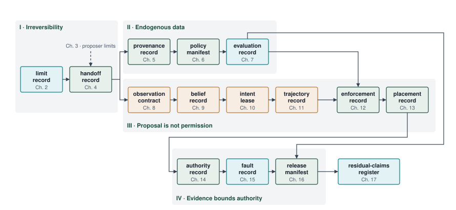{width="100%"}
:::

Part I, The Machine Anatomy, translates physical irreversibility into rigid architectural limits. In the second chapter, we profile the mechanical plant to quantify its immutable physical budgets—braking distances, peak motor torques, and structural deceleration limits. In the third, we measure the computational throughput and inference latency of the learned proposer, determining what predictions the model can reliably deliver before deadlines expire. In the fourth, we link compute to mechanical actuators across deterministic buses, structuring a dedicated permission path whose timing guarantees derive directly from the plant's stopping requirements. The limit record and handoff record make every physical and temporal assumption explicit. Part II, Teaching the Machine, confronts the reality that physical actions continuously alter future sensor observations. In Part II, we establish the evidentiary chain required to collect safe demonstrations, train robust control policies, and audit policy performance across a well-defined operational design domain. Across this training pipeline, the demonstration provenance record, policy manifest, and evaluation record document not only the empirical competence demonstrated by the model, but also the operational boundaries where its statistical guarantees break down.

Part III, Running the Machine, operationalizes the fundamental separation between proposing an action and permitting it to execute. Across Part III, we trace candidate commands through the online runtime: validating raw sensor telemetry against observation contracts, maintaining state estimates in a belief record, securing spatial reservations through an intent lease, and evaluating candidate trajectories against real-time physical constraints before admission and dispatch. Part IV, Governing the Machine, enforces the principle that empirical evidence must strictly bound operational authority. Across Part IV, we design the supervisory mechanisms that govern ongoing operation—transferring authority between the machine and a human operator, executing online fault detectors to catch sensor degradation, and codifying deployment criteria in formal release manifests. Finally, we bring this entire framework to bear on an unfamiliar robotic platform, synthesizing what an engineering team can construct and formally justify while identifying the residual risks that require further mitigation. Across these parts, the warehouse mobile manipulator introduced here provides a single concrete machine on which to ground each architectural decision. Its records render design assumptions fully inspectable, though an engineer must remember that assembling a record documents an explicit claim rather than guaranteeing its physical truth. The system record register in the appendix catalogs all fifteen records, noting their producing chapters and the specific invariants they bind, while the machine card specifies the foundational physical parameters of the robot itself.

This four-stage route provides a repeatable engineering discipline for rendering learned behaviors safe and dependable in physical space. Before tracing its execution, however, we must address four pervasive misconceptions that routinely distort discussions of embodied intelligence.

## Fallacies and Pitfalls {#sec-boundary-fallacies-pitfalls}

The misconceptions that follow arise when assumptions from pure software engineering, statistical learning, or classical control theory are imported into embodied machines. In digital systems, an erroneous state can typically be trapped, rolled back, or restarted. Across the causal boundary, however, software outputs become physical forces that alter the world irrevocably. Preventing physical harm requires hard deterministic guarantees that learning objectives, human operators, and asynchronous recovery routines cannot provide on their own.

::: {.fallacy-pitfall}

**Fallacy**: *Safety constraints can be trained into the policy.*

Engineering teams often attempt to enforce physical safety by adding penalty terms, barrier functions, or negative rewards to the training objective. While penalty shaping suppresses undesirable actions over the training distribution, it provides no mathematical guarantee on the actions emitted during deployment. Deep neural networks remain uncalibrated function approximators when exposed to out-of-distribution inputs, sensor degradation, or novel environmental dynamics. A statistical loss function optimizes expected performance, but safety requires hard invariants that hold on every control cycle. For this reason, deterministic safety enforcement must sit strictly downstream of the policy, operating as an independent permission path that filters proposed commands before they reach actuator driver registers, exactly where the third law places the boundary gate.

:::

::: {.fallacy-pitfall}

**Pitfall**: *Treating human supervisory intervention as instantaneous in shared-autonomy systems.*

In shared-autonomy designs, such as a robotic surgical tool providing haptic guidance from a learned anatomical model, system designers sometimes treat the human operator as a failsafe catch-all. This assumption ignores the physiological limits of human reaction time, which ranges between 150 ms and 250 ms for simple tactile or visual reflexes, and significantly longer under high cognitive load. Over that reaction interval, an actuator running on a 1 kHz control loop can execute hundreds of unchecked cycles, generating enough force to tear soft tissue or damage a mechanical workpiece before the operator can intervene. Delegating authority to a human supervisor does not eliminate the machine's capacity for harm during the supervisory lag. The permission path must enforce local force, velocity, and displacement envelopes autonomously, guaranteeing physical safety without relying on timely human overrides.

:::

::: {.fallacy-pitfall}

**Pitfall**: *Assuming software latency merely degrades performance gracefully.*

In purely digital systems, inference latency or scheduler jitter merely increases response time or degrades service quality. In physical systems, timing is a functional correctness requirement. If a learned policy stalls—whether due to GPU kernel contention, memory allocation pauses, or network serialization delays—allowing its previous command to persist across subsequent control cycles turns stale intent into physical danger. For example, a mobile manipulator that repeats its last forward-velocity command during a 100 ms inference hiccup can collide with an unmapped obstacle. Actuation commands must therefore carry bounded temporal validity, enforced by hardware or real-time software watchdogs. When a command lease expires without a verified update, the low-level controller must transition immediately to a safe fallback state, such as active dynamic braking or compliant zero-torque damping, converting a loss of proposer availability into a safe stop rather than a loss of physical containment.

:::

::: {.fallacy-pitfall}

**Fallacy**: *Assuming physical actuation is reversible through subsequent software compensation.*

Transactional software architectures rely on rollbacks and compensation routines to undo erroneous operations. In embodied systems, thermodynamics and materials science break this equivalence. If a robotic arm applies excessive torque to a workpiece, issuing a reverse motor command cannot unbend plastically deformed metal, repair fractured composite, or recover the electrical energy dissipated as heat in the motor windings ($\MotorPhaseRmsCurrent^2 \PhaseInductanceAndResistanceTwo$). Anomaly detection routines that react after physical contact occurs can only truncate ongoing damage; they cannot undo the mechanical work already transferred across the causal boundary. Preventive verification—such as checking proposed trajectories against workspace boundaries, torque limits, and kinetic energy caps before command dispatch—must serve as the primary defensive line. Reactive recovery strategies remain necessary for unexpected disturbances, but they function as a secondary backstop rather than a substitute for preventive enforcement.

:::
## Summary {#sec-boundary-summary}

Physical AI converges two historically distinct engineering disciplines: classical robotics and modern machine learning. As learned models move progressively closer to direct actuator control, the boundary between digital computation and physical reality sharpens at the causal boundary—the interface where an admitted command converts into an irreversible physical effect. In purely software systems, state rollbacks and retries can recover from algorithmic faults; in the physical world, software cannot undo kinetic energy, momentum, or impact. Safe recovery requires an executable, physically feasible countermeasure.

Furthermore, physical dynamics do not pause while neural networks compute. Because a machine continues to travel during sensing and processing delays, safety requires deterministic admission checks upstream of any consequential actuation. As demonstrated by the warehouse automated guided vehicle and the Tempe collision analyses, high prediction quality offers zero protection if response latency exceeds the available physical stopping budget. The system architecture resolves this tension by decoupling action proposal from permission, deploying an independent, low-latency permission path to enforce safety invariants. Four foundational laws—one immutable physical constraint and three core design principles—organize the engineering framework developed throughout this book.

The quantitative dynamics of the causal boundary resolve into a fundamental stopping budget and its implied crossover velocity, summarized in @tbl-01-key-equations.

| Equation                                                                                            | What it bounds or decides                                                                                                                                                                         | Derived                                                             |
|:----------------------------------------------------------------------------------------------------|:--------------------------------------------------------------------------------------------------------------------------------------------------------------------------------------------------|:--------------------------------------------------------------------|
| $\StoppingDistance = v\PrebrakeDelay + \dfrac{v^2}{2\CredibleDecelerationBrake} \le \ClearDistance$ | Whether a moving machine can stop within its observed clearance: distance traveled during response delay plus braking distance, prior to allowances added in later chapters                       | @eq-boundary-stopping-budget                                        |
| $v^{*} = 2\CredibleDecelerationBrake\PrebrakeDelay$                                                 | The crossover speed at which delay distance equals braking distance; below $v^{*}$, reducing latency yields the greatest clearance gains, while above $v^{*}$, lowering operating speed dominates | From @eq-boundary-stopping-budget, @sec-boundary-kinematic-roofline |

: **Key equations of the causal boundary**: The elementary stopping budget and its crossover speed, with the place each is derived. {#tbl-01-key-equations tbl-colwidths="[34,46,20]"}

::: {.callout-takeaways title="Engineering across the causal boundary"}
* **Useful behavior requires an integrated machine**: Physical AI combines learned decision-making, physical dynamics, and delegated mechanical authority. Delivering reliable autonomous operation requires co-designing task competence with physical body limits, real-time compute runtimes, and the operational evidence supporting deployment.
* **Response delay consumes physical margin**: The elementary stopping budget $\StoppingDistance = v\PrebrakeDelay + v^2/(2\CredibleDecelerationBrake) \le \ClearDistance$ partitions stopping distance into latency-induced travel and mechanical braking. Below the crossover speed $v^{*} = 2\CredibleDecelerationBrake\PrebrakeDelay$, response delay dominates stopping distance; above $v^{*}$, braking deceleration dominates. In the warehouse vehicle analysis, pre-braking travel adds `{python} StoppingBudget.blind_share_str` to braking distance. Critically, the decisive delay belongs to whichever path triggers the protective response, which can operate independently of the learned proposer's inference time.
* **Proposal and permission serve distinct architectural roles**: The learned proposer (the Brain) generates goal-directed actions, while an independent permission path admits, modifies, or rejects them before they cross the causal boundary. Safety enforcement relies on validated sensor inputs, physical kinematic envelopes, strict real-time deadlines, and verifiable fallback maneuvers.
* **Evidence governs safe operation and systematic refinement**: Four core laws structure this book. While physical irreversibility is an immutable law of nature, the remaining three—endogenous data distribution, separation of proposal from permission, and evidence-bounded authority—translate covariate shift, runtime assurance, and assurance-case methodologies into concrete systems practices. These principles link somatic hardware, embodied learning, real-time execution, and operational governance, establishing verified service within defined operational envelopes while identifying the targeted evaluations needed to expand them.
:::

The primary challenge in physical AI is ensuring that a machine performs valuable work without exceeding its physical and operational limits. Meeting that challenge requires learned behaviors matched to the task, deterministic computation that respects real-world deadlines, and a mechanical body capable of executing commanded motions. When learned models encounter out-of-distribution inputs or experience processing stalls, an independent permission path must intervene with verified fallback maneuvers. Every embodied system ultimately remains bound to the physical capabilities of its plant. Before analyzing how neural models learn or how planning software searches, systems design begins with the body: the actuators, sensors, and structural dynamics that establish what the hardware can physically accomplish.

## Historical Perspective and Further Reading {#sec-boundary-history}

In physical artificial intelligence, moving learned models directly into the actuation loop creates severe timing and safety hazards. The engineering principles that resolve these challenges originate in embedded systems, real-time control, and safety engineering. General-purpose computing treats execution time as a mere performance optimization, assuming that correctness depends solely on logical input-output relationships. Cyber-physical systems theory overturned this assumption: physical dynamics and computational processes must be modeled jointly, because a command dispatched at the wrong time is physically incorrect [@lee2008cyber]. This insight forms the foundation of the causal boundary. Similarly, separating command proposal from execution permission stems from runtime assurance architectures. The Simplex architecture demonstrated that an industrial control system could safely run an unverified, high-performance controller if paired with a certified baseline controller and deterministic switching logic capable of taking back the plant before safety boundaries were violated [@seto1998simplex; @sha2001using]. Modern safety filters in embodied machine learning generalize this design, validating neural network proposals against control barrier functions or reachability envelopes before granting actuator permission [@hsu2024safetyfilter].

Many foundational safety principles in physical systems emerged from forensic investigations of catastrophic failures. The Therac-25 radiation therapy disasters demonstrated the fatal peril of replacing mechanical interlocks with software routines [@leveson1993investigating]. When race conditions bypassed software checks, the machine administered lethal radiation overdoses, proving that software reliability does not imply system safety. Systems-theoretic safety subsequently recast accidents not as isolated component breakdowns, but as failures of the overall control structure to enforce safety constraints on the interactions among components, feedback loops, and human operators [@leveson2011engineering]. This shift led directly to the assurance case, a structured argument demonstrating that concrete evidence satisfies defined safety claims within explicit operating environments [@kelly1998arguing]. The UL 4600 standard adopted this structure as its central framework for autonomous products [@ul4600], abandoning arbitrary road-testing mileage in favor of verifiable, claim-based arguments. Public accident records, particularly the National Transportation Safety Board investigation of the 2018 Tempe autonomous vehicle collision [@ntsb2019uber], remain the field's most complete documentation of how safety arguments unravel when sensor latency, perception oscillations, and fallback handover mechanisms interact in the field.

- **Cyber-physical systems** [@lee2008cyber]. Lee articulates why classical computing abstractions fail when computation interacts with physical processes. General-purpose computer architectures deliberately abstract away time, treating execution speed as a performance consideration rather than a correctness specification. Lee demonstrates that for physical interactions, the timing of an actuation command is inseparable from its physical meaning, providing the conceptual foundation for treating the causal boundary as an explicit systems interface.
- **Runtime assurance** [@sha2001using]. Sha presents the Simplex architecture, which pairs an unverified, high-performance controller with an independently certified fallback controller. A dedicated switching logic monitors the physical plant and takes over when the experimental controller approaches the boundary of the safe operating envelope. This paper established the architectural pattern for the proposal and permission paths used throughout this book.
- **Therac-25** [@leveson1993investigating]. Leveson and Turner provide the canonical forensic analysis of the Therac-25 radiation therapy disasters, where software logic replaced electromechanical hardware interlocks. Subtly timed race conditions bypassed software safety checks, delivering massive overdoses to patients. The investigation remains an essential case study in why safety cannot be treated as an emergent property of software components and why independent hardware interlocking remains mandatory.
- **Systems-theoretic safety** [@leveson2011engineering]. Leveson introduces the Systems-Theoretic Accident Model and Processes (STAMP) accident model, reframing safety as a continuous control problem rather than a collection of component failure probabilities. Accidents occur when the control structure fails to enforce safety constraints across component interactions, sensor delays, and feedback loops. This text provides the theoretical basis for enforcing safety invariants as dynamic runtime constraints rather than static design assumptions.
- **The Tempe investigation** [@ntsb2019uber]. The National Transportation Safety Board report on the fatal 2018 Tempe autonomous vehicle crash offers the most thorough empirical record of an embodied AI safety failure. The report details how classification oscillations, deliberate suppression of autonomous emergency braking to avoid erratic maneuvers, and an over-reliance on human fallback drivers combined to cause the collision. The event timeline and sensor telemetry provide vital reading for anyone building real-time perception-action loops.

## Problems {#sec-boundary-problems}

```{python}
#| label: boundary-problems
#| echo: false
#| warning: false
#| message: false
# ┌─────────────────────────────────────────────────────────────────────────────
# │ END-OF-CHAPTER PROBLEM GIVENS (LEGO)
# ├─────────────────────────────────────────────────────────────────────────────
# │ Context: @sec-boundary-problems.
# │ Goal:    Print each problem's givens from the registry and guard the
# │          property each problem depends on, so a registry change cannot
# │          silently turn a problem's intended answer around.
# │ Show:    givens only (answers live in the private instructor solutions):
# │          10 percent speed cut; 500 ms stall; latch 400 N/mm, 15 N tripwire,
# │          2 ms response, 100 N limit, 0.03 and 0.10 m/s approaches; intent-
# │          model latency from the card.
# │ How:     Reuses StoppingBudget, MachineCard, and IncidentRecord; the
# │          latch values come from the aisle scenario, and the latch profile
# │          from calc_latch_contact_stopping_profile.
# └─────────────────────────────────────────────────────────────────────────────
from mlsysim import *
from mlsysim.core.units import *
from mlsysim.physics import calc_latch_contact_stopping_profile
from mlsysim.fmt import fmt_latency, fmt_velocity, fmt_percent, fmt_force, fmt_stiffness, check

class BoundaryProblems:
    """Givens for the Chapter 1 problems, with guards on the answers they imply."""

    # ┌── 1. LOAD (Constants & Parameters) ─────────────────────────────────
    RM = Embodied.MobileManipulator.WarehouseMobileManipulator
    AISLE = Embodied.Scenario.WarehouseAisle
    v = StoppingBudget.v  # category: illustrative (drive limit)
    v_aisle = StoppingBudget.v_aisle  # category: chosen
    a_brake = StoppingBudget.a_brake  # category: illustrative
    d_clear = StoppingBudget.d_clear  # category: illustrative
    tau = StoppingBudget.tau_delay  # category: derived
    t_lease = StoppingBudget.t_lease  # category: chosen
    t_intent = RM.intent_inference_latency  # category: derived (prefill plus decode)
    speed_cut = 0.10  # category: illustrative (problem given: a 10 percent speed reduction)
    t_stall = 500 * millisecond  # category: illustrative (problem given: a proposer stall)
    k_latch = AISLE.k_latch  # category: illustrative
    f_trip = AISLE.f_latch_tripwire  # category: illustrative
    t_contact = AISLE.t_contact_response  # category: illustrative
    f_lim = AISLE.f_latch_limit  # category: illustrative
    v_guarded = AISLE.v_latch_approach  # category: chosen
    v_fast = AISLE.v_latch_high  # category: illustrative

    # ┌── 2. EXECUTE (Compute) ─────────────────────────────────────────────
    def _stop(v, tau, a):
        return (v * tau + v**2 / (2 * a)).to(millimeter)

    stop_aisle = _stop(v_aisle, tau, a_brake)
    save_lease = (v * t_lease / 2).to(millimeter)
    save_speed = (_stop(v, tau, a_brake) - _stop((1 - speed_cut) * v, tau, a_brake)).to(millimeter)
    stop_intent = _stop(v, tau + t_intent, a_brake)
    stall_overrun = (v * t_stall + v**2 / (2 * a_brake)).to(millimeter)
    latch_guarded = calc_latch_contact_stopping_profile(v_guarded, scenario=AISLE)
    latch_fast = calc_latch_contact_stopping_profile(v_fast, scenario=AISLE)

    # ┌── 3. GUARD (Invariants) ───────────────────────────────────────────
    check(stop_aisle < d_clear, "P1: the elementary stop at the aisle speed must fit.")
    check(save_speed > save_lease, "P2: at the drive limit a 10 percent speed cut must beat halving the lease.")
    check(stop_intent > d_clear, "P7: routing the stop through the intent model must overrun D_clear.")
    check(stall_overrun > d_clear, "P7: an unleased 500 ms stall plus braking must overrun D_clear.")
    check(latch_fast["f_at_brake_onset"] < f_lim, "P4: the fast approach still reaches brake onset below the limit.")
    check(latch_fast["a_arm_needed"] > 50 * latch_guarded["a_arm_needed"], "P4: the fast approach needs a far larger arm deceleration.")

    # ┌── 4. OUTPUT (Formatting) ──────────────────────────────────────────
    speed_cut_str = fmt_percent(speed_cut, precision=0, style="prose")
    t_stall_str = fmt_latency(t_stall, unit=millisecond, precision=0)
    k_latch_str = fmt_stiffness(k_latch, unit=newton / millimeter, precision=0)
    f_trip_str = fmt_force(f_trip, unit=newton, precision=0)
    f_lim_str = fmt_force(f_lim, unit=newton, precision=0)
    t_contact_str = fmt_latency(t_contact, unit=millisecond, precision=0)
    v_guarded_str = fmt_velocity(v_guarded, unit=meter / second, precision=2)
    v_fast_str = fmt_velocity(v_fast, unit=meter / second, precision=2)
```

Each problem states its givens, which come from the machine card (@tbl-01-machine-card), the aisle scenario behind it, or the investigators' record of @sec-boundary-when-fails. A given marked illustrative is an assumption for the exercise, not a measurement. The tag names the kind of work, and the parenthesis names the learning objective the problem assesses.

1. **[Compute]** (Response delay and clearance) The base travels the aisle at the card's aisle speed, `{python} StoppingBudget.v_aisle_str`, with $\PrebrakeDelay =$ `{python} StoppingBudget.tau_delay_str`, $\CredibleDecelerationBrake =$ `{python} StoppingBudget.a_brake_str`, and $\ClearDistance =$ `{python} StoppingBudget.d_clear_str`. Compute the travel during the delay, the braking travel, the elementary stop, and the spare. State which term dominates and how the result compares with the crossover speed $v^{*}$.
2. **[Compute]** (Response delay and clearance) At the `{python} StoppingBudget.v_str` drive limit, one team proposes halving the `{python} StoppingBudget.t_lease_str` chunk lease, which shortens $\PrebrakeDelay$ by half the lease, and another proposes lowering the speed by `{python} BoundaryProblems.speed_cut_str`. Compute the stopping distance each change saves and choose between them. Then find the speed below which halving the lease saves more, and explain why that speed differs from $v^{*}$.
3. **[Compute]** (Response delay and clearance) Solve @eq-boundary-stopping-budget for the fastest speed whose elementary stop fits inside $\ClearDistance$ with the card's $\PrebrakeDelay$ and $\CredibleDecelerationBrake$, and for the longest pre-brake delay that fits at the drive limit. The card nonetheless sets the aisle speed below the drive limit. Using the evidence category of each input in @tbl-01-machine-card, state which measurements would be needed before either ceiling could set a real speed limit.
4. **[Compute]** (Irreversible physical work, transfer to contact-dominated manipulation) A fixed arm cell presses a spring-latched door. Contact stiffness is `{python} BoundaryProblems.k_latch_str`, a force tripwire fires at `{python} BoundaryProblems.f_trip_str`, the response from tripwire to brake onset takes `{python} BoundaryProblems.t_contact_str`, and the latch must never see more than `{python} BoundaryProblems.f_lim_str`; all are illustrative. Treating the contact as a spring ($f \approx \ContactStiffness\,\Delta x$), compute the force at brake onset and the deceleration the arm needs to stop before the limit, for a guarded approach at `{python} BoundaryProblems.v_guarded_str` and a proposed approach at `{python} BoundaryProblems.v_fast_str`. Decide which approach the permission path may admit, and name the margin this machine spends in place of stopping distance.
5. **[Compute]** (The Tempe collision) The Tempe vehicle entered its `{python} IncidentRecord.t_suppress_str` action suppression at `{python} IncidentRecord.v_recognize_str` and left it at `{python} IncidentRecord.v_supp_end_str`. Compute the travel during suppression, then the braking distance from the first speed at the `{python} IncidentRecord.a_cap_str` cap the developer chose and at the `{python} IncidentRecord.a_capable_str` that the road surface allowed. Explain why these numbers do not establish whether a different design would have avoided the collision.
6. **[Design]** (The scope test) Classify four machines with the three scope criteria, giving a verdict per criterion: a lawn mower whose learned path is loaded each night after human review; a warehouse arm whose learned grasp policy passes through a deterministic veto; a conveyor regulated by a PID loop; and a surgical guide that applies learned haptic force. For each machine outside the scope, name the single design change that would bring it inside, and for each machine inside, the obligation that change adds.
7. **[Design]** (Proposal and permission) A reviewer proposes that the intent model, whose latency on the card is `{python} MachineCard.value_str["t_intent"]`, confirm every stop before the brakes engage. Compute the elementary stop at the drive limit with that latency added to $\PrebrakeDelay$. Then the chunk policy stalls for `{python} BoundaryProblems.t_stall_str` (illustrative) mid-aisle: compare the travel if its last chunk kept driving with the travel the `{python} StoppingBudget.t_lease_str` lease allows. Using the five levels, specify which component detects the stall, what it commands, and which premises of sensing, power, and fallback must hold for the stop to succeed.
8. **[Critique]** (History of learned action and the four laws) A team plans to add a collision penalty to training and remove the permission path, arguing that a pretrained model with no collisions across its simulated test episodes is more capable than any hand-written check. Using the history of how guarantees moved inside the machine as learned outputs approached the actuator, rebut the plan with the first and third laws, and name the field's established term from @tbl-01-law-lineage for each argument. State what evidence the fourth law would require before the policy's authority could widen.

::: {.callout-chapter-connection title="From the causal boundary to physical limits"}
A permission decision needs a physical limit against which to judge the proposed action. The next chapter begins Part I by deriving stopping, actuator, thermal, and electrical budgets and examining how to measure them under stated operating conditions. Those measurements enter the limit record. The subsequent chapter then examines the learned proposer's capabilities and timing, and the final chapter of Part I uses both sets of constraints to design the handoff and independent permission path. The progression starts with what the machine can sustain and ends with how computation may safely request it.
:::

```{=latex}
\part{key:vol4_anatomy}
```
