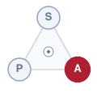
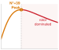

# The Physical Body {#sec-body}

::: {layout-narrow}
::: {.column-margin}

\chapterminitoc

:::

::: {.content-visible when-format="pdf"}
\noindent
{fig-alt="Isometric blueprint showing the physical body architecture: Brushless DC (BLDC) motor stator coils, rotor inertia, planetary gearset, optical encoder, output drive flange, and thermal heatsink."}
:::

::: {.content-visible unless-format="pdf"}
{fig-alt="Isometric blueprint showing the physical body architecture: BLDC stator coils, rotor inertia, planetary gearset, optical encoder, output drive flange, and thermal heatsink."}
:::

:::

## Purpose {.unnumbered .unlisted}

::: {.content-visible when-format="pdf"}
\begin{marginfigure}
\vspace{1em}
\resizebox{\linewidth}{!}{\mlphysicalstackfull{20}{20}{100}{20}{20}}
\end{marginfigure}
:::

_What physical limits bound a learning agent the moment its mathematical tokens command physical motors and moving mass?_

A moving machine cannot pause for software. During inference, the physical world advances: positions change and observations age. Stopping requires latency to process a command and distance to dissipate kinetic energy. Furthermore, motors and transmissions rigidly constrain how quickly motion can change, while electrical losses continuously heat the windings. Policies ignoring these constraints request impossible forces or unsustainable movements. Faster inference helps only within this physical path; it does not eliminate braking distance, mechanical response time, or thermal limits. These limits must be measured empirically under operational conditions. In physical AI systems architecture, the body sets the budgets that sensing, computation, and control must share, connecting each software decision to the motion and energy it produces.

::: {.column-margin .margin-pointer}
↰ **Prerequisite:** The physical plant grounds the four physical AI archetypes defined in @sec-boundary-four-archetypes.
:::



::: {.callout-learning-objectives}

- Calculate observation freshness limits from measurement age and the machine's allowable motion
- Determine stopping clearance from reaction delay, travel speed, and available braking
- Evaluate actuator and transmission choices against response limits and reflected inertia
- Estimate sustainable motor duty cycles from heat generation, cooling, and operating conditions
- Budget electrical supply margins for simultaneous actuation, computation, and regenerative braking
- Diagnose coupled physical limits using measurements from an assembled machine under representative stress

:::

## The Five Physical Budgets {#sec-body-five-budgets}

A robotic manipulator can shatter its transmission even after receiving an emergency stop command before contact. The stop command traverses software buffers, the power inverter switches states, and the motor generates peak reverse torque. Yet if the moving link possesses kinetic energy exceeding the mechanical work the actuators can perform over the remaining clearance, impact is mathematically guaranteed. In pure software, a faulted thread can be killed instantly by the operating system kernel. In physical reality, moving mass carries momentum that cannot be caught by an exception handler, and an electrical power stage cannot deliver infinite current without thermal destruction or voltage collapse. The fundamental truth of physical AI is that software cannot override the conservation laws of physics.

::: {#dfn-body-actuator-authority-budget .callout-definition title="The actuator authority budget"}

***Actuator authority budget***\index{Actuator authority budget!definition}\index{Torque-thermal horizon} is the combination of force available at the load, time needed to deliver it, and heat the installed actuator can sustain. A software setpoint outside that envelope cannot be realized as commanded; the actuator, drive, or transmission may saturate or overheat. Later sections derive its electrical and thermal limits.

1.  **Significance**: A proposed motion must fit delivered force and response time, not merely a digital command range.
2.  **Distinction**: A static motor datasheet rating does not account for the installed transmission, available supply, or cooling path.
3.  **Common pitfall**: Treating advertised peak torque as a continuous rating when winding temperature requires derating.

:::

Within the physical AI stack (@fig-02-locator), this chapter focuses on Layer 1: the Physical Body. Operating beneath the real-time Nervous System and Cognitive Brain, the body represents the foundational electromechanical plant. Across the Proposal-Permission Privilege Boundary,[^fn-body-budget-enforcement] high-level neural policies propose motion trajectories. The physical body, however, establishes the non-negotiable physical laws—mechanics, thermodynamics, and electromagnetism—that define whether any proposed motion is physically possible. Software cannot negotiate with momentum, and gradient descent cannot rewrite the conservation of energy.

[^fn-body-budget-enforcement]: **Budget Enforcement**\index{Proposal-permission architecture!budget enforcement}\index{Budget enforcement}: In the proposal-permission architecture, the high-level policy is never trusted to self-police its torque or thermal consumption. The nervous system evaluates proposed setpoints against real-time physical budget models, clamping or rejecting commands that would exceed measured hardware ceilings.

::: {#fig-02-locator fig-env="figure" fig-pos="htb" fig-cap="**The body in the Physical AI stack**: The four-tier physical AI systems architecture highlights the physical world at its foundation, bounded by mechanics, thermodynamics, and electromagnetism. Above the causal boundary, the nervous system and learned brain must budget all sensing latency, stopping distances, and actuation requests against these non-negotiable physical constraints." fig-alt="Diagram titled Physical AI Systems Architecture Stack, drawn as four stacked tiers. Layer 4 is system governance and assurance at 0.1 to 1 hertz, holding boxes for shared autonomy, verification, safety cases, and frontier limits. Layer 3 is the brain, a cognitive deliberation tier at 1 to 50 hertz, holding five stages named ingestion, perception, memory, intent, and planner. A dashed proposal-permission privilege boundary separates it from layer 2, the nervous system, a real-time safety and timing tier at 1000 hertz. Layer 1 is the physical body and continuous plant. Layer 1 is outlined in red and the badge reads Active Focus, Chapter 02, The Body."}
{width="100%"}
:::

To transform these continuous physical realities into rigorous systems specifications, every software setpoint draws against five non-negotiable physical budgets:

1. **Measurement freshness**\index{Measurement freshness!definition}: The rate at which the physical environment changes relative to the age of the sensor data reaching the controller. Because the world does not pause for computation, elapsed time during communication and inference means the machine always acts on historical state.
2. **Kinetic momentum**\index{Kinetic momentum!definition}: The stopping distance and braking force required to dissipate stored kinetic energy ($E_k = \frac{1}{2} m v^2$) before colliding with obstacles or exceeding workcell boundaries.
3. **Actuator bandwidth and reflected inertia**\index{Actuator bandwidth!definition}\index{Reflected inertia!definition}: The speed at which mechanical torque and velocity can change before winding inductance ($\tau_e = L/R$), inverter current clamps, or gear transmission inertia ($N^2 J$) choke mechanical acceleration.
4. **Thermal capacity**\index{Thermal capacity!definition}: The rate at which resistive Joule heat accumulates in stator coils and power semiconductors relative to the chassis dissipation rate, bounding sustained duty cycles before thermal throttling intervenes.
5. **Electrical power integrity**\index{Electrical power integrity!definition}: The transient voltage droop, peak current capacity, and regenerative energy surges across the shared direct-current distribution bus during rapid acceleration and braking.

Across the three physical archetypes introduced in @sec-boundary-four-archetypes, these five budgets manifest in distinct physical bottlenecks:

- **Mobile Systems (AMR / AGV)**: Kinetic momentum and measurement freshness dominate. Because an unladen $80\text{ kg}$ chassis traveling at $2.0\text{ m/s}$ carries $160\text{ J}$ of kinetic energy, stopping distance ($\Delta d = v^2 / 2a_{\max}$) and tire traction limits bound safe velocity through human-shared aisles.
- **Manipulators (Articulated Arms)**: Reflected inertia ($N^2 J_m$) and thermal capacity govern operation. High-ratio strain-wave gearing ($N = 100:1$) amplifies rotor inertia by $10{,}000\times$, while unventilated limb castings trap $I^2R$ Joule heating during prolonged static payload holding.
- **Process and Energy Systems**: Electrical power integrity and thermal dissipation dictate stability. Rapid valve throttling and pump motor starts induce sharp DC-bus voltage droops ($\Delta V = I_{\text{surge}} R_{\text{bus}}$), demanding aggressive capacitor banks and dynamic braking choppers.

::: {#psp-body-conservation-budgets .callout-perspective title="The five physical conservation budgets"}
The **physical body**\index{Physical body!definition} is the foundational electromechanical, thermodynamic, and structural plant—comprising actuators, transmissions, structural linkages, power distribution buses, and transducers—that interacts directly with the physical universe. Every actuation is an irreversible physical event that draws against these five non-negotiable physical budgets.
:::

A recurring failure mode in physical AI engineering stems from reading component datasheets as operational guarantees. Consider an illustrative actuator tested on an open dynamometer bench at $25^\circ\text{C}$ ambient temperature with a large heat sink and regulated supply. Inside an assembled machine, that actuator sits in an unventilated limb beside an inference processor dissipating sixty watts. If cavity temperature rises to $55^\circ\text{C}$ and thermal resistance increases, a nominal $4.2\text{ N}\cdot\text{m}$ continuous rating may no longer be available; a lower installed limit such as $1.8\text{ N}\cdot\text{m}$ must be established by measurement. The operational envelope is the one qualified on the assembled hardware under declared thermal and electrical stress.

The following sections turn each budget into a measurement or operating limit, then compare them across machine classes in @sec-body-archetype-matrix. Measurement age begins at physical transduction, before a Python process receives the data.[^fn-body-transduction-clock]

[^fn-body-transduction-clock]: **Transduction Timestamps**\index{Transduction timestamps}\index{Hardware timestamps!PHY capture}: The physical age of a measurement begins when photons hit a camera photodiode or magnetic flux passes a Hall sensor, not when a Python process receives the tensor. Precise age accounting requires hardware timestamps captured at the physical PHY interface to prevent operating system scheduling jitter from corrupting latency tracking.

## Measurement Freshness {#sec-body-measurement-freshness}

On a fast-moving logistics sorting line, a vision-guided robotic manipulator tracks parcels rushing past on a conveyor belt at $1.2\text{ m/s}$. To pick a moving target without missing or colliding with the guide rails, the robot's control policy must know precisely where the object is in physical space. Yet during the time required for photons to expose the image sensor, pixel data to stream across the PCIe bus, a neural network to infer a grasp pose, and motor windings to generate torque, the physical world advances.

In traditional software benchmarking, latency is often reported as the pure execution time of a neural network running on an accelerator. Following @sec-boundary-causal-boundary, that compute slice is only one segment of a longer causal chain. **A measurement decays from transduction; what matters is its age when acted upon.** The physical age of an observation spans the full interval from when photons strike a photodiode array or magnetic flux rotates past a Hall sensor, to when motor coils generate mechanical torque that alters the acceleration of a link. If a perception model computes an obstacle location in $15\text{ ms}$ but camera integration, sensor readout, transport, queue dispatch, and motor current rise time add another $45\text{ ms}$, the physical age of the measurement when the joint moves is $60\text{ ms}$. During that entire window, the physical world has continued to evolve.

::: {.column-margin .margin-pointer}
↳ **Downstream:** Measurement aging dynamics directly dictate the state estimation horizons in @sec-planning-continuous-trajectories.
:::

Tracking measurement age requires decomposing the complete physical path into eight distinct stages (@fig-02-latency-waterfall). First, physical integration and exposure capture the environment over an exposure window, setting the timestamp to the midpoint of integration. Second, sensor readout serializes analog charge into digital frames over a physical interface such as MIPI CSI-2 or SPI. Third, hardware transport moves the packet into host memory through direct memory access (DMA) controllers and PCIe/AXI buses. Fourth, kernel buffering and driver ingestion place the frame in user-space queues. Fifth, model computation executes neural network inference, filtering, or kinematic projection on an accelerator. Sixth, operating system scheduling and inter-process communication dispatch the resulting control setpoint across the processor boundary. Seventh, command transmission serializes the setpoint across a real-time fieldbus or shared-memory mailbox to the motor driver. Eighth, actuator response converts the command into pulse-width modulation signals, building magnetic field flux in the stator windings to develop mechanical force. On a canonical heterogeneous dual-brain platform, this eight-stage pipeline spans the CMOS image sensor $\to$ MIPI DMA into host memory $\to$ neural policy inference running on the Linux application processor (MPU) $\to$ inter-processor communication (IPC) over shared SRAM mailboxes via lock-free ring buffers $\to$ deterministic $1\text{ kHz}$ safety monitor evaluation on the real-time microcontroller (MCU) $\to$ PWM timer register updates $\to$ gate driver switching and stator coil current rise (governed by the actuator authority budget introduced in @sec-body-five-budgets). Every stage consumes a slice of the total time budget.

::: {#fig-02-latency-waterfall fig-env="figure" fig-pos="t" fig-cap="**Sense-to-actuation latency waterfall and silicon dataflow pipeline**: The eight-stage causal chain from exposure to motor current rise (panel a) and an illustrative latency profile (panel b). The conveyor's $24\text{ mm}$ tolerance at $1.2\text{ m/s}$ sets a $20\text{ ms}$ age deadline, because unguided travel converts elapsed time into displacement at the carriage speed. Both the synthetic $35.0\text{ ms}$ median and $68.4\text{ ms}$ tail exceed it, corresponding to $4.2\text{ cm}$ and $8.2\text{ cm}$ of motion, respectively. These are scenario values, not measured hardware results." fig-alt="Two-panel diagram. Panel (a) shows eight stages from sensor exposure through transport, inference, command transfer, and motor current rise. Panel (b) shows illustrative 35.0 and 68.4 millisecond timelines, both crossing a 20 millisecond freshness deadline; at 1.2 meters per second they correspond to 4.2 and 8.2 centimeters of conveyor motion."}
{width="100%"}
:::

The rate of world-state change dictates how long a measurement remains valid before acting on it introduces intolerable error. Let $e_{\max}$ denote the maximum acceptable error in a tracked state, such as joint position or distance to an obstacle, and let $v_{\max}$ denote the fastest credible velocity at which that state can evolve. The freshness deadline $\Delta t_{\text{fresh}}$ is the upper bound on measurement age before a control action based on that measurement becomes invalid, defined by the inequality
$$\Delta t_{\text{fresh}} \le \frac{e_{\max}}{v_{\max}}$$

For our conveyor-tracking manipulator operating with a maximum relative velocity $v_{\max} = 1.2\text{ m/s}$ and a geometric clearance tolerance $e_{\max} = 24\text{ mm}$, the freshness deadline is $24\text{ mm} / (1200\text{ mm/s}) = 20\text{ ms}$. If an actuation command reaches the motor based on an image captured $35\text{ ms}$ earlier, the workpiece has displaced by $42\text{ mm}$, exceeding the position allowance by $18\text{ mm}$ and missing the grasp under this constant-velocity approximation. This deadline limits motion-induced error when relative velocity is bounded and the initial observation is credible; sensing and estimation errors consume additional tolerance.

Engineers often compute total latency by summing the $P_{99}$ values of individual stages, but the percentile of a sum is not the sum of the percentiles.[^fn-math-quantile-convolution] Neither this arithmetic sum nor a measured end-to-end percentile is a hard worst-case bound. Shared memory contention and kernel queues can correlate stage delays, so the distribution of complete sense-to-torque age must be measured on the integrated machine under declared load. A safety deadline needs a separately justified bound or a monitored response when that bound cannot be maintained.

[^fn-math-quantile-convolution]: **Quantile Convolution**\index{Quantile convolution!tail non-additivity}: In general, the quantile of a latency sum differs from the sum of equal-percentile stage quantiles ($Q_p(X + Y) \ne Q_p(X) + Q_p(Y)$). Independence alone does not make their arithmetic sum a worst-case bound. Correlation from shared buses and queues changes the end-to-end tail and must be characterized at the system boundary.

To illustrate how stage timing differs from end-to-end age, consider a synthetic timing profile for the conveyor manipulator under continuous inference load. The values in @tbl-02-latency-breakdown are constructed for this example; they are not recorded cycles or a characterized machine.

| Pipeline Stage                     | Physical Mechanism / Contention Source                                | $P_{50}$ (ms) | $P_{99}$ (ms) | Max (ms) |
|:-----------------------------------|:----------------------------------------------------------------------|:-------------:|:-------------:|:--------:|
| **1–2. Sensor Exposure & Readout** | $60\text{ Hz}$ rolling shutter exposure midpoint                      |     $11.2$    |     $16.6$    |  $16.7$  |
| **3–4. Host Transport & DMA**      | PCIe DMA transfer into host memory                                    |     $1.4$     |     $3.2$     |  $6.8$   |
| **5. Vision Backbone & Policy**    | Onboard accelerator inference (memory throttling tail)                |     $18.5$    |     $24.1$    |  $38.4$  |
| **6. OS Scheduling & IPC**         | Kernel preemption and mailbox dispatch to MCU                         |     $0.6$     |     $2.1$     |  $12.3$  |
| **7. Fieldbus Transmission**       | Deterministic EtherCAT cyclic packet exchange                         |     $1.0$     |     $1.0$     |  $2.0$   |
| **8. Actuator Current Rise**       | Gate driver switching and stator flux buildup                         |     $2.3$     |     $3.0$     |  $4.5$   |
| **Arithmetic Stage Sum**           | Sum of each column's stage values; not an end-to-end quantile         |    **35.0**   |    **50.0**   | **80.7** |
| **Illustrative End-to-End Age**    | Constructed system-level profile ($t_{\text{transduction}} \to \tau$) |    **35.0**   |    **46.2**   | **80.7** |

: **Illustrative sense-to-actuation latency decomposition**: Synthetic stage and system-level timings show why arithmetic sums of stage percentiles do not establish the end-to-end tail. The example's $P_{99.9} = 68.4\text{ ms}$ exceeds the conveyor's $20\text{ ms}$ freshness deadline; these values have no measured exceedance rate or hardware provenance. {#tbl-02-latency-breakdown tbl-colwidths="[26,38,12,12,12]"}

In this constructed profile, the end-to-end ages are $P_{50} = 35.0\text{ ms}$, $P_{99} = 46.2\text{ ms}$, $P_{99.9} = 68.4\text{ ms}$, and a maximum of $80.7\text{ ms}$. The $50.0\text{ ms}$ sum of stage $P_{99}$ values differs from the illustrative $46.2\text{ ms}$ system percentile; the table does not establish a worst-case latency or the fraction of cycles above any threshold. For the $20\text{ ms}$ conveyor deadline, even the $35.0\text{ ms}$ median would be late. A real acceptance decision requires captured end-to-end timestamps and a bounded response to stale observations.

Executing an actuation command from expired sensor data adds phase lag to the feedback loop and can excite mechanical chatter when corrective torques reinforce rather than damp tracking errors.[^fn-math-bode-delay] High inference frequency alone does not establish timely physical response. The system must carry a hardware timestamp from transduction (using **IEEE 1588 gPTP**\index{IEEE 1588 gPTP!hardware timestamping}[^fn-hw-gptp-timestamp] or hardware strobe capture at the Ethernet PHY / **MIPI CSI-2**\index{MIPI CSI-2!sensor readout interface}[^fn-hw-mipi-capture] interface) through the pipeline. Before applying a policy command, the permission path compares $t_{\text{now}} - t_{\text{transduction}}$ with $\Delta t_{\text{fresh}}$. If age exceeds the deadline, it rejects the stale proposal and executes a fallback whose braking or holding behavior has been validated within the remaining physical margin [@brooks1986robust].

[^fn-math-bode-delay]: **Bode Delay Theorem and Phase Margin**\index{Bode delay theorem}\index{Phase margin!delay degradation}: Pure transport delay $\tau_d$ introduces an unyielding frequency-dependent phase lag $\Delta \phi = -\omega \tau_d$ radians without altering loop gain magnitude. In closed-loop feedback systems, this phase erosion degrades the phase margin ($\text{PM} = 180^\circ + \angle L(j\omega_c)$); once $\tau_d$ erodes the margin to zero at the gain-crossover frequency $\omega_c$, the closed-loop poles cross into the right-half complex plane, destabilizing the physical plant into destructive limit-cycle oscillations.

[^fn-hw-gptp-timestamp]: **IEEE 1588 gPTP**\index{IEEE 1588 gPTP!hardware timestamping}: The Generalized Precision Time Protocol (gPTP) provides sub-microsecond clock synchronization across Ethernet networks by exchanging hardware-timestamped packets directly at the network chip (media access control [MAC] PHY) layer. This guarantees timing precision by bypassing the unpredictable delays (jitter) of the operating system's software scheduler.

[^fn-hw-mipi-capture]: **MIPI CSI-2**\index{MIPI CSI-2!sensor readout interface}: The Mobile Industry Processor Interface Camera Serial Interface 2 (MIPI CSI-2) is a high-bandwidth, high-speed differential protocol used for transmitting uncompressed video data directly from image sensors to host system-on-chip (SoC) devices with minimal latency.

A bounded measurement age limits motion-induced state error only under a credible velocity bound and a valid initial observation. Sensor calibration, localization, and estimation errors need separate bounds. While signals propagate through the nervous system, the body continues moving, carrying momentum that no software interrupt can cancel.

::: {#chk-body-measurement-freshness .callout-checkpoint title="Transduction age and latency tails"}

Before analyzing vehicle kinetic momentum, verify your understanding of measurement freshness:

- [ ] **Transduction-to-torque causal chain**: Can you trace why measurement age begins at photon exposure on sensor silicon rather than when a neural network begins inference?
- [ ] **Quantile convolution non-additivity**: Can you explain why summing the 99th percentile latencies of individual pipeline stages fails to predict the true end-to-end tail latency across shared memory buses?
- [ ] **Freshness deadline derivation**: Can you calculate the maximum allowable measurement age for a manipulator tracking a workpiece moving at $1.5\text{ m/s}$ with a $15\text{ mm}$ tolerance?

:::

## Kinetic Momentum {#sec-body-kinetic-momentum}

A warehouse transport robot carrying $120\text{ kg}$ of palletized freight navigates a distribution floor at $2.0\text{ m/s}$. When a worker steps unexpectedly into the aisle $1.5\text{ m}$ ahead, software cannot simply pause execution or instantaneously zero its velocity vector. The vehicle's steel chassis and cargo carry unyielding mechanical momentum, and bringing that mass to rest requires dissipating kinetic energy across physical distance. **Stopping distance grows linearly with delay and quadratically with speed, and that difference sets the speed limit.**

The distance from sensing a hazard to zero velocity comprises two phases: reaction travel and braking travel. During the reaction interval, the nervous system executes the causal boundary pipeline established in @sec-boundary-causal-boundary. Throughout this full end-to-end sense-to-actuation delay $\Delta t_{\text{delay}}$, the actuators apply no retarding force, and the vehicle continues moving along its existing trajectory at its initial velocity $v_0$. Assuming velocity remains constant across this window, the reaction travel evaluates to
$$d_{\text{react}} = v_0 \Delta t_{\text{delay}}$$
Reaction travel is proportional to delay; thus, any latency in compute or communication extends reaction distance proportionally to velocity.

Once the brake command arrives and the actuators engage, the body enters the braking phase. The mechanical work done by the braking force $F_{\text{brake}}$ over the braking distance\index{Braking distance} $d_{\text{brake}}$ must dissipate the initial kinetic energy of the machine, $W = \Delta K$. For a machine of mass $m$ decelerating to rest under a sustained retarding force $F_{\text{brake}} = m a_{\text{brake}}$, the work-energy balance yields
$$m a_{\text{brake}} d_{\text{brake}} = \frac{1}{2} m v_0^2$$
Dividing by mass and solving for distance gives the kinematic braking travel
$$d_{\text{brake}} = \frac{v_0^2}{2 a_{\text{brake}}}$$
The parameter $a_{\text{brake}}$ is the credible deceleration the body can actually exert against the physical environment, not a theoretical peak rating printed on an actuator datasheet. It represents the sustained negative acceleration the mechanical structure, tires, and gears can produce before losing grip (tire-road shear slip saturation), tipping forward, or structural drive-train yield.

This closed-form expression for $d_{\text{brake}}$ relies on four simplifying assumptions: constant deceleration throughout the maneuver, instantaneous torque buildup at the contact interface, zero grade, and rigid contact mechanics. In physical hardware, these assumptions frequently fail. Actuator magnetic fields require time to build force, tire-ground friction can fall during slip, and structural compliance allows deflection. On uncertain terrain or grades, the model can underestimate stopping distance. Stopping trials across the declared operating envelope should measure trajectories at the load; a conservative low-tail deceleration estimate, with uncertainty and margin, can then replace the idealized $a_{\text{brake}}$. A sample percentile alone is not a hard lower bound.

::: {.column-margin .margin-pointer}
↳ **Downstream:** Unmanaged kinetic momentum translates directly into the destructive contact shock loads analyzed in @sec-body-actuator-limits.
:::

The differing exponents of the reaction and braking terms create an asymmetric scaling penalty when adjusting system parameters (@fig-02-stopping-distance). Because reaction travel scales linearly with delay ($d_{\text{react}} = v_0 \Delta t_{\text{delay}}$) while braking travel scales quadratically with speed ($d_{\text{brake}} = v_0^2 / 2 a_{\text{brake}}$), velocity acts as the dominant multiplier of spatial risk. A tail spike in compute latency inflates reaction displacement linearly, but increasing travel speed quadruples kinetic energy and braking distance. Latency establishes the baseline reaction overhead, but velocity governs the explosive expansion of the defended envelope—a scaling dynamic executed numerically in \ref{nbk-body-stopping-distance-budgeting-high-tail-compute}.

In unstructured environments, a machine cannot allocate its entire clearance to nominal stopping dynamics. Obstacle tracking carries state estimation uncertainty, sensor calibration drifts over time, and localization algorithms introduce position error. The system must defend a stopping envelope $d_{\text{stop}}$ that includes a spatial localization uncertainty bound $\delta_{\text{loc}}$ and a minimum physical clearance margin $\delta_{\text{margin}}$:[^fn-std-iso-separation]
$$d_{\text{stop}} = v_0 \Delta t_{\text{delay}} + \frac{v_0^2}{2 a_{\text{brake}}} + \delta_{\text{loc}} + \delta_{\text{margin}}$$
The sum $\delta_{\text{overhead}} = \delta_{\text{loc}} + \delta_{\text{margin}}$ represents fixed spatial overhead that must remain unoccupied when the body comes to a complete rest.

[^fn-std-iso-separation]: **ISO/TS 15066 Separation Distance**\index{ISO/TS 15066!separation distance}\index{Speed and Separation Monitoring}: ISO/TS 15066 (Clause 5.5.4) and ISO 13849-1 mandate this protective separation distance for Speed and Separation Monitoring (SSM): $S = (v_r \cdot T_r) + (v_h \cdot T_r) + S_r + S_s + C$, where $T_r$ is worst-case processing delay, $S_r$ is braking travel, and $C$ is clearance margin ($100\text{--}200\text{ mm}$). For learning policies operating in collaborative human workspaces, failing to bound compute tail latency directly inflates $T_r$, expanding the mandated safety separation zone and forcing premature protective stops.

::: {#fig-02-stopping-distance fig-env="figure" fig-pos="t" fig-cap="**Dynamic stopping distance envelope**: Total stopping distance decomposed into linear reaction lag, quadratic kinetic braking travel, and spatial overhead. Of the speed- and delay-dependent terms, doubling latency expands the pair by 17 percent, whereas doubling velocity quadruples braking travel for a 267 percent expansion; the spatial overhead is fixed. Case 1 operates with safe clearance; Case 2 compresses margin under tail latency; and Case 3 breaches the obstacle envelope when speed and compute delay couple." fig-alt="Chart illustrating dynamic stopping distance components: linear reaction lag proportional to delay, quadratic braking distance proportional to velocity squared, and fixed spatial overhead. Three trajectory plots compare nominal margin with latency-compressed clearance and an obstacle collision scenario."}

```{python}
#| echo: false
# ┌─────────────────────────────────────────────────────────────────────────────
# │ DYNAMIC STOPPING DISTANCE ENVELOPE (FIGURE)
# │ Context: @fig-02-stopping-distance
# │ Goal:    show why velocity, not latency, dominates the defended envelope
# │ Show:    the three-term decomposition for three coupled scenarios
# │ How:     d_stop = v*dt + v^2/(2a) + d_loc + d_margin, the chapter equation
# ├─────────────────────────────────────────────────────────────────────────────
import numpy as np
from mlsysim import viz

# ┌── 1. LOAD (Scenario parameters) ────────────────────────────────────────────
# Scenario inputs for this illustration. The overhead terms are the same
# localization allowance and clearance margin the chapter budgets later.
A_BRAKE = 2.0  # m/s^2, scenario surface and load assumption
DELTA_LOC = 0.05  # m, localization allowance
DELTA_MARGIN = 0.10  # m, physical clearance margin
D_CLEAR = 0.60  # m, distance to the tracked obstacle
CASES = [("Case 1", "Nominal", 1.0, 0.050), ("Case 2", "Tail latency", 1.0, 0.200), ("Case 3", "Coupled spike", 1.2, 0.200)]

# ┌── 2. EXECUTE (Compute) ─────────────────────────────────────────────────────
overhead = DELTA_LOC + DELTA_MARGIN
rows = []
for name, sub, v, dt in CASES:
    react = v * dt
    brake = v**2 / (2 * A_BRAKE)
    rows.append((name, sub, v, dt, react, brake, react + brake + overhead))

# ┌── 3. PLOT ──────────────────────────────────────────────────────────────────
fig, ax, COLORS, plt = viz.setup_plot(figsize=(9, 3.6))
H = 0.58
for i, (name, sub, v, dt, react, brake, stop) in enumerate(rows):
    y = len(rows) - 1 - i
    left = 0.0
    for width, color, label in ((react, COLORS["BlueL"], "Reaction"), (brake, COLORS["BlueLine"], "Braking"), (overhead, COLORS["grid"], "Overhead")):
        ax.barh(y, width * 100, left=left * 100, height=H, color=color, edgecolor="white", linewidth=0.8, label=label if i == 0 else None, zorder=3)
        left += width
    if stop <= D_CLEAR:
        ax.barh(
            y,
            (D_CLEAR - stop) * 100,
            left=stop * 100,
            height=H,
            color=COLORS["GreenFill"],
            edgecolor="white",
            linewidth=0.8,
            label="Remaining margin" if i == 0 else None,
            zorder=3,
        )
    else:
        ax.barh(
            y,
            (stop - D_CLEAR) * 100,
            left=D_CLEAR * 100,
            height=H,
            color=COLORS["RedFill"],
            edgecolor=COLORS["RedLine"],
            linewidth=1.0,
            hatch="//",
            label="Breach" if i == len(rows) - 1 else None,
            zorder=4,
        )
    ax.text(-2, y, f"{name}\n{sub}", ha="right", va="center", fontsize=9, linespacing=1.4)
    ax.text(max(stop, D_CLEAR) * 100 + 2.0, y, f"{stop*100:.0f} cm", va="center", fontsize=8.5, color=COLORS["primary"], zorder=6)

ax.axvline(D_CLEAR * 100, color=COLORS["RedLine"], lw=1.4, linestyle=(0, (5, 4)), zorder=5)
ax.text(D_CLEAR * 100, len(rows) - 0.42, f"  obstacle at {D_CLEAR*100:.0f} cm", color=COLORS["RedLine"], fontsize=9, va="bottom")

ax.set_yticks([])
ax.set_xlim(0, 90)
ax.set_ylim(-0.7, len(rows) - 0.25)
ax.set_xlabel("Distance travelled before rest (cm)")
ax.grid(True, axis="x", zorder=0)
ax.grid(False, axis="y")
for side in ("left", "top", "right"):
    ax.spines[side].set_visible(False)
handles, labels = ax.get_legend_handles_labels()
seen = dict(zip(labels, handles))
ax.legend(seen.values(), seen.keys(), loc="upper center", bbox_to_anchor=(0.5, -0.30), ncol=5, frameon=False, fontsize=8.5)
plt.tight_layout()
plt.show()
```

:::

For a stationary obstacle detected at distance $D_{\text{clear}}$, the modeled stopping envelope must fit the clear path, $d_{\text{stop}} \le D_{\text{clear}}$. Given a feasible current state and conservative timing and braking bounds, the permission path can solve this inequality for a ceiling on new velocity proposals $v_{\text{max}}$. The positive root of the quadratic inequality[^fn-math-velocity-root] is:
$$v_{\text{max}} = -a_{\text{brake}} \Delta t_{\text{delay}} + \sqrt{(a_{\text{brake}} \Delta t_{\text{delay}})^2 + 2 a_{\text{brake}} (D_{\text{clear}} - \delta_{\text{loc}} - \delta_{\text{margin}})}$$
When sensor range degrades or an obstacle enters the trajectory, $D_{\text{clear}}$ contracts and lowers the ceiling, provided the available distance remains nonnegative. At zero available distance the ceiling is zero. If the machine is already moving, however, a zero setpoint cannot remove its current stopping distance; a negative available distance means the admission condition is already violated and requires an emergency response.

[^fn-math-velocity-root]: **Kinematic Velocity Root**\index{Kinematic velocity root!quadratic clearance}: Grouping the constant spatial terms into available physical distance $D_{\text{avail}} = D_{\text{clear}} - \delta_{\text{loc}} - \delta_{\text{margin}}$ yields the quadratic inequality $\frac{1}{2 a_{\text{brake}}} v_0^2 + \Delta t_{\text{delay}} v_0 - D_{\text{avail}} \le 0$. Multiplying by $2 a_{\text{brake}}$ produces $v_0^2 + 2 a_{\text{brake}} \Delta t_{\text{delay}} v_0 - 2 a_{\text{brake}} D_{\text{avail}} \le 0$. Applying the quadratic formula and taking the positive physical root defines the dynamic velocity ceiling.

```{python}
#| label: amr-stopping-budget-calc
#| echo: false
# ┌─────────────────────────────────────────────────────────────────────────────
# │ AMR (Autonomous Mobile Robot) STOPPING DISTANCE BUDGETING (LEGO)
# ├─────────────────────────────────────────────────────────────────────────────
# │ Context: This section covers key concepts in physical AI systems: 'stopping distance'—the minimum distance for a system to stop—and 'high-tail compute', the resources allocated for extreme or unexpected scenarios. Understanding their interrelation is crucial for effective system design and performance.
# │ Goal:    Budget the physical stopping distance for an Autonomous Mobile Robot (AMR) by considering tail compute latency's influence on control signal timing. This latency affects the robot's real-time response, impacting its safe stopping distance. Key factors like speed, friction, and braking dynamics must be accounted for.
# │ Show:    In vehicle dynamics, stopping distances are defined as: d_react (11.7 cm) represents the distance traveled during the driver's reaction time, d_brake (54.0 cm) is the distance covered while braking, and d_stop (80.7 cm) is the total stopping distance. These distances are critical for understanding how speed (2.4 m/s) affects a vehicle's safe stopping ability, especially in designing autonomous systems requiring timely decisions.
# │ How:     Understanding the kinematic model, which describes object motion, is crucial before examining the equation. 'v' is the object's velocity, 'tau_delay' is the system's response time delay, and 'a_brake' is the maximum deceleration of the braking system. The equation can be interpreted as follows: the term 'v * tau_delay' accounts for the distance traveled during the delay, while 'v^2 / (2 * a_brake)' calculates the stopping distance based on the object's velocity and braking capability. These elements relate directly to the performance and safety of physical AI systems.
# └─────────────────────────────────────────────────────────────────────────────
from mlsysim import *
from mlsysim.core.units import *
from mlsysim.fmt import fmt_qty, fmt_length, fmt_energy, fmt_time, fmt_velocity, fmt_acceleration, fmt_display_math, check

class AMRStoppingBudget:
    """Stopping distance budgeting for an autonomous mobile robot under high-tail compute latency."""

    # ┌── 1. LOAD (Constants & Parameters) ─────────────────────────────────
    amr = Embodied.AMR.LogisticsAMR
    mass = amr.mass
    v0 = amr.max_velocity
    tau_delay = 65 * millisecond  # scenario assumption, not a measured bound
    a_brake = 3.0 * (meter / (second**2))  # scenario surface/load assumption
    delta_loc = 0.05 * meter  # scenario uncertainty allowance
    delta_margin = 0.10 * meter  # scenario clearance margin

    # ┌── 2. EXECUTE (Compute) ─────────────────────────────────────────────
    d_react = (v0 * tau_delay).to(meter)
    d_brake = ((v0**2) / (2 * a_brake)).to(meter)
    ke = calc_kinetic_energy(mass, v0)
    d_stop = calc_safe_stopping_distance(v0, tau_delay, a_brake, loc_margin=delta_loc, physical_margin=delta_margin)

    # Scaling at v1 = 2.4 m/s (+33%)
    v1 = 2.4 * (meter / second)
    d_react_v1 = (v1 * tau_delay).to(meter)
    d_brake_v1 = ((v1**2) / (2 * a_brake)).to(meter)
    d_stop_v1 = calc_safe_stopping_distance(v1, tau_delay, a_brake, loc_margin=delta_loc, physical_margin=delta_margin)
    d_stop_expansion = d_stop_v1 - d_stop

    # ┌── 3. GUARD (Invariants) ───────────────────────────────────────────
    check(abs(d_react.magnitude - 0.117) < 0.001, f"Unexpected reaction drift: {d_react}")
    check(abs(d_brake.magnitude - 0.540) < 0.001, f"Unexpected braking distance: {d_brake}")
    check(abs(ke.to(joule).magnitude - 243.0) < 0.1, f"Unexpected kinetic energy: {ke}")
    check(abs(d_stop.magnitude - 0.807) < 0.001, f"Unexpected stopping distance: {d_stop}")
    check(abs(d_react_v1.magnitude - 0.156) < 0.001, f"Unexpected scaled reaction drift: {d_react_v1}")
    check(abs(d_brake_v1.magnitude - 0.960) < 0.001, f"Unexpected scaled braking distance: {d_brake_v1}")
    check(abs(d_stop_v1.magnitude - 1.266) < 0.001, f"Unexpected scaled stopping distance: {d_stop_v1}")
    check(abs(d_stop_expansion.magnitude - 0.459) < 0.001, f"Unexpected clearance buffer loss: {d_stop_expansion}")

    # ┌── 4. OUTPUT (Formatting) ──────────────────────────────────────────
    mass_str = fmt_qty(mass, kilogram, precision=0)
    v0_str = fmt_velocity(v0, unit=meter / second, precision=1)
    tau_delay_str = fmt_time(tau_delay, 'millisecond', precision=0)
    a_brake_str = fmt_acceleration(a_brake, unit=meter / (second**2), precision=0)
    delta_loc_str = fmt_length(delta_loc.to(ureg.centimeter), unit=ureg.centimeter, precision=0)
    delta_margin_str = fmt_length(delta_margin.to(ureg.centimeter), unit=ureg.centimeter, precision=0)
    d_react_m_str = fmt_length(d_react, unit=meter, precision=3)
    d_react_cm_str = fmt_length(d_react.to(ureg.centimeter), unit=ureg.centimeter, precision=1)
    d_brake_m_str = fmt_length(d_brake, unit=meter, precision=3)
    d_brake_cm_str = fmt_length(d_brake.to(ureg.centimeter), unit=ureg.centimeter, precision=0)
    ke_str = fmt_energy(ke, unit=joule, precision=0)
    d_stop_cm_str = fmt_length(d_stop.to(ureg.centimeter), unit=ureg.centimeter, precision=1)

    v1_str = fmt_velocity(v1, unit=meter / second, precision=1)
    d_react_v1_cm_str = fmt_length(d_react_v1.to(ureg.centimeter), unit=ureg.centimeter, precision=1)
    d_brake_v1_cm_str = fmt_length(d_brake_v1.to(ureg.centimeter), unit=ureg.centimeter, precision=0)
    d_stop_v1_cm_str = fmt_length(d_stop_v1.to(ureg.centimeter), unit=ureg.centimeter, precision=1)
    d_stop_expansion_cm_str = fmt_length(d_stop_expansion.to(ureg.centimeter), unit=ureg.centimeter, precision=1)

    d_react_display_math = fmt_display_math(
        rf"d_{{\text{{react}}}} = v_0 \Delta t_{{\text{{delay}}}} = ({v0_str}) \times ({tau_delay_str}) \approx {d_react_m_str} = {d_react_cm_str}"
    )
    d_brake_display_math = fmt_display_math(
        rf"d_{{\text{{brake}}}} = \frac{{v_0^2}}{{2 a_{{\text{{brake}}}}}} = \frac{{({v0_str})^2}}{{2 \times ({a_brake_str})}} \approx {d_brake_m_str} = {d_brake_cm_str}"
    )
    d_stop_display_math = fmt_display_math(
        rf"d_{{\text{{stop}}}} = d_{{\text{{react}}}} + d_{{\text{{brake}}}} + \delta_{{\text{{loc}}}} + \delta_{{\text{{margin}}}} = {d_react_cm_str} + {d_brake_cm_str} + {delta_loc_str} + {delta_margin_str} = {d_stop_cm_str}"
    )
    d_scale_react_display_math = fmt_display_math(
        rf"d_{{\text{{react}}}} = ({v1_str}) \times ({tau_delay_str}) = {d_react_v1_cm_str} \quad (+33.3\%)"
    )
    d_scale_brake_display_math = fmt_display_math(
        rf"d_{{\text{{brake}}}} = \frac{{({v1_str})^2}}{{2 \times ({a_brake_str})}} = {d_brake_v1_cm_str} \quad (+77.8\%)"
    )
    d_scale_stop_display_math = fmt_display_math(
        rf"d_{{\text{{stop}}}} = {d_react_v1_cm_str} + {d_brake_v1_cm_str} + 15.0\text{{ cm}} = {d_stop_v1_cm_str} \quad (+56.9\%)"
    )
```

::: {#nbk-body-stopping-distance-budgeting-high-tail-compute .callout-notebook title="Stopping distance under tail latency"}
**Problem**: The registry's `{python} AMRStoppingBudget.mass_str` logistics AMR travels at $v_0 =$ `{python} AMRStoppingBudget.v0_str`. For this illustrative surface and control path, assume a sense-to-braking delay of $\Delta t_{\text{delay}} =$ `{python} AMRStoppingBudget.tau_delay_str`, deceleration $a_{\text{brake}} =$ `{python} AMRStoppingBudget.a_brake_str`, localization allowance $\delta_{\text{loc}} =$ `{python} AMRStoppingBudget.delta_loc_str`, and clearance margin $\delta_{\text{margin}} =$ `{python} AMRStoppingBudget.delta_margin_str`. These are scenario inputs, not measured safety bounds. What stopping envelope does the model give, and how does it scale if speed increases to `{python} AMRStoppingBudget.v1_str`?

**1. Reaction travel ($d_{\text{react}}$):**
During the `{python} AMRStoppingBudget.tau_delay_str` sensing and compute delay, the chassis coasts unguided:
`{python} AMRStoppingBudget.d_react_display_math`

**2. Braking travel ($d_{\text{brake}}$):**
Dissipating kinetic energy ($E_k = \frac{1}{2} m v_0^2 =$ `{python} AMRStoppingBudget.ke_str`) under sustained mechanical deceleration:
`{python} AMRStoppingBudget.d_brake_display_math`

**3. Total defended stopping envelope ($d_{\text{stop}}$):**
`{python} AMRStoppingBudget.d_stop_display_math`

**4. Scaling impact of 33 percent speed increase ($v_0 =$ `{python} AMRStoppingBudget.v1_str`):**
`{python} AMRStoppingBudget.d_scale_react_display_math`
`{python} AMRStoppingBudget.d_scale_brake_display_math`
`{python} AMRStoppingBudget.d_scale_stop_display_math`
A 33 percent speed increase expands stopping distance by nearly 57 percent, eroding `{python} AMRStoppingBudget.d_stop_expansion_cm_str` of clearance.

**Architect's Rule of Thumb**: *Doubling travel speed quadruples kinetic braking distance while doubling reaction travel; never increase velocity setpoints without dynamically solving the clearance quadratic.*
:::

::: {#exmp-body-dynamic-velocity-ceiling-governor-1-khz .callout-example title="Dynamic velocity ceiling governor"}
**Inputs**:

- $D_{\text{clear}} \in \mathbb{R}_{\ge 0}$: Detected obstacle distance along travel vector $[\text{m}]$.
- $\Delta t_{\text{delay}} \in \mathbb{R}_{> 0}$: Conservatively bounded sense-to-braking delay, including actuator response $[\text{s}]$; a measured $P_{99.9}$ alone is insufficient.
- $a_{\text{brake}} \in \mathbb{R}_{> 0}$: Conservative lower bound on available brake deceleration under the declared load and surface $[\text{m/s}^2]$.
- $\delta_{\text{loc}}, \delta_{\text{margin}} \in \mathbb{R}_{\ge 0}$: Localization uncertainty bound and physical clearance margin $[\text{m}]$.
- $v_{\text{now}} \in \mathbb{R}_{\ge 0}$: Current forward speed $[\text{m/s}]$.
- $v_{\text{cand}} \in \mathbb{R}_{\ge 0}$: Candidate forward velocity setpoint proposed by neural policy $[\text{m/s}]$.

**Output**:

- $v_{\text{safe}} \in \mathbb{R}_{\ge 0}$: Clamped velocity request within the modeled ceiling while the current state remains feasible $[\text{m/s}]$.

**Conditional Admission Check** (while the current state is feasible):

1. Modeled stopping distance: $d_{\text{stop}}(v_{\text{safe}}) = v_{\text{safe}} \Delta t_{\text{delay}} + \frac{v_{\text{safe}}^2}{2 a_{\text{brake}}} + \delta_{\text{loc}} + \delta_{\text{margin}} \le D_{\text{clear}}$ under bounded delay, available braking, a stationary obstacle, and valid clearance estimates.
2. Non-Negativity: $v_{\text{safe}} \ge 0.0$.

**Algorithm Steps**:

1. Compute available physical braking distance:
   $$D_{\text{avail}} \leftarrow D_{\text{clear}} - \delta_{\text{loc}} - \delta_{\text{margin}}$$

2. If $D_{\text{avail}} \le 0.0$, reject the proposal; hold at zero if stationary, or request the maximum available risk-reducing brake response if moving, and flag lost clearance. Otherwise check $v_{\text{now}}\Delta t_{\text{delay}} + v_{\text{now}}^2/(2a_{\text{brake}}) \le D_{\text{avail}}$ before admitting another proposal. If that check fails, request the same emergency response and flag lost feasibility. A zero velocity setpoint cannot stop existing motion immediately.
3. Compute quadratic discriminant:
   $$\text{disc} \leftarrow (a_{\text{brake}} \Delta t_{\text{delay}})^2 + 2 a_{\text{brake}} D_{\text{avail}}$$

4. Solve positive physical root for dynamic velocity ceiling:
   $$v_{\max} \leftarrow -a_{\text{brake}} \Delta t_{\text{delay}} + \sqrt{\text{disc}}$$

5. Enforce dynamic clamping against policy proposal:
   $$v_{\text{safe}} \leftarrow \min(v_{\text{cand}}, \max(0.0, v_{\max}))$$

6. Return $v_{\text{safe}}$.
:::

In [Class 1 machines]{#sec-body-class-1} (autonomous mobile robots, warehouse transport carts, and dynamic quadrupeds), the primary physical failure mode is **spatial boundary breach under unmanaged momentum**—the penetration of defended safety boundaries when a moving chassis cannot dissipate its stored kinetic energy within available clearance. Because kinetic energy $E_k = \frac{1}{2}m v^2$ cannot be recalled once delivered to the chassis, a delay spike extends reaction travel linearly ($d_{\text{react}} = v_0 \Delta t_{\text{delay}}$), eroding clearance before brakes engage. An independent real-time permission path can clamp a proposed forward velocity to the modeled ceiling $v_{\text{max}}(D_{\text{clear}}, \Delta t_{\text{delay}})$ while the current state remains feasible under its declared bounds.

The quadratic turns a fixed speed limit into a clearance-dependent ceiling for new proposals. A real-time permission mechanism can solve it on each control cycle, but the ceiling preserves stopping feasibility only if the machine enters the cycle inside the feasible set and can apply the assumed brake force within the bounded delay. Control Barrier Functions (CBF-QP) [@ames2019control] extend this reasoning to more general systems under valid dynamics, state estimates, timing bounds, and feasible control authority; the 1D root here is a simplified kinematic admission check. If range degrades or delay exceeds its bound, the permission path must reduce speed before margin is exhausted or execute a defined risk-reducing fallback. Once stopping distance exceeds available clearance, a later clamp cannot restore the lost margin.

Enforcing this speed limit assumes the nervous system can demand the deceleration $a_{\text{brake}}$ whenever safety requires it. Yet commanding rapid deceleration requires sudden, large mechanical torque from the drive motors and gearboxes. If the nervous system requests a torque step that exceeds the actuator authority budget established in @sec-body-five-budgets, the mechanical body cannot deliver the required deceleration, invalidating the model-based stopping ceiling and risking collision.

::: {#chk-body-kinetic-momentum .callout-checkpoint title="Kinetic momentum and dynamic speed limits"}

Before examining actuator mechanics and gearing, verify your understanding of stopping distance envelopes:

- [ ] **Linear versus quadratic scaling**: Can you explain why doubling compute latency expands the stopping envelope linearly while doubling travel speed expands it quadratically?
- [ ] **Dynamic velocity governor root**: Can you derive why solving $d_{\text{stop}} \le D_{\text{clear}}$ for maximum safe speed requires the positive root of a quadratic inequality rather than a linear clamp?
- [ ] **Spatial overhead margins**: Can you distinguish the physical roles of localization uncertainty ($\delta_{\text{loc}}$) versus protective clearance margin ($\delta_{\text{margin}}$) in defining a defended stopping boundary?

:::

## Actuator Transmission Limits {#sec-body-actuator-limits}

During a high-speed precision assembly cycle, a 6-axis articulated industrial robot arm attempts to seat a machined steel pin into a tight-tolerance bore. Building on the causal boundary established in @sec-boundary-causal-boundary, an electromechanical actuator possesses no software abstraction to catch invalid parameters or return an error status. When a learned neural policy commands a step change in joint torque beyond what the magnetic field can generate, or requests a discontinuous acceleration that strains gear teeth, the physical actuator does not report a software error. It pulls maximum phase current from the power stage, twists transmission shafts, and strains gear teeth while digital command registers in memory continue to report nominal execution. **An actuator may damage itself instead of reporting an error.**

An actuator contract cannot be specified in terms of digital setpoints. It must be written at the physical interface in terms of delivered force, torque, or mass flow, response latency, slew rate limits, and output error. A digital setpoint is merely a software request; physical action is bounded by winding inductance, bus voltage ceilings, magnetic saturation, and transmission elasticity.

::: {.column-margin}
{width="100%" fig-alt="S·P·A locator triad with the Act node highlighted."}

*The Act axis: non-smooth contact mechanics, reflected inertia, and thermal dissipation.*
:::

The delay between commanding a torque and delivering it at the motor shaft begins in the stator windings. Because motor coils possess physical inductance, current cannot change instantaneously. When a voltage is applied, current (and therefore torque) ramps up smoothly, governed by the electrical time constant of the motor (the complete differential derivation of the electrical RL time constant is detailed in @sec-appendix-systems). For a typical robotic joint actuator, delivering 95 percent of the target torque might take nearly 10 milliseconds. If an upstream policy assumes torque appears instantaneously, this interval passes as unguided drift and phase erosion before the arm can initiate corrective acceleration or braking.

In modern robotic actuators, this electromagnetic torque is synthesized through Field-Oriented Control (FOC) executing on dedicated real-time drive silicon at $10\text{--}25\text{ kHz}$.[^fn-hw-foc-current] From a systems perspective, the governing intuition is straightforward: driving current through the stator windings produces electromagnetic Lorentz torque in direct proportion to current ($\tau = K_t I$). However, even when an upstream policy issues an instantaneous torque request, the rate at which coil current can ramp up is physically constrained by the available DC bus voltage headroom:
$$\frac{di}{dt} \le \frac{V_{\text{bus}} - e_{\text{bemf}}}{L}$$
As the motor spins, its spinning rotor magnets simultaneously turn the actuator into an electrical generator—an **opposing dynamo** producing an internal voltage known as back-electromotive force ($e_{\text{bemf}} = K_e \omega$) that acts directly against the power supply. At low rotational speeds, generous voltage headroom ($V_{\text{bus}} - e_{\text{bemf}}$) permits rapid current rise rates and full peak torque. But as motor speed $\omega$ climbs toward its base rating $\omega_{\text{base}}$, this opposing dynamo effect consumes the available voltage headroom, squeezing $(V_{\text{bus}} - e_{\text{bemf}})$ toward zero. Once headroom collapses, the motor inverter cannot force additional current through the winding inductance regardless of gate duty cycle, capping both current rise rate ($di/dt$) and peak torque capability. When a learned policy commands explosive acceleration at high operating speeds, the actuator cannot deliver the requested torque step simply because physical electrical headroom has vanished.

[^fn-hw-foc-current]: **Field-Oriented Control (FOC) Current Loop**\index{Field-Oriented Control!current loop limits}: In digital motor drives, FOC current loops execute in dedicated gate driver hardware at $10\text{--}25\text{ kHz}$. The instantaneous phase current derivative $di/dt = (V_{\text{bus}} - e_{\text{bemf}})/L$ is physically bounded by the motor's phase inductance $L$ and the opposing back-EMF voltage $e_{\text{bemf}} = K_e \omega$. When an upstream neural policy commands step changes in torque, this inductive and back-EMF headroom ceiling delays torque realization, converting high-level mathematical steps into continuous, ramp-limited physical actions.

Even after the electrical rise time elapses, delivered torque is bounded by hard current limits in the drive electronics. Power inverters enforce a maximum current ceiling $I_{\text{max}}$ to protect switching transistors from thermal destruction and to prevent ferromagnetic saturation in the stator core. When the motor drives a mechanical transmission with gear reduction ratio $N$ and transmission efficiency $\eta$, the ceiling on delivered output torque is:
$$\tau_{\text{out, max}} = \eta N K_t I_{\text{max}}$$

When a high-level policy demands $120\text{ N}\cdot\text{m}$ of braking torque to avoid an obstacle, it assumes the motor drive will deliver it. But on real hardware, inverter current limits ($I_{\max} = 25\text{ A}$) and gear efficiency cap peak output torque at $85\text{ N}\cdot\text{m}$. The missing $35\text{ N}\cdot\text{m}$ is silently clipped at the power stage. Because the software planner remains unaware of the current clamp, the machine's actual stopping distance expands beyond its calculated safety boundary.

Transmissions introduce a severe mechanical asymmetry that software planners routinely ignore. To deliver high torque from a compact motor, robot joints rely on gear reductions with ratios $N$ ranging from $50:1$ to $160:1$. While gear reduction scales delivered torque linearly by $N$, it forces the motor rotor to spin $N$ times faster than the joint.

Because kinetic energy scales with the square of speed ($\frac{1}{2} J \dot{\theta}^2$), the effective resistance of the motor's rotor to joint acceleration scales with the **square of the gear ratio**:

$$J_{\text{ref}} = N^2 J_{\text{rotor}}$$

This **reflected rotor inertia**\index{Reflected rotor inertia!definition} means that in a $100:1$ transmission, a tiny $50\text{ g}$ motor rotor ($J_{\text{rotor}} \approx 5.6 \times 10^{-6}\text{ kg}\cdot\text{m}^2$) acts at the joint as if it has an inertia of $J_{\text{ref}} = 100^2 \times J_{\text{rotor}} = 0.056\text{ kg}\cdot\text{m}^2$—equivalent to the rotational inertia of an $11.2\text{ kg}$ solid steel flywheel with a $10\text{ cm}$ radius [@lynch2017modern].

To build physical intuition, consider trying to swing a sledgehammer holding the very tip of the handle versus choking up near the iron head, or riding a multi-speed bicycle up a steep hill in the highest gear ($N \gg 1$). In high gear, every tiny push on the pedal requires massive leg force because your legs fight the high mechanical leverage of the rear wheel. Now reverse the perspective: spinning the rear wheel backward by hand also has to accelerate the pedal crank. The reflected inertia makes backdriving harder, but does not lock the wheel. In a robotic arm with a $100:1$ strain-wave transmission, an obstacle impacting the gripper must accelerate a rotor whose reflected inertia is comparable to the stated $11.2\text{ kg}$ flywheel. Compliance, backlash, contact geometry, and any active control determine how the impact energy divides; tooth-root stress can rise enough to cause fatigue fracture (@fig-02-real-broken-gear-tooth).

The combined equation of motion for a geared joint driving load inertia $J_{\text{load}}$ with motor torque $\tau_{\text{motor}}$ is:
$$ \ddot{q} = \frac{N \tau_{\text{motor}}}{J_{\text{load}} + N^2 J_{\text{rotor}}} $$
Differentiating with respect to gear ratio $N$ reveals that peak joint acceleration occurs at the **inertia matching ratio**:
$$ N^* = \sqrt{\frac{J_{\text{load}}}{J_{\text{rotor}}}} $$
When $N < N^*$, joint acceleration is torque-limited. When $N > N^*$, counter-intuitively, increasing the gear ratio *decreases* delivered joint acceleration, because the motor spends the majority of its electromagnetic torque accelerating its own spinning rotor rather than moving the robot's physical link.

::: {.column-margin}
{width="100%" fig-alt="Two-tone curve of joint acceleration versus gear ratio peaking at thirty-nine then dropping sharply into a shaded red rotor-inertia-dominated regime."}

*Past the inertia-matching ratio, gearing chokes delivered joint acceleration.*
:::

Because the actuator cannot instantly deliver the massive torque needed to spin up this amplified inertia, the reflected inertia acts as a dynamic mechanical low-pass filter—smearing the software's sharp, instantaneous command into a sluggish, delayed physical response. This delivered output motion severely lags behind the policy's candidate setpoint, injecting unmodeled phase lag that erodes feedback stability, excites structural resonance, and spikes mechanical stress across the gear teeth. Motion-profile filtering (such as quintic polynomial splines or S-curve rate limiters) must be enforced by the real-time microcontroller to guarantee that requested joint acceleration $\ddot{q}$ remains within the current and voltage envelopes of the hardware [@lynch2017modern].

Furthermore, transmissions introduce backlash and compliance that decouple motor and load motion. When an actuator reverses direction, the motor shaft must rotate across mechanical clearance before the gear teeth engage the opposite flank. Coupled with torsional compliance in gear teeth and harmonic flexsplines (@fig-02-real-strain-wave-gear), reversal manifests at the output as lost motion, hysteresis, and phase lag. As Mark W. Spong demonstrated in flexible joint dynamics [@spong1987modeling], this elasticity means the robot link is not a rigid bar, but an elastic system coupled through torsional spring compliance. When a neural policy commands sudden, discontinuous torque steps across timestep boundaries, it excites structural resonance—much like plucking a stiff guitar string—driving the transmission into destructive limit-cycle vibrations and chatter. (The formal singular perturbation derivation of flexible joint dynamics is deferred to @sec-appendix-control-flexible-joints). Measuring position solely at the motor encoder conceals this deadband, because the motor turns smoothly while the physical output remains stationary until contact is made. Under reversing loads, the actual joint position $q_{\text{out}}$ departs from the ideal kinematic projection $q_{\text{motor}} / N$ by a load-dependent error $\delta_{\text{lost}}$. The nervous system perceives continuous trajectory tracking, yet the physical end-effector hesitates and then experiences an impulsive shock load as tooth engagement snaps closed. Under severe repetitive shock loads or high reflected inertia impacts, this localized stress concentration leads to fatigue fracture and catastrophic tooth shear (@fig-02-real-broken-gear-tooth).

::: {#psp-body-impedance-control .callout-perspective title="Impedance control for contact safety"}
If a learned policy commands target positions as rigid coordinates in an unyielding environment (such as a table or fixture with contact stiffness $k \ge 10^5\text{ N/m}$), a positional error of just $\Delta x = 1\text{ mm}$ causes contact forces to spike to $F = k \Delta x = 100\text{ N}$ within milliseconds. If the low-level controller tries to force the arm into that target coordinate at all costs, the motor inverter drives maximum current against the obstacle, risking tooth shear and structural damage.

As Neville Hogan established in his seminal formulation of impedance control [@hogan1985impedance], physical interaction cannot be framed as pure position control or pure force control. Because the physical environment dynamically behaves as an admittance (accepting commanded forces and yielding resultant motion), the robotic manipulator must be controlled as an impedance (accepting motion deviations and generating compliant contact forces: $F = Z(v)$). To protect the physical mechanism, the real-time microcontroller converts position setpoints into an active **virtual spring-damper system**\index{Virtual spring-damper system!definition}:
$$F_{\text{contact}} = K_p (x_{\text{des}} - x) + K_d (\dot{x}_{\text{des}} - \dot{x})$$
Rather than acting like an immovable steel bar, the physical joint behaves like a programmable mechanical suspension with virtual stiffness $K_p$ and damping $K_d$. When contact occurs, the mechanism yields compliantly, capping interaction forces and giving high-level software the physical margin of time needed to detect contact and replan before destructive stress shears gear teeth.
:::

::: {#fig-02-real-strain-wave-gear fig-env="figure" fig-pos="t" fig-cap="**Strain wave gear assembly**: Robotic strain wave transmission component set: (1) elliptical wave generator with flexible ball bearings, (2) flexible cup flexspline with external teeth, (3) rigid circular spline with internal teeth, and (4) transmission systems invariant governing reflected rotor inertia ($J_{\text{ref}} = N^2 J_m$). Elastic deformation enables zero initial backlash at high reduction ratios ($50:1$ to $160:1$), but introduces torsional compliance, hysteresis, and tooth fatigue vulnerability under sudden shock loads." fig-alt="Annotated component set of a robotic strain wave gear transmission, highlighting the wave generator, flexspline, circular spline, and reflected inertia invariant."}
{width="70%"}
:::

::: {#fig-02-real-broken-gear-tooth fig-env="figure" fig-pos="t" fig-cap="**Gear tooth shock fracture under high reflected inertia**: Macro-fracture of a high-torque transmission gear tooth undergoing cyclic stress testing at NASA Glenn Research Center: [①] intact gear tooth flank supporting continuous drive contact; [②] tooth root fillet stress concentration ($\sigma_b = \frac{K_v W_t}{b m Y}$), where cyclic tension initiates micro-cracking; [③] sheared tooth fragment with granular fatigue striations and sudden cleavage fracture under shock load; and [④] reflected rotor inertia ($J_{\text{ref}} = N^2 J_m$). A high gear ratio reduces backdrivability and can increase tooth-root stress under impact; compliance and the contact path determine how much energy reaches any one tooth." fig-alt="Annotated macro photograph of a fractured transmission gear tooth, identifying the intact flank, the root fillet crack initiation site, the sheared tooth fragment with granular cleavage surface, and the reflected rotor inertia formula."}
{width="65%"}
:::

Selecting an appropriate mechanical transmission architecture establishes the fundamental systems trade-offs between continuous torque density and backdrivability, as summarized in @tbl-02-mechanical-drives.

| Transmission Archetype           | Gear Ratio ($N$)                  | Reflected Inertia ($N^2$)                 | Implication for Physical AI Policies                                                                                                       |
|:---------------------------------|:----------------------------------|:------------------------------------------|:-------------------------------------------------------------------------------------------------------------------------------------------|
| **Direct Drive (No Gearing)**    | $1:1$ ($N = 1$)                   | $N^2 = 1$ (Minimal)                       | Transparently backdrivable; absorbs impact shocks; limited continuous torque density ($\sim 2\text{--}5\text{ N}\cdot\text{m/kg}$).        |
| **Quasi-Direct Drive (QDD)**     | $3:1\text{--}10:1$ ($N \le 10$)   | $N^2 \le 100$ (Low)                       | High backdrivability; enables proprioceptive torque sensing via motor current; high impact tolerance for dynamic quadrupeds and arms.      |
| **Cycloidal Drive (RV Reducer)** | $30:1\text{--}100:1$ ($N \ge 30$) | $N^2 \ge 900\text{--}10{,}000$ (High)     | Exceptional shock-load tolerance ($3\text{--}5\times$ peak rating via multi-pin contact); minimal backlash; moderate backdrivability.      |
| **Strain Wave (Harmonic Drive)** | $50:1\text{--}160:1$ ($N \ge 50$) | $N^2 \ge 2500\text{--}25{,}600$ (Extreme) | Zero initial backlash; compact co-axial form factor; low torsional stiffness ($k_s$); fragile under sudden tooth shear impact.             |
| **Planetary / Roller Screw**     | $N_{\text{eff}} \ge 50$ (Linear)  | $N^2 \ge 2500$ (Extreme)                  | Transforms rotary to linear motion; massive continuous force density ($>10\text{ kN}$); non-backdrivable; used in humanoid legs and knees. |
| **Open-Loop Stepper Motor**      | $1:1$ (High pole count)           | $N^2 = 1$                                 | High static holding torque at zero speed; silent state loss ("lost steps") when commanded acceleration exceeds magnetic pull-out torque.   |

: **Comparative systems matrix of actuator transmission mechanisms**: Quantitative trade-offs across robotic drive mechanisms, mapping reduction ratio ($N$), reflected rotor inertia scaling ($N^2$), and operational implications for learned control policies. {#tbl-02-mechanical-drives tbl-colwidths="[22,18,20,40]"}

To see how transmission sizing determines physical responsiveness, consider a bipedal humanoid knee joint that must rapidly accelerate a lower-leg link of inertia $J_{\text{load}} = 0.18\text{ kg}\cdot\text{m}^2$. The joint is driven by a brushless frameless motor producing peak torque $\tau_{\text{motor}} = 4.0\text{ N}\cdot\text{m}$ with rotor inertia $J_{\text{rotor}} = 1.2 \times 10^{-4}\text{ kg}\cdot\text{m}^2$. The optimal gear ratio that maximizes delivered joint angular acceleration is $N^* = \sqrt{J_{\text{load}} / J_{\text{rotor}}} = \sqrt{0.18 / (1.2 \times 10^{-4})} = \sqrt{1500} \approx 38.7 \approx 39$. At $N^* = 39$, the reflected inertia is $J_{\text{ref}} = (39)^2 (1.2 \times 10^{-4}\text{ kg}\cdot\text{m}^2) = 0.1825\text{ kg}\cdot\text{m}^2$, yielding an optimal joint acceleration of $\ddot{q}_{\text{opt}} = (39 \times 4.0\text{ N}\cdot\text{m}) / (0.18 + 0.1825\text{ kg}\cdot\text{m}^2) = 156 / 0.3625 \approx 430.3\text{ rad/s}^2$. If an engineer naively selects a $100:1$ harmonic drive to deliver $400\text{ N}\cdot\text{m}$ of gross torque, reflected rotor inertia expands to $J_{\text{ref}} = 100^2 \times (1.2 \times 10^{-4}) = 1.20\text{ kg}\cdot\text{m}^2$. Delivered joint acceleration plummets to $\ddot{q}_{100} = (100 \times 4.0) / (0.18 + 1.20) = 400 / 1.38 \approx 289.9\text{ rad/s}^2$—a 32.6 percent collapse in responsiveness, despite delivering $2.5\times$ more output torque, because 87.0 percent of the motor's torque ($1.20 / 1.38$) is consumed accelerating its own spinning rotor. In dynamic locomotion and manipulation, higher gear ratios degrade physical agility; gearboxes must be sized to match reflected inertia against payload dynamics.

::: {#chk-body-inertia-matching .callout-checkpoint title="Transmission sizing and reflected inertia"}

Before analyzing contact-rich manipulation, verify your understanding of inertia matching and drive dynamics:

- [ ] **Inertia matching condition**: Can you explain why the gear ratio maximizing link acceleration occurs when reflected rotor inertia equals load inertia ($N^2 J_{\text{rotor}} = J_{\text{load}}$)?
- [ ] **Torque vs. responsiveness trade-off**: Can you describe why oversizing a gearbox to deliver higher gross static torque can paradoxically reduce dynamic joint acceleration?
- [ ] **Backdrivability and impact absorption**: Can you distinguish how reflected inertia affects a joint's ability to absorb shock impacts in quasi-direct drive versus high-reduction harmonic drive transmissions?

:::

In [Class 2 machines]{#sec-body-class-2} (articulated robot arms, multi-fingered hands, and contact-rich assembly workcells), the primary physical failure mode is **destructive contact force spikes and drive-train tooth shear**. When a robot makes physical contact with an unmodeled workpiece or rigid environment, the interaction is governed by the non-smooth mechanics of unilateral contact, Coulomb friction cones, and kinematic constraints [@mason2001mechanics]. As Matthew T. Mason formalized in his foundational analysis of manipulation mechanics [@mason2001mechanics], physical interaction cannot be treated as smooth Euclidean regression: contact modes switch discontinuously between sticking, sliding, and separation, and stable grasp maintenance demands satisfying form-closure (wrapping around an object so it physically cannot escape) or force-closure (squeezing hard enough that friction prevents slipping) constraints under friction. If a policy commands tangential shear forces outside the friction cone ($F_{\text{tangential}} > \mu F_{\text{normal}}$), slip occurs instantly; conversely, if an unexpected rigid obstacle of stiffness $k$ is struck, contact force spikes at $F = k \Delta x$.

If the joint employs a high gear reduction ($N \ge 50$), the reflected rotor inertia $J_{\text{ref}} = N^2 J_{\text{rotor}} \ge 2500 J_{\text{rotor}}$ resists backdriving. Depending on compliance, control response, and contact path, impact energy can deform the transmission, move the load, or partly regenerate electrically; tooth-root stress may rise sharply. For contact-dominated manipulation, neural policies can use backdrivable Quasi-Direct Drive (QDD) actuators—developed for the MIT Cheetah by @seok2015design and @wensing2017proprioceptive, with low gear reduction ($N \le 10$) and lower reflected inertia ($N^2 \le 100$)—or remain behind real-time torque limits and impedance control.

The control path must limit requested acceleration and jerk to what the motor current, voltage, and transmission can deliver. A motor-side encoder alone can report smooth rotation while backlash leaves the output stationary or a damaged tooth lets the load lag. Load-side position or torque sensing reveals that disagreement; the permission path can then reject further force commands and enter a defined fallback.

::: {.column-margin .margin-pointer}
↳ **Downstream:** Mechanical gearhead fatigue cycles set the sample efficiency limits for reinforcement learning in @sec-training-learning-by-trial.
:::

Operating continuously near current and torque limits extracts an irreversible thermodynamic cost. Every ampere driven through the stator winding to overcome rotor inertia or sustain peak output torque dissipates resistive heat ($I^2 R$) directly into the copper coils. While magnetic flux builds within milliseconds, the heat it generates accumulates in the physical thermal mass of the actuator over seconds and minutes, creating a thermal clock that bounds how long peak torque can be delivered before insulation breaks down.

## Thermal Duty Cycles {#sec-body-thermal-duty-cycles}

Holding a $25\text{ kg}$ workpiece motionless places deceptive demands on articulated robots. In simulation, an AI agent sustains static holding torque indefinitely without penalty. On physical hardware, maintaining a static load against gravity demands continuous phase current through the stator coils, actively converting electrical energy into accumulating heat. **Heat arrives in seconds and leaves in minutes, making duty cycle a primary design variable.**

While mechanical momentum can be redirected and magnetic flux decays within milliseconds of opening a switch, thermal energy has no fast physical exit. Thermal capacity is the physical integral of power loss over time. What that capacity protects is a specific, inflexible material threshold, namely the dielectric breakdown rating of the stator winding insulation (the enamel coating that prevents adjacent copper turns from short-circuiting) and the Curie temperature of permanent rotor magnets (the thermal threshold where thermal agitation destroys ferromagnetic domain alignment, permanently demagnetizing the rotor) (@fig-02-real-burnt-motor-stator). Modern motor windings use polymer enamel coatings classified under standards such as IEC 60085, where Class F insulation withstands a maximum continuous hotspot temperature of $155^\circ\text{C}$ and Class H withstands $180^\circ\text{C}$. Exceeding this rating softens the polymer matrix, causing inter-turn shorts that destroy the phase winding. Neodymium-iron-boron ($\text{NdFeB}$) rotor magnets face a companion limit, where temperatures between $80^\circ\text{C}$ and $150^\circ\text{C}$ cause irreversible demagnetization under strong stator demagnetizing fields.

::: {#fig-02-real-burnt-motor-stator fig-env="figure" fig-pos="t" fig-cap="**Stator winding insulation breakdown**: Cutaway view of a damaged electric motor stator showing critical thermal subsystems: (1) copper phase windings (primary $I^2 R$ heat source), (2) dielectric slot liners and Nomex insulation breakdown threshold ($155^\circ\text{C}$, Class F), (3) laminated iron stator core ($C_{\text{th}}$ and dissipation path $\theta_{JA}$), and (4) rotor bore air gap and magnet thermal limits ($80^\circ\text{C}\text{--}150^\circ\text{C}$). (Source: Industrial Electromechanical Diagnostics Archive, CC BY 4.0)." fig-alt="Annotated photograph of a damaged motor stator with callout badges highlighting copper phase windings, dielectric slot liners, laminated stator core, and rotor bore."}
{width="85%"}
:::

The rate of heat generation follows directly from the current commanded through the motor phases. Resistive Joule dissipation dumps thermal power into the stator copper according to the relation $P_{\text{loss}}(t) = I^2(t) R(T)$.[^fn-hw-stator-rtd] This thermal power divides between rapidly heating the physical thermal mass of the winding and slowly conducting heat out to the motor casing and surrounding air (see @sec-appendix-systems for the complete thermal ODE integration and steady-state derivation).

Visualize thermal resistance ($\theta_{JA}$) and thermal capacitance ($C_{\text{th}}$) as a **leaky bucket**. Resistive Joule losses ($I^2 R$) pour water into the bucket like an open firehose. The volume of the bucket represents the thermal mass or capacitance of the copper windings and laminated stator iron ($C_{\text{th}}$): a larger bucket can buffer an intense burst of water for a few seconds without spilling over. At the bottom of the bucket is a narrow drain hole representing thermal dissipation to the environment through thermal resistance ($\theta_{JA}$): the higher the thermal resistance, the narrower the drain hole, and the slower heat escapes into surrounding air. If a policy demands an intense 3-second peak torque burst (a sprint across an obstacle), the water level rises rapidly, but as long as the bucket does not overflow (crossing the $155^\circ\text{C}$ Class F dielectric rating), the winding survives safely. However, if an agent commands continuous high holding torque (such as suspending a heavy tool against gravity indefinitely), the water level climbs until the inflow equals the maximum outflow through the drain hole. If the continuous inflow exceeds what the drain hole can pass at safe levels, the bucket overflows—softening the polymer enamel slot liners and inducing an irreversible electrical short circuit.

Because the thermal time constant of the motor ($\tau = \theta_{JA} C_{\text{th}}$) is typically on the order of minutes while resistive heating accumulates on the order of seconds, thermal dissipation behaves as a low-pass filter on power losses. In the steady-state, the equilibrium temperature is governed strictly by the balance between average resistive losses and the thermal resistance to the environment.

[^fn-hw-stator-rtd]: **Stator Resistance Thermal Sensitivity**\index{Stator resistance!thermal coefficient}\index{Copper resistance!temperature dependence}: The electrical resistivity of copper exhibits a positive temperature coefficient $\alpha_{\text{Cu}} \approx 0.00393\text{ K}^{-1}$, causing winding resistance to scale linearly as $R(T) = R_0 [1 + \alpha_{\text{Cu}}(T - T_0)]$. Across a motor's operating range from $20^\circ\text{C}$ to $140^\circ\text{C}$, stator resistance increases by $47.2\%$, demanding higher terminal voltages to sustain identical phase currents. For high-level policies holding heavy static payloads, this thermal feedback escalates resistive Joule losses ($I^2 R(T)$) into accelerated thermal runaway unless actively tracked by low-level thermal observers.

Building on the causal boundary established in @sec-boundary-causal-boundary, this formulation exposes why stator thermal limits create a hard, non-negotiable physical boundary for machine learning policies. Neural policies trained in simulation environments (such as Isaac Gym, MuJoCo, or PyBullet) optimize reward functions where torque is treated as an instantaneous, massless mathematical variable. In simulation, a policy can hold a heavy payload indefinitely, stiffen joint impedance through continuous high-torque antagonist co-contraction, or chatter rapidly across contact boundaries without incurring any physical consequence. On real physical hardware, sustained current $I$ pumps thermal energy into stator copper at an adiabatic initial rate $dT/dt \approx I^2 R / C_{\text{th}}$, yielding an initial quasi-adiabatic heating regime where thermal energy is trapped within the winding's thermal capacitance before conduction and convection can establish an equilibrium heat flux.

This thermodynamic cost is compounded by the positive temperature coefficient of copper ($\alpha_{\text{Cu}} \approx 0.00393\text{ K}^{-1}$). As the stator temperature climbs from $20^\circ\text{C}$ toward its $140^\circ\text{C}$ engineering ceiling, phase resistance increases by over 47 percent according to the linear relation $R(T) = R_0 [1 + \alpha_{\text{Cu}}(T - T_0)]$. To sustain identical commanded torque ($\tau = K_t I$), the inverter must deliver higher phase voltage, dissipating 47 percent more resistive power ($I^2 R(T)$) at the exact moment thermal cooling is least effective. This establishes a positive thermal feedback loop: higher winding temperatures elevate resistance, requiring higher terminal voltages and dissipating more resistive power to deliver identical electromagnetic torque, which further accelerates thermal rise. If a neural policy operates without constraints on torque commands, it can lead to a positive thermal feedback loop. This loop causes an increase in winding temperatures, which raises electrical resistance. As a result, higher terminal voltages are required to maintain the same electromagnetic torque, potentially accelerating the winding toward dielectric breakdown within seconds. Understanding these thermal dynamics is essential for designing robust control systems that can prevent overheating and ensure reliable operation.

In [Class 3 systems]{#sec-body-class-3} (grid-scale battery energy storage, liquid cooling distribution units, and continuous thermal regulation plants), the primary physical failure mode is **irreversible thermal accumulation and runaway**. Because heat arrives in seconds ($dT/dt \approx P_{\text{loss}} / C_{\text{th}}$) but leaves across minutes through thermal resistance ($\theta_{JA}$), learned policies regulating fluid and power plants cannot optimize short-term throughput at the expense of steady-state heat balance without inducing unrecoverable thermal trips.

Datasheet thermal specifications provide an optimistic baseline because manufacturers measure them under idealized laboratory conditions, typically mounting an unconstrained motor to a large aluminum heat sink in free air at $20^\circ\text{C}$ or $25^\circ\text{C}$. On an operational machine, the actuator operates inside a sealed chassis alongside power electronics, battery packs, and adjacent joint motors. Enclosing the motor eliminates ambient convective airflow, increasing the effective thermal resistance $\theta_{JA}$. Furthermore, neighboring computation and power conversion stages dump heat into the shared structural chassis, raising the local internal ambient temperature $T_{\text{amb}}$ well above external room temperature. A joint actuator operating near a graphics processor or battery pack can experience a local ambient of $45^\circ\text{C}$ to $55^\circ\text{C}$ before its own coils carry current. Accurately budgeting thermal margins requires measuring the installed heating and cooling time constants with the enclosure fully sealed and all adjacent electrical loads operating at their $P_{99}$ power draw.

::: {.column-margin .margin-pointer}
↳ **Downstream:** Real-time telemetry for thermal and power integrity budgets is transported by the deterministic fieldbuses analyzed in @sec-nervous-deterministic-fieldbuses.
:::

Because thermal capacity integrates power over time, a peak torque[^fn-hw-motor-intermittent] or peak current rating on a motor datasheet is physically meaningless without four accompanying parameters, specifically the initial winding temperature $T(0)$, the maximum allowable duration $t_{\text{on}}$, the operating ambient temperature $T_{\text{amb}}$, and the required recovery duration $t_{\text{off}}$. An actuator capable of producing three times its continuous rated torque can sustain that load only while the integral of $I^2 R$ remains within the thermal margin below the insulation limit. If the winding begins at room temperature, that burst can last tens of seconds. If the winding is already soaked at its continuous operating temperature from sustained motion, the identical current pulse reaches the insulation threshold in a fraction of that time.

[^fn-hw-motor-intermittent]: **Actuator Intermittent Duty Limits**\index{Actuator!intermittent torque}: Robotics motor datasheets prominently advertise peak torque ($\tau_{\text{peak}}$), but this rating is strictly intermittent and survivable for only $1\text{--}3\text{ seconds}$ before coil thermal limits are breached. Sustained dynamic maneuvering must be budgeted against continuous root-mean-square torque ($\tau_{\text{cont}} \approx 0.3\text{--}0.4\,\tau_{\text{peak}}$), otherwise aggressive neural policy commands will trip thermal protection and cause mid-motion limb collapse.

Consider the thermal budgeting for the shoulder joint of our heavy-payload arm under continuous rated load and transient peak acceleration (\ref{nbk-body-thermal-burst-limits}).

::: {#nbk-body-thermal-burst-limits .callout-notebook title="Transient thermal accumulation under cold vs. hot starts"}
An articulated arm shoulder joint with winding resistance $R = 1.2\ \Omega$, lumped thermal capacitance $C_{\text{th}} = 120\text{ J/K}$, and installed thermal resistance $\theta_{JA} = 2.5\text{ K/W}$ operates in an enclosed internal ambient $T_{\text{amb}} = 40^\circ\text{C}$ with Class F insulation rated to $155^\circ\text{C}$. The thermal time constant is $\tau = \theta_{JA} C_{\text{th}} = 300\text{ s}$ ($5.0\text{ min}$).

**Problem**: For a given motor and operating ambient, how does initial winding temperature affect the allowable duration of a $3.0\times$ rated current burst before the insulation temperature limit is breached?

**Math**:

1. **Continuous thermal equilibrium ($I_{\text{cont}} = 5.0\text{ A}$)**:
   - Steady-state resistive loss:
     $$P_{\text{cont}} = I_{\text{cont}}^2 R = (5.0\text{ A})^2 \times 1.2\ \Omega = 30.0\text{ W}$$
   - Equilibrium temperature rise:
     $$\Delta T_{\text{cont}} = P_{\text{cont}} \theta_{JA} = 30.0\text{ W} \times 2.5\text{ K/W} = 75.0\text{ K}$$
   - Continuous operating temperature: $T_{\text{eq}} = T_{\text{amb}} + \Delta T_{\text{cont}} = 40^\circ\text{C} + 75.0^\circ\text{C} = 115.0^\circ\text{C}$ (safely below the $155^\circ\text{C}$ limit).
2. **Peak torque power dissipation ($I_{\text{peak}} = 15.0\text{ A}$)**:
   - Commanding $3.0\times$ rated current to accelerate a workpiece jumps power dissipation by a factor of nine:
     $$P_{\text{peak}} = I_{\text{peak}}^2 R = (15.0\text{ A})^2 \times 1.2\ \Omega = 270.0\text{ W}$$
   - Asymptotic winding temperature if sustained indefinitely:
     $$T_\infty = T_{\text{amb}} + P_{\text{peak}} \theta_{JA} = 40^\circ\text{C} + 270.0\text{ W} \times 2.5\text{ K/W} = 715.0^\circ\text{C}$$

3. **Cold-start survival horizon ($T(0) = 40^\circ\text{C}$)**:
   - Starting cold from ambient, the time $t$ to reach the $155^\circ\text{C}$ insulation limit satisfies:
     $$155 = 40 + (715 - 40)(1 - e^{-t / 300}) \implies t = -300 \ln\left(1 - \frac{115}{675}\right) \approx 56.0\text{ s}$$

4. **Hot-start survival horizon ($T(0) = 115^\circ\text{C}$)**:
   - If the joint is already heat-soaked at continuous thermal equilibrium ($115^\circ\text{C}$):
     $$155 = 715 - (715 - 115) e^{-t / 300} \implies t = -300 \ln\left(\frac{560}{600}\right) \approx 20.7\text{ s}$$

**Result**: A cold motor survives the peak acceleration burst for $56.0\text{ s}$, whereas a motor pre-soaked at operating temperature survives for only $20.7\text{ s}$—a 63 percent reduction in allowable burst duration.

**Systems insight**: A motor pre-soaked at operating temperature burns through its thermal margin 63 percent faster than a cold motor ($20.7\text{ s}$ vs. $56.0\text{ s}$). Peak torque cannot be budgeted without tracking thermal state history.
:::

For repeated motion cycles with period $t_{\text{cycle}} = t_{\text{on}} + t_{\text{off}}$, an engineering ceiling $T_{\text{max}} = 140^\circ\text{C}$ leaves a $15^\circ\text{C}$ buffer below the insulation limit and allows a $100\text{ K}$ rise above the stated ambient. Its corresponding cycle-average power ceiling is $\bar{P}_{\text{max}} = 100\text{ K} / 2.5\text{ K/W} = 40.0\text{ W}$. In the simplified example with fixed $R=1.2\ \Omega$, peak dissipation is $P_{\text{peak}}=270.0\text{ W}$ during $t_{\text{on}}$ and zero during $t_{\text{off}}$. The average-power screening condition $\bar{P}=DP_{\text{peak}}\le40.0\text{ W}$, where $D=t_{\text{on}}/t_{\text{cycle}}$, gives
$$D \le \frac{T_{\text{max}} - T_{\text{amb}}}{P_{\text{peak}} \theta_{JA}} = \frac{40.0\text{ W}}{270.0\text{ W}} \approx 0.148 \quad (14.8\%)$$
This average condition does not bound the hottest instant in a cycle. A design must check the periodic peak with the transient thermal model and account for the rise of $R(T)$ before accepting a burst schedule.

Because Joule heat arrives in seconds ($P = I^2 R$) while dissipation through conduction and natural convection takes minutes ($\tau = \theta_{JA} C_{\text{th}} \approx 300\text{ s}$), peak bursts need a recovery interval. Rearranging the average-power condition gives a screening value:
$$t_{\text{off}} = t_{\text{on}} \left( \frac{1 - D}{D} \right)$$
For a $3.0\text{ s}$ peak burst, that average-power calculation gives $t_{\text{off}} \approx 17.3\text{ s}$, but it is not a safe recovery prescription. In the fixed-resistance first-order model, the periodic peak obeys $T_{\text{peak}}-T_{\text{amb}}=P_{\text{peak}}\theta_{JA}(1-e^{-t_{\text{on}}/\tau})/(1-e^{-t_{\text{cycle}}/\tau})$ and exceeds the $140^\circ\text{C}$ ceiling for this schedule. The nervous system must use a longer interval or lower peak current after checking the transient hotspot trajectory. @Fig-02-motor-torque-speed-envelope distinguishes continuous $S_1$ operation from intermittent $S_3$ acceleration; the latter depends on both initial temperature and cooling time.

::: {#fig-02-motor-torque-speed-envelope fig-env="figure" fig-pos="t" fig-cap="**Motor torque-speed operating envelope**: The permanent magnet synchronous motor torque-speed plane, separating continuous $S_1$ thermal equilibrium from intermittent $S_3$ peak acceleration, alongside the exponential thermal accumulation trajectory during peak bursts and conductive cooling during recovery. Winding thermal limits constrain sustainable duty cycle rather than peak inverter current." fig-alt="Torque-speed characteristic curve for a permanent magnet synchronous motor, contrasting the continuous thermal rating zone with the intermittent peak acceleration envelope, with an adjacent graph showing temperature rise during active bursts and cooling decay."}
{width="100%"}
:::

(The rigorous notebook calculations for thermal spikes and observers are provided in @sec-appendix-systems.)

Because thermal accumulation is an integral state with time constants spanning hundreds of seconds, an agent trained in simulation has no intrinsic incentive to preserve winding health. The systems engineer must implement a real-time thermal observer directly on the deterministic microcontroller, tracking estimated coil hotspot temperatures by continually integrating measured phase currents. If the estimated temperature crosses a safety ceiling, the microcontroller dynamically throttles the current limits (derating). If the limit is severely breached, it triggers an emergency thermal shutdown, vetoing the learned policy before dielectric breakdown occurs.

To quantify how thermal accumulation limits sustained actuation, consider an articulated robot arm elbow holding static torque against gravity at stall (\ref{nbk-body-thermal-stall-derating}).

::: {#nbk-body-thermal-stall-derating .callout-notebook title="Static holding torque and thermal stall derating"}
An articulated robot arm elbow holds a static torque $\tau_{\text{hold}} = 42.5\text{ N}\cdot\text{m}$ to suspend an end-effector tool against gravity at stall ($\omega = 0$). The joint couples a brushless motor ($K_t = 0.10\text{ N}\cdot\text{m/A}$, cold resistance $R_0 = 0.80\ \Omega$ at $T_0 = 20^\circ\text{C}$, thermal resistance $\theta_{JA} = 1.80\text{ K/W}$, Class F limit $155^\circ\text{C}$) through an $N = 50:1$ cycloidal gearbox ($\eta = 0.85$) inside an unventilated limb ($T_{\text{amb}} = 40^\circ\text{C}$, $\alpha_{\text{Cu}} = 0.00393\text{ K}^{-1}$).

**Problem**: Under positive thermal feedback from copper resistivity, what is the steady-state winding temperature at stall, and what is the maximum holding torque that remains thermally sustainable?

**Math**:

1. **Parameters & cold stall power demand**:
   - Motor shaft torque:
     $$\tau_{\text{motor}} = \frac{\tau_{\text{hold}}}{\eta N} = \frac{42.5\text{ N}\cdot\text{m}}{0.85 \times 50} = 1.0\text{ N}\cdot\text{m}$$
   - Commanded stator current:
     $$I = \frac{\tau_{\text{motor}}}{K_t} = \frac{1.0\text{ N}\cdot\text{m}}{0.10\text{ N}\cdot\text{m/A}} = 10.0\text{ A}$$
   - Baseline cold dissipation:
     $$P_0 = I^2 R_0 = (10.0\text{ A})^2 \times 0.80\ \Omega = 80.0\text{ W}$$

2. **Thermal runaway under positive copper resistance feedback**:
   - Steady-state temperature rise accounting for copper resistance scaling ($R(T) = R_0[1 + \alpha_{\text{Cu}}(T - T_0)]$):
     $$\Delta T = P(T) \theta_{JA} = I^2 R_0 [1 + \alpha_{\text{Cu}}(T_{\text{amb}} - T_0 + \Delta T)] \theta_{JA}$$
     $$\Delta T = 144.0 [1.0786 + 0.00393 \Delta T] = 155.32 + 0.5659 \Delta T$$
     $$\Delta T = \frac{155.32}{0.4341} \approx 357.8\text{ K}$$
   - Asymptotic winding temperature:
     $$T_{\text{winding}} = T_{\text{amb}} + \Delta T = 40^\circ\text{C} + 357.8^\circ\text{C} = 397.8^\circ\text{C}$$
     This destroys the coils ($397.8^\circ\text{C} \gg 155^\circ\text{C}$ Class F insulation rating).

3. **Derating for continuous thermal equilibrium**:
   - Allowable steady-state temperature rise:
     $$\Delta T_{\max} = 155^\circ\text{C} - 40^\circ\text{C} = 115\text{ K}$$
   - Maximum sustainable continuous dissipation:
     $$P_{\max} = \frac{\Delta T_{\max}}{\theta_{JA}} = \frac{115\text{ K}}{1.80\text{ K/W}} = 63.89\text{ W}$$
   - Hot winding resistance at $155^\circ\text{C}$:
     $$R(155^\circ\text{C}) = 0.80 [1 + 0.00393(155 - 20)] \approx 1.224\ \Omega$$
   - Sustainable continuous stall current:
     $$I_{\max, \text{cont}} = \sqrt{\frac{P_{\max}}{R(155^\circ\text{C})}} = \sqrt{\frac{63.89\text{ W}}{1.224\ \Omega}} \approx 7.22\text{ A}$$
   - Sustainable continuous holding torque:
     $$\tau_{\text{hold, max}} = \eta N K_t I_{\max, \text{cont}} = 0.85 \times 50 \times 0.10 \times 7.22 \approx 30.7\text{ N}\cdot\text{m}$$

**Result**: Uncontrolled holding torque drives asymptotic coil temperature to $397.8^\circ\text{C}$, destroying the winding. Preventing insulation breakdown forces a 27.8 percent continuous torque derating from $42.5\text{ N}\cdot\text{m}$ down to $30.7\text{ N}\cdot\text{m}$.

**Systems insight**: Resistive self-heating forces a 27.8 percent continuous torque derating relative to cold ratings ($30.7\text{ N}\cdot\text{m}$ vs. $42.5\text{ N}\cdot\text{m}$). Continuous gravity holding must be managed with mechanical friction brakes or physical counterweights rather than active electromagnetic stall current.
:::

::: {#chk-body-thermal-stall .callout-checkpoint title="Thermal runaway and stall derating"}

Before examining power distribution integrity, verify your understanding of thermal dynamics and continuous torque limits:

- [ ] **Resistive self-amplification**: Can you explain how the positive temperature coefficient of copper ($\alpha_{\text{Cu}}$) creates a thermal runaway feedback loop during sustained motor stall?
- [ ] **Continuous vs. peak torque horizons**: Can you describe why an actuator can safely produce three times its rated torque for several seconds but will destroy its winding insulation if commanded at that torque for two minutes?
- [ ] **Mechanical braking vs. active holding**: Can you distinguish why long-duration static postures must be maintained by electromechanical brakes or counterbalances rather than active motor current?

:::

Delivering the large current pulses that generate these thermal loads simultaneously stresses the upstream electrical supply, transferring the physical burden from thermal dissipation in copper to transient current delivery across the power bus.

## Electrical Power Integrity {#sec-body-power-integrity}

When an agile quadruped or mobile manipulator executes an explosive evasive maneuver—a rapid multi-joint lunge to avoid an oncoming collision—every drive motor, joint inverter, and neural accelerator demands maximum current simultaneously from a single direct-current distribution bus. In simulation, current flows frictionlessly from an idealized numerical source. On physical hardware, however, power delivery is governed by finite capacity, source impedance, and transient voltage stability. **A machine that browns out mid-motion fails physically; the electrical supply is a shared resource.**

Transient voltage droop (rail sag), regenerative overvoltage, and thermal accumulation are not separate electrical phenomena, but different temporal manifestations of the same bounded energy network. While winding heating reflects energy accumulated over seconds as thermal dissipation in copper, voltage fluctuations occur across microseconds and milliseconds whenever current demand exceeds instantaneous source capacity. Onboard compute units, neural network accelerators, sensing payloads, and motor inverters all draw from a common direct-current distribution bus. When a learned policy commands aggressive, coordinated accelerations across multiple joints, the resulting sum of simultaneous current draws alters the operating voltage delivered to every node on the machine.

The total current demand on the power rail is the sum of all instantaneous consumer currents on the bus. The physical supply cannot deliver infinite current instantaneously. Every electrical distribution bus exhibits a nonzero source impedance,[^fn-hw-bus-resistance] combining the internal resistance of the battery or power supply and the resistance of wiring harnesses, connectors, and protection switches. Bulk decoupling capacitors provide localized charge reservoirs to buffer high-frequency load transients. When the policy demands a rapid step change in total current, the bus voltage sags immediately due to the resistive drop across $R_{\text{bus}}$, inductive kickback across harness inductance $L_{\text{bus}}$, and the charge depletion of local capacitors (the analytical derivation of transient voltage droop is developed in @sec-appendix-systems). If this voltage drop crosses the system's undervoltage lockout threshold, supervisor silicon asserts a brownout reset, dropping the machine mid-motion.

[^fn-hw-bus-resistance]: **Power Distribution Bus Impedance**\index{Bus impedance!power distribution}\index{Brownout reset!undervoltage}: The total source impedance of an embodied direct-current bus is the lumped sum of battery internal cell resistance, wire harness resistance, connector contact resistance, and protection semiconductor on-state resistance ($R_{\text{bus}} = R_{\text{cell}} + R_{\text{harness}} + R_{\text{switch}}$). When multi-axis motor inverters demand transient current surges $\Delta I$, the resulting ohmic drop $\Delta V = \Delta I R_{\text{bus}}$ depresses rail voltage; if the bus sags below the undervoltage lockout (UVLO) threshold, supervisor circuits assert hardware reset, blacking out onboard compute during peak motion.

The opposite boundary occurs during deceleration, when kinetic energy stored in moving mass returns to the electrical bus. **Braking converts mechanical energy into electrical energy that the supply network must absorb or dissipate.** If the source cannot accept reverse current, regenerative energy can charge the local DC link according to $\frac{1}{2} C_{\text{bus}} (V_{\text{final}}^2 - V_{\text{initial}}^2) = E_{\text{regen}}$ (see @sec-appendix-systems). This relation gives a capacitor-only endpoint under idealized assumptions, not a voltage waveform. Protection must divert energy before the bus exceeds inverter and converter ratings.[^fn-hw-brake-chopper]

[^fn-hw-brake-chopper]: **Dynamic Braking Chopper Circuit**\index{Dynamic brake chopper!regenerative clamp}\index{Overvoltage protection!dynamic braking}: A dynamic braking chopper consists of a dedicated power switch (IGBT or power MOSFET) and a low-inductance braking resistor placed across the DC bus. When motor deceleration pumps regenerative kinetic energy back into the drive link, driving bus voltage above a comparator threshold $V_{\text{threshold}}$, the chopper switches into conduction to divert excess current through the resistor, dissipating kinetic energy as heat. This clamps bus voltage below the dielectric breakdown rating of the inverter switching silicon and DC-DC power stages.

::: {#psp-body-power-bus-integrity .callout-perspective title="Power bus transient decoupling"}
*Power rails are shared dynamical systems; simultaneous multi-axis torque steps will collapse bus voltage across source impedance ($R_{\text{bus}}$) and trip brownout resets unless clamped by coordinated current slew-rate limiters.*
:::

When bus voltage crosses an undervoltage threshold under peak acceleration, the electrical fault cascades into a mechanical failure through hardware supervisor resets. A supply rail dropping below the undervoltage lockout threshold causes voltage supervisors to pull the hardware reset line on microcontrollers and motor gate drivers. Microcontroller clocks halt immediately, volatile register configurations vanish, and digital communication buses drop into high-impedance states. However, an acceleration command issued by the policy just before the reset remains physically active in the hardware state until the gate driver stage collapses. If the gate driver enters a high-impedance unpowered state, phase current ceases and the motor produces zero electromagnetic torque. The physical body, carrying velocity and momentum from the preceding command, coasts ballistically under gravity and inertia, colliding with workpieces or joint hardstops. If the driver instead defaults to shorting low-side MOSFETs for dynamic braking, back-electromotive force ($e_{\text{bemf}} = K_e \omega$) creates an immediate, violent counter-torque that jerks the mechanics at the joint limits.

Power removal is an unmanaged state transition, not an automatic return to safety. Engineers frequently assume that dropping bus power or tripping an undervoltage circuit brings a machine to a safe halt. In physical reality, cutting electrical power leaves an actuator in one of three unpowered states, namely free coasting, phase-short dynamic braking, or spring-engaged mechanical braking. Each state enforces a distinct mechanical behavior. An electromechanical friction brake requires $30\text{ ms}$ to $80\text{ ms}$ for its mechanical spring to overcome magnetic coil decay and engage its friction pads, during which gravity accelerates an overhead arm downward. Phase-short dynamic braking acts like viscous fluid damping, providing resistance proportional to velocity but generating zero holding torque at zero speed. Free coasting simply allows gravity to accelerate unconstrained joints without any resistance. The trajectory a machine follows after an electrical cutoff must be measured under full mechanical payload, not deduced from circuit diagrams. The choice of which safe fallback state the machine should enter belongs to system safety architecture in @sec-enforcement, but the physical dynamics of an unpowered joint are unalterable mechanical constraints of the body.

For the physical AI systems engineer, power integrity is a foundational architectural constraint bridging software planning and electrical physics. Rather than treating power rails as infinite voltage sources, the engineer must enforce coordinated power budgets and current slew-rate limits across compute accelerators and motor drives. The deterministic real-time safety layer must arbitrate simultaneous multi-axis acceleration commands to prevent compound $dI/dt$ transients, while dynamic brake choppers protect inverter electronics from regenerative feedback during emergency stops. Crucially, because power loss leaves actuators in unpowered physical states governed by gravity and momentum, the engineer must empirically characterize every unpowered fallback trajectory under full mechanical payload, ensuring that electrical trips resolve into controlled, predictable deceleration rather than unguided kinetic collisions. Characterizing these dynamic electrical and mechanical failure boundaries cannot rely on nominal catalog specs or idealized CAD models; it demands disciplined bench measurement.

::: {.column-margin}
{width="100%" fig-alt="Horizontal budget envelope showing nominal 48V rail, 41V brownout floor, and a 12.8V transient droop plunging the rail into an undervoltage reset."}

*Transient current surges burn through voltage headroom into unrecoverable brownout resets.*
:::

To quantify the coupled dynamics of rail collapse and regenerative energy feedback, consider an electrical power integrity budget for a mobile delivery robot (\ref{nbk-body-dc-bus-power-integrity}).

::: {#nbk-body-dc-bus-power-integrity .callout-notebook title="DC bus voltage sag and regenerative overvoltage"}
A mobile delivery robot operates on a nominal $48.0\text{ V}$ battery bus powering both high-current motor inverters and an onboard perception computer.

**Problem**: Under concurrent multi-axis motor acceleration and subsequent emergency dynamic braking, does the DC bus rail remain within the operating limits of the perception computer and motor inverters?

**Math**:

1. **Parameters**:
   - Vehicle mass and travel speed: $m = 80.0\text{ kg}$, $v_0 = 2.5\text{ m/s}$
   - DC bus characteristics: $V_{\text{bus, nom}} = 48.0\text{ V}$, harness resistance $R_{\text{bus}} = 70\text{ m}\Omega$, parasitic inductance $L_{\text{bus}} = 15\,\mu\text{H}$, local inverter capacitance $C_{\text{bus}} = 2200\,\mu\text{F}$
   - Operating limits: Perception computer UVLO threshold $V_{\text{uvlo}} = 41.0\text{ V}$, inverter MOSFET breakdown $V_{\text{breakdown}} = 60.0\text{ V}$
2. **Transient droop**:
   - As an illustrative concurrent load, four hub motors add $56.0\text{ A}$ while the perception computer adds $4.0\text{ A}$ at the same bus interface. Their aggregate step is $\Delta I = 60.0\text{ A}$ over $\Delta t = 0.5\text{ ms}$ ($dI/dt = 1.2 \times 10^5\text{ A/s}$). The example assumes no separate compute-rail hold-up during this step.
   - Transient voltage droop evaluates across resistive, inductive, and capacitive terms:
     $$\Delta V_{\text{droop}} \approx \Delta I R_{\text{bus}} + L_{\text{bus}} \left(\frac{dI}{dt}\right) + \frac{\Delta I \Delta t}{2 C_{\text{bus}}}$$
     $$\Delta V_{\text{droop}} = (60.0 \times 0.070) + (15 \times 10^{-6} \times 1.2 \times 10^5) + \frac{60.0 \times 0.5 \times 10^{-3}}{2 \times 2200 \times 10^{-6}} = 4.20\text{ V} + 1.80\text{ V} + 6.82\text{ V} = 12.82\text{ V}$$
   - Minimum bus voltage:
     $$V_{\text{bus, min}} = 48.0\text{ V} - 12.82\text{ V} = 35.18\text{ V}$$
   - The available headroom to the compute UVLO floor is $48.0-41.0=7.0\text{ V}$; the modeled $12.82\text{ V}$ droop exceeds it by $5.82\text{ V}$. Under the stated no-hold-up assumption, the perception computer trips its UVLO mid-acceleration. Reducing or buffering the concurrent motor and compute step must keep droop within that $7.0\text{ V}$ budget.
3. **Regenerative surge**:
   - During an emergency stop, kinetic energy must be dissipated:
     $$E_k = \frac{1}{2} m v_0^2 = \frac{1}{2}(80.0\text{ kg})(2.5\text{ m/s})^2 = 250.0\text{ J}$$
   - If the battery BMS disconnects charge input and an illustrative 75 percent of kinetic energy returns to the bus ($E_{\text{regen}} = 187.5\text{ J}$), an unprotected, lossless capacitor-only energy balance would end at:
     $$V_{\text{final}} = \sqrt{V_{\text{bus, nom}}^2 + \frac{2 E_{\text{regen}}}{C_{\text{bus}}}} = \sqrt{48.0^2 + \frac{2 \times 187.5\text{ J}}{2200 \times 10^{-6}\text{ F}}} \approx 415.6\text{ V}$$
   - *Failure mechanism*: $415.6\text{ V}$ is a hypothetical no-protection endpoint, not a predicted spike or time trace. The bus would cross the $60.0\text{ V}$ switch rating far earlier; protection or component failure changes the actual trajectory.
4. **Sizing brake chopper**:
   - Assume a triangular regenerative-power pulse over $\Delta t_{\text{stop}} = 0.3\text{ s}$, rising from zero to a peak and returning to zero. Its area is $E_{\text{regen}}=187.5\text{ J}$, so a $V_{\text{clamp}} = 54.0\text{ V}$ design faces the illustrative peak:
     $$P_{\text{regen, peak}} \approx \frac{2 E_{\text{regen}}}{\Delta t_{\text{stop}}} = \frac{2 \times 187.5\text{ J}}{0.3\text{ s}} = 1250.0\text{ W}$$
   - Maximum chopper resistance to divert peak power:
     $$R_{\text{brake}} \le \frac{V_{\text{clamp}}^2}{P_{\text{regen, peak}}} = \frac{54.0^2}{1250.0\text{ W}} \approx 2.33\ \Omega$$
   - *Component screening*: A $2.2\ \Omega$ resistor with a nominal $1500\text{ W}$ pulse rating is a candidate. Verify its $187.5\text{ J}$ pulse-energy and temperature limits, chopper switch safe operating area, and clamp response for the actual braking profile before treating the absorption path as protective.

**Result**: Concurrent motor acceleration drops bus voltage to $35.18\text{ V}$ (tripping the $41.0\text{ V}$ compute UVLO reset), while unbuffered regenerative braking surges bus voltage past the $60.0\text{ V}$ MOSFET breakdown rating, demanding a $2.2\ \Omega$, $1.5\text{ kW}$ dynamic brake chopper.

**Systems insight**: Mechanical motion and electrical power are bidirectionally coupled: acceleration requires capacitive hold-up to prevent brownouts, while deceleration requires active dynamic braking to prevent silicon overvoltage destruction.
:::

::: {#chk-body-bus-droop-regen .callout-checkpoint title="DC bus droop and regenerative surge"}

Before examining empirical measurement of physical limits, verify your understanding of power delivery and transient dynamics:

- [ ] **Multi-axis current transients**: Can you explain how simultaneous motor acceleration commands collapse bus voltage through wire resistance, parasitic inductance, and capacitor depletion?
- [ ] **Kinetic energy regeneration**: Can you describe why rapid deceleration pumps electrical energy back into the DC bus and why this energy destroys inverter silicon if the battery cannot absorb it?
- [ ] **Brake choppers and protection circuits**: Can you distinguish the operational roles of dynamic brake choppers, decoupling capacitors, and current slew-rate limiters in maintaining power bus integrity?

:::

## Measuring a Machine's Own Limits {#sec-body-measuring-limits}

Before a high-torque actuator is integrated into an autonomous robot chassis, it must undergo rigorous characterization on a dedicated dynamometer test stand (@fig-02-real-motor-dyno-bench). In software design, parameters are treated as nominal constants from a configuration file. In physical systems engineering, **a measurement that cannot state its instrument, its percentile, and its sample count cannot support an argument later.**

When an engineer characterizes a machine's body, the measurement must begin from the specific decision it will govern in the nervous system or safety layer. That decision determines the physical quantity, the physical observation point, the required sensor bandwidth, the measurement resolution, and the reference clock. If the nervous system must clamp motor velocity to prevent a dynamic braking maneuver from overshooting an optical boundary, measuring steady-state motor current with an averaging bench meter yields no usable number. The measurement must instead capture the instantaneous peak phase current and deceleration trajectory at the exact point of electrical cutoff, using an isolated current probe sampled at $100\text{ kHz}$ and an optical encoder sampled synchronously on a common hardware timebase. As demonstrated on the NASA Armstrong electric propulsion dynamometer test bench (@fig-02-real-motor-dyno-bench), selecting an instrument whose analog bandwidth falls below the electrical rise time attenuates the true transient peak, leaving software engineers to build safety margins on top of measurement artifacts rather than physical reality.

::: {#fig-02-real-motor-dyno-bench fig-env="figure" fig-pos="t" fig-cap="**Electric motor dynamometer testbed**: High-bandwidth actuator characterization stand at NASA Armstrong Flight Research Center. Direct empirical measurement of peak torque saturation, electrical time constants ($\tau_e = L/R$), continuous thermal rise ($\Delta T = P_{\text{loss}} \theta_{JA}$), and regenerative power feedback requires synchronizing multi-channel load cells, optical encoders, and isolated current probes on a shared hardware timebase rather than trusting manufacturer catalog ratings. (Source: NASA, Public Domain)." fig-alt="Photograph of an instrumented electric motor mounted on an optical dynamometer test bench at NASA Armstrong Flight Research Center, showing coupled torque transducers and sensor wiring."}
{width="85%"}
:::

Every probe intrudes on the physical process it observes. In software, instrumentation often introduces context switches, cache eviction, bus contention, and core heating, altering the execution timing and scheduling jitter under test. In hardware, attaching a passive voltage probe adds capacitive loading that distorts high-frequency digital communication lines, inserting a current shunt in series with a motor drive drops the rail voltage enough to trigger an early brownout under load, and placing a thermocouple inside a motor housing alters heat dissipation paths. On a desktop development platform, motor driver current sensing uses precision low-side current sense shunts ($R_{\text{shunt}} = 10\text{ m}\Omega\text{ to }50\text{ m}\Omega$) routed to dedicated analog-to-digital converter (ADC) channels on the real-time microcontroller. Instrument uncertainty is therefore a compound budget rather than a single tolerance number from a calibration sheet. It combines sensor linearity, analog-to-digital quantization error, frequency-dependent phase lag, probe loading effects, and clock drift between distributed acquisition channels. When an optical encoder with $0.05^\circ$ quantization is sampled at $1000\text{ Hz}$ to compute joint velocity through discrete backward differences, numerical differentiation noise introduces velocity variance of several degrees per second that exists entirely in the measurement pipeline rather than in the mechanical joint.

A physical limit is meaningless without the complete environmental and computational context during testing. Every recorded limit must state the mechanical payload, ambient temperature, supply rail voltage, enclosure state, firmware version, and concurrent computational workload present during the run. An actuator thermal time constant measured on an open bench at $20^\circ\text{C}$ with free convection differs by an order of magnitude from the same actuator operating inside a sealed composite fairing under direct sunlight at $45^\circ\text{C}$. If an electrical characterization omits whether vision-language model inference [@brohan2023rt1; @brohan2023rt2] was running on the adjacent neural accelerator during motor stalls, the measured power rail stability reflects an idle board rather than the combined electrical draw of full compute and peak actuator torque. Documenting these conditions prevents engineers from treating a laboratory measurement taken under ideal cooling and fresh batteries as an absolute physical boundary of the machine in field deployment.

Systems engineering demands strict discipline in distinguishing measured physical limits from derived models, manufacturer ratings, and illustrative figures. Four distinct categories of numbers govern a machine, comprising direct measurements, derived values, datasheet ratings, and illustrative examples. Direct measurements are raw, calibrated time series with specified instruments, sample counts, and empirical percentiles such as $P_{50}$, $P_{99}$, and $P_{99.9}$. Derived quantities are computed from direct measurements through physical models, such as estimating rotor winding temperature from terminal voltage, phase current across current sense shunts, and an ambient thermistor trace, which requires propagating the uncertainties of all three underlying sensors through the thermal model. Datasheet ratings are nominal manufacturer claims reflecting idealized laboratory conditions or continuous thermal equilibrium, which rarely hold during transient impulse loads. Illustrative numbers are analytical examples used to demonstrate arithmetic or scaling principles in design calculations, and they must be explicitly labeled as analytical examples so that no safety margin or architectural timeout relies on them as measured ground truth.

The absence of a failure during testing establishes a statistical bound on the failure rate, not an assertion of absolute safety.[^fn-math-zero-bounds] An empirical test of $n$ independent trials yielding zero limit exceedances does not prove the system defect-free. Using standard statistical bounds (such as the Clopper-Pearson interval, frequently simplified in engineering as the rule of three), if an engineer runs $n = 3000$ consecutive pick-and-place trajectories on a robotic manipulator without a brownout or joint collision, this empirical data supports only the claim that the true per-cycle failure rate is bounded at roughly $3/n$, or one failure per thousand operations (with 95 percent confidence). (For the mathematical derivation of zero-failure statistical bounds, consult @sec-appendix-ml). This holds only when trials are independent and drawn from a stationary distribution. If motor windings accumulate heat across successive trials, or if mechanical wear increases gear backlash over time, consecutive cycles are correlated and non-stationary. Testing a machine for $3000$ cycles in a cool morning laboratory provides no guarantee about its failure rate in the afternoon, when thermal equilibrium increases winding resistance, lowers peak torque, and shifts the physical system into a brownout regime.

[^fn-math-zero-bounds]: **Zero-Failure Rule of Three**\index{Rule of three!zero-failure bound}\index{Clopper-Pearson interval}: Under independent, identically distributed Bernoulli trials with zero observed failures ($k = 0$ out of $n$ samples), the upper end of a one-sided $95\%$ Clopper-Pearson confidence interval is approximated by $-\ln(0.05) / n \approx 2.996 / n \approx 3/n$. For $n=3000$, this supports an upper confidence limit near $10^{-3}$ under the stated sampling assumptions; it does not guarantee the true rate. Progressive heating or mechanical wear violates stationarity and undermines that inference.

For the physical AI systems engineer, empirical characterization is not a one-time validation checkbox, but the creation of an immutable physical contract. Furthermore, this contract must account for **lifecycle degradation**\index{Lifecycle degradation!definition}: in deployed fleets, physical limits are non-stationary over operational time. Brake pad friction glazing and tire tread wear degrade the sustainable deceleration limit $a_{\text{brake}}$ by 15 to 30 percent; chemical aging in lithium-ion battery packs increases internal DC bus impedance $R_{\text{bus}}$, exacerbating voltage droop ($\Delta V_{\text{droop}}$) during dynamic maneuvers; and mechanical gear tooth wear widens backlash clearance $\delta_{\text{lost}}$. Every parameter stored in a machine specification—whether a current ceiling, thermal time constant, or braking deceleration—must record its physical units, observation points, instrument bandwidth, sample count, tail percentiles ($P_{99}$ and $P_{99.9}$), and provenance, with periodic recalibration across the hardware lifecycle. Without rigorous grounding, safety envelopes remain analytical fictions that dissolve under real-world dynamics. Yet even perfectly characterized limits do not remain isolated in operation; on an integrated machine, physical constraints couple together, creating compounding stress cascades.

::: {#ws-body-2016-schiaparelli-imu-saturation .callout-war-story title="ExoMars schiaparelli IMU saturation and altitude collapse (2016)"}
**Context**: On October 19, 2016, the European Space Agency's ExoMars Schiaparelli lander executed its atmospheric entry and descent toward the Martian surface, relying on an onboard Guidance, Navigation, and Control (GNC) computer to fuse Inertial Measurement Unit (IMU) gyroscopes with a Doppler radar altimeter [@esa2017schiaparelli].

**Mechanism**: During parachute deployment at an altitude of approximately $4.0\text{ km}$, violent atmospheric buffeting induced vehicle pitch and roll oscillations that saturated the lander's IMU angular rate sensors for approximately $1.0\text{ s}$, clamping measured rotational velocity at the sensor's maximum hardware threshold ($\sim 165^{\circ}/\text{s}$). When the GNC software integrated this saturated rate without bounding sensor non-linearities, the estimated attitude angle became corrupted by roughly $165^{\circ}$, projecting the vehicle orientation completely upside down. When the radar altimeter subsequently delivered valid ground distance measurements, the navigation filter projected them onto the inverted attitude vector, calculating an imaginary negative altitude of $-548\text{ m}$.

**Impact**: The flight software interpreted the negative altitude as evidence that the lander had already touched down below ground level. The guidance logic prematurely jettisoned the parachute and backshell at $3.7\text{ km}$ altitude, fired the hydrazine braking thrusters for only $3\text{ seconds}$ instead of the planned $30\text{ seconds}$, and activated ground telemetry systems. Schiaparelli entered unarrested free fall, impacting the Martian crust at $150\text{ m/s}$ ($540\text{ km/h}$) and creating a $50\text{-meter}$ impact crater.

**Response**: The ESA inquiry board mandated fault-tolerant sensor validation architectures that reject unphysical state transitions (such as instantaneous subterranean positions), assert dynamic consistency across independent sensor channels, and enforce hard altitude-time floor bounds before allowing critical mechanical actuators to disengage.

**Systems lesson**: A physical body cannot transcend the physical saturation envelopes of its sensory transducers. When sensor physical limits (such as gyroscope rate ceilings or accelerometer dynamic ranges) are exceeded, state estimators that naively integrate saturated measurements inject unbounded mathematical drift into physical coordinates. In Physical AI systems, software layers must treat sensor readings not as pure mathematical variables, but as physical measurements bounded by hardware saturation envelopes, asserting state plausibility before commanding irreversible actuator actions.
:::

::: {#chk-body-empirical-metrology .callout-checkpoint title="Benchmarking and empirical physical limits"}

Before examining the cross-archetype matrix, verify your understanding of physical metrology:

- [ ] **Probe loading and observer intrusion**: Can you describe how adding a current shunt or passive voltage probe can inadvertently alter the electrical behavior of the system under test?
- [ ] **Zero-failure statistical confidence**: Can you explain why 3,000 test cycles without a brownout support only an upper 95 percent confidence limit near 1 in 1,000, under independent and stationary trials?
- [ ] **Lifecycle parameter drift**: Can you identify three physical mechanisms that cause a machine's stopping distance and thermal margins to degrade between initial factory commissioning and fleet deployment?
- [ ] **Confidence bound calculation**: Given $n = 3{,}000$ consecutive fault-free cycles, can you use the rule of three ($p \le -\ln(0.05)/n \approx 3/n$) to bound the true failure probability, and explain why mechanical wear or thermal drift invalidates the i.i.d. exchangeability assumption?

*If any check reveals uncertainty, review empirical qualification in this section before studying the cross-archetype matrix.*
:::

## The Cross-Archetype Matrix {#sec-body-archetype-matrix}

The five physical constraints couple into a unified system constraint matrix (@tbl-02-cross-archetype-matrix). Building on the causal boundary established in @sec-boundary-causal-boundary, the physical body of an embodied machine provides zero elasticity—the real world does not buffer mistakes. When an unconstrained neural policy issues an action command, that command draws immediate electrical current (stressing the power bus), generates non-negotiable kinetic momentum (which must eventually be braked), accelerates reflected rotor inertia (fighting the gearbox), and dissipates non-reversible Joule heat into motor stators (risking thermal damage).

::: {.column-margin .margin-pointer}
↳ **Downstream:** Physical body degradation envelopes bound the supervisor intervention thresholds derived in @sec-intervention-authority-transitions.
:::

How these physical constraints bind depends directly on the machine's physical archetype:

- **Class 1 (Mass-Dominated Mobility):** For autonomous mobile robots, automated guided vehicles, and legged platforms, **momentum and stopping distance** is the primary binding limit. Kinetic energy grows quadratically with travel speed ($E_{\text{kin}} = \frac{1}{2} m v^2$), making velocity the master multiplier of spatial risk. Sensor age directly expands unguided reaction displacement ($v_0 \Delta t_{\text{delay}}$), while simultaneous multi-axis drive acceleration threatens battery bus collapse.
- **Class 2 (Contact-Dominated Manipulation):** For articulated robotic arms, dexterous hands, and automated assembly fixtures, **actuator bandwidth, reflected rotor inertia ($N^2 J_{\text{rotor}}$), and contact stiffness** form the primary binding envelope. Discontinuous policy setpoints impact rigid fixtures with steep force rise rates ($F = k \Delta x$), risking gear tooth fatigue fracture. Holding heavy payloads against gravity draws continuous static stall current, rapidly accumulating thermal stress.
- **Class 3 (Flow-Dominated Process & Thermal Plants):** For battery energy storage systems, server cooling distribution units, and power electronics converters, **thermal dissipation and electrical power integrity** govern survival. Long thermal time constants ($\tau = \theta_{JA} C_{\text{th}}$) hide continuous heat accumulation, where a small continuous duty-cycle overload slowly drives winding insulation or battery cells into thermal runaway.

| Physical Budget / Factor                   | Governing First Principle & Scaling Law                                                                                                                                                | Software Illusion vs. Hardware Ground Truth                                                                                                                                              | Primary Binding Archetype                                                                                            | Systems Architect Takeaway & Runtime Invariant                                                                                                               |
|:-------------------------------------------|:---------------------------------------------------------------------------------------------------------------------------------------------------------------------------------------|:-----------------------------------------------------------------------------------------------------------------------------------------------------------------------------------------|:---------------------------------------------------------------------------------------------------------------------|:-------------------------------------------------------------------------------------------------------------------------------------------------------------|
| **1. Measurement Freshness & Age** (§2.2)  | $\Delta t_{\text{fresh}} \le \frac{e_{\max}}{v_{\max}}$; $\Delta t_{\text{e2e}} = \sum_{k=1}^8 \Delta t_k$                                                                             | *Illusion:* High inference rate ($50\text{ Hz}$) guarantees real-time response. *Truth:* Age begins at exposure; pipeline latency injects phase lag ($-\omega \tau$).                    | **Class 1 & 2:** Erodes clearance margins and destabilizes high-gain contact loops.                                  | Tag frames with hardware timestamps; enforce $t_{\text{now}} - t_{\text{transduction}} \le \Delta t_{\text{fresh}}$ at motor registers; drop stale commands. |
| **2. Momentum & Stopping Distance** (§2.3) | $d_{\text{stop}} = v_0 \Delta t_{\text{delay}} + \frac{v_0^2}{2 a_{\text{brake}}} \le D_{\text{clear}}$                                                                                | *Illusion:* Deceleration can be commanded instantaneously. *Truth:* Braking distance scales quadratically ($v_0^2$); kinetic energy requires friction work ($W = F d$).                  | **Class 1 (Mobility):** Primary constraint. Doubling speed quadruples braking distance ($267\%$ total increase).     | Solve clearance quadratic $v_{\max}(D_{\text{clear}}, \Delta t_{\text{delay}})$ at $1\text{ kHz}$ in deterministic MCU loop; clamp policy velocity.          |
| **3. Actuator & Reflected Inertia** (§2.4) | $J_{\text{ref}} = N^2 J_{\text{rotor}}$; $\tau_e = \frac{L}{R}$; $I(t) \le I_{\max}$                                                                                                   | *Illusion:* Motor torque tracks policy setpoints without mechanical resistance. *Truth:* Gearbox squares rotor inertia ($N^2$); inductance delays current rise; shock steps shear teeth. | **Class 2 (Manipulation):** Primary constraint. Rigid contacts create extreme $dF/dt$ force spikes and gear fatigue. | Enforce $C^2$ spline (S-curve) trajectory rate limits; sample load-side optical encoders; deploy quasi-direct drive (QDD) actuators.                         |
| **4. Thermal Limits & Duty Cycle** (§2.5)  | $C_{\text{th}} \frac{dT}{dt} = I^2 R(T) - \frac{\Delta T}{\theta_{JA}}$; $D \le \frac{T_{\max} - T_{\text{amb}}}{P_{\text{peak}} \theta_{JA}}$                                         | *Illusion:* Motors deliver peak catalog torque continuously. *Truth:* Joule heat ($I^2 R$) has positive thermal feedback ($\alpha_{\text{Cu}}$); heat accumulates in sealed housings.    | **Class 3 (Thermal) & Class 2:** Static holding draws stall current, overheating coils in seconds.                   | Run discrete $I^2 t$ thermal observers at $1\text{ kHz}$ on MCU; dynamically derate speed and torque when hotspot models approach limits.                    |
| **5. Electrical Power Integrity** (§2.6)   | $\Delta V_{\text{droop}} \approx \Delta I R_{\text{bus}} + \frac{\Delta I \Delta t}{2 C_{\text{bus}}}$; $V_{\text{final}} = \sqrt{\frac{2(E_{C} + E_{\text{regen}})}{C_{\text{bus}}}}$ | *Illusion:* Power rails act as infinite, ideal voltage sources. *Truth:* Bus impedance collapses rail voltage under combined compute+motor bursts; braking surges overvoltage.           | **Class 1 & 3:** Peak multi-axis acceleration trips microcontroller BOD resets; regen surges destroy inverter FETs.  | Enforce coordinated compute-actuation power budgets and $dI/dt$ limits; install dynamic brake choppers; characterize unpowered fallbacks.                    |

: **Cross-archetype physical constraint matrix**: Systematic mapping of the five non-negotiable physical constraints to their governing laws, software illusions, archetype failure modes, and deterministic systems engineering takeaways. {#tbl-02-cross-archetype-matrix tbl-colwidths="[18,20,24,18,20]"}

When integrating a machine, these five budgets do not fail in isolation. They form a coupled constraint hypersurface where exceeding a margin in one domain triggers an immediate failure cascade across adjacent domains.

::: {#capstone-body-humanoid-crucible .callout-perspective title="Reflected inertia and thermal contention"}
On an articulated humanoid chassis with thirty to fifty active degrees of freedom, the physical constraints analyzed across this chapter collide into severe structural contention:

* **Reflected Inertia versus Foot-Strike Shocks:** Bipedal locomotion requires high gear reduction ratios ($N \ge 50:1$ using strain wave or planetary gearboxes) at the hips and knees to produce high joint torque ($\tau > 150\text{ N}\cdot\text{m}$) within compact limb cross-sections. However, reflected inertia scales quadratically with gear ratio ($J_{\text{ref}} = N^2 J_{\text{rotor}}$). When a swing foot impacts hard concrete at $1.5\text{ m/s}$, the reflected rotor inertia prevents the joint from backdriving before the stator accelerates. The impact shock wave transmits as mechanical shear stress through gear tooth fillets and load cells, risking fatigue fracture unless mitigated by series-elastic compliance, QDD actuators, or high-bandwidth active impedance loops.
* **Thermal Trapping in Sealed Torso and Limb Fairings:** In an industrial robot arm, heavy metal castings act as large heatsinks exposed to open ambient air. In a humanoid, dense clusters of actuators (such as four to six actuators packed into a single hip or pelvis assembly) operate inside sealed, unventilated carbon-fiber fairings to protect internal wiring and maintain human-safe surfaces. Continuous walking and posture stabilization draw ongoing phase currents ($I_{\text{rms}} \ge 15\text{ A}$), dissipating hundreds of watts of Joule heat ($I^2 R$) into restricted thermal capacitances ($C_{\text{th}}$). Without active liquid cooling loops, stator windings rapidly approach insulation ceilings ($125^\circ\text{C}\text{ to }155^\circ\text{C}$), forcing thermal observers to derate peak motor torque by 30 to 50 percent precisely when maximum authority is needed to prevent an unexpected stumble from becoming an unrecoverable fall.
* **Transient Voltage Sag during Dynamic Balancing:** When an external perturbation pushes a standing humanoid backward, balance recovery requires instantaneous, simultaneous torque pulses across both ankles, knees, and hips. If all twelve lower-body inverters command peak current ($I_{\text{peak}} > 40\text{ A}$ per joint) simultaneously, the combined $dI/dt$ transient across internal battery bus source impedance and harness inductance causes an immediate DC voltage sag ($\Delta V_{\text{droop}} > 8\text{ V}$). Unless compute motherboards are electrically isolated or buffered by supercapacitors, this bus sag triggers undervoltage lockouts (UVLO) on onboard processors, instantly dropping the robot mid-stride.
:::

## Fallacies and Pitfalls {#sec-body-fallacies-pitfalls}

Physical limits interact across subsystem boundaries. A design that meets each component budget can still fail when heat, timing, power, and motion change together.

::: {.fallacy-pitfall}

**Fallacy**: *Model inference time defines the measurement freshness latency.*

A team quantizes its vision backbone and reduces inference time from $30\text{ ms}$ to $10\text{ ms}$. The improvement shortens one stage, but the controller still acts on measurements that pass through exposure, readout, transfer, and operating-system queues. Commands then travel over the network fieldbus before the motor coil current actually rises to apply force. A $45\text{ ms}$ transport spike elsewhere in this chain can consume the clearance margin even when inference meets its benchmark. Building on the causal boundary established in @sec-boundary-causal-boundary, the engineering budget must measure the true "photon-to-torque" elapsed time from sensing to physical response and bound its tail, rather than declaring the loop real-time from model execution time alone.

:::

::: {.fallacy-pitfall}

**Fallacy**: *Software step commands deliver instantaneous physical torque.*

A simulated policy issues piecewise-constant setpoints at $50\text{ Hz}$ and assumes the actuator follows each change immediately. The physical joint, however, responds through stator inductance ($L/R$) and reflected rotor inertia ($N^2 J_{\text{rotor}}$). Physically, this means that electromagnetic current takes time to build in the motor coils, and the mechanical mass of the gear train and links takes time to spin up. An abrupt command can exceed the actuator authority budget (@sec-body-five-budgets), saturating the inverter's current limit and violently loading the transmission before the joint achieves the requested motion. This physical lag alters the feedback behavior learned in simulation. Setpoint shaping and the actuator model must account for these physical time constants; a software update rate alone does not establish the joint's achievable response.

:::

::: {.fallacy-pitfall}

**Pitfall**: *Treating isolated component datasheets as operational system guarantees.*

An engineer uses a motor's continuous torque rating to set the planner's limits. The vendor measured that rating on an open dynamometer at $25^\circ\text{C}$ with forced air cooling, while the installed motor sits inside a sealed, unventilated joint next to a hot $60\text{ W}$ compute unit. The tight enclosure traps the winding heat ($I^2 R$), drastically changing how thermal energy escapes, so the open-air datasheet conditions no longer describe the deployed assembly. Sustained operation at the quoted rating can rapidly exceed the installed thermal budget and damage the motor. Planning limits must derive from measurements on the fully assembled machine under expected environmental and cooling conditions.

:::

::: {.fallacy-pitfall}

**Pitfall**: *Treating dynamic voltage and frequency scaling (DVFS) as a transparent software optimization.*

A delivery robot's motors heat the shared chassis until its compute accelerator triggers dynamic voltage and frequency scaling (DVFS) to throttle clock frequencies and avoid junction overtemperature. This thermal intervention increases inference latency from $20\text{ ms}$ to $31\text{ ms}$. At $v_0 = 1.5\text{ m/s}$, the added compute delay physically consumes an extra $\Delta d_{\text{react}} = 1.65\text{ cm}$ of forward travel before the robot can even command a brake response. The power manager has protected the silicon, but it has silently changed the control timing assumed by the motion controller. A previously adequate stopping margin may no longer be adequate. Thermal telemetry must therefore inform the motion budget, with travel speed reduced when processor throttling increases the time needed to perceive and respond.

:::

::: {.fallacy-pitfall}

**Pitfall**: *Scaling operational velocity without recalculating quadratic braking distances and thermal dissipation.*

A logistics cart doubles its speed from $v_0 = 1.0\text{ m/s}$ to $v_0 = 2.0\text{ m/s}$ while keeping the same obstacle clearance and braking limit. Reaction travel during compute delay doubles, but physical braking travel quadruples because kinetic energy scales with the square of velocity ($d_{\text{brake}} \propto v^2$). The throughput change therefore consumes clearance far faster than a linear estimate suggests. Repeated high-current braking also rapidly heats the motor windings, meaning a maneuver that the motor can easily perform once may exceed its allowable thermal duty cycle (governed by the actuator authority budget in @sec-body-five-budgets) when repeated. A higher operating speed requires a new stopping-distance calculation and a thermal assessment of repeated maneuvers before the planner can safely treat that speed as available.

:::

::: {.fallacy-pitfall}

**Fallacy**: *Compute accelerators and motor inverters operate on independent, ideal power rails.*

A mobile robot's heavy inference burst coincides with its motors accelerating to climb over a doorway threshold. The combined $70.0\text{ A}$ current transient across the shared wiring harness resistance ($R_{\text{bus}} = 60.0\text{ m}\Omega$) produces a $4.2\text{ V}$ voltage drop. With the battery already depleted to $21.5\text{ V}$, the bus sags to $17.3\text{ V}$, which falls below the onboard point-of-load regulators' $18.0\text{ V}$ dropout threshold. This electrical brownout abruptly asserts hardware reset on the real-time controller while the machine carries active momentum. Separate software budgets for compute and actuation ignore their physical reliance on a shared electrical supply. Power qualification must account for coincident peak loads and verify that control electronics remain powered through demanding maneuvers.

:::

::: {.fallacy-pitfall}

**Fallacy**: *Passing isolated single-variable bench tests guarantees physical survival under compound operational stress.*

A robot arm passes a maximum-payload trial in a $20^\circ\text{C}$ air-conditioned laboratory and an empty-gripper trial in a $45^\circ\text{C}$ thermal chamber. Neither test establishes its ability to actually carry that maximum payload in the hotter environment while running on a depleted battery. Under these combined conditions, the heavy physical load raises resistive winding losses, the hotter surroundings reduce the system's ability to reject that heat, and the lower supply voltage forces the motor to draw more current to achieve the same mechanical power. Consequently, each subsystem can approach its failure limit much sooner than the separate, isolated trials suggest. Qualification must therefore exercise realistic combinations of payload, temperature, and battery condition on the assembled machine, rather than treating individual test passes as a guaranteed operating envelope.

:::

## Summary {#sec-body-summary}

Physical metrology establishes the non-negotiable numerical resource floors of embodied AI by grounding computational abstractions in the unyielding laws of mechanics, electromagnetism, and thermodynamics. Instrumenting observation freshness, kinodynamic stopping envelopes, actuator bandwidth, and Joule heat dissipation on hardware replaces empirical optimism with verifiable physical budgets that bound downstream deliberation and control.

As summarized in the Cross-Archetype Physical Constraint Matrix (@tbl-02-cross-archetype-matrix), an engineer cannot negotiate with momentum, dissipate heat faster than thermal conductance allows, or transport information across a wire before voltage propagates. The physical body presents five boundaries that define what the machine can execute without structural damage or state loss:

1. **Observation Age:** Sensor signals arrive with nonzero age ($t_{\text{age}}$), bounded by the physical freshness deadline $\Delta t_{\text{fresh}} \le e_{\max} / v_{\max}$.
2. **Stopping Envelope:** Moving masses sweep through space along an unavoidable stopping envelope $d_{\text{stop}} = v_0 \Delta t_{\text{delay}} + \frac{v_0^2}{2 a_{\text{brake}}} \le D_{\text{clear}}$.
3. **Delivered Actuation:** Actuators produce bounded delivered torque governed by reflected rotor inertia ($J_{\text{ref}} = N^2 J_{\text{rotor}}$), electrical stator time constants ($\tau_e = L/R$), and transmission mechanical shear limits.
4. **Energy & Thermal State:** Joule heat accumulation $P_{\text{loss}} = I^2 R(T)$ under positive thermal feedback ($\alpha_{\text{Cu}}$) restricts allowable cyclic duty cycles ($D$).
5. **Electrical Power Integrity:** Shared DC bus impedance droop ($\Delta V_{\text{droop}}$) and regenerative overvoltage surges ($V_{\text{final}}$) dictate power delivery stability.

Designing a system around these constraints requires replacing qualitative notions of hardware capacity with budgetable quantities. For a sense-to-torque decision, observation age runs from physical capture to the actuator's response. The stopping envelope includes sensing delay, brake engagement, and credible deceleration. Delivered actuation is the usable force or torque at the load, bounded by current, voltage, and transmission behavior. Electrical and thermal states require separate voltage-sag and hotspot margins. An observed $P_{99.9}$ response time characterizes a tested workload; a hard deadline requires a separately justified upper bound spanning acquisition, transport, computation, and actuator response.

Every physical limit depends on a declared operating configuration and loses authority when it changes. A measured stopping distance or thermal time constant cannot be transferred from a component datasheet into a safety case without qualification. In the friction-limited, level-ground stopping model used here, halving the effective tire friction halves available deceleration and doubles the braking-distance term at the same speed; increasing payload mass alone does not change that idealized distance because mass cancels. A winding at $75.0^{\circ}\text{C}$ in a $20.0^{\circ}\text{C}$ laboratory has a $55\text{ K}$ rise. At $45.0^{\circ}\text{C}$ ambient under the same loss and cooling assumptions, it would reach $100.0^{\circ}\text{C}$, leaving $55\text{ K}$ below the chapter's $155^{\circ}\text{C}$ Class F limit. Actual payload, surface, cooling, voltage, and wear changes require remeasurement before reusing a timing, force, or energy budget.

Maintaining integrity across a physical system requires preserving a complete engineering record for every limit before integrating software components. That record specifies six mandatory elements for each boundary. It documents the numerical value or empirical distribution, such as a $P_{99.9}$ latency of $4.2\text{ ms}$ or a maximum deceleration torque of $120.0\text{ N}\cdot\text{m}$. It specifies the exact operating conditions under which that number was established, including payload, ambient temperature, supply voltage, and surface properties. It records the measurement uncertainty, identifying the error bounds of the bench instrumentation used to capture the data. It allocates a deliberate engineering margin that separates normal operating targets from absolute physical breakdown thresholds. It designates a hardware or low-level software detector, such as a phase-current sensor, optical interrupter, or supply-rail voltage monitor, responsible for catching boundary excursions in real time. It records provenance, distinguishing whether a bound is derived from analytical mechanics or measured directly on physical hardware under stress.

::: {.callout-takeaways title="The physical body and invariant budgets"}
* **Freshness is Measured at Transduction:** Observation age begins at photon capture on sensor silicon, not at model inference. Carry hardware timestamps to the motor register boundary and reject stale commands ($t_{\text{now}} - t_{\text{transduction}} \le \Delta t_{\text{fresh}}$).
* **Velocity is the Master Risk Multiplier:** Travel speed scales reaction travel linearly ($d_{\text{react}} \propto v$), braking distance quadratically ($d_{\text{brake}} \propto v^2$), and stator heat dissipation quadratically ($I^2 R$).
* **Gearboxes Reflect Rotor Inertia Quadratically:** Gear ratio $N$ multiplies rotor inertia by $N^2$, turning rapid motor acceleration into violent mechanical shock unless filtered with $C^2$ continuous splines.
* **Thermal Heat Accumulates Silently:** Joule dissipation ($I^2 R$) creates positive thermal feedback ($\alpha_{\text{Cu}}$). Enforce cyclic duty cycles ($D$) and real-time $I^2 t$ thermal observers.
* **Electrical Power is a Shared Resource:** Simultaneous compute and motor acceleration transients collapse DC bus voltages, triggering brownout resets at the moment of peak kinematic momentum.
* **Tail Measurements Inform Physical Margins:** $P_{99.9}$ and zero-failure statistical bounds ($p_{\max} \approx 3/n$) characterize tested operation; neither alone proves a hard response deadline.
:::

When control software ignores the physical limits of the body, safety violations do not manifest as clean software exceptions; they physically manifest as collapsed voltage rails (inducing immediate computing brownouts), stripped gear teeth (fracturing mechanical linkages), and runaway thermal destruction (causing winding dielectric breakdown). Validating an embodied machine requires accepting that no neural policy, regardless of parameter count or training compute, can outrun momentum or negotiate with thermodynamics.

::: {.callout-chapter-connection title="From physical mechanics to cognitive deliberation"}
With the physical body's numerical envelopes established, @sec-brain takes custody of the machine's task purpose by constructing the learned cognitive deliberative engine. We turn from the deterministic, continuous physics of motors, reflected inertia ($N^2 J$), and stator thermal dissipation ($I^2 R$) to the high-capacity, stochastic world of neural deliberation: examining how vision-language-action (VLA) foundation models, multimodal encoders, and diffusion policies synthesize action proposals across open environments—before @sec-nervous arbitrates the severe tension between them across the causal boundary.
:::
