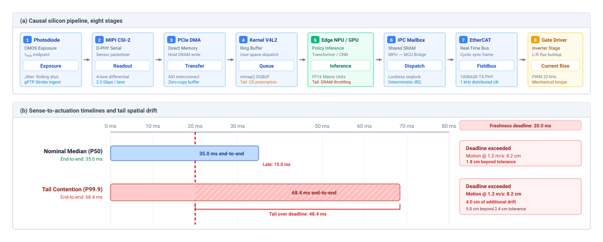
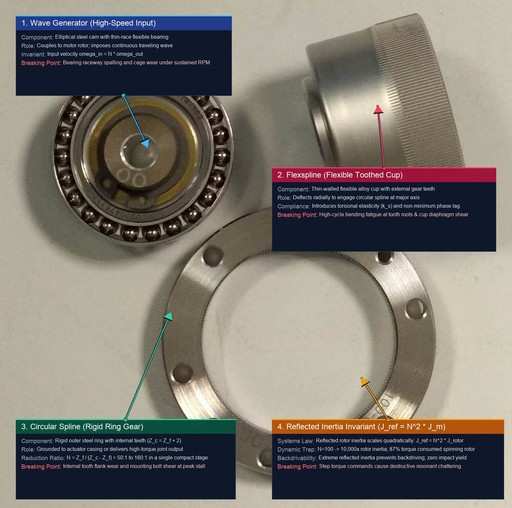
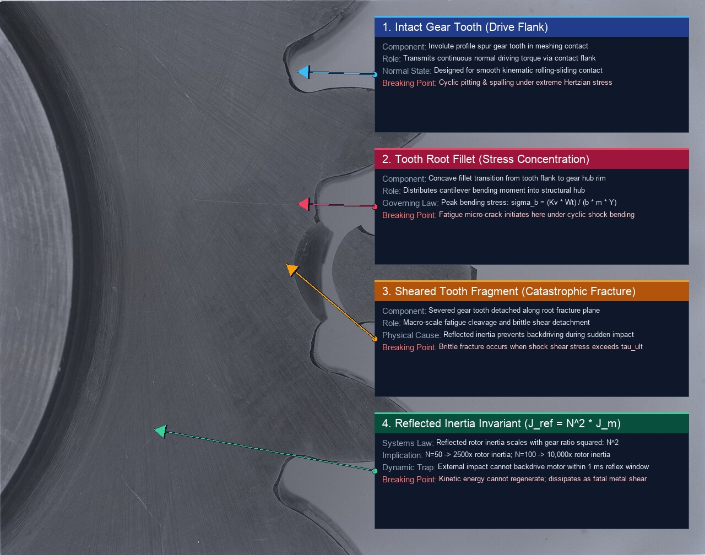
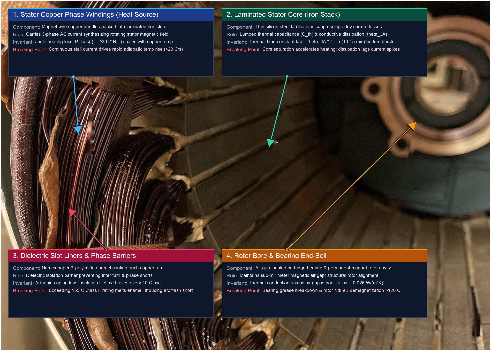
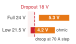

---
format:
  html:
    title: "The Physical Body"
---

# The Physical Body {#sec-body}

::: {layout-narrow}
::: {.column-margin}

\chapterminitoc

:::

::: {.content-visible when-format="pdf"}
\noindent
{fig-alt="Isometric blueprint showing the physical body architecture: Brushless DC (BLDC) motor stator coils, rotor inertia, planetary gearset, optical encoder, output drive flange, and thermal heatsink."}
:::

::: {.content-visible unless-format="pdf"}
{fig-alt="Isometric blueprint showing the physical body architecture: BLDC stator coils, rotor inertia, planetary gearset, optical encoder, output drive flange, and thermal heatsink."}
:::

:::

## Purpose {.unnumbered .unlisted}

::: {.content-visible when-format="pdf"}
\begin{marginfigure}
\vspace{1em}
\resizebox{\linewidth}{!}{\mlphysicalstackfull{20}{20}{100}{20}{20}}
\end{marginfigure}
:::

_What physical limits bound a learned policy the moment its outputs command motors and moving mass?_

A moving machine cannot pause for software. During inference, the physical world advances: positions change and observations age. Stopping requires time to process a command and distance to dissipate kinetic energy. Motors and transmissions constrain how quickly motion can change, while electrical losses continuously heat the windings. Policies ignoring these constraints request impossible forces or unsustainable movements. Faster inference helps only within this physical path; it does not eliminate braking distance, mechanical response time, or thermal limits. These limits must be measured on the assembled machine under the conditions in which it operates, not read from datasheet ratings measured under other conditions. At the causal boundary the body sets the budgets that sensing, computation, and control must share, and because the energy a command delivers cannot be recalled, each budget must be known before the command is issued.

::: {.column-margin .margin-pointer}
↰ **Prerequisite:** The physical plant grounds the three machine classes defined in @sec-boundary-four-archetypes.
:::



::: {.callout-learning-objectives}

- Calculate observation freshness limits from measurement age and the machine's allowable motion
- Calculate stopping distance and the admissible speed ceiling from pre-brake delay, credible deceleration, and clearance overheads
- Evaluate actuator and transmission choices against response limits and reflected inertia
- Estimate sustainable motor duty cycles from heat generation, cooling, and operating conditions
- Budget electrical supply margins for simultaneous actuation, computation, and regenerative braking
- Specify the elements of a limit record that states a measured limit's conditions, uncertainty, margin, runtime detector, and evidence category

:::

## The Five Physical Budgets {#sec-body-five-budgets}

A robotic manipulator can shatter its transmission even after receiving an emergency stop command before contact. The stop command traverses software buffers, the power inverter switches states, and the motor generates peak reverse torque. Yet if the moving link possesses kinetic energy exceeding the mechanical work the actuators can perform over the remaining clearance, impact is unavoidable. In pure software, a faulted thread can be killed instantly by the operating system kernel. In physical reality, moving mass carries momentum that cannot be caught by an exception handler, and an electrical power stage cannot deliver infinite current without thermal destruction or voltage collapse. Software cannot override the physics of moving mass, heat, and current.

Above the proposal boundary\index{Proposal boundary!budget enforcement}\index{Budget enforcement}, a learned policy may propose any motion, but the **physical body**\index{Physical body!definition} delivers only what mechanics, thermodynamics, and electromagnetism allow. That body is the plant of actuators, transmissions, linkages, power buses, and transducers that acts on the world, and every setpoint the policy issues draws against five of its physical budgets:

1. **Measurement freshness**\index{Measurement freshness!definition}: The rate at which the physical environment changes relative to the age of the sensor data reaching the controller. Because the world does not pause for computation, elapsed time during communication and inference means the machine always acts on historical state.
2. **Kinetic momentum**\index{Kinetic momentum!definition}: The stopping distance and braking force required to dissipate stored kinetic energy ($E_k = \frac{1}{2} m v^2$) before colliding with obstacles or exceeding workcell boundaries.
3. **Actuator bandwidth and reflected inertia**\index{Actuator bandwidth!definition}\index{Reflected inertia!definition}: The speed at which mechanical torque and velocity can change before winding inductance ($\tau_e = L/R$), inverter current clamps, or gear transmission inertia ($N^2 J$) choke mechanical acceleration.
4. **Thermal capacity**\index{Thermal capacity!definition}: The rate at which resistive Joule heat accumulates in stator coils and power semiconductors relative to the chassis dissipation rate, bounding sustained duty cycles before thermal throttling intervenes.
5. **Electrical power integrity**\index{Electrical power integrity!definition}: The transient voltage droop, peak current capacity, and regenerative energy surges across the shared direct-current distribution bus during rapid acceleration and braking.

```{python}
#| label: body-machine-momentum-calc
#| echo: false
# ┌─────────────────────────────────────────────────────────────────────────────
# │ THE RUNNING MACHINE'S MOMENTUM (LEGO)
# ├─────────────────────────────────────────────────────────────────────────────
# │ Context: the running-machine sentence in @sec-body-five-budgets.
# │ Goal:    Give the warehouse mobile manipulator's kinetic energy at its
# │          drive limit with the tote rack loaded.
# │ Show:    368 kg (upper bound) at 1.5 m/s carries 414 J.
# │ How:     calc_kinetic_energy on RM.loaded_mass and RM.base.max_velocity.
# └─────────────────────────────────────────────────────────────────────────────
from mlsysim import *
from mlsysim.core.units import *
from mlsysim.fmt import fmt_qty, fmt_velocity, fmt_energy, check

RM = Embodied.MobileManipulator.WarehouseMobileManipulator

class MachineMomentum:
    """Kinetic energy of the loaded running machine at its drive limit."""

    # ┌── 1. LOAD (Constants & Parameters) ─────────────────────────────────
    m_loaded = RM.loaded_mass  # category: derived (upper bound, full tote rack)
    v_drive = RM.base.max_velocity  # category: illustrative (drive limit)

    # ┌── 2. EXECUTE (Compute) ─────────────────────────────────────────────
    e_k = calc_kinetic_energy(m_loaded, v_drive).to(joule)

    # ┌── 3. GUARD (Invariants) ───────────────────────────────────────────
    check(abs(m_loaded.to(kilogram).magnitude - 368.0) < 1e-9, f"Unexpected loaded mass: {m_loaded}")
    check(abs(e_k.magnitude - 414.0) < 1e-6, f"Unexpected kinetic energy: {e_k}")

    # ┌── 4. OUTPUT (Formatting) ──────────────────────────────────────────
    m_loaded_str = fmt_qty(m_loaded, kilogram, precision=0)
    v_drive_str = fmt_velocity(v_drive, unit=meter / second, precision=1)
    e_k_str = fmt_energy(e_k, unit=joule, precision=0)
```

The warehouse mobile manipulator that this book follows draws on all five. Loaded to at most `{python} MachineMomentum.m_loaded_str` and moving at its `{python} MachineMomentum.v_drive_str` drive limit (illustrative; see the Reader Guide), it carries `{python} MachineMomentum.e_k_str` of kinetic energy through aisles it shares with people.

Each budget becomes a limit established on the assembled machine under declared thermal and electrical stress. The first is the age of the measurement on which every command rests, which runs from physical transduction, before any software process receives the data.

## Measurement Freshness {#sec-body-measurement-freshness}

Software benchmarks often report latency as the execution time of a network on an accelerator, but that compute slice is only one segment of the causal chain of @sec-boundary-causal-boundary. **A measurement decays from transduction; what matters is its age when acted upon.** That age spans the interval from the moment photons strike a photodiode or flux passes a Hall sensor to the moment motor coils generate torque that changes a link's acceleration. If a perception model computes an obstacle location in $15\text{ ms}$ but camera integration, sensor readout, transport, queue dispatch, and motor current rise time add another $45\text{ ms}$, the physical age of the measurement when the joint moves is $60\text{ ms}$. During that entire window, the physical world has continued to evolve.

::: {.column-margin .margin-pointer}
↳ **Downstream:** @sec-memory-belief-through-occlusion derives how long a stored belief stays valid as its measurement ages.
:::

Tracking measurement age means decomposing that path into eight stages (@fig-02-latency-waterfall): exposure, timestamped at the midpoint of integration; sensor readout over an interface such as MIPI CSI-2; direct memory access (DMA) transport into host memory; kernel buffering into user-space queues; model computation; operating-system scheduling and inter-process dispatch across the processor boundary; command transmission over a fieldbus or shared-memory mailbox; and actuator response, as the drive builds flux in the stator windings. On a two-processor implementation the path runs from the image sensor through inference on the application processor, a lock-free mailbox, and a $1\text{ kHz}$ permission check on the safety microcontroller, to gate-driver switching and current rise. Every stage consumes a slice of the total time budget.

The rate of world-state change dictates how long a measurement remains valid before acting on it introduces intolerable error. Let $e_{\max}$ denote the maximum acceptable error in a tracked state, such as a joint angle or the position of a part on a conveyor, and let $v_{\max}$ denote the fastest credible velocity at which that state can evolve. The freshness deadline $\Delta t_{\text{fresh}}$ is the upper bound on measurement age before a control action based on that measurement becomes invalid, defined by the inequality
$$\Delta t_{\text{fresh}} \le \frac{e_{\max}}{v_{\max}}$$

For a vision-guided picker on a parcel sorter, tracking parcels at a maximum relative velocity $v_{\max} = 1.2\text{ m/s}$ with a geometric clearance tolerance $e_{\max} = 24\text{ mm}$, the freshness deadline is $24\text{ mm} / (1200\text{ mm/s}) = 20\text{ ms}$. If an actuation command reaches the motor based on an image captured $35\text{ ms}$ earlier, the parcel has displaced by $42\text{ mm}$, exceeding the position allowance by $18\text{ mm}$ and missing the grasp. The deadline governs a target that keeps moving while its measurement ages, such as the parcel here or the mug riding the mobile manipulator's pick-station conveyor. For such a target it limits only motion-induced error, and only while relative velocity is bounded and the initial observation is credible; sensing and estimation errors consume additional tolerance. A person standing in the aisle does not move while the observation ages. The base does, so the age appears as distance the base covers before braking, which @sec-body-kinetic-momentum charges against the stopping budget.

::: {#fig-02-latency-waterfall fig-env="figure" fig-pos="t" fig-cap="**Sense-to-actuation latency waterfall and silicon dataflow pipeline**: The eight-stage causal chain from exposure to motor current rise (panel a) and an illustrative latency profile (panel b). The parcel sorter's $24\text{ mm}$ tolerance at $1.2\text{ m/s}$ sets a $20\text{ ms}$ age deadline, because unguided travel converts elapsed time into displacement at the carriage speed. Both the $35.0\text{ ms}$ median and the $68.4\text{ ms}$ $P_{99.9}$ tail exceed it, corresponding to $4.2\text{ cm}$ and $8.2\text{ cm}$ of motion, respectively." fig-alt="Two-panel diagram. Panel (a) shows eight stages from sensor exposure through transport, inference, command transfer, and motor current rise. Panel (b) shows illustrative 35.0 and 68.4 millisecond timelines, both crossing a 20 millisecond freshness deadline; at 1.2 meters per second they correspond to 4.2 and 8.2 centimeters of parcel motion."}
{width="100%"}
:::

Engineers often compute total latency by summing the $P_{99}$ values of individual stages, but the percentile of a sum is not the sum of the percentiles.[^fn-math-quantile-convolution] Shared memory contention and kernel queues can correlate stage delays, so the distribution of complete sense-to-torque age must be measured on the integrated machine under declared load, and even that measured percentile is not the analyzed bound a safety deadline needs (@sec-nervous-deterministic-fieldbuses).

[^fn-math-quantile-convolution]: **Quantile Convolution**\index{Quantile convolution!tail non-additivity}: In general, the quantile of a latency sum differs from the sum of equal-percentile stage quantiles ($Q_p(X + Y) \ne Q_p(X) + Q_p(Y)$). Independence alone does not make their arithmetic sum a worst-case bound. Correlation from shared buses and queues changes the end-to-end tail and must be characterized at the system boundary.

To see how stage timing differs from end-to-end age, consider a timing profile for the camera-to-joint path under continuous inference load (@tbl-02-latency-breakdown), judged against the same $20\text{ ms}$ deadline.

| Pipeline Stage                     | Physical Mechanism / Contention Source                        | $P_{50}$ (ms) | $P_{99}$ (ms) | Max (ms) |
|:-----------------------------------|:--------------------------------------------------------------|:-------------:|:-------------:|:--------:|
| **1–2. Sensor Exposure & Readout** | $60\text{ Hz}$ rolling shutter exposure midpoint              |     $11.2$    |     $16.6$    |  $16.7$  |
| **3–4. Host Transport & DMA**      | PCIe DMA transfer into host memory                            |     $1.4$     |     $3.2$     |  $6.8$   |
| **5. Vision Backbone & Policy**    | Onboard accelerator inference (memory throttling tail)        |     $18.5$    |     $24.1$    |  $38.4$  |
| **6. OS Scheduling & IPC**         | Kernel preemption and mailbox dispatch to safety MCU          |     $0.6$     |     $2.1$     |  $12.3$  |
| **7. Fieldbus Transmission**       | Deterministic EtherCAT cyclic packet exchange                 |     $1.0$     |     $1.0$     |  $2.0$   |
| **8. Actuator Current Rise**       | Gate driver switching and stator flux buildup                 |     $2.3$     |     $3.0$     |  $4.5$   |
| **Arithmetic Stage Sum**           | Sum of each column's stage values; not an end-to-end quantile |    **35.0**   |    **50.0**   | **80.7** |
| **End-to-End Age**                 | System-level profile ($t_{\text{transduction}} \to \tau$)     |    **35.0**   |    **46.2**   | **80.7** |

: **Illustrative sense-to-actuation latency decomposition**: Stage and system-level timings show why the arithmetic sum of stage percentiles is not the end-to-end tail. The example's $P_{99.9} = 68.4\text{ ms}$ exceeds the $20\text{ ms}$ freshness deadline of the parcel sorter. {#tbl-02-latency-breakdown tbl-colwidths="[26,38,12,12,12]"}

The $50.0\text{ ms}$ sum of stage $P_{99}$ values differs from the $46.2\text{ ms}$ system percentile, and against the $20\text{ ms}$ deadline even the $35.0\text{ ms}$ median would be late.

Acting on expired data adds phase lag to the feedback loop and can excite chatter when corrective torques reinforce rather than damp tracking errors,[^fn-math-bode-delay] so a high inference rate does not by itself make the response timely. The system must carry a hardware timestamp from transduction (using **IEEE 1588 gPTP**\index{IEEE 1588 gPTP!hardware timestamping}[^fn-hw-gptp-timestamp] or hardware strobe capture at the Ethernet PHY / **MIPI CSI-2**\index{MIPI CSI-2!sensor readout interface}[^fn-hw-mipi-capture] interface) through the pipeline. Before applying a policy command, the permission path compares the observation age $t_{\text{age}} = t_{\text{now}} - t_{\text{transduction}}$ with the age its budget allows. If the age exceeds that limit, it rejects the stale proposal and executes a fallback whose braking or holding behavior has been validated within the remaining physical margin [@brooks1986robust].

[^fn-math-bode-delay]: **Bode Delay Theorem and Phase Margin**\index{Bode delay theorem}\index{Phase margin!delay degradation}: Pure transport delay $\tau_d$ introduces an unyielding frequency-dependent phase lag $\Delta \phi = -\omega \tau_d$ radians without altering loop gain magnitude. In closed-loop feedback systems, this phase erosion degrades the phase margin ($\text{PM} = 180^\circ + \angle L(j\omega_c)$); once $\tau_d$ erodes the margin to zero at the gain-crossover frequency $\omega_c$, the closed-loop poles cross into the right-half complex plane, destabilizing the physical plant into destructive limit-cycle oscillations.

[^fn-hw-gptp-timestamp]: **IEEE 1588 gPTP**\index{IEEE 1588 gPTP!hardware timestamping}: The Generalized Precision Time Protocol (gPTP) provides sub-microsecond clock synchronization across Ethernet networks by exchanging hardware-timestamped packets directly at the network chip (media access control [MAC] PHY) layer. Capturing the timestamp in hardware keeps the operating system scheduler's jitter out of the measurement.

[^fn-hw-mipi-capture]: **MIPI CSI-2**\index{MIPI CSI-2!sensor readout interface}: The Mobile Industry Processor Interface Camera Serial Interface 2 (MIPI CSI-2) is a high-bandwidth, high-speed differential protocol used for transmitting uncompressed video data directly from image sensors to host system-on-chip (SoC) devices with minimal latency.

Throughout that sense-to-actuation interval, the body continues moving, carrying momentum that no software interrupt can cancel.

## Kinetic Momentum {#sec-body-kinetic-momentum}

```{python}
#| label: body-stopping-budget-calc
#| echo: false
# ┌─────────────────────────────────────────────────────────────────────────────
# │ THE BODY'S STOPPING DISTANCE ON THE RUNNING MACHINE (LEGO)
# ├─────────────────────────────────────────────────────────────────────────────
# │ Context: @sec-body-kinetic-momentum opener, @fig-02-stopping-distance, and
# │          \ref{nbk-body-stopping-distance-budgeting-high-tail-compute}.
# │ Goal:    Add the body's own terms of @eq-body-stopping-distance for the
# │          loaded warehouse mobile manipulator at its drive limit.
# │ Show:    Rows 1-3 of the stopping budget at 1.5 m/s: braking 562.5 mm,
# │          overhead 150 mm (712.5), brake onset 30 mm (742.5), leaving 357.5 mm
# │          of the 1.10 m clear distance; body-only ceiling 1.91 m/s; at 2.0 m/s
# │          braking is 1000 mm (+77.8 percent); each extra 100 ms adds 150 mm;
# │          figure cases 742.5 / 912.9 / 1417.2 mm.
# │ How:     calc_safe_stopping_distance and calc_max_permitted_velocity with
# │          a_eff = a_brake (constant deceleration), from RM and AISLE. The full
# │          pre-brake delay AISLE.tau_delay appears only in the figure's cases.
# └─────────────────────────────────────────────────────────────────────────────
from mlsysim import *
from mlsysim.core.units import *
from mlsysim.fmt import (
    fmt_qty,
    fmt_length,
    fmt_energy,
    fmt_latency,
    fmt_velocity,
    fmt_acceleration,
    fmt_percent,
    fmt_display_math,
    check,
)

RM = Embodied.MobileManipulator.WarehouseMobileManipulator
AISLE = Embodied.Scenario.WarehouseAisle

class BodyStoppingBudget:
    """Rows 1-3 of the running machine's stopping budget: the terms the body owns."""

    # ┌── 1. LOAD (Constants & Parameters) ─────────────────────────────────
    v = RM.base.max_velocity  # category: illustrative (drive limit)
    a_brake = AISLE.a_brake  # category: illustrative (loaded, dry floor)
    delta_loc = AISLE.delta_loc  # category: illustrative
    delta_margin = AISLE.delta_margin  # category: chosen
    t_act = AISLE.t_brake_onset  # category: illustrative (brake onset)
    d_clear = AISLE.d_clear  # category: illustrative (rack-end clear distance)
    tau_full = AISLE.tau_delay  # category: derived (full pre-brake delay; figure only)
    v_fast = 2.0 * meter / second  # category: illustrative (speed-scaling case above the drive limit)
    dt_extra = 100 * millisecond  # category: illustrative (added pre-brake delay step)

    # ┌── 2. EXECUTE (Compute) ─────────────────────────────────────────────
    d_brake = (v**2 / (2 * a_brake)).to(ureg.millimeter)  # row 1
    total_1 = d_brake
    overhead = (delta_loc + delta_margin).to(ureg.millimeter)  # row 2
    total_2 = (total_1 + overhead).to(ureg.millimeter)
    d_onset = (v * t_act).to(ureg.millimeter)  # row 3
    total_3 = (total_2 + d_onset).to(ureg.millimeter)
    remaining = (d_clear - total_3).to(ureg.millimeter)
    v_ceiling = calc_max_permitted_velocity(d_clear, t_act, a_brake, loc_margin=delta_loc, physical_margin=delta_margin)
    d_brake_fast = (v_fast**2 / (2 * a_brake)).to(ureg.millimeter)
    brake_growth = (d_brake_fast / d_brake - 1).to("dimensionless")
    d_per_extra = (v * dt_extra).to(ureg.millimeter)
    case_body = calc_safe_stopping_distance(v, t_act, a_brake, loc_margin=delta_loc, physical_margin=delta_margin).to(ureg.millimeter)
    case_full = calc_safe_stopping_distance(v, tau_full, a_brake, loc_margin=delta_loc, physical_margin=delta_margin).to(ureg.millimeter)
    case_fast = calc_safe_stopping_distance(v_fast, tau_full, a_brake, loc_margin=delta_loc, physical_margin=delta_margin).to(ureg.millimeter)

    # ┌── 3. GUARD (Invariants) ───────────────────────────────────────────
    check(v == MachineMomentum.v_drive, "Stopping budget and momentum must use the same drive limit.")
    check(abs(total_1.magnitude - 562.5) < 1e-6, f"Row 1 must be 562.5 mm: {total_1}")
    check(abs(total_2.magnitude - 712.5) < 1e-6, f"Row 2 running total must be 712.5 mm: {total_2}")
    check(abs(total_3.magnitude - 742.5) < 1e-6, f"Ch2 subtotal must be 742.5 mm: {total_3}")
    check(abs(case_body.magnitude - total_3.magnitude) < 1e-6, "Row sum must equal the equation.")
    check(abs(remaining.magnitude - 357.5) < 1e-6, f"Unexpected remaining clearance: {remaining}")
    check(abs(v_ceiling.magnitude - 1.9098) < 1e-4, f"Body-only ceiling must be 1.9098 m/s: {v_ceiling}")
    check(v_ceiling > v, "The body-only ceiling must exceed the drive limit.")
    check(abs(d_brake_fast.magnitude - 1000.0) < 1e-6, f"Unexpected braking at 2.0 m/s: {d_brake_fast}")
    check(abs(d_per_extra.magnitude - 150.0) < 1e-6, f"Unexpected cost of 100 ms: {d_per_extra}")
    check(abs(tau_full.to(millisecond).magnitude - 133.6) < 1e-6, f"Unexpected tau_delay: {tau_full}")
    check(abs(case_full.magnitude - 912.9) < 1e-6, f"Unexpected full-delay case: {case_full}")
    check(abs(case_fast.magnitude - 1417.2) < 1e-6, f"Unexpected fast case: {case_fast}")
    check(case_full < d_clear < case_fast, "Case 2 must fit and Case 3 must breach the clear distance.")

    # ┌── 4. OUTPUT (Formatting) ──────────────────────────────────────────
    v_str = fmt_velocity(v, unit=meter / second, precision=1)
    a_brake_str = fmt_acceleration(a_brake, unit=meter / second**2, precision=0)
    delta_loc_str = fmt_length(delta_loc, unit=ureg.millimeter, precision=0)
    delta_margin_str = fmt_length(delta_margin, unit=ureg.millimeter, precision=0)
    t_act_str = fmt_latency(t_act, unit=millisecond, precision=0)
    d_clear_str = fmt_length(d_clear, unit=meter, precision=2)
    tau_full_str = fmt_latency(tau_full, unit=millisecond, precision=1)
    v_fast_str = fmt_velocity(v_fast, unit=meter / second, precision=0)
    dt_extra_str = fmt_latency(dt_extra, unit=millisecond, precision=0)

    d_brake_str = fmt_length(d_brake, unit=ureg.millimeter, precision=1)
    overhead_str = fmt_length(overhead, unit=ureg.millimeter, precision=0)
    total_2_str = fmt_length(total_2, unit=ureg.millimeter, precision=1)
    d_onset_str = fmt_length(d_onset, unit=ureg.millimeter, precision=0)
    total_3_str = fmt_length(total_3, unit=ureg.millimeter, precision=1)
    remaining_str = fmt_length(remaining, unit=ureg.millimeter, precision=1)
    v_ceiling_str = fmt_velocity(v_ceiling, unit=meter / second, precision=2)
    d_brake_fast_str = fmt_length(d_brake_fast, unit=ureg.millimeter, precision=0, commas=True)
    brake_growth_pct_str = fmt_percent(brake_growth.magnitude, precision=1, style="prose")
    d_per_extra_str = fmt_length(d_per_extra, unit=ureg.millimeter, precision=0)
    case_body_str = fmt_length(case_body, unit=ureg.millimeter, precision=1)
    case_full_str = fmt_length(case_full, unit=ureg.millimeter, precision=1)
    case_fast_str = fmt_length(case_fast, unit=ureg.millimeter, precision=1, commas=True)

    d_brake_display_math = fmt_display_math(
        rf"d_{{\text{{brake}}}} = \frac{{v^2}}{{2 a_{{\text{{brake}}}}}} = \frac{{({v_str})^2}}{{2 \times {a_brake_str}}} = {d_brake_str}"
    )
    overhead_display_math = fmt_display_math(
        rf"\delta_{{\text{{loc}}}} + \delta_{{\text{{margin}}}} = {delta_loc_str} + {delta_margin_str} = {overhead_str}"
    )
    d_onset_display_math = fmt_display_math(rf"v\,T_{{\text{{act}}}} = ({v_str}) \times ({t_act_str}) = {d_onset_str}")
    total_display_math = fmt_display_math(
        rf"d_{{\text{{stop}}}}\big|_{{\text{{body}}}} = {d_brake_str} + {overhead_str} + {d_onset_str} = {total_3_str}"
    )
    ceiling_display_math = fmt_display_math(
        rf"v_{{\max}} = -a_{{\text{{brake}}}} T_{{\text{{act}}}} + \sqrt{{(a_{{\text{{brake}}}} T_{{\text{{act}}}})^2 + 2 a_{{\text{{brake}}}} (D_{{\text{{clear}}}} - \delta_{{\text{{loc}}}} - \delta_{{\text{{margin}}}})}} \approx {v_ceiling_str}"
    )
```

The loaded mobile manipulator drives down an aisle at its `{python} BodyStoppingBudget.v_str` drive limit. A person steps out from the end of a rack `{python} BodyStoppingBudget.d_clear_str` ahead and stands in the aisle. Software cannot simply pause execution or instantaneously zero the velocity vector. The base, the arm, and the totes carry mechanical momentum, and bringing that mass to rest requires dissipating kinetic energy across physical distance. **Stopping distance grows linearly with delay and quadratically with speed, and that difference sets the speed limit.**

The distance from sensing a hazard to zero velocity comprises two phases: reaction travel and braking travel. During the reaction interval, the machine runs the pipeline of @sec-body-measurement-freshness. Throughout this pre-brake delay $\tau_{\text{delay}}$, which runs from the exposure of the frame that shows the hazard until retarding force begins, the actuators apply no retarding force, and the vehicle continues moving along its existing trajectory at its speed $v$ when that frame is exposed. Assuming velocity remains constant across this window, the reaction travel evaluates to
$$d_{\text{react}} = v\,\tau_{\text{delay}}$$

Once the brake command arrives and the actuators engage, the body enters the braking phase. The mechanical work done by the braking force $F_{\text{brake}}$ over the braking distance\index{Braking distance} $d_{\text{brake}}$ must dissipate the initial kinetic energy of the machine, $W = \Delta K$. For a machine of mass $m$ decelerating to rest under a sustained retarding force $F_{\text{brake}} = m a_{\text{brake}}$, the work-energy balance yields
$$m a_{\text{brake}} d_{\text{brake}} = \frac{1}{2} m v^2$$
Dividing by mass and solving for distance gives the kinematic braking travel
$$d_{\text{brake}} = \frac{v^2}{2 a_{\text{brake}}}$$
The parameter $a_{\text{brake}}$ is the credible deceleration the body can actually exert against the physical environment, not a theoretical peak rating printed on an actuator datasheet. It represents the sustained negative acceleration the mechanical structure, tires, and gears can produce before losing grip (tire-road shear slip saturation), tipping forward, or structural drive-train yield.

The closed form assumes constant deceleration, instantaneous torque buildup, zero grade, and rigid contact. Each fails on hardware, since force takes time to build, tire friction falls during slip, and structure deflects, so on grades or uncertain floors the model underestimates the stop. Loaded stopping trials across the declared conditions supply a conservative low-tail deceleration, with uncertainty and margin, to replace the idealized $a_{\text{brake}}$; a sample percentile alone is not a hard lower bound.

::: {.column-margin .margin-pointer}
↳ **Downstream:** Unmanaged kinetic momentum translates directly into the destructive contact shock loads analyzed in @sec-body-actuator-limits.
:::

The differing exponents of the reaction and braking terms make velocity the dominant multiplier of spatial risk (@fig-02-stopping-distance), a scaling that \ref{nbk-body-stopping-distance-budgeting-high-tail-compute} works numerically.

In unstructured environments, a machine cannot allocate its entire clearance to nominal stopping dynamics. Obstacle tracking carries state estimation uncertainty, sensor calibration drifts over time, and localization algorithms introduce position error. The stopping distance $d_{\text{stop}}$ that the system defends must therefore include a spatial localization uncertainty bound $\delta_{\text{loc}}$ and a minimum physical clearance margin $\delta_{\text{margin}}$:[^fn-std-iso-separation]

$$d_{\text{stop}} = v\,\tau_{\text{delay}} + \frac{v^2}{2 a_{\text{brake}}} + \delta_{\text{loc}} + \delta_{\text{margin}}$$ {#eq-body-stopping-distance}

The sum $\delta_{\text{loc}} + \delta_{\text{margin}}$ is fixed spatial overhead that must remain unoccupied when the body comes to a complete rest.

[^fn-std-iso-separation]: **ISO/TS 15066 Separation Distance**\index{ISO/TS 15066!separation distance}\index{Speed and Separation Monitoring}: ISO/TS 15066 (Clause 5.5.4), building on ISO 13855, specifies this protective separation distance for Speed and Separation Monitoring (SSM): $S = (v_r \cdot T_r) + (v_h \cdot T_r) + S_r + S_s + C$, where $T_r$ is worst-case processing delay, $S_r$ is braking travel, and $C$ is clearance margin ($100\text{--}200\text{ mm}$). For learning policies operating in collaborative human workspaces, failing to bound compute tail latency directly inflates $T_r$, expanding the required separation zone and forcing premature protective stops.

::: {#dfn-body-dynamic-stopping-distance .callout-definition title="Dynamic stopping distance"}

***Dynamic stopping distance***\index{Dynamic stopping distance!definition}\index{Stopping distance!definition} ($d_{\text{stop}}$) is the minimum physical clearance required to bring a moving mass to a complete halt from its speed $v$ when the hazard is first imaged. It sums the travel during the pre-brake delay $\tau_{\text{delay}}$, which runs from the exposure of the frame that shows the hazard until retarding force begins; the braking travel under the credible deceleration $a_{\text{brake}}$; and the localization bound $\delta_{\text{loc}}$ and protective clearance $\delta_{\text{margin}}$, as @eq-body-stopping-distance states.

1.  **Significance**: Quantifies the non-negotiable physical spatial margin that software proposals must clear before motion permission can be granted.
2.  **Distinction**: Unlike static geometric obstacle clearance in classical kinematics, dynamic stopping distance grows quadratically with speed ($v^2$), so doubling velocity quadruples the braking term whatever the controller loop rate.
3.  **Common pitfall**: Assuming an emergency stop command halts the machine instantaneously, ignoring that moving mass carries kinetic energy ($E_k = \frac{1}{2}m v^2$) that requires finite mechanical work and braking distance to dissipate.

:::

::: {#fig-02-stopping-distance fig-env="figure" fig-pos="t" fig-cap="**Stopping distance of the warehouse mobile manipulator**: Each bar splits the stop into reaction travel during the pre-brake delay, braking travel under the credible deceleration, and the fixed overhead of the localization bound and protective clearance, against the `{python} BodyStoppingBudget.d_clear_str` rack-end clear distance. Case 1 counts only the terms the body owns at the `{python} BodyStoppingBudget.v_str` drive limit and stops within `{python} BodyStoppingBudget.case_body_str`. Case 2 adds the full `{python} BodyStoppingBudget.tau_full_str` pre-brake delay that @sec-nervous and @sec-perception assemble; at `{python} BodyStoppingBudget.case_full_str` it still fits, although later chapters add a stop profile and a tracking bound. Case 3 raises speed to a hypothetical `{python} BodyStoppingBudget.v_fast_str`, above the drive limit, with the same delay; braking travel grows by `{python} BodyStoppingBudget.brake_growth_pct_str` and the stop, at `{python} BodyStoppingBudget.case_fast_str`, breaches the clear distance." fig-alt="Horizontal stacked bars for three cases, each split into reaction travel, braking travel, and fixed overhead, against a dashed vertical line marking the rack-end clear distance. The first two bars end inside the line with the remaining margin shaded green; the third bar extends past the line into a hatched red breach."}

```{python}
#| echo: false
# ┌─────────────────────────────────────────────────────────────────────────────
# │ STOPPING DISTANCE OF THE RUNNING MACHINE (FIGURE)
# │ Context: @fig-02-stopping-distance
# │ Goal:    show why velocity, not latency, dominates the defended clearance
# │ Show:    the three-term decomposition for the body-only terms, the full
# │          pre-brake delay, and a speed-scaling case, against D_clear
# │ How:     cases from BodyStoppingBudget (calc_safe_stopping_distance with
# │          RM and AISLE); d_stop = v*tau + v^2/(2a) + delta_loc + delta_margin
# ├─────────────────────────────────────────────────────────────────────────────
from mlsysim import viz

MM = ureg.millimeter

# ┌── 1. LOAD (from the stopping-budget cell) ──────────────────────────────────
S = BodyStoppingBudget  # category: derived (values keep their budget-cell categories)
A_BRAKE = S.a_brake  # category: illustrative (loaded, dry floor)
OVERHEAD = S.overhead.to(MM).magnitude  # category: derived (illustrative delta_loc plus chosen delta_margin)
D_CLEAR = S.d_clear.to(MM).magnitude  # category: illustrative (rack-end clear distance)
CASES = [  # category: illustrative and derived (drive-limit and speed-scaling cases from the budget cell)
    ("Case 1", "Body terms", S.v, S.t_act),
    ("Case 2", "Full delay", S.v, S.tau_full),
    ("Case 3", "Full delay, faster", S.v_fast, S.tau_full),
]

# ┌── 2. EXECUTE (Compute) ─────────────────────────────────────────────────────
rows = []
for name, sub, v, tau in CASES:
    react = (v * tau).to(MM).magnitude
    brake = (v**2 / (2 * A_BRAKE)).to(MM).magnitude
    rows.append((name, sub, react, brake, react + brake + OVERHEAD))

# ┌── 3. GUARD ─────────────────────────────────────────────────────────────────
check(abs(rows[0][4] - S.case_body.magnitude) < 1e-6, "Case 1 must match the budget cell.")
check(abs(rows[1][4] - S.case_full.magnitude) < 1e-6, "Case 2 must match the budget cell.")
check(abs(rows[2][4] - S.case_fast.magnitude) < 1e-6, "Case 3 must match the budget cell.")

# ┌── 4. PLOT ──────────────────────────────────────────────────────────────────
fig, ax, COLORS, plt = viz.setup_plot(figsize=(9, 3.6))
H = 0.58
for i, (name, sub, react, brake, stop) in enumerate(rows):
    y = len(rows) - 1 - i
    left = 0.0
    for width, color, label in ((react, COLORS["BlueL"], "Reaction"), (brake, COLORS["BlueLine"], "Braking"), (OVERHEAD, COLORS["grid"], "Overhead")):
        ax.barh(y, width, left=left, height=H, color=color, edgecolor="white", linewidth=0.8, label=label if i == 0 else None, zorder=3)
        left += width
    if stop <= D_CLEAR:
        ax.barh(
            y,
            D_CLEAR - stop,
            left=stop,
            height=H,
            color=COLORS["GreenFill"],
            edgecolor="white",
            linewidth=0.8,
            label="Remaining margin" if i == 0 else None,
            zorder=3,
        )
    else:
        ax.barh(
            y,
            stop - D_CLEAR,
            left=D_CLEAR,
            height=H,
            facecolor="none",
            edgecolor=COLORS["RedLine"],
            linewidth=1.0,
            hatch="//",
            label="Breach" if i == len(rows) - 1 else None,
            zorder=4,
        )
    ax.text(-25, y, f"{name}\n{sub}", ha="right", va="center", fontsize=9, linespacing=1.4)
    ax.text(max(stop, D_CLEAR) + 25, y, f"{stop:,.1f} mm", va="center", fontsize=8.5, color=COLORS["primary"], zorder=6)

ax.axvline(D_CLEAR, color=COLORS["RedLine"], lw=1.4, linestyle=(0, (5, 4)), zorder=5)
ax.text(D_CLEAR, len(rows) - 0.42, f"  rack end at {S.d_clear.to(ureg.meter).magnitude:.2f} m", color=COLORS["RedLine"], fontsize=9, va="bottom")

ax.set_yticks([])
ax.set_xlim(0, 1700)
ax.set_ylim(-0.7, len(rows) - 0.25)
ax.set_xlabel("Distance traveled before rest (mm)")
ax.grid(True, axis="x", zorder=0)
ax.grid(False, axis="y")
for side in ("left", "top", "right"):
    ax.spines[side].set_visible(False)
handles, labels = ax.get_legend_handles_labels()
seen = dict(zip(labels, handles))
ax.legend(seen.values(), seen.keys(), loc="upper center", bbox_to_anchor=(0.5, -0.30), ncol=5, frameon=False, fontsize=8.5)
plt.tight_layout()
plt.show()
```

:::

For a stationary obstacle detected at distance $D_{\text{clear}}$, such as a person standing at the rack end or a dropped tote, the modeled stopping distance must fit the clear path, $d_{\text{stop}} \le D_{\text{clear}}$. This is the condition that principle \ref{pri-vol4-irreversibility} places on every stop, now with each term of $d_{\text{stop}}$ a limit of this machine. With conservative timing and braking bounds, the permission path can solve this inequality for a ceiling on new velocity proposals $v_{\text{max}}$. The positive root of the quadratic inequality[^fn-math-velocity-root] is:
$$v_{\text{max}} = -a_{\text{brake}} \tau_{\text{delay}} + \sqrt{(a_{\text{brake}} \tau_{\text{delay}})^2 + 2 a_{\text{brake}} (D_{\text{clear}} - \delta_{\text{loc}} - \delta_{\text{margin}})}$$
When sensor range degrades or an obstacle enters the trajectory, $D_{\text{clear}}$ contracts and lowers the ceiling, provided the available distance remains nonnegative. At zero available distance the ceiling is zero. If the machine is already moving, however, a zero setpoint cannot remove its current stopping distance; a negative available distance means the admission condition is already violated and requires an emergency response.

[^fn-math-velocity-root]: **Kinematic Velocity Root**\index{Kinematic velocity root!quadratic clearance}: Grouping the constant spatial terms into available physical distance $D_{\text{avail}} = D_{\text{clear}} - \delta_{\text{loc}} - \delta_{\text{margin}}$ yields the quadratic inequality $\frac{1}{2 a_{\text{brake}}} v^2 + \tau_{\text{delay}} v - D_{\text{avail}} \le 0$. Multiplying by $2 a_{\text{brake}}$ produces $v^2 + 2 a_{\text{brake}} \tau_{\text{delay}} v - 2 a_{\text{brake}} D_{\text{avail}} \le 0$. Applying the quadratic formula and taking the positive physical root defines the dynamic velocity ceiling.

::: {#nbk-body-stopping-distance-budgeting-high-tail-compute .callout-notebook title="The body's stopping distance"}
**Problem**: The warehouse mobile manipulator, loaded to at most `{python} MachineMomentum.m_loaded_str`, drives toward a rack end at its $v =$ `{python} BodyStoppingBudget.v_str` drive limit, and a person stands in the aisle at the clear distance $D_{\text{clear}} =$ `{python} BodyStoppingBudget.d_clear_str`. The body owns three terms of @eq-body-stopping-distance: braking travel under the credible deceleration $a_{\text{brake}} =$ `{python} BodyStoppingBudget.a_brake_str` (loaded, dry floor); the fixed overhead of the localization bound $\delta_{\text{loc}} =$ `{python} BodyStoppingBudget.delta_loc_str` and the protective clearance $\delta_{\text{margin}} =$ `{python} BodyStoppingBudget.delta_margin_str`; and the brake onset $T_{\text{act}} =$ `{python} BodyStoppingBudget.t_act_str`, which enters $\tau_{\text{delay}}$. How much of the clear distance do these terms use, what speed would they alone permit, and how do speed and added delay change the answer?

**1. Braking travel:**
Mass cancels from the work-energy balance, so the loaded machine's `{python} MachineMomentum.e_k_str` of kinetic energy sets how much heat the brakes must absorb but not how far the base travels:
`{python} BodyStoppingBudget.d_brake_display_math`
The stopping distance so far is `{python} BodyStoppingBudget.d_brake_str`.

**2. Fixed overhead:**
`{python} BodyStoppingBudget.overhead_display_math`
The running total rises to `{python} BodyStoppingBudget.total_2_str`.

**3. Brake onset:**
Between the brake command and the first retarding force, the base still moves at full speed:
`{python} BodyStoppingBudget.d_onset_display_math`
`{python} BodyStoppingBudget.total_display_math`
The body's own terms leave `{python} BodyStoppingBudget.remaining_str` of the `{python} BodyStoppingBudget.d_clear_str` clear distance for every delay the body does not own.

**4. The body-only ceiling:**
Solving @eq-body-stopping-distance for speed with $\tau_{\text{delay}} = T_{\text{act}}$:
`{python} BodyStoppingBudget.ceiling_display_math`
The body alone would permit `{python} BodyStoppingBudget.v_ceiling_str`, above the drive limit. @Sec-nervous and @sec-perception add the delay terms that spend part of this headroom.

**5. Speed against delay:**
At a hypothetical `{python} BodyStoppingBudget.v_fast_str`, above the drive limit, the braking term alone grows to `{python} BodyStoppingBudget.d_brake_fast_str`, `{python} BodyStoppingBudget.brake_growth_pct_str` more than at the drive limit. At the drive limit, each additional `{python} BodyStoppingBudget.dt_extra_str` of pre-brake delay adds `{python} BodyStoppingBudget.d_per_extra_str`.

**Architect's Rule of Thumb**: *Never raise a velocity setpoint without re-solving the clearance quadratic.*
:::

::: {#exmp-body-dynamic-velocity-ceiling-governor-1-khz .callout-example title="Dynamic velocity ceiling governor"}
**Inputs**:

- $D_{\text{clear}} \in \mathbb{R}_{\ge 0}$: Detected obstacle distance along travel vector $[\text{m}]$.
- $\tau_{\text{delay}} \in \mathbb{R}_{> 0}$: Conservatively bounded sense-to-braking delay, including actuator response $[\text{s}]$.
- $a_{\text{brake}} \in \mathbb{R}_{> 0}$: Conservative lower bound on available brake deceleration under the declared load and surface $[\text{m/s}^2]$.
- $\delta_{\text{loc}}, \delta_{\text{margin}} \in \mathbb{R}_{\ge 0}$: Localization uncertainty bound and physical clearance margin $[\text{m}]$.
- $v_{\text{now}} \in \mathbb{R}_{\ge 0}$: Current forward speed $[\text{m/s}]$.
- $v_{\text{cand}} \in \mathbb{R}_{\ge 0}$: Candidate forward velocity setpoint proposed by neural policy $[\text{m/s}]$.

**Output**:

- $v_{\text{safe}} \in \mathbb{R}_{\ge 0}$: Clamped velocity request within the modeled ceiling $[\text{m/s}]$.

**Admission Check** (while the current state is feasible):

1. Modeled stopping distance: $d_{\text{stop}}(v_{\text{safe}}) = v_{\text{safe}} \tau_{\text{delay}} + \frac{v_{\text{safe}}^2}{2 a_{\text{brake}}} + \delta_{\text{loc}} + \delta_{\text{margin}} \le D_{\text{clear}}$ for a stationary obstacle.
2. Non-Negativity: $v_{\text{safe}} \ge 0.0$.

**Algorithm Steps**:

1. Compute available physical braking distance:
   $$D_{\text{avail}} \leftarrow D_{\text{clear}} - \delta_{\text{loc}} - \delta_{\text{margin}}$$

2. If $D_{\text{avail}} \le 0.0$, reject the proposal; hold at zero if stationary, or request the maximum available risk-reducing brake response if moving, and flag lost clearance. Otherwise check $v_{\text{now}}\tau_{\text{delay}} + v_{\text{now}}^2/(2a_{\text{brake}}) \le D_{\text{avail}}$ before admitting another proposal. If that check fails, request the same emergency response and flag lost feasibility. A zero velocity setpoint cannot stop existing motion immediately.
3. Compute quadratic discriminant:
   $$\text{disc} \leftarrow (a_{\text{brake}} \tau_{\text{delay}})^2 + 2 a_{\text{brake}} D_{\text{avail}}$$

4. Solve positive physical root for dynamic velocity ceiling:
   $$v_{\max} \leftarrow -a_{\text{brake}} \tau_{\text{delay}} + \sqrt{\text{disc}}$$

5. Enforce dynamic clamping against policy proposal:
   $$v_{\text{safe}} \leftarrow \min(v_{\text{cand}}, \max(0.0, v_{\max}))$$

6. Return $v_{\text{safe}}$.
:::

The quadratic turns a fixed speed limit into a clearance-dependent ceiling for new proposals, but the ceiling preserves stopping feasibility only if the machine enters each control cycle inside the feasible set and can apply the assumed brake force within the bounded delay. Control Barrier Functions (CBF-QP) [@ames2019control] extend this reasoning to more general systems under valid dynamics, state estimates, timing bounds, and feasible control authority; the 1D root here is a simplified kinematic admission check. If range degrades or delay exceeds its bound, the permission path must reduce speed before margin is exhausted or execute a defined risk-reducing fallback.

Enforcing this speed limit assumes the permission path can demand the deceleration $a_{\text{brake}}$ whenever safety requires it. Yet commanding rapid deceleration requires sudden, large mechanical torque from the drive motors and gearboxes. If the permission path requests a torque step that exceeds what the actuator bandwidth budget allows, the mechanical body cannot deliver the required deceleration, invalidating the model-based stopping ceiling and risking collision.

## Actuator Transmission Limits {#sec-body-actuator-limits}

An electromechanical actuator has no error return. When a policy commands a torque step beyond what the magnetic field can generate, or a discontinuous acceleration the gear teeth cannot carry, the actuator pulls maximum phase current from the power stage, twists its shafts, and strains its teeth while the command registers continue to report nominal execution. **An actuator may damage itself instead of reporting an error.**

An actuator contract cannot be specified in terms of digital setpoints. It must be written at the physical interface in terms of delivered force, torque, or mass flow, response latency, slew rate limits, and output error. A digital setpoint is merely a software request; physical action is bounded by winding inductance, bus voltage ceilings, magnetic saturation, and transmission elasticity.

The delay between commanding a torque and delivering it begins in the stator windings. Because the coils have inductance, current, and with it torque, rises along the motor's electrical time constant rather than instantaneously (@sec-appendix-systems derives the RL response). A policy that assumes torque appears at once spends that rise as unguided drift before the arm can correct or brake.

Field-oriented control (FOC) synthesizes this torque on dedicated drive silicon at $10\text{--}25\text{ kHz}$.[^fn-hw-foc-current] Torque is proportional to current ($\tau = K_t I$), but the rate at which current can rise is bounded by the bus voltage headroom:
$$\frac{di}{dt} \le \frac{V_{\text{bus}} - e_{\text{bemf}}}{L}$$
As the rotor spins, the motor also acts as a generator whose back-electromotive force ($e_{\text{bemf}} = K_e \omega$) opposes the supply. At low speed the headroom $V_{\text{bus}} - e_{\text{bemf}}$ permits a fast current rise and full peak torque. As $\omega$ approaches its base rating, back-EMF consumes the headroom, and the inverter can no longer force current through the winding inductance whatever its duty cycle, so a policy that commands hard acceleration at high speed does not get the torque step it asks for.

[^fn-hw-foc-current]: **Field-Oriented Control (FOC) Current Loop**\index{Field-Oriented Control!current loop limits}: The current loop runs on the drive's own controller, not on the processor that runs the policy, so a torque step the policy issues reaches the winding only as the ramp that the loop and the bus headroom permit.

Headroom limits how fast the current can rise; the drive electronics limit how much of it can flow at all. Power inverters enforce a maximum current ceiling $I_{\text{max}}$ to protect switching transistors from thermal destruction and to prevent ferromagnetic saturation in the stator core. When the motor drives a mechanical transmission with gear reduction ratio $N$ and transmission efficiency $\eta$, the ceiling on delivered output torque is:
$$\tau_{\text{out, max}} = \eta N K_t I_{\text{max}}$$

The clamp answers the question the stopping budget left open, whether the drives can deliver $a_{\text{brake}}$ when the permission path demands it, and it answers silently. A braking demand above $\tau_{\text{out, max}}$ is clipped at the power stage without any report to the software that issued it, so the base decelerates more gently than the stopping distance assumed and comes to rest beyond its calculated boundary. The credible deceleration therefore holds only for the drive current limits configured when it was established, and a firmware change to $I_{\max}$ withdraws it until it is measured again, a dependence that @sec-body-measuring-limits writes into the conditions of its limit record.

Only part of that clamped current produces torque, and field-oriented control separates it by a change of coordinates. In a surface-magnet motor only stator current whose field is perpendicular to the rotor flux produces torque, so the drive reads rotor angle from an encoder and rotates the three measured phase currents into the rotor-fixed $dq$ frame, where the quadrature current $I_q$ produces torque and the direct current $I_d$, aligned with the flux, produces none. A push straight down on a bicycle pedal at the top of its stroke behaves the same way, straining the crank without turning it. The controller regulates $I_q$ to the torque command, holds $I_d$ near zero below base speed, and writes the resulting voltage into the inverter's complementary pulse-width-modulation timers.[^fn-hw-inverter-deadtime] Outside field weakening, where the drive deliberately injects negative $I_d$ to offset back-EMF above base speed, direct-axis current heats the winding without moving the joint and spends thermal margin (@sec-body-thermal-duty-cycles) for no torque.

[^fn-hw-inverter-deadtime]: **Inverter Dead Time**\index{Inverter dead time!shoot-through protection}: A short hardware-inserted interval in which both switches of an inverter half-bridge are off, so that the high-side and low-side switches of one leg never conduct together and short the DC bus, a failure called shoot-through.

Gearing adds a mechanical asymmetry. High-reduction joints use ratios of $50{:}1$ to $160{:}1$ to get high torque from a compact motor, which scales delivered torque by $N$ but spins the rotor $N$ times faster than the joint. A load that backdrives the output must spin the rotor $N$ times faster too, and because kinetic energy scales with the square of speed ($\frac{1}{2} J \dot{\theta}^2$), the rotor's inertia $J_{\text{rotor}}$ resists joint acceleration multiplied by the **square of the gear ratio** (\ref{dfn-body-reflected-rotor-inertia}).

```{python}
#| label: body-reflected-inertia-calc
#| echo: false
# ┌─────────────────────────────────────────────────────────────────────────────
# │ REFLECTED ROTOR INERTIA AS A FLYWHEEL (LEGO)
# ├─────────────────────────────────────────────────────────────────────────────
# │ Context: the reflected-inertia paragraph in @sec-body-actuator-limits.
# │ Goal:    Give N^2 J_rotor a physical size at the joint.
# │ Show:    a 50 g rotor (5.6e-6 kg m^2) through 100:1 reflects 0.056 kg m^2,
# │          the inertia of an 11.2 kg solid flywheel of 10 cm radius.
# │ How:     J_ref = N^2 J_rotor; solid disk m = 2 J_ref / r^2.
# └─────────────────────────────────────────────────────────────────────────────
from mlsysim import *
from mlsysim.core.units import *
from mlsysim.fmt import fmt_int, fmt_qty, fmt_length, check

class ReflectedInertia:
    """Reflected rotor inertia through a 100:1 transmission, sized as a flywheel."""

    # ┌── 1. LOAD (Constants & Parameters) ─────────────────────────────────
    n_gear = 100  # category: illustrative (joint reduction)
    m_rotor = 50.0 * ureg.gram  # category: illustrative (rotor mass)
    j_rotor = 5.6e-6 * kilogram * meter**2  # category: illustrative (rotor inertia of that rotor)
    r_fly = 0.10 * meter  # category: illustrative (comparison flywheel radius)

    # ┌── 2. EXECUTE (Compute) ─────────────────────────────────────────────
    j_ref = (n_gear**2 * j_rotor).to(kilogram * meter**2)
    m_fly = (2 * j_ref / r_fly**2).to(kilogram)
    k_gyr = ((j_rotor / m_rotor) ** 0.5).to(ureg.millimeter)  # radius of gyration ties J_rotor to the quoted mass

    # ┌── 3. GUARD (Invariants) ───────────────────────────────────────────
    check(abs(j_ref.magnitude - 0.056) < 1e-9, f"Reflected inertia must be 0.056 kg m^2: {j_ref}")
    check(abs(m_fly.magnitude - 11.2) < 1e-9, f"Equivalent flywheel must be 11.2 kg: {m_fly}")
    check(n_gear == 100, f"Quoted joint reduction must be 100:1: {n_gear}")
    check(abs(m_rotor.to(ureg.gram).magnitude - 50.0) < 1e-9, f"Quoted rotor mass must be 50 g: {m_rotor}")
    check(abs(r_fly.to(meter).magnitude - 0.10) < 1e-12, f"Quoted flywheel radius must be 10 cm: {r_fly}")
    check(5.0 < k_gyr.magnitude < 20.0, f"Rotor inertia implausible for a 50 g rotor (k = {k_gyr})")

    # ┌── 4. OUTPUT (Formatting) ──────────────────────────────────────────
    n_gear_str = fmt_int(n_gear)
    m_rotor_str = fmt_qty(m_rotor, ureg.gram, precision=0)
    m_fly_str = fmt_qty(m_fly, kilogram, precision=1)
    r_fly_str = fmt_length(r_fly, unit=ureg.centimeter, precision=0)
```

Through a `{python} ReflectedInertia.n_gear_str`:1 transmission, a `{python} ReflectedInertia.m_rotor_str` rotor presents the joint with the inertia of a `{python} ReflectedInertia.m_fly_str` flywheel of `{python} ReflectedInertia.r_fly_str` radius [@lynch2017modern]. An obstacle striking the gripper must accelerate that flywheel through the gear teeth, whose roots can crack under the shock (@fig-02-real-broken-gear-tooth).

::: {#dfn-body-reflected-rotor-inertia .callout-definition title="Reflected rotor inertia"}

***Reflected rotor inertia***\index{Reflected rotor inertia!definition} ($J_{\text{ref}}$) is the apparent rotational inertia of an actuator rotor at the load-side joint output, scaling with the square of the transmission gear ratio:
$$J_{\text{ref}} = N^2 J_{\text{rotor}}$$

1.  **Significance**: In high-reduction transmissions ($N \ge 100$) it dominates the apparent load, capping joint acceleration $\ddot{q}$ and setting impact shock loads.
2.  **Distinction**: Unlike rotor inertia $J_{\text{rotor}}$ or link inertia $J_{\text{load}}$, it acts through transmission stiffness and backlash, so backdriving from the environment meets an $N^2$ barrier.
3.  **Common pitfall**: Ignoring reflected rotor inertia during collision and contact modeling. Under sudden obstacle impact, the reflected kinetic energy of the spinning rotor concentrates stress directly on gear teeth before drive current can be interrupted.

:::

The combined equation of motion for a geared joint driving load inertia $J_{\text{load}}$ with motor torque $\tau_{\text{motor}}$ is:
$$ \ddot{q} = \frac{N \tau_{\text{motor}}}{J_{\text{load}} + N^2 J_{\text{rotor}}} $$
Differentiating with respect to gear ratio $N$ reveals that peak joint acceleration occurs at the **inertia matching ratio**:
$$ N^* = \sqrt{\frac{J_{\text{load}}}{J_{\text{rotor}}}} $$
Below $N^*$ joint acceleration is torque-limited. Above it, more gearing *decreases* delivered acceleration, because the motor spends most of its torque accelerating its own rotor rather than the link.

Because the motor cannot instantly deliver the torque to spin up this amplified inertia, the transmission acts as a mechanical low-pass filter, smearing a sharp command into a delayed response whose lag erodes feedback stability and excites structural resonance. The control path therefore shapes requested motion, with quintic splines or S-curve rate limiters, to keep joint acceleration $\ddot{q}$ within the current and voltage limits of the hardware [@lynch2017modern].

Transmissions also introduce backlash and compliance that decouple motor from load. On reversal the motor shaft crosses mechanical clearance before the teeth engage the opposite flank, and torsional compliance in teeth and flexsplines (@fig-02-real-strain-wave-gear) makes the link an elastic system rather than a rigid bar [@spong1987modeling], whose flexible-joint model @sec-appendix-control-flexible-joints derives. Discontinuous torque steps excite that elasticity and can drive the transmission into limit-cycle chatter. A motor-side encoder conceals the deadband, because the motor turns smoothly while the output stays still, so the joint position $q_{\text{out}}$ departs from $q_{\text{motor}} / N$ by a load-dependent error $\delta_{\text{lost}}$. The controller sees continuous tracking while the end-effector hesitates and then takes an impulsive shock as the teeth snap closed, and repeated shocks end in fatigue fracture (@fig-02-real-broken-gear-tooth).

```{python}
#| label: body-latch-contact-rate-calc
#| echo: false
# ┌─────────────────────────────────────────────────────────────────────────────
# │ CONTACT FORCE RISE AT THE CAGE-DOOR LATCH (LEGO)
# ├─────────────────────────────────────────────────────────────────────────────
# │ Context: @psp-body-impedance-control in @sec-body-actuator-limits.
# │ Goal:    Seed the companion contact budget: once the gripper meets the
# │          latch's strike plate, force rises as F = k v t.
# │ Show:    4.0e5 N/m plate: 12 N/ms at the guarded 0.03 m/s approach and
# │          40 N/ms at 0.10 m/s, against the 100 N latch limit.
# │ How:     Force rate k*v from AISLE latch fields. No deadline here;
# │          @sec-training owns the contact deadlines.
# └─────────────────────────────────────────────────────────────────────────────
from mlsysim import *
from mlsysim.core.units import *
from mlsysim.fmt import fmt_qty, fmt_sci_qty, fmt_velocity, check

AISLE = Embodied.Scenario.WarehouseAisle

class LatchContactRate:
    """Contact-force rise rate F = k v t at the cage-door latch."""

    # ┌── 1. LOAD (Constants & Parameters) ─────────────────────────────────
    k_latch = AISLE.k_latch  # category: illustrative (strike-plate stiffness)
    v_guarded = AISLE.v_latch_approach  # category: illustrative (guarded approach)
    v_high = AISLE.v_latch_high  # category: illustrative (unsupported approach)
    f_limit = AISLE.f_latch_limit  # category: illustrative (latch force limit)

    # ┌── 2. EXECUTE (Compute) ─────────────────────────────────────────────
    rate_guarded = (k_latch * v_guarded).to(ureg.newton / millisecond)
    rate_high = (k_latch * v_high).to(ureg.newton / millisecond)

    # ┌── 3. GUARD (Invariants) ───────────────────────────────────────────
    check(abs(k_latch.to(ureg.newton / meter).magnitude - 4.0e5) < 1e-6, f"Unexpected plate stiffness: {k_latch}")
    check(abs(rate_guarded.magnitude - 12.0) < 1e-9, f"Guarded force rate must be 12 N/ms: {rate_guarded}")
    check(abs(rate_high.magnitude - 40.0) < 1e-9, f"High-speed force rate must be 40 N/ms: {rate_high}")
    check(abs(f_limit.to(ureg.newton).magnitude - 100.0) < 1e-9, f"Unexpected latch limit: {f_limit}")

    # ┌── 4. OUTPUT (Formatting) ──────────────────────────────────────────
    k_latch_str = fmt_sci_qty(k_latch, ureg.newton / meter, precision=1)
    v_guarded_str = fmt_velocity(v_guarded, unit=meter / second, precision=2)
    v_high_str = fmt_velocity(v_high, unit=meter / second, precision=2)
    rate_guarded_str = fmt_qty(rate_guarded, ureg.newton / millisecond, precision=0)
    rate_high_str = fmt_qty(rate_high, ureg.newton / millisecond, precision=0)
    f_limit_str = fmt_qty(f_limit, ureg.newton, precision=0)
```

::: {#psp-body-impedance-control .callout-perspective title="Impedance control for contact safety"}
If a controller drives the arm toward a target coordinate in a rigid environment (contact stiffness $k \ge 10^5\text{ N/m}$), a positional error of $\Delta x = 1\text{ mm}$ raises contact force to $F = k \Delta x = 100\text{ N}$ within milliseconds while the inverter drives maximum current against the obstacle. On the mobile manipulator, the gripper opening the spring-latched cage door meets a strike plate of stiffness `{python} LatchContactRate.k_latch_str`, and once contact begins the force rises as $F = k v t$: `{python} LatchContactRate.rate_guarded_str` at a guarded `{python} LatchContactRate.v_guarded_str` approach and `{python} LatchContactRate.rate_high_str` at `{python} LatchContactRate.v_high_str`, against the latch's `{python} LatchContactRate.f_limit_str` limit.

Impedance control [@hogan1985impedance] frames contact as neither pure position nor pure force control. The environment behaves as an admittance, accepting force and yielding motion, so the manipulator is controlled as an impedance, accepting motion deviations and generating compliant force ($F = Z(v)$). The joint's drive controller converts position setpoints into a **virtual spring-damper system**\index{Virtual spring-damper system!definition}:
$$F_{\text{contact}} = K_p (x_{\text{des}} - x) + K_d (\dot{x}_{\text{des}} - \dot{x})$$
The joint then behaves like a programmable suspension with stiffness $K_p$ and damping $K_d$, yielding on contact and capping force long enough for higher-level software to detect the contact and replan.
:::

::: {#fig-02-real-strain-wave-gear fig-env="figure" fig-pos="t" fig-cap="**Strain wave gear assembly**: Robotic strain wave transmission component set: (1) elliptical wave generator with flexible ball bearings, (2) flexible cup flexspline with external teeth, (3) rigid circular spline with internal teeth, and (4) transmission systems invariant governing reflected rotor inertia ($J_{\text{ref}} = N^2 J_{\text{rotor}}$). Elastic deformation enables zero initial backlash at high reduction ratios ($50:1$ to $160:1$), but introduces torsional compliance, hysteresis, and tooth fatigue vulnerability under sudden shock loads." fig-alt="Annotated component set of a robotic strain wave gear transmission, highlighting the wave generator, flexspline, circular spline, and reflected inertia invariant."}
{width="70%"}
:::

::: {#fig-02-real-broken-gear-tooth fig-env="figure" fig-pos="t" fig-cap="**Gear tooth shock fracture under high reflected inertia**: Macro-fracture of a high-torque transmission gear tooth undergoing cyclic stress testing at NASA Glenn Research Center: [①] intact gear tooth flank supporting continuous drive contact; [②] tooth root fillet stress concentration ($\sigma_b = \frac{K_v W_t}{b m Y}$), where cyclic tension initiates micro-cracking; [③] sheared tooth fragment with granular fatigue striations and sudden cleavage fracture under shock load; and [④] reflected rotor inertia ($J_{\text{ref}} = N^2 J_{\text{rotor}}$). A high gear ratio reduces backdrivability and can increase tooth-root stress under impact; compliance and the contact path determine how much energy reaches any one tooth." fig-alt="Annotated macro photograph of a fractured transmission gear tooth, identifying the intact flank, the root fillet crack initiation site, the sheared tooth fragment with granular cleavage surface, and the reflected rotor inertia formula."}
{width="65%"}
:::

The choice of transmission trades continuous torque density against backdrivability, and @tbl-02-mechanical-drives contrasts the backdrivable and high-reduction ends of that range. Cycloidal reducers, at $30:1$ to $100:1$, sit between those ends and tolerate shock better than a strain wave gear.

| Transmission                     | Gear Ratio ($N$)                  | Reflected Inertia ($N^2$)                 | Implication for Learned Policies                                                                                                        |
|:---------------------------------|:----------------------------------|:------------------------------------------|:----------------------------------------------------------------------------------------------------------------------------------------|
| **Quasi-Direct Drive (QDD)**     | $3:1\text{--}10:1$ ($N \le 10$)   | $N^2 \le 100$ (Low)                       | Backdrivable; motor current senses contact torque; tolerates impact. Direct drive ($N = 1$) is its limit, at the lowest torque density. |
| **Strain Wave (Harmonic Drive)** | $50:1\text{--}160:1$ ($N \ge 50$) | $N^2 \ge 2500\text{--}25{,}600$ (Extreme) | Zero initial backlash and compact; torsionally compliant and fragile under sudden tooth shear impact.                                   |

: **Actuator transmission trade-off**: Reduction ratio ($N$), reflected rotor inertia scaling ($N^2$), and the consequence for learned control policies at the backdrivable and the high-reduction ends of the range. {#tbl-02-mechanical-drives tbl-colwidths="[22,18,20,40]"}

A contact-dominated arm either uses backdrivable Quasi-Direct Drive (QDD) actuators [@seok2015design; @wensing2017proprioceptive] or stays behind real-time torque limits and impedance control.

With either choice, load-side position or torque sensing exposes the disagreement with the motor encoder that backlash or a damaged tooth creates, and the permission path can then reject further force commands and enter a defined fallback.

::: {.column-margin .margin-pointer}
↳ **Downstream:** Mechanical gearhead fatigue cycles set the sample efficiency limits for reinforcement learning in @sec-training-learning-by-trial.
:::

Operating near current and torque limits also has a thermodynamic cost. Every ampere that accelerates rotor inertia or sustains peak torque dissipates $I^2 R$ in the copper, and that heat accumulates in the actuator's thermal mass, bounding how long peak torque can last before insulation breaks down.

## Thermal Duty Cycles {#sec-body-thermal-duty-cycles}

Holding a load motionless at full reach places deceptive demands on an articulated arm such as the mobile manipulator's. Maintaining a static load against gravity demands continuous phase current through the stator coils, actively converting electrical energy into accumulating heat. **Heat arrives in seconds and leaves in minutes, making duty cycle a primary design variable.**

Momentum can be redirected and flux decays within milliseconds of opening a switch, but heat has no fast exit. Thermal capacity integrates power loss over time, and it protects two material thresholds (@fig-02-real-burnt-motor-stator). Winding insulation is rated by class under IEC 60085, Class F to a continuous hotspot of $155^\circ\text{C}$ and Class H to $180^\circ\text{C}$, and above its rating the enamel softens until adjacent turns short and destroy the phase winding. Neodymium-iron-boron ($\text{NdFeB}$) rotor magnets demagnetize irreversibly between $80^\circ\text{C}$ and $150^\circ\text{C}$ under strong stator fields.

::: {#fig-02-real-burnt-motor-stator fig-env="figure" fig-pos="t" fig-cap="**Stator winding insulation breakdown**: Cutaway view of a damaged electric motor stator showing critical thermal subsystems: (1) copper phase windings (primary $I^2 R$ heat source), (2) dielectric slot liners and Nomex insulation breakdown threshold ($155^\circ\text{C}$, Class F), (3) laminated iron stator core ($C_{\text{th}}$ and dissipation path $\theta_{JA}$), and (4) rotor bore air gap and magnet thermal limits ($80^\circ\text{C}\text{--}150^\circ\text{C}$). (Source: Industrial Electromechanical Diagnostics Archive, CC BY 4.0)." fig-alt="Annotated photograph of a damaged motor stator with callout badges highlighting copper phase windings, dielectric slot liners, laminated stator core, and rotor bore."}
{width="85%"}
:::

Heat generation follows from the current, as Joule dissipation puts $P_{\text{loss}}(t) = I^2(t) R(T)$ into the stator copper. That power divides between heating the winding's thermal mass and conducting out to the casing and surrounding air (@sec-appendix-systems integrates the thermal equation and derives the steady state).

Thermal capacitance $C_{\text{th}}$ and thermal resistance $\theta_{JA}$ behave like a **leaky bucket**. Joule loss pours in, the thermal mass of the copper and stator iron sets the bucket's volume, and $\theta_{JA}$ sets the drain, with a higher resistance narrowing it. A burst of a few seconds raises the level quickly but survives as long as it stays below the insulation rating, while a sustained holding torque raises the level until inflow matches outflow, and if that equilibrium lies above the rating, the enamel fails. Because the thermal time constant $\tau = \theta_{JA} C_{\text{th}}$ is of the order of minutes while heating acts in seconds, dissipation low-pass filters the power loss, and the steady-state temperature is set by average loss and thermal resistance.

```{python}
#| label: body-copper-resistance-rise-calc
#| echo: false
# ┌─────────────────────────────────────────────────────────────────────────────
# │ COPPER RESISTANCE RISE TO THE ENGINEERING CEILING (LEGO)
# ├─────────────────────────────────────────────────────────────────────────────
# │ Context: the simulation-policy paragraph in @sec-body-thermal-duty-cycles.
# │ Goal:    Price copper's temperature coefficient between the resistance
# │          reference and the engineering ceiling of the thermal notebooks.
# │ Show:    alpha_Cu = 0.00393 1/K; 20 C to 140 C raises R by 47.2 percent,
# │          and I^2 R at fixed current by the same fraction.
# │ How:     R(T)/R_0 - 1 = alpha_Cu (T - T_0).
# └─────────────────────────────────────────────────────────────────────────────
from mlsysim import *
from mlsysim.core.units import *
from mlsysim.fmt import fmt, fmt_math, fmt_temperature, fmt_percent, check

K = ureg.kelvin

class CopperResistanceRise:
    """Fractional rise of winding resistance from 20 C to the 140 C engineering ceiling."""

    # ┌── 1. LOAD (Constants & Parameters) ─────────────────────────────────
    alpha_cu = 0.00393 / K  # category: sourced (annealed copper, 100 percent IACS, at 20 C; NBS Handbook 100, Copper Wire Tables)
    t_0 = ureg.Quantity(20.0, ureg.degC).to(K)  # category: illustrative (resistance reference)
    t_ceiling = ureg.Quantity(140.0, ureg.degC).to(K)  # category: chosen (engineering ceiling)

    # ┌── 2. EXECUTE (Compute) ─────────────────────────────────────────────
    rise = (alpha_cu * (t_ceiling - t_0)).to("dimensionless").magnitude

    # ┌── 3. GUARD (Invariants) ───────────────────────────────────────────
    check(abs(rise - 0.4716) < 1e-4, f"Resistance rise must be 47.2 percent: {rise}")

    # ┌── 4. OUTPUT (Formatting) ──────────────────────────────────────────
    alpha_cu_math = fmt_math(rf"\alpha_{{\text{{Cu}}}} \approx {fmt(alpha_cu.magnitude, precision=5, commas=False)}\text{{ K}}^{{-1}}")
    t_0_str = fmt_temperature(t_0, precision=0)
    t_ceiling_str = fmt_temperature(t_ceiling, precision=0)
    rise_pct_str = fmt_percent(rise, precision=1, style="prose")
```

Policies trained in simulation optimize rewards in which torque is an instantaneous, cost-free variable, so they may hold a heavy payload indefinitely, stiffen a joint by co-contraction, or chatter across a contact boundary without consequence. On hardware, sustained current heats the winding at an initial rate $dT/dt \approx I^2 R / C_{\text{th}}$ before conduction establishes any equilibrium. Copper's positive temperature coefficient\index{Copper resistance!temperature dependence}\index{Stator resistance!thermal coefficient} (`{python} CopperResistanceRise.alpha_cu_math`) compounds the cost. From `{python} CopperResistanceRise.t_0_str` to a `{python} CopperResistanceRise.t_ceiling_str` engineering ceiling, phase resistance rises by `{python} CopperResistanceRise.rise_pct_str` according to $R(T) = R_0 [1 + \alpha_{\text{Cu}}(T - T_0)]$, so holding the same torque ($\tau = K_t I$) dissipates `{python} CopperResistanceRise.rise_pct_str` more power just when cooling is least effective, and the added heat raises the resistance further.

Datasheet thermal ratings are optimistic because they are measured on an unconstrained motor mounted to a large heat sink in free air at $20^\circ\text{C}$ or $25^\circ\text{C}$. Installed in a sealed chassis beside power electronics, battery packs, and other joints, the motor loses convective airflow, which raises $\theta_{JA}$, and neighboring loads can raise its local ambient to $45^\circ\text{C}$ to $55^\circ\text{C}$ before its own coils carry current. Thermal margins must therefore be budgeted from heating and cooling time constants measured with the enclosure sealed and adjacent loads at their $P_{99}$ power draw.

::: {.column-margin .margin-pointer}
↳ **Downstream:** Real-time telemetry for thermal and power integrity budgets is transported by the deterministic fieldbuses analyzed in @sec-nervous-deterministic-fieldbuses.
:::

Because thermal capacity integrates power over time, a peak torque[^fn-hw-motor-intermittent] or peak current rating is meaningless without four parameters: the initial winding temperature $T(0)$, the allowed duration $t_{\text{on}}$, the ambient $T_{\text{amb}}$, and the recovery time $t_{\text{off}}$. An actuator that can produce three times its continuous torque sustains it only while the integral of $I^2 R$ stays within the margin below the insulation limit, which from a cold winding can last tens of seconds and from a heat-soaked one a fraction of that (\ref{nbk-body-thermal-burst-limits}).

[^fn-hw-motor-intermittent]: **Actuator Intermittent Duty Limits**\index{Actuator!intermittent torque}: Robotics motor datasheets prominently advertise peak torque ($\tau_{\text{peak}}$), but this rating is strictly intermittent, and how long it can be held depends on the winding's starting temperature. Sustained dynamic maneuvering must be budgeted against continuous root-mean-square torque ($\tau_{\text{cont}}$), otherwise aggressive neural policy commands will trip thermal protection and cause mid-motion limb collapse.

```{python}
#| label: body-thermal-burst-calc
#| echo: false
# ┌─────────────────────────────────────────────────────────────────────────────
# │ THERMAL BURST HORIZONS AND THE DUTY-CYCLE SCREEN (LEGO)
# ├─────────────────────────────────────────────────────────────────────────────
# │ Context: \ref{nbk-body-thermal-burst-limits}, the duty-cycle paragraph in
# │          @sec-body-thermal-duty-cycles, and the ranking of margins in
# │          @sec-body-archetype-matrix.
# │ Goal:    Price a threefold current burst in an arm shoulder joint from a
# │          cold and a heat-soaked start, then test the average-power duty
# │          screen against the first-order periodic peak.
# │ Show:    cold 56.0 s, hot 20.7 s (63.1 percent less); duty <= 14.8 percent;
# │          3 s on, 17.3 s off; the periodic peak reaches 142.7 C > 140 C.
# │ How:     First-order lumped model, fixed R: T(t) = T_inf - (T_inf - T0)
# │          exp(-t/tau); periodic peak rise P theta (1 - e^-ton/tau) /
# │          (1 - e^-tcycle/tau), with the screened off-time rounded up to 0.1 s.
# │ Note:    Reads t_ceiling from CopperResistanceRise (earlier cell) so the
# │          140 C engineering ceiling is declared once.
# └─────────────────────────────────────────────────────────────────────────────
import math
from mlsysim import *
from mlsysim.core.units import *
from mlsysim.fmt import fmt, fmt_qty, fmt_latency, fmt_power, fmt_current, fmt_resistance, fmt_temperature, fmt_percent, check

K = ureg.kelvin

class ThermalBurst:
    """Burst horizons, duty-cycle screen, and periodic peak for an arm shoulder joint."""

    # ┌── 1. LOAD (Constants & Parameters) ─────────────────────────────────
    r_wind = 1.2 * ureg.ohm  # category: illustrative (winding resistance, held fixed)
    c_th = 120.0 * joule / K  # category: illustrative (lumped thermal capacitance)
    theta_ja = 2.5 * K / ureg.watt  # category: illustrative (installed thermal resistance)
    t_amb = ureg.Quantity(40.0, ureg.degC).to(K)  # category: illustrative (enclosed ambient)
    t_limit = ureg.Quantity(155.0, ureg.degC).to(K)  # category: sourced (IEC 60085 Class F hotspot)
    t_ceiling = CopperResistanceRise.t_ceiling  # category: chosen (engineering ceiling, declared once in CopperResistanceRise)
    i_cont = 5.0 * ureg.ampere  # category: illustrative (continuous rated current)
    i_peak = 15.0 * ureg.ampere  # category: illustrative (threefold burst)
    t_on = 3.0 * second  # category: illustrative (burst length)

    # ┌── 2. EXECUTE (Compute) ─────────────────────────────────────────────
    tau = (theta_ja * c_th).to(second)
    p_cont = (i_cont**2 * r_wind).to(ureg.watt)
    t_equil = (t_amb + p_cont * theta_ja).to(K)
    p_peak = (i_peak**2 * r_wind).to(ureg.watt)
    t_inf = (t_amb + p_peak * theta_ja).to(K)
    t_cold = (tau * math.log(((t_inf - t_amb) / (t_inf - t_limit)).to("dimensionless").magnitude)).to(second)
    t_hot = (tau * math.log(((t_inf - t_equil) / (t_inf - t_limit)).to("dimensionless").magnitude)).to(second)
    hot_cut = (1 - t_hot / t_cold).to("dimensionless").magnitude
    p_avg_max = ((t_ceiling - t_amb) / theta_ja).to(ureg.watt)
    duty = (p_avg_max / p_peak).to("dimensionless").magnitude
    t_off = (t_on * (1 - duty) / duty).to(second)
    t_off_sched = math.ceil(t_off.magnitude * 10) / 10 * second  # screening value rounded up to 0.1 s
    t_cycle = t_on + t_off_sched
    rise_peak = (
        p_peak
        * theta_ja
        * (1 - math.exp(-(t_on / tau).to("dimensionless").magnitude))
        / (1 - math.exp(-(t_cycle / tau).to("dimensionless").magnitude))
    )
    t_peak = (t_amb + rise_peak).to(K)

    # ┌── 3. GUARD (Invariants) ───────────────────────────────────────────
    check(abs(tau.magnitude - 300.0) < 1e-9, f"Unexpected time constant: {tau}")
    check(abs(p_cont.magnitude - 30.0) < 1e-9 and abs(p_peak.magnitude - 270.0) < 1e-9, "Unexpected dissipation.")
    check(abs(t_equil.to(ureg.degC).magnitude - 115.0) < 1e-6, f"Unexpected equilibrium: {t_equil}")
    check(abs(t_inf.to(ureg.degC).magnitude - 715.0) < 1e-6, f"Unexpected asymptote: {t_inf}")
    check(abs(t_cold.magnitude - 56.03) < 0.01, f"Cold-start horizon must be 56.0 s: {t_cold}")
    check(abs(t_hot.magnitude - 20.70) < 0.01, f"Hot-start horizon must be 20.7 s: {t_hot}")
    check(abs(duty - 40.0 / 270.0) < 1e-12, f"Unexpected duty cycle: {duty}")
    check(abs(t_off_sched.magnitude - 17.3) < 1e-9, f"Screening off-time must be 17.3 s: {t_off_sched}")
    check(t_peak > t_ceiling, "The screened schedule must overshoot the 140 C ceiling.")
    check(abs(t_peak.to(ureg.degC).magnitude - 142.65) < 0.01, f"Periodic peak must be about 142.65 C: {t_peak}")

    # ┌── 4. OUTPUT (Formatting) ──────────────────────────────────────────
    r_wind_str = fmt_resistance(r_wind, unit=ureg.ohm, precision=1)
    c_th_str = fmt_qty(c_th, joule / K, precision=0)
    theta_ja_str = fmt_qty(theta_ja, K / ureg.watt, precision=1)
    t_amb_str = fmt_temperature(t_amb, precision=0)
    t_limit_str = fmt_temperature(t_limit, precision=0)
    t_ceiling_str = fmt_temperature(t_ceiling, precision=0)
    tau_str = fmt_latency(tau, unit=second, precision=0)
    i_cont_str = fmt_current(i_cont, unit=ureg.ampere, precision=0)
    i_peak_str = fmt_current(i_peak, unit=ureg.ampere, precision=0)
    p_peak_str = fmt_power(p_peak, unit=ureg.watt, precision=0)
    p_avg_max_str = fmt_power(p_avg_max, unit=ureg.watt, precision=0)
    t_equil_str = fmt_temperature(t_equil, precision=0)
    t_inf_str = fmt_temperature(t_inf, precision=0)
    t_cold_str = fmt_latency(t_cold, unit=second, precision=1)
    t_hot_str = fmt_latency(t_hot, unit=second, precision=1)
    hot_cut_pct_str = fmt_percent(hot_cut, precision=1, style="prose")
    duty_pct_str = fmt_percent(duty, precision=1, style="prose")
    t_on_str = fmt_latency(t_on, unit=second, precision=0)
    t_off_str = fmt_latency(t_off_sched, unit=second, precision=1)
    t_peak_str = fmt_temperature(t_peak, precision=1)
```

::: {#nbk-body-thermal-burst-limits .callout-notebook title="Transient thermal accumulation under cold vs. hot starts"}
An arm shoulder joint has winding resistance $R =$ `{python} ThermalBurst.r_wind_str`, lumped thermal capacitance $C_{\text{th}} =$ `{python} ThermalBurst.c_th_str`, and installed thermal resistance $\theta_{JA} =$ `{python} ThermalBurst.theta_ja_str`, and it runs in an enclosed ambient $T_{\text{amb}} =$ `{python} ThermalBurst.t_amb_str` with Class F insulation rated to `{python} ThermalBurst.t_limit_str`. The thermal time constant is $\tau = \theta_{JA} C_{\text{th}} =$ `{python} ThermalBurst.tau_str`.

**Problem**: How does the initial winding temperature change how long a threefold rated-current burst can last before the insulation limit?

**Math**:

1. **Continuous equilibrium**: At $I_{\text{cont}} =$ `{python} ThermalBurst.i_cont_str` the winding settles at $T_{\text{eq}} = T_{\text{amb}} + I_{\text{cont}}^2 R\,\theta_{JA} =$ `{python} ThermalBurst.t_equil_str`, below the limit.
2. **Peak burst**: At $I_{\text{peak}} =$ `{python} ThermalBurst.i_peak_str` the dissipation rises ninefold to $P_{\text{peak}} =$ `{python} ThermalBurst.p_peak_str`, whose asymptote $T_\infty = T_{\text{amb}} + P_{\text{peak}}\theta_{JA} =$ `{python} ThermalBurst.t_inf_str` lies far above the limit.
3. **Survival horizons**: With $T(t) = T_\infty - (T_\infty - T(0))\,e^{-t/\tau}$, the time to reach the limit is
   $$t_{\text{limit}} = \tau \ln\frac{T_\infty - T(0)}{T_\infty - T_{\text{limit}}}$$
   which gives `{python} ThermalBurst.t_cold_str` from a cold start at ambient and `{python} ThermalBurst.t_hot_str` from a heat-soaked start at $T_{\text{eq}}$.

**Result**: The heat-soaked joint holds the burst `{python} ThermalBurst.hot_cut_pct_str` less time than the cold one, so peak torque cannot be budgeted without tracking thermal history.
:::

For repeated cycles of period $t_{\text{cycle}} = t_{\text{on}} + t_{\text{off}}$, an engineering ceiling $T_{\max} =$ `{python} ThermalBurst.t_ceiling_str` sets a cycle-average power ceiling $\bar{P}_{\max} = (T_{\max} - T_{\text{amb}})/\theta_{JA} =$ `{python} ThermalBurst.p_avg_max_str`. With peak dissipation during $t_{\text{on}}$ and none during $t_{\text{off}}$, this average-power screen bounds the duty cycle $D = t_{\text{on}}/t_{\text{cycle}}$ by
$$D \le \frac{T_{\max} - T_{\text{amb}}}{P_{\text{peak}} \theta_{JA}}$$
which here is `{python} ThermalBurst.duty_pct_str`, so a `{python} ThermalBurst.t_on_str` burst calls for a recovery of $t_{\text{off}} = t_{\text{on}}(1 - D)/D \approx$ `{python} ThermalBurst.t_off_str`. The average does not bound the hottest instant. In the fixed-resistance first-order model the periodic peak obeys
$$T_{\text{peak}} - T_{\text{amb}} = P_{\text{peak}}\theta_{JA}\,\frac{1 - e^{-t_{\text{on}}/\tau}}{1 - e^{-t_{\text{cycle}}/\tau}}$$
and the screened schedule reaches `{python} ThermalBurst.t_peak_str`, above the ceiling, before the rise of $R(T)$ adds more. Average-power screening is optimistic, and a burst schedule is accepted only against the transient hotspot trajectory. @Fig-02-motor-torque-speed-envelope distinguishes continuous duty $S_1$ from intermittent periodic duty $S_3$, whose peak acceleration depends on both initial temperature and cooling time.

::: {#fig-02-motor-torque-speed-envelope fig-env="figure" fig-pos="t" fig-cap="**Motor torque-speed operating region**: The permanent magnet synchronous motor torque-speed plane, separating continuous duty $S_1$ at thermal equilibrium from intermittent periodic duty $S_3$ at peak acceleration, alongside the exponential thermal accumulation trajectory during peak bursts and conductive cooling during recovery. Winding thermal limits constrain sustainable duty cycle rather than peak inverter current." fig-alt="Torque-speed characteristic curve for a permanent magnet synchronous motor, contrasting the continuous thermal rating zone with the intermittent peak acceleration region, with an adjacent graph showing temperature rise during active bursts and cooling decay."}
{width="100%"}
:::

The safety microcontroller therefore runs a thermal observer that integrates measured phase current into an estimated hotspot temperature. When the estimate crosses a ceiling, the observer derates the current limits, and if the limit is breached, it vetoes the policy with a thermal shutdown before dielectric breakdown. A static hold shows why the observer must model copper's feedback (\ref{nbk-body-thermal-stall-derating}).

```{python}
#| label: body-thermal-stall-calc
#| echo: false
# ┌─────────────────────────────────────────────────────────────────────────────
# │ STALL RUNAWAY AND THERMAL DERATING (LEGO)
# ├─────────────────────────────────────────────────────────────────────────────
# │ Context: \ref{nbk-body-thermal-stall-derating} in @sec-body-thermal-duty-cycles.
# │ Goal:    Find where a stalled arm elbow's winding settles once copper's
# │          resistance rises with temperature, and the hold it can sustain.
# │ Show:    10 A stall, 80 W cold; steady rise 357.8 K (397.8 C); sustainable
# │          63.89 W at 1.224 Ohm hot, 7.22 A, 30.7 N m (27.8 percent derating).
# │ How:     Steady state dT = I^2 R0 [1 + alpha (T_amb - T0 + dT)] theta solved
# │          for dT; derating from P_max = (T_limit - T_amb)/theta at R(T_limit).
# └─────────────────────────────────────────────────────────────────────────────
import math
from mlsysim import *
from mlsysim.core.units import *
from mlsysim.fmt import fmt, fmt_int, fmt_qty, fmt_torque, fmt_current, fmt_resistance, fmt_power, fmt_temperature, fmt_percent, check

K = ureg.kelvin

class StallDerating:
    """Steady stall temperature under copper's resistance feedback, and the sustainable hold."""

    # ┌── 1. LOAD (Constants & Parameters) ─────────────────────────────────
    tau_hold = 42.5 * ureg.newton * meter  # category: illustrative (static holding torque)
    k_t = 0.10 * ureg.newton * meter / ureg.ampere  # category: illustrative (torque constant)
    r_0 = 0.80 * ureg.ohm  # category: illustrative (cold resistance at T_0)
    t_0 = ureg.Quantity(20.0, ureg.degC).to(K)  # category: illustrative (resistance reference)
    theta_ja = 1.80 * K / ureg.watt  # category: illustrative (unventilated limb)
    t_amb = ureg.Quantity(40.0, ureg.degC).to(K)  # category: illustrative (limb ambient)
    t_limit = ureg.Quantity(155.0, ureg.degC).to(K)  # category: sourced (IEC 60085 Class F hotspot)
    n_gear = 50  # category: illustrative (cycloidal reduction)
    eta = 0.85  # category: illustrative (gear efficiency)
    alpha_cu = 0.00393 / K  # category: sourced (annealed copper, 100 percent IACS, at 20 C; NBS Handbook 100, Copper Wire Tables)

    # ┌── 2. EXECUTE (Compute) ─────────────────────────────────────────────
    tau_motor = (tau_hold / (eta * n_gear)).to(ureg.newton * meter)
    i_stall = (tau_motor / k_t).to(ureg.ampere)
    p_cold = (i_stall**2 * r_0).to(ureg.watt)
    gain = (i_stall**2 * r_0 * theta_ja).to(K)  # rise per unit of resistance factor
    const = (gain * (1 + alpha_cu * (t_amb - t_0))).to(K)
    slope = (gain * alpha_cu).to("dimensionless").magnitude
    dt_ss = (const / (1 - slope)).to(K)
    t_wind = (t_amb + dt_ss).to(K)
    p_max = ((t_limit - t_amb) / theta_ja).to(ureg.watt)
    r_hot = (r_0 * (1 + alpha_cu * (t_limit - t_0))).to(ureg.ohm)
    i_max = ((p_max / r_hot) ** 0.5).to(ureg.ampere)
    tau_hold_max = (eta * n_gear * k_t * i_max).to(ureg.newton * meter)
    derate = (1 - tau_hold_max / tau_hold).to("dimensionless").magnitude

    # ┌── 3. GUARD (Invariants) ───────────────────────────────────────────
    check(abs(tau_motor.magnitude - 1.0) < 1e-9 and abs(i_stall.magnitude - 10.0) < 1e-9, "Unexpected stall current.")
    check(abs(p_cold.magnitude - 80.0) < 1e-9, f"Unexpected cold dissipation: {p_cold}")
    check(abs(const.magnitude - 155.32) < 0.01 and abs(slope - 0.5659) < 1e-4, "Unexpected feedback terms.")
    check(abs(dt_ss.magnitude - 357.8) < 0.1, f"Steady rise must be 357.8 K: {dt_ss}")
    check(t_wind > t_limit, "The uncontrolled stall must exceed the insulation limit.")
    check(abs(p_max.magnitude - 63.89) < 0.01, f"Unexpected sustainable dissipation: {p_max}")
    check(abs(i_max.magnitude - 7.22) < 0.01, f"Unexpected sustainable current: {i_max}")
    check(abs(tau_hold_max.magnitude - 30.7) < 0.05, f"Sustainable hold must be 30.7 N m: {tau_hold_max}")

    # ┌── 4. OUTPUT (Formatting) ──────────────────────────────────────────
    tau_hold_str = fmt_torque(tau_hold, precision=1)
    n_gear_str = fmt_int(n_gear)
    eta_str = fmt(eta, precision=2)
    k_t_str = fmt_torque_constant(k_t, precision=2)
    r_0_str = fmt_resistance(r_0, unit=ureg.ohm, precision=2)
    t_0_str = fmt_temperature(t_0, precision=0)
    theta_ja_str = fmt_qty(theta_ja, K / ureg.watt, precision=2)
    t_amb_str = fmt_temperature(t_amb, precision=0)
    t_limit_str = fmt_temperature(t_limit, precision=0)
    tau_motor_str = fmt_torque(tau_motor, precision=0)
    i_stall_str = fmt_current(i_stall, unit=ureg.ampere, precision=0)
    p_cold_str = fmt_power(p_cold, unit=ureg.watt, precision=0)
    const_str = fmt(const.magnitude, precision=2)
    slope_str = fmt(slope, precision=4)
    dt_ss_str = fmt_qty(dt_ss, K, precision=1)
    t_wind_str = fmt_temperature(t_wind, precision=1)
    dt_max_str = fmt_qty((t_limit - t_amb).to(K), K, precision=0)
    p_max_str = fmt_power(p_max, unit=ureg.watt, precision=2)
    r_hot_str = fmt_resistance(r_hot, unit=ureg.ohm, precision=3)
    i_max_str = fmt_current(i_max, unit=ureg.ampere, precision=2)
    tau_hold_max_str = fmt_torque(tau_hold_max, precision=1)
    derate_pct_str = fmt_percent(derate, precision=1, style="prose")
```

::: {#nbk-body-thermal-stall-derating .callout-notebook title="Static holding torque and thermal stall derating"}
An arm elbow holds $\tau_{\text{hold}} =$ `{python} StallDerating.tau_hold_str` at stall ($\omega = 0$) through an $N =$ `{python} StallDerating.n_gear_str`:1 cycloidal gearbox ($\eta =$ `{python} StallDerating.eta_str`). Its motor has $K_t =$ `{python} StallDerating.k_t_str`, cold resistance $R_0 =$ `{python} StallDerating.r_0_str` at $T_0 =$ `{python} StallDerating.t_0_str`, and $\theta_{JA} =$ `{python} StallDerating.theta_ja_str`, with a Class F limit of `{python} StallDerating.t_limit_str`, inside an unventilated limb at $T_{\text{amb}} =$ `{python} StallDerating.t_amb_str`.

**Problem**: With copper's resistance rising with temperature, where does the stalled winding settle, and what holding torque is thermally sustainable?

**Math**:

1. **Stall current**: $\tau_{\text{motor}} = \tau_{\text{hold}}/(\eta N) =$ `{python} StallDerating.tau_motor_str`, so $I = \tau_{\text{motor}}/K_t =$ `{python} StallDerating.i_stall_str` and the cold dissipation is $P_0 = I^2 R_0 =$ `{python} StallDerating.p_cold_str`.
2. **Runaway**: With $R(T) = R_0[1 + \alpha_{\text{Cu}}(T - T_0)]$, the steady rise satisfies
   $$\Delta T = I^2 R_0 \left[1 + \alpha_{\text{Cu}}(T_{\text{amb}} - T_0 + \Delta T)\right] \theta_{JA}$$
   which evaluates to $\Delta T =$ `{python} StallDerating.const_str` $+$ `{python} StallDerating.slope_str` $\Delta T$, so $\Delta T =$ `{python} StallDerating.dt_ss_str` and the winding would settle near `{python} StallDerating.t_wind_str`, far above its rating.
3. **Derating**: At the limit the allowable rise is `{python} StallDerating.dt_max_str`, so the sustainable dissipation is $P_{\max} = \Delta T_{\max}/\theta_{JA} =$ `{python} StallDerating.p_max_str`. At the hot resistance $R(T_{\text{limit}}) \approx$ `{python} StallDerating.r_hot_str`, that allows $I_{\max} = \sqrt{P_{\max}/R} \approx$ `{python} StallDerating.i_max_str` and a hold of $\tau_{\text{hold,max}} = \eta N K_t I_{\max} \approx$ `{python} StallDerating.tau_hold_max_str`.

**Result**: Held without control, the stall drives the winding toward `{python} StallDerating.t_wind_str`, and staying within the insulation rating requires a `{python} StallDerating.derate_pct_str` derating, from `{python} StallDerating.tau_hold_str` to `{python} StallDerating.tau_hold_max_str`. Continuous gravity holding belongs to friction brakes or counterweights, not to stall current.
:::

Delivering the current pulses that generate these thermal loads also stresses the upstream electrical supply, moving the burden from heat in the copper to transient current on the power bus.

## Electrical Power Integrity {#sec-body-power-integrity}

When the mobile manipulator swerves hard to avoid a collision, every drive motor, joint inverter, and accelerator demands peak current at once from one direct-current distribution bus. In simulation, current flows from an idealized source. On hardware, delivery is bounded by finite capacity, source impedance, and transient voltage stability. **A machine that browns out mid-motion fails physically; the electrical supply is a shared resource.**

Rail sag, regenerative overvoltage, and thermal accumulation are manifestations of one bounded energy network on different time scales. Of the three, voltage moves fastest, within microseconds to milliseconds whenever current demand exceeds what the source can deliver at that instant. Compute, sensing, and motor inverters draw from a common bus, so when a policy commands coordinated accelerations across several joints, the sum of their currents changes the voltage delivered to every node on the machine.

The supply cannot deliver an arbitrary current step. Every bus has a nonzero source impedance,[^fn-hw-bus-resistance] the sum of the battery's internal resistance and the resistance of harnesses, connectors, and protection switches, and bulk capacitors only buffer high-frequency transients locally. A rapid step in total current therefore sags the bus at once through the resistive drop across $R_{\text{bus}}$, the inductive kick across harness inductance $L_{\text{bus}}$, and the depletion of local capacitors (@sec-appendix-systems derives the transient droop). If the sag crosses the undervoltage lockout threshold, supervisor silicon asserts a brownout reset and drops the machine mid-motion.

[^fn-hw-bus-resistance]: **Power Distribution Bus Impedance**\index{Bus impedance!power distribution}\index{Brownout reset!undervoltage}: The lumped source impedance of an embodied direct-current bus is $R_{\text{bus}} = R_{\text{cell}} + R_{\text{harness}} + R_{\text{switch}}$, the sum of battery cell, harness and connector, and protection-switch on-state resistances. A current surge $\Delta I$ drops the rail by $\Delta V = \Delta I R_{\text{bus}}$.

That reset turns the electrical fault into a mechanical one. Voltage supervisors pull the reset line on microcontrollers and gate drivers, clocks halt, register configurations vanish, and communication buses float. An acceleration command issued just before the reset stays physically active until the gate-driver stage collapses. If the driver then floats, phase current ceases, torque falls to zero, and the body coasts under gravity and inertia into workpieces or hardstops. If it instead shorts the low-side switches for dynamic braking, back-EMF ($e_{\text{bemf}} = K_e \omega$) produces an immediate, violent counter-torque that jerks the mechanics at the joint limits.

```{python}
#| label: body-spring-brake-calc
#| echo: false
# ┌─────────────────────────────────────────────────────────────────────────────
# │ SPRING-BRAKE ENGAGEMENT ON THE RUNNING MACHINE (LEGO)
# ├─────────────────────────────────────────────────────────────────────────────
# │ Context: the unpowered-states paragraph in @sec-body-power-integrity.
# │ Goal:    Give the interval after coil decay during which a spring-applied
# │          brake on any of the machine's nine axes has not yet engaged.
# │ Show:    30 ms to 80 ms.
# │ How:     RM.spring_brake_engage_min and RM.spring_brake_engage_max.
# └─────────────────────────────────────────────────────────────────────────────
from mlsysim import *
from mlsysim.core.units import *
from mlsysim.fmt import fmt_latency, check

RM = Embodied.MobileManipulator.WarehouseMobileManipulator

class SpringBrake:
    """Spring-brake engagement window after coil decay."""

    # ┌── 1. LOAD (Constants & Parameters) ─────────────────────────────────
    t_engage_min = RM.spring_brake_engage_min  # category: illustrative (fast end)
    t_engage_max = RM.spring_brake_engage_max  # category: illustrative (slow end)

    # ┌── 2. EXECUTE (Compute) ─────────────────────────────────────────────
    t_window = (t_engage_max - t_engage_min).to(millisecond)

    # ┌── 3. GUARD (Invariants) ───────────────────────────────────────────
    check(abs(t_engage_min.to(millisecond).magnitude - 30.0) < 1e-9, f"Unexpected fast engage: {t_engage_min}")
    check(abs(t_engage_max.to(millisecond).magnitude - 80.0) < 1e-9, f"Unexpected slow engage: {t_engage_max}")
    check(t_window.magnitude > 0, "The slow end must follow the fast end.")

    # ┌── 4. OUTPUT (Formatting) ──────────────────────────────────────────
    t_engage_min_str = fmt_latency(t_engage_min, unit=millisecond, precision=0)
    t_engage_max_str = fmt_latency(t_engage_max, unit=millisecond, precision=0)
```

Power removal is an unmanaged state transition, not an automatic return to safety. Cutting power leaves an actuator in one of three unpowered states, namely free coasting, phase-short dynamic braking, or spring-engaged mechanical braking, and each enforces a distinct mechanical behavior. An electromechanical friction brake requires `{python} SpringBrake.t_engage_min_str` to `{python} SpringBrake.t_engage_max_str` for its mechanical spring to overcome magnetic coil decay and engage its friction pads, during which gravity accelerates an overhead arm downward. Phase-short dynamic braking acts like viscous fluid damping, providing resistance proportional to velocity but generating zero holding torque at zero speed. Free coasting simply allows gravity to accelerate unconstrained joints without any resistance. The trajectory a machine follows after an electrical cutoff must be measured under full mechanical payload, not deduced from circuit diagrams. The choice of which safe fallback state the machine should enter belongs to system safety architecture in @sec-enforcement, but the physical dynamics of an unpowered joint are unalterable mechanical constraints of the body.

Deceleration drives the bus toward its opposite boundary, overvoltage, as kinetic energy stored in moving mass returns to it. **Braking converts mechanical energy into electrical energy that the supply network must absorb or dissipate.** If the source cannot accept reverse current, regenerative energy can charge the local DC link according to $\frac{1}{2} C_{\text{bus}} (V_{\text{final}}^2 - V_{\text{initial}}^2) = E_{\text{regen}}$ (see @sec-appendix-systems). This relation gives a capacitor-only endpoint under idealized assumptions, not a voltage waveform. Protection must divert energy before the bus exceeds inverter and converter ratings.[^fn-hw-brake-chopper]

[^fn-hw-brake-chopper]: **Dynamic Braking Chopper Circuit**\index{Dynamic brake chopper!regenerative clamp}\index{Overvoltage protection!dynamic braking}: A power switch and a low-inductance braking resistor placed across the DC bus. When regenerated energy drives the bus above a comparator threshold, the switch conducts and the resistor dissipates the excess as heat, clamping the bus below the breakdown rating of the inverter and converter silicon.

Power integrity is an architectural constraint. The design sets coordinated power budgets and current slew-rate limits across accelerators and drives, the permission path arbitrates simultaneous multi-axis accelerations so that their $dI/dt$ transients do not compound, and brake choppers protect the inverters from regenerative feedback during emergency stops. \ref{nbk-body-dc-bus-power-integrity} works both halves of that budget, the rail's sag and the stop's regenerative surge, on the mobile manipulator's battery rail.

::: {.column-margin}
{width="100%" fig-alt="Two horizontal bars on a rail-voltage scale against the 18 V regulator dropout. From the 24 V full-charge rail, the 70 A step droops 5.3 V and ends above the dropout. From the 21.5 V battery-low point, the 4.2 V ohmic term alone ends below it, and the part past the dropout is red."}

*A combined inference and drive current step fits the rail's headroom at full charge; from a depleted battery, its sustained ohmic drop alone crosses the regulator dropout.*
:::

```{python}
#| label: body-dc-bus-calc
#| echo: false
# ┌─────────────────────────────────────────────────────────────────────────────
# │ BATTERY-RAIL DROOP AND REGENERATIVE SURGE ON THE RUNNING MACHINE (LEGO)
# ├─────────────────────────────────────────────────────────────────────────────
# │ Context: \ref{nbk-body-dc-bus-power-integrity} in @sec-body-power-integrity.
# │ Goal:    Check whether the warehouse mobile manipulator's 24 V battery rail
# │          stays inside its regulator and inverter limits during the coincident
# │          inference and drive transient and during a stop from the drive limit.
# │ Show:    70 A step droops the 24 V rail by 5.28 V to 18.72 V, 0.72 V above
# │          the 18 V regulator dropout at full charge; from the 21.5 V
# │          battery-low point the sustained ohmic term alone crosses it;
# │          75 percent of 414 J regenerated = 310.5 J; capacitor-only endpoint
# │          about 169.7 V; stop lasts 750 ms, so the regenerative peak is
# │          828 W and the chopper resistor <= 1.09 Ohm at a 30 V clamp.
# │ How:     R, L, C droop terms (ohmic term via calc_voltage_droop) with the
# │          machine's rail fields (RM.control_rail_*) and the site transient
# │          (AISLE.i_rail_transient); E_k reused from MachineMomentum.e_k;
# │          capacitor energy balance; triangular power pulse under constant
# │          deceleration a_brake over t_stop = v/a_brake.
# └─────────────────────────────────────────────────────────────────────────────
from mlsysim import *
from mlsysim.core.units import *
from mlsysim.fmt import (
    fmt_qty,
    fmt_voltage,
    fmt_current,
    fmt_resistance,
    fmt_power,
    fmt_energy,
    fmt_latency,
    fmt_velocity,
    fmt_acceleration,
    fmt_percent,
    fmt_math,
    fmt_display_math,
    sci_latex,
    check,
)

RM = Embodied.MobileManipulator.WarehouseMobileManipulator
AISLE = Embodied.Scenario.WarehouseAisle

class DriveBusIntegrity:
    """Battery-rail droop, regenerative surge, and chopper sizing for the running machine."""

    # ┌── 1. LOAD (Constants & Parameters) ─────────────────────────────────
    m = RM.loaded_mass  # category: derived (upper bound, full tote rack)
    v = RM.base.max_velocity  # category: illustrative (drive limit)
    a_brake = AISLE.a_brake  # category: illustrative (credible deceleration)
    e_k = MachineMomentum.e_k  # category: derived (loaded machine at its drive limit)
    v_bus_nom = RM.control_rail_nominal  # category: chosen (24 V battery rail)
    v_battery_low = RM.control_rail_battery_low  # category: illustrative (depleted battery)
    r_bus = RM.control_rail_resistance  # category: illustrative (harness resistance)
    v_uvlo = RM.control_rail_dropout  # category: illustrative (point-of-load regulator dropout)
    di = AISLE.i_rail_transient  # category: illustrative (inference burst plus drive)
    i_compute = 4.0 * ureg.ampere  # category: illustrative (application processor's share of the step)
    l_bus = 2.0 * ureg.microhenry  # category: illustrative (harness inductance)
    c_bus = 22000.0 * ureg.microfarad  # category: illustrative (bulk link capacitance)
    v_breakdown = 40.0 * volt  # category: illustrative (inverter MOSFET rating)
    dt_step = 0.5 * millisecond  # category: illustrative (step rise time)
    regen_fraction = 0.75  # category: illustrative (share of E_k returned to the rail)
    v_clamp = 30.0 * volt  # category: chosen (chopper clamp threshold)
    r_candidate = 1.0 * ureg.ohm  # category: chosen (candidate chopper resistor)
    p_candidate = 1.0 * ureg.kilowatt  # category: chosen (candidate resistor pulse rating)

    # ┌── 2. EXECUTE (Compute) ─────────────────────────────────────────────
    i_drive = (di - i_compute).to(ureg.ampere)
    didt = (di / dt_step).to(ureg.ampere / second)
    dv_r = calc_voltage_droop(di, r_bus).to(volt)
    dv_l = (l_bus * didt).to(volt)
    dv_c = (di * dt_step / (2 * c_bus)).to(volt)
    dv = (dv_r + dv_l + dv_c).to(volt)
    v_min = (v_bus_nom - dv).to(volt)
    headroom = (v_bus_nom - v_uvlo).to(volt)
    margin = (headroom - dv).to(volt)
    v_sag_low = (v_battery_low - dv_r).to(volt)

    e_regen = (regen_fraction * e_k).to(joule)
    v_final = ((v_bus_nom**2 + 2 * e_regen / c_bus) ** 0.5).to(volt)
    t_stop = (v / a_brake).to(millisecond)
    p_peak = (2 * e_regen / t_stop).to(ureg.watt)
    r_max = (v_clamp**2 / p_peak).to(ureg.ohm)

    # ┌── 3. GUARD (Invariants) ───────────────────────────────────────────
    check(abs(dv_r.magnitude - 4.2) < 1e-9, f"Ohmic term must be the canon 4.2 V: {dv_r}")
    check(abs(dv.magnitude - 5.2755) < 1e-3, f"Unexpected droop: {dv}")
    check(abs(v_min.magnitude - 18.7245) < 1e-3, f"Unexpected minimum rail voltage: {v_min}")
    check(v_min > v_uvlo, "At full charge the transient must stay above the regulator dropout.")
    check(abs(v_sag_low.magnitude - 17.3) < 1e-9, f"Battery-low ohmic sag must be the canon 17.3 V: {v_sag_low}")
    check(v_sag_low < v_uvlo, "From the battery-low point the ohmic term alone must cross the dropout.")
    check(abs(e_k.magnitude - 414.0) < 1e-6, f"Unexpected kinetic energy: {e_k}")
    check(abs(e_regen.magnitude - 310.5) < 1e-6, f"Unexpected regenerated energy: {e_regen}")
    check(abs(v_final.magnitude - 169.7) < 0.1, f"Unexpected capacitor-only endpoint: {v_final}")
    check(abs(t_stop.magnitude - 750.0) < 1e-6, f"Unexpected stop duration: {t_stop}")
    check(abs(p_peak.magnitude - 828.0) < 1e-6, f"Unexpected regenerative peak: {p_peak}")
    check(
        abs(p_peak.magnitude - (regen_fraction * m * a_brake * v).to(ureg.watt).magnitude) < 1e-6,
        "The triangular-pulse peak must equal the regenerated share of m*a*v.",
    )
    check(abs(r_max.magnitude - 1.0870) < 1e-3, f"Unexpected chopper resistance bound: {r_max}")
    check(r_candidate <= r_max and p_candidate >= p_peak, "The candidate resistor must meet both bounds.")
    check(v_bus_nom < v_clamp < v_breakdown, "The clamp must sit between the rail and the switch rating.")

    # ┌── 4. OUTPUT (Formatting) ──────────────────────────────────────────
    m_str = fmt_qty(m, kilogram, precision=0)
    v_str = fmt_velocity(v, unit=meter / second, precision=1)
    a_brake_str = fmt_acceleration(a_brake, unit=meter / second**2, precision=0)
    v_bus_nom_str = fmt_voltage(v_bus_nom, unit=volt, precision=0)
    v_battery_low_str = fmt_voltage(v_battery_low, unit=volt, precision=1)
    r_bus_str = fmt_resistance(r_bus, unit=ureg.milliohm, precision=0)
    l_bus_str = fmt_qty(l_bus, ureg.microhenry, precision=0)
    c_bus_str = fmt_qty(c_bus, ureg.microfarad, precision=0, commas=True)
    v_uvlo_str = fmt_voltage(v_uvlo, unit=volt, precision=0)
    v_breakdown_str = fmt_voltage(v_breakdown, unit=volt, precision=0)
    i_drive_str = fmt_current(i_drive, unit=ureg.ampere, precision=0)
    i_compute_str = fmt_current(i_compute, unit=ureg.ampere, precision=0)
    di_str = fmt_current(di, unit=ureg.ampere, precision=0)
    dt_step_str = fmt_latency(dt_step, unit=millisecond, precision=1)
    didt_math = fmt_math(rf"dI/dt = {sci_latex(didt.magnitude, precision=1)}\,\text{{A/s}}")
    dv_display_math = fmt_display_math(
        rf"\Delta V_{{\text{{droop}}}} = {fmt_voltage(dv_r, unit=volt, precision=2)} + {fmt_voltage(dv_l, unit=volt, precision=2)} + {fmt_voltage(dv_c, unit=volt, precision=2)} = {fmt_voltage(dv, unit=volt, precision=2)}"
    )
    v_min_display_math = fmt_display_math(
        rf"V_{{\text{{rail, min}}}} = {fmt_voltage(v_bus_nom, unit=volt, precision=0)} - {fmt_voltage(dv, unit=volt, precision=2)} = {fmt_voltage(v_min, unit=volt, precision=2)}"
    )
    dv_str = fmt_voltage(dv, unit=volt, precision=2)
    v_min_str = fmt_voltage(v_min, unit=volt, precision=2)
    v_sag_low_str = fmt_voltage(v_sag_low, unit=volt, precision=1)
    headroom_str = fmt_voltage(headroom, unit=volt, precision=0)
    margin_str = fmt_voltage(margin, unit=volt, precision=2)
    e_k_display_math = fmt_display_math(
        rf"E_k = \tfrac{{1}}{{2}} m v^2 = \tfrac{{1}}{{2}}\,({m_str})({v_str})^2 = {fmt_energy(e_k, unit=joule, precision=0)}"
    )
    regen_pct_str = fmt_percent(regen_fraction, precision=0, style="prose")
    e_regen_str = fmt_energy(e_regen, unit=joule, precision=1)
    v_final_display_math = fmt_display_math(
        rf"V_{{\text{{final}}}} = \sqrt{{V_{{\text{{rail, nom}}}}^2 + \frac{{2 E_{{\text{{regen}}}}}}{{C_{{\text{{bus}}}}}}}} \approx {fmt_voltage(v_final, unit=volt, precision=1)}"
    )
    t_stop_str = fmt_latency(t_stop, unit=millisecond, precision=0)
    v_clamp_str = fmt_voltage(v_clamp, unit=volt, precision=0)
    p_peak_display_math = fmt_display_math(
        rf"P_{{\text{{regen, peak}}}} \approx \frac{{2 E_{{\text{{regen}}}}}}{{t_{{\text{{stop}}}}}} = {fmt_power(p_peak, unit=ureg.watt, precision=0)}"
    )
    r_max_display_math = fmt_display_math(
        rf"R_{{\text{{brake}}}} \le \frac{{V_{{\text{{clamp}}}}^2}}{{P_{{\text{{regen, peak}}}}}} \approx {fmt_resistance(r_max, unit=ureg.ohm, precision=2)}"
    )
    r_max_str = fmt_resistance(r_max, unit=ureg.ohm, precision=2)
    r_candidate_str = fmt_resistance(r_candidate, unit=ureg.ohm, precision=0)
    p_candidate_str = fmt_power(p_candidate, unit=ureg.kilowatt, precision=0)
    p_peak_str = fmt_power(p_peak, unit=ureg.watt, precision=0)
```

::: {#nbk-body-dc-bus-power-integrity .callout-notebook title="DC bus voltage sag and regenerative overvoltage"}
The mobile manipulator's battery feeds one nominal `{python} DriveBusIntegrity.v_bus_nom_str` control rail that carries the drive inverters, the arm's joint drives, and the point-of-load regulators that supply its application processor.

**Problem**: Under the coincident current step of an inference burst and the drive motors, and then a stop from the drive limit, does the rail remain within the operating limits of the regulators and the motor inverters?

**Math**:

1. **Parameters**:
   - Machine mass, travel speed, and credible deceleration: $m =$ `{python} DriveBusIntegrity.m_str` (upper bound, full tote rack), $v =$ `{python} DriveBusIntegrity.v_str`, $a_{\text{brake}} =$ `{python} DriveBusIntegrity.a_brake_str`
   - Rail characteristics: $V_{\text{rail, nom}} =$ `{python} DriveBusIntegrity.v_bus_nom_str`, harness resistance $R_{\text{bus}} =$ `{python} DriveBusIntegrity.r_bus_str`, parasitic inductance $L_{\text{bus}} =$ `{python} DriveBusIntegrity.l_bus_str`, bulk link capacitance $C_{\text{bus}} =$ `{python} DriveBusIntegrity.c_bus_str`
   - Operating limits: point-of-load regulator dropout $V_{\text{uvlo}} =$ `{python} DriveBusIntegrity.v_uvlo_str`, inverter MOSFET breakdown $V_{\text{breakdown}} =$ `{python} DriveBusIntegrity.v_breakdown_str`
2. **Transient droop**:
   - As an illustrative coincident load, the two drive motors and the arm's joint drives add `{python} DriveBusIntegrity.i_drive_str` while the application processor adds `{python} DriveBusIntegrity.i_compute_str` on the same rail. Their aggregate step is $\Delta I =$ `{python} DriveBusIntegrity.di_str` over $\Delta t =$ `{python} DriveBusIntegrity.dt_step_str` (`{python} DriveBusIntegrity.didt_math`). The example assumes no separate compute-rail hold-up during this step.
   - Transient voltage droop evaluates across resistive, inductive, and capacitive terms:
     $$\Delta V_{\text{droop}} \approx \Delta I R_{\text{bus}} + L_{\text{bus}} \left(\frac{dI}{dt}\right) + \frac{\Delta I \Delta t}{2 C_{\text{bus}}}$$
     `{python} DriveBusIntegrity.dv_display_math`
   - Minimum rail voltage at full charge:
     `{python} DriveBusIntegrity.v_min_display_math`
   - The headroom to the regulators' dropout is `{python} DriveBusIntegrity.headroom_str`, and the modeled `{python} DriveBusIntegrity.dv_str` droop leaves `{python} DriveBusIntegrity.margin_str` of it. The inductive and capacitive terms last only through the rise, but the ohmic term persists for as long as the load does, and the shared-rail fallacy in @sec-body-fallacies-pitfalls follows it from a depleted battery.
3. **Regenerative surge**:
   - During a stop from the drive limit, the loaded machine's kinetic energy must be dissipated:
     `{python} DriveBusIntegrity.e_k_display_math`
   - If the battery management system disconnects charge input and an illustrative `{python} DriveBusIntegrity.regen_pct_str` of kinetic energy returns to the bus ($E_{\text{regen}} =$ `{python} DriveBusIntegrity.e_regen_str`), an unprotected, lossless capacitor-only energy balance would end at:
     `{python} DriveBusIntegrity.v_final_display_math`
   - *Failure mechanism*: Long before the bus reached that endpoint, it would cross the `{python} DriveBusIntegrity.v_breakdown_str` switch rating.
4. **Sizing brake chopper**:
   - Under constant deceleration the regenerative power falls linearly from its peak to zero over the stop, which lasts $t_{\text{stop}} = v / a_{\text{brake}} =$ `{python} DriveBusIntegrity.t_stop_str`. The area under that triangle is $E_{\text{regen}}$, so a $V_{\text{clamp}} =$ `{python} DriveBusIntegrity.v_clamp_str` design faces the peak:
     `{python} DriveBusIntegrity.p_peak_display_math`
   - Maximum chopper resistance to divert peak power:
     `{python} DriveBusIntegrity.r_max_display_math`
   - *Component screening*: A `{python} DriveBusIntegrity.r_candidate_str` resistor with a nominal `{python} DriveBusIntegrity.p_candidate_str` pulse rating is a candidate. Verify its `{python} DriveBusIntegrity.e_regen_str` pulse-energy and temperature limits, chopper switch safe operating area, and clamp response for the actual braking profile before treating the absorption path as protective.

**Result**: At full charge the coincident step leaves the rail at `{python} DriveBusIntegrity.v_min_str`, only `{python} DriveBusIntegrity.margin_str` above the `{python} DriveBusIntegrity.v_uvlo_str` regulator dropout, so a depleted battery erases the margin. Unbuffered regenerative braking would drive the bus past the `{python} DriveBusIntegrity.v_breakdown_str` MOSFET rating, which calls for a dynamic brake chopper whose resistor is no larger than `{python} DriveBusIntegrity.r_max_str` and absorbs an `{python} DriveBusIntegrity.p_peak_str` peak.

**Systems insight**: Mechanical motion and electrical power are bidirectionally coupled: acceleration requires capacitive hold-up to prevent brownouts, while deceleration requires active dynamic braking to prevent silicon overvoltage destruction.
:::

```{python}
#| label: body-conveyor-freshness-calc
#| echo: false
# ┌─────────────────────────────────────────────────────────────────────────────
# │ FRESHNESS DEADLINE FOR THE MUG ON THE CONVEYOR (LEGO)
# ├─────────────────────────────────────────────────────────────────────────────
# │ Context: the freshness item of \ref{chk-body-bus-droop-regen}.
# │ Goal:    Give the moving target the freshness deadline applies to on the
# │          running machine: the mug on the pick-station conveyor.
# │ Show:    0.20 m/s, 15 mm grasp tolerance, 3 mm of it spent by the initial
# │          estimate; the answer (not printed) is (15 - 3) / 0.20 = 60 ms.
# │ How:     Delta t_fresh = e_max / v_max with e_max = r_tol - e_0, from AISLE.
# └─────────────────────────────────────────────────────────────────────────────
from mlsysim import *
from mlsysim.core.units import *
from mlsysim.fmt import fmt_length, fmt_velocity, check

AISLE = Embodied.Scenario.WarehouseAisle

class ConveyorFreshness:
    """Freshness deadline for the mug riding the pick-station conveyor."""

    # ┌── 1. LOAD (Constants & Parameters) ─────────────────────────────────
    v_conv = AISLE.v_conveyor  # category: illustrative (conveyor speed)
    r_tol = AISLE.grasp_tolerance  # category: chosen (grasp tolerance)
    e_0 = AISLE.grasp_initial_error  # category: illustrative (initial estimate error)

    # ┌── 2. EXECUTE (Compute) ─────────────────────────────────────────────
    dt_fresh = ((r_tol - e_0) / v_conv).to(millisecond)

    # ┌── 3. GUARD (Invariants) ───────────────────────────────────────────
    check(abs(v_conv.to(meter / second).magnitude - 0.20) < 1e-9, f"Unexpected conveyor speed: {v_conv}")
    check(abs(r_tol.to(ureg.millimeter).magnitude - 15.0) < 1e-9, f"Unexpected grasp tolerance: {r_tol}")
    check(abs(e_0.to(ureg.millimeter).magnitude - 3.0) < 1e-9, f"Unexpected initial error: {e_0}")
    check(abs(dt_fresh.magnitude - 60.0) < 1e-9, f"Conveyor freshness deadline must be 60 ms: {dt_fresh}")

    # ┌── 4. OUTPUT (Formatting) ──────────────────────────────────────────
    v_conv_str = fmt_velocity(v_conv, unit=meter / second, precision=2)
    r_tol_str = fmt_length(r_tol, unit=ureg.millimeter, precision=0)
    e_0_str = fmt_length(e_0, unit=ureg.millimeter, precision=0)
```

::: {#chk-body-bus-droop-regen .callout-checkpoint title="The five physical budgets"}

Before measuring these limits on an assembled machine, verify your understanding of the five budgets:

- [ ] **Freshness deadline**: Can you calculate the maximum allowable measurement age for the mug riding the pick-station conveyor at `{python} ConveyorFreshness.v_conv_str`, with a `{python} ConveyorFreshness.r_tol_str` grasp tolerance of which the initial estimate already spends `{python} ConveyorFreshness.e_0_str`, and explain why that age is counted from exposure on the sensor rather than from the start of inference, and why the base's stop for a standing person instead charges age as reaction travel?
- [ ] **Velocity ceiling**: Can you explain why doubling the pre-brake delay expands the stopping distance linearly while doubling travel speed expands the braking term quadratically, and why the admissible speed is the positive root of $d_{\text{stop}} \le D_{\text{clear}}$?
- [ ] **Inertia matching**: Can you explain why the gear ratio that maximizes link acceleration makes reflected rotor inertia equal load inertia ($N^2 J_{\text{rotor}} = J_{\text{load}}$), and why oversizing the gearbox for static torque lowers dynamic joint acceleration?
- [ ] **Thermal horizons and runaway**: Can you explain why an actuator can produce three times its rated torque for seconds but destroys its winding insulation if held there for minutes, and how the temperature coefficient of copper ($\alpha_{\text{Cu}}$) turns a sustained stall into runaway?
- [ ] **Rail sag and regeneration**: Can you explain how a coincident compute and drive current step sags a shared rail through resistance, inductance, and capacitor depletion, and why a stop from speed pumps energy back into the bus that a brake chopper must divert?

:::

## Measuring a Machine's Own Limits {#sec-body-measuring-limits}

Before an actuator is integrated into a chassis, it is characterized on a dynamometer stand (@fig-02-real-motor-dyno-bench). Software treats parameters as nominal constants in a configuration file, but in physical systems engineering **a measurement that cannot state its instrument, its percentile, and its sample count cannot support an argument later.**

A measurement begins from the decision it will govern in the permission path, which fixes the quantity, the observation point, the sensor bandwidth, the resolution, and the reference clock. Establishing the mobile manipulator's credible deceleration, for example, calls for the peak phase current and the deceleration trajectory from the instant of the brake command, captured by an isolated current probe sampled at $100\text{ kHz}$ and the wheel encoders on a common hardware timebase; an averaging bench meter yields no usable number. An instrument whose analog bandwidth falls below the electrical rise time attenuates the true transient peak, and margins built on it rest on a measurement artifact rather than on the machine.

::: {#fig-02-real-motor-dyno-bench fig-env="figure" fig-pos="t" fig-cap="**Electric motor dynamometer testbed**: High-bandwidth actuator characterization stand at NASA Armstrong Flight Research Center. Direct empirical measurement of peak torque saturation, electrical time constants ($\tau_e = L/R$), continuous thermal rise ($\Delta T = P_{\text{loss}} \theta_{JA}$), and regenerative power feedback requires synchronizing multi-channel load cells, optical encoders, and isolated current probes on a shared hardware timebase rather than trusting manufacturer catalog ratings. (Source: NASA, Public Domain)." fig-alt="Photograph of an instrumented electric motor mounted on an optical dynamometer test bench at NASA Armstrong Flight Research Center, showing coupled torque transducers and sensor wiring."}
{width="85%"}
:::

Every probe also intrudes on the process it observes. A passive voltage probe loads high-frequency lines, a series current shunt drops the rail enough to trigger an early brownout, and a thermocouple inside a motor housing changes its heat paths. Instrument uncertainty is therefore a compound budget, not a single tolerance from a calibration sheet, combining sensor linearity, quantization, frequency-dependent phase lag, probe loading, and clock drift between acquisition channels. When an optical encoder with $0.05^\circ$ quantization is sampled at $1000\text{ Hz}$ to compute joint velocity through discrete backward differences, numerical differentiation noise introduces velocity variance of several degrees per second that exists entirely in the measurement pipeline rather than in the mechanical joint.

A limit means nothing without the context of its test. Every recorded limit states the payload, ambient temperature, supply voltage, enclosure state, firmware version, and concurrent computational workload of the run. A thermal time constant measured on an open bench at $20^\circ\text{C}$ can differ by an order of magnitude from the same actuator's constant in a sealed fairing in sunlight at $45^\circ\text{C}$, and a rail characterization that omits whether vision-language model inference [@brohan2023rt1; @brohan2023rt2] was running during motor stalls describes an idle board rather than the combined draw of full compute and peak torque.

```{python}
#| label: body-zero-failure-bound-calc
#| echo: false
# ┌─────────────────────────────────────────────────────────────────────────────
# │ ZERO-FAILURE BOUND ON LOADED STOPS (LEGO)
# ├─────────────────────────────────────────────────────────────────────────────
# │ Context: the zero-failure paragraph and fn-math-zero-bounds in
# │          @sec-body-measuring-limits.
# │ Goal:    Bound the per-stop failure rate that n failure-free loaded stops
# │          support at 95 percent confidence.
# │ Show:    n = 3,000; -ln(0.05) = 2.996; upper limit 9.99e-4, about one stop
# │          in 1,000.
# │ How:     One-sided zero-failure bound p_upper = -ln(1 - c) / n.
# └─────────────────────────────────────────────────────────────────────────────
import math
from mlsysim.fmt import fmt, fmt_int, fmt_math, fmt_percent, sci_latex, check

class ZeroFailureBound:
    """Upper bound on the per-stop failure rate after n failure-free trials."""

    # ┌── 1. LOAD (Constants & Parameters) ─────────────────────────────────
    n_stops = 3000  # category: illustrative (failure-free loaded stops)
    conf = 0.95  # category: chosen (one-sided confidence level)

    # ┌── 2. EXECUTE (Compute) ─────────────────────────────────────────────
    coef = -math.log(1 - conf)
    p_upper = coef / n_stops
    one_in = round(1 / p_upper, -2)

    # ┌── 3. GUARD (Invariants) ───────────────────────────────────────────
    check(abs(coef - 2.9957) < 1e-4, f"Unexpected -ln(0.05): {coef}")
    check(abs(p_upper - 9.986e-4) < 1e-6, f"Unexpected upper bound: {p_upper}")
    check(one_in == 1000, f"Expected about one stop in 1,000: {one_in}")

    # ┌── 4. OUTPUT (Formatting) ──────────────────────────────────────────
    n_str = fmt_int(n_stops)
    conf_pct_str = fmt_percent(conf, precision=0, style="prose")
    coef_math = fmt_math(rf"-\ln({fmt(1 - conf, precision=2, commas=False)}) / n \approx {fmt(coef, precision=3, commas=False)} / n \approx 3/n")
    one_in_str = fmt_int(one_in)
    bound_math = fmt_math(rf"{sci_latex(p_upper, precision=2)}")
```

Every number that governs a machine is a direct measurement, a value derived from measurements through a stated model, a datasheet rating, or an illustrative example, and only the first two can support a safety margin or a timeout. A budget the designer sets, such as the protective clearance $\delta_{\text{margin}}$, is instead chosen, and it binds only once it is checked against the measured number it must fit.

The absence of a failure during testing bounds the failure rate statistically; it does not establish safety.[^fn-math-zero-bounds] If the mobile manipulator completes $n =$ `{python} ZeroFailureBound.n_str` loaded stops without a brownout or an overrun, the data support only a per-stop failure rate below roughly $3/n$, about one stop in `{python} ZeroFailureBound.one_in_str` at `{python} ZeroFailureBound.conf_pct_str` confidence, and only if the trials are independent and stationary. Windings that heat across successive trials and gears that wear make consecutive trials correlated and non-stationary, so the same stops run on a cool morning say nothing about the afternoon, when a hotter winding has higher resistance and less peak torque.

[^fn-math-zero-bounds]: **Zero-Failure Rule of Three**\index{Rule of three!zero-failure bound}\index{Clopper-Pearson interval}: Under independent, identically distributed Bernoulli trials with zero observed failures ($k = 0$ out of $n$ samples), the upper end of a one-sided $95\%$ Clopper-Pearson confidence interval is approximated by `{python} ZeroFailureBound.coef_math`. For $n =$ `{python} ZeroFailureBound.n_str`, the upper confidence limit is `{python} ZeroFailureBound.bound_math`. Progressive heating or mechanical wear violates stationarity and undermines that inference (finite-sample statistics: @sec-evaluation-closed-loop-survival).

Characterization is therefore a standing record, re-established as the machine ages, because physical limits drift over operational time, a process called **lifecycle degradation**\index{Lifecycle degradation!definition}. Brake pad friction glazing and tire tread wear degrade the sustainable deceleration limit $a_{\text{brake}}$; chemical aging in lithium-ion battery packs increases internal DC bus impedance $R_{\text{bus}}$, exacerbating voltage droop ($\Delta V_{\text{droop}}$) during dynamic maneuvers; and mechanical gear tooth wear widens backlash clearance $\delta_{\text{lost}}$.

```{python}
#| label: body-limit-records-calc
#| echo: false
# ┌─────────────────────────────────────────────────────────────────────────────
# │ TWO LIMIT RECORDS ON THE RUNNING MACHINE (LEGO)
# ├─────────────────────────────────────────────────────────────────────────────
# │ Context: @tbl-02-limit-record in @sec-body-measuring-limits, and the rail
# │          decision in @sec-body-archetype-matrix (hold-up, load, store).
# │ Goal:    Fill the six elements of a limit record for the credible
# │          deceleration and for the control rail's regulator dropout, and
# │          give the decision paragraph its hold-up values.
# │ Show:    a_brake 2.0 m/s^2, binding only on floors with mu >= 0.204, loaded
# │          to at most 368 kg, 100 mm protective clearance; dropout 18 V,
# │          0.72 V margin at full charge, valid only with the permission path
# │          on its isolated rail; that rail is held up for 2.0 s (70 W,
# │          2.025 F, 140 J), stated at the decision, not in the record.
# │ How:     mu_min = a_brake / g; store C = 2 P t / (V_low^2 - V_dropout^2)
# │          from RM.permission_rail_holdup_capacitance. The hold-up's basis
# │          (the longest commanded stop) is derived in @sec-enforcement.
# └─────────────────────────────────────────────────────────────────────────────
from mlsysim import *
from mlsysim.core.units import *
from mlsysim.fmt import fmt, fmt_qty, fmt_length, fmt_latency, fmt_power, fmt_energy, fmt_voltage, fmt_acceleration, check, MarkdownStr

RM = Embodied.MobileManipulator.WarehouseMobileManipulator
AISLE = Embodied.Scenario.WarehouseAisle

class LimitRecords:
    """The a_brake record and the control-rail dropout record for the running machine."""

    # ┌── 1. LOAD (Constants & Parameters) ─────────────────────────────────
    a_brake = AISLE.a_brake  # category: illustrative (credible low tail, loaded, dry floor)
    m_loaded = RM.loaded_mass  # category: derived (upper bound, full tote rack)
    delta_margin = AISLE.delta_margin  # category: chosen (protective clearance)
    imu_name = RM.imu.name  # category: sourced (the machine's IMU part)
    v_dropout = RM.control_rail_dropout  # category: illustrative (regulator dropout)
    v_battery_low = RM.control_rail_battery_low  # category: illustrative (depleted battery)
    holdup = RM.permission_rail_holdup  # category: chosen (permission-rail hold-up)
    p_rail = RM.permission_rail_load  # category: illustrative (permission-path load)
    c_store = RM.permission_rail_holdup_capacitance  # category: derived (store sized for the hold-up)
    margin_full = DriveBusIntegrity.margin  # category: derived (full-charge margin under the 70 A step)

    # ┌── 2. EXECUTE (Compute) ─────────────────────────────────────────────
    mu_min = (a_brake / ureg.standard_gravity).to("dimensionless").magnitude
    e_store = (p_rail * holdup).to(joule)

    # ┌── 3. GUARD (Invariants) ───────────────────────────────────────────
    check(abs(a_brake.to(meter / second**2).magnitude - 2.0) < 1e-9, f"Unexpected a_brake: {a_brake}")
    check(abs(m_loaded.to(kilogram).magnitude - 368.0) < 1e-9, f"Unexpected loaded mass: {m_loaded}")
    check(abs(mu_min - 0.204) < 5e-4, f"Friction premise must be 0.204: {mu_min}")
    check(abs(delta_margin.to(ureg.millimeter).magnitude - 100.0) < 1e-9, f"Unexpected margin: {delta_margin}")
    check(abs(v_dropout.to(volt).magnitude - 18.0) < 1e-9, f"Unexpected dropout: {v_dropout}")
    check(abs(holdup.to(second).magnitude - 2.0) < 1e-9, f"Hold-up must be 2.0 s: {holdup}")
    check(abs(p_rail.to(ureg.watt).magnitude - 70.0) < 1e-9, f"Rail load must be 70 W: {p_rail}")
    check(abs(c_store.to(ureg.farad).magnitude - 2.025) < 5e-4, f"Store must be 2.025 F: {c_store}")
    check(abs(e_store.magnitude - 140.0) < 1e-9, f"Store energy must be 140 J: {e_store}")
    check(
        abs((0.5 * c_store * (v_battery_low**2 - v_dropout**2)).to(joule).magnitude - e_store.magnitude) < 1e-6,
        "The store's usable energy between battery-low and dropout must equal load x hold-up.",
    )
    check(abs(margin_full.to(volt).magnitude - 0.7245) < 1e-3, f"Unexpected full-charge margin: {margin_full}")

    # ┌── 4. OUTPUT (Formatting) ──────────────────────────────────────────
    imu_name_str = MarkdownStr(imu_name)
    a_brake_str = fmt_acceleration(a_brake, unit=meter / second**2, precision=0)
    m_loaded_str = fmt_qty(m_loaded, kilogram, precision=0)
    mu_min_str = fmt(mu_min, precision=3)
    delta_margin_str = fmt_length(delta_margin, unit=ureg.millimeter, precision=0)
    v_dropout_str = fmt_voltage(v_dropout, unit=volt, precision=0)
    holdup_str = fmt_latency(holdup, unit=second, precision=0)
    p_rail_str = fmt_power(p_rail, unit=ureg.watt, precision=0)
    c_store_str = fmt_qty(c_store, ureg.farad, precision=3)
    margin_full_str = fmt_voltage(margin_full, unit=volt, precision=2)
    e_store_str = fmt_energy(e_store, unit=joule, precision=0)
```

A limit whose violation can cause damage is kept not as a bare number but as a **limit record**\index{Limit record!definition} with six elements, which @tbl-02-limit-record defines and fills in for two limits of the mobile manipulator: the credible deceleration on which its stopping distance rests, and the dropout of the regulators on its shared control rail.

| Element         | What the record states                                                                                                                               | Credible deceleration $a_{\text{brake}}$                                                                                                                                             | Control-rail regulator dropout                                                                                                                                                                                                                             |
|:----------------|:-----------------------------------------------------------------------------------------------------------------------------------------------------|:-------------------------------------------------------------------------------------------------------------------------------------------------------------------------------------|:-----------------------------------------------------------------------------------------------------------------------------------------------------------------------------------------------------------------------------------------------------------|
| **Value**       | The value or empirical distribution, with its sample count and the tail percentiles it reports                                                       | `{python} LimitRecords.a_brake_str`, taken as the credible low tail of loaded stops; no samples yet                                                                                  | `{python} LimitRecords.v_dropout_str` at the point-of-load regulators; no samples yet                                                                                                                                                                      |
| **Conditions**  | The context listed earlier under which it was established, plus the surface for any limit that depends on traction                                   | Loaded to at most `{python} LimitRecords.m_loaded_str`; dry floor with $\mu \ge$ `{python} LimitRecords.mu_min_str`; drive current limits as configured; tires at commissioning wear | Valid only while the permission path runs on its own isolated, held-up rail, the design decision of @sec-body-archetype-matrix, so that a crossing resets only the application processor; the regulators on that rail are assumed to have the same dropout |
| **Uncertainty** | The measurement uncertainty of each instrument, with its observation point and bandwidth                                                             | Not established                                                                                                                                                                      | Not established                                                                                                                                                                                                                                            |
| **Margin**      | The engineering margin separating the operating target from the breakdown threshold                                                                  | None on the value; the `{python} LimitRecords.delta_margin_str` protective clearance $\delta_{\text{margin}}$ absorbs its error                                                      | `{python} LimitRecords.margin_full_str` at full charge under the coincident step; none from a depleted battery                                                                                                                                             |
| **Detector**    | The runtime check that catches an excursion while the machine runs, such as a phase-current sensor, an optical interrupter, or a supply-rail monitor | Deceleration monitor comparing commanded with measured deceleration from the wheel encoders and the `{python} LimitRecords.imu_name_str` inertial unit, on every stop                | Rail-voltage monitor on the shared rail, whose undervoltage flag the permission path answers with a stop                                                                                                                                                   |
| **Provenance**  | The evidence category and the instrument or model that produced the value                                                                            | Illustrative, from the base's class profile; to be replaced by loaded stopping trials                                                                                                | Illustrative, from the machine's profile; to be replaced by a rail characterization under coincident load                                                                                                                                                  |

: **The limit record on the mobile manipulator**: The six elements of a limit record, filled in for the credible deceleration that sets the stopping distance and for the regulator dropout that bounds the shared control rail. Neither value yet has samples or an established uncertainty, and the provenance element names the measurement that would replace each. {#tbl-02-limit-record tbl-colwidths="[12,28,30,30]"}

Each degradation mechanism above changes a limit's conditions, so a deployed machine re-establishes its records by periodic recalibration rather than trusting the values measured at commissioning. The saturation duration against which the Schiaparelli lander's inertial unit had been accepted was such a limit, and the lander's loss in 2016 shows what follows when a limit's conditions are exceeded in operation and nothing downstream checks the result.

::: {#ws-body-2016-schiaparelli-imu-saturation .callout-war-story title="ExoMars Schiaparelli IMU saturation and altitude collapse (2016)"}
**Context**: On October 19, 2016, the European Space Agency's ExoMars Schiaparelli lander executed its atmospheric entry and descent toward the Martian surface, relying on an onboard Guidance, Navigation, and Control (GNC) computer to fuse Inertial Measurement Unit (IMU) gyroscopes with a Doppler radar altimeter [@esa2017schiaparelli].

**Mechanism**: About three minutes after atmospheric entry, the parachute inflated and set the lander oscillating. The IMU measured a pitch rate larger than expected and raised a saturation flag, which persisted longer than the 15 ms assumed when the unit was accepted. While the flag was set, the GNC software integrated the saturation threshold rate as though it were the true rate, although the lander was in reality oscillating, and its attitude estimate drifted by about $165^{\circ}$, nearly upside down. When the radar altimeter later returned valid slant ranges, the software projected them onto that attitude and computed a negative altitude. No onboard check tested that altitude for plausibility.

**Impact**: Taking the negative altitude as a valid estimate, the guidance logic released the parachute and backshell, fired the braking thrusters for $3\text{ seconds}$ instead of the planned $30\text{ seconds}$, and activated its on-ground systems as if it had landed. The lander was still about $3.7\text{ km}$ above the surface. It fell freely for about half a minute and struck the ground at about $150\text{ m/s}$ ($540\text{ km/h}$).

**Response**: The ESA inquiry board recommended robust sanity checks in the onboard software, among them that altitude cannot be negative and cannot change from $3.7\text{ km}$ to a negative value in one second, and a design that handles IMU saturation explicitly, for example by inhibiting IMU inputs during parachute deployment.

**Systems lesson**: A physical body cannot transcend the saturation ranges of its sensory transducers. When a sensor's physical limit (a gyroscope's rate ceiling or an accelerometer's dynamic range) is exceeded, a state estimator that integrates the saturated measurement as if it were valid drifts away from the physical state. The saturation duration against which the IMU had been accepted was a limit with conditions, and once descent exceeded them, no detector checked the estimate before it commanded an irreversible action.
:::

Measured and recorded one at a time, the five limits describe the body budget by budget, each under its own conditions. Which of them binds first depends on the machine and the command.

## Which Budget Binds First {#sec-body-archetype-matrix}

A single command from the chunk policy to accelerate the loaded mobile manipulator spends from all five budgets at once. It rests on a camera frame that is already aging, it adds kinetic energy that the brakes must later remove, it accelerates reflected rotor inertia through the drive gearing, it deposits Joule heat in windings that shed it only over minutes, and it draws current from the rail that also feeds the application processor. @Tbl-02-cross-archetype-matrix sets the five budgets side by side, with the law that governs each, the assumption a policy trained in software makes about it, the machine class it binds first, and the design response and runtime invariant that answer it.

::: {.column-margin .margin-pointer}
↳ **Downstream:** The degraded limits recorded here bound the supervisor intervention thresholds derived in @sec-intervention-authority-transitions.
:::

The mobile manipulator carries two of the machine classes of @sec-boundary-four-archetypes on one chassis, a Class 1 base that binds first on momentum and stopping distance and a Class 2 arm that binds first on reflected inertia, contact stiffness, and holding heat.

```{python}
#| label: body-class3-contrast-calc
#| echo: false
# ┌─────────────────────────────────────────────────────────────────────────────
# │ CLASS 3 CONTRAST: A MELT POOL BINDS ON HEAT, NOT STOPPING (LEGO)
# ├─────────────────────────────────────────────────────────────────────────────
# │ Context: the Class 3 paragraph in @sec-body-archetype-matrix.
# │ Goal:    Show that a flow-dominated plant's binding budget is thermal.
# │ Show:    5 kW laser under a 1 kHz loop delivers 5 J per control period; a
# │          100 ms stall delivers 500 J, more than the running machine's 414 J
# │          of kinetic energy at its drive limit.
# │ How:     Energy = power x time from Embodied.ContinuousProcess.DED_MeltPool;
# │          kinetic energy reused from MachineMomentum.e_k.
# └─────────────────────────────────────────────────────────────────────────────
from mlsysim import *
from mlsysim.core.units import *
from mlsysim.fmt import fmt_power, fmt_frequency, fmt_energy, fmt_latency, check

class MeltPoolContrast:
    """Heat delivered by a directed-energy-deposition cell against the running machine's kinetic energy."""

    # ┌── 1. LOAD (Constants & Parameters) ─────────────────────────────────
    ded = Embodied.ContinuousProcess.DED_MeltPool  # category: illustrative (registry contrast plant)
    p_laser = ded.nominal_power  # category: illustrative
    f_control = ded.control_frequency  # category: illustrative
    t_stall = 100 * millisecond  # category: illustrative (controller stall with the laser on)
    e_k_machine = MachineMomentum.e_k  # category: derived (running machine at its drive limit)

    # ┌── 2. EXECUTE (Compute) ─────────────────────────────────────────────
    e_per_period = (p_laser / f_control).to(joule)
    e_stall = (p_laser * t_stall).to(joule)

    # ┌── 3. GUARD (Invariants) ───────────────────────────────────────────
    check(abs(e_per_period.magnitude - 5.0) < 1e-9, f"Unexpected energy per period: {e_per_period}")
    check(abs(e_stall.magnitude - 500.0) < 1e-9, f"Unexpected stall energy: {e_stall}")
    check(abs(e_k_machine.magnitude - 414.0) < 1e-6, f"Unexpected machine kinetic energy: {e_k_machine}")
    check(e_stall > e_k_machine, "The stall must deliver more heat than the machine's kinetic energy.")

    # ┌── 4. OUTPUT (Formatting) ──────────────────────────────────────────
    p_laser_str = fmt_power(p_laser, unit=ureg.kilowatt, precision=0)
    f_control_str = fmt_frequency(f_control, unit=ureg.kilohertz, precision=0)
    e_per_period_str = fmt_energy(e_per_period, unit=joule, precision=0)
    t_stall_str = fmt_latency(t_stall, unit=millisecond, precision=0)
    e_stall_str = fmt_energy(e_stall, unit=joule, precision=0)
    e_k_machine_str = fmt_energy(e_k_machine, unit=joule, precision=0)
```

A Class 3 plant binds on heat rather than on stopping distance. A directed-energy-deposition cell, which builds a metal part by melting fed powder with a laser, drives a `{python} MeltPoolContrast.p_laser_str` beam into a melt pool under a `{python} MeltPoolContrast.f_control_str` control loop, so each control period delivers `{python} MeltPoolContrast.e_per_period_str` of heat in the part whether or not the gantry moves. Its limit is the heat the melt pool and the surrounding part can absorb. A `{python} MeltPoolContrast.t_stall_str` controller stall with the laser still on delivers `{python} MeltPoolContrast.e_stall_str`, more than the `{python} MeltPoolContrast.e_k_machine_str` of kinetic energy the loaded mobile manipulator carries at its drive limit, and no brake can take that heat back out. For flow-dominated plants, **thermal dissipation and electrical power integrity** govern survival, and long thermal time constants ($\tau = \theta_{JA} C_{\text{th}}$) hide heat that accumulates slowly until a small continuous overload has already crossed an insulation or material limit.

| Physical Budget / Factor            | Governing First Principle & Scaling Law                                                                                                                                                                | Software Illusion vs. Hardware Ground Truth                                                                                                                                              | Primary Binding Class                                                                                                    | Systems Architect Takeaway & Runtime Invariant                                                                                                                         |
|:------------------------------------|:-------------------------------------------------------------------------------------------------------------------------------------------------------------------------------------------------------|:-----------------------------------------------------------------------------------------------------------------------------------------------------------------------------------------|:-------------------------------------------------------------------------------------------------------------------------|:-----------------------------------------------------------------------------------------------------------------------------------------------------------------------|
| **1. Measurement Freshness & Age**  | $\Delta t_{\text{fresh}} \le \frac{e_{\max}}{v_{\max}}$; end-to-end age measured, not summed from stage percentiles                                                                                    | *Illusion:* High inference rate ($50\text{ Hz}$) guarantees real-time response. *Truth:* Age begins at exposure; pipeline latency injects phase lag ($-\omega \tau$).                    | **Class 1 & 2:** Erodes clearance margins and destabilizes high-gain contact loops.                                      | Tag frames with hardware timestamps; enforce $t_{\text{age}} \le$ the budgeted age at motor registers; drop stale commands.                                            |
| **2. Momentum & Stopping Distance** | $d_{\text{stop}} = v\,\tau_{\text{delay}} + \frac{v^2}{2 a_{\text{brake}}} \le D_{\text{clear}}$                                                                                                       | *Illusion:* Deceleration can be commanded instantaneously. *Truth:* Braking distance scales quadratically ($v^2$); kinetic energy requires friction work ($W = F d$).                    | **Class 1 (Mobility):** Primary constraint. Doubling speed quadruples the braking term.                                  | Solve clearance quadratic $v_{\max}(D_{\text{clear}}, \tau_{\text{delay}})$ on the safety microcontroller at the rate the stopping budget sets; clamp policy velocity. |
| **3. Actuator & Reflected Inertia** | $J_{\text{ref}} = N^2 J_{\text{rotor}}$; $\tau_e = \frac{L}{R}$; $I(t) \le I_{\max}$                                                                                                                   | *Illusion:* Motor torque tracks policy setpoints without mechanical resistance. *Truth:* Gearbox squares rotor inertia ($N^2$); inductance delays current rise; shock steps shear teeth. | **Class 2 (Manipulation):** Primary constraint. Rigid contacts create extreme $dF/dt$ force spikes and gear fatigue.     | Enforce $C^2$ spline (S-curve) trajectory rate limits; sample load-side optical encoders; deploy quasi-direct drive (QDD) actuators.                                   |
| **4. Thermal Limits & Duty Cycle**  | $C_{\text{th}} \frac{dT}{dt} = I^2 R(T) - \frac{\Delta T}{\theta_{JA}}$; $D \le \frac{T_{\max} - T_{\text{amb}}}{P_{\text{peak}} \theta_{JA}}$                                                         | *Illusion:* Motors deliver peak catalog torque continuously. *Truth:* Joule heat ($I^2 R$) has positive thermal feedback ($\alpha_{\text{Cu}}$); heat accumulates in sealed housings.    | **Class 3 (Thermal) & Class 2:** Static holding draws stall current, overheating coils in seconds.                       | Run discrete $I^2 t$ thermal observers on the safety microcontroller; dynamically derate speed and torque when hotspot models approach limits.                         |
| **5. Electrical Power Integrity**   | $\Delta V_{\text{droop}} \approx \Delta I R_{\text{bus}} + \frac{\Delta I \Delta t}{2 C_{\text{bus}}}$; $V_{\text{final}} = \sqrt{V_{\text{rail, nom}}^2 + \frac{2 E_{\text{regen}}}{C_{\text{bus}}}}$ | *Illusion:* Power rails act as infinite, ideal voltage sources. *Truth:* Bus impedance collapses rail voltage under combined compute+motor bursts; braking surges overvoltage.           | **Class 1 & 3:** Peak multi-axis acceleration trips microcontroller brownout resets; regen surges destroy inverter FETs. | Enforce coordinated compute-actuation power budgets and $dI/dt$ limits; install dynamic brake choppers; characterize unpowered fallbacks.                              |

: **Cross-class physical constraint matrix**: Systematic mapping of the five non-negotiable physical constraints to their governing laws, software illusions, machine-class failure modes, and deterministic systems engineering takeaways. {#tbl-02-cross-archetype-matrix tbl-colwidths="[18,20,24,18,20]"}

```{python}
#| label: body-dvfs-throttle-calc
#| echo: false
# ┌─────────────────────────────────────────────────────────────────────────────
# │ THROTTLED PERCEPTION ON THE RUNNING MACHINE (LEGO)
# ├─────────────────────────────────────────────────────────────────────────────
# │ Context: the ranking of margins in @sec-body-archetype-matrix and the
# │          DVFS pitfall in @sec-body-fallacies-pitfalls.
# │ Goal:    Price the extra observation age a thermally throttled application
# │          processor adds, in travel at the machine's drive limit.
# │ Show:    the 22 ms backbone stretches to 33 ms at two-thirds clock, adding
# │          11 ms, or 16.5 mm at 1.5 m/s.
# │ How:     Backbone time AISLE.t_backbone scaled by the inverse clock ratio
# │          (compute-bound stage); added age times drive-limit speed (the v*tau
# │          term of @eq-body-stopping-distance).
# └─────────────────────────────────────────────────────────────────────────────
from mlsysim import *
from mlsysim.core.units import *
from mlsysim.fmt import fmt_latency, fmt_length, fmt_velocity, check

RM = Embodied.MobileManipulator.WarehouseMobileManipulator
AISLE = Embodied.Scenario.WarehouseAisle

class ThrottledPerception:
    """Travel cost of a DVFS-stretched perception stage on the running machine."""

    # ┌── 1. LOAD (Constants & Parameters) ─────────────────────────────────
    v = RM.base.max_velocity  # category: illustrative (drive limit)
    t_nominal = AISLE.t_backbone  # category: illustrative (vision backbone at full clock)
    clock_ratio = 2 / 3  # category: illustrative (DVFS clock as a fraction of full clock)

    # ┌── 2. EXECUTE (Compute) ─────────────────────────────────────────────
    t_throttled = (t_nominal / clock_ratio).to(millisecond)
    dt = (t_throttled - t_nominal).to(millisecond)
    d_extra = (v * dt).to(ureg.millimeter)

    # ┌── 3. GUARD (Invariants) ───────────────────────────────────────────
    check(abs(v.to(meter / second).magnitude - 1.5) < 1e-9, f"Unexpected drive limit: {v}")
    check(abs(t_nominal.to(millisecond).magnitude - 22.0) < 1e-9, f"Unexpected backbone time: {t_nominal}")
    check(abs(t_throttled.magnitude - 33.0) < 1e-9, f"Unexpected throttled backbone time: {t_throttled}")
    check(abs(dt.magnitude - 11.0) < 1e-9, f"Unexpected added age: {dt}")
    check(abs(d_extra.magnitude - 16.5) < 1e-9, f"Unexpected added travel: {d_extra}")

    # ┌── 4. OUTPUT (Formatting) ──────────────────────────────────────────
    v_str = fmt_velocity(v, unit=meter / second, precision=1)
    t_nominal_str = fmt_latency(t_nominal, unit=millisecond, precision=0)
    t_throttled_str = fmt_latency(t_throttled, unit=millisecond, precision=0)
    dt_str = fmt_latency(dt, unit=millisecond, precision=0)
    d_extra_str = fmt_length(d_extra, unit=ureg.millimeter, precision=1)
```

The table separates the budgets, but the machine does not, and the margins computed on the mobile manipulator differ in how much a single command can spend. The shared control rail has none left. From a battery depleted to `{python} DriveBusIntegrity.v_battery_low_str`, the coincident step of \ref{nbk-body-dc-bus-power-integrity} sags it to `{python} DriveBusIntegrity.v_sag_low_str`, below the `{python} DriveBusIntegrity.v_uvlo_str` dropout of its regulators, so its margin is already negative. A heat-soaked arm joint has a margin measured in time, since a sustained threefold current burst carries its winding to the insulation limit in `{python} ThermalBurst.t_hot_str`. The stopping distance at the `{python} BodyStoppingBudget.v_str` drive limit still keeps `{python} BodyStoppingBudget.remaining_str` of the clear distance, which only added delay spends, and a thermally throttled application processor would take `{python} ThrottledPerception.d_extra_str` of it.

Because the rail binds first, the design answer is to take the permission path off it. The safety microcontroller, the drive logic, and the spring-brake coils run on an isolated rail that a local store holds up for a chosen `{python} LimitRecords.holdup_str`, long enough to outlast the longest stop the permission path can command (@sec-enforcement-fallback-ladder sizes that stop). Those loads draw `{python} LimitRecords.p_rail_str`, so the hold-up needs `{python} LimitRecords.e_store_str`, which a `{python} LimitRecords.c_store_str` store delivers between the battery-low point and the regulators' dropout. A brownout of the shared rail then resets the application processor, while the permission path rides through it, flags the undervoltage, and stops the machine. The complete coupling, in which the body's stopping distance sets the lease the permission path grants and that lease sets what the Brain must supply, is worked once for Part I in @sec-nervous-coupled-budget.

## Fallacies and Pitfalls {#sec-body-fallacies-pitfalls}

Physical limits interact across subsystem boundaries. A design that meets each component budget can still fail when heat, timing, power, and motion change together.

::: {.fallacy-pitfall}

**Fallacy**: *Model inference time defines the measurement freshness latency.*

A team quantizes its vision backbone and reduces inference time from $30\text{ ms}$ to $10\text{ ms}$. The improvement shortens one stage, but the controller still acts on measurements that pass through exposure, readout, transfer, and operating-system queues. Commands then travel over the network fieldbus before the motor coil current rises to apply force. A $45\text{ ms}$ transport spike elsewhere in this chain can consume the clearance margin even when inference meets its benchmark. The engineering budget must measure the true "photon-to-torque" elapsed time from sensing to physical response and bound its tail, rather than declaring the loop real-time from model execution time alone.

:::

::: {.fallacy-pitfall}

**Fallacy**: *Software step commands deliver instantaneous physical torque.*

A simulated policy issues piecewise-constant setpoints at $50\text{ Hz}$ and assumes the actuator follows each change immediately. The physical joint, however, responds through stator inductance ($L/R$) and reflected rotor inertia ($N^2 J_{\text{rotor}}$). An abrupt command can exceed the actuator bandwidth budget, saturating the inverter's current limit and violently loading the transmission before the joint achieves the requested motion. This physical lag alters the feedback behavior learned in simulation. Setpoint shaping and the actuator model must account for these physical time constants; a software update rate does not set the joint's achievable response.

:::

::: {.fallacy-pitfall}

**Pitfall**: *Treating isolated component datasheets as operational system guarantees.*

An engineer uses a motor's continuous torque rating to set the planner's limits. The vendor measured that rating on an open dynamometer at $25^\circ\text{C}$ with forced air cooling, while the installed motor sits inside a sealed, unventilated joint next to a hot $60\text{ W}$ compute unit, so the rating overstates what the installed motor can sustain. Because the planner treats that rating as its torque limit, every trajectory it later generates inherits the error, and the fault surfaces only after the enclosure has heat-soaked, far from the design decision that caused it. Planning limits must derive from measurements on the fully assembled machine under expected environmental and cooling conditions.

:::

::: {.fallacy-pitfall}

**Pitfall**: *Treating dynamic voltage and frequency scaling (DVFS) as a transparent software optimization.*

The mobile manipulator's drive motors heat the shared chassis until its application processor triggers dynamic voltage and frequency scaling (DVFS) to throttle clock frequencies and avoid junction overtemperature. This thermal intervention stretches the vision backbone from `{python} ThrottledPerception.t_nominal_str` to `{python} ThrottledPerception.t_throttled_str`. The extra `{python} ThrottledPerception.dt_str` enters the observation age $t_{\text{age}}$, and at the `{python} ThrottledPerception.v_str` drive limit it adds `{python} ThrottledPerception.d_extra_str` of travel to the stopping budget before any brake command can follow from what the camera saw. The power manager has protected the silicon, but it has silently changed the timing the stopping budget assumed. A previously adequate stopping margin may no longer be adequate. Thermal telemetry must therefore inform the motion budget, with travel speed reduced when processor throttling increases the time needed to perceive and respond.

:::

::: {.fallacy-pitfall}

**Pitfall**: *Scaling operational velocity without recalculating quadratic braking distances and thermal dissipation.*

Repeated high-current braking heats the motor windings, so a stop the mobile manipulator survives once at a raised operating speed may exceed its allowable thermal duty cycle (the thermal capacity budget) when repeated through a shift, on top of the quadratic growth in braking travel that Case 3 in @fig-02-stopping-distance shows at `{python} BodyStoppingBudget.v_fast_str`. A higher operating speed requires a new stopping-distance calculation and a thermal assessment of repeated maneuvers before the planner can safely treat that speed as available.

:::

```{python}
#| label: body-control-rail-calc
#| echo: false
# ┌─────────────────────────────────────────────────────────────────────────────
# │ CONTROL-RAIL BROWNOUT ON THE RUNNING MACHINE (LEGO)
# ├─────────────────────────────────────────────────────────────────────────────
# │ Context: the shared-rail fallacy in @sec-body-fallacies-pitfalls.
# │ Goal:    Show that a coincident inference and drive transient on the
# │          warehouse mobile manipulator's 24 V control rail crosses the
# │          point-of-load regulators' dropout when the battery is depleted.
# │ Show:    70 A across 60 mOhm drops 4.2 V; 21.5 V sags to 17.3 V < 18 V.
# │ How:     Ohmic droop from calc_voltage_droop with the machine's rail
# │          fields (RM.control_rail_*) and the site transient (AISLE).
# └─────────────────────────────────────────────────────────────────────────────
from mlsysim import *
from mlsysim.core.units import *
from mlsysim.fmt import fmt_voltage, fmt_current, fmt_resistance, check

RM = Embodied.MobileManipulator.WarehouseMobileManipulator
AISLE = Embodied.Scenario.WarehouseAisle

class ControlRailBrownout:
    """Coincident inference and drive transient on the machine's 24 V control rail."""

    # ┌── 1. LOAD (Constants & Parameters) ─────────────────────────────────
    v_nominal = RM.control_rail_nominal  # category: chosen
    v_battery_low = RM.control_rail_battery_low  # category: illustrative (depleted battery)
    r_harness = RM.control_rail_resistance  # category: illustrative
    v_dropout = RM.control_rail_dropout  # category: illustrative (regulator dropout)
    i_transient = AISLE.i_rail_transient  # category: illustrative (inference burst plus drive)

    # ┌── 2. EXECUTE (Compute) ─────────────────────────────────────────────
    v_drop = calc_voltage_droop(i_transient, r_harness).to(volt)
    v_sag = (v_battery_low - v_drop).to(volt)

    # ┌── 3. GUARD (Invariants) ───────────────────────────────────────────
    check(abs(v_drop.magnitude - 4.2) < 1e-9, f"Unexpected harness drop: {v_drop}")
    check(abs(v_sag.magnitude - 17.3) < 1e-9, f"Unexpected sagged rail: {v_sag}")
    check(v_sag < v_dropout, "The sagged rail must fall below the regulator dropout.")
    check(v_dropout < v_battery_low < v_nominal, "Dropout < depleted battery < nominal rail.")

    # ┌── 4. OUTPUT (Formatting) ──────────────────────────────────────────
    v_nominal_str = fmt_voltage(v_nominal, unit=volt, precision=0)
    v_battery_low_str = fmt_voltage(v_battery_low, unit=volt, precision=1)
    r_harness_str = fmt_resistance(r_harness, unit=ureg.milliohm, precision=0)
    v_dropout_str = fmt_voltage(v_dropout, unit=volt, precision=0)
    i_transient_str = fmt_current(i_transient, unit=ureg.ampere, precision=0)
    v_drop_str = fmt_voltage(v_drop, unit=volt, precision=1)
    v_sag_str = fmt_voltage(v_sag, unit=volt, precision=1)
```

::: {.fallacy-pitfall}

**Fallacy**: *Compute accelerators and motor inverters operate on independent, ideal power rails.*

On the mobile manipulator, a heavy inference burst coincides with the drive motors pushing the base over the cage-door threshold. The combined `{python} ControlRailBrownout.i_transient_str` transient across the `{python} ControlRailBrownout.r_harness_str` harness resistance of the shared `{python} ControlRailBrownout.v_nominal_str` control rail produces a `{python} ControlRailBrownout.v_drop_str` drop. With the battery already depleted to `{python} ControlRailBrownout.v_battery_low_str`, the rail sags to `{python} ControlRailBrownout.v_sag_str`, below the `{python} ControlRailBrownout.v_dropout_str` dropout threshold of the onboard point-of-load regulators, and the application processor resets. Had the safety microcontroller shared that rail, the same brownout would have reset it too while the machine carried active momentum, leaving the base and arm to the unpowered states of @sec-body-power-integrity instead of a commanded stop. Separate software budgets for compute and actuation ignore their physical reliance on a shared electrical supply. Power qualification must test coincident peak loads from a depleted battery, with the controller that stops the machine on its own held-up rail (@sec-body-archetype-matrix).

:::

::: {.fallacy-pitfall}

**Fallacy**: *Passing isolated single-variable bench tests guarantees physical survival under compound operational stress.*

A robot arm passes a maximum-payload trial in a $20^\circ\text{C}$ air-conditioned laboratory and an empty-gripper trial in a $45^\circ\text{C}$ thermal chamber. Neither test establishes its ability to carry that maximum payload in the hotter environment while running on a depleted battery. Under these combined conditions, the heavy physical load raises resistive winding losses, the hotter surroundings reduce the system's ability to reject that heat, and the lower supply voltage leaves less headroom above back-EMF, capping speed and current slew. Consequently, each subsystem can approach its failure limit much sooner than the separate, isolated trials suggest. Qualification must therefore exercise realistic combinations of payload, temperature, and battery condition on the assembled machine, rather than treating individual test passes as evidence about the combined conditions.

:::

## Summary {#sec-body-summary}

The body sets the budgets that every learned proposal spends, and none of them can be renegotiated while the machine runs. A moving mass cannot shed its kinetic energy faster than its credible deceleration allows, a winding cannot shed heat faster than its thermal resistance allows, and an observation cannot be younger than the path from transduction to torque. The chapter reduced the body to five such budgets, each a quantity the permission path can check before it admits a command, and each entering that path as a bound rather than a typical value (the percentile-versus-bound distinction of @sec-nervous-deterministic-fieldbuses). Every physical limit depends on a declared operating configuration and loses authority when it changes, which is why the chapter keeps each one as a limit record that names its conditions, uncertainty, margin, detector, and provenance. A stopping distance or thermal time constant cannot be taken from a component datasheet into a safety case, and a change of payload, surface, cooling, supply voltage, or wear requires the limit to be measured again before a timing, force, or energy budget reuses it. Of the margins computed on the machine, the shared control rail binds first, so the permission path runs on its own held-up rail. On the mobile manipulator at its `{python} BodyStoppingBudget.v_str` drive limit, braking, fixed overhead, and brake onset already spend `{python} BodyStoppingBudget.total_3_str` of the `{python} BodyStoppingBudget.d_clear_str` clear distance, leaving `{python} BodyStoppingBudget.remaining_str` for the delays of sensing and computation, the stop profile, and the tracking bound that later chapters add.

::: {.callout-takeaways title="The physical body and invariant budgets"}
* **Age is counted from transduction**: Observation age begins when the sensor integrates light or flux, not when inference starts, and the end-to-end tail is not the sum of stage tails. The permission path compares the hardware timestamp with the age its budget allows, which for a tracked moving target is $e_{\max}/v_{\max}$, and rejects a stale proposal.
* **Speed sets the stopping envelope**: Reaction travel grows linearly with pre-brake delay and braking travel quadratically with speed, so the admissible speed is the positive root of $d_{\text{stop}} \le D_{\text{clear}}$, recomputed whenever clearance or delay changes.
* **Gearing trades torque for responsiveness**: A gear ratio $N$ multiplies reflected rotor inertia by $N^2$. Past the inertia-matching ratio, more gearing delivers less joint acceleration and concentrates impact stress in the gear teeth.
* **Heat is an integral state**: Joule loss arrives in seconds and leaves over minutes, and copper's temperature coefficient feeds it back. A peak-torque rating means nothing without its initial temperature, duration, ambient, and recovery time.
* **The supply rail is shared**: The drives and the application processor draw on one rail, so a coincident current step from a depleted battery can cross its regulators' dropout, and an unclamped regenerative stop can destroy the inverter that brakes it. The controller that must stop the machine therefore runs on its own rail, held up long enough that a brownout of the shared rail cannot reset it before the stop completes.
* **A limit is a record, not a number**: A limit governs a decision only with its conditions, uncertainty, margin, detector, and evidence category, and it lapses when wear, heat, a new payload, or a new build changes those conditions. Every later record in the book extends this one.
:::

::: {.callout-chapter-connection title="From the body's limits to the Brain's proposals"}
The limit records of this chapter say what the mobile manipulator's body can deliver and under which conditions: how old an observation may be, how far the loaded base travels before it stops, and how much torque, heat, and rail current a motion may spend. None of them says what the machine should do next. @Sec-brain takes up the Brain, the learned models that propose the next motion, and asks what such a model can supply within these budgets: how far ahead one chunk of setpoints reaches, how long a new chunk takes to compute, and how quickly the evidence behind it ages. @Sec-nervous then derives how the permission path, below the proposal boundary, decides which of those proposals the body may execute.
:::
