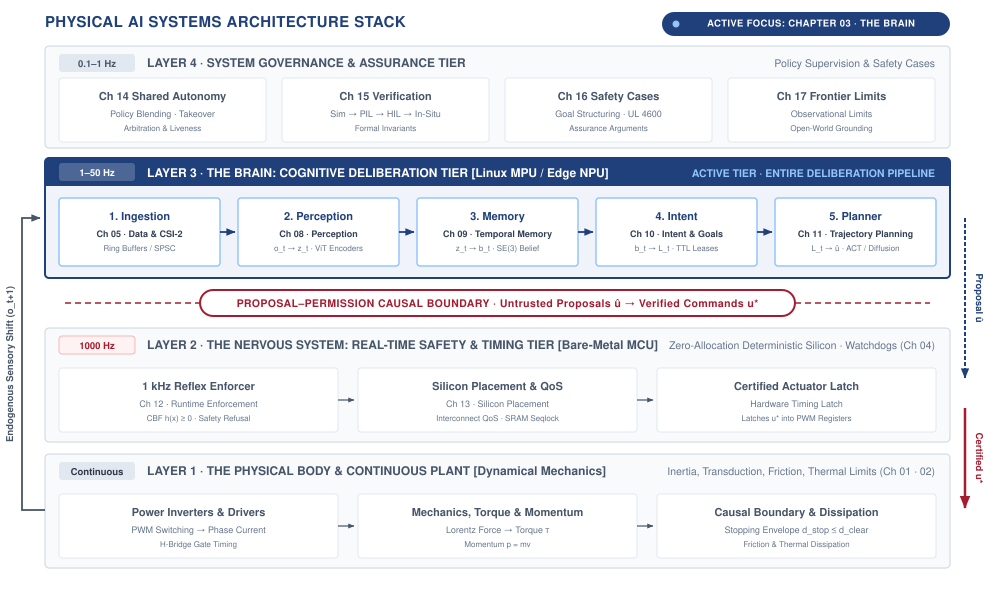
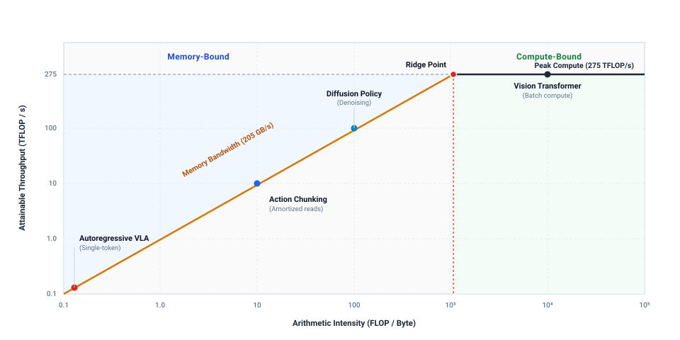
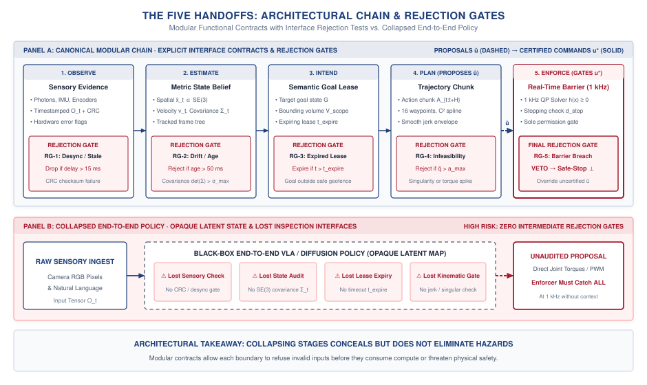

# The Cognitive Brain {#sec-brain}

::: {layout-narrow}
::: {.column-margin}

\chapterminitoc

:::

::: {.content-visible when-format="pdf"}
\noindent
{fig-alt="Isometric blueprint showing the cognitive brain architecture: heterogeneous SoC, NPU tensor systolic array, stacked HBM memory dies, high-speed weights streaming bus, and 3D action chunking token lattice."}
:::

::: {.content-visible unless-format="pdf"}
{fig-alt="Isometric blueprint showing the cognitive brain architecture: heterogeneous SoC, NPU tensor systolic array, stacked HBM memory dies, high-speed weights streaming bus, and 3D action chunking token lattice."}
:::

:::

## Purpose {.unnumbered .unlisted}

::: {.content-visible when-format="pdf"}
\begin{marginfigure}
\vspace{1em}
\resizebox{\linewidth}{!}{\mlphysicalstackfull{100}{20}{20}{20}{20}}
\end{marginfigure}
:::

_How does an autonomous agent deliberate over high-dimensional sensory tokens without violating real-time physical deadlines?_

A robot operating among people must interpret changing surroundings and propose actions beyond a fixed sequence of programmed movements. Learned models extend that capability by connecting sensory observations with patterns acquired during training. Their usefulness does not establish that every proposal is physically feasible or that every inference will finish before the body needs its next command. Larger models consume memory bandwidth as well as arithmetic, and delays in moving their weights can leave a proposal based on an outdated view of the world. An incorrect proposal creates a separate problem even when it arrives on time. The architecture must therefore separate the brain's ability to suggest an action from permission to execute it. In physical AI systems architecture, the learned brain supplies candidate behavior while the nervous system retains control of timing and actuator authority, allowing adaptation within the measured limits of the physical body.



::: {.callout-learning-objectives}

- Compare classical and learned approaches for perception, generalization, and dependable physical execution
- Trace sensory evidence through the cognitive stages that produce a physical action proposal
- Evaluate trade-offs between reasoning capability, sensing robustness, spatial grounding, and update rate
- Diagnose cognitive failures caused by ambiguous observations, overconfidence, changing scenes, or expired information
- Apply proposal–permission separation to keep cognitive uncertainty from directly controlling physical actuation

:::

## The Embodied Brain {#sec-brain-4-1}

A robotic manipulator can satisfy every electrical and thermal budget established in @sec-body and still fail catastrophically when attempting to grasp an unfamiliar mug. The motor drives remain well within their continuous torque envelopes, the voltage distribution rails show zero droop, and the joint velocities remain below physical limits. Yet the machine drops the object or crushes the ceramic rim because low-level motor physics cannot determine what the object is, where its structural affordances lie, or how to reach around clutter. In disembodied artificial intelligence, language and vision models operate behind glass: an inaccurate token or a hallucinated bounding box terminates harmlessly in a display buffer or a web API response. In physical AI, however, the cognitive engine commands moving mass through three-dimensional space. As established by the causal boundary framework in @sec-boundary-1-2, the central systems dilemma of embodied cognition is that high-capacity neural models are inherently stochastic, computationally expensive, and prone to semantic hallucinations—yet they must orchestrate physical bodies whose collisions are irreversible.

::: {#dfn-brain-proposal-permission-decoupling .callout-definition title="The proposal–permission decoupling principle"}

***Proposal–permission decoupling principle***\index{Proposal-permission decoupling!definition}\index{Architectural boundaries} is the fundamental architectural separation in physical AI systems wherein high-capacity, stochastic neural deliberation models operate strictly as unprivileged motion proposal engines at deliberative cadences ($1\text{--}5\text{ Hz}$), while dedicated, deterministic reflex monitors hold exclusive real-time execution authority ($1000\text{ Hz}$) to grant or deny physical actuation permission.

1.  **Significance**: Prevents out-of-distribution neural hallucinations, inference pauses, or VLM softmax tails from commanding catastrophic physical movements or exceeding kinetic envelope boundaries.
2.  **Distinction**: Unlike classical monolithic end-to-end policies where a single neural network emits raw actuator torques directly, decoupled architectures enforce an uncrossable privilege boundary between unprivileged proposal generation and certified permission gating.
3.  **Common pitfall**: Treating the deterministic safety governor as a mere post-processing clamp on neural actions, rather than an independent, hard real-time monitor capable of preemptively revoking execution authority.

:::

Within the four-tier systems hierarchy shown in @fig-03-locator, this chapter centers on Layer 3: the Cognitive Brain. Positioned above the deterministic Real-Time Nervous System (Layer 2) and the Dynamical Physical Body (Layer 1), the brain functions under the Proposal–Permission Decoupling Principle as an unprivileged deliberation engine. It processes multimodal sensory fluxes and produces candidate action trajectories at deliberative cadences ($1\text{--}50\text{ Hz}$), while execution authority remains exclusively with downstream deterministic reflex monitors running at $1000\text{ Hz}$.[^fn-brain-reflex-governor] This asymmetric boundary ensures that cognitive exploration and semantic generalization never jeopardize the mechanical integrity of the machine.

[^fn-brain-reflex-governor]: **Downstream Reflex Monitors**\index{Reflex monitor!safety enforcement}\index{Control barrier function!runtime filtering}: Operating at Layer 2, these deterministic monitors evaluate control barrier functions and kinematic bounds, clamping or rejecting candidate action chunks that violate physical safety invariants before setpoints reach actuator hardware registers.

::: {#fig-03-locator fig-env="figure" fig-pos="htb" fig-cap="**The Brain in the Physical AI Stack**: The four-tier physical AI systems architecture highlights the cognitive deliberative layer. Operating above the real-time nervous system and physical body, the learned brain processes high-dimensional multimodal streams to generate candidate proposals, with execution authority reserved for downstream deterministic safety governors." fig-alt="Diagram titled Physical AI Systems Architecture Stack, drawn as four stacked tiers. Layer 4 is system governance and assurance at 0.1 to 1 hertz, holding boxes for shared autonomy, verification, safety cases, and frontier limits. Layer 3 is the brain, a cognitive deliberation tier at 1 to 50 hertz, holding five stages named ingestion, perception, memory, intent, and planner. A dashed proposal-permission privilege boundary separates it from layer 2, the nervous system, a real-time safety and timing tier at 1000 hertz. Layer 1 is the physical body and continuous plant. Layer 3 is shaded and outlined and the badge reads Active Focus, Chapter 03, The Brain."}
{width="100%"}
:::

To guide an autonomous physical agent in unstructured environments, an embodied cognitive architecture must satisfy five primary systems properties:

1. **Open-world semantic generalization**: Interpreting open-vocabulary natural language instructions and identifying novel, un-modeled objects without requiring rigid pre-programmed CAD templates.
2. **Continuous sensory robustness**: Ingesting raw high-dimensional perceptual streams while absorbing optical glare, dust, motion blur, and dynamic illumination shifts without brittle perception failures.
3. **Metric spatial-temporal grounding**: Anchoring abstract semantic concepts to metric physical coordinates in three-dimensional space, maintaining continuous spatial permanence as objects become occluded.[^fn-brain-metric-grounding]
4. **Multi-rate cadence decoupling**: Bridging the three-order-of-magnitude frequency gap illustrated in @fig-cadence-gap between multi-billion-parameter foundation models deliberating at human speeds ($1\text{--}5\text{ Hz}$) and low-level control loops stabilizing hardware at high frequencies ($20\text{--}1000\text{ Hz}$).
5. **Bounded execution authority**: Enforcing that stochastic statistical models remain unprivileged proposal engines, holding zero direct write access to motor inverter power stages.

[^fn-brain-metric-grounding]: **Metric Spatial Grounding**\index{Metric spatial grounding}\index{Special Euclidean group!SE(3) grounding}: While disembodied AI operates over discrete semantic tokens, physical AI must ground those semantics in the Special Euclidean group $SE(3)$, mapping entities to metric distances (meters) and spatial orientations (quaternions) relative to the robot's base coordinate frame. Failing to maintain this metric grounding causes neural policies to emit kinematically impossible Cartesian paths that breach actuator workspace boundaries.

Across our three physical reference archetypes (@sec-boundary-1-3), these cognitive affordances map to distinct operational responsibilities:

- **Mobile Systems (AMR / AGV)**: The brain constructs topological-metric semantic maps, resolving spatial navigation goals ("deliver parcel to dock 4B") while monitoring dynamic obstacles across $1\text{--}5\text{ Hz}$ global path replanning cadences.
- **Manipulators (Articulated Arms)**: The brain predicts 6-DoF end-effector grasp affordances and continuous action chunk trajectories ($\mathbf{A}_{t:t+H}$), resolving target object poses under camera occlusion and hand-eye parallax.
- **Process and Energy Systems**: The brain forecasts multi-step thermal and chemical state trajectories, proposing setpoint adjustments for mass flow and temperature to optimize efficiency while honoring hard physical envelopes.

::: {#fig-cadence-gap fig-env="figure" fig-pos="htb" fig-cap="**The Cadence Gap**: Inference frequency against parameter count for control models, vision backbones, and embodied foundation models. Small controllers occupy the real-time band above twenty hertz while multi-billion-parameter models fall into the one-to-five hertz deliberative band, so generality is purchased directly with cadence." fig-alt="Log-log scatter of inference frequency against model parameter count, colored by system class. Small control models occupy a shaded real-time band above twenty hertz, while large vision-language models fall into a shaded deliberation band between one and five hertz, so frequency falls as parameter count rises."}

```{python}
#| echo: false
import pandas as pd
import matplotlib.pyplot as plt
from mlsysim import viz

data = pd.read_csv("vol4/03_brain/data/brain_frequency_vs_parameters.csv")
fig, ax, COLORS, plt = viz.setup_plot(figsize=(7, 4.5))

_groups = list(dict.fromkeys(data["Category"]))
_cmap = plt.get_cmap('viridis', max(len(_groups), 2))
for _i, _g in enumerate(_groups):
    _sub = data[data["Category"] == _g]
    ax.scatter(_sub["Parameters"], _sub["Frequency_Hz"], color=_cmap(_i), label=str(_g), s=150)

ax.set_xscale("log")
ax.set_yscale("log")

ax.axhspan(20, 1000, color='gray', alpha=0.1, label='Real-Time Control (20+ Hz)')
ax.axhspan(1, 5, color='red', alpha=0.05, label='Cognitive Deliberation (1-5 Hz)')

for idx, row in data.iterrows():
    ax.text(row["Parameters"] * 1.3, row["Frequency_Hz"], row["Model"], fontsize=9, verticalalignment='center')

ax.set_xlabel("Model Parameters (Log Scale)")
ax.set_ylabel("Inference Frequency [Hz] (Log Scale)")
plt.legend(bbox_to_anchor=(1.02, 1), loc='upper left', frameon=False)
ax.margins(x=0.14, y=0.14)
plt.tight_layout()
plt.show()
plt.close()
```

:::

Reconciling open-world reasoning with deterministic physical execution requires a systematic progression through the cognitive hierarchy:

We begin in @sec-brain-4-2 by examining the Classical Wall, analyzing why traditional robotics pipelines—constructed on hand-authored CAD models, explicit inverse kinematics, and rigid finite-state machines—fail when deployed in unconstrained, deformable environments. In @sec-brain-4-3, we explore learned representations, detailing how deep multimodal encoders and foundation models learn spatial affordances and generalizable sensorimotor representations from demonstrations. In @sec-brain-4-4, we trace the complete five-stage cognitive pipeline ($\text{Ingestion} \to \text{Perception} \to \text{Memory} \to \text{Intent} \to \text{Planning}$), showing how multi-step action chunking amortizes inference latency to emit smooth, continuous trajectory proposals. Finally, in @sec-brain-4-5, we diagnose critical cognitive vulnerabilities—including semantic hallucinations, out-of-distribution overconfidence, perceptual chattering, and stale intent—and establish their architectural resolution through the two-speed brain.

## The Classical Wall {#sec-brain-4-2}

For nearly a century, automated control and robotics approached cognition as an explicit geometric and analytical physics problem [@wiener1948cybernetics; @kalman1960new; @craig2005introduction]. Under this classical paradigm, engineers constructed mathematical representations from first principles.

Engineers used analytical kinematics and differential dynamics to map desired end-effector motions into actuator torques using closed-form equations.[^fn-math-classical-dynamics] Perception relied on matching hand-crafted 3D Computer-Aided Design (CAD) models against sensor point clouds using geometric alignment algorithms, such as iterative closest point (ICP) or random sample consensus (RANSAC). High-level task logic was authored as explicit Boolean state machines that dictated deterministic transitions between operational phases, such as approaching, aligning, grasping, and retracting.

[^fn-math-classical-dynamics]: **Rigid-Body Dynamics Formulation**\index{Rigid-body dynamics!Euler-Lagrange formulation}\index{Equations of motion!manipulator dynamics}: Classical control computes generalized torques via the standard manipulator equation $\mathbf{M}(\mathbf{q})\ddot{\mathbf{q}} + \mathbf{C}(\mathbf{q}, \dot{\mathbf{q}})\dot{\mathbf{q}} + \mathbf{g}(\mathbf{q}) = \boldsymbol{\tau}$, where $\mathbf{M}(\mathbf{q})$ represents the positive-definite inertia matrix, $\mathbf{C}(\mathbf{q}, \dot{\mathbf{q}})$ captures Coriolis and centripetal terms, and $\mathbf{g}(\mathbf{q})$ accounts for gravitational loading. This analytical formulation becomes computationally intractable and physically inaccurate when machines interact with unmodeled frictional contacts, fluid drag, or deformable objects. Derivations are provided in @sec-appendix-control.

::: {#fig-industrial-welding fig-env="figure" fig-pos="t" fig-cap="**Industrial Spot-Welding Workcell**: Multiple six-degree-of-freedom articulated robots execute preprogrammed spot welding paths on stamped automotive chassis at the BMW Leipzig plant. Operating in a calibrated factory environment with submillimeter repeatable fixtures and safety interlock cages, classical controllers provide deterministic cycle timing and formal stability proofs. (Credit: BMW Group / Wikimedia Commons, CC BY-SA 2.0 de)." fig-alt="Articulated industrial robots executing automated spot welding on an automotive chassis within a safety-caged factory cell."}
{width="85%"}
:::

Where the operational environment is strictly structured and bounded (@fig-industrial-welding), classical methods represent the pinnacle of dependable engineering. On an automated automotive assembly line, an industrial robot welds stamped steel panels where every workpiece arrives at an exact coordinate within sub-millimeter tolerances. Ambient lighting is tightly regulated by industrial fixtures, and human workers are excluded by physical interlock safety fences. Within the causal boundary defined in @sec-boundary-1-2, this controlled regime allows classical algorithms to provide complete mathematical transparency, deterministic sub-millisecond servo cycle timing (typically 1 kHz), and provable stability certificates. An engineer can formally prove Lyapunov stability, guarantee that trajectories stay within joint torque bounds, and achieve structural code coverage under industrial functional safety standards (such as ISO 10218 and IEC 61508 / ISO 26262) without collecting a single demonstration.

Yet the moment an embodied machine leaves the structured factory cage to operate in unstructured environments (@fig-unstructured-rescue), this classical paradigm hits what roboticists describe as the Classical Wall [@brooks1991intelligence; @levine2018learning]. The physical world is not a sterile CAD drawing; it is continuous, deformable, uncataloged, and endlessly variable.

::: {#fig-unstructured-rescue fig-env="figure" fig-pos="t" fig-cap="**Unstructured Search-and-Rescue Robot**: A tracked mobile robot navigates an obstacle course with irregular inclines, loose debris, and visual occlusions. In such unmapped environments, preauthored geometric models and rigid state machines fail, requiring physical AI policies to infer spatial affordances and traversability directly from multimodal sensory streams. (Credit: TU Darmstadt Rescue Robotics / Wikimedia Commons, CC BY-SA 3.0)." fig-alt="Tracked mobile robot traversing irregular rubble and wooden obstacles in an unstructured search-and-rescue test arena."}
{width="85%"}
:::

The first breakdown occurs in the combinatorial explosion of geometry. In a commercial logistics warehouse handling hundreds of thousands of retail goods, authoring CAD models, mesh templates, and grasp points for every bottle, wrapped package, and flexible garment is impossible. Discretizing orientations, frictional properties, and contact permutations across overlapping, deformable items creates a combinatorial space exceeding billions of distinct geometric configurations that cannot be captured in hand-crafted templates.

The second breakdown arises from sensory brittleness. Classical computer vision relies on hand-crafted feature extractors, such as edge filters, Harris corner detectors, or surface normal thresholds. When ambient sunlight shifts, water puddles create specular reflections, or an object is partially obscured by dust, discrete feature detectors fracture. A single missing edge causes a planar segmentation algorithm to bridge across two distinct physical objects, commanding a gripper to pinch an empty void.

The third breakdown is the engineering bottleneck of hand-authored logic. In classical systems, the machine's operational capability is bounded by the human engineer's ability to anticipate every physical edge case in advance. When an unexpected variation occurs—such as a bent bracket, a scuffed label, or an unfamiliar obstacle—the hand-authored rulebook contains no matching branch, causing the machine to halt, drop its payload, or fail catastrophically.

To escape this combinatorial fragility, embodied systems require representations that do not attempt to enumerate every physical contingency by hand, but instead discover smooth, generalizable structure directly from multimodal sensory data.

## Learned Representations {#sec-brain-4-3}

In contrast to rigid pre-programmed models (@sec-boundary-1-1), physical AI dismantles the classical wall by replacing hand-authored heuristics with deep neural representations fitted directly to multimodal sensory data. In the embodied AI and robotics community, this transition was driven by four foundational pillars:

The first pillar is open-world semantic generalizability. Classical controllers are inherently narrow: an inverse kinematics solver can move an end-effector to coordinate $(x, y, z)$, but it possesses zero semantic understanding of what resides at that location or how surrounding objects relate to human tasks. Modern vision-language-action foundation models project open-vocabulary natural language instructions and high-resolution camera streams into shared semantic embeddings [@driess2023palme; @brohan2023rt1; @brohan2023rt2; @kim2024openvla]. When commanded to "wipe the coffee spill from the counter and stow the mug in the drying rack," a learned model parses the unstructured scene into functional affordances, identifying the graspable handle of an unfamiliar mug and the planar boundaries of the liquid stain without requiring an engineer to provide a 3D CAD model or write a single line of procedural code.

The second pillar is continuous sensory robustness. While classical algorithms suffer from Boolean brittleness—where a minor shift in illumination or surface texture abruptly flips a discrete classification branch and disrupts downstream execution—deep neural networks project high-dimensional sensory inputs onto smooth, continuous latent manifolds. Physically, this means variations in ambient illumination, background clutter, shadow transitions, and camera perspective produce gradual, bounded displacements in the internal representation rather than catastrophic, jerky physical jumps in the robot's behavior.

The third pillar is the ability to handle complex multi-contact and deformable dynamics. Many physical manipulation tasks—such as folding textiles, routing flexible wire harnesses through automotive door assemblies, or scooping granular media—involve non-smooth contact mechanics, variable friction, and infinite-dimensional deformations that cannot be modeled in closed-form differential equations. By learning directly from physical teleoperation demonstrations, neural policies acquire compliance-aware sensorimotor strategies that modulate contact forces and yield to unexpected mechanical resistance rather than driving blindly into stiff obstacles.

The fourth pillar is empirical scaling with data and compute. As articulated by Richard Sutton in *The Bitter Lesson* [@sutton2019bitter], methods that leverage general computation and large-scale learning consistently surpass hand-engineered domain heuristics over time. By training high-capacity transformer architectures across millions of diverse robotic teleoperation demonstrations (@fig-aloha-manipulator) and web-scale multimodal datasets [@zhao2023learning; @chi2024diffusionpolicy], physical AI systems steadily improve in dexterity and resilience without requiring engineers to manually re-author control logic for each new task.

::: {#fig-aloha-manipulator fig-env="figure" fig-pos="t" fig-cap="**Bimanual Teleoperation Workcell**: Dual-arm teleoperation setup featuring two six-degree-of-freedom follower arms, two leader arms for kinesthetic teleoperation, multi-view cameras (overhead and wrist-mounted), and parallel grippers mounted to an extruded aluminum frame. The physical AI policy ingests synchronized multi-camera streams to predict continuous end-effector trajectories, requiring deterministic safety governors to prevent self-collisions and motor over-torquing during closed-loop execution. (Credit: Stanford University & Google DeepMind, CC-BY / Apache 2.0)." fig-alt="Dual-arm robotic teleoperation workstation with leader and follower arms, overhead cameras, and grippers mounted on an aluminum frame."}
{width="85%"}
:::

::: {#fig-vla-taxonomy fig-env="figure" fig-pos="t" fig-cap="**Embodied Model Taxonomy**: Systematic categorization of modern embodied foundation models spanning multimodal perceptual frontends (visual tokens, point clouds, language prompts), high-capacity neural backbones (transformers, diffusion heads, world models), and target action spaces. The taxonomy contrasts Vision-Language-Navigation policies that decode topological waypoints and semantic frontiers with Vision-Language-Action policies that emit joint and Cartesian trajectory chunks for articulated manipulators. (Adapted from Ma et al. [@ma2024vision])." fig-alt="Taxonomic diagram categorizing embodied foundation models into inputs, multimodal neural backbones, and navigation or manipulation action spaces."}
{width="95%"}
:::

::: {#fig-vla-architecture fig-env="figure" fig-pos="t" fig-cap="**Embodied Vision-Language-Action (VLA) Architecture and Spatial Organization**: First-principles dataflow through an embodied foundation model. (1) Multi-view camera frames are tiled into $P \times P$ spatial patches, flattened, and projected with 2D spatial positional embeddings ($\mathbf{E}_{\text{pos}}^{2D}$) and camera identifiers to preserve workspace topology alongside tokenized language instructions and proprioceptive telemetry. (2) The multimodal transformer backbone computes cross-attention ($A_{i,j} = \text{softmax}(\mathbf{q}_i^\top \mathbf{k}_j / \sqrt{d_k})$), dynamically projecting instruction tokens (such as 'handle') into spatial affordance heatmaps over physical patch coordinates. (3) Specialized action decoders map latent states to proposals: discrete token binning (top) incurs memory-wall latency due to sequential autoregression, whereas continuous action chunking (bottom) denoises multi-step trajectory chunks ($\mathbf{A}_{t:t+H}$) in on-chip cache. (4) The unprivileged candidate trajectory is published across lock-free shared memory to a deterministic $1000\text{ Hz}$ safety shield on bare-metal silicon, which enforces Control Barrier Functions and stopping envelopes before gating PWM signals to actuators. (Synthesized from Brohan et al. [@brohan2023rt1; @brohan2023rt2], Kim et al. [@kim2024openvla], and Octo Model Team [@octo_2023])." fig-alt="Comprehensive architectural schematic of a Vision-Language-Action foundation model showing spatial patch slicing, 2D positional embeddings, multimodal transformer cross-attention affordance heatmaps, discrete vs continuous action chunk decoders, and the 1000 Hz proposal-permission safety boundary."}
{width="100%"}
:::

As structured in modern embodied artificial intelligence (@fig-vla-taxonomy and @fig-vla-architecture), an embodied foundation model is not an opaque monolith. It is a structured four-stage neural pipeline that transforms incoming physical fluxes into kinematically feasible candidate proposals. To understand how a model reasons about the physical world, a systems engineer must trace how spatial information is organized, aligned with human intent, and translated into motor proposals across four distinct architectural stages:

1. **Sensory Ingestion and Spatial Tokenization (The Inputs):**
   A digital camera produces a raster grid of pixels $\mathbf{I} \in \mathbb{R}^{H \times W \times C}$. Ingesting raw pixels directly into a standard multilayer perceptron destroys spatial locality and causes parameter counts to explode. Instead, modern embodied models tokenize visual space through a vision transformer frontend:

   - *Spatial patch partitioning:* The continuous 2D image plane is partitioned into a uniform grid of non-overlapping square patches of dimension $P \times P$ pixels (typically $P = 14$ or $16$). For an image of resolution $H \times W$, this yields an array of $N_v = (H / P) \times (W / P)$ discrete visual patches. Each 2D patch is flattened into a one-dimensional vector $\mathbf{x}_p^{(u, v)} \in \mathbb{R}^{P^2 C}$, where $(u, v)$ denotes the patch row and column index in the camera plane.
   - *Linear embedding and spatial topology injection:* A learned projection matrix $\mathbf{W}_{\text{patch}} \in \mathbb{R}^{(P^2 C) \times d_{\text{model}}}$ maps each flattened patch into the model's hidden dimension. Because transformer self-attention is mathematically permutation-invariant (treating inputs as an unordered set), the model possesses zero native awareness of spatial proximity without explicit coordinate grounding. To preserve physical geometry, the architecture injects a two-dimensional spatial positional embedding $\mathbf{E}_{\text{pos}}^{2D}(u, v)$:
     $$\mathbf{z}_0^{(u, v)} = \mathbf{x}_p^{(u, v)} \mathbf{W}_{\text{patch}} + \mathbf{E}_{\text{pos}}^{2D}(u, v) + \mathbf{e}_{\text{cam}}$$
     The 2D positional embedding decomposes along the vertical axis $u$ and horizontal axis $v$ using sinusoidal frequency bands or learned 2D coordinate embeddings, ensuring that adjacent patches in the physical camera view maintain geometric proximity in latent space. When multiple cameras are deployed (such as an overhead third-person camera providing global scene context alongside an eye-in-hand wrist camera providing millimeter-scale alignment), a learned camera identifier $\mathbf{e}_{\text{cam}} \in \{\mathbf{e}_{\text{overhead}}, \mathbf{e}_{\text{wrist}}\}$ is added to distinguish perspective reference frames.
   - *Multimodal sequence assembly:* Natural language task directives (e.g., "grasp the red mug by its handle") are tokenized via byte-pair encoding into a sequence of text embeddings $\mathbf{z}_{\text{text}} \in \mathbb{R}^{L \times d_{\text{model}}}$. Concurrently, the robot's physical configuration (joint angles $\mathbf{q}_t$, joint velocities $\dot{\mathbf{q}}_t$, and gripper state) is projected through a linear layer into proprioceptive tokens $\mathbf{z}_{\text{state}} \in \mathbb{R}^{K_s \times d_{\text{model}}}$. These streams concatenate into a unified multimodal input sequence:
     $$\mathbf{Z} = [\mathbf{z}_{\text{vision}} \,|\, \mathbf{z}_{\text{text}} \,|\, \mathbf{z}_{\text{state}}] \in \mathbb{R}^{N_{\text{total}} \times d_{\text{model}}}$$

2. **Multimodal Alignment, World Modeling, and Spatial Cross-Attention (The Backbone):**
   The combined token sequence $\mathbf{Z}$ passes through 32 to 80 transformer layers consisting of multi-head self-attention and feed-forward networks. The self-attention operation projects tokens into queries $\mathbf{Q} = \mathbf{Z} \mathbf{W}_Q$, keys $\mathbf{K} = \mathbf{Z} \mathbf{W}_K$, and values $\mathbf{V} = \mathbf{Z} \mathbf{W}_V$, computing pairwise attention weights:
   $$A_{i, j} = \frac{\exp\left(\mathbf{q}_i^\top \mathbf{k}_j / \sqrt{d_k}\right)}{\sum_{m} \exp\left(\mathbf{q}_i^\top \mathbf{k}_m / \sqrt{d_k}\right)}$$

   Crucially, this cross-attention mechanism solves the grounding problem: it dynamically binds symbolic words to physical patches. When the text query token $\mathbf{q}_{\text{handle}}$ cross-attends with visual key tokens $\mathbf{k}_j$, the attention weights $A_{i, j}$ peak over the spatial patches $(u, v)$ corresponding to the mug handle. This operation generates a **spatial affordance heatmap** over the 2D image plane, identifying where the end-effector should engage while dampening irrelevant visual clutter (such as tabletop reflections or background machinery).

   Simultaneously, the transformer maintains an integrated **world model**\index{World model!attention memory} or rolling key-value (KV) attention cache across consecutive frames. This temporal memory tracks object permanence: if the robot's own arm or an external worker temporarily occludes the target mug, the latent representation maintains the mug's 3D spatial position and velocity, ensuring continuous tracking without erratic stops.

3. **Specialized Action Decoders (The Outputs):**
   Instead of generating conversational text, the final hidden layer $\mathbf{h}_{\text{context}}$ feeds task-specific action decoders. While navigation models (VLN) emit topological waypoints or heading rates $(v_t, \omega_t)$ (@fig-vln-navigation), manipulation models (VLA) diverge sharply in how they bridge semantic representations to physical motion:

   * *Discrete Categorical Tokenization (RT-1, RT-2, OpenVLA):* Early VLAs adapt autoregressive language modeling directly to robotics by discretizing continuous joint or Cartesian offsets into $B = 256$ uniform bins per dimension [@brohan2023rt1; @brohan2023rt2; @kim2024openvla]:
     $$\text{bin}(a_k) = \left\lfloor \frac{a_k - a_{\min}}{a_{\max} - a_{\min}} \times 255 \right\rfloor \in [0, 255]$$
     Each bin is assigned a discrete token (`<act_000>` to `<act_255>`) in the language vocabulary. While this natively leverages web-scale vision-language pretraining, it introduces a severe systems bottleneck: predicting a 7-DoF robot action requires 7 sequential autoregressive forward passes per control step. Streaming all multi-billion parameters from external DRAM across the memory bus 7 times induces a forward latency exceeding $600\text{ ms}$ on edge SoCs, violating real-time deadlines. Furthermore, scalar binning introduces quantization chatter ($\Delta a = (a_{\max} - a_{\min}) / 256$), preventing smooth force compliance during delicate contact tasks.
   * *Continuous Generative Action Chunking (Octo, $\pi_0$, ACT, Diffusion Policy):* To overcome the autoregressive memory wall, modern generalist policies couple the transformer backbone with continuous generative decoders, such as diffusion policy heads [@chi2024diffusionpolicy; @octo_2023] or flow-matching action experts [@black2024pi0]. Rather than predicting a single scalar per forward pass, the model predicts an entire continuous trajectory chunk:
     $$\mathbf{A}_{t:t+H} = [\mathbf{a}_t, \mathbf{a}_{t+1}, \dots, \mathbf{a}_{t+H-1}] \in \mathbb{R}^{H \times d_a} \quad (H = 16\text{--}50\text{ steps})$$
     Because the high-capacity vision-language backbone evaluates once per chunk at a relaxed rate ($2\text{--}5\text{ Hz}$), while the lightweight generative action head denoises continuous trajectories in on-chip SRAM cache, action chunking amortizes DRAM memory sweeps by $10\times$. Downstream cubic or quintic splines interpolate the chunk at $20\text{--}50\text{ Hz}$, providing responsive, high-rate control while natively modeling multimodal demonstration distributions without mode collapse.

4. **The Privilege Boundary (Isolation from Actuators):**
   Crucially, whether the model is a VLN mobility planner or a VLA manipulation policy, its output is strictly an **unprivileged candidate proposal**\index{Unprivileged proposal!privilege boundary} ($p_t$). Following the architectural isolation principle of @sec-boundary-1-2, the foundation model operates in unprivileged user space on the application processor (MPU) and possesses **zero direct hardware authority** to write pulse-width modulation (PWM) registers or physically switch current into the motor coils *(as formalized in the Proposal–Permission Decoupling Principle, \ref{dfn-brain-proposal-permission-decoupling})*.

   A fundamental physical invariant of this boundary is that the cognitive brain proposes kinematic setpoints ($\mathbf{q}, \dot{\mathbf{q}}, \ddot{\mathbf{q}}$ or Cartesian poses), **never motor torques ($\boldsymbol{\tau}$)**. Motor torque is directly coupled to continuous plant dynamics:
   $$\boldsymbol{\tau} = \mathbf{M}(\mathbf{q}) \ddot{\mathbf{q}} + \mathbf{C}(\mathbf{q}, \dot{\mathbf{q}}) \dot{\mathbf{q}} + \mathbf{g}(\mathbf{q}) + \boldsymbol{\tau}_{\text{contact}}$$
   Because inertia $\mathbf{M}(\mathbf{q})$ and Coriolis forces $\mathbf{C}(\mathbf{q}, \dot{\mathbf{q}})$ vary non-linearly with instantaneous joint configuration and velocity, commanding open-loop torques from a slow $1\text{--}10\text{ Hz}$ neural model without high-frequency feedback guarantees dynamic instability—any minor model error, frictional variation, or unmodeled payload discrepancy causes the limb to accelerate wildly into joint limits. Kinematic setpoints, by contrast, specify an intended spatial path while delegating high-gain closed-loop torque synthesis to the deterministic $1000\text{ Hz}$ nervous system and $10\text{--}25\text{ kHz}$ field-oriented current loops.

   Proposals are dispatched across lock-free shared memory to downstream real-time safety monitors on isolated microcontrollers (MCUs). These hardware-level watchdogs evaluate physical stopping distances, torque limits, and the actuator thermal envelopes detailed in @sec-body-2-5 at $1000\text{ Hz}$ before granting execution permission, ensuring that an algorithmic hallucination cannot command a motion that would physically damage the robot or its environment.[^fn-math-unprivileged-control]

[^fn-math-unprivileged-control]: **Proposal-Permission Privilege Boundary**\index{Privilege boundary!unprivileged proposals}\index{Control barrier function!safety invariance}: Treating the neural policy as an unprivileged proposal generator isolates stochastic inference from actuator registers. Candidate trajectory setpoints $\mathbf{q}_{\text{ref}}(t)$ are continuously evaluated against forward-invariant Control Barrier Functions (CBFs) $h(\mathbf{x}) \ge 0$ on dedicated safety silicon, ensuring that kinematic exploration or perceptual hallucination cannot command setpoints that violate actuator limits or collision envelopes. Mathematical formulations of CBFs appear in @sec-appendix-control.

::: {#fig-vln-navigation fig-env="figure" fig-pos="t" fig-cap="**Topological Vision-Language Navigation**: Embodied navigation architecture executing natural-language spatial instructions. Panoramic visual observations are encoded into perceptual tokens, matched against prompt embeddings, and cross-referenced with a dynamically updated topological navigation graph. The action decoder prunes unreachable nodes and emits metric waypoint offsets $(\Delta x, \Delta y)$ and heading setpoints to guide the chassis along traversable semantic frontiers without requiring an exact geometric prior map. (Adapted from An et al. [@an2023etpnav])." fig-alt="Schematic of topological vision-language navigation showing panoramic observation tokens, topological graph matching, and decoded waypoint offsets and heading setpoints."}
{width="95%"}
:::

::: {#chk-brain-proposal-permission-cadence .callout-checkpoint title="Proposal–permission boundary, cadence gaps, and torque isolation"}
- [ ] **Proposal–permission separation**: Can you explain why high-capacity foundation models operate strictly as unprivileged motion proposal engines at deliberative cadences ($1\text{--}5\text{ Hz}$), while execution authority remains exclusively with downstream deterministic reflex monitors at $1000\text{ Hz}$?
- [ ] **Kinematic setpoints versus torque authority**: Can you derive why commanding open-loop motor torques ($\boldsymbol{\tau}$) from a slow neural policy guarantees dynamic instability under non-linear Coriolis and inertial dynamics ($\mathbf{M}(\mathbf{q})\ddot{\mathbf{q}} + \mathbf{C}(\mathbf{q}, \dot{\mathbf{q}})\dot{\mathbf{q}}$), and why policies must propose kinematic trajectories instead?
- [ ] **Spatial patch coordinate grounding**: Can you describe why transformer self-attention is permutation-invariant without positional encodings, and how 2D spatial embeddings ($\mathbf{E}_{\text{pos}}^{2D}$) alongside camera identifiers anchor abstract tokens to physical workspace coordinates?
:::

## The Cognitive Pipeline {#sec-brain-4-4}

Extending the proposal-permission architecture from @sec-brain-4-1, to architect a learned cognitive pipeline we must trace how information flows from raw physical sensations to actionable trajectory setpoints. Rather than treating the brain as an unstructured end-to-end black box, a dependable physical AI architecture organizes cognition into five sequential stages (@fig-cognitive-pipeline): Ingestion, Perception, Memory, Intent, and Planning.

::: {#fig-cognitive-pipeline fig-env="figure" fig-pos="t" fig-cap="**The Physical AI Cognitive Flow**: Information flows sequentially from physical sensors through Ingestion (tokenization), Perception (spatial geometry and affordances), Memory (persistent world model belief), Intent (deliberative goal leases), and Planning (multi-step action chunking), crossing the proposal-permission boundary to downstream real-time reflexes." fig-alt="Horizontal flowchart of the five-stage cognitive pipeline: Ingestion, Perception, Memory, Intent, and Planning, culminating at the proposal-permission boundary."}
{width="95%"}
:::

### Ingestion and representation {.unnumbered}

At the sensory interface of this causal boundary (@sec-boundary-1-2), cognition begins where environmental energy is transduced into digital bitstreams. Photons strike active-pixel CMOS sensors across 2D camera grids, infrared pulses measure photon time-of-flight in depth cameras, and micro-electromechanical systems (MEMS) in inertial measurement units (IMUs) sample accelerations and angular velocities.

The ingestion stage translates these heterogeneous, high-bandwidth bitstreams—ranging from analog voltage spikes to digital pixel grids—into normalized numerical embeddings, a uniform mathematical vocabulary that neural networks can process. For the mathematical formulation of patch embeddings and 3D metric lifting, see @sec-appendix-ml.
Because monocular 2D camera images suffer from fundamental scale-depth projective ambiguity—where a small near object and an identically shaped, proportionally larger distant object cast identical pixel projections—the ingestion stage must lift flat pixel arrays into 3D metric space. This grounds semantic concepts to physical coordinates in the robot's workspace, creating a unified multimodal state that downstream deliberative reasoning can use.[^fn-std-curriculum-deepdives]

[^fn-std-curriculum-deepdives]: **Cognitive Systems Progression**\index{Cognitive architecture!algorithmic progression}\index{Curriculum architecture!Part III mapping}: While this chapter establishes the overarching systems model of embodied cognition, rigorous mathematical and algorithmic formulations for each stage are developed in Part III, spanning spatial perception (@sec-perception), spatial memory (@sec-memory), grounded intent (@sec-intent), trajectory planning (@sec-planning), and real-time safety enforcement (@sec-enforcement).

Consider how this operates across the three machine archetypes:

- *Mobile systems:* A quadruped traversing rubble synchronizes four RGB-D cameras streaming at $30\text{ fps}$ ($>740\text{ MB/s}$ raw data) alongside 12 joint encoders sampled at $1000\text{ Hz}$. Ingestion tokenizes each visual frame into hundreds of patch embeddings while downsampling and embedding the high-frequency joint state stream into a unified temporal sequence.
- *Manipulators:* A dual-arm workstation ingests synchronized stereo wrist camera feeds ($60\text{ fps}$) and 14-DoF joint positions, tokenizing visual patches and motor states into aligned input tokens for end-effector coordination.
- *Process / energy systems:* A continuous chemical reactor ingests thousands of analog thermocouple, pressure transducer, and mass flow meter channels at $100\text{ Hz}$, normalizing heterogeneous sensor calibrations into a rolling multivariate state tensor.

This ingestion pipeline places substantial demands on data bandwidth and memory throughput. For an embodied machine equipped with $N_{\text{cameras}}$ synchronized visual streams at image resolution $H_{\text{img}} \times W_{\text{img}}$ processed by a vision transformer with patch dimension $P \times P$, the spatial token ingestion rate per frame is:

$$N_{\text{vision}} = N_{\text{cameras}} \times \left(\frac{H_{\text{img}}}{P}\right) \times \left(\frac{W_{\text{img}}}{P}\right)$$

For a typical multi-camera workstation ($N_{\text{cameras}} = 3$, $224 \times 224$ pixels, $P = 14$), every video frame generates $3 \times (16 \times 16) = 768$ visual tokens. Streaming multiple high-definition camera feeds generates gigabytes of raw pixel data every second. Systems engineers must implement efficient frame buffering, sensor exposure synchronization, and spatial patch pooling to keep data moving smoothly before cognitive reasoning begins.

### Perception and spatial grounding {.unnumbered}

The perception stage extracts metric structure, semantic identity, and spatial affordances from the ingested tokens. Rather than treating sensory data as an unstructured bag of visual features, perception grounds representations in the Special Euclidean group $SE(3)$, which formally defines rigid-body spatial configurations across translation and rotation coordinates.[^fn-math-se3-pose]

[^fn-math-se3-pose]: **Special Euclidean Group $SE(3)$**\index{Special Euclidean group!SE(3) rigid-body pose}\index{Lie group!rigid-body kinematics}: The Lie group $SE(3) = \mathbb{R}^3 \rtimes SO(3)$ defines the configuration of a rigid body in three-dimensional space, combining a translation vector $\mathbf{p} \in \mathbb{R}^3$ with an orthonormal rotation matrix $\mathbf{R} \in SO(3)$ satisfying $\mathbf{R}^\top \mathbf{R} = \mathbf{I}$ and $\det(\mathbf{R}) = +1$. Representing poses on $SE(3)$ avoids the mathematical singularities (gimbal lock) associated with Euler angles and provides a smooth manifold for trajectory optimization. Derivations are provided in @sec-appendix-control.

Using dense self-supervised representations such as DINOv2 [@oquab2023dinov2] alongside learned spatial decoders, the perception layer isolates distinct physical entities, segments object boundaries, estimates metric 3D bounding boxes, and reconstructs surface normal vectors. Crucially, perception extracts spatial affordances: functional geometric fields that describe where and how an object can be physically engaged. For a drill, perception identifies not merely a generic class label, but the 3D position and orientation of the handle grasp axis, the trigger contact surface, and the drill bit tip. This transforms ungrounded pixel arrays into actionable spatial entities referenced to the robot's base coordinate frame.

When a mobile manipulator is commanded to retrieve a torque wrench from a cluttered workbench, perception isolates the tool from surrounding background clutter, predicts its 6-DoF pose ($SE(3)$ transformation matrix $\mathbf{T}_{\text{base}}^{\text{tool}}$), and outputs a continuous heatmap over the handle indicating valid gripper pinch contacts.

In practice, perception is highly vulnerable to sensor calibration drift. If camera mounting fasteners deflect by fractions of a millimeter or structural linkages deform under heavy payload torque, the extrinsic calibration transformation matrix between the camera optical frame and the robot base coordinate frame drifts, compromising spatial registration. This introduces metric scale errors that cause precision grippers to miss targets or strike work surfaces. Systems engineers must implement online hand-eye recalibration routines and maintain spatial uncertainty covariances alongside raw point estimates.

### Memory and spatial-temporal belief {.unnumbered}

A physical agent cannot act reliably from a single instantaneous snapshot of the world. Objects pass behind visual occlusions, cameras pan away from manipulated targets, and physical bodies possess dynamic momentum that cannot be inferred from a single frame.

The memory stage maintains a persistent, rolling spatial-temporal belief of the environment. It tracks object identities across time, correlates visual features with geometric coordinate frames, and updates 3D volumetric representations such as Truncated Signed Distance Fields (TSDFs) [@curless1996volumetric], Language Embedded Radiance Fields (LERF) [@kerr2023lerf], or 3D Gaussian Splatting maps [@kerbl20233d]. By fusing historical observations across a sliding temporal window, memory maintains accurate state estimates even during complete visual occlusion, computes linear and angular object velocities, and tracks operational context across multi-step tasks.

For a quadruped traversing a rocky ledge, the forward-facing camera points toward the horizon, losing sight of the immediate ground beneath its front feet. The memory stage preserves the reconstructed 3D surface geometry of the terrain, enabling the robot to securely place its hind feet onto footholds it observed several seconds earlier.

Maintaining dense volumetric belief states introduces significant memory footprints. Storing high-resolution 3D voxel grids or radiance field parameters requires substantial storage capacity, competing directly with the memory needed to run large neural network models. Furthermore, belief representations degrade in freshness over time: if a dynamic obstacle moves while occluded, an un-decayed memory belief causes the robot to plan around a "phantom" obstacle or collide with an unobserved intruder. Systems engineers must enforce explicit temporal decay rates on spatial belief states to reflect physical entropy.

### Intent and deliberative reasoning {.unnumbered}

Given a persistent belief of the world and a high-level mission prompt, the intent stage performs semantic reasoning and task decomposition. Because open-vocabulary foundation models operate over vast parameter spaces (typically 7B to 70B parameters), deliberative reasoning occurs at slow, human-scale cadences ($1\text{--}5\text{ Hz}$).

To understand how intent operates, imagine a human operator issues a natural language mission prompt:

$$\text{"Clear the table by placing the ceramic mug in the sink and throwing the paper napkin into the trash bin."}$$

The intent layer cannot execute this directive in a single leap. Using embodied reasoning architectures such as SayCan [@ahn2022saycan], VoxPoser [@huang2023voxposer], or Code as Policies [@liang2023code], the deliberative model queries the active world memory and decomposes the mission into an ordered sequence of discrete subgoals: first approach the mug, grasp the handle, transport it to the sink coordinate frame, and release contact, before turning toward the napkin.

Rather than commanding actuator voltages directly, the intent stage packages each subgoal into a formal, cryptographically bounded **intent lease**\index{Intent lease!temporal contract} ($\mathcal{L}_{\text{intent}}$). An intent lease, structured according to the schema in @tbl-03-intent-lease-schema, specifies the active target entity, defines a bounded spatial corridor outside which motion is unauthorized, and establishes an explicit expiration timestamp ($t_{\text{expire}}$).

| Field Name             | Type            | Unit                   | Description & Structural Invariants                                                                                                         |
|:-----------------------|:----------------|:-----------------------|:--------------------------------------------------------------------------------------------------------------------------------------------|
| `lease_id`             | `uint64_t`      | —                      | Monotonically increasing 64-bit sequence identifier                                                                                         |
| `target_entity_id`     | `uint32_t`      | —                      | Hash of target entity in persistent spatial memory                                                                                          |
| `pose_target_se3`      | `float32[4][4]` | $\text{m}, \text{rad}$ | Valid $\text{SE}(3)$ pose matrix: $\mathbf{R} \in \text{SO}(3), \det(\mathbf{R})=1, \mathbf{p} \in \mathbb{R}^3$, bottom row $[0, 0, 0, 1]$ |
| `spatial_corridor_box` | `float32[6]`    | $\text{m}$             | Authorized 3D bounding box $[\mathbf{p}_{\min}, \mathbf{p}_{\max}] \in \mathbb{R}^6$                                                        |
| `t_generated_ns`       | `uint64_t`      | $\text{ns}$            | PTP monotonic hardware timestamp at deliberation completion                                                                                 |
| `t_expire_ns`          | `uint64_t`      | $\text{ns}$            | Hard expiration timestamp; enforces $t_{\text{expire}} - t_{\text{gen}} \le \tau_{\text{valid}}$                                            |
| `max_permissible_jerk` | `float32`       | $\text{m/s}^3$         | Maximum allowable end-effector / joint jerk magnitude                                                                                       |
| `hmac_signature`       | `uint8_t[32]`   | bytes                  | SHA-256 deliberation cryptographic contract signature                                                                                       |

: **Intent Lease Contract Schema**: Binary layout of the intent lease payload ($\mathcal{L}_{\text{intent}}$). {#tbl-03-intent-lease-schema tbl-colwidths="[20,18,22,40]"}

This deliberative cadence creates an inherent freshness gap. If a large vision-language foundation model requires $400\text{ ms}$ to generate an intent lease, the physical world has moved during that inference window. If the target mug was bumped or a coworker walked between the robot and the sink, the intent lease is partially stale before it reaches the motion planner. Systems engineers must bound intent lease lifetimes ($\tau_{\text{valid}}$) and enforce strict timeout rejection gates at execution time.
Because intent leases prescribe target envelopes rather than executable motor trajectories, the architecture delegates trajectory generation to a downstream planning stage that transforms symbolic intents into continuous, kinematically verified action chunks.

### Planning and action chunking {.unnumbered}

An intent lease specifies what operational goal to pursue, but it provides no continuous motor trajectories and no guarantee that intervening motion satisfies physical kinematic limits. The planning stage converts the active intent lease into candidate joint trajectories or end-effector motion setpoints via an **unprivileged action decoder head**.

To understand how planning is executed on physical silicon, we must treat deep neural policies not as abstract mathematical functions, but as physical compute workloads running on embedded accelerators—such as a canonical high-performance heterogeneous edge SoC with integrated GPU tensor cores and dedicated deep learning accelerators—bounded by memory bus bandwidth, silicon thermals, and electrical power.

Consider what happens if a robot attempts to generate continuous motor actions one discrete step at a time through an autoregressive foundation model (such as a 7-billion parameter Vision-Language-Action network). In single-step autoregressive decoding, generating each individual action token requires the processor to stream every parameter of the multi-billion-parameter foundation model from external Dynamic Random-Access Memory (DRAM) across physical bus traces into on-chip registers. For detailed memory wall derivations and roofline hardware models, see @sec-appendix-systems.

Executing neural policies token-by-token forces the processor to sweep gigabytes of weight matrices across the memory bus for every millisecond control step (see @fig-patterson-roofline) [@williams2009roofline]. This memory wall bottleneck traps inference cadences at single-digit frequencies ($1\text{--}5\text{ Hz}$). If an embodied manipulator attempted to control moving mass at $5\text{ Hz}$, the actuators would stutter across discrete steps, inducing severe contact instability and mechanical chatter.

Furthermore, this continuous data movement exacts a massive thermodynamic penalty. Fetching weights from off-chip DRAM consumes orders of magnitude more energy than the arithmetic computation itself, which drains battery reserves and causes thermal throttling on mobile robots.

::: {#psp-brain-memory-wall-ceiling .callout-perspective title="Memory walls in embodied inference"}
The memory wall ceiling is the absolute upper bound on model evaluation frequency ($f_{\max} = B_{\text{mem}} / M_{\text{weights}}$) imposed by external DRAM bus bandwidth when streaming non-resident neural network weights into on-chip vector registers. In single-step autoregressive inference, operational arithmetic intensity collapses to $I \approx 1.0\text{ FLOP/byte}$, stranding execution units in memory-stalled idle states and forcing the control rate below the mechanical resonance of the physical body.
:::

::: {#fig-patterson-roofline fig-env="figure" fig-pos="t" fig-cap="**Embodied Roofline Model**: Arithmetic intensity plotted against attainable throughput on a heterogeneous edge SoC. Single-step autoregressive inference sits at roughly $1.0\text{ FLOP/Byte}$, deep in the memory-bound regime where execution units stall waiting on DRAM weight sweeps and the achievable rate falls to about $14.6\text{ Hz}$. Action chunking moves the workload right along the roofline by amortizing one parameter sweep across many timesteps, allowing a slow deliberative model to supply a $1000\text{ Hz}$ reflex loop." fig-alt="Patterson roofline model plotting arithmetic intensity in FLOPs per byte against throughput, showing the memory-bound regime and the shift achieved by action chunking."}
{width="95%"}
:::

To break through this memory wall and deliver smooth, high-frequency continuous control, modern physical AI policies employ **action chunking**\index{Action chunking!temporal trajectory} [@zhao2023learning; @chi2024diffusionpolicy]:[^fn-math-vla-concept] predicting a sequence of $H$ future continuous actions $\mathbf{A}_{t:t+H} = [\mathbf{a}_t, \mathbf{a}_{t+1}, \dots, \mathbf{a}_{t+H}]$ in a single neural forward pass or fixed diffusion denoising schedule, amortizing parameter memory transfers across multiple real-time execution cycles.

[^fn-math-vla-concept]: **Vision-Language-Action (VLA) Models**\index{Vision-language-action model!trajectory synthesis}\index{Foundation model!embodied decoders}: Vision-Language-Action architectures replace discrete linguistic token generation with continuous motor trajectories $\mathbf{A}_{t:t+H}$, mapping multimodal perceptual tokens directly to joint or Cartesian setpoint sequences. By operating over continuous action representations, VLAs preserve spatial-temporal correlations while interfacing directly with downstream kinematic interpolators.

Instead of fetching billions of weights from DRAM to predict a single scalar action for the immediate millisecond, the planning policy (such as Action Chunking with Transformers [ACT], Diffusion Policy, or Flow Matching) generates an entire temporal horizon of continuous actions $\mathbf{A}_{t:t+H} = [\mathbf{a}_t, \mathbf{a}_{t+1}, \dots, \mathbf{a}_{t+H}] \in \mathbb{R}^{H \times d_a}$ (typically $H = 16\text{--}64$ steps spanning $320\text{--}1280\text{ ms}$) in a single forward pass or fixed denoising schedule ($K = 10\text{--}16$ diffusion steps).[^fn-math-action-chunking]

[^fn-math-action-chunking]: **Action Chunk Horizon Bounds**\index{Action chunking!temporal horizon bounds}\index{Kinodynamic drift!open-loop error accumulation}: Selecting the chunk horizon $H$ balances latency amortization against open-loop kinodynamic drift. While larger horizons reduce DRAM streaming frequency, errors in acceleration estimates accumulate quadratically over time ($\Delta x \approx \frac{1}{2} a_{\text{drift}} t^2$). Restricting $H \in [16, 64]$ steps ($320\text{--}1280\text{ ms}$) bounds spatial divergence within gripper tolerances before the next closed-loop observation is integrated. Analytical derivations appear in @sec-appendix-control.

::: {#dfn-brain-action-chunking .callout-definition title="Temporal action chunking"}

***Temporal action chunking***\index{Temporal action chunking!definition}\index{Action chunking!definition} is the policy formulation that predicts an entire horizon of $H$ future continuous actions $\mathbf{A}_{t:t+H} = [\mathbf{a}_t, \dots, \mathbf{a}_{t+H}]$ in a single neural evaluation or diffusion rollout, amortizing parameter memory transfers across extended physical execution windows.

1.  **Significance**: Single-step autoregressive neural control streams gigabytes of model weights from DRAM for each millisecond action, collapsing operational arithmetic intensity ($I \approx 1.0\text{ FLOP/byte}$) and capping inference cadence below $15\text{ Hz}$. Temporal action chunking raises arithmetic intensity $50\times$, shifting execution into the compute-bound roofline plateau and supplying high-density trajectory waypoints that downstream microcontrollers track at kilohertz rates.
2.  **Distinction**: Unlike single-step Markovian policies $\mathbf{a}_t \sim \pi(\cdot \mid \mathbf{o}_t)$ that re-evaluate the full neural network at every control step, action chunking deliberately generates multi-step feedforward trajectories, utilizing receded-horizon execution and temporal ensembling to reconcile slow neural deliberation with fast closed-loop reflexes.
3.  **Common pitfall**: Executing action chunks open-loop without continuous temporal smoothing or runtime safety filtering. Without smooth blending across overlapping chunk boundaries, switching between independently generated horizons injects acceleration jumps and torque shocks that excite mechanical gearbox resonances.

:::

| Field Name            | Type            | Unit                           | Description & Structural Invariants                                                        |
|:----------------------|:----------------|:-------------------------------|:-------------------------------------------------------------------------------------------|
| `chunk_id`            | `uint64_t`      | —                              | Monotonically increasing trajectory sequence ID                                            |
| `parent_lease_id`     | `uint64_t`      | —                              | Must match active unexpired Intent Lease ID                                                |
| `horizon_steps` ($H$) | `uint32_t`      | count                          | Temporal horizon length of candidate waypoints (e.g., $32$)                                |
| `step_duration_dt`    | `float32`       | $\text{s}$                     | Fixed inter-waypoint control sampling period $\Delta t = 0.02\text{ s}$                    |
| `trajectory_q`        | `float32[H][N]` | $\text{rad}$ or $\text{m}$     | Planned joint positions for all $N$ degrees of freedom                                     |
| `trajectory_qdot`     | `float32[H][N]` | $\text{rad/s}$ or $\text{m/s}$ | Planned velocities satisfying $\lVert \dot{\mathbf{q}}_j \rVert \le \dot{q}_{\max,j}$      |
| `trajectory_qddot`    | `float32[H][N]` | $\text{rad/s}^2$               | Planned accelerations satisfying $\lVert \ddot{\mathbf{q}}_j \rVert \le \ddot{q}_{\max,j}$ |
| `t_generation_ns`     | `uint64_t`      | $\text{ns}$                    | PTP synchronized exposure timestamp of source observation                                  |

: **Action Chunk Trajectory Packet Schema**: Binary layout of the action chunk trajectory packet ($\mathbf{A}_{\text{chunk}}$). {#tbl-03-action-chunk-schema tbl-colwidths="[20,18,22,40]"}

As structured in the trajectory packet schema (@tbl-03-action-chunk-schema), by processing the entire trajectory horizon simultaneously across parallel matrix multiplications, action chunking increases the operational arithmetic intensity by orders of magnitude ($I \ge 50\text{--}100\text{ FLOP/byte}$). This shifts execution out of the memory-bound bottleneck and into the **compute-bound roofline plateau**, saturating tensor cores and allowing generative policies to synthesize candidate trajectory chunks at $20\text{--}50\text{ Hz}$ on compact embedded power envelopes ($15\text{--}60\text{ W}$).

For example, when a canonical bimanual manipulator threads a flexible USB cable (@fig-aloha-manipulator), it executes a 32-step action chunk. The policy emits coordinated 14-DoF joint setpoints that smoothly align both grippers, flex the cable, and insert the connector without pausing between individual control cycles.

However, action chunking introduces the critical systems challenge of **chunk seam continuity**. Because each action chunk is generated independently from rolling sensory observations, the tail of chunk $k$ and the head of chunk $k+1$ may exhibit slight positional and velocity discrepancies. If a controller concatenated these chunks directly, the resulting step-discontinuities in acceleration would inject massive jerk ($\dddot{\mathbf{q}}$) into the physical linkages, inducing mechanical shock, acoustic vibration, cycloidal pin wear, and motor overcurrent faults.

To guarantee smooth physical execution, systems implement **temporal ensembling**\index{Temporal ensembling!trajectory smoothing}, blending overlapping trajectory predictions via exponentially weighted averaging:

$$\mathbf{a}_t = \frac{\sum_{i=0}^{\min(t, H-1)} w_i \, \mathbf{a}_{t \mid t-i}}{\sum_{i=0}^{\min(t, H-1)} w_i}, \quad w_i = \exp(-m \cdot i)$$

where $\mathbf{a}_{t \mid t-i}$ represents the action predicted for time step $t$ by the action chunk initiated at time $t-i$, and $m > 0$ is a tunable temporal discount factor. The resulting smoothed waypoints are interpolated via quintic ($C^2$) splines by the downstream real-time nervous system at $1000\text{ Hz}$, ensuring continuous positions, velocities, and accelerations across all actuator joints while preserving valid $SE(3)$ transformations via Lie algebra $\mathfrak{se}(3)$ exponential maps or Spherical Linear Interpolation to maintain orthonormal rotation matrices.

```{python}
#| label: calc-brain-action-chunking-lpddr5
#| echo: false
# ┌─────────────────────────────────────────────────────────────────────────────
# │ ACTION CHUNKING LPDDR5 STREAMING AMORTIZATION (LEGO)
# ├─────────────────────────────────────────────────────────────────────────────
# │ Context: nbk-brain-lpddr5-memory-wall-bottleneck-action-chunking
# │ Goal:    Quantify memory wall relief via action chunking on embedded SoC.
# │ Show:    10.2 Hz single-step rate climbs to 327.7 Hz amortized across H=32.
# │ How:     t_stream = M_weights / B_sustained, tau_step = t_stream / H.
# └─────────────────────────────────────────────────────────────────────────────
from mlsysim import *
from mlsysim.core.units import *
from mlsysim.fmt import (
    fmt_params,
    fmt_memory,
    fmt_bandwidth,
    fmt_latency,
    fmt_time,
    fmt_qty,
    fmt_int,
    fmt_display_math,
    check,
)

class ActionChunkingLPDDR5:
    """Memory wall and action chunking amortization on an embedded physical AI SoC."""

    # ┌── 1. LOAD (Constants & Parameters) ─────────────────────────────────
    params = 7 * Bparam
    bytes_per_param = 2 * (byte / param)
    b_peak = 204.8 * (GB / second)
    bus_efficiency = 0.70
    chunk_horizon = 32

    # ┌── 2. EXECUTE (Compute) ─────────────────────────────────────────────
    weight_mem = memory_from_params(params, bytes_per_param)
    b_sustained = b_peak * bus_efficiency
    t_stream = transfer_time(weight_mem, b_sustained).to(millisecond)
    f_single = (1.0 / t_stream.to(second)).to(ureg.hertz)
    tau_step = (t_stream / chunk_horizon).to(millisecond)
    f_effective = (1.0 / tau_step.to(second)).to(ureg.hertz)

    # ┌── 3. GUARD (Invariants) ───────────────────────────────────────────
    check(abs(weight_mem.to(GB).magnitude - 14.0) < 0.1, f"Unexpected weight footprint: {weight_mem}")
    check(abs(b_sustained.to(GB / second).magnitude - 143.36) < 0.1, f"Unexpected sustained bandwidth: {b_sustained}")
    check(abs(t_stream.to(millisecond).magnitude - 97.66) < 0.2, f"Unexpected streaming time: {t_stream}")
    check(abs(f_single.magnitude - 10.24) < 0.1, f"Unexpected single frequency: {f_single}")
    check(abs(tau_step.to(millisecond).magnitude - 3.05) < 0.1, f"Unexpected step latency: {tau_step}")
    check(abs(f_effective.magnitude - 327.68) < 1.0, f"Unexpected effective frequency: {f_effective}")

    # ┌── 4. OUTPUT (Formatting) ──────────────────────────────────────────
    params_str = fmt_params(params, precision=0)
    weight_mem_str = fmt_memory(weight_mem, unit=GB, precision=0)
    b_peak_str = fmt_bandwidth(b_peak, unit=GB / second, precision=1)
    b_sustained_str = fmt_bandwidth(b_sustained, unit=GB / second, precision=1)
    t_stream_ms_str = fmt_latency(t_stream, unit=millisecond, precision=1)
    t_stream_s_str = fmt_time(t_stream.to(second), 'second', precision=4)
    f_single_str = fmt_qty(f_single, ureg.hertz, precision=1)
    chunk_horizon_str = fmt_int(chunk_horizon)
    tau_step_str = fmt_latency(tau_step, unit=millisecond, precision=2)
    f_effective_str = fmt_qty(f_effective, ureg.hertz, precision=1)

    t_stream_display_math = fmt_display_math(rf"t_{{\text{{stream}}}} = \frac{{{weight_mem_str}}}{{{b_sustained_str}}} \approx {t_stream_ms_str}")
    f_single_display_math = fmt_display_math(
        rf"f_{{\text{{single}}}} = \frac{{1}}{{t_{{\text{{stream}}}}}} \approx \frac{{1}}{{{t_stream_s_str}}} \approx {f_single_str}"
    )
    tau_step_display_math = fmt_display_math(
        rf"\tau_{{\text{{step}}}} = \frac{{t_{{\text{{stream}}}}}}{{H}} = \frac{{{t_stream_ms_str}}}{{{chunk_horizon_str}\text{{ steps}}}} \approx {tau_step_str}\text{{/step}}"
    )
    f_effective_display_math = fmt_display_math(
        rf"f_{{\text{{effective}}}} = \frac{{1}}{{\tau_{{\text{{step}}}}}} \approx {f_effective_str}\text{{ (amortized)}}"
    )
```

::: {#nbk-brain-lpddr5-memory-wall-bottleneck-action-chunking .callout-notebook title="Memory walls and action chunking speedup"}
How does Action Chunking overcome the memory bus bottleneck on an embedded physical AI compute module?

*1. The single-token memory bottleneck.*
Consider a `{python} ActionChunkingLPDDR5.params_str` Vision-Language-Action (VLA) policy stored in 16-bit precision (FP16) on an embedded edge System-on-Chip (e.g., a canonical heterogeneous SoC with a 256-bit LPDDR5 interface):

- Weight footprint: $M_{\text{weights}} = 7 \times 10^9 \text{ params} \times 2\text{ bytes} \approx$ `{python} ActionChunkingLPDDR5.weight_mem_str`.
- Theoretical memory bandwidth: $B_{\text{peak}} =$ `{python} ActionChunkingLPDDR5.b_peak_str`.
- Realistic sustained DRAM bandwidth (accounting for approximately 70 percent bus scheduling efficiency and row-buffer cycle overhead ($t_{\text{RC}}$), the latency incurred when closing an active memory bank page and precharging a new rowline): $B_{\text{sustained}} \approx$ `{python} ActionChunkingLPDDR5.b_sustained_str`.

Minimum streaming latency to fetch the weights from DRAM across the silicon bus once:
`{python} ActionChunkingLPDDR5.t_stream_display_math`

Maximum attainable control frequency for single-step autoregressive token generation:
`{python} ActionChunkingLPDDR5.f_single_display_math`

Beyond model weights, autoregressive foundation models suffer from **Key-Value (KV) cache memory expansion**. When multi-camera sensory feeds (e.g., three $224 \times 224$ RGB streams) are ingested, each video frame contributes hundreds of visual patch tokens ($3 \times 256 = 768$ tokens). In a 32-layer transformer with hidden dimension $d = 4096$, storing the FP16 Key and Value states consumes $0.50\text{ MB}$ per token:
$$M_{\text{KV}} = 2 \times L \times d \times S \times \text{bytes} = 2 \times 32 \times 4096 \times S \times 2 \approx 0.50 \cdot S\text{ MB}$$
Across a 768-token visual prompt, the KV cache expands by $384\text{ MB}$ per frame. Retaining historical frames in context over a 5-second window at $10\text{ Hz}$ accumulates over $19\text{ GB}$ of KV cache, exceeding the total physical memory capacity of embedded edge SoCs and saturating the LPDDR5 memory bus during attention operations. When accounting for vision transformer (ViT) image tokenization ($15\text{ ms}$) and KV-cache lookups, live single-step frequency drops to $1\text{--}5\text{ Hz}$. This is far too slow to stabilize a robotic limb or mobile chassis without severe mechanical stuttering.

*2. The action chunking amortization.*
Instead of predicting one action step per DRAM weight sweep, the policy generates an action chunk of $H =$ `{python} ActionChunkingLPDDR5.chunk_horizon_str` future time steps ($\Delta t = 20\text{ ms}$, spanning a $640\text{ ms}$ trajectory horizon) in a single neural forward pass.

- Number of weight memory sweeps: 1 sweep (`{python} ActionChunkingLPDDR5.t_stream_ms_str`).
- Parallel matrix multiplications across $H$ steps reuse weights resident in on-chip SRAM/caches, elevating arithmetic intensity from $I \approx 1.0\text{ FLOP/byte}$ to $I \ge 65\text{ FLOP/byte}$. This dataflow mirrors the microarchitectural evolution of dedicated neural accelerators, such as Google's Tensor Processing Units (TPUv1 through TPUv4) [@jouppi2017; @jouppi2023], which utilize 2D systolic arrays with stationary weight or output registers to stream operands directly between neighboring arithmetic processing elements (PEs), eliminating repetitive DRAM round-trips.
- Amortized compute latency per control step:
`{python} ActionChunkingLPDDR5.tau_step_display_math`

*3. Physical AI systems impact.*
By amortizing weight streaming across the temporal chunk horizon, the effective control generation rate climbs from `{python} ActionChunkingLPDDR5.f_single_str` to:
`{python} ActionChunkingLPDDR5.f_effective_display_math`
The embedded compute module synthesizes a new `{python} ActionChunkingLPDDR5.chunk_horizon_str`-step chunk in the background (e.g., at $5\text{--}10\text{ Hz}$), providing a continuous stream of overlapping waypoints to the $1000\text{ Hz}$ spline interpolator while dedicated host CPU cores and real-time MCUs retain over 80 percent spare execution margin for hard real-time safety monitoring and bus arbitration.
:::

::: {#psp-brain-embodied-cognition .callout-perspective title="Embodied cognition guidelines"}
1. **The Autoregressive Actuator Stall:** Never drive physical motor loops directly from single-token autoregressive generation; DRAM streaming latency ($t_{\text{stream}} = M_{\text{weights}}/B_{\text{mem}}$) will starve the actuators below the body's resonant frequency.
2. **The Arithmetic Intensity Threshold:** If your policy forward pass achieves an arithmetic intensity below $50\text{ FLOP/byte}$ on embedded silicon, you are paying for high-performance tensor cores that spend over 90 percent of their clock cycles idle in DRAM read queues.
3. **The Proposal–Permission Boundary:** The learned brain proposes candidate intent and trajectories in unconstrained software coordinates; the deterministic reflex engine grants physical execution permission in verified SI units.
4. **Softmax Is Not Physical Probability:** Exponentiated logits sum to one by mathematical definition, not physical truth; never gate safety-critical actuators on raw neural confidence without empirical calibration (ECE) and deterministic geometric fallback monitors.
5. **Heterogeneous Bus Contention & Real-Time Isolation:** When high-throughput NPUs stream multi-gigabyte foundation model weights across shared DRAM channels, real-time CPU cores executing critical hardware drivers (such as CAN bus motor commands or IMU sensor reads) experience severe latency spikes, momentarily starving the robot of physical reflexes. Enforce memory bandwidth reservation and regulation (e.g., MemGuard [@yun2013memguard]) to isolate real-time nervous system traffic from cognitive DRAM bursts.
:::

As quantified in \ref{nbk-brain-lpddr5-memory-wall-bottleneck-action-chunking}, memory bus throughput establishes an unyielding physical bound on deliberation cadences. On an embedded SoC with sustained LPDDR5 bandwidth ($143.4\text{ GB/s}$), streaming a 7B FP16 model ($14\text{ GB}$) takes nearly $100\text{ ms}$ per forward pass. When accounting for visual tokenization and attention operations, single-step autoregression drops below $8\text{ Hz}$—and sequential generation of multi-token action vectors drops frequency below $2\text{ Hz}$, starving actuator control loops. While INT4 weight quantization compresses the footprint to $3.5\text{ GB}$ (lifting single-pass rates to $\approx 20\text{ Hz}$), it risks precision loss during delicate physical contact. Action chunking resolves this trade-off without reducing numerical precision: by evaluating the 7B backbone periodically while a lightweight diffusion head denoises candidate trajectories on-chip, the system delivers sub-5 ms effective step latencies ($\ge 200\text{ Hz}$) within compact embedded power envelopes.

Memory contention escalates dramatically when multi-camera sensory feeds are retained in context. Ingesting three synchronized RGB streams produces hundreds of visual patch tokens per step ($S \approx 800\text{ tokens}$ including language and proprioception). In a 32-layer transformer, storing FP16 Key-Value states requires $\approx 0.50\text{ MB}$ per token, accumulating over $400\text{ MB}$ of KV cache per observation step. Retaining an unpruned 5-second historical context window at $10\text{ Hz}$ yields over $20\text{ GB}$ of KV cache. Combined with model weights, this footprint exceeds the entire physical DRAM capacity of standard $32\text{ GB}$ embedded SoCs, triggering kernel out-of-memory faults. Even where memory capacity permits, streaming tens of gigabytes of cached activations across shared memory channels consumes over $140\text{ ms}$ per attention pass, starving real-time bus arbitration. Embodied architectures must therefore avoid unpruned autoregressive visual histories, relying instead on spatial pooling, cross-attention feature projections, or fixed-horizon action chunking.

Once synthesized, action chunks must be executed without allowing dynamic drift to breach physical tolerances. Consider a 7-DoF robotic manipulator picking components from a moving conveyor ($v_{\text{conveyor}} = 0.30\text{ m/s}$) with trajectory period $\Delta t = 20\text{ ms}$ ($50\text{ Hz}$) and policy inference latency $t_{\text{infer}} = 160\text{ ms}$. Sizing the chunk horizon to avoid actuator buffer starvation requires $H_{\min} = t_{\text{infer}} / \Delta t = 160 / 20 = 8\text{ steps}$; executing fewer steps forces the arm to halt mid-motion every cycle. Conversely, under conveyor belt slip accelerating target drift at $a_{\text{drift}} = 0.50\text{ m/s}^2$, open-loop execution over $H = 64$ steps ($T_{\text{chunk}} = 1.28\text{ s}$) accumulates spatial drift of $\Delta x_{\text{drift}} = \frac{1}{2} (0.50)(1.28)^2 \approx 0.410\text{ m} = 410\text{ mm}$—exceeding the gripper's $15\text{ mm}$ tolerance by a factor of 27.3 and causing collision. The maximum execution duration before drift breaches $15\text{ mm}$ is $T_{\max} = \sqrt{2 \Delta x_{\max} / a_{\text{drift}}} = \sqrt{2(0.015) / 0.50} \approx 0.245\text{ s} = 245\text{ ms}$, capping execution at $H_{\max} = 245 / 20 \approx 12\text{ steps}$. Sizing the execution window to $H_{\text{exec}} = 10\text{ steps}$ ($200\text{ ms}$, replanning at $5\text{ Hz}$) leaves a $40\text{ ms}$ inference safety margin while capping maximum drift at $\Delta x_{\text{drift}} = \frac{1}{2}(0.50)(0.20)^2 = 10.0\text{ mm} < 15\text{ mm}$. Sizing chunk horizons requires overlapping receded-horizon execution with temporal ensembling to balance closed-loop reactivity against smooth motor continuity.

::: {#chk-brain-soc-deliberation-limits .callout-checkpoint title="Edge SoC deliberation limits: Memory walls, KV cache, and dynamic drift"}

Before analyzing end-to-end cognitive pipelines and runtime failure modes, verify your understanding of edge deliberation limits across memory and time:

- [ ] **DRAM streaming bounds**: Can you explain why single-step autoregressive generation of high-capacity models on LPDDR5 memory is bound by DRAM transfer time ($t_{\text{stream}} = M_{\text{weights}} / B_{\text{mem}}$) rather than compute FLOPs, and how action chunking breaks this memory wall?
- [ ] **KV cache memory expansion**: Can you describe how multi-camera tokenization drives quadratic attention memory growth across unpruned observation histories, and how unified memory contention on embedded SoCs threatens real-time sensor and motor tasks?
- [ ] **Chunk horizon sizing and dynamic drift**: Can you explain how the minimum chunk horizon ($H_{\min} \ge t_{\text{infer}} / \Delta t$) prevents actuator buffer starvation while maximum horizon limits ($H_{\max}$) prevent open-loop spatial drift ($\Delta x \approx \frac{1}{2} a_{\text{drift}} t^2$) from breaching physical clearance envelopes?

:::

Having traced each stage of cognition from sensory ingestion to trajectory planning, we can synthesize these contracts into a unified architectural pipeline (@fig-five-handoffs). In a modular systems chain (panel a), explicit rejection gates (RG-1 through RG-5) validate timestamped evidence, state estimates, goal leases, and kinematic bounds before unprivileged proposals can reach physical actuators. In contrast, collapsing the pipeline into an end-to-end policy (panel b) maps pixels directly to motor torques, eliminating intermediate representations but transferring the entire burden of sensory validation and safety enforcement to downstream reflex filters.

::: {#fig-five-handoffs fig-env="figure" fig-pos="t" fig-cap="**Five Handoffs Architecture**: The modular systems chain enforces five functional contracts—Observe, Estimate, Intend, Plan, and Enforce—each equipped with a rejection gate to intercept invalid proposals before reaching actuators. Panel (b) collapses this path into an end-to-end policy mapping pixels directly to torques. Collapsing the pipeline eliminates intermediate representations but relocates all validation onto downstream reflex filters, discarding four earlier points where invalid proposals could be rejected cheaply." fig-alt="Comparison of a modular five-handoffs architecture with rejection gates against a collapsed end-to-end policy mapping pixels to torques."}
{width="90%"}
:::

## Cognitive Vulnerabilities {#sec-brain-4-5}

While learned foundation models dismantle the classical wall of generalizability, they introduce what control theorists and safety certifiers consider a profound liability: the complete loss of formal mathematical verifiability.[^fn-math-symbolic-connectionist]

[^fn-math-symbolic-connectionist]: **Connectionist and Symbolic Duality**\index{Connectionist representations!statistical approximation}\index{Symbolic logic!deterministic safety enforcement}: Physical AI architectures reconcile statistical connectionism with deterministic symbolic computation: high-capacity neural networks synthesize open-world behavioral proposals, while formal symbolic logic and invariant monitors verify kinematic validity before setpoints are granted execution authority.

A deep neural network is a high-dimensional, non-linear statistical function. Unlike classical linear or convex controllers, a deep network possesses an uncontrolled, uncertified Lipschitz constant ($L \gg 10^3$), meaning that infinitesimal perturbations in sensor inputs—such as optical sensor noise or subtle shadow displacements—can induce discontinuous excursions in output action trajectories, such as commanding maximum actuator torque toward a joint limit. Because of these uncertified bounds, engineers cannot guarantee Lyapunov asymptotic stability ($\dot{V}(\mathbf{x}) < 0$), cannot establish worst-case execution time limits, and cannot achieve formal structural code coverage (e.g., MC/DC) under ISO 26262. A model achieving 99.9 percent empirical success on training benchmarks may still emit an ungrounded hallucination on the 0.1 percent distributional tail that threatens mechanical destruction.[^fn-math-lipschitz-calibration]

[^fn-math-lipschitz-calibration]: **Lipschitz Continuity in Neural Policies**\index{Lipschitz continuity!policy sensitivity}\index{Adversarial vulnerability!perturbation bounds}: Although neural networks with smooth activations are continuous on compact domains, their empirical Lipschitz constant $L = \sup_{\mathbf{x}_1 \ne \mathbf{x}_2} \frac{\lVert \pi(\mathbf{x}_1) - \pi(\mathbf{x}_2) \rVert}{\lVert \mathbf{x}_1 - \mathbf{x}_2 \rVert}$ is uncertified and frequently exceeds $10^3$. Under large Lipschitz constants, bounded sensor noise $\lVert \delta \mathbf{x} \rVert \le \epsilon$ yields unbounded action divergence $\lVert \delta \mathbf{a} \rVert \le L \epsilon$, preventing pointwise stability guarantees without external supervisory clamping. Mathematical formulations appear in @sec-appendix-ml.

Because a learned brain operates through statistical approximation, its failure modes are fundamentally distinct from traditional software defects. A classical program fails by throwing an exception, hanging in an infinite loop, or crashing. A neural network fails silently by emitting pristine, mathematically bounded tensors that command catastrophic physical motions. Systems architects must design around four primary cognitive vulnerabilities:

### Semantic hallucinations {.unnumbered}

A semantic hallucination occurs when a model's latent representation generates a plausible prediction that has no physical counterpart in reality. When an autonomous mobile manipulator approaches a workstation in an industrial cleanroom, sunlight reflecting off a polished transparent acrylic safety shield may be processed by the visual transformer as open traversable space. The policy outputs a high-confidence intent lease and trajectory chunk commanding the arm to reach straight through the barrier. The output tensor passes all numerical range checks, but its underlying physical premise is entirely false.

### The Softmax illusion and out-of-distribution overconfidence {.unnumbered}

Deployment interfaces frequently mistake mathematical normalization for physical probability. In deep neural networks, output logits are passed through a softmax function.[^fn-math-softmax-normalization]

[^fn-math-softmax-normalization]: **Softmax Normalization and Epistemic Uncertainty**\index{Softmax normalization!epistemic limitations}\index{Probability calibration!algebraic normalization}: The softmax operator $\sigma(\mathbf{z})_i = \frac{e^{z_i}}{\sum_j e^{z_j}}$ enforces normalization across the categorical simplex $\Delta^K$ by algebraic construction rather than Bayesian epistemic confidence. High output confidence reflects only relative logit separation, meaning models assign near-unity probabilities even when evaluating inputs completely outside their training distribution. Derivations appear in @sec-appendix-ml.

When an embodied machine encounters out-of-distribution (OOD) observations—such as novel optical textures, deep shadows, or lens water droplets—deep networks routinely assign confidence scores exceeding $0.95$ to completely erroneous classifications.

Evaluating the true relationship between reported model confidence and empirical physical success requires measuring **Expected Calibration Error (ECE)**\index{Expected Calibration Error!distribution shift}—the mathematical gap between how sure the model thinks it is and how frequently the physical task actually succeeds.[^fn-math-ece-math]

[^fn-math-ece-math]: **Expected Calibration Error Formulation**\index{Expected Calibration Error!mathematical formulation}\index{Model calibration!binned calibration error}: Expected Calibration Error discretizes predicted probabilities into $M$ equal-width bins $B_m$ and computes the weighted average absolute difference between empirical accuracy and mean confidence: $\text{ECE} = \sum_{m=1}^M \frac{|B_m|}{N} \left| \text{acc}(B_m) - \text{conf}(B_m) \right|$. In physical AI, an elevated ECE indicates that the policy's self-assessed certainty cannot be trusted to gate safety-critical physical transitions. Derivations appear in @sec-appendix-ml.

As detailed in @tbl-03-calibration-degradation, under severe distribution shift, calibration collapses: reported confidence remains high ($\text{conf} > 0.85$) while empirical physical task success drops toward zero ($\text{acc} < 0.10$). Without independent supervisory verification, trusting raw softmax confidence leads directly to physical failure.[^fn-std-ece-bounds]

[^fn-std-ece-bounds]: **Safety Standard Calibration Bounds**\index{ANSI/UL 4600!calibration requirements}\index{Expected Calibration Error!safety integrity limits}: Under autonomous systems safety standard ANSI/UL 4600 §8.4, uncalibrated neural confidence ($\text{ECE} > 0.05$) is prohibited from acting as a primary safety mechanism or enabling transition gates in functional safety architectures. When calibration degradation is detected, supervisory systems must force deterministic fallback or safe stop modes.

| Distribution Shift Regime               | Physical & Environmental Trigger                                             | Reported Conf. vs Measured Acc. ($\text{conf} \text{ vs } \text{acc}$) | Calibration Gap ($\Delta \text{ECE}$)         | Downstream Supervisory Action                                                      |
|:----------------------------------------|:-----------------------------------------------------------------------------|:-----------------------------------------------------------------------|:----------------------------------------------|:-----------------------------------------------------------------------------------|
| **In-Distribution** (Nominal Baseline)  | Clean optics, structured laboratory lighting, nominal workpiece textures     | $\text{conf}=0.91, \, \text{acc}=0.89$                                 | $\text{ECE} \le 0.035$ (Calibrated)           | Full autonomous execution permitted; nominal velocity profiles                     |
| **Near-OOD Shift** (Covariate Shift)    | Specular reflections, lens water droplets, dynamic shadow transitions        | $\text{conf}=0.89, \, \text{acc}=0.52$                                 | $\Delta \text{ECE} = +0.370$ (Overconfident)  | Selective abstention triggered: clamp velocity, initiate exploratory tactile probe |
| **Far-OOD Shift** (Semantic Shift)      | Uncataloged deformable obstacles, human limb intrusion into workspace        | $\text{conf}=0.78, \, \text{acc}=0.08$                                 | $\Delta \text{ECE} = +0.700$ (Pathological)   | Immediate proposal refusal: hold position, engage controlled braking               |
| **Sensor Degradation** (Hardware Drift) | Photodetector thermal noise ($>75^\circ\text{C}$), focal blur from vibration | $\text{conf}=0.84, \, \text{acc}=0.31$                                 | $\Delta \text{ECE} = +0.530$ (Silent failure) | Trigger operational downgrade; restrict kinematics to certified safety envelope    |

: **Expected Calibration Error (ECE) and Failure Profiles across Distribution Shift Regimes**: Breakdown of nominal model confidence versus empirical physical task success rates, calibration error degradation, and deterministic supervisory actions under progressive environmental and sensor anomalies. {#tbl-03-calibration-degradation tbl-colwidths="[18,18,20,24,20]"}

### Perceptual chattering and covariate shift {.unnumbered}

When an agent operates in ambiguous sensory environments, discrete classification heuristics can oscillate rapidly across consecutive time steps. In physical manipulation, perceptual chattering injects high-frequency direction reversals into trajectory planners, commanding violent torque oscillations that damage gearboxes when mechanical actuator inertia cannot track rapid discrete software state transitions.[^fn-inc-uber-tempe]

[^fn-inc-uber-tempe]: **Perceptual Chattering in Fatal Collisions**\index{Incidents!Uber Tempe collision}\index{Perceptual chattering!state-history reset}: As analyzed in @sec-boundary-1-6, the NTSB investigation [@ntsb2019uber] revealed that rapid toggling between semantic classifications (pedestrian, bicycle, unknown obstacle) repeatedly wiped the target's temporal tracking history, preventing the trajectory predictor from estimating an accurate velocity vector and delaying emergency braking until impact was unavoidable.

As demonstrated by the Tempe collision analysis (@sec-boundary-1-6), physical bodies cannot tolerate discrete cognitive chattering. Robust sensorimotor architectures must use continuous latent representations and multi-step action chunking to maintain kinodynamic trajectory smoothness across ambiguous perceptual states.

### Temporal expiration of intent {.unnumbered}

Because physical reality is continuously dynamic, a cognitive thought is valid only for a finite duration ($\tau_{\text{valid}}$). If a high-level vision-language model requires $300\text{ ms}$ to deliberate, the physical state of moving obstacles, robotic arms, or chemical reactor valves has already evolved by the time the plan is ready. If downstream communication or execution is delayed, acting upon an expired intent lease means commanding the physical body based on an obsolete mental representation of the universe.

::: {#ws-brain-drc-2015-deliberation-fall .callout-war-story title="DARPA robotics deliberation falls (2015)"}
**Context**: During the 2015 DARPA Robotics Challenge Finals, 23 international robotics teams fielded full-scale humanoid robots to execute complex physical disaster-response tasks (valve turning, debris clearing, door opening) under degraded communication links [@krotkov2017darpa].

**Mechanism**: High-level deliberate motion planners required hundreds of milliseconds to several seconds to compute whole-body inverse kinematics and trajectory optimization solutions. When foot placement or contact slipped, high-level planners stalled in compute cycles or emitted trajectory updates out of phase with physical pendulum dynamics ($\tau_{\text{fall}} \approx \sqrt{L/g} \approx 300\text{ ms}$). Because low-level motor controllers lacked autonomous balance reflexes and held stale joint setpoints, the control loops failed to catch the falling robots.

**Impact**: Multiple humanoid platforms suffered catastrophic, unarrested falls onto asphalt and concrete—fracturing titanium limbs, severing pressurized hydraulic lines, and destroying mechanical actuators on live television.

**Response**: Successful teams (such as Team KAIST's winning DRC-Hubo) enforced strict proposal-permission decoupling: low-level zero-moment point (ZMP) reflexes and dynamic balance loops ran deterministically at $1000\text{ Hz}$ on bare-metal controllers, treating high-level motion plans strictly as unprivileged candidate proposals that expired automatically if not continuously refreshed.

**Systems lesson**: Deliberative cognition is orders of magnitude too slow to stabilize an underactuated physical body in real time. If high-level neural deliberation hangs, stalls, or exceeds its compute budget, the physical machine must not freeze in an open-loop posture or act on stale intent. The nervous system must enforce proposal-permission decoupling: deterministic reflex monitors running at high frequencies retain exclusive execution authority, revoking authority the instant a deliberative lease expires.
:::

To prevent deliberative latency and stale proposals from escalating into catastrophic physical falls, the autonomy architecture must separate proposal generation from execution permission.[^fn-inc-drc-2015]

[^fn-inc-drc-2015]: **DARPA Robotics Challenge Architectural Lessons**\index{Incidents!DARPA Robotics Challenge}\index{Proposal-permission decoupling!DRC dynamic balance}: Post-competition systems evaluations of the 2015 DARPA Robotics Challenge Finals [@krotkov2017darpa] demonstrated that humanoids relying on synchronous deliberative planners suffered catastrophic falls, whereas architectures enforcing strict proposal-permission decoupling maintained stable standing balance despite complete planning stalls.

### The architectural resolution: The two-speed brain {.unnumbered}

As established in \ref{dfn-brain-proposal-permission-decoupling}, resolving this fundamental latency-stability paradox requires divorcing motion proposal from execution authority. This architectural decoupling organizes the machine into a **two-speed brain architecture**\index{Two-speed brain architecture!hybrid control} (@fig-two-speed-brain), conceptually descended from early subsumption architectures [@brooks1986robust]. At the top tier, high-capacity Vision-Language-Action foundation models perform slow deliberative cognition (System 2) at $1\text{--}5\text{ Hz}$, parsing open-world multimodal streams to interpret semantic commands and emit structured intent leases. At the intermediate tier, generative action chunking diffusion policies and trajectory transformers (System 1.5) operate at $20\text{--}50\text{ Hz}$, unrolling high-level intent into continuous candidate motion chunks. At the base reflex tier, hard real-time safety supervisors (System 1) execute deterministically at $1000\text{ Hz}$ on isolated safety silicon,[^fn-hw-safety-silicon] evaluating candidate proposals against physical kinematic invariants (such as maximum safe joint velocities) and dynamic stopping clearances (ensuring the braking distance $d_{\text{stop}}$ is strictly less than the available free space $D_{\text{clear}}$). If a proposal is safe, the supervisor grants execution permission ($u_t$); if it threatens collision or mechanical instability, the supervisor rejects the proposal ($\bot$) and executes a deterministic safe stop.

[^fn-hw-safety-silicon]: **Hardware Safety Silicon Interlocks**\index{Safety silicon!hardware interlocks}\index{Safe Torque Off!hardware gate driver}: Dedicated hardware monitoring circuits operate independently of host operating system kernels. When physical invariants (e.g., current, over-speed, or travel limits) are violated, the safety silicon drives gate driver inputs into high-impedance states in $<100\text{ ns}$, de-energizing inverter bridge MOSFETs to execute an uncorruptible Safe Torque Off (STO) per IEC 61800-5-2.

Treating the learned brain as an unprivileged proposal generator guarantees that even when a model hallucinates, suffers out-of-distribution drift, or generates invalid trajectory setpoints, the physical machine remains protected by deterministic physical invariants. When the System 1 supervisor rejects a candidate proposal or executes a safe holding reflex, the architecture engages a closed-loop **operational recovery loop**\index{Operational recovery loop!asynchronous notification}: the real-time enforcer immediately asserts an asynchronous notification across the shared IPC mailbox, causing the System 2 deliberative model to flush its pending trajectory buffer, refresh its spatial belief map with the current stationary plant state, and re-prompt the policy with the specific refusal reason (e.g., clearance obstacle detected or kinematic boundary reached), preventing deadlock and continuous chattering.

::: {#fig-two-speed-brain fig-env="figure" fig-pos="t" fig-cap="**Two-Speed Brain Architecture**: An untrusted deliberative realm running at $1\text{--}50\text{ Hz}$ and a trusted real-time realm running at $1000\text{ Hz}$, separated by the proposal-permission privilege boundary. The frequency gap enables deterministic enforcement: the safety supervisor runs fast enough to validate dynamic stopping clearances and state constraints before granting execution permission to physical actuators." fig-alt="Two-speed brain architecture showing untrusted deliberative planning at 1 to 50 hertz crossing the proposal-permission privilege boundary to trusted 1000 hertz real-time safety enforcement."}
{width="90%"}
:::

The complete operational loop spanning intent reasoning, action chunk synthesis, and deterministic safety arbitration is formalized in @algo-two-speed-brain.

```pseudocode
#| label: algo-two-speed-brain
#| pdf-line-number: true
#| pdf-right-comment: false
#| html-comment-delimiter: "▷"

\begin{algorithm}
\caption{Two-Speed Brain Deliberation and Safety Enforcement}
\begin{algorithmic}
\Require multi-view visual frames $\mathbf{I}_t$, proprioceptive state $(\mathbf{q}_t, \dot{\mathbf{q}}_t)$, mission prompt $M$, spatial corridor $\text{Box}_{\text{safe}}$, stopping distance model $d_{\text{stop}}(v)$, clearance threshold $D_{\text{clear}}$
\Ensure validated kinematic setpoint $\mathbf{q}_{\text{cmd}, t}$ dispatched to low-level motor servo loop (or Safe Stop state)
\Statex
\State \textbf{System 2: Intent Deliberation ($1\text{--}5\text{ Hz}$ on Host MPU)}
\If{$\text{active\_lease} = \text{NULL}$ \textbf{or} $t_{\text{now}} \ge \text{active\_lease}.t_{\text{expire}}$}
    \State Tokenize visual observation $\mathbf{I}_t$ and query 3D world memory
    \State Evaluate Vision-Language-Action backbone to decompose task prompt $M$ into next subgoal
    \State Construct Intent Lease $\mathcal{L}_{\text{intent}}$ with spatial corridor $\text{Box}_{\text{safe}}$ and expiration $t_{\text{expire}} \gets t_{\text{now}} + \tau_{\text{valid}}$
    \State Cryptographically sign $\mathcal{L}_{\text{intent}}$ and dispatch to System 1.5 trajectory planner
\EndIf
\Statex
\State \textbf{System 1.5: Action Chunk Trajectory Synthesis ($20\text{--}50\text{ Hz}$ on NPU)}
\State Ingest joint states $(\mathbf{q}_t, \dot{\mathbf{q}}_t)$ and active unexpired $\mathcal{L}_{\text{intent}}$
\State Evaluate policy backbone to synthesize $H$-step chunk $\mathbf{A}_{t:t+H}$
\State Apply temporal ensembling: $\mathbf{a}_t \gets \frac{\sum_{i=0}^{\min(t, H-1)} w_i \, \mathbf{a}_{t \mid t-i}}{\sum w_i}$ with $w_i = \exp(-m \cdot i)$
\State Fit $\mathcal{C}^2$ quintic splines through waypoints into $\mathbf{A}_{\text{chunk}}$
\Statex
\State \textbf{System 1: Hard Real-Time Deterministic Reflex Gate ($1000\text{ Hz}$ on MCU)}
\State Sample calibrated joint encoders and hardware distance sensors
\State Fetch candidate setpoint $\mathbf{a}_t$ from active $\mathbf{A}_{\text{chunk}}$
\If{$t_{\text{now}} > \mathcal{L}_{\text{intent}}.t_{\text{expire}}$}
    \State \Return $\Call{SafeStopReflex}{\text{LEASE\_EXPIRED}}$ \Comment{lease underflow fallback}
\ElsIf{$\mathbf{a}_t \notin \text{Box}_{\text{safe}}$ \textbf{or} $\lVert \dot{\mathbf{q}} \rVert > \dot{q}_{\max}$}
    \State \Return $\Call{SafeStopReflex}{\text{KINEMATIC\_LIMIT}}$ \Comment{boundary violation}
\ElsIf{$d_{\text{stop}}(v) > D_{\text{clear}}$}
    \State \Return $\Call{SafeStopReflex}{\text{COLLISION\_IMMINENT}}$ \Comment{clearance breach}
\Else
    \State $\mathbf{q}_{\text{cmd}, t} \gets \mathbf{a}_t$ \Comment{permission granted: dispatch to closed-loop servo}
    \State $\mathbf{u}_t \gets \Call{ClosedLoopCurrentControl}{\mathbf{q}_{\text{cmd}, t}, \mathbf{q}_t, \dot{\mathbf{q}}_t}$ \Comment{10 kHz FOC generates PWM}
    \State \Return $\mathbf{u}_t$
\EndIf
\end{algorithmic}
\end{algorithm}
```

The foundational trade-offs between these paradigms are synthesized in @tbl-03-classical-vs-learned.

| Systems Dimension                 | Classical Analytical Methods                                                                       | Learned Foundation Models                                                                                    | Physical AI Architectural Synthesis                                                   |
|:----------------------------------|:---------------------------------------------------------------------------------------------------|:-------------------------------------------------------------------------------------------------------------|:--------------------------------------------------------------------------------------|
| **Foundational Principle**        | Analytical differential equations, geometry, CAD models, Lyapunov stability                        | High-capacity neural representations fitted to empirical multimodal data                                     | **Hybrid Hierarchy:** Learned intent proposals gated by analytical safety shields     |
| **Generalizability & Perception** | **Brittle & Low:** Confined to pre-modeled geometries; fails under novel textures or optical flare | **Unprecedented & Continuous:** Open-vocabulary language grounding; latent manifolds absorb noise            | **Unprivileged Deliberation:** Foundation models synthesize continuous semantic goals |
| **Mathematical Verifiability**    | **Complete:** Formal proofs of stability, MC/DC code coverage, ISO compliance                      | **Zero:** Uncontrolled Lipschitz bounds; no formal worst-case execution guarantees                           | **Proposal–Permission Boundary:** Safety is guaranteed at the deterministic gate      |
| **Temporal Pacing**               | **Hard Real-Time:** Deterministic microsecond execution loops ($1\text{ kHz}$)                     | **Multi-Rate:** Deliberative intent ($1\text{--}5\text{ Hz}$) vs Action Chunking ($20\text{--}50\text{ Hz}$) | **Two-Speed Brain:** Action chunks amortize slow deliberative foundation models       |
| **Failure Modes & Fallback**      | Boolean branch crashes; failure on uncataloged objects; rule exhaustion                            | Semantic hallucinations; out-of-distribution overconfidence; cognitive drift                                 | **Deterministic Fallback:** Rejection gates catch invalid proposals and safe-stop     |

: **Master Comparison: Classical Analytical Methods vs. Learned Foundation Models in Physical AI**: Architectural trade-offs across generalizability, sensory robustness, verifiability, pacing, and fallback modes, highlighting the physical AI synthesis that partitions proposal capability from execution authority. {#tbl-03-classical-vs-learned tbl-colwidths="[20,26,26,28]"}

::: {#capstone-brain-humanoid-crucible .callout-perspective title="Deliberative latency and tipping"}
The proposal–permission decoupling principle is nowhere more brutally tested than on a bipedal humanoid robot:

* **The Inverted-Pendulum Time Constant:** An upright bipedal humanoid is an inherently unstable, underactuated dynamical system. Approximating its center-of-mass (CoM) dynamics as a linear inverted pendulum of height $z_c \approx 0.9\text{ m}$, the characteristic tipping time constant is $\tau_{\text{fall}} = \sqrt{z_c / g} \approx \sqrt{0.9 / 9.81} \approx 303\text{ ms}$. If an unexpected foot slippage or external shove occurs, the center of pressure leaves the support polygon, and the robot begins accelerating toward the ground under gravity. The nervous system has strictly under $200\text{ ms}$ to execute a dynamic recovery step or ankle-hip torque adjustment before the fall becomes kinematically unrecoverable.
* **The Cognitive Latency Mismatch:** Meanwhile, high-capacity vision-language-action (VLA) foundation models require $200\text{--}800\text{ ms}$ to tokenize multi-camera images, run transformer autoregression, and emit a high-level task plan. If the robot's physical balance loop were synchronously coupled to cognitive inference, a single inference delay or GPU thermal throttle would freeze actuator setpoints, causing the robot to crash to the floor.
* **Architectural Decoupling as an Invariant:** Consequently, the cognitive brain tier (System 2) must never write directly to joint motors. It outputs coarse semantic waypoints, footstep affordance regions, or 20 Hz action chunks into a shared lock-free ring buffer. Below this boundary, a dedicated 1 kHz whole-body reflex controller (System 1) continuously stabilizes floating-base centroidal momentum. If the cognitive brain stalls for 500 ms while hallucinating an object grasping path, the 1 kHz reflex controller automatically aborts forward stepping and settles the humanoid into a stable double-support stance without dropping a single control cycle.
:::

::: {#chk-brain-vulnerabilities-twospeed-recovery .callout-checkpoint title="Cognitive vulnerabilities, calibration collapse, and two-speed recovery"}

Before synthesizing the cognitive brain into the broader physical stack, verify your understanding of runtime failure modes and multi-speed arbitration:

- [ ] **The Softmax illusion and calibration collapse**: Can you explain why normalized softmax logits fail to reflect empirical physical success rates under distribution shift, and how an Expected Calibration Error ($\text{ECE} > 0.05$) triggers selective abstention under ANSI/UL 4600?
- [ ] **Inverted pendulum falling time constant**: Can you calculate why an upright bipedal humanoid with center-of-mass height $z_c = 0.9\text{ m}$ has a characteristic falling time constant $\tau_{\text{fall}} \approx 303\text{ ms}$, and why deliberative VLA latencies ($200\text{--}800\text{ ms}$) must never be synchronously coupled to whole-body balance loops?
- [ ] **Two-speed brain operational recovery**: Can you trace the closed-loop recovery sequence when a 1000 Hz System 1 reflex supervisor rejects an expired or out-of-corridor intent lease, and how asynchronous IPC mailboxes prevent system deadlocks?

:::

## Fallacies and Pitfalls {#sec-brain-fallacies-pitfalls}

Learned capability becomes useful only when the rest of the machine can interpret and constrain its proposals. The following mistakes confuse a model's success, confidence, or output format with permission to act.

::: {.fallacy-pitfall}

**Fallacy**: *An engineering team must choose entirely between formal classical safety proofs and learned empirical capability.*

An assembly plant compares a classical wiring-harness controller with a learned diffusion policy. The classical design exposes explicit motion constraints but struggles with cable deformation; the learned policy completes 96 percent of trial insertions without establishing worst-case force or velocity bounds. These strengths address different engineering obligations. The learned policy can propose adaptive motions while a deterministic supervisor checks them against the physical limits, using a control barrier function where its assumptions apply [@ames2019control] (detailed in @sec-enforcement). Partitioning capability from enforcement lets the team evaluate task performance and the protection mechanism separately. High empirical success alone establishes neither the supervisor's adequacy nor the safety of the integrated machine.

:::

::: {.fallacy-pitfall}

**Pitfall**: *Allowing a neural model's high confidence to bypass deterministic geometric boundaries.*

A cleanroom manipulator mistakes glare on a transparent barrier for open space and proposes reaching through it while carrying reagent vials. The proposal contains finite, in-range coordinates and arrives within its $40.0\text{ ms}$ deadline. Those checks establish that the packet is usable, not that its interpretation of the scene is correct. High confidence cannot resolve the same perceptual error that produced the trajectory. Before granting permission, the enforcer must compare the proposal with independently maintained geometric boundaries (such as hard-coded stay-out zones or real-time depth maps). A structurally valid packet can still request a physically obstructed motion, so confidence must not bypass that check.

:::

::: {.fallacy-pitfall}

**Fallacy**: *Raw softmax probabilities or predicted confidence scores reflect true physical success rates.*

A bin-picking policy reports $\hat{p} \approx 0.90$ for a group of grasps, but only 64 of 100 physical attempts succeed. An abstention threshold based on the reported score would therefore accept more failures than its numerical value suggests. The discrepancy concerns calibration: confidence does not yet match observed success in the operating conditions (as quantified in @tbl-03-calibration-degradation). It does not, by itself, establish whether the policy ranks candidates correctly. Engineers must validate the relationship between scores and outcomes across the intended domain before using confidence to choose between execution, another observation, and operator assistance. Independent physical limits still apply to accepted grasps.

:::

::: {.fallacy-pitfall}

**Pitfall**: *Coupling high-frequency semantic classifications directly to motor setpoints without continuous filtering.*

A delivery robot observes reflective tarps over traffic cones. Every $50.0\text{ ms}$, its perception pipeline changes the classification among obstacle, movable drape, and free path. If each change immediately resets motor setpoints, uncertainty in the scene becomes repeated requests for direction reversal. The drive motors cannot follow those requests beyond their torque slew limits, and the chassis experiences a violent, chattering shudder. The architecture needs continuity between changing interpretations and physical commands. Filtering or action chunking can support that continuity, but the resulting trajectory must still respect the body's motion limits when the semantic estimate changes.

:::

::: {.fallacy-pitfall}

**Fallacy**: *Numerically valid and smooth intent proposals can safely be executed after their lease expires.*

A reactor policy proposes increasing monomer feed under a $\tau_{\text{lease}} = 500\text{ ms}$ lease. Host scheduling delays delivery until $580\text{ ms}$ after generation, while a thermal excursion has brought the reactor near its temperature limit. The feed curve remains smooth and numerically valid, but the conditions that justified it no longer hold. Executing it could add heat beyond the cooling system's capacity. The fieldbus gateway must reject the expired lease and leave control with the validated local response (enforcing the `t_expire_ns` contract invariant from @tbl-03-intent-lease-schema). Smoothness describes the proposed command; temporal validity determines whether the machine may still act on it.

:::

## Summary {#sec-brain-summary}

Rooted in the core definition of Physical AI (@sec-boundary-1-1), this hybrid hierarchy dictates that high-capacity neural representations operate as unprivileged proposal engines parsing open-world multimodal complexity, while hard real-time classical governors evaluate dynamic and kinematic invariants (such as momentum limits and collision boundaries) with exclusive execution authority over physical actuators.

::: {.callout-takeaways title="The cognitive brain and deliberation limits"}
* **Five Ideal Properties:** Embodied cognition requires semantic generalizability, continuous sensory robustness, metric spatial-temporal grounding, multi-rate cadence decoupling, and bounded execution authority.
* **Why We Learn (The Four Pillars):** Physical AI adopts learned models for open-world generalizability, continuous sensory robustness, complex multi-contact and deformable dynamics, and empirical scaling with compute and demonstrations.
* **The Five Stages of Cognition:** Information flows sequentially through $\text{Ingestion} \to \text{Perception} \to \text{Memory} \to \text{Intent} \to \text{Planning}$, transforming continuous sensory fluxes into grounded geometric trajectories before execution.
* **Two Cognitive Cadences:** Multi-billion-parameter foundation models operate at slow deliberative cadences ($1\text{--}5\text{ Hz}$) for intent reasoning, while action chunking groups multiple movements together, amortizing inference latency to emit continuous trajectory chunks at $20\text{--}50\text{ Hz}$.
* **The Proposal–Permission Principle:** The learned brain operates strictly as an unprivileged proposal engine ($p_t$), possessing capability to suggest actions, but zero authority to command actuators without deterministic validation.
* **Softmax is Not Probability:** Exponentiated logits sum to one by mathematical definition, not physical truth; models exhibit severe overconfidence under out-of-distribution shift, requiring empirical calibration (ECE) and selective abstention.
:::

A neural foundation model is an inductive engine of extraordinary expressive power, but it remains fundamentally oblivious to the physical laws that govern the machine carrying it. When model weights generate a smooth trajectory that demands impossible motor acceleration or violates contact friction limits, the architecture must rely on deterministic physical governors rather than relying on gradient-descent convergence to prevent structural failure.

::: {.callout-chapter-connection title="From cognitive deliberation to deterministic nervous systems"}
With the cognitive brain and its deliberation bounds now specified, we confront the core architectural tension of physical AI. On one hand sits the unyielding physical plant of the Body (@sec-body) with its strict conservation laws, thermal dissipation limits, and irreversible kinetic momentum. On the other sits the open-world deliberative Brain analyzed in this chapter, with its stochastic tokens, multi-rate inference latency, and ungrounded proposals. In @sec-nervous, we assemble the heroic architectural bridge caught in the tension between them: **The Nervous System**. We examine how deterministic fieldbuses (EtherCAT, CAN-FD, and TSN), lock-free multi-rate seqlocks, and bare-metal safety shields arbitrate authority and guarantee survival across the causal boundary before unverified neural proposals can reach motor inverters.
:::
