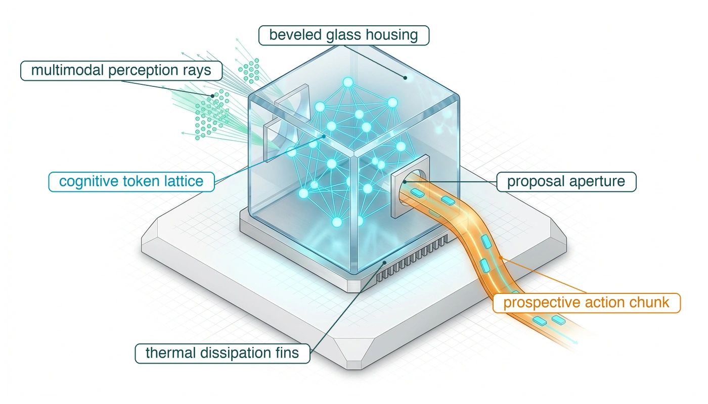
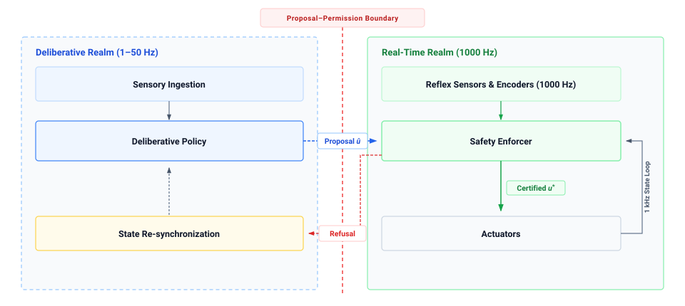
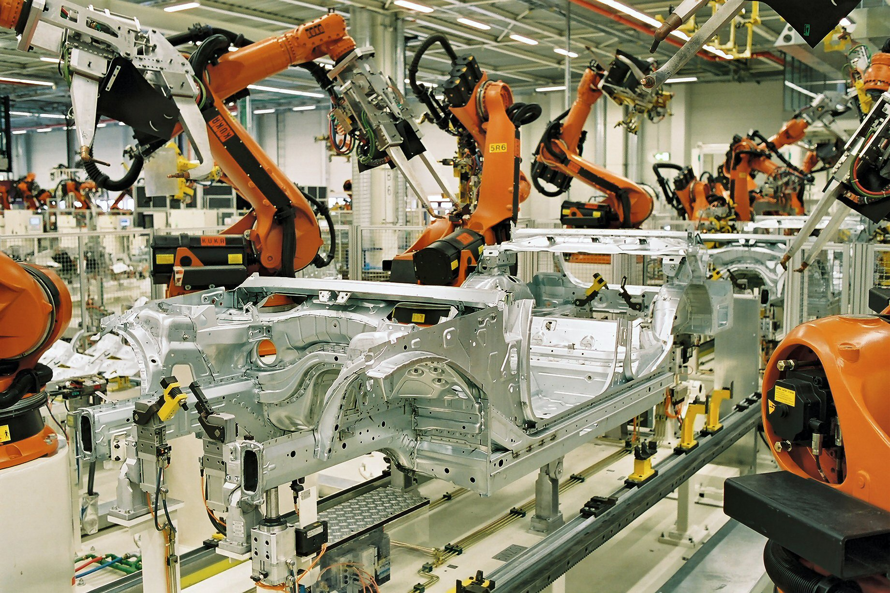
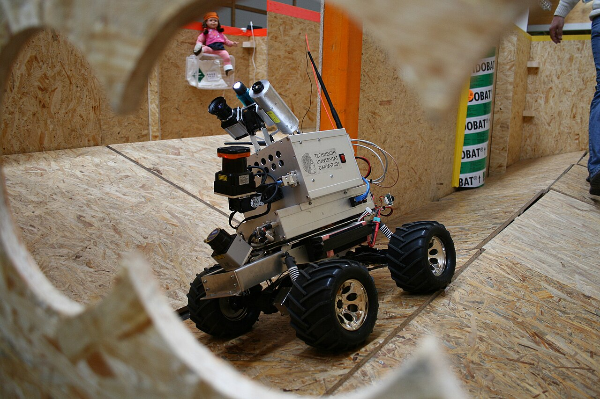
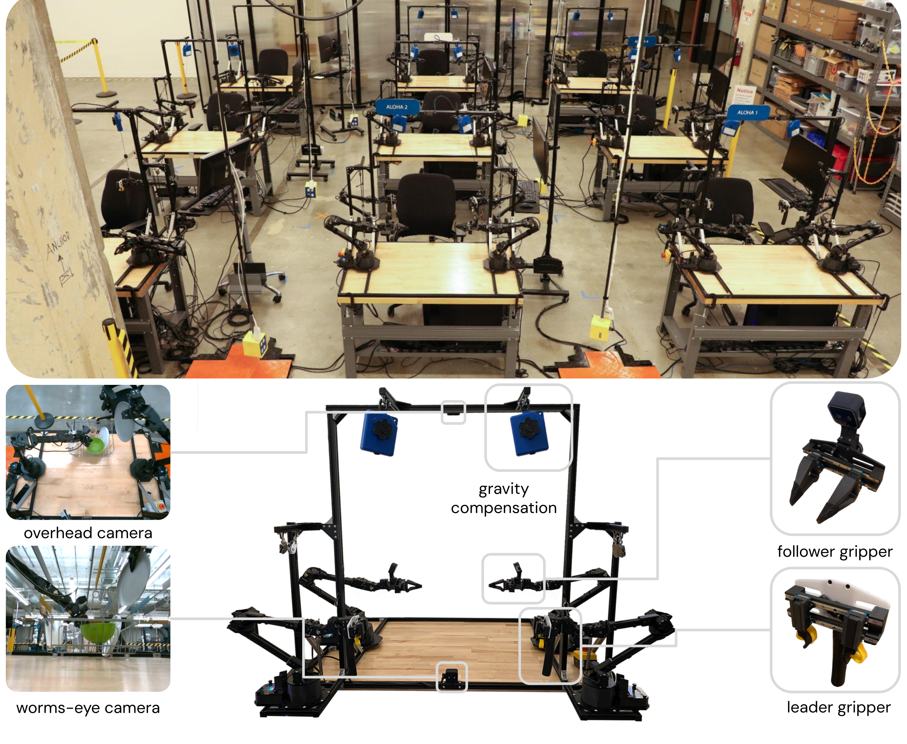
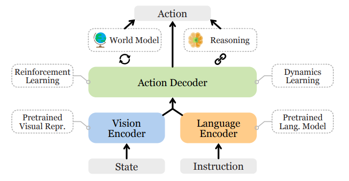
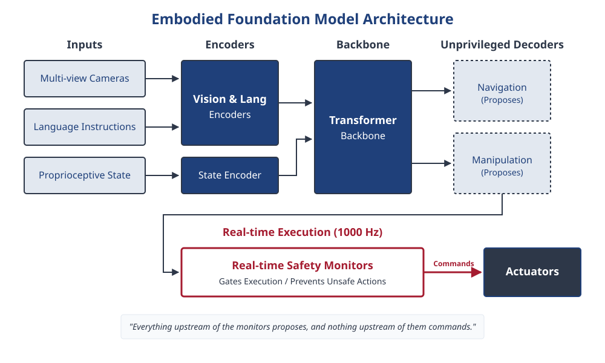
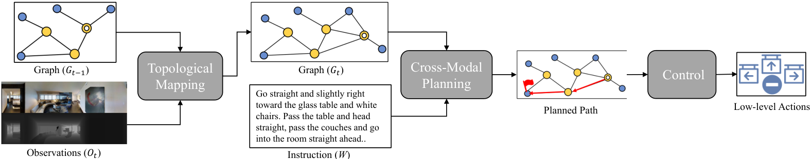
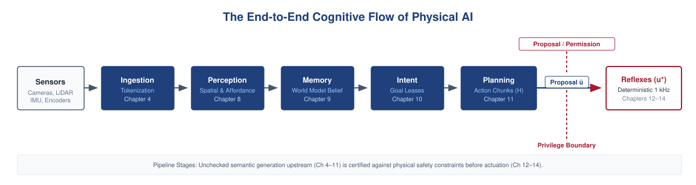
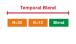

---
format:
  html:
    title: "The Cognitive Brain"
---

# The Cognitive Brain {#sec-brain}

::: {layout-narrow}
::: {.column-margin}

\chapterminitoc

:::

::: {.content-visible when-format="pdf"}
\noindent
{fig-alt="Isometric blueprint of the Brain level, the application processor that runs the learned proposers: a heterogeneous System on Chip (SoC) integrates processing units; a Neural Processing Unit (NPU) with a tensor systolic array handles deep learning matrix operations; stacked High Bandwidth Memory (HBM) dies enhance bandwidth for rapid data access; a high-speed weights streaming bus enables real-time data transfer; and a 3D action chunking token lattice facilitates efficient memory management and retrieval."}
:::

::: {.content-visible unless-format="pdf"}
{fig-alt="Isometric blueprint of the Brain level, the application processor that runs the learned proposers: heterogeneous SoC, NPU tensor systolic array, stacked HBM memory dies, high-speed weights streaming bus, and 3D action chunking token lattice."}
:::

:::

## Purpose {.unnumbered .unlisted}

::: {.content-visible when-format="pdf"}
\begin{marginfigure}
\resizebox{0.92\linewidth}{!}{\mlphysicalstackfull{100}{20}{20}{20}{20}}
\caption{The five-level machine stack with the Brain level highlighted.}
\end{marginfigure}
:::

_Why can the most capable model on a robot revise its plan only a few times a second?_

A robot operating among humans must interpret dynamic environments and propose actions far beyond the rigid scripts of classical automation. High-capacity learned models supply this semantic reasoning by grounding multimodal sensory streams in vast representations acquired during offline training. Yet this expressive power is paid for in high memory traffic and severe computational latency. Every forward evaluation of a multi-billion-parameter network streams weights across a memory interconnect of finite bandwidth. Consequently, the deliberative model that understands the open-world scene best is inevitably the component that revises its decisions least frequently.

To keep actuators continuously supplied between deliberative updates, the Brain must emit prospective action chunks—temporal sequences of future setpoints. However, these proposed setpoints age with the stale observation that generated them, and a proposal that arrives on time can still be physically disastrous. High prediction confidence does not entitle a statistical model to command the physical machine. The Brain generates candidate behaviors across the proposal boundary, while the deterministic Nervous System evaluates each chunk against current sensor telemetry and safety envelopes before allowing low-level commands to cross the causal boundary.

::: {.column-margin .margin-pointer}
↰ **Prerequisite:** A learned proposal stays unprivileged until the permission path admits it, the third law of @sec-boundary-bedrock-laws.
:::



::: {.callout-learning-objectives}

- Compare classical analytical pipelines and learned representations on coverage, robustness, and verifiability
- Calculate the bandwidth bound on a model's fresh-evaluation rate from its weight footprint and sustained memory bandwidth
- Estimate key-value cache growth from camera count, tokens per step, and retained history
- Explain why action chunking multiplies setpoint supply without making proposals any fresher
- Apply replanning period, inference latency, and target drift to size an action chunk for a moving target
- Diagnose proposer failures caused by hallucination, miscalibrated confidence, perceptual chattering, and expired intent
- Evaluate why these proposer limits require a permission path that can refuse any proposal

:::

## The Embodied Brain {#sec-brain-embodied}

The warehouse mobile manipulator can meet all electrical and thermal budgets yet still fail at a task as ordinary as taking an unfamiliar ceramic mug from the moving conveyor at the pick station and handing it to the coworker at the packing station. The motor drives remain well within their continuous torque ratings, the control rail holds its voltage at full charge, and the joint velocities remain below physical limits. Yet the machine drops the object or crushes the ceramic rim because low-level motor physics cannot determine what the object is, where its structural affordances lie, or how to reach around clutter. Unlike an advisory display, whose output can be reviewed before it affects the world, a cognitive proposal here can reach moving mass with no human in between. A mistaken proposal can lead to unsafe kinetic energy if the execution path accepts it, so permission must be checked independently. The central dilemma of embodied cognition is that high-capacity neural models are inherently stochastic, computationally expensive, and prone to inventing objects that are not there, yet they must orchestrate physical bodies whose collisions cannot be recalled (the first law, @sec-boundary-bedrock-laws).

The Brain is therefore an unprivileged deliberation engine that may only propose (\ref{dfn-boundary-proposal-boundary}). This architectural separation organizes the machine into a **two-speed brain architecture**\index{Two-speed brain architecture!hybrid control} (@fig-two-speed-brain). At the deliberative tier, high-capacity foundation models perform slow cognition at $1\text{--}50\text{ Hz}$, parsing open-world multimodal streams to emit structured proposals. At the real-time tier, deterministic safety monitors execute at $1000\text{ Hz}$ on isolated safety silicon, evaluating candidate proposals against physical limits before granting execution permission ($u^*$), or asserting an asynchronous refusal that triggers deliberative state resynchronization. On the mobile manipulator it holds two learned proposers, an intent model that revises goals at $1\text{--}5\text{ Hz}$ and a chunk policy that emits short sequences of future setpoints at $10\text{--}50\text{ Hz}$, and the permission path may refuse anything either one proposes. That protection holds only while the limits, the state estimate, and the fallback it relies on remain valid.

::: {#fig-two-speed-brain fig-env="figure" fig-pos="t" fig-cap="**Two-speed brain architecture**: An unprivileged deliberative realm running at $1\text{--}50\text{ Hz}$ and a real-time realm running at $1000\text{ Hz}$, separated by the proposal-permission privilege boundary. The independent safety enforcer checks sensed state and modeled limits on each control cycle before granting execution permission; a refusal path feeds state resynchronization back to the deliberative policy." fig-alt="Two-speed brain architecture showing unprivileged deliberative planning at 1 to 50 hertz crossing the proposal-permission privilege boundary to 1000 hertz real-time safety enforcement with refusal feedback."}
{width="90%"}
:::

A learned proposer earns its place by doing what hand-authored geometry cannot. It recognizes an object no one modeled from an open-vocabulary instruction, tolerates glare and clutter that break hand-written filters, and anchors what it recognizes to metric coordinates the arm can reach. Each of these capabilities comes from a model whose size also sets how often it can run. @Fig-cadence-gap shows the tension across workload classes, with the models that carry the most parameters updating least often, far below the rates at which the Body's loops close. The chapter's question is therefore what a learned proposer can deliver on time, and at what cost in memory, latency, and freshness.

::: {#fig-cadence-gap fig-env="figure" fig-pos="htb" fig-cap="**Cadence regimes**: Parameter counts and example update rates for different control, vision, and embodied workloads. The points are illustrative workload regimes rather than runs on a common device, and parameter count alone does not determine update rate." fig-alt="Log-log scatter of parameter counts and example update rates for different workload classes, with shaded control and deliberation rate bands."}

```{python}
#| echo: false
import pandas as pd
import matplotlib.pyplot as plt
from mlsysim import viz

data = pd.read_csv("vol4/03_brain/data/brain_frequency_vs_parameters.csv")
fig, ax, COLORS, plt = viz.setup_plot(figsize=(7, 4.5))

_groups = list(dict.fromkeys(data["Category"]))
_cmap = plt.get_cmap('viridis', max(len(_groups), 2))
for _i, _g in enumerate(_groups):
    _sub = data[data["Category"] == _g]
    ax.scatter(_sub["Parameters"], _sub["Frequency_Hz"], color=_cmap(_i), label=str(_g), s=150)

ax.set_xscale("log")
ax.set_yscale("log")

ax.axhspan(20, 1000, color='gray', alpha=0.1, label='Real-Time Control (20+ Hz)')
ax.axhspan(1, 5, color='red', alpha=0.05, label='Intent model (1-5 Hz)')

ax.set_xlabel("Parameter Count (Log Scale)")
ax.set_ylabel("Update Rate [Hz] (Log Scale)")
plt.legend(bbox_to_anchor=(1.02, 1), loc='upper left', frameon=False)
ax.margins(x=0.14, y=0.14)
plt.tight_layout()
plt.show()
plt.close()
```

:::

@Sec-brain-classical-wall shows why pipelines built on hand-authored geometry and state machines lose coverage outside the factory cell, and @sec-brain-learned-representations shows what learned representations recover and what they cost in tokens and memory traffic. @Sec-brain-cognitive-pipeline turns that cost into the machine's numbers: the memory wall that bounds how often its intent model can run, the action chunking that keeps the arm supplied between evaluations, and the drift that bounds how long each chunk stays true. @Sec-brain-cognitive-vulnerabilities then takes up the ways a proposal can arrive on time and still be wrong, each of which leaves the permission path with a proposal it must be able to refuse.

## The Classical Wall {#sec-brain-classical-wall}

For nearly a century, automated control and robotics approached cognition as an explicit geometric and analytical physics problem [@wiener1948cybernetics; @kalman1960new; @craig2005introduction]. Under this classical paradigm, engineers constructed mathematical representations from first principles.

Engineers used analytical kinematics and differential dynamics to map desired end-effector motions into actuator torques using closed-form equations.[^fn-math-classical-dynamics] Perception relied on matching hand-crafted 3D Computer-Aided Design (CAD) models against sensor point clouds using geometric alignment algorithms, such as iterative closest point (ICP) or random sample consensus (RANSAC). High-level task logic was authored as explicit Boolean state machines that dictated deterministic transitions between operational phases, such as approaching, aligning, grasping, and retracting.

[^fn-math-classical-dynamics]: **Rigid-Body Dynamics Formulation**\index{Rigid-body dynamics!Euler-Lagrange formulation}\index{Equations of motion!manipulator dynamics}: Classical control computes generalized torques via the standard manipulator equation $\mathbf{M}(\mathbf{q})\ddot{\mathbf{q}} + \mathbf{C}(\mathbf{q}, \dot{\mathbf{q}})\dot{\mathbf{q}} + \mathbf{g}(\mathbf{q}) = \boldsymbol{\tau}$, where $\mathbf{M}(\mathbf{q})$ represents the positive-definite inertia matrix, $\mathbf{C}(\mathbf{q}, \dot{\mathbf{q}})$ captures Coriolis and centripetal terms, and $\mathbf{g}(\mathbf{q})$ accounts for gravitational loading. This analytical formulation becomes computationally intractable and physically inaccurate when machines interact with unmodeled frictional contacts, fluid drag, or deformable objects. Derivations are provided in @sec-appendix-control.

::: {#fig-industrial-welding fig-env="figure" fig-pos="t" fig-cap="**Industrial spot-welding workcell**: Multiple six-degree-of-freedom articulated robots execute preprogrammed spot welding paths on stamped automotive chassis at the BMW Leipzig plant. Operating in a calibrated factory environment with submillimeter repeatable fixtures and safety interlock cages, classical controllers provide deterministic cycle timing and formal stability proofs. (Credit: BMW Group / Wikimedia Commons, CC BY-SA 2.0 de)." fig-alt="Articulated industrial robots executing automated spot welding on an automotive chassis within a safety-caged factory cell."}
{width="85%"}
:::

Where the operational environment is strictly structured and bounded (@fig-industrial-welding), classical methods can provide dependable behavior within their modeled conditions. On an automated automotive assembly line, an industrial robot welds stamped steel panels where every workpiece arrives at an exact coordinate within sub-millimeter tolerances. Ambient lighting is tightly regulated by industrial fixtures, and human workers are excluded by physical interlock safety fences. Within the causal boundary defined in @sec-boundary-causal-boundary, this controlled regime permits explicit models, bounded servo timing, and stability analysis under stated assumptions. Engineers can verify selected trajectory and torque constraints and assess controller software coverage against applicable standards without collecting task demonstrations.

Yet when an embodied machine leaves the structured factory cage to operate in unstructured environments (@fig-unstructured-rescue), this paradigm hits the classical wall [@brooks1991intelligence; @levine2018learning]. The physical world is not a sterile CAD drawing; it is continuous, deformable, and endlessly variable.

::: {#fig-unstructured-rescue fig-env="figure" fig-pos="t" fig-cap="**Unstructured search-and-rescue robot**: A tracked mobile robot navigates an obstacle course with irregular inclines, loose debris, and visual occlusions. In such unmapped environments, preauthored geometric models and rigid state machines can lose coverage; learned policies may help infer spatial affordances and traversability from sensory streams. (Credit: TU Darmstadt Rescue Robotics / Wikimedia Commons, CC BY-SA 3.0)." fig-alt="Tracked mobile robot traversing irregular rubble and wooden obstacles in an unstructured search-and-rescue test arena."}
{width="85%"}
:::

The first breakdown is the combinatorial explosion of geometry. In a commercial logistics warehouse handling hundreds of thousands of retail goods, authoring CAD models, mesh templates, and grasp points for every bottle, wrapped package, and flexible garment is impossible. Discretizing orientations, frictional properties, and contact permutations across overlapping, deformable items creates a combinatorial space that hand-crafted templates cannot cover.

The second breakdown arises from sensory brittleness. A hand-crafted edge-and-segmentation pipeline may rely on filters, Harris corners, or surface-normal thresholds. Under changed sunlight, reflections, or dust, a required feature can disappear. In that pipeline, a missing edge can make planar segmentation bridge two objects and propose a grasp in empty space.

The third breakdown is the engineering bottleneck of hand-authored logic. The machine's operational capability is bounded by the engineer's ability to anticipate every physical edge case. When an unexpected variation occurs, such as a bent bracket, a scuffed label, or an unfamiliar obstacle, the hand-authored rulebook contains no matching branch, causing the machine to halt, drop its payload, or collide.

Learned representations answer the first two breakdowns directly and ease the third, because they draw coverage from data rather than from hand-authored models.

## Learned Representations {#sec-brain-learned-representations}

Asked to take the unfamiliar ceramic mug from the conveyor, a classical pipeline needs a CAD model, a feature threshold, and a state-machine branch that nobody wrote for this object. A learned model trained on many graspable objects can propose the handle as a grasp region from pixels and a sentence of instruction. Physical AI extends classical pipelines with such neural representations wherever hand-authored models lose coverage, and four pillars support the shift.

The first pillar is open-world semantic generalizability. Classical controllers are geometrically precise but semantically blind: an inverse kinematics solver can expertly drive an end-effector to coordinate $(x, y, z)$, yet it possesses zero understanding of whether that location contains a sturdy mug or a fragile glass, or how surrounding objects relate to human tasks. Modern vision-language-action (VLA) foundation models project open-vocabulary natural language instructions and high-resolution camera streams into shared semantic embeddings [@driess2023palme; @brohan2023rt1; @brohan2023rt2; @kim2024openvla]. When commanded to "wipe the coffee spill from the counter and stow the mug in the drying rack," a trained model may propose the mug handle and spill boundary as task-relevant regions without a new CAD model.

The second pillar is empirical sensory robustness. Hand-authored visual thresholds can flip under changing illumination or texture. Learned representations can tolerate some of these changes when training and testing cover them, but their responses are neither necessarily smooth nor bounded under shift.

The third pillar is the ability to handle complex multi-contact and deformable dynamics. Many physical manipulation tasks (folding textiles, routing flexible wire harnesses through automotive door assemblies, or scooping granular media) involve non-smooth contact mechanics, variable friction, and infinite-dimensional deformations that cannot be modeled in closed-form differential equations. With suitable contact-rich demonstrations and feedback, neural policies can learn compliance-aware responses that reduce force against unexpected resistance.

The fourth pillar is empirical scaling with data and compute, the bitter lesson that @sec-boundary-bedrock-laws sets against the physical wall of onboard energy, heat, and memory. Training on diverse robotic demonstrations (@fig-aloha-manipulator) and multimodal data can improve performance on tested tasks [@zhao2023learning; @chi2024diffusionpolicy].

Each of these gains holds only where training and test data cover the operating conditions, and none of them bounds what the model proposes outside those conditions. That limit is why a learned output reaches the actuators only as a candidate that the permission path may refuse.

::: {#fig-aloha-manipulator fig-env="figure" fig-pos="t" fig-cap="**Bimanual teleoperation workcell**: Dual-arm teleoperation setup featuring two six-degree-of-freedom follower arms, two leader arms for kinesthetic teleoperation, multi-view cameras (overhead and wrist-mounted), and parallel grippers mounted to an extruded aluminum frame. The physical AI policy ingests synchronized multi-camera streams to predict continuous end-effector trajectories, and the permission path must refuse any proposal that would cause self-collision or motor over-torquing during closed-loop execution. (Credit: Stanford University & Google DeepMind, CC-BY / Apache 2.0)." fig-alt="Dual-arm robotic teleoperation workstation with leader and follower arms, overhead cameras, and grippers mounted on an aluminum frame."}
{width="85%"}
:::

::: {#fig-vla-taxonomy fig-env="figure" fig-pos="t" fig-cap="**Embodied model taxonomy**: Embodied foundation models grouped by perceptual frontend (visual tokens, point clouds, language prompts), neural backbone (transformers, diffusion heads, world models), and target action space. The taxonomy contrasts Vision-Language-Navigation policies that decode topological waypoints and semantic frontiers with Vision-Language-Action policies that emit joint and Cartesian trajectory chunks for articulated manipulators. (Adapted from Ma et al. [@ma2024vision])." fig-alt="Taxonomic diagram categorizing embodied foundation models into inputs, multimodal neural backbones, and navigation or manipulation action spaces."}
{width="95%"}
:::

::: {#fig-vla-architecture fig-env="figure" fig-pos="t" fig-cap="**Embodied Vision-Language-Action (VLA) architecture**: A representative dataflow. (1) Camera patches receive 2D image-position and camera identifiers alongside language and robot-state tokens; metric depth still requires calibrated evidence. (2) Self-attention mixes the combined token sequence; the colored grid illustrates internal attention weights, not a verified affordance or grasp pose. (3) Discrete autoregressive decoders emit tokens sequentially, whereas continuous decoders generate candidate multi-step chunks ($\mathbf{A}_{t:t+H-1}$) through one pass or iterative denoising. (4) An independent permission path checks candidate motion against sensed state and modeled limits before actuation. (Synthesized from Brohan et al. [@brohan2023rt1; @brohan2023rt2], Kim et al. [@kim2024openvla], and Octo Model Team [@octo_2023])." fig-alt="Comprehensive architectural schematic of a Vision-Language-Action foundation model showing spatial patch slicing, 2D positional embeddings, multimodal self-attention weights in an illustrative image grid, discrete versus continuous action decoders, and an independent proposal boundary."}
{width="100%"}
:::

Rather than an opaque monolith, an embodied foundation model is a three-stage neural pipeline (@fig-vla-taxonomy, @fig-vla-architecture) that transforms sensory inputs into candidate motion proposals, and it ends at a boundary where those proposals still need kinematic checks.

1. **Sensory Ingestion and Spatial Tokenization (The Inputs):**
   A vision transformer frontend cuts each camera frame into a grid of fixed-size pixel patches and projects each patch into one token, tagged with its image position and, when several cameras are mounted, a learned camera identifier. Language directives and the robot's joint state are projected into tokens of the same width, and the three streams concatenate into one input sequence. Every patch becomes a token that the backbone must attend over and the key-value (KV) cache must hold, so a robot with three cameras (left wrist, right wrist, overhead) contributes hundreds of visual tokens per frame before any text or proprioception arrives (\ref{nbk-brain-lpddr5-memory-wall-bottleneck-action-chunking}). Image position is not metric depth; placing the gripper in 3D still requires depth evidence and calibrated geometry.

2. **Multimodal Alignment and Attention (The Backbone):**
   The combined sequence passes through tens of transformer layers whose self-attention weighs every token against every other, so attention work grows with the square of sequence length while the KV cache that stores prior token states grows linearly with it. Every added camera or retained frame is therefore paid for in latency and in memory traffic. The same pairwise weighting does not establish geometry, so a text token such as "handle" can attend strongly to a visual patch without that weight being a verified grasp location or metric pose. Nor does the KV cache track object permanence; an explicit state estimator must associate observations across frames and grow its uncertainty while the mug is occluded. The patch-embedding, position-encoding, and attention equations behind both stages are in @sec-appendix-ml-patch-embedding.

3. **Specialized Action Decoders (The Outputs):**
   Instead of generating conversational text, the final hidden layer $\mathbf{h}_{\text{context}}$ feeds task-specific action decoders. While vision-language navigation (VLN) models emit topological waypoints or heading rates $(v_t, \omega_t)$ (@fig-vln-navigation), manipulation (VLA) models diverge sharply in how they bridge semantic representations to physical motion:

   * *Discrete Categorical Tokenization (RT-1, RT-2, OpenVLA):* Early VLAs adapt autoregressive language modeling directly to robotics by discretizing continuous joint or Cartesian offsets into $B = 256$ uniform bins per dimension [@brohan2023rt1; @brohan2023rt2; @kim2024openvla]:
     $$\text{bin}(a_k) = \left\lfloor \frac{a_k - a_{\min}}{a_{\max} - a_{\min}} \times 255 \right\rfloor \in [0, 255]$$
     Each bin is assigned a discrete token (`<act_000>` to `<act_255>`) in the language vocabulary. While this natively leverages web-scale vision-language pretraining, it introduces a systems bottleneck: a decoder that emits one scalar token at a time needs seven serial token predictions for a 7-DoF action. Its latency depends on caching, hardware, and whether each prediction revisits the full backbone; seven serial steps can miss a control deadline. Scalar binning has a resolution of roughly $\Delta a = (a_{\max} - a_{\min}) / 256$; whether that produces contact chatter depends on smoothing, the action range, and the downstream controller.
   * *Continuous Generative Action Chunking (Octo, $\pi_0$, ACT, Diffusion Policy):* To avoid paying a full weight sweep for every scalar action, modern generalist policies couple the transformer backbone with continuous generative decoders, such as diffusion policy heads [@chi2024diffusionpolicy; @octo_2023] or flow-matching action experts [@black2024pi0]. Rather than predicting a single scalar per forward pass, the model predicts an entire continuous trajectory chunk:
     $$\mathbf{A}_{t:t+H-1} = [\mathbf{a}_t, \mathbf{a}_{t+1}, \dots, \mathbf{a}_{t+H-1}] \in \mathbb{R}^{H \times d_a} \quad (H = 16\text{--}64\text{ steps})$$
     A backbone may evaluate one new camera observation, then a smaller decoder may perform several denoising iterations to propose a whole chunk of waypoints. That chunk is one candidate horizon, not a sequence of fresh observations. The next backbone evaluation must arrive before the accepted execution window expires; downstream interpolation and feedback run at their own rates.

4. **The Proposal Boundary (Isolation from Actuators):**
   Whether the model is a VLN mobility planner or a VLA manipulation policy, its output is a candidate proposal ($p_t$) on the unprivileged side of the proposal boundary (\ref{dfn-boundary-proposal-boundary}).\index{Unprivileged proposal!proposal boundary} Under the machine model of @sec-boundary-machine-model, the foundation model runs in user space on the application processor and has no path to the pulse-width modulation (PWM) registers or to the current in the motor coils.

   The design rule for this deliberative boundary is that learned models operating at the Brain's inference cadences ($1\text{--}50\text{ Hz}$) propose kinematic setpoints ($\mathbf{q}, \dot{\mathbf{q}}, \ddot{\mathbf{q}}$ or Cartesian poses), **never unbuffered, open-loop motor torques ($\boldsymbol{\tau}$)** directly to inverter switches. Motor torque is coupled to the plant through the manipulator equation of the classical-dynamics note in @sec-brain-classical-wall, plus a contact term $\boldsymbol{\tau}_{\text{contact}}$. Because inertia $\mathbf{M}(\mathbf{q})$ and Coriolis forces $\mathbf{C}(\mathbf{q}, \dot{\mathbf{q}})$ vary non-linearly with instantaneous joint configuration and velocity, commanding open-loop torques, without high-frequency feedback, from a neural model that updates at tens of hertz at most can destabilize the limb when model error, friction, or payload variation is large enough. Kinematic setpoints, by contrast, specify an intended spatial path and leave high-gain closed-loop torque synthesis to the Body's drives, whose field-oriented current loops run at $10\text{--}25\text{ kHz}$, once the permission path has admitted each setpoint. (Where specialized high-rate reinforcement learning policies operating at $100\text{--}500\text{ Hz}$ output torques directly, they still require an independently validated high-rate permission path, as @sec-nervous-invariant-checking argues; passivity checks for such torque streams are derived in @sec-appendix-control-passivity.)

::: {.column-margin .margin-pointer}
↳ **Downstream:** Zero-copy proposal passing between the Brain and the Nervous System relies on the lock-free buffers analyzed in @sec-nervous-cadences.
:::

   Proposals reach the permission path through the handoff of @sec-nervous, and the permission path can refuse a hallucinated proposal when independent measurements, modeled limits, and a feasible fallback support that decision.[^fn-math-unprivileged-control]

[^fn-math-unprivileged-control]: **Proposal Boundary**\index{Proposal boundary!unprivileged proposals}: Treating the neural policy as an unprivileged proposal generator isolates stochastic inference from actuator registers. Candidate trajectory setpoints $\mathbf{q}_{\text{ref}}(t)$ are checked on dedicated safety silicon, so proposals that violate modeled actuator limits or keep-out regions can be rejected before any reaches a drive (@sec-nervous-actuation-authority).

::: {#fig-vln-navigation fig-env="figure" fig-pos="t" fig-cap="**Topological vision-language navigation**: Embodied navigation architecture executing natural-language spatial instructions. Panoramic visual observations are encoded into perceptual tokens, matched against prompt embeddings, and cross-referenced with a dynamically updated topological navigation graph. The action decoder prunes unreachable nodes and emits metric waypoint offsets $(\Delta x, \Delta y)$ and heading setpoints to guide the chassis along traversable semantic frontiers without requiring an exact geometric prior map. (Adapted from An et al. [@an2023etpnav])." fig-alt="Schematic of topological vision-language navigation showing panoramic observation tokens, topological graph matching, and decoded waypoint offsets and heading setpoints."}
{width="95%"}
:::

Each neural stage of this pipeline is paid for in memory traffic. Every patch token must be attended over and held in the KV cache, and every evaluation of the backbone streams its weights from DRAM, so the capabilities this section described arrive at a rate the application processor sets rather than one the task chooses. On the mobile manipulator, that rate for its largest model falls well below the rate at which its arm consumes setpoints.

## Supply, Freshness, and the Memory Wall {#sec-brain-cognitive-pipeline}

At the pick station the mobile manipulator's arm consumes a new setpoint every few tens of milliseconds, while the mug it is reaching for keeps moving along the conveyor. Whatever model proposes those setpoints must settle two questions. The first is how often it can produce a proposal on the application processor the machine actually has; the second is how long each proposal stays true once the mug has moved. The answers explain why the machine carries two learned proposers rather than one.

After ingestion (the tokenization of @sec-brain-learned-representations), four stages turn those tokens into proposals (@fig-cognitive-pipeline), and Part III develops each one. Here they matter only for what each hands downstream and how quickly that goes stale. Perception grounds what it recognizes in metric coordinates relative to the base, so that the mug becomes a pose and a graspable handle rather than a label;[^fn-brain-metric-grounding] its output ages from the moment of capture, and @sec-perception turns that age into a contract. Memory carries those estimates through occlusion and must let each one expire when the evidence behind it does (@sec-memory). Intent decomposes a task such as "take the ceramic mug off the conveyor and hand it to the coworker at the packing station" into subgoals, and because the mug moves while the intent model deliberates, it hands the planner a target that expires, an intent lease\index{Intent lease!temporal contract} (@sec-intent-lease). Planning converts that target into candidate setpoints for the base and the arm, the proposals the permission path will judge (@sec-planning). These stages, and the ingestion before them, all run on the application processor and draw on the same memory bus, which is where the machine's cadence is decided.

[^fn-brain-metric-grounding]: **Metric Spatial Grounding**\index{Metric spatial grounding}\index{Special Euclidean group!SE(3) grounding}: While disembodied AI operates over discrete semantic tokens, physical AI must ground those semantics in the Special Euclidean group $SE(3)$, mapping entities to metric distances (meters) and spatial orientations (quaternions) relative to the robot's base coordinate frame. Failing to maintain this metric grounding causes neural policies to emit kinematically impossible Cartesian paths that breach actuator workspace boundaries.

::: {#fig-cognitive-pipeline fig-env="figure" fig-pos="t" fig-cap="**The physical AI cognitive flow**: Information flows sequentially from physical sensors through Ingestion (tokenization), Perception (spatial geometry and affordances), Memory (persistent world model belief), Intent (deliberative goal leases), and Planning (multi-step action chunking). The flow ends at the proposal boundary, where the permission path evaluates each proposed action against real-time constraints and resources." fig-alt="Horizontal flowchart of the five-stage cognitive pipeline: Ingestion, Perception, Memory, Intent, and Planning, culminating at the proposal boundary."}
{width="95%"}
:::

::: {.column-margin .margin-pointer}
↳ **Downstream:** High-throughput neural inference accelerators are isolated from deterministic cores in @sec-placement-two-paths-one-die.
:::

### The memory wall {.unnumbered}

Consider what happens if a robot attempts to generate continuous motor actions one discrete step at a time through an autoregressive foundation model (such as a multi-billion-parameter VLA model). A model whose weights cannot remain on chip must stream them across the external DRAM bus once per evaluation, so the bus bandwidth $B_{\text{mem}}$ bounds its evaluation rate at $f_{\max} = B_{\text{mem}} / M_{\text{weights}}$ before tokenization, attention, or decoding adds any time. In single-step autoregressive decoding, each sequential token may require another such evaluation; the actual traffic depends on caching and the decoder architecture. For detailed memory wall derivations and roofline hardware models, see @sec-appendix-systems.

This memory wall[^fn-hw-dram-bandwidth] places single-token streaming deep in the memory-bound region of the roofline (@fig-patterson-roofline) [@williams2009roofline]. On the mobile manipulator's application processor it caps the intent model's fresh-evaluation rate, before any vision or decoding work, far below the rate of a joint controller that asks for a new command every millisecond (\ref{nbk-brain-lpddr5-memory-wall-bottleneck-action-chunking}). A model renewed that slowly can say where the arm should go, but it cannot close the loop on moving mass, so it proposes waypoints and a faster loop below it tracks them.

[^fn-hw-dram-bandwidth]: **Autoregressive DRAM Bandwidth Saturation**\index{GPU!memory bandwidth wall}: Sequential action tokens can trigger repeated full-model weight traffic when weights are nonresident and the decoder revisits the backbone; cache behavior and hardware determine the actual bandwidth ceiling. Action chunking is one way to reduce the number of full policy evaluations per unit of physical time.

This continuous data movement also carries an energy penalty. Fetching weights from off-chip DRAM consumes orders of magnitude more energy than the arithmetic computation itself. That energy drains battery reserves, and the heat it leaves in the chassis raises the local ambient of the joint actuators, shrinking the winding margins of @sec-body-thermal-duty-cycles.

::: {#fig-patterson-roofline fig-env="figure" fig-pos="t" fig-cap="**Illustrative embodied roofline**: Arithmetic intensity against attainable throughput for an example edge accelerator. Single-token weight streaming can be memory-bound; reuse across a chunk may increase work per byte. A separate real-time loop executes accepted waypoints between fresh model updates." fig-alt="Illustrative roofline diagram plotting arithmetic intensity against attainable throughput, with example points for token decoding and action chunking."}

```{python}
#| echo: false
# ┌─────────────────────────────────────────────────────────────────────────────
# │ EMBODIED ROOFLINE (FIGURE)
# │ Context: @fig-patterson-roofline
# │ Goal:    show that embodied inference sits far inside the memory-bound regime
# │ Show:    arithmetic intensity against attainable throughput for an edge part
# │ How:     roof from the registry node; each workload amortizes the single-token
# │          sweep over the chapter's own chunk horizon H and denoising depth K
# ├─────────────────────────────────────────────────────────────────────────────
from mlsysim import viz
from mlsysim import Embodied

RM = Embodied.MobileManipulator.WarehouseMobileManipulator

# ┌── 1. LOAD (Constants & Parameters) ─────────────────────────────────────────
node = RM.brain_soc  # category: datasheet; the mobile manipulator's application processor
I_TOKEN = 1.0  # category: illustrative; FLOP/byte for a single-token weight sweep
H_CHUNK = RM.chunk_horizon  # category: chosen; the machine's action-chunk horizon
K_DENOISE = 10  # category: illustrative; denoising steps per chunk for the diffusion policy

# ┌── 2. EXECUTE (Compute) ─────────────────────────────────────────────────────
peak = node.compute.peak_flops.to("TFLOPs/s").magnitude
bw = node.memory.bandwidth.to("GB/s").magnitude
ridge = peak / (bw / 1000)  # FLOP/byte
attainable = lambda ai: min(bw * ai / 1000, peak)

points = [
    ("Autoregressive VLA\n(single token)", I_TOKEN),
    (f"Action chunking\n(H = {H_CHUNK})", H_CHUNK * I_TOKEN),
    (f"Diffusion policy\n(H = {H_CHUNK}, K = {K_DENOISE})", H_CHUNK * K_DENOISE * I_TOKEN),
]

# ┌── 3. PLOT ──────────────────────────────────────────────────────────────────
fig, ax = viz.plot_roofline(node)
COLORS = viz.COLORS
ax.set_ylim(peak * 0.0004, peak * 2)  # keep the single-token point on scale
for idx, (label, ai) in enumerate(points):
    y = attainable(ai)
    ax.plot(ai, y, "o", ms=8, color=COLORS["VioletLine"], zorder=11)
    # the lowest point has no room beneath the roof, so its label goes above
    if idx == 0:
        pos, ha, va = (ai * 0.40, y * 4.0), "right", "bottom"
    else:
        pos, ha, va = (ai * 2.4, y * 0.30), "left", "top"
    ax.annotate(
        label,
        xy=(ai, y),
        xytext=pos,
        fontsize=8,
        color=COLORS["VioletLine"],
        ha=ha,
        va=va,
        zorder=11,
        arrowprops=dict(arrowstyle="->", color=COLORS["VioletLine"], lw=0.9),
    )

# the reuse a workload would need before it left the memory-bound regime
ax.annotate(
    f"reuse must reach {ridge:.0f} FLOP/byte\nbefore compute binds",
    xy=(ridge, peak * 0.006),
    xytext=(ridge * 0.30, peak * 0.0012),
    fontsize=8,
    color=COLORS["primary"],
    ha="right",
    zorder=11,
    arrowprops=dict(arrowstyle="->", color=COLORS["primary"], lw=0.9),
)
import matplotlib.pyplot as plt

plt.tight_layout()
plt.show()
```

:::

### Action chunking {.unnumbered}

To supply dense waypoints despite slow full-model inference, modern physical AI policies employ **action chunking**\index{Action chunking!temporal trajectory} (\ref{dfn-brain-action-chunking}) [@zhao2023learning; @chi2024diffusionpolicy]. Each chunk then crosses the proposal boundary as one packet, the chunk payload of @sec-nervous-cadences.

A chunking policy (such as Action Chunking with Transformers [ACT], Diffusion Policy, or Flow Matching) generates its whole chunk of $H$ setpoints in one backbone pass followed, for an iterative decoder, by an assumed $K = 10\text{--}16$ refinement steps. Each refinement re-evaluates the smaller action head, so full latency is $t_{\text{vision}}+t_{\text{backbone}}+K t_{\text{head}}+t_{\text{transfer}}$, not just one weight sweep. A new observation changes the plan only after another backbone and decoder pass; see @sec-appendix-ml for the generative mechanism.

::: {#dfn-brain-action-chunking .callout-definition title="Temporal action chunking"}

***Temporal action chunking***\index{Temporal action chunking!definition}\index{Action chunking!definition} is the policy formulation that predicts an entire horizon of $H$ future continuous actions $\mathbf{A}_{t:t+H-1} = [\mathbf{a}_t, \dots, \mathbf{a}_{t+H-1}]$ in a single neural evaluation or diffusion rollout, amortizing parameter memory transfers across extended physical execution windows.

1.  **Significance**: On a bandwidth-limited device, repeating a full model evaluation for every action can be too slow for millisecond control. Temporal action chunking can reuse a backbone evaluation across multiple waypoints; it does not make fresh observations or policy decisions arrive at the waypoint rate. A downstream controller tracks the accepted trajectory between model updates.
2.  **Distinction**: Unlike single-step Markovian policies $\mathbf{a}_t \sim \pi(\cdot \mid \mathbf{o}_t)$ that re-evaluate the full neural network at every control step, action chunking deliberately generates multi-step feedforward trajectories, utilizing receding-horizon execution and blending across overlapping chunks to reconcile slow neural deliberation with fast closed-loop control.
3.  **Common pitfall**: Executing action chunks open-loop without continuous temporal smoothing or runtime safety filtering. Without smooth blending across overlapping chunk boundaries, switching between independently generated horizons injects acceleration jumps and torque shocks that excite mechanical gearbox resonances.

:::
For example, when a canonical bimanual manipulator threads a flexible USB cable (@fig-aloha-manipulator), it executes a 32-step action chunk, a longer chunk than the mobile manipulator uses. The policy emits coordinated 14-DoF joint setpoints that smoothly align both grippers, flex the cable, and insert the connector without pausing between individual control cycles.

::: {.column-margin}
{width="100%" fig-alt="Sequence strip illustrating overlapping action chunk horizons of 32 steps with 12-step replanning and temporal ensembling."}

*Overlapping action chunks blend predictions across receding temporal execution windows.*
:::

However, action chunking introduces the problem of **chunk seam continuity**. Because each action chunk is generated independently from rolling sensory observations, the tail of chunk $k$ and the head of chunk $k+1$ may exhibit slight positional and velocity discrepancies. If a controller concatenated these chunks directly, the resulting step-discontinuities in acceleration would inject large jerk ($\dddot{\mathbf{q}}$) into the physical linkages, inducing mechanical shock, acoustic vibration, cycloidal pin wear, and motor overcurrent faults.

To reduce discontinuities between overlapping chunks, systems can implement **temporal ensembling**\index{Temporal ensembling!trajectory smoothing}, blending overlapping trajectory predictions via exponentially weighted averaging:

$$\mathbf{a}_t = \frac{\sum_{i=0}^{\min(t, H-1)} w_i \, \mathbf{a}_{t \mid t-i}}{\sum_{i=0}^{\min(t, H-1)} w_i}, \quad w_i = \exp(-m \cdot i)$$

where $\mathbf{a}_{t \mid t-i}$ represents the action predicted for time step $t$ by the action chunk initiated at time $t-i$, and $m > 0$ is a tunable temporal discount factor. The permission path interpolates the blended waypoints below the proposal boundary (@sec-nervous-cadences). Ensembling averages setpoints without enforcing derivative continuity, so a seam can still need the $C^2$ bridge that @sec-planning-kinodynamic-feasibility builds.

### The machine's two proposers {.unnumbered}

On the mobile manipulator's own application processor, the memory wall and the amortization that chunking offers decide how the machine divides proposal work between its models.

```{python}
#| label: calc-brain-action-chunking-lpddr5
#| echo: false
# ┌─────────────────────────────────────────────────────────────────────────────
# │ MEMORY WALL AND THE MACHINE'S TWO PROPOSERS
# ├─────────────────────────────────────────────────────────────────────────────
# │ Context: nbk-brain-lpddr5-memory-wall-bottleneck-action-chunking and the
# │          memory-wall paragraphs that follow it
# │ Goal:    show why the mobile manipulator's intent model cannot renew a
# │          proposal every few tens of milliseconds while its chunk policy can
# │ Show:    98.0 ms per intent-model weight sweep (about 10 Hz before vision);
# │          6.1 ms amortized weight-sweep time per setpoint over H = 16;
# │          0.70 ms per chunk-policy sweep; intent 5 Hz / 160 ms; chunk policy
# │          20 Hz / 40 ms
# │ How:     t_stream = M_weights / (B_peak * dram_efficiency);
# │          tau_step = t_stream / H (calc_action_chunk_streaming_amortization)
# └─────────────────────────────────────────────────────────────────────────────
from mlsysim import *
from mlsysim.core.units import *
from mlsysim.fmt import (
    fmt_params,
    fmt_memory,
    fmt_bandwidth,
    fmt_latency,
    fmt_time,
    fmt_frequency,
    fmt_percent,
    fmt_int,
    fmt_display_math,
    check,
)

RM = Embodied.MobileManipulator.WarehouseMobileManipulator

class ActionChunkingLPDDR5:
    """Memory wall and action chunking amortization on the machine's application processor."""

    # ┌── 1. LOAD (Constants & Parameters) ─────────────────────────────────
    model = RM.intent_model  # category: chosen (the machine's intent model)
    chunk_model = RM.chunk_model  # category: chosen (the machine's chunk policy)
    soc = RM.brain_soc  # category: datasheet (application processor)
    params = model.parameters  # category: datasheet
    chunk_params = chunk_model.parameters  # category: datasheet
    bytes_per_param = 2 * (byte / param)  # category: chosen; FP16 weight storage
    bytes_per_param_int4 = 0.5 * (byte / param)  # category: chosen; INT4 alternative
    b_peak = soc.memory.bandwidth  # category: datasheet
    soc_mem = soc.memory.capacity  # category: datasheet
    bus_efficiency = RM.dram_efficiency  # category: illustrative; sustained fraction of peak
    chunk_horizon = RM.chunk_horizon  # category: chosen
    chunk_step = RM.chunk_step  # category: chosen
    intent_rate = RM.intent_rate  # category: chosen
    intent_latency = RM.intent_inference_latency  # category: illustrative
    chunk_rate = RM.chunk_rate  # category: chosen
    chunk_latency = RM.chunk_inference_latency  # category: illustrative; P99 incl. vision
    kv_layers = model.layers  # category: datasheet
    kv_hidden = model.hidden_dim  # category: datasheet
    kv_bytes = 2 * byte  # category: chosen; FP16 key and value storage
    cameras = 3  # category: illustrative; synchronized RGB streams
    patches_per_frame = 256  # category: derived; patch tokens per 224 x 224 frame at P = 14
    context_tokens = 800  # category: illustrative; visual plus language and proprioception tokens per step
    history_window = 5 * second  # category: illustrative; retained visual history
    history_rate = 10 * Hz  # category: illustrative; frames retained per second of history

    # ┌── 2. EXECUTE (Compute) ─────────────────────────────────────────────
    weight_mem = memory_from_params(params, bytes_per_param)
    weight_mem_int4 = memory_from_params(params, bytes_per_param_int4)
    res = calc_action_chunk_streaming_amortization(
        model_weight_memory=weight_mem,
        memory_bandwidth=b_peak,
        chunk_horizon=chunk_horizon,
        bus_efficiency=bus_efficiency,
    )
    b_sustained = res["b_sustained"]
    t_stream = res["t_stream"]
    f_single = res["f_single"]
    tau_step = res["tau_step"]
    chunk_span = (chunk_horizon * chunk_step).to(millisecond)

    chunk_weight_mem = memory_from_params(chunk_params, bytes_per_param)
    chunk_res = calc_action_chunk_streaming_amortization(
        model_weight_memory=chunk_weight_mem,
        memory_bandwidth=b_peak,
        chunk_horizon=chunk_horizon,
        bus_efficiency=bus_efficiency,
    )
    chunk_t_stream = chunk_res["t_stream"]

    visual_tokens = cameras * patches_per_frame
    kv_per_token = (2 * kv_layers * kv_hidden * kv_bytes).to(MB)
    kv_per_frame = (kv_per_token * visual_tokens).to(MB)
    history_frames = round((history_window * history_rate).to("dimensionless").magnitude)
    kv_history_visual = (kv_per_frame * history_frames).to(GB)
    kv_per_step = (kv_per_token * context_tokens).to(MB)
    kv_history = (kv_per_step * history_frames).to(GB)
    combined_mem = (weight_mem + kv_history).to(GB)
    combined_ratio = (combined_mem / soc_mem).to("dimensionless").magnitude

    # ┌── 3. GUARD (Invariants) ───────────────────────────────────────────
    check(abs(weight_mem.to(GB).magnitude - 14.0) < 0.1, f"Unexpected weight footprint: {weight_mem}")
    check(abs(b_sustained.to(GB / second).magnitude - 142.80) < 0.05, f"Unexpected sustained bandwidth: {b_sustained}")
    check(abs(t_stream.to(millisecond).magnitude - 98.04) < 0.005, f"Unexpected intent sweep: {t_stream}")
    check(abs(f_single.magnitude - 10.20) < 0.05, f"Unexpected single-sweep frequency: {f_single}")
    check(chunk_horizon == 16, f"Unexpected chunk horizon: {chunk_horizon}")
    check(abs(tau_step.to(millisecond).magnitude - 6.13) < 0.01, f"Unexpected per-setpoint sweep time: {tau_step}")
    check(abs(chunk_span.magnitude - 320.0) < 1e-9, f"Unexpected chunk span: {chunk_span}")
    check(abs(chunk_t_stream.to(millisecond).magnitude - 0.700) < 0.0005, f"Unexpected chunk sweep: {chunk_t_stream}")
    check(abs(intent_rate.to(ureg.hertz).magnitude - 5.0) < 1e-9, f"Unexpected intent rate: {intent_rate}")
    check(abs(intent_latency.to(millisecond).magnitude - 160.0) < 1e-9, f"Unexpected intent latency: {intent_latency}")
    check(abs(chunk_rate.to(ureg.hertz).magnitude - 20.0) < 1e-9, f"Unexpected chunk rate: {chunk_rate}")
    check(abs(chunk_latency.to(millisecond).magnitude - 40.0) < 1e-9, f"Unexpected chunk latency: {chunk_latency}")
    check(t_stream > (1 / chunk_rate), "The intent sweep alone must exceed the chunk period")
    check(chunk_latency < (1 / chunk_rate), "The chunk policy's inference must fit its own period")
    check(kv_layers == 32 and kv_hidden == 4096, f"Unexpected intent-model shape: {kv_layers} x {kv_hidden}")
    check(visual_tokens == 768 and history_frames == 50, f"Unexpected KV scenario: {visual_tokens}, {history_frames}")
    check(abs(kv_per_token.magnitude - 0.524288) < 1e-9, f"Unexpected KV bytes per token: {kv_per_token}")
    check(abs(kv_history_visual.magnitude - 20.13) < 0.01, f"Unexpected visual KV history: {kv_history_visual}")
    check(abs(kv_history.magnitude - 20.97) < 0.01, f"Unexpected context KV history: {kv_history}")
    check(abs(combined_mem.magnitude - 34.97) < 0.01, f"Unexpected weights plus KV footprint: {combined_mem}")
    check(0.45 < combined_ratio < 0.55, f"Weights plus KV must claim about half the SoC memory: {combined_ratio}")

    # ┌── 4. OUTPUT (Format & Export) ────────────────────────────────────────
    params_str = fmt_params(params, precision=0)
    chunk_params_str = fmt_params(chunk_params, precision=0)
    bytes_per_param_str = fmt_int(bytes_per_param.magnitude)
    weight_mem_str = fmt_memory(weight_mem, unit=GB, precision=0)
    weight_mem_int4_str = fmt_memory(weight_mem_int4, unit=GB, precision=1)
    chunk_weight_mem_str = fmt_memory(chunk_weight_mem, unit=GB, precision=2)
    b_peak_str = fmt_bandwidth(b_peak, unit=GB / second, precision=0)
    b_sustained_str = fmt_bandwidth(b_sustained, unit=GB / second, precision=1)
    dram_eff_pct_str = fmt_percent(bus_efficiency, precision=0)
    t_stream_ms_str = fmt_latency(t_stream, unit=millisecond, precision=1)
    t_stream_s_str = fmt_time(t_stream.to(second), 'second', precision=4)
    f_single_str = fmt_frequency(f_single, unit=ureg.hertz, precision=1)
    chunk_horizon_str = fmt_int(chunk_horizon)
    chunk_step_str = fmt_latency(chunk_step, unit=millisecond, precision=0)
    chunk_span_str = fmt_latency(chunk_span, unit=millisecond, precision=0)
    tau_step_str = fmt_latency(tau_step, unit=millisecond, precision=1)
    chunk_t_stream_str = fmt_latency(chunk_t_stream, unit=millisecond, precision=2)
    intent_rate_str = fmt_frequency(intent_rate, unit=ureg.hertz, precision=0)
    intent_latency_str = fmt_latency(intent_latency, unit=millisecond, precision=0)
    chunk_rate_str = fmt_frequency(chunk_rate, unit=ureg.hertz, precision=0)
    chunk_latency_str = fmt_latency(chunk_latency, unit=millisecond, precision=0)
    kv_layers_str = fmt_int(kv_layers)
    kv_hidden_str = fmt_int(kv_hidden, commas=False)
    cameras_str = fmt_int(cameras)
    patches_per_frame_str = fmt_int(patches_per_frame)
    visual_tokens_str = fmt_int(visual_tokens)
    context_tokens_str = fmt_int(context_tokens)
    history_window_str = fmt_time(history_window, 'second', precision=0)
    history_rate_str = fmt_frequency(history_rate, unit=ureg.hertz, precision=0)
    kv_per_token_str = fmt_memory(kv_per_token, unit=MB, precision=2)
    kv_per_frame_str = fmt_memory(kv_per_frame, unit=MB, precision=1)
    kv_history_visual_str = fmt_memory(kv_history_visual, unit=GB, precision=1)
    kv_per_step_str = fmt_memory(kv_per_step, unit=MB, precision=1)
    kv_history_str = fmt_memory(kv_history, unit=GB, precision=1)
    combined_mem_str = fmt_memory(combined_mem, unit=GB, precision=1)
    soc_mem_gb_str = fmt_memory(soc_mem, unit=GB, precision=1)

    t_stream_display_math = fmt_display_math(rf"t_{{\text{{stream}}}} = \frac{{{weight_mem_str}}}{{{b_sustained_str}}} \approx {t_stream_ms_str}")
    f_single_display_math = fmt_display_math(
        rf"f_{{\text{{single}}}} = \frac{{1}}{{t_{{\text{{stream}}}}}} \approx \frac{{1}}{{{t_stream_s_str}}} \approx {f_single_str}"
    )
    kv_display_math = fmt_display_math(
        rf"M_{{\text{{KV}}}} = 2 \times L \times d \times S \times \text{{bytes}} = 2 \times {kv_layers_str} \times {kv_hidden_str} \times S \times 2 \approx {kv_per_token_str} \cdot S"
    )
    tau_step_display_math = fmt_display_math(
        rf"\tau_{{\text{{step}}}} = \frac{{t_{{\text{{stream}}}}}}{{H}} = \frac{{{t_stream_ms_str}}}{{{chunk_horizon_str}\text{{ setpoints}}}} \approx {tau_step_str}\text{{ per setpoint}}"
    )
```

::: {#nbk-brain-lpddr5-memory-wall-bottleneck-action-chunking .callout-notebook title="Memory walls, supply, and freshness"}
Can action chunking let a multi-billion-parameter model on an embedded compute module renew proposals as fast as the arm consumes them, or does the machine need a second, smaller proposer?

*1. The single-token memory bottleneck.*
Consider the mobile manipulator's intent model, a `{python} ActionChunkingLPDDR5.params_str` VLA model stored in 16-bit precision (FP16) in the LPDDR5 memory of its application processor, an embedded edge System-on-Chip:

- Weight footprint: $M_{\text{weights}} =$ `{python} ActionChunkingLPDDR5.params_str` params $\times$ `{python} ActionChunkingLPDDR5.bytes_per_param_str` bytes $\approx$ `{python} ActionChunkingLPDDR5.weight_mem_str`.
- Theoretical memory bandwidth: $B_{\text{peak}} =$ `{python} ActionChunkingLPDDR5.b_peak_str`.
- Assumed sustained DRAM bandwidth (`{python} ActionChunkingLPDDR5.dram_eff_pct_str` percent of peak to model bus scheduling and memory overhead): $B_{\text{sustained}} \approx$ `{python} ActionChunkingLPDDR5.b_sustained_str`.

Minimum streaming latency to fetch the weights from DRAM across the silicon bus once:
`{python} ActionChunkingLPDDR5.t_stream_display_math`

Bandwidth-only upper bound on fresh evaluations when each evaluation streams the full weights:
`{python} ActionChunkingLPDDR5.f_single_display_math`

Beyond model weights, autoregressive foundation models also grow their KV cache. When multi-camera sensory feeds (e.g., `{python} ActionChunkingLPDDR5.cameras_str` $224 \times 224$ RGB streams) are ingested, each video frame contributes hundreds of visual patch tokens (`{python} ActionChunkingLPDDR5.cameras_str` $\times$ `{python} ActionChunkingLPDDR5.patches_per_frame_str` $=$ `{python} ActionChunkingLPDDR5.visual_tokens_str` tokens). In the intent model's `{python} ActionChunkingLPDDR5.kv_layers_str`-layer transformer with hidden dimension $d =$ `{python} ActionChunkingLPDDR5.kv_hidden_str`, storing the FP16 Key and Value states consumes `{python} ActionChunkingLPDDR5.kv_per_token_str` per token:
`{python} ActionChunkingLPDDR5.kv_display_math`
Across a `{python} ActionChunkingLPDDR5.visual_tokens_str`-token visual prompt, the KV cache expands by `{python} ActionChunkingLPDDR5.kv_per_frame_str` per frame.

*2. The action chunking amortization.*
Suppose the intent model itself emitted an action chunk of $H =$ `{python} ActionChunkingLPDDR5.chunk_horizon_str` future setpoints ($\Delta t =$ `{python} ActionChunkingLPDDR5.chunk_step_str`, spanning `{python} ActionChunkingLPDDR5.chunk_span_str`) from each forward pass, instead of one action step per DRAM weight sweep.

- Number of weight memory sweeps: 1 sweep (`{python} ActionChunkingLPDDR5.t_stream_ms_str`).
- A chunk can reuse one backbone evaluation across $H$ future setpoints.
- Amortized weight-sweep time per setpoint (excluding all other inference work):
`{python} ActionChunkingLPDDR5.tau_step_display_math`

*3. The machine's split.*
Amortization spreads one sweep across more setpoints, but it does not make a fresh proposal arrive sooner. Each new chunk from the intent model would still wait for at least one `{python} ActionChunkingLPDDR5.t_stream_ms_str` sweep, plus tokenization, attention, and decoding. The mobile manipulator therefore divides the work between two models. Its intent model revises the goal at `{python} ActionChunkingLPDDR5.intent_rate_str` with `{python} ActionChunkingLPDDR5.intent_latency_str` of inference. A separate `{python} ActionChunkingLPDDR5.chunk_params_str`-parameter chunk policy, whose `{python} ActionChunkingLPDDR5.chunk_weight_mem_str` of weights sweep in `{python} ActionChunkingLPDDR5.chunk_t_stream_str`, proposes base velocity and arm joint targets together at `{python} ActionChunkingLPDDR5.chunk_rate_str`, within a `{python} ActionChunkingLPDDR5.chunk_latency_str` P99 inference budget that includes vision. The intent model's sweep is too slow to renew a proposal every few tens of milliseconds; the chunk policy's is not. @Sec-nervous turns that difference into a lease.
:::

The `{python} ActionChunkingLPDDR5.t_stream_ms_str` sweep in \ref{nbk-brain-lpddr5-memory-wall-bottleneck-action-chunking} is a floor reached before vision, attention, or decoder work begins. Two alternatives to the machine's split, lower weight precision and a single model with a fast head, would attack it, and neither removes it cheaply. INT4 storage would reduce the nominal weight footprint to `{python} ActionChunkingLPDDR5.weight_mem_int4_str` but needs accuracy validation for contact tasks. A single-model design could instead trade cadence for density without changing weight precision. It would evaluate the `{python} ActionChunkingLPDDR5.params_str` backbone periodically while a lightweight diffusion head denoises candidate trajectories on-chip, supplying dense candidate waypoints from each slower full-model evaluation. Its new-observation rate would still be limited by full inference latency, including vision and decoder work, which is why the mobile manipulator gives renewal to a separate chunk policy instead.

Retained context adds to the pressure the notebook began to measure. Counting language and proprioception tokens along with the visual patches raises each step to $S \approx$ `{python} ActionChunkingLPDDR5.context_tokens_str` tokens, so at `{python} ActionChunkingLPDDR5.kv_per_token_str` of FP16 key-value state per token each observation step adds `{python} ActionChunkingLPDDR5.kv_per_step_str` of KV cache. Retaining an unpruned `{python} ActionChunkingLPDDR5.history_window_str` historical context window at `{python} ActionChunkingLPDDR5.history_rate_str` yields `{python} ActionChunkingLPDDR5.kv_history_str` of KV cache. Combined with the intent model's `{python} ActionChunkingLPDDR5.weight_mem_str` of weights, this example claims `{python} ActionChunkingLPDDR5.combined_mem_str`, about half of the application processor's `{python} ActionChunkingLPDDR5.soc_mem_gb_str` before runtime overhead, memory that perception, mapping, and the chunk policy also need. Even where memory capacity permits, reading a large cache is further traffic on that same bus (@sec-placement-resource-contention). Embodied architectures must therefore avoid unpruned autoregressive visual histories, relying instead on spatial pooling, cross-attention feature projections, or fixed-horizon action chunking.

```{python}
#| label: calc-brain-conveyor-chunk-sizing
#| echo: false
# ┌─────────────────────────────────────────────────────────────────────────────
# │ CONVEYOR CHUNK SIZING
# ├─────────────────────────────────────────────────────────────────────────────
# │ Context: the conveyor-pick paragraph in @sec-brain-cognitive-pipeline
# │ Goal:    size the chunk the mobile manipulator's arm executes against the
# │          mug's drift on the moving conveyor
# │ Show:    the 219 ms tracked evidence horizon; the 90 ms open-loop span
# │          (50 ms replanning period plus 40 ms inference) inside it; the
# │          16-step, 320 ms chunk as a supply buffer that would breach the
# │          grasp tolerance if executed to its end
# │ How:     tau_ev = sqrt(2 (r_tol - e_0) / a_slip); open-loop span = 1/f_chunk +
# │          t_chunk; drift = a_slip T^2 / 2
# └─────────────────────────────────────────────────────────────────────────────
import math
from mlsysim import *
from mlsysim.core.units import *
from mlsysim.fmt import fmt_latency, fmt_velocity, fmt_acceleration, fmt_length, fmt_int, check

RM = Embodied.MobileManipulator.WarehouseMobileManipulator
AISLE = Embodied.Scenario.WarehouseAisle

class ConveyorChunkSizing:
    """Chunk supply and evidence horizon for the mug on the moving conveyor."""

    # ┌── 1. LOAD (Constants & Parameters) ─────────────────────────────────
    v_conv = AISLE.v_conveyor  # category: illustrative
    a_slip = AISLE.a_conveyor_slip  # category: illustrative
    r_tol = AISLE.grasp_tolerance  # category: chosen
    e_0 = AISLE.grasp_initial_error  # category: illustrative
    chunk_rate = RM.chunk_rate  # category: chosen
    chunk_latency = RM.chunk_inference_latency  # category: illustrative
    chunk_step = RM.chunk_step  # category: chosen
    chunk_horizon = RM.chunk_horizon  # category: chosen

    # ┌── 2. EXECUTE (Compute) ─────────────────────────────────────────────
    tau_ev = ((2 * (r_tol - e_0) / a_slip) ** 0.5).to(millisecond)
    chunk_period = (1 / chunk_rate).to(millisecond)
    open_loop = (chunk_period + chunk_latency).to(millisecond)
    h_min = math.ceil((open_loop / chunk_step).to("dimensionless").magnitude)
    chunk_span = (chunk_horizon * chunk_step).to(millisecond)
    drift_open_loop = (0.5 * a_slip * open_loop**2).to(millimeter)
    drift_full = (0.5 * a_slip * chunk_span**2).to(millimeter)

    # ┌── 3. GUARD (Invariants) ───────────────────────────────────────────
    check(abs(v_conv.to("m/s").magnitude - 0.20) < 1e-9, f"Conveyor speed drifted: {v_conv}")
    check(abs(tau_ev.magnitude - 219.09) < 5e-3, f"Tracked evidence horizon drifted: {tau_ev}")
    check(abs(chunk_period.magnitude - 50.0) < 1e-9, f"Chunk period drifted: {chunk_period}")
    check(abs(open_loop.magnitude - 90.0) < 1e-9, f"Open-loop span drifted: {open_loop}")
    check(open_loop < tau_ev, "The open-loop span must sit inside the evidence horizon")
    check(h_min == 5, f"Minimum supply horizon drifted: {h_min}")
    check(chunk_horizon == 16, f"Chunk horizon drifted: {chunk_horizon}")
    check(abs(chunk_span.magnitude - 320.0) < 1e-9, f"Chunk span drifted: {chunk_span}")
    check(chunk_span > tau_ev, "The full chunk must outlast the evidence horizon (buffer, not plan)")
    check(e_0 + drift_full > r_tol, "Executing the whole chunk open-loop must breach the grasp tolerance")

    # ┌── 4. OUTPUT (Format & Export) ────────────────────────────────────────
    v_conv_str = fmt_velocity(v_conv, unit="m/s", precision=2)
    a_slip_str = fmt_acceleration(a_slip, precision=2)
    r_tol_str = fmt_length(r_tol, unit=millimeter, precision=0)
    e_0_str = fmt_length(e_0, unit=millimeter, precision=0)
    tau_ev_rounded = round(tau_ev.magnitude) * millisecond  # whole-ms display; the guard pins 219.09 ms
    tau_ev_str = fmt_latency(tau_ev_rounded, unit=millisecond, precision=0)
    chunk_period_str = fmt_latency(chunk_period, unit=millisecond, precision=0)
    chunk_latency_str = fmt_latency(chunk_latency, unit=millisecond, precision=0)
    open_loop_str = fmt_latency(open_loop, unit=millisecond, precision=0)
    h_min_str = fmt_int(h_min)
    chunk_horizon_str = fmt_int(chunk_horizon)
    chunk_step_str = fmt_latency(chunk_step, unit=millisecond, precision=0)
    chunk_span_str = fmt_latency(chunk_span, unit=millisecond, precision=0)
    drift_open_loop_str = fmt_length(drift_open_loop, unit=millimeter, precision=1)
    drift_full_str = fmt_length(drift_full, unit=millimeter, precision=1)
```

At the pick station, the mobile manipulator's arm takes the mug from a conveyor moving at `{python} ConveyorChunkSizing.v_conv_str`, and each chunk must be executed without letting the mug drift out of reach. Untracked, the belt's steady motion would use up the margin $r_{\text{tol}} - e_0$ between the grasp tolerance and the handle estimate's initial error $e_0$ within the freshness deadline $e_{\max}/v_{\max}$ of @sec-body-measurement-freshness, with $e_{\max} = r_{\text{tol}} - e_0$. A tracker that follows the mug removes that steady motion, but residual slip can still accelerate the target at `{python} ConveyorChunkSizing.a_slip_str`, so a segment executed open-loop for a time $T$ drifts by $\frac{1}{2} a_{\text{slip}} T^2$. Added to the `{python} ConveyorChunkSizing.e_0_str` initial error $e_0$, that drift reaches the `{python} ConveyorChunkSizing.r_tol_str` grasp tolerance after the tracked evidence horizon $\tau_{\text{ev}} = \sqrt{2 (r_{\text{tol}} - e_0) / a_{\text{slip}}} \approx$ `{python} ConveyorChunkSizing.tau_ev_str`. The chunk policy replans every `{python} ConveyorChunkSizing.chunk_period_str` and needs up to `{python} ConveyorChunkSizing.chunk_latency_str` to do so, so while renewals arrive on time the arm executes no more than `{python} ConveyorChunkSizing.open_loop_str` of motion from one observation, which drifts only `{python} ConveyorChunkSizing.drift_open_loop_str` and sits well inside the tracked evidence horizon.

That open-loop span also sets the minimum supply, because a chunk shorter than `{python} ConveyorChunkSizing.h_min_str` setpoints would leave the arm waiting for its successor. The machine's chunk carries `{python} ConveyorChunkSizing.chunk_horizon_str` setpoints at `{python} ConveyorChunkSizing.chunk_step_str` spacing, `{python} ConveyorChunkSizing.chunk_span_str` of motion, longer than the tracked evidence horizon; executed open-loop to its end, it would drift `{python} ConveyorChunkSizing.drift_full_str`, past the tolerance. The setpoints beyond the next replanning instant are therefore a supply buffer, consumed only when renewals stop, and the lease derived in @sec-nervous-cadences ends execution long before that buffer runs out. Overlapping chunks and temporal ensembling then blend the executed motion across each renewal.

::: {.column-margin .margin-pointer}
↳ **Downstream:** Bounded action chunk proposals are filtered against forward-invariant barriers in @sec-enforcement-safe-sets-conditional-permission.
:::

These are the proposer limits Part I hands forward: one chunk covers `{python} ConveyorChunkSizing.chunk_span_str` of motion, a new chunk takes up to `{python} ConveyorChunkSizing.chunk_latency_str`, and the evidence behind it stays within tolerance for about `{python} ConveyorChunkSizing.tau_ev_str`. They bound when a proposal arrives and how long it remains true, and each enters the handoff record of @sec-nervous as a limit record in the form of @sec-body-measuring-limits. None of them says whether the proposal was right when it was made.

::: {#chk-brain-soc-deliberation-limits .callout-checkpoint title="Edge SoC deliberation limits: Memory walls, KV cache, and dynamic drift"}

Before analyzing runtime failure modes, verify your understanding of edge deliberation limits across memory and time:

- [ ] **DRAM streaming bounds**: Under what conditions does $t_{\text{stream}} = M_{\text{weights}} / B_{\text{mem}}$ bound full-model cadence, and why does action chunking reduce transfer cost per supplied waypoint without multiplying fresh-policy cadence?
- [ ] **KV cache memory expansion**: Can you describe how multi-camera tokenization drives linear KV storage growth with sequence length (while full attention compute can grow quadratically) across unpruned observation histories, and why reading that cache competes with real-time sensor transfers on the same bus?
- [ ] **Chunk horizon sizing and dynamic drift**: Can you explain why a chunk must cover the replanning period plus its own inference latency to keep the arm supplied, why the span executed from one observation must stay inside the evidence horizon set by open-loop drift ($\Delta x \approx \frac{1}{2} a_{\text{slip}} t^2$), and why the remaining setpoints are a buffer rather than a plan?

:::

## Cognitive Vulnerabilities {#sec-brain-cognitive-vulnerabilities}

A chunk the mobile manipulator's policy proposes for the mug can arrive inside its `{python} ActionChunkingLPDDR5.chunk_latency_str` budget, with every setpoint finite and within joint limits, and still close the gripper on the rim. Its timing is sound and its content is not, and the failure modes of learned models live in that gap. Learned foundation models extend task coverage but make a general proof of integrated closed-loop behavior difficult; specified components and bounded operating regions can still be analyzed.[^fn-math-symbolic-connectionist]

[^fn-math-symbolic-connectionist]: **Connectionist and Symbolic Duality**\index{Connectionist representations!statistical approximation}\index{Symbolic logic!deterministic safety enforcement}: Physical AI architectures reconcile statistical connectionism with deterministic symbolic computation: high-capacity neural networks synthesize open-world behavioral proposals, while formal symbolic logic and invariant monitors verify kinematic validity before setpoints are granted execution authority.

Without a verified input domain and sensitivity bound, small sensing changes to a learned proposer can yield unexpectedly large changes in proposed motion. Benchmark success does not establish closed-loop stability, timing bounds, or safety for unseen conditions; those properties require separate evidence for the model, runtime, and physical plant.[^fn-math-lipschitz-calibration]

[^fn-math-lipschitz-calibration]: **Lipschitz Continuity in Neural Policies**\index{Lipschitz continuity!policy sensitivity}\index{Adversarial vulnerability!perturbation bounds}: Although neural networks with smooth activations are continuous on compact domains, a bound $L = \sup_{\mathbf{x}_1 \ne \mathbf{x}_2} \frac{\lVert \pi(\mathbf{x}_1) - \pi(\mathbf{x}_2) \rVert}{\lVert \mathbf{x}_1 - \mathbf{x}_2 \rVert}$ must be established over a specified operating domain. If a valid bound exists, sensor error $\lVert \delta \mathbf{x} \rVert \le \epsilon$ implies $\lVert \delta \mathbf{a} \rVert \le L\epsilon$; an unverified $L$ supplies no usable action-error guarantee. Mathematical formulations appear in @sec-appendix-ml.

A learned proposer's failure modes also differ from traditional software defects. A classical program fails by throwing an exception, hanging in an infinite loop, or crashing. A neural network fails silently instead, as the mug chunk did, with output that passes every format check. An independent permission path must reject a detected violation before those values can become actuator commands. Systems architects must design around four primary cognitive vulnerabilities.

### Semantic hallucinations {.unnumbered}

A shipping carton behind the conveyor carries a printed photograph of a mug, and the mobile manipulator's policy proposes a grasp on the printed handle. The trajectory tensor is finite and within joint limits, yet the object it targets is not there. Its plausibility cannot substitute for an independent geometric check, which would find a flat surface where the policy saw a handle.

### The Softmax illusion and out-of-distribution overconfidence {.unnumbered}

Deployment interfaces often confuse mathematical normalization with physical probability. In deep neural networks, output logits are passed through a softmax function,[^fn-math-softmax-normalization] whose outputs sum to one whatever the input, so embodied machines encountering out-of-distribution (OOD) observations (novel optical textures, deep shadows, or lens water droplets) can assign confidence scores exceeding $0.95$ to erroneous classifications.

[^fn-math-softmax-normalization]: **Softmax Normalization and Epistemic Uncertainty**\index{Softmax normalization!epistemic limitations}\index{Probability calibration!algebraic normalization}: The softmax operator $\sigma(\mathbf{z})_i = \frac{e^{z_i}}{\sum_j e^{z_j}}$ enforces normalization across the categorical simplex $\Delta^K$ by algebraic construction rather than Bayesian epistemic confidence. High output confidence reflects only relative logit separation, meaning models assign near-unity probabilities even when evaluating inputs completely outside their training distribution. Derivations appear in @sec-appendix-ml.

Evaluating the true relationship between reported model confidence and empirical physical success requires measuring **Expected Calibration Error (ECE)**\index{Expected Calibration Error!distribution shift}, the gap between how sure the model thinks it is and how frequently the physical task actually succeeds.[^fn-math-ece-math]

[^fn-math-ece-math]: **Expected Calibration Error Formulation**\index{Expected Calibration Error!mathematical formulation}\index{Model calibration!binned calibration error}: Partition predicted confidence into bins. In each bin, compare observed success frequency with mean reported confidence; average the absolute gaps, weighted by the bin's share of samples. Elevated ECE shows that reported confidence is a poor basis for granting physical permission. The equation and bin definitions appear in @sec-appendix-ml-calibration.

The regimes in @tbl-03-calibration-degradation show how high reported confidence can coexist with low task success under shift. The single-row differences are confidence–success gaps, not ECE; computing ECE requires bins over a specified evaluation set. Raw scores cannot grant execution permission without validation and independent physical checks.

| Distribution Shift Regime               | Physical & Environmental Trigger                                             | Conf. vs Success ($\text{conf} \text{ vs } \text{success}$) | Confidence–Success Gap ($\text{conf}-\text{acc}$) | Downstream Supervisory Action                                                      |
|:----------------------------------------|:-----------------------------------------------------------------------------|:------------------------------------------------------------|:--------------------------------------------------|:-----------------------------------------------------------------------------------|
| **In-Distribution** (Nominal Baseline)  | Clean optics, structured laboratory lighting, nominal workpiece textures     | $\text{conf}=0.91, \, \text{acc}=0.89$                      | $+0.02$                                           | Apply independent limits before nominal execution                                  |
| **Near-OOD Shift** (Covariate Shift)    | Specular reflections, lens water droplets, dynamic shadow transitions        | $\text{conf}=0.89, \, \text{acc}=0.52$                      | $+0.37$                                           | Selective abstention triggered: clamp velocity, initiate exploratory tactile probe |
| **Far-OOD Shift** (Semantic Shift)      | Uncataloged deformable obstacles, human limb intrusion into workspace        | $\text{conf}=0.78, \, \text{acc}=0.08$                      | $+0.70$                                           | Reject proposal; use feasible controlled response                                  |
| **Sensor Degradation** (Hardware Drift) | Photodetector thermal noise ($>75^\circ\text{C}$), focal blur from vibration | $\text{conf}=0.84, \, \text{acc}=0.31$                      | $+0.53$                                           | Trigger operational downgrade; restrict kinematics to certified limits             |

: **Illustrative Confidence–Success gaps under distribution shift**: Confidence and task-success rates for four operating regimes, with the supervisory response each gap calls for. {#tbl-03-calibration-degradation tbl-colwidths="[18,18,20,24,20]"}

### Perceptual chattering and covariate shift {.unnumbered}

Ambiguous images can make successive object classifications change rapidly. If a motion planner treats each new label as a fresh physical state, it may discard useful motion history, as each reclassification did in the Tempe collision (@sec-boundary-when-fails).\index{Perceptual chattering!state reset hazard} In physical manipulation, perceptual chattering injects high-frequency direction reversals into trajectory planners, and the commanded reversals demand torque steps that the drivetrain must absorb, oscillations that damage gearboxes. Temporal smoothing can help motion continuity, but it cannot repair a false obstacle estimate; independent detection and a feasible response remain necessary.

### Temporal expiration of intent {.unnumbered}

A proposal stays valid only as long as the evidence behind it, a span the conveyor-pick example computes as the evidence horizon $\tau_{\text{ev}}$. If the mobile manipulator's intent model needs `{python} ActionChunkingLPDDR5.intent_latency_str` to deliberate, the people and carts in the aisle, the arm itself, and the mug on the conveyor have already moved by the time the plan is ready. Delayed downstream communication or execution leads to acting on an expired intent lease (@sec-intent-lease), commanding the physical body based on an obsolete mental representation. A proposer that stalls outright leaves the plant moving with no plan at all, so recovery must live in a local controller below it, a requirement the 2015 DARPA Robotics Challenge Finals imposed on legged entrants by degrading communications deliberately [@krotkov2017darpa].\index{Incidents!DARPA Robotics Challenge}

The four vulnerabilities, with the memory wall of @sec-brain-cognitive-pipeline, give three independent reasons against granting a learned proposer actuator authority. The memory wall means the most capable model cannot renew a proposal as fast as the machine consumes one. Hallucination, overconfidence, and chattering mean that a proposal can be wrong or unstable while its reported confidence stays high, so confidence cannot certify it. Expiry means that even a correct proposal stops being correct once the world has moved. @Tbl-03-classical-vs-learned sets the learned proposer's limits beside those of the classical methods the chapter began with and shows which side of the proposal boundary each capability occupies.

| Systems Dimension                 | Classical Analytical Methods                                                      | Learned Foundation Models                                                                   | Physical AI Architectural Synthesis                                                   |
|:----------------------------------|:----------------------------------------------------------------------------------|:--------------------------------------------------------------------------------------------|:--------------------------------------------------------------------------------------|
| **Foundational Principle**        | Analytical differential equations, geometry, CAD models, Lyapunov stability       | High-capacity neural representations fitted to empirical multimodal data                    | **Hybrid Hierarchy:** Learned intent proposals gated by the permission path           |
| **Generalizability & Perception** | **Model-dependent:** Explicit geometry and features may lose coverage under shift | **Data-dependent:** Open-vocabulary grounding can improve coverage but may fail under shift | **Unprivileged Deliberation:** Foundation models synthesize continuous semantic goals |
| **Mathematical Verifiability**    | **Conditional:** Selected properties can be proved within model assumptions       | **Limited:** Empirical behavior needs separate bounds and runtime evidence                  | **Proposal Boundary:** Gate checks modeled limits using independent evidence          |
| **Temporal Pacing**               | **Hard Real-Time:** Deterministic millisecond execution loops ($1\text{ kHz}$)    | **Multi-Rate:** Full inference, chunk refresh, and waypoint execution have distinct rates   | **Split Proposers:** A small chunk policy renews while the intent model revises goals |
| **Failure Modes & Fallback**      | Boolean branch crashes; failure on uncataloged objects; rule exhaustion           | Semantic hallucinations; out-of-distribution overconfidence; expired intent                 | **Conditional Fallback:** Reject detected violations and execute a feasible response  |

: **Classical analytical methods vs. learned foundation models**: Trade-offs across generalizability, verifiability, pacing, and fallback, with the synthesis that partitions proposal capability from execution authority. {#tbl-03-classical-vs-learned tbl-colwidths="[20,26,26,28]"}

## Fallacies and Pitfalls {#sec-brain-fallacies-pitfalls}

Learned capability is useful only when the machine can interpret and constrain its proposals. The following mistakes confuse a model's success, confidence, or output format with permission to act.

::: {.fallacy-pitfall}

**Fallacy**: *An engineering team must choose entirely between formal classical safety proofs and learned empirical capability.*

An assembly plant compares a classical wiring-harness controller with a learned diffusion policy. The classical design exposes explicit motion constraints but struggles with cable deformation; the learned policy completes 96 percent of trial insertions without establishing worst-case force or velocity bounds. These strengths address different engineering obligations. The learned policy can propose adaptive motions while a deterministic supervisor checks them against the physical limits, using a control barrier function where its assumptions apply [@ames2019control] (detailed in @sec-enforcement). Partitioning capability from enforcement lets the team evaluate task performance and the protection mechanism separately. High empirical success does not establish the supervisor's adequacy or the safety of the integrated machine.

:::

::: {.fallacy-pitfall}

**Pitfall**: *Allowing a neural model's high confidence to bypass deterministic geometric boundaries.*

A cleanroom manipulator mistakes glare on a transparent barrier for open space and proposes reaching through it while carrying reagent vials. The proposal contains finite, in-range coordinates and arrives within its deadline. Those checks establish that the packet is usable, not that its interpretation of the scene is correct. High confidence cannot resolve the same perceptual error that produced the trajectory. Before granting permission, the permission path must compare the proposal with independently maintained geometric boundaries (such as hard-coded stay-out zones or real-time depth maps).

:::

::: {.fallacy-pitfall}

**Fallacy**: *Raw softmax probabilities or predicted confidence scores reflect true physical success rates.*

A bin-picking policy reports $\hat{p} \approx 0.90$ for a group of grasps, but only 64 of 100 physical attempts succeed. An abstention threshold based on the reported score would therefore accept more failures than its numerical value suggests. The discrepancy concerns calibration: confidence does not yet match observed success in the operating conditions (as illustrated in @tbl-03-calibration-degradation). It does not, by itself, establish whether the policy ranks candidates correctly. Engineers must validate the relationship between scores and outcomes across the intended domain before using confidence to choose between execution, another observation, and operator assistance. Independent physical limits still apply to accepted grasps.

:::

::: {.fallacy-pitfall}

**Pitfall**: *Coupling high-frequency semantic classifications directly to motor setpoints without continuous filtering.*

A delivery robot observes reflective tarps over traffic cones. At every perception update, its pipeline changes the classification among obstacle, movable drape, and free path. If each change immediately resets motor setpoints, uncertainty in the scene becomes repeated requests for direction reversal. The drive motors cannot follow those requests beyond their torque slew limits, and the chassis chatters and shudders. The architecture needs continuity between changing interpretations and physical commands. Filtering or action chunking can support that continuity, but the resulting trajectory must still respect the body's motion limits when the semantic estimate changes.

:::

::: {.fallacy-pitfall}

**Fallacy**: *A numerically valid and smooth action chunk can safely be executed whenever it arrives.*

The mobile manipulator's chunk policy proposes an arm trajectory toward the mug on the conveyor. Host scheduling delays delivery, while residual belt slip has carried the mug toward the edge of the grasp tolerance. The trajectory remains smooth and numerically valid, but the observation that justified it no longer describes where the mug is. Executing it could close the gripper on the rim or knock the mug from the belt. Once the delay outlasts the chunk lease of @sec-nervous-cadences, the lease ends the stalled policy's authority and the arm enters its validated fallback stop instead of waiting, and when the delayed trajectory finally arrives, the observation it was computed from is too old for the permission path to admit it. Smoothness describes the proposed command; temporal validity determines whether the machine may still act on it.

:::

## Summary {#sec-brain-summary}

Learned representations give the mobile manipulator what hand-authored geometry could not, the ability to find the handle of a mug it has never seen. The price is paid in memory traffic and in time. The largest model evaluates least often, and every setpoint either proposer supplies ages with the observation that produced it.

::: {.callout-takeaways title="Learned proposers and their deliberation limits"}
* **Weight traffic bounds how often a model sees**: One sweep of the intent model's `{python} ActionChunkingLPDDR5.weight_mem_str` of weights takes `{python} ActionChunkingLPDDR5.t_stream_ms_str` on the application processor before vision or decoding begins, so its fresh-evaluation rate cannot exceed about `{python} ActionChunkingLPDDR5.f_single_str` whatever its compute peak.
* **Chunking multiplies supply, not freshness**: A `{python} ActionChunkingLPDDR5.chunk_horizon_str`-setpoint chunk spreads one evaluation across `{python} ActionChunkingLPDDR5.chunk_span_str` of motion, but every setpoint is as old as the observation behind it. The machine therefore gives renewal to a small chunk policy at `{python} ActionChunkingLPDDR5.chunk_rate_str` within `{python} ActionChunkingLPDDR5.chunk_latency_str`.
* **Size a chunk between starvation and drift**: The replanning period plus inference latency (`{python} ConveyorChunkSizing.open_loop_str`) sets the minimum supply, and target drift sets the evidence horizon (`{python} ConveyorChunkSizing.tau_ev_str`). Setpoints beyond the next renewal are a buffer that the lease ends, not a plan.
* **Retained context is paid for twice**: Keeping `{python} ActionChunkingLPDDR5.history_window_str` of multi-camera history adds `{python} ActionChunkingLPDDR5.kv_history_str` of key-value cache, which with the weights claims about half the processor's memory, and every read of it is traffic on the bus that real-time transfers share.
* **Confidence is not calibration**: Softmax scores sum to one by construction, so reported confidence can stay high while task success collapses under distribution shift. Only calibration measured over the operating domain can justify an abstention threshold.
* **A proposal is true only for a while**: Intent and chunks expire with the evidence behind them, and a smooth, in-range, on-time proposal can still be stale or wrong.
:::

Every limit this chapter derived is a limit of supply or of truth, never of authority. None of them decides whether a proposal may reach the motors; the permission path takes them as inputs when it makes that decision.

::: {.callout-chapter-connection title="From learned proposals to the permission path"}
How long may one proposal keep driving the machine if its successor never arrives? The mobile manipulator's chunk policy renews every `{python} ConveyorChunkSizing.chunk_period_str` and its intent model far less often, and either can stall, arrive late, or be wrong about the mug. @Sec-nervous sets how often the permission path checks each proposal and derives from the stopping budget of @sec-body how long one may drive the actuators before the machine falls back, and it records both in the handoff record alongside the proposer limits established here.
:::
