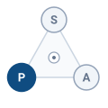

# The Cognitive Brain {#sec-brain}

::: {layout-narrow}
::: {.column-margin}

\chapterminitoc

:::

::: {.content-visible when-format="pdf"}
\noindent
{fig-alt="Isometric blueprint showing the cognitive brain architecture: a heterogeneous System on Chip (SoC) integrates processing units; a Neural Processing Unit (NPU) with a tensor systolic array handles deep learning matrix operations; stacked High Bandwidth Memory (HBM) dies enhance bandwidth for rapid data access; a high-speed weights streaming bus enables real-time data transfer; and a 3D action chunking token lattice facilitates efficient memory management and retrieval."}
:::

::: {.content-visible unless-format="pdf"}
{fig-alt="Isometric blueprint showing the cognitive brain architecture: heterogeneous SoC, NPU tensor systolic array, stacked HBM memory dies, high-speed weights streaming bus, and 3D action chunking token lattice."}
:::

:::

## Purpose {.unnumbered .unlisted}

::: {.content-visible when-format="pdf"}
\begin{marginfigure}
\vspace{1em}
\resizebox{\linewidth}{!}{\mlphysicalstackfull{100}{20}{20}{20}{20}}
\end{marginfigure}
:::

_How does an autonomous agent deliberate over high-dimensional sensory tokens without violating real-time physical deadlines?_

A robot among people must interpret changing surroundings and propose actions beyond fixed programmed movements. Learned models extend that capability by connecting sensory observations with patterns acquired during training. However, these models guarantee neither physically feasible proposals nor inference completion before the next actuation deadline. Large models consume immense memory bandwidth and compute; weight-transfer delays yield proposals based on outdated worldviews. An incorrect proposal creates a problem even if it arrives on time. The architecture must therefore separate action proposal from execution permission. The learned brain supplies candidate behaviors while the nervous system retains timing control and actuator authority.

::: {.column-margin .margin-pointer}
↰ **Prerequisite:** Cognitive policy proposals remain unprivileged until verified by the safety enforcer derived in @sec-boundary-dual-brain.
:::



::: {.callout-learning-objectives}

- Compare classical and learned approaches for perception, generalization, and dependable physical execution
- Trace sensory evidence through the cognitive stages that produce a physical action proposal
- Evaluate trade-offs between reasoning capability, sensing robustness, spatial grounding, and update rate
- Diagnose cognitive failures caused by ambiguous observations, overconfidence, changing scenes, or expired information
- Apply proposal–permission separation to keep cognitive uncertainty from directly controlling physical actuation

:::

## The Embodied Brain {#sec-brain-embodied}

A robotic manipulator can meet all electrical and thermal budgets yet still fail catastrophically when grasping an unfamiliar mug. The motor drives remain well within their continuous torque envelopes, the voltage distribution rails show zero droop, and the joint velocities remain below physical limits. Yet the machine drops the object or crushes the ceramic rim because low-level motor physics cannot determine what the object is, where its structural affordances lie, or how to reach around clutter. A model output in a purely advisory display can be reviewed before it affects the world. Here, a cognitive proposal can automatically influence moving mass. A mistaken proposal can lead to unsafe kinetic energy if the execution path accepts it, so permission must be checked independently. The central dilemma of embodied cognition (@sec-boundary-causal-boundary) is that high-capacity neural models are inherently stochastic, computationally expensive, and prone to semantic hallucinations—yet they must orchestrate physical bodies whose collisions are irreversible.

::: {#dfn-brain-proposal-permission-decoupling .callout-definition title="Proposal–permission privilege boundary"}

***Proposal–permission privilege boundary***\index{Proposal-permission privilege boundary!definition}\index{Privilege boundary!physical AI} is the architectural separation in physical AI systems wherein high-capacity, stochastic neural deliberation models operate strictly as unprivileged motion proposal engines at deliberative cadences ($1\text{--}50\text{ Hz}$), while dedicated, deterministic reflex monitors hold exclusive real-time execution authority ($1000\text{ Hz}$) to grant or deny physical actuation permission.

1.  **Significance**: Keeps model outputs from directly commanding actuators; protection depends on independent sensing, valid physical limits, and a feasible fallback when a proposal is rejected.
2.  **Distinction**: In this architecture, even a policy that outputs torque values has no actuator-write authority; an independent permission path checks proposals before execution.
3.  **Common pitfall**: Treating the deterministic safety governor as a mere post-processing clamp on neural actions, rather than an independent, hard real-time monitor capable of preemptively revoking execution authority.

:::

Within the four-tier systems hierarchy shown in @fig-03-locator, this chapter centers on Layer 3: the Cognitive Brain. Positioned above the deterministic Real-Time Nervous System (Layer 2) and the Dynamical Physical Body (Layer 1), the brain functions under the Proposal–Permission Decoupling Principle as an unprivileged deliberation engine. It processes multimodal sensory fluxes to produce candidate action trajectories at deliberative cadences ($1\text{--}50\text{ Hz}$).[^fn-brain-reflex-governor] This boundary lets the execution path reject proposals against independently checked limits; its protection depends on the limits, state estimate, and fallback remaining valid.

::: {.column-margin}
{width="100%" fig-alt="S·P·A locator triad with the Plan node highlighted."}

*The Plan axis: high-capacity neural deliberation emitting unprivileged action chunks.*
:::

[^fn-brain-reflex-governor]: **Downstream Reflex Monitors**\index{Reflex monitor!safety enforcement}\index{Control barrier function!runtime filtering}: Operating at Layer 2, these deterministic monitors evaluate control barrier functions and kinematic bounds, clamping or rejecting candidate action chunks that violate physical safety invariants before setpoints reach actuator hardware registers.

::: {#fig-03-locator fig-env="figure" fig-pos="htb" fig-cap="**The brain in the Physical AI stack**: The four-tier physical AI systems architecture highlights the cognitive deliberative layer. Operating above the real-time nervous system and physical body, the learned brain processes high-dimensional multimodal streams to generate candidate proposals, with execution authority reserved for downstream deterministic safety governors." fig-alt="Diagram titled Physical AI Systems Architecture Stack, drawn as four stacked tiers. Layer 4 is system governance and assurance at 0.1 to 1 hertz, holding boxes for shared autonomy, verification, safety cases, and frontier limits. Layer 3 is the brain, a cognitive deliberation tier at 1 to 50 hertz, holding five stages named ingestion, perception, memory, intent, and planner. A dashed proposal-permission privilege boundary separates it from layer 2, the nervous system, a real-time safety and timing tier at 1000 hertz. Layer 1 is the physical body and continuous plant. Layer 3 is shaded and outlined and the badge reads Active Focus, Chapter 03, The Brain."}
{width="100%"}
:::

To guide an autonomous agent in unstructured environments, an embodied cognitive architecture must satisfy five primary properties:

1. **Open-world semantic generalization**: Interpreting open-vocabulary natural language instructions and identifying novel, un-modeled objects without requiring rigid pre-programmed CAD templates.
2. **Sensory robustness under tested conditions**: Evaluating how raw perceptual streams respond to glare, dust, motion blur, and illumination shifts.
3. **Metric spatial-temporal grounding**: Anchoring abstract semantic concepts to metric physical coordinates in three-dimensional space, maintaining continuous spatial permanence as objects become occluded.[^fn-brain-metric-grounding]
4. **Multi-rate cadence decoupling**: Separating the scenario-dependent cadence of full-model inference from waypoint execution and high-rate feedback control, as illustrated by unlike workload examples in @fig-cadence-gap.
5. **Bounded execution authority**: Enforcing that stochastic statistical models remain unprivileged proposal engines, holding zero direct write access to motor inverter power stages.

[^fn-brain-metric-grounding]: **Metric Spatial Grounding**\index{Metric spatial grounding}\index{Special Euclidean group!SE(3) grounding}: While disembodied AI operates over discrete semantic tokens, physical AI must ground those semantics in the Special Euclidean group $SE(3)$, mapping entities to metric distances (meters) and spatial orientations (quaternions) relative to the robot's base coordinate frame. Failing to maintain this metric grounding causes neural policies to emit kinematically impossible Cartesian paths that breach actuator workspace boundaries.

Across our three physical reference archetypes (@sec-boundary-four-archetypes), these cognitive affordances map to distinct operational responsibilities:

- **Mobile Systems (AMR / AGV)**: The brain constructs topological-metric semantic maps, resolving spatial navigation goals ("deliver parcel to dock 4B") while monitoring dynamic obstacles across $1\text{--}5\text{ Hz}$ global path replanning cadences.
- **Manipulators (Articulated Arms)**: The brain predicts 6-DoF end-effector grasp affordances and continuous action chunk trajectories ($\mathbf{A}_{t:t+H-1}$), resolving target object poses under camera occlusion and hand-eye parallax.
- **Process and Energy Systems**: The brain forecasts multi-step thermal and chemical state trajectories, proposing setpoint adjustments for mass flow and temperature to optimize efficiency while honoring hard physical envelopes.

::: {#fig-cadence-gap fig-env="figure" fig-pos="htb" fig-cap="**Illustrative cadence regimes**: Parameter counts and example update rates for unlike control, vision, and embodied workloads. Rates depend on hardware, input size, implementation, and measurement conditions; these scenario points do not establish a size-to-cadence law." fig-alt="Log-log scatter of illustrative parameter counts and example update rates for different workload classes, with shaded control and deliberation rate bands; points are not hardware-matched benchmarks."}

```{python}
#| echo: false
import pandas as pd
import matplotlib.pyplot as plt
from mlsysim import viz

data = pd.read_csv("vol4/03_brain/data/brain_frequency_vs_parameters.csv")
fig, ax, COLORS, plt = viz.setup_plot(figsize=(7, 4.5))

_groups = list(dict.fromkeys(data["Category"]))
_cmap = plt.get_cmap('viridis', max(len(_groups), 2))
for _i, _g in enumerate(_groups):
    _sub = data[data["Category"] == _g]
    ax.scatter(_sub["Parameters"], _sub["Frequency_Hz"], color=_cmap(_i), label=str(_g), s=150)

ax.set_xscale("log")
ax.set_yscale("log")

ax.axhspan(20, 1000, color='gray', alpha=0.1, label='Real-Time Control (20+ Hz)')
ax.axhspan(1, 5, color='red', alpha=0.05, label='Cognitive Deliberation (1-5 Hz)')

ax.set_xlabel("Parameter Count (Illustrative, Log Scale)")
ax.set_ylabel("Assumed Update Rate [Hz] (Log Scale)")
plt.legend(bbox_to_anchor=(1.02, 1), loc='upper left', frameon=False)
ax.margins(x=0.14, y=0.14)
plt.tight_layout()
plt.show()
plt.close()
```

:::

The plotted points are illustrative workload regimes, not measurements on a common device or input. Parameter count alone cannot determine update rate. Reconciling open-world reasoning with deterministic execution requires a systematic progression through the cognitive hierarchy:

@Sec-brain-classical-wall analyzes why traditional robotics pipelines—constructed on hand-authored CAD models, explicit inverse kinematics, and rigid finite-state machines—fail in unconstrained, deformable environments. @Sec-brain-learned-representations explores how deep multimodal encoders and foundation models learn spatial affordances and generalizable sensorimotor representations from demonstrations. In @sec-brain-cognitive-pipeline, we trace the complete five-stage cognitive pipeline ($\text{Ingestion} \to \text{Perception} \to \text{Memory} \to \text{Intent} \to \text{Planning}$), showing how multi-step action chunking amortizes inference latency to emit smooth, continuous trajectory proposals. Finally, in @sec-brain-cognitive-vulnerabilities, we diagnose critical cognitive vulnerabilities—including semantic hallucinations, out-of-distribution overconfidence, perceptual chattering, and stale intent—and establish their architectural resolution through the two-speed brain.

## The Classical Wall {#sec-brain-classical-wall}

For nearly a century, automated control and robotics approached cognition as an explicit geometric and analytical physics problem [@wiener1948cybernetics; @kalman1960new; @craig2005introduction]. Under this classical paradigm, engineers constructed mathematical representations from first principles.

Engineers used analytical kinematics and differential dynamics to map desired end-effector motions into actuator torques using closed-form equations.[^fn-math-classical-dynamics] Perception relied on matching hand-crafted 3D Computer-Aided Design (CAD) models against sensor point clouds using geometric alignment algorithms, such as iterative closest point (ICP) or random sample consensus (RANSAC). High-level task logic was authored as explicit Boolean state machines that dictated deterministic transitions between operational phases, such as approaching, aligning, grasping, and retracting.

[^fn-math-classical-dynamics]: **Rigid-Body Dynamics Formulation**\index{Rigid-body dynamics!Euler-Lagrange formulation}\index{Equations of motion!manipulator dynamics}: Classical control computes generalized torques via the standard manipulator equation $\mathbf{M}(\mathbf{q})\ddot{\mathbf{q}} + \mathbf{C}(\mathbf{q}, \dot{\mathbf{q}})\dot{\mathbf{q}} + \mathbf{g}(\mathbf{q}) = \boldsymbol{\tau}$, where $\mathbf{M}(\mathbf{q})$ represents the positive-definite inertia matrix, $\mathbf{C}(\mathbf{q}, \dot{\mathbf{q}})$ captures Coriolis and centripetal terms, and $\mathbf{g}(\mathbf{q})$ accounts for gravitational loading. This analytical formulation becomes computationally intractable and physically inaccurate when machines interact with unmodeled frictional contacts, fluid drag, or deformable objects. Derivations are provided in @sec-appendix-control.

::: {#fig-industrial-welding fig-env="figure" fig-pos="t" fig-cap="**Industrial spot-welding workcell**: Multiple six-degree-of-freedom articulated robots execute preprogrammed spot welding paths on stamped automotive chassis at the BMW Leipzig plant. Operating in a calibrated factory environment with submillimeter repeatable fixtures and safety interlock cages, classical controllers provide deterministic cycle timing and formal stability proofs. (Credit: BMW Group / Wikimedia Commons, CC BY-SA 2.0 de)." fig-alt="Articulated industrial robots executing automated spot welding on an automotive chassis within a safety-caged factory cell."}
{width="85%"}
:::

Where the operational environment is strictly structured and bounded (@fig-industrial-welding), classical methods can provide dependable behavior within their modeled conditions. On an automated automotive assembly line, an industrial robot welds stamped steel panels where every workpiece arrives at an exact coordinate within sub-millimeter tolerances. Ambient lighting is tightly regulated by industrial fixtures, and human workers are excluded by physical interlock safety fences. Within the causal boundary defined in @sec-boundary-causal-boundary, this controlled regime permits explicit models, bounded servo timing, and stability analysis under stated assumptions. Engineers can verify selected trajectory and torque constraints and assess controller software coverage against applicable standards without collecting task demonstrations.

Yet when an embodied machine leaves the structured factory cage to operate in unstructured environments (@fig-unstructured-rescue), this paradigm hits the Classical Wall [@brooks1991intelligence; @levine2018learning]. The physical world is not a sterile CAD drawing; it is continuous, deformable, and endlessly variable.

::: {#fig-unstructured-rescue fig-env="figure" fig-pos="t" fig-cap="**Unstructured search-and-rescue robot**: A tracked mobile robot navigates an obstacle course with irregular inclines, loose debris, and visual occlusions. In such unmapped environments, preauthored geometric models and rigid state machines can lose coverage; learned policies may help infer spatial affordances and traversability from sensory streams. (Credit: TU Darmstadt Rescue Robotics / Wikimedia Commons, CC BY-SA 3.0)." fig-alt="Tracked mobile robot traversing irregular rubble and wooden obstacles in an unstructured search-and-rescue test arena."}
{width="85%"}
:::

The first breakdown is the combinatorial explosion of geometry. In a commercial logistics warehouse handling hundreds of thousands of retail goods, authoring CAD models, mesh templates, and grasp points for every bottle, wrapped package, and flexible garment is impossible. Discretizing orientations, frictional properties, and contact permutations across overlapping, deformable items creates a combinatorial space exceeding billions of geometric configurations unmanageable by hand-crafted templates.

The second breakdown arises from sensory brittleness. A hand-crafted edge-and-segmentation pipeline may rely on filters, Harris corners, or surface-normal thresholds. Under changed sunlight, reflections, or dust, a required feature can disappear. In that pipeline, a missing edge can make planar segmentation bridge two objects and propose a grasp in empty space.

The third breakdown is the engineering bottleneck of hand-authored logic. The machine's operational capability is bounded by the engineer's ability to anticipate every physical edge case. When an unexpected variation occurs—such as a bent bracket, a scuffed label, or an unfamiliar obstacle—the hand-authored rulebook contains no matching branch, causing the machine to halt, drop its payload, or fail catastrophically.

Where hand-authored geometry loses coverage, learned representations can offer empirical generalization from multimodal data; their behavior still needs testing under the intended variation.

::: {#chk-brain-classical-wall-limits .callout-checkpoint title="The classical wall and embodied constraints"}

Before examining how deep neural representations discover sensorimotor structure, verify your understanding of the physical and combinatorial boundaries that constrain classical robotics:

- [ ] **Combinatorial geometric explosion**: Can you explain why CAD mesh templates, surface normal matching, and analytical inverse kinematics fail when a manipulator interacts with unmodeled, deformable, or overlapping retail objects?
- [ ] **Sensory brittleness and Boolean fractures**: Can you describe how minor shifts in ambient lighting, specular reflections, or dust cause hand-crafted edge detectors and planar segmentation to bridge across disjoint physical bodies?
- [ ] **Explicit state machine bottleneck**: Can you contrast the maintenance scalability of hand-authored Boolean state machines against continuous learned representations when scaling to long-horizon, un-modeled tasks?
- [ ] **Industrial caging vs. open-world stability**: Can you explain why stability analyses and timed controls established for a modeled factory cell cannot be directly transferred to unstructured search-and-rescue or domestic environments?

*If any check reveals uncertainty, review the three breakdown modes in this section before examining how deep multimodal backbones learn continuous manifolds.*
:::

## Learned Representations {#sec-brain-learned-representations}

Physical AI can extend classical pipelines with neural representations fitted to multimodal sensory data when hand-authored models lose coverage. In the embodied AI and robotics community, this transition was driven by four foundational pillars:

The first pillar is open-world semantic generalizability. Classical controllers are geometrically precise but semantically blind: an inverse kinematics solver can expertly drive an end-effector to coordinate $(x, y, z)$, yet it possesses zero understanding of whether that location contains a sturdy mug or a fragile glass, or how surrounding objects relate to human tasks. Modern vision-language-action foundation models project open-vocabulary natural language instructions and high-resolution camera streams into shared semantic embeddings [@driess2023palme; @brohan2023rt1; @brohan2023rt2; @kim2024openvla]. When commanded to "wipe the coffee spill from the counter and stow the mug in the drying rack," a trained model may propose the mug handle and spill boundary as task-relevant regions without a new CAD model. Their accuracy on an unfamiliar object or surface must be checked in the operating environment.

The second pillar is empirical sensory robustness. Hand-authored visual thresholds can flip under changing illumination or texture. Learned representations can tolerate some of these changes when training and testing cover them, but their responses are neither necessarily smooth nor bounded under shift.

The third pillar is the ability to handle complex multi-contact and deformable dynamics. Many physical manipulation tasks—such as folding textiles, routing flexible wire harnesses through automotive door assemblies, or scooping granular media—involve non-smooth contact mechanics, variable friction, and infinite-dimensional deformations that cannot be modeled in closed-form differential equations. With suitable contact-rich demonstrations and feedback, neural policies can learn compliance-aware responses that reduce force against unexpected resistance; the behavior still needs testing across the intended operating region.

The fourth pillar is empirical scaling with data and compute. Richard Sutton's *The Bitter Lesson* [@sutton2019bitter] states that methods leveraging general computation and large-scale learning consistently surpass hand-engineered heuristics. Training on diverse robotic demonstrations (@fig-aloha-manipulator) and multimodal data can improve performance on tested tasks [@zhao2023learning; @chi2024diffusionpolicy]. Data scale alone does not establish dexterity or robustness in a new workspace; engineers must measure coverage and failure modes there.

::: {#fig-aloha-manipulator fig-env="figure" fig-pos="t" fig-cap="**Bimanual teleoperation workcell**: Dual-arm teleoperation setup featuring two six-degree-of-freedom follower arms, two leader arms for kinesthetic teleoperation, multi-view cameras (overhead and wrist-mounted), and parallel grippers mounted to an extruded aluminum frame. The physical AI policy ingests synchronized multi-camera streams to predict continuous end-effector trajectories, requiring deterministic safety governors to prevent self-collisions and motor over-torquing during closed-loop execution. (Credit: Stanford University & Google DeepMind, CC-BY / Apache 2.0)." fig-alt="Dual-arm robotic teleoperation workstation with leader and follower arms, overhead cameras, and grippers mounted on an aluminum frame."}
{width="85%"}
:::

::: {#fig-vla-taxonomy fig-env="figure" fig-pos="t" fig-cap="**Embodied model taxonomy**: Systematic categorization of modern embodied foundation models spanning multimodal perceptual frontends (visual tokens, point clouds, language prompts), high-capacity neural backbones (transformers, diffusion heads, world models), and target action spaces. The taxonomy contrasts Vision-Language-Navigation policies that decode topological waypoints and semantic frontiers with Vision-Language-Action policies that emit joint and Cartesian trajectory chunks for articulated manipulators. (Adapted from Ma et al. [@ma2024vision])." fig-alt="Taxonomic diagram categorizing embodied foundation models into inputs, multimodal neural backbones, and navigation or manipulation action spaces."}
{width="95%"}
:::

::: {#fig-vla-architecture fig-env="figure" fig-pos="t" fig-cap="**Embodied Vision-Language-Action (VLA) architecture**: A representative dataflow. (1) Camera patches receive 2D image-position and camera identifiers alongside language and robot-state tokens; metric depth still requires calibrated evidence. (2) Self-attention mixes the combined token sequence; the colored grid illustrates internal attention weights, not a verified affordance or grasp pose. (3) Discrete autoregressive decoders emit tokens sequentially, whereas continuous decoders generate candidate multi-step chunks ($\mathbf{A}_{t:t+H-1}$) through one pass or iterative denoising. (4) An independent permission path checks candidate motion against sensed state and modeled limits before actuation. (Synthesized from Brohan et al. [@brohan2023rt1; @brohan2023rt2], Kim et al. [@kim2024openvla], and Octo Model Team [@octo_2023])." fig-alt="Comprehensive architectural schematic of a Vision-Language-Action foundation model showing spatial patch slicing, 2D positional embeddings, multimodal self-attention weights in an illustrative image grid, discrete versus continuous action decoders, and an independent proposal-permission boundary."}
{width="100%"}
:::

Rather than an opaque monolith, an embodied foundation model is a four-stage neural pipeline (@fig-vla-taxonomy, @fig-vla-architecture) that transforms sensory inputs into candidate motion proposals that still need kinematic checks. To understand how a model reasons about the physical world, a systems engineer must trace how spatial information is organized, aligned with human intent, and translated into motor proposals across four distinct architectural stages:

1. **Sensory Ingestion and Spatial Tokenization (The Inputs):**
   A digital camera produces a raster grid of pixels $\mathbf{I} \in \mathbb{R}^{H \times W \times C}$. Ingesting raw pixels directly into a standard multilayer perceptron destroys spatial locality and causes parameter counts to explode. Instead, modern embodied models tokenize visual space through a vision transformer frontend:

   - *Spatial patch partitioning:* The continuous 2D image plane is partitioned into a uniform grid of non-overlapping square patches of dimension $P \times P$ pixels (typically $P = 14$ or $16$). For an image of resolution $H \times W$, this yields an array of $N_v = (H / P) \times (W / P)$ discrete visual patches. Each 2D patch is flattened into a one-dimensional vector $\mathbf{x}_p^{(u, v)} \in \mathbb{R}^{P^2 C}$, where $(u, v)$ denotes the patch row and column index in the camera plane.
   - *Linear embedding and spatial topology injection:* A learned projection matrix $\mathbf{W}_{\text{patch}} \in \mathbb{R}^{(P^2 C) \times d_{\text{model}}}$ maps each flattened patch into the model's hidden dimension. Because transformer self-attention is mathematically permutation-invariant (treating inputs as an unordered set), the model possesses zero native awareness of spatial proximity without explicit coordinate grounding. To encode image position, this representative architecture injects a two-dimensional spatial positional embedding $\mathbf{E}_{\text{pos}}^{2D}(u, v)$:
     $$\mathbf{z}_0^{(u, v)} = \mathbf{x}_p^{(u, v)} \mathbf{W}_{\text{patch}} + \mathbf{E}_{\text{pos}}^{2D}(u, v) + \mathbf{e}_{\text{cam}}$$
     The 2D positional embedding decomposes along the vertical axis $u$ and horizontal axis $v$ using sinusoidal frequency bands or learned 2D coordinate embeddings, encoding patch positions in the image plane without establishing metric 3D distance or guaranteeing nearby latent vectors. When multiple cameras are deployed (such as an overhead third-person camera providing global scene context alongside an eye-in-hand wrist camera providing millimeter-scale alignment), a learned camera identifier $\mathbf{e}_{\text{cam}} \in \{\mathbf{e}_{\text{overhead}}, \mathbf{e}_{\text{wrist}}\}$ is added to distinguish perspective reference frames.

     To make these tensor dimensions concrete, consider an autonomous robot processing an RGB frame at standard resolution $224 \times 224 \times 3$ with patch size $P = 14$. The image plane divides into $(224 / 14) \times (224 / 14) = 16 \times 16 = 256$ square patches. Each individual patch is a sub-image of $14 \times 14 = 196$ pixels across 3 color channels, flattened into a vector of $196 \times 3 = 588$ raw floating-point numbers. The linear projection matrix $\mathbf{W}_{\text{patch}} \in \mathbb{R}^{588 \times 4096}$ multiplies each 588-dimensional patch vector, mapping it directly into the 4096-dimensional model space. When combined with a 2D spatial grid coordinate $\mathbf{E}_{\text{pos}}^{2D}(u, v)$ (where $u, v \in \{0, \dots, 15\}$) and the camera embedding $\mathbf{e}_{\text{cam}}$, the single video frame becomes an input tensor of exactly $[256, 4096]$. If the robot mounts three cameras (left wrist, right wrist, overhead), the visual input immediately expands to $3 \times 256 = 768$ visual tokens before text instructions or proprioception are even introduced.
   - *Multimodal sequence assembly:* Natural language task directives (e.g., "grasp the red mug by its handle") are tokenized via byte-pair encoding into a sequence of text embeddings $\mathbf{z}_{\text{text}} \in \mathbb{R}^{L \times d_{\text{model}}}$. Concurrently, the robot's physical configuration (joint angles $\mathbf{q}_t$, joint velocities $\dot{\mathbf{q}}_t$, and gripper state) is projected through a linear layer into proprioceptive tokens $\mathbf{z}_{\text{state}} \in \mathbb{R}^{K_s \times d_{\text{model}}}$. These streams concatenate into a unified multimodal input sequence:
     $$\mathbf{Z} = [\mathbf{z}_{\text{vision}} \,|\, \mathbf{z}_{\text{text}} \,|\, \mathbf{z}_{\text{state}}] \in \mathbb{R}^{N_{\text{total}} \times d_{\text{model}}}$$

2. **Multimodal Alignment and Attention (The Backbone):**
   The combined token sequence $\mathbf{Z}$ passes through 32 to 80 transformer layers consisting of multi-head self-attention and feed-forward networks. The self-attention operation projects tokens into queries $\mathbf{Q} = \mathbf{Z} \mathbf{W}_Q$, keys $\mathbf{K} = \mathbf{Z} \mathbf{W}_K$, and values $\mathbf{V} = \mathbf{Z} \mathbf{W}_V$, computing pairwise attention weights:
   $$A_{i, j} = \frac{\exp\left(\mathbf{q}_i^\top \mathbf{k}_j / \sqrt{d_k}\right)}{\sum_{m} \exp\left(\mathbf{q}_i^\top \mathbf{k}_m / \sqrt{d_k}\right)}$$

   This equation describes **self-attention** over the combined token sequence. A text token such as “handle” can attend to visual patch tokens, but a high attention weight is not itself a verified grasp location or metric pose. A trained spatial decoder may produce a 2D affordance heatmap; depth evidence, camera calibration, and geometric checks are still needed to place the gripper in 3D.

   A rolling key-value (KV) cache stores prior token states for attention. It does not by itself track object permanence or maintain a 3D position and velocity. An explicit state estimator or tracking memory must associate observations across frames, update a metric pose with calibrated sensors, and increase uncertainty while the mug is occluded.

3. **Specialized Action Decoders (The Outputs):**
   Instead of generating conversational text, the final hidden layer $\mathbf{h}_{\text{context}}$ feeds task-specific action decoders. While navigation models (VLN) emit topological waypoints or heading rates $(v_t, \omega_t)$ (@fig-vln-navigation), manipulation models (VLA) diverge sharply in how they bridge semantic representations to physical motion:

   * *Discrete Categorical Tokenization (RT-1, RT-2, OpenVLA):* Early VLAs adapt autoregressive language modeling directly to robotics by discretizing continuous joint or Cartesian offsets into $B = 256$ uniform bins per dimension [@brohan2023rt1; @brohan2023rt2; @kim2024openvla]:
     $$\text{bin}(a_k) = \left\lfloor \frac{a_k - a_{\min}}{a_{\max} - a_{\min}} \times 255 \right\rfloor \in [0, 255]$$
     Each bin is assigned a discrete token (`<act_000>` to `<act_255>`) in the language vocabulary. While this natively leverages web-scale vision-language pretraining, it introduces a severe systems bottleneck: a decoder that emits one scalar token at a time needs seven serial token predictions for a 7-DoF action. Its latency depends on caching, hardware, and whether each prediction revisits the full backbone; seven serial steps can miss a control deadline. Scalar binning has a resolution of roughly $\Delta a = (a_{\max} - a_{\min}) / 256$; whether that produces contact chatter depends on smoothing, the action range, and the downstream controller.
   * *Continuous Generative Action Chunking (Octo, $\pi_0$, ACT, Diffusion Policy):* To overcome the autoregressive memory wall, modern generalist policies couple the transformer backbone with continuous generative decoders, such as diffusion policy heads [@chi2024diffusionpolicy; @octo_2023] or flow-matching action experts [@black2024pi0]. Rather than predicting a single scalar per forward pass, the model predicts an entire continuous trajectory chunk:
     $$\mathbf{A}_{t:t+H-1} = [\mathbf{a}_t, \mathbf{a}_{t+1}, \dots, \mathbf{a}_{t+H-1}] \in \mathbb{R}^{H \times d_a} \quad (H = 16\text{--}50\text{ steps})$$
     For example, a backbone may evaluate one new camera observation, then a smaller decoder may perform several denoising iterations to propose $H=32$ waypoints at $20\text{ ms}$ spacing. That is one $640\text{ ms}$ candidate horizon, not 32 fresh observations. The next backbone evaluation must arrive before the accepted execution window expires; downstream interpolation and feedback run at their own rates.

4. **The Privilege Boundary (Isolation from Actuators):**
   Crucially, whether the model is a VLN mobility planner or a VLA manipulation policy, its output is strictly an **unprivileged candidate proposal**\index{Unprivileged proposal!privilege boundary} ($p_t$). Following the architectural isolation principle of @sec-boundary-causal-boundary, the foundation model operates in unprivileged user space on the application processor (MPU) and possesses **zero direct hardware authority** to write pulse-width modulation (PWM) registers or physically switch current into the motor coils *(as formalized in the Proposal–Permission Decoupling Principle, \ref{dfn-brain-proposal-permission-decoupling})*.

   The design rule for this deliberative boundary is that cognitive models operating at low inference cadences ($1\text{--}10\text{ Hz}$) propose kinematic setpoints ($\mathbf{q}, \dot{\mathbf{q}}, \ddot{\mathbf{q}}$ or Cartesian poses)—or feedforward torque offsets paired with explicit kinematic references—**never unbuffered, open-loop motor torques ($\boldsymbol{\tau}$)** directly to inverter switches. Motor torque is directly coupled to continuous plant dynamics:
   $$\boldsymbol{\tau} = \mathbf{M}(\mathbf{q}) \ddot{\mathbf{q}} + \mathbf{C}(\mathbf{q}, \dot{\mathbf{q}}) \dot{\mathbf{q}} + \mathbf{g}(\mathbf{q}) + \boldsymbol{\tau}_{\text{contact}}$$
   Because inertia $\mathbf{M}(\mathbf{q})$ and Coriolis forces $\mathbf{C}(\mathbf{q}, \dot{\mathbf{q}})$ vary non-linearly with instantaneous joint configuration and velocity, commanding open-loop torques from a slow $1\text{--}10\text{ Hz}$ neural model without high-frequency feedback can destabilize the limb when model error, friction, or payload variation is large enough. Kinematic setpoints, by contrast, specify an intended spatial path while delegating high-gain closed-loop torque synthesis to the deterministic $1000\text{ Hz}$ nervous system and $10\text{--}25\text{ kHz}$ field-oriented current loops. (Where specialized high-rate reinforcement learning policies operating at $100\text{--}500\text{ Hz}$ output torques directly, they still require an independently validated high-rate permission path, such as the passivity filters and energy-tank monitors detailed in @sec-nervous-invariant-checking.)

::: {.column-margin .margin-pointer}
↳ **Downstream:** Zero-copy proposal passing between brain and nervous system relies on the lock-free buffers analyzed in @sec-nervous-cadences.
:::

   Proposals are dispatched across lock-free shared memory to downstream real-time safety monitors on isolated microcontrollers (MCUs). These hardware-level watchdogs evaluate physical stopping distances, torque limits, and the actuator thermal envelopes detailed in @sec-body-thermal-duty-cycles at $1000\text{ Hz}$ before granting execution permission, so a hallucinated proposal can be rejected when independent measurements, modeled limits, and a feasible fallback support that decision.[^fn-math-unprivileged-control]

[^fn-math-unprivileged-control]: **Proposal-Permission Privilege Boundary**\index{Privilege boundary!unprivileged proposals}\index{Control barrier function!safety invariance}: Treating the neural policy as an unprivileged proposal generator isolates stochastic inference from actuator registers. Candidate trajectory setpoints $\mathbf{q}_{\text{ref}}(t)$ are continuously evaluated against forward-invariant Control Barrier Functions (CBFs) $h(\mathbf{x}) \ge 0$ on dedicated safety silicon, so proposals that violate modeled actuator limits or collision envelopes can be rejected when independent state estimates and feasible control authority support the check. Mathematical formulations of CBFs appear in @sec-appendix-control.

::: {#fig-vln-navigation fig-env="figure" fig-pos="t" fig-cap="**Topological vision-language navigation**: Embodied navigation architecture executing natural-language spatial instructions. Panoramic visual observations are encoded into perceptual tokens, matched against prompt embeddings, and cross-referenced with a dynamically updated topological navigation graph. The action decoder prunes unreachable nodes and emits metric waypoint offsets $(\Delta x, \Delta y)$ and heading setpoints to guide the chassis along traversable semantic frontiers without requiring an exact geometric prior map. (Adapted from An et al. [@an2023etpnav])." fig-alt="Schematic of topological vision-language navigation showing panoramic observation tokens, topological graph matching, and decoded waypoint offsets and heading setpoints."}
{width="95%"}
:::

::: {#chk-brain-proposal-permission-cadence .callout-checkpoint title="Proposal–permission boundary, cadence gaps, and torque isolation"}

Before tracing the five-stage cognitive pipeline, verify your understanding of why foundation models must be isolated from physical actuator authority:

- [ ] **Proposal–permission separation**: Can you explain why high-capacity foundation models operate strictly as unprivileged motion proposal engines at deliberative cadences ($1\text{--}5\text{ Hz}$), while execution authority remains exclusively with downstream deterministic reflex monitors at $1000\text{ Hz}$?
- [ ] **Kinematic setpoints vs. torque authority**: Can you derive why commanding unbuffered open-loop motor torques ($\boldsymbol{\tau}$) from a slow neural policy can destabilize the plant under non-linear Coriolis and inertial dynamics ($\mathbf{M}(\mathbf{q})\ddot{\mathbf{q}} + \mathbf{C}(\mathbf{q}, \dot{\mathbf{q}})\dot{\mathbf{q}}$), and why this architecture proposes kinematic trajectories instead?
- [ ] **Spatial patch coordinate grounding**: Can you describe why transformer self-attention needs position information, what 2D and camera embeddings encode, and why metric workspace coordinates need more evidence?
- [ ] **Discrete binning vs. continuous chunking**: Can you explain when sequential scalar-token decoding repeats costly backbone work, and how a chunk shares a backbone evaluation across future waypoints?

*If the distinction between kinematic trajectories and raw motor torques is unclear, review the Proposal–Permission Decoupling Principle in @sec-brain-embodied before examining pipeline stages.*
:::

## The Cognitive Pipeline {#sec-brain-cognitive-pipeline}

Extending the proposal-permission architecture from @sec-brain-embodied, to architect a cognitive pipeline, we must trace how information flows from physical sensations to actionable setpoints. A dependable physical AI architecture organizes cognition into five sequential stages instead of treating the brain as an unstructured black box (@fig-cognitive-pipeline): Ingestion, Perception, Memory, Intent, and Planning.

::: {#fig-cognitive-pipeline fig-env="figure" fig-pos="t" fig-cap="**The Physical AI cognitive flow**: Information flows sequentially from physical sensors through Ingestion (tokenization), Perception (spatial geometry and affordances), Memory (persistent world model belief), Intent (deliberative goal leases), and Planning (multi-step action chunking), The architecture must facilitate crossing the 'proposal-permission boundary', a juncture where proposed actions are evaluated against real-time constraints and resources, leading to downstream reflexes." fig-alt="Horizontal flowchart of the five-stage cognitive pipeline: Ingestion, Perception, Memory, Intent, and Planning, culminating at the proposal-permission boundary."}
{width="95%"}
:::

### Ingestion and representation {.unnumbered}

Cognition begins at the sensory interface of this causal boundary (@sec-boundary-causal-boundary), where environmental energy transduces into digital bitstreams. Photons strike active-pixel CMOS sensors across 2D camera grids, infrared pulses measure photon time-of-flight in depth cameras, and micro-electromechanical systems (MEMS) in inertial measurement units (IMUs) sample accelerations and angular velocities.

The ingestion stage translates heterogeneous, high-bandwidth bitstreams—ranging from analog voltage spikes to digital pixel grids—into normalized numerical embeddings, a uniform vocabulary for neural networks. For the mathematical formulation of patch embeddings and 3D metric lifting, see @sec-appendix-ml-patch-embedding.
Because monocular 2D camera images suffer from fundamental scale-depth projective ambiguity—where a small near object and an identically shaped, proportionally larger distant object cast identical pixel projections—a downstream perception and estimation stage needs depth evidence, calibrated geometry, or explicit scale assumptions to estimate a 3D metric pose. Tokenization alone does not supply that scale.[^fn-std-curriculum-deepdives]

[^fn-std-curriculum-deepdives]: **Cognitive Systems Progression**\index{Cognitive architecture!algorithmic progression}\index{Curriculum architecture!Part III mapping}: While this chapter establishes the overarching systems model of embodied cognition, rigorous mathematical and algorithmic formulations for each stage are developed in Part III, spanning spatial perception (@sec-perception), spatial memory (@sec-memory), grounded intent (@sec-intent), trajectory planning (@sec-planning), and real-time safety enforcement (@sec-enforcement).

Consider how this operates across the three machine archetypes:

- *Mobile systems:* A quadruped traversing rubble synchronizes four RGB-D cameras streaming at $30\text{ fps}$ ($>740\text{ MB/s}$ raw data) alongside 12 joint encoders sampled at $1000\text{ Hz}$. Ingestion tokenizes each visual frame into hundreds of patch embeddings while downsampling and embedding the high-frequency joint state stream into a unified temporal sequence.
- *Manipulators:* A dual-arm workstation ingests synchronized stereo wrist camera feeds ($60\text{ fps}$) and 14-DoF joint positions, tokenizing visual patches and motor states into aligned input tokens for end-effector coordination.
- *Process / energy systems:* A continuous chemical reactor ingests thousands of analog thermocouple, pressure transducer, and mass flow meter channels at $100\text{ Hz}$, normalizing heterogeneous sensor calibrations into a rolling multivariate state tensor.

This ingestion pipeline places substantial demands on data bandwidth and memory throughput. For an embodied machine equipped with $N_{\text{cameras}}$ synchronized visual streams at image resolution $H_{\text{img}} \times W_{\text{img}}$ processed by a vision transformer with patch dimension $P \times P$, the spatial token ingestion rate per frame is:

$$N_{\text{vision}} = N_{\text{cameras}} \times \left(\frac{H_{\text{img}}}{P}\right) \times \left(\frac{W_{\text{img}}}{P}\right)$$

For a typical multi-camera workstation ($N_{\text{cameras}} = 3$, $224 \times 224$ pixels, $P = 14$), every video frame generates $3 \times (16 \times 16) = 768$ visual tokens. Streaming multiple high-definition camera feeds generates gigabytes of raw pixel data every second. Systems engineers must implement efficient frame buffering, sensor exposure synchronization, and spatial patch pooling to keep data moving smoothly before cognitive reasoning begins.

### Perception and spatial grounding {.unnumbered}

Perception extracts metric structure, semantic identity, and spatial affordances from ingested tokens. Rather than treating sensory data as an unstructured bag of visual features, perception grounds representations in 3D physical coordinates—specifying an object's three-dimensional position and spatial orientation relative to the robot.[^fn-math-se3-pose]

[^fn-math-se3-pose]: **Spatial Poses and $SE(3)$**\index{Spatial pose!3D rigid-body configuration}\index{Special Euclidean group!SE(3)}: A 3D rigid-body pose combines 3D position $\mathbf{p} = [x, y, z]^\top$ with 3D orientation (typically represented as an orthonormal rotation matrix $\mathbf{R}$ or unit quaternion to avoid the gimbal lock singularities of Euler angles). In robotics mathematics, this configuration space is formalized as the Lie group $SE(3)$ (Special Euclidean group); the mathematical group axioms and coordinate transformations are detailed in @sec-appendix-control-spatial.

Using dense self-supervised representations like DINOv2 [@oquab2023dinov2] and learned spatial decoders, perception isolates physical entities, segments object boundaries, estimates 3D bounding boxes, and reconstructs surface normals. Crucially, perception extracts spatial affordances: functional geometric fields that describe where and how an object can be physically engaged. For a drill, perception identifies not merely a generic class label, but the 3D position and orientation of the handle grasp axis, the trigger contact surface, and the drill bit tip. This transforms ungrounded pixel arrays into actionable spatial entities referenced to the robot's base frame.

When a mobile manipulator is commanded to retrieve a torque wrench from a cluttered workbench, perception isolates the tool from surrounding background clutter, predicts its 6-DoF pose ($SE(3)$ transformation matrix $\mathbf{T}_{\text{base}}^{\text{tool}}$), and outputs a continuous heatmap over the handle indicating valid gripper pinch contacts.

In practice, perception is highly vulnerable to sensor calibration drift. If camera mounting fasteners deflect by fractions of a millimeter or structural linkages deform under heavy payload torque, the extrinsic calibration transformation matrix between the camera optical frame and the robot base coordinate frame drifts, compromising spatial registration. This introduces metric scale errors that cause precision grippers to miss targets or strike work surfaces. Systems engineers must implement online hand-eye recalibration routines and maintain spatial uncertainty covariances alongside raw point estimates.

### Memory and spatial-temporal belief {.unnumbered}

A physical agent cannot reliably act from a single snapshot of the world. Objects pass behind visual occlusions, cameras pan away from manipulated targets, and physical bodies possess dynamic momentum that cannot be inferred from a single frame.

The memory stage maintains a persistent spatial-temporal belief of the environment. It tracks object identities across time, correlates visual features with geometric coordinate frames, and updates 3D volumetric representations such as Truncated Signed Distance Fields (TSDFs) [@curless1996volumetric], Language Embedded Radiance Fields (LERF) [@kerr2023lerf], or 3D Gaussian Splatting maps [@kerbl20233d]. By fusing historical observations across a sliding temporal window, memory maintains accurate state estimates even during complete visual occlusion, computes linear and angular object velocities, and tracks operational context across multi-step tasks.

For a quadruped traversing a rocky ledge, the forward-facing camera points toward the horizon, losing sight of the immediate ground beneath its front feet. The memory stage preserves the reconstructed 3D surface geometry of the terrain, enabling the robot to securely place its hind feet onto footholds it observed several seconds earlier.

Maintaining dense volumetric belief states introduces significant memory footprints. Storing high-resolution 3D voxel grids or radiance field parameters requires substantial storage capacity, competing directly with the memory needed to run large neural network models. Furthermore, belief representations degrade in freshness over time: if a dynamic obstacle moves while occluded, an un-decayed memory belief causes the robot to plan around a "phantom" obstacle or collide with an unobserved intruder. Systems engineers must enforce explicit temporal decay rates on spatial belief states to reflect physical entropy.

### Intent and deliberative reasoning {.unnumbered}

With a persistent world belief and a high-level mission prompt, the intent stage performs semantic reasoning and task decomposition. Because open-vocabulary foundation models operate over vast parameter spaces (typically 7B to 70B parameters), deliberative reasoning occurs at slow, human-scale cadences ($1\text{--}5\text{ Hz}$).

To understand how intent operates, imagine a human operator issues a natural language mission prompt:

$$\text{"Clear the table by placing the ceramic mug in the sink and throwing the paper napkin into the trash bin."}$$

The intent layer cannot execute this directive in a single leap. Using embodied reasoning architectures such as SayCan [@ahn2022saycan], VoxPoser [@huang2023voxposer], or Code as Policies [@liang2023code], the deliberative model queries the active world memory and decomposes the mission into an ordered sequence of discrete subgoals: first approach the mug, grasp the handle, transport it to the sink coordinate frame, and release contact, before turning toward the napkin.

If the mug moves during a $400\text{ ms}$ deliberation interval, a previously useful subgoal may already be stale. The next proposal therefore needs a target, generation and expiration times, and an allowed region checked against independently maintained geometry. The intent stage can package these into a time- and region-bounded **intent lease**\index{Intent lease!temporal contract} ($\mathcal{L}_{\text{intent}}$); the enforcer must verify the corridor rather than trust the learned model to define safe space. @Tbl-03-intent-lease-schema gives one implementation.

| Field Name             | Type            | Unit                   | Description & Structural Invariants                                                                                                         |
|:-----------------------|:----------------|:-----------------------|:--------------------------------------------------------------------------------------------------------------------------------------------|
| `lease_id`             | `uint64_t`      | —                      | Monotonically increasing 64-bit sequence identifier                                                                                         |
| `target_entity_id`     | `uint32_t`      | —                      | Hash of target entity in persistent spatial memory                                                                                          |
| `pose_target_se3`      | `float32[4][4]` | $\text{m}, \text{rad}$ | Valid $\text{SE}(3)$ pose matrix: $\mathbf{R} \in \text{SO}(3), \det(\mathbf{R})=1, \mathbf{p} \in \mathbb{R}^3$, bottom row $[0, 0, 0, 1]$ |
| `spatial_corridor_box` | `float32[6]`    | $\text{m}$             | Authorized 3D bounding box $[\mathbf{p}_{\min}, \mathbf{p}_{\max}] \in \mathbb{R}^6$                                                        |
| `t_generated_ns`       | `uint64_t`      | $\text{ns}$            | PTP monotonic hardware timestamp at deliberation completion                                                                                 |
| `t_expire_ns`          | `uint64_t`      | $\text{ns}$            | Hard expiration timestamp; enforces $t_{\text{expire}} - t_{\text{gen}} \le \tau_{\text{valid}}$                                            |
| `max_permissible_jerk` | `float32`       | $\text{rad/s}^3$       | Maximum allowable joint angular jerk magnitude                                                                                              |
| `hmac_signature`       | `uint8_t[32]`   | bytes                  | Optional authentication tag when the threat model requires source integrity                                                                 |

: **Illustrative intent lease contract schema**: One possible binary layout of the intent lease payload ($\mathcal{L}_{\text{intent}}$). {#tbl-03-intent-lease-schema tbl-colwidths="[20,18,22,40]"}

Identifiers, jerk limits, and authentication depend on the implementation and threat model. Since the target mug or a coworker can move before the lease reaches the planner, execution must reject an expired lease and recheck the measured region.
Because intent leases prescribe target envelopes rather than executable motor trajectories, the architecture delegates trajectory generation to a downstream planning stage that transforms symbolic intents into continuous, kinematically verified action chunks.

::: {#chk-brain-perceptual-intent-grounding .callout-checkpoint title="Perceptual grounding, spatial memory, and intent contracts"}

Before analyzing action chunking decoders and edge SoC memory walls, verify your understanding of how sensory fluxes are converted into verifiable deliberative intent contracts:

- [ ] **3D metric lifting**: Can you explain what depth or scale evidence and calibration are needed to estimate a metric pose from monocular pixels, and how calibration drift degrades grasp accuracy?
- [ ] **Attention vs. geometric grounding**: Can you explain what self-attention over text and image tokens can associate, and what additional decoder, depth evidence, and calibration are needed for a metric grasp pose?
- [ ] **Volumetric memory belief decay**: Can you explain why persistent spatial representations (TSDFs, 3D Gaussian Splats) require explicit temporal decay rates to prevent machines from planning trajectories around phantom obstacles or colliding with unobserved intruders?
- [ ] **Intent lease contract bounds**: Can you enumerate the structural fields of an intent lease ($\mathcal{L}_{\text{intent}}$, @tbl-03-intent-lease-schema) and calculate why exceeding lease validity ($\tau_{\text{valid}}$) during a $400\text{ ms}$ inference pause forces downstream execution rejection?

*Ensure you can trace sensory dataflow through the intent lease schema in @tbl-03-intent-lease-schema before evaluating how the planning stage converts symbolic leases into continuous motor waypoints.*
:::

### Planning and action chunking {.unnumbered}

An intent lease specifies an operational goal but provides no continuous motor trajectories or guarantees that intervening motion meets physical kinematic limits. The planning stage converts the active intent lease into candidate joint trajectories or end-effector motion setpoints via an **unprivileged action decoder head**.

Planning executes on physical silicon by treating deep neural policies as compute workloads on embedded accelerators—like high-performance heterogeneous edge SoCs with integrated GPU tensor cores and dedicated deep learning accelerators—bounded by memory bus bandwidth, silicon thermals, and electrical power.

::: {.column-margin .margin-pointer}
↳ **Downstream:** High-throughput neural inference accelerators are isolated from deterministic cores in @sec-placement-two-paths-one-die.
:::

Consider what happens if a robot attempts to generate continuous motor actions one discrete step at a time through an autoregressive foundation model (such as a 7-billion parameter Vision-Language-Action network). In single-step autoregressive decoding, each sequential token may require another backbone evaluation and associated weight traffic when weights cannot remain on chip. The actual traffic depends on caching and the decoder architecture. For detailed memory wall derivations and roofline hardware models, see @sec-appendix-systems.

Token-by-token execution of a nonresident model can require repeated gigabyte-scale weight traffic if the controller requests a fresh action every millisecond (see @fig-patterson-roofline) [@williams2009roofline]. This memory wall bottleneck[^fn-hw-dram-bandwidth] can limit fresh policy updates to single-digit frequencies on a bandwidth-constrained implementation. If an embodied manipulator attempted to control moving mass at $5\text{ Hz}$, the actuators would stutter across discrete steps, inducing severe contact instability and mechanical chatter.

This continuous data movement incurs a massive thermodynamic penalty. Fetching weights from off-chip DRAM consumes orders of magnitude more energy than the arithmetic computation itself, which drains battery reserves and causes thermal throttling on mobile robots.

::: {#psp-brain-memory-wall-ceiling .callout-perspective title="Memory walls in embodied inference"}
For a model whose weights must be streamed once per evaluation, the memory wall gives a lower bound on transfer time and hence an upper bound on evaluation frequency ($f_{\max} = B_{\text{mem}} / M_{\text{weights}}$) imposed by external DRAM bus bandwidth when streaming non-resident neural network weights into on-chip vector registers. For an illustrative single-token weight sweep, arithmetic intensity can approach $I \approx 1.0\text{ FLOP/byte}$, which can leave arithmetic units waiting for data; actual model latency also includes tokenization, attention, and decoding.
:::

::: {#fig-patterson-roofline fig-env="figure" fig-pos="t" fig-cap="**Illustrative embodied roofline**: Arithmetic intensity against attainable throughput for an example edge accelerator. Single-token weight streaming can be memory-bound; reuse across a chunk may increase work per byte. The plotted positions illustrate possible workloads, not measured policy cadence. A separate real-time loop executes accepted waypoints between fresh model updates." fig-alt="Illustrative roofline diagram plotting arithmetic intensity against attainable throughput, with example points for token decoding and action chunking; plotted positions are not measured policy update rates."}

```{python}
#| echo: false
# ┌─────────────────────────────────────────────────────────────────────────────
# │ EMBODIED ROOFLINE (FIGURE)
# │ Context: @fig-patterson-roofline
# │ Goal:    show that embodied inference sits far inside the memory-bound regime
# │ Show:    arithmetic intensity against attainable throughput for an edge part
# │ How:     roof from the registry node; each workload amortizes the single-token
# │          sweep over the chapter's own chunk horizon H and denoising depth K
# ├─────────────────────────────────────────────────────────────────────────────
from mlsysim import viz
from mlsysim.hardware.registry import Hardware

# ┌── 1. LOAD (Constants & Parameters) ─────────────────────────────────────────
node = Hardware.Embodied.JetsonAGXOrin
I_TOKEN = 1.0  # FLOP/byte for a single-token weight sweep (chapter estimate)
H_CHUNK = 16  # action-chunk horizon used throughout this chapter
K_DENOISE = 10  # denoising steps per chunk for the diffusion policy

# ┌── 2. EXECUTE (Compute) ─────────────────────────────────────────────────────
peak = node.compute.peak_flops.to("TFLOPs/s").magnitude
bw = node.memory.bandwidth.to("GB/s").magnitude
ridge = peak / (bw / 1000)  # FLOP/byte
attainable = lambda ai: min(bw * ai / 1000, peak)

points = [
    ("Autoregressive VLA\n(single token)", I_TOKEN),
    (f"Action chunking\n(H = {H_CHUNK})", H_CHUNK * I_TOKEN),
    (f"Diffusion policy\n(H = {H_CHUNK}, K = {K_DENOISE})", H_CHUNK * K_DENOISE * I_TOKEN),
]

# ┌── 3. PLOT ──────────────────────────────────────────────────────────────────
fig, ax = viz.plot_roofline(node)
COLORS = viz.COLORS
ax.set_ylim(peak * 0.0004, peak * 2)  # keep the single-token point on scale
for idx, (label, ai) in enumerate(points):
    y = attainable(ai)
    ax.plot(ai, y, "o", ms=8, color=COLORS["VioletLine"], zorder=11)
    # the lowest point has no room beneath the roof, so its label goes above
    if idx == 0:
        pos, ha, va = (ai * 0.40, y * 4.0), "right", "bottom"
    else:
        pos, ha, va = (ai * 2.4, y * 0.30), "left", "top"
    ax.annotate(
        label,
        xy=(ai, y),
        xytext=pos,
        fontsize=8,
        color=COLORS["VioletLine"],
        ha=ha,
        va=va,
        zorder=11,
        arrowprops=dict(arrowstyle="->", color=COLORS["VioletLine"], lw=0.9),
    )

# the reuse a workload would need before it left the memory-bound regime
ax.annotate(
    f"reuse must reach {ridge:.0f} FLOP/byte\nbefore compute binds",
    xy=(ridge, peak * 0.006),
    xytext=(ridge * 0.30, peak * 0.0012),
    fontsize=8,
    color=COLORS["primary"],
    ha="right",
    zorder=11,
    arrowprops=dict(arrowstyle="->", color=COLORS["primary"], lw=0.9),
)
import matplotlib.pyplot as plt

plt.tight_layout()
plt.show()
```

:::

To supply dense waypoints despite slow full-model inference, modern physical AI policies employ **action chunking**\index{Action chunking!temporal trajectory} [@zhao2023learning; @chi2024diffusionpolicy]:[^fn-math-vla-concept] predicting a sequence of $H$ future continuous actions $\mathbf{A}_{t:t+H-1} = [\mathbf{a}_t, \mathbf{a}_{t+1}, \dots, \mathbf{a}_{t+H-1}]$ in a single neural forward pass or fixed diffusion denoising schedule, amortizing parameter memory transfers across multiple real-time execution cycles.

[^fn-math-vla-concept]: **Vision-Language-Action (VLA) Models**\index{Vision-language-action model!trajectory synthesis}\index{Foundation model!embodied decoders}: Some Vision-Language-Action architectures use continuous action chunks $\mathbf{A}_{t:t+H-1}$ instead of discrete action tokens. These are candidate joint or Cartesian setpoint sequences, not direct actuator writes; the decoder and permission path determine how they are used.

Instead of fetching billions of weights from DRAM to predict a single scalar action for the immediate millisecond, the planning policy (such as Action Chunking with Transformers [ACT], Diffusion Policy, or Flow Matching) generates an entire temporal horizon of continuous actions $\mathbf{A}_{t:t+H-1} = [\mathbf{a}_t, \mathbf{a}_{t+1}, \dots, \mathbf{a}_{t+H-1}] \in \mathbb{R}^{H \times d_a}$ (typically $H = 16\text{--}64$ steps spanning $320\text{--}1280\text{ ms}$) in one backbone pass followed, for an iterative decoder, by an assumed $K = 10\text{--}16$ refinement steps.[^fn-math-chunk-horizon] Each refinement re-evaluates the smaller action head, so full latency is $t_{\text{vision}}+t_{\text{backbone}}+K t_{\text{head}}+t_{\text{transfer}}$, not just one weight sweep. A new observation changes the plan only after another backbone and decoder pass; see @sec-appendix-ml for the generative mechanism.

[^fn-math-chunk-horizon]: **Action Chunk Horizon Bounds**\index{Action chunking!temporal horizon bounds}\index{Latency!open-loop chunk horizon}: Sizing prediction horizon $H$ balances compute amortization against open-loop drift. Choosing $H \in [16, 64]$ steps ($320\text{--}1280\text{ ms}$ at $20\text{ ms}$ per step) provides a candidate horizon; allowable execution length still depends on feedback, drift, clearance, and stopping feasibility.

[^fn-hw-dram-bandwidth]: **Autoregressive DRAM Bandwidth Saturation**\index{GPU!memory bandwidth wall}: Sequential action tokens can trigger repeated full-model weight traffic when weights are nonresident and the decoder revisits the backbone; cache behavior and hardware determine the actual bandwidth ceiling. Action chunking is one way to reduce the number of full policy evaluations per unit of physical time.

::: {#dfn-brain-action-chunking .callout-definition title="Temporal action chunking"}

***Temporal action chunking***\index{Temporal action chunking!definition}\index{Action chunking!definition} is the policy formulation that predicts an entire horizon of $H$ future continuous actions $\mathbf{A}_{t:t+H-1} = [\mathbf{a}_t, \dots, \mathbf{a}_{t+H-1}]$ in a single neural evaluation or diffusion rollout, amortizing parameter memory transfers across extended physical execution windows.

1.  **Significance**: On the illustrative bandwidth-limited device, repeating a full model evaluation for every action can be too slow for millisecond control. Temporal action chunking can reuse a backbone evaluation across multiple waypoints; it does not make fresh observations or policy decisions arrive at the waypoint rate. A downstream controller tracks the accepted trajectory between model updates.
2.  **Distinction**: Unlike single-step Markovian policies $\mathbf{a}_t \sim \pi(\cdot \mid \mathbf{o}_t)$ that re-evaluate the full neural network at every control step, action chunking deliberately generates multi-step feedforward trajectories, utilizing receded-horizon execution and temporal ensembling to reconcile slow neural deliberation with fast closed-loop reflexes.
3.  **Common pitfall**: Executing action chunks open-loop without continuous temporal smoothing or runtime safety filtering. Without smooth blending across overlapping chunk boundaries, switching between independently generated horizons injects acceleration jumps and torque shocks that excite mechanical gearbox resonances.

:::

| Field Name            | Type            | Unit                           | Description & Structural Invariants                                                        |
|:----------------------|:----------------|:-------------------------------|:-------------------------------------------------------------------------------------------|
| `chunk_id`            | `uint64_t`      | —                              | Monotonically increasing trajectory sequence ID                                            |
| `parent_lease_id`     | `uint64_t`      | —                              | Must match active unexpired Intent Lease ID                                                |
| `horizon_steps` ($H$) | `uint32_t`      | count                          | Temporal horizon length of candidate waypoints (e.g., $32$)                                |
| `step_duration_dt`    | `float32`       | $\text{s}$                     | Fixed inter-waypoint control sampling period $\Delta t = 0.02\text{ s}$                    |
| `trajectory_q`        | `float32[H][N]` | $\text{rad}$ or $\text{m}$     | Planned joint positions for all $N$ degrees of freedom                                     |
| `trajectory_qdot`     | `float32[H][N]` | $\text{rad/s}$ or $\text{m/s}$ | Planned velocities satisfying $\lVert \dot{\mathbf{q}}_j \rVert \le \dot{q}_{\max,j}$      |
| `trajectory_qddot`    | `float32[H][N]` | $\text{rad/s}^2$               | Planned accelerations satisfying $\lVert \ddot{\mathbf{q}}_j \rVert \le \ddot{q}_{\max,j}$ |
| `t_generation_ns`     | `uint64_t`      | $\text{ns}$                    | PTP synchronized exposure timestamp of source observation                                  |

: **Action chunk trajectory packet schema**: Binary layout of the action chunk trajectory packet ($\mathbf{A}_{\text{chunk}}$). {#tbl-03-action-chunk-schema tbl-colwidths="[20,18,22,40]"}

As structured in @tbl-03-action-chunk-schema, one backbone evaluation can condition several future waypoints. Whether the decoder fits on-chip, which roofline regime it occupies, and how often a fresh chunk can be generated depend on its implementation, hardware, and full inference latency. Waypoint density is therefore separate from new-observation cadence.

For example, when a canonical bimanual manipulator threads a flexible USB cable (@fig-aloha-manipulator), it executes a 32-step action chunk. The policy emits coordinated 14-DoF joint setpoints that smoothly align both grippers, flex the cable, and insert the connector without pausing between individual control cycles.

::: {.column-margin}
{width="100%" fig-alt="Sequence strip illustrating overlapping action chunk horizons of 32 steps with 12-step replanning and temporal ensembling."}

*Overlapping action chunks blend predictions across receding temporal execution windows.*
:::

However, action chunking introduces the critical systems challenge of **chunk seam continuity**. Because each action chunk is generated independently from rolling sensory observations, the tail of chunk $k$ and the head of chunk $k+1$ may exhibit slight positional and velocity discrepancies. If a controller concatenated these chunks directly, the resulting step-discontinuities in acceleration would inject massive jerk ($\dddot{\mathbf{q}}$) into the physical linkages, inducing mechanical shock, acoustic vibration, cycloidal pin wear, and motor overcurrent faults.

To reduce discontinuities between overlapping chunks, systems can implement **temporal ensembling**\index{Temporal ensembling!trajectory smoothing}, blending overlapping trajectory predictions via exponentially weighted averaging:

$$\mathbf{a}_t = \frac{\sum_{i=0}^{\min(t, H-1)} w_i \, \mathbf{a}_{t \mid t-i}}{\sum_{i=0}^{\min(t, H-1)} w_i}, \quad w_i = \exp(-m \cdot i)$$

where $\mathbf{a}_{t \mid t-i}$ represents the action predicted for time step $t$ by the action chunk initiated at time $t-i$, and $m > 0$ is a tunable temporal discount factor. The resulting smoothed waypoints are interpolated via quintic ($C^2$) splines by the downstream real-time nervous system at $1000\text{ Hz}$, ensuring continuous positions, velocities, and accelerations across all actuator joints while preserving valid $SE(3)$ transformations via Lie algebra $\mathfrak{se}(3)$ exponential maps or Spherical Linear Interpolation to maintain orthonormal rotation matrices.

::: {.column-margin .margin-pointer}
↳ **Downstream:** Tokenized action proposals are mapped to continuous polynomial splines in @sec-planning-continuous-trajectories.
:::

```{python}
#| label: calc-brain-action-chunking-lpddr5
#| echo: false
# ┌─────────────────────────────────────────────────────────────────────────────
# │ This section covers key concepts in physical AI systems: 'Action Chunking' breaks tasks into manageable segments for efficient processing in machine learning. 'LPDDR5' is a type of low-power memory that enhances data streaming capabilities, crucial for real-time applications. 'Streaming Amortization' involves optimizing the use of data over time to improve system performance. These concepts illustrate how efficient data handling impacts the performance of physical AI systems, including robotics.
# ├─────────────────────────────────────────────────────────────────────────────
# │ Context: nbk-brain-lpddr5-memory-wall-bottleneck-action-chunking
# 'LPDDR5' (Low Power Double Data Rate 5) is a memory type that reduces energy consumption and enables high-speed data transfer, essential for AI systems requiring rapid processing of large datasets. The 'memory wall' refers to limitations in data transfer rates that slow processing speed, particularly in machine learning systems requiring fast data access. This phenomenon can lead to delays in model training and inference times. A 'bottleneck' occurs when data flow is restricted at a specific point, such as memory or processing units, which can severely impact overall system performance. Recognizing these bottlenecks is vital for optimizing AI systems. Finally, 'action chunking' involves breaking tasks into smaller, manageable segments to improve processing efficiency, especially in real-time applications where quick responses are necessary.
# │ Goal:    This section explores how action chunking—grouping related tasks to optimize memory access—alleviates performance bottlenecks caused by the memory wall in embedded System on Chip (SoC) architectures.
# │ Show:    The 98 ms weight-stream lower bound is divided by H=32 waypoints to illustrate 3.06 ms of transfer cost per supplied waypoint; it does not imply 327 fresh policy updates per second.
# │ How:     Before presenting the equation, we define the terms: 'M_weights' is the total number of weights in the machine learning model, 'B_sustained' is sustained bandwidth in bytes per second, and 'H' is the number of candidate waypoints. This relationship is expressed as: t_stream = M_weights / B_sustained, indicating the time to stream data based on model size and bandwidth. We derive tau_step = t_stream / H, showing the amortized transfer budget per waypoint, separate from full inference latency.
# └─────────────────────────────────────────────────────────────────────────────
from mlsysim import *
from mlsysim.core.units import *
from mlsysim.fmt import (
    fmt_params,
    fmt_memory,
    fmt_bandwidth,
    fmt_latency,
    fmt_time,
    fmt_frequency,
    fmt_int,
    fmt_display_math,
    check,
)

class ActionChunkingLPDDR5:
    """Memory wall and action chunking amortization on an embedded physical AI SoC."""

    # ┌── 1. LOAD (Constants & Parameters) ─────────────────────────────────
    model = Models.Embodied.OpenVLA_7B
    soc = Hardware.Edge.JetsonAGXOrin
    params = model.parameters
    bytes_per_param = 2 * (byte / param)
    b_peak = soc.memory.bandwidth
    bus_efficiency = 0.70
    chunk_horizon = 32

    # ┌── 2. EXECUTE (Compute) ─────────────────────────────────────────────
    weight_mem = memory_from_params(params, bytes_per_param)
    res = calc_action_chunk_streaming_amortization(
        model_weight_memory=weight_mem,
        memory_bandwidth=b_peak,
        chunk_horizon=chunk_horizon,
        bus_efficiency=bus_efficiency,
    )
    b_sustained = res["b_sustained"]
    t_stream = res["t_stream"]
    f_single = res["f_single"]
    tau_step = res["tau_step"]
    f_amortized = res["f_waypoint_equivalent"]

    # ┌── 3. GUARD (Invariants) ───────────────────────────────────────────
    check(abs(weight_mem.to(GB).magnitude - 14.0) < 0.1, f"Unexpected weight footprint: {weight_mem}")
    check(abs(b_sustained.to(GB / second).magnitude - 142.80) < 0.2, f"Unexpected sustained bandwidth: {b_sustained}")
    check(abs(t_stream.to(millisecond).magnitude - 98.04) < 0.2, f"Unexpected streaming time: {t_stream}")
    check(abs(f_single.magnitude - 10.20) < 0.2, f"Unexpected single frequency: {f_single}")
    check(abs(tau_step.to(millisecond).magnitude - 3.06) < 0.2, f"Unexpected step latency: {tau_step}")
    check(abs(f_amortized.magnitude - 326.53) < 1.5, f"Unexpected amortized rate: {f_amortized}")

    # ┌── 4. OUTPUT (Format & Export) ────────────────────────────────────────
    params_str = fmt_params(params, precision=0)
    weight_mem_str = fmt_memory(weight_mem, unit=GB, precision=0)
    b_peak_str = fmt_bandwidth(b_peak, unit=GB / second, precision=0)
    b_sustained_str = fmt_bandwidth(b_sustained, unit=GB / second, precision=1)
    t_stream_ms_str = fmt_latency(t_stream, unit=millisecond, precision=1)
    t_stream_s_str = fmt_time(t_stream.to(second), 'second', precision=4)
    f_single_str = fmt_frequency(f_single, unit=ureg.hertz, precision=1)
    chunk_horizon_str = fmt_int(chunk_horizon)
    tau_step_str = fmt_latency(tau_step, unit=millisecond, precision=2)
    f_amortized_str = fmt_frequency(f_amortized, unit=ureg.hertz, precision=1)

    t_stream_display_math = fmt_display_math(rf"t_{{\text{{stream}}}} = \frac{{{weight_mem_str}}}{{{b_sustained_str}}} \approx {t_stream_ms_str}")
    f_single_display_math = fmt_display_math(
        rf"f_{{\text{{single}}}} = \frac{{1}}{{t_{{\text{{stream}}}}}} \approx \frac{{1}}{{{t_stream_s_str}}} \approx {f_single_str}"
    )
    tau_step_display_math = fmt_display_math(
        rf"\tau_{{\text{{step}}}} = \frac{{t_{{\text{{stream}}}}}}{{H}} = \frac{{{t_stream_ms_str}}}{{{chunk_horizon_str}\text{{ steps}}}} \approx {tau_step_str}\text{{/step}}"
    )
    f_amortized_display_math = fmt_display_math(
        rf"f_{{\text{{amortized}}}} = \frac{{1}}{{\tau_{{\text{{step}}}}}} \approx {f_amortized_str}\text{{ (waypoint-equivalent)}}"
    )
```

::: {#nbk-brain-lpddr5-memory-wall-bottleneck-action-chunking .callout-notebook title="Memory walls and action chunking speedup"}
How does Action Chunking overcome the memory bus bottleneck on an embedded physical AI compute module?

*1. The single-token memory bottleneck.*
Consider a `{python} ActionChunkingLPDDR5.params_str` Vision-Language-Action (VLA) policy stored in 16-bit precision (FP16) on an embedded edge System-on-Chip (e.g., a canonical heterogeneous SoC with a 256-bit LPDDR5 interface):

- Weight footprint: $M_{\text{weights}} = 7 \times 10^9 \text{ params} \times 2\text{ bytes} \approx$ `{python} ActionChunkingLPDDR5.weight_mem_str`.
- Theoretical memory bandwidth: $B_{\text{peak}} =$ `{python} ActionChunkingLPDDR5.b_peak_str`.
- Assumed sustained DRAM bandwidth (70 percent of peak to model bus scheduling and memory overhead): $B_{\text{sustained}} \approx$ `{python} ActionChunkingLPDDR5.b_sustained_str`.

Minimum streaming latency to fetch the weights from DRAM across the silicon bus once:
`{python} ActionChunkingLPDDR5.t_stream_display_math`

Bandwidth-only upper bound on fresh evaluations when each evaluation streams the full weights:
`{python} ActionChunkingLPDDR5.f_single_display_math`

Beyond model weights, autoregressive foundation models suffer from **Key-Value (KV) cache memory expansion**. When multi-camera sensory feeds (e.g., three $224 \times 224$ RGB streams) are ingested, each video frame contributes hundreds of visual patch tokens ($3 \times 256 = 768$ tokens). In a 32-layer transformer with hidden dimension $d = 4096$, storing the FP16 Key and Value states consumes $0.50\text{ MB}$ per token:
$$M_{\text{KV}} = 2 \times L \times d \times S \times \text{bytes} = 2 \times 32 \times 4096 \times S \times 2 \approx 0.50 \cdot S\text{ MB}$$
Across a 768-token visual prompt, the KV cache expands by $384\text{ MB}$ per frame. Retaining historical frames in context over a 5-second window at $10\text{ Hz}$ accumulates over $19\text{ GB}$ of KV cache, which can exceed the memory available after model weights and other workloads are allocated. Vision tokenization and attention add latency beyond the weight-stream bound; their measured costs determine the actual fresh-update rate. A separate fast feedback loop is needed to stabilize the physical plant between updates.

*2. The action chunking amortization.*
Instead of predicting one action step per DRAM weight sweep, the policy generates an action chunk of $H =$ `{python} ActionChunkingLPDDR5.chunk_horizon_str` future time steps ($\Delta t = 20\text{ ms}$, spanning a $640\text{ ms}$ trajectory horizon) in a single neural forward pass.

- Number of weight memory sweeps: 1 sweep (`{python} ActionChunkingLPDDR5.t_stream_ms_str`).
- A chunk can reuse one backbone evaluation across $H$ future waypoints. Decoder arithmetic and cache residency determine the actual intensity and latency; the weight-stream calculation alone does not show a move to the compute-bound roofline regime.
- Amortized weight-transfer time per supplied waypoint (excluding all other inference work):
`{python} ActionChunkingLPDDR5.tau_step_display_math`

*3. Physical AI systems impact.*
By allocating one weight-stream time across the temporal chunk horizon, the **amortized weight-transfer budget per waypoint** corresponds to a numerical rate that climbs from `{python} ActionChunkingLPDDR5.f_single_str` to:
`{python} ActionChunkingLPDDR5.f_amortized_display_math`
This is a supply-accounting ratio, not a fresh-policy rate: the example still takes at least one `{python} ActionChunkingLPDDR5.t_stream_ms_str` weight stream per new chunk, plus tokenization, attention, and decoding. If the full inference latency fits a chosen replanning interval, overlapping chunks can supply waypoints to a separate high-rate servo; spare CPU, memory-bus, and safety-monitor margins must be measured.
:::

::: {#psp-brain-embodied-cognition .callout-perspective title="Embodied cognition guidelines"}
1. **The Autoregressive Actuator Stall:** Never drive physical motor loops directly from single-token autoregressive generation; DRAM streaming latency ($t_{\text{stream}} = M_{\text{weights}}/B_{\text{mem}}$) will starve the actuators below the body's resonant frequency.
2. **The Roofline Check:** Measure arithmetic intensity and sustained bandwidth for the actual decoder and hardware before attributing latency to DRAM or claiming a compute-bound speedup.
3. **The Proposal–Permission Boundary:** The learned brain proposes candidate intent and trajectories in unconstrained software coordinates; the deterministic reflex engine grants physical execution permission in verified SI units.
4. **Softmax Is Not Physical Probability:** Exponentiated logits sum to one by mathematical definition, not physical truth; never gate safety-critical actuators on raw neural confidence without empirical calibration (ECE) and deterministic geometric fallback monitors.
5. **Heterogeneous Bus Contention & Real-Time Isolation:** When high-throughput NPUs stream multi-gigabyte foundation model weights across shared DRAM channels, real-time CPU cores executing critical hardware drivers (such as CAN bus motor commands or IMU sensor reads) experience severe latency spikes, momentarily starving the robot of physical reflexes. Enforce memory bandwidth reservation and regulation (e.g., MemGuard [@yun2013memguard]) to isolate real-time nervous system traffic from cognitive DRAM bursts.
:::

As quantified in \ref{nbk-brain-lpddr5-memory-wall-bottleneck-action-chunking}, memory bus throughput establishes an unyielding physical bound on deliberation cadences. In the notebook scenario, sustained LPDDR5 bandwidth is assumed to be $142.8\text{ GB/s}$, so streaming a 7B FP16 model ($14\text{ GB}$) takes about $98\text{ ms}$ before vision, attention, or decoder work. INT4 storage would reduce the nominal weight footprint to $3.5\text{ GB}$ but needs accuracy validation for contact tasks. Chunking offers another trade-off without changing weight precision: by evaluating the 7B backbone periodically while a lightweight diffusion head denoises candidate trajectories on-chip, the system can supply dense candidate waypoints from a slower full-model evaluation. The new-observation rate remains limited by full inference latency, including vision and decoder work.

Memory contention escalates dramatically when multi-camera sensory feeds are retained in context. Ingesting three synchronized RGB streams produces hundreds of visual patch tokens per step ($S \approx 800\text{ tokens}$ including language and proprioception). In a 32-layer transformer, storing FP16 Key-Value states requires $\approx 0.50\text{ MB}$ per token, accumulating over $400\text{ MB}$ of KV cache per observation step. Retaining an unpruned 5-second historical context window at $10\text{ Hz}$ yields over $20\text{ GB}$ of KV cache. Combined with $14\text{ GB}$ of weights, this example exceeds $32\text{ GB}$ before runtime overhead, risking out-of-memory failure. Even where memory capacity permits, reading a large cache consumes bandwidth; the time depends on which tokens attention accesses and the sustained bandwidth. Embodied architectures must therefore avoid unpruned autoregressive visual histories, relying instead on spatial pooling, cross-attention feature projections, or fixed-horizon action chunking.

Once synthesized, action chunks must be executed without allowing dynamic drift to breach physical tolerances. Consider a 7-DoF robotic manipulator picking components from a moving conveyor ($v_{\text{conveyor}} = 0.30\text{ m/s}$) with trajectory period $\Delta t = 20\text{ ms}$ ($50\text{ Hz}$) and policy inference latency $t_{\text{infer}} = 160\text{ ms}$. Sizing the chunk horizon to avoid actuator buffer starvation requires $H_{\min} = t_{\text{infer}} / \Delta t = 160 / 20 = 8\text{ steps}$; executing fewer steps forces the arm to halt mid-motion every cycle. Conversely, under conveyor belt slip accelerating target drift at $a_{\text{drift}} = 0.50\text{ m/s}^2$, open-loop execution over $H = 64$ steps ($T_{\text{chunk}} = 1.28\text{ s}$) accumulates spatial drift of $\Delta x_{\text{drift}} = \frac{1}{2} (0.50)(1.28)^2 \approx 0.410\text{ m} = 410\text{ mm}$—exceeding the gripper's $15\text{ mm}$ tolerance by a factor of 27.3 and causing collision. The maximum execution duration before drift breaches $15\text{ mm}$ is $T_{\max} = \sqrt{2 \Delta x_{\max} / a_{\text{drift}}} = \sqrt{2(0.015) / 0.50} \approx 0.245\text{ s} = 245\text{ ms}$, capping execution at $H_{\max} = 245 / 20 \approx 12\text{ steps}$. Sizing the execution window to $H_{\text{exec}} = 10\text{ steps}$ ($200\text{ ms}$, replanning at $5\text{ Hz}$) leaves a $40\text{ ms}$ inference safety margin while capping maximum drift at $\Delta x_{\text{drift}} = \frac{1}{2}(0.50)(0.20)^2 = 10.0\text{ mm} < 15\text{ mm}$. Sizing chunk horizons requires overlapping receded-horizon execution with temporal ensembling to balance closed-loop reactivity against smooth motor continuity.

::: {.column-margin .margin-pointer}
↳ **Downstream:** Bounded action chunk proposals are filtered against forward-invariant barriers in @sec-enforcement-safe-sets-conditional-permission.
:::

::: {#chk-brain-soc-deliberation-limits .callout-checkpoint title="Edge SoC deliberation limits: Memory walls, KV cache, and dynamic drift"}

Before analyzing end-to-end cognitive pipelines and runtime failure modes, verify your understanding of edge deliberation limits across memory and time:

- [ ] **DRAM streaming bounds**: Under what conditions does $t_{\text{stream}} = M_{\text{weights}} / B_{\text{mem}}$ bound full-model cadence, and why does action chunking reduce transfer cost per supplied waypoint without multiplying fresh-policy cadence?
- [ ] **KV cache memory expansion**: Can you describe how multi-camera tokenization drives linear KV storage growth with sequence length (while full attention compute can grow quadratically) across unpruned observation histories, and how unified memory contention on embedded SoCs threatens real-time sensor and motor tasks?
- [ ] **Chunk horizon sizing and dynamic drift**: Can you explain how the minimum chunk horizon ($H_{\min} \ge t_{\text{infer}} / \Delta t$) prevents actuator buffer starvation while maximum horizon limits ($H_{\max}$) prevent open-loop spatial drift ($\Delta x \approx \frac{1}{2} a_{\text{drift}} t^2$) from breaching physical clearance envelopes?

:::

Having traced each stage of cognition from sensory ingestion to trajectory planning, we can synthesize these contracts into a unified architectural pipeline (@fig-five-handoffs). In a modular systems chain (panel a), explicit rejection gates (RG-1 through RG-5) validate timestamped evidence, state estimates, goal leases, and kinematic bounds before unprivileged proposals can reach physical actuators. In contrast, collapsing the pipeline into an end-to-end policy (panel b) maps pixels to proposed torque values without exposing intermediate reasoning stages. Those values still need an independent permission path before actuator writes; the downstream enforcer carries more of the validation burden.

::: {#fig-five-handoffs fig-env="figure" fig-pos="t" fig-cap="**Five handoffs architecture**: The modular systems chain enforces five functional contracts—Observe, Estimate, Intend, Plan, and Enforce—each equipped with a rejection gate to intercept invalid proposals before reaching actuators. Panel (b) maps pixels to proposed torques, which still pass through an independent safety enforcer before actuation. The collapsed path removes four earlier places where invalid proposals could be rejected cheaply." fig-alt="Comparison of a modular five-handoffs architecture with rejection gates and an end-to-end policy that proposes torques from pixels; both routes retain a downstream safety enforcer before actuators."}
{width="90%"}
:::

## Cognitive Vulnerabilities {#sec-brain-cognitive-vulnerabilities}

Learned foundation models extend task coverage but make a general proof of integrated closed-loop behavior difficult; specified components and bounded operating regions can still be analyzed.[^fn-math-symbolic-connectionist]

[^fn-math-symbolic-connectionist]: **Connectionist and Symbolic Duality**\index{Connectionist representations!statistical approximation}\index{Symbolic logic!deterministic safety enforcement}: Physical AI architectures reconcile statistical connectionism with deterministic symbolic computation: high-capacity neural networks synthesize open-world behavioral proposals, while formal symbolic logic and invariant monitors verify kinematic validity before setpoints are granted execution authority.

A deep neural network is a high-dimensional, non-linear statistical function. Without a verified input domain and sensitivity bound, small sensing changes can yield unexpectedly large changes in proposed motion. Benchmark success does not establish closed-loop stability, timing bounds, or safety for unseen conditions; those properties require separate evidence for the model, runtime, and physical plant.[^fn-math-lipschitz-calibration]

[^fn-math-lipschitz-calibration]: **Lipschitz Continuity in Neural Policies**\index{Lipschitz continuity!policy sensitivity}\index{Adversarial vulnerability!perturbation bounds}: Although neural networks with smooth activations are continuous on compact domains, a bound $L = \sup_{\mathbf{x}_1 \ne \mathbf{x}_2} \frac{\lVert \pi(\mathbf{x}_1) - \pi(\mathbf{x}_2) \rVert}{\lVert \mathbf{x}_1 - \mathbf{x}_2 \rVert}$ must be established over a specified operating domain. If a valid bound exists, sensor error $\lVert \delta \mathbf{x} \rVert \le \epsilon$ implies $\lVert \delta \mathbf{a} \rVert \le L\epsilon$; an unverified $L$ supplies no usable action-error guarantee. Mathematical formulations appear in @sec-appendix-ml.

A learned brain operates through statistical approximation, leading to failure modes distinct from traditional software defects. A classical program fails by throwing an exception, hanging in an infinite loop, or crashing. A neural network can fail silently by emitting finite, in-range tensors that propose hazardous motion. An independent permission path must reject a detected violation before those values can become actuator commands. Systems architects must design around four primary cognitive vulnerabilities:

### Semantic hallucinations {.unnumbered}

A cleanroom manipulator sees sunlight reflected from a transparent acrylic shield and proposes a reach through what it estimates to be open space. The trajectory tensor is finite and within joint limits, yet the presumed clearance is false. Its plausibility cannot substitute for an independent obstacle check.

### The Softmax illusion and out-of-distribution overconfidence {.unnumbered}

Deployment interfaces often confuse mathematical normalization with physical probability. In deep neural networks, output logits are passed through a softmax function.[^fn-math-softmax-normalization]

[^fn-math-softmax-normalization]: **Softmax Normalization and Epistemic Uncertainty**\index{Softmax normalization!epistemic limitations}\index{Probability calibration!algebraic normalization}: The softmax operator $\sigma(\mathbf{z})_i = \frac{e^{z_i}}{\sum_j e^{z_j}}$ enforces normalization across the categorical simplex $\Delta^K$ by algebraic construction rather than Bayesian epistemic confidence. High output confidence reflects only relative logit separation, meaning models assign near-unity probabilities even when evaluating inputs completely outside their training distribution. Derivations appear in @sec-appendix-ml.

Embodied machines encountering out-of-distribution (OOD) observations—such as novel optical textures, deep shadows, or lens water droplets—routinely assign confidence scores exceeding $0.95$ to erroneous classifications.

Evaluating the true relationship between reported model confidence and empirical physical success requires measuring **Expected Calibration Error (ECE)**\index{Expected Calibration Error!distribution shift}—the mathematical gap between how sure the model thinks it is and how frequently the physical task actually succeeds.[^fn-math-ece-math]

[^fn-math-ece-math]: **Expected Calibration Error Formulation**\index{Expected Calibration Error!mathematical formulation}\index{Model calibration!binned calibration error}: Partition predicted confidence into bins. In each bin, compare observed success frequency with mean reported confidence; average the absolute gaps, weighted by the bin's share of samples. Elevated ECE shows that reported confidence is a poor basis for granting physical permission. The equation and bin definitions appear in @sec-appendix-ml-calibration.

The illustrative regimes in @tbl-03-calibration-degradation show how high reported confidence can coexist with low task success under shift. The single-row differences are confidence–success gaps, not ECE; computing ECE requires bins over a specified evaluation set. Raw scores cannot grant execution permission without validation and independent physical checks.

| Distribution Shift Regime               | Physical & Environmental Trigger                                             | Assumed Conf. vs Success ($\text{conf} \text{ vs } \text{success}$) | Confidence–Success Gap ($\text{conf}-\text{acc}$) | Downstream Supervisory Action                                                      |
|:----------------------------------------|:-----------------------------------------------------------------------------|:--------------------------------------------------------------------|:--------------------------------------------------|:-----------------------------------------------------------------------------------|
| **In-Distribution** (Nominal Baseline)  | Clean optics, structured laboratory lighting, nominal workpiece textures     | $\text{conf}=0.91, \, \text{acc}=0.89$                              | $+0.02$                                           | Apply independent limits before nominal execution                                  |
| **Near-OOD Shift** (Covariate Shift)    | Specular reflections, lens water droplets, dynamic shadow transitions        | $\text{conf}=0.89, \, \text{acc}=0.52$                              | $+0.37$                                           | Selective abstention triggered: clamp velocity, initiate exploratory tactile probe |
| **Far-OOD Shift** (Semantic Shift)      | Uncataloged deformable obstacles, human limb intrusion into workspace        | $\text{conf}=0.78, \, \text{acc}=0.08$                              | $+0.70$                                           | Reject proposal; use feasible controlled response                                  |
| **Sensor Degradation** (Hardware Drift) | Photodetector thermal noise ($>75^\circ\text{C}$), focal blur from vibration | $\text{conf}=0.84, \, \text{acc}=0.31$                              | $+0.53$                                           | Trigger operational downgrade; restrict kinematics to certified safety envelope    |

: **Illustrative Confidence–Success gaps under distribution shift**: Hypothetical confidence and task-success rates for four operating regimes. Each gap is the row confidence minus success rate, not binned ECE. Supervisory responses require independent evidence and a feasible fallback. {#tbl-03-calibration-degradation tbl-colwidths="[18,18,20,24,20]"}

### Perceptual chattering and covariate shift {.unnumbered}

Ambiguous images can make successive object classifications change rapidly. If a motion planner treats each new label as a fresh physical state, it may discard useful motion history. In physical manipulation, perceptual chattering injects high-frequency direction reversals into trajectory planners, causing torque oscillations that damage gearboxes when mechanical actuator inertia cannot track rapid software state transitions.[^fn-inc-tempe-chatter]

[^fn-inc-tempe-chatter]: **Perceptual Chattering in Fatal Collisions**\index{Incidents!Uber Tempe collision}\index{Perceptual chattering!state reset hazard}: The NTSB investigation (HAR-19/03) found that the ADS changed its classification among vehicle, bicycle, and other. After changes, its path predictor did not use earlier object locations; it failed to predict the pedestrian's path and never initiated emergency braking [@ntsb2019uber].

The Tempe collision analysis (@sec-boundary-when-fails) shows the danger of acting on an incorrect path prediction without an effective emergency response. Temporal smoothing can help motion continuity, but it cannot repair a false obstacle estimate; independent detection and a feasible response remain necessary.

### Temporal expiration of intent {.unnumbered}

Physical reality is dynamic, making a cognitive thought valid only for a finite duration ($\tau_{\text{valid}}$). If a high-level vision-language model requires $300\text{ ms}$ to deliberate, the physical state of moving obstacles, robotic arms, or chemical reactor valves has already evolved by the time the plan is ready. Delayed downstream communication or execution leads to acting on an expired intent lease, commanding the physical body based on an obsolete mental representation.

::: {#ws-brain-drc-2015-deliberation-fall .callout-war-story title="DARPA robotics falls and balance timing (2015)"}
**Context**: The 2015 DARPA Robotics Challenge Finals tested humanoid disaster-response tasks under constrained communication [@krotkov2017darpa].

**Observation**: Several robots fell or needed intervention during the event. Published team accounts describe varied causes; the competition record does not establish planner stalls as a common cause or a universal controller rate.

**Systems lesson**: A fall can develop on the scale of a few hundred milliseconds for a standing biped. High-level planning cannot be the sole balance response; a local controller needs current state, sufficient torque and contact authority, and a feasible recovery action when a proposal stalls.
:::

To limit the effect of stale plans during balance disturbances, the architecture separates proposal generation from local execution permission.[^fn-inc-drc-2015]

[^fn-inc-drc-2015]: **DARPA Robotics Challenge Architectural Lessons**\index{Incidents!DARPA Robotics Challenge}\index{Proposal-permission decoupling!DRC dynamic balance}: Competition results [@krotkov2017darpa] illustrate the cost of lost balance; the independent local-response lesson is an engineering inference, not a documented single cause of the falls.

### The architectural resolution: The two-speed brain {.unnumbered}

As established in \ref{dfn-brain-proposal-permission-decoupling}, resolving this fundamental latency-stability paradox requires divorcing motion proposal from execution authority. This architectural decoupling organizes the machine into a **two-speed brain architecture**\index{Two-speed brain architecture!hybrid control} (@fig-two-speed-brain), conceptually descended from early subsumption architectures [@brooks1986robust]. At the top tier, high-capacity Vision-Language-Action foundation models perform slow deliberative cognition (System 2) at $1\text{--}5\text{ Hz}$, parsing open-world multimodal streams to interpret semantic commands and emit structured intent leases. At the intermediate tier, a trajectory decoder (System 1.5) turns intent into candidate motion chunks at a rate set by complete inference latency and the replanning window; a separate waypoint stream can run faster. At the base reflex tier, hard real-time safety supervisors (System 1) execute deterministically at $1000\text{ Hz}$ on isolated safety silicon,[^fn-hw-safety-silicon] evaluating candidate proposals against physical kinematic invariants (such as maximum safe joint velocities) and dynamic stopping clearances (checking whether modeled braking distance $d_{\text{stop}}$ stays within measured clearance $D_{\text{clear}}$ while the state remains feasible). If the measured state and proposal pass those checks, the supervisor grants execution permission ($u_t$); otherwise it rejects the proposal ($\bot$) and requests the defined feasible fallback.

[^fn-hw-safety-silicon]: **Hardware Safety Silicon Interlocks**\index{Safety silicon!hardware interlocks}\index{Safe Torque Off!hardware gate driver}: Independent hardware interlocks can remove motor torque when monitored current, speed, or travel limits are violated. Their response time and safe behavior require design-specific verification; removing torque alone does not guarantee a moving body has stopped.

Treating the learned brain as an unprivileged proposal generator allows an independent gate to reject detected violations. Protection depends on valid sensing, calibrated models, timely checks, and a feasible fallback; a gate cannot detect every semantic error from the same failed evidence. When the System 1 supervisor rejects a candidate proposal or executes a safe holding reflex, the architecture engages a closed-loop **operational recovery loop**\index{Operational recovery loop!asynchronous notification}: the real-time enforcer immediately asserts an asynchronous notification across the shared IPC mailbox, causing the System 2 deliberative model to flush its pending trajectory buffer, refresh its spatial belief map with the current stationary plant state, and re-prompt the policy with the specific refusal reason (e.g., clearance obstacle detected or kinematic boundary reached), supporting recovery if the notification arrives and the refreshed plan passes the gate; repeated rejection can still require a supervised hold.

::: {#fig-two-speed-brain fig-env="figure" fig-pos="t" fig-cap="**Two-speed brain architecture**: An untrusted deliberative realm running at $1\text{--}50\text{ Hz}$ and a trusted real-time realm running at $1000\text{ Hz}$, separated by the proposal-permission privilege boundary. The independent safety supervisor checks sensed state and modeled limits on each control cycle before granting execution permission; protection depends on valid sensing and feasible fallback." fig-alt="Two-speed brain architecture showing untrusted deliberative planning at 1 to 50 hertz crossing the proposal-permission privilege boundary to trusted 1000 hertz real-time safety enforcement."}
{width="90%"}
:::

The complete operational loop spanning intent reasoning, action chunk synthesis, and deterministic safety arbitration is formalized in @algo-two-speed-brain.

::: {.column-margin .margin-pointer}
↳ **Downstream:** Coordinate transform trees and formal spatial state schemas are fully derived in @sec-memory-spatial-state-schema.
:::

```pseudocode
#| label: algo-two-speed-brain
#| pdf-line-number: true
#| pdf-right-comment: false
#| html-comment-delimiter: "▷"

\begin{algorithm}
\caption{Two-Speed Brain Deliberation and Safety Enforcement}
\begin{algorithmic}
\Require multi-view visual frames $\mathbf{I}_t$, proprioceptive state $(\mathbf{q}_t, \dot{\mathbf{q}}_t)$, mission prompt $M$, spatial corridor $\text{Box}_{\text{safe}}$, stopping distance model $d_{\text{stop}}(v)$, clearance threshold $D_{\text{clear}}$, observation-age limit $\tau_{\text{obs,max}}$
\Ensure admitted kinematic setpoint $\mathbf{q}_{\text{cmd}, t}$ dispatched to low-level servo, or a feasible risk-reducing response requested
\Statex
\State \textbf{System 2: Intent Deliberation ($1\text{--}5\text{ Hz}$ on Host MPU)}
\If{$\text{active\_lease} = \text{NULL}$ \textbf{or} $t_{\text{now}} \ge \text{active\_lease}.t_{\text{expire}}$}
    \State Tokenize visual observation $\mathbf{I}_t$ and query 3D world memory
    \State Evaluate Vision-Language-Action backbone to decompose task prompt $M$ into next subgoal
    \State Construct Intent Lease $\mathcal{L}_{\text{intent}}$ with independently checked corridor $\text{Box}_{\text{safe}}$ and expiration $t_{\text{expire}} \gets t_{\text{now}} + \tau_{\text{valid}}$
    \State Dispatch $\mathcal{L}_{\text{intent}}$ to System 1.5 trajectory planner (authenticate if threat model requires)
\EndIf
\Statex
\State \textbf{System 1.5: Action Chunk Trajectory Synthesis (rate bounded by full inference latency)}
\State Ingest joint states $(\mathbf{q}_t, \dot{\mathbf{q}}_t)$ and active unexpired $\mathcal{L}_{\text{intent}}$
\State Evaluate policy backbone to synthesize $H$-step chunk $\mathbf{A}_{t:t+H-1}$ tagged with parent lease ID and source-observation time
\State Apply temporal ensembling: $\mathbf{a}_t \gets \frac{\sum_{i=0}^{\min(t, H-1)} w_i \, \mathbf{a}_{t \mid t-i}}{\sum w_i}$ with $w_i = \exp(-m \cdot i)$
\State Fit $\mathcal{C}^2$ quintic splines through waypoints into $\mathbf{A}_{\text{chunk}}$
\Statex
\State \textbf{System 1: Hard Real-Time Reflex Gate (example: $1000\text{ Hz}$ on MCU)}
\State Sample calibrated joint encoders and hardware distance sensors
\State Fetch candidate setpoint $\mathbf{a}_t$ from active $\mathbf{A}_{\text{chunk}}$
\If{$\mathbf{A}_{\text{chunk}}.parent\_lease\_id \ne \mathcal{L}_{\text{intent}}.lease\_id$ \textbf{or} $t_{\text{now}}-\mathbf{A}_{\text{chunk}}.t_{\text{generation\_ns}} > \tau_{\text{obs,max}}$}
    \State \Return $\Call{FallbackResponse}{\text{CHUNK\_STALE}}$ \Comment{wrong lease or old observation}
\ElsIf{$t_{\text{now}} > \mathcal{L}_{\text{intent}}.t_{\text{expire}}$}
    \State \Return $\Call{FallbackResponse}{\text{LEASE\_EXPIRED}}$ \Comment{lease underflow fallback}
\ElsIf{$\mathbf{a}_t \notin \text{Box}_{\text{safe}}$ \textbf{or} $\lVert \dot{\mathbf{q}} \rVert > \dot{q}_{\max}$}
    \State \Return $\Call{FallbackResponse}{\text{KINEMATIC\_LIMIT}}$ \Comment{boundary violation}
\ElsIf{$d_{\text{stop}}(v) > D_{\text{clear}}$}
    \State \Return $\Call{FallbackResponse}{\text{COLLISION\_IMMINENT}}$ \Comment{clearance breach}
\Else
    \State $\mathbf{q}_{\text{cmd}, t} \gets \mathbf{a}_t$ \Comment{permission granted: dispatch to closed-loop servo}
    \State $\mathbf{u}_t \gets \Call{ClosedLoopCurrentControl}{\mathbf{q}_{\text{cmd}, t}, \mathbf{q}_t, \dot{\mathbf{q}}_t}$ \Comment{10 kHz FOC generates PWM}
    \State \Return $\mathbf{u}_t$
\EndIf
\end{algorithmic}
\end{algorithm}
```

The foundational trade-offs between these paradigms are synthesized in @tbl-03-classical-vs-learned.

| Systems Dimension                 | Classical Analytical Methods                                                      | Learned Foundation Models                                                                   | Physical AI Architectural Synthesis                                                     |
|:----------------------------------|:----------------------------------------------------------------------------------|:--------------------------------------------------------------------------------------------|:----------------------------------------------------------------------------------------|
| **Foundational Principle**        | Analytical differential equations, geometry, CAD models, Lyapunov stability       | High-capacity neural representations fitted to empirical multimodal data                    | **Hybrid Hierarchy:** Learned intent proposals gated by analytical safety shields       |
| **Generalizability & Perception** | **Model-dependent:** Explicit geometry and features may lose coverage under shift | **Data-dependent:** Open-vocabulary grounding can improve coverage but may fail under shift | **Unprivileged Deliberation:** Foundation models synthesize continuous semantic goals   |
| **Mathematical Verifiability**    | **Conditional:** Selected properties can be proved within model assumptions       | **Limited:** Empirical behavior needs separate bounds and runtime evidence                  | **Proposal–Permission Boundary:** Gate checks modeled limits using independent evidence |
| **Temporal Pacing**               | **Hard Real-Time:** Deterministic microsecond execution loops ($1\text{ kHz}$)    | **Multi-Rate:** Full inference, chunk refresh, and waypoint execution have distinct rates   | **Two-Speed Brain:** Action chunks amortize slow deliberative foundation models         |
| **Failure Modes & Fallback**      | Boolean branch crashes; failure on uncataloged objects; rule exhaustion           | Semantic hallucinations; out-of-distribution overconfidence; cognitive drift                | **Conditional Fallback:** Reject detected violations and execute a feasible response    |

: **Master comparison: classical analytical methods vs. learned foundation models in Physical AI**: Architectural trade-offs across generalizability, sensory robustness, verifiability, pacing, and fallback modes, highlighting the physical AI synthesis that partitions proposal capability from execution authority. {#tbl-03-classical-vs-learned tbl-colwidths="[20,26,26,28]"}

::: {#capstone-brain-humanoid-crucible .callout-perspective title="Deliberative latency and tipping"}
The proposal–permission decoupling principle is nowhere more brutally tested than on a bipedal humanoid robot:

* **The Inverted-Pendulum Time Constant:** An upright bipedal humanoid is an inherently unstable, underactuated dynamical system. Approximating its center-of-mass (CoM) dynamics as a linear inverted pendulum of height $z_c \approx 0.9\text{ m}$, the characteristic tipping time constant is $\tau_{\text{fall}} = \sqrt{z_c / g} \approx \sqrt{0.9 / 9.81} \approx 303\text{ ms}$. If an unexpected foot slippage or external shove occurs, the center of pressure leaves the support polygon, and the robot begins accelerating toward the ground under gravity. This $303\text{ ms}$ characteristic time is a scale for rapid response, not a universal recovery deadline; the available step or ankle-hip response depends on contact state, torque, clearance, and sensing delay.
* **The Cognitive Latency Mismatch:** Meanwhile, high-capacity vision-language-action (VLA) foundation models require $200\text{--}800\text{ ms}$ to tokenize multi-camera images, run transformer autoregression, and emit a high-level task plan. If the robot's physical balance loop were synchronously coupled to cognitive inference, a single inference delay or GPU thermal throttle would freeze actuator setpoints, causing the robot to crash to the floor.
* **Architectural Decoupling as an Invariant:** Consequently, the cognitive brain tier (System 2) must never write directly to joint motors. It outputs coarse semantic waypoints, footstep affordance regions, or 20 Hz action chunks into a shared lock-free ring buffer. Below this boundary, a dedicated 1 kHz whole-body reflex controller (System 1) continuously stabilizes floating-base centroidal momentum. If the cognitive brain stalls for $500\text{ ms}$, the fast controller can reject stale stepping proposals and attempt a validated balance or risk-reducing response. Stable double support is possible only when contact geometry and remaining actuator authority permit it.
:::

::: {#chk-brain-vulnerabilities-twospeed-recovery .callout-checkpoint title="Cognitive vulnerabilities, calibration collapse, and two-speed recovery"}

Before synthesizing the cognitive brain into the broader physical stack, verify your understanding of runtime failure modes and multi-speed arbitration:

- [ ] **The Softmax illusion and calibration collapse**: Can you explain why a single confidence–success gap is not ECE, and why abstention thresholds must be chosen from operational evidence rather than an unsupported universal cutoff?
- [ ] **Inverted pendulum falling time constant**: Can you calculate why an upright bipedal humanoid with center-of-mass height $z_c = 0.9\text{ m}$ has a characteristic falling time constant $\tau_{\text{fall}} \approx 303\text{ ms}$, and why deliberative VLA latencies ($200\text{--}800\text{ ms}$) must never be synchronously coupled to whole-body balance loops?
- [ ] **Two-speed brain operational recovery**: Can you trace the closed-loop recovery sequence when a 1000 Hz System 1 reflex supervisor rejects an expired or out-of-corridor intent lease, and how asynchronous IPC mailboxes prevent system deadlocks?

:::

## Fallacies and Pitfalls {#sec-brain-fallacies-pitfalls}

Learned capability is useful only when the machine can interpret and constrain its proposals. The following mistakes confuse a model's success, confidence, or output format with permission to act.

::: {.fallacy-pitfall}

**Fallacy**: *An engineering team must choose entirely between formal classical safety proofs and learned empirical capability.*

An assembly plant compares a classical wiring-harness controller with a learned diffusion policy. The classical design exposes explicit motion constraints but struggles with cable deformation; the learned policy completes 96 percent of trial insertions without establishing worst-case force or velocity bounds. These strengths address different engineering obligations. The learned policy can propose adaptive motions while a deterministic supervisor checks them against the physical limits, using a control barrier function where its assumptions apply [@ames2019control] (detailed in @sec-enforcement). Partitioning capability from enforcement lets the team evaluate task performance and the protection mechanism separately. High empirical success does not establish the supervisor's adequacy or the safety of the integrated machine.

:::

::: {.fallacy-pitfall}

**Pitfall**: *Allowing a neural model's high confidence to bypass deterministic geometric boundaries.*

A cleanroom manipulator mistakes glare on a transparent barrier for open space and proposes reaching through it while carrying reagent vials. The proposal contains finite, in-range coordinates and arrives within its $40.0\text{ ms}$ deadline. Those checks establish that the packet is usable, not that its interpretation of the scene is correct. High confidence cannot resolve the same perceptual error that produced the trajectory. Before granting permission, the enforcer must compare the proposal with independently maintained geometric boundaries (such as hard-coded stay-out zones or real-time depth maps). A structurally valid packet—adhering to the required format and protocol—can still request a motion obstructed by real-world constraints. Therefore, it is essential that confidence in the packet's validity does not allow it to bypass checks against these physical limitations.

:::

::: {.fallacy-pitfall}

**Fallacy**: *Raw softmax probabilities or predicted confidence scores reflect true physical success rates.*

A bin-picking policy reports $\hat{p} \approx 0.90$ for a group of grasps, but only 64 of 100 physical attempts succeed. An abstention threshold based on the reported score would therefore accept more failures than its numerical value suggests. The discrepancy concerns calibration: confidence does not yet match observed success in the operating conditions (as quantified in @tbl-03-calibration-degradation). It does not, by itself, establish whether the policy ranks candidates correctly. Engineers must validate the relationship between scores and outcomes across the intended domain before using confidence to choose between execution, another observation, and operator assistance. Independent physical limits still apply to accepted grasps.

:::

::: {.fallacy-pitfall}

**Pitfall**: *Coupling high-frequency semantic classifications directly to motor setpoints without continuous filtering.*

A delivery robot observes reflective tarps over traffic cones. Every $50.0\text{ ms}$, its perception pipeline changes the classification among obstacle, movable drape, and free path. If each change immediately resets motor setpoints, uncertainty in the scene becomes repeated requests for direction reversal. The drive motors cannot follow those requests beyond their torque slew limits, and the chassis experiences a violent, chattering shudder. The architecture needs continuity between changing interpretations and physical commands. Filtering or action chunking can support that continuity, but the resulting trajectory must still respect the body's motion limits when the semantic estimate changes.

:::

::: {.fallacy-pitfall}

**Fallacy**: *Numerically valid and smooth intent proposals can safely be executed after their lease expires.*

A reactor policy proposes increasing monomer feed under a $\tau_{\text{lease}} = 500\text{ ms}$ lease. Host scheduling delays delivery until $580\text{ ms}$ after generation, while a thermal excursion has brought the reactor near its temperature limit. The feed curve remains smooth and numerically valid, but the conditions that justified it no longer hold. Executing it could add heat beyond the cooling system's capacity. The fieldbus gateway must reject the expired lease and leave control with the validated local response (enforcing the `t_expire_ns` contract invariant from @tbl-03-intent-lease-schema). Smoothness describes the proposed command; temporal validity determines whether the machine may still act on it.

:::

## Summary {#sec-brain-summary}

Rooted in the definition of Physical AI (@sec-boundary-beyond-glass), this hybrid hierarchy dictates that high-capacity neural representations act as unprivileged proposal engines parsing open-world multimodal complexity, while hard real-time classical governors evaluate dynamic and kinematic invariants (e.g., momentum limits and collision boundaries) with exclusive authority over physical actuators.

::: {.callout-takeaways title="The cognitive brain and deliberation limits"}
* **Five Design Goals:** Embodied cognition seeks semantic generalization, tested sensory robustness, metric spatial-temporal grounding, multi-rate cadence decoupling, and bounded execution authority.
* **Why We Learn (The Four Pillars):** Learned models can improve coverage of unfamiliar tasks, sensory variation, contact-rich dynamics, and larger datasets when evidence supports transfer to the operating region.
* **The Five Stages of Cognition:** Information flows sequentially through $\text{Ingestion} \to \text{Perception} \to \text{Memory} \to \text{Intent} \to \text{Planning}$, transforming continuous sensory fluxes into grounded geometric trajectories before execution.
* **Distinct Cognitive and Control Cadences:** In the chapter's illustrative setup, a multi-billion-parameter model deliberates at $1\text{--}5\text{ Hz}$ while action chunking supplies dense waypoints from each slower backbone evaluation. Fresh chunk rate depends on complete inference latency and the chosen replanning window.
* **The Proposal–Permission Principle:** The learned brain operates strictly as an unprivileged proposal engine ($p_t$), possessing capability to suggest actions, but zero authority to command actuators without deterministic validation.
* **Softmax is Not Probability:** Exponentiated logits sum to one by mathematical definition, not physical truth; models exhibit severe overconfidence under out-of-distribution shift, requiring empirical calibration (ECE) and selective abstention.
:::

A neural foundation model is an inductive engine of extraordinary expressive power but remains oblivious to the physical laws governing its machine. When model weights generate a smooth trajectory that demands impossible motor acceleration or violates contact friction limits, the architecture must rely on deterministic physical governors rather than relying on gradient-descent convergence to prevent structural failure.

::: {.callout-chapter-connection title="From cognitive deliberation to deterministic nervous systems"}
The brain can propose a mug grasp from images and task context, but its estimate may be stale or geometrically wrong when the arm moves. @Sec-nervous follows that proposal into the timed execution path: buses carry it, state buffers preserve freshness, and independent monitors decide whether the measured plant and modeled limits permit the next setpoint. A rejected proposal requires a feasible local response before another cognitive update arrives.
:::
