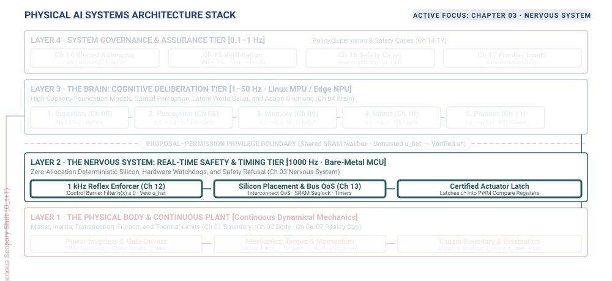
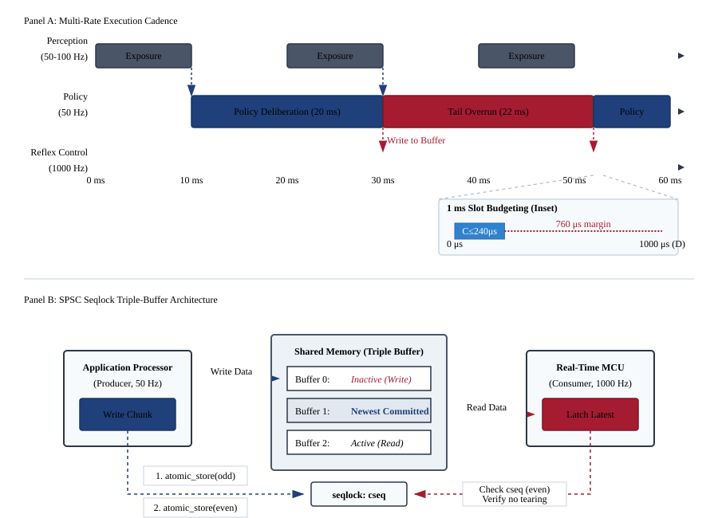
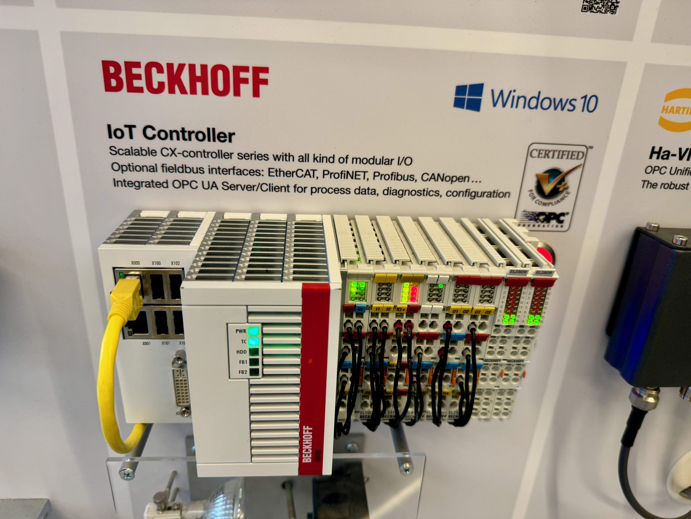
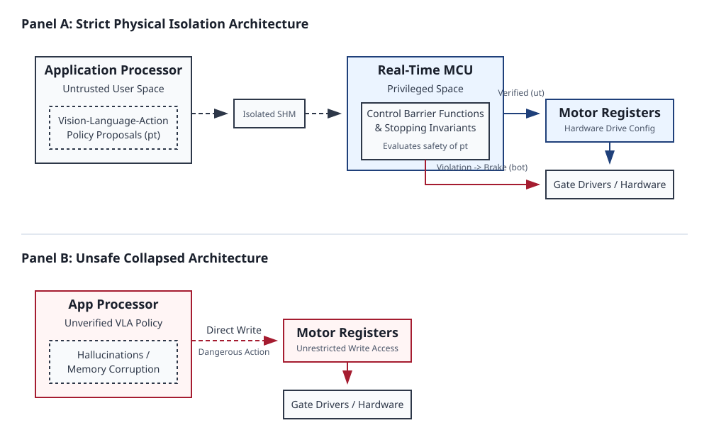
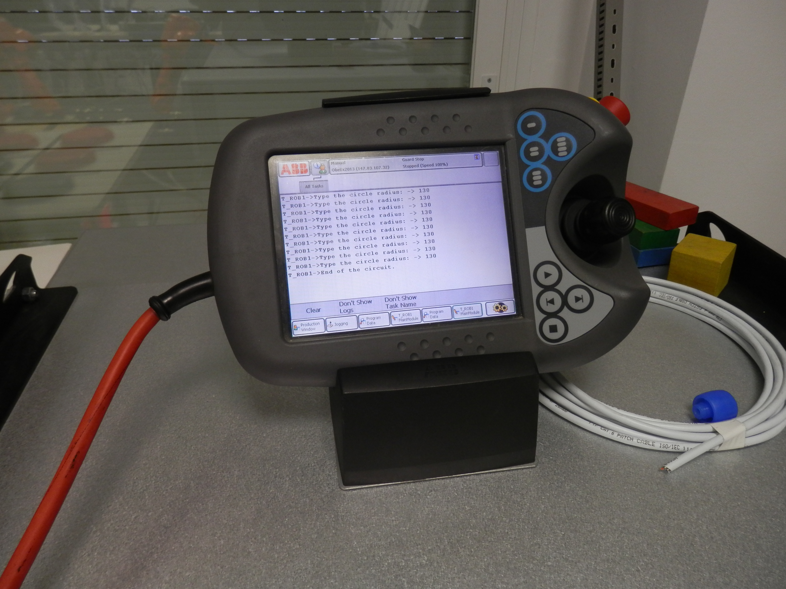

# The Nervous System {#sec-nervous}

::: {.column-margin}

\chapterminitoc

:::

::: {#fig-04-locator fig-env="figure" fig-pos="H" fig-cap="**The Nervous System in the Physical AI Stack**: The four-tier physical AI systems architecture highlights the real-time nervous system (Layer 2). Operating between the deliberative brain (Layer 3) and dynamical body (Layer 1), the deterministic nervous system enforces multi-rate synchronization, transports sensorimotor signals under hard real-time deadlines, and maintains the exclusive privilege boundary over actuator energy delivery." fig-alt="Diagram titled Physical AI Systems Architecture Stack, drawn as four stacked tiers. Layer 4 is system governance and assurance at 0.1 to 1 hertz, holding boxes for shared autonomy, verification, safety cases, and frontier limits. Layer 3 is the brain, a cognitive deliberation tier at 1 to 50 hertz, holding five stages named ingestion, perception, memory, intent, and planner. A dashed proposal-permission privilege boundary separates it from layer 2, the nervous system, a real-time safety and timing tier at 1000 hertz. Layer 1 is the physical body and continuous plant. Layer 2 is shaded and outlined and the badge reads Active Focus, Chapter 03, Nervous System."}
{width="100%"}
:::

\begin{marginfigure}
\vspace{1em}
\resizebox{\linewidth}{!}{\mlphysicalstackfull{20}{100}{20}{20}{20}}
\end{marginfigure}

*How does a deterministic nervous system maintain absolute safety when commanding non-deterministic neural proposals across shared silicon?*

The physical body needs timely control even when the learned brain has no new proposal ready. Sensors, neural inference, and motor control operate at different rates, so connecting them requires more than moving data between processors. A command can arrive intact yet already be too old for the motion it requests. Shared computing resources can also delay the checks intended to protect the machine. The nervous system must therefore coordinate these different rates while preserving a dependable path from physical measurements to actuator control. It carries observations and proposals, checks their freshness, and reserves authority over motor commands for the layer that enforces the body's limits. A stalled or erroneous policy must not disable that layer's ability to intervene. Within physical AI systems architecture, the nervous system turns the body's physical budgets into timing and authority constraints that govern when the brain's proposals may become motion.



::: {.callout-learning-objectives}

- Determine control update rates from physical dynamics and allowable response delay
- Evaluate data exchanges for freshness and bounded transfer time between reasoning and control
- Distinguish measured latency percentiles from defensible worst-case bounds on real-time execution
- Evaluate hardware isolation that reserves actuator authority when learned policies or communication fail
- Size watchdog validity windows from stopping requirements and the available physical margin
- Diagnose timing, bandwidth, power, and fault propagation across the machine's system interfaces

:::

## The Multi-Rate Bridge {#sec-nervous-4-1}

A moving robot must keep regulating its motors while its learned policy interprets the next camera frame. If those activities share a blocking execution path, a delay in visual reasoning also delays control of the body. The physical budgets therefore create an architectural requirement: *the brain needs time to deliberate, while the body needs control to continue.*

Building on the causal boundary established in @sec-boundary, the physical budgets measured in @sec-body constrain that command through reflected rotor inertia ($N^2 J$), stopping distance dynamics ($d_{\text{stop}}$), feedback phase lag ($\Delta \phi$), and thermal dissipation limits ($I^2 R$). Enforcing these budgets requires a path that remains available when the learned policy is late or wrong. In @fig-04-locator, the nervous system occupies that path between cognitive proposals and the actuator latch, separating the pace of deliberation from the deadlines of physical control.

A high-capacity foundation model [@brohan2023rt1; @brohan2023rt2] or diffusion policy [@chi2024diffusionpolicy] requires tens to hundreds of milliseconds to ingest multi-camera visual streams and synthesize future trajectories. An electromagnetic motor coil has an electrical time constant ($\tau_e = L/R$) measured in fractions of a millisecond, while moving linkages carry kinetic energy ($E_k = \frac{1}{2} m v^2$). Delaying or miscalculating the current command can therefore exhaust a physical margin before deliberation finishes. This mismatch takes different forms across the three physical machine archetypes:

- In *Mobile Systems* (Class 1), an autonomous chassis or quadruped traveling at $2.0\text{ m/s}$ covers $0.30\text{ m}$ of unguided displacement during a $150\text{ ms}$ inference stall before wheel braking can engage.
- In *Manipulators* (Class 2), an articulated robot arm swinging an end-effector carries reflected rotor inertia ($N^2 J$) that will crush tooling or breach fixturing envelopes if high-rate impedance loops are interrupted.
- In *Process and Energy Systems* (Class 3), high-power battery inverters and thermal cooling circuits experience thermal runaway or power stage shoot-through (a catastrophic short circuit when opposing power switches turn on simultaneously) if gate switching vectors drift outside microsecond commutation deadlines.

Physical safety cannot be guaranteed through software discipline, operating system thread priorities, or runtime exception handlers alone. It requires an explicit, deterministic computing, memory, and communication fabric: the **real-time nervous system**\index{Real-Time Nervous System}.

::: {#dfn-nervous-real-time-nervous-system .callout-definition title="The real-time nervous system"}

***Real-time nervous system***\index{Real-time nervous system!definition}\index{Nervous system!definition} is the deterministic computing, memory, and communication substrate (Layer 2) that bridges stochastic, high-latency neural deliberation (Layer 3) with continuous physical plant dynamics (Layer 1), synchronizing multi-rate execution cadences and enforcing hardware-level safety invariants.

1.  **Significance**: Without an independent nervous system, high-capacity neural models must hold direct write access to actuator registers. A single operating-system scheduling hiccup, garbage-collection stall, or model hallucination translates into unguided physical momentum, motor over-current, or mechanical collision. The nervous system decouples deliberation latency from physical survival deadlines.
2.  **Distinction**: Unlike a standard robotic middleware or operating system scheduler that provides best-effort messaging, the Physical AI nervous system enforces strict worst-case execution time (WCET) bounds, static memory allocation without dynamic heaps, and asymmetric hardware authority over power stages.
3.  **Common pitfall**: Assuming that running a neural policy on a real-time Linux kernel (such as PREEMPT_RT) eliminates the need for an independent microcontroller nervous system. General-purpose OS kernels share memory buses and power rails with host accelerators, leaving execution vulnerable to bus contention (where the CPU is forced to wait while the GPU hogs the memory pipeline) and uncorrectable hardware hangs.

:::

Every signal that crosses the boundary between the brain and the body is governed by five non-negotiable physical limits:

1. **Latency ($\tau$):** The total transport and computation age of a signal. Sensor exposure windows, neural inference runtimes, and fieldbus serialization latencies accumulate along the pipeline; if cumulative latency exceeds physical margins, control loops destabilize.
2. **Bandwidth ($\beta$):** The data volume throughput across interconnects. Uncompressed high-resolution multi-camera feeds demand gigabytes per second, whereas motor actuation setpoints require only kilobits per second of compact parameterization.
3. **Thermal and energy ($\mathcal{E}$):** The physical dissipation of heat. Massively parallel tensor accelerators consume tens of watts within tightly enclosed chassis, while motor windings dissipate non-reversible resistive heat ($I^2 R$) during continuous torque exertion.
4. **Temporal determinism ($\sigma_t$):** The cycle-to-cycle execution predictability. A timing jitter of even a few hundred microseconds erodes feedback phase margin ($\Delta \phi = -\frac{\omega T_s}{2}$), transforming stabilizing feedback into acoustic chatter and mechanical resonance (audible whining and violent physical shaking).
5. **Fault domain isolation ($\mathcal{F}$):** The structural containment of hardware and software failures. A memory leak in an operating system daemon, an out-of-memory purge in a neural runtime, or an electrical current surge on an accelerator power rail must never propagate into the motor control path.

To reconcile the brain's need for deliberative compute time with the body's need for microsecond physical reflexes across these five limits, the nervous system must satisfy five ideal properties:

First, it must deliver microsecond cycle determinism. Feedback loops regulating motor currents and joint torques must execute between $1000\text{ Hz}$ and $20\text{ kHz}$ with sub-microsecond jitter, ensuring invariant phase margins and ripple-free torque.

Second, it must achieve asynchronous multi-rate decoupling. High-level cognitive models deliberate at slow, variable cadences ($1\text{--}50\text{ Hz}$), while actuator bridges require continuous, cycle-precise current vectors at $1000\text{ Hz}$. The nervous system must transport trajectory waypoints across these disparate clock domains in bounded time without allowing compute stalls to block low-level control loops.

Third, it must enforce isolated fault containment. The failure of high-level software services must leave the real-time reflex core running undisturbed on physically segregated hardware.

Fourth, it must maintain uncompromised privilege authority. High-capacity learned models act strictly as untrusted proposal engines. Direct physical write access to pulse-width modulation (PWM) registers, gate-driver timers, and inverter power stages (the lowest-level hardware that physically dumps current into the motor) is restricted exclusively to deterministic hardware enforcers that evaluate physical safety invariants before permitting energy delivery.

Fifth, it must guarantee autonomous energy dissipation and safe halting. When communication fails or proposals expire, moving mass continues traveling under its own momentum. The nervous system must autonomously detect timeout events via physical watchdog leases ($\tau_{\text{lease}}$, hardware timers that trigger a safety fault if not continuously reset by healthy software), evaluate dynamic stopping distances ($d_{\text{stop}} \le D_{\text{clear}}$), and safely convert kinetic energy into thermal dissipation through dynamic braking or hardwired Safe Torque Off (STO) interlocks (hardware pathways that physically sever motor power).

These requirements connect timing to authority. The control path must continue to run on schedule, and it must retain permission to reject or replace a learned proposal. Meeting both requirements begins with deciding which computations may share silicon and which must remain isolated from failures in the deliberative runtime.

## Silicon Partitioning {#sec-nervous-4-2}

Extending the proposal-permission architecture from @sec-brain-3-1, the computational workload of a physical AI machine divides cleanly into two regimes with opposing requirements. The first regime is deliberation, where learned models evaluate sensory context, infer environmental state, and propose future action plans. The second regime is reactive enforcement, where deterministic control logic samples joints, validates kinematic limits, interpolates motion commands, and regulates electrical currents to the motors. These two regimes differ in their fundamental mathematical profiles, hardware architectures, and tolerance for temporal error.

Deliberate work is defined by deep computational graphs, large memory footprints, and variable execution times. A vision-language-action model processing multi-camera video streams, tactile histories, and natural language prompts requires billions of multiply-accumulate operations across hundreds of neural network layers. Storing the parameters and intermediate activation tensors demands gigabytes of high-bandwidth memory. To achieve acceptable arithmetic throughput, deliberate computation executes on massively parallel accelerators such as graphics processing units (GPUs) or dedicated neural processing units (NPUs). These processors maximize aggregate throughput across wide vector registers and batched memory pipelines at the direct expense of deterministic latency. Memory access stalls, dynamic tensor kernel selection, bus transfers, and runtime memory management cause the execution time of consecutive inferences to vary across a wide distribution. If a deliberate model experiences a temporary delay, the failure mode is soft, much like a person pausing to think before acting. The system simply receives a delayed proposal or a stale trajectory that can be held or discarded without immediate hardware damage.

Reactive work operates under the inverse constraints. An inner control loop computing inverse dynamics, joint limit monitoring, or field-oriented motor control requires a few thousand arithmetic operations per update. Its memory footprint is static, measured in kilobytes rather than gigabytes, with every variable allocated at compile time in tightly-coupled on-chip static memory. This ensures the exact physical memory location of every piece of data is fixed permanently, eliminating the unpredictable delays caused by heap fragmentation, dynamic paging, and runtime garbage collection. Reactive routines execute on cycle-counted microcontrollers or field-programmable gate arrays (FPGAs) designed for bounded execution rather than maximum parallel throughput. The deadlines governing this work are hard real-time constraints dictated by the mechanical inertia and electrical inductance of the physical system, typically running at rates between $1000\text{ Hz}$ and $10000\text{ Hz}$ on update budgets of $100\,\mu\text{s}$ to $1000\,\mu\text{s}$. If a reactive loop misses its execution deadline, the failure mode is hard. The physical consequence is lost current control (which manifests as a sudden, violent jerk or destabilizing torque ripple), or a physical collision because the robot could not command its brakes fast enough before the next command can execute.

Because learned inference runtimes depend on memory access patterns, cache residency, dynamic tensor shapes, and hardware prefetching, their execution times are stochastic. Even if an inference pipeline running on a dedicated edge accelerator delivers an average latency well below its execution deadline, heavy-tail variance (infrequent but extreme delays) guarantees frequent misses.[^fn-math-inference-latency] For example, an accelerator with a median runtime of $50\text{ ms}$ might easily exhibit a $P_{99}$ tail extending to $113\text{ ms}$. At an operating rate of $10\text{ Hz}$, a seemingly low overrun probability of $2.38\%$ results in $857$ deadline violations every hour. These misses create intervals where the motor actuators receive no updated commands unless an independent, deterministic process bridges the gap.

General-purpose operating systems and real-time kernel patches (`PREEMPT_RT`) cannot reconcile these two execution profiles on a shared processor. Although real-time extensions allow static task priorities and preemptible kernels, they cannot eliminate shared microarchitectural resources. When a thread executing a learned model streams gigabytes of weight matrices across the memory bus, it evicts cache lines belonging to high-priority control tasks. If the deliberate runtime triggers a **translation lookaside buffer**\index{Translation lookaside buffer} (TLB) shootdown,[^fn-os-tlb-shootdown] enters a driver-level spinlock, or saturates the memory bus crossbar with direct memory access (DMA) requests, the hardware pipeline stalls.[^fn-hw-dma-coherence] A high-priority real-time interrupt can preempt software execution, but it cannot preempt a hardware memory transaction already occupying the memory bus—much like an ambulance must still wait if a massive freight train is already physically blocking the intersection. Furthermore, **Dynamic Voltage and Frequency Scaling**\index{Dynamic voltage and frequency scaling} (DVFS)[^fn-hw-dvfs-jitter] governors adjust core clock frequencies based on thermal dissipation and processor utilization, altering instruction cycle times dynamically. The resulting jitter ranges from tens of microseconds to several milliseconds, easily exceeding the entire time budget of a $1000\text{ Hz}$ control loop.

The hardware floor exposes this physical separation at the interface boundary. A host processor running an accelerator communicates across high-latency bus topologies such as PCIe or system fabric crossbars, where DMA transfers require ring-buffer synchronization, host interrupt service routines, and cache coherency handshakes (where processors explicitly verify they are not reading stale data) that consume $10\,\mu\text{s}$ to $100\,\mu\text{s}$ per transaction. In contrast, an embedded microcontroller or dedicated real-time motor controller IC (@fig-real-motor-controller) interfaces directly with sensor transceivers and power stages through memory-mapped registers, single-cycle input and output pins, and tightly-coupled static memory with zero wait states (meaning the processor never stalls while waiting for memory to respond). Reading an absolute joint encoder over a serial peripheral interface (SPI) or updating a field-oriented pulse-width modulation counter takes less than $1\,\mu\text{s}$ of bounded execution time,[^fn-hw-epwm-deadtime] completely isolated from system bus contention.

::: {#fig-real-motor-controller fig-env="figure" fig-pos="t" fig-cap="**Dedicated Real-Time Motor Drive Controller Silicon**: Macro view of an embedded motor drive IC with precision current-sense shunt resistors (`R110`), multi-layer power routing, and direct gate-drive outputs. Unlike general-purpose application processors, dedicated real-time control silicon executes cycle-deterministic current commutation loops without operating system schedulers, cache hierarchies, or bus crossbar contention. (Credit: Wikimedia Commons, CC BY-SA 4.0)." fig-alt="Dedicated Real-Time Motor Drive Controller Silicon. Macro view of an embedded motor drive IC with precision current-sense shunt resistors (R110), multi-layer power routing, and direct gate-drive outputs. Unlike general-purpose application processors, dedicated real-time control silicon executes cycle-deterministic current commutation loops without operating system schedulers, cache hierarchies, or bus crossbar contention. (Credit: Wikimedia Commons, CC BY-SA 4.0)."}
{width="85%"}
:::

In heterogeneous Dual-Brain System-on-Chip (SoC) architectures, this physical reality enforces a strict dual-processor design requirement. Deliberate planning and reactive enforcement cannot safely share a processor core, a cache hierarchy, or a common memory bus. The slow, stochastic path requires parallel hardware (Linux host application processors and tensor accelerators) optimized for raw throughput across wide data streams, while the fast, deterministic path requires isolated hardware (bare-metal microcontrollers or FPGA cores) optimized for worst-case execution time and cycle-counted predictability.

::: {#psp-nervous-silicon-privilege .callout-perspective title="Silicon privilege partitioning"}
Never allow a high-capacity learned model to execute in the same fault domain, address space, or power rail as the actuator commutation loop. Deliberation is an unprivileged proposal generator; physical register privilege belongs exclusively to cycle-deterministic real-time silicon.
:::

Safety in physical AI is an architectural partition in silicon, not an operating system scheduling priority. The high-throughput deliberative engine acts strictly as an untrusted client, while dedicated real-time silicon acts as the immutable hardware gatekeeper.

## Multi-Rate Cadences {#sec-nervous-4-3}

The physical separation of compute domains reflects a fundamental constraint in which no single execution frequency satisfies both the physical dynamics of the body and the computational complexity of perception and learned inference. A physical AI nervous system operates across four distinct rate tiers (@fig-04-multirate-cadence-buffer), each determined by a different physical process:

The inner reflex and current regulation loop runs between $1000\text{ Hz}$ and $20\text{ kHz}$. The motion interpolation and tracking loop runs between $100\text{ Hz}$ and $500\text{ Hz}$. The perception and policy planning pipeline processes incoming sensor streams between $10\text{ Hz}$ and $50\text{ Hz}$. The high-level deliberate reasoning tier updates semantic task targets between $0.5\text{ Hz}$ and $2\text{ Hz}$. Among these tiers, only the fastest rate has an origin that is non-negotiable.

The inner loop rate is governed by the physical time constants of the actuator and the structural resonance of the machine. Building on the actuator electrical time constant ($\tau_e = L/R$) established in @sec-body-2-2, current can spike extremely rapidly. Regulating it requires updating the pulse-width modulation duty cycles before the current drifts out of control, setting an execution interval of $T_s \le 1.0\text{ ms}$ ($1000\text{ Hz}$), with inner field-oriented current loops executing up to $20\text{ kHz}$ ($50\ \mu\text{s}$). For a rigorous calculation of motor electrical time constants, see @sec-appendix-control. At the joint level, the mechanical time constant and structural stiffness dictate the required closed-loop bandwidth. Discrete sample-and-hold loops inherently introduce phase delay proportional to computation latency and sampling interval.[^fn-math-zoh-phaselag]

When control loops run too slowly, this accumulated delay erodes the phase margin of the feedback controller. Physically, this means the robot is reacting to where it *was* rather than where it *is*, turning corrective commands into out-of-phase positive feedback that pushes the system in the wrong direction. This drives the mechanical assembly toward destructive resonance or uncontrolled oscillations when execution slows below $500\text{ Hz}$.

The perception tier executes at an intermediate rate dictated by photon collection physics, exposure windows, and target velocity relative to the sensor field of view. An optical image sensor operating under typical indoor illumination ($300\text{ lux}$) requires an integration window of $10\text{ ms}$ to $30\text{ ms}$ to accumulate sufficient charge on each pixel without amplifying thermal read noise. If a manipulator end-effector moves at $1.5\text{ m/s}$, an exposure time of $15\text{ ms}$ causes an edge feature to blur across $\Delta x = 1.5\text{ m/s} \times 0.015\text{ s} = 22.5\text{ mm}$ on the image plane. Increasing the frame rate beyond $60\text{ Hz}$ or $100\text{ Hz}$ provides diminishing returns because the physical shutter cannot shorten without inducing underexposure, while reducing the frame rate below $10\text{ Hz}$ allows moving objects to traverse tens of centimeters between frames, breaking visual tracking associations. The rate of the perception pipeline is bounded from above by photon flux and from below by spatial displacement across consecutive frames.

The deliberate planning and policy tier runs between $10\text{ Hz}$ and $50\text{ Hz}$ based on the horizon of environmental change and the thermal limits of onboard compute. A vision-language-action policy evaluates hundreds of millions of parameters, consuming tens of joules of electrical energy per inference step. The external environment, including moving obstacles, human collaborators, and changing contact surfaces, evolves over intervals of $20\text{ ms}$ to $200\text{ ms}$. Evaluating a learned policy at $20\text{ Hz}$ ($50\text{ ms}$ period) to generate multi-step action chunks ($K = 16$ to $50$ future waypoints) [@zhao2023learning] matches this environmental evolution rate while maintaining accelerator dissipation within an embedded power envelope of $15\text{ W}$ to $35\text{ W}$.

Because these tiers execute on isolated hardware domains at different frequencies, data exchange across rate boundaries must be asynchronous, non-blocking, and zero-copy (@fig-04-multirate-cadence-buffer). If a $1000\text{ Hz}$ control loop waits on a mutex lock held by a $20\text{ Hz}$ neural network runtime, a single scheduling delay in the operating system immediately causes the real-time controller to miss its deadline.

To prevent blocking, the nervous system implements **lock-free single-producer single-consumer (SPSC) seqlock buffers**\index{Lock-Free Single-Producer Single-Consumer (SPSC) Seqlock Buffers} in shared static memory.

::: {#psp-nervous-seqlock-decoupling .callout-perspective title="Lock-free cadence decoupling via sequence locks"}
A synchronization primitive for single-writer multi-reader shared memory that eliminates reader blocking and priority inversion by coupling an atomic monotonic sequence counter with memory barriers; odd counter values signal active writer mutation, while identical even counter values before and after reading guarantee that payload words were latched without tear or inconsistency.
:::

The shared memory region maintains an atomic 64-bit sequence counter alongside double-buffered payload slots.

When the untrusted application processor prepares a new action chunk proposal, it begins by reading the current sequence counter and atomically incrementing it to an odd value, signalling to the rest of the system that a write operation is actively in progress. It then copies the proposal payload—including a monotonic sequence identifier, timestamp, watchdog lease boundary (a hard deadline after which the controller must discard the command as dangerously stale), multi-step trajectory waypoints, and a cyclic redundancy checksum—into the inactive memory buffer. After enforcing an explicit memory barrier (`DMB ISHST` / `DMB ISH`) to ensure all payload bytes are globally visible across the bus,[^fn-hw-dmb-fence] the processor increments the sequence counter once more to an even value with store-release semantics (`STLR`),[^fn-hw-arm-ordering] atomically publishing the completed frame.

On the receiving side, the deterministic real-time microcontroller latches the newest proposal without ever acquiring a lock or stalling execution. At the start of its control cycle, the microcontroller reads the sequence counter with load-acquire semantics (`LDAR`). If the counter is odd, indicating that the producer is midway through updating the buffer, the consumer immediately aborts the read, retaining its existing validated trajectory spline. If the counter is even, the microcontroller copies the payload into its private, tightly-coupled static memory and re-reads the sequence counter. If the counter changed during the copy, a torn read occurred—meaning the producer was simultaneously overwriting the buffer while the consumer was reading it, resulting in a corrupted mash-up of old and new data—and the frame is safely discarded. If the sequence counter remained identical and even throughout the read, the latch is verified: the microcontroller validates the **cyclic redundancy checksum**\index{Cyclic redundancy check} (CRC-32),[^fn-sw-crc32-mailbox] checks timestamp freshness against its hardware timer, and accepts the proposal. Under this protocol, read latencies on the real-time microcontroller remain strictly bounded below $1.5\ \mu\text{s}$, completely decoupled from the scheduling state or operating system load of the host processor, as formalized in @algo-lock-free-trajectory.

```pseudocode
#| label: algo-lock-free-trajectory
#| pdf-line-number: true
#| pdf-right-comment: false
#| html-comment-delimiter: "▷"

\begin{algorithm}
\caption{Lock-Free Trajectory Seqlock Exchange Protocol}
\begin{algorithmic}
\Require proposal payload $P = \{\text{seq\_id}, \text{timestamp\_ns}, \text{lease\_us}, \mathbf{w}_{1..K}, \text{crc32}\}$, target local buffer $B_{\text{local}}$ in static SRAM, shared SRAM mailbox $(c_{\text{seq}}, \text{Slot}_{\text{shared}})$, current time $t_{\text{now}}$
\Ensure verified action chunk $P_{\text{latched}}$ or status rejection code
\Statex
\Function{PublishActionChunk}{$P$}
    \State $c_{\text{curr}} \gets \Call{AtomicLoadExplicit}{c_{\text{seq}}, \text{memory\_order\_relaxed}}$
    \State $\Call{AtomicStoreExplicit}{c_{\text{seq}}, c_{\text{curr}} + 1, \text{memory\_order\_relaxed}}$ \Comment{mark odd: write in progress}
    \State $\Call{HardwareMemoryBarrier}{\text{DMB\_ISHST}}$ \Comment{store barrier pushes counter}
    \State $\Call{CopyMemory}{\text{Slot}_{\text{shared}}.\text{payload}, P, \text{sizeof}(P)}$ \Comment{copy multi-word trajectory}
    \State $\Call{HardwareMemoryBarrier}{\text{DMB\_ISH}}$ \Comment{full barrier: payload visible}
    \State $\Call{AtomicStoreExplicit}{c_{\text{seq}}, c_{\text{curr}} + 2, \text{memory\_order\_release}}$ \Comment{mark even: publish committed}
\EndFunction
\Statex
\Function{LatchLatestActionChunk}{$B_{\text{local}}, t_{\text{now}}$}
    \State $c_{\text{start}} \gets \Call{AtomicLoadExplicit}{c_{\text{seq}}, \text{memory\_order\_acquire}}$ \Comment{load initial counter}
    \If{$c_{\text{start}}$ is odd}
        \State \Return $\text{STATUS\_WRITER\_ACTIVE}$ \Comment{writer active; retain prior spline}
    \EndIf
    \State $\Call{HardwareMemoryBarrier}{\text{DMB\_ISHLD}}$ \Comment{load barrier prevents reordering}
    \State $\Call{CopyMemory}{B_{\text{local}}, \text{Slot}_{\text{shared}}.\text{payload}, \text{sizeof}(\text{Payload})}$ \Comment{latch to local SRAM}
    \State $\Call{HardwareMemoryBarrier}{\text{DMB\_ISHLD}}$ \Comment{ensure payload reads finish}
    \State $c_{\text{end}} \gets \Call{AtomicLoadExplicit}{c_{\text{seq}}, \text{memory\_order\_acquire}}$ \Comment{re-read sequence counter}
    \If{$c_{\text{start}} \ne c_{\text{end}}$}
        \State \Return $\text{STATUS\_TORN\_READ}$ \Comment{concurrent write detected}
    \EndIf
    \If{$\Call{ComputeCrc32}{B_{\text{local}}} \ne B_{\text{local}}.\text{crc32}$}
        \State \Return $\text{STATUS\_CHECKSUM\_INVALID}$
    \EndIf
    \If{$(t_{\text{now}} - B_{\text{local}}.\text{timestamp\_ns}) > B_{\text{local}}.\text{lease\_us} \times 1000$}
        \State \Return $\text{STATUS\_LEASE\_EXPIRED}$
    \EndIf
    \State \Return $\text{STATUS\_VALID\_LATCHED}$ \Comment{proposal verified for spline synthesis}
\EndFunction
\end{algorithmic}
\end{algorithm}
```

The trajectory payload exchanged through this lock-free mailbox follows the strict schema defined in @tbl-04-schema-action-chunk, establishing explicit data types, SI units, and structural invariants.

| Field Name            | Scalar Type       | Physical SI Units                       | Structural Invariant & Description                                                                          |
|:----------------------|:------------------|:----------------------------------------|:------------------------------------------------------------------------------------------------------------|
| `sequence_id`         | `uint64_t`        | dimensionless                           | Monotonically strictly increasing integer ($s_k > s_{k-1}$).                                                |
| `timestamp_ns`        | `uint64_t`        | nanoseconds ($\text{ns}$)               | Hardware capture timestamp on master distributed clock.                                                     |
| `validity_lease_us`   | `uint32_t`        | microseconds ($\mu\text{s}$)            | Physical validity lease window ($T_{\text{lease}} \le 87.6\text{ ms}$).                                     |
| `num_waypoints`       | `uint16_t`        | dimensionless                           | Chunk horizon count ($K \in [16, 50]$).                                                                     |
| `joint_positions`     | `float32[K][N_j]` | radians ($\text{rad}$)                  | Commanded joint angles within reach envelope ($q_{\min} \le q \le q_{\max}$).                               |
| `joint_velocities`    | `float32[K][N_j]` | radians/sec ($\text{rad/s}$)            | Commanded joint velocities within certified ceilings ($\lVert \dot{\mathbf{q}} \rVert \le \dot{q}_{\max}$). |
| `feedforward_torques` | `float32[K][N_j]` | Newton-meters ($\text{N}\cdot\text{m}$) | Bounded feedforward motor torque vectors ($\lVert \boldsymbol{\tau} \rVert \le \tau_{\max}$).               |
| `crc32`               | `uint32_t`        | bitmask                                 | IEEE 802.3 CRC-32 polynomial over all preceding payload bytes.                                              |

: **Abstract Data Schema for Real-Time Action Chunk Exchange (`TrajectoryProposalChunk`)**: Field layout, scalar types, physical units, and structural invariants for trajectory proposals exchanged across the watchdog lease boundary via lock-free shared memory. {#tbl-04-schema-action-chunk tbl-colwidths="[20,18,22,40]"}

::: {#fig-04-multirate-cadence-buffer fig-env="figure" fig-pos="t" fig-cap="**Multi-Rate Execution Cadence and Lock-Free Triple-Buffer Memory Exchange**: A stochastic policy at $50\text{ Hz}$, perception at $50\text{--}100\text{ Hz}$, and a deterministic reflex loop at $1\text{ kHz}$, exchanged through a single-producer seqlock triple buffer. The three tiers never share a deadline, which is the point. The reflex loop latches whatever the policy last committed and falls back to spline extrapolation rather than waiting, so a policy overrun costs freshness instead of a missed control slot." fig-alt="Multi-Rate Execution Cadence and Lock-Free Triple-Buffer Memory Exchange. (Panel A) Execution timeline across three heterogeneous rate tiers: stochastic policy deliberation on the application processor (50 Hz, T=20 ms, variable inference Tinf ~ LogNormal with occasional tail overruns), optical perception and state tokenization (50--100 Hz, 10 ms sensor exposure), and deterministic real-time reflex control on the bare-metal microcontroller (1000 Hz, Ts=1.0 ms). Inset breakdown shows microsecond-scale slot budgeting (C <= 240 mus ll D = 1000 mus) with a 760 mus safety jitter margin. (Panel B) Single-producer single-consumer (SPSC) seqlock triple-buffering memory architecture. The producer writes new action chunks into an inactive buffer with an odd sequence counter (cseq = 2k+1) and commits via an atomic store of an even counter (cseq = 2k+2). The real-time microcontroller latches the newest committed buffer in <1.5 mus without holding mutexes or risking priority inversion, safely falling back to local spline extrapolation or watchdog-driven emergency braking (Twd <= 87.6 ms) upon buffer starvation."}
{width="95%"}
:::

Rate mismatches introduce three failure modes: phase lag accumulation, aliasing, and buffer starvation. In a discrete-to-continuous conversion, a Zero-Order Hold (ZOH) holds each sample constant for duration $T_{\text{plan}}$, meaning the physical actuator is fed jerky, stair-step commands instead of a smooth continuous sweep. This introduces an intrinsic half-sample phase lag $\Delta \phi = -\frac{\omega T_{\text{plan}}}{2}$. Directly applying a planner setpoint across multiple inner loop cycles creates a zero-order hold delay of $T_{\text{plan}}/2$. At a $10\text{ Hz}$ planning rate, this delay amounts to $50\text{ ms}$ of uncompensated lag, degrading control margins if applied without local interpolation. The inner loop avoids this by evaluating continuous cubic or quintic polynomial splines ($q(t) = a_0 + a_1 t + a_2 t^2 + a_3 t^3$) across the latched waypoints at $1000\text{ Hz}$, generating smooth, differentiable position, velocity, and acceleration setpoints on every $1.0\text{ ms}$ tick.

Aliasing occurs when high-frequency sensor noise folds into low-rate estimators, which the system prevents through analog anti-aliasing filters and digital decimation within the high-rate microcontroller domain. Following classical nonlinear control results [@slotine1991applied], stability guarantees hold under the assumption that inner-loop execution jitter remains bounded within a narrow fraction of the sampling period and that setpoint updates arrive before the local trajectory buffer drains. The nervous system establishes these assumptions by enforcing cycle-deterministic interrupt timing on the microcontroller and tracking buffer depth. If the planner stalls and the buffer drains to its final valid waypoint, the operational assumption no longer holds. At that moment, the nervous system rejects further planner inputs and executes an autonomous, deterministic stopping trajectory computed locally at $1000\text{ Hz}$, bringing all joints safely to rest.

::: {#psp-nervous-cadence-decoupling .callout-perspective title="Lock-free cadence decoupling"}
Never allow a high-frequency real-time control loop to acquire a mutex or spin on a lock shared with a stochastic process; communicate across clock domains exclusively via lock-free atomic sequence mailboxes or triple-buffers.
:::

Communication between cognitive models and motor loops cannot rely on blocking queues, mutexes, or network sockets. Every interface boundary must be bridged by asynchronous, lock-free shared memory or deterministic fieldbuses that guarantee the high-rate motor loop never waits for the slow, stochastic brain.

The operational characteristics, physical time constants, hardware allocation, and failure protocols governing each tier across this multi-rate hierarchy are formalized in @tbl-04-cadence-hierarchy.

| Execution Tier & Frequency                               | Nominal Period ($T$)                                         | Max Jitter Budget ($\Delta T_{\max}$)                    | Hardware & Compute Domain                               | Payload & State Representation                                        | Inter-Tier Transport Contract                                     | Overrun & Failure Protocol                                                                    |
|:---------------------------------------------------------|:-------------------------------------------------------------|:---------------------------------------------------------|:--------------------------------------------------------|:----------------------------------------------------------------------|:------------------------------------------------------------------|:----------------------------------------------------------------------------------------------|
| **Reflex & Safety** ($\ge 1000\text{ Hz}$)               | $T \le 1.0\text{ ms}$ ($50\,\mu\text{s}$ at $20\text{ kHz}$) | $\Delta T_{\max} < 10\,\mu\text{s}$ (hard real-time)     | Dedicated real-time MCU or FPGA fabric                  | Phase currents, encoder ticks, PWM duty cycles, emergency clamp flags | Single-cycle MMIO registers, tightly-coupled static memory        | Immediate low-side MOSFET phase short (dynamic braking) or mechanical brake drop              |
| **Motion & Tracking** ($100\text{--}500\text{ Hz}$)      | $T = 2.0\text{--}10.0\text{ ms}$                             | $\Delta T_{\max} \le 200\,\mu\text{s}$ (firm real-time)  | Deterministic real-time RTOS / microcontroller core     | Continuous polynomial splines, $SE(3)$ wrenches, feedforward torques  | Lock-free SPSC circular ring buffer with atomic sequence counters | Local spline extrapolation ($50\text{ ms}$ horizon); controlled deceleration                  |
| **Planning & Policy** ($10\text{--}50\text{ Hz}$)        | $T = 20.0\text{--}100.0\text{ ms}$                           | $\Delta T_{\max} \le 15\text{ ms}$ ($P_{99}$ tail bound) | Edge tensor accelerator, host application processor     | Action chunks ($K$-step horizon waypoints), visual embeddings         | Shared static memory SPSC seqlock buffers                         | Expiration of intent lease ($T_{\text{lease}} \le 87.6\text{ ms}$) revokes proposal authority |
| **Reasoning & Deliberation** ($0.5\text{--}2\text{ Hz}$) | $T = 500\text{--}2000\text{ ms}$                             | Asynchronous ($\Delta T > 500\text{ ms}$)                | Multi-core host CPU, workstation, cloud VLA coprocessor | Semantic task goals, topological sub-graphs, natural language tokens  | Asynchronous inter-process messaging (gRPC / zero-copy IPC)       | Planner pauses; local motion layer retains stationary impedance hold                          |

: **Multi-Rate Cadence Hierarchy of Physical AI Execution**: Formal specification of execution tiers, physical time constants, jitter tolerances, hardware substrates, memory transport contracts, and deterministic failure protocols. The hierarchy bridges four orders of temporal magnitude, deriving update rates directly from actuator electrical time constants ($\tau_e = L/R$), mechanical phase margins ($\Delta \phi \approx \omega(T_s/2 + T_d)$), optical exposure windows, and thermal compute dissipation limits. Hard real-time reflexes at $\ge 1000\text{ Hz}$ execute in bare-metal silicon with sub-microsecond determinism to prevent hardware damage, while stochastic high-level models at $10\text{--}50\text{ Hz}$ generate candidate action proposals across lock-free atomic buffers under explicit intent leases. {#tbl-04-cadence-hierarchy tbl-colwidths="[14,14,14,16,14,14,14]"}

## Deterministic Fieldbuses {#sec-nervous-4-4}

A processor promises far less about timing than most software assumes, and the gap between an observed latency distribution and a structural guarantee is where deadlines are missed. In statistical performance analysis, an engineer measures ten million executions of a task, notes that the ninety-ninth percentile ($P_{99}$) latency is $135\,\mu\text{s}$ and the maximum observed latency is $150\,\mu\text{s}$, and infers that the computation fits comfortably inside a $1.0\text{ ms}$ control deadline. That inference is invalid. An empirical distribution is a record of what happened under a finite sequence of test conditions, whereas a hard real-time guarantee is a proof of what can happen under all legal states of the hardware. When an execution platform includes out-of-order execution pipelines, shared cache hierarchies, speculative prefetchers (which guess and load future instructions to speed up average execution), and concurrent direct memory access traffic, a finite latency sample cannot establish an upper bound. The missing tail events do not vanish; they simply wait for the rare hardware collision—such as a massive memory fetch stalling a critical interrupt—that triggers them in production.

Establishing a deterministic timing guarantee requires bounding every term that contributes to task response time: the base computation time, the blocking time spent waiting for shared resources (like mutexes), and the interference time from high-priority interrupts or memory bus contention.[^fn-math-liu-layland] If any one of these three terms lacks a provable upper bound, the system possesses no timing guarantee, regardless of how small the mean latency appears in benchmarks.

(For exact calculations of worst-case execution time and response time analysis, see @sec-appendix-systems.)

To see how unanalyzed interference breaks an empirical guarantee, consider a robotic torque computation running at $1000\text{ Hz}$. On an isolated processor with empty bus queues and hot caches (where necessary data is already preloaded into the processor's fastest memory), the workload exhibits an unloaded baseline execution time of $120\,\mu\text{s}$. Across millions of undisturbed bench cycles, the measured tail latency never exceeds $150\,\mu\text{s}$, leaving what appears to be a massive safety margin before the $1000\,\mu\text{s}$ deadline.

However, when the same binary runs on an integrated system-on-chip amidst normal machine activity, the operating environment introduces contention. High-resolution camera streams transfer image frames via DMA, an onboard neural network accelerator reads weight matrices in large bursts from shared memory, and ambient thermal buildup causes the processor to drop its core clock frequency. This contention introduces massive memory interference and blocking delays. The task crosses the $1000\,\mu\text{s}$ deadline, not because the algorithmic complexity grew, but because shared silicon resources lacked isolation.

Taming this latency spread requires classifying every source of execution variance into three structural categories based on whether its worst-case behavior can be formally bounded:

*Bounded variance sources* encompass deterministic hardware mechanisms whose execution cycles can be modeled with exact algebraic upper bounds: fixed-pipeline single-cycle instructions, deterministic branch decisions, round-robin bus arbitration, tightly-coupled static memory access with zero wait states, and vectored interrupt dispatch on dedicated bare-metal microcontrollers.

*Experimentally characterized sources* encompass shared architectural mechanisms whose maximum latencies cannot be proven from first-principles schematics alone, but whose worst-case envelopes can be bounded through exhaustive stress profiling under locked hardware configurations: shared last-level cache misses under hardware line locking, write-buffer drain stalls (where the processor pauses because pending memory writes back up), dynamic RAM refresh intervals, and thermal throttling ceilings enforced by active cooling.

*Unbounded variance sources* encompass non-deterministic software and hardware mechanisms whose maximum latency has no finite upper bound: demand-paged virtual memory page faults, preemptive operating system thread scheduling without priority inheritance,[^fn-inc-mars-pathfinder] dynamic heap allocations traversing fragmented free lists, speculative branch mispredictions that pollute pipeline caches, and unscheduled peripheral direct memory access traffic. A hard real-time safety path must strictly eliminate every mechanism from this third category.

::: {#ws-nervous-1997-mars-pathfinder-priority-inversion .callout-war-story title="The Mars Pathfinder priority inversion (1997)"}
**Context**: In July 1997, shortly after landing on Mars, the Mars Pathfinder spacecraft's avionics computer ran the VxWorks real-time operating system with preemptive priority-based scheduling across mission tasks [@reeves1997pathfinder].

**Mechanism**: A high-priority thread (`bc_dist`) distributed critical spacecraft bus telemetry, while a low-priority thread (`ASI/MET`) gathered meteorological sensor data through a shared mutex-protected pipe. When `ASI/MET` acquired the mutex, a medium-priority communications thread preempted it. Because the medium-priority thread outranked the meteorological thread, it monopolized CPU execution while `bc_dist` blocked waiting for the mutex held by the stalled low-priority task—a textbook unbounded priority inversion.

**Impact**: The high-priority bus distribution task missed its hard real-time deadline. A hardware watchdog timer detected the deadline overrun and initiated a complete spacecraft reboot, resetting state and threatening total mission loss.

**Response**: Engineers remotely diagnosed the thread deadlock, patched the spacecraft software from Earth by enabling priority inheritance on the VxWorks mutex semaphore, and verified stable telemetry scheduling.

**Systems lesson**: Priority inversion transforms bounded resource contention into unbounded latency and total control collapse. In Physical AI systems, real-time nervous systems cannot rely on naive priority scheduling across shared memory or hardware queues; critical locks must enforce priority inheritance protocols or lock-free seqlocks to bound blocking terms ($B$) deterministically.
:::

A common misconception in real-time software design asserts that dynamic memory allocation is categorically forbidden on a hard timing path. The prohibition is imprecise. Unbounded dynamic allocation, exemplified by general-purpose heap allocators (`malloc`/`free`) that traverse fragmented free lists (searching for a contiguous block of memory that fits) or execute variable-length page coalescing (merging adjacent free memory blocks), is incompatible with a hard path because its search latency depends on allocation history and heap fragmentation. In contrast, a bounded allocator, such as a fixed-size block pool or a Two-Level Segregated Fit (TLSF) allocator with guaranteed constant-time $\mathcal{O}(1)$ allocation and deallocation bounds, can be integrated safely into a real-time system. On the most safety-critical bare-metal path, the gold standard remains **zero-allocation static architecture**\index{Zero-Allocation Static Architecture}, where all buffers, ring queues, and state variables are statically declared and mapped to physical memory addresses at compile time, eliminating memory management execution entirely during runtime.

The choice of physical communication bus directly dictates the magnitude of the interference term $I$ and blocking term $B$ in the worst-case response time equation. As Hermann Kopetz established in his foundational work on real-time systems architecture [@kopetz2011real], distributed embedded control requires a fundamental architectural distinction between event-triggered and time-triggered communication. In event-triggered paradigms (such as standard CAN), nodes transmit upon local state changes, leaving bus utilization unpredictable under load and exposing the system to the "babbling idiot" failure mode—where a single malfunctioning microcontroller or jabbering transceiver floods the shared medium with spurious traffic. In contrast, Time-Triggered Architectures (TTA) enforce global clock synchronization and deterministic time-division multiple access (TDMA)—assigning each node a strictly reserved, non-overlapping time slot to transmit—guaranteeing composability and provably bounding transmission jitter to sub-microsecond regimes. As summarized in @tbl-04-fieldbus-comparison, robotics interconnects divide across a trade-off surface spanning raw throughput, transport latency, cycle jitter, and hardware determinism. In industrial robotic platforms, this deterministic physical layer is implemented through dedicated fieldbus hardware architectures (@fig-industrial-ethercat-controller), which couple hard real-time host processors to modular input/output and motor drive terminals over synchronized Ethernet frames using hardware Distributed Clocks (DC).[^fn-hw-ethercat-dc]

::: {#nbk-nervous-fieldbus-serialization-latency-wcet-schedulability .callout-notebook title="Fieldbus serialization latency and WCET schedulability"}
**Practical engineering question**: Why can an EtherCAT network synchronize 8 robot arm joint axes within a $1.0\text{ ms}$ control loop with $< 100\text{ ns}$ jitter, whereas a CAN-FD bus experiences severe deadline pressure under the identical workload?

(For detailed calculations modeling fieldbus arbitration delays under load, see @sec-appendix-systems.)

*1. CAN-FD Serialization and Arbitration Latency:*
CAN-FD relies on bitwise priority arbitration and sequential polling across a shared bus. For an 8-axis manipulator exchanging payloads, the accumulated data transmission and header arbitration time easily exceeds the $1.0\text{ ms}$ control cycle budget. Furthermore, lower-priority axes suffer cumulative transmission jitter whenever higher-priority chassis frames contend for the bus.

*2. EtherCAT On-The-Fly Processing:*
In EtherCAT, a single Ethernet telegram traverses all 8 nodes in a physical daisy chain. Each node reads its output and writes its input on the fly with a minimal hardware processing delay. Because it bypasses sequential polling and frame contention, it finishes the entire 8-axis cycle consuming only a tiny fraction of the $1.0\text{ ms}$ servo budget, with hardware Distributed Clocks holding synchronization jitter extremely tight.

**Systems insight**: CAN-FD is optimal for asynchronous, distributed chassis management (BMS, thermal pumps, auxiliary grippers), while EtherCAT or TSN is mandatory for multi-axis coordinated kinematic joints. While **TSN Ethernet**\index{TSN Ethernet} offers the allure of unifying gigabit camera feeds with microsecond servo frames over a single physical link, configuring and formally verifying its time-gated queues across asynchronous switches requires exhaustive verification to prevent video bursts from colliding with time-critical control slots.
:::

Real-time dependability cannot be achieved by buying faster clock speeds or measuring statistical latency percentiles on an idle bench. Dependability requires structural analysis of the execution path: eliminating all unbounded variance sources ($I_{\text{unbounded}} = 0$), bounding shared hardware blocking ($B$), enforcing zero-allocation static memory layouts, and selecting fieldbuses with cycle-deterministic distributed clocks. Read as a sequence rather than a table, these protocols trace one trajectory. @Fig-04-fieldbus-evolution plots bandwidth against achievable cycle time from Modbus RTU to TSN Ethernet,[^fn-net-tsn-fieldbus] and each generation moves down and to the right, which is why a modern multi-axis machine can carry sensor payloads that would have been impossible to schedule deterministically a decade earlier.

::: {#fig-industrial-ethercat-controller fig-env="figure" fig-pos="t" fig-cap="**Industrial Fieldbus Controller for Real-Time Actuator Control**: An industrial EtherCAT DIN-rail controller module featuring high-density I/O terminals, synchronized distributed clock circuitry, and shielded RJ-45 fieldbus ports. The hardware provides sub-microsecond cycle determinism over synchronized Ethernet frames, bridging host control software to motor drive amplifiers on automated assembly lines. (Credit: Wikimedia Commons, CC BY-SA 4.0)." fig-alt="Industrial Fieldbus Controller for Real-Time Actuator Control. An industrial EtherCAT DIN-rail controller module featuring high-density I/O terminals, synchronized distributed clock circuitry, and shielded RJ-45 fieldbus ports. The hardware provides sub-microsecond cycle determinism over synchronized Ethernet frames, bridging host control software to motor drive amplifiers on automated assembly lines. (Credit: Wikimedia Commons, CC BY-SA 4.0)."}
{width="85%"}
:::

| Interconnect Protocol                                        | Physical Topology & Signaling                                            | Payload Throughput ($\beta$)                                                        | Transfer Latency & Cycle Jitter                                                                                    | Determinism Classification                                  | Physical Reach & Wiring Harness                                                            | Physical AI Subsystem Placement                                               |
|:-------------------------------------------------------------|:-------------------------------------------------------------------------|:------------------------------------------------------------------------------------|:-------------------------------------------------------------------------------------------------------------------|:------------------------------------------------------------|:-------------------------------------------------------------------------------------------|:------------------------------------------------------------------------------|
| **SPI** (Serial Peripheral Interface)                        | Synchronous 4-wire full-duplex (SCLK, MOSI, MISO, CS), point-to-point    | $10\text{--}50\text{ Mbps}$ (up to $80\text{ Mbps}$ in QSPI/OSPI)                   | Latency: $0.5\text{--}2.0\,\mu\text{s}$ \newline Jitter: $< 50\text{ ns}$                                          | **Bounded** (cycle-deterministic register reads)            | $< 0.3\text{ m}$ (intra-board PCB traces / flat flex)                                      | Joint magnetic angle encoders, 3-phase current-sense ADCs, gate drivers       |
| **CAN-FD** (Controller Area Network FD)                      | 2-wire differential multidrop with bitwise priority arbitration          | $1\text{ Mbps}$ arbitration, $5\text{--}8\text{ Mbps}$ data phase (64-byte payload) | Latency: $25\text{--}150\,\mu\text{s}$ \newline Jitter: $10\text{--}50\,\mu\text{s}$                               | **Analytically Bounded** (strictly bounded for top IDs)     | $\le 40\text{ m}$ at $1\text{ Mbps}$ / $\le 15\text{ m}$ at $5\text{ Mbps}$ (twisted pair) | Chassis management, battery management systems (BMS), auxiliary actuators     |
| **EtherCAT** (Ethernet Control Automation)                   | 100BASE-TX full-duplex daisy-chain; on-the-fly hardware frame processing | $100\text{ Mbps}$ ($1\text{ Gbps}$ in EtherCAT G), payload efficiency $>90\%$       | Latency: $1.0\text{--}5.0\,\mu\text{s}$ per node \newline Jitter: $< 100\text{ ns}$ (distributed clocks)           | **Hard Real-Time** (hardware-scheduled cyclic PDO frames)   | $\le 100\text{ m}$ between nodes (shielded Cat5e/Cat6)                                     | Multi-axis robot arm joint servos, high-rate force-torque sensors             |
| **TSN Ethernet** (IEEE 802.1Qbv / Time-Sensitive Networking) | Star/mesh switched Ethernet with time-aware traffic shapers              | $1\text{--}10\text{ Gbps}$ full-duplex                                              | Latency: $10\text{--}50\,\mu\text{s}$ (scheduled slots) \newline Jitter: $< 1.0\,\mu\text{s}$ (PTP / IEEE 802.1AS) | **Scheduled Deterministic** (time-gated queue transmission) | $\le 100\text{ m}$ per link                                                                | Centralized backbone bridging multi-camera vision, lidar, and safety reflexes |

: **Fieldbus and Interconnect Protocol Trade-Off Matrix for Physical AI Subsystems**: Comparative breakdown of physical signaling, bandwidth, transfer latency, cycle jitter, determinism classification, physical reach, and canonical subsystem placement across robotics interconnects. SPI provides sub-microsecond register access within a single board; CAN-FD provides robust priority-arbitrated messaging across chassis wiring; EtherCAT delivers microsecond-level hardware cycle synchronization across distributed joint motor drives; and TSN Ethernet unifies high-bandwidth vision streams with scheduled real-time control frames over a single physical backbone. {#tbl-04-fieldbus-comparison tbl-colwidths="[14,14,14,16,14,14,14]"}

::: {#fig-04-fieldbus-evolution fig-env="figure" fig-pos="htb" fig-cap="**Fieldbus Performance Trade-Off**: Industrial communication protocols plotted as payload bandwidth against eight-axis control cycle time, from Modbus RTU in 1979 to TSN Ethernet in 2018. Four decades of protocol design traced a single diagonal, buying bandwidth and determinism together rather than trading one for the other." fig-alt="Log-log scatter of five fieldbus protocols plotting payload bandwidth against eight-axis control cycle time. Modbus RTU sits at low bandwidth and slow cycle time, and TSN Ethernet sits at high bandwidth and fast cycle time, tracing a diagonal of improvement from 1979 to 2018."}

```{python}
#| echo: false
import pandas as pd
import matplotlib.pyplot as plt
from mlsysim import viz

data = pd.read_csv("vol4/03_nervous/data/fieldbus_evolution.csv")

fig, ax, COLORS, plt = viz.setup_plot(figsize=(8, 5))

# Plot Cycle time vs Bandwidth
scatter = ax.scatter(data["bandwidth_mbps"], data["cycle_time_ms"], color="#1f77b4", s=100, zorder=3)

ax.set_xscale("log")
ax.set_yscale("log")
ax.invert_yaxis()

ax.set_xlabel("Payload Bandwidth (Mbps)")
ax.set_ylabel("8-Axis Control Cycle Time (ms) - Lower is Faster")
ax.set_title("Fieldbus performance trade-off: bandwidth vs. cycle time", pad=15, fontweight="bold")

for i, row in data.iterrows():
    ax.annotate(
        f'{row["protocol"]} ({row["year"]})',
        (row["bandwidth_mbps"], row["cycle_time_ms"]),
        textcoords="offset points",
        xytext=(10, 5),
        ha="left",
        fontsize=10,
    )

ax.grid(True, linestyle="--", alpha=0.6, zorder=0)

ax.margins(x=0.14, y=0.14)
plt.tight_layout()
plt.show()
plt.close()
```

:::

## Actuation Authority {#sec-nervous-4-5}

Authority in a physical AI system is not an abstract software concept; it is the physical ability to energize motor coils and deliver mechanical power. In a correctly structured machine, this authority is concentrated exclusively within the deterministic real-time enforcer (@fig-04-privilege-enforcer-registers).

::: {#fig-04-privilege-enforcer-registers fig-env="figure" fig-pos="t" fig-cap="**Hardware Privilege Boundary and Exclusive Motor Drive Register Access**: Panel A leaves the real-time microcontroller with exclusive write privilege over the motor drive registers while the policy processor only proposes trajectories across a shared-memory link; Panel B collapses that boundary. The difference is what a hallucinated action can reach, since under the split an unverified proposal still has to clear the barrier function before any register is written." fig-alt="Hardware Privilege Boundary and Exclusive Motor Drive Register Access. (Panel A) Strict physical isolation architecture. The application processor executes untrusted vision-language-action policies in unprivileged user space, submitting candidate trajectory proposals (pt, dashed path) across an isolated shared-memory transport link. The deterministic real-time microcontroller retains exclusive physical write privilege over motor drive registers, evaluating Control Barrier Functions and stopping invariants before dispatching verified setpoints (ut, solid path) to gate drivers, falling back to dynamic braking (bot) on violation. (Panel B) Unsafe collapsed architecture, where an unverified policy writes actuator registers directly, allowing memory corruption or model hallucinations to command dangerous physical motions."}
{width="90%"}
:::

A learned foundation model or trajectory planner running on an application processor possesses **zero physical authority** to write pulse-width modulation (PWM) timer registers, set gate-driver current references, or toggle motor bridge enable pins—the literal hardware switches that govern how much raw electrical current dumps into the motor coils. Instead, high-level software generates unprivileged trajectory proposals ($p_t$). These proposals pass across the memory transport interface into the real-time microcontroller, which functions as a strict hardware gatekeeper.

The microcontroller continuously evaluates physical safety invariants: verifying that commanded joint positions lie within physical reach envelopes, that joint velocities do not exceed certified limits, and that projected decelerations remain safely within dynamic stopping clearance ($d_{\text{stop}} \le D_{\text{clear}}$). If a proposal satisfies all invariants, the microcontroller grants execution permission, interpolates the waypoints into high-frequency current references ($u_t$), and writes the physical gate-driver registers. If a proposal threatens collision, contains numerical anomalies, or arrives past its expiration lease, the enforcer revokes permission ($\bot$) and executes a deterministic safe stop by commanding hardware trip zone registers (dedicated silicon pathways that instantly force all motor power switches open, bypassing software entirely, e.g. TI `EPWM_TZFRC` or STM32 `TIMx_BDTR`).[^fn-hw-tripzone-break]

Consider the physical energy dynamics of this intervention. If the enforcer rejects an invalid proposal and commands emergency dynamic braking on a fast-moving articulated joint, it must bring the mass to rest safely.[^fn-math-braking-dynamics] Building on the actuator thermal limits established in @sec-body-2-5, over the braking interval (often hundreds of milliseconds), the joint's kinetic energy converts entirely into heat within the motor winding resistance and switching transistors. The physical plant must absorb this sudden influx of thermal energy (which can spike to tens of watts on a single small joint) without melting the thin enamel insulation on the motor windings or allowing the heavy moving mass to coast beyond its geometric clearance boundary.

Building on the causal boundary established in @sec-boundary-1-2, at the enforcer boundary, the origin of an aberrant proposal is irrelevant. A remote memory exploit in an operating system daemon, an adversarial camera perturbation inducing model hallucination, and an arithmetic overflow in a neural matrix multiplier produce the identical boundary event: an invalid proposal packet. Because the enforcer evaluates invariant bounds against physical sensor feedback from optical encoders and current shunts rather than inspecting neural network weights, physical safety bounds hold even under complete compromise of the host operating system. The privilege boundary guarantees that software compromise cannot manifest as a violation of physical limits.

To guard against internal hardware faults or microcontroller latch-ups (electrical state lockups where the silicon effectively freezes) within the enforcer itself, the system incorporates out-of-band supervisory channels and physical disconnects. These channels consist of unprogrammable analog circuits, hardwired emergency stop mushroom push buttons (@fig-real-estop), and electromechanical contactors that sever power to the motor inverter bridges independently of all digital logic, such as Safe Torque Off (STO, IEC 61800-5-2), which physically blocks firing signals to the power transistors so no torque-producing current can flow.[^fn-std-iec61800-sto] While these disconnects provide absolute power interruption, they impose a severe cost on system availability. Re-energizing a tripped high-voltage direct-current bus requires pre-charging the inverter filter capacitors through current-limiting resistors; without this step, closing the contactor onto empty capacitors draws a massive inrush spark that physically welds the mechanical metal contacts together. This pre-charge sequence consumes hundreds of milliseconds before motor control can resume. Physical disconnects therefore trade system availability and continuous tracking for unconditional energy removal. Ensuring that these supervisory circuits and enforcer channels remain capable of acting when the primary controller fails requires verifying that they share no hidden dependencies in their clocks, power rails, or silicon substrates.

::: {#fig-real-estop fig-env="figure" fig-pos="t" fig-cap="**Physical Out-of-Band Emergency Stop Interlock**: A panel-mounted, hardwired emergency stop mushroom push button with dual-channel positive break contacts. The interlock provides unprogrammable power isolation directly to motor gate drivers or main line contactors, operating completely outside digital software pipelines and microcontroller firmware. (Credit: Wikimedia Commons, CC BY-SA 3.0)." fig-alt="Physical Out-of-Band Emergency Stop Interlock. A panel-mounted, hardwired emergency stop mushroom push button with dual-channel positive break contacts. The interlock provides unprogrammable power isolation directly to motor gate drivers or main line contactors, operating completely outside digital software pipelines and microcontroller firmware. (Credit: Wikimedia Commons, CC BY-SA 3.0)."}
{width="85%"}
:::

::: {#psp-nervous-hardware-authority .callout-perspective title="Hardware authority invariant"}
If an unverified learned policy possesses direct memory-mapped write access to actuator gate-driver registers, your system has no safety layer—it has only an accident waiting for an out-of-distribution input.
:::

Extending the proposal-permission architecture from @sec-brain-3-1, the cognitive brain proposes behaviors across high-dimensional semantic spaces, but possesses zero authority to energize coils. Only the deterministic real-time enforcer retains physical write privilege over the hardware registers that convert digital words into moving mass.

## Hardware Isolation {#sec-nervous-4-6}

Independence is a claim about shared clocks, buses, rails, and memory, and it is usually wrong the first time it is checked. System architectures routinely label the brain and the nervous system as isolated because software tasks execute in separate processes, containers, or hypervisor partitions. True physical isolation requires four distinct hardware dimensions: independent execution silicon with private instruction pipelines, separate timing references derived from physically segregated crystal oscillators, isolated power rails fed by independent regulator stages, and segregated memory domains that share neither physical dynamic random-access memory chips nor internal interconnect arbitration buses.[^fn-std-iso26262-ffi] If any of these four physical boundaries collapses onto a shared substrate, a transient failure in the unverified learned model propagates directly into the deterministic nervous system through the physics of the underlying electronics.

Shared electrical and physical infrastructure creates cross-domain failure modes that bypass all software access controls. During a sudden burst of dense matrix multiplication, a deep learning accelerator can pull a transient current spike of $50\text{ A}$ with a slew rate exceeding $100\text{ A}/\mu\text{s}$. If the accelerator and the safety enforcer share a direct-current power rail without dedicated isolation, the resulting voltage sag causes the enforcer rail to droop below its microcontroller reset threshold, dropping below $3.0\text{ V}$ for $5\ \mu\text{s}$ and resetting the safety supervisor while the plant is moving under power. On a shared silicon package or common thermal heat sink, sustained computational load in the brain elevates junction temperatures beyond $105^\circ\text{C}$, triggering thermal throttling or silicon shutdown in adjacent real-time cores. When communication relies on an arbitrated interface such as a shared peripheral interconnect or memory bus, a high-bandwidth visual pipeline or a misbehaving direct memory access controller can saturate bus bandwidth, starving the nervous system of encoder feedback and sensor telemetry. Even a common clock oscillator creates an unbudgeted single point of failure, where thermal drift, mechanical vibration, or crystal cracking desynchronizes both domains at the same instant.

A deterministic nervous system must distinguish between two fundamentally distinct failure modes in the brain: unresponsiveness and corruption.

Unresponsiveness occurs when an inference pipeline hangs, a scheduling deadline is missed, or operating system memory fragmentation blocks execution, producing no output. The nervous system detects unresponsiveness through a monotonic heartbeat lease---essentially a digital dead-man's switch. The brain must continuously deliver an authenticated, sequentially incrementing token across an isolated channel before a hardware countdown timer reaches zero.

Corruption occurs when the brain remains fully active and passes its heartbeat deadline, but generates kinematically impossible setpoints, discontinuous velocity requests, or numerical infinities resulting from out-of-distribution visual inputs or matrix overflow. Extending the proposal-permission architecture from @sec-brain-3-1, the enforcer treats these failures through separate mechanisms: unresponsiveness triggers a time-based lease expiration, whereas corruption triggers an immediate invariant rejection on the arrival of the malformed proposal packet.

The duration of the watchdog heartbeat lease is not an arbitrary software tuning parameter, but a bound dictated by the physical dynamics of the uncontrolled plant. In the event of a silent brain stall, the actuators mindlessly continue applying their last commanded torque---acting much like a stuck accelerator pedal---until the enforcer detects the timeout and commands emergency braking. Building on the causal boundary established in @sec-boundary-1-2, enforcing this condition allows us to derive a strict upper bound on the watchdog timeout.[^fn-math-watchdog-lease] Setting the lease any higher permits the physical plant to breach its dynamic safety envelope before the nervous system is permitted to intervene.

When a lease expires or an enforcer rejects a corrupted proposal, the nervous system executes an explicit degradation strategy rather than an unconditioned power cut. In a moving mechanical system, abruptly removing motor power turns active control into unconstrained ballistic coasting, where the robot moves purely under momentum and gravity. This stored kinetic and potential energy can violently back-drive gearboxes into mechanical stops. Degradation follows a deterministic state hierarchy calculated within the nervous system. The first tier is envelope-bounded dead reckoning, in which the nervous system extrapolates the trajectory for a fixed horizon of $50\text{ ms}$ using a low-order kinematic model constrained by certified velocity limits. If nominal communication does not resume within this horizon, the nervous system transitions to controlled deceleration, commanding torque profiles that bring joint velocities to zero at the maximum allowable rate without exceeding the actuator thermal limits and mechanical constraints established in @sec-body-2-4. If the platform cannot maintain static equilibrium under zero velocity, such as a multi-axis arm under gravitational loading, the nervous system engages electromechanical holding brakes to lock the joints mechanically.

Once the physical plant is brought to a complete, stationary halt, the architecture executes a **recovery handshake**\index{Recovery Handshake} before restoring autonomous proposal authority. The bare-metal microcontroller asserts a persistent `FAULT_HELD` latch in the shared SRAM mailbox and reports the exact physical rest pose $(\mathbf{q}_{\text{rest}}, \dot{\mathbf{q}} = \mathbf{0})$. The application processor must flush its stale action chunks, clear its autoregressive key-value (KV) attention cache (the learned model's short-term memory of recent observations), re-ingest fresh optical observations tagged with new hardware timestamps, and publish a re-synchronized intent proposal. The microcontroller verifies that the initial waypoint of the new proposal matches the physical rest state within a strict spatial epsilon ($||\mathbf{a}_0 - \mathbf{q}_{\text{rest}}|| \le \epsilon_{\text{sync}}$) before releasing the fault latch and re-energizing pulse-width modulation (PWM) to the motor drives.

Verifying that these isolation boundaries function as designed requires physical falsification on the test bench. Four specific fault-injection regimes must be executed against the physical prototype: power-rail droop testing (injecting maximum-slew current steps to verify less than $50\text{ mV}$ of rail cross-coupling noise), clock glitching (verifying independent timing domains maintain stable cycle counts under frequency drift), communication bus flooding (saturating links to verify heartbeat telemetry retains deterministic transmission slots),[^fn-hw-canfd-arbitration] and numerical fault injection (streaming synthetic proposals containing NaNs and infinite floats to verify single-cycle rejection without execution stalls).

Hardware independence must be proven across all four physical dimensions (silicon cores, timing crystals, power rails, and memory fabrics), and watchdog lease durations must be derived directly from the physical stopping distance of the plant.

## Invariant Checking {#sec-nervous-4-7}

Locomotion policies trained with reinforcement learning and compact visuomotor diffusion models can be compiled to execute on edge tensor processors at rates between $100\text{ Hz}$ and $500\text{ Hz}$. At $500\text{ Hz}$, the model emits a new actuator command every $2.0\text{ ms}$. Because this latency is on the same order as the mechanical time constant of small electric motors—the physical delay required for a rotor to overcome inertia and respond to a voltage change—and matches the update rate of conventional field-oriented current controllers, software designs often fall into an architectural trap by collapsing the distinction between the brain and the nervous system. The argument made for this collapse is computational efficiency: if the policy directly produces joint torques at the native rate of the plant, intermediate setpoint generators, trajectory interpolators, and tracking controllers appear to add latency without adding expressiveness.

Rate matching does not confer authority. A neural network emitting torques at $500\text{ Hz}$ is governed by the same statistical uncertainty as a large model generating waypoints at $5\text{ Hz}$. It remains an unverified function approximator operating over high-dimensional input spaces where safety guarantees cannot be proven statically. Granting the policy direct access to motor-drive registers eliminates the independent physical layer that enforces mechanical boundaries. Extending the proposal-permission architecture from @sec-brain-3-1, the requirement for separate proposal and permission stages is not an artifact of mismatched clock rates, but a structural necessity for maintaining invariant boundaries. Even when the policy and the enforcer execute within the same $2.0\text{ ms}$ scheduling period, the output of the neural network is strictly a proposal that must obtain permission before changing current in a physical winding to generate mechanical force.

Operating an unverified learned policy inside the fast control loop exposes the physical plant to three distinct failure modes: compute underrun, out-of-distribution torque spikes, and high-frequency structural limit cycling.

*Compute underrun* occurs when execution jitter in the accelerator pipeline causes an inference cycle to exceed the actuation deadline. If memory bus contention or transient thermal throttling extends inference duration from a nominal $1.4\text{ ms}$ to $2.2\text{ ms}$, a model directly driving the motor bridges leaves the hardware without a valid command, effectively causing the artificial brain to stutter and abandon the moving physical body. In a decoupled nervous system, this deadline miss is detected deterministically by a hardware watchdog timer—a strict countdown circuit mapped to the inference completion interrupt: if the model fails to post a validated setpoint before the $2.0\text{ ms}$ boundary, the nervous system drops the proposal and applies zero-torque freewheeling or shorts the motor phases for dynamic braking.

*Out-of-distribution torque spikes* occur when an unexpected physical contact or obscured camera lens pushes the neural network into an untrained region of its latent space. Confused by this unfamiliar input, the model may output erratic commands, inducing an instantaneous torque reversal—such as abruptly commanding a motor to snap into full reverse while moving forward. If a direct-drive motor receives an instantaneous command to reverse full torque across a single $2.0\text{ ms}$ tick, the resulting explosive angular jerk can shear gear teeth or destroy inverter switching transistors before any physical displacement is detected by optical vision. For the full kinetic calculations of reflected rotor inertia and angular jerk, see @sec-appendix-systems. The nervous system prevents this destruction by evaluating synchronous rate-of-change ($\frac{d\tau}{dt}$) and torque limits against the state of the previous cycle.

*High-frequency structural limit cycling* occurs when unmodeled link flexibility, gearbox compliance, or sensor phase lag creates positive feedback with the learned policy, driving the mechanical assembly into destructive acoustic resonance where the robot forcefully shakes itself apart. Because this resonance cannot be detected from the command tensor alone, the nervous system evaluates a continuous energy tank model (tracking the conceptual "reservoir" of kinetic energy sloshing through the physical limbs): monitoring phase-lagged acceleration on load-side joint encoders and clamping any proposal that causes net kinetic energy accumulation.

To prevent these failures without degrading loop frequency, the architecture implements **synchronous invariant checking**\index{Synchronous Invariant Checking} directly inline with the high-rate inference pipeline. Under a $2.0\text{ ms}$ cycle budget, the system allocates $1.5\text{ ms}$ to sensor acquisition and neural network execution on the host accelerator, reserving the final $500\,\mu\text{s}$ for the nervous system to evaluate physical invariants on an independent deterministic core. The enforcer evaluates fixed-point arithmetic expressions that check kinematic boundaries, maximum torque, maximum jerk, and power envelopes. It also computes an energy tank model that measures the net mechanical energy injected into the system over time, clamping any proposal that would drive the plant into unbounded kinetic accumulation.

When a proposed torque violates an invariant, the enforcer does not attempt numerical optimization, which would introduce unpredictable execution latency. Instead, it clips the command to the boundary of the safe set or substitutes a pre-computed safe control law, such as gravity compensation combined with joint damping. The fast loop achieves high throughput for task performance, but physical safety remains governed by deterministic hardware with independent execution guarantees.

High inference frequency does not grant register write privilege to unverified neural outputs. Microsecond-scale invariant enforcers must gate every command before energy reaches the physical plant.

## Supervisory Teleoperation {#sec-nervous-4-8}

Extending the proposal-permission architecture from @sec-brain-3-1, the nervous system places a human operator on the exact same structural footing as an autonomous policy. A human operator is not an external master switch with unmediated access to motor amplifiers, but a third authority holder whose inputs are proposals subject to finite transport delays and physical execution limits. On a common execution timing diagram, the three authority paths occupy distinct bands. The nervous system reflex enforcer executes deterministically on an internal core at $1000\text{ Hz}$, evaluating safety invariants every $1.0\text{ ms}$. The autonomous learned policy executes on an onboard accelerator at $20\text{ Hz}$ to $50\text{ Hz}$, delivering a fresh proposal every $20\text{ ms}$ to $50\text{ ms}$ with an internal compute latency of $15\text{ ms}$. A remote human operator operates at visual-motor bandwidths between $5\text{ Hz}$ and $10\text{ Hz}$, transmitting setpoints across an external communications link that adds variable packet transport delays. Because biological nervous systems exhibit an intrinsic neuromuscular reaction latency of $150\text{ ms}$ to $250\text{ ms}$, an operator viewing a video stream is effectively issuing commands to a past "ghost" of the robot based on physical states that existed hundreds of milliseconds ago.

Treating human inputs as unconditional commands leads directly to hardware damage. In an emergency or under high cognitive load, an operator can pull a joystick to its mechanical stop, commanding an angular acceleration that exceeds inverter current ratings or commanding a rapid velocity reversal that shears gear teeth. Even during nominal teleoperation, network jitter and latency can transform an operator's stabilizing correction into phase-lagged positive feedback---where a delayed counter-steering command arrives just as the chassis naturally swings back, amplifying the error and driving the mechanical structure into divergent oscillations. To prevent these failures, the system routes all operator inputs through an arbitration stage termed the **control multiplexer**\index{Control Multiplexer}. The control multiplexer functions as an intelligent traffic cop, selecting whether the active proposal originates from the autonomous policy stream or the human supervisory channel (such as an industrial teach pendant with deadman switches---physical levers that must be actively squeezed to permit motion, @fig-real-teach-pendant) based on operational mode and heartbeat validity. The output of the multiplexer does not connect directly to the motor gate drivers. Instead, it passes into the identical pre-actuation invariant checker that inspects autonomous proposals, where physical constraints on joint velocity, rotor jerk, and energy accumulation are evaluated at $1000\text{ Hz}$. If a human operator commands a trajectory that violates an invariant boundary, the enforcer clips the command to the safe set boundary---acting as an invisible mathematical bumper---or substitutes a stabilizing damping law.

::: {#fig-real-teach-pendant fig-env="figure" fig-pos="t" fig-cap="**Industrial Teach Pendant for Human Operator Supervisory Input**: A pendant carrying a touch display, a 3-axis joystick, a hardwired emergency stop, and a 3-position deadman grip. Operator jog commands arrive as one more asynchronous proposal stream, arbitrated by the control multiplexer and checked against joint invariants at $1000\text{ Hz}$ before power reaches the windings, so a human at the pendant holds no more direct authority than the policy does. (Credit: Wikimedia Commons, CC BY-SA 3.0)." fig-alt="Industrial Teach Pendant for Human Operator Supervisory Input. An industrial robotic teach pendant equipped with a color touch display, 3-axis proportional joystick, integrated hardwired emergency stop mushroom button, and a 3-position deadman enabling grip switch. Human supervisory jog commands generated through such interfaces constitute asynchronous proposal streams that must be arbitrated by the control multiplexer and verified against physical joint invariants at 1000 Hz before power is applied to motor windings. (Credit: Wikimedia Commons, CC BY-SA 3.0)."}
{width="85%"}
:::

Because human inputs arrive across a communications channel subject to latency and packet loss, the physical mechanics of the plant define an upper bound on tolerable network delay before the nervous system must intervene.

(For formal bounding of safe network latencies under teleoperation, see @sec-appendix-control.)

Building on the causal boundary established in @sec-boundary-1-2, when a vehicle travels under remote teleoperation, any delay in the communication channel translates directly into unguided physical displacement, forcing the mass to coast blindly forward. The total stopping distance comprises the distance traveled during the network latency period plus the distance required to physically brake the mass. If the network latency spikes, the vehicle will breach its safety margin before the operator even sees the obstacle on their video feed. By subtracting human reaction time and video encoding latency from this total allowable delay budget, we can define a strict upper bound on network round-trip time.

If network round-trip latency exceeds this physical threshold, or if a command packet fails to arrive within the watchdog lease boundary, the nervous system cannot wait for an operator update. The onboard enforcer revokes teleoperation authority and executes an autonomous braking profile to bring the machine to rest within the reserved margin.

Placing the human inside the proposal hierarchy clarifies the distinction between administrative priority and physical authority. An operator holds higher administrative priority than an autonomous model, meaning the control multiplexer grants preemption rights to human inputs whenever an active override signal is received. However, administrative priority does not grant immunity from physical invariants. Both the human operator and the machine learning model sit strictly upstream of the invariant enforcer, differing only in the temporal characteristics and origin of their proposals. The broader systems problems of human supervision, including formal state transitions during authority transfer, cryptographic authentication over wireless uplinks, operator workload limits, and supervisory user interfaces, constitute the safety case examined in @sec-intervention. Within the nervous system, human intervention introduces only the arrival latency of the proposal stream and the invariant envelope---the mathematical bubble of safe operation---that restricts its physical realization.

Human teleoperation is an asynchronous proposal stream, not an unconstrained master override. While human operators hold administrative priority over autonomous models, their commands must pass through the identical invariant checks, and network round-trip latencies exceeding $T_{\text{RTT}} \le 70\text{ ms}$ trigger autonomous safe halting.

## The Handoffs Matrix {#sec-nervous-4-9}

The nervous system governs five canonical handoffs that bridge physical mechanics and computational inference. Upstream, sensing transfers raw transducer signals to perception pipelines. Perception yields intermediate representations that fuse into an estimated world state. The state feeds the learned policy to produce an action plan. The plan submits candidate trajectories to the safety enforcer. Finally, the approved command passes from the enforcer to the physical actuators. Across each boundary, five physical limits govern feasibility: latency ($\tau$), bandwidth ($\beta$), thermal energy ($\mathcal{E}$), temporal determinism ($\sigma_t$), and fault domain isolation ($\mathcal{F}$). These two axes form a five-by-five matrix that maps every signal path to the physical budgets of the machine.

This matrix explicitly synthesizes the foundational pillars of Part I:

*The Brain rows ($\mathcal{H}_1, \mathcal{H}_2, \mathcal{H}_3$)* concern the computational and sensory properties that @sec-brain develops next. At the sensing-to-perception boundary ($\mathcal{H}_1$), bandwidth and latency bind simultaneously as image sensors stream raw 4K pixels over high-speed SerDes lanes, where the physical time required to collect enough light (the photon integration window) fundamentally limits how "old" an image is before it even leaves the sensor. Between perception and state estimation ($\mathcal{H}_2$), and state and planning ($\mathcal{H}_3$), energy and latency form the primary binding constraints. Neural network inference on edge tensor accelerators demands tens of joules per forward pass, generating heat within an enclosed chassis, while deep transformer backbones and diffusion policies incur tens of milliseconds of tokenization and denoising latency.

*The Body row ($\mathcal{H}_5$)* inherits the unyielding physical mechanics established in @sec-body. At the terminal handoff from the enforcer to the actuators, temporal determinism and thermal dissipation bind. Building on the actuator thermal limits and torque mechanics established in @sec-body, brushless motor drivers require cycle-deterministic field-oriented current loops ($50\ \mu\text{s}$ at $20\text{ kHz}$) over hard real-time fieldbuses to prevent torque ripple. Meanwhile, continuous current demands dissipate resistive heat ($I^2 R$) directly into stator windings and power MOSFETs under strict thermal clocks.

*The Nervous System row ($\mathcal{H}_4$)* is the architectural bridge that ties the brain and body together. Extending the proposal-permission architecture from @sec-brain-3-1, the boundary between the learned planner and the enforcer carries an action proposal ($p_t$), which consists of a compact spline parameterization or waypoint chunk. Transmitting this payload consumes negligible bandwidth ($\beta < 100\text{ kB/s}$), ensuring that communications never bottleneck planner-to-enforcer handoffs. Instead, this boundary binds strictly on temporal determinism ($\sigma_t$) and fault domain isolation ($\mathcal{F}$). The nervous system isolates the stochastic, unverified outputs of the brain, gating them through lock-free seqlock mailboxes (which ensure the fast enforcer never waits on a slow planner), time-bounded intent leases ($\tau_{\text{lease}} \le 87.6\text{ ms}$, which force the robot to safely halt if the brain freezes), and microsecond-scale **Control Barrier Functions**\index{Control barrier function}[^fn-math-cbf-enforcer] before granting permission to energize physical mass.

Building on the causal boundary established in @sec-boundary-1-2, when a physical AI system fails, the failure manifests as an unbudgeted limit crossing at a specific handoff cell rather than an abstract deficiency in learned intelligence. If an autonomous manipulator drops a payload during high-speed tracking, tracing the signal pipeline reveals that the $P_{99}$ latency of the perception-to-state estimator drifted from an analytical budget of $30\text{ ms}$ to an unbudgeted $85\text{ ms}$ under thermal throttling, or that direct memory access transfers on the main system bus caused jitter in the enforcer loop that exceeded the $1\text{ ms}$ deadline. Evaluating field failures against the grid isolates the exact cell where a physical invariant was violated, turning diffuse behavioral anomalies into concrete hardware and timing diagnostics.

The complete five-by-five synthesis grid mapping every canonical signal handoff against the five physical limits is formalized in @tbl-04-synthesis-grid.

| Canonical Handoff Boundary                                  | Latency Limit ($\tau$)                                                                                     | Bandwidth Limit ($\beta$)                                                                                | Energy & Thermal Limit ($\mathcal{E}$)                                                              | Determinism Limit ($\sigma_t$)                                                                     | Fault Domain Isolation ($\mathcal{F}$)                                                  |
|:------------------------------------------------------------|:-----------------------------------------------------------------------------------------------------------|:---------------------------------------------------------------------------------------------------------|:----------------------------------------------------------------------------------------------------|:---------------------------------------------------------------------------------------------------|:----------------------------------------------------------------------------------------|
| **$\mathcal{H}_1$: Sensing $\to$ Perception** *(Brain)*     | **BINDING** \newline $\tau \le 16.7\text{ ms}$ (exposure & readout sets sensor age)                        | **BINDING** \newline $\beta \ge 1.2\text{ GB/s}$ (multi-camera 4K uncompressed streams)                  | *Non-binding* \newline $P < 3\text{ W}$ (sensor head dissipation isolated)                          | **BINDING** \newline $\sigma_t \le 1.0\text{ ms}$ (frame-sync triggers prevent skew)               | *Non-binding* \newline Defended by SerDes hardware & DMA ring buffers                   |
| **$\mathcal{H}_2$: Perception $\to$ State** *(Brain)*       | **BINDING** \newline $\tau \le 30.0\text{ ms}$ (visual-inertial odometry & feature window)                 | *Non-binding* \newline $\beta \approx 10\text{--}50\text{ MB/s}$ (compressed keypoints & voxels)         | **BINDING** \newline $P \approx 15\text{--}35\text{ W}$ (edge vision backbone accelerator envelope) | *Non-binding* \newline Defended by sliding-window state estimator buffers                          | **BINDING** \newline Spatial memory isolation: MPUs prevent memory corruption           |
| **$\mathcal{H}_3$: State $\to$ Plan** *(Brain)*             | **BINDING** \newline $\tau \le 100.0\text{ ms}$ (autoregressive tokenization & diffusion horizon)          | *Non-binding* \newline $\beta < 5\text{ MB/s}$ (low-dimensional state & prompt embeddings)               | **BINDING** \newline $P \approx 30\text{--}75\text{ W}$ (transformer/diffusion matrix accelerators) | *Non-binding* \newline Defended by receding-horizon chunking & spline buffers                      | **BINDING** \newline Sandboxed policy container prevents host panics halting telemetry  |
| **$\mathcal{H}_4$: Plan $\to$ Enforcer** *(Nervous System)* | **BINDING** \newline $\tau \le 5.0\text{ ms}$ (intent lease validation & CBF projection deadline)          | *Non-binding* \newline Defended by compact parameterized splines ($\beta < 100\text{ kB/s}$)             | *Non-binding* \newline $P < 0.5\text{ W}$ (fixed-point constraint evaluation on MCU)                | **BINDING** \newline $\sigma_t \le 100\,\mu\text{s}$ (cycle-deterministic packet reception on MCU) | **BINDING** \newline Hardware boundary: private bus, separate oscillator, isolated rail |
| **$\mathcal{H}_5$: Enforcer $\to$ Actuator** *(Body)*       | **BINDING** \newline $\tau \le 1.0\text{ ms}$ (servo interval $1.0\text{ ms}$; PWM loop $50\,\mu\text{s}$) | *Non-binding* \newline $\beta \approx 1\text{--}5\text{ Mbps}$ (cyclic PDOs over deterministic fieldbus) | **BINDING** \newline $I^2 R$ copper winding dissipation, MOSFET switching losses                    | **BINDING** \newline $\sigma_t < 10\,\mu\text{s}$ (hard real-time PWM phase alignment & FOC)       | **BINDING** \newline Galvanic isolation, out-of-band analog E-stops, STO circuits       |

: **Master 5x5 Handoffs-by-Limits Synthesis Grid for Physical AI Systems**: The foundational architectural matrix mapping five canonical signal handoffs ($\mathcal{H}_1\text{--}\mathcal{H}_5$) across the Brain (@sec-brain), Body (@sec-body), and Nervous System (@sec-nervous) against five physical limits ($\tau, \beta, \mathcal{E}, \sigma_t, \mathcal{F}$). Cells marked *BINDING* indicate non-negotiable physical constraints dictating hardware selection, timing budgets, and safety mechanisms. Cells designated *Non-binding* are architecturally defended by structural decoupling (such as compact spline parameterization reducing bandwidth demands or dedicated SerDes hardware eliminating software fault propagation). This matrix serves as the unified diagnostic rubric across Part I, formalizing why safety and determinism are properties of isolated hardware boundaries rather than software conventions. {#tbl-04-synthesis-grid tbl-colwidths="[16,16,18,18,16,16]"}

To ensure these budgets survive the lifecycle of the machine, every boundary condition in the grid is recorded in an engineering notebook. The notebook serves as the single verifiable contract between hardware designers, systems engineers, and model developers. Each entry in the notebook follows the strict schema detailed in @tbl-04-schema-notebook, establishing mandatory fields for physical dimension, SI units, bound category, provenance, and verification timestamps.

| Field Name               | Scalar Type | Physical SI Units                                                | Structural Invariant & Description                                                 |
|:-------------------------|:------------|:-----------------------------------------------------------------|:-----------------------------------------------------------------------------------|
| `signal_id`              | `string`    | dimensionless                                                    | Unique alphanumeric identifier (e.g. `SIG_VIO_01`, `SIG_TRQ_AX1`).                 |
| `source_subsystem`       | `string`    | dimensionless                                                    | Originating hardware or software module (`Camera_SerDes`, `Planner_VLA`).          |
| `destination_subsystem`  | `string`    | dimensionless                                                    | Receiving hardware or software module (`State_Estimator`, `Safety_MCU`).           |
| `physical_dimension`     | `enum`      | dimensionless                                                    | Target limit category ($\tau$, $\beta$, $\mathcal{E}$, $\sigma_t$, $\mathcal{F}$). |
| `nominal_value`          | `float64`   | SI units ($\text{ms}$, $\text{MB/s}$, $\text{W}$, $\mu\text{s}$) | Measured nominal operating value under bench stress conditions.                    |
| `bound_category`         | `enum`      | dimensionless                                                    | Classification: `HARD_MECHANICAL_INVARIANT`, `BOUNDED_WCET`, or `STATISTICAL_P99`. |
| `provenance`             | `string`    | dimensionless                                                    | Derivation origin (`ANALYTICAL_PROOF`, `PHYSICS_SIM`, `HIL_TESTBENCH`).            |
| `verification_timestamp` | `uint64_t`  | UTC timestamp                                                    | Epoch time of physical bench falsification and certification sign-off.             |

: **Abstract Data Schema for Engineering Notebook Records (`EngineeringNotebookRecord`)**: Standard schema for documenting handoff boundary limits, physical units, provenance, and verification state across all machine subsystems. {#tbl-04-schema-notebook tbl-colwidths="[20,18,22,40]"}

For example, a concrete handoff entry for a visual-inertial state estimation pipeline is recorded as:

$$\begin{aligned}
\big[\, &\text{Signal ID: } \text{SIG\_VIO\_01} \;\mid\; \text{Path: } \text{Camera\_SerDes} \to \text{State\_Estimator} \\
&\mid\; \text{Limit: } \text{Latency} = 24.5\text{ ms} \;\mid\; \text{Bound: } \text{Statistical } P_{99} \le 30.0\text{ ms} \\
&\mid\; \text{Provenance: } \text{HIL Bench Profiling} \;\mid\; \text{Status: } \text{VERIFIED} \,\big]
\end{aligned}$$

Provenance explicitly records whether a number originates from an analytical first-principles calculation, a physics simulation, or direct hardware measurement on a physical test bench. When a subsystem is revised and a value is remeasured, the notebook updates the entry by creating a versioned record that preserves historical measurements and links the revision to the modified hardware or firmware configuration. Later chapters in this text build upon this exact schema, adding domain-specific fields for policy distributions, safety integrity levels, and formal safety cases without restating or redefining the core data structure.

The 5x5 Handoffs-by-Limits Grid is the master architectural contract of the physical AI machine. Every signal crossing must have its latency, bandwidth, thermal dissipation, determinism, and fault domain formally bounded and recorded in the engineering notebook before physical actuators are energized.

::: {#capstone-nervous-humanoid-crucible .callout-perspective title="The humanoid crucible: Distributed fieldbus jitter across high-DOF kinematic trees"}
In a humanoid robot, the nervous system's physical and temporal routing constraints reach their extreme:

* **Fieldbus Daisy-Chains across Articulated Limbs:** A typical humanoid distributes thirty to fifty joint servo drives across high-degree-of-freedom limbs. Running point-to-point Ethernet or dedicated cabling to every joint creates an impractically thick, stiff wiring harness that resists joint articulation and fatigues to failure under repeated cyclic bending. Consequently, humanoids route communication through daisy-chained industrial fieldbuses (EtherCAT, CAN-FD, or RS-485 rings) traversing the pelvis, shoulders, and ankles. In an EtherCAT ring with forty slave nodes, packet traversal delays accumulate. If frame forwarding jitter or cyclic synchronization (Distributed Clocks) slips by more than $50\ \mu\text{s}$, phase lag ($-\omega \tau$) directly degrades the phase margin of 1 kHz whole-body balance control loops, causing standing limit-cycle oscillations (jitter-induced shaking).
* **Multi-Rate Asynchrony between Vision and Balance:** Whole-body operational space controllers require continuous floating-base state estimates at 1 kHz, fed by high-rate IMUs and joint torque sensors. Meanwhile, visual-inertial odometry (VIO) and 3D perception pipelines output poses at 30 to 60 Hz with 30–60 ms of compute latency. If the nervous system naively locks the balance loop waiting for updated visual poses, the floating-base controller drops cycles, leading to immediate bipedal collapse. The nervous system must enforce strict lock-free seqlock or triple-buffered mailboxes, allowing the 1 kHz balance thread to integrate IMU kinodynamics continuously while smoothly fusing low-rate visual corrections through asynchronous Kalman updates.
* **Transient Ground Bounce and Packet Corruption:** During dynamic jumping or running, high phase currents switching in close proximity to unshielded fieldbus lines within cramped limb casings induce transient electromagnetic interference (EMI) and ground bounce ($\Delta V = L_{\text{gnd}} \frac{dI}{dt}$). If parity checks or cyclic redundancy checks (CRC) drop corrupted packets during a high-speed foot strike, the joint controllers must deterministically hold last-commanded torques or transition to local impedance damping within a single fieldbus cycle ($1\text{ ms}$) rather than freezing or faulting into uncontrolled limpness.
:::

## Fallacies and Pitfalls {#sec-nervous-fallacies}

A block diagram might draw a clean logical line between high-level deliberation and low-level enforcement, but the physical hardware often connects them invisibly through shared power rails, interrupt lines, or back-channel diagnostic interfaces. These physical couplings dictate whether the safety loop remains standing when a complex subsystem fails.

::: {.fallacy-pitfall}
**Pitfall**: *Powering real-time safety microcontrollers from shared, unbuffered compute power rails.*

A quadruped powers its neural accelerator and safety microcontroller from the same battery bus. During a leap, an inference burst coincides with high actuator current. Resistance and wiring inductance pull the supply down to $17.65\text{ V}$, below the controller regulator's $18.0\text{ V}$ threshold, resetting the safety loop during torque delivery. The transient calculation in @sec-appendix-systems explains how a brief current step can cause this failure. Logical software separation does not preserve enforcement when a physical voltage sag (a brownout) starves both processors simultaneously. The controller's supply needs regulation and buffering or isolation sufficient to survive the specified compute and actuator transients.
:::

::: {.fallacy-pitfall}
**Pitfall**: *Servicing a safety watchdog inside a high-priority timer interrupt rather than an application-verified safety loop.*

A manipulator's watchdog lease boundary disconnects actuator power if it receives no service pulse within $10.0\text{ ms}$. Engineers refresh it from a high-priority timer interrupt, but the lower-priority enforcement task deadlocks on a mutex. The interrupt continues firing every $1.0\text{ ms}$ even though the task has frozen and stopped checking torque limits, clearance, and intent leases. The watchdog therefore happily reports a heartbeat while the application has silently lost its safety function. Its service pulse must depend on successful completion of the required enforcement checks. An independent timer tick establishes that interrupts still run, not that the controller has evaluated the machine's state.
:::

::: {.fallacy-pitfall}
**Pitfall**: *Leaving auxiliary diagnostic or calibration interfaces unmediated in production operation.*

Extending the proposal-permission architecture from @sec-brain-3-1, a forklift validates velocity proposals through an isolated controller, yet its motor drives retain a serial calibration interface. A diagnostic daemon uses that interface to write a $35.0\text{ A}$ test value directly into an inverter register. The proposal mailbox still contains zero velocity, so checking that mailbox does not reveal the bypassed command. The physical machine can suddenly produce violent torque without the normal motion checks ever seeing or approving the command. True actuation authority includes every physical wire or digital interface capable of changing a power-stage register. Service interfaces therefore need operational interlocks or equivalent enforcement that prevents calibration writes from bypassing the controller during normal operation.
:::

::: {.fallacy-pitfall}
**Fallacy**: *Evaluating safety barrier invariants on commanded trajectory setpoints is equivalent to evaluating physical plant state.*

A manipulator evaluates a control barrier function [@ames2019control] using commanded joint positions instead of load-side encoder measurements to reduce bus traffic. When a gear fails and the link moves away from its commanded trajectory, the interpolator continues producing valid setpoints. The enforcer still calculates that all is safe ($h(\mathbf{q}_{\text{cmd}}) > 0$), even as the physical link violently enters a forbidden region. Computing the wrong input faster cannot correct it. Building on the causal boundary established in @sec-boundary-1-2, enforcement must use physical state measurements through a dependable sensory channel and account for their limitations; evaluating the command stream merely establishes what the planner intended, not where the heavy machinery actually is.
:::

::: {.fallacy-pitfall}
**Fallacy**: *Nominal, fault-free operating logs are sufficient to prove physical architectural isolation.*

A mobile manipulator completes normal trials without a missed enforcement deadline. Those logs merely show behavior under a sunny-day workload; they do not expose the hidden physical couplings that only emerge during catastrophic faults. Qualification therefore injects power transients, floods communication buses, corrupts policy memory, and locks a shaft on a dynamometer. Each experiment must check an explicit response bound, such as whether locked-rotor detection clamps current within $2.0\text{ ms}$, rather than treating the absence of a crash as success. Evidence for isolation comes from exercising the claimed fault boundaries and measuring continued enforcement or the required safe transition.
:::

## Summary {#sec-nervous-summary}

The real-time nervous system establishes the deterministic architectural bridge between unprivileged neural policies and physical actuators by enforcing microsecond timing budgets over synchronized real-time fieldbuses. By isolating actuator write privilege behind dedicated microcontroller safety filters running bare-metal invariant loops, the architecture guarantees that compute stalls, bus contention, and model hallucinations can never breach the physical boundaries of the machine.

The architecture constructed across Part I establishes the mechanical and computational boundary conditions for physical autonomy. Building on the causal boundary established in @sec-boundary-1-2 and the physical plant defined in @sec-body-2-1, the nervous system sits between the unverified brain and the physical body, operating as a deterministic arbiter on isolated hardware. Where the brain is unverified and statistical, the nervous system is bounded and predictable. It measures plant telemetry directly from isolated sensors, evaluates candidate actions against a hard invariant envelope, and guarantees that actuator commands remain strictly within the thermal, electrical, and kinematic limits of the machine.

The central rule governing this three-part division is that proposal is never permission (a modern instantiation of the subsumption architecture [@brooks1986robust]). A learned policy never drives motor windings or opens hydraulic valves directly. Instead, the policy submits candidate trajectories through time-bounded intent leases—temporary permits that automatically expire if the brain crashes or hangs—treating high-level compute as an untrusted client requesting access to physical actuators. Execution rates across the machine follow directly from physical time constants rather than computational convenience. A brushless motor drive must update its field-oriented current loop at $20\text{ kHz}$ to prevent winding saturation—an actuator thermal limit established in @sec-body-2-1—and a joint position controller must close its loop at $1000\text{ Hz}$ to track commanded paths against unexpected load disturbances. By contrast, a transformer-based vision-language-action model running on an accelerator may take $50\text{ ms}$ to process an image pair and output an action chunk. The nervous system bridges this three-order-of-magnitude frequency disparity by interpolating valid chunks into smooth reference trajectories, continually monitoring tracking error, and asserting local control—such as engaging emergency brakes—whenever the lease expires or the physical state diverges.

With the physical boundaries, timing contracts, and arbitration hardware established, the machine no longer risks hardware destruction when executing experimental software. The real-time nervous system stands as an immutable hardware referee: it guarantees that compute delays, kernel preemptions, or unverified model outputs can never damage the mechanical plant.

::: {.callout-takeaways title="The real-time nervous system and determinism"}
* **Proposal is never permission:** High-level learned models act strictly as unprivileged proposal engines ($p_t$). Physical write privilege over motor drive registers is reserved exclusively for the deterministic real-time enforcer on isolated safety silicon.
* **Cadence is dictated by physics, not software:** Execution frequencies across the four tiers ($20\text{ kHz}$ current loops, $1000\text{ Hz}$ barrier enforcement, $20\text{--}50\text{ Hz}$ action chunking, $1\text{--}5\text{ Hz}$ deliberation) derive directly from winding time constants ($\tau_e = L/R$), dynamic phase margins, and sensory exposure windows.
* **Lock-free sequence locks guarantee zero-wait memory transport:** Asynchronous data exchange across rate boundaries is mediated by single-producer single-consumer (SPSC) seqlocks in shared static memory, ensuring read operations on the $1000\text{ Hz}$ core execute in $<150\text{ ns}$ without mutex contention, priority inversion, or dynamic heap allocation.
* **Structural timing guarantees outrank empirical distributions:** A statistical latency percentile ($P_{99}$) cannot prove real-time safety. Deterministic certification requires analytical Response Time Analysis ($R_i = C_i + B_i + I_i \le D_i$), eliminating unbounded bus contention and memory allocations from the safety path.
* **Four dimensions of hardware isolation:** Dependable safety enforcement requires independent execution silicon, segregated timing crystals, isolated power rails, and dedicated memory buses to prevent catastrophic faults from crossing domain boundaries.
* **Stopping dynamics dimension watchdog horizons:** Watchdog lease durations ($\tau_{\text{lease}} \le 87.6\text{ ms}$) are derived from physical braking distances ($d_{\text{stop}} \le D_{\text{clear}}$). This guarantees the hardware watchdog will trigger an emergency stop before an uncommanded compute stall lets the machine drift into an obstacle.
* **The 5x5 synthesis matrix:** The 5x5 Handoffs-by-Limits Grid establishes the diagnostic rubric mapping the five signal handoffs ($\mathcal{H}_1\text{--}\mathcal{H}_5$) against five physical limits ($\tau, \beta, \mathcal{E}, \sigma_t, \mathcal{F}$).
:::

When control software delegates safety to statistical policies, any operating system preemption or memory paging stall immediately converts into uncommanded kinetic drift. Safety in physical systems is not a property of the model; it is an invariant property enforced by the bare-metal architecture that contains it.

::: {.callout-chapter-connection title="From real-time buses to cognitive brains"}
With the physical boundaries, timing contracts, and isolated safety arbitration of the nervous system established, @sec-brain turns to the final pillar of the Part I anatomy: **the Cognitive Brain**. We transition from microsecond reflex enforcers and deterministic fieldbuses to high-capacity deliberative engines: investigating how vision-language-action (VLA) foundation models [@ahn2022saycan; @brohan2023rt2], multimodal encoders, and diffusion action decoders synthesize purposeful physical behavior across unstructured environments without violating the causal boundaries of the machine.
:::

[^fn-math-zoh-phaselag]: **Zero-order hold phase lag**\index{Zero-order hold phase lag}: Holding a signal constant between discrete samples fundamentally delays it, eroding the system's ability to react smoothly. For a rigorous mathematical derivation of this phase margin erosion, see @sec-appendix-control.

[^fn-hw-dma-coherence]: **DMA cache coherence**\index{DMA cache coherence}: When hardware moves data directly into memory, it bypasses the processor's local cache. Software must explicitly pause and force the cache to refresh its view of the world, otherwise the processor might read stale, outdated measurements and send the robot crashing into an obstacle.

[^fn-hw-epwm-deadtime]: **Dead-time delays**\index{Dead-time delays}: Dedicated motor control timers (TI `ePWM`, STM32 `TIM1`) inject programmable dead-time delays ($100\text{--}500\text{ ns}$) between complementary high-side and low-side gate signals (`TIMx_BDTR`, `DBRED`). This physically prevents a catastrophic short-circuit (shoot-through) that would occur if both switches in a power inverter phase leg were accidentally turned on at the exact same time.

[^fn-hw-tripzone-break]: **Hardware trip zones**\index{Hardware trip zones}: Microcontroller hardware trip zones (TI `EPWM_TZFRC`, STM32 `TIMx_BDTR` Break) respond autonomously to overcurrent comparators within tens of nanoseconds. They act like hardware fuses, instantly disconnecting the motor (Hi-Z) or shorting the coils to brake (low-side clamp) without waiting for the CPU to run any software.

[^fn-inc-mars-pathfinder]: **Mars Pathfinder priority inversion**\index{Mars Pathfinder priority inversion}: The 1997 Mars Pathfinder mission suffered unbounded priority inversion when a low-priority meteorological task blocked high-priority attitude control, tripping the system watchdog. The anomaly was resolved by enabling priority inheritance, as formalized by @sha1990priority.

[^fn-std-iso26262-ffi]: **Freedom from Interference (FFI)**\index{Freedom from interference}: ISO 26262 Part 9 and IEC 61508 formalize *Freedom from Interference* (FFI). An unverified software element (e.g., a neural policy) may share compute or communication fabrics with safety-critical tasks only if spatial, temporal, and electrical hardware isolation prevents cascading faults.

[^fn-hw-canfd-arbitration]: **CAN arbitration**\index{CAN arbitration}: CAN networks resolve collisions electrically: a '0' physically overpowers a '1'. If a broken node constantly screams '0' (a "babbling idiot" defect), no other messages can get through. Hardware bus guardians or dominant-timeout clamps act as automatic gags to sever the broken node from the network.

[^fn-hw-dmb-fence]: **Data Memory Barriers (DMB)**\index{Data Memory Barriers}: Processors often shuffle operations behind the scenes for speed. In shared memory buffers on ARM cores, producers must use explicit barrier instructions (`DMB`) to force all data to finish writing before updating the sequence counter. Omitted barriers allow out-of-order execution, accidentally letting the consumer read a garbled, half-written trajectory payload.

[^fn-math-liu-layland]: **Rate Monotonic scheduling**\index{Rate Monotonic scheduling}: @liu1973scheduling proved that periodic tasks can guarantee their deadlines if total processor utilization remains below a certain threshold (around 69 percent). For exact response time analysis and worst-case execution time formulas, see @sec-appendix-systems.

[^fn-hw-ethercat-dc]: **Distributed Clocks (DC)**\index{Distributed Clocks}: Under IEC 61158-4-12, EtherCAT Distributed Clocks (DC) synchronize slave controllers (e.g., Beckhoff ET1100, TI PRU-ICSS) to a master reference clock. Hardware phase-locked loops trigger `SYNC0` physical interrupt pulses directly into motor timer pins, holding cyclic synchronization jitter strictly below $100\text{ ns}$.

[^fn-std-iec61800-sto]: **Safe Torque Off (STO)**\index{Safe torque off}: A safety function (IEC 61800-5-2 / SIL 3) using dual-channel redundant $24\text{ V}$ optocouplers. De-energizing either channel severs gate driver bias, allowing pull-down resistors to clamp MOSFET gates ($V_{gs} = 0\text{ V}$), physically disabling motor torque regardless of operating system state or CPU freeze.

[^fn-math-inference-latency]: **Inference latency modeling**\index{Inference latency modeling}: Inference times typically follow a long-tailed distribution (like log-normal). Even if the median runtime is well within the deadline, the "long tail" guarantees occasional severe overruns. For the full probability derivation, see @sec-appendix-ml.

[^fn-math-braking-dynamics]: **Braking dynamics**\index{Braking dynamics}: Bringing a fast-moving, heavy joint to a halt converts all its kinetic energy into heat in the motor coils, taking non-trivial time and distance. For the full kinematic calculations of stopping distance and thermal dissipation, see @sec-appendix-control.

[^fn-math-watchdog-lease]: **Watchdog lease bounds**\index{Watchdog lease bounds}: The maximum time a watchdog can wait before triggering an emergency stop is strictly bounded by physics: if we wait too long, the machine will crash before the brakes can physically stop it. For the exact algebraic derivation of this collision boundary, see @sec-appendix-control.

[^fn-os-tlb-shootdown]: **TLB Shootdown**\index{TLB Shootdown}: When the operating system changes memory maps, it must send an interrupt to "shoot down" the old, invalid address translations cached by other processor cores. This forces all processors to momentarily freeze and update their maps, an unavoidable pause that destroys the strict microsecond timing needed for real-time control.

[^fn-hw-dvfs-jitter]: **Dynamic Voltage and Frequency Scaling (DVFS)**\index{Dynamic voltage and frequency scaling}: Modern processors dynamically throttle their own clock speeds to manage heat and save power. For a real-time control loop, this physical slowing is disastrous because it arbitrarily stretches out the time it takes to compute a critical motor response, guaranteeing missed deadlines.

[^fn-hw-arm-ordering]: **ARM Weakly-Ordered Memory Model**\index{ARM Weakly-Ordered Memory Model}: Processors often shuffle the order of memory reads and writes behind the scenes to run faster. When passing data between cores without locks, programmers must use special "barrier" instructions to force the processor to finish writing data before signaling it is ready.

[^fn-sw-crc32-mailbox]: **Cyclic Redundancy Check (CRC-32)**\index{Cyclic redundancy check}: A fast, hardware-supported checksum added to data packets to detect if any bits got flipped or corrupted by electrical noise during transmission over a wire.

[^fn-math-cbf-enforcer]: **Control Barrier Functions (CBFs)**\index{Control barrier function}: A safety filter that smoothly overrides the system's commands if it detects the machine is about to crash or violate a physical boundary. For the nonlinear control proofs, see @sec-appendix-control.

[^fn-net-tsn-fieldbus]: **Time-Sensitive Networking (TSN)**\index{Time-Sensitive Networking}: An extension of standard Ethernet that allows both bulk data (like video) and strict real-time control messages to share the same wire by strictly scheduling when each type of traffic is allowed to talk.
