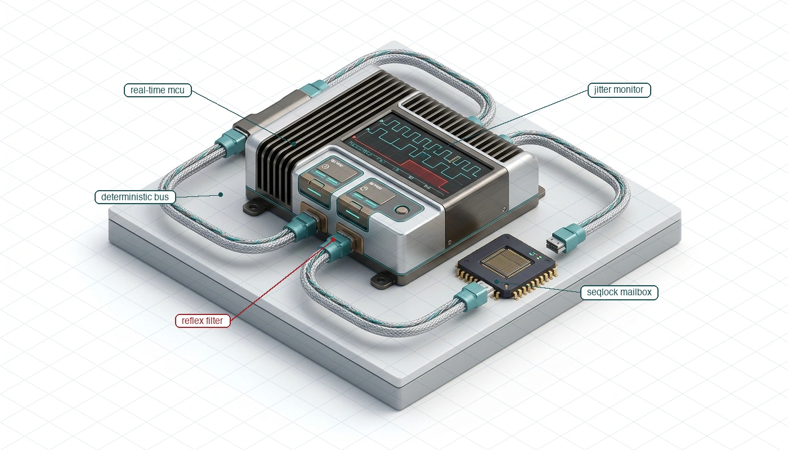
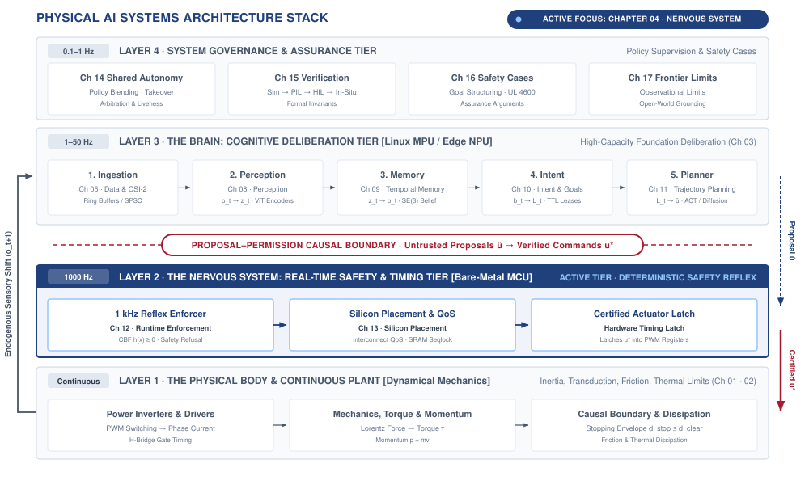
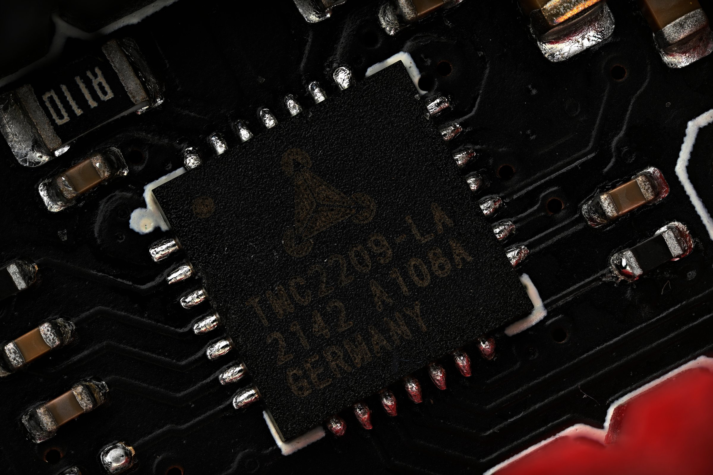
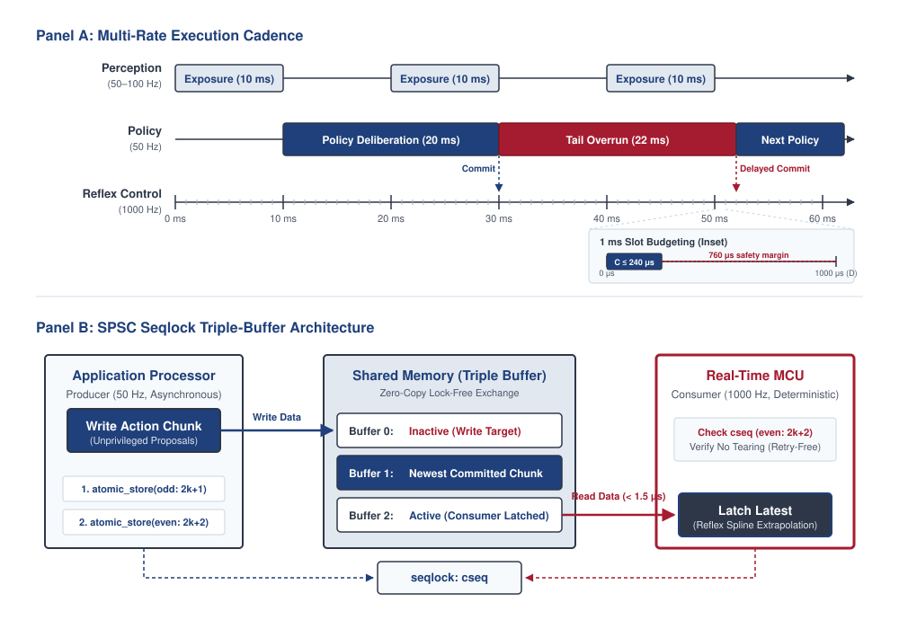
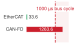
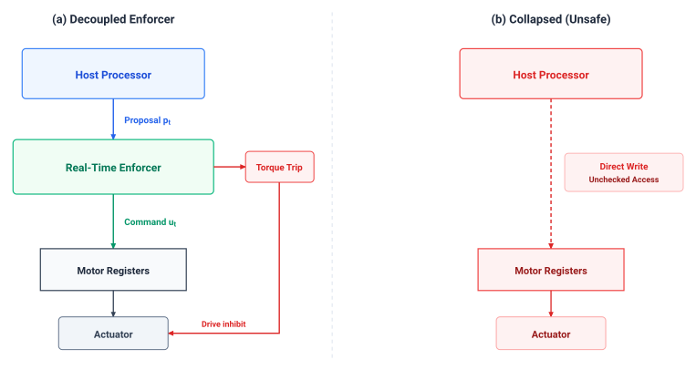
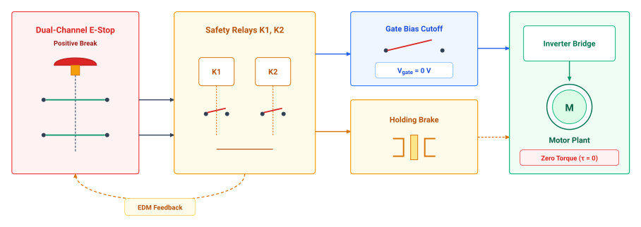
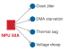

# The Nervous System {#sec-nervous}

::: {layout-narrow}
::: {.column-margin}

\chapterminitoc

:::

::: {.content-visible when-format="pdf"}
\noindent
{fig-alt="Isometric blueprint showing the deterministic nervous system architecture: industrial real-time MCU, 1 kHz clock and jitter monitor, shielded fieldbus network ring, shared SRAM seqlock mailbox, and control barrier reflex filter."}
:::

::: {.content-visible unless-format="pdf"}
{fig-alt="Isometric blueprint showing the deterministic nervous system architecture: industrial real-time MCU, 1 kHz clock and jitter monitor, shielded fieldbus network ring, shared SRAM seqlock mailbox, and control barrier reflex filter."}
:::

:::

## Purpose {.unnumbered .unlisted}

::: {.content-visible when-format="pdf"}
\begin{marginfigure}
\vspace{1em}
\resizebox{\linewidth}{!}{\mlphysicalstackfull{20}{100}{20}{20}{20}}
\end{marginfigure}
:::

_What forces an independent real-time nervous system to stand between deliberative neural policies and physical actuator power?_

A moving machine carries momentum that cannot pause while a neural policy deliberates. Connecting high-capacity models directly to motor inverters allows operating system jitter, garbage-collection pauses, or saturated memory buses to starve current regulation to the motor coils. Moving linkages coast under unmanaged kinetic energy, winding currents collapse, and dynamic balance fails before software can raise an exception. Software priorities cannot preempt hardware memory transactions or mechanical inertia. The nervous system decouples variable deliberation from microsecond-level actuator timing, verifying data freshness and holding exclusive hardware authority over motor power stages. A delayed or erroneous policy proposal cannot cause a mechanical collision if an independent, cycle-deterministic gatekeeper retains the authority to enforce physical limits. Within physical AI systems architecture, the nervous system turns the body's physical budgets into timing and authority constraints that govern when the brain's proposals may become motion.

::: {.column-margin .margin-pointer}
↰ **Prerequisite:** Silicon domain isolation physically enforces the causal boundary defined in @sec-boundary-causal-boundary.
:::



::: {.callout-learning-objectives}

- Determine control update rates from physical dynamics and allowable response delay
- Evaluate data exchanges for freshness and bounded transfer time between reasoning and control
- Distinguish measured latency percentiles from defensible worst-case bounds on real-time execution
- Evaluate hardware isolation that reserves actuator authority when learned policies or communication fail
- Size watchdog validity windows from stopping requirements and the available physical margin
- Diagnose timing, bandwidth, power, and fault propagation across the machine's system interfaces

:::

## The Multi-Rate Bridge {#sec-nervous-multi-rate-bridge}

A moving robot must continuously regulate electrical currents in its motor windings at thousands of cycles per second, even as its high-capacity learned policy spends tens or hundreds of milliseconds interpreting the next video frame. If deliberative reasoning and motor regulation share a blocking execution path or an unpartitioned memory bus, any delay in the neural network immediately starves control of the physical body. The physics of moving mass and electromagnetic coils create a strict architectural requirement: *the cognitive brain needs time to deliberate, while the physical body needs continuous control to survive.*

In standard computer systems, workloads share processors, caches, and memory interconnects under general-purpose operating systems. Real-time extensions (such as `PREEMPT_RT`) allow threads to be prioritized, but they cannot eliminate microarchitectural contention. When a neural network streams multi-gigabyte weight tensors across a shared memory bus, it saturates direct memory access crossbars and evicts cache lines belonging to real-time control threads.[^fn-nervous-bus-contention] A high-priority software interrupt can preempt a thread, but it cannot preempt a hardware memory transaction already occupying the memory bus. If a garbage-collection pause, page fault, or thermal throttle stalls the neural engine, an unpartitioned system stops sending setpoints to the motor inverters. Moving linkages coast under unmanaged momentum, winding currents collapse, and dynamic balance fails.

[^fn-nervous-bus-contention]: **Interconnect Crossbar Contention**\index{Interconnect crossbar contention}: When an accelerator streams multi-gigabyte foundation model weights across shared AXI or PCIe crossbars, dense burst transactions saturate dynamic RAM banks and arbitration queues. Co-located real-time processor cores attempting to read motor encoder registers face unbudgeted hardware wait states that software priorities cannot preempt. Maintaining microsecond-scale control stability therefore requires dedicated physical memory channels or isolated on-chip SRAM for the real-time domain.

A high-capacity foundation model or diffusion policy requires tens to hundreds of milliseconds to ingest multi-camera visual streams and synthesize future trajectories. An electromagnetic motor coil has an electrical time constant ($\tau_e = L/R$) measured in fractions of a millisecond, while moving linkages carry kinetic energy ($E_k = \frac{1}{2} m v^2$). Delaying or miscalculating the current command can therefore exhaust a physical margin before deliberation finishes. This mismatch takes different forms across the three physical machine archetypes:

- In *Mobile Systems* (Class 1), an autonomous chassis or quadruped traveling at $2.0\text{ m/s}$ covers $0.30\text{ m}$ of unguided displacement during a $150\text{ ms}$ inference stall before wheel braking can engage.
- In *Manipulators* (Class 2), an articulated robot arm swinging an end-effector carries reflected rotor inertia ($N^2 J$) that will crush tooling or breach fixturing envelopes if high-rate impedance loops are interrupted.
- In *Process and Energy Systems* (Class 3), high-power battery inverters and thermal cooling circuits experience thermal runaway or power stage shoot-through (a catastrophic short circuit when opposing power switches turn on simultaneously) if gate switching vectors drift outside microsecond commutation deadlines.

Physical safety cannot be guaranteed through software discipline, operating system thread priorities, or runtime exception handlers alone. It requires an explicit, deterministic computing, memory, and communication fabric: the **real-time nervous system**\index{Real-time nervous system}.

::: {#fig-04-locator fig-env="figure" fig-pos="htb" fig-cap="**The Real-Time Nervous System**: The four-tier physical AI systems architecture highlights the real-time nervous system (Layer 2). Operating between the deliberative brain (Layer 3) and dynamical body (Layer 1), the deterministic nervous system enforces multi-rate synchronization, transports sensorimotor signals under hard real-time deadlines, and maintains exclusive execution authority over actuator power." fig-alt="Diagram titled Physical AI Systems Architecture Stack, drawn as four stacked tiers. Layer 4 is system governance and assurance at 0.1 to 1 hertz, holding boxes for shared autonomy, verification, safety cases, and frontier limits. Layer 3 is the brain, a cognitive deliberation tier at 1 to 50 hertz, holding five stages named ingestion, perception, memory, intent, and planner. A dashed proposal-permission privilege boundary separates it from layer 2, the nervous system, a real-time safety and timing tier at 1000 hertz. Layer 1 is the physical body and continuous plant. Layer 2 is shaded and outlined and the badge reads Active Focus, Chapter 04, Nervous System."}
{width="100%"}
:::

Within the four-tier physical AI architecture (@fig-04-locator), this chapter centers on Layer 2: the Real-Time Nervous System. Occupying the critical bridge between the deliberative Cognitive Brain (Layer 3) and the dynamical Physical Body (Layer 1), the nervous system establishes the physical embodiment of the Proposal-Permission Privilege Boundary. It enforces an asymmetric contract: high-capacity learned models operate strictly as unprivileged clients proposing trajectory waypoints, while dedicated, cycle-deterministic silicon retains exclusive authority to evaluate safety invariants and commit current setpoints to motor inverter registers.

::: {#dfn-nervous-real-time-nervous-system .callout-definition title="The real-time nervous system"}

***Real-time nervous system***\index{Real-time nervous system!definition}\index{Nervous system!definition} is the deterministic computing, memory, and communication substrate (Layer 2) that bridges stochastic, high-latency neural deliberation (Layer 3) with continuous physical plant dynamics (Layer 1), synchronizing multi-rate execution cadences and enforcing hardware-level safety invariants.

1.  **Significance**: Without an independent nervous system, high-capacity neural models must hold direct write access to actuator registers. A single operating-system scheduling hiccup, garbage-collection stall, or model hallucination translates into unguided physical momentum, motor over-current, or mechanical collision. The nervous system decouples deliberation latency from physical survival deadlines.
2.  **Distinction**: Unlike a standard robotic middleware or operating system scheduler that provides best-effort messaging, the Physical AI nervous system enforces strict worst-case execution time (WCET) bounds, static memory allocation without dynamic heaps, and asymmetric hardware authority over power stages.
3.  **Common pitfall**: Assuming that running a neural policy on a real-time Linux kernel (such as `PREEMPT_RT`) eliminates the need for an independent microcontroller nervous system. General-purpose OS kernels share memory buses and power rails with host accelerators, leaving execution vulnerable to memory crossbar saturation and uncorrectable hardware hangs.

:::

Every signal traversing the boundary between deliberation and physical actuation is constrained by five physical limits: transport and computation latency ($\tau$), interconnect bandwidth ($\beta$), thermal dissipation ($\mathcal{E}$), temporal jitter ($\sigma_t$), and fault domain isolation ($\mathcal{F}$). Reconciling these limits requires an architecture that delivers microsecond cycle determinism ($1000\text{ Hz}$ to $20\text{ kHz}$) to preserve controller phase margin, maintains lock-free asynchronous decoupling to prevent slow neural inference from blocking inner control loops, enforces hardware-level fault isolation so operating system crashes never reach motor drivers, restricts actuation privilege strictly to verified safety governors, and provides autonomous energy dissipation through hardware watchdog leases.[^fn-nervous-watchdog-envelope]

[^fn-nervous-watchdog-envelope]: **Watchdog Lease**\index{Watchdog lease}: A hardware watchdog lease enforces a hard temporal deadline on deliberative computation. If the high-level policy fails to supply a fresh, certified action chunk before the lease expires ($\tau_{\text{lease}}$), the real-time microcontroller autonomously revokes proposal authority and executes an emergency dynamic stop. Sizing this validity window directly from vehicle stopping distance guarantees that silent software hangs cannot breach physical safety margins.

To reconcile the tension between variable deliberation latency and hard real-time survival deadlines, this chapter establishes the real-time nervous system across eight progressive mechanisms. The architecture begins at the physical substrate in @sec-nervous-silicon-partitioning with silicon partitioning, physically isolating high-throughput application processors from cycle-deterministic microcontrollers across dedicated power rails and memory domains. Across this hardware boundary, @sec-nervous-cadences establishes multi-rate synchronization cadences using lock-free triple buffers and seqlocks to decouple asymmetric frequencies without blocking. In @sec-nervous-deterministic-fieldbuses, deterministic industrial fieldbuses bound transport jitter to microsecond envelopes, integrating distributed actuator nodes into a synchronized execution fabric. With predictable communication in place, @sec-nervous-actuation-authority operationalizes actuation authority, creating the hardware referee that arbitrates unprivileged neural proposals before motor inverter registers latch.

From this architectural foundation, @sec-nervous-hardware-isolation hardens the safety path with physical watchdog leases and hardware reset lines to ensure unhandled software crashes cannot compromise kinetic control. In @sec-nervous-invariant-checking, we formulate real-time invariant checking using Control Barrier Functions to defend the physical envelope. In @sec-nervous-supervisory-teleoperation, we extend this protective boundary to supervisory human intervention and teleoperation handshakes. Finally, @sec-nervous-handoffs-matrix synthesizes these mechanisms into an authoritative handoffs matrix governing every cyber-physical interface in the machine.

Before multi-rate communication or safety barriers can be trusted, however, the machine must resolve where these opposing workloads execute. We therefore begin in @sec-nervous-silicon-partitioning by examining the physical silicon boundary that isolates the stochastic neural engine from the cycle-deterministic reflexes of the physical body.

## Silicon Partitioning {#sec-nervous-silicon-partitioning}

As established by the proposal-permission architecture in @sec-boundary, the computational workload of a physical AI machine divides cleanly into two regimes with opposing requirements. The first regime is deliberation, where learned models evaluate sensory context, infer environmental state, and propose future action plans. The second regime is reactive enforcement, where deterministic control logic samples joints, validates kinematic limits, interpolates motion commands, and regulates electrical currents to the motors. These two regimes differ in their fundamental mathematical profiles, hardware architectures, and tolerance for temporal error.

Deliberate work is defined by deep computational graphs, large memory footprints, and variable execution times. A vision-language-action model processing multi-camera video streams, tactile histories, and natural language prompts requires billions of multiply-accumulate operations across hundreds of neural network layers. Storing the parameters and intermediate activation tensors demands gigabytes of high-bandwidth memory. To achieve acceptable arithmetic throughput, deliberate computation executes on massively parallel accelerators such as graphics processing units (GPUs) or dedicated neural processing units (NPUs). These processors maximize aggregate throughput across wide vector registers and batched memory pipelines at the direct expense of deterministic latency. Memory access stalls, dynamic tensor kernel selection, bus transfers, and runtime memory management cause the execution time of consecutive inferences to vary across a wide distribution. If a deliberate model experiences a temporary delay, the failure mode is soft: the planning pipeline produces a delayed proposal or a stale trajectory that can be held or discarded while the lower-level enforcer maintains stable equilibrium.

Reactive work operates under the inverse constraints. An inner control loop computing inverse dynamics, joint limit monitoring, or field-oriented motor control requires a few thousand arithmetic operations per update. Its memory footprint is static, measured in kilobytes rather than gigabytes, with every variable allocated at compile time in tightly-coupled on-chip static memory. This ensures the exact physical memory location of every piece of data is fixed permanently, eliminating the unpredictable delays caused by heap fragmentation, dynamic paging, and runtime garbage collection. Reactive routines execute on cycle-counted microcontrollers or field-programmable gate arrays (FPGAs) designed for bounded execution rather than maximum parallel throughput. The deadlines governing this work are hard real-time constraints dictated by the mechanical inertia and electrical inductance of the physical system, typically running at rates between $1000\text{ Hz}$ and $10000\text{ Hz}$ on update budgets of $100\,\mu\text{s}$ to $1000\,\mu\text{s}$. If a reactive loop misses its execution deadline, the failure mode is hard. The physical consequence is lost current regulation—inducing severe torque ripple, actuator saturation, or mechanical collision—because the control loop fails to deliver timely braking or commutation vectors.

Because learned inference runtimes depend on memory access patterns, cache residency, dynamic tensor shapes, and hardware prefetching, their execution times are stochastic. Even if an inference pipeline running on a dedicated edge accelerator delivers an average latency well below its execution deadline, heavy-tail variance (infrequent but extreme delays) guarantees frequent misses.[^fn-math-inference-latency] For example, an accelerator with a median runtime of $50\text{ ms}$ might easily exhibit a $P_{99}$ tail extending to $113\text{ ms}$. At an operating rate of $10\text{ Hz}$, a seemingly low overrun probability of 2.38 percent results in $857$ deadline violations every hour. These misses create intervals where the motor actuators receive no updated commands unless an independent, deterministic process bridges the gap.

[^fn-math-inference-latency]: **Inference Latency Distribution**\index{Inference latency}: Deep neural network execution times on parallel accelerators typically follow heavy-tailed log-normal or shifted Weibull distributions due to memory bus contention, dynamic kernel launching, and cache residency fluctuations. Even when median latency falls well within the nominal loop period, the statistical tail guarantees periodic deadline violations. For the formal derivation of latency exceedance probabilities in real-time inference, see @sec-appendix-ml.

General-purpose operating systems and real-time kernel patches (`PREEMPT_RT`) cannot reconcile these two execution profiles on a shared processor. Although real-time extensions allow static task priorities and preemptible kernels, they cannot eliminate shared microarchitectural resources. When a thread executing a learned model streams gigabytes of weight matrices across the memory bus, it evicts cache lines belonging to high-priority control tasks. If the deliberate runtime triggers a **translation lookaside buffer**\index{Translation lookaside buffer} (TLB) shootdown,[^fn-os-tlb-shootdown] enters a driver-level spinlock, or saturates the memory bus crossbar with direct memory access (DMA) requests, the hardware pipeline stalls.[^fn-hw-dma-coherence] A high-priority real-time interrupt can preempt software execution, but it cannot preempt an in-flight hardware burst transaction already occupying the shared memory crossbar. Furthermore, **Dynamic Voltage and Frequency Scaling**\index{Dynamic voltage and frequency scaling} (DVFS)[^fn-hw-dvfs-jitter] governors adjust core clock frequencies based on thermal dissipation and processor utilization, altering instruction cycle times dynamically. The resulting jitter ranges from tens of microseconds to several milliseconds, easily exceeding the entire time budget of a $1000\text{ Hz}$ control loop.

[^fn-os-tlb-shootdown]: **TLB Shootdown**\index{Translation lookaside buffer!shootdown}: When an operating system modifies page tables, it broadcasts inter-processor interrupts (IPIs) to invalidate stale Translation Lookaside Buffer entries across all active cores. Receiving cores must suspend thread execution and flush affected entries, introducing unbudgeted multi-microsecond stalls. In shared-silicon architectures, these unpredictable synchronization pauses destroy the cycle determinism demanded by inner motor regulation loops.

[^fn-hw-dma-coherence]: **DMA Cache Coherence**\index{Direct memory access!cache coherence}: Direct memory access transfers bypass CPU cache hierarchies, requiring explicit cache line invalidation or write-back operations to maintain memory consistency between peripherals and cores. Without hardware-enforced snoop filtering or explicit barriers, processors read stale sensor frames or overwrite pending actuator commands. These maintenance operations inject variable latency penalties into high-rate control routines unless static, unbuffered SRAM regions are dedicated to peripheral transfers.

[^fn-hw-dvfs-jitter]: **Dynamic Voltage and Frequency Scaling**\index{Dynamic voltage and frequency scaling}: Host application processors dynamically adjust operating frequency and core voltage to balance computational throughput against thermal limits. Because real-time control deadlines depend on static instruction execution times, dynamic clock scaling alters task duration at runtime. Unanticipated frequency throttling transforms previously verified control routines into deadline violations unless the real-time core operates on a fixed, independent clock domain.

The hardware floor exposes this physical separation at the interface boundary. A host processor running an accelerator communicates across high-latency bus topologies such as PCIe or system fabric crossbars, where DMA transfers require ring-buffer synchronization, host interrupt service routines, and cache coherency handshakes that consume $10\,\mu\text{s}$ to $100\,\mu\text{s}$ per transaction. In contrast, an embedded microcontroller or dedicated real-time motor controller IC (@fig-real-motor-controller) interfaces directly with sensor transceivers and power stages through memory-mapped registers, single-cycle input and output pins, and tightly-coupled static memory with zero wait states. Reading an absolute joint encoder over a serial peripheral interface (SPI) or updating a field-oriented pulse-width modulation counter takes less than $1\,\mu\text{s}$ of bounded execution time,[^fn-hw-epwm-deadtime] completely isolated from system bus contention.

[^fn-hw-epwm-deadtime]: **Dead-Time Delay**\index{Dead-time delay}: Dedicated pulse-width modulation timers (TI `ePWM`, STM32 `TIM1`) inject hardware-enforced dead-time delays ($100\text{--}500\text{ ns}$) between complementary high-side and low-side gate signals (`TIMx_BDTR`, `DBRED`). This delay ensures that the conducting power switch fully turns off before its opposing switch conducts, preventing shoot-through short circuits across high-voltage DC rails. Because dead time slightly distorts the applied phase voltage, motor control firmware incorporates online volt-second compensation to maintain smooth torque generation.

::: {#fig-real-motor-controller fig-env="figure" fig-pos="t" fig-cap="**Motor Drive Controller Silicon**: Macro view of an embedded motor drive integrated circuit featuring precision current-sense shunt resistors (R110), multi-layer power routing, and direct gate-drive outputs. Dedicated real-time control silicon executes cycle-deterministic current commutation loops without operating system schedulers, cache hierarchies, or bus contention. (Credit: Wikimedia Commons, CC BY-SA 4.0)." fig-alt="Macro view of an embedded motor drive integrated circuit showing current-sense shunt resistors, PCB power routing, and gate-drive pins."}
{width="85%"}
:::

In heterogeneous Dual-Brain System-on-Chip (SoC) architectures, this physical reality enforces a strict dual-processor design requirement. Deliberate planning and reactive enforcement cannot safely share a processor core, a cache hierarchy, or a common memory bus. The slow, stochastic path requires parallel hardware (Linux host application processors and tensor accelerators) optimized for raw throughput across wide data streams, while the fast, deterministic path requires isolated hardware (bare-metal microcontrollers or FPGA cores) optimized for worst-case execution time and cycle-counted predictability.

::: {#psp-nervous-silicon-privilege .callout-perspective title="Silicon privilege partitioning"}
Never allow a high-capacity learned model to execute in the same fault domain, address space, or power rail as the actuator commutation loop. Deliberation is an unprivileged proposal generator; physical register privilege belongs exclusively to cycle-deterministic real-time silicon.
:::

Safety in physical AI is an architectural partition in silicon, not an operating system scheduling priority. The high-throughput deliberative engine acts strictly as an untrusted client, while dedicated real-time silicon acts as the immutable hardware gatekeeper.

::: {#chk-nervous-silicon-partitioning .callout-checkpoint title="Silicon partitioning and execution predictability"}

Before examining multi-rate cadences, verify your understanding of hardware privilege separation:

- [ ] **Microarchitectural resource contention**: Can you explain why kernel-level priority patches (`PREEMPT_RT`) cannot prevent memory crossbar saturation and cache line eviction when an accelerator streams neural network weights?
- [ ] **TLB shootdowns and hardware wait states**: Can you describe how virtual memory management operations on a general-purpose processor introduce multi-millisecond tail latency into co-located software tasks?
- [ ] **Dual-brain fault isolation**: Can you distinguish the failure modes of an unprivileged deliberative application core from a cycle-deterministic motor microcontroller?

:::

## Multi-Rate Cadences {#sec-nervous-cadences}

The physical separation of compute domains reflects a fundamental constraint in which no single execution frequency satisfies both the physical dynamics of the body and the computational complexity of perception and learned inference. A physical AI nervous system operates across four distinct rate tiers (@fig-04-multirate-cadence-buffer), each determined by a different physical process:

The inner reflex and current regulation loop runs between $1000\text{ Hz}$ and $20\text{ kHz}$. The motion interpolation and tracking loop runs between $100\text{ Hz}$ and $500\text{ Hz}$. The perception and policy planning pipeline processes incoming sensor streams between $10\text{ Hz}$ and $50\text{ Hz}$. The high-level deliberate reasoning tier updates semantic task targets between $0.5\text{ Hz}$ and $2\text{ Hz}$. Among these tiers, only the fastest rate has an origin that is non-negotiable.

::: {.column-margin .margin-pointer}
↰ **Prerequisite:** Microsecond interrupt latency requirements build upon the sensor freshness bounds established in @sec-body-measurement-freshness.
:::

The inner loop rate is governed by the physical time constants of the actuator and the structural resonance of the machine. Building on the actuator electrical time constant ($\tau_e = L/R$) established in @sec-body-measurement-freshness, stator winding currents respond rapidly to applied voltages. Regulating current vectors against back-EMF variations requires updating inverter duty cycles before phase currents deviate from setpoints, mandating an execution interval of $T_s \le 1.0\text{ ms}$ ($1000\text{ Hz}$) for outer joint loops, with inner field-oriented current regulators executing at up to $20\text{ kHz}$ ($50\,\mu\text{s}$). For a rigorous calculation of motor electrical time constants, see @sec-appendix-control. At the joint level, the mechanical time constant and structural stiffness dictate the required closed-loop bandwidth. Discrete sample-and-hold loops inherently introduce phase delay proportional to computation latency and sampling interval.[^fn-math-zoh-phaselag]

[^fn-math-zoh-phaselag]: **Zero-Order Hold Phase Lag**\index{Zero-order hold}: Holding a discrete control command constant across sampling interval $T_s$ introduces an effective delay of $T_s/2$, producing a linear phase reduction $\Delta \phi = -\omega T_s / 2$. In high-bandwidth robotic actuators, this phase erosion directly reduces open-loop phase margin, driving lightly damped mechanical modes into resonance. For the formal frequency-domain derivation of discrete sampling phase erosion, see @sec-appendix-control.

When control loops run too slowly, this accumulated delay erodes the phase margin of the feedback controller. Accumulated phase lag causes corrective torques to arrive out of phase with physical link motion, converting negative feedback stabilization into positive feedback amplification. When loop cadences fall below $500\text{ Hz}$, this phase degradation drives flexible linkages and gearbox compliance toward acoustic limit cycles and destructive structural resonance.

The perception tier executes at an intermediate rate dictated by photon collection physics, exposure windows, and target velocity relative to the sensor field of view. An optical image sensor operating under typical indoor illumination ($300\text{ lux}$) requires an integration window of $10\text{ ms}$ to $30\text{ ms}$ to accumulate sufficient charge on each pixel without amplifying thermal read noise. If a manipulator end-effector moves at $1.5\text{ m/s}$, an exposure time of $15\text{ ms}$ causes an edge feature to blur across $\Delta x = 1.5\text{ m/s} \times 0.015\text{ s} = 22.5\text{ mm}$ on the image plane. Increasing the frame rate beyond $60\text{ Hz}$ or $100\text{ Hz}$ provides diminishing returns because the physical shutter cannot shorten without inducing underexposure, while reducing the frame rate below $10\text{ Hz}$ allows moving objects to traverse tens of centimeters between frames, breaking visual tracking associations. The rate of the perception pipeline is bounded from above by photon flux and from below by spatial displacement across consecutive frames.

The deliberate planning and policy tier runs between $10\text{ Hz}$ and $50\text{ Hz}$ based on the horizon of environmental change and the thermal limits of onboard compute. A vision-language-action policy evaluates hundreds of millions of parameters, consuming tens of joules of electrical energy per inference step. The external environment, including moving obstacles, human collaborators, and changing contact surfaces, evolves over intervals of $20\text{ ms}$ to $200\text{ ms}$. Evaluating a learned policy at $20\text{ Hz}$ ($50\text{ ms}$ period) to generate multi-step action chunks ($K = 16$ to $50$ future waypoints) [@zhao2023learning] matches this environmental evolution rate while maintaining accelerator dissipation within an embedded power envelope of $15\text{ W}$ to $35\text{ W}$.

Because these tiers execute on isolated hardware domains at different frequencies, data exchange across rate boundaries must be asynchronous, non-blocking, and zero-copy (@fig-04-multirate-cadence-buffer). If a $1000\text{ Hz}$ control loop waits on a mutex lock held by a $20\text{ Hz}$ neural network runtime, a single scheduling delay in the operating system immediately causes the real-time controller to miss its deadline.

::: {#fig-04-multirate-cadence-buffer fig-env="figure" fig-pos="t" fig-cap="**Multi-Rate Cadence and Lock-Free Seqlock Memory Exchange**: (a) Heterogeneous execution cadence across perception, deliberative planning, and deterministic reflexes ($1\text{ kHz}$). The reflex loop operates asynchronously without shared deadlines, extrapolating the active spline if a policy tick overruns. (b) Single-producer single-consumer (SPSC) seqlock triple-buffer memory exchange across shared SRAM with monotonic sequence counter ($c_{\text{seq}}$), decoupling host inference from hard real-time motor control (synthesized from Slotine & Li [-@slotine1991applied] and ARM Architecture Reference Manual)." fig-alt="Two-panel schematic: (a) Multi-rate cadence timeline across perception, policy, and reflexes showing spline hold during policy overrun; (b) Lock-free single-producer single-consumer seqlock buffer exchange across host processor and real-time microcontroller via shared SRAM."}
{width="95%"}
:::

To prevent blocking, the nervous system implements **lock-free single-producer single-consumer (SPSC) seqlock buffers**\index{Sequence lock} in shared static memory.

::: {#psp-nervous-seqlock-decoupling .callout-perspective title="Lock-free cadence decoupling"}
A synchronization primitive for single-writer multi-reader shared memory that eliminates reader blocking and priority inversion by coupling an atomic monotonic sequence counter with memory barriers; odd counter values signal active writer mutation, while identical even counter values before and after reading guarantee that payload words were latched without tear or inconsistency.
:::

The shared memory region maintains an atomic 64-bit sequence counter alongside double-buffered payload slots.

When the untrusted application processor prepares a new action chunk proposal, it begins by reading the current sequence counter and atomically incrementing it to an odd value, signalling to the rest of the system that a write operation is actively in progress. It then copies the proposal payload—including a monotonic sequence identifier, timestamp, watchdog lease boundary specifying the maximum time window for valid execution, multi-step trajectory waypoints, and a cyclic redundancy checksum—into the inactive memory buffer. After enforcing an explicit outer-shareable memory barrier (`DMB OSHST` / `DMB OSH`) to ensure all payload bytes are globally visible across the heterogeneous SoC interconnect,[^fn-hw-dmb-fence] the processor increments the sequence counter once more to an even value with store-release semantics (`STLR`),[^fn-hw-arm-ordering] atomically publishing the completed frame.

[^fn-hw-dmb-fence]: **Data Memory Barrier**\index{Data memory barrier}: Out-of-order processor pipelines and store buffers frequently reorder memory operations to maximize execution throughput. In lock-free shared memory mailboxes between heterogeneous cores (such as a Linux Cortex-A host and a real-time Cortex-M microcontroller), producer cores must execute explicit outer-shareable data memory barriers (`DMB OSHST`) to ensure all payload words commit to shared static RAM across the interconnect before incrementing the sequence counter. Omitting these hardware barriers allows stale or partial trajectory coordinates to be observed by the consumer core, resulting in command corruption.

[^fn-hw-arm-ordering]: **ARM Memory Model**\index{ARM memory model}: The ARM architecture implements a weakly-ordered memory model that permits aggressive hardware reordering of independent loads and stores. Lock-free inter-core communication relies on explicit acquire-release instructions (`LDAR`/`STLR`) alongside system-wide outer-shareable barriers (`DMB OSH`) to establish memory fences across distinct cache clusters. Correct barrier placement guarantees sequential consistency across heterogeneous compute domains without requiring costly bus-locking primitives.

On the receiving side, the deterministic real-time microcontroller latches the newest proposal without ever acquiring a lock or stalling execution. At the start of its control cycle, the microcontroller reads the sequence counter with load-acquire semantics (`LDAR`). While an ARM `LDAR` provides one-way acquire ordering (preventing subsequent memory reads from being hoisted above the initial sequence check), it does not prevent preceding payload reads from sinking after a trailing check. The protocol therefore pairs `LDAR` with explicit data memory barriers (`DMB OSHLD`) around the payload copy to enforce strict two-way load-load containment across heterogeneous cores. If the counter is odd, indicating that the producer is midway through updating the buffer, the consumer immediately aborts the read, retaining its existing validated trajectory spline.

While a standard seqlock operates cleanly when writers are non-preemptible kernel threads, in physical AI the writer is an untrusted user-space process running a heavy neural policy. If the operating system preempts the writer mid-write (or if an unhandled exception terminates the process), a raw sequence counter could remain stuck at an odd value. To guarantee that the real-time microcontroller is never starved or locked out, high-integrity physical systems implement **wait-free atomic triple-buffering**\index{Triple buffer!wait-free mailbox}: the writer stages new chunks in an inactive buffer slot and atomically swaps a single published slot pointer. The microcontroller always latches from the most recently committed, complete slot—guaranteeing deterministic, wait-free execution even if the host application processor hangs or crashes.

If the sequence counter remained identical and even throughout the read, the latch is verified: the microcontroller validates the **cyclic redundancy checksum**\index{Cyclic redundancy check} (CRC-32),[^fn-sw-crc32-mailbox] checks timestamp freshness against its hardware timer, and accepts the proposal. Under this protocol, read latencies on the real-time microcontroller remain strictly bounded below $1.5\ \mu\text{s}$, completely decoupled from the scheduling state or operating system load of the host processor, as formalized in @algo-lock-free-trajectory.

[^fn-sw-crc32-mailbox]: **Cyclic Redundancy Check**\index{Cyclic redundancy check}: A cyclic redundancy check (such as IEEE 802.3 CRC-32) verifies data frame integrity against transmission noise and shared memory corruption. Microcontrollers evaluate the CRC polynomial using dedicated hardware accelerators within single-digit microsecond windows before parsing message payloads. Frames failing checksum verification are dropped immediately, prompting the receiver to extrapolate existing trajectory splines rather than consuming corrupted setpoints.

```pseudocode
#| label: algo-lock-free-trajectory
#| pdf-line-number: true
#| pdf-right-comment: false
#| html-comment-delimiter: "▷"

\begin{algorithm}
\caption{Lock-Free Trajectory Seqlock Exchange Protocol}
\begin{algorithmic}
\Require proposal payload $P = \{\text{seq\_id}, \text{timestamp\_ns}, \text{lease\_us}, \mathbf{w}_{1..K}, \text{crc32}\}$, target local buffer $B_{\text{local}}$ in static SRAM, shared SRAM mailbox $(c_{\text{seq}}, \text{Slot}_{\text{shared}})$, current time $t_{\text{now}}$
\Ensure verified action chunk $P_{\text{latched}}$ or status rejection code
\Statex
\Function{PublishActionChunk}{$P$}
    \State $c_{\text{curr}} \gets \Call{AtomicLoadExplicit}{c_{\text{seq}}, \text{memory\_order\_relaxed}}$
    \State $\Call{AtomicStoreExplicit}{c_{\text{seq}}, c_{\text{curr}} + 1, \text{memory\_order\_relaxed}}$ \Comment{mark odd: write in progress}
    \State $\Call{HardwareMemoryBarrier}{\text{DMB\_OSHST}}$ \Comment{outer-shareable store barrier pushes counter}
    \State $\Call{CopyMemory}{\text{Slot}_{\text{shared}}.\text{payload}, P, \text{sizeof}(P)}$ \Comment{copy multi-word trajectory}
    \State $\Call{HardwareMemoryBarrier}{\text{DMB\_OSH}}$ \Comment{outer-shareable full barrier: payload visible}
    \State $\Call{AtomicStoreExplicit}{c_{\text{seq}}, c_{\text{curr}} + 2, \text{memory\_order\_release}}$ \Comment{mark even: publish committed}
\EndFunction
\Statex
\Function{LatchLatestActionChunk}{$B_{\text{local}}, t_{\text{now}}$}
    \State $c_{\text{start}} \gets \Call{AtomicLoadExplicit}{c_{\text{seq}}, \text{memory\_order\_acquire}}$ \Comment{load initial counter (ARM LDAR acquire)}
    \If{$c_{\text{start}}$ is odd}
        \State \Return $\text{STATUS\_WRITER\_ACTIVE}$ \Comment{writer active; retain prior spline}
    \EndIf
    \State $\Call{HardwareMemoryBarrier}{\text{DMB\_OSHLD}}$ \Comment{explicit barrier: prevent payload reads hoisting before counter}
    \State $\Call{CopyMemory}{B_{\text{local}}, \text{Slot}_{\text{shared}}.\text{payload}, \text{sizeof}(\text{Payload})}$ \Comment{latch to local SRAM}
    \State $\Call{HardwareMemoryBarrier}{\text{DMB\_OSHLD}}$ \Comment{LDAR cannot prevent prior reads sinking; DMB forces payload reads before $c_{\text{end}}$}
    \State $c_{\text{end}} \gets \Call{AtomicLoadExplicit}{c_{\text{seq}}, \text{memory\_order\_acquire}}$ \Comment{re-read sequence counter}
    \If{$c_{\text{start}} \ne c_{\text{end}}$}
        \State \Return $\text{STATUS\_TORN\_READ}$ \Comment{concurrent write detected}
    \EndIf
    \If{$\Call{ComputeCrc32}{B_{\text{local}}} \ne B_{\text{local}}.\text{crc32}$}
        \State \Return $\text{STATUS\_CHECKSUM\_INVALID}$
    \EndIf
    \If{$(t_{\text{now}} - B_{\text{local}}.\text{timestamp\_ns}) > B_{\text{local}}.\text{lease\_us} \times 1000$}
        \State \Return $\text{STATUS\_LEASE\_EXPIRED}$
    \EndIf
    \State \Return $\text{STATUS\_VALID\_LATCHED}$ \Comment{proposal verified for spline synthesis}
\EndFunction
\end{algorithmic}
\end{algorithm}
```

```{python}
#| label: calc-nervous-amr-watchdog-lease
#| echo: false
# ┌─────────────────────────────────────────────────────────────────────────────
# │ AMR WATCHDOG LEASE SIZING (LEGO)
# ├─────────────────────────────────────────────────────────────────────────────
# │ Context: @nbk-nervous-watchdog-stopping-lease
# │ Goal:    Size maximum watchdog lease window from stopping kinematics.
# │ Show:    d_brake = 0.5625 m, d_drift = 0.1314 m, T_lease <= 87.6 ms.
# │ How:     Kinematic model T_lease <= (d_clear - v0^2 / (2 * a_max)) / v0.
# └─────────────────────────────────────────────────────────────────────────────
from mlsysim import *
from mlsysim.core.units import *
from mlsysim.fmt import fmt_qty, fmt_length, fmt_velocity, fmt_acceleration, fmt_latency, check

class AMRWatchdogLease:
    """Kinematic sizing for communication and watchdog validity leases on autonomous mobile robots."""

    # ┌── 1. LOAD (Constants & Parameters) ─────────────────────────────────
    amr = Embodied.AMR.WarehouseAMR
    mass = amr.mass
    v0 = amr.max_velocity
    a_max = amr.max_acceleration
    d_clear = 0.6939 * meter

    # ┌── 2. EXECUTE (Compute) ─────────────────────────────────────────────
    budget = calc_watchdog_lease_bound(
        clearance_distance=d_clear,
        initial_velocity=v0,
        max_deceleration=a_max,
    )
    d_brake = budget["d_brake"]
    d_drift = budget["d_drift_allowable"]
    t_lease = budget["t_lease_max"]

    # ┌── 3. GUARD (Invariants) ───────────────────────────────────────────
    check(abs(d_brake.to(meter).magnitude - 0.5625) < 0.001, f"Unexpected braking distance: {d_brake}")
    check(abs(d_drift.to(meter).magnitude - 0.1314) < 0.001, f"Unexpected drift allowance: {d_drift}")
    check(abs(t_lease.to(millisecond).magnitude - 87.6) < 0.1, f"Unexpected lease ceiling: {t_lease}")
    check(d_brake + d_drift <= d_clear, "Stopping envelope cannot exceed optical clearance")

    # ┌── 4. OUTPUT (Format & Export) ────────────────────────────────────────
    mass_str = fmt_qty(mass, kilogram, precision=0)
    v0_str = fmt_velocity(v0, unit=meter / second, precision=1)
    a_max_str = fmt_acceleration(a_max, unit=meter / (second**2), precision=0)
    d_clear_str = fmt_length(d_clear, unit=meter, precision=4)
    d_brake_str = fmt_length(d_brake, unit=meter, precision=4)
    d_drift_str = fmt_length(d_drift, unit=meter, precision=4)
    t_lease_str = fmt_latency(t_lease, unit=millisecond, precision=1)
```

::: {#nbk-nervous-watchdog-stopping-lease .callout-notebook title="Watchdog lease sizing from stopping kinematics"}
**Problem**: An Autonomous Mobile Robot (AMR) navigates an industrial fulfillment center. If the high-level neural policy hangs or operating system preemption stalls inference, what is the maximum permissible watchdog validity lease ($T_{\text{lease}}$) before uncommanded drift causes an obstacle collision?

*1. Physical Parameters*:

- Robot mass and cruise velocity: $m =$ `{python} AMRWatchdogLease.mass_str`, $v_0 =$ `{python} AMRWatchdogLease.v0_str`.
- Braking capability: Mechanical brakes certified for worst-case deceleration $a_{\max} =$ `{python} AMRWatchdogLease.a_max_str`.
- Optical safety clearance: LIDAR safety field reserves $D_{\text{clear}} =$ `{python} AMRWatchdogLease.d_clear_str` ahead of dynamic obstacles.

*2. Stopping Kinematics*:

- Once brakes engage, physical braking distance evaluates as $d_{\text{brake}} = \frac{v_0^2}{2 a_{\max}} \approx$ `{python} AMRWatchdogLease.d_brake_str`.
- Allowable blind drift distance before braking must begin is $\Delta d_{\text{drift}} = D_{\text{clear}} - d_{\text{brake}} \approx$ `{python} AMRWatchdogLease.d_drift_str`.

*3. Watchdog Lease Ceiling*:

- The nervous system must detect the absence of fresh proposals and initiate emergency braking before drifting across $\Delta d_{\text{drift}}$:
  $$T_{\text{lease}} \le \frac{\Delta d_{\text{drift}}}{v_0}$$
  which bounds the validity lease to $T_{\text{lease}} \le$ `{python} AMRWatchdogLease.t_lease_str`.

**Systems insight**: Watchdog lease durations are not software timeouts chosen for convenience—they are derived from the physical braking kinematics and sensor clearance of the plant. A lease longer than `{python} AMRWatchdogLease.t_lease_str` permits a frozen machine to impact obstacles before mechanical deceleration can physically arrest its momentum.
:::

This kinematic balance establishes the exact physical origin of the `{python} AMRWatchdogLease.t_lease_str` lease ceiling: any longer lease permits a frozen machine to impact the obstacle before deceleration can engage. The trajectory payload exchanged through this lock-free mailbox incorporates this physical lease into the strict schema defined in @tbl-04-schema-action-chunk, establishing explicit data types, SI units, and structural invariants.

| Field Name            | Scalar Type       | Physical SI Units                       | Structural Invariant & Description                                                                          |
|:----------------------|:------------------|:----------------------------------------|:------------------------------------------------------------------------------------------------------------|
| `sequence_id`         | `uint64_t`        | dimensionless                           | Monotonically strictly increasing integer ($s_k > s_{k-1}$).                                                |
| `timestamp_ns`        | `uint64_t`        | nanoseconds ($\text{ns}$)               | Hardware capture timestamp on master distributed clock.                                                     |
| `validity_lease_us`   | `uint32_t`        | microseconds ($\mu\text{s}$)            | Physical validity lease window ($T_{\text{lease}} \le$ `{python} AMRWatchdogLease.t_lease_str`).            |
| `num_waypoints`       | `uint16_t`        | dimensionless                           | Chunk horizon count ($K \in [16, 50]$).                                                                     |
| `joint_positions`     | `float32[K][N_j]` | radians ($\text{rad}$)                  | Commanded joint angles within reach envelope ($q_{\min} \le q \le q_{\max}$).                               |
| `joint_velocities`    | `float32[K][N_j]` | radians/sec ($\text{rad/s}$)            | Commanded joint velocities within certified ceilings ($\lVert \dot{\mathbf{q}} \rVert \le \dot{q}_{\max}$). |
| `feedforward_torques` | `float32[K][N_j]` | Newton-meters ($\text{N}\cdot\text{m}$) | Bounded feedforward motor torque vectors ($\lVert \boldsymbol{\tau} \rVert \le \tau_{\max}$).               |
| `crc32`               | `uint32_t`        | bitmask                                 | IEEE 802.3 CRC-32 polynomial over all preceding payload bytes.                                              |

: **Abstract Data Schema for Real-Time Action Chunk Exchange (`TrajectoryProposalChunk`)**: Field layout, scalar types, physical units, and structural invariants for trajectory proposals exchanged across the watchdog lease boundary via lock-free shared memory. {#tbl-04-schema-action-chunk tbl-colwidths="[20,18,22,40]"}

To quantify the reliability of this lock-free interface across disparate clock domains, consider a high-level Vision-Language-Action policy publishing action chunks ($1.4\text{ kB}$ payload) into a shared SRAM mailbox at $f_{\text{writer}} = 20\text{ Hz}$ ($T_{\text{writer}} = 50\text{ ms} = 50{,}000\,\mu\text{s}$), while a deterministic real-time microcontroller reads the mailbox at $f_{\text{reader}} = 1000\text{ Hz}$ ($T_{\text{reader}} = 1000\,\mu\text{s}$). Across an on-chip SRAM bus operating at $1.0\text{ GB/s}$ ($1000\text{ B}/\mu\text{s}$), the writer copies $1400\text{ bytes}$ with memory barriers in $t_{\text{write}} \approx 1.5\,\mu\text{s}$, and the reader completes its copy in $t_{\text{read}} \approx 1.5\,\mu\text{s}$. A read collides with a write if the reader begins during writer mutation or if the writer begins while the reader is actively copying, creating a vulnerable collision window:
$$t_{\text{vulnerable}} = t_{\text{write}} + t_{\text{read}} = 1.5\,\mu\text{s} + 1.5\,\mu\text{s} = 3.0\,\mu\text{s}$$

The collision probability per reader read is:
$$P_{\text{collision}} = \frac{t_{\text{vulnerable}}}{T_{\text{writer}}} = \frac{3.0\,\mu\text{s}}{50{,}000\,\mu\text{s}} = 6.0 \times 10^{-5} = 0.006\text{ percent}$$
Over $100{,}000$ consecutive $1\text{ kHz}$ control cycles ($100\text{ s}$ of continuous operation), the reader encounters on average only 6 torn reads. Crucially, because the writer completes in $t_{\text{write}} = 1.5\,\mu\text{s}$, which is over $600\times$ shorter than the $1000\,\mu\text{s}$ reader period, a writer mutation can never span across two consecutive reader ticks:
$$P(\text{consecutive collision}) = 0$$
When a collision occurs, the reader detects the sequence counter mismatch in $<150\text{ ns}$, discards the torn frame, and continues evaluating its latched cubic spline. Over a single $1.0\text{ ms}$ interval, kinematic divergence between the latched spline and the incoming chunk is $<0.05\text{ mm}$, completely undetectable by the physical plant. Lock-free seqlocks thus guarantee non-blocking reads (greater than 99.99 percent zero-retry latch rate) without mutexes, eliminating thread preemption and priority inversion across clock domains.

::: {#chk-nervous-seqlock-collision .callout-checkpoint title="Lock-free seqlock collision dynamics"}

Before examining rate transitions and spline interpolation, verify your understanding of lock-free mailbox synchronization:

- [ ] **Lock-free mailbox mechanics**: Can you explain how atomic sequence counters detect torn reads across asynchronous clock domains without requiring mutexes or priority inversion?
- [ ] **Consecutive collision bounds**: Can you explain why bounded write durations relative to the reader's sampling period prevent consecutive torn reads in bare-metal memory?
- [ ] **Degradation during torn reads**: Can you describe how a real-time enforcer maintains smooth actuation trajectories when a shared-memory collision forces it to discard a torn proposal frame?

:::

Rate mismatches introduce three failure modes: phase lag accumulation, aliasing, and buffer starvation. In a discrete-to-continuous conversion, a Zero-Order Hold (ZOH) maintains setpoints constant across the planning period $T_{\text{plan}}$, delivering piecewise-constant position steps rather than a smooth trajectory. This step quantization introduces an intrinsic half-sample phase lag $\Delta \phi = -\frac{\omega T_{\text{plan}}}{2}$. Directly feeding raw planner waypoints to inner motor loops at $10\text{ Hz}$ incurs $50\text{ ms}$ of uncompensated phase delay, degrading tracking margins and exciting unmodeled mechanical resonances. The real-time enforcer mitigates this quantization by fitting continuous cubic or quintic polynomial splines ($q(t) = a_0 + a_1 t + a_2 t^2 + a_3 t^3$) across the latched waypoint buffer at $1000\text{ Hz}$, generating smooth, $C^2$-differentiable position, velocity, and feedforward acceleration setpoints on every $1.0\text{ ms}$ tick.

::: {.column-margin .margin-pointer}
↰ **Prerequisite:** High-rate joint interpolation of action chunks builds on the proposal generator in @sec-brain-cognitive-pipeline.
:::

Aliasing occurs when high-frequency sensor noise folds into low-rate estimators, which the system prevents through analog anti-aliasing filters and digital decimation[^fn-anti-moving-average] within the high-rate microcontroller domain. Following classical nonlinear control results [@slotine1991applied], stability guarantees hold under the assumption that inner-loop execution jitter remains bounded within a narrow fraction of the sampling period and that setpoint updates arrive before the local trajectory buffer drains. The nervous system establishes these assumptions by enforcing cycle-deterministic interrupt timing on the microcontroller and tracking buffer depth. If the planner stalls and the buffer drains to its final valid waypoint, the operational assumption no longer holds. At that moment, the nervous system rejects further planner inputs and executes an autonomous, deterministic stopping trajectory computed locally at $1000\text{ Hz}$, bringing all joints safely to rest.

[^fn-anti-moving-average]: **Phase Lag in Moving Average Smoothing**\index{Antipatterns!moving average filtering}: Averaging noisy actuator feedback using an $N$-tap finite impulse response (FIR) filter introduces a group delay of $(N-1)/2$ sample periods. In high-gain position control, this artificial transport delay consumes phase margin, turning stabilizing feedback into positive feedback that drives the actuator into violent self-excited limit cycles.

::: {#psp-nervous-cadence-decoupling .callout-perspective title="Zero-wait execution across clock domains"}
Never allow a high-frequency real-time control loop to acquire a mutex or spin on a lock shared with a stochastic process; communicate across clock domains exclusively via lock-free atomic sequence mailboxes or triple-buffers.
:::

Communication between cognitive models and motor loops cannot rely on blocking queues, mutexes, or network sockets. Every interface boundary must be bridged by asynchronous, lock-free shared memory or deterministic fieldbuses that guarantee the high-rate motor loop never waits for the slow, stochastic brain.

The operational characteristics, physical time constants, hardware allocation, and failure protocols governing each tier across this multi-rate hierarchy are formalized in @tbl-04-cadence-hierarchy.

| Execution Tier & Frequency                               | Nominal Period ($T$)                                         | Max Jitter Budget ($\Delta T_{\max}$)                    | Hardware & Compute Domain                               | Payload & State Representation                                        | Inter-Tier Transport Contract                                     | Overrun & Failure Protocol                                                                    |
|:---------------------------------------------------------|:-------------------------------------------------------------|:---------------------------------------------------------|:--------------------------------------------------------|:----------------------------------------------------------------------|:------------------------------------------------------------------|:----------------------------------------------------------------------------------------------|
| **Reflex & Safety** ($\ge 1000\text{ Hz}$)               | $T \le 1.0\text{ ms}$ ($50\,\mu\text{s}$ at $20\text{ kHz}$) | $\Delta T_{\max} < 10\,\mu\text{s}$ (hard real-time)     | Dedicated real-time MCU or FPGA fabric                  | Phase currents, encoder ticks, PWM duty cycles, emergency clamp flags | Single-cycle MMIO registers, tightly-coupled static memory        | Immediate low-side MOSFET phase short (dynamic braking) or mechanical brake drop              |
| **Motion & Tracking** ($100\text{--}500\text{ Hz}$)      | $T = 2.0\text{--}10.0\text{ ms}$                             | $\Delta T_{\max} \le 200\,\mu\text{s}$ (firm real-time)  | Deterministic real-time RTOS / microcontroller core     | Continuous polynomial splines, $SE(3)$ wrenches, feedforward torques  | Lock-free SPSC circular ring buffer with atomic sequence counters | Local spline extrapolation ($50\text{ ms}$ horizon); controlled deceleration                  |
| **Planning & Policy** ($10\text{--}50\text{ Hz}$)        | $T = 20.0\text{--}100.0\text{ ms}$                           | $\Delta T_{\max} \le 15\text{ ms}$ ($P_{99}$ tail bound) | Edge tensor accelerator, host application processor     | Action chunks ($K$-step horizon waypoints), visual embeddings         | Shared static memory SPSC seqlock buffers                         | Expiration of intent lease ($T_{\text{lease}} \le 87.6\text{ ms}$) revokes proposal authority |
| **Reasoning & Deliberation** ($0.5\text{--}2\text{ Hz}$) | $T = 500\text{--}2000\text{ ms}$                             | Asynchronous ($\Delta T > 500\text{ ms}$)                | Multi-core host CPU, workstation, cloud VLA coprocessor | Semantic task goals, topological sub-graphs, natural language tokens  | Asynchronous inter-process messaging (gRPC / zero-copy IPC)       | Planner pauses; local motion layer retains stationary impedance hold                          |

: **Multi-Rate Cadence Hierarchy of Physical AI Execution**: Formal specification of execution tiers, physical time constants, jitter tolerances, hardware substrates, memory transport contracts, and deterministic failure protocols. The hierarchy bridges four orders of temporal magnitude, deriving update rates directly from actuator electrical time constants ($\tau_e = L/R$), mechanical phase margins ($\Delta \phi \approx \omega(T_s/2 + T_d)$), optical exposure windows, and thermal compute dissipation limits. Hard real-time reflexes at $\ge 1000\text{ Hz}$ execute in bare-metal silicon with sub-microsecond determinism to prevent hardware damage, while stochastic high-level models at $10\text{--}50\text{ Hz}$ generate candidate action proposals across lock-free atomic buffers under explicit intent leases. {#tbl-04-cadence-hierarchy tbl-colwidths="[14,14,14,16,14,14,14]"}

## Deterministic Fieldbuses {#sec-nervous-deterministic-fieldbuses}

A processor promises far less about timing than most software assumes, and the gap between an observed latency distribution and a structural guarantee is where deadlines are missed. In statistical performance analysis, an engineer measures ten million executions of a task, notes that the ninety-ninth percentile ($P_{99}$) latency is $135\,\mu\text{s}$ and the maximum observed latency is $150\,\mu\text{s}$, and infers that the computation fits comfortably inside a $1.0\text{ ms}$ control deadline. That inference is invalid. An empirical distribution is a record of what happened under a finite sequence of test conditions, whereas a hard real-time guarantee is a proof of what can happen under all legal states of the hardware. When an execution platform includes out-of-order execution pipelines, shared cache hierarchies, speculative prefetchers, and concurrent direct memory access traffic, a finite latency sample cannot establish an upper bound. The missing tail events do not vanish; they emerge under rare microarchitectural collisions—such as concurrent DMA burst transfers and cache line evictions coinciding with a critical interrupt—that manifest under production stress.

Establishing a deterministic timing guarantee requires bounding every term that contributes to task response time: the base computation time, the blocking time spent waiting for shared critical sections, and the interference time from high-priority interrupts or memory bus contention.[^fn-math-liu-layland] If any one of these three terms lacks a provable upper bound, the system possesses no timing guarantee, regardless of how small the mean latency appears in benchmarks.

[^fn-math-liu-layland]: **Rate-Monotonic Scheduling**\index{Rate-monotonic scheduling}: @liu1973scheduling established that static-priority rate-monotonic scheduling guarantees periodic task schedulability when total processor utilization satisfies $U \le n(2^{1/n} - 1)$, converging to $\ln(2) \approx 0.693$ for large $n$. In distributed robotic architectures with arbitrary execution deadlines and shared resource blocking, systems engineers deploy exact Response Time Analysis ($R_i = C_i + B_i + I_i \le D_i$) to verify deterministic schedulability. For the formal mathematical derivation of response time recurrences, see @sec-appendix-systems.

To see how unanalyzed interference breaks an empirical guarantee, consider a robotic torque computation running at $1000\text{ Hz}$. On an isolated processor with empty bus queues and warm caches, the workload exhibits an unloaded baseline execution time of $120\,\mu\text{s}$. Across millions of undisturbed bench cycles, the measured tail latency never exceeds $150\,\mu\text{s}$, leaving what appears to be a massive safety margin before the $1000\,\mu\text{s}$ deadline.

However, when the same binary runs on an integrated system-on-chip amidst normal machine activity, the operating environment introduces contention. High-resolution camera streams transfer image frames via DMA, an onboard neural network accelerator reads weight matrices in large bursts from shared memory, and ambient thermal buildup causes the processor to drop its core clock frequency. This contention introduces massive memory interference and blocking delays. The task crosses the $1000\,\mu\text{s}$ deadline, not because the algorithmic complexity grew, but because shared silicon resources lacked isolation.

::: {.column-margin .margin-pointer}
↳ **Downstream:** Deterministic fieldbus jitter bounds provide the execution baseline for heterogeneous placement in @sec-placement-resource-contention.
:::

Taming this latency spread requires classifying every source of execution variance into three structural categories based on whether its worst-case behavior can be formally bounded:

*Bounded variance sources* encompass deterministic hardware mechanisms whose execution cycles can be modeled with exact algebraic upper bounds: fixed-pipeline single-cycle instructions, deterministic branch decisions, round-robin bus arbitration, tightly-coupled static memory access with zero wait states, and vectored interrupt dispatch on dedicated bare-metal microcontrollers.

*Experimentally characterized sources* encompass shared architectural mechanisms whose maximum latencies cannot be proven from first-principles schematics alone, but whose worst-case envelopes can be bounded through exhaustive stress profiling under locked hardware configurations: shared last-level cache misses under hardware line locking, write-buffer drain stalls, dynamic RAM refresh intervals, and thermal throttling ceilings enforced by active cooling.

*Unbounded variance sources* encompass non-deterministic software and hardware mechanisms whose maximum latency has no finite upper bound: demand-paged virtual memory page faults, preemptive operating system thread scheduling without priority inheritance,[^fn-inc-mars-pathfinder] dynamic heap allocations traversing fragmented free lists, speculative branch mispredictions that pollute pipeline caches, and unscheduled peripheral direct memory access traffic. A hard real-time safety path must strictly eliminate every mechanism from this third category.

[^fn-inc-mars-pathfinder]: **Mars Pathfinder Priority Inversion**\index{Priority inversion!Mars Pathfinder}: The 1997 Mars Pathfinder mission suffered unbounded priority inversion when a low-priority meteorological task blocked high-priority attitude control, tripping the system watchdog [@reeves1997pathfinder]. The anomaly was resolved by enabling priority inheritance protocols on the RTOS mutex, as formalized by @sha1990priority.

::: {#ws-nervous-1997-mars-pathfinder-priority-inversion .callout-war-story title="The Mars Pathfinder priority inversion (1997)"}
**Context**: In July 1997, shortly after landing on Mars, the Mars Pathfinder spacecraft's avionics computer ran the VxWorks real-time operating system with preemptive priority-based scheduling across mission tasks [@reeves1997pathfinder].

**Mechanism**: A high-priority thread (`bc_dist`) distributed critical spacecraft bus telemetry, while a low-priority thread (`ASI/MET`) gathered meteorological sensor data through a shared mutex-protected pipe. When `ASI/MET` acquired the mutex, a medium-priority communications thread preempted it. Because the medium-priority thread outranked the meteorological thread, it monopolized CPU execution while `bc_dist` blocked waiting for the mutex held by the stalled low-priority task—a textbook unbounded priority inversion.

**Impact**: The high-priority bus distribution task missed its hard real-time deadline. A hardware watchdog timer detected the deadline overrun and initiated a complete spacecraft reboot, resetting state and threatening total mission loss.

**Response**: Engineers remotely diagnosed the thread deadlock, patched the spacecraft software from Earth by enabling priority inheritance on the VxWorks mutex semaphore, and verified stable telemetry scheduling.

**Systems lesson**: Priority inversion transforms bounded resource contention into unbounded latency and total control collapse. To visualize priority inversion intuitively, imagine an emergency ambulance (the critical $1000\text{ Hz}$ reflex thread) rushing to an intersection with sirens blaring. Ahead on a single-lane road is a slow-moving bicycle (the low-priority telemetry logging thread). Because the lane is narrow (the shared mutex), the ambulance cannot pass. Suddenly, a mile-long freight train (a medium-priority communications thread) pulls across the road, blocking the bicycle. Even though the ambulance outranks the freight train, it is trapped behind the bicycle, which is trapped behind the train! Without priority inheritance (which gives the bicycle emergency sirens to clear the tracks immediately) or lock-free seqlocks (which build an overpass so the ambulance never shares road resources at all), the high-priority thread misses its deadline. In Physical AI, real-time nervous systems cannot rely on naive priority scheduling across shared memory or hardware queues; critical paths must enforce priority inheritance protocols or lock-free seqlocks to bound blocking terms ($B$) deterministically.
:::

A common misconception in real-time software design asserts that dynamic memory allocation is categorically forbidden on a hard timing path. The prohibition is imprecise. Unbounded dynamic allocation, exemplified by general-purpose heap allocators (`malloc`/`free`) that traverse fragmented free lists or execute variable-length page coalescing, is incompatible with a hard path because search latency depends on allocation history and heap fragmentation. In contrast, a bounded allocator, such as a fixed-size block pool or a Two-Level Segregated Fit (TLSF) allocator with guaranteed constant-time $\mathcal{O}(1)$ allocation and deallocation bounds, can be integrated safely into a real-time system. On the most safety-critical bare-metal path, the gold standard remains **zero-allocation static architecture**\index{Zero-allocation static architecture}, where all buffers, ring queues, and state variables are statically declared and mapped to physical memory addresses at compile time, eliminating memory management execution entirely during runtime.

The choice of physical communication bus directly dictates the magnitude of the interference term $I$ and blocking term $B$ in the worst-case response time equation. As Hermann Kopetz established in his foundational work on real-time systems architecture [@kopetz2011real], distributed embedded control requires a fundamental architectural distinction between event-triggered and time-triggered communication. In event-triggered paradigms (such as standard CAN), nodes transmit upon local state changes, leaving bus utilization unpredictable under load and exposing the system to the "babbling idiot" failure mode—where a single malfunctioning microcontroller or jabbering transceiver floods the shared medium with spurious traffic. In contrast, Time-Triggered Architectures (TTA) enforce global clock synchronization and deterministic time-division multiple access (TDMA)—assigning each node a dedicated, non-overlapping transmission slot—guaranteeing composability and bounding transmission jitter to sub-microsecond regimes. As summarized in @tbl-04-fieldbus-comparison, robotics interconnects divide across a trade-off surface spanning raw throughput, transport latency, cycle jitter, and hardware determinism. In industrial robotic platforms, this deterministic physical layer is implemented through dedicated fieldbus hardware architectures (@fig-industrial-ethercat-controller), which couple hard real-time host processors to modular input/output and motor drive terminals over synchronized Ethernet frames using hardware Distributed Clocks (DC).[^fn-hw-ethercat-dc]

[^fn-hw-ethercat-dc]: **Distributed Clock**\index{Distributed clock}: Under IEC 61158-4-12, EtherCAT Distributed Clocks (DC) synchronize distributed servo drive nodes to a master reference clock by measuring propagation delays across the physical ring topology. Hardware phase-locked loops generate synchronized `SYNC0` interrupt pulses directly into motor timer registers, holding cyclic sampling jitter strictly below $100\text{ ns}$. This sub-microsecond synchronization eliminates phase distortion in multi-axis robotic joints executing coordinated trajectory tracking.

::: {#fig-industrial-ethercat-controller fig-env="figure" fig-pos="t" fig-cap="**Industrial Fieldbus Controller**: An industrial EtherCAT DIN-rail controller module featuring high-density I/O terminals, synchronized distributed clock circuitry, and shielded RJ-45 fieldbus ports. The hardware provides sub-microsecond cycle determinism over synchronized Ethernet frames, bridging host control software to motor drive amplifiers on automated assembly lines. (Credit: Wikimedia Commons, CC BY-SA 4.0)." fig-alt="Industrial EtherCAT DIN-rail controller module showing terminal blocks, diagnostic LEDs, and RJ-45 fieldbus ports."}
{width="85%"}
:::

| Interconnect Protocol                                        | Physical Topology & Signaling                                            | Payload Throughput ($\beta$)                                                        | Transfer Latency & Cycle Jitter                                                                                    | Determinism Classification                                  | Physical Reach & Wiring Harness                                                            | Physical AI Subsystem Placement                                               |
|:-------------------------------------------------------------|:-------------------------------------------------------------------------|:------------------------------------------------------------------------------------|:-------------------------------------------------------------------------------------------------------------------|:------------------------------------------------------------|:-------------------------------------------------------------------------------------------|:------------------------------------------------------------------------------|
| **SPI** (Serial Peripheral Interface)                        | Synchronous 4-wire full-duplex (SCLK, MOSI, MISO, CS), point-to-point    | $10\text{--}50\text{ Mbps}$ (up to $80\text{ Mbps}$ in QSPI/OSPI)                   | Latency: $0.5\text{--}2.0\,\mu\text{s}$ \newline Jitter: $< 50\text{ ns}$                                          | **Bounded** (cycle-deterministic register reads)            | $< 0.3\text{ m}$ (intra-board PCB traces / flat flex)                                      | Joint magnetic angle encoders, 3-phase current-sense ADCs, gate drivers       |
| **CAN-FD** (Controller Area Network FD)                      | 2-wire differential multidrop with bitwise priority arbitration          | $1\text{ Mbps}$ arbitration, $5\text{--}8\text{ Mbps}$ data phase (64-byte payload) | Latency: $25\text{--}150\,\mu\text{s}$ \newline Jitter: $10\text{--}50\,\mu\text{s}$                               | **Analytically Bounded** (strictly bounded for top IDs)     | $\le 40\text{ m}$ at $1\text{ Mbps}$ / $\le 15\text{ m}$ at $5\text{ Mbps}$ (twisted pair) | Chassis management, battery management systems (BMS), auxiliary actuators     |
| **EtherCAT** (Ethernet Control Automation)                   | 100BASE-TX full-duplex daisy-chain; on-the-fly hardware frame processing | $100\text{ Mbps}$ ($1\text{ Gbps}$ in EtherCAT G), payload efficiency $>90\%$       | Latency: $1.0\text{--}5.0\,\mu\text{s}$ per node \newline Jitter: $< 100\text{ ns}$ (distributed clocks)           | **Hard Real-Time** (hardware-scheduled cyclic PDO frames)   | $\le 100\text{ m}$ between nodes (shielded Cat5e/Cat6)                                     | Multi-axis robot arm joint servos, high-rate force-torque sensors             |
| **TSN Ethernet** (IEEE 802.1Qbv / Time-Sensitive Networking) | Star/mesh switched Ethernet with time-aware traffic shapers              | $1\text{--}10\text{ Gbps}$ full-duplex                                              | Latency: $10\text{--}50\,\mu\text{s}$ (scheduled slots) \newline Jitter: $< 1.0\,\mu\text{s}$ (PTP / IEEE 802.1AS) | **Scheduled Deterministic** (time-gated queue transmission) | $\le 100\text{ m}$ per link                                                                | Centralized backbone bridging multi-camera vision, lidar, and safety reflexes |

: **Fieldbus and Interconnect Protocol Trade-Off Matrix for Physical AI Subsystems**: Comparative breakdown of physical signaling, bandwidth, transfer latency, cycle jitter, determinism classification, physical reach, and canonical subsystem placement across robotics interconnects. SPI provides sub-microsecond register access within a single board; CAN-FD provides robust priority-arbitrated messaging across chassis wiring; EtherCAT delivers microsecond-level hardware cycle synchronization across distributed joint motor drives; and TSN Ethernet unifies high-bandwidth vision streams with scheduled real-time control frames over a single physical backbone. {#tbl-04-fieldbus-comparison tbl-colwidths="[14,14,14,16,14,14,14]"}

```{python}
#| label: calc-nervous-fieldbus-schedulability
#| echo: false
# ┌─────────────────────────────────────────────────────────────────────────────
# │ FIELDBUS SCHEDULABILITY COMPARISON: CAN-FD VS ETHERCAT (LEGO)
# ├─────────────────────────────────────────────────────────────────────────────
# │ Context: @nbk-nervous-fieldbus-serialization-latency-wcet-schedulability
# │ Goal:    Quantify multi-axis cyclic bus utilization and worst-case execution time.
# │ Show:    CAN-FD rho = 1.123 (overrun) vs EtherCAT rho = 0.0304 (969.6 us margin).
# │ How:     Serialization and hardware forwarding models across 8 joint axes.
# └─────────────────────────────────────────────────────────────────────────────
from mlsysim import *
from mlsysim.core.units import *
from mlsysim.fmt import fmt_latency, fmt_percent, fmt_int, check

class FieldbusSchedulability:
    """Cyclic bus utilization and serialization latency comparison for robot arm fieldbuses."""

    # ┌── 1. LOAD (Constants & Parameters) ─────────────────────────────────
    num_axes = 8
    cycle_time = 1.0 * millisecond

    # CAN-FD parameters
    canfd_payload_64 = 64
    canfd_payload_32 = 32
    canfd_baud_arb = 1.0 * (megabit / second)
    canfd_baud_data = 5.0 * (megabit / second)
    canfd_ifs = 6.0 * microsecond

    # EtherCAT parameters
    ethercat_payload_axis = 32
    ethercat_baud = 100.0 * (megabit / second)
    ethercat_header = 64
    ethercat_hop = 0.6 * microsecond

    # ┌── 2. EXECUTE (Compute) ─────────────────────────────────────────────
    canfd_64 = calc_canfd_bus_utilization(
        num_axes=num_axes,
        payload_bytes=canfd_payload_64,
        baud_arbitration=canfd_baud_arb,
        baud_data=canfd_baud_data,
        cycle_time=cycle_time,
        interframe_spacing=canfd_ifs,
    )
    canfd_32 = calc_canfd_bus_utilization(
        num_axes=num_axes,
        payload_bytes=canfd_payload_32,
        baud_arbitration=canfd_baud_arb,
        baud_data=canfd_baud_data,
        cycle_time=cycle_time,
        interframe_spacing=canfd_ifs,
    )
    ethercat = calc_ethercat_cycle_time(
        num_axes=num_axes,
        bytes_per_axis=ethercat_payload_axis,
        baud_rate=ethercat_baud,
        header_bytes=ethercat_header,
        hop_delay=ethercat_hop,
        cycle_time=cycle_time,
    )

    t_tx_canfd_64 = canfd_64["t_tx"]
    t_total_canfd_64 = canfd_64["t_total_tx"]
    rho_canfd_64 = canfd_64["utilization"]

    t_tx_canfd_32 = canfd_32["t_tx"]
    t_total_canfd_32 = canfd_32["t_total_tx"]
    rho_canfd_32 = canfd_32["utilization"]

    t_frame_ethercat = ethercat["t_tx"]
    t_hop_ethercat = ethercat["t_forward"]
    t_total_ethercat = ethercat["t_cycle_total"]
    t_margin_ethercat = ethercat["t_margin"]
    rho_ethercat = ethercat["utilization"]

    # ┌── 3. GUARD (Invariants) ───────────────────────────────────────────
    check(abs(t_tx_canfd_64.to(microsecond).magnitude - 140.4) < 0.5, f"Unexpected CAN-FD 64B frame time: {t_tx_canfd_64}")
    check(abs(t_total_canfd_64.to(microsecond).magnitude - 1123.2) < 2.0, f"Unexpected CAN-FD 64B total: {t_total_canfd_64}")
    check(rho_canfd_64 > 1.0, "CAN-FD 64B must overrun 1.0 ms cycle time")
    check(abs(t_total_ethercat.to(microsecond).magnitude - 30.4) < 0.2, f"Unexpected EtherCAT total: {t_total_ethercat}")
    check(abs(t_margin_ethercat.to(microsecond).magnitude - 969.6) < 0.5, f"Unexpected EtherCAT margin: {t_margin_ethercat}")
    check(rho_ethercat < 0.05, "EtherCAT utilization must be under 5%")

    # ┌── 4. OUTPUT (Format & Export) ────────────────────────────────────────
    num_axes_str = fmt_int(num_axes)
    cycle_time_str = fmt_latency(cycle_time, unit=millisecond, precision=0)

    t_tx_canfd_64_str = fmt_latency(t_tx_canfd_64, unit=microsecond, precision=1)
    t_total_canfd_64_us_str = fmt_latency(t_total_canfd_64, unit=microsecond, precision=1)
    t_total_canfd_64_ms_str = fmt_latency(t_total_canfd_64, unit=millisecond, precision=3)
    rho_canfd_64_pct_str = fmt_percent(rho_canfd_64, precision=1)

    t_tx_canfd_32_str = fmt_latency(t_tx_canfd_32, unit=microsecond, precision=1)
    t_total_canfd_32_str = fmt_latency(t_total_canfd_32, unit=microsecond, precision=1)
    rho_canfd_32_pct_str = fmt_percent(rho_canfd_32, precision=1)

    t_frame_ethercat_str = fmt_latency(t_frame_ethercat, unit=microsecond, precision=1)
    t_hop_ethercat_str = fmt_latency(t_hop_ethercat, unit=microsecond, precision=1)
    t_total_ethercat_str = fmt_latency(t_total_ethercat, unit=microsecond, precision=1)
    t_margin_ethercat_str = fmt_latency(t_margin_ethercat, unit=microsecond, precision=1)
    rho_ethercat_pct_str = fmt_percent(rho_ethercat, precision=2)
```

::: {#nbk-nervous-fieldbus-serialization-latency-wcet-schedulability .callout-notebook title="Fieldbus latency and WCET schedulability"}
**Practical engineering question**: Why can an EtherCAT network synchronize `{python} FieldbusSchedulability.num_axes_str` robot arm joint axes within a `{python} FieldbusSchedulability.cycle_time_str` control loop with $< 100\text{ ns}$ jitter, whereas a CAN-FD bus experiences severe deadline pressure under the identical workload?

*1. CAN-FD Serialization and Arbitration Latency (`{python} FieldbusSchedulability.num_axes_str` Axes, 64-byte payload per axis):*
- Bitrate: $1.0\text{ Mbps}$ arbitration phase, $5.0\text{ Mbps}$ data phase.
- Per-frame bit count: 32 bits arbitration/CRC overhead at $1.0\text{ Mbps}$ ($32\,\mu\text{s}$), 512 bits payload at $5.0\text{ Mbps}$ ($102.4\,\mu\text{s}$), plus inter-frame spacing $\approx 6.0\,\mu\text{s}$.
- Transmission time per axis: $t_{\text{tx}} \approx$ `{python} FieldbusSchedulability.t_tx_canfd_64_str`.
- For `{python} FieldbusSchedulability.num_axes_str` axes polling cyclically: `{python} FieldbusSchedulability.num_axes_str` $\times$ `{python} FieldbusSchedulability.t_tx_canfd_64_str` $=$ `{python} FieldbusSchedulability.t_total_canfd_64_us_str` ($=$ `{python} FieldbusSchedulability.t_total_canfd_64_ms_str`).
- Result: Bus utilization exceeds 100 percent ($\rho \approx$ `{python} FieldbusSchedulability.rho_canfd_64_pct_str` $> 1.0$), causing frame drops, buffer bloat, and missed `{python} FieldbusSchedulability.cycle_time_str` control deadlines. Even if payload is truncated to 32 bytes ($t_{\text{tx}} \approx$ `{python} FieldbusSchedulability.t_tx_canfd_32_str`), total bus time is `{python} FieldbusSchedulability.t_total_canfd_32_str` (`{python} FieldbusSchedulability.rho_canfd_32_pct_str` utilization). Any transient retransmission or asynchronous chassis frame pushes utilization above the 70 percent critical saturation threshold, causing priority inversion and high-jitter delays for lower-priority axes.

*2. EtherCAT On-The-Fly Processing (`{python} FieldbusSchedulability.num_axes_str` Axes, Daisy-Chain Ring):*
- Bitrate: $100\text{ Mbps}$ full-duplex Fast Ethernet ($10\text{ ns/bit}$).
- A single standard Ethernet frame carries all `{python} FieldbusSchedulability.num_axes_str` joint commands and sensor returns in one pass.
- Frame serialization time: `{python} FieldbusSchedulability.t_frame_ethercat_str`.
- Node forwarding delay: `{python} FieldbusSchedulability.num_axes_str` slave application-specific integrated circuit (ASIC) controller hops at $0.6\,\mu\text{s}$ per hop $=$ `{python} FieldbusSchedulability.t_hop_ethercat_str`.
- Total cycle time across all `{python} FieldbusSchedulability.num_axes_str` axes: $T_{\text{cycle}} =$ `{python} FieldbusSchedulability.t_frame_ethercat_str` $+$ `{python} FieldbusSchedulability.t_hop_ethercat_str` $=$ `{python} FieldbusSchedulability.t_total_ethercat_str`.
- Result: Bus utilization is just `{python} FieldbusSchedulability.rho_ethercat_pct_str`, leaving `{python} FieldbusSchedulability.t_margin_ethercat_str` of idle margin in every `{python} FieldbusSchedulability.cycle_time_str` loop. Hardware Distributed Clocks (DC) synchronize sampling across all axes to within $< 50\text{ ns}$.

**Systems insight**: CAN-FD is optimal for asynchronous, distributed chassis management (BMS, thermal pumps, auxiliary grippers), while EtherCAT or TSN is mandatory for multi-axis coordinated kinematic joints. While **TSN Ethernet**\index{Time-sensitive networking} offers the allure of unifying gigabit camera feeds with microsecond servo frames over a single physical link, configuring and formally verifying its time-gated queues across asynchronous switches requires exhaustive verification to prevent video bursts from colliding with time-critical control slots.
:::

::: {#chk-nervous-fieldbus-schedulability .callout-checkpoint title="Fieldbus latency and WCET schedulability"}

Before evaluating actuation authority and hardware isolation, verify your understanding of fieldbus schedulability and jitter bounds:

- [ ] **On-the-fly frame processing**: Can you explain why EtherCAT's hardware-forwarded frame structure scales to multi-axis kinematic loops with minimal bus utilization, whereas CAN-FD experiences severe deadline pressure under cyclic polling?
- [ ] **Asynchronous frame preemption**: Can you describe how a single retransmission or high-priority diagnostic frame on a shared bus can cause a cascade of missed deadlines for lower-priority axes?
- [ ] **Distributed clock synchronization**: Can you distinguish physical jitter bounds enforced by hardware phase-locked loops from statistical latency metrics gathered on an idle system?

:::

Real-time dependability cannot be achieved by buying faster clock speeds or measuring statistical latency percentiles on an idle bench. Dependability requires structural analysis of the execution path: eliminating all unbounded variance sources ($I_{\text{unbounded}} = 0$), bounding shared hardware blocking ($B$), enforcing zero-allocation static memory layouts, and selecting fieldbuses with cycle-deterministic distributed clocks. Read as a sequence rather than a table, these protocols trace one trajectory. @Fig-04-fieldbus-evolution plots bandwidth against achievable cycle time from Modbus RTU to TSN Ethernet,[^fn-net-tsn-fieldbus] and each generation moves down and to the right, which is why a modern multi-axis machine can carry sensor payloads that would have been impossible to schedule deterministically a decade earlier.

::: {.column-margin}
{width="100%" fig-alt="Horizontal budget envelope showing eight-axis CAN-FD overrunning a one-millisecond cycle budget while EtherCAT uses thirty microseconds."}

*Eight-axis polling overruns CAN-FD cycle budgets while EtherCAT leaves 97 percent headroom.*
:::

[^fn-net-tsn-fieldbus]: **Time-Sensitive Networking**\index{Time-sensitive networking}: IEEE 802.1Qbv Time-Sensitive Networking establishes deterministic Ethernet communication by configuring time-aware traffic shapers across network switches. High-priority control frames execute within dedicated, pre-scheduled transmission windows, while asynchronous high-bandwidth payloads (such as uncompressed camera streams) are temporarily gated. This scheduled time-division multiplexing allows vision telemetry and microsecond servo commands to coexist over a unified physical link without packet collision or buffer bloat.

::: {#fig-04-fieldbus-evolution fig-env="figure" fig-pos="htb" fig-cap="**Fieldbus Performance Trade-Off**: Industrial communication protocols plotted as payload bandwidth against eight-axis control cycle time, from Modbus RTU (1979) to TSN Ethernet (2018). Four decades of protocol design trace a single diagonal, advancing bandwidth and determinism concurrently to enable high-rate distributed joint control." fig-alt="Log-log scatter plot of five fieldbus protocols showing payload bandwidth versus eight-axis cycle time from Modbus RTU to TSN Ethernet."}

```{python}
#| echo: false
import pandas as pd
import matplotlib.pyplot as plt
from mlsysim import viz

data = pd.read_csv("vol4/04_nervous/data/fieldbus_evolution.csv")

fig, ax, COLORS, plt = viz.setup_plot(figsize=(8, 5))

# Plot Cycle time vs Bandwidth
scatter = ax.scatter(data["bandwidth_mbps"], data["cycle_time_ms"], color="#1f77b4", s=100, zorder=3)

ax.set_xscale("log")
ax.set_yscale("log")
ax.invert_yaxis()

ax.set_xlabel("Payload Bandwidth (Mbps)")
ax.set_ylabel("8-Axis Control Cycle Time (ms) - Lower is Faster")
ax.set_title("Fieldbus performance trade-off: bandwidth vs. cycle time", pad=15, fontweight="bold")

for i, row in data.iterrows():
    ax.annotate(
        f'{row["protocol"]} ({row["year"]})',
        (row["bandwidth_mbps"], row["cycle_time_ms"]),
        textcoords="offset points",
        xytext=(10, 5),
        ha="left",
        fontsize=10,
    )

ax.grid(True, linestyle="--", alpha=0.6, zorder=0)

ax.margins(x=0.14, y=0.14)
plt.tight_layout()
plt.show()
plt.close()
```

:::

## Actuation Authority {#sec-nervous-actuation-authority}

Authority in a physical AI system is not an abstract software concept; it is the physical ability to energize motor coils and deliver mechanical power. In a correctly structured machine, this authority is concentrated exclusively within the deterministic real-time enforcer (@fig-04-privilege-enforcer-registers).

::: {#fig-04-privilege-enforcer-registers fig-env="figure" fig-pos="t" fig-cap="**Hardware Privilege Boundary**: (a) Decoupled safety enforcer isolating the real-time microcontroller with exclusive write privilege over motor drive registers while the host processor proposes trajectories across a shared-memory link. (b) Collapsed unsafe architecture where unverified host software writes actuator registers directly, creating a single failure domain." fig-alt="Comparison of hardware privilege architectures: (a) Decoupled real-time enforcer gating actuator registers with trip stop branch; (b) Unsafe collapsed architecture with direct unchecked writes from host to motor registers."}
{width="90%"}
:::

A learned foundation model or trajectory planner running on an application processor possesses **zero physical authority** to write pulse-width modulation (PWM) timer registers, set gate-driver current references, or toggle motor bridge enable pins, which physically govern current delivery to the stator windings. Instead, high-level software generates unprivileged trajectory proposals ($p_t$). These proposals pass across the memory transport interface into the real-time microcontroller, which functions as a strict hardware gatekeeper.

::: {.column-margin .margin-pointer}
↳ **Downstream:** Actuator override masking registers implement the hardware preemption tiers formulated in @sec-intervention-authority-log.
:::

The microcontroller continuously evaluates physical safety invariants: verifying that commanded joint positions lie within physical reach envelopes, that joint velocities do not exceed certified limits, and that projected decelerations remain safely within dynamic stopping clearance ($d_{\text{stop}} \le D_{\text{clear}}$). If a proposal satisfies all invariants, the microcontroller grants execution permission, interpolates the waypoints into high-frequency current references ($u_t$), and writes the physical gate-driver registers. If a proposal threatens collision, contains numerical anomalies, or arrives past its expiration lease, the enforcer revokes permission ($\bot$) and executes a deterministic safe stop by commanding hardware trip zone registers (dedicated silicon pathways such as TI `EPWM_TZFRC` or STM32 `TIMx_BDTR` that force all power switches open without CPU intervention).[^fn-hw-tripzone-break]

[^fn-hw-tripzone-break]: **Hardware Trip Zone**\index{Hardware trip zone}: Microcontroller hardware trip zones (such as TI `EPWM_TZFRC` or STM32 `TIMx_BDTR` Break inputs) couple analog overcurrent and overvoltage comparators directly to timer output logic. Upon fault detection, the silicon forces complementary gate signals into a high-impedance (Hi-Z) state or activates low-side dynamic braking within tens of nanoseconds. Because this intervention bypasses software execution entirely, the motor drive is protected even if the central microcontroller core experiences a catastrophic latch-up.

Consider the physical energy dynamics of this intervention. If the enforcer rejects an invalid proposal and commands emergency dynamic braking on a fast-moving articulated joint, it must bring the mass to rest safely.[^fn-math-braking-dynamics] Building on the actuator thermal limits established in @sec-body-thermal-duty-cycles, over the braking interval (often hundreds of milliseconds), the joint's kinetic energy converts entirely into heat within the motor winding resistance and switching transistors. The physical plant must absorb this sudden influx of thermal energy (which can spike to tens of watts on a single small joint) without melting the thin enamel insulation on the motor windings or allowing the heavy moving mass to coast beyond its geometric clearance boundary.

[^fn-math-braking-dynamics]: **Braking Dynamics**\index{Braking dynamics}: Arresting a high-inertia manipulator joint dissipates mechanical kinetic energy directly into stator winding resistance and power electronics, generating rapid thermal transients. The stopping trajectory must satisfy both kinematic reach boundaries ($d_{\text{stop}} \le D_{\text{clear}}$) and transient thermal dissipation limits ($\int I^2 R \, dt \le E_{\max}$) to prevent winding insulation breakdown. For the complete derivation of kinematic stopping envelopes and transient thermal dissipation, see @sec-appendix-control.

By virtue of the causal boundary established in @sec-boundary-causal-boundary, the enforcer treats the origin of an aberrant proposal as completely irrelevant. A remote memory exploit in an operating system daemon, an adversarial camera perturbation inducing model hallucination, and an arithmetic overflow in a neural matrix multiplier produce the identical boundary event: an invalid proposal packet. Because the enforcer evaluates invariant bounds against physical sensor feedback from optical encoders and current shunts rather than inspecting neural network weights, physical safety bounds hold even under complete compromise of the host operating system. The privilege boundary guarantees that software compromise cannot manifest as a violation of physical limits.

::: {.column-margin}
{width="100%" fig-alt="S·P·A locator triad highlighting the Act-Sense reflex edge."}

*The Act $\cap$ Sense reflex interface: sub-millisecond fieldbus loops and override registers.*
:::

To guard against internal hardware faults or microcontroller latch-ups within the enforcer itself, the system incorporates out-of-band supervisory channels and physical disconnects. These channels consist of unprogrammable analog circuits, hardwired emergency stop mushroom push buttons, and dual-channel safety relays that sever power to the motor inverter bridges independently of all digital logic through Safe Torque Off (@fig-real-estop, IEC 61800-5-2), which physically interrupts gate-driver bias to prevent torque-producing stator current.[^fn-std-iec61800-sto] While these disconnects provide absolute power interruption, they impose a severe cost on system availability. Re-energizing a tripped high-voltage direct-current bus requires pre-charging the inverter filter capacitors through current-limiting resistors; without this step, closing the contactor onto empty capacitors draws a massive inrush spark that physically welds the mechanical metal contacts together. This pre-charge sequence consumes hundreds of milliseconds before motor control can resume. Physical disconnects therefore trade system availability and continuous tracking for unconditional energy removal. Ensuring that these supervisory circuits and enforcer channels remain capable of acting when the primary controller fails requires verifying that they share no hidden dependencies in their clocks, power rails, or silicon substrates.

[^fn-std-iec61800-sto]: **Safe Torque Off (STO)**\index{Safe torque off}: Safe Torque Off (IEC 61800-5-2 / SIL 3) implements a functional safety interlock using dual-channel redundant $24\,\text{V}$ optocouplers and force-guided relays. De-energizing either channel severs the auxiliary bias supply to power gate drivers, allowing pull-down resistors to hold switching gates at $V_{gs} = 0\,\text{V}$. This hardware cutoff prevents inverter bridge commutation and disables motor torque regardless of microcontroller or software state.

::: {#fig-real-estop fig-env="figure" fig-pos="t" fig-cap="**Out-of-Band Safety Interlock and Safe Torque Off (STO)**: Dual-channel hardware power disconnect conforming to ISO 13849-1 (Category 4 / Performance Level e) and IEC 61800-5-2 (SIL 3). Operating completely outside software schedulers, depressing the positive-break switch interrupts dual channels, de-energizing redundant force-guided relays ($K_1, K_2$) with EDM feedback to clamp gate bias to $0\,\text{V}$ ($V_{\text{gate}} = 0\,\text{V}$) and engage spring-applied holding brakes, enforcing zero motor torque ($\tau = 0$) (synthesized from ISO 13849-1 and IEC 61800-5-2)." fig-alt="Four-stage out-of-band safety interlock schematic: Dual-channel positive-break E-stop, force-guided safety relays with EDM feedback, gate bias cutoff with holding brake, and motor plant de-energized to zero torque."}
{width="100%"}
:::

::: {#psp-nervous-hardware-authority .callout-perspective title="Hardware authority invariant"}
If an unverified learned policy possesses direct memory-mapped write access to actuator gate-driver registers, your system has no safety layer—it has only an accident waiting for an out-of-distribution input.
:::

Under the proposal-permission contract codified in @sec-boundary, the cognitive brain proposes behaviors across high-dimensional semantic spaces, but possesses zero authority to energize coils. Only the deterministic real-time enforcer retains physical write privilege over the hardware registers that convert digital words into moving mass.

## Hardware Isolation {#sec-nervous-hardware-isolation}

Independence is a claim about shared clocks, buses, rails, and memory, and it is usually wrong the first time it is checked. System architectures routinely label the brain and the nervous system as isolated because software tasks execute in separate processes, containers, or hypervisor partitions. True physical isolation requires four distinct hardware dimensions: independent execution silicon with private instruction pipelines, separate timing references derived from physically segregated crystal oscillators, isolated power rails fed by independent regulator stages, and segregated memory domains that share neither physical dynamic random-access memory chips nor internal interconnect arbitration buses.[^fn-std-iso26262-ffi] If any of these four physical boundaries collapses onto a shared substrate, a transient failure in the unverified learned model propagates directly into the deterministic nervous system through the physics of the underlying electronics.

[^fn-std-iso26262-ffi]: **Freedom from Interference (FFI)**\index{Freedom from interference}: ISO 26262-9 and IEC 61508 formalize Freedom from Interference (FFI) as the absence of cascading faults between software elements possessing different safety integrity levels. When unverified neural policies share silicon or bus fabrics with safety-critical control tasks, architects must demonstrate spatial isolation (memory protection), temporal isolation (independent scheduling and timers), and electrical isolation (independent power rails). Without these physical partitions, faults in complex learning software inevitably propagate into deterministic enforcement loops.

Shared electrical and physical infrastructure creates cross-domain failure modes that bypass all software access controls. During a sudden burst of dense matrix multiplication, a deep learning accelerator can pull a transient current spike of $50\text{ A}$ with a slew rate exceeding $100\text{ A}/\mu\text{s}$. If the accelerator and the safety enforcer share a direct-current power rail without dedicated isolation, the resulting voltage sag causes the enforcer rail to droop below its microcontroller reset threshold, dropping below $3.0\text{ V}$ for $5\ \mu\text{s}$ and resetting the safety supervisor while the plant is moving under power. On a shared silicon package or common thermal heat sink, sustained computational load in the brain elevates junction temperatures beyond $105^\circ\text{C}$, triggering thermal throttling or silicon shutdown in adjacent real-time cores. When communication relies on an arbitrated interface such as a shared peripheral interconnect or memory bus, a high-bandwidth visual pipeline or a misbehaving direct memory access controller can saturate bus bandwidth, starving the nervous system of encoder feedback and sensor telemetry. Even a common clock oscillator creates an unbudgeted single point of failure, where thermal drift, mechanical vibration, or crystal cracking desynchronizes both domains at the same instant.

::: {.column-margin}
{width="100%" fig-alt="Blast radius diagram showing an NPU 50A transient current spike propagating into voltage droop, thermal sag, DMA starvation, and clock jitter."}

*Unpartitioned physical substrates allow cognitive compute spikes to crash real-time safety controllers.*
:::

A deterministic nervous system must distinguish between two fundamentally distinct failure modes in the brain: unresponsiveness and corruption.

Unresponsiveness occurs when an inference pipeline hangs, a scheduling deadline is missed, or operating system memory fragmentation blocks execution, producing no output. The nervous system detects unresponsiveness through a monotonic heartbeat lease: the host brain must continuously deliver an authenticated, sequentially incrementing token across an isolated channel before a hardware countdown timer reaches zero.

Corruption occurs when the brain remains fully active and passes its heartbeat deadline, but generates kinematically impossible setpoints, discontinuous velocity requests, or numerical infinities resulting from out-of-distribution visual inputs or matrix overflow. In accordance with the privilege separation defined in @sec-boundary, the enforcer treats these failures through separate mechanisms: unresponsiveness triggers a time-based lease expiration, whereas corruption triggers an immediate invariant rejection on the arrival of the malformed proposal packet.

The duration of the watchdog heartbeat lease is not an arbitrary software tuning parameter, but a bound dictated by the physical dynamics of the uncontrolled plant. In the event of a silent brain stall, the actuators would otherwise continue applying their last commanded torque—maintaining unguided acceleration—until the enforcer detects the timeout and initiates emergency deceleration. Enforcing this dynamic limit at the causal boundary (@sec-boundary-causal-boundary) yields a strict upper bound on the watchdog timeout—as demonstrated by the $87.6\text{ ms}$ AMR stopping calculation in @sec-nervous-cadences.[^fn-math-watchdog-lease] Setting the lease any higher permits the physical plant to breach its dynamic safety envelope before the nervous system is permitted to intervene.

[^fn-math-watchdog-lease]: **Watchdog Lease Bound**\index{Watchdog lease!bound}: The maximum allowable watchdog timeout is bounded from above by vehicle stopping kinematics and sensor detection margins ($T_{\text{lease}} \le (D_{\text{clear}} - d_{\text{brake}})/v_0$). Selecting a lease duration longer than this kinematic ceiling permits an unguided machine to breach its certified stopping envelope before emergency braking engages. For the complete algebraic derivation of watchdog lease bounds under bounded deceleration, see @sec-appendix-control.

When a lease expires or an enforcer rejects a corrupted proposal, the nervous system executes an explicit degradation strategy rather than an unconditioned power cut. In a moving mechanical system, abruptly removing motor power turns active control into unconstrained ballistic coasting, where the robot moves purely under momentum and gravity. This stored kinetic and potential energy can violently back-drive gearboxes into mechanical stops. Degradation follows a deterministic state hierarchy calculated within the nervous system. The first tier is envelope-bounded dead reckoning, in which the nervous system extrapolates the trajectory for a fixed horizon of $50\text{ ms}$ using a low-order kinematic model constrained by certified velocity limits. If nominal communication does not resume within this horizon, the nervous system transitions to controlled deceleration, commanding torque profiles that bring joint velocities to zero at the maximum allowable rate without exceeding the actuator thermal limits and mechanical constraints established in @sec-body-actuator-limits. If the platform cannot maintain static equilibrium under zero velocity, such as a multi-axis arm under gravitational loading, the nervous system engages electromechanical holding brakes to lock the joints mechanically.

Once the physical plant is brought to a complete, stationary halt, the architecture executes a **recovery handshake**\index{Recovery handshake} before restoring autonomous proposal authority. The bare-metal microcontroller asserts a persistent `FAULT_HELD` latch in the shared SRAM mailbox and reports the exact physical rest pose $(\mathbf{q}_{\text{rest}}, \dot{\mathbf{q}} = \mathbf{0})$. The application processor must flush its stale action chunks, clear its autoregressive key-value (KV) attention cache, re-ingest fresh optical observations tagged with new hardware timestamps, and publish a re-synchronized intent proposal. The microcontroller verifies that the initial waypoint of the new proposal matches the physical rest state within a strict spatial epsilon ($||\mathbf{a}_0 - \mathbf{q}_{\text{rest}}|| \le \epsilon_{\text{sync}}$) before releasing the fault latch and re-energizing pulse-width modulation (PWM) to the motor drives.

::: {.column-margin .margin-pointer}
↳ **Downstream:** Real-time fieldbus fault-recovery state machines are verified via hardware fault-injection in @sec-verification-fault-injection.
:::

Verifying that these isolation boundaries function as designed requires physical falsification on the test bench. Four specific fault-injection regimes must be executed against the physical prototype: power-rail droop testing (injecting maximum-slew current steps to verify less than $50\text{ mV}$ of rail cross-coupling noise), clock glitching (verifying independent timing domains maintain stable cycle counts under frequency drift), communication bus flooding (saturating links to verify heartbeat telemetry retains deterministic transmission slots),[^fn-hw-canfd-arbitration] and numerical fault injection (streaming synthetic proposals containing NaNs and infinite floats to verify single-cycle rejection without execution stalls).

[^fn-hw-canfd-arbitration]: **CAN Arbitration**\index{CAN arbitration}: Controller Area Network protocols resolve bus contention at the physical layer using wired-AND dominant ('0') and recessive ('1') signaling. If a defective transceiver continuously asserts a dominant state (a "babbling idiot" fault), it monopolizes the shared physical bus and blocks all higher-level communication. Hardware bus guardians and dominant-timeout clamp circuits monitor transmission duration, physically disconnecting jabbering nodes to preserve network availability for remaining safety participants.

Hardware independence must be proven across all four physical dimensions (silicon cores, timing crystals, power rails, and memory fabrics), and watchdog lease durations must be derived directly from the physical stopping distance of the plant.

## Invariant Checking {#sec-nervous-invariant-checking}

Locomotion policies trained with reinforcement learning and compact visuomotor diffusion models can be compiled to execute on edge tensor processors at rates between $100\text{ Hz}$ and $500\text{ Hz}$. At $500\text{ Hz}$, the model emits a new actuator command every $2.0\text{ ms}$. Because this latency is on the same order as the mechanical time constant of high-performance electric motors and matches the update rate of outer position loops, software designs often fall into an architectural trap by collapsing the distinction between the brain and the nervous system. The argument made for this collapse is computational efficiency: if the policy directly produces joint torques at the native rate of the plant, intermediate setpoint generators, trajectory interpolators, and tracking controllers appear to add latency without adding expressiveness.

Rate matching does not confer authority. A neural network emitting torques at $500\text{ Hz}$ is governed by the same statistical uncertainty as a large model generating waypoints at $5\text{ Hz}$. It remains an unverified function approximator operating over high-dimensional input spaces where safety guarantees cannot be proven statically. Granting the policy direct access to motor-drive registers eliminates the independent physical layer that enforces mechanical boundaries. As formalized in the proposal-permission framework of @sec-boundary, separating proposal generation from permission grant is not an artifact of mismatched clock rates, but a structural necessity for maintaining invariant boundaries. Even when the policy and the enforcer execute within the same $2.0\text{ ms}$ scheduling period, the output of the neural network is strictly a proposal that must obtain permission before changing current in a physical winding to generate mechanical force.

Operating an unverified learned policy inside the fast control loop exposes the physical plant to three distinct failure modes: compute underrun, out-of-distribution torque spikes, and high-frequency structural limit cycling.

*Compute underrun* occurs when execution jitter in the accelerator pipeline causes an inference cycle to exceed the actuation deadline. If memory bus contention or transient thermal throttling extends inference duration from a nominal $1.4\text{ ms}$ to $2.2\text{ ms}$, an end-to-end model directly driving motor inverters leaves the power stages without a valid setpoint. In a decoupled nervous system, this deadline overrun is detected deterministically by a hardware watchdog countdown circuit mapped to the inference boundary: if the model fails to post a validated setpoint before the $2.0\text{ ms}$ deadline, the real-time enforcer discards the expired proposal and commands zero-torque coasting or activates low-side phase shorts for dynamic braking.

*Out-of-distribution torque spikes* occur when an unexpected physical contact or obscured camera lens pushes the neural network into an untrained region of its latent space. Out-of-distribution observations can cause the network to output discontinuous torque vectors, such as commanding instantaneous full reverse torque during forward motion. If a direct-drive actuator receives a step torque reversal across a single $2.0\text{ ms}$ control cycle, the resulting angular jerk ($\frac{d\tau}{dt}$) shears mechanical drive teeth and stresses inverter switching silicon before external vision sensors register any displacement. For the full kinetic calculations of reflected rotor inertia and angular jerk, see @sec-appendix-systems. The nervous system prevents this destruction by evaluating synchronous rate-of-change ($\frac{d\tau}{dt}$) and torque limits against the state of the previous cycle.

*High-frequency structural limit cycling* occurs when unmodeled link flexibility, gearbox compliance, or sensor phase lag creates positive feedback with the learned policy, driving the mechanical assembly into destructive acoustic resonance and mechanical fatigue. Because this resonance cannot be detected from the command tensor alone, the nervous system evaluates a continuous energy tank model rooted in passivity-based control. In this framework, the enforcer maintains a virtual energy reservoir initialized with a fixed energy budget: any proposed actuator torque that injects kinetic energy into the mechanical plant must draw from the tank, while natural damping and dissipative braking replenish it. If the tank is exhausted, the enforcer clamps or attenuates proposed torques to strictly passive actions, preventing unmodeled compliance from escalating into explosive mechanical resonance.

To prevent these failures without degrading loop frequency, the architecture implements **synchronous invariant checking**\index{Synchronous invariant checking} directly inline with the high-rate inference pipeline. Under a $2.0\text{ ms}$ cycle budget, the system allocates $1.5\text{ ms}$ to sensor acquisition and neural network execution on the host accelerator, reserving the final $500\,\mu\text{s}$ for the nervous system to evaluate physical invariants on an independent deterministic core.

To evaluate these invariants deterministically within this $500\,\mu\text{s}$ window, the bare-metal microcontroller evaluates two discrete tests without iterative solvers:

1. **Discrete Kinematic Barrier**: For each joint limit $q_{\text{limit}}$, the enforcer checks that available stopping distance remains strictly positive:
   $$h(q, \dot{q}) = (q_{\text{limit}} - q) - \frac{\dot{q}^2}{2 a_{\max}} \ge 0$$
   If $h(q, \dot{q}) < 0$, the enforcer rejects the proposed torque and overrides the actuator registers with maximum certified deceleration.

2. **Discrete Energy Tank Accumulator**: To prevent unmodeled structural dynamics from destabilizing the plant, the enforcer tracks a discrete energy ledger $T[k]$:
   $$T[k+1] = T[k] + \Delta t \left( P_{\text{dissipate}}[k] - \max(0, \boldsymbol{\tau}_{\text{prop}}[k]^\top \dot{\mathbf{q}}[k]) \right)$$
   If $T[k+1] \le 0$, the energy reservoir is exhausted; the enforcer clamps $\boldsymbol{\tau}_{\text{prop}}$ and injects pure viscous damping until dissipated work restores a positive tank balance.

When a proposed torque violates an invariant, the enforcer does not attempt numerical optimization, which would introduce unpredictable execution latency. Instead, it clips the command to the boundary of the safe set or substitutes a pre-computed safe control law, such as gravity compensation combined with joint damping. The fast loop achieves high throughput for task performance, but physical safety remains governed by deterministic hardware with independent execution guarantees.

High inference frequency does not grant register write privilege to unverified neural outputs. Microsecond-scale invariant enforcers must gate every command before energy reaches the physical plant.

::: {#chk-nervous-hardware-invariants .callout-checkpoint title="Hardware isolation and real-time invariant checking"}

Before examining supervisory teleoperation, verify your understanding of hardware isolation and pre-actuation invariant defenses:

- [ ] **Four dimensions of physical isolation**: Can you enumerate the four physical boundaries (silicon pipelines, timing crystals, power rails, memory buses) required to guarantee true fault domain isolation between brain and nervous system?
- [ ] **Physical derivation of watchdog leases**: Can you explain why software heartbeat timers must be sized directly from vehicle stopping distance and optical clearance envelopes rather than arbitrary software timeouts?
- [ ] **Discrete kinematic and energy invariants**: Can you describe how a 500-microsecond invariant enforcer evaluates closed-form stopping distance and energy tank accumulation without running an expensive iterative solver?

:::

## Supervisory Teleoperation {#sec-nervous-supervisory-teleoperation}

Extending the proposal-permission model of @sec-boundary to teleoperation, the nervous system places a human operator on the exact same structural footing as an autonomous policy. A human operator is not an external master switch with unmediated access to motor amplifiers, but a third authority holder whose inputs are proposals subject to finite transport delays and physical execution limits. On a common execution timing diagram, the three authority paths occupy distinct bands. The nervous system reflex enforcer executes deterministically on an internal core at $1000\text{ Hz}$, evaluating safety invariants every $1.0\text{ ms}$. The autonomous learned policy executes on an onboard accelerator at $20\text{ Hz}$ to $50\text{ Hz}$, delivering a fresh proposal every $20\text{ ms}$ to $50\text{ ms}$ with an internal compute latency of $15\text{ ms}$. A remote human operator operates at visual-motor bandwidths between $5\text{ Hz}$ and $10\text{ Hz}$, transmitting setpoints across an external communications link that adds variable packet transport delays. Because biological nervous systems exhibit an intrinsic neuromuscular reaction latency of $150\text{ ms}$ to $250\text{ ms}$, an operator viewing a video stream is effectively issuing commands to a past "ghost" of the robot based on physical states that existed hundreds of milliseconds ago.

Treating human inputs as unconditional commands leads directly to hardware damage. In an emergency or under high cognitive load, an operator can pull a joystick to its mechanical stop, commanding an angular acceleration that exceeds inverter current ratings or commanding a rapid velocity reversal that shears gear teeth. Even during nominal teleoperation, network jitter and latency can transform an operator's stabilizing correction into phase-lagged positive feedback---where a delayed counter-steering command arrives just as the chassis naturally swings back, amplifying the error and driving the mechanical structure into divergent oscillations. To prevent these failures, the system routes all operator inputs through an arbitration stage termed the **control multiplexer**\index{Control multiplexer}. The control multiplexer functions as a deterministic arbiter, selecting whether the active proposal originates from the autonomous policy stream or the human supervisory channel (such as an industrial teach pendant equipped with a three-position deadman enabling switch, @fig-real-teach-pendant) based on operational mode and heartbeat validity. The output of the multiplexer does not connect directly to the motor gate drivers. Instead, it passes into the identical pre-actuation invariant checker that inspects autonomous proposals, where physical constraints on joint velocity, rotor jerk, and energy accumulation are evaluated at $1000\text{ Hz}$. If an operator commands a trajectory that violates an invariant boundary, the enforcer projects the command onto the boundary of the safe set or substitutes an active damping control law.

::: {#fig-real-teach-pendant fig-env="figure" fig-pos="t" fig-cap="**Industrial Teach Pendant**: Robotic teach pendant equipped with a touch display, three-axis joystick, hardwired emergency stop, and three-position deadman enabling switch. Operator jog commands arrive as asynchronous proposals arbitrated by the control multiplexer and verified against joint invariants at $1000\text{ Hz}$ before power reaches the windings. (Credit: Wikimedia Commons, CC BY-SA 3.0)." fig-alt="Industrial robot teach pendant with touchscreen interface, three-axis jog joystick, emergency stop button, and deadman grip."}
{width="85%"}
:::

Because human inputs arrive across a communications channel subject to latency and packet loss, the physical mechanics of the plant define an upper bound on tolerable network delay before the nervous system must intervene.

At the causal boundary (@sec-boundary-causal-boundary), when a vehicle travels under remote teleoperation, any delay in the communication channel translates directly into unguided physical displacement. The total stopping distance comprises the distance traveled during the network latency period plus the distance required to physically brake the mass. If the network latency spikes, the vehicle will breach its safety margin before the operator receives sensory confirmation on the video display. By subtracting human neuromuscular reaction time and video encoding latency from this total allowable delay budget, we obtain a strict upper bound on network round-trip time (for formal bounding of safe network latencies under teleoperation, see @sec-appendix-control).

If network round-trip latency exceeds this physical threshold, or if a command packet fails to arrive within the watchdog lease boundary, the nervous system cannot wait for an operator update. The onboard enforcer revokes teleoperation authority and executes an autonomous braking profile to bring the machine to rest within the reserved margin.

Placing the human inside the proposal hierarchy clarifies the distinction between administrative priority and physical authority. An operator holds higher administrative priority than an autonomous model, meaning the control multiplexer grants preemption rights to human inputs whenever an active override signal is received. However, administrative priority does not grant immunity from physical invariants. Both the human operator and the machine learning model sit strictly upstream of the invariant enforcer, differing only in the temporal characteristics and origin of their proposals. The broader systems problems of human supervision, including formal state transitions during authority transfer, cryptographic authentication over wireless uplinks, operator workload limits, and supervisory user interfaces, constitute the safety case examined in @sec-intervention. Within the nervous system, human intervention introduces only the arrival latency of the proposal stream and the invariant envelope that restricts its physical realization.

To translate these teleoperation constraints into concrete engineering bounds, consider how the AMR braking dynamics established in @sec-nervous-cadences extend to remote control. Recall that for the $300\text{ kg}$ mobile robot traveling at cruise velocity $v_0 = 1.5\text{ m/s}$ with maximum deceleration $a_{\max} = 2.0\text{ m/s}^2$, the physical braking distance alone consumes $d_{\text{brake}} = 0.5625\text{ m}$. Under remote teleoperation over wireless links, the total delay before an operator's emergency command takes effect includes video capture and decode ($T_{\text{video}} \approx 35\text{ ms}$), human neuromuscular reaction time ($T_{\text{human}} \approx 180\text{ ms}$), and actuator mechanical braking lag ($T_{\text{act}} \approx 7\text{ ms}$). Across an extended detection horizon $D_{\text{horizon}} = 0.999\text{ m}$ (allowing a total reaction and braking time $T_{\text{total}} \le (D_{\text{horizon}} - d_{\text{brake}}) / v_0 = (0.999 - 0.5625) / 1.5 = 291\text{ ms}$), the round-trip network transport ceiling is:
$$T_{\text{RTT}} \le T_{\text{total}} - (T_{\text{video}} + T_{\text{human}} + T_{\text{act}}) = 291\text{ ms} - (35 + 180 + 7)\text{ ms} = 69\text{ ms} \approx 70\text{ ms}$$

If network round-trip time exceeds $70\text{ ms}$, the combined human-network reaction chain cannot physically halt the robot in time, and the nervous system must autonomously revoke teleoperation authority and command safe braking.

::: {#chk-nervous-freshness-lease-sizing .callout-checkpoint title="Watchdog freshness and teleoperation"}

Before evaluating the cross-subsystem handoffs matrix, verify your understanding of physical watchdog leases and latency bounds:

- [ ] **Kinematic lease sizing**: Can you explain how physical stopping distance and sensor clearance envelopes establish hard upper bounds on watchdog validity leases?
- [ ] **Administrative vs. physical authority**: Can you distinguish administrative priority in human teleoperation from physical execution authority enforced by bare-metal invariant checkers?
- [ ] **Network round-trip boundaries**: Can you describe why exceeding network latency ceilings necessitates autonomous safe halting rather than waiting for an operator's corrective input?

:::

## The Handoffs Matrix {#sec-nervous-handoffs-matrix}

The nervous system governs five canonical handoffs that bridge physical mechanics and computational inference. Upstream, sensing transfers raw transducer signals to perception pipelines. Perception yields intermediate representations that fuse into an estimated world state. The state feeds the learned policy to produce an action plan. The plan submits candidate trajectories to the safety enforcer. Finally, the approved command passes from the enforcer to the physical actuators. Across each boundary, five physical limits govern feasibility: latency ($\tau$), bandwidth ($\beta$), thermal energy ($\mathcal{E}$), temporal determinism ($\sigma_t$), and fault domain isolation ($\mathcal{F}$). These two axes form a five-by-five matrix that maps every signal path to the physical budgets of the machine.

This matrix explicitly synthesizes the foundational pillars of Part I:

*The Brain rows ($\mathcal{H}_1, \mathcal{H}_2, \mathcal{H}_3$)* concern the computational and sensory properties that @sec-brain established previously. At the sensing-to-perception boundary ($\mathcal{H}_1$), bandwidth and latency bind simultaneously as image sensors stream raw 4K pixels over high-speed SerDes lanes, where the sensor photon integration window establishes an immutable lower bound on image age before pixel serialization begins. Between perception and state estimation ($\mathcal{H}_2$), and state and planning ($\mathcal{H}_3$), energy and latency form the primary binding constraints. Neural network inference on edge tensor accelerators demands tens of joules per forward pass, generating heat within an enclosed chassis, while deep transformer backbones and diffusion policies incur tens of milliseconds of tokenization and denoising latency.

*The Body row ($\mathcal{H}_5$)* inherits the unyielding physical mechanics established in @sec-body. At the terminal handoff from the enforcer to the actuators, temporal determinism and thermal dissipation bind. Building on the actuator thermal limits and torque mechanics established in @sec-body, brushless motor drivers require cycle-deterministic field-oriented current loops ($50\ \mu\text{s}$ at $20\text{ kHz}$) over hard real-time fieldbuses to prevent torque ripple. Meanwhile, continuous current demands dissipate resistive heat ($I^2 R$) directly into stator windings and power MOSFETs under strict thermal clocks.

*The Nervous System row ($\mathcal{H}_4$)* is the architectural bridge that ties the brain and body together. Embodying the proposal-permission interface of @sec-boundary, the boundary between the learned planner and the enforcer carries an action proposal ($p_t$), which consists of a compact spline parameterization or waypoint chunk. Transmitting this payload consumes negligible bandwidth ($\beta < 100\text{ kB/s}$), ensuring that communications never bottleneck planner-to-enforcer handoffs. Instead, this boundary binds strictly on temporal determinism ($\sigma_t$) and fault domain isolation ($\mathcal{F}$). The nervous system isolates the stochastic, unverified outputs of the brain, gating them through lock-free seqlock mailboxes to prevent inner-loop blocking, time-bounded intent leases ($\tau_{\text{lease}} \le 87.6\text{ ms}$) to ensure autonomous halting upon host stalls, and microsecond-scale **Control Barrier Functions**\index{Control barrier function}[^fn-math-cbf-enforcer] before granting permission to energize physical mass.

[^fn-math-cbf-enforcer]: **Control Barrier Functions (CBFs)**\index{Control barrier function}: Control Barrier Functions enforce forward invariance of a certified safe set $\mathcal{C}$ by evaluating the affine inequality $\dot{h}(\mathbf{x}, \mathbf{u}) + \alpha(h(\mathbf{x})) \ge 0$. If an unverified policy proposal would drive the state toward the barrier boundary ($h(\mathbf{x}) = 0$), the enforcer minimally adjusts the command via quadratic programming or closed-form projection to preserve safety. For the formal mathematical proofs and relaxation formulations, see @sec-appendix-control.

From the causal boundary perspective framed in @sec-boundary-causal-boundary, when a physical AI system fails, the breakdown manifests as an unbudgeted limit crossing at a specific handoff cell rather than an abstract deficiency in learned intelligence. If an autonomous manipulator drops a payload during high-speed tracking, tracing the signal pipeline reveals that the $P_{99}$ latency of the perception-to-state estimator drifted from an analytical budget of $30\text{ ms}$ to an unbudgeted $85\text{ ms}$ under thermal throttling, or that direct memory access transfers on the main system bus caused jitter in the enforcer loop that exceeded the $1\text{ ms}$ deadline. Evaluating field failures against the grid isolates the exact cell where a physical invariant was violated, turning diffuse behavioral anomalies into concrete hardware and timing diagnostics.

The complete five-by-five synthesis grid mapping every canonical signal handoff against the five physical limits is formalized in @tbl-04-synthesis-grid.

| Canonical Handoff Boundary                                  | Latency Limit ($\tau$)                                                                                     | Bandwidth Limit ($\beta$)                                                                                | Energy & Thermal Limit ($\mathcal{E}$)                                                              | Determinism Limit ($\sigma_t$)                                                                     | Fault Domain Isolation ($\mathcal{F}$)                                                  |
|:------------------------------------------------------------|:-----------------------------------------------------------------------------------------------------------|:---------------------------------------------------------------------------------------------------------|:----------------------------------------------------------------------------------------------------|:---------------------------------------------------------------------------------------------------|:----------------------------------------------------------------------------------------|
| **$\mathcal{H}_1$: Sensing $\to$ Perception** *(Brain)*     | **BINDING** \newline $\tau \le 16.7\text{ ms}$ (exposure & readout sets sensor age)                        | **BINDING** \newline $\beta \ge 1.2\text{ GB/s}$ (multi-camera 4K uncompressed streams)                  | *Non-binding* \newline $P < 3\text{ W}$ (sensor head dissipation isolated)                          | **BINDING** \newline $\sigma_t \le 1.0\text{ ms}$ (frame-sync triggers prevent skew)               | *Non-binding* \newline Defended by SerDes hardware & DMA ring buffers                   |
| **$\mathcal{H}_2$: Perception $\to$ State** *(Brain)*       | **BINDING** \newline $\tau \le 30.0\text{ ms}$ (visual-inertial odometry & feature window)                 | *Non-binding* \newline $\beta \approx 10\text{--}50\text{ MB/s}$ (compressed keypoints & voxels)         | **BINDING** \newline $P \approx 15\text{--}35\text{ W}$ (edge vision backbone accelerator envelope) | *Non-binding* \newline Defended by sliding-window state estimator buffers                          | **BINDING** \newline Spatial memory isolation: MPUs prevent memory corruption           |
| **$\mathcal{H}_3$: State $\to$ Plan** *(Brain)*             | **BINDING** \newline $\tau \le 100.0\text{ ms}$ (autoregressive tokenization & diffusion horizon)          | *Non-binding* \newline $\beta < 5\text{ MB/s}$ (low-dimensional state & prompt embeddings)               | **BINDING** \newline $P \approx 30\text{--}75\text{ W}$ (transformer/diffusion matrix accelerators) | *Non-binding* \newline Defended by receding-horizon chunking & spline buffers                      | **BINDING** \newline Sandboxed policy container prevents host panics halting telemetry  |
| **$\mathcal{H}_4$: Plan $\to$ Enforcer** *(Nervous System)* | **BINDING** \newline $\tau \le 5.0\text{ ms}$ (intent lease validation & CBF projection deadline)          | *Non-binding* \newline Defended by compact parameterized splines ($\beta < 100\text{ kB/s}$)             | *Non-binding* \newline $P < 0.5\text{ W}$ (fixed-point constraint evaluation on MCU)                | **BINDING** \newline $\sigma_t \le 100\,\mu\text{s}$ (cycle-deterministic packet reception on MCU) | **BINDING** \newline Hardware boundary: private bus, separate oscillator, isolated rail |
| **$\mathcal{H}_5$: Enforcer $\to$ Actuator** *(Body)*       | **BINDING** \newline $\tau \le 1.0\text{ ms}$ (servo interval $1.0\text{ ms}$; PWM loop $50\,\mu\text{s}$) | *Non-binding* \newline $\beta \approx 1\text{--}5\text{ Mbps}$ (cyclic PDOs over deterministic fieldbus) | **BINDING** \newline $I^2 R$ copper winding dissipation, MOSFET switching losses                    | **BINDING** \newline $\sigma_t < 10\,\mu\text{s}$ (hard real-time PWM phase alignment & FOC)       | **BINDING** \newline Galvanic isolation, out-of-band analog E-stops, STO circuits       |

: **Master 5x5 Handoffs-by-Limits Synthesis Grid for Physical AI Systems**: The foundational architectural matrix mapping five canonical signal handoffs ($\mathcal{H}_1\text{--}\mathcal{H}_5$) across the Brain (@sec-brain), Body (@sec-body), and Nervous System (@sec-nervous) against five physical limits ($\tau, \beta, \mathcal{E}, \sigma_t, \mathcal{F}$). Cells marked *BINDING* indicate non-negotiable physical constraints dictating hardware selection, timing budgets, and safety mechanisms. Cells designated *Non-binding* are architecturally defended by structural decoupling (such as compact spline parameterization reducing bandwidth demands or dedicated SerDes hardware eliminating software fault propagation). This matrix serves as the unified diagnostic rubric across Part I, formalizing why safety and determinism are properties of isolated hardware boundaries rather than software conventions. {#tbl-04-synthesis-grid tbl-colwidths="[16,16,18,18,16,16]"}

To ensure these budgets survive the lifecycle of the machine, every boundary condition in the grid is recorded in an engineering notebook. The notebook serves as the single verifiable contract between hardware designers, systems engineers, and model developers. Each entry in the notebook follows the strict schema detailed in @tbl-04-schema-notebook, establishing mandatory fields for physical dimension, SI units, bound category, provenance, and verification timestamps.

| Field Name               | Scalar Type | Physical SI Units                                                | Structural Invariant & Description                                                 |
|:-------------------------|:------------|:-----------------------------------------------------------------|:-----------------------------------------------------------------------------------|
| `signal_id`              | `string`    | dimensionless                                                    | Unique alphanumeric identifier (e.g. `SIG_VIO_01`, `SIG_TRQ_AX1`).                 |
| `source_subsystem`       | `string`    | dimensionless                                                    | Originating hardware or software module (`Camera_SerDes`, `Planner_VLA`).          |
| `destination_subsystem`  | `string`    | dimensionless                                                    | Receiving hardware or software module (`State_Estimator`, `Safety_MCU`).           |
| `physical_dimension`     | `enum`      | dimensionless                                                    | Target limit category ($\tau$, $\beta$, $\mathcal{E}$, $\sigma_t$, $\mathcal{F}$). |
| `nominal_value`          | `float64`   | SI units ($\text{ms}$, $\text{MB/s}$, $\text{W}$, $\mu\text{s}$) | Measured nominal operating value under bench stress conditions.                    |
| `bound_category`         | `enum`      | dimensionless                                                    | Classification: `HARD_MECHANICAL_INVARIANT`, `BOUNDED_WCET`, or `STATISTICAL_P99`. |
| `provenance`             | `string`    | dimensionless                                                    | Derivation origin (`ANALYTICAL_PROOF`, `PHYSICS_SIM`, `HIL_TESTBENCH`).            |
| `verification_timestamp` | `uint64_t`  | UTC timestamp                                                    | Epoch time of physical bench falsification and certification sign-off.             |

: **Abstract Data Schema for Engineering Notebook Records (`EngineeringNotebookRecord`)**: Standard schema for documenting handoff boundary limits, physical units, provenance, and verification state across all machine subsystems. {#tbl-04-schema-notebook tbl-colwidths="[20,18,22,40]"}

For example, a concrete handoff entry for a visual-inertial state estimation pipeline is recorded as:

$$\begin{aligned}
\big[\, &\text{Signal ID: } \text{SIG\_VIO\_01} \;\mid\; \text{Path: } \text{Camera\_SerDes} \to \text{State\_Estimator} \\
&\mid\; \text{Limit: } \text{Latency} = 24.5\text{ ms} \;\mid\; \text{Bound: } \text{Statistical } P_{99} \le 30.0\text{ ms} \\
&\mid\; \text{Provenance: } \text{HIL Bench Profiling} \;\mid\; \text{Status: } \text{VERIFIED} \,\big]
\end{aligned}$$

Provenance explicitly records whether a number originates from an analytical first-principles calculation, a physics simulation, or direct hardware measurement on a physical test bench. When a subsystem is revised and a value is remeasured, the notebook updates the entry by creating a versioned record that preserves historical measurements and links the revision to the modified hardware or firmware configuration. Later chapters in this text build upon this exact schema, adding domain-specific fields for policy distributions, safety integrity levels, and formal safety cases without restating or redefining the core data structure.

The 5x5 Handoffs-by-Limits Grid is the master architectural contract of the physical AI machine. Every signal crossing must have its latency, bandwidth, thermal dissipation, determinism, and fault domain formally bounded and recorded in the engineering notebook before physical actuators are energized.

::: {#chk-nervous-handoffs-grid .callout-checkpoint title="The handoffs matrix and physical budgets"}

Before reviewing the humanoid crucible and engineering fallacies, verify your understanding of system-wide interface contracts:

- [ ] **Signal handoff classification**: Can you identify the five canonical handoffs ($\mathcal{H}_1\text{--}\mathcal{H}_5$) bridging physical plant mechanics to high-level deliberative reasoning?
- [ ] **Binding physical constraints**: Can you explain why sensory handoffs bind on bandwidth and exposure latency, whereas actuation handoffs bind on temporal determinism and thermal dissipation?
- [ ] **Engineering notebook provenance**: Can you describe why every numerical limit in an autonomous system must record its derivation origin, physical units, and testbench verification status?

:::

::: {#capstone-nervous-humanoid-crucible .callout-perspective title="Fieldbus jitter in kinematic trees"}
In a humanoid robot, the nervous system's physical and temporal routing constraints reach their extreme:

* **Fieldbus Daisy-Chains across Articulated Limbs:** A typical humanoid distributes thirty to fifty joint servo drives across high-degree-of-freedom limbs. Running point-to-point Ethernet or dedicated cabling to every joint creates an impractically thick, stiff wiring harness that resists joint articulation and fatigues to failure under repeated cyclic bending. Consequently, humanoids route communication through daisy-chained industrial fieldbuses (EtherCAT, CAN-FD, or RS-485 rings) traversing the pelvis, shoulders, and ankles. In an EtherCAT ring with forty slave nodes, packet traversal delays accumulate. If frame forwarding jitter or cyclic synchronization (Distributed Clocks) slips by more than $50\ \mu\text{s}$, phase lag ($-\omega \tau$) directly degrades the phase margin of 1 kHz whole-body balance control loops, causing standing limit-cycle oscillations (jitter-induced shaking).
* **Multi-Rate Asynchrony between Vision and Balance:** Whole-body operational space controllers require continuous floating-base state estimates at 1 kHz, fed by high-rate IMUs and joint torque sensors. Meanwhile, visual-inertial odometry (VIO) and 3D perception pipelines output poses at 30 to 60 Hz with 30–60 ms of compute latency. If the nervous system naively locks the balance loop waiting for updated visual poses, the floating-base controller drops cycles, leading to immediate bipedal collapse. The nervous system must enforce strict lock-free seqlock or triple-buffered mailboxes, allowing the 1 kHz balance thread to integrate IMU kinodynamics continuously while smoothly fusing low-rate visual corrections through asynchronous Kalman updates.
* **Transient Ground Bounce and Packet Corruption:** During dynamic jumping or running, high phase currents switching in close proximity to unshielded fieldbus lines within cramped limb casings induce transient electromagnetic interference (EMI) and ground bounce ($\Delta V = L_{\text{gnd}} \frac{dI}{dt}$). If parity checks or cyclic redundancy checks (CRC) drop corrupted packets during a high-speed foot strike, the joint controllers must deterministically hold last-commanded torques or transition to local impedance damping within a single fieldbus cycle ($1\text{ ms}$) rather than freezing or faulting into uncontrolled limpness.
:::

## Fallacies and Pitfalls {#sec-nervous-fallacies-pitfalls}

A block diagram might draw a clean logical line between high-level deliberation and low-level enforcement, but the physical hardware often connects them invisibly through shared power rails, interrupt lines, or back-channel diagnostic interfaces. These physical couplings dictate whether the safety loop remains standing when a complex subsystem fails.

::: {.fallacy-pitfall}
**Pitfall**: *Powering real-time safety microcontrollers from shared, unbuffered compute power rails.*

A quadruped powers its neural accelerator and safety microcontroller from the same battery bus. During a leap, an inference burst coincides with high actuator current. Resistance and wiring inductance pull the supply down to $17.65\text{ V}$, below the controller regulator's $18.0\text{ V}$ threshold, resetting the safety loop during torque delivery. The transient calculation in @sec-appendix-systems explains how a brief current step can cause this failure. Logical software separation does not preserve enforcement when a physical voltage sag (a brownout) starves both processors simultaneously. The controller's supply needs regulation and buffering or isolation sufficient to survive the specified compute and actuator transients.
:::

::: {.fallacy-pitfall}
**Pitfall**: *Servicing a safety watchdog inside a high-priority timer interrupt rather than an application-verified safety loop.*

A manipulator's watchdog lease boundary disconnects actuator power if it receives no service pulse within $10.0\text{ ms}$. Engineers refresh it from a high-priority timer interrupt, but the lower-priority enforcement task deadlocks on a mutex. The interrupt continues firing every $1.0\text{ ms}$ even though the task has frozen and stopped checking torque limits, clearance, and intent leases. The watchdog therefore continues reporting a valid heartbeat while the application has silently lost its safety function. This was the exact failure mechanism uncovered in the 2013 *Bookout v. Toyota* unintended acceleration trial [@barr2013toyota], where RTOS task death left the vehicle throttle wide open while timer ticks continued to pet the hardware watchdog. Its service pulse must depend on successful, sequential completion of the required enforcement checks (a windowed watchdog pet conditioned on a task completion token). An independent timer tick establishes that hardware interrupts still cycle, not that the controller has safely evaluated the machine's physical state.
:::

::: {.fallacy-pitfall}
**Pitfall**: *Leaving auxiliary diagnostic or calibration interfaces unmediated in production operation.*

Reflecting the proposal-permission discipline of @sec-boundary, consider a forklift that validates velocity proposals through an isolated controller, yet whose motor drives retain an unmonitored serial calibration interface. A diagnostic daemon uses that interface to write a $35.0\text{ A}$ test value directly into an inverter register. The proposal mailbox still contains zero velocity, so checking that mailbox does not reveal the bypassed command. The physical machine can suddenly produce violent torque without the normal motion checks ever seeing or approving the command. True actuation authority includes every physical wire or digital interface capable of changing a power-stage register. Service interfaces therefore need operational interlocks or equivalent enforcement that prevents calibration writes from bypassing the controller during normal operation.
:::

::: {.fallacy-pitfall}
**Fallacy**: *Evaluating safety barrier invariants on commanded trajectory setpoints is equivalent to evaluating physical plant state.*

A manipulator evaluates a control barrier function [@ames2019control] using commanded joint positions instead of load-side encoder measurements to reduce bus traffic. When a gear fails and the link moves away from its commanded trajectory, the interpolator continues producing valid setpoints. The enforcer still calculates that all is safe ($h(\mathbf{q}_{\text{cmd}}) > 0$), even as the physical link violently enters a forbidden region. Computing the wrong input faster cannot correct it. Under the causal boundary formulation of @sec-boundary-causal-boundary, safety enforcement must evaluate physical state measurements through a dependable sensory channel and account for their limitations; inspecting the command stream merely establishes what the planner intended, not where the heavy machinery actually is.
:::

::: {.fallacy-pitfall}
**Fallacy**: *Nominal, fault-free operating logs are sufficient to prove physical architectural isolation.*

A mobile manipulator completes normal trials without a missed enforcement deadline. Those logs merely show behavior under a sunny-day workload; they do not expose the hidden physical couplings that only emerge during catastrophic faults. Qualification therefore injects power transients, floods communication buses, corrupts policy memory, and locks a shaft on a dynamometer. Each experiment must check an explicit response bound, such as whether locked-rotor detection clamps current within $2.0\text{ ms}$, rather than treating the absence of a crash as success. Evidence for isolation comes from exercising the claimed fault boundaries and measuring continued enforcement or the required safe transition.
:::

## Summary {#sec-nervous-summary}

The real-time nervous system establishes the deterministic architectural bridge between unprivileged neural policies and physical actuators by enforcing microsecond timing budgets over synchronized real-time fieldbuses. By isolating actuator write privilege behind dedicated microcontroller safety filters running bare-metal invariant loops, the architecture guarantees that compute stalls, bus contention, and model hallucinations can never breach the physical boundaries of the machine.

The architecture constructed across Part I establishes the mechanical and computational boundary conditions for physical autonomy. Integrating the causal boundary (@sec-boundary-causal-boundary) with the physical plant constraints of @sec-body-five-budgets, the nervous system sits between the unverified brain and the physical body, operating as a deterministic arbiter on isolated hardware. Where the brain is unverified and statistical, the nervous system is bounded and predictable. It measures plant telemetry directly from isolated sensors, evaluates candidate actions against a hard invariant envelope, and guarantees that actuator commands remain strictly within the thermal, electrical, and kinematic limits of the machine.

The central rule governing this three-part division is that proposal is never permission (a modern instantiation of the subsumption architecture [@brooks1986robust]). A learned policy never drives motor windings or opens hydraulic valves directly. Instead, the policy submits candidate trajectories through time-bounded intent leases—temporary permits that automatically expire if the brain crashes or hangs—treating high-level compute as an untrusted client requesting access to physical actuators. Execution rates across the machine follow directly from physical time constants rather than computational convenience. A brushless motor drive must update its field-oriented current loop at $20\text{ kHz}$ to prevent winding saturation—an actuator thermal limit established in @sec-body-five-budgets—and a joint position controller must close its loop at $1000\text{ Hz}$ to track commanded paths against unexpected load disturbances. By contrast, a transformer-based vision-language-action model running on an accelerator may take $50\text{ ms}$ to process an image pair and output an action chunk. The nervous system bridges this three-order-of-magnitude frequency disparity by interpolating valid chunks into smooth reference trajectories, continually monitoring tracking error, and asserting local control—such as engaging emergency brakes—whenever the lease expires or the physical state diverges.

With the physical boundaries, timing contracts, and arbitration hardware established, the machine no longer risks hardware destruction when executing experimental software. The real-time nervous system stands as an immutable hardware referee: it guarantees that compute delays, kernel preemptions, or unverified model outputs can never damage the mechanical plant.

::: {.callout-takeaways title="The real-time nervous system and determinism"}
* **Proposal is never permission:** High-level learned models act strictly as unprivileged proposal engines ($p_t$). Physical write privilege over motor drive registers is reserved exclusively for the deterministic real-time enforcer on isolated safety silicon.
* **Cadence is dictated by physics, not software:** Execution frequencies across the four tiers ($20\text{ kHz}$ current loops, $1000\text{ Hz}$ barrier enforcement, $20\text{--}50\text{ Hz}$ action chunking, $1\text{--}5\text{ Hz}$ deliberation) derive directly from winding time constants ($\tau_e = L/R$), dynamic phase margins, and sensory exposure windows.
* **Lock-free sequence locks guarantee zero-wait memory transport:** Asynchronous data exchange across rate boundaries is mediated by single-producer single-consumer (SPSC) seqlocks in shared static memory, ensuring read operations on the $1000\text{ Hz}$ core execute in $<150\text{ ns}$ without mutex contention, priority inversion, or dynamic heap allocation.
* **Structural timing guarantees outrank empirical distributions:** A statistical latency percentile ($P_{99}$) cannot prove real-time safety. Deterministic certification requires analytical Response Time Analysis ($R_i = C_i + B_i + I_i \le D_i$), eliminating unbounded bus contention and memory allocations from the safety path.
* **Four dimensions of hardware isolation:** Dependable safety enforcement requires independent execution silicon, segregated timing crystals, isolated power rails, and dedicated memory buses to prevent catastrophic faults from crossing domain boundaries.
* **Stopping dynamics dimension watchdog horizons:** Watchdog lease durations ($\tau_{\text{lease}} \le 87.6\text{ ms}$) are derived from physical braking distances ($d_{\text{stop}} \le D_{\text{clear}}$). This guarantees the hardware watchdog will trigger an emergency stop before an uncommanded compute stall lets the machine drift into an obstacle.
* **The 5x5 synthesis matrix:** The 5x5 Handoffs-by-Limits Grid establishes the diagnostic rubric mapping the five signal handoffs ($\mathcal{H}_1\text{--}\mathcal{H}_5$) against five physical limits ($\tau, \beta, \mathcal{E}, \sigma_t, \mathcal{F}$).
:::

When control software delegates safety to statistical policies, any operating system preemption or memory paging stall immediately converts into uncommanded kinetic drift. Safety in physical systems is not a property of the model; it is an invariant property enforced by the bare-metal architecture that contains it.

::: {.callout-chapter-connection title="From machine anatomy to closed-loop physical learning"}
With the physical body (@sec-body), the cognitive brain (@sec-brain), and the real-time nervous system of this chapter now specified, **Part I (The Machine Anatomy)** has assembled the structural triad of the embodied machine. Yet assembling the container does not confer operational competence: an embodied foundation model does not arrive knowing how to grasp unfamiliar geometries, clear dynamic obstacles, or recover from slipped footfalls. In **Part II (Teaching the Machine)**, @sec-data opens our investigation into closed-loop physical learning by examining what physical interaction datasets represent, how teleoperation interfaces filter demonstration distributions, and why mechanical wear and coverage limits bound the empirical foundations of physical AI.
:::

```{=latex}
\part{key:vol4_learning}
```
