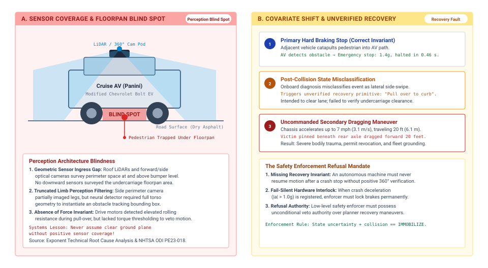

---
format:
  html:
    title: "Physical Data"
---

# Physical Data {#sec-data}

::: {layout-narrow}
::: {.column-margin}

\chapterminitoc

:::

::: {.content-visible when-format="pdf"}
\noindent
{fig-alt="Isometric blueprint showing the physical data and ingestion pipeline: The system includes key components: a bilateral teleoperation leader arm for precise manipulation; a 6-axis operator load cell measuring force and providing control feedback; a calibrated stereo vision sensor head for depth perception; a micro-lidar rangefinder using laser pulses for accurate distance measurement; an optical calibration checkerboard ensuring sensor alignment precision; and a deterministic flash logger for reliable data storage under varying conditions."}
:::

::: {.content-visible unless-format="pdf"}
{fig-alt="Isometric blueprint showing the physical data and ingestion pipeline: bilateral teleoperation leader arm, 6-axis operator load cell, calibrated stereo vision sensor head, micro-lidar rangefinder, optical calibration checkerboard, and deterministic flash logger."}
:::

:::

## Purpose {.unnumbered .unlisted}

::: {.content-visible when-format="pdf"}
\begin{marginfigure}
\resizebox{0.92\linewidth}{!}{\mlphysicalstackfull{20}{20}{20}{20}{100}}
\caption{The five-level machine stack with the Physical World highlighted.}
\end{marginfigure}
:::

_What does the physical machine that collected a dataset leave permanently stamped into the policy that trains on it?_

A robot trajectory reflects the physical machine that produced it. Joint geometry, gearbox backlash, and contact friction shape every motion, while sensor timing decides which observation accompanies each command. Crucially, raw actions change between proposal and execution—first mapped into discrete setpoints, then admitted, rate-limited, or clamped by the real-time permission path beneath the proposal boundary. A policy trained on those records inevitably learns these collection conditions alongside the nominal task. Successful demonstrations also omit the recovery behavior needed once an error diverts the machine from its path, leaving the policy unprepared for the failure states its own mistakes produce.

Every physical demonstration consumes finite actuator life, mechanical wear, and operational time on real hardware. Because identical commands yield divergent dynamics across different physical plants, embodied datasets transfer poorly without explicit calibration. High-capacity models cannot overcome systematic recording gaps through volume alone; an autonomous policy requires data that exposes the boundary between nominal performance and unmodeled disturbance. A physical dataset is therefore evidence about one specific plant's interaction across the causal boundary. It can be trusted only when its provenance captures what was requested, what was admitted, what the body executed, and which operating envelopes were never explored.



::: {.callout-learning-objectives}

- Estimate usable demonstration yield from collection time and reset overhead, and budget the mechanical wear a campaign consumes
- Analyze how the collecting policy limits dataset coverage and downstream recovery behavior
- Separate failed autonomous actions from human recovery trajectories in timestamped intervention records
- Evaluate whether a dataset's mechanical and sensing assumptions transfer to another machine
- Design a provenance record linking each observation to its requested, mapped, enforced, and measured actions and to the collecting plant
- Assess whether a dataset supports a claimed operating domain by joining its occupancy against a scenario ledger

:::

## Endogenous Experience {#sec-data-endogenous-experience}

A policy trained on the retained demonstrations of a door-opening campaign, clean teleoperated openings of the warehouse mobile manipulator's spring-latched cage door, can still fail at the latch on its first autonomous attempt. One possible cause is the shift the machine's own actions create.[^fn-data-causal-loop] In a fixed offline vision dataset, the model's prediction does not change the next stored example. Here, an executed action changes the body's trajectory, camera pose, and contacts, thereby changing later observations ($s_{t+1} \sim P(s \mid s_t, a_t)$).

[^fn-data-causal-loop]: **Causal Boundary**\index{Causal boundary!thermodynamic constraint}: The causal boundary between computation and physics is established in @sec-boundary-causal-boundary. Because state evolution depends on motor actuation, policy actions perturb the distribution of future observations, which breaks the independent and identically distributed (i.i.d.) assumption of disembodied machine learning.

::: {#dfn-data-endogenous-covariate-shift .callout-definition title="Endogenous covariate shift"}

***Endogenous covariate shift***\index{Endogenous covariate shift!definition}\index{Covariate drift!physical AI} is the closed-loop distribution discrepancy wherein an embodied agent's executed actions alter its subsequent physical states and sensory observations ($s_{t+1} \sim P(s \mid s_t, a_t)$), driving the system into state-space regimes unsupported by its training demonstrations.

1.  **Significance**: Explains how offline behavioral cloning can fail during closed-loop physical execution: a perturbation may drive the system into states where the policy lacks training support.
2.  **Distinction**: Unlike exogenous dataset shift caused by changing ambient lighting or seasonal weather, endogenous shift is actively generated by the agent's own closed-loop actions altering its subsequent observation distribution.
3.  **Common pitfall**: Attempting to fix closed-loop policy failure by collecting more nominal expert demonstrations, which only increases data density along the success manifold without providing the corrective recovery data needed to escape boundary excursions.

:::

This shift is the collection-side face of principle \ref{pri-vol4-endogenous-drift}. It makes an archive of flawless executions without recovery trajectories a liability, because the policy's first mistake moves the robot outside the demonstrated states. Let $\pi$ be the learned policy, $\pi^*$ the expert, $J$ expected cumulative task cost over $T$ steps, and $\epsilon$ the probability of disagreement on expert-visited states under 0–1 action loss. If per-step task cost lies in $[0,1]$, behavioral cloning admits the worst-case bound (@eq-data-quadratic-drift):[^fn-ai-covariate-shift]
$$J(\pi)-J(\pi^*) \leq T^2\epsilon.$$ {#eq-data-quadratic-drift}

[^fn-ai-covariate-shift]: **Behavioral Cloning Bound**\index{Covariate shift!endogenous feedback}\index{Behavioral cloning!quadratic error compounding}: The bound derived by @ross2011reduction is a worst case on expected cumulative cost, not a prediction of tracking error; actual drift depends on the plant, task, policy, and safeguards. @sec-appendix-ml-compounding derives the bound and states its loss and bounded-cost assumptions.

Gathering physical experience is also expensive. Every recorded second consumes actuator fatigue life, heats motor windings, cycles gearbox teeth, and drains the battery.[^fn-data-hardware-wear] Operator rest, calibration, scene resets, and failed or rejected attempts leave less than a quarter of scheduled cell time as validated demonstration data (@sec-data-teleop-costs). Physical demonstration data is therefore scarce, and it misleads training if logged naively.

[^fn-data-hardware-wear]: **Hardware Fatigue Life**\index{Hardware wear!actuator thermal duty cycle}: Actuator thermal limits and gearbox wear, detailed in @sec-body-actuator-limits and @sec-body-thermal-duty-cycles, change joint friction over a campaign, so a pipeline that assumes stationary plant dynamics meets drift as the collection machine ages.

::: {.column-margin .margin-pointer}
↰ **Prerequisite:** Actuator thermal dissipation ($dT/dt$) and winding damage limits are derived in @sec-body-thermal-duty-cycles.
:::

A physical command also changes meaning on its way to the actuators. In a machine divided by the proposal boundary,[^fn-data-proposal-permission] the operator's or policy's request is mapped into a setpoint, admitted or modified by the permission path, and answered by the plant with a measured response. Logging only the request trains the policy on demands the plant could never execute, and logging only the response teaches it structural deflection and gear backlash as though they were deliberate human skill.

[^fn-data-proposal-permission]: **Proposal Boundary**\index{Proposal boundary!demonstration data}: The proposal boundary, defined in @sec-boundary-machine-model, separates learned proposals from the permission path that alone may admit them to the actuators (@sec-enforcement). Logging the action on both sides of it keeps permission-path interventions out of the demonstrator's labels.

A collection campaign therefore makes two decisions before it records anything: which source will choose the actions, and which of those four forms of each action the dataset will keep as its label.

## Where Physical Data Comes From {#sec-data-collection-sources}

A physical dataset is not found or scraped. Every transition in the archive required moving mass against friction on a real machine. The difficulty of learning from such records was visible in Dean Pomerleau's ALVINN (Autonomous Land Vehicle in a Neural Network) [@pomerleau1989alvinn], which learned to steer from camera images of human driving. Because the human drivers rarely erred, the dataset held no recoveries from the lane edge, and small execution errors compounded in closed loop.

Physical data sources separate according to who chooses the action:

1. In **kinesthetic teaching**, a colocated demonstrator physically grasps and moves the unpowered or gravity-compensated joints of the mechanism.
2. In **teleoperation**, a remote operator guides an input device such as a leader arm, a multi-axis space mouse, or a tracked hand controller, transmitting commands across a software interface to the follower robot.[^fn-hist-goertz-teleop]
3. In **scripted collection**, an engineer executes a deterministic control routine, such as a state machine tracking interpolated splines or force-thresholded primitives.
4. In **exploratory collection**, an active policy selects actions to optimize an information-theoretic objective, sample state space, or maximize a reward signal.
5. In **autonomous logging during deployment**, the production policy commands the actuators as it performs work in a factory or warehouse, storing incoming sensor streams in situ.

[^fn-hist-goertz-teleop]: **Bilateral Teleoperation Lineage**\index{Raymond Goertz!bilateral telemanipulation}: Raymond Goertz built the first bilateral master-slave telemanipulators at Argonne National Laboratory in the late 1940s and 1950s for handling radioactive materials. His linkages reflected force across a physical barrier, because operators without kinesthetic resistance jammed the remote mechanism.

Because the source decides how the machine approaches the world, these sources occupy disjoint state-action regions even on the same task. Consider releasing the cage-door latch. A colocated demonstrator guiding the arm feels the latch bind and corrects at the wrist. A teleoperator watching video has no such feel and pecks at the strike plate in short moves and pauses. A scripted controller approaches along one programmed path at constant speed, producing the same force spike against the plate on every attempt. A partially trained policy wanders, binding the latch at oblique angles until the contact tripwire ends the attempt. These logs are not noisy samples of one trajectory. They are outputs of distinct dynamical systems with different bandwidths, delays, and compliances.

::: {.column-margin .margin-pointer}
⇄ **Contrast:** The display and operator-response delay that paces a teleoperator's step-and-wait motion (@sec-data-teleop-costs) contrasts with the $1\text{ ms}$ permission tick on which each command is checked (@sec-nervous-cadences).
:::

Treating each recorded control step as an independent experience is a common error. A logger running at a high control rate produces enormous step counts, but adjacent steps are nearly identical, since two frames a few tens of milliseconds apart differ only by sub-millimeter displacements and sensor noise. Coverage scales with the number of independent episodes and distinct physical configurations, not with the sampling clock, so a modest archive spread across hundreds of workpiece positions and lighting conditions supports far more than a recording ten times longer at one bench location.

Simulation avoids the wear bill and is treated in @sec-training. When synthetic trajectories are mixed with physical logs, each record must carry its source. A model trained on an undifferentiated mixture inherits the physics engine's contact errors where synthetic data dominates and the hardware's backlash and noise where physical data dominates, and no one can later tell which caused an on-robot failure. A record that names its source has settled the first of the campaign's two decisions, and it still has to say which form of each action it kept.

## Which Action Becomes the Label {#sec-data-action-label}

By the time the gripper meets the strike plate on the cage-door latch, the operator's hand motion has become four different signals, and the one the dataset keeps as its label decides which the learned model reproduces. The machine splits its control path across two processors (@fig-05-action-taps), so the label can be tapped in two computational domains:

- The unprivileged **application processor** captures camera streams, runs teleoperation input mapping or the policy's forward pass, and maps coordinates.
- On the permission side of the proposal boundary (@sec-boundary-machine-model), the safety microcontroller (MCU) runs at $1\text{ kHz}$ on bare metal, executing impedance control, safety barrier functions, velocity clamps, and current limits.[^fn-hw-encoder-capture]

[^fn-hw-encoder-capture]: **Hardware Timer Interrupt**\index{Hardware timer interrupt!DMA latching}: On real-time MCUs, encoder counts and current-shunt readings are latched by hardware timers and Direct Memory Access (DMA), which holds sampling jitter to microseconds and keeps timestamp jitter out of numerical differentiation for velocity and acceleration.

::: {#fig-05-action-taps fig-env="figure" fig-pos="t" fig-cap="**Four-stream action tap tuple**: Four places a command can be logged, from raw policy intent on the application processor through to measured plant response. Which tap a dataset records decides what the model learns to imitate. Source: architectural design adapted from @zhao2023learning and @wu2023gello." fig-alt="The Four-Stream Action Tap Tuple across the Application Processor and MCU Boundary. On a heterogeneous edge architecture, data logging captures four distinct physical semantics: (1) areq (raw operator or policy intent on the Linux application processor prior to software checks), (2) acmd (kinematically retargeted setpoint), (3) aenf (safety-governed command post-CBF barrier enforcement and motor torque clamping on the MCU), and (4) ameas (measured motion derived from joint encoders over a stated response interval, with motor current logged separately). Logging only areq trains the model on commands the actuators may never have executed, while logging only ameas can misattribute mechanical compliance, link deflection, and backlash to demonstrated human skill. Source: Architectural design adapted from @zhao2023learning and @wu2023gello."}
{width="100%"}
:::

The four taps along this control path capture fundamentally different physical semantics:

- The **requested action** ($a_{\text{req}}$): the raw operator input or policy proposal, tagged with its representation, units, frame, and issue time.
- The **mapped command** ($a_{\text{cmd}}$): the retargeted Cartesian or joint setpoint, tagged with the new representation, units, frame, and mapping time.
- The **enforced command** ($a_{\text{enf}}$): the same typed setpoint after the independent safety path has admitted, modified, or rejected the proposal.
- The **measured response** ($a_{\text{meas}}$): the corresponding measured position or velocity over a stated sampling interval; encoder readings and motor current are separate sensor channels, not interchangeable action coordinates.

Only the full tuple, logged across the boundary between application processor and MCU, separates what the operator asked for from what the permission path allowed.

::: {#dfn-data-four-stream-action-tap-tuple .callout-definition title="Four-stream action tap"}

***Four-stream action tap***\index{Four-stream action tap!definition}\index{Action tap!definition} $(a_{\text{req}}, a_{\text{cmd}}, a_{\text{enf}}, a_{\text{meas}})$ is the time-synchronized multi-tier telemetry record that captures an action signal across its four causal transformation stages: unprivileged operator or policy intent ($a_{\text{req}}$), kinematically retargeted setpoint ($a_{\text{cmd}}$), safety-governed command ($a_{\text{enf}}$), and physical plant response ($a_{\text{meas}}$).

1.  **Significance**: Training imitation learning policies on raw requested actions ($a_{\text{req}}$) injects dynamically infeasible commands that trigger safety trips in deployment. Conversely, training on measured responses ($a_{\text{meas}}$) causes the model to imitate mechanical compliance, backlash, and external disturbances rather than intentional control. Logging all four streams disambiguates control intent from permission-path intervention.
2.  **Distinction**: Unlike classical robot telemetry logs that capture only final motor encoder states or raw teleoperation joystick inputs, the four-stream tap preserves the exact causal filtering stages applied by intermediate software and safety hardware.
3.  **Common pitfall**: Logging streams without timestamps synchronized in hardware over the IEEE 1588 Precision Time Protocol (PTP), written $t_{\text{PTP}}$. Even a few milliseconds of clock skew between the application processor and the MCU corrupts the temporal alignment between visual observations and corresponding torque actions.

:::

Recording the right tap does not settle when each recorded value was true. Cameras integrate photons over an exposure window of tens of milliseconds before readout and transfer, force sensors sample at around a hundred hertz, joint encoders and current loops run at the MCU's kilohertz tick, and the action loop dispatches at tens of hertz. A data loader that latches the latest available sample pairs each action with a camera frame whose exposure was centered $25\text{--}40\text{ ms}$ before the frame reached host memory, and the policy learns to map past states to present actions, with the phase lag baked into its weights. Logging engines prevent this in three steps:

1. **Exposure midpoint timestamp:** Each frame is stamped at its exposure midpoint (@sec-body-measurement-freshness), latched on hardware triggers synchronized over PTP or on external TTL sync lines, so that every camera's observation carries the time at which it was true.
2. **Kinematic interpolation:** The joint configuration at the camera's optical timestamp is interpolated between the two nearest MCU encoder records (the spline form is in @sec-appendix-control-splines).
3. **Alignment before serialization:** Containers such as MCAP, LeRobot [@cadene2024lerobot], and RLDS [@open_x_embodiment_collaboration2024open] store multi-rate streams with whatever timestamps they are given, so the midpoint alignment must happen before the state-action pairs are written.

::: {.column-margin .margin-pointer}
↰ **Prerequisite:** Sub-microsecond PTP clock synchronization across distributed bus controllers is established in @sec-nervous-deterministic-fieldbuses.
:::

A tap and a timestamp are only as good as the loop that produced them. In teleoperation, still the standard way to gather high-quality physical trajectories, that loop runs through a human, and the interface between human and machine shapes the recorded dynamics long before the data reaches a model.

## Teleoperation Demonstration Costs {#sec-data-teleop-costs}

Teleoperation closes a feedback loop through the operator, the input device, the bus, the motor controller, and the environment (@fig-05-teleop-rig). A camera captures the workspace and streams it to a display; the operator sees the scene, decides on a correction, and moves an input device; the workstation maps that motion into a setpoint and sends it to the motor drives; the actuators accelerate the arm against inertia, friction, and contact, and the changed scene reaches the camera on the next cycle.

::: {#fig-05-teleop-rig fig-env="figure" fig-pos="t" fig-cap="**Kinematically isomorphic teleoperation rigs**: Demonstration capture on three leader-follower rigs whose leader devices mirror follower kinematics [@wu2023gello]. Because the leader shares the follower's joint structure, the interface needs no inverse kinematics and inherits none of its singularities (mathematical dead-zones where joints align and lose mobility), preserving the operator's direct joint-level coordination. The operator's continuous-correction latency still enters the recording as phase lag, so the demonstration carries the operator's delay as if it were policy." fig-alt="Kinematically Isomorphic Leader-Follower Teleoperation Architecture across Heterogeneous Manipulators. Demonstration acquisition on physical robot platforms using low-cost, kinematically isomorphic leader controllers (canonical architecture [@wu2023gello]). (A) Bimanual teleoperation setup with twin 6-DoF leader arms mapped directly to dual heavy-payload follower manipulators during a compliant liquid-pouring task. (B) Single-arm leader-follower configuration controlling a torque-controlled manipulator with an overhead task camera. (C) Precision pick-and-place manipulation with passive gravity compensation and joint-angle direct drive. Because the leader device mirrors follower kinematics without requiring numerical inverse kinematics (IK), the interface eliminates IK singularities while preserving the operator's direct joint-level coordination. However, the operator's continuous-correction latency and communication delays still introduce phase lag into the recorded (st, at) demonstration tuples. Source: Adapted from Wu et al. [@wu2023gello], CC BY 4.0."}
{width="95%"}
:::

Each stage in this loop introduces latency that affects the timing of the correction. In a reference setup with a high-speed camera and a wired local network (illustrative; see the Reader Guide), display processing requires $t_{\text{disp}} = 50\text{ ms}$ across exposure, H.264 decoding, and monitor refresh. Human visual perception and neuromuscular transmission introduce an operator response latency of $t_{\text{hum}} = 200\text{ ms}$ for continuous path corrections. Command quantization, packetization, and bus transport to the robot controller add $t_{\text{cmd}} = 10\text{ ms}$. Actuator torque ramp-up and structural inertia impose a mechanical response latency of $t_{\text{mech}} = 80\text{ ms}$ before the robot achieves the commanded acceleration. The **teleoperation round-trip latency** $t_{\text{loop}}$, the time from a contact event to the corrective actuator response, is their sum:
$$t_{\text{loop}} = t_{\text{disp}} + t_{\text{hum}} + t_{\text{cmd}} + t_{\text{mech}} = 50\text{ ms} + 200\text{ ms} + 10\text{ ms} + 80\text{ ms} = 340\text{ ms}.$$

When a contact misalignment occurs at time $t$, the operator sees it at $t + 50\text{ ms}$, commands a correction at $t + 250\text{ ms}$, and the arm pushes back at $t + 340\text{ ms}$, while the arm keeps moving under momentum and contact forces. A logger that pairs the observation $s_t$ with the command issued at the same instant pairs a state with an action chosen for a state $250\text{ ms}$ older. The policy learns that delay as deliberate behavior and over-corrects or oscillates when it runs autonomously at the control rate. The round-trip latency is therefore a property of the dataset, not only of the rig, because it enters every demonstration as phase lag dominated by the operator's own reaction time.

When contact force is reflected back to the operator's hand in **bilateral teleoperation**, the same delay becomes a stability hazard. Anderson and Spong showed that transmission delay turns a passive link into an energy source [@anderson1989bilateral]. The delayed reaction force arrives out of phase with the operator's hand, pushing it in the direction of motion and driving leader and follower into limit cycles against rigid contact (@sec-appendix-control-passivity). Time-domain passivity controllers and wave-variable transformations bleed that energy off with virtual damping, and the damping low-pass filters the operator's motion, attenuating the very contact cues the demonstration was meant to capture.

The interface thus filters what a demonstration can express. A force-reflecting leader lets the operator feel binding; a visual-only rate controller encourages short moves and pauses while the operator checks the video. A backdriven joint-space leader such as ALOHA, recorded at $50\text{ Hz}$ [@zhao2023learning], sits between them, conveying the leader's mechanical feel without follower force. With any of these interfaces, operators slow down near contact, because a high-gain loop closed around $t_{\text{loop}}$ would lose its phase margin. @Tbl-05-teleop-taxonomy lists these behaviors as artifacts to check on a given rig rather than as universal ranges.

| Interface and feedback                                        | Command mapping                                                                      | Contact information available to operator                                  | Possible collection artifact to check                                             |
|:--------------------------------------------------------------|:-------------------------------------------------------------------------------------|:---------------------------------------------------------------------------|:----------------------------------------------------------------------------------|
| **Force-reflecting bilateral leader**                         | Leader motion mapped to follower joints; measured follower force reflected to leader | Vision and physical contact force, subject to link delay and fidelity      | Contact corrections and oscillation when delayed force reflection loses passivity |
| **Backdriven joint-space leader (ALOHA)** [@zhao2023learning] | Leader joint positions copied to follower; demonstration recorded at $50\text{ Hz}$  | Vision and leader mechanism feel, without active follower force reflection | Joint-space posture preferences and unobserved follower contact forces            |
| **Rate-controlled 3D mouse**                                  | Device deflection mapped to Cartesian velocity, then inverse kinematics              | Primarily visual feedback unless a separate haptic channel exists          | Step-and-wait motion and zero-velocity pauses under delayed feedback              |
| **Tracked spatial controller**                                | Tracked hand pose mapped to tool pose with clutching and scale                       | Visual feedback; optional vibration is not directional force reflection    | Clutch discontinuities and pose-tracking gaps                                     |
| **Instrumented exoskeleton**                                  | Wearable joint motion retargeted to robot joints                                     | Depends on whether active force feedback is fitted                         | Biomechanical calibration and retargeting bias                                    |

: **Teleoperation interface mechanisms for physical demonstration collection**: Mapping and feedback determine what the operator can demonstrate, and the last column names the artifact to check on a given rig, task, and operator. {#tbl-05-teleop-taxonomy tbl-colwidths="[22,28,24,26]"}

Whatever interface the operator holds, the rig must record every stream the session produces, including all four action taps of \ref{dfn-data-four-stream-action-tap-tuple}, and that recording has a bandwidth and storage budget of its own.

```{python}
#| label: calc-data-multi-camera-ingestion
#| echo: false
# ┌─────────────────────────────────────────────────────────────────────────────
# │ MULTI-CAMERA TELEOPERATION INGESTION BUDGET (LEGO)
# ├─────────────────────────────────────────────────────────────────────────────
# │ Context: @nbk-data-ingestion-bandwidth-storage-budgets-multi-camera
# │ Goal:    Size the raw ingestion rate and storage of one teleoperated
# │          door-opening session on the warehouse mobile manipulator.
# │ Show:    Per-camera raw rates, the 9-axis kinematic stream, the total, the
# │          hourly and per-shift storage, and the 8x-compressed rate against
# │          SATA and Gen4 NVMe write bandwidth.
# │ How:     Camera geometry and frame rates from the registry (navigation
# │          IMX477, wrist IMX296, two external RealSense D435i); axis count and
# │          logging rate from RM; calc_teleop_ingestion_budget per camera group.
# └─────────────────────────────────────────────────────────────────────────────
from mlsysim import *
from mlsysim.core.units import *
from mlsysim.fmt import fmt_bandwidth, fmt_memory, fmt_frequency, fmt_int, fmt_multiple, fmt_percent, check

RM = Embodied.MobileManipulator.WarehouseMobileManipulator
AISLE = Embodied.Scenario.WarehouseAisle

class MultiCameraIngestionBudget:
    """Raw telemetry bandwidth and storage for the machine's teleoperation sessions."""

    # ┌── 1. LOAD (Constants & Parameters) ─────────────────────────────────
    cam_nav = RM.nav_camera  # category: datasheet
    cam_wrist = RM.wrist_camera  # category: datasheet
    cam_ext = Sensors.Camera.Intel_RealSense_D435i  # category: datasheet
    n_ext = 2  # scenario assumption; category: chosen
    bytes_per_px_rgb = 3  # 24-bit RGB after debayering; category: chosen
    bytes_per_px_depth = 2  # uint16 depth aligned to the color frame; category: chosen

    n_axes = RM.servo_axes  # 2 base + 7 arm; category: datasheet
    f_log = RM.permission_rate  # kinematics logged every permission tick; category: chosen
    values_per_axis = 6  # position, velocity (a_meas), torque, a_req, a_cmd, a_enf; category: chosen
    bytes_per_value = 4  # float32; category: chosen
    bytes_timestamp = 8  # one 64-bit timestamp per step; category: chosen

    shift_hours = 8.0  # scenario assumption; category: chosen
    compression_ratio = 8.0  # intra-frame video codec; category: illustrative
    bw_sata = Systems.Storage.SataSsd.bandwidth  # category: datasheet
    bw_nvme = Hardware.Tech.Storage.NvmeGen4.bandwidth  # category: datasheet

    # ┌── 2. EXECUTE (Compute) ─────────────────────────────────────────────
    bytes_per_step = n_axes * values_per_axis * bytes_per_value + bytes_timestamp
    bw_kin = (bytes_per_step * byte * f_log).to(MB / second)

    res_nav = calc_teleop_ingestion_budget(
        num_cameras=1,
        rgb_width=cam_nav.resolution_width,
        rgb_height=cam_nav.resolution_height,
        rgb_fps=cam_nav.frame_rate.to(hertz).magnitude,
        rgb_bytes_per_pixel=bytes_per_px_rgb,
        kinematics_bytes_per_sec=bw_kin,
    )
    res_wrist = calc_teleop_ingestion_budget(
        num_cameras=1,
        rgb_width=cam_wrist.resolution_width,
        rgb_height=cam_wrist.resolution_height,
        rgb_fps=cam_wrist.frame_rate.to(hertz).magnitude,
        rgb_bytes_per_pixel=bytes_per_px_rgb,
    )
    res_ext = calc_teleop_ingestion_budget(
        num_cameras=n_ext,
        rgb_width=cam_ext.resolution_width,
        rgb_height=cam_ext.resolution_height,
        rgb_fps=cam_ext.frame_rate.to(hertz).magnitude,
        rgb_bytes_per_pixel=bytes_per_px_rgb,
        depth_width=cam_ext.resolution_width,
        depth_height=cam_ext.resolution_height,
        depth_fps=cam_ext.frame_rate.to(hertz).magnitude,
        depth_bytes_per_pixel=bytes_per_px_depth,
    )

    bw_nav = res_nav["bw_rgb"]
    bw_wrist = res_wrist["bw_rgb"]
    bw_ext_rgb = res_ext["bw_rgb"]
    bw_ext_depth = res_ext["bw_depth"]
    bw_ext = res_ext["bw_vision"]
    bw_total = (res_nav["bw_total"] + res_wrist["bw_total"] + res_ext["bw_total"]).to(MB / second)
    storage_hour = (res_nav["storage_per_hour"] + res_wrist["storage_per_hour"] + res_ext["storage_per_hour"]).to(TB)
    storage_shift = (storage_hour * shift_hours).to(TB)

    nav_over_sata = (bw_nav / bw_sata).to("").magnitude
    kin_share = (bw_kin / bw_total).to("").magnitude
    bw_compressed = (bw_total / compression_ratio).to(MB / second)
    storage_hour_compressed = (storage_hour / compression_ratio).to(TB)

    # ┌── 3. GUARD (Assertions) ────────────────────────────────────────────
    check(n_axes == 9, "The machine logs 9 axes (2 base, 7 arm)")
    check(bytes_per_step == 224, "Unexpected kinematic record size")
    check(abs(bw_kin.to(MB / second).magnitude - 0.224) < 1e-9, "Unexpected kinematic rate")
    check(abs(bw_nav.to(MB / second).magnitude - 2219.44) < 0.01, "Unexpected navigation-camera rate")
    check(abs(bw_wrist.to(MB / second).magnitude - 279.94) < 0.01, "Unexpected wrist-camera rate")
    check(abs(bw_ext.to(MB / second).magnitude - 622.08) < 0.01, "Unexpected external-camera rate")
    check(abs(bw_total.to(MB / second).magnitude - 3121.68) < 0.01, "Unexpected total ingestion rate")
    check(abs(storage_hour.to(TB).magnitude - 11.24) < 0.005, "Unexpected hourly storage")
    check(abs(storage_shift.to(TB).magnitude - 89.91) < 0.01, "Unexpected shift storage")
    check(bw_total < bw_nvme, "Raw ingestion must fit Gen4 NVMe write bandwidth")
    check(3.9 < nav_over_sata < 4.1, "Navigation camera alone should be about four times SATA")
    check(kin_share < 1e-4, "Kinematic stream should be under 0.01 percent of the bytes")
    check(abs(bw_compressed.to(MB / second).magnitude - 390.2) < 0.1, "Unexpected compressed rate")

    # ┌── 4. OUTPUT (Format & Export) ────────────────────────────────────────
    nav_w_str = fmt_int(cam_nav.resolution_width, commas=False)
    nav_h_str = fmt_int(cam_nav.resolution_height, commas=False)
    nav_fps_str = fmt_frequency(cam_nav.frame_rate, precision=0)
    wrist_w_str = fmt_int(cam_wrist.resolution_width, commas=False)
    wrist_h_str = fmt_int(cam_wrist.resolution_height, commas=False)
    wrist_fps_str = fmt_frequency(cam_wrist.frame_rate, precision=0)
    ext_w_str = fmt_int(cam_ext.resolution_width, commas=False)
    ext_h_str = fmt_int(cam_ext.resolution_height, commas=False)
    ext_fps_str = fmt_frequency(cam_ext.frame_rate, precision=0)
    n_ext_str = fmt_int(n_ext)
    n_axes_str = fmt_int(n_axes)
    f_log_str = fmt_frequency(f_log, unit=ureg.kilohertz, precision=0)
    bytes_per_step_str = fmt_int(bytes_per_step)

    bw_nav_str = fmt_bandwidth(bw_nav, unit=MB / second, precision=2)
    bw_wrist_str = fmt_bandwidth(bw_wrist, unit=MB / second, precision=2)
    bw_ext_rgb_str = fmt_bandwidth(bw_ext_rgb, unit=MB / second, precision=2)
    bw_ext_depth_str = fmt_bandwidth(bw_ext_depth, unit=MB / second, precision=2)
    bw_ext_str = fmt_bandwidth(bw_ext, unit=MB / second, precision=2)
    bw_kin_str = fmt_bandwidth(bw_kin, unit=MB / second, precision=2)
    bw_total_str = fmt_bandwidth(bw_total, unit=MB / second, precision=2)
    bw_total_gb_str = fmt_bandwidth(bw_total, unit=GB / second, precision=2)
    storage_hour_str = fmt_memory(storage_hour, unit=TB, precision=2)
    storage_shift_str = fmt_memory(storage_shift, unit=TB, precision=1)
    shift_hours_str = fmt_int(int(shift_hours))

    bw_sata_str = fmt_bandwidth(bw_sata, unit=MB / second, precision=0)
    bw_nvme_str = fmt_bandwidth(bw_nvme, unit=GB / second, precision=0)
    nav_over_sata_mult_str = fmt_multiple(nav_over_sata, precision=1)
    kin_share_str = fmt_percent(kin_share, precision=3)
    compression_mult_str = fmt_multiple(compression_ratio, precision=0)
    bw_compressed_str = fmt_bandwidth(bw_compressed, unit=MB / second, precision=1)
    storage_hour_compressed_str = fmt_memory(storage_hour_compressed, unit=TB, precision=2)
```

::: {#nbk-data-ingestion-bandwidth-storage-budgets-multi-camera .callout-notebook title="Multi-camera ingestion and storage budgets"}
**Question**: What sustained ingestion rate and storage does one teleoperated door-opening session on the warehouse mobile manipulator generate when every camera and every axis is logged raw?

**Parameters** (camera geometry is datasheet; logging formats are chosen):

- **Navigation camera:** `{python} MultiCameraIngestionBudget.nav_w_str` by `{python} MultiCameraIngestionBudget.nav_h_str` px at `{python} MultiCameraIngestionBudget.nav_fps_str`, logged as 24-bit RGB ($3\text{ bytes/px}$).
- **Wrist camera:** `{python} MultiCameraIngestionBudget.wrist_w_str` by `{python} MultiCameraIngestionBudget.wrist_h_str` px at `{python} MultiCameraIngestionBudget.wrist_fps_str`, logged the same way.
- **External cameras:** `{python} MultiCameraIngestionBudget.n_ext_str` RGB-D cameras viewing the door, color at `{python} MultiCameraIngestionBudget.ext_w_str` by `{python} MultiCameraIngestionBudget.ext_h_str` px and `{python} MultiCameraIngestionBudget.ext_fps_str`, with depth aligned to the color frame as raw `uint16` millimeters ($2\text{ bytes/px}$).
- **Kinematics:** `{python} MultiCameraIngestionBudget.n_axes_str` axes (two base wheels, seven arm joints) logged at `{python} MultiCameraIngestionBudget.f_log_str`. Each step stores, for every axis, position and velocity (the measured response $a_{\text{meas}}$), measured torque, and the requested, mapped, and enforced commands as 32-bit values, plus one 64-bit timestamp, for `{python} MultiCameraIngestionBudget.bytes_per_step_str` bytes per step.

**Calculation**:

1. **Raw video bandwidth:** the navigation camera streams `{python} MultiCameraIngestionBudget.bw_nav_str` and the wrist camera `{python} MultiCameraIngestionBudget.bw_wrist_str`. The external pair adds `{python} MultiCameraIngestionBudget.bw_ext_rgb_str` of color and `{python} MultiCameraIngestionBudget.bw_ext_depth_str` of depth, `{python} MultiCameraIngestionBudget.bw_ext_str` in all.
2. **Kinematic bandwidth:** `{python} MultiCameraIngestionBudget.bytes_per_step_str` bytes per step at `{python} MultiCameraIngestionBudget.f_log_str` is `{python} MultiCameraIngestionBudget.bw_kin_str`.
3. **Total sustained ingestion rate:** the streams sum to `{python} MultiCameraIngestionBudget.bw_total_str`, about `{python} MultiCameraIngestionBudget.bw_total_gb_str`.
4. **Hourly and shift storage consumption:** uncompressed telemetry accumulates at `{python} MultiCameraIngestionBudget.storage_hour_str` per hour, or `{python} MultiCameraIngestionBudget.storage_shift_str` across a `{python} MultiCameraIngestionBudget.shift_hours_str`-hour collection shift on one machine.

**Systems insight**:
The navigation camera alone writes `{python} MultiCameraIngestionBudget.nav_over_sata_mult_str` what a SATA SSD sustains (`{python} MultiCameraIngestionBudget.bw_sata_str`). The full session fits within a Gen4 NVMe drive's `{python} MultiCameraIngestionBudget.bw_nvme_str`, but only by consuming storage at `{python} MultiCameraIngestionBudget.storage_hour_str` per hour. Intra-frame video compression at an illustrative `{python} MultiCameraIngestionBudget.compression_mult_str` brings the rate to about `{python} MultiCameraIngestionBudget.bw_compressed_str` (`{python} MultiCameraIngestionBudget.storage_hour_compressed_str` per hour) at the cost of encoder latency and artifacts in the frames the policy will train on. The kinematic stream, which carries all four action taps, is `{python} MultiCameraIngestionBudget.kin_share_str` percent of the bytes. The record that preserves the causal chain is the cheapest stream to log, so a logger that drops data under buffer pressure must never drop it first.
:::

```{python}
#| label: calc-data-demonstration-yield-fatigue
#| echo: false
# ┌─────────────────────────────────────────────────────────────────────────────
# │ DEMONSTRATION YIELD & ACTUATOR FATIGUE SIZING (LEGO)
# ├─────────────────────────────────────────────────────────────────────────────
# │ Context: @sec-data-teleop-costs, @tbl-05-collection-budget
# │ Goal:    Estimate retained door-opening demonstrations and wrist gear/cable
# │          wear per campaign on the warehouse mobile manipulator.
# │ Show:    Expected retained episodes per session and campaign wear budget;
# │          the latch tripwire that ends a failed attempt.
# │ How:     Floor active time / cycle time (one opening plus one re-latch),
# │          apply retention, then count cycles. Tripwire from AISLE.
# └─────────────────────────────────────────────────────────────────────────────
import math
from mlsysim import *
from mlsysim.core.units import *
from mlsysim.fmt import fmt_time, fmt_qty, fmt_int, check

RM = Embodied.MobileManipulator.WarehouseMobileManipulator
AISLE = Embodied.Scenario.WarehouseAisle

class DemonstrationYieldFatigue:
    """Facility operational yield and mechanical component wear budgeting."""

    # ┌── 1. LOAD (Constants & Parameters) ─────────────────────────────────
    f_trip = AISLE.f_latch_tripwire  # category: illustrative
    t_sched = 60.0 * minute  # declared session length; category: chosen
    t_motion = 35.0 * minute  # category: illustrative
    t_att = 25.0 * second  # category: illustrative
    t_rst = 15.0 * second  # category: illustrative
    t_cyc = t_att + t_rst  # category: derived

    failure_rate = 0.20  # category: illustrative
    qa_filter_rate = 0.15  # category: illustrative
    retention_rate = (1.0 - failure_rate) * (1.0 - qa_filter_rate)  # category: derived

    n_campaign_target = 5000  # benchmark target; category: chosen
    n_gear_reversals = 14  # category: illustrative
    n_cable_flex = 6 + 2  # opening flexes plus return stroke; category: illustrative
    l10_gear_life = 5_000_000  # rated stress cycles; category: illustrative
    l10_cable_life = 200_000  # rated bending cycles; category: illustrative

    # ┌── 2. EXECUTE (Compute) ─────────────────────────────────────────────
    n_raw_attempts = int(t_motion.to(second) // t_cyc.to(second))
    n_usable = n_raw_attempts * retention_rate
    t_idle = (t_motion - n_raw_attempts * t_cyc).to(second)  # active time too short for one more cycle
    t_yield = (n_usable * t_att).to(minute)
    yield_pct = (t_yield / t_sched).magnitude * 100.0

    n_total_attempts = int(math.ceil(n_campaign_target / retention_rate))
    t_sched_campaign = (n_total_attempts / n_raw_attempts) * (1.0 * hour)
    overhead_factor = t_sched_campaign.magnitude / ((n_campaign_target * t_att).to(hour).magnitude)

    gear_cycles = n_total_attempts * n_gear_reversals
    cable_cycles = n_total_attempts * n_cable_flex
    gear_fatigue_pct = (gear_cycles / l10_gear_life) * 100.0
    cable_fatigue_pct = (cable_cycles / l10_cable_life) * 100.0

    # ┌── 3. GUARD (Assertions) ────────────────────────────────────────────
    check(n_raw_attempts == 52, "Unexpected raw attempts count")
    check(abs(retention_rate - 0.68) < 1e-4, "Unexpected retention rate")
    check(abs(n_usable - 35.36) < 0.01, "Unexpected usable episode yield")
    check(abs(t_idle.magnitude - 20.0) < 1e-9, "Unexpected idle remainder of the active window")
    check(abs(t_yield.magnitude - 14.73) < 0.05, "Unexpected valid yield duration")
    check(abs(yield_pct - 24.55) < 0.1, "Unexpected yield percentage")
    check(n_total_attempts == 7353, "Unexpected total campaign attempts")
    check(abs(t_sched_campaign.magnitude - 141.4) < 0.5, "Unexpected campaign hours")
    check(abs(overhead_factor - 4.07) < 0.05, "Unexpected facility overhead ratio")
    check(gear_cycles == 102942, "Unexpected cumulative gear cycles")
    check(cable_cycles == 58824, "Unexpected cumulative cable bends")
    check(abs(f_trip.to(newton).magnitude - 15.0) < 1e-9, "Latch tripwire should be 15 N")
    check(n_campaign_target == 5000, "Campaign target should be 5,000 retained demonstrations")

    # ┌── 4. OUTPUT (Format & Export) ────────────────────────────────────────
    n_raw_str = fmt_int(n_raw_attempts)
    n_usable_str = fmt(n_usable, precision=2)
    retention_str = fmt(retention_rate, precision=2)
    n_target_str = fmt_int(n_campaign_target, commas=True)
    t_yield_str = fmt_time(t_yield, unit=minute, precision=2)
    t_idle_str = fmt_time(t_idle, unit=second, precision=0)
    yield_pct_str = fmt_percent(yield_pct / 100.0, precision=1)
    n_total_str = fmt_int(n_total_attempts, commas=True)
    t_sched_campaign_str = fmt_time(t_sched_campaign, unit=hour, precision=1)
    overhead_factor_mult_str = fmt_multiple(overhead_factor, precision=2)
    gear_cycles_str = fmt_int(gear_cycles, commas=True)
    cable_cycles_str = fmt_int(cable_cycles, commas=True)
    gear_fatigue_pct_str = fmt_percent(gear_fatigue_pct / 100.0, precision=1)
    cable_fatigue_pct_str = fmt_percent(cable_fatigue_pct / 100.0, precision=1)
    f_trip_str = fmt_qty(f_trip, newton, precision=0)
```

Storage bounds how much a session can record; yield bounds how much of it is worth training on. **Demonstration yield**\index{Teleoperation!demonstration yield} ($Y_{\text{usable}} = \lfloor T_{\text{motion}} / t_{\text{cyc}} \rfloor \cdot R$) is the number of retained trajectory records a scheduled session produces after startup, calibration, operator rest, resets, and quality filtering have taken their share. Consider one illustrative session of the latch campaign, declared to last $T_{\text{sched}} = 60.0\text{ min}$. Startup, calibration, and operator rest leave an active window of $T_{\text{motion}} = 35.0\text{ min}$. Each attempt is one teleoperated opening of $t_{\text{att}} = 25.0\text{ s}$, followed by a re-latch of the door by its fixture of $t_{\text{rst}} = 15.0\text{ s}$ ($t_{\text{cyc}} = 40.0\text{ s}$), so the session fits `{python} DemonstrationYieldFatigue.n_raw_str` attempts. In-trial failures (20 percent) and post-collection filtering (15 percent) give a retention rate $R = (1 - 0.20)(1 - 0.15) =$ `{python} DemonstrationYieldFatigue.retention_str`, and the session yields `{python} DemonstrationYieldFatigue.n_usable_str` retained episodes, `{python} DemonstrationYieldFatigue.t_yield_str` of validated data. That is a net session fraction, validated trajectory time over scheduled cell time, of `{python} DemonstrationYieldFatigue.yield_pct_str` percent. A target of `{python} DemonstrationYieldFatigue.n_target_str` retained demonstrations therefore costs `{python} DemonstrationYieldFatigue.n_total_str` attempts and `{python} DemonstrationYieldFatigue.t_sched_campaign_str` of scheduled cell time, `{python} DemonstrationYieldFatigue.overhead_factor_mult_str` the demonstration time the campaign keeps (@tbl-05-collection-budget). A campaign is budgeted in validated trajectory time, never in facility hours.

Wear accumulates per cycle, not per hour. In an illustrative wear model of the arm's wrist, the strain-wave gear is rated for $L_{\text{gear}} = 5{,}000{,}000$ stress cycles and the internal cable bundle for $L_{\text{cable}} = 200{,}000$ bending cycles. Finding the handle, releasing the latch, and swinging the door add about $n_{\text{gear}} = 14$ torque reversals and $n_{\text{cable}} = 6$ flex cycles per opening, and the return stroke during the re-latch adds two more flex cycles. Failed attempts wear the joint as much as retained ones, so the bill is paid on all `{python} DemonstrationYieldFatigue.n_total_str` attempts: `{python} DemonstrationYieldFatigue.gear_cycles_str` gear stress cycles, `{python} DemonstrationYieldFatigue.gear_fatigue_pct_str` percent of rated life, and `{python} DemonstrationYieldFatigue.cable_cycles_str` cable bends, `{python} DemonstrationYieldFatigue.cable_fatigue_pct_str` percent of rated life, for one campaign. The cable, not the gear, sets the replacement schedule. Three campaigns on one machine would consume most of the cable's rated life, and an intermittent conductor break corrupts the very sensor streams being recorded.

| Session Stage / Activity         | Allocated Duration ($\Delta t$)         | Wall-Clock Share (\%) | Physical Operation & Control State                                                                             | Hardware Stress & Wear Mechanism                                                                                                                                                  | Net Trajectory Output ($N_{\text{episodes}}$ / $T_{\text{yield}}$) |
|:---------------------------------|:----------------------------------------|:----------------------|:---------------------------------------------------------------------------------------------------------------|:----------------------------------------------------------------------------------------------------------------------------------------------------------------------------------|:-------------------------------------------------------------------|
| **Cell Startup & Bus Sync**      | $8.0\text{ min}$ ($480\text{ s}$)       | $13.3\%$              | Bus synchronization (EtherCAT/CANopen), safety watchdog verification, optical homing                           | Power-on electrical inrush; thermal warm-up in motor windings and sensor bridges                                                                                                  | $N = 0\text{ ep}$, $0.0\text{ min}$ yield                          |
| **Sensor Calibration & Nulling** | $7.0\text{ min}$ ($420\text{ s}$)       | $11.7\%$              | Camera intrinsic/extrinsic sweep, joint-torque bias nulling, encoder homing                                    | Static holding torque; sensor bridge thermal stabilization; zero dynamic gear wear                                                                                                | $N = 0\text{ ep}$, $0.0\text{ min}$ yield                          |
| **Operator Rest & Ergonomics**   | $10.0\text{ min}$ ($600\text{ s}$)      | $16.7\%$              | Mandatory operator breaks to mitigate visual fatigue, cognitive saturation, and tremor drift                   | Passive standby; electromagnetic brakes engaged or zero-velocity holding current                                                                                                  | $N = 0\text{ ep}$, $0.0\text{ min}$ yield                          |
| **Physical Scene Resets**        | $13.0\text{ min}$ ($780\text{ s}$)      | $21.7\%$              | Door closed and re-latched by its fixture, arm return stroke ($15.0\text{ s/attempt}$)                         | $52\text{ return strokes} \times 2\text{ bends} = 104\text{ cable flex cycles}$; zero contact payload                                                                             | $N = 0\text{ ep}$, $0.0\text{ min}$ yield                          |
| **Active Teleoperated Attempts** | $21.67\text{ min}$ ($1300\text{ s}$)    | $36.1\%$              | Real-time human teleoperation guiding handle approach, latch release, and door swing ($25.0\text{ s/attempt}$) | $52 \times 14 = 728\text{ torque reversals}$ on harmonic drive; $52 \times 6 = 312\text{ cable flex cycles}$; contact loads below `{python} DemonstrationYieldFatigue.f_trip_str` | $N = 52\text{ raw attempts}$, $21.67\text{ min}$ gross motion      |
| **In-Trial Failures (Labeled)**  | $-4.33\text{ min}$ ($-260\text{ s}$)    | $-7.2\%$              | Handle slip, latch bind, contact tripwire above `{python} DemonstrationYieldFatigue.f_trip_str` ($20\%$ loss)  | High-force contact transients; abrasive wear on gripper silicone pads                                                                                                             | $-10.4\text{ ep}$ from success yield; valid logs kept              |
| **Post-Collection QA Filtering** | $-2.60\text{ min}$ ($-156\text{ s}$)    | $-4.3\%$              | Offline filtering: link latency $>100\text{ ms}$, visual occlusion, operator hesitation ($15\%$ loss)          | Zero hardware wear (offline computational validation pass)                                                                                                                        | $-6.24\text{ ep}$ discarded                                        |
| **Net Validated Dataset Yield**  | **$14.73\text{ min}$** ($884\text{ s}$) | **$24.6\%$**          | High-quality synchronized multi-modal trajectories ($s_t, a_t$) admitted into training buffer                  | Consumes $2.1\%$ of wrist gear life and $29.4\%$ of internal flex cable life per $5000\text{ episode}$ campaign                                                                   | **$N_{\text{usable}} = 35.36$** episodes                           |

: **Physical demonstration collection budget across a scheduled 60-minute session**: Facility clock time, yield losses, and component wear by stage for one session of the latch campaign ($N_{\text{att}} = 52$ attempts of $t_{\text{att}} = 25.0\text{ s}$, reset $t_{\text{rst}} = 15.0\text{ s}$). The `{python} DemonstrationYieldFatigue.t_idle_str` of active time left after the last full cycle is idle and has no row. Less than a quarter of the hour survives as retained demonstration data. {#tbl-05-collection-budget tbl-colwidths="[16,16,18,18,16,16]"}

Teleoperated demonstrations are bounded by what an operator can perceive through a display, coordinate through an interface, and stabilize against the loop delay, so the dataset reflects the human-interface composite rather than an unconstrained sample of the plant's dynamics, and that bias sets the dataset's coverage (@sec-data-policy-coverage).

## Collection Policy Coverage {#sec-data-policy-coverage}

A physical dataset is generated by executing actions on hardware and logging the resulting transitions. The logged samples define an **empirical state-action occupancy distribution**\index{Empirical state-action occupancy distribution} [@spencer2021feedback] $d^{\pi_{\text{col}}}(s, a)$, and imitation learning minimizes prediction error weighted by it, so the learned policy $\pi_\theta$ is trained only on states where $d^{\pi_{\text{col}}}(s) > 0$. The dataset is not a sample of the physical state space. It is the region traced by the collecting policy $\pi_{\text{col}}$ under its control biases, interface delays, and risk tolerance.

Consider an illustrative contact task, a gripper aligning with a workpiece edge, whose deployment requires contact angles over $\theta \in [-15.0^\circ, +15.0^\circ]$ and normal forces up to $20.0\text{ N}$. Binned at $1.0^\circ$ and $1.0\text{ N}$, that is a grid of 600 cells. Two collectors each record $1{,}000{,}000$ transitions with identical sensors. A cautious teleoperator holds contact within $\pm 2.0^\circ$ of perpendicular under $4.0$ to $6.0\text{ N}$ and fills 8 cells, leaving 98.7 percent of the grid empty. An exploratory policy approaches across the full angle range, slips, and loads the contact between $1.0$ and $18.0\text{ N}$, filling 510 cells and leaving 15.0 percent empty. The byte counts are identical; the questions the two datasets can answer are not.

An action label exists only because the collecting policy visited that state and issued a command. At a state with zero visits, the dataset holds neither a preferred action nor evidence that none exists, and the loss function cannot tell an unstable configuration from a safe but unvisited one or a damaging one. A policy may generalize there, fail, or be stopped by a separate safeguard, and the dataset alone cannot say which; only targeted collection, expert relabeling, or a refusal of autonomous authority settles the cell. Suppose a policy trained on the cautious data is perturbed by a friction variation to $\theta = +4.5^\circ$, outside its 8 demonstrated cells. Its network now evaluates an input no demonstration constrains, and the unvalidated action carries it to $+6.0^\circ$ at $11.0\text{ N}$ one control step later, a state from which the archive holds no correction. Each further action moves it farther from the corridor until the gripper jams against the fixture. That is endogenous covariate shift (\ref{dfn-data-endogenous-covariate-shift}) acting on a coverage gap.

Measuring coverage against the extremes of the collected values is circular. A collector that logs forces only between $4.0$ and $6.0\text{ N}$ reports complete coverage of that interval. Coverage must instead be evaluated against an external **scenario ledger**\index{Scenario ledger}, a table of the conditions the deployment requires, divided into cells. The scenario ledger is the **operational design domain** (ODD) written down: the object poses, surface conditions, payloads, speeds, and disturbances in which the machine is meant to operate.\index{Operational design domain!definition} A dataset supports the part of the ODD that its occupancy join covers; the rest is its known absence.

Unsupported regions are found by a **support envelope relational join**\index{Support envelope relational join!definition}, which cross-references the empirical occupancy $d^{\pi_{\text{col}}}(s,a)$ (where the machine went) against the scenario ledger $\mathcal{S}_{\text{req}}$ (where it needs to go). For each ledger cell the join reports the transition count $N_{\text{cell}}$ and so partitions the ODD into supported regimes ($N_{\text{cell}} \ge N_{\text{min}}$), high-variance transition zones, and zero-support blind spots ($N_{\text{cell}} = 0$). A blind spot has no training supervision, so the permission path must decide whether the policy may operate there at all; low-count cells need uncertainty and scenario-specific checks.

Validation loss cannot detect the deficit. A held-out split drawn from the same trajectories shares the occupancy $d^{\pi_{\text{col}}}$, so the cautious dataset can reach near-zero validation loss while 98.7 percent of the cells the ODD requires hold no examples (@tbl-data-collector-coverage-ledger, @fig-05-collector-coverage-ledger). Only the ratio of supported ledger cells to required cells, computed before deployment, measures coverage.

| Metric                                             | Cautious Teleoperation ($d^{\pi_{\text{teleop}}}$) | Exploratory Policy ($d^{\pi_{\text{expl}}}$)  | Systems Consequence               |
|:---------------------------------------------------|:---------------------------------------------------|:----------------------------------------------|:----------------------------------|
| **Recorded Transitions**                           | $1{,}000{,}000$ transitions ($100\text{ Hz}$)      | $1{,}000{,}000$ transitions ($100\text{ Hz}$) | Equivalent dataset scale          |
| **Operational Grid Coverage**                      | $8\,/\,600$ bins ($1.3\%$)                         | $510\,/\,600$ bins ($85.0\%$)                 | Supported cells of the ODD        |
| **Zero-Count Blind Spots** ($N_{\text{cell}} = 0$) | $592\,/\,600$ bins ($98.7\%$)                      | $90\,/\,600$ bins ($15.0\%$)                  | Unmonitored risk volume           |
| **Held-Out Validation Loss** ($L_{\text{val}}$)    | $0.001\text{ rad}$                                 | $0.012\text{ rad}$                            | Validation loss is non-diagnostic |
| **Closed-Loop Compounding Drift**                  | Divergence beyond $\pm 2.5^\circ$                  | Bounded recovery across $\pm 15^\circ$        | Physical policy stability         |
| **Training Admission**                             | **Refuse** (require targeted collection)           | **Admit** (blind spots stay cataloged)        | Scenario ledger audit gate        |

: **Empirical coverage and validation loss metrics across operational scenario bins**: Relational join metrics comparing cautious teleoperation against exploratory policy coverage. {#tbl-data-collector-coverage-ledger tbl-colwidths="[25,25,25,25]"}

::: {#fig-05-collector-coverage-ledger fig-env="figure" fig-pos="t" fig-cap="**Collector occupancy and scenario join**: State-action visitation for a cautious teleoperator against an exploratory policy, joined against the scenario ledger the deployment requires. The cautious collector concentrates transitions into a narrow cluster and leaves 98.7 percent of the required cells unvisited while reporting near-zero validation loss, showing that statistical convergence says nothing about physical coverage. The relational join partitions the ODD into supported regimes, high-variance transition zones, and zero-support blind spots where autonomous control authority must be refused." fig-alt="Collector Empirical Occupancy and Scenario Ledger Relational Join. (Left) Comparison of empirical state-action visitation distributions between a cautious teleoperator (concentrated sparse support leaving 98.7 percent of the required cells unvisited) and an exploratory policy (dense support covering 85 percent of the required cells). (Right) Performing a relational join between the target scenario ledger and empirical support partitions state space into supported regimes, high-variance zones, and zero-support blind spots where autonomous control must be refused."}
{width="100%"}
:::

```{python}
#| label: calc-data-latch-scenario-ledger
#| echo: false
# ┌─────────────────────────────────────────────────────────────────────────────
# │ LATCH SCENARIO LEDGER (LEGO)
# ├─────────────────────────────────────────────────────────────────────────────
# │ Context: @sec-data-policy-coverage (closing paragraph)
# │ Goal:    Show that one door-opening dataset looks complete against a
# │          nominal ledger and mostly empty against the ledger the door needs.
# │ Show:    Plate offset {nominal, +3, -3 mm} x approach {0.03, 0.10 m/s};
# │          demonstrations only in (nominal, 0.03 m/s); 5 of 6 cells at zero.
# │ How:     Approach speeds and tripwire from AISLE; plate offsets and the
# │          logged offset band are chapter-local scenario inputs.
# └─────────────────────────────────────────────────────────────────────────────
from mlsysim import *
from mlsysim.core.units import *
from mlsysim.fmt import fmt_length, fmt_velocity, fmt_qty, check, MarkdownStr

RM = Embodied.MobileManipulator.WarehouseMobileManipulator
AISLE = Embodied.Scenario.WarehouseAisle

class LatchScenarioLedger:
    """Scenario-ledger join for the cage-door latch demonstrations."""

    # ┌── 1. LOAD (Constants & Parameters) ─────────────────────────────────
    v_guarded = AISLE.v_latch_approach  # category: illustrative
    v_fast = AISLE.v_latch_high  # category: illustrative
    f_trip = AISLE.f_latch_tripwire  # category: illustrative
    plate_offset = 3.0 * ureg.millimeter  # scenario assumption; category: illustrative
    logged_offset = 0.5 * ureg.millimeter  # scenario assumption; category: illustrative
    offsets = [0.0 * ureg.millimeter, plate_offset, -plate_offset]  # category: illustrative
    speeds = [v_guarded, v_fast]  # category: illustrative

    # ┌── 2. EXECUTE (Compute) ─────────────────────────────────────────────
    # Demonstrated cells: the plate within the logged band and the guarded speed.
    n_cells = len(offsets) * len(speeds)
    n_supported = 0
    for _d in offsets:
        for _v in speeds:
            if abs(_d) <= logged_offset and _v == v_guarded:
                n_supported += 1
    n_zero = n_cells - n_supported

    # ┌── 3. GUARD (Assertions) ────────────────────────────────────────────
    check(abs(v_guarded.to(ureg.meter / ureg.second).magnitude - 0.03) < 1e-9, "Guarded approach should be 0.03 m/s")
    check(abs(v_fast.to(ureg.meter / ureg.second).magnitude - 0.10) < 1e-9, "Unsupported approach should be 0.10 m/s")
    check(abs(f_trip.to(ureg.newton).magnitude - 15.0) < 1e-9, "Latch tripwire should be 15 N")
    check(n_cells == 6 and n_supported == 1 and n_zero == 5, "Ledger should have one supported cell of six")

    # ┌── 4. OUTPUT (Format & Export) ────────────────────────────────────────
    v_guarded_str = fmt_velocity(v_guarded, precision=2)
    v_fast_str = fmt_velocity(v_fast, precision=2)
    f_trip_str = fmt_qty(f_trip, ureg.newton, precision=0)
    plate_offset_str = fmt_length(plate_offset, unit=ureg.millimeter, precision=0)
    logged_offset_str = fmt_length(logged_offset, unit=ureg.millimeter, precision=1)
    _words = {1: "one", 2: "two", 3: "three", 4: "four", 5: "five", 6: "six"}
    n_cells_str = MarkdownStr(_words[n_cells])
    n_zero_str = MarkdownStr(_words[n_zero])
```

The latch campaign shows the join on the running machine. Every retained episode approaches the strike plate at the guarded `{python} LatchScenarioLedger.v_guarded_str` with the plate within $\pm$`{python} LatchScenarioLedger.logged_offset_str` of nominal, and every retained success stays below the `{python} LatchScenarioLedger.f_trip_str` tripwire. Against a ledger holding only the nominal plate at the guarded speed, the dataset looks complete. Against the ledger the door needs, three plate positions (nominal and $\pm$`{python} LatchScenarioLedger.plate_offset_str`) crossed with two approach speeds (`{python} LatchScenarioLedger.v_guarded_str` and `{python} LatchScenarioLedger.v_fast_str`), the same data fills one cell of `{python} LatchScenarioLedger.n_cells_str`, and every displaced plate and every approach at `{python} LatchScenarioLedger.v_fast_str` holds zero demonstrations. Nothing inside the dataset differs between the two answers; only the external ledger does. The `{python} LatchScenarioLedger.n_zero_str` empty cells therefore travel with the dataset into @sec-training as its known absences, and until targeted collection fills them the machine owes those conditions a refusal rather than a guess.

::: {#chk-data-collector-coverage-ledger .callout-checkpoint title="Empirical occupancy and scenario ledger joins"}

Before evaluating policy coverage across an operational design domain, verify your understanding of dataset occupancy and scenario ledger accounting:

- [ ] **Empirical support vs. validation loss**: Can you explain why an imitation policy can achieve near-zero validation loss on held-out test data while leaving 98 percent of the ODD's required cells unsupported?
- [ ] **Unsupported states**: What can an unvisited scenario cell establish about policy behavior, and what additional evidence or refusal decision is needed?
- [ ] **Scenario ledger relational joins**: Can you distinguish supported nominal regimes, high-variance transition zones, and zero-support blind spots when joining telemetry against an operational scenario ledger?
:::

Recording more nominal demonstrations along the corridor cannot fill a blind spot. Reaching boundary states takes supervisory takeovers or deliberate perturbation, and the data they produce raises causal problems of its own (@sec-data-intervention-recovery).

## Intervention and Recovery Data {#sec-data-intervention-recovery}

When a hazardous or boundary state does not appear in a training dataset, an engineer cannot conclude that the physical system avoids that state naturally. An absent state in the empirical log corresponds to one of four distinct physical mechanisms during data collection:

1. **Unvisited nominal path**: The collecting policy never visited the state because nominal rollouts remained entirely within the primary task corridor. This absence represents unmonitored nominal operation, detected by cross-referencing trajectory logs against the scenario ledger.
2. **Permission-path interception**: An active safety barrier or deterministic reflex in the permission path detected an impending boundary violation and truncated the motion before the state was reached, as the `{python} DemonstrationYieldFatigue.f_trip_str` contact tripwire does to a latch attempt. This absence is detected directly in the permission path's logs, which record the barrier trip.
3. **Human supervisory takeover**: A human safety operator perceived a developing hazard and disengaged the autonomous policy before contact occurred. This absence is detected through the takeover disengagement flag on the vehicle or manipulator bus.
4. **Post-collection censoring**: The machine actually entered the hazardous state and collided with an obstacle or jammed a joint, but an automated post-processing script discarded the episode as corrupt or incomplete. This absence is not detected by dataset inspection, because the failure transitions were purged before the training arrays were written to disk.

Each mechanism produces an identical zero count in a scenario cell, yet treating them identically leads to incorrect conclusions about policy stability.

Human takeovers and automated disengagements introduce a selection trap into fleet data. An intervention occurs precisely when the autonomous policy has entered a region of state space that it handles poorly, causing tracking error or model uncertainty to exceed an operational threshold. Because disengagements are triggered by failing rollouts, the collected intervention data is not drawn from the nominal state distribution of the task. A trajectory recorded after such a takeover captures an expert recovering from an edge case disturbance. The distribution of states visited during these rescues, denoted $d^{\text{takeover}}$, is conditioned on policy failure rather than standard task execution. Treating intervention logs as if they were drawn from the nominal distribution $d^{\pi^*}$ distorts the training distribution toward states that only exist because the prior policy failed.

Appending a rescued episode directly to a behavioral cloning dataset can make unsafe policy commands look like expert demonstrations. Before takeover, the learned policy may issue commands that increase heading error or contact force; after takeover, the expert issues corrective commands from states the learner visited. Those drift states are valuable for corrective aggregation when an expert can label a safe action there.

Separating these labels requires locating the **divergence point** where the autonomous policy departed the nominal path (extending @sec-nervous-multi-rate-bridge), rather than treating takeover as the first error. An out-of-loop supervisory takeover (@sec-intervention-human-authority budgets its latency) takes longer than the teleoperation loop's continuous correction (@sec-data-teleop-costs); at an illustrative $100\text{ Hz}$ that delay spans many control cycles, all logged under the learner's authority.

Detecting $t_{\text{div}}$ in offline ingestion pipelines requires searching backwards in time from the physical override timestamp across a synchronized pre-trigger telemetry buffer:
$$\begin{aligned}
\hat{t}_{\text{div}} = \min \Bigl\{ t \in [t_{\text{takeover}} - \Delta t_{\text{lookback}}, t_{\text{takeover}}] \;\Big|\; &\|\mathbf{x}_{\text{plant}}(t) - \mathbf{x}_{\text{ref}}(t)\|_2 > \delta_{\text{tol}} \\
&\lor\; \text{Tr}(\boldsymbol{\Sigma}_{\pi}(t)) > \sigma_{\text{thresh}}^2 \Bigr\}.
\end{aligned}$$
The pipeline scans a stated lookback window (here $\Delta t_{\text{lookback}}=1.0\text{--}2.0\text{ s}$) for the first threshold crossing, using calibrated tracking residuals and, if available, policy uncertainty. The thresholds are scenario-specific.

**Intervention curation**\index{Intervention curation!definition} separates learner commands, expert labels on learner-visited states, and post-takeover recovery at the divergence and takeover timestamps. It keeps the learner commands between divergence and takeover in the audit log with their true authority and safety flags but never as expert imitation targets, admits the states they reached to corrective aggregation only when a qualified expert can label a safe action there, and records the recovery after takeover as a separate expert sequence. The states that reveal the policy's coverage gap are never erased.

The states between divergence and takeover are where principle \ref{pri-vol4-endogenous-drift} becomes concrete. The learner's own actions chose them, no demonstration visits them, and they are the states a behavioral-cloning policy reaches after its first error, which is why their absence is expensive. Cloning on expert states alone admits only the quadratic worst-case bound of @eq-data-quadratic-drift, $O(T^2\epsilon)$.

In **corrective aggregation**\index{Corrective aggregation}, such as DAgger [@ross2011reduction], an expert labels states visited by the learner, including eligible pre-takeover drift states. The learned policy can attain a cost bound linear in horizon and in its loss on learner-visited states, $O(T\epsilon)$.[^fn-math-dagger-bound]

[^fn-math-dagger-bound]: **Corrective Aggregation Error Bound**\index{DAgger!linear error bound}: DAgger [@ross2011reduction] queries an expert on learner-visited states and aggregates those labeled states. Its linear-horizon result depends on the expert oracle, online-learning regret, bounded cost, and the measured loss of the resulting policy. See @sec-appendix-ml-compounding.

For $T=500$ steps ($5.0\text{ s}$ at $100\text{ Hz}$) and $\epsilon=0.01$, the expressions $T^2\epsilon=2500$ and $T\epsilon=5$ illustrate different horizon dependence. Because both terms omit constants and rest on different error assumptions, their ratio is not a $500\times$ improvement. With per-step cost at most one, cumulative task cost itself cannot exceed 500 in this example (@fig-05-compounding-error-flywheel).

::: {#fig-05-compounding-error-flywheel fig-env="figure" fig-pos="t" fig-cap="**Covariate shift and intervention curation**: The left panel contrasts conditional behavioral-cloning and DAgger cost-bound orders, not measured trajectory drift. The right panel shows learner-visited states between divergence and takeover. Keep these states for expert relabeling when available; exclude the learner's unsafe commands from expert-action targets, and record takeover recovery separately. Based on @ross2011reduction and @spencer2021feedback." fig-alt="Two-panel diagram. Left: a learned policy, action, plant, and perturbation form a feedback loop, with worst-case cost-bound order O(T squared epsilon) for behavioral cloning and conditional O(T epsilon) for DAgger. Right: the policy diverges at t-div, an expert takes over at t-takeover, and recovery reaches t-rec. The pre-takeover drift states can be relabeled by an expert; their learner commands are not expert labels."}
{width="100%"}
:::

Training successive policy generations on drift-window learner commands mislabeled as expert actions can create a retraining cascade:

1. **Generation 1:** A policy operates with a slight calibration error, causing a robotic arm to drift toward a joint torque limit until a human operator grabs the override pendant.
2. **Generation 2:** If the drift-window commands are presented as expert labels, the policy learns to repeat them at similar off-nominal states. On this rig, that could increase excursions toward the torque limit before a correction.
3. **Generation 3:** Operators may then intervene earlier. Intervention rate can rise while validation loss on the mislabeled archive falls, making the offline metric look better as physical performance worsens.

To detect such a cascade, the permission path emits an **intervention record**\index{Intervention record!definition} for each takeover or barrier trip,[^fn-std-iso-records] the training-side view of the forensic authority record that @sec-intervention-authority-log builds. The intervention record needs more than a binary flag on video: a pre-trigger buffer long enough for the declared lookback (two seconds in this example), synchronized observations and action taps, a monotonic override timestamp and authority ID, and the subsequent recovery sequence. Without the pre-trigger evidence, the pipeline cannot locate $t_{\text{div}}$ reliably or separate unsafe learner commands from states eligible for expert relabeling.

[^fn-std-iso-records]: **Fault-Event Logging**\index{Deterministic fault logging!non-volatile ring buffers}: This collection design preserves pre-trigger state, action authority, fault codes, and actuator-current samples across an override, with integrity checks on the stored record. Such telemetry helps distinguish policy drift from hardware or environment faults.

::: {#chk-data-intervention-curation-bounds .callout-checkpoint title="Intervention curation and compounding error bounds"}

Before curating human intervention logs for policy retraining, verify your understanding of compounding error dynamics and timestamp attribution:

- [ ] **Takeover vs. divergence timestamps**: Why retain learner-visited drift states for possible expert relabeling while excluding their unsafe learner commands from expert imitation targets?
- [ ] **Retraining cascade progression**: Can you describe how training successive policy generations on uncurated intervention logs accelerates policy degradation despite improving training metrics?
- [ ] **Conditional error bounds**: Which assumptions distinguish the behavioral-cloning quadratic worst-case cost bound from DAgger's linear-horizon result?
:::

Even with expert labels on learner-visited states, the resulting demonstration archive remains tethered to the kinematics and dynamics of the collecting machine. Pooling demonstrations across robot arms, bases, and end-effectors raises the cross-embodiment questions in @sec-data-cross-embodiment.

## Cross-Embodiment Transfer {#sec-data-cross-embodiment}

Data from one physical machine does not represent the task. Every recorded trajectory binds the physical characteristics of the collecting hardware into its numerical values, including link lengths, joint velocity limits, sensor optical paths, communication delays, and contact surface compliances. When an engineer saves an observation-action trace $(o_t, a_t)$, the record does not capture an abstract manipulation skill. It captures the **embodiment contract**\index{Embodiment contract!definition} established between that specific machine and its environment. This contract encompasses the sensor geometry and optical calibration, the sampling period and transport latency of the perception bus, the coordinate frames and kinematic limits of the actuators, the torque-speed saturation curves of the motors (including reflected rotor inertia $N^2 J_{\text{rotor}}$ in geared transmissions, as established in @sec-body-actuator-limits), and the friction and compliance of the contact interface. Altering any parameter in this contract changes the mapping between commanded inputs and physical state transitions.

Where the embodiment contract describes one machine, the **cross-embodiment compatibility contract**\index{Cross-embodiment compatibility contract!definition} decides whether records made under one embodiment contract may drive another. It is the formal geometric, dynamical, and temporal specification (such as those underpinning the Open X-Embodiment [@open_x_embodiment_collaboration2024open] and DROID [@khazatsky2024droid] datasets) that keeps a force profile or spatial velocity learned on a heavy industrial arm from reaching a lightweight desktop robot unscaled. It defines the forward kinematics mapping, control rate normalization ($\Delta t$), and actuator effort bounds required before multi-robot trajectories can be transferred to a target physical plant.

Engineering a data reuse pipeline requires separating task-level invariants from embodiment-specific realizations. A task-level invariant is a geometric or dynamical condition required by the environment, such as bringing a compliant probe into contact with a terminal pad at an angle within $5^\circ$ of the surface normal while maintaining a normal force between $2.0\text{ N}$ and $5.0\text{ N}$. An embodiment-specific realization is the sequence of joint encoder counts, pulse-width modulation duty cycles, bus transport delays, and camera pixel rasters that achieved that condition on a specific test rig. While the contact target exists in world coordinates, the recorded dataset contains only the realization. A downstream model trained directly on those raw records learns the idiosyncratic dynamics of the source rig, including its structural flex, drive backlash, and camera mount vibration.

In an illustrative example, consider transferring a dataset recorded on Machine A to Machine B for an identical touch-and-grasp task:

- **Machine A** uses a parallel-jaw gripper with a $0\text{ to }100\text{ mm}$ stroke range, a $50\text{ Hz}$ command rate ($20\text{ ms}$ period), a continuous force limit of $40\text{ N}$, and a wrist camera offset $45\text{ mm}$ behind the tool center point with a $15\text{ ms}$ transport delay.
- **Machine B** uses a compact gripper with a $0\text{ to }60\text{ mm}$ stroke range, a $20\text{ Hz}$ command rate ($50\text{ ms}$ period), a continuous force limit of $15\text{ N}$, and a wrist camera offset $20\text{ mm}$ behind the tool center point with a $35\text{ ms}$ transport delay.

Mapping the dataset from Machine A through the limits of Machine B reveals the points where transfer fails mechanically. For an object width of $75\text{ mm}$, Machine A opens to $80\text{ mm}$, a command that exceeds the mechanical travel of Machine B by $20\text{ mm}$ and drives its leadscrew against the physical endstop. During the hold phase, Machine A applies $30\text{ N}$ of clamping force. That same command exceeds Machine B's continuous rating of $15\text{ N}$ by a factor of two, driving the motor amplifier into current saturation. In the time domain, subsampling the $50\text{ Hz}$ trajectory onto Machine B's $20\text{ Hz}$ bus aliases high-frequency contact transitions and introduces a zero-order hold phase lag of $15\text{ ms}$ (@sec-appendix-control-zoh). Combined with the $20\text{ ms}$ increase in camera transport delay ($35\text{ ms} - 15\text{ ms}$), Machine B perceives contact events $35\text{ ms}$ later than Machine A does. At an approach velocity of $0.10\text{ m/s}$, this added sensor-to-actuation latency carries the gripper $3.5\text{ mm}$ past the intended contact plane before the first corrective command can be dispatched, while the $25\text{ mm}$ camera mounting disparity introduces visual parallax that shifts the apparent position of the workpiece boundary in the image frame.

Standard machine learning pipelines reconcile these physical discrepancies by normalizing observation and action channels to $[0, 1]$ or $[-1, 1]$. Normalization creates a cosmetic alignment of numerical ranges, leaving physical incompatibility intact. If an opening command is normalized by dividing by the maximum stroke, a normalized command $u = 0.80$ corresponds to $80\text{ mm}$ on Machine A, which clears the $75\text{ mm}$ object. On Machine B, that same normalized command $u = 0.80$ commands an opening of $48\text{ mm}$ ($0.80 \times 60\text{ mm}$), causing the fingers to collide with the object during the approach trajectory. Normalization rescales numbers, but it cannot expand actuator stroke, cannot lower electrical resistance, and cannot eliminate transport latency. When the data distributions of both embodiments are plotted in normalized space, the demonstration trajectories appear identical, yet only the subset lying within the physical intersection (openings under $60\text{ mm}$, forces under $15\text{ N}$, and command bandwidths under $20\text{ Hz}$) can execute on the target hardware without saturation or impact damage.

Pooled corpora raise these questions at scale. The **Open X-Embodiment (OXE)** collection [@open_x_embodiment_collaboration2024open] aggregates more than a million trajectories from 22 embodiments, and DROID [@khazatsky2024droid] adds a large single-platform corpus gathered across many scenes; generalist policies such as RT-2 [@brohan2023rt2], Octo [@octo_2023], and OpenVLA [@kim2024openvla] train on such pools. The OXE point in @fig-dataset-scaling marks that pooling, while episode counts across independent datasets rise and fall.

::: {#fig-dataset-scaling fig-env="figure" fig-pos="htb" fig-cap="**Robot learning dataset snapshots**: Unconnected blue markers show episode counts for selected datasets (logarithmic left axis), not a cumulative time series. Orange bars show embodiment counts (right axis), including the pooled Open X-Embodiment jump in 2023. Dataset metadata: @open_x_embodiment_collaboration2024open and the chapter CSV." fig-alt="Scatter plot of eight selected robot datasets from 2016 to 2024. Unconnected blue episode markers vary across datasets: 800,000, 580,000, 162,000, 7,200, 130,000, 2,000,000, 76,000, and 110,000. Orange embodiment bars are mostly one, with RoboNet at seven and pooled Open X-Embodiment at 22. The blue axis is logarithmic; the orange axis is linear."}

```{python}
#| echo: false
#| message: false
#| warning: false
import pandas as pd
import matplotlib.pyplot as plt
import seaborn as sns
from pathlib import Path

data_path = Path("vol4/05_data/data/robot_dataset_scaling.csv")
if not data_path.exists():  # standalone chapter execution starts in its directory
    data_path = Path("data/robot_dataset_scaling.csv")
df = pd.read_csv(data_path)
df = df.sort_values(by="Year")

sns.set_theme(style="whitegrid")
fig, ax1 = plt.subplots(figsize=(10, 6))

color1 = '#2A75D3'
ax1.set_xlabel('Year', fontweight='bold')
ax1.set_ylabel('Number of Trajectories / Episodes (log scale)', color=color1, fontweight='bold')
ax1.scatter(df['Year'], df['Episodes'], s=64, color=color1, zorder=3)
ax1.set_yscale('log')
ax1.set_ylim(df['Episodes'].min() / 3, df['Episodes'].max() * 2.5)
ax1.tick_params(axis='y', labelcolor=color1)
ax1.grid(True, which="both", ls="--", alpha=0.3)

for idx, row in df.iterrows():
    x_offset = -48 if row['Dataset'] == 'DROID' else (48 if row['Dataset'] == 'RH20T' else 0)
    y_offset = 16 if row['Dataset'] != 'Bridge Data' else 13
    ax1.annotate(
        row['Dataset'],
        (row['Year'], row['Episodes']),
        textcoords="offset points",
        xytext=(x_offset, y_offset),
        ha='center',
        fontsize=9,
        bbox=dict(boxstyle="round,pad=0.2", fc="white", alpha=0.8, ec="none"),
    )

ax2 = ax1.twinx()
color2 = '#E66100'
ax2.set_ylabel('Number of Physical Embodiments', color=color2, fontweight='bold')
ax2.bar(df['Year'], df['Embodiments'], alpha=0.25, color=color2, width=0.5, zorder=2)
ax2.tick_params(axis='y', labelcolor=color2)
ax2.set_ylim(0, 25)

fig.tight_layout()
plt.show()
plt.close()
```

:::

Stroke, force, rate, and viewpoint mismatches arise in any pool exactly as in the two-gripper example. Two further mismatches arise only when the pool mixes kinematic topologies:

1. **Action space incompatibility**: A 7-DoF arm records joint positions $\mathbf{q} \in \mathbb{R}^7$, a bimanual workstation records $\mathbf{q} \in \mathbb{R}^{14}$, and a mobile base logs planar velocities $(\dot{x}, \dot{y}, \dot{\theta})$. Because joint-space labels do not transfer across topologies, multi-embodiment models commonly project actions into a Cartesian end-effector delta:
   $$\Delta \mathbf{x}_t = (\Delta x, \Delta y, \Delta z, \Delta \phi_{\text{roll}}, \Delta \phi_{\text{pitch}}, \Delta \phi_{\text{yaw}}) \in SE(3), \quad a_{\text{gripper}} \in [0, 1].$$
   The delta standardizes geometry and discards actuator dynamics. A displacement that is trivial for an industrial arm near its nominal configuration can carry a lightweight arm through a kinematic singularity (@sec-appendix-control-kinematics), where the required joint velocities grow without bound and overcurrent protection trips.
2. **Null-space projection**: Mapping a 7-DoF arm into a 6-DoF Cartesian delta projects out the one-dimensional null space, the elbow swivel angle $\psi$. On the target, the inverse kinematics solver resolves that redundancy by its own criterion, such as joint-limit avoidance or manipulability. Without the demonstrator's elbow posture, the target arm can drift into joint limits or sweep its elbow into fixtures during motions that were collision-free in the source data.

Reusing physical data across embodiments requires a formal compatibility check at the ingestion boundary before any sample enters the training buffer. The ingestion pipeline must transform the recorded trace through forward kinematics to evaluate coordinate consistency [@lynch2017modern], verify that all commanded joint velocities and accelerations lie within the target machine's dynamic limits [@tedrake2023manipulation], and verify that perceptual features match the target sensor's field of view and resolution. Actions that exceed kinematic reach or actuator effort limits cannot simply be clamped at execution time; clamping distorts the velocity profile and breaks the causal relationship between observed errors and corrective motions. Samples that pass the compatibility check are admitted; samples that can be geometrically re-targeted through inverse kinematics are relabeled; and samples that demand unavailable physical authority or unobservable states are rejected. An unverified ingestion pipeline across an embodiment boundary injects invalid dynamics into the model's training distribution. The resulting policy does not fail because the neural network underfitted the training loss. It fails because the training dataset contained actions that were physically sound only on the machine that collected them.

A compatibility check guards one boundary, but data collected on the machine itself can go wrong without crossing an embodiment. Operator drift, calibration shifts, rig mismatch, and misclassified failures corrupt physical data while leaving the tensor dimensions untouched (@sec-data-failure-modes).

## How Datasets Go Wrong {#sec-data-failure-modes}

Beyond the absences the latch ledger declares (the faster approach and the displaced plate), the harder failures lie inside the one supported cell, where the retained demonstrations can be wrong in ways no tensor check sees, because every metric computed on a dataset evaluates only the states it contains.

The first is operator drift. Over the campaign's `{python} DemonstrationYieldFatigue.t_sched_campaign_str` of scheduled cell time, an operator who began by moving deliberately, with corrective sub-movements and pauses at the strike plate, develops muscle memory and starts rounding corners and swinging the door on momentum. The late demonstrations rely on timing the machine cannot reproduce under closed-loop delay at deployment. Drift is detected by partitioning the dataset into temporal windows and comparing episode duration, corrective jerk count, command magnitude, and intervention rate across them. Pooling drifted windows as one identically distributed sample teaches a policy that hesitates or lunges depending on which stage of the operator's learning curve it happens to imitate.

The second is a change in the machine between recording runs. File containers such as HDF5, Zarr, or Parquet enforce tabular schema consistency and conceal everything else. An arm shut down overnight, recalibrated, or bumped by a technician changes its encoder zero offsets or a camera's extrinsics, and a camera mount shifted by $3\text{ mm}$ moves the workpiece in the image while the array keeps its shape and type. Clock synchronization can drift across controllers in the same way, shifting the pairing between what the arm sees and what it feels by tens of milliseconds (@sec-nervous-deterministic-fieldbuses).[^fn-data-host-timestamps] @fig-05-camera-calibration shows the visual half of the check, in which the robot's kinematic model, rendered from its joint encoders, is projected over each camera stream so that an extrinsic shift shows up as a gap between wireframe and arm. The recorded half joins every episode against an audit trail of calibration identifiers and clock-health metrics, since a dataset whose trajectories do not share one valid calibration forces the learner to fit conflicting mappings in the same coordinates.

[^fn-data-host-timestamps]: **Host-Assigned Timestamps**\index{IEEE 1588 Precision Time Protocol!distributed clock sync}: Unlike PTP-synchronized Ethernet, buses without hardware timestamping, such as USB and classic CAN, leave the host to assign arrival times, which adds driver latency and scheduling jitter to every sample.

::: {#fig-05-camera-calibration fig-env="figure" fig-pos="t" fig-cap="**Multi-camera extrinsic calibration verification**: Six DROID collection scenes with the robot's URDF mesh rendered from joint encoders directly over the camera stream [@khazatsky2024droid]. The overlay turns an invisible failure into a visible one, since a bracket displaced by a few millimeters shows up as wireframe-to-arm discrepancy before any corrupted trajectory reaches the training pipeline. Immutable calibration hashes in the dataset record are what make that check auditable after the fact." fig-alt="Multi-Camera-to-Robot Extrinsic Calibration and Visual Verification in Diverse Demonstration Environments. Data collection across heterogeneous physical environments requires continuous validation of the extrinsic spatial transformation Tcam -> base between camera optical frames and the robot base frame. Six representative real-world collection scenes from the DROID platform depict autonomous extrinsic calibration verification using 3D kinematic reprojection (CtRNet-X / PyTorch3D) [@khazatsky2024droid]. Forward kinematics computed from optical joint encoders render the robot's URDF mesh directly over the camera video stream. If mechanical vibration or physical disturbances displace camera brackets by even a few millimeters, the visual discrepancy between the kinematic wireframe and the physical arm exposes extrinsic drift before corrupted trajectories enter the training pipeline. Documenting immutable calibration hashes in the dataset record prevents learning algorithms from attempting to fit contradictory spatial mappings within identical numerical coordinates. Source: Adapted from Khazatsky et al. [@khazatsky2024droid], CC BY 4.0."}
{width="95%"}
:::

The third is a mismatch between nominally identical rigs, which the fleet meets as soon as a second mobile manipulator records latch demonstrations for the first to learn from. Two arms of the same model can differ in gearbox wear, thermal behavior, or firmware filters. In an illustrative comparison, a new arm shows $0.02^\circ$ of backlash and a worn one $0.35^\circ$ with a $22\text{ ms}$ torque-response lag, and the worn arm's demonstrations carry compensating lead and gain that oscillate on the new one. A record of each arm's embodiment contract (kinematics, actuator serial numbers, firmware versions, and a dynamic model) bound to every file lets ingestion exclude trajectories that fail the target's compatibility contract.

The fourth is conflating failed attempts with failed recordings. A failed attempt is a complete physical sequence that missed the objective; discarding it creates survivorship bias and strips the dataset of the error states a stabilizing policy needs. A failed recording is a logging fault, such as a dropped packet, a corrupt frame, or a buffer overrun; keeping it without accounting presents irregular sample periods as a constant control interval. Ingestion therefore reconciles every attempt as a retained success, a retained failure, or an excluded recording with its error code. In the latch campaign, an attempt ended by the contact tripwire is a failed attempt and stays in the archive, while a recording whose force channel dropped packets leaves it with its error code.

A unit contract can fail just as silently, and no format check will notice (\ref{ws-data-mars-climate-orbiter-unit-mismatch}).

::: {#ws-data-mars-climate-orbiter-unit-mismatch .callout-war-story title="Mars Climate Orbiter unit mismatch (1999)"}
**Context**: During its nine-month cruise to Mars in 1998 and 1999, the Mars Climate Orbiter fired small thrusters to desaturate its reaction wheels, and the navigation team on the ground folded the resulting velocity changes into the trajectory models used to plan each correction maneuver [@nasa1999mco].

**Mechanism**: A ground software file (called "Small Forces" in the investigation) reported thruster impulse in pound-force-seconds ($\text{lbf}\cdot\text{s}$), while the trajectory models that consumed it assumed newton-seconds ($\text{N}\cdot\text{s}$) as the interface specification required. Because $1\text{ lbf}\cdot\text{s} = 4.45\text{ N}\cdot\text{s}$, every desaturation event entered the models too small by a factor of $4.45$. The values were well formed, in range, and of the expected type, so no schema check could flag them.

**Impact**: The accumulated error was never resolved during cruise. At orbit insertion the spacecraft passed about $57\text{ km}$ above the surface instead of the planned $226\text{ km}$ and was lost.

**Response**: The Mishap Investigation Board traced the loss to the missing unit conversion in the ground file and recommended that the Mars Polar Lander project verify consistent units throughout design and operations and audit all data transferred between JPL and Lockheed Martin Astronautics for compliance with the interface specification, along with stronger navigation review and anomaly escalation.

**Systems lesson**: A number carries its meaning only together with its units and its frame. A robot dataset runs the same risk on every action tap and every calibration. A record that stores a value without the units, frame, and calibration identifier it was produced under lets a mismatched rig pass every tensor check, which is why the provenance record of @sec-data-schema binds each tap to them.
:::

Beyond silent coordinate and unit mismatches, an even more perilous failure occurs when an autonomous policy encounters a situation completely absent from its training distribution. While a software unit mismatch accumulates numerical error, an unvisited state forces a learned policy to interpolate or select nominal primitives outside its support envelope. When sensory occlusion renders the true physical state unobservable, the resulting execution can convert a survivable incident into physical catastrophe (\ref{ws-data-cruise-robotaxi-pedestrian-drag-2023-missing}).

::: {#ws-data-cruise-robotaxi-pedestrian-drag-2023-missing .callout-war-story title="Cruise robotaxi pedestrian dragging (2023)"}
**Context**: On October 2, 2023, in San Francisco, an autonomous robotaxi operated by Cruise LLC was traveling in an urban lane when an adjacent human-driven car struck a pedestrian, launching her across the lane divider directly into the robotaxi's path [@nhtsa2023cruisepe; @nhtsa2023cruiserecall; @quinnemanuel2024cruise].

**Mechanism**: The robotaxi executed a rapid emergency stop within $0.46\text{ s}$ at $1.4g$, coming to rest over the pedestrian pinned beneath the chassis. However, the collision detection system misclassified the event as a lateral side-swipe rather than a collision with an obstacle under the vehicle. Because roof-mounted LiDAR and perimeter cameras had an acute physical blind spot beneath the floorpan, the pedestrian became unobservable. The learned driving policy, trained on nominal fleet demonstrations where pulling out of traffic after an incident is standard practice, selected a nominal pull-over primitive to clear the travel lane. The training distribution contained zero demonstrations of post-collision states with humans lodged under the chassis ($d^{\pi_{\text{col}}}(s) = 0$).

**Impact**: Executing the ungrounded pull-over primitive outside its training support envelope, the robotaxi accelerated forward and dragged the trapped pedestrian for $20\text{ feet}$ ($6.1\text{ meters}$) at up to $7\text{ mph}$ ($11\text{ km/h}$), inflicting severe secondary trauma before coming to a final halt.

**Response**: Regulatory agencies immediately suspended commercial deployment permits. The company grounded its entire fleet, overhauled its perception and safety software, and instituted hard physical governors requiring positive post-collision interlocks and teleoperation confirmation before any vehicle re-engagement.

**Systems lesson**: The Cruise incident (@fig-05-cruise-pedestrian-blindspot-drag) demonstrates the mortal danger of missing support in physical AI datasets. Outside the empirical support envelope of demonstrated states, policies do not fail into safe passivity—they interpolate nominal primitives that convert a survivable incident into a fatal interaction. Datasets must bound their explicit scenario support hulls, and architectures must enforce deterministic control refusal when sensor occlusions and post-impact uncertainty violate support boundaries.
:::

::: {#fig-05-cruise-pedestrian-blindspot-drag fig-env="figure" fig-pos="t" fig-cap="**Cruise undercarriage blind spot failure**: The test vehicle's roof-mounted sensors survey the perimeter at and above bumper level, leaving a blind spot beneath the floorpan, and the failure cascade that followed. The first stop worked, halting in $0.46\text{ s}$ at $1.4g$. What turned a collision into a dragging was the recovery: the state was misclassified as a side-swipe, the nominal pull-over primitive engaged, and drive torque was reapplied without any positive check for undercarriage clearance." fig-alt="Forensic Investigation of the 2023 Cruise SF Incident: Sensor Undercarriage Blind Spot and Failure Cascade. (A) Physical sensor coverage of test vehicle showing acute blind spot beneath the floorpan. (B) The failure cascade contrasting observed execution (emergency stop, misclassification as side-swipe, and secondary dragging) against the mandatory safety refusal interlock."}
{width="100%"}
:::

When a coordinate failure or unobserved scenario blind spot passes ingestion, loss curves do not reveal it. The network averages conflicting demonstrations or hallucinates actions outside its training support, converging on training loss while generating dangerous physical behaviors at deployment. No operation on a tensor can verify that the machine was calibrated, that the operator did not drift, or that unvisited regions are safe, so the collection history must be recorded as rigorously as the features, in the schema of @sec-data-schema.

## The Dataset Schema {#sec-data-schema}

Consider an illustrative audit of two files from the latch campaign, each holding the same number of state-action pairs at the same logging rate. File A comes from four authorized operators across several days, reports no permission-path clamps, and shows the same fingertip pads throughout. File B comes from one operator, logs 620 steps where the joint velocity limit clamped the requested motion, and spans a force-sensor re-zeroing midway through the session without a recalibration of the camera extrinsics. A validation script that checks tensor shapes and value ranges accepts both, yet File A can support a claim about the supported cell and File B mixes operator intent with permission-path action across an unrecorded change in the body. Nothing in the arrays tells the two apart, so the distinction has to live in a record of how each file was collected.

The **demonstration provenance record**\index{Demonstration provenance record!definition} is that record, binding each demonstration to the body and conditions that produced it and stating coverage as the dataset's join against the scenario ledger, never as the range of values the collector happened to log. It consumes the handoff record of @sec-nervous-handoffs-matrix, keeping the operating conditions and clock domains under which the collecting machine's budgets hold, and adds its own fields: the identity, calibration, and contact wear of the individual plant that produced each demonstration, the session and its timing, the four action taps, the collection denominators, a digest of the scenario ledger the data was collected against, and the ledger's supported cells and known absences.

Every trajectory in the training corpus must identify its collection source, collector policy, and execution authority. When data originates from human teleoperation, the record logs the operator identifier, the interface hardware, and the transport timing, such as a 6-DoF leader arm sampled at $100\text{ Hz}$ with $0.8\text{ ms}$ of input jitter. When data originates from an autonomous or mixed controller, the record stores the exact policy checkpoint, the planner version, and the active enforcement configuration, including Cartesian bounding boxes, joint velocity limits, and contact-force clamping thresholds. Trajectories must also record the active retention rule, documenting whether an episode was committed automatically upon task completion, retained after an explicit operator review, or flagged for inclusion as an instructive failure recovery.

A physical machine cannot be identified by a generic model name. The data record specifies the individual plant through its extrinsic and intrinsic sensor calibrations, action contract, motor drive firmware revisions, and component wear state. Replaceable contact surfaces alter the governing dynamics. A gripper fitted with compliant $30\text{ A}$ durometer silicone pads produces different contact compliance and friction from the same gripper fitted with worn $60\text{ A}$ polyurethane pads under identical joint commands. Maintenance milestones, such as cable retensioning, drive belt replacements, gearbox swaps, and camera remounts, are logged directly into the machine state record. If an arm underwent joint recalibration between morning and afternoon collection shifts, the dataset must expose that boundary so downstream training does not attempt to resolve two conflicting kinematic mappings into a single policy.

Accounting for dataset volume requires explicit denominators across both time and trial counts, because a count of retained frames or successful episodes hides the yield of the process that produced them. The record therefore tracks scheduled cell time, active motion time, attempted episodes, retained successes, retained task failures, excluded recordings, and the count of independent physical task configurations, so that every attempt reconciles against a retained or an excluded episode and the time spent resetting the physical scene stays visible.

A single action column in a dataset conceals the filtering between request and response, so the record keeps all four action taps of \ref{dfn-data-four-stream-action-tap-tuple} at every control step. Logged alongside boolean override flags, truncation markers, and numeric exclusion codes, the taps show where the permission path intervened and where tracking lag separated command from execution. Discarding the intermediate representations leaves the training pipeline unable to distinguish between an intentional human demonstration and an action heavily modified by the permission path.

Every physical dataset supports only part of the ODD, so the record catalogs both its supported cells and its known absences, and stating what is absent keeps an engineer from treating the absence of training failures as evidence of policy competence. Downstream verification treats any absence the record leaves uncataloged as unsafe. Filled in for the latch campaign, with each field group and the admission check it supports listed in @tbl-05-provenance-schema, the record reads:

- **Denominators:** `{python} DemonstrationYieldFatigue.n_raw_str` attempts per scheduled session at a net retention rate of `{python} DemonstrationYieldFatigue.retention_str`, so `{python} DemonstrationYieldFatigue.n_target_str` retained successful demonstrations cost `{python} DemonstrationYieldFatigue.n_total_str` attempts over `{python} DemonstrationYieldFatigue.t_sched_campaign_str` of scheduled cell time.
- **Retention rule:** an attempt whose contact force crosses the `{python} DemonstrationYieldFatigue.f_trip_str` tripwire ends there and is kept as a labeled failure, outside the demonstration count, when its telemetry is valid; a recording that fails quality filtering is excluded with its exclusion code.
- **Scenario ledger:** plate offset (nominal, +`{python} LatchScenarioLedger.plate_offset_str`, −`{python} LatchScenarioLedger.plate_offset_str`) crossed with approach speed (`{python} LatchScenarioLedger.v_guarded_str`, `{python} LatchScenarioLedger.v_fast_str`), `{python} LatchScenarioLedger.n_cells_str` cells, held in the record as a digest rather than as a copy.
- **`supported_cells`:** the nominal plate at `{python} LatchScenarioLedger.v_guarded_str`, the only cell the retained demonstrations occupy.
- **`known_absences`:** the other `{python} LatchScenarioLedger.n_zero_str` cells, every displaced plate and every approach at `{python} LatchScenarioLedger.v_fast_str`.

\Needspace{28\baselineskip}

| Provenance record           | Evidence retained                                                                                                                            | Admission decision                                                               |
|:----------------------------|:---------------------------------------------------------------------------------------------------------------------------------------------|:---------------------------------------------------------------------------------|
| **Session**                 | Collector, operator, policy version, sample rate, and timing jitter.                                                                         | Check operator authorization and the session jitter budget.                      |
| **Embodiment**              | Robot identity, geometry, gearing, backlash, and firmware.                                                                                   | Check reach, dynamics, and joint limits on the target plant.                     |
| **Sensor calibration**      | Camera geometry, clock synchronization, and force/torque bias.                                                                               | Check calibration age and timebase error.                                        |
| **Contact wear**            | End-effector material, hardness, friction, flex cycles, and maintenance history.                                                             | Revalidate contact data after material or compliance changes.                    |
| **Four action taps**        | Requested, mapped, enforced, and measured values, each with its units and frame, plus override and clamp codes.                              | Compare like-typed, aligned values; exclude permission-path actions from labels. |
| **Transition timing**       | Times of exposure midpoint, action issue, mapping, enforcement, response start, and response end, with clock IDs and synchronization errors. | Check causal order and the declared response window.                             |
| **Collection denominators** | Scheduled cell time, motion time, attempts, retained successes and failures, excluded recordings, and task configurations.                   | Reconcile attempts against retained and excluded episodes.                       |
| **Scenario support**        | Scenario-ledger digest, the supported cells of the join, and known absences.                                                                 | Refuse deployment queries outside the supported cells pending evidence.          |

: **Demonstration dataset provenance schema**: Evidence retained and the admission check applied to each field group of the demonstration provenance record; the embodiment, sensor calibration, and contact wear groups bind the individual plant that collected the data. {#tbl-05-provenance-schema tbl-colwidths="[24,38,38]"}

The next record in the chain is the policy manifest of @sec-training-policy-manifest, which cites this record by digest and may declare an ODD no larger than the supported cells listed here. Beyond training, downstream lifecycle stages consume the data record for distinct engineering decisions:

- The human and override provenance feeds directly into the supervisory auditing of @sec-intervention, where safety engineers evaluate demonstrator consistency, teleoperation latency tails, and the frequency of permission-path interventions to assess human reliability.
- The coverage boundaries, exclusion ledgers, and embodiment calibration histories pass forward to @sec-release, where they form the empirical baseline for the safety case, verifying that the training distribution covers the ODD the release claims before the learned policy is granted execution authority on a physical machine.

By coupling physical movement trajectories with verifiable embodiment metadata, multi-stream action tuples, and support boundaries, the provenance schema makes visible any extrapolation into regimes the plant never visited, so downstream stages can refuse it.

::: {.column-margin .margin-pointer}
↳ **Downstream:** The known absences and ODD boundary schema feed the formal safety case claims in @sec-release-safety-cases-claims.
:::

## Fallacies and Pitfalls {#sec-data-fallacies-pitfalls}

A clean dataset can omit states the deployed machine must handle. Coverage depends on the collecting policy (the human operator or automated script generating the motions), the physical rig, and the curation decisions that determine which experiences survive in the archive.

::: {.fallacy-pitfall}

**Fallacy**: *Massive sample volume compensates for lack of operational state-space coverage.*

A surface-tracking task requires data across 500 combinations of force, friction, and contact angle, but the archive covers only 45. Another session adds $72{,}000$ control steps by repeating nominal motions in populated state space cells. The pipeline's ingestion report shows massive data growth with zero dropped packets, but physical coverage remains unchanged. Closely spaced samples describe the same limited physical experience more densely; they add no evidence about the missing friction or contact conditions. Dataset acceptance must therefore measure added coverage against the operational scenario ledger. More demonstrations earn their collection cost when they address a missing regime or an identified weakness, not merely when they enlarge the archive.

:::

::: {.fallacy-pitfall}

**Pitfall**: *Assuming physical demonstration labels survive mechanical or contact hardware maintenance.*

A maintenance technician replaces a gripper's compliant fingertips with stiffer pads and adjusts its camera bracket. The archived demonstrations still pass structural schema checks (the data types and array shapes remain perfectly valid), but the physical reality has shifted. A known camera-pose adjustment can support coordinate reprojection for the vision data. However, that geometric correction cannot establish how the new, stiffer fingertips behave under contact, where they slip at lower force thresholds than the compliant ones did. Historical force and tactile measurements remain records of the old body, so their suitability as training targets requires revalidation. Dataset provenance must identify the mechanical and calibration state of the collection rig, allowing maintenance changes to trigger the appropriate review or recollection.

:::

::: {.fallacy-pitfall}

**Pitfall**: *Filtering out aborted safety interventions to sanitize the demonstration dataset.*

An insertion dataset contains 1000 attempts, including 180 non-nominal runs where contact forces reached or exceeded threshold limits (such as a $15.0\text{ N}$ safety trip), leaving 820 nominal successes (an 82 percent task success yield). A curation script strips out the 180 aborted or recovery trials, leaving only the 820 flawless episodes whose contact forces stayed below $8.0\text{ N}$. When deployment disturbances later push the robot's contact force to $9.5\text{ N}$, the policy finds itself immediately outside the retained experience, even though the hardware limit has not yet been reached. The superficially cleaner training set has erased the crucial moments of approaching the physical boundary and the recovery interventions that followed. Retaining and identifying those episodes preserves evidence about failure and recovery; deleting them because they are unsuccessful creates a misleading view of the task.\index{Survivorship bias!in physical datasets}

:::

::: {.fallacy-pitfall}

**Pitfall**: *Merging demonstrations collected across kinematically asymmetric leader interfaces.*

Two operators collect snap-fit demonstrations using different leader devices (the hand-held controllers used to puppet the robot). One interface permits only two wrist-roll positions ($\theta_{\text{roll}} \in \{0.0^\circ, 90.0^\circ\}$); the other mechanically limits roll to $[-15.0^\circ, +15.0^\circ]$. Merging their 4000 episodes increases volume, but neither interface supplies the required intermediate orientations between $20.0^\circ$ and $70.0^\circ$. A policy trained on the combined archive still lacks demonstrations for those perturbations. Aggregation cannot remove a blind spot shared by the collection interfaces.\index{Teleoperation!kinematic asymmetry} The team must map recorded orientations against task requirements and check whether the leader devices can express the missing motions before assigning more collection hours.

:::

::: {.fallacy-pitfall}

**Fallacy**: *Physical data collection scales linearly with labor hours just like internet scraping scales with compute.*\index{Data collection!linear scaling fallacy}

A team projects its bimanual dataset budget from an initial rate of 50 successful episodes per operator-hour. As collection continues, repeated physical impacts damage gearboxes, sensor drift invalidates some demonstrations (as uncalibrated joint angles gradually decouple from physical ground truth), and operator fatigue alters the timing of human motions. The rate of retained episodes falls even though the scheduled labor hours remain unchanged. A short nominal trial therefore overstates sustained collection throughput. Planning must include maintenance, calibration checks, rest, and rejected data alongside operator time. The useful production measure is accepted experience under documented conditions, since mechanically degraded or poorly aligned recordings can increase storage without increasing the dataset's value.

:::

## Summary {#sec-data-summary}

Physical data collection converts mechanical work and hardware fatigue into the supported cells of a robot's ODD. A session keeps less than a quarter of its scheduled time as validated demonstrations, and every attempt, retained or not, draws on the wrist's rated fatigue life, so the archive is scarce before any question of its quality arises. Because the collecting policy chooses its own next observations (principle \ref{pri-vol4-endogenous-drift}), coverage is a fact about how the archive was gathered rather than about what it holds. Validation loss, drawn from the same occupancy, cannot expose that fact after the campaign ends, so it has to be written down while the gathering is still observable, as a join against a declared ledger and as provenance fields recorded at every step. The supported cells, not the size of the archive, bound what a policy trained on the data may be trusted to do, because a loss function cannot account for physical responses the robot never encountered. The demonstration provenance record makes that bound explicit by binding each demonstration to its plant, its action taps, and the cells it covers and misses.

::: {.callout-takeaways title="Physical data collection and provenance"}
* **Coverage counts configurations, not samples:** Repeated nominal motions add rows without adding scenario cells, and adjacent control steps are near duplicates. A dataset's reach is its join against a scenario ledger spanning the ODD, never its sample count or the extremes it happened to log.
* **Validation loss cannot see a coverage gap:** A held-out split shares the collector's occupancy, so near-zero validation loss can coexist with most required cells empty. Only the join against an external ledger exposes the gap.
* **Every action tap is a different signal:** The request, the mapped setpoint, the enforced command, and the measured response differ wherever the permission path or the body intervenes. A dataset that keeps one of them trains on infeasible demands or on backlash mistaken for skill, and hides every intervention.
* **Keep failures and takeovers, correctly attributed:** Censoring aborted runs erases the states nearest the boundary. Learner commands before a takeover stay in the record for audit and expert relabeling but never as expert labels, and the recovery after it is a separate expert sequence.
* **Data stays bound to the body that collected it:** Camera geometry can be reprojected, but contact wear, compliance, and backlash are baked into force and tactile labels. Data from a changed or different body requires revalidation, and range normalization hides the mismatch rather than removing it.
* **Absences travel with the dataset:** Training cannot synthesize physics that collection omitted, so the provenance record lists its supported cells and its known absences. A policy trained on the data may later declare an operating domain no larger than those supported cells.
:::

::: {.callout-chapter-connection title="From demonstrations to policies"}
Which source of experience can teach a policy the recoveries its demonstrations never showed? The latch campaign's provenance record supports only the nominal strike plate at the guarded approach and lists every other cell as a known absence. @Sec-training takes up that gap, comparing imitation, offline learning, simulation, and fine-tuning on the machine by the recovery each can supply and the actuator dynamics each can hide, and records the result in a policy manifest whose declared ODD may not exceed the supported cells.
:::
