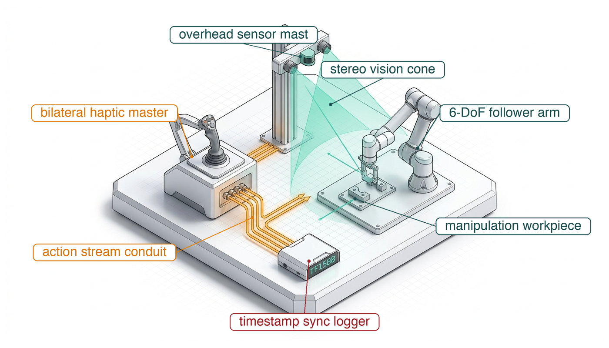
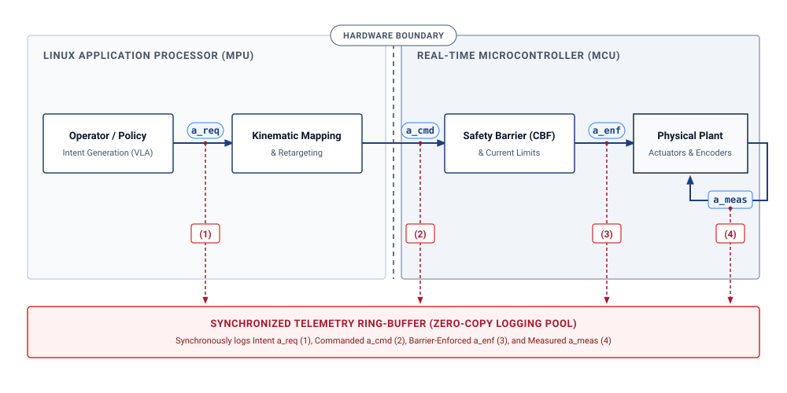
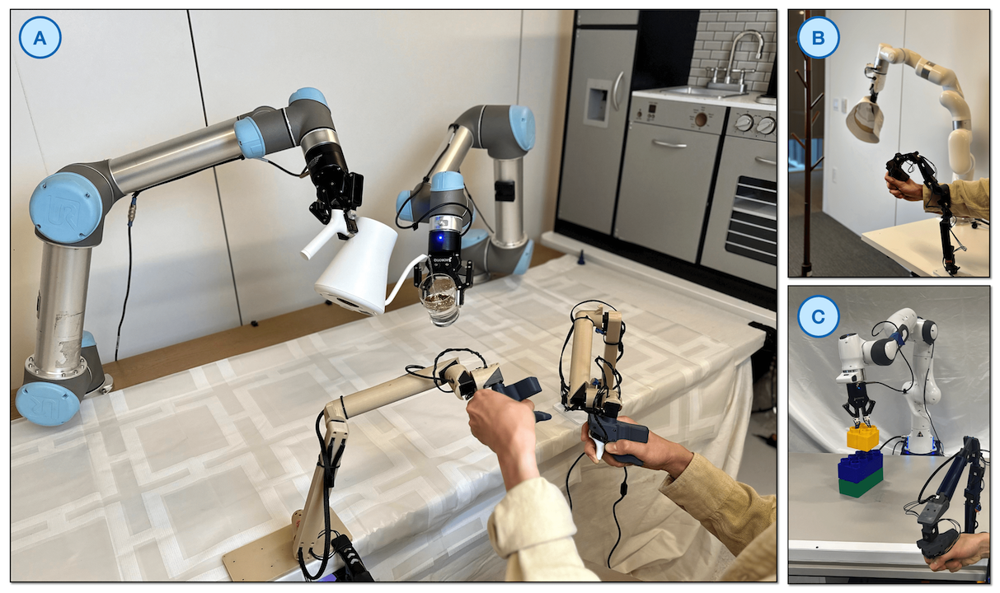
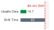
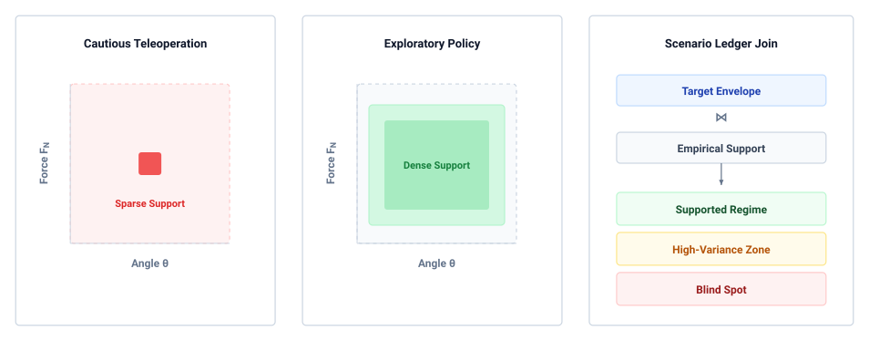
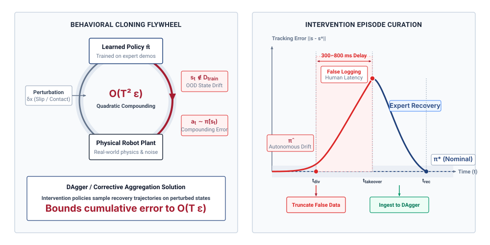

# Physical Data {#sec-data}

::: {layout-narrow}
::: {.column-margin}

\chapterminitoc

:::

::: {.content-visible when-format="pdf"}
\noindent
{fig-alt="Isometric blueprint showing the physical data and ingestion pipeline: The system includes key components: a bilateral teleoperation master arm for precise manipulation; a 6-axis operator load cell measuring force and providing control feedback; a calibrated stereo vision sensor head for depth perception; a micro-LiDAR rangefinder using laser pulses for accurate distance measurement; an optical calibration checkerboard ensuring sensor alignment precision; and a deterministic flash logger for reliable data storage under varying conditions."}
:::

::: {.content-visible unless-format="pdf"}
{fig-alt="Isometric blueprint showing the physical data and ingestion pipeline: bilateral teleoperation master arm, 6-axis operator load cell, calibrated stereo vision sensor head, micro-LiDAR rangefinder, optical calibration checkerboard, and deterministic flash logger."}
:::

:::

## Purpose {.unnumbered .unlisted}

::: {.content-visible when-format="pdf"}
\begin{marginfigure}
\vspace{1em}
\resizebox{\linewidth}{!}{\mlphysicalstackfull{20}{20}{20}{20}{100}}
\end{marginfigure}
:::

_What does the physical machine that collected a dataset leave permanently stamped into the policy that trains on it?_

A robot trajectory reflects the machine that produced it. Joint geometry and friction shape the motion, sensor timing decides which observation accompanies each command, and the command itself has changed by the time it reaches the motors, first mapped into a setpoint and then admitted or clamped by the permission path beneath the proposal boundary. A policy trained on those records learns all of these collection conditions along with the task. Successful demonstrations also omit the recovery behavior needed once an error diverts the robot from its path, and more successful runs do not close that gap, because the states they leave out are the states the policy's own mistakes will reach. Every demonstration is paid for in wear on a real machine, so the data is scarce, and it transfers poorly because similar-looking bodies can respond differently to the same command. A physical dataset is evidence about one machine's actions across the causal boundary, and it can be trusted only when it records what was requested, what was admitted, what the body did, and which conditions it never saw.



::: {.callout-learning-objectives}

- Estimate usable demonstration yield from collection time and reset overhead, and budget the mechanical wear a campaign consumes
- Analyze how the collecting policy limits dataset coverage and downstream recovery behavior
- Separate failed autonomous actions from human recovery trajectories in timestamped intervention records
- Evaluate whether a dataset's mechanical and sensing assumptions transfer to another machine
- Design a provenance record linking each observation to its requested, mapped, enforced, and measured actions and to the collecting plant
- Assess whether a dataset supports a claimed operating domain by joining its occupancy against a scenario ledger

:::

## Endogenous Experience {#sec-data-endogenous-experience}

A policy trained on the retained demonstrations of a door-opening campaign, clean teleoperated openings of the warehouse mobile manipulator's spring-latched cage door, can still fail at the latch on its first autonomous attempt. One possible cause is *endogenous experience*.[^fn-data-causal-loop] In a fixed offline vision dataset, the model's prediction does not change the next stored example. Here, an executed action changes the body's trajectory, camera pose, and contacts, thereby changing later observations ($s_{t+1} \sim P(s \mid s_t, a_t)$).

[^fn-data-causal-loop]: **Causal Boundary**\index{Causal boundary!thermodynamic constraint}: The causal boundary between computation and physics was established in @sec-boundary-causal-boundary. In an embodied system, computation acquires physical consequence because state evolution depends causally on motor actuation. Consequently, policy actions actively perturb the distribution of future observations ($s_{t+1} \sim P(s \mid s_t, a_t)$), invalidating the independent and identically distributed (i.i.d.) assumptions of disembodied machine learning.

::: {#dfn-data-endogenous-covariate-shift .callout-definition title="Endogenous covariate shift"}

***Endogenous covariate shift***\index{Endogenous covariate shift!definition}\index{Covariate drift!physical AI} is the closed-loop distribution discrepancy wherein an embodied agent's executed actions alter its subsequent physical states and sensory observations ($s_{t+1} \sim P(s \mid s_t, a_t)$), driving the system into state-space regimes unsupported by its training demonstrations and bounding behavioral cloning expected cost gap by $\mathcal{O}(T^2\epsilon)$.

1.  **Significance**: Explains how offline behavioral cloning can fail during closed-loop physical execution: a perturbation may drive the system into states where the policy lacks training support.
2.  **Distinction**: Unlike exogenous dataset shift caused by changing ambient lighting or seasonal weather, endogenous shift is actively generated by the agent's own closed-loop actions altering its subsequent observation distribution.
3.  **Common pitfall**: Attempting to fix closed-loop policy failure by collecting more nominal expert demonstrations, which only increases data density along the success manifold without providing the corrective recovery data needed to escape boundary excursions.

:::

Suppose the archive contains only flawless executions and no recovery trajectories. A mistake can then move the robot outside demonstrated states. Let $\pi$ be the learned policy, $\pi^*$ the expert, $J$ expected cumulative task cost over $T$ steps, and $\epsilon$ the probability of disagreement on expert-visited states under 0–1 action loss. If per-step task cost lies in $[0,1]$, behavioral cloning admits the worst-case bound (@eq-data-quadratic-drift):[^fn-ai-covariate-shift]
$$J(\pi)-J(\pi^*) \leq T^2\epsilon.$$ {#eq-data-quadratic-drift}
More flawless demonstrations do not resolve this failure mode. Adding more expert paths merely deepens the probability density along the center of the corridor while leaving the surrounding boundary excursions completely unsupported.

[^fn-ai-covariate-shift]: **Behavioral Cloning Bound**\index{Covariate shift!endogenous feedback}: The bound derived by @ross2011reduction is a worst case on expected cumulative cost, not a prediction of tracking error; actual drift depends on the plant, task, policy, and safeguards. Expert labels on learner-visited states are one way to address this gap.

The physical cost of gathering this experience compounds the challenge. In digital domains, acquiring another million tokens costs mere fractions of a cent in cloud compute. In Physical AI, every recorded second consumes finite actuator fatigue life, heats motor stator windings, cycles gearbox teeth, scrubs tire treads, and drains battery capacity.[^fn-data-hardware-wear] Scheduled facility time on an instrumented robotic workcell or vehicle proving ground yields only a fraction of active motion data. Operator rest, calibration, fixture realignment, and scene resets, together with failed and rejected attempts, leave less than a quarter of scheduled time as validated demonstration data (@sec-data-teleop-costs). Physical demonstration data is therefore scarce and expensive, and it misleads training if logged naively.

[^fn-data-hardware-wear]: **Hardware Fatigue Life**\index{Hardware wear!actuator thermal duty cycle}: Actuator thermal limits, Joule heating in motor windings, and gearbox friction hysteresis constrain physical collection campaigns, as detailed in @sec-body-actuator-limits and @sec-body-thermal-duty-cycles. Sustained high-torque demonstrations degrade mechanical transmissions and alter joint friction profiles over time. Consequently, machine learning pipelines that assume stationary plant dynamics encounter unmodeled physical drift as collection testbeds age.

::: {.column-margin .margin-pointer}
↰ **Prerequisite:** Actuator thermal dissipation ($dT/dt$) and winding damage limits are derived in @sec-body-thermal-duty-cycles.
:::

A physical command also changes meaning on its way to the actuators. In a machine divided by the proposal boundary,[^fn-data-proposal-permission] the operator's or policy's request is mapped into a setpoint, admitted or modified by the permission path, and answered by the plant with a measured response. Logging only the request trains the policy on demands the plant could never execute, and logging only the response teaches it structural deflection and gear backlash as though they were deliberate human skill.

[^fn-data-proposal-permission]: **Proposal Boundary**\index{Proposal boundary!demonstration data}: The proposal boundary, defined in @sec-boundary-machine-model, separates learned proposals from the permission path that alone may admit them to the actuators. Logging all four action taps across this boundary prevents safety governor interventions from contaminating the demonstrator's behavioral labels. Downstream policy synthesis methods that train on these ingested records are developed in @sec-training, while real-time control barrier functions that enforce physical limits during execution are detailed in @sec-enforcement.

A collection campaign therefore makes two decisions before it records anything: which source will choose the actions, and which of those four forms of each action the dataset will keep as its label.

## Where Physical Data Comes From {#sec-data-collection-sources}

A physical dataset is not found, logged from passive traffic, or assembled from a public repository. Every transition tuple in an archive required burning electrical energy, pushing against mechanical friction, and moving physical mass through a coordinate frame. The challenge of learning from physical demonstration traces back to Dean Pomerleau's ALVINN (Autonomous Land Vehicle in a Neural Network) [@pomerleau1989alvinn]. By training a neural network to steer an autonomous vehicle directly from camera images of human driving, Pomerleau observed that the model learned only how to track nominal lane centers; because human experts rarely made errors, the dataset contained zero demonstrations of recovery trajectories from lane edges, causing compounding drift as soon as small execution errors accumulated in closed loop.

Physical data sources separate according to who chooses the action:

1. In **kinesthetic teaching**, a colocated demonstrator physically grasps and moves the unpowered or gravity-compensated joints of the mechanism.
2. In **teleoperation**, a remote operator guides an input device such as a master arm, a multi-axis space mouse, or a tracked hand controller, transmitting commands across a software interface to the follower robot.[^fn-hist-goertz-teleop]
3. In **scripted collection**, an engineer executes a deterministic control routine, such as a state machine tracking interpolated splines or force-thresholded primitives.
4. In **exploratory collection**, an active policy selects actions to optimize an information-theoretic objective, sample state space, or maximize a reward signal.
5. In **autonomous logging during deployment**, the production policy commands the actuators as it performs work in a factory or warehouse, storing incoming sensor streams in situ.

[^fn-hist-goertz-teleop]: **Bilateral Teleoperation Lineage**\index{Raymond Goertz!bilateral telemanipulation}: Raymond Goertz developed the first bilateral mechanical and electrical master-slave telemanipulators at Argonne National Laboratory in the late 1940s and 1950s for handling radioactive materials. His mechanical linkages introduced reflected force feedback across a physical barrier, proving that human operators require kinesthetic resistance to avoid jamming remote mechanisms. In modern robot learning, this physical coupling determines whether demonstrations capture genuine contact compliance or open-loop visual hunting motions.

Because the collecting entity dictates how the machine approaches the environment, kinesthetic teaching, teleoperation, unguided play, and autonomous logging occupy disjoint state-action manifolds even when attempting the exact same physical contact task. Consider inserting a cylindrical steel pin into a chamfered hole with a clearance of $50\,\mu\text{m}$. A colocated human guiding the tool directly senses contact reaction forces through their hands and makes instantaneous, fine-grained compliance adjustments at their own wrist joints. A remote teleoperator watching a two-dimensional video feed lacks direct haptic feedback, creating visual latency delays, command overshoot, and characteristic hunting motions as the operator pecks at the contact boundary. A scripted controller follows a programmed helical search pattern at constant linear velocity, generating a dense geometric spiral with predictable force spikes against the chamfer face. Autonomous logging from an exploratory or partially trained policy wanders across off-target regions, repeatedly binding the pin at oblique angles until motor current thresholds trigger a software fault. These logs do not represent noisy samples of a single trajectory but outputs from distinct dynamical systems with different bandwidths, latency profiles, and mechanical compliances.

::: {.column-margin .margin-pointer}
⇄ **Contrast:** The display and operator-response delay that paces teleoperation hunting (@sec-data-teleop-costs) contrasts with the continuous tactile reflex bandwidth ($1\text{ kHz}$) analyzed in @sec-body-measurement-freshness.
:::

A common error in physical machine learning is treating each recorded control step as an independent experience. When a joint controller logs state-action pairs at $50\text{ Hz}$, one hour of continuous recording produces $180{,}000\text{ steps}$. Multiplying sample frequency by recording time yields large step counts, but adjacent steps exhibit extreme temporal autocorrelation. Two camera frames logged $20\text{ ms}$ apart differ by sub-millimeter end-effector displacements and minor sensor noise. Distributional coverage scales with the count of independent task episodes and distinct physical configurations, not with the sampling clock. An archive containing $100{,}000\text{ steps}$ distributed across five hundred distinct workpiece positions and lighting conditions provides vastly broader support than $1{,}000{,}000\text{ steps}$ logged during a single continuous demonstration where the end-effector engaged a workpiece at a single bench location.

The throughput of a physical collection campaign is set by the mechanics of the cell rather than by its sampling clock. Every attempt is followed by a reset that returns the scene to a valid initial state, a fraction of attempts fail during the trial or are rejected in post-collection validation, and every cycle, successful or not, adds directional reversals to the gearboxes and bends to the flex cables inside the joints. The usable yield $Y_{\text{usable}}$ is therefore the attempt rate multiplied by the retention rate, while the wear bill is paid per attempt rather than per usable episode. @Sec-data-teleop-costs budgets both for the machine's door-opening campaign.

::: {.column-margin .margin-pointer}
↳ **Downstream:** Usable demonstration yield ($Y_{\text{usable}}$) sets the sample efficiency requirements for trial-based learning in @sec-training-learning-by-trial.
:::

Simulation avoids the wear bill altogether. A rigid-body physics engine running on distributed compute clusters can produce millions of transitions per hour without wearing any hardware. The mechanics, approximations, and domain transfer boundaries of simulated data are treated in @sec-training. When synthetic trajectories are combined with physical logs, the physical provenance of every record must be tracked explicitly. A model trained on an undifferentiated mixture inherits the contact unfaithfulness of the physics engine wherever synthetic data dominates, while inheriting the unmodeled sensor noise and mechanical backlash of the hardware wherever physical data dominates. Without tracking the collecting agent and the recording tap point for each sample, an engineer cannot determine whether an on-robot failure stems from simulation error or from physical collection bias.

Tracking the tap point begins with deciding which variable is recorded as the action label, a choice that alters what the learned model reproduces. In teleoperation and autonomous systems, data logging taps into multiple layers across the control pipeline (@fig-05-action-taps). On a platform that splits computation across two processors, such as a System-on-Chip (SoC) testbed that pairs an application processor with a safety microcontroller, or a bimanual leader-follower workstation[^fn-hw-gello-teleop] [@zhao2023learning; @wu2023gello], this pipeline spans two distinct computational domains:

[^fn-hw-gello-teleop]: **Leader Arm Implementations**\index{Leader arm!teleoperation}: GELLO uses a low-cost 3D-printed encoder leader [@wu2023gello]; ALOHA uses backdriven WidowX robot arms with 3D-printed handles as leaders [@zhao2023learning]. Neither implementation provides active follower-to-leader force reflection. Their mechanics and operator feel differ, so contact corrections in the collected data depend on the available vision and any separately instrumented force channel.

- The unprivileged **Linux Application Processor (MPU)** captures high-bandwidth camera streams (e.g., active stereo RGB-D at $30\text{ Hz}$), ingests master teleoperation inputs or neural policy forward passes, and maps coordinates.
- On the permission side of the proposal boundary (@sec-boundary-machine-model), the real-time **Microcontroller Unit (MCU)** executes at $1000\text{ Hz}$ on bare metal, running low-level PID/impedance control, forward-invariant safety barrier functions, velocity clamping, and motor current limiters over high-speed CAN-FD networks or direct PWM voltage pulses.[^fn-hw-encoder-capture] Because each domain operates on independent quartz oscillators, uncalibrated clock drift[^fn-bench-timestamp-skew] between camera frames and motor current ticks corrupts state-action alignment across extended logging runs.

[^fn-hw-encoder-capture]: **Hardware Timer Interrupt**\index{Hardware timer interrupt!DMA latching}: On real-time MCUs, optical encoder counts and current shunt readings are sampled via hardware timer interrupts and Direct Memory Access (DMA), which holds sampling jitter to microseconds. Bypassing operating system thread scheduling allows dedicated timer peripherals to latch high-frequency plant states at exact clock boundaries. This deterministic latching prevents inter-sample timestamp jitter from corrupting downstream numerical differentiation during velocity and acceleration estimation.

[^fn-bench-timestamp-skew]: **Oscillator Clock Drift in Multi-Sensor Telemetry**\index{Timestamping!oscillator drift}: Standard quartz crystal oscillators exhibit thermal drift between $20\text{ and }50\text{ parts per million (ppm)}$, causing unsynchronized sensor clocks to diverge by up to $3\text{ ms}$ per minute of operational logging. In high-speed trajectory capture, this uncalibrated temporal drift misaligns visual demonstration frames with joint torque telemetry, corrupting policy cloning datasets before training begins.

::: {#fig-05-action-taps fig-env="figure" fig-pos="t" fig-cap="**Four-stream action tap tuple**: Four places a command can be logged, from raw policy intent on the application processor through to measured plant response. Which tap a dataset records decides what the model learns to imitate. Logging only the request bakes in actuator drift the robot could never execute, and logging only the measurement bakes in mechanical compliance and backlash as though they were demonstrated skill. Source: architectural design adapted from @zhao2023learning and @wu2023gello." fig-alt="The Four-Stream Action Tap Tuple across the MPU/MCU Boundary. On a heterogeneous edge architecture, data logging captures four distinct physical semantics: (1) areq (raw operator or policy intent on the Linux MPU prior to software checks), (2) acmd (kinematically retargeted setpoint), (3) aenf (safety-governed command post-CBF barrier enforcement and motor torque clamping on the real-time MCU), and (4) ameas (measured motion derived from joint encoders over a stated response interval, with motor current logged separately). Logging only areq bakes unexecutable actuator drift into training loss, while logging only ameas can misattribute mechanical compliance, link deflection, and backlash to demonstrated human skill. Source: Architectural design adapted from @zhao2023learning and @wu2023gello."}
{width="100%"}
:::

The four taps along this control path capture fundamentally different physical semantics:

- The **requested action** ($a_{\text{req}}$): the raw operator input or policy proposal, tagged with its representation, units, frame, and issue time.
- The **mapped command** ($a_{\text{cmd}}$): the retargeted Cartesian or joint setpoint, tagged with the new representation, units, frame, and mapping time.
- The **enforced command** ($a_{\text{enf}}$): the same typed setpoint after the independent safety path has admitted, modified, or rejected the proposal.
- The **measured response** ($a_{\text{meas}}$): the corresponding measured position or velocity over a stated sampling interval; encoder readings and motor current are separate sensor channels, not interchangeable action coordinates.

If the logging pipeline records $a_{\text{req}}$ prior to software limit enforcement, the dataset contains dynamically infeasible trajectories that command accelerations beyond motor current limits. If it logs $a_{\text{meas}}$ after contact, the recorded label reflects structural compliance and gear backlash rather than commanded intent, turning a feedforward control signal into an observation of material deformation. Building on the causal boundary established in @sec-boundary-causal-boundary, logging the full tuple $(a_{\text{req}}, a_{\text{cmd}}, a_{\text{enf}}, a_{\text{meas}})$ across the MPU/MCU boundary is necessary to distinguish operator intent from governor intervention.

::: {#dfn-data-four-stream-action-tap-tuple .callout-definition title="Four-stream action tap"}

***Four-stream action tap***\index{Four-stream action tap!definition}\index{Action tap!definition} $(a_{\text{req}}, a_{\text{cmd}}, a_{\text{enf}}, a_{\text{meas}})$ is the time-synchronized multi-tier telemetry record that captures an action signal across its four causal transformation stages: unprivileged operator or policy intent ($a_{\text{req}}$), kinematically retargeted setpoint ($a_{\text{cmd}}$), safety-governed command ($a_{\text{enf}}$), and physical plant response ($a_{\text{meas}}$).

1.  **Significance**: Training imitation learning policies on raw requested actions ($a_{\text{req}}$) injects dynamically infeasible commands that trigger safety trips in deployment. Conversely, training on measured responses ($a_{\text{meas}}$) causes the model to imitate mechanical compliance, backlash, and external disturbances rather than intentional control. Logging all four streams disambiguates control intent from governor intervention.
2.  **Distinction**: Unlike classical robot telemetry logs that capture only final motor encoder states or raw teleoperation joystick inputs, the four-stream tap preserves the exact causal filtering stages applied by intermediate software and safety hardware.
3.  **Common pitfall**: Logging streams without hardware-synchronized timestamps ($t_{\text{PTP}}$). Even a few milliseconds of clock skew between the high-level perception host and the low-level motor MCU corrupts the temporal alignment between visual observations and corresponding torque actions.

:::

Recording the right tap does not settle when each recorded value was true. A physical rig records telemetry across asynchronous sensor modalities that operate under different physics, sampling clocks, and bus protocols:

- **Active vision streams:** Multi-view RGB and depth cameras capture frames at $30\text{ Hz}$ ($33.3\text{ ms}$ interval), where photons accumulate over a finite exposure window $t_{\text{exp}} \in [10, 30]\text{ ms}$, followed by sensor row readout ($4\text{--}8\text{ ms}$) and high-throughput data bus transfer to host memory.
- **Tactile and force-torque matrices:** Fingertip piezoresistive or optical elastomer sensors sample surface traction and normal forces at $100\text{ Hz}$ ($10.0\text{ ms}$ interval) over SPI or CAN-FD buses.
- **Joint encoders and inverter telemetry:** Optical joint encoders, motor phase current shunts, and Field-Oriented Control (FOC) current loops execute deterministically on bare-metal MCUs at $1000\text{ Hz}$ ($1.0\text{ ms}$ interval).
- **Policy control and action dispatch:** Generative action proposals or teleoperation commands are computed and dispatched at $50\text{ Hz}$ ($20.0\text{ ms}$ interval).

Standard machine learning data loaders often employ a naive "latest available sample" latching policy: whenever the $50\text{ Hz}$ action loop fires, it packages the most recently arrived camera frame with the current joint angles. This naive latch misaligns observation and action in time. If a camera frame arrives in host RAM at timestamp $t$, the photons that generated that image were integrated during an exposure window centered $25\text{--}40\text{ ms}$ in the past. Pairing the current control action $a_t$ with an uncompensated visual observation $o_t$ teaches the imitation policy to map historical states to instantaneous actions, baking unmodeled phase lag directly into the neural network weights.

To prevent temporal corruption across dataset schemas (such as Hugging Face LeRobot, RLDS / Open X-Embodiment [@open_x_embodiment_collaboration2024open], and Foxglove MCAP), logging engines enforce the **exposure midpoint timestamping rule**:

1. **Hardware exposure midpoint timestamp:** The true physical timestamp of an optical observation $o_t$ is latched at the midpoint of sensor exposure:
   $$t_{\text{obs}} = t_{\text{trigger}} + \frac{1}{2} t_{\text{exp}}$$
   where $t_{\text{trigger}}$ is synchronized across cameras via IEEE 1588 Precision Time Protocol (PTP) hardware triggers or external TTL sync lines.
2. **Causal kinematic interpolation:** Because the real-time MCU logs joint positions and velocities at $1000\text{ Hz}$ ($1.0\text{ ms}$ resolution), the true mechanical configuration at the exact camera optical timestamp is computed by smoothly interpolating between the two closest $1\text{ kHz}$ encoder records. For the full cubic Hermite spline calculation used in this physical interpolation, see @sec-appendix-control-splines.
3. **Container serialization:** Modern open-source dataset containers formalize this multi-rate structure. In **MCAP**, messages preserve raw sensor arrival and log-time timestamps alongside channel schema definitions in a single zero-copy binary file. In **LeRobot** [@cadene2024lerobot], video streams are chunked into MP4/AV1 containers with frame-accurate metadata, while synchronized $50\text{ Hz}$ state-action tensors are serialized into columnar Parquet or Safetensors formats. In **RLDS**, transitions are structured as nested episode dictionaries (`steps/is_first`, `steps/is_terminal`, `steps/observation`, `steps/action`). Enforcing exposure-midpoint alignment before serializing ensures that state-action pairs $(s_t, a_t)$ share a causally sound, physically verified temporal reference.

::: {.column-margin .margin-pointer}
↰ **Prerequisite:** Sub-microsecond PTP clock synchronization across distributed bus controllers is established in @sec-nervous-deterministic-fieldbuses.
:::

Human teleoperation remains the standard technique for gathering high-quality physical trajectories, yet the interface between the human and the machine shapes the recorded dynamics long before the data reaches a model.

## Teleoperation Demonstration Costs {#sec-data-teleop-costs}

Human teleoperation closes a feedback loop that spans the operator, the input device, the communication bus, the low-level motor controller, and the physical environment (@fig-05-teleop-rig). In a typical teleoperation workstation, an image sensor captures the workspace, encodes the video stream, and transmits the frames across a network to a display console. The operator perceives visual feedback, decides on a corrective trajectory, and displaces an input device. The workstation samples the device state, maps the spatial displacement into joint or end-effector coordinates, and transmits the resulting setpoint across an industrial bus to the robot's motor drives. The actuators generate torque, accelerating the mechanical linkages against inertia, joint friction, and contact constraints. This displacement alters the scene, producing new optical signals recorded by the image sensor in the next cycle.

::: {#fig-05-teleop-rig fig-env="figure" fig-pos="t" fig-cap="**Kinematically isomorphic teleoperation rigs**: Demonstration capture on three leader-follower rigs whose leader devices mirror follower kinematics [@wu2023gello]. Because the leader shares the follower's joint structure, the interface needs no inverse kinematics and inherits none of its singularities (mathematical dead-zones where joints align and lose mobility), preserving the operator's direct joint-level coordination. Human reaction latency of $200\text{--}300\text{ ms}$ still enters the recording as phase lag, so the demonstration carries the operator's delay as if it were policy." fig-alt="Kinematically Isomorphic Leader-Follower Teleoperation Architecture across Heterogeneous Manipulators. Demonstration acquisition on physical robot platforms using low-cost, kinematically isomorphic leader controllers (canonical architecture [@wu2023gello]). (A) Bimanual teleoperation setup with twin 6-DoF leader arms mapped directly to dual heavy-payload follower manipulators during a compliant liquid-pouring task. (B) Single-arm leader-follower configuration controlling a torque-controlled manipulator with an overhead task camera. (C) Precision pick-and-place manipulation with passive gravity compensation and joint-angle direct drive. Because the leader device mirrors follower kinematics without requiring numerical inverse kinematics (IK), the interface eliminates IK singularities while preserving the operator's direct joint-level coordination. However, human reaction latency (200--300 ms) and communication delays still introduce phase lag into the recorded (st, at) demonstration tuples. Source: Adapted from Wu et al. [@wu2023gello], CC BY 4.0."}
{width="95%"}
:::

Each stage in this loop introduces latency that affects the timing of the correction. In a reference setup with a high-speed camera and a wired local network (illustrative; see the Reader Guide), display processing requires $t_{\text{disp}} = 50\text{ ms}$ across exposure, H.264 decoding, and monitor refresh. Human visual perception and neuromuscular transmission introduce an operator response latency of $t_{\text{hum}} = 200\text{ ms}$ for continuous path corrections. Command quantization, packetization, and bus transport to the robot controller add $t_{\text{cmd}} = 10\text{ ms}$. Actuator torque ramp-up and structural inertia impose a mechanical response latency of $t_{\text{mech}} = 80\text{ ms}$ before the robot achieves the commanded acceleration. The total round-trip latency is:
$$t_{\text{loop}} = t_{\text{disp}} + t_{\text{hum}} + t_{\text{cmd}} + t_{\text{mech}} = 50\text{ ms} + 200\text{ ms} + 10\text{ ms} + 80\text{ ms} = 340\text{ ms}.$$

When a contact misalignment occurs at time $t$, the operator sees the error at $t + 50\text{ ms}$, issues a motor command at $t + 250\text{ ms}$, and the arm exerts corrective force against the workpiece at $t + 340\text{ ms}$. During those $340\text{ ms}$, the physical system continues moving under momentum and external contact forces. If the data logger records the current sensor observation $s_t$ alongside the human command $a_t$ issued at that same clock instant, the recorded demonstration pairs a physical state with an action chosen in response to a state that existed $250\text{ ms}$ in the past. This temporal misalignment bakes an unmodeled phase lag directly into the training targets. Because the dataset pairs a past visual state with a present physical reaction, the model learns this delayed timing as deliberate behavior, producing policies that over-correct or oscillate when deployed autonomously at $50\text{--}100\text{ Hz}$.

**Teleoperation round-trip latency** ($t_{\text{loop}} = t_{\text{disp}} + t_{\text{hum}} + t_{\text{cmd}} + t_{\text{mech}}$) is the total elapsed time between a physical contact event and the delivered corrective actuator response, embedding biological reaction delays ($200\text{--}300\text{ ms}$) as artificial phase lag in demonstration timestamps.

The round-trip delay $t_{\text{loop}}$ that lets the arm keep moving before a correction lands does more harm once force travels the other way. In **bilateral teleoperation**, where contact forces measured at the follower arm are reflected back as haptic torques to the leader arm, that delay becomes a stability hazard. As Robert J. Anderson and Mark W. Spong demonstrated in their foundational analysis [@anderson1989bilateral], network transmission latency transforms an intrinsically passive physical link into an active energy generator. In an ideal, zero-latency system, the communication channel acts as a passive transmission line that cannot generate energy. When transport delay varies dynamically across the network, however, the delayed force reflection acts out-of-phase with the operator's hand velocity.

The interface behaves like a delayed spring: when the operator pushes into contact and begins to retract, the delayed reaction force arrives late, pushing the operator's hand in the direction of motion. This unexpected push injects virtual energy into the feedback loop. This non-passive energy drives high-frequency mechanical limit cycles (sustained, self-reinforcing oscillations), causing the master and follower arms to chatter against rigid contact fixtures. For a rigorous mathematical derivation of these passivity conditions, refer to @sec-appendix-control-passivity.

Stabilizing the rig requires Time-Domain Passivity Controllers (TDPC) or wave-variable transformations, algorithmic techniques that inject virtual damping (software-simulated friction) into the teleoperation link to safely bleed off this excess energy. While passivity controllers prevent hardware damage, the added damping acts as a low-pass filter on operator hand motions, attenuating high-frequency contact cues and suppressing subtle tactile feedback.

::: {#psp-data-teleoperation-passivity .callout-perspective title="Teleoperation passivity conditions"}
In bilateral teleoperation with force reflection, variable network latency injects virtual energy into the operator interface. To prevent contact instability and mechanical limit cycles, the rig's real-time controller must monitor and dissipate this unexpected energy (enforcing a strict passivity condition) via Time-Domain Passivity Observers (TDPO).
:::

The operator interface filters what a demonstration can express. In a hypothetical peg-in-hole task, a force-reflecting leader can let the operator feel binding and adjust contact; a visual-only rate controller may instead encourage short moves and pauses while the operator checks the video. These are task- and implementation-dependent behaviors, not performance measurements from @mandlekar2020human. ALOHA is a different, backdriven joint-space leader/follower system without bilateral force reflection; its demonstrations are recorded at $50\text{ Hz}$ [@zhao2023learning]. The comparison in @tbl-05-teleop-taxonomy identifies mechanisms to measure on a given rig rather than universal latency or fatigue ranges.

| Interface and feedback                                        | Command mapping                                                                      | Contact information available to operator                                  | Possible collection artifact to check                                             |
|:--------------------------------------------------------------|:-------------------------------------------------------------------------------------|:---------------------------------------------------------------------------|:----------------------------------------------------------------------------------|
| **Force-reflecting bilateral leader**                         | Leader motion mapped to follower joints; measured follower force reflected to leader | Vision and physical contact force, subject to link delay and fidelity      | Contact corrections and oscillation when delayed force reflection loses passivity |
| **Backdriven joint-space leader (ALOHA)** [@zhao2023learning] | Leader joint positions copied to follower; demonstration recorded at $50\text{ Hz}$  | Vision and leader mechanism feel, without active follower force reflection | Joint-space posture preferences and unobserved follower contact forces            |
| **Rate-controlled 3D mouse**                                  | Device deflection mapped to Cartesian velocity, then inverse kinematics              | Primarily visual feedback unless a separate haptic channel exists          | Step-and-wait motion and zero-velocity pauses under delayed feedback              |
| **Tracked spatial controller**                                | Tracked hand pose mapped to tool pose with clutching and scale                       | Visual feedback; optional vibration is not directional force reflection    | Clutch discontinuities and pose-tracking gaps                                     |
| **Instrumented exoskeleton**                                  | Wearable joint motion retargeted to robot joints                                     | Depends on whether active force feedback is fitted                         | Biomechanical calibration and retargeting bias                                    |

: **Teleoperation interface mechanisms for physical demonstration collection**: Mapping and feedback determine what the operator can demonstrate, and the last column names the artifact to check on a given rig, task, and operator. {#tbl-05-teleop-taxonomy tbl-colwidths="[22,28,24,26]"}

At a round-trip delay of $t_{\text{loop}} = 340\text{ ms}$, a high-gain operator loop can lose its phase margin (@sec-appendix-control-passivity), which is why operators slow down near contact or fall back on the step-and-wait motion listed in @tbl-05-teleop-taxonomy.

Whatever interface the operator holds, the rig must record every stream the session produces, including all four action taps of \ref{dfn-data-four-stream-action-tap-tuple}, and that recording has a bandwidth and storage budget of its own.

```{python}
#| label: calc-data-multi-camera-ingestion
#| echo: false
# ┌─────────────────────────────────────────────────────────────────────────────
# │ MULTI-CAMERA TELEOPERATION INGESTION BUDGET (LEGO)
# ├─────────────────────────────────────────────────────────────────────────────
# │ Context: @nbk-data-ingestion-bandwidth-storage-budgets-multi-camera
# │ Goal:    Size the raw ingestion rate and storage of one teleoperated
# │          door-opening session on the warehouse mobile manipulator.
# │ Show:    Per-camera raw rates, the 9-axis kinematic stream, the total, the
# │          hourly and per-shift storage, and the 8x-compressed rate against
# │          SATA and Gen4 NVMe write bandwidth.
# │ How:     Camera geometry and frame rates from the registry (navigation
# │          IMX477, wrist IMX296, two external RealSense D435i); axis count and
# │          logging rate from RM; calc_teleop_ingestion_budget per camera group.
# └─────────────────────────────────────────────────────────────────────────────
from mlsysim import *
from mlsysim.core.units import *
from mlsysim.fmt import fmt_bandwidth, fmt_memory, fmt_frequency, fmt_int, fmt_multiple, fmt_percent, check

RM = Embodied.MobileManipulator.WarehouseMobileManipulator
AISLE = Embodied.Scenario.WarehouseAisle

class MultiCameraIngestionBudget:
    """Raw telemetry bandwidth and storage for the machine's teleoperation sessions."""

    # ┌── 1. LOAD (Constants & Parameters) ─────────────────────────────────
    cam_nav = RM.nav_camera  # category: datasheet
    cam_wrist = RM.wrist_camera  # category: datasheet
    cam_ext = Sensors.Camera.Intel_RealSense_D435i  # category: datasheet
    n_ext = 2  # scenario assumption; category: chosen
    bytes_per_px_rgb = 3  # 24-bit RGB after debayering; category: chosen
    bytes_per_px_depth = 2  # uint16 depth aligned to the color frame; category: chosen

    n_axes = RM.servo_axes  # 2 base + 7 arm; category: datasheet
    f_log = RM.permission_rate  # kinematics logged every permission tick; category: chosen
    values_per_axis = 6  # position, velocity (a_meas), torque, a_req, a_cmd, a_enf; category: chosen
    bytes_per_value = 4  # float32; category: chosen
    bytes_timestamp = 8  # one 64-bit timestamp per step; category: chosen

    shift_hours = 8.0  # scenario assumption; category: chosen
    compression_ratio = 8.0  # intra-frame video codec; category: illustrative
    bw_sata = Systems.Storage.SataSsd.bandwidth  # category: datasheet
    bw_nvme = Hardware.Tech.Storage.NvmeGen4.bandwidth  # category: datasheet

    # ┌── 2. EXECUTE (Compute) ─────────────────────────────────────────────
    bytes_per_step = n_axes * values_per_axis * bytes_per_value + bytes_timestamp
    bw_kin = (bytes_per_step * byte * f_log).to(MB / second)

    res_nav = calc_teleop_ingestion_budget(
        num_cameras=1,
        rgb_width=cam_nav.resolution_width,
        rgb_height=cam_nav.resolution_height,
        rgb_fps=cam_nav.frame_rate.to(hertz).magnitude,
        rgb_bytes_per_pixel=bytes_per_px_rgb,
        kinematics_bytes_per_sec=bw_kin,
    )
    res_wrist = calc_teleop_ingestion_budget(
        num_cameras=1,
        rgb_width=cam_wrist.resolution_width,
        rgb_height=cam_wrist.resolution_height,
        rgb_fps=cam_wrist.frame_rate.to(hertz).magnitude,
        rgb_bytes_per_pixel=bytes_per_px_rgb,
    )
    res_ext = calc_teleop_ingestion_budget(
        num_cameras=n_ext,
        rgb_width=cam_ext.resolution_width,
        rgb_height=cam_ext.resolution_height,
        rgb_fps=cam_ext.frame_rate.to(hertz).magnitude,
        rgb_bytes_per_pixel=bytes_per_px_rgb,
        depth_width=cam_ext.resolution_width,
        depth_height=cam_ext.resolution_height,
        depth_fps=cam_ext.frame_rate.to(hertz).magnitude,
        depth_bytes_per_pixel=bytes_per_px_depth,
    )

    bw_nav = res_nav["bw_rgb"]
    bw_wrist = res_wrist["bw_rgb"]
    bw_ext_rgb = res_ext["bw_rgb"]
    bw_ext_depth = res_ext["bw_depth"]
    bw_ext = res_ext["bw_vision"]
    bw_total = (res_nav["bw_total"] + res_wrist["bw_total"] + res_ext["bw_total"]).to(MB / second)
    storage_hour = (res_nav["storage_per_hour"] + res_wrist["storage_per_hour"] + res_ext["storage_per_hour"]).to(TB)
    storage_shift = (storage_hour * shift_hours).to(TB)

    nav_over_sata = (bw_nav / bw_sata).to("").magnitude
    kin_share = (bw_kin / bw_total).to("").magnitude
    bw_compressed = (bw_total / compression_ratio).to(MB / second)
    storage_hour_compressed = (storage_hour / compression_ratio).to(TB)

    # ┌── 3. GUARD (Assertions) ────────────────────────────────────────────
    check(n_axes == 9, "The machine logs 9 axes (2 base, 7 arm)")
    check(bytes_per_step == 224, "Unexpected kinematic record size")
    check(abs(bw_kin.to(MB / second).magnitude - 0.224) < 1e-9, "Unexpected kinematic rate")
    check(abs(bw_nav.to(MB / second).magnitude - 2219.44) < 0.01, "Unexpected navigation-camera rate")
    check(abs(bw_wrist.to(MB / second).magnitude - 279.94) < 0.01, "Unexpected wrist-camera rate")
    check(abs(bw_ext.to(MB / second).magnitude - 622.08) < 0.01, "Unexpected external-camera rate")
    check(abs(bw_total.to(MB / second).magnitude - 3121.68) < 0.01, "Unexpected total ingestion rate")
    check(abs(storage_hour.to(TB).magnitude - 11.24) < 0.005, "Unexpected hourly storage")
    check(abs(storage_shift.to(TB).magnitude - 89.91) < 0.01, "Unexpected shift storage")
    check(bw_total < bw_nvme, "Raw ingestion must fit Gen4 NVMe write bandwidth")
    check(3.9 < nav_over_sata < 4.1, "Navigation camera alone should be about four times SATA")
    check(kin_share < 1e-4, "Kinematic stream should be under 0.01 percent of the bytes")
    check(abs(bw_compressed.to(MB / second).magnitude - 390.2) < 0.1, "Unexpected compressed rate")

    # ┌── 4. OUTPUT (Format & Export) ────────────────────────────────────────
    nav_w_str = fmt_int(cam_nav.resolution_width, commas=False)
    nav_h_str = fmt_int(cam_nav.resolution_height, commas=False)
    nav_fps_str = fmt_frequency(cam_nav.frame_rate, precision=0)
    wrist_w_str = fmt_int(cam_wrist.resolution_width, commas=False)
    wrist_h_str = fmt_int(cam_wrist.resolution_height, commas=False)
    wrist_fps_str = fmt_frequency(cam_wrist.frame_rate, precision=0)
    ext_w_str = fmt_int(cam_ext.resolution_width, commas=False)
    ext_h_str = fmt_int(cam_ext.resolution_height, commas=False)
    ext_fps_str = fmt_frequency(cam_ext.frame_rate, precision=0)
    n_ext_str = fmt_int(n_ext)
    n_axes_str = fmt_int(n_axes)
    f_log_str = fmt_frequency(f_log, unit=ureg.kilohertz, precision=0)
    bytes_per_step_str = fmt_int(bytes_per_step)

    bw_nav_str = fmt_bandwidth(bw_nav, unit=MB / second, precision=2)
    bw_wrist_str = fmt_bandwidth(bw_wrist, unit=MB / second, precision=2)
    bw_ext_rgb_str = fmt_bandwidth(bw_ext_rgb, unit=MB / second, precision=2)
    bw_ext_depth_str = fmt_bandwidth(bw_ext_depth, unit=MB / second, precision=2)
    bw_ext_str = fmt_bandwidth(bw_ext, unit=MB / second, precision=2)
    bw_kin_str = fmt_bandwidth(bw_kin, unit=MB / second, precision=2)
    bw_total_str = fmt_bandwidth(bw_total, unit=MB / second, precision=2)
    bw_total_gb_str = fmt_bandwidth(bw_total, unit=GB / second, precision=2)
    storage_hour_str = fmt_memory(storage_hour, unit=TB, precision=2)
    storage_shift_str = fmt_memory(storage_shift, unit=TB, precision=1)
    shift_hours_str = fmt_int(int(shift_hours))

    bw_sata_str = fmt_bandwidth(bw_sata, unit=MB / second, precision=0)
    bw_nvme_str = fmt_bandwidth(bw_nvme, unit=GB / second, precision=0)
    nav_over_sata_mult_str = fmt_multiple(nav_over_sata, precision=1)
    kin_share_str = fmt_percent(kin_share, precision=3)
    compression_mult_str = fmt_multiple(compression_ratio, precision=0)
    bw_compressed_str = fmt_bandwidth(bw_compressed, unit=MB / second, precision=1)
    storage_hour_compressed_str = fmt_memory(storage_hour_compressed, unit=TB, precision=2)
```

::: {#nbk-data-ingestion-bandwidth-storage-budgets-multi-camera .callout-notebook title="Multi-camera ingestion and storage budgets"}
**Question**: What sustained ingestion rate and storage does one teleoperated door-opening session on the warehouse mobile manipulator generate when every camera and every axis is logged raw?

**Parameters** (camera geometry is datasheet; logging formats are chosen):

- **Navigation camera:** `{python} MultiCameraIngestionBudget.nav_w_str` by `{python} MultiCameraIngestionBudget.nav_h_str` px at `{python} MultiCameraIngestionBudget.nav_fps_str`, logged as 24-bit RGB ($3\text{ bytes/px}$).
- **Wrist camera:** `{python} MultiCameraIngestionBudget.wrist_w_str` by `{python} MultiCameraIngestionBudget.wrist_h_str` px at `{python} MultiCameraIngestionBudget.wrist_fps_str`, logged the same way.
- **External cameras:** `{python} MultiCameraIngestionBudget.n_ext_str` RGB-D cameras viewing the door, color at `{python} MultiCameraIngestionBudget.ext_w_str` by `{python} MultiCameraIngestionBudget.ext_h_str` px and `{python} MultiCameraIngestionBudget.ext_fps_str`, with depth aligned to the color frame as raw `uint16` millimeters ($2\text{ bytes/px}$).
- **Kinematics:** `{python} MultiCameraIngestionBudget.n_axes_str` axes (two base wheels, seven arm joints) logged at `{python} MultiCameraIngestionBudget.f_log_str`. Each step stores, for every axis, position and velocity (the measured response $a_{\text{meas}}$), measured torque, and the requested, mapped, and enforced commands as 32-bit values, plus one 64-bit timestamp, for `{python} MultiCameraIngestionBudget.bytes_per_step_str` bytes per step.

**Calculation**:

1. **Raw video bandwidth:** the navigation camera streams `{python} MultiCameraIngestionBudget.bw_nav_str` and the wrist camera `{python} MultiCameraIngestionBudget.bw_wrist_str`. The external pair adds `{python} MultiCameraIngestionBudget.bw_ext_rgb_str` of color and `{python} MultiCameraIngestionBudget.bw_ext_depth_str` of depth, `{python} MultiCameraIngestionBudget.bw_ext_str` in all.
2. **Kinematic bandwidth:** `{python} MultiCameraIngestionBudget.bytes_per_step_str` bytes per step at `{python} MultiCameraIngestionBudget.f_log_str` is `{python} MultiCameraIngestionBudget.bw_kin_str`.
3. **Total sustained ingestion rate:** the streams sum to `{python} MultiCameraIngestionBudget.bw_total_str`, about `{python} MultiCameraIngestionBudget.bw_total_gb_str`.
4. **Hourly and shift storage consumption:** uncompressed telemetry accumulates at `{python} MultiCameraIngestionBudget.storage_hour_str` per hour, or `{python} MultiCameraIngestionBudget.storage_shift_str` across a `{python} MultiCameraIngestionBudget.shift_hours_str`-hour collection shift on one machine.

**Systems insight**:
The navigation camera alone writes `{python} MultiCameraIngestionBudget.nav_over_sata_mult_str` what a SATA SSD sustains (`{python} MultiCameraIngestionBudget.bw_sata_str`). The full session fits within a Gen4 NVMe drive's `{python} MultiCameraIngestionBudget.bw_nvme_str`, but only by consuming storage at `{python} MultiCameraIngestionBudget.storage_hour_str` per hour. Intra-frame video compression at an illustrative `{python} MultiCameraIngestionBudget.compression_mult_str` brings the rate to about `{python} MultiCameraIngestionBudget.bw_compressed_str` (`{python} MultiCameraIngestionBudget.storage_hour_compressed_str` per hour) at the cost of encoder latency and artifacts in the frames the policy will train on. The kinematic stream, which carries all four action taps, is `{python} MultiCameraIngestionBudget.kin_share_str` percent of the bytes. The record that preserves the causal chain is the cheapest stream to log, so a logger that drops data under buffer pressure must never drop it first.
:::

At these rates the logger writes around the operating system's page cache to keep write throughput predictable.[^fn-data-nvme-direct]

[^fn-data-nvme-direct]: **Kernel Page-Cache Bypass**\index{Storage!Direct I/O}: Writing multi-gigabyte camera streams through Linux OS page caches causes memory starvation and latency spikes. High-throughput data loggers utilize O_DIRECT DMA transfers directly to NVMe command queues to keep write times predictable.

```{python}
#| label: calc-data-demonstration-yield-fatigue
#| echo: false
# ┌─────────────────────────────────────────────────────────────────────────────
# │ DEMONSTRATION YIELD & ACTUATOR FATIGUE SIZING (LEGO)
# ├─────────────────────────────────────────────────────────────────────────────
# │ Context: @sec-data-teleop-costs, @tbl-05-collection-budget
# │ Goal:    Estimate retained door-opening demonstrations and wrist gear/cable
# │          wear per campaign on the warehouse mobile manipulator.
# │ Show:    Expected retained episodes per session and campaign wear budget;
# │          the latch tripwire that ends a failed attempt.
# │ How:     Floor active time / cycle time (one opening plus one re-latch),
# │          apply retention, then count cycles. Tripwire from AISLE.
# └─────────────────────────────────────────────────────────────────────────────
import math
from mlsysim import *
from mlsysim.core.units import *
from mlsysim.fmt import fmt_time, fmt_qty, fmt_int, check

RM = Embodied.MobileManipulator.WarehouseMobileManipulator
AISLE = Embodied.Scenario.WarehouseAisle

class DemonstrationYieldFatigue:
    """Facility operational yield and mechanical component wear budgeting."""

    # ┌── 1. LOAD (Constants & Parameters) ─────────────────────────────────
    f_trip = AISLE.f_latch_tripwire  # category: illustrative
    t_sched = 60.0 * minute  # declared session length; category: chosen
    t_motion = 35.0 * minute  # category: illustrative
    t_att = 25.0 * second  # category: illustrative
    t_rst = 15.0 * second  # category: illustrative
    t_cyc = t_att + t_rst  # category: derived

    failure_rate = 0.20  # category: illustrative
    qa_filter_rate = 0.15  # category: illustrative
    retention_rate = (1.0 - failure_rate) * (1.0 - qa_filter_rate)  # category: derived

    n_campaign_target = 5000  # benchmark target; category: chosen
    n_gear_reversals = 14  # category: illustrative
    n_cable_flex = 6 + 2  # opening flexes plus return stroke; category: illustrative
    l10_gear_life = 5_000_000  # rated stress cycles; category: illustrative
    l10_cable_life = 200_000  # rated bending cycles; category: illustrative

    # ┌── 2. EXECUTE (Compute) ─────────────────────────────────────────────
    n_raw_attempts = int(t_motion.to(second) // t_cyc.to(second))
    n_usable = n_raw_attempts * retention_rate
    t_yield = (n_usable * t_att).to(minute)
    yield_pct = (t_yield / t_sched).magnitude * 100.0

    n_total_attempts = int(math.ceil(n_campaign_target / retention_rate))
    t_sched_campaign = (n_total_attempts / n_raw_attempts) * (1.0 * hour)
    overhead_factor = t_sched_campaign.magnitude / ((n_campaign_target * t_att).to(hour).magnitude)

    gear_cycles = n_total_attempts * n_gear_reversals
    cable_cycles = n_total_attempts * n_cable_flex
    gear_fatigue_pct = (gear_cycles / l10_gear_life) * 100.0
    cable_fatigue_pct = (cable_cycles / l10_cable_life) * 100.0

    # ┌── 3. GUARD (Assertions) ────────────────────────────────────────────
    check(n_raw_attempts == 52, "Unexpected raw attempts count")
    check(abs(retention_rate - 0.68) < 1e-4, "Unexpected retention rate")
    check(abs(n_usable - 35.36) < 0.01, "Unexpected usable episode yield")
    check(abs(t_yield.magnitude - 14.73) < 0.05, "Unexpected valid yield duration")
    check(abs(yield_pct - 24.55) < 0.1, "Unexpected yield percentage")
    check(n_total_attempts == 7353, "Unexpected total campaign attempts")
    check(abs(t_sched_campaign.magnitude - 141.4) < 0.5, "Unexpected campaign hours")
    check(abs(overhead_factor - 4.07) < 0.05, "Unexpected facility overhead ratio")
    check(gear_cycles == 102942, "Unexpected cumulative gear cycles")
    check(cable_cycles == 58824, "Unexpected cumulative cable bends")
    check(abs(f_trip.to(newton).magnitude - 15.0) < 1e-9, "Latch tripwire should be 15 N")
    check(n_campaign_target == 5000, "Campaign target should be 5,000 retained demonstrations")

    # ┌── 4. OUTPUT (Format & Export) ────────────────────────────────────────
    n_raw_str = fmt_int(n_raw_attempts)
    n_usable_str = fmt(n_usable, precision=2)
    retention_str = fmt(retention_rate, precision=2)
    n_target_str = fmt_int(n_campaign_target, commas=True)
    t_yield_str = fmt_time(t_yield, unit=minute, precision=2)
    yield_pct_str = fmt_percent(yield_pct / 100.0, precision=1)
    n_total_str = fmt_int(n_total_attempts, commas=True)
    t_sched_campaign_str = fmt_time(t_sched_campaign, unit=hour, precision=1)
    overhead_factor_mult_str = fmt_multiple(overhead_factor, precision=2)
    gear_cycles_str = fmt_int(gear_cycles, commas=True)
    cable_cycles_str = fmt_int(cable_cycles, commas=True)
    gear_fatigue_pct_str = fmt_percent(gear_fatigue_pct / 100.0, precision=1)
    cable_fatigue_pct_str = fmt_percent(cable_fatigue_pct / 100.0, precision=1)
    f_trip_str = fmt_qty(f_trip, newton, precision=0)
```

Storage bounds how much a session can record; yield bounds how much of it is worth training on. **Demonstration yield** ($Y_{\text{usable}} = \lfloor T_{\text{motion}} / t_{\text{cyc}} \rfloor \cdot R$) is the number of validated, defect-free trajectory records a scheduled session produces after startup, calibration, operator rest, physical resets, and quality filtering have taken their share, and budgeting it means accounting for each of those losses. Consider one illustrative session of the campaign that teaches the mobile manipulator to open the spring-latched cage door, declared to last $T_{\text{sched}} = 60.0\text{ min}$ ($3600\text{ s}$). After startup, sensor calibration, and mandatory operator rest breaks, the remaining active motion window is $T_{\text{motion}} = 35.0\text{ min}$ ($2100\text{ s}$). Each attempt is one teleoperated door opening of $t_{\text{att}} = 25.0\text{ s}$, and each reset is one re-latch of the door by its fixture, $t_{\text{rst}} = 15.0\text{ s}$ ($t_{\text{cyc}} = 40.0\text{ s}$), so the machine executes at most $N_{\text{att}} = \lfloor 2100\text{ s} / 40.0\text{ s} \rfloor =$ `{python} DemonstrationYieldFatigue.n_raw_str` raw attempts per session. Accounting for in-trial failures (20 percent) and post-collection quality filtering (15 percent) gives a net retention rate of $R = (1 - 0.20) \times (1 - 0.15) = 0.68$, so the `{python} DemonstrationYieldFatigue.n_raw_str` raw attempts yield $N_{\text{usable}} = 52 \times 0.68 \approx$ `{python} DemonstrationYieldFatigue.n_usable_str` usable episodes. Across the session, this produces $884\text{ s}$, or approximately `{python} DemonstrationYieldFatigue.t_yield_str` of validated demonstration data (a `{python} DemonstrationYieldFatigue.yield_pct_str` percent net session fraction).[^fn-data-demonstration-yield] Reaching a benchmark target of $5000\text{ validated episodes}$ requires $5000 / 35.36 \approx$ `{python} DemonstrationYieldFatigue.t_sched_campaign_str` scheduled operator hours across `{python} DemonstrationYieldFatigue.n_total_str` physical attempts, scaling collection schedules by a `{python} DemonstrationYieldFatigue.overhead_factor_mult_str` facility-to-yield overhead factor.

::: {#psp-data-facility-to-yield .callout-perspective title="The 4-to-1 facility-to-yield ratio"}
Budget physical demonstration campaigns by validated trajectory time, not by scheduled facility hours. In the session above, sensor calibration, re-fixturing, operator rest, and post-collection QA filtering leave under 15 minutes of validated trajectory data from one hour of scheduled cell time (about a $4:1$ overhead factor).
:::

[^fn-data-demonstration-yield]: **Demonstration Yield**\index{Teleoperation!demonstration yield}: Yield counts validated episodes. Its companion, the net session fraction, is the ratio of kinematically valid, task-successful trajectory duration to total scheduled facility time. In the session above, resets, calibration nulling, and operator rest leave under 25 percent of clock time as validated data.

Hardware degradation during collection depends on the accumulation of physical cycles and directional stress reversals rather than elapsed wall-clock time. Consider the wrist joint of the machine's arm, with its strain-wave harmonic drive and internal routing flex cables. In an illustrative wear model, the harmonic gear transmission carries a rated fatigue life of $L_{\text{gear}} = 5{,}000{,}000\text{ stress cycles}$ under rated output torque, and the internal cable bundle is rated for $L_{\text{cable}} = 200{,}000\text{ bending cycles}$. During the $25.0\text{ s}$ door opening, finding the handle, releasing the latch, and swinging the door introduce an average of $n_{\text{gear}} = 14\text{ torque reversals}$ and $n_{\text{cable}} = 6\text{ joint flex cycles}$. The arm's return stroke while the door re-latches adds $2\text{ full flex cycles}$. To collect $5000\text{ validated episodes}$ at a net retention rate of $R = 0.68$, the hardware must execute $N_{\text{total}} = 5000 / 0.68 \approx$ `{python} DemonstrationYieldFatigue.n_total_str` physical attempts. Across these `{python} DemonstrationYieldFatigue.n_total_str` attempts, the wrist transmission sustains $7353 \times 14 =$ `{python} DemonstrationYieldFatigue.gear_cycles_str` stress cycles, consuming `{python} DemonstrationYieldFatigue.gear_fatigue_pct_str` percent of its rated fatigue life. Concurrently, the internal cable bundle undergoes $7353 \times (6 + 2) =$ `{python} DemonstrationYieldFatigue.cable_cycles_str` bending cycles, consuming `{python} DemonstrationYieldFatigue.cable_fatigue_pct_str` percent of its total service life on a single dataset collection campaign. If three collection campaigns run sequentially on the same machine without replacement, the flex cable reaches 88.2 percent of its fatigue limit, risking conductor strand breakage and intermittent signal loss that corrupt sensor streams. Compute the mechanical wear budget from cycle counts and load reversals to schedule component replacement before hardware failure invalidates collection sessions. The operational time breakdown and mechanical wear budget across a declared $60\text{ min}$ teleoperation session are synthesized in @tbl-05-collection-budget.

| Session Stage / Activity         | Allocated Duration ($\Delta t$)         | Wall-Clock Share (\%) | Physical Operation & Control State                                                                             | Hardware Stress & Wear Mechanism                                                                                                                                                  | Net Trajectory Output ($N_{\text{episodes}}$ / $T_{\text{yield}}$) |
|:---------------------------------|:----------------------------------------|:----------------------|:---------------------------------------------------------------------------------------------------------------|:----------------------------------------------------------------------------------------------------------------------------------------------------------------------------------|:-------------------------------------------------------------------|
| **Cell Startup & Bus Sync**      | $8.0\text{ min}$ ($480\text{ s}$)       | $13.3\%$              | Bus synchronization (EtherCAT/CANopen), safety watchdog verification, optical homing                           | Power-on electrical inrush; thermal warm-up in motor windings and sensor bridges                                                                                                  | $N = 0\text{ ep}$, $0.0\text{ min}$ yield                          |
| **Sensor Calibration & Nulling** | $7.0\text{ min}$ ($420\text{ s}$)       | $11.7\%$              | Camera intrinsic/extrinsic sweep, joint-torque bias nulling, encoder homing                                    | Static holding torque; sensor bridge thermal stabilization; zero dynamic gear wear                                                                                                | $N = 0\text{ ep}$, $0.0\text{ min}$ yield                          |
| **Operator Rest & Ergonomics**   | $10.0\text{ min}$ ($600\text{ s}$)      | $16.7\%$              | Mandatory operator breaks to mitigate visual fatigue, cognitive saturation, and tremor drift                   | Passive standby; electromagnetic brakes engaged or zero-velocity holding current                                                                                                  | $N = 0\text{ ep}$, $0.0\text{ min}$ yield                          |
| **Physical Scene Resets**        | $13.0\text{ min}$ ($780\text{ s}$)      | $21.7\%$              | Door closed and re-latched by its fixture, arm return stroke ($15.0\text{ s/attempt}$)                         | $52\text{ return strokes} \times 2\text{ bends} = 104\text{ cable flex cycles}$; zero contact payload                                                                             | $N = 0\text{ ep}$, $0.0\text{ min}$ yield                          |
| **Active Teleoperated Attempts** | $21.67\text{ min}$ ($1300\text{ s}$)    | $36.1\%$              | Real-time human teleoperation guiding handle approach, latch release, and door swing ($25.0\text{ s/attempt}$) | $52 \times 14 = 728\text{ torque reversals}$ on harmonic drive; $52 \times 6 = 312\text{ cable flex cycles}$; contact loads below `{python} DemonstrationYieldFatigue.f_trip_str` | $N = 52\text{ raw attempts}$, $21.67\text{ min}$ gross motion      |
| **In-Trial Failures (Labeled)**  | $-4.33\text{ min}$ ($-260\text{ s}$)    | $-7.2\%$              | Handle slip, latch bind, contact tripwire above `{python} DemonstrationYieldFatigue.f_trip_str` ($20\%$ loss)  | High-force contact transients; abrasive wear on gripper silicone pads                                                                                                             | $-10.4\text{ ep}$ from success yield; valid logs kept              |
| **Post-Collection QA Filtering** | $-2.60\text{ min}$ ($-156\text{ s}$)    | $-4.3\%$              | Offline filtering: link latency $>100\text{ ms}$, visual occlusion, operator hesitation ($15\%$ loss)          | Zero hardware wear (offline computational validation pass)                                                                                                                        | $-6.24\text{ ep}$ discarded                                        |
| **Net Validated Dataset Yield**  | **$14.73\text{ min}$** ($884\text{ s}$) | **$24.6\%$**          | High-quality synchronized multi-modal trajectories ($s_t, a_t$) admitted into training buffer                  | Consumes $2.1\%$ of wrist gear life and $29.4\%$ of internal flex cable life per $5000\text{ episode}$ campaign                                                                   | **$N_{\text{usable}} = 35.36$** episodes                           |

: **Physical demonstration collection budget breakdown across a scheduled 60-minute session**: Partitioning of facility clock time, active motion yield, quality filtering losses, and mechanical component fatigue across collection stages for the mobile manipulator's door-opening campaign ($T_{\text{sched}} = 60.0\text{ min}$, $N_{\text{att}} = 52\text{ attempts}$, nominal attempt $t_{\text{att}} = 25.0\text{ s}$, reset $t_{\text{rst}} = 15.0\text{ s}$). The nominal hour yields only $14.73\text{ min}$ of retained demonstration data (24.6 percent net yield), while imposing significant cumulative fatigue on mechanical transmissions and wiring flex lines. {#tbl-05-collection-budget tbl-colwidths="[16,16,18,18,16,16]"}

The expected 10.4 in-trial failures reduce *successful-demonstration* yield. When their telemetry is valid, retain them as labeled failure or intervention records; exclude only invalid recordings from the archive.

Teleoperation records trajectories that are bounded by what a human operator can perceive through a display, coordinate through an input interface, and stabilize against system latencies. The resulting dataset reflects the operational policy of the human-interface composite rather than an unconstrained sample of physical dynamics. Every demonstration collected in this manner carries the structural limitations, response delays, and conservative motion biases of the collecting apparatus into the training distribution. Understanding the safety and performance limits of a learned policy therefore requires analyzing how the collecting policy's operational biases shape its mathematical coverage across the state space—the focus of @sec-data-policy-coverage.

::: {.column-margin}
{width="100%" fig-alt="Budget burndown showing scheduled sixty-minute recording shift burning down to 14.7 minutes of usable data."}

*Hardware resets and teleoperation failures reduce scheduled recording hours to 25 percent usable yield.*
:::

## Collection Policy Coverage {#sec-data-policy-coverage}

A physical dataset is generated by executing a sequence of control actions on hardware and logging the resulting state transitions over time. When an agent or human operator executes trajectories $\tau = \{(s_0, a_0), (s_1, a_1), \dots, (s_T, a_T)\}$ at a fixed logging rate such as $100\text{ Hz}$, the collected samples define an **empirical state-action occupancy distribution**\index{Empirical state-action occupancy distribution} [@spencer2021feedback] $d^{\pi_{\text{col}}}(s, a)$. The training loss in imitation learning minimizes prediction error weighted by this distribution, optimizing the learned policy $\pi_\theta$ exclusively on states where $d^{\pi_{\text{col}}}(s) > 0$. The data-gathering machine determines the dataset's contents. This creates operational endogeneity, where the robot's behavior during data collection dictates its training observations. The dataset does not represent an unconstrained sampling of the physical state space. It represents the trajectory manifold traced by the collecting policy $\pi_{\text{col}}$ under its specific control biases, interface latencies, and risk constraints.

Consider an illustrative example of a robotic gripper aligning with a workpiece edge using tactile sensing and force feedback. The physical workspace requires managing contact angles over $\theta \in [-15.0^\circ, +15.0^\circ]$ and normal contact forces up to $F_N = 20.0\text{ N}$. Two different collecting policies gather data on this exact task using identical six-axis force-torque sensors and tactile arrays logging at $f_s = 100\text{ Hz}$. Each policy records $N = 1000\text{ episodes}$ lasting $10.0\text{ s}$ per episode, producing identical dataset sizes of $1{,}000{,}000\text{ transition records}$ ($1.00 \times 10^6\text{ samples}$).

The first collector is a cautious human teleoperator who approaches the workpiece along a single nominal axis at $v = 0.01\text{ m/s}$, maintaining contact strictly perpendicular to the surface ($\theta \in [-2.0^\circ, +2.0^\circ]$) under light normal force ($F_N \in [4.0\text{ N}, 6.0\text{ N}]$). The second collector is an exploratory compliance policy that approaches across a broader spread of approach angles ($\theta \in [-15.0^\circ, +15.0^\circ]$), encountering transient slips and varied contact loads ($F_N \in [1.0\text{ N}, 18.0\text{ N}]$). Discretizing the two-dimensional state space of contact angle and normal force into bins of $1.0^\circ$ and $1.0\text{ N}$ produces a deployment grid of $30 \times 20 = 600\text{ discrete cells}$.

Reconstructing the visitation counts reveals the structural difference between these datasets. The cautious collector deposits all $1{,}000{,}000\text{ samples}$ into $4 \times 2 = 8\text{ cells}$, concentrating an average of $125{,}000\text{ samples}$ in each visited bin while leaving $592\text{ cells}$ (98.7 percent of the required operational grid) with a visitation count of zero. The exploratory collector distributes its $1{,}000{,}000\text{ samples}$ across $510\text{ cells}$ with a mean density of $1961\text{ samples per cell}$, leaving $90\text{ cells}$ (15.0 percent) unvisited. Despite identical byte counts, logging frequencies, and sensor streams, these datasets answer different physical questions. The cautious dataset offers dense supervision for aligned contact, while the exploratory dataset reveals how tactile signatures and reaction forces evolve during off-axis engagement.

An action label in a physical dataset exists only because the collecting policy chose to visit that state and issued a command. When a state has zero visitation count, the dataset contains neither a preferred action nor physical evidence that an action cannot be found. Supervised learning algorithms cannot distinguish between a physical configuration that is inherently unstable, a configuration that is safe but unvisited, and a configuration that causes mechanical damage. To the loss function, all unvisited regions appear identically as a total absence of constraints.

This absence can produce compounding failure in behavioral cloning. Suppose a policy trained on the cautious dataset executes on the physical hardware. At $t = 0.00\text{ s}$, an unmodeled friction variation or mechanical vibration perturbs the gripper to an angle of $\theta = +4.5^\circ$, placing the state outside the 8 demonstrated cells. The policy evaluates its neural network on an unvisited input. Empirical risk minimization provides no direct training constraint there, so its action $\hat{a}$ is unvalidated by this dataset. Applying $\hat{a}$ causes the next state at $t = 0.01\text{ s}$ to reach $\theta = +6.0^\circ$ with a contact force of $11.0\text{ N}$. The archive supplies no example of correcting that off-axis, high-force state. This policy's subsequent actions move it farther from the demonstrated corridor, and the gripper jams against the fixture.

As defined in \ref{dfn-data-endogenous-covariate-shift}, this compounding divergence is the signature of endogenous covariate shift. Because empirical risk minimization places no direct constraint outside the support of demonstrated corridors, small execution perturbations push the robot into unfamiliar states where the model's ungrounded outputs accelerate trajectory divergence.

::: {#psp-data-boundary-attractor .callout-perspective title="Unvisited states and unsupported actions"}
An unvisited scenario cell supplies no direct expert action label or performance evidence. A policy may generalize there, fail, or be stopped by a separate safeguard; the dataset alone cannot decide which. Targeted collection, expert relabeling, or refusal of autonomous authority is needed before claiming coverage across that cell.
:::

Evaluating dataset quality by computing extrema over the collected values creates a circular evaluation metric. If a collector only records contact forces between $4.0\text{ N}$ and $6.0\text{ N}$, measuring coverage relative to the minimum and maximum logged values reports 100 percent completeness across that interval. Coverage must instead be evaluated against an external **scenario ledger**\index{Scenario ledger}, a table of the conditions the deployment requires, divided into cells. The scenario ledger is the **operational design domain** (ODD) written down: the object poses, surface conditions, payloads, speeds, and disturbances in which the machine is meant to operate.\index{Operational design domain!definition} A dataset supports the part of the ODD that its occupancy join covers; the rest is its known absence.

Unsupported deployment regions are detected by a **support envelope relational join**\index{Support envelope relational join!definition}, which cross-references the empirical occupancy $d^{\pi_{\text{col}}}(s,a)$ (where the machine actually went) against the scenario ledger $\mathcal{S}_{\text{req}}$ (where it needs to go). For each cell in the ledger, the join reports the exact transition count $N_{\text{cell}}$ and so partitions the ODD into supported regimes ($N_{\text{cell}} \ge N_{\text{min}}$), high-variance transition zones, and zero-support blind spots ($N_{\text{cell}} = 0$). Blind spots have no direct training supervision, so the permission path must decide whether the policy may operate there at all. Low-count cells (below a chosen threshold, here 50 samples) need uncertainty and scenario-specific coverage checks.

This coverage deficit cannot be detected by evaluating validation loss on a held-out test split of the collected data. Because the held-out split is drawn from the same trajectories generated by $\pi_{\text{col}}$, it shares the identical empirical occupancy $d^{\pi_{\text{col}}}$. The validation loss can reach $0.001\text{ rad}$, indicating statistical convergence, while 98.7 percent of the cells the ODD requires contain zero training examples. Verifying coverage requires computing the ratio of supported scenario cells to total required cells before a policy is deployed on physical actuators (@fig-05-collector-coverage-ledger, @tbl-data-collector-coverage-ledger).

| Metric                                             | Cautious Teleoperation ($d^{\pi_{\text{teleop}}}$) | Exploratory Policy ($d^{\pi_{\text{expl}}}$)  | Systems Consequence               |
|:---------------------------------------------------|:---------------------------------------------------|:----------------------------------------------|:----------------------------------|
| **Recorded Transitions**                           | $1{,}000{,}000$ transitions ($100\text{ Hz}$)      | $1{,}000{,}000$ transitions ($100\text{ Hz}$) | Equivalent dataset scale          |
| **Operational Grid Coverage**                      | $8\,/\,600$ bins ($1.3\%$)                         | $510\,/\,600$ bins ($85.0\%$)                 | Supported cells of the ODD        |
| **Zero-Count Blind Spots** ($N_{\text{cell}} = 0$) | $592\,/\,600$ bins ($98.7\%$)                      | $90\,/\,600$ bins ($15.0\%$)                  | Unmonitored risk volume           |
| **Held-Out Validation Loss** ($L_{\text{val}}$)    | $0.001\text{ rad}$                                 | $0.012\text{ rad}$                            | Validation loss is non-diagnostic |
| **Closed-Loop Compounding Drift**                  | Divergence beyond $\pm 2.5^\circ$                  | Bounded recovery across $\pm 15^\circ$        | Physical policy stability         |
| **Ingestion Gate Decision**                        | **Refuse** (require targeted DAgger)               | **Admit** (proceed to training cluster)       | Scenario ledger audit gate        |

: **Empirical coverage and validation loss metrics across operational scenario bins**: Relational join metrics comparing cautious teleoperation against exploratory policy coverage. {#tbl-data-collector-coverage-ledger tbl-colwidths="[25,25,25,25]"}

::: {#fig-05-collector-coverage-ledger fig-env="figure" fig-pos="t" fig-cap="**Collector occupancy and scenario join**: State-action visitation for a cautious teleoperator against an exploratory policy, joined against the scenario ledger the deployment requires. The cautious collector concentrates transitions into a narrow cluster and leaves 98.7 percent of the required cells unvisited while reporting near-zero validation loss, showing that statistical convergence says nothing about physical coverage. The relational join partitions the ODD into supported regimes, high-variance transition zones, and zero-support blind spots where autonomous control authority must be refused." fig-alt="Collector Empirical Occupancy and Scenario Ledger Relational Join. (Left) Comparison of empirical state-action visitation distributions between a cautious teleoperator (concentrated sparse support leaving 98.7 percent of the required cells unvisited) and an exploratory policy (dense support covering 85 percent of the required cells). (Right) Performing a relational join between the target scenario ledger and empirical support partitions state space into supported regimes, high-variance zones, and zero-support blind spots where autonomous control must be refused."}
{width="100%"}
:::

::: {#chk-data-collector-coverage-ledger .callout-checkpoint title="Empirical occupancy and scenario ledger joins"}

Before evaluating policy coverage across an operational design domain, verify your understanding of dataset occupancy and scenario ledger accounting:

- [ ] **Empirical support vs. validation loss**: Can you explain why an imitation policy can achieve near-zero validation loss on held-out test data while leaving 98 percent of the ODD's required cells unsupported?
- [ ] **Unsupported states**: What can an unvisited scenario cell establish about policy behavior, and what additional evidence or refusal decision is needed?
- [ ] **Scenario ledger relational joins**: Can you distinguish supported nominal regimes, high-variance transition zones, and zero-support blind spots when joining telemetry against an operational scenario ledger?
:::

When relational joins against the scenario ledger expose unmonitored blind spots, simply recording more nominal demonstrations along the central corridor cannot fix the policy's failure to recover. Expanding empirical coverage into hazardous boundary states requires either active human supervisory takeovers or automated perturbation policies—techniques that introduce delicate causal challenges when ingesting intervention data, as investigated in @sec-data-intervention-recovery.

## Intervention and Recovery Data {#sec-data-intervention-recovery}

When a hazardous or boundary state does not appear in a training dataset, an engineer cannot conclude that the physical system avoids that state naturally. An absent state in the empirical log corresponds to one of four distinct physical mechanisms during data collection:

1. **Unvisited nominal path**: The collecting policy never visited the state because nominal rollouts remained entirely within the primary task corridor. This absence represents unmonitored nominal operation, detected by cross-referencing trajectory logs against the scenario ledger.
2. **Safety governor interception**: An active safety barrier or deterministic reflex in the permission path detected an impending boundary violation and truncated the motion before the state was reached. This absence is detected directly in the safety monitor logs, which record the barrier trip.
3. **Human supervisory takeover**: A human safety operator perceived a developing hazard and disengaged the autonomous policy before contact occurred. This absence is detected through the takeover disengagement flag on the vehicle or manipulator bus (building on the hardware abstractions from @sec-body-measurement-freshness).
4. **Post-collection censoring**: The machine actually entered the hazardous state and collided with an obstacle or jammed a joint, but an automated post-processing script discarded the episode as corrupt or incomplete. This absence is not detected by dataset inspection, because the failure transitions were purged before the training arrays were written to disk.

Each mechanism produces an identical zero count in a scenario cell, yet treating them identically leads to incorrect conclusions about policy stability.

Human takeovers and automated disengagements introduce a selection trap into fleet data. An intervention occurs precisely when the autonomous policy has entered a region of state space that it handles poorly, causing tracking error or model uncertainty to exceed an operational threshold. Because disengagements are triggered by failing rollouts, the collected intervention data is not drawn from the nominal state distribution of the task. A trajectory recorded after such a takeover captures an expert recovering from an edge case disturbance. The distribution of states visited during these rescues, denoted $d^{\text{takeover}}$, is conditioned on policy failure rather than standard task execution. Treating intervention logs as if they were drawn from the nominal distribution $d^{\pi^*}$ distorts the training distribution toward states that only exist because the prior policy failed.

Appending a rescued episode directly to a behavioral cloning dataset can make unsafe policy commands look like expert demonstrations. Before takeover, the learned policy may issue commands that increase heading error or contact force; after takeover, the expert issues corrective commands from states the learner visited. Those drift states are valuable for Dataset Aggregation (DAgger) when the expert can label a safe action there. The unsafe policy commands must remain attributed to the learner and excluded as expert imitation targets. Recovery after takeover is a separate expert sequence, with its own authority and timestamps.

Separating these labels requires locating the **divergence point** where the autonomous policy departed the nominal path (extending @sec-nervous-multi-rate-bridge), rather than treating takeover as the first error. In an illustrative $100\text{ Hz}$ controller, a $300\text{--}800\text{ ms}$ human response spans $30$ to $80$ cycles. Retain observations and learner commands from $t_{\text{div}}$ to $t_{\text{takeover}}$ with their true authority and safety flags. If a qualified expert can label safe actions for those learner-visited states, admit the relabeled states to corrective aggregation; otherwise retain them for audit or coverage analysis, not as expert action labels. Record the post-takeover recovery separately.

Detecting $t_{\text{div}}$ in offline ingestion pipelines requires searching backwards in time from the physical override timestamp across a synchronized pre-trigger telemetry buffer:
$$\begin{aligned}
\hat{t}_{\text{div}} = \min \Bigl\{ t \in [t_{\text{takeover}} - \Delta t_{\text{lookback}}, t_{\text{takeover}}] \;\Big|\; &\|\mathbf{x}_{\text{plant}}(t) - \mathbf{x}_{\text{ref}}(t)\|_2 > \delta_{\text{tol}} \\
&\lor\; \text{Tr}(\boldsymbol{\Sigma}_{\pi}(t)) > \sigma_{\text{thresh}}^2 \Bigr\}.
\end{aligned}$$
The pipeline scans a stated lookback window (here $\Delta t_{\text{lookback}}=1.0\text{--}2.0\text{ s}$) for the first threshold crossing, using calibrated tracking residuals and, if available, policy uncertainty. The thresholds are scenario-specific. Transitions between $\hat{t}_{\text{div}}$ and $t_{\text{takeover}}$ are removed from the nominal expert-action loss, while their states remain available for expert relabeling and their original commands remain in the audit log.

**Intervention curation**\index{Intervention curation!definition} separates learner commands, expert labels on learner-visited states, and post-takeover recovery at the divergence and takeover timestamps. It excludes unsafe learner commands from expert imitation loss without erasing the states that reveal the policy's coverage gap.

The states between divergence and takeover are where principle \ref{pri-vol4-endogenous-drift} becomes concrete. The learner's own actions chose them, no demonstration visits them, and they are the states a behavioral-cloning policy reaches after its first error, which is why their absence is expensive. Under the assumptions of @eq-data-quadratic-drift, the worst-case cost gap of cloning on expert states alone grows as $O(T^2\epsilon)$ over a horizon of $T$ steps [@ross2011reduction].[^fn-math-bc-bound]

[^fn-math-bc-bound]: **Behavioral Cloning Error Bound**\index{Behavioral cloning!quadratic error compounding}: @sec-appendix-ml-compounding derives the bound and states its loss and bounded-cost assumptions.

In **corrective aggregation**\index{Corrective aggregation}, such as DAgger [@ross2011reduction], an expert labels states visited by the learner, including eligible pre-takeover drift states. The learned policy can attain a cost bound linear in horizon and in its loss on learner-visited states, $O(T\epsilon)$.[^fn-math-dagger-bound]

[^fn-math-dagger-bound]: **Corrective Aggregation Error Bound**\index{DAgger!linear error bound}: DAgger [@ross2011reduction] queries an expert on learner-visited states and aggregates those labeled states. Its linear-horizon result depends on the expert oracle, online-learning regret, bounded cost, and the measured loss of the resulting policy. See @sec-appendix-ml-compounding.

For $T=500$ steps ($5.0\text{ s}$ at $100\text{ Hz}$) and $\epsilon=0.01$, the expressions $T^2\epsilon=2500$ and $T\epsilon=5$ illustrate different horizon dependence. Because both terms omit constants and rest on different error assumptions, their ratio is not a $500\times$ improvement. With per-step cost at most one, cumulative task cost itself cannot exceed 500 in this example (@fig-05-compounding-error-flywheel).

::: {#fig-05-compounding-error-flywheel fig-env="figure" fig-pos="t" fig-cap="**Covariate shift and intervention curation**: The left panel contrasts conditional behavioral-cloning and DAgger cost-bound orders, not measured trajectory drift. The right panel shows learner-visited states between divergence and takeover. Keep these states for expert relabeling when available; exclude the learner's unsafe commands from expert-action targets, and record takeover recovery separately. Based on @ross2011reduction and @spencer2021feedback." fig-alt="Two-panel diagram. Left: a learned policy, action, plant, and perturbation form a feedback loop, with worst-case cost-bound order O(T squared epsilon) for behavioral cloning and conditional O(T epsilon) for DAgger. Right: the policy diverges at t-div, an expert takes over at t-takeover, and recovery reaches t-rec. The pre-takeover drift states can be relabeled by an expert; their learner commands are not expert labels."}
{width="100%"}
:::

Training successive policy generations on drift-window learner commands mislabeled as expert actions can create a retraining cascade:

1. **Generation 1:** A policy operates with a slight calibration error, causing a robotic arm to drift toward a joint torque limit until a human operator grabs the override pendant.
2. **Generation 2:** If the drift-window commands are presented as expert labels, the policy learns to repeat them at similar off-nominal states. On this rig, that could increase excursions toward the torque limit before a correction.
3. **Generation 3:** Operators may then intervene earlier. Intervention rate can rise while validation loss on the mislabeled archive falls, making the offline metric look better as physical performance worsens.

To detect such a cascade, the permission path emits an **intervention record**\index{Intervention record!definition} for each takeover or barrier trip.[^fn-std-iso-records] As in @sec-intervention, the record needs more than a binary flag on video: a pre-trigger buffer long enough for the declared lookback (two seconds in this example), synchronized observations and action taps, a monotonic override timestamp and authority ID, and the subsequent recovery sequence. Without the pre-trigger evidence, the pipeline cannot locate $t_{\text{div}}$ reliably or separate unsafe learner commands from states eligible for expert relabeling.

[^fn-std-iso-records]: **Fault-Event Logging**\index{Deterministic fault logging!non-volatile ring buffers}: This collection design preserves pre-trigger state, action authority, fault codes, and actuator-current samples across an override, with integrity checks on the stored record. Such telemetry helps distinguish policy drift from hardware or environment faults.

::: {.column-margin .margin-pointer}
↳ **Downstream:** The pre-trigger intervention record schema is implemented for real-time supervisory takeovers in @sec-intervention-authority-log.
:::

::: {#chk-data-intervention-curation-bounds .callout-checkpoint title="Intervention curation and compounding error bounds"}

Before curating human intervention logs for policy retraining, verify your understanding of compounding error dynamics and timestamp attribution:

- [ ] **Takeover vs. divergence timestamps**: Why retain learner-visited drift states for possible expert relabeling while excluding their unsafe learner commands from expert imitation targets?
- [ ] **Retraining cascade progression**: Can you describe how training successive policy generations on uncurated intervention logs accelerates policy degradation despite improving training metrics?
- [ ] **Conditional error bounds**: Which assumptions distinguish the behavioral-cloning quadratic worst-case cost bound from DAgger's linear-horizon result?
:::

Even with expert labels on learner-visited states, the resulting demonstration archive remains tethered to the kinematics and dynamics of the collecting machine. Pooling demonstrations across robot arms, bases, and end-effectors raises the cross-embodiment questions in @sec-data-cross-embodiment.

## Cross-Embodiment Transfer {#sec-data-cross-embodiment}

Data from one physical machine does not represent the task. Every recorded trajectory binds the physical characteristics of the collecting hardware into its numerical values, including link lengths, joint velocity limits, sensor optical paths, communication delays, and contact surface compliances. When an engineer saves an observation-action trace $(o_t, a_t)$, the record does not capture an abstract manipulation skill. It captures the **embodiment contract**\index{Embodiment contract!definition} established between that specific machine and its environment. This contract encompasses the sensor geometry and optical calibration, the sampling period and transport latency of the perception bus, the coordinate frames and kinematic limits of the actuators, the torque-speed saturation curves of the motors (including reflected rotor inertia $N^2 J_{\text{rotor}}$ in geared transmissions, as established in @sec-body-actuator-limits), and the friction and compliance of the contact interface. Altering any parameter in this contract changes the mapping between commanded inputs and physical state transitions.

Where the embodiment contract describes one machine, the **cross-embodiment compatibility contract**\index{Cross-embodiment compatibility contract!definition} decides whether records made under one embodiment contract may drive another. It is the formal geometric, dynamical, and temporal specification (such as those underpinning the Open X-Embodiment [@open_x_embodiment_collaboration2024open] and DROID [@khazatsky2024droid] datasets) that keeps a force profile or spatial velocity learned on a heavy industrial arm from reaching a lightweight desktop robot unscaled. It defines the forward kinematics mapping, control rate normalization ($\Delta t$), and actuator effort bounds required before multi-robot trajectories can be transferred to a target physical plant.

Engineering a data reuse pipeline requires separating task-level invariants from embodiment-specific realizations. A task-level invariant is a geometric or dynamical condition required by the environment, such as bringing a compliant probe into contact with a terminal pad at an angle within $5^\circ$ of the surface normal while maintaining a normal force between $2.0\text{ N}$ and $5.0\text{ N}$. An embodiment-specific realization is the sequence of joint encoder counts, pulse-width modulation duty cycles, bus transport delays, and camera pixel rasters that achieved that condition on a specific test rig. While the contact target exists in world coordinates, the recorded dataset contains only the realization. A downstream model trained directly on those raw records learns the idiosyncratic dynamics of the source rig, including its structural flex, drive backlash, and camera mount vibration.

In an illustrative example, consider transferring a dataset recorded on Embodiment A to Embodiment B for an identical touch-and-grasp task:

- **Embodiment A** uses a parallel-jaw gripper with a $0\text{ to }100\text{ mm}$ stroke range, a $50\text{ Hz}$ command rate ($20\text{ ms}$ period), a continuous force limit of $40\text{ N}$, and a wrist camera offset $45\text{ mm}$ behind the tool center point with a $15\text{ ms}$ transport delay.
- **Embodiment B** uses a compact gripper with a $0\text{ to }60\text{ mm}$ stroke range, a $20\text{ Hz}$ command rate ($50\text{ ms}$ period), a continuous force limit of $15\text{ N}$, and a wrist camera offset $20\text{ mm}$ behind the tool center point with a $35\text{ ms}$ transport delay.

Mapping the dataset from Embodiment A through the limits of Embodiment B reveals the points where transfer fails mechanically. For an object width of $75\text{ mm}$, Machine A opens to $80\text{ mm}$, a command that exceeds the mechanical travel of Machine B by $20\text{ mm}$ and drives its leadscrew against the physical endstop. During the hold phase, Machine A applies $30\text{ N}$ of clamping force. That same command exceeds Machine B's continuous rating of $15\text{ N}$ by a factor of two, driving the motor amplifier into current saturation. In the time domain, subsampling the $50\text{ Hz}$ trajectory onto Machine B's $20\text{ Hz}$ bus aliases high-frequency contact transitions and introduces a zero-order hold phase lag of $15\text{ ms}$. Combined with the $20\text{ ms}$ increase in camera transport delay ($35\text{ ms} - 15\text{ ms}$), Machine B perceives contact events $35\text{ ms}$ after they occur. At an approach velocity of $0.10\text{ m/s}$, this sensor-to-actuation latency carries the gripper $3.5\text{ mm}$ past the intended contact plane before the first corrective command can be dispatched, while the $25\text{ mm}$ camera mounting disparity introduces visual parallax that shifts the apparent position of the workpiece boundary in the image frame.

Standard machine learning pipelines reconcile these physical discrepancies by normalizing observation and action channels to $[0, 1]$ or $[-1, 1]$. Normalization creates a cosmetic alignment of numerical ranges, leaving physical incompatibility intact. If an opening command is normalized by dividing by the maximum stroke, a normalized command $u = 0.75$ corresponds to $75\text{ mm}$ on Machine A, which clears a $70\text{ mm}$ workpiece. On Machine B, that same normalized command $u = 0.75$ commands an opening of $45\text{ mm}$ ($0.75 \times 60\text{ mm}$), causing the fingers to collide with the workpiece during the approach trajectory. Normalization rescales numbers, but it cannot expand actuator stroke, cannot lower electrical resistance, and cannot eliminate transport latency. When the data distributions of both embodiments are plotted in normalized space, the demonstration trajectories appear identical, yet only the subset lying within the physical intersection (openings under $60\text{ mm}$, forces under $15\text{ N}$, and command bandwidths under $20\text{ Hz}$) can execute on the target hardware without saturation or impact damage.

::: {#psp-data-unitless-scaling .callout-perspective title="The non-invariance of unitless scaling"}
Unitless range normalization ($[-1, 1]$) aligns tensor dimensions on disk but discards physical invariants. Normalizing an actuator command masks torque saturation, stroke limits, and transport delays, so the same normalized command can saturate or collide on hardware with a different stroke, reflected inertia, or bus latency.
:::

Cross-embodiment datasets pool demonstrations from different robots, increasing possible task and hardware diversity. The 2023 Open X-Embodiment point in @fig-dataset-scaling reflects a pooled collection with 22 embodiments, while the plotted episode counts from independent datasets rise and fall. Reuse still requires the compatibility checks developed above.

::: {#fig-dataset-scaling fig-env="figure" fig-pos="htb" fig-cap="**Robot learning dataset snapshots**: Unconnected blue markers show episode counts for selected datasets (logarithmic left axis), not a cumulative time series. Orange bars show embodiment counts (right axis), including the pooled Open X-Embodiment jump in 2023. Dataset metadata: @open_x_embodiment_collaboration2024open and the chapter CSV." fig-alt="Scatter plot of eight selected robot datasets from 2016 to 2024. Unconnected blue episode markers vary across datasets: 800,000, 580,000, 162,000, 7,200, 130,000, 2,000,000, 76,000, and 110,000. Orange embodiment bars are mostly one, with RoboNet at seven and pooled Open X-Embodiment at 22. The blue axis is logarithmic; the orange axis is linear."}

```{python}
#| echo: false
#| message: false
#| warning: false
import pandas as pd
import matplotlib.pyplot as plt
import seaborn as sns
from pathlib import Path

data_path = Path("vol4/05_data/data/robot_dataset_scaling.csv")
if not data_path.exists():  # standalone chapter execution starts in its directory
    data_path = Path("data/robot_dataset_scaling.csv")
df = pd.read_csv(data_path)
df = df.sort_values(by="Year")

sns.set_theme(style="whitegrid")
fig, ax1 = plt.subplots(figsize=(10, 6))

color1 = '#2A75D3'
ax1.set_xlabel('Year', fontweight='bold')
ax1.set_ylabel('Number of Trajectories / Episodes (log scale)', color=color1, fontweight='bold')
ax1.scatter(df['Year'], df['Episodes'], s=64, color=color1, zorder=3)
ax1.set_yscale('log')
ax1.set_ylim(df['Episodes'].min() / 3, df['Episodes'].max() * 2.5)
ax1.tick_params(axis='y', labelcolor=color1)
ax1.grid(True, which="both", ls="--", alpha=0.3)

for idx, row in df.iterrows():
    x_offset = -48 if row['Dataset'] == 'DROID' else (48 if row['Dataset'] == 'RH20T' else 0)
    y_offset = 16 if row['Dataset'] != 'Bridge Data' else 13
    ax1.annotate(
        row['Dataset'],
        (row['Year'], row['Episodes']),
        textcoords="offset points",
        xytext=(x_offset, y_offset),
        ha='center',
        fontsize=9,
        bbox=dict(boxstyle="round,pad=0.2", fc="white", alpha=0.8, ec="none"),
    )

ax2 = ax1.twinx()
color2 = '#E66100'
ax2.set_ylabel('Number of Physical Embodiments', color=color2, fontweight='bold')
ax2.bar(df['Year'], df['Embodiments'], alpha=0.25, color=color2, width=0.5, zorder=2)
ax2.tick_params(axis='y', labelcolor=color2)
ax2.set_ylim(0, 25)

fig.tight_layout()
plt.show()
plt.close()
```

:::

The emergence of large-scale multi-robot datasets, spearheaded by the **Open X-Embodiment (OXE) initiative** [@open_x_embodiment_collaboration2024open] and the **DROID dataset** [@khazatsky2024droid], highlights both the potential and the systems bottlenecks of cross-embodiment learning. The Open X-Embodiment repository aggregates over $1{,}000{,}000\text{ demonstration trajectories}$ collected across 22 distinct robot embodiments from more than 20 academic and industrial institutions, powering generalist robot policies such as RT-1 [@brohan2023rt1], RT-2 [@brohan2023rt2], RT-X [@open_x_embodiment_collaboration2024open], Octo [@octo_2023], and OpenVLA [@kim2024openvla]. However, ingesting heterogeneous physical telemetry into a single training corpus exposes five fundamental systems mismatches:

1. **Action space incompatibility**: A canonical 7-DoF articulated research arm records joint positions $\mathbf{q} \in \mathbb{R}^7$, a bimanual leader-follower workstation records dual 6-DoF arm vectors $\mathbf{q} \in \mathbb{R}^{14}$, and a mobile manipulator logs base planar velocities $(\dot{x}, \dot{y}, \dot{\theta})$ paired with a 5-DoF arm. Because joint-space representations do not transfer across different kinematic topologies, multi-embodiment architectures commonly project actions into a universal Cartesian end-effector delta representation:
   $$\Delta \mathbf{x}_t = (\Delta x, \Delta y, \Delta z, \Delta \phi_{\text{roll}}, \Delta \phi_{\text{pitch}}, \Delta \phi_{\text{yaw}}) \in SE(3), \quad a_{\text{gripper}} \in [0, 1].$$
   While Cartesian deltas provide geometric standardization, they discard actuator dynamics. A Cartesian displacement $\Delta \mathbf{x} = [0.03\text{ m}, 0.0, 0.0]$ that is trivial for an industrial arm near its nominal configuration can carry a lightweight manipulator through a kinematic singularity (as established in @sec-body-actuator-limits), where the required joint velocities grow without bound and overcurrent protection trips to prevent motor burnout.

2. **Control loop frequency discrepancies**: Across the Open X-Embodiment datasets, recording frequencies vary widely, spanning $3\text{ Hz}$ (e.g., Bridge-v2), $10\text{ Hz}$ (e.g., Google Fractal), $20\text{ Hz}$ (e.g., DROID), and $50\text{ Hz}$ (e.g., canonical bimanual high-frequency datasets). A step delta $\Delta x = 20\text{ mm}$ recorded at $3\text{ Hz}$ corresponds to a linear velocity of $0.06\text{ m/s}$, whereas the same numerical delta at $50\text{ Hz}$ corresponds to a $1.0\text{ m/s}$ stroke. If an ingestion pipeline trains a policy on unscaled delta tokens without explicit timebase conditioning ($\Delta t$), the learned model emits velocity commands whose magnitude depends on which dataset dominated the training mini-batch.
3. **Perception and viewpoint disparity**: Heterogeneous datasets combine disparate camera viewpoints, including high-mounted third-person room cameras, angled workcell cameras, and wrist-mounted eye-in-hand cameras, each with distinct optical focal lengths, sensor aspect ratios, and dynamic exposure ranges. Training an invariant visual representation requires multi-view camera extrinsic calibration and coordinate frame reprojection [@lynch2017modern].
4. **Gripper mechanics and contact compliance**: Gripper actions range from binary open/close flags (pneumatic chucks) to continuous position setpoints ($0\text{--}100\text{ mm}$) and force-controlled tendon tensioning. Furthermore, differences in contact pad compliance (e.g., soft silicone vs rigid 3D-printed PLA) alter the friction coefficient $\mu$ by a factor of four, rendering identical gripping force setpoints either secure or prone to slip.
5. **Null-space and kinematic redundancy projection**: When mapping a 7-DoF articulated arm (e.g., a 7-DoF torque-controlled manipulator) or a 14-DoF bimanual platform into a 6-DoF Cartesian delta ($\Delta \mathbf{x} \in SE(3)$), the 1-DoF null-space redundancy (parameterized as the elbow swivel angle $\psi$, as introduced in @sec-body-actuator-limits) is projected out and lost. When the learned Cartesian policy executes on target hardware, the local inverse kinematics solver must resolve the unconstrained null-space independently (e.g., via joint-limit avoidance or manipulability maximization). Without the original demonstrator's elbow posture bias, the target arm can drift into mechanical joint limits or sweep its elbow into surrounding fixtures during maneuvers that were completely collision-free in the source demonstrations.

Reusing physical data across embodiments requires a formal compatibility check at the ingestion boundary before any sample enters the training buffer. The ingestion pipeline must transform the recorded trace through forward kinematics to evaluate coordinate consistency [@lynch2017modern], verify that all commanded joint velocities and accelerations lie within the target machine's dynamic limits [@tedrake2023manipulation], and verify that perceptual features match the target sensor's field of view and resolution. Actions that exceed kinematic reach or actuator effort limits cannot simply be clamped at execution time; clamping distorts the velocity profile and breaks the causal relationship between observed errors and corrective motions. Samples that pass the compatibility check are admitted; samples that can be geometrically re-targeted through inverse kinematics are relabeled; and samples that demand unavailable physical authority or unobservable states are rejected. An unverified ingestion pipeline across an embodiment boundary injects invalid dynamics into the model's training distribution. The resulting policy does not fail because the neural network underfitted the training loss. It fails because the training dataset contained actions that were physically sound only on the machine that collected them.

A compatibility check guards one boundary, but a dataset collected on a single workcell can fail without ever crossing an embodiment. Missing scenario cells, operator drift, calibration shifts, and unit mismatches all corrupt physical data while leaving the tensor dimensions untouched, and @sec-data-failure-modes examines each.

## How Datasets Go Wrong {#sec-data-failure-modes}

```{python}
#| label: calc-data-latch-scenario-ledger
#| echo: false
# ┌─────────────────────────────────────────────────────────────────────────────
# │ LATCH SCENARIO LEDGER (LEGO)
# ├─────────────────────────────────────────────────────────────────────────────
# │ Context: @sec-data-failure-modes (opening paragraph)
# │ Goal:    Show that one door-opening dataset looks complete against a
# │          nominal ledger and mostly empty against the ledger the door needs.
# │ Show:    Plate offset {nominal, +3, -3 mm} x approach {0.03, 0.10 m/s};
# │          demonstrations only in (nominal, 0.03 m/s); 5 of 6 cells at zero.
# │ How:     Approach speeds and tripwire from AISLE; plate offsets and the
# │          logged offset band are chapter-local scenario inputs.
# └─────────────────────────────────────────────────────────────────────────────
from mlsysim import *
from mlsysim.core.units import *
from mlsysim.fmt import fmt_length, fmt_velocity, fmt_qty, check, MarkdownStr

RM = Embodied.MobileManipulator.WarehouseMobileManipulator
AISLE = Embodied.Scenario.WarehouseAisle

class LatchScenarioLedger:
    """Scenario-ledger join for the cage-door latch demonstrations."""

    # ┌── 1. LOAD (Constants & Parameters) ─────────────────────────────────
    v_guarded = AISLE.v_latch_approach  # category: illustrative
    v_fast = AISLE.v_latch_high  # category: illustrative
    f_trip = AISLE.f_latch_tripwire  # category: illustrative
    plate_offset = 3.0 * ureg.millimeter  # scenario assumption; category: illustrative
    logged_offset = 0.5 * ureg.millimeter  # scenario assumption; category: illustrative
    offsets = [0.0 * ureg.millimeter, plate_offset, -plate_offset]  # category: illustrative
    speeds = [v_guarded, v_fast]  # category: illustrative

    # ┌── 2. EXECUTE (Compute) ─────────────────────────────────────────────
    # Demonstrated cells: the plate within the logged band and the guarded speed.
    n_cells = len(offsets) * len(speeds)
    n_supported = 0
    for _d in offsets:
        for _v in speeds:
            if abs(_d) <= logged_offset and _v == v_guarded:
                n_supported += 1
    n_zero = n_cells - n_supported

    # ┌── 3. GUARD (Assertions) ────────────────────────────────────────────
    check(abs(v_guarded.to(ureg.meter / ureg.second).magnitude - 0.03) < 1e-9, "Guarded approach should be 0.03 m/s")
    check(abs(v_fast.to(ureg.meter / ureg.second).magnitude - 0.10) < 1e-9, "Unsupported approach should be 0.10 m/s")
    check(abs(f_trip.to(ureg.newton).magnitude - 15.0) < 1e-9, "Latch tripwire should be 15 N")
    check(n_cells == 6 and n_supported == 1 and n_zero == 5, "Ledger should have one supported cell of six")

    # ┌── 4. OUTPUT (Format & Export) ────────────────────────────────────────
    v_guarded_str = fmt_velocity(v_guarded, precision=2)
    v_fast_str = fmt_velocity(v_fast, precision=2)
    f_trip_str = fmt_qty(f_trip, ureg.newton, precision=0)
    plate_offset_str = fmt_length(plate_offset, unit=ureg.millimeter, precision=0)
    logged_offset_str = fmt_length(logged_offset, unit=ureg.millimeter, precision=1)
    _words = {1: "one", 2: "two", 3: "three", 4: "four", 5: "five", 6: "six"}
    n_cells_str = MarkdownStr(_words[n_cells])
    n_zero_str = MarkdownStr(_words[n_zero])
```

A physical dataset lacks internal markers to indicate what it fails to measure. When an engineer inspects a static corpus of logged robot interactions, standard distribution metrics like feature variance, sample density, and covariance evaluate only the states the machine actually reached. They cannot detect states the machine never encountered. Consider the empirical dataset $\mathcal{D} = \{(\mathbf{s}_k, \mathbf{a}_k)\}$ from the mobile manipulator's door-opening campaign. Every retained episode approaches the strike plate at the guarded `{python} LatchScenarioLedger.v_guarded_str` with the plate within $\pm$`{python} LatchScenarioLedger.logged_offset_str` of its nominal position, and every retained successful episode keeps its contact force below the `{python} LatchScenarioLedger.f_trip_str` tripwire. If Deployment Requirement A defines a scenario ledger $\mathcal{S}_{\text{req}, A}$ holding only the nominal plate at the guarded speed, the dataset appears fully populated. If Deployment Requirement B crosses three plate positions (nominal and displaced by $\pm$`{python} LatchScenarioLedger.plate_offset_str`) with two approach speeds (`{python} LatchScenarioLedger.v_guarded_str` and `{python} LatchScenarioLedger.v_fast_str`), $\mathcal{S}_{\text{req}, B}$ has `{python} LatchScenarioLedger.n_cells_str` cells, and $\mathcal{D}$ populates only the nominal plate at the guarded speed. The displaced-plate cells and the `{python} LatchScenarioLedger.v_fast_str` cells hold zero demonstrations. Yet $\mathcal{D}$ itself is identical in both cases. Because the recorded data distribution does not change when the deployment specification expands, internal analysis of $\mathcal{D}$ cannot establish whether coverage is sufficient. Coverage failure is an external mismatch between the scenario ledger $\mathcal{S}_{\text{req}}$ partitioned into discrete evaluation cells and the empirical visitation distribution $\mathcal{S}_{\text{obs}}$. Without an independent, external specification of $\mathcal{S}_{\text{req}}$, coverage failure cannot be detected. For the latch campaign, the `{python} LatchScenarioLedger.n_zero_str` empty cells therefore travel with the dataset into @sec-training as its known absences.

When training data originates from human teleoperation, the data collection policy drifts over time as human operators adapt to the interface. Early in a collection campaign, an operator moves deliberately, introducing corrective sub-movements and pauses while searching for visual cues. After hundreds of repetitions, the same operator develops muscle memory, increasing speed, rounding corners, and executing aggressive feedforward maneuvers. In an illustrative example of $500$ teleoperated assembly demonstrations gathered over two weeks, median completion time drops from $12.4\text{ s}$ in the first $50$ episodes to $5.8\text{ s}$ in the final $50$, while the $P_{99}$ commanded angular velocity (how fast the operator swings the joystick) increases from $0.42\text{ rad/s}$ to $1.85\text{ rad/s}$. The resulting late-stage demonstrations rely on dynamic momentum and precise timing that the physical robot cannot replicate when running under closed-loop latency at deployment. Detecting operator drift requires partitioning the dataset into sliding temporal windows and comparing shifts in episode duration, corrective jerk count, mean command magnitude, and teleoperation intervention rate. If these metrics drift across windows, treating the dataset as an identically distributed sample pool injects multi-modal, non-stationary behavior into the policy, meaning the robot might randomly hesitate or jerk depending on which part of the operator's learning curve it decides to mimic.

File containers such as HDF5, Zarr, or Apache Parquet enforce tabular schema consistency, but they conceal hardware state transitions that occur between recording runs. A robot arm may be shut down overnight, recalibrated, or bumped by a technician, altering the zero-position offsets of its joint encoders or the extrinsics of an overhead camera. If a camera mount shifts by $3\text{ mm}$, the visual position of the target workpiece changes relative to the robot base, yet the resulting image array matches the recorded tensor shape and type definitions perfectly. Similarly, clock synchronization drifts across distributed microcontrollers over long sessions, causing the actual temporal offset between a force-torque measurement and a camera frame to vary by tens of milliseconds (enough time for a rapidly moving arm to travel several centimeters, which breaks the pairing between what it sees and what it feels).[^fn-hw-ptp-sync] @fig-05-camera-calibration follows the audit that multi-camera demonstration rigs in heterogeneous environments must run continuously against the extrinsic spatial transformation $\mathbf{T}_{\text{cam} \rightarrow \text{base}}$ by projecting the robot's kinematic URDF (Unified Robot Description Format) wireframe directly over raw camera streams. Detecting calibration and timebase discontinuities requires joining every recorded episode against an immutable hardware audit trail containing sensor calibration identifiers, optical reference checks, and clock synchronization health metrics. When a dataset is loaded without verifying that every trajectory shares a common, valid calibration identifier, the learning algorithm is forced to fit conflicting physical mappings within identical numerical coordinates.

[^fn-hw-ptp-sync]: **Hardware Timebase Synchronization**\index{IEEE 1588 Precision Time Protocol!distributed clock sync}: High-end perception architectures use IEEE 1588 Precision Time Protocol (PTP) to synchronize hardware clocks across distributed Ethernet subnets to sub-microsecond accuracy. In contrast, uncoordinated USB and classic CAN buses rely on the host operating system to assign arrival timestamps, introducing variable driver latency and scheduling jitter. When state and action streams drift out of temporal alignment by tens of milliseconds, learned imitation policies fit contradictory causal mappings between visual observations and actuator responses.

::: {#fig-05-camera-calibration fig-env="figure" fig-pos="t" fig-cap="**Multi-camera extrinsic calibration verification**: Six DROID collection scenes with the robot's URDF mesh rendered from joint encoders directly over the camera stream [@khazatsky2024droid]. The overlay turns an invisible failure into a visible one, since a bracket displaced by a few millimeters shows up as wireframe-to-arm discrepancy before any corrupted trajectory reaches the training pipeline. Immutable calibration hashes in the dataset record are what make that check auditable after the fact." fig-alt="Multi-Camera-to-Robot Extrinsic Calibration and Visual Verification in Diverse Demonstration Environments. Data collection across heterogeneous physical environments requires continuous validation of the extrinsic spatial transformation Tcam -> base between camera optical frames and the robot base frame. Six representative real-world collection scenes from the DROID platform depict autonomous extrinsic calibration verification using 3D kinematic reprojection (CtRNet-X / PyTorch3D) [@khazatsky2024droid]. Forward kinematics computed from optical joint encoders render the robot's URDF mesh directly over the camera video stream. If mechanical vibration or physical disturbances displace camera brackets by even a few millimeters, the visual discrepancy between the kinematic wireframe and the physical arm exposes extrinsic drift before corrupted trajectories enter the training pipeline. Documenting immutable calibration hashes in the dataset record prevents learning algorithms from attempting to fit contradictory spatial mappings within identical numerical coordinates. Source: Adapted from Khazatsky et al. [@khazatsky2024droid], CC BY 4.0."}
{width="95%"}
:::

Physical data collected across multiple nominally identical workstations frequently harbors silent embodiment mismatch. Two robotic arms from the same manufacturer can have different gearbox wear, thermal dissipation profiles, or firmware velocity filters. In an illustrative comparison, Rig 1 with new strain-wave gears exhibits $0.02^\circ$ backlash, whereas Rig 2 after $2000\text{ hours}$ of operation exhibits $0.35^\circ$ backlash and a $22\text{ ms}$ phase lag in joint torque response. Actions recorded on Rig 2 include compensatory lead times and higher gain commands that produce severe oscillations when executed on Rig 1. Detecting embodiment mismatch requires verifying a machine fingerprint before any trajectory enters the training pipeline. This fingerprint binds the kinematics, actuator serial numbers, firmware versions, and dynamic transfer function models to the recorded data file. If a trajectory fails the interface contract for the target deployment hardware, the ingestion pipeline must flag and exclude it before training begins.

A physical collection pipeline generates two distinct classes of failed data that must not be conflated. A failed task attempt occurs when the machine executes a complete physical sequence but fails to achieve the objective, such as dropping a connector during insertion. A failed recording occurs when the logging infrastructure drops network packets, corrupts an image frame, or experiences a buffer overrun on the logging storage bus. Discarding failed task attempts creates severe survivorship bias, stripping the dataset of the recovery behaviors and error distributions needed to train a stabilizing policy. Discarding or retaining failed recordings without accounting corrupts the training timebase, presenting non-uniform sample periods $\Delta t$ as constant control intervals. To prevent both failure modes, the data ingestion pipeline must enforce strict reconciliation accounting where the total attempt count equals the sum of retained successful trajectories, retained failed task trajectories, and excluded corrupted recordings, with every exclusion tied to a documented hardware or network error code.

A unit contract can fail just as silently, and no format check will notice (\ref{ws-data-mars-climate-orbiter-unit-mismatch}).

::: {#ws-data-mars-climate-orbiter-unit-mismatch .callout-war-story title="Mars Climate Orbiter unit mismatch (1999)"}
**Context**: During its nine-month cruise to Mars in 1998 and 1999, the Mars Climate Orbiter fired small thrusters to desaturate its reaction wheels, and the navigation team on the ground folded the resulting velocity changes into the trajectory models used to plan each correction maneuver [@nasa1999mco].

**Mechanism**: A ground software file (called "Small Forces" in the investigation) reported thruster impulse in pound-force-seconds ($\text{lbf}\cdot\text{s}$), while the trajectory models that consumed it assumed newton-seconds ($\text{N}\cdot\text{s}$) as the interface specification required. Because $1\text{ lbf}\cdot\text{s} = 4.45\text{ N}\cdot\text{s}$, every desaturation event entered the models too small by a factor of $4.45$. The values were well formed, in range, and of the expected type, so no schema check could flag them.

**Impact**: The accumulated error was never resolved during cruise. At orbit insertion the spacecraft passed about $57\text{ km}$ above the surface instead of the planned $226\text{ km}$ and was lost.

**Response**: The Mishap Investigation Board traced the loss to the missing unit conversion in the ground file and recommended that the Mars Polar Lander project verify consistent units throughout design and operations and audit all data transferred between JPL and Lockheed Martin Astronautics for compliance with the interface specification, along with stronger navigation review and anomaly escalation.

**Systems lesson**: A number carries its meaning only together with its units and its frame. A robot dataset runs the same risk on every action tap and every calibration. A record that stores a value without the units, frame, and calibration identifier it was produced under lets a mismatched rig pass every tensor check, which is why the provenance record of @sec-data-schema binds each tap to them.
:::

When a silent coordinate or unit failure passes through an ingestion pipeline undetected, the resulting policy failure is difficult to diagnose from model loss curves alone. In multi-rig robotic collection, a minor physical shift in sensor mounting or an uncalibrated tool-center-point transform introduces a systematic coordinate discrepancy into the training corpus. The neural network optimizes its objective by averaging the conflicting kinematic demonstrations, producing a policy that converges mathematically on training loss but generates indecisive, oscillatory motions at the physical workpiece interface. Because the model was trained on data containing conflicting physical ground truths, the failure manifests on the real machine as an unexpected limit-cycle oscillation rather than a detectable numerical error.

No statistical operation performed on a tensor array can verify that the underlying machine was calibrated, that the human demonstrator did not drift, or that unobserved regions of the workspace remain safe. A physical dataset is reliable only when its collection history and physical unit contracts are recorded as rigorously as the numerical features themselves.

Preventing these silent failures requires replacing ad-hoc logging scripts with a dataset schema that binds each trajectory to the hardware state and collection conditions that produced it (@sec-data-schema).

## The Dataset Schema {#sec-data-schema}

Consider an illustrative audit of two dataset files, File A and File B, each containing 500,000 state-action pairs recorded at $50\text{ Hz}$ ($2.78\text{ h}$ of motion) for a dual-arm assembly task. File A records four certified operators across eight fixture layouts, reports zero safety enforcer overrides, and verifies consistent fingertip durometer across all trajectories. File B records a single operator at a single fixed jig, logs 620 enforcer interventions where joint velocity limits clamped the requested trajectories, and notes a sensor re-zeroing event midway through collection without recalibrating the extrinsics. An automated validation script checking tensor shapes and value ranges accepts both files equally, yet File A supports a deployment claim across variable workstations, whereas File B documents an overconstrained demonstration corrupted by unmodeled kinematic shifts. Nothing in the arrays tells the two apart, so the distinction has to live in a record of how each file was collected. The demonstration provenance record is that record. It consumes the handoff record of @sec-nervous-handoffs-matrix, taking from it the plant instance, its calibration, and the enforcement configuration under which each demonstration ran, and adds only the fields that bind physical movement to a training dataset. It documents what was collected, by whom, on which physical instance, and under what operational limits, establishing the boundary between valid training evidence and mechanical error.

For the **demonstration provenance record**\index{Demonstration provenance record!definition}, coverage is measured against the scenario ledger, never against the collected extremes. The record binds each demonstration to the four action taps, the plant instance that produced it, the collection denominators, a digest of the scenario ledger it was collected against, the supported cells of that ledger, and its known absences.

::: {#psp-data-absence-ledger .callout-perspective title="The absence ledger principle"}
A physical dataset is defined as much by what it omits as by what it contains. If a dataset does not explicitly catalog its unvisited angles, unattempted payloads, and excluded failure trips in an immutable support ledger, downstream verification must treat the missing physics as actively unsafe rather than successfully mastered.\index{Absence ledger principle}
:::

Every trajectory in the training corpus must identify its collection source, collector policy, and execution authority. When data originates from human teleoperation, the record logs the operator identifier, the interface hardware, and the transport timing, such as a 6-DOF master arm sampled at $100\text{ Hz}$ with $0.8\text{ ms}$ of input jitter. When data originates from an autonomous or mixed controller, the record stores the exact policy checkpoint, the planner version, and the active enforcement configuration, including Cartesian bounding boxes, joint velocity limits, and contact-force clamping thresholds. Trajectories must also record the active retention rule, documenting whether an episode was committed automatically upon task completion, retained after an explicit operator review, or flagged for inclusion as an instructive failure recovery.

A physical machine cannot be identified by a generic model name. The data record specifies the individual plant through its extrinsic and intrinsic sensor calibrations, action contract, motor drive firmware revisions, and component wear state. Replaceable contact surfaces alter the governing dynamics. A parallel-jaw gripper fitted with compliant $30\text{ A}$ durometer silicone pads (which compress easily like a soft rubber eraser) generates contact compliance and friction characteristics that differ entirely from the same gripper fitted with worn $60\text{ A}$ polyurethane pads (which are firmer like a shoe sole) under identical joint commands. Maintenance milestones, such as cable retensioning, drive belt replacements, gearbox swaps, and camera remounts, are logged directly into the machine state record. If an arm underwent joint recalibration between morning and afternoon collection shifts, the dataset must expose that boundary so downstream training does not attempt to resolve two conflicting kinematic mappings into a single policy.

Accounting for dataset volume requires explicit denominators across both time and trial counts, because a count of retained frames or successful episodes hides the yield of the process that produced them. The record therefore tracks scheduled cell time, active motion time, attempted episodes, retained successes, retained task failures, excluded recordings, and the count of independent physical task configurations, so that every attempt reconciles against a retained or an excluded episode and the time spent resetting the physical scene stays visible.

A single action column in a dataset conceals the filtering between request and response, so the record keeps all four action taps of \ref{dfn-data-four-stream-action-tap-tuple} at every control step. Logged alongside boolean override flags, truncation markers, and numeric exclusion codes, the taps reveal where the collector commanded kinematically impossible motions, where the permission path intervened, and where tracking lag separated command from execution. Discarding the intermediate representations leaves the training pipeline unable to distinguish between an intentional human demonstration and an action heavily modified by the permission path.

Every physical dataset supports only part of the ODD, so the record catalogs both its supported cells and its known absences, and stating what is absent keeps an engineer from treating the absence of training failures as evidence of policy competence. Filled in for the latch campaign, with each field group and the admission check it supports listed in @tbl-05-provenance-schema, the record reads:

- **Denominators:** `{python} DemonstrationYieldFatigue.n_raw_str` attempts per scheduled session at a net retention rate of `{python} DemonstrationYieldFatigue.retention_str`, so `{python} DemonstrationYieldFatigue.n_target_str` retained successful demonstrations cost `{python} DemonstrationYieldFatigue.n_total_str` attempts over `{python} DemonstrationYieldFatigue.t_sched_campaign_str` of scheduled cell time.
- **Retention rule:** an attempt whose contact force crosses the `{python} DemonstrationYieldFatigue.f_trip_str` tripwire ends there and is kept as a labeled failure, outside the demonstration count, when its telemetry is valid; a recording that fails quality filtering is excluded with its exclusion code.
- **Scenario ledger:** plate offset (nominal, +`{python} LatchScenarioLedger.plate_offset_str`, −`{python} LatchScenarioLedger.plate_offset_str`) crossed with approach speed (`{python} LatchScenarioLedger.v_guarded_str`, `{python} LatchScenarioLedger.v_fast_str`), `{python} LatchScenarioLedger.n_cells_str` cells, held in the record as a digest rather than as a copy.
- **`supported_cells`:** the nominal plate at `{python} LatchScenarioLedger.v_guarded_str`, the only cell the retained demonstrations occupy.
- **`known_absences`:** the other `{python} LatchScenarioLedger.n_zero_str` cells, every displaced plate and every approach at `{python} LatchScenarioLedger.v_fast_str`.

\Needspace{28\baselineskip}

| Provenance record           | Evidence retained                                                                                                                            | Admission decision                                                                |
|:----------------------------|:---------------------------------------------------------------------------------------------------------------------------------------------|:----------------------------------------------------------------------------------|
| **Session**                 | Collector, operator, policy version, sample rate, and timing jitter.                                                                         | Check operator authorization and the session jitter budget.                       |
| **Embodiment**              | Robot identity, geometry, gearing, backlash, and firmware.                                                                                   | Check reach, dynamics, and joint limits on the target plant.                      |
| **Sensor calibration**      | Camera geometry, clock synchronization, and force/torque bias.                                                                               | Check calibration age and timebase error.                                         |
| **Contact wear**            | End-effector material, hardness, friction, flex cycles, and maintenance history.                                                             | Revalidate contact data after material or compliance changes.                     |
| **Four action taps**        | Requested, mapped, enforced, and measured values, each with its units and frame, plus override and clamp codes.                              | Compare like-typed, aligned values; separate governor actions from expert labels. |
| **Transition timing**       | Times of exposure midpoint, action issue, mapping, enforcement, response start, and response end, with clock IDs and synchronization errors. | Check causal order and the declared response window.                              |
| **Collection denominators** | Scheduled cell time, motion time, attempts, retained successes and failures, excluded recordings, and task configurations.                   | Reconcile attempts against retained and excluded episodes.                        |
| **Scenario support**        | Scenario-ledger digest, the supported cells of the join, and known absences.                                                                 | Refuse deployment queries outside the supported cells pending evidence.           |

: **Demonstration dataset provenance schema**: Evidence retained and the admission check applied to each field group of the demonstration provenance record; the embodiment, sensor calibration, and contact wear groups are inherited from the handoff record. {#tbl-05-provenance-schema tbl-colwidths="[24,38,38]"}

The next record in the chain is the policy manifest of @sec-training-policy-manifest, which cites this record by digest and may declare an ODD no larger than the supported cells listed here. Beyond training, downstream lifecycle stages consume the data record for distinct engineering decisions:

- The human and override provenance feeds directly into the supervisory auditing of @sec-intervention, where safety engineers evaluate demonstrator consistency, teleoperation latency tails, and the frequency of governor interventions to assess human reliability.
- The coverage boundaries, exclusion ledgers, and embodiment calibration histories pass forward to @sec-release, where they form the empirical baseline for the safety case, verifying that the training distribution covers the ODD the release claims before the learned policy is granted execution authority on a physical machine.

By coupling physical movement trajectories with verifiable embodiment metadata, multi-stream action tuples, and support boundaries, the provenance schema prevents downstream training pipelines from extrapolating into ungrounded dynamic regimes where the physical plant has never operated.

::: {.column-margin .margin-pointer}
↳ **Downstream:** The absence ledger and ODD boundary schema feed the formal safety case claims in @sec-release-safety-cases-claims.
:::

## Fallacies and Pitfalls {#sec-data-fallacies-pitfalls}

A clean dataset can omit states the deployed machine must handle. Coverage depends on the collecting policy (the human operator or automated script generating the motions), the physical rig, and the curation decisions that determine which experiences survive in the archive.

::: {.fallacy-pitfall}

**Fallacy**: *Massive sample volume compensates for lack of operational state-space coverage.*

A surface-tracking task requires data across 500 combinations of force, friction, and contact angle, but the archive covers only 45. Another session adds $72{,}000$ control steps by repeating nominal motions in populated state space cells. The pipeline's ingestion report shows massive data growth with zero dropped packets, but physical coverage remains unchanged. Closely spaced samples describe the same limited physical experience more densely; they add no evidence about the missing friction or contact conditions. Dataset acceptance must therefore measure added coverage against the operational scenario ledger. More demonstrations earn their collection cost when they address a missing regime or an identified weakness, not merely when they enlarge the archive.

:::

::: {.fallacy-pitfall}

**Pitfall**: *Assuming physical demonstration labels survive mechanical or contact hardware maintenance.*

A maintenance technician replaces a gripper's compliant fingertips with stiffer pads and adjusts its camera bracket. The archived demonstrations still pass structural schema checks (the data types and array shapes remain perfectly valid), but the physical reality has shifted. A known camera-pose adjustment can support coordinate reprojection for the vision data. However, that geometric correction cannot establish how the new, stiffer fingertips physically behave under contact—they will now slip at lower force thresholds than the compliant ones did. Historical force and tactile measurements remain records of the old body, so their suitability as training targets requires revalidation. Dataset provenance must identify the mechanical and calibration state of the collection rig, allowing maintenance changes to trigger the appropriate review or recollection.

:::

::: {.fallacy-pitfall}

**Pitfall**: *Filtering out aborted safety interventions to sanitize the demonstration dataset.*

An insertion dataset contains 1000 attempts, including 180 non-nominal runs where contact forces reached or exceeded threshold limits (such as a $15.0\text{ N}$ safety trip), leaving 820 nominal successes (an 82 percent task success yield). A curation script strips out the 180 aborted or recovery trials, leaving only the 820 flawless episodes whose contact forces stayed below $8.0\text{ N}$. When deployment disturbances later push the robot's contact force to $9.5\text{ N}$, the policy finds itself immediately outside the retained experience, even though the hardware limit has not yet been reached. The superficially cleaner training set has erased the crucial moments of approaching the physical boundary and the recovery interventions that followed. Retaining and identifying those episodes preserves evidence about failure and recovery; deleting them because they are unsuccessful creates a misleading view of the task.\index{Survivorship bias!in physical datasets}

:::

::: {.fallacy-pitfall}

**Pitfall**: *Merging demonstrations collected across kinematically asymmetric master interfaces.*

Two operators collect snap-fit demonstrations using different master devices (the hand-held controllers used to puppet the robot). One interface permits only two wrist-roll positions ($\theta_{\text{roll}} \in \{0.0^\circ, 90.0^\circ\}$); the other mechanically limits roll to $[-15.0^\circ, +15.0^\circ]$. Merging their 4000 episodes increases volume, but neither interface supplies the required intermediate orientations between $20.0^\circ$ and $70.0^\circ$. A policy trained on the combined archive still lacks demonstrations for those perturbations. Aggregation cannot remove a blind spot shared by the collection interfaces.\index{Teleoperation!kinematic asymmetry} The team must map recorded orientations against task requirements and check whether the master devices can express the missing motions before assigning more collection hours.

:::

::: {.fallacy-pitfall}

**Fallacy**: *Physical data collection scales linearly with labor hours just like internet scraping scales with compute.*\index{Data collection!linear scaling fallacy}

A team projects its bimanual dataset budget from an initial rate of 50 successful episodes per operator-hour. As collection continues, repeated physical impacts damage gearboxes, sensor drift invalidates some demonstrations (as uncalibrated joint angles gradually decouple from physical ground truth), and operator fatigue alters the timing of human motions. The rate of usable episodes falls even though the scheduled labor hours remain unchanged. A short nominal trial therefore overstates sustained collection throughput. Planning must include maintenance, calibration checks, rest, and rejected data alongside operator time. The useful production measure is accepted experience under documented conditions, since mechanically degraded or poorly aligned recordings can increase storage without increasing the dataset's value.

:::

## Summary {#sec-data-summary}

Physical data collection converts mechanical work and hardware fatigue into the supported cells of a robot's ODD. Those cells, not the size of the archive, bound what a policy trained on the data may be trusted to do, because a loss function cannot account for physical responses the robot never encountered. The demonstration provenance record makes that bound explicit by binding each demonstration to its plant, its action taps, and the cells it covers and misses.

::: {.callout-takeaways title="Physical data collection and provenance"}
* **Coverage counts configurations, not samples:** Repeated nominal motions add rows without adding scenario cells, and adjacent control steps are near duplicates. A dataset's reach is its join against a scenario ledger spanning the ODD, never its sample count or the extremes it happened to log.
* **Validation loss cannot see a coverage gap:** A held-out split shares the collector's occupancy, so near-zero validation loss can coexist with most required cells empty. Only the join against an external ledger exposes the gap.
* **Every action tap is a different signal:** The request, the mapped setpoint, the enforced command, and the measured response differ wherever the permission path or the body intervenes. A dataset that keeps one of them trains on infeasible demands or on backlash mistaken for skill, and hides every intervention.
* **Keep failures and takeovers, correctly attributed:** Censoring aborted runs erases the states nearest the boundary. Learner commands before a takeover stay in the record for audit and expert relabeling but never as expert labels, and the recovery after it is a separate expert sequence.
* **Data stays bound to the body that collected it:** Camera geometry can be reprojected, but contact wear, compliance, and backlash are baked into force and tactile labels. Data from a changed or different body requires revalidation, and range normalization hides the mismatch rather than removing it.
* **Absences travel with the dataset:** Training cannot synthesize physics that collection omitted, so the provenance record lists its supported cells and its known absences. A policy trained on the data may later declare an operating domain no larger than those supported cells.
:::

The ledger join and the divergence window turn the endogenous-data principle into fields a data engineer records. Because a machine's actions choose its next observations, a dataset's coverage is set by the policy that collected it, and this chapter makes that dependence measurable. Occupancy is joined against a declared ledger rather than read from validation loss, and each takeover is split at $\hat{t}_{\text{div}}$, so the drift states the learner chose stay in the record while the learner's commands stay out of the expert labels.

::: {.callout-chapter-connection title="From demonstrations to policies"}
Which source of experience can teach a policy the recoveries its demonstrations never showed? The latch campaign's provenance record supports only the nominal strike plate at the guarded approach and lists every other cell as a known absence. @Sec-training takes up that gap, comparing imitation, offline learning, simulation, and fine-tuning on the machine by the recovery each can supply and the actuator dynamics each can hide, and records the result in a policy manifest whose declared ODD may not exceed the supported cells.
:::
