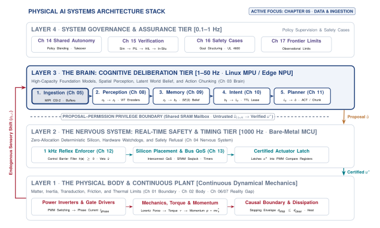
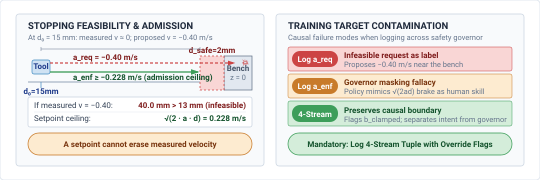
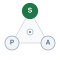
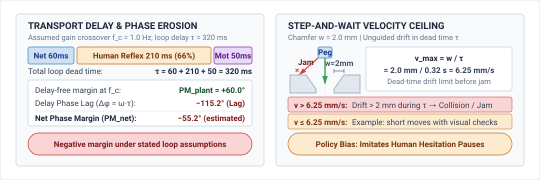

# Physical Data {#sec-data}

::: {layout-narrow}
::: {.column-margin}

\chapterminitoc

:::

::: {.content-visible when-format="pdf"}
\noindent
{fig-alt="Isometric blueprint showing the physical data and ingestion pipeline: The system includes key components: a bilateral teleoperation master arm for precise manipulation; a 6-axis operator load cell measuring force and providing control feedback; a calibrated stereo vision sensor head for depth perception; a micro-LiDAR rangefinder using laser pulses for accurate distance measurement; an optical calibration checkerboard ensuring sensor alignment precision; and a deterministic flash logger for reliable data storage under varying conditions."}
:::

::: {.content-visible unless-format="pdf"}
{fig-alt="Isometric blueprint showing the physical data and ingestion pipeline: bilateral teleoperation master arm, 6-axis operator load cell, calibrated stereo vision sensor head, micro-LiDAR rangefinder, optical calibration checkerboard, and deterministic flash logger."}
:::

:::

## Purpose {.unnumbered .unlisted}

::: {.content-visible when-format="pdf"}
\begin{marginfigure}
\vspace{1em}
\resizebox{\linewidth}{!}{\mlphysicalstackfull{100}{20}{20}{20}{20}}
\end{marginfigure}
:::

_What does the physical machine that collected a dataset leave permanently stamped into the policy that trains on it?_

A robot trajectory reflects the machine's behavior. Joint geometry and friction shape the motion, while sensor timing determines which observation accompanies each command. Training on those records also teaches a policy the consequences of these collection conditions. Successful demonstrations may omit recovery behavior needed when an error diverts the robot from the path. The policy then encounters unfamiliar observations, and its next action can increase the deviation. More successful runs do not close that gap. Transferring the data to another machine raises a related question, because similar-looking bodies can respond differently to the same command. Physical data must therefore preserve the relationship between observations, actions, and the collecting machine's response. In the architecture of physical AI systems, data quality is crucial as it relates to how the system's physical components behave and interact. Specifically, the timing of sensor data acquisition and processing affects the system's ability to replicate learned behaviors and recover from errors.



::: {.callout-learning-objectives}

- Estimate usable demonstration yield from collection time, reset overhead, and mechanical wear
- Analyze how the collecting policy limits dataset coverage and downstream recovery behavior
- Separate failed autonomous actions from human recovery trajectories in timestamped intervention records
- Evaluate whether a dataset's mechanical and sensing assumptions transfer to another machine
- Design dataset records linking observations with requested, mapped, enforced, and measured actions
- Assess whether recorded experience supports the operating conditions claimed for a learned policy

:::

## Endogenous Experience {#sec-data-endogenous-experience}

An autonomous mobile manipulator can flawlessly grasp objects in a hundred training demonstrations but spin out of control during its first physical deployment. The root cause is rarely an unrepresentative neural backbone or insufficient model parameter count. Rather, it is a structural failure of *endogenous experience*.[^fn-data-causal-loop] In disembodied computer vision or natural language processing, data collection is exogenous: images scraped from the web or text documents ingested from archives exist independently of the model that ingests them. In Physical AI, however, the actions emitted by the agent physically alter the trajectory of its body, the angles of its cameras, the contacts made with workpieces, and the distribution of every future observation ($s_{t+1} \sim P(s \mid s_t, a_t)$).

[^fn-data-causal-loop]: **Causal Boundary**\index{Causal boundary!thermodynamic constraint}: The causal boundary between computation and physics was established in @sec-boundary-causal-boundary. In an embodied system, computation acquires physical consequence because state evolution depends causally on motor actuation. Consequently, policy actions actively perturb the distribution of future observations ($s_{t+1} \sim P(s \mid s_t, a_t)$), invalidating the independent and identically distributed (i.i.d.) assumptions of disembodied machine learning.

::: {#dfn-data-endogenous-covariate-shift .callout-definition title="Endogenous covariate shift"}

***Endogenous covariate shift***\index{Endogenous covariate shift!definition}\index{Covariate drift!physical AI} is the irreversible closed-loop phenomenon wherein execution errors from an embodied agent's own past actions alter its future physical states and sensor observations, driving the machine into unfamiliar operational regimes and causing compounding trajectory divergence that scales quadratically ($\mathcal{O}(T^2 \epsilon)$) over horizon $T$.

1.  **Significance**: Explains why offline behavioral cloning fails during closed-loop physical execution; a minor perturbation drives the system into unvisited states where the policy lacks training support, triggering quadratic error compounding.
2.  **Distinction**: Unlike exogenous dataset shift caused by changing ambient lighting or seasonal weather, endogenous shift is actively generated by the agent's own closed-loop actions altering its subsequent observation distribution.
3.  **Common pitfall**: Attempting to fix closed-loop policy failure by collecting more nominal expert demonstrations, which only increases data density along the success manifold without providing the corrective recovery data needed to escape boundary excursions.

:::

The training archive contains only flawless executions, so the robot has never observed off-nominal states or witnessed corrective recovery trajectories. Once a single mistake shifts the machine even slightly off the demonstrated path, the policy encounters an unfamiliar observation. Lacking recovery data, its subsequent action becomes increasingly erroneous, causing cumulative trajectory drift that compounds quadratically over an execution horizon of $T$ time steps (@eq-data-quadratic-drift):[^fn-ai-covariate-shift]
$$\mathbb{E}[\text{Error}_T] = \mathcal{O}(T^2 \epsilon)$$ {#eq-data-quadratic-drift}
More flawless demonstrations do not resolve this failure mode. Adding more expert paths merely deepens the probability density along the center of the corridor while leaving the surrounding boundary excursions completely unsupported.

[^fn-ai-covariate-shift]: **Endogenous Covariate Shift**\index{Covariate shift!endogenous feedback}: In physical AI, execution errors drive the agent into states slightly off the demonstrated manifold. Because standard behavioral cloning lacks training support in these perturbed states, subsequent control actions compound trajectory errors quadratically ($\mathcal{O}(T^2 \epsilon)$) over an uncorrected horizon of length $T$. Overcoming this divergence requires active data aggregation strategies that supply corrective demonstrations from off-manifold states.

The physical cost of gathering this experience compounds the challenge. In digital domains, acquiring another million tokens costs mere fractions of a cent in cloud compute. In Physical AI, every recorded second consumes finite actuator fatigue life, heats motor stator windings, cycles gearbox teeth, scrubs tire treads, and drains battery capacity.[^fn-data-hardware-wear] Scheduled facility time on an instrumented robotic workcell or vehicle proving ground yields only a fraction of active motion data. Human teleoperation fatigue, safety interlock trips, manual fixture realignment, and physical scene resets consume over 70 percent of available clock time. Physical demonstration data is therefore not only scarce and expensive, but structurally perilous if logged naively.

[^fn-data-hardware-wear]: **Hardware Fatigue Life**\index{Hardware wear!actuator thermal duty cycle}: Actuator thermal limits, Joule heating in motor windings, and gearbox friction hysteresis constrain physical collection campaigns, as detailed in @sec-body-actuator-limits and @sec-body-thermal-duty-cycles. Sustained high-torque demonstrations degrade mechanical transmissions and alter joint friction profiles over time. Consequently, machine learning pipelines that assume stationary plant dynamics encounter unmodeled physical drift as collection testbeds age.

::: {.column-margin .margin-pointer}
↰ **Prerequisite:** Actuator thermal dissipation ($dT/dt$) and winding damage limits are derived in @sec-body-thermal-duty-cycles.
:::

::: {#fig-05-locator fig-env="figure" fig-pos="htb" fig-cap="**Data Ingestion Stage**: The four-tier physical AI systems architecture highlights the cognitive deliberation tier, with ingestion as the first of five brain stages and this chapter's active focus. Every later stage inherits whatever ingestion recorded, so the wall-clock cost of moving a physical body through the world, not storage capacity, bounds what the rest of the brain can learn." fig-alt="Diagram titled Physical AI Systems Architecture Stack, drawn as four stacked tiers. Layer 4 is system governance and assurance at 0.1 to 1 hertz, holding boxes for shared autonomy, verification, safety cases, and frontier limits. Layer 3 is the brain, a cognitive deliberation tier at 1 to 50 hertz, holding five stages named ingestion, perception, memory, intent, and planner. A dashed proposal-permission privilege boundary separates it from layer 2, the nervous system, a real-time safety and timing tier at 1000 hertz. Layer 1 is the physical body and continuous plant. Layer 3 is shaded and its ingestion stage is outlined; the badge reads Active Focus, Chapter 05, Data and Ingestion."}
{width="100%"}
:::

Within the four-tier physical AI architecture (@fig-05-locator), the **Data Ingestion** stage sits at the structural interface between the cognitive deliberation tier (the Brain, operating at 10 to 50 hertz), the real-time safety and timing tier (the Nervous System, operating at 1000 hertz), and the continuous plant (the Body). Ingestion is the gateway through which real-world physical dynamics enter the software pipeline. Every downstream cognitive stage—perception, memory, intent, and planning—inherits the coverage, biases, and omissions of the recorded archive.

Critically, a physical command cannot be logged as an isolated scalar or ungrounded vector of floating-point numbers. In an embodied system governed by the proposal-permission architecture,[^fn-data-proposal-permission] an action changes semantic meaning as it traverses the control stack. An operator's unconstrained joystick motion on an application processor is a raw proposal ($a_{\text{req}}$); kinematic mapping transforms it into a Cartesian setpoint ($a_{\text{cmd}}$); a real-time microcontroller safety governor clamps it to prevent barrier violations ($a_{\text{enf}}$); and the physical actuator delivers a measured torque response subject to link compliance and gear backlash ($a_{\text{meas}}$). Logging only the requested proposal injects dynamically infeasible demands into training loss, while logging only the measured plant response teaches the downstream policy to mimic structural deflection and gear backlash as though they were deliberate human skill. Preserving causal integrity requires logging the complete multi-tier action tap tuple across the computing boundary.

[^fn-data-proposal-permission]: **Proposal-Permission Architecture**\index{Proposal-permission architecture!privilege separation}: The proposal-permission architecture, introduced in @sec-brain-embodied, decouples unprivileged high-latency cognitive proposals from deterministic bare-metal safety enforcement on a dedicated microcontroller. Ingesting multi-tier telemetry across this boundary prevents safety governor interventions from contaminating the demonstrator's behavioral labels. Downstream policy synthesis methods that train on these ingested records are developed in @sec-training, while real-time control barrier functions that enforce physical limits during execution are detailed in @sec-enforcement.

Resolving the tension between collection costs, compounding covariate shift, and architectural integrity requires treating physical data engineering as a rigorous systems discipline. This chapter unfolds that discipline across seven interconnected stages:

We begin in @sec-data-collection-sources by examining where physical data originates—categorizing kinesthetic teaching, bilateral teleoperation, scripted routines, and autonomous deployment logs—and formalizing the Four-Stream Action Tap Tuple across the computing boundary. In @sec-data-teleop-costs, we analyze the true economics of physical data acquisition, quantifying facility scheduling budgets, reset latency overhead, duty cycles, and mechanical transmission fatigue. With physical collection mechanisms established, @sec-data-policy-coverage investigates collector-induced support manifolds, uncovering the mathematical geometry of expert demonstrations and proving why behavioral cloning suffers quadratic compounding error. To resolve this instability, @sec-data-intervention-recovery introduces intervention architectures, demonstrating how human takeovers, corrective aggregation, and perturbation rollouts inject the off-distribution recovery data needed to guarantee stable closed-loop execution. In @sec-data-cross-embodiment, we confront the challenge of cross-embodiment transfer, analyzing how differences in kinematics, link compliance, sensor perspectives, and actuator latencies prevent naive dataset sharing across heterogeneous robot platforms. We diagnose the primary mechanisms by which physical datasets fail in @sec-data-failure-modes, dissecting timestamp jitter, missing action taps, and unrecorded emergency stops. In @sec-data-schema, we formalize the dataset schema and provenance ledger, establishing explicit operational design domain (ODD) boundaries that define where recorded experience supports autonomous execution. Finally, @sec-data-fallacies-pitfalls and @sec-data-summary close with common systems fallacies and foundational takeaways.

## Where Physical Data Comes From {#sec-data-collection-sources}

A physical dataset is not found, logged from passive traffic, or assembled from a public repository. Every transition tuple in an archive required burning electrical energy, pushing against mechanical friction, and moving physical mass through a coordinate frame. The challenge of learning from physical demonstration traces back to Dean Pomerleau's ALVINN (Autonomous Land Vehicle in a Neural Network) [@pomerleau1989alvinn]. By training a neural network to steer an autonomous vehicle directly from camera images of human driving, Pomerleau observed that the model learned only how to track nominal lane centers; because human experts rarely made errors, the dataset contained zero demonstrations of recovery trajectories from lane edges, causing compounding drift as soon as small execution errors accumulated in closed loop.

Physical data sources separate according to who chooses the action:

1. In **kinesthetic teaching**, a colocated demonstrator physically grasps and moves the unpowered or gravity-compensated joints of the mechanism.
2. In **teleoperation**, a remote operator guides an input device such as a master arm, a multi-axis space mouse, or a tracked hand controller, transmitting commands across a software interface to the follower robot.[^fn-hist-goertz-teleop]
3. In **scripted collection**, an engineer executes a deterministic control routine, such as a state machine tracking interpolated splines or force-thresholded primitives.
4. In **exploratory collection**, an active policy selects actions to optimize an information-theoretic objective, sample state space, or maximize a reward signal.
5. In **autonomous logging during deployment**, the production policy commands the actuators as it performs work in a factory or warehouse, storing incoming sensor streams in situ.

[^fn-hist-goertz-teleop]: **Bilateral Teleoperation Lineage**\index{Raymond Goertz!bilateral telemanipulation}: Raymond Goertz developed the first bilateral mechanical and electrical master-slave telemanipulators at Argonne National Laboratory in the late 1940s and 1950s for handling radioactive materials. His mechanical linkages introduced reflected force feedback across a physical barrier, proving that human operators require kinesthetic resistance to avoid jamming remote mechanisms. In modern robot learning, this physical coupling determines whether demonstrations capture genuine contact compliance or open-loop visual hunting motions.

For each collection source, the engineer decides which variable is recorded as the action label, altering what the learned model reproduces. In teleoperation and autonomous systems, data logging taps into multiple layers across the control pipeline (@fig-05-action-taps). On heterogeneous dual-brain platforms, such as a canonical heterogeneous dual-brain System-on-Chip (SoC) testbed or a bimanual leader-follower teleoperation workstation[^fn-hw-gello-teleop] [@zhao2023learning; @wu2023gello], this pipeline spans two distinct computational domains:

[^fn-hw-gello-teleop]: **Passive Leader Arm**\index{Leader arm!passive bilateral kinematics}: Low-cost 3D-printed leader arms (such as GELLO [@wu2023gello] and ALOHA [@zhao2023learning]) use joint encoders to mirror follower poses without active motorized force reflection. This architectural choice eliminates expensive torque actuators and complex bilateral control loops, drastically lowering hardware acquisition costs. However, because human demonstrators feel zero reflected contact force, demonstrations gathered on passive leader rigs systematically lack reactive compliance adjustments during rigid contact.

- The unprivileged **Linux Application Processor (MPU)** captures high-bandwidth camera streams (e.g., active stereo RGB-D at $30\text{ Hz}$), ingests master teleoperation inputs or neural policy forward passes, and maps coordinates.
- Extending the proposal-permission architecture from @sec-brain-embodied, the real-time **Microcontroller Unit (MCU)** executes at $1000\text{ Hz}$ on bare metal, running low-level PID/impedance control, forward-invariant safety barrier functions, velocity clamping, and motor current limiters over high-speed CAN-FD networks or direct PWM voltage pulses.[^fn-hw-encoder-capture] Because each domain operates on independent quartz oscillators, uncalibrated clock drift[^fn-bench-timestamp-skew] between camera frames and motor current ticks corrupts state-action alignment across extended logging runs.

[^fn-hw-encoder-capture]: **Hardware Timer Interrupt**\index{Hardware timer interrupt!DMA latching}: On real-time MCUs, optical encoder counts and current shunt readings are sampled via hardware timer interrupts and Direct Memory Access (DMA) to guarantee microsecond determinism. Bypassing operating system thread scheduling allows dedicated timer peripherals to latch high-frequency plant states at exact clock boundaries. This deterministic latching prevents inter-sample timestamp jitter from corrupting downstream numerical differentiation during velocity and acceleration estimation.

[^fn-bench-timestamp-skew]: **Oscillator Clock Drift in Multi-Sensor Telemetry**\index{Timestamping!oscillator drift}: Standard quartz crystal oscillators exhibit thermal drift between $20\text{ and }50\text{ parts per million (ppm)}$, causing unsynchronized sensor clocks to diverge by up to $3\text{ ms}$ per minute of operational logging. In high-speed trajectory capture, this uncalibrated temporal drift misaligns visual demonstration frames with joint torque telemetry, corrupting policy cloning datasets before training begins.

::: {#fig-05-action-taps fig-env="figure" fig-pos="t" fig-cap="**Four-Stream Action Tap Tuple**: Four places a command can be logged, from raw policy intent on the application processor through to measured plant response. Which tap a dataset records decides what the model learns to imitate. Logging only the request bakes in actuator drift the robot could never execute, and logging only the measurement bakes in mechanical compliance and backlash as though they were demonstrated skill. Source: architectural design adapted from @zhao2023learning and @wu2023gello." fig-alt="The Four-Stream Action Tap Tuple across the Dual-Brain MPU/MCU Boundary. On a heterogeneous edge architecture, data logging captures four distinct physical semantics: (1) areq (raw operator or policy intent on the Linux MPU prior to software checks), (2) acmd (kinematically retargeted setpoint), (3) aenf (safety-governed command post-CBF barrier enforcement and motor torque clamping on the real-time MCU), and (4) ameas (measured plant response via joint optical encoders and current shunts). Logging only areq bakes unexecutable actuator drift into training loss, while logging only ameas bakes mechanical compliance, link deflection, and backlash as demonstrated human skill. Source: Architectural design adapted from @zhao2023learning and @wu2023gello."}
{width="100%"}
:::

The four taps along this control path capture fundamentally different physical semantics:

- The **requested action** ($a_{\text{req}}$): the raw input from the operator's tracking device or policy proposal before coordinate transformations or software boundary checks.
- The **mapped command** ($a_{\text{cmd}}$): the Cartesian setpoint or joint target computed after kinematic retargeting and workspace boundary checks.
- The **enforced command** ($a_{\text{enf}}$): the setpoint after real-time safety filters, velocity limits, and barrier functions have clamped the candidate trajectory.
- The **measured response** ($a_{\text{meas}}$): the actual kinematic and kinetic response reported by joint optical encoders and current shunts after mechanical contact and structural deflection have occurred.

If the logging pipeline records $a_{\text{req}}$ prior to software limit enforcement, the dataset contains dynamically infeasible trajectories that command accelerations beyond motor current limits. If it logs $a_{\text{meas}}$ after contact, the recorded label reflects structural compliance and gear backlash rather than commanded intent, turning a feedforward control signal into an observation of material deformation. Building on the causal boundary established in @sec-boundary-causal-boundary, logging the full tuple $(a_{\text{req}}, a_{\text{cmd}}, a_{\text{enf}}, a_{\text{meas}})$ across the MPU/MCU boundary is necessary to distinguish operator intent from governor intervention.

::: {#dfn-data-four-stream-action-tap-tuple .callout-definition title="The four-stream action tap tuple"}

***Four-stream action tap tuple***\index{Four-stream action tap tuple!definition}\index{Action tap!definition} $(a_{\text{req}}, a_{\text{cmd}}, a_{\text{enf}}, a_{\text{meas}})$ is the synchronized multi-tier record logged across the host MPU and real-time MCU boundary that distinguishes raw operator or policy intent ($a_{\text{req}}$), kinematically retargeted setpoints ($a_{\text{cmd}}$), safety-governor clamped commands ($a_{\text{enf}}$), and delivered physical actuator response ($a_{\text{meas}}$).

1.  **Significance**: Training imitation learning policies on raw requested actions ($a_{\text{req}}$) injects dynamically infeasible commands that trigger safety trips in deployment. Conversely, training on measured responses ($a_{\text{meas}}$) causes the model to imitate mechanical compliance, backlash, and external disturbances rather than intentional control. Logging all four streams disambiguates control intent from governor intervention.
2.  **Distinction**: Unlike classical robot telemetry logs that capture only final motor encoder states or raw teleoperation joystick inputs, the four-stream tap preserves the exact causal filtering stages applied by intermediate software and safety hardware.
3.  **Common pitfall**: Logging streams without hardware-synchronized timestamps ($t_{\text{PTP}}$). Even a few milliseconds of clock skew between the high-level perception host and the low-level motor MCU corrupts the temporal alignment between visual observations and corresponding torque actions.

:::

### Synchronous 4-stream action tap and telemetry ring-buffer protocol

To operationalize the four-stream action tap without non-deterministic logging jitter or buffer contention, the system executes a synchronized inter-core capture loop:

**Input interfaces:**

- Raw observation stream $\mathbf{o}_t \in \mathcal{O}$ from the host perception pipeline (active stereo RGB-D at $30\text{ Hz}$, hardware timestamp $t_{\text{exp}}$).
- Raw operator input or policy action candidate $a_{\text{req}}(t) \in \mathcal{A}_{\text{raw}}$ from MPU shared memory ($50\text{ Hz}$).
- Kinematic retargeting and workspace boundary mapping $\mathcal{K}: \mathcal{A}_{\text{raw}} \to \mathcal{A}_{\text{cartesian}}$.
- A Forward-invariant **Control Barrier Function (CBF)** ensures safety in control systems by defining constraints that must be satisfied during operation. It plays a critical role in maintaining system stability and preventing unsafe states.\index{Control barrier function}[^fn-math-cbf-collection] [@ames2019control] and velocity limiter $\mathcal{B}: \mathcal{X} \times \mathcal{A}_{\text{cartesian}} \to \mathcal{A}_{\text{safe}}$ on the real-time MCU.
- Bare-metal hardware counter registers for quadrature optical encoders (measuring physical joint rotation) and phase current sensing interfaces (measuring electrical current pushing the motors).

[^fn-math-cbf-collection]: **Control Barrier Function**\index{Control barrier function!forward-invariant filtering}: A Control Barrier Function (CBF) defines a forward-invariant safe set that minimally modifies candidate control inputs to enforce strict state constraints [@ames2019control]. In real-time embedded controllers, quadratic program solvers evaluate barrier constraints at kilohertz frequencies to guarantee safety invariance. Unrecorded CBF interventions mask operator tracking errors, causing imitation policies to imitate governor braking curves instead of human intent.

**Execution protocol (periodic $1.0\text{ ms}$ MCU cycle):**

1. **Perception and intent ingestion (host MPU domain):**
   Ingest synchronized camera frame $\mathbf{o}_t$ with hardware exposure timestamp $t_{\text{exp}}$, sample raw master input $a_{\text{req}}(t)$, evaluate forward kinematics $a_{\text{cmd}}(t) \leftarrow \mathcal{K}(a_{\text{req}}(t))$, and commit $\langle t_{\text{exp}}, \mathbf{o}_t, a_{\text{req}}, a_{\text{cmd}} \rangle$ to shared memory via non-blocking hardware memory transfers, maintaining high data bus throughput without CPU-stalling latency spikes.

2. **Safety barrier evaluation and actuation (MCU domain, $1000\text{ Hz}$ ISR):**
   Latch hardware monotonic clock $t_{\text{mono}}$ from the hardware timer, ingest $a_{\text{cmd}}(t)$ across inter-core single-producer single-consumer ring buffers using hardware memory synchronization fences to prevent concurrent read/write data corruption, and evaluate dynamic barrier constraints:
   $$a_{\text{enf}}(t) \leftarrow \mathcal{B}(\mathbf{x}_{\text{current}}, a_{\text{cmd}}(t)).$$
   If $a_{\text{enf}}(t) \neq a_{\text{cmd}}(t)$, assert governor intervention flag $b_{\text{clamped}} \leftarrow \text{true}$ with clamp code $\kappa$, and dispatch $a_{\text{enf}}(t)$ to motor pulse-width modulation drives over the real-time fieldbus.

3. **Physical response capture and commit:**
   Sample optical joint encoders and phase current shunts at the control cycle boundary ($a_{\text{meas}}(t) \leftarrow \text{ReadPlantSensors}()$), compute tracking discrepancy $\delta_{\text{track}} \leftarrow \|a_{\text{enf}}(t) - a_{\text{meas}}(t)\|_2$, assemble synchronous telemetry packet $\mathcal{P}_t = \langle t_{\text{mono}}, \mathbf{o}_t, a_{\text{req}}, a_{\text{cmd}}, a_{\text{enf}}, a_{\text{meas}}, \mathbf{h}_{\text{plant}}, [b_{\text{clamped}}, \kappa, \delta_{\text{track}}] \rangle$, and commit $\mathcal{P}_t$ via a lock-free circular ring buffer for non-blocking telemetry commit, preventing ring buffer overflows, dropouts, and stalls in the critical $1000\text{ Hz}$ control loop.

To see the concrete necessity of logging all four action taps, consider an operator guiding a 6-DoF manipulator toward a rigid workbench located at distance $d_0 = 15\text{ mm}$ along the $z$-axis. The operator's input device commands a requested downward velocity $a_{\text{req}} = -0.40\text{ m/s}$. The real-time MCU evaluates a forward-invariant Control Barrier Function (CBF) enforcing maximum deceleration $a_{\text{decel}} = 2.0\text{ m/s}^2$ with a safety clearance buffer $d_{\text{safe}} = 2.0\text{ mm}$. Under constant deceleration, stopping from $|v| = 0.40\text{ m/s}$ requires:
$$d_{\text{stop}} = \frac{v^2}{2 a_{\text{decel}}} = \frac{(0.40\text{ m/s})^2}{2 \times 2.0\text{ m/s}^2} = 40.0\text{ mm}$$

Because the available clearance before the safety buffer is $d_{\text{avail}} = d_0 - d_{\text{safe}} = 13.0\text{ mm} < 40.0\text{ mm}$, the requested action violates the barrier invariant and would cause a collision at $v_{\text{impact}} \approx 0.329\text{ m/s}$. The maximum safe velocity permitted by the barrier is:
$$|a_{\text{enf}}| = \sqrt{2 a_{\text{decel}} d_{\text{avail}}} = \sqrt{2 \times 2.0\text{ m/s}^2 \times 0.013\text{ m}} \approx 0.228\text{ m/s}$$

The MCU safety shield clamps the candidate command from $-0.400\text{ m/s}$ to $a_{\text{enf}} = -0.228\text{ m/s}$. Logging only $a_{\text{req}}$ teaches an imitation policy unexecutable trajectories that violate physical deceleration corridors during deployment. Conversely, logging only $a_{\text{enf}}$ without intervention flags misattributes the safety enforcer's intervention to demonstrator intent, teaching the model that human proposals naturally follow a parabolic braking curve $\sqrt{2 a_{\text{decel}} d_{\text{avail}}}$. Preserving the full action tuple $(a_{\text{req}}, a_{\text{cmd}}, a_{\text{enf}}, a_{\text{meas}})$ alongside explicit override flags cleanly separates demonstrator intent from governor enforcement.

::: {#chk-data-action-tap-discrepancy .callout-checkpoint title="Action tap discrepancy and governor contamination"}

{fig-alt="2D schematic diagram illustrating the action tap discrepancy problem. The left panel shows a robot tool approaching a workbench at 15 mm, contrasting a requested command of -0.40 m/s that would cause a 40 mm overshoot collision against an enforced Control Barrier Function command of -0.228 m/s that halts at the 2 mm safety buffer. The right panel contrasts three data logging strategies: logging only requested actions produces unexecutable crash policies, logging only enforced actions teaches artificial governor braking curves as human skill, and logging the synchronized 4-stream action tuple preserves causal boundaries." width=100%}

- [ ] **Action tap divergence**: Can you explain why training an imitation policy on requested actions ($a_{\text{req}}$) versus enforced actions ($a_{\text{enf}}$) leads to divergent failure modes during deployment?
- [ ] **Governor masking**: Can you describe how a safety enforcer clamping commands can inadvertently teach a policy an incorrect braking curve if intervention flags are omitted?
- [ ] **Four-stream action logging**: Can you distinguish the roles of requested, commanded, enforced, and measured action streams in post-hoc incident forensics?
:::

### Multi-stream asynchronous telemetry schemas and exposure midpoint timestamping

Modern physical AI systems record telemetry across fundamentally asynchronous sensor modalities operating under disparate physics, sampling clocks, and bus protocols:

- **Active vision streams:** Multi-view RGB and depth cameras capture frames at $30\text{ Hz}$ ($33.3\text{ ms}$ interval), where photons accumulate over a finite exposure window $t_{\text{exp}} \in [10, 30]\text{ ms}$, followed by sensor row readout ($4\text{--}8\text{ ms}$) and high-throughput data bus transfer to host memory.
- **Tactile and force-torque matrices:** Fingertip piezoresistive or optical elastomer sensors sample surface traction and normal forces at $100\text{ Hz}$ ($10.0\text{ ms}$ interval) over SPI or CAN-FD buses.
- **Joint encoders and inverter telemetry:** Optical joint encoders, motor phase current shunts, and Field-Oriented Control (FOC) current loops execute deterministically on bare-metal MCUs at $1000\text{ Hz}$ ($1.0\text{ ms}$ interval).
- **Policy control and action dispatch:** Generative action proposals or teleoperation commands are computed and dispatched at $50\text{ Hz}$ ($20.0\text{ ms}$ interval).

Standard machine learning data loaders often employ a naive "latest available sample" latching policy: whenever the $50\text{ Hz}$ action loop fires, it packages the most recently arrived camera frame with the current joint angles. This naive latch introduces catastrophic temporal misalignment. If a camera frame arrives in host RAM at timestamp $t$, the photons that generated that image were integrated during an exposure window centered $25\text{--}40\text{ ms}$ in the past. Pairing the current control action $a_t$ with an uncompensated visual observation $o_t$ teaches the imitation policy to map historical states to instantaneous actions, baking unmodeled phase lag directly into the neural network weights.

::: {.column-margin}
{width="100%" fig-alt="S·P·A locator triad with the Sense node highlighted."}

*The Sense axis: sub-microsecond timestamping and causal state-space logging.*
:::

To prevent temporal corruption across dataset schemas (such as Hugging Face LeRobot, RLDS / Open X-Embodiment [@open_x_embodiment_collaboration2024open], and Foxglove MCAP), logging engines enforce the **exposure midpoint timestamping rule**:

1. **Hardware exposure midpoint timestamp:** The true physical timestamp of an optical observation $o_t$ is latched at the midpoint of sensor exposure:
   $$t_{\text{obs}} = t_{\text{trigger}} + \frac{1}{2} t_{\text{exp}}$$
   where $t_{\text{trigger}}$ is synchronized across cameras via IEEE 1588 Precision Time Protocol (PTP) hardware triggers or external TTL sync lines.
2. **Causal kinematic interpolation:** Because the real-time MCU logs joint positions and velocities at $1000\text{ Hz}$ ($1.0\text{ ms}$ resolution), the true mechanical configuration at the exact camera optical timestamp is computed by smoothly interpolating between the two closest $1\text{ kHz}$ encoder records. For the full cubic Hermite spline calculation used in this physical interpolation, see @sec-appendix-systems.
3. **Container serialization:** Modern open-source dataset containers formalize this multi-rate structure. In **MCAP**, messages preserve raw sensor arrival and log-time timestamps alongside channel schema definitions in a single zero-copy binary file. In **LeRobot** [@cadene2024lerobot], video streams are chunked into MP4/AV1 containers with frame-accurate metadata, while synchronized $50\text{ Hz}$ state-action tensors are serialized into columnar Parquet or Safetensors formats. In **RLDS**, transitions are structured as nested episode dictionaries (`steps/is_first`, `steps/is_terminal`, `steps/observation`, `steps/action`). Enforcing exposure-midpoint alignment before serializing ensures that state-action pairs $(s_t, a_t)$ share a causally sound, physically verified temporal reference.

::: {.column-margin .margin-pointer}
↰ **Prerequisite:** Sub-microsecond PTP clock synchronization across distributed bus controllers is established in @sec-nervous-deterministic-fieldbuses.
:::

Because the collecting entity dictates how the machine approaches the environment, kinesthetic teaching, teleoperation, unguided play, and autonomous logging occupy disjoint state-action manifolds even when attempting the exact same physical contact task. Consider inserting a cylindrical steel pin into a chamfered hole with a clearance of $50\,\mu\text{m}$. A colocated human guiding the tool directly senses contact reaction forces through their hands and makes instantaneous, fine-grained compliance adjustments at their own wrist joints. A remote teleoperator watching a two-dimensional video feed lacks direct haptic feedback, creating visual latency delays, command overshoot, and characteristic hunting motions as the operator pecks at the contact boundary. A scripted controller follows a programmed helical search pattern at constant linear velocity, generating a dense geometric spiral with predictable force spikes against the chamfer face. Autonomous logging from an exploratory or partially trained policy wanders across off-target regions, repeatedly binding the pin at oblique angles until motor current thresholds trigger a software fault. These logs do not represent noisy samples of a single trajectory but outputs from distinct dynamical systems with different bandwidths, latency profiles, and mechanical compliances.

::: {.column-margin .margin-pointer}
⇄ **Contrast:** Teleoperation hunting delay ($250\text{ ms}$) contrasts with the continuous tactile reflex bandwidth ($1\text{ kHz}$) analyzed in @sec-body-measurement-freshness.
:::

A common error in physical machine learning is treating each recorded control step as an independent experience. When a joint controller logs state-action pairs at $50\text{ Hz}$, one hour of continuous recording produces $180{,}000\text{ steps}$. Multiplying sample frequency by recording time yields large step counts, but adjacent steps exhibit extreme temporal autocorrelation. Two camera frames logged $20\text{ ms}$ apart differ by sub-millimeter end-effector displacements and minor sensor noise. Distributional coverage scales with the count of independent task episodes and distinct physical configurations, not with the sampling clock. An archive containing $100{,}000\text{ steps}$ distributed across five hundred distinct workpiece positions and lighting conditions provides vastly broader support than $1{,}000{,}000\text{ steps}$ logged during a single continuous demonstration where the end-effector engaged a workpiece at a single bench location.

Evaluating the throughput of a physical collection campaign requires calculating the usable episode yield from the mechanical and operational parameters of the workcell. Consider an analytical example of an articulated manipulator collecting contact demonstrations for a precision assembly task. Let an attempt require an average duration $t_{\text{att}} = 20\text{ s}$. After each attempt, the cell must return to a valid initial state, requiring the manipulator to transit home and an automated fixture to reset the workpiece, adding a reset duration $t_{\text{rst}} = 15\text{ s}$. The total cycle time for a single attempt is $t_{\text{cyc}} = t_{\text{att}} + t_{\text{rst}} = 35\text{ s}$. In one wall-clock hour ($3600\text{ s}$), a single rig completes at most $102\text{ attempts}$. Physical collection suffers from trial failures where workpieces slip, parts jam, or safety watchdogs trip on excessive contact force. If the trial failure rate is 25 percent, and post-collection validation rejects an additional 10 percent of logs due to camera occlusion or dropped network packets, the retention rate is:
$$R = (1 - 0.25) \times (1 - 0.10) = 0.675.$$
The usable episode yield for a single rig is:
$$Y_{\text{usable}} = \left\lfloor\frac{3600\text{ s}}{t_{\text{cyc}}}\right\rfloor \times R = 102 \times 0.675 \approx 68.8\text{ usable episodes per hour}.$$

If training a policy requires $5000\text{ validated episodes}$ to achieve target success rates across geometric variations, collecting that data on one workstation requires $72.7\text{ hours}$ of active execution time. Across those $72.7\text{ hours}$, the machine executes $7415\text{ physical cycles}$, subjecting gearbox teeth to repeated directional reversals, stressing flex cables inside articulated joints through thousands of bends, and accumulating thermal load in motor windings under sustained stall currents. Operating three parallel collection rigs increases the throughput to approximately $206.4\text{ usable episodes per hour}$ and compresses calendar time to $24.2\text{ hours}$, but it scales hardware wear and maintenance linearly across three sets of mechanical transmissions and sensors.

::: {.column-margin .margin-pointer}
↳ **Downstream:** Usable demonstration yield ($Y_{\text{usable}}$) sets the sample efficiency requirements for trial-based learning in @sec-training-learning-by-trial.
:::

Simulated trajectories generated in rigid-body physics engines avoid direct hardware wear and can generate millions of transitions per hour across distributed compute clusters. The mechanics, approximations, and domain transfer boundaries of simulated data are treated in @sec-training. When synthetic trajectories are combined with physical logs, the physical provenance of every record must be tracked explicitly. A model trained on an undifferentiated mixture inherits the contact unfaithfulness of the physics engine wherever synthetic data dominates, while inheriting the unmodeled sensor noise and mechanical backlash of the hardware wherever physical data dominates. Without tracking the collecting agent and the recording tap point for each sample, an engineer cannot determine whether an on-robot failure stems from simulation error or from physical collection bias. Human teleoperation remains the standard technique for gathering high-quality physical trajectories, yet the interface between the human and the machine shapes the recorded dynamics long before the data reaches a model.

## Teleoperation Demonstration Costs {#sec-data-teleop-costs}

Human teleoperation closes a feedback loop that spans the operator, the input device, the communication bus, the low-level motor controller, and the physical environment (@fig-05-teleop-rig). In a typical teleoperation workstation, an image sensor captures the workspace, encodes the video stream, and transmits the frames across a network to a display console. The operator perceives visual feedback, decides on a corrective trajectory, and displaces an input device. The workstation samples the device state, maps the spatial displacement into joint or end-effector coordinates, and transmits the resulting setpoint across an industrial bus to the robot's motor drives. The actuators generate torque, accelerating the mechanical linkages against inertia, joint friction, and contact constraints. This displacement alters the scene, producing new optical signals recorded by the image sensor in the next cycle.

::: {#fig-05-teleop-rig fig-env="figure" fig-pos="t" fig-cap="**Kinematically Isomorphic Teleoperation Rigs**: Demonstration capture on three leader-follower rigs whose leader devices mirror follower kinematics [@wu2023gello]. Because the leader shares the follower's joint structure, the interface needs no inverse kinematics and inherits none of its singularities (mathematical dead-zones where joints align and lose mobility), preserving the operator's direct joint-level coordination. Human reaction latency of $200\text{--}300\text{ ms}$ still enters the recording as phase lag, so the demonstration carries the operator's delay as if it were policy." fig-alt="Kinematically Isomorphic Leader-Follower Teleoperation Architecture across Heterogeneous Manipulators. Demonstration acquisition on physical robot platforms using low-cost, kinematically isomorphic leader controllers (canonical architecture [@wu2023gello]). (A) Bimanual teleoperation setup with twin 6-DoF leader arms mapped directly to dual heavy-payload follower manipulators during a compliant liquid-pouring task. (B) Single-arm leader-follower configuration controlling a torque-controlled manipulator with an overhead task camera. (C) Precision pick-and-place manipulation with passive gravity compensation and joint-angle direct drive. Because the leader device mirrors follower kinematics without requiring numerical inverse kinematics (IK), the interface eliminates IK singularities while preserving the operator's direct joint-level coordination. However, human reaction latency (200--300 ms) and communication delays still introduce phase lag into the recorded (st, at) demonstration tuples. Source: Adapted from Wu et al. [@wu2023gello], CC BY 4.0."}
{width="95%"}
:::

Each stage in this loop introduces latency that affects the timing of the correction. In an analytical reference setup with a high-speed camera and a wired local network, display processing requires $t_{\text{disp}} = 50\text{ ms}$ across exposure, H.264 decoding, and monitor refresh. Human visual perception and neuromuscular transmission introduce an operator response latency of $t_{\text{hum}} = 200\text{ ms}$ for continuous path corrections. Command quantization, packetization, and bus transport to the robot controller add $t_{\text{cmd}} = 10\text{ ms}$. Actuator torque ramp-up and structural inertia impose a mechanical response latency of $t_{\text{mech}} = 80\text{ ms}$ before the robot achieves the commanded acceleration. The total round-trip latency is:
$$t_{\text{loop}} = t_{\text{disp}} + t_{\text{hum}} + t_{\text{cmd}} + t_{\text{mech}} = 50\text{ ms} + 200\text{ ms} + 10\text{ ms} + 80\text{ ms} = 340\text{ ms}.$$

When a contact misalignment occurs at time $t$, the operator sees the error at $t + 50\text{ ms}$, issues a motor command at $t + 250\text{ ms}$, and the arm exerts corrective force against the workpiece at $t + 340\text{ ms}$. During those $340\text{ ms}$, the physical system continues moving under momentum and external contact forces. If the data logger records the current sensor observation $s_t$ alongside the human command $a_t$ issued at that same clock instant, the recorded demonstration pairs a physical state with an action chosen in response to a state that existed $250\text{ ms}$ in the past. This temporal misalignment bakes an unmodeled phase lag directly into the training targets. Because the dataset pairs a past visual state with a present physical reaction, the model learns this delayed timing as deliberate behavior, producing policies that over-correct or oscillate when deployed autonomously at $50\text{--}100\text{ Hz}$.

**Teleoperation round-trip latency** ($t_{\text{loop}} = t_{\text{disp}} + t_{\text{hum}} + t_{\text{cmd}} + t_{\text{mech}}$) is the total elapsed time between a physical contact event and the delivered corrective actuator response, embedding biological reaction delays ($200\text{--}300\text{ ms}$) as artificial phase lag in demonstration timestamps. **Demonstration yield** ($Y_{\text{usable}} = \lfloor T_{\text{active}} / t_{\text{cyc}} \rfloor \cdot R$) is the fraction of scheduled facility time that converts into validated, defect-free trajectory records after deducting startup, calibration, operator rest, physical resets, and quality filtering losses.

```{python}
#| label: calc-data-multi-camera-ingestion
#| echo: false
# ┌─────────────────────────────────────────────────────────────────────────────
# │ MULTI-CAMERA TELEOPERATION INGESTION BUDGET (LEGO): 'Ingestion budget' refers to constraints on data flow and processing capacity in multi-camera teleoperation systems. It encompasses data throughput, processing power, and memory limitations, critical for real-time performance in embedded systems.
# ├─────────────────────────────────────────────────────────────────────────────
# This section examines data processing integration in physical AI systems. Machine learning involves algorithms that enable systems to learn from data, embedded systems are specialized computing devices designed for specific tasks, and control mechanisms are techniques used to manage the behavior of dynamic systems. Understanding the interrelation of these three domains is crucial for effective integration in physical AI systems.
# │ Context: @nbk-data-ingestion-bandwidth-storage-budgets-multi-camera
# Multi-camera systems involve the use of multiple cameras to capture data from different angles or perspectives. This approach challenges camera synchronization, critical for accurate data ingestion. Managing bandwidth and storage budgets requires understanding these challenges, as combined data from multiple sources significantly increases processing and storage volume.
# │ Goal:    Size sustained telemetry ingestion rate and NVMe storage footprint.
# │ Show:    'BW_total' denotes total bandwidth: 968.01 MB/s for 1080p and 553.29 MB/s for 720p, yielding a data transfer rate of 3.48 TB/hr. Bandwidth is crucial for an AI system's efficiency in processing video data in real-time, especially for applications needing rapid data handling and low latency.
# │ How:     'Multimodal stream aggregation' in Physical AI systems combines data from RGB (color images), depth (distance measurements), kinematics (motion data), and tactile (touch feedback) to understand the environment. Each modality contributes: RGB offers visual context, depth enables spatial awareness, kinematics tracks movement, and tactile feedback reveals interactions. Integrating these modalities is essential for creating a comprehensive understanding of the environment. However, it presents challenges: data synchronization can cause processing delays; bandwidth management may saturate bus bandwidth; and real-time processing requires careful consideration of jitter bounds and worst-case execution times for timely responses.
# └─────────────────────────────────────────────────────────────────────────────
from mlsysim import *
from mlsysim.core.units import *
from mlsysim.fmt import fmt_bandwidth, fmt_memory, fmt_qty, fmt_int, check

class MultiCameraIngestionBudget:
    """Telemetry bandwidth and storage sizing for multi-modal teleoperation rigs."""

    # ┌── 1. LOAD (Constants & Parameters) ─────────────────────────────────
    num_cameras = 4
    fps_video = 30.0
    bytes_per_px_rgb = 3
    bytes_per_px_depth = 2

    # Kinematics: 14-DoF leader/follower logged at 1000 Hz (128 bytes/step)
    bw_kin = 128 * byte * 1000 / second
    # Tactile: 2 dual-finger fingertip arrays logged at 100 Hz (2048 bytes/step)
    bw_tac = 2048 * byte * 100 / second

    # ┌── 2. EXECUTE (Compute) ─────────────────────────────────────────────
    # High-resolution capture (1080p RGB, 720p Depth)
    res_1080p = calc_teleop_ingestion_budget(
        num_cameras=num_cameras,
        rgb_width=1920,
        rgb_height=1080,
        rgb_fps=fps_video,
        rgb_bytes_per_pixel=bytes_per_px_rgb,
        depth_width=1280,
        depth_height=720,
        depth_fps=fps_video,
        depth_bytes_per_pixel=bytes_per_px_depth,
        kinematics_bytes_per_sec=bw_kin,
        tactile_bytes_per_sec=bw_tac,
    )
    bw_rgb_1080p = res_1080p["bw_rgb"]
    bw_depth_1080p = res_1080p["bw_depth"]
    bw_vision_1080p = res_1080p["bw_vision"]
    bw_total_1080p = res_1080p["bw_total"]
    storage_hour_1080p = res_1080p["storage_per_hour"]

    # Standard resolution capture (720p RGB, 720p Depth)
    res_720p = calc_teleop_ingestion_budget(
        num_cameras=num_cameras,
        rgb_width=1280,
        rgb_height=720,
        rgb_fps=fps_video,
        rgb_bytes_per_pixel=bytes_per_px_rgb,
        depth_width=1280,
        depth_height=720,
        depth_fps=fps_video,
        depth_bytes_per_pixel=bytes_per_px_depth,
        kinematics_bytes_per_sec=bw_kin,
        tactile_bytes_per_sec=bw_tac,
    )
    bw_rgb_720p = res_720p["bw_rgb"]
    bw_total_720p = res_720p["bw_total"]
    storage_hour_720p = res_720p["storage_per_hour"]

    # Shift aggregation (5 workstations, 8-hour shift)
    num_workstations = 5
    shift_hours = 8.0
    storage_shift_720p = storage_hour_720p * (num_workstations * shift_hours)

    # ┌── 3. GUARD (Assertions) ────────────────────────────────────────────
    check(abs(bw_rgb_1080p.to(MB / second).magnitude - 746.50) < 0.2, "Unexpected 1080p RGB rate")
    check(abs(bw_depth_1080p.to(MB / second).magnitude - 221.18) < 0.2, "Unexpected 720p Depth rate")
    check(abs(bw_total_1080p.to(MB / second).magnitude - 968.01) < 0.2, "Unexpected total 1080p bandwidth")
    check(abs(storage_hour_1080p.to(TB).magnitude - 3.48) < 0.05, "Unexpected hourly storage")
    check(abs(bw_total_720p.to(MB / second).magnitude - 553.29) < 0.2, "Unexpected total 720p bandwidth")
    check(abs(storage_shift_720p.to(TB).magnitude - 79.67) < 0.5, "Unexpected shift storage")

    # ┌── 4. OUTPUT (Format & Export) ────────────────────────────────────────
    num_cams_str = fmt_int(num_cameras)
    bw_rgb_1080p_str = fmt_bandwidth(bw_rgb_1080p, unit=MB / second, precision=2)
    bw_depth_1080p_str = fmt_bandwidth(bw_depth_1080p, unit=MB / second, precision=2)
    bw_vision_1080p_str = fmt_bandwidth(bw_vision_1080p, unit=MB / second, precision=2)
    bw_vision_1080p_gb_str = fmt_bandwidth(bw_vision_1080p, unit=GB / second, precision=3)
    bw_kin_str = fmt_bandwidth(bw_kin, unit=MB / second, precision=3)
    bw_tac_str = fmt_bandwidth(bw_tac, unit=MB / second, precision=3)
    bw_total_1080p_str = fmt_bandwidth(bw_total_1080p, unit=MB / second, precision=2)
    bw_total_1080p_gb_str = fmt_bandwidth(bw_total_1080p, unit=GB / second, precision=3)
    storage_hour_1080p_str = fmt_memory(storage_hour_1080p, unit=TB, precision=2)

    bw_rgb_720p_str = fmt_bandwidth(bw_rgb_720p, unit=MB / second, precision=1)
    bw_total_720p_str = fmt_bandwidth(bw_total_720p, unit=MB / second, precision=1)
    storage_hour_720p_str = fmt_memory(storage_hour_720p, unit=TB, precision=2)
    storage_shift_720p_str = fmt_memory(storage_shift_720p, unit=TB, precision=1)
```

::: {#nbk-data-ingestion-bandwidth-storage-budgets-multi-camera .callout-notebook title="Multi-camera ingestion and storage budgets"}
**Question**: What is the sustained data ingestion rate, NVMe storage bandwidth, and daily storage consumption for a bimanual leader-follower teleoperation rig capturing multi-modal demonstration data for physical imitation learning?

**Parameters**:

- **Perception:** `{python} MultiCameraIngestionBudget.num_cams_str` active stereo RGB-D cameras (2 static eye-to-hand environment cameras + 2 wrist eye-in-hand cameras):
  - RGB streams: $1920 \times 1080\text{ px}$ at $30\text{ Hz}$, $24\text{ bits/px}$ ($3\text{ bytes/px}$).
  - Depth streams: $1280 \times 720\text{ px}$ at $30\text{ Hz}$, $16\text{ bits/px}$ (raw `uint16` depth in millimeters, $2\text{ bytes/px}$).
- **Kinematics & dynamics:** 2 leader arms + 2 follower arms (14-DoF total):
  - Joint positions $\mathbf{q}$, velocities $\dot{\mathbf{q}}$, commanded torques $\boldsymbol{\tau}_{\text{cmd}}$, measured torques $\boldsymbol{\tau}_{\text{meas}}$, and 4-stream action tuples logged at $1000\text{ Hz}$ ($128\text{ bytes/step}$).
- **Tactile & haptics:** 2 dual-finger fingertip tactile sensor arrays ($16 \times 16$ pressure taxels $\times 2\text{ bytes} \times 4\text{ pads} = 2048\text{ bytes/step}$) logged at $100\text{ Hz}$.

**Calculation**:

1. **Raw video bandwidth:**
   $$\text{BW}_{\text{RGB}} = 4 \times (1920 \times 1080 \times 3\text{ bytes}) \times 30\text{ s}^{-1} = 4 \times 6.2208\text{ MB} \times 30 = 746.50\text{ MB/s}.$$
   $$\text{BW}_{\text{Depth}} = 4 \times (1280 \times 720 \times 2\text{ bytes}) \times 30\text{ s}^{-1} = 4 \times 1.8432\text{ MB} \times 30 = 221.18\text{ MB/s}.$$
   The combined vision bandwidth is $\text{BW}_{\text{Vision, total}} =$ `{python} MultiCameraIngestionBudget.bw_rgb_1080p_str` $+$ `{python} MultiCameraIngestionBudget.bw_depth_1080p_str` $=$ `{python} MultiCameraIngestionBudget.bw_vision_1080p_str` $\approx$ `{python} MultiCameraIngestionBudget.bw_vision_1080p_gb_str`.

2. **Kinematic and tactile bandwidth:**
   $$\text{BW}_{\text{Kinematics}} = 128\text{ bytes} \times 1000\text{ s}^{-1} = 0.128\text{ MB/s}.$$
   $$\text{BW}_{\text{Tactile}} = 2048\text{ bytes} \times 100\text{ s}^{-1} = 0.205\text{ MB/s}.$$
   Evaluating the sensor taps yields $\text{BW}_{\text{Kinematics}} =$ `{python} MultiCameraIngestionBudget.bw_kin_str` and $\text{BW}_{\text{Tactile}} =$ `{python} MultiCameraIngestionBudget.bw_tac_str`.

3. **Total sustained ingestion rate:**
   Aggregating all streams gives $\text{BW}_{\text{total}} =$ `{python} MultiCameraIngestionBudget.bw_total_1080p_str` $\approx$ `{python} MultiCameraIngestionBudget.bw_total_1080p_gb_str`.

4. **Hourly and shift storage consumption:**
   Sustained ingestion accumulates uncompressed telemetry at `{python} MultiCameraIngestionBudget.storage_hour_1080p_str`.
   When recording at a standard $1280 \times 720$ RGB target (`{python} MultiCameraIngestionBudget.bw_rgb_720p_str`) alongside depth (`{python} MultiCameraIngestionBudget.bw_depth_1080p_str`) with synchronous 4-stream metadata, sustained ingestion requires **`{python} MultiCameraIngestionBudget.bw_total_720p_str`**, accumulating **`{python} MultiCameraIngestionBudget.storage_hour_720p_str`** of uncompressed telemetry.
   Across an 8-hour collection shift with 5 parallel workstations, the raw telemetry ingestion generates:
   $$\text{Storage}_{\text{shift}} = 5 \times (1.99\text{ TB/hr} \times 8\text{ hr}) = 79.6\text{ TB per shift}.$$
   yielding `{python} MultiCameraIngestionBudget.storage_shift_720p_str` per shift.

**Systems insight**:
A high-capacity data acquisition workstation cannot log uncompressed multi-view streams over standard USB 3.0 buses (capped at $400\text{ MB/s}$ real-world throughput) or write to SATA SSDs (capped at $550\text{ MB/s}$). Ingesting `{python} MultiCameraIngestionBudget.bw_total_720p_str` to `{python} MultiCameraIngestionBudget.bw_total_1080p_str` requires dedicated PCIe Gen4 NVMe storage (capable of $>5000\text{ MB/s}$ sequential writes) or hardware-accelerated NVENC video compression (H.265 intra-frame at CRF 18, compressing streams $8\times$ to $\approx 69.2\text{--}92.5\text{ MB/s}$ / $249\text{--}333\text{ GB/hr}$) to prevent OS buffer overruns and silent frame drops.
:::

::: {.column-margin}
{width="100%" fig-alt="Vertical ladder comparing camera raw bandwidth against USB, SATA, and NVMe bus ceilings."}

*Multi-camera raw telemetry overwhelms legacy storage interfaces, requiring direct PCIe NVMe logging.*
:::

Sustained multi-camera ingestion directly bypasses operating-system page caches to maintain predictable write throughput.[^fn-data-nvme-direct]

[^fn-data-nvme-direct]: **Kernel Page-Cache Bypass**\index{Storage!Direct I/O}: Writing multi-gigabyte camera streams through Linux OS page caches causes memory starvation and latency spikes. High-throughput data loggers utilize O_DIRECT DMA transfers directly to NVMe command queues to guarantee deterministic write times.

::: {#chk-data-logging-bandwidth-saturation .callout-checkpoint title="Ingestion throughput, bus ceilings, and storage saturation"}

Before analyzing bilateral teleoperation dynamics, verify your understanding of multi-modal data acquisition rates and storage bus limits:

- [ ] **Ingestion throughput vs. storage**: Can you explain why uncompressed 4-camera 1080p RGB-D ingestion ($968\text{ MB/s}$) instantly saturates both USB 3.0 ($400\text{ MB/s}$) and SATA SSD ($550\text{ MB/s}$) write interfaces?
- [ ] **Buffer exhaustion dynamics**: Can you describe how kernel memory ring buffers behave when sustained ingestion bandwidth exceeds secondary storage write limits, and why frames drop silently without raising I/O exceptions?
- [ ] **Compression vs. fidelity trade-offs**: Can you distinguish the computational latency and visual artifact trade-offs of intra-frame NVENC H.265 compression ($8\times$ reduction to $\approx 92\text{ MB/s}$) versus raw uncompressed frame logging?
- [ ] **Ingestion capacity estimate**: For a 5-workstation bimanual collection cell operating across an 8-hour shift, estimate the uncompressed telemetry volume. How many 4 TB NVMe U.2 drives are consumed per shift before deduplication or compression?

*High-bandwidth physical data capture requires co-designing sensor polling frequencies, bus topologies, and hardware compression to avoid silent data starvation.*
:::

In **bilateral teleoperation**, where contact forces measured at the follower arm are reflected back as haptic torques to the leader arm, transport delay creates a severe stability hazard. As Robert J. Anderson and Mark W. Spong demonstrated in their foundational analysis [@anderson1989bilateral], network transmission latency transforms an intrinsically passive physical link into an active energy generator. In an ideal, zero-latency system, the communication channel acts as a passive transmission line that cannot generate energy. But when transport delay varies dynamically across the network, the delayed force reflection acts out-of-phase with the operator's hand velocity.

The interface behaves like a delayed spring: when the operator pushes into contact and begins to retract, the delayed reaction force arrives late, pushing the operator's hand in the direction of motion. This unexpected push injects virtual energy into the feedback loop. This non-passive energy drives high-frequency mechanical limit cycles (sustained, self-reinforcing oscillations), causing the master and follower arms to chatter violently against rigid contact fixtures. For a rigorous mathematical derivation of these passivity conditions, refer to @sec-appendix-control-passivity.

Stabilizing the rig requires Time-Domain Passivity Controllers (TDPC) or wave-variable transformations, algorithmic techniques that inject virtual damping (software-simulated friction) into the teleoperation link to safely bleed off this excess energy. While passivity controllers prevent hardware damage, the added damping acts as a low-pass filter on operator hand motions, attenuating high-frequency contact cues and suppressing subtle tactile feedback.

::: {#psp-data-teleoperation-passivity .callout-perspective title="Teleoperation passivity conditions"}
In bilateral teleoperation with force reflection, variable network latency injects virtual energy into the operator interface. To prevent contact instability and mechanical limit cycles, the real-time nervous system must monitor and dissipate this unexpected energy (enforcing a strict passivity condition) via Time-Domain Passivity Observers (TDPO).
:::

The physical interface through which the operator delivers commands acts as a hardware filter on the demonstration data. As @mandlekar2020human established in their rigorous metrology of robot learning from human demonstrations, variations in human teleoperation interfaces, multimodal execution strategies, and latency-induced operator hesitation inject systematic distribution biases that directly govern whether downstream imitation learning succeeds or fails. Consider an assembly task requiring the insertion of a metal peg into a tight clearance fixture. When collected using a direct kinesthetic leader arm with six degrees of freedom and bilateral force feedback, the operator feels the contact forces transmitted from the follower arm and adjusts insertion angles smoothly at velocities exceeding $0.15\text{ m/s}$. When the same task is teleoperated using a rate-controlled six-axis mouse or planar joystick with visual-only feedback, the operator has no physical sensation of contact force or mechanical binding. To avoid generating excessive torques that trigger hardware safety cutoffs, the operator switches to an open-loop step-and-wait strategy, advancing the tool in small increments of $1.0\text{ mm}$, pausing to inspect the video feed for part deflection, and then commanding another step. The two interfaces produce fundamentally different datasets for the exact same physical task. The kinesthetic leader arm populates the state-action space with continuous velocity profiles and high-frequency force adaptations during contact. The rate-controlled interface records a dataset characterized by low average velocities, prolonged periods of zero motion while the operator inspects the visual feed, and an absence of corrective torques during the insertion phase. A policy trained by imitation on the rate-controlled dataset learns this stop-and-go behavior and stalls whenever visual latency prevents it from confirming contact. The demonstration dataset captures the narrow operational envelope permitted by the human interface rather than the physical capability of the mechanical body. As categorized in @tbl-05-teleop-taxonomy, the teleoperation interface class fundamentally governs control bandwidth, round-trip transport latency, operator fatigue limits, and the resulting dynamical artifacts embedded in the recorded demonstration corpus.

| Interface Paradigm & Hardware Class                                                                                                            | Kinematic & Control Mapping                                                                                                                        | Round-Trip Latency ($\tau_{\text{loop}}$)                                         | Haptic / Force Feedback Fidelity                                               | Effective Control Bandwidth ($f_{\text{ctrl}}$)                                            | Operator Fatigue Limit ($T_{\text{fatigue}}$)                                              | Characteristic Demonstration Artifacts & Policy Bias                                                                                                              |
|:-----------------------------------------------------------------------------------------------------------------------------------------------|:---------------------------------------------------------------------------------------------------------------------------------------------------|:----------------------------------------------------------------------------------|:-------------------------------------------------------------------------------|:-------------------------------------------------------------------------------------------|:-------------------------------------------------------------------------------------------|:------------------------------------------------------------------------------------------------------------------------------------------------------------------|
| **Bilateral Kinesthetic Leader Arm** (1:1 Active Replica Puppet, e.g., canonical dual-arm bimanual teleoperation workcell [@zhao2023learning]) | Direct joint-to-joint position copying ($q_{\text{master}} \mapsto q_{\text{follower}}$) with active gravity compensation                          | $15\text{ to }35\text{ ms}$ (Direct bus / EtherCAT / CANopen)                     | High bilateral force reflection; senses contact stiffness and binding directly | $500\text{ to }1000\text{ Hz}$ telemetry ($5\text{ to }10\text{ Hz}$ human neuromuscular)  | $45\text{ to }60\text{ min}$ (Arm tremor $>2.0\text{ mm}$ after prolonged holding)         | Continuous velocity profiles ($>0.15\text{ m/s}$); fluid compliance; operator motor tremors recorded in joint velocity derivatives                                |
| **6-DoF 3D Spacemouse** (Isometric Elastic Puck)                                                                                               | Elastic force/torque to Cartesian velocity setpoint ($\dot{\mathbf{x}}_{\text{cmd}} = \mathbf{K}_v \mathbf{f}_{\text{mouse}}$); resolved by IK     | $60\text{ to }120\text{ ms}$ (USB HID polling + host IK solver + motor ramp)      | Zero force reflection; visual-only estimation of workpiece contact loads       | $50\text{ to }100\text{ Hz}$ Cartesian rate ($<2\text{ Hz}$ human correction rate)         | $90\text{ to }120\text{ min}$ (Low physical effort, desk-supported wrist rest)             | Step-and-wait hunting motions; low average velocity ($<0.03\text{ m/s}$); prolonged zero-motion pauses during visual verification; absent reactive contact forces |
| **Optical / VR 6-DoF Spatial Controller** (Tracked Wand / Spatial Poses)                                                                       | Absolute Cartesian pose tracking ($\mathbf{T}_{\text{hand}} \in SE(3)$, describing 3D position and orientation) with clutching and workspace scale | $80\text{ to }180\text{ ms}$ (Optical exposure + SLAM pose solve + wireless link) | Low (Vibrotactile ERM/LRA pulses only); no directional force reflection        | $60\text{ to }120\text{ Hz}$ spatial pose ($\sigma_{\text{jitter}} \approx 0.8\text{ mm}$) | $30\text{ to }45\text{ min}$ ("Gorilla arm" shoulder fatigue from ungrounded holding)      | Over-correction oscillations from visual-motor phase lag; clutching discontinuities; out-of-plane drift; exaggerated retraction motions upon visual contact       |
| **Direct Instrumented Exoskeleton** (Wearable Master Glove / Arm Linkage)                                                                      | High-DoF joint-angle mapping with kinematic retargeting to multi-finger hand                                                                       | $25\text{ to }60\text{ ms}$ (Wearable bus + retargeting solver + low-level drive) | Moderate-to-high active tendon force feedback on individual finger linkages    | $200\text{ to }500\text{ Hz}$ joint state ($7\text{ to }12\text{ Hz}$ finger dexterity)    | $20\text{ to }35\text{ min}$ (Mechanical weight burden, pressure points, harness sweating) | Biomechanical calibration mismatch; non-linear retargeting artifacts; rich contact force profiles during multi-point precision grasps                             |

: **Teleoperation master-follower interface taxonomy for physical demonstration collection**: Comparison of input interface paradigms across kinematic mapping, transport latency, haptic fidelity, control bandwidth, operator fatigue limits, and characteristic demonstration artifacts. The choice of teleoperation hardware acts as a mechanical and dynamical filter on the recorded state-action distribution. {#tbl-05-teleop-taxonomy tbl-colwidths="[14,14,14,16,14,14,14]"}

To see how latency destabilizes teleoperation in practice, consider a setup with an end-to-end round-trip latency of $t_{\text{loop}} = 320\text{ ms}$, partitioned across camera exposure and readout ($20\text{ ms}$), video compression and network transport ($25\text{ ms}$), display monitor refresh ($15\text{ ms}$), human visual perception and neuromuscular response ($210\text{ ms}$), and actuator current ramp-up ($50\text{ ms}$). During a peg-in-hole alignment task with chamfer tolerance $w_{\text{chamfer}} = 2.0\text{ mm}$, the operator attempts to regulate lateral position at a corrective frequency of $f_{\text{hum}} = 1.0\text{ Hz}$ ($\omega = 2\pi f_{\text{hum}} \approx 6.283\text{ rad/s}$). The phase lag injected into the feedback loop by the transport delay $\tau = 0.320\text{ s}$ is:
$$\Delta \phi = \omega \cdot \tau = 6.283\text{ rad/s} \times 0.320\text{ s} = 2.011\text{ rad} \approx 115.2^\circ$$

If the mechanical plant provides an initial phase margin of $\text{PM}_{\text{plant}} = 60^\circ$, the net phase margin erodes to:
$$\text{PM}_{\text{net}} = \text{PM}_{\text{plant}} - \Delta \phi = 60^\circ - 115.2^\circ = -55.2^\circ$$

Because $\text{PM}_{\text{net}} < 0^\circ$, the closed-loop system becomes unstable: delayed corrective inputs arrive out-of-phase with the arm's motion, exciting limit cycles where the end-effector chatters against the fixture. To avoid jamming, the operator must restrict approach velocity so unguided drift during the $0.320\text{ s}$ dead-time does not exceed the chamfer width:
$$v_{\max} = \frac{w_{\text{chamfer}}}{\tau} = \frac{2.0\times 10^{-3}\text{ m}}{0.320\text{ s}} \approx 6.25\text{ mm/s}$$

The operator is physically forced to slow down below $6.25\text{ mm/s}$, adopting the intermittent step-and-wait hunting motions characteristic of delayed teleoperation datasets.

::: {#chk-data-teleop-delay-stability .callout-checkpoint title="Transport latency and control stability"}

{fig-alt="2D schematic of teleoperation latency showing a 320 millisecond loop delay collapsing phase margin to negative 55.2 degrees, alongside a peg-in-hole chamfer diagram bounding maximum drift velocity to 6.25 millimeters per second and creating step-and-wait dataset bias." width=100%}

- [ ] **Transport delay phase erosion**: Can you explain how transport latency injects negative phase margin into the human-machine control loop, inducing mechanical limit cycles?
- [ ] **Step-and-wait behavioral artifacts**: Can you describe why operators adopt intermittent step-and-wait strategies under visual-motor delays, and how this biases the resulting demonstration dataset?
- [ ] **Passivity and virtual damping**: Can you distinguish physical damping from virtual passivity controllers in mitigating instability across delayed teleoperation links?
:::

During demonstration collection, logging teleoperation streams merely as unstructured state-action pairs obscures the signal transformations that occur between human intent and mechanical execution. Preserving the four-stream action tap tuple $(a_{\text{req}}, a_{\text{cmd}}, a_{\text{enf}}, a_{\text{meas}})$ across the computing boundary (\ref{dfn-data-four-stream-action-tap-tuple}) ensures that safety governor interventions and mechanical tracking discrepancies are decoupled from human demonstration intent.

```{python}
#| label: calc-data-demonstration-yield-fatigue
#| echo: false
# ┌─────────────────────────────────────────────────────────────────────────────
# │ DEMONSTRATION YIELD & ACTUATOR FATIGUE SIZING (LEGO)

Before discussing demonstration yield and actuator fatigue sizing, we must define these terms. 'Demonstration Yield' refers to the percentage of actuators that meet performance specifications during testing, which is crucial for assessing system reliability. 'Actuator Fatigue Sizing' involves calculating the expected lifespan of actuators based on mechanical and thermal stress factors they encounter in operation, ensuring that they can withstand prolonged use without failure. These concepts are crucial for evaluating the performance and durability of physical AI systems.
# ├─────────────────────────────────────────────────────────────────────────────
# │ Context: @tbl-05-collection-budget
# │ This table outlines the resource allocation for data collection, referred to as the 'collection-budget'. This budget influences the efficiency and effectiveness of data gathering in machine learning, embedded systems, and robotics.
# │ Goal:    To quantify physical system performance, we must understand two concepts: 'facility shift yield', the effectiveness of a system's operational capacity under varying conditions, and 'cumulative transmission fatigue', the gradual degradation of performance from repeated operational stress. In embedded systems, 'facility shift yield' parallels circuit reliability over time, while 'cumulative transmission fatigue' parallels wear and tear on mechanical components in robotics.
# │ Show:    'N_usable' is the number of effective episodes for training or evaluation, calculated as 35.36 episodes per hour, with a 24.6% net yield from 7353 physical attempts. This metric highlights system efficiency, showing how many physical attempts contribute to learning.
# │ How:     Yield attrition (Y) quantifies the effective output of motion cycles. It is calculated as Y = floor(T_motion / t_cyc) * R, where T_motion represents the total time spent in motion (in seconds), t_cyc is the time per cycle (in seconds), and R is a scaling factor that reflects the efficiency of the system. These variables are essential for analyzing how cycle accumulation impacts system performance.
# └─────────────────────────────────────────────────────────────────────────────
import math
from mlsysim import *
from mlsysim.core.units import *
from mlsysim.fmt import fmt_time, fmt_qty, fmt_int, check

class DemonstrationYieldFatigue:
    """Facility operational yield and mechanical component wear budgeting."""

    # ┌── 1. LOAD (Constants & Parameters) ─────────────────────────────────
    t_sched = 60.0 * minute
    t_motion = 35.0 * minute
    t_att = 25.0 * second
    t_rst = 15.0 * second
    t_cyc = t_att + t_rst

    failure_rate = 0.20
    qa_filter_rate = 0.15
    retention_rate = (1.0 - failure_rate) * (1.0 - qa_filter_rate)

    n_campaign_target = 5000
    n_gear_reversals = 14
    n_cable_flex = 6 + 2
    l10_gear_life = 5_000_000
    l10_cable_life = 200_000

    # ┌── 2. EXECUTE (Compute) ─────────────────────────────────────────────
    n_raw_attempts = int(t_motion.to(second) // t_cyc.to(second))
    n_usable = n_raw_attempts * retention_rate
    t_yield = (n_usable * t_att).to(minute)
    yield_pct = (t_yield / t_sched).magnitude * 100.0

    n_total_attempts = int(math.ceil(n_campaign_target / retention_rate))
    t_sched_campaign = (n_total_attempts / n_raw_attempts) * (1.0 * hour)
    overhead_factor = t_sched_campaign.magnitude / ((n_campaign_target * t_att).to(hour).magnitude)

    gear_cycles = n_total_attempts * n_gear_reversals
    cable_cycles = n_total_attempts * n_cable_flex
    gear_fatigue_pct = (gear_cycles / l10_gear_life) * 100.0
    cable_fatigue_pct = (cable_cycles / l10_cable_life) * 100.0

    # ┌── 3. GUARD (Assertions) ────────────────────────────────────────────
    check(n_raw_attempts == 52, "Unexpected raw attempts count")
    check(abs(retention_rate - 0.68) < 1e-4, "Unexpected retention rate")
    check(abs(n_usable - 35.36) < 0.01, "Unexpected usable episode yield")
    check(abs(t_yield.magnitude - 14.73) < 0.05, "Unexpected valid yield duration")
    check(abs(yield_pct - 24.55) < 0.1, "Unexpected yield percentage")
    check(n_total_attempts == 7353, "Unexpected total campaign attempts")
    check(abs(t_sched_campaign.magnitude - 141.4) < 0.5, "Unexpected campaign hours")
    check(abs(overhead_factor - 4.07) < 0.05, "Unexpected facility overhead ratio")
    check(gear_cycles == 102942, "Unexpected cumulative gear cycles")
    check(cable_cycles == 58824, "Unexpected cumulative cable bends")

    # ┌── 4. OUTPUT (Format & Export) ────────────────────────────────────────
    n_raw_str = fmt_int(n_raw_attempts)
    n_usable_str = fmt(n_usable, precision=2)
    t_yield_str = fmt_time(t_yield, unit=minute, precision=2)
    yield_pct_str = fmt_percent(yield_pct / 100.0, precision=1)
    n_total_str = fmt_int(n_total_attempts, commas=True)
    t_sched_campaign_str = fmt_time(t_sched_campaign, unit=hour, precision=1)
    overhead_factor_mult_str = fmt_multiple(overhead_factor, precision=2)
    gear_cycles_str = fmt_int(gear_cycles, commas=True)
    cable_cycles_str = fmt_int(cable_cycles, commas=True)
    gear_fatigue_pct_str = fmt_percent(gear_fatigue_pct / 100.0, precision=1)
    cable_fatigue_pct_str = fmt_percent(cable_fatigue_pct / 100.0, precision=1)
```

Translating scheduled collection shifts into usable training data requires budgeting for setup overhead, ergonomics, cycle times, and quality attrition. Consider the precision peg-in-hole assembly task across a declared single session of $T_{\text{sched}} = 60.0\text{ min}$ ($3600\text{ s}$). After cell startup, sensor calibration, and mandatory operator rest breaks, the remaining active motion window is $T_{\text{motion}} = 35.0\text{ min}$ ($2100\text{ s}$). With an attempt duration of $t_{\text{att}} = 25.0\text{ s}$ and a fixture reset duration of $t_{\text{rst}} = 15.0\text{ s}$ ($t_{\text{cyc}} = 40.0\text{ s}$), the workstation executes at most $N_{\text{att}} = \lfloor 2100\text{ s} / 40.0\text{ s} \rfloor =$ `{python} DemonstrationYieldFatigue.n_raw_str` raw attempts per session. Accounting for in-trial failures (20 percent) and post-collection quality filtering (15 percent) gives a net retention rate of $R = (1 - 0.20) \times (1 - 0.15) = 0.68$, so the `{python} DemonstrationYieldFatigue.n_raw_str` raw attempts yield $N_{\text{usable}} = 52 \times 0.68 \approx$ `{python} DemonstrationYieldFatigue.n_usable_str` usable episodes. Across the session, this produces $884\text{ s}$, or approximately `{python} DemonstrationYieldFatigue.t_yield_str` of validated demonstration data (a `{python} DemonstrationYieldFatigue.yield_pct_str` percent net session yield).[^fn-data-demonstration-yield] Reaching a benchmark target of $5000\text{ validated episodes}$ requires $5000 / 35.36 \approx$ `{python} DemonstrationYieldFatigue.t_sched_campaign_str` scheduled operator hours across `{python} DemonstrationYieldFatigue.n_total_str` physical attempts, scaling collection schedules by a `{python} DemonstrationYieldFatigue.overhead_factor_mult_str` facility-to-yield overhead factor.

::: {#psp-data-facility-to-yield .callout-perspective title="The 4-to-1 facility-to-yield ratio"}
Never budget physical demonstration campaigns by scheduled facility hours. Due to sensor calibration, workpiece re-fixturing, operator ergonomics, and post-collection QA filtering, one hour of scheduled robot cell time yields at most 15 minutes of validated, defect-free trajectory data (a $4:1$ overhead factor).
:::

[^fn-data-demonstration-yield]: **Demonstration Yield**\index{Teleoperation!demonstration yield}: The ratio of kinematically valid, task-successful trajectory duration to total scheduled facility time. In precision robotics, resets, calibration nulling, and operator fatigue reduce net demonstration yield to under 25 percent of clock time.

Hardware degradation during collection depends on the accumulation of physical cycles and directional stress reversals rather than elapsed wall-clock time. Consider the wrist joint of an articulated arm equipped with a strain-wave harmonic drive and internal routing flex cables. In an analytical wear model, the harmonic gear transmission carries a rated fatigue life of $L_{\text{gear}} = 5{,}000{,}000\text{ stress cycles}$ under rated output torque, and the internal cable bundle is rated for $L_{\text{cable}} = 200{,}000\text{ bending cycles}$. During the $25.0\text{ s}$ execution of a peg-insertion attempt, contact alignment and search motions introduce an average of $n_{\text{gear}} = 14\text{ torque reversals}$ and $n_{\text{cable}} = 6\text{ joint flex cycles}$. Resetting the rig adds an additional $2\text{ full flex cycles}$ during the return stroke. To collect $5000\text{ validated episodes}$ at a net retention rate of $R = 0.68$, the hardware must execute $N_{\text{total}} = 5000 / 0.68 \approx$ `{python} DemonstrationYieldFatigue.n_total_str` physical attempts. Across these `{python} DemonstrationYieldFatigue.n_total_str` attempts, the wrist transmission sustains $7353 \times 14 =$ `{python} DemonstrationYieldFatigue.gear_cycles_str` stress cycles, consuming `{python} DemonstrationYieldFatigue.gear_fatigue_pct_str` percent of its rated fatigue life. Concurrently, the internal cable bundle undergoes $7353 \times (6 + 2) =$ `{python} DemonstrationYieldFatigue.cable_cycles_str` bending cycles, consuming `{python} DemonstrationYieldFatigue.cable_fatigue_pct_str` percent of its total service life on a single dataset collection campaign. If three collection campaigns run sequentially on the same rig without replacement, the flex cable reaches 88.2 percent of its fatigue limit, risking conductor strand breakage and intermittent signal loss that corrupt sensor streams. Compute the mechanical wear budget from cycle counts and load reversals to schedule component replacement before hardware failure invalidates collection sessions. The operational time breakdown and mechanical wear budget across a declared $60\text{ min}$ teleoperation session are synthesized in @tbl-05-collection-budget.

| Session Stage / Activity         | Allocated Duration ($\Delta t$)         | Wall-Clock Share (\%) | Physical Operation & Control State                                                                          | Hardware Stress & Wear Mechanism                                                                                                              | Net Trajectory Output ($N_{\text{episodes}}$ / $T_{\text{yield}}$) |
|:---------------------------------|:----------------------------------------|:----------------------|:------------------------------------------------------------------------------------------------------------|:----------------------------------------------------------------------------------------------------------------------------------------------|:-------------------------------------------------------------------|
| **Cell Startup & Bus Sync**      | $8.0\text{ min}$ ($480\text{ s}$)       | $13.3\%$              | Bus synchronization (EtherCAT/CANopen), safety watchdog verification, optical homing                        | Power-on electrical inrush; thermal warm-up in motor windings and sensor bridges                                                              | $N = 0\text{ ep}$, $0.0\text{ min}$ yield                          |
| **Sensor Calibration & Nulling** | $7.0\text{ min}$ ($420\text{ s}$)       | $11.7\%$              | Camera intrinsic/extrinsic sweep, 6-axis F/T gravity bias nulling, tactile matrix zeroing                   | Static holding torque; sensor bridge thermal stabilization; zero dynamic gear wear                                                            | $N = 0\text{ ep}$, $0.0\text{ min}$ yield                          |
| **Operator Rest & Ergonomics**   | $10.0\text{ min}$ ($600\text{ s}$)      | $16.7\%$              | Mandatory operator breaks to mitigate visual fatigue, cognitive saturation, and tremor drift                | Passive standby; electromagnetic brakes engaged or zero-velocity holding current                                                              | $N = 0\text{ ep}$, $0.0\text{ min}$ yield                          |
| **Physical Scene Resets**        | $13.0\text{ min}$ ($780\text{ s}$)      | $21.7\%$              | Part unclamping, receptacle clearing, peg re-fixturing, manipulator return stroke ($15.0\text{ s/attempt}$) | $52\text{ return strokes} \times 2\text{ bends} = 104\text{ cable flex cycles}$; zero contact payload                                         | $N = 0\text{ ep}$, $0.0\text{ min}$ yield                          |
| **Active Teleoperated Attempts** | $21.67\text{ min}$ ($1300\text{ s}$)    | $36.1\%$              | Real-time human teleoperation guiding peg approach, chamfer search, and insertion ($25.0\text{ s/attempt}$) | $52 \times 14 = 728\text{ torque reversals}$ on harmonic drive; $52 \times 6 = 312\text{ cable flex cycles}$; contact loads $\le 15\text{ N}$ | $N = 52\text{ raw attempts}$, $21.67\text{ min}$ gross motion      |
| **In-Trial Failures (Rejected)** | $-4.33\text{ min}$ ($-260\text{ s}$)    | $-7.2\%$              | Part slippage, jamming, watchdog force trip ($F_N > 15.0\text{ N}$), dropped pegs ($20\%$ loss)             | High-force contact transients; abrasive wear on gripper silicone pads                                                                         | $-10.4\text{ ep}$ discarded                                        |
| **Post-Collection QA Filtering** | $-2.60\text{ min}$ ($-156\text{ s}$)    | $-4.3\%$              | Offline filtering: link latency $>100\text{ ms}$, visual occlusion, operator hesitation ($15\%$ loss)       | Zero hardware wear (offline computational validation pass)                                                                                    | $-6.24\text{ ep}$ discarded                                        |
| **Net Validated Dataset Yield**  | **$14.73\text{ min}$** ($884\text{ s}$) | **$24.6\%$**          | High-quality synchronized multi-modal trajectories ($s_t, a_t$) admitted into training buffer               | Consumes $2.1\%$ of wrist gear life and $29.4\%$ of internal flex cable life per $5000\text{ episode}$ campaign                               | **$N_{\text{usable}} = 35.36$** episodes                           |

: **Physical demonstration collection budget breakdown across a scheduled 60-minute session**: Partitioning of facility clock time, active motion yield, quality filtering losses, and mechanical component fatigue across collection stages for a precision peg-in-hole assembly workcell ($T_{\text{sched}} = 60.0\text{ min}$, $N_{\text{att}} = 52\text{ attempts}$, nominal attempt $t_{\text{att}} = 25.0\text{ s}$, reset $t_{\text{rst}} = 15.0\text{ s}$). The nominal hour yields only $14.73\text{ min}$ of retained demonstration data (24.6 percent net yield), while imposing significant cumulative fatigue on mechanical transmissions and wiring flex lines. {#tbl-05-collection-budget tbl-colwidths="[16,16,18,18,16,16]"}

Teleoperation records trajectories that are bounded by what a human operator can perceive through a display, coordinate through an input interface, and stabilize against system latencies. The resulting dataset reflects the operational policy of the human-interface composite rather than an unconstrained sample of physical dynamics. Every demonstration collected in this manner carries the structural limitations, response delays, and conservative motion biases of the collecting apparatus into the training distribution. Understanding the safety and performance limits of a learned policy therefore requires analyzing how the collecting policy's operational biases shape its mathematical coverage across the state space—the focus of @sec-data-policy-coverage.

::: {.column-margin}
{width="100%" fig-alt="Budget envelope showing scheduled sixty-minute recording shift burning down to 14.7 minutes of usable data."}

*Hardware resets and teleoperation failures reduce scheduled recording hours to 25 percent usable yield.*
:::

## Collection Policy Coverage {#sec-data-policy-coverage}

A physical dataset is generated by executing a sequence of control actions on hardware and logging the resulting state transitions over time. When an agent or human operator executes trajectories $\tau = \{(s_0, a_0), (s_1, a_1), \dots, (s_T, a_T)\}$ at a fixed logging rate such as $100\text{ Hz}$, the collected samples define an **empirical state-action occupancy distribution**\index{Empirical state-action occupancy distribution} [@spencer2021feedback] $d^{\pi_{\text{col}}}(s, a)$. The training loss in imitation learning minimizes prediction error weighted by this distribution, optimizing the learned policy $\pi_\theta$ exclusively on states where $d^{\pi_{\text{col}}}(s) > 0$. The data-gathering machine determines the dataset's contents. This creates operational endogeneity, where the robot's behavior during data collection dictates its training observations. The dataset does not represent an unconstrained sampling of the physical state space. It represents the trajectory manifold traced by the collecting policy $\pi_{\text{col}}$ under its specific control biases, interface latencies, and risk constraints.

Consider an analytical example of a robotic gripper aligning with a workpiece edge using tactile sensing and force feedback. The physical workspace requires managing contact angles over $\theta \in [-15.0^\circ, +15.0^\circ]$ and normal contact forces up to $F_N = 20.0\text{ N}$. Two different collecting policies gather data on this exact task using identical six-axis force-torque sensors and tactile arrays logging at $f_s = 100\text{ Hz}$. Each policy records $N = 1000\text{ episodes}$ lasting $10.0\text{ s}$ per episode, producing identical dataset sizes of $1{,}000{,}000\text{ transition records}$ ($1.00 \times 10^6\text{ samples}$).

The first collector is a cautious human teleoperator who approaches the workpiece along a single nominal axis at $v = 0.01\text{ m/s}$, maintaining contact strictly perpendicular to the surface ($\theta \in [-2.0^\circ, +2.0^\circ]$) under light normal force ($F_N \in [4.0\text{ N}, 6.0\text{ N}]$). The second collector is an exploratory compliance policy that approaches across a broader spread of approach angles ($\theta \in [-15.0^\circ, +15.0^\circ]$), encountering transient slips and varied contact loads ($F_N \in [1.0\text{ N}, 18.0\text{ N}]$). Discretizing the two-dimensional state space of contact angle and normal force into bins of $1.0^\circ$ and $1.0\text{ N}$ produces a deployment grid of $30 \times 20 = 600\text{ discrete cells}$.

Reconstructing the visitation counts reveals the structural difference between these datasets. The cautious collector deposits all $1{,}000{,}000\text{ samples}$ into $4 \times 2 = 8\text{ cells}$, concentrating an average of $125{,}000\text{ samples}$ in each visited bin while leaving $592\text{ cells}$ (98.7 percent of the required operational grid) with a visitation count of zero. The exploratory collector distributes its $1{,}000{,}000\text{ samples}$ across $510\text{ cells}$ with a mean density of $1961\text{ samples per cell}$, leaving $90\text{ cells}$ (15.0 percent) unvisited. Despite identical byte counts, logging frequencies, and sensor streams, these datasets answer different physical questions. The cautious dataset offers dense supervision for aligned contact, while the exploratory dataset reveals how tactile signatures and reaction forces evolve during off-axis engagement.

An action label in a physical dataset exists only because the collecting policy chose to visit that state and issued a command. When a state has zero visitation count, the dataset contains neither a preferred action nor physical evidence that an action cannot be found. Supervised learning algorithms cannot distinguish between a physical configuration that is inherently unstable, a configuration that is safe but unvisited, and a configuration that causes mechanical damage. To the loss function, all unvisited regions appear identically as a total absence of constraints.

This absence creates the compounding failure mechanism of behavioral cloning. Suppose a policy trained on the cautious dataset executes on the physical hardware. At $t = 0.00\text{ s}$, an unmodeled friction variation or mechanical vibration perturbs the gripper to an angle of $\theta = +4.5^\circ$, placing the state outside the 8 demonstrated cells. The policy evaluates its neural network on an unvisited input. Because empirical risk minimization provides zero mathematical constraint on the neural network outside the support of the training distribution (meaning the network is effectively guessing when in unvisited regions), the policy outputs an action $\hat{a}$ with a small bounded angular error. Applying $\hat{a}$ causes the next state at $t = 0.01\text{ s}$ to reach $\theta = +6.0^\circ$ with a contact force of $11.0\text{ N}$. Because the dataset contains zero examples showing how to reduce an off-axis angle under high contact force back to the nominal corridor, the policy cannot generate a corrective command. The error shifts the system further from the demonstrated manifold on every control step, and the gripper jams against the fixture.

As defined in \ref{dfn-data-endogenous-covariate-shift}, this compounding divergence is the signature of endogenous covariate shift. Because empirical risk minimization provides zero constraint outside the support of demonstrated corridors, small execution perturbations push the robot into unfamiliar states where the model's ungrounded outputs accelerate trajectory divergence.

::: {#psp-data-boundary-attractor .callout-perspective title="The boundary attractor law"}
An imitation policy cannot interpolate across an unvisited physical state. Every boundary state omitted from the collection distribution $d^{\pi_{\text{col}}}(s)$ becomes an unconstrained dynamical attractor toward causal boundary violations (@sec-boundary-causal-boundary) or actuator thermal limit exceedances (@sec-body-thermal-duty-cycles) when evaluated under closed-loop feedback.
:::

Evaluating dataset quality by computing extrema over the collected values creates a circular evaluation metric. If a collector only records contact forces between $4.0\text{ N}$ and $6.0\text{ N}$, measuring coverage relative to the minimum and maximum logged values reports 100 percent completeness across that interval. Coverage must instead be evaluated against an external **scenario ledger**\index{Scenario ledger}, which defines the required deployment envelope across object poses, surface friction ranges, contact velocities, payload masses, and external disturbance bounds.

Unsupported deployment regions are detected by performing a relational join between the required scenario bins and the empirical dataset visitation counts. For each cell in the ledger, the analysis reports the exact transition count $N_{\text{cell}}$. Cells with $N_{\text{cell}} = 0$ represent unmonitored blind spots where the policy will execute without training supervision, while cells with low counts, such as $N_{\text{cell}} < 50\text{ samples}$, represent high-variance training regimes.

This coverage deficit cannot be detected by evaluating validation loss on a held-out test split of the collected data. Because the held-out split is drawn from the same trajectories generated by $\pi_{\text{col}}$, it shares the identical empirical occupancy $d^{\pi_{\text{col}}}$. The validation loss can reach $0.001\text{ rad}$, indicating statistical convergence, while 98.7 percent of the required operational envelope contains zero training examples. Verifying coverage requires computing the ratio of supported scenario cells to total required cells before a policy is deployed on physical actuators (@fig-05-collector-coverage-ledger, @tbl-data-collector-coverage-ledger).

| Metric                                             | Cautious Teleoperation ($d^{\pi_{\text{teleop}}}$) | Exploratory Policy ($d^{\pi_{\text{expl}}}$)  | Systems Consequence               |
|:---------------------------------------------------|:---------------------------------------------------|:----------------------------------------------|:----------------------------------|
| **Recorded Transitions**                           | $1{,}000{,}000$ transitions ($100\text{ Hz}$)      | $1{,}000{,}000$ transitions ($100\text{ Hz}$) | Equivalent dataset scale          |
| **Operational Grid Coverage**                      | $8\,/\,600$ bins ($1.3\%$)                         | $510\,/\,600$ bins ($85.0\%$)                 | Operational support envelope      |
| **Zero-Count Blind Spots** ($N_{\text{cell}} = 0$) | $592\,/\,600$ bins ($98.7\%$)                      | $90\,/\,600$ bins ($15.0\%$)                  | Unmonitored risk volume           |
| **Held-Out Validation Loss** ($L_{\text{val}}$)    | $0.001\text{ rad}$                                 | $0.012\text{ rad}$                            | Validation loss is non-diagnostic |
| **Closed-Loop Compounding Drift**                  | Catastrophic drift beyond $\pm 2.5^\circ$          | Bounded recovery across $\pm 15^\circ$        | Physical policy stability         |
| **Ingestion Gate Decision**                        | **Refuse** (require targeted DAgger)               | **Admit** (proceed to training cluster)       | Scenario ledger audit gate        |

: **Empirical Coverage and Validation Loss Metrics Across Operational Scenario Bins**: Relational join metrics comparing cautious teleoperation against exploratory policy coverage. {#tbl-data-collector-coverage-ledger tbl-colwidths="[25,25,25,25]"}

::: {#fig-05-collector-coverage-ledger fig-env="figure" fig-pos="t" fig-cap="**Collector Occupancy and Scenario Join**: State-action visitation for a cautious teleoperator against an exploratory policy, joined against the scenario ledger the deployment requires. The cautious collector concentrates transitions into a narrow cluster and leaves 98.7 percent of the envelope unvisited while reporting near-zero validation loss, showing that statistical convergence says nothing about physical coverage. The relational join partitions the operational envelope into supported regimes, high-variance transition zones, and zero-support blind spots where autonomous control authority must be refused." fig-alt="Collector Empirical Occupancy and Scenario Ledger Relational Join. (Left) Comparison of empirical state-action visitation distributions between a cautious teleoperator (concentrated sparse support leaving 98.7 percent of the operational envelope unvisited) and an exploratory policy (dense support covering 85 percent of the required envelope). (Right) Performing a relational join between the target scenario ledger and empirical support partitions state space into supported regimes, high-variance zones, and zero-support blind spots where autonomous control must be refused."}
{width="100%"}
:::

::: {#chk-data-collector-coverage-ledger .callout-checkpoint title="Empirical occupancy and scenario ledger joins"}
- [ ] **Empirical support vs. validation loss**: Can you explain why an imitation policy can achieve near-zero validation loss on held-out test data while leaving 98 percent of the required operational envelope unsupported?
- [ ] **Boundary attractor dynamics**: Can you describe how an unvisited state in the empirical occupancy distribution $d^{\pi_{\text{col}}}(s)$ becomes an unconstrained dynamical attractor during closed-loop execution?
- [ ] **Scenario ledger relational joins**: Can you distinguish supported nominal regimes, high-variance transition zones, and zero-support blind spots when joining telemetry against an operational scenario ledger?
:::

When relational joins against the scenario ledger expose unmonitored blind spots, simply recording more nominal demonstrations along the central corridor cannot fix the policy's failure to recover. Expanding empirical coverage into hazardous boundary states requires either active human supervisory takeovers or automated perturbation policies—techniques that introduce delicate causal challenges when ingesting intervention data, as investigated in @sec-data-intervention-recovery.

## Intervention and Recovery Data {#sec-data-intervention-recovery}

When a hazardous or boundary state does not appear in a training dataset, an engineer cannot conclude that the physical system avoids that state naturally. An absent state in the empirical log corresponds to one of four distinct physical mechanisms during data collection:

1. **Unvisited nominal path**: The collecting policy never visited the state because nominal rollouts remained entirely within the primary task corridor. This absence represents unmonitored nominal operation, detected by cross-referencing trajectory logs against the scenario ledger.
2. **Safety governor interception**: An active safety barrier or deterministic reflex in the nervous system detected an impending boundary violation and truncated the motion before the state was reached. This absence is detected directly in the safety monitor logs, which record the barrier trip.
3. **Human supervisory takeover**: A human safety operator perceived a developing hazard and disengaged the autonomous policy before contact occurred. This absence is detected through the takeover disengagement flag on the vehicle or manipulator bus (building on the hardware abstractions from @sec-body-measurement-freshness).
4. **Post-collection censoring**: The machine actually entered the hazardous state and collided with an obstacle or jammed a joint, but an automated post-processing script discarded the episode as corrupt or incomplete. This absence is not detected by dataset inspection, because the failure transitions were purged before the training arrays were written to disk.

Each mechanism produces an identical zero count in a scenario cell, yet treating them identically leads to incorrect conclusions about policy stability.

Human takeovers and automated disengagements introduce a selection trap into fleet data. An intervention occurs precisely when the autonomous policy has entered a region of state space that it handles poorly, causing tracking error or model uncertainty to exceed an operational threshold. Because disengagements are triggered by failing rollouts, the collected intervention data is not drawn from the nominal state distribution of the task. If a safety driver intervenes when a mobile robot drifts $0.15\text{ m}$ outside its lane corridor at $2.0\text{ m/s}$, the trajectory recorded after the takeover captures an expert recovering from an edge case disturbance. The distribution of states visited during these rescues, denoted $d^{\text{takeover}}$, is conditioned on policy failure rather than standard task execution. Treating intervention logs as if they were drawn from the nominal distribution $d^{\pi^*}$ distorts the training distribution toward states that only exist because the prior policy failed.

Appending a rescued episode directly to a behavioral cloning dataset teaches the policy that moving toward a hazard is the correct precursor to completing the task. When an episode is recorded continuously across a takeover, the pre-intervention segment contains erroneous control outputs generated by the learned policy, whereas the post-intervention segment contains corrective actions generated by the human operator that guide the system back to the goal. When a neural network trains on this full sequence under a mean squared error or cross-entropy imitation objective, it minimizes loss across all transitions simultaneously. The optimization associates the uncorrected drift (such as an increasing heading error or excessive contact force) with subsequent task success. When evaluated on the physical machine, the resulting policy actively steers toward the dangerous boundary because the training demonstrations showed that entering that boundary preceded successful goal attainment.

Eliminating this spurious correlation requires finding the **divergence point** where the autonomous policy parted from the nominal manifold (extending the trajectory formulations from @sec-nervous-multi-rate-bridge), rather than the takeover point where the physical override occurred. On a machine operating at a control frequency of $100\text{ Hz}$, human perceptual and neuromuscular latency introduces a reaction delay between $300\text{ ms}$ and $800\text{ ms}$. During those $30$ to $80$ execution cycles, the policy outputs divergent actions that drive the physical state away from the target trajectory while the logger continues recording them as autonomous operations. If the training pipeline truncates the episode at the takeover timestamp $t_{\text{takeover}}$, those $30$ to $80$ corrupted transitions remain in the dataset. To construct a clean training sample, the pipeline must cut the autonomous rollout at the earlier divergence timestamp $t_{\text{div}}$ and discard the transitional interval from $t_{\text{div}}$ to $t_{\text{takeover}}$. The recovery demonstration recorded after $t_{\text{takeover}}$ is retained as a separate, corrective sequence.

Detecting $t_{\text{div}}$ in offline ingestion pipelines requires searching backwards in time from the physical override timestamp across a synchronized pre-trigger telemetry buffer:
$$\begin{aligned}
\hat{t}_{\text{div}} = \min \Bigl\{ t \in [t_{\text{takeover}} - \Delta t_{\text{lookback}}, t_{\text{takeover}}] \;\Big|\; &\|\mathbf{x}_{\text{plant}}(t) - \mathbf{x}_{\text{ref}}(t)\|_2 > \delta_{\text{tol}} \\
&\lor\; \text{Tr}(\boldsymbol{\Sigma}_{\pi}(t)) > \sigma_{\text{thresh}}^2 \Bigr\}.
\end{aligned}$$
The pipeline scans backwards across a lookback window ($\Delta t_{\text{lookback}} = 1.0\text{--}2.0\text{ s}$) until both the kinematic tracking residual $\|\mathbf{x}_{\text{plant}} - \mathbf{x}_{\text{ref}}\|_2$ and the policy ensemble action covariance $\text{Tr}(\boldsymbol{\Sigma}_\pi)$ return within nominal $3\sigma$ confidence bounds. All transitions recorded between $\hat{t}_{\text{div}}$ and $t_{\text{takeover}}$ are pruned from the training corpus.

**Intervention curation**\index{Intervention curation!definition} is the causal data-cleaning protocol that truncates an autonomous rollout at its divergence timestamp $t_{\text{div}}$ rather than the physical override timestamp $t_{\text{takeover}}$, excising human perceptual reaction delay ($300\text{--}800\text{ ms}$) and unmodeled drift transitions to prevent learned policies from acquiring spurious attractor basins toward safety boundaries.

The necessity of isolating divergence points and training on recovery trajectories is governed by how compounding errors accumulate over an operational horizon of $T$ control steps [@ross2011reduction]. Under standard behavioral cloning trained only on nominal demonstrations, the expert provides zero supervision outside the nominal support. Once a small decision error pushes the system outside the demonstrated tube (building on the support constraints established in @sec-training-synthesis-regimes), the expected downstream cost per step is unconstrained because the policy has never been taught how to recover. Integrating these failure probabilities across the full operational horizon yields a cumulative trajectory error that grows quadratically ($O(T^2 \epsilon)$).[^fn-math-bc-bound]

[^fn-math-bc-bound]: **Behavioral Cloning Error Bound**\index{Behavioral cloning!quadratic error compounding}: When an imitation policy makes a per-step error bounded by $\epsilon$, entering an unvisited state forces it to extrapolate without training supervision. Because subsequent decisions accumulate compounding tracking errors across an episode of length $T$, the expected divergence scales quadratically as $\mathcal{O}(T^2 \epsilon)$. For the formal derivation of this error compounding bound, see @sec-appendix-ml.

When interventions are logged, cut at $t_{\text{div}}$, and ingested through **corrective aggregation**\index{Corrective aggregation} (such as DAgger [@ross2011reduction]), the expert provides demonstrations initialized directly from the empirical state distribution $d^{\hat{\pi}}$ induced by the running policy. Because the dataset now contains corrective demonstrations for off-manifold states, an error at step $t$ does not cause unrecoverable divergence on step $t+1$. The policy learns to return to the nominal tube, collapsing the cumulative error bound to a linear growth ($O(T \epsilon)$).[^fn-math-dagger-bound]

[^fn-math-dagger-bound]: **Corrective Aggregation Error Bound**\index{DAgger!linear error bound}: Corrective aggregation (such as DAgger [@ross2011reduction]) trains the policy on expert recovery actions queryable directly on states visited by the learned policy. By providing supervision on perturbed states, the policy learns to steer back toward the nominal manifold, collapsing error compounding from quadratic divergence to a linear accumulation bounded by $\mathcal{O}(T \epsilon)$. For the rigorous reduction proof, see @sec-appendix-ml.

For an assembly task running for $T = 500\text{ steps}$ ($5.0\text{ s}$ at $100\text{ Hz}$) with a per-step error probability of $\epsilon = 0.01$, quadratic compounding yields a theoretical error factor of $T^2 \epsilon = 2500$, whereas corrective aggregation holds the error factor to $T \epsilon = 5$, representing a $500\times$ reduction in cumulative drift (@fig-05-compounding-error-flywheel).

::: {#fig-05-compounding-error-flywheel fig-env="figure" fig-pos="t" fig-cap="**Covariate Shift and Intervention Curation**: Naive behavioral cloning drifts as $O(T^2 \epsilon)$ while corrective aggregation bounds it to $O(T \epsilon)$, shown alongside the phase-space window between divergence and human takeover. That window is where data integrity is lost rather than where control is lost. For the $300\text{--}800\text{ ms}$ it lasts, divergent commands are still being logged as autonomous execution, so the rollout must be truncated at divergence rather than at takeover." fig-alt="Covariate Shift Compounding Error Flywheel and Intervention Episode Curation. (Left) Cyclic feedback dynamics of naive Behavioral Cloning (BC) showing O(T^2 epsilon) quadratic error explosion as unobserved perturbations trigger out-of-distribution commands, contrasted against DAgger Corrective Aggregation (CA) which expands dataset support to perturbed states and bounds trajectory drift to O(T epsilon). (Right) Trajectory phase space showing an autonomous policy pi_hat diverging from nominal path pi^ at timestamp tdiv, the subsequent human reaction delay window from tdiv to ttakeover (300--800 ms) where divergent commands are falsely logged as autonomous execution, the takeover point ttakeover, and the expert recovery trajectory returning the state to the nominal tube. Preserving data integrity requires truncating rollouts at tdiv, discarding the corrupted drift window from tdiv to ttakeover, and ingesting the recovery segment from ttakeover to trec into the corrective training buffer. Source: Theoretical formulation based on Ross et al. [@ross2011reduction] and Spencer et al. [@spencer2021feedback]."}
{width="100%"}
:::

Deploying successive policy generations on physical hardware without cutting divergence intervals triggers a retraining cascade:

1. **Generation 1:** A policy operates with a slight calibration error, causing a robotic arm to drift toward a joint torque limit until a human operator grabs the override pendant.
2. **Generation 2:** A policy trained on these uncurated episodes treats the drifting states as if they were deliberate precursors to success. The resulting neural network develops phantom attractor basins near the intervention boundary, driving the arm aggressively toward the torque limit before attempting an abrupt, uncoordinated correction.
3. **Generation 3:** Operators respond by intervening earlier in subsequent deployments. The intervention rate per operating hour increases while validation loss on the collected dataset continues to drop, creating a false metric of improvement while physical autonomy degrades.

Preventing the retraining cascade requires the nervous system to emit a formal **intervention record**\index{Intervention record!definition} whenever a takeover or barrier trip occurs.[^fn-std-iso-records] As specified in the safety architecture of @sec-intervention, this record cannot be a simple binary flag attached to a video stream. It must preserve a circular pre-trigger buffer containing raw sensor frames, actuator effort commands, and policy latent states spanning at least $2.0\text{ s}$ prior to disengagement. It must include a monotonic hardware timestamp marking the exact microsecond the override asserted, an identifier indicating whether the override came from a human input device or a deterministic safety monitor, and the full recovery trajectory until the system returns to the nominal scenario envelope. Without this record, a training pipeline cannot compute the divergence timestamp $t_{\text{div}}$, cannot prune the transitional error window, and cannot transform physical rescues into valid training data.

[^fn-std-iso-records]: **Deterministic Fault Logging**\index{Deterministic fault logging!non-volatile ring buffers}: Under functional safety standards (such as ISO 13849 Category 4 / PLe and ISO 26262 ASIL D), safety disengagements require deterministic black-box telemetry logging into non-volatile memory buffers prior to software termination. These hardware-triggered records capture the pre-trigger system state, fault codes, and raw actuator currents across the emergency shutdown window. In physical AI pipelines, this immutable telemetry provides the ground-truth divergence markers required to identify whether an intervention stemmed from policy drift, hardware failure, or environmental obstacles.

::: {.column-margin .margin-pointer}
↳ **Downstream:** The pre-trigger intervention record schema is implemented for real-time supervisory takeovers in @sec-intervention-authority-log.
:::

::: {#chk-data-intervention-curation-bounds .callout-checkpoint title="Intervention curation and compounding error bounds"}
- [ ] **Takeover versus divergence timestamps**: Can you explain why cutting an intervention episode at the takeover timestamp ($t_{\text{takeover}}$) instead of the divergence timestamp ($t_{\text{div}}$) corrupts downstream imitation training?
- [ ] **Retraining cascade progression**: Can you describe how training successive policy generations on uncurated intervention logs accelerates policy degradation despite improving training metrics?
- [ ] **Error compounding bound collapse**: Can you distinguish the mechanism that drives behavioral cloning drift to $\mathcal{O}(T^2 \epsilon)$ from the corrective aggregation feedback that bounds drift to $\mathcal{O}(T \epsilon)$?
:::

Even when intervention trajectories are cleanly curated and compounding error is bounded to $\mathcal{O}(T \epsilon)$, the resulting demonstration archive remains fundamentally tethered to the kinematics and dynamics of the machine that collected it. In multi-robot facilities and fleet deployments, engineers frequently attempt to pool demonstrations across different robot arms, bases, and end-effectors—confronting the severe dynamical and sensory mismatches of cross-embodiment transfer in @sec-data-cross-embodiment.

## Cross-Embodiment Transfer {#sec-data-cross-embodiment}

Data from one physical machine does not represent the task. Every recorded trajectory binds the physical characteristics of the collecting hardware into its numerical values, including link lengths, joint velocity envelopes, sensor optical paths, communication delays, and contact surface compliances. When an engineer saves an observation-action trace $(o_t, a_t)$, the record does not capture an abstract manipulation skill. It captures the **embodiment contract**\index{Embodiment contract!definition} established between that specific machine and its environment (governed by the ISO/IEC 5259 data quality standard series). This contract encompasses the sensor geometry and optical calibration, the sampling period and transport latency of the perception bus, the coordinate frames and kinematic limits of the actuators, the torque-speed saturation curves of the motors (including reflected rotor inertia $N^2 J_{\text{rotor}}$ in geared transmissions, as established in @sec-body-actuator-limits), and the friction and compliance of the contact interface. Altering any parameter in this contract changes the mapping between commanded inputs and physical state transitions.

The **cross-embodiment compatibility contract**\index{Cross-embodiment compatibility contract!definition} is the formal geometric, dynamical, and temporal specification (such as those underpinning the Open X-Embodiment [@open_x_embodiment_collaboration2024open] and DROID [@khazatsky2024droid] datasets). Intuitively, it serves as a physical translation rulebook, ensuring that a force profile or spatial velocity learned on a heavy industrial arm is safely scaled down before execution on a lightweight desktop robot. It defines the forward kinematics mapping, control rate normalization ($\Delta t$), and actuator effort bounds required before multi-robot trajectories can be transferred to a target physical plant.

Engineering a data reuse pipeline requires separating task-level invariants from embodiment-specific realizations. A task-level invariant is a geometric or dynamical condition required by the environment, such as bringing a compliant probe into contact with a terminal pad at an angle within $5^\circ$ of the surface normal while maintaining a normal force between $2.0\text{ N}$ and $5.0\text{ N}$. An embodiment-specific realization is the sequence of joint encoder counts, pulse-width modulation duty cycles, bus transport delays, and camera pixel rasters that achieved that condition on a specific test rig. While the contact target exists in world coordinates, the recorded dataset contains only the realization. A downstream model trained directly on those raw records learns the idiosyncratic dynamics of the source rig, including its structural flex, drive backlash, and camera mount vibration.

In this analytical example, because no bench measurement exists yet, consider transferring a dataset recorded on Embodiment A to Embodiment B for an identical touch-and-grasp task:

- **Embodiment A** uses a parallel-jaw gripper with a $0\text{ to }100\text{ mm}$ stroke range, a $50\text{ Hz}$ command rate ($20\text{ ms}$ period), a continuous force limit of $40\text{ N}$, and a wrist camera offset $45\text{ mm}$ behind the tool center point with a $15\text{ ms}$ transport delay.
- **Embodiment B** uses a compact gripper with a $0\text{ to }60\text{ mm}$ stroke range, a $20\text{ Hz}$ command rate ($50\text{ ms}$ period), a continuous force limit of $15\text{ N}$, and a wrist camera offset $20\text{ mm}$ behind the tool center point with a $35\text{ ms}$ transport delay.

Mapping the dataset from Embodiment A through the limits of Embodiment B reveals the points where transfer fails mechanically. For an object width of $75\text{ mm}$, Machine A opens to $80\text{ mm}$, a command that exceeds the mechanical travel of Machine B by $20\text{ mm}$ and drives its leadscrew against the physical endstop. During the hold phase, Machine A applies $30\text{ N}$ of clamping force. That same command exceeds Machine B's continuous rating of $15\text{ N}$ by a factor of two, driving the motor amplifier into current saturation. In the time domain, subsampling the $50\text{ Hz}$ trajectory onto Machine B's $20\text{ Hz}$ bus aliases high-frequency contact transitions and introduces a zero-order hold phase lag of $15\text{ ms}$. Combined with the $20\text{ ms}$ increase in camera transport delay ($35\text{ ms} - 15\text{ ms}$), Machine B perceives contact events $35\text{ ms}$ after they occur. At an approach velocity of $0.10\text{ m/s}$, this sensor-to-actuation latency carries the gripper $3.5\text{ mm}$ past the intended contact plane before the first corrective command can be dispatched, while the $25\text{ mm}$ camera mounting disparity introduces visual parallax that shifts the apparent position of the workpiece boundary in the image frame.

Standard machine learning pipelines reconcile these physical discrepancies by normalizing observation and action channels to $[0, 1]$ or $[-1, 1]$. Normalization creates a cosmetic alignment of numerical ranges, leaving physical incompatibility intact. If an opening command is normalized by dividing by the maximum stroke, a normalized command $u = 0.75$ corresponds to $75\text{ mm}$ on Machine A, which clears a $70\text{ mm}$ workpiece. On Machine B, that same normalized command $u = 0.75$ commands an opening of $45\text{ mm}$ ($0.75 \times 60\text{ mm}$), causing the fingers to collide with the workpiece during the approach trajectory. Normalization rescales numbers, but it cannot expand actuator stroke, cannot lower electrical resistance, and cannot eliminate transport latency. When the data distributions of both embodiments are plotted in normalized space, the demonstration trajectories appear identical, yet only the subset lying within the physical intersection (openings under $60\text{ mm}$, forces under $15\text{ N}$, and command bandwidths under $20\text{ Hz}$) can execute on the target hardware without saturation or impact damage.

::: {#psp-data-unitless-scaling .callout-perspective title="The non-invariance of unitless scaling"}
Unitless range normalization ($[-1, 1]$) aligns tensor dimensions on disk but destroys physical invariants. Normalizing an actuator command masks torque saturation, stroke limits, and transport delays, guaranteeing dynamic failure when transferred to hardware with differing reflected inertia or bus latency.
:::

Cross-embodiment datasets pool demonstrations from different robots, increasing both the amount of data and the diversity of hardware it represents. The largest jumps in @fig-dataset-scaling occur when institutions combine these records, so the pooled demonstrations still need the compatibility checks developed above.

::: {#fig-dataset-scaling fig-env="figure" fig-pos="htb" fig-cap="**Robot Learning Dataset Scaling**: The evolution of robotic demonstration data from single-embodiment, task-specific collections (such as Arm Farm) to massive multi-institutional cross-embodiment aggregations (such as Open X-Embodiment). The exponential growth in trajectory counts (left axis, logarithmic) is accompanied by a sudden expansion in hardware diversity (right axis), introducing complex cross-embodiment systems challenges." fig-alt="Log-scale chart of robot demonstration dataset size in episodes by year, rising from small single-embodiment collections to multi-institutional cross-embodiment aggregations spanning many orders of magnitude."}

```{python}
#| echo: false
#| message: false
#| warning: false
import pandas as pd
import matplotlib.pyplot as plt
import seaborn as sns

df = pd.read_csv("vol4/05_data/data/robot_dataset_scaling.csv")
df = df.sort_values(by="Year")

sns.set_theme(style="whitegrid")
fig, ax1 = plt.subplots(figsize=(10, 6))

color1 = '#2A75D3'
ax1.set_xlabel('Year', fontweight='bold')
ax1.set_ylabel('Number of Trajectories / Episodes (log scale)', color=color1, fontweight='bold')
ax1.plot(df['Year'], df['Episodes'], marker='o', markersize=8, color=color1, linewidth=2, zorder=3)
ax1.set_yscale('log')
ax1.tick_params(axis='y', labelcolor=color1)
ax1.grid(True, which="both", ls="--", alpha=0.3)

for idx, row in df.iterrows():
    y_offset = 15 if row['Dataset'] != "Bridge Data" else -20
    ax1.annotate(
        row['Dataset'],
        (row['Year'], row['Episodes']),
        textcoords="offset points",
        xytext=(0, y_offset),
        ha='center',
        fontsize=9,
        bbox=dict(boxstyle="round,pad=0.2", fc="white", alpha=0.8, ec="none"),
    )

ax2 = ax1.twinx()
color2 = '#E66100'
ax2.set_ylabel('Number of Physical Embodiments', color=color2, fontweight='bold')
ax2.bar(df['Year'], df['Embodiments'], alpha=0.25, color=color2, width=0.5, zorder=2)
ax2.tick_params(axis='y', labelcolor=color2)
ax2.set_ylim(0, 25)

plt.title("Scaling of Physical Robot Learning Datasets", fontweight='bold', fontsize=13, pad=15)
fig.tight_layout()
plt.show()
plt.close()
```

:::

The emergence of large-scale multi-robot datasets, spearheaded by the **Open X-Embodiment (OXE) initiative** [@open_x_embodiment_collaboration2024open] and the **DROID dataset** [@khazatsky2024droid], highlights both the potential and the systems bottlenecks of cross-embodiment learning. The Open X-Embodiment repository aggregates over $1{,}000{,}000\text{ demonstration trajectories}$ collected across 22 distinct robot embodiments from more than 20 academic and industrial institutions, powering generalist robot policies such as RT-1 [@brohan2023rt1], RT-2 [@brohan2023rt2], RT-X [@open_x_embodiment_collaboration2024open], Octo [@octo_2023], and OpenVLA [@kim2024openvla]. However, ingesting heterogeneous physical telemetry into a single training corpus exposes five fundamental systems mismatches:

1. **Action space incompatibility**: A canonical 7-DoF articulated research arm records joint positions $\mathbf{q} \in \mathbb{R}^7$, a bimanual leader-follower workstation records dual 6-DoF arm vectors $\mathbf{q} \in \mathbb{R}^{14}$, and a mobile manipulator logs base planar velocities $(\dot{x}, \dot{y}, \dot{\theta})$ paired with a 5-DoF arm. Because joint-space representations are strictly non-transferable across different kinematic topologies, multi-embodiment architectures are forced to project actions into a universal Cartesian end-effector delta representation:
   $$\Delta \mathbf{x}_t = (\Delta x, \Delta y, \Delta z, \Delta \phi_{\text{roll}}, \Delta \phi_{\text{pitch}}, \Delta \phi_{\text{yaw}}) \in SE(3), \quad a_{\text{gripper}} \in [0, 1].$$
   While Cartesian deltas provide geometric standardization, they discard actuator dynamics. A Cartesian displacement $\Delta \mathbf{x} = [0.03\text{ m}, 0.0, 0.0]$ that is trivial for an industrial arm near its nominal configuration will drive a lightweight manipulator through a kinematic singularity (as established in @sec-body-actuator-limits). This commands infinite joint velocities that trigger immediate overcurrent protection to prevent motor burnout.

2. **Control loop frequency discrepancies**: Across the Open X-Embodiment datasets, recording frequencies vary widely, spanning $3\text{ Hz}$ (e.g., Bridge-v2), $10\text{ Hz}$ (e.g., Google Fractal), $20\text{ Hz}$ (e.g., DROID), and $50\text{ Hz}$ (e.g., canonical bimanual high-frequency datasets). A step delta $\Delta x = 20\text{ mm}$ recorded at $3\text{ Hz}$ corresponds to a linear velocity of $0.06\text{ m/s}$, whereas the same numerical delta at $50\text{ Hz}$ corresponds to a violent $1.0\text{ m/s}$ stroke. If an ingestion pipeline trains a policy on unscaled delta tokens without explicit timebase conditioning ($\Delta t$), the learned model emits chaotic velocity commands that depend on which dataset dominated the training mini-batch.
3. **Perception and viewpoint disparity**: Heterogeneous datasets combine disparate camera viewpoints, including high-mounted third-person room cameras, angled workcell cameras, and wrist-mounted eye-in-hand cameras, each with distinct optical focal lengths, sensor aspect ratios, and dynamic exposure ranges. Training an invariant visual representation requires multi-view camera extrinsic calibration and coordinate frame reprojection [@lynch2017modern].
4. **Gripper mechanics and contact compliance**: Gripper actions range from binary open/close flags (pneumatic chucks) to continuous position setpoints ($0\text{--}100\text{ mm}$) and force-controlled tendon tensioning. Furthermore, differences in contact pad compliance (e.g., soft silicone vs rigid 3D-printed PLA) alter the friction coefficient $\mu$ by a factor of four, rendering identical gripping force setpoints either secure or prone to catastrophic slip.
5. **Null-space and kinematic redundancy projection**: When mapping a 7-DoF articulated arm (e.g., a 7-DoF torque-controlled manipulator) or a 14-DoF bimanual platform into a 6-DoF Cartesian delta ($\Delta \mathbf{x} \in SE(3)$), the 1-DoF null-space redundancy (parameterized as the elbow swivel angle $\psi$, as introduced in @sec-body-actuator-limits) is projected out and lost. When the learned Cartesian policy executes on target hardware, the local inverse kinematics solver must resolve the unconstrained null-space independently (e.g., via joint-limit avoidance or manipulability maximization). Without the original demonstrator's elbow posture bias, the target arm can drift into mechanical joint limits or sweep its elbow into surrounding fixtures during maneuvers that were completely collision-free in the source demonstrations.

Reusing physical data across embodiments requires a formal compatibility check at the ingestion boundary before any sample enters the training buffer. The ingestion pipeline must transform the recorded trace through forward kinematics to evaluate coordinate consistency [@lynch2017modern], verify that all commanded joint velocities and accelerations lie within the target machine's dynamic limits [@tedrake2023manipulation], and verify that perceptual features match the target sensor's field of view and resolution. Actions that exceed kinematic reach or actuator effort limits cannot simply be clamped at execution time; clamping distorts the velocity profile and destroys the causal relationship between observed errors and corrective motions. Samples that pass the compatibility check are admitted; samples that can be geometrically re-targeted through inverse kinematics are relabeled; and samples that demand unavailable physical authority or unobservable states are rejected. An unverified ingestion pipeline across an embodiment boundary injects invalid dynamics into the model's training distribution. The resulting policy does not fail because the neural network underfitted the training loss. It fails because the training dataset contained actions that were physically sound only on the machine that collected them.

::: {#chk-data-cross-embodiment-contracts .callout-checkpoint title="Embodiment contracts and transfer invariants"}
- [ ] **Unitless scaling failure**: Can you explain why normalizing actuator commands to $[-1, 1]$ preserves tensor compatibility while guaranteeing physical actuator saturation during cross-embodiment transfer?
- [ ] **Cartesian delta singularity hazards**: Can you describe how universal Cartesian delta actions ($\Delta \mathbf{x} \in SE(3)$) can command infinite joint velocities and trigger inverter overcurrent trips on lightweight arms?
- [ ] **Null-space posture loss**: Can you distinguish the mechanical consequences of projecting a 7-DoF manipulator's trajectory into a 6-DoF Cartesian delta representation?
:::

::: {#capstone-data-humanoid-crucible .callout-perspective title="Kinematic retargeting in teleoperation"}
Teleoperating a humanoid robot exposes the fundamental physical gap between human demonstrator biomechanics and robot multi-physics embodiment:

* **Non-Isomorphic Kinematics and Singularities:** Human demonstrators operate via complex musculo-skeletal joints (such as the multi-axis shoulder girdle and flexible spinal column) that do not map one-to-one to rigid serial-chain revolute joints. When an operator's VR suit or exoskeleton teleoperates a humanoid arm, Cartesian retargeting algorithms frequently drive the robot's 7-DoF arm into kinematic gimbal lock or wrist singularities ($\det(\mathbf{J}\mathbf{J}^T) \approx 0$). Clamping joint velocities at the singularity boundary distorts end-effector trajectory, while attempting to force tracking draws peak actuator currents that trigger inverter overcurrent trips.
* **Dynamic Center-of-Mass and Balance Discrepancies:** A human demonstrator subconsciously balances by shifting plantar pressure across flexible foot arches and modulating ankle compliance. When teleoperating a $70\text{ kg}$ bipedal robot through a heavy reaching motion (such as lifting a $10\text{ kg}$ crate from a low pallet), the human feels balanced because their center of mass is centered. However, the humanoid robot's heavy steel motors, battery pack, and link masses shift its combined Zero Moment Point (ZMP) outside its rigid foot support polygon. If the teleoperation pipeline records raw human joint motions without a dynamic whole-body filter, replaying or learning from that demonstration commands an unrecoverable forward tip-over.
* **Teleoperation Latency and Causal Confusion:** Over-the-air teleoperation networks introduce 50–150 ms of round-trip latency ($\tau_{\text{RTT}}$) between the robot's cameras and the operator's VR headset. When the robot makes contact with an object, the operator does not see or feel the reaction force until 100 ms later, causing them to push harder to overcome perceived resistance. This human-in-the-loop overcompensation records demonstration data where high contact forces correlate with visual delays rather than physical material resistance. Training policies on this uncorrected telemetry produces aggressive, chattering contact behaviors that shatter fragile workpieces during autonomous execution.
:::

Whether collected on a single dedicated workcell or pooled across diverse robot fleets, physical datasets remain vulnerable to silent runtime corruptions that leave no trace in tensor dimensions. In @sec-data-failure-modes, we dissect the primary mechanisms through which physical datasets fail—from sensor calibration drift and unit mismatches to fatal post-collision extrapolation.

## How Datasets Go Wrong {#sec-data-failure-modes}

A physical dataset lacks internal markers to indicate what it fails to measure. When an engineer inspects a static corpus of logged robot interactions, standard distribution metrics like feature variance, sample density, and covariance evaluate only the states the machine actually reached. They cannot detect states the machine never encountered. Consider an empirical dataset $\mathcal{D} = \{(\mathbf{s}_k, \mathbf{a}_k)\}$ collected during peg-in-hole assembly, where all recorded contact forces fall within $f_z \in [0.5, 2.0]\text{ N}$ and lateral offsets within $\Delta x \in [-1.5, 1.5]\text{ mm}$. If Deployment Requirement A defines a nominal operational envelope $\mathcal{S}_{\text{req}, A}$ bounded by $f_z \le 2.0\text{ N}$ and $|\Delta x| \le 1.5\text{ mm}$, the dataset appears fully populated. If Deployment Requirement B instead specifies $\mathcal{S}_{\text{req}, B}$ with $f_z \le 8.0\text{ N}$ and $|\Delta x| \le 5.0\text{ mm}$ to account for pallet tolerances, $\mathcal{D}$ leaves large regions of the required state space completely unvisited. Yet $\mathcal{D}$ itself is identical in both cases. Because the recorded data distribution does not change when the deployment specification expands, internal analysis of $\mathcal{D}$ cannot establish whether coverage is sufficient. Coverage failure is an external mismatch between the required operational envelope $\mathcal{S}_{\text{req}}$ partitioned into discrete evaluation cells and the empirical visitation distribution $\mathcal{S}_{\text{obs}}$. Without an independent, external specification of $\mathcal{S}_{\text{req}}$, coverage failure cannot be detected.

When training data originates from human teleoperation, the data collection policy drifts over time as human operators adapt to the interface. Early in a collection campaign, an operator moves deliberately, introducing corrective sub-movements and pauses while searching for visual cues. After hundreds of repetitions, the same operator develops muscle memory, increasing speed, rounding corners, and executing aggressive feedforward maneuvers. In an analytical example of $500$ teleoperated assembly demonstrations gathered over two weeks, median completion time drops from $12.4\text{ s}$ in the first $50$ episodes to $5.8\text{ s}$ in the final $50$, while the $P_{99}$ commanded angular velocity (how violently the operator whips the joystick) increases from $0.42\text{ rad/s}$ to $1.85\text{ rad/s}$. The resulting late-stage demonstrations rely on dynamic momentum and precise timing that the physical robot cannot replicate when running under closed-loop latency at deployment. Detecting operator drift requires partitioning the dataset into sliding temporal windows and comparing shifts in episode duration, corrective jerk count, mean command magnitude, and teleoperation intervention rate. If these metrics drift across windows, treating the dataset as an identically distributed sample pool injects multi-modal, non-stationary behavior into the policy, meaning the robot might randomly hesitate or jerk depending on which part of the operator's learning curve it decides to mimic.

File containers such as HDF5, Zarr, or Apache Parquet enforce tabular schema consistency, but they conceal hardware state transitions that occur between recording runs. A robot arm may be shut down overnight, recalibrated, or bumped by a technician, altering the zero-position offsets of its joint encoders or the extrinsics of an overhead camera. If a camera mount shifts by $3\text{ mm}$, the visual position of the target workpiece changes relative to the robot base, yet the resulting image array matches the recorded tensor shape and type definitions perfectly. Similarly, clock synchronization drifts across distributed microcontrollers over long sessions, causing the actual temporal offset between a force-torque measurement and a camera frame to vary by tens of milliseconds (enough time for a rapidly moving arm to travel several centimeters, hopelessly blurring the connection between what it sees and what it feels).[^fn-hw-ptp-sync] @fig-05-camera-calibration follows the audit that multi-camera demonstration rigs in heterogeneous environments must run continuously against the extrinsic spatial transformation $\mathbf{T}_{\text{cam} \rightarrow \text{base}}$ by projecting the robot's kinematic URDF (Unified Robot Description Format) wireframe directly over raw camera streams. Detecting calibration and timebase discontinuities requires joining every recorded episode against an immutable hardware audit trail containing sensor calibration identifiers, optical reference checks, and clock synchronization health metrics. When a dataset is loaded without verifying that every trajectory shares a common, valid calibration identifier, the learning algorithm is forced to fit conflicting physical mappings within identical numerical coordinates.

[^fn-hw-ptp-sync]: **Hardware Timebase Synchronization**\index{IEEE 1588 Precision Time Protocol!distributed clock sync}: High-end perception architectures use IEEE 1588 Precision Time Protocol (PTP) to synchronize hardware clocks across distributed Ethernet subnets to sub-microsecond accuracy. In contrast, uncoordinated USB and classic CAN buses rely on the host operating system to assign arrival timestamps, introducing variable driver latency and scheduling jitter. When state and action streams drift out of temporal alignment by tens of milliseconds, learned imitation policies fit contradictory causal mappings between visual observations and actuator responses.

::: {#fig-05-camera-calibration fig-env="figure" fig-pos="t" fig-cap="**Multi-Camera Extrinsic Calibration Verification**: Six DROID collection scenes with the robot's URDF mesh rendered from joint encoders directly over the camera stream [@khazatsky2024droid]. The overlay turns an invisible failure into a visible one, since a bracket displaced by a few millimeters shows up as wireframe-to-arm discrepancy before any corrupted trajectory reaches the training pipeline. Immutable calibration hashes in the dataset record are what make that check auditable after the fact." fig-alt="Multi-Camera-to-Robot Extrinsic Calibration and Visual Verification in Diverse Demonstration Environments. Data collection across heterogeneous physical environments requires continuous validation of the extrinsic spatial transformation Tcam -> base between camera optical frames and the robot base frame. Six representative real-world collection scenes from the DROID platform depict autonomous extrinsic calibration verification using 3D kinematic reprojection (CtRNet-X / PyTorch3D) [@khazatsky2024droid]. Forward kinematics computed from optical joint encoders render the robot's URDF mesh directly over the camera video stream. If mechanical vibration or physical disturbances displace camera brackets by even a few millimeters, the visual discrepancy between the kinematic wireframe and the physical arm exposes extrinsic drift before corrupted trajectories enter the training pipeline. Documenting immutable calibration hashes in the dataset record prevents learning algorithms from attempting to fit contradictory spatial mappings within identical numerical coordinates. Source: Adapted from Khazatsky et al. [@khazatsky2024droid], CC BY 4.0."}
{width="95%"}
:::

Physical data collected across multiple nominally identical workstations frequently harbors silent embodiment mismatch. Two robotic arms from the same manufacturer can have different gearbox wear, thermal dissipation profiles, or firmware velocity filters. In an analytical comparison, Rig 1 with new strain-wave gears exhibits $0.02^\circ$ backlash, whereas Rig 2 after $2000\text{ hours}$ of operation exhibits $0.35^\circ$ backlash and a $22\text{ ms}$ phase lag in joint torque response. Actions recorded on Rig 2 include compensatory lead times and higher gain commands that produce severe oscillations when executed on Rig 1. Detecting embodiment mismatch requires verifying a machine fingerprint before any trajectory enters the training pipeline. This fingerprint binds the kinematics, actuator serial numbers, firmware versions, and dynamic transfer function models to the recorded data file. If a trajectory fails the interface contract for the target deployment hardware, the ingestion pipeline must flag and exclude it before training begins.

A physical collection pipeline generates two distinct classes of failed data that must not be conflated. A failed task attempt occurs when the machine executes a complete physical sequence but fails to achieve the objective, such as dropping a connector during insertion. A failed recording occurs when the logging infrastructure drops network packets, corrupts an image frame, or experiences a buffer overrun on the logging storage bus. Discarding failed task attempts creates severe survivorship bias, stripping the dataset of the recovery behaviors and error distributions needed to train a stabilizing policy. Discarding or retaining failed recordings without accounting corrupts the training timebase, presenting non-uniform sample periods $\Delta t$ as constant control intervals. To prevent both failure modes, the data ingestion pipeline must enforce strict reconciliation accounting where the total attempt count equals the sum of retained successful trajectories, retained failed task trajectories, and excluded corrupted recordings, with every exclusion tied to a documented hardware or network error code.

The canonical failure mode of silent coordinate and unit contract mismatch is documented in the loss of the Mars Climate Orbiter [@nasa1999mco]. Ground software computed angular momentum desaturation thruster impulses in imperial pound-force-seconds ($\text{lbf}\cdot\text{s}$), while the onboard autonomous navigation software ingested the velocity change values assuming metric Newton-seconds ($\text{N}\cdot\text{s}$). Because $1\text{ lbf}\cdot\text{s} = 4.45\text{ N}\cdot\text{s}$, the onboard trajectory integration underestimated the cumulative velocity adjustment by a factor of $4.45$ over nine months of cruise. The numerical files satisfied all schema and format checks, yet the silent unit contract mismatch accumulated an unobserved $170\text{ km}$ orbital trajectory error, causing the spacecraft to enter the Martian atmosphere at an altitude of $57\text{ km}$ rather than its intended $226\text{ km}$ periapsis, resulting in atmospheric breakup.

When a silent coordinate or unit failure passes through an ingestion pipeline undetected, the resulting policy failure is difficult to diagnose from model loss curves alone. In multi-rig robotic collection, a minor physical shift in sensor mounting or an uncalibrated tool-center-point transform introduces a systematic coordinate discrepancy into the training corpus. The neural network optimizes its objective by averaging the conflicting kinematic demonstrations, producing a policy that converges mathematically on training loss but generates indecisive, oscillatory motions at the physical workpiece interface. Because the model was trained on data containing conflicting physical ground truths, the failure manifests on the real machine as an unexpected limit-cycle oscillation rather than a detectable numerical error.[^fn-inc-cruise-pedestrian]

[^fn-inc-cruise-pedestrian]: **Post-Collision Maneuver Investigation**\index{Cruise SF incident!blind-spot trajectory execution}: Formal investigation reports by NHTSA (*Preliminary Evaluation PE23-018: Automated Driving System Post-Crash Maneuver Collision and Pedestrian Injury*, 2023) and the California DMV documented that the autonomous vehicle lacked post-collision sensor support beneath its chassis. The vehicle's learned policy executed an ungrounded pull-over primitive outside its empirical training distribution, converting an initial emergency stop into a severe secondary dragging incident.

::: {#ws-data-cruise-robotaxi-pedestrian-drag-2023-missing .callout-war-story title="Cruise robotaxi pedestrian dragging (2023)"}
**Context**: On October 2, 2023, in San Francisco, an autonomous robotaxi operated by Cruise LLC was traveling in an urban lane when an adjacent human-driven car struck a pedestrian, launching her across the lane divider directly into the robotaxi's path [@nhtsa2023cruisepe; @nhtsa2023cruiserecall; @quinnemanuel2024cruise].

**Mechanism**: The robotaxi executed a rapid emergency stop within $0.46\text{ s}$ at $1.4g$, coming to rest over the pedestrian pinned beneath the chassis. However, the collision detection system misclassified the event as a lateral side-swipe rather than a collision with an obstacle under the vehicle. Because roof-mounted LiDAR and perimeter cameras had an acute physical blind spot beneath the floorpan, the pedestrian became unobservable. The learned driving policy, trained on nominal fleet demonstrations where pulling out of traffic after an incident is standard practice, selected a nominal pull-over primitive to clear the travel lane. The training distribution contained zero demonstrations of post-collision states with humans lodged under the chassis ($d^{\pi_{\text{col}}}(s) = 0$).

**Impact**: Executing the ungrounded pull-over primitive outside its training support envelope, the robotaxi accelerated forward and dragged the trapped pedestrian for $20\text{ feet}$ ($6.1\text{ meters}$) at up to $7\text{ mph}$ ($11\text{ km/h}$), inflicting severe secondary trauma before coming to a final halt.

**Response**: Regulatory agencies immediately suspended commercial deployment permits. The company grounded its entire fleet, overhauled its perception and safety software, and instituted hard physical governors requiring positive post-collision interlocks and teleoperation confirmation before any vehicle re-engagement.

**Systems lesson**: The Cruise incident (@fig-05-cruise-pedestrian-blindspot-drag) demonstrates the mortal danger of missing support in physical AI datasets. Outside the empirical support envelope of demonstrated states, policies do not fail into safe passivity—they interpolate nominal primitives that convert a survivable incident into a fatal interaction. Datasets must bound their explicit scenario support hulls, and architectures must enforce deterministic control refusal when sensor occlusions and post-impact uncertainty violate support boundaries.
:::

::: {#fig-05-cruise-pedestrian-blindspot-drag fig-env="figure" fig-pos="t" fig-cap="**Cruise Undercarriage Blind Spot Failure**: The test vehicle's roof-mounted sensors survey the perimeter at and above bumper level, leaving a blind spot beneath the floorpan, and the failure cascade that followed. The first stop worked, halting in $0.46\text{ s}$ at $1.4g$. What turned a collision into a dragging was the recovery: the state was misclassified as a side-swipe, the nominal pull-over primitive engaged, and drive torque was reapplied without any positive check for undercarriage clearance." fig-alt="Forensic Investigation of the 2023 Cruise SF Incident: Sensor Undercarriage Blind Spot and Failure Cascade. (A) Physical sensor coverage of test vehicle showing acute blind spot beneath the floorpan. (B) The failure cascade contrasting observed execution (emergency stop, misclassification as side-swipe, and secondary dragging) against the mandatory safety refusal interlock."}
{width="100%"}
:::

No statistical operation performed on a tensor array can verify that the underlying machine was calibrated, that the human demonstrator did not drift, or that unobserved regions of the workspace remain safe. A physical dataset is reliable only when its collection history and physical unit contracts are recorded as rigorously as the numerical features themselves.

A **support envelope relational join**\index{Support envelope relational join!definition} is the set-theoretic cross-referencing between an empirical state-action occupancy distribution $d^{\pi_{\text{col}}}(s,a)$ (where the machine actually went) and an external scenario ledger $\mathcal{S}_{\text{req}}$ (the checklist of where it needs to go) that partitions the operational design domain into supported nominal regimes ($N_{\text{cell}} \ge N_{\text{min}}$), high-variance transition zones, and zero-support blind spots ($N_{\text{cell}} = 0$) where the robot has no experience and autonomous control authority must be refused.

::: {#chk-data-calibration-drift-forensics .callout-checkpoint title="Calibration drift, unit mismatch, and out-of-support failures"}
- [ ] **Extrinsic drift detection**: Can you explain how reprojecting a robot's URDF wireframe over camera streams exposes mechanical bracket displacement before corrupted trajectories enter training?
- [ ] **Silent unit contract divergence**: Can you describe how the Mars Climate Orbiter's $4.45\times$ unit mismatch mirrors silent coordinate frame errors in multi-rig robot learning pipelines?
- [ ] **Post-collision out-of-distribution execution**: Can you distinguish the sensing and dataset omissions that caused the 2023 Cruise robotaxi to drag a pedestrian after an emergency stop?
:::

Preventing these silent failures requires replacing ad-hoc logging scripts with a formalized dataset schema. In @sec-data-schema, we establish the immutable metadata structures and multi-stream provenance contracts necessary to bind physical trajectories to verifiable hardware reality.

## The Dataset Schema {#sec-data-schema}

The general notebook schema, cryptographic hashing, and immutable logging contracts established in @sec-nervous govern how a machine records its execution events. This chapter adds the fields that bind physical movement to a training dataset. A raw array of joint trajectories and camera frames lacks physical validity. Without an explicit data record, an ingestion pipeline treats numbers recorded on a vibrating, misaligned rig as equivalent to numbers collected on a rigid, calibrated testbed. The data record documents what was collected, by whom, on which physical instance, and under what operational limits, establishing the boundary between valid training evidence and mechanical error.

The **demonstration provenance record**\index{Demonstration provenance record!definition} is the immutable metadata tuple $(a_{\text{req}}, a_{\text{cmd}}, a_{\text{enf}}, a_{\text{meas}}, \mathbf{h}_{\text{plant}}, \tau_{\text{bus}}, \mu_{\text{contact}})$ logged at every control step. Rather than just recording "what the robot did," this tuple grounds the data in physical reality by binding behavioral trajectories to specific actuator kinematics, sensor calibration hashes, bus latencies (which can cause micro-stutters), and contact wear states across the Dual-Brain MPU/MCU boundary.

::: {#psp-data-absence-ledger .callout-perspective title="The absence ledger principle"}
A physical dataset is defined as much by what it omits as by what it contains. If a dataset does not explicitly catalog its unvisited angles, unattempted payloads, and excluded failure trips in an immutable support ledger, downstream verification must treat the missing physics as actively unsafe rather than successfully mastered.\index{Absence ledger principle}
:::

Every trajectory in the training corpus must identify its collection source, collector policy, and execution authority. When data originates from human teleoperation, the record logs the operator identifier, the interface hardware, and the transport timing, such as a 6-DOF master arm sampled at $100\text{ Hz}$ with $0.8\text{ ms}$ of input jitter. When data originates from an autonomous or mixed controller, the record stores the exact policy checkpoint, the planner version, and the active enforcement configuration, including Cartesian bounding boxes, joint velocity limits, and contact-force clamping thresholds. Trajectories must also record the active retention rule, documenting whether an episode was committed automatically upon task completion, retained after an explicit operator review, or flagged for inclusion as an instructive failure recovery.

A physical machine cannot be identified by a generic model name. The data record specifies the individual plant through its extrinsic and intrinsic sensor calibrations, action contract, motor drive firmware revisions, and component wear state. Replaceable contact surfaces alter the governing dynamics. A parallel-jaw gripper fitted with compliant $30\text{ A}$ durometer silicone pads (which compress easily like a soft rubber eraser) generates contact compliance and friction characteristics that differ entirely from the same gripper fitted with worn $60\text{ A}$ polyurethane pads (which are firmer like a shoe sole) under identical joint commands. Maintenance milestones, such as cable retensioning, drive belt replacements, gearbox swaps, and camera remounts, are logged directly into the machine state record. If an arm underwent joint recalibration between morning and afternoon collection shifts, the dataset must expose that boundary so downstream training does not attempt to resolve two conflicting kinematic mappings into a single policy.

Accounting for dataset volume requires explicit denominators across both time and trial counts. Reporting only the count of retained frames or successful episodes obscures the true yield of the collection process. The data record tracks scheduled cell time, active motion time, attempted episodes, retained successes, retained task failures, excluded recordings, and the count of independent physical task configurations. In an analytical example of a precision peg-insertion campaign scheduled for $40.0\text{ h}$ of cell time, $28.5\text{ h}$ of net motion time produces 1000 total attempts across 12 distinct workpiece fixtures. The resulting tally records 820 retained successes (an 82 percent nominal success yield), 110 retained task failures containing recovery attempts, and 70 excluded recordings rejected due to telemetry drops. Dividing motion time by attempted episodes yields an average cycle budget of $102.6\text{ s}$ per attempt, exposing the actual operational pacing and the proportion of time spent resetting the physical environment.

Building on the causal boundary established in @sec-boundary-causal-boundary, a single action column in a dataset conceals the causal filtering performed by the nervous system. Extending the proposal-permission architecture from @sec-brain-embodied, the data record preserves four distinct action streams at every control step: what the operator or learned policy asked for ($a_{\text{req}}$), what that request mathematically mapped to after coordinate transforms ($a_{\text{cmd}}$), what the safety governor actually allowed through after clamping hazardous motions ($a_{\text{enf}}$), and what the physical actuators successfully achieved against real-world friction and inertia ($a_{\text{meas}}$). Logging these streams alongside boolean override flags, truncation markers, and numeric exclusion codes reveals where the collector commanded kinematically impossible motions, where the safety enforcer intervened to prevent collisions, and where tracking lag separated command from execution. Discarding the intermediate representations leaves the training pipeline unable to distinguish between an intentional human demonstration and an action heavily modified by an underlying governor.

Every physical dataset operates within a bounded envelope, and the data record must explicitly catalog both supported conditions and known absences. Supported conditions define the verified operating domain, encompassing payload masses between $0.10\text{ kg}$ and $1.50\text{ kg}$, ambient illumination from $300\text{ lx}$ to $1200\text{ lx}$, workbench surface friction coefficients, and workpiece dimensional tolerances. Known absences define what was omitted or unattempted: unvisited workspace volumes, approach angles outside a $30^\circ$ cone, ambient temperatures outside the range of $18^\circ\text{C}$ to $26^\circ\text{C}$, excluded failure modes such as unrecoverable motor stalls, missing operators who did not participate in the shift, and hardware embodiments that lack kinematic parity (such as robots with slightly different arm lengths or joint limits). Stating what is absent prevents an engineer from treating the absence of training failures as evidence of policy competence. The complete metadata schema and physical contract fields required to preserve this dataset provenance are formalized in @tbl-05-provenance-schema, defining the metadata structures, calibration contracts, multi-stream action tap points, and operational envelope boundaries required before any trajectory is admitted into training pipelines.

| Provenance Domain                    | Schema Field / Data Structure | Representation & Units                                                                                                                           | Physical & Invariant Purpose                                                                                                                                                                                          | Ingestion Enforcement & Downstream Consumer                                                                                             |
|:-------------------------------------|:------------------------------|:-------------------------------------------------------------------------------------------------------------------------------------------------|:----------------------------------------------------------------------------------------------------------------------------------------------------------------------------------------------------------------------|:----------------------------------------------------------------------------------------------------------------------------------------|
| **Session & Authority**              | `session_authority`           | `{collector_type: enum, operator_id: str, policy_hash: sha256, sampling_rate_hz: uint16, p99_jitter_ms: float32}`                                | Records commanding authority (teleop/scripted/autonomous), demonstrator identity, and bus timing jitter                                                                                                               | @sec-intervention Operator Audit; rejects sessions with $P_{99}\text{ jitter} > 2.0\text{ ms}$ or uncertified operators                 |
| **Kinematic Plant & Embodiment**     | `embodiment_contract`         | `{robot_serial: str, dh_parameters: float32[N,4], backlash_deg: float32[N], gear_ratios: uint16[N], firmware_build: str}`                        | Binds trajectory to exact link geometry, harmonic drive backlash ($\Delta \theta_{\text{backlash}}$), and motor firmware filters                                                                                      | Ingestion Forward Kinematics Validator; verifies dynamic feasibility and joint angle limits against target hardware                     |
| **Perception & Calibration State**   | `sensor_calibration`          | `{camera_serials: str[M], intrinsic_K: float32[M,3,3], extrinsic_T: SE(3)[M], timebase_sync: enum(PTP, NTP), ft_bias_null: float32[6]}`          | Documents optical intrinsics (lens distortion), eye-in-hand extrinsics (camera mounting position in 3D space), clock synchronization (IEEE 1588 PTP for sub-millisecond precision), and static gravity wrench offsets | Spatial Perception Pipeline; rejects data with expired extrinsic calibration ($>24\text{ h}$) or clock drift $>5\text{ ms}$             |
| **Contact Interface & Wear State**   | `contact_wear_state`          | `{end_effector_sn: str, pad_material: str, shore_hardness: uint8, friction_coeff: float32, flex_cycle_count: uint32, maintenance_epoch: uint16}` | Logs fingertip elastomer durometer ($30\text{ A}$ silicone vs. $60\text{ A}$ polyurethane), friction ($\mu$), and accumulated flex fatigue                                                                            | Dynamics Transfer Engine; flags contact demonstrations as non-transferable if elastomer compliance shifted $>15\%$                      |
| **Four-Stream Action Tap Tuple**     | `action_stream_tuple`         | `{a_req: float32[D], a_cmd: float32[D], a_enf: float32[D], a_meas: float32[D], override_flag: bool, clamp_code: uint8}`                          | Preserves full causal chain: raw operator intent, mapped setpoint, safety-barrier clamped command, and measured actuator response                                                                                     | Behavioral Cloning Loss Aggregator; isolates safety governor interventions and excludes clamped transitions from nominal imitation loss |
| **Scenario Ledger & Support Bounds** | `support_envelope`            | `{payload_bounds_kg: [float32, 2], reach_cone_deg: float32, illum_lux: [uint16, 2], temp_c: [float32, 2], known_absences: str[]}`                | Defines explicit operational design domain (ODD) support bounds and catalogs unattempted failure modes, workspace blind spots, and missing angles                                                                     | @sec-release Safety Case Release; ensures deployment state queries remain within empirically supported convex hull                      |

: **Demonstration dataset provenance schema for physical AI systems**: Formal specification of metadata blocks, data types, physical invariants, and enforcement obligations required to bind physical movement logs to training pipelines (extending ISO/IEC 5259 and the @sec-nervous notebook schema). Trajectories omitting these fields fail ingestion compatibility checks. {#tbl-05-provenance-schema tbl-colwidths="[18,16,18,26,22]"}

A short record audit demonstrates why two files with identical tensor schemas and sample counts cannot support the same deployment claims. Consider an analytical audit of two dataset files, File A and File B, each containing 500,000 state-action pairs recorded at $50\text{ Hz}$ ($2.78\text{ h}$ of motion) for a dual-arm assembly task:

- **File A** records four certified operators across eight fixture layouts, reports zero safety enforcer overrides, and verifies consistent fingertip durometer across all trajectories.
- **File B** records a single operator at a single fixed jig, logs 620 enforcer interventions where joint velocity limits clamped the requested trajectories, and notes a sensor re-zeroing event midway through collection without recalibrating the extrinsics.

While an automated validation script checking tensor shapes and value ranges accepts both files equally, File A supports a deployment claim across variable workstations, whereas File B documents an overconstrained demonstration corrupted by unmodeled kinematic shifts.

Downstream lifecycle stages consume the data record for distinct engineering guarantees:

- The human and override provenance feeds directly into the supervisory auditing of @sec-intervention, where safety engineers evaluate demonstrator consistency, teleoperation latency tails, and the frequency of governor interventions to assess human reliability.
- The coverage boundaries, exclusion ledgers, and embodiment calibration histories pass forward to @sec-release, where they form the empirical baseline for the safety case, verifying that the training distribution matches the target operational design domain before the learned policy is granted execution authority on a physical machine.

By coupling physical movement trajectories with verifiable embodiment metadata, multi-stream action tuples, and support boundaries, the provenance schema prevents downstream training pipelines from extrapolating into ungrounded dynamic regimes where the physical plant has never operated.

::: {.column-margin .margin-pointer}
↳ **Downstream:** The absence ledger and ODD boundary schema feed the formal safety case claims in @sec-release-safety-cases-claims.
:::

::: {#chk-data-provenance-schema-enforcement .callout-checkpoint title="Dataset provenance schemas and absence ledgers"}
- [ ] **Absence ledger principle**: Can you explain why an unvisited region in a physical dataset must be treated as actively unsafe rather than successfully mastered?
- [ ] **Multi-stream action tap forensics**: Can you describe how preserving raw intent ($a_{\text{req}}$), mapped command ($a_{\text{cmd}}$), safety-enforced setpoint ($a_{\text{enf}}$), and measured response ($a_{\text{meas}}$) isolates safety governor interventions?
- [ ] **Data reconciliation accounting**: Can you distinguish the reporting roles of active motion time, attempted cycles, retained successes, retained recovery failures, and rejected hardware dropouts?
:::

With the provenance schema and ingestion contracts established, we consolidate the hard-learned architectural lessons of physical data collection into five common systems fallacies and pitfalls in @sec-data-fallacies-pitfalls.

## Fallacies and Pitfalls {#sec-data-fallacies-pitfalls}

A clean dataset can omit states the deployed machine must handle. Coverage depends on the collecting policy (the human operator or automated script generating the motions), the physical rig, and the curation decisions that determine which experiences survive in the archive.

::: {.fallacy-pitfall}

**Fallacy**: *Massive sample volume compensates for lack of operational state-space coverage.*

A surface-tracking task requires data across 500 combinations of force, friction, and contact angle, but the archive covers only 45. Another session adds $72{,}000$ control steps by repeating nominal motions in populated state space cells. The pipeline's ingestion report shows massive data growth with zero dropped packets, but physical coverage remains unchanged. Closely spaced samples describe the same limited physical experience more densely; they do not magically establish behavior in the missing friction or contact conditions. Dataset acceptance must therefore measure added coverage against the operational scenario ledger. More demonstrations earn their collection cost when they address a missing regime or an identified weakness, not merely when they enlarge the archive.

:::

::: {.fallacy-pitfall}

**Pitfall**: *Assuming physical demonstration labels survive mechanical or contact hardware maintenance.*

A maintenance technician replaces a gripper's compliant fingertips with stiffer pads and adjusts its camera bracket. The archived demonstrations still pass structural schema checks (the data types and array shapes remain perfectly valid), but the physical reality has shifted. A known camera-pose adjustment can support coordinate reprojection for the vision data. However, that geometric correction cannot establish how the new, stiffer fingertips physically behave under contact—they will now slip at lower force thresholds than the compliant ones did. Historical force and tactile measurements remain records of the old body, so their suitability as training targets requires revalidation. Dataset provenance must identify the mechanical and calibration state of the collection rig, allowing maintenance changes to trigger the appropriate review or recollection.

:::

::: {.fallacy-pitfall}

**Pitfall**: *Filtering out aborted safety interventions to sanitize the demonstration dataset.*

An insertion dataset contains 1000 attempts, including 180 non-nominal runs where contact forces reached or exceeded threshold limits (such as a $15.0\text{ N}$ safety trip), leaving 820 nominal successes (an 82 percent task success yield). A curation script strips out the 180 aborted or recovery trials, leaving only the 820 flawless episodes whose contact forces stayed below $8.0\text{ N}$. When deployment disturbances later push the robot's contact force to $9.5\text{ N}$, the policy finds itself immediately outside the retained experience, even though the hardware limit has not yet been reached. The superficially cleaner training set has erased the crucial moments of approaching the physical boundary and the recovery interventions that followed. Retaining and identifying those episodes preserves evidence about failure and recovery; deleting them because they are unsuccessful creates a misleading view of the task.\index{Survivorship bias!in physical datasets}

:::

::: {.fallacy-pitfall}

**Pitfall**: *Merging demonstrations collected across kinematically asymmetric master interfaces.*

Two operators collect snap-fit demonstrations using different master devices (the hand-held controllers used to puppet the robot). One interface permits only two wrist-roll positions ($\theta_{\text{roll}} \in \{0.0^\circ, 90.0^\circ\}$); the other mechanically limits roll to $[-15.0^\circ, +15.0^\circ]$. Merging their 4000 episodes increases volume, but neither interface supplies the required intermediate orientations between $20.0^\circ$ and $70.0^\circ$. A policy trained on the combined archive still lacks demonstrations for those perturbations. Aggregation cannot remove a blind spot shared by the collection interfaces.\index{Teleoperation!kinematic asymmetry} The team must map recorded orientations against task requirements and check whether the master devices can express the missing motions before assigning more collection hours.

:::

::: {.fallacy-pitfall}

**Fallacy**: *Physical data collection scales linearly with labor hours just like internet scraping scales with compute.*\index{Data collection!linear scaling fallacy}

A team projects its bimanual dataset budget from an initial rate of 50 successful episodes per operator-hour. As collection continues, repeated physical impacts damage gearboxes, sensor drift invalidates some demonstrations (as uncalibrated joint angles gradually decouple from physical ground truth), and operator fatigue alters the timing of human motions. The rate of usable episodes falls even though the scheduled labor hours remain unchanged. A short nominal trial therefore does not establish sustained collection throughput. Planning must include maintenance, calibration checks, rest, and rejected data alongside operator time. The useful production measure is accepted experience under documented conditions, since mechanically degraded or poorly aligned recordings can increase storage without increasing the dataset's value.

:::

## Summary {#sec-data-summary}

Physical data collection translates mechanical work and hardware fatigue into a robot's empirical limits, or 'support envelopes.' These envelopes define the conditions under which a robot can operate effectively. Loss functions in machine learning cannot account for physical reactions the robot has never encountered due to a lack of counterfactuals—hypothetical scenarios that illustrate alternative outcomes.

::: {.callout-takeaways title="Physical data collection and provenance"}
* **Coverage is an empirical visitation record, not a sample count:** Repetitive collection inside safe, easy regions (nominal attractors) inflates tensor row counts without expanding state-space coverage ($\Delta N_{\text{cells}} = 0$). Training corpora must be certified against multi-dimensional scenario ledgers spanning the entire operational design domain.
* **Physical datasets are bound to embodiment mechanics:** Optical calibrations can be reprojected mathematically across geometric transforms, but physical contact mechanics (elastomer squish, surface compliance, and joint backlash) permanently bake specific physical responses into force-torque labels. These labels cannot transfer to a robot with mutated hardware.
* **Safety interventions must be preserved (boundary retention law):** Censoring aborted collection runs or trajectories clamped by safety governors deprives the policy of learning how to recover from mistakes (boundary recovery dynamics). Datasets must record the complete 4-stream action tuple ($\mathbf{a}_{\text{req}}, \mathbf{a}_{\text{cmd}}, \mathbf{a}_{\text{enf}}, \mathbf{a}_{\text{meas}}$) to expose governor interventions to the learning algorithm.
* **Master interface blind spots create irrecoverable voids:** Aggregating demonstrations across kinematically restricted master devices (e.g., 3-DOF translation pucks vs. 6-DOF arms) leaves structural voids across unvisited rotational degrees of freedom that no downstream scaling can recover.
* **Training cannot synthesize missing physical counterfactuals:** No loss function, diffusion schedule, or geometric data augmentation can generate physics that the collection regime omitted. Explicit support boundaries must accompany datasets to trigger selective runtime abstention when the robot drifts outside its known empirical safety boundary (convex hull).
:::

Data collection in physical systems is an irreversible thermodynamic transaction. Unlike internet text or synthetic images, every physical demonstration consumes non-recoverable mechanical life, induces motor heating, and wears gear teeth. Datasets that conceal boundary interventions or omit failure modes force downstream learning algorithms to extrapolate blindly into dynamic regimes, risking machine destruction from unguided actions.

::: {.callout-chapter-connection title="From sensory datasets to policy learning"}
With the physical dataset curated and its empirical support boundaries certified, @sec-training shifts the systems problem from acquisition to policy synthesis. We examine behavioral cloning, diffusion policy decoders, and sim-to-real domain randomization: analyzing how training runtimes transform finite state-action trajectories into closed-loop control without hallucinating physics that the collection regime omitted.
:::
