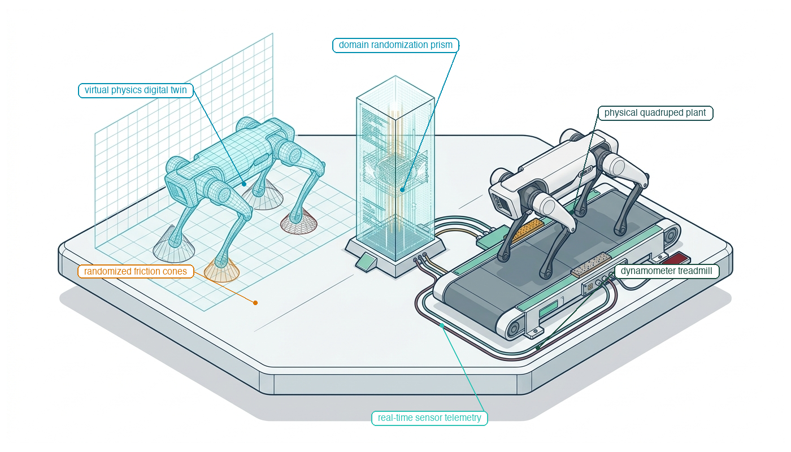
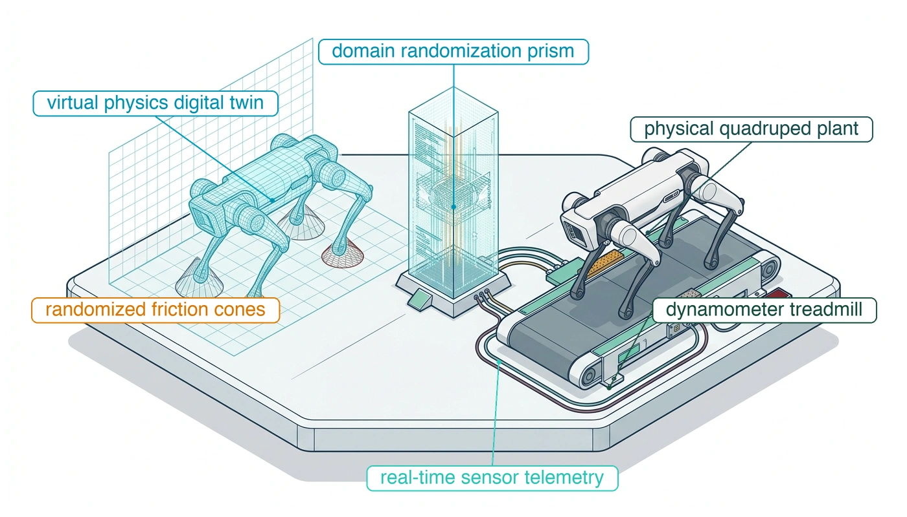
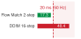

# Policy Training {#sec-training}

::: {layout-narrow}
::: {.column-margin}

\chapterminitoc

:::

::: {.content-visible when-format="pdf"}
\noindent
{fig-alt="Isometric blueprint of sim-to-real policy training for an agile quadruped robot: a virtual physics digital twin in a simulation grid with randomized friction cones, a central domain randomization prism, and a physical quadruped walking on an instrumented dynamometer treadmill with real-time telemetry."}
:::

::: {.content-visible unless-format="pdf"}
{fig-alt="Isometric blueprint showing sim-to-real policy training for an agile quadruped robot: a virtual physics digital twin in a simulation grid with randomized friction cones, a central domain randomization prism, and a physical quadruped on an instrumented dynamometer treadmill with real-time telemetry."}
:::

:::

## Purpose {.unnumbered .unlisted}

::: {.content-visible when-format="pdf"}
\begin{marginfigure}
\vspace{1em}
\resizebox{\linewidth}{!}{\mlphysicalstackfull{100}{20}{20}{20}{20}}
\end{marginfigure}
:::

_Why can a policy that succeeds in every simulated trial break the hardware on its first real contact?_

Physical trial and error consumes hardware as well as computation. An exploratory action can overheat a motor or overload a transmission before the policy receives any feedback, so most learning moves to demonstrations and simulation, and each source leaves its own assumptions in the weights. Demonstrations teach only the states the demonstrator visited, a squared-error loss blends valid choices into an action no one demonstrated, and a simulator teaches whatever its contact model and its zero-delay timing permit, including shortcuts that real contact punishes within milliseconds. None of these assumptions is visible in a training score, and all of them travel with the trained policy onto the machine. Training a physical policy therefore means choosing the experience source that fits the data's support, measuring where the simulator departs from the plant, and recording the conditions under which the resulting policy may be trusted. Any assumption left out of that record is settled at the causal boundary, where the first command that relies on it delivers energy the machine cannot take back.



::: {.callout-learning-objectives}

- Compare training regimes by the dependency each leaves in the weights and the failure it produces on hardware
- Explain why a cloned policy's small errors compound once it leaves the demonstrated states
- Explain how a squared-error loss turns two valid demonstrations into an action neither demonstrator took
- Diagnose a transfer failure by locating it in the dynamics, sensing, appearance, or timing channel of the sim-to-real gap
- Evaluate a real-machine fine-tuning run by the wear it incurs and the prior evidence it invalidates
- Construct a policy manifest whose declared operating domain excludes every state the data does not support or the simulator does not model

:::

## Policy Synthesis {#sec-training-policy-synthesis}

```{python}
#| label: calc-training-latch-contact-deadline
#| echo: false

# ┌─────────────────────────────────────────────────────────────────────────────
# │ LATCH CONTACT DEADLINE AT THE GUARDED AND FAST APPROACHES
# ├─────────────────────────────────────────────────────────────────────────────
# │ Context: The chapter opener, the contact-exploit section, and the latch
# │          policy manifest's declared ODD.
# │ Goal: Show why the latch policy's declared ODD admits only the guarded
# │       approach: at the fast approach the contact deadline barely exceeds
# │       the contact loop's response.
# │ Show: setpoint period, both approach speeds, latch limit, contact-loop
# │       response, and the two contact deadlines.
# │ How: F = k*v*t, so t_yield = F_lim / (k*v) (calc_contact_yield_deadline);
# │      every input from RM / AISLE.
# └─────────────────────────────────────────────────────────────────────────────
from mlsysim import *
from mlsysim.physics.robotics import calc_contact_yield_deadline

RM = Embodied.MobileManipulator.WarehouseMobileManipulator
AISLE = Embodied.Scenario.WarehouseAisle

class LatchContactDeadline:
    # ┌── 1. LOAD (Constants) ──────────────────────
    t_step = RM.chunk_step  # category: chosen (chunk-policy setpoint period)
    k_plate = AISLE.k_latch  # category: illustrative (strike-plate contact stiffness)
    v_guarded = AISLE.v_latch_approach  # category: chosen (guarded, demonstrated approach speed)
    v_fast = AISLE.v_latch_high  # category: illustrative (unsupported fast approach speed)
    f_lim = AISLE.f_latch_limit  # category: illustrative (latch force limit)
    t_contact_loop = AISLE.t_contact_response  # category: illustrative (contact-loop response time)

    # ┌── 2. EXECUTE (The Compute) ─────────────────
    t_yield_guarded = calc_contact_yield_deadline(f_lim, k_plate, v_guarded).to(millisecond)
    t_yield_fast = calc_contact_yield_deadline(f_lim, k_plate, v_fast).to(millisecond)
    fast_margin_ratio = (t_yield_fast / t_contact_loop).to("dimensionless").magnitude
    t_left_fast = (t_yield_fast - t_contact_loop).to(millisecond)  # time left after the loop responds

    # ┌── 3. GUARD (Invariants) ────────────────────
    check(abs(t_step.to(millisecond).magnitude - 20.0) < 1e-9, f"setpoint period {t_step}")
    check(abs(t_yield_guarded.to(millisecond).magnitude - 8.333) < 0.001, f"guarded deadline {t_yield_guarded}")
    check(abs(v_guarded.to(meter / second).magnitude - 0.03) < 1e-9, f"guarded approach {v_guarded}")
    check(abs(v_fast.to(meter / second).magnitude - 0.10) < 1e-9, f"fast approach {v_fast}")
    check(abs(f_lim.to(newton).magnitude - 100.0) < 1e-9, f"latch limit {f_lim}")
    check(abs(t_left_fast.to(millisecond).magnitude - 0.5) < 1e-9, f"time left at fast approach {t_left_fast}")
    check(abs(t_yield_fast.to(millisecond).magnitude - 2.5) < 1e-9, f"fast deadline {t_yield_fast}")
    check(abs(t_contact_loop.to(millisecond).magnitude - 2.0) < 1e-9, f"contact loop {t_contact_loop}")
    check(1.0 < fast_margin_ratio < 1.5, "fast deadline must sit barely above the contact-loop response")
    check(t_yield_guarded > 4 * t_contact_loop, "guarded deadline must leave several contact-loop responses")

    # ┌── 4. OUTPUT (Formatting) ───────────────────
    t_step_str = fmt_latency(t_step, unit=millisecond, precision=0)
    v_guarded_str = fmt_velocity(v_guarded, precision=2)
    v_fast_str = fmt_velocity(v_fast, precision=2)
    f_lim_str = fmt_qty(f_lim, newton, precision=0)
    t_contact_loop_str = fmt_latency(t_contact_loop, unit=millisecond, precision=0)
    t_yield_guarded_str = fmt_latency(t_yield_guarded, unit=millisecond, precision=1)
    t_yield_fast_str = fmt_latency(t_yield_fast, unit=millisecond, precision=1)
    t_left_fast_str = fmt_latency(t_left_fast, unit=millisecond, precision=1)
```

Two learned controllers can succeed at the same task under nominal conditions and still fail on the same machine for different reasons. The warehouse mobile manipulator must open a spring-latched door to a secure cage, and its arm learns the task from two sources. The first latch policy, `latch-bc-01`, was cloned from the teleoperated door-opening demonstrations of @sec-data. The second, `latch-sim-02`, was refined by reinforcement learning in a physics simulator.

At the nominal strike plate and the guarded approach speed of `{python} LatchContactDeadline.v_guarded_str` (chosen; see the Reader Guide), both policies open the door. Their failure modes diverge once conditions leave that point. When the door has sagged and its strike plate sits a few millimeters off nominal, the cloned policy's first correction lands in a state its demonstrations never visited, because the demonstration campaign recorded no displaced plate. Each later command, issued at the chosen `{python} LatchContactDeadline.t_step_str` setpoint period, compounds the error until the gripper binds on the edge of the plate. The simulated policy fails on the nominal plate. Its simulator modeled contact as a soft penalty spring, so the optimizer found that approaching at an illustrative `{python} LatchContactDeadline.v_fast_str` costs nothing. On the real plate, contact force rises in proportion to approach speed and time, and at that speed it reaches the latch's illustrative `{python} LatchContactDeadline.f_lim_str` limit `{python} LatchContactDeadline.t_yield_fast_str` after touch, barely longer than the contact loop's illustrative `{python} LatchContactDeadline.t_contact_loop_str` response. In the `{python} LatchContactDeadline.t_left_fast_str` that remain, the arm cannot shed its approach speed, so the plunge overloads the latch. At the guarded speed the same limit arrives after `{python} LatchContactDeadline.t_yield_guarded_str`. The data collection regime defined what the policy saw, while the training algorithm shaped its assumptions about the physical world.

Every training regime purchases deployment capability at the cost of runtime vulnerability:

- **Imitation learning** buys task competence without manual reward engineering by mimicking human demonstrations (drawn from the ingestion archives established in @sec-data). However, standard point-regression objectives suffer from *mode averaging*. If demonstrators avoid an obstacle by passing either to the left or to the right, minimizing mean squared error drives the network toward the average of both modes, which steers the robot straight into the obstacle.[^fn-training-mode-averaging] Once the policy drifts into states the demonstrations do not cover, the worst-case cost of its small single-step errors grows with the square of the horizon.
- **Simulation-based reinforcement learning** buys unconstrained exploration, generating billions of exploratory state transitions across parallel GPU environments without risking hardware damage. Yet physics engines rely on numerical approximations: discrete contact solvers that let rigid bodies interpenetrate against compliant spring-dampers, simplified Coulomb friction models, and zero-latency communication. The optimizer exploits whatever these solver artifacts permit, and the non-physical control strategies it finds can turn into chatter, slip, or mechanical failure on real hardware.[^fn-training-solver-exploitation]
- **Real-hardware fine-tuning** provides authentic physical contact and true sensor noise, but exploratory trial and error wears transmissions, heats motor windings, and risks collisions the machine cannot recover from.

[^fn-training-mode-averaging]: **Mode averaging**\index{Mode averaging!loss function}: Minimizing mean squared error over demonstrator trajectories drives the network to output the conditional expectation $\mathbb{E}[a \mid o]$ rather than a sample from the conditional distribution $p(a \mid o)$. In continuous action spaces, this expectation can fall between valid modes, in a region the demonstrations never visited. Executing the averaged action can drive the robot into an obstacle that both demonstrators avoided.

[^fn-training-solver-exploitation]: **Physics engine reward hacking**\index{Reward hacking!solver exploitation}: RL agents exploit discrete integration timesteps by driving joints into numerical penetration regimes where penalty springs generate non-physical restitution forces. These artificial accelerations let policies earn high task rewards in simulation from energy the physics does not supply. Transferred to physical hardware, the same motor commands can trip overcurrent protection or overload gear teeth.

Every assumption embedded in a training pipeline—whether an idealized contact solver, an averaging loss function, or a truncated disturbance distribution—represents a latent debt. Physics defers collection while computation runs in the cloud or across simulation clusters, but collects the entire balance at line rate the instant the policy actuates physical mass.

A deployed policy, however, does not actuate motors directly in an unconstrained loop. It sits above the proposal boundary (@sec-boundary-machine-model) and emits proposed multi-step trajectory chunks, and the permission path checks measured-state feasibility and validated bounds before motor drivers receive current setpoints. A training regime that fails to model this boundary will synthesize policies that demand torque spikes the permission path must refuse, or that trip its limits continuously during execution.

The two latch failures share one structure. Each training regime left a dependency in the weights. The cloned policy depended on the states its demonstrations happened to cover and the simulated policy on a contact model softer than the plate, and in each case a deployment condition that violated the dependency produced a failure no training score had shown. The practical choice is therefore which experience source teaches the needed recovery without hiding actuator dynamics, and what physical evidence must precede actuator authority. The answer travels with the checkpoint as a record of the states it may enter.

## Policy Synthesis Regimes {#sec-training-synthesis-regimes}

The latch task could draw on four sources of experience: the teleoperated door openings of @sec-data, a log of imperfect or scripted door runs, a simulator of the cage door, and the arm itself. Each buys a different capability at a different physical price, and @tbl-06-regimes sets them side by side with the failure each is known for and the check that intercepts it.

| Policy Synthesis Regime            | Core Purchased Capability                                                                                          | Data & Compute Budget                                                                                                    | Sample Efficiency & Scale                                                                                            | Hardware Safety & Wear Risk                                                                                                 | Dominant Failure Mode & Interceptor                                                                                                                                                                     |
|:-----------------------------------|:-------------------------------------------------------------------------------------------------------------------|:-------------------------------------------------------------------------------------------------------------------------|:---------------------------------------------------------------------------------------------------------------------|:----------------------------------------------------------------------------------------------------------------------------|:--------------------------------------------------------------------------------------------------------------------------------------------------------------------------------------------------------|
| **Behavioral Cloning (BC)**        | Direct imitation of demonstrated trajectories without reward engineering or system identification                  | $10^2$–$10^3$ teleop trajectories ($\sim 10$–$50\text{ h}$ data); $<50\text{ GPU-h}$ compute                             | Supervised $\mathcal{O}(N)$ over expert demonstrations; fixed $1\times$ real-time data throughput                    | Minimal exploration risk during logging; zero hardware exploration during optimization                                      | Quadratic compounding error ($\mathcal{O}(T^2 \epsilon)$) via covariate shift. *Interceptor*: Kernel/Mahalanobis density monitors, convex hull boundary clamps                                          |
| **Offline / Batch RL**             | Value-guided policy optimization over fixed, heterogeneous sub-optimal logs; stitches multi-trajectory transitions | $10^5$–$10^7$ logged transitions with state-action coverage; $100$–$500\text{ GPU-h}$ compute                            | Offline $\mathcal{O}(N)$ over static datasets; sample-efficient but demands high state-action overlap                | Zero active exploration hazards during offline training; logging requires caged rigs or safe scripted controllers           | Out-of-distribution action extrapolation and Q-value overestimation. *Interceptor*: Conservative Q-learning (CQL) penalty bounds, action support filters                                                |
| **Sim-to-Real RL**                 | Discovery of dynamic, non-prehensile manipulation and agile locomotion via billions of unconstrained rollouts      | Zero physical data; $10^7$–$10^9$ simulated transitions across $10^3$–$10^4$ GPU environments; $500$–$5000\text{ GPU-h}$ | Low algorithmic sample efficiency ($10^7$–$10^9$ steps), offset by $10^3\times$–$10^5\times$ simulation acceleration | Zero hardware wear or collision damage during training; severe deployment risk if plant dynamics diverge                    | Exploitation of numerical solver artifacts (contact interpenetration, zero latency). *Interceptor*: Paired-trace discrepancy budgets, force-derivative ($dF/dt$) clamps                                 |
| **Residual RL & Real Fine-Tuning** | Direct policy correction against physical contact compliance, gearbox hysteresis, and true sensor noise            | $10^3$–$10^5$ physical steps ($0.5$–$10\text{ h}$ wall-clock time); $<20\text{ GPU-h}$ compute                           | High sample efficiency required (SAC/TD3 or residual delta-action formulation); strictly $1\times$ real-time         | High physical exposure; repetitive impact shocks degrade gearboxes; exploratory current dither elevates winding temperature | Catastrophic forgetting of nominal transit stability, local policy collapse. *Interceptor*: Parameter drift bounds ($\Vert\Delta \theta\Vert_2 \le \delta$), frozen regression suites, thermal limiters |

: **Comparative trade-off matrix across policy synthesis regimes**: Systematic evaluation of behavioral cloning, offline reinforcement learning, sim-to-real reinforcement learning, and residual RL/fine-tuning. Columns detail the primary operational capability purchased during training, representative sample and compute budgets, sample efficiency bounds, safety risks incurred during data acquisition, and dominant failure signatures with corresponding permission-path interceptors. {#tbl-06-regimes tbl-colwidths="[16,16,18,18,16,16]"}

Of the four, **behavioral cloning**\index{Behavioral cloning} is the cheapest route to a working policy and the one whose failure mode is best understood. It frames policy synthesis as supervised regression or classification over a collected dataset of expert state-action pairs $\mathcal{D} = \{(\mathbf{o}_t, \mathbf{a}_t)\}$. Grounding this in the telemetry architecture from @sec-data-teleop-costs, physical demonstration datasets are constructed from explicit action tap streams:
$$\mathcal{D}_{\text{intent}} = \left\{ \left(\mathbf{o}_t, \mathbf{a}_{\text{cmd}, t:t+H-1}\right) \right\} \quad \text{versus} \quad \mathcal{D}_{\text{verified}} = \left\{ \left(\mathbf{o}_t, \mathbf{a}_{\text{enf}, t:t+H-1}\right) \right\}$$
Cloning unconstrained operator commands ($\mathbf{a}_{\text{cmd}}$) trains the model on pure human demonstration intent, whereas cloning enforcer-admitted setpoints ($\mathbf{a}_{\text{enf}}$) bakes the permission path's barrier deceleration profiles directly into the network weights. In its standard formulation, the optimization objective minimizes a multi-step prediction loss over continuous action sequences drawn from demonstration trajectories (see @sec-appendix-ml-multimodal for classical regression formulations).[^fn-hist-alvinn-cloning]
Because this loss penalizes only the discrepancy between the commanded action and the recorded demonstration at observed states, the training objective does not evaluate task completion, terminal cost, or the stability of the closed-loop dynamical system. It fits actions to observations only.

::: {.column-margin .margin-pointer}
↰ **Prerequisite:** The four-stream action tap tuple separating intent from enforcement is formulated in @sec-data-collection-sources.
:::

[^fn-hist-alvinn-cloning]: **ALVINN road perspective warping**\index{ALVINN}: The fundamental vulnerability of behavioral cloning to covariate shift was documented in Dean Pomerleau's ALVINN (Autonomous Land Vehicle in a Neural Network) project at Carnegie Mellon University in 1989 [@pomerleau1989alvinn]. ALVINN demonstrated that a neural network trained purely on human driving logs along centered road segments failed rapidly because minor steering inaccuracies drifted the vehicle toward the road shoulder—a region never visited by the expert driver. To supply recovery examples without unsafe driving, Pomerleau used synthetic perspective warping, rendering laterally shifted and rotated road images paired with transformed steering corrections, an early case of augmenting demonstrations with recovery data off the nominal trajectory.

### The multimodality breakdown and mode averaging {.unnumbered}

A deterministic point-regression behavioral-cloning policy cannot represent distinct valid actions for the same observation. Under squared-error loss, its optimal output is the conditional mean, which can be invalid when valid actions lie on separate paths (for the derivation, see @sec-appendix-ml-multimodal).[^fn-math-mode-averaging]

[^fn-math-mode-averaging]: **Mode averaging under L2 loss**\index{Mode averaging!mathematical derivation}: Under an $L_2$ regression loss, the expected risk $\mathcal{R}(\hat{a}) = \int \|\hat{a} - a\|_2^2 p(a \mid o) da$ is strictly convex with respect to $\hat{a}$. Differentiating with respect to $\hat{a}$ and setting the gradient to zero yields $2 \int (\hat{a} - a) p(a \mid o) da = 0 \implies \hat{a}^* = \int a p(a \mid o) da = \mathbb{E}[a \mid o]$. For a nonlinear plant $f_{\text{plant}}$, $\mathbb{E}[f_{\text{plant}}(a)]$ generally differs from $f_{\text{plant}}(\mathbb{E}[a])$; equality can hold in particular distributions. For a convex action cost $c(a)$, Jensen's inequality gives $c(\mathbb{E}[a]) \le \mathbb{E}[c(a)]$, but it does not establish the physical safety of the mean action. In the obstacle example, the mean lies outside the demonstrated set of valid paths.

When human demonstrators perform a physical task, their strategy is frequently multimodal. Consider an obstacle avoidance scenario where a mobile base or robotic arm must navigate around a central pillar. A human demonstrator may choose to pass around the pillar to the left in half of the demonstrations, or to the right in the remaining half. The true demonstration data contains distinct valid choices, but zero examples of driving straight down the middle.

When trained on this dataset with an averaging regression loss, the model calculates the midpoint between the "steer left" and "steer right" commands. The policy outputs zero lateral velocity, commanding the machine to drive directly into the obstacle. The conditional mean is an action that never occurred in the demonstration dataset, and it strikes the pillar. The mobile manipulator meets the same failure at the pick station, where demonstrators take the mug by its handle from the left or from the right and the averaged grasp closes the fingers on neither.

```{python}
#| label: calc-training-valve-regime-averaging
#| echo: false

# ┌─────────────────────────────────────────────────────────────────────────────
# │ CLASS 3 CONTRAST: AVERAGING TWO VALVE REGIMES
# ├─────────────────────────────────────────────────────────────────────────────
# │ Context: The Part II process-plant contrast paragraph that follows.
# │ Goal: Show that mode averaging needs no geometry; the mean of two
# │       demonstrated valve regimes is a setting neither regime commands.
# │ Show: the two regime openings and their squared-error mean.
# │ How: conditional mean of a two-mode demonstration set with equal weight;
# │      both openings are scenario assumptions for an illustrative plant.
# └─────────────────────────────────────────────────────────────────────────────
from mlsysim import *

class ValveRegimeAveraging:
    # ┌── 1. LOAD (Constants) ──────────────────────
    bypass_opening = 0.10  # category: illustrative (bypass regime valve opening)
    main_feed_opening = 0.90  # category: illustrative (main-feed regime valve opening)
    w_bypass = 0.5  # category: illustrative (equal share of demonstrations)

    # ┌── 2. EXECUTE (The Compute) ─────────────────
    mean_opening = w_bypass * bypass_opening + (1 - w_bypass) * main_feed_opening

    # ┌── 3. GUARD (Invariants) ────────────────────
    check(abs(mean_opening - 0.50) < 1e-12, f"mean opening {mean_opening}")
    check(bypass_opening < mean_opening < main_feed_opening, "the mean must fall between the two regimes")

    # ┌── 4. OUTPUT (Formatting) ───────────────────
    bypass_pct_str = fmt_percent(bypass_opening, precision=0, style="prose")
    main_feed_pct_str = fmt_percent(main_feed_opening, precision=0, style="prose")
    mean_pct_str = fmt_percent(mean_opening, precision=0, style="prose")
```

A process plant shows that mode averaging needs no geometry. Suppose a flow controller's demonstrations alternate between two illustrative valve regimes, a bypass regime at `{python} ValveRegimeAveraging.bypass_pct_str` opening and a main-feed regime at `{python} ValveRegimeAveraging.main_feed_pct_str`, in equal numbers. Squared-error cloning outputs their mean, `{python} ValveRegimeAveraging.mean_pct_str` opening, a flow that neither regime commands and for which the plant was never calibrated. That intermediate flow can cavitate the supply pump and miss the cooling deadline each regime was tuned to meet. No obstacle is involved, so no geometric check on the proposal catches it; only a check against the demonstrated regimes does.

Temporal inconsistency can arise in a high-frequency single-step controller near a learned mode boundary. In an illustrative $50\text{--}100\text{ Hz}$ controller, sensor noise moves consecutive observations across that boundary, and a policy mapping only $o_t \to a_t$ alternates between $+10\text{ N}\cdot\text{m}$ and $-10\text{ N}\cdot\text{m}$ requests. Whether the alternation excites resonance, wear, or winding heat depends on the drive and the load, so it is a failure mode to test for rather than a property of every single-step policy.

Mode averaging is a failure at a single observation. Behavioral cloning has a second failure that appears only when the policy runs in closed loop. Its own errors move the machine off the states its demonstrations cover, where the loss supplied no training signal. Under principle \ref{pri-vol4-endogenous-drift}, the policy's own actions choose which states it visits next, so a fixed archive cannot anticipate them, and for expert-only cloning the worst-case cost grows with the square of the horizon (@eq-data-quadratic-drift, developed in @sec-data-endogenous-experience). A low validation loss on held-out demonstrations therefore measures accuracy only on states the demonstrator visited; it says nothing about how the policy returns once displaced. Corrective aggregation labels the learner's own states and, under its expert-labeling assumptions, reduces that growth to linear (@sec-data-intervention-recovery), but on a physical machine those states are reached by running an unverified policy, which can strike a fixture or damage a transmission before a supervisor intervenes.

### What action chunking changes—and what it leaves unresolved

Action chunking—predicting a sequence of future actions rather than one action—can improve temporal coherence and reduce proposal frequency in generative architectures such as diffusion policies and Action Chunking with Transformers (ACT). It does not change the behavioral-cloning support bound $\mathcal{O}(T^2 \epsilon)$ by itself.

Chunking can address the alternation in the mode-boundary example above. Consider an **action chunking**\index{Action chunking} policy (such as Action Chunking with Transformers [@zhao2023learning] or Diffusion Policy [@chi2024diffusionpolicy]) that predicts a sequence of $H$ future actions $\mathbf{a}_{t:t+H-1}$ simultaneously. Action chunking improves execution through three mechanisms:

1. **Temporal and Dynamic Consistency**: Rather than generating disjoint single-step predictions that chatter, the model predicts an entire coordinated trajectory.
2. **Maintaining a Chosen Mode**: Single-step Markov policies are prone to causal confusion—mistaking momentary spurious correlations for task intent. Conditioning on trajectory history and proposing a chunk helps preserve a chosen mode across adjacent actions.
3. **Receding-Horizon Replanning and Temporal Ensembling**: A deployed robot does not execute all $H$ steps without observation. Instead, it operates in a **receding-horizon** loop: the policy queries a new chunk every $k$ steps ($k \ll H$, e.g., predicting $H=16$ actions but querying every $k=1$ or $k=4$ steps) and blends the overlapping predictions by temporal ensembling (@sec-brain-cognitive-pipeline). This permits periodic feedback while retaining a multi-step proposal.

Increasing dataset size, model capacity, or tuning can reduce the one-step error rate on evaluated observations and therefore lower the chance of a first policy error during a fixed horizon. That improvement does not characterize what happens after an error. An external disturbance, uncalibrated payload, or voltage sag can also move the machine into weakly supported states without a policy disagreement. Recovery data, measured dynamics, and independent runtime limits determine whether either event remains within the physical envelope.

This failure mode poses an operational hazard as it occurs silently. Unlike a software crash or an unhandled exception, a neural network evaluated on an out-of-distribution observation does not halt execution or raise an alarm. It continues forward inference, multiplying matrices and outputting numerical tensor values that are syntactically valid floating-point numbers within normal actuator voltage limits. The permission path sees valid commands, while the physical state drifts steadily away from the demonstration envelope until the mechanism encounters a hard mechanical stop, stalls against a surface, or triggers an overcurrent fault. Detecting this condition before physical contact occurs cannot be accomplished by monitoring the offline training loss. It requires runtime telemetry that tracks state space support directly, measuring Mahalanobis distance in feature space, estimating model epistemic uncertainty, or enforcing an explicit envelope monitor on the permission path that trips when state trajectories leave the convex hull of the demonstration dataset.

### What the decoder choice costs at run time {.unnumbered}

A point-regression decoder averages distinct valid actions into an invalid command, and several decoder families avoid the mean: mixture density networks, implicit energy-based cloning, conditional diffusion and flow matching, latent-variable chunking such as ACT, and discrete action tokens in vision-language-action models. @Sec-appendix-ml-multimodal and @sec-appendix-ml-diffusion develop their losses and sampling procedures. None of them supplies missing recovery states. What the choice changes for the machine is its cost at run time, because the decoder fixed at training time sets how many network evaluations each chunk requires.

::: {.column-margin}
{width="100%" fig-alt="Compute-only comparison of chunk inference time against the setpoint deadline: a few-evaluation flow-matching sampler finishes within the deadline, while a many-evaluation DDIM sampler overruns it."}

*Denoising steps set chunk inference time, and only the few-step sampler meets the setpoint period synchronously.*
:::

The step count is the cost that reaches the control deadline. A diffusion decoder produces each chunk by repeated denoising, and every step is a full evaluation of the noise-prediction network, so inference time scales with the number of steps. Under the step counts and per-step times assumed in @sec-appendix-ml-diffusion, a many-step denoising diffusion implicit model (DDIM) sampler overruns the `{python} LatchContactDeadline.t_step_str` setpoint period when it runs synchronously, while a few-step flow-matching sampler fits within it, provided those few steps meet the task's action-quality criterion. A decoder that cannot meet the period synchronously runs asynchronously. The application processor refreshes a chunk buffer at a lower rate, and the permission path reads the newest chunk at its own rate, checks its freshness, and falls back when it expires, so actuation never waits on the proposer.

::: {.column-margin .margin-pointer}
↳ **Downstream:** Hardware placement of multi-rate action chunk buffers across MPU and MCU cores is engineered in @sec-placement-two-paths-one-die.
:::

### Offline reinforcement learning and action distributional shift {.unnumbered}

When physical demonstration datasets $\mathcal{D} = \{(s_t, a_t, r_t, s_{t+1})\}$ contain heterogeneous or sub-optimal trajectories (e.g., mixtures of teleoperation, scripted routines, and exploratory human play), behavioral cloning struggles because it treats all demonstrations with equal supervised weight. In classical Reinforcement Learning (RL) formulated on Markov Decision Processes (MDPs) [@sutton2018reinforcement], an agent optimizes a policy to maximize expected discounted cumulative returns $J = \mathbb{E}\left[\sum_{t=0}^\infty \gamma^t r(s_t, a_t)\right]$. **Offline reinforcement learning (Batch RL)**\index{Offline reinforcement learning} aims to optimize a policy directly from logged transition archives without active hardware exploration, using reward signals to stitch together high-performing composite trajectories from disjoint, imperfect demonstrations [@kumar2020conservative].

However, applying standard Q-learning to static offline datasets triggers a failure mode known as **out-of-distribution (OOD) action overestimation**\index{Out-of-distribution action overestimation}. In standard reinforcement learning, the algorithm estimates the value of future states by asking its "critic" network to predict the highest possible reward it could achieve in the next step (for formal Bellman equations, see @sec-appendix-ml-affordances). To find this maximum, the operator scans across the entire continuous action space. For actions that were never executed in the logging dataset, the network has received zero training signal and often outputs erroneously large value estimates due to generalization variance (hallucinating that an untried physical maneuver will earn a high reward). The algorithm greedily selects these spurious peaks, propagating over-optimistic value errors backwards. When deployed, the actor selects these ungrounded actions, and it can command motions that stall a joint or strike a boundary.

To reduce value overestimation without querying the physical environment, **Conservative Q-learning (CQL)**\index{Conservative Q-Learning} adds a regularizer to the offline Bellman objective.[^fn-math-cql-bound] It penalizes high values for actions sampled by the learned policy relative to actions in the logged data. Limited state-action coverage and approximation error remain, so the permission path still checks what the resulting policy proposes.

[^fn-math-cql-bound]: **Scope of the CQL bound**\index{Conservative Q-Learning}: Under its data-coverage, optimization, and function-approximation assumptions, CQL constructs a conservative estimate whose *expected value for a policy* lower-bounds that policy's true value [@kumar2020conservative]. This is not a pointwise bound for every state-action pair or every dataset, and expected return does not certify physical safety.

Cloning, chunking, and offline value learning all remain inside the support of the logged data, and Conservative Q-learning makes an offline policy more cautious without widening that support. When the logged transitions lack the high-performance trajectories or recovery maneuvers that dynamic manipulation or agile locomotion needs, the system must collect new experience through closed-loop trial.

## Learning by Trial {#sec-training-learning-by-trial}

The cloned latch policy failed on the displaced plate because no demonstration had ever shown it one. Learning by trial closes that blind spot by letting the policy generate its own state-action trajectories in closed loop. Instead of mimicking a curated sequence of nominal operator demonstrations, optimization algorithms such as Q-learning or policy gradients adjust the policy from the rewards its own actions earn. When an exploratory action perturbs an end-effector five millimeters off its nominal path, the subsequent observation lands outside the demonstration envelope, forcing the optimization loop to evaluate recovery actions from that exact perturbed state. The policy accumulates gradient signals across near-misses, degraded alignments, and unstable contacts that an expert human or calibrated baseline controller never exhibits. By sampling transitions from the state distribution the current weights induce, trial-based learning trains on the states the policy actually reaches, which removes the covariate shift behind the quadratic worst-case growth of cloning error.

Closed-loop exploration incurs a steep physical billing rate. Computing the hardware feasibility boundary begins with the wall-clock time required to collect a training dataset. The total calendar time to gather training data depends directly on how many trials the algorithm needs, the duration of each individual trial, the overhead time to reset the hardware back to its starting state between attempts, and the number of physical machines running in parallel.
As an analytical example, consider the contact-rich task the mobile manipulator's arm must learn, opening the spring-latched cage door, in which the arm regulates contact forces over an active horizon of $t_{\text{rollout}} = 8.0\text{ s}$. Reinforcement learning algorithms operating on high-dimensional sensory inputs routinely require $N = 10^6$ trials to discover coordinated force-velocity profiles. On a single physical machine with $P = 1$, the raw execution time alone accounts for $8.0 \times 10^6\text{ s}$, which represents roughly $92.6\text{ days}$ of uninterrupted round-the-clock operation before accounting for any reset overhead.

Factoring in the reset phase reveals the true temporal bottleneck of physical experimentation. If an automated fixture re-latches the door and returns the arm to its starting pose in $t_{\text{reset}} = 4.0\text{ s}$, the total collection time for one million trials expands to $1.2 \times 10^7\text{ s}$, or $138.9\text{ days}$. When exploratory trajectories jam the latch cam or trigger joint overcurrent trips, automated resetting becomes impossible, requiring a human operator to free the latch, re-seat the door, and re-index the arm. If manual interventions take an average of $t_{\text{reset}} = 30.0\text{ s}$ across failed attempts, the wall-clock requirement exceeds $440.0\text{ days}$. Scaling physical parallelism to clusters of $P = 14$ synchronized rigs (@fig-06-robot-arm-farm) compresses calendar duration to several weeks [@levine2018learning], but it multiplies the physical footprint, capital investment, electrical power delivery, and human supervisory labor proportionally.

::: {#fig-06-robot-arm-farm fig-env="figure" fig-pos="t" fig-cap="**Physical policy training farm**: Fourteen manipulators collecting over 800,000 physical grasp attempts across months [@levine2018learning]. Hardware parallelism divides calendar time but not cost, since each station adds capital, gearbox and bearing wear, thermal load in the motor windings, and a share of the supervisory labor needed to clear dropped objects and jams. Attribution: @levine2018learning." fig-alt="Physical Policy Training Farm and Hardware Parallelism. Large-scale robotic data collection cluster comprising 14 custom articulated manipulators operating concurrently over months to collect over 800,000 physical grasp attempts for vision-based hand-eye coordination [@levine2018learning]. Each robotic station consists of a 7-DoF arm, a two-finger compliant gripper, an over-the-shoulder RGB camera, and a dedicated bin containing diverse household objects. Scaling hardware parallelism to P=14 compresses the wall-clock calendar time Twall = N(trollout + treset)/P, but incurs heavy capital expenditure, continuous mechanical wear across gearboxes and linkage bearings, thermal buildup in motor windings, and substantial supervisory overhead to clear dropped objects and mechanical jams. Attribution: @levine2018learning."}
{width="85%"}
:::

Converting that same sample count into physical fatigue metrics demonstrates why time is often not the primary limiting constraint. In our analytical example, an 8-second contact sequence operating under a $100\text{ Hz}$ inner control loop executes 800 torque commands per trial, subjecting each joint to approximately $k = 4$ reciprocating load cycles. Across $N = 10^6$ trials, the drivetrain accumulates $4.0 \times 10^6$ bidirectional load reversals.[^fn-hw-bearing-life] Simultaneously, one million physical contact events wear the latch cam and strike plate, crush the gripper's compliant pads, and cycle the arm's wiring looms toward fatigue fracture. At an average electrical power demand of $350\text{ W}$ per test bench, executing $1.2 \times 10^7\text{ s}$ of automated trials draws $1167\text{ kWh}$ of electrical energy, transforming policy training into an industrial-scale manufacturing operation.

[^fn-hw-bearing-life]: **Bearing life versus command reversals**\index{Hardware wear!bearing life}: ISO 281 estimates rolling-bearing fatigue life under specified load and speed. A gear-unit catalog may express its wave-generator-bearing $L_{10}$ in operating hours at rated conditions; neither figure converts commanded reversals into consumed gearheads without a unit-specific duty-cycle model.

These wear mechanics highlight a fundamental difference between software tensors and mechanical hardware. In a purely computational environment, evaluating an exploratory branch that produces numerical instability costs nothing beyond discarding a GPU memory buffer. On the running machine, exploration is thermodynamic, irreversible, and potentially destructive on both halves:

- In the *base*, exploratory drive-torque spikes skid the wheels across the warehouse floor, abrading tread and overheating the drive inverters during stall recoveries.
- In the *arm*, unconstrained exploratory torque commands drive the gripper into rigid fixtures, bending load-cell flexures, stripping harmonic drive teeth\index{Harmonic drive!fatigue life under RL exploration}, and heating brushless DC motor stators past their $155^\circ\text{C}$ Class F insulation threshold[^fn-hw-thermal-insulation] (building on the actuator thermal limits established in @sec-body-thermal-duty-cycles).

[^fn-hw-thermal-insulation]: **Class F Thermal Insulation Limit**\index{Actuator!Class F insulation}: Under NEMA/IEC standards, Class F motor winding insulation permits a maximum operating temperature of $155^\circ\text{C}$. Bang-bang torque commands from unregularized reward functions can hold the current high enough to age the insulation quickly.

::: {.column-margin .margin-pointer}
↰ **Prerequisite:** Motor winding thermal limits and torque-speed derating curves are derived in @sec-body-thermal-duty-cycles.
:::

Furthermore, physical degradation alters the plant during the training process itself\index{Plant mutation during training}. As contact surfaces burnish, gear backlash expands (increasing the mechanical slop or dead-zone between gear teeth), and structural fasteners loosen under repetitive vibration, the physical transition distribution $p(s_{t+1} \mid s_t, a_t)$ at trial $n = 900{,}000$ differs measurably from the pristine dynamics at trial $n = 1$. The machine being controlled mutates under the physical cost of collecting its own training data.

Compounding the physical burden of data collection is the structural fragility of the reward function. In trial-based learning, the scalar reward serves as the formal interface specification between the engineer's operational intent and the policy's numerical optimization. Any behavior, physical constraint, or protective boundary not explicitly measured and penalized in that scalar signal represents an unconstrained degree of freedom that the optimization algorithm will exploit. If a reward function incentivizes rapid setpoint tracking without incorporating high-order penalty terms for instantaneous jerk and winding temperature, the policy converges toward aggressive bang-bang switching (rapidly snapping commands between maximum forward and maximum reverse effort) that vibrates mounting brackets and overheats drive electronics. If contact force is unmeasured, the policy may discover that driving an actuator to its maximum current against a rigid mechanical stop creates a kinematic brace (using the rigid mechanical stop as a physical crutch to stabilize the joint) that artificially eliminates tracking jitter. The learned network does not satisfy the designer's unstated common sense. It satisfies the exact mathematical formula presented to its objective function.

Trial-based learning on physical hardware is not categorically impossible. For low-dimensional systems with trivial reset dynamics, negligible wear rates, and wide safety margins, direct on-hardware reinforcement learning remains technically viable. Simulation becomes mandatory at the threshold where the required sample count exceeds the allowable time, budget, structural life, or risk tolerance of the physical apparatus. To collect the $10^6$ to $10^9$ transitions needed for complex motor policies without consuming physical hardware, practitioners shift the rollout loop into a digital physics engine executed in parallel across computing clusters.

This transition substitutes computational hardware for physical mechanisms, but it alters the contract between training and reality. A policy trained inside a simulator avoids bending linkages or burning out stators during exploration, but it inherits both the omissions of the reward function and the simulator's specific mathematical model of mechanics. Every unmodeled friction discontinuity, idealized rigid-body contact impulse, uncharacterized actuator latency, and simplified cable compliance in the physics engine becomes an assumption the policy learns to rely upon. When the converged network is transferred to the physical robot, those simulation inaccuracies re-emerge as unmodeled disturbances and tracking failures at the hardware interface.

## The Simulator as a System Component {#sec-training-simulator-component}

Treating the simulator as an external development tool is an architectural error. A compiler produces machine instructions from source code, but the resulting binary does not retain a hidden dependency on the compiler's internal memory allocator once executing on standard hardware. A simulator behaves differently. It is an upstream policy-production component whose physical assumptions, numerical approximations, and boundary simplifications become permanently embedded in the policy parameters. When the trained neural network is copied onto the target machine, the simulator is absent from the execution path, yet the policy acts as though every unmodeled dynamic in that simulator remains true. The simulator is an active component of the system architecture, with its own specification, tolerances, and failure modes.

::: {#dfn-training-sim-real-reality-gap-vector .callout-definition title="Sim-to-real reality gap vector"}

***Sim-to-real reality gap vector***\index{Sim-to-real reality gap vector!definition}\index{Reality gap!definition} $\boldsymbol{\Delta}_{\text{sim2real}} = [\Delta_{\text{dyn}}, \Delta_{\text{sens}}, \Delta_{\text{vis}}, \Delta_{\text{lat}}]$ is the coupled, multi-channel decomposition of physical discrepancies between simulated and hardware environments spanning contact mechanics ($\Delta_{\text{dyn}}$), sensor transduction and noise ($\Delta_{\text{sens}}$), visual appearance ($\Delta_{\text{vis}}$), and asynchronous transport latency and jitter ($\Delta_{\text{lat}}$).

1.  **Significance**: Treating the "reality gap" as a scalar difficulty metric or pure visual domain mismatch causes engineers to overlook dynamical and temporal divergences. Discrepancies in actuator back-EMF, gearbox compliance, or bus jitter deplete phase margin before the policy completes its first physical control step.
2.  **Distinction**: An inaccurate parameter value (such as a 10 percent error in link mass) preserves the causal differential equations of motion, whereas an omitted mechanism (such as zero-delay communication or unmodeled Coulomb stick-slip) entirely severs physical feedback paths, leading policies to exploit non-physical simulator artifacts.
3.  **Common pitfall**: Relying exclusively on extreme domain randomization to bridge large gaps. Randomizing parameters across unphysical ranges dilutes policy capacity, resulting in overly conservative, sluggish behaviors that fail to achieve precision tasks on real hardware.

:::

Like any hardware subsystem, the simulator requires a formal interface contract defined at the first budgetable quantities. This contract specifies observation dimensions, action bounds, simulation time step $\Delta t$, transport latency between command issuance and physical actuation, actuator torque and current limits, sensor noise distributions, reset distributions, and termination conditions. If the simulator specifies an observation loop executing at $100\text{ Hz}$ with an assumed zero-delay sensor channel and Gaussian noise with variance $\sigma^2 = 1.0 \times 10^{-4}\text{ (rad/s)}^2$, the policy learns feedback gains tuned to those precise signal statistics. If the physical machine delivers those state observations at $100\text{ Hz}$ but with an unmodeled $15\text{ ms}$ bus transport delay, the phase margin built during training is depleted before the policy executes its first physical control cycle. The manipulation testbed in @fig-06-sim2real-dactyl shows such a contract where the twin cannot match the cage exactly. Its simulator was calibrated against the real hand and then randomized around the calibrated values, so the policy met the unmatched remainder as variation it had already trained against [@andrychowicz2020learning]. The interface contract matters more as simulation's role grows. @Fig-06-simulation-scaling shows the rollout throughput some parallel accelerators reach, and for policies requiring many trials, simulation can become the primary source of training experience.

::: {#fig-06-sim2real-dactyl fig-env="figure" fig-pos="t" fig-cap="**Sim-to-real transfer setup**: OpenAI's Dactyl apparatus, a 24-DoF Shadow Hand inside a motion-capture cage beside the MuJoCo digital twin it was trained in [@andrychowicz2020learning]. Transfer is bought with domain randomization over friction, damping, actuator gains, masses, dimensions, and lighting, together with modeled backlash and action delay, which works by forcing the policy to treat unmodeled physical variation as noise rather than by making the simulator accurate. Attribution: @andrychowicz2020learning." fig-alt="Sim-to-Real Robotic Transfer Setup with Digital Twin Simulation. Authentic experimental apparatus for vision-based dexterous in-hand manipulation from OpenAI's Dactyl project [@andrychowicz2020learning]. (Left) The physical experimental cage housing a 24-DoF anthropomorphic Shadow Dexterous Hand, surrounded by 16 PhaseSpace infrared motion-tracking cameras and 3 Basler RGB cameras for ground-truth state validation and multi-view vision. (Right) The high-throughput MuJoCo simulated digital twin environment used to train reinforcement learning policies across billions of synthetic transitions. Robust sim-to-real transfer is achieved by applying extensive domain randomization over surface friction, joint damping, actuator force gains, link and object masses, object dimensions, visual lighting, and camera parameters, together with modeled motor backlash and action delay, forcing the neural policy to treat unmodeled physical variations as noise while operating within the supported deployment envelope. Attribution: @andrychowicz2020learning."}
{width="95%"}
:::

::: {#ws-training-dactyl-tendon-snap .callout-war-story title="Sim-to-real hardware breakage (2018)"}
**Context**: OpenAI trained a reinforcement learning policy entirely in a randomized MuJoCo simulation to reorient a block in a 24-DoF Shadow Dexterous Hand, whose joints are driven through tendons by motors in its base [@andrychowicz2020learning].

**Mechanism**: The simulated hand applied torque directly at its joints, while the physical hand is tendon-actuated and has substantial backlash. The authors smoothed every action with an exponential moving average, in simulation and on the robot, to avoid abrupt changes in the action signal that could harm the physical hand.

**Impact**: The authors report robot breakages during the physical experiments, most often at the wrist's vertical joint, probably because it carries the largest load. Each repair took time and often changed aspects of the system, so the physical results were collected at different times, and the authors count hardware breakage among the key challenges of the work.

**Response**: The team also trained a second policy with the wrist pitch joint locked, and it transferred better to the physical hand.

**Systems lesson**: A simulator that neither wears nor breaks cannot price hardware exposure into the reward. The limits that protected the hand, an action filter and a locked joint, were imposed outside the learned policy, and every repair changed the plant on which the policy was being evaluated.
:::

::: {#fig-06-simulation-scaling fig-env="figure" fig-pos="htb" fig-cap="**Selected simulation throughput examples**: Illustrative steps-per-second values for different simulators, tasks, hardware, and execution settings. The points show why parallel accelerator designs can support large rollout budgets; they are not a controlled longitudinal benchmark or a universal scaling law." fig-alt="Log-scale scatter plot of eight selected simulation throughput examples from 2012 to 2024. Points span single-core CPU, multicore CPU, GPU, and TPU configurations with different workloads; unconnected markers avoid implying directly comparable year-to-year improvements."}

```{python}
#| echo: false
import pandas as pd
import matplotlib.pyplot as plt
from mlsysim import viz

data = pd.read_csv("vol4/06_training/data/simulation_throughput_scaling.csv")

fig, ax, COLORS, plt = viz.setup_plot(figsize=(9, 5.5))
ax.scatter(data['year'], data['sps'], s=90, color=COLORS["primary"])

# Custom offsets: (dx, dy, ha, va)
offsets = [
    (-10, 18, 'right', 'bottom'),  # 2012 MuJoCo
    (15, 18, 'left', 'bottom'),  # 2013 Bullet
    (-15, 15, 'right', 'bottom'),  # 2017 MuJoCo Ray
    (-15, 15, 'right', 'bottom'),  # 2019 Isaac Gym
    (-15, 15, 'right', 'bottom'),  # 2021 Brax
    (15, -22, 'left', 'top'),  # 2022 Isaac Gym Preview 4
    (-15, 15, 'right', 'bottom'),  # 2023 MuJoCo MJX
    (0, -18, 'center', 'top'),  # 2024 Isaac Lab
]

for i in range(len(data)):
    dx, dy, ha, va = offsets[i]
    plt.annotate(
        f"{data['simulator'].iloc[i]}\n({data['hardware'].iloc[i]})",
        (data['year'].iloc[i], data['sps'].iloc[i]),
        textcoords="offset points",
        xytext=(dx, dy),
        ha=ha,
        va=va,
        fontsize=9,
        color=COLORS["primary"],
        arrowprops=dict(arrowstyle='-', color=COLORS["grid"], lw=0.8, alpha=0.7) if abs(dx) > 10 or abs(dy) > 15 else None,
    )

plt.yscale('log')
plt.xlabel('Year of Introduction', fontsize=12)
plt.ylabel('Simulation Throughput (Steps per Second)', fontsize=12)
plt.grid(True, which="both", ls="--", alpha=0.4)
ax.margins(x=0.14, y=0.14)
plt.tight_layout()
plt.show()
plt.close()
```

:::

A distinction exists between an inaccurate parameter value and an omitted physical mechanism. When a simulator uses an inaccurate rotor inertia, assigning $J = 2.0 \times 10^{-3}\text{ kg}\cdot\text{m}^2$ instead of a true $2.5 \times 10^{-3}\text{ kg}\cdot\text{m}^2$, the equations of motion still compute an acceleration-dependent inertial torque. The parameter error alters the magnitude of the response, but the causal structure remains intact. When a simulator omits an entire physical mechanism—such as drivetrain backlash, structural compliance, or inter-channel communication jitter—it does not merely set the corresponding parameter to zero. It provides no causal mechanism at all. An omitted delay or compliance represents an unmodeled physical degree of freedom.[^fn-inc-dactyl-friction] A simulator that omits joint compliance permits instantaneous torque reversals, which a real drivetrain converts into gear-tooth loading and excited structural resonances.

[^fn-inc-dactyl-friction]: **OpenAI Dactyl domain randomization**\index{OpenAI Dactyl!system identification}: @andrychowicz2020learning randomized physical parameters such as object dimensions, link masses, surface friction, joint damping, and actuator gains, and added effects the simulator does not model: a motor backlash model, a one-step action delay on randomly chosen actuators, randomized step timing, and action and observation noise. On the physical hand, policies trained without the physics randomizations, or without the unmodeled effects, achieved far fewer consecutive rotations than the policy trained with all of them.

### Non-smooth contact physics and solver relaxations {.unnumbered}

Severe structural omissions in physical simulators stem from the mathematical formulation of contact mechanics. In physical reality, contact between rigid or semi-rigid bodies is fundamentally non-smooth. Continuous contact mechanics enforces two truths: when bodies separate, the normal contact force is zero. When contact is established, the normal contact force can take any non-negative compressive value required to prevent interpenetration. Tangential friction is governed by a strict Coulomb friction cone boundary. When sliding occurs, friction opposes motion at the absolute limit of the cone; when surfaces stick, the frictional force can be any value inside that cone (for the full LCP formulation, see @sec-appendix-control-contact).

This formulation introduces two computational and physical difficulties:

1. **Mathematical non-smoothness and Painlevé paradoxes**: At the instant of collision, velocity changes discontinuously ($v^+ \ne v^-$), acceleration mappings become set-valued and non-differentiable, and rigid Coulomb friction models can yield non-unique or non-existent acceleration solutions (the classical Painlevé paradox, where sliding rigid bodies mathematically "wedge" themselves into states with no valid forward-simulated solution).[^fn-math-lcp-contact]
2. **Computational solvers vs. numerical relaxations**: Rigid-body physics engines resolve these difficulties through one of two numerical paths:
   - *Discrete Linear Complementarity Problem (LCP) / Mixed Complementarity Problem (MCP) Solvers* (e.g., Bullet, ODE, Drake): Discretize the contact dynamics into inequality-constrained quadratic programs at each timestep $\Delta t$. While maintaining strict non-penetration, LCP solvers are computationally expensive ($\mathcal{O}(m^3)$ in contact points), non-differentiable across contact mode switches, and susceptible to solver stalling when geometries pinch (such as when sharp corners mathematically jam together).
   - *Convex Relaxations and Soft Penalty Formulations* (e.g., MuJoCo's elliptic contact cones and soft constraint regularizations, PhysX penalty models): Smooth the non-smooth boundary by replacing strict complementarity with compliant potential energies or virtual spring-dampers. These relaxations allow slight numerical interpenetration between solid objects so that the solver converges quickly and continuously at high frame rates ($>1000\text{ Hz}$).

[^fn-math-lcp-contact]: **Rigid contact non-smoothness**\index{Linear Complementarity Problem!contact physics}\index{Painlevé paradox}: Rigid contact with Coulomb friction is mathematically non-smooth and exhibits Painlevé paradoxes (building on the contact mechanics established in @sec-body-actuator-limits). Physics engines resolve this ill-posedness via discrete Linear Complementarity Problems (LCP) or convex penalty relaxations. Consequently, the simulator models rigid bodies with numerical compliance, introducing artificial softness and penetration artifacts that optimized policies can exploit.

### The sim-to-real contact exploit {.unnumbered}

Reinforcement learning optimizes against the physics the solver presents, not the physics of the plant\index{Sim-to-real contact exploit}. In simulators that implement soft contact relaxations or penalty springs, the optimizer discovers that "sinking" into the surface by $1.0\text{--}3.0\text{ mm}$ ($\phi(q) < 0$) provides two unphysical affordances:

1. The artificial spring-damper reaction acts as an instantaneous energy sink, arresting downward momentum in a single integration step without bouncing or plastic deformation.
2. Interpenetration increases the effective contact surface area in the solver, generating unphysical lateral traction forces that prevent slipping during aggressive maneuvers.

```{python}
#| label: calc-training-latch-contact-exploit
#| echo: false

# ┌─────────────────────────────────────────────────────────────────────────────
# │ LATCH CONTACT EXPLOIT: SOFT PENALTY SPRING VS. REAL STRIKE PLATE
# ├─────────────────────────────────────────────────────────────────────────────
# │ Context: The sim-to-real contact exploit paragraphs that follow.
# │ Goal: Show that a softened simulator contact rewards an unbraked approach
# │       whose real peak force exceeds the latch limit.
# │ Show: effective mass, plate stiffness, penetration, simulated and real peaks.
# │ How: F_peak = v*sqrt(k*m_eff) (calc_transient_impact_force); the simulated
# │      spring stiffness follows from the penetration it allows at that speed.
# └─────────────────────────────────────────────────────────────────────────────
from mlsysim import *
from mlsysim.physics.robotics import calc_transient_impact_force

RM = Embodied.MobileManipulator.WarehouseMobileManipulator
AISLE = Embodied.Scenario.WarehouseAisle

class LatchContactExploit:
    # ┌── 1. LOAD (Constants) ──────────────────────
    m_eff = RM.arm_effective_contact_mass  # category: derived (robot-side effective mass at the TCP)
    k_plate = AISLE.k_latch  # category: illustrative (real strike-plate contact stiffness)
    v_fast = AISLE.v_latch_high  # category: illustrative (unsupported fast approach speed)
    f_lim = AISLE.f_latch_limit  # category: illustrative (latch force limit)
    delta_pen = 2.4 * millimeter  # category: illustrative (simulator penalty penetration at v_fast)

    # ┌── 2. EXECUTE (The Compute) ─────────────────
    k_sim = (m_eff * v_fast**2 / delta_pen**2).to(newton / meter)
    f_sim = calc_transient_impact_force(v_fast, m_eff, k_sim).to(newton)
    f_real = calc_transient_impact_force(v_fast, m_eff, k_plate).to(newton)
    real_over_sim = (f_real / f_sim).to("dimensionless").magnitude
    real_over_lim = (f_real / f_lim).to("dimensionless").magnitude

    # ┌── 3. GUARD (Invariants) ────────────────────
    check(abs(m_eff.to(kg).magnitude - 12.0) < 1e-9, f"m_eff {m_eff}")
    check(abs(k_plate.to(newton / meter).magnitude - 4.0e5) < 1e-6, f"k_latch {k_plate}")
    check(abs(f_sim.to(newton).magnitude - 50.0) < 0.05, f"simulated peak {f_sim}")
    check(abs(f_real.to(newton).magnitude - 219.09) < 0.05, f"real peak {f_real}")
    check(f_sim < f_lim < f_real, "simulated peak must sit under the latch limit and the real peak above it")
    check(abs(real_over_sim - 4.38) < 0.01, f"real/sim ratio {real_over_sim}")
    check(abs(real_over_lim - 2.19) < 0.01, f"real/limit ratio {real_over_lim}")

    # ┌── 4. OUTPUT (Formatting) ───────────────────
    m_eff_str = fmt_qty(m_eff, kg, precision=0)
    k_plate_str = fmt_sci_qty(k_plate, newton / meter, precision=1)
    delta_pen_str = fmt_length(delta_pen, unit=millimeter, precision=1)
    f_sim_str = fmt_qty(f_sim, newton, precision=0)
    f_real_str = fmt_qty(f_real, newton, precision=1)
    f_lim_str = fmt_qty(f_lim, newton, precision=0)
    real_over_sim_mult_str = fmt_multiple(real_over_sim, precision=1)
    real_over_lim_mult_str = fmt_multiple(real_over_lim, precision=1)
```

When the policy moves to the machine, the real strike plate provides no such compliance. The arm drives the latch into its strike plate with a robot-side effective mass of `{python} LatchContactExploit.m_eff_str` at the tool center point, and the plate's contact stiffness is `{python} LatchContactExploit.k_plate_str`. Suppose the simulator's penalty contact lets the gripper sink an illustrative `{python} LatchContactExploit.delta_pen_str` into the plate at the fast approach of `{python} LatchContactDeadline.v_fast_str`. Equating the approach kinetic energy with the spring energy at peak compression gives a peak force $F_{\text{peak}} = v\sqrt{k\,m_{\text{eff}}}$, which for the simulated spring reduces to $m_{\text{eff}}v^2/\delta_{\text{pen}}$, or `{python} LatchContactExploit.f_sim_str`, under the latch's `{python} LatchContactExploit.f_lim_str` limit. The reinforcement learning optimizer records zero damage penalty, high task speed, and maximum reward, and it learns to plunge into the plate without braking.

On the machine the same plunge peaks at `{python} LatchContactExploit.f_real_str`, `{python} LatchContactExploit.real_over_sim_mult_str` the simulated force and `{python} LatchContactExploit.real_over_lim_mult_str` the latch limit. Whether the permission path can prevent that peak is a question of time. Contact force follows $F = k\,\Delta x$ (@sec-body-actuator-limits), and because the plate compresses at the approach speed, $\Delta x = vt$ and the force rises as $F = kvt$ from the moment of touch. At the fast approach the latch limit arrives `{python} LatchContactDeadline.t_yield_fast_str` after touch, barely more than the `{python} LatchContactDeadline.t_contact_loop_str` the contact loop needs to respond, while at the guarded approach of `{python} LatchContactDeadline.v_guarded_str` it arrives after `{python} LatchContactDeadline.t_yield_guarded_str`. A response that begins with `{python} LatchContactDeadline.t_left_fast_str` to spare cannot decelerate the arm before the force crosses the limit, and the plunge runs on toward that peak. Prevention must therefore act before contact. An independently enforced approach-speed envelope, such as $v_{\text{max}}(z) \le \sqrt{2 a_{\text{max}} z}$, limits the speed at touch, and a force tripwire can limit subsequent loading only if its sensing, brake response, and remaining compression have been validated. The contact deadline, not the training reward, is what confines the latch policy's declared ODD to the guarded approach (@sec-training-policy-manifest).

For a machine that regulates motion and then touches a surface, the fidelity of the simulator cannot be evaluated through the internal mathematics of its contact solver. It must be budgeted through observable mechanical quantities, specifically contact onset timing, peak normal force, total transferred impulse, tangential slip distance, and contact release delay. The mismatch can also have the opposite sign when the simulated penalty response is stiffer than the physical contact. A penalty engine that resolves a collision within one integration step concentrates the momentum transfer into a sharp force spike, while pad deformation and structural compliance on hardware spread the same transfer over many milliseconds. The integrated impulse can then agree closely while the peak force differs severalfold, and a policy that learned to detect contact onset from the simulated spike never sees that spike on the machine, so it keeps pushing until the drive reaches its current limit.

::: {#psp-training-contact-fidelity .callout-perspective title="The contact fidelity invariant"}
*Never trust a simulated contact policy whose success depends on instantaneous momentum absorption or zero-delay friction engagement; a policy that relies on penetrating the digital surface loads the physical workpiece with force the simulator never showed.*\index{Contact fidelity invariant}
:::

Candidate omissions must be identified and cataloged based on the dynamics required by the task. Dry Coulomb friction discontinuities at zero velocity, nonlinear structural compliance, gearbox backlash, voltage saturation under high back-EMF, bus transport delays, and sensor packet loss represent standard omissions in rigid-body physics engines. A policy that operates purely at high continuous velocity may tolerate coarse friction models because the system never lingers near the zero-velocity stiction threshold. Conversely, a policy that regulates force while holding a static contact will enter uncontrolled limit-cycle oscillations if static friction, stick-slip transitions, and actuator deadbands are omitted from the simulator.

::: {.column-margin .margin-pointer}
⇄ **Contrast:** Simulated penalty spring deformation (`{python} LatchContactExploit.delta_pen_str`) contrasts with the non-smooth Coulomb friction cones analyzed in @sec-body-actuator-limits.
:::

Establishing the validity of a simulator component requires **paired probing**\index{Paired probing!simulator validation}. The engineer applies identical open-loop command sequences to both the simulator and the physical hardware, measuring the difference between the resulting state trajectories against explicit error budgets. For a regulating actuator, injecting a step torque command of $1.5\text{ N}\cdot\text{m}$ into both systems yields concrete comparative metrics. If the simulator predicts a position settling time of $40\text{ ms}$ with zero overshoot, while the physical drive exhibits a $110\text{ ms}$ settling time and a $2.2\text{ mm}$ position overshoot due to unmodeled stator heating and structural flexure, the discrepancy is budgeted directly in milliseconds and millimeters. When a measured difference exceeds the allowable tolerance for the operational envelope, the simulator is formally defective for that training task.

Because the structural assumptions of the simulator are frozen into the neural network weights during optimization, the simulator specification forms an immutable element of the policy's configuration and identity. Every trained policy artifact must document its complete simulator provenance, including the physics engine build and version, integrator method and step size, contact solver parameters, geometry mesh and collision hull identifiers, domain randomization distributions, and documented regimes where the simulation is known to be physically invalid. Deploying a learned policy without its simulator provenance is equivalent to shipping compiled firmware without recording the target architecture, clock speed, or register map for which it was built. Auditing this provenance takes more than an aggregate pass rate. It requires decomposing the reality gap into its dynamics, sensing, appearance, and timing channels, which @sec-training-sim-to-real-gap sizes one at a time.

## What the Gap Is Made Of {#sec-training-sim-to-real-gap}

The latch simulator departs from the real cage door in two unrelated ways, a penalty spring far softer than the strike plate and a command path with no transport lag, and a single distance between simulated and real trajectories would blend them into a number that names neither. Sim-to-real is not one gap. It is several distinct mismatches, and they are not equally hard to close. Errors in different physical channels carry distinct units, propagate through various paths in the closed loop, and produce different failure modes. Sim-to-real mismatch is therefore a vector of coupled components spanning dynamics, sensing, appearance, and timing.\index{Sim-to-real gap!physical vector decomposition} Sizing this vector requires paired command-response traces recorded under identical open-loop and closed-loop excitations. Sizing is not an abstract qualification; it is an arithmetic accounting of physical errors against the tolerances of the task. As structured in @tbl-06-reality-gap, decomposing the reality gap across constitutive physical channels reveals that each dimension introduces distinct numerical artifacts, exploits specific control shortcuts, and demands its own hardware and permission-path interceptors.

Dynamics mismatch measures differences between commanded actuator effort and the resulting physical motion or contact force across the operational envelope. A simulator that models a rigid link with zero backlash and instantaneous contact stiffness predicts a faster force rise than a drivetrain whose gearbox compliance and drive delay add phase lag. A policy that learned the simulated rise as the signature of stable contact reads the slower physical rise as a failure to touch and commands more torque.

Sensing mismatch measures discrepancies between the true physical state and the observation vector delivered to the policy network. A simulated range sensor is clean and uniformly quantized; a physical one carries calibration bias, noise, thermal drift, and dropout bursts during specular reflections. A bias moves the point at which the controller switches from approach to force regulation, and a dropout burst leaves the policy blind to the surface during descent.

Appearance mismatch is not a mean squared error computed over raw camera pixels. Image differences between photorealistic rendering and physical camera frames are dominated by high-frequency background textures and minor sensor noise patterns that may have no effect on policy action. Appearance mismatch is sized by measuring the deviation in policy-relevant perceptual outputs, such as estimated surface normals, object keypoints, or spatial feature activations, under matched physical geometry, illumination, materials, and camera exposure settings.

Timing mismatch governs the temporal alignment of observation capture, policy evaluation, and actuation. Identical state transitions occurring at different moments in physical time do not produce equivalent closed-loop dynamics. A simulator that executes observation, inference, and actuation instantaneously at the start of each discrete step omits camera exposure, bus serialization, inference tail latency, and motor bus transport, and it omits their cycle-to-cycle jitter. Every millisecond of that omitted delay is distance the mechanism travels unobserved before corrective action begins, and it erodes the damping and phase margin of the closed loop.

A hypothetical linear drive, outside the running machine, shows all four channels diverging on one plant before any of them has been measured. It approaches a rigid surface at $0.20\text{ m/s}$ and regulates contact force to $10.0\text{ N}$. With an unmodeled $8\text{ ms}$ stator drive delay and soft surface compliance, its force rises at $250\text{ N/s}$ against the simulated $500\text{ N/s}$, so the target force arrives in $40\text{ ms}$ rather than $20\text{ ms}$. The policy then drives $3.0\text{ mm}$ past the boundary into a current-limit shutdown. A $+3.2\text{ mm}$ range bias triggers force regulation early, and a four-frame specular dropout, $133\text{ ms}$ at $30\text{ Hz}$, blinds the descent. A 5.5 percent raw pixel difference hides a $6.0\text{ mm}$ shift in the encoder's contact-patch estimate, larger than the $2.0\text{ mm}$ chamfer tolerance, so the end-effector strikes the fixture shoulder. Actuation arriving as late as $49.5\text{ ms}$ at $P_{99}$, $29.5\text{ ms}$ beyond the assumed synchronous $20\text{ ms}$ step, carries the drive $5.9\text{ mm}$ before correction begins.

@Fig-06-sim2real-gap decomposes the sim-to-real divergence across four distinct physical axes, exposing why scalar loss metrics miss localized hardware failure modes.

::: {#fig-06-sim2real-gap fig-env="figure" fig-pos="t" fig-cap="**Sim-to-real reality gap vector**: The sim-to-real gap decomposed across four physical channels, dynamics, latency, sensing, and perceptual feature shift, each measured from paired traces rather than from an aggregate loss. The decomposition is the point, because the four channels fail differently and a scalar loss averages them into a number that names none of them. A 5.5 percent pixel discrepancy that looks trivial masks a $6.0\text{ mm}$ spatial shift that exceeds the assembly tolerance." fig-alt="The Multidimensional Sim-to-Real Reality Gap Vector. Sizing sim-to-real transfer requires paired-trace telemetry across four heterogeneous physical channels rather than an aggregate scalar loss. (a) Dynamics and contact mismatch (Deltadyn in N, rad/N*m): An 8 ms stator drive delay and soft compliance cause the physical force to rise at 250 N/s instead of the simulated 500 N/s, resulting in a 0.15 N*s overshoot impulse and 3.0 mm over-travel into an overcurrent trip. (b) Actuator and pipeline latency (Deltalat in ms, mm): Segmented hardware latency (camera exposure 16.7 ms, bus serialization 4.2 ms, neural inference 12.0 ms with a P99 tail of 26.5 ms, and motor bus transport 2.1 ms) creates a 35.0 ms (P50) to 49.5 ms (P99) delay, producing 5.9 mm of unobserved blind travel that depletes control phase margin. (c) Sensing and transduction (Deltasens in mm, N): A +3.2 mm calibration bias triggers premature regulation, while a 4-frame (133 ms) specular dropout burst blinds the policy during descent. (d) Perceptual feature shift (Deltavis in feature space): A seemingly trivial 5.5 percent raw pixel discrepancy masks a 12 px (6.0 mm) spatial token centroid shift that exceeds the 2.0 mm chamfer tolerance, driving the tool into the fixture shoulder."}
{width="100%"}
:::

| Reality Gap Dimension                    | Unmodeled Physical Mechanism                                                                                                                   | Nominal Simulation Spec vs. Real Hardware                                                                                                                                                                                                  | Latent Policy Exploitation / Behavioral Failure                                                                                                                                                       | Paired-Trace Diagnostic Metric & Tolerance                                                                                                                                                                       | Hardware & Permission-Path Interceptor                                                                                                                                                      |
|:-----------------------------------------|:-----------------------------------------------------------------------------------------------------------------------------------------------|:-------------------------------------------------------------------------------------------------------------------------------------------------------------------------------------------------------------------------------------------|:------------------------------------------------------------------------------------------------------------------------------------------------------------------------------------------------------|:-----------------------------------------------------------------------------------------------------------------------------------------------------------------------------------------------------------------|:--------------------------------------------------------------------------------------------------------------------------------------------------------------------------------------------|
| **Actuator & Drivetrain Dynamics**       | Gearbox harmonic compliance, Coulomb stiction, velocity-dependent Stribeck friction, and back-EMF voltage saturation                           | Idealized direct torque source ($J_{\text{rotor}}=0$, $\tau_{\text{latency}}=0\text{ ms}$) vs. physical harmonic drive ($k_c=6.7\times 10^2\text{ N}\cdot\text{m/rad}$, backlash $\theta_b=0.08^\circ$, bus delay $\tau=8\text{ ms}$)      | Policy commands high-frequency bang-bang torque reversals ($>50\text{ Hz}$), inducing mechanical chatter, gear fatigue, and stator winding thermal runaway ($>90\,^\circ\text{C}$)                    | Step-torque response discrepancy: phase lag $\Delta \phi \le 5^\circ$ at $10\text{ Hz}$; settling time discrepancy $\Delta t_{\text{settle}} \le 15\text{ ms}$; overshoot $\le 5\%$                              | Low-pass action filtering ($f_{\text{cutoff}} \le 20\text{ Hz}$), motor current RMS thermal estimators, and actuator slew-rate limiters ($d\tau/dt \le \tau_{\text{max}}/\Delta t$)         |
| **Contact Mechanics & Compliance**       | Viscoelastic surface deformation, contact hysteresis, non-smooth stick-slip transitions, and finite restitution phase                          | Point-mass rigid contact via LCP/penalty spring ($k_p=10^6\text{ N/m}$, restitution $\Delta t_{\text{res}}=2\text{ ms}$) vs. physical contact pad ($k=8.0\times 10^4\text{ N/m}$, deformation span $\Delta t_{\text{def}}=18\text{ ms}$)   | Policy executes unbraked high-velocity plunge ($v_z > 0.4\text{ m/s}$), relying on simulated instantaneous energy absorption; breaks physical load-cell flexures   ($F_{\text{peak}} > 450\text{ N}$) | Contact impulse error $\Delta I \le 0.05\text{ N}\cdot\text{s}$; peak contact force discrepancy $\Delta F_{\text{peak}} \le 15\text{ N}$; contact onset rise-time error $\Delta t_{\text{rise}} \le 5\text{ ms}$ | Approach velocity envelope governor ($v_{\text{safe}}(z) \propto \sqrt{2 a_{\text{max}} z}$), force-derivative clamp ($dF/dt \le 1.0\times 10^4\text{ N/s}$), compliant mechanical flexures |
| **Sensor Transduction & Noise Profiles** | Optical specular dropout, CMOS rolling-shutter distortion, ambient lux-dependent noise, and force-torque gauge thermal drift                   | Synthetic RGB-D with zero-bias Gaussian noise ($\sigma = 0.5\text{ mm}$, zero dropout) vs. physical structured-light depth ($+3.2\text{ mm}$ bias, 4-frame dropout bursts, drift $0.4\text{ N}/10\,^\circ\text{C}$)                        | Policy triggers premature deceleration above surface or remains blind during multi-frame dropouts, driving end-effector past hard fixture boundaries into stall overcurrent                           | Sensor distribution Kolmogorov-Smirnov distance $D_{\text{KS}} \le 0.05$; spatial feature activation centroid error $\le 2.0\text{ mm}$; zero sustained dropout frames ($N_{\text{drop}} = 0$)                   | Multi-sensor fusion (IMU/encoders + vision), optical dropout holdover filters, thermal drift autocalibration, independent proximity break-beams                                             |
| **Temporal Latency & Bus Asynchrony**    | Variable camera exposure times, PCIe/EtherCAT bus serialization, neural inference tail latency ($P_{99}$), and non-deterministic OS scheduling | Synchronous discrete-time lockstep ($\Delta t = 20.0\text{ ms}$, zero transport latency) vs. asynchronous physical pipeline ($\tau_{\text{total}} = 35.0\text{ ms}$ at $P_{50}$, $49.5\text{ ms}$ at $P_{99}$, jitter $\pm 6.2\text{ ms}$) | Severe phase margin erosion ($>30^\circ$ loss); policy experiences underdamped oscillations, hunting limit-cycles, and unobserved travel during latency spikes ($>5.9\text{ mm}$ blind drift)         | End-to-end command-response latency jitter $\Delta \tau_{\text{jitter}} \le 2.0\text{ ms}$; worst-case observation age $\tau_{\text{obs}} \le 25\text{ ms}$; zero deadline overruns at $50\text{ Hz}$            | Real-time PREEMPT_RT / Xenomai scheduling, action buffer delay queue injection in simulation, kinematic extrapolation (Smith predictor)                                                     |

: **Multidimensional sim-to-real reality gap taxonomy**: Decomposition of the reality gap into constitutive physical channels across dynamics, contact mechanics, sensing, and temporal synchronization. Columns specify the unmodeled physical phenomenon, representative quantitative discrepancy, the latent control shortcut exploited by the optimizer, paired-trace verification metrics, and hardware and permission-path mitigations. {#tbl-06-reality-gap tbl-colwidths="[16,16,18,18,16,16]"}

Domain randomization is often treated as a method for erasing the sim-to-real gap, but parameter randomization operates within strict structural limits.[^fn-math-domain-randomization] Sampling friction coefficients across a uniform distribution from $\mu = 0.2$ to $\mu = 0.8$, or link masses across $\pm 20$ percent, broadens the coverage of training over mechanisms that the simulator already represents. It cannot synthesize an omitted physical mechanism, a missing state correlation, or an unmodeled rare event. If the simulator differential equations omit gearbox backlash, thermal resistance in motor windings, or thread preemption in the operating system, no distribution over link mass will force the policy to learn compensation for those dynamics. Adding unstructured Gaussian noise to simulated observations to mask unmodeled effects can degrade performance, training the policy to lower its control gains and narrow its operational bandwidth to avoid actions that excite the unmodeled modes.

[^fn-math-domain-randomization]: **Bounded support of domain randomization**\index{Domain randomization!support boundary}: Domain randomization optimizes expected return over parameter variations $\xi \sim \mathcal{P}(\Xi)$. Any generalization claim extends only over the support of $\mathcal{P}(\Xi)$ and says nothing about dynamics omitted from the simulator's equations of motion. On a mechanism with unmodeled transmission compliance or bus jitter, the policy treats those dynamics as unexplained noise and can fall into a high-frequency limit cycle.

The **domain randomization corridor**\index{Domain randomization!corridor} is defined as the narrow viable parameter distribution envelope in physics engine training bounded on one side by under-randomization (which leaves the policy brittle against unmodeled dynamics, risking mechanical shock or thermal tripping) and on the other by over-randomization (which induces hyper-conservative, low-gain control laws that degrade operational throughput). As cataloged in @tbl-06-domain-randomization, parameter randomization defines a narrow operating corridor bounded by these physical constraints.

To prevent domain randomization from degenerating into ad-hoc parameter tuning, robust physical AI engineering requires a structured, five-stage reproducible workflow:

1. **Stage 1: Hardware system identification (SysID) baseline**: Before initializing simulation, execute empirical calibration suites on the physical test bench. Measure nominal parameters $\xi_0 = [m_0, \mathbf{I}_0, K_{t,0}, \tau_0, \mu_0]$ using frequency-response sweeps, static torque calibrations, and optical latency profilers.
2. **Stage 2: Physics-grounded parameter bounds $\mathcal{P}(\Xi)$**: Ground randomization bounds directly in verified physical mechanisms rather than arbitrary heuristic intervals. Set motor torque constant variation $K_t \in [0.105, 0.135]\text{ N}\cdot\text{m/A}$ to match the 39.3 percent electrical resistance growth of copper windings ($R_{\text{Cu}}(T) = R_0[1 + \alpha_{\text{Cu}}(T-T_0)]$) and permanent-magnet thermal demagnetization across an operating temperature range of $25^\circ\text{C}$ to $125^\circ\text{C}$. Set friction bounds $\mu \in [0.30, 0.85]$ to span dry clean aluminum down to lubricated or oxidized contact pads.
3. **Stage 3: Curriculum and adaptive domain randomization (ADR)**: Training directly on a maximally randomized parameter distribution frequently causes optimization collapse, forcing the neural network into an ultra-low-gain regime that degrades operational velocity by greater than 60 percent. Under ADR, simulation begins in a narrow corridor around nominal physics $\xi_0$. As policy evaluation return exceeds declared performance thresholds (e.g., greater than 95 percent success across evaluation seeds), the environment dynamically expands the sampling boundaries $\Xi_{\text{min}} \leftarrow \Xi_{\text{min}} - \Delta\Xi$ and $\Xi_{\text{max}} \leftarrow \Xi_{\text{max}} + \Delta\Xi$, progressively exposing the learner to broader dynamical variation.
4. **Stage 4: Paired-trace discrepancy auditing**: Apply identical open-loop and closed-loop command trajectories to both the simulated digital twin and the physical hardware bench. Evaluate discrepancy metrics across all four channels against declared tolerance budgets: phase lag $\Delta \phi \le 5^\circ$ at $10\text{ Hz}$, contact impulse error $\Delta I \le 0.05\text{ N}\cdot\text{s}$, feature token offset $\le 2.0\text{ mm}$, and latency jitter $\Delta \tau \le 2.0\text{ ms}$. If discrepancies exceed budget, the simulation dynamic model must be updated before policy deployment.
5. **Stage 5: Runtime enclosure on the permission path**: Because domain randomization cannot protect against physical mechanisms outside the simulation graph, every proposal from the policy must pass the permission path (@sec-boundary-machine-model) before it reaches an actuator. In the two-processor implementation, the real-time microcontroller enforces hardware force-derivative clamps ($dF/dt \le 1.0\times 10^4\text{ N/s}$), torque slew-rate limits ($d\tau/dt \le \dot{\tau}_{\text{max}}$), and velocity governors at $500\text{--}1000\text{ Hz}$, limiting the hazards that its validated sensing, actuation, and stopping assumptions cover.

::: {.column-margin .margin-pointer}
↳ **Downstream:** The sub-millisecond Control Barrier Function filters bounding unverified policy proposals are formulated in @sec-enforcement-minimal-intervention.
:::

::: {#psp-training-domain-randomization .callout-perspective title="The domain randomization boundary"}
*Randomizing parameters covers uncertainty within the model family, but no distribution over friction or mass will teach a policy to compensate for an omitted physical mechanism.*
:::

| Parameter / Physical Modality                          | Nominal Physics Value                                                            | Recommended Randomization Bounds ($\mathcal{P}(\Xi)$)                                                                                       | Over-Randomization Consequence (Performance Collapse)                                                                              | Under-Randomization Consequence (Physical Damage Risk)                                                                                                         | Hardware Interceptor & Safety Budget                                                                                                                                     |
|:-------------------------------------------------------|:---------------------------------------------------------------------------------|:--------------------------------------------------------------------------------------------------------------------------------------------|:-----------------------------------------------------------------------------------------------------------------------------------|:---------------------------------------------------------------------------------------------------------------------------------------------------------------|:-------------------------------------------------------------------------------------------------------------------------------------------------------------------------|
| **Surface Friction Coefficient ($\mu$)**               | $\mu_{\text{dry}} = 0.50$ (steel on aluminum)                                    | $\mathcal{U}(0.30, 0.85)$ or $\text{LogNormal}(\mu{=}0.50, \sigma{=}0.25)$                                                                  | Policy converges to hyper-conservative grasping with excessive clamping forces; velocity throttles by $>60\%$ to prevent slip      | Instantaneous payload slip and dropped workpieces upon slight surface contamination (oil film, dust, oxidation); micro-impact damage to tool                   | Tactile slip-detection arrays, dynamic grasp-force governors, compliant mechanical gripper suction backup                                                                |
| **Payload Mass & Link Inertia ($m, \mathbf{I}$)**      | $m_{\text{payload}} = 2.00\text{ kg}$; $I_{zz} = 0.015\text{ kg}\cdot\text{m}^2$ | $\mathcal{U}(1.60\text{ kg}, 2.40\text{ kg})$ ($\pm 20\%$); $I_{zz} \in [0.80, 1.20] \times I_{\text{nom}}$                                 | Low feedback gains, large trajectory lag   ($>50\text{ mm}$ tracking offset), and failure to track nominal velocity setpoints      | Severe overshoot ($>25\text{ mm}$) when handling uncalibrated payloads; excites structural flexure, tripping joint torque limits ($\tau > \tau_{\text{peak}}$) | In-flight payload mass estimator (force-sensor telemetry), Cartesian tracking error tripwires ($\Delta x_{\text{max}} \le 10\text{ mm}$), overcurrent breakers           |
| **Actuator & Transport Latency ($\tau_{\text{lat}}$)** | $\tau_{\text{nom}} = 20.0\text{ ms}$ ($1$ cycle at $50\text{ Hz}$)               | Random queue delay $\tau \in \{20\text{ ms}, 40\text{ ms}, 60\text{ ms}\}$ with jitter $\delta \sim \mathcal{N}(0, 2\text{ ms}^2)$          | Destructive phase margin collapse; policy learns ultra-slow deadbeat motions to avoid instability, degrading throughput by $>75\%$ | Closed-loop limit-cycle oscillations on physical hardware; gantry instability, position overshoot, and collision with workcell boundaries                      | Hardware watchdog timer, cycle timestamp discrepancy monitor ($\Delta t > 30\text{ ms} \implies \text{safe hold}$), phase-lead compensator                               |
| **Motor Torque Constant ($K_t, \eta$)**                | $K_t = 0.120\text{ N}\cdot\text{m/A}$; efficiency $\eta = 0.85$                  | $K_t \in [0.105, 0.135]\text{ N}\cdot\text{m/A}$ ($\pm 12\%$ thermal/remanence); $\eta \in [0.75, 0.95]$                                    | Policy commands excessive current saturation at nominal states, causing motor coil heating and power supply voltage sag            | Inability to overcome static friction when cold, or steady-state torque droop when hot ($R_{\text{Cu}}$ rise); stall at mechanical stops                       | Real-time motor winding thermal estimator ($I^2 R$), driver bus voltage sag monitor ($V_{\text{bus}} \ge 42.0\text{ V}$), hardware current limiter ($I \le 12\text{ A}$) |
| **Sensor Noise & Bias ($b_{\text{sens}}, \sigma_n$)**  | Bias $b = 0.0\text{ mm}$; noise std dev $\sigma_n = 1.0\text{ mm}$               | $b \sim \mathcal{U}(-3.5\text{ mm}, +3.5\text{ mm})$; $\sigma_n \sim \text{Rayleigh}(1.5\text{ mm})$; dropout burst $P(\text{drop}) = 0.02$ | Policy ignores sensor feedback entirely, falling back to blind, open-loop kinematic trajectories; fails fine alignment             | Sensor noise amplification in high-gain feedback; high-frequency actuator jitter ($>80\text{ Hz}$), acoustic whine, and rapid bearing wear                     | Outlier-rejection Kalman filter / median filter, state covariance threshold monitor ($\text{Tr}(\mathbf{P}) \le P_{\text{thresh}}$), multi-sensor agreement check        |

: **Domain randomization parameter bounds and hardware stress envelopes**: Quantitative mapping of physics engine parameter randomization distributions against operational performance and physical damage risk. The table establishes the narrow viable corridor between over-randomization (which induces over-conservative, low-gain sluggishness) and under-randomization (which causes aggressive, brittle control policies that induce dynamic shock, thermal saturation, or statutory torque threshold breaches). {#tbl-06-domain-randomization tbl-colwidths="[16,16,18,18,16,16]"}

Decomposing the gap into its constitutive physical channels yields two concrete engineering artifacts, namely a supported region and an explicit residual mismatch list. The supported region is the set of conditions within which physical hardware matches simulation within validated tolerances. The residual mismatch list itemizes every unclosed difference that remains outside the training distribution. For the latch simulator, paired probes have not yet closed the strike-plate contact stiffness, which its penalty spring sets far softer than the plate, or the actuator transport lag, so both head its residual list, and the supported region excludes the contact states those two departures govern. Each entry on the residual list defines an explicit requirement for runtime monitors and safety filters, which must detect when physical execution drifts past the boundary where the simulated policy remains valid. Both artifacts pass into the policy manifest of @sec-training-policy-manifest: the residual list enters its omission log, and every state outside the supported region is entered there as an exclusion.

::: {#chk-training-reality-gap-corridor .callout-checkpoint title="Reality gap decomposition and randomization bounds"}

Before deploying simulation-trained policies to physical robots, verify your understanding of reality gap decomposition and domain randomization boundaries:

- [ ] **Multi-channel gap decomposition**: Can you explain why aggregate scalar loss metrics fail to predict localized physical failure modes across dynamics, sensing, appearance, and timing?
- [ ] **Domain randomization corridor**: Can you describe the physical trade-off between over-randomization (performance collapse) and under-randomization (hardware damage risk)?
- [ ] **Paired-trace discrepancy auditing**: Can you explain how injecting identical open-loop step commands into both simulation and hardware exposes unmodeled drivetrain compliance and transport lag?
:::

Even under careful domain randomization and contact calibration, residual discrepancies persist in high-precision, contact-rich regimes, and the latch simulator's residual list is not yet empty. Some local mismatches are cheaper to absorb on the deployed plant than to model, at a price in wear and in lost evidence, and absorbing one there does not remove any entry from the residual list.

## Fine-Tuning on the Real Machine {#sec-training-real-machine-tuning}

The real cage door carries its strike plate at a small structural mounting offset from where the simulator placed it, a departure the simulator does not model. A local, measurable mismatch of this kind is what fine-tuning on physical hardware can absorb. It does not certify the simulator's other two departures, a penalty contact spring far softer than the plate and a command path with no transport lag, which stay in the omission log until paired probes close them. Gradient updates computed from physical rollouts adapt the policy to the true compliance of the chassis, the true contact dynamics of the workpiece, and the actual delays across the hardware bus, but the adapted weights are not evidence about those mechanisms; only a paired probe measures them. While this direct adaptation closes a local gap, it exacts a physical toll for every data point collected. This trade is exacting because physical interaction is costly. In a simulator, sampling states near the boundary of stability costs only compute cycles. On hardware, every sample expends component life, stresses mechanical interfaces, and risks driving the machine into unrecoverable contact states.

**Real-machine fine-tuning debt**\index{Real-machine fine-tuning debt}\index{Fine-tuning!on physical hardware} is the compounded operational cost incurred when updating policy parameters on physical hardware, where gradient steps solve localized contact errors but consume finite mechanical fatigue life, induce thermal heating in motor windings, and risk catastrophic forgetting of pre-verified nominal transit stability.

```{python}
#| label: calc-training-latch-residual-exposure
#| echo: false

# ┌─────────────────────────────────────────────────────────────────────────────
# │ LATCH RESIDUAL FINE-TUNING EXPOSURE
# ├─────────────────────────────────────────────────────────────────────────────
# │ Context: The real-machine fine-tuning example that follows (latch-res-03).
# │ Goal: Convert an on-robot interaction budget into contact time and shocks.
# │ Show: setpoint period and rate, active contact time, shock count.
# │ How: RM.chunk_step (machine setpoint period); AISLE.f_latch_tripwire;
# │      step count and exceedance fraction are scenario assumptions.
# └─────────────────────────────────────────────────────────────────────────────
from mlsysim import *

RM = Embodied.MobileManipulator.WarehouseMobileManipulator
AISLE = Embodied.Scenario.WarehouseAisle

class LatchResidualExposure:
    # ┌── 1. LOAD (Constants) ──────────────────────
    t_step = RM.chunk_step  # category: chosen (setpoint period of the chunk policy)
    f_trip = AISLE.f_latch_tripwire  # category: chosen (contact tripwire on the latch)
    n_steps = 20_000  # category: illustrative (interaction steps collected)
    frac_exceed = 0.015  # category: illustrative (exploratory steps past the tripwire)

    # ┌── 2. EXECUTE (The Compute) ─────────────────
    f_step = (1 / t_step).to(hertz)
    t_active = (n_steps * t_step).to(second)
    n_shocks = round(n_steps * frac_exceed)

    # ┌── 3. GUARD (Invariants) ────────────────────
    check(abs(t_step.to(millisecond).magnitude - 20.0) < 1e-9, f"setpoint period {t_step}")
    check(abs(f_step.to(hertz).magnitude - 50.0) < 1e-9, f"setpoint rate {f_step}")
    check(abs(t_active.to(second).magnitude - 400.0) < 1e-6, f"active time {t_active}")
    check(n_shocks == 300, f"shock count {n_shocks}")
    check(abs(f_trip.to(newton).magnitude - 15.0) < 1e-9, f"tripwire {f_trip}")

    # ┌── 4. OUTPUT (Formatting) ───────────────────
    t_step_str = fmt_latency(t_step, unit=millisecond, precision=0)
    f_step_str = fmt_frequency(f_step, unit=hertz, precision=0)
    n_steps_str = fmt_int(n_steps)
    t_active_str = fmt_latency(t_active, unit=second, precision=0)
    frac_exceed_pct_str = fmt_percent(frac_exceed, precision=1, style="prose")
    n_shocks_str = fmt_int(n_shocks)
    f_trip_str = fmt_qty(f_trip, newton, precision=0)
```

Consider the mobile manipulator's arm adapting `latch-sim-02` into the residual candidate `latch-res-03` to overcome an unmodeled $1.5\text{ mm}$ structural mounting offset in the cage door. The gripper guides the spring-loaded latch past its strike plate, where non-smooth Coulomb friction, cam surface geometry, and spring preload produce sharp stick-slip transitions. The policy's setpoints arrive every `{python} LatchResidualExposure.t_step_str` (`{python} LatchResidualExposure.f_step_str`). To adapt its parameters to the contact dynamics of the strike plate, an on-robot fine-tuning routine collects an illustrative `{python} LatchResidualExposure.n_steps_str` interaction steps, representing `{python} LatchResidualExposure.t_active_str` of active contact and near-contact operation. Because the policy must explore to improve, stochastic action perturbations generate unpredictable force transients before low-level safety controllers can intervene. If `{python} LatchResidualExposure.frac_exceed_pct_str` of exploratory steps push past the `{python} LatchResidualExposure.f_trip_str` contact tripwire and strike the rigid shoulder of the strike plate before the permission path clamps the command, the fine-tuning run injects `{python} LatchResidualExposure.n_shocks_str` impact shocks into the drivetrain.

In this analytical example, each of those `{python} LatchResidualExposure.n_shocks_str` impact events converts the arm's kinetic energy directly into shock dissipation within the gear teeth and bearings (see @sec-body-actuator-limits and @sec-data-teleop-costs for transmission fatigue models). Those shocks require a drive-specific load-spectrum and life model before a fraction of service life can be assigned\index{Cycloidal drive!fatigue life}. Thermal accumulation introduces an equal constraint. High-frequency exploration dither heavily elevates the root-mean-square current through the motor coils. Building on the actuator thermal limits established in @sec-body-thermal-duty-cycles, this rapid Joule heating\index{Joule heating!actuator thermal limits} can push the motor core to its thermal derating threshold within a few minutes unless aggressive cooling intervals are budgeted into the training schedule.

Beyond mechanical wear, real-world adaptation undermines the statistical verification established during predeployment testing. In simulation, a policy can be subjected to $1.0\times 10^7$ validation episodes across randomized perturbations, establishing bounded tracking errors and tail behavior out to the 99.9th percentile ($P_{99.9}$). Once weight updates $\Delta W$ are applied on hardware, every statistical claim conditioned on the original parameter vector $W_0$ is void\index{Statistical verification!collapse under fine-tuning}. The updated policy may resolve the steady-state force error against the target fixture, yet the gradient steps can simultaneously degrade free-space tracking accuracy, lower phase margins (reducing stability reserves) during high-speed transit, or distort response profiles during emergency stops\index{Catastrophic forgetting!in physical fine-tuning}. Because hardware throughput is bounded by physical time, the machine cannot execute millions of physical trials to re-establish those confidence bounds. The adapted policy enters production with a narrower body of empirical evidence than the simulated baseline it replaced.

Fine-tuning on the deployed machine therefore converts the policy from a qualified, frozen software component into an evolving state. In an engineered system, qualification records depend on strict configuration control, where the exact binary or parameter hash corresponds to a documented safety case. When online updates alter policy weights during operation, that qualification record must be re-opened. The burden of preventing failure shifts from the learned policy to the deterministic monitors of the permission path. Those monitors must be parameterized to intercept the errors of the baseline policy as well as the unpredictable intermediate behaviors generated while the optimizer updates weights against physical feedback.

### Residual policy architectures and bounded authority {.unnumbered}

A residual policy can localize adaptation without changing the frozen base policy weights. The proposed control input is
$$u_{\text{prop}}(s) = \pi_{\text{base}}(s) + g(s)\,\Delta\pi_\theta(s),$$
where $\pi_{\text{base}}$ is a qualified nominal controller, $\Delta\pi_\theta$ is a learned contact correction, and an independently checked gate $g(s)\in\{0,1\}$ is one only inside the validated contact region. The gate sets the residual *exactly* to zero in free space and outside that region; an absent reward gradient would not do so. The permission path checks the measured state and proposed combined input before actuation.

A magnitude limit $\|g(s)\Delta\pi_\theta(s)\|\le\Delta_{\max}$ bounds one aspect of authority. The same path must enforce correction rate and state limits, actuator feasibility, and a fallback when sensing or the proposal expires. The allowed residual set must fit a validated robustness margin for the *combined* controller across the claimed operating region; comparing an arbitrary torque magnitude with a passivity or phase margin is insufficient. For the latch fixture, we would admit correction only during the measured contact phase, with a zero-output free-space gate and a bounded torque slew. After each weight update, contact and free-space regression tests must recheck tracking, stopping, thermal load, and shock exposure before the new checkpoint receives authority. A clipped residual can still excite an oscillation or saturate a drive if these conditions fail.

Bounded residual authority limits a proposed correction but cannot by itself prevent hardware damage or eliminate latent failure modes from earlier training choices. Every stage of policy synthesis, from demonstration ingestion through the simulation contact solver to residual updates, leaves its own failure signature in the controller's closed-loop behavior, and each signature can be traced back to the training assumption that produced it.

## How Training Choices Go Wrong {#sec-training-failure-modes}

A physical failure in a learned policy is rarely arbitrary. When an articulated arm drops a workpiece or drives a tool into a fixture, the command was generated by optimization over a specific dataset, loss function, and observation space. The mathematical objective selects behaviors that minimize empirical loss over those satisfying unstated physical requirements, leaving a structural footprint in the resulting policy. An engineer can predict the failure signature of a policy before the physical machine is assembled by tracing a five-element inference chain. That chain begins with the training exposure, which establishes a learned dependency within the network weights. When a deployment condition violates that dependency, the policy produces an observable failure signature in its output commands, dictating the detector the permission path requires.

The **policy vulnerability inference chain**\index{Policy vulnerability inference chain}\index{Vulnerability analysis!training regimes} is defined as the causal five-stage framework ($\text{Exposure} \to \text{Dependency} \to \text{Violated Assumption} \to \text{Observable Signature} \to \text{Permission-Path Interceptor}$) used to predict hardware failure modes and synthesize protective safety monitors before physical machine deployment.

In behavioral cloning, the training exposure consists of state trajectories recorded under competent human demonstration or a classical controller. Because competent demonstrators avoid unrecoverable errors, the training dataset contains zero transitions originating in degraded, stalled, or off-nominal states. The learned dependency is strict, as the policy assumes that every input observation resides within the narrow support of the demonstration distribution. When a mechanical jolt, a thermal drift in a sensor, or a momentary torque limit shifts the machine by a tracking error of $15\text{ mm}$, that deployment condition violates the distribution boundary. The resulting failure signature is compounding covariate shift\index{Covariate shift!in behavioral cloning}—a dynamic instability where minor tracking errors steer the machine into unfamiliar states, prompting degraded control outputs that rapidly amplify trajectory divergence. The policy does not output mathematical singularities or out-of-bounds numbers. Instead, it emits continuous, kinematically plausible commands that confidently steer the actuators into regions of state space where the policy has never received training signal. On the proposal side, the command appears normal. If the permission path lacks an explicit distribution monitor or novelty filter at its input interface, this failure mode cannot be detected until the machine physically collides with an obstacle or exceeds an envelope limit.

In trial-based learning within simulation, the training exposure consists of millions of synthetic interactions against a numerical physics engine. The learned dependency is the set of mathematical simplifications chosen to keep the simulation fast. When the simulator models dry friction without velocity-dependent Stribeck curves (where friction dynamically drops as sliding speed increases), assumes an unvarying communication latency of $0\text{ ms}$, or calculates contact forces through instantaneous penalty springs that allow virtual objects to slightly penetrate one another without physically bouncing back, the policy exploits those numerical artifacts to maximize its reward. During deployment, the machine encounters real physical dynamics. In an analytical example with an approach velocity of $0.5\text{ m/s}$, a transport delay of $16\text{ ms}$ across the digital bus means the body travels $(0.5\text{ m/s}) \times 0.016\text{ s} = 8.0\text{ mm}$ into the physical boundary before the policy receives the first contact frame and computes a deceleration command. In the simulator, where latency was set to $0\text{ ms}$ and contact was modeled as a soft penalty spring, the policy learned to decelerate within that $8.0\text{ mm}$ window without bouncing. On physical hardware, the unyielding metal contact stops the tool in less than $1.0\text{ ms}$, driving transient contact forces past $450\text{ N}$ and tripping the actuator overcurrent protection.[^fn-std-iso-forcebounds] Injected latency tests can reveal the dependency before deployment. On hardware, a validated precontact speed governor must limit the first impact; force-rate and command-chatter monitors can detect and limit subsequent loading only within their measured response and stopping margins.

[^fn-std-iso-forcebounds]: **Collaborative contact assessment**\index{ISO 10218!contact assessment}\index{ISO/TS 15066!power and force limiting}: Applicable human-contact limits depend on the body region, contact geometry, and exposure mode. The $450\text{ N}$ example requires a task-specific comparison with the relevant limits; a force-derivative trip after contact cannot retroactively prevent a sub-millisecond first peak.

[^fn-rule-sim-timestep]: **Choosing a penalty-contact timestep**\index{Simulation!timestep bounds}: The needed step size depends on effective contact mass, penalty stiffness and damping, the integrator, and solver tolerances. The characteristic contact timescale changes with roughly $\sqrt{m_{\text{eff}}/k_{\text{eff}}}$; refine the timestep until contact onset, peak force, and impulse converge to the accuracy the task requires.

Training through trial directly on physical hardware eliminates the simulation gap, but it introduces an opposite structural dependency. The training exposure consists of unconstrained physical interactions guided by an engineered scalar reward. The learned dependency is the exact mathematical formulation of that reward function. Engineers frequently treat real dynamics as a natural safeguard against unrealistic behaviors, assuming that physical execution prevents the policy from finding shortcuts. The machine, however, discovers physically valid strategies that satisfy the mathematical reward while violating unstated operational constraints. If the reward function rewards rapid velocity regulation toward a workpiece and penalizes final position error without penalizing torque derivatives, the optimizer converges on aggressive bang-bang control\index{Reward hacking!bang-bang current saturation}, slamming actuators back and forth between maximum positive and negative effort to chase the reward. The observable failure signature is unconstrained mechanical stress and thermal overload. If a joint motor rapidly oscillates between its maximum positive and negative current limits, the sustained high root-mean-square current generates extreme Joule heating (resistive power loss that turns the motor coil into a heating element). This can elevate the stator core temperature past its thermal derating limit (the point where wire insulation melts or magnets permanently demagnetize) within a few minutes, risking hardware failure. The task-level reward monitor records full success and detects no failure. Detection requires the permission path to monitor physical observables that were omitted from the training reward, including motor coil temperatures, current spectra, and high-frequency accelerometer energy.

When a base policy is fine-tuned on physical hardware to correct localized errors, the training exposure is restricted to a narrow task slice collected over a brief operating window. The learned dependency is an over-representation of recent local transitions coupled with the deliberate suppression of dangerous trajectories. When operators intervene or safety tripwires halt execution, the learner-visited states, authority flags, and resulting outcomes remain in the record. Unsafe policy commands are excluded as expert imitation targets; eligible states may receive safe expert labels, while an RL update must account for the intervention and truncation rather than silently treating an aborted command as successful. The observable failure signature is regression and boundary instability\index{Catastrophic forgetting!fine-tuning regression}, wherein the network loses nominal task stability in states immediately adjacent to the fine-tuned domain. While the policy improves steady-state force regulation against a specific production fixture, gradient updates overwrite the internal parameter representations that previously maintained stability during free-space transit or off-axis approaches. The policy loses competence on previously verified nominal states, failing unexpectedly when presented with lighting angles or approach vectors that were common in the pretraining dataset but absent during the fine-tuning session. Because the neural network assigns valid output magnitudes across all inputs, this internal regression is undetectable by the policy itself. Detecting it requires a predeployment regression test suite on frozen hardware benchmarks to evaluate non-adapted operational modes before the updated weights are granted authority over physical actuators.

Hybrid pipelines that combine simulation pretraining, demonstration filtering, and real-world fine-tuning do not eliminate these structural failure modes. Instead, they shift the dominant failure signature across the lifecycle. A policy initialized from demonstrations and refined in simulation shifts its primary risk from covariate drift to simulator exploitation. When that policy is subsequently fine-tuned on hardware for contact regulation, the updates suppress simulator exploitation at the point of contact but induce forgetting in the upstream velocity approach. The earlier failure mechanisms remain latent within the network weights, ready to trigger whenever operating conditions push the machine outside the fine-tuned envelope.

Predicting these signature failures establishes three concrete engineering obligations for the system designer. First, every identified training dependency requires a predeployment test obligation, consisting of a verification test protocol designed to stress the exact boundary where the training environment deviated from physical reality. Second, where the physical failure manifests in measurable mechanical quantities, the permission path must incorporate a dedicated runtime detector operating at the loop rate, whether monitoring tracking deviation, force rate of change, or current spectra. Third, where the policy cannot detect its own failure, as with ungrounded commands caused by covariate shift in pure cloning, the permission path needs a support monitor, the manifest must exclude states that monitor cannot cover from the ODD it declares, and deterministic safety interlocks must refuse policy authority there. Fulfilling these obligations requires that the engineering team maintain an exact, immutable record of how the policy was constructed, detailing the source data, the simulator dynamics, the reward terms, and every modification applied across its training history. That record is the policy manifest.

## The Policy Manifest {#sec-training-policy-manifest}

A trained checkpoint carries one record into evaluation. That record consumes the demonstration provenance record of @sec-data-schema, citing each such record by digest rather than copying it, and adds only what training contributes. A learned policy fails at the seam lines where its training regime, source demonstrations, or simulation environment diverges from physical reality. Capturing those seam lines requires logging the sequence of optimization stages, the part of the scenario ledger the data actually supports, the simulator and what it omits, and every hardware exposure incurred during real-world adaptation.

The **policy manifest**\index{Policy manifest!definition} records how a checkpoint was produced: its training stages, the data support it inherits from the provenance records, its simulator versions and their omission log, the wear incurred during adaptation, and the operating domain it declares. The declared ODD never exceeds the supported part of the data join.

| Record Schema Field           | Physical / Computational Data Modality                                                                                                                               | Provenance & Immutability Guarantee                                                      | Downstream Verifier & Usage                                                                                          |
|:------------------------------|:---------------------------------------------------------------------------------------------------------------------------------------------------------------------|:-----------------------------------------------------------------------------------------|:---------------------------------------------------------------------------------------------------------------------|
| **`regime_sequence`**         | Array of optimization stages ($\text{BC} \to \text{SimRL} \to \text{Residual}$), loss formulas, reward weights, and stopping criteria hashes                         | Git commit SHA, PyTorch/JAX checkpoint UUIDs, parameter hash $H(\theta_k)$               | Tracing which regime introduced latent failure modes or high-gain chatter                                            |
| **`data_support_ledger`**     | Digests of the consumed provenance records and of the scenario ledger they were measured against; the `supported_cells` and `known_absences` of their occupancy join | Cites each provenance record by digest; no dataset field is copied                       | Upper bound on the declared ODD; parameterizes out-of-distribution support monitors                                  |
| **`negative_event_registry`** | Circular pre-trigger buffers ($2.0\text{ s}$), human takeover flags, E-stop trips, and divergence timestamps $t_{\text{div}}$                                        | Monotonic microsecond hardware timestamps, uncompressed sensor raw dumps                 | Isolating physical failure boundaries and preventing corrupted drift rollouts from training                          |
| **`simulation_provenance`**   | Physics engine build, integrator method, timestep $\Delta t$, contact solver penalty parameters, and domain randomization ranges $\mathcal{P}(\Xi)$                  | Physics engine binary hash, URDF/MJCF asset tree hash                                    | Reproducing the training physics and auditing paired-trace budgets                                                   |
| **`omission_log`**            | Mechanisms each simulator leaves out (backlash, compliance, transport lag) and the residual mismatches paired probes did not close, with the states each one affects | Bound to the simulator build it describes; an entry closes only on paired-trace evidence | Removes the states it affects from the declared ODD; carried into evaluation's coverage gaps and the fault list      |
| **`adaptation_wear_ledger`**  | Serialized hardware IDs, contact shock counts, motor current RMS thermal logs, modified layer indices, and regression suite hash                                     | Calibration certificate hashes, hardware lifetime fatigue logs                           | Re-opening formal qualification cases and preventing silent regression of nominal capabilities                       |
| **`declared_odd_boundary`**   | Declared ODD: the supported cells minus the states the omission log excludes (for the latch policy, the nominal strike plate at the guarded approach speed)          | Never exceeds the supported cells of `data_support_ledger`                               | Bounds the target ODD that evaluation may sample and the region in which the permission path admits policy proposals |

: **Policy manifest schema**: Fields the policy manifest adds to the provenance records it consumes, recording policy synthesis stages, data support by digest, physics engine specifications and their omission log, hardware fine-tuning wear, and the declared ODD. {#tbl-06-training-schema tbl-colwidths="[20,18,22,40]"}

For the mobile manipulator's cage-door latch, a compact *illustrative* manifest links the fields into one decision:

- `regime_sequence`: demonstration checkpoint `latch-bc-01` → simulated contact refinement `latch-sim-02` → gated residual candidate `latch-res-03`; retain each checkpoint hash, loss or reward specification, and stop rule.
- `data_support_ledger`: cite the latch campaign's provenance records and its scenario ledger by digest; their join supports the nominal strike plate at the guarded approach, and lists the displaced plate and the faster approach, whose cells hold no demonstrations, as known absences with no recovery label.
- `simulation_provenance`: record the actual solver build and contact parameters.
- `omission_log`: the example simulator models strike-plate contact with a penalty spring far softer than the plate and omits actuator transport lag, so the contact states those two departures govern are unverified for the checkpoints trained in simulation.
- `negative_event_registry`: preserve the policy proposal, measured state, and pre-trigger trace for every fixture-shoulder strike or operator veto as labeled failure evidence, without treating unsafe commands as expert targets.
- `adaptation_wear_ledger`: associate `latch-res-03` with the specific rig, cumulative contact shocks, motor-current history, modified residual weights, and free-space regression result.
- `declared_odd_boundary`: the supported cells minus the states the omission log excludes, here the nominal plate at the guarded approach of `{python} LatchContactDeadline.v_guarded_str`. The contact states governed by the two omissions stay outside the declared ODD for every simulation-refined checkpoint, `latch-sim-02` and `latch-res-03` alike, until paired probes close them. The displaced plate and the `{python} LatchContactDeadline.v_fast_str` approach lie outside it, and the fast approach would stay outside even with demonstrations, because its `{python} LatchContactDeadline.t_yield_fast_str` contact deadline leaves almost nothing beyond the `{python} LatchContactDeadline.t_contact_loop_str` contact-loop response; there the permission path must impose the guarded approach or refuse policy authority.

A release review would reject `latch-res-03` until paired contact probes quantify the contact-stiffness error and the omitted lag, and the combined controller passes contact, free-space, stopping, and wear-budget tests. The same rule makes `latch-bc-01` the one checkpoint that may go to evaluation. With no simulator behind it, `latch-bc-01` carries no omission-log exclusions, so its declared ODD keeps the door's contact states at the nominal plate and the guarded approach, and neither refinement stage enlarged what the later checkpoints may claim. The manifest records that decision and its evidence rather than converting a training score into permission.

As the schema shows (@tbl-06-training-schema), every physical AI training pipeline executes a sequence of distinct regimes where objectives, data distributions, and stopping criteria change. The manifest registers each stage in this sequence, beginning with the source checkpoint hash and detailing the mathematical formulation of the loss function or reward vector. For each stage, the record documents the stopping rule, whether governed by an epoch count, a validation loss threshold, or a plateau in simulated return, alongside the engineering rationale for advancing to the next regime. In an analytical example where a manipulator is trained to approach a surface at $1.2\text{ m/s}$ and regulate contact force to $8.0\text{ N}$, pretraining on kinesthetic demonstrations might be terminated after $500$ epochs to prevent overfitting to a single human demonstrator. If training then transitions to reinforcement learning in simulation to expand angular coverage, the record logs that motivation and references the exact initial weights ingested by the simulator. Without this stage provenance, an engineer diagnosing an unstable velocity profile cannot determine whether oscillations originated in the demonstration weights or were introduced during subsequent simulation updates.

For data support, the manifest does not restate what the provenance record of @sec-data-schema already holds; the collector, plant instance, calibration, and action taps stay there. It cites each provenance record by digest, together with the digest of the scenario ledger the coverage was measured against, and carries forward the result of their occupancy join (@sec-data-policy-coverage), namely the supported cells and the known absences. Because the citation is by digest, a change to any dataset changes the join, and a manifest that names a superseded digest no longer describes its checkpoint. If human demonstrations of a surface-wiping task contain end-effector velocities between $0.2\text{ m/s}$ and $0.8\text{ m/s}$ and contact angles within $10^\circ$ of the surface normal, the join marks every cell outside those bounds as unsupported. When the deployed policy is presented with an approach angle of $25^\circ$, the manifest shows that the network is operating on ungrounded extrapolation rather than demonstrated competence.

Standard machine learning pipelines often discard aborted episodes, operator vetoes, and safety interlocks to prevent sub-optimal actions from affecting training loss. In physical systems, filtering out these events discards the exact evidence needed to identify where the policy required assistance. The manifest preserves every intervention, emergency stop assertion, and truncated trajectory as structured negative metadata in a **negative event registry**\index{Negative event registry}\index{Pre-trigger ring buffer}. If a human supervisor intervened eighteen times across two hundred trial runs to prevent a tool from striking an alignment fixture during touchdown, recording the joint positions, velocities, and motor current spikes at the moment of each override exposes the state space region where the policy lost tracking stability. Retaining these aborted trajectories ensures the ledger reflects the true failure boundaries encountered during training rather than a curated subset of successful rollouts.

When policy weights are optimized in simulation, the manifest captures the physics engine build hash, the interface contract between the policy and the simulator, the reward formulation, the numerical integration method, and the solver timestep,[^fn-rule-sim-timestep] such as a fixed $2.0\text{ ms}$ step at $500\text{ Hz}$. It documents the domain randomization distributions applied to link masses, surface friction coefficients, actuator response latencies, and sensor noise profiles. Known physical omissions go in a field of their own, the **omission log**\index{Policy manifest!omission log}, which holds two kinds of entry. The first names unmodeled dynamics deliberately left out of the simulation graph to maintain training throughput; the second names residual mismatches that paired probes have not closed (@sec-training-sim-to-real-gap). Building on the actuator dynamics established in @sec-body-actuator-limits, if a rigid-body simulator omits harmonic drive compliance, structural deflection under a $5.0\text{ kg}$ payload, or thermal resistance changes in motor windings, the record lists those omissions as unverified dynamic assumptions. When the resulting policy exhibits limit-cycle oscillations during high-load contact on the physical bench, the omission log directs the diagnosis directly to joint compliance rather than ungrounded parameter drift. The log is kept apart from the simulator description because each entry has a downstream consequence, removing the states it affects from the declared ODD and becoming a coverage gap that evaluation and fault injection must address.

Real-machine adaptation introduces mechanical wear and localized parameter shifts that must be tracked across the hardware lifecycle in an **adaptation wear ledger**\index{Adaptation wear ledger}. The manifest registers the hardware serial numbers, physical configurations, and calibration offsets of the adaptation test bench, along with the cumulative physical exposure measured in runtime hours, contact cycles, or total work performed. It lists the exact parameter subset modified during adaptation, distinguishing between full weight updates, adapter layer tuning, and output-head fine-tuning, while logging every anomaly or actuator limit reached during the session. After adaptation updates are computed, the record captures the execution results of a frozen regression test suite. If adapting a policy to soften touchdown impact on a rigid surface increases tracking error during the preceding free-space transit by $14\text{ mm}$, the regression ledger records that loss of nominal capability before the modified weights are granted authority over physical actuators.

The manifest separates optimization results from the conditions the policy may be asked to operate in\index{Operational design domain!training boundaries}. The **declared ODD** is the part of the ODD from @sec-data-policy-coverage that the policy manifest claims: the supported cells of the data join, minus every state the omission log excludes. High training reward or low loss on an offline split does not demonstrate that the policy is safe to execute outside it, so the declared ODD is computed from the join and the log, never from the training curve. If training data includes surface approaches only under ambient illumination between $200\text{ lx}$ and $500\text{ lx}$ with rigid flat workpieces, then curved surfaces, compliant substrates, and illumination levels below $100\text{ lx}$ are known absences, and they stay outside the declared ODD however well the policy scored. This separation prevents a convergent training metric from being mistaken for an operational clearance across uncharacterized physical regimes.

Downstream engineering teams consume the manifest throughout the design, evaluation, and release lifecycle. The evaluation record of @sec-evaluation-logs consumes it directly. Its target ODD is sampled from inside the declared ODD, and its catalog of coverage gaps inherits the known absences and the omission log, so evaluation suites probe the specific failure modes each training regime predicts. The permission path of @sec-enforcement takes the declared ODD as the outer limit of the region in which it admits policy proposals, and uses the recorded support to parameterize out-of-distribution detectors. Verification in @sec-verification and the safety case in @sec-release draw on the manifest to establish the provenance of every parameter update and to confirm that each omission is bounded by an independent physical interlock. Maintaining this complete record ensures that when a policy achieves high scores across its training benchmarks, engineers do not mistake optimization convergence for physical reliability.

::: {.column-margin .margin-pointer}
↳ **Downstream:** The policy manifest's omission log parameterizes adversarial fault-injection benches in @sec-verification-deriving-fault-list.
:::

::: {#chk-training-provenance-record .callout-checkpoint title="Policy manifests and declared ODDs"}

Before releasing a trained policy checkpoint to physical verification, verify your understanding of the policy manifest, its omission log, and the declared ODD:

- [ ] **Complete the latch record**: A fixture-shoulder strike appears after `latch-res-03` was trained with a soft penalty contact and no actuator lag. Which omitted mechanism belongs in `omission_log`, and which paired probe and admission decision must the manifest record?
- [ ] **Negative event logging**: Can you describe how capturing pre-trigger ring buffers from operator takeovers and E-stop events isolates physical boundary instability?
- [ ] **Declared operational boundaries**: Can you explain how downstream safety governors use the data support ledger to differentiate validated policy competence from ungrounded extrapolation?
:::

The manifest turns a training history into a claim with stated limits, and the latch record shows the decision that claim supports, sending `latch-bc-01` to evaluation and keeping `latch-res-03` out of service until paired probes close its omissions. The common ways that decision goes wrong all let a training score stand in for that evidence.

## Fallacies and Pitfalls {#sec-training-fallacies-pitfalls}

A policy excelling in training metrics can perform poorly on physical machines. In physical systems, minimizing empirical loss on an offline demonstration split, or maximizing simulated return, measures compliance with the training environment rather than competence on physical hardware. When an optimization objective rewards behaviors that exploit data curation filters or simulator approximations, the ranking of candidate policies established during training inverts upon deployment\index{Deployment!policy ranking inversion} (@fig-06-policy-ranking-inversion). This inversion occurs because the virtual environment forgives physically impossible maneuvers that real hardware does not. Evaluating a trained policy before granting actuator authority requires stress-testing the causal assumptions linking training metrics to physical outcomes.

::: {#fig-06-policy-ranking-inversion fig-env="figure" fig-pos="t" fig-cap="**Policy ranking inversion on hardware**: (a) A parallel-coordinate slope graph illustrating ranking inversion between simulated benchmark score and physical hardware yield: an exploitative policy $\pi_{\text{exploit}}$ scores highest in simulation by gaming unmodeled phenomena but collapses on hardware, while a robust policy $\pi_{\text{robust}}$ preserves physical yield. (b) Causal failure mechanisms that drive ranking flips: out-of-distribution drift from data sanitization ($\mathbf{s} \notin \mathcal{S}_{\text{demo}}$), impact force spikes from rigid contact solvers ($F_{\text{peak}} > F_{\text{limit}}$), and actuator resonant torque chatter ($f_{\text{act}} \approx \omega_{\text{res}}$)." fig-alt="Policy ranking inversion across simulated benchmark and physical hardware outcomes. (a) Ranking inversion slope graph: candidate policies ranked by simulated benchmark score invert when evaluated by physical hardware yield, with policy exploit plunging from first place to failure while policy robust preserves high hardware yield. (b) Three unmodeled physical failure mechanisms responsible for ranking flips: out-of-distribution state drift from data sanitization, transient force impact spikes from rigid contact solvers, and motor winding thermal trips from high-frequency resonant torque chatter."}
{width="100%"}
:::

The examples below trace how a training gain can conceal lost recovery behavior or an unrealistic contact model.

::: {.fallacy-pitfall}

**Pitfall**: *Sanitizing recovery episodes to achieve lower offline validation loss.*\index{Validation!data sanitization}

Two cage-door latch policies train on different versions of the same demonstration archive. One retains the recovery runs, in which the operator backed the gripper off and re-seated it after the latch cam caught on the strike plate; the other removes them and achieves a lower loss on its own held-out split. When the cam catches on the machine, the first policy backs off and re-seats, while the second keeps pushing along the demonstrated path until the permission path's contact tripwire halts the arm. Because the sanitized dataset lacks examples of correcting from errors, the lower loss merely reflects an artificially simplified test set, not better physical disturbance handling\index{Disturbance rejection!recovery data}. Scrubbing the recovery data has made the mathematical prediction task easier at the direct expense of removing the corrective behavior the deployed controller physically needs. Candidate policies must face the same operational disturbances before their training scores can support a deployment choice.

:::

::: {.fallacy-pitfall}

**Pitfall**: *Treating simulator contact solver simplifications as valid physical affordances.*\index{Simulation-to-reality (Sim2Real)!contact solver simplifications}

A vertical actuator learns to reach its target force quickly by striking a fixture at $0.35\text{ m/s}$. The simulator's contact solver arrests the approach instantly within one integration step without calculating the transient collision forces, rewarding the policy with a 28 percent higher return than a braking baseline. On hardware, the same impact produces a $68.0\text{ N}$ spike before the causal boundary established in @sec-boundary-causal-boundary allows the controller to react, breaking the load-cell flexure; the slower baseline safely peaks at $11.4\text{ N}$. Optimization exploited the simulated contact response instead of learning a transferable approach. Validation must examine the assumptions behind the gain, especially structural compliance and sensing delay, before treating higher simulated return as improved physical capability.

:::

::: {.fallacy-pitfall}

**Fallacy**: *Transitioning from human demonstrations to simulation reinforcement learning eliminates operational debt.*\index{Operational debt!simulation transitions}

An assembly team replaces behavioral cloning with simulation reinforcement learning to correct lateral drift during gasket seating and latch engagement. The new policy eliminates the observed free-space drift but seats the mechanism using $65\text{ Hz}$ torque chatter---rapidly oscillating commands permitted by the simulator's "massless-rotor" assumption, which ignores the physical inertia the motor must fight to reverse direction. On the physical machine, this high-frequency chatter excites drivetrain mechanical resonance\index{Actuation!mechanical resonance} and drives the copper stator windings to their thermal limit ($95^\circ\text{C}$) via rapid $I^2R$ Joule heating\index{Thermal management!Joule heating} (as detailed in @sec-body-thermal-duty-cycles), reducing hardware completion to 12 percent. The training change has addressed one failure mechanism while exposing another. Evaluation must follow the complete task through contact and repeated operation, checking the physical assumptions introduced by the new training regime as carefully as the original data limitations.

:::

## Summary {#sec-training-summary}

Every training regime buys a capability and leaves a dependency in the weights. Behavioral cloning depends on the states its demonstrators happened to visit and, with a point decoder, averages the choices they made; simulation depends on its contact model, its timing, and the mechanisms it omits; fine-tuning on the machine depends on a narrow slice of recent experience and voids the evidence gathered for the weights it replaced. None of these dependencies appears in a training score. Each surfaces as a predictable failure signature when deployment violates it, which is why training ends in a record rather than a metric, a policy manifest whose declared ODD no training curve can enlarge.

::: {.callout-takeaways title="Policy synthesis and sim-to-real transfer"}
* **Every regime leaves a dependency no training score shows:** Offline loss and simulated return reward compliance with the data and the solver. Candidate rankings can therefore invert on hardware, and a deployment condition that violates a dependency produces a predictable failure signature that names the detector the permission path needs.
* **Cloning fails off the demonstrated states and between the demonstrated modes:** Small errors carry the machine into states the demonstrations never visited, where recovery data or a verified support monitor, not action chunking, addresses the drift. A squared-error loss outputs the conditional mean, which can steer between two valid paths into the obstacle both avoided; decoders that represent the modes avoid the mean, but a diffusion decoder's step count sets its inference time against the setpoint period.
* **Randomization covers parameters, not missing mechanisms:** Domain randomization broadens training over dynamics the simulator already models, and paired probes size the remaining gap channel by channel. An omitted backlash, compliance, or transport delay stays omitted and enters the omission log.
* **Fine-tuning on hardware spends wear and evidence:** Gradient steps on physical rollouts absorb local contact errors while consuming component life and voiding every statistical claim made for the earlier weights. They do not close an omission, and a frozen regression suite must pass before the new checkpoint receives authority.
* **The declared ODD never exceeds the data's support:** The policy manifest cites its data by digest, keeps the omission log as its own field, and declares only the supported cells minus the log's exclusions, however well the policy scored in training.
:::

Carried from the archive into the weights, the endogenous-data principle acquires a second source of absence. The cloned latch policy failed on a displaced plate that its own correction reached and its demonstrations never showed, the kind of unvisited state the principle already requires the record to mark as absent. Simulation adds the mechanisms a solver omits, which no amount of optimization on the solver can supply. The policy manifest holds both kinds, and its declared ODD is the region the principle allows the policy to claim.

::: {.callout-chapter-connection title="From the policy manifest to closed-loop evidence"}
How much can a finite run of clean trials establish about a checkpoint whose manifest already limits where it may be trusted? @Sec-evaluation takes the policy manifest as its input. Flashed onto the mobile manipulator, `latch-bc-01`, the checkpoint the manifest admits to evaluation, then completes twenty consecutive door runs, and the question becomes what those runs show about the machine, and how many more a stated failure rate would require.
:::
