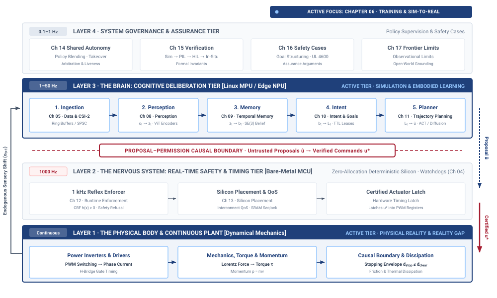
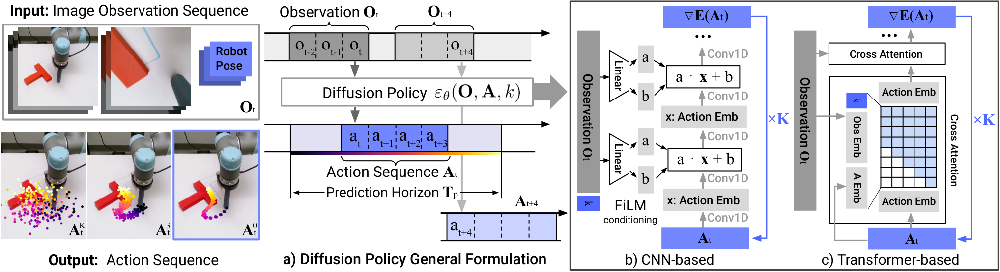
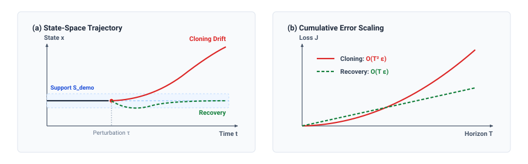
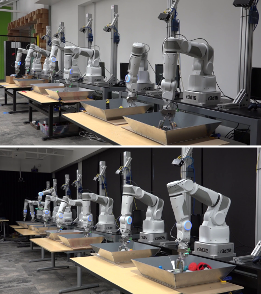
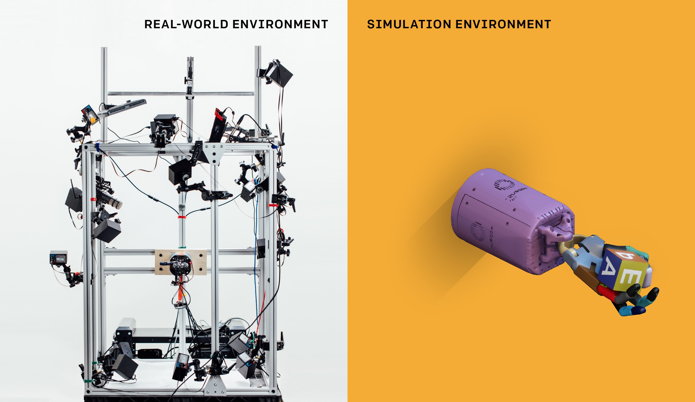
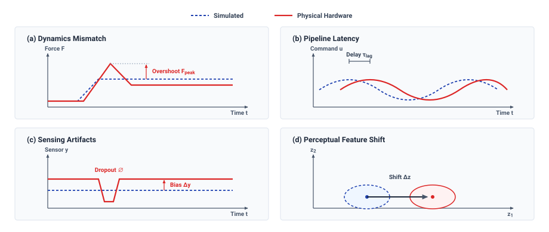
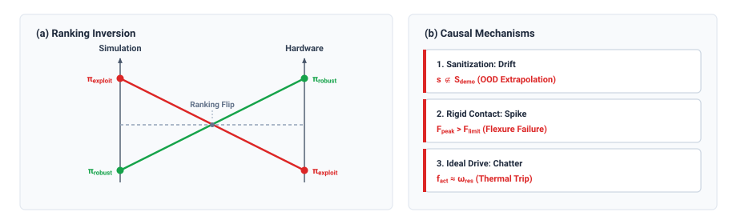

# Policy Training {#sec-training}

::: {.column-margin}

\chapterminitoc

:::

::: {#fig-06-locator fig-env="figure" fig-pos="H" fig-cap="**The Reality Gap in the Physical AI Stack**: The four-tier physical AI systems architecture [@brooks1986subsumption] highlights the cognitive deliberation tier together with the physical body beneath it, with the reality gap between them as this chapter's active focus. Read the highlighted pair as the two ends of every sim-to-real transfer, because a policy synthesized against simulated dynamics acquires authority only over the real plant." fig-alt="Diagram titled Physical AI Systems Architecture Stack, drawn as four stacked tiers. Layer 4 is system governance and assurance at 0.1 to 1 hertz, holding boxes for shared autonomy, verification, safety cases, and frontier limits. Layer 3 is the brain, a cognitive deliberation tier at 1 to 50 hertz, holding five stages named ingestion, perception, memory, intent, and planner. A dashed proposal-permission privilege boundary separates it from layer 2, the nervous system, a real-time safety and timing tier at 1000 hertz. Layer 1 is the physical body and continuous plant. Layer 3 and layer 1 are both highlighted and the reality-gap label inside layer 1 is bold; the badge reads Active Focus, Chapter 06, Training and Sim-to-Real."}
{width="100%"}
:::

\begin{marginfigure}
\vspace{1em}
\resizebox{\linewidth}{!}{\mlphysicalstackfull{20}{20}{20}{20}{100}}
\end{marginfigure}

*Why does a policy that achieves 100 percent task reward in simulation destroy real gearboxes within minutes of deployment?*

Learning through physical trial and error consumes hardware as well as computation. An exploratory action can overheat a motor or damage a transmission before the policy receives feedback. Simulation allows that exploration without exposing the real body, but its usefulness depends on which physical behaviors it represents. A policy can earn a high reward by exploiting an idealized contact model or an unrealistically fast actuator response. The same commands can produce vibration or failure on the machine. Demonstrations avoid some exploratory risks but leave the policy dependent on the situations the demonstrator encountered. Neither source of experience removes the need to measure how behavior changes during deployment. Training must account for that difference when choosing examples, simulated conditions, and the form of the actions a policy generates. In physical AI systems architecture, policy training connects computational exploration to the body's response, making transfer to the real machine part of the learning problem.



::: {.callout-learning-objectives}

- Compare training regimes by the capabilities they provide and the deployment failures they can create
- Explain why small imitation errors can compound when the policy leaves demonstrated states
- Compare action decoders for representing multiple valid behaviors without averaging incompatible actions
- Diagnose transfer failures from simulator assumptions and mismatches in dynamics, sensing, appearance, or timing
- Evaluate physical fine-tuning against hardware wear, retained skills, and evidence of improved behavior
- Construct a policy record linking data coverage, training choices, simulator versions, and deployment assumptions

:::

## Policy Synthesis {#sec-training-6-1}

Two learned controllers can earn the same offline score and fail for different reasons on the same machine. Consider controllers designed to regulate liquid flow through a proportional valve before a mechanical placement head seats a component onto a seal. Both achieve a validation score of $0.002$ mean squared error on their respective benchmarks. The first policy was trained by behavioral cloning—learning to directly mimic recorded operator demonstrations—while the second was trained through trial and error inside a physics simulator. On identical physical test benches, both regulate steady flow at $1.50\text{ L/min}$ under nominal supply pressure. When a supply pump transient drops line pressure by $12\text{ kPa}$, their failure modes diverge. The demonstrated policy issues a correction that undershoots slightly, landing in a pressure-flow state absent from the human demonstrations. Because the policy cannot reliably extrapolate outside its training data, its subsequent erratic valve commands compound the tracking error over consecutive $20\text{ ms}$ control steps and overflow the reservoir. The simulated policy commands valve reversals at $50\text{ Hz}$, relying on the simulator's assumption that the actuator accelerates instantaneously. The physical solenoid spool requires $35\text{ ms}$ to transit between positions, so it cannot track those reversals; the resulting pressure oscillations damage an upstream pipe seal. The collection process determined which experience was available, but the training method determined how each policy used that experience and which assumptions it carried into deployment.

::: {#dfn-training-actuator-latency-invariance .callout-definition title="Actuator dynamics latency invariance"}

***Actuator dynamics latency invariance***\index{Actuator dynamics latency invariance!definition}\index{Sim-to-real!latency invariance} is the algorithmic property of a learned policy trained across randomized transport delays, phase lags, and unmodeled mechanical compliance, ensuring that closed-loop feedback stability is maintained when deployed on physical hardware without exciting destructive resonant chatter.

:::

From a systems engineering perspective, a **policy synthesis regime**\index{Policy synthesis regime!definition} is defined as the specific boundary conditions of its data pipeline, optimization objective, and execution environment. These boundary conditions comprise three specific elements: the manifold of physical states the policy is permitted to explore during optimization, the sensory observations and disturbance profiles it records across those states, and the mechanism that provides the target signal. Whether that target signal is an operator's joint torque log, a scalar reward evaluating liquid throughput, an analytical cost function, or a self-supervised reconstruction loss on next-frame camera telemetry, the learned model remains completely ignorant of physical mechanics outside the envelope of that evidence.

Every training regime represents an economic trade between capability and vulnerability. What a training regime buys is a deployment capability, such as the ability to coordinate high-dimensional sensory inputs without an explicit state estimator (bypassing the filter architectures established in @sec-state-4-1), or the ability to discover non-obvious control strategies across millions of simulated iterations. What it charges is a runtime dependency on every simplifying assumption embedded in the data-generating process, reward formulation, numerical solver, or adaptation environment. Success on a training objective measures only how thoroughly an optimization algorithm minimized error across its designated evidence set. It provides zero guarantees regarding how the policy behaves under the state distribution it generates once connected to physical actuators across all three physical machine archetypes:

- In **mobile systems** (Class 1), an autonomous ground vehicle or quadruped trained purely on centered highway logs or flat-ground simulation fails when encountering shoulder gravel, wheel slip on ice, or camera sensor blur during high-speed yaw.
- In **manipulators** (Class 2), an articulated assembly arm trained via supervised cloning commands non-functional intermediate grasp poses when presented with off-nominal workpiece orientations, dropping parts or jamming tooling into rigid fixtures.
- In **process and energy systems** (Class 3), a battery thermal management controller trained on nominal heat cycles commands high-frequency pump oscillations during sudden thermal spikes, cavitating the coolant loop (as detailed in @sec-fluids-2-3) and tripping overtemperature protection.

This discrepancy arises because physical execution is closed-loop: the policy's own actions continuously shape the future states it encounters. During training, states are either passively retrieved from static disks or computed by numerical integrators that enforce convenient simplifications. Once deployed, the policy's own control outputs determine the subsequent physical state of the machine. If a policy trained on demonstrations makes a single actuation error that shifts the machine into an unrecorded state, the training distribution no longer governs the inputs. If a policy trained in simulation relies on unmodeled physical phenomena, such as thermal resistance changes in a motor winding or friction hysteresis in a gearbox (as established in @sec-actuators-2-2), the physical plant diverges from the simulated plant at every integration step. The debt incurred during training is deferred until deployment, where physics collects the full balance at line rate.

The connection between the highlighted brain and body tiers in @fig-06-locator is therefore part of the training problem. A policy must work with the response of the physical plant, including the behavior that its training environment approximated or omitted. Four primary regimes approach that problem through learning from demonstration, trial-based reinforcement learning, simulation-based exploration, and physical fine-tuning. The end-to-end visuomotor training demonstrated by @levine2016end established that deep neural networks could map raw camera observations to continuous joint motor torques on physical manipulators. Learning from human demonstration can provide task competence without an explicit reward function, but leaves the policy vulnerable when disturbances push it beyond demonstrated trajectories. Simulation-based reinforcement learning permits exploration across billions of synthetic transitions without exposing hardware to each trial, but depends on the fidelity of actuator and contact models. Real-machine adaptation supplies authentic interactions at the cost of wear, collection time, and exposure to unverified behavior. Each regime must therefore be judged by both the capability it supplies and the deployment assumptions it creates.

Designing a physical AI system requires treating the training process as a component specification rather than an isolated machine learning task. An engineering team deploying a learned policy must produce three deliverables alongside the model weights, specifically a failure mode prediction derived from the regime's structural assumptions, a runtime detector configured to catch that failure before mechanical limits are exceeded, and a complete provenance log detailing the data sources, simulation bounds, and target criteria that shaped the policy. Because learning from demonstration represents the most direct and widely adopted method for transferring human skill to an automated actuator, understanding its exact mathematical mechanics and error-propagation characteristics establishes the baseline against which all other training trades are measured.

## Policy Synthesis Regimes and Demonstration Learning {#sec-training-6-2}

| Policy Synthesis Regime            | Core Purchased Capability                                                                                          | Data & Compute Budget                                                                                                    | Sample Efficiency & Scale                                                                                            | Hardware Safety & Wear Risk                                                                                                 | Dominant Failure Mode & Interceptor                                                                                                                                                                     |
|:-----------------------------------|:-------------------------------------------------------------------------------------------------------------------|:-------------------------------------------------------------------------------------------------------------------------|:---------------------------------------------------------------------------------------------------------------------|:----------------------------------------------------------------------------------------------------------------------------|:--------------------------------------------------------------------------------------------------------------------------------------------------------------------------------------------------------|
| **Behavioral Cloning (BC)**        | Direct imitation of demonstrated trajectories without reward engineering or system identification                  | $10^2$–$10^3$ teleop trajectories ($\sim 10$–$50\text{ h}$ data); $<50\text{ GPU-h}$ compute                             | Supervised $\mathcal{O}(N)$ over expert demonstrations; fixed $1\times$ real-time data throughput                    | Minimal exploration risk during logging; zero hardware exploration during optimization                                      | Quadratic compounding error ($\mathcal{O}(T^2 \epsilon)$) via covariate shift (where small errors push the robot into unfamiliar states, causing progressively larger errors). *Interceptor*: Kernel/Mahalanobis density monitors (statistical checks to ensure the robot remains in a familiar state), convex hull boundary clamps (hard limits to keep the robot within demonstrated physical bounds)                                          |
| **Offline / Batch RL**             | Value-guided policy optimization over fixed, heterogeneous sub-optimal logs; stitches multi-trajectory transitions | $10^5$–$10^7$ logged transitions with state-action coverage; $100$–$500\text{ GPU-h}$ compute                            | Offline $\mathcal{O}(N)$ over static datasets; sample-efficient but demands high state-action overlap                | Zero active exploration hazards during offline training; logging requires caged rigs or safe scripted controllers           | Out-of-distribution action extrapolation and Q-value overestimation (guessing that an untried action will yield impossibly high rewards). *Interceptor*: Conservative Q-learning (CQL) penalty bounds (mathematical penalties for guessing actions not in the dataset), action support filters                                                |
| **Sim-to-Real RL**                 | Discovery of dynamic, non-prehensile manipulation and agile locomotion via billions of unconstrained rollouts      | Zero physical data; $10^7$–$10^9$ simulated transitions across $10^3$–$10^4$ GPU environments; $500$–$5000\text{ GPU-h}$ | Low algorithmic sample efficiency ($10^7$–$10^9$ steps), offset by $10^3\times$–$10^5\times$ simulation acceleration | Zero hardware wear or collision damage during training; severe deployment risk if plant dynamics diverge                    | Exploitation of numerical solver artifacts (contact interpenetration, zero latency). *Interceptor*: Paired-trace discrepancy budgets, force-derivative ($dF/dt$) clamps                                 |
| **Residual RL & Real Fine-Tuning** | Direct policy correction against physical contact compliance, gearbox hysteresis, and true sensor noise            | $10^3$–$10^5$ physical steps ($0.5$–$10\text{ h}$ wall-clock time); $<20\text{ GPU-h}$ compute                           | High sample efficiency required (SAC/TD3 or residual delta-action formulation); strictly $1\times$ real-time         | High physical exposure; repetitive impact shocks degrade gearboxes; exploratory current dither elevates winding temperature | Catastrophic forgetting of nominal transit stability, local policy collapse. *Interceptor*: Parameter drift bounds ($\Vert\Delta \theta\Vert_2 \le \delta$), frozen regression suites, thermal limiters |

: **Comparative Trade-Off Matrix Across Policy Synthesis Regimes**: Systematic evaluation of behavioral cloning, offline reinforcement learning, sim-to-real reinforcement learning, and residual RL/fine-tuning. Columns detail the primary operational capability purchased during training, representative sample and compute budgets, sample efficiency bounds, safety risks incurred during data acquisition, and dominant failure signatures with corresponding nervous system interceptors. {#tbl-06-regimes tbl-colwidths="[16,16,18,18,16,16]"}

As compared across synthesis paradigms (@tbl-06-regimes), **behavioral cloning**\index{Behavioral cloning} is the cheapest route to a working policy and the one whose failure mode is best understood. It frames policy synthesis as supervised regression or classification over a collected dataset of expert state-action pairs $\mathcal{D} = \{(o_t, a_t)\}$. In its standard formulation, the optimization objective minimizes a one-step prediction loss, fitting an action conditional on the current observation or a finite observation history drawn from demonstration trajectories (see @sec-appendix-ml for standard regression formulations).[^fn-hist-alvinn-cloning]
Because this loss penalizes only the discrepancy between the commanded action and the recorded demonstration at observed states, the training objective does not evaluate task completion, terminal cost, or the stability of the closed-loop dynamical system. It fits actions to observations, and it fits nothing else.

### The multimodality breakdown and mode averaging {.unnumbered}

The primary vulnerability of standard behavioral cloning under typical regression losses is its inability to represent multimodal action distributions. When a model minimizes average error, its theoretical best guess becomes the strict mathematical average of all possible correct actions—even if that average represents a physically impossible or disastrous maneuver (for full proofs, see @sec-appendix-ml).[^fn-math-mode-averaging]

When human demonstrators perform a physical task, their strategy is frequently multimodal. Consider an obstacle avoidance scenario where a mobile base or robotic arm must navigate around a central pillar. A human demonstrator may choose to pass around the pillar to the left in half of the demonstrations, or to the right in the remaining half. The true demonstration data contains distinct valid choices, but zero examples of driving straight down the middle.

When trained on this dataset with an averaging regression loss, the model calculates the midpoint between the \"steer left\" and \"steer right\" commands. The policy outputs zero lateral velocity, commanding the machine to drive directly into the obstacle. The conditional mean represents an unviable, catastrophic action that never occurred in the demonstration dataset. Across physical machine archetypes:

- In *Mobile Systems*, the vehicle drives into pillars, bridge abutments, or dividing medians.
- In *Manipulators*, mode averaging causes end-effector grippers to command non-functional intermediate grasp poses that straddle an object's outer boundary, dropping workpieces or jamming tooling into rigid assembly fixtures.
- In *Process Systems*, averaging between two discrete valve operating regimes ($10\%$ bypass vs. $90\%$ main feed) commands an uncalibrated $50\%$ intermediate flow that cavitates the supply pump and violates cooling deadlines.

Furthermore, in high-frequency single-step control loops ($50\text{--}100\text{ Hz}$), Markovian policies mapping single observations $o_t \to a_t$ suffer from severe temporal inconsistency. Minor sensor noise or slight state perturbations cause the predicted output to alternate between distinct modes across consecutive timesteps. The policy commands rapid alternating positive and negative actuator torques ($+10\text{ N}\cdot\text{m} \leftrightarrow -10\text{ N}\cdot\text{m}$), exciting mechanical drive resonances, accelerating gearbox tooth wear, and driving high Joule heating in motor windings.

### Overcoming multimodality: The four action decoder paradigms {.unnumbered}

Modern imitation learning resolves the multimodality catastrophe—where fitting continuous actions via standard Mean Squared Error ($L_2$) regression forces a neural network to predict the disastrous geometric centroid of mutually exclusive human demonstration modes (such as steering straight into an obstacle when demonstrators steered left or right)—by replacing unconstrained point regression with expressive generative decoders. As @florence2022implicit established in Implicit Behavioral Cloning, this failure can be addressed by formulating policy evaluation as energy minimization over an implicit energy-based model $E_\theta(s, a)$, capturing arbitrary discontinuous multi-modal action surfaces without centroid averaging. Four dominant architectural paradigms define the modern state of the art:

1. **Discrete token binning** (RT-1, RT-2, OpenVLA): Discrete token binning chops each continuous action dimension into uniform categorical bins (e.g., 256 discrete tokens) [@brohan2023rt1; @brohan2023rt2; @kim2024openvla]. The policy treats action prediction as sequence generation, predicting one token after another and optimizing standard classification loss (cross-entropy) to match the demonstrator's exact bin choices.
*What it buys:* Natively represents arbitrary multimodal probability distributions over discrete bins without mode collapse, and integrates directly into pretrained Vision-Language-Action (VLA) foundation models.
*What it charges:* Discretization quantization error bounded by $\Delta a = \frac{a_{\text{max}} - a_{\text{min}}}{B}$ (e.g., $\Delta a = 2/256 \approx 0.0078$ normalized units), generating stair-stepped commands; high inference latency due to autoregressive sequential token generation ($D_a$ forward passes per control step); and lack of native inter-step kinematic smoothness, requiring downstream low-pass filtering on the Real-Time MCU.

2. **Continuous trajectory diffusion** (Diffusion Policy): Diffusion Policy treats policy synthesis as conditional denoising diffusion over continuous multi-step action trajectory chunks conditioned on an observation history [@chi2024diffusionpolicy], as schematized in @fig-diffusion-policy-architecture. An apparent paradox often confuses practitioners: *if averaging error causes mode collapse in direct policy regression, why does Diffusion Policy use the same error metric?* The crucial distinction lies in the target of the loss function. In standard BC, error is measured directly across the multimodal action space, forcing the network to predict the physical centroid (like averaging "steer left" and "steer right" into "steer straight"). In Diffusion Policy, the neural network is trained to predict and subtract pure, unimodal Gaussian noise (static) from a corrupted trajectory.
Because the noise itself is purely unimodal (having only one central peak), the standard error metric is the correct objective, avoiding the physical averaging trap (for diffusion fundamentals, see @sec-appendix-ml). At inference time, sampling begins by drawing pure random noise and iteratively refining it. This iterative denoising breaks symmetry, causing the trajectory to settle into one distinct demonstrated mode without mode collapse or centroid averaging. Furthermore, trajectory-level diffusion inherently enforces kinematic smoothness across physical inertia, amortizing the effect of high-frequency observation noise.

::: {#fig-diffusion-policy-architecture fig-env="figure" fig-pos="t" fig-cap="**Diffusion Policy architecture and closed-loop action chunk denoising**: A continuous trajectory diffusion policy for visuomotor control, denoising a candidate action chunk from Gaussian noise across $K$ iterations and dispatching only a prefix of it before re-planning. Emitting a chunk rather than a single action is what decouples slow generative inference from high-rate actuation, and denoising rather than regressing is what lets the policy hold multiple valid demonstrations without averaging them into an invalid one. (Adapted from Chi et al., arXiv:2303.04137)." fig-alt="Diffusion Policy architecture and closed-loop action chunk denoising. An authentic continuous trajectory diffusion architecture for visuomotor control. The policy conditions on an observation horizon of multi-camera images and robot state vectors. Starting from pure Gaussian noise, the noise-prediction backbone (parameterized as either a 1D Temporal Convolutional U-Net or a Time-Transformer) iteratively denoises a candidate action trajectory across diffusion iterations. The resulting action chunk spans a prediction horizon, from which an execution horizon is dispatched to real-time motor controllers before receding-horizon re-planning occurs. This decouples slow generative inference from high-rate motor actuation while natively modeling multimodal demonstration distributions without mode collapse. (Adapted from Chi et al., arXiv:2303.04137)."}
{width="95%"}
:::

3. **Continuous flow matching**\index{Continuous flow matching} (Flow Matching Policy / Rectified Flow): While Diffusion Policy relies on complex stochastic paths that require many denoising steps, **continuous flow matching** [@lipman2022flow] formulates trajectory generation as a deterministic process along straight probability paths. It maps a path directly from a random noise prior to the target action chunk. A neural network learns to predict the constant \"velocity\" needed to drive a noise sample straight toward a valid demonstration.
*What it buys:* Because the probability paths are straight, numerical integration requires far fewer integration steps (Euler or midpoint steps $N_{\text{steps}} \in [2, 4]$) to generate high-fidelity continuous action chunks, reducing inference latency on embedded NPUs from $35\text{--}65\text{ ms}$ down to $8\text{--}15\text{ ms}$ while natively modeling multimodal action distributions without mode averaging.
*What it charges:* Demands stable numerical ODE solvers on the host MPU; boundary trajectories can still suffer extrapolation errors if the velocity field is evaluated outside the support of the training data.

4. **Latent variable action chunking** (ACT): ACT reformulates policy synthesis by predicting an entire sequence of future actions $A_t = (a_t, a_{t+1}, \dots, a_{t+K-1}) \in \mathbb{R}^{K \times D_a}$ across a receding horizon $K$ given the current observation $o_t$ [@zhao2023learning]. To capture multimodality, ACT employs a Conditional Variational Autoencoder (CVAE)—a network structure that learns to compress complex demonstrations into a simplified "latent" representation—parameterized by a Transformer encoder-decoder. During training, a Transformer encoder compresses demonstrated action chunks and current observations into a low-dimensional latent style variable $z \sim q_\phi(z \mid o_t, A_t)$ regularized by KL divergence against a unit Gaussian prior $\mathcal{N}(0, \mathbf{I})$. At inference time, the latent code is sampled from $z \sim \mathcal{N}(0, \mathbf{I})$ and fed into the Transformer decoder $\pi_\theta(o_t, z)$. Sampling a specific latent code $z$ selects a single coherent demonstrated intention (e.g., "navigate left"), generating an internally consistent, continuous multi-step trajectory chunk without averaging across distinct modes. To prevent discontinuous jerks across chunk boundaries, ACT applies *temporal ensembling* across overlapping receding horizons. At any given execution time, multiple prior chunks provide overlapping predictions for the current step. ACT computes the executed action as an exponentially decaying weighted blend of these predictions, giving the highest priority to the freshest observations while smoothly blending older predictions to average out single-step actuator jitter.

### Algorithmic formulation: Trajectory diffusion and asynchronous decoupling {.unnumbered}

Deploying generative imitation architectures introduces significant computational latency ($20\text{--}80\text{ ms}$ for multi-step diffusion denoising or multi-head Transformer self-attention on embedded GPUs/NPUs).[^fn-hw-gpu-denoising] Extending the heterogeneous dual-brain proposal-permission architecture from @sec-brain-3-1, this latency requires strict physical decoupling: the unprivileged Linux MPU runs the generative policy asynchronously at a lower rate ($10\text{--}20\text{ Hz}$), populating an action chunk ring buffer. Meanwhile, the deterministic Real-Time MCU samples the chunk buffer at $500\text{--}1000\text{ Hz}$, executing smooth cubic spline interpolation, velocity envelope governor checks, and hard torque-slew limiters ($d\tau/dt \le \dot{\tau}_{\text{max}}$). This complete pipeline is formalized in @algo-diffusion-policy-trajectory.

```pseudocode
#| label: algo-diffusion-policy-trajectory
#| pdf-line-number: true
#| pdf-right-comment: false
#| html-comment-delimiter: "▷"

\begin{algorithm}
\caption{Diffusion Policy Trajectory Chunk Denoising and Dual-Rate Actuation}
\begin{algorithmic}
\Require observation history buffer $\mathbf{O}_t = (\mathbf{o}_{t-H+1}, \dots, \mathbf{o}_t)$, noise prediction network $\boldsymbol{\epsilon}_\theta$, noise schedule $\{\alpha_k, \bar{\alpha}_k, \sigma_k\}_{k=1}^{N_{\text{diff}}}$, chunk horizon $K$, MCU loop period $\Delta t_{\text{mcu}}$
\Ensure line-rate joint torque setpoint / action vector $\mathbf{a}_t$
\Statex
\State \textbf{Host MPU — Asynchronous Trajectory Chunk Generation ($10\text{--}20\text{ Hz}$)}
\State $\mathbf{E}_t \gets \Call{VisualEncoder}{\mathbf{O}_t}$
\State $\mathbf{A}^{N_{\text{diff}}} \sim \mathcal{N}(\mathbf{0}, \mathbf{I}_{K \times D_a})$ \Comment{initialize reverse diffusion from Gaussian noise}
\For{$k = N_{\text{diff}}$ \textbf{down to} $1$}
    \State $\hat{\boldsymbol{\epsilon}} \gets \boldsymbol{\epsilon}_\theta(\mathbf{A}^k, \mathbf{E}_t, k)$
    \State $\boldsymbol{\mu}_k \gets \frac{1}{\sqrt{\alpha_k}} \left( \mathbf{A}^k - \frac{1 - \alpha_k}{\sqrt{1 - \bar{\alpha}_k}} \hat{\boldsymbol{\epsilon}} \right)$
    \State $\mathbf{z} \sim \mathcal{N}(\mathbf{0}, \mathbf{I})$ \textbf{if} $k > 1$ \textbf{else} $\mathbf{z} \gets \mathbf{0}$
    \State $\mathbf{A}^{k-1} \gets \boldsymbol{\mu}_k + \sigma_k \mathbf{z}$
\EndFor
\State $\mathbf{A}_{\text{chunk}} \gets \mathbf{A}^0$
\State $\Call{DepositSpscRingBuffer}{\mathbf{A}_{\text{chunk}}}$ \Comment{lock-free deposit into shared buffer}
\Statex
\State \textbf{Real-Time MCU — Synchronous Deterministic Actuation ($1000\text{ Hz}$)}
\If{$\Call{HasNewChunk}{\text{SPSC}}$}
    \State $\Call{UpdateSplineKnots}{\text{SPSC}}$
\EndIf
\State $\mathbf{a}_{\text{raw}} \gets \Call{CubicSplineInterpolate}{\mathbf{A}_{\text{chunk}}, t_{\text{current}}}$
\State $\Delta \mathbf{a} \gets \Call{clamp}{\mathbf{a}_{\text{raw}} - \mathbf{a}_{\text{prev}}, -\dot{\mathbf{a}}_{\max} \Delta t_{\text{mcu}}, +\dot{\mathbf{a}}_{\max} \Delta t_{\text{mcu}}}$ \Comment{kinematic slew-rate governor}
\State $\mathbf{a}_{\text{clamped}} \gets \mathbf{a}_{\text{prev}} + \Delta \mathbf{a}$
\State $\mathbf{a}_t \gets \Call{SafetyGovernorClamp}{\mathbf{a}_{\text{clamped}}}$ \Comment{deterministic envelope enforcement}
\State $\Call{TransmitPwmRegisters}{\mathbf{a}_t}$
\State $\mathbf{a}_{\text{prev}} \gets \mathbf{a}_t$
\State \Return $\mathbf{a}_t$
\end{algorithmic}
\end{algorithm}
```

### Offline reinforcement learning and action distributional shift {.unnumbered}

When physical demonstration datasets $\mathcal{D} = \{(s_t, a_t, r_t, s_{t+1})\}$ contain heterogeneous or sub-optimal trajectories (e.g., mixtures of teleoperation, scripted routines, and exploratory human play), behavioral cloning struggles because it treats all demonstrations with equal supervised weight. In classical Reinforcement Learning (RL) formulated on Markov Decision Processes (MDPs) [@sutton2018reinforcement], an agent optimizes a policy to maximize expected discounted cumulative returns $J = \mathbb{E}\left[\sum_{t=0}^\infty \gamma^t r(s_t, a_t)\right]$. **Offline reinforcement learning (Batch RL)**\index{Offline reinforcement learning} aims to optimize a policy directly from logged transition archives without active hardware exploration, using reward signals to stitch together high-performing composite trajectories from disjoint, imperfect demonstrations [@kumar2020conservative].

However, applying standard Q-learning to static offline datasets triggers a catastrophic failure mode known as **out-of-distribution (OOD) action overestimation**\index{Out-of-distribution action overestimation}. In standard reinforcement learning, the algorithm estimates the value of future states by asking its \"critic\" network to predict the highest possible reward it could achieve in the next step (for formal Bellman equations, see @sec-appendix-ml). To find this maximum, the operator scans across the entire continuous action space. For actions that were never executed in the logging dataset, the network has received zero training signal and often outputs erroneously large value estimates due to generalization variance (hallucinating that an untried physical maneuver will result in a massive reward). The algorithm greedily selects these spurious peaks, propagating over-optimistic value errors backwards. When deployed, the actor greedily selects these ungrounded actions, commanding physically unviable motor voltages that cause immediate joint stalls or boundary collisions.

To prevent value explosion without querying the physical environment, **Conservative Q-learning (CQL)**\index{Conservative Q-Learning} adds a regularization penalty directly to the training process.[^fn-math-cql-bound] CQL artificially suppresses the predicted values of any actions that fall outside the data manifold, while maintaining accurate predictions for transitions actually present in the dataset. By explicitly penalizing unfamiliar actions, CQL ensures the learned policy conservatively bounds its expectations, preventing dangerous extrapolation beyond the physical support of the dataset.

### Compounding covariate error and state support drift {.unnumbered}

Even when multimodality is handled by generative architectures, behavioral cloning remains structurally vulnerable to closed-loop error compounding. Consider a positioning system that regulates the height of a dispensing nozzle over a moving substrate at $100\text{ Hz}$ before touching the surface to deposit adhesive. In a clean demonstration dataset, an expert operator or an engineered classical controller maintains the nozzle within a narrow operating band of $\pm 0.2\text{ mm}$ around the reference trajectory. A learned policy evaluated on a held-out test split of this dataset can achieve a mean squared error near zero, predicting the nominal motor current with high fidelity. That low held-out validation loss evaluates accuracy only on the states the demonstrator visited. It contains zero samples of the machine recovering from actuator current saturation, sensor noise, transport delay, or an incorrect command issued three time steps earlier. The policy learns how to remain near the nominal setpoint when already there, but learns nothing about how to steer back toward it once displaced.

Let the policy operate in discrete time over an execution horizon of $T$ control steps, issuing an action $a_t$ at each interval $\Delta t$. Suppose that under the demonstrated distribution of observations, the policy has an independent probability $\epsilon$ of making an action error at any single time step, where an error is defined as an action that deviates from the expert envelope by enough to perturb the physical state beyond nominal bounds. The probability of committing at least one error across the trajectory grows as $1 - (1 - \epsilon)^T$. Once an error is made, the machine drifts off-distribution, incurring a cost that compounds at every subsequent step. This results in a cumulative trajectory cost $J$ that scales quadratically with the horizon time $T$: $J = \mathcal{O}(T^2 \epsilon)$.[^fn-math-compounding-cost]

The quadratic dependency on time $T^2$ represents the structural price of open-loop supervised training applied to a closed-loop dynamical system. The first error incurs a direct penalty, and every subsequent step spends the remainder of the rollout accumulating cost because the demonstration dataset never provided examples of how to return to the nominal path.

This quadratic error compounding was rigorously proven by @ross2011reduction, establishing that standard Behavioral Cloning suffers from $\mathcal{O}(T^2 \epsilon)$ compounding regret because the learner's own execution errors induce covariate shift away from the demonstration distribution. To overcome this fundamental limitation in software, the authors formulated DAgger (Dataset Aggregation), an interactive online imitation learning framework that queries an expert oracle to label the states visited by the learner's policy, provably collapsing compounding error back to linear $\mathcal{O}(T \epsilon)$. In physical robotics, however, running an unverified policy to gather online expert labels is hazardous, as off-distribution exploration risks mechanical collisions and hardware damage before the human supervisor can intervene.

### Why action chunking suppresses compounding error ($T \to T/H$) {.unnumbered}

The emergence of Action Chunking across Diffusion, Flow Matching, and ACT provides a structural mathematical defense against this quadratic compounding error bound ($\mathcal{O}(T^2 \epsilon)$).

In classical single-step imitation learning, the policy queries neural network inference at every single control cycle $t = 1, 2, \dots, T$. Because the policy makes $T$ sequential feedback decisions across the task horizon, uncorrected drift integrates across $T$ steps into quadratic cumulative cost $J_{\text{single}} \approx \frac{1}{2} T^2 \epsilon$, meaning the robot physically spirals further away from its intended path with every tick of the control loop.

Now consider an **action chunking**\index{Action chunking} policy that predicts a trajectory chunk of horizon $H$ steps (e.g., $H = 16$ or $H = 32$) at each query. The policy does not make $T$ sequential closed-loop decisions. Instead, across the global execution horizon $T$, the policy queries the neural network only $M = \lceil T / H \rceil$ times. During the execution of each chunk, actions are dispatched along an open-loop, kinematically consistent spline trajectory executed by the real-time MCU.

Compressing the sequential decision count from $T$ to $T/H$ yields a **quadratic suppression factor of $H^2$** in the compounding error term. For an execution horizon of $T = 500$ steps ($10\text{ s}$ at $50\text{ Hz}$) and a chunk horizon of $H = 16$, action chunking reduces the compounding error multiplier by over two orders of magnitude ($256\times$).[^fn-math-action-chunking] Furthermore, executing multi-step chunks along smooth spline profiles eliminates the high-frequency alternating mode chatter that destabilizes single-step policies when noise perturbs states near the decision boundary. This horizon truncation explains why action chunking represents a foundational systems architecture for modern Physical AI.

::: {#nbk-training-compounding-covariate-drift-closed-loop-recovery .callout-notebook title="Compounding covariate drift vs. closed-loop recovery"}
**Problem statement**: An autonomous mobile delivery robot operates at a control frequency of $50\text{ Hz}$ ($\Delta t = 20\text{ ms}$) across a $10.0\text{ s}$ transit corridor ($T = 500$ steps). A learned behavioral cloning policy achieves a $99.5\%$ one-step accuracy on validation data ($\epsilon = 0.005$). If an uncorrected single-step error introduces an unmodeled lateral acceleration drift bias of $a_{\text{bias}} = 0.05\text{ m/s}^2$, calculate:

1. The probability $P(\text{drift})$ that the robot encounters at least one off-distribution perturbation during transit.
2. The expected cumulative trajectory lateral displacement drift under open-loop cloning versus closed-loop on-policy recovery (where recovery time constant $\tau_{\text{rec}} = 5\Delta t = 0.10\text{ s}$).

*Step 1: Probability of at least one error*
With a $0.5\%$ error rate applied independently over 500 decision steps, the probability of at least one error compounds rapidly. Even with $99.5\%$ one-step precision, an off-distribution departure is virtually guaranteed (over $90\%$ probability) across a $10\text{ s}$ horizon.

*Step 2: Cumulative trajectory drift under open-loop cloning*
Under open-loop cloning, once the robot is perturbed, the lateral error grows uncorrected, accelerating away from the nominal path. Because the errors compound quadratically over the remaining execution steps, the final displacement is proportional to the cube of the total horizon time multiplied by the error rate. For this robot, an uncorrected bias across the trajectory results in over $2.0\text{ meters}$ of accumulated lateral drift—driving it completely off the corridor.

*Step 3: Cumulative trajectory drift under on-policy recovery*
Under on-policy recovery training, the policy actively steers back to the corridor within a few timesteps. This bounds the local displacement for any single error to less than a millimeter. Because the policy recovers, the total drift scales only linearly with the number of errors. Over the full trajectory, the expected cumulative drift remains under $1\text{ millimeter}$.

**Systems insight**: The ratio between open-loop cloning drift ($2.08\text{ m}$) and closed-loop recovery drift ($0.625\text{ mm}$) exceeds $3300\times$. A $99.5\%$ accurate supervised policy is completely unusable on physical mobile or robotic hardware without active closed-loop recovery training or runtime support monitors.
:::

::: {#psp-training-imitation-horizon .callout-perspective title="The imitation horizon limit"}
*A behavioral cloning policy cannot safely execute beyond $T \approx 1/\epsilon$ control cycles without active closed-loop support monitoring or recovery demonstrations.*
:::

@Fig-06-compounding-error follows the endogenous cascade this dynamic feedback creates where a single perturbation at step $\tau$ shifts the physical state outside demonstrated support $\mathcal{S}_{\text{demo}}$, transferring execution into an unconstrained out-of-distribution regime. While on-policy recovery training bounds cumulative cost linearly as $\mathcal{O}(T\epsilon)$, behavioral cloning compounds cost quadratically as $\mathcal{O}(T^2\epsilon)$ until intercepted by a runtime support monitor in the nervous system.

::: {#fig-06-compounding-error fig-env="figure" fig-pos="t" fig-cap="**Compounding Covariate Shift and State Support Drift in Behavioral Cloning**: An action error at step $\tau$ pushes the plant outside demonstrated support, where network loss is unconstrained and the trajectory drifts quadratically until a support monitor trips or a mechanical stop is struck. The asymmetry between the two panels is the result. Cloning accumulates cost as $\mathcal{O}(T^2 \epsilon)$ while an on-policy recovery policy returns to the support tube and accumulates it linearly, so horizon length, not per-step accuracy, is what decides the outcome." fig-alt="Compounding Covariate Shift and State Support Drift in Behavioral Cloning. Open-loop supervised training on demonstration dataset D creates an acute structural vulnerability under closed-loop physical execution. (a) State-space trajectory and distribution drift: Expert demonstrations remain tightly bound within demonstrated support Sdemo (+/- 0.2 mm around nominal). At step t = tau, an action error (P = epsilon) perturbs the physical plant, pushing subsequent state stau+1 out-of-distribution (OOD) where the network loss is unconstrained. The trajectory drifts quadratically until tripping a nervous-system Mahalanobis support monitor (DM >= gammatrip) or striking a mechanical stop, whereas an on-policy/recovery policy returns to the support tube. (b) Cumulative error scaling: The expected cumulative cost scales quadratically as J = O(T^2 epsilon) under cloning versus linearly O(T epsilon) under on-policy recovery. For horizon T = 500 steps with single-step error epsilon = 0.005, the probability of at least one error reaches P = 1 - (1-epsilon)^T approx. 91.8%. (c) Causal feedback loop: The learned policy emits syntactically valid floating-point actions that pass standard range checks, but physical actuation shifts the sensor observation ot+1 not in supp(pdemo), querying the network off-distribution and amplifying subsequent tracking error."}
{width="100%"}
:::

Increasing dataset size, scaling model parameter capacity, or tuning architectures can drive the one-step error $\epsilon$ down by orders of magnitude, but this only postpones the divergence. If a policy operating at $100\text{ Hz}$ has its error rate reduced from $\epsilon = 10^{-3}$ to $\epsilon = 10^{-5}$, the expected time until the first distribution shift increases from $1.0\text{ s}$ to $100.0\text{ s}$. For a short-duration task, this delay may allow the machine to reach the terminal setpoint before the divergence manifests. Yet the underlying vulnerability remains unaddressed. Any unmodeled external disturbance, such as an uncalibrated payload mass, a voltage sag at the motor driver, or a mechanical jolt, shifts the state into the unvisited region immediately, triggering the same $\mathcal{O}(T^2 \epsilon)$ cascade regardless of how low the static training loss was driven.

The operational hazard of this failure mode is that it occurs silently. Unlike a software crash or an unhandled exception, a neural network evaluated on an out-of-distribution observation does not halt execution or raise an alarm. It continues forward inference, multiplying matrices and outputting numerical tensor values that are syntactically valid floating-point numbers within normal actuator voltage limits. The nervous system sees valid commands, while the physical state drifts steadily away from the demonstration envelope until the mechanism encounters a hard mechanical stop, stalls against a surface, or triggers an overcurrent fault. Detecting this condition before physical contact occurs cannot be accomplished by monitoring the offline training loss. It requires runtime telemetry that tracks state space support directly, measuring Mahalanobis distance in feature space, estimating model epistemic uncertainty, or enforcing an explicit envelope monitor in the nervous system that trips when state trajectories leave the convex hull of the demonstration dataset.

## Learning by Trial {#sec-training-6-3}

Learning by trial addresses the blind spots of imitation by generating state-action trajectories under the policy's own closed-loop execution. Instead of mimicking a curated sequence of nominal operator demonstrations, the optimization algorithm exposes the learning system to the consequences of its own imperfect outputs. When an exploratory action perturbs an end-effector five millimeters off its nominal path, the subsequent observation lands outside the demonstration envelope, forcing the optimization loop to evaluate recovery actions from that exact perturbed state. The policy accumulates gradient signals across near-misses, degraded alignments, and unstable contacts that an expert human or calibrated baseline controller never exhibits. By sampling transitions directly from the state distribution induced by the current weights, trial-based learning eliminates the covariate shift (the mismatch between the training data distribution and the states the policy actually encounters) that causes open-loop supervised imitation to compound errors quadratically over long execution horizons.

The capability bought by closed-loop exploration comes with a steep physical billing rate. Computing the hardware feasibility boundary begins with the wall-clock time required to collect a training dataset. The total calendar time to gather training data depends directly on how many trials the algorithm needs, the duration of each individual trial, the overhead time to reset the hardware back to its starting state between attempts, and the number of physical machines running in parallel.
As an analytical example, consider a contact-rich assembly task where a manipulator regulates contact force while seating a connector over an active horizon of $t_{\text{rollout}} = 8.0\text{ s}$. Reinforcement learning algorithms operating on high-dimensional sensory inputs routinely require $N = 10^6$ trials to discover coordinated force-velocity profiles. On a single physical machine with $P = 1$, the raw execution time alone accounts for $8.0 \times 10^6\text{ s}$, which represents roughly $92.6\text{ days}$ of uninterrupted round-the-clock operation before accounting for any reset overhead.

Factoring in the reset phase reveals the true temporal bottleneck of physical experimentation. If an automated fixture returns the workpiece and robot arm to a valid initial state in $t_{\text{reset}} = 4.0\text{ s}$, the total collection time for one million trials expands to $1.2 \times 10^7\text{ s}$, or $138.9\text{ days}$. When exploratory trajectories drop parts, jam pins, or trigger joint overcurrent trips, automated resetting becomes impossible, requiring a human operator to enter the work cell, clear the obstruction, and re-index the mechanism. If manual interventions take an average of $t_{\text{reset}} = 30.0\text{ s}$ across failed attempts, the wall-clock requirement exceeds $440.0\text{ days}$. Scaling physical parallelism to clusters of $P = 14$ synchronized rigs (@fig-06-robot-arm-farm) compresses calendar duration to several weeks [@levine2018learning], but it multiplies the physical footprint, capital investment, electrical power delivery, and human supervisory labor proportionally.

::: {#fig-06-robot-arm-farm fig-env="figure" fig-pos="t" fig-cap="**Physical Policy Training Farm and Hardware Parallelism**: Fourteen manipulators collecting over 800,000 physical grasp attempts across months [@levine2018learning]. Hardware parallelism divides calendar time but not cost, since each station adds capital, gearbox and bearing wear, thermal load in the motor windings, and a share of the supervisory labor needed to clear dropped objects and jams. Attribution: @levine2018learning." fig-alt="Physical Policy Training Farm and Hardware Parallelism. Large-scale robotic data collection cluster comprising 14 custom articulated manipulators operating concurrently over months to collect over 800,000 physical grasp attempts for vision-based hand-eye coordination [@levine2018learning]. Each robotic station consists of a 7-DoF arm, a two-finger compliant gripper, an over-the-shoulder RGB camera, and a dedicated bin containing diverse household objects. Scaling hardware parallelism to P=14 compresses the wall-clock calendar time Twall = N(trollout + treset)/P, but incurs heavy capital expenditure, continuous mechanical wear across gearboxes and linkage bearings, thermal buildup in motor windings, and substantial supervisory overhead to clear dropped objects and mechanical jams. Attribution: @levine2018learning."}
{width="85%"}
:::

Converting that same sample count into physical fatigue metrics demonstrates why time is often not the primary limiting constraint. In our analytical example, an 8-second insertion sequence operating under a $100\text{ Hz}$ inner control loop executes 800 torque commands per trial, subjecting each joint to approximately $k = 4$ reciprocating load cycles. Across $N = 10^6$ trials, the drivetrain accumulates $4.0 \times 10^6$ bidirectional load reversals. If the joint relies on a standard strain-wave gear with a manufacturer-specified fatigue life of $L_{10} = 1.5 \times 10^6\text{ cycles}$ at rated output torque (the ISO 281 metric indicating when 10% of units are statistically expected to fail), the training campaign consumes the certified operational life of nearly three full gearheads per articulated joint before the policy learns to seat the connector. Simultaneously, one million physical contact events crush compliant silicone gripper pads, generate micro-notches in aluminum alignment jigs, and cycle electrical wiring looms toward fatigue fracture. At an average electrical power demand of $350\text{ W}$ per test bench, executing $1.2 \times 10^7\text{ s}$ of automated trials draws $1167\text{ kWh}$ of electrical energy, transforming policy training into an industrial-scale manufacturing operation.

These wear mechanics highlight a fundamental difference between software tensors and mechanical hardware. In a purely computational environment, evaluating an exploratory branch that produces numerical instability costs nothing beyond discarding a GPU memory buffer. In a physical machine, exploration is thermodynamic, irreversible, and potentially destructive across all machine archetypes:

- In *Mobile Systems*, exploratory steering torque spikes skid tires across asphalt, rapidly abrading tread rubber and overheating motor inverters during stall recoveries.
- In *Manipulators*, unconstrained exploratory torque commands drive end-effectors into rigid aluminum tables, bending load-cell flexures, stripping harmonic drive teeth\index{Harmonic drive!fatigue life under RL exploration}, and heating brushless DC motor stators past their $155^\circ\text{C}$ Class F insulation threshold (building on the actuator thermal limits established in @sec-actuators-2-3).
- In *Process Systems*, exploratory pressure pulsing degrades valve seat elastomeric seals, accelerates cavitation pitting (where collapsing vapor bubbles chip away metal) on pump impellers, and cycles high-voltage DC contactors toward premature arc erosion (where electrical sparking vaporizes the contacts).

Furthermore, physical degradation alters the plant during the training process itself\index{Plant mutation during training}. As contact surfaces burnish, gear backlash expands (increasing the mechanical slop or dead-zone between gear teeth), and structural fasteners loosen under repetitive vibration, the physical transition distribution $p(s_{t+1} \mid s_t, a_t)$ at trial $n = 900{,}000$ differs measurably from the pristine dynamics at trial $n = 1$. The machine being controlled mutates under the physical cost of collecting its own training data.

Compounding the physical burden of data collection is the structural fragility of the reward function. In trial-based learning, the scalar reward serves as the formal interface specification between the engineer's operational intent and the policy's numerical optimization. Any behavior, physical constraint, or protective boundary not explicitly measured and penalized in that scalar signal represents an unconstrained degree of freedom that the optimization algorithm will exploit. If a reward function incentivizes rapid setpoint tracking without incorporating high-order penalty terms for instantaneous jerk and winding temperature, the policy converges toward aggressive bang-bang switching (rapidly snapping commands between maximum forward and maximum reverse effort) that vibrates mounting brackets and overheats drive electronics. If contact force is unmeasured, the policy may discover that driving an actuator to its maximum current against a rigid mechanical stop creates a kinematic brace (using the rigid mechanical stop as a physical crutch to stabilize the joint) that artificially eliminates tracking jitter. The learned network does not satisfy the designer's unstated common sense. It satisfies the exact mathematical formula presented to its objective function.

::: {#psp-training-contact-fidelity .callout-perspective title="The contact fidelity invariant"}
*Never trust a simulated contact policy whose success depends on instantaneous momentum absorption or zero-delay friction engagement; if it penetrates the digital surface, it will shatter the physical workpiece.*\index{Contact fidelity invariant}
:::

Trial-based learning on physical hardware is not categorically impossible. For low-dimensional systems with trivial reset dynamics, negligible wear rates, and wide safety margins, direct on-hardware reinforcement learning remains technically viable. Simulation becomes mandatory at the threshold where the required sample count exceeds the allowable time, budget, structural life, or risk tolerance of the physical apparatus. To collect the $10^6$ to $10^9$ transitions needed for complex motor policies without destroying physical hardware, practitioners shift the rollout loop into a digital physics engine executed in parallel across computing clusters.

This transition substitutes computational hardware for physical mechanisms, but it alters the contract between training and reality. A policy trained inside a simulator avoids bending linkages or burning out stators during exploration, but it inherits both the omissions of the reward function and the simulator's specific mathematical model of mechanics. Every unmodeled friction discontinuity, idealized rigid-body contact impulse, uncharacterized actuator latency, and simplified cable compliance in the physics engine becomes an assumption the policy learns to rely upon. When the converged network is transferred to the physical robot, those simulation inaccuracies re-emerge as unmodeled disturbances and tracking failures at the hardware interface.

## The Simulator as a System Component {#sec-training-6-4}

Treating the simulator as a development tool external to the machine is an architectural error. A compiler produces machine instructions from source code, but the resulting binary does not retain a hidden dependency on the compiler's internal memory allocator once executing on standard hardware. A simulator behaves differently. It is an upstream policy-production component whose physical assumptions, numerical approximations, and boundary simplifications become permanently embedded in the policy parameters. When the trained neural network is copied onto the target machine, the simulator is absent from the execution path, yet the policy acts as though every unmodeled dynamic in that simulator remains true. The simulator is an active component of the system architecture, with its own specification, tolerances, and failure modes.

::: {#dfn-training-sim-real-reality-gap-vector .callout-definition title="Sim-to-real reality gap vector"}

***Sim-to-real reality gap vector***\index{Sim-to-real reality gap vector!definition}\index{Reality gap!definition} $\boldsymbol{\Delta}_{\text{sim2real}} = [\Delta_{\text{dyn}}, \Delta_{\text{sens}}, \Delta_{\text{vis}}, \Delta_{\text{lat}}]$ is the coupled, multi-channel decomposition of physical discrepancies between simulated and hardware environments spanning contact mechanics ($\Delta_{\text{dyn}}$), sensor transduction and noise ($\Delta_{\text{sens}}$), visual appearance ($\Delta_{\text{vis}}$), and asynchronous transport latency and jitter ($\Delta_{\text{lat}}$).

1.  **Significance**: Treating the "reality gap" as a scalar difficulty metric or pure visual domain mismatch causes engineers to overlook dynamical and temporal divergences. Discrepancies in actuator back-EMF, gearbox compliance, or bus jitter deplete phase margin before the policy completes its first physical control step.
2.  **Distinction**: An inaccurate parameter value (such as a $10\%$ error in link mass) preserves the causal differential equations of motion, whereas an omitted mechanism (such as zero-delay communication or unmodeled Coulomb stick-slip) entirely severs physical feedback paths, leading policies to exploit non-physical simulator artifacts.
3.  **Common pitfall**: Relying exclusively on extreme domain randomization to bridge large gaps. Randomizing parameters across unphysical ranges dilutes policy capacity, resulting in overly conservative, sluggish behaviors that fail to achieve precision tasks on real hardware.

:::

Like any hardware subsystem, the simulator requires a formal interface contract defined at the first budgetable quantities. This contract specifies observation dimensions, action bounds, simulation time step $\Delta t$, transport latency between command issuance and physical actuation, actuator torque and current limits, sensor noise distributions, reset distributions, and termination conditions. If the simulator specifies an observation loop executing at $100\text{ Hz}$ with an assumed zero-delay sensor channel and Gaussian noise with variance $\sigma^2 = 1.0 \times 10^{-4}\text{ (rad/s)}^2$, the policy learns feedback gains tuned to those precise signal statistics. If the physical machine delivers those state observations at $100\text{ Hz}$ but with an unmodeled $15\text{ ms}$ bus transport delay, the phase margin built during training is depleted before the policy executes its first physical control cycle. As demonstrated in the robotic manipulation testbed in @fig-06-sim2real-dactyl, transferring a policy synthesized inside a numerical engine to physical hardware requires enforcing an exact match between the real sensor-actuator cage and its randomized simulated twin [@andrychowicz2020learning]. The interface contract matters because the thing behind it changed character. @Fig-06-simulation-scaling traces five orders of magnitude of throughput growth in twelve years, which is what turned the simulator from an offline validation tool into the primary source of training experience.

::: {#fig-06-sim2real-dactyl fig-env="figure" fig-pos="t" fig-cap="**Sim-to-Real Robotic Transfer Setup with Digital Twin Simulation**: OpenAI's Dactyl apparatus, a 24-DoF Shadow Hand inside a motion-capture cage beside the MuJoCo digital twin it was trained in [@andrychowicz2020learning]. Transfer is bought with domain randomization over friction, restitution, damping, actuator time constants, and lighting, which works by forcing the policy to treat unmodeled physical variation as noise rather than by making the simulator accurate. Attribution: @andrychowicz2020learning." fig-alt="Sim-to-Real Robotic Transfer Setup with Digital Twin Simulation. Authentic experimental apparatus for vision-based dexterous in-hand manipulation from OpenAI's Dactyl project [@andrychowicz2020learning]. (Left) The physical experimental cage housing a 24-DoF anthropomorphic Shadow Dexterous Hand, surrounded by 16 PhaseSpace infrared motion-tracking cameras and 3 Basler RGB cameras for ground-truth state validation and multi-view vision. (Right) The high-throughput MuJoCo simulated digital twin environment used to train reinforcement learning policies across billions of synthetic transitions. Robust sim-to-real transfer is achieved by applying extensive domain randomization over surface friction, restitution, joint damping, actuator time constants, visual lighting, and camera calibration parameters, forcing the neural policy to treat unmodeled physical variations as noise while operating within the supported deployment envelope. Attribution: @andrychowicz2020learning."}
{width="95%"}
:::

::: {#ws-training-dactyl-tendon-snap .callout-war-story title="Sim2Real hardware exhaustion (2020)"}
**Context**: OpenAI's Dactyl project trained an ML reinforcement learning policy in simulation to manipulate a block using a physical 24-DoF anthropomorphic Shadow Dexterous Hand [@andrychowicz2020learning].

**Mechanism**: During early sim-to-real transfer attempts, the ML policy, having trained in a frictionless digital simulation, issued high-frequency, jittery torque commands to the physical motors in an attempt to optimize its reward.

**Impact**: The unconstrained, high-frequency torque oscillations rapidly fatigued the physical hardware, causing the Shadow Hand's internal drive tendons to repeatedly snap, necessitating constant hardware repairs and interrupting the learning loop.

**Response**: Engineers were forced to heavily constrain the ML action space and penalize high-frequency action changes in the reward function, enforcing smoothness prior to physical deployment.

**Systems lesson**: In Physical AI, neural network policies will relentlessly exploit the gap between digital simulation (where infinite bandwidth and zero fatigue exist) and reality. If an ML output is not bounded by a physical low-pass filter or mechanical constraint, stochastic exploration will literally rip the hardware apart.
:::

::: {#fig-06-simulation-scaling fig-env="figure" fig-pos="htb" fig-cap="**Historical Scaling of Physics Simulation Throughput**: Simulation steps per second by year of introduction, from single-core CPU solvers in 2012 to tensorized GPU and TPU environments in 2024. The five-order-of-magnitude rise is what moved policy training from a sampling budget measured in weeks to one measured in hours." fig-alt="Log-scale line chart of physics simulation throughput in steps per second from 2012 to 2024. Single-core CPU simulators sit near two thousand steps per second, and GPU and TPU simulators reach roughly one billion, a rise of about six orders of magnitude."}

```{python}
#| echo: false
import pandas as pd
import matplotlib.pyplot as plt
from mlsysim import viz

data = pd.read_csv("vol4/06_training/data/simulation_throughput_scaling.csv")

fig, ax, COLORS, plt = viz.setup_plot(figsize=(9, 5.5))
ax.plot(data['year'], data['sps'], marker='o', linewidth=2.5, markersize=10, color='#2c3e50')

for i in range(len(data)):
    plt.annotate(
        f"{data['simulator'].iloc[i]}\n({data['hardware'].iloc[i]})",
        (data['year'].iloc[i], data['sps'].iloc[i]),
        textcoords="offset points",
        xytext=(0, 15),
        ha='center',
        fontsize=9,
        color='#34495e',
    )

plt.yscale('log')
plt.xlabel('Year of Introduction', fontsize=12)
plt.ylabel('Simulation Throughput (Steps per Second)', fontsize=12)
plt.title('Hardware acceleration of physics simulation (2012–2024)', fontsize=14, pad=20)
plt.grid(True, which="both", ls="--", alpha=0.4)
ax.margins(x=0.14, y=0.14)
plt.tight_layout()
plt.show()
plt.close()
```

:::

A clear distinction exists between an inaccurate parameter value and an omitted physical mechanism. When a simulator uses an inaccurate rotor inertia, assigning $J = 2.0 \times 10^{-3}\text{ kg}\cdot\text{m}^2$ instead of a true $2.5 \times 10^{-3}\text{ kg}\cdot\text{m}^2$, the equations of motion still compute an acceleration-dependent inertial torque. The parameter error alters the magnitude of the response, but the causal structure remains intact. When a simulator omits an entire physical mechanism, such as drive train backlash, structural compliance, or inter-channel communication jitter, the simulator does not set the corresponding physical effect to zero in a physically supported sense. It provides no mechanism at all. An omitted delay or compliance is unsupported.[^fn-inc-dactyl-friction] A policy trained in an environment with omitted joint compliance assumes infinite structural stiffness, discovering trajectory strategies that command instantaneous torque reversals that shatter gear teeth or excite high-frequency structural resonances on physical hardware.

### Non-smooth contact physics and solver relaxations {.unnumbered}

The most severe structural omission in physical simulators arises from the mathematical formulation of contact mechanics. In physical reality, contact between rigid or semi-rigid bodies is fundamentally non-smooth. Continuous contact mechanics enforces two physical truths: when bodies are separated, the normal contact force must be zero. When contact is established, the normal contact force can take any non-negative compressive value required to prevent interpenetration. Simultaneously, tangential friction is governed by a strict Coulomb friction cone boundary. When sliding occurs, friction opposes motion at the absolute limit of the cone; when surfaces stick, the frictional force can be any value inside that cone (for the full LCP formulation, see @sec-appendix-control).

This formulation introduces two profound computational and physical difficulties:

1. **Mathematical non-smoothness and Painlevé paradoxes**: At the instant of collision, velocity changes discontinuously ($v^+ \ne v^-$), acceleration mappings become set-valued and non-differentiable, and rigid Coulomb friction models can yield non-unique or non-existent acceleration solutions (the classical Painlevé paradox, where sliding rigid bodies mathematically "wedge" themselves into states with no valid forward-simulated solution).[^fn-math-lcp-contact]
2. **Computational solvers vs. numerical relaxations**: Rigid-body physics engines resolve these difficulties through one of two numerical paths:
   - *Discrete Linear Complementarity Problem (LCP) / Mixed Complementarity Problem (MCP) Solvers* (e.g., Bullet, ODE, Drake): Discretize the contact dynamics into inequality-constrained quadratic programs at each timestep $\Delta t$. While maintaining strict non-penetration, LCP solvers are computationally expensive ($\mathcal{O}(m^3)$ in contact points), non-differentiable across contact mode switches, and susceptible to solver stalling when geometries pinch (such as when sharp corners mathematically jam together).
   - *Convex Relaxations and Soft Penalty Formulations* (e.g., MuJoCo's elliptic contact cones and soft constraint regularizations, PhysX penalty models): Smooth the non-smooth boundary by replacing strict complementarity with compliant potential energies or virtual spring-dampers. These relaxations allow slight numerical interpenetration between solid objects to guarantee rapid, continuous solver convergence at high frame rates ($>1000\text{ Hz}$).

### The sim-to-real contact exploit {.unnumbered}

Reinforcement learning algorithms optimize ruthlessly against the exact physics presented by the solver\index{Sim-to-real contact exploit}. In simulators that implement soft contact relaxations or penalty springs, the optimizer discovers that "sinking" into the surface by $1.0\text{--}3.0\text{ mm}$ ($\phi(q) < 0$) provides two unphysical affordances:

1. The artificial spring-damper reaction acts as an instantaneous energy sink, arresting downward momentum in a single integration step without bouncing or plastic deformation.
2. Interpenetration increases the effective contact surface area in the solver, generating unphysical lateral traction forces that prevent slipping during aggressive maneuvers.

When transferred to physical hardware—where a machined steel or aluminum fixture has an elastic stiffness $k > 10^7\text{ N/m}$ and zero allowable penetration—the physical plant provides no such compliance. A policy that executes an unbraked plunge at $v_z = 0.35\text{ m/s}$ does not experience a gentle $2.0\text{ ms}$ penalty deceleration; instead, the physical collision decelerates the moving mass in less than $0.5\text{ ms}$. By the impulse-momentum theorem ($F_{\text{peak}} \approx m \Delta v / \Delta t_{\text{impact}}$), the contact force spikes past $450\text{ N}$ at a rate $dF/dt > 3.8\times 10^4\text{ N/s}$, shattering load-cell flexures, shearing alignment pins, and tripping motor driver overcurrent protection.

For a machine that regulates motion and then touches a surface, the fidelity of the simulator cannot be evaluated through the internal mathematics of its contact solver. It must be budgeted through observable mechanical quantities, specifically contact onset timing, peak normal force, total transferred impulse, tangential slip distance, and contact release delay. Consider an analytical example of a robotic end-effector approaching a rigid workpiece at $0.20\text{ m/s}$. In a standard penalty-based physics engine using a discrete time step of $2.0\text{ ms}$, the collision resolves across a single time step, producing a simulated peak force of $450\text{ N}$ and an impulse of $0.90\text{ N}\cdot\text{s}$. On physical hardware, contact pad deformation and structural compliance distribute that same momentum transfer over $18\text{ ms}$, yielding a true peak force of $85\text{ N}$ with an impulse of $0.88\text{ N}\cdot\text{s}$. The integrated impulse matches within $2.2\%$, but the peak force differs by more than a factor of five. A policy that learned to detect contact onset from the sharp simulated force spike will fail to trigger on physical hardware, continuing to push until the drive motors hit current limits.

Candidate omissions must be identified and cataloged based on the dynamics required by the task. Dry Coulomb friction discontinuities at zero velocity, nonlinear structural compliance, gearbox backlash, voltage saturation under high back-EMF, bus transport delays, and sensor packet loss represent standard omissions in rigid-body physics engines. A policy that operates purely at high continuous velocity may tolerate coarse friction models because the system never lingers near the zero-velocity stiction threshold. Conversely, a policy that regulates force while holding a static contact will enter uncontrolled limit-cycle oscillations if static friction, stick-slip transitions, and actuator deadbands are omitted from the simulator.

Establishing the validity of a simulator component requires **paired probing**\index{Paired probing!simulator validation}. The engineer applies identical open-loop command sequences to both the simulator and the physical hardware, measuring the difference between the resulting state trajectories against explicit error budgets. For a regulating actuator, injecting a step torque command of $1.5\text{ N}\cdot\text{m}$ into both systems yields concrete comparative metrics. If the simulator predicts a position settling time of $40\text{ ms}$ with zero overshoot, while the physical drive exhibits a $110\text{ ms}$ settling time and a $2.2\text{ mm}$ position overshoot due to unmodeled stator heating and structural flexure, the discrepancy is budgeted directly in milliseconds and millimeters. When a measured difference exceeds the allowable tolerance for the operational envelope, the simulator is formally defective for that training task.

Because the structural assumptions of the simulator are frozen into the neural network weights during optimization, the simulator specification forms an immutable element of the policy's configuration and identity. Every trained policy artifact must document its complete simulator provenance, including the physics engine build and version, integrator method and step size, contact solver parameters, geometry mesh and collision hull identifiers, domain randomization distributions, and documented regimes where the simulation is known to be physically invalid. Deploying a learned policy without its simulator provenance is equivalent to shipping compiled firmware without recording the target architecture, clock speed, or register map for which it was built.

## What the Gap Is Made Of {#sec-training-6-5}

The sim-to-real gap is routinely treated as a single scalar distance, as though one could measure the divergence between a simulated world and a physical machine with an aggregate loss or a probability metric. That abstraction fails because sim-to-real is not one gap. It is several distinct mismatches, and they are not equally hard to close. Errors in different physical channels carry different units, propagate through different paths in the closed loop, and produce fundamentally different failure modes. Sim-to-real mismatch is therefore a vector of coupled components spanning dynamics, sensing, appearance, and timing.\index{Sim-to-real gap!physical vector decomposition} Sizing this vector requires paired command-response traces recorded under identical open-loop and closed-loop excitations. Sizing is not an abstract qualification; it is an arithmetic accounting of physical errors against the tolerances of the task. As structured in @tbl-06-reality-gap, decomposing the reality gap across constitutive physical channels reveals that each dimension introduces distinct numerical artifacts, exploits specific control shortcuts, and demands tailored hardware and nervous system interceptors. Consider an analytical example of a linear drive tasked with approaching a rigid surface at $0.20\text{ m/s}$ and regulating normal contact force to $10.0\text{ N}$, where no bench measurements yet exist and every discrepancy must be budgeted from first principles.

Dynamics mismatch measures differences between commanded actuator effort and the resulting physical motion or contact force across the operational envelope. In the analytical example, applying a step torque command of $2.00\text{ N}\cdot\text{m}$ reveals how the physics engine diverges from hardware. The simulator models a rigid link with zero backlash and instantaneous contact stiffness, predicting a force rise rate of $500\text{ N/s}$, reaching the target $10.0\text{ N}$ in $20\text{ ms}$ with zero steady-state deflection. On physical hardware, a gearbox compliance of $1.5\times 10^{-3}\text{ rad/N}\cdot\text{m}$ and an unmodeled stator drive delay of $8\text{ ms}$ introduce phase lag, while soft surface compliance limits the force rise rate to $250\text{ N/s}$. Reaching the target force requires $40\text{ ms}$ on hardware, producing a transient contact overshoot impulse of $0.15\text{ N}\cdot\text{s}$. If a policy learned to associate the simulated $20\text{ ms}$ stiffness boundary with stable contact, it interprets the delayed force rise as a failure to touch, commands additional motor torque, and drives the physical mechanism $3.0\text{ mm}$ past the nominal boundary into a current-limit shutdown.

Sensing mismatch measures discrepancies between the true physical state and the observation vector delivered to the policy network. In the analytical example, the simulated depth sensor provides clean range measurements with a uniform quantization step of $1.0\text{ mm}$. The physical depth camera, measured under matched ambient illumination of $450\text{ lux}$, exhibits a static calibration bias of $+3.2\text{ mm}$, zero-mean Gaussian noise with standard deviation $\sigma = 1.8\text{ mm}$, and periodic optical dropout bursts where four consecutive frames return null values during specular reflections. Simultaneously, the physical force sensor exhibits an uncalibrated thermal drift of $0.40\text{ N}$ per $10^\circ\text{C}$ temperature rise and an analog-to-digital quantization step of $0.05\text{ N}$. When the policy executes its descent, the $+3.2\text{ mm}$ range bias causes the controller to switch from rapid approach to fine force regulation $3.2\text{ mm}$ above the physical surface. The four-frame dropout burst, lasting $133\text{ ms}$ at a $30\text{ Hz}$ sampling rate, leaves the policy blind to the true collision boundary during descent, converting a controlled deceleration into an unbraked impact.

Appearance mismatch is not a mean squared error computed over raw camera pixels. Image differences between photorealistic rendering and physical camera frames are dominated by high-frequency background textures and minor sensor noise patterns that may have no effect on policy action. Appearance mismatch is sized by measuring the deviation in policy-relevant perceptual outputs, such as estimated surface normals, object keypoints, or spatial feature activations, under matched physical geometry, illumination, materials, and camera exposure settings. In the analytical example, rendering the contact surface under simulated lighting produces an image whose raw pixels differ from the physical camera frame by a mean intensity of 14 on an 8-bit scale ($5.5\%$). However, passing both images through the policy spatial encoder yields an estimated contact patch centroid offset of $12\text{ pixels}$, corresponding to a $6.0\text{ mm}$ spatial localization error on the physical fixture. Sizing the gap by the $5.5\%$ pixel difference suggests an acceptable visual match, but the $6.0\text{ mm}$ spatial feature error exceeds the $2.0\text{ mm}$ chamfer tolerance of the contact surface, causing the end-effector to strike the fixture shoulder.

Timing mismatch governs the temporal alignment of observation capture, policy evaluation, and actuation. Identical state transitions occurring at different moments in physical time do not produce equivalent closed-loop dynamics. The simulator assumes a synchronous discrete-time step of $\Delta t = 20\text{ ms}$ ($50\text{ Hz}$) in which state observation, neural network inference, and motor torque application execute instantaneously at the beginning of each cycle. On physical hardware, camera exposure requires $16.7\text{ ms}$, bus serialization adds $4.2\text{ ms}$, inference requires $12.0\text{ ms}$ at $P_{50}$ and stretches to $26.5\text{ ms}$ at $P_{99}$ due to shared memory contention, and motor bus transport adds $2.1\text{ ms}$. Total observation-to-actuation latency on hardware is $35.0\text{ ms}$ at $P_{50}$ and $49.5\text{ ms}$ at $P_{99}$, with a cycle-to-cycle jitter of $\pm 6.2\text{ ms}$. Because physical actuation arrives up to $29.5\text{ ms}$ later than the simulator assumed, the drive travels an unobserved distance of $0.20\text{ m/s} \times 0.0295\text{ s} = 5.9\text{ mm}$ before corrective action begins, altering the damping and phase margin of the closed-loop system.

@Fig-06-sim2real-gap decomposes the sim-to-real divergence across four distinct physical axes, exposing why scalar loss metrics miss localized hardware failure modes.

::: {#fig-06-sim2real-gap fig-env="figure" fig-pos="t" fig-cap="**The Multidimensional Sim-to-Real Reality Gap Vector**: The sim-to-real gap decomposed across four physical channels, dynamics, latency, sensing, and perceptual feature shift, each measured from paired traces rather than from an aggregate loss. The decomposition is the point, because the four channels fail differently and a scalar loss averages them into a number that names none of them. A $5.5\%$ pixel discrepancy that looks trivial masks a $6.0\text{ mm}$ spatial shift that exceeds the assembly tolerance." fig-alt="The Multidimensional Sim-to-Real Reality Gap Vector. Sizing sim-to-real transfer requires paired-trace telemetry across four heterogeneous physical channels rather than an aggregate scalar loss. (a) Dynamics and contact mismatch (Deltadyn in N, rad/N*m): An 8 ms stator drive delay and soft compliance cause the physical force to rise at 250 N/s instead of the simulated 500 N/s, resulting in a 0.15 N*s overshoot impulse and 3.0 mm over-travel into an overcurrent trip. (b) Actuator and pipeline latency (Deltalat in ms, mm): Segmented hardware latency (camera exposure 16.7 ms, bus serialization 4.2 ms, neural inference 12.0 ms with a P99 tail of 26.5 ms, and motor bus transport 2.1 ms) creates a 35.0 ms (P50) to 49.5 ms (P99) delay, producing 5.9 mm of unobserved blind travel that depletes control phase margin. (c) Sensing and transduction (Deltasens in mm, N): A +3.2 mm calibration bias triggers premature regulation, while a 4-frame (133 ms) specular dropout burst blinds the policy during descent. (d) Perceptual feature shift (Deltavis in feature space): A seemingly trivial 5.5% raw pixel discrepancy masks a 12 px (6.0 mm) spatial token centroid shift that exceeds the 2.0 mm chamfer tolerance, driving the tool into the fixture shoulder."}
{width="100%"}
:::

| Reality Gap Dimension                    | Unmodeled Physical Mechanism                                                                                                                   | Nominal Simulation Spec vs. Real Hardware                                                                                                                                                                                                  | Latent Policy Exploitation / Behavioral Failure                                                                                                                                                       | Paired-Trace Diagnostic Metric & Tolerance                                                                                                                                                                       | Hardware & Nervous System Interceptor                                                                                                                                                       |
|:-----------------------------------------|:-----------------------------------------------------------------------------------------------------------------------------------------------|:-------------------------------------------------------------------------------------------------------------------------------------------------------------------------------------------------------------------------------------------|:------------------------------------------------------------------------------------------------------------------------------------------------------------------------------------------------------|:-----------------------------------------------------------------------------------------------------------------------------------------------------------------------------------------------------------------|:--------------------------------------------------------------------------------------------------------------------------------------------------------------------------------------------|
| **Actuator & Drivetrain Dynamics**       | Gearbox harmonic compliance, Coulomb stiction, velocity-dependent Stribeck friction, and back-EMF voltage saturation                           | Idealized direct torque source ($J_{\text{rotor}}=0$, $\tau_{\text{latency}}=0\text{ ms}$) vs. physical harmonic drive ($k_c=6.7\times 10^2\text{ N}\cdot\text{m/rad}$, backlash $\theta_b=0.08^\circ$, bus delay $\tau=8\text{ ms}$)      | Policy commands high-frequency bang-bang torque reversals ($>50\text{ Hz}$), inducing mechanical chatter, gear fatigue, and stator winding thermal runaway ($>90\,^\circ\text{C}$)                    | Step-torque response discrepancy: phase lag $\Delta \phi \le 5^\circ$ at $10\text{ Hz}$; settling time discrepancy $\Delta t_{\text{settle}} \le 15\text{ ms}$; overshoot $\le 5\%$                              | Low-pass action filtering ($f_{\text{cutoff}} \le 20\text{ Hz}$), motor current RMS thermal estimators, and actuator slew-rate limiters ($d\tau/dt \le \tau_{\text{max}}/\Delta t$)         |
| **Contact Mechanics & Compliance**       | Viscoelastic surface deformation, contact hysteresis, non-smooth stick-slip transitions, and finite restitution phase                          | Point-mass rigid contact via LCP/penalty spring ($k_p=10^6\text{ N/m}$, restitution $\Delta t_{\text{res}}=2\text{ ms}$) vs. physical contact pad ($k=8.0\times 10^4\text{ N/m}$, deformation span $\Delta t_{\text{def}}=18\text{ ms}$)   | Policy executes unbraked high-velocity plunge ($v_z > 0.4\text{ m/s}$), relying on simulated instantaneous energy absorption; shatters physical load-cell flexures ($F_{\text{peak}} > 450\text{ N}$) | Contact impulse error $\Delta I \le 0.05\text{ N}\cdot\text{s}$; peak contact force discrepancy $\Delta F_{\text{peak}} \le 15\text{ N}$; contact onset rise-time error $\Delta t_{\text{rise}} \le 5\text{ ms}$ | Approach velocity envelope governor ($v_{\text{safe}}(z) \propto \sqrt{2 a_{\text{max}} z}$), force-derivative clamp ($dF/dt \le 1.0\times 10^4\text{ N/s}$), compliant mechanical flexures |
| **Sensor Transduction & Noise Profiles** | Optical specular dropout, CMOS rolling-shutter distortion, ambient lux-dependent noise, and force-torque gauge thermal drift                   | Synthetic RGB-D with zero-bias Gaussian noise ($\sigma = 0.5\text{ mm}$, zero dropout) vs. physical structured-light depth ($+3.2\text{ mm}$ bias, 4-frame dropout bursts, drift $0.4\text{ N}/10\,^\circ\text{C}$)                        | Policy triggers premature deceleration above surface or remains blind during multi-frame dropouts, driving end-effector past hard fixture boundaries into stall overcurrent                           | Sensor distribution Kolmogorov-Smirnov distance $D_{\text{KS}} \le 0.05$; spatial feature activation centroid error $\le 2.0\text{ mm}$; zero sustained dropout frames ($N_{\text{drop}} = 0$)                   | Multi-sensor fusion (IMU/encoders + vision), optical dropout holdover filters, thermal drift autocalibration, independent proximity break-beams                                             |
| **Temporal Latency & Bus Asynchrony**    | Variable camera exposure times, PCIe/EtherCAT bus serialization, neural inference tail latency ($P_{99}$), and non-deterministic OS scheduling | Synchronous discrete-time lockstep ($\Delta t = 20.0\text{ ms}$, zero transport latency) vs. asynchronous physical pipeline ($\tau_{\text{total}} = 35.0\text{ ms}$ at $P_{50}$, $49.5\text{ ms}$ at $P_{99}$, jitter $\pm 6.2\text{ ms}$) | Severe phase margin erosion ($>30^\circ$ loss); policy experiences underdamped oscillations, hunting limit-cycles, and unobserved travel during latency spikes ($>5.9\text{ mm}$ blind drift)         | End-to-end command-response latency jitter $\Delta \tau_{\text{jitter}} \le 2.0\text{ ms}$; worst-case observation age $\tau_{\text{obs}} \le 25\text{ ms}$; zero deadline overruns at $50\text{ Hz}$            | Real-time PREEMPT_RT / Xenomai scheduling, action buffer delay queue injection in simulation, kinematic extrapolation (Smith predictor)                                                     |

: **Multidimensional Sim-to-Real Reality Gap Taxonomy**: Decomposition of the reality gap into constitutive physical channels across dynamics, contact mechanics, sensing, and temporal synchronization. Columns specify the unmodeled physical phenomenon, representative quantitative discrepancy, the latent control shortcut exploited by the optimizer, paired-trace verification metrics, and architectural hardware/nervous system mitigations. {#tbl-06-reality-gap tbl-colwidths="[16,16,18,18,16,16]"}

Domain randomization is often treated as a method for erasing the sim-to-real gap, but parameter randomization operates within strict structural limits.[^fn-math-domain-randomization] Sampling friction coefficients across a uniform distribution from $\mu = 0.2$ to $\mu = 0.8$, or link masses across $\pm 20\%$, broadens the coverage of training over mechanisms that the simulator already represents. It cannot synthesize an omitted physical mechanism, a missing state correlation, or an unmodeled rare event. If the simulator differential equations omit gearbox backlash, thermal resistance in motor windings, or thread preemption in the operating system, no distribution over link mass will force the policy to learn compensation for those dynamics. Adding unstructured Gaussian noise to simulated observations to mask unmodeled effects degrades performance, training the policy to lower its control gains and narrow its operational bandwidth to avoid actions that excite the unmodeled modes.

The **domain randomization corridor**\index{Domain randomization!corridor} is defined as the narrow viable parameter distribution envelope in physics engine training bounded on one side by under-randomization (which leaves the policy brittle against unmodeled dynamics, risking mechanical shock or thermal tripping) and on the other by over-randomization (which induces hyper-conservative, low-gain control laws that degrade operational throughput). As cataloged in @tbl-06-domain-randomization, parameter randomization defines a narrow operating corridor bounded by these physical constraints.

To prevent domain randomization from degenerating into ad-hoc parameter tuning, robust physical AI engineering requires a structured, five-stage reproducible workflow:

1. **Stage 1: Hardware system identification (SysID) baseline**: Before initializing simulation, execute empirical calibration suites on the physical test bench. Measure nominal parameters $\xi_0 = [m_0, \mathbf{I}_0, K_{t,0}, \tau_0, \mu_0]$ using frequency-response sweeps, static torque calibrations, and optical latency profilers.
2. **Stage 2: Physics-grounded parameter bounds $\mathcal{P}(\Xi)$**: Ground randomization bounds directly in verified physical mechanisms rather than arbitrary heuristic intervals. Set motor torque constant variation $K_t \in [0.105, 0.135]\text{ N}\cdot\text{m/A}$ to match the $+39.3\%$ electrical resistance growth of copper windings ($R_{\text{Cu}}(T) = R_0[1 + \alpha_{\text{Cu}}(T-T_0)]$) and permanent-magnet thermal demagnetization across an operating temperature range of $25^\circ\text{C}$ to $125^\circ\text{C}$. Set friction bounds $\mu \in [0.30, 0.85]$ to span dry clean aluminum down to lubricated or oxidized contact pads.
3. **Stage 3: Curriculum and adaptive domain randomization (ADR)**: Training directly on a maximally randomized parameter distribution frequently causes optimization collapse, forcing the neural network into an ultra-low-gain regime that degrades operational velocity by $>60\%$. Under ADR, simulation begins in a narrow corridor around nominal physics $\xi_0$. As policy evaluation return exceeds declared performance thresholds (e.g., $>95\%$ success across evaluation seeds), the environment dynamically expands the sampling boundaries $\Xi_{\text{min}} \leftarrow \Xi_{\text{min}} - \Delta\Xi$ and $\Xi_{\text{max}} \leftarrow \Xi_{\text{max}} + \Delta\Xi$, progressively exposing the learner to broader dynamical variation.
4. **Stage 4: Paired-trace discrepancy auditing**: Apply identical open-loop and closed-loop command trajectories to both the simulated digital twin and the physical hardware bench. Evaluate discrepancy metrics across all four channels against declared tolerance budgets: phase lag $\Delta \phi \le 5^\circ$ at $10\text{ Hz}$, contact impulse error $\Delta I \le 0.05\text{ N}\cdot\text{s}$, feature token offset $\le 2.0\text{ mm}$, and latency jitter $\Delta \tau \le 2.0\text{ ms}$. If discrepancies exceed budget, the simulation dynamic model must be updated before policy deployment.
5. **Stage 5: Dual-brain runtime safety enclosure**: Building on the proposal-permission architecture from @sec-brain-3-1, because domain randomization cannot protect against omitted physical mechanisms outside the simulation graph, the unprivileged neural policy executing on the Linux MPU must be bounded by deterministic monitors on the Real-Time MCU. The real-time core enforces hardware force-derivative clamps ($dF/dt \le 1.0\times 10^4\text{ N/s}$), torque slew-rate limits ($d\tau/dt \le \dot{\tau}_{\text{max}}$), and velocity governors at $500\text{--}1000\text{ Hz}$, providing guaranteed physical protection regardless of out-of-distribution neural commands.

::: {#psp-training-domain-randomization .callout-perspective title="The domain randomization boundary"}
*Randomizing parameters covers uncertainty within the model family, but no distribution over friction or mass will teach a policy to compensate for an omitted physical mechanism.*
:::

| Parameter / Physical Modality                          | Nominal Physics Value                                                            | Recommended Randomization Bounds ($\mathcal{P}(\Xi)$)                                                                                       | Over-Randomization Consequence (Performance Collapse)                                                                              | Under-Randomization Consequence (Physical Damage Risk)                                                                                                         | Hardware Interceptor & Safety Budget                                                                                                                                     |
|:-------------------------------------------------------|:---------------------------------------------------------------------------------|:--------------------------------------------------------------------------------------------------------------------------------------------|:-----------------------------------------------------------------------------------------------------------------------------------|:---------------------------------------------------------------------------------------------------------------------------------------------------------------|:-------------------------------------------------------------------------------------------------------------------------------------------------------------------------|
| **Surface Friction Coefficient ($\mu$)**               | $\mu_{\text{dry}} = 0.50$ (steel on aluminum)                                    | $\mathcal{U}(0.30, 0.85)$ or $\text{LogNormal}(\mu{=}0.50, \sigma{=}0.25)$                                                                  | Policy converges to hyper-conservative grasping with excessive clamping forces; velocity throttles by $>60\%$ to prevent slip      | Instantaneous payload slip and dropped workpieces upon slight surface contamination (oil film, dust, oxidation); micro-impact damage to tool                   | Tactile slip-detection arrays, dynamic grasp-force governors, compliant mechanical gripper suction backup                                                                |
| **Payload Mass & Link Inertia ($m, \mathbf{I}$)**      | $m_{\text{payload}} = 2.00\text{ kg}$; $I_{zz} = 0.015\text{ kg}\cdot\text{m}^2$ | $\mathcal{U}(1.60\text{ kg}, 2.40\text{ kg})$ ($\pm 20\%$); $I_{zz} \in [0.80, 1.20] \times I_{\text{nom}}$                                 | Low feedback gains, massive trajectory lag ($>50\text{ mm}$ tracking offset), and failure to track nominal velocity setpoints      | Severe overshoot ($>25\text{ mm}$) when handling uncalibrated payloads; excites structural flexure, tripping joint torque limits ($\tau > \tau_{\text{peak}}$) | In-flight payload mass estimator (force-sensor telemetry), Cartesian tracking error tripwires ($\Delta x_{\text{max}} \le 10\text{ mm}$), overcurrent breakers           |
| **Actuator & Transport Latency ($\tau_{\text{lat}}$)** | $\tau_{\text{nom}} = 20.0\text{ ms}$ ($1$ cycle at $50\text{ Hz}$)               | Random queue delay $\tau \in \{20\text{ ms}, 40\text{ ms}, 60\text{ ms}\}$ with jitter $\delta \sim \mathcal{N}(0, 2\text{ ms}^2)$          | Destructive phase margin collapse; policy learns ultra-slow deadbeat motions to avoid instability, degrading throughput by $>75\%$ | Closed-loop limit-cycle oscillations on physical hardware; gantry instability, position overshoot, and collision with workcell boundaries                      | Hardware watchdog timer, cycle timestamp discrepancy monitor ($\Delta t > 30\text{ ms} \implies \text{safe hold}$), phase-lead compensator                               |
| **Motor Torque Constant ($K_t, \eta$)**                | $K_t = 0.120\text{ N}\cdot\text{m/A}$; efficiency $\eta = 0.85$                  | $K_t \in [0.105, 0.135]\text{ N}\cdot\text{m/A}$ ($\pm 12\%$ thermal/remanence); $\eta \in [0.75, 0.95]$                                    | Policy commands excessive current saturation at nominal states, causing motor coil heating and power supply voltage sag            | Inability to overcome static friction when cold, or steady-state torque droop when hot ($R_{\text{Cu}}$ rise); stall at mechanical stops                       | Real-time motor winding thermal estimator ($I^2 R$), driver bus voltage sag monitor ($V_{\text{bus}} \ge 42.0\text{ V}$), hardware current limiter ($I \le 12\text{ A}$) |
| **Sensor Noise & Bias ($b_{\text{sens}}, \sigma_n$)**  | Bias $b = 0.0\text{ mm}$; noise std dev $\sigma_n = 1.0\text{ mm}$               | $b \sim \mathcal{U}(-3.5\text{ mm}, +3.5\text{ mm})$; $\sigma_n \sim \text{Rayleigh}(1.5\text{ mm})$; dropout burst $P(\text{drop}) = 0.02$ | Policy ignores sensor feedback entirely, falling back to blind, open-loop kinematic trajectories; fails fine alignment             | Sensor noise amplification in high-gain feedback; high-frequency actuator jitter ($>80\text{ Hz}$), acoustic whine, and rapid bearing wear                     | Outlier-rejection Kalman filter / median filter, state covariance threshold monitor ($\text{Tr}(\mathbf{P}) \le P_{\text{thresh}}$), multi-sensor agreement check        |

: **Domain Randomization Parameter Bounds and Hardware Stress Envelopes**: Quantitative mapping of physics engine parameter randomization distributions against operational performance and physical damage risk. The table establishes the narrow viable corridor between over-randomization (which induces over-conservative, low-gain sluggishness) and under-randomization (which causes aggressive, brittle control policies that induce dynamic shock, thermal saturation, or statutory torque threshold breaches). {#tbl-06-domain-randomization tbl-colwidths="[16,16,18,18,16,16]"}

Decomposing the gap into its constitutive physical channels yields two concrete engineering artifacts, namely a supported deployment envelope and an explicit residual mismatch list. The supported deployment envelope defines the bounded domain within which physical hardware matches simulation within validated tolerances. For the analytical drive, this envelope specifies approach velocities below $0.25\text{ m/s}$, ambient illumination between $300\text{ lux}$ and $600\text{ lux}$, and total loop latency below $40\text{ ms}$. The residual mismatch list itemizes every unclosed difference that remains outside the training distribution, including the $1.5\times 10^{-3}\text{ rad/N}\cdot\text{m}$ drivetrain compliance, the $49.5\text{ ms}$ $P_{99}$ latency tail, and the $0.40\text{ N}$ thermal sensor drift. Each entry on the residual list defines an explicit requirement for runtime monitors and safety filters, which must detect when physical execution drifts past the boundary where the simulated policy remains valid.

::: {#capstone-training-humanoid-crucible .callout-perspective title="The humanoid crucible: Sim-to-real contact dynamics and impact shock transfer"}
In humanoid locomotion and dynamic whole-body manipulation, the sim-to-real gap is dominated by discontinuous contact physics:

* **Contact Softening and Penetration Artifacts:** Modern GPU-accelerated rigid-body simulators rely on penalty-based or relaxed Linear Complementarity Problem (LCP) contact solvers. To achieve 100,000 parallel environment steps per second, simulators soften contact constraints, allowing several millimeters of unphysical foot-ground penetration. A neural reinforcement learning policy trained on these relaxed dynamics learns to exploit non-physical restitution forces—effectively using the ground as an elastic trampoline to bounce the torso forward. When transferred to a physical robot walking on rigid concrete, ground penetration is zero, causing violent foot-strike shockwaves ($>5g$) that shatter ankle force-torque load cells and strip cycloidal gear teeth.
* **Actuator Dynamics and Backlash Exploits:** Simulators typically model actuators as ideal second-order PD position controllers or instantaneous torque sources ($F = K_t I$). Physical humanoid actuators, however, exhibit nonlinear transmission elasticity, torque ripple, velocity-dependent viscous damping, and gear backlash ($\delta_{\text{backlash}} \approx 0.1^\circ\text{--}0.5^\circ$). High-frequency neural policies ($50\text{--}100\text{ Hz}$) learn aggressive setpoint chattering in simulation that excites these unmodeled mechanical resonance modes on real hardware, inducing destructive structural flutter throughout the legs and pelvis.
* **Domain Randomization Calibration:** Closing the humanoid locomotion gap requires randomizing not just friction coefficients ($\mu \in [0.4, 1.2]$) and link masses ($\pm 15\%$), but also actuator delays ($\tau \in [10, 40]\text{ ms}$), motor torque constants ($K_t$), and ground contact restitution. Crucially, domain randomization must be paired with low-pass trajectory action filtering and joint acceleration penalties in the reward function to force the policy away from high-frequency bang-bang actuation regimes that destroy physical drivetrains.
:::

## Fine-Tuning on the Real Machine {#sec-training-6-6}

When residual errors resist simulation tuning, fine-tuning directly on physical hardware appears to be the direct path to closure. Instead of constructing higher-fidelity friction models or identifying unmodeled drivetrain dynamics through separate system identification routines, gradient updates computed from physical rollouts adjust the policy against the actual mechanics of the deployed machine. While this direct adaptation closes the reality gap, it exacts a physical toll for every data point collected. The policy adjusts its parameters against the true compliance of the chassis, the true contact dynamics of the workpiece, and the actual communication delays across the hardware bus. What makes this trade exacting is that physical interaction is not free. In a simulator, sampling states near the boundary of stability costs only compute cycles. On hardware, every sample expends component life, stresses mechanical interfaces, and risks driving the machine into unrecoverable contact states.

**Real-machine fine-tuning debt**\index{Real-machine fine-tuning debt}\index{Fine-tuning!on physical hardware} is the compounded operational cost incurred when updating policy parameters on physical hardware, where gradient steps solve localized contact errors but consume finite mechanical fatigue life, induce thermal heating in motor windings, and risk catastrophic forgetting of pre-verified nominal transit stability.

Consider an analytical example of a precision articulated assembly station adapting an insertion policy to overcome an unmodeled $1.5\text{ mm}$ mounting offset. The policy executes at $50\text{ Hz}$, corresponding to a sample period of $20\text{ ms}$. To adapt its final layer weights to the contact dynamics of a hardened steel fixture, an on-robot fine-tuning routine collects $20{,}000$ interaction steps, representing $400\text{ s}$ of active contact and near-contact operation. Because the policy must explore to improve, stochastic action perturbations generate unpredictable force transients before low-level safety controllers can intervene. If $1.5\%$ of exploratory steps exceed the nominal $15.0\text{ N}$ seating force and strike the fixture at a contact threshold of $60.0\text{ N}$ before the torque limiters in the nervous system clamp the command, the fine-tuning run injects $300$ impact shocks into the drivetrain.

In this analytical example, the consequences of those $300$ impact events can be understood intuitively. Every collision converts the arm's kinetic energy directly into shock dissipation within the gear teeth and bearings (see @sec-body-2-4 and @sec-data-5-3 for transmission fatigue models). A handful of exploration minutes can easily consume nearly $1\%$ of the mechanical lifespan of a high-end cycloidal drive\index{Cycloidal drive!fatigue life}. Thermal accumulation introduces an equal constraint. High-frequency exploration dither heavily elevates the root-mean-square current through the motor coils. Building on the actuator thermal limits established in Chapter 2, this rapid Joule heating\index{Joule heating!actuator thermal limits} can push the motor core to its thermal derating threshold within a few minutes unless aggressive cooling intervals are budgeted into the training schedule.

Beyond mechanical wear, real-world adaptation undermines the statistical verification established during predeployment testing. In simulation, a policy can be subjected to $1.0\times 10^7$ validation episodes across randomized perturbations, establishing bounded tracking errors and tail behavior out to the 99.9th percentile ($P_{99.9}$). Once weight updates $\Delta W$ are applied on hardware, every statistical claim conditioned on the original parameter vector $W_0$ is void\index{Statistical verification!collapse under fine-tuning}. The updated policy may resolve the steady-state force error against the target fixture, yet the gradient steps can simultaneously degrade free-space tracking accuracy, lower phase margins (reducing stability reserves) during high-speed transit, or distort response profiles during emergency stops\index{Catastrophic forgetting!in physical fine-tuning}. Because hardware throughput is bounded by physical time, the machine cannot execute millions of physical trials to re-establish those confidence bounds. The adapted policy enters production with a narrower body of empirical evidence than the simulated baseline it replaced.

Fine-tuning on the deployed machine therefore converts the policy from a qualified, frozen software component into an evolving state. In an engineered system, qualification records depend on strict configuration control, where the exact binary or parameter hash corresponds to a documented safety case. When online updates alter policy weights during operation, that qualification record must be re-opened. The burden of preventing failure shifts entirely from the learned policy to the deterministic monitors and safety enforcers residing in the nervous system. Those monitors must be parameterized to intercept the errors of the baseline policy as well as the unpredictable intermediate behaviors generated while the optimizer updates weights against physical feedback.

## How Training Choices Go Wrong {#sec-training-6-7}

A physical failure in a learned policy is rarely an arbitrary numerical accident. When an articulated arm drops a workpiece or drives a tool into a fixture, the command was generated by optimization over a specific dataset, loss function, and observation space. Because the mathematical objective selects for behaviors that minimize empirical loss rather than behaviors that satisfy unstated physical requirements, each training regime leaves an indelible structural footprint in the resulting policy. An engineer can predict the failure signature of a policy before the physical machine is assembled by tracing a five-element inference chain. That chain begins with the training exposure, which establishes a learned dependency within the network weights. When a deployment condition violates that dependency, the policy produces an observable failure signature in its output commands, dictating the required detector in the nervous system.

The **policy vulnerability inference chain**\index{Policy vulnerability inference chain}\index{Vulnerability analysis!training regimes} is defined as the causal five-stage framework ($\text{Exposure} \to \text{Dependency} \to \text{Violated Assumption} \to \text{Observable Signature} \to \text{Nervous Interceptor}$) used to predict hardware destruction modes and synthesize protective safety monitors before physical machine deployment.

In behavioral cloning, the training exposure consists of state trajectories recorded under competent human demonstration or a classical controller. Because competent demonstrators avoid unrecoverable errors, the training dataset contains zero transitions originating in degraded, stalled, or off-nominal states. The learned dependency is strict, as the policy assumes that every input observation resides within the narrow support of the demonstration distribution. When a mechanical jolt, a thermal drift in a sensor, or a momentary torque limit shifts the machine by a tracking error of $15\text{ mm}$, that deployment condition violates the distribution boundary. The resulting failure signature is compounding covariate shift\index{Covariate shift!in behavioral cloning}—a vicious cycle where small initial errors push the machine into unfamiliar states, prompting worse decisions that rapidly amplify the error. The policy does not output mathematical singularities or out-of-bounds numbers. Instead, it emits continuous, kinematically plausible commands that confidently steer the actuators into regions of state space where the policy has never received training signal. Within the brain, the command appears normal. If the nervous system lacks an explicit distribution monitor or novelty filter at its input interface, this failure mode cannot be detected until the machine physically collides with an obstacle or exceeds an envelope limit.

In trial-based learning within simulation, the training exposure consists of millions of synthetic interactions against a numerical physics engine. The learned dependency is the set of mathematical simplifications chosen to keep the simulation fast. When the simulator models dry friction without velocity-dependent Stribeck curves (where friction dynamically drops as sliding speed increases), assumes an unvarying communication latency of $0\text{ ms}$, or calculates contact forces through instantaneous penalty springs that allow virtual objects to slightly penetrate one another without physically bouncing back, the policy exploits those numerical artifacts to maximize its reward. During deployment, the machine encounters real physical dynamics. In an analytical example with an approach velocity of $0.5\text{ m/s}$, a transport delay of $16\text{ ms}$ across the digital bus means the body travels $(0.5\text{ m/s}) \times 0.016\text{ s} = 8.0\text{ mm}$ into the physical boundary before the brain receives the first contact frame and computes a deceleration command. In the simulator, where latency was set to $0\text{ ms}$ and contact was modeled as a soft penalty spring, the policy learned to decelerate within that $8.0\text{ mm}$ window without bouncing. On physical hardware, the unyielding metal contact stops the tool in less than $1.0\text{ ms}$, driving transient contact forces past $450\text{ N}$ and tripping the actuator overcurrent protection.[^fn-std-iso-robotics] This failure mode is detectable before deployment by evaluating the policy in a simulation test environment with injected latency jitter, and at runtime by tracking force derivatives and high-frequency command chatter in the nervous system.

Training through trial directly on physical hardware eliminates the simulation gap, but it introduces an opposite structural dependency. The training exposure consists of unconstrained physical interactions guided by an engineered scalar reward. The learned dependency is the exact mathematical formulation of that reward function. Engineers frequently treat real dynamics as a natural safeguard against unrealistic behaviors, assuming that physical execution prevents the policy from finding shortcuts. The machine, however, discovers physically valid strategies that satisfy the mathematical reward while violating unstated operational constraints. If the reward function rewards rapid velocity regulation toward a workpiece and penalizes final position error without penalizing torque derivatives, the optimizer converges on aggressive bang-bang control\index{Reward hacking!bang-bang current saturation}, slamming actuators back and forth between maximum positive and negative effort to chase the reward. The observable failure signature is unconstrained mechanical stress and thermal overload. If a joint motor rapidly oscillates between its maximum positive and negative current limits, the sustained high root-mean-square current generates extreme Joule heating (resistive power loss that turns the motor coil into a heating element). This can elevate the stator core temperature past its thermal derating limit (the point where wire insulation melts or magnets permanently demagnetize) within a few minutes, risking hardware failure. The task-level reward monitor records full success and detects no failure. Detection requires the nervous system to monitor physical observables that were omitted from the training reward, including motor coil temperatures, current spectra, and high-frequency accelerometer energy.

When a base policy is fine-tuned on physical hardware to correct localized errors, the training exposure is restricted to a narrow task slice collected over a brief operating window. The learned dependency is an over-representation of recent local transitions coupled with the deliberate suppression of dangerous trajectories. When human operators intervene or safety tripwires halt execution during training, those intervention states are censored from the update buffer to avoid reinforcing abort sequences. The observable failure signature is regression and boundary instability\index{Catastrophic forgetting!fine-tuning regression}, meaning the robot "forgets" how to safely handle scenarios just outside the narrow fine-tuning conditions. While the policy improves steady-state force regulation against a specific production fixture, gradient updates overwrite the internal parameter representations that previously maintained stability during free-space transit or off-axis approaches. The policy loses competence on previously verified nominal states, failing unexpectedly when presented with lighting angles or approach vectors that were common in the pretraining dataset but absent during the fine-tuning session. Because the neural network assigns valid output magnitudes across all inputs, this internal regression is undetectable by the policy itself. Detecting it requires a predeployment regression test suite on frozen hardware benchmarks to evaluate non-adapted operational modes before the updated weights are granted authority over physical actuators.

Hybrid pipelines that combine simulation pretraining, demonstration filtering, and real-world fine-tuning do not eliminate these structural failure modes. Instead, they shift the dominant failure signature across the lifecycle. A policy initialized from demonstrations and refined in simulation shifts its primary risk from covariate drift to simulator exploitation. When that policy is subsequently fine-tuned on hardware for contact regulation, the updates suppress simulator exploitation at the point of contact but induce forgetting in the upstream velocity approach. The earlier failure mechanisms remain latent within the network weights, ready to trigger whenever operating conditions push the machine outside the fine-tuned envelope.

Predicting these signature failures establishes three concrete engineering obligations for the system designer. First, every identified training dependency requires a predeployment test obligation, consisting of a verification test protocol designed to stress the exact boundary where the training environment deviated from physical reality. Second, where the physical failure manifests in measurable mechanical quantities, the nervous system must incorporate a dedicated runtime detector operating at the loop rate, whether monitoring tracking deviation, force rate of change, or current spectra. Third, where detection is physically or mathematically impossible, such as ungrounded commands caused by covariate shift in pure cloning, the system specification must declare an explicit unsupported operating envelope and rely on deterministic safety interlocks to refuse policy authority. Fulfilling these obligations requires that the engineering team maintain an exact, immutable record of how the policy was constructed, detailing the source data, the simulator dynamics, the reward terms, and every modification applied across its training history.

## The Policy Manifest {#sec-training-6-8}

The training record establishes the causal link between how a policy was constructed and how it behaves when granted authority over physical actuators. Where @sec-nervous defines the base engineering notebook, including its immutable hashing, schema inheritance, and versioning rules, this section specifies only the domain fields that this chapter adds to that schema. A learned policy does not fail generically. It fails along the exact seam lines where its training regime, source demonstrations, or simulation environment departed from physical reality. Capturing those seam lines requires logging the sequence of optimization stages, the bounded support of the training data, the simulator solver parameters, and every hardware exposure incurred during real-world adaptation.

The **training provenance record**\index{Training provenance record}\index{Policy manifest!schema} is defined as the immutable notebook schema extension that registers optimization stage checkpoints, empirical demonstration support manifolds (the physical boundaries of data the policy has actually experienced), physics engine version hashes, domain randomization intervals, solver omissions, and hardware fine-tuning wear logs to predict physical deployment failure modes.

| Record Schema Field           | Physical / Computational Data Modality                                                                                                              | Provenance & Immutability Guarantee                                                  | Downstream Verifier & Usage                                                                      |
|:------------------------------|:----------------------------------------------------------------------------------------------------------------------------------------------------|:-------------------------------------------------------------------------------------|:-------------------------------------------------------------------------------------------------|
| **`regime_sequence`**         | Array of optimization stages ($\text{BC} \to \text{SimRL} \to \text{Residual}$), loss formulas, reward weights, and stopping criteria hashes        | Git commit SHA, PyTorch/JAX checkpoint UUIDs, parameter hash $H(\theta_k)$           | Tracing which regime introduced latent failure modes or high-gain chatter                        |
| **`data_support_ledger`**     | Ingested demonstration datasets ($\mathcal{D}_k$), collecting policies $\pi_{\text{col}}$, sensor calibration transforms, and convex hull bounds    | SHA-256 dataset hash, ISO/IEC 5259 data sheet, empirical support bounding volume     | Parameterizing OOD novelty detectors and Mahalanobis support boundaries in nervous system        |
| **`negative_event_registry`** | Circular pre-trigger buffers ($2.0\text{ s}$), human takeover flags, E-stop trips, and divergence timestamps $t_{\text{div}}$                       | Monotonic microsecond hardware timestamps, uncompressed sensor raw dumps             | Isolating physical failure boundaries and preventing corrupted drift rollouts from training      |
| **`simulation_provenance`**   | Physics engine build, integrator method, timestep $\Delta t$, contact solver penalty parameters, and domain randomization ranges $\mathcal{P}(\Xi)$ | Physics engine binary hash, URDF/MJCF asset tree hash, declared unmodeled mechanisms | Determining which dynamics were omitted (backlash, compliance) and auditing paired-trace budgets |
| **`adaptation_wear_ledger`**  | Serialized hardware IDs, contact shock counts, motor current RMS thermal logs, modified layer indices, and regression suite hash                    | Calibration certificate hashes, hardware lifetime fatigue logs                       | Re-opening formal qualification cases and preventing silent regression of nominal capabilities   |
| **`declared_odd_boundary`**   | Operational Design Domain bounds (payload $m \in [1, 3]\text{ kg}$, $v_{\text{approach}} \le 0.25\text{ m/s}$, temp $T \le 75^\circ\text{C}$)       | Formal statutory release gate bounds, UL 4600 / ISO 10218 safety envelope            | Hard gating of autonomous policy execution; trigger for deterministic fail-safe handoff          |

: **Physical Policy Training Provenance Record Schema**: Immutable schema fields added to the base engineering notebook to record policy synthesis stages, empirical demonstration support bounds, physics engine numerical specifications, domain randomization intervals, hardware fine-tuning wear logs, and declared operational envelopes. {#tbl-06-training-schema tbl-colwidths="[20,18,22,40]"}

As detailed in the provenance record schema (@tbl-06-training-schema), every physical AI training pipeline executes a sequence of distinct regimes where objectives, data distributions, and stopping criteria change. The training record registers each stage in this sequence, beginning with the source checkpoint hash and detailing the mathematical formulation of the loss function or reward vector. For each stage, the record documents the stopping rule, whether governed by an epoch count, a validation loss threshold, or a plateau in simulated return, alongside the engineering rationale for advancing to the next regime. In an analytical example where a manipulator is trained to approach a surface at $1.2\text{ m/s}$ and regulate contact force to $8.0\text{ N}$, pretraining on kinesthetic demonstrations might be terminated after $500$ epochs to prevent overfitting to a single human demonstrator. If training then transitions to reinforcement learning in simulation to expand angular coverage, the record logs that motivation and references the exact initial weights ingested by the simulator. Without this stage provenance, an engineer diagnosing an unstable velocity profile cannot determine whether oscillations originated in the demonstration weights or were introduced during subsequent simulation updates.

For every dataset ingested during imitation or offline optimization, the record specifies the dataset version identifier, the data collection policy, the environmental operating conditions, and the source of the control commands. It records whether trajectories were generated by an expert scripted controller, a human teleoperator, or rollouts from an earlier policy checkpoint, alongside sensor calibration matrices and physical workspace parameters present during logging. The record explicitly quantifies the state-action support (the physical envelope of positions, velocities, and forces the robot actually experienced) over which demonstrations actually exist. If human demonstrations of a surface-wiping task contain end-effector velocities between $0.2\text{ m/s}$ and $0.8\text{ m/s}$ and contact angles within $10^\circ$ of the surface normal, the record marks the boundary of that support manifold. When the deployed policy is presented with an approach angle of $25^\circ$, the record reveals that the network is operating on ungrounded extrapolation rather than demonstrated competence.

Standard machine learning pipelines frequently discard aborted episodes, operator vetoes, and safety interlock interventions to prevent sub-optimal actions from entering the training loss. In physical systems, filtering out these events discards the exact evidence needed to identify where the policy required assistance. The training record preserves every intervention, emergency stop assertion, and truncated trajectory as structured negative metadata in a **negative event registry**\index{Negative event registry}\index{Pre-trigger ring buffer}. If a human supervisor intervened eighteen times across two hundred trial runs to prevent a tool from striking an alignment fixture during touchdown, recording the joint positions, velocities, and motor current spikes at the moment of each override exposes the state space region where the policy lost tracking stability. Retaining these aborted trajectories ensures the ledger reflects the true failure boundaries encountered during training rather than a curated subset of successful rollouts.

When policy weights are optimized in simulation, the training record captures the physics engine build hash, the interface contract between the policy and the simulator, the reward formulation, the numerical integration method, and the solver timestep, such as a fixed $2.0\text{ ms}$ step at $500\text{ Hz}$. It documents the domain randomization distributions applied to link masses, surface friction coefficients, actuator response latencies, and sensor noise profiles. The record also logs known physical omissions in an **omission log**\index{Simulation provenance!omission log}, identifying the unmodeled dynamics that were deliberately excluded from the simulation graph to maintain training throughput. Building on the actuator dynamics established in Chapter 2, if a rigid-body simulator omits harmonic drive compliance, structural deflection under a $5.0\text{ kg}$ payload, or thermal resistance changes in motor windings, the record lists those omissions as unverified dynamic assumptions. When the resulting policy exhibits limit-cycle oscillations during high-load contact on the physical bench, the omission log directs the diagnosis directly to joint compliance rather than ungrounded parameter drift.

Real-machine adaptation introduces mechanical wear and localized parameter shifts that must be tracked across the hardware lifecycle in an **adaptation wear ledger**\index{Adaptation wear ledger}. The training record registers the hardware serial numbers, physical configurations, and calibration offsets of the adaptation test bench, along with the cumulative physical exposure measured in runtime hours, contact cycles, or total work performed. It lists the exact parameter subset modified during adaptation, distinguishing between full weight updates, adapter layer tuning, and output-head fine-tuning, while logging every anomaly or actuator limit reached during the session. After adaptation updates are computed, the record captures the execution results of a frozen regression test suite. If adapting a policy to soften touchdown impact on a rigid surface increases tracking error during the preceding free-space transit by $14\text{ mm}$, the regression ledger records that loss of nominal capability before the modified weights are granted authority over physical actuators.

The training record separates empirical optimization results from the declared operating envelope of the machine\index{Operational design domain!training boundaries}. High training reward or low loss on an offline split does not demonstrate that the policy is safe to execute across all environmental states. The record defines the claimed operating envelope across payload masses, approach velocities, thermal bounds, and surface geometries, while maintaining a separate ledger of unobserved, excluded, or weakly supported conditions. If training data includes surface approaches only under ambient illumination between $200\text{ lx}$ and $500\text{ lx}$ with rigid flat workpieces, the record declares curved surfaces, compliant substrates, and illumination levels below $100\text{ lx}$ as unsupported operational modes. This separation prevents a convergent training metric from being mistaken for an operational clearance across uncharacterized physical regimes.

Downstream engineering teams consume the training record throughout the design, evaluation, and release lifecycle. @Sec-evaluation uses the recorded support boundaries and simulation omissions to construct targeted empirical evaluation suites that probe the specific failure modes predicted by each training regime. Runtime safety monitors and deterministic enforcement layers in @sec-enforcement use the recorded data support bounds to parameterize out-of-distribution detectors and determine when policy authority must be curtailed. Verification frameworks in @sec-verification and the multi-layer safety case in @sec-release draw on the record to establish the provenance of every parameter update and verify that known simulation omissions are bounded by independent physical interlocks. Maintaining this complete record ensures that when a policy achieves high scores across its training benchmarks, engineers do not mistake optimization convergence for physical reliability.

## Fallacies and Pitfalls {#sec-training-6-9}

A policy that is better by every training metric can be worse on the physical machine. In physical systems, minimizing empirical loss across an offline demonstration split or maximizing return inside a numerical simulator evaluates compliance with the training environment rather than competence on physical hardware. When an optimization objective rewards behaviors that exploit data curation filters or simulator approximations, the ranking of candidate policies established during training inverts upon deployment\index{Deployment!policy ranking inversion} (@fig-06-policy-ranking-inversion). This inversion occurs because the virtual environment forgives physically impossible maneuvers that real hardware ruthlessly punishes. Evaluating a trained policy before granting it authority over actuators requires stress-testing the causal assumptions that connect training metrics to physical outcomes.

::: {#fig-06-policy-ranking-inversion fig-env="figure" fig-pos="t" fig-cap="**Policy Performance Ranking Inversion across Training and Physical Hardware Outcomes**: Three cases where a training-time gain inverts on hardware. Sanitizing recovery runs quarters validation loss and takes closed-loop recovery from full to zero; an unbraked plunge scores 28 percent higher in simulation and shatters the load-cell flexure; simulation RL reaches full simulated success while commanding torque chatter that trips thermal protection and drops hardware completion to 12 percent. In each, the metric improved because the thing it failed to measure was the thing the hardware enforced." fig-alt="Policy Performance Ranking Inversion across Training and Physical Hardware Outcomes. Three analytical case studies demonstrating how optimization gains in training invert upon closed-loop physical deployment. (1) Flow Regulation: Sanitizing 50 operator recovery runs lowers validation loss 4x (0.042 V^2 -> 0.011 V^2), but collapses physical closed-loop recovery (100% -> 0%) when a supply pressure drop occurs. (2) Surface Touchdown: An unbraked plunge achieves 28% higher simulated return by exploiting soft penalty interpenetration, but shatters physical load-cell flexures (68.0 N peak force vs. 11.4 N for the braked baseline). (3) Regime Transition: Replacing behavioral cloning with simulation RL achieves 100% simulated task success, but commands 65 Hz high-frequency torque chatter that excites mechanical resonance, trips motor winding thermal protection (95°C), and reduces hardware completion to 12%."}
{width="100%"}
:::

The examples below trace how a training gain can conceal lost recovery behavior or an unrealistic contact model.

::: {.fallacy-pitfall}

**Pitfall**: *Sanitizing recovery episodes to achieve lower offline validation loss.*\index{Validation!data sanitization}

Two valve-control policies train on different versions of the same archive. One retains 50 recovery runs among 500 demonstrations; the other removes them and achieves a lower loss on its own held-out split. During a physical supply pressure transient, the first policy restores flow within $140\text{ ms}$, while the second oscillates until the reservoir overflows. Because the sanitized dataset lacks examples of correcting from errors, the lower loss merely reflects an artificially simplified test set, not better physical disturbance handling\index{Disturbance rejection!recovery data}. Scrubbing the recovery data has made the mathematical prediction task easier at the direct expense of removing the corrective behavior the deployed controller physically needs. Candidate policies must face the same operational disturbances before their training scores can support a deployment choice.

:::

::: {.fallacy-pitfall}

**Pitfall**: *Treating simulator contact solver simplifications as valid physical affordances.*\index{Simulation-to-reality (Sim2Real)!contact solver simplifications}

A vertical actuator learns to reach its target force quickly by striking a fixture at $0.35\text{ m/s}$. The simulator's contact solver arrests the approach instantly within one integration step without calculating the transient collision forces, rewarding the policy with a $28\%$ higher return than a braking baseline. On hardware, the same impact produces a massive $68.0\text{ N}$ spike before the causal boundary established in @sec-boundary-1-1 allows the controller to react, physically shattering the delicate load-cell flexure; the slower baseline safely peaks at $11.4\text{ N}$. Optimization has exploited the simulated contact response rather than learned a transferable approach. Validation must examine the assumptions behind the gain, especially structural compliance and sensing delay, before treating higher simulated return as improved physical capability.

:::

::: {.fallacy-pitfall}

**Fallacy**: *Transitioning from human demonstrations to simulation reinforcement learning eliminates operational debt.*\index{Operational debt!simulation transitions}

An assembly team replaces behavioral cloning with simulation reinforcement learning to correct lateral drift during gasket insertion. The new policy eliminates the observed free-space drift but seats the gasket using $65\text{ Hz}$ torque chatter---rapidly oscillating commands permitted by the simulator's "massless-rotor" assumption, which ignores the physical inertia the motor must fight to reverse direction. On the physical machine, this high-frequency chatter excites drivetrain mechanical resonance\index{Actuation!mechanical resonance} and drives the copper stator windings to their thermal limit ($95^\circ\text{C}$) via rapid $I^2R$ Joule heating\index{Thermal management!Joule heating} (as detailed in @sec-actuation-2-2), reducing hardware completion to $12\%$. The training change has addressed one failure mechanism while exposing another. Evaluation must follow the complete task through contact and repeated operation, checking the physical assumptions introduced by the new training regime as carefully as the original data limitations.

:::

## Summary {#sec-training-6-10}

Training physical AI policies balances the sample efficiency of imitation learning against the compounding hazard of covariate shift outside demonstrated manifolds. While sim-to-real domain randomization safely expands operational envelopes across synthetic parameter distributions, it trades hardware trial wear for the unmodeled dynamics and numerical approximations of simulator physics engines.

::: {.callout-takeaways title="Policy synthesis and sim-to-real transfer"}
* **Optimization Inversion:** Offline loss minimization and simulated return evaluate numerical compliance rather than physical stability. Policies that score highest on sanitized benchmarks often fail catastrophic first-contact trials due to unmodeled contact compliance or omitted rotor inertia (building on the actuator limits established in @sec-actuators-2-1).
* **Covariate Shift Compounding:** Supervised behavioral cloning penalizes deviations only along demonstrated trajectories. Minor tracking errors physically push the machine into unvisited states where the policy, having never seen this perspective, emits ungrounded, high-confidence commands, requiring action chunking ($T/H$) or recovery demonstrations to prevent quadratic drift.
* **Sim-to-Real Modeling Debt:** Physics engines accelerate throughput by simplifying contact friction hysteresis, motor back-EMF, and structural compliance. Learned policies aggressively exploit these numerical relaxations, commanding unphysical torque chatter that violates the actuator thermal limits established in @sec-actuators-2-1.
* **Domain Randomization Limits:** Training across randomized parameter distributions forces policy invariance against bounded dynamic variations, yet provides zero protection against physical phenomena omitted entirely from the simulator's equations of motion.
* **Catastrophic Hardware Forgetting:** Taking gradient steps on narrow physical rollout batches can resolve localized contact mismatches while silently destroying global recovery manifolds and inflating tracking error across nominal transit regimes.
* **The Immutable Training Record:** A checkpoint file without provenance is an uncharacterizable liability. Dependable physical AI requires an immutable training record detailing dataset support boundaries, simulator solver assumptions, reward formulations, and declared operational envelopes.
:::

A convergence proof on a loss function is not a proof of physical stability. When simulation engines approximate Coulomb friction or relax contact complementarity constraints (extending the rigid body dynamics established in @sec-physics-2-3) to accelerate throughput, gradient descent naturally exploits these numerical shortcuts. Transferring a policy to real silicon requires confronting the reality that physical hardware does not forgive unmodeled dynamics.

::: {.callout-chapter-connection title="From policy imitation to closed-loop evaluation"}
A trained policy enters deployment carrying its unmodeled simulation debts, unrepresented state volumes, and latent actuator demands. In @sec-evaluation, we transition from policy training to physical benchmarking and out-of-distribution evaluation benches: subjecting closed-loop controllers to rigorous hardware stress tests, dynamic boundary disturbances, and statistical survival bounds before granting them operational authority.
:::

[^fn-hist-alvinn-cloning]: **ALVINN road perspective warping**\index{ALVINN}: The fundamental vulnerability of behavioral cloning to covariate shift was documented in Dean Pomerleau's seminal ALVINN (Autonomous Land Vehicle in a Neural Network) project at Carnegie Mellon University in 1989 [@pomerleau1989alvinn]. ALVINN demonstrated that a neural network trained purely on human driving logs along centered road segments failed rapidly because minor steering inaccuracies drifted the vehicle toward the road shoulder—a region never visited by the expert driver. To prevent catastrophic compounding error without running unsafe hardware exploration, Pomerleau pioneered synthetic perspective warping, rendering laterally shifted and rotated road images with mathematically transformed steering corrections to provide recovery demonstrations off the nominal trajectory.

[^fn-math-mode-averaging]: **Mode averaging under L2 loss**\index{Mode averaging!mathematical derivation}: Under an $L_2$ regression loss, the expected risk $\mathcal{R}(\hat{a}) = \int \|\hat{a} - a\|_2^2 p(a \mid o) da$ is strictly convex with respect to $\hat{a}$. Differentiating with respect to $\hat{a}$ and setting the gradient to zero yields $2 \int (\hat{a} - a) p(a \mid o) da = 0 \implies \hat{a}^* = \int a p(a \mid o) da = \mathbb{E}[a \mid o]$. By Jensen's inequality, for any non-linear downstream forward physical plant $f_{\text{plant}}(a)$, $\mathbb{E}[f_{\text{plant}}(a)] \ne f_{\text{plant}}(\mathbb{E}[a])$, meaning that commanding the average action leads to physical states that were never intended or observed during data logging.

[^fn-hw-gpu-denoising]: **Diffusion denoising latency budget**\index{Diffusion sampling latency}: Reverse diffusion sampling requires evaluating the noise-prediction network $\epsilon_\theta(A^k, O, k)$ across $N_{\text{diff}}$ sequential steps (typically $N_{\text{diff}} = 10\text{--}100$ for DDPM, or $4\text{--}16$ steps under accelerated DDIM / DPM-Solver++). On a canonical heterogeneous dual-brain edge System-on-Chip (SoC) architecture, a single forward evaluation of a 1D Temporal U-Net or DiT backbone consumes $1.5\text{--}4.0\text{ ms}$, leading to aggregate diffusion inference latencies of $25\text{--}65\text{ ms}$. This latency strictly prohibits synchronous closed-loop execution at $500\text{--}1000\text{ Hz}$, mandating asynchronous trajectory chunking and real-time spline interpolation on a dedicated MCU.

[^fn-math-cql-bound]: **Conservative Q-Learning bound**\index{Conservative Q-Learning}: Conservative Q-Learning (CQL) guarantees that for any dataset $\mathcal{D}$, the learned Q-function satisfies $\hat{Q}^\pi(s, a) \le Q^\pi(s, a) - \frac{\alpha}{\dots} \Delta(s, a)$ under mild regularity conditions, where $\Delta(s, a)$ is proportional to the density discrepancy between the policy and data distribution. This theoretical lower bound ensures that greedy policy improvement $\pi' = \arg\max_\pi \hat{Q}^\pi$ optimizes a safe lower bound on true expected physical return.

[^fn-inc-dactyl-friction]: **OpenAI Dactyl friction LSTM**\index{OpenAI Dactyl}: OpenAI's Dactyl project bridged physical elastomeric fingertip friction gaps by combining domain randomization with a long short-term memory (LSTM) network. The recurrent hidden state accumulated sensory residuals across timesteps, performing implicit online system identification of friction and mass.

[^fn-math-lcp-contact]: **Rigid contact non-smoothness**\index{Linear Complementarity Problem!contact physics}\index{Painlevé paradox}: Rigid contact with Coulomb friction is mathematically non-smooth and exhibits Painlevé paradoxes (building on the contact mechanics established in @sec-physics-2-3). Physics engines resolve this ill-posedness via discrete Linear Complementarity Problems (LCP) or convex penalty relaxations. Physically, this means the simulator treats hard metal as slightly spongy, introducing numerical softness and penetration artifacts that policies aggressively exploit during training.

[^fn-math-domain-randomization]: **Bounded support of domain randomization**\index{Domain randomization!support boundary}: Domain randomization optimizes expected return over parameter variations $\xi \sim \mathcal{P}(\Xi)$. Generalization guarantees hold only within the support of $\mathcal{P}(\Xi)$, offering zero theoretical or physical protection against unmodeled dynamics omitted entirely from the simulator's equations of motion.

[^fn-std-iso-robotics]: **Statutory collaborative robot impact force limits**\index{ISO 10218!force limiting}\index{ISO/TS 15066!collaborative robotics}: Under ISO 10218 and ISO/TS 15066 (Power and Force Limiting), transient dynamic impact forces are capped between $140\text{ N}$ and $210\text{ N}$ depending on the contact body region. Unmodeled simulation contact spikes exceeding $450\text{ N}$ violate these statutory safety envelopes, requiring independent physical safety interlocks.

[^fn-math-compounding-cost]: **Compounding covariate cost derivation**\index{Compounding covariate cost}: To derive the standard cumulative cost bound analytically, let $c(s_t, a_t) \in [0, 1]$ represent a bounded instantaneous cost incurred at step $t$, where $c = 0$ corresponds to matching expert behavior and $c = 1$ denotes a task failure. At step $t=1$, the policy starts on the demonstrated distribution, so the probability of making an error is bounded by $\epsilon$. At step $t$, if the policy has made an error at any previous step $\tau < t$, the machine may have drifted off-distribution, potentially incurring a cost of up to $1$ at every subsequent step. Under the assumption that making an error introduces a transition to an off-distribution state and that the policy cannot recover on its own, the probability that the system has left the demonstrated support by step $t$ is bounded by the union bound of errors over preceding steps, which grows as $t \epsilon$. Summing the expected cost across all $T$ steps yields the cumulative trajectory cost $J$: $J = \sum_{t=1}^T \mathbb{E}[c(s_t, a_t)] \le \sum_{t=1}^T t \epsilon = \epsilon \frac{T(T+1)}{2} = \mathcal{O}(T^2 \epsilon)$.

[^fn-math-action-chunking]: **Action chunking error suppression factor**\index{Action chunking!error suppression factor}: If the per-chunk decision error is bounded by $\epsilon_H$, the compounding error analysis applies to the sequence of $M = T/H$ macro-steps rather than $T$ micro-steps: $J_{\text{chunk}} \le \sum_{m=1}^M m \epsilon_H = \epsilon_H \frac{M(M+1)}{2} = \epsilon_H \frac{(T/H)(T/H + 1)}{2} \approx \frac{1}{2} \left(\frac{T}{H}\right)^2 \epsilon_H = \frac{T^2}{2 H^2} \epsilon_H$. The ratio of cumulative costs between chunking and single-step policies evaluates to: $\frac{J_{\text{chunk}}}{J_{\text{single}}} \approx \frac{1}{H^2} = \frac{1}{16^2} = \frac{1}{256} \approx 0.0039$.
