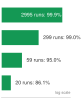
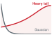

# Closed-Loop Evaluation {#sec-evaluation}

::: {layout-narrow}
::: {.column-margin}

\chapterminitoc

:::

::: {.content-visible when-format="pdf"}
\noindent
{fig-alt="Isometric blueprint showing closed-loop evaluation and metrology: instrumented testing cage with motion capture cameras, tracking marker constellation, flush ground force-torque dynamometer, articulated reliability scorecard with confidence intervals, and crimson intervention tripwire."}
:::

::: {.content-visible unless-format="pdf"}
{fig-alt="Isometric blueprint showing closed-loop evaluation and metrology: instrumented testing cage with motion capture cameras, tracking marker constellation, flush ground force-torque dynamometer, articulated reliability scorecard with confidence intervals, and crimson intervention tripwire."}
:::

:::

## Purpose {.unnumbered .unlisted}

::: {.content-visible when-format="pdf"}
\begin{marginfigure}
\vspace{1em}
\resizebox{\linewidth}{!}{\mlphysicalstackfull{20}{20}{20}{20}{100}}
\end{marginfigure}
:::

_Why does passing twenty consecutive physical trials without failure tell you surprisingly little about whether the machine is safe to deploy?_

Successful demonstrations show what occurred during trials, not all conditions for safe machine operation. Small test sets may miss rare failures, and familiar conditions provide little insight into unfamiliar ones. Offline prediction scores leave another gap because they evaluate a fixed observation stream. During deployment, each action changes the physical state and therefore the observations used for the next decision. An error can move the robot into circumstances where later errors become more likely. Evaluation must follow this loop on the integrated machine and quantify the evidence supporting the result. It must also say where that evidence stops, because the states a test most needs to reach are the ones it cannot let the machine enter. A failed physical trial cannot be rolled back, so every campaign is censored at the edge of safe operation, and evaluation serves the machine by confining its claim to the conditions it sampled and leaving the rest to the permission path that guards the causal boundary.



::: {.callout-learning-objectives}

- Interpret physical success rates as conditional evidence about a specified machine, environment, and trial protocol
- Compare open-loop prediction accuracy with closed-loop behavior shaped by the policy's own actions
- Select the evidence regime (replay, simulation, shadow operation, or constrained physical testing) that can answer a given evaluation question
- Calculate trial counts and test time needed to support a stated reliability target
- Evaluate which rare failures remain unsupported by feasible testing and the available statistical assumptions
- Design a predeclared trial protocol with fixed outcome rules and full-denominator accounting of interventions and aborts
- Construct an evaluation record that confines its claim to a target operating domain and assigns uncovered conditions to runtime monitors

:::

## What Twenty Clean Runs Establish {#sec-evaluation-closed-loop-survival}

```{python}
#| label: calc-evaluation-door-campaign
#| echo: false
# ┌─────────────────────────────────────────────────────────────────────────────
# │ THE DOOR CAMPAIGN ON THE RUNNING MACHINE (LEGO)
# ├─────────────────────────────────────────────────────────────────────────────
# │ Context: chapter opener, @sec-evaluation-logs, and the lease fallacy.
# │ Show: the evaluated campaign (latch task, base stopped) and the machine
# │       values the chapter quotes: approach speed, latch limit, rack
# │       capacity, chunk period, and chunk lease.
# │ How: registry fields of the warehouse mobile manipulator and its aisle;
# │      the standoff is the only chapter-local input.
# └─────────────────────────────────────────────────────────────────────────────
from mlsysim import *
from mlsysim.core.units import *
from mlsysim.fmt import fmt_length, fmt_velocity, fmt_latency, fmt_qty, fmt_frequency, check

RM = Embodied.MobileManipulator.WarehouseMobileManipulator
AISLE = Embodied.Scenario.WarehouseAisle

class EvalMachine:
    """The latch campaign Ch7 evaluates, on the book's running machine."""

    # ┌── 1. LOAD (Constants & Parameters) ─────────────────────────────────
    standoff = 2.0 * ureg.meter  # category: illustrative; base start distance from the door
    v_approach = AISLE.v_latch_approach  # category: illustrative; guarded approach, the declared ODD's speed
    f_latch_limit = AISLE.f_latch_limit  # category: illustrative; latch contact limit
    rack_capacity = RM.onboard_payload_capacity  # category: chosen; tote-rack capacity
    chunk_rate = RM.chunk_rate  # category: chosen; chunk policy rate
    t_lease = AISLE.t_lease  # category: chosen; chunk lease

    # ┌── 2. EXECUTE (Compute) ─────────────────────────────────────────────
    chunk_period = (1 / chunk_rate).to(millisecond)

    # ┌── 3. GUARD (Assertions) ────────────────────────────────────────────
    check(abs(v_approach.to(ureg.meter / ureg.second).magnitude - 0.03) < 1e-9, "Guarded approach is not 0.03 m/s")
    check(abs(f_latch_limit.to(newton).magnitude - 100.0) < 1e-9, "Latch limit is not 100 N")
    check(abs(rack_capacity.to(kilogram).magnitude - 50.0) < 1e-9, "Tote-rack capacity is not 50 kg")
    check(abs(chunk_period.to(millisecond).magnitude - 50.0) < 1e-9, "Chunk period is not 50 ms")
    check(abs(t_lease.to(millisecond).magnitude - 60.0) < 1e-9, "Chunk lease is not 60 ms")
    check(chunk_period < t_lease, "Chunk period must fit inside the lease")

    # ┌── 4. OUTPUT (Format & Export) ────────────────────────────────────────
    standoff_str = fmt_length(standoff, precision=0)
    v_approach_str = fmt_velocity(v_approach, precision=2)
    f_latch_limit_str = fmt_qty(f_latch_limit, newton, precision=0)
    rack_capacity_str = fmt_qty(rack_capacity, kilogram, precision=0)
    chunk_rate_str = fmt_frequency(chunk_rate)
    chunk_period_str = fmt_latency(chunk_period)
    t_lease_str = fmt_latency(t_lease)
```

Fresh from the offline training pipeline, a latch policy checkpoint recorded in the policy manifest of @sec-training-policy-manifest is flashed onto the warehouse mobile manipulator. In initial validation, the machine completes twenty consecutive runs of its door task. Each run starts with the base `{python} EvalMachine.standoff_str` (illustrative; see the Reader Guide) from the spring-latched cage door; the base drives in and stops, and with the base at rest the arm unlatches and opens the door at the `{python} EvalMachine.v_approach_str` guarded approach, without a contact-limit trip or a human intervention. Its empirical sample success rate is $\hat{p} = 1.00$ (100 percent). In standard software testing, a flawless benchmark score is celebrated as definitive validation. In Physical AI systems engineering, that record leaves the deployment decision unresolved: twenty clean runs establish a bounded statistical lower limit, leaving substantial uncertainty about unobserved failures.

In traditional software benchmarking, estimating failure rates relies on asymptotic approximations. If an engineer applies the familiar Wald confidence interval ($p \pm z \sqrt{\hat{p}(1-\hat{p})/n}$) to twenty zero-failure trials, the variance collapses to zero, producing a degenerate confidence interval of $[1.0, 1.0]$. The formula falsely assures the team that the machine is 100 percent reliable with absolute certainty.

True operational reliability at finite sample counts is governed by the inverted binomial distribution—the non-asymptotic Clopper-Pearson bound.[^fn-math-clopper-interval] Under zero failures, this bound is approximated by the classical **Rule of Three**\index{Rule of Three} [@hanley1983nothing]: when $n$ independent trials pass with zero failures, the upper 95 percent confidence bound on the true failure probability $p_{\text{fail}}$ is approximately $3/n$.

[^fn-math-clopper-interval]: **Clopper-Pearson non-asymptotic bound**\index{Clopper-Pearson non-asymptotic bound!definition}: Inverting the cumulative binomial distribution yields an exact one-sided lower confidence limit ($p_{\text{lower}} = \alpha^{1/n}$ for zero failures across $n$ independent, identically distributed trials at confidence level $1-\alpha$). Unlike the asymptotic Wald interval, this bound remains informative at zero observed failures. For $n=20$ and 95 percent confidence, the success lower limit is $86.1$ percent, equivalently a $13.9$ percent upper confidence limit on failure probability under the tested distribution.

For twenty consecutive successful runs ($n = 20$), the Rule of Three yields (@eq-eval-rule-of-three):
$$p_{\text{fail, upper}}^{95\%} \approx \frac{3}{20} = 0.15$$ {#eq-eval-rule-of-three}
This approximate one-sided upper confidence limit is 15 percent, corresponding to an approximate 85 percent success lower limit under iid sampling. Evaluating the exact cumulative binomial distribution at significance level $\alpha = 0.05$ yields an exact lower confidence bound of $p_{\text{lower}} = (0.05)^{1/20} \approx 0.861$ (86.1 percent). Crucially, twenty clean runs in a test cell do not prove that a machine is 100 percent reliable, nor even 95 percent reliable. A physical robot with a flawed policy that fails once in every eight deployments ($p = 87.5$ percent) will successfully complete twenty consecutive test runs more than 6.9 percent of the time ($0.875^{20} \approx 0.0692$) by pure random chance.

::: {.column-margin}
{width="100%" fig-alt="Vertical ladder of illustrative one-sided 95 percent success lower confidence limits after zero failures: 86.1 percent at 20 iid trials, 95.0 percent at 59, 99.0 percent at 299, and 99.9 percent at 2,995."}

*Under iid sampling, twenty clean trials give an 86.1 percent one-sided success lower confidence limit; a 99.9 percent limit needs 2,995.*
:::

```{python}
#| label: calc-evaluation-clopper-pearson-zero-failure
#| echo: false
# ┌─────────────────────────────────────────────────────────────────────────────
# │ CLOPPER-PEARSON ZERO-FAILURE RELIABILITY SIZING (LEGO)

# ├─────────────────────────────────────────────────────────────────────────────
# │ Context: @nbk-evaluation-derivation-20-run-lower-bound, @sec-evaluation-logs, and the takeaways.
# │ Show: One-sided confidence limits for iid zero-failure trials, not a rate estimate.
# │ How: p_lower = alpha^(1/n); failure_upper = 1 - p_lower.
# └─────────────────────────────────────────────────────────────────────────────
from mlsysim import *
from mlsysim.core.units import *
from mlsysim.fmt import fmt_percent, fmt_int, fmt, check

class ClopperPearsonZeroFailure:
    """Exact binomial confidence bounds for physical robotics qualification."""

    # ┌── 1. LOAD (Constants & Parameters) ─────────────────────────────────
    n_runs = 20  # category: illustrative; the opening campaign's clean runs
    confidence = 0.95  # category: chosen; one-sided confidence level
    alpha = 1.0 - confidence  # category: derived; significance level

    # ┌── 2. EXECUTE (Compute) ─────────────────────────────────────────────
    p_lower = calc_clopper_pearson_zero_failure_bound(n_runs, confidence=confidence)
    failure_upper = 1.0 - p_lower

    # Scaling to 99.9% reliability
    p_target_999 = 0.999
    n_req_999 = calc_zero_failure_sample_size(p_target_999, confidence=confidence)

    # ┌── 3. GUARD (Assertions) ────────────────────────────────────────────
    check(abs(p_lower - 0.8609) < 0.001, "Unexpected 20-run lower bound")
    check(abs(failure_upper - 0.1391) < 0.001, "Unexpected 20-run upper confidence limit")
    check(n_req_999 == 2995, "Unexpected sample size for 99.9% reliability")

    # ┌── 4. OUTPUT (Format & Export) ────────────────────────────────────────
    n_runs_str = fmt_int(n_runs)
    confidence_pct_str = fmt_percent(confidence, precision=0)
    p_lower_pct_str = fmt_percent(p_lower, precision=1)
    failure_upper_pct_str = fmt_percent(failure_upper, precision=1)
    p_lower_val_str = fmt(p_lower, precision=3)
    n_req_999_str = fmt_int(n_req_999, commas=True)
```

::: {#nbk-evaluation-derivation-20-run-lower-bound .callout-notebook title="Derivation of the 20-run lower bound"}
**Problem**: The mobile manipulator completes $n =$ `{python} ClopperPearsonZeroFailure.n_runs_str` physical door-opening runs with zero contact-limit trips or human interventions ($k =$ `{python} ClopperPearsonZeroFailure.n_runs_str`). What is the exact one-sided `{python} ClopperPearsonZeroFailure.confidence_pct_str` percent lower confidence bound on its true operational success probability $p$?

**Mathematical Derivation**: For independent, identically distributed Bernoulli trials from the declared operational test distribution, $p_{\text{lower}}$ is the success probability at which `{python} ClopperPearsonZeroFailure.n_runs_str` consecutive successes have probability $\alpha=0.05$. Thus the one-sided 95 percent lower confidence limit is $p_{\text{lower}} = \alpha^{1/n} = (0.05)^{1/20} \approx$ `{python} ClopperPearsonZeroFailure.p_lower_val_str` (`{python} ClopperPearsonZeroFailure.p_lower_pct_str` percent); the corresponding failure-probability upper confidence limit is `{python} ClopperPearsonZeroFailure.failure_upper_pct_str` percent.

**Systems insight**: The observation "`{python} ClopperPearsonZeroFailure.n_runs_str` out of `{python} ClopperPearsonZeroFailure.n_runs_str` passed" supplies a confidence limit under those sampling assumptions, not an observed failure rate, a mean interval between failures, or a deployment permission. Demonstrating a $99.9$ percent success lower limit with the same method requires `{python} ClopperPearsonZeroFailure.n_req_999_str` consecutive zero-failure trials drawn from the target distribution.
:::

::: {.column-margin .margin-pointer}
↰ **Prerequisite:** Physical failure boundaries for autonomous mobile robots and manipulators are established in @sec-body-archetype-matrix.
:::

Evaluation closes the learning loop of Part II. The twenty clean runs that opened this chapter turn the experience logged in @sec-data and the weights trained in @sec-training into a concrete decision about the physical claim those trials can support. Each trial measures the whole machine rather than the policy alone. It records the policy's proposals, the permission path's decisions, and the Body's response, including which out-of-distribution proposals the permission path rejects, which it misses, and how much stopping margin remains.[^fn-eval-safety-enforcement]

[^fn-eval-safety-enforcement]: **Runtime safety enforcement**\index{Runtime safety enforcement}: A separately validated permission path can reject proposals that violate measured state, freshness, and actuator constraints. Its detection coverage, worst-case response time, and available stopping clearance must be tested for the implementation; a 1 kHz sampling rate alone cannot guarantee interception before contact.

The twenty-run result leaves three questions open: what outcome was sampled, what each test regime can expose, and which hazards remain outside the evidence. The third shapes the rest of the chapter. Finite trials bound only the distribution they sampled, so an evaluation is complete only when it also names the conditions it did not cover and the runtime monitors the permission path needs for them. The next section takes up the first, because a success rate means nothing until the population it was drawn from is written down.

## What a Success Rate Measures {#sec-evaluation-what-measured}

An evaluation benchmark routinely reports a single summary statistic, such as an 85 percent success rate on an obstacle avoidance task. In machine learning, that number is treated as an intrinsic score of the learned model weights, similar to top-one accuracy on static image classification datasets. In a physical machine, that interpretation is invalid. A learned policy has no independent physical performance. What the benchmark measured was the closed-loop execution of an entire physical system across a specific sequence of days and environmental states. Success rate is an empirical property of the coupled system, comprising the policy, mechanical plant, computational hardware, operating environment, and trial protocol.

To evaluate a policy, an engineering team executes a sequence of discrete physical runs. A single trial is fully determined only when every variable that can alter the physical state trajectory is fixed or explicitly sampled. Formally, let a single trial condition be defined by a tuple $c = (s_0, e, m, \pi_\theta, \kappa)$, drawn from an operational testing distribution $\mathcal{D}$. The vector $s_0$ represents the initial state of the machine, including SE(3) pose\index{SE(3) pose}, linear and angular velocities, and joint encoder positions. The environment vector $e$ captures external variables such as floor friction, ambient illuminance, obstacle geometry, and ambient air temperature. The machine state $m$ captures physical and hardware properties, including battery state of charge, payload mass, tire wear, mechanical backlash\index{Mechanical backlash} in the drivetrain, and sensor calibration parameters. The computational configuration $\pi_\theta$ encompasses the frozen policy weights $\theta$, inference quantization, scheduling deadlines, and software versions. Finally, the termination protocol $\kappa = (T_{\max}, g, \phi)$ defines the execution time limit $T_{\max}$, the spatial goal region $g$, and the binary evaluation function $\phi$ that maps the resulting trajectory to a terminal outcome $Y \in \{0, 1\}$.

The true success probability under this evaluation protocol is the expected value of the binary task outcome averaged over the joint distribution of trial conditions (see @sec-appendix-ml-trajectory-distribution for the formal integral).
In this formulation, $\text{Traj}(c)$ is the continuous physical trajectory produced when the policy $\pi_\theta$ executes within the physical environment and hardware state defined by $c$. This dependency demonstrates why success probability cannot be treated as a measurement of $\theta$ alone. The model weights $\theta$ constitute only one parameter inside the condition vector $c$. If the distribution over floor friction or the distribution over initial battery charge changes, the expected success rate changes while $\theta$ remains identical. The sampling protocol is not an external apparatus measuring an isolated model; it is part of the mathematical quantity being estimated.

::: {#dfn-evaluation-closed-loop-estimand .callout-definition title="Closed-loop evaluation estimand"}

***Closed-loop evaluation estimand***\index{Closed-loop evaluation estimand!definition}\index{Evaluation estimand!definition} is the expected physical task outcome $p(\mathcal{D}) = \mathbb{E}_{c \sim \mathcal{D}}[\phi(\text{Traj}(c))]$ defined over the joint distribution of initial states, mechanical plant wear, environmental physics, frozen policy weights, and evaluation predicates:
$$c = (s_0, e, m, \pi_\theta, \kappa) \sim \mathcal{D}$$
rather than an intrinsic property of the neural policy weights evaluated in isolation.

1.  **Significance**: In static machine learning, held-out accuracy is treated as a property of the model $\pi_\theta$. In Physical AI, substituting a worn tire, letting battery voltage sag, or shifting ambient illuminance alters the physical state transition function without changing a single weight. The sampling distribution of operational conditions $\mathcal{D}$ is an inseparable part of the quantity being estimated.
2.  **Distinction**: Unlike open-loop validation metrics (such as validation loss or mean squared trajectory error) which score predictions against frozen recorded states, the closed-loop estimand integrates over the endogenous feedback loop where past actions physically move the machine, directly changing the future sensor observations it will receive.
3.  **Common pitfall**: Reporting a single success rate percentage (e.g., "92 percent task success") without predeclaring the support, density, and environmental bounds of the test distribution $\mathcal{D}$. Any physical policy can be made arbitrarily successful by testing exclusively in benign, unperturbed states.

:::

The physical mechanisms that alter $c$ between trials operate independently of the policy, and the mobile manipulator exhibits each of them. As its battery discharges\index{State of charge (SoC)}, terminal voltage sags under load, the drives lose voltage headroom against back-EMF\index{Back-EMF}, and the torque available at speed falls along the torque-speed curve\index{Torque-speed curve}, so an acceleration the base reaches on a full charge can be out of reach on a depleted one. Daylight shifting across the site lengthens the navigation camera's exposure, blurring frames during turns and degrading the features the state estimator tracks. Dust on the aisle floor lowers the friction the brakes can use and lengthens the stopping distance. In the arm, repeated door openings heat the joint windings through Joule heating ($I^2R$)\index{Joule heating} and warm the harmonic drive\index{Harmonic drive} gearboxes, which changes their damping and, as the links expand, shifts the tool-center-point\index{Tool center point} calibration\index{Kinematics!SE(3) calibration}, so the gripper meets the latch at a slightly different point on an afternoon run than on a cold morning one. In every case the policy weights and input tensor shapes are identical, yet the physical trajectory can move from success to failure.

Non-model variation also enters through the reset procedure and operator handling. When human operators manually reposition a machine between trials, they introduce subtle spatial biases. If an operator instinctively resets the robot facing open space after a difficult run, the empirical distribution of initial heading angles shifts toward favorable states. Conversely, an automated reset procedure that repeatedly drives the machine along a fixed path induces cyclic heating in the actuator windings, increasing electrical resistance and reducing actuator response speed across successive trials. If an operator intervenes to catch a falling machine and discards the run as an unrecorded reset, the hardest failure modes are erased from the sample history, artificially inflating the observed success rate.

Statistical evaluation requires distinguishing ordinary sampling variation from a change in the underlying estimand. When $N$ trials are drawn from a fixed distribution $\mathcal{D}$, the sample proportion $\hat{p} = \frac{1}{N} \sum_{i=1}^N Y_i$ fluctuates around the true parameter $p(\mathcal{D})$ due to random sampling noise. This uncertainty can be bounded using standard statistical estimators. However, if an evaluation changes the payload mass from $0.0\text{ kg}$ to $5.0\text{ kg}$, or shifts testing from dry concrete to wet asphalt, the experiment is no longer drawing samples from $\mathcal{D}$. It is sampling from an entirely different distribution $\mathcal{D}'$, defined by a new parameter $p(\mathcal{D}')$. Treating data collected under $\mathcal{D}'$ as an extension of the original sample pool conflates sampling variance with structural bias, combining observations from two different physical machines.

Because success probability is defined only with respect to a specific joint distribution $\mathcal{D}$, the intended operating region must be declared before trials are sampled. The **target ODD**\index{Operational design domain!target ODD} is the part of the declared ODD (@sec-training-policy-manifest) that the evaluation samples; its sampling weights define $\mathcal{D}$, and no evaluation claim reaches beyond it. If an engineering team executes fifty physical runs across ad hoc trajectories and reports a 90 percent pass rate, the denominator corresponds to an undefined population. A measured success rate supports a target-distribution claim only when the support and sampling weights of $\mathcal{D}$ are specified in advance, establishing explicit bounds on illuminance, payload ranges, surface friction coefficients, and allowable initial state offsets.

Extracting valid confidence bounds from empirical trials requires three operational conditions:

1. *Independent and Identically Distributed Sampling:* Trials must be independent realizations drawn from $\mathcal{D}$. If thermal accumulation in motor windings or progressive mechanical wear degrades hardware efficiency across consecutive runs, trial outcomes become negatively correlated over time, violating independence.
2. *Fixed Outcome Predicates:* The binary evaluation function $\phi$ and the termination criteria $\kappa$ must remain fixed throughout the campaign. Modifying the time horizon $T_{\max}$ or adjusting the spatial tolerance of the goal region $g$ midway through testing alters the definition of success.
3. *Full-Denominator Accounting:* Every initiated run that aborts due to hardware faults, communication timeouts, or safety-rated emergency stops (e.g., exceeding ISO 10218\index{ISO 10218} / ISO/TS 15066\index{ISO/TS 15066} power and force limits) must be recorded as a failure ($Y = 0$). Dropping aborted trials substitutes a measure of conditional execution on surviving hardware for the true operational reliability of the machine.

When these conditions are strictly enforced, physical trials yield an unbiased sample mean for the closed-loop system under the tested distribution $\mathcal{D}$. Yet physical testing remains constrained by hardware wear, operator labor, and wall-clock execution time. To bypass these constraints, evaluation workflows often turn to open-loop evaluations on recorded datasets, calculating how accurately a candidate policy reproduces logged expert actions offline. That substitution assumes that a model that predicts demonstrated actions with high statistical accuracy will exhibit equivalent competence when granted real-time authority over a physical machine. Whether offline accuracy survives the moment the policy's own actions choose its next state is the question the closed loop decides.

## Closed-Loop Dynamics {#sec-evaluation-closed-loop-dynamics}

A navigation policy can reproduce recorded aisle runs almost exactly and still put the base into a rack before it is a third of the way down the aisle. The difference lies in what each kind of test feeds back to the policy. In an **open-loop evaluation**\index{Open-loop evaluation!definition}, a candidate policy $\pi_\theta$ is scored across a static dataset of recorded demonstrations $\mathcal{D}_{\mathrm{demo}} = \{(s_t^*, a_t^*)\}_{t=1}^T$. At each discrete timestep $t$, the policy receives a recorded demonstrator state $s_t^*$ and outputs a predicted action $\hat{a}_t = \pi_\theta(s_t^*)$. An error metric, such as mean squared error or cross-entropy, measures the distance between $\hat{a}_t$ and the recorded expert action $a_t^*$. At step $t+1$, the evaluation pipeline supplies the next recorded state $s_{t+1}^*$ from the dataset. The action $\hat{a}_t$ produced by the policy is discarded without executing on hardware, keeping the sequence of input states independent of the policy's past outputs. In a **closed-loop evaluation**\index{Closed-loop evaluation!definition}, the policy proposes $a_t = \pi_\theta(s_t)$; the permission path checks it against measured state and constraints, applies $u_t$ (or a fallback), and the plant evolves as $s_{t+1} = f(s_t,u_t)$. The applied command changes the physical state and later observations, crossing the causal boundary in @sec-boundary-causal-boundary.

::: {.column-margin .margin-pointer}
↰ **Prerequisite:** Irreversible physical effects after motor actuation are established in @sec-boundary-causal-boundary.
:::

```{python}
#| label: calc-evaluation-aisle-heading-drift
#| echo: false
# ┌─────────────────────────────────────────────────────────────────────────────
# │ HEADING BIAS AGAINST THE AISLE'S SIDE CLEARANCE (LEGO)
# ├─────────────────────────────────────────────────────────────────────────────
# │ Context: @sec-evaluation-closed-loop-dynamics, @fig-07-open-vs-closed-loop,
# │          the metric-drift paragraph and the takeaways.
# │ Show: where a persistent 1 degree heading bias of the navigation stack
# │       (not the evaluated latch policy) spends the aisle's side clearance.
# │ How: y(t) = v sin(eps) t; t_impact = W_clear / (v sin(eps)); the side
# │      clearance is (aisle width - machine width) / 2.
# └─────────────────────────────────────────────────────────────────────────────
import math
from mlsysim import *
from mlsysim.core.units import *
from mlsysim.fmt import fmt, fmt_length, fmt_velocity, fmt_time, fmt_qty, fmt_math, sci_latex, check

RM = Embodied.MobileManipulator.WarehouseMobileManipulator
AISLE = Embodied.Scenario.WarehouseAisle

class AisleDrift:
    """Closed-loop drift of a biased navigation policy on the running machine's aisle."""

    # ┌── 1. LOAD (Constants & Parameters) ─────────────────────────────────
    v = AISLE.v_aisle  # category: chosen; aisle speed
    clearance = AISLE.side_clearance  # category: illustrative; side clearance each side
    aisle_width = AISLE.aisle_width  # category: illustrative; site geometry
    aisle_length = AISLE.aisle_length  # category: illustrative; site geometry
    machine_width = RM.footprint_width  # category: illustrative; base footprint
    heading_offset_deg = 1.0  # category: illustrative; persistent heading bias

    # ┌── 2. EXECUTE (Compute) ─────────────────────────────────────────────
    eps = math.radians(heading_offset_deg)
    eps_q = eps * radian
    angular_mse = (eps_q**2).to(radian**2)  # open-loop score on recorded centerline states
    t_impact = (clearance / (v * math.sin(eps))).to(ureg.second)
    x_impact = (v * t_impact).to(ureg.meter)
    aisle_fraction = (x_impact / aisle_length).to(ureg.dimensionless).magnitude

    # ┌── 3. GUARD (Assertions) ────────────────────────────────────────────
    check(abs(v.to(ureg.meter / ureg.second).magnitude - 1.3) < 1e-9, "Aisle speed is not 1.3 m/s")
    check(abs(clearance.to(ureg.meter).magnitude - 0.15) < 1e-9, "Side clearance is not 0.15 m")
    check(abs(((aisle_width - machine_width) / 2 - clearance).to(ureg.meter).magnitude) < 1e-9, "Side clearance must equal (aisle - machine) / 2")
    check(abs(aisle_length.to(ureg.meter).magnitude - 30.0) < 1e-9, "Aisle length is not 30 m")
    check(abs(x_impact.to(ureg.meter).magnitude - 8.6) < 0.05, "Clearance should be spent in about 8.6 m")
    check(abs(t_impact.to(ureg.second).magnitude - 6.6) < 0.05, "Clearance should be spent in about 6.6 s")
    check(aisle_fraction < 1 / 3, "Prose says less than a third of the aisle")
    check(abs(heading_offset_deg - 1.0) < 1e-12, "Prose, fig-cap, and fig-alt state a 1.0 degree heading offset")
    check(abs(angular_mse.magnitude - 3.05e-4) < 5e-7, "fig-alt states an angular MSE of 3.05e-4 rad^2")

    # ┌── 4. OUTPUT (Format & Export) ────────────────────────────────────────
    v_str = fmt_velocity(v, precision=1)
    clearance_str = fmt_length(clearance, precision=2)
    aisle_width_str = fmt_length(aisle_width, unit=ureg.centimeter, precision=0)
    aisle_length_str = fmt_length(aisle_length, precision=0)
    machine_width_str = fmt_length(machine_width, unit=ureg.centimeter, precision=0)
    clearance_cm_str = fmt_length(clearance, unit=ureg.centimeter, precision=0)
    t_impact_str = fmt_time(t_impact, unit=ureg.second, precision=1)
    x_impact_str = fmt_length(x_impact, precision=1)
    eps_rad_str = fmt_qty(eps_q, radian, precision=5)
    angular_mse_math = fmt_math(rf"{sci_latex(angular_mse.magnitude)}\text{{ rad}}^2")
    angular_mse_eq = fmt_math(rf"\text{{MSE}}_\theta = ({fmt(eps, precision=5)})^2 \approx {sci_latex(angular_mse.magnitude)}\text{{ rad}}^2")
```

Open-loop evaluation tests actions along the demonstrator's state trajectory; a policy with low offline prediction error can fail when its biased proposals are admitted to physical motion, because its own actions carry it off the states it was trained on. This is the endogenous-data principle (\ref{pri-vol4-endogenous-drift}); @sec-data-endogenous-experience developed its consequence for data, and evaluation must measure it on the machine. The door campaign cannot show the effect, because its base stands still while the arm works, so the example comes from the same machine's navigation stack rather than from the latch policy under evaluation. The base drives a `{python} AisleDrift.aisle_length_str` aisle at the `{python} AisleDrift.v_str` aisle speed, and the nominal expert demonstration follows the centerline with heading $\theta^* = 0\text{ rad}$ and lateral offset $y^* = 0\text{ m}$. Suppose the candidate navigation policy has a systematic heading bias of $\epsilon_\theta = 1.0^\circ$ (`{python} AisleDrift.eps_rad_str`) on every step, and the permission path admits each of these proposals because none is infeasible on its own.

In an open-loop evaluation, the policy receives the demonstrator state $s_t^* = (x_t^*, 0, 0)$ at each step and predicts a forward velocity with a $1.0^\circ$ steering offset. The offline scoring pipeline records a mean absolute angular error of $1.0^\circ$ (`{python} AisleDrift.eps_rad_str`) and an extremely low mean squared error of `{python} AisleDrift.angular_mse_eq`.[^fn-math-openloop-mse] In closed-loop execution, however, because the machine physically moves based on previously admitted commands, uncorrected heading errors compound continuously over time. Under planar unicycle kinematics ($\dot{y} = v \sin \theta \approx v \epsilon_\theta$), this persistent angular offset integrates into a cumulative lateral displacement:
$$y(t) = \int_0^t v \sin \epsilon_\theta \, d\tau \approx v \epsilon_\theta t$$
The base is `{python} AisleDrift.machine_width_str` wide in a `{python} AisleDrift.aisle_width_str` aisle, which leaves $W_{\text{clear}} =$ `{python} AisleDrift.clearance_cm_str` of side clearance to the rack on each side, and the drift spends that clearance at
$$t_{\text{impact}} = \frac{W_{\text{clear}}}{v \sin \epsilon_\theta},$$
which at the aisle speed is `{python} AisleDrift.t_impact_str`, after `{python} AisleDrift.x_impact_str` of travel and less than a third of the way down the aisle.[^fn-math-closedloop-lateral] Without an additional clearance barrier, the base strikes the rack before completing the transit. This deterministic trial fails despite the small open-loop angular error.

[^fn-math-openloop-mse]: **Metric scale masking in regression loss**\index{Evaluation!metric masking}: Aggregating squared steering errors across thousands of validation frames obscures severe, intermittent directional mistakes. A single localized prediction spike of $15^\circ$ is mathematically washed out when averaged across miles of straight highway data. A brief angular spike can matter if its integrated motion exhausts clearance before the independent permission path responds; the outcome requires a plant and timing model.

[^fn-math-closedloop-lateral]: **Kinematic integration of heading bias**\index{Kinematics!lateral trajectory drift}: This example holds heading at a constant $1^\circ$ offset, so $y(t)=v\sin(\epsilon_\theta)t$ is linear. A different example with constant yaw-rate bias $\omega$ begins with $\theta(t)=\omega t$ and has the small-angle approximation $y(t)\approx \tfrac12v\omega t^2$.

::: {#psp-evaluation-open-loop-blindness .callout-perspective title="Open-loop blindness"}
Open-loop loss measures dataset mimicry; closed-loop dynamics decide physical survival. A small offline prediction error can still produce a large physical excursion if a bias persists and the permission path admits it.
:::

The aisle example shows both reasons that an open-loop score\index{Open-loop evaluation!closed-loop gap} decouples from closed-loop survival. Static evaluation cannot integrate a persistent error into displacement, and it cannot follow the machine into the unfamiliar states that early errors steer it toward. Open-loop evaluation hides the first because it resets the machine to an expert state at every clock cycle, masking the compounding nature of integration errors. In closed loop, the state at index $t$ is the expanded composition of all previous actions:
$$s_t = f(f(\dots f(s_0, u_0)\dots, u_{t-2}), u_{t-1})$$
The first admitted action error shifts the physical machine from the demonstrated state $s_1^*$ to an unvisited state $s_1$. Once the platform drifts $2.0\text{ cm}$ off nominal, it enters a state that does not appear anywhere in $\mathcal{D}_{\mathrm{demo}}$. Because the policy was evaluated only on demonstrator states where $y = 0\text{ m}$, the offline metric contains no evidence regarding what action $\pi_\theta(s)$ the policy will produce when $y \neq 0\text{ m}$. If the training distribution lacked demonstrations of recovery maneuvers from off-center coordinates, the policy can output larger corrective errors, accelerating the divergence instead of arresting it.

The arm shows the same disconnect in contact. An end-effector position error of a fraction of a millimeter per step scores as negligible Cartesian error offline, but on the latch that offset acts as a wedge. The latch's stiffness turns the lateral displacement into a reaction force ($F_{xy} = k_{\text{env}} \Delta_{xy}$) that climbs until it trips the `{python} EvalMachine.f_latch_limit_str` contact limit before the door unlatches.

The mapping between offline scores and physical task performance is not a simple mirror image; it can be deeply misleading in both directions. While open-loop evaluation is optimistically blind to compounding trajectory divergence, its action metrics can conversely be pessimistic when the physical environment permits multiple valid actions. If a human demonstrator avoided an obstacle by steering left, an open-loop evaluation penalizes a candidate policy that steers right, recording a large action error against $a_t^*$. In closed-loop execution, passing on the right clears the obstacle and reaches the target state with equal validity. An action-level prediction error measures divergence from a specific demonstration recording, not the satisfaction of the physical task.

::: {.column-margin .margin-pointer}
⇄ **Contrast:** Open-loop prediction loss contrasts with the photon-to-actuation age-of-information bounds analyzed in @sec-perception-cost-ingestion.
:::

@Fig-07-open-vs-closed-loop separates the two protocols. Open-loop evaluation scores candidate actions only on demonstrator states where errors are immediately discarded, obscuring the cumulative trajectory divergence that drives closed-loop physical execution into the rack.

<!-- fig-alt below hand-types values because fig-alt cannot hold inline python. Keep them in sync with these cell outputs:
     "one-degree heading offset"          = AisleDrift.heading_offset_deg (1.0)
     "3.05 times 10 to the minus four"    = AisleDrift.angular_mse_math (the fig-cap and prose use it inline)
     "1.3 meters per second"              = AisleDrift.v_str
     "15-centimeter side clearance"       = AisleDrift.clearance_cm_str
     "about 6.6 seconds"                  = AisleDrift.t_impact_str
     "8.6 meters along the aisle"         = AisleDrift.x_impact_str
     Guards in calc-evaluation-aisle-heading-drift pin 1.0 degree, 3.05e-4 rad^2, 1.3 m/s, 0.15 m, 6.6 s, and 8.6 m.
     The 1.0 degree offset is also hand-typed as $1.0^\circ$ in the closed-loop-dynamics prose, the fig-cap, the
     unicycle paragraph, the metric-drift paragraph, and the takeaways; the guard pins it.
     The figure cell below recomputes theta**2 for its panel label from the same heading_offset_deg. -->

::: {#fig-07-open-vs-closed-loop fig-env="figure" fig-pos="t" fig-cap="**Open versus closed loop divergence**: A persistent $1.0^\circ$ heading offset gives `{python} AisleDrift.angular_mse_math` angular mean squared error on recorded centerline states. On the mobile manipulator's aisle, the navigation stack's admitted motion with that fixed heading drifts linearly and reaches the `{python} AisleDrift.clearance_str` side clearance after `{python} AisleDrift.t_impact_str` at the `{python} AisleDrift.v_str` aisle speed. The example concerns the navigation stack, not the latch policy under evaluation." fig-alt="Two-panel aisle example. Left: recorded-state replay scores a constant one-degree heading offset with angular mean squared error 3.05 times 10 to the minus four radians squared and resets the next input to the recorded centerline. Right: if that heading persists in a physical rollout at 1.3 meters per second, lateral drift grows linearly and reaches the 15-centimeter side clearance after about 6.6 seconds, 8.6 meters along the aisle. Policy proposals pass through the permission path before the plant moves."}

```{python}
#| echo: false
# ┌─────────────────────────────────────────────────────────────────────────────
# │ OPEN-LOOP REPLAY VERSUS CLOSED-LOOP DRIFT (FIGURE)
# │ Context: @fig-07-open-vs-closed-loop
# │ Goal:    show why a heading error that is invisible offline spends clearance
# │ Show:    lateral offset against forward position, replay beside physical loop
# │ How:     one heading offset drives both panels and both numbers;
# │          speed and clearance come from the aisle via calc-evaluation-aisle-heading-drift
# ├─────────────────────────────────────────────────────────────────────────────
import math
import numpy as np
from mlsysim import viz

viz.set_book_style()
import matplotlib.pyplot as plt

COLORS = viz.COLORS

# ┌── 1. LOAD (Scenario parameters) ────────────────────────────────────────────
HEADING_OFFSET_DEG = AisleDrift.heading_offset_deg  # category: illustrative; from the LEGO cell
CLEARANCE_M = AisleDrift.clearance.to(ureg.meter).magnitude  # category: illustrative; AISLE.side_clearance
SPEED_MS = AisleDrift.v.to(ureg.meter / ureg.second).magnitude  # category: chosen; AISLE.v_aisle
REACH_M = 10.0  # category: chosen; plot extent, the first third of the aisle

# ┌── 2. EXECUTE (Compute) ─────────────────────────────────────────────────────
theta = math.radians(HEADING_OFFSET_DEG)
angular_mse = theta**2  # rad^2, the offline error signal
exhausted_m = CLEARANCE_M / math.tan(theta)  # where the drift reaches clearance
exhausted_s = exhausted_m / SPEED_MS

# ┌── 3. PLOT ──────────────────────────────────────────────────────────────────
fig, (ax_a, ax_b) = plt.subplots(1, 2, figsize=(9.6, 3.8), sharey=True)
x = np.linspace(0, REACH_M, 400)

ax_a.plot(x, np.zeros_like(x), color=COLORS["BlueLine"], lw=2.4)
ax_a.plot(np.arange(0, REACH_M, 2), np.zeros(int(REACH_M // 2)), "o", ms=5, color=COLORS["BlueLine"])
ax_a.text(
    0.6,
    0.107,
    "Each next input returns to\nthe recorded centerline",
    fontsize=9,
    va="center",
    bbox=dict(boxstyle="round,pad=0.45", fc="white", ec=COLORS["grid"], lw=1.0),
)
ax_a.text(0.6, 0.030, f"Angular MSE: {angular_mse:.2e} rad$^2$".replace("e-04", r" $\times$ 10$^{-4}$"), fontsize=9, color=COLORS["BlueLine"])

ax_b.plot(x, x * math.tan(theta), color=COLORS["RedLine"], lw=2.4)
ax_b.axhline(0.0, color=COLORS["primary"], lw=0.9, linestyle=(0, (5, 4)))
ax_b.axvline(exhausted_m, color=COLORS["RedLine"], lw=1.0, linestyle=(0, (1, 2)))
ax_b.plot([exhausted_m], [CLEARANCE_M], "o", ms=6, color=COLORS["RedLine"], zorder=5)
ax_b.text(
    exhausted_m - 0.35, CLEARANCE_M - 0.075, f"Clearance exhausted\nat {exhausted_s:.1f} s", fontsize=9, color=COLORS["RedLine"], ha="right", va="top"
)
ax_b.text(0.6, 0.182, f"y = x tan({HEADING_OFFSET_DEG:.0f}°) under fixed heading", fontsize=9)

for ax, title, lx, lha in ((ax_a, "(a) Recorded-state replay", REACH_M - 0.15, "right"), (ax_b, "(b) Physical closed loop", 0.6, "left")):
    ax.axhline(CLEARANCE_M, color=COLORS["RedLine"], lw=1.2, linestyle=(0, (5, 4)))
    ax.text(lx, CLEARANCE_M + 0.006, f"{CLEARANCE_M * 100:.0f} cm clearance", fontsize=9, color=COLORS["RedLine"], ha=lha, va="bottom")
    ax.set_xlim(0, REACH_M)
    ax.set_ylim(-0.03, 0.225)
    ax.set_xticks(range(0, int(REACH_M) + 1, 2))
    ax.set_xlabel("Forward position (m)")
    ax.text(0.0, 1.02, title, transform=ax.transAxes, fontsize=10, fontweight="bold")

ax_a.set_yticks([0.00, 0.05, 0.10, 0.15, 0.20])
ax_a.set_ylabel("Lateral offset (m)")
plt.tight_layout()
plt.show()
```

:::

In physical reality, uncorrected steering biases do not require gross software bugs; they arise naturally from unmodeled hardware asymmetries such as differential tire wear, subtle camera mast vibration, or floor camber. As demonstrated by the unicycle derivation above and illustrated in @fig-07-open-vs-closed-loop, the persistent bias of $\epsilon_\theta = 1.0^\circ$ (`{python} AisleDrift.eps_rad_str`) has a small open-loop angular error ($\text{MSE}_\theta \approx$ `{python} AisleDrift.angular_mse_math`), yet on the aisle it spends the `{python} AisleDrift.clearance_str` side clearance at $t_{\text{impact}} \approx$ `{python} AisleDrift.t_impact_str`, collapsing closed-loop task success to zero. This decoupling shows why open-loop error alone cannot establish physical survival. Closed-loop evaluation adds the path excursion, intervention timing, and measured permission-path performance that replay cannot see.

This disconnect between open-loop statistical agreement and physical closed-loop survival is systematized in @tbl-07-offline-closed-loop-disconnect, mapping common machine learning validation metrics to their underlying physical failure modes and closed-loop evaluators.

| Offline Evaluation Metric                     | Open-Loop Statistical Assumption                                                         | Physical Disconnect Mechanism                                                                                                                                          | Closed-Loop Hardware Failure Mode                                                                                                                  | Mandatory Closed-Loop Evaluator                                                                                                                                           |
|:----------------------------------------------|:-----------------------------------------------------------------------------------------|:-----------------------------------------------------------------------------------------------------------------------------------------------------------------------|:---------------------------------------------------------------------------------------------------------------------------------------------------|:--------------------------------------------------------------------------------------------------------------------------------------------------------------------------|
| **Action Mean Squared Error**                 | Small prediction residuals produce proportionally small trajectory deviations.           | Unmodeled kinematic bias integrates over time, driving states out of distribution.                                                                                     | Boundary collision, curb strike, or lane departure.                                                                                                | **Closed-Loop Rollout Tracking Error**: Maximum spatial deviation from reference path and **Time-to-Intervention**\index{Time-to-Intervention!metric} ($T_{\text{TTI}}$). |
| **Top-$1$ / Discrete Action Accuracy**        | High classification accuracy on logged states ensures identical execution.               | Equal penalty for benign alternative maneuvers vs boundary excursions; blind to temporal error correlation.                                                            | High-frequency actuator chatter, rapid control sign-flipping, or sudden structural joint over-torque.                                              | **Smoothness & Dynamic Feasibility**: Peak jerk and adherence to actuator torque limits.                                                                                  |
| **Cosine Similarity / Directional Agreement** | Collinear action proposals produce dynamically stable physical paths.                    | Metric ignores control magnitude errors; under-actuation fails to overcome static friction or over-actuation triggers tire slip.                                       | Limit-cycle hunting, velocity stall on inclines, or spin-out during dynamic cornering maneuvers.                                                   | **Phase Margin & Slip Ratio**: Effective damping ratio and wheel slip boundaries (see @sec-appendix-control-slip).                                                        |
| **Negative Log-Likelihood (NLL)**             | High likelihood on expert demonstrations captures the true physical action distribution. | Density is evaluated strictly at the logged expert action, heavily penalizing valid multimodal bypass trajectories (e.g., navigating right when the expert went left). | Spurious rejection of robust multimodal policies; deployed models overfit to specific demonstrator noise, inducing high-frequency actuator jitter. | **Closed-Loop Task Success Rate**: Terminal goal completion over randomized goal offsets.                                                                                 |
| **Sensory Reconstruction / Chamfer Loss**     | Accurate world-model state prediction ensures safe receding-horizon plan synthesis.      | Visual/feature reconstruction loss weights background pixels over sub-pixel spatial obstacles and contact manifolds.                                                   | Phantom obstacle braking, clipping thin obstacles (cables, glass), or false clearance estimation.                                                  | **Spatial Clearance & CBF Invariance**: Strict maintenance of minimum obstacle distance and control barrier safety conditions.                                            |

: **Offline open-loop prediction metrics versus closed-loop physical survival disconnect matrix**: Comparing standard machine learning benchmark metrics evaluated on static demonstration logs against the physical dynamics of embodied execution. Open-loop metrics implicitly assume that demonstrator state distributions remain invariant to policy errors; in closed loop, unmodeled actuator biases integrate into compounding spatial drift, multimodal action alternatives incur spurious penalties, and distribution shifts trigger unrecoverable boundary violations. {#tbl-07-offline-closed-loop-disconnect tbl-colwidths="[20,18,22,18,22]"}

Recorded replay remains widely used because it evaluates model checkpoints across stored arrays in seconds, consuming compute cycles without occupying physical test cells or incurring mechanical wear. Closed-loop simulation restores a modeled closed-loop recurrence $s_{t+1} = f_{\text{sim}}(s_t, u_t)$, allowing compounding drift to manifest and testing whether a policy can stabilize off-nominal states without risking physical hardware. Yet simulation replaces the open-loop distribution assumption with a dynamical modeling assumption. The simulation transition operator $f_{\text{sim}}$ approximates real physics $f_{\text{real}}$, but it abstracts away unmodeled friction non-linearities, contact mechanics, and physical transport latencies. Establishing that a policy stabilizes $f_{\text{sim}}$ demonstrates mathematical convergence inside the simulator, but it does not establish how the policy behaves when executed against physical hardware.

The same disconnect runs across the proposal boundary of @sec-boundary-machine-model. In the two-processor implementation, offline trace replay on the application processor measures only whether neural inference executes within its memory and compute budgets. In physical closed-loop execution, each candidate proposal crosses to the microcontroller that runs the permission path. If the policy's proposals drift off target or chatter, the permission path detects the spatial boundary breach or the expired lease, refuses the proposals, and commands a controlled stop. Evaluating a policy offline, without the physical plant and the permission path in the loop, evaluates tensor arithmetic, not the survival of the machine.

::: {.column-margin .margin-pointer}
↳ **Downstream:** Deterministic gatekeeping and stopping envelopes for unverified neural policies are derived in @sec-enforcement-stopping-envelopes.
:::

### Why learned policies break analytical stability proofs

For control engineers steeped in classical dynamical systems theory, relying on statistical trial counting in @sec-evaluation-closed-loop-survival feels incomplete. In classical control theory, safety and stability are not certified by counting successful runs. Instead, control theory constructs analytical **Lyapunov functions**\index{Lyapunov function!stability certification} $V(\mathbf{x}) > 0$ that satisfy $\dot{V}(\mathbf{x}) \le -\alpha V(\mathbf{x})$, establishing exponential decay for the specified disturbance-free closed-loop dynamics on the region where the inequality holds. With disturbances, a separate Input-to-State Stability (ISS)\index{Input-to-State Stability!classical control} argument can bound state error as a function of a bounded input, under its own model and gain assumptions.

Four physical and mathematical barriers keep this analytical machinery from carrying over directly to deep learned policies $\pi_\theta(\mathbf{x})$:

1. **Non-Smooth Activation Functions and Intractable Optimization:** Modern neural networks use piecewise-linear or non-smooth activations (ReLU, GELU). Evaluating whether $\dot{V}(\mathbf{x}) = \nabla V(\mathbf{x})^\top f(\mathbf{x}, \pi_\theta(\mathbf{x})) \le 0$ holds across an entire continuous state space requires solving a high-dimensional non-convex optimization problem. For neural networks with millions or billions of parameters, searching for polynomial storage functions via Sum-of-Squares (SOS)\index{Sum-of-squares optimization} programming is NP-hard and computationally intractable beyond toy systems of a few dozen neurons.
2. **High-Dimensional Latent Representations:** Classical control assumes state vectors $\mathbf{x} \in \mathbb{R}^n$ composed of measurable physical quantities (joint angles, velocities, pressures). Deep Vision-Language-Action policies consume high-dimensional pixel arrays ($>10^6$ dimensions) and map them into uncalibrated latent token spaces $\mathbf{z}_t \in \mathbb{R}^d$. A physically interpretable Lyapunov function is difficult to formulate directly over an unobservable latent manifold whose metric distances have no physical SI units or energy conservation laws.
3. **Discontinuous Contact Mechanics:** Physical manipulation and legged locomotion involve making and breaking contact with the physical world. Mechanical contact transitions introduce non-smooth complementarity constraints and instantaneous velocity jumps ($v^+ \ne v^-$). Differentiating a Lyapunov candidate across non-Lipschitz, discontinuous contact manifolds coupled with non-convex neural function approximators destroys the smoothness assumptions that underpin LaSalle's invariance principle.
4. **Out-of-Distribution (OOD) Fragility:** A linear controller has analyzable behavior within the plant and disturbance bounds used in its design; outside those bounds it can also fail. A neural policy can additionally exhibit abrupt output changes under sensory shift: a subtle shift in sensory input (such as an unexpected optical shadow or camera glint) can cause policy outputs to jump discontinuously, proposing hazardous torque in the wrong direction; the independent permission path must assess the proposal before actuation.

General stability proofs for an entire high-dimensional learned policy and physical plant are difficult; thus, physical AI systems engineers must adopt a rigorous two-pronged methodology:
First, we deploy **non-asymptotic statistical metrology** (exact confidence bounds, zero-event exposure bounds, and peak-disturbance models, all developed in @sec-evaluation-trial-limits) to characterize empirical failure risks across the target ODD. Second, we enforce hard real-time safety through **deterministic runtime safety shields** (such as Control Barrier Functions in @sec-enforcement), moving the burden of mathematical proof from the multi-billion-parameter learned policy to the permission path, a low-dimensional check on an isolated microcontroller.

Open-loop scores cannot certify a closed loop, and analytical proofs do not reach the learned policy, so the evidence about the proposer must come from executions whose conditions are known and recorded. Every setting in which a policy can be executed changes some part of the loop, whether the plant, the sensor stream, or the authority over the actuators, and @sec-evaluation-evidence-regimes sorts those settings by what each can and cannot show.

## Evidence Regimes {#sec-evaluation-evidence-regimes}

Before its twenty door runs, the latch policy could have been scored against its logged demonstrations, run against a simulated door, run in shadow while a validated controller held the arm, or run on the real door with its contact limit armed. These four settings are the evidence regimes of @fig-07-evidence-regimes and @tbl-07-evidence-regimes, namely recorded replay, closed-loop simulation, shadow operation, and constrained physical testing. Each regime establishes a different relationship between the policy, its sensory inputs, and the state of the machine. Consequently, each regime supports a strictly bounded claim. Recorded replay evaluates numerical prediction error over static data. Simulation evaluates closed-loop stability against a synthetic transition operator. Shadow operation evaluates onboard execution timing and behavioral divergence against an active baseline. Constrained physical testing evaluates closed-loop dynamics within an artificially restricted operational envelope. None of these **four evidence regimes**\index{Evidence regimes!definition} establishes how the unassisted policy behaves during unconstrained physical deployment, because each regime alters either the causal feedback of the control loop or the distribution of states the machine encounters.

::: {#fig-07-evidence-regimes fig-env="figure" fig-pos="t" fig-cap="**Evaluation evidence regimes across the causal-physical manifold**: Testing environments span a two-dimensional trade-off space parameterized by causal feedback (open-loop versus closed-loop) and physical realism (synthetic/logged versus live hardware). Recorded replay (bottom left) evaluates computational throughput on static demonstration buffers $\mathcal{D}_{\text{demo}}$ but cannot observe compounding drift ($\partial s_{t+1}/\partial \hat{a}_t = 0$). Closed-loop simulation (bottom right) restores dynamic state transitions via synthetic physics $f_{\text{sim}}$, testing behavior under modeled dynamics while leaving the unmodeled reality gap unresolved. Shadow operation (top left) subjects candidate inference to real sensor jitter and bus timing, but locks the physical trajectory to the active baseline controller ($s_t \sim d^{\pi_{\text{base}}}$). Constrained physical testing (top right) closes the embodied control loop on real hardware $f_{\text{real}}$, but truncates tail failure dynamics at the safety supervisor boundary ($\partial\mathcal{S}$). Open-world deployment beyond the safety boundary remains untestable in any single isolated regime." fig-alt="Evaluation evidence regimes decision manifold. A two-axis coordinate schematic mapping physical realism (vertical: synthetic and logged buffers to live hardware) against causal feedback (horizontal: open loop to closed loop). Four quadrants detail signal routing: Shadow Mode (top-left) feeds live sensor streams from the physical plant to both an active baseline controller driving motors and a candidate policy whose proposals are muted; Constrained Testing (top-right) closes the embodied control loop through a Control Barrier Function (CBF) veto gate on physical hardware bounded by a safety envelope ∂S; Recorded Replay (bottom-left) evaluates open-loop offline metric loss against static demonstration buffers without environment state updates; and Simulation (bottom-right) closes the causal loop using synthetic physics and raytraced observations subject to the reality gap."}
{width="100%"}
:::

In recorded replay, the policy executes as a feedforward computation on stored sensor buffers. The environment does not respond to the policy outputs, and the state sequence remains fixed to the trajectory recorded during data collection. This regime supports claims regarding computational throughput, memory allocation [@williams2009roofline], and the statistical loss of the model relative to a logged dataset. It establishes whether the policy executes within a target latency budget, such as $18\text{ ms}$ on an onboard accelerator, and whether its numerical outputs match the recorded actions. It cannot support any claim about closed-loop stability, because the difference between the predicted action and the logged action never alters the subsequent state observation. If the policy erroneously outputs a hard left turn, the next pre-recorded camera frame will still show the machine driving straight.

Closed-loop simulation restores the causal feedback loop by substituting an explicit mathematical model, $f_{\text{sim}}$, for the physical machine and its surroundings. When the policy proposes an action and the modeled permission path selects $u_t$, the simulation integrates the equations of motion, updates the scene, and renders synthetic sensor inputs for the next cycle at index $t+1$. This regime supports claims about the policy's algorithmic behavior under the modeled dynamics. An engineer can run thousands of parallel simulator instances to test whether a mobile base recovers when initialized $0.5\text{ m}$ off its nominal path, or that an articulated arm avoids self-collision across its workspace. However, this evidence holds only with respect to $f_{\text{sim}}$. Unmodeled mechanical backlash\index{Mechanical backlash}, tire slip non-linearities, contact friction\index{Contact friction} transitions, and lighting variations are excluded by construction.

Shadow operation mounts the candidate policy onto an active physical machine while a validated baseline controller, or a human operator, retains authority over the actuators. The candidate policy receives live sensor frames, runs onboard inference under real mechanical vibration and bus traffic, and computes candidate actions $a_t^{\text{cand}}$.[^fn-hw-hil-bus] These candidate actions are logged but never dispatched to the motor drives. Shadow operation supports claims about physical execution timing, validating whether the inference pipeline sustains a $50\text{ Hz}$ update rate under operational thermal conditions, and quantifying how often $a_t^{\text{cand}}$ diverges from the baseline action $a_t^{\text{base}}$ by more than a specified threshold, such as a steering difference of $0.1\text{ rad}$. Yet shadow operation shares the fundamental limitation of recorded replay. Because the baseline controller steers the platform, the platform remains on the baseline's trajectory. If the candidate policy outputs an action that would have driven the wheels off a curb, the physical platform does not leave the road, and the sensor stream never reflects the candidate's impending failure.

[^fn-hw-hil-bus]: **Hardware-in-the-loop bus contention**\index{Hardware-in-the-loop!bus contention}: While neural accelerator inference latency may exhibit low variance in isolation, shared PCIe backplanes, direct memory access (DMA) transfers, and CAN bus arbitration introduce variable transport jitter under production workloads. A nominal inference cycle can stretch under memory bus saturation, depleting the phase margin of high-rate control loops. In shadow mode, this latency jitter is logged across real bus traffic without exposing the physical chassis to the resulting trajectory oscillations.

Constrained physical testing closes the causal loop on real hardware by letting candidate proposals reach the actuators within a bounded envelope. Boundaries take the form of physical tethers, velocity clamps, padded test cells, or an automated supervisor on the permission path (@sec-boundary-machine-model) that refuses unsafe commands at a validated response rate. This regime supports claims about physical contact dynamics, actuator saturation, and sensor noise within the tested envelope. It establishes whether the machine can track a trajectory at $1.5\text{ m/s}$ on concrete without breaking traction. What it cannot establish is the tail behavior of the policy in open deployment. Every time a safety tether tensions or a supervisory controller intervenes to arrest a $2.0\text{ m/s}$ skid, the evaluation truncates the state trajectory. The observed data measures the performance of the combined policy-plus-supervisor system within the constraint boundary, not the unassisted policy in an unconstrained environment.

Distinguishing between these regimes requires tracking what properties transfer across regime boundaries and what properties stay behind. Numerical outputs for identical input tensors can transfer, but measured timing and memory pressure must be retested under each regime's bus, thermal, and scheduling load. Algorithmic invariants also transfer. A numerical overflow that causes an output to saturate in simulation will manifest identically on physical hardware given the same input tensor. What does not transfer across regimes is the state distribution. The moment the environment model changes from $f_{\text{sim}}$ to $f_{\text{real}}$, or the tested permission path changes, the sequence of states $s_0, s_1, \dots, s_t$ diverges.

Viewing these regimes as a ladder of fidelity creates an engineering trap. Teams frequently assume that advancing from replay to simulation, from simulation to shadow mode, and from shadow mode to constrained testing progressively strengthens a single unified confidence claim. In reality, each transition trades one experimental distortion for another. Simulation trades real sensor noise and physical contact for closed-loop causality. Shadow mode trades closed-loop causality back for real sensor streams and real hardware execution. Constrained testing restores causality and physical reality, but introduces state censorship through safety boundaries, which prevent the machine from experiencing the full consequences of its own mistakes. A policy that achieves zero interventions across one hundred trials in a constrained test cell has not established a low failure rate outside the tested envelope. It has established that its trajectory deviations remained within the envelope where the constraint mechanisms did not engage.

Rigorous evaluation requires matching each engineering question to the specific regime capable of answering it, rather than defaulting to the most expensive apparatus available. Questions about inference latency, memory footprint, and numerical consistency belong in recorded replay or on target hardware in shadow mode. Questions about kinematic envelope coverage, recovery from synthetic disturbances, and multi-agent coordination belong in simulation, where millions of boundary conditions can be tested without hardware wear. Questions about electrical noise, bus jitter, and mechanical vibration belong in shadow operation. Questions about traction, contact compliance, and actuator thermal rise under load belong in constrained physical trials. Each regime provides valid evidence for its own domain, while remaining blind to the failure modes of the others.

| Evaluation Evidence Regime       | Causal Feedback Coupling                              | Environmental Dynamics Grounding                         | Supported Empirical Evidence                            | Masked Failure Mode / Boundary Distortion                                            |
|:---------------------------------|:------------------------------------------------------|:---------------------------------------------------------|:--------------------------------------------------------|:-------------------------------------------------------------------------------------|
| **Recorded Replay**              | Open Loop ($\partial s_{t+1}/\partial \hat{a}_t = 0$) | Static Demonstration Buffers $\mathcal{D}_{\text{demo}}$ | Latency budget, DRAM footprint, numerical accuracy      | Covariate shift; errors never alter subsequent observations                          |
| **Closed-Loop Simulation**       | Closed Loop ($s_{t+1} = f_{\text{sim}}(s_t, u_t)$)    | Synthetic Physics Operator $f_{\text{sim}}$              | Kinematic reachability, massive parallel stress suites  | Sim-to-real gap; unmodeled contact non-linearities and tire slip                     |
| **Shadow Mode Operation**        | Open Loop for candidate (actions muted)               | Live Physical Iron $f_{\text{real}}$                     | Bus contention, thermal throttling, real sensor noise   | Trajectory confinement; states locked to baseline controller $d^{\pi_{\text{base}}}$ |
| **Constrained Physical Testing** | Closed Loop with runtime veto ($u_{\text{safe}}$)     | Live Physical Iron $f_{\text{real}}$ within envelope     | Contact dynamics, compliance, friction, actuator limits | State censorship; safety supervisor and tethers truncate failure tails               |

: **Systematic comparison of evaluation evidence regimes**: Trade-offs between causal feedback coupling, environmental realism, supported empirical claims, and experimental boundary distortions across the four testing regimes. No single environment evaluates unconstrained wild deployment; rigorous certification requires combining orthogonal regimes rather than assuming a linear fidelity ladder. {#tbl-07-evidence-regimes tbl-colwidths="[20,20,20,20,20]"}

::: {#chk-eval-evidence-regimes .callout-checkpoint title="Trade-offs across evidence regimes"}

Before evaluating physical trial limits, verify your understanding of evidence regimes and fidelity trade-offs:

- [ ] **Regime causality trade-offs**: Can you contrast the causal feedback properties of recorded trace replay against closed-loop simulation?
- [ ] **Shadow-mode state censorship**: Can you explain why shadow-mode evaluation on an active vehicle fails to test candidate policy recovery maneuvers?
- [ ] **Constrained testbed validity**: Can you describe what property transfers reliably across regimes and what property stays behind?

:::

While selecting an appropriate evidence regime clarifies what each test can prove, executing closed-loop trials on physical hardware introduces severe physical, temporal, and wear constraints. How many trials a campaign can afford, and what those trials can bound about rare failures, is what separates a qualification argument from an anecdote.

## Physical Trial Limits {#sec-evaluation-trial-limits}

A physical trial consumes more than the simulated step or log-replay time. It consumes wall-clock time, stresses mechanical linkages, heats motor windings, and risks physical damage to the hardware. Consider the mobile manipulator qualifying a navigation policy on an illustrative $50\text{ m}$ test-cell course at a nominal $1.0\text{ m/s}$. The active run occupies $50\text{ s}$. Budgeting the trial by active run time ignores the physical mechanics of the test cell:

- *Active Navigation Transit:* $50\text{ m} / 1.0\text{ m/s} = 50\text{ s}$.
- *Return & Starting Pose Reset:* Autonomous or teleoperated return to initial dock waypoint consumes $120\text{ s}$.
- *Telemetry Flush & Sensor Re-Zeroing:* Committing high-rate ring buffers to NVMe storage and re-calibrating IMU biases consumes $30\text{ s}$.
- *Actuator Thermal Rest Window:* Building on the actuator thermal limits established in @sec-body-thermal-duty-cycles, dissipating Joule heating ($I^2 R$) to respect the $80^\circ\text{C}$ insulation ceiling requires $60\text{ s}$.

The true wall-clock cost of one $50\text{ s}$ physical trial is approximately $4.33\text{ minutes}$.[^fn-math-trial-cost] Completing one hundred runs requires over $7.2\text{ hours}$ of continuous test cell occupancy and $14.4\text{ person-hours}$ from two safety operators monitoring manual emergency stops.

[^fn-math-trial-cost]: **Physical trial cycle budget**\index{Trial budget!wall-clock cost}: The total duration of a physical trial includes transit, automated docking, telemetry serialization, and thermal rest windows: $T_{\text{trial}} = 50\text{ s} + 120\text{ s} + 30\text{ s} + 60\text{ s} = 260\text{ s} \approx 4.33\text{ minutes}$. In multi-trial qualification campaigns, the overhead of re-zeroing sensors and cooling actuator windings accounts for over 80 percent of total test cell occupancy. Neglecting these reset phases produces unrealistic testing timelines and tempts teams to truncate cooldown intervals, causing thermal non-stationarity across runs.

The physical plant changes while these trials accumulate. Statistical evaluation assumes that repeated trials are independent and identically distributed draws from a stationary data-generating process. On physical machinery, mechanical wear can violate stationarity. Repeated runs can change gearhead backlash, wheel radius, and tire friction; the rate and magnitude require measurement on the test hardware. Structural joints loosen, damping characteristics change, and motor commutator brushes abrade. If monitored hardware parameters shift during a long campaign, the policy may encounter a different plant than in the first trial. Pooling results across one thousand trials treats a nonstationary progression of degrading hardware states as if it were a repeated test of a single invariant machine. Early successes do not guarantee that the worn machine can execute the same trajectory, and late failures often reflect physical degradation rather than an algorithmic deficiency.

This physical degradation is compounded by state censorship. Because a failed physical trial cannot be recalled (the first law of @sec-boundary-bedrock-laws), safety mechanisms must intervene before the failure completes, and the evidence stops where they intervene. The operational states that an engineering team most needs to evaluate are those at the stability boundary of the vehicle, including sudden loss of traction, high-speed collision avoidance, and sensor blinding. Yet these are precisely the states that operators cannot permit the physical machine to explore freely. Entering an unrecoverable skid or colliding with an obstacle damages the chassis, destroys external sensing rigs, and takes the test facility offline for repairs. Consequently, physical testing relies on safety cages, geofences, and human operators with physical emergency stops who intervene whenever a trajectory drifts outside an arbitrary conservative envelope. These protective measures keep the hardware intact, but they censor the empirical evidence. The trial records an external intervention, but the true downstream consequence of the policy output remains unobserved. Constrained physical trials deliberately truncate some severe outcomes; their intervention counts must remain in the denominator while unobserved downstream consequences remain unknown.[^fn-math-extreme-value]

[^fn-math-extreme-value]: **Extreme value disturbance modeling**\index{Extreme value theory!physical disturbances}: Block maxima or threshold exceedances can be modeled with extreme value methods when the sampling process, threshold, fit, and uncertainty are reported. The Fisher–Tippett–Gnedenko theorem describes possible limiting forms under assumptions; it does not assign a tail family to impact, glare, latency, or wind by physical mechanism alone.

For physical survival, a mean is an inadequate description of a peak. A short impact may exceed a structural limit even if average contact force is modest; a long bus delay may consume stopping margin even if mean latency is small. Extreme value theory (EVT)\index{Extreme value theory} offers candidate statistical models for maxima, but a particular Gumbel, Fréchet, or Weibull family must be fitted to a defined sample of block maxima or threshold exceedances, checked against alternatives, and accompanied by uncertainty. The physical mechanism alone does not determine the tail family. Without those data, the following table states what to measure and what protection to validate rather than predicting rare-event frequencies.

| Disturbance channel     | Peak quantity and sampling record                    | Physical consequence to test                             | Candidate protection to validate                                                  |
|:------------------------|:-----------------------------------------------------|:---------------------------------------------------------|:----------------------------------------------------------------------------------|
| Compute and bus latency | Per-cycle end-to-end age and deadline misses         | Stale proposals erode braking margin                     | Freshness lease and independently timed fallback                                  |
| Contact shock           | Force-time trace, impulse, and peak at the load path | Yield or overload before a reactive command takes effect | Passive compliance and precontact speed limit; reactive limits address later load |
| Low traction            | Local friction estimate and stopping response        | Slip extends stopping distance                           | Conservative speed ceiling and tested fallback on low-grip surfaces               |
| Optical glare           | Saturation duration and perception misses            | False clearance or lost state estimate                   | Redundant sensing and independent physical constraints                            |
| Gusts                   | Measured disturbance and remaining control authority | Attitude or path excursion                               | Tested thrust reserve and emergency recovery                                      |

: **Peak-disturbance evidence and protection**: Mechanisms identify measurements and safeguards, not an EVT family or event rate. Any quantitative tail claim needs a defined population, fitted model, goodness-of-fit checks, and uncertainty. {#tbl-07-extreme-value-tails tbl-colwidths="[18,28,26,28]"}

The mechanisms in @tbl-07-extreme-value-tails frame the evidence needed for each disturbance. Consider an illustrative bipedal ankle with an $1800\text{ N}$ shear-pin ceiling. Suppose a captured rigid-contact trace peaks at $2350\text{ N}$ after $1.5\text{ ms}$, while a separately measured compliant-contact trace peaks at $920\text{ N}$ over $22\text{ ms}$. Passive compliance can reduce the initial peak by lengthening deceleration; its response must be established from impulse, geometry, and material tests. A force monitor that reacts only after contact cannot undo the first peak. Its measured end-to-end detection and actuator response may limit subsequent loading, while a precontact speed governor reserves the initial impact margin.

::: {.column-margin}
{width="100%" fig-alt="Illustrative heavy-tailed and Gaussian curves diverge in the tail; no physical distribution is inferred from the sketch."}

*Illustrative tail-model comparison; field data and uncertainty are needed before selecting either curve.*
:::

Attempting to bypass these physical bottlenecks by distributing trials across a fleet of identical machines introduces spatial and environmental correlation. When ten mobile robots run concurrently across different bays of a testing warehouse, their operational histories are not independent. The machines share identical manufacturing tolerances from the same production batch, run on identical concrete floor finishes, share ambient temperature profiles governed by a single building ventilation system, and interact with human operators trained under identical protocols. If an environmental anomaly such as floor glazing or ambient lighting glare is absent from the facility, none of the ten machines will experience it. As illustrated by the multi-bay robotic qualification test facility in @fig-07-nist-test-arena, standardized physical test fixtures allow teams to isolate specific locomotion or perception capabilities under repeatable physical geometry, but they also bound the state space to that precise fixture envelope. Accumulating ten thousand fleet hours across ten machines in one facility yields ten parallel observations of a narrow environmental distribution, not ten thousand hours of independent operational diversity. Treating aggregated fleet hours as a direct substitute for independent statistical exposure obscures the common-mode biases that dominate physical operations.

::: {#fig-07-nist-test-arena fig-env="figure" fig-pos="t" fig-cap="**Standardized robotic evaluation facility**: NIST response-robot test bays photographed in 2013 (Linda Joy/NIST); NIST described its then-current methods under ASTM E54.08. Repeatability is bought by bounding the state space, which is what limits the conclusion: a zero-failure run across standardized bays establishes competence inside the arena and says nothing about specular glare, surface contaminants, or novel obstacle dynamics outside it." fig-alt="Photograph by Linda Joy/NIST of NIST response-robot test facility bays in 2013. Structured test spaces support repeatable trials within their fixture conditions."}
{width="75%"}
:::

The mismatch between physical trial budgets and rare-event claims makes the choice of interval method consequential. The asymptotic Wald interval that standard machine learning benchmarks use collapses to $[1.0, 1.0]$ at zero failures (@sec-evaluation-closed-loop-survival), and zero failures is exactly where a high-reliability test operates, so the interval hides all of its sampling uncertainty (for derivations, see @sec-appendix-ml-exposure).

For this zero-failure worked example, we choose the exact one-sided Clopper-Pearson method\index{Clopper-Pearson method} [@clopper1934use]. Inverting this binomial limit gives the minimum iid zero-failure trial count needed for a specified success lower confidence limit.[^fn-math-required-trials]

[^fn-math-required-trials]: **Required zero-failure sample bound**\index{Clopper-Pearson method!sample size bound}: Inverting the cumulative binomial relation $(p_{\text{target}})^n \le \alpha$ determines the minimum number of consecutive zero-failure trials required to establish a one-sided success lower limit at confidence level $1-\alpha$: $n = \lceil \ln\alpha / \ln p_{\text{target}} \rceil$. Establishing a 99.9 percent one-sided success lower limit ($p_{\text{target}} = 0.999$) at 95 percent confidence requires $n = 2{,}995$ consecutive error-free runs. At $260\text{ s}$ per trial, this example occupies $216.3\text{ h}$ of test-cell time.

::: {#dfn-evaluation-empirical-safety-margin .callout-definition title="Empirical physical safety margin"}

***Empirical physical safety margin***\index{Empirical physical safety margin!definition}\index{Clopper-Pearson!safety margin} is the exact non-asymptotic lower confidence bound ($p_{\text{lower}}$) on the probability of satisfying a formal physical survival predicate $\phi$, derived by inverting the cumulative binomial distribution under $n$ independent and identically distributed trials:
$$p_{\text{lower}} = \alpha^{1/n} \quad (\text{for zero observed failures at confidence level } 1 - \alpha)$$

1.  **Significance**: Prevents false confidence derived from small-sample success runs (such as 20 consecutive successes), enforcing a mathematically rigorous floor on closed-loop survival probability before physical deployment.
2.  **Distinction**: Unlike asymptotic point estimates ($k/n$) or degenerate Wald intervals that collapse to $[1.0, 1.0]$ when zero failures are observed, the Clopper-Pearson margin rigorously bounds finite-sample uncertainty under exact binomial coverage.
3.  **Common pitfall**: Treating zero observed failures across a small batch ($n=20$) as proof of system safety, ignoring that 20 zero-failure runs still leave an unrejected failure probability upper bound of $1 - 0.05^{1/20} = 13.9\%$ at 95 percent confidence.

:::

::: {#nbk-evaluation-statistical-scaling-high-reliability-assurance .callout-notebook title="Statistical scaling of assurance"}
**Problem**: Suppose an evaluation target calls for a one-sided $P_{99.9}$ success lower limit ($p_{\text{target}} = 0.999$) at 95 percent confidence ($\alpha = 0.05$). If each physical trial requires $T_{\text{trial}} = 260\text{ s}$, how many zero-failure runs and how much wall-clock testing time are required?

**Calculations**: Using the Clopper-Pearson bound formula, meeting this statistical target after zero failures requires $n = \lceil\ln(0.05)/\ln(0.999)\rceil = 2{,}995$ consecutive zero-failure trials. At $260\text{ s}$ per trial, this demands $T_{\text{total}} = 2{,}995 \times 260\text{ s} \approx 216.31\text{ hours}$ ($9.01\text{ days}$) of continuous testing. With a 2-operator safety protocol, this consumes $216.31 \times 2 \approx 432.6$ operator hours, or over $54$ eight-hour shifts.

**Systems insight**: Establishing a 99.9 percent one-sided success lower confidence limit by this method requires nearly $3{,}000$ iid zero-failure trials and over nine continuous 24-hour days of test cell occupancy. The campaign must track wear and recalibration throughout; a component replacement or changing dynamics may require a new population definition rather than pooling incompatible runs.
:::

```{python}
#| label: calc-evaluation-exposure-wall
#| echo: false
# ┌─────────────────────────────────────────────────────────────────────────────
# │ EXPOSURE WALL FOR ZERO-EVENT TESTING (LEGO)
# ├─────────────────────────────────────────────────────────────────────────────
# │ Context: exposure-wall definition and @psp-evaluation-untestable-reliability.
# │ Show: Failure-free hours a zero-event test needs to bound a constant hazard
# │       rate at 95 percent confidence, stated per single machine.
# │ How: T = -ln(1 - C) / lambda via calc_empirical_testing_exposure.
# └─────────────────────────────────────────────────────────────────────────────
from mlsysim import *
from mlsysim.core.units import *
from mlsysim.fmt import fmt_int, fmt_math, sci_latex, check

class ExposureWall:
    """Zero-event exposure needed to bound a constant hazard rate, per single machine."""

    # ┌── 1. LOAD (Constants & Parameters) ─────────────────────────────────
    confidence = 0.95  # category: chosen; one-sided confidence level
    rate_e6 = 1e-6 / ureg.hour  # category: chosen; teaching target
    rate_e8 = 1e-8 / ureg.hour  # category: chosen; teaching target
    rate_e9 = 1e-9 / ureg.hour  # category: chosen; teaching target
    fleet_rigs = 100  # category: illustrative; fleet for the Fleet Testing Fallacy

    # ┌── 2. EXECUTE (Compute) ─────────────────────────────────────────────
    t_e6 = calc_empirical_testing_exposure(rate_e6, confidence=confidence)
    t_e8 = calc_empirical_testing_exposure(rate_e8, confidence=confidence)
    t_e9 = calc_empirical_testing_exposure(rate_e9, confidence=confidence)
    t_e9_fleet = t_e9 / fleet_rigs

    # Calendar years, rounded to three significant figures for prose
    yr_e6 = int(float(f"{t_e6.to(ureg.year).magnitude:.3g}"))
    yr_e8 = int(float(f"{t_e8.to(ureg.year).magnitude:.3g}"))
    yr_e9 = int(float(f"{t_e9.to(ureg.year).magnitude:.3g}"))
    yr_e9_fleet = int(float(f"{t_e9_fleet.to(ureg.year).magnitude:.3g}"))

    # ┌── 3. GUARD (Assertions) ────────────────────────────────────────────
    check(abs(t_e9.to(ureg.hour).magnitude - 2.9957e9) < 1e6, "Unexpected exposure wall at 1e-9 per hour")
    check(yr_e6 == 342, "Unexpected machine-years at 1e-6 per hour")
    check(yr_e9_fleet == 3420, "Unexpected fleet calendar years at 1e-9 per hour")

    # ┌── 4. OUTPUT (Format & Export) ────────────────────────────────────────
    t_e6_math = fmt_math(sci_latex(t_e6.to(ureg.hour).magnitude, precision=1))
    t_e8_math = fmt_math(sci_latex(t_e8.to(ureg.hour).magnitude, precision=1))
    t_e9_math = fmt_math(sci_latex(t_e9.to(ureg.hour).magnitude, precision=1))
    yr_e6_str = fmt_int(yr_e6, commas=True)
    yr_e8_str = fmt_int(yr_e8, commas=True)
    yr_e9_str = fmt_int(yr_e9, commas=True)
    fleet_rigs_str = fmt_int(fleet_rigs)
    yr_e9_fleet_str = fmt_int(yr_e9_fleet, commas=True)
```

When a reliability requirement is stated as a failure rate $\lambda$ per operating hour, the trial count becomes an exposure time. The **exposure wall**\index{Exposure wall!definition} is the failure-free exposure a zero-event test needs before it can bound a hazard rate. Under a constant-rate model at 95 percent confidence, $T \ge -\ln(0.05)/\lambda \approx 3.0/\lambda$: a target of $\lambda=10^{-6}$ per hour needs `{python} ExposureWall.t_e6_math` failure-free hours (`{python} ExposureWall.yr_e6_str` machine-years), and $\lambda=10^{-9}$ per hour needs `{python} ExposureWall.t_e9_math`.

Butler and Finelli's argument [@butler1993infeasibility] turns this arithmetic into a design conclusion. Rates of $10^{-6}$ to $10^{-9}$ per hour cannot be bounded by black-box operational exposure alone, which is why a high-assurance claim rests on independently validated runtime constraints and structured fault injection.[^fn-std-iso-asil]

[^fn-std-iso-asil]: **Functional safety scope**\index{Functional safety!random hardware metrics}\index{ISO 26262!ASIL D}: Functional safety standards define context-specific hardware metrics and assurance processes; a single failure-rate number cannot be assigned to all Physical AI systems or certified by mileage alone. The Poisson examples here are analytical targets, not claims of compliance with IEC 61508 or ISO 26262.

::: {#psp-evaluation-untestable-reliability .callout-perspective title="Limits of testing for ultra-reliability"}
**Result**: Butler and Finelli argued that validating ultra-high reliability requirements for life-critical cyber-physical systems (such as commercial fly-by-wire flight control software requiring a catastrophic failure rate $\lambda \le 10^{-9}\text{ failures/hour}$) through operational testing alone is infeasible [@butler1993infeasibility].

**Derivation**: Under a continuous-time Poisson failure process, the probability of observing zero catastrophic failures over duration $T$ is $e^{-\lambda T}$, so certifying that the true failure rate is at most $\lambda$ at confidence $C = 1 - \alpha$ requires a zero-failure physical exposure time of $T = \frac{-\ln(1-C)}{\lambda}$. At standard 95 percent statistical confidence ($\alpha = 0.05$), $T = \frac{\ln(20)}{\lambda} \approx \frac{3.0}{\lambda}$, roughly three times the target mean-time-to-failure.
Three chosen hourly targets show the exposure scaling; none is a threshold assigned by IEC 61508, ISO 26262, or DO-178C.

@Fig-07-av-miles-scaling sets RAND's physical-exposure examples against a constructed mileage series; simulated miles do not count toward those thresholds.

- *Target $\lambda = 10^{-6}\text{ h}^{-1}$.* Requires `{python} ExposureWall.t_e6_math` hours (`{python} ExposureWall.yr_e6_str` machine-years) of continuous zero-failure execution.
- *Target $\lambda = 10^{-8}\text{ h}^{-1}$.* Requires `{python} ExposureWall.t_e8_math` hours (`{python} ExposureWall.yr_e8_str` years).
- *Target $\lambda = 10^{-9}\text{ h}^{-1}$.* Requires `{python} ExposureWall.t_e9_math` hours (`{python} ExposureWall.yr_e9_str` years).

**Fleet Testing Fallacy**: At the $10^{-9}\text{ h}^{-1}$ Poisson target, even `{python} ExposureWall.fleet_rigs_str` continuously operated rigs would require roughly `{python} ExposureWall.yr_e9_fleet_str` calendar years for a zero-failure 95 percent upper rate limit, before maintenance and changes in the tested population. Furthermore, fleet testbeds share common-mode software builds, environmental biases, and fixture setups, violating the statistical independence assumption.

**Implication**: The derivation above is this book's, following their argument; they reach the same conclusion by a different route and their published figure for the flight-control case is on the order of $10^9$ hours. It shows that ultra-reliability cannot be tested into a machine through operational burn-in, fleet mileage accumulation, or passive sampling. High-assurance physical AI systems must instead enforce safety through deterministic runtime architectural supervisors, formal invariant filtering, and fault injection (@sec-verification-fault-injection).
:::

::: {#fig-07-av-miles-scaling fig-env="figure" fig-pos="htb" fig-cap="**Autonomous miles scaling deficit**: Physical and simulated mileage series contrast physical exposure with simulation. RAND Table 1 [@kalra2016driving] gives 275 million zero-failure physical miles for a 95 percent upper confidence limit at the human fatality rate, 8.8 billion miles for ±20 percent rate-estimate precision, and about 11 billion miles to detect a 20 percent lower rate at 95 percent confidence and 80 percent power. Simulated miles do not add physical exposure." fig-alt="Log-scale constructed illustration of physical and simulated miles from 2010 to 2024. Horizontal lines mark RAND Table 1 examples: 275 million zero-failure miles for a one-sided upper limit at the human fatality rate and 8.8 billion physical miles for ±20 percent fatality-rate precision. The series are not audited fleet exposure; simulated miles cannot satisfy physical-mile thresholds."}

```{python}
#| echo: false
import pandas as pd
import matplotlib.pyplot as plt
from mlsysim import viz

data = pd.read_csv("vol4/07_evaluation/data/autonomous_miles_scaling.csv", comment="#")

fig, ax, COLORS, plt = viz.setup_plot(figsize=(10, 6))

ax.plot(data['Year'], data['Physical_Miles'], marker='o', linewidth=2.5, color=COLORS["BlueLine"], label='Constructed physical-mile example')
ax.plot(data['Year'], data['Simulated_Miles'], marker='s', linewidth=2.5, color=COLORS["GreenLine"], label='Constructed simulated-mile example')

ax.axhline(y=275, color=COLORS["RedLine"], linestyle='--', linewidth=2, label='RAND: 275M zero-fatality upper limit')
ax.axhline(y=8800, color=COLORS["RedLine"], linestyle=':', linewidth=2, label='RAND: 8.8B for ±20% rate precision')

ax.set_yscale('log')
ax.set_ylim(0.01, 100000)
ax.set_xlim(2010, 2025)

ax.set_xlabel("Year", fontsize=12, fontweight='bold')
ax.set_ylabel("Constructed Miles (millions, log scale)", fontsize=12, fontweight='bold')

ax.legend(loc='lower right', fontsize=9, frameon=True)
plt.tight_layout()
plt.show()
plt.close()
```

:::

```{python}
#| label: calc-evaluation-mtbf-campaign
#| echo: false
# ┌─────────────────────────────────────────────────────────────────────────────
# │ MTBF EXPOSURE CAMPAIGN ON THE RUNNING MACHINE (LEGO)
# ├─────────────────────────────────────────────────────────────────────────────
# │ Context: the MTBF worked example after @fig-07-av-miles-scaling and
# │          @chk-eval-sample-size-mtbf.
# │ Show: exposure hours, zero-failure missions, calendar time, and wheel
# │       revolutions a single machine needs to bound a 1e-4 per hour rate.
# │ How: T = -ln(alpha) / lambda via calc_empirical_testing_exposure;
# │      N = ln(alpha) / ln(1 - lambda t_mission); N_rev = N v t / (pi D).
# └─────────────────────────────────────────────────────────────────────────────
import math
from mlsysim import *
from mlsysim.core.units import *
from mlsysim.fmt import fmt_int, fmt_length, fmt_velocity, fmt_time, fmt_math, sci_latex, fmt, check

AISLE = Embodied.Scenario.WarehouseAisle

class MtbfCampaign:
    """Zero-failure mission campaign that bounds a 1e-4 per hour rate on one machine."""

    # ┌── 1. LOAD (Constants & Parameters) ─────────────────────────────────
    confidence = 0.95  # category: chosen; one-sided confidence level
    rate = 1e-4 / ureg.hour  # category: chosen; teaching target (MTBF 10,000 h)
    v = AISLE.v_aisle  # category: chosen; aisle speed
    t_mission = 360.0 * ureg.second  # category: illustrative; one retrieval mission
    t_reset = 120.0 * ureg.second  # category: illustrative; dock recharge and telemetry reset
    d_wheel = 0.20 * ureg.meter  # category: illustrative; drive-wheel diameter
    l10_rev = 5.0e7  # category: illustrative; gearhead L10 rating, revolutions

    # ┌── 2. EXECUTE (Compute) ─────────────────────────────────────────────
    alpha = 1 - confidence
    t_cycle = t_mission + t_reset
    d_mission = (v * t_mission).to(ureg.meter)
    t_continuous = calc_empirical_testing_exposure(rate, confidence=confidence).to(ureg.hour)
    p_fail_mission = (rate * t_mission).to(ureg.dimensionless).magnitude
    n_req = math.log(alpha) / math.log(1 - p_fail_mission)
    t_calendar = (n_req * t_cycle).to(ureg.hour)
    n_rev = (n_req * d_mission / (math.pi * d_wheel)).to(ureg.dimensionless).magnitude
    rev_ratio = n_rev / l10_rev

    # ┌── 3. GUARD (Assertions) ────────────────────────────────────────────
    check(abs(v.to(ureg.meter / ureg.second).magnitude - 1.3) < 1e-9, "Aisle speed is not 1.3 m/s")
    check(abs(t_continuous.to(ureg.hour).magnitude - 29957) < 1, "Continuous exposure should be about 29,957 h")
    check(abs(n_req - 299572) < 2, "Zero-failure missions should be about 299,572")
    check(abs(t_calendar.to(ureg.hour).magnitude - 39943) < 1, "Calendar time should be about 39,943 h")
    check(abs(d_mission.to(ureg.meter).magnitude - 468) < 1e-6, "Mission distance should be 468 m")
    check(abs(n_rev - 2.23e8) < 0.01e8, "Wheel revolutions should be about 2.23e8")
    check(rev_ratio > 4, "Prose says the wheel total exceeds the L10 rating several times over")

    # ┌── 4. OUTPUT (Format & Export) ────────────────────────────────────────
    v_str = fmt_velocity(v, precision=1)
    d_mission_str = fmt_length(d_mission, precision=0)
    t_mission_str = fmt_time(t_mission, unit=ureg.second, precision=0)
    t_reset_str = fmt_time(t_reset, unit=ureg.second, precision=0)
    t_cycle_str = fmt_time(t_cycle, unit=ureg.second, precision=0)
    d_wheel_str = fmt_length(d_wheel, precision=2)
    t_continuous_str = fmt_int(round(t_continuous.to(ureg.hour).magnitude), commas=True)
    yr_continuous_str = fmt(t_continuous.to(ureg.year).magnitude, precision=2)
    n_req_str = fmt_int(round(n_req), commas=True)
    t_calendar_str = fmt_int(round(t_calendar.to(ureg.hour).magnitude), commas=True)
    yr_calendar_str = fmt(t_calendar.to(ureg.year).magnitude, precision=2)
    n_rev_math = fmt_math(sci_latex(n_rev, precision=2))
    rev_ratio_str = fmt(rev_ratio, precision=2)
    t_mission_h_str = fmt_time(t_mission, unit=ureg.hour, precision=2)
```

Consider the warehouse mobile manipulator under a site requirement of a critical failure rate $\lambda \le 1.0\times 10^{-4}\text{ failures/hour}$ (Mean Time Between Critical Failures $\text{MTBF} \ge 10{,}000\text{ hours}$) at 95 percent statistical confidence ($\alpha = 0.05$). Each retrieval mission takes $t_{\text{mission}} =$ `{python} MtbfCampaign.t_mission_str` (`{python} MtbfCampaign.t_mission_h_str`) and covers `{python} MtbfCampaign.d_mission_str` at the `{python} MtbfCampaign.v_str` aisle speed. Automated dock recharge and telemetry reset add $t_{\text{reset}} =$ `{python} MtbfCampaign.t_reset_str`, for `{python} MtbfCampaign.t_cycle_str` per trial cycle. The drive-wheel diameter is $D_{\text{wheel}} =$ `{python} MtbfCampaign.d_wheel_str`, and the drive gearhead carries an illustrative $L_{10}$ bearing fatigue rating of $5.0\times 10^7\text{ revolutions}$.

Under continuous Poisson arrivals, certifying failure rate $\lambda$ at confidence $1-\alpha$ without observing any failures demands continuous exposure time $T_{\text{continuous}} = -\ln(\alpha)/\lambda$, which at this target is `{python} MtbfCampaign.t_continuous_str` hours (`{python} MtbfCampaign.yr_continuous_str` years). Discretizing this requirement into missions with per-trial failure budget $p_{\text{fail}} \le \lambda \cdot t_{\text{mission}} = 1.0\times 10^{-5}$ ($p_{\text{target,success}} \ge 0.99999$) requires $N_{\text{req}} = \ln(\alpha)/\ln(p_{\text{target,success}})$, or `{python} MtbfCampaign.n_req_str` consecutive zero-failure trials. On a single physical rig, executing these trials at `{python} MtbfCampaign.t_cycle_str` per cycle consumes `{python} MtbfCampaign.t_calendar_str` hours (`{python} MtbfCampaign.yr_calendar_str` years) and accumulates $N_{\text{rev}} = (N_{\text{req}} \cdot v \cdot t_{\text{mission}}) / (\pi D_{\text{wheel}}) \approx$ `{python} MtbfCampaign.n_rev_math` wheel revolutions. The wheel-rotation total is `{python} MtbfCampaign.rev_ratio_str` times that rating, but the comparison holds only after the drivetrain ratio maps wheel revolutions to bearing revolutions, and $L_{10}$ is a population-life statistic at specified load and speed, not a destruction deadline. A campaign of this length must therefore plan maintenance and component replacement, and record each one, before it may pool trials.

The $N_{\text{req}}$ above is the zero-failure case of the one-sided Clopper-Pearson bound, whose success lower limit rises only as $\alpha^{1/n}$ with trial count $n$. At practical budgets of tens or thousands of runs, that limit stays far below the high-assurance targets a release requires (@fig-07-confidence-bounds).

::: {#fig-07-confidence-bounds fig-env="figure" fig-pos="t" fig-cap="**Confidence bounds and testing budgets**: One-sided Clopper-Pearson success lower limits after zero failures at 90, 95, and 99 percent confidence. At 95 percent confidence, 20 iid runs give an 86.1 percent success lower limit and a 13.9 percent failure upper limit under the tested distribution. Reaching a 99.9 percent success lower limit requires 2,995 zero-failure draws under the same assumptions, or 216.3 hours at the 260-second cycle." fig-alt="Success lower confidence limits rise with zero-failure trial count. The 95 percent curve is 86.1 percent at 20 trials and 99.9 percent at 2,995 trials; its complementary failure upper limits are 13.9 and 0.1 percent. A separate test-time scale uses 260 seconds per run."}

```{python}
#| echo: false
# ┌─────────────────────────────────────────────────────────────────────────────
# │ CLOPPER-PEARSON SUCCESS LOWER LIMITS AFTER ZERO FAILURES (FIGURE)
# │ Context: @fig-07-confidence-bounds
# │ Goal:    show what a clean run of n physical trials can and cannot certify
# │ Show:    the lower limit against trial count, at three confidence levels
# │ How:     p_lower = (1 - c)**(1/n); every annotated value is derived here
# ├─────────────────────────────────────────────────────────────────────────────
import numpy as np
from mlsysim import viz

fig, ax, COLORS, plt = viz.setup_plot(figsize=(8, 4.2))

# ┌── 1. LOAD (Scenario parameters) ────────────────────────────────────────────
CONFIDENCES = (0.90, 0.95, 0.99)  # category: chosen; plotted confidence levels
TARGET = 0.999  # category: chosen; the success lower limit the chapter argues toward
CYCLE_SECONDS = 260.0  # category: illustrative; physical cycle time per trial
REFERENCE_CONFIDENCE = 0.95  # category: chosen; the level both annotations read off

# ┌── 2. EXECUTE (Compute) ─────────────────────────────────────────────────────
def lower_limit(n, confidence):
    """One-sided Clopper-Pearson lower limit on success given zero failures."""
    return 100.0 * (1.0 - confidence) ** (1.0 / n)

n = np.logspace(1, np.log10(4200), 600)
small_n = 20
big_n = int(np.ceil(np.log(1.0 - REFERENCE_CONFIDENCE) / np.log(TARGET)))

# ┌── 3. PLOT ──────────────────────────────────────────────────────────────────
# Ordered categories, not resources: one hue, distinguished by dash pattern.
for confidence, dash in zip(CONFIDENCES, [(0, (1, 2)), (0, ()), (0, (6, 3))]):
    ax.plot(n, lower_limit(n, confidence), color=COLORS["BlueLine"], lw=2.0, linestyle=dash, label=f"{confidence:.0%} success lower limit")

ax.axhline(100.0 * TARGET, color=COLORS["primary"], lw=1.0, linestyle=(0, (5, 4)))
ax.text(10.6, 99.1, f"{100 * TARGET:.1f}% statistical target", fontsize=8.5, color=COLORS["primary"], va="top")

box = dict(boxstyle="round,pad=0.4", fc="white", ec=COLORS["grid"], lw=1.0)
arrow = dict(arrowstyle="-|>", color=COLORS["primary"], lw=0.9, shrinkA=0, shrinkB=4)
for n_pt, xy_text in ((small_n, (46, 76.5)), (big_n, (330, 93.2))):
    y_pt = lower_limit(n_pt, REFERENCE_CONFIDENCE)
    ax.plot([n_pt], [y_pt], "o", ms=6, color=COLORS["BlueLine"], zorder=5)
    if n_pt == small_n:
        label = f"{n_pt:,} trials\n{y_pt:.1f}% success lower\n" f"{100 - y_pt:.1f}% failure upper"
    else:
        label = f"{n_pt:,} trials\n{y_pt:.1f}% success lower\n" f"{n_pt * CYCLE_SECONDS / 3600:.1f} h at {CYCLE_SECONDS:.0f} s/run"
    ax.annotate(label, xy=(n_pt, y_pt), xytext=xy_text, textcoords="data", fontsize=8.5, bbox=box, arrowprops=arrow, va="center", ha="left")

ax.set_xscale("log")
ax.set_xlim(10, 4200)
ax.set_ylim(60, 100.4)
ax.set_yticks(range(60, 101, 5))
ax.set_xlabel("Zero-failure trial count n (log scale)")
ax.set_ylabel("Success lower confidence limit (%)")
ax.legend(loc="lower right", fontsize=8.5)
plt.tight_layout()
plt.show()
```

:::

Even 1,000 zero-failure runs leave the 95 percent lower limit short of a 99.9 percent target (@tbl-07-confidence-bounds).

| Zero-failure trials $n$ | 90% lower success limit | 95% lower success limit | 99% lower success limit | 95% upper failure limit | Test time at 260 s/run | Interpretation under iid test draws                |
|:------------------------|------------------------:|------------------------:|------------------------:|------------------------:|-----------------------:|:---------------------------------------------------|
| 10                      |                  79.43% |                  74.11% |                  63.10% |                  25.89% |                  0.7 h | Wide uncertainty; no observed failures             |
| 20                      |                  89.13% |                  86.09% |                  79.43% |                  13.91% |                  1.4 h | Bound applies only to the sampled distribution     |
| 50                      |                  95.50% |                  94.18% |                  91.20% |                   5.82% |                  3.6 h | More evidence; untested conditions remain          |
| 100                     |                  97.72% |                  97.05% |                  95.50% |                   2.95% |                  7.2 h | No deployment permission follows from the interval |
| 250                     |                  99.08% |                  98.81% |                  98.17% |                   1.19% |                 18.1 h | Check hardware and sampling stationarity           |
| 500                     |                  99.54% |                  99.40% |                  99.08% |                   0.60% |                 36.1 h | Bound remains tied to declared conditions          |
| 1,000                   |                  99.77% |                  99.70% |                  99.54% |                   0.30% |                 72.2 h | Below a 99.9% lower-limit target                   |
| 2,995                   |                  99.92% |                  99.90% |                  99.85% |                   0.10% |                216.3 h | Meets that statistical target if assumptions hold  |

: **One-sided binomial confidence limits after zero failures**: Success lower limits are $\alpha^{1/n}$ and the corresponding failure upper limit is $1-0.05^{1/n}$. Test times use the 260-second cycle. {#tbl-07-confidence-bounds tbl-colwidths="[11,12,12,12,13,12,28]"}

These physical and statistical ceilings force an unavoidable architectural conclusion: physical AI safety cannot rest on statistical confidence in unconstrained model weights. When the exposure required to validate an autonomous policy cannot be purchased through physical testing because of wall-clock time, mechanical wear, and safety hazards, systems engineering mandates two foundational strategies:

1. **Runtime Containment**: Bounding the physical authority of the learned policy by delegating ISO 10218 / ISO/TS 15066 safety envelopes, kinematic acceleration limits, and emergency stops to the permission path, an independent, deterministic mechanism below the proposal boundary of @sec-boundary-machine-model [@brooks1986subsumption]. The protection claim then rests on the permission path and its fallback, whose state estimates, plant and actuator models, response timing, and reserved stopping margin must be validated separately from the policy.
2. **Fault Injection on Physical Benches**: Rather than waiting for passive disturbances to strike, engineers inject them. Injected trials follow the fault-injection method of @sec-verification-fault-injection; this chapter requires only that they enter the same full-denominator ledger.

Nominal and injected trials alike are counted under one predeclared protocol, which fixes the sample size, the sampling, the outcome classes, and the stopping rule before the first run, so the campaign cannot be halted at a favorable moment (the optional-stopping hazard examined in @sec-evaluation-failure-modes):

*Execution Context & Invariants:*

- Automated Physical Test Cell / Hardware-in-the-Loop (HIL) Qualification Rig.
- *Statistical Invariant:* Pre-registered required sample size $N_{\text{req}} = \lceil \ln(\alpha) / \ln(p_{\text{target}}) \rceil$; zero informal looks to prevent optional stopping inflation ($P(\text{false alarm}) \le \alpha$).
- *Physical Invariant:* Complete-denominator ledger accounting; every trial initiated under policy authority increments $n_{\text{attempted}}$ and cannot be discarded.

*Execution Protocol:*

1. **Pre-Registration & Exposure Sizing (Stage 1):**
   Compute required zero-failure sample count $N_{\text{req}} \leftarrow \lceil \ln(\alpha) / \ln(p_{\text{target}}) \rceil$, initialize ledger counters ($n_{\text{attempted}} \leftarrow 0, n_{\text{success}} \leftarrow 0, n_{\text{supervisor}} \leftarrow 0, n_{\text{timeout}} \leftarrow 0, n_{\text{fault}} \leftarrow 0$), and generate an immutable experiment pre-registration record with cryptographic digest $\text{SHA256}(\pi_\theta \parallel \Theta_{\text{safe}} \parallel N_{\text{req}})$.

2. **Sampling & Reset (Stage 2):**
   For each trial $i = 1, 2, \dots, N_{\text{req}}$:

   - For the pooled binomial bound, draw each condition tuple $c_i$ independently from the predeclared target distribution $\mathcal{D}_{\text{ODD}}$. A fixed quota grid instead needs separate per-stratum inference and declared weights before forming an ODD-wide claim.
   - Restore the declared reset state (winding temperature, initial pose $s_0$, sensor zeroing) so that consecutive trials remain independent draws.
3. **Closed-Loop Execution (Stage 3):**
   - Increment attempted trial count: $n_{\text{attempted}} \leftarrow n_{\text{attempted}} + 1$.
   - Launch closed-loop execution under policy $\pi_\theta$ with the independent permission path in the loop. Its checks belong to @sec-enforcement; the protocol records only whether it overrode the policy.
4. **Trial Outcome Classification (Stage 4):**
   - If spatial goal $g$ reached within $T_{\max}$ with zero supervisor overrides: record success ($Y_i \leftarrow 1$; $n_{\text{success}} \leftarrow n_{\text{success}} + 1$).
   - Else if the permission path asserted a safety override: record censored failure ($Y_i \leftarrow 0$; $n_{\text{supervisor}} \leftarrow n_{\text{supervisor}} + 1$).
   - Else if execution elapsed time $t > T_{\max}$: record timeout failure ($Y_i \leftarrow 0$; $n_{\text{timeout}} \leftarrow n_{\text{timeout}} + 1$).
   - Else if bus dropped or hardware faulted: record hardware failure ($Y_i \leftarrow 0$; $n_{\text{fault}} \leftarrow n_{\text{fault}} + 1$).
   - Append immutable trial metadata record to ledger $\mathcal{L}$.
5. **Predeclared Statistical Stopping Decision (Stage 5):**
   - If $Y_i = 0$ (any failure during the zero-failure target protocol): terminate evaluation early. Set $p_{\text{lower}} \leftarrow 0$ when $n_{\text{success}}=0$; otherwise compute $p_{\text{lower}} \leftarrow \text{BetaQuantile}(\alpha; n_{\text{success}}, n_{\text{attempted}} - n_{\text{success}} + 1)$. Return $(\text{ZERO\_FAILURE\_TARGET\_NOT\_MET}, p_{\text{lower}}, \mathcal{L})$.
   - If $i = N_{\text{req}}$ and $n_{\text{success}} = N_{\text{req}}$: compute exact zero-failure lower bound $p_{\text{lower}} \leftarrow \alpha^{1/N_{\text{req}}}$ and return $(\text{STATISTICAL\_TARGET\_MET}, p_{\text{lower}}, \mathcal{L})$.

::: {#chk-eval-sample-size-mtbf .callout-checkpoint title="Sample size and MTBF evidence target"}

Before moving on, check your understanding of sample size scaling and physical test limits:

- [ ] **Exposure wall**: Under a stationary Poisson failure model, why does a one-sided 95 percent upper rate limit corresponding to a $10{,}000\text{-hour}$ MTBF target require over $29{,}000\text{ hours}$ of zero-failure physical exposure?
- [ ] **Mechanical fatigue exhaustion**: Can you explain why wheel revolutions cannot be compared directly with a bearing $L_{10}$ rating without drivetrain mapping and load conditions?
- [ ] **Architectural containment vs. statistical sampling**: Can you explain why high-assurance physical AI systems substitute deterministic runtime monitors for empirical black-box trial accumulation?

:::

Even under rigorous qualification protocols and automated test cells, statistical sampling alone cannot establish ultra-reliable autonomy. What remains outside any finite campaign, and which runtime monitors the record must name for it, decides how far the evidence can carry the release decision.

## What Evaluation Cannot Establish {#sec-evaluation-limits}

In a conventional software benchmark, the test framework evaluates a model against a fixed dataset with a distribution independent of the model's predictions. When an image classifier labels a stop sign as a speed limit sign, the test runner records the error, loads the next image from disk, and continues along its predetermined sequence. In a physical machine, the input distribution is endogenous, wherein the machine's own control outputs determine the physical states and sensory observations it will subsequently encounter through closed-loop interaction with the physical world.[^fn-math-contact-bifurcation] Building on the causal boundary established in @sec-boundary-causal-boundary, the observation at the next step is affected by the command $u_t$ admitted by the permission path, which may differ from the policy proposal $a_t$.

[^fn-math-contact-bifurcation]: **Non-Lipschitz contact bifurcation**\index{Contact mechanics!bifurcation}: Rigid-body mechanical contact is fundamentally non-Lipschitz continuous due to set-valued friction cones and impact velocity jumps ($v^+ \ne v^-$). A sub-millimeter deviation in gripper contact location can abruptly alter contact constraints, shifting the system trajectory from stable force regulation to complete slip and jamming. Because small perturbations trigger discontinuous state jumps, open-loop evaluations fail to capture how minor trajectory errors destabilize downstream physical interactions.

Unrolling this recursive interaction across a finite sequence of actions reveals the compounding nature of embodied execution\index{Embodied execution!compounding dynamics}: the sequence of admitted commands determines the physical states it encounters, and those states dictate the subsequent sensory inputs it must process. Because the distribution of states depends on the policy itself, two policies starting from the same state can generate different future state distributions when their admitted commands differ (for formal derivations of trajectory distributions and state marginals, see @sec-appendix-ml-trajectory-distribution). In an analytical example where a mobile robot travels forward at $2.0\text{ m/s}$ with a control frequency of $50\text{ Hz}$ ($20\text{ ms}$ per step), a steering discrepancy of $0.05\text{ rad}$ at step $t=0$ alters the lateral position by $2.0\text{ mm}$ at step $t=1$. That displacement changes the next camera perspective and may change the policy's subsequent proposal. How far the trajectories separate after $50$ steps depends on the controller, permission decisions, and plant dynamics; the one-step calculation alone gives no support-overlap estimate. A static predeployment evaluation benchmark, whether an offline log of expert demonstrations or a fixed series of test injections, samples from a preselected distribution that need not match the candidate's closed-loop state distribution. Evaluating a policy against a fixed dataset measures prediction error on states visited by an external logging policy, providing no direct evidence about new states reached when candidate proposals are admitted on hardware.

Executing the policy in closed-loop simulation allows the model to generate its own trajectory, but it replaces one distributional assumption with another. In simulation, the next state is generated by an approximate transition model $\widehat{\mathcal{T}}(s_{t+1} \mid s_t, u_t)$ and a synthetic sensor model $\widehat{h}(s)$. The simulator samples from the simulated trajectory distribution $p_{\pi, \widehat{\mathcal{T}}}$, not the physical deployment distribution $p_{\pi, \mathcal{T}}$. If the simulator models surface traction with a constant Coulomb friction coefficient\index{Friction!Coulomb} of $\mu = 0.80$ while the physical floor has a localized oil patch with $\mu = 0.25$, or if the simulated actuator responds instantaneously while the physical motor exhibits a $15\text{ ms}$ electrical time constant\index{Actuator!stator delay} in its stator windings, the physical trajectory can diverge from $\widehat{\mathcal{T}}$. Mechanical discrepancies can compound across steps and lead to states absent from the tested simulations. Closed-loop simulation measures performance on specified trajectories and disturbances in the chosen simulator; without a separate formal argument it proves neither simulator-wide stability nor stability of the physical machine under $\mathcal{T}$.

Because the deployed distribution is endogenous and tied to physical mechanics, the strongest conclusion an empirical evaluation can support is narrow and conditional. A predeployment evaluation establishes that the specific software build and hardware revision tested achieved a measured outcome rate under the exact sampled initial conditions, within the specific environmental envelope present during the trial, subject to the stated confidence interval. For an analytical example of $500$ completed evaluation runs yielding zero incidents, the arithmetic of one-sided interval estimation establishes with 95 percent confidence that the true incident rate under those exact test conditions is below $1 - 0.05^{1/500} \approx 0.597$ percent per run (a failure probability under $6.0 \times 10^{-3}$). Evaluation does not establish that the failure rate remains below 0.597 percent when the ambient temperature drops by $10^\circ\text{C}$ causing thermal derating\index{Hardware!thermal derating}, when gearbox compliance\index{Hardware!gearbox compliance} and mechanical backlash increase by $0.2\text{ mm}$ through wear, or when optical lens contamination degrades camera contrast by 15 percent.

Accumulating larger sample counts reduces sampling uncertainty, which tightens the statistical error bounds around the tested distribution, but it cannot reduce structural uncertainty about unmodeled physics or unvisited domains. If a mobile robot completes $10{,}000$ consecutive navigation trials inside a climate-controlled test facility with an illumination of $500\text{ lux}$, the resulting 95 percent upper confidence bound\index{Evaluation!confidence bounds} confirms a failure probability below $3.0 \times 10^{-4}$ per trial in that facility. That statistical confidence is mathematically valid for the tested distribution $d_{\text{test}}$, but it provides zero coverage for an unmodeled condition such as a low-angle sun glare at $45\text{ lux}$ entering through an open doorway. More trials inside the test envelope merely measure the known distribution with finer precision. They cannot repair missing environmental variations, unmodeled actuator dynamics (such as bus jitter\index{Hardware!bus jitter} or SerDes bandwidth limits\index{Hardware!SerDes bandwidth}), or the physical wear of mechanical bearings over the operating life of the machine.

Each monitorable boundary of the evaluation claim should have a runtime signal, threshold, and tested response. Conditions that cannot be sensed reliably require ODD restrictions, passive protection, or other independent barriers. Since evaluation cannot establish how the policy behaves outside the sampled distribution, the machine must monitor its measured operating conditions at runtime, and the permission path must enforce independent physical constraints. Distribution support is only partially observable, and an OOD detector has measurable false negatives. The evaluation record carries these specifications in its `runtime_monitor_specs` field (@sec-evaluation-logs). The field names five monitoring channels whose coverage and response must be measured:

1. **Input Support / Out-of-Distribution (OOD) Monitor:**\index{Runtime monitoring!OOD detection} Estimates whether incoming observations depart from the tested distribution using a calibrated score and reports false negatives on held-out shifted conditions.
2. **Execution Latency Monitor:**\index{Runtime monitoring!execution latency} Measures each inference age against the declared control deadline (for example, the chunk policy's `{python} EvalMachine.chunk_period_str` period at `{python} EvalMachine.chunk_rate_str`), records misses, and checks that lease expiry invokes the validated fallback. A $P_{99}$ summary alone is not a hard deadline bound.
3. **Constraint Margin Monitor:**\index{Runtime monitoring!constraint margin} Tracks the distance between the current physical state and hardware safety limits, including joint torque limits\index{Actuator!torque limit}, motor winding temperature\index{Actuator!Joule heating}, and obstacle clearance against limits specified for the hardware and stopping model.
4. **Intervention Rate Monitor:**\index{Runtime monitoring!intervention rate} Calculates the frequency of safety supervisor overrides, detecting when policy instability causes excessive corrections.
5. **Environmental Assumption Monitor:**\index{Runtime monitoring!environmental assumptions} Measures external operating conditions, such as surface traction estimated from wheel slip and ambient illumination measured by photometric sensors.

A runtime monitor that merely records an anomaly to a disk log provides no protection to a moving body. When a monitor detects that a deployment parameter has crossed outside the target ODD, the permission path must act on the actuators by scaling down policy authority, switching to a deterministic fallback controller, or executing a controlled stop. Conceptually, this acts as a runtime reject-option gate (for control systems fallback logic, see @sec-appendix-control-cbf). A timely, high-confidence proposal is still subject to independent state, clearance, and actuator checks before any $u_t$ is applied. However, if the input support monitor detects that sensor observations have drifted into an uncharacterized regime (epistemic uncertainty is too high), or if execution latency exceeds the deadline, the permission path discards the inference output. It instead requests a validated fallback, such as a speed restriction or controlled stop, provided the sensed state, actuator capability, and reserved clearance make that response feasible, and requests human intervention.

Certain failure modes cannot be detected by runtime monitoring. When a learned policy proposes an action that satisfies every latency deadline, respects all joint torque limits, and operates on familiar sensor inputs, but nevertheless represents an incorrect action, such as steering into a glass partition that the vision-language backbone [@brohan2023rt1] misidentified as free space, the monitors may observe no violation before the physical margin is spent. The detector can miss a novel condition, computation can finish on schedule, and the measured clearance may be wrong until contact occurs. Safety for undetectable failures cannot be established through empirical evaluation or software monitors. It requires physical zoning\index{Safety!physical zoning}, mechanical current limiters\index{Actuator!current limiters}, and independent safety barriers (e.g., ISO 10218 / ISO/TS 15066 safety envelopes)\index{Safety!ISO 10218} whose protective capability is validated independently of the learned model under specified physical assumptions.

::: {.column-margin .margin-pointer}
↳ **Downstream:** Physical failures undetectable by sensory telemetry are formally cataloged in @sec-frontier-failures-without-detectors.
:::

Recognizing what evaluation cannot establish clarifies where testing protocols are vulnerable to systemic distortion. The evidence that survives these limits is only as good as the campaign that produced it, and procedural and statistical errors can corrupt a campaign long before its result reaches the record.

## How Evaluation Goes Wrong {#sec-evaluation-failure-modes}

Systematic errors undermining policy evaluation rarely stem from deliberate fraud. They arise when an evaluation protocol measures a well-chosen environment, terminates on a well-timed run, and tracks a surrogate metric that answers an easier question than physical task completion. In a physical trial, environment selection occurs whenever the operating domain of the test bench is narrower than the claimed target ODD. Suppose the mobile manipulator's navigation stack is evaluated along a single `{python} AisleDrift.aisle_width_str` aisle under diffuse overhead lighting, on a clean floor, with no one in the aisle. When the evaluation report aggregates twenty consecutive runs along this aisle into a single success rate, the claim silently expands to cover the entire site, including the rack ends where a person can step out, the pick station beside the moving conveyor, and the packing station where a coworker works. The policy succeeds on the bench because its sensory representations are never tested outside a benign, high-contrast slice of state space. Environment selection\index{Environment selection} is detected by comparing a structured condition ledger, which records measured illumination, passage width, surface friction, and obstacle velocities for every trial, directly against the boundaries of the target ODD. If the ledger covers only a tight cluster within that region, the evaluation establishes nothing about the remaining volume.

A second failure mode occurs when the evaluation metric drifts away from physical task completion toward offline surrogate quantities. In open-loop evaluation, a policy is often scored on an 'action agreement' metric. This metric measures the mean squared error or cosine distance between the predicted control commands and expert demonstrations recorded on a static dataset. A policy can achieve an action agreement metric above 98 percent on recorded sensor logs, yet fail immediately when its proposals are admitted on a physical machine due to unmodeled stator delays\index{Stator delay}, gearbox compliance\index{Gearbox compliance}, and bus jitter\index{Bus jitter} (as established in @sec-body-actuator-limits and @sec-nervous-deterministic-fieldbuses). Action agreement\index{Action agreement} does not account for the closed-loop compounding of physical execution error. The aisle example of @sec-evaluation-closed-loop-dynamics is the case in point, since its $1.0^\circ$ heading bias scores negligible loss offline and still puts the base into the rack within `{python} AisleDrift.x_impact_str`. Metric drift\index{Metric drift} is detected by requiring the primary evaluation metric to measure closed-loop terminal outcomes, such as final pose error within $0.05\text{ m}$ and zero supervisor interventions, rather than open-loop prediction error. When an evaluation relies on open-loop metrics, it detects whether the network reproduced demonstration vectors, not whether the closed-loop physical system can reach a goal state.

Even with closed-loop physical trials, repeated tuning against a fixed evaluation benchmark degrades result independence. When an engineering team adjusts policy hyperparameters, observation filtering, or neural network checkpoints after every trial on a designated evaluation course, the nominal test set ceases to be an independent holdout. Each configuration change incorporates information about the specific obstacle positions, wall textures, and lighting angles of that exact track. After forty design iterations, the final model checkpoint reflects implicit training on the test course itself, masking how the policy responds to novel geometry. This test set contamination\index{Test set contamination} cannot be detected by inspecting the final model weights or running a single verification trial on the same course. It is detected exclusively through provenance tracking, analyzing the chronological history of policy versions, tuning commits, and test dates to confirm that the reported evaluation was executed on a fresh, quarantined configuration that was never exposed to iterative tuning.

Evaluation protocols are equally vulnerable to unintended cherry-picking through optional stopping. When an engineer monitors a continuous sequence of physical runs and halts the experiment as soon as a target performance threshold or statistical significance criterion is reached, the reported confidence is distorted. If an evaluation team conducts an experiment where each look carries a nominal false-positive threshold of 5 percent, stopping early upon observing an apparent success across multiple evaluation checkpoints inflates the true error rate. Five independent 5 percent looks would have a $1-0.95^5\approx22.6$ percent chance of at least one false positive. Repeated looks at one accumulating run are dependent, so the inflation for a real stopping rule must be computed for that rule. Optional stopping\index{Optional stopping} cannot be detected from summary tables or final pass rates. It is detected only by auditing the pre-registered trial protocol, verifying that sample sizes, stopping conditions, and evaluation milestones were fixed before the first physical run began. When valid early stopping is required to prevent exceeding actuator torque limits\index{Actuator torque limits}, manage Joule heating ($I^2R$) thermal derating\index{Thermal derating} (detailed in @sec-body-five-budgets), and conserve testbed wear without inflating Type I error, evaluation teams employ Abraham Wald's **sequential probability ratio test (SPRT)**\index{Sequential probability ratio test}[^fn-math-wald-sprt] [@wald1945sequential]. Rather than fixing sample size in advance or naively peeking at intermediate results, SPRT evaluates an accumulation of evidence after each physical rollout, computing the cumulative likelihood ratio between an acceptable reliability hypothesis ($H_1$) and an unacceptable failure hypothesis ($H_0$). Testing halts dynamically the moment the accumulated evidence crosses predeclared likelihood-ratio thresholds. For two specified simple hypotheses and a declared sequential design, SPRT can reduce expected sample count compared with a fixed-horizon test. The common Wald boundary formulas are approximations affected by likelihood-ratio overshoot; actual Type I and Type II errors and testbed savings must be calculated or simulated for the chosen hypotheses and outcome model. For the exact log-likelihood martingale formulations, Bernoulli updates, and Wald boundary derivations, see @sec-appendix-ml-sprt.

[^fn-math-wald-sprt]: **Sequential Probability Ratio Test (SPRT)**\index{SPRT!sequential testing}: Predeclared likelihood-ratio boundaries allow valid sequential stopping for specified hypotheses when their actual error probabilities are calibrated, including boundary overshoot. The number of saved runs is path- and hypothesis-dependent; no universal wear saving follows.

A related statistical distortion occurs when the denominator of an evaluation is quietly filtered. In physical testing, runs frequently terminate abnormally due to software timeouts, emergency stop actuations, sensor communication drops, or safety supervisor interventions. When an evaluation team discards these aborted runs as invalid test artifacts, calculating success as the ratio of completed goals to non-aborted trials, the reported metric misrepresents physical reliability. If a mobile base completes nine runs out of ten attempts, but the tenth attempt required an operator takeover $4.0\text{ s}$ into execution to prevent a collision with a wall, removing that attempt raises the apparent success rate from 90 percent to 100 percent. Every initiated trial, operator takeover, emergency stop, and hardware timeout must remain in the denominator. When physical constraints or safety limits truncate a run before the nominal time limit of $60\text{ s}$ expires, the trial must be recorded explicitly as a censored failure rather than omitted from the ledger. This systematic artificial inflation of empirical reliability metrics by discarding aborted runs, mistaking conditional survival on truncated trajectories for genuine operational competence, is known as the **censored trial fallacy**\index{Censored trial fallacy!definition}. Denominator filtering\index{Denominator filtering} is detected by cross-referencing low-level actuator telemetry and safety supervisor logs against the trial ledger, confirming that every power-on cycle and autonomy engagement corresponds to a recorded outcome.

::: {#ws-evaluation-nhtsa-40-percent-mirage .callout-war-story title="The 2017 NHTSA Autopilot crash rate mirage"}
**Context**: In January 2017, the National Highway Traffic Safety Administration (NHTSA) closed Preliminary Evaluation PE 16-007, which it had opened after a fatal Florida crash of a Model S operating in Autopilot mode (@sec-perception-failure-modes) [@nhtsa2017pe16007]. The closing report compared airbag-deployment crash rates in the subject Tesla vehicles before and after Autosteer was installed and stated that "the Tesla vehicles crash rate dropped by almost 40 percent after Autosteer installation," from 1.3 to 0.8 crashes per million miles.

**Mechanism**: The rate divided airbag deployments by miles driven before and after installation, and the report's own footnote noted that the rates "are for all miles travelled before and after Autopilot installation and are not limited to actual Autopilot use." The denominator therefore never measured exposure to Autosteer itself, and it was incomplete as well. A replication by Quality Control Systems Corporation found that the odometer reading at installation appears to have been reported for fewer than half of the vehicles, and that exact exposure before and after installation could be computed for only 13 percent of them [@qcs2019nhtsa]. The mileage NHTSA left uncounted, because it could be assigned to neither period, was concentrated among the vehicles with the least exposure before installation.

**Impact**: In the one cohort with complete exposure in both periods, the airbag-deployment crash rate rose 59 percent after installation, from 0.76 to 1.21 per million miles, a result the replication qualified with "if these data are to be believed." Its authors concluded that the overall 40 percent reduction was "an artifact of the Agency's treatment of mileage information that is actually missing in the underlying dataset." The replication does not measure Autosteer's effect either. It shows that the published denominator could not support the reported reduction.

**Response**: The correction came from outside the agency and two years after the closing report, because the per-vehicle mileage records that exposed the denominator were released only after a Freedom of Information Act lawsuit against the Department of Transportation [@qcs2019nhtsa].

**Systems lesson**: In Physical AI evaluation, an unverified denominator produces a statistical mirage. Aggregating open-world mileage without engagement telemetry, operational design domain boundaries, and complete exposure records turns missing data into a safety claim. An evaluation audits the integrity of its denominator with the same rigor it applies to the failure events in its numerator.
:::

The temptation to substitute visual plausibility for statistical sampling represents a pervasive vulnerability in physical systems engineering. A single video recording of a robotic arm grasping an irregular workpiece or a mobile robot navigating a cluttered room is a demonstration, not a measurement. A visually convincing demonstration proves that the system state trajectory intersects the success set for at least one sequence of initial conditions and environmental disturbances, but it provides no information about the volume of that success set within ISO 10218 and ISO/TS 15066 safety envelopes\index{Safety envelope!ISO 10218}. Because human perception is tuned to smooth motion and coordinated SE(3) kinematics\index{SE(3) kinematics}, an observer easily mistakes kinematic fluidity for policy competence. An execution that appears deliberate and smooth can operate within $10\text{ mm}$ of a kinematic singularity, exceed SerDes bandwidth\index{SerDes bandwidth} limits on camera feeds, or carry an unmeasured $P_{95}$ tracking error that produces a collision in nine out of ten repeats. A representative demonstration has no statistical standing. A representative campaign needs predeclared sampling from the target ODD or separate per-stratum analysis, full-denominator accounting, and a sample size tied to its stated claim. As Jacob Cohen formalized in his statistical power analysis[^fn-math-cohen-power] [@cohen1988power], comparing two policies (e.g., Policy A vs. Policy B) requires pre-specifying Type I error ($\alpha$), Type II error ($\beta$), and target effect size $h$. With twenty trials per policy, statistical power cannot be specified without the baseline success rate, target effect size, test, and error level.

[^fn-math-cohen-power]: **Statistical Power in Physical Trials**\index{Statistical power!sample size}: The probability $1 - \beta$ of correctly rejecting a false null hypothesis. For a two-policy comparison, compute power from the baseline rate, effect size, sample allocation, and chosen test before collecting physical trials [@cohen1988power].

Each of these pathologies widens the claim beyond the evidence while leaving the report looking cleaner: a benign bench, a surrogate metric, a contaminated course, a well-timed stop, a filtered denominator, or a persuasive video. Understanding the mechanisms by which evaluation fails clarifies the purpose of physical testing. An empirical trial is not a demonstration to convince an observer that a model works. It is an instrument to measure where policy authority fails, what physical conditions trigger the failure, and how much statistical confidence the evidence supports. Documenting those boundaries requires an immutable record that binds every trial, condition, and intervention to a verifiable physical quantity, and @sec-evaluation-logs specifies that record.

## Evaluation Logs {#sec-evaluation-logs}

When the twenty door runs are over, the record they leave behind is the only form in which the rest of the machine will ever see them, so what that record keeps decides which claims survive. An **evaluation record**\index{Evaluation record!definition} consumes the policy manifest of @sec-training-policy-manifest, citing it by digest, and adds the fields required to audit the learned policy that the manifest describes. No claim reaches beyond the target ODD, and every monitorable boundary has a runtime monitor. The record links measured outcomes to declared conditions and preserves human observations separately with their source. It serves as a self-contained evidence record that states what was measured, under what physical conditions, with what statistical power, and which operational claims the resulting evidence explicitly does not support.[^fn-std-ul-sotif]

[^fn-std-ul-sotif]: **Safety of the intended functionality (SOTIF)**\index{ISO 21448!SOTIF}\index{ANSI/UL 4600!evaluation records}: ISO 21448 and ANSI/UL 4600 provide frameworks for arguing about intended-functionality and autonomous-system hazards. This chapter's immutable record is a proposed engineering evidence artifact, not a specific form mandated by either standard.

\Needspace{28\baselineskip}

| Record Schema Field           | Physical / Statistical Modality                                                                                                                                                              | Cryptographic & Provenance Guarantee                                                    | Downstream Verifier & Usage                                                                                    |
|:------------------------------|:---------------------------------------------------------------------------------------------------------------------------------------------------------------------------------------------|:----------------------------------------------------------------------------------------|:---------------------------------------------------------------------------------------------------------------|
| **`target_odd_boundary`**     | Target ODD: the sampled cells of the declared ODD, here the nominal strike plate at the `{python} EvalMachine.v_approach_str` guarded approach under the door's own latch load, base stopped | Signed ODD specification; must lie inside the policy manifest's `declared_odd_boundary` | Defining tested conditions and calibrated OOD alerts; physical gating remains independent                      |
| **`component_hashes`**        | Policy manifest digest, frozen neural network weights ($H(\theta)$), inference engine binary, chassis serial number, tire batch, sensor calibration matrices, and firmware build             | SHA-256 binary digests, hardware UUID, ISO 9001 calibration certificate references      | Supporting configuration traceability; preventing unrecorded hardware or driver substitutions                  |
| **`sampling_protocol`**       | Target-distribution draw weights or per-stratum quotas, PRNG seed, reset procedure, and independence audit                                                                                   | Automated test harness configuration script hash, telemetry sequence log                | Auditing against optional stopping and testing against hidden autocorrelation across trials                    |
| **`complete_outcome_ledger`** | Full-denominator raw outcome counts: $n_{\text{attempted}}$, $n_{\text{success}}$, $n_{\text{estop}}$, $n_{\text{timeout}}$, $n_{\text{supervisor}}$, and $T_{\text{TTI}}$ time-series       | Monotonic microsecond hardware timestamps, uninterrupted ring-buffer telemetry          | Preventing censored trial fallacy; calculating uncorrupted empirical reliability                               |
| **`statistical_evidence`**    | Exact binomial limit with sampling assumptions; Poisson rate only for separately modeled physical-hour exposure                                                                              | Cryptographic verification signature, reproducible Python evaluation script             | Passing bounded evidence and explicit assumptions to @sec-verification                                         |
| **`unsupported_gap_catalog`** | Explicit catalog of unvisited state spaces and omitted dynamics (surface water, dynamic crowds); contains the provenance record's known absences and the manifest's omission log             | Declared non-support manifest, signed safety engineering sign-off                       | Parameterizing real-time safety supervisors, CBF guardrails, and fallback policies in Part III                 |
| **`runtime_monitor_specs`**   | For each monitorable boundary of the claim: signal, threshold, and tested response, across the five channels of @sec-evaluation-limits                                                       | Measured detection coverage and false-negative rate per channel                         | Implemented by the permission path and the observation contract's health field; read by the enforcement record |

: **Physical policy predeployment evaluation record schema**: Fields the evaluation record adds to the policy manifest it consumes, recording the target ODD, configuration digests, the sampling protocol, the complete-denominator trial ledger, non-asymptotic confidence bounds, the unsupported coverage gaps, and the runtime monitor specifications. {#tbl-07-evaluation-record-schema tbl-colwidths="[20,18,22,40]"}

The evaluation record begins with the operational claim and its formal predicates, as specified in the predeployment evaluation record schema (@tbl-07-evaluation-record-schema). It defines the mathematical success criterion, such as unlatching the cage door and swinging it open while contact force stays below the `{python} EvalMachine.f_latch_limit_str` latch limit and the permission path never overrides the policy. It bounds the target ODD\index{Operational design domain!target ODD}, which lies inside the declared ODD of the policy manifest, across the physical parameters that manifest names, including strike-plate position, approach speed, and the load the door presents. Finally, it names the target population of physical environments to which the result is intended to generalize, distinguishing the one cage door tested from spring-latched doors with other strike plates or spring rates. Defining these boundaries in the record before trials begin prevents post-hoc adjustments to the pass criteria when anomalous behaviors appear.

The record captures immutable cryptographic identifiers for every software and hardware component to enable independent replication of the physical execution. These identifiers include the content hashes of the neural network weights, sensor preprocessing pipelines, policy configuration files, simulation engine builds when synthetic runs are incorporated, and the evaluation execution scripts. On the physical system, the record logs the machine chassis serial number, wheel tire compound batch, sensor calibration matrices, motor controller firmware revisions, and communication bus configurations. Swapping a camera lens, altering a driver firmware version, or replacing worn drive belts changes the physical transfer function of the machine, invalidating the historical data if the change is unrecorded.

The record preserves the trial-sampling protocol and its operational execution. It documents how the runs were drawn from the cells of the target ODD, the pseudorandom seed sequence governing where the base stops in front of the door, and the reset sequence executed between consecutive runs, which re-latches the door and returns the base to its `{python} EvalMachine.standoff_str` standoff. When the base returns to that standoff under autonomous control, battery thermal rise (building on the actuator thermal limits established in @sec-body-thermal-duty-cycles) and odometry drift (which subtly skews position estimates) introduce statistical dependence between adjacent attempts. The record specifies whether trials were statistically independent or chained in series, and it registers every manual reset, hardware abort, or deviation from the pre-specified protocol.

Aggregate percentages obscure the physical failure modes that determine system risk. The evaluation record reports raw outcome counts across all categories, separating completed trials, kinematic boundary violations\index{Kinematic boundary violations} (such as scraping a guardrail), safety supervisor torque overrides\index{Safety supervisor!torque overrides} issued by the permission path, communication timeouts, and manual emergency stops. In addition to summary tallies, the record preserves per-trial time-series metadata, including peak motor winding temperatures, maximum trajectory tracking errors, and task completion durations. Logging this telemetry ensures that nominal successes operating near thermal limits or within $5\text{ mm}$ of a hard boundary are visible during audit. Every trial initiated under policy authority remains in the denominator.

The statistical specification defines the point estimator, confidence method, nominal confidence level, sampling distribution, and underlying mathematical assumptions. Alongside the supported claim, the record documents unsupported claims and known coverage gaps; the catalog begins from the known absences of the demonstration data and the omission log of the policy manifest, and adds what the trials themselves left unvisited. If an evaluation suite tested navigation on dry concrete at an ambient temperature of $20^\circ\text{C}$, the record explicitly notes that it provides zero empirical support for performance on wet epoxy flooring, at temperatures below $5^\circ\text{C}$, or in the presence of unmapped obstacles taller than $0.15\text{ m}$. For each gap that can be sensed, the runtime monitor specifications name the signal, threshold, and tested response of @sec-evaluation-limits; a gap that cannot be sensed stays in the catalog as a restriction on operation.

Consider the twenty-run door campaign that opened this chapter. The latch policy opened the cage door twenty times from the `{python} EvalMachine.standoff_str` standoff at the `{python} EvalMachine.v_approach_str` guarded approach, with the base stopped and no supervisor intervention. Rather than applying the degenerate Wald interval $[1.0, 1.0]$, an engineer audits this record against the exact Clopper-Pearson bounds established in @sec-evaluation-trial-limits and tabulated in @tbl-07-confidence-bounds, confirming a 95 percent lower confidence bound of $p_{\text{lower}} \approx$ `{python} ClopperPearsonZeroFailure.p_lower_pct_str` percent.

The completed record exposes the structural limits of the claim. As derived in @tbl-07-confidence-bounds, `{python} ClopperPearsonZeroFailure.failure_upper_pct_str` percent is the one-sided upper confidence limit on failure probability under the tested iid distribution. The coverage gap catalog then names two gaps the campaign inherited rather than closed. The strike plate sat at its nominal position in every run, so the twenty clean runs never displaced the plate, and the displaced-plate cells that held zero demonstrations in @sec-data-failure-modes hold zero trials as well. The base also carried nothing in its `{python} EvalMachine.rack_capacity_str` tote rack, so the record says nothing about the loaded machine. The record shows why twenty successful runs cannot support a high-reliability claim, and it gives a fixed basis for refusing any assertion that the policy is ready for unmonitored deployment.

An evaluation record does not certify that an autonomous machine is safe. It establishes the empirical boundaries and statistical uncertainty of a single learned component operating under controlled conditions. In @sec-verification, the verification argument ingests these evaluation records as formal evidence nodes, combining policy bounds with evidence for the physical guardrails and the permission path's latencies to evaluate whether the integrated machine satisfies its operational safety case.

::: {.column-margin .margin-pointer}
↳ **Downstream:** Non-asymptotic Clopper-Pearson trial bounds supply the empirical evidence nodes for safety cases in @sec-release-safety-cases-claims.
:::

::: {#capstone-evaluation-humanoid-crucible .callout-perspective title="Evaluating a machine that falls"}
**Question**: What does a coverage record say when every failure in an unsupported cell is a fall that damages the test article?

The mobile manipulator's failed latch trial ends with a tripped contact limit and an intact arm, so its campaign can keep sampling a hard cell; a humanoid's failed trial can end the campaign's hardware.

* **Fall count is its own estimand.** A humanoid's failed trial can end on the floor with the robot under test damaged, so the record reports falls with their own denominator and confidence limit beside task success rather than folding them into one success rate.
* **The denominator is stratified before collection.** The disturbance strata (slippery floor, a change in floor compliance, a curb, a shove) and their weights are fixed in the sampling protocol before the first trial, because a campaign on a flat floor bounds nothing about the strata it skipped.
* **A demonstrator's balance does not transfer.** A human operator keeps balance with a human body, not the robot's, so a cell such as a balanced heavy reach has no valid demonstrations; it enters the coverage gap catalog as a known absence, and the campaign cannot close it with trials it cannot afford to fail.
:::

A log that fixes its denominator, strata, and coverage gaps before collection makes the record auditable, but it cannot stop a reader of that record from drawing conclusions it does not support. Practitioners still misread benchmark metrics and carry evidence beyond the target ODD in a few recurring ways, and those misreadings are the last hazard to the claim.

## Fallacies and Pitfalls {#sec-evaluation-fallacies-pitfalls}

An evaluation supports claims only within its tested conditions and limits. These mistakes arise when teams extend a result beyond those limits or attribute an architectural safeguard to the learned policy.

::: {.fallacy-pitfall}

**Fallacy**: *Repeated success along a single nominal test route proves broad operational readiness.*

A delivery rover completes 20 trials on the same dry path (friction coefficient $\mu \approx 0.8$) with fixed lighting and payload. Even under the independent-trial assumptions of the binomial model\index{Evaluation!Binomial Model}, zero failures give a one-sided lower bound of $p_{\text{lower}} = 0.05^{1/20} \approx 0.861$ (86.1 percent) at 95 percent confidence\index{Evaluation!Confidence Intervals}. That bound describes the tested regime; it does not extend the evidence to wet pavement ($\mu < 0.3$), high-inertia payloads exceeding nominal actuator torque margins, or moving obstacles. Repeating the route can improve an estimate for nominal conditions while leaving deployment-critical safety envelopes\index{Safety!Operational Envelope} untested. A readiness claim must identify the covered SE(3) workspace\index{Kinematics!SE(3)} and target ODD, allocating trials to its relevant physical variations alongside reporting uncertainty within each tested regime.

:::

::: {.fallacy-pitfall}

**Fallacy**: *Zero failures in 1,000 trials proves compliance with a 99.9 percent reliability specification.*

A pick-and-place\index{Kinematics!Pick-and-Place} policy completes 1,000 independent trials without a payload drop, but its requirement is 99.9 percent success at 95 percent confidence. The observed success fraction is perfect; the one-sided lower bound\index{Evaluation!Reliability Bounds} is only $p_{\text{lower}} = 0.05^{1/1000} \approx 0.9970$, below the required rate. With no failures and the same statistical assumptions, approximately 2,995 trials ($n = \ln(0.05)/\ln(0.999)$) are needed to meet that confidence requirement. The gap is an evidence deficit, not a policy failure. Engineers must choose the trial budget from the reliability claim and confidence level in advance, then report the statistical lower bound rather than equating a zero-failure record with absolute certainty in the physical system.

:::

::: {.fallacy-pitfall}

**Fallacy**: *High offline action agreement on static logs guarantees closed-loop physical stability.*

A corridor-navigation policy achieves 98.8 percent agreement with expert actions\index{Evaluation!Action Agreement} on 50,000 recorded examples, yet exceeds its cross-track error envelope and collides in three of five physical runs. Offline evaluation supplies each observation from the expert's trajectory regardless of the policy's previous prediction. Deployment instead feeds back the consequences of the steering commands admitted by the permission path. A persistent steering bias of even $+0.05\text{ rad}$ moves the robot into SE(3) states\index{Kinematics!SE(3)} that the static comparison never tested, where subsequent errors compound via covariate shift\index{Evaluation!Covariate Shift}. High action agreement therefore supports a claim about imitation on those records, not closed-loop physical stability\index{Control!Closed-Loop Stability}. Physical evaluation must let the policy influence later observations and assess whether it recovers from the deviations it creates within the physical control loop.

:::

::: {.fallacy-pitfall}

**Fallacy**: *Surviving hardware transport stalls is an emergent property of learned neural weights.*

The mobile manipulator completes 50 nominal aisle runs, and the team credits its learned policy with tolerance to SerDes bus jitter\index{Hardware!SerDes Jitter}. A qualification test then injects a mailbox stall that outlasts the `{python} EvalMachine.t_lease_str` chunk lease of @sec-nervous-cadences. The lease\index{Safety!Freshness Lease} expires, and the permission path detects the stale lease and initiates a Category 1 stop\index{Safety!Category 1 Stop}. That response comes from the enforcement architecture; nominal completion records do not establish that the neural weights detect or compensate for the stall. Fault injection\index{Evaluation!Fault Injection} must measure the hardware supervisor's detection and stopping behavior against the available stopping distance margin, and the evaluation report must attribute the protection to the hardware mechanism that supplied it.

:::

## Summary {#sec-evaluation-summary}

Closed-loop evaluation measures the coupled policy, permission path, plant, environment, and trial protocol, so a success rate describes a declared population rather than a weight file. Because the machine's own admitted actions choose the states it reaches, only trials that close the loop through the permission path measure what the proposer does; open-loop scores cannot see the drift those actions produce. A zero-failure confidence limit then bounds the sampled population under its sampling assumptions. More trials narrow that bound without widening the population, and the exposure wall places rare-hazard rates beyond any campaign a physical machine can run.

The door campaign shows the shape of the claim that survives. Twenty clean runs support a lower confidence limit for the nominal strike plate at the guarded approach, with the base stopped and unloaded, and nothing about the displaced-plate cells the demonstrations never covered or about the loaded machine. The hazards outside that claim belong to independent physical constraints and a feasible fallback, since a runtime OOD detector can miss what it has never seen.

The chapter's product is the evaluation record, and four of its parts travel forward:

1. *Bounded operational claim:* The target ODD\index{Operational design domain!target ODD}, inside the policy manifest's declared ODD, where performance was empirically characterized.
2. *Reproducible configuration and ledger:* Digests of weights, firmware, and calibration, with every attempted, aborted, and overridden trial kept in the denominator.
3. *Coverage gap catalog:* The known absences of the data and the manifest's omission log, plus the conditions the trials left unvisited.
4. *Runtime monitor specifications:* For each boundary that can be sensed, the signal, threshold, and tested response that the permission path must implement at runtime\index{Runtime monitoring}.

::: {.callout-takeaways title="Closed-loop evaluation and survival reliability"}
* **A success rate belongs to a declared population**: The rate reflects the coupled policy, permission path, plant, environment, and trial protocol. Changing the payload, the floor, or the reset procedure changes the estimand, so the target ODD and its sampling weights are fixed before the first trial.
* **Only a closed loop measures a proposer**: Open-loop scoring returns the machine to a demonstrated state at every step. A persistent $1.0^\circ$ heading error scores as negligible offline yet spends the aisle's `{python} AisleDrift.clearance_str` side clearance within `{python} AisleDrift.x_impact_str`, because the machine's admitted actions choose its next states.
* **Zero failures bound a rate without measuring it**: $N$ clean iid trials give a one-sided 95 percent failure upper limit near $3/N$. Twenty clean runs leave room for a `{python} ClopperPearsonZeroFailure.failure_upper_pct_str` percent failure probability, and a 99.9 percent success lower limit needs `{python} ClopperPearsonZeroFailure.n_req_999_str` clean runs.
* **The exposure wall moves rare hazards to architecture**: Bounding a rate $\lambda$ with zero events takes about $3/\lambda$ of failure-free exposure, and a fleet's pooled hours share floors, builds, and conditions. Protection against rare hazards therefore rests on the permission path, a feasible fallback, and physical barriers, never on the learned weights.
* **An evaluation record states where its evidence stops**: Its claim stays inside the target ODD, its ledger keeps every aborted and overridden run in the denominator, and its gap catalog and runtime monitor specifications tell the runtime what the permission path must cover.
:::

The chapter has turned the endogenous-data principle from a warning into a measurement procedure. The principle asked for competence established in closed loop with the permission path in place; the trial protocol and the finite-sample bounds supply that measurement, and censoring at the edge of safe operation limits it to a bounded claim over a target ODD rather than a proof of competence. The coverage gap catalog records the principle's other half, the states no trial visited, and assigns them to the permission path rather than to the proposer.

::: {.callout-chapter-connection title="From the evaluation record to runtime perception"}
Part II ends with a record that confines trust in the learned proposer to its target ODD and names the runtime monitors the rest of the machine must supply. Part III builds the runtime that meets those obligations. The first of them falls on perception, because an input-support monitor or a latency monitor can act only on observations that carry their capture time, their coordinate frame, and their uncertainty. @Sec-perception follows a measurement from the sensor to a spatial claim that the permission path can date, place, and bound before it permits motion.
:::

```{=latex}
\part{key:vol4_runtime}
```
