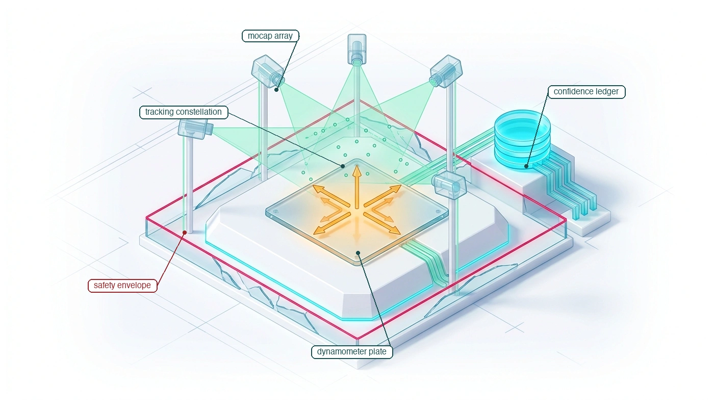
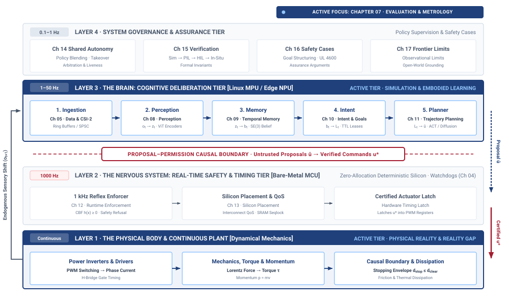
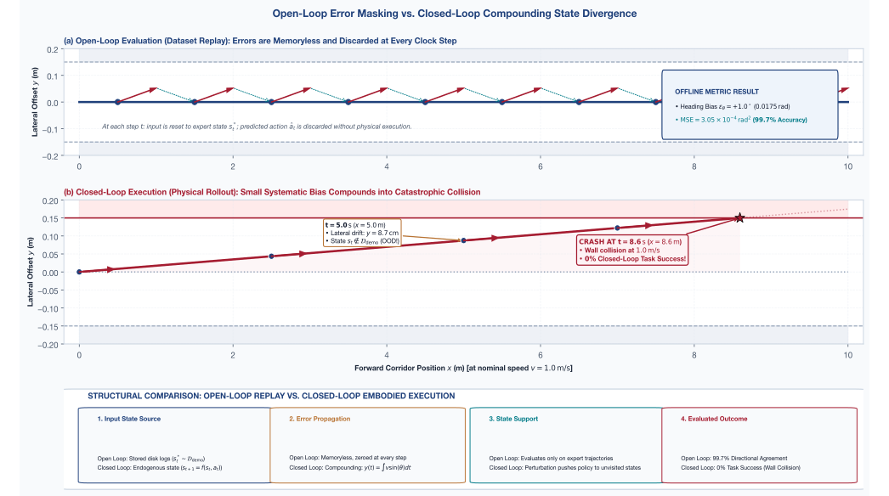
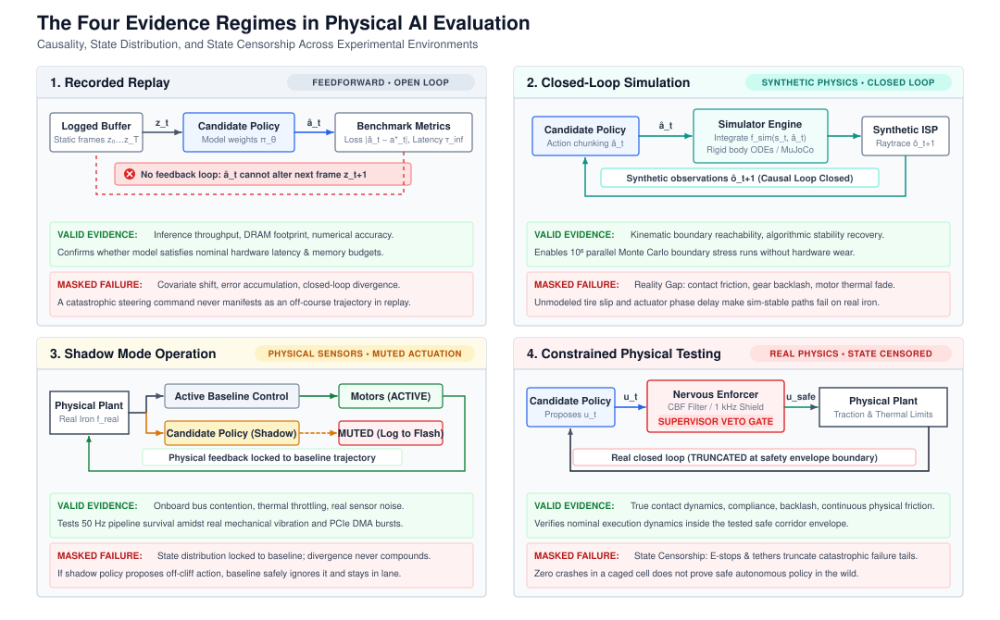
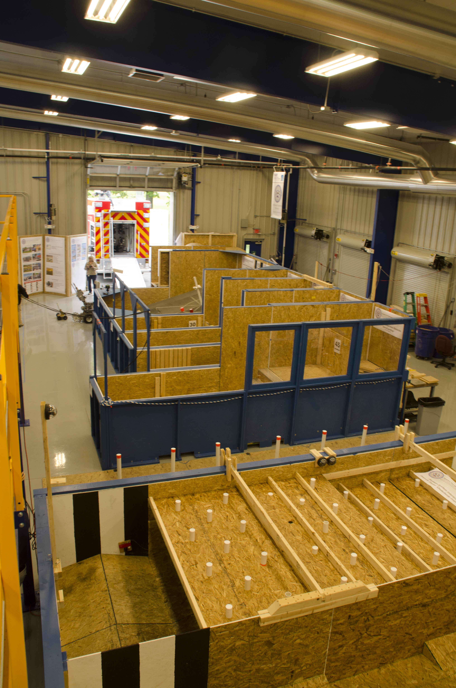
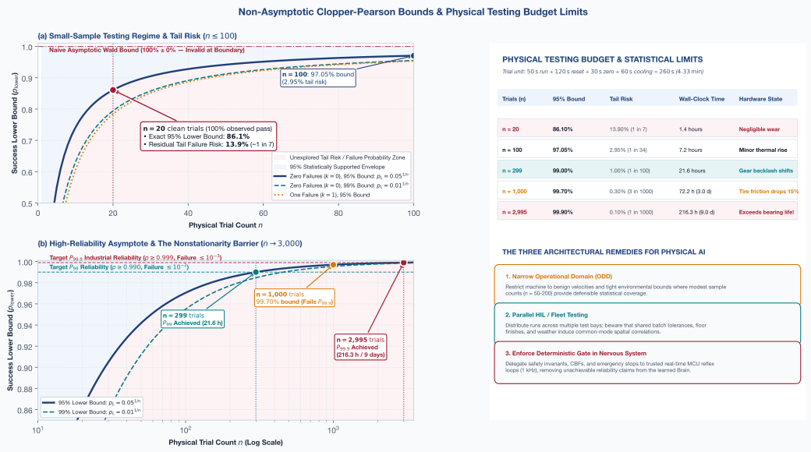
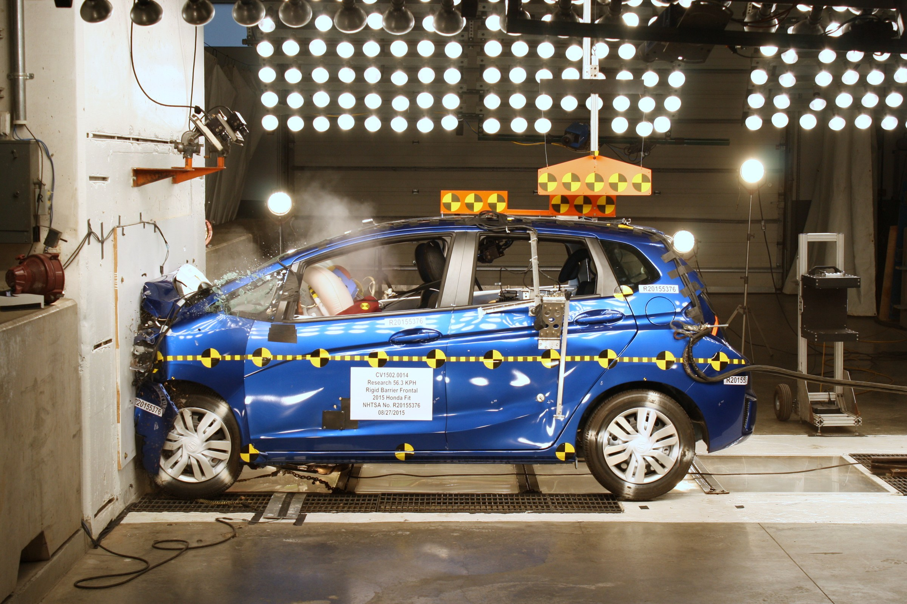

# Closed-Loop Evaluation {#sec-evaluation}

::: {layout-narrow}
::: {.column-margin}

\chapterminitoc

:::

::: {.content-visible when-format="pdf"}
\noindent
{fig-alt="Isometric blueprint showing closed-loop evaluation and metrology: instrumented testing cage with motion capture cameras, tracking marker constellation, flush ground force-torque dynamometer, articulated reliability scorecard with confidence intervals, and crimson intervention tripwire."}
:::

::: {.content-visible unless-format="pdf"}
{fig-alt="Isometric blueprint showing closed-loop evaluation and metrology: instrumented testing cage with motion capture cameras, tracking marker constellation, flush ground force-torque dynamometer, articulated reliability scorecard with confidence intervals, and crimson intervention tripwire."}
:::

:::

## Purpose {.unnumbered .unlisted}

::: {.content-visible when-format="pdf"}
\begin{marginfigure}
\vspace{1em}
\resizebox{\linewidth}{!}{\mlphysicalstackfull{20}{20}{20}{20}{100}}
\end{marginfigure}
:::

_Why does passing twenty consecutive physical trials without failure tell you surprisingly little about whether the machine is safe to deploy?_

A sequence of successful demonstrations establishes what happened during those trials, not every condition under which the machine can operate safely. Small test sets can miss rare failures, and repeated runs through familiar conditions reveal little about unfamiliar ones. Offline prediction scores leave another gap because they evaluate a fixed observation stream. During deployment, each action changes the physical state and therefore the observations used for the next decision. An error can move the robot into circumstances where later errors become more likely. Evaluation must follow that loop on the integrated machine and state how much evidence supports the result. It also needs explicit stopping criteria so a trial does not continue after the conditions for safe operation have failed. Within physical AI systems architecture, evaluation connects the brain's measured behavior to the nervous system's interventions and the body's operating limits, bounding the deployment claims that successful trials can support.



::: {.callout-learning-objectives}

- Interpret physical success rates as conditional evidence about a specified machine, environment, and trial protocol
- Compare open-loop prediction accuracy with closed-loop behavior shaped by the policy's own actions
- Calculate trial counts and test time needed to support a stated reliability target
- Evaluate which rare failures remain unsupported by feasible testing and the available statistical assumptions
- Design reproducible evaluations with explicit outcome rules, intervention records, and documented sampling conditions

:::

## Closed-Loop Survival {#sec-evaluation-7-1}

An autonomous mobile robot completes twenty consecutive navigation runs through a cluttered industrial workcell at $1.5\text{ m/s}$ without colliding with an obstacle or requiring human intervention. Its empirical sample success rate is $\hat{p} = 1.00$ (100 percent). In standard software testing or static machine learning, a flawless benchmark score is celebrated as definitive validation. In Physical AI systems engineering, however, that record leaves the central deployment decision unresolved: *how much operational confidence do twenty consecutive clean runs actually justify, and what probability of catastrophic failure remains hidden behind the score?*

::: {#fig-07-locator fig-env="figure" fig-pos="htb" fig-cap="**Reality Gap in Evaluation**: The four-tier physical AI systems architecture highlights the cognitive deliberation tier together with the physical body beneath it, with the reality gap between them as this chapter's active focus. Evaluation measures how much of a policy's simulated competence survives contact with the plant, so read the highlighted pair as the two sides that every closed-loop trial compares." fig-alt="Diagram titled Physical AI Systems Architecture Stack, drawn as four stacked tiers. Layer 4 is system governance and assurance at 0.1 to 1 hertz, holding boxes for shared autonomy, verification, safety cases, and frontier limits. Layer 3 is the brain, a cognitive deliberation tier at 1 to 50 hertz, holding five stages named ingestion, perception, memory, intent, and planner. A dashed proposal-permission privilege boundary separates it from layer 2, the nervous system, a real-time safety and timing tier at 1000 hertz. Layer 1 is the physical body and continuous plant. Layer 3 and layer 1 are both highlighted and the reality-gap label inside layer 1 is bold; the badge reads Active Focus, Chapter 07, Evaluation and Metrology."}
{width="100%"}
:::

In traditional software benchmarking, estimating failure rates relies on asymptotic approximations. If an engineer applies the familiar Wald confidence interval ($p \pm z \sqrt{\hat{p}(1-\hat{p})/n}$) to twenty zero-failure trials, the variance collapses to zero, producing a degenerate confidence interval of $[1.0, 1.0]$. The formula falsely assures the team that the machine is 100 percent reliable with absolute certainty.

In physical reality, true operational reliability at finite sample counts is governed by the exact inverted binomial distribution—the non-asymptotic Clopper-Pearson bound.[^fn-math-clopper-pearson] Under zero failures, this bound is approximated by the classical **Rule of Three**\index{Rule of Three} [@hanley1983nothing]: when $n$ independent trials pass with zero failures, the upper 95 percent confidence bound on the true failure probability $p_{\text{fail}}$ is approximately $3/n$.

For twenty consecutive successful runs ($n = 20$), the Rule of Three yields (@eq-eval-rule-of-three):
$$p_{\text{fail}} \le \frac{3}{20} = 0.15$$ {#eq-eval-rule-of-three}
This establishes that the underlying failure probability could be as high as 15 percent, corresponding to a lower success bound of $p_{\text{success}} \ge 85$ percent. Evaluating the exact cumulative binomial distribution at significance level $\alpha = 0.05$ yields an exact lower confidence bound of $p_{\text{lower}} = (0.05)^{1/20} \approx 0.861$ (86.1 percent). Crucially, twenty clean runs in a test cell do not prove that a machine is 100 percent reliable, nor even 95 percent reliable. A physical robot with a flawed policy that fails once in every seven deployments ($p = 87.5$ percent) will successfully complete twenty consecutive test runs more than 6.9 percent of the time ($0.875^{20} \approx 0.0692$) by pure random chance.

[^fn-math-clopper-pearson]: **Clopper-Pearson non-asymptotic bound**\index{Clopper-Pearson non-asymptotic bound!definition}: An exact statistical lower confidence limit on true operational success probability derived from the inverted cumulative binomial distribution (evaluating to $p_{\text{lower}} = \alpha^{1/n}$ for zero failures across $n$ independent trials at confidence level $1-\alpha$). Unlike Gaussian approximations that fail at extreme values, this bound gives a physically grounded answer: it calculates the worst-case underlying success rate that could still plausibly produce a lucky streak of $n$ flawless runs.

::: {#psp-evaluation-twenty-clean-runs .callout-perspective title="Twenty clean runs"}
Twenty consecutive successes in a laboratory test cell establish an 86.1 percent lower confidence bound, not a 100 percent reliability certificate. A flawless score in twenty runs is mathematically consistent with a physical system that fails once in every seven deployments.
:::

::: {#nbk-evaluation-derivation-20-run-lower-bound .callout-notebook title="Derivation of the 20-run lower bound"}
**Problem**: An autonomous robot completes $n = 20$ physical navigation runs with zero collisions or human interventions ($k = 20$). What is the exact one-sided 95 percent lower confidence bound on its true operational success probability $p$?

**Mathematical Derivation**: By modeling the sequence as independent Bernoulli trials, we find the probability $p_{\text{lower}}$ that would yield $20$ consecutive successes exactly 5 percent of the time. For $n = 20$ and confidence level $1 - \alpha = 0.95$, the lower bound is $p_{\text{lower}} = \alpha^{1/n} = (0.05)^{1/20} \approx 0.861$ (86.1 percent), implying a maximum failure risk of 13.9 percent, or a mean failure interval of $1/0.139 \approx 7.2$ trials.

**Systems insight**: The observation "20 out of 20 passed" establishes a lower bound of 86.1 percent success, which permits the machine to fail once every $7.2$ runs under sustained operation.
:::

This statistical reality forces a fundamental reinterpretation of physical benchmarks. An empirical test score is not an intrinsic property of a neural network’s weight tensors. It is an empirical measurement of a coupled cyber-physical system, jointly determined by the compiled policy weights ($\pi_\theta$), the individual machine chassis and its mechanical wear ($m$), the operational environment ($e$), the initial state sampling protocol ($s_0$), and the formal evaluation predicate ($\phi$). Changing the ambient temperature (which heats motor windings and triggers thermal derating),[^fn-eval-thermal-limits] swapping a tire for one with slightly lower friction, or allowing battery voltage to sag under heavy load shifts the physical state transition function without altering a single weight in the model. Without conditioning on all five elements, a reported success percentage is physically meaningless.

::: {#dfn-evaluation-empirical-safety-margin .callout-definition title="Empirical physical safety margin"}

***Empirical physical safety margin***\index{Empirical physical safety margin!definition}\index{Clopper-Pearson!safety margin} is the statistical lower confidence bound on the probability of surviving worst-case operational disturbances, computed via exact binomial Clopper-Pearson estimation under finite physical trial counts rather than optimistic asymptotic averages.

1.  **Significance**: Prevents dangerous false confidence derived from small-sample success rates (such as "20 out of 20 successful trials"), enforcing mathematically rigorous lower bounds on closed-loop survival probability before deployment.
2.  **Distinction**: Unlike open-loop test loss or asymptotic point estimates ($k/n$), the empirical safety margin accounts for finite observation counts through conservative exact Clopper-Pearson confidence intervals at a specified confidence level (e.g., $1 - \alpha = 0.95$).
3.  **Common pitfall**: Assuming zero observed failures across a limited test set implies the system is certified safe, ignoring that $n=20$ zero-failure trials allows a true failure rate as high as 13.9 percent under binomial bounds.

:::

In the four-tier systems architecture (@fig-07-locator), **Closed-Loop Evaluation** closes the learning loop of Part II ("Teaching the Machine"). Having examined how physical experience is logged in @sec-data and how policies are synthesized across the reality gap in @sec-training, this chapter provides the metrological discipline needed to determine whether a policy survives contact with the physical plant. In @fig-07-locator, evaluation directly interrogates the reality gap between the cognitive deliberation tier (the Brain, Layer 3) and the continuous plant (the Body, Layer 1), under the supervision of the real-time Nervous System (Layer 2). Evaluation does not merely measure model competence; it audits whether the real-time nervous system reliably intercepts out-of-distribution commands before physical safety envelopes are breached.[^fn-eval-safety-enforcement]

Transforming physical evaluation from informal laboratory testing into a rigorous metrology discipline requires addressing the complete testing lifecycle. This chapter unfolds that methodology across seven progressive stages:

We begin in @sec-evaluation-7-2 by formalizing the closed-loop evaluation estimand, proving why success probability is an empirical property of the entire experimental tuple $(\pi_\theta, m, e, \phi, s_0)$ rather than model weights alone. In @sec-evaluation-7-3, we analyze closed-loop dynamics, explaining the mathematical decoupling between open-loop validation loss and physical survival driven by compounding error integration and non-Lipschitz contact bifurcations.[^fn-eval-openloop-decoupling] We then survey evidence regimes in @sec-evaluation-7-4, evaluating the hierarchy of testing environments spanning pure simulation, hardware-in-the-loop (HIL) testbeds, caged workcells, structured operational trials, and fleet monitoring. In @sec-evaluation-7-5, we confront physical trial limits, developing the statistical physics of finite testing through exact Clopper-Pearson coverage, the Rule of Three, Butler-Finelli exposure infeasibility, and Extreme Value Theory for tail risks. @Sec-evaluation-7-6 establishes what empirical evaluation cannot prove, demonstrating why finite statistical testing can never substitute for deterministic runtime safety enforcement. In @sec-evaluation-7-7, we diagnose the insidious failure modes of physical evaluation, uncovering subtle operator reset biases, unrecorded manual interventions, and survivorship bias. In @sec-evaluation-7-8, we formalize evaluation logging protocols and telemetry scorecards, establishing reproducible evidentiary standards for system auditing. Finally, @sec-evaluation-7-9 and @sec-evaluation-7-10 conclude with common evaluation fallacies and core architectural principles.

## What You Are Actually Measuring {#sec-evaluation-7-2}

An evaluation benchmark routinely reports a single summary statistic, such as an 85 percent success rate on an obstacle avoidance task. In machine learning practice, that number is often treated as an intrinsic score belonging to the learned model weights, analogous to top-one accuracy on a static image classification dataset. In a physical machine, that interpretation is invalid. A learned policy has no independent physical performance. What the benchmark measured was the closed-loop execution of an entire physical system across a specific sequence of days and environmental states. Success rate is an empirical property of the coupled system, comprising the policy, the mechanical plant, the onboard computational hardware, the operating environment, and the trial protocol.

To evaluate a policy, an engineering team executes a sequence of discrete physical runs. A single trial is fully determined only when every variable that can alter the physical state trajectory is fixed or explicitly sampled. Formally, let a single trial condition be defined by a tuple $c = (s_0, e, m, \pi_\theta, \kappa)$, drawn from an operational testing distribution $\mathcal{D}$. The vector $s_0$ represents the initial state of the machine, including SE(3) pose\index{SE(3) pose}, linear and angular velocities, and joint encoder positions. The environment vector $e$ captures external variables such as floor friction, ambient illuminance, obstacle geometry, and ambient air temperature. The machine state $m$ captures physical and hardware properties, including battery state of charge, payload mass, tire wear, mechanical backlash\index{Mechanical backlash} in the drivetrain, and sensor calibration parameters. The computational configuration $\pi_\theta$ encompasses the frozen policy weights $\theta$, inference quantization, scheduling deadlines, and software versions. Finally, the termination protocol $\kappa = (T_{\max}, g, \phi)$ defines the execution time limit $T_{\max}$, the spatial goal region $g$, and the binary evaluation function $\phi$ that maps the resulting trajectory to a terminal outcome $Y \in \{0, 1\}$.

The true success probability of the system under this evaluation protocol is the expected value of the binary task outcome averaged over the joint distribution of all these trial conditions (for the formal integral over the condition space, see @sec-appendix-ml).
In this formulation, $\text{Traj}(c)$ is the continuous physical trajectory produced when the policy $\pi_\theta$ executes within the physical environment and hardware state defined by $c$. This dependency demonstrates why success probability cannot be treated as a measurement of $\theta$ alone. The model weights $\theta$ constitute only one parameter inside the condition vector $c$. If the distribution over floor friction or the distribution over initial battery charge changes, the expected success rate changes while $\theta$ remains identical. The sampling protocol is not an external apparatus measuring an isolated model; it is part of the mathematical quantity being estimated.

::: {#dfn-evaluation-closed-loop-estimand .callout-definition title="The closed-loop evaluation estimand"}

***Closed-loop evaluation estimand***\index{Closed-loop evaluation estimand!definition}\index{Evaluation estimand!definition} is the expected physical task outcome $p(\mathcal{D}) = \mathbb{E}_{c \sim \mathcal{D}}[\phi(\text{Traj}(c))]$ jointly defined over policy weights, mechanical plant state, environmental conditions, and trial protocol, rather than an intrinsic property of the learned model weights in isolation.

1.  **Significance**: In static machine learning, held-out accuracy is treated as a property of the model $\pi_\theta$. In Physical AI, substituting a worn tire, letting battery voltage sag, or shifting ambient illuminance alters the physical state transition function without changing a single weight. The sampling distribution of operational conditions $\mathcal{D}$ is an inseparable part of the quantity being estimated.
2.  **Distinction**: Unlike open-loop validation metrics (such as validation loss or mean squared trajectory error) which score predictions against frozen recorded states, the closed-loop estimand integrates over the endogenous feedback loop where past actions physically move the machine, directly changing the future sensor observations it will receive.
3.  **Common pitfall**: Reporting a single success rate percentage (e.g., "92 percent task success") without predeclaring the support, density, and environmental bounds of the operational design domain $\mathcal{D}$. Any physical policy can be made arbitrarily successful by testing exclusively in benign, unperturbed states.

:::

The physical mechanisms that alter $c$ between trials operate independently of the policy:

- **Mobile systems**: A lithium-ion battery pack at 90 percent state of charge\index{State of charge (SoC)} provides higher terminal voltage to the motor drivers than a depleted pack at 20 percent state of charge. As terminal voltage sags under high load, the reduced voltage headroom limits the current the inverter can push against back-EMF\index{Back-EMF}, truncating the available torque at high speeds according to the electromechanical torque-speed curve\index{Torque-speed curve}. If a trajectory demands a peak acceleration of $1.2\text{ m/s}^2$ to clear a moving obstacle, the robot clears the obstacle when the battery is fully charged, but understeers and collides when the battery is depleted. Similarly, ambient sunlight shifting across an afternoon changes camera exposure times from $2\text{ ms}$ to $20\text{ ms}$. This tenfold increase introduces motion blur during turning maneuvers, corrupting feature extraction in the visual backbone and causing state estimation drift. Floor dust accumulation lowers the static friction coefficient from $\mu = 0.80$ to $\mu = 0.55$, extending the stopping distance from an initial speed of $2.0\text{ m/s}$ from $0.25\text{ m}$ to $0.37\text{ m}$.
- **Manipulator systems**: Continuous high-speed pick-and-place cycles generate Joule heating ($I^2R$)\index{Joule heating} in actuator stator windings and viscous frictional heating in harmonic drive\index{Harmonic drive} gearboxes, heating lubricant and altering viscous damping coefficients by over 25 percent. As structural linkages warm, thermal expansion shifts the tool-center-point (TCP)\index{Tool center point} SE(3) kinematic calibration\index{Kinematics!SE(3) calibration} by $0.15\text{–}0.30\text{ mm}$. A policy trained to insert a peg into a chamfered hole with $0.20\text{ mm}$ clearance succeeds during early morning cold starts but jams repeatedly in the afternoon as thermal growth exhausts kinematic tolerance margins.
- **Process & energy systems**: Ambient temperature swings alter the thermal gradient across cooling heat exchangers. A neural policy regulating chiller pump speeds that maintains coolant temperature below $45^\circ\text{C}$ in a $20^\circ\text{C}$ laboratory environment fails when ambient air hits $38^\circ\text{C}$, triggering high-pressure compressor trips despite executing identical control laws.

In all these cases, the policy weights and input tensor shapes are identical, yet the physical trajectory transitions from success to failure.

Non-model variation also enters through the reset procedure and operator handling. When human operators manually reposition a machine between trials, they introduce subtle spatial biases. If an operator instinctively resets the robot facing open space after a difficult run, the empirical distribution of initial heading angles shifts toward favorable states. Conversely, an automated reset procedure that repeatedly drives the machine along a fixed path induces cyclic heating in the actuator windings, increasing electrical resistance and reducing actuator response speed across successive trials. If an operator intervenes to catch a falling machine and discards the run as an unrecorded reset, the hardest failure modes are erased from the sample history, artificially inflating the observed success rate.

Statistical evaluation requires distinguishing ordinary sampling variation from a change in the underlying estimand. When $N$ trials are drawn from a fixed distribution $\mathcal{D}$, the sample proportion $\hat{p} = \frac{1}{N} \sum_{i=1}^N Y_i$ fluctuates around the true parameter $p(\mathcal{D})$ due to random sampling noise. This uncertainty can be bounded using standard statistical estimators. However, if an evaluation changes the payload mass from $0.0\text{ kg}$ to $5.0\text{ kg}$, or shifts testing from dry concrete to wet asphalt, the experiment is no longer drawing samples from $\mathcal{D}$. It is sampling from an entirely different distribution $\mathcal{D}'$, defined by a new parameter $p(\mathcal{D}')$. Treating data collected under $\mathcal{D}'$ as an extension of the original sample pool conflates sampling variance with structural bias, combining observations from two different physical machines.

Because success probability is defined only with respect to a specific joint distribution $\mathcal{D}$, the intended operating envelope must be declared before trials are sampled. In systems engineering, this envelope is the **operational design domain**\index{Operational design domain!definition} (ODD). If an engineering team executes fifty physical runs across ad hoc trajectories and reports a 90 percent pass rate, the denominator corresponds to an undefined population. A measured success rate is statistically meaningful only when the support and density of $\mathcal{D}$ are specified in advance, establishing explicit bounds on illuminance, payload ranges, surface friction coefficients, and allowable initial state offsets.

Extracting valid confidence bounds from empirical trials requires three operational conditions:

1. *Independent and Identically Distributed Sampling:* Trials must be independent realizations drawn from $\mathcal{D}$. If thermal accumulation in motor windings or progressive mechanical wear degrades hardware efficiency across consecutive runs, trial outcomes become negatively correlated over time, violating independence.
2. *Fixed Outcome Predicates:* The binary evaluation function $\phi$ and the termination criteria $\kappa$ must remain fixed throughout the campaign. Modifying the time horizon $T_{\max}$ or adjusting the spatial tolerance of the goal region $g$ midway through testing alters the definition of success.
3. *Full-Denominator Accounting:* Every initiated run that aborts due to hardware faults, communication timeouts, or safety-rated emergency stops (e.g., exceeding ISO 10218\index{ISO 10218} / ISO/TS 15066\index{ISO/TS 15066} power and force limits) must be recorded as a failure ($Y = 0$). Dropping aborted trials substitutes a measure of conditional execution on surviving hardware for the true operational reliability of the machine.

When these conditions are strictly enforced, physical trials yield an unbiased sample mean for the closed-loop system under the tested distribution $\mathcal{D}$. Yet physical testing remains constrained by hardware wear, operator labor, and wall-clock execution time. To bypass these constraints, evaluation workflows often turn to open-loop evaluations on recorded datasets, calculating how accurately a candidate policy reproduces logged expert actions offline. That substitution assumes that a model that predicts demonstrated actions with high statistical accuracy will exhibit equivalent competence when granted real-time authority over a physical machine.

::: {#chk-eval-measuring-tuple .callout-checkpoint title="Condition tuples and operational design domains"}

Before examining closed-loop dynamics, verify your understanding of experimental condition spaces and trial accounting:

- [ ] **Coupled condition tuple**: Can you explain why an empirical success rate measures the experimental tuple $(s_0, e, m, \pi_\theta, \kappa)$ rather than neural network weights in isolation?
- [ ] **Hardware non-stationarity**: Can you describe how battery voltage sag or thermal expansion shifts physical state transitions while policy weights remain completely frozen?
- [ ] **Full-denominator accounting**: Can you explain why dropping aborted runs or emergency stops inflates empirical reliability metrics?

:::

## Closed-Loop Dynamics {#sec-evaluation-7-3}

In an **open-loop evaluation**\index{Open-loop evaluation!definition}, a candidate policy $\pi_\theta$ is scored across a static dataset of recorded demonstrations $\mathcal{D}_{\mathrm{demo}} = \{(s_t^*, a_t^*)\}_{t=1}^T$. At each discrete timestep $t$, the policy receives a recorded demonstrator state $s_t^*$ and outputs a predicted action $\hat{a}_t = \pi_\theta(s_t^*)$. An error metric, such as mean squared error or cross-entropy, measures the distance between $\hat{a}_t$ and the recorded expert action $a_t^*$. At step $t+1$, the evaluation pipeline supplies the next recorded state $s_{t+1}^*$ from the dataset. The action $\hat{a}_t$ produced by the policy is discarded without executing on hardware, keeping the sequence of input states independent of the policy's past outputs. In a **closed-loop evaluation**\index{Closed-loop evaluation!definition}, the policy is coupled directly to the state-transition recurrence $s_{t+1} = f(s_t, a_t)$. The action $a_t = \pi_\theta(s_t)$ commanded by the policy actually executes on the physical plant, putting the policy in the driver's seat. It physically alters the state trajectory, crossing the causal boundary established in @sec-boundary-1-2.

Because open-loop evaluation tests actions only along the demonstrator's state trajectory, a policy that scores low prediction error offline can fail immediately when granted authority over physical motion [@ross2011reduction; @pomerleau1989alvinn]. Consider an analytical example of a planar moving platform tracking a straight corridor of length $L = 10\text{ m}$ at a constant forward speed of $v = 1.0\text{ m/s}$. The nominal expert demonstration follows the centerline with heading $\theta^* = 0\text{ rad}$ and lateral offset $y^* = 0\text{ m}$ for a duration of $10\text{ s}$. The policy runs at a control frequency of $10\text{ Hz}$, executing updates every $\Delta t = 0.1\text{ s}$ across $100$ discrete steps. Suppose the candidate policy has a systematic heading bias of $\epsilon_\theta = 1.0^\circ$ ($0.01745\text{ rad}$) on every step.

In an open-loop evaluation, the policy receives the demonstrator state $s_t^* = (x_t^*, 0, 0)$ at each step and predicts a forward velocity with a $1.0^\circ$ steering offset. The offline scoring pipeline records a mean absolute angular error of $1.0^\circ$ ($0.01745\text{ rad}$) and an extremely low mean squared error of $\text{MSE}_\theta = (0.01745)^2 \approx 3.05 \times 10^{-4}\text{ rad}^2$.[^fn-math-openloop-mse] By standard regression metrics, matching expert angles within $1.0^\circ$ across 99.7 percent of validation states qualifies the policy for deployment. In closed-loop execution, however, because the machine physically moves based on the policy's previous actions, uncorrected heading errors compound continuously over time. Under planar unicycle kinematics ($\dot{y} = v \sin \theta \approx v \epsilon_\theta$), this persistent angular offset integrates into a cumulative lateral displacement:
$$y(t) = \int_0^t v \sin \epsilon_\theta \, d\tau \approx v \epsilon_\theta t$$
Over the $10\text{ s}$ transit ($10\text{ m}$ forward distance at $v = 1.0\text{ m/s}$), accumulated lateral drift reaches $y(10) = 1.0\text{ m/s} \times 0.01745\text{ rad} \times 10\text{ s} \approx 0.175\text{ m}$ ($17.5\text{ cm}$).[^fn-math-closedloop-lateral] If the corridor provides $W_{\text{clear}} = 0.15\text{ m}$ ($15.0\text{ cm}$) of lateral clearance to the side wall, the clearance envelope is exhausted at timestamp:
$$t_{\text{impact}} = \frac{W_{\text{clear}}}{v \sin \epsilon_\theta} \approx \frac{0.15\text{ m}}{1.0\text{ m/s} \times 0.01745\text{ rad}} \approx 8.6\text{ s} \quad (x = 8.6\text{ m})$$
The vehicle strikes the wall before completing the transit. Despite negligible open-loop error, the closed-loop task success rate collapses to zero percent.

::: {#psp-evaluation-open-loop-blindness .callout-perspective title="Open-loop blindness"}
Open-loop loss measures dataset mimicry; closed-loop dynamics decide physical survival. A policy with near-zero offline prediction error will diverge catastrophically the instant an uncorrected action bias integrates through the physical plant.
:::

The **offline-online evaluation disconnect**\index{Offline-online evaluation disconnect!definition} is the fundamental decoupling of open-loop dataset loss metrics (such as action mean squared error or imitation log-likelihood on static logs) from closed-loop physical stability and task survival, caused by the inability of static evaluation to reflect compounding kinematic integration errors ($y(t) \approx \int_0^t v \sin \epsilon_\theta \, d\tau$) and self-induced distribution shift during embodied execution (the snowball effect where early mistakes push the machine into unfamiliar physical states, which then provoke even worse mistakes).

This divergence occurs because open-loop evaluation effectively resets the machine to an expert state at every clock cycle—like a driving instructor continuously grabbing the steering wheel to snap the car back to the exact center of the lane—masking the compounding nature of integration errors. In closed loop, the state at index $t$ is the expanded composition of all previous actions:
$$s_t = f(f(\dots f(s_0, a_0)\dots, a_{t-2}), a_{t-1})$$
The first minor action error shifts the physical machine from the demonstrated state $s_1^*$ to an unvisited state $s_1$. Once the platform drifts $2.0\text{ cm}$ off nominal, it enters a state that does not appear anywhere in $\mathcal{D}_{\mathrm{demo}}$. Because the policy was evaluated only on demonstrator states where $y = 0\text{ m}$, the offline metric contains no evidence regarding what action $\pi_\theta(s)$ the policy will produce when $y \neq 0\text{ m}$. If the training distribution lacked demonstrations of recovery maneuvers from off-center coordinates, the policy can output larger corrective errors, accelerating the divergence instead of arresting it.

This disconnect manifests across all physical machine archetypes:

- *Mobile Systems:* As derived above, a $1.0^\circ$ angular error integrates across $10\text{ m}$ into a $17.5\text{ cm}$ lateral offset, breaching corridor clearance limits.
- *Manipulator Systems:* An end-effector position error of $0.5\text{ mm}$ per step during a contact assembly task (e.g., chamfered pin insertion) appears negligible on offline Cartesian MSE. In closed-loop contact, that same $0.5\text{ mm}$ lateral displacement acts as a physical wedge, driving the pin against the hard metal edge of the hole (the chamfer rim). This generates immense lateral reaction forces ($F_{xy} = k_{\text{env}} \Delta_{xy}$) that overload the joint actuators and trip the robot's **ISO 10218 protective stop**\index{ISO 10218!Protective stop} for exceeding maximum torque limits ($\tau_i > \tau_{\max}$).
- *Process & Energy Systems:* A temperature prediction error of $0.5^\circ\text{C}$ per minute in an industrial reactor cooling policy seems minor on offline logs. In closed loop, failing to appropriately increase the coolant fluid's mass flow rate ($\dot{m}$) chokes off heat extraction ($Q = \dot{m} c_p \Delta T$). Because the chemical reaction generates its own heat (exothermic), this error feeds on itself, compounding thermal accumulation until the reactor core breaches the safe $95^\circ\text{C}$ hardware trip threshold and triggers a shutdown within twenty minutes.

The mapping between offline scores and physical task performance is not a simple mirror image; it can be deeply misleading in both directions. While open-loop evaluation is optimistically blind to compounding trajectory divergence, its action metrics can conversely be pessimistic when the physical environment permits multiple valid actions. If a human demonstrator avoided an obstacle by steering left, an open-loop evaluation penalizes a candidate policy that steers right, recording a large action error against $a_t^*$. In closed-loop execution, passing on the right clears the obstacle and reaches the target state with equal validity. An action-level prediction error measures divergence from a specific demonstration recording, not the satisfaction of the physical task.

@Fig-07-open-vs-closed-loop separates the two protocols. Open-loop evaluation scores candidate actions only on demonstrator states where errors are immediately discarded, obscuring the cumulative trajectory divergence that drives closed-loop physical execution into catastrophic wall collisions.

::: {#fig-07-open-vs-closed-loop fig-env="figure" fig-pos="t" fig-cap="**Open versus Closed Loop Divergence**: The same $1.0^\circ$ heading bias scored two ways. Replayed against recorded demonstrator states it reads as 99.7 percent directional accuracy, because the harness resets the platform to the centerline at every step and never lets the error accumulate. Executed closed-loop the same bias integrates through the kinematics until it breaches the $15\text{ cm}$ clearance boundary at $8.6\text{ s}$, taking task success to zero." fig-alt="Open-Loop Error Masking versus Closed-Loop Compounding State Divergence. (a) In open-loop evaluation (dataset trace replay), a candidate policy is scored exclusively against recorded demonstrator states st^ in Ddemo, where a constant 1.0^ deg (0.0175 rad) heading bias produces an apparent 99.7 percent directional accuracy (MSE = 3.05 x 10^-4 rad^2) because the evaluation harness resets the platform to the centerline at every step. (b) In closed-loop physical execution, the unmodeled angular bias continuously integrates through kinematic state transitions (y_dot = v sin theta), causing cumulative lateral displacement that breaches the 15 cm clearance boundary at t = 8.6 s (x = 8.6 m), reducing closed-loop task success to 0 percent."}
{width="100%"}
:::

In physical reality, uncorrected steering biases do not require gross software bugs; they arise naturally from unmodeled hardware asymmetries such as differential tire wear, subtle camera mast vibration, or floor camber. As demonstrated by the unicycle derivation above and illustrated in @fig-07-open-vs-closed-loop, a minor systematic bias of $\epsilon_\theta = 1.0^\circ$ ($0.0175\text{ rad}$) achieves 99.7 percent open-loop directional agreement ($\text{MSE}_\theta \approx 3.05 \times 10^{-4}\text{ rad}^2$), yet inevitably exhausts the $15.0\text{ cm}$ clearance envelope at $t_{\text{impact}} \approx 8.6\text{ s}$, collapsing closed-loop task success to zero. This decoupling proves that low open-loop prediction error is completely uninformative regarding physical survival. Closed-loop evaluation must replace offline MSE with runtime Time-to-Intervention ($T_{\text{TTI}}$) metrics and control barrier functions on the real-time MCU that clamp steering commands whenever projected clearance margins are breached.

::: {#chk-eval-open-vs-closed-loop-drift .callout-checkpoint title="Kinematic bias compounding versus open-loop error"}

Before evaluating alternative evidence regimes, verify your understanding of open-loop error masking and kinematic integration:

- [ ] **Open-loop evaluation masking**: Can you explain why an offline action validation accuracy of 99.7 percent fails to guarantee collision-free physical traversal?
- [ ] **Kinematic bias compounding**: Can you describe how a sub-degree steering bias integrates through continuous unicycle kinematics to cause catastrophic boundary departure?
- [ ] **Closed-loop evaluation metrics**: Can you distinguish offline Mean Squared Error from Time-to-Intervention ($T_{\text{TTI}}$) and control barrier function monitoring during physical rollouts?

:::

This fundamental disconnect between open-loop statistical agreement and physical closed-loop survival is systematized in @tbl-07-offline-closed-loop-disconnect, which maps common machine learning validation metrics to their underlying physical failure modes and corresponding closed-loop evaluators.

| Offline Evaluation Metric                     | Open-Loop Statistical Assumption                                                         | Physical Disconnect Mechanism                                                                                                                                          | Closed-Loop Hardware Failure Mode                                                                                                                  | Mandatory Closed-Loop Evaluator                                                                                                                                           |
|:----------------------------------------------|:-----------------------------------------------------------------------------------------|:-----------------------------------------------------------------------------------------------------------------------------------------------------------------------|:---------------------------------------------------------------------------------------------------------------------------------------------------|:--------------------------------------------------------------------------------------------------------------------------------------------------------------------------|
| **Action Mean Squared Error**                 | Small prediction residuals produce proportionally small trajectory deviations.           | Unmodeled kinematic bias integrates over time, driving states out of distribution.                                                                                     | Catastrophic boundary collision, curb strike, or lane departure.                                                                                   | **Closed-Loop Rollout Tracking Error**: Maximum spatial deviation from reference path and **Time-to-Intervention**\index{Time-to-Intervention!metric} ($T_{\text{TTI}}$). |
| **Top-$1$ / Discrete Action Accuracy**        | High classification accuracy on logged states ensures identical execution.               | Equal penalty for benign alternative maneuvers vs catastrophic boundary excursions; blind to temporal error correlation.                                               | High-frequency actuator chatter, rapid control sign-flipping, or sudden structural joint over-torque.                                              | **Smoothness & Dynamic Feasibility**: Peak jerk and adherence to actuator torque limits.                                                                                  |
| **Cosine Similarity / Directional Agreement** | Collinear action proposals produce dynamically stable physical paths.                    | Metric ignores control magnitude errors; under-actuation fails to overcome static friction or over-actuation triggers tire slip.                                       | Limit-cycle hunting, velocity stall on inclines, or spin-out during dynamic cornering maneuvers.                                                   | **Phase Margin & Slip Ratio**: Effective damping ratio and wheel slip boundaries (see @sec-appendix-control).                                                             |
| **Negative Log-Likelihood (NLL)**             | High likelihood on expert demonstrations captures the true physical action distribution. | Density is evaluated strictly at the logged expert action, heavily penalizing valid multimodal bypass trajectories (e.g., navigating right when the expert went left). | Spurious rejection of robust multimodal policies; deployed models overfit to specific demonstrator noise, inducing high-frequency actuator jitter. | **Closed-Loop Task Success Rate**: Terminal goal completion over randomized goal offsets.                                                                                 |
| **Sensory Reconstruction / Chamfer Loss**     | Accurate world-model state prediction ensures safe receding-horizon plan synthesis.      | Visual/feature reconstruction loss weights background pixels over sub-pixel spatial obstacles and contact manifolds.                                                   | Phantom obstacle braking, clipping thin obstacles (cables, glass), or false clearance estimation.                                                  | **Spatial Clearance & CBF Invariance**: Strict maintenance of minimum obstacle distance and control barrier safety conditions.                                            |

: **Offline Open-Loop Prediction Metrics versus Closed-Loop Physical Survival Disconnect Matrix**: Comparing standard machine learning benchmark metrics evaluated on static demonstration logs against the physical dynamics of embodied execution. Open-loop metrics implicitly assume that demonstrator state distributions remain invariant to policy errors; in closed loop, unmodeled actuator biases integrate into compounding spatial drift, multimodal action alternatives incur spurious penalties, and distribution shifts trigger unrecoverable boundary violations. {#tbl-07-offline-closed-loop-disconnect tbl-colwidths="[20,18,22,18,22]"}

Recorded replay remains widely used because it evaluates model checkpoints across stored arrays in seconds, consuming compute cycles without occupying physical test cells or incurring mechanical wear. Closed-loop simulation restores the causal recurrence $s_{t+1} = f_{\text{sim}}(s_t, a_t)$, allowing compounding drift to manifest and testing whether a policy can stabilize off-nominal states without risking physical hardware. Yet simulation replaces the open-loop distribution assumption with a dynamical modeling assumption. The simulation transition operator $f_{\text{sim}}$ approximates real physics $f_{\text{real}}$, but it abstracts away unmodeled friction non-linearities, contact mechanics, and physical transport latencies. Establishing that a policy stabilizes $f_{\text{sim}}$ demonstrates mathematical convergence inside the simulator, but it does not establish how the policy behaves when executed against physical hardware.

Extending the proposal-permission architecture from @sec-brain-4-1, this open-loop versus closed-loop disconnect maps directly across the compute boundary. When the Linux MPU runs offline trace replay, it measures only whether neural inference executes within its memory and compute budgets. In physical closed-loop execution, the Linux MPU continuously dispatches candidate action proposals via dedicated memory mailboxes (RPMSG) to the bare-metal MCU. If the policy's proposals drift off-target or vibrate erratically (chatter), this real-time MCU enforcer detects the spatial boundary breach or a missed timing deadline (lease expiration), forcefully rejecting the bad proposals and asserting an emergency deceleration. Evaluating a policy offline without the physical plant and the real-time permission referee in the loop evaluates tensor mathematics, not cyber-physical machine survival.

[^fn-math-openloop-mse]: **Open-Loop MSE Calculation**\index{Mean Squared Error!Open-loop calculation}: A constant $1.0^\circ$ ($0.01745\text{ rad}$) heading error yields a Mean Absolute Error of $0.01745\text{ rad}$ and a Mean Squared Error of $(0.01745)^2 \approx 3.05 \times 10^{-4}\text{ rad}^2$.

[^fn-math-closedloop-lateral]: **Closed-Loop Kinematic Integration**\index{Kinematic integration!Closed-loop error}: Physically, because the robot is driving continuously, even a microscopic steering error accumulates over the entire journey. At a constant forward velocity $v = 1.0\text{ m/s}$ and an uncorrected heading error $\epsilon_\theta = 1.0^\circ$, the lateral drift position $y(t) = \int_0^t v \sin(\epsilon_\theta) d\tau$. Over $t = 10\text{ s}$, this constant integration produces a total physical drift of $y(10) = 10 \times \sin(1.0^\circ) \approx 0.1745\text{ m} = 17.45\text{ cm}$.

## Evidence Regimes {#sec-evaluation-7-4}

Evaluating a learned policy requires selecting an execution environment, and systems engineering divides these environments into four distinct evidence regimes, as diagrammed in @fig-07-evidence-regimes: recorded replay, closed-loop simulation, shadow operation, and constrained physical testing. Each regime establishes a different relationship between the policy, its sensory inputs, and the state of the machine. Consequently, each regime supports a strictly bounded claim. Recorded replay evaluates numerical prediction error over static data. Simulation evaluates closed-loop stability against a synthetic transition operator (building on the causal boundary established in @sec-boundary-1-2). Shadow operation evaluates onboard execution timing and behavioral divergence against an active baseline. Constrained physical testing evaluates closed-loop dynamics within an artificially restricted operational envelope. None of these **four evidence regimes**\index{Evidence regimes!definition} establishes how the unassisted policy behaves during unconstrained physical deployment, because each regime alters either the causal feedback of the control loop or the distribution of states the machine encounters.

::: {#fig-07-evidence-regimes fig-env="figure" fig-pos="t" fig-cap="**Four Evaluation Evidence Regimes**: Each testing environment alters the control loop's causality or state distribution. Recorded replay (top left) breaks physical causality entirely. Simulation (top right) restores causality but substitutes synthetic physics. Shadow operation (bottom left) restores physical sensor streams but leaves the baseline controller in authority. Constrained physical testing (bottom right) closes the real-world loop but introduces artificial state censorship to prevent hardware damage. No single regime evaluates unconstrained physical deployment." fig-alt="The Four Evidence Regimes in Physical AI Evaluation. A four-quadrant architectural matrix diagramming feedback loops, valid evidence, and masked failure modes across evaluation environments. Quadrant 1 (Recorded Replay) shows feedforward open-loop computation on logged sensor buffers z0 to zT, validating compute throughput and memory footprints but masking covariate shift because predicted actions ât cannot alter future observations. Quadrant 2 (Closed-Loop Simulation) shows closed-loop integration through synthetic rigid-body physics fsim, enabling massive parallel envelope coverage but masking the sim-to-real reality gap. Quadrant 3 (Shadow Mode Operation) feeds live physical sensor streams from real iron freal to both an active baseline controller and a shadow policy whose actions are muted, testing real bus contention and thermal throttling while locking the state distribution to the baseline trajectory. Quadrant 4 (Constrained Physical Testing) closes the loop on real hardware through a 1 kHz nervous enforcer safety shield, validating true contact dynamics while introducing state censorship because emergency stops and tethers truncate catastrophic failure tails."}
{width="100%"}
:::

In recorded replay, the policy executes as a feedforward computation on stored sensor buffers. The environment does not respond to the policy outputs, and the state sequence remains fixed to the trajectory recorded during data collection. This regime supports claims regarding computational throughput, memory allocation [@williams2009roofline], and the statistical loss of the model relative to a logged dataset. It establishes whether the policy executes within a target latency budget, such as $18\text{ ms}$ on an onboard accelerator, and whether its numerical outputs match the recorded actions. It cannot support any claim about closed-loop stability, because the difference between the predicted action and the logged action never alters the subsequent state observation. If the policy erroneously outputs a hard left turn, the next pre-recorded camera frame will still show the machine driving straight.

Closed-loop simulation restores the causal feedback loop by substituting an explicit mathematical model, $f_{\text{sim}}$, for the physical machine and its surroundings. When the policy outputs an action, the simulation integrates the equations of motion, updates the scene, and renders synthetic sensor inputs for the next cycle at index $t+1$. This regime supports claims about the policy's algorithmic behavior under the modeled dynamics. An engineer can run thousands of parallel simulator instances to verify that a mobile base recovers when initialized $0.5\text{ m}$ off its nominal path, or that an articulated arm avoids self-collision across its workspace. However, this evidence holds only with respect to $f_{\text{sim}}$. Unmodeled mechanical backlash\index{Mechanical backlash}, tire slip non-linearities, contact friction\index{Contact friction} transitions, and lighting variations are excluded by construction.

Shadow operation mounts the candidate policy onto an active physical machine while a validated baseline controller, or a human operator, retains authority over the actuators. The candidate policy receives live sensor frames, runs onboard inference under real mechanical vibration and bus traffic, and computes candidate actions $a_t^{\text{cand}}$.[^fn-hw-hil-bus] These candidate actions are logged but never dispatched to the motor drives. Shadow operation supports claims about physical execution timing, validating whether the inference pipeline sustains a $50\text{ Hz}$ update rate under operational thermal conditions, and quantifying how often $a_t^{\text{cand}}$ diverges from the baseline action $a_t^{\text{base}}$ by more than a specified threshold, such as a steering difference of $0.1\text{ rad}$. Yet shadow operation shares the fundamental limitation of recorded replay. Because the baseline controller steers the platform, the platform remains on the baseline's trajectory. If the candidate policy outputs an action that would have driven the wheels off a curb, the physical platform does not leave the road, and the sensor stream never reflects the candidate's impending failure.

Constrained physical testing closes the causal loop on real hardware by granting the candidate policy authority over the actuators inside a bounded envelope. Boundaries take the form of physical tethers, velocity clamps, padded test cells, or an automated safety supervisor running at $1000\text{ Hz}$ in the nervous system (as architected in @sec-brain-4-1) that vetoes unsafe commands. This regime supports claims about physical contact dynamics, actuator saturation, and sensor noise within the tested envelope. It establishes whether the machine can track a trajectory at $1.5\text{ m/s}$ on concrete without breaking traction. What it cannot establish is the tail behavior of the policy in open deployment. Every time a safety tether tensions or a supervisory controller intervenes to arrest a $2.0\text{ m/s}$ skid, the evaluation truncates the state trajectory. The observed data measures the performance of the combined policy-plus-supervisor system within the constraint boundary, not the unassisted policy in an unconstrained environment.

Distinguishing between these regimes requires tracking what properties transfer across regime boundaries and what properties stay behind. Computational properties transfer reliably. A tensor operation that consumes $1.2\text{ MB}$ of memory and requires $18\text{ ms}$ of compute on an edge device in replay will consume the same memory and approximately the same compute in shadow mode or on constrained hardware. Algorithmic invariants also transfer. A numerical overflow that causes an output to saturate in simulation will manifest identically on physical hardware given the same input tensor. What does not transfer across regimes is the state distribution. The moment the environment model changes from $f_{\text{sim}}$ to $f_{\text{real}}$, or the authority switches from a safety supervisor to the autonomous policy, the sequence of states $s_0, s_1, \dots, s_t$ diverges.

Treating these regimes as a simple ladder of fidelity creates an engineering trap. Teams frequently assume that advancing from replay to simulation, from simulation to shadow mode, and from shadow mode to constrained testing progressively strengthens a single unified confidence claim. In reality, each transition trades one experimental distortion for another. Simulation trades real sensor noise and physical contact for closed-loop causality. Shadow mode trades closed-loop causality back for real sensor streams and real hardware execution. Constrained testing restores causality and physical reality, but introduces state censorship through safety boundaries—artificially preventing the machine from experiencing the true, potentially catastrophic consequences of its own mistakes. A policy that achieves zero interventions across one hundred trials in a constrained test cell has not established a low failure rate in the wild. It has established that its trajectory deviations remained within the envelope where the constraint mechanisms did not engage.

Rigorous evaluation requires matching each engineering question to the specific regime capable of answering it, rather than defaulting to the most expensive apparatus available. Questions about inference latency, memory footprint, and numerical consistency belong in recorded replay or on target hardware in shadow mode. Questions about kinematic envelope coverage, recovery from synthetic disturbances, and multi-agent coordination belong in simulation, where millions of boundary conditions can be tested without hardware wear. Questions about electrical noise, bus jitter, and mechanical vibration belong in shadow operation. Questions about traction, contact compliance, and actuator thermal rise under load belong in constrained physical trials. Each regime provides valid evidence for its own domain, while remaining blind to the failure modes of the others.

::: {#chk-eval-evidence-regimes .callout-checkpoint title="Trade-offs across evidence regimes"}

Before evaluating physical trial limits, verify your understanding of evidence regimes and fidelity trade-offs:

- [ ] **Regime causality trade-offs**: Can you contrast the causal feedback properties of recorded trace replay against closed-loop simulation?
- [ ] **Shadow-mode state censorship**: Can you explain why shadow-mode evaluation on an active vehicle fails to test candidate policy recovery maneuvers?
- [ ] **Constrained testbed validity**: Can you describe what property transfers reliably across regimes and what property stays behind?

:::

## Physical Trial Limits {#sec-evaluation-7-5}

A physical trial does not execute in the abstract time of a simulation step or the zero-cost replay of a log file. It consumes wall-clock time, stresses mechanical linkages, heats motor windings, and risks physical damage to the hardware. Consider an analytical example of a mobile robot evaluating a trajectory policy over a $50\text{ m}$ course at a nominal velocity of $1.0\text{ m/s}$. The active run occupies $50\text{ s}$. However, budgeting the trial by active run time ignores the physical mechanics of the test cell:

- *Active Navigation Transit:* $50\text{ m} / 1.0\text{ m/s} = 50\text{ s}$.
- *Return & Starting Pose Reset:* Autonomous or teleoperated return to initial dock waypoint consumes $120\text{ s}$.
- *Telemetry Flush & Sensor Re-Zeroing:* Committing high-rate ring buffers to NVMe storage and re-calibrating IMU biases consumes $30\text{ s}$.
- *Actuator Thermal Rest Window:* Building on the actuator thermal limits established in @sec-body-2-5, dissipating Joule heating ($I^2 R$) to respect the $80^\circ\text{C}$ insulation ceiling requires $60\text{ s}$.

The true wall-clock cost of one $50\text{ s}$ physical trial is approximately $4.33\text{ minutes}$.[^fn-math-trial-cost] Completing one hundred runs requires over $7.2\text{ hours}$ of continuous test cell occupancy and $14.4\text{ person-hours}$ from two safety operators monitoring manual emergency stops.

The physical plant changes while these trials accumulate. Statistical evaluation assumes that repeated trials are independent and identically distributed draws from a stationary data-generating process. On physical machinery, mechanical wear violates stationarity directly. As a mobile chassis completes hundreds of trials, planetary gearheads shed surface material, increasing gearbox compliance and expanding backlash from $0.05^\circ$ to $0.20^\circ$. Rubber drive tires wear down, altering the effective wheel radius and shifting the peak friction coefficient by over 15 percent across different floor segments. Structural joints loosen, damping characteristics change, and motor commutator brushes abrade. By trial one thousand, the policy is interacting with a mechanical system whose transfer function differs measurably from the system present at trial one. Pooling results across one thousand trials treats a nonstationary progression of degrading hardware states as if it were a repeated test of a single invariant machine. Early successes do not guarantee that the worn machine can execute the same trajectory, and late failures often reflect physical degradation rather than an algorithmic deficiency.

This physical degradation is compounded by the problem of state censorship—a phenomenon where critical failure data remains hidden because safety mechanisms intervene before the machine can fully crash. The operational states that an engineering team most needs to evaluate are those at the stability boundary of the vehicle, including sudden loss of traction, high-speed collision avoidance, and sensor blinding. Yet these are precisely the states that operators cannot permit the physical machine to explore freely. Entering an unrecoverable skid or colliding with an obstacle damages the chassis, destroys external sensing rigs, and takes the test facility offline for repairs. Consequently, physical testing relies on safety cages, geofences, and human operators with physical emergency stops who intervene whenever a trajectory drifts outside an arbitrary conservative envelope. These protective measures keep the hardware intact, but they censor the empirical evidence. The trial records an external intervention, but the true downstream consequence of the policy output remains unobserved. Physical trials cannot sample the severe tails of the operational distribution because the financial and physical cost of entering those tails is prohibitive.[^fn-math-extreme-value]

While the Central Limit Theorem (CLT)\index{Central limit theorem} governs the average operational energy of a machine—driving nominal behavior in the bulk distribution—cyber-physical machine survival is a weakest-link problem governed by the maximum single peak disturbance ($M_n = \max\{X_1, \dots, X_n\}$). To characterize the severe disturbance tails that physical trials cannot safely explore, systems engineers apply extreme value theory (EVT)\index{Extreme value theory} under the Fisher-Tippett-Gnedenko theorem\index{Fisher-Tippett-Gnedenko theorem} to model the asymptotic distribution of operational extrema, as detailed in @tbl-07-extreme-value-tails [@coles2001introduction]. Rather than attempting to fit high-order parametric distributions from sparse experimental runs, systems engineers treat this taxonomy as an imported physical contract demonstrating why Central Limit Gaussian assumptions fail on non-smooth physical channels, mandating dedicated hardware interceptors.

**Extreme-value tail risk**\index{Extreme-value tail risk!definition} is the operational hazard governed by rare, non-Gaussian disturbance extrema (such as bus transport latency spikes, shock impact forces, or localized friction collapse modeled under the Fisher-Tippett-Gnedenko theorem via Gumbel, Fréchet, or Weibull distributions) whose catastrophic consequences reside in severe distribution tails that central-tendency metrics systematically conceal.

| Disturbance Channel & Domain                                       | EVT Tail Family & Shape                                                                          | Physical Generating Mechanism                                                                                   | Central Metric Pitfall                                                                                        | Asymptotic Tail Hazard                                                                                      | Nervous System Interceptor                                                                                         |
|:-------------------------------------------------------------------|:-------------------------------------------------------------------------------------------------|:----------------------------------------------------------------------------------------------------------------|:--------------------------------------------------------------------------------------------------------------|:------------------------------------------------------------------------------------------------------------|:-------------------------------------------------------------------------------------------------------------------|
| **Compute & Bus Transport Latency** (Mobility & Manipulation)      | **Gumbel (Type I)**: $\xi = 0$ (Exponential Tail); $F(x) = \exp(-e^{-(x-\mu)/\beta})$            | Unaligned DMA transfers, PCIe cache-snoop stalls, CAN frame arbitration under $>70\%$ load.                     | Reporting mean latency $\bar{\tau} = 18\text{ ms}$; ignores $P_{99.9}$ queuing tails reaching $65\text{ ms}$. | Accumulated phase lag $\Delta \phi = -\omega_c \tau$ consumes phase margin, inducing oscillation.           | Hard real-time RTOS priority inheritance, IEEE 802.1AS TSN, and watchdog drop counters.                            |
| **Contact Impact Force & Shock Torques** (Legged & Manipulation)   | **Fréchet (Type II)**: $\xi > 0$ (Power-Law Tail); $F(x) = \exp(-x^{-\alpha})$                   | Non-smooth mechanical contact against rigid obstacles; foot strikes on uneven terrain steps.                    | Assuming normal force distribution $\mathcal{N}(\mu, \sigma^2)$; underestimates $10\times$ peak transients.   | Dynamic shear stress exceeds yield limit, stripping gear teeth or fracturing linkages.                      | Series Elastic Actuators (SEA), mechanical shear pins, and high-rate ($1\text{ kHz}$) current limits.              |
| **Traction Coefficient & Surface Slip** (Wheeled Robots & Rovers)  | **Weibull (Type III)**: $\xi < 0$ (Bounded Support); $F(x) = \exp(-(-(x-\omega)/\beta)^\alpha)$  | Abrupt transition onto localized friction anomalies: spilled lubricants, wet epoxy, ice ($\Delta \mu = -0.55$). | Evaluating average braking distance on dry concrete; ignores sudden left-tail support collapse.               | Sudden loss of lateral tire grip causing unrecoverable understeer, skid excursions, or rollover.            | Model Predictive Control with dynamic friction estimation, wheel-slip traction clamps ($s \le 0.15$).              |
| **Ambient Photometric Glare & Contrast** (Aerial & Field Robotics) | **Gumbel / GPD**: $\xi \ge 0$ (Peaks-Over-Threshold); $F(x) = 1 - (1 + \xi x / \sigma)^{-1/\xi}$ | Low-angle direct solar irradiance ($>10^5\text{ lx}$) entering optics paired with specular floor reflections.   | Evaluating policy on diffuse, uniform lab lighting ($500\text{ lx}$); blind to localized saturation.          | Image sensor blooming and dynamic range collapse, zeroing visual feature gradients across $80\%$ of pixels. | Multi-exposure HDR imaging, redundant multi-modal sensing (active FMCW radar / lidar), analog photodiode tripwire. |
| **Aerodynamic Gusts & Wind Shear** (UAVs & Delivery Drones)        | **Fréchet (Type II)**: $\xi > 0$ (Heavy Power-Law Tail); $F(x) = \exp(-x^{-\alpha})$             | Atmospheric convective turbulence, urban canyon vortex shedding, and ground-effect recirculation bursts.        | Budgeting motor thrust against average wind speed; ignores cubic power relationship ($P \propto v^3$).        | Aerodynamic torque exceeds rotor torque authority, inducing rotor stall, attitude loss, and crash.          | Dynamic airspeed sensing (Pitot arrays), Control Barrier Function thrust clamps, ballistic parachute.              |

: **Extreme Value Tail Distribution Taxonomy across Physical AI Disturbance Channels**: Parametric classification of operational disturbance tails governing physical AI systems under the Fisher-Tippett-Gnedenko theorem. Standard validation protocols that report mean tracking errors or Gaussian confidence intervals underestimate catastrophic tail risks by orders of magnitude; mitigating extreme excursions requires dedicated deterministic nervous-system interceptors, mechanical compliances, and hardware safety supervisors. {#tbl-07-extreme-value-tails tbl-colwidths="[18,18,20,16,14,14]"}

Consider an analytical example of a bipedal humanoid robot executing dynamic locomotion and step transitions on rigid concrete, with foot strike contact forces monitored via a 6-axis ankle load cell. The ankle structural shear pins and strain gauges have a maximum mechanical yield ceiling of $F_{\text{yield}} = 1800\text{ N}$. Across $N = 500$ benign laboratory walking cycles, measured foot strike forces exhibit a sample mean $\mu_F = 420\text{ N}$ with standard deviation $\sigma_F = 85\text{ N}$. If the engineering team models foot strike impact as a normal distribution $\mathcal{N}(420\text{ N}, (85\text{ N})^2)$, the standardized $z$-score to reach structural yield is $z_{\text{yield}} = (1800 - 420)/85 \approx 16.24$. Under Gaussian assumptions, $P(Z > 16.24) \approx 1.3\times 10^{-59}$, predicting that structural failure is statistically impossible across cosmic time.

In physical reality, heel-strike impacts against rigid surfaces generate discontinuous contact velocity jumps ($v^+ \ne v^-$) and shockwaves governed by heavy-tailed extreme value distributions (specifically, the Fréchet Type II family, detailed in @sec-appendix-ml-evt). When fitted to empirical block-maxima across dynamic step sequences, the true probability of an impact force exceeding $F_{\text{yield}} = 1800\text{ N}$ evaluates to roughly $2.92\times 10^{-3}$—occurring once every $\approx 343$ dynamic steps. At a nominal gait cadence of $1.50\text{ steps/s}$, the mean time between catastrophic sensor overloads is only $T_{\text{fail}} = 343 / 1.50 \approx 228.7\text{ s} \approx 3.81\text{ minutes}$. Protecting the structure requires physical series elastic actuators or elastomeric sole pads to lengthen deceleration from $1.5\text{ ms}$ to $22.0\text{ ms}$, alongside a $1\text{ kHz}$ real-time MCU force-derivative clamp ($dF/dt \le 1.2\times 10^4\text{ N/s}$) that commands active knee flexion impedance control within $1.0\text{ ms}$.

::: {#chk-eval-evt-contact-force .callout-checkpoint title="Extreme value tail sizing on impact shock"}

Before examining fleet scaling and sample size limits, verify your understanding of extreme value tail distributions:

- [ ] **Gaussian tail underestimation**: Can you explain why modeling mechanical contact shocks with Gaussian distributions predicts that structural failure is statistically impossible?
- [ ] **Fréchet tail dynamics**: Can you describe how discontinuous contact impacts generate heavy-tailed power-law distributions that convert cosmic improbabilities into failure intervals measured in minutes?
- [ ] **Nervous-system impact mitigation**: Can you distinguish physical compliance from real-time force-derivative clamps in preserving structural margins?

:::

Attempting to bypass these physical bottlenecks by distributing trials across a fleet of identical machines introduces spatial and environmental correlation. When ten mobile robots run concurrently across different bays of a testing warehouse, their operational histories are not independent. The machines share identical manufacturing tolerances from the same production batch, run on identical concrete floor finishes, share ambient temperature profiles governed by a single building ventilation system, and interact with human operators trained under identical protocols. If an environmental anomaly such as floor glazing or ambient lighting glare is absent from the facility, none of the ten machines will experience it. As illustrated by the multi-bay robotic qualification test facility in @fig-07-nist-test-arena, standardized physical test fixtures allow teams to isolate specific locomotion or perception capabilities under repeatable physical geometry, but they also bound the state space to that precise fixture envelope. Accumulating ten thousand fleet hours across ten machines in one facility yields ten parallel observations of a narrow environmental distribution, not ten thousand hours of independent operational diversity. Treating aggregated fleet hours as a direct substitute for independent statistical exposure obscures the common-mode biases that dominate physical operations.

::: {#fig-07-nist-test-arena fig-env="figure" fig-pos="t" fig-cap="**Standardized Robotic Evaluation Facility**: The NIST Robot Test Facility configured under ASTM E54.09, with calibrated step fields, ramps, drop-offs, and constrained passages for repeatable trials. Repeatability is bought by bounding the state space, which is what limits the conclusion: a zero-failure run across standardized bays establishes competence inside the arena and says nothing about specular glare, surface contaminants, or novel obstacle dynamics outside it." fig-alt="Standardized Robotic Evaluation Facility and Obstacle Bays. Standardized physical test arenas—such as the National Institute of Standards and Technology (NIST) Robot Test Facility configured under ASTM E54.09 test methods—provide repeatable physical obstacle stations (including calibrated step fields, pitch and roll ramps, drop-offs, and constrained passages) to benchmark mobile robot locomotion, sensor payload stability, and operator control across discrete, repeatable trials. While such structured arenas isolate mechanical and algorithmic variables under controlled geometry and lighting, they bound the state space the robot encounters: zero-failure runs across standardized bays do not establish out-of-distribution robustness or cover environmental anomalies (such as specular glare, surface contaminants, or novel obstacle dynamics) present in unconstrained operational domains."}
{width="75%"}
:::

The resulting mismatch between what physical trials yield and what statistical confidence requires exposes the fundamental inadequacy of classical estimation tools when applied to physical autonomy. In standard machine learning benchmarks, practitioners frequently compute confidence intervals using the asymptotic Wald normal approximation (for derivations, see @sec-appendix-ml).
When testing high-reliability physical systems where zero failures are observed across $n$ runs ($\hat{p} = 1.0$), the estimated variance collapses to zero ($\hat{p}(1-\hat{p}) = 0$), yielding the absurd and degenerate confidence interval $[1.0, 1.0]$. The normal approximation falsely claims absolute certainty precisely where sample evidence is most incomplete.

Valid statistical inference requires exact, non-asymptotic interval estimation via the Clopper-Pearson method\index{Clopper-Pearson method} [@clopper1934use], which relies purely on binomial probability to guarantee rigorous bounds even when zero failures occur.[^fn-math-clopper-pearson] By inverting the binomial relation, we can determine the minimum number of consecutive zero-failure trials $n$ required to certify a target success probability at a given confidence level.[^fn-math-required-trials]

::: {#nbk-evaluation-statistical-scaling-high-reliability-assurance .callout-notebook title="Statistical scaling of assurance"}
**Problem**: An industrial qualification standard mandates certifying a robotic policy with $P_{99.9}$ reliability ($p_{\text{target}} = 0.999$) at 95 percent confidence ($\alpha = 0.05$). If each physical trial requires $T_{\text{trial}} = 260\text{ s}$, how many zero-failure runs and how much wall-clock testing time are required?

**Calculations**: Using the Clopper-Pearson bound formula, certifying this target requires $n = \ln(0.05)/\ln(0.999) \approx 2{,}995$ consecutive zero-failure trials. At $260\text{ s}$ per trial, this demands $T_{\text{total}} = 2{,}995 \times 260\text{ s} \approx 216.31\text{ hours}$ ($9.01\text{ days}$) of continuous testing. With a 2-operator safety protocol, this consumes $216.31 \times 2 \approx 432.6$ operator hours, or over $54$ eight-hour shifts.

**Systems insight**: Establishing 99.9 percent reliability requires nearly $3{,}000$ consecutive zero-failure trials and over nine continuous 24-hour days of test cell occupancy. On a single physical chassis, continuous operation for $216\text{ hours}$ under aggressive dynamics exceeds the mean time between maintenance for drive belts, gearhead backlash limits, and tire wear, guaranteeing that non-stationary hardware degradation will invalidate the experiment before the statistical target is reached.
:::

When reliability requirements scale to continuous-time physical systems governed by an operational failure rate $\lambda$ (failures per operating hour), the exposure deficit becomes insurmountable. The required zero-failure physical exposure time is governed by the Butler & Finelli exposure bound [@butler1993infeasibility]. As shown in the detailed callout box, at standard 95 percent statistical confidence, bounding an operational failure rate requires testing for roughly three times the target mean-time-to-failure continuous hours ($T \approx 3.0 / \lambda$).[^fn-math-butler-finelli]

The **Butler & Finelli infeasibility bound**\index{Butler \& Finelli infeasibility bound!definition} is the mathematical theorem establishing that certifying ultra-high cyber-physical reliability (e.g., catastrophic failure rates $\lambda \le 10^{-6}$ to $10^{-9}\text{ h}^{-1}$) through black-box operational exposure alone is physically impossible due to astronomical duration requirements ($T = -\ln(1-C)/\lambda$), mathematically necessitating deterministic runtime invariant enforcement and structured fault injection.[^fn-std-iso-asil]

::: {#psp-evaluation-untestable-reliability .callout-perspective title="Limits of testing for ultra-reliability"}
*Result.* This is a theoretical result rather than an accident. Butler and Finelli argued that validating ultra-high reliability requirements for life-critical cyber-physical systems (such as commercial fly-by-wire flight control software requiring a catastrophic failure rate $\lambda \le 10^{-9}\text{ failures/hour}$) through empirical operational testing alone is physically impossible [@butler1993infeasibility].

**Mathematical Proof & Exposure Deficit**: Under a continuous-time Poisson failure process, the probability of observing zero catastrophic failures over duration $T$ is $e^{-\lambda T}$, so certifying that the true failure rate is at most $\lambda$ at confidence $C = 1 - \alpha$ requires a zero-failure physical exposure time of $T = \frac{-\ln(1-C)}{\lambda}$. At standard 95 percent statistical confidence ($\alpha = 0.05$), $T = \frac{\ln(20)}{\lambda} \approx \frac{3.0}{\lambda}$, roughly three times the target mean-time-to-failure.
Evaluating this bound across safety integrity standards reveals an insurmountable physical deficit.

@Fig-07-av-miles-scaling places the accumulated evidence against the thresholds it would need to clear, and the deficit is not marginal: physical mileage sits orders of magnitude below the lower RAND bound, and closing that distance empirically is what the fleet-testing arithmetic above priced in centuries.

- *Industrial machinery (IEC 61508 SIL 2 / PL d, $\lambda = 10^{-6}\text{ h}^{-1}$).* Requires $T = 3.0 \times 10^6\text{ hours}$ ($342\text{ years}$) of continuous zero-failure execution.
- *Automotive autonomous driving (ISO 26262 ASIL D, $\lambda = 10^{-8}\text{ h}^{-1}$).* Requires $T = 3.0 \times 10^8\text{ hours}$ ($34{,}200\text{ years}$).
- *Commercial flight control ($\lambda = 10^{-9}\text{ h}^{-1}$, the airworthiness figure for catastrophic failure conditions; DO-178C itself assigns no numeric rate).* Requires $T = 3.0 \times 10^9\text{ hours}$ ($342{,}000\text{ years}$).

**Fleet Testing Fallacy**: Distributing tests across a fleet of one hundred physical testbeds operating 24 hours a day, 365 days a year still requires over $3,420\text{ years}$ of continuous operation to certify a $10^{-9}\text{ h}^{-1}$ claim. Furthermore, fleet testbeds share common-mode software builds, environmental biases, and fixture setups, violating the statistical independence assumption.

**Implication**: The derivation above is this book's, following their argument; they reach the same conclusion by a different route and their published figure for the flight-control case is on the order of $10^9$ hours. It shows that ultra-reliability cannot be tested into a machine through operational burn-in, fleet mileage accumulation, or passive sampling. High-assurance physical AI systems must instead enforce safety through deterministic runtime architectural supervisors, formal invariant filtering, and active unannounced fault injection.
:::

::: {#fig-07-av-miles-scaling fig-env="figure" fig-pos="htb" fig-cap="**Autonomous Miles Scaling Deficit**: Cumulative physical and simulated miles for leading autonomous vehicle programs against the RAND exposure thresholds [@kalra2016driving] for proving human-level and better-than-human safety. Simulated mileage crosses the lower threshold; physical mileage remains orders of magnitude below both." fig-alt="Log-scale chart comparing cumulative physical and simulated autonomous miles from 2010 to 2024, with two horizontal reference lines marking the RAND thresholds for proving human-level safety and 20 percent better than human. Simulated miles cross the upper threshold while physical miles remain far below both."}

```{python}
#| echo: false
import pandas as pd
import matplotlib.pyplot as plt
from mlsysim import viz

data = pd.read_csv("vol4/07_evaluation/data/autonomous_miles_scaling.csv")

fig, ax, COLORS, plt = viz.setup_plot(figsize=(10, 6))

ax.plot(data['Year'], data['Physical_Miles'], marker='o', linewidth=2.5, color='#d95f02', label='Cumulative Physical Miles (Industry Proxy)')
ax.plot(data['Year'], data['Simulated_Miles'], marker='s', linewidth=2.5, color='#1b9e77', label='Cumulative Simulated Miles (Industry Proxy)')

ax.axhline(y=275, color='#7570b3', linestyle='--', linewidth=2, label='RAND Bound: Prove Human-Level Safety (275M)')
ax.axhline(y=8800, color='#e7298a', linestyle=':', linewidth=2, label='RAND Bound: Prove 20% Safer than Human (8.8B)')

ax.set_yscale('log')
ax.set_ylim(0.01, 100000)
ax.set_xlim(2010, 2025)

ax.set_xlabel("Year", fontsize=12, fontweight='bold')
ax.set_ylabel("Cumulative Miles (Millions, Log Scale)", fontsize=12, fontweight='bold')

ax.legend(loc='lower right', fontsize=10, frameon=True)
plt.tight_layout()
plt.show()
plt.close()
```

:::

Consider an analytical example of an autonomous mobile manipulation platform requiring certification for an industrial manufacturing facility requiring a catastrophic failure rate $\lambda \le 1.0\times 10^{-4}\text{ failures/hour}$ (Mean Time Between Critical Failures $\text{MTBF} \ge 10{,}000\text{ hours}$) at 95 percent statistical confidence ($\alpha = 0.05$). Each discrete warehouse retrieval mission requires $t_{\text{mission}} = 360\text{ s}$ ($6.0\text{ minutes} = 0.10\text{ hours}$), traveling $432\text{ m}$ at an average velocity of $v = 1.20\text{ m/s}$. Automated dock recharge and telemetry reset requires $t_{\text{reset}} = 120\text{ s}$ ($480\text{ s}$ total per trial cycle). Wheel diameter is $D_{\text{wheel}} = 0.20\text{ m}$, and drive gearhead $L_{10}$ bearing fatigue life is rated at $5.0\times 10^7\text{ revolutions}$.

Under continuous Poisson arrivals, certifying failure rate $\lambda$ at confidence $1-\alpha$ without observing any failures demands continuous exposure time $T_{\text{continuous}} = -\ln(\alpha)/\lambda = -\ln(0.05)/(1.0\times 10^{-4}\text{ h}^{-1}) \approx 29{,}957\text{ hours}$ ($3.42\text{ years}$). Discretizing this requirement into missions with per-trial failure budget $p_{\text{fail}} \le \lambda \cdot t_{\text{mission}} = 1.0\times 10^{-5}$ ($p_{\text{target,success}} \ge 0.99999$) requires $N_{\text{req}} = \ln(\alpha)/\ln(p_{\text{target,success}}) \approx 299{,}572$ consecutive zero-failure trials. On a single physical rig, executing these trials consumes $T_{\text{calendar}} = 299{,}572 \times 480\text{ s} \approx 39{,}943\text{ hours}$ ($4.56\text{ years}$) and accumulates $N_{\text{rev}} = (N_{\text{req}} \cdot v \cdot t_{\text{mission}}) / (\pi D_{\text{wheel}}) \approx 2.06\times 10^8\text{ wheel revolutions}$. This distance exceeds the certified $L_{10}$ mechanical fatigue life of the drivetrain by $4.12\times$. The gearboxes, bearings, and tire treads will be destroyed more than four times over before statistical testing can conclude. Statistical verification via operational trial accumulation alone is physically impossible, demonstrating why high-assurance physical AI systems must establish safety through deterministic runtime supervisors, invariant monitors, and active hardware-in-the-loop fault injection rather than empirical black-box sampling.

::: {#chk-eval-sample-size-mtbf .callout-checkpoint title="Sample size scaling and MTBF certification"}

Before examining exact confidence lower bounds, verify your understanding of sample size scaling and physical test limits:

- [ ] **Butler–Finelli exposure deficit**: Can you explain why certifying a $10{,}000\text{-hour}$ MTBF target at 95 percent confidence requires over $29{,}000\text{ hours}$ of zero-failure physical exposure?
- [ ] **Mechanical fatigue exhaustion**: Can you describe how the physical mileage required for statistical reliability testing destroys drivetrains and bearings multiple times over before certification finishes?
- [ ] **Architectural containment versus statistical sampling**: Can you explain why high-assurance physical AI systems substitute deterministic runtime monitors for empirical black-box trial accumulation?

:::

The mathematical scaling of these exact confidence lower bounds across trial counts and confidence levels is visualized in @fig-07-confidence-bounds, highlighting the widening gap between achievable testing budgets and high-assurance reliability targets.

::: {#fig-07-confidence-bounds fig-env="figure" fig-pos="t" fig-cap="**Confidence Bounds and Testing Budgets**: Exact Clopper-Pearson one-sided lower confidence bounds on operational success probability $p$ as a function of zero-failure physical trial count $n$ across confidence levels $1-\alpha \in \{0.90, 0.95, 0.99\}$. While twenty clean trials ($n=20$) yield only an 86.1 percent lower bound at 95 percent confidence (permitting a 13.9 percent failure rate), establishing high-assurance industrial reliability ($P_{99.9}$, $p \ge 0.999$) demands $2{,}995$ consecutive zero-failure runs ($216.3\text{ hours}$ of test cell occupancy at $260\text{ s}$/trial), exceeding the mechanical wear life of physical actuators and demonstrating why statistical certification alone cannot replace deterministic runtime safeguards." fig-alt="Non-Asymptotic Confidence Lower Bounds and Physical Testing Budget Scaling. Exact Clopper-Pearson one-sided lower confidence bounds on operational success probability p as a function of zero-failure physical trial count n across confidence levels 1-alpha in 0.90, 0.95, 0.99. While twenty clean trials (n=20) yield only an 86.1 percent lower bound at 95 percent confidence (permitting a 13.9 percent failure rate), establishing high-assurance industrial reliability (P99.9, p >= 0.999) demands 2,995 consecutive zero-failure runs (216.3 hours of test cell occupancy at 260 s/trial), exceeding the mechanical wear life of physical actuators and demonstrating why statistical certification alone cannot replace deterministic runtime safeguards."}
{width="100%"}
:::

As summarized in @tbl-07-confidence-bounds, the non-asymptotic scaling of confidence bounds reveals the severe evidentiary deficit of small testing budgets across common trial sample sizes, establishing the mathematical ceiling of empirical certification.

| Zero-Failure Trials ($n$) | $90\%$ Confidence Lower Bound ($p_{0.10}$) | $95\%$ Confidence Lower Bound ($p_{0.05}$) | $99\%$ Confidence Lower Bound ($p_{0.01}$) | Max Implied Failure Risk ($1 - p_{0.05}$) | Implied Failure Interval (1 in $K$ Runs) | Wall-Clock Test Budget ($260\text{ s}$/run) | Systems Engineering Takeaway & Statistical License                                                                                         |
|:--------------------------|:-------------------------------------------|:-------------------------------------------|:-------------------------------------------|:------------------------------------------|:-----------------------------------------|:--------------------------------------------|:-------------------------------------------------------------------------------------------------------------------------------------------|
| **$n = 10$**              | $79.43\%$                                  | $74.11\%$                                  | $63.10\%$                                  | $25.89\%$                                 | $1$ in $3.9$                             | $0.7\text{ h}$ ($43.3\text{ min}$)          | *Trivial Proof-of-Concept.* Consistent with a $1$-in-$4$ catastrophic failure rate; provides zero deployment license.                      |
| **$n = 20$**              | $89.13\%$                                  | $86.09\%$                                  | $79.43\%$                                  | $13.91\%$                                 | $1$ in $7.2$                             | $1.4\text{ h}$ ($86.7\text{ min}$)          | *Typical Lab Benchmark.* Consistent with a $1$-in-$7$ failure rate; licenses only supervised, tethered testing.                            |
| **$n = 50$**              | $95.50\%$                                  | $94.18\%$                                  | $91.20\%$                                  | $5.82\%$                                  | $1$ in $17.2$                            | $3.6\text{ h}$ ($216.7\text{ min}$)         | *Screening Baseline.* Permits detecting coarse behavioral bugs; insufficient for unconstrained field trials.                               |
| **$n = 100$**             | $97.72\%$                                  | $97.05\%$                                  | $95.50\%$                                  | $2.95\%$                                  | $1$ in $33.9$                            | $7.2\text{ h}$ ($433.3\text{ min}$)         | *Full Single-Day Battery.* Licenses human-in-the-loop pilot deployment with physical safety override.                                      |
| **$n = 250$**             | $99.08\%$                                  | $98.81\%$                                  | $98.17\%$                                  | $1.19\%$                                  | $1$ in $83.9$                            | $18.1\text{ h}$ ($1{,}083\text{ min}$)      | *Multi-Day Rig Testing.* Approaches $99\%$ operational reliability bound; wear non-stationarity begins to manifest.                        |
| **$n = 500$**             | $99.54\%$                                  | $99.40\%$                                  | $99.08\%$                                  | $0.60\%$                                  | $1$ in $167.3$                           | $36.1\text{ h}$ ($2{,}167\text{ min}$)      | **Automated Hardware-in-the-Loop (HIL) Qualification.** Licenses geofenced commercial deployment; exceeds single-component wear lifecycle. |
| **$n = 1{,}000$**         | $99.77\%$                                  | $99.70\%$                                  | $99.54\%$                                  | $0.30\%$                                  | $1$ in $333.8$                           | $72.2\text{ h}$ ($4{,}333\text{ min}$)      | *Extensive Fleet Aggregate.* Fails the $99.9\%$ reliability target ($0.30\% > 0.10\%$ failure budget); requires $3\times$ more trials.     |
| **$n = 2{,}995$**         | $99.92\%$                                  | $99.90\%$                                  | $99.85\%$                                  | $0.10\%$                                  | $1$ in $1{,}000.0$                       | $216.3\text{ h}$ ($12{,}978\text{ min}$)    | **$P_{99.9}$ Industrial Standard.** First threshold establishing $<10^{-3}$ failure rate; physically unattainable on a single chassis.     |

: **Non-Asymptotic Binomial Confidence Lower Bounds under Zero Failures**: Exact one-sided Clopper-Pearson lower confidence limits on true operational success probability $p$ as a function of zero-failure physical trial count $n$ across confidence levels $1-\alpha \in \{0.90, 0.95, 0.99\}$, calculated via $p_{\text{lower}} = \alpha^{1/n}$. The table pairs statistical bounds with empirical test budgets (evaluated at the baseline $260\text{ s}$ per physical run derived in this section) and hardware wear limits, demonstrating why empirical black-box testing alone cannot license ultra-reliable autonomy claims without deterministic runtime containment. {#tbl-07-confidence-bounds tbl-colwidths="[12,12,12,14,13,13,12,12]"}

These physical and statistical ceilings force an unavoidable architectural conclusion: physical AI safety cannot rest on statistical confidence in unconstrained model weights. When the exposure required to validate an autonomous policy cannot be purchased through physical testing because of wall-clock time, mechanical wear, and safety hazards, systems engineering mandates two foundational strategies:

1. **Dual-Brain Runtime Containment**: Bounding the physical authority of the learned policy by delegating ISO 10218 / ISO/TS 15066 safety envelopes, kinematic acceleration limits, and emergency stops to an independent, deterministic nervous system [@brooks1986subsumption] (extending the proposal-permission architecture from @sec-brain-4-1). Bounding policy authority ensures that the safety of the machine does not depend on empirical claims that physical trials are fundamentally incapable of establishing.
2. **Unannounced Fault Injection on Physical Benches**: Rather than waiting millions of operational hours for passive disturbances to strike, verification engineers actively attack system invariants on hardware testbeds, deterministically injecting unexpected anomalies during active rollouts to evaluate real-time supervisor responses.

**Unannounced fault injection**\index{Unannounced fault injection!definition} is the active evaluation methodology of deterministically introducing hardware, timing, and sensory disturbances (such as bus transport latency spikes, packet corruption, clock skew, and localized friction collapse) during live test bench execution without prior model notification, directly verifying that real-time safety supervisors intercept excursions within bounded physical margins.

To operationalize this methodology while enforcing full-denominator accounting and non-asymptotic stopping rules without optional-stopping inflation, physical trials adhere to the structured qualification protocol formalized below:

*Execution Context & Invariants:*

- Automated Physical Test Cell / Hardware-in-the-Loop (HIL) Qualification Rig.
- *Statistical Invariant:* Pre-registered required sample size $N_{\text{req}} = \lceil \ln(\alpha) / \ln(p_{\text{target}}) \rceil$; zero informal looks to prevent optional stopping inflation ($P(\text{false alarm}) \le \alpha$).
- *Physical Invariant:* Complete-denominator ledger accounting; every trial initiated under policy authority increments $n_{\text{attempted}}$ and cannot be discarded.

*Execution Protocol:*

1. **Pre-Registration & Exposure Sizing (Stage 1):**
   Compute required zero-failure sample count $N_{\text{req}} \leftarrow \lceil \ln(\alpha) / \ln(p_{\text{target}}) \rceil$, initialize ledger counters ($n_{\text{attempted}} \leftarrow 0, n_{\text{success}} \leftarrow 0, n_{\text{supervisor}} \leftarrow 0, n_{\text{timeout}} \leftarrow 0, n_{\text{fault}} \leftarrow 0$), and generate an immutable experiment pre-registration record with cryptographic digest $\text{SHA256}(\pi_\theta \parallel \Theta_{\text{safe}} \parallel N_{\text{req}})$.

2. **Thermal & Fixture Reset (Stage 2):**
   For each trial $i = 1, 2, \dots, N_{\text{req}}$:

   - Sample condition tuple $c_i \sim \mathcal{D}_{\text{ODD}}$ from the stratified parameter grid (payload, surface friction, lighting).
   - Poll motor winding temperatures $T_{\text{motor}}$; if $T_{\text{motor}} > 40^\circ\text{C}$, enter thermal rest loop until cooled.
   - Reposition physical chassis to initial pose $s_0$, zero IMU biases, and flush telemetry ring buffers.
3. **Closed-Loop Execution & Real-Time Supervision (Stage 3):**
   - Increment attempted trial count: $n_{\text{attempted}} \leftarrow n_{\text{attempted}} + 1$.
   - Launch closed-loop trajectory execution under policy $\pi_\theta$ at $50\text{ Hz}$ control cadence.
   - Concurrently, execute deterministic supervisor $\mathcal{M}_{\text{referee}}$ at $1000\text{ Hz}$ on the bare-metal MCU:
     - Check SE(3) pose tracking error (the physical deviation in both 3D position and orientation) $\|s(t) - s_{\text{ref}}(t)\|_{\text{SE(3)}} \le e_{\max}$.
     - Check proposal freshness lease against bus jitter (ensuring control commands arrive before unpredictable network delays render them dangerously stale) $\tau_{\text{age}} \le \Delta t_{\max}$.
     - Check spatial obstacle clearance $d_{\text{clear}}(t) \ge d_{\min}$.
     - Check actuator current/torque limits (accounting for the physical delay between applying voltage and magnetic fields building in the stator) $\|\boldsymbol{\tau}(t)\| \le \boldsymbol{\tau}_{\max}$.
4. **Trial Outcome Classification (Stage 4):**
   - If spatial goal $g$ reached within $T_{\max}$ with zero supervisor overrides: record success ($Y_i \leftarrow 1$; $n_{\text{success}} \leftarrow n_{\text{success}} + 1$).
   - Else if $\mathcal{M}_{\text{referee}}$ asserted safety override: record censored failure ($Y_i \leftarrow 0$; $n_{\text{supervisor}} \leftarrow n_{\text{supervisor}} + 1$).
   - Else if execution elapsed time $t > T_{\max}$: record timeout failure ($Y_i \leftarrow 0$; $n_{\text{timeout}} \leftarrow n_{\text{timeout}} + 1$).
   - Else if bus dropped or hardware faulted: record hardware failure ($Y_i \leftarrow 0$; $n_{\text{fault}} \leftarrow n_{\text{fault}} + 1$).
   - Append immutable trial metadata record to ledger $\mathcal{L}$.
5. **Stopping Oracle & Certification (Stage 5):**
   - If $Y_i = 0$ (any failure during zero-failure certification protocol): terminate evaluation early, compute Clopper-Pearson bound with failures ($p_{\text{lower}} \leftarrow \text{BetaQuantile}(\alpha; n_{\text{success}}, n_{\text{attempted}} - n_{\text{success}} + 1)$), and return $(\text{FAIL\_REJECTED}, p_{\text{lower}}, \mathcal{L})$.
   - If $i = N_{\text{req}}$ and $n_{\text{success}} = N_{\text{req}}$: compute exact zero-failure lower bound $p_{\text{lower}} \leftarrow \alpha^{1/N_{\text{req}}}$ and return $(\text{PASS\_CERTIFIED}, p_{\text{lower}}, \mathcal{L})$.

@Sec-frontier develops the complete safety case arithmetic for claims that exceed any physical testing budget.

## What Evaluation Cannot Establish {#sec-evaluation-7-6}

In a conventional software benchmark, the test framework evaluates a model against a fixed dataset whose distribution does not depend on the predictions the model makes. When an image classifier labels a stop sign as a speed limit sign, the test runner records the error, loads the next image from disk, and continues along its predetermined sequence. In a physical machine, the input distribution is endogenous—meaning the machine's own actions dictate the sensory inputs it will subsequently receive—because it operates in a closed loop with the physical world.[^fn-math-contact-bifurcation] Building on the causal boundary established in @sec-boundary-1-2, the observation at the next step is directly caused by the control action the policy selected at the current step.

Unrolling this recursive interaction across a finite sequence of actions reveals the compounding nature of embodied execution\index{Embodied execution!compounding dynamics}: the policy's action sequence determines the physical states it encounters, and those states dictate the subsequent sensory inputs it must process. Because the distribution of states depends on the policy itself, two distinct policies starting from the identical initial state generate divergent state distributions as soon as their actions differ (for formal derivations of trajectory distributions and state marginals, see @sec-appendix-ml). In an analytical example where a mobile robot travels forward at $2.0\text{ m/s}$ with a control frequency of $50\text{ Hz}$ ($20\text{ ms}$ per step), a steering discrepancy of $0.05\text{ rad}$ at step $t=0$ alters the lateral position by $2.0\text{ mm}$ at step $t=1$. That displacement changes the camera perspective, which alters the feature activations in the neural network at step $t=1$, producing further steering divergences. After $50$ control steps ($1.0\text{ s}$ of physical operation), the state distributions visited by the two policies share little overlapping support. A static predeployment evaluation benchmark, whether an offline log of expert demonstrations or a fixed series of test injections, samples from an arbitrary fixed distribution that matches neither policy. Evaluating a policy against a fixed dataset measures prediction error on states that an external logging policy visited, while providing no evidence about the states that the evaluated policy will create when placed in authority over the actuators.

Executing the policy in closed-loop simulation allows the model to generate its own trajectory, but it replaces one distributional assumption with another. In simulation, the next state is generated by an approximate transition model $\widehat{\mathcal{T}}(s_{t+1} \mid s_t, a_t)$ and a synthetic sensor model $\widehat{h}(s)$. The simulator samples from the simulated trajectory distribution $p_{\pi, \widehat{\mathcal{T}}}$, not the physical deployment distribution $p_{\pi, \mathcal{T}}$. If the simulator models surface traction with a constant Coulomb friction coefficient\index{Friction!Coulomb} of $\mu = 0.80$ while the physical floor has a localized oil patch with $\mu = 0.25$, or if the simulated actuator responds instantaneously while the physical motor exhibits a $15\text{ ms}$ electrical time constant\index{Actuator!stator delay} in its stator windings, the physical trajectory immediately diverges from $\widehat{\mathcal{T}}$. Small mechanical discrepancies compound across successive time steps, driving the policy into physical states that the simulator never generated. Closed-loop simulation proves that the policy stabilizes the simulator transition model $\widehat{\mathcal{T}}$. It cannot prove that the policy stabilizes the physical machine operating under the mechanics of $\mathcal{T}$.

Because the deployed distribution is endogenous and tied to physical mechanics, the strongest conclusion an empirical evaluation can support is narrow and conditional. A predeployment evaluation establishes that the specific software build and hardware revision tested achieved a measured outcome rate under the exact sampled initial conditions, within the specific environmental envelope present during the trial, subject to the stated confidence interval. For an analytical example of $500$ completed evaluation runs yielding zero catastrophic incidents, the arithmetic of one-sided interval estimation establishes with 95 percent confidence that the true incident rate under those exact test conditions is below $1 - 0.05^{1/500} \approx 0.597$ percent per run (a failure probability under $6.0 \times 10^{-3}$). Evaluation does not establish that the failure rate remains below 0.597 percent when the ambient temperature drops by $10^\circ\text{C}$ causing thermal derating\index{Hardware!thermal derating}, when gearbox compliance\index{Hardware!gearbox compliance} and mechanical backlash increase by $0.2\text{ mm}$ through wear, or when optical lens contamination degrades camera contrast by 15 percent.

Accumulating larger sample counts reduces sampling uncertainty, which tightens the statistical error bounds around the tested distribution, but it cannot reduce structural uncertainty about unmodeled physics or unvisited domains. If a mobile robot completes $10{,}000$ consecutive navigation trials inside a climate-controlled test facility with an illumination of $500\text{ lux}$, the resulting 95 percent upper confidence bound\index{Evaluation!confidence bounds} confirms a failure probability below $3.0 \times 10^{-4}$ per trial in that facility. That statistical confidence is mathematically valid for the tested distribution $d_{\text{test}}$, but it provides zero coverage for an unmodeled condition such as a low-angle sun glare at $45\text{ lux}$ entering through an open doorway. More trials inside the test envelope merely measure the known distribution with finer precision. They cannot repair missing environmental variations, unmodeled actuator dynamics (such as bus jitter\index{Hardware!bus jitter} or SerDes bandwidth limits\index{Hardware!SerDes bandwidth}), or the physical wear of mechanical bearings over the operating life of the machine.

Every boundary of the evaluation claim must therefore be converted into a runtime monitoring obligation inside the nervous system. Because evaluation cannot establish how the policy behaves outside the sampled distribution, the nervous system must continuously verify that the physical machine and its environment remain within the envelope where evaluation data exists. An autonomous machine requires five distinct monitoring channels operating in real time:

1. **Input Support / Out-of-Distribution (OOD) Monitor:**\index{Runtime monitoring!OOD detection} Checks whether incoming sensor observations fall within the support of the training and evaluation distribution, measuring sensory reconstruction error or feature embedding distance.
2. **Execution Latency Monitor:**\index{Runtime monitoring!execution latency} Measures the computation time of each inference pass, verifying that the $P_{99}$ latency does not exceed the real-time control deadline ($20\text{ ms}$ on a $50\text{ Hz}$ control loop).
3. **Constraint Margin Monitor:**\index{Runtime monitoring!constraint margin} Tracks the distance between the current physical state and hardware safety limits, including joint torque limits\index{Actuator!torque limit}, motor winding temperature\index{Actuator!Joule heating} rated to $85^\circ\text{C}$, and clearance to obstacles budgeted at a minimum of $0.50\text{ m}$.
4. **Intervention Rate Monitor:**\index{Runtime monitoring!intervention rate} Calculates the frequency of safety supervisor overrides, detecting when policy instability causes excessive corrections.
5. **Environmental Assumption Monitor:**\index{Runtime monitoring!environmental assumptions} Measures external operating conditions, such as surface traction estimated from wheel slip and ambient illumination measured by photometric sensors.

A runtime monitor that merely records an anomaly to a disk log provides no protection to a moving body. When a monitor detects that a deployment parameter has crossed outside the evaluated envelope, the nervous system must act on the actuators by scaling down policy authority, switching to a deterministic fallback controller, or executing a controlled stop. Conceptually, this acts as a runtime reject-option gate (for control systems fallback logic, see @sec-appendix-control). If the learned model's confidence is high and it returns an action within the strict real-time latency deadline (e.g., $20\text{ ms}$), the nervous system passes the action to the actuators. However, if the input support monitor detects that sensor observations have drifted into an uncharacterized regime (epistemic uncertainty is too high), or if execution latency exceeds the deadline, the nervous system discards the inference output. It instead commands a deterministic, pre-certified safe stop or low-speed compliance law, such as restricting maximum speed to $0.30\text{ m/s}$ or bringing the machine to rest within $1.2\text{ m}$, and requests human intervention.

Certain failure modes cannot be detected by runtime monitoring. When a learned policy generates a control command that satisfies every latency deadline, respects all joint torque limits, and operates on familiar sensor inputs, but nevertheless represents an incorrect action, such as steering into a glass partition that the vision-language backbone [@brohan2023rt1] misidentified as free space, the runtime monitors observe no violation. The input appears supported, the computation finishes on schedule, and the state margins appear clear until contact occurs. Because this semantic failure mode produces no anomalous telemetry prior to impact, runtime monitoring cannot detect it. Safety for undetectable failures cannot be established through empirical evaluation or software monitors. It requires physical zoning\index{Safety!physical zoning}, mechanical current limiters\index{Actuator!current limiters}, and independent safety barriers (e.g., ISO 10218 / ISO/TS 15066 safety envelopes)\index{Safety!ISO 10218} whose guarantees do not depend on the correctness of the learned model.

::: {#capstone-evaluation-humanoid-crucible .callout-perspective title="Fall metrics and multi-contact stability"}
Evaluating a humanoid robot exposes the fatal flaws of conventional machine learning benchmark metrics:

* **The Fallacy of the 95 Percent Success Rate:** In manipulation, an assembly policy with a 95 percent success rate is a usable prototype: nineteen out of twenty trials succeed, and the twentieth trial simply fails to insert a peg and resets. On an upright 70 kg bipedal humanoid, a 95 percent per-task success rate is a commercial disaster. If the 5 percent failure mode is a balance loss resulting in a ground impact, the robot falls every twenty minutes. Each fall delivers violent kinetic impact shock across knee cycloidal drives, bends harmonic-drive flexsplines, cracks composite shell panels, and creates severe workplace injury risks. For humanoids, task completion rate is meaningless without an accompanying **mean time between failures (MTBF)** metric for catastrophic falls bounded with statistical confidence.
* **The Denominator Problem in Locomotion Benchmarks:** Autonomous vehicle evaluation long ago recognized that reporting "1,000 miles without a crash" is meaningless if the miles were logged on straight, sunny highways. Similarly, evaluating humanoid locomotion on flat, pristine warehouse linoleum tells an engineer nothing about real-world balance stability. The evaluation denominator must be stratified across disturbance regimes: steps taken across slippery surfaces ($\mu < 0.3$), compliance changes (carpet vs concrete), curb transitions, and stochastic multi-directional impulse shoves ($>150\text{ N}\cdot\text{s}$).
* **Multi-Contact Stability Margin Certification:** Open-loop trajectory tracking errors ($\|\mathbf{q}_{\text{ref}} - \mathbf{q}\|$) do not predict falls. A humanoid policy can track joint trajectories with millimeter precision while its Zero Moment Point (ZMP) hovers on the razor-thin edge of the support foot boundary. Evaluating humanoid survivability requires monitoring dynamic stability reserves: capture point margin (the distance from the capture point to the edge of the support polygon), instantaneous centroidal angular momentum, and friction cone utilization across dynamic contact phases.
:::

::: {#chk-eval-runtime-monitoring-limits .callout-checkpoint title="Runtime monitoring channels and semantic limits"}

Before examining evaluation failure modes and denominator audits, verify your understanding of runtime monitoring boundaries:

- [ ] **Endogenous distribution divergence**: Can you explain why two policies starting from identical states encounter non-overlapping sensory distributions within seconds?
- [ ] **Five-channel runtime defense**: Can you identify the five real-time monitoring channels required to police predeployment evaluation boundaries?
- [ ] **Undetectable semantic failures**: Can you explain why vision-language misidentifications (such as clear glass partitions) bypass telemetry margin monitors and mandate physical zoning?

:::

## How Evaluation Goes Wrong {#sec-evaluation-7-7}

The systematic errors that undermine policy evaluation rarely stem from deliberate fraud. They arise when an evaluation protocol measures a well-chosen environment, terminates on a well-timed run, and tracks a surrogate metric that answers an easier question than physical task completion. In a physical trial, environment selection occurs whenever the operating domain of the test bench is narrower than the claimed deployment envelope. Consider a mobile robot whose navigation policy is evaluated down a central $3.0\text{ m}$ wide hallway with diffuse overhead lighting of $450\text{ lx}$, uniform concrete flooring, and zero dynamic obstacles. When the evaluation report aggregates twenty consecutive runs along this route into a single success rate, the claim silently expands to cover the entire facility, including $1.2\text{ m}$ wide side corridors with direct afternoon glare and dense pedestrian traffic. The policy succeeds on the bench because its sensory representations are never tested outside a benign, high-contrast slice of state space. Environment selection\index{Environment selection} is detected by comparing a structured condition ledger, which records measured illumination, passage width, surface friction, and obstacle velocities for every trial, directly against the boundaries of the claimed operational design domain. If the ledger covers only a tight cluster within that envelope, the evaluation establishes nothing about the remaining volume.

A second failure mode occurs when the evaluation metric drifts away from physical task completion toward offline surrogate quantities. In open-loop evaluation, a policy is scored on action agreement, measuring the mean squared error or cosine distance between predicted control commands and expert demonstrations recorded on a static dataset. A policy can achieve an action agreement metric above 98 percent on recorded sensor logs, yet fail immediately when given authority over a physical machine due to unmodeled stator delays\index{Stator delay}, gearbox compliance\index{Gearbox compliance}, and bus jitter\index{Bus jitter} (as established in @sec-body-2-4 and @sec-nervous-4-4). Action agreement\index{Action agreement} does not account for the closed-loop compounding of physical execution error. As derived in @sec-evaluation-7-3, an unmodeled heading bias of $1.0^\circ$ ($0.0175\text{ rad}$) produces negligible loss on an offline validation batch, but over a $10\text{ m}$ traversal, the uncorrected lateral drift integrates through continuous unicycle kinematics ($y(t) \approx v \epsilon_\theta t$) into a $17.5\text{ cm}$ displacement, colliding with a boundary before completing the maneuver. Metric drift\index{Metric drift} is detected by requiring the primary evaluation metric to measure closed-loop terminal outcomes, such as final pose error within $0.05\text{ m}$ and zero supervisor interventions, rather than open-loop prediction error. When an evaluation relies on open-loop metrics, it detects whether the network reproduced demonstration vectors, not whether the closed-loop physical system can reach a goal state.

Even when physical trials are conducted in closed loop, repeated tuning against a fixed evaluation benchmark degrades the statistical independence of the result. When an engineering team adjusts policy hyperparameters, observation filtering, or neural network checkpoints after every trial on a designated evaluation course, the nominal test set ceases to be an independent holdout. Each configuration change incorporates information about the specific obstacle positions, wall textures, and lighting angles of that exact track. After forty design iterations, the final model checkpoint reflects implicit training on the test course itself, masking how the policy responds to novel geometry. This test set contamination\index{Test set contamination} cannot be detected by inspecting the final model weights or running a single verification trial on the same course. It is detected exclusively through provenance tracking, analyzing the chronological history of policy versions, tuning commits, and test dates to confirm that the reported evaluation was executed on a fresh, quarantined configuration that was never exposed to iterative tuning.

Evaluation protocols are equally vulnerable to unintended cherry-picking through optional stopping. When an engineer monitors a continuous sequence of physical runs and halts the experiment as soon as a target performance threshold or statistical significance criterion is reached, the reported confidence is distorted. If an evaluation team conducts an experiment where each look carries a nominal false-positive threshold of 5 percent, stopping early upon observing an apparent success across multiple evaluation checkpoints inflates the true error rate. If the experiment is checked at five sequential intervals under the null hypothesis of no genuine capability difference, the compounding probability of obtaining at least one spurious passing result rises dramatically (to roughly 22.6 percent).
What appears to be an evaluation conducted at a 5 percent significance level has degenerated into a protocol with more than a one-in-five probability of false acceptance. Optional stopping\index{Optional stopping} cannot be detected from summary tables or final pass rates. It is detected only by auditing the pre-registered trial protocol, verifying that sample sizes, stopping conditions, and evaluation milestones were fixed before the first physical run began. When valid early stopping is required to prevent exceeding actuator torque limits\index{Actuator torque limits}, manage Joule heating ($I^2R$) thermal derating\index{Thermal derating} (detailed in @sec-body-2-1), and conserve testbed wear without inflating Type I error, evaluation teams employ Abraham Wald's **sequential probability ratio test (SPRT)**\index{Sequential probability ratio test} [@wald1945sequential]. Rather than fixing sample size in advance or naively peeking at intermediate results, SPRT evaluates an accumulation of evidence after each physical rollout, computing the cumulative likelihood ratio between an acceptable reliability hypothesis ($H_1$) and an unacceptable failure hypothesis ($H_0$). Testing halts dynamically the moment the accumulated evidence crosses pre-certified decision thresholds ($A$ and $B$). Wald proved that SPRT is mathematically optimal: it minimizes the average sample size required to reach a decision under declared Type I ($\alpha$) and Type II ($\beta$) error bounds, reducing costly robot run-hours and mechanical wear by 30 to 50 percent while strictly preserving statistical error guarantees. For the exact log-likelihood martingale formulations, Bernoulli updates, and Wald boundary derivations, see @sec-appendix-ml-sprt.

A related statistical distortion occurs when the denominator of an evaluation is quietly filtered. In physical testing, runs frequently terminate abnormally due to software timeouts, emergency stop actuations, sensor communication drops, or safety supervisor interventions. When an evaluation team discards these aborted runs as invalid test artifacts, calculating success as the ratio of completed goals to non-aborted trials, the reported metric misrepresents physical reliability. If a mobile base completes nine runs out of ten attempts, but the tenth attempt required an operator takeover $4.0\text{ s}$ into execution to prevent a collision with a wall, removing that attempt raises the apparent success rate from 90 percent to 100 percent. Every initiated trial, operator takeover, emergency stop, and hardware timeout must remain in the denominator. When physical constraints or safety limits truncate a run before the nominal time limit of $60\text{ s}$ expires, the trial must be recorded explicitly as a censored failure rather than omitted from the ledger. This systematic artificial inflation of empirical reliability metrics by discarding aborted runs, mistaking conditional survival on truncated trajectories for genuine operational competence, is known as the **censored trial fallacy**\index{Censored trial fallacy!definition}. Denominator filtering\index{Denominator filtering} is detected by cross-referencing low-level actuator telemetry and safety supervisor logs against the trial ledger, confirming that every power-on cycle and autonomy engagement corresponds to a recorded outcome.

::: {#ws-evaluation-nhtsa-40-percent-mirage .callout-war-story title="The 2017 NHTSA Autopilot crash rate mirage"}
**Context**: In January 2017, the National Highway Traffic Safety Administration (NHTSA) closed its Office of Defects Investigation report (PE 16-007) examining Tesla's Autosteer system following a fatal Florida highway collision [@nhtsa2017pe16007]. The report prominently concluded that vehicle crash rates plunged by nearly 40 percent (from 1.3 to 0.8 crashes per million miles) following the installation of Autosteer.

**Mechanism**: The government and manufacturer analysis computed crash rates by dividing total airbag deployment events across model years by cumulative fleet mileage before and after the Autosteer software rollout. However, the exposure denominator was fundamentally corrupted: mileage was aggregated across vehicles with active Autosteer hardware regardless of whether Autosteer was engaged, while mileage data was missing for vast portions of the fleet. Subsequent independent forensic re-analyses of the raw underlying data [@qcs2019nhtsa] revealed that for more than 82 percent of the surveyed vehicles, mileage was unknown or misattributed, and airbag deployments were concentrated in vehicles with incomplete exposure records.

**Impact**: When the missing-data bias and unmeasured exposure miles were reconstructed with rigorous statistical controls, the apparent 40 percent crash reduction vanished; on the subset of vehicles with verifiable mileage before and after activation, crash rates exhibited an increase rather than a decrease. Yet for years, the flawed 40 percent safety improvement figure was cited across industry and regulatory policy as definitive empirical proof of automated driving safety.

**Response**: NHTSA faced widespread methodological scrutiny and subsequent federal audits, prompting stricter data collection mandates—including the 2021 Standing General Order requiring autonomous vehicle manufacturers to report detailed, standardized incident telemetry with verified operational design domains and time-synchronized engagement logging.

**Systems lesson**: In Physical AI evaluation, an unverified denominator creates dangerous statistical mirages. Aggregating open-world mileage without precise hardware engagement telemetry, time-correlated operational design domain boundaries, and complete survival records transforms missing data into false safety claims. Evaluation metrics must audit denominator integrity with the same mathematical rigor applied to numerator failure events.
:::

The temptation to substitute visual plausibility for statistical sampling represents a pervasive vulnerability in physical systems engineering. A single video recording of a robotic arm grasping an irregular workpiece or a mobile robot navigating a cluttered room is a demonstration, not a measurement. A visually convincing demonstration proves that the system state trajectory intersects the success set for at least one sequence of initial conditions and environmental disturbances, but it provides no information about the volume of that success set within ISO 10218 and ISO/TS 15066 safety envelopes\index{Safety envelope!ISO 10218}. Because human perception is tuned to smooth motion and coordinated SE(3) kinematics\index{SE(3) kinematics}, an observer easily mistakes kinematic fluidity for policy competence. An execution that appears deliberate and smooth can operate within $10\text{ mm}$ of a catastrophic kinematic singularity, exceed SerDes bandwidth\index{SerDes bandwidth} limits on camera feeds, or carry an unmeasured $P_{95}$ tracking error that produces a collision in nine out of ten repeats. A representative demonstration has no statistical standing. A representative sample requires randomized initial poses, stratified environmental conditions spanning the full operational envelope, and a pre-calculated sample size capable of bounding tail failure rates. As Jacob Cohen formalized in his seminal statistical power analysis [@cohen1988power], comparing two policies (e.g., Policy A vs. Policy B) requires pre-specifying Type I error ($\alpha$), Type II error ($\beta$), and target effect size $h$. In robotics research, authors frequently run twenty trials on Policy A and twenty trials on Policy B, reporting a nominal percentage improvement; Cohen's power framework reveals that an A/B test with $N = 20$ carries statistical power ($1 - \beta$) well below 25 percent, rendering small-sample superiority claims scientifically indistinguishable from noise.

::: {#fig-07-crash-barrier-test fig-env="figure" fig-pos="t" fig-cap="**Rigid Barrier Impact Limits**: High-speed capture of a full-scale vehicle impact against an instrumented rigid barrier, with optical fiducials tracking deceleration and crumple at millisecond resolution. The test marks where runtime monitoring stops being able to help, since once contact occurs the kinetic energy $E_k = \frac{1}{2}mv^2$ is dissipated by structure rather than by software, and every margin the policy was supposed to hold has already been spent." fig-alt="Rigid Barrier Impact Testing and Destructive Physical Limits. High-speed photometric capture of a full-scale vehicle impact against a load-cell instrumented rigid concrete crash barrier during dynamic qualification testing (NHTSA / Calspan facility). High-contrast optical fiducials along the vehicle flank track chassis deceleration profiles and structural crumple dynamics at millisecond resolution. In Physical AI systems, physical impact testing reveals the catastrophic consequence when learned perception or control policies fail at dynamical boundaries: unmodeled latency, perceptual blinding, or compounding steering drift rapidly consumes spatial clearance margins, converting kinetic energy (Ek = 1/2mv^2) into structural deformation that software runtime monitors cannot mitigate once physical contact occurs."}
{width="85%"}
:::

As captured in full-scale impact barrier testing (@fig-07-crash-barrier-test), physical kinetic energy transfers into destructive structural deformation within milliseconds when spatial clearance is lost. Predeployment evaluations that censor near-misses or test only benign, high-contrast environments leave physical machinery vulnerable to unrecoverable collisions the moment real-world operating conditions diverge from the tested envelope.

Understanding the mechanisms by which evaluation fails clarifies the purpose of physical testing. An empirical trial is not a demonstration to convince an observer that a model works. It is an instrument to measure where policy authority fails, what physical conditions trigger the failure, and how much statistical confidence the evidence supports. Documenting those boundaries requires an immutable record that binds every trial, condition, and intervention to a verifiable physical quantity.

::: {#chk-eval-evaluation-pathologies .callout-checkpoint title="Evaluation pitfalls and denominator auditing"}

Before reviewing structured evaluation logging, verify your understanding of evaluation failure modes and denominator integrity:

- [ ] **Optional stopping error inflation**: Can you explain how checking physical rollout results across five sequential looks inflates Type I false alarms to over 22 percent?
- [ ] **Sequential probability ratio testing**: Can you describe how SPRT continuous likelihood monitoring reduces robot testbed wear while strictly preserving error guarantees?
- [ ] **Censored trial fallacy**: Can you explain how the 2017 NHTSA Autopilot investigation manufactured an apparent 40 percent crash reduction through corrupted denominator accounting?

:::

## Evaluation Logs {#sec-evaluation-7-8}

@Sec-nervous established the baseline schema, cryptographic hashing rules, and provenance invariants for physical run ledgers. An **evaluation record**\index{Evaluation record!definition} extends that ledger with the formal fields required to audit a learned policy. It does not record developer sentiment or subjective impressions of performance. Instead, it serves as a self-contained certificate that states what was measured, under what physical conditions, with what statistical power, and which operational claims the resulting evidence explicitly does not support.[^fn-std-ul-sotif]

| Record Schema Field             | Physical / Statistical Modality                                                                                                                                                        | Cryptographic & Provenance Guarantee                                               | Downstream Verifier & Usage                                                                         |
|:--------------------------------|:---------------------------------------------------------------------------------------------------------------------------------------------------------------------------------------|:-----------------------------------------------------------------------------------|:----------------------------------------------------------------------------------------------------|
| **`target_odd_boundary`**       | Operational Design Domain bounds: passage width $w \ge 1.5\text{ m}$, illuminance $[200, 1000]\text{ lx}$, surface friction $\mu \ge 0.60$, payload $m \in [0, 15]\text{ kg}$          | Formal system specification SHA-256 hash, UL 4600 / ISO 26262 boundary declaration | Enforcing automated gating; setting bounds on runtime OOD anomaly detectors in nervous system       |
| **`component_hashes`**          | Frozen neural network weights ($H(\theta)$), inference engine binary, chassis serial number, tire batch, sensor calibration matrices, and firmware build                               | SHA-256 binary digests, hardware UUID, ISO 9001 calibration certificate references | Guaranteeing physical repeatability; preventing unrecorded hardware or driver substitutions         |
| **`sampling_protocol`**         | Stratification matrix across payload/illumination, PRNG seed sequence for initial poses, reset procedure, and trial independence audit                                                 | Automated test harness configuration script hash, telemetry sequence log           | Auditing against optional stopping and testing against hidden autocorrelation across trials         |
| **`complete_outcome_ledger`**   | Full-denominator raw outcome counts: $n_{\text{attempted}}$, $n_{\text{success}}$, $n_{\text{estop}}$, $n_{\text{timeout}}$, $n_{\text{supervisor}}$, and $T_{\text{TTI}}$ time-series | Monotonic microsecond hardware timestamps, uninterrupted ring-buffer telemetry     | Preventing censored trial fallacy; calculating uncorrupted empirical reliability                    |
| **`statistical_certification`** | Exact Clopper-Pearson lower bound ($p_{\text{lower}} = \alpha^{1/n}$), nominal confidence $1-\alpha$, and Poisson continuous exposure rate $\lambda$                                   | Cryptographic verification signature, reproducible Python evaluation script        | Establishing mathematical ceiling of empirical testing for qualification cases in @sec-verification |
| **`unsupported_gap_catalog`**   | Explicit catalog of unvisited state spaces, omitted dynamics (surface water, dynamic crowds), and required runtime monitoring channels                                                 | Declared non-support manifest, signed safety engineering sign-off                  | Parameterizing real-time safety supervisors, CBF guardrails, and fallback policies in Part III      |

: **Physical Policy Predeployment Evaluation Record Schema**: Immutable schema fields added to the base engineering notebook to record target operational boundaries, hardware/model cryptographic hashes, complete-denominator trial ledgers, non-asymptotic statistical confidence bounds, and unsupported coverage gaps. {#tbl-07-evaluation-record-schema tbl-colwidths="[20,18,22,40]"}

As specified in the predeployment evaluation record schema (@tbl-07-evaluation-record-schema), the evaluation record begins with the operational claim and its formal predicates. It defines the mathematical success criterion, such as completing a trajectory between dock stations while maintaining a lateral lane error below $0.05\text{ m}$ and an end-point velocity below $0.1\text{ m/s}$. It bounds the operational design domain\index{Operational design domain} across physical parameters, including ambient illuminance, surface friction coefficients, payload mass distributions, and obstacle velocities. Finally, it names the target population of physical environments to which the result is intended to generalize, distinguishing between the specific warehouse bays tested and the broader class of industrial facilities. Defining these boundaries in the record before trials begin prevents post-hoc adjustments to the pass criteria when anomalous behaviors appear.

To enable independent replication of the physical execution, the record captures immutable cryptographic identifiers for every software and hardware component. These identifiers include the content hashes of the neural network weights, sensor preprocessing pipelines, policy configuration files, simulation engine builds when synthetic runs are incorporated, and the evaluation execution scripts. On the physical system, the record logs the machine chassis serial number, wheel tire compound batch, sensor calibration matrices, motor controller firmware revisions, and communication bus configurations. Swapping a camera lens, altering a driver firmware version, or replacing worn drive belts changes the physical transfer function of the machine (shifting the causal boundary established in @sec-boundary-1-2), invalidating the historical data if the change is unrecorded.

The record preserves the trial-sampling protocol and its operational execution. It documents the stratification strategy used to cover the operating envelope across payload increments from $0.0\text{ kg}$ to $15.0\text{ kg}$, the pseudorandom seed sequence governing initial robot poses, and the reset sequence executed between consecutive runs. When a mobile base returns to a starting waypoint under autonomous control, battery thermal rise (building on the actuator thermal limits established in @sec-body-2-5) and odometry drift (which subtly skews position estimates) introduce statistical dependence between adjacent attempts. The record specifies whether trials were statistically independent or chained in series, and it registers every manual reset, hardware abort, or deviation from the pre-specified protocol.

Aggregate percentages obscure the physical failure modes that determine system risk. The evaluation record reports raw outcome counts across all categories, separating completed trials, kinematic boundary violations\index{Kinematic boundary violations} (such as scraping a guardrail), safety supervisor torque overrides\index{Safety supervisor!torque overrides} (extending the proposal-permission architecture from @sec-brain-4-1), communication timeouts, and manual emergency stops. In addition to summary tallies, the record preserves per-trial time-series metadata, including peak motor winding temperatures, maximum trajectory tracking errors, and task completion durations. Logging this telemetry ensures that nominal successes operating near thermal limits or within $5\text{ mm}$ of a hard boundary are visible during audit. Every trial initiated under policy authority remains in the denominator.

The statistical specification defines the point estimator, the chosen confidence method, the nominal confidence level, and the underlying mathematical assumptions. Alongside the supported claim, the record documents unsupported claims and known coverage gaps. If an evaluation suite tested navigation on dry concrete at an ambient temperature of $20^\circ\text{C}$, the record explicitly notes that it provides zero empirical support for performance on wet epoxy flooring, at temperatures below $5^\circ\text{C}$, or in the presence of unmapped obstacles taller than $0.15\text{ m}$.

Consider an analytical example using the twenty-trial evaluation introduced earlier in this chapter. A policy controls a $25.0\text{ kg}$ differential-drive robot navigating a $30.0\text{ m}$ indoor corridor at $1.5\text{ m/s}$. The test fixture executes twenty trials across clean concrete with ambient illumination between $250\text{ lx}$ and $350\text{ lx}$, recording twenty completed runs with zero safety supervisor interventions. Rather than applying the degenerate Wald interval $[1.0, 1.0]$, an engineer audits this record against the exact Clopper-Pearson bounds established in @sec-evaluation-7-5 and tabulated in @tbl-07-confidence-bounds, confirming a 95 percent lower confidence bound of $p_{\text{lower}} \approx 86.1$ percent.

The completed record exposes the structural limits of the claim. As derived in @tbl-07-confidence-bounds, this lower bound permits an operational failure risk of 13.9 percent (roughly one failure every seven runs). When the engineer inspects the operational parameters in the record, the documentation further reveals that payload mass was fixed at $0.0\text{ kg}$ and ambient illuminance was confined to a narrow $100\text{ lx}$ band. The evaluation record proves that twenty successful runs cannot establish high reliability, providing an immutable basis to reject any assertion that the policy is ready for unmonitored deployment.

An evaluation record does not certify that an autonomous machine is safe. It establishes the empirical boundaries and statistical uncertainty of a single learned component operating under controlled conditions. In @sec-verification, the verification argument ingests these evaluation records as formal evidence nodes, combining policy bounds with physical guardrail guarantees and hardware supervisor latencies to evaluate whether the integrated machine satisfies its operational safety case.

::: {#chk-eval-structured-logging .callout-checkpoint title="Evaluation record schemas and provenance guarantees"}

Before examining common evaluation fallacies, verify your understanding of structured qualification logs:

- [ ] **Cryptographic component hashing**: Can you explain why evaluation records must capture SHA-256 digests of neural weights, motor firmware, and sensor calibration matrices?
- [ ] **Full-denominator telemetry audit**: Can you describe how logging raw per-trial outcome counts prevents silent filtering of safety supervisor interventions?
- [ ] **Unsupported coverage catalogs**: Can you distinguish supported empirical claims within an evaluated ODD from explicit catalogs of unvisited state spaces?

:::

## Fallacies and Pitfalls {#sec-evaluation-7-9}

An evaluation supports claims only within its tested conditions and statistical limits. These mistakes arise when teams extend a result beyond those limits or attribute an architectural safeguard to the learned policy.

::: {.fallacy-pitfall}

**Fallacy**: *Repeated success along a single nominal test route proves broad operational readiness.*

A delivery rover completes 20 trials on the same dry path (friction coefficient $\mu \approx 0.8$) with fixed lighting and payload. Even under the independent-trial assumptions of the binomial model\index{Evaluation!Binomial Model}, zero failures give a one-sided lower bound of $p_{\text{lower}} = 0.05^{1/20} \approx 0.861$ (86.1 percent) at 95 percent confidence\index{Evaluation!Confidence Intervals}. That bound describes the tested regime; it does not extend the evidence to wet pavement ($\mu < 0.3$), high-inertia payloads exceeding nominal actuator torque margins, or moving obstacles. Repeating the route can improve an estimate for nominal conditions while leaving deployment-critical safety envelopes\index{Safety!Operational Envelope} untested. A readiness claim must identify the covered SE(3) workspace\index{Kinematics!SE(3)} and operational envelope, allocating trials to its relevant physical variations alongside reporting uncertainty within each tested regime.

:::

::: {.fallacy-pitfall}

**Fallacy**: *Zero failures in 1,000 trials proves compliance with a 99.9 percent reliability specification.*

A pick-and-place\index{Kinematics!Pick-and-Place} policy completes 1,000 independent trials without a payload drop, but its requirement is 99.9 percent success at 95 percent confidence. The observed success fraction is perfect; the one-sided lower bound\index{Evaluation!Reliability Bounds} is only $p_{\text{lower}} = 0.05^{1/1000} \approx 0.9970$, below the required rate. With no failures and the same statistical assumptions, approximately 2,995 trials ($n = \ln(0.05)/\ln(0.999)$) are needed to meet that confidence requirement. The gap is an evidence deficit, not an observed policy failure. Engineers must choose the trial budget from the reliability claim and confidence level in advance, then report the statistical lower bound rather than equating a zero-failure record with absolute certainty in the physical system.

:::

::: {.fallacy-pitfall}

**Fallacy**: *High offline action agreement on static logs guarantees closed-loop physical stability.*

A corridor-navigation policy achieves 98.8 percent agreement with expert actions\index{Evaluation!Action Agreement} on 50,000 recorded examples, yet exceeds its cross-track error envelope and collides in three of five physical runs. Offline evaluation supplies each observation from the expert's trajectory regardless of the policy's previous prediction. Deployment instead feeds back the consequences of the policy's own steering torque commands. A persistent steering bias of even $+0.05\text{ rad}$ moves the robot into SE(3) states\index{Kinematics!SE(3)} that the static comparison never tested, where subsequent errors compound via covariate shift\index{Evaluation!Covariate Shift}. High action agreement therefore supports a claim about imitation on those records, not closed-loop physical stability\index{Control!Closed-Loop Stability}. Physical evaluation must let the policy influence later observations and assess whether it recovers from the deviations it creates within the physical control loop.

:::

::: {.fallacy-pitfall}

**Fallacy**: *Surviving hardware transport stalls is an emergent property of learned neural weights.*

A robot completes 50 nominal runs, and the team credits its learned policy with tolerance to SerDes bus jitter\index{Hardware!SerDes Jitter}. A qualification test then injects a $15.0\text{ ms}$ mailbox stall. Extending the proposal-permission architecture from @sec-brain-4-1, the proposal's $\tau_{\text{lease}} = 10.0\text{ ms}$ freshness lease\index{Safety!Freshness Lease} expires, and the real-time microcontroller detects the stale lease and initiates a Category 1 stop\index{Safety!Category 1 Stop} via maximum braking torque. That response comes from the enforcement architecture; nominal completion records do not establish that the neural weights detect or compensate for the stall. Fault injection\index{Evaluation!Fault Injection} must measure the hardware supervisor's detection and stopping behavior against the available stopping distance margin, and the evaluation report must attribute the protection to the hardware mechanism that supplied it.

:::

## Summary {#sec-evaluation-7-10}

Closed-loop evaluation on physical benches measures the coupled dynamics\index{Coupled Dynamics} of the entire embodied machine rather than an isolated policy weight file, dispelling the fleet testing fallacy\index{Fleet Testing Fallacy}. Because finite operational exposure cannot sample catastrophic tail events within feasible test horizons, dependable Physical AI demands non-asymptotic statistical safety bounds paired with deterministic runtime containment\index{Runtime Containment}.

When an evaluation bench records that a robotic system completed ninety-eight out of one hundred navigation runs, that metric measures the entire physical assembly operating under a specific set of test conditions, not an isolated policy\index{Isolated Policy}. The success rate reflects sensor calibration, track friction, link flexure, battery charge state, operating temperature, execution latency, and policy weights operating as a coupled system\index{Coupled Dynamics}. Modifying any single mechanical or environmental parameter changes the measured metric. An identical neural network deployed on a chassis with slightly degraded wheel damping or evaluated under ambient lighting that increases image sensor exposure times by $10\text{ ms}$ can fail on trajectories it previously traversed without error. A benchmark score is not an intrinsic property of a weight file, but an empirical measurement of a closed loop operating within defined operational boundaries.

Offline validation error cannot establish closed-loop physical stability. In an offline dataset, a model evaluates predictions against static state-action pairs recorded during prior runs. In that regime, an action error is an isolated mathematical residual. In closed-loop execution, the machine executes the policy action, moves through space, and reaches a physical state that depends entirely on its own previous commands. As established in @sec-evaluation-7-3, an offline angular error of $1.0^\circ$ ($0.0175\text{ rad}$) appears negligible on a static validation curve\index{Validation Curve}, but applied continuously across closed-loop control intervals, that systematic bias acts like a misaligned steering wheel that rotates the kinematic heading vector\index{Kinematic Heading} and drives the machine into a $17.5\text{ cm}$ lateral deviation\index{Lateral Deviation} over ten meters of travel, breaching safe boundaries. High accuracy on expert demonstrations confirms only that the model mimics human data on human-selected paths. It does not establish that the closed-loop system will recover once its own actions perturb it away from the training distribution.

Finite trial counts severely restrict the strength of any reliability claim, and correlated trials weaken that evidence further. Demonstrating twenty consecutive successful experimental trials without a failure yields an upper bound on failure probability of approximately 14 percent at a 95 percent confidence level under independent and identically distributed assumptions. If those twenty runs are conducted on the same vehicle, in the same facility, over the course of an afternoon, they are not independent. Shared battery discharge curves, static thermal gradients in motor windings, and consistent lighting introduce correlations that reduce the effective statistical sample size. A test suite of fifty correlated runs may provide less evidentiary support than five truly independent trials conducted across varied operational envelopes. To verify that a system meets an industrial failure budget of one incident per $1000\text{ operating hours}$, an engineering team cannot rely on unscaled physical sampling.

No evaluation regime drawing from a fixed distribution can determine how a machine behaves under conditions its own policy generates over time. In standard supervised machine learning, test instances are drawn from an environment that remains unaffected by model inference. In physical systems, policy decisions actively modify the environment and the mechanical condition of the machine. Actuator commands generate Joule heating ($I^2R$)\index{Joule Heating}, induce gear backlash\index{Gear Backlash}, wear down tire treads, and reposition objects within the workspace. Over extended deployments, these physical changes shift the sensor observation distribution into regions that were never sampled during training or acceptance testing. Because a learned policy continuously shapes the operational conditions it encounters, predeployment testing establishes only a baseline on known distributions, leaving long-term interaction dynamics\index{Interaction Dynamics} unverified.

Closed-loop evaluation delivers a policy whose limits are formally bounded and cataloged. The systems engineering task does not treat the learned model as an unconstrained controller or assume that empirical testing has eliminated the probability of severe failure. Instead, the policy arrives accompanied by four required engineering deliverables:

1. *Bounded Operational Claim:* Specifying the precise operational design domain (ODD)\index{Operational design domain} boundaries where performance was empirically characterized.
2. *Reproducible Evaluation Record:* Documenting the complete physical and computational configuration of every test, including cryptographic digests of weights, firmware, and calibration matrices.
3. *Explicit Coverage Gap Catalog:* Detailing unverified corner cases, omitted environmental variations, and known failure modes.
4. *Runtime Monitoring Specifications:* Defining the telemetry channels, latency bounds, OOD reject gates, and divergence thresholds required to detect anomalous behavior at runtime\index{Runtime monitoring}.

::: {.callout-takeaways title="Closed-loop evaluation and survival reliability"}
* **Success Rates Belong to Closed-Loop Systems, Not Weight Files:** A measured 98 percent completion rate reflects the coupled dynamics of sensor exposure latency, tire friction, battery charge state, and mechanical backlash. Modifying any single physical parameter invalidates the benchmark score.
* **Closed-Loop Feedback Unmasks Compounding Error:** An open-loop validation error of $1.0^\circ$ ($0.0175\text{ rad}$) evaluates static predictions without state perturbation. As derived in @sec-evaluation-7-3, uncorrected systematic steering errors compound through unicycle kinematics into catastrophic lateral drift ($17.5\text{ cm}$ over $10\text{ m}$), causing boundary collisions that offline metrics cannot detect.
* **The Fleet Testing Fallacy:** Distributing trials across a fleet cannot bypass the Butler–Finelli exposure limits ($T \ge -\ln(1-C)/\lambda$), and shared environmental, manufacturing, or thermal conditions violate statistical independence, rendering passive mileage accumulation incapable of validating rare tail risks.
* **Finite Sample Counts Underestimate Tail Risk ($3/N$ Rule):** Achieving zero failures in $N = 1000$ trials proves only that failure probability $p \le 3/N \approx 0.3$ percent at 95 percent confidence—a statistical gap that fails high-assurance industrial safety budgets (reliability $R \ge 99.9$ percent, requiring $2995$ zero-failure runs).
* **Physical Fail-Safety is an Architectural Property:** When injected communication stalls or out-of-distribution observations occur, safety is guaranteed exclusively by the deterministic real-time supervisor ($1000\text{ Hz}$ MCU), never by the adaptability of learned neural weights.
* **The Evaluation Deliverable Quadrant:** Every trained policy passing to runtime deployment must be accompanied by four formal engineering artifacts: Bounded Operational Claim (ODD), Reproducible Evaluation Record, Explicit Coverage Gap Catalog, and Runtime Monitoring Specifications.
:::

Deploying an embodied policy based purely on benchmark success scores is an invitation to mechanical failure. A neural policy does not fail because its average loss was high; it fails because a single out-of-distribution state triggered an ungrounded action that breached kinematic or thermal boundaries. Engineering a physical runtime requires shifting from statistical optimism to architectural containment.

::: {.callout-chapter-connection title="From closed-loop benchmarks to runtime perception"}
With this evaluation discipline in place, **Part II (Teaching the Machine)** concludes. Across data collection (@sec-data), policy training (@sec-training), and closed-loop qualification in this chapter, we have established that empirical mileage accumulation cannot eliminate catastrophic tail risk. We now enter **Part III (Running the Machine)**, shifting from training to the real-time runtime pipeline that governs execution when a policy moves physical mass. The journey begins in @sec-perception, where raw sensory photons captured at camera SerDes (Serializer/Deserializer) lanes and IMU registers are ingested, timestamped, and converted into metric $SE(3)$ spatial claims (rigid 3D positions and orientations) under strict age-of-information budgets.
:::

```{=latex}
\part{key:vol4_runtime}
```

[^fn-math-trial-cost]: **Wall-Clock Trial Cost**\index{Wall-Clock Trial Cost}: $T_{\text{trial}} = 50\text{ s} (\text{transit}) + 120\text{ s} (\text{reset}) + 30\text{ s} (\text{telemetry}) + 60\text{ s} (\text{cooling}) = 260\text{ s} \approx 4.33\text{ minutes}$.

[^fn-math-required-trials]: **Required Zero-Failure Trial Bound**\index{Required Zero-Failure Trial Bound}: The required number of trials $n$ to certify a target success probability $p_{\text{target}}$ at confidence level $1-\alpha$ is $n = \frac{\ln \alpha}{\ln p_{\text{target}}}$.

[^fn-math-butler-finelli]: **Butler-Finelli Exposure Bound**\index{Butler-Finelli Exposure Bound}: @butler1993infeasibility demonstrated that proving extreme reliability (e.g., fewer than one failure per billion hours) purely through operational testing would require impossible amounts of time. Instead, systems must rely on architectural safeguards and rigorous invariant checking.

[^fn-hw-hil-bus]: **Hardware-in-the-Loop Contention**\index{Hardware-in-the-Loop Contention}: Even if neural network inference takes exactly the same time every cycle, real-world communication buses and memory sharing can introduce unpredictable delays (jitter) that throw off the timing of the control loop.

[^fn-math-extreme-value]: **Extreme Value Theory**\index{Extreme value theory}: Averages hide worst-case events. Evaluating physical autonomy using average tracking errors misleadingly ignores the rare but severe spikes in disruption that cause catastrophic failures.

[^fn-math-contact-bifurcation]: **Contact Bifurcation**\index{Contact Bifurcation}: Physical contact is highly sensitive. A microscopic change in where a gripper touches an object can shift the entire subsequent sequence of events from a successful grasp to a complete slip, abruptly changing the states the robot visits.

[^fn-std-ul-sotif]: **Safety Standards**\index{Safety standards}: ANSI/UL 4600 and ISO 21448 (SOTIF) require explicitly defining operational boundaries and monitoring against them, particularly for performance limits that are not tied to broken hardware.

[^fn-std-iso-asil]: **Automotive and Industrial Standards**\index{Automotive and Industrial Standards}: Functional safety standards establish strict acceptable failure rates for physical systems to ensure public safety.

[^fn-eval-openloop-decoupling]: In closed-loop systems, single-step errors alter future observations. As shown in @sec-evaluation-7-3, even microscopic steering errors integrate over time into macroscopic physical drift ($y(t) = \int_0^t v \sin(\epsilon_\theta) d\tau$), causing immediate collision despite near-zero mean squared error.

[^fn-eval-thermal-limits]: Actuator thermal dynamics and resistive Joule heating ($I^2R$) are established in @sec-body-2-2 and @sec-body-2-5.

[^fn-eval-safety-enforcement]: The proposal-permission architecture from @sec-brain-4-1 guarantees that the real-time nervous system retains absolute authority to veto unsafe proposals. Formal runtime verification and safety case generation are developed in @sec-verification and @sec-release.
