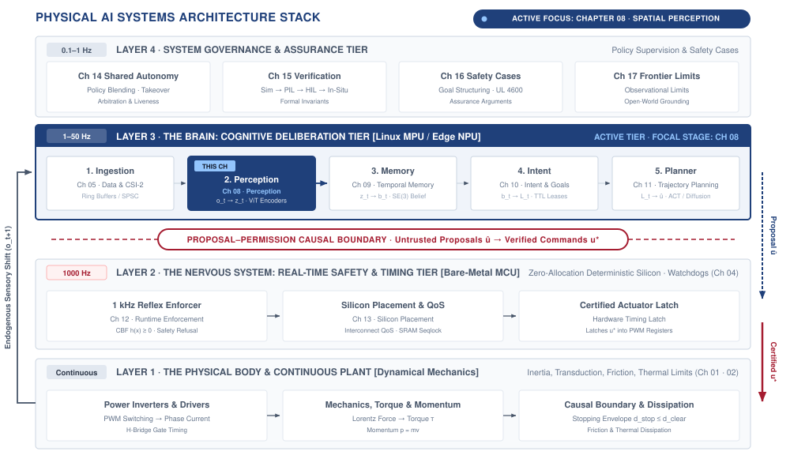
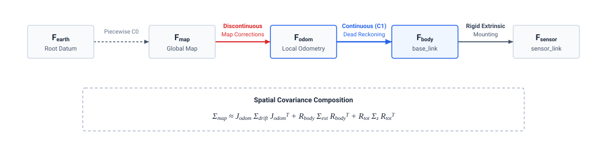
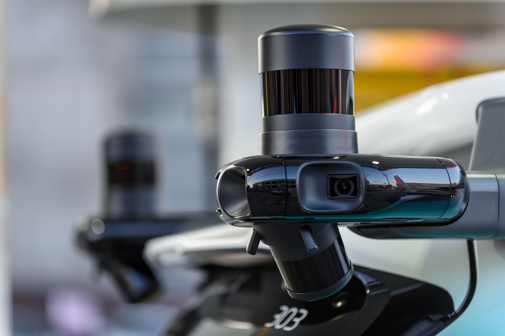
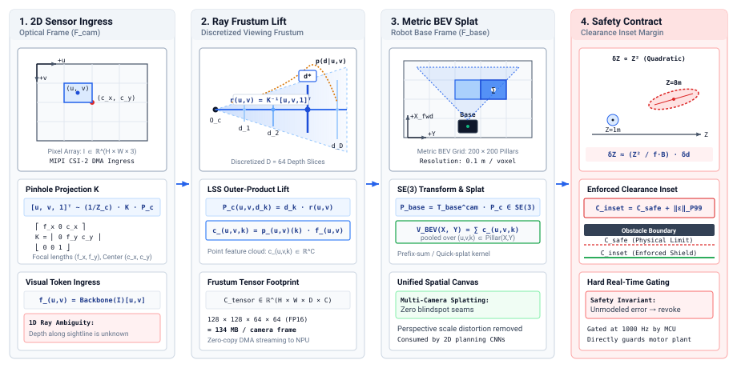
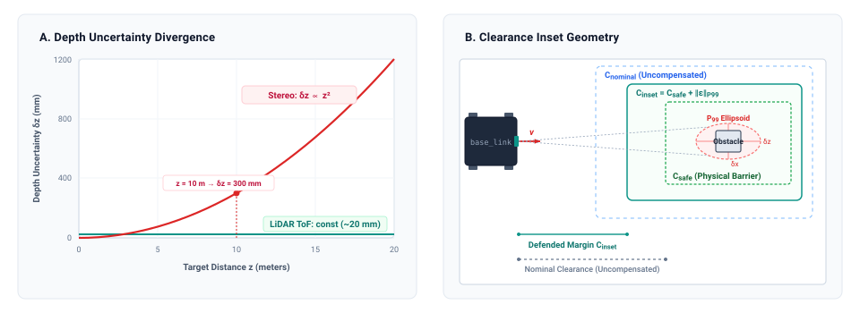
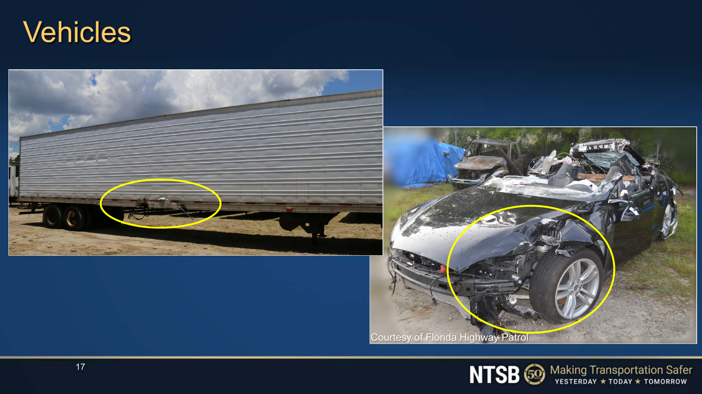

# Sensor Perception {#sec-perception}

::: {.column-margin}

\chapterminitoc

:::

::: {#fig-08-locator fig-env="figure" fig-pos="H" fig-cap="**The Perception Stage in the Physical AI Stack**: The four-tier physical AI systems architecture highlights the cognitive deliberation tier, with perception as the second brain stage and this chapter's active focus. The stage converts raw observations $o_t$ into latent state $z_t$, bounded upstream by sensor transduction it cannot improve and downstream by the memory that must store whatever it infers." fig-alt="Diagram titled Physical AI Systems Architecture Stack, drawn as four stacked tiers. Layer 4 is system governance and assurance at 0.1 to 1 hertz, holding boxes for shared autonomy, verification, safety cases, and frontier limits. Layer 3 is the brain, a cognitive deliberation tier at 1 to 50 hertz, holding five stages named ingestion, perception, memory, intent, and planner. A dashed proposal-permission privilege boundary separates it from layer 2, the nervous system, a real-time safety and timing tier at 1000 hertz. Layer 1 is the physical body and continuous plant. Layer 3 is shaded and its perception stage is outlined; the badge reads Active Focus, Chapter 08, Spatial Perception."}
{width="100%"}
:::

\begin{marginfigure}
\vspace{1em}
\resizebox{\linewidth}{!}{\mlphysicalstackfull{100}{20}{20}{20}{20}}
\end{marginfigure}

*When was this taken, where from, and how wrong might it be?*

An obstacle location is useful for control only when its time, coordinate frame, and uncertainty are known. The world continues moving while a sensor captures an image, transfers it through memory, and waits for a model to interpret it. Even an accurate estimate of the captured scene can describe a position that is no longer current when the controller acts. Calibration errors and vibration introduce a different uncertainty, changing the relationship between a measurement and the physical space it represents. Reporting an object label without those qualifications hides information needed to judge clearance. Perception must therefore preserve when and where an observation originated and communicate the limits of the resulting spatial estimate. Better recognition alone cannot repair stale or poorly calibrated measurements. In physical AI systems architecture, perception connects sensor behavior and processing delay to the geometric claims that the brain uses and the nervous system must evaluate before permitting motion.



::: {.callout-learning-objectives}

- Specify observation records that preserve acquisition time, coordinate frame, and measurement uncertainty
- Calculate information age across the physical sensing, transport, preprocessing, and inference pipeline
- Diagnose spatial errors caused by sensor timing, motion during capture, and misaligned coordinate frames
- Estimate capture bandwidth requirements and their effect on shared memory and computation resources
- Evaluate whether observation uncertainty leaves enough physical clearance for a proposed action
- Distinguish perception failures that runtime checks can detect from errors that remain silent

:::

## Photons to Spatial Claims {#sec-perception-8-1}

A robot can identify an obstacle correctly and still plan around its old position. While the camera frame waits in a buffer and the model processes it, the robot and the obstacle may both move. The evaluation record tells us how the policy behaved under tested conditions; the running machine must preserve the timing and spatial information that made those results meaningful. Part III follows this responsibility through perception, memory, intent, planning, and physical execution. At the perception stage highlighted in @fig-08-locator, the first task is to turn a sensor reading into a spatial claim whose age and uncertainty remain visible to everything that uses it.

::: {#dfn-perception-transduction-actuation-age .callout-definition title="Transduction-to-actuation information age"}

***Transduction-to-actuation information age***\index{Transduction-to-actuation information age!definition}\index{Information age!physical pipeline} is the total physical time elapsed from the midpoint of photon integration or acoustic sensing on a physical transducer to the mechanical current rise in the motor stator windings, defining the true physical freshness of an observation.

:::

A physical architecture can take many concrete shapes. An end-to-end vision-to-action model [@brohan2022rt1; @brohan2023rt2; @zhao2023aloha] maps raw camera bitstreams directly to joint torque commands within a single neural network. A classical modular pipeline partitions that same computation across independent processes for sensor ingestion, state estimation, mapping, trajectory generation, and motor control (a paradigm historically challenged by behavior-based subsumption architectures [@brooks1986subsumption]). While these implementations look entirely distinct on a software architecture diagram, they represent the same machine analyzed at different levels of granularity. Perception, state estimation, spatial reasoning, planning, tracking, and actuation are not mandatory software modules that must run in separate address spaces. As David Marr established in his foundational formulation of computational vision [@marr1982vision], visual perception must be understood across three distinct levels of analysis: the computational theory (what problem the visual system solves and why), representation and algorithm (how sensory inputs are transformed from raw 2D intensity maps into intermediate 2.5D sketches and 3D spatial models), and hardware implementation (how physical silicon, photodiode arrays, and neural circuits physically execute the algorithms). In Physical AI, these responsibilities represent non-negotiable physical tasks that must be discharged somewhere along the signal path between physical stimulus and physical response.[^fn-hist-marr-levels]

When an engineering team combines these responsibilities in an end-to-end model, the responsibilities remain, but their intermediate representations become harder to inspect independently. An explicit interface can expose a coordinate transform for checking, carry an expiration deadline, or let another component reject an inconsistent estimate. A hidden representation requires additional instrumentation or external checks to provide comparable evidence. If perception mistakes a wet-floor reflection for open clearance, the engineer needs a way to detect or contain the resulting error regardless of how many software modules implement the pipeline.

Building on the causal boundary established in @sec-boundary-1-1, the authority boundary for the nervous system remains essential here. Perception, estimation, and nominal trajectory generation may be learned from data, but their evaluation record supplies conditional evidence rather than an invariant for every inference cycle. A separate execution monitor must retain authority to halt the machine, clamp actuator current, or invoke a fallback when the monitored conditions require it. The perception interface must supply usable evidence to that monitor without making protection depend on the learned model recognizing its own errors.

Extending the proposal-permission architecture from @sec-brain-3-1, this division of responsibility is physically embodied in a **dual-brain architecture**\index{Dual-brain architecture!definition}. The high-bandwidth, unprivileged sensory perception stack—ingesting multi-camera streams via Direct Memory Access (DMA)\index{Direct Memory Access (DMA)} ring buffers (circular memory queues where new frames constantly overwrite old ones without taxing the CPU), running hardware image signal processors (ISPs)\index{Image signal processors (ISPs)} (specialized chips that physically convert raw sensor voltages into clean, colored pixels), and evaluating billion-parameter 3D vision foundation models—resides on a high-performance Linux Microprocessor Unit (MPU)\index{Microprocessor Unit (MPU)} or System-on-Chip (SoC)\index{System-on-Chip (SoC)} accelerator. Concurrently, a separate, real-time Microcontroller Unit (MCU)\index{Microcontroller Unit (MCU)} runs deterministic safety monitors, inertial strapdown filters (algorithms that track orientation by mathematically integrating gyro twists rather than using physical gimbals), and control barrier functions\index{Control barrier functions} [@ames2019control] (mathematical force fields that smoothly brake the robot before it violates a safety limit) on bare metal (executing directly on the processor without an operating system to guarantee strict timing). The MPU emits candidate perceptual interpretations and unprivileged motion proposals; the real-time MCU enforces physical clearance invariants and holds the unconditional hardware authority to refuse or override them. That enforcement boundary is the structural invariant that Part III traces from initial sensor ingress down to motor commutators.

That evidence begins where physical energy converts into digital data. From transduction at the detector array to use by a state estimator, every processing stage adds information age. An observation therefore needs an acquisition timestamp, a coordinate frame that places it in physical space, and an uncertainty estimate that describes the limits of the measurement. Object labels, patch embeddings, and surface normals cannot support a clearance decision on their own. Downstream computation must be able to relate them to the machine's current state.

The need for these properties becomes concrete when tracing the latency accumulated across an embedded perception pipeline. Consider an autonomous mobile base operating in an industrial facility at $2.0\text{ m/s}$. Photons striking the photodiode array of a CMOS camera do not instantly appear as feature embeddings in an inference engine. In an analytical breakdown of a typical embedded vision system, the sensor array requires $33\text{ ms}$ for exposure and pixel readout at $30\text{ Hz}$. Direct memory access transfers across a serial bus into system memory add $8\text{ ms}$. Operating system kernel scheduling and driver buffer handling introduce $4\text{ ms}$ of queuing delay. Image debayering (reconstructing full color from a raw checkerboard of red, green, and blue pixels), rectification, and color correction require $5\text{ ms}$ of preprocessing time. Finally, running a vision backbone on an onboard accelerator requires $25\text{ ms}$ at $P_{99}$ latency.

By the time the perception stage yields an observation tensor, $75\text{ ms}$ of total latency have accumulated between photon capture and model consumption. Over that $75\text{ ms}$ window, the vehicle has traversed $0.15\text{ m}$ of physical space. If the perception stage hands downstream components an object detection bounding box without a timestamp and a spatial transform, a downstream planner must evaluate that obstacle relative to the current position of the chassis. It will assume the obstacle sits $0.15\text{ m}$ closer or further than its true current coordinate, steering around a physical ghost or driving directly into an obstacle that moved into its trajectory during the processing interval. Downstream software cannot safely consume a perception output that does not explicitly declare when it was captured, what coordinate system it references, and how wide its error distribution remains.

::: {#dfn-perception-spatial-information-age .callout-definition title="Spatial information age"}

**spatial information age**\index{Spatial information age!definition}\index{Information age!definition} ($\tau_{\text{age}}$) is the total elapsed physical time between the physical energy integration midpoint ($t_{\text{exp}}/2$) at the transducer and the downstream consumption of the resulting observation tensor by a state estimator or control policy.

1.  **Significance**: Because physical mass moves while digital computation executes, sensory latency translates directly into unmodeled spatial displacement:
    $$\Delta \mathbf{x} = \int_{t_0}^{t_0+\tau_{\text{age}}} \mathbf{v}(t)\,dt$$
    This continuous physical shift depletes geometric safety buffers before an obstacle is even classified.
2.  **Distinction**: Unlike software pipeline latency (wall-clock duration of a forward pass), spatial information age accounts for the full physical journey: photon exposure time, rolling shutter readout, SERDES\index{SERDES} bus transport (serializer/deserializer links that squeeze massive pixel arrays through a few high-speed wires), ISP debayering, OS buffer queuing, and neural tokenization.
3.  **Common pitfall**: Treating the frame arrival timestamp ($t_{\text{recv}}$) in userspace memory as the observation time ($t_0$). Using arrival time hides upstream capture and transport delays, introducing severe phase lag and high-frequency tracking instability into feedback controllers.

:::

Information age becomes useful to downstream components only when it travels with the observation. The perception interface must package that timing together with geometry and uncertainty so that another component can assess the claim before acting on it.

## What Perception Hands Over {#sec-perception-8-2}

Raw sensor hardware yields electrical measurements such as photodiode voltages, time-of-flight counter values, or capacitive displacements. These unstructured signals bear little resemblance to the state variables required by downstream autonomy. An actuator controller cannot track a desired force using a two-dimensional grid of raw pixel intensities, and a trajectory optimizer cannot plan collision-free paths using unorganized time-of-flight returns. Downstream estimation, planning, and memory subsystems require structured representations of physical state, including metric positions, velocities, bounding volumes, surface normals, and semantic classifications. Translating raw sensor streams into these representations is the operational responsibility of the perception pipeline. However, downstream consumers cannot safely interpret a perceived state without explicit metadata that anchors the measurement in physical reality. To be consumable by downstream software, an observation must carry three formal properties, comprising a capture timestamp, an assigned reference frame, and an uncertainty envelope.

The first mandatory property is the **capture timestamp**\index{Capture timestamp!definition} $t_0$, which specifies the temporal midpoint of the physical energy integration window (the effective moment the camera shutter was open or the laser pulse fired). Sensors do not take instantaneous snapshots; a camera integrates photons across an exposure duration, and a mechanical lidar sweeps laser pulses over an azimuth arc across several milliseconds. Downstream state estimators require $t_0$ to integrate the measurement into the machine's dynamic equations of motion. A common architectural failure in embedded systems is recording the arrival timestamp $t_{\text{recv}}$, the moment the operating system kernel completes the direct memory access transfer, and passing $t_{\text{recv}}$ downstream as the observation epoch. Building on the causal boundary established in @sec-boundary-1-1, pipeline execution, serial bus transfers, and driver scheduling introduce a transport delay $\tau = t_{\text{recv}} - t_0$; substituting arrival time for capture time corrupts the state estimator.

The magnitude of this corruption is a direct function of platform kinematics. Consider a vehicle traversing a trajectory with instantaneous velocity $v(t)$. When an observation taken at $t_0$ is evaluated by a downstream filter at $t_{\text{recv}}$, the physical state of the machine has shifted. The resulting spatial tracking error $\Delta x$ is the integral of the platform velocity over the transport delay, $\Delta x = \int_{t_0}^{t_0+\tau} v(t)\,dt$. In an analytical case of constant linear velocity $v$, this relationship simplifies to $\Delta x = v \cdot \tau$. As seen in the Tempe crash analysis (@sec-boundary-1-6), for a mobile robot traveling at $v = 3.0\text{ m/s}$ subject to an end-to-end perception delay $\tau = 80\text{ ms}$, treating the arrival time as the measurement time shifts the perceived obstacle boundary by $\Delta x = 0.24\text{ m}$. In closed-loop tracking, feeding delayed observations without timestamp compensation introduces a phase lag into the feedback path. Because the controller is reacting to where the robot was rather than where it is, it continuously overcorrects. This phase lag erodes the phase margin of the controller, driving the physical system toward oscillatory tracking errors or complete mechanical divergence.

The second mandatory property is the **reference frame**\index{Reference frame!definition} identifier $\mathcal{F}_{\text{sensor}}$. Every spatial measurement is natively resolved in the local coordinate system of the physical transducer. A camera measures bearing angles relative to its optical center, while a radar measures range and Doppler velocity relative to its antenna array. Downstream trajectory planners and obstacle maps operate in a chassis body frame $\mathcal{F}_{\text{body}}$ or an inertial navigation frame $\mathcal{F}_{\text{world}}$. Transforming an observation from $\mathcal{F}_{\text{sensor}}$ to $\mathcal{F}_{\text{body}}$ requires applying a rigid-body spatial transformation consisting of a rotation matrix and a translation vector that define the sensor mounting extrinsics (the exact physical location and orientation where the sensor is bolted onto the machine).[^fn-std-rep105-frames] Across the three machine archetypes, this spatial binding takes distinct physical forms: in Mobile Systems, $\mathcal{F}_{\text{body}}$ represents the mobile chassis `base_link` tracking through an odometric frame `odom`; in Manipulator Systems, it maps across serial kinematic chains from the mounting flange `tool0` through articulated joint angles to the base origin `base_link`; in Process / Energy Systems, it maps local pyrometry or laser galvanometer scan coordinates to the fixed workcell or reactor vessel datum $\mathcal{F}_{\text{vessel}}$. As structured in the coordinate frame transformation tree (@fig-08-coordinate-frame-tree), the standard spatial hierarchy formalizes this spatial progression by nesting coordinate frames: $\mathcal{F}_{\text{earth}} \to \mathcal{F}_{\text{map}} \to \mathcal{F}_{\text{odom}} \to \mathcal{F}_{\text{body}} \to \mathcal{F}_{\text{sensor}}$. When perception outputs omit the frame identifier or rely on nominal CAD dimensions rather than calibrated physical extrinsics, small angular offsets create large spatial errors that scale with distance. An uncalibrated pitch or yaw error of $\theta = 1.0^\circ$ on a sensor detecting an object at a range $d = 15.0\text{ m}$ induces a transverse position error of $\Delta y \approx d \cdot \sin(1.0^\circ) \approx 0.26\text{ m}$. In tight warehouse aisles or cluttered physical environments, a lateral error of $0.26\text{ m}$ causes the planner to steer into physical racking or reject valid corridors as obstructed.

The formal mathematical specifications, continuity classes, and covariance growth characteristics of the **REP 105 spatial transform tree**\index{REP 105 spatial transform tree!definition} are codified in @tbl-08-rep105-tree. By establishing explicit parent-child relations and separating continuous dead reckoning from discontinuous global localization, this acyclic kinematic coordinate hierarchy ($\mathcal{F}_{\text{earth}} \to \mathcal{F}_{\text{map}} \to \mathcal{F}_{\text{odom}} \to \mathcal{F}_{\text{body}} \to \mathcal{F}_{\text{sensor}}$) ensures that high-frequency control loops and downstream state estimators maintain mathematically consistent reference origins without incurring step-discontinuity shocks.

| Coordinate Frame ($\mathcal{F}$)              | Parent Frame  | Continuity Class             | Estimator Source                                        | Covariance Growth Dynamic ($\mathbf{\Sigma}(t)$)                                                                                                                            | Permitted Downstream Consumers                                                     | Step-Discontinuity & Safety Policy                                                             |
|:----------------------------------------------|:--------------|:-----------------------------|:--------------------------------------------------------|:----------------------------------------------------------------------------------------------------------------------------------------------------------------------------|:-----------------------------------------------------------------------------------|:-----------------------------------------------------------------------------------------------|
| `earth` ($\mathcal{F}_{\text{earth}}$)        | *None* (Root) | Piecewise $C^0$              | Multi-band GNSS / RTK / Geodetic survey                 | Bounded absolute error: $\sigma \approx 0.02\text{--}5.0\text{ m}$ depending on RTK carrier lock                                                                            | Global mission routing, statutory geofencing                                       | Step jumps on satellite re-acquisition; **forbidden** in closed-loop control                   |
| `map` ($\mathcal{F}_{\text{map}}$)            | `earth`       | Piecewise $C^0$              | Global LiDAR/Visual SLAM, landmark factor graphs        | Bounded global variance; discrete contraction on loop closure: $\mathbf{\Sigma} \leftarrow (\mathbf{\Sigma}^{-1} + \mathbf{H}^T\mathbf{R}^{-1}\mathbf{H})^{-1}$             | Global path planners, topological graph search                                     | Loop closure induces instantaneous coordinate shifts; **forbidden** in high-rate tracking      |
| `odom` ($\mathcal{F}_{\text{odom}}$)          | `map`         | Strictly $C^1$               | Wheel encoders, Visual-Inertial Odometry, IMU strapdown | Unbounded monotonic drift: $\mathbf{\Sigma}_{\text{odom}}(t) \propto t$; short-term variance minimal ($\sigma_{\Delta p} < 1\text{ mm}$ over $100\text{ ms}$)               | High-rate trajectory tracking, MPC, Control Barrier Functions, velocity estimation | Transform must remain strictly continuous; discrete jumps are treated as catastrophic faults   |
| `base_link` ($\mathcal{F}_{\text{body}}$)     | `odom`        | $C^\infty$ (Rigid)           | Platform kinematic definition / center of mass          | Identity variance relative to structural mass ($\mathbf{\Sigma}_{\text{base}} = \mathbf{0}_{6\times 6}$)                                                                    | Forward/inverse kinematics, swept-volume collision checking, CoM balance           | Fixed origin; updates solely via kinematic joint state and dynamic integration                 |
| `sensor_link` ($\mathcal{F}_{\text{sensor}}$) | `base_link`   | $C^\infty$ (or $C^1$ gimbal) | Optical/RF CAD calibration + online extrinsic estimator | Extrinsic covariance $\mathbf{\Sigma}_{\text{mount}} \in \mathbb{R}^{6\times 6}$; expands under thermal expansion ($\alpha = 23\times 10^{-6}\text{ K}^{-1}$) and vibration | Perception unprojection, raycasting, optical flow extraction                       | Extrinsic drift must be continuously bounded; unprojected points must transform to `base_link` |

: **REP 105 Spatial Transform Tree Standard and Covariance Propagation Parameters**: System-wide coordinate frame hierarchy defining parent-child transform relationships, temporal continuity classes, estimation sources, and covariance dynamics per ROS Enhancement Proposal 105 (REP 105) and Smith--Cheeseman spatial uncertainty principles [@smith1986estimating]. The architecture enforces a strict decoupling between discontinuous global map relocalization (`map`) and smooth, continuous dead reckoning (`odom`), guaranteeing that inner-loop trajectory controllers and safety barrier functions never encounter mathematical step discontinuities during loop-closure corrections. {#tbl-08-rep105-tree tbl-colwidths="[14,14,14,16,14,14,14]"}

::: {#fig-08-coordinate-frame-tree fig-env="figure" fig-pos="t" fig-cap="**REP 105 Spatial Transform Tree and Uncertainty Composition**: The spatial coordinate frame hierarchy formalizes the separation between continuous local dead reckoning ($\mathcal{F}_{\text{odom}} \to \mathcal{F}_{\text{body}}$) consumed by high-frequency tracking loops and discontinuous global map corrections ($\mathcal{F}_{\text{map}} \to \mathcal{F}_{\text{odom}}$) consumed by global planners. Spatial covariance compounds across the kinematic chain ($\mathbf{\Sigma}_{\text{map}} \approx \mathbf{J}_{\text{odom}}\mathbf{\Sigma}_{\text{drift}}\mathbf{J}_{\text{odom}}^T + \mathbf{R}_{\text{body}}\mathbf{\Sigma}_{\text{ext}}\mathbf{R}_{\text{body}}^T + \mathbf{R}_{\text{tot}}\mathbf{\Sigma}_z\mathbf{R}_{\text{tot}}^T$), requiring downstream consumers to reject observations that lack an explicit coordinate key $\mathcal{F}_{\text{sensor}}$, acquisition epoch $t_0$, and covariance envelope $\mathbf{\Sigma}_z$. Attribution: Book kinematic systems diagram, CC BY 4.0." fig-alt="REP 105 Spatial Transform Tree and Uncertainty Composition. The spatial coordinate frame hierarchy formalizes the separation between continuous local dead reckoning (Fodom -> Fbody) consumed by high-frequency tracking loops and discontinuous global map corrections (Fmap -> Fodom) consumed by global planners. Spatial covariance compounds across the kinematic chain (Sigmamap approx. JodomSigmadriftJodom^T + RbodySigmaextRbody^T + RtotSigmazRtot^T), requiring downstream consumers to reject observations that lack an explicit coordinate key Fsensor, acquisition epoch t0, and covariance envelope Sigmaz. Attribution: Book kinematic systems diagram, CC BY 4.0."}
{width="95%"}
:::

The third mandatory property is the **uncertainty envelope**\index{Uncertainty envelope!definition} $\mathbf{\Sigma}_z$. A physical measurement without a variance is an assertion of absolute certainty. Environmental degradation such as low illumination, atmospheric scattering, surface specularities, and model epistemic uncertainty mean that perception outputs are stochastic estimates. The uncertainty envelope $\mathbf{\Sigma}_z$, parameterized as a covariance matrix over the observation dimensions, bounds the spread of the measurement error, effectively describing a fuzzy physical bubble where the true state is statistically likely to exist. State estimators such as Kalman filters and nonlinear factor graph optimizers rely on $\mathbf{\Sigma}_z$ to weight sensory innovations against the internal dynamic model of the body. If perception hands over an observation without $\mathbf{\Sigma}_z$, downstream algorithms must assume a static noise parameter or treat the measurement as ground truth. When the physical sensor degrades, treating a noisy or out-of-distribution perception output as certain forces the optimizer to pull state estimates toward spurious measurements. The resulting high-frequency corrections propagate directly to motor drives, causing severe torque chatter, rapid thermal rise in actuator windings (as detailed in @sec-body-2-1), and mechanical wear.

::: {#psp-perception-observation-invariants .callout-perspective title="The three invariants of observation"}
Never pass a perception tensor downstream without an acquisition timestamp latched at the exposure midpoint, an unambiguous coordinate frame identifier, and an explicit spatial uncertainty covariance matrix.
:::

These three properties define the **perception handoff contract**\index{Perception handoff contract!definition}, the formal interface invariant between perception and the remainder of the autonomy stack. Downstream state estimators, planners, and safety watchdogs must reject any observation packet that lacks an explicit capture timestamp $t_0$, a verified coordinate frame $\mathcal{F}_{\text{sensor}}$, and an uncertainty covariance $\mathbf{\Sigma}_z$. Dropping an incomplete or unbounded observation allows a downstream estimator to propagate its state forward using physical dynamics, degrading uncertainty smoothly over time. Accepting an ungrounded packet, by contrast, injects unmodeled delays, spatial distortions, and false confidence directly into the control loop. Enforcing this contract requires tracing how an observation originates, beginning at the hardware interface where physical phenomena are first sampled.

## Transduction, Hardware Sampling, and Temporal Calibration {#sec-perception-8-3}

Lag accumulates before software receives anything at all, beginning at the photosite where physical phenomena are converted into electrical charge. A camera does not capture an instantaneous snapshot of the physical world. Photons collect on a photodiode over a finite exposure duration $t_{\text{exp}}$, which means the recorded pixel intensity represents the temporal integral of scene radiance $I(t)$ over that interval:
$$I_{\text{pixel}} = \int_{0}^{t_{\text{exp}}} I(t)\,dt$$
When the sensor or the observed environment moves at velocity $v$ during exposure, a sharp physical boundary—such as a rigid door frame—smears across multiple photosites. The resulting motion blur width in the direction of motion is given by $\Delta x_{\text{blur}} = v \cdot t_{\text{exp}}$. Because light accumulates continuously across the exposure window, the effective point in time that corresponds to the accumulated charge is the temporal midpoint of the interval, introducing an unavoidable physical measurement lag of $t_{\text{exp}}/2$ relative to the start of exposure.

### Rolling shutter distortion and motion compensation

How that exposure window is scheduled across the pixel array determines the spatial geometry of the resulting image. In a **global shutter**\index{Global shutter!definition} sensor, every pixel photodiode accumulates charge during the identical time interval and transfers the accumulated electrons to shielded storage nodes simultaneously. In a **rolling shutter**\index{Rolling shutter!definition} sensor, silicon area and cost constraints dictate that rows are reset, exposed, and read out sequentially from the top scanline $y = 0$ to the bottom scanline $y = H - 1$. Each successive scanline begins exposure after a row period $t_{\text{row}}$, creating a progressive temporal offset across the image plane:[^fn-hw-rolling-shutter]
$$t(y) = t_0 + y \cdot t_{\text{row}}$$
where $t_0$ is the start of exposure for the top row. When the body translates at linear velocity $v$ perpendicular to an observed vertical feature, scanline $y$ captures that feature at a spatial displacement:
$$\Delta x(y) = v \cdot y \cdot t_{\text{row}}$$

Under rotational motion, rolling shutter distortion becomes non-linear. If the camera undergoes angular rotation at angular velocity vector $\boldsymbol{\omega} = [\omega_x, \omega_y, \omega_z]^T$ (e.g., rapid yaw or pitch during aggressive robot maneuvers), the effective camera attitude changes continuously as scanlines are read. Physically, the camera points in a slightly different direction for every single row. For a scanline at vertical coordinate $y$, the differential rotation relative to the frame start is $\Delta \boldsymbol{\theta}(y) \approx \boldsymbol{\omega} \cdot y \cdot t_{\text{row}}$. This scanline-dependent rotation warps straight physical lines into curves, induces focal-length dilation (scaling distortion during pitch), and shears vertical walls into slanted surfaces, as demonstrated by the propeller blade curvature in @fig-rolling-shutter-skew.

As an analytical example, consider a ground robot traversing an aisle at $v = 3.0\text{ m/s}$ equipped with a rolling shutter camera operating at $30\text{ Hz}$ with vertical resolution $H = 1080\text{ rows}$. If the active readout time across all rows is $t_{\text{readout}} = 33.3\text{ ms}$, the inter-row readout interval is $t_{\text{row}} = 33.3\text{ ms} / 1080 \approx 30.8\,\mu\text{s}$. A vertical pallet edge spanning the full height of the frame does not appear vertical in the captured array. The bottom scanline ($y = 1079$) is sampled $33.3\text{ ms}$ after the top scanline ($y = 0$), producing a total physical spatial skew of:
$$\Delta x = 3.0\text{ m/s} \times 0.0333\text{ s} \approx 0.10\text{ m} = 100\text{ mm}$$
With an exposure duration of $t_{\text{exp}} = 10.0\text{ ms}$, each individual scanline also suffers a motion blur width of $\Delta x_{\text{blur}} = 3.0\text{ m/s} \times 0.010\text{ s} = 0.03\text{ m} = 30\text{ mm}$. If downstream geometry reconstruction treats this image as an instantaneous rigid projection, the perceived $100\text{ mm}$ tilt causes the motion planner to identify an artificial intrusion into the free corridor. Correcting this distortion requires **rolling-shutter motion compensation**\index{Rolling-shutter motion compensation!definition}, the continuous-time geometric unwarping algorithm that utilizes high-rate ($1000\text{ Hz}$) inertial angular velocities ($\boldsymbol{\omega}$) and linear velocities ($\mathbf{v}$) to interpolate the instantaneous 6-DoF camera pose $\mathbf{T}_{wb}(t(y))$ for each individual scanline $y$, restoring rigid epipolar geometry prior to 3D triangulation.

::: {#fig-rolling-shutter-skew fig-env="figure" fig-pos="t" fig-cap="**Empirical rolling shutter distortion caused by progressive scanline exposure**: A photograph of rotating propeller blades captured by a rolling shutter CMOS sensor. Because sensor scanlines are exposed and read sequentially from top to bottom rather than simultaneously, the rapid physical movement of the blades relative to the row period ($t_{\text{row}}$) shears and curves straight rigid structures into non-linear, disconnected geometric arcs. In high-speed embodied systems, uncompensated rolling shutter skew introduces catastrophic 3D triangulation errors and phantom obstacle intrusion in downstream visual-inertial odometry. (Credit: Wikimedia Commons, CC BY-SA 3.0)." fig-alt="Empirical rolling shutter distortion caused by progressive scanline exposure. A photograph of rotating propeller blades captured by a rolling shutter CMOS sensor. Because sensor scanlines are exposed and read sequentially from top to bottom rather than simultaneously, the rapid physical movement of the blades relative to the row period shears and curves straight rigid structures into non-linear, disconnected geometric arcs. In high-speed embodied systems, uncompensated rolling shutter skew introduces catastrophic 3D triangulation errors and phantom obstacle intrusion in downstream visual-inertial odometry. (Credit: Wikimedia Commons, CC BY-SA 3.0)."}
{width="85%"}
:::

### MIPI CSI-2 DMA ingress on the Linux MPU

Once analog-to-digital converters on the sensor die digitize the pixel charges, the frame must travel across a physical interconnect to host memory. Extending the heterogeneous SoC proposal-permission architecture from @sec-brain-3-1, camera streams enter the unprivileged application processor (Linux MPU) via the **Mobile Industry Processor Interface Camera Serial Interface (MIPI CSI-2)**\index{Mobile Industry Processor Interface Camera Serial Interface (MIPI CSI-2)!definition} bus.[^fn-hw-mipi-csi]

::: {#psp-perception-silicon-ingestion-dataflow-architecture .callout-perspective title="Silicon ingestion dataflow architecture"}
1. **D-PHY / C-PHY Physical Layer**: Differential data lanes transmit high-speed serialized pixel packets ($1.5\text{--}2.5\text{ Gbps}$ per lane), protected by header error correction.
2. **SoC CSI-2 Host Controller**: Deserializes byte packets, strips headers, and validates CRC integrity.
3. **Scatter-Gather DMA Controller**: A dedicated DMA engine transfers pixel byte words directly into DRAM over the internal system interconnect (e.g., AXI crossbar).
4. **Kernel DMA Ring Buffers**: Under Linux (`v4l2`), the driver allocates pre-mapped non-cacheable DMA buffers (`V4L2_MEMORY_MMAP`). The DMA populates pages without user-space copies.
:::

Once DMA write completion occurs, the kernel driver issues an interrupt.[^fn-hw-v4l2-dma] Pointers to these contiguous memory regions are shared as zero-copy file descriptors (`dma_buf`) directly with the hardware Image Signal Processor (ISP) and Neural Processing Unit (NPU), bypassing CPU memory bus hops. Physically, the pixel data never moves; the operating system simply hands a memory map to the accelerators, avoiding the latency of copying video frame data byte-by-byte. By contrast, interfaces relying on Universal Serial Bus (USB3) or GigE Vision over Ethernet package pixel streams into discrete packets, incurring frame assembly, kernel network stack traversal, and driver memory copies that inflate transport latency from $t_{\text{transport}} < 0.5\text{ ms}$ (MIPI CSI-2) up to $5\text{--}20\text{ ms}$ (USB3/GigE), with tail latencies exceeding $P_{99} > 35\text{ ms}$ under CPU thread scheduling contention.

### Camera intrinsic calibration and planar homographies

Before multi-sensor spatial or temporal calibration can occur, each optical sensor requires intrinsic calibration to model the projective geometry mapping continuous 3D rays to discrete 2D pixel coordinates. Following the classic **pinhole camera model**\index{Pinhole camera model!definition} [@hartley2003multiple], a metric 3D point in camera coordinates projects to pixel coordinates via the camera intrinsic matrix, scaling by inverse depth.[^fn-math-intrinsic-projection] Real optical assemblies introduce significant radial and tangential lens distortion ($k_1, k_2, p_1, p_2$), warping straight physical lines into curves. The universal industry-standard methodology for recovering these intrinsic parameters and distortion coefficients was formulated by Zhang [@zhang2000flexible]. By imaging a planar calibration target (such as a precision checkerboard or AprilTag grid) from multiple arbitrary, unconstrained orientations, Zhang demonstrated that each view establishes geometric constraints. These constraints allow the system to solve for the intrinsic parameters and use mathematical optimization to minimize reprojection error across all corners.[^fn-math-zhang-homography]

### Camera-to-IMU temporal and extrinsic calibration

Visual perception does not operate in isolation; it functions alongside an Inertial Measurement Unit (IMU) running at high frequencies ($1000\text{ Hz}$). Fusing high-rate angular velocity $\boldsymbol{\omega}$ and linear acceleration $\mathbf{a}$ from the IMU with low-rate visual frames ($30\text{--}60\text{ Hz}$) in **Visual-Inertial Odometry (VIO)**\index{Visual-Inertial Odometry (VIO)!definition} requires rigorous spatial and temporal calibration [@furgale2013unified; @li2014online; @forster2017onmanifold].

The spatial relationship between the IMU reference frame $\mathcal{F}_{\text{imu}}$ and the camera reference frame $\mathcal{F}_{\text{cam}}$ is defined by a rigid extrinsic transformation. Because the camera and IMU are physically separated by a lever arm, any angular acceleration or angular velocity experienced by the robot's body acts like a swinging pendulum, inducing additional tangential and centripetal acceleration at the camera.[^fn-math-lever-arm]

Equally critical is the **temporal calibration offset**\index{Temporal calibration offset!definition} $\tau_{\text{cam-imu}} = t_{\text{cam}} - t_{\text{imu}}$. Standard commercial crystal oscillators on independent sensor breakout boards drift by roughly $\pm 50\text{ ppm}$, accumulating $50\,\mu\text{s}$ of error every second ($4.3\text{ s}$ per day). Moreover, analog anti-aliasing filters in the IMU, electronic exposure delays in the camera, and DMA driver scheduling inject fixed and variable temporal offsets between the two data streams.

If the temporal offset $\Delta t$ is uncalibrated, platform rotation couples directly into catastrophic spatial estimation errors. Suppose a robot rotates at an angular velocity of $\omega = 2.0\text{ rad/s}$ ($115^\circ/\text{s}$). An undetected temporal lag of $\Delta t = 10\text{ ms}$ between the camera frame and the IMU integration causes a rotational orientation mismatch of:
$$\Delta \theta = \omega \cdot \Delta t = 2.0\text{ rad/s} \times 0.010\text{ s} = 0.020\text{ rad} \approx 1.15^\circ$$
At an operating distance of $z = 10.0\text{ m}$, this angular misalignment projects into a transverse spatial error of:
$$\Delta p \approx z \cdot \Delta \theta = 10.0\text{ m} \times 0.020\text{ rad} = 0.20\text{ m} = 200\text{ mm}$$
This artificial $200\text{ mm}$ displacement corrupts visual feature triangulation, causing visual-inertial estimators to compute false scale factors and driving the filter toward mathematical divergence. Eliminating these timing errors requires hardware-level synchronization: a hardware GPIO trigger strobe latches exposure start times across all cameras and IMU sampling registers simultaneously,[^fn-hw-tim-pwm] while online continuous-time calibration algorithms estimate residual sub-millisecond offsets $\tau_{\text{cam-imu}}$ within the joint factor graph [@furgale2013unified]. As shown in the physical multi-modal perception pod in @fig-08-sensor-suite, co-locating multiple high-resolution cameras and LiDAR modules on a rigid vehicle bracket requires routing these deterministic hardware sync strobes alongside high-speed GMSL2/FPD-Link serializer links to bound clock drift and transport latency across all sensing channels.

**Camera-to-IMU spatial-temporal calibration**\index{Camera-to-IMU spatial-temporal calibration!definition} is the joint determination of the rigid 6-DoF extrinsic transformation $\mathbf{T}_{\text{imu}}^{\text{cam}} \in SE(3)$ and the temporal latency offset $\tau_{\text{cam-imu}} = t_{\text{cam}} - t_{\text{imu}}$, bounding lever-arm centripetal accelerations and rotational misalignment errors ($\Delta p \approx z \omega \Delta t$) during dynamic motion.

::: {#fig-08-sensor-suite fig-env="figure" fig-pos="t" fig-cap="**Physical Multi-Modal Perception Sensor Suite on an Autonomous Testbed**: An integrated perception pod carrying HDR cameras of several focal lengths beside solid-state and spinning LiDAR on a rigid machined bracket. Every transducer defines its own reference frame, so the bracket's job is not mounting but geometric stability: an angular deviation $\theta$ projects into a lateral error of roughly $d \cdot \sin\theta$ at range, which is why extrinsic calibration, thermal compensation, and microsecond sync lines are structural rather than optional. Attribution: Open-source robotics testbed platform, CC BY-SA 4.0." fig-alt="Physical Multi-Modal Perception Sensor Suite on an Autonomous Testbed. Close-up view of an integrated perception pod mounted on an autonomous vehicle chassis. The assembly houses multiple high-dynamic-range CMOS cameras with distinct focal lengths and fields of view alongside solid-state and spinning time-of-flight LiDAR modules on a rigid machined aluminum mounting bracket. Each physical transducer defines its own local reference frame (Fsensor), requiring precise extrinsic geometric calibration (Tsensor->body) and thermal compensation to prevent angular deviations (theta) from projecting into severe lateral errors (Delta y approx. d * sintheta) at operating distance. Shielded coaxial serializers (GMSL2/FPD-Link) and dedicated hardware sync lines route synchronized microsecond triggers to prevent inter-sensor phase skew. Attribution: Open-source robotics testbed platform, CC BY-SA 4.0."}
{width="85%"}
:::

### The latency waterfall

Summing these physical stages yields the total age of the sensory data as it cascades through the perception pipeline. That information age is governed by the **latency waterfall**\index{Latency waterfall!definition}:
$$t_{\text{age}} = \frac{t_{\text{exp}}}{2} + t_{\text{readout}} + t_{\text{transport}} + t_{\text{DMA}} + t_{\text{ISP}} + t_{\text{backbone}} + t_{\text{IPC}}$$

```{python}
#| echo: false
from mlsysim import *
from mlsysim.core.units import *
from mlsysim.fmt import (
    fmt_latency,
    fmt_length,
    fmt_qty,
    fmt_time,
    fmt_display_math,
    check,
)

class SensorInformationAge:
    """Sensor transduction latency waterfall and spatial information age across machine archetypes."""

    # LOAD
    t_exp_half = 8.0 * millisecond
    t_readout = 16.6 * millisecond
    t_transport = 0.8 * millisecond
    t_dma = 1.2 * millisecond
    t_isp = 2.5 * millisecond
    t_backbone = 22.0 * millisecond
    t_ipc = 0.5 * millisecond

    v_amr = 2.5 * (meter / second)
    v_arm = 1.8 * (meter / second)
    v_melt = 0.8 * (meter / second)

    # EXECUTE
    tau_age = t_exp_half + t_readout + t_transport + t_dma + t_isp + t_backbone + t_ipc
    dx_amr = (v_amr * tau_age).to(meter)
    dx_arm = (v_arm * tau_age).to(meter)
    dx_melt = (v_melt * tau_age).to(meter)

    # GUARD
    check(abs(tau_age.to(millisecond).magnitude - 51.6) < 0.01, f"Unexpected tau_age: {tau_age}")
    check(abs(dx_amr.to(meter).magnitude - 0.129) < 0.001, f"Unexpected dx_amr: {dx_amr}")
    check(abs(dx_arm.to(meter).magnitude - 0.0929) < 0.001, f"Unexpected dx_arm: {dx_arm}")
    check(abs(dx_melt.to(meter).magnitude - 0.0413) < 0.001, f"Unexpected dx_melt: {dx_melt}")

    # OUTPUT
    t_exp_half_str = fmt_latency(t_exp_half, unit=millisecond, precision=0)
    t_readout_str = fmt_latency(t_readout, unit=millisecond, precision=1)
    t_transport_str = fmt_latency(t_transport, unit=millisecond, precision=1)
    t_dma_str = fmt_latency(t_dma, unit=millisecond, precision=1)
    t_isp_str = fmt_latency(t_isp, unit=millisecond, precision=1)
    t_backbone_str = fmt_latency(t_backbone, unit=millisecond, precision=0)
    t_ipc_str = fmt_latency(t_ipc, unit=millisecond, precision=1)
    tau_age_str = fmt_latency(tau_age, unit=millisecond, precision=1)
    tau_age_s_str = fmt_time(tau_age.to(second), 'second', precision=4)

    v_amr_str = fmt_qty(v_amr, meter / second, precision=1)
    dx_amr_m_str = fmt_length(dx_amr, unit=meter, precision=3)
    dx_amr_mm_str = fmt_length(dx_amr.to(ureg.millimeter), unit=ureg.millimeter, precision=0)

    v_arm_str = fmt_qty(v_arm, meter / second, precision=1)
    dx_arm_m_str = fmt_length(dx_arm, unit=meter, precision=4)
    dx_arm_mm_str = fmt_length(dx_arm.to(ureg.millimeter), unit=ureg.millimeter, precision=1)

    v_melt_str = fmt_qty(v_melt, meter / second, precision=1)
    dx_melt_m_str = fmt_length(dx_melt, unit=meter, precision=4)
    dx_melt_mm_str = fmt_length(dx_melt.to(ureg.millimeter), unit=ureg.millimeter, precision=1)

    tau_age_display_math = fmt_display_math(
        rf"\tau_{{\text{{age}}}} = {t_exp_half_str} + {t_readout_str} + {t_transport_str} + {t_dma_str} + {t_isp_str} + {t_backbone_str} + {t_ipc_str} = {tau_age_str}"
    )
    dx_amr_display_math = fmt_display_math(rf"\Delta x_{{\text{{AMR}}}} = ({v_amr_str}) \times ({tau_age_s_str}) = {dx_amr_m_str} = {dx_amr_mm_str}")
    dx_arm_display_math = fmt_display_math(rf"\Delta x_{{\text{{arm}}}} = ({v_arm_str}) \times ({tau_age_s_str}) = {dx_arm_m_str} = {dx_arm_mm_str}")
    dx_melt_display_math = fmt_display_math(
        rf"\Delta x_{{\text{{melt}}}} = ({v_melt_str}) \times ({tau_age_s_str}) = {dx_melt_m_str} = {dx_melt_mm_str}"
    )
```

::: {#nbk-perception-sensor-transduction-latency-spatial-information-age .callout-notebook title="Sensor transduction latency and spatial information age budget"}
*The scenario.* An embodied platform navigates a dynamic workspace. We evaluate the cumulative information age $\tau_{\text{age}}$ across the complete sensory-to-inference pipeline and compute the resulting unmodeled physical displacement $\Delta x = v \cdot \tau_{\text{age}} + \frac{1}{2} a \cdot \tau_{\text{age}}^2$ across three distinct physical machine archetypes.

**Stage-by-Stage Latency Waterfall**:

1. *Exposure Integration Midpoint ($t_{\text{exp}}/2$):* CMOS camera running at $30\text{ Hz}$ with auto-exposure $t_{\text{exp}} = 16.0\text{ ms} \implies \Delta t_1 =$ `{python} SensorInformationAge.t_exp_half_str`.
2. *Rolling Shutter Line Readout ($t_{\text{readout}}$):* Column parallel ADC scanning across 1080 rows $\implies \Delta t_2 =$ `{python} SensorInformationAge.t_readout_str` (average scanline).
3. *MIPI CSI-2 Serialization & Transport ($t_{\text{transport}}$):* 4-lane D-PHY at $2.5\text{ Gbps/lane} \implies \Delta t_3 =$ `{python} SensorInformationAge.t_transport_str`.
4. *DMA Ingress & Kernel V4L2 Buffer Queue ($t_{\text{DMA}}$):* Scatter-gather DRAM write and driver interrupt $\implies \Delta t_4 =$ `{python} SensorInformationAge.t_dma_str`.
5. *Hardware ISP Debayering & Rectification ($t_{\text{ISP}}$):* Dedicated on-chip ISP hardware pass $\implies \Delta t_5 =$ `{python} SensorInformationAge.t_isp_str`.
6. *Vision Backbone Tensor Forward Pass ($t_{\text{backbone}}$):* INT8 quantized Vision Transformer on edge NPU $\implies \Delta t_6 =$ `{python} SensorInformationAge.t_backbone_str`.
7. *Covariance Packaging & Zero-Copy IPC ($t_{\text{IPC}}$):* Shared-memory circular ring buffer dispatch $\implies \Delta t_7 =$ `{python} SensorInformationAge.t_ipc_str`.

**Total Spatial Information Age**:
`{python} SensorInformationAge.tau_age_display_math`

**Archetype Displacement Analysis**:

- **Mobile Systems (Autonomous Mobile Robot):** At nominal cruising speed $v =$ `{python} SensorInformationAge.v_amr_str` under acceleration $a = 0\text{ m/s}^2$:
  `{python} SensorInformationAge.dx_amr_display_math`
  **Systems Impact**: Consumes $>60\%$ of the nominal $200\text{ mm}$ safety corridor clearance before the control policy evaluates the frame.

- **Manipulators (High-Speed Industrial Arm):** At end-effector Cartesian velocity $v =$ `{python} SensorInformationAge.v_arm_str` during precision peg-in-hole assembly:
  `{python} SensorInformationAge.dx_arm_display_math`
  **Systems Impact**: Exceeds standard chamfer insertion tolerances ($1\text{--}5\text{ mm}$) by nearly two orders of magnitude, guaranteeing tool collision without historical pose interpolation.

- **Process / Energy Systems (Laser Metal Additive Melt-Pool Scanner):** Galvanometer scan mirror traversing at $v_{\text{scan}} =$ `{python} SensorInformationAge.v_melt_str` with thermal pyrometry:
  `{python} SensorInformationAge.dx_melt_display_math`
  **Systems insight**: The thermal feedback loop controls laser power against a melt-pool position that has shifted by $>80$ melt-pool diameters ($d_{\text{pool}} \approx 0.5\text{ mm}$), causing thermal runaway or void formation.
:::

As budgeted stage-by-stage in @tbl-08-latency-budget, every hardware serialization step, memory bus arbitration stall, and neural forward pass compounds the effective information age. Because the robot continues to move blindly during this processing window, this age translates directly into unrecoverable physical displacement before a control loop can react.

| Pipeline Stage & Physical Mechanism                                                   | Nominal Latency ($\mu \pm \sigma$) | Worst-Case Bound ($P_{99.9}$) | Added Age ($\Delta t$)        | Cumulative Age ($t_{\text{age}}$)  | Displacement at $2.0\text{ m/s}$ | Displacement at $10.0\text{ m/s}$ | Contention Source & Hardware Mitigation                                                  |
|:--------------------------------------------------------------------------------------|:-----------------------------------|:------------------------------|:------------------------------|:-----------------------------------|:---------------------------------|:----------------------------------|:-----------------------------------------------------------------------------------------|
| **1. Photodiode Transduction & Exposure**: Photon integration on CMOS array           | $8.0 \pm 1.5\text{ ms}$            | $16.5\text{ ms}$              | $4.0\text{--}16.5\text{ ms}$  | $4.0\text{--}16.5\text{ ms}$       | $8\text{--}33\text{ mm}$         | $40\text{--}165\text{ mm}$        | Low-light integration stretch; clamp max exposure via `SHUTTER_MAX`                      |
| **2. Sensor Readout & Column ADC**: Correlated double sampling & pixel digitization   | $11.0 \pm 0.5\text{ ms}$           | $33.3\text{ ms}$              | $11.0\text{--}33.3\text{ ms}$ | $15.0\text{--}49.8\text{ ms}$      | $30\text{--}100\text{ mm}$       | $150\text{--}498\text{ mm}$       | Rolling shutter line skew; deploy global shutter sensors with hardware strobe            |
| **3. Physical Interconnect Transport**: Differential serialization over GMSL2 / CSI-2 | $0.8 \pm 0.1\text{ ms}$            | $2.2\text{ ms}$               | $0.8\text{--}2.2\text{ ms}$   | $15.8\text{--}52.0\text{ ms}$      | $32\text{--}104\text{ mm}$       | $158\text{--}520\text{ mm}$       | Packetization & protocol overhead; bypass USB/GigE for dedicated GMSL2 links             |
| **4. DMA Ingress & Ring Buffering**: Scatter-gather DMA transfer to host DRAM         | $1.2 \pm 0.3\text{ ms}$            | $8.5\text{ ms}$               | $1.2\text{--}8.5\text{ ms}$   | $17.0\text{--}60.5\text{ ms}$      | $34\text{--}121\text{ mm}$       | $170\text{--}605\text{ mm}$       | Shared DRAM bus contention; assign high AXI QoS and lock non-cacheable DMA               |
| **5. Hardware ISP & Tensor Normalization**: Debayering, rectifying, format convert    | $2.5 \pm 0.4\text{ ms}$            | $7.0\text{ ms}$               | $2.5\text{--}7.0\text{ ms}$   | $19.5\text{--}67.5\text{ ms}$      | $39\text{--}135\text{ mm}$       | $195\text{--}675\text{ mm}$       | Software fallback stalls; enforce dedicated on-chip fixed-function ISP                   |
| **6. Neural Backbone Forward Pass**: INT8/FP16 tensor matrix multiply on NPU          | $18.0 \pm 2.0\text{ ms}$           | $38.0\text{ ms}$              | $18.0\text{--}38.0\text{ ms}$ | $37.5\text{--}105.5\text{ ms}$     | $75\text{--}211\text{ mm}$       | $375\text{--}1055\text{ mm}$      | Thread preemption and thermal throttling ($T_j > 85^\circ\text{C}$); pin weights in SRAM |
| **7. Covariance Packaging & Dispatch**: Spatial bounding, bitfield check, shmem ring  | $0.5 \pm 0.1\text{ ms}$            | $4.5\text{ ms}$               | $0.5\text{--}4.5\text{ ms}$   | **$38.0\text{--}110.0\text{ ms}$** | **$76\text{--}220\text{ mm}$**   | **$380\text{--}1100\text{ mm}$**  | Downstream lock contention; deploy lock-free shared memory and hard age-drop rules       |

: **End-to-End Information Age Accumulation and Physical Displacement Budget**: Stage-by-stage temporal accounting from initial photon arrival at the sensor photosite through hardware deserialization, direct memory access (DMA), neural backbone inference, and inter-process communication (IPC) dispatch. Information age $\Delta t$ reflects the elapsed time from physical energy integration midpoint ($t_{\text{exp}}/2$) to downstream availability. Nominal metrics reflect optimized embedded hardware pipelines (e.g., $60\text{ Hz}$ global-shutter camera, hardware ISP, INT8 NPU acceleration); worst-case bounds ($P_{99.9}$) reflect thermal clock throttling, memory bus saturation, and OS scheduling jitter. Physical displacement $\Delta x = v \cdot t_{\text{age}}$ demonstrates how latency converts directly into unrecoverable spatial drift across operational speeds. {#tbl-08-latency-budget tbl-colwidths="[20,10,10,10,12,10,10,18]"}

## The Cost of Ingestion {#sec-perception-8-4}

Getting sensory data into main memory is not free, and it does not happen in an isolated subsystem. When raw pixel streams arrive across physical links such as MIPI CSI-2 or Ethernet, hardware engines write those bytes directly into dynamic random-access memory (DRAM)\index{Memory!DRAM} through DMA\index{Memory!DMA}. That transfer shares the physical interconnect, cache hierarchies, and memory controllers\index{Memory!controller} with every other executing workload on the machine, including neural inference engines, operating system drivers, and safety monitors. Every sensory stream therefore imposes two numbers on the machine. The first number is the age the transport pipeline adds to the observation before compute cores can read it, delaying when the policy knows what happened. The second number is the delay the incoming data stream imposes on the safety enforcement path\index{Safety!enforcement path} competing for the exact same memory bus\index{Memory!bus}, which dictates whether the safety reflex can veto an unsafe actuation command before a physical deadline expires.

To see the scale of this competition across physical archetypes, consider their respective ingress demands: an industrial manipulator synchronizing dual high-speed eye-in-hand cameras with tactile arrays ($600\text{ MB/s}$ burst ingress); a laser powder-bed fusion process scanner streaming coaxial NIR pyrometry at $1000\text{ Hz}$ ($1.2\text{ GB/s}$ continuous ingress); or an autonomous mobile machine equipped with four high-resolution surround cameras and dual lidars. In the mobile configuration, suppose the four global shutter cameras capture $3840 \times 2160$ images at $30\text{ Hz}$ using a raw 12-bit format packed into $1.5\text{ B}$ per pixel. Each uncompressed frame occupies $3840 \times 2160 \times 1.5\text{ B} \approx 12.44\text{ MB}$ of memory. Across four cameras at $30\text{ Hz}$, the sustained write traffic generated by frame ingestion alone is:
$$B_{\text{ingest}} = 4 \times 12.44\text{ MB} \times 30\text{ s}^{-1} \approx 1.493\text{ GB/s}$$
When the perception stack reads these frames to feed vision backbones, operating system page caches duplicate intermediate buffers, and neural network accelerators read weights and write activations, the memory controller experiences traffic several times larger than the raw ingestion rate. If the host platform uses a dual-channel LPDDR5 memory subsystem with a theoretical peak bandwidth of $51.2\text{ GB/s}$, the raw camera ingress consumes roughly $2.9\text{ percent}$ of theoretical capacity. Evaluated purely as a steady-state average, this ingress appears well within the limits of the hardware interface.

Steady-state averages, however, conceal the physical failure mode. Physical sensors do not emit bytes as a continuous, uniformly distributed trickle. They emit data in synchronized bursts when hardware exposure gates finish readout. When four cameras triggered by a shared hardware strobe complete their frame readout simultaneously over a $16.0\text{ ms}$ window, DMA controllers write large transaction bursts across the system interconnect to maximize bus utilization. While these high-priority DMA\index{Memory!DMA} writes stream into DRAM\index{Memory!DRAM}, the memory controller\index{Memory!controller} must switch bus directions from reads to writes, activate new DRAM banks, and arbitrate competing transaction queues. If the safety enforcement monitor needs to read joint state estimates, evaluate control barrier functions\index{Control!barrier functions} (extending the proposal-permission architecture from @sec-brain-3-1), and submit a brake command during this precise burst, its memory read requests stall behind the inbound sensory flood. An average ingestion load that consumes only $3\text{ percent}$ of bus capacity can still monopolize memory controller channels for several continuous milliseconds, pushing the tail latency of the enforcement path\index{Safety!enforcement path} past its deadline.

The maximum admissible ingestion load must therefore be derived from the enforcement deadline and the measured timing slack established in @sec-body, rather than from what the physical interface can sustain. Let $T_{\text{enforce}}$ denote the fixed period of the safety enforcement loop\index{Safety!enforcement loop}, and let $t_{\text{exec}}$ denote its execution duration on an idle memory bus\index{Memory!bus}. The timing slack available to absorb interference is $S = T_{\text{enforce}} - t_{\text{exec}}$. Under concurrent sensory ingestion, the execution duration expands by a contention stall\index{Memory!contention stall} $\Delta t_{\text{stall}}$, which depends on the burst volume $V_{\text{burst}}$ and the effective DRAM\index{Memory!DRAM} service rate $R_{\text{arb}}$ under read-write arbitration. Preventing deadline violations requires that the worst-case stall stay strictly within the timing slack:
$$\Delta t_{\text{stall}} = \frac{V_{\text{burst}}}{R_{\text{arb}}} \le S$$
Solving for the burst volume yields the maximum admissible ingestion load:
$$V_{\text{burst}} \le S \times R_{\text{arb}}$$
The admissible sensory payload is bounded by the smallest timing slack in the fastest enforcement reflex. In an analytical example where an enforcement monitor runs with a timing slack of $S = 1000\,\mu\text{s}$ and the memory controller delivers an effective service rate of $R_{\text{arb}} = 20.0\text{ GB/s}$ during write contention, the total sensory ingestion burst cannot exceed:
$$V_{\text{burst}} \le 1000\,\mu\text{s} \times 20.0\text{ GB/s} = 20.0\text{ MB}$$
Any sensor configuration whose combined DMA write burst exceeds $20.0\text{ MB}$ will stall the memory controller long enough to exhaust the slack, causing the safety monitor to miss its deadline regardless of the average bandwidth.

::: {#psp-perception-ingress-bandwidth .callout-perspective title="Ingress bandwidth as a safety parameter"}
Sensor resolution, frame rate, and channel count are safety parameters, not perception parameters; every megabyte of sensory DMA burst consumes memory bus service time directly from the safety refusal path.
:::

In machine learning pipelines, engineering teams routinely increase camera resolution or add sensor modalities to improve open-loop model accuracy. In a physical machine, every additional pixel, bit of quantization depth, and exposure frame is an unavoidable withdrawal from the memory bandwidth budget\index{Memory!bandwidth budget} that pays for timely refusal. Upgrading four cameras from $1080\text{p}$ ($1920 \times 1080$) to $4\text{K}$ ($3840 \times 2160$) quadruples the total burst volume $V_{\text{burst}}$ from $12.44\text{ MB}$ to $49.76\text{ MB}$ per exposure. On a system with the timing margins derived above, that single change pushes the worst-case memory stall from $622.0\,\mu\text{s}$ to $2488.0\,\mu\text{s}$, exceeding the $1000\,\mu\text{s}$ slack and causing the safety enforcement loop\index{Safety!enforcement loop} to overrun its period. The higher-resolution image may produce a more confident detection in the learned model, but it removes the machine's guarantee of stopping in time.[^fn-std-iso-mpam] The growth in that budget line is steep. @Fig-perception-bandwidth-scaling traces two decades of sensor ingress, and the raw data rate rose by nearly two orders of magnitude, which is why a resolution increase justified on perception grounds must still be paid for out of the safety path's timing margin.

::: {#fig-perception-bandwidth-scaling fig-env="figure" fig-pos="htb" fig-cap="**Historical Scaling of Autonomous Vehicle Camera Resolution and Ingress**: Primary camera resolution and raw data rate by deployment year, from VGA-class DARPA sensors to fifteen-megapixel next-generation ADAS. Ingress bandwidth rose faster than resolution alone implies, and every megabyte of it is memory bus service time taken from the safety refusal path." fig-alt="Chart of raw camera data rate and sensor resolution against deployment year from 2004 to 2026, rising from VGA-class DARPA sensors to fifteen-megapixel next-generation ADAS, with both axes climbing steeply after 2018."}

```{python}
#| echo: false
import pandas as pd
import matplotlib.pyplot as plt
from mlsysim import viz

plt.rcParams.update({'font.size': 11})

df = pd.read_csv("vol4/08_perception/data/camera_bandwidth_scaling.csv")

fig, ax1 = plt.subplots(figsize=(8, 5))

color = 'tab:red'
ax1.set_xlabel('Deployment Year', weight='bold')
ax1.set_ylabel('Raw Data Rate per Camera (MB/s)', color=color, weight='bold')
ax1.plot(df['Year'], df['Raw_Data_Rate_MBps'], marker='o', markersize=8, color=color, linewidth=2.5, label='Data Rate (MB/s)')
ax1.tick_params(axis='y', labelcolor=color)

ax2 = ax1.twinx()
color2 = 'tab:blue'
ax2.set_ylabel('Sensor Resolution (Megapixels)', color=color2, weight='bold')
ax2.plot(df['Year'], df['Megapixels'], marker='s', markersize=7, color=color2, linewidth=2.5, linestyle='--', label='Resolution (MP)')
ax2.tick_params(axis='y', labelcolor=color2)
ax2.grid(False)

for i, row in df.iterrows():
    ax1.annotate(
        row['Resolution_Name'],
        (row['Year'], row['Raw_Data_Rate_MBps']),
        textcoords="offset points",
        xytext=(0, 10),
        ha='center',
        fontsize=9,
        bbox=dict(boxstyle="round,pad=0.3", fc="white", ec="gray", alpha=0.8),
    )

plt.title('Autonomous vehicle camera resolution and ingress scaling (30 Hz)', weight='bold', pad=15)
ax1.margins(x=0.14, y=0.14)
fig.tight_layout()
plt.show()
plt.close()
```

:::

The hardware mechanisms governing how frames move into memory—including PCIe scatter-gather descriptor rings (linked lists that tell hardware where to place scattered data chunks), I/O memory management unit (IOMMU) page tables, and DRAM bank conflict schedulers (controllers that manage traffic to avoid physical bottlenecks)—are standard computer systems topics treated in depth by @hennessy2019computer as well as @bryant2015computer. For the physical AI architect, the implementation details of descriptor rings sit below the floor. The quantity to budget is the latency penalty that sensory ingress inflicts on safety-critical memory transactions. When perception traffic claims the bus, the delay propagates directly into the physical domain. Every millisecond that memory contention\index{Memory!contention} steals from the enforcement loop is a millisecond during which the body continues along its existing trajectory without permission, converting a digital stall in the memory controller into an irrevocable loss of physical stopping distance\index{Safety!stopping distance}.

## Spatial Error, 3D Foundation Models, and Physical Clearance {#sec-perception-8-5}

A spatial error is not a number in a representation. When downstream control logic uses an estimated coordinate to authorize motion, that error becomes a physical displacement, and it is spent out of the same clearance that keeps the machine off the obstacle. Extending the proposal-permission architecture from @sec-brain-3-1, transforming a sensor observation into physical authority requires **metric grounding**\index{Metric grounding!definition}, which maps raw detector measurements into geometric space. This grounding relies on unprojecting two-dimensional sensor coordinates into three dimensions, an inversion that assumes known optics, rigid mounting, and predictable surface properties.

The mathematical principles of projection and triangulation, detailed by @hartley2003multiple as well as @szeliski2022computer, govern how measurement noise converts into spatial displacement. In passive stereo vision, depth $z$ is computed from baseline $b$, focal length $f$, and disparity $d$ through the relationship $z = \frac{f b}{d}$. Differentiating this unprojection with respect to disparity yields the depth uncertainty:
$$\delta z \approx \frac{z^2}{f b} \delta d$$
where $\delta d$ is the subpixel disparity matching error.[^fn-math-inverse-depth] Because depth error scales quadratically with distance $z$, doubling the operating range quadruples the physical depth uncertainty. In contrast, time-of-flight sensors such as pulsed LiDAR calculate distance from photon transit time $z = \frac{c \Delta t}{2}$, where $c$ is the speed of light and $\Delta t$ is the measured round-trip time. The resulting range uncertainty depends on clock jitter and detector rise time, remaining approximately constant across the operational range of the sensor, as demonstrated in the dense urban point cloud scan in @fig-08-lidar-pointcloud.

**Inverse-depth metric grounding**\index{Inverse-depth metric grounding!definition} is the geometric parameterization of visual range observations in inverse-distance coordinates ($\rho = 1/z$). Because depth uncertainty blows up quadratically at long range, tracking distance $z$ directly causes standard estimators (like Kalman filters) to destabilize as they struggle to represent the massive error tails. By tracking inverse depth instead, the measurement error remains roughly linear and well-behaved, preventing covariance divergence under the heavy-tailed, quadratic spatial error distributions ($\delta z \approx \frac{z^2}{fb}\delta d$) inherent to passive stereo triangulation and monocular unprojection.

Consider an analytical example of a stereo camera with baseline $b = 0.20\text{ m}$, focal length $f = 800\text{ px}$, and a disparity matching uncertainty of $\delta d = 0.5\text{ px}$. At a distance of $z = 2.0\text{ m}$, the expected depth uncertainty is:
$$\delta z = \frac{(2.0\text{ m})^2}{800\text{ px} \times 0.20\text{ m}} \times 0.5\text{ px} = 0.0125\text{ m} = 12.5\text{ mm}$$
At a distance of $z = 10.0\text{ m}$, the same disparity uncertainty yields:
$$\delta z = \frac{(10.0\text{ m})^2}{800\text{ px} \times 0.20\text{ m}} \times 0.5\text{ px} = 0.3125\text{ m} = 312.5\text{ mm}$$
At ten meters, the depth uncertainty alone exceeds the total physical envelope of many small mobile robots.

::: {#fig-08-lidar-pointcloud fig-env="figure" fig-pos="t" fig-cap="**Registered 3D LiDAR Point Cloud in an Urban Environment**: Twenty-three million time-of-flight returns from an Ouster OS1-64 on a moving vehicle, registered into the world frame by SLAM and colorized by intensity. Ranging uncertainty stays roughly constant across the operating range, which is the property that matters for clearance, since passive stereo degrades quadratically with distance over the same span. Motion compensation across sweeping scanlines is what keeps vehicle velocity from shearing the reconstructed geometry. Attribution: Ouster Inc. public dataset, CC BY 4.0." fig-alt="Registered 3D LiDAR Point Cloud in an Urban Environment. High-resolution orthographic projection of 23 million time-of-flight points acquired by an Ouster OS1-64 multi-beam LiDAR mounted on a moving vehicle navigating an urban intersection (Folsom and Dore St, San Francisco). Points are registered in real time into the global coordinate frame (Fworld) via simultaneous localization and mapping (SLAM) and colorized by calibrated return intensity scaled by range. Because time-of-flight ranging uncertainty (z = c Delta t / 2) remains approximately constant across operating range, LiDAR generates dense metric surfaces for physical clearance estimation without the quadratic depth degradation (delta z propto z^2) characteristic of passive stereo triangulation. Continuous motion compensation across sweeping scanlines is essential to prevent vehicle velocity from shearing the reconstructed geometry. Attribution: Ouster Inc. public dataset, CC BY 4.0."}
{width="85%"}
:::

### 3D foundation models in physical AI: DINOv2, SAM, and ConceptGraphs

Modern physical AI architectures do not rely solely on classical hand-engineered geometric detectors or closed-set bounding box classifiers. Instead, they increasingly leverage **3D vision foundation models**\index{3D vision foundation models!definition} that combine zero-shot open-vocabulary semantic understanding (building on language-driven affordances such as those in SayCan [@ahn2022saycan]) with metric spatial grounding:

1. **Self-Supervised Vision Backbones (DINOv2)**: DINOv2 [@oquab2023dinov2] uses vision transformer (ViT) architectures trained via self-distillation on massive visual datasets.[^fn-math-dinov2-patches] Unlike supervised models that collapse an entire image into a single discrete class label (losing all spatial geometry), DINOv2 chops the image into a grid and produces dense patch token representations—high-dimensional vectors for every small region of the image. Because they are not forced into rigid categories, these feature vectors preserve powerful geometric and semantic properties. Patch tokens from DINOv2 naturally encode dense cross-view correspondences, part-level semantics, and relative depth cues without any task-specific fine-tuning.
2. **Promptable Zero-Shot Segmentation (SAM)**: The Segment Anything Model (SAM) [@kirillov2023segment] delivers class-agnostic instance mask segmentation across arbitrary visual scenes. By running a heavyweight image encoder once per frame and evaluating fast, promptable mask decoders, SAM partitions complex physical scenes into coherent object surfaces.
3. **Open-Vocabulary 3D Scene Graphs (ConceptGraphs)**: To translate 2D foundation model representations into actionable physical representations, systems such as ConceptGraphs [@kuwajerwala2024conceptgraphs; @jatavallabhula2023conceptfusion] and Hydra [@hughes2022hydra] lift 2D instance masks and dense semantic features into 3D metric space:
   - For every video frame, 2D segmentation masks from SAM and dense semantic feature embeddings from DINOv2 / CLIP are extracted.
   - Using calibrated depth maps (from active stereo or LiDAR), camera extrinsics $\mathbf{T}_{bc}$, and odometry poses $\mathbf{T}_{wb}(t)$, the 2D masked pixels are unprojected into 3D point cloud clusters in the body or map frame.
   - Redundant 3D object proposals across sequential camera viewpoints are merged by evaluating both geometric overlap (3D bounding box Intersection over Union, $\text{IoU}_{3\text{D}}$) and semantic cosine similarity in the foundation embedding space.
   - The resulting output is an **object-centric 3D scene graph**\index{Object-centric 3D scene graph!definition}, where each node represents a distinct physical object carrying an oriented 3D bounding box, a centroid position $\mathbf{p} \in \mathbb{R}^3$, a spatial covariance $\mathbf{\Sigma}_p \in \mathbb{R}^{3\times 3}$, and an open-vocabulary text-aligned embedding vector.

**3D foundation metric lifting**\index{3D foundation metric lifting!definition} is the multi-rate systems architecture that projects dense 2D foundation model representations (such as DINOv2 self-supervised patch tokens and SAM instance segmentation masks) into 3D metric entities (such as ConceptGraphs object-centric nodes) with calibrated spatial covariances ($\mathbf{\Sigma}_p$) and temporal freshness bounds.

From an ML Systems perspective, deploying foundation models on physical machines introduces a fundamental compute and latency trade-off bounded by the hardware roofline [@williams2009roofline]. Running DINOv2 and SAM requires between $10^9$ and $10^{11}\text{ FLOPs}$ per forward pass, consuming hundreds of megabytes of memory bandwidth and exhibiting execution latencies of $100\text{--}300\text{ ms}$ on embedded NPUs [@lin2018architectural]. An autonomous machine moving at $2.0\text{ m/s}$ cannot close high-rate feedback loops over a $300\text{ ms}$ foundation model cycle, as the unmodeled kinematic displacement ($\Delta \mathbf{p}_{\text{age}} = \mathbf{v} \tau_{\text{age}}$) would consume $600\text{ mm}$ of physical clearance before the perception update completes—effectively driving blind for over half a meter while waiting for the neural network to finish its forward pass.

Physical AI architectures solve this by partitioning perception into a **multi-rate hierarchy**\index{Multi-rate hierarchy!definition}:

- **High-Rate Metric Ingress ($30\text{--}60\text{ Hz}$)**: The Linux MPU\index{Microprocessor Unit (MPU)} converts raw sensor voltages into color pixels (hardware ISP debayering) and executes fast metric depth unprojection directly from the camera's memory stream (MIPI CSI-2 DMA buffers\index{MIPI CSI-2!DMA buffers}). This pipeline bypasses heavy neural processing to generate instantaneous 3D obstacle point sets and occupancy grids.
- **Asynchronous Foundation Graph Updates ($1\text{--}5\text{ Hz}$)**: In parallel worker threads, the NPU evaluates DINOv2 patch embeddings and SAM segmentation masks on keyframes, incrementally updating the semantic nodes of the 3D ConceptGraph.
- **Deterministic Real-Time Enforcement ($1000\text{ Hz}$)**: The real-time MCU queries the metric clearance envelope defended around the robot, verifying that no physical obstacle intrudes into the clearance inset, completely decoupled from the execution and bus jitter\index{Bus jitter} of the MPU foundation model pipeline.

The end-to-end transformation from hardware photodiode ingress to 3D spatial voxel features is structured in @fig-08-ray-frustum-voxel-lifting, tracing the computational sequence across camera ray back-projection, metric splatting, and spatial covariance propagation.

::: {#fig-08-ray-frustum-voxel-lifting fig-env="figure" fig-pos="t" fig-cap="**From Hardware Sensor Ingress to 3D Metric Voxel Features via Camera Ray Lifting**: Raw pixels arrive over MIPI CSI-2, become patch tokens, are unprojected along their optical bearing rays across discrete depth bins [@philion2020lift], and are splatted into a metric voxel grid in the chassis frame [@liu2023bevfusion]. The pipeline carries an uncertainty contract as well as features, because triangulation error diverges quadratically with range, so the covariance ellipsoids attached to distant voxels elongate and the planner has to defend against them rather than against the nominal geometry." fig-alt="From Hardware Sensor Ingress to 3D Metric Voxel Features via Camera Ray Lifting. (1) Hardware ingress and patchification. (2) 2D-to-3D ray lifting. (3) Metric voxel splatting and BEV pooling. (4) Propagated uncertainty and clearance contract."}
{width="100%"}
:::

### Clearance inset margins and transform chain propagation

Spatial error does not remain confined to the sensor optical frame. To govern physical motion, the estimated point must be propagated through a chain of coordinate transformations to the robot base frame and out to the end effector or vehicle perimeter. The mechanics of rigid body transformations\index{Rigid body transformations} and SE(3) kinematic frame composition\index{SE(3) kinematics} are standard results treated by Craig [@craig2005introduction] as well as @lynch2017modern. Each link in this transform chain contributes scale errors, mounting calibration drift, joint encoder quantization, and mechanical compliance under load (such as a robot arm sagging slightly under gravity). Because of lever-arm effects, a microscopic angular twist at the sensor mount amplifies linearly over distance, sweeping the projected coordinates across a wide physical arc. In an analytical case where an extrinsic calibration shifts by $\theta = 0.005\text{ rad}$ ($0.29^\circ$) between a camera mount and the vehicle chassis, the resulting lateral displacement error is $\delta x \approx z \theta = 50.0\text{ mm}$ at a target distance of $z = 10.0\text{ m}$. When combined with quadratic depth uncertainty, the total spatial error vector $\boldsymbol{\epsilon}_{\text{spatial}}$ at long range is dominated by depth along the optical axis and angular lever-arm effects orthogonal to it.

Building on the causal boundary established in @sec-boundary-1-1, every physical safety barrier operates by defending a geometric boundary around the machine. If an enforcement monitor enforces a nominal clearance margin $C_{\text{nominal}}$ between the body envelope and a detected obstacle, the true physical clearance $C_{\text{true}}$ is reduced by the upstream spatial error:
$$C_{\text{true}} = C_{\text{nominal}} - \|\boldsymbol{\epsilon}_{\text{spatial}}\|$$
To guarantee that the machine never breaches a physical safety limit $C_{\text{safe}}$, the safety enforcer must defend an **inset clearance**\index{Inset clearance!definition} $C_{\text{inset}}$:
$$C_{\text{inset}} = C_{\text{safe}} + \|\boldsymbol{\epsilon}_{\text{spatial}}\|_{P_{99}}$$
where $\|\boldsymbol{\epsilon}_{\text{spatial}}\|_{P_{99}}$ represents the ninety-ninth percentile bound of the propagated spatial error. Across physical archetypes, this inset defending $C_{\text{safe}}$ enforces distinct operational envelopes: in Mobile Systems, defending a $C_{\text{safe}} = 200\text{ mm}$ vehicle corridor buffer against industrial racking; in Manipulators, defending a $C_{\text{safe}} = 5.0\text{ mm}$ tool clearance during high-speed fixture approach (governed by ISO 10218 / ISO/TS 15066 safety envelopes\index{ISO/TS 15066!safety envelopes}) where link and gearbox compliance\index{Gearbox compliance} as well as joint backlash compound optical errors; and in Process / Energy Systems, defending a $C_{\text{safe}} = 1.5\text{ mm}$ standoff distance for laser deposition print heads over warped metallic substrate plates. @Fig-08-depth-uncertainty-clearance converts depth uncertainty divergence into physical encroachment, showing what sensor noise costs in clearance. While time-of-flight LiDAR exhibits a constant range error floor across distance, passive stereo triangulation uncertainty diverges quadratically ($\delta z \propto z^2$). When compounded by angular mounting compliance ($\delta x \approx z \theta$), distant spatial uncertainty ellipsoids expand along the optical axis, directly subtracting from physical clearance. A nominal safety margin that has not been inset by the upstream perception error is a fiction. If an enforcer commands a stop when nominal clearance reaches $100\text{ mm}$, but the perception pipeline carries an unmodeled spatial uncertainty of $150\text{ mm}$, the physical structure will collide with the obstacle while the monitor registers a safe state.

::: {#fig-08-depth-uncertainty-clearance fig-env="figure" fig-pos="t" fig-cap="**Metric Grounding, Depth Error Scaling, and Clearance Inset Geometry**: Depth uncertainty against target distance, contrasting quadratic stereo divergence with constant time-of-flight error, and the overhead clearance geometry that consumes it. Propagated spatial uncertainty subtracts directly from nominal clearance, so the enforcer cannot defend the physical collision threshold itself and must defend an inset margin widened by the $P_{99}$ error ellipsoid. Attribution: Book geometric error analysis, CC BY 4.0." fig-alt="Metric Grounding, Depth Error Scaling, and Clearance Inset Geometry. (A) Depth uncertainty delta z as a function of target distance z, contrasting quadratic stereo vision divergence (delta z approx. z^2/fbdelta d) with constant pulsed LiDAR time-of-flight error (delta z approx. cDelta t/2). (B) Overhead geometric clearance diagram of a mobile platform approaching an obstacle. The propagated spatial uncertainty ellipsoid |epsilonspatial|P99 (depth axis error delta z and transverse lever-arm error delta x approx. ztheta) directly subtracts from nominal clearance, requiring the safety enforcer to defend an expanded inset margin Cinset = Csafe + |epsilonspatial|P99 to guarantee the physical collision threshold Csafe is never breached. Attribution: Book geometric error analysis, CC BY 4.0."}
{width="95%"}
:::

Because clearance depends on propagated error, downstream planners and safety monitors cannot consume raw coordinate tuples. An observation crossing the perception boundary must satisfy an explicit interface contract defining its metric meaning. Every spatial estimate must specify its target coordinate frame, its acquisition epoch timestamp, and its bounded uncertainty representation, such as a spatial covariance matrix $\mathbf{\Sigma} \in \mathbb{R}^{3 \times 3}$ or a bounding radius. An observation that delivers $(x, y, z) = (4.2, -1.1, 0.8)$ without stating the reference frame, the time at which the photons struck the detector, and the confidence ellipsoid cannot be integrated into a safety case. Downstream control loops cannot deduce whether the measurement warrants a $10\text{ mm}$ inset or a $500\text{ mm}$ inset.

When spatial error is bounded and quantified, the nervous system can compensate by expanding the clearance inset, trading vehicle speed or workspace volume for physical separation. However, when spatial error is unbounded or unknown, widening the margin is mathematically undefined. If a stereo camera encounters a textureless wall, optical glare that causes sensor saturation, or a lost calibration parameter, the disparity variance diverges. Under unbounded or unquantified uncertainty, the perception subsystem cannot furnish a valid spatial bound, and the system must immediately revoke permission for autonomous motion. Expanding a clearance margin assumes that the error distribution has a known tail; when that assumption fails, continuing motion relies on chance rather than engineering.

The complete operational protocol for metric unprojection, kinematic covariance propagation, and dynamic clearance inset sizing is formalized below:

### Spatial clearance inset and depth covariance projection protocol

**Cadence & Invariants:**

- *Execution Cadence:* Synchronous with perception frame ingress ($30\text{--}60\text{ Hz}$ on Linux MPU / Hardware ISP).
- *Memory Invariant:* Zero dynamic heap allocation in inner unprojection loops; bounded matrix scratchpad buffers.
- *Interface Contract:* Emits bounded spatial claims $(\mathbf{p}_{\text{body}}, \mathbf{\Sigma}_{\text{body}}, C_{\text{inset}}, \tau_{\text{age}})$ to the shared-memory spatial scene graph.

**Execution Protocol:**

1. **Information Age & Temporal Freshness Verification (Stage 1):**
   Compute total information age $\tau_{\text{age}} \leftarrow t_{\text{curr}} - t_0$. If $\tau_{\text{age}} > \tau_{\text{max\_admissible}}$, assert `UNBOUNDED_ERROR_FAULT` and trigger stale-frame refusal. Otherwise, compute unmodeled kinematic displacement vector $\Delta \mathbf{p}_{\text{age}} \leftarrow \mathbf{v} \tau_{\text{age}}$.

2. **Optical Metric Unprojection & Sensor Covariance Synthesis (Stage 2):**
   Convert each 2D pixel measurement into 3D optical coordinates and synthesize a diagonal sensor covariance matrix representing the depth and lateral uncertainty.[^fn-math-unprojection-covariance]

3. **Rigid Kinematic Transform & Spatial Covariance Projection (Stage 3):**
   Transform the local sensor coordinates to the body frame, using a first-order SE(3) error propagation\index{SE(3) kinematics!error propagation} to account for uncertainty in the mounting extrinsics and velocity-induced displacement errors.

4. **Bounding Error Ellipsoid & Dynamic Clearance Inset Sizing (Stage 4):**
   Extract the maximum principal error axis from the projected covariance matrix to bound the $99\text{th}$-percentile error radius. If this uncertainty exceeds divergence limits, revoke motion authorization. Otherwise, dynamically size the clearance inset by adding the error radius to the nominal safe boundary.

5. **Record Packaging & Shared Memory Emission (Stage 5):**
   Populate claim record $\mathcal{C}_{\text{body}} \leftarrow (\mathbf{p}_{\text{body}}, \mathbf{\Sigma}_{\text{body}}, C_{\text{inset}}, \tau_{\text{age}})$ and commit to the lock-free shared memory ring buffer with memory barrier (`DMB ISH`).

## How Observations Go Wrong {#sec-perception-8-6}

Perception failures divide into two distinct operational classes. **Detectable faults**\index{Detectable faults} occur when the physical sensor or the communication transport reports an explicit error condition. A serializer-deserializer link drops a lock (losing clock synchronization), a cyclical redundancy check detects a corrupted payload, a frame buffer overflows, or a transport bus times out. These failures are straightforward to handle because the hardware driver asserts an error flag at the boundary of the nervous system. Downstream planning algorithms immediately register the missing frame, invalidate stale state estimates, and transition the machine into a degraded operating mode or command a controlled stop. In contrast, **silent failures**\index{Silent failure!definition} occur when the sensor hardware and transport pipeline function without error, delivering a fully populated, structurally valid tensor whose numerical values misrepresent the physical world.

Physical degradation of the optical channel represents the most common source of silent error.[^fn-hw-lidar-drift] When direct sunlight enters an optical aperture, incident photons exceed the physical charge capacity (the "full-well capacity") of the CMOS photodiodes, clamping pixel intensities at their maximum quantization limit (clipping the image to pure white) across large patches of the array. This **dynamic range saturation**\index{Dynamic range saturation} destroys local spatial gradients. Feature extractors, optical flow estimators, and disparity matching algorithms fail because mathematical optimization on a uniform flat field yields zero information, yet the driver emits a valid frame at nominal line rate. Low-light environments introduce the opposite failure mode. As ambient illumination drops, the discrete, random arrival of individual photons (**photon shot noise**\index{Photon shot noise}) and the intrinsic electrical fluctuations of the sensor's amplifier (**sensor read noise**\index{Sensor read noise}) dominate the measurement. The signal-to-noise ratio collapses, causing downstream neural networks to extract geometric features from random thermal fluctuations rather than physical scene boundaries. Environmental contaminants on the protective lens or dome window (such as water droplets, airborne dust, or mud splatters) act as irregular refractive elements and optical low-pass filters. They attenuate contrast, distort spatial geometry, and obscure obstacles while the transport bus continues to operate without asserting a single fault flag. Across physical archetypes, these silent degradation modes take distinct manifestations: in Mobile Systems, low-angle sun glare saturates forward cameras on highway asphalt or rain droplets refract LiDAR beams; in Manipulators, specular reflections off polished metallic workpieces blind active stereo depth cameras and coolant mist coats eye-in-hand lenses; and in Process / Energy Systems, metallic vapor plumes, incandescent spatter, and soot deposits attenuate pyrometer optical sight glasses in laser additive powder-bed fusion, causing temperature estimators to report nominal states while melt pool temperatures surge uncontrollably.

Timing and transport anomalies can also corrupt an observation silently. If an unshielded physical interface experiences electromagnetic interference, deserializer bit slips (where the hardware drops or duplicates a bit, misaligning the entire subsequent data stream) can alter payload semantics without invalidating standard packet lengths. Far more destructive than a lost packet is an observation delivered with a timestamp that misreports its true acquisition epoch. If an image sensor captures photons at epoch $t_0$, but an unbuffered PCIe interrupt handler or an unsynchronized system clock timestamps the resulting memory buffer at $t_0 + \delta t$, the downstream state estimator integrates spatial features under an incorrect body pose. Consider a machine traveling with instantaneous velocity $v$ and linear acceleration $a$ along a given trajectory. When perception suffers an undetected timing desynchronization $\delta t$, the state estimator assigns the detected position of an obstacle to the body coordinates at $t_0 + \delta t$ rather than $t_0$. Over the unmodeled time interval $\delta t$, the physical state estimation error $\Delta p$ between the asserted position and the true position is governed by the kinematic relation:
$$\Delta p = v \cdot \delta t + \frac{1}{2} a \cdot (\delta t)^2$$

In an analytical example of an autonomous vehicle operating at a velocity of $v = 20.0\text{ m/s}$ under an active braking deceleration of $a = -4.0\text{ m/s}^2$, an undetected timing delay of $\delta t = 50\text{ ms}$ (the duration of a single delayed frame across a congested internal bus) produces a positional estimation error of:
$$\Delta p = (20.0\text{ m/s})(0.050\text{ s}) + \frac{1}{2}(-4.0\text{ m/s}^2)(0.050\text{ s})^2 = 1.0\text{ m} - 0.005\text{ m} = 0.995\text{ m}$$
An undetected positional error of $0.995\text{ m}$ exceeds the nominal safety clearance of an industrial aisle or a standard roadway lane. Because the pipeline delivers a continuous stream of valid tensors, the state estimator assumes a fresh observation, computing safe actuator trajectories from stale physics. A frame that is entirely missing causes a known loss of information that a Kalman filter can handle by expanding its state covariance. A frame that arrives on time with a corrupt timestamp causes the filter to contract its covariance around an incorrect mean, driving actuators toward an obstacle that the model believes has already been cleared.

Defending against silent failure requires dedicated runtime health monitors operating at the sensor ingestion boundary. A pixel intensity histogram monitor measures the distribution of raw digitized values immediately after direct memory access transfer, identifying over-exposure saturation when values concentrate at the maximum bit depth or identifying lens occlusion when spatial variance drops below an empirical noise floor. A hardware watchdog timer tracks inter-arrival times across the direct memory access channel, flagging transport jitter when inter-frame intervals exceed $T_{\text{nominal}} + 3\sigma_{\text{jitter}}$. Higher up the stack, an optical flow plausibility monitor compares computed pixel displacement vectors against the physical velocity envelope of the body, rejecting observations that imply accelerations beyond mechanical capability. In multi-modal configurations, a cross-sensor consistency check compares high-rate ($1000\text{ Hz}$) inertial measurement unit integrations against visual odometry. If the visual pipeline reports that the machine is stationary while the accelerometer measures a sustained $2.0\text{ m/s}^2$ specific force (the physical acceleration felt by the sensor body), the monitor detects the discrepancy and trips a perception fault.

Every runtime health monitor operates under the causal boundary established in @sec-boundary-1-1. A single sensing channel cannot validate its own semantic interpretations. A camera assembly with clean optics, balanced exposure, jitter-free transport, and synchronized microsecond clocking can still present an observation that leads a learned model to hallucinate a clear path or ignore an obstacle. Because deep vision models project high-dimensional inputs through complex non-linear manifolds, in-distribution optical anomalies (such as a high-contrast shadow across a road, a painted mural on the side of a transport container, or specular reflection from wet asphalt) generate plausible pixel statistics, valid optical flow fields, and high model confidence. A single-sensor monitor evaluates whether the data collection process operated within nominal limits, not whether the inferred semantics match physical reality. Validating semantic truth requires either cross-validation against an orthogonal physical modality (such as pulsed lidar or radar that does not share optical failure modes) or a safety architecture that verifies physical clearance through independent mechanical guarantees.

These fundamental physical trade-offs (@tbl-08-sensor-modalities) govern the construction of multi-modal perceptual architectures capable of surviving orthogonal sensor degradation.

| Sensor Modality & Transduction                                                                    | Spatial / Angular Resolution                                                                                                     | Effective Range & Uncertainty                                                                                                                        | Latency & Refresh Rate                                       | Ingress Bandwidth Budget                                                             | Degradation & Failure Modes                                                                                                     | Primary Autonomy Role                                                                                    |
|:--------------------------------------------------------------------------------------------------|:---------------------------------------------------------------------------------------------------------------------------------|:-----------------------------------------------------------------------------------------------------------------------------------------------------|:-------------------------------------------------------------|:-------------------------------------------------------------------------------------|:--------------------------------------------------------------------------------------------------------------------------------|:---------------------------------------------------------------------------------------------------------|
| **RGB Global Shutter Camera**: CMOS photodiode array ($400\text{--}700\text{ nm}$)                | $1920\times 1080$ to $3840\times 2160\text{ px}$ ($\sim 0.02^\circ\text{/px}$)                                                   | Monocular bearing only; scale ambiguous without geometric priors                                                                                     | $8\text{--}33\text{ ms}$ ($30\text{--}120\text{ Hz}$)        | $1.5\text{--}6.0\text{ Gbps}$ ($12\text{--}16\text{-bit}$ RAW via MIPI / GMSL2)      | Optical saturation under direct sun ($>100\text{ klux}$); SNR collapse in low light ($<1\text{ lux}$); lens contamination       | 2D semantic classification, feature tracking, traffic signal / sign recognition                          |
| **Active / Passive Stereo Camera**: Dual calibrated CMOS imagers ($850\text{--}940\text{ nm}$)    | $1280\times 720$ to $1920\times 1080\text{ depth px}$                                                                            | $0.2\text{--}15.0\text{ m}$; $\delta z = \frac{z^2}{fb}\delta d$ ($\sigma_z \approx 12\text{ mm}$ at $2\text{ m}$, $300\text{ mm}$ at $10\text{ m}$) | $15\text{--}35\text{ ms}$ ($30\text{--}90\text{ Hz}$)        | $0.5\text{--}2.5\text{ Gbps}$ ($16\text{--}\text{bit}$ depth via USB3 / CSI-2)       | Textureless surfaces; direct sun washing out IR pattern; thermal baseline expansion ($\alpha = 23\times 10^{-6}\text{ K}^{-1}$) | Close-range metric clearance, manipulation visual servoing, dense 3D obstacle avoidance                  |
| **Pulsed Time-of-Flight LiDAR**: Pulsed laser diode ($905\text{ / }1550\text{ nm}$) with SPAD/APD | $32\text{--}128\text{ beams}$; $0.05^\circ\text{--}0.2^\circ$ resolution                                                         | $0.5\text{--}250.0\text{ m}$; constant $\sigma_z \approx 10\text{--}30\text{ mm}$ independent of range                                               | $33\text{--}100\text{ ms}$ ($10\text{--}30\text{ Hz}$)       | $50\text{--}300\text{ Mbps}$ ($10^5\text{--}2\times 10^6\text{ pts/s}$ UDP Ethernet) | Atmospheric backscatter in fog, rain ($>25\text{ mm/h}$), dust; detector blooming on retroreflectors                            | Metric 3D geometric reconstruction, global map localization, direct envelope defense                     |
| **77 GHz FMCW Radar**: Millimeter-wave radar ($76\text{--}81\text{ GHz}$)                         | $1^\circ\text{--}5^\circ$ azimuth, $3^\circ\text{--}10^\circ$ elevation; range res $\Delta R \approx 0.05\text{--}0.15\text{ m}$ | $0.5\text{--}300.0\text{ m}$; range error $\sigma_R \approx 0.1\text{ m}$; radial velocity $\sigma_v \approx 0.1\text{ m/s}$                         | $20\text{--}50\text{ ms}$ ($20\text{--}50\text{ Hz}$)        | $5\text{--}50\text{ Mbps}$ (Target clusters via CAN-FD / 100BASE-T1)                 | Multipath ghost reflections; elevation angle ambiguity; specular bounce off angled metal                                        | All-weather long-range obstacle tracking, direct radial velocity feedback in fog/glare                   |
| **Neuromorphic Event Camera**: Asynchronous pixel circuits ($\Delta \ln I \ge \pm C$)             | $640\times 480$ to $1280\times 720\text{ px}$                                                                                    | Bearing and optical flow only; requires ego-motion for depth triangulation                                                                           | $1\text{--}10\,\mu\text{s}$ (Continuous asynchronous stream) | $10\text{--}200\text{ Mbps}$ (Dynamic: $10^6\text{--}5\times 10^7\text{ events/s}$)  | Zero output on static scenes without motion; vibration-induced noise; high-frequency flicker                                    | Ultra-high-speed dynamic obstacle avoidance, visual odometry under high dynamic range ($>120\text{ dB}$) |

: **Spatial Sensor Modality Comparison Matrix**: Quantitative comparison of spatial sensing modalities across physical transduction mechanisms, spatial and angular resolutions, operational range limits, depth uncertainty scaling, ingestion latencies, bandwidth requirements, and physical degradation failure modes. Combining complementary sensing channels with orthogonal physical failure mechanisms (e.g., pairing high-resolution optical cameras vulnerable to glare with all-weather 77 GHz radar or active pulsed LiDAR) is mathematically necessary to prevent silent perception failures from compromising physical safety margins. {#tbl-08-sensor-modalities tbl-colwidths="[16,12,18,12,12,18,12]"}

::: {#ws-perception-tesla-williston-omission .callout-war-story title="Silent perception omission (2016)"}
**Context**: An automated passenger vehicle cruising at $33.0\text{ m/s}$ ($74\text{ mph}$) under automated lateral and longitudinal control on a divided highway, equipped with a fusion of optical cameras and forward radar [@ntsb2017tesla].

**Mechanism**: A 53-foot white refrigerated semitrailer turned left, perpendicularly crossing the vehicle's path. Vision sensors failed to distinguish the white trailer from the bright sky. The radar system filtered out the stationary return to prevent false-positive braking on overhead highway signs.

**Impact**: Because the perception system was designed to mitigate front-to-rear collisions and discarded perpendicular/stationary crossing radar returns, no detection was recorded. The system raised no fault or degraded confidence flag.

**Response**: The NTSB investigation highlighted that without a hardware fault or low-confidence flag, a "false negative" perception omission is mathematically indistinguishable from a genuinely empty road.

**Systems lesson**: In Physical AI, the absence of an obstacle detection is rarely proof of an empty physical envelope. If a perception system silently filters out valid physical radar returns without alerting downstream safety enforcers of its epistemic uncertainty (its fundamental lack of knowledge about the physical environment), the machine will hold full throttle into catastrophic impact.
:::

::: {#fig-08-real-ntsb-williston-crash fig-env="figure" fig-pos="t" fig-cap="**The 2016 Williston Collision and the Physical Consequence of Perceptual Omission**: NTSB documentation of the May 2016 Williston collision, showing the perpendicular semitrailer's underride zone and the sheared roof and A-pillars of the vehicle. (Source: National Transportation Safety Board / Florida Highway Patrol, Public Domain)." fig-alt="Official NTSB accident documentation showing the vehicle damage and geometry of the May 2016 Williston, Florida fatal crash. Left: The perpendicular 53-foot refrigerated semitrailer, highlighting the lateral underride impact zone. Right: The Tesla Model S, showing total shearing of the roof and A-pillars."}
{width="90%"}
:::

::: {#psp-perception-timestamp-integrity .callout-perspective title="The timestamp integrity law"}
A sensor frame that arrives on time with a corrupted timestamp is far more dangerous than a dropped frame; dropouts force estimators to expand covariance, whereas false timestamps contract covariance around a physical lie.
:::

When an observation crosses from the perception pipeline into the nervous system, downstream tracking loops and safety enforcers cannot deduce whether the underlying sensors were saturated, delayed, or misaligned. The perception subsystem cannot simply output a tensor and rely on downstream components to infer its integrity. To prevent silent failures from corrupting physical control, every observation must arrive packaged with an explicit, immutable record of its temporal origin, reference frame, and validated health metrics.

## The Observation Contract {#sec-perception-8-7}

The boundary between the perception pipeline and the nervous system is a memory interface governed by an explicit serialization contract. A downstream tracking loop, state estimator, or safety monitor cannot inspect camera registers, probe optical hardware, or reconstruct sensor exposure history. If the perception pipeline provides only an isolated array of floats or a raw pixel buffer, downstream consumers are forced to make unverified assumptions about when the data was captured, where the sensor was pointed, and how much noise corrupts the signal. To eliminate these unstated assumptions, the perception pipeline packages every observation into an immutable **observation record**\index{Observation record!definition}, laid out in contiguous, byte-aligned memory. Conceptually, this record acts like an aircraft's black-box flight recorder for a single instant in time, locking down the exact physical reality of what the sensor experienced. The top-level message envelope, transport header, and schema versioning adhere to the universal notebook contract established in @sec-nervous. This chapter extends that baseline envelope by defining the perception payload, consisting of five mandatory physical channels, three metadata blocks, and a fixed-width validity bitfield.

| Record Schema Field           | Physical / Semantic Modality                                                                                                   | Cryptographic & Provenance Guarantee                                           | Downstream Verifier & Usage                                                                                                                    |
|:------------------------------|:-------------------------------------------------------------------------------------------------------------------------------|:-------------------------------------------------------------------------------|:-----------------------------------------------------------------------------------------------------------------------------------------------|
| **`capture_timestamp_epoch`** | $64\text{-bit}$ integer elapsed nanoseconds at physical photon integration midpoint ($t_{\text{exp-mid}}$)                     | Hardware GPIO strobe latch / IEEE 1588 PTP monotonic hardware counter          | State estimator latency compensation; computing spatial displacement $\Delta x = v \tau_{\text{age}}$                                          |
| **`sequence_index`**          | Monotonically increasing $64\text{-bit}$ integer frame counter ($N_{\text{seq}}$)                                              | Direct hardware FPGA/CSI-2 host controller counter                             | Detecting dropped frames and bus packet loss without clock dependence                                                                          |
| **`sensor_frame_id`**         | Kinematic transform key ($\mathcal{F}_{\text{sensor}}$) binding observation to REP 105 hierarchy                               | Formal coordinate frame tree specification SHA-256 digest                      | Unprojecting 2D/3D features into `base_link` and `odom` reference origins                                                                      |
| **`tensor_payload`**          | Calibrated depth tensors, 3D point clusters, or DINOv2 / SAM patch token embeddings                                            | Fixed-width contiguous memory buffer, zero-copy `dma_buf` descriptor           | Feeding downstream 3D spatial scene graphs and neural policy backbones                                                                         |
| **`spatial_covariance`**      | Packed upper-triangular array representing 6D spatial and angular uncertainty ($\mathbf{\Sigma}_z \in \mathbb{R}^{6\times 6}$) | Propagated optical geometry: $\sigma_z^2 = (z^2 / fb)^2 \sigma_d^2$            | Weighting Kalman filter gain; expanding clearance insets ($C_{\text{inset}} = C_{\text{safe}} + \lVert \boldsymbol{\epsilon} \rVert_{P_{99}}$) |
| **`calibration_metadata`**    | Focal lengths $(f_x, f_y)$, principal point $(c_x, c_y)$, and active housing thermistor readings                               | ISO 9001 factory calibration certificate hash, online temperature coefficients | Dynamic thermal baseline drift compensation ($\Delta b = \alpha b \Delta T$)                                                                   |
| **`provenance_digest`**       | $256\text{-bit}$ cryptographic SHA-256 hash of sensor firmware build and model backbone weights                                | Cryptographic binary signature, immutable weight tensor digest                 | Audit verification against unrecorded model or firmware substitutions                                                                          |
| **`health_bitmask`**          | $64\text{-bit}$ unpadded bitmask: lower $32\text{ b}$ hardware health, upper $32\text{ b}$ perceptual validity                 | Real-time hardware watchdog monitors, single-instruction bit check             | Reflexive rejection of saturated, desynchronized, or occluded frames                                                                           |

: **Physical AI Observation Record Schema**: Immutable schema fields added to the base engineering notebook to record physical transduction epochs, coordinate frame bindings, spatial uncertainty covariances, temperature compensation parameters, and hardware health flags. {#tbl-08-observation-record-schema tbl-colwidths="[20,18,22,40]"}

As formalized in @tbl-08-observation-record-schema, an observation record is not an ephemeral message passed between software threads, but a formal, immutable contract specifying the physical validity of a sensory measurement before any downstream process is permitted to trust it.

The formal schema of the observation record contains five mandatory fields:

1. **Exposure Midpoint Timestamp**\index{Exposure midpoint timestamp} ($t_{\text{exp-mid}}$): A $64\text{-bit}$ integer recording nanoseconds since the UNIX epoch, latched at the midpoint of physical exposure by a hardware timer.
2. **Monotonic Sequence Index**\index{Monotonic sequence index} ($k$): A $64\text{-bit}$ unsigned integer incremented by the hardware capture engine on every frame, allowing downstream nodes to detect frame drops and out-of-order delivery.
3. **Reference Frame Identifier**\index{Reference frame identifier} ($\mathcal{F}_{\text{sensor}}$): A $16\text{-bit}$ enumerated identifier that indexes into the spatial transform tree. This acts as a rigid physical anchor, resolving the sensor's physical mounting location relative to the robot's body origin.
4. **Perceptual Payload**\index{Perceptual payload}: The raw sensor tensor or spatial embedding, stored in a contiguous buffer with fixed byte alignment.
5. **Spatial Covariance Matrix**\index{Spatial covariance matrix} ($\mathbf{\Sigma}_z$): A $6 \times 6$ positive semi-definite matrix encoding the spatial and angular uncertainty of the measurement in the sensor frame, conceptually representing a 6D covariance volume that grows as the physical signal degrades.

Three metadata structures follow the mandatory physical fields to preserve calibration provenance across varying operating environments:

1. **Active Optical Intrinsics**\index{Optical intrinsics!active}: Records focal lengths $(f_x, f_y)$, optical center coordinates $(c_x, c_y)$, and radial distortion coefficients.
2. **Temperature Calibration Coefficients**\index{Temperature calibration coefficients}: Stores thermal coefficients alongside real-time readings from thermistors mounted on the sensor housing. Building on the hardware thermal limits established in Chapter 2, these readings compensate for mechanical warping. If left uncorrected, thermal baseline drift induces systematic ranging errors in downstream triangulation.[^fn-hw-thermal-drift] The active temperature coefficients allow downstream estimators to adjust baseline and focal lengths dynamically during operation.
3. **Sensor Firmware and Model Revision Hash**\index{Firmware!revision hash}: A $256\text{-bit}$ cryptographic hash of the sensor firmware, register configurations, and foundation model backbone weights. This hash guarantees that downstream algorithms can verify the exact signal processing pipeline and model version used to acquire and encode the raw observations.

Before reading the tensor payload or executing matrix operations, downstream tracking loops and safety enforcers evaluate an unpadded $64\text{-bit}$ validity bitfield located at a fixed offset within the record header. This bitfield operates as a formal execution contract between the perception front-end and the nervous system. The lower $32\text{ bits}$ report hardware health status flags populated by the runtime monitors established in @sec-perception-8-6, including analog-to-digital saturation, rolling shutter synchronization faults, optical interface transmission errors, and sensor temperature limit trips. The upper $32\text{ bits}$ convey perception validity flags, such as partial lens occlusion markers, lens flare indicators, and semantic confidence degradation flags. The contract dictates that if any safety-critical health bit is set, downstream motion controllers must treat the observation as invalid without evaluating the tensor payload. Evaluating a $64\text{-bit}$ bitmask requires one CPU instruction ($0.33\text{ ns}$ on a $3.0\text{ GHz}$ core). This acts as an instant physical triage system, allowing reflex loops to instantly reject corrupt sensory data—much like a human reflexively dropping a burning object—with negligible latency overhead before committing compute cycles to heavy tensor operations.

The explicit byte structure of the observation record defines the fault injection interface used for system verification. Rather than physically unplugging wires, splashing mud on lenses, or computationally simulating complex physical environments, fault injectors in @sec-enforcement intuitively simulate hardware failures by manipulating observation records directly on the shared memory bus before downstream delivery. An injector can add a systematic offset of $50\text{ ms}$ to $t_{\text{exp-mid}}$ to simulate clock drift, drop every fifth record by introducing gaps in the sequence index, inflate the diagonal elements of $\mathbf{\Sigma}_z$ by a factor of ten, or set the partial occlusion bit while leaving the raw tensor intact. Verification suites in @sec-verification execute these structured mutations deterministically against candidate software builds. If a downstream motion planner fails to transition into a safe fallback state when the sensor health bitfield indicates a communication fault, or if an estimator diverges because timestamp jitter reached $100\text{ ms}$, the verification suite pinpoints the failure directly in the software interface. The record layout ensures that every failure mode observed on physical test tracks can be reproduced, audited, and tested in regression pipelines without physical hardware in the loop.

An observation record provides the complete spatial, physical, and operational context of a measurement at a single instant in time. Yet having a fully formed, mathematically validated observation record does not guarantee that the measurement can be acted upon. Once the record is committed to memory, its value decays with every microsecond of transport delay, queuing stall, and processing latency across the system bus.

::: {#capstone-perception-humanoid-crucible .callout-perspective title="The humanoid crucible: Foot-strike shock and ego-motion vibration compensation"}
Humanoid perception operates in a uniquely hostile biomechanical vibration environment:

* **Periodic Dynamic Shockwaves:** Unlike wheeled AMRs rolling smoothly across level floors, a walking or running humanoid undergoes violent, periodic impact decelerations at every foot strike. Heel impact with a rigid floor transmits transient shock loads exceeding $3\text{--}6g$ vertically through the pelvis, torso, and neck to head-mounted cameras. These impacts excite mechanical resonance in camera mounts, causing high-frequency angular jitter ($\dot{\theta} > 2.0\text{ rad/s}$).
* **Rolling Shutter Warp and Epipolar Epicycles:** Head-mounted CMOS rolling shutter sensors integrate pixel rows sequentially over 15–30 ms. High-frequency torso bobbing and pitch oscillations distort vertical lines into curved S-shapes, breaking epipolar geometry assumptions required for stereo triangulation and feature-based visual SLAM. If downstream depth estimation models (such as foundation depth encoders or feature matchers) process these distorted frames without IMU-guided continuous rolling-shutter unwarping, estimated 3D object positions oscillate by tens of centimeters between successive strides.
* **Camera-IMU Hardware Time Synchronization:** Compensating for foot-strike shock requires sub-millisecond temporal synchronization between head IMUs (sampled at 1 kHz) and camera exposure midpoints ($t_{\text{exp-mid}}$). An uncalibrated timestamp offset of just $10\text{ ms}$ during a rapid head turn ($1.5\text{ rad/s}$) introduces an unmodeled angular error of $0.015\text{ rad}$ ($0.86^\circ$), displacing perceived obstacle coordinates by $7.5\text{ cm}$ at a $5\text{ m}$ lookahead distance—completely wiping out safe stepping clearance margins.
:::

## Fallacies and Pitfalls {#sec-perception-8-8}

Perception\index{Perception} must describe the world closely enough in time for the controller to act. Confidence and spatial accuracy cannot compensate for a pipeline that delivers stale observations\index{Observation!stale} (where the physical world moves on while the computer processes data), combines mismatched exposure times\index{Exposure time!mismatch} (fusing "ghosts" of moving objects at different moments), or delays the critical safety loop\index{Safety!loop delay}.

::: {.fallacy-pitfall}

**Fallacy**: *Accepting an observation because its semantic classification confidence is high, regardless of its age.*

A transport robot\index{Robot!transport} receives a high-confidence observation that a doorway is clear, delayed by $\Delta t = 220.0\text{ ms}$ in the vision pipeline\index{Perception!pipeline latency}. During that interval, a crossing forklift advances $0.55\text{ m}$ into the robot's path. The confidence score\index{Confidence score} describes the earlier image; it does not establish present clearance. Accepting the packet as current can therefore authorize motion into an occupied space. The perception interface must check measurement age against the motion-dependent freshness limit\index{Observation!freshness limit} and reject observations that exceed it. Any continued state propagation\index{State estimation!propagation} without new data must carry growing kinematic uncertainty\index{Kinematics!uncertainty}---mathematically representing the expanding physical "cone of possibilities" where dynamic obstacles might now be---so the controller can enforce safety envelopes\index{Safety!envelope} as reliable evidence ages.

:::

::: {.fallacy-pitfall}

**Pitfall**: *Fusing multi-sensor spatial observations without sub-millisecond hardware clock synchronization.*

Two cameras observe a vehicle moving at $v_{\text{target}} = 30.0\text{ m/s}$, but their clocks differ by $\Delta t_{\text{skew}} = 15.0\text{ ms}$. Treating the exposure times\index{Exposure time} as equal can introduce a $0.45\text{ m}$ position discrepancy into track association\index{Track association}, making a single physical vehicle appear as two distinct, conflicting object tracks ("ghosting"). Spatial calibration\index{Calibration!spatial} cannot correct an unknown temporal offset. The synchronization requirement must follow the tolerated position error and maximum relevant speed, expressed by $\Delta t_{\text{skew}} \le \epsilon_{\text{pos}} / v_{\text{max}}$. Hardware synchronization\index{Hardware!clock synchronization} at exposure time makes that bound enforceable; selecting a timing technology (like IEEE 1588 PTP\index{IEEE 1588 PTP}) without first checking the spatial error budget leaves the fusion assumption unverified.

:::

::: {.fallacy-pitfall}

**Pitfall**: *Allowing camera ingress bursts to saturate shared memory buses without hardware QoS isolation.*

A vehicle's cameras burst data onto a shared memory interconnect\index{Interconnect!shared memory} at $4.8\text{ GB/s}$ against a $5.2\text{ GB/s}$ memory-controller limit. Safety telemetry uses little bandwidth, yet its requests queue behind massive blocks of camera traffic, increasing bus access latency\index{Latency!bus access} to $2.8\text{ ms}$ and delaying the traction inverter loop\index{Inverter!traction loop}. Low average bandwidth does not protect a critical stream from contention. The interconnect design must reserve timely service for safety enforcement through validated priority settings (such as PCIe QoS\index{PCIe!QoS}) or separate memory paths, and limit perception traffic when necessary. Dropping a camera frame is often preferable to missing a control deadline; a safe system must prevent an unrestricted SerDes\index{SerDes!bandwidth} ingress burst from consuming the bus time needed for physical actuation.

:::

## Summary {#sec-perception-8-9}

Perception in a physical AI system transforms continuous physical sensor acquisition into discrete, spatially registered, and uncertainty-bounded observation records. By binding physical transduction to hardware-latched exposure timestamps, the perception pipeline enables coherent multi-sensor fusion across dynamic coordinate frames, ensuring downstream controllers never mistake delayed historical measurements for present reality. An observation is not an abstract tensor of activations or a list of uncalibrated bounding boxes generated by an isolated neural network. In a machine that moves through physical space, sensory data begins as physical energy interacting with a detector array, passes through analog-to-digital converters\index{Hardware!ADC} and direct memory access controllers\index{Hardware!DMA}, and undergoes neural processing before reaching downstream consumers. To be usable by a learned policy or a state estimator, every observation record must carry three physical invariants. First, it requires a hardware-latched timestamp capturing the temporal midpoint of sensor integration—the exact fraction of a millisecond when the physical camera shutter was open or the laser pulse fired—allowing downstream loops to compute exactly how old the observation is. Second, it requires an explicit geometric transform that maps coordinates from the local sensor frame into the physical body frame of the machine. Third, it requires an uncertainty envelope that bounds measurement noise, lens distortion, and model dispersion. Without these three metadata fields, perception delivers ungrounded numbers that sever downstream estimation from physical truth.

The resources required to ingest sensory data represent finite physical budgets that must be accounted for during system design rather than treated as software overhead. High-rate cameras, LiDAR units, and radar arrays generate continuous streams of digital payloads that compete directly for shared memory buses, direct memory access channels, and cache capacity. Consider an analytical example of an autonomous vehicle equipped with four high-resolution cameras operating at $30\text{ Hz}$. If each camera streams raw Bayer frames of $1920 \times 1080$ pixels at $16\text{ bits}$ per pixel, the four sensors continuously generate $497.7\text{ MB/s}$ of raw ingress traffic across the system interconnect. When image pipelines debayer these frames, convert color spaces, and populate input tensors for neural network backbones, the aggregate memory read and write volume exceeds $1.5\text{ GB/s}$. If this massive data stream shares a silicon crossbar with the microcontroller bus without hardware-enforced quality-of-service (QoS) priorities (extending the architecture from @sec-brain), memory bus saturation can literally block safety-critical telemetry from reaching the processor. If an inertial measurement unit interrupt running at $1000\text{ Hz}$ experiences a $P_{99}$ scheduling delay of $5.0\text{ ms}$ because camera direct memory access transfers congest the bus, a vehicle traveling at $10.0\text{ m/s}$ travels $50\text{ mm}$ without active acceleration feedback. Ingestion latency cannot be masked through asynchronous software queues, because software buffering does not alter the physical time elapsed between photon arrival and actuator response. Every millisecond consumed by serialization, sensor driver dispatch, and neural inference ages the observation record and widens the physical distance traveled by the machine.

Downstream controllers, planners, and safety enforcers require observation records expressed in metric coordinates with bounded uncertainty to prevent physical control errors. A neural object detector that outputs a scalar softmax classification probability of $0.97$ provides a metric of how well the image matches its training data, but it provides absolutely zero information regarding the geometric uncertainty—the physical fuzziness or spatial variance—of the object's true surface. This creates a dangerous systems paradox: an AI model can be highly confident in its semantic prediction while being entirely blind to geometric drift. If an obstacle is reported at a nominal range of $5.0\text{ m}$ without a spatial covariance matrix $\mathbf{\Sigma}$, a trajectory optimization solver cannot reliably evaluate safety clearance bounds along a planned path. Consider an analytical example where mechanical vibration or thermal expansion introduces an unmodeled angular calibration drift of $0.01\text{ rad}$ at a sensor bracket. At a measurement distance of $5.0\text{ m}$, this small angular deviation produces a lateral translation error of $50\text{ mm}$. If a mobile machine plans a navigation trajectory through an opening with a nominal clearance margin of $80\text{ mm}$, the unmodeled calibration error consumes over 60 percent of the available margin. Because the policy relies on a high softmax confidence while ignoring geometric uncertainty, the machine will drive smoothly into a catastrophic structural collision, entirely unaware that its physical reality has drifted from its mathematical belief. When perception algorithms fail to output explicit covariance envelopes, downstream control systems cannot distinguish between sensor noise and true physical displacement. This missing bound leads either to phantom emergency braking when noise spikes cross fixed thresholds, or to structural collisions when physical drift remains undetected.

An observation record that knows its age, its spatial frame, and its uncertainty fulfills the contract of the perception system, but an individual observation remains an isolated, historical snapshot of a dynamic world. Sensors sample the environment at discrete intervals, introduce nonzero transport and inference delays, and experience intermittent dropouts when physical objects pass behind obstacles or enter sensor blind spots. A physical machine cannot achieve continuous, stable operation by reacting directly to raw, asynchronous perception packets as they arrive. If a high-speed vehicle updates its motor torques solely in response to instantaneous, delayed vision outputs, the feedback loop encounters phase lag (building on the causal boundary established in @sec-boundary-1-1), which destabilizes tracking and induces violent physical oscillations. To bridge the gap between discrete, delayed sensory observations and continuous physical reality, the architecture must maintain an internal representation of the physical environment that persists across measurement intervals.

::: {.callout-takeaways title="Spatial perception and age of information"}
* **Observation Age Begins at Transduction Midpoint:**\index{Perception!observation age} Sensory records must carry hardware-latched exposure timestamps ($t_{\text{mid}}$). Every millisecond of serialization, debayering, and neural inference inflates observation age ($t_{\text{age}}$), consuming unguided stopping clearance ($\Delta d = \int v \, dt$).
* **Sensory Ingress Contends for Shared Silicon Bandwidth:**\index{Hardware!silicon bandwidth} Uncompressed camera streams ($>1.5\text{ GB/s}$) saturate shared SoC interconnects. Ingestion pipelines must enforce hardware QoS channels and DMA prioritization to prevent bulk visual payloads from starving real-time IMU interrupts ($1000\text{ Hz}$).
* **Softmax Probability is Not Geometric Uncertainty:**\index{Machine Learning!geometric uncertainty} A classification score ($0.97$) gives zero spatial variance. Building on the physical constraints established in @sec-body-2-1, downstream kinodynamic planners require metric coordinate vectors with formal covariance ellipsoids ($\mathbf{\Sigma} \in \mathbb{R}^{3 \times 3}$) to evaluate spatial clearance margins against obstacle surfaces.
* **Sensor Calibration is a Dynamic Physical Variable:**\index{Perception!calibration drift} Mechanical shock, vibration, and thermal expansion continuously drift extrinsic transformation matrices ($T_{\text{sensor}}^{\text{body}}$). An unmodeled $0.01\text{ rad}$ angular drift at $5.0\text{ m}$ range induces $50\text{ mm}$ of lateral error, requiring continuous online observability checks.
* **Perception Provides Dated Snapshots, Not Continuous Reality:**\index{Perception!dated snapshots} Discrete sensory packets arrive with non-uniform latencies ($20\text{--}100\text{ ms}$). Raw perception outputs cannot directly drive motor inverters; they must feed persistent spatial memory representations that propagate physical state forward during sensor occlusion.
:::

Sensors do not measure geometric truth; they record physical energy interactions across noisy transducers subject to thermal drift, lens distortion, and transmission latency. If downstream algorithms treat neural detections as instantaneous and infallible, unmodeled phase lag and calibration error will inevitably steer the physical machine into catastrophic boundary collisions.

::: {.callout-chapter-connection title="From sensory photons to spatial memory"}
Where perception delivers isolated, dated observation records bounded in space and uncertainty, @sec-memory synthesizes these asynchronous measurements into persistent volumetric representations and coordinate transform trees. By maintaining continuous dynamic occupancy grids, bounding epistemic drift during sensor dropouts, and enforcing deterministic belief expiration, the memory subsystem ensures that downstream planners never act on an illusion of empty space.
:::

[^fn-hist-marr-levels]: **Marr's levels of analysis**\index{Perception!Marr's levels of analysis}: Marr (1982) decomposed vision into theory, algorithm, and hardware. In Physical AI, perception is a real-time pipeline where transport latency directly erodes stability margins.

[^fn-std-rep105-frames]: **REP 105 spatial transform standard**\index{Standards!REP 105}: REP 105 (*Coordinate Frames for Mobile Platforms*) standardizes transform trees ($\mathcal{F}_{\text{earth}} \to \mathcal{F}_{\text{map}} \to \mathcal{F}_{\text{odom}} \to \mathcal{F}_{\text{body}} \to \mathcal{F}_{\text{sensor}}$). It isolates high-frequency continuous odometry from discrete map corrections, preventing step discontinuities in low-level motor controllers during global relocalization.

[^fn-math-intrinsic-projection]: **Camera intrinsic projection**\index{Mathematics!intrinsic projection}: Camera intrinsic projection matrices map 3D rays from the physical world onto the 2D grid of a digital sensor, scaling by distance so that further objects appear smaller. For the rigorous derivation of projective geometry, refer to @sec-appendix-systems.

[^fn-math-zhang-homography]: **Zhang's planar homography**\index{Mathematics!Zhang's homography}: Zhang's method uses photos of a flat checkerboard taken from various angles. Because the checkerboard is flat, the mathematical relationship between the physical squares and the image pixels can be used to solve for the camera's internal distortions. For the full mathematical formulation, see @sec-appendix-systems.

[^fn-math-lever-arm]: **Kinematic lever arm acceleration**\index{Kinematics!lever arm acceleration}: Because the IMU and camera are physically separated by a lever arm, any rotational movement of the robot creates extra centripetal and tangential forces at the camera. For a rigorous derivation of this kinematic lever-arm acceleration, refer to @sec-appendix-control.

[^fn-math-unprojection-covariance]: **Metric unprojection and covariance propagation**\index{Mathematics!covariance propagation}: Unprojecting 2D pixels into 3D space requires calculating the uncertainty (covariance) along both the depth and lateral axes. This sensor uncertainty is then geometrically transformed into the robot's body frame to determine the true safety margin. For the rigorous derivation of these covariance propagation matrices, please refer to @sec-appendix-systems.

[^fn-hw-rolling-shutter]: **Rolling shutter epipolar geometry**\index{Hardware!rolling shutter}: In rolling shutter sensors, pixels are read out row-by-row rather than all at once. If the camera rotates during this rapid sequential readout, straight physical lines appear warped or bent in the image (similar to a scanning bed copier pulled mid-scan). This temporal distortion breaks multi-view 3D geometry algorithms unless the exact continuous-time camera pose is interpolated for every individual pixel row.

[^fn-hw-mipi-csi]: **MIPI CSI-2 bus protocol**\index{Hardware!MIPI CSI-2}: The MIPI CSI-2 protocol is a specialized high-speed hardware bus that moves raw image data directly from the camera sensor into the main computer's memory. It bypasses the operating system's software stack to minimize latency. For a deeper dive on hardware interconnects, see @sec-appendix-systems.

[^fn-hw-v4l2-dma]: **Video4Linux2 direct memory access**\index{Hardware!V4L2 DMA}: Video4Linux2 (V4L2) uses direct memory access (DMA) to place image frames into memory efficiently, avoiding the slow process of copying data back and forth between the operating system and the user application. For more on memory architecture, refer to @sec-appendix-systems.

[^fn-hw-tim-pwm]: **Hardware synchronization timers**\index{Hardware!synchronization timers}: Hardware timers (STM32 TIMx_CCR / Linux PTP PHC) latch exposure start times across camera GPIOs and IMU sampling registers simultaneously, bounding inter-sensor temporal skew to $<1\,\mu\text{s}$.

[^fn-std-iso-mpam]: **ARM memory partitioning and monitoring**\index{Hardware!ARM MPAM}: Hardware processors often use specialized features (like ARM's MPAM) to prioritize critical safety messages. This ensures that a massive burst of camera data cannot block the safety monitor from reading an emergency stop command. See @sec-appendix-systems for more details.

[^fn-math-inverse-depth]: **Inverse-depth parametrization**\index{Mathematics!inverse-depth}: Because depth errors grow severely at long distances, engineers often represent tracking data in terms of "inverse depth" ($1/z$) instead of standard distance. This clever mathematical trick keeps errors manageable and prevents tracking algorithms from failing on distant objects. For the rigorous derivation, see @sec-appendix-ml.

[^fn-math-dinov2-patches]: **Vision transformer patchification**\index{Machine Learning!ViT patchification}: Vision Transformers like DINOv2 break an image into small grid squares (patches) and process them to understand the scene geometry and semantics without needing human-labeled training data. For more on self-supervised architectures, see @sec-appendix-ml.

[^fn-hw-lidar-drift]: **LiDAR range walk and detector blooming**\index{Hardware!LiDAR range walk}: Analogous silent degradation occurs in active time-of-flight LiDAR sensors using Single-Photon Avalanche Diodes (SPADs) or Avalanche Photodiodes (APDs). When a laser pulse strikes a highly retroreflective surface (such as a highway sign or a high-visibility safety garment), the intense flash of returning photons effectively "blinds" or saturates the photodetector die. This flood of light distorts the electronic pulse shape, triggering the receiver's internal stopwatch slightly too early—a phenomenon known as *range walk* or detector blooming. This premature trigger tricks the sensor into computing that the object is several centimeters closer than its true physical distance, injecting a dangerous measurement bias without asserting any hardware failure flag.

[^fn-inc-tesla-williston]: **NTSB Williston accident report**\index{Incidents!Williston accident}: National Transportation Safety Board (NTSB) statutory highway accident investigation report NTSB/HAR-17/02 [@ntsb2017tesla], *Collision Between a Car Operating With Automated Vehicle Control Systems and a Tractor-Semitrailer Truck Near Williston, Florida, May 7, 2016*.

[^fn-hw-thermal-drift]: **Mechanical thermal expansion**\index{Hardware!thermal expansion}: Thermal expansion of aluminum sensor brackets ($\alpha_{\text{Al}} = 23\times 10^{-6}\text{ K}^{-1}$) alters extrinsic baseline ($b(T) = b_0(1+\alpha \Delta T)$). In long-range stereo, an uncorrected $0.1\text{ mm}$ shift at $20\text{ m}$ induces a $0.69\text{ m}$ range bias, requiring online extrinsic tracking.
