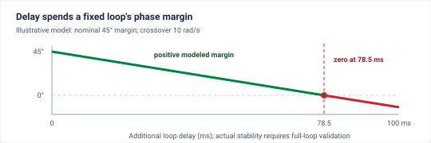
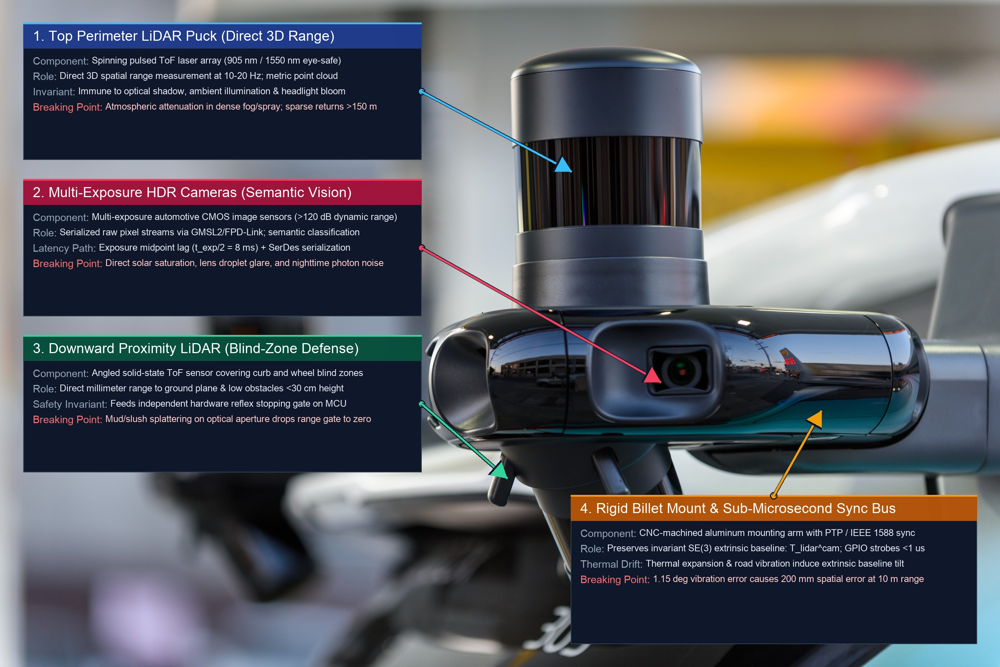

# Sensor Perception {#sec-perception}

::: {layout-narrow}
::: {.column-margin}

\chapterminitoc

:::

::: {.content-visible when-format="pdf"}
\noindent
{fig-alt="Isometric blueprint showing multimodal sensor perception: stereo optical camera rail with sightline frustums, solid-state micro-LiDAR point cloud fan, precision calibration target with coordinate axes, dynamic uncertainty covariance ellipsoid, and latency drift vector."}
:::

::: {.content-visible unless-format="pdf"}
{fig-alt="Isometric blueprint showing multimodal sensor perception: stereo optical camera rail with sightline frustums, solid-state micro-LiDAR point cloud fan, precision calibration target with coordinate axes, dynamic uncertainty covariance ellipsoid, and latency drift vector."}
:::

:::

## Purpose {.unnumbered .unlisted}

::: {.content-visible when-format="pdf"}
\begin{marginfigure}
\vspace{1em}
\resizebox{\linewidth}{!}{\mlphysicalstackfull{100}{20}{20}{100}{20}}
\end{marginfigure}
:::

_Why does an obstacle detection with 99 percent recognition accuracy still cause a collision if its capture timestamp, coordinate frame, and spatial uncertainty are ignored?_

An obstacle location aids control only when its time, coordinate frame, and uncertainty are known. The world continues moving while a sensor captures an image, transfers it through memory, and waits for a model to interpret it. An accurate estimate can describe a position that is no longer current when the controller acts. Calibration errors and vibration introduce a different uncertainty, changing the relationship between a measurement and the physical space it represents. Reporting an object label without those qualifications hides information needed to judge clearance. Perception must therefore preserve when and where an observation originated and communicate the limits of the resulting spatial estimate. Recognition alone cannot repair stale or poorly calibrated measurements. In physical AI systems architecture, perception connects sensor behavior and processing delay to the geometric claims that the brain uses and the nervous system must evaluate before permitting motion.



::: {.callout-learning-objectives}

- Specify observation records that preserve acquisition time, coordinate frame, and measurement uncertainty
- Calculate information age across the physical sensing, transport, preprocessing, and inference pipeline
- Diagnose spatial errors caused by sensor timing, motion during capture, and misaligned coordinate frames
- Estimate capture bandwidth requirements and their effect on shared memory and computation resources
- Evaluate whether observation uncertainty leaves enough physical clearance for a proposed action
- Distinguish perception failures that runtime checks can detect from errors that remain silent

:::

## Photons to Spatial Claims {#sec-perception-photons-to-claims}

```{python}
#| label: calc-perception-opening-age
#| echo: false
# ┌─────────────────────────────────────────────────────────────────────────────
# │ OPENING SCENE: OBSERVATION AGE AT THE RACK END
# ├─────────────────────────────────────────────────────────────────────────────
# │ Context: The opening paragraph of @sec-perception-photons-to-claims.
# │
# │ Goal:    Show how far the warehouse mobile manipulator travels while its
# │          navigation camera's observation of a person ages.
# │ Show:    t_age 51.6 ms; 77.4 mm of travel at the 1.5 m/s drive limit.
# │ How:     AISLE.perception_age and RM.base.max_velocity; displacement via
# │          calc_spatial_information_age_displacement.
# └─────────────────────────────────────────────────────────────────────────────
from mlsysim import *
from mlsysim.core.units import *
from mlsysim.fmt import fmt_latency, fmt_length, fmt_velocity, check

RM = Embodied.MobileManipulator.WarehouseMobileManipulator
AISLE = Embodied.Scenario.WarehouseAisle

class RackEndOpeningAge:
    """Travel during the navigation camera's observation age at the drive limit."""

    # ┌── 1. LOAD (Constants & Parameters) ─────────────────────────────────
    t_age = AISLE.perception_age  # category: derived
    v = RM.base.max_velocity  # category: illustrative (drive limit)

    # ┌── 2. EXECUTE (Compute) ─────────────────────────────────────────────
    dx = calc_spatial_information_age_displacement(v, t_age).to(ureg.millimeter)

    # ┌── 3. GUARD (Invariants) ───────────────────────────────────────────
    check(abs(t_age.to(millisecond).magnitude - 51.6) < 0.05, f"Unexpected t_age: {t_age}")
    check(abs(v.to(meter / second).magnitude - 1.5) < 1e-9, f"Unexpected drive limit: {v}")
    check(abs(dx.magnitude - 77.4) < 0.05, f"Unexpected travel during t_age: {dx}")

    # ┌── 4. OUTPUT (Formatting) ──────────────────────────────────────────
    t_age_str = fmt_latency(t_age.to(millisecond), unit=millisecond, precision=1)
    v_str = fmt_velocity(v.to(meter / second), unit=meter / second, precision=1)
    dx_str = fmt_length(dx, unit=ureg.millimeter, precision=1)
```

The warehouse mobile manipulator's vision model can recognize a person stepping out from a rack end almost every time and still hand the planner a position that is already out of date. The world keeps moving while the navigation camera integrates and reads out its image and while the pipeline processes it. On this machine, `{python} RackEndOpeningAge.t_age_str` (illustrative; see the Reader Guide) passes between the middle of the exposure and the moment the observation reaches any consumer, and at the base's `{python} RackEndOpeningAge.v_str` drive limit the machine covers `{python} RackEndOpeningAge.dx_str` in that time. Recognition accuracy does not say whether that observation is fresh enough for the proposed motion. In physical AI, an observation has an expiration date.

::: {#fig-08-locator fig-env="figure" fig-pos="htb" fig-cap="**Perception stage architecture focus**: The four-tier physical AI systems architecture highlights the cognitive deliberation tier, with perception as the second brain stage and this chapter's active focus. The stage converts raw observations $o_t$ into latent state $z_t$, bounded upstream by sensor transduction it cannot improve and downstream by the memory that must store whatever it infers." fig-alt="Diagram titled Physical AI Systems Architecture Stack, drawn as four stacked tiers. Layer 4 is system governance and assurance at 0.1 to 1 hertz, holding boxes for shared autonomy, verification, safety cases, and frontier limits. Layer 3 is the brain, a cognitive deliberation tier at 1 to 50 hertz, holding five stages named ingestion, perception, memory, intent, and planner. A dashed proposal-permission privilege boundary separates it from layer 2, the nervous system, a real-time safety and timing tier at 1000 hertz. Layer 1 is the physical body and continuous plant. Layer 3 is shaded and its perception stage is outlined; the badge reads Active Focus, Chapter 08, Spatial Perception."}
{width="100%"}
:::

::: {.column-margin .margin-pointer}
↰ **Prerequisite:** The dual-brain proposal-permission privilege boundary is architected in @sec-boundary-bedrock-laws.
:::

Within the four-tier systems hierarchy (@fig-08-locator), **Perception** represents the sensory gateway of Layer 3: the Cognitive Brain. It transforms sensor energy—photons, time-of-flight pulses, and reflected radio waves—into dated spatial claims, but holds no actuator authority. One implementation runs that pipeline on an application processor at $10\text{--}50\text{ Hz}$ and places an independent permission path on an MCU with a $1\text{ ms}$ cycle.[^fn-percep-dual-brain] The permission path must reject a claim after its freshness limit and select a validated response that remains feasible with the current sensing, braking, and clearance margin.[^fn-percep-barrier-filter]

[^fn-percep-dual-brain]: **Proposal-permission partition**\index{Dual-Brain Architecture}: An independently clocked permission controller with its own state and memory path can continue checking actuator requests when host inference stalls. A $1\text{ ms}$ loop period does not establish its full detection-to-brake response; that response must be measured with bus and actuator delays. See @sec-brain-embodied.

[^fn-percep-barrier-filter]: **Control Barrier Functions (CBFs)**\index{Control Barrier Functions!safety filter}: A CBF check can constrain admitted motion under a validated model, state estimate, feasible control set, actuator authority, and deadline. Stale or unbounded perception requires refusing the affected proposal; the controller selects a validated fallback, which may be a stop only if remaining clearance and braking capability permit it. See @sec-enforcement-safe-sets-conditional-permission.

A physical architecture can take many concrete shapes. An end-to-end vision-to-action policy [@brohan2023rt1; @brohan2023rt2; @zhao2023learning] maps camera observations to proposed joint torque actions within a single neural network; an independent permission path must still decide which commands reach the actuators. A classical modular pipeline partitions that same computation across independent processes for sensor ingestion, state estimation, mapping, trajectory generation, and motor control (a paradigm historically challenged by behavior-based subsumption architectures [@brooks1986subsumption]). While these implementations look entirely distinct on a software architecture diagram, they represent the same machine analyzed at different levels of granularity. As David Marr established in his foundational formulation of computational vision [@marr1982vision], visual perception must be understood across three distinct levels: the computational theory (what problem the visual system solves and why), representation and algorithm (how sensory inputs are transformed from raw 2D intensity maps into intermediate 2.5D sketches and 3D spatial models), and hardware implementation (how physical silicon, photodiode arrays, and neural circuits physically execute the algorithms). In physical AI, these responsibilities represent non-negotiable physical tasks that must be discharged somewhere along the signal path between physical stimulus and physical response.[^fn-hist-marr-levels]

[^fn-hist-marr-levels]: **Marr's tri-level hypothesis**\index{Marr's tri-level hypothesis!perception systems}: @marr1982vision established that information processing systems must be understood at three distinct tiers: computational theory, representation and algorithm, and physical hardware implementation. In embodied AI, optimizing perceptual representations without evaluating physical bus and silicon memory constraints violates this tri-level hierarchy. Deploying dense vision backends on embedded edge NPUs requires co-designing spatial representations with available memory bandwidth.

When an engineering team combines these responsibilities in an end-to-end model, the responsibilities remain, but their intermediate representations become harder to inspect independently. An explicit interface can expose a coordinate transform for checking, carry an expiration deadline, or let another component reject an inconsistent estimate. A hidden representation requires additional instrumentation or external checks to provide comparable evidence. If perception mistakes a wet-floor reflection for open clearance, the engineer needs a way to detect or contain the resulting error regardless of how many software modules implement the pipeline.

That evidence begins where physical energy converts into digital data. From transduction at the detector array to consumption by a state estimator, every processing stage adds information age. Photons striking the photodiode array of a CMOS camera do not instantly appear as feature embeddings in an inference engine; exposure, readout, transport, memory transfer, preprocessing, and the vision backbone each take a share of the delay. If the perception stage hands downstream components an object detection bounding box without an explicit timestamp and a calibrated spatial transform, a downstream planner will evaluate that obstacle relative to the current position of the chassis, misplacing it by the distance the machine has traveled since capture. Downstream software cannot safely consume a perception output that does not explicitly declare when it was captured, what coordinate system it references, and how wide its error distribution remains.

::: {.column-margin .margin-pointer}
↰ **Prerequisite:** Transduction freshness and sensor measurement aging are derived in @sec-body-measurement-freshness.
:::

::: {#dfn-perception-spatial-information-age .callout-definition title="Spatial information age"}

***Spatial information age***\index{Spatial information age!definition}\index{Information age!definition} ($t_{\text{age}}$) is the total elapsed physical time between the physical energy integration midpoint ($t_{\text{exp}}/2$) at the transducer and the downstream consumption of the resulting observation tensor by a state estimator or control policy.

1.  **Significance**: Because physical mass moves while digital computation executes, sensory latency translates directly into unmodeled spatial displacement (@eq-percep-spatial-displacement):
    $$\Delta \mathbf{x} = \int_{t_0}^{t_0+t_{\text{age}}} \mathbf{v}(t)\,dt$$ {#eq-percep-spatial-displacement}
    This continuous physical shift depletes geometric safety buffers before an obstacle is even classified.
2.  **Distinction**: Unlike software pipeline latency (wall-clock duration of a forward pass), spatial information age accounts for the full physical journey: photon exposure time, rolling shutter readout, SERDES bus transport, ISP debayering, OS buffer queuing, and neural tokenization.
3.  **Common pitfall**: Treating the frame arrival timestamp ($t_{\text{recv}}$) in userspace memory as the observation time ($t_0$). Using arrival time hides upstream capture and transport delays, introducing severe phase lag and high-frequency tracking instability into feedback controllers.

:::

### Temporal batching and phase margin erosion

Batching improves accelerator throughput by amortizing work across images, but collecting a batch across successive capture times ages its earliest member. At a $30\text{ Hz}$ camera cadence ($T_{\text{sample}} \approx 33.3\text{ ms}$), four consecutive frames wait approximately $100$, $67$, $33$, and $0\text{ ms}$, respectively, before the batch is ready. At $10.0\text{ m/s}$ the oldest frame corresponds to another meter of forward travel before processing begins. Such temporal batching is inadmissible when its resulting end-to-end age exceeds the motion-dependent freshness budget. Images captured together by several cameras may instead be batched if measured age, synchronization error, and deadline remain within that budget.

Phase margin is the phase delay a feedback design can tolerate before its nominal gain-crossover condition reaches zero margin; it is not a universal property of a perception model. For a loop with nominal margin $45^\circ$ ($0.785\text{ rad}$) at crossover $\omega_c=10\text{ rad/s}$, the delay-only ceiling is $0.785/10=78.5\text{ ms}$. Exposure, processing, transport, permission, and actuator delay all spend that same budget. The transfer-function derivation is developed in @sec-appendix-control-zoh. In the Laplace domain, an additional pure delay contributes $e^{-s t_{\text{age}}}$. Substituting $s = j\omega$, its frequency response has unit gain ($|e^{-j\omega t_{\text{age}}}| = 1$) but contributes negative, frequency-proportional phase lag:
$$\Delta \phi(\omega) = -\omega t_{\text{age}} \quad [\text{rad}]$$ {#eq-percep-phase-lag}
At the open-loop gain crossover frequency $\omega_c$ (the frequency where open-loop gain $|L(j\omega_c)| = 1$), the phase lag in @eq-percep-phase-lag directly erodes the system's nominal phase margin ($\text{PM}_{\text{nom}}$):
$$\text{PM}_{\text{effective}} = \text{PM}_{\text{nom}} - \omega_c t_{\text{age}}$$ {#eq-percep-phase-margin-loss}
Under the fixed-loop, pure-delay approximation in @eq-percep-phase-margin-loss, $t_{\text{age}} \ge \text{PM}_{\text{nom}}/\omega_c$ exhausts the nominal phase margin. That is a warning to re-evaluate the complete closed-loop response, not a proof of a particular oscillation or pole location. Reducing one latency component from $80\text{ ms}$ to $40\text{ ms}$ restores $0.040\omega_c$ radians of modeled phase margin only if crossover and the rest of the loop remain unchanged.

::: {.column-margin}
{width="100%" fig-alt="Illustrative fixed-loop phase margin decreases from 45 degrees to zero after 78.5 milliseconds of additional delay at a 10 radians-per-second gain crossover. Actual stability requires full-loop validation."}

*Under a fixed crossover model, additional age spends the loop's nominal phase margin.*
:::

The handoff to control starts with a timestamp, a coordinate frame, and a usable error bound. The handoff record in @sec-perception-handoff defines that contract; the following sections trace how transduction, ingress, and geometric estimation can invalidate it before the permission path admits a motion.

## What Perception Hands Over {#sec-perception-handoff}

Raw sensor hardware yields electrical measurements such as photodiode voltages, time-of-flight counter values, or capacitive displacements. These unstructured signals differ significantly from the state variables needed for downstream autonomy. An actuator controller cannot track a desired force using a two-dimensional grid of raw pixel intensities, and a trajectory optimizer cannot plan collision-free paths using unorganized time-of-flight returns. Downstream estimation, planning, and memory subsystems require structured representations of physical state, including metric positions, velocities, bounding volumes, surface normals, and semantic classifications. Translating raw sensor streams into these representations is the operational responsibility of the perception pipeline. However, downstream consumers cannot safely interpret a perceived state without explicit metadata that anchors the measurement in physical reality. An observation must carry three properties for downstream software: a capture timestamp, a reference frame, and an uncertainty envelope.

::: {.column-margin}
{width="100%" fig-alt="S·P·A locator triad with the Sense node highlighted."}

*The Sense axis: transforming uncompressed sensor photons into calibrated spatial claims under strict freshness budgets.*
:::

The first mandatory property is the **capture timestamp**\index{Capture timestamp!definition} $t_0$, which specifies the temporal midpoint of the physical energy integration window (the effective moment the camera shutter was open or the laser pulse fired). Sensors do not take instantaneous snapshots; a camera integrates photons across an exposure duration, and a mechanical lidar sweeps laser pulses over an azimuth arc across several milliseconds. Downstream state estimators require $t_0$ to integrate the measurement into the machine's dynamic equations of motion. A common architectural failure in embedded systems is recording the arrival timestamp $t_{\text{recv}}$, the moment the operating system kernel completes the direct memory access transfer, and passing $t_{\text{recv}}$ downstream as the observation epoch. Because pipeline execution, serial bus transfers, and driver scheduling introduce a transport delay $\tau = t_{\text{recv}} - t_0$, substituting arrival time for capture time corrupts the state estimator.

```{python}
#| label: calc-perception-arrival-stamp
#| echo: false
# ┌─────────────────────────────────────────────────────────────────────────────
# │ ARRIVAL-TIMESTAMP OFFSET ON THE NAVIGATION CAMERA
# ├─────────────────────────────────────────────────────────────────────────────
# │ Context: The capture-timestamp paragraph of @sec-perception-handoff.
# │
# │ Goal:    Size the error an estimator makes when it dates the navigation
# │          camera's frame at DMA completion instead of at the exposure midpoint.
# │ Show:    26.6 ms from exposure midpoint to DMA completion; 39.9 mm of base
# │          travel at the 1.5 m/s drive limit.
# │ How:     t_recv - t0 = t_exp/2 + t_readout + t_transport + t_dma from
# │          RM.nav_camera and AISLE; displacement via
# │          calc_spatial_information_age_displacement.
# └─────────────────────────────────────────────────────────────────────────────
from mlsysim import *
from mlsysim.core.units import *
from mlsysim.fmt import fmt_latency, fmt_length, fmt_velocity, check

RM = Embodied.MobileManipulator.WarehouseMobileManipulator
AISLE = Embodied.Scenario.WarehouseAisle

class ArrivalStampOffset:
    """Age hidden by an arrival timestamp on the running machine's navigation camera."""

    # ┌── 1. LOAD (Constants & Parameters) ─────────────────────────────────
    camera = RM.nav_camera  # registry: navigation camera
    t_exp = camera.exposure_time  # category: datasheet
    t_readout = camera.readout_time  # category: datasheet
    t_transport = AISLE.t_transport  # category: illustrative
    t_dma = AISLE.t_dma  # category: illustrative
    v = RM.base.max_velocity  # category: illustrative (drive limit)

    # ┌── 2. EXECUTE (Compute) ─────────────────────────────────────────────
    tau_recv = (t_exp / 2 + t_readout + t_transport + t_dma).to(millisecond)
    dx_recv = calc_spatial_information_age_displacement(v, tau_recv).to(ureg.millimeter)

    # ┌── 3. GUARD (Invariants) ───────────────────────────────────────────
    check(abs(tau_recv.magnitude - 26.6) < 0.05, f"Unexpected arrival offset: {tau_recv}")
    check(abs(dx_recv.magnitude - 39.9) < 0.05, f"Unexpected arrival-stamp displacement: {dx_recv}")
    check(tau_recv < AISLE.perception_age, "Arrival offset must be part of the full observation age")

    # ┌── 4. OUTPUT (Formatting) ──────────────────────────────────────────
    tau_recv_str = fmt_latency(tau_recv, unit=millisecond, precision=1)
    dx_recv_str = fmt_length(dx_recv, unit=ureg.millimeter, precision=1)
    v_str = fmt_velocity(v.to(meter / second), unit=meter / second, precision=1)
```

The magnitude of this corruption is a direct function of platform kinematics. Consider a vehicle traversing a trajectory with instantaneous velocity $v(t)$. When an observation taken at $t_0$ is evaluated by a downstream filter at $t_{\text{recv}}$, the physical state of the machine has shifted. The resulting spatial tracking error $\Delta x$ is the integral of the platform velocity over the transport delay, $\Delta x = \int_{t_0}^{t_0+\tau} v(t)\,dt$. In an analytical case of constant linear velocity $v$, this relationship simplifies to $\Delta x = v \cdot \tau$. On the mobile manipulator, the navigation camera's frame completes its direct memory access (DMA) transfer `{python} ArrivalStampOffset.tau_recv_str` after the exposure midpoint. An estimator that stamps the frame on arrival therefore dates it that much late, and at the base's `{python} ArrivalStampOffset.v_str` drive limit it pairs the observation with a pose `{python} ArrivalStampOffset.dx_recv_str` beyond the one the camera occupied at capture. In a feedback loop, that delay adds phase lag; whether it produces oscillation or instability depends on the controller and its remaining phase margin.

::: {.column-margin .margin-pointer}
↳ **Downstream:** Extrinsic sensor frames feed the hierarchical spatial transform tree in @sec-memory-reference-frames.
:::

The second mandatory property is the **reference frame**\index{Reference frame!definition} identifier $\mathcal{F}_{\text{sensor}}$. Every spatial measurement is natively resolved in the local coordinate system of the physical transducer. A camera measures bearing angles relative to its optical center, while a radar measures range and Doppler velocity relative to its antenna array. Downstream trajectory planners and obstacle maps operate in a chassis body frame $\mathcal{F}_{\text{body}}$ or an inertial navigation frame $\mathcal{F}_{\text{world}}$. Transforming an observation from $\mathcal{F}_{\text{sensor}}$ to $\mathcal{F}_{\text{body}}$ requires applying a rigid-body spatial transformation consisting of a rotation matrix and a translation vector that define the sensor mounting extrinsics (the exact physical location and orientation where the sensor is bolted onto the machine).[^fn-std-rep105-frames] Across the three machine archetypes, this spatial binding takes distinct physical forms: in Mobile Systems, $\mathcal{F}_{\text{body}}$ represents the mobile chassis `base_link` tracking through an odometric frame `odom`; in Manipulator Systems, it maps across serial kinematic chains from the mounting flange `tool0` through articulated joint angles to the base origin `base_link`; in Process / Energy Systems, it maps local pyrometry or laser galvanometer scan coordinates to the fixed workcell or reactor vessel datum $\mathcal{F}_{\text{vessel}}$. As structured in the coordinate frame transformation tree (@fig-08-coordinate-frame-tree), the standard spatial hierarchy formalizes this spatial progression by nesting coordinate frames: $\mathcal{F}_{\text{earth}} \to \mathcal{F}_{\text{map}} \to \mathcal{F}_{\text{odom}} \to \mathcal{F}_{\text{body}} \to \mathcal{F}_{\text{sensor}}$. When perception outputs omit the frame identifier or rely on nominal CAD dimensions rather than calibrated physical extrinsics, small angular offsets create large spatial errors that scale with distance. An uncalibrated pitch or yaw error of $\theta = 1.0^\circ$ on a sensor detecting an object at a range $d = 15.0\text{ m}$ induces a transverse position error of $\Delta y \approx d \cdot \sin(1.0^\circ) \approx 0.26\text{ m}$. In tight warehouse aisles or cluttered physical environments, a lateral error of $0.26\text{ m}$ causes the planner to steer into physical racking or reject valid corridors as obstructed.

[^fn-std-rep105-frames]: **REP 105 spatial frames**\index{Standards!REP 105}: REP 105 assigns distinct roles to global `map`, locally continuous `odom`, and body-fixed `base_link`; `earth` and a sensor frame extend the example where used. A local controller should consume an appropriate continuous estimate and reject unexpected transform jumps. The effect of a jump on torque depends on the controller and its limits.

The [REP 105 frame convention](https://reps.openrobotics.org/rep-0105/) separates a locally continuous `odom` pose from a globally corrected `map` pose. The roles in @tbl-08-rep105-tree keep those roles visible without assigning a universal covariance law or differentiability class. An implementation still has to check transform timestamps, estimator uncertainty, and whether its controller consumes a frame that may jump.

| Frame         | Parent in this example | Meaning                                     | Consumer rule                                                 |
|:--------------|:-----------------------|:--------------------------------------------|:--------------------------------------------------------------|
| `earth`       | root                   | Optional geodetic datum                     | Verify datum before global routing                            |
| `map`         | `earth` if present     | Global localization; corrections may jump   | Keep relocalization jumps out of local feedback               |
| `odom`        | `map`                  | Locally continuous pose estimate; may drift | Track motion locally; monitor uncertainty and discontinuities |
| `base_link`   | `odom`                 | Body-fixed origin                           | Body pose still inherits odometry uncertainty                 |
| `sensor_link` | `base_link`            | Calibrated sensor mounting frame            | Apply time-valid extrinsics and their uncertainty             |

: **REP 105 frame roles for a mobile robot**: A compact example of global, local, body, and sensor frames. REP 105 requires `odom`-relative pose to remain continuous but does not prescribe $C^1$ smoothness, a covariance growth rate, or fixed accuracy; these require estimator-specific evidence. {#tbl-08-rep105-tree tbl-colwidths="[14,20,32,34]"}

::: {#fig-08-coordinate-frame-tree fig-env="figure" fig-pos="t" fig-cap="**Coordinate frame tree and uncertainty**: The spatial coordinate frame hierarchy formalizes the separation between continuous local dead reckoning ($\mathcal{F}_{\text{odom}} \to \mathcal{F}_{\text{body}}$) consumed by high-frequency tracking loops and discontinuous global map corrections ($\mathcal{F}_{\text{map}} \to \mathcal{F}_{\text{odom}}$) consumed by global planners. Spatial covariance compounds across the kinematic chain ($\mathbf{\Sigma}_{\text{map}} \approx \mathbf{J}_{\text{odom}}\mathbf{\Sigma}_{\text{drift}}\mathbf{J}_{\text{odom}}^T + \mathbf{R}_{\text{body}}\mathbf{\Sigma}_{\text{ext}}\mathbf{R}_{\text{body}}^T + \mathbf{R}_{\text{tot}}\mathbf{\Sigma}_z\mathbf{R}_{\text{tot}}^T$), requiring downstream consumers to reject observations that lack an explicit coordinate key $\mathcal{F}_{\text{sensor}}$, acquisition epoch $t_0$, and covariance envelope $\mathbf{\Sigma}_z$. Attribution: Book kinematic systems diagram, CC BY 4.0." fig-alt="REP 105 Spatial Transform Tree and Uncertainty Composition. The spatial coordinate frame hierarchy formalizes the separation between continuous local dead reckoning (Fodom -> Fbody) consumed by high-frequency tracking loops and discontinuous global map corrections (Fmap -> Fodom) consumed by global planners. Spatial covariance compounds across the kinematic chain (Sigmamap approx. JodomSigmadriftJodom^T + RbodySigmaextRbody^T + RtotSigmazRtot^T), requiring downstream consumers to reject observations that lack an explicit coordinate key Fsensor, acquisition epoch t0, and covariance envelope Sigmaz. Attribution: Book kinematic systems diagram, CC BY 4.0."}
{width="95%"}
:::

The third mandatory property is an **uncertainty representation**\index{Uncertainty envelope!definition}, such as covariance $\mathbf{\Sigma}_z$ together with a validated tail or hard error bound when clearance depends on it. Low illumination, atmospheric scattering, specular surfaces, and model error change the residual distribution. A covariance describes second moments, not a region guaranteed to contain the true state. Estimators can use it to weight innovations against a motion model; an underestimated covariance can pull a state estimate toward a spurious measurement and lead to poor downstream commands. Safety decisions must also account for bias, missed detections, and validation limits.

::: {#psp-perception-observation-invariants .callout-perspective title="The three invariants of observation"}
Pass a perception claim with its capture time and clock domain, coordinate frame, and qualified uncertainty. Refuse a claim when any of those cannot be checked for the proposed motion.
:::

These three properties define the **perception handoff contract**\index{Perception handoff contract!definition}, the formal interface invariant between perception and the remainder of the autonomy stack. Downstream state estimators, planners, and safety watchdogs must reject any observation packet that lacks an explicit capture timestamp $t_0$, a verified coordinate frame $\mathcal{F}_{\text{sensor}}$, and an uncertainty covariance $\mathbf{\Sigma}_z$. Dropping an incomplete or unbounded observation allows a downstream estimator to propagate its state forward using physical dynamics, degrading uncertainty smoothly over time. Accepting an ungrounded packet, by contrast, injects unmodeled delays, spatial distortions, and false confidence directly into the control loop. Enforcing this contract requires tracing how an observation originates, beginning at the hardware interface where physical phenomena are first sampled.

## Sensor Transduction and Calibration {#sec-perception-transduction-calibration}

Lag accumulates before software receives anything at all, beginning at the photosite where physical phenomena are converted into electrical charge. A camera does not capture an instantaneous snapshot. Photons collect on a photodiode over a finite exposure duration $t_{\text{exp}}$, which means the recorded pixel intensity represents the temporal integral of scene radiance $I(t)$ over that interval:
$$I_{\text{pixel}} = \int_{0}^{t_{\text{exp}}} I(t)\,dt$$

```{python}
#| label: calc-perception-rolling-shutter-skew
#| echo: false
# ┌─────────────────────────────────────────────────────────────────────────────
# │ ROLLING-SHUTTER SKEW ON THE NAVIGATION CAMERA
# ├─────────────────────────────────────────────────────────────────────────────
# │ Context: The exposure analogy and the rolling-shutter example of
# │          @sec-perception-transduction-calibration.
# │
# │ Goal:    Size the exposure-midpoint lag, per-row blur, and scanline skew
# │          the navigation camera records while the base passes a vertical
# │          rack upright.
# │ Show:    an 8 ms midpoint lag; 3,040 rows in 16.6 ms (5.46 us per row);
# │          24.9 mm of skew and 24 mm of blur at the 1.5 m/s drive limit;
# │          the uncompensated skew is about a sixth of the 0.15 m side
# │          clearance.
# │ How:     RM.nav_camera readout, exposure, and row count; RM.base drive
# │          limit; AISLE.side_clearance; RM.imu sample rate for compensation.
# └─────────────────────────────────────────────────────────────────────────────
from mlsysim import *
from mlsysim.core.units import *
from mlsysim.fmt import fmt_latency, fmt_length, fmt_velocity, fmt_frequency, fmt_int, check

RM = Embodied.MobileManipulator.WarehouseMobileManipulator
AISLE = Embodied.Scenario.WarehouseAisle

class RollingShutterSkew:
    """Scanline skew and blur on the running machine's navigation camera at the drive limit."""

    # ┌── 1. LOAD (Constants & Parameters) ─────────────────────────────────
    camera = RM.nav_camera  # registry: navigation camera
    rows = camera.resolution_height  # category: datasheet
    t_readout = camera.readout_time.to(millisecond)  # category: datasheet
    t_exp = camera.exposure_time.to(millisecond)  # category: datasheet
    v = RM.base.max_velocity.to(meter / second)  # category: illustrative (drive limit)
    side_clearance = AISLE.side_clearance  # category: illustrative
    f_imu = RM.imu.sample_rate  # category: datasheet

    # ┌── 2. EXECUTE (Compute) ─────────────────────────────────────────────
    t_exp_half = (t_exp / 2).to(millisecond)
    t_row = (t_readout / rows).to(microsecond)
    skew = (v * t_readout).to(ureg.millimeter)
    blur = (v * t_exp).to(ureg.millimeter)
    skew_share = (skew / side_clearance).to(ureg.dimensionless).magnitude

    # ┌── 3. GUARD (Invariants) ───────────────────────────────────────────
    check(rows == 3040, f"Unexpected navigation-camera row count: {rows}")
    check(abs(t_row.magnitude - 5.46) < 0.005, f"Unexpected row interval: {t_row}")
    check(abs(skew.magnitude - 24.9) < 0.05, f"Unexpected rolling-shutter skew: {skew}")
    check(abs(blur.magnitude - 24.0) < 0.05, f"Unexpected per-row blur: {blur}")
    check(abs(t_exp_half.magnitude - 8.0) < 0.05, f"Unexpected exposure-midpoint lag: {t_exp_half}")
    check(0.15 < skew_share < 0.18, f"Prose says the skew is about a sixth of the side clearance: {skew_share}")

    # ┌── 4. OUTPUT (Formatting) ──────────────────────────────────────────
    rows_str = fmt_int(rows)
    last_row_str = fmt_int(rows - 1)
    t_readout_str = fmt_latency(t_readout, unit=millisecond, precision=1)
    t_exp_str = fmt_latency(t_exp, unit=millisecond, precision=0)
    t_exp_half_str = fmt_latency(t_exp_half, unit=millisecond, precision=0)
    t_row_str = fmt_latency(t_row, unit=microsecond, precision=2)
    skew_str = fmt_length(skew, unit=ureg.millimeter, precision=1)
    blur_str = fmt_length(blur, unit=ureg.millimeter, precision=0)
    v_str = fmt_velocity(v, unit=meter / second, precision=1)
    side_clearance_str = fmt_length(side_clearance.to(meter), unit=meter, precision=2)
    f_imu_str = fmt_frequency(f_imu, unit=ureg.hertz, precision=0, commas=True)
```

To build intuition for exposure latency, consider mounting an open **rain gauge on the roof of a moving train**. To measure rainfall intensity, the gauge must remain open to collect falling raindrops over a finite time window ($t_{\text{exp}}$). If the train is stationary, the collected water reflects the rainfall rate at that location. But if the train is hurtling down the tracks at high speed, the water gathered in the bucket represents an average of raindrops collected across an entire stretch of track! You cannot assign the water in the gauge to the train's final arrival position; at best, the measurement reflects the physical midpoint where the train was halfway through the exposure interval ($t_{\text{exp}} / 2$). In physical AI, a CMOS photodiode is a photon bucket collecting charge over time. With the navigation camera's `{python} RollingShutterSkew.t_exp_str` exposure at the base's `{python} RollingShutterSkew.v_str` drive limit, the image does not record where the robot *is*. It records where the robot *was* `{python} RollingShutterSkew.t_exp_half_str` earlier, smeared across `{python} RollingShutterSkew.blur_str` of motion blur.

When the sensor or the observed environment moves at velocity $v$ during exposure, a sharp physical boundary—such as a rigid door frame—smears across multiple photosites. The resulting motion blur width in the direction of motion is given by $\Delta x_{\text{blur}} = v \cdot t_{\text{exp}}$. Because light accumulates continuously across the exposure window, the effective point in time that corresponds to the accumulated charge is the temporal midpoint of the interval, introducing an unavoidable physical measurement lag of $t_{\text{exp}}/2$ relative to the start of exposure.

### Rolling shutter distortion and motion compensation

The exposure window schedule across the pixel array determines the spatial geometry of the image. In a **global shutter**\index{Global shutter!definition} sensor, every pixel photodiode accumulates charge during the identical time interval and transfers the accumulated electrons to shielded storage nodes simultaneously. In a **rolling shutter**\index{Rolling shutter!definition} sensor, silicon area and cost constraints dictate that rows are reset, exposed, and read out sequentially from the top scanline $y = 0$ to the bottom scanline $y = H - 1$. Each successive scanline begins exposure after a row period $t_{\text{row}}$, creating a progressive temporal offset across the image plane:[^fn-hw-rolling-shutter]
$$t(y) = t_0 + y \cdot t_{\text{row}}$$
where $t_0$ is the start of exposure for the top row. When the body translates at linear velocity $v$ perpendicular to a vertical feature, scanline $y$ captures it at a spatial displacement:
$$\Delta x(y) = v \cdot y \cdot t_{\text{row}}$$

[^fn-hw-rolling-shutter]: **Rolling shutter epipolar geometry**\index{Hardware!rolling shutter}: Rolling shutter CMOS image sensors reset, integrate, and read pixel scanlines sequentially across the array rather than exposing all photosites simultaneously. When the camera rotates during this readout interval, straight physical edges project into curved geometric arcs across the image plane. This progressive scanline skew violates rigid multi-view epipolar constraints, causing visual-inertial odometry factor graphs to compute spurious feature depths unless continuous-time B-spline camera trajectories interpolate the instantaneous pose of every scanline.

Under rotational motion, rolling shutter distortion becomes non-linear. If the camera undergoes angular rotation at angular velocity vector $\boldsymbol{\omega} = [\omega_x, \omega_y, \omega_z]^T$ (e.g., rapid yaw or pitch during aggressive robot maneuvers), the effective camera attitude changes continuously as scanlines are read. Physically, the camera points in a slightly different direction for every single row. For a scanline at vertical coordinate $y$, the differential rotation relative to the frame start is $\Delta \boldsymbol{\theta}(y) \approx \boldsymbol{\omega} \cdot y \cdot t_{\text{row}}$. This scanline-dependent rotation warps straight physical lines into curves, induces focal-length dilation (scaling distortion during pitch), and shears vertical walls into slanted surfaces, as demonstrated by the propeller blade curvature in @fig-rolling-shutter-skew.

As an analytical example, consider the mobile manipulator's navigation camera while the base passes a vertical rack upright at its `{python} RollingShutterSkew.v_str` drive limit. The rolling shutter reads the frame's `{python} RollingShutterSkew.rows_str` rows in $t_{\text{readout}} =$ `{python} RollingShutterSkew.t_readout_str`, so the inter-row interval is $t_{\text{row}} =$ `{python} RollingShutterSkew.t_row_str`. An upright spanning the full height of the frame does not appear vertical in the captured array. The bottom scanline ($y =$ `{python} RollingShutterSkew.last_row_str`) is sampled `{python} RollingShutterSkew.t_readout_str` after the top scanline ($y = 0$), producing a total spatial skew $\Delta x = v\,t_{\text{readout}}$ of `{python} RollingShutterSkew.skew_str`.

With the camera's `{python} RollingShutterSkew.t_exp_str` exposure, each individual scanline also suffers a motion blur width of $\Delta x_{\text{blur}} =$ `{python} RollingShutterSkew.blur_str`. If downstream geometry reconstruction treats this image as an instantaneous rigid projection, the `{python} RollingShutterSkew.skew_str` tilt enters the obstacle map uncorrected. That is about a sixth of the `{python} RollingShutterSkew.side_clearance_str` side clearance the base keeps from the racks, and the motion planner can read the slanted upright as an artificial intrusion into the free corridor. The localization bound $\delta_{\text{loc}}$ assumes this skew has been removed before the estimator sees the frame. Correcting this distortion requires **rolling-shutter motion compensation**\index{Rolling-shutter motion compensation!definition}, the continuous-time geometric unwarping algorithm that utilizes high-rate (`{python} RollingShutterSkew.f_imu_str`) inertial angular velocities ($\boldsymbol{\omega}$) and linear velocities ($\mathbf{v}$) to interpolate the instantaneous 6-DoF camera pose $\mathbf{T}_{wb}(t(y))$ for each individual scanline $y$, restoring rigid epipolar geometry prior to 3D triangulation.

::: {#fig-rolling-shutter-skew fig-env="figure" fig-pos="t" fig-cap="**Rolling shutter distortion geometry**: A photograph of rotating propeller blades captured by a rolling shutter CMOS sensor. Because sensor scanlines are exposed and read sequentially from top to bottom rather than simultaneously, the rapid physical movement of the blades relative to the row period ($t_{\text{row}}$) shears and curves straight rigid structures into non-linear, disconnected geometric arcs. In high-speed embodied systems, uncompensated rolling shutter skew introduces catastrophic 3D triangulation errors and phantom obstacle intrusion in downstream visual-inertial odometry. (Credit: Wikimedia Commons, CC BY-SA 3.0)." fig-alt="Empirical rolling shutter distortion caused by progressive scanline exposure. A photograph of rotating propeller blades captured by a rolling shutter CMOS sensor. Because sensor scanlines are exposed and read sequentially from top to bottom rather than simultaneously, the rapid physical movement of the blades relative to the row period shears and curves straight rigid structures into non-linear, disconnected geometric arcs. In high-speed embodied systems, uncompensated rolling shutter skew introduces catastrophic 3D triangulation errors and phantom obstacle intrusion in downstream visual-inertial odometry. (Credit: Wikimedia Commons, CC BY-SA 3.0)."}
{width="85%"}
:::

### Camera intrinsic calibration and planar homographies

Each optical sensor requires intrinsic calibration to model the projective geometry mapping 3D physical coordinates to 2D pixel coordinates before multi-sensor calibration. Following the classical **pinhole camera model**\index{Pinhole camera model!definition} [@hartley2003multiple], a metric 3D point $\mathbf{P}_c = [X_c, Y_c, Z_c]^\top$ defined in the camera optical frame (where $+Z_c$ points forward along the optical axis, $+X_c$ points right, and $+Y_c$ points down) projects onto the 2D pixel coordinate $[u, v]^\top$ via the **camera intrinsic matrix** $\mathbf{K}$:[^fn-math-intrinsic-projection]
$$\begin{bmatrix} u \\ v \\ 1 \end{bmatrix} \sim \frac{1}{Z_c} \mathbf{K} \mathbf{P}_c = \frac{1}{Z_c} \begin{bmatrix} f_x & 0 & c_x \\ 0 & f_y & c_y \\ 0 & 0 & 1 \end{bmatrix} \begin{bmatrix} X_c \\ Y_c \\ Z_c \end{bmatrix}$$ {#eq-percep-pinhole-projection}
where $f_x, f_y$ represent the focal lengths expressed in pixel dimensions ($f_x = F / p_x$, with focal length $F$ in millimeters and pixel pitch $p_x$ in millimeters per pixel), and $(c_x, c_y)$ is the principal point marking the piercing intersection of the optical axis with the pixel sensor grid (nominally located near the array centroid $(W/2, H/2)$).

[^fn-math-intrinsic-projection]: **Camera intrinsic projection**\index{Mathematics!intrinsic projection}: The pinhole intrinsic matrix $\mathbf{K}$ projects continuous 3D rays in the camera coordinate frame onto discrete 2D photosite coordinates, parameterizing focal lengths $(f_x, f_y)$ and the optical center $(c_x, c_y)$. Because projective mapping collapses the depth dimension, metric distance cannot be recovered from a single monocular ray without auxiliary multi-view triangulation, depth sensors, or learned scale priors. Small focal length calibration errors scale radial projection errors quadratically with distance, corrupting 3D bounding box dimensions. For the rigorous derivation of projective geometry, refer to @sec-appendix-systems-vision.

To reconstruct metric physical space from an image, physical AI models invert this projective relationship. While forward projection collapses 3D space into a 2D plane (losing absolute distance), the inverse transformation maps each 2D pixel coordinate $(u, v)$ to an **optical bearing ray** $\mathbf{r}(u, v) \in \mathbb{R}^3$ originating from the camera optical center $\mathbf{O}_c = [0, 0, 0]^\top$:
$$\mathbf{r}(u, v) = \mathbf{K}^{-1} \begin{bmatrix} u \\ v \\ 1 \end{bmatrix} = \begin{bmatrix} \frac{u - c_x}{f_x} \\ \frac{v - c_y}{f_y} \\ 1 \end{bmatrix}$$ {#eq-percep-bearing-ray}
Any 3D physical surface point projecting onto pixel $(u, v)$ must lie somewhere along this 1D geometric ray, parameterized by its scalar metric depth $d = Z_c$:
$$\mathbf{P}_c(u, v, d) = d \cdot \mathbf{r}(u, v) = \begin{bmatrix} d \frac{u - c_x}{f_x} \\ d \frac{v - c_y}{f_y} \\ d \end{bmatrix}$$

Real-world optical assemblies deviate from ideal pinhole geometry due to lens curvature and misalignment, introducing radial and tangential distortion. In embedded MLSys architectures, these non-linear geometric distortions are parameterized via polynomial coefficients ($k_1, k_2, p_1, p_2$) and rectified directly in silicon by the hardware Image Signal Processor (ISP) using pre-calculated lookup tables during DMA ingress, ensuring undistorted frames enter main memory with near-zero CPU overhead ($t_{\text{ISP}} \approx 2.5\text{ ms}$). The universal methodology for recovering intrinsic matrix $\mathbf{K}$ and distortion parameters was established by Zhang [@zhang2000flexible]: by imaging a planar calibration target (such as a precision checkerboard or AprilTag grid) across diverse unconstrained orientations, planar homographies provide algebraic constraints that seed a non-linear optimization minimizing reprojection error across all fiducial corners.[^fn-math-zhang-homography]

[^fn-math-zhang-homography]: **Zhang's planar homography**\index{Mathematics!Zhang's homography}: Zhang's calibration method estimates the intrinsic camera matrix $\mathbf{K}$ and radial lens distortion parameters by observing a planar fiducial pattern across multiple unconstrained orientations. Each observation establishes a projective planar homography $\mathbf{H} = \mathbf{K}[\mathbf{r}_1 \; \mathbf{r}_2 \; \mathbf{t}]$ that imposes two algebraic orthogonality constraints on the image of the absolute conic. Solving these constraints across at least three non-parallel views yields a closed-form initialization that seeds non-linear Levenberg–Marquardt optimization over all reprojection residuals. For the full mathematical formulation, see @sec-appendix-systems-vision.

### Camera-to-IMU temporal and extrinsic calibration

Visual perception does not operate in isolation; it functions alongside an Inertial Measurement Unit (IMU) running at high frequencies ($1000\text{ Hz}$). Fusing high-rate angular velocity $\boldsymbol{\omega}$ and linear acceleration $\mathbf{a}$ from the IMU with low-rate visual frames ($30\text{--}60\text{ Hz}$) in **Visual-Inertial Odometry (VIO)**\index{Visual-inertial odometry!definition} requires rigorous spatial and temporal calibration [@furgale2013unified; @li2014online; @forster2017onmanifold].

The spatial relationship between the IMU reference frame $\mathcal{F}_{\text{imu}}$ and the camera reference frame $\mathcal{F}_{\text{cam}}$ is defined by a rigid extrinsic transformation. The physical separation of the camera and IMU by a lever arm induces additional tangential and centripetal accelerations at the camera due to angular acceleration or velocity experienced by the robot.[^fn-math-lever-arm]

[^fn-math-lever-arm]: **Kinematic lever arm acceleration**\index{Kinematics!lever arm acceleration}: When a rigid body undergoes rotational motion with angular velocity $\boldsymbol{\omega}$ and angular acceleration $\dot{\boldsymbol{\omega}}$, a sensor offset by lever-arm displacement $\mathbf{r}$ experiences additional tangential ($\dot{\boldsymbol{\omega}} \times \mathbf{r}$) and centripetal ($\boldsymbol{\omega} \times (\boldsymbol{\omega} \times \mathbf{r})$) accelerations. Failing to compensate for this offset in visual-inertial sensor fusion causes false linear acceleration estimates during sharp turns. This fictitious acceleration corrupts gravity vector estimation, producing systematic pitch and roll drift in the platform attitude filter. For a rigorous derivation of this kinematic lever-arm acceleration, refer to @sec-appendix-control-spatial.

Equally critical is the **temporal calibration offset**\index{Temporal calibration offset!definition} $\tau_{\text{cam-imu}} = t_{\text{cam}} - t_{\text{imu}}$. Standard commercial crystal oscillators on independent sensor breakout boards drift by roughly $\pm 50\text{ ppm}$, accumulating $50\,\mu\text{s}$ of error every second ($4.3\text{ s}$ per day). Moreover, analog anti-aliasing filters in the IMU, electronic exposure delays in the camera, and DMA driver scheduling inject fixed and variable temporal offsets between the two data streams.

If the temporal offset $\Delta t$ is uncalibrated, platform rotation couples directly into catastrophic spatial estimation errors. Suppose a robot rotates at an angular velocity of $\omega = 2.0\text{ rad/s}$ ($115^\circ/\text{s}$). An undetected temporal lag of $\Delta t = 10\text{ ms}$ between the camera frame and the IMU integration causes a rotational orientation mismatch of:
$$\Delta \theta = \omega \cdot \Delta t = 2.0\text{ rad/s} \times 0.010\text{ s} = 0.020\text{ rad} \approx 1.15^\circ$$
At an operating distance of $z = 10.0\text{ m}$, this angular misalignment projects into a transverse spatial error of:
$$\Delta p \approx z \cdot \Delta \theta = 10.0\text{ m} \times 0.020\text{ rad} = 0.20\text{ m} = 200\text{ mm}$$
This artificial $200\text{ mm}$ displacement corrupts visual feature triangulation, causing visual-inertial estimators to compute false scale factors and driving the filter toward mathematical divergence. Eliminating these timing errors requires hardware-level synchronization: a hardware GPIO trigger strobe latches exposure start times across all cameras and IMU sampling registers simultaneously,[^fn-hw-camera-sync] while online continuous-time calibration algorithms estimate residual sub-millisecond offsets $\tau_{\text{cam-imu}}$ within the joint factor graph [@furgale2013unified]. As shown in the physical multi-modal perception pod in @fig-08-sensor-suite, co-locating multiple high-resolution cameras and LiDAR modules on a rigid vehicle bracket requires routing these deterministic hardware sync strobes alongside high-speed GMSL2/FPD-Link serializer links to bound clock drift and transport latency across all sensing channels.

[^fn-hw-camera-sync]: **Hardware synchronization timers**\index{Hardware!synchronization timers}: Hardware timers (such as Advanced Control Timers TIM1/TIM8 on ARM Cortex-M or ePWM modules on TI C2000) feature dedicated input-capture and output-compare registers that latch microsecond counter values on external trigger edges without CPU software intervention. In multi-sensor perception pipelines, timer trigger lines synchronize image sensor exposure starts with IMU sampling interrupts to maintain sub-microsecond cross-sensor phase alignment, preventing the velocity estimation errors and scale drift that occur when asynchronous visual and inertial data are fused.

**Camera-to-IMU spatial-temporal calibration**\index{Camera-to-IMU spatial-temporal calibration!definition} is the joint determination of the rigid 6-DoF extrinsic transformation $\mathbf{T}_{\text{imu}}^{\text{cam}} \in SE(3)$ and the temporal latency offset $\tau_{\text{cam-imu}} = t_{\text{cam}} - t_{\text{imu}}$, bounding lever-arm centripetal accelerations and rotational misalignment errors ($\Delta p \approx z \omega \Delta t$) during dynamic motion.

::: {#fig-08-sensor-suite fig-env="figure" fig-pos="t" fig-cap="**Multimodal autonomous sensor suite**: An integrated perception pod carrying: (1) top perimeter LiDAR puck (spinning ToF laser array at 10–20 Hz), (2) downward proximity LiDAR (ground plane clearance and curb detection), (3) multi-exposure high-dynamic-range (HDR) CMOS cameras (>120 dB), and (4) rigid machined bracket and microsecond hardware synchronization bus ($<1\,\mu\text{s}$). Extrinsic calibration and hardware trigger lines bound phase skew and rotational projection errors ($\Delta p \approx z \cdot \omega \cdot \Delta t$). Attribution: Open-source robotics testbed platform, CC BY-SA 4.0." fig-alt="Annotated close-up of a physical multi-modal perception pod on an autonomous testbed, showing callout badges for top perimeter LiDAR puck, downward proximity LiDAR, HDR camera apertures, and rigid machined bracket with microsecond hardware synchronization bus."}
{width="90%"}
:::

### The latency waterfall

Summing these stages yields the total age of sensory data in the perception pipeline. That information age is governed by the **latency waterfall**\index{Latency waterfall!definition}:
$$t_{\text{age}} = \frac{t_{\text{exp}}}{2} + t_{\text{readout}} + t_{\text{transport}} + t_{\text{DMA}} + t_{\text{ISP}} + t_{\text{backbone}} + t_{\text{IPC}}$$

```{python}
#| label: calc-perception-sensor-information-age
#| echo: false
# ┌─────────────────────────────────────────────────────────────────────────────
# │ NAVIGATION-CAMERA INFORMATION AGE AND STOPPING-BUDGET ROW 5
# ├─────────────────────────────────────────────────────────────────────────────
# │ Context: \ref{nbk-perception-sensor-transduction-latency-spatial-information-age},
# │          @tbl-08-latency-budget, and the stopping-budget paragraph of
# │          @sec-perception-transduction-calibration.
# │
# │ Goal:    Sum the warehouse mobile manipulator's navigation-camera latency
# │          waterfall into t_age and add its term to the stopping budget.
# │ Show:    Stage increments and cumulative ages; t_age 51.6 ms; tau_delay
# │          133.6 ms; row 5 v*t_age 77.4 mm at 1.5 m/s; running total
# │          835.5 mm -> 912.9 mm; 187.1 mm of the 1.10 m clear distance left.
# │ How:     Stage terms from RM.nav_camera and AISLE; totals from
# │          calc_safe_stopping_distance with the Body and Nervous System terms
# │          (a_brake, delta_loc, delta_margin, lease path, brake onset). The C2
# │          suffix and tracking inset join later rows, not this one.
# └─────────────────────────────────────────────────────────────────────────────
from mlsysim import *
from mlsysim.core.units import *
from mlsysim.fmt import (
    fmt_latency,
    fmt_length,
    fmt_velocity,
    fmt_time,
    fmt_display_math,
    check,
)

RM = Embodied.MobileManipulator.WarehouseMobileManipulator
AISLE = Embodied.Scenario.WarehouseAisle

class SensorInformationAge:
    """Navigation-camera latency waterfall, t_age, and the observation-age row of the stopping budget."""

    # ┌── 1. LOAD (Constants & Parameters) ─────────────────────────────────
    camera = RM.nav_camera  # registry: Sony IMX477 navigation camera
    t_exp = camera.exposure_time.to(millisecond)  # category: datasheet
    t_readout = camera.readout_time.to(millisecond)  # category: datasheet
    t_transport = AISLE.t_transport.to(millisecond)  # category: illustrative
    t_dma = AISLE.t_dma.to(millisecond)  # category: illustrative
    t_isp = AISLE.t_isp.to(millisecond)  # category: illustrative
    t_backbone = AISLE.t_backbone.to(millisecond)  # category: illustrative
    t_ipc = AISLE.t_ipc.to(millisecond)  # category: illustrative
    t_lease = AISLE.t_lease.to(millisecond)  # category: chosen
    t_tick = AISLE.t_tick.to(millisecond)  # category: chosen
    t_bus = AISLE.t_bus.to(millisecond)  # category: illustrative
    t_act = AISLE.t_brake_onset.to(millisecond)  # category: illustrative
    v = RM.base.max_velocity.to(meter / second)  # category: illustrative (drive limit)
    a_brake = AISLE.a_brake  # category: illustrative
    delta_loc = AISLE.delta_loc  # category: illustrative
    delta_margin = AISLE.delta_margin  # category: chosen
    d_clear = AISLE.d_clear  # category: illustrative

    # ┌── 2. EXECUTE (Compute) ─────────────────────────────────────────────
    t_exp_half = (t_exp / 2).to(millisecond)
    age_after_exposure = t_exp_half
    age_after_readout = age_after_exposure + t_readout
    age_after_transport = age_after_readout + t_transport
    age_after_dma = age_after_transport + t_dma
    age_after_isp = age_after_dma + t_isp
    age_after_backbone = age_after_isp + t_backbone
    tau_age = (age_after_backbone + t_ipc).to(millisecond)

    tau_delay = (tau_age + t_lease + t_tick + t_bus + t_act).to(millisecond)
    dx = calc_spatial_information_age_displacement(v, tau_age).to(ureg.millimeter)
    row_age = dx
    total_before = calc_safe_stopping_distance(v, t_lease + t_tick + t_bus + t_act, a_brake, delta_loc, delta_margin).to(ureg.millimeter)
    total_after = calc_safe_stopping_distance(v, tau_delay, a_brake, delta_loc, delta_margin).to(ureg.millimeter)
    remaining = (d_clear - total_after).to(ureg.millimeter)

    # ┌── 3. GUARD (Invariants) ───────────────────────────────────────────
    check(abs(tau_age.magnitude - AISLE.perception_age.to(millisecond).magnitude) < 1e-9, f"Waterfall disagrees with AISLE.perception_age: {tau_age}")
    check(abs(tau_age.magnitude - 51.6) < 0.05, f"Unexpected t_age: {tau_age}")
    check(abs(tau_delay.magnitude - AISLE.tau_delay.to(millisecond).magnitude) < 1e-9, f"Delay sum disagrees with AISLE.tau_delay: {tau_delay}")
    check(abs(tau_delay.magnitude - 133.6) < 0.05, f"Unexpected tau_delay: {tau_delay}")
    check(abs(v.magnitude - 1.5) < 1e-9, f"Unexpected drive limit: {v}")
    check(abs(row_age.magnitude - 77.4) < 0.05, f"Unexpected observation-age row: {row_age}")
    check(abs(total_before.magnitude - 835.5) < 0.05, f"Unexpected running total before row 5: {total_before}")
    check(abs(total_after.magnitude - 912.9) < 0.05, f"Unexpected running total after row 5: {total_after}")
    check(abs((total_after - total_before - row_age).magnitude) < 1e-6, "Row 5 does not close the running total")
    check(abs(remaining.magnitude - 187.1) < 0.05, f"Unexpected remaining clear distance: {remaining}")

    # ┌── 4. OUTPUT (Formatting) ──────────────────────────────────────────
    t_exp_str = fmt_latency(t_exp, unit=millisecond, precision=0)
    t_exp_half_str = fmt_latency(t_exp_half, unit=millisecond, precision=0)
    t_readout_str = fmt_latency(t_readout, unit=millisecond, precision=1)
    t_transport_str = fmt_latency(t_transport, unit=millisecond, precision=1)
    t_dma_str = fmt_latency(t_dma, unit=millisecond, precision=1)
    t_isp_str = fmt_latency(t_isp, unit=millisecond, precision=1)
    t_backbone_str = fmt_latency(t_backbone, unit=millisecond, precision=0)
    t_ipc_str = fmt_latency(t_ipc, unit=millisecond, precision=1)
    tau_age_str = fmt_latency(tau_age, unit=millisecond, precision=1)
    tau_age_s_str = fmt_time(tau_age.to(second), 'second', precision=4)
    age_after_exposure_str = fmt_latency(age_after_exposure, unit=millisecond, precision=0)
    age_after_readout_str = fmt_latency(age_after_readout, unit=millisecond, precision=1)
    age_after_transport_str = fmt_latency(age_after_transport, unit=millisecond, precision=1)
    age_after_dma_str = fmt_latency(age_after_dma, unit=millisecond, precision=1)
    age_after_isp_str = fmt_latency(age_after_isp, unit=millisecond, precision=1)
    age_after_backbone_str = fmt_latency(age_after_backbone, unit=millisecond, precision=1)

    t_lease_str = fmt_latency(t_lease, unit=millisecond, precision=0)
    t_tick_str = fmt_latency(t_tick, unit=millisecond, precision=0)
    t_bus_str = fmt_latency(t_bus, unit=millisecond, precision=0)
    t_act_str = fmt_latency(t_act, unit=millisecond, precision=0)
    tau_delay_str = fmt_latency(tau_delay, unit=millisecond, precision=1)

    v_str = fmt_velocity(v, unit=meter / second, precision=1)
    dx_m_str = fmt_length(dx.to(meter), unit=meter, precision=4)
    dx_mm_str = fmt_length(dx, unit=ureg.millimeter, precision=1)
    row_age_str = fmt_length(row_age, unit=ureg.millimeter, precision=1)
    total_before_str = fmt_length(total_before, unit=ureg.millimeter, precision=1)
    total_after_str = fmt_length(total_after, unit=ureg.millimeter, precision=1)
    remaining_str = fmt_length(remaining, unit=ureg.millimeter, precision=1)
    d_clear_str = fmt_length(d_clear.to(meter), unit=meter, precision=2)

    tau_age_display_math = fmt_display_math(
        rf"t_{{\text{{age}}}} = {t_exp_half_str} + {t_readout_str} + {t_transport_str} + {t_dma_str} + {t_isp_str} + {t_backbone_str} + {t_ipc_str} = {tau_age_str}"
    )
    dx_display_math = fmt_display_math(rf"\Delta x = ({v_str}) \times ({tau_age_s_str}) = {dx_m_str} = {dx_mm_str}")
```

::: {#nbk-perception-sensor-transduction-latency-spatial-information-age .callout-notebook title="Transduction latency and information age"}
*The scenario.* The mobile manipulator drives toward a rack end at its drive limit when a person steps out. We sum the navigation camera's information age $t_{\text{age}}$ from exposure midpoint to observation dispatch and compute the distance the base covers in that time, $\Delta x = v\,t_{\text{age}}$.

**Stage-by-Stage Latency Waterfall**:

1. *Exposure Integration Midpoint ($t_{\text{exp}}/2$):* The navigation camera's exposure $t_{\text{exp}} =$ `{python} SensorInformationAge.t_exp_str` $\implies \Delta t_1 =$ `{python} SensorInformationAge.t_exp_half_str`.
2. *Rolling Shutter Line Readout ($t_{\text{readout}}$):* The rolling readout of the frame contributes $\Delta t_2 =$ `{python} SensorInformationAge.t_readout_str`.
3. *MIPI CSI-2 Serialization & Transport ($t_{\text{transport}}$):* The [Sony IMX477 flyer](https://www.sony-semicon.com/files/62/pdf/p-13_IMX477-AACK_Flyer.pdf) specifies a four-lane option up to $2.1\text{ Gbps/lane}$. This illustrative serial accounting assigns $\Delta t_3 =$ `{python} SensorInformationAge.t_transport_str` to residual transport after streaming readout; it is an assumption, not a measured device latency or a quotient of peak lane rate.
4. *DMA Ingress & Kernel V4L2 Buffer Queue ($t_{\text{DMA}}$):* Scatter-gather DRAM write and driver interrupt $\implies \Delta t_4 =$ `{python} SensorInformationAge.t_dma_str`.
5. *Hardware ISP Debayering & Rectification ($t_{\text{ISP}}$):* Dedicated on-chip ISP hardware pass $\implies \Delta t_5 =$ `{python} SensorInformationAge.t_isp_str`.
6. *Vision Backbone Tensor Forward Pass ($t_{\text{backbone}}$):* INT8 quantized Vision Transformer on edge NPU $\implies \Delta t_6 =$ `{python} SensorInformationAge.t_backbone_str`.
7. *Covariance Packaging & Zero-Copy IPC ($t_{\text{IPC}}$):* Shared-memory circular ring buffer dispatch $\implies \Delta t_7 =$ `{python} SensorInformationAge.t_ipc_str`.

**Total Spatial Information Age**:
`{python} SensorInformationAge.tau_age_display_math`

**Displacement at the Drive Limit**:

At the base's drive limit $v =$ `{python} SensorInformationAge.v_str`, holding speed through the age window:
`{python} SensorInformationAge.dx_display_math`

**Systems Impact**: The base covers this distance before any consumer can read the frame that shows the person. Timestamped pose propagation can place the old observation correctly in the current frame, but no later stage returns the distance already traveled.
:::

The seven stages of @tbl-08-latency-budget sum to the observation age $t_{\text{age}}$ of `{python} SensorInformationAge.tau_age_str`, which enters $\tau_{\text{delay}}$. This age completes the worst case that @sec-nervous-cadences left open, a proposer that renews its lease and then stalls. The frame that shows the person reaches a proposer only $t_{\text{age}}$ after the person appears. A renewal computed from the frame before it can arrive that late, and the lease runs from that renewal. The delay from the person's appearance to the first retarding force is therefore the age plus the `{python} SensorInformationAge.t_lease_str` lease, a `{python} SensorInformationAge.t_tick_str` tick, a `{python} SensorInformationAge.t_bus_str` bus cycle, and `{python} SensorInformationAge.t_act_str` of brake onset, a total $\tau_{\text{delay}}$ of `{python} SensorInformationAge.tau_delay_str`. The permission path never reads the image, so it cannot shorten the age term; the age reaches it only through the proposal's evidence epoch. At the `{python} SensorInformationAge.v_str` drive limit, the observation-age term $v\,t_{\text{age}}$ adds `{python} SensorInformationAge.row_age_str` to the stopping distance of @eq-body-stopping-distance. The running total rises from the `{python} SensorInformationAge.total_before_str` that the lease path left to `{python} SensorInformationAge.total_after_str`, which leaves `{python} SensorInformationAge.remaining_str` of the `{python} SensorInformationAge.d_clear_str` rack-end clear distance.

| Stage              |                          Illustrative increment |                                  Serial age after stage | What to verify                          |
|:-------------------|------------------------------------------------:|--------------------------------------------------------:|:----------------------------------------|
| Exposure midpoint  |  `{python} SensorInformationAge.t_exp_half_str` |  `{python} SensorInformationAge.age_after_exposure_str` | Exposure and row timestamp convention   |
| Rolling readout    |   `{python} SensorInformationAge.t_readout_str` |   `{python} SensorInformationAge.age_after_readout_str` | Selected row and overlap with streaming |
| Residual transport | `{python} SensorInformationAge.t_transport_str` | `{python} SensorInformationAge.age_after_transport_str` | Selected sensor mode and host receiver  |
| DMA and queue      |       `{python} SensorInformationAge.t_dma_str` |       `{python} SensorInformationAge.age_after_dma_str` | Arbitration and queue tail              |
| ISP                |       `{python} SensorInformationAge.t_isp_str` |       `{python} SensorInformationAge.age_after_isp_str` | Mode and competing jobs                 |
| Vision backbone    |  `{python} SensorInformationAge.t_backbone_str` |  `{python} SensorInformationAge.age_after_backbone_str` | Workload, clock, thermal state          |
| Dispatch           |       `{python} SensorInformationAge.t_ipc_str` |         **`{python} SensorInformationAge.tau_age_str`** | End-to-end capture-to-consumer age      |

: **Illustrative serial information-age budget**: These assumed, nonoverlapping increments sum to the navigation camera's observation age; they are neither measured percentiles nor hard bounds. A real pipeline can overlap readout, transfer, and processing and can acquire different rows at different times. Timestamp the relevant exposure epoch and measure the integrated capture-to-consumer age, including queueing and correlated tails. {#tbl-08-latency-budget tbl-colwidths="[24,18,20,38]"}

::: {#chk-percep-spatial-info-age .callout-checkpoint title="Spatial information age and the stopping budget"}

Before propagating visual perception into spatial planning, verify your understanding of how pipeline latency creates unmodeled spatial displacement:

- [ ] **Spatial information age**: Can you explain how physical latency from photon exposure to shared-memory dispatch converts directly into unmodeled kinematic displacement, eroding clearance margins before a control policy can react?
- [ ] **Exposure midpoint vs. arrival timestamp**: Can you describe why treating kernel receive timestamps rather than exposure integration midpoints as the measurement epoch induces phase lag and destabilizes closed-loop feedback controllers?
- [ ] **Odometric back-projection**: Can you distinguish between evaluating spatial claims at current chassis coordinates versus back-projecting observations to their historical capture pose using high-frequency IMU dead reckoning?
- [ ] **Observation age in the stopping budget**: Can you explain why the observation-age term $v\,t_{\text{age}}$ adds to the stopping distance, and why the permission path, which never reads the image, cannot shorten it?
:::

Bounding this information age requires examining the physical hardware channels that move gigabytes of sensory data from camera serial links into compute memory. In @sec-perception-cost-ingestion, we analyze the cost of sensor ingestion, quantifying direct memory access bandwidth, zero-copy buffers, and the age that memory bus contention adds to an observation.

## The Cost of Ingestion {#sec-perception-cost-ingestion}

Raw pixel streams arriving over MIPI CSI-2 or Ethernet consume DMA\index{Memory!DMA} and memory service before inference can read them. On a shared application processor, camera writes can also delay other host reads or drop frames. Whether a safety-critical read is affected depends on its actual memory path and arbitration policy. In the independent-controller architecture of @sec-nervous-silicon-partitioning, the permission tier keeps its own state and deadline; a congested host instead delivers a late or missing observation or proposal, which the permission tier must refuse.

### MIPI CSI-2 DMA ingress and zero-copy buffers

Once analog-to-digital converters on the sensor die digitize the pixel charges, the frame must travel across a physical interconnect to host memory. Camera streams enter the unprivileged application processor (Linux MPU) via the **Mobile Industry Processor Interface Camera Serial Interface (MIPI CSI-2)**\index{Mobile Industry Processor Interface Camera Serial Interface (MIPI CSI-2)!definition} bus.[^fn-hw-mipi-csi]

[^fn-hw-mipi-csi]: **MIPI CSI-2 bus protocol**\index{Hardware!MIPI CSI-2}: CSI-2 transmits serialized pixel streams over D-PHY or C-PHY lanes to a host receiver and DMA controller. It can avoid a network stack, but transport and queueing delay still depend on sensor mode, lane rate, controller, and competing traffic. Measure the full capture-to-consumer age for the selected design; see @sec-appendix-systems-ipc.

::: {#psp-perception-silicon-ingestion-dataflow-architecture .callout-perspective title="Silicon ingestion dataflow architecture"}
1. **D-PHY / C-PHY physical layer**: Physical lanes serialize pixel packets at the selected sensor and receiver's supported rate; packet headers carry error checks.
2. **System-on-chip (SoC) CSI-2 host controller**: Deserializes byte packets, strips headers, and validates CRC integrity.
3. **Scatter-gather DMA controller**: A dedicated DMA engine transfers pixel byte words directly into DRAM over the internal system interconnect (e.g., AXI crossbar).
4. **Kernel DMA ring buffers**: A Linux `v4l2` driver can map capture buffers into user space; buffer allocation, cache handling, and later copies depend on the driver and consumer.
:::

Once DMA write completion occurs, the kernel driver issues an interrupt.[^fn-hw-v4l2-dma] A driver may export a DMA buffer through `dma_buf` so compatible ISP or accelerator paths can share storage without an extra CPU copy. Format conversion, layout changes, or device constraints can still require a copy or transform. MIPI CSI-2, USB3, and GigE Vision each have mode- and implementation-dependent transport, assembly, and queueing delays; measure capture-to-consumer age and its tail on the selected hardware.

[^fn-hw-v4l2-dma]: **Video4Linux2 direct memory access**\index{Hardware!V4L2 DMA}: A V4L2 driver may use scatter-gather or physically contiguous DMA storage and expose a capture buffer through `V4L2_MEMORY_MMAP`. A compatible `dma_buf` importer can share that storage, but format conversion or device constraints may still copy or transform pixels. Saved host bandwidth affects observation and proposal latency; the independent permission controller uses its own memory path. See @sec-appendix-systems-ipc.

### Memory bus contention and observation age

To see the scale of this competition across physical archetypes, consider their respective ingress demands: an industrial manipulator synchronizing dual high-speed eye-in-hand cameras with tactile arrays ($600\text{ MB/s}$ burst ingress); a laser powder-bed fusion process scanner streaming coaxial NIR pyrometry at $1000\text{ Hz}$ ($1.2\text{ GB/s}$ continuous ingress); or an autonomous mobile machine equipped with four high-resolution surround cameras and dual lidars. In the mobile configuration, suppose the four global shutter cameras capture $3840 \times 2160$ images at $30\text{ Hz}$ using a raw 12-bit format packed into $1.5\text{ B}$ per pixel. Each uncompressed frame occupies $3840 \times 2160 \times 1.5\text{ B} \approx 12.44\text{ MB}$ of memory. Across four cameras at $30\text{ Hz}$, the sustained write traffic generated by frame ingestion alone is:
$$B_{\text{ingest}} = 4 \times 12.44\text{ MB} \times 30\text{ s}^{-1} \approx 1.493\text{ GB/s}$$
When the perception stack reads these frames to feed vision backbones, driver or application paths may copy or transform intermediate buffers, and neural network accelerators read weights and write activations, the memory controller experiences traffic several times larger than the raw ingestion rate. If the host platform uses a dual-channel LPDDR5 memory subsystem with a theoretical peak bandwidth of $51.2\text{ GB/s}$, the raw camera ingress consumes roughly $2.9\text{ percent}$ of theoretical capacity. Evaluated purely as a steady-state average, this ingress appears well within the limits of the hardware interface.

Average bandwidth does not determine the latency of one read. Synchronized cameras concentrate their DMA writes into bursts, and arbitration granularity, read priority, and bank placement decide how long any other request waits behind them. In this book's architecture the burst lands on the host, so its cost appears as observation age. A frame that waits behind camera and accelerator traffic reaches its consumer later, the delay appears in the evidence age the permission path checks, and the permission path refuses the input once that age exceeds its budget. Whether a particular read path survives the intended camera and accelerator load is a placement question, and @sec-placement-resource-contention measures it.

How long a burst holds the bus also matters to the camera itself. If the added delay outlasts what a receiver FIFO can buffer, the receiver may overrun and drop the frame, with a threshold that depends on its buffer and burst pattern. A dropped frame doubles the interval between two otherwise periodic samples, and the consumer treats the missing update as an age or sequence fault rather than assuming that a new image will arrive on schedule. The format comparison in @fig-perception-bandwidth-scaling shows the raw ingress demand of selected hypothetical camera configurations, not historical deployment measurements.

::: {#fig-perception-bandwidth-scaling fig-env="figure" fig-pos="htb" fig-cap="**Illustrative camera format ingress**: Packed raw bytes per second for selected constructed formats, all at 30 Hz. The rates exclude interface overhead, copies, ISP traffic, and arbitration; they are not historical fleet measurements or safety-read delay." fig-alt="Bar chart of seven constructed camera formats from VGA through 15 megapixels at 30 Hz. Ideal packed raw ingress rises with pixel count and bit depth; the bars do not represent deployment years or measured memory stalls."}

```{python}
#| echo: false
import pandas as pd
from mlsysim import viz

df = pd.read_csv("vol4/08_perception/data/camera_bandwidth_scaling.csv")
df["Megapixels"] = df["Width_px"] * df["Height_px"] / 1e6
df["Raw_MBps"] = df["Width_px"] * df["Height_px"] * df["Bits_per_pixel"] * df["Frame_rate_Hz"] / 8 / 1e6
fig, ax, COLORS, plt = viz.setup_plot(figsize=(8, 4.5))
bars = ax.bar(df["Resolution_Name"], df["Raw_MBps"], color=COLORS["BlueL"], edgecolor=COLORS["BlueLine"])
for bar, mp in zip(bars, df["Megapixels"]):
    ax.annotate(
        f"{mp:.2f} MP", (bar.get_x() + bar.get_width() / 2, bar.get_height()), xytext=(0, 4), textcoords="offset points", ha="center", fontsize=8
    )
ax.set_ylabel("Ideal packed raw ingress (MB/s)")
ax.set_xlabel("Constructed camera format (30 Hz)")
ax.set_ylim(0, df["Raw_MBps"].max() * 1.14)
ax.tick_params(axis="x", labelrotation=25)
fig.tight_layout()
plt.show()
plt.close()
```

:::

The hardware mechanisms governing frame delivery—including DMA rings, IOMMU mappings, and DRAM arbitration—are treated by @hennessy2019computer and @bryant2015computer. For this chapter's decision, measure capture-to-consumer age and its tail under the intended camera workload. In the independent-MCU architecture, host contention chiefly threatens observation freshness; it does not grant a stale proposal actuator authority.

Even when frames enter memory within latency and bandwidth bounds, converting raw 2D pixel grids into spatial geometry introduces irreducible measurement uncertainty. In @sec-perception-error-clearance, we examine spatial error and clearance bounds, deriving how sensor noise and 3D lifting operations consume physical safety margins.

## Spatial Error and Clearance Bounds {#sec-perception-error-clearance}

A spatial error is not merely a numerical representation. When downstream control logic uses an estimated coordinate to authorize motion, that error becomes a physical displacement, and it is spent out of the same clearance that keeps the machine off the obstacle. Transforming a sensor observation into physical authority requires **metric grounding**\index{Metric grounding!definition}, which maps raw detector measurements into geometric space. This grounding relies on unprojecting two-dimensional sensor coordinates into three dimensions, an inversion that assumes known optics, rigid mounting, and predictable surface properties.

The mathematical principles of projection and triangulation, detailed by @hartley2003multiple as well as @szeliski2022computer, govern how measurement noise converts into spatial displacement. In passive stereo vision, depth $z$ is computed from baseline $b$, focal length $f$, and disparity $d$ through the relationship $z = \frac{f b}{d}$. Differentiating this unprojection with respect to disparity yields the depth uncertainty (@eq-percep-stereo-uncertainty):
$$\delta z \approx \frac{z^2}{f b} \delta d$$ {#eq-percep-stereo-uncertainty}
where $\delta d$ is a small disparity error.[^fn-math-inverse-depth] If $\delta d$ denotes a disparity standard deviation $\sigma_d$, first-order propagation gives $\sigma_z\approx z^2\sigma_d/(fb)$; it says nothing by itself about a hard error bound or a tail percentile. Doubling range quadruples this modeled standard deviation at fixed $f$, $b$, and $\sigma_d$. A pulsed time-of-flight sensor instead estimates $z=c\Delta t/2$; its range error depends on its timing and detection mechanism and may be approximately flat over a specified operating region.

[^fn-math-inverse-depth]: **Inverse-depth parameterization**\index{Mathematics!inverse-depth}: In visual state estimation, parameterizing 3D landmarks by inverse depth ($\rho = 1/z$) converts the non-linear, heavy-tailed depth error distribution ($\delta z \propto z^2$) into an approximately Gaussian error space over the image plane. Under inverse depth, points at optical infinity ($z \to \infty$) exhibit finite variance ($\rho \to 0$), enabling standard Extended Kalman Filters and bundle adjustment solvers to track distant landmarks without numerical covariance divergence. For the rigorous derivation and factor graph formulation, see @sec-appendix-ml-spatial.

@Fig-08-lidar-pointcloud shows a registered time-of-flight sweep after its returns have been placed in a common world frame. The reconstructed geometry survives the vehicle's own motion only because each sweeping scanline is compensated before registration, and the intensity coloring that makes the scene legible encodes return strength rather than range error.

::: {#fig-08-lidar-pointcloud fig-env="figure" fig-pos="t" fig-cap="**Registered urban LiDAR point cloud**: Twenty-three million time-of-flight returns from an Ouster OS1-64 on a moving vehicle, registered into the world frame by SLAM and colorized by intensity. A specified time-of-flight sensor may have a flatter range-error curve than the stated passive-stereo model over a qualified distance and return-strength region; this photograph alone does not establish that error curve. Motion compensation across sweeping scanlines is what keeps vehicle velocity from shearing the reconstructed geometry. Attribution: Ouster Inc. public dataset, CC BY 4.0." fig-alt="Registered 3D LiDAR Point Cloud in an Urban Environment. High-resolution orthographic projection of 23 million time-of-flight points acquired by an Ouster OS1-64 multi-beam LiDAR mounted on a moving vehicle navigating an urban intersection (Folsom and Dore St, San Francisco). Points are registered in real time into the global coordinate frame (Fworld) via simultaneous localization and mapping (SLAM) and colorized by calibrated return intensity scaled by range. A time-of-flight sensor can have a flatter range-error curve than passive stereo in a tested region, but this image does not measure its uncertainty or certify clearance. Continuous motion compensation across sweeping scanlines is essential to prevent vehicle velocity from shearing the reconstructed geometry. Attribution: Ouster Inc. public dataset, CC BY 4.0."}
{width="85%"}
:::

**Inverse-depth metric grounding**\index{Inverse-depth metric grounding!definition} is the geometric parameterization of visual range observations in inverse-distance coordinates ($\rho = 1/z$). Because depth uncertainty scales quadratically at long range, tracking Cartesian distance $z$ directly causes standard estimators (such as Extended Kalman Filters) to destabilize when approximating non-Gaussian error tails. By tracking inverse depth instead, the measurement error remains roughly linear and well-behaved, preventing covariance divergence under the heavy-tailed, quadratic spatial error distributions inherent to passive stereo triangulation (@eq-percep-stereo-uncertainty) and monocular unprojection.

To quantify the geometry, assume $b=0.20\text{ m}$, $f=800\text{ px}$, and disparity standard deviation $\sigma_d=0.5\text{ px}$ over the tested range. First-order propagation gives $\sigma_z=12.5\text{ mm}$ at $2.0\text{ m}$ and $\sigma_z=312.5\text{ mm}$ at $10.0\text{ m}$ (@fig-08-depth-uncertainty-clearance). Those are **one-standard-deviation scales**, not clearance insets or 99th-percentile bounds. A usable inset requires a tail quantile of the *full spatial residual*, calibrated on the intended sensor, range, texture, motion, and lighting conditions, with systematic bias and missed detections handled separately. A $C_{\text{safe}}=100\text{ mm}$ physical margin therefore cannot be converted to $112.5\text{ mm}$ or $412.5\text{ mm}$ merely by adding one $\sigma_z$. Speed must be reduced or the proposal refused whenever the validated range-error and stopping margins do not fit; no universal $3\text{--}4\text{ m}$ cutoff follows. A time-of-flight device may have a flatter error curve over its qualified range, but its tail and failure modes likewise require measurement.

::: {#chk-percep-stereo-quadratic-error .callout-checkpoint title="Stereo depth divergence vs. LiDAR time of flight"}

Before selecting a 3D perception modality for spatial navigation, verify your understanding of depth error scaling, sensor noise geometry, and clearance insetting:

- [ ] **Quadratic depth divergence**: Can you explain why passive stereo triangulation uncertainty grows quadratically with distance ($\delta z \propto z^2$) while a specified time-of-flight device may have a flatter error curve over its tested operating region?
- [ ] **Geometric clearance insetting**: Can you describe how expanding spatial uncertainty envelopes force downstream planners to defend wider clearance buffers, and why this requires dynamic speed derating in narrow physical passages?
- [ ] **Inverse-depth representation**: Can you distinguish between tracking range directly in Cartesian coordinates versus parameterizing visual observations in inverse depth ($\rho = 1/z$) to preserve linear error distributions in state estimators?
:::

### 3D foundation models in physical AI: DINOv2, SAM, and ConceptGraphs

Modern physical AI architectures avoid classical hand-engineered geometric detectors and closed-set bounding box classifiers. Instead, they increasingly leverage **3D vision foundation models**\index{3D vision foundation models!definition} that combine zero-shot open-vocabulary semantic understanding (building on language-driven affordances such as those in SayCan [@ahn2022saycan]) with metric spatial grounding:

1. **Self-Supervised Vision Backbones (DINOv2)**: DINOv2 [@oquab2023dinov2] uses ViT architectures trained via self-distillation on massive visual datasets.[^fn-math-dinov2-patches] Unlike supervised models that reduce an image to a single class label, DINOv2 divides the image into a grid, producing dense patch token representations—high-dimensional vectors for each small region. Because they are not forced into rigid categories, these feature vectors preserve powerful geometric and semantic properties. Patch tokens from DINOv2 naturally encode dense cross-view correspondences, part-level semantics, and relative depth cues without any task-specific fine-tuning.
2. **Promptable Zero-Shot Segmentation (SAM)**: The Segment Anything Model (SAM) [@kirillov2023segment] delivers class-agnostic instance mask segmentation across arbitrary visual scenes. By running a heavyweight image encoder once per frame and evaluating fast, promptable mask decoders, SAM partitions complex physical scenes into coherent object surfaces.
3. **Open-Vocabulary 3D Scene Graphs (ConceptGraphs)**: To translate 2D foundation model representations into actionable physical representations, systems such as ConceptGraphs [@kuwajerwala2024conceptgraphs; @jatavallabhula2023conceptfusion] and Hydra [@hughes2022hydra] lift 2D instance masks and dense semantic features into 3D metric space:
   - For every video frame, 2D segmentation masks from SAM and dense semantic feature embeddings from DINOv2 / CLIP are extracted.
   - Using calibrated depth maps (from active stereo or LiDAR), camera extrinsics $\mathbf{T}_{bc}$, and odometry poses $\mathbf{T}_{wb}(t)$, the 2D masked pixels are unprojected into 3D point cloud clusters in the body or map frame.
   - Redundant 3D object proposals across sequential camera viewpoints are merged by evaluating both geometric overlap (3D bounding box Intersection over Union, $\text{IoU}_{3\text{D}}$) and semantic cosine similarity in the foundation embedding space.
   - The resulting output is an **object-centric 3D scene graph**\index{Object-centric 3D scene graph!definition}, where each node represents a distinct physical object carrying an oriented 3D bounding box, a centroid position $\mathbf{p} \in \mathbb{R}^3$, a spatial covariance $\mathbf{\Sigma}_p \in \mathbb{R}^{3\times 3}$, and an open-vocabulary text-aligned embedding vector.

[^fn-math-dinov2-patches]: **Vision transformer patchification**\index{Machine Learning!ViT patchification}: Vision Transformers decompose an input image $\mathbf{I} \in \mathbb{R}^{H \times W \times C}$ into a non-overlapping grid of patches of size $P \times P$, linearly projecting each flattened patch into a $D$-dimensional token embedding. Self-attention layers compute all-to-all token interactions across the grid, preserving dense spatial correspondence and semantic relationships across scales without discrete category downsampling. In Physical AI pipelines, these continuous token representations provide geometric and semantic grounding for 3D lifting operations. For more on self-supervised representation learning, see @sec-appendix-ml-patch-embedding.

**3D foundation metric lifting**\index{3D foundation metric lifting!definition} is the multi-rate systems architecture that projects dense 2D foundation model representations (such as DINOv2 self-supervised patch tokens and SAM instance segmentation masks) into 3D metric entities (such as ConceptGraphs object-centric nodes) with calibrated spatial covariances ($\mathbf{\Sigma}_p$) and temporal freshness bounds.

Foundation-model features spend a compute and age budget [@williams2009roofline]. As a transparent sizing example, an assumed $3\text{ TFLOP}$ encoder at $30\text{ Hz}$ would require $90\text{ TFLOP/s}$ of sustained useful throughput before preprocessing or memory traffic. NVIDIA lists up to $43\text{ dense FP16 TFLOP/s}$ for a Jetson AGX Orin configuration in its [technical brief](https://www.nvidia.com/content/dam/en-zz/Solutions/gtcf21/jetson-orin/nvidia-jetson-agx-orin-technical-brief.pdf); that is peak arithmetic capability, not sustained end-to-end model throughput. The illustrative workload cannot meet that rate on this configuration even at the arithmetic ceiling. Smaller encoders such as MobileSAM change the work per frame, but their latency and power on a selected edge device must be measured; no universal $1\text{--}2\text{ TFLOP}$ cost or $50\text{--}150\text{ ms}$ latency follows from the model name. A slow semantic update is admissible only when fresh metric sensing and the independent permission path can maintain the physical margin between updates.

Physical AI architectures solve this by partitioning perception into a **multi-rate hierarchy**\index{Multi-rate hierarchy!definition}:

- **High-Rate Metric Ingress ($30\text{--}60\text{ Hz}$)**: The Linux MPU\index{Microprocessor} converts raw sensor voltages into color pixels (hardware ISP debayering) and executes fast metric depth unprojection directly from the camera's memory stream (MIPI CSI-2 DMA buffers\index{MIPI CSI-2!DMA buffers}). This pipeline can bypass a heavy neural backbone to generate metric obstacle points and occupancy grids at the stated rate, subject to sensor coverage, calibration, and measured age.
- **Asynchronous Foundation Graph Updates ($1\text{--}5\text{ Hz}$)**: In parallel worker threads, the NPU evaluates DINOv2 patch embeddings and SAM segmentation masks on keyframes, incrementally updating the semantic nodes of the 3D ConceptGraph.
- **Independent Permission (illustrative $1000\text{ Hz}$ period)**: The real-time controller checks proposals against a qualified clearance estimate and its age. Segregated state and memory keep host bus jitter\index{Bus jitter} off its local execution path, but stale or missing host observations still constrain what motion it can safely admit.

### Ray frustum voxel lifting and metric splatting

Physical AI systems construct metric Birds-Eye-View (BEV) representations to ground learned 2D representations in the physical world and avoid perspective scale distortion. The end-to-end dataflow—from photodiode ingress to metric 3D memory—is structured in @fig-08-ray-frustum-voxel-lifting across four computational stages:

1. **Stage 1: 2D Sensor Ingress & Feature Extraction**:
   Raw image arrays arrive over MIPI CSI-2 DMA ring buffers into shared memory. A vision backbone (such as DINOv2 [@oquab2023dinov2] or a lightweight convolutional net) processes image $\mathbf{I} \in \mathbb{R}^{H \times W \times 3}$, extracting high-dimensional 2D feature patch tokens:
   $$\mathbf{f}_{u, v} = \text{Backbone}(\mathbf{I})[u, v] \in \mathbb{R}^C$$
   However, because forward pinhole projection collapses 3D rays onto 2D photodiodes (@eq-percep-pinhole-projection), a single 2D feature token $\mathbf{f}_{u, v}$ corresponds to an infinite 1D ray in physical space: the true metric distance of that visual feature is fundamentally ambiguous.

2. **Stage 2: Ray Unprojection and Categorical Depth Discretization (Lift)**:
   The **Lift-Splat-Shoot (LSS)** architecture [@philion2020lift] represents this ambiguity by lifting each 2D feature token into depth hypotheses along a 3D viewing frustum; it does not observe which depth is true. Using camera intrinsic matrix $\mathbf{K}$, the system evaluates the optical bearing ray $\mathbf{r}(u, v) = \mathbf{K}^{-1}[u, v, 1]^\top$ (@eq-percep-bearing-ray). The network predicts scores across $D$ discrete depth bins spanning $[d_{\min}, d_{\max}]$ (e.g., $D = 64$ bins spaced linearly or logarithmically from $0.5\text{ m}$ to $20.0\text{ m}$):
   $$\mathbf{p}_{u, v} = \text{softmax}(\mathbf{d}_{u, v}) \in \Delta^{D-1}$$
   The continuous 3D feature representation is synthesized via an outer product, lifting 2D feature $\mathbf{f}_{u, v}$ into a 3D frustum point cloud:
   $$\mathbf{c}_{u, v, k} = \mathbf{p}_{u, v}(k) \cdot \mathbf{f}_{u, v} \in \mathbb{R}^C \quad \text{at 3D coordinate } \mathbf{P}_c(u, v, d_k) = d_k \mathbf{K}^{-1} \begin{bmatrix} u \\ v \\ 1 \end{bmatrix}$$
   For a $128 \times 128$ feature map with $D = 64$ depth bins and $C = 64$ feature dimensions, this frustum tensor comprises $128 \times 128 \times 64 \times 64 \approx 6.71 \times 10^7$ FP16 values ($134\text{ MB}$ per frame). Managing this data throughput without bus starvation demands zero-copy memory buffers and high-throughput NPU tensor cores.

3. **Stage 3: SE(3) Frame Transformation and Metric BEV Pillar Splatting (Splat)**:
   Every frustum point $\mathbf{P}_c$ is mapped from the sensor optical frame into the shared robot base frame $\mathcal{F}_{\text{base}}$ using calibrated extrinsic transformation $\mathbf{T}_{\text{base}}^{\text{cam}} = [\mathbf{R}_{\text{base}}^{\text{cam}} \mid \mathbf{t}_{\text{base}}^{\text{cam}}] \in SE(3)$:
   $$\mathbf{P}_{\text{base}} = \mathbf{R}_{\text{base}}^{\text{cam}} \mathbf{P}_c + \mathbf{t}_{\text{base}}^{\text{cam}}$$
   To structure these unorganized 3D points for real-time motion planning, the physical environment is discretized into a metric Birds-Eye-View (BEV) pillar grid (e.g., $200 \times 200$ cells covering a $20\text{ m} \times 20\text{ m}$ workspace at $0.1\text{ m}$ resolution). In the "splat" step (implemented via accelerated cumulative sum operations or point-pillar pooling [@philion2020lift; @liu2023bevfusion]), all 3D frustum features falling within vertical pillar $(X, Y)$ are aggregated:
   $$\mathbf{V}_{\text{BEV}}(X, Y) = \sum_{(u, v, k) \in \text{Pillar}(X, Y)} \mathbf{c}_{u, v, k}$$
   This splat operation places multi-camera hypotheses in a shared metric BEV canvas. It aligns coordinates but cannot fill an unseen region or remove depth-scale errors: the footprint assigned to a pedestrian still depends on the accuracy of the depth hypotheses and calibration.

4. **Stage 4: Spatial Covariance Propagation & Clearance Insetting (The Safety Contract)**:
   Metric features cannot be treated as deterministic truth. Stereo disparity uncertainty propagates approximately as $\sigma_Z\approx Z^2\sigma_d/(fB)$; a learned depth softmax instead expresses model-assigned bin weights and its entropy is **not** calibrated metric covariance. A separate residual-calibration procedure must establish spatial error, bias, and tail behavior under the intended conditions. Downstream safety monitors can use a validated error quantile to expand the nominal obstacle boundary:
   $$C_{\text{inset}} = C_{\text{safe}} + \|\boldsymbol{\epsilon}_{\text{spatial}}\|_{P_{99}}$$
   The 99th-percentile inset is a probabilistic design margin with residual tail risk, not a deterministic guarantee. If dropout, occlusion, or glare invalidates calibration, the permission path refuses the affected proposal and selects a feasible fallback.

::: {#fig-08-ray-frustum-voxel-lifting fig-env="figure" fig-pos="t" fig-cap="**Camera ray frustum lifting and BEV splatting**: LSS [@philion2020lift] places learned depth hypotheses from each camera in a shared metric BEV frame; that coordinate transform does not resolve monocular depth ambiguity. The final clearance inset requires separately validated metric residuals, bias, and a chosen tail quantile or deterministic error bound before permission. (Architecture adapted from @philion2020lift.)" fig-alt="Four stages show image features, a ray with several learned depth hypotheses, a shared bird's-eye-view grid, and a clearance decision. The last panel labels depth as estimated and the inset as checked; learned depth-bin weights alone do not establish a metric error bound."}
{width="100%"}
:::

### Clearance inset margins and transform chain propagation

Spatial error extends beyond the sensor optical frame. To govern motion, the estimated point must propagate through coordinate transformations to the robot base frame and the end effector. The mechanics of rigid body transformations\index{Rigid body transformations} and SE(3) kinematic frame composition\index{SE(3) kinematics} are standard results treated by Craig [@craig2005introduction] as well as @lynch2017modern. Each link in this transform chain contributes scale errors, mounting calibration drift, joint encoder quantization, and mechanical compliance under load (such as a robot arm sagging slightly under gravity). Lever-arm effects amplify a microscopic angular twist at the sensor mount linearly over distance, sweeping projected coordinates across a wide arc. In an analytical case where an extrinsic calibration shifts by $\theta = 0.005\text{ rad}$ ($0.29^\circ$) between a camera mount and the vehicle chassis, the resulting lateral displacement error is $\delta x \approx z \theta = 50.0\text{ mm}$ at a target distance of $z = 10.0\text{ m}$. When combined with quadratic depth uncertainty, the total spatial error vector $\boldsymbol{\epsilon}_{\text{spatial}}$ at long range is dominated by depth along the optical axis and angular lever-arm effects orthogonal to it.

::: {.column-margin .margin-pointer}
↳ **Downstream:** Spatial covariance envelopes inflate the forward-invariant safety barrier sets derived in @sec-enforcement-safe-sets-conditional-permission.
:::

Every physical safety barrier operates by defending a geometric boundary around the machine. For position error vector $\boldsymbol{\epsilon}_{\text{spatial}}$, the triangle inequality gives a conservative relation between nominal and true clearance:
$$C_{\text{true}} \ge C_{\text{nominal}} - \|\boldsymbol{\epsilon}_{\text{spatial}}\|$$
For a validated 99th-percentile norm-error quantile, the safety enforcer can choose an **inset clearance**\index{Inset clearance!definition} $C_{\text{inset}}$ (@eq-percep-clearance-inset):
$$C_{\text{inset}} = C_{\text{safe}} + \|\boldsymbol{\epsilon}_{\text{spatial}}\|_{P_{99}}$$ {#eq-percep-clearance-inset}
The quantile must come from a specified, checked residual distribution for the full spatial error, including calibration bias. Even then it leaves a one-percent tail under the test distribution and cannot certify never breaching $C_{\text{safe}}$. The illustration in @fig-08-depth-uncertainty-clearance shows how stereo's growing depth-error scale can require a larger inset at longer range. The comparison with LiDAR is illustrative: each sensor's actual error curve and missed-detection behavior need validation. A deterministic guarantee would instead require a justified hard bound on the relevant error, a feasible stopping path, and a permission response within the remaining delay budget.

::: {#fig-08-depth-uncertainty-clearance fig-env="figure" fig-pos="t" fig-cap="**Depth error scale and clearance insets**: (A) An illustrative stereo one-standard-deviation depth scale grows with squared range for fixed disparity spread; a qualified time-of-flight sensor can be flatter. (B) A validated 99th-percentile *norm-error* quantile can enlarge the nominal clearance inset, leaving residual tail and bias risk. A hard clearance guarantee requires a justified deterministic error bound and feasible stopping response. Attribution: Book geometric error analysis, CC BY 4.0." fig-alt="Panel (a) compares an illustrative stereo depth standard deviation that rises quadratically with range with a flatter qualified time-of-flight error curve. Panel (b) shows a robot, obstacle, and an inset based on a separately validated 99th-percentile spatial-error quantile; the inset is probabilistic, not a no-collision guarantee."}
{width="95%"}
:::

Because clearance depends on propagated error, downstream planners and safety monitors cannot consume raw coordinate tuples. An observation crossing the perception boundary must specify its target coordinate frame, acquisition time, and uncertainty representation, such as $\mathbf{\Sigma}\in\mathbb{R}^{3\times3}$ together with an independently validated tail or hard bound. Covariance alone does not say whether a $10\text{ mm}$ or $500\text{ mm}$ clearance inset is warranted.

When spatial error is qualified, the permission path can expand the clearance inset, trading speed or workspace for separation. A textureless wall, glare, or lost calibration can invalidate that qualification without making a numerical variance literally infinite. The permission path must then refuse motion that depends on the affected claim and select a feasible fallback.

The complete operational protocol for metric unprojection, kinematic covariance propagation, and dynamic clearance inset sizing is formalized below:

### Spatial clearance inset and depth covariance projection protocol

**Cadence & Invariants:**

- *Execution Cadence:* Synchronous with perception frame ingress ($30\text{--}60\text{ Hz}$ on Linux MPU / Hardware ISP).
- *Memory Invariant:* Zero dynamic heap allocation in inner unprojection loops; bounded matrix scratchpad buffers.
- *Interface Contract:* Emits bounded spatial claims $(\mathbf{p}_{\text{body}}, \mathbf{\Sigma}_{\text{body}}, C_{\text{inset}}, t_{\text{age}})$ to the shared-memory spatial scene graph.

**Execution Protocol:**

1. **Information Age & Temporal Freshness Verification (Stage 1):**
   Convert the capture timestamp to the consumer's clock with bounded synchronization error, then compute $t_{\text{age}} \leftarrow t_{\text{curr}} - t_0$. If age plus clock uncertainty exceeds the admissible budget, flag a stale observation and refuse proposals that require it. Otherwise, propagate position and uncertainty to the decision time using a validated motion model.

2. **Optical Metric Unprojection & Sensor Covariance Synthesis (Stage 2):**
   Convert each 2D pixel measurement into 3D optical coordinates and synthesize a diagonal sensor covariance matrix representing the depth and lateral uncertainty.[^fn-math-unprojection-covariance]

3. **Rigid Kinematic Transform & Spatial Covariance Projection (Stage 3):**
   Transform the local sensor coordinates to the body frame, using a first-order SE(3) error propagation\index{SE(3) kinematics!error propagation} to account for uncertainty in the mounting extrinsics and velocity-induced displacement errors.

4. **Bounding Error Ellipsoid & Dynamic Clearance Inset Sizing (Stage 4):**
   Use validated residuals, including bias, to obtain a task-relevant spatial error quantile or a justified deterministic bound. If no such bound remains valid, refuse the affected motion. Otherwise, add the chosen radius to the nominal safe boundary, recognizing any residual tail risk.

5. **Record Packaging & Shared Memory Emission (Stage 5):**
   Populate claim record $\mathcal{C}_{\text{body}} \leftarrow (\mathbf{p}_{\text{body}}, \mathbf{\Sigma}_{\text{body}}, C_{\text{inset}}, t_{\text{age}})$ and commit to the lock-free shared memory ring buffer with memory barrier (`DMB ISH`).

[^fn-math-unprojection-covariance]: **Metric unprojection and covariance propagation**\index{Mathematics!covariance propagation}: First-order propagation maps measurement covariance to $\mathbf{\Sigma}_c = \mathbf{J}_{\text{unproj}}\mathbf{\Sigma}_{\text{meas}}\mathbf{J}_{\text{unproj}}^\top$ and then to $\mathbf{\Sigma}_b = \mathbf{R}_{bc}\mathbf{\Sigma}_c\mathbf{R}_{bc}^\top + \mathbf{\Sigma}_{\text{ext}}$. Its largest eigenvalue gives a principal variance scale, **not** a 99th-percentile error radius. A quantile requires an assumed and calibrated error distribution, including bias; see @sec-appendix-systems-vision.

::: {#chk-percep-foundation-multirate .callout-checkpoint title="Foundation model rooflines and multi-rate perception"}

Before deploying vision foundation models to real-time mobile platforms, verify your understanding of compute rooflines, multi-rate pipelines, and optical failure modes:

- [ ] **Roofline compute bottlenecks**: For the assumed 3 TFLOP encoder at 30 Hz, can you compare required sustained throughput with a device's peak ceiling and identify what must still be measured?
- [ ] **Lift-Splat-Shoot BEV pooling**: Can you explain why projected depth hypotheses share a metric frame but still require independent range evidence or residual calibration before a clearance decision?
- [ ] **Optical saturation vs. bus faults**: Can you distinguish between hardware transport dropouts that trip driver flags and silent optical clipping that produces valid tensors representing physically corrupted scenes?
:::

Mathematical propagation of spatial uncertainty establishes the boundary of reliable perception. In @sec-perception-failure-modes, we analyze the real-world failure modes that disrupt this chain, diagnosing how physical degradation, clock desynchronization, and out-of-distribution environments corrupt sensory observations.

## How Observations Go Wrong {#sec-perception-failure-modes}

Perception failures divide into two distinct operational classes. **Detectable faults**\index{Detectable faults} occur when the physical sensor or the communication transport reports an explicit error condition. A serializer-deserializer link drops a lock (losing clock synchronization), a cyclical redundancy check detects a corrupted payload, a frame buffer overflows, or a transport bus times out. These failures are straightforward to handle since the hardware driver asserts an error flag at the nervous system boundary. Downstream planning algorithms immediately register the missing frame, invalidate stale state estimates, and transition the machine into a degraded operating mode or command a controlled stop. In contrast, **silent failures**\index{Silent failure!definition} occur when the sensor hardware and transport pipeline function without error, delivering a fully populated, structurally valid tensor whose numerical values misrepresent the physical world.

Physical degradation of the optical channel represents the most common source of silent error.[^fn-hw-lidar-drift] When direct sunlight enters an optical aperture, incident photons exceed the physical charge capacity (the "full-well capacity") of the CMOS photodiodes, clamping pixel intensities at their maximum quantization limit (clipping the image to pure white) across large patches of the array. This **dynamic range saturation**\index{Dynamic range saturation} destroys local spatial gradients. Feature extractors, optical flow estimators, and disparity matching algorithms fail because mathematical optimization on a uniform flat field yields zero information, yet the driver emits a valid frame at nominal line rate. Low-light environments introduce the opposite failure mode. As ambient illumination drops, the discrete, random arrival of individual photons (**photon shot noise**\index{Photon shot noise}) and the intrinsic electrical fluctuations of the sensor's amplifier (**sensor read noise**\index{Sensor read noise}) dominate the measurement. The signal-to-noise ratio collapses, causing downstream neural networks to extract geometric features from random thermal fluctuations rather than physical scene boundaries. Environmental contaminants on the protective lens or dome window (such as water droplets, airborne dust, or mud splatters) act as irregular refractive elements and optical low-pass filters. They attenuate contrast, distort spatial geometry, and obscure obstacles while the transport bus continues to operate without asserting a single fault flag. Across physical archetypes, these silent degradation modes take distinct manifestations: in Mobile Systems, low-angle sun glare saturates forward cameras on highway asphalt or rain droplets refract LiDAR beams; in Manipulators, specular reflections off polished metallic workpieces blind active stereo depth cameras and coolant mist coats eye-in-hand lenses; and in Process / Energy Systems, metallic vapor plumes, incandescent spatter, and soot deposits attenuate pyrometer optical sight glasses in laser additive powder-bed fusion, causing temperature estimators to report nominal states while melt pool temperatures surge uncontrollably.

[^fn-hw-lidar-drift]: **LiDAR range walk and detector blooming**\index{Hardware!LiDAR range walk}: Analogous silent degradation occurs in active time-of-flight LiDAR receivers utilizing Avalanche Photodiodes (APDs) or Single-Photon Avalanche Diodes (SPADs). When an emitted laser pulse reflects off a retroreflective surface, intense return energy drives the photodetector into non-linear charge saturation, accelerating leading-edge discriminator threshold crossing via *range walk* (detector blooming). The resulting timing distortion artificially shortens the calculated round-trip time ($t_{\text{TOF}}$), shifting the apparent obstacle boundary several centimeters toward the sensor without asserting a hardware fault.

Timing and transport anomalies can also corrupt an observation silently. If an unshielded physical interface experiences electromagnetic interference, deserializer bit slips (where the hardware drops or duplicates a bit, misaligning the entire subsequent data stream) can alter payload semantics without invalidating standard packet lengths. Far more destructive than a lost packet is an observation delivered with a timestamp that misreports its true acquisition epoch. If an image sensor captures photons at epoch $t_0$, but an unbuffered PCIe interrupt handler or an unsynchronized system clock timestamps the resulting memory buffer at $t_0 + \delta t$, the downstream state estimator integrates spatial features under an incorrect body pose. Consider a machine traveling with instantaneous velocity $v$ and linear acceleration $a$ along a given trajectory. When perception suffers an undetected timing desynchronization $\delta t$, the state estimator assigns the detected position of an obstacle to the body coordinates at $t_0 + \delta t$ rather than $t_0$. Over the unmodeled time interval $\delta t$, the physical state estimation error $\Delta p$ between the asserted position and the true position is governed by the kinematic drift relation (@eq-percep-kinematic-drift):
$$\Delta p = v \cdot \delta t + \frac{1}{2} a \cdot (\delta t)^2$$ {#eq-percep-kinematic-drift}

In an analytical example of an autonomous vehicle operating at a velocity of $v = 20.0\text{ m/s}$ under an active braking deceleration of $a = -4.0\text{ m/s}^2$, an undetected timing delay of $\delta t = 50\text{ ms}$ (the duration of a single delayed frame across a congested internal bus) produces a positional estimation error of:
$$\Delta p = (20.0\text{ m/s})(0.050\text{ s}) + \frac{1}{2}(-4.0\text{ m/s}^2)(0.050\text{ s})^2 = 1.0\text{ m} - 0.005\text{ m} = 0.995\text{ m}$$
An undetected positional error of $0.995\text{ m}$ exceeds the nominal safety clearance of an industrial aisle or a standard roadway lane. Because the pipeline delivers a continuous stream of valid tensors, the state estimator assumes a fresh observation, computing safe actuator trajectories from stale physics. A missing frame causes a known information loss that a Kalman filter can handle by expanding its state covariance. A frame that arrives on time with a corrupt timestamp causes the filter to contract its covariance around an incorrect mean, driving actuators toward an obstacle that the model believes has already been cleared.

Defending against silent failure requires dedicated runtime health monitors at the sensor ingestion boundary. A pixel intensity histogram monitor measures the distribution of raw digitized values immediately after direct memory access transfer, identifying over-exposure saturation when values concentrate at the maximum bit depth or identifying lens occlusion when spatial variance drops below an empirical noise floor. A hardware watchdog timer tracks inter-arrival times across the direct memory access channel, flagging transport jitter when inter-frame intervals exceed $T_{\text{nominal}} + 3\sigma_{\text{jitter}}$. Higher up the stack, an optical flow plausibility monitor compares computed pixel displacement vectors against the physical velocity envelope of the body, rejecting observations that imply accelerations beyond mechanical capability. In multi-modal configurations, a cross-sensor consistency check compares high-rate ($1000\text{ Hz}$) inertial measurement unit integrations against visual odometry. If the visual pipeline reports that the machine is stationary while the accelerometer measures a sustained $2.0\text{ m/s}^2$ specific force (the physical acceleration felt by the sensor body), the monitor detects the discrepancy and trips a perception fault.

Every runtime health monitor operates under the causal boundary established in @sec-boundary-causal-boundary. A single sensing channel cannot validate its own semantic interpretations. A camera assembly with clean optics, balanced exposure, jitter-free transport, and synchronized microsecond clocking can still present an observation that leads a learned model to hallucinate a clear path or ignore an obstacle. Because deep vision models project high-dimensional inputs through complex non-linear manifolds, in-distribution optical anomalies (such as a high-contrast shadow across a road, a painted mural on the side of a transport container, or specular reflection from wet asphalt) generate plausible pixel statistics, valid optical flow fields, and high model confidence. A single-sensor monitor evaluates whether the data collection process operated within nominal limits, not whether the inferred semantics match physical reality. A second modality, such as lidar or radar, can corroborate some optical claims when its coverage and failure dependence have been checked. A separately validated permission path can enforce clearance only within its sensing, model, timing, and actuator assumptions; neither route establishes unrestricted semantic truth.

The comparison in @tbl-08-sensor-modalities shows what each sensing mechanism can claim and what must be checked before combining claims. A second modality can reduce a shared failure mode only when its own coverage, timing, calibration, and fault correlation are established.

| Modality          | Direct physical information                                          | Main limitation                                                                              | Permission-relevant check                             |
|:------------------|:---------------------------------------------------------------------|:---------------------------------------------------------------------------------------------|:------------------------------------------------------|
| RGB camera        | Bearing, appearance, and image motion                                | Monocular depth scale is ambiguous; glare, darkness, and occlusion can hide objects          | Fresh capture time and validated metric corroboration |
| Calibrated stereo | Disparity-derived range over a qualified baseline and texture region | Range error grows with distance for fixed disparity error; calibration and matching can fail | Range-dependent residual and bias validation          |
| Pulsed LiDAR      | Time-of-flight range at sampled directions                           | Precision, angular coverage, and weather response depend on the device and scene             | Qualified range, return quality, and scan timing      |
| FMCW radar        | Range and radial velocity of detected returns                        | Multipath, angular ambiguity, and detection thresholds vary by configuration                 | Track association and coverage of crossing targets    |
| Event camera      | Asynchronous brightness-change events and motion cues                | Static objects may yield few events; output bandwidth depends on event rate and encoding     | Event-rate health and independent metric depth source |

: **Spatial sensor modality comparison**: Sensor mechanisms provide complementary but fallible claims. Numeric range, accuracy, refresh, and link budgets require a named device and mode. For example, [Prophesee EVT2](https://docs.prophesee.ai/stable/data/encoding_formats/evt2.html) encodes an event in 32 bits, so one million events per second alone is about 32 Mbps before transport overhead; a 50 Mbps CAN-FD path cannot be inferred from an unrelated radar row. Fusion reduces risk only if its failure dependence and timing are validated. {#tbl-08-sensor-modalities tbl-colwidths="[16,29,29,26]"}

::: {#ws-perception-tesla-williston-omission .callout-war-story title="Silent perception omission (2016)"}
**Context**: A 2015 Tesla Model S\index{Incidents!Williston accident} traveling at about $74\text{ mph}$ with Traffic-Aware Cruise Control and Autosteer active struck a refrigerated semitrailer turning left across its path near Williston, Florida [@ntsb2017tesla].

**Mechanism**: The crossing-path collision lay outside the front-to-rear crash modes for which the 2015 warning and automatic braking systems were designed. NHTSA reported that automatic braking required agreement between camera and radar; unusual vehicle shapes could impede camera classification. The investigation does not establish that bright sky or overhead-sign filtering caused this particular miss ([NHTSA ODI PE16-007](https://static.nhtsa.gov/odi/inv/2016/INCLA-PE16007-7876.PDF)).

**Impact**: The NTSB found no recorded indication that forward collision warning or automatic emergency braking detected an object, and no pre-impact braking occurred. The car passed under the trailer, which sheared off its roof (@fig-08-real-ntsb-williston-crash).

**Response**: The NTSB examined operational design domain limits and driver engagement as well as the collision-avoidance systems. The available record establishes non-detection by those functions, not the internal sensor-level reason.

**Systems lesson**: An absent detection is not evidence that a crossing path is clear. A permission design must account for detection coverage and unsupported scenarios; a health flag cannot certify that every relevant object was perceived.
:::

::: {#fig-08-real-ntsb-williston-crash fig-env="figure" fig-pos="t" fig-cap="**Williston collision damage**: This NTSB presentation slide shows damage on the right side of the semitrailer and the roofless Tesla after the 2016 crash. The crossing-path geometry and absence of pre-impact braking come from the [NTSB accident report](https://www.ntsb.gov/investigations/AccidentReports/Reports/HAR1702.pdf), not from the photographs alone. Photographs credited on the NTSB slide to Florida Highway Patrol." fig-alt="NTSB slide with two photographs: left, a refrigerated semitrailer with damage low on its right side; right, a heavily damaged roofless Tesla. Yellow ovals mark damage areas. The photos do not show the vehicles' motion or collision angle."}
{width="90%"}
:::

::: {#psp-perception-timestamp-integrity .callout-perspective title="The timestamp integrity law"}
A plausible but wrong timestamp can misalign a measurement without triggering a dropout flag. A validated consumer rejects timestamps outside its clock and age bounds; missing frames and timestamp faults both require uncertainty-aware fallback.
:::

When an observation crosses from perception into the nervous system, a tensor alone does not reveal sensor saturation, capture age, or calibration status. The producer must attach a dated, framed record with checked transport integrity and explicit health flags. Silent semantic errors still require separate evidence.

The contract in @sec-perception-observation-contract lets the consumer check clock conversion, age, frame, calibration, payload integrity, and health before a spatial claim influences a proposal.

## The Observation Contract {#sec-perception-observation-contract}

A downstream tracker or safety monitor cannot reconstruct exposure timing, mounting calibration, or record integrity from a tensor alone. The perception producer therefore packages each observation as a record that consumes the handoff record of @sec-nervous-handoffs-matrix, taking from it the permission path's clock domain and the $\mathcal{H}_1$ age budget, and adds only the capture-side fields needed to check it against them. An observation without a capture epoch, a clock identifier, and a bounded conversion to the permission path's clock is unusable.

| Record field                               | Meaning                                                           | Consumer check                                                            |
|:-------------------------------------------|:------------------------------------------------------------------|:--------------------------------------------------------------------------|
| `capture_timestamp_ns`, `capture_clock_id` | Exposure midpoint in one shared, monotonic capture clock          | Convert to MCU time with a valid bounded-skew mapping before checking age |
| `sync_error_ns`                            | Bound on capture-to-MCU clock conversion error                    | Add to worst-case age; refuse if missing or expired                       |
| `sequence_index`                           | Monotonic camera frame counter                                    | Detect gaps and reordering                                                |
| `sensor_frame_id`                          | Transform-tree key and calibration revision                       | Select the valid extrinsic transform                                      |
| `tensor_payload`                           | Format, dimensions, length, and buffer                            | Validate bounds and record checksum before reading                        |
| `spatial_covariance`                       | Positive-semidefinite spatial error scale                         | Use with separately calibrated bias and tail bounds                       |
| `calibration_metadata`                     | Intrinsics, extrinsics, coefficients, temperature, validity range | Reject calibration outside its validated region                           |
| `provenance_digest`                        | SHA-256 of firmware and model revisions                           | Match the approved build; this is not payload integrity                   |
| `payload_crc32`                            | CRC over serialized header (excluding this field) and payload     | Detect accidental record corruption; not authentication                   |
| `health_bitmask`                           | Hardware and perception validity flags                            | Refuse claims with safety-critical faults                                 |

: **Physical AI observation record schema**: Compact fields needed to date and frame a claim, evaluate its uncertainty, and check the bytes and generating revision. A keyed authenticator is a separate requirement if the threat model includes malicious modification. {#tbl-08-observation-record-schema tbl-colwidths="[25,35,40]"}

The fields in @tbl-08-observation-record-schema date each observation and its generating revision. All cameras in this example latch exposure midpoints in a shared monotonic capture domain; the timestamp is **not** nanoseconds since the UNIX epoch. If the MCU has a different clock, a synchronization service supplies a versioned conversion $t_{\text{MCU}}=a t_{\text{capture}}+b$, its validity interval, and a measured error bound $\epsilon_{\text{sync}}$. The consumer uses the upper age estimate $t_{\text{MCU,now}}-t_{\text{MCU,capture}}+\epsilon_{\text{sync}}$ and refuses an observation if the conversion is invalid or its age exceeds the motion budget. A rolling-shutter claim must also identify the row or region whose acquisition time it represents. `sequence_index` detects missing frames independently of clock conversion.

The transform key and calibration revision anchor metric coordinates.[^fn-hw-thermal-drift] `spatial_covariance` describes second moments, so a clearance decision additionally needs a validated residual quantile or hard error bound, including bias. The firmware/model digest supports version provenance; `payload_crc32` detects accidental changes to the actual header and payload after serialization. Neither a checksum nor a build hash proves semantic truth, and neither authenticates an adversarial producer without a keyed check.

[^fn-hw-thermal-drift]: **Mechanical thermal expansion**\index{Hardware!thermal expansion}: For a stereo baseline $b=0.20\text{ m}$ and an unmodeled change $|\delta b|=0.1\text{ mm}$, first-order geometry gives $|\delta z|/z\approx|\delta b|/b$. At $z=20\text{ m}$, the corresponding depth bias is about $10\text{ mm}$, assuming focal length and disparity are otherwise unchanged. Temperature compensation must be checked against the actual mount and calibration.

Before reading the tensor payload, the consumer validates the record checksum, clock conversion, and $64\text{-bit}$ health bitmask. The lower bits report hardware faults such as synchronization loss or transport errors; the upper bits can report perceptual validity concerns such as occlusion or an input outside the support the evaluation tested. The input-support bits of the health field implement the monitor specified in @sec-evaluation-limits. A set safety-critical bit requires refusal of the affected claim. Bitmask testing is cheap, but its full end-to-end latency and effectiveness depend on record delivery, memory access, and which faults the producer actually detects; one CPU instruction is not a subnanosecond safety response.

The explicit record layout also supports fault injection. A test can alter the capture time, omit a sequence number, inflate reported covariance, or set an occlusion flag, then check whether the consumer rejects or degrades that claim within its budget. Such mutations verify response to the injected record faults; physical glare, miscalibration, and actuator behavior still require separate tests in @sec-verification.

::: {.column-margin .margin-pointer}
↳ **Downstream:** Observation contract mutations feed the hardware-in-the-loop verification harness in @sec-verification-fault-injection.
:::

An observation record carries the fields needed to interpret a measurement under a stated sensor and clock contract. A structurally valid record can still be stale, biased, or incomplete. The permission path must check whether it remains admissible before acting. Once the record is committed to memory, its value decays with every microsecond of transport delay, queuing stall, and processing latency across the system bus.

::: {#dfn-perception-observation-contract .callout-definition title="Observation contract"}

***Observation contract***\index{Observation contract!definition}\index{Perception!observation contract} is the formal cyber-physical specification governing sensory data structures traversing computational boundaries, binding a raw observation tensor to its exposure midpoint timestamp ($t_{\text{capture}}$), synchronization error bound ($\epsilon_{\text{sync}}$), sensor coordinate frame identifier, positive-semidefinite spatial covariance matrix ($\boldsymbol{\Sigma}$), and hardware health bitmask:
$$\mathcal{O} = \langle t_{\text{capture}}, \epsilon_{\text{sync}}, \text{frame\_id}, \mathbf{T}_{\text{payload}}, \boldsymbol{\Sigma}, \text{mask}_{\text{health}}, \text{crc32} \rangle$$

1.  **Significance**: Lets a downstream state estimator or the permission path compute an upper age for each claim, select its valid transform, and bound its spatial error before the claim influences a motion proposal.
2.  **Distinction**: Unlike a generic network message header or serialization schema (e.g., Protocol Buffers), an observation contract couples cryptographic and serialization integrity with physical time ($t_{\text{MCU}} = a t_{\text{capture}} + b$) and spatial transformation validity.
3.  **Common pitfall**: Treating perception output as a pure geometric coordinate $[x, y, z]^\top$ without propagating its spatial covariance or sensor health bitmask, blinding downstream safety filters to sensor occlusion or degraded lighting.

:::

::: {#capstone-perception-humanoid-crucible .callout-perspective title="Foot-strike shock and sensor vibration"}
Humanoid perception operates in a uniquely hostile biomechanical vibration environment:

* **Periodic Dynamic Shockwaves:** Unlike wheeled AMRs rolling smoothly across level floors, a walking or running humanoid undergoes violent, periodic impact decelerations at every foot strike. Heel impact with a rigid floor transmits transient shock loads exceeding $3\text{--}6g$ vertically through the pelvis, torso, and neck to head-mounted cameras. These impacts excite mechanical resonance in camera mounts, causing high-frequency angular jitter ($\dot{\theta} > 2.0\text{ rad/s}$).
* **Rolling Shutter Warp and Epipolar Epicycles:** Head-mounted CMOS rolling shutter sensors integrate pixel rows sequentially over 15–30 ms. High-frequency torso bobbing and pitch oscillations distort vertical lines into curved S-shapes, breaking epipolar geometry assumptions required for stereo triangulation and feature-based visual SLAM. If downstream depth estimation models (such as foundation depth encoders or feature matchers) process these distorted frames without IMU-guided continuous rolling-shutter unwarping, estimated 3D object positions oscillate by tens of centimeters between successive strides.
* **Camera-IMU Hardware Time Synchronization:** Compensating for foot-strike shock requires sub-millisecond temporal synchronization between head IMUs (sampled at 1 kHz) and camera exposure midpoints ($t_{\text{exp-mid}}$). An uncalibrated timestamp offset of just $10\text{ ms}$ during a rapid head turn ($1.5\text{ rad/s}$) introduces an unmodeled angular error of $0.015\text{ rad}$ ($0.86^\circ$), displacing perceived obstacle coordinates by $7.5\text{ cm}$ at a $5\text{ m}$ lookahead distance—completely wiping out safe stepping clearance margins.
:::

::: {#chk-percep-observation-contract-triage .callout-checkpoint title="Observation record contracts and reflex triage"}

Before passing raw sensor observations into downstream state estimators, verify your understanding of observation record contracts and reflex triage rules:

- [ ] **Record triage**: Can you explain why a health bit, checksum, valid clock conversion, and freshness check must precede consumption of a spatial claim?
- [ ] **Timestamp corruption vs. dropped packets**: Can you describe why receiving a sensory frame with a desynchronized timestamp degrades state estimation far more severely than dropping the packet entirely?
- [ ] **Deterministic fault injection**: Can you distinguish between physically perturbing optical sensors versus deterministically mutating fields in the shared-memory observation record during automated hardware-in-the-loop verification?
:::

With the observation contract established, @sec-perception-fallacies-pitfalls examines the recurring fallacies and architectural pitfalls that arise when systems conflate semantic recognition scores with spatial timeliness and geometric certainty.

## Fallacies and Pitfalls {#sec-perception-fallacies-pitfalls}

Perception\index{Perception} must describe the world within the strict temporal deadlines required for control actuation. Semantic confidence and high spatial accuracy cannot compensate for pipelines that deliver stale observations, fuse asynchronous exposures, or delay the critical safety refusal loop\index{Safety!loop delay}.

::: {.fallacy-pitfall}

**Fallacy**: *Accepting an observation because its semantic classification confidence is high, regardless of its age.*

The mobile manipulator receives a high-confidence observation that the rack end ahead is clear, but a stall in the vision pipeline\index{Perception!pipeline latency} delivers it several frames late. A person who stepped out after the exposure is absent from that frame. The confidence score\index{Confidence score} describes the earlier image; it does not establish present clearance. Accepting the packet as current can therefore authorize motion toward an occupied rack end. The perception interface must check measurement age against the motion-dependent freshness limit\index{Observation!freshness limit} and reject observations that exceed it. Any continued state propagation\index{State estimation!propagation} without new data must carry expanding kinematic uncertainty covariances\index{Kinematics!uncertainty} that bound the reachable sets of dynamic obstacles, allowing the controller to enforce safety envelopes\index{Safety!envelope} as historical evidence ages.

:::

::: {.fallacy-pitfall}

**Pitfall**: *Fusing multi-sensor spatial observations without sub-millisecond hardware clock synchronization.*

Two cameras observe a vehicle moving at $v_{\text{target}} = 30.0\text{ m/s}$, but their clocks differ by $\Delta t_{\text{skew}} = 15.0\text{ ms}$. Treating the exposure times\index{Exposure time} as equal can introduce a $0.45\text{ m}$ position discrepancy into track association\index{Track association}, making a single physical vehicle appear as two distinct, conflicting object tracks ("ghosting"). Spatial calibration\index{Calibration!spatial} cannot correct an unknown temporal offset. The synchronization requirement must follow the tolerated position error and maximum relevant speed, expressed by $\Delta t_{\text{skew}} \le \epsilon_{\text{pos}} / v_{\text{max}}$. Hardware synchronization\index{Hardware!clock synchronization} at exposure time makes that bound enforceable; selecting a timing technology (like IEEE 1588 PTP\index{IEEE 1588 PTP}) without first checking the spatial error budget leaves the fusion assumption unverified.

:::

::: {.fallacy-pitfall}

**Pitfall**: *Inferring a critical read's deadline from average camera bandwidth.*

An acceptable average utilization says nothing about how long one read waits behind a synchronized capture and inference burst; whether a read path survives that load is measured in @sec-placement-resource-contention. With the independent MCU path used in this book, camera contention instead ages the observation or proposal, and the MCU refuses the stale input and selects a feasible fallback.

:::

## Summary {#sec-perception-summary}

A perception result is usable only when its capture time, clock conversion, coordinate frame, and error qualification fit the proposed motion. On the mobile manipulator, the navigation camera's capture-to-dispatch age is a row of the stopping budget in its own right, and it is the last component of the pre-brake delay $\tau_{\text{delay}}$. An estimator that dates a frame by its arrival hides part of that age rather than removing it.

Camera payload size sets an ingress and compute budget, but average bandwidth does not bound the delay of one read; that is measured under load in @sec-placement-resource-contention. With a separate MCU state and memory path, host contention ages or drops observations, and the permission tier rejects stale proposals and uses a validated feasible fallback.

Stereo geometry gives an error scale that grows with squared range under fixed disparity noise. A covariance or learned depth softmax does not supply a 99th-percentile clearance bound by itself. The consumer needs residual calibration, bias checks, a stated tail risk or hard bound, and a synchronized capture clock. Those dated claims feed the persistent state estimator in @sec-memory.

::: {.callout-takeaways title="Spatial perception and age of information"}
* **Observation Age Begins at Capture:**\index{Perception!observation age} Hardware-latched exposure time, row timing when relevant, and bounded clock conversion let the consumer compute an upper age before admitting motion.
* **Ingress Costs Depend on the Shared Path:**\index{Hardware!silicon bandwidth} Camera payload and burst shape affect host observation age. An isolated permission MCU rejects stale host input without relying on that host bus.
* **Softmax Probability Is Not Geometric Uncertainty:**\index{Machine Learning!geometric uncertainty} A classification or depth-bin score does not supply a calibrated spatial tail. Metric covariance, bias, and residual validation are separate inputs to a clearance decision (@sec-body-five-budgets).
* **Calibration Can Change:**\index{Perception!calibration drift} Shock or temperature can alter $T_{\text{sensor}}^{\text{body}}$. An assumed $0.01\text{ rad}$ angular error at $5.0\text{ m}$ projects to about $50\text{ mm}$ laterally, so the implementation must validate its calibration interval.
* **Perception Provides Dated Snapshots:**\index{Perception!dated snapshots} Persistent spatial memory propagates state and uncertainty between observations and through occlusion; the permission path still checks whether that propagated claim fits the motion margin.
:::

Sensors record physical energy interactions, not geometric truth. The permission path must therefore check the dated claim, its calibration, and the remaining response margin before allowing that claim to support motion.

::: {.callout-chapter-connection title="From sensory photons to spatial memory"}
Perception delivers dated observations; @sec-memory carries their spatial estimates and uncertainty across the intervals between them. Its expiration rules help the permission path refuse a claim when occlusion or age has exhausted the validated motion margin.
:::
