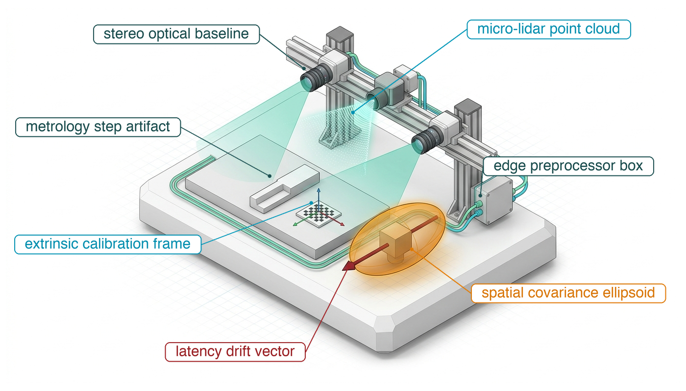
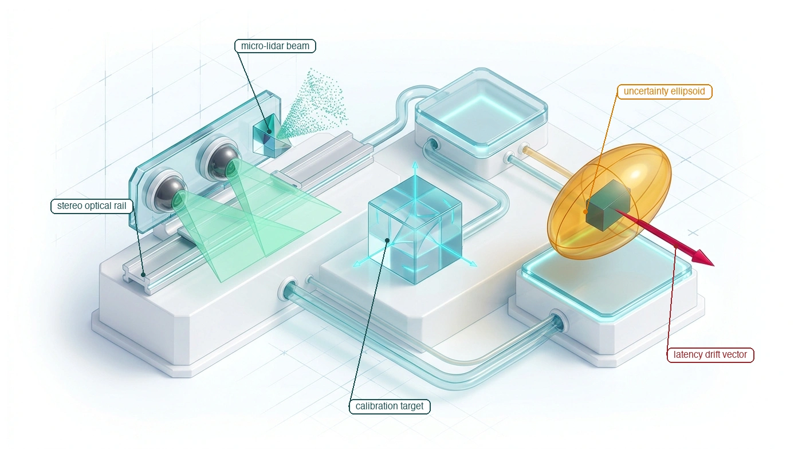

---
format:
  html:
    title: "Sensor Perception"
---

# Sensor Perception {#sec-perception}

::: {layout-narrow}
::: {.column-margin}

\chapterminitoc

:::

::: {.content-visible when-format="pdf"}
\noindent
{fig-alt="Isometric blueprint showing multimodal sensor perception: stereo optical camera rail with sightline frustums, solid-state micro-lidar point cloud fan, precision calibration target with coordinate axes, dynamic uncertainty covariance ellipsoid, and latency drift vector."}
:::

::: {.content-visible unless-format="pdf"}
{fig-alt="Isometric blueprint showing multimodal sensor perception: stereo optical camera rail with sightline frustums, solid-state micro-lidar point cloud fan, precision calibration target with coordinate axes, dynamic uncertainty covariance ellipsoid, and latency drift vector."}
:::

:::

## Purpose {.unnumbered .unlisted}

::: {.content-visible when-format="pdf"}
\begin{marginfigure}
\vspace{1em}
\resizebox{\linewidth}{!}{\mlphysicalstackfull{100}{20}{20}{100}{20}}
\end{marginfigure}
:::

_Why does an obstacle detection with 99 percent recognition accuracy still cause a collision if its capture timestamp, coordinate frame, and spatial uncertainty are ignored?_

An obstacle location aids control only when its time, coordinate frame, and uncertainty are known. The world continues moving while a sensor captures an image, transfers it through memory, and waits for a model to interpret it. An accurate estimate can describe a position that is no longer current when the controller acts. Calibration errors and vibration introduce a different uncertainty, changing the relationship between a measurement and the physical space it represents. Reporting an object label without those qualifications hides information needed to judge clearance. Perception must therefore preserve when and where an observation originated and communicate the limits of the resulting spatial estimate. Recognition alone cannot repair stale or poorly calibrated measurements. In physical AI systems architecture, perception connects sensor behavior and processing delay to the geometric claims that the Brain uses and the permission path must evaluate before permitting motion.



::: {.callout-learning-objectives}

- Specify an observation contract that carries capture time, a bounded clock conversion, coordinate frame, and uncertainty
- Calculate observation age across the sensing, transport, preprocessing, and inference pipeline, and convert it into its stopping-budget term
- Diagnose spatial errors caused by sensor timing, motion during capture, and misaligned coordinate frames
- Explain why average capture bandwidth does not bound a frame's age or a renewal's lateness, and size the host contention a renewal allowance tolerates
- Evaluate whether observation uncertainty leaves enough physical clearance for a proposed action
- Distinguish perception failures that runtime checks can detect from errors that remain silent

:::

## Photons to Spatial Claims {#sec-perception-photons-to-claims}

```{python}
#| label: calc-perception-opening-age
#| echo: false
# ┌─────────────────────────────────────────────────────────────────────────────
# │ OPENING SCENE: OBSERVATION AGE AT THE RACK END
# ├─────────────────────────────────────────────────────────────────────────────
# │ Context: The opening paragraph of @sec-perception-photons-to-claims;
# │          also the temporal-batching paragraph and the clock-sync pitfall.
# │
# │ Goal:    Show how far the warehouse mobile manipulator travels while its
# │          navigation camera's observation of a person ages.
# │ Show:    t_age 51.6 ms; 77.4 mm of travel at the 1.5 m/s drive limit.
# │ How:     AISLE.perception_age and RM.base.max_velocity; displacement via
# │          calc_spatial_information_age_displacement.
# └─────────────────────────────────────────────────────────────────────────────
from mlsysim import *
from mlsysim.core.units import *
from mlsysim.fmt import fmt_latency, fmt_length, fmt_velocity, check

RM = Embodied.MobileManipulator.WarehouseMobileManipulator
AISLE = Embodied.Scenario.WarehouseAisle

class RackEndOpeningAge:
    """Travel during the navigation camera's observation age at the drive limit."""

    # ┌── 1. LOAD (Constants & Parameters) ─────────────────────────────────
    t_age = AISLE.perception_age  # category: derived
    v = RM.base.max_velocity  # category: illustrative (drive limit)

    # ┌── 2. EXECUTE (Compute) ─────────────────────────────────────────────
    dx = calc_spatial_information_age_displacement(v, t_age).to(ureg.millimeter)

    # ┌── 3. GUARD (Invariants) ───────────────────────────────────────────
    check(abs(t_age.to(millisecond).magnitude - 51.6) < 0.05, f"Unexpected t_age: {t_age}")
    check(abs(v.to(meter / second).magnitude - 1.5) < 1e-9, f"Unexpected drive limit: {v}")
    check(abs(dx.magnitude - 77.4) < 0.05, f"Unexpected travel during t_age: {dx}")

    # ┌── 4. OUTPUT (Formatting) ──────────────────────────────────────────
    t_age_str = fmt_latency(t_age.to(millisecond), unit=millisecond, precision=1)
    v_str = fmt_velocity(v.to(meter / second), unit=meter / second, precision=1)
    dx_str = fmt_length(dx, unit=ureg.millimeter, precision=1)
```

The warehouse mobile manipulator's vision model can recognize a person stepping out from a rack end almost every time and still hand the planner a position that is already out of date. The world keeps moving while the navigation camera integrates and reads out its image and while the pipeline processes it. On this machine, an illustrative `{python} RackEndOpeningAge.t_age_str` passes between the middle of the exposure and the moment the observation reaches any consumer, and at the base's `{python} RackEndOpeningAge.v_str` drive limit the machine covers `{python} RackEndOpeningAge.dx_str` in that time. Recognition accuracy does not say whether that observation is fresh enough for the proposed motion. In physical AI, an observation has an expiration date.

Perception runs in the Brain, above the proposal boundary of @sec-boundary-machine-model. It turns photons, time-of-flight pulses, and reflected radio waves into dated spatial claims and proposes them, but it holds no authority over the actuators; that authority stays with the permission path below the boundary.

The work of turning photons into dated claims does not depend on how the architecture is drawn. An end-to-end vision-to-action policy [@brohan2023rt1; @brohan2023rt2; @zhao2023learning] maps camera observations to proposed actions within one network, while a classical modular pipeline splits sensor ingestion, state estimation, mapping, and trajectory generation across separate processes. Marr's analysis of vision [@marr1982vision] separates what a visual computation must achieve from the representation that carries it and the hardware that executes it, and in physical AI each of these levels must be realized somewhere between the stimulus and the response.

When an engineering team combines these responsibilities in an end-to-end model, the responsibilities remain, but their intermediate representations become harder to inspect independently. An explicit interface can expose a coordinate transform for checking, carry an expiration deadline, or let another component reject an inconsistent estimate. A hidden representation requires additional instrumentation or external checks to provide comparable evidence. If perception mistakes a wet-floor reflection for open clearance, the engineer needs a way to detect or contain the resulting error regardless of how many software modules implement the pipeline.

That evidence begins where physical energy converts into digital data. From transduction at the detector array to consumption by a state estimator, every processing stage adds observation age. Photons striking the photodiode array of a CMOS camera do not instantly appear as feature embeddings in an inference engine; exposure, readout, transport, memory transfer, preprocessing, and the vision backbone each take a share of the delay. If the perception stage hands downstream components an object detection bounding box without an explicit timestamp and a calibrated spatial transform, a downstream planner will evaluate that obstacle relative to the current position of the chassis, misplacing it by the distance the machine has traveled since capture.

::: {.column-margin .margin-pointer}
↰ **Prerequisite:** Transduction freshness and sensor measurement aging are derived in @sec-body-measurement-freshness.
:::

::: {#dfn-perception-spatial-information-age .callout-definition title="Spatial information age"}

***Spatial information age***\index{Spatial information age!definition}\index{Information age!definition} ($t_{\text{age}}$) is the total elapsed physical time between the physical energy integration midpoint ($t_{\text{exp}}/2$) at the transducer and the downstream consumption of the resulting observation tensor by a state estimator or control policy. It is the capture-to-consumption part of the measurement age that @sec-body-measurement-freshness counts from transduction, and running text calls it observation age.

1.  **Significance**: Because physical mass moves while digital computation executes, sensory latency translates directly into unmodeled spatial displacement (@eq-percep-spatial-displacement):
    $$\Delta \mathbf{x} = \int_{t_0}^{t_0+t_{\text{age}}} \mathbf{v}(t)\,dt$$ {#eq-percep-spatial-displacement}
    This continuous physical shift depletes geometric safety buffers before an obstacle is even classified.
2.  **Distinction**: Unlike software pipeline latency (wall-clock duration of a forward pass), observation age accounts for the full physical journey: half the exposure, readout, transport, DMA and queueing, ISP processing, the vision backbone, and dispatch.
3.  **Common pitfall**: Treating the frame arrival timestamp ($t_{\text{recv}}$) in userspace memory as the observation time ($t_0$). Using arrival time hides upstream capture and transport delays and adds unmodeled phase lag to the feedback controllers that consume the observation.

:::

### Temporal batching and phase margin erosion

```{python}
#| label: calc-perception-temporal-batching
#| echo: false
# ┌─────────────────────────────────────────────────────────────────────────────
# │ TEMPORAL BATCHING ON THE NAVIGATION CAMERA
# ├─────────────────────────────────────────────────────────────────────────────
# │ Context: The temporal-batching paragraph of @sec-perception-photons-to-claims.
# │
# │ Goal:    Show what a four-frame batch collected across capture times adds
# │          to the navigation camera's observation age.
# │ Show:    16.7 ms frame period at 60 Hz; waits of 50.0, 33.3, and 16.7 ms;
# │          age 51.6 ms -> 101.6 ms, roughly double.
# │ How:     RM.nav_camera.frame_rate; AISLE.perception_age; the oldest of
# │          n frames waits (n - 1) frame periods.
# └─────────────────────────────────────────────────────────────────────────────
from mlsysim import *
from mlsysim.core.units import *
from mlsysim.fmt import fmt_latency, fmt_frequency, check

RM = Embodied.MobileManipulator.WarehouseMobileManipulator
AISLE = Embodied.Scenario.WarehouseAisle

class TemporalBatching:
    """Age added by batching successive navigation-camera frames."""

    # ┌── 1. LOAD (Constants & Parameters) ─────────────────────────────────
    f_frame = RM.nav_camera.frame_rate  # category: datasheet
    t_age = AISLE.perception_age.to(millisecond)  # category: derived
    n_batch = 4  # category: illustrative (batch size)

    # ┌── 2. EXECUTE (Compute) ─────────────────────────────────────────────
    t_period = (1 / f_frame).to(millisecond)
    wait_1 = ((n_batch - 1) * t_period).to(millisecond)
    wait_2 = ((n_batch - 2) * t_period).to(millisecond)
    wait_3 = ((n_batch - 3) * t_period).to(millisecond)
    t_age_batched = (t_age + wait_1).to(millisecond)
    ratio = (t_age_batched / t_age).to(ureg.dimensionless).magnitude

    # ┌── 3. GUARD (Invariants) ───────────────────────────────────────────
    check(abs(f_frame.to(ureg.hertz).magnitude - 60.0) < 1e-9, f"Unexpected frame rate: {f_frame}")
    check(abs(wait_1.magnitude - 50.0) < 0.05, f"Unexpected oldest-frame wait: {wait_1}")
    check(abs(t_age_batched.magnitude - 101.6) < 0.05, f"Unexpected batched age: {t_age_batched}")
    check(1.8 < ratio < 2.2, f"Prose says batching roughly doubles the age: {ratio}")

    # ┌── 4. OUTPUT (Formatting) ──────────────────────────────────────────
    f_frame_str = fmt_frequency(f_frame, unit=ureg.hertz, precision=0)
    t_period_str = fmt_latency(t_period, unit=millisecond, precision=1)
    wait_1_str = fmt_latency(wait_1, unit=millisecond, precision=0)
    wait_2_str = fmt_latency(wait_2, unit=millisecond, precision=1)
    wait_3_str = fmt_latency(wait_3, unit=millisecond, precision=1)
    t_age_batched_str = fmt_latency(t_age_batched, unit=millisecond, precision=1)
```

Batching improves accelerator throughput by amortizing work across images, but collecting a batch across successive capture times ages its earliest member. At the navigation camera's `{python} TemporalBatching.f_frame_str` cadence ($T_{\text{sample}} \approx$ `{python} TemporalBatching.t_period_str`), a batch of four consecutive frames holds the first for `{python} TemporalBatching.wait_1_str`, the second and third for `{python} TemporalBatching.wait_2_str` and `{python} TemporalBatching.wait_3_str`, and the last not at all. Adding the oldest frame's wait to the `{python} RackEndOpeningAge.t_age_str` observation age roughly doubles it, to `{python} TemporalBatching.t_age_batched_str`. That lies far above the refusal threshold, the budgeted age plus the clock-conversion bound that @sec-perception-observation-contract sets, so on this machine the permission path refuses every claim built from a batch collected across capture times. Images captured together by several cameras may instead be batched only when the batch adds no age beyond the budgeted stages and meets its deadline.

Age spends a feedback loop's phase margin as well, because a pure delay $t_{\text{age}}$ adds phase lag $\omega t_{\text{age}}$ at frequency $\omega$ without changing gain. A loop with nominal margin $\text{PM}_{\text{nom}}$ at gain crossover $\omega_c$ therefore exhausts it once $t_{\text{age}} \ge \text{PM}_{\text{nom}}/\omega_c$, and exposure, processing, transport, permission, and actuator delay all draw on that one ceiling (@sec-appendix-control-zoh).

The same delay is paid twice, as phase lag in the loop and as travel toward the obstacle, and a consumer can budget only the delay it can measure. What perception hands over must therefore carry a timestamp, a coordinate frame, and a usable error bound, and transduction, ingress, and geometric estimation can each invalidate them before the permission path admits a motion.

## What Perception Hands Over {#sec-perception-handoff}

Raw sensor hardware yields electrical measurements such as photodiode voltages, time-of-flight counter values, or capacitive displacements. These unstructured signals differ significantly from the state variables needed for downstream autonomy. An actuator controller cannot track a desired force using a two-dimensional grid of raw pixel intensities, and a trajectory optimizer cannot plan collision-free paths using unorganized time-of-flight returns. Downstream estimation, planning, and memory subsystems require structured representations of physical state, including metric positions, velocities, bounding volumes, surface normals, and semantic classifications. Translating raw sensor streams into these representations is the operational responsibility of the perception pipeline. Each observation it hands over must carry three properties for downstream software: a capture timestamp, a reference frame, and an uncertainty envelope.

The first mandatory property is the **capture timestamp**\index{Capture timestamp!definition} $t_0$, which specifies the temporal midpoint of the physical energy integration window (the effective moment the camera shutter was open or the laser pulse fired). Sensors do not take instantaneous snapshots; a camera integrates photons across an exposure duration, and a mechanical lidar sweeps laser pulses over an azimuth arc across several milliseconds. Downstream state estimators require $t_0$ to integrate the measurement into the machine's dynamic equations of motion. The arrival stamp that the definition warns against, $t_{\text{recv}}$, marks the moment the operating system kernel completes the direct memory access transfer. Half the exposure, readout, transport, and direct memory access (DMA) all elapse before that moment, so the arrival offset $\tau_{\text{recv}} = t_{\text{recv}} - t_0$ is never zero, and substituting arrival time for capture time corrupts the state estimator.

```{python}
#| label: calc-perception-arrival-stamp
#| echo: false
# ┌─────────────────────────────────────────────────────────────────────────────
# │ ARRIVAL-TIMESTAMP OFFSET ON THE NAVIGATION CAMERA
# ├─────────────────────────────────────────────────────────────────────────────
# │ Context: The capture-timestamp paragraph of @sec-perception-handoff.
# │
# │ Goal:    Size the error an estimator makes when it dates the navigation
# │          camera's frame at DMA completion instead of at the exposure midpoint.
# │ Show:    26.6 ms from exposure midpoint to DMA completion; 39.9 mm of base
# │          travel at the 1.5 m/s drive limit.
# │ How:     t_recv - t0 = t_exp/2 + t_readout + t_transport + t_dma from
# │          RM.nav_camera and AISLE; displacement via
# │          calc_spatial_information_age_displacement.
# └─────────────────────────────────────────────────────────────────────────────
from mlsysim import *
from mlsysim.core.units import *
from mlsysim.fmt import fmt_latency, fmt_length, fmt_velocity, check

RM = Embodied.MobileManipulator.WarehouseMobileManipulator
AISLE = Embodied.Scenario.WarehouseAisle

class ArrivalStampOffset:
    """Age hidden by an arrival timestamp on the running machine's navigation camera."""

    # ┌── 1. LOAD (Constants & Parameters) ─────────────────────────────────
    camera = RM.nav_camera  # category: datasheet (registry: navigation camera)
    t_exp = camera.exposure_time  # category: datasheet
    t_readout = camera.readout_time  # category: datasheet
    t_transport = AISLE.t_transport  # category: illustrative
    t_dma = AISLE.t_dma  # category: illustrative
    v = RM.base.max_velocity  # category: illustrative (drive limit)

    # ┌── 2. EXECUTE (Compute) ─────────────────────────────────────────────
    tau_recv = (t_exp / 2 + t_readout + t_transport + t_dma).to(millisecond)
    dx_recv = calc_spatial_information_age_displacement(v, tau_recv).to(ureg.millimeter)

    # ┌── 3. GUARD (Invariants) ───────────────────────────────────────────
    check(abs(tau_recv.magnitude - 26.6) < 0.05, f"Unexpected arrival offset: {tau_recv}")
    check(abs(dx_recv.magnitude - 39.9) < 0.05, f"Unexpected arrival-stamp displacement: {dx_recv}")
    check(tau_recv < AISLE.perception_age, "Arrival offset must be part of the full observation age")

    # ┌── 4. OUTPUT (Formatting) ──────────────────────────────────────────
    tau_recv_str = fmt_latency(tau_recv, unit=millisecond, precision=1)
    dx_recv_str = fmt_length(dx_recv, unit=ureg.millimeter, precision=1)
    v_str = fmt_velocity(v.to(meter / second), unit=meter / second, precision=1)
```

The magnitude of this corruption follows from @eq-percep-spatial-displacement with the arrival offset in place of the full age, and at constant velocity $v$ it reduces to $\Delta x = v\,\tau_{\text{recv}}$. On the mobile manipulator, the navigation camera's frame completes its DMA transfer `{python} ArrivalStampOffset.tau_recv_str` after the exposure midpoint. An estimator that stamps the frame on arrival therefore dates it that much late, and at the base's `{python} ArrivalStampOffset.v_str` drive limit it pairs the observation with a pose `{python} ArrivalStampOffset.dx_recv_str` beyond the one the camera occupied at capture.

::: {.column-margin .margin-pointer}
↳ **Downstream:** @sec-memory-reference-frames adds how these sensor-to-body transforms go stale over time.
:::

```{python}
#| label: calc-perception-extrinsic-error
#| echo: false
# ┌─────────────────────────────────────────────────────────────────────────────
# │ EXTRINSIC ANGLE ERRORS AGAINST THE AISLE'S CLEARANCES
# ├─────────────────────────────────────────────────────────────────────────────
# │ Context: The reference-frame paragraph of @sec-perception-handoff, the
# │          transform-chain paragraph of @sec-perception-error-clearance, and
# │          the calibration takeaway.
# │
# │ Goal:    Tie two lever-arm errors to the stopping budget's terms: an
# │          uncalibrated 1 degree mount error at 15 m against the base's side
# │          clearance, and a 0.005 rad extrinsic shift at 10 m against delta_loc.
# │ Show:    0.26 m, about 1.7x the 0.15 m side clearance; 50 mm, the whole
# │          delta_loc allowance.
# │ How:     Delta_y = d sin(theta); delta_x = z theta; AISLE.side_clearance and
# │          AISLE.delta_loc.
# └─────────────────────────────────────────────────────────────────────────────
import math
from mlsysim import *
from mlsysim.core.units import *
from mlsysim.fmt import fmt, fmt_length, fmt_multiple, check

AISLE = Embodied.Scenario.WarehouseAisle

class ExtrinsicErrorBudget:
    """Lever-arm errors from angular mount errors, set against the aisle clearances."""

    # ┌── 1. LOAD (Constants & Parameters) ─────────────────────────────────
    theta_frame = 1.0 * ureg.degree  # category: illustrative (uncalibrated mount error)
    d_frame = 15.0 * meter  # category: illustrative (detection range)
    theta_ext = 0.005 * radian  # category: illustrative (extrinsic shift after shock)
    z_ext = 10.0 * meter  # category: illustrative (target range)
    side_clearance = AISLE.side_clearance  # category: illustrative
    delta_loc = AISLE.delta_loc  # category: illustrative

    # ┌── 2. EXECUTE (Compute) ─────────────────────────────────────────────
    dy_frame = (d_frame * math.sin(theta_frame.to(radian).magnitude)).to(meter)
    dy_over_side = (dy_frame / side_clearance).to(ureg.dimensionless).magnitude
    dx_ext = (z_ext * theta_ext.magnitude).to(ureg.millimeter)
    dx_over_loc = (dx_ext / delta_loc).to(ureg.dimensionless).magnitude

    # ┌── 3. GUARD (Invariants) ───────────────────────────────────────────
    check(abs(dy_frame.magnitude - 0.2618) < 0.0005, f"Unexpected 1-degree lever-arm error: {dy_frame}")
    check(dy_frame > side_clearance, "Prose says the 1-degree error exceeds the side clearance")
    check(abs(dx_ext.magnitude - 50.0) < 0.05, f"Unexpected extrinsic-shift error: {dx_ext}")
    check(abs(dx_over_loc - 1.0) < 1e-9, "Prose says the extrinsic shift spends all of delta_loc")

    # ┌── 4. OUTPUT (Formatting) ──────────────────────────────────────────
    theta_frame_str = fmt(theta_frame.to(ureg.degree).magnitude, precision=0)
    d_frame_str = fmt_length(d_frame, unit=meter, precision=0)
    dy_frame_str = fmt_length(dy_frame, unit=meter, precision=2)
    dy_over_side_mult_str = fmt_multiple(dy_over_side, precision=1)
    side_clearance_str = fmt_length(side_clearance.to(meter), unit=meter, precision=2)
    theta_ext_str = fmt(theta_ext.magnitude, precision=3)
    z_ext_str = fmt_length(z_ext, unit=meter, precision=0)
    dx_ext_str = fmt_length(dx_ext, unit=ureg.millimeter, precision=0)
    delta_loc_str = fmt_length(delta_loc.to(ureg.millimeter), unit=ureg.millimeter, precision=0)
```

The second mandatory property is the **reference frame**\index{Reference frame!definition} identifier $\mathcal{F}_{\text{sensor}}$. Every spatial measurement is natively resolved in the local coordinate system of the physical transducer. A camera measures bearing angles relative to its optical center, while a radar measures range and Doppler velocity relative to its antenna array. Downstream trajectory planners and obstacle maps operate in a chassis body frame $\mathcal{F}_{\text{body}}$ or an inertial navigation frame $\mathcal{F}_{\text{world}}$. Transforming an observation from $\mathcal{F}_{\text{sensor}}$ to $\mathcal{F}_{\text{body}}$ requires applying a rigid-body spatial transformation consisting of a rotation matrix and a translation vector that define the sensor mounting extrinsics (the exact physical location and orientation where the sensor is bolted onto the machine). The frames nest from the globe down to the transducer, $\mathcal{F}_{\text{earth}} \to \mathcal{F}_{\text{map}} \to \mathcal{F}_{\text{odom}} \to \mathcal{F}_{\text{body}} \to \mathcal{F}_{\text{sensor}}$, and every link in that tree carries its own transform and uncertainty (@fig-08-coordinate-frame-tree).

When perception outputs omit the frame identifier or rely on nominal CAD dimensions rather than calibrated physical extrinsics, small angular offsets create large spatial errors that scale with distance. An uncalibrated pitch or yaw error of $\theta =$ `{python} ExtrinsicErrorBudget.theta_frame_str`° on a sensor detecting an object at range $d =$ `{python} ExtrinsicErrorBudget.d_frame_str` induces a transverse position error $\Delta y \approx d \sin\theta$ of `{python} ExtrinsicErrorBudget.dy_frame_str`, about `{python} ExtrinsicErrorBudget.dy_over_side_mult_str` the `{python} ExtrinsicErrorBudget.side_clearance_str` side clearance the base keeps from the racks, so the planner either steers into the racking or rejects a valid aisle as obstructed.

The [REP 105 frame convention](https://reps.openrobotics.org/rep-0105/)\index{Standards!REP 105} names these frames and separates a locally continuous `odom` pose from a globally corrected `map` pose. On the mobile manipulator, $\mathcal{F}_{\text{body}}$ is the base's `base_link`, tracked through the odometric frame `odom`, and the arm's serial chain maps its mounting flange `tool0` through the joint angles back to `base_link`. @Tbl-08-rep105-tree lists the roles and the rule each consumer follows. A local controller consumes a continuous estimate and rejects unexpected transform jumps, and an implementation still has to check transform timestamps and estimator uncertainty.

| Frame         | Parent in this example | Meaning                                     | Consumer rule                                                 |
|:--------------|:-----------------------|:--------------------------------------------|:--------------------------------------------------------------|
| `earth`       | root                   | Optional geodetic datum                     | Verify datum before global routing                            |
| `map`         | `earth` if present     | Global localization; corrections may jump   | Keep relocalization jumps out of local feedback               |
| `odom`        | `map`                  | Locally continuous pose estimate; may drift | Track motion locally; monitor uncertainty and discontinuities |
| `base_link`   | `odom`                 | Body-fixed origin                           | Body pose still inherits odometry uncertainty                 |
| `sensor_link` | `base_link`            | Calibrated sensor mounting frame            | Apply time-valid extrinsics and their uncertainty             |

: **REP 105 frame roles for a mobile robot**: A compact example of global, local, body, and sensor frames. REP 105 requires `odom`-relative pose to remain continuous but does not prescribe $C^1$ smoothness, a covariance growth rate, or fixed accuracy; these require estimator-specific evidence. {#tbl-08-rep105-tree tbl-colwidths="[14,20,32,34]"}

::: {#fig-08-coordinate-frame-tree fig-env="figure" fig-pos="t" fig-cap="**Coordinate frame tree and uncertainty**: The spatial coordinate frame hierarchy formalizes the separation between continuous local dead reckoning ($\mathcal{F}_{\text{odom}} \to \mathcal{F}_{\text{body}}$) consumed by high-frequency tracking loops and discontinuous global map corrections ($\mathcal{F}_{\text{map}} \to \mathcal{F}_{\text{odom}}$) consumed by global planners. Spatial covariance compounds across the kinematic chain, from odometric drift through the mounting extrinsics to the sensor's own measurement error, requiring downstream consumers to reject observations that lack an explicit coordinate key $\mathcal{F}_{\text{sensor}}$, capture epoch $t_0$, and covariance envelope $\mathbf{\Sigma}_z$. Attribution: Book kinematic systems diagram, CC BY 4.0." fig-alt="REP 105 Spatial Transform Tree and Uncertainty Composition. The spatial coordinate frame hierarchy formalizes the separation between continuous local dead reckoning (Fodom -> Fbody) consumed by high-frequency tracking loops and discontinuous global map corrections (Fmap -> Fodom) consumed by global planners. Spatial covariance compounds across the kinematic chain, from odometric drift through the mounting extrinsics to the sensor's own measurement error, requiring downstream consumers to reject observations that lack an explicit coordinate key Fsensor, capture epoch t0, and covariance envelope Sigmaz. Attribution: Book kinematic systems diagram, CC BY 4.0."}
{width="95%"}
:::

The third mandatory property is an **uncertainty representation**\index{Uncertainty envelope!definition}, such as covariance $\mathbf{\Sigma}_z$ together with a validated tail or hard error bound when clearance depends on it. Low illumination, atmospheric scattering, specular surfaces, and model error change the residual distribution. A covariance describes second moments, not a region guaranteed to contain the true state. Estimators can use it to weight innovations against a motion model; an underestimated covariance can pull a state estimate toward a spurious measurement and lead to poor downstream commands. Safety decisions must also account for bias, missed detections, and validation limits.

::: {#psp-perception-observation-invariants .callout-perspective title="The three invariants of observation"}
Pass a perception claim with its capture time and clock domain, coordinate frame, and qualified uncertainty. Refuse a claim when any of those cannot be checked for the proposed motion.
:::

Together, these properties are the core of the observation contract that @sec-perception-observation-contract turns into a record that every downstream consumer checks before use. Dropping an incomplete or unbounded observation allows a downstream estimator to propagate its state forward using physical dynamics, degrading uncertainty smoothly over time. Accepting an ungrounded packet, by contrast, injects unmodeled delays, spatial distortions, and false confidence directly into the control loop. Enforcing this contract requires tracing how an observation originates, beginning at the hardware interface where physical phenomena are first sampled.

## Sensor Transduction and Calibration {#sec-perception-transduction-calibration}

Lag accumulates before software receives anything at all, beginning at the photosite where physical phenomena are converted into electrical charge. A camera does not capture an instantaneous snapshot. Photons collect on a photodiode over a finite exposure duration $t_{\text{exp}}$, which means the recorded pixel intensity represents the temporal integral of scene radiance $I(t)$ over that interval:
$$I_{\text{pixel}} = \int_{0}^{t_{\text{exp}}} I(t)\,dt$$

```{python}
#| label: calc-perception-rolling-shutter-skew
#| echo: false
# ┌─────────────────────────────────────────────────────────────────────────────
# │ ROLLING-SHUTTER SKEW ON THE NAVIGATION CAMERA
# ├─────────────────────────────────────────────────────────────────────────────
# │ Context: The exposure paragraph and the rolling-shutter example of
# │          @sec-perception-transduction-calibration.
# │
# │ Goal:    Size the exposure-midpoint lag, per-row blur, and scanline skew
# │          the navigation camera records while the base passes a vertical
# │          rack upright.
# │ Show:    an 8 ms midpoint lag; 3,040 rows in 16.6 ms (5.46 us per row);
# │          24.9 mm of skew and 24 mm of blur at the 1.5 m/s drive limit;
# │          the uncompensated skew is about a sixth of the 0.15 m side
# │          clearance.
# │ How:     RM.nav_camera readout, exposure, and row count; RM.base drive
# │          limit; AISLE.side_clearance; RM.imu sample rate for compensation.
# └─────────────────────────────────────────────────────────────────────────────
from mlsysim import *
from mlsysim.core.units import *
from mlsysim.fmt import fmt_latency, fmt_length, fmt_velocity, fmt_frequency, fmt_int, check

RM = Embodied.MobileManipulator.WarehouseMobileManipulator
AISLE = Embodied.Scenario.WarehouseAisle

class RollingShutterSkew:
    """Scanline skew and blur on the running machine's navigation camera at the drive limit."""

    # ┌── 1. LOAD (Constants & Parameters) ─────────────────────────────────
    camera = RM.nav_camera  # category: datasheet (registry: navigation camera)
    rows = camera.resolution_height  # category: datasheet
    t_readout = camera.readout_time.to(millisecond)  # category: datasheet
    t_exp = camera.exposure_time.to(millisecond)  # category: datasheet
    v = RM.base.max_velocity.to(meter / second)  # category: illustrative (drive limit)
    side_clearance = AISLE.side_clearance  # category: illustrative
    f_imu = RM.imu.sample_rate  # category: datasheet

    # ┌── 2. EXECUTE (Compute) ─────────────────────────────────────────────
    t_exp_half = (t_exp / 2).to(millisecond)
    t_row = (t_readout / rows).to(microsecond)
    skew = (v * t_readout).to(ureg.millimeter)
    blur = (v * t_exp).to(ureg.millimeter)
    skew_share = (skew / side_clearance).to(ureg.dimensionless).magnitude

    # ┌── 3. GUARD (Invariants) ───────────────────────────────────────────
    check(rows == 3040, f"Unexpected navigation-camera row count: {rows}")
    check(abs(t_row.magnitude - 5.46) < 0.005, f"Unexpected row interval: {t_row}")
    check(abs(skew.magnitude - 24.9) < 0.05, f"Unexpected rolling-shutter skew: {skew}")
    check(abs(blur.magnitude - 24.0) < 0.05, f"Unexpected per-row blur: {blur}")
    check(abs(t_exp_half.magnitude - 8.0) < 0.05, f"Unexpected exposure-midpoint lag: {t_exp_half}")
    check(0.15 < skew_share < 0.18, f"Prose says the skew is about a sixth of the side clearance: {skew_share}")

    # ┌── 4. OUTPUT (Formatting) ──────────────────────────────────────────
    rows_str = fmt_int(rows)
    last_row_str = fmt_int(rows - 1)
    t_readout_str = fmt_latency(t_readout, unit=millisecond, precision=1)
    t_exp_str = fmt_latency(t_exp, unit=millisecond, precision=0)
    t_exp_half_str = fmt_latency(t_exp_half, unit=millisecond, precision=0)
    t_row_str = fmt_latency(t_row, unit=microsecond, precision=2)
    skew_str = fmt_length(skew, unit=ureg.millimeter, precision=1)
    blur_str = fmt_length(blur, unit=ureg.millimeter, precision=0)
    v_str = fmt_velocity(v, unit=meter / second, precision=1)
    side_clearance_str = fmt_length(side_clearance.to(meter), unit=meter, precision=2)
    f_imu_str = fmt_frequency(f_imu, unit=ureg.hertz, precision=0, commas=True)
```

When the sensor or the scene moves at velocity $v$ during exposure, a sharp boundary such as a rack upright smears across several photosites, a motion blur of width $\Delta x_{\text{blur}} = v\,t_{\text{exp}}$. Because charge accumulates across the whole window, the time the accumulated image represents is the exposure midpoint, a lag of $t_{\text{exp}}/2$ behind the start of exposure. With the navigation camera's `{python} RollingShutterSkew.t_exp_str` exposure at the base's `{python} RollingShutterSkew.v_str` drive limit, the image does not record where the robot *is*. It records where the robot *was* `{python} RollingShutterSkew.t_exp_half_str` earlier, smeared across `{python} RollingShutterSkew.blur_str` of motion blur.

### Rolling shutter distortion and motion compensation

The exposure window schedule across the pixel array determines the spatial geometry of the image. In a **global shutter**\index{Global shutter!definition} sensor, every pixel photodiode accumulates charge during the identical time interval and transfers the accumulated electrons to shielded storage nodes simultaneously. In a **rolling shutter**\index{Rolling shutter!definition} sensor, silicon area and cost constraints dictate that rows are reset, exposed, and read out sequentially from the top scanline $y = 0$ to the bottom scanline $y = H - 1$. Each successive scanline begins exposure after a row period $t_{\text{row}}$, creating a progressive temporal offset across the image plane:[^fn-hw-rolling-shutter]
$$t(y) = t_{\text{start}} + y \cdot t_{\text{row}}$$
where $t_{\text{start}}$ is the start of exposure for the top row. When the body translates at linear velocity $v$ perpendicular to a vertical feature, scanline $y$ captures it at a spatial displacement:
$$\Delta x(y) = v \cdot y \cdot t_{\text{row}}$$

[^fn-hw-rolling-shutter]: **Rolling shutter epipolar geometry**\index{Hardware!rolling shutter}: Rolling shutter CMOS image sensors reset, integrate, and read pixel scanlines sequentially across the array rather than exposing all photosites simultaneously. When the camera rotates during this readout interval, straight physical edges project into curved geometric arcs across the image plane. This progressive scanline skew violates rigid multi-view epipolar constraints, causing the factor graphs of visual-inertial odometry, which estimates motion by fusing camera features with inertial measurements, to compute spurious feature depths unless continuous-time B-spline camera trajectories interpolate the instantaneous pose of every scanline.

Under rotational motion, rolling shutter distortion becomes non-linear. If the camera undergoes angular rotation at angular velocity vector $\boldsymbol{\omega} = [\omega_x, \omega_y, \omega_z]^T$ (e.g., rapid yaw or pitch during aggressive robot maneuvers), the effective camera attitude changes continuously as scanlines are read. Physically, the camera points in a slightly different direction for every single row. For a scanline at vertical coordinate $y$, the differential rotation relative to the frame start is $\Delta \boldsymbol{\theta}(y) \approx \boldsymbol{\omega} \cdot y \cdot t_{\text{row}}$. This scanline-dependent rotation warps straight physical lines into curves, induces focal-length dilation (scaling distortion during pitch), and shears vertical walls into slanted surfaces, as demonstrated by the propeller blade curvature in @fig-rolling-shutter-skew.

Consider the mobile manipulator's navigation camera while the base passes a vertical rack upright at its `{python} RollingShutterSkew.v_str` drive limit. The rolling shutter reads the frame's `{python} RollingShutterSkew.rows_str` rows in $t_{\text{readout}} =$ `{python} RollingShutterSkew.t_readout_str`, so the inter-row interval is $t_{\text{row}} =$ `{python} RollingShutterSkew.t_row_str`. An upright spanning the full height of the frame does not appear vertical in the captured array. The bottom scanline ($y =$ `{python} RollingShutterSkew.last_row_str`) is sampled `{python} RollingShutterSkew.t_readout_str` after the top scanline ($y = 0$), producing a total spatial skew $\Delta x = v\,t_{\text{readout}}$ of `{python} RollingShutterSkew.skew_str`.

If downstream geometry reconstruction treats this image as an instantaneous rigid projection, the `{python} RollingShutterSkew.skew_str` tilt enters the obstacle map uncorrected. That is about a sixth of the `{python} RollingShutterSkew.side_clearance_str` side clearance the base keeps from the racks, and the motion planner can read the slanted upright as an artificial intrusion into the free corridor. The stopping budget's localization allowance $\delta_{\text{loc}}$ assumes this skew has been removed before the estimator sees the frame. Correcting this distortion requires **rolling-shutter motion compensation**\index{Rolling-shutter motion compensation!definition}, the continuous-time geometric unwarping algorithm that utilizes high-rate (`{python} RollingShutterSkew.f_imu_str`) inertial angular velocities ($\boldsymbol{\omega}$) and linear velocities ($\mathbf{v}$) to interpolate the instantaneous 6-DoF camera pose $\mathbf{T}_{wb}(t(y))$ for each individual scanline $y$, restoring rigid epipolar geometry prior to 3D triangulation.

::: {#fig-rolling-shutter-skew fig-env="figure" fig-pos="t" fig-cap="**Rolling shutter distortion geometry**: A photograph of rotating propeller blades captured by a rolling shutter CMOS sensor. Because sensor scanlines are exposed and read sequentially from top to bottom rather than simultaneously, the rapid physical movement of the blades relative to the row period ($t_{\text{row}}$) shears and curves straight rigid structures into non-linear, disconnected geometric arcs. In high-speed embodied systems, uncompensated rolling shutter skew introduces large 3D triangulation errors and phantom obstacle intrusion in downstream visual-inertial odometry. (Credit: Wikimedia Commons, CC BY-SA 3.0)." fig-alt="Empirical rolling shutter distortion caused by progressive scanline exposure. A photograph of rotating propeller blades captured by a rolling shutter CMOS sensor. Because sensor scanlines are exposed and read sequentially from top to bottom rather than simultaneously, the rapid physical movement of the blades relative to the row period shears and curves straight rigid structures into non-linear, disconnected geometric arcs. In high-speed embodied systems, uncompensated rolling shutter skew introduces large 3D triangulation errors and phantom obstacle intrusion in downstream visual-inertial odometry. (Credit: Wikimedia Commons, CC BY-SA 3.0)."}
{width="85%"}
:::

### Camera calibration

Rolling-shutter compensation assumes that the camera's geometry is already known, and every metric claim the camera supports rests on that calibration. Under the **pinhole camera model**\index{Pinhole camera model} [@hartley2003multiple], the intrinsic matrix $\mathbf{K}$ maps a point $\mathbf{P}_c = [X_c, Y_c, Z_c]^\top$ in the camera's optical frame to the pixel $[u, v]^\top$:
$$\begin{bmatrix} u \\ v \\ 1 \end{bmatrix} \sim \frac{1}{Z_c} \mathbf{K} \mathbf{P}_c = \frac{1}{Z_c} \begin{bmatrix} f_x & 0 & c_x \\ 0 & f_y & c_y \\ 0 & 0 & 1 \end{bmatrix} \begin{bmatrix} X_c \\ Y_c \\ Z_c \end{bmatrix}$$ {#eq-percep-pinhole-projection}
where $f_x, f_y$ are focal lengths in pixels and $(c_x, c_y)$ is the principal point. Inverting the map recovers only a bearing ray, along which every depth is consistent with the pixel:
$$\mathbf{r}(u, v) = \mathbf{K}^{-1} \begin{bmatrix} u \\ v \\ 1 \end{bmatrix} = \begin{bmatrix} \frac{u - c_x}{f_x} \\ \frac{v - c_y}{f_y} \\ 1 \end{bmatrix}$$ {#eq-percep-bearing-ray}
Metric depth must therefore come from stereo disparity, a range sensor, or a learned prior, each with its own error, and @sec-perception-error-clearance charges that error against the clearance. Lens distortion is rectified in the image signal processor stage of @tbl-08-latency-budget. The projection's derivation, the distortion model, and Zhang's planar calibration [@zhang2000flexible] are developed in @sec-appendix-systems-vision.

The camera's relation to the inertial measurement unit must be calibrated in space and in time together [@furgale2013unified]. An extrinsic rotation error $\theta$ misplaces a point at range $z$ by about $z\,\theta$, and the camera's offset from the inertial unit adds lever-arm accelerations (@sec-appendix-control-spatial). An uncalibrated offset $\Delta t$ between exposure and the inertial sample misorients the camera by $\omega\,\Delta t$ while the base turns at angular velocity $\omega$, misplacing the same point by about $z\,\omega\,\Delta t$, so the timing error grows with both turn rate and range. Latching exposure starts and inertial samples on one hardware trigger bounds that offset, leaving a residual that online calibration estimates. Each of these calibrations holds only inside the conditions under which it was fitted, which is why the observation record carries a calibration revision and its validity range.

### The latency waterfall

Exposure and readout are only the first stages a frame passes through. Summing the stages of the latency waterfall\index{Latency waterfall} of @sec-body-measurement-freshness up to dispatch gives the observation age:
$$t_{\text{age}} = \frac{t_{\text{exp}}}{2} + t_{\text{readout}} + t_{\text{transport}} + t_{\text{DMA}} + t_{\text{ISP}} + t_{\text{backbone}} + t_{\text{IPC}}$$

```{python}
#| label: calc-perception-sensor-information-age
#| echo: false
# ┌─────────────────────────────────────────────────────────────────────────────
# │ NAVIGATION-CAMERA INFORMATION AGE AND STOPPING-BUDGET ROW 5
# ├─────────────────────────────────────────────────────────────────────────────
# │ Context: \ref{nbk-perception-sensor-transduction-latency-spatial-information-age},
# │          @tbl-08-latency-budget, and the stopping-budget paragraph of
# │          @sec-perception-transduction-calibration.
# │
# │ Goal:    Sum the warehouse mobile manipulator's navigation-camera latency
# │          waterfall into t_age and add its term to the stopping budget.
# │ Show:    Stage increments and cumulative ages; t_age 51.6 ms; tau_delay
# │          133.6 ms; row 5 v*t_age 77.4 mm at 1.5 m/s; running total
# │          835.5 mm -> 912.9 mm; 187.1 mm of the 1.10 m clear distance left.
# │ How:     Stage terms from RM.nav_camera and AISLE; totals from
# │          calc_safe_stopping_distance with the Body and Nervous System terms
# │          (a_brake, delta_loc, delta_margin, lease path, brake onset). The C2
# │          suffix and tracking inset join later rows, not this one.
# └─────────────────────────────────────────────────────────────────────────────
from mlsysim import *
from mlsysim.core.units import *
from mlsysim.fmt import (
    fmt_latency,
    fmt_length,
    fmt_velocity,
    fmt_time,
    fmt_display_math,
    check,
)

RM = Embodied.MobileManipulator.WarehouseMobileManipulator
AISLE = Embodied.Scenario.WarehouseAisle

class SensorInformationAge:
    """Navigation-camera latency waterfall, t_age, and the observation-age row of the stopping budget."""

    # ┌── 1. LOAD (Constants & Parameters) ─────────────────────────────────
    camera = RM.nav_camera  # category: datasheet (registry: Sony IMX477 navigation camera)
    t_exp = camera.exposure_time.to(millisecond)  # category: datasheet
    t_readout = camera.readout_time.to(millisecond)  # category: datasheet
    t_transport = AISLE.t_transport.to(millisecond)  # category: illustrative
    t_dma = AISLE.t_dma.to(millisecond)  # category: illustrative
    t_isp = AISLE.t_isp.to(millisecond)  # category: illustrative
    t_backbone = AISLE.t_backbone.to(millisecond)  # category: illustrative
    t_ipc = AISLE.t_ipc.to(millisecond)  # category: illustrative
    t_lease = AISLE.t_lease.to(millisecond)  # category: chosen
    t_tick = AISLE.t_tick.to(millisecond)  # category: chosen
    t_bus = AISLE.t_bus.to(millisecond)  # category: illustrative
    t_act = AISLE.t_brake_onset.to(millisecond)  # category: illustrative
    v = RM.base.max_velocity.to(meter / second)  # category: illustrative (drive limit)
    a_brake = AISLE.a_brake  # category: illustrative
    delta_loc = AISLE.delta_loc  # category: illustrative
    delta_margin = AISLE.delta_margin  # category: chosen
    d_clear = AISLE.d_clear  # category: illustrative

    # ┌── 2. EXECUTE (Compute) ─────────────────────────────────────────────
    t_exp_half = (t_exp / 2).to(millisecond)
    age_after_exposure = t_exp_half
    age_after_readout = age_after_exposure + t_readout
    age_after_transport = age_after_readout + t_transport
    age_after_dma = age_after_transport + t_dma
    age_after_isp = age_after_dma + t_isp
    age_after_backbone = age_after_isp + t_backbone
    tau_age = (age_after_backbone + t_ipc).to(millisecond)

    tau_delay = (tau_age + t_lease + t_tick + t_bus + t_act).to(millisecond)
    dx = calc_spatial_information_age_displacement(v, tau_age).to(ureg.millimeter)
    row_age = dx
    total_before = calc_safe_stopping_distance(v, t_lease + t_tick + t_bus + t_act, a_brake, delta_loc, delta_margin).to(ureg.millimeter)
    total_after = calc_safe_stopping_distance(v, tau_delay, a_brake, delta_loc, delta_margin).to(ureg.millimeter)
    remaining = (d_clear - total_after).to(ureg.millimeter)

    # ┌── 3. GUARD (Invariants) ───────────────────────────────────────────
    check(abs(tau_age.magnitude - AISLE.perception_age.to(millisecond).magnitude) < 1e-9, f"Waterfall disagrees with AISLE.perception_age: {tau_age}")
    check(abs(tau_age.magnitude - 51.6) < 0.05, f"Unexpected t_age: {tau_age}")
    check(abs(tau_delay.magnitude - AISLE.tau_delay.to(millisecond).magnitude) < 1e-9, f"Delay sum disagrees with AISLE.tau_delay: {tau_delay}")
    check(abs(tau_delay.magnitude - 133.6) < 0.05, f"Unexpected tau_delay: {tau_delay}")
    check(abs(v.magnitude - 1.5) < 1e-9, f"Unexpected drive limit: {v}")
    check(abs(row_age.magnitude - 77.4) < 0.05, f"Unexpected observation-age row: {row_age}")
    check(abs(total_before.magnitude - 835.5) < 0.05, f"Unexpected running total before row 5: {total_before}")
    check(abs(total_after.magnitude - 912.9) < 0.05, f"Unexpected running total after row 5: {total_after}")
    check(abs((total_after - total_before - row_age).magnitude) < 1e-6, "Row 5 does not close the running total")
    check(abs(remaining.magnitude - 187.1) < 0.05, f"Unexpected remaining clear distance: {remaining}")

    # ┌── 4. OUTPUT (Formatting) ──────────────────────────────────────────
    t_exp_str = fmt_latency(t_exp, unit=millisecond, precision=0)
    t_exp_half_str = fmt_latency(t_exp_half, unit=millisecond, precision=0)
    t_readout_str = fmt_latency(t_readout, unit=millisecond, precision=1)
    t_transport_str = fmt_latency(t_transport, unit=millisecond, precision=1)
    t_dma_str = fmt_latency(t_dma, unit=millisecond, precision=1)
    t_isp_str = fmt_latency(t_isp, unit=millisecond, precision=1)
    t_backbone_str = fmt_latency(t_backbone, unit=millisecond, precision=0)
    t_ipc_str = fmt_latency(t_ipc, unit=millisecond, precision=1)
    tau_age_str = fmt_latency(tau_age, unit=millisecond, precision=1)
    tau_age_s_str = fmt_time(tau_age.to(second), 'second', precision=4)
    age_after_exposure_str = fmt_latency(age_after_exposure, unit=millisecond, precision=0)
    age_after_readout_str = fmt_latency(age_after_readout, unit=millisecond, precision=1)
    age_after_transport_str = fmt_latency(age_after_transport, unit=millisecond, precision=1)
    age_after_dma_str = fmt_latency(age_after_dma, unit=millisecond, precision=1)
    age_after_isp_str = fmt_latency(age_after_isp, unit=millisecond, precision=1)
    age_after_backbone_str = fmt_latency(age_after_backbone, unit=millisecond, precision=1)

    t_lease_str = fmt_latency(t_lease, unit=millisecond, precision=0)
    t_tick_str = fmt_latency(t_tick, unit=millisecond, precision=0)
    t_bus_str = fmt_latency(t_bus, unit=millisecond, precision=0)
    t_act_str = fmt_latency(t_act, unit=millisecond, precision=0)
    tau_delay_str = fmt_latency(tau_delay, unit=millisecond, precision=1)

    v_str = fmt_velocity(v, unit=meter / second, precision=1)
    dx_m_str = fmt_length(dx.to(meter), unit=meter, precision=4)
    dx_mm_str = fmt_length(dx, unit=ureg.millimeter, precision=1)
    row_age_str = fmt_length(row_age, unit=ureg.millimeter, precision=1)
    total_before_str = fmt_length(total_before, unit=ureg.millimeter, precision=1)
    total_after_str = fmt_length(total_after, unit=ureg.millimeter, precision=1)
    remaining_str = fmt_length(remaining, unit=ureg.millimeter, precision=1)
    d_clear_str = fmt_length(d_clear.to(meter), unit=meter, precision=2)

    tau_age_display_math = fmt_display_math(
        rf"t_{{\text{{age}}}} = {t_exp_half_str} + {t_readout_str} + {t_transport_str} + {t_dma_str} + {t_isp_str} + {t_backbone_str} + {t_ipc_str} = {tau_age_str}"
    )
    dx_display_math = fmt_display_math(rf"\Delta x = ({v_str}) \times ({tau_age_s_str}) = {dx_m_str} = {dx_mm_str}")
```

::: {#nbk-perception-sensor-transduction-latency-spatial-information-age .callout-notebook title="Transduction latency and information age"}
*The scenario.* The mobile manipulator drives toward a rack end at its drive limit when a person steps out. We sum the navigation camera's observation age $t_{\text{age}}$ from exposure midpoint to observation dispatch and compute the distance the base covers in that time, $\Delta x = v\,t_{\text{age}}$.

**Stage-by-Stage Latency Waterfall**:

1. *Exposure Integration Midpoint ($t_{\text{exp}}/2$):* The navigation camera's exposure $t_{\text{exp}} =$ `{python} SensorInformationAge.t_exp_str` (datasheet) $\implies \Delta t_1 =$ `{python} SensorInformationAge.t_exp_half_str`.
2. *Rolling Shutter Line Readout ($t_{\text{readout}}$):* The rolling readout of the frame contributes $\Delta t_2 =$ `{python} SensorInformationAge.t_readout_str` (datasheet).
3. *MIPI CSI-2 Serialization & Transport ($t_{\text{transport}}$):* The [Sony IMX477 flyer](https://www.sony-semicon.com/files/62/pdf/p-13_IMX477-AACK_Flyer.pdf) specifies a four-lane option up to $2.1\text{ Gbps/lane}$. The budget assigns $\Delta t_3 =$ `{python} SensorInformationAge.t_transport_str` (illustrative) to residual transport after streaming readout; the value is not frame size divided by peak lane rate.
4. *DMA Ingress & Kernel V4L2 Buffer Queue ($t_{\text{DMA}}$):* Scatter-gather DRAM write and driver interrupt $\implies \Delta t_4 =$ `{python} SensorInformationAge.t_dma_str` (illustrative).
5. *Hardware ISP Debayering & Rectification ($t_{\text{ISP}}$):* Dedicated on-chip ISP hardware pass $\implies \Delta t_5 =$ `{python} SensorInformationAge.t_isp_str` (illustrative).
6. *Vision Backbone Tensor Forward Pass ($t_{\text{backbone}}$):* INT8 quantized Vision Transformer on edge NPU $\implies \Delta t_6 =$ `{python} SensorInformationAge.t_backbone_str` (illustrative).
7. *Covariance Packaging & Zero-Copy IPC ($t_{\text{IPC}}$):* Shared-memory circular ring buffer dispatch $\implies \Delta t_7 =$ `{python} SensorInformationAge.t_ipc_str` (illustrative).

**Total Observation Age**:
`{python} SensorInformationAge.tau_age_display_math`

**Displacement at the Drive Limit**:

At the base's drive limit $v =$ `{python} SensorInformationAge.v_str`, holding speed through the age window:
`{python} SensorInformationAge.dx_display_math`

**Systems Impact**: The base covers this distance before any consumer can read the frame that shows the person. Timestamped pose propagation can place the old observation correctly in the current frame, but no later stage returns the distance already traveled.
:::

The seven stages of @tbl-08-latency-budget sum to the observation age $t_{\text{age}}$ of `{python} SensorInformationAge.tau_age_str`, which enters $\tau_{\text{delay}}$. This age completes the worst case that @sec-nervous-cadences left open, a proposer that renews its lease and then stalls. The frame that shows the person reaches a proposer only $t_{\text{age}}$ after the person appears. The last renewal the proposer sends before it could have seen the person can leave as late as $t_{\text{age}}$ after the person appears, and if the proposer then stalls, the lease runs its full length from that renewal. The delay from the person's appearance to the first retarding force is therefore the age plus the `{python} SensorInformationAge.t_lease_str` lease, a `{python} SensorInformationAge.t_tick_str` tick, a `{python} SensorInformationAge.t_bus_str` bus cycle, and `{python} SensorInformationAge.t_act_str` of brake onset, a total $\tau_{\text{delay}}$ of `{python} SensorInformationAge.tau_delay_str`.

The permission path never reads the image, so it cannot shorten the age term; the age reaches it only through the proposal's evidence epoch. At the `{python} SensorInformationAge.v_str` drive limit, the observation-age term $v\,t_{\text{age}}$ adds `{python} SensorInformationAge.row_age_str` to the stopping distance of @eq-body-stopping-distance. The running total rises from the `{python} SensorInformationAge.total_before_str` that the rows through the lease path produced to `{python} SensorInformationAge.total_after_str`, which leaves `{python} SensorInformationAge.remaining_str` of the `{python} SensorInformationAge.d_clear_str` rack-end clear distance.

| Stage              |                                       Increment |                                  Serial age after stage | What to verify                          |
|:-------------------|------------------------------------------------:|--------------------------------------------------------:|:----------------------------------------|
| Exposure midpoint  |  `{python} SensorInformationAge.t_exp_half_str` |  `{python} SensorInformationAge.age_after_exposure_str` | Exposure and row timestamp convention   |
| Rolling readout    |   `{python} SensorInformationAge.t_readout_str` |   `{python} SensorInformationAge.age_after_readout_str` | Selected row and overlap with streaming |
| Residual transport | `{python} SensorInformationAge.t_transport_str` | `{python} SensorInformationAge.age_after_transport_str` | Selected sensor mode and host receiver  |
| DMA and queue      |       `{python} SensorInformationAge.t_dma_str` |       `{python} SensorInformationAge.age_after_dma_str` | Arbitration and queue tail              |
| ISP                |       `{python} SensorInformationAge.t_isp_str` |       `{python} SensorInformationAge.age_after_isp_str` | Mode and competing jobs                 |
| Vision backbone    |  `{python} SensorInformationAge.t_backbone_str` |  `{python} SensorInformationAge.age_after_backbone_str` | Workload, clock, thermal state          |
| Dispatch           |       `{python} SensorInformationAge.t_ipc_str` |         **`{python} SensorInformationAge.tau_age_str`** | End-to-end capture-to-consumer age      |

: **Serial information-age budget**: The navigation camera's stage increments, assumed nonoverlapping, sum to its observation age. A real pipeline can overlap readout, transfer, and processing, so the age that binds a design is the measured capture-to-consumer age, including queueing tails. {#tbl-08-latency-budget tbl-colwidths="[24,18,20,38]"}

::: {#chk-percep-spatial-info-age .callout-checkpoint title="Spatial information age and the stopping budget"}

Before propagating visual perception into spatial planning, verify your understanding of how pipeline latency creates unmodeled spatial displacement:

- [ ] **Spatial information age**: Can you explain how physical latency from photon exposure to shared-memory dispatch converts directly into unmodeled kinematic displacement, eroding clearance margins before a control policy can react?
- [ ] **Exposure midpoint vs. arrival timestamp**: Can you describe why treating kernel receive timestamps rather than exposure integration midpoints as the capture epoch adds phase lag that can destabilize closed-loop feedback controllers?
- [ ] **Pose propagation from capture time**: Can you explain how propagating the machine's pose forward from an observation's capture time places an old observation correctly in the current frame, and why that propagation cannot return the distance already traveled?
- [ ] **Observation age in the stopping budget**: Can you explain why the observation-age term $v\,t_{\text{age}}$ adds to the stopping distance, and why the permission path, which never reads the image, cannot shorten it?
:::

The serial budget treats transport, DMA, and queueing as fixed increments, yet each depends on what else the host is moving at the same moment. Those terms are where camera traffic can add age that no single stage owner measures.

## The Cost of Ingestion {#sec-perception-cost-ingestion}

Raw pixel streams arriving over MIPI CSI-2 or Ethernet consume DMA\index{Memory!DMA} and memory service before inference can read them. On a shared application processor, camera writes can also delay other host reads, or overrun a receiver and drop a frame.

### MIPI CSI-2 DMA ingress and zero-copy buffers

Once analog-to-digital converters on the sensor die digitize the pixel charges, the frame must travel across a physical interconnect to host memory. Camera streams enter the application processor over the MIPI CSI-2\index{MIPI CSI-2!host ingress} bus.[^fn-hw-mipi-csi]

[^fn-hw-mipi-csi]: **MIPI CSI-2 bus protocol**\index{Hardware!MIPI CSI-2}: CSI-2 transmits serialized pixel streams over D-PHY or C-PHY lanes to a host receiver and DMA controller. It can avoid a network stack, but transport and queueing delay still depend on sensor mode, lane rate, controller, and competing traffic; see @sec-appendix-systems-ipc.

::: {#psp-perception-silicon-ingestion-dataflow-architecture .callout-perspective title="Silicon ingestion dataflow architecture"}
1. **D-PHY / C-PHY physical layer**: Physical lanes serialize pixel packets at the selected sensor and receiver's supported rate; packet headers carry error checks.
2. **System-on-chip (SoC) CSI-2 host controller**: Deserializes byte packets, strips headers, and validates CRC integrity.
3. **Scatter-gather DMA controller**: A dedicated DMA engine transfers pixel byte words directly into DRAM over the internal system interconnect (e.g., AXI crossbar).
4. **Kernel DMA ring buffers**: A Linux `v4l2` driver can map capture buffers into user space.
:::

Once DMA write completion occurs, the kernel driver issues an interrupt.[^fn-hw-v4l2-dma] A driver may export a DMA buffer through `dma_buf` so compatible ISP or accelerator paths can share storage without an extra CPU copy. Format conversion, layout changes, or device constraints can still require a copy or transform.

[^fn-hw-v4l2-dma]: **Video4Linux2 direct memory access**\index{Hardware!V4L2 DMA}: A V4L2 driver may use scatter-gather or physically contiguous DMA storage and expose a capture buffer through `V4L2_MEMORY_MMAP`, which a compatible `dma_buf` importer can share. See @sec-appendix-systems-ipc.

### Memory bus contention and observation age

```{python}
#| label: calc-perception-host-contention-allowance
#| echo: false
# ┌─────────────────────────────────────────────────────────────────────────────
# │ HOST CONTENTION THE RENEWAL-JITTER ALLOWANCE TOLERATES
# ├─────────────────────────────────────────────────────────────────────────────
# │ Context: The memory-bus contention paragraph of @sec-perception-cost-ingestion.
# │
# │ Goal:    Size how much application-processor contention the chunk stream
# │          can absorb before a healthy proposer's renewals leave the lease
# │          rule's jitter allowance, and when a late renewal lapses the lease.
# │ Show:    50 ms chunk period; 5 ms renewal-jitter allowance; a 12.5 percent
# │          stretch of the 40 ms chunk inference; the lease lapses at 10 ms late.
# │ How:     Chunk period from RM.chunk_rate; inference from
# │          RM.chunk_inference_latency; lease from AISLE.t_lease; the 5 ms
# │          allowance is the lease rule's chosen value (@sec-nervous-coupled-budget).
# └─────────────────────────────────────────────────────────────────────────────
from mlsysim import *
from mlsysim.core.units import *
from mlsysim.fmt import fmt_latency, fmt_percent, check

RM = Embodied.MobileManipulator.WarehouseMobileManipulator
AISLE = Embodied.Scenario.WarehouseAisle

class HostContentionAllowance:
    """Application-processor contention absorbed by the lease's renewal-jitter allowance."""

    # ┌── 1. LOAD (Constants & Parameters) ─────────────────────────────────
    chunk_rate = RM.chunk_rate  # category: chosen
    t_infer = RM.chunk_inference_latency.to(millisecond)  # category: illustrative (P99 incl. vision)
    t_lease = AISLE.t_lease.to(millisecond)  # category: chosen
    t_jitter = 5 * millisecond  # category: chosen (renewal-jitter allowance of the lease rule, @sec-nervous-coupled-budget)

    # ┌── 2. EXECUTE (Compute) ─────────────────────────────────────────────
    t_period = (1 / chunk_rate).to(millisecond)
    t_lapse = (t_lease - t_period).to(millisecond)
    stretch = (t_jitter / t_infer).to(ureg.dimensionless).magnitude

    # ┌── 3. GUARD (Invariants) ───────────────────────────────────────────
    check(abs(t_period.magnitude - 50.0) < 1e-9, f"Unexpected chunk period: {t_period}")
    check(abs(t_jitter.to(millisecond).magnitude - 5.0) < 1e-9, f"Unexpected renewal-jitter allowance: {t_jitter}")
    check(t_period + t_jitter < t_lease, "Lease rule: chunk period plus jitter must be shorter than the lease")
    check(abs(t_lapse.magnitude - 10.0) < 1e-9, f"Unexpected lapse point: {t_lapse}")
    check(t_infer < t_period, "Chunk inference must fit inside one chunk period")
    check(abs(stretch - 0.125) < 1e-9, f"Unexpected inference stretch: {stretch}")

    # ┌── 4. OUTPUT (Formatting) ──────────────────────────────────────────
    t_period_str = fmt_latency(t_period, unit=millisecond, precision=0)
    t_jitter_str = fmt_latency(t_jitter.to(millisecond), unit=millisecond, precision=0)
    t_infer_str = fmt_latency(t_infer, unit=millisecond, precision=0)
    t_lapse_str = fmt_latency(t_lapse, unit=millisecond, precision=0)
    stretch_pct_str = fmt_percent(stretch, precision=1)
```

The raw rates of the machine's navigation and wrist cameras are sized in \ref{nbk-data-ingestion-bandwidth-storage-budgets-multi-camera}. When the perception stack reads those frames, copies or transforms intermediate buffers, and the accelerator reads weights and writes activations, the memory controller carries several times that ingress rate. Even that multiple sits well inside the memory system's peak bandwidth when averaged over a second.

Average bandwidth does not determine the latency of one read. Synchronized cameras concentrate their DMA writes into bursts, and arbitration granularity, read priority, and bank placement decide how long any other request waits behind them. On the mobile manipulator the burst lands only on the application processor. The permission path runs on its own microcontroller and reads its state from its own memory, so a burst cannot stretch its tick\index{Bus jitter}, and the shared-die placement that would expose those reads is the one @sec-placement-resource-contention rejects. The burst reaches the permission path only as the age of the frame a proposal is built on or the lateness of the renewal the chunk policy sends, and the two have different allowances. A frame that waits behind camera and accelerator traffic reaches dispatch older than the budgeted stages, and the refusal threshold of @sec-perception-observation-contract leaves no slack above them, so every proposal built on that frame is refused.

A chunk whose inference waits behind the same traffic renews the lease late, and there the lease rule of @sec-nervous-coupled-budget leaves `{python} HostContentionAllowance.t_jitter_str` of renewal jitter above the `{python} HostContentionAllowance.t_period_str` chunk period. Host contention may therefore stretch the chunk policy's `{python} HostContentionAllowance.t_infer_str` inference by at most `{python} HostContentionAllowance.stretch_pct_str` percent, and by less in practice, because the same allowance also holds the proposer's own jitter and the jitter of the board-level link to the microcontroller (@sec-placement-isolation-decisions). A renewal `{python} HostContentionAllowance.t_lapse_str` late lets the lease lapse and stops the machine. Contention on this placement costs availability, never distance, because the permission path refuses what the stopping budget did not charge.

How long a burst holds the bus also matters to the camera itself. If the added delay outlasts what a receiver FIFO can buffer, the receiver may overrun and drop the frame, with a threshold that depends on its buffer and burst pattern. A dropped frame doubles the interval between two otherwise periodic samples, and the consumer treats the missing update as an age or sequence fault rather than assuming that a new image will arrive on schedule.

The hardware mechanisms governing frame delivery (DMA rings, IOMMU mappings, and DRAM arbitration) are treated by @hennessy2019computer and @bryant2015computer. For this chapter's decision, the quantity that matters is capture-to-consumer age and its tail under the intended camera workload.

An on-time frame answers only when the scene was sampled. Where the objects in it are, and how far that estimate can be trusted, is a separate question, and the error in that answer is spent from the same clearance.

## Spatial Error and Clearance Bounds {#sec-perception-error-clearance}

When perception places a rack upright a few centimeters farther from the base's path than it actually stands, the base plans its pass with those centimeters missing from the `{python} RollingShutterSkew.side_clearance_str` side clearance it keeps from the racks, and no stage of the pipeline decided to spend them. Once downstream control logic uses an estimated coordinate to authorize motion, a spatial error becomes a physical displacement, spent out of the same clearance that keeps the machine off the obstacle. Transforming a sensor observation into a clearance claim requires **metric grounding**\index{Metric grounding!definition}, which maps raw detector measurements into geometric space. This grounding relies on unprojecting two-dimensional sensor coordinates into three dimensions, an inversion that assumes known optics, rigid mounting, and predictable surface properties.

The mathematical principles of projection and triangulation, detailed by @hartley2003multiple as well as @szeliski2022computer, govern how measurement noise converts into spatial displacement. In passive stereo vision, depth $z$ is computed from baseline $b$, focal length $f$, and disparity $d$ through the relationship $z = \frac{f b}{d}$. Differentiating this unprojection with respect to disparity yields the depth uncertainty (@eq-percep-stereo-uncertainty):
$$\delta z \approx \frac{z^2}{f b} \delta d$$ {#eq-percep-stereo-uncertainty}
where $\delta d$ is a small disparity error.[^fn-math-inverse-depth] If $\delta d$ denotes a disparity standard deviation $\sigma_d$, first-order propagation gives $\sigma_z\approx z^2\sigma_d/(fb)$. Doubling range quadruples this modeled standard deviation at fixed $f$, $b$, and $\sigma_d$. For distant landmarks, an estimator instead carries depth as inverse depth $\rho = 1/z$, whose error stays roughly linear, and this **inverse-depth metric grounding**\index{Inverse-depth metric grounding!definition} keeps an extended Kalman filter from diverging on the quadratic tail. A pulsed time-of-flight sensor instead estimates $z=c\Delta t/2$; its range error depends on its timing and detection mechanism and may be approximately flat over a specified operating region.

[^fn-math-inverse-depth]: **Inverse-depth parameterization**\index{Mathematics!inverse-depth}: In visual state estimation, parameterizing 3D landmarks by inverse depth ($\rho = 1/z$) converts the non-linear, heavy-tailed depth error distribution ($\delta z \propto z^2$) into an approximately Gaussian error space over the image plane. Under inverse depth, points at optical infinity ($z \to \infty$) exhibit finite variance ($\rho \to 0$). For the rigorous derivation and factor graph formulation, see @sec-appendix-ml-spatial.

```{python}
#| label: calc-perception-stereo-depth-error
#| echo: false
# ┌─────────────────────────────────────────────────────────────────────────────
# │ STEREO DEPTH-ERROR SCALE AND BASELINE THERMAL BIAS
# ├─────────────────────────────────────────────────────────────────────────────
# │ Context: The stereo worked example of @sec-perception-error-clearance and
# │          the thermal-expansion footnote of @sec-perception-observation-contract.
# │
# │ Goal:    Show how the one-sigma stereo depth scale grows with squared range,
# │          why adding it to a clearance kept along the viewing ray does not
# │          give an inset, and
# │          what an unmodeled baseline change does to depth at long range.
# │ Show:    sigma_z 12.5 mm at 2 m and 312.5 mm at 10 m; a 150 mm ray clearance plus
# │          one sigma 162.5 mm and 462.5 mm; 10 mm depth bias at 20 m.
# │ How:     sigma_z = z^2 sigma_d / (f b); |dz| = z |db| / b.
# └─────────────────────────────────────────────────────────────────────────────
from mlsysim import *
from mlsysim.core.units import *
from mlsysim.fmt import fmt, fmt_length, check

class StereoDepthError:
    """One-sigma stereo depth scale on an illustrative rig, and baseline thermal bias."""

    # ┌── 1. LOAD (Constants & Parameters) ─────────────────────────────────
    b = 0.20 * meter  # category: illustrative (stereo baseline)
    f_px = 800.0  # category: illustrative (focal length, pixels)
    sigma_d_px = 0.5  # category: illustrative (disparity standard deviation, pixels)
    z_near = 2.0 * meter  # category: illustrative
    z_far = 10.0 * meter  # category: illustrative
    db = 0.1 * ureg.millimeter  # category: illustrative (unmodeled baseline change)
    z_thermal = 20.0 * meter  # category: illustrative
    c_ray = 150.0 * ureg.millimeter  # category: illustrative (clearance kept along the viewing ray)

    # ┌── 2. EXECUTE (Compute) ─────────────────────────────────────────────
    sigma_z_near = (z_near**2 * sigma_d_px / (f_px * b)).to(ureg.millimeter)
    sigma_z_far = (z_far**2 * sigma_d_px / (f_px * b)).to(ureg.millimeter)
    naive_near = (c_ray + sigma_z_near).to(ureg.millimeter)
    naive_far = (c_ray + sigma_z_far).to(ureg.millimeter)
    dz_thermal = (z_thermal * db / b).to(ureg.millimeter)

    # ┌── 3. GUARD (Invariants) ───────────────────────────────────────────
    check(abs(sigma_z_near.magnitude - 12.5) < 1e-6, f"Unexpected near sigma_z: {sigma_z_near}")
    check(abs(sigma_z_far.magnitude - 312.5) < 1e-6, f"Unexpected far sigma_z: {sigma_z_far}")
    check(abs(sigma_z_far / sigma_z_near - 25.0) < 1e-9, "Depth scale must grow with squared range")
    check(abs(dz_thermal.magnitude - 10.0) < 1e-6, f"Unexpected thermal depth bias: {dz_thermal}")

    # ┌── 4. OUTPUT (Formatting) ──────────────────────────────────────────
    b_str = fmt_length(b, unit=meter, precision=2)
    f_px_str = fmt(f_px, precision=0)
    sigma_d_px_str = fmt(sigma_d_px, precision=1)
    z_near_str = fmt_length(z_near, unit=meter, precision=0)
    z_far_str = fmt_length(z_far, unit=meter, precision=0)
    sigma_z_near_str = fmt_length(sigma_z_near, unit=ureg.millimeter, precision=1)
    sigma_z_far_str = fmt_length(sigma_z_far, unit=ureg.millimeter, precision=1)
    c_ray_str = fmt_length(c_ray, unit=ureg.millimeter, precision=0)
    naive_near_str = fmt_length(naive_near, unit=ureg.millimeter, precision=1)
    naive_far_str = fmt_length(naive_far, unit=ureg.millimeter, precision=1)
    db_str = fmt_length(db, unit=ureg.millimeter, precision=1)
    z_thermal_str = fmt_length(z_thermal, unit=meter, precision=0)
    dz_thermal_str = fmt_length(dz_thermal, unit=ureg.millimeter, precision=0)
```

To quantify the geometry, assume an illustrative stereo pair (the navigation camera alone recovers only the bearing ray of @eq-percep-bearing-ray) with $b =$ `{python} StereoDepthError.b_str`, $f =$ `{python} StereoDepthError.f_px_str` px, and disparity standard deviation $\sigma_d =$ `{python} StereoDepthError.sigma_d_px_str` px over the tested range. First-order propagation gives $\sigma_z =$ `{python} StereoDepthError.sigma_z_near_str` at `{python} StereoDepthError.z_near_str` and $\sigma_z =$ `{python} StereoDepthError.sigma_z_far_str` at `{python} StereoDepthError.z_far_str` (@fig-08-depth-uncertainty-clearance). Those are **one-standard-deviation scales**, not clearance insets or 99th-percentile bounds. A usable inset requires a tail quantile of the *full spatial residual*, calibrated on the intended sensor, range, texture, motion, and lighting conditions, with systematic bias and missed detections handled separately. A `{python} StereoDepthError.c_ray_str` clearance kept along the viewing ray to an obstacle therefore cannot be widened to a valid inset of `{python} StereoDepthError.naive_near_str` or `{python} StereoDepthError.naive_far_str` merely by adding one $\sigma_z$. Speed must be reduced or the proposal refused whenever the validated range-error and stopping margins do not fit.

### Clearance inset margins and transform chain propagation

Spatial error extends beyond the sensor optical frame. To govern motion, the estimated point must propagate through coordinate transformations to the robot base frame and the end effector. The mechanics of rigid body transformations\index{Rigid body transformations} and SE(3) kinematic frame composition\index{SE(3) kinematics} are standard results treated by Craig [@craig2005introduction] as well as @lynch2017modern. Each link in this transform chain contributes scale errors, mounting calibration drift, joint encoder quantization, and mechanical compliance under load (such as a robot arm sagging slightly under gravity). Lever-arm effects amplify a small angular twist at the sensor mount linearly over distance, sweeping projected coordinates across a wide arc. If the navigation camera's extrinsic calibration shifts by $\theta =$ `{python} ExtrinsicErrorBudget.theta_ext_str` rad against the chassis, the lateral error $\delta x \approx z\theta$ at $z =$ `{python} ExtrinsicErrorBudget.z_ext_str` is `{python} ExtrinsicErrorBudget.dx_ext_str`, equal in size to the whole `{python} ExtrinsicErrorBudget.delta_loc_str` localization allowance $\delta_{\text{loc}}$ that the stopping budget holds along the direction of travel. The comparison is one of scale, not allocation. The allowance carries small validated residuals, such as the clock-conversion travel of @sec-perception-observation-contract, and a shift that matches it alone is a calibration failure the consumer must refuse through the calibration validity check rather than absorb. When combined with quadratic depth uncertainty, the total spatial error vector $\boldsymbol{\epsilon}_{\text{spatial}}$ at long range is dominated by depth along the optical axis and angular lever-arm effects orthogonal to it.

::: {.column-margin .margin-pointer}
↳ **Downstream:** Spatial covariance envelopes inflate the forward-invariant safety barrier sets derived in @sec-enforcement-safe-sets-conditional-permission.
:::

Every physical safety barrier operates by defending a geometric boundary around the machine. For position error vector $\boldsymbol{\epsilon}_{\text{spatial}}$, the triangle inequality gives a conservative relation between nominal and true clearance:
$$C_{\text{true}} \ge C_{\text{nominal}} - \|\boldsymbol{\epsilon}_{\text{spatial}}\|$$
For a validated 99th-percentile norm-error quantile, the permission path can choose an **inset clearance**\index{Inset clearance!definition} $C_{\text{inset}}$ (@eq-percep-clearance-inset):
$$C_{\text{inset}} = C_{\text{safe}} + \|\boldsymbol{\epsilon}_{\text{spatial}}\|_{P_{99}}$$ {#eq-percep-clearance-inset}
Here $C_{\text{safe}}$ is the physical clearance the motion must keep, such as the base's side clearance, and the quantile must come from a specified, checked residual distribution for the full spatial error, including calibration bias. Even then it leaves a one-percent tail under the test distribution; only a justified hard bound on the relevant error, a feasible stopping path, and a permission response within the remaining delay budget would close it. @Fig-08-depth-uncertainty-clearance shows how stereo's growing depth-error scale can require a larger inset at longer range.

::: {#fig-08-depth-uncertainty-clearance fig-env="figure" fig-pos="t" fig-cap="**Depth error scale and clearance insets**: (A) A stereo one-standard-deviation depth scale grows with squared range for fixed disparity spread; a qualified time-of-flight sensor can be flatter. (B) A validated 99th-percentile *norm-error* quantile enlarges the nominal clearance inset and leaves a residual tail and bias risk. Attribution: Book geometric error analysis, CC BY 4.0." fig-alt="Panel (a) compares a stereo depth standard deviation that rises quadratically with range with a flatter qualified time-of-flight error curve. Panel (b) shows a robot, obstacle, and an inset based on a separately validated 99th-percentile spatial-error quantile, with a residual tail beyond it."}
{width="95%"}
:::

Because clearance depends on propagated error, downstream planners and the permission path cannot consume raw coordinate tuples. A covariance $\mathbf{\Sigma}\in\mathbb{R}^{3\times3}$ alone does not say whether a $10\text{ mm}$ or $500\text{ mm}$ clearance inset is warranted; that takes an independently validated tail or hard bound.

When spatial error is qualified, the permission path can expand the clearance inset, trading speed or workspace for separation. A textureless wall, glare, or lost calibration can invalidate that qualification without making a numerical variance literally infinite. The permission path must then refuse motion that depends on the affected claim and select a feasible fallback.

On every frame the producer builds a spatial claim in a fixed order, and any step can end it. It first converts the capture timestamp to the consumer's clock with a bounded synchronization error and computes $t_{\text{age}}$; if age plus clock uncertainty exceeds the refusal threshold, it marks the observation stale, and proposals that need it are refused. The permission path repeats this check at its own tick on the upper age the dispatched record carries (@sec-perception-observation-contract). For a fresh observation, the producer then propagates position and uncertainty to the decision time with a validated motion model, unprojects each pixel measurement into optical coordinates with a sensor covariance,[^fn-math-unprojection-covariance] and carries point and covariance into the body frame by first-order SE(3) error propagation\index{SE(3) kinematics!error propagation} through the calibrated extrinsics. Validated residuals, including bias, then set the inset radius, and when no valid bound remains, the affected motion is refused. What leaves perception is a claim $(\mathbf{p}_{\text{body}}, \mathbf{\Sigma}_{\text{body}}, C_{\text{inset}}, t_{\text{age}})$, not a bare coordinate.

[^fn-math-unprojection-covariance]: **Metric unprojection and covariance propagation**\index{Mathematics!covariance propagation}: First-order propagation maps measurement covariance to $\mathbf{\Sigma}_c = \mathbf{J}_{\text{unproj}}\mathbf{\Sigma}_{\text{meas}}\mathbf{J}_{\text{unproj}}^\top$ and then to $\mathbf{\Sigma}_b = \mathbf{R}_{bc}\mathbf{\Sigma}_c\mathbf{R}_{bc}^\top + \mathbf{\Sigma}_{\text{ext}}$. Its largest eigenvalue gives a principal variance scale, **not** a 99th-percentile error radius. A quantile requires an assumed and calibrated error distribution, including bias; see @sec-appendix-systems-vision.

### Learned scene features and depth

Open-vocabulary perception adds a learned semantic layer above metric sensing, built from **3D vision foundation models**\index{3D vision foundation models}. A self-supervised backbone such as DINOv2 [@oquab2023dinov2] yields dense patch features, a promptable segmenter such as SAM [@kirillov2023segment] yields class-agnostic instance masks, and systems such as ConceptGraphs [@kuwajerwala2024conceptgraphs; @jatavallabhula2023conceptfusion] and Hydra [@hughes2022hydra] lift those masks and features through calibrated depth, extrinsics, and odometry into an **object-centric 3D scene graph**\index{Object-centric 3D scene graph!definition} whose nodes carry a centroid, a spatial covariance, and a text-aligned embedding.

```{python}
#| label: calc-perception-encoder-rate
#| echo: false
# ┌─────────────────────────────────────────────────────────────────────────────
# │ FOUNDATION-MODEL ENCODER AT CAMERA RATE
# ├─────────────────────────────────────────────────────────────────────────────
# │ Context: The learned-features paragraph of @sec-perception-error-clearance.
# │
# │ Goal:    Show that a heavy encoder at the navigation camera's frame rate
# │          exceeds the application processor's peak dense FP16 rate.
# │ Show:    3 TFLOP per frame at 60 Hz = 180 TFLOP/s against 43 TFLOP/s.
# │ How:     Assumed encoder cost; RM.nav_camera.frame_rate; published Jetson
# │          AGX Orin dense FP16 peak (registry carries only INT8; LOAD here
# │          until an add-only precision_flops fp16 entry lands).
# └─────────────────────────────────────────────────────────────────────────────
from mlsysim import *
from mlsysim.core.units import *
from mlsysim.fmt import fmt, fmt_qty, fmt_frequency, check

RM = Embodied.MobileManipulator.WarehouseMobileManipulator

class EncoderAtCameraRate:
    """Sustained throughput a per-frame foundation encoder would need."""

    # ┌── 1. LOAD (Constants & Parameters) ─────────────────────────────────
    encoder_tflop = 3.0  # category: illustrative (assumed encoder cost per frame, TFLOP)
    f_frame = RM.nav_camera.frame_rate  # category: datasheet
    orin_fp16_dense_tflops = 43.0  # category: datasheet (NVIDIA Jetson AGX Orin technical brief, dense FP16 peak)

    # ┌── 2. EXECUTE (Compute) ─────────────────────────────────────────────
    required_tflops = encoder_tflop * f_frame.to(ureg.hertz).magnitude
    shortfall = required_tflops / orin_fp16_dense_tflops

    # ┌── 3. GUARD (Invariants) ───────────────────────────────────────────
    check(abs(required_tflops - 180.0) < 1e-9, f"Unexpected required throughput: {required_tflops}")
    check(shortfall > 1.0, "Prose says the encoder cannot run at camera rate even at peak")

    # ┌── 4. OUTPUT (Formatting) ──────────────────────────────────────────
    encoder_tflop_str = fmt_qty(encoder_tflop * TFLOP, TFLOP, precision=0)
    f_frame_str = fmt_frequency(f_frame, unit=ureg.hertz, precision=0)
    required_tflops_str = fmt(required_tflops, precision=0)
    orin_fp16_dense_tflops_str = fmt(orin_fp16_dense_tflops, precision=0)
```

These features spend a compute and age budget [@williams2009roofline]. An assumed `{python} EncoderAtCameraRate.encoder_tflop_str` encoder at the navigation camera's `{python} EncoderAtCameraRate.f_frame_str` frame rate would require `{python} EncoderAtCameraRate.required_tflops_str` TFLOP/s of sustained useful throughput before preprocessing or memory traffic, while NVIDIA lists up to `{python} EncoderAtCameraRate.orin_fp16_dense_tflops_str` dense FP16 TFLOP/s for the Jetson AGX Orin in its [technical brief](https://www.nvidia.com/content/dam/en-zz/Solutions/gtcf21/jetson-orin/nvidia-jetson-agx-orin-technical-brief.pdf), a peak arithmetic rate rather than sustained model throughput. The encoder cannot run at camera rate on that processor even at the arithmetic ceiling, so perception splits into a **multi-rate hierarchy**\index{Multi-rate hierarchy!definition}. Metric ingress on the application processor\index{Microprocessor} turns the camera's DMA buffers\index{MIPI CSI-2!DMA buffers} into obstacle points and occupancy grids at $30\text{--}60\text{ Hz}$ without the heavy backbone, and the foundation models update the scene graph's semantic nodes on keyframes at $1\text{--}5\text{ Hz}$. A slow semantic update is admissible only when fresh metric sensing and the permission path hold the physical margin between updates.

A camera-to-bird's-eye-view lifting stage such as Lift-Splat-Shoot [@philion2020lift], developed in @sec-appendix-ml-bev-lifting (@fig-08-ray-frustum-voxel-lifting), places learned depth hypotheses from 2D vision backbones in the planner's metric grid, but its depth-bin weights are model scores rather than calibrated metric error, so the clearance inset of @eq-percep-clearance-inset still rests on validated residuals.

Every bound in this section, metric or learned, assumes that the sensor behaves as calibrated. Propagation bounds the error of a sensor working as modeled; it says nothing about a sensor that has stopped working that way while still delivering frames at its nominal rate.

## How Observations Go Wrong {#sec-perception-failure-modes}

The navigation camera can fail in two ways that look nothing alike to its consumer. If its serializer link loses lock, the driver raises an error and the frame never arrives. If light through an open dock door saturates the lens as the base turns into an aisle, the camera delivers a complete frame at its nominal rate in which the rack end is a patch of saturated white. Perception failures divide along exactly this line into two operational classes. **Detectable faults**\index{Detectable faults} occur when the physical sensor or the communication transport reports an explicit error condition. A serializer-deserializer link drops a lock (losing clock synchronization), a cyclical redundancy check detects a corrupted payload, a frame buffer overflows, or a transport bus times out. These failures are straightforward to handle since the hardware driver asserts an error flag at the ingestion boundary. Downstream consumers register the missing frame and invalidate stale state estimates, and once the evidence age exceeds its budget the permission path refuses and moves the machine to a validated fallback. In contrast, **silent failures**\index{Silent failure!definition} occur when the sensor hardware and transport pipeline function without error, delivering a fully populated, structurally valid tensor whose numerical values misrepresent the physical world.

Physical degradation of the optical channel is a common source of silent error.[^fn-hw-lidar-drift] When direct sunlight enters an optical aperture, incident photons exceed the physical charge capacity (the "full-well capacity") of the CMOS photodiodes, clamping pixel intensities at their maximum quantization limit (clipping the image to pure white) across large patches of the array. This **dynamic range saturation**\index{Dynamic range saturation} destroys local spatial gradients. Feature extractors, optical flow estimators, and disparity matching algorithms fail because mathematical optimization on a uniform flat field yields zero information, yet the driver emits a valid frame at nominal line rate. Low-light environments introduce the opposite failure mode. As ambient illumination drops, the discrete, random arrival of individual photons (**photon shot noise**\index{Photon shot noise}) and the intrinsic electrical fluctuations of the sensor's amplifier (**sensor read noise**\index{Sensor read noise}) dominate the measurement. The signal-to-noise ratio collapses, causing downstream neural networks to extract geometric features from random noise fluctuations rather than physical scene boundaries. Environmental contaminants on the protective lens or dome window (such as water droplets, airborne dust, or mud splatters) act as irregular refractive elements and optical low-pass filters. They attenuate contrast, distort spatial geometry, and obscure obstacles while the transport bus continues to operate without asserting a single fault flag.

[^fn-hw-lidar-drift]: **Lidar range walk and detector blooming**\index{Hardware!lidar range walk}: Analogous silent degradation occurs in active time-of-flight lidar receivers utilizing Avalanche Photodiodes (APDs) or Single-Photon Avalanche Diodes (SPADs). When an emitted laser pulse reflects off a retroreflective surface, intense return energy drives the photodetector into non-linear charge saturation, accelerating leading-edge discriminator threshold crossing via *range walk* (detector blooming). The resulting timing distortion artificially shortens the calculated round-trip time ($t_{\text{TOF}}$), shifting the apparent obstacle boundary several centimeters toward the sensor without asserting a hardware fault.

Timing and transport anomalies can also corrupt an observation silently. If an unshielded physical interface experiences electromagnetic interference, deserializer bit slips (where the hardware drops or duplicates a bit, misaligning the entire subsequent data stream) can alter payload semantics without invalidating standard packet lengths. More dangerous than a lost packet, because nothing flags it, is an observation delivered with a timestamp that misreports its true capture epoch. If an image sensor captures photons at epoch $t_0$, but a late interrupt handler or an unsynchronized system clock timestamps the resulting memory buffer at $t_0 + \delta t$, the downstream state estimator integrates spatial features under an incorrect body pose. Consider a machine traveling with instantaneous velocity $v$ and linear acceleration $a$ along a given trajectory. When perception suffers an undetected timing desynchronization $\delta t$, the state estimator assigns the detected position of an obstacle to the body coordinates at $t_0 + \delta t$ rather than $t_0$. Over the unmodeled time interval $\delta t$, the physical state estimation error $\Delta p$ between the asserted position and the true position is governed by the kinematic drift relation (@eq-percep-kinematic-drift):
$$\Delta p = v \cdot \delta t + \frac{1}{2} a \cdot (\delta t)^2$$ {#eq-percep-kinematic-drift}

The arrival stamp of @sec-perception-handoff is a silent desynchronization of exactly this kind. At a constant drive speed the acceleration term vanishes, leaving the $v\,\tau_{\text{recv}}$ offset sized there, and nothing raises a fault flag. Because the pipeline delivers a continuous stream of valid tensors, the state estimator assumes a fresh observation, computing safe actuator trajectories from stale physics. A missing frame causes a known information loss that a Kalman filter can handle by expanding its state covariance. A frame that arrives on time with a corrupt timestamp causes the filter to contract its covariance around an incorrect mean, driving actuators toward an obstacle that the model believes has already been cleared.

Defending against silent failure requires dedicated runtime health monitors at the sensor ingestion boundary. A pixel intensity histogram monitor measures the distribution of raw digitized values immediately after direct memory access transfer, identifying over-exposure saturation when values concentrate at the maximum bit depth or identifying lens occlusion when spatial variance drops below an empirical noise floor. A hardware watchdog timer tracks inter-arrival times across the direct memory access channel, flagging transport jitter when inter-frame intervals exceed $T_{\text{nominal}} + 3\sigma_{\text{jitter}}$. Higher up the stack, an optical flow plausibility monitor compares computed pixel displacement vectors against the physical velocity envelope of the body, rejecting observations that imply accelerations beyond mechanical capability. In multi-modal configurations, a cross-sensor consistency check compares high-rate (`{python} RollingShutterSkew.f_imu_str`) inertial measurement unit integrations against visual odometry. If the visual pipeline reports that the machine is stationary while the accelerometer measures a sustained $2.0\text{ m/s}^2$ specific force (the physical acceleration felt by the sensor body), the monitor detects the discrepancy and trips a perception fault.

Every runtime health monitor sees the world only through what the transducer reported at the causal boundary of @sec-boundary-causal-boundary, so a single sensing channel cannot validate its own semantic interpretations. A camera assembly with clean optics, balanced exposure, jitter-free transport, and synchronized microsecond clocking can still present an observation that leads a learned model to hallucinate a clear path or ignore an obstacle. Because deep vision models project high-dimensional inputs through complex non-linear manifolds, in-distribution optical anomalies (such as a high-contrast shadow across an aisle, a person printed on a carton, or specular glare from shrink-wrap or a wet floor) generate plausible pixel statistics, valid optical flow fields, and high model confidence. A single-sensor monitor evaluates whether the data collection process operated within nominal limits, not whether the inferred semantics match physical reality. A second modality, such as lidar or radar, can corroborate some optical claims when its coverage and failure dependence have been checked. A separately validated permission path can enforce clearance only within its sensing, model, timing, and actuator assumptions; neither route establishes unrestricted semantic truth.

The comparison in @tbl-08-sensor-modalities shows what each sensing mechanism can claim and what must be checked before combining claims. A second modality can reduce a shared failure mode only when its own coverage, timing, calibration, and fault correlation are established.

| Modality          | Direct physical information                                          | Main limitation                                                                              | Permission-relevant check                             |
|:------------------|:---------------------------------------------------------------------|:---------------------------------------------------------------------------------------------|:------------------------------------------------------|
| RGB camera        | Bearing, appearance, and image motion                                | Monocular depth scale is ambiguous; glare, darkness, and occlusion can hide objects          | Fresh capture time and validated metric corroboration |
| Calibrated stereo | Disparity-derived range over a qualified baseline and texture region | Range error grows with distance for fixed disparity error; calibration and matching can fail | Range-dependent residual and bias validation          |
| Pulsed lidar      | Time-of-flight range at sampled directions                           | Precision, angular coverage, and weather response depend on the device and scene             | Qualified range, return quality, and scan timing      |
| FMCW radar        | Range and radial velocity of detected returns                        | Multipath, angular ambiguity, and detection thresholds vary by configuration                 | Track association and coverage of crossing targets    |
| Event camera      | Asynchronous brightness-change events and motion cues                | Static objects may yield few events; output bandwidth depends on event rate and encoding     | Event-rate health and independent metric depth source |

: **Spatial sensor modality comparison**: Sensor mechanisms provide complementary but fallible claims. Numeric range, accuracy, refresh, and link budgets require a named device and mode. For example, [Prophesee EVT2](https://docs.prophesee.ai/stable/data/encoding_formats/evt2.html) encodes an event in 32 bits, so an event camera's link load scales with its event rate before transport overhead. {#tbl-08-sensor-modalities tbl-colwidths="[16,29,29,26]"}

::: {#ws-perception-tesla-williston-omission .callout-war-story title="Silent perception omission (2016)"}
**Context**: A 2015 Tesla Model S\index{Incidents!Williston accident} traveling at about $74\text{ mph}$ with Traffic-Aware Cruise Control and Autosteer active struck a refrigerated semitrailer turning left across its path near Williston, Florida [@ntsb2017tesla].

**Mechanism**: The crossing-path collision lay outside the front-to-rear crash modes for which the 2015 warning and automatic braking systems were designed. NHTSA reported that automatic braking required agreement between camera and radar; unusual vehicle shapes could impede camera classification ([NHTSA ODI PE16-007](https://static.nhtsa.gov/odi/inv/2016/INCLA-PE16007-7876.PDF)).

**Impact**: The NTSB found no recorded indication that forward collision warning or automatic emergency braking detected an object, and no pre-impact braking occurred. The car passed under the trailer, which sheared off its roof (@fig-08-real-ntsb-williston-crash).

**Response**: The NTSB examined operational design domain limits and driver engagement as well as the collision-avoidance systems.

**Systems lesson**: An absent detection is not evidence that a crossing path is clear. A permission design must account for detection coverage and unsupported scenarios; a health flag cannot certify that every relevant object was perceived.
:::

::: {#fig-08-real-ntsb-williston-crash fig-env="figure" fig-pos="t" fig-cap="**Williston collision damage**: This NTSB presentation slide shows damage on the right side of the semitrailer and the roofless Tesla after the 2016 crash. The crossing-path geometry and absence of pre-impact braking come from the [NTSB accident report](https://www.ntsb.gov/investigations/AccidentReports/Reports/HAR1702.pdf), not from the photographs alone. Photographs credited on the NTSB slide to Florida Highway Patrol." fig-alt="NTSB slide with two photographs: left, a refrigerated semitrailer with damage low on its right side; right, a heavily damaged roofless Tesla. Yellow ovals mark damage areas. The photos do not show the vehicles' motion or collision angle."}
{width="90%"}
:::

Whatever record the producer attaches to an observation can expose only the faults the producer can check. The detectable faults and the timing and calibration conditions fit in such a record; silent semantic errors, like the omission at Williston, still require separate evidence.

## The Observation Contract {#sec-perception-observation-contract}

A downstream tracker or the permission path cannot reconstruct exposure timing, mounting calibration, or record integrity from a tensor alone. The perception producer therefore wraps each observation in a record, and the observation is unusable without a capture epoch, a clock identifier, a bounded conversion to the permission path's clock, and a calibration inside its validity range, whose revision the frame identifier carries; the consumer refuses a record that lacks any of them before reading the payload. The clock domain and the $\mathcal{H}_1$ age budget come from the handoff record of @sec-nervous-handoffs-matrix, which this record consumes, and perception supplies the capture-side fields that let a consumer check an observation against them.

::: {#dfn-perception-observation-contract .callout-definition title="Observation contract"}

***Observation contract***\index{Observation contract!definition}\index{Perception!observation contract} is the formal cyber-physical specification governing sensory data structures traversing computational boundaries, binding a raw observation tensor to its exposure midpoint timestamp ($t_{\text{capture}}$), synchronization error bound ($\epsilon_{\text{sync}}$), sensor coordinate frame identifier, positive-semidefinite spatial covariance matrix ($\boldsymbol{\Sigma}$), and hardware health bitmask:
$$\mathcal{O} = \langle t_{\text{capture}}, \epsilon_{\text{sync}}, \text{frame\_id}, \mathbf{T}_{\text{payload}}, \boldsymbol{\Sigma}, \text{mask}_{\text{health}}, \text{crc32} \rangle$$

1.  **Significance**: Lets a downstream state estimator or the permission path compute an upper age for each claim, select its valid transform, and bound its spatial error before the claim influences a motion proposal.
2.  **Distinction**: Unlike a generic network message header or serialization schema (e.g., Protocol Buffers), an observation contract couples serialization integrity and build provenance with physical time ($t_{\text{MCU}} = a t_{\text{capture}} + b$) and spatial transformation validity.
3.  **Common pitfall**: Treating perception output as a pure geometric coordinate $[x, y, z]^\top$ without propagating its spatial covariance or sensor health bitmask, blinding downstream safety filters to sensor occlusion or degraded lighting.

:::

```{python}
#| label: calc-perception-nav-observation-record
#| echo: false
# ┌─────────────────────────────────────────────────────────────────────────────
# │ NAVIGATION-CAMERA OBSERVATION RECORD, FILLED
# ├─────────────────────────────────────────────────────────────────────────────
# │ Context: The filled column of @tbl-08-observation-record-schema and the
# │          clock-conversion paragraph that follows it.
# │
# │ Goal:    Fill the observation record for the mobile manipulator's
# │          navigation camera and size the consumer's upper age at dispatch.
# │ Show:    age at dispatch 51.6 ms; clock-conversion bound 0.2 ms; upper
# │          age 51.8 ms, equal to the refusal threshold (budgeted age plus
# │          bound); frame counter at 60 Hz; the bound's 0.3 mm of travel at
# │          the 1.5 m/s drive limit, carried inside delta_loc rather than
# │          charged as a budget row.
# │ How:     AISLE.perception_age (the latency waterfall above); eps_sync is a
# │          chapter LOAD value that the spatial-belief record of @sec-memory
# │          reuses; RM.nav_camera frame rate; displacement via
# │          calc_spatial_information_age_displacement.
# └─────────────────────────────────────────────────────────────────────────────
from mlsysim import *
from mlsysim.core.units import *
from mlsysim.fmt import fmt_latency, fmt_frequency, fmt_length, check

RM = Embodied.MobileManipulator.WarehouseMobileManipulator
AISLE = Embodied.Scenario.WarehouseAisle

class NavObservationRecord:
    """Filled observation record for the running machine's navigation camera."""

    # ┌── 1. LOAD (Constants & Parameters) ─────────────────────────────────
    camera = RM.nav_camera  # category: datasheet (registry: Sony IMX477 navigation camera)
    f_frame = camera.frame_rate  # category: datasheet
    t_age = AISLE.perception_age.to(millisecond)  # category: derived
    eps_sync = 0.2 * millisecond  # category: illustrative (capture-to-MCU clock-conversion bound; reused by @sec-memory)
    v = RM.base.max_velocity.to(meter / second)  # category: illustrative (drive limit)
    delta_loc = AISLE.delta_loc  # category: illustrative

    # ┌── 2. EXECUTE (Compute) ─────────────────────────────────────────────
    upper_age = (t_age + eps_sync).to(millisecond)
    refuse_threshold = (AISLE.perception_age + eps_sync).to(millisecond)  # refusal threshold: budgeted age plus the conversion bound
    dx_sync = calc_spatial_information_age_displacement(v, eps_sync).to(ureg.millimeter)

    # ┌── 3. GUARD (Invariants) ───────────────────────────────────────────
    check(abs(t_age.magnitude - 51.6) < 0.05, f"Unexpected age at dispatch: {t_age}")
    check(abs(eps_sync.to(millisecond).magnitude - 0.2) < 1e-9, f"Unexpected clock-conversion bound: {eps_sync}")
    check(abs(upper_age.magnitude - 51.8) < 0.05, f"Unexpected upper age at dispatch: {upper_age}")
    check(abs(refuse_threshold.magnitude - 51.8) < 0.05, f"Unexpected refusal threshold: {refuse_threshold}")
    check(abs((refuse_threshold - upper_age).magnitude) < 1e-9, "Prose says the dispatched upper age meets the refusal threshold exactly")
    check(abs(f_frame.to(ureg.hertz).magnitude - 60.0) < 1e-9, f"Unexpected navigation-camera frame rate: {f_frame}")
    check(abs(dx_sync.magnitude - 0.3) < 0.005, f"Unexpected travel during the clock-conversion bound: {dx_sync}")
    check(dx_sync < delta_loc, "Prose says the clock-conversion travel fits inside delta_loc")

    # ┌── 4. OUTPUT (Formatting) ──────────────────────────────────────────
    t_age_str = fmt_latency(t_age, unit=millisecond, precision=1)
    eps_sync_str = fmt_latency(eps_sync.to(millisecond), unit=millisecond, precision=1)
    upper_age_str = fmt_latency(upper_age, unit=millisecond, precision=1)
    refuse_threshold_str = fmt_latency(refuse_threshold, unit=millisecond, precision=1)
    f_frame_str = fmt_frequency(f_frame, unit=ureg.hertz, precision=0)
    dx_sync_str = fmt_length(dx_sync, unit=ureg.millimeter, precision=1)
```

| Record field                               | Meaning                                                           | Consumer check                                                                                     | Navigation camera                                                                                                           |
|:-------------------------------------------|:------------------------------------------------------------------|:---------------------------------------------------------------------------------------------------|:----------------------------------------------------------------------------------------------------------------------------|
| `capture_timestamp_ns`, `capture_clock_id` | Exposure midpoint in one shared, monotonic capture clock          | Convert to safety microcontroller (MCU) time with a valid bounded-skew mapping before checking age | Exposure midpoint on clock `cam_nav`; dispatched `{python} NavObservationRecord.t_age_str` later (@tbl-08-latency-budget)   |
| `sync_error_ns`                            | Bound on capture-to-MCU clock conversion error                    | Add to worst-case age; refuse if missing or expired                                                | `{python} NavObservationRecord.eps_sync_str`, so the upper age at dispatch is `{python} NavObservationRecord.upper_age_str` |
| `sequence_index`                           | Monotonic camera frame counter                                    | Detect gaps and reordering                                                                         | One count per frame at `{python} NavObservationRecord.f_frame_str`                                                          |
| `sensor_frame_id`                          | Transform-tree key and calibration revision                       | Select the valid extrinsic transform                                                               | `nav_cam` with its calibration revision                                                                                     |
| `tensor_payload`                           | Format, dimensions, length, and buffer                            | Validate bounds and record checksum before reading                                                 |                                                                                                                             |
| `spatial_covariance`                       | Positive-semidefinite spatial error scale                         | Use with separately calibrated bias and tail bounds                                                |                                                                                                                             |
| `calibration_metadata`                     | Intrinsics, extrinsics, coefficients, temperature, validity range | Reject calibration outside its validated region                                                    |                                                                                                                             |
| `provenance_digest`                        | SHA-256 of firmware and model revisions                           | Match the approved build; this is not payload integrity                                            |                                                                                                                             |
| `payload_crc32`                            | CRC over serialized header (excluding this field) and payload     | Detect accidental record corruption; not authentication                                            |                                                                                                                             |
| `health_bitmask`                           | Hardware and perception validity flags                            | Refuse claims with safety-critical faults                                                          | Synchronization-loss, link, transport, and saturation bits; input-support bits from @sec-evaluation-limits                  |

: **Physical AI observation record schema**: Compact fields needed to date and frame a claim, evaluate its uncertainty, and check the bytes and generating revision. The last column fills the fields this chapter computes for the mobile manipulator's navigation camera; its dispatch age and clock-conversion bound are illustrative. A keyed authenticator is a separate requirement if the threat model includes malicious modification. {#tbl-08-observation-record-schema tbl-colwidths="[25,22,25,28]"}

The fields in @tbl-08-observation-record-schema, the full set behind the definition's tuple, date each observation and its generating revision. All cameras in this example latch exposure midpoints in a shared monotonic capture domain; the timestamp is **not** nanoseconds since the UNIX epoch. A rolling-shutter claim must also identify the row or region whose acquisition time it represents, and `sequence_index` detects missing frames independently of clock conversion. If the MCU has a different clock, a synchronization service supplies a versioned conversion $t_{\text{MCU}}=a t_{\text{capture}}+b$ (with $t_{\text{capture}}$ the exposure midpoint $t_0$ of @sec-perception-handoff), its validity interval, and a measured error bound $\epsilon_{\text{sync}}$. Dispatch stamps the upper age estimate $t_{\text{MCU,dispatch}}-t_{\text{MCU,capture}}+\epsilon_{\text{sync}}$ on the MCU clock at the instant the record goes to the proposer. The proposal carries that age to the permission path, which refuses the observation if the conversion is invalid or that upper age exceeds its refusal threshold. The interval from dispatch to the permission tick, which holds the chunk inference and the link, is not evidence age; the lease of @sec-nervous-coupled-budget charges it.

For the navigation camera the threshold is the age the stopping budget charged plus the conversion bound, `{python} NavObservationRecord.t_age_str` plus `{python} NavObservationRecord.eps_sync_str`, or `{python} NavObservationRecord.refuse_threshold_str`, and a record leaving dispatch already stands at it, so any further delay\index{Safety!loop delay}, from batching frames across capture times or from host contention, is refused. The budget charges only the `{python} NavObservationRecord.t_age_str` age as distance; the bound's `{python} NavObservationRecord.dx_sync_str` of travel at the drive limit is carried inside the localization allowance $\delta_{\text{loc}}$.

The transform key and calibration revision anchor metric coordinates.[^fn-hw-thermal-drift] The firmware/model digest supports version provenance; `payload_crc32` detects accidental changes to the actual header and payload after serialization. Neither a checksum nor a build hash proves semantic truth, and neither authenticates an adversarial producer without a keyed check.

[^fn-hw-thermal-drift]: **Mechanical thermal expansion**\index{Hardware!thermal expansion}: For a stereo baseline $b =$ `{python} StereoDepthError.b_str` and an unmodeled change $|\delta b| =$ `{python} StereoDepthError.db_str`, first-order geometry gives $|\delta z|/z\approx|\delta b|/b$. At $z =$ `{python} StereoDepthError.z_thermal_str`, the corresponding depth bias is about `{python} StereoDepthError.dz_thermal_str`, assuming focal length and disparity are otherwise unchanged. Temperature compensation must be checked against the actual mount and calibration.

In the health bitmask, the lower bits report hardware faults such as synchronization loss or transport errors; the upper bits can report perceptual validity concerns such as occlusion or an input outside the support the evaluation tested, and those input-support bits implement the runtime monitor specified in @sec-evaluation-limits. A set safety-critical bit requires refusal of the affected claim.

The explicit record layout also supports fault injection. A test can alter the capture time, omit a sequence number, inflate reported covariance, or set an occlusion flag, then check whether the consumer rejects or degrades that claim within its budget. Such mutations verify response to the injected record faults; physical glare, miscalibration, and actuator behavior still require separate tests in @sec-verification.

::: {.column-margin .margin-pointer}
↳ **Downstream:** Observation contract mutations feed the hardware-in-the-loop verification harness in @sec-verification-hardware-fault-injection.
:::

::: {#chk-percep-observation-contract-triage .callout-checkpoint title="Observation record checks"}

Before passing raw sensor observations into downstream state estimators, verify your understanding of observation record contracts:

- [ ] **Record triage**: Can you explain why a health bit, checksum, valid clock conversion, and freshness check must precede consumption of a spatial claim?
- [ ] **Timestamp corruption vs. dropped packets**: Can you describe why receiving a sensory frame with a desynchronized timestamp degrades state estimation far more severely than dropping the packet entirely?
- [ ] **Deterministic fault injection**: Can you distinguish between physically perturbing optical sensors versus deterministically mutating fields in the shared-memory observation record during automated hardware-in-the-loop verification?
:::

A passed record check shows only that a claim is well formed and in date, and the recurring errors in perception systems begin when such a pass is read as evidence that the claim is true.

## Fallacies and Pitfalls {#sec-perception-fallacies-pitfalls}

Perception\index{Perception} must describe the world within the strict temporal deadlines required for control actuation. Semantic confidence and high spatial accuracy cannot compensate for pipelines that deliver stale observations, fuse asynchronous exposures, or read average bandwidth as a bound on one frame's age.

::: {.fallacy-pitfall}

**Fallacy**: *Accepting an observation because its semantic classification confidence is high, regardless of its age.*

The mobile manipulator receives a high-confidence observation that the rack end ahead is clear, but a stall in the vision pipeline\index{Perception!pipeline latency} delivers it several frames late. A person who stepped out after the exposure is absent from that frame. The confidence score\index{Confidence score} describes the earlier image, not present clearance. Accepting the packet as current can therefore authorize motion toward an occupied rack end. The perception interface must check measurement age against its refusal threshold (@sec-perception-observation-contract)\index{Observation!freshness limit} and reject observations that exceed it. Any continued state propagation\index{State estimation!propagation} without new data must carry expanding kinematic uncertainty covariances\index{Kinematics!uncertainty} that bound the reachable sets of dynamic obstacles, allowing the controller to enforce safety envelopes\index{Safety!envelope} as historical evidence ages.

:::

::: {.fallacy-pitfall}

**Pitfall**: *Fusing multi-sensor spatial observations without sub-millisecond hardware clock synchronization.*

Two cameras on the mobile manipulator watch the same rack upright while the base drives at its `{python} RackEndOpeningAge.v_str` drive limit, but their clocks differ by $\Delta t_{\text{skew}}$. Treating the two exposure times\index{Exposure time} as equal places the upright $v\,\Delta t_{\text{skew}}$ apart in the two views, and track association\index{Track association} can then split one physical object into two conflicting tracks ("ghosting"). Spatial calibration\index{Calibration!spatial} cannot correct an unknown temporal offset. The synchronization requirement must follow the tolerated position error and maximum relevant speed, expressed by $\Delta t_{\text{skew}} \le \epsilon_{\text{pos}} / v_{\text{max}}$. Hardware synchronization\index{Hardware!clock synchronization} at exposure time makes that bound enforceable; selecting a timing technology (like IEEE 1588 PTP\index{IEEE 1588 PTP}) without first checking the spatial error budget leaves the fusion assumption unverified.

:::

::: {.fallacy-pitfall}

**Pitfall**: *Inferring a critical read's deadline from average camera bandwidth.*

An acceptable average utilization says nothing about how long one read waits behind a synchronized capture and inference burst. On the mobile manipulator no permission-path read waits behind the burst, because the microcontroller reads from its own memory; the burst instead ages the frame or delays the chunk that the application processor is preparing (@sec-perception-cost-ingestion), so the quantities to verify under the synchronized burst are the host's capture-to-dispatch age and its renewal interval, not its average bandwidth.

:::

## Summary {#sec-perception-summary}

A perception result is usable only when its capture time, clock conversion, coordinate frame, and error qualification fit the proposed motion. Age belongs to the measurement, not to the pipeline that carries it. It starts at the exposure midpoint, and on the mobile manipulator the navigation camera's capture-to-dispatch age is a row of the stopping budget in its own right and the first interval of the pre-brake delay $\tau_{\text{delay}}$, counted from the moment the person appears. An estimator that dates a frame by its arrival hides part of that age rather than removing it, and host memory contention can only lengthen it, so the age that binds a design is the one measured under the intended camera load. The permission path refuses any record whose upper age exceeds the budgeted age plus the clock-conversion bound, so delay beyond the budget costs availability, never distance.

Spatial error is spent from the same clearance. Stereo depth error grows with squared range under fixed disparity noise, an extrinsic shift adds a lever-arm error that grows with distance, and neither a covariance nor a learned depth score supplies a 99th-percentile clearance bound by itself. A clearance inset rests on validated residuals, checked bias, and a stated tail risk or hard bound.

The failures that matter most are the silent ones, from a misdated frame to a saturated image or a hallucinated clear path, because none of them raises a fault flag. The observation contract lets the consumer refuse whatever it can check before reading the payload (capture epoch, clock conversion, frame, calibration, integrity, and health), and semantic truth still requires independent evidence.

::: {.callout-takeaways title="Spatial perception and age of information"}
* **Observation Age Begins at Capture:**\index{Perception!observation age} Hardware-latched exposure time, row timing when relevant, and bounded clock conversion let the consumer compute an upper age before admitting motion.
* **A Wrong Timestamp Is Worse Than a Lost Frame:**\index{Perception!timestamp integrity} A dropped frame widens the estimator's uncertainty; a plausible but misdated frame contracts it around the wrong pose. Clock bounds, sequence counters, and age checks must precede any use of the payload.
* **A Model Score Is Not Geometric Uncertainty:**\index{Machine Learning!geometric uncertainty} A classification or depth-bin score does not supply a calibrated spatial tail. Metric covariance, bias, and residual validation are separate inputs to a clearance decision.
* **Calibration Can Change:**\index{Perception!calibration drift} Shock or temperature can alter the sensor-to-body extrinsic transform. The chapter's `{python} ExtrinsicErrorBudget.theta_ext_str` rad extrinsic shift at `{python} ExtrinsicErrorBudget.z_ext_str` projects to `{python} ExtrinsicErrorBudget.dx_ext_str` laterally, as large as the whole $\delta_{\text{loc}}$ allowance. A shift of that size is a failure to refuse, not an error to budget, so every calibration carries a validity interval that the consumer checks.
* **Health Flags Cannot Certify Semantics:**\index{Perception!silent failure} A structurally valid record from a healthy sensor can still describe a clear path that is not there. A second modality narrows that gap only when its coverage and failure dependence have been checked.
* **Perception Provides Dated Snapshots:**\index{Perception!dated snapshots} Persistent spatial memory propagates state and uncertainty between observations and through occlusion; the permission path still checks whether that propagated claim fits the motion margin.
:::

Perception is where the part's principle, proposal is not permission, meets its freshness clause in measurable form. The proposal's evidence epoch is only as good as the capture epoch and bounded clock conversion the observation contract declares. Sensors record physical energy interactions, not geometric truth, and a claim that cannot show when and where it was measured cannot support motion.

::: {.callout-chapter-connection title="From sensory photons to spatial memory"}
Perception delivers dated observations, but the person at the rack end does not stay in view between them. @Sec-memory carries spatial estimates and their uncertainty across those gaps and sets the expiry that lets the permission path refuse a claim once occlusion or age has exhausted the validated motion margin.
:::
