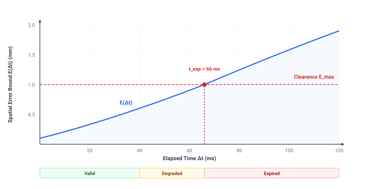

# Spatial Memory {#sec-memory}

::: {layout-narrow}
::: {.column-margin}

\chapterminitoc

:::

::: {.content-visible when-format="pdf"}
\noindent
{fig-alt="Isometric blueprint showing persistent spatial memory: tiered octree 3D voxel grid with fresh observation updates, frosted glass occlusion divider, floating spatial belief decay uncertainty halos, cylindrical temporal lease ledger, and Harvard crimson stale token eviction basin."}
:::

::: {.content-visible unless-format="pdf"}
{fig-alt="Isometric blueprint showing persistent spatial memory: tiered octree 3D voxel grid with fresh observation updates, frosted glass occlusion divider, floating spatial belief decay uncertainty halos, cylindrical temporal lease ledger, and Harvard crimson stale token eviction basin."}
:::

:::

## Purpose {.unnumbered .unlisted}

::: {.content-visible when-format="pdf"}
\begin{marginfigure}
\vspace{1em}
\resizebox{\linewidth}{!}{\mlphysicalstackfull{100}{20}{20}{20}{20}}
\end{marginfigure}
:::

_How fast does a spatial belief turn into dangerous fiction once a sensor loses sight of an object?_

A moving obstacle remains a constraint after it disappears behind a pillar. The machine must remember it, yet its last observed position becomes less reliable as time passes. Treating that position as current can send a planner into occupied space; discarding it immediately can erase a hazard that remains nearby. Spatial memory must therefore carry both an estimate and the limits of what that estimate supports. Observation age, uncertainty, and coordinate alignment determine whether a remembered object can still guide motion. A frozen coordinate transform is especially dangerous because it can make an old estimate appear current to every downstream consumer. Expiration must withdraw that estimate's authority without treating the unseen region as empty. In the physical AI stack, memory connects the brain's account of the world to the nervous system's permission to move, with validity windows set by how quickly uncertainty consumes the body's available clearance.



::: {.callout-learning-objectives}

- Specify belief records that preserve measurement time, coordinate frame, uncertainty, and conditions for use
- Set belief expiry from measured uncertainty growth and the task's physical error budget
- Compare spatial representations by memory cost, query time, and information needed for action
- Design spatial updates that preserve evidence age and distinguish missing observations from verified free space
- Diagnose stale transforms and other belief failures that downstream consumers may not detect

:::

## Preserving Spatial Belief {#sec-memory-9-1}

In conventional computer systems, memory is a static, reliable store: write a floating-point coordinate to an SRAM cache or DRAM bank, and whether it is read five microseconds or five seconds later, the stored bits remain identical. In physical AI, that assumption is lethal. The physical world never stops moving. The moment an obstacle slips behind a structural warehouse column, or an articulated gripper occludes a target workpiece, the stored coordinate begins to decay into dangerous fiction. If an assembly fixture drifts at just $20\text{ mm/s}$, a tooling tolerance of $2\text{ mm}$ is completely exhausted after $100\text{ ms}$ of occlusion. If downstream control loops treat the stored coordinate as ground truth, or if intermediate software filters continuously republish fresh timestamps without incorporating new sensory measurements, the machine executes open-loop motions against phantom coordinates, driving high-speed tooling into solid steel.

A physical machine cannot rely on raw sensory observations alone, nor can it trust static memory registers. It requires a **belief**\index{Belief}—an estimate of physical state carried forward from historical sensory evidence, coupled explicitly to an expanding model of uncertainty.[^fn-mem-belief-state] Perception supplies a dated, calibrated observation (as established in @sec-perception-8-2). Spatial memory must determine how long that observation, combined with dynamic motion models, can continue to authorize physical action before uncertainty consumes the machine's remaining clearance.

[^fn-mem-belief-state]: **Belief state formulation**\index{State estimation!belief state}: In control theory, a belief state parameterizes a probability distribution or bounded set over latent physical states in a Partially Observable Markov Decision Process (POMDP). In physical systems engineering, this belief is serialized as an explicit metric tuple $(\mathbf{x}, \mathcal{F}, t_0)$ coupled to a deterministic upper bound on error growth. Without this metric uncertainty envelope, downstream trajectory optimizers treat stochastic estimates as exact measurements, driving actuators into collisions during sensor dropouts.

Within the four-tier physical AI systems architecture, the memory stage highlighted in @fig-09-locator connects perception to intent and trajectory planning. Operating as Stage 3 of the deliberative brain, its **spatial memory**\index{Spatial memory} carries geometric and physical state estimates forward across sensor dropouts, occlusions, and variable processing delays.

::: {#fig-09-locator fig-env="figure" fig-pos="htb" fig-cap="**Memory Stage Architecture Focus**: The four-tier physical AI systems architecture highlights the cognitive deliberation tier, with memory as the third brain stage and this chapter's active focus. The stage carries latent state $z_t$ into a persistent spatial belief $b_t$, making it the only place the system holds what its sensors can no longer see." fig-alt="Diagram titled Physical AI Systems Architecture Stack, drawn as four stacked tiers. Layer 4 is system governance and assurance at 0.1 to 1 hertz, holding boxes for shared autonomy, verification, safety cases, and frontier limits. Layer 3 is the brain, a cognitive deliberation tier at 1 to 50 hertz, holding five stages named ingestion, perception, memory, intent, and planner. A dashed proposal-permission privilege boundary separates it from layer 2, the nervous system, a real-time safety and timing tier at 1000 hertz. Layer 1 is the physical body and continuous plant. Layer 3 is shaded and its memory stage is outlined; the badge reads Active Focus, Chapter 09, Temporal Memory."}
{width="100%"}
:::

Crucially, memory operates directly across the **proposal-permission boundary**.[^fn-mem-dual-brain] The unprivileged application processor (Linux MPU) maintains high-dimensional spatial belief structures, occupancy voxels, and coordinate transform trees. However, because the MPU experiences unpredictable scheduling jitter, memory bus contention, and inference latency, it cannot be trusted to self-report temporal freshness. The real-time safety processor (MCU) acts as the permission referee, evaluating every candidate motion proposal against independent hardware timers. The moment an unrefreshed belief breaches task safety margins, the nervous system revokes execution permission unilaterally.

[^fn-mem-dual-brain]: **Dual-brain spatial partitioning**\index{Architecture!dual-brain}: The dual-brain architecture assigns high-dimensional spatial mapping (OctoMap, VDB voxels, factor graphs) to Linux application processor (MPU) cores while reserving deterministic hardware countdown timers and barrier evaluations for the real-time microcontroller (MCU). Isolating the real-time MCU on a dedicated silicon core guarantees that memory bus saturation or garbage-collection pauses on the MPU cannot delay emergency brake actuation. See @sec-brain-4-1 for the foundational interface specifications governing this boundary.

Consider an analytical example of a manipulator tasked with touching a workpiece and regulating contact force against a moving assembly fixture. The fixture drifts relative to the robot base at a bounded velocity of at most $20\text{ mm/s}$. The tooling compliance of $1\text{ mm/N}$ permits an allowable positioning error of $2\text{ mm}$ before generating a $2\text{ N}$ reaction force that overloads the wrist sensor. Dividing the allowable error by the maximum drift velocity yields an operational lifetime of $100\text{ ms}$, calculated as $2\text{ mm} / (20\text{ mm/s}) = 0.100\text{ s}$. For the first $50\text{ ms}$ after the camera captures an image, the physical position of the workpiece remains safely within the tolerance window. At $100\text{ ms}$, the unobserved displacement reaches the outer boundary of the error budget. At $101\text{ ms}$, without a new measurement to constrain the state, the unobserved drift exceeds mechanical tolerance; relying on the stored coordinate will cause the tool to collide violently with the fixture rather than softly touch it.

In software systems, data age is frequently measured from the instant a message was serialized, published over an inter-process bus, or updated in a shared memory table. In a physical AI system, this convention is dangerous. Propagating a state estimate through an extended Kalman filter at $1000\text{ Hz}$ or republishing an $SE(3)$ kinematic transform at $200\text{ Hz}$ creates a stream of fresh software timestamps, but it does not refresh the underlying physical information. The true age of a belief is determined strictly by the acquisition timestamp $t_0$ of the last physical measurement that constrained it. A downstream tracking loop that reads a position estimate generated by dead reckoning or policy rollouts may observe a publish timestamp only $2\text{ ms}$ old, yet the physical error envelope continues to expand at the velocity of the unobserved drift. Timestamping an inference output or a cache lookup records when compute occurred, but it tells the receiver nothing about when reality was last checked.

The stored bits can remain intact while the physical claim they represent loses support. A register preserves the last observed pose even when the fixture has moved, so memory integrity alone cannot establish geometric validity [@durrant2006simultaneous]. To prevent a machine from acting on stale data, memory systems must treat expiry as an explicit interface event. The **belief state invalidation horizon**\index{Belief state invalidation horizon} ($t_{\mathrm{exp}} = \inf \{ \Delta t \ge 0 : E(\Delta t) \ge E_{\max} \}$) marks the exact moment when the machine must stop trusting its memory. It defines the temporal deadline where unobserved kinematic drift and process noise drive accumulated error ($E(\Delta t)$) past the physical safety margin ($E_{\max}$), revoking tracking authority and forcing an explicit transition to a safe fallback mode.

::: {#psp-memory-evidence-epoch-invariant .callout-perspective title="The evidence epoch invariant"}
*Extrapolation advances timestamps without refreshing evidence age. Unmonitored belief drifts into physical failure. Never let an intermediate predictor, filter, or transport bridge reset the evidence acquisition epoch $t_0$; compute freshness is a software artifact, but physical freshness belongs strictly to the hardware transducer.*
:::

Managing the expansion of spatial uncertainty and preventing silent divergence requires treating spatial memory as an active, time-decaying contract rather than a static data store. Where software abstractions assume timeless geometric permanence, embodied systems must bound epistemic decay across five architectural layers: metric belief contracts (@sec-memory-9-2), hardware acquisition epochs (@sec-memory-9-3), kinematic coordinate transform trees (@sec-memory-9-4), volumetric occupancy representations (@sec-memory-9-5), and formal invalidation schemas (@sec-memory-9-10). The foundation of this architecture rests on defining the exact contract passed across the boundary between memory and control.

## What Memory Hands Over {#sec-memory-9-2}

A belief passed across a bus or retrieved from a buffer cannot simply be a raw array of floating-point numbers. An unannotated vector such as $[0.142, -0.051, 0.812]$ conveys nothing about what physical entity is being described, what physical dimension is represented, or how that quantity is scaled. A downstream controller receiving raw coordinates without metadata must rely on implicit conventions established at compile time. If an estimator produces positions in meters while an actuator controller expects millimeters, or if an angular rate is mistaken for an absolute orientation, the resulting command registers as a massive tracking error, driving motor current to the actuator thermal limits detailed in @sec-body-2-3. To prevent misinterpretation across the causal boundary established in @sec-boundary-1-2, a belief record must first specify the entity identity, the physical quantity, and the measurement units. The consumer must be able to verify that the value represents the center of mass of a specific workpiece in meters, or the normal contact force on a fingertip in newtons, before routing that number into a control law.

Specifying the quantity and units remains incomplete without binding the value to a concrete reference frame. Identical spatial coordinates describe entirely different physical realities depending on the origin and orientation of the coordinate system. A Cartesian position $[0.142, -0.051, 0.812]\text{ m}$ designates a point suspended in free space when evaluated in the robot base frame\index{Base frame}, but represents a point several hundred millimeters inside a rigid fixture when interpreted in the tool flange frame\index{Tool flange frame}. Because kinematic links flex, joints move, and coordinate transforms update at varying rates, a belief record must carry an explicit frame identifier. Carrying the frame allows the receiving node to look up the corresponding spatial transformation tree and project the stored geometry into the local frame required by the actuator, preventing the controller from acting on geometric misalignments caused by moving kinematic chains.

Geometry and identity describe the physical state at a single moment, but memory must also capture the temporal anchor of that state. The timestamp attached to a belief must record the exact epoch $t_0$\index{Measurement epoch} of the physical interaction or optical exposure that last constrained the estimate. In distributed architectures, intermediate nodes often republish data, execute Kalman filter prediction steps, or run forward kinematic propagations to maintain high-rate control streams (for example, estimating where a moving target is right now based on its last known velocity). A prediction step or cache refresh updates the transmission timestamp, but it does not add new physical evidence from sensors. If an intermediate process overwrites $t_0$ with the current system clock during a forward rollout, downstream safety monitors observe a deceptive stream of fresh timestamps. The robot system falsely believes it has recent physical confirmation of the object, while the underlying physical state continues to drift unchecked. Preserving the original measurement epoch $t_0$ across all serialization and filtering stages ensures that consumers measure the age of the information against the physical world rather than against the scheduling frequency of the local computer.

Knowing the measurement epoch $t_0$ establishes elapsed time $\Delta t = t - t_0$, but elapsed time alone cannot determine whether a belief is valid for a given action. Two estimates of identical age diverge at different rates depending on physical constraints. A workpiece firmly held in a pneumatic vise maintains sub-millimeter positional certainty after several seconds of sensor occlusion, whereas the same workpiece sliding along a moving conveyor belt accumulates substantial position error in fifty milliseconds. Therefore, a belief record must include both the initial uncertainty bound\index{Uncertainty bound} $e_0$ established at the epoch of measurement and an explicit growth law\index{Error expansion} that quantifies how that uncertainty expands over time.

The minimum record fields necessary for a consumer to evaluate a stored state can be derived directly from the requirement to bound current error. Let $e(t)$ represent the upper bound of the discrepancy between the stored value and true physical state at time $t$. If an estimator establishes a state at time $t_0$ with an initial measurement uncertainty $e_0$, and external disturbances or unmodeled velocities cause the true state to diverge at a maximum rate $r$, the upper bound on error at current time $t$ obeys the linear expansion $e(t) = e_0 + r(t - t_0)$. As an analytical example, consider a tactile sensor array that establishes the initial slip displacement of a grasped object with an uncertainty $e_0 = 0.40\text{ mm}$ at $t_0 = 1.200\text{ s}$. If the object slides beneath the gripper at a maximum unmeasured velocity $r = 15.0\text{ mm/s}$, the error bound after an unobserved interval of $\Delta t = 80\text{ ms}$ expands to $e(t) = 0.40\text{ mm} + (15.0\text{ mm/s})(0.080\text{ s}) = 1.60\text{ mm}$. Omitting either $e_0$ or $r$ leaves the consumer unable to compute $e(t)$, demonstrating that an initial bound and an expansion rate are both structurally required.

Expressing uncertainty through physical bounds and expansion rates distinguishes a physical AI belief from a probabilistic confidence score. An object detection network might output a class confidence of $0.94$, but a downstream position controller cannot convert a unitless probability into a safe actuator displacement margin (i.e., how far the arm can physically move before risking a collision). A confidence score of $0.94$ provides no information about whether an obstacle boundary is uncertain by $2.0\text{ mm}$ or by $200\text{ mm}$, nor does it indicate how rapidly that boundary moves when occlusion occurs. A physical memory record must express its initial bound $e_0$ and expansion rate $r$ in concrete physical dimensions such as meters, radians, or newtons per second. Furthermore, these rates are valid only within a defined operating envelope, such as a maximum assumed acceleration or a verified contact friction coefficient. If physical operating conditions exceed that envelope, the expansion rate is no longer guaranteed, and the belief record must be treated as invalid.

Extending the proposal-permission architecture from @sec-brain-4-1, when memory hands over a tuple containing value, reference frame, measurement epoch $t_0$, initial bound $e_0$, and growth rate $r$, the consumer executes a deterministic verification step before applying the data to physical control. The consumer possesses an application tolerance $\epsilon_{\text{tol}}$ dictated by the physical task. In a precision insertion operation with a radial clearance of $0.80\text{ mm}$, the controller requires that positional uncertainty remain below $\epsilon_{\text{tol}} = 0.80\text{ mm}$. Upon reading the belief record at current time $t_{\text{now}}$, the consumer calculates the elapsed time $\Delta t = t_{\text{now}} - t_0$, evaluates the present error bound $e(t_{\text{now}}) = e_0 + r \Delta t$, and compares the result directly against $\epsilon_{\text{tol}}$. If $e(t_{\text{now}}) \le \epsilon_{\text{tol}}$, the controller executes the motion. If $e(t_{\text{now}}) > \epsilon_{\text{tol}}$, the belief has expired, and the controller transitions immediately to a safe holding state or an active search routine (such as sweeping a wrist camera to re-acquire the target) without waiting for an external invalidation signal.

::: {#dfn-memory-spatial-belief-contract .callout-definition title="The spatial belief contract"}

***Spatial belief contract***\index{Spatial belief contract!definition}\index{Belief contract!definition} is the explicit typed tuple $(\mathbf{x}, \mathcal{F}, t_0, e_0, r, \mathcal{E})$ governing state handoffs between memory and control, binding the estimated value ($\mathbf{x}$) to an unambiguous coordinate frame ($\mathcal{F}$), an acquisition epoch ($t_0$), an initial error bound ($e_0$), an error growth rate ($r$), and a validity envelope ($\mathcal{E}$).

1.  **Significance**: A state without an error bound and growth rate cannot be safely evaluated by downstream controllers. As time elapses ($\Delta t = t_{\text{now}} - t_0$), unobserved motion or sensor drift expands the spatial uncertainty envelope ($e(t) = e_0 + r \Delta t$). When uncertainty breaches task tolerance ($e(t) > \epsilon_{\text{tol}}$), the contract expires, forcing downstream reflexes to safe holding states.
2.  **Distinction**: Unlike a unitless classification probability (such as $P(\text{object}) = 0.94$), a spatial belief contract provides physically grounded metric units (meters, radians) and explicit time-decay mechanics.
3.  **Common pitfall**: Relying on external publishers to broadcast invalidation signals upon occlusion. If the communication channel drops or the sensor driver hangs, the downstream consumer continues executing open-loop motions on frozen beliefs unless it independently evaluates the expiration contract.

:::

Evaluating the spatial belief contract depends on calculating the elapsed time $\Delta t = t_{\text{now}} - t_0$ against physical reality. If the consumer cannot verify the exact physical instant when energy transduction occurred, the calculated error bound $e(t_{\text{now}})$ becomes an unanchored fiction, mistaking software compute cycles for physical evidence.

## A State Has an Epoch {#sec-memory-9-3}

Every state reported by a sensor or estimated by a model corresponds to a specific point in time, termed its **epoch**\index{Epoch}. In a physical computing pipeline, that state passes through three distinct temporal boundaries before a controller can act on it. The **acquisition epoch**\index{Epoch!acquisition} ($t_0$) is the nanosecond-precise timestamp recording the exact physical instant when energy transduction occurred at the causal boundary (@sec-boundary-1-2), such as photons striking a photodiode array or a digital register latching an encoder count.[^fn-hw-timer-capture] The **estimation epoch**\index{Epoch!estimation} ($t_{\text{est}}$) marks the instant the computational pipeline (whether a state estimator or neural network) completed its mathematical inference over those measurements, representing the moment the computational pipeline resolves sensor measurements into a concrete state claim. The **publication epoch**\index{Epoch!publication} ($t_{\text{pub}}$) marks the instant the serialized message was committed to the physical transport bus for dispatch to downstream consumers.

[^fn-hw-timer-capture]: **Hardware timer input-capture**\index{Hardware!timer input-capture}: Microcontroller timer input-capture channels latch counter values into dedicated shadow registers upon external signal transitions, bypassing operating system interrupt latency. Reading capture registers without atomic synchronization against timer overflow flags causes 16-bit counter aliasing, injecting artificial timestamp jumps equal to the rollover period ($65.5\text{ ms}$ on a $1\text{ MHz}$ timer). In downstream visual-inertial odometry, this temporal discontinuity introduces false acceleration spikes that destabilize platform attitude filters.

Collapsing these three timestamps into a single receipt or transmission timestamp destroys the physical validity of the state. If an inference accelerator requires $45\text{ ms}$ to execute an object detection model and the operating system incurs another $5\text{ ms}$ of scheduling and serialization latency before publication, tagging the resulting object pose with the publication time hides a $50\text{ ms}$ physical displacement. During that $50\text{ ms}$ interval, gravity, momentum, and contact forces continue to act on the physical system without pause. If a conveyor belt carries a workpiece at $0.60\text{ m/s}$, a downstream gripper that treats the publication timestamp as the measurement epoch assumes the workpiece is located where it was $50\text{ ms}$ in the past, introducing an unmodeled position error of $(0.60\text{ m/s})(0.050\text{ s}) = 30.0\text{ mm}$. A state that records only when data became available tells the consumer nothing about the physical instant the measurement represents, making temporal alignment impossible.

Even when a system records true acquisition epochs, physical AI architectures rely on distributed processing nodes whose local oscillator clocks drift independently, where each compute node operates on a distinct, time-varying local oscillator clock. Synchronizing these distributed clocks over standard bus networks introduces a bounded synchronization error, and that temporal uncertainty translates directly into spatial uncertainty.[^fn-hw-ptp-canfd] Consider an analytical example where an autonomous manipulator tracks a moving assembly target. The vision processor and the joint motion controller run on separate compute boards synchronized across an Ethernet bus using the Precision Time Protocol (PTP, IEEE 1588) to maintain a bounded clock offset of $\delta t = \pm 1.5\text{ ms}$. If the target moves relative to the camera at an operational velocity of $v = 1.20\text{ m/s}$, the clock offset alone creates an irrecoverable spatial positioning uncertainty of $e_{\text{sync}} = v \cdot \delta t = (1.20\text{ m/s})(0.0015\text{ s}) = 1.80\text{ mm}$. In an assembly operation with a mechanical clearance tolerance of $0.50\text{ mm}$, an uncalibrated clock synchronization bound of $1.5\text{ ms}$ causes physical interference and tool collision before any controller tracking latency is added. The physical error budget must therefore allocate margin for clock synchronization jitter alongside sensor resolution and structural deflection.

[^fn-hw-ptp-canfd]: **Fieldbus clock synchronization jitter**\index{Fieldbus!synchronization jitter}: Fieldbus architectures exhibit distinct hardware clock synchronization bounds: IEEE 1588 PTP over Ethernet achieves $\delta t < 1.0\,\mu\text{s}$, EtherCAT Distributed Clocks achieve $<100\text{ ns}$ hardware SYNC0 jitter, and CAN-FD bit-phase synchronization yields $\pm 10\text{--}50\,\mu\text{s}$. Because spatial uncertainty scales with target relative velocity ($e_{\text{sync}} = v_{\text{rel}} \delta t$), microsecond-level synchronization is essential to keep temporal errors within micrometer mechanical budgets. Uncalibrated clock drift between distributed sensor and motor nodes degrades multi-axis tool coordination, inducing high-frequency chatter in joint torque loops.

Real physical systems never sample all relevant state variables simultaneously. A tactile array might latch normal force readings at $t_1 = 12.0\text{ ms}$, an optical tracking camera might finish sensor integration at $t_2 = 18.5\text{ ms}$, and joint optical encoders might sample angular positions at $t_3 = 21.0\text{ ms}$. Because these observations occur at different epochs, they cannot be combined through direct algebraic operations. Fusing a camera observation at $t_2$ with an encoder observation at $t_3$ requires the consumer to project one state across the temporal gap $\Delta t = |t_3 - t_2| = 2.5\text{ ms}$ using explicit kinematic models and bounded velocities (for example, propagating the historical camera observation along the joint velocity vector to reconcile it with the instantaneous encoder reading). Without the true acquisition epoch for each individual signal, the alignment calculation cannot determine the sign or magnitude of $\Delta t$. Extrapolating state without an accurate epoch causes the fusion algorithm to compute spatial offsets from fictitious temporal baselines, compounding errors across every fusion cycle.

For a consumer to use a state safely, the memory record must provide four explicit quantities: the physical state value, the precise acquisition epoch referenced to a synchronized system clock, the upper bound on clock synchronization uncertainty, and the maximum rate of physical state change. Given these quantities, the consumer computes the exact elapsed duration between the acquisition epoch and the execution deadline, evaluates the worst-case expansion of the error bound, and determines whether the state remains within task tolerances. Handing over a state without its acquisition epoch leaves the consumer blind to transport delays and scheduling jitter, turning deterministic control into open-loop guesswork. Because physical geometry also changes as bodies move through space, spatial transforms between reference frames are subject to the same temporal decay, carrying their own distinct measurement epochs.

::: {#chk-mem-epoch-clock-synchronization .callout-checkpoint title="Hardware epochs and clock synchronization"}

Before analyzing coordinate frame hierarchies and lever-arm error propagation, verify your understanding of acquisition epochs and network clock jitter:

- [ ] **Epoch classification**: Can you distinguish between acquisition epoch ($t_0$), estimation epoch ($t_{\text{est}}$), and publication epoch ($t_{\text{pub}}$), explaining why stamping inference output with the transmission time hides physical displacement?
- [ ] **Fieldbus clock skew**: Can you calculate how bounded clock synchronization jitter over Ethernet PTP ($\delta t = \pm 1.5\text{ ms}$) translates directly into physical positioning uncertainty ($e_{\text{sync}} = v \cdot \delta t$) for a high-speed moving target?
- [ ] **Multi-rate temporal alignment**: Can you explain why direct algebraic fusion of asynchronous sensor frames (e.g., $1000\text{ Hz}$ encoders vs $30\text{ Hz}$ depth cameras) requires explicit forward kinematic projection rather than simple timestamp matching?

:::

## Spatial Reference Frames {#sec-memory-9-4}

Every geometric coordinate is meaningless without the reference frame in which it was observed, and every reference frame in a moving machine moves. **Spatial transformation matrices**\index{Spatial transformation matrices} express translations and rotations between coordinate frames, allowing an onboard computer to map a target detected by a camera into joint torques applied at an end-effector (@fig-09-robot-transform-tree). In rigorous spatial mechanics, these rigid-body poses are parameterized as elements of the Special Euclidean group $SE(3)$.[^fn-math-se3-group]

[^fn-math-se3-group]: **Special Euclidean group $SE(3)$**\index{Mathematics!SE(3) group}: The Special Euclidean group $SE(3)$ represents rigid-body spatial transformations as the semi-direct product $\mathbb{R}^3 \rtimes SO(3)$, parameterized by $4 \times 4$ homogeneous matrices combining rotational orientation with translational displacement. Operating directly on the Lie group avoids gimbal lock and singular parameterizations inherent in Euler angles. For the matrix exponential and Lie algebra $\mathfrak{se}(3)$ kinematics governing transform interpolation, refer to @sec-appendix-control.

Standardized across robotics by ROS Enhancement Proposal 105 (REP 105),[^fn-mem-ros-rep105] a robot maintains its spatial relationships as a **directed acyclic coordinate transform tree**\index{Directed acyclic coordinate transform tree} $\mathcal{T} = (\mathcal{V}, \mathcal{E})$, where each vertex denotes a physical or virtual coordinate frame (such as `earth`, `map`, `odom`, `base_link`, camera sensors, or tool center points), and each directed edge stores a time-varying transform parameterized by joint angles [@lynch2017modern; @craig2005introduction].[^fn-hw-spatial-dma] Building on the causal boundary established in @sec-boundary-1-2, what classical mechanics treats as a timeless geometric relationship is in a physical computing system a time-stamped message subject to finite transport delays, processing latency, and clock drift. A coordinate transform is valid only at the exact epoch when its underlying physical geometry was measured.

[^fn-mem-ros-rep105]: **Coordinate frame conventions (REP 105)**\index{Standards!REP 105}: ROS Enhancement Proposal 105 (REP 105) formalizes kinematic frame hierarchies for mobile platforms ($\mathcal{F}_{\text{earth}} \to \mathcal{F}_{\text{map}} \to \mathcal{F}_{\text{odom}} \to \mathcal{F}_{\text{base}}$), isolating continuous odometric dead reckoning from discrete global map corrections. Confining non-continuous map updates to the `map` $\to$ `odom` transform prevents step discontinuities in local tracking loops. Injecting discontinuous coordinate jumps directly into inner motor controllers introduces derivative spikes that saturate inverter current and trip mechanical emergency stops.

[^fn-hw-spatial-dma]: **Spatial DMA bus contention**\index{Hardware!DMA bus contention}: Traversing pointer-based spatial trees and hierarchical voxel grids induces severe CPU L1/L2 cache misses due to irregular memory strides. On unified-memory system-on-chip (SoC) architectures, concurrent direct memory access (DMA) transfers from multi-camera ingestion pipelines saturate shared LPDDR5 memory arbiters. This crossbar contention inflates spatial query latency tails from sub-microsecond expectations to tens of milliseconds, stalling real-time collision checks on the trajectory planner.

When an onboard computer chains together links across a robot arm, it multiplies a series of coordinate transforms to figure out where the end-effector is. If these individual transforms were measured at different times (due to delays, asynchronous joint sampling, or dropped frames), the resulting end-to-end position does not reflect the physical machine at any single instant. It evaluates a synthetic, hybrid pose that never actually existed. For the rigorous matrix derivation of kinematic chains, see @sec-appendix-control.[^fn-hw-seqlock-dmb]

[^fn-hw-seqlock-dmb]: **Sequence locks for 6-DoF transforms**\index{Concurrency!sequence locks}: Because a 6-DoF spatial transform comprises multiple 64-bit floating-point registers, non-atomic concurrent reads during an in-flight write produce torn state records that combine old rotations with new translations. Lock-free sequence locks (seqlocks) paired with data memory barriers (`DMB`) protect transform handoffs by allowing reader threads to detect concurrent modifications via monotonic sequence counters without blocking writer threads. This lockless synchronization prevents low-priority perception publishers from inducing priority inversion on high-rate control threads. For memory barrier formalisms, see @sec-appendix-systems.

::: {#fig-09-robot-transform-tree fig-env="figure" fig-pos="t" fig-cap="**Manipulator Kinematic Frame Tree and Temporal Dynamics**: Articulated manipulator geometry (a) and corresponding directed acyclic coordinate transform tree in ROS \\texttt{tf2} (b). Each directed edge stores a homogeneous transformation matrix parameterized by joint state. Composing transforms across disparate measurement epochs injects lever-arm positioning error $e_{\\text{tool}} \\approx \\ell\\,\\Delta\\theta$, while an uncompensated asynchronous edge references stale coordinates (adapted from Craig 2005 and Foote 2013 [@craig2005introduction; @foote2013tf])." fig-alt="Manipulator Kinematic Frame Tree and Temporal Lever-Arm Dynamics. (a) Physical geometry of an articulated manipulator with base link, joint linkages, wrist camera, and tool center point (tool0), indicating lever arm ℓ and angular deflection error e_tool ≈ ℓ · Δθ. (b) Spatial transformation tree (DAG) connecting world reference, base link, kinematic chain link1 through link6, wrist frame, wrist camera, tool0 TCP, and target object, highlighting an asynchronous stale transform edge. (Adapted from Craig 2005 and Foote 2013)."}
{width="100%"}
:::

The cost of an expired transform is direct spatial displacement (@fig-frame-staleness-error). Applying the delay-as-distance principle from @sec-body to kinematics, uncompensated latency translates directly into geometric positioning error through the lever arm of the linkages. For the rigorous cross-product derivation of this kinematic error propagation, see @sec-appendix-control.

Consider an analytical example of a manipulator holding a tool point at a distance of $\ell = 0.60\text{ m}$ from its wrist assembly. Suppose the base and wrist rotate at an angular velocity of $\omega = 1.50\text{ rad/s}$ while the arm translates through space at $v = 0.80\text{ m/s}$. If a tracking pipeline publishes a camera-to-tool transform with an uncompensated staleness of $\Delta t = 40\text{ ms} = 0.040\text{ s}$, the translation of the frame drifts by $e_{\text{trans}} = v \cdot \Delta t = (0.80\text{ m/s})(0.040\text{ s}) = 0.032\text{ m} = 3.20\text{ cm}$. Over the same interval, the angular orientation rotates through $\Delta \theta = \omega \cdot \Delta t = (1.50\text{ rad/s})(0.040\text{ s}) = 0.060\text{ rad}$. Through the lever-arm relation $e_{\text{rot}} \approx \ell \Delta \theta$, this angular shift swings the tool point across an arc of $e_{\text{rot}} \approx (0.60\text{ m})(0.060\text{ rad}) = 0.036\text{ m} = 3.60\text{ cm}$. Summing the translational shift and the lever-arm deflection yields a total tool-point positioning error of $e_{\text{tool}} \approx e_{\text{trans}} + \ell \Delta \theta = 3.20\text{ cm} + 3.60\text{ cm} = 6.80\text{ cm}$. Comparing this $68.0\text{ mm}$ error against a physical task clearance tolerance of $\epsilon_{\text{tol}} = \pm 0.50\text{ mm}$ reveals that an uncompensated staleness of just $40\text{ ms}$ breaches clearance by a factor of $68.0\text{ mm} / 0.50\text{ mm} = 136\times$. Because the transform tree silently evaluates without mathematical error, the controller commands the motor drives to push through solid metal before tactile sensors can detect the collision.

::: {#fig-frame-staleness-error fig-env="figure" fig-pos="t" fig-cap="**Transform Staleness and Lever-Arm Error Propagation**: Geometric error propagation under uncompensated transform latency $\\Delta t$. Base translation shifts the origin by $e_{\\text{trans}} = v\\,\\Delta t$, while joint rotation across link length $\\ell$ swings the tool tip by $e_{\\text{rot}} \\approx \\ell\\,\\omega\\,\\Delta t$, accumulating into total tool displacement $e_{\\text{tool}} \\approx e_{\\text{trans}} + \\ell\\,\\Delta\\theta$ that breaches clearance tolerance $\\pm \\epsilon_{\\text{tol}}$." fig-alt="Coordinate transform staleness and lever-arm kinematic error propagation. Compares reported state at t0 against true physical state at t0 + Δt. Base translation produces displacement e_trans = v Δt, while link rotation over length ℓ introduces angular deflection Δθ = ω Δt and arc error e_rot ≈ ℓ Δθ. The resulting vector sum e_tool breaches the target clearance envelope ±ε_tol."}
{width="100%"}
:::

::: {#chk-mem-transform-staleness-lever-arm .callout-checkpoint title="Transform staleness and lever-arm deflection"}

Before exploring continuous volumetric mapping and attention buffer bounds, verify your understanding of kinematic frame staleness:

- [ ] **Transform staleness amplification**: Can you explain how uncompensated latency in base or wrist kinematic transforms amplifies across structural link lengths to induce large lever-arm displacements at the tool center point?
- [ ] **Silent evaluation failure**: Can you describe why a stale coordinate transform that continues to evaluate cleanly in linear algebra libraries is far more dangerous than a transform that raises a software exception?
- [ ] **Kinematic error allocation**: Can you distinguish between allocating error budgets purely to sensor calibration versus bounding end-to-end transport and thread scheduling jitter in distributed transform trees?

:::

::: {#psp-memory-leverage-of-staleness .callout-perspective title="The leverage of staleness"}
*Transform staleness multiplies through kinematic link lengths; an uncompensated millisecond of lag at the robot base swings the tool center point through centimeters of unobserved deflection.*
:::

While kinematic trees govern the relative poses of articulated robot links, navigating and manipulating within unconstrained environments requires tracking the surrounding world itself. Beyond discrete kinematic vertices, an embodied machine must maintain continuous volumetric scene memory to represent unobserved surfaces and enforce free-space clearance.

## Volumetric Scene Memory and Attention Buffers {#sec-memory-9-5}

Beyond discrete kinematic frames, an embodied agent must also maintain continuous volumetric spatial memory to track unobserved obstacles, plan collision-free paths, and support real-time reactive grasping (@fig-09-octomap-volumetric-mapping). Formulated originally by Elfes [@elfes1989using], **occupancy grid mapping**\index{Occupancy grid mapping} models the world as a tessellation of spatial cells, recursively estimating occupancy state under sensor beam models. By executing **volumetric free-space raycasting**\index{Volumetric free-space raycasting} along sensor sightlines, spatial memory actively updates 3D voxel hierarchies (such as OctoMap or OpenVDB [@museth2013vdb]) and deterministically clears unoccupied voxels. The foundational algorithm for volumetric raycasting is the 3D Differential Digital Analyzer (3D-DDA) fast voxel traversal [@amanatides1987fast].[^fn-hw-cuda-octree]

[^fn-hw-cuda-octree]: **Branchless DDA raycasting**\index{Hardware!branchless DDA}: On Single Instruction, Multiple Threads (SIMT) GPU architectures, parallel 3D-DDA raycasting encounters execution divergence when adjacent threads within a 32-thread warp traverse spatial voxels of differing depths. High-throughput engines implement branchless DDA traversal, cache active voxel blocks in GPU Shared Memory, and apply atomic integer bitmasks (`atomicOr`) to register spatial updates without global DRAM lock contention. Eliminating warp serialization preserves memory bus bandwidth for concurrent neural network inference.

Crucially, as the ray traverses free space from the sensor to the obstacle, the pipeline asserts **negative evidence**\index{Negative evidence} to clear unoccupied voxels. At the terminal measurement point where the obstacle is detected, positive evidence is integrated.[^fn-math-voxel-raycast] This active assertion of negative evidence along sensor sightlines is the exact computational mechanism that invalidates phantom obstacle tracks when dynamic objects leave a region, pruning ghost tracks without waiting for passive timeout decay.

[^fn-math-voxel-raycast]: **Voxel traversal and log-odds updates**\index{Algorithm!3D-DDA traversal}: The 3D Differential Digital Analyzer (3D-DDA) evaluates ray-voxel intersections along optical sightlines in discrete volumetric grids. Traversed voxels in front of measured surfaces receive negative occupancy log-odds updates to clear transient obstacles, while voxels intersecting measured surface returns receive positive updates. This active clearing prevents ghost obstacles from permanently corrupting traversability graphs after dynamic obstacles depart. For the complete derivation of recursive log-odds Bayesian mapping, see @sec-appendix-ml.

::: {#fig-09-octomap-volumetric-mapping fig-env="figure" fig-pos="t" fig-cap="**Probabilistic Octree Volumetric Mapping**: A corridor traversal reconstructed from raw point cloud into a probabilistic octree and then into explicit free, occupied, and unknown space [@hornung2013octomap]. The third panel is what distinguishes spatial memory from an accumulated point cloud, because raycasting records evidence of emptiness along sightlines, letting the map actively retire a phantom obstacle track instead of waiting for a timeout to expire it. (Credit: Hornung et al. / Autonomous Intelligent Systems Lab, University of Freiburg, CC BY 3.0)." fig-alt="Probabilistic 3D Volumetric Mapping and Hierarchical Octree Space Subdivision. Empirical 3D spatial memory representation reconstructed from a physical mobile robot traversing an indoor corridor with a tilting LiDAR scanner [@hornung2013octomap]. (a) Raw 3D point cloud acquired during robot motion, subject to sensor noise and finite field-of-view occlusions. (b) Volumetric OctoMap voxel representation modeling 3D space as an 8-ary hierarchical tree, where occupied volumes are probabilistically updated and stored across variable resolutions. (c) Explicit free-space raycasting and lossless octree pruning, differentiating verified traversable space (white voxels) from occupied obstacles (dark voxels) and unobserved unknown regions. By maintaining explicit free-space evidence along sensor sightlines, spatial memory actively invalidates phantom obstacle tracks without waiting for arbitrary software timeouts. (Credit: Hornung et al. / Autonomous Intelligent Systems Lab, University of Freiburg, CC BY 3.0)."}
{width="95%"}
:::

For closed-loop trajectory optimization and reactive grasping, discrete occupancy grids are insufficient because binary or log-odds voxels lack continuous spatial derivatives. Physical AI systems employ **truncated signed distance fields (TSDFs)**\index{Truncated signed distance field} [@curless1996volumetric; @newcombe2011kinectfusion; @oleynikova2017voxblox]. Rather than recording discrete binary occupancy, each voxel $\mathbf{v} \in \mathbb{R}^3$ in the scene volume maintains a continuous metric distance $D(\mathbf{v}) \in [-\mu, +\mu]$ to the nearest physical surface along the sensor ray, alongside an accumulated observation weight $W(\mathbf{v}) \in [0, W_{\max}]$.

To understand how spatial memory fuses streaming depth frames into a persistent geometric model, trace the mathematical update executed for each voxel $\mathbf{v}$ when a camera at pose $\mathbf{T}_{\text{base}}^{\text{cam}} \in SE(3)$ captures a calibrated depth frame $Z_{\text{meas}}(u, v)$:

1. *Projective coordinate transformation:* The voxel center is transformed into the camera coordinate frame $\mathbf{p} = (\mathbf{T}_{\text{base}}^{\text{cam}})^{-1} \mathbf{v} = [p_x, p_y, p_z]^\top$ and mapped to continuous image coordinates $(u, v)$ via the camera intrinsic matrix $\mathbf{K}$:
   $$\begin{bmatrix} u \\ v \\ 1 \end{bmatrix} \sim \frac{1}{p_z} \mathbf{K} \mathbf{p}$$
2. *Signed distance evaluation:* The projective signed distance $d(\mathbf{v})$ is evaluated by subtracting the voxel's camera-depth $p_z$ from the measured surface depth $Z_{\text{meas}}(u, v)$ at that pixel:
   $$d(\mathbf{v}) = Z_{\text{meas}}(u, v) - p_z$$
   where $d(\mathbf{v}) > 0$ represents verified free space along the line of sight in front of the object, $d(\mathbf{v}) = 0$ corresponds to the exact physical boundary (the zero-crossing surface), and $d(\mathbf{v}) < 0$ represents the unobserved interior of the obstacle.
3. *Truncation and weighted fusion:* Because distances far behind or far in front of surfaces carry high projective distortion and consume memory without informing contact geometry, the distance is normalized and clamped across a narrow truncation band $\mu$ (typically $\mu \approx 3\text{--}5\times$ the isotropic voxel dimension $\Delta v$):
   $$\text{tsdf}(\mathbf{v}) = \max\left(-1, \min\left(1, \frac{d(\mathbf{v})}{\mu}\right)\right)$$
   The persistent memory voxel integrates this measurement via a running weighted average:
   $$D_{t}(\mathbf{v}) = \frac{W_{t-1}(\mathbf{v}) D_{t-1}(\mathbf{v}) + w_t \cdot \text{tsdf}(\mathbf{v})}{W_{t-1}(\mathbf{v}) + w_t}, \quad W_{t}(\mathbf{v}) = \min(W_{t-1}(\mathbf{v}) + w_t, W_{\max})$$
   where $w_t = 1$ (or scaled by sensor incidence angle $\cos\theta$).

Tri-linear interpolation across adjacent TSDF voxel vertices yields exact continuous spatial distance metrics and analytical spatial gradients:
$$\nabla D(\mathbf{x}) = \left[ \frac{\partial D}{\partial x}, \frac{\partial D}{\partial y}, \frac{\partial D}{\partial z} \right]^\top \approx \frac{\mathbf{x} - \mathbf{x}_{\text{surf}}}{\lVert \mathbf{x} - \mathbf{x}_{\text{surf}} \rVert}$$
Gradient-based motion planners query this continuous derivative to evaluate collision cost gradients in sub-microsecond lookups, pushing trajectory waypoints smoothly and deterministically out of obstacle boundaries.

Moving beyond fixed voxel lattices, **3D Gaussian splatting (3DGS)**\index{3D Gaussian splatting} [@kerbl20233d; @matsuki2024gaussian] provides continuous, spatially indexed, and differentiable spatial memory. A scene is represented as a collection of explicit anisotropic 3D ellipsoidal Gaussians.[^fn-math-3dgs-splatting] During robot operation, online spatial memory updates optimize Gaussian parameters in real time via tile-based differentiable rasterization and gradient backpropagation under combined photometric and geometric depth losses. Gaussians are adaptively densified in under-reconstructed areas and pruned in empty regions, enabling real-time photorealistic novel-view synthesis and continuous collision querying without the memory explosion of uniform volumetric grids (@fig-3dgs-slam-splatam and @tbl-09-spatial-rep). The choice between these representations is a choice of growth exponent, not of implementation detail. @Fig-09-volumetric-memory-scaling puts the three side by side across resolution, and the vertical distance between them at high resolution is the difference between a map that fits on the robot and one that does not.

[^fn-math-3dgs-splatting]: **Continuous 3D Gaussian splatting**\index{Machine Learning!3D Gaussian splatting}: 3D Gaussian Splatting parameterizes continuous scene surfaces as collections of anisotropic 3D ellipsoidal primitives, each defined by centroid $\boldsymbol{\mu}$, covariance $\mathbf{\Sigma}$, opacity $\alpha$, and spherical harmonic color coefficients. Differentiable tile-based rasterization backpropagates photometric and geometric depth residuals into Gaussian parameters during real-time tracking. This explicit formulation supplies continuous analytical surface normal gradients ($\nabla G$) for reactive trajectory collision avoidance without the memory explosion of fine volumetric grids.

::: {#fig-3dgs-slam-splatam fig-env="figure" fig-pos="t" fig-cap="**Continuous 3D Gaussian Splatting Spatial Memory & Embodied Dual Handoff**: Spatial memory pipeline comprising: (a) sensor streaming and real-time pose tracking $T \\in SE(3)$; (b) continuous spatial memory representing geometry as explicit anisotropic surfels $G_i(\\mathbf{x})$ under adaptive density control; and (c) dual handoff splitting into differentiable rasterization for deliberative planning novel views, and closed-form analytical collision gradients $\\nabla G$ for real-time reactive reflexes (synthesized from Kerbl et al. 2023, Keetha et al. 2024, and Matsuki et al. 2024 [@kerbl20233d; @keetha2023splatam; @matsuki2024gaussian])." fig-alt="Continuous 3D Gaussian Splatting Spatial Memory and Embodied Dual Handoff. Three-stage schematic: (a) Ingestion and Tracking showing sensor stream and estimated camera pose T_W_C; (b) 3DGS Spatial Memory illustrating anisotropic Gaussian ellipsoids with centroids and adaptive density control; and (c) Dual Handoff branching into deliberative novel-view synthesis via rasterization and reactive reflex collision gradients via analytical spatial derivatives."}
{width="100%"}
:::

::: {#fig-09-volumetric-memory-scaling fig-env="figure" fig-pos="htb" fig-cap="**Volumetric Memory Footprint Scaling**: Memory footprint against spatial resolution for a dense voxel grid, a hierarchical octree, and continuous 3D Gaussian splatting. The three curves separate by orders of magnitude because they encode different things: the grid stores volume, the octree stores surface, and the splat representation stores only observed structure." fig-alt="Log-log chart of memory footprint against spatial resolution for three scene representations. The dense voxel grid grows cubically, the hierarchical octree grows quadratically, and continuous 3D Gaussian splatting stays flat, so the gap between them widens by orders of magnitude as resolution rises."}

```{python}
#| echo: false
import pandas as pd
import matplotlib.pyplot as plt
from mlsysim import viz

data = pd.read_csv("vol4/09_memory/data/volumetric_memory_scaling.csv")

fig, ax, COLORS, plt = viz.setup_plot(figsize=(8, 5))
ax.plot(data['Resolution'], data['Dense_Grid_GB'], marker='o', linewidth=2.5, label=r'Dense Voxel Grid $\mathcal{O}(N^3)$', color='#d62728')
ax.plot(data['Resolution'], data['Octree_GB'], marker='s', linewidth=2.5, label=r'Hierarchical Octree $\mathcal{O}(N^2)$', color='#1f77b4')
ax.plot(data['Resolution'], data['Continuous_3DGS_GB'], marker='^', linewidth=2.5, label=r'Continuous 3DGS $\mathcal{O}(K)$', color='#2ca02c')

ax.set_xscale('log', base=2)
ax.set_yscale('log', base=10)

ax.set_xlabel('Spatial Resolution (Voxels per Dimension)', fontsize=11, fontweight='bold')
ax.set_ylabel('Memory Footprint (GB)', fontsize=11, fontweight='bold')
ax.set_title('Spatial memory scaling vs. scene resolution', fontsize=12, fontweight='bold', pad=15)
ax.legend(title='Representation Model', title_fontsize='11', fontsize='10')

plt.tight_layout()
plt.show()
plt.close()
```

:::

| Spatial Representation Paradigm                                                                                                   | Underlying Geometric Primitive                                                                 | Memory Footprint ($300\,\text{m}^3 @ 1\,\text{cm}$)      | Dynamic Update Latency ($10^5\,\text{pts}$)            | Collision / Raycast Query Latency                            | Continuous Gradient $\nabla d(\mathbf{x})$                                                                                              | Differentiable Fusion Support                               | Primary Execution Target & Bottleneck            |
|:----------------------------------------------------------------------------------------------------------------------------------|:-----------------------------------------------------------------------------------------------|:---------------------------------------------------------|:-------------------------------------------------------|:-------------------------------------------------------------|:----------------------------------------------------------------------------------------------------------------------------------------|:------------------------------------------------------------|:-------------------------------------------------|
| **Octree Occupancy Grid**\index{Octree Occupancy Grid} (e.g., OctoMap)                                                            | Hierarchical 8-ary tree with log-odds occupancy voxels                                         | $45 - 120\text{ MB}$ (pointer overhead)                  | $15 - 45\text{ ms}$ (CPU pointer recursion)            | $2.5 - 8.0\,\mu\text{s}$ per ray                             | Discontinuous (finite difference only)                                                                                                  | None (discrete binary/probabilistic voting)                 | Host CPU (pointer chasing & L1/L2 cache misses)  |
| **Hierarchical Sparse VDB**\index{Hierarchical Sparse VDB} (e.g., OpenVDB / NanoVDB)                                              | Dynamic $B$-tree array ($32^3 \to 16^3 \to 8^3$ leaf tiles)                                    | $18 - 40\text{ MB}$ (linearized sparse leaf buffers)     | $2.0 - 6.5\text{ ms}$ (SIMD/GPU bitmask traversal)     | $0.15 - 0.45\,\mu\text{s}$ per ray (DDA hardware step)       | $C^0$ tri-linear spatial gradient                                                                                                       | Partial (voxel-grid differentiable splatting)               | Edge GPU / SIMD Host (DRAM bus bandwidth bound)  |
| **Truncated SDF (TSDF)**\index{Truncated signed distance field} (e.g., Voxblox / KinectFusion)                                    | Voxel-hashing spatial blocks with metric distance weights                                      | $60 - 180\text{ MB}$ (dense allocated sub-blocks)        | $1.2 - 4.0\text{ ms}$ (GPU projective ray integration) | $0.08 - 0.25\,\mu\text{s}$ (direct hash index lookup)        | Exact metric $\nabla d(\mathbf{x}) = \frac{\mathbf{x} - \mathbf{x}_{\text{surf}}}{\lVert \mathbf{x} - \mathbf{x}_{\text{surf}} \rVert}$ | Moderate (mesh zero-crossing extraction)                    | Embedded GPU / FPGA (Shared SRAM/L2 capacity)    |
| **Continuous Neural SDF**\index{Continuous Neural SDF} (e.g., Instant-NGP / NeuS)                                                 | Multi-resolution spatial hash table + shallow MLP                                              | $8 - 25\text{ MB}$ (quantized hash table weights)        | $30 - 120\text{ ms}$ (online gradient backpropagation) | $12 - 50\,\mu\text{s}$ (neural network batch inference)      | Analytic autograd $\nabla_{\mathbf{x}} f_\theta(\mathbf{x}) \in C^\infty$                                                               | Full (photometric / geometric end-to-end loss)              | Dedicated NPU / GPU (Tensor core compute bound)  |
| **3D Gaussian Splatting [@kerbl20233d; @matsuki2024gaussian] (3DGS)**\index{3D Gaussian Splatting} (e.g., Spatially Indexed 3DGS) | Parametric anisotropic 3D ellipsoids ($\boldsymbol{\mu}, \mathbf{\Sigma}, \alpha, \mathbf{c}$) | $35 - 90\text{ MB}$ ($5 \times 10^5$ explicit Gaussians) | $8 - 22\text{ ms}$ (tile-based differentiable raster)  | $0.05 - 0.18\,\mu\text{s}$ (radix-sorted tile rasterization) | Explicit spatial derivative $\nabla_{\mathbf{x}} G(\mathbf{x})$                                                                         | Full (sub-millisecond photorealistic differentiable render) | Edge GPU / High-End SoC (Memory bandwidth bound) |

: **Volumetric Spatial Memory Representation Trade-Offs in Physical AI Architectures**\index{Volumetric Spatial Memory Representation Trade-Offs in Physical AI Architectures}: Quantitative comparison of continuous and discrete 3D spatial memory structures across storage footprint (evaluated for a nominal $10\text{ m} \times 10\text{ m} \times 3\text{ m}$ active manipulation workcell at $1\text{ cm}$ isotropic voxel resolution), insertion latency, raycast collision query latency, continuous spatial gradient availability $\nabla d(\mathbf{x})$, differentiable rendering support, and primary silicon execution targets. {#tbl-09-spatial-rep tbl-colwidths="[12,12,12,14,13,13,12,12]"}

Beyond raw metric volumes and radiance fields, foundation-model-driven physical AI requires spatial memory to organize space into semantic hierarchies. The **3D dynamic scene graph (DSG)**\index{3D dynamic scene graph}, formulated by @rosinol2021kimera in Kimera, bridges metric SLAM with symbolic reasoning by structuring spatial memory into a five-layer hierarchical graph:

1. *Metric-Semantic Mesh (Layer 1):* High-resolution triangular mesh capturing fine surface geometry with vertex semantic labels.
2. *Object and Agent Nodes (Layer 2):* Bounded 3D geometric entities with oriented bounding boxes, visual embeddings, and tracked dynamic trajectories.
3. *Places and Freespace Topology (Layer 3):* 3D Voronoi topology and navigable freespace spheres for planning collision-free paths.
4. *Rooms and Structural Enclosures (Layer 4):* Functional architectural subdivisions partitioned by semantic walls and portals.
5. *Buildings and Global Topology (Layer 5):* Top-level semantic graph governing long-horizon mission allocation.

By grounding high-level cognitive tokens in explicit metric coordinates through this hierarchical graph, 3D dynamic scene graphs allow foundation policies to query spatial memory at varying levels of abstraction without exhaustive metric searches across millions of voxels (@fig-09-dynamic-scene-graph).

::: {#fig-09-dynamic-scene-graph fig-env="figure" fig-pos="t" fig-cap="**Hierarchical 3D Dynamic Scene Graph Architecture**: Five-layer spatio-temporal memory organization bridging metric SLAM to symbolic foundation reasoning. Layer 1 captures triangular metric mesh geometry; Layer 2 extracts 3D objects and dynamic agents; Layer 3 models topological places via Voronoi freespace clearance spheres ($p_i$); Layer 4 structures architectural rooms and portals; and Layer 5 establishes global building mission topology. Vertical inter-layer edges coordinate upward abstraction (compressing metric surfaces into symbolic entities) and downward grounding (translating task tokens into metric coordinates) (adapted from Rosinol et al. [@rosinol2021kimera] and Hughes et al. [@hughes2022hydra])." fig-alt="Hierarchical five-layer 3D Dynamic Scene Graph architecture. From bottom to top: Layer 1 Metric Mesh surface geometry, Layer 2 Objects and Agents with support relations, Layer 3 Places with Voronoi freespace clearance spheres, Layer 4 Rooms connected by portals, and Layer 5 Buildings with global topology. Side arrows depict upward Abstraction and downward Grounding across tiers."}
{width="100%"}
:::

The computational advantage of this bidirectional hierarchy lies in how it resolves the memory-compute tension on edge SoCs. Upward abstraction collapses gigabytes of dense triangular surface meshes into kilobyte-scale symbolic subgraphs, allowing foundation deliberators to evaluate long-horizon task plans without exhausting LPDDR5 bandwidth or choking KV caches with millions of raw geometric tokens. Conversely, downward grounding lets high-level spatial targets traverse hierarchical bounding volumes down to local Voronoi clearance spheres and Truncated Signed Distance Field (TSDF) zero-crossing surface normals,[^fn-math-tsdf-fusion] supplying millisecond collision-free vectors directly to the real-time enforcer. However, grounding symbolic intent in continuous geometry requires the underlying metric layer to remain computationally tractable; as demonstrated in the following case study, naive dense voxelization quickly overwhelms edge memory architectures.

[^fn-math-tsdf-fusion]: **Continuous TSDF surface integration**\index{Geometry!TSDF integration}: Truncated Signed Distance Fields parameterize metric distance to the nearest physical zero-crossing surface within a narrow truncation band $\mu$. Integrating depth frames via running weighted averages attenuates high-frequency sensor noise while yielding continuous spatial gradients ($\nabla D(\mathbf{x})$). Trajectory optimizers query these gradients in constant time to compute repulsive potential forces that steer actuators away from obstacle surfaces.

::: {#nbk-memory-memory-footprint-dram-bandwidth-3d-tsdf .callout-notebook title="DRAM bandwidth of 3D TSDF voxel grids"}
**Practical Engineering Question**\index{Practical Engineering Question}: What is the memory footprint and DRAM bandwidth demand of 3D TSDF voxel grids across sparse vs naive dense representations, and why does naive dense allocation starve concurrent NPU policy inference on edge SoCs?

*1. Naive Dense Volumetric Allocation:*
Consider an active robotic manipulation workcell measuring $10\text{ m} \times 10\text{ m} \times 3\text{ m} = 300\text{ m}^3$.

- At isotropic resolution $\Delta v = 1.0\text{ cm} = 0.01\text{ m}$:
  $$\text{Voxel Count} = \left(\frac{10}{0.01}\right) \times \left(\frac{10}{0.01}\right) \times \left(\frac{3}{0.01}\right) = 1000 \times 1000 \times 300 = 3 \times 10^8\text{ voxels}$$

- Memory footprint at $4\text{ bytes}$ per voxel ($16\text{-bit}$ TSDF distance $+ 16\text{-bit}$ fusion weight):
  $$M_{\text{dense, 1cm}} = 3 \times 10^8 \times 4\text{ B} = 1.20 \times 10^9\text{ B} = 1.20\text{ GB}$$

- If resolution is refined to $\Delta v = 5.0\text{ mm} = 0.005\text{ m}$ for precision tool contact:
  $$\text{Voxel Count} = 2000 \times 2000 \times 600 = 2.4 \times 10^9\text{ voxels} \implies M_{\text{dense, 5mm}} = 9.60\text{ GB}$$
  This exceeds the entire physical DRAM capacity ($8\text{ GB}$) of the edge SoC!

*2. Sparse Voxel Hashing (Occupancy Sparsity $\approx 3$ percent):*
Physical obstacles and workcell surfaces occupy only a thin 2D manifold within 3D volume. Grouping voxels into $8^3 = 512$ voxel leaf blocks and allocating only within the TSDF truncation band ($\mu = \pm 3\text{ cm}$):

- Active occupied volume: $\approx 3.0$ percent of $300\text{ m}^3 = 9.0\text{ m}^3$.
- Active voxel count at $1\text{ cm}$: $9.0 \times 10^6\text{ voxels} \implies \approx 17,578\text{ blocks}$.
- Memory footprint:
  $$M_{\text{sparse, 1cm}} = 17,578\text{ blocks} \times (512\text{ voxels} \times 4\text{ B} + 32\text{ B header}) \approx 36.5\text{ MB}$$

- At $5.0\text{ mm}$ resolution: $M_{\text{sparse, 5mm}} \approx 292\text{ MB}$ (easily fits in SoC LPDDR5).

*3. DRAM Bus Bandwidth under $60\text{ Hz}$ RGB-D Raycasting:*
A depth sensor running at $640 \times 480$ resolution at $60\text{ fps}$ produces:
$$\text{Ray Rate} = 640 \times 480 \times 60 = 18,432,000\text{ rays/sec} \approx 18.43\text{ M rays/s}$$

- Traversing a dense grid requires reading and writing along the full $3.0\text{ m}$ ray ($300$ voxel lookups per ray):
  $$\text{Dense DRAM Bandwidth} = 18.43 \times 10^6 \times 300 \times 8\text{ B (R+W)} \approx 44.2\text{ GB/s}$$
  This consumes over 85 percent of the SoC's total shared LPDDR5 bandwidth ($51.2\text{ GB/s}$), causing severe memory bus throttling.

- Sparse VDB with 3D-DDA only updates voxels within the narrow truncation margin ($6$ voxels per ray) and caches active leaf blocks in GPU shared memory / L2 cache:
  $$\text{Sparse DRAM Bandwidth} = 18.43 \times 10^6 \times 6 \times 8\text{ B} \times (1 - 0.95\text{ cache hit rate}) \approx 44.2\text{ MB/s}$$

**Systems insight**: Naive dense 3D grids are mathematically trivial but silicon-infeasible. Dependable physical AI architectures must use sparse hierarchical voxel hashing (e.g., OpenVDB / Voxblox) with GPU thread-block localization to reduce memory footprint by $33\times$ and DRAM bus traffic by $1000\times$, protecting the memory bus for real-time neural policy execution. Sustained memory bus saturation also induces SoC thermal dissipation, triggering dynamic voltage and frequency scaling (DVFS) that inflates raycasting latency tails.
:::

::: {#chk-mem-volumetric-dram-bandwidth .callout-checkpoint title="Volumetric spatial memory and memory bus saturation"}

Before examining raycasting algorithms and VLA attention buffer bounds, verify your understanding of volumetric memory hierarchies:

- [ ] **Volumetric scaling penalty**: Can you explain why cubic voxel scaling ($\mathcal{O}(N^3)$) makes dense 3D grids silicon-infeasible on embedded edge SoCs when voxel resolution is refined from $1\text{ cm}$ to $5\text{ mm}$?
- [ ] **DRAM bus starvation**: Can you describe how un-cached $60\text{ Hz}$ RGB-D raycasting across dense voxels consumes over 85 percent of shared LPDDR5 bandwidth, and how hierarchical sparse voxel hashing (OpenVDB/Voxblox) reduces bus traffic by $1000\times$?
- [ ] **Negative evidence raycasting**: Can you explain how active line-of-sight raycasting using 3D-DDA clears phantom obstacles without relying on arbitrary software timeout decay?

:::

To integrate incoming sensory point clouds while actively evicting stale obstacle geometry, the spatial memory engine executes the structured raycast update detailed in @algo-volumetric-tsdf-raycast.

```pseudocode
#| label: algo-volumetric-tsdf-raycast
#| pdf-line-number: true
#| pdf-right-comment: false
#| html-comment-delimiter: "▷"

\begin{algorithm}
\caption{Volumetric TSDF Raycast Update with Temporal Decay}
\begin{algorithmic}
\Require point cloud $\mathcal{P} = \{\mathbf{p}_k\}$, sensor pose $\mathbf{T}_{\text{world}\leftarrow\text{sensor}}(t_0)$, truncation margin $\mu$, decay half-life $\tau_{\text{decay}}$
\Ensure updated continuous TSDF spatial belief and negative evidence field
\Statex
\State $t_{\text{curr}} \gets \Call{GetPtpMonotonicTimeNs}{}$; $\Delta t_{\text{elapsed}} \gets (t_{\text{curr}} - t_0) \times 10^{-9}$
\If{$\Delta t_{\text{elapsed}} > \tau_{\max,\text{latency}}$}
    \State \Return $\text{STATUS\_FRAME\_TOO\_STALE}$ \Comment{reject stale sensory frame}
\EndIf
\State $\mathbf{p}_{\text{cam,world}} \gets \mathbf{T}_{\text{world}\leftarrow\text{sensor}}.\text{translation}$
\For{\textbf{each} point $\mathbf{p}_k \in \mathcal{P}$ \textbf{in parallel}}
    \State $\mathbf{p}_{\text{world}} \gets \mathbf{T}_{\text{world}\leftarrow\text{sensor}} \cdot \mathbf{p}_k$
    \State $\mathbf{r}_{\text{dir}} \gets \frac{\mathbf{p}_{\text{world}} - \mathbf{p}_{\text{cam,world}}}{\lVert \mathbf{p}_{\text{world}} - \mathbf{p}_{\text{cam,world}} \rVert}$; $r_{\text{len}} \gets \lVert \mathbf{p}_{\text{world}} - \mathbf{p}_{\text{cam,world}} \rVert$
    \Statex \Comment{Phase 1: Negative Free-Space Clearing via 3D-DDA}
    \For{\textbf{each} voxel $v$ along ray from $0$ to $r_{\text{len}} - \mu$}
        \State $\text{vox} \gets \Call{GetOrAllocateBlock}{\mathcal{V}_{\text{tsdf}}, v.\text{block\_index}}.\text{voxels}[v.\text{local\_idx}]$
        \State $\text{vox}.\text{weight} \gets \text{vox}.\text{weight} \cdot \exp\left(-\frac{t_0 - \text{vox}.t_{\text{last}}}{\tau_{\text{decay}}}\right)$
        \State $\text{vox}.t_{\text{last}} \gets t_0$
        \If{$\text{vox}.d_{\text{tsdf}} < 0.0$}
            \State $\text{vox}.d_{\text{tsdf}} \gets \min(\text{vox}.d_{\text{tsdf}} + L_{\text{clear}}, 1.0)$
        \EndIf
    \EndFor
    \Statex \Comment{Phase 2: Surface Boundary Signed Distance Integration}
    \For{\textbf{each} voxel $v$ along ray from $r_{\text{len}} - \mu$ to $r_{\text{len}} + \mu$}
        \State $\text{dist} \gets \lVert \text{vox}.\mathbf{x} - \mathbf{p}_{\text{cam,world}} \rVert - r_{\text{len}}$
        \If{$\text{dist} > -\mu$}
            \State $d_{\text{norm}} \gets \Call{clamp}{\text{dist} / \mu, -1.0, 1.0}$
            \State $w_{\text{obs}} \gets \frac{1}{1 + \sigma_z^2 r_{\text{len}}^2}$
            \State $w_{\text{old}} \gets \text{vox}.\text{weight} \cdot \exp\left(-\frac{t_0 - \text{vox}.t_{\text{last}}}{\tau_{\text{decay}}}\right)$
            \State $\text{vox}.d_{\text{tsdf}} \gets \frac{w_{\text{old}} \cdot \text{vox}.d_{\text{tsdf}} + w_{\text{obs}} \cdot d_{\text{norm}}}{w_{\text{old}} + w_{\text{obs}}}$
            \State $\text{vox}.\text{weight} \gets \min(w_{\text{old}} + w_{\text{obs}}, W_{\max})$; $\text{vox}.t_{\text{last}} \gets t_0$
        \EndIf
    \EndFor
\EndFor
\State \Return $\text{STATUS\_TSDF\_UPDATED}$
\end{algorithmic}
\end{algorithm}
```

The volumetric belief state produced by this pipeline adheres to the abstract data schema specified in @tbl-09-schema-volumetric-belief, guaranteeing typed spatial bounds and physical SI unit invariants for downstream motion planners.

| Field Name               | Scalar Type  | Physical SI Units         | Structural Invariant & Description                                                                                                                                                               |
|:-------------------------|:-------------|:--------------------------|:-------------------------------------------------------------------------------------------------------------------------------------------------------------------------------------------------|
| `voxel_grid_origin`      | `float32[3]` | meters ($\text{m}$)       | Bounded world coordinates of spatial memory anchor ($x, y, z \in [-50, 50]$).                                                                                                                    |
| `voxel_resolution_m`     | `float32`    | meters ($\text{m}$)       | Isotropic voxel pitch ($\Delta v \in [0.005, 0.050]$).                                                                                                                                           |
| `evidence_epoch_t0`      | `int64_t`    | nanoseconds ($\text{ns}$) | Immutable hardware capture timestamp of newest fused sensory frame.                                                                                                                              |
| `tsdf_trunc_margin_m`    | `float32`    | meters ($\text{m}$)       | Metric distance margin for TSDF clamping ($\mu \in [0.02, 0.10]$).                                                                                                                               |
| `active_block_count`     | `uint32_t`   | dimensionless             | Number of dynamically allocated $8^3$ sparse leaf blocks in GPU hash map.                                                                                                                        |
| `surface_gradient_norm`  | `float32[3]` | dimensionless             | Analytical spatial gradient vector ($\nabla d(\mathbf{x}) = \frac{\mathbf{x} - \mathbf{x}_{\text{surf}}}{\lVert \mathbf{x} - \mathbf{x}_{\text{surf}} \rVert}$, $\lVert \nabla d \rVert = 1.0$). |
| `temporal_decay_tau_s`   | `float32`    | seconds ($\text{s}$)      | Exponential decay half-life for unobserved volumetric evidence ($\tau_{\text{decay}} \le 2.0\text{ s}$).                                                                                         |
| `free_space_sweep_epoch` | `int64_t`    | nanoseconds ($\text{ns}$) | Timestamp of most recent raycast sweep asserting negative free-space evidence.                                                                                                                   |

: **Abstract Volumetric Spatial Belief Manifest Schema**\index{Abstract Volumetric Spatial Belief Manifest Schema}: Structural parameters, data types, physical SI units, and invariant constraints governing 3D TSDF and occupancy state memory handoffs between spatial estimation backbones and downstream motion planning controllers. {#tbl-09-schema-volumetric-belief tbl-colwidths="[20,18,22,40]"}

While volumetric occupancy grids, TSDF maps, and coordinate trees defend metric clearance and geometric relationships, modern Physical AI systems increasingly deploy autoregressive Vision-Language-Action (VLA) foundation models (such as RT-2 [@brohan2023rt2], OpenVLA [@kim2024openvla], and Octo [@octo_2023]) and recurrent world models (such as DreamerV3 [@hafner2025mastering]). In these systems, temporal belief across extended manipulation tasks is maintained directly within the neural memory of the model. In an autoregressive transformer processing multimodal sensory telemetry, every interaction step appends new tokens—including multi-view visual patch tokens, proprioceptive joint states, and predicted action tokens—to the attention Key-Value (KV) cache.

The physical memory footprint of this KV-cache scales linearly with cumulative sequence context length $L$:
$$\text{Memory}_{\text{KV}} = 2 \times N_{\text{layers}} \times N_{\text{heads}} \times d_{\text{head}} \times L \times b_{\text{bytes}}$$
where $b_{\text{bytes}} = 2$ for 16-bit half-precision floating point (`fp16` or `bf16`).

On an embedded edge System-on-Chip (such as an NVIDIA Jetson AGX Orin with unified LPDDR5 memory shared across CPU, GPU, and NPU), unconstrained KV-cache accumulation presents a severe physical failure mode. Consider a 7-billion-parameter VLA model with $N_{\text{layers}} = 32$, $N_{\text{heads}} = 32$, and $d_{\text{head}} = 128$. Each token appended to the sequence consumes:
$$2 \times 32 \times 32 \times 128 \times 2\text{ bytes} = 524{,}288\text{ bytes} \approx 512\text{ kB}$$
If the vision-language backbone processes multi-camera observations at $20\text{ Hz}$ (generating 100 vision and action tokens per second), the KV-cache expands at an ingestion rate of $51.2\text{ MB/s}$. In less than ten minutes of continuous robotic manipulation, the KV-cache consumes over $30\text{ GB}$ of DRAM. This unchecked expansion exhausts unified memory, precipitates Linux out-of-memory kernel panics, and inflates attention evaluation latency from a constant-time operation into an $\mathcal{O}(L^2)$ computational bottleneck that starves real-time motor control loops.

To enforce deterministic temporal memory bounds on edge silicon without suffering catastrophic forgetting of the initial task prompt, physical VLA architectures implement **streaming ring-buffer attention**\index{Streaming ring-buffer attention} (combining attention sinks with rolling FIFO observation windows) [@xiao2024streamingllm]:

1. **Attention Sinks ($N_{\text{sink}}$ tokens)**\index{Attention Sinks}: The initial prompt tokens defining the high-level semantic directive (e.g., `"pick up the brass valve and insert it into the assembly fixture"`) are permanently pinned in the KV-cache. Preserving initial tokens anchors the attention softmax normalization, preventing the catastrophic performance collapse that occurs when early sequence tokens are evicted.
2. **Rolling Observation Ring Buffer ($W$ tokens)**\index{Rolling Observation Ring Buffer}: A circular FIFO buffer maintains only the most recent $W$ observation-action tokens (e.g., $W = 512$ tokens, spanning the immediate $15\text{ seconds}$ of physical execution). Intermediate historical tokens are systematically evicted.

This streaming architecture caps peak KV-cache memory to a deterministic, bounded envelope:
$$\text{Memory}_{\text{KV},\max} = 2 \cdot N_{\text{layers}} \cdot N_{\text{heads}} \cdot d_{\text{head}} \cdot (N_{\text{sink}} + W) \cdot b_{\text{bytes}}$$ {#eq-mem-kv-cache-bound}

In an analytical scenario, consider a 7-billion-parameter Vision-Language-Action (VLA) foundation policy ($N_{\text{layers}} = 32$, $N_{\text{heads}} = 32$, $d_{\text{head}} = 128$, in half precision $b_{\text{bytes}} = 2\text{ B}$) executing on an embedded edge SoC with $16\text{ GB}$ of unified LPDDR5 DRAM, where $8\text{ GB}$ is allocated to model weights and $4\text{ GB}$ is reserved for OS and sensor buffers, leaving $M_{\text{avail}} = 4\text{ GB}$ for the attention cache. Processing multimodal tokens at $r_{\text{token}} = 100\text{ tokens/s}$ consumes $\Delta M_{\text{token}} = 512\text{ kB}$ per token, causing unconstrained KV cache memory to grow at $\dot{M}_{\text{KV}} = 51.2\text{ MB/s}$. In $t_{\text{OOM}} = 4096\text{ MB} / (51.2\text{ MB/s}) = 80.0\text{ s}$ ($1.33\text{ minutes}$), the available cache budget is completely exhausted. With streaming ring-buffer attention pinning $N_{\text{sink}} = 4$ initial prompt tokens and cycling a rolling observation window $W = 512$ tokens, the total sequence length is capped at $L_{\max} = 516\text{ tokens}$. Peak steady-state footprint is strictly bounded at $M_{\text{KV},\max} = 258.0\text{ MB}$ (@eq-mem-kv-cache-bound), capping consumption to less than 6.5 percent of the available DRAM budget and providing a $15.9\times$ memory reduction factor while bounding attention latency from $\mathcal{O}(L^2)$ to $\mathcal{O}(L \cdot W)$.

::: {#chk-mem-vla-kv-cache-ring-buffer .callout-checkpoint title="VLA key-value cache growth and ring buffers"}

Before examining spatial representation trade-offs and invalidation horizons, verify your understanding of autoregressive transformer memory bounds:

- [ ] **Autoregressive memory leakage**: Can you explain why unconstrained Key-Value caching in vision-language-action policies inevitably exhausts edge SoC memory and introduces unbounded computational latency into real-time control loops?
- [ ] **Attention sinks**: Can you describe why permanently pinning initial instruction prompt tokens in cache prevents the catastrophic policy performance collapse observed when naive rolling FIFO buffers evict early tokens?
- [ ] **Complexity bounding**: Can you distinguish between the unconstrained $\mathcal{O}(L^2)$ attention growth of open-ended physical rollouts versus the constant-memory, $\mathcal{O}(L \cdot W)$ runtime guarantee provided by streaming ring-buffer attention?

:::

::: {#dfn-memory-vla-kv-cache-ring-buffer .callout-definition title="VLA KV-cache ring buffer"}

***VLA KV-cache ring buffer***\index{VLA KV-cache ring buffer!definition}\index{KV-cache ring buffer!definition} is an embedded transformer memory architecture that caps autoregressive attention cache allocation to a constant ceiling ($\text{Memory}_{\text{KV},\max} \propto N_{\text{sink}} + W$) by permanently pinning initial prompt tokens ($N_{\text{sink}}$) as attention sinks while cycling continuous sensory and action tokens through a rolling circular FIFO buffer ($W$).

1.  **Significance**: Unbounded key-value caching in vision-language-action (VLA) models consumes memory linearly with execution time ($\mathcal{O}(L)$), causing out-of-memory kernel panics or page-swapping stalls on embedded edge accelerators during long-horizon physical tasks.
2.  **Distinction**: Unlike naive token pruning that discards arbitrary historical states, ring buffering preserves initial system instructions (crucial for softmax normalization) alongside the immediate rolling horizon of physical observations.
3.  **Common pitfall**: Evicting initial prompt tokens ($N_{\text{sink}} = 0$). Without attention sinks, the attention distribution over the circular buffer experiences severe numeric collapse, destroying policy task coherence.

:::

The safety of a physical architecture under ISO 10218 and ISO/TS 15066 safety envelopes depends on treating every spatial representation as a decaying belief bounded by an explicit expiration budget. Extending the proposal-permission architecture from @sec-brain-4-1, a representation without an epoch is an unverified assertion, and an estimate whose age exceeds task tolerance must be discarded before it commands motor drivers beyond authorized force limits. When direct geometric observations become unavailable, the machine cannot simply halt every operation at the first missed sensor frame. Extending action across brief sensing gaps requires estimators that propagate physical belief forward until new measurements arrive to confirm or correct the state.

## Belief Through Occlusion {#sec-memory-9-6}

When direct sensing fails, a physical AI system uses an internal transition model to advance its estimate of the state. A Kalman filter\index{Filter!Kalman} updates state estimates using plant dynamics,[^fn-hist-bayesian-filter] while a learned policy might predict the next relative pose using an autoregressive network\index{Network!autoregressive}. In both implementations, propagating a state across an unobserved interval does not generate new information. Building on the causal boundary established in @sec-boundary-1-2, prediction is the mathematical extrapolation of old evidence forward in time. It preserves the utility of an observation by compensating for expected physical motion, but it does not reset the age of the underlying measurement. If an optical sensor captured the position of a workpiece at time $t = 0\text{ ms}$, an estimator projecting that position to $t = 100\text{ ms}$ still relies entirely on evidence that is $100\text{ ms}$ old. Treating a predicted state as an active observation confuses mathematical continuity with physical truth.

[^fn-hist-bayesian-filter]: **Bayesian state estimation provenance**\index{State estimation!Bayesian provenance}: @kalman1960new introduced recursive minimum mean-square error state estimation for linear dynamic systems. @moravec1985high generalized these recursive Bayesian updates to spatial occupancy grids, modeling sensor beam uncertainty through explicit range-bearing distributions. In embodied systems, uncompensated propagation across extended sensor dropouts causes Bayesian belief distributions to disperse, requiring explicit invalidation horizons to prevent open-loop control divergence.

This distinction becomes critical during physical contact. Consider an articulated arm tasked with inserting a hardened steel pin into a close-tolerance bearing sleeve. A wrist-mounted stereo camera tracks the pin and the sleeve during the approach phase. When the parallel-jaw gripper descends to seat the pin, the mechanical structure of the gripper and the fingers completely occludes the camera line of sight $40\text{ mm}$ above the fixture. For the remaining distance, the nervous system receives no direct optical measurements of the mating interface. The tracking pipeline switches to forward propagation, computing the relative pose between the tool center point and the sleeve bore from the last verified camera frame combined with joint encoder integration.

Because every physical model simplifies reality, the error between the projected state and the physical world expands continuously throughout the blind interval. In state estimation, this dispersion is governed by **occlusion covariance expansion**\index{Occlusion covariance expansion}—the continuous, physics-governed widening of uncertainty during sensor line-of-sight dropouts. Mathematically formalized by stochastic models (such as the continuous Lyapunov/Riccati covariance propagation equation, detailed in @sec-appendix-control-covariance), this expansion quantifies the growing doubt about where a part actually is, bounding the unobserved divergence caused by unknown drift velocities and unexpected physical disturbances before the sensor regains visibility. In this analytical example, suppose the vision system provides an initial position uncertainty bound $E_0 = 0.30\text{ mm}$ at the moment of occlusion ($\Delta t = 0\text{ ms}$). During the unobserved descent, two independent noise sources degrade the prediction. First, unobserved mechanical vibration and workpiece thermal expansion introduce an unmodeled drift velocity bounded by $v_{\text{drift}} = 4.0\text{ mm/s}$. Second, minor compliance in the arm joints and unmodeled drive backlash create an unobserved disturbance acceleration bounded by $a_{\text{dist}} = 30.0\text{ mm/s}^2$. The worst-case error growth envelope $E(\Delta t)$—representing the expanding physical volume where the pin could plausibly be located—over an occlusion duration $\Delta t$ follows the quadratic expansion:

$$E(\Delta t) = E_0 + v_{\text{drift}}\Delta t + \frac{1}{2}a_{\text{dist}}(\Delta t)^2$$ {#eq-mem-occlusion-expansion}

The insertion operation requires a maximum radial alignment error of $\epsilon_{\text{tol}} = 0.80\text{ mm}$ to clear the lead-in chamfer of the sleeve. Substituting the parameters into the envelope (@eq-mem-occlusion-expansion) yields the quadratic relation $15.0 (\Delta t)^2 + 4.0 \Delta t - 0.50 = 0$. Solving for the positive root gives a maximum admissible rollout duration of $\Delta t_{\max} \approx 93\text{ ms}$. If the descent velocity is $150\text{ mm/s}$, the arm travels $14.0\text{ mm}$ during this $93\text{ ms}$ window. Throughout this interval, the internal simulation runs smoothly, floating-point coordinates update without numerical instability, and trajectory generators report valid setpoints. Yet at $\Delta t = 94\text{ ms}$, the bound of the predicted error exceeds the physical clearance of the chamfer. The prediction has stopped functioning as evidence. Allowing the motor drivers to continue downward motion on predicted coordinates past $93\text{ ms}$ means accepting that the pin may strike the rim of the sleeve, generating lateral forces that can fracture the tooling. The nervous system must terminate the open-loop motion precisely at this boundary, switching to a guarded compliance routine or halting the descent before contact occurs.

When the sensor pipeline reacquires line of sight, the system cannot simply overwrite the propagated state with the new measurement, nor can it blindly pass the raw measurement into the downstream controller. Sensor readings obtained immediately after occlusion often suffer from transient lighting reflections, partial edge visibility, or correspondence errors. Before blending or resetting the state, the estimator must calculate the **innovation**\index{Innovation}, a mathematical reality check defined as the difference between the new measurement and where the internal model predicted the pose would be. If the new measurement falls inside the calculated error envelope $E(\Delta t)$, the measurement confirms the model's drift assumptions, allowing the estimator to collapse the uncertainty and reset the evidence clock. If the incoming measurement falls outside the envelope, either the physical object moved unexpectedly or the sensor returned an outlier. Snapping the coordinate frame directly to an erroneous outlier tells the robot it has instantly teleported, introducing an instantaneous position step into the trajectory planner. The resulting derivative demand requests physically impossible, infinite joint acceleration to compensate, instantly triggering the actuator thermal limits and overcurrent faults detailed in @sec-body-2-3. The nervous system must isolate the discrepancy, evaluate whether the measurement is valid, and reject discontinuous jumps before updating actuation targets.

The identical failure mechanism governs continuous process machines that regulate fluids or gases. In an automated chemical dispensing loop, a motor-driven needle valve regulates fluid delivery into a reactor. A Coriolis mass flow meter\index{Sensor!Coriolis mass flow} measures liquid throughput, but because the sensor requires fluid mass to transit its measurement tubes, it sits $1.5\text{ m}$ downstream of the valve orifice. This physical distance introduces a $120\text{ ms}$ transport delay\index{Transport delay}—the lag between the valve moving and the fluid actually reaching the sensor—at nominal flow rates. To maintain stable closed-loop pressure without waiting for the delayed sensor frame, an internal flow model predicts real-time throughput from valve stem displacement and differential pressure. This short model-based propagation allows the valve actuator to make rapid micro-adjustments during normal operation. If downstream viscosity shifts or an inline filter begins to clog, the physical plant diverges from the static model. If the controller relies on its internal model beyond the $120\text{ ms}$ transport window without reconciling the prediction against delayed meter readings, the calculated flow diverges from physical reality. Because the internal prediction does not reflect the physical clog, the controller continues to open the valve to satisfy a phantom deficit, over-pressurizing the manifold and physically bursting the upstream fitting.

In both discrete manipulation and continuous fluid control, model prediction serves as a temporary bridge across missing or delayed observations. The bridge holds only while the accumulated model error remains smaller than the mechanical tolerance of the task. Forward propagation does not manufacture certainty out of thin air, and its authority over physical actuators must expire the moment the error envelope outgrows the clearance of the physical world.

## The Rate of Belief Decay {#sec-memory-9-7}

Physical tasks impose hard clearance and error limits on the body. In a precision peg-in-hole insertion, the chamfer geometry defines an allowable radial alignment error of $0.8\text{ mm}$ before the tool collides with the shoulder of the bore. In a continuous dispensing process, a fluid temperature error exceeding $2.5\text{ }^\circ\text{C}$ alters viscosity enough to double the bead width and flood the channel. These physical bounds define the maximum tolerable error budget $E_{\max}$. The task of **state estimation**\index{State estimation} is not to eliminate error, but to maintain an uncertainty envelope $E(\Delta t)$ that is guaranteed to remain strictly below $E_{\max}$ throughout execution.

The moment an observation frame ends, that envelope expands as unmeasured dynamics accumulate. Between sensor updates, the state estimation subsystem propagates the state forward by integrating commanded forces through an internal model of the plant—extrapolating kinematic displacement from commanded actuator torques and assumed plant dynamics without feedback confirmation.[^fn-math-covariance-growth]

[^fn-math-covariance-growth]: **Dead-reckoning cubic variance expansion**\index{Mathematics!cubic variance expansion}: In inertial dead reckoning, continuous double integration of unmodeled white noise acceleration into position state induces cubic variance growth ($\mathbf{\Sigma}_{pp}(t) \propto \frac{1}{3} q_c t^3$). Because positional uncertainty compounds rapidly over unobserved intervals, inertial estimation without external visual or tactile anchoring quickly violates platform clearance budgets. This mathematical expansion sets hard upper bounds on the duration an autonomous system can navigate unguided before executing fail-safe stops.

::: {#nbk-memory-continuous-time-covariance-propagation .callout-notebook title="Continuous-time covariance propagation"}
In continuous-time estimation theory, spatial uncertainty during unobserved intervals evolves through coupled state dynamics and stochastic disturbance injection. Errors in velocity estimation propagate directly into positional displacement over elapsed time, while unmodeled physical disturbances—such as air currents, structural vibrations, or friction fluctuations—continually inject stochastic energy that accumulates monotonically across the blind window. For the formal stochastic differential equations and the full derivation of the covariance matrix expansion, see @sec-appendix-control.
:::

This closed-form derivation exposes the three distinct physical mechanisms governing spatial memory decay:

1. **Initial Velocity Dispersion ($\sigma_v^2(0) (\Delta t)^2$)**\index{Initial Velocity Dispersion}: An unmeasured velocity estimation error at the onset of occlusion propagates linearly into positional displacement ($\sigma_v(0) \Delta t$), driving quadratic variance expansion over elapsed time.
2. **Stochastic Acceleration Diffusion ($\frac{1}{3} q_c (\Delta t)^3$)**\index{Stochastic Acceleration Diffusion}: Unmodeled stochastic forces—such as motor torque ripple, structural vibration, or ground reaction perturbations (modeled mathematically as continuous white noise $q_c$)—undergo double temporal integration from acceleration to velocity and position. This double integration induces cubic variance growth, causing rapid spatial dispersion over extended sensing dropouts.
3. **Deterministic Disturbance Acceleration ($\frac{1}{2} a_{\text{dist}} (\Delta t)^2$)**\index{Deterministic Disturbance Acceleration}: Any unmodeled steady force—such as a dragging power cable or persistent sliding friction—bounded by $|a_{\text{dist}}|$ acts as a constant acceleration, deflecting the physical body quadratically with time.[^fn-math-nonsmooth-contact]

[^fn-math-nonsmooth-contact]: **Non-smooth contact dynamics**\index{Dynamics!non-smooth contact}: Physical surface contact introduces set-valued Coulomb friction and non-smooth stick-slip transitions that break linear covariance propagation models. Transitioning between stick and slip modes injects discontinuous velocity steps that instantly invalidate continuous kinematic drift bounds. Managing these contact regime transitions requires hybrid state estimators that switch between distinct error growth matrices upon detecting normal force thresholds.

As an analytical example (a bench realization will depend on specific motor thermal curves and bearing preload), consider an articulated arm holding a tool tip where the operation requires positioning error to remain below $E_{\max} = 1.0\text{ mm}$ (@fig-uncertainty-growth). At the final visual update at $\Delta t = 0$, the estimator reports an initial 3-sigma position envelope of $E_0 = 0.1\text{ mm}$ and a 3-sigma velocity drift bound $v_{\text{drift}} = 3\sigma_v = 12.0\text{ mm/s}$ (with $\sigma_v = 4.0\text{ mm/s}$). Unmodeled joint friction and transmission backlash inject an unmeasured acceleration disturbance bounded by $a_{\text{dist}} = 50\text{ mm/s}^2$. The validated position error envelope expands over time according to the kinematic growth bound:
$$E(\Delta t) = E_0 + v_{\text{drift}}\Delta t + \frac{1}{2}a_{\text{dist}}(\Delta t)^2$$ {#eq-mem-kinematic-growth}

Evaluating this kinematic growth bound (@eq-mem-kinematic-growth) with the stated parameters yields $E(\Delta t) = 0.1 + 12.0 \Delta t + 25.0 (\Delta t)^2$, with $\Delta t$ in seconds and $E(\Delta t)$ in millimeters. Setting $E(\Delta t) = E_{\max} = 1.0\text{ mm}$ gives the quadratic equation $25.0 (\Delta t)^2 + 12.0 \Delta t - 0.9 = 0$. The single positive real root gives $\Delta t = 0.066\text{ s}$ ($66\text{ ms}$), establishing that the unobserved propagation window cannot exceed $66\text{ ms}$ before the tool envelope breaches the task clearance. If the task is upgraded to a precision micro-clearance bore with $E_{\max} = 0.30\text{ mm}$, the allowable unobserved duration shrinks to $\Delta t \approx 16.1\text{ ms}$ ($25.0 (\Delta t)^2 + 12.0 \Delta t - 0.20 = 0$). Tightening mechanical tolerance by $3.3\times$ shrinks the allowable unobserved duration by $4.1\times$, requiring sensor re-acquisition or compliant impedance holding within two $100\text{ Hz}$ control frames. In contrast, if an estimator naively assumes constant velocity ($a_{\text{dist}} = 0$), it predicts a valid horizon of $\Delta t_{\text{linear}} = 0.90 / 12.0 = 75\text{ ms}$. At $\Delta t = 75\text{ ms}$, true physical error has already reached $E(0.075) = 1.141\text{ mm}$, exceeding the clearance by 14.1 percent. The robot continues open-loop descent for $9\text{ ms}$ past true expiration, driving the tool shoulder into the fixture while the estimator falsely reports a valid state.

::: {#fig-uncertainty-growth fig-env="figure" fig-pos="t" fig-cap="**Belief Uncertainty and Invalidation Horizon**: Spatial error bound $E(\\Delta t)$ expanding quadratically under unobserved forward propagation until intersecting task clearance $E_{\\max} = 1.0\\text{ mm}$ at invalidation horizon $t_{\\text{exp}} = 66\\text{ ms}$. A lower lifecycle timeline marks transitions from valid through degraded to expired operational regimes. Belief has a shelf life governed by physical disturbance dynamics; sensor re-acquisition resets the evidence clock, whereas republishing cached matrices conceals physical drift." fig-alt="Belief uncertainty growth and invalidation horizon plot. Spatial error bound E(Δt) plotted against elapsed time Δt since last measurement. The quadratic curve expands from E0 = 0.1 mm to intersect task clearance E_max at invalidation horizon t_exp = 66 ms. Below the time axis, an operational regime bar indicates valid, degraded, and expired intervals."}
{width="100%"}
:::

::: {#chk-mem-occlusion-invalidation-horizon .callout-checkpoint title="Occlusion covariance and invalidation horizon"}

Before examining empirical covariance calibration and operational decay tables, verify your understanding of occlusion horizons:

- [ ] **Physical invalidation horizon**: Can you explain why the shelf life of a spatial belief during sensor occlusion is a physical property set by task clearance and disturbance dynamics rather than an arbitrary software timeout?
- [ ] **Disturbance acceleration hazards**: Can you describe why linear constant-velocity extrapolation underestimates physical error growth, causing controllers to continue executing open-loop motions past the true expiration deadline?
- [ ] **Tolerance sensitivity**: Can you distinguish between the gentle invalidation horizons permitted by generous macro-clearances versus the rapid, sub-control-frame expirations imposed by precision micro-clearance assemblies?

:::

An estimator's internal **covariance matrix**\index{Covariance matrix} is a product of its own mathematical assumptions, not a direct measurement of physical divergence. Filter tuning parameters are frequently softened in production software to smooth commanded trajectories or prevent filter divergence, causing theoretical filter covariance to underestimate actual tracking drift. A defensible decay rate must be established by measuring empirical prediction error over staged sensor dropout intervals during hardware characterization. By systematically suppressing sensor frames for controlled durations from $10\text{ ms}$ to $500\text{ ms}$ while recording ground truth with an external laser tracker or rigid optical cage, the engineer collects an empirical distribution of prediction residuals. Because system safety depends on worst-case deviations rather than average tracking, the error envelope $E(\Delta t)$ must be fitted to the $P_{99}$ or $P_{99.9}$ empirical error tail across thousands of dropout trials rather than the theoretical filter covariance.

The **belief state invalidation horizon**\index{Belief state invalidation horizon} (formalized as the expiry time $t_{\mathrm{exp}}$ in @eq-mem-invalidation-horizon) is defined as the earliest time at which the validated error envelope reaches the physical task tolerance:
$$t_{\mathrm{exp}} = \inf \{ \Delta t \ge 0 : E(\Delta t) \ge E_{\max} \}$$ {#eq-mem-invalidation-horizon}
Under this definition, expiry is neither an arbitrary communication watchdog timer nor a fixed $100\text{ ms}$ heuristic chosen for scheduling convenience. It is a physical deadline dictated by the intersection of task geometry, actuator authority, and disturbance dynamics. When the last valid observation occurs at timestamp $t_0$, the belief state carries an absolute expiration timestamp $t_{\mathrm{deadline}} = t_0 + t_{\mathrm{exp}}$. Beyond $t_{\mathrm{deadline}}$, downstream control loops cannot assume the estimated pose lies within the required mechanical clearance.

Because disturbance magnitudes and plant dynamics vary with operating conditions, $t_{\mathrm{exp}}$ is not a single static scalar for the entire machine. A robotic arm traversing free space at $0.2\text{ m/s}$ incurs small disturbance torques, yielding a validated error growth that permits an unobserved window of $140\text{ ms}$. When the same arm moves at $1.5\text{ m/s}$ carrying an unmodeled $5.0\text{ kg}$ payload, centrifugal forces and joint compliance accelerate error accumulation, shrinking $t_{\mathrm{exp}}$ to $22\text{ ms}$. Transitions between free motion and surface contact introduce violent, impulsive contact forces—such as the sudden jolt of striking a rigid table—that instantly alter velocity and invalidate smooth kinematic drift models within milliseconds. A production state interface must therefore evaluate decay rates across distinct operating regimes, selecting the active expiry limit based on payload mass, velocity, and contact state.

The derived expiration deadline $t_{\mathrm{exp}}$ spans multiple orders of magnitude depending on the entity kinematics and task clearances, as systematized in @tbl-09-belief-decay-horizons. While a rigid table fixture tolerates hundreds of milliseconds of occlusion before thermal and base vibration drift breaches micro-machining tolerances, a high-speed tool tip traversing near rigid boundaries expires in less than $7\text{ ms}$. Similarly, human coworkers and dynamic mobile robots demand distinct temporal invalidation horizons coupled to active fail-safe reflexes, proving that memory freshness is fundamentally an operational physical contract rather than a uniform software timer.

| Physical Operational Entity Class                                            | Kinematic Drift & Disturbance Model                   | Nominal Velocity ($v_0$) & Disturbance ($a_{\text{dist}}$)                         | Task Clearance Margin ($E_{\max}$)                   | Dynamic Error Growth Envelope $E(\Delta t)$                          | Validated Expiry Horizon ($t_{\text{exp}}$) | Mandatory Interface Fallback at Expiry                                  |
|:-----------------------------------------------------------------------------|:------------------------------------------------------|:-----------------------------------------------------------------------------------|:-----------------------------------------------------|:---------------------------------------------------------------------|:--------------------------------------------|:------------------------------------------------------------------------|
| **Rigid Workcell Fixture / Datum**\index{Rigid Workcell Fixture / Datum}     | Thermal expansion & structural base vibration         | $v_0 = 0.0\text{ mm/s}, \, a_{\text{dist}} = 2.0\text{ mm/s}^2$                    | $0.20\text{ mm}$ (micrometer tooling clearance)      | $E(\Delta t) = 0.02 + 1.0 (\Delta t)^2\text{ (mm)}$                  | $424\text{ ms}$                             | Hold trajectory; re-zero tool touch-probe against physical datum        |
| **Workpiece on Transfer Conveyor**\index{Workpiece on Transfer Conveyor}     | Belt speed jitter & contact friction micro-slip       | $v_0 = 600\text{ mm/s} \pm 25\text{ mm/s}, \, a_{\text{dist}} = 150\text{ mm/s}^2$ | $2.00\text{ mm}$ (suction cup compliance limit)      | $E(\Delta t) = 0.30 + 25.0 \Delta t + 75.0 (\Delta t)^2\text{ (mm)}$ | $58\text{ ms}$                              | Abort grasp descent; hold standoff clearance above belt                 |
| **Articulated Human Coworker**\index{Articulated Human Coworker}             | Ballistic torso motion & unobserved limb reach        | $v_0 = 1.20\text{ m/s}, \, a_{\text{dist}} = 6.00\text{ m/s}^2$                    | $150\text{ mm}$ (ISO/TS 15066 collaborative margin)  | $E(\Delta t) = 15.0 + 1200 \Delta t + 3000 (\Delta t)^2\text{ (mm)}$ | $92\text{ ms}$                              | Revoke motion permission; engage Category 0/1 monitored stop            |
| **Autonomous Mobile Robot (AMR)**\index{Autonomous Mobile Robot}             | Unicycle planar kinematics & traction wheel slip      | $v_0 = 1.80\text{ m/s}, \, a_{\text{dist}} = 2.50\text{ m/s}^2$                    | $300\text{ mm}$ (aisle clearance corridor limit)     | $E(\Delta t) = 30.0 + 1800 \Delta t + 1250 (\Delta t)^2\text{ (mm)}$ | $137\text{ ms}$                             | Halt corridor advance; broadcast spatial yield token on inter-agent bus |
| **High-Speed Tool Center Point**\index{High-Speed Tool Center Point}         | Joint flexibility, centrifugal torque & gear backlash | $v_0 = 2.50\text{ m/s}, \, a_{\text{dist}} = 18.0\text{ m/s}^2$                    | $0.80\text{ mm}$ (precision chamfer insertion limit) | $E(\Delta t) = 0.05 + 50.0 \Delta t + 9000 (\Delta t)^2\text{ (mm)}$ | $6.8\text{ ms}$                             | Decouple feedforward trajectory; engage low-gain impedance compliance   |
| **Free-Falling / Dropped Component**\index{Free-Falling / Dropped Component} | Unconstrained gravitational acceleration & drag       | $v_0 = 0.0\text{ mm/s}, \, a_{\text{dist}} = 9810\text{ mm/s}^2$                   | $25.0\text{ mm}$ (dynamic catch intercept basket)    | $E(\Delta t) = 2.0 + 4905 (\Delta t)^2\text{ (mm)}$                  | $68.5\text{ ms}$                            | Cancel dynamic intercept; park manipulator in protected safety home     |

: **Temporal Belief Decay Horizons and Dynamic Expiry Budgets across Physical Operational Classes**\index{Temporal Belief Decay Horizons and Dynamic Expiry Budgets across Physical Operational Classes}: Quantitative breakdown of kinematic disturbance models, nominal dynamics, task clearance budgets $E_{\max}$, analytical error envelopes $E(\Delta t)$, derived expiration horizons $t_{\text{exp}} = \inf\{\Delta t \ge 0 : E(\Delta t) \ge E_{\max}\}$, and mandatory interface fallback responses across six embodied operational regimes. Evaluated for unobserved blind intervals following direct sensor dropout. {#tbl-09-belief-decay-horizons tbl-colwidths="[14,14,14,16,14,14,14]"}

When elapsed time reaches $t_{\mathrm{exp}}$ without a confirming sensor frame, the state estimation interface must publish an invalid or degraded status code alongside the state estimate. Publishing stale coordinates with an unflagged valid status violates the subsystem contract and forces downstream planners into unguided execution. The state estimator does not decide what recovery maneuver the machine executes. The selection between engaging mechanical holding brakes, falling back to the hard real-time **impedance reflex**\index{Impedance reflex} established in @sec-nervous-4-1, or executing a safe stop belongs to the safety enforcement architecture detailed in @sec-enforcement. The state estimator fulfills its contract entirely by revoking its claim of certainty the moment the validated bound breaches $E_{\max}$.

This expiration contract is an imported result from statistical estimation theory and rigid-body mechanics, based on three explicit assumptions: that the physical plant parameters remain within their identified bounds, that external disturbances do not exceed the modeled noise spectrum $a_{\mathrm{dist}}$, and that every relevant error mode is observable in the measurement stream. The estimation subsystem monitors these assumptions during runtime by tracking the **innovation sequence**\index{Innovation sequence} whenever sensor measurements arrive. If incoming measurement residuals consistently exceed the expected distribution, the estimator marks its own decay model as invalid, forcing immediate state expiration. This mathematical guarantee holds only so long as divergence remains observable. If an external disturbance or unmodeled physical interaction enters a subspace that the sensors cannot detect, the physical error accumulates without expanding the estimator's calculated uncertainty envelope, leaving the machine unaware that its belief has decayed.

## State Estimation Bounds {#sec-memory-9-8}

A learned model predicting a physical quantity is not evidence that the quantity is physically observable. In state estimation, a state trajectory is **observable**\index{Observable} if and only if the history of available sensor outputs over a finite time window uniquely determines the initial state of the machine—guaranteeing that physical trajectory variations produce distinct sensor trajectories rather than mapping into indistinguishable measurement sequences. Building on the causal boundary established in @sec-boundary-1-2, when two distinct physical state histories produce the exact same sequence of sensor readings, no mathematical operation, filter, or neural network running on the nervous system can determine which physical trajectory the body actually followed. The machine receives identical bitstreams from its sensor interfaces across both realities.

To see why predictability differs from observability, consider an analytical example of a robotic end-effector regulating contact force against a rigid surface. Let the true normal contact force be $x(t)$, and let the strain-gauge conditioning electronics introduce an unknown, slowly changing sensor bias $b(t)$. The raw measurement delivered to the estimator at each sample interval is $y(t) = x(t) + b(t)$. Suppose the sensor outputs a constant stream $y(t) = 5.0\text{ N}$. This observation is satisfied by a true physical force $x(t) = 5.0\text{ N}$ with zero offset $b(t) = 0.0\text{ N}$. It is equally satisfied by a true force $x(t) = 2.0\text{ N}$ with a sensor bias $b(t) = 3.0\text{ N}$, or by $x(t) = 0.0\text{ N}$ with a bias $b(t) = 5.0\text{ N}$. For any arbitrary offset trajectory $\Delta(t)$, the state pair $(x(t) - \Delta(t), b(t) + \Delta(t))$ produces the exact same measurement sequence $y(t)$. The difference between the true force and the sensor offset lies in an **unobservable subspace**\index{Unobservable subspace} of the measurement system—a structural blind spot where physical variations perfectly cancel each other out in the sensor data.

Because the measurement stream cannot distinguish between physical load and sensor drift, an estimator must rely on prior assumptions about how each state evolves. If a Kalman filter or a learned recurrent estimator is configured with a belief that the sensor offset $b(t)$ is static with near-zero variance, it attributes every variation in $y(t)$ to changes in true contact force $x(t)$. As new samples arrive at $1000\text{ Hz}$, the filter incorporates the incoming data, repeatedly updating its internal state. Because the incoming measurements match the forward projection of the state dynamics, the calculated state covariance contracts, and the estimator reports an increasingly narrow uncertainty bound, publishing an estimate of $5.0\text{ N} \pm 0.05\text{ N}$ at $P_{99}$. Building on the actuator thermal limits detailed in @sec-body-2-3, $I^2 R$ Joule heating from the joint stator coils warms the sensor bridge (altering the metal's electrical resistance as it expands), causing the physical bias $b(t)$ to drift at a thermoelastic rate of $0.2\text{ N/min}$. Over $15\text{ min}$, $b(t)$ shifts by $3.0\text{ N}$. The true force on the surface has fallen from $5.0\text{ N}$ to $2.0\text{ N}$, yet the estimator reports high confidence in a state that has drifted by 60 percent of its nominal value.

The downstream control policy responds to this false certainty by commanding motor torques to maintain what it believes is a $5.0\text{ N}$ preload. Because the true force is only $2.0\text{ N}$, the friction force at the contact patch drops below the shear load of the workpiece, causing the part to slip from the gripper and fall into the tooling fixture. This failure occurs without triggering a single internal software diagnostic. The estimator monitors the **innovation sequence**\index{Innovation sequence}, which serves as a running measure of surprise representing the difference between incoming measurements $y(t)$ and predicted measurements $\hat{y}(t)$. In this drift scenario, the estimator predicted $\hat{y}(t) = \hat{x}(t) + \hat{b}(t) = 5.0\text{ N}$, and the physical sensor returned $y(t) = 5.0\text{ N}$. The innovation residual is zero at every time step. An innovation check measures only whether the physical sensors disagree with the forward projection of the internal state. It cannot expose an unobservable error mode, because along the unobservable manifold the sensor output is invariant to the drift.

Recovering observability requires the system architecture to provide an additional constraint that breaks the symmetry along the unobservable subspace. An engineering design accomplishes this in one of three ways. First, independent sensing can introduce a second measurement channel with different failure physics, such as monitoring joint motor current or an optical deflection sensor that does not share the strain gauge's thermal sensitivity. Second, the machine can perform deliberate physical excitation, commanding the gripper to briefly break contact with the workpiece for $40\text{ ms}$, creating a known boundary condition of $x(t) = 0.0\text{ N}$ where the measured sensor value directly exposes $b(t)$. Third, the machine can rely on periodic external anchoring, bringing the tool into contact with a calibrated reference load cell during scheduled tool-change cycles to reset the bias estimate.

When a physical state cannot be constrained by complementary sensing or active excitation, the nervous system must treat that state as unobservable and refuse to publish false precision. The estimation layer must mark the corresponding state dimensions as unavailable, or expand their uncertainty envelope according to the worst-case physical drift rate of the underlying hardware rather than the contracted covariance of a filtering algorithm. Formal observability analysis for linear and nonlinear dynamic systems is an established foundation of control theory, treated rigorously by @kalman1960new for linear state spaces and by @hermann1977nonlinear for nonlinear systems via **Lie derivatives**\index{Lie derivatives} (see @sec-appendix-control-covariance). A systems engineer does not rederive these rank conditions at runtime. The engineering task is to identify which physical states lack full observability rank under the current sensor suite, and to enforce that the state interface never reports statistical convergence on an unconstrained degree of freedom.

State estimation guarantees are imported results that hold only under four explicit assumptions. First, the sensor forward model must capture all physical couplings without unmodeled algebraic dependencies. Second, physical parameters such as component stiffness and thermal coefficients must remain within pre-calibrated envelopes. Third, sensor noise must remain zero-mean and uncorrelated with actuator commands. Fourth, the operating trajectory of the machine must avoid singular configurations that cause the **observability matrix**\index{Observability matrix} to lose rank, a mathematical collapse indicating that certain physical states have temporarily become invisible to the sensors. The nervous system validates these assumptions during operation by cross-checking redundant measurement channels, checking environmental temperature sensors, and enforcing active re-zeroing routines before uncertainty timers expire. When an operating condition violates these assumptions, such as when an optical sensor becomes occluded or a kinematic configuration reaches a singular alignment, the nervous system revokes the valid status flag of the estimate and forces downstream controllers to fall back to conservative velocity and torque limits.

## How Belief Goes Wrong {#sec-memory-9-9}

A failure in a state estimation pipeline takes one of two forms. In a **loud failure**\index{Loud failure}, a component halts execution, drops a communication packet, clears an output buffer, or asserts an explicit error bit. Downstream consumers immediately observe the absence of data or the cleared validity flag, enabling deterministic fallback routines to halt motion or transition to open-loop compliance. In a **silent failure**\index{Silent failure}, the memory layer continues to publish a complete, numerically well-formed state record with valid status bits, low variance indicators, and continuous timestamps, while the numbers inside the record diverge from the physical configuration of the machine. Downstream control loops consume these corrupted records without raising an exception, computing feedback corrections against a phantom geometry. Because physical actuators execute commands derived from these valid-looking records—driving an arm full-speed toward a target that now physically intersects a wall, for instance—silent state corruption produces high-velocity collisions and unconstrained force delivery that breaches the causal boundary established in @sec-boundary-1-2 before software safety monitors register an anomaly.[^fn-std-amr-occlusion]

[^fn-std-amr-occlusion]: **AMR Safety Standards**\index{AMR Safety Standards}: Industrial mobile robot safety standards (ANSI/ITSDF B56.5, ISO 3691-4) mandate uninterrupted spatial fields of view and dynamic braking distances under worst-case closing velocities. Decoupling existence decay from unobserved velocity expansion violates these standards by creating blind travel zones under dynamic occlusion, causing automated braking systems to miscalculate stopping distance during high-speed cornering.

The most deceptive silent failure is the **frozen transform**\index{Frozen transform}, which occurs when software replaces an aging spatial relationship with a synthetic stream of current timestamps—effectively masking a dead sensor by continuously republishing a stale spatial snapshot as if it were just observed. Consider an optical tracking node that computes a transformation matrix $T_{\text{camera}}^{\text{object}}$ at timestamp $t_0 = 0\text{ ms}$. If the optical sensor disconnects, drops frames, or suffers thread starvation at $t = 10\text{ ms}$, the underlying tracking algorithm ceases to produce new spatial evidence. If the message-passing middleware or an intermediate transport node retains the last computed matrix in an unexpired buffer and republishes it at a loop rate of $1000\text{ Hz}$, generating a new transmission timestamp $t_k = t_0 + k \cdot (1\text{ ms})$, the temporal provenance of the measurement is erased. A downstream tracking controller verifies freshness by computing data age as $\Delta t = t_{\text{now}} - t_{\text{msg}}$. Because the publisher stamped the message with the current system clock, $\Delta t$ evaluates to less than $1\text{ ms}$, satisfying a strict freshness threshold of $\tau_{\text{max}} = 5\text{ ms}$. The controller accepts the transform as current evidence. If the physical object moves at $0.5\text{ m/s}$ while the transform remains static, the controller accumulates $50\text{ mm}$ of spatial tracking error in $100\text{ ms}$, yet reports zero estimated tracking divergence.

**Phantom-object tracks**\index{Phantom-object tracks} arise when the nervous system decouples the lifetime of spatial coordinates from the lifetime of existence evidence. A perception module maintains an object track comprising a kinematic state vector $\mathbf{x} = [p, v]^T$ (encoding spatial position and velocity) and an existence probability $p_{\text{exist}} \in [0, 1]$ (encoding confidence that the object is physically real). When the physical object is removed from the workspace or an occlusion begins, raw detector hits drop to zero. If the estimation layer continues to propagate $\mathbf{x}$ forward using process dynamics while existence probability decay is governed by a long time constant (for instance, an analytical decay rate where $p_{\text{exist}}$ remains above an operating threshold for $1500\text{ ms}$ without reinforcement), the tracker maintains a persistent phantom entity. The path planner routes the manipulator around empty space, or an automated grasping routine closes its fingers on an empty coordinate. Detecting a phantom track cannot rely on passive measurement absence. It requires an **active negative observation**\index{Active negative observation}, where a line-of-sight sensor sweeps the volume and confirms that the expected occupancy is empty, or an unfulfilled contact expectation when a force sensor registers zero load at the predicted contact boundary.[^fn-std-ul-iso]

[^fn-std-ul-iso]: **Autonomous Safety Standards**\index{Autonomous Safety Standards}: Autonomous safety standards codify spatial belief validity. ANSI/UL 4600 Clause 8.3 requires explicit data age bounds, deterministic invalidation of unobserved dynamic tracks, and active negative-obstacle checks. ISO 26262-6 Clause 7 mandates temporal freshness verification and ASIL fault isolation for shared transform states, preventing corrupted perceptual memory from overriding real-time braking interlocks.

Coordinate frame misattributions divide along a similar boundary between syntax and semantics. A **schema-detectable frame mismatch**\index{Schema-detectable frame mismatch} occurs when a publisher labels a transform with an invalid or undefined frame identifier in the transformation tree graph. A message bus with static schema enforcement rejects the packet at the serialization boundary because the named frame cannot be resolved to a known parent link. In contrast, a **semantically wrong frame assignment**\index{Semantically wrong frame assignment} occurs when an engineer or configuration file assigns a valid, type-correct frame identifier that represents the wrong physical link. For example, commanding a tool center point trajectory using the transform of the bare mounting flange $T_{\text{flange}}$ instead of the extended tool tip $T_{\text{tool}}$ satisfies every schema validation check, type assertion, and tree traversal test. If the physical tool tip extends $150\text{ mm}$ beyond the mounting flange along the tool $z$-axis, the kinematic solver computes joint angles that drive the physical metal of the tool into the workspace surface before the commanded frame reaches its target. Detecting a semantic frame error requires physical consistency checks, such as verifying measured motor torques against an analytical dynamic model of the arm, or cross-referencing multi-camera optical tracker observations against joint encoder kinematics.

When sensor updates drop out, an estimator relies entirely on its predictive forward model to advance state estimates across the blind interval. A well-formulated filter updates the mean state estimate $\hat{\mathbf{x}}(t)$ while monotonically expanding the estimation covariance $\mathbf{\Sigma}(t)$ to reflect the growth of unconstrained process noise. An **overconfident predictor**\index{Overconfident predictor} understates process variance $\mathbf{Q}$, holding $\mathbf{\Sigma}(t)$ artificially compact over an extended prediction duration exceeding $200\text{ ms}$. When fresh sensor measurements eventually arrive, the artificially small covariance causes the filter to discount incoming observations; it weights its internal dead-reckoning so heavily that it classifies valid measurements as statistical outliers and rejects them. Engineers identify overconfidence during system qualification by executing staged synthetic occlusions, systematically dropping sensor frames for intervals between $50\text{ ms}$ and $500\text{ ms}$ and evaluating the reacquisition **innovation residual**\index{Innovation residual} $y(t) - \hat{y}(t)$—the mathematical discrepancy between what the sensor physically observes upon waking up and what the predictor expected to see. If the reacquisition residual consistently exceeds the predicted $3\sigma$ covariance bounds across fifty analytical trials, the process noise model is invalid. However, when drift occurs along unobservable degrees of freedom (such as workpiece slippage inside compliant gripper pads during high-acceleration transfers), no reacquisition residual can develop because no sensor directly measures the displacement. Unobservable physical drift evades both residual checks and staged occlusion detectors, persisting until the machine makes physical contact with an external reference surface.

::: {#ws-memory-spirit-rover-troy-entrapment .callout-war-story title="Mars rover spirit entrapment at troy (2009)"}
**Context**: In April 2009 (Sol 1892), NASA's Mars Exploration Rover *Spirit* was traversing the western edge of Home Plate in Gusev crater at a location dubbed "Troy" [@arvidson2010spirit].

**Mechanism**: The rover navigated using wheel odometry, visual odometry, and periodic hazard avoidance terrain modeling. Driving backward because its right-front wheel had failed three years earlier, the rover broke through a thin crust of benign surface basalt into an undetected deposit of soft, sulfate-rich subsurface sand. The visual terrain belief map stored in memory classified the ground as solid, low-slope navigable terrain based on surface albedo. When the wheels began spinning in place, slip exceeded 90 percent, but the unmodeled sinkage and subsurface shear were unobservable in the static terrain map. Downstream drive sequencing continued executing commanded drive steps under the stale belief that progress was being made, churning the wheels deeper into the loose sand.

**Impact**: All five functioning wheels became embedded past their axles in the sand, and the rover's undercarriage bottomed out against an unobserved subsurface rock. Despite nine months of earth-based testbed simulations and extraction commands, the rover remained permanently immobilized at Troy, terminating its mobile mission.

**Response**: NASA updated rover driving protocols on *Opportunity* and *Curiosity* to mandate strict slip-detection thresholds derived from real-time visual odometry differentials, dynamic sinkage monitors, and conservative terrain belief decay policies that automatically halt drive execution whenever measured wheel rotations decouple from verified spatial translation.

**Systems lesson**: Spatial memory cannot treat static visual appearance as a permanent guarantee of physical traversability. When terramechanical interaction (subsurface sinkage, friction collapse) violates the assumptions in the spatial state estimator, the machine accumulates massive unobservable drift. Systems architectures must treat terrain belief as an expiring hypothesis that requires continuous multimodal re-validation, revoking traversal authority the instant kinematic slip crosses task margins.
:::

Preventing stale, misattributed, and unbounded estimates from compromising the physical machine requires formal structure at the boundary between estimation and control. An ad hoc dictionary of floating-point values and raw transformation matrices cannot distinguish between active evidence and cached momentum. Extending the proposal-permission architecture from @sec-brain-4-1, every element of spatial memory must reside within an explicit state record that couples the numerical value to its base coordinate frame, its sensor provenance, its decay envelope, and a hard invalidation deadline that forces downstream consumers to act on physical truth rather than numerical habit.

## The Spatial State Schema {#sec-memory-9-10}

The state record instantiates the notebook schema established in @sec-nervous by binding the physical state estimate to the temporal and spatial constraints under which that estimate remains true. Where @sec-nervous defines generic message structures, this chapter introduces seven memory-specific metadata fields required to govern decay. Every recorded state entry contains the physical quantity, its SI units, the unique entity identity of the physical object, the reference coordinate frame in which coordinates are expressed, the evidence timestamp $t_e$ recording when the physical signal impinged on the transducer, the estimate timestamp $t_m$ produced by the estimator forward model, and the explicit clock domain identifier. Building on the causal boundary established in @sec-boundary-1-2, separating evidence time from estimate time ensures that a predictor running at $1000\text{ Hz}$ cannot disguise an old optical measurement taken $80\text{ ms}$ earlier as immediate ground truth. Stating the clock domain prevents uncompensated bus delays or **clock drift**\index{Clock drift} across distributed microcontrollers from corrupting the delta $t_m - t_e$. Physically, this ensures that a communication delay over the wire is not mathematically misinterpreted as the object moving while unobserved.

The **state record**\index{State record} is the immutable memory notebook extension that encapsulates these fundamental identity and temporal fields alongside an initial error bound ($E_0$), validated error growth law ($E(\Delta t)$), operating envelope ($\mathcal{E}$), and discrete lifecycle status. To prevent priority inversion between the deliberative MPU and real-time MCU, state records are exchanged via atomic lock-free sequence locks (seqlocks) rather than blocking kernel mutexes.

To govern how fast an estimate degrades across blind intervals, the record stores the initial error bound $E_0$, a validated error growth law $E(\Delta t)$, the operating envelope $\mathcal{E}$, the expiry threshold $\tau$, and the statistical confidence level supporting the bound. In an analytical example of a tactile peg insertion, the state record tracks the lateral peg position $x_{\text{peg}}$ in the assembly frame with an initial uncertainty bound $E_0 = 0.05\text{ mm}$ derived from touch contact at $t_e$, supported at a $P_{99.9}$ confidence level. When contact breaks and optical tracking is occluded, the validated error growth law models lateral displacement drift as $E(\Delta t) = E_0 + v_{\text{drift}} \Delta t + \frac{1}{2} a_{\text{dist}} (\Delta t)^2$, where $v_{\text{drift}} = 0.001\text{ m/s}$ is maximum steady gripper creep and $a_{\text{dist}} = 0.005\text{ m/s}^2$ is acceleration-induced pad slip. The **operating envelope**\index{Operating envelope} specifies the kinematic limits under which this growth law was verified, such as arm accelerations below $2.0\text{ m/s}^2$. This envelope establishes the physical domain of validity for the error model: if actuator acceleration exceeds verified thresholds, the disturbance assumptions underlying $E(\Delta t)$ fail, invalidating the uncertainty bound. The expiry threshold $\tau$ sets the maximum tolerable physical error before the estimate becomes structurally unusable.

Overloading data absence or a single null pointer to represent every estimation failure deprives downstream consumers of the physical reason a belief cannot be trusted. Downstream controllers require explicit physical diagnostics: distinguishing between temporary optical occlusion and mechanical tool detachment enables deterministic selection between holding position and commanding an emergency stop. The record enforces an explicit **discrete lifecycle status**\index{Lifecycle status!discrete} with four mandatory states comprising valid, degraded, expired, and unobservable. An entry is valid when the elapsed duration $\Delta t = t_{\text{curr}} - t_e$ yields an accumulated error $E(\Delta t)$ within nominal operational tolerances and operating envelope invariants hold. It transitions to degraded when $\Delta t$ causes $E(\Delta t)$ to exceed high-precision operational thresholds while remaining inside the hard safety limit $\tau$, requiring downstream planners to reduce velocity or widen clearance buffers. It transitions to expired the instant $\Delta t \ge \tau$ or when an envelope invariant is violated, forbidding the consumer from executing actions that depend on the value. Finally, the state is marked unobservable when the estimator detects that the underlying physical degree of freedom has decoupled from all active sensors, such as workpiece rotation inside a compliant gripper where no internal sensor measures angular slip, even if elapsed time has not yet reached $\tau$.

The numeric value of $\tau$ is not an arbitrary timeout chosen for computational convenience. It is strictly bounded by the physical clearance of the tooling and the maximum closing velocity of the actuators. In a chamferless insertion task with a radial clearance of $0.10\text{ mm}$, exceeding a lateral uncertainty of $0.10\text{ mm}$ guarantees physical collision between the workpiece shoulder and the mating hole edge. Given the analytical slip model where error reaches $0.10\text{ mm}$ after $45\text{ ms}$ of unobserved motion, $\tau$ must be set to $45\text{ ms}$ or less. The state record mandates the required consumer response upon entering degraded or expired states without defining the lower-level execution machinery reserved for @sec-enforcement. For an expired target position, the record specifies whether the consumer must hold current joint positions, transition to **open-loop impedance compliance**\index{Impedance compliance!open-loop}, or surrender authority to an upstream supervisor, ensuring that the consumer cannot silently retain stale numbers as frozen targets.

Freshness cannot be manufactured by copying data between memory locations or updating timestamps on unobserved states. A software node cannot manufacture physical freshness by updating timestamps on cached spatial coordinates. To prevent synthetic freshness loops, the record preserves the cryptographic hash or identifier of the raw source observations, the exact software version of the estimation model, the full transform tree provenance linking the base frame to the sensor origin, and the designated update ownership token. Only the originating estimator process possesses write authority for a given entity record. If an intermediate planning node reads an estimate and republishes it across a middleware bus, it cannot update $t_e$ or reset the status to valid without providing fresh sensor observation hashes. Preserving transform provenance ensures that if a parent frame in the kinematic chain becomes invalid, all child state records derived through that transform branch invalidate simultaneously.

By isolating decay rates, provenance hashes, and discrete statuses in standardized fields, the state record provides a direct target for systematic verification. In @sec-verification, fault-injection harnesses evaluate software resilience by manipulating the record under test, such as artificially holding $t_e$ constant while advancing $t_m$, corrupting frame identifiers, or injecting sensor dropout to verify that consumers transition into their specified fallback modes within one control cycle. In @sec-release, the safety case utilizes the recorded bounds, operating envelopes, and verified confidence levels as empirical evidence to defend the claim that unobserved drift cannot exceed mechanical safety margins during normal and degraded operation.

The complete memory interface contract is formalized in @tbl-09-invalidation-epochs, defining the binary encoding, hardware timing authorities, provenance validation invariants, deterministic invalidation triggers, and failure modes across all eight state metadata fields. By strictly binding evidence epochs to hardware input-capture timers, enforcing cryptographic entity tracking hashes, and invalidating beliefs whenever the dynamic error bound $E(\Delta t)$ crosses task limits, this schema prevents intermediate software proxies from manufacturing synthetic freshness.

| Schema Field Identifier   | Binary Encoding & Wire Type                                                       | Clock Domain & Hardware Authority         | Provenance Validation Invariant                                                           | Deterministic Invalidation Trigger                                                      | Physical Failure Mode on Staleness / Omission                                             |
|:--------------------------|:----------------------------------------------------------------------------------|:------------------------------------------|:------------------------------------------------------------------------------------------|:----------------------------------------------------------------------------------------|:------------------------------------------------------------------------------------------|
| `evidence_epoch_t0`       | `int64` (64-bit ns since PTP epoch)                                               | Hardware Input-Capture Timer / Sensor PHY | Monotonically strictly increasing ($t_{0, k} > t_{0, k-1}$); matches raw PHY frame header | Stale when $t_{\text{now}} - t_0 \ge \tau_{\text{exp}}$; invalid if re-stamped by proxy | Silent frozen transform; blind motion into displaced physical obstacles                   |
| `clock_domain_id`         | `uint16` ENUM (`0x01`=PTP, `0x02`=TCXO, `0x03`=CAN)                               | Grandmaster Clock / Hardware Sync Bus     | Must match recognized domain topology in active hardware registry                         | Invalidate if sync lock lost or inter-domain offset $\delta t > \delta t_{\max}$        | Asynchronous time skew; uncalibrated spatial shear $e = v_{\text{rel}} \Delta t$          |
| `sync_jitter_bound`       | `uint32` (32-bit ns, $3\sigma$ upper bound)                                       | Hardware PLL / PTP Servo Filter           | Monitored $\le 500\,\mu\text{s}$; verified by NIC hardware timestamp counter              | Invalidate when PLL unlocks or network packet delay variation (PDV) spikes              | Hidden positioning uncertainty $e_{\text{sync}} = v \cdot \delta t$ breaching task budget |
| `entity_uuid_hash`        | `uint64` (Cryptographic SIPHash of Track ID)                                      | Central Spatial Registry / Track Server   | Unique per physical entity; bound to explicit coordinate frame tree node                  | Invalidate upon negative line-of-sight sweep or track termination token                 | Persistent phantom tracks; grasping empty space or avoiding cleared zones                 |
| `coordinate_frame_id`     | `uint16` (Unique TF graph node token)                                             | Kinematic Tree Server / Baseboard MPU     | Must resolve to active path in kinematic transform tree without cycles                    | Invalidate if any parent transform in the kinematic branch expires or faults            | Coordinate misattribution; force applied along wrong physical axis                        |
| `growth_envelope_params`  | `float32[4]` ($[E_0, v_{\text{drift}}, a_{\text{dist}}, P_{\text{conf}}]$)        | Offline System ID / Characterization Lab  | Verified against empirical dropout distributions ($P_{99.9}$ confidence)                  | Invalidate when physical accelerations exceed verified envelope $\mathcal{E}$           | Overconfident state propagation; unbounded slip during blind motion                       |
| `lifecycle_status`        | `uint8` ENUM (`0x01`=VALID, `0x02`=DEGRADED, `0x04`=EXPIRED, `0x08`=UNOBSERVABLE) | Local State Record Invalidation Engine    | State transitions obey strict FSM; cannot revert to VALID without new $t_0$               | Automatic transition to EXPIRED when $E(\Delta t) \ge E_{\max}$ or fault detected       | Unflagged degraded execution; bypass of fail-safe impedance reflexes                      |
| `negative_evidence_epoch` | `int64` (64-bit ns of last clear sweep)                                           | Active Raycast Pipeline / LiDAR Grid      | Ray sweep frustum intersects entity volume with zero observed returns                     | Forces `lifecycle_status = EXPIRED` immediately upon volume clearance                   | Ghost obstacle blocking path planning; unrecoverable workcell starvation                  |

: **Physical Memory Invalidation Epochs and Hardware Timestamp Provenance Schema**: Formal specification of the eight mandatory metadata fields governing belief lifecycle, hardware clock domain bindings, error envelope parameterization, and deterministic invalidation triggers required to prevent stale-state execution across distributed physical AI sub-brains. {#tbl-09-invalidation-epochs tbl-colwidths="[16,16,18,18,16,16]"}

When each individual state record faithfully accounts for its own decay and strictly enforces its own expiry deadline, the nervous system avoids the hazard of acting on single stale beliefs. However, physical manipulation rarely depends on a solitary coordinate in isolation. A machine holding an object against a fixture evaluates multiple spatial relations simultaneously, drawing on separate state records populated by distinct estimators operating across different sensor modalities and clock domains. When these independent beliefs are evaluated together, new failure modes emerge where every individual record is internally valid, freshly observed, and mathematically sound, yet the combined geometric picture describes a physical impossibility.

::: {#capstone-memory-humanoid-crucible .callout-perspective title="Blind-spot terrain memory for footsteps"}
For a bipedal humanoid walking over irregular or cluttered terrain, spatial memory is not an abstract database—it is a non-negotiable prerequisite for physical balance:

* **Self-Occlusion and Blind-Spot Stepping:** A humanoid's forward-facing head cameras cannot see the terrain directly beneath its feet or behind its pelvis due to occlusion by its own chest, arms, and thighs. Consequently, every forward footstep descends blindly onto terrain that was observed 1.5 to 3.0 seconds earlier when it was still within the camera's forward field of view. The robot must rely completely on a local 2.5D elevation map and affordance memory stored in spatial belief records.
* **Kinematic Drift and False Footing:** In the seconds between when a stair edge or rock was visually observed and when the swing foot makes contact, accumulated floating-base odometry drift ($e_{\text{drift}} > 3\text{ cm}$) distorts the remembered terrain elevation. If the spatial memory overconfidently reports the ground surface 3 cm higher than it physically is, the swing foot initiates ground contact deceleration prematurely in mid-air, throwing off swing phase momentum. Conversely, if memory reports the ground lower, the foot strikes the surface with high velocity, transmitting an unbudgeted impact impulse that causes the support leg to buckle.
* **Per-Voxel Expiry and Dynamic Obstacles:** If a rolling ball or another person moves into the humanoid's blind spot after the head camera has panned away, static voxel grids fail catastrophically. The humanoid memory architecture must associate every elevation cell with an explicit evidence epoch ($t_0$) and confidence decay envelope ($\tau_{\text{decay}}$). When evidence decays beyond threshold before foot touchdown, the stepping planner must widen its impedance margins or execute an exploratory tactile foot search rather than committing full weight to an unverified memory.
:::

::: {#chk-mem-observability-state-schema .callout-checkpoint title="Observability bounds and state lifecycle contracts"}

Before examining common spatial belief fallacies and failure modes, verify your understanding of observability limits and state schema invariants:

- [ ] **Unobservable manifold hazards**: Can you explain why zero innovation residuals ($\tilde{y} = 0$) fail to detect sensor bias drift caused by motor thermal heating ($I^2 R$ Joule heating) along an unobservable degree of freedom?
- [ ] **State lifecycle state machine**: Can you trace the deterministic transitions between `VALID`, `DEGRADED`, `EXPIRED`, and `UNOBSERVABLE`, explaining why a state record must never revert to `VALID` without a fresh hardware evidence epoch $t_0$?
- [ ] **Provenance validation**: Can you describe why intermediate compute nodes (planners, filters, message bridges) must be forbidden from updating $t_0$ when forward-propagating estimates across occlusions?

:::

## Fallacies and Pitfalls {#sec-memory-9-11}

Individually valid records do not necessarily form a consistent account of the workspace. A controller must reconcile their times, coordinate frames, and physical sources before using them together to authorize motion.

::: {.fallacy-pitfall}

**Pitfall**: *Evaluating spatial clearance between moving bodies using asynchronous timestamps.*

Two arms bring a shaft and collar together at a relative closing velocity of $v_{\mathrm{rel}} = 0.50\text{ m/s}$. Their position records differ in acquisition time by 20.0 ms, although both remain within a $50.0\text{ ms}$ expiry window. Comparing the records directly combines positions that never described the same instant\index{Timestamp!asynchronous}. During the time gap, the relative SE(3) configuration\index{Kinematics!SE(3)} changes by $10.0\text{ mm}$, enough to cause a damaging collision during a precision insertion. Individual freshness checks cannot establish joint alignment. The controller must propagate both estimates to a common evaluation time or bound their allowable skew using the interaction's motion and clearance requirements.

:::

::: {.fallacy-pitfall}

**Fallacy**: *Averaging conflicting spatial estimates resolves uncertainty when measurements disagree.*

An overhead camera and an in-hand profilometer locate the same workpiece feature, but their means differ by 4.0 mm while their stated error bounds sum to $2.5\text{ mm}$. A fusion routine averages the reports and returns a narrower uncertainty interval without first investigating the disagreement. The cutter then acts on a position estimate whose apparent precision conceals inconsistent evidence. Averaging cannot repair a violated measurement assumption. The estimator must apply its innovation gate\index{Innovation gate} and withhold the fused estimate when the consistency check fails, allowing the motion controller to trigger a safe ISO 10218 Category 1 stop\index{Safety!ISO 10218} or defer the operation until the discrepancy is resolved.

:::

::: {.fallacy-pitfall}

**Fallacy**: *Bounded spatial covariance proves that a physical entity still exists in the workspace.*

An operator removes a component from a moving feed belt before it reaches the pick zone. The tracker receives no further detections but continues blindly predicting the component's location along the belt, keeping its spatial covariance below the rejection threshold for $300.0\text{ ms}$. At $t = 200.0\text{ ms}$ after removal, the gripper descends toward the predicted position and strikes the empty belt. The position estimate was conditional on the component still being present. A tracker must maintain evidence of existence separately from spatial covariance\index{Covariance!spatial} and update it when expected detections are absent, so a precise extrapolation does not authorize a pick on a vanished object.

:::

::: {.fallacy-pitfall}

**Fallacy**: *Agreement between redundant estimators implies independent physical evidence.*

A press relies on two force estimators that share an uncompensated strain-gauge channel. As with the actuator thermal limits established in @sec-body-2-5, Joule heating\index{Joule heating} introduces a $+15.0\text{ N}$ bias into that channel, so both estimators report $200.0\text{ N}$ while the panel actually receives only $185.0\text{ N}$. Their agreement reveals nothing about the shared error, and the resulting bond can remain under-compacted. Comparing software outputs detects only faults that produce different outputs. An independence claim must trace each estimate back through its physical transducers and analog processing, identifying common sources of bias. Different algorithms alone do not supply independent evidence when both depend on the same affected measurement.

:::

::: {.fallacy-pitfall}

**Pitfall**: *Applying an unexpired kinematic transform from an asynchronous epoch to sensor data.*

A mobile manipulator scans a turbine blade at $t_{\mathrm{scan}} = 50.0\text{ ms}$, then transforms the points using its pose at $t_{\mathrm{kin}} = 70.0\text{ ms}$. Both records satisfy their expiry checks, but the base has moved $4.0\text{ mm}$ between those instants. The resulting surface reconstruction incorporates machine motion as though it were workpiece geometry, shifting the grinder's intended contact. An SE(3) transform\index{Kinematics!SE(3) transform} is physically valid only for a particular instant in time, not just a spatial location. The lookup must match the acquisition epoch within the allowed temporal tolerance\index{Timestamp!epoch skew}, $|t_{\mathrm{scan}} - t_{\mathrm{kin}}| \le \epsilon$, rather than selecting any transform that has not expired.

:::

## Summary {#sec-memory-summary}

Spatial memory\index{Spatial memory} maintains geometric permanence across discrete, asynchronous perceptions by structuring physical scenes into hierarchical voxel grids\index{Voxel grid}, truncated signed distance fields (TSDFs)\index{Truncated signed distance field}, or differentiable 3D Gaussian splats\index{3D Gaussian splatting}. Because physical environments evolve dynamically outside the sensor horizon while sensing gaps inevitably occur, every spatial representation is an ephemeral belief whose geometric error and existence validity decay under dynamic uncertainty until confirmed by fresh physical evidence.

Building on the causal boundary established in @sec-boundary-1-2, a state estimate\index{State estimation} handed across the interface to the planning and control architecture is not a bare array of floating-point coordinates. It is a bound data structure that carries its physical semantics, the exact timestamp of the physical measurement that produced it, an explicit physical-error bound, and the hardware provenance of its sensing path. When a tactile probe or vision sensor measures the surface of a workpiece, the value produced is meaningful only within the coordinate frame where the physical interaction occurred, at the precise microsecond of measurement. If a downstream consumer receives a position vector without knowing that the underlying optical measurement occurred $45\text{ ms}$ in the past and relies on a kinematic chain calibrated at a different epoch, the consumer acts on an illusion of geometry. The policy and the nervous system must never consume a coordinate without knowing which sensor captured it, through which bus it traveled (and its associated bus jitter\index{Bus jitter}), and when that evidence ceased to be fresh.

State propagation algorithms, such as numerical integration through an $SE(3)$\index{Special Euclidean Group $SE(3)$} kinematic model or a forward dynamic filter\index{Forward dynamic filter}, advance the timestamp of a state vector to match the current execution cycle. This forward projection bridges the latency gap between discrete sensor arrivals, but it generates zero new physical evidence. Extrapolating a position from an encoder reading taken at $t_0 = 0\text{ ms}$ to $t_1 = 40\text{ ms}$ under an assumption of constant velocity yields a computational state for $t_1$, yet the evidence supporting that value remains rooted entirely at $t_0$. The age of the belief is $40\text{ ms}$, not $0\text{ ms}$. Calling a kinematic predictor twenty times in succession without a fresh measurement does not refresh the memory of the machine. It merely inflates the spatial variance envelope—the mathematical "blur" representing all the places the tool might physically be—according to the physical limits of unmodeled acceleration. Confusing the prediction horizon with evidence arrival is the root mechanism of stale-state execution\index{Stale-state execution}, where a controller acts with mathematical certainty while tracking an extrapolation that has drifted away from the physical workpiece, risking violations of ISO/TS 15066\index{ISO/TS 15066} power and force limiting boundaries.

The lifetime of a state estimate cannot be governed by convenient software timeouts, such as an operating system watchdog or a SerDes\index{SerDes bandwidth} video transport buffer set to a round $100\text{ ms}$. Expiry is a physical calculation dictated by the mechanical tolerances of the workpiece and the validated growth rate of unobserved error. If a milling cutter operates with an allowable geometric tolerance of $0.5\text{ mm}$, and the tool carriage can accelerate under unexpected load disturbances at up to $4.0\text{ m/s}^2$, then after an observation dropout of $\Delta t = 20\text{ ms}$, the unmeasured displacement can reach $0.8\text{ mm}$ via the second-order expansion $\frac{1}{2} a_{\text{dist}} (\Delta t)^2$. At the threshold of $15.8\text{ ms}$, the unobserved error envelope crosses the $0.5\text{ mm}$ tolerance limit and the belief expires, regardless of whether the software message queue remains healthy. A frozen transform or an expired state held in a transport cache is far more hazardous than an explicit missing frame, because a missing frame triggers an immediate reflex or an ISO 10218\index{ISO 10218} Category 1 controlled stop, whereas a stale transform allows the machine to drive full power into a physical fixture.

A systems engineer must preserve the operational distinction between modeled uncertainty and error that the available measurements cannot observe. Modeled uncertainty expands predictably, widening the covariance matrix as process noise accumulates during prediction steps. Unobservable error, in contrast, occurs when the available sensors cannot distinguish between physical states, such as when redundant force sensors share an elastic mounting plate that deforms under thermal load (e.g., $I^2 R$ Joule heating\index{Joule heating}, extending the actuator thermal limits explored in @sec-body-2-3), or when an in-hand scanner experiences unmeasured structural vibration along the tool arm. In these regimes, the estimator may report a tightly bounded covariance and negligible residual between redundant channels, falsely indicating high agreement while the physical tool is off target by several millimeters. Guarding against unobservable drift requires cross-modal validation across mechanically independent sensing channels and explicit hardware lineage records, verifying that redundant estimators do not share common-mode physical failure paths or uncalibrated gearbox compliance\index{Gearbox compliance} under reversing torques.

A spatial memory map is not a passive data cache; it is an active epistemic representation of a decaying world. The instant a physical obstacle moves behind an occluding barrier or an optical sensor drops a frame, spatial coordinates diverge under unobserved physical dynamics. Treating historical coordinates as static geometric truth converts sensor dropouts into catastrophic structural collisions.

::: {.callout-takeaways title="Spatial memory and dynamic occupancy"}
* **Prediction Advances State but Generates Zero Evidence**\index{Prediction Advances State but Generates Zero Evidence}: Forward-propagating a state vector through kinematic differential equations advances the timestamp, but evidence age ($t_{\text{age}}$) remains rooted at the raw measurement epoch. Calling a forward predictor without new measurements inflates spatial variance ($\mathbf{\Sigma}(t)$).
* **Temporal Skew Across Moving Bodies Destroys Spatial Clearance**\index{Temporal Skew Across Moving Bodies Destroys Spatial Clearance}: In multi-entity relative motion ($v_{\text{rel}} = 0.5\text{ m/s}$), an unsynchronized measurement skew of $\Delta t = 20\text{ ms}$ induces $\Delta x = 10\text{ mm}$ of unmodeled geometric error, requiring all relative states to be strictly reconciled to the identical microsecond epoch.
* **Innovation Gating Must Precede Sensor Fusion (The Midpoint Fallacy)**\index{Innovation Gating Must Precede Sensor Fusion (The Midpoint Fallacy)}: When two sensors disagree by more than their combined uncertainty margins (e.g., a camera sees a block at $145\text{ mm}$ and a tactile probe feels it at $149\text{ mm}$ with $1\text{ mm}$ bounds), blindly averaging them computes a mathematically optimal midpoint ($147\text{ mm}$) where no physical object actually exists. Systems must reject fusion and halt motion when Chi-squared ($\chi^2$) innovation gates (formal statistical tests evaluating measurement consistency against the predicted innovation covariance) fail, preventing the controller from actuating toward an ungrounded hallucinated midpoint.
* **Spatial Covariance Does Not Represent Physical Existence**\index{Spatial Covariance Does Not Represent Physical Existence}: Covariance matrices quantify geometric variance assuming an object exists. If a tracked object is removed or occluded, spatial extrapolation continues blindly, requiring an explicit existence probability field ($P_{\text{exist}}(t)$) that decays upon negative visual evidence.
* **State Expiry is Dictated by Physics, Not Software Timeouts**\index{State Expiry is Dictated by Physics, Not Software Timeouts}: Belief validity windows are bounded by mechanical tolerances and disturbance acceleration ($\tau_{\text{expire}} = \sqrt{2 \delta_{\text{tol}} / a_{\text{dist}}}$). Stale state records held in transport buffers are far more hazardous than explicit missing frames.
:::

Spatial representations in embodied systems are fundamentally transient beliefs, not static maps. Because the physical world moves independently of sensor scans and unmodeled errors compound quadratically over time, retaining geometric certainty without fresh observational evidence is an operational failure mode. The nervous system must enforce explicit physical expiration bounds, ensuring that stale state estimates decay into conservative uncertainty volumes rather than driving actuators into occluded obstacles.

::: {.callout-chapter-connection title="From volumetric maps to behavioral intent"}
Where spatial memory structures the dynamic environment into metric representations and bounds epistemic decay during sensing dropouts, upstream foundation models operate at slow deliberative cadences ($1\text{--}5\text{ Hz}$) with high latency variance. In @sec-intent, we examine how the intent architecture consumes grounded spatial state records to translate high-level task semantics into bounded, expiring geometric leases ($\mathcal{L}_{\text{intent}}$)—decoupling cognitive deliberation from real-time motor execution.
:::
