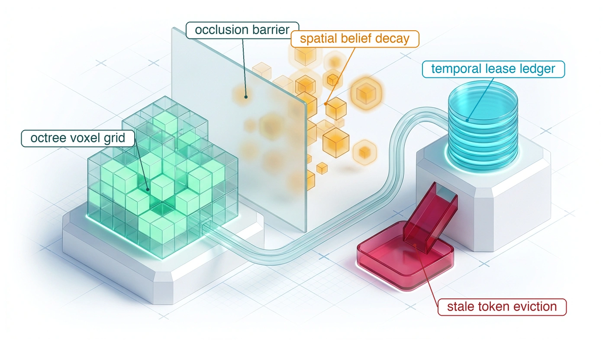
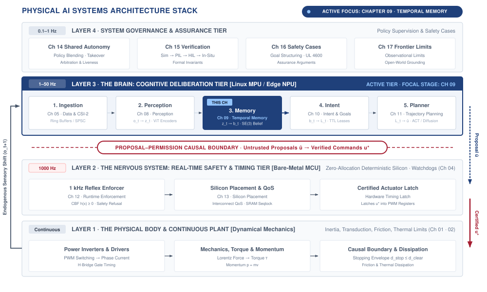
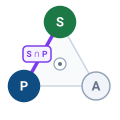
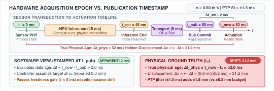
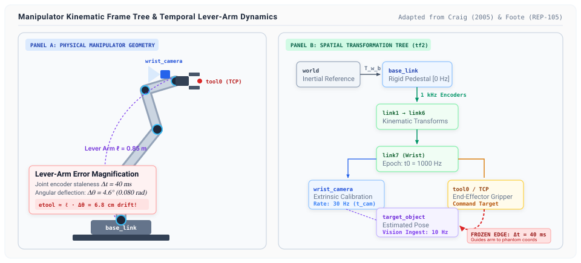
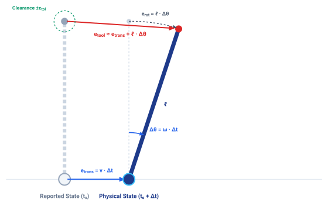
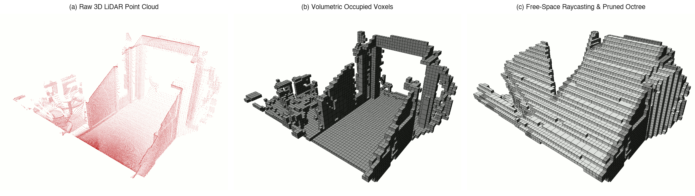
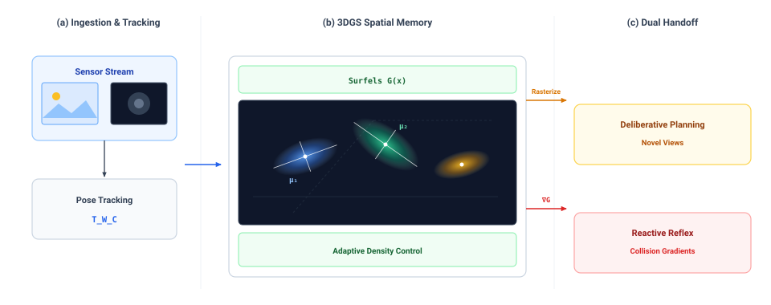
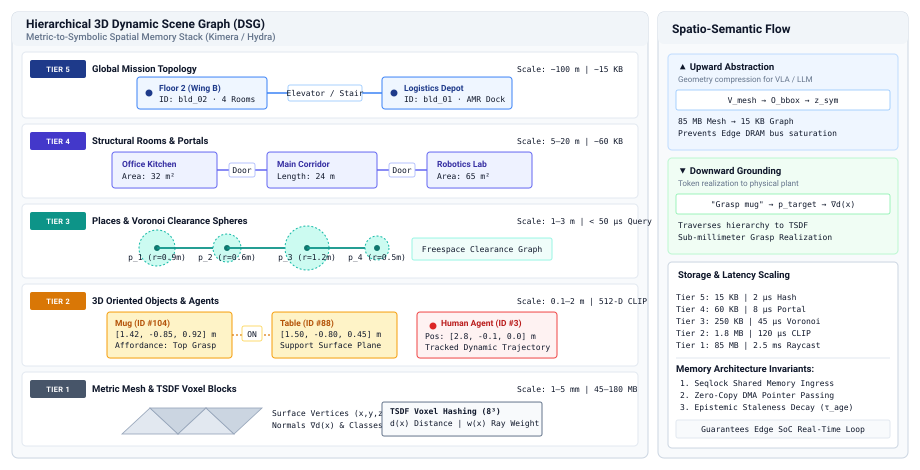

# Spatial Memory {#sec-memory}

::: {layout-narrow}
::: {.column-margin}

\chapterminitoc

:::

::: {.content-visible when-format="pdf"}
\noindent
{fig-alt="Isometric blueprint showing persistent spatial memory: tiered octree 3D voxel grid with fresh observation updates, frosted glass occlusion divider, floating spatial belief decay uncertainty halos, cylindrical temporal lease ledger, and Harvard crimson stale token eviction basin."}
:::

::: {.content-visible unless-format="pdf"}
{fig-alt="Isometric blueprint showing persistent spatial memory: tiered octree 3D voxel grid with fresh observation updates, frosted glass occlusion divider, floating spatial belief decay uncertainty halos, cylindrical temporal lease ledger, and Harvard crimson stale token eviction basin."}
:::

:::

## Purpose {.unnumbered .unlisted}

::: {.content-visible when-format="pdf"}
\begin{marginfigure}
\vspace{1em}
\resizebox{\linewidth}{!}{\mlphysicalstackfull{100}{20}{20}{20}{20}}
\end{marginfigure}
:::

_How fast does a spatial belief turn into dangerous fiction once a sensor loses sight of an object?_

A moving obstacle remains a constraint after disappearing behind a pillar. The machine must remember it, yet its last observed position becomes less reliable as time passes. Treating that position as current can send a planner into occupied space; discarding it can erase a nearby hazard. Spatial memory must therefore carry both an estimate and the limits of what that estimate supports. Observation age, uncertainty, and coordinate alignment determine whether a remembered object can still guide motion. A frozen coordinate transform is dangerous as it can make an old estimate appear current to downstream consumers. Expiration must withdraw that estimate's authority without treating the unseen region as empty. In the physical AI stack, memory connects the brain's account of the world to the nervous system's permission to move, with validity windows set by how quickly uncertainty consumes the body's available clearance.



::: {.callout-learning-objectives}

- Specify belief records that preserve measurement time, coordinate frame, uncertainty, and conditions for use
- Set belief expiry from measured uncertainty growth and the task's physical error budget
- Compare spatial representations by memory cost, query time, and information needed for action
- Design spatial updates that preserve evidence age and distinguish missing observations from verified free space
- Diagnose stale transforms and other belief failures that downstream consumers may not detect

:::

## Preserving Spatial Belief {#sec-memory-preserving-belief}

A memory register can preserve a coordinate exactly while the workpiece it describes moves. If a fixture drifts at $20\text{ mm/s}$ during occlusion, a $2\text{ mm}$ tooling tolerance is spent in $100\text{ ms}$. Republishing the stored coordinate with a new software timestamp cannot restore the lost physical evidence. Spatial memory must therefore carry the last measurement time and an error-growth rule into the motion-permission decision.

::: {.column-margin .margin-pointer}
↰ **Prerequisite:** Observation age and calibrated spatial covariances are generated in @sec-perception-observation-contract.
:::

A physical machine cannot rely solely on raw sensory observations or static memory registers. It requires a **belief**\index{Belief}—an estimate of physical state carried forward from historical sensory evidence, coupled explicitly to an expanding model of uncertainty.[^fn-mem-belief-state] Perception supplies a dated, calibrated observation (as established in @sec-perception-handoff). Spatial memory must determine how long that observation, combined with dynamic motion models, can continue to authorize physical action before uncertainty consumes the machine's remaining clearance.

[^fn-mem-belief-state]: **Belief state formulation**\index{State estimation!belief state}: In a Partially Observable Markov Decision Process (POMDP), a belief represents a probability distribution over latent states. A physical state interface can additionally carry a justified bounded-disturbance error envelope, or a calibrated error quantile with its declared tail risk; the latter is not a deterministic upper bound. Without the value, frame, evidence epoch, and applicable uncertainty model, a downstream optimizer cannot evaluate clearance during a sensor dropout.

Within the four-tier physical AI systems architecture, the memory stage highlighted in @fig-09-locator connects perception to intent and trajectory planning. Operating as Stage 3 of the deliberative brain, its **spatial memory**\index{Spatial memory} carries geometric and physical state estimates forward across sensor dropouts, occlusions, and variable processing delays.

::: {#fig-09-locator fig-env="figure" fig-pos="htb" fig-cap="**Memory stage architecture focus**: The four-tier physical AI systems architecture highlights the cognitive deliberation tier, with memory as the third brain stage and this chapter's active focus. The stage carries latent state $z_t$ into a persistent spatial belief $b_t$, making it the only place the system holds what its sensors can no longer see." fig-alt="Diagram titled Physical AI Systems Architecture Stack, drawn as four stacked tiers. Layer 4 is system governance and assurance at 0.1 to 1 hertz, holding boxes for shared autonomy, verification, safety cases, and frontier limits. Layer 3 is the brain, a cognitive deliberation tier at 1 to 50 hertz, holding five stages named ingestion, perception, memory, intent, and planner. A dashed proposal-permission privilege boundary separates it from layer 2, the nervous system, a real-time safety and timing tier at 1000 hertz. Layer 1 is the physical body and continuous plant. Layer 3 is shaded and its memory stage is outlined; the badge reads Active Focus, Chapter 09, Temporal Memory."}
{width="100%"}
:::

Crucially, memory operates directly across the **proposal-permission boundary**.[^fn-mem-dual-brain] The unprivileged application processor (Linux MPU) maintains high-dimensional spatial belief structures, occupancy voxels, and coordinate transform trees. However, because the MPU experiences unpredictable scheduling jitter, memory bus contention, and inference latency, it cannot be trusted to self-report temporal freshness. The real-time safety processor (MCU) acts as the permission referee, evaluating every candidate motion proposal against independent hardware timers. When an unrefreshed belief breaches task safety margins, the nervous system unilaterally revokes execution permission.

::: {.column-margin}
{width="100%" fig-alt="S·P·A locator triad highlighting the Sense-Plan belief edge."}

*The Sense $\cap$ Plan belief interface: preserving spatial object state under line-of-sight occlusions.*
:::

[^fn-mem-dual-brain]: **Dual-brain spatial partitioning**\index{Architecture!dual-brain}: The dual-brain architecture assigns high-dimensional spatial mapping (OctoMap, VDB voxels, factor graphs) to Linux application processor (MPU) cores while reserving deterministic hardware countdown timers and barrier evaluations for the real-time microcontroller (MCU). An independently clocked permission controller with a segregated memory path can continue its local check during MPU stalls; its complete detection-to-brake response still depends on validated sensing, bus, and actuator timing. See @sec-brain-embodied for the foundational interface specifications governing this boundary.

Consider an analytical example of a manipulator tasked with touching a workpiece and regulating contact force against a moving assembly fixture. The fixture drifts relative to the robot base at a bounded velocity of at most $20\text{ mm/s}$. The tooling compliance of $1\text{ mm/N}$ permits an allowable positioning error of $2\text{ mm}$ before generating a $2\text{ N}$ reaction force that overloads the wrist sensor. Dividing the allowable error by the maximum drift velocity yields an operational lifetime of $100\text{ ms}$, calculated as $2\text{ mm} / (20\text{ mm/s}) = 0.100\text{ s}$. For the first $50\text{ ms}$ after the camera captures an image, the physical position of the workpiece remains safely within the tolerance window. At $100\text{ ms}$, the unobserved displacement reaches the outer boundary of the error budget. At $101\text{ ms}$, without a new measurement, the modeled displacement exceeds the stated tolerance; a close approach using the stale coordinate would no longer satisfy the contact margin.

In software systems, data age is frequently measured from the instant a message was serialized, published over an inter-process bus, or updated in a shared memory table. In a physical AI system, this convention is dangerous. Propagating a state estimate through an extended Kalman filter at $1000\text{ Hz}$ or republishing an $SE(3)$ kinematic transform at $200\text{ Hz}$ creates a stream of fresh software timestamps, but it does not refresh the underlying physical information. The true age of a belief is determined strictly by the acquisition timestamp $t_0$ of the last physical measurement that constrained it. A downstream tracking loop that reads a position estimate generated by dead reckoning or policy rollouts may observe a publish timestamp only $2\text{ ms}$ old, yet the physical error envelope continues to expand at the velocity of the unobserved drift. Timestamping an inference output or a cache lookup records when compute occurred, but it tells the receiver nothing about when reality was last checked.

The stored bits can remain intact while the physical claim they represent loses support. A register preserves the last observed pose even when the fixture has moved, so memory integrity alone cannot establish geometric validity [@durrant2006simultaneous]. To prevent a machine from acting on stale data, memory systems must treat expiry as an explicit interface event. The **belief state invalidation horizon**\index{Belief state invalidation horizon} ($t_{\mathrm{exp}} = \inf \{ \Delta t \ge 0 : E(\Delta t) \ge E_{\max} \}$) is the deadline under the declared error-growth model and operating envelope. When a justified hard bound reaches the physical margin, tracking authority expires; a calibrated quantile instead defines a risk-limited deadline with residual tail risk. Either case sends dependent motion proposals to the independent permission path and a validated, feasible fallback when they cannot be admitted.

::: {#psp-memory-evidence-epoch-invariant .callout-perspective title="The evidence epoch invariant"}
*Extrapolation advances timestamps without refreshing evidence age. Unmonitored belief drifts into physical failure. Never let an intermediate predictor, filter, or transport bridge reset the evidence acquisition epoch $t_0$; compute freshness is a software artifact, but physical freshness belongs strictly to the hardware transducer.*
:::

The first handoff question is what a consumer needs to evaluate a stored value after its sensor loses sight of the object.

## What Memory Hands Over {#sec-memory-handoff}

In the context of AI systems, a 'belief' refers to a representation of state or information that is subject to uncertainty. A belief passed across a real-time bus cannot be a naked array of floating-point numbers. It embodies a decaying interpretation of physical inputs and must explicitly carry its epoch, physical uncertainty, and reference frame to remain valid. An unannotated vector such as $[0.142, -0.051, 0.812]$ conveys nothing about what physical entity is being described, what physical dimension is represented, or how that quantity is scaled. A downstream controller receiving raw coordinates without metadata must rely on implicit conventions established at compile time. If an estimator produces positions in meters while an actuator controller expects millimeters, or if an angular rate is mistaken for an absolute orientation, the resulting command registers as a massive tracking error, driving motor current to the actuator thermal limits detailed in @sec-body-kinetic-momentum. To prevent misinterpretation across the causal boundary established in @sec-boundary-causal-boundary, a belief record must first specify the entity identity, the physical quantity, and the measurement units. The consumer must be able to verify that the value represents the center of mass of a specific workpiece in meters, or the normal contact force on a fingertip in newtons, before routing that number into a control law.

Specifying the quantity and units remains incomplete without binding the value to a concrete reference frame. Identical spatial coordinates describe entirely different physical realities depending on the origin and orientation of the coordinate system. A Cartesian position $[0.142, -0.051, 0.812]\text{ m}$ designates a point suspended in free space when evaluated in the robot base frame\index{Base frame}, but represents a point several hundred millimeters inside a rigid fixture when interpreted in the tool flange frame\index{Tool flange frame}. Because kinematic links flex, joints move, and coordinate transforms update at varying rates, a belief record must carry an explicit frame identifier. Carrying the frame allows the receiving node to look up the corresponding spatial transformation tree and project the stored geometry into the local frame required by the actuator, preventing the controller from acting on geometric misalignments caused by moving kinematic chains.

Geometry and identity describe the physical state at a single moment, but memory must also capture the temporal anchor of that state. The timestamp attached to a belief must record the exact epoch $t_0$\index{Measurement epoch} of the physical interaction or optical exposure that last constrained the estimate. In distributed architectures, intermediate nodes often republish data, execute Kalman filter prediction steps, or run forward kinematic propagations to maintain high-rate control streams (for example, estimating where a moving target is right now based on its last known velocity). A prediction step or cache refresh updates the transmission timestamp, but it does not add new physical evidence from sensors. If an intermediate process overwrites $t_0$ with the current system clock during a forward rollout, downstream safety monitors observe a deceptive stream of fresh timestamps. The robot system falsely believes it has recent physical confirmation of the object, while the underlying physical state continues to drift unchecked. Preserving the original measurement epoch $t_0$ across all serialization and filtering stages ensures that consumers measure the age of the information against the physical world rather than against the scheduling frequency of the local computer.

Knowing the measurement epoch $t_0$ establishes elapsed time $\Delta t = t - t_0$, but elapsed time alone cannot determine whether a belief is valid for a given action. Two estimates of identical age diverge at different rates depending on physical constraints. A workpiece firmly held in a pneumatic vise maintains sub-millimeter positional certainty after several seconds of sensor occlusion, whereas the same workpiece sliding along a moving conveyor belt accumulates substantial position error in fifty milliseconds. Therefore, a belief record must include both the initial uncertainty bound\index{Uncertainty bound} $e_0$ established at the epoch of measurement and an explicit growth law\index{Error expansion} that quantifies how that uncertainty expands over time.

The minimum record fields necessary for a consumer to evaluate a stored state can be derived directly from the requirement to bound current error. Let $e(t)$ represent the upper bound of the discrepancy between the stored value and true physical state at time $t$. If an estimator establishes a state at time $t_0$ with an initial measurement uncertainty $e_0$, and external disturbances or unmodeled velocities cause the true state to diverge at a maximum rate $r$, the upper bound on error at current time $t$ obeys the linear expansion $e(t) = e_0 + r(t - t_0)$. As an analytical example, consider a tactile sensor array that establishes the initial slip displacement of a grasped object with an uncertainty $e_0 = 0.40\text{ mm}$ at $t_0 = 1.200\text{ s}$. If the object slides beneath the gripper at a maximum unmeasured velocity $r = 15.0\text{ mm/s}$, the error bound after an unobserved interval of $\Delta t = 80\text{ ms}$ expands to $e(t) = 0.40\text{ mm} + (15.0\text{ mm/s})(0.080\text{ s}) = 1.60\text{ mm}$. Omitting either $e_0$ or $r$ leaves the consumer unable to compute $e(t)$, demonstrating that an initial bound and an expansion rate are both structurally required.

Expressing uncertainty through physical bounds and expansion rates distinguishes a physical AI belief from a probabilistic confidence score. An object detection network might output a class confidence of $0.94$, but a downstream position controller cannot convert a unitless probability into a safe actuator displacement margin (i.e., how far the arm can physically move before risking a collision). A confidence score of $0.94$ provides no information about whether an obstacle boundary is uncertain by $2.0\text{ mm}$ or by $200\text{ mm}$, nor does it indicate how rapidly that boundary moves when occlusion occurs. A physical memory record must express its initial bound $e_0$ and expansion rate $r$ in concrete physical dimensions such as meters, radians, or newtons per second. Furthermore, these rates are valid only within a defined operating envelope, such as a maximum assumed acceleration or a verified contact friction coefficient. If physical operating conditions exceed that envelope, the expansion rate is no longer guaranteed, and the belief record must be treated as invalid.

Extending the proposal-permission architecture from @sec-brain-embodied, when memory hands over a tuple containing value, reference frame, measurement epoch $t_0$, initial bound $e_0$, and growth rate $r$, the consumer executes a deterministic verification step before applying the data to physical control. The consumer possesses an application tolerance $\epsilon_{\text{tol}}$ dictated by the physical task. In a precision insertion operation with a radial clearance of $0.80\text{ mm}$, the controller requires that positional uncertainty remain below $\epsilon_{\text{tol}} = 0.80\text{ mm}$. Upon reading the belief record at current time $t_{\text{now}}$, the consumer calculates the elapsed time $\Delta t = t_{\text{now}} - t_0$, evaluates the present error bound $e(t_{\text{now}}) = e_0 + r \Delta t$, and compares the result directly against $\epsilon_{\text{tol}}$. If $e(t_{\text{now}}) \le \epsilon_{\text{tol}}$, the belief passes this freshness check and can enter the independent motion-permission check. Otherwise the dependent proposal is refused; the controller selects a validated hold, search, or stop response only when it remains feasible.

::: {#dfn-memory-spatial-belief-contract .callout-definition title="The spatial belief contract"}

***Spatial belief contract***\index{Spatial belief contract!definition}\index{Belief contract!definition} is a typed state record that binds an identified physical quantity and SI unit to a frame, acquisition and estimate epochs, clock conversion, initial error, growth law, operating envelope, provenance, and lifecycle status. These fields let a consumer evaluate freshness before a separate motion-permission check.

1.  **Significance**: A state without an error bound and growth rate cannot be safely evaluated by downstream controllers. As time elapses ($\Delta t = t_{\text{now}} - t_0$), unobserved motion or sensor drift expands the spatial uncertainty envelope ($e(t) = e_0 + r \Delta t$). When uncertainty breaches task tolerance ($e(t) > \epsilon_{\text{tol}}$), the contract expires, requiring the permission tier to reject dependent proposals and choose a feasible validated response.
2.  **Distinction**: Unlike a unitless classification probability (such as $P(\text{object}) = 0.94$), a spatial belief contract provides physically grounded metric units (meters, radians) and explicit time-decay mechanics.
3.  **Common pitfall**: Relying on external publishers to broadcast invalidation signals upon occlusion. If the communication channel drops or the sensor driver hangs, the downstream consumer continues executing open-loop motions on frozen beliefs unless it independently evaluates the expiration contract.

:::

Evaluating the spatial belief contract depends on calculating the elapsed time $\Delta t = t_{\text{now}} - t_0$ against physical reality. If the consumer cannot verify the exact physical instant when energy transduction occurred, the calculated error bound $e(t_{\text{now}})$ becomes an unanchored fiction, mistaking software compute cycles for physical evidence.

## A State Has an Epoch {#sec-memory-state-epoch}

Every state reported by a sensor or estimated by a model corresponds to a specific point in time, termed its **epoch**\index{Epoch}. In a physical computing pipeline, a state passes through three temporal boundaries before a controller can act. The **acquisition epoch**\index{Epoch!acquisition} ($t_0$) is the nanosecond-precise timestamp recording the exact physical instant when energy transduction occurred at the causal boundary (@sec-boundary-causal-boundary), such as photons striking a photodiode array or a digital register latching an encoder count.[^fn-hw-timer-capture] The **estimation epoch**\index{Epoch!estimation} ($t_{\text{est}}$) marks the instant the computational pipeline (whether a state estimator or neural network) completed its mathematical inference over those measurements, representing the moment the computational pipeline resolves sensor measurements into a concrete state claim. The **publication epoch**\index{Epoch!publication} ($t_{\text{pub}}$) marks the instant the serialized message was committed to the physical transport bus for dispatch to downstream consumers.

[^fn-hw-timer-capture]: **Hardware timer input-capture**\index{Hardware!timer input-capture}: Microcontroller timer input-capture channels latch counter values into dedicated shadow registers upon external signal transitions, bypassing operating system interrupt latency. Reading capture registers without atomic synchronization against timer overflow flags causes 16-bit counter aliasing, injecting artificial timestamp jumps equal to the rollover period ($65.5\text{ ms}$ on a $1\text{ MHz}$ timer). In downstream visual-inertial odometry, this temporal discontinuity introduces false acceleration spikes that destabilize platform attitude filters.

Collapsing these three timestamps into a single receipt or transmission timestamp destroys the physical validity of the state. If an inference accelerator requires $45\text{ ms}$ to execute an object detection model and the operating system incurs another $5\text{ ms}$ of scheduling and serialization latency before publication, tagging the resulting object pose with the publication time hides a $50\text{ ms}$ physical displacement. During that $50\text{ ms}$ interval, gravity, momentum, and contact forces continue to act on the physical system without pause. If a conveyor belt carries a workpiece at $0.60\text{ m/s}$, a downstream gripper that treats the publication timestamp as the measurement epoch assumes the workpiece is located where it was $50\text{ ms}$ in the past, introducing an unmodeled position error of $(0.60\text{ m/s})(0.050\text{ s}) = 30.0\text{ mm}$. A state that records only when data became available tells the consumer nothing about the physical instant the measurement represents, making temporal alignment impossible.

::: {.column-margin .margin-pointer}
↰ **Prerequisite:** Synchronized hardware timestamping across fieldbuses is established in @sec-nervous-deterministic-fieldbuses.
:::

Even when a system records true acquisition epochs, physical AI architectures rely on distributed processing nodes whose local oscillator clocks drift independently, where each compute node operates on a distinct, time-varying local oscillator clock. Synchronizing these distributed clocks over standard bus networks introduces a bounded synchronization error, and that temporal uncertainty translates directly into spatial uncertainty.[^fn-hw-ptp-canfd] Consider an analytical example where an autonomous manipulator tracks a moving assembly target. The vision processor and the joint motion controller run on separate compute boards synchronized across an Ethernet bus using the Precision Time Protocol (PTP, IEEE 1588) to maintain a bounded clock offset of $\delta t = \pm 1.5\text{ ms}$. If the target moves relative to the camera at an operational velocity of $v = 1.20\text{ m/s}$, the clock offset alone creates an irrecoverable spatial positioning uncertainty of $e_{\text{sync}} = v \cdot \delta t = (1.20\text{ m/s})(0.0015\text{ s}) = 1.80\text{ mm}$. In an assembly operation with a mechanical clearance tolerance of $0.50\text{ mm}$, an uncalibrated clock synchronization bound of $1.5\text{ ms}$ causes physical interference and tool collision before any controller tracking latency is added. The physical error budget must therefore allocate margin for clock synchronization jitter alongside sensor resolution and structural deflection.

[^fn-hw-ptp-canfd]: **Fieldbus clock synchronization jitter**\index{Fieldbus!synchronization jitter}: Fieldbus architectures exhibit distinct hardware clock synchronization bounds: IEEE 1588 PTP over Ethernet achieves $\delta t < 1.0\,\mu\text{s}$, EtherCAT Distributed Clocks achieve $<100\text{ ns}$ hardware SYNC0 jitter, and CAN-FD bit-phase synchronization yields $\pm 10\text{--}50\,\mu\text{s}$. Because spatial uncertainty scales with target relative velocity ($e_{\text{sync}} = v_{\text{rel}} \delta t$), microsecond-level synchronization is essential to keep temporal errors within micrometer mechanical budgets. Uncalibrated clock drift between distributed sensor and motor nodes degrades multi-axis tool coordination, inducing high-frequency chatter in joint torque loops.

Real physical systems never sample all relevant state variables simultaneously. A tactile array might latch normal force readings at $t_1 = 12.0\text{ ms}$, an optical tracking camera might finish sensor integration at $t_2 = 18.5\text{ ms}$, and joint optical encoders might sample angular positions at $t_3 = 21.0\text{ ms}$. These observations occur at different epochs and cannot be combined through direct algebraic operations. Fusing a camera observation at $t_2$ with an encoder observation at $t_3$ requires the consumer to project one state across the temporal gap $\Delta t = |t_3 - t_2| = 2.5\text{ ms}$ using explicit kinematic models and bounded velocities (for example, propagating the historical camera observation along the joint velocity vector to reconcile it with the instantaneous encoder reading). Without the true acquisition epoch for each individual signal, the alignment calculation cannot determine the sign or magnitude of $\Delta t$. Extrapolating state without an accurate epoch causes the fusion algorithm to compute spatial offsets from fictitious temporal baselines, compounding errors across every fusion cycle.

For a consumer to use a state safely, the memory record must provide four explicit quantities: the physical state value, the precise acquisition epoch referenced to a synchronized system clock, the upper bound on clock synchronization uncertainty, and the maximum rate of physical state change. Given these quantities, the consumer computes the exact elapsed duration between the acquisition epoch and the execution deadline, evaluates the worst-case expansion of the error bound, and determines whether the state remains within task tolerances. Handing over a state without its acquisition epoch leaves the consumer blind to transport delays and scheduling jitter, turning deterministic control into open-loop guesswork. Because physical geometry also changes as bodies move through space, spatial transforms between reference frames are subject to the same temporal decay, carrying their own distinct measurement epochs.

::: {#chk-mem-epoch-clock-synchronization .callout-checkpoint title="Hardware epochs and clock synchronization"}

{fig-alt="Timeline diagram comparing physical sensor acquisition epoch t0 against computational estimation epoch t_est and publication epoch t_pub. It shows that while software perceives data age as only 2 ms based on publication time, physical hardware has drifted by 52 ms, producing 31.2 mm of unmodeled displacement and breaching mechanical clearance limits." width=100%}

Before analyzing coordinate frame hierarchies and lever-arm error propagation, verify your understanding of acquisition epochs and network clock jitter:

- [ ] **Epoch classification**: Can you distinguish between acquisition epoch ($t_0$), estimation epoch ($t_{\text{est}}$), and publication epoch ($t_{\text{pub}}$), explaining why stamping inference output with the transmission time hides physical displacement?
- [ ] **Fieldbus clock skew**: Can you calculate how bounded clock synchronization jitter over Ethernet PTP ($\delta t = \pm 1.5\text{ ms}$) translates directly into physical positioning uncertainty ($e_{\text{sync}} = v \cdot \delta t$) for a high-speed moving target?
- [ ] **Multi-rate temporal alignment**: Can you explain why direct algebraic fusion of asynchronous sensor frames (e.g., $1000\text{ Hz}$ encoders vs $30\text{ Hz}$ depth cameras) requires explicit forward kinematic projection rather than simple timestamp matching?

:::

## Spatial Reference Frames {#sec-memory-reference-frames}

Geometric coordinates lack meaning without their reference frame, which moves in a machine. **Spatial transformation matrices**\index{Spatial transformation matrices} express translations and rotations between coordinate frames, allowing an onboard computer to map a target detected by a camera into joint torques applied at an end-effector (@fig-09-robot-transform-tree). In rigorous spatial mechanics, these rigid-body poses are parameterized as elements of the Special Euclidean group $SE(3)$.[^fn-math-se3-group]

[^fn-math-se3-group]: **Special Euclidean group $SE(3)$**\index{Mathematics!SE(3) group}: The Special Euclidean group $SE(3)$ represents rigid-body spatial transformations as the semi-direct product $\mathbb{R}^3 \rtimes SO(3)$, parameterized by $4 \times 4$ homogeneous matrices combining rotational orientation with translational displacement. Operating directly on the Lie group avoids gimbal lock and singular parameterizations inherent in Euler angles. For the matrix exponential and Lie algebra $\mathfrak{se}(3)$ kinematics governing transform interpolation, refer to @sec-appendix-control-spatial.

Standardized across robotics by ROS Enhancement Proposal 105 (REP 105),[^fn-mem-ros-rep105] a robot maintains its spatial relationships as a **directed acyclic coordinate transform tree**\index{Directed acyclic coordinate transform tree} $\mathcal{T} = (\mathcal{V}, \mathcal{E})$, where each vertex denotes a physical or virtual coordinate frame (such as `earth`, `map`, `odom`, `base_link`, camera sensors, or tool center points), and each directed edge stores a time-varying transform parameterized by joint angles [@lynch2017modern; @craig2005introduction].[^fn-hw-spatial-dma] Classical mechanics treats geometric relationships as timeless, but in a physical computing system, they are time-stamped messages subject to transport delays, processing latency, and clock drift. A coordinate transform is valid only at the exact epoch when its underlying physical geometry was measured.

[^fn-mem-ros-rep105]: **Coordinate frame conventions (REP 105)**\index{Standards!REP 105}: ROS Enhancement Proposal 105 (REP 105) formalizes kinematic frame hierarchies for mobile platforms ($\mathcal{F}_{\text{earth}} \to \mathcal{F}_{\text{map}} \to \mathcal{F}_{\text{odom}} \to \mathcal{F}_{\text{base}}$), isolating continuous odometric dead reckoning from discrete global map corrections. Confining non-continuous map updates to the `map` $\to$ `odom` transform prevents step discontinuities in local tracking loops. Injecting discontinuous coordinate jumps directly into inner motor controllers introduces derivative spikes that saturate inverter current and trip mechanical emergency stops.

[^fn-hw-spatial-dma]: **Spatial DMA bus contention**\index{Hardware!DMA bus contention}: Traversing pointer-based spatial trees and hierarchical voxel grids induces severe CPU L1/L2 cache misses due to irregular memory strides. On unified-memory system-on-chip (SoC) architectures, concurrent direct memory access (DMA) transfers from multi-camera ingestion pipelines saturate shared LPDDR5 memory arbiters. This crossbar contention inflates spatial query latency tails from sub-microsecond expectations to tens of milliseconds, stalling real-time collision checks on the trajectory planner.

When an onboard computer chains together links across a robot arm, it multiplies a series of coordinate transforms to figure out where the end-effector is. If these transforms are measured at different times due to delays, asynchronous sampling, or dropped frames, the resulting position does not reflect the machine at any instant. It evaluates a synthetic, hybrid pose that never actually existed. For the rigorous matrix derivation of kinematic chains, see @sec-appendix-control-kinematics.[^fn-hw-seqlock-dmb]

[^fn-hw-seqlock-dmb]: **Sequence locks for 6-DoF transforms**\index{Concurrency!sequence locks}: Because a 6-DoF spatial transform comprises multiple 64-bit floating-point registers, non-atomic concurrent reads during an in-flight write produce torn state records that combine old rotations with new translations. Lock-free sequence locks (seqlocks) paired with data memory barriers (`DMB`) protect transform handoffs by allowing reader threads to detect concurrent modifications via monotonic sequence counters without blocking writer threads. This lockless synchronization prevents low-priority perception publishers from inducing priority inversion on high-rate control threads. For memory barrier formalisms, see @sec-appendix-systems-ipc.

::: {#fig-09-robot-transform-tree fig-env="figure" fig-pos="t" fig-cap="**Manipulator kinematic frame tree and temporal dynamics**: Articulated manipulator geometry (a) and corresponding directed acyclic coordinate transform tree in ROS \\texttt{tf2} (b). Each directed edge stores a homogeneous transformation matrix parameterized by joint state. Composing transforms across disparate measurement epochs injects lever-arm positioning error $e_{\\text{tool}} \\approx \\ell\\,\\Delta\\theta$, while an uncompensated asynchronous edge references stale coordinates (adapted from Craig 2005 and Foote 2013 [@craig2005introduction; @foote2013tf])." fig-alt="Manipulator Kinematic Frame Tree and Temporal Lever-Arm Dynamics. (a) Physical geometry of an articulated manipulator with base link, joint linkages, wrist camera, and tool center point (tool0), indicating lever arm ℓ and angular deflection error e_tool ≈ ℓ · Δθ. (b) Spatial transformation tree (DAG) connecting world reference, base link, kinematic chain link1 through link6, wrist frame, wrist camera, tool0 TCP, and target object, highlighting an asynchronous stale transform edge. (Adapted from Craig 2005 and Foote 2013)."}
{width="100%"}
:::

The cost of an expired transform is direct spatial displacement (@fig-frame-staleness-error). Applying the delay-as-distance principle from @sec-body to kinematics, uncompensated latency translates directly into geometric positioning error through the lever arm of the linkages. For the rigorous cross-product derivation of this kinematic error propagation, see @sec-appendix-control-spatial.

Consider an analytical example of a manipulator holding a tool point at a distance of $\ell = 0.60\text{ m}$ from its wrist assembly. Suppose the base and wrist rotate at an angular velocity of $\omega = 1.50\text{ rad/s}$ while the arm translates through space at $v = 0.80\text{ m/s}$. If a tracking pipeline publishes a camera-to-tool transform with an uncompensated staleness of $\Delta t = 40\text{ ms} = 0.040\text{ s}$, the translation of the frame drifts by $e_{\text{trans}} = v \cdot \Delta t = (0.80\text{ m/s})(0.040\text{ s}) = 0.032\text{ m} = 3.20\text{ cm}$. Over the same interval, the angular orientation rotates through $\Delta \theta = \omega \cdot \Delta t = (1.50\text{ rad/s})(0.040\text{ s}) = 0.060\text{ rad}$. Through the lever-arm relation $e_{\text{rot}} \approx \ell \Delta \theta$, this angular shift swings the tool point across an arc of $e_{\text{rot}} \approx (0.60\text{ m})(0.060\text{ rad}) = 0.036\text{ m} = 3.60\text{ cm}$. Summing the translational shift and the lever-arm deflection yields a total tool-point positioning error of $e_{\text{tool}} \approx e_{\text{trans}} + \ell \Delta \theta = 3.20\text{ cm} + 3.60\text{ cm} = 6.80\text{ cm}$. Comparing this $68.0\text{ mm}$ error against a physical task clearance tolerance of $\epsilon_{\text{tol}} = \pm 0.50\text{ mm}$ reveals that an uncompensated staleness of just $40\text{ ms}$ breaches clearance by a factor of $68.0\text{ mm} / 0.50\text{ mm} = 136\times$. Because the transform tree silently evaluates without mathematical error, the controller commands the motor drives to push through solid metal before tactile sensors can detect the collision.

::: {#fig-frame-staleness-error fig-env="figure" fig-pos="t" fig-cap="**Transform staleness and lever-arm error propagation**: Geometric error propagation under uncompensated transform latency $\\Delta t$. Base translation shifts the origin by $e_{\\text{trans}} = v\\,\\Delta t$, while joint rotation across link length $\\ell$ swings the tool tip by $e_{\\text{rot}} \\approx \\ell\\,\\omega\\,\\Delta t$, accumulating into total tool displacement $e_{\\text{tool}} \\approx e_{\\text{trans}} + \\ell\\,\\Delta\\theta$ that breaches clearance tolerance $\\pm \\epsilon_{\\text{tol}}$." fig-alt="Coordinate transform staleness and lever-arm kinematic error propagation. Compares reported state at t0 against true physical state at t0 + Δt. Base translation produces displacement e_trans = v Δt, while link rotation over length ℓ introduces angular deflection Δθ = ω Δt and arc error e_rot ≈ ℓ Δθ. The resulting vector sum e_tool breaches the target clearance envelope ±ε_tol."}
{width="100%"}
:::

::: {#chk-mem-transform-staleness-lever-arm .callout-checkpoint title="Transform staleness and lever-arm deflection"}

Before exploring continuous volumetric mapping and attention buffer bounds, verify your understanding of kinematic frame staleness:

- [ ] **Transform staleness amplification**: Can you explain how uncompensated latency in base or wrist kinematic transforms amplifies across structural link lengths to induce large lever-arm displacements at the tool center point?
- [ ] **Silent evaluation failure**: Can you describe why a stale coordinate transform that continues to evaluate cleanly in linear algebra libraries is far more dangerous than a transform that raises a software exception?
- [ ] **Kinematic error allocation**: Can you distinguish between allocating error budgets purely to sensor calibration versus bounding end-to-end transport and thread scheduling jitter in distributed transform trees?

:::

::: {#psp-memory-leverage-of-staleness .callout-perspective title="The leverage of staleness"}
*Transform staleness multiplies through kinematic link lengths; an uncompensated millisecond of lag at the robot base swings the tool center point through centimeters of unobserved deflection.*
:::

While kinematic trees govern the relative poses of articulated robot links, navigating and manipulating within unconstrained environments requires tracking the surrounding world itself. Beyond discrete kinematic vertices, an embodied machine must maintain continuous volumetric scene memory to represent unobserved surfaces and enforce free-space clearance.

## Volumetric Scene Memory and Attention Buffers {#sec-memory-scene-attention-buffers}

Beyond discrete kinematic frames, an embodied agent must also maintain continuous volumetric spatial memory to track unobserved obstacles, plan collision-free paths, and support real-time reactive grasping (@fig-09-octomap-volumetric-mapping). Formulated originally by Elfes [@elfes1989using], **occupancy grid mapping**\index{Occupancy grid mapping} models the world as a tessellation of spatial cells, recursively estimating occupancy state under sensor beam models. By executing **volumetric free-space raycasting**\index{Volumetric free-space raycasting} along sensor sightlines, spatial memory actively updates 3D voxel hierarchies (such as OctoMap or OpenVDB [@museth2013vdb]) and updates observed free cells under a sensor model. The foundational algorithm for volumetric raycasting is the 3D Differential Digital Analyzer (3D-DDA) fast voxel traversal [@amanatides1987fast].[^fn-hw-cuda-octree]

[^fn-hw-cuda-octree]: **Branchless DDA raycasting**\index{Hardware!branchless DDA}: On Single Instruction, Multiple Threads (SIMT) GPU architectures, parallel 3D-DDA raycasting encounters execution divergence when adjacent threads within a 32-thread warp traverse spatial voxels of differing depths. High-throughput engines implement branchless DDA traversal, cache active voxel blocks in GPU Shared Memory, and apply atomic integer bitmasks (`atomicOr`) to register spatial updates without global DRAM lock contention. Eliminating warp serialization preserves memory bus bandwidth for concurrent neural network inference.

Crucially, as the ray traverses free space from the sensor to the obstacle, the pipeline asserts **negative evidence**\index{Negative evidence} to clear unoccupied voxels. At the terminal measurement point where the obstacle is detected, positive evidence is integrated.[^fn-math-voxel-raycast] This active assertion of negative evidence along valid sensor sightlines can invalidate a phantom obstacle track when the same region is observed free; occluded space still needs expiry.

::: {.column-margin}
{width="100%" fig-alt="Causal chain showing raycast through free space to surface hit, evicting ghost obstacles."}

*Active negative evidence along sightlines clears phantom obstacles without waiting for timeout decay.*
:::

[^fn-math-voxel-raycast]: **Voxel traversal and log-odds updates**\index{Algorithm!3D-DDA traversal}: The 3D Differential Digital Analyzer (3D-DDA) evaluates ray-voxel intersections along optical sightlines in discrete volumetric grids. Traversed voxels in front of measured surfaces receive negative occupancy log-odds updates to clear transient obstacles, while voxels intersecting measured surface returns receive positive updates. This active clearing prevents ghost obstacles from permanently corrupting traversability graphs after dynamic obstacles depart. For the complete derivation of recursive log-odds Bayesian mapping, see @sec-appendix-ml-voxels.

::: {#fig-09-octomap-volumetric-mapping fig-env="figure" fig-pos="H" fig-cap="**Probabilistic octree volumetric mapping**: A corridor traversal reconstructed from raw point cloud into a probabilistic octree and then into explicit free, occupied, and unknown space [@hornung2013octomap]. The third panel is what distinguishes spatial memory from an accumulated point cloud, because raycasting records evidence of emptiness along sightlines, letting the map actively retire a phantom obstacle track instead of waiting for a timeout to expire it. (Credit: Hornung et al. / Autonomous Intelligent Systems Lab, University of Freiburg, CC BY 3.0)." fig-alt="Probabilistic 3D Volumetric Mapping and Hierarchical Octree Space Subdivision. Empirical 3D spatial memory representation reconstructed from a physical mobile robot traversing an indoor corridor with a tilting LiDAR scanner [@hornung2013octomap]. (a) Raw 3D point cloud acquired during robot motion, subject to sensor noise and finite field-of-view occlusions. (b) Volumetric OctoMap voxel representation modeling 3D space as an 8-ary hierarchical tree, where occupied volumes are probabilistically updated and stored across variable resolutions. (c) Explicit free-space raycasting and lossless octree pruning, differentiating observed free cells (white voxels) from occupied obstacles (dark voxels) and unobserved unknown regions; free evidence alone does not certify traversability for a particular robot. By maintaining explicit free-space evidence along sensor sightlines, spatial memory actively invalidates phantom obstacle tracks without waiting for arbitrary software timeouts. (Credit: Hornung et al. / Autonomous Intelligent Systems Lab, University of Freiburg, CC BY 3.0)."}
{width="95%"}
:::

For local surface reconstruction, **truncated signed distance fields (TSDFs)**\index{Truncated signed distance field} [@curless1996volumetric; @newcombe2011kinectfusion; @oleynikova2017voxblox] store a *metric projective distance* $D(\mathbf{v})\in[-\mu,+\mu]$ and fusion weight $W(\mathbf{v})$. The convention here is positive in front of an observed return along its sensing ray. Occupancy is a separate field: a return supports free-space updates before the hit and occupied evidence at the hit; space behind it remains unknown unless another observation reaches it. A projective TSDF is not the nearest-surface Euclidean distance needed for a conservative clearance decision.

For a calibrated depth image, transform voxel center $\mathbf{v}$ into camera coordinates $\mathbf{p}=[p_x,p_y,p_z]^\top$ and project it to pixel $(u,v)$. Its projective sample is $s=Z_{\text{meas}}(u,v)-p_z$. For a range ray, use the equivalent along-ray sample $s=r_{\text{hit}}-r_{\text{voxel}}$; both are positive before the hit. A negative sample just behind the measured return contributes to the local zero crossing under the surface model; it does not certify an unseen obstacle interior. Fusion uses a valid capture-time pose and refuses a sample older than a voxel's last evidence epoch. The observation weight $w_t$ is dimensionless and the stored weight is capped at $W_{\max}$. Near the return, clamp in **meters**:
$$d_{\mu}(\mathbf{v})=\max(-\mu,\min(\mu,s)),\qquad D_t(\mathbf{v})=\frac{W_{t-1}(\mathbf{v})D_{t-1}(\mathbf{v})+w_t d_{\mu}(\mathbf{v})}{W_{t-1}(\mathbf{v})+w_t}$$

Interpolation of observed TSDF samples can supply a local approximate gradient near a zero crossing. Unknown voxels, projective bias, discretization, and dynamic objects limit that gradient. Before using distance for motion permission, a system must construct and validate a conservative occupancy or Euclidean signed distance field (ESDF), account for unknown space and error margins, and measure query latency on its chosen hardware. A surface-rendering or interpolation lookup alone supplies no collision guarantee.

For view synthesis, **3D Gaussian splatting (3DGS)**\index{3D Gaussian splatting}[^fn-math-3dgs-splatting] [@kerbl20233d; @matsuki2024gaussian] stores anisotropic primitives whose positions, opacity, and color can be optimized to render new camera views. That is valuable for recognition and inspection, but a Gaussian density or its derivative does not identify conservative occupied space or a signed clearance. Before a Gaussian map can inform motion permission, the system needs a validated geometry/occupancy conversion, an ESDF with unknown-space policy, or an independent range sensor. Rendering rate and collision-query latency are separate measurements. The handoff in @fig-3dgs-slam-splatam makes this distinction; @fig-09-volumetric-memory-scaling compares constructed storage scenarios rather than equal-accuracy benchmarks.

::: {.column-margin .margin-pointer}
⇄ **Contrast:** A dense cubic grid stores $O(N^3)$ cells. Sparse occupancy and Gaussian maps store only allocated structure, but their required cell or primitive count depends on observed geometry and the accuracy target.
:::

[^fn-math-3dgs-splatting]: **Continuous 3D Gaussian splatting**\index{Machine Learning!3D Gaussian splatting}: A Gaussian primitive includes a center, shape, opacity, and color coefficients. Differentiable rasterization optimizes visual reconstruction; its spatial derivative is not a conservative surface normal or collision bound. Storage per primitive depends on packing and spherical-harmonic degree.

::: {#fig-3dgs-slam-splatam fig-env="figure" fig-pos="H" fig-cap="**Gaussian memory and clearance handoff**: Camera observations update a Gaussian scene for novel-view rendering. Its visual output does not directly supply conservative collision distance; a separately validated geometry or occupancy conversion and permission check are required [@kerbl20233d; @matsuki2024gaussian]." fig-alt="Three-stage schematic: sensor and pose input, a Gaussian scene, then two outputs. The upper branch renders novel views for deliberation. The lower branch requires validated geometric conversion before a separate permission tier can use clearance; Gaussian derivatives alone do not establish it."}
{width="100%"}
:::

::: {#fig-09-volumetric-memory-scaling fig-env="figure" fig-pos="htb" fig-cap="**Constructed spatial-memory storage scenarios**: A dense cube uses four bytes per voxel, the illustrative octree allocates one 32-byte surface cell per squared grid dimension, and the Gaussian scene holds a fixed count and packing while grid resolution varies. These are storage models, not equal-fidelity or measured runtime benchmarks; Gaussian count must rise if a stricter geometry target requires it." fig-alt="Log-scale plot of calculated storage against grid cells per dimension for a dense cubic voxel grid, an assumed surface-allocated octree, and a Gaussian scene held at a fixed primitive count. The fixed Gaussian line is an assumption, not a claim of constant cost at equal geometric fidelity."}

```{python}
#| echo: false
import pandas as pd
import matplotlib.pyplot as plt
from mlsysim import viz, calc_3dgs_memory_footprint, GB, MB
from mlsysim.fmt import fmt_memory

# Constructed storage model; equal geometric fidelity is not assumed.
data = pd.read_csv("vol4/09_memory/data/volumetric_memory_scaling.csv")
N = data["Resolution"].to_numpy()
gaussian_count = 500_000
gaussian_bytes = 56  # assumed position/shape/opacity/color packing
memory_gaussian = calc_3dgs_memory_footprint(gaussian_count, gaussian_bytes)
gaussian_mem_str = fmt_memory(memory_gaussian, unit=MB, precision=0)
dense_gb = 4 * N**3 / 1e9
octree_gb = 32 * N**2 / 1e9  # assumed N^2 allocated surface cells
three_dgs_gb = [memory_gaussian.to(GB).magnitude] * len(N)

fig, ax, COLORS, plt = viz.setup_plot(figsize=(8, 5))
ax.plot(N, dense_gb, marker='o', linewidth=2.5, label='Dense: 4N³ B', color=COLORS["RedLine"])
ax.plot(N, octree_gb, marker='s', linewidth=2.5, label='Assumed surface: 32N² B', color=COLORS["BlueLine"])
ax.plot(N, three_dgs_gb, marker='^', linewidth=2.5, label='Fixed 500k Gaussians × 56 B', color=COLORS["GreenLine"])
ax.set_xscale('log', base=2)
ax.set_yscale('log', base=10)
ax.set_xlabel('Grid cells per dimension N', fontsize=11, fontweight='bold')
ax.set_ylabel('Constructed storage (decimal GB)', fontsize=11, fontweight='bold')
ax.legend(fontsize=9)
plt.tight_layout()
plt.show()
plt.close()
```

:::

For the constructed Gaussian packing in the plot, $K=500{,}000$ and $56$ bytes per primitive require `{python} gaussian_mem_str`. Holding $K$ fixed while the grid resolution changes shows a storage assumption, not equal surface accuracy. A deployment chooses its representation after measuring map completeness, update time, query time, and the conversion needed for conservative clearance.

| Representation                                             | Storage driver                                        | Useful output                              | Permission limit                                                                                                    |
|:-----------------------------------------------------------|:------------------------------------------------------|:-------------------------------------------|:--------------------------------------------------------------------------------------------------------------------|
| Octree occupancy (OctoMap)                                 | Allocated free and occupied cells plus tree metadata  | Observed free/occupied/unknown evidence    | Unknown and aged cells require explicit policy; distance needs a separate transform                                 |
| Sparse voxel blocks (VDB)                                  | Allocated blocks, including traversed occupancy cells | Local updates and compact spatial indexing | Sparsity does not eliminate free-ray traversal or establish cache hit rate                                          |
| Metric projective TSDF (Voxblox)                           | Allocated surface-band blocks and weights             | Local reconstructed zero crossing          | Projective distance and interpolation are not conservative Euclidean clearance; validate an ESDF or occupancy layer |
| Neural SDF                                                 | Network and feature/hash parameters                   | Approximate continuous field               | Training coverage, error, and query deadline need validation                                                        |
| 3D Gaussian splatting [@kerbl20233d; @matsuki2024gaussian] | $K$ primitives × implementation-dependent packing     | Novel-view rendering                       | Appearance gradients need validated geometry/occupancy conversion or independent sensing                            |

: **Spatial-memory representation decisions**: Storage structure and useful output differ; this table intentionally omits unverified device-independent update and query microsecond ranges. The figure's storage models are illustrative and do not hold accuracy constant. {#tbl-09-spatial-rep tbl-colwidths="[18,23,25,34]"}

The representation trade-offs in @tbl-09-spatial-rep explain why a rendered view is not a clearance bound. Beyond raw metric volumes and radiance fields, foundation-model-driven physical AI requires spatial memory to organize space into semantic hierarchies. The **3D dynamic scene graph (DSG)**\index{3D dynamic scene graph}, formulated by @rosinol2021kimera in Kimera, bridges metric SLAM with symbolic reasoning by structuring spatial memory into a five-layer hierarchical graph:

1. *Metric-Semantic Mesh (Layer 1):* High-resolution triangular mesh capturing fine surface geometry with vertex semantic labels.
2. *Object and Agent Nodes (Layer 2):* Bounded 3D geometric entities with oriented bounding boxes, visual embeddings, and tracked dynamic trajectories.
3. *Places and Freespace Topology (Layer 3):* 3D Voronoi topology and navigable freespace spheres for planning collision-free paths.
4. *Rooms and Structural Enclosures (Layer 4):* Functional architectural subdivisions partitioned by semantic walls and portals.
5. *Buildings and Global Topology (Layer 5):* Top-level semantic graph governing long-horizon mission allocation.

By grounding high-level cognitive tokens in explicit metric coordinates through this hierarchical graph, 3D dynamic scene graphs allow foundation policies to query spatial memory at varying levels of abstraction without exhaustive metric searches across millions of voxels (@fig-09-dynamic-scene-graph).

::: {#fig-09-dynamic-scene-graph fig-env="figure" fig-pos="t" fig-cap="**Hierarchical 3D dynamic scene graph architecture**: Five-layer spatio-temporal memory organization bridging metric SLAM to symbolic foundation reasoning. Layer 1 captures triangular metric mesh geometry; Layer 2 extracts 3D objects and dynamic agents; Layer 3 models topological places via Voronoi freespace clearance spheres ($p_i$); Layer 4 structures architectural rooms and portals; and Layer 5 establishes global building mission topology. Vertical inter-layer edges coordinate upward abstraction (compressing metric surfaces into symbolic entities) and downward grounding (translating task tokens into metric coordinates) (adapted from Rosinol et al. [@rosinol2021kimera] and Hughes et al. [@hughes2022hydra])." fig-alt="Hierarchical five-layer 3D Dynamic Scene Graph architecture. From bottom to top: Layer 1 Metric Mesh surface geometry, Layer 2 Objects and Agents with support relations, Layer 3 Places with Voronoi freespace clearance spheres, Layer 4 Rooms connected by portals, and Layer 5 Buildings with global topology. Side arrows depict upward Abstraction and downward Grounding across tiers."}
{width="100%"}
:::

The computational advantage of this bidirectional hierarchy lies in how it resolves the memory-compute tension on edge SoCs. Upward abstraction collapses gigabytes of dense triangular surface meshes into kilobyte-scale symbolic subgraphs, allowing foundation deliberators to evaluate long-horizon task plans without exhausting LPDDR5 bandwidth or choking KV caches with millions of raw geometric tokens. Conversely, downward grounding lets high-level spatial targets reach local geometric evidence. A TSDF zero crossing can help estimate a surface,[^fn-math-tsdf-fusion] but a separately validated occupancy or ESDF layer, unknown-space policy, and deadline check must supply conservative clearance to the permission tier. However, grounding symbolic intent in continuous geometry requires the underlying metric layer to remain computationally tractable; as demonstrated in the following case study, naive dense voxelization quickly overwhelms edge memory architectures.

[^fn-math-tsdf-fusion]: **Continuous TSDF surface integration**\index{Geometry!TSDF integration}: A projective TSDF stores truncated signed displacement along a measurement ray, with a local zero crossing near an observed surface. Weighted fusion can reduce sensor noise, but interpolation and gradients are approximate and do not directly give nearest-surface Euclidean distance or a conservative collision force. Convert to a validated ESDF/occupancy layer before using the map for clearance.

```{python}
#| label: calc-memory-tsdf-voxel-grid
#| echo: false
from mlsysim.core.units import ureg, meter, second, GB, MB
from mlsysim.physics.robotics import calc_tsdf_voxel_grid_budget
from mlsysim.fmt import fmt, fmt_memory, fmt_bandwidth, fmt_int, fmt_multiple, fmt_percent

class TSDFVoxelGridBudget:
    workspace = 300.0 * (meter**3)
    res_1cm = calc_tsdf_voxel_grid_budget(
        workspace_volume=workspace,
        voxel_size=0.01 * meter,
        bytes_per_voxel=4,
        sparsity_ratio=0.03,
        ray_rate=18432000.0 / second,
        dense_voxels_per_ray=300,
        sparse_voxels_per_ray=6,
        bytes_per_ray_voxel=8,
        cache_hit_rate=0.95,
    )
    res_5mm = calc_tsdf_voxel_grid_budget(
        workspace_volume=workspace,
        voxel_size=0.005 * meter,
        bytes_per_voxel=4,
        sparsity_ratio=0.03,
    )

    # ┌── 4. OUTPUT (Format & Export) ────────────────────────────────────────
    dense_voxels_1cm_str = fmt_int(res_1cm["dense_voxel_count"], commas=True)
    dense_mem_1cm_str = fmt_memory(res_1cm["dense_memory"], unit=GB, precision=2)

    dense_voxels_5mm_str = fmt_int(res_5mm["dense_voxel_count"], commas=True)
    dense_mem_5mm_str = fmt_memory(res_5mm["dense_memory"], unit=GB, precision=2)

    sparse_blocks_1cm_str = fmt_int(res_1cm["sparse_block_count"], commas=True)
    sparse_mem_1cm_str = fmt_memory(res_1cm["sparse_memory"], unit=MB, precision=1)

    sparse_mem_5mm_str = fmt_memory(res_5mm["sparse_memory"], unit=MB, precision=1)

    dense_bw_str = fmt_bandwidth(res_1cm["dense_dram_bandwidth"], unit=GB / second, precision=1)
    sparse_bw_str = fmt_bandwidth(res_1cm["sparse_dram_bandwidth"], unit=GB / second, precision=1)

    mem_reduction_mult_str = fmt_multiple(round(((res_1cm["dense_memory"] / res_1cm["sparse_memory"])).to_base_units().magnitude))
    bw_reduction_mult_str = fmt_multiple(
        round(((res_1cm["dense_dram_bandwidth"] / res_1cm["sparse_dram_bandwidth"])).to_base_units().magnitude), commas=True
    )
```

::: {#nbk-memory-memory-footprint-dram-bandwidth-3d-tsdf .callout-notebook title="DRAM bandwidth of 3D TSDF voxel grids"}
**Practical Engineering Question**\index{Practical Engineering Question}: What are the distance-and-weight payload and modeled DRAM bandwidth of sparse versus dense TSDF representations, and how can the workload contend with policy inference on a shared host bus?

*1. Naive Dense Volumetric Allocation:*
Consider an active robotic manipulation workcell measuring $10\text{ m} \times 10\text{ m} \times 3\text{ m} = 300\text{ m}^3$.

- At isotropic resolution $\Delta v = 1.0\text{ cm} = 0.01\text{ m}$:
  $$\text{Voxel Count} = \left(\frac{10}{0.01}\right) \times \left(\frac{10}{0.01}\right) \times \left(\frac{3}{0.01}\right) = 1000 \times 1000 \times 300 = 3 \times 10^8\text{ voxels}$$
  yielding `{python} TSDFVoxelGridBudget.dense_voxels_1cm_str` voxels.

- Distance-and-weight payload at $4\text{ bytes}$ per voxel ($16\text{-bit}$ TSDF distance $+ 16\text{-bit}$ fusion weight), excluding occupancy, per-cell evidence epochs, and allocator overhead:
  $$M_{\text{dense, 1cm}} = 3 \times 10^8 \times 4\text{ B} = 1.20 \times 10^9\text{ B} = 1.20\text{ GB}$$
  yielding `{python} TSDFVoxelGridBudget.dense_mem_1cm_str`.

- If resolution is refined to $\Delta v = 5.0\text{ mm} = 0.005\text{ m}$ for precision tool contact:
  $$\text{Voxel Count} = 2000 \times 2000 \times 600 = 2.4 \times 10^9\text{ voxels} \implies M_{\text{dense, 5mm}} = 9.60\text{ GB}$$
  yielding `{python} TSDFVoxelGridBudget.dense_voxels_5mm_str` voxels and a partial payload of `{python} TSDFVoxelGridBudget.dense_mem_5mm_str`. This payload alone exceeds an illustrative $8\text{ GB}$ memory budget.

*2. Sparse Voxel Hashing (Assumed TSDF-Band Fraction $\approx 3$ percent):*
Physical obstacles and workcell surfaces occupy only a thin 2D manifold within 3D volume. Grouping voxels into $8^3 = 512$ voxel leaf blocks and allocating only within the TSDF truncation band ($\mu = \pm 3\text{ cm}$):

- Active occupied volume: $\approx 3.0$ percent of $300\text{ m}^3 = 9.0\text{ m}^3$.
- Active voxel count at $1\text{ cm}$: $9.0 \times 10^6\text{ voxels} \implies \approx 17,578\text{ blocks}$ (`{python} TSDFVoxelGridBudget.sparse_blocks_1cm_str` blocks).
- Distance-and-weight payload plus the stipulated 32-byte leaf header:
  $$M_{\text{sparse, 1cm}} = 17,578\text{ blocks} \times (512\text{ voxels} \times 4\text{ B} + 32\text{ B header}) \approx 36.5\text{ MB}$$
  yielding `{python} TSDFVoxelGridBudget.sparse_mem_1cm_str`.

- At $5.0\text{ mm}$ resolution: this partial allocation is $M_{\text{sparse, 5mm}} \approx 292\text{ MB}$ (yielding `{python} TSDFVoxelGridBudget.sparse_mem_5mm_str`). A full map must also budget the separate occupancy layer, per-cell epochs, block lookup and allocator metadata, and capacity for unknown-space policy.

*3. Traversal, Fusion, and DRAM Traffic at $60\text{ Hz}$:*
A $640\times480$ depth stream at $60\text{ Hz}$ supplies $18.432$ million rays per second. In this constructed $3.0\text{ m}$ ray at $1\text{ cm}$ pitch, DDA visits 300 cells. Suppose 294 cells before the hit receive separate occupancy free-ray updates and six cells near the return receive metric TSDF fusion. Sparse TSDF allocation saves *map capacity*; it does not remove 300 traversals or the 294 occupancy updates.

At eight bytes of assumed read/write traffic per update, sending all 300 updates to DRAM costs `{python} TSDFVoxelGridBudget.dense_bw_str`. If measurement on the selected architecture establishes a 95 percent cache hit fraction for **both** occupancy and TSDF updates, the modeled DRAM transaction demand is `{python} TSDFVoxelGridBudget.sparse_bw_str`. The corresponding reduction is `{python} TSDFVoxelGridBudget.bw_reduction_mult_str` under that cache assumption. Different ray overlap, atomics, evictions, and writeback behavior change it; the 95 percent hit rate is an input to validate, not a VDB property. The independent permission controller's memory remains segregated from this host workload.

**Systems insight**: Sparse allocation yields `{python} TSDFVoxelGridBudget.mem_reduction_mult_str` less *modeled TSDF payload* in this surface-fraction scenario; it is not a full-map memory ratio. Bus demand instead depends on measured locality and all traversed-cell work. Reserve host bandwidth and deadline margin using the observed transaction tail rather than a storage ratio.
:::

::: {#chk-mem-volumetric-dram-bandwidth .callout-checkpoint title="Volumetric spatial memory and memory bus saturation"}

- [ ] **Volumetric scaling penalty**: Can you explain why cubic voxel scaling ($\mathcal{O}(N^3)$) makes dense 3D grids silicon-infeasible on embedded edge SoCs when voxel resolution is refined from $1\text{ cm}$ to $5\text{ mm}$?
- [ ] **DRAM bus starvation**: Can you describe how un-cached $60\text{ Hz}$ RGB-D raycasting across dense voxels consumes over 85 percent of shared LPDDR5 bandwidth, and why a 95 percent measured hit rate, including free-ray occupancy updates, is needed for the illustrated DRAM reduction?
- [ ] **Negative evidence raycasting**: Can you explain how active line-of-sight raycasting using 3D-DDA clears phantom obstacles without relying on arbitrary software timeout decay?

:::

To integrate incoming sensory point clouds while actively evicting stale obstacle geometry, the spatial memory engine executes the structured raycast update detailed in @algo-volumetric-tsdf-raycast.

::: {.column-margin}
{width="100%" fig-alt="Illustrative raycast DRAM traffic for 18.432 million rays per second, each with 294 free-ray occupancy updates and six TSDF-band updates. All 300 updates missing cache demand 44.2 gigabytes per second; an assumed 95 percent hit rate for the same updates reduces modeled DRAM traffic to 2.21 gigabytes per second. Traversal work remains in both cases."}

*In this assumed workload, caching reduces modeled DRAM transactions; ray traversal and occupancy clearing remain.*
:::

```pseudocode
#| label: algo-volumetric-tsdf-raycast
#| pdf-line-number: true
#| pdf-right-comment: false
#| html-comment-delimiter: "▷"
\begin{algorithm}
\caption{Occupancy Raycast and Metric TSDF Fusion}
\begin{algorithmic}
\Require returns $\mathcal{P}$ captured at $t_0$ in one capture clock; valid pose; occupancy $\mathcal{O}$; metric TSDF $\mathcal{V}$; truncation $\mu$; evidence half-life $t_{1/2}$; per-cell serialized updates
\Ensure observed free/occupied cells and near-surface TSDF samples updated without refreshing unseen cells
\State $(t_{0,c},\epsilon_{\text{sync}})\gets\Call{ConvertCaptureToControllerClock}{t_0}$
\If{clock conversion invalid or $t_{\text{now},c}-t_{0,c}+\epsilon_{\text{sync}}>\tau_{\max,\text{age}}$}
    \State \Return $\text{STATUS\_FRAME\_TOO\_STALE}$
\EndIf
\If{any target occupancy or TSDF cell has $t_{\text{last}}>t_0$}
    \State \Return $\text{STATUS\_OUT\_OF\_ORDER}$ \Comment{preflight before modifying the map}
\EndIf
\For{\textbf{each} return $\mathbf{p}_k\in\mathcal{P}$}
    \State $(\mathbf{r}_{\text{dir}},r_{\text{hit}})\gets\Call{RayFromPoseAndReturn}{\mathbf{p}_k}$
    \Statex \Comment{Occupancy: measured free ray and hit, not TSDF distance}
    \For{\textbf{each} cell $c$ traversed before the hit}
        \State $c\gets\Call{GetOrAllocateOccupancy}{\mathcal{O},c}$
        \State $c.L\gets\Call{ClampLogOdds}{c.L+L_{\text{free}}}$; $c.t_{\text{last}}\gets t_0$
    \EndFor
    \State update the observed hit cell with $L_{\text{occupied}}$ and epoch $t_0$
    \Statex \Comment{TSDF: fuse metric samples only in a narrow surface band}
    \For{\textbf{each} voxel $v$ with $|r_{\text{hit}}-r_v|\le\mu$}
        \State $\text{vox}\gets\Call{GetOrAllocateTSDF}{\mathcal{V},v}$
        \State $d_\mu\gets\Call{Clamp}{r_{\text{hit}}-r_v,-\mu,+\mu}$ \Comment{positive before hit}
        \State $W_{\text{old}}\gets 0$ if $\text{vox}.W=0$, else $\text{vox}.W\,2^{-(t_0-\text{vox}.t_{\text{last}})/t_{1/2}}$
        \State $w_{\text{obs}}\gets 1$ \Comment{dimensionless illustrative confidence}
        \State $\text{vox}.D\gets(W_{\text{old}}\text{vox}.D+w_{\text{obs}}d_\mu)/(W_{\text{old}}+w_{\text{obs}})$
        \State $\text{vox}.W\gets\min(W_{\text{old}}+w_{\text{obs}},W_{\max})$; $\text{vox}.t_{\text{last}}\gets t_0$
    \EndFor
\EndFor
\State \Return $\text{STATUS\_MAP\_UPDATED}$
\end{algorithmic}
\end{algorithm}
```

The map manifest in @tbl-09-schema-volumetric-belief fixes units and update metadata. A motion consumer still checks each cell used by its path, including unknown cells, and derives conservative clearance from a separately validated layer.

| Map field                                 | Unit or type                        | Meaning and consumer check                                                                                        |
|:------------------------------------------|:------------------------------------|:------------------------------------------------------------------------------------------------------------------|
| `voxel_grid_origin`, `voxel_resolution_m` | m; m                                | Spatial anchor and pitch; match the active frame and calibration                                                  |
| `tsdf_trunc_margin_m`                     | m                                   | Metric projective distance clamp $\mu$; not an ESDF clearance                                                     |
| `active_block_count`                      | count                               | Allocated TSDF blocks; occupancy may have separate blocks                                                         |
| `map_update_epoch`                        | capture-clock ns                    | Last map publication/update; **not** freshness of every cell                                                      |
| `cell_evidence_epoch`                     | capture-clock ns per cell           | Last physical observation for that TSDF or occupancy cell; never refreshed by prediction or unrelated map updates |
| `free_space_sweep_epoch`                  | capture-clock ns per occupancy cell | Last valid observed free ray through that cell                                                                    |
| `decay_half_life_s`                       | s                                   | If exponential weight decay is enabled, $W(t)=W_0 2^{-\Delta t/t_{1/2}}$; this does not renew evidence            |
| `clock_conversion`, `sync_error_ns`       | mapping; ns                         | Convert capture epochs to the consumer's monotonic clock with bounded error                                       |

: **Volumetric belief manifest and cell evidence**: The map header describes layout and update time, while cell-local acquisition epochs determine whether the particular path region is fresh. The consumer treats unobserved or expired cells as unknown unless a separately validated policy permits traversal. {#tbl-09-schema-volumetric-belief tbl-colwidths="[24,20,56]"}

While volumetric occupancy grids, TSDF maps, and coordinate trees defend metric clearance and geometric relationships, modern Physical AI systems increasingly deploy foundation models to maintain task context. In recurrent world models (such as DreamerV3 [@hafner2025mastering]), temporal belief across transitions is compressed into fixed-size latent state vectors with $\mathcal{O}(1)$ memory. In autoregressive Vision-Language-Action (VLA) foundation policies (such as RT-2 [@brohan2023rt2], OpenVLA [@kim2024openvla], and Octo [@octo_2023]), however, temporal context is maintained through the transformer attention Key-Value (KV) cache. In these autoregressive architectures, every interaction step appends new multimodal tokens—including multi-view visual patch embeddings, proprioceptive joint states, and predicted action tokens—directly into memory.

The physical memory footprint of this KV-cache scales linearly with cumulative sequence context length $L$:
$$\text{Memory}_{\text{KV}} = 2 \times N_{\text{layers}} \times N_{\text{heads}} \times d_{\text{head}} \times L \times b_{\text{bytes}}$$
where $b_{\text{bytes}} = 2$ for 16-bit half-precision floating point (`fp16` or `bf16`).

For an illustrative 32-layer decoder with 32 heads of width 128 in 16-bit storage, the cache adds $524{,}288$ bytes (about $0.524\text{ MB}$) per token. At an assumed 100 multimodal tokens per second, that is $52{,}428{,}800$ bytes/s (about $52.4\text{ MB/s}$). A $4{,}294{,}967{,}296$-byte allocation fills in $81.92\text{ s}$ if nothing is evicted. This is a capacity calculation for a stated architecture and tokenization rate, not a measured Jetson policy latency. Cached decoding avoids recomputing all prior keys and values, but attention work for the next token grows as $O(L)$ with live context length $L$; cumulative work over an uncapped rollout grows as $O(L^2)$.

**Streaming attention**\index{Streaming ring-buffer attention} retains a small number $N_{\text{sink}}$ of initial attention-sink tokens and a rolling window of $W$ recent tokens [@xiao2024streamingllm]. Sink tokens help the attention mechanism maintain normalization even when those tokens carry no task semantics. Task instructions and older physical facts therefore need separately managed task/spatial state; pinning four early tokens does not guarantee instruction retention or long-term memory. At 100 tokens per second, $W=512$ spans only $5.12\text{ s}$ of recent tokens. The window evicts earlier observations even when their physical consequences persist, so spatial belief records must carry validated evidence across that eviction.

The cache ceiling is
$$\text{Memory}_{\text{KV},\max}=2N_{\text{layers}}N_{\text{heads}}d_{\text{head}}(N_{\text{sink}}+W)b_{\text{bytes}}$$ {#eq-mem-kv-cache-bound}
Applying @eq-mem-kv-cache-bound with $N_{\text{sink}}=4$ and $W=512$ yields a 516-token cache consuming $270{,}532{,}608$ bytes (about $270.5\text{ MB}$). Per-token cached attention work is then $O(N_{\text{sink}}+W)$ and cumulative work over $T$ new tokens is $O(T(N_{\text{sink}}+W))$, aside from model layers and other costs. This bounds cache allocation, not the quality of long-horizon decisions or the deadline of a particular accelerator.

::: {#chk-mem-vla-kv-cache-ring-buffer .callout-checkpoint title="VLA key-value cache growth and ring buffers"}

{fig-alt="Architecture schematic of a streaming ring-buffer attention KV-cache for Vision-Language-Action policies. Shows permanently pinned initial attention sinks (N_sink = 4) anchoring softmax normalization, an eviction zone where historical middle tokens are discarded, and a rolling circular observation window (W = 512) for incoming multimodal tokens. At the assumed 100 tokens per second, the 512-token window spans 5.12 seconds. An uncapped cache adds about 52.4 MB per second and fills a roughly 4.29 GB allocation in 81.92 seconds using exact byte counts; a 516-token cap uses about 270.5 MB. Attention sinks do not preserve task semantics by themselves." width=100%}

- [ ] **Autoregressive memory leakage**: Can you explain why unconstrained Key-Value caching in vision-language-action policies grows linearly in memory and, at the stated token rate and budget, fills the available cache unless tokens are evicted?
- [ ] **Attention sinks**: Can you describe why attention-sink tokens support the attention mechanism but cannot by themselves preserve task instructions or physical history?
- [ ] **Complexity bounding**: Can you distinguish between $O(L)$ cached attention work for one new token and $O(L^2)$ cumulative uncapped work from a fixed-window $O(W)$ per-token computation?

:::

::: {#dfn-memory-vla-kv-cache-ring-buffer .callout-definition title="VLA KV-cache ring buffer"}

***VLA KV-cache ring buffer***\index{VLA KV-cache ring buffer!definition}\index{KV-cache ring buffer!definition} is an embedded transformer memory architecture that caps autoregressive attention cache allocation to a constant ceiling ($\text{Memory}_{\text{KV},\max} \propto N_{\text{sink}} + W$) by retaining initial attention-sink tokens ($N_{\text{sink}}$) while cycling continuous sensory and action tokens through a rolling circular FIFO buffer ($W$).

1.  **Significance**: Unbounded key-value caching in vision-language-action (VLA) models consumes memory linearly with execution time ($\mathcal{O}(L)$), which can exhaust a finite edge-device allocation during long-horizon tasks.
2.  **Distinction**: Unlike naive token pruning that discards arbitrary historical states, ring buffering preserves structural attention sinks alongside a recent token window; explicit task state and spatial memory must preserve older semantics.
3.  **Common pitfall**: Evicting initial prompt tokens ($N_{\text{sink}} = 0$). Removing attention sinks can degrade a model trained to rely on them; retaining them does not guarantee task coherence after middle tokens are evicted.

:::

For motion permission, spatial representations must carry evidence ages and error limits appropriate to the task and operating region. Extending the proposal-permission architecture from @sec-brain-embodied, a representation without an epoch is an unverified assertion, and an estimate whose age exceeds task tolerance must be excluded from motion proposals before the independent permission tier considers actuator commands. When direct geometric observations become unavailable, the machine cannot simply halt every operation at the first missed sensor frame. Extending action across brief sensing gaps requires estimators that propagate physical belief forward until new measurements arrive to confirm or correct the state.

## Belief Through Occlusion {#sec-memory-belief-through-occlusion}

When direct sensing fails, a physical AI system uses an internal transition model to update its state estimate. A Kalman filter\index{Filter!Kalman} updates state estimates using plant dynamics,[^fn-hist-bayesian-filter] while a learned policy might predict the next relative pose using an autoregressive network\index{Network!autoregressive}. In both implementations, propagating a state across an unobserved interval does not generate new information. Prediction mathematically extrapolates old evidence forward in time. It preserves the utility of an observation by compensating for expected physical motion, but it does not reset the age of the underlying measurement. If an optical sensor captured the position of a workpiece at time $t = 0\text{ ms}$, an estimator projecting that position to $t = 100\text{ ms}$ still relies entirely on evidence that is $100\text{ ms}$ old. Treating a predicted state as an active observation confuses mathematical continuity with physical truth.

[^fn-hist-bayesian-filter]: **Bayesian state estimation provenance**\index{State estimation!Bayesian provenance}: @kalman1960new introduced recursive minimum mean-square error state estimation for linear dynamic systems. @moravec1985high generalized these recursive Bayesian updates to spatial occupancy grids, modeling sensor beam uncertainty through explicit range-bearing distributions. In embodied systems, uncompensated propagation across extended sensor dropouts causes Bayesian belief distributions to disperse, requiring explicit invalidation horizons to prevent open-loop control divergence.

This distinction becomes critical during physical contact. Consider an articulated arm tasked with inserting a hardened steel pin into a close-tolerance bearing sleeve. A wrist-mounted stereo camera tracks the pin and the sleeve during the approach phase. When the parallel-jaw gripper descends to seat the pin, the mechanical structure of the gripper and the fingers completely occludes the camera line of sight $40\text{ mm}$ above the fixture. For the remaining distance, the nervous system receives no direct optical measurements of the mating interface. The tracking pipeline switches to forward propagation, computing the relative pose between the tool center point and the sleeve bore from the last verified camera frame combined with joint encoder integration.

Every physical model simplifies reality, causing error between the projected state and the physical world to expand continuously during the blind interval. In state estimation, this dispersion is governed by **occlusion covariance expansion**\index{Occlusion covariance expansion}—the continuous, physics-governed widening of uncertainty during sensor line-of-sight dropouts. Mathematically formalized by stochastic models (such as the continuous Lyapunov/Riccati covariance propagation equation, detailed in @sec-appendix-control-covariance), this expansion quantifies the growing doubt about where a part actually is, bounding the unobserved divergence caused by unknown drift velocities and unexpected physical disturbances before the sensor regains visibility. For this deterministic worked model, suppose sensor characterization and disturbance limits establish an initial position-error bound $E_0 = 0.30\text{ mm}$ at the moment of occlusion ($\Delta t = 0\text{ ms}$). During the unobserved descent, two bounded disturbance terms degrade the prediction. First, unobserved mechanical vibration and workpiece thermal expansion introduce an unmodeled drift velocity bounded by $v_{\text{drift}} = 4.0\text{ mm/s}$. Second, minor compliance in the arm joints and unmodeled drive backlash create an unobserved disturbance acceleration bounded by $a_{\text{dist}} = 30.0\text{ mm/s}^2$. Conditional on those velocity and acceleration bounds remaining valid, the error-growth envelope $E(\Delta t)$ over an occlusion duration $\Delta t$ follows the quadratic expansion:

$$E(\Delta t) = E_0 + v_{\text{drift}}\Delta t + \frac{1}{2}a_{\text{dist}}(\Delta t)^2$$ {#eq-mem-occlusion-expansion}

The insertion operation requires a maximum radial alignment error of $\epsilon_{\text{tol}} = 0.80\text{ mm}$ to clear the lead-in chamfer of the sleeve. Substituting the parameters into the envelope (@eq-mem-occlusion-expansion) yields the quadratic relation $15.0 (\Delta t)^2 + 4.0 \Delta t - 0.50 = 0$. Solving for the positive root gives a maximum admissible rollout duration of $\Delta t_{\max} \approx 93\text{ ms}$. If the descent velocity is $150\text{ mm/s}$, the arm travels $14.0\text{ mm}$ during this $93\text{ ms}$ window. Throughout this interval, the internal simulation runs smoothly, floating-point coordinates update without numerical instability, and trajectory generators report valid setpoints. Yet at $\Delta t = 94\text{ ms}$, the bound of the predicted error exceeds the physical clearance of the chamfer. The prediction has stopped functioning as evidence. Allowing the motor drivers to continue downward motion on predicted coordinates past $93\text{ ms}$ means accepting that the pin may strike the rim of the sleeve, generating lateral forces that can fracture the tooling. The independent permission tier must refuse a descent that relies on this belief by that boundary and select a guarded response feasible within the remaining stopping and clearance margin.

When the sensor pipeline reacquires line of sight, the system cannot simply overwrite the propagated state with the new measurement, nor can it blindly pass the raw measurement into the downstream controller. Sensor readings obtained immediately after occlusion often suffer from transient lighting reflections, partial edge visibility, or correspondence errors. Before blending or resetting the state, the estimator must calculate the **innovation**\index{Innovation}, a mathematical reality check defined as the difference between the new measurement and where the internal model predicted the pose would be. If the new measurement falls inside the calculated error envelope $E(\Delta t)$, the measurement confirms the model's drift assumptions, allowing the estimator to collapse the uncertainty and reset the evidence clock. If the incoming measurement falls outside the envelope, either the physical object moved unexpectedly or the sensor returned an outlier. Snapping the coordinate frame directly to an erroneous outlier tells the robot it has instantly teleported, introducing an instantaneous position step into the trajectory planner. The resulting derivative demand requests physically impossible, infinite joint acceleration to compensate, instantly triggering the actuator thermal limits and overcurrent faults detailed in @sec-body-kinetic-momentum. The nervous system must isolate the discrepancy, evaluate whether the measurement is valid, and reject discontinuous jumps before updating actuation targets.

The identical failure mechanism governs continuous process machines that regulate fluids or gases. In an automated chemical dispensing loop, a motor-driven needle valve regulates fluid delivery into a reactor. A Coriolis mass flow meter\index{Sensor!Coriolis mass flow} measures liquid throughput, but because the sensor requires fluid mass to transit its measurement tubes, it sits $1.5\text{ m}$ downstream of the valve orifice. This physical distance introduces a $120\text{ ms}$ transport delay\index{Transport delay}—the lag between the valve moving and the fluid actually reaching the sensor—at nominal flow rates. To maintain stable closed-loop pressure without waiting for the delayed sensor frame, an internal flow model predicts real-time throughput from valve stem displacement and differential pressure. This short model-based propagation allows the valve actuator to make rapid micro-adjustments during normal operation. If downstream viscosity shifts or an inline filter begins to clog, the physical plant diverges from the static model. If the controller relies on its internal model beyond the $120\text{ ms}$ transport window without reconciling the prediction against delayed meter readings, the calculated flow diverges from physical reality. Because the internal prediction does not reflect the physical clog, the controller continues to open the valve to satisfy a phantom deficit, over-pressurizing the manifold and physically bursting the upstream fitting.

In both discrete manipulation and continuous fluid control, model prediction serves as a temporary bridge across missing or delayed observations. The bridge holds only while the accumulated model error remains smaller than the mechanical tolerance of the task. Forward propagation does not manufacture certainty out of thin air, and its authority over physical actuators must expire the moment the error envelope outgrows the clearance of the physical world.

## The Rate of Belief Decay {#sec-memory-rate-belief-decay}

Physical tasks impose strict clearance and error limits. In a precision peg-in-hole insertion, the chamfer geometry defines an allowable radial alignment error of $0.8\text{ mm}$ before the tool collides with the shoulder of the bore. In a continuous dispensing process, a fluid temperature error exceeding $2.5\text{ }^\circ\text{C}$ alters viscosity enough to double the bead width and flood the channel. These physical bounds define the maximum tolerable error budget $E_{\max}$. The task of **state estimation**\index{State estimation} is to track an error envelope $E(\Delta t)$ whose meaning is explicit: a bounded-disturbance reachable set under stated assumptions or a calibrated quantile with declared residual risk.

The moment an observation frame ends, that envelope expands as unmeasured dynamics accumulate. Between sensor updates, the state estimation subsystem propagates the state forward by integrating commanded forces through an internal model of the plant—extrapolating kinematic displacement from commanded actuator torques and assumed plant dynamics without feedback confirmation.[^fn-math-covariance-growth]

[^fn-math-covariance-growth]: **Dead-reckoning cubic variance expansion**\index{Mathematics!cubic variance expansion}: In inertial dead reckoning, continuous double integration of unmodeled white noise acceleration into position state induces cubic variance growth ($\mathbf{\Sigma}_{pp}(t) \propto \frac{1}{3} q_c t^3$). Because positional uncertainty compounds rapidly over unobserved intervals, inertial estimation without external visual or tactile anchoring quickly violates platform clearance budgets. This stochastic variance model alone does not set a hard navigation deadline; a task-specific bound or risk criterion and feasible response are still required.

::: {#nbk-memory-continuous-time-covariance-propagation .callout-notebook title="Continuous-time covariance propagation"}
In continuous-time estimation theory, spatial uncertainty during unobserved intervals evolves through coupled state dynamics and stochastic disturbance injection. Errors in velocity estimation propagate directly into positional displacement over elapsed time, while unmodeled physical disturbances—such as air currents, structural vibrations, or friction fluctuations—continually inject stochastic energy that accumulates monotonically across the blind window. For the formal stochastic differential equations and the full derivation of the covariance matrix expansion, see @sec-appendix-control-covariance.
:::

This closed-form derivation exposes the three distinct physical mechanisms governing spatial memory decay:

1. **Initial Velocity Dispersion ($\sigma_v^2(0) (\Delta t)^2$)**\index{Initial Velocity Dispersion}: An unmeasured velocity estimation error at the onset of occlusion propagates linearly into positional displacement ($\sigma_v(0) \Delta t$), driving quadratic variance expansion over elapsed time.
2. **Stochastic Acceleration Diffusion ($\frac{1}{3} q_c (\Delta t)^3$)**\index{Stochastic Acceleration Diffusion}: Unmodeled stochastic forces—such as motor torque ripple, structural vibration, or ground reaction perturbations (modeled mathematically as continuous white noise $q_c$)—undergo double temporal integration from acceleration to velocity and position. This double integration induces cubic variance growth, causing rapid spatial dispersion over extended sensing dropouts.
3. **Deterministic Disturbance Acceleration ($\frac{1}{2} a_{\text{dist}} (\Delta t)^2$)**\index{Deterministic Disturbance Acceleration}: Any unmodeled steady force—such as a dragging power cable or persistent sliding friction—bounded by $|a_{\text{dist}}|$ acts as a constant acceleration, deflecting the physical body quadratically with time.[^fn-math-nonsmooth-contact]

[^fn-math-nonsmooth-contact]: **Non-smooth contact dynamics**\index{Dynamics!non-smooth contact}: Physical surface contact introduces set-valued Coulomb friction and non-smooth stick-slip transitions that break linear covariance propagation models. Transitioning between stick and slip modes injects discontinuous velocity steps that instantly invalidate continuous kinematic drift bounds. Managing these contact regime transitions requires hybrid state estimators that switch between distinct error growth matrices upon detecting normal force thresholds.

As an analytical example (a bench realization will depend on specific motor thermal curves and bearing preload), consider an articulated arm holding a tool tip where the operation requires positioning error to remain below $E_{\max} = 1.0\text{ mm}$ (@fig-uncertainty-growth). For this deterministic illustration, assume initial position error is at most $E_0 = 0.1\text{ mm}$, unobserved velocity error at most $v_{\text{drift}} = 12.0\text{ mm/s}$, and acceleration disturbance at most $a_{\text{dist}} = 50\text{ mm/s}^2$ throughout the stated operating region. Under those stipulated bounds, position error follows the kinematic envelope in @eq-mem-occlusion-expansion:

Evaluating this growth bound with the stated parameters yields $E(\Delta t) = 0.1 + 12.0 \Delta t + 25.0 (\Delta t)^2$, with $\Delta t$ in seconds and $E(\Delta t)$ in millimeters. Setting $E(\Delta t) = E_{\max} = 1.0\text{ mm}$ gives the quadratic equation $25.0 (\Delta t)^2 + 12.0 \Delta t - 0.9 = 0$. The single positive real root gives $\Delta t = 0.066\text{ s}$ ($66\text{ ms}$), so a proposal depending on this belief must expire by $66\text{ ms}$ under the stipulated bound. If the task is upgraded to a precision micro-clearance bore with $E_{\max} = 0.30\text{ mm}$, the allowable unobserved duration shrinks to $\Delta t \approx 16.1\text{ ms}$ ($25.0 (\Delta t)^2 + 12.0 \Delta t - 0.20 = 0$). Tightening mechanical tolerance by $3.3\times$ shrinks the allowable unobserved duration by $4.1\times$, requiring sensor re-acquisition or compliant impedance holding within two $100\text{ Hz}$ control frames. In contrast, if an estimator naively assumes constant velocity ($a_{\text{dist}} = 0$), it predicts a valid horizon of $\Delta t_{\text{linear}} = 0.90 / 12.0 = 75\text{ ms}$. At $\Delta t = 75\text{ ms}$, the modeled bound reaches $E(0.075) = 1.141\text{ mm}$, exceeding the clearance by 14.1 percent. A constant-velocity-only admission rule would keep accepting the estimate for 9 ms beyond the bounded-model deadline; whether contact occurs depends on the path and geometry.

::: {#fig-uncertainty-growth fig-env="figure" fig-pos="t" fig-cap="**Belief uncertainty and invalidation horizon**: Spatial error bound $E(\\Delta t)$ expanding quadratically under unobserved forward propagation until intersecting task clearance $E_{\\max} = 1.0\\text{ mm}$ at invalidation horizon $t_{\\text{exp}} = 66\\text{ ms}$. A lower lifecycle timeline marks transitions from valid through degraded to expired operational regimes. Belief has a shelf life governed by physical disturbance dynamics; sensor re-acquisition resets the evidence clock, whereas republishing cached matrices conceals physical drift." fig-alt="Belief uncertainty growth and invalidation horizon plot. Spatial error bound E(Δt) plotted against elapsed time Δt since last measurement. The quadratic curve expands from E0 = 0.1 mm to intersect task clearance E_max at invalidation horizon t_exp = 66 ms. Below the time axis, an operational regime bar indicates valid, degraded, and expired intervals."}

```{python}
#| echo: false
# ┌─────────────────────────────────────────────────────────────────────────────
# │ BELIEF UNCERTAINTY AND INVALIDATION HORIZON (FIGURE)
# │ Context: @fig-uncertainty-growth
# │ Goal:    show that a belief has a shelf life set by disturbance dynamics
# │ Show:    the bounded error growth against task clearance, and what a
# │          constant-velocity estimator would have admitted instead
# │ How:     E(dt) = e0 + v*dt + a*dt^2; the horizon is its positive root
# ├─────────────────────────────────────────────────────────────────────────────
import numpy as np
from mlsysim import viz

# ┌── 1. LOAD (Constants & Parameters) ─────────────────────────────────────────
E0 = 0.1  # mm, residual error at the last observation
V_DIST = 12.0  # mm/s, bounded disturbance velocity
A_DIST = 25.0  # mm/s^2, bounded disturbance acceleration
E_MAX = 1.0  # mm, task clearance

# ┌── 2. EXECUTE (Compute) ─────────────────────────────────────────────────────
bounded = lambda dt: E0 + V_DIST * dt + A_DIST * dt**2
linear = lambda dt: E0 + V_DIST * dt

# positive root of A dt^2 + V dt + (E0 - E_MAX) = 0
t_exp = (-V_DIST + np.sqrt(V_DIST**2 - 4 * A_DIST * (E0 - E_MAX))) / (2 * A_DIST)
t_linear = (E_MAX - E0) / V_DIST  # what constant velocity predicts
overshoot = bounded(t_linear) / E_MAX - 1.0  # by how much that overruns

dt = np.linspace(0, 0.120, 400)

# ┌── 3. PLOT ──────────────────────────────────────────────────────────────────
fig, ax, COLORS, plt = viz.setup_plot(figsize=(8, 4.2))
ax.plot(dt * 1000, bounded(dt), color=COLORS["BlueLine"], lw=2.4, label="bounded growth  $E(\\Delta t)$", zorder=4)
ax.plot(dt * 1000, linear(dt), color=COLORS["primary"], lw=1.6, ls=(0, (6, 3)), label="constant-velocity estimate", zorder=3)
ax.axhline(E_MAX, color=COLORS["RedLine"], lw=1.4, ls=(0, (5, 4)), zorder=3)
ax.text(2, E_MAX * 1.03, f"task clearance $E_{{\\max}}$ = {E_MAX:.1f} mm", color=COLORS["RedLine"], fontsize=9, va="bottom")

ax.plot([t_exp * 1000], [E_MAX], "o", ms=7, color=COLORS["BlueLine"], zorder=6)
ax.vlines(t_exp * 1000, 0, E_MAX, color=COLORS["BlueLine"], lw=1.0, ls=(0, (1, 2)), zorder=3)
ax.annotate(
    f"invalidation horizon\n$t_{{exp}}$ = {t_exp*1000:.0f} ms",
    xy=(t_exp * 1000, E_MAX),
    xytext=(t_exp * 1000 - 8, E_MAX * 1.55),
    fontsize=9,
    color=COLORS["BlueLine"],
    ha="right",
    zorder=6,
    arrowprops=dict(arrowstyle="->", color=COLORS["BlueLine"], lw=0.9),
)

ax.plot([t_linear * 1000], [bounded(t_linear)], "o", ms=7, color=COLORS["RedLine"], zorder=6)
ax.annotate(
    f"still admitted at {t_linear*1000:.0f} ms:\n" f"{bounded(t_linear):.3f} mm, {overshoot*100:.1f}% over clearance",
    xy=(t_linear * 1000, bounded(t_linear)),
    xytext=(84, 0.52),
    fontsize=8.5,
    color=COLORS["RedLine"],
    ha="left",
    zorder=6,
    arrowprops=dict(arrowstyle="->", color=COLORS["RedLine"], lw=0.9),
)

ax.set_xlim(0, 120)
ax.set_ylim(0, 2.1)
ax.set_xlabel("Elapsed time since last observation, $\\Delta t$ (ms)")
ax.set_ylabel("Spatial error bound, $E(\\Delta t)$ (mm)")
ax.legend(loc="upper left", fontsize=9)
plt.tight_layout()
plt.show()
```

:::

::: {#chk-mem-occlusion-invalidation-horizon .callout-checkpoint title="Occlusion covariance and invalidation horizon"}

Before examining empirical covariance calibration and operational decay tables, verify your understanding of occlusion horizons:

- [ ] **Physical invalidation horizon**: Can you explain why the shelf life of a spatial belief during sensor occlusion is a physical property set by task clearance and disturbance dynamics rather than an arbitrary software timeout?
- [ ] **Disturbance acceleration hazards**: Can you describe why linear constant-velocity extrapolation underestimates physical error growth, causing controllers to continue executing open-loop motions past the true expiration deadline?
- [ ] **Tolerance sensitivity**: Can you distinguish between the gentle invalidation horizons permitted by generous macro-clearances versus the rapid, sub-control-frame expirations imposed by precision micro-clearance assemblies?

:::

An estimator's internal **covariance matrix**\index{Covariance matrix} reflects its stochastic model, not a measured hard maximum. A safety argument has two different choices. A **bounded-disturbance** envelope needs justified limits on initial error, velocity, acceleration, clock conversion, and mode changes; then the 66 ms and 93 ms worked roots are conditional worst-case deadlines within that region. Alternatively, staged dropouts and external ground truth can calibrate a specified residual quantile (for example $P_{99}$ or $P_{99.9}$) under a named test distribution. That yields a probabilistic admission limit with a one-percent or 0.1-percent tail before other model and coverage errors, not a guarantee. The record and consumer must declare which regime applies, monitor its operating envelope, and refuse dependent motion or choose a validated feasible fallback when evidence exceeds it.

The **belief state invalidation horizon**\index{Belief state invalidation horizon} (formalized as the expiry time $t_{\mathrm{exp}}$ in @eq-mem-invalidation-horizon) is defined as the earliest time at which the validated error envelope reaches the physical task tolerance:
$$t_{\mathrm{exp}} = \inf \{ \Delta t \ge 0 : E(\Delta t) \ge E_{\max} \}$$ {#eq-mem-invalidation-horizon}
Under this definition, expiry is neither an arbitrary communication watchdog timer nor a fixed $100\text{ ms}$ heuristic chosen for scheduling convenience. It is a physical deadline dictated by the intersection of task geometry, actuator authority, and disturbance dynamics. When the last valid observation occurs at timestamp $t_0$, the belief state carries an absolute expiration timestamp $t_{\mathrm{deadline}} = t_0 + t_{\mathrm{exp}}$. Beyond $t_{\mathrm{deadline}}$, downstream control loops cannot assume the estimated pose lies within the required mechanical clearance.

Disturbance magnitudes and plant dynamics vary with operating conditions, so $t_{\mathrm{exp}}$ is not a static scalar for the entire machine. A robotic arm traversing free space at $0.2\text{ m/s}$ incurs small disturbance torques, yielding a validated error growth that permits an unobserved window of $140\text{ ms}$. When the same arm moves at $1.5\text{ m/s}$ carrying an unmodeled $5.0\text{ kg}$ payload, centrifugal forces and joint compliance accelerate error accumulation, shrinking $t_{\mathrm{exp}}$ to $22\text{ ms}$. Transitions between free motion and surface contact introduce violent, impulsive contact forces—such as the sudden jolt of striking a rigid table—that instantly alter velocity and invalidate smooth kinematic drift models within milliseconds. A production state interface must therefore evaluate decay rates across distinct operating regimes, selecting the active expiry limit based on payload mass, velocity, and contact state.

The derived expiration deadline $t_{\mathrm{exp}}$ spans multiple orders of magnitude depending on the entity kinematics and task clearances, as illustrated in @tbl-09-belief-decay-horizons. Its six roots use stipulated, different disturbance and task models; they show how an expiry can range from milliseconds to hundreds of milliseconds without asserting those numbers for every fixture, person, or robot.

| Illustrative entity | Stipulated error envelope $E(t)$ (mm; $t$ in s) | Task limit (mm) |    Root | Response to qualify                                             |
|:--------------------|:------------------------------------------------|----------------:|--------:|:----------------------------------------------------------------|
| Fixed fixture       | $0.02+1.0t^2$                                   |            0.20 |  424 ms | Hold approach; remeasure the datum                              |
| Conveyor workpiece  | $0.30+25t+75t^2$                                |            2.00 |   58 ms | Refuse descent; keep a validated standoff                       |
| Moving coworker     | $15+1200t+3000t^2$                              |             150 |   92 ms | Revoke dependent motion; stop only if braking clearance remains |
| Mobile robot        | $30+1800t+1250t^2$                              |             300 |  137 ms | Refuse corridor advance; use a feasible fallback                |
| Tool center point   | $0.05+50t+9000t^2$                              |            0.80 |  6.8 ms | Refuse precision feed; validate compliance response             |
| Dropped component   | $2+4905t^2$                                     |              25 | 68.5 ms | Cancel intercept; protect the manipulator                       |

: **Illustrative belief-expiry roots**: Each root solves $E(t)=E_{\max}$ for the stipulated entity-specific model, not a measured universal deadline or standards-prescribed clearance. To use one operationally, validate its initial error and disturbance bounds (or declare a calibrated quantile and residual risk), clock conversion, task geometry, and feasible response. {#tbl-09-belief-decay-horizons tbl-colwidths="[19,29,14,12,26]"}

## State Estimation Bounds {#sec-memory-state-estimation-bounds}

A learned model predicting a physical quantity does not prove the quantity is observable. In state estimation, a state trajectory is **observable**\index{Observable} if and only if the history of available sensor outputs over a finite time window uniquely determines the initial state of the machine—guaranteeing that physical trajectory variations produce distinct sensor trajectories rather than mapping into indistinguishable measurement sequences. Building on the causal boundary established in @sec-boundary-causal-boundary, when two distinct physical state histories produce the exact same sequence of sensor readings, no mathematical operation, filter, or neural network running on the nervous system can determine which physical trajectory the body actually followed. The machine receives identical bitstreams from its sensor interfaces across both realities.

To see why predictability differs from observability, consider an analytical example of a robotic end-effector regulating contact force against a rigid surface. Let the true normal contact force be $x(t)$, and let the strain-gauge conditioning electronics introduce an unknown, slowly changing sensor bias $b(t)$. The raw measurement delivered to the estimator at each sample interval is $y(t) = x(t) + b(t)$. Suppose the sensor outputs a constant stream $y(t) = 5.0\text{ N}$. This observation is satisfied by a true physical force $x(t) = 5.0\text{ N}$ with zero offset $b(t) = 0.0\text{ N}$. It is equally satisfied by a true force $x(t) = 2.0\text{ N}$ with a sensor bias $b(t) = 3.0\text{ N}$, or by $x(t) = 0.0\text{ N}$ with a bias $b(t) = 5.0\text{ N}$. For any arbitrary offset trajectory $\Delta(t)$, the state pair $(x(t) - \Delta(t), b(t) + \Delta(t))$ produces the exact same measurement sequence $y(t)$. The difference between the true force and the sensor offset lies in an **unobservable subspace**\index{Unobservable subspace} of the measurement system—a structural blind spot where physical variations perfectly cancel each other out in the sensor data.

Because the measurement stream cannot distinguish between physical load and sensor drift, an estimator must rely on prior assumptions about how each state evolves. If a Kalman filter or a learned recurrent estimator is configured with a belief that the sensor offset $b(t)$ is static with near-zero variance, it attributes every variation in $y(t)$ to changes in true contact force $x(t)$. As new samples arrive at $1000\text{ Hz}$, the filter incorporates the incoming data, repeatedly updating its internal state. Because the incoming measurements match the forward projection of the state dynamics, the calculated state covariance contracts, and the estimator reports an increasingly narrow uncertainty bound, publishing an estimate of $5.0\text{ N} \pm 0.05\text{ N}$ at $P_{99}$. Building on the actuator thermal limits detailed in @sec-body-kinetic-momentum, $I^2 R$ Joule heating from the joint stator coils warms the sensor bridge (altering the metal's electrical resistance as it expands), causing the physical bias $b(t)$ to drift at a thermoelastic rate of $0.2\text{ N/min}$. Over $15\text{ min}$, $b(t)$ shifts by $3.0\text{ N}$. The true force on the surface has fallen from $5.0\text{ N}$ to $2.0\text{ N}$, yet the estimator reports high confidence in a state that has drifted by 60 percent of its nominal value.

The downstream control policy responds to this false certainty by commanding motor torques to maintain what it believes is a $5.0\text{ N}$ preload. Because the true force is only $2.0\text{ N}$, the friction force at the contact patch drops below the shear load of the workpiece, causing the part to slip from the gripper and fall into the tooling fixture. This failure occurs without triggering a single internal software diagnostic. The estimator monitors the **innovation sequence**\index{Innovation sequence}, which serves as a running measure of surprise representing the difference between incoming measurements $y(t)$ and predicted measurements $\hat{y}(t)$. In this drift scenario, the estimator predicted $\hat{y}(t) = \hat{x}(t) + \hat{b}(t) = 5.0\text{ N}$, and the physical sensor returned $y(t) = 5.0\text{ N}$. The innovation residual is zero at every time step. An innovation check measures only whether the physical sensors disagree with the forward projection of the internal state. It cannot expose an unobservable error mode, because along the unobservable manifold the sensor output is invariant to the drift.

Recovering observability requires the system architecture to provide an additional constraint that breaks the symmetry along the unobservable subspace. An engineering design accomplishes this in one of three ways. First, independent sensing can introduce a second measurement channel with different failure physics, such as monitoring joint motor current or an optical deflection sensor that does not share the strain gauge's thermal sensitivity. Second, the machine can perform deliberate physical excitation, commanding the gripper to briefly break contact with the workpiece for $40\text{ ms}$, creating a known boundary condition of $x(t) = 0.0\text{ N}$ where the measured sensor value directly exposes $b(t)$. Third, the machine can rely on periodic external anchoring, bringing the tool into contact with a calibrated reference load cell during scheduled tool-change cycles to reset the bias estimate.

When a physical state cannot be constrained by complementary sensing or active excitation, the nervous system must treat that state as unobservable and refuse to publish false precision. The estimation layer must mark the corresponding state dimensions as unavailable, or expand their uncertainty envelope according to the worst-case physical drift rate of the underlying hardware rather than the contracted covariance of a filtering algorithm. Formal observability analysis for linear and nonlinear dynamic systems is an established foundation of control theory, treated rigorously by @kalman1960new for linear state spaces and by @hermann1977nonlinear for nonlinear systems via **Lie derivatives**\index{Lie derivatives} (see @sec-appendix-control-covariance). A systems engineer does not rederive these rank conditions at runtime. The engineering task is to identify which physical states lack full observability rank under the current sensor suite, and to enforce that the state interface never reports statistical convergence on an unconstrained degree of freedom.

State estimation guarantees are imported results that hold only under four explicit assumptions. First, the sensor forward model must capture all physical couplings without unmodeled algebraic dependencies. Second, physical parameters such as component stiffness and thermal coefficients must remain within pre-calibrated envelopes. Third, sensor noise must remain zero-mean and uncorrelated with actuator commands. Fourth, the operating trajectory of the machine must avoid singular configurations that cause the **observability matrix**\index{Observability matrix} to lose rank, a mathematical collapse indicating that certain physical states have temporarily become invisible to the sensors. The nervous system validates these assumptions during operation by cross-checking redundant measurement channels, checking environmental temperature sensors, and enforcing active re-zeroing routines before uncertainty timers expire. When an operating condition violates these assumptions, such as when an optical sensor becomes occluded or a kinematic configuration reaches a singular alignment, the nervous system revokes the valid status flag of the estimate and forces downstream controllers to fall back to conservative velocity and torque limits.

## How Belief Goes Wrong {#sec-memory-failure-modes}

A failure in a state estimation pipeline takes one of two forms. In a **loud failure**\index{Loud failure}, a component halts execution, drops a communication packet, clears an output buffer, or asserts an explicit error bit. Downstream consumers immediately observe the absence of data or the cleared validity flag, enabling deterministic fallback routines to halt motion or transition to open-loop compliance. In a **silent failure**\index{Silent failure}, the memory layer continues to publish a complete, numerically well-formed state record with valid status bits, low variance indicators, and continuous timestamps, while the numbers inside the record diverge from the physical configuration of the machine. Downstream control loops consume these corrupted records without raising an exception, computing feedback corrections against a phantom geometry. Because physical actuators execute commands derived from these valid-looking records—driving an arm full-speed toward a target that now physically intersects a wall, for instance—silent state corruption produces high-velocity collisions and unconstrained force delivery that breaches the causal boundary established in @sec-boundary-causal-boundary before software safety monitors register an anomaly.[^fn-std-amr-occlusion]

[^fn-std-amr-occlusion]: **AMR Safety Standards**\index{AMR Safety Standards}: ISO 3691-4 addresses safety requirements for driverless industrial trucks and their systems. This chapter does not assert a clause-specific uninterrupted field of view or a universal braking distance. In a given design, occlusion and stopping distance must be assessed for the operating domain and validated sensor/actuator configuration.

The most deceptive silent failure is the **frozen transform**\index{Frozen transform}, which occurs when software replaces an aging spatial relationship with a synthetic stream of current timestamps—effectively masking a dead sensor by continuously republishing a stale spatial snapshot as if it were just observed. Consider an optical tracking node that computes a transformation matrix $T_{\text{camera}}^{\text{object}}$ at timestamp $t_0 = 0\text{ ms}$. If the optical sensor disconnects, drops frames, or suffers thread starvation at $t = 10\text{ ms}$, the underlying tracking algorithm ceases to produce new spatial evidence. If the message-passing middleware or an intermediate transport node retains the last computed matrix in an unexpired buffer and republishes it at a loop rate of $1000\text{ Hz}$, generating a new transmission timestamp $t_k = t_0 + k \cdot (1\text{ ms})$, the temporal provenance of the measurement is erased. A downstream tracking controller verifies freshness by computing data age as $\Delta t = t_{\text{now}} - t_{\text{msg}}$. Because the publisher stamped the message with the current system clock, $\Delta t$ evaluates to less than $1\text{ ms}$, satisfying a strict freshness threshold of $\tau_{\text{max}} = 5\text{ ms}$. The controller accepts the transform as current evidence. If the physical object moves at $0.5\text{ m/s}$ while the transform remains static, the controller accumulates $50\text{ mm}$ of spatial tracking error in $100\text{ ms}$, yet reports zero estimated tracking divergence.

**Phantom-object tracks**\index{Phantom-object tracks} arise when the nervous system decouples the lifetime of spatial coordinates from the lifetime of existence evidence. A perception module maintains an object track comprising a kinematic state vector $\mathbf{x} = [p, v]^T$ (encoding spatial position and velocity) and an existence probability $p_{\text{exist}} \in [0, 1]$ (encoding confidence that the object is physically real). When the physical object is removed from the workspace or an occlusion begins, raw detector hits drop to zero. If the estimation layer continues to propagate $\mathbf{x}$ forward using process dynamics while existence probability decay is governed by a long time constant (for instance, an analytical decay rate where $p_{\text{exist}}$ remains above an operating threshold for $1500\text{ ms}$ without reinforcement), the tracker maintains a persistent phantom entity. The path planner routes the manipulator around empty space, or an automated grasping routine closes its fingers on an empty coordinate. Detecting a phantom track cannot rely on passive measurement absence. It requires an **active negative observation**\index{Active negative observation}, where a line-of-sight sensor sweeps the volume and confirms that the expected occupancy is empty, or an unfulfilled contact expectation when a force sensor registers zero load at the predicted contact boundary.[^fn-std-ul-iso]

[^fn-std-ul-iso]: **Autonomous Safety Standards**\index{Autonomous Safety Standards}: UL 4600 addresses safety evaluation of autonomous products, and ISO 26262 addresses automotive functional safety. The exact data-age, track-invalidation, and transform checks here are proposed design requirements for this worked architecture, not verified quotations of clauses in either standard.

Coordinate frame misattributions divide along a similar boundary between syntax and semantics. A **schema-detectable frame mismatch**\index{Schema-detectable frame mismatch} occurs when a publisher labels a transform with an invalid or undefined frame identifier in the transformation tree graph. A message bus with static schema enforcement rejects the packet at the serialization boundary because the named frame cannot be resolved to a known parent link. In contrast, a **semantically wrong frame assignment**\index{Semantically wrong frame assignment} occurs when an engineer or configuration file assigns a valid, type-correct frame identifier that represents the wrong physical link. For example, commanding a tool center point trajectory using the transform of the bare mounting flange $T_{\text{flange}}$ instead of the extended tool tip $T_{\text{tool}}$ satisfies every schema validation check, type assertion, and tree traversal test. In a hypothetical setup with a tool tip $150\text{ mm}$ beyond the flange along the tool $z$-axis, a flange-as-tip error shifts the intended contact point by that offset. Whether contact occurs depends on the fixture geometry and admitted path. Detecting a semantic frame error requires physical consistency checks, such as verifying measured motor torques against an analytical dynamic model of the arm, or cross-referencing multi-camera optical tracker observations against joint encoder kinematics.

When sensor updates drop out, an estimator relies entirely on its predictive forward model to advance state estimates across the blind interval. A well-formulated filter updates the mean state estimate $\hat{\mathbf{x}}(t)$ while monotonically expanding the estimation covariance $\mathbf{\Sigma}(t)$ to reflect the growth of unconstrained process noise. An **overconfident predictor**\index{Overconfident predictor} understates process variance $\mathbf{Q}$, holding $\mathbf{\Sigma}(t)$ artificially compact over an extended prediction duration exceeding $200\text{ ms}$. When fresh sensor measurements eventually arrive, the artificially small covariance causes the filter to discount incoming observations; it weights its internal dead-reckoning so heavily that it classifies valid measurements as statistical outliers and rejects them. Engineers identify overconfidence during system qualification by executing staged synthetic occlusions, systematically dropping sensor frames for intervals between $50\text{ ms}$ and $500\text{ ms}$ and evaluating the reacquisition **innovation residual**\index{Innovation residual} $y(t) - \hat{y}(t)$—the mathematical discrepancy between what the sensor physically observes upon waking up and what the predictor expected to see. If the reacquisition residual consistently exceeds the predicted $3\sigma$ covariance bounds across fifty analytical trials, the process noise model is invalid. However, when drift occurs along unobservable degrees of freedom (such as workpiece slippage inside compliant gripper pads during high-acceleration transfers), no reacquisition residual can develop because no sensor directly measures the displacement. Unobservable physical drift evades both residual checks and staged occlusion detectors, persisting until the machine makes physical contact with an external reference surface.

::: {#ws-memory-spirit-rover-troy-entrapment .callout-war-story title="A rover trapped in sand (2009)"}
**Context**: *Spirit* first sank into soft terrain near Troy on Sol 1886 and was embedded by Sol 1899, as the [JPL navigation-camera record](https://www.jpl.nasa.gov/images/pia12140-spirit-close-to-troy-sol-1871/) dates the approach and embedding. Earlier imagery showed a surface crust; the rover encountered lighter, slippery material beneath it.

**Mechanism**: Wheel rotations did not produce the expected translation as the rover sank. JPL reported that a rock beneath the vehicle [might have contacted its underside](https://www.jpl.nasa.gov/news/mars-rover-yielding-new-clues-while-lodged-in-martian-soil/); contact was a possibility, not an established mechanism. Surface appearance alone could not establish the subsurface load-bearing state.

**Impact**: Recovery teams tested extraction maneuvers, but *Spirit* did not regain mobility. The event illustrates a terrain-belief limit: the physical interaction supplied evidence that the previous traversability estimate could not safely preserve.

**Response and lesson**: Slip checks based on visual odometry already existed before Troy, including work motivated by *Opportunity*'s Purgatory event ([JPL technical account](https://www-robotics.jpl.nasa.gov/media/documents/visual_odometry_thinking_while_driving_final.pdf)). Troy does not establish a new universal protocol or a particular slip threshold. A controller should compare wheel rotation with verified motion, expire a terrain assumption when that evidence conflicts, and admit further driving only through a feasible permission check.
:::

Preventing stale, misattributed, and unbounded estimates from compromising the physical machine requires formal structure at the boundary between estimation and control. An ad hoc dictionary of floating-point values and raw transformation matrices cannot distinguish between active evidence and cached momentum. Extending the proposal-permission architecture from @sec-brain-embodied, every element of spatial memory must reside within an explicit state record that couples the numerical value to its base coordinate frame, its sensor provenance, its decay envelope, and a hard invalidation deadline that forces downstream consumers to act on physical truth rather than numerical habit.

## The Spatial State Schema {#sec-memory-spatial-state-schema}

A consumer cannot reconstruct physical meaning from a position tensor alone. The record below extends the transport check in @sec-nervous with the evidence and growth information needed for a proposed tactile insertion. It is one **illustrative bounded-disturbance record**, not a claim that its numbers fit every gripper. The estimate epoch records a computation; the evidence epoch records the last physical measurement. The capture clock is converted to the permission controller's monotonic clock with a bounded error before age is evaluated.

\Needspace{28\baselineskip}

| Field                              | Example record value                                                                                                                   | Consumer check                                                            |
|:-----------------------------------|:---------------------------------------------------------------------------------------------------------------------------------------|:--------------------------------------------------------------------------|
| Entity and quantity                | `peg_17`, lateral position                                                                                                             | Match the target entity and task quantity                                 |
| Value and SI unit                  | `0.142 m`                                                                                                                              | Decode as meters, not millimeters or force                                |
| Frame                              | `assembly_frame`, transform revision `T42`                                                                                             | Resolve a time-valid transform chain                                      |
| Evidence epoch                     | `10.000 s` on capture clock `cam_A`                                                                                                    | Preserve across prediction and republishing                               |
| Estimate epoch                     | `10.005 s` on capture clock `cam_A`                                                                                                    | Date the propagated estimate; do not renew evidence                       |
| Clock conversion                   | Versioned $t_{\text{MCU}}=a t_{\text{capture}}+b$, error at most `0.2 ms`                                                              | Refuse if conversion expires; add error to upper age                      |
| Initial error                      | $E_0=0.00005\text{ m}$                                                                                                                 | Check the stipulated initial bound and calibration                        |
| Growth law                         | $E(t)=E_0+(0.001\text{ m/s})t+\tfrac12(0.005\text{ m/s}^2)t^2$                                                                         | Compare at evidence age with the task's lateral tolerance                 |
| Operating envelope                 | Arm acceleration at most `2.0 m/s²`; contact mode unchanged; residual drift and acceleration bounds above validated within this region | Expire immediately on a mode or residual-bound violation                  |
| Provenance                         | Observation ID, sensor/calibration revision, estimator build hash                                                                      | Match approved sources; hash is version provenance, not payload integrity |
| Lifecycle                          | `VALID`, `DEGRADED`, `EXPIRED`, or `UNOBSERVABLE`                                                                                      | Never restore `VALID` without fresh physical evidence                     |
| Map cell evidence, when applicable | Per-cell capture epoch and free/occupied/unknown state                                                                                 | Check **every** cell used by the candidate path; unknown stays unknown    |

: **Complete illustrative spatial-belief record**: Value, unit, entity, frame, two epochs, clock conversion, error model, envelope, provenance, and lifecycle travel together. A map publication timestamp is separate from each cell's evidence epoch and cannot refresh an occluded region. {#tbl-09-invalidation-epochs tbl-colwidths="[23,39,38]"}

The record in @tbl-09-invalidation-epochs separates publication time from cell evidence. For this example, the error law has meaning as a hard envelope only while the stated initial, velocity, acceleration, and contact-mode limits hold. If it is instead calibrated as a $P_{99.9}$ residual quantile, the record must say so and carry its 0.1-percent tail risk and test region; it cannot be called a worst-case bound. The consumer converts the capture epoch, includes clock-error margin, checks status and operating envelope, and evaluates $E(t)$ against the proposed motion's tolerance. Passing these checks admits the belief to the **separate permission decision**; it does not actuate the robot. On expiry or unobservability, the controller rejects dependent proposals and selects a validated fallback whose braking, hold, or search behavior remains physically feasible.

A voxel map also has a publication time, but that time does not date each voxel. A path query checks the evidence age and state of every occupancy or clearance cell it uses, including gaps marked unknown. A new scan on the far side of the workcell cannot renew a cell hidden behind the robot. Negative free-space evidence updates only cells actually traversed by a valid ray; it does not clear a volume behind its terminal return.

::: {#capstone-memory-humanoid-crucible .callout-perspective title="Blind-spot terrain memory for footsteps"}
For a bipedal humanoid walking over irregular or cluttered terrain, spatial memory is not an abstract database—it is a non-negotiable prerequisite for physical balance:

* **Self-Occlusion and Blind-Spot Stepping:** A humanoid's forward-facing head cameras cannot see the terrain directly beneath its feet or behind its pelvis due to occlusion by its own chest, arms, and thighs. Consequently, every forward footstep descends blindly onto terrain that was observed 1.5 to 3.0 seconds earlier when it was still within the camera's forward field of view. The robot must rely completely on a local 2.5D elevation map and affordance memory stored in spatial belief records.
* **Kinematic Drift and False Footing:** In the seconds between when a stair edge or rock was visually observed and when the swing foot makes contact, accumulated floating-base odometry drift ($e_{\text{drift}} > 3\text{ cm}$) distorts the remembered terrain elevation. If the spatial memory overconfidently reports the ground surface 3 cm higher than it physically is, the swing foot initiates ground contact deceleration prematurely in mid-air, throwing off swing phase momentum. Conversely, if memory reports the ground lower, the foot strikes the surface with high velocity, transmitting an unbudgeted impact impulse that causes the support leg to buckle.
* **Per-Voxel Expiry and Dynamic Obstacles:** If a rolling ball or another person moves into the humanoid's blind spot after the head camera has panned away, static voxel grids fail catastrophically. The humanoid memory architecture must associate every elevation cell with an explicit evidence epoch ($t_0$) and confidence decay envelope ($\tau_{\text{decay}}$). When evidence decays beyond threshold before foot touchdown, the stepping planner must widen its impedance margins or execute an exploratory tactile foot search rather than committing full weight to an unverified memory.
:::

::: {#chk-mem-observability-state-schema .callout-checkpoint title="Observability bounds and state lifecycle contracts"}

Before examining common spatial belief fallacies and failure modes, verify your understanding of observability limits and state schema invariants:

- [ ] **Unobservable manifold hazards**: Can you explain why zero innovation residuals ($\tilde{y} = 0$) fail to detect sensor bias drift caused by motor thermal heating ($I^2 R$ Joule heating) along an unobservable degree of freedom?
- [ ] **State lifecycle state machine**: Can you trace the deterministic transitions between `VALID`, `DEGRADED`, `EXPIRED`, and `UNOBSERVABLE`, explaining why a state record must never revert to `VALID` without a fresh hardware evidence epoch $t_0$?
- [ ] **Provenance validation**: Can you describe why intermediate compute nodes (planners, filters, message bridges) must be forbidden from updating $t_0$ when forward-propagating estimates across occlusions?

:::

## Fallacies and Pitfalls {#sec-memory-fallacies-pitfalls}

Valid records do not form a consistent account of the workspace. A controller must reconcile their times, coordinate frames, and physical sources before using them together to authorize motion.

::: {.fallacy-pitfall}

**Pitfall**: *Evaluating spatial clearance between moving bodies using asynchronous timestamps.*

Two arms bring a shaft and collar together at a relative closing velocity of $v_{\mathrm{rel}} = 0.50\text{ m/s}$. Their position records differ in acquisition time by 20.0 ms, although both remain within a $50.0\text{ ms}$ expiry window. Comparing the records directly combines positions that never described the same instant\index{Timestamp!asynchronous}. During the time gap, the relative SE(3) configuration\index{Kinematics!SE(3)} changes by $10.0\text{ mm}$, enough to cause a damaging collision during a precision insertion. Individual freshness checks cannot establish joint alignment. The controller must propagate both estimates to a common evaluation time or bound their allowable skew using the interaction's motion and clearance requirements.

:::

::: {.fallacy-pitfall}

**Fallacy**: *Averaging conflicting spatial estimates resolves uncertainty when measurements disagree.*

An overhead camera and an in-hand profilometer locate the same workpiece feature, but their means differ by 4.0 mm while their stated error bounds sum to $2.5\text{ mm}$. A fusion routine averages the reports and returns a narrower uncertainty interval without first investigating the disagreement. The cutter then acts on a position estimate whose apparent precision conceals inconsistent evidence. Averaging cannot repair a violated measurement assumption. The estimator must apply its innovation gate\index{Innovation gate} and withhold the fused estimate when the consistency check fails, so the independent permission path can refuse the cut and select a feasible validated stop or defer the operation until the discrepancy is resolved.

:::

::: {.fallacy-pitfall}

**Fallacy**: *Bounded spatial covariance proves that a physical entity still exists in the workspace.*

An operator removes a component from a moving feed belt before it reaches the pick zone. The tracker receives no further detections but continues blindly predicting the component's location along the belt, keeping its spatial covariance below the rejection threshold for $300.0\text{ ms}$. At $t = 200.0\text{ ms}$ after removal, the gripper descends toward the predicted position and strikes the empty belt. The position estimate was conditional on the component still being present. A tracker must maintain evidence of existence separately from spatial covariance\index{Covariance!spatial} and update it when expected detections are absent, so a precise extrapolation does not authorize a pick on a vanished object.

:::

::: {.fallacy-pitfall}

**Fallacy**: *Agreement between redundant estimators implies independent physical evidence.*

A press relies on two force estimators that share an uncompensated strain-gauge channel. As with the actuator thermal limits established in @sec-body-thermal-duty-cycles, Joule heating\index{Joule heating} introduces a $+15.0\text{ N}$ bias into that channel, so both estimators report $200.0\text{ N}$ while the panel actually receives only $185.0\text{ N}$. Their agreement reveals nothing about the shared error, and the resulting bond can remain under-compacted. Comparing outputs detects only faults that produce different results. An independence claim must trace each estimate back through its physical transducers and analog processing, identifying common sources of bias. Different algorithms alone do not supply independent evidence when both depend on the same affected measurement.

:::

::: {.fallacy-pitfall}

**Pitfall**: *Applying an unexpired kinematic transform from an asynchronous epoch to sensor data.*

A mobile manipulator scans a turbine blade at $t_{\mathrm{scan}} = 50.0\text{ ms}$, then transforms the points using its pose at $t_{\mathrm{kin}} = 70.0\text{ ms}$. Both records satisfy their expiry checks, but the base has moved $4.0\text{ mm}$ between those instants. The resulting surface reconstruction incorporates machine motion as though it were workpiece geometry, shifting the grinder's intended contact. An SE(3) transform\index{Kinematics!SE(3) transform} is physically valid only for a particular instant in time, not just a spatial location. The lookup must match the acquisition epoch within the allowed temporal tolerance\index{Timestamp!epoch skew}, $|t_{\mathrm{scan}} - t_{\mathrm{kin}}| \le \epsilon$, rather than selecting any transform that has not expired.

:::

## Summary {#sec-memory-summary}

Spatial memory\index{Spatial memory} maintains geometric permanence across discrete, asynchronous perceptions by structuring physical scenes into hierarchical voxel grids\index{Voxel grid}, truncated signed distance fields (TSDFs)\index{Truncated signed distance field}, or differentiable 3D Gaussian splats\index{3D Gaussian splatting}. Physical environments evolve outside the sensor horizon, creating spatial representations as ephemeral beliefs whose geometric error and validity decay under dynamic uncertainty until confirmed by new evidence.

Building on the causal boundary established in @sec-boundary-causal-boundary, a state estimate\index{State estimation} handed across the interface to the planning and control architecture is not a bare array of floating-point coordinates. It is a bound data structure that carries its physical semantics, the exact timestamp of the physical measurement that produced it, an explicit physical-error bound, and the hardware provenance of its sensing path. When a tactile probe or vision sensor measures the surface of a workpiece, the value produced is meaningful only within the coordinate frame where the physical interaction occurred, at the precise microsecond of measurement. If a downstream consumer receives a position vector without knowing that the underlying optical measurement occurred $45\text{ ms}$ in the past and relies on a kinematic chain calibrated at a different epoch, the consumer acts on an illusion of geometry. The policy and the nervous system must never consume a coordinate without knowing which sensor captured it, through which bus it traveled (and its associated bus jitter\index{Bus jitter}), and when that evidence ceased to be fresh.

State propagation algorithms, such as numerical integration through an $SE(3)$\index{Special Euclidean Group $SE(3)$} kinematic model or a forward dynamic filter\index{Forward dynamic filter}, advance the timestamp of a state vector to match the current execution cycle. This forward projection bridges the latency gap between discrete sensor arrivals, but it generates zero new physical evidence. Extrapolating a position from an encoder reading taken at $t_0 = 0\text{ ms}$ to $t_1 = 40\text{ ms}$ under an assumption of constant velocity yields a computational state for $t_1$, yet the evidence supporting that value remains rooted entirely at $t_0$. The age of the belief is $40\text{ ms}$, not $0\text{ ms}$. Calling a kinematic predictor repeatedly without fresh measurements cannot refresh the machine's memory. It merely inflates the spatial variance envelope—the mathematical "blur" defining where the tool might physically reside—driven strictly by the limits of unmodeled acceleration. Confusing the prediction horizon with evidence arrival is the root mechanism of stale-state execution\index{Stale-state execution}, where a controller acts with mathematical certainty while tracking an extrapolation that has drifted away from the physical workpiece, risking the task-specific power and force limits set for a collaborative application.

The lifetime of a state estimate cannot be governed by convenient software timeouts, such as an operating system watchdog or a SerDes\index{SerDes bandwidth} video transport buffer set to a round $100\text{ ms}$. Expiry is a physical calculation dictated by the mechanical tolerances of the workpiece and the validated growth rate of unobserved error. If a milling cutter operates with an allowable geometric tolerance of $0.5\text{ mm}$, and the tool carriage can accelerate under unexpected load disturbances at up to $4.0\text{ m/s}^2$, then after an observation dropout of $\Delta t = 20\text{ ms}$, the unmeasured displacement can reach $0.8\text{ mm}$ via the second-order expansion $\frac{1}{2} a_{\text{dist}} (\Delta t)^2$. At the threshold of $15.8\text{ ms}$, the unobserved error envelope crosses the $0.5\text{ mm}$ tolerance limit and the belief expires, regardless of whether the software message queue remains healthy. A frozen transform or an expired state held in a transport cache is far more hazardous than an explicit missing frame, because a recognized missing frame can trigger a validated fallback, whereas a stale transform disguised as fresh can let an unsafe proposal pass an inadequate freshness check.

::: {.column-margin .margin-pointer}
↳ **Downstream:** Forensic recording of expired spatial transforms populates the authority logs in @sec-intervention-authority-log.
:::

A systems engineer must maintain the distinction between modeled uncertainty and unobservable error. Modeled uncertainty expands predictably, widening the covariance matrix as process noise accumulates during prediction steps. Unobservable error, in contrast, occurs when the available sensors cannot distinguish between physical states, such as when redundant force sensors share an elastic mounting plate that deforms under thermal load (e.g., $I^2 R$ Joule heating\index{Joule heating}, extending the actuator thermal limits explored in @sec-body-kinetic-momentum), or when an in-hand scanner experiences unmeasured structural vibration along the tool arm. In these regimes, the estimator may report a tightly bounded covariance and negligible residual between redundant channels, falsely indicating high agreement while the physical tool is off target by several millimeters. Guarding against unobservable drift requires cross-modal validation across mechanically independent sensing channels and explicit hardware lineage records, verifying that redundant estimators do not share common-mode physical failure paths or uncalibrated gearbox compliance\index{Gearbox compliance} under reversing torques.

A spatial memory map is an active epistemic representation of a decaying world, not a passive data cache. The instant a physical obstacle moves behind an occluding barrier or an optical sensor drops a frame, spatial coordinates diverge under unobserved physical dynamics. Treating historical coordinates as static geometric truth converts sensor dropouts into catastrophic structural collisions.

::: {.callout-takeaways title="Spatial memory and dynamic occupancy"}
* **Prediction Advances State but Generates Zero Evidence**\index{Prediction Advances State but Generates Zero Evidence}: Forward-propagating a state vector through kinematic differential equations advances the timestamp, but evidence age ($t_{\text{age}}$) remains rooted at the raw measurement epoch. Calling a forward predictor without new measurements inflates spatial variance ($\mathbf{\Sigma}(t)$).
* **Temporal Skew Across Moving Bodies Destroys Spatial Clearance**\index{Temporal Skew Across Moving Bodies Destroys Spatial Clearance}: In multi-entity relative motion ($v_{\text{rel}} = 0.5\text{ m/s}$), an unsynchronized measurement skew of $\Delta t = 20\text{ ms}$ induces $\Delta x = 10\text{ mm}$ of unmodeled geometric error, requiring all relative states to be strictly reconciled to the identical microsecond epoch.
* **Innovation Gating Must Precede Sensor Fusion (The Midpoint Fallacy)**\index{Innovation Gating Must Precede Sensor Fusion (The Midpoint Fallacy)}: When two sensors disagree by more than their combined uncertainty margins (e.g., a camera sees a block at $145\text{ mm}$ and a tactile probe feels it at $149\text{ mm}$ with $1\text{ mm}$ bounds), blindly averaging them computes a mathematically optimal midpoint ($147\text{ mm}$) where no physical object actually exists. Systems must reject fusion and halt motion when Chi-squared ($\chi^2$) innovation gates (formal statistical tests evaluating measurement consistency against the predicted innovation covariance) fail, preventing the controller from actuating toward an ungrounded hallucinated midpoint.
* **Spatial Covariance Does Not Represent Physical Existence**\index{Spatial Covariance Does Not Represent Physical Existence}: Covariance matrices quantify geometric variance assuming an object exists. If a tracked object is removed or occluded, spatial extrapolation continues blindly, requiring an explicit existence probability field ($P_{\text{exist}}(t)$) that decays upon negative visual evidence.
* **State Expiry is Dictated by Physics, Not Software Timeouts**\index{State Expiry is Dictated by Physics, Not Software Timeouts}: Belief validity windows are bounded by mechanical tolerances and disturbance acceleration ($\tau_{\text{expire}} = \sqrt{2 \delta_{\text{tol}} / a_{\text{dist}}}$). Stale state records held in transport buffers are far more hazardous than explicit missing frames.
:::

Spatial representations in embodied systems are fundamentally transient beliefs, not static maps. Because the physical world moves independently of sensor scans and unmodeled errors compound quadratically over time, retaining geometric certainty without fresh observational evidence is an operational failure mode. The nervous system must enforce explicit physical expiration bounds, ensuring that stale state estimates decay into conservative uncertainty volumes rather than driving actuators into occluded obstacles.

::: {.callout-chapter-connection title="From volumetric maps to behavioral intent"}
Where spatial memory structures the dynamic environment into metric representations and bounds epistemic decay during sensing dropouts, upstream foundation models operate at slow deliberative cadences ($1\text{--}5\text{ Hz}$) with high latency variance. In @sec-intent, we examine how the intent architecture consumes grounded spatial state records to translate high-level task semantics into bounded, expiring geometric leases ($\mathcal{L}_{\text{intent}}$)—decoupling cognitive deliberation from real-time motor execution.
:::
