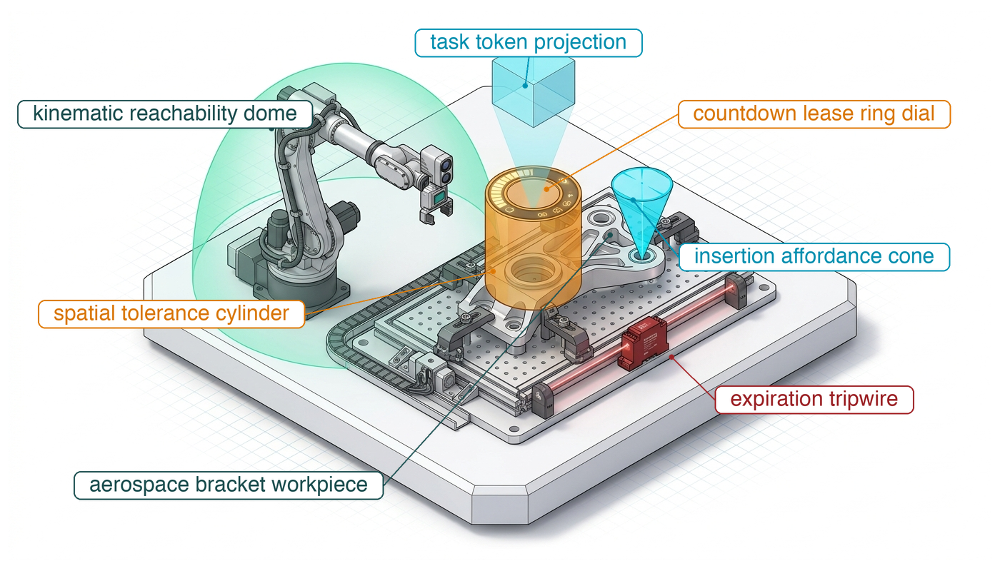
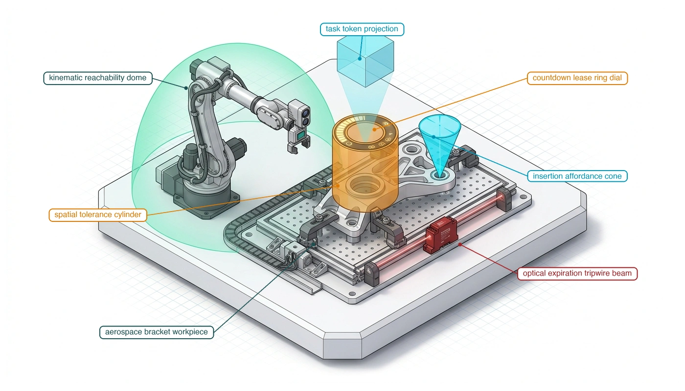
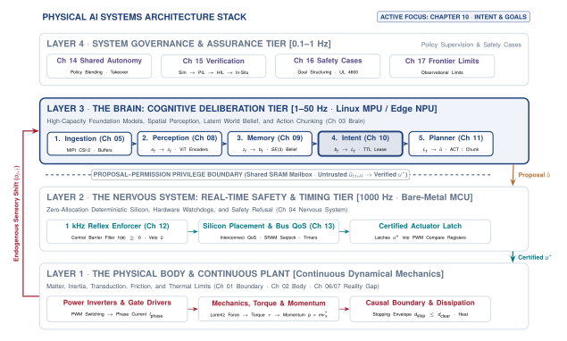
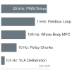
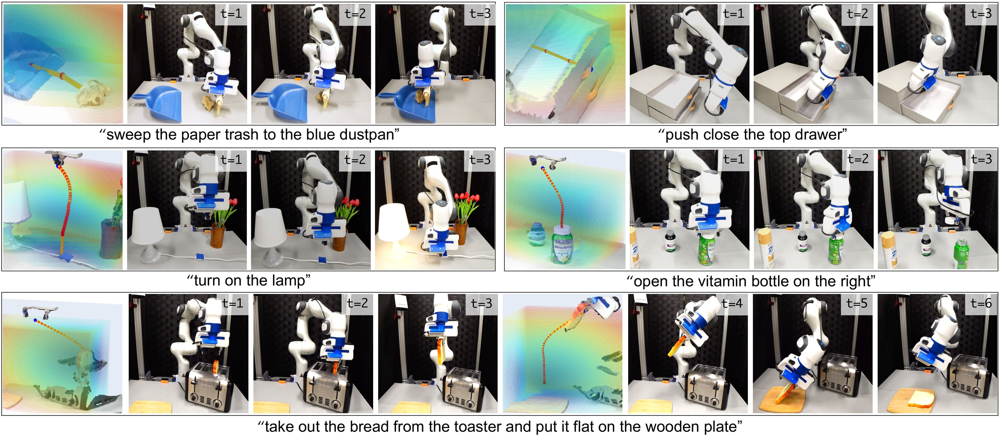
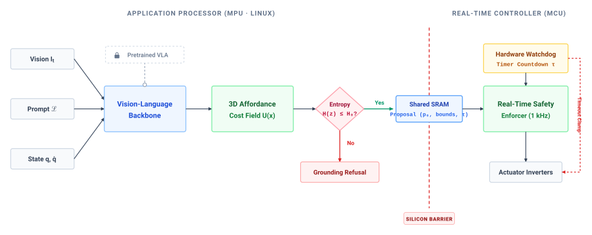
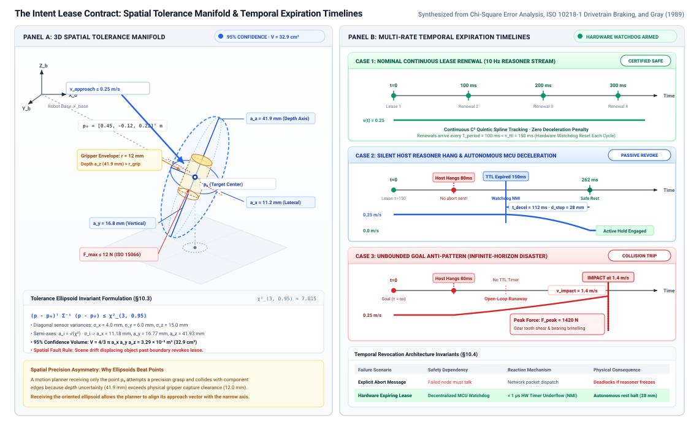
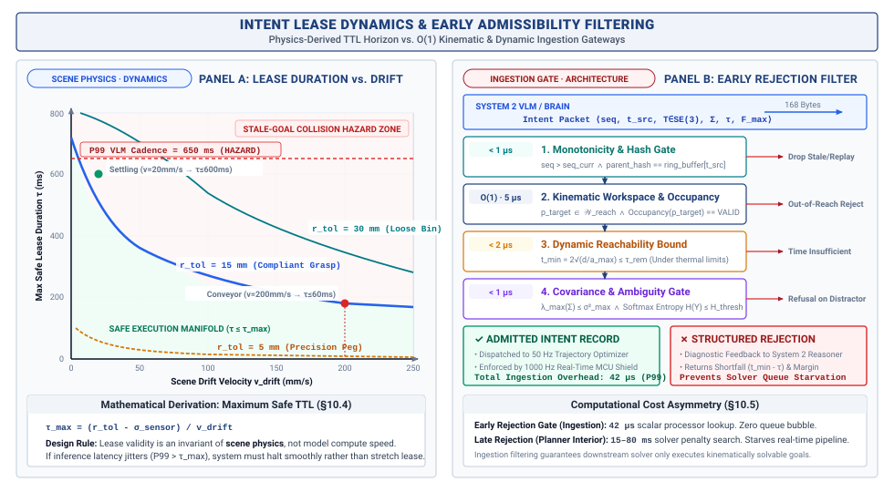
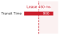
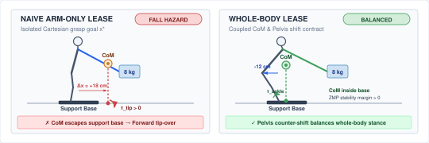

# Grounded Intent {#sec-intent}

::: {layout-narrow}
::: {.column-margin}

\chapterminitoc

:::

::: {.content-visible when-format="pdf"}
\noindent
{fig-alt="Isometric blueprint showing grounded intent: The system comprises several components for grounded intent: a 'task token prism' representing multifaceted AI tasks; a 'deliberative projection beam' signifying the AI’s focus on decision-making pathways; a 'green reachability manifold cone' defining operational limits for effective AI action; an 'inner amber tolerance cylinder' indicating acceptable task execution variances, topped with a 'countdown lease ring' tracking time-sensitive tasks; and an 'emergency expiration tripwire interlock' ensuring the system responds to critical failures."}
:::

::: {.content-visible unless-format="pdf"}
{fig-alt="Isometric blueprint showing grounded intent: floating multifaceted task token prism, deliberative projection beam, green reachability manifold cone, inner amber tolerance cylinder topped with a countdown lease ring, and emergency expiration tripwire interlock."}
:::

:::

## Purpose {.unnumbered .unlisted}

::: {.content-visible when-format="pdf"}
\begin{marginfigure}
\vspace{1em}
\resizebox{\linewidth}{!}{\mlphysicalstackfull{100}{20}{20}{20}{20}}
\end{marginfigure}
:::

_What must an autonomous goal carry to prevent a slow reasoning model from driving a machine into a situation that no longer exists?_

A semantic request like 'retrieve the tool' specifies an outcome but leaves physical decisions—path, force, and duration—unresolved. Because the physical scene changes while a slow reasoning model deliberates, we cannot blindly execute its delayed output. A goal that was reachable when proposed can become obstructed before execution, even when the model's interpretation of the request was correct. Intent must connect a task to an admissible region of physical action and a deadline. When that deadline passes, continued motion cannot depend on the same delayed model noticing that its proposal has expired. The execution layer needs enough information to withdraw permission and enter a defined fallback on its own. Grounded intent links the brain's task choices to the body's changing constraints through an interface that grants the nervous system bounded authority to act.



::: {.callout-learning-objectives}

- Construct grounded goal records with spatial tolerances, motion limits, and finite validity windows
- Set goal validity windows from scene dynamics and the physical response needed before expiry
- Evaluate whether a proposed goal is reachable within the machine's physical and temporal limits
- Design goal expiration that revokes motion permission even when the issuing process cannot cancel it

:::

## Grounded Affordances {#sec-intent-grounded-affordances}

High-level directives like "pick up the blue vial" or "clear the conveyor junction" specify outcomes but leave path, force, and deadline unresolved. A motor inverter accepts electrical commands, not language. Vision-Language-Action (VLA) models [@brohan2023rt1; @brohan2023rt2] can propose actions or targets, but their update cadence depends on the model and hardware and may be much slower than local control. If a target moves during inference, a stale proposal can consume clearance. The system therefore needs dated geometric evidence, bounded requests, and an independent permission path that can withdraw authority while the model is silent.

::: {.column-margin .margin-pointer}
↰ **Prerequisite:** Persistent spatial object states and bounding volumes are tracked in @sec-memory-spatial-state-schema.
:::

Memory can supply a spatial belief with a validity window (@sec-memory); it cannot decide what action that belief authorizes. **Intent**\index{Intent} bridges this chasm by connecting high-level task semantics to a bounded physical goal. As highlighted in @fig-10-locator, Intent occupies Stage 4 of the deliberative cognitive brain, positioned directly between Spatial Memory (Chapter 09) and Trajectory Planning (Chapter 11). It specifies an admissible, time-bounded target before the trajectory optimizer constructs a continuous motion profile to reach it.

::: {#fig-10-locator fig-env="figure" fig-pos="htb" fig-cap="**Intent stage architecture focus**: The four-tier physical AI systems architecture highlights the cognitive deliberation tier, with intent as the fourth brain stage and this chapter's active focus. The stage turns belief $b_t$ into a goal $\ell_t$, projecting semantic objectives across the privilege boundary as time-bounded geometric leases that expire on their own unless the nervous system receives a refresh." fig-alt="Diagram titled Physical AI Systems Architecture Stack, drawn as four stacked tiers. Layer 4 is system governance and assurance at 0.1 to 1 hertz, holding boxes for shared autonomy, verification, safety cases, and frontier limits. Layer 3 is the brain, a cognitive deliberation tier at 1 to 50 hertz, holding five stages named ingestion, perception, memory, intent, and planner. A dashed privilege boundary separates it from Layer 2 (the nervous system), a hard real-time safety and timing tier running at 1000 hertz. Layer 1 is the physical body and continuous plant. Layer 3 is shaded and its intent stage is outlined; the badge reads Active Focus, Chapter 10, Intent and Goals."}
{width="100%"}
:::

This fundamental challenge is the modern robotics manifestation of what Harnad termed the **symbol grounding problem**\index{Symbol grounding problem} [@harnad1990symbol]: purely symbolic or linguistic tokens within a computational system have no intrinsic physical meaning unless causally grounded in non-symbolic, sensorimotor interactions with the physical environment.[^fn-intent-symbol-grounding] Whereas early artificial intelligence systems such as Winograd's SHRDLU [@winograd1972] operated inside closed-world blocks domains with synthetic, analytic geometries,[^fn-std-strips-planning] modern physical AI systems must ground open-vocabulary instructions into continuous, dynamic, and uncertain physical spaces.[^fn-intent-affordance-space]

[^fn-intent-symbol-grounding]: **Symbol Grounding Problem**\index{Symbol Grounding Problem}: Stevan Harnad's 1990 formulation argues that syntactic manipulation alone does not give symbols intrinsic meaning. In physical AI, grounding binds a proposed label to dated sensor evidence, calibrated metric frames, and task-specific physical checks. Without that binding, a planner may optimize toward the wrong physical target.

[^fn-std-strips-planning]: **Classical STRIPS planning**\index{Planning!STRIPS}\index{STRIPS planning}: Classical planning represents goals as logical predicates in a modeled world. Dynamic obstacles and sensor dropouts can invalidate a physical target before its planned use. An independent timer revokes tracking authority at expiry; live evidence and clearance checks must detect invalidation that occurs earlier.

[^fn-intent-affordance-space]: **Affordance space parameterization**\index{Affordances!spatial parameterization}: In ecological psychology, an affordance defines an action-relative physical relationship between an agent's kinematic capabilities and environmental geometry. In robot learning, affordances are parameterized as continuous spatial probability fields or reachability manifolds over the Lie group $SE(3)$. Parameterizing reachability as an explicit manifold enables low-level controllers to evaluate physical feasibility before invoking computationally intensive trajectory optimizers.

::: {#dfn-intent-grounding-refusal .callout-definition title="Intent grounding refusal"}

***Intent grounding refusal***\index{Intent grounding refusal!definition}\index{Refusal!grounding ambiguity} is the deterministic safety mechanism whereby an embodied system explicitly rejects semantically ambiguous natural-language directives or unreachable spatial goal hypotheses ($\mathcal{H}_{\text{goal}}$), returning a typed failure status (`ERR_GROUNDING_AMBIGUITY`) rather than executing ungrounded maximum-likelihood guesses across physical clearance margins.

1.  **Significance**: Rejects a proposal when the specified ambiguity test fails, before that proposal reaches trajectory generation. Protection also depends on the independent motion-permission and fallback checks.
2.  **Distinction**: Unlike a trajectory planning failure that cannot find a collision-free path to a valid goal, grounding refusal rejects the goal itself as physically ungrounded or ambiguous before the planner is invoked.
3.  **Common pitfall**: Forcing an argmax token decode or nearest-neighbor guess when semantic entropy is high, driving the physical plant toward an arbitrary or hazardous target.

:::

That permission must remain bounded in time. @Fig-intent-frequency-gap gives a constructed schedule in which a slow deliberative model, local tracker, permission loop, and drive run at different rates. Its numbers are scenario assumptions, not model-family benchmarks. A conveyor target whose evidence expires within tens of milliseconds (@sec-intent-goals-expire) cannot be renewed by a model updating every $200\text{--}1000\text{ ms}$; a separate validated local observation path or task pause is required.

::: {.column-margin}
{width="100%" fig-alt="A separate illustrative machine schedule with drive, control, perception, planning, and VLA rates from 20 kilohertz down to 0.5 hertz; these are different assumptions from the four-rate chart in the main text."}

*A second illustrative machine schedule. Its five rates differ from the four-rate worked chart; neither is a measured specification.*
:::

::: {#fig-intent-frequency-gap fig-env="figure" fig-pos="htb" fig-cap="**Illustrative multi-rate schedule**: Four stipulated rates show why a deliberative proposal cannot act as a motor or permission-loop heartbeat. They are a constructed schedule, not historical measurements or a law relating model size to frequency. The local tracker can renew target evidence only if its sensor and error bounds are independently validated." fig-alt="Horizontal log-scale chart of four illustrative frequencies: drive current loop 20 kilohertz, independent permission loop 1 kilohertz, local target tracker 50 hertz, and deliberative proposal 2 hertz. The rates are scenario assumptions, not measured historical trends."}

```{python}
#| echo: false
# ┌─────────────────────────────────────────────────────────────────────────────┐
# │ Plot a constructed multi-rate schedule from the chapter-local CSV.          │
# │ No point is a measured model or hardware benchmark.                         │
# └─────────────────────────────────────────────────────────────────────────────┘
import pandas as pd
from mlsysim import viz

data = pd.read_csv("vol4/10_intent/data/frequency_gap_trends.csv")
fig, ax, COLORS, plt = viz.setup_plot(figsize=(8, 4.5))
colors = ["#334155", "#1d4ed8", "#0f766e", "#b45309"]
ax.barh(data["Stage"], data["Frequency_Hz"], color=colors, height=0.58)
ax.set_xscale("log")
ax.set_xlim(1, 50000)
ax.invert_yaxis()
ax.set_xlabel("Illustrative update frequency (Hz)")
for row in data.itertuples():
    ax.text(row.Frequency_Hz * 1.13, row.Index, f"{row.Frequency_Hz:,} Hz", va="center", fontsize=9)
ax.grid(axis="x", alpha=0.2)
plt.tight_layout()
plt.show()
plt.close()
```

:::

Across the privilege boundary, the Linux MPU proposes a dated **intent record** and requested validity window.[^fn-intent-dual-brain] In the running implementation, the independent MCU grants a bounded interval only after checking current limits and stopping feasibility. A host stall then prevents fresh proposals, so the local timer revokes tracking without waiting for a cancellation packet. Deceleration can protect clearance only if its total response was budgeted before the motion was admitted.

::: {.column-margin .margin-pointer}
↰ **Prerequisite:** The physical proposal-permission boundary and hardware referee are introduced in @sec-boundary-bedrock-laws.
:::

In this proposed interface, each intent packet from the learned MPU requests three bounds for the independent permission controller to check against configured limits and the current physical state:

1. **3D spatial tolerance region**\index{Intent record!spatial tolerance region}: This term refers to an explicit target pose defined in the mathematical space known as $SE(3)$, which represents the set of all possible positions and orientations in three-dimensional space. The spatial tolerance region includes a bounded metric tolerance volume, which defines the allowable dispersion within which the low-level controller can maneuver without compromising stability or safety.
2. **Expiring temporal lease (TTL)**\index{Intent record!temporal lease}: An explicit time-to-live $\tau$ measured in milliseconds. If no renewal packet arrives before the deadline passes, hardware timers automatically revoke motion authority.
3. **Admissible command and force limits**\index{Intent record!force limits}: Explicit dynamic limits that cap the peak velocity ($v_{\max}$), acceleration ($a_{\max}$), and contact wrench ($F_{\max}$) the machine may exert while pursuing the target.

[^fn-intent-dual-brain]: **Inter-core communication across privilege boundaries**\index{Inter-core communication!RPMSG}\index{Dual-brain!privilege boundaries}: RPMSG over a statically bounded shared SRAM ring is one implementation of this proposal-permission path. An independent timer can detect loss of host renewals despite a host kernel panic; the complete detection-to-brake response still needs validated bus, sensing, drive, and actuator timing. See @sec-enforcement-authority-refuse and @sec-appendix-systems-ipc.

Grounding an open-ended directive therefore requires a proposal that carries the target, its evidence age, spatial tolerance, and requested effort limits. The independent permission path must test that proposal against current state and stopping clearance before motion begins.

## What Intent Hands Over {#sec-intent-handoff}

Every autonomous action delivered across the causal boundary (@sec-boundary-causal-boundary) needs a checkable proposal before the permission path accepts it. Instead of streaming continuous joint trajectories or raw voltages, the deliberative cognitive layer issues a **conceptual intent contract** requesting bounded operational authority over space, time, and effort.

The **conceptual intent contract** states the checks: target tolerance, evidence validity, requested effort, and a feasible fallback. The **wire-level schema** in @sec-intent-lease shows one fixed-size serialization of those requests and their belief-record lineage. The lower tier grants permission only after validating them against independent limits and current state.

In physical manipulation, an isolated coordinate is incomplete. An affordance is an action-relative relation among geometry, robot reach, and contact limits [@gibson1979ecological]. The contract therefore proposes a target pose in $SE(3)$ and a **task tolerance region**\index{Tolerance region!3D spatial} within which the task counts as complete. This tolerance differs from the estimator's covariance, which describes uncertainty about the target. For a tactile probe, an approved task profile might allow $1.5\text{ mm}$ translational and $0.05\text{ rad}$ rotational error. A controller can then terminate within that region rather than integrating forever toward an exact noisy point; it still checks that estimated target error fits inside the tolerance.

Spatial validity in the physical world is transient. A physical goal therefore carries an evidence epoch and a finite requested validity window rather than relying on an asynchronous cancellation message[^fn-anti-async-abort] from the reasoning layer. A model that produces a new result only once per period cannot, even before jitter, renew a target whose evidence stays valid for less than that period. The task then needs a qualified faster local tracker, a slower or paused physical process, or refusal. An independent permission controller evaluates the admitted deadline on each control cycle and drops tracking when the evidence or lease expires. It selects a configured hold or stop only when the measured state and remaining clearance make that response feasible.[^fn-std-iso-watchdog] The local timer removes dependence on a host abort packet; the stopping distance remains a separate physical obligation.

[^fn-std-iso-watchdog]: **Hardware watchdog safety monitors**\index{Hardware!watchdog timer}\index{Safety standards!ISO 13849}: A safety design can use an independently clocked watchdog to detect missed renewals and initiate a validated response without the host. Safe Torque Off removes drive torque; it does not by itself hold a suspended load or stop moving mass within a specified clearance. The safety function and response time must be validated for the particular machine.

[^fn-anti-async-abort]: **Asynchronous Safety Event Dispatch**\index{Antipatterns!asynchronous safety cancellation}: Relying on asynchronous cancellation messages or network event dispatch to abort motion introduces non-deterministic queue serialization delays. When a mobile platform moves at $2\text{ m/s}$, a $50\text{ ms}$ queue dispatch latency translates to $100\text{ mm}$ of unbraked travel before the motor drive can drop torque. A local countdown can revoke tracking authority on missed renewal; the selected holding or braking response must be validated for the load and clearance.

A target bounded in space and time is hazardous if the controller is allowed unlimited physical effort. The intent packet therefore requests ceilings on contact force, joint velocity, and power. A model may place a target slightly beneath a surface because of stereo disparity error; a stiff position controller can then command excessive restoring torque. For an illustrative tactile search, the proposal might request a $6.0\text{ N}$ normal-force ceiling, $0.10\text{ m/s}$ speed cap, and $25\text{ W}$ joint-power cap. The permission tier compares each request with independently configured actuator and task ceilings, then admits only a feasible subset. The low-level **impedance controller**\index{Impedance controller}[^fn-ctrl-impedance-intent] enforces the admitted limits subject to sensor, actuator, and response-time validation.

[^fn-ctrl-impedance-intent]: **Mechanical impedance regulation**\index{Control systems!impedance control}: Impedance control regulates the relation between contact force and motion through effective mass, damping, and stiffness. It can reduce loads within a validated contact regime; the first impact and peak force still depend on approach speed, passive compliance, sensing, and actuator response.

```{python}
#| label: calc-intent-lease-duration-collision-exposure
#| echo: false
# ┌─────────────────────────────────────────────────────────────────────────────┐
# │ The running machine's intent horizons, a base stall against the finished   │
# │ stopping budget, the latch contact at brake command, and the Class 3 plant. │
# └─────────────────────────────────────────────────────────────────────────────┘
from mlsysim import *
from mlsysim.core.units import *
from mlsysim.fmt import (
    fmt_latency,
    fmt_length,
    fmt_velocity,
    fmt_acceleration,
    fmt_frequency,
    fmt_qty,
    fmt_sci_qty,
    check,
)
from mlsysim.physics.robotics import (
    calc_safe_stopping_distance,
    calc_c2_stop_suffix,
    calc_target_evidence_horizon,
    calc_tripwire_contact_force_accumulation,
    calc_contact_force,
    calc_process_thermal_runaway_lease,
)

# ┌── 1. LOAD: the running machine, plus chapter-local scenario inputs ─────────
RM = Embodied.MobileManipulator.WarehouseMobileManipulator
AISLE = Embodied.Scenario.WarehouseAisle

delta_t_stall_base = 200.0 * millisecond  # scenario assumption: proposer stall before any brake
delta_t_stall_arm = 200.0 * millisecond  # scenario assumption: unbraked contact interval
v_drift_slow = 20.0 * millimeter / second  # scenario assumption: slow-drift case in the figure
t_intent_tail = 650.0 * millisecond  # scenario assumption: high-tail intent inference, as in the figure

# Class 3 contrast: a stipulated lumped heat capacity and task overshoot limit.
c_thermal_bess = 900.0 * joule / kelvin  # scenario assumption
p_heat_in = 3600.0 * watt  # scenario assumption
delta_t_overshoot_max = 2.0 * kelvin  # scenario assumption
delta_t_stall_bess = 10.0 * second  # scenario assumption

# ┌── 2. EXECUTE: evidence horizons, base stall, latch contact, thermal plant ──
# Mug on the conveyor: untracked and tracked target-evidence horizons.
tau_ev_untracked = calc_target_evidence_horizon(AISLE.grasp_tolerance, AISLE.grasp_initial_error, AISLE.v_conveyor).to(millisecond)
tau_ev_tracked = ((2 * AISLE.grasp_tolerance / AISLE.a_conveyor_slip) ** 0.5).to(millisecond)
t_intent_period = (1 / RM.intent_rate).to(millisecond)
err_at_intent_period = (AISLE.grasp_initial_error + AISLE.v_conveyor * t_intent_period).to(millimeter)
err_excess_at_period = (err_at_intent_period - AISLE.grasp_tolerance).to(millimeter)
t_tail_overrun = (t_intent_tail - tau_ev_untracked).to(millisecond)
tau_ev_slow_drift = calc_target_evidence_horizon(AISLE.grasp_tolerance, AISLE.grasp_initial_error, v_drift_slow).to(millisecond)

# Base stall: the finished budget at aisle speed. The resident stop is the C2
# suffix, so a_eff is a_brake scaled by the suffix's distance penalty over a
# constant-deceleration stop at the same peak deceleration.
c2_stop_aisle = calc_c2_stop_suffix(AISLE.v_aisle, AISLE.a_brake)
d_const_decel_aisle = (AISLE.v_aisle**2 / (2 * AISLE.a_brake)).to(meter)
c2_distance_factor = (c2_stop_aisle["distance"] / d_const_decel_aisle).to(ureg.dimensionless).magnitude
a_eff = AISLE.a_brake / c2_distance_factor
budget_aisle = calc_safe_stopping_distance(AISLE.v_aisle, AISLE.tau_delay, a_eff, AISLE.delta_loc + AISLE.eps_track, AISLE.delta_margin).to(
    millimeter
)
spare_aisle = (AISLE.d_clear - budget_aisle).to(millimeter)
stall_extra_delay = (delta_t_stall_base - AISLE.t_lease).to(millisecond)
budget_stalled = calc_safe_stopping_distance(
    AISLE.v_aisle, AISLE.tau_delay + stall_extra_delay, a_eff, AISLE.delta_loc + AISLE.eps_track, AISLE.delta_margin
).to(millimeter)
stall_added = (budget_stalled - budget_aisle).to(millimeter)
stall_breach = (budget_stalled - AISLE.d_clear).to(millimeter)

# Latch contact: force at brake command, then the arm stop that keeps it under the limit.
df_dt = (AISLE.k_latch * AISLE.v_latch_approach).to(newton / second)
f_at_brake_onset = calc_tripwire_contact_force_accumulation(AISLE.f_latch_tripwire, AISLE.k_latch, AISLE.v_latch_approach, AISLE.t_contact_response)
x_remaining = ((AISLE.f_latch_limit - f_at_brake_onset) / AISLE.k_latch).to(millimeter)
a_arm_needed = (AISLE.v_latch_approach**2 / (2 * x_remaining)).to(meter / second**2)
t_arm_stop = (AISLE.v_latch_approach / a_arm_needed).to(millisecond)
delta_x_unbounded = (AISLE.v_latch_approach * delta_t_stall_arm).to(millimeter)
f_unbounded = calc_contact_force(AISLE.k_latch, delta_x_unbounded)

# Class 3 contrast: lumped thermal plant.
thermal_res = calc_process_thermal_runaway_lease(p_heat_in, c_thermal_bess, delta_t_overshoot_max)
dt_dt_bess = thermal_res["rate_of_rise"]
tau_thermal_overshoot = thermal_res["tau_lease"]
delta_temp_after_stall_bess = (dt_dt_bess * delta_t_stall_bess).to(kelvin)

# ┌── 3. GUARD: canon values quoted in the prose ──────────────────────────────
check(abs(tau_ev_untracked.magnitude - 60.0) < 1e-6, "Untracked mug horizon is 60 ms")
check(abs(tau_ev_tracked.magnitude - 244.95) < 5e-3, "Tracked mug horizon is 245 ms")
check(abs(t_intent_period.magnitude - 200.0) < 1e-6, "5 Hz intent period is 200 ms")
check(abs(err_at_intent_period.magnitude - 43.0) < 1e-6, "Error at the intent period")
check(abs(tau_ev_slow_drift.magnitude - 600.0) < 1e-6, "Slow-drift horizon in the figure")
check(abs(t_tail_overrun.magnitude - 590.0) < 1e-6, "Tail overrun past the untracked horizon is 590 ms")
check(abs(AISLE.t_lease.to(millisecond).magnitude - 60.0) < 1e-9, "Chunk lease is 60 ms")
check(abs(c2_distance_factor - 1.5) < 1e-9, "C2 suffix stops in 1.5x the constant-deceleration distance")
check(abs(budget_aisle.magnitude - 997.43) < 5e-3, "Finished budget at 1.3 m/s")
check(abs(spare_aisle.magnitude - 102.57) < 5e-3, "Spare at 1.3 m/s")
check(abs(stall_added.magnitude - 182.0) < 1e-6, "200 ms stall adds 182 mm at 1.3 m/s")
check(abs(stall_breach.magnitude - 79.43) < 5e-3, "Stall overruns the spare by 79.4 mm")
check(abs(f_at_brake_onset.to(newton).magnitude - 39.0) < 1e-9, "Force at brake command")
check(abs(x_remaining.magnitude - 0.1525) < 5e-5, "Latch compression left is 0.15 mm")
check(abs(a_arm_needed.magnitude - 2.95) < 5e-3, "Arm stop premise is about 3 m/s^2 (2.95)")
check(abs(t_arm_stop.magnitude - 10.0) < 0.5, "Arm stop takes about 10 ms")
check(abs(f_unbounded.to(newton).magnitude - 2400.0) < 1.0, "Unbraked contact model")
check(abs(dt_dt_bess.to(kelvin / second).magnitude - 4.0) < 0.1, "Thermal rise rate")
check(abs(tau_thermal_overshoot.to(millisecond).magnitude - 500.0) < 0.1, "Thermal overshoot horizon")
check(abs(delta_temp_after_stall_bess.to(kelvin).magnitude - 40.0) < 0.1, "Lumped 10 s rise")

# ┌── 4. OUTPUT: rendered values ──────────────────────────────────────────────
class IntentLeaseArchetypes:
    # Mug on the conveyor
    v_conveyor_str = fmt_velocity(AISLE.v_conveyor, unit=meter / second, precision=2)
    r_tol_str = fmt_length(AISLE.grasp_tolerance, unit=millimeter, precision=0)
    e0_str = fmt_length(AISLE.grasp_initial_error, unit=millimeter, precision=0)
    tau_untracked_str = fmt_latency(tau_ev_untracked, unit=millisecond, precision=0)
    tau_tracked_str = fmt_latency(round(tau_ev_tracked.magnitude) * millisecond, unit=millisecond, precision=0)
    a_slip_str = fmt_acceleration(AISLE.a_conveyor_slip, unit=meter / second**2, precision=2)
    f_intent_str = fmt_frequency(RM.intent_rate, unit=hertz, precision=0)
    t_intent_period_str = fmt_latency(t_intent_period, unit=millisecond, precision=0)
    t_intent_infer_str = fmt_latency(RM.intent_inference_latency, unit=millisecond, precision=0)
    err_at_period_str = fmt_length(err_at_intent_period, unit=millimeter, precision=0)
    err_excess_str = fmt_length(err_excess_at_period, unit=millimeter, precision=0)
    v_drift_slow_str = fmt_velocity(v_drift_slow, unit=millimeter / second, precision=0)
    tau_slow_drift_str = fmt_latency(tau_ev_slow_drift, unit=millisecond, precision=0)
    t_intent_tail_str = fmt_latency(t_intent_tail, unit=millisecond, precision=0)
    t_tail_overrun_str = fmt_latency(round(t_tail_overrun.magnitude) * millisecond, unit=millisecond, precision=0)
    # Base stall against the finished budget
    v_aisle_str = fmt_velocity(AISLE.v_aisle, unit=meter / second, precision=1)
    d_clear_str = fmt_length(AISLE.d_clear, unit=meter, precision=2)
    t_lease_str = fmt_latency(AISLE.t_lease, unit=millisecond, precision=0)
    spare_aisle_str = fmt_length(round(spare_aisle.magnitude, 1) * millimeter, unit=millimeter, precision=1)
    t_stall_base_str = fmt_latency(delta_t_stall_base, unit=millisecond, precision=0)
    stall_extra_str = fmt_latency(stall_extra_delay, unit=millisecond, precision=0)
    stall_added_str = fmt_length(stall_added, unit=millimeter, precision=0)
    stall_breach_str = fmt_length(round(stall_breach.magnitude, 1) * millimeter, unit=millimeter, precision=1)
    # Latch contact
    k_latch_str = fmt_sci_qty(AISLE.k_latch, newton / meter, precision=1)
    v_latch_str = fmt_velocity(AISLE.v_latch_approach, unit=meter / second, precision=2)
    f_trip_str = fmt_qty(AISLE.f_latch_tripwire, newton, precision=0)
    t_contact_str = fmt_latency(AISLE.t_contact_response, unit=millisecond, precision=0)
    df_dt_nms_str = fmt_qty(df_dt, newton / millisecond, precision=0)
    f_at_brake_onset_n_str = fmt_qty(f_at_brake_onset, newton, precision=0)
    f_lim_str = fmt_qty(AISLE.f_latch_limit, newton, precision=0)
    x_remaining_str = fmt_length(round(x_remaining.magnitude, 2) * millimeter, unit=millimeter, precision=2)
    a_arm_str = fmt_acceleration(round(a_arm_needed.magnitude) * meter / second**2, unit=meter / second**2, precision=0)
    t_arm_stop_str = fmt_latency(round(t_arm_stop.magnitude) * millisecond, unit=millisecond, precision=0)
    t_stall_arm_str = fmt_latency(delta_t_stall_arm, unit=millisecond, precision=0)
    delta_x_unbounded_mm_str = fmt_length(delta_x_unbounded, unit=millimeter, precision=0)
    f_unbounded_n_str = fmt_qty(f_unbounded, newton, precision=0, commas=True)
    # Class 3 contrast
    dt_dt_ks_str = fmt_qty(dt_dt_bess, kelvin / second, precision=0)
    tau_bess_ms_str = fmt_latency(tau_thermal_overshoot, unit=millisecond, precision=0)
    delta_t_rise_k_str = fmt_qty(delta_temp_after_stall_bess, kelvin, precision=0)
```

Omitting any of these three bounds leaves a machine exposed during communication dropouts or perception stalls. Stopping distance grows linearly with the delay before braking and quadratically with speed (@eq-body-stopping-distance). The delay component a stalled proposer can lengthen is the time its last proposal keeps authority. On the warehouse mobile manipulator that time is the chunk lease of @sec-nervous-cadences, which enters $\tau_{\text{delay}}$. The intent lease is a different object. It bounds how long a target stays justified, and its expiry withdraws the target without adding a term to the brake's delay. Clearance holds only if an independently checked obstacle boundary lies beyond the stopping distance, with model and sensing margins added.

::: {#chk-intent-kinematic-runaway-silence .callout-checkpoint title="Deceleration vs. runaway during communication loss"}

Before exploring open-vocabulary grounding and geometric proposal synthesis, verify your understanding of multi-rate fail-safety:

- [ ] **Fail-safe lease expiration**: Can you explain why the loss of upstream heartbeats must autonomously transition actuators into a verified safe state via hardware countdown timers rather than waiting for an explicit software abort packet?
- [ ] **Kinetic containment**: Can you combine lease expiry, detection, actuation delay, and feasible deceleration to check whether available clearance exceeds total stopping distance?
- [ ] **Dual-brain timing asymmetry**: Can you distinguish a local $1\text{ ms}$ control period from the complete physical stopping response?

:::

::: {#nbk-intent-lease-duration-collision-exposure-tradeoff-across .callout-notebook title="Lapsed authority and physical response"}

The three models below answer different questions. A stopping calculation needs the total delay to brake onset and the deceleration available from the *current* state. Contact and thermal thresholds also need validated physical limits.

1. **The base in the aisle:** The machine runs the aisle at `{python} IntentLeaseArchetypes.v_aisle_str`. Once its stopping budget is complete (@sec-enforcement-stopping-envelopes), that speed leaves `{python} IntentLeaseArchetypes.spare_aisle_str` of the `{python} IntentLeaseArchetypes.d_clear_str` clear distance unspent. Suppose the application processor stalls and the base holds its last proposal for `{python} IntentLeaseArchetypes.t_stall_base_str` instead of braking when the `{python} IntentLeaseArchetypes.t_lease_str` chunk lease lapses. The extra `{python} IntentLeaseArchetypes.stall_extra_str` of travel adds `{python} IntentLeaseArchetypes.stall_added_str` to the stop and overruns the spare by `{python} IntentLeaseArchetypes.stall_breach_str`.
2. **The arm at the cage door:** At the guarded approach speed of `{python} IntentLeaseArchetypes.v_latch_str` against the `{python} IntentLeaseArchetypes.k_latch_str` strike plate of the spring-latched door, modeled force rises at `{python} IntentLeaseArchetypes.df_dt_nms_str`. A `{python} IntentLeaseArchetypes.f_trip_str` tripwire and `{python} IntentLeaseArchetypes.t_contact_str` contact-loop response yield `{python} IntentLeaseArchetypes.f_at_brake_onset_n_str` **when the brake command begins**. This is not the peak during deceleration. Staying under the `{python} IntentLeaseArchetypes.f_lim_str` latch limit leaves only `{python} IntentLeaseArchetypes.x_remaining_str` of further compression, so the arm must decelerate at about `{python} IntentLeaseArchetypes.a_arm_str` and stop within about `{python} IntentLeaseArchetypes.t_arm_stop_str`. Whether the arm can brake that hard from the approach is an open premise, which only arm stopping trials can settle. Unbraked motion for `{python} IntentLeaseArchetypes.t_stall_arm_str` advances `{python} IntentLeaseArchetypes.delta_x_unbounded_mm_str` and gives `{python} IntentLeaseArchetypes.f_unbounded_n_str` in the linear-spring model, far past the latch limit.
3. **Thermal process:** For an illustrative lumped capacitance of $900\text{ J/K}$ and uncompensated $3600\text{ W}$ input, temperature rises at `{python} IntentLeaseArchetypes.dt_dt_ks_str`. A stipulated $2\text{ K}$ task overshoot allowance is consumed in `{python} IntentLeaseArchetypes.tau_bess_ms_str`; ten seconds at the same net heat input yields a `{python} IntentLeaseArchetypes.delta_t_rise_k_str` modeled rise. This calculation alone cannot establish battery thermal runaway or venting. That verdict needs initial temperature, chemistry, cooling, pack geometry, and validated failure thresholds.
:::

These three examples clarify the division of authority. High-level reasoning can propose a target, time window, and effort ceiling. The independent permission tier determines which limits are admissible from measured state, configured ceilings, and a feasible fallback. Local control then tracks only an admitted proposal and withdraws authority on invalid evidence or expiry. This resembles the priority separation of the **subsumption architecture**\index{Subsumption architecture}[^fn-ai-subsumption-intent] [@brooks1986robust], while physical containment still depends on sensing, timing, and actuator capability.

::: {.column-margin}
{width="100%" fig-alt="S·P·A locator triad highlighting the Sense-Plan belief edge."}

*The Sense $\cap$ Plan grounding interface: translating semantic language goals into bounded, expiring spatial intent leases.*
:::

As illustrated by the manipulator in @fig-10-real-grounded-affordance-franka, language can generate 3D affordance and constraint value maps for a trajectory optimizer. Those maps are proposals; a separate implementation must validate path geometry, limits, evidence age, and permission before physical execution.

[^fn-ai-subsumption-intent]: **Subsumption architecture principles**\index{Architecture!subsumption}\index{Control!subsumption}: Rodney Brooks's subsumption architecture decomposed autonomous robotics into asynchronous, priority-arbitrated behavioral layers operating on sensory feedback. Here, the learned layer proposes a bounded target while an independent controller checks permission and executes a validated response on expiry. The lease alone does not establish closed-loop stability.

::: {#fig-10-real-grounded-affordance-franka fig-env="figure" fig-pos="t" fig-cap="**Manipulator 3D affordance grounding**: VoxPoser composes language-guided 3D value maps for manipulation tasks [@huang2023voxposer]. The illustrated research system proposes spatial objectives; an independent permission and stopping wrapper would require separate design and validation. (Source: Huang et al., 2023 [@huang2023voxposer], CC BY 4.0)." fig-alt="VoxPoser research figure showing a manipulator and sequential language-guided 3D spatial value maps for several tabletop tasks. The image illustrates proposed objectives and motion planning, not a certified force limit, collision bound, or intent lease. Source: Huang et al., 2023."}
{width="95%"}
:::

Grounding an intent packet into these three bounds requires a formal transformation from ambiguous sensory inputs into structured, verifiable proposals. When a system processes a high-level directive or a sequence of visual tokens, the initial proposal is rarely a single, unambiguous set of coordinates. It begins as an uncertain geometric hypothesis that must carry its own spatial ambiguity and its own temporal limits before it can be admitted to the execution pipeline.

## From Request to Expiring Geometric Proposal {#sec-intent-request-to-proposal}

A natural language instruction becomes dangerous when an unverified semantic hypothesis commands motion. When an operator or high-level supervisor issues a semantic directive such as "grasp the brass valve," an onboard vision-language model parses the character stream, projects image features into a shared embedding space, and selects a candidate visual bounding region. From those pixels, the network extracts an estimated pose in $SE(3)$ (representing full 3D position and orientation) and writes coordinate values into a memory buffer. At the causal boundary established in @sec-boundary-causal-boundary, an ungrounded string of tokens becomes a physical destination that commands mass, velocity, and actuator currents.[^fn-math-semantic-metric] If the visual backbone associates the language token with an adjacent fixture or an unlabelled calibration target, the resulting coordinate vector $\mathbf{p} \in \mathbb{R}^3$ enters the trajectory pipeline as an authoritative physical goal. Because a low-level motor drive measures only encoder pulses, winding temperatures (tracking Joule heating ($I^2 R$) for thermal derating, as established in @sec-body-five-budgets), and phase currents, it cannot evaluate whether the coordinate it tracks corresponds to the intended component or to an empty tabletop.[^fn-math-vlm-lipschitz] The grounding process must produce an explicit geometric proposal that includes spatial uncertainty, selection evidence, and temporal expiration before any motion planner accepts it.

[^fn-math-semantic-metric]: **Semantic-to-metric transformation**\index{Kinematics!semantic-to-metric}\index{Grounding!metric mapping}: Projecting discrete linguistic embeddings into continuous $SE(3)$ coordinates requires an unbroken coordinate calibration chain from image pixels to actuator base frames. Unmodeled camera mounting compliance or lens distortion maps semantic attention peaks into systematic metric offsets. If the transformation chain lacks rigid extrinsic calibration, high semantic confidence produces large physical tracking errors at the end effector.

[^fn-math-vlm-lipschitz]: **Learned-output sensitivity**\index{Neural network!Lipschitz continuity}\index{Safety!Lipschitz bounds}: A learned pose estimate can change substantially when the image or scene changes, and an empirical confidence score does not bound that change. The permission tier limits the admitted target and motion using independently checked geometry, state, and actuator constraints; the bound is conditional on those checks and the available fallback.

To understand how open-vocabulary language directives translate into actionable geometric targets, modern physical AI systems rely on three foundational grounding paradigms:

1. **Affordance-grounded skill selection (SayCan)**: Ahn et al. [@ahn2022saycan] combine a language model's semantic score with a learned estimate of a skill's success[^fn-math-saycan-value] (see @sec-appendix-ml-affordances). A closed drawer may lower the estimated success of "pick up the sponge" and favor "open the drawer" first. This is a task-dependent ranking, not a deterministic veto on kinematically impossible or obstructed motion.
2. **3D value-map affordance fields (VoxPoser)**: Rather than selecting from discrete, pretrained skill policies, VoxPoser[^fn-ai-voxposer-intent] [@huang2023voxposer] leverages vision-language models and LLM-generated Python code to synthesize continuous 3D spatial affordance and constraint value maps directly in the robot's physical workspace. By querying 2D visual grounding backends (e.g., OWL-ViT, SAM, Grounding DINO) across multi-view RGB-D streams, the system back-projects visual activations into a 3D voxel grid $\mathcal{V} \subset \mathbb{R}^3$. The LLM writes code that computes 3D potential fields: an **attraction value map**\index{Value map!attraction} $\mathbf{V}_{\text{attr}}(\mathbf{x})$ that pulls the end-effector toward target contact affordances (e.g., grasping handles or rim geometries), and a **repulsion constraint map**\index{Value map!repulsion} $\mathbf{V}_{\text{rep}}(\mathbf{x})$ that penalizes trajectories passing near obstacles. A downstream **model-predictive controller (MPC)**\index{Model predictive control}[^fn-ctrl-mpc-intent] or trajectory optimizer then computes dynamic paths directly over this composed 3D cost manifold (an invisible spatial landscape of attraction valleys and repulsion hills) without requiring task-specific reinforcement training. A separate permission path must check actuator limits and the proposed path.
3. **Language model programs for embodied control (Code as Policies)**: Introduced by Liang et al. [@liang2023code], Code as Policies (CaP)[^fn-ai-codepolicies-intent] prompts large language models to generate executable Python programs that compose perception APIs, geometric coordinate transformations, and parameterized motion primitives. Instead of outputting single static setpoints, the LLM writes algorithmic control structures containing spatial arithmetic, conditional branching (`if is_grasped(): ...`), and reactive loops that query real-time sensor feedback.

[^fn-math-saycan-value]: **SayCan affordance value functions**\index{Intent Grounding!SayCan affordances}: SayCan multiplies language preference by a learned skill-success estimate. The estimate is conditioned on training and observations; it can misrank an unseen or changed scene. Independent geometry and permission checks remain necessary.

[^fn-ai-voxposer-intent]: **VoxPoser 3D value maps**\index{VoxPoser!value maps}\index{Affordances!3D potential fields}: VoxPoser synthesizes 3D affordance and constraint value maps from language and RGB-D observations. A trajectory optimizer can use the maps as costs; their gradients alone do not certify collision-free paths or torque limits. A separate checked path and actuator limits supply those constraints.

[^fn-ctrl-mpc-intent]: **Model predictive trajectory control**\index{Control systems!model predictive control}: Model predictive control (MPC) repeatedly solves a constrained finite-horizon problem. A feasible solution can respect modeled torque, velocity, and obstacle constraints if the model, state estimate, solver deadline, and actuator response are valid; soft penalties alone do not establish hard feasibility. See @sec-planning.

[^fn-ai-codepolicies-intent]: **Code as Policies execution**\index{Code as Policies!generation}\index{Task planning!program synthesis}: Code as Policies prompts language models to synthesize executable Python control scripts that compose perception APIs and parameterized motion primitives. Generating structured algorithmic code rather than raw joint positions enables recursive error recovery and conditional branching on sensor feedback. A sandbox can limit generated code, while an independent watchdog and permission path must retain control if that code stalls.

**Open-vocabulary affordance grounding**\index{Affordance grounding!open-vocabulary} uses language and sensor observations to propose a task-relevant skill, spatial field, or program. SayCan ranks learned skill-success estimates, VoxPoser proposes 3D value maps, and Code as Policies composes callable primitives. These outputs are not themselves verified targets; any geometric request passed downstream needs a named frame, SI units, dated evidence, and independent admission checks.

One concrete grasp-proposal path appears in @fig-10-real-open-vocab-grounding: OK-Robot generates candidate grasps and uses language-conditioned object selection to filter them. Other grounding methods need not use that pipeline. Where a task requires a metric grasp target, the producer can combine a candidate generator with segmentation such as Lang-SAM, calibrated depth, and a named-frame pose.[^fn-vis-lang-sam] The resulting pose still needs evidence, uncertainty, path, and permission checks before actuation.

[^fn-vis-lang-sam]: **Open-vocabulary segmentation cascades**\index{Computer vision!Lang-SAM}\index{Perception!zero-shot segmentation}: Language Segment-Anything (Lang-SAM) combines text-grounded detection with class-agnostic segmentation. Its mask is a candidate image region, not a verified 3D hull; depth, calibration, occlusion policy, and geometric checks are still needed for a physical grasp proposal.

::: {#fig-10-real-open-vocab-grounding fig-env="figure" fig-pos="t" fig-cap="**Open-vocabulary grasp grounding pipeline**: OK-Robot combines candidate grasps with language-conditioned object selection and geometric filtering [@liu2024okrobot]. The pictured research pipeline proposes a grasp; a bounded tolerance, evidence deadline, and independent permission check are an architectural wrapper developed in this chapter, not a reported feature of the image." fig-alt="OK-Robot figure showing a robot camera view, candidate grasps, a language-conditioned target mask, filtering, and a selected grasp pose. The image illustrates proposal generation; it does not show a certified collision check or an expiring intent lease."}
{width="95%"}
:::

Discrete tokens do not all represent the same physical quantity. RT-1 [@brohan2023rt1] and OpenVLA [@kim2024openvla] discretize each **robot action dimension** into 256 bins over a model-specific action range. By contrast, [PaliGemma's location tokens](https://google-research.github.io/big_vision/big_vision/configs/proj/paligemma/) provide 1024 levels for normalized **image coordinates**, not 3D robot targets. A separate depth measurement, calibration chain, and uncertainty model are needed before image coordinates can become a base-frame pose.[^fn-math-unprojection-intent] Action bins likewise do not themselves encode a target's metric clearance.

For an explicitly hypothetical metric target encoder with 1000 equal bins over a $1.0\text{ m}$ axis, each bin is $1.0\text{ mm}$ wide. Nearest-bin decoding contributes at most $0.5\text{ mm}$ error along that axis when the true value is inside the encoded range, before camera, calibration, model, and motion errors. The producer must combine those other errors using a justified model and pass a conservative representation to the permission tier. It cannot label a $20\text{--}50\text{ mm}$ localization error as a consequence of this binning alone.

[^fn-math-unprojection-intent]: **Metric camera unprojection**\index{Kinematics!metric unprojection}\index{Sensor!camera intrinsics}: Pinhole unprojection maps image coordinates $(u,v)$ and measured depth $z$ through the inverse intrinsic matrix $\mathbf{K}^{-1}$, then transforms the result into the robot base frame. Extrinsic rotation and depth bias can dominate submillimeter token quantization, especially at long standoff distance.

To prevent a learned output from masquerading as a deterministic setpoint, the producer must retain the referent identity and the dated evidence that selected it. Its observation record may contain bounding boxes, attention weights, class probabilities, and a full oriented covariance estimate. The compact 168-byte proposal below links to the belief record built from that observation (@sec-memory-spatial-state-schema) by digest and evidence epoch; it carries a candidate pose, conservative base-frame error bounds, task tolerances, and requested expiry, not those full producer-side fields. The independent permission tier checks the linked evidence and request against its own limits. An object can shift or become occluded after camera exposure, so a coordinate without a valid evidence link and deadline cannot remain an authorized target.

When a vision-language model sees multiple candidate objects, an argmax can hide an unresolved choice. A digital recommendation can still mislead a user, but it has no direct actuator path; in a robot, an admitted spatial proposal can move mass. If two similar components are $180\text{ mm}$ apart, a poorly grounded guess may select the wrong part. The system should preserve candidate identity and calibrated uncertainty, refusing a proposal when a task-specific ambiguity threshold is exceeded. The permission tier then maintains a feasible hold or stop while the producer seeks a clearer observation or instruction.

Formally, **open-vocabulary grounding ambiguity**\index{Grounding!ambiguity} is the condition where multimodal feature projections yield multi-peak posterior distributions, overlapping geometric hypotheses, or unresolvable evidential ties across candidate physical referents ($H(\mathbf{z}) > H_{\text{thresh}}$), requiring an explicit grounding refusal (`ERR_GROUNDING_AMBIGUITY`) rather than optimistic argmax tie-breaking.

::: {#psp-intent-ambiguity-refusal .callout-perspective title="Ambiguity demands refusal"}
An argmax hides an evidential tie. In a physical task, an admitted target at the wrong coordinate can move mass toward the wrong object. When calibrated ambiguity exceeds the task threshold, refuse that proposal and use the independently validated fallback.
:::

::: {#ws-intent-autort-hallucination-constitution .callout-war-story title="AutoRT task filtering and supervision (2024)"}
**Context**: AutoRT used language models to propose and filter tasks for mobile manipulators in office environments [@ahn2023autort]. The authors collected 77,000 robot episodes across more than 20 robots; they did not report the mirror-grasp, shattered-object, or chassis-strike sequence previously attributed to this study.

**Evidence**: In a labeled sample of 259 proposed tasks, 228 were initially judged acceptable. After an LLM affordance filter, 200 of 214 retained tasks were acceptable, raising the acceptable fraction from about 88 to 93 percent while leaving some unsuitable tasks. The paper explicitly says constitutional prompting cannot guarantee compliance.

**Response**: The reported deployment supplemented prompts with joint-force pausing, physical emergency stops, and human line-of-sight supervision unless a work area was barricaded. These are distinct controls with different coverage; the prompt itself was not a certified geometric or physical safety supervisor.

**Systems lesson**: A learned task filter can improve the proposal stream, while an independent permission and fallback path must still validate each physical action for its stated operating region.
:::

The complete computational pipeline from multimodal patch tokenization to the entropy-gated expiring intent lease is mapped in @fig-10-vla-cross-attention-intent-lease.

::: {#fig-10-vla-cross-attention-intent-lease fig-env="figure" fig-pos="t" fig-cap="**Grounded intent pipeline architecture**: This proposed implementation turns multimodal inputs into a candidate spatial field, applies an ambiguity filter, and passes a bounded proposal across an MPU-to-MCU permission boundary. The MCU validates evidence age, configured limits, and feasible fallback before admitting a local countdown. Cross-attention and prompting supply proposals, not certified physical constraints (synthesized from Huang et al. [-@huang2023voxposer], Ahn et al. [-@ahn2022saycan], and Gray [-@gray1989leases])." fig-alt="Diagram of vision, prompt, and robot state entering a vision-language backbone and candidate 3D cost field. An ambiguity filter can reject the proposal. A bounded record crosses a silicon boundary to a real-time controller, which must check evidence, physical limits, and stopping feasibility before granting actuator permission."}
{width="100%"}
:::

Consider a gripper target with nominal base-frame position $\mathbf{p}_0=[0.450,-0.120,0.220]^T\text{ m}$. In an illustrative calibrated Gaussian localization model, the principal sensor-frame standard deviations are $4.0$, $6.0$, and $15.0\text{ mm}$. A **95 percent statistical region** uses Mahalanobis squared distance $(\mathbf{p}-\mathbf{p}_0)^T\mathbf{\Sigma}^{-1}(\mathbf{p}-\mathbf{p}_0)\le\chi^2_{3,0.95}\approx7.815$, yielding principal semi-axes $11.18$, $16.77$, and $41.93\text{ mm}$. @Fig-10-intent-lease-envelope contrasts that uncertain target with a separately specified $12.0\text{ mm}$ mechanical capture tolerance along the approach axis. The depth uncertainty exceeds that tolerance, so the proposal needs better sensing, a different approach, or refusal. A 95 percent region also leaves a residual tail and cannot by itself certify clearance; the wire example below carries conservative base-frame error bounds rather than claiming this covariance is encoded in six floats.

::: {#fig-10-intent-lease-envelope fig-env="figure" fig-pos="t" fig-cap="**Localization uncertainty and authority expiry**: Panel (a) sketches a statistical target-uncertainty ellipsoid beside a separate gripper capture tolerance. Panel (b) compares counterfactual traces: blue expires and brakes, green continues only with fresh renewals, and red shows motion without a lease. Rest before the obstacle is conditional on total pre-brake delay, deceleration, and checked clearance." fig-alt="Panel (a) shows target-position uncertainty beside a separate gripper capture region. Panel (b) compares alternative velocity traces: blue authority expires then braking reaches rest if feasible; green dots show fresh renewals in a separate scenario; red continues without a lease toward the obstacle. Physical clearance depends on the complete stopping budget."}
{width="100%"}
:::

A detection with a large uncertainty estimate can be rejected by a configured statistical gate. A confident grounding to the wrong physical entity can pass that gate. If a vision-language model evaluates an image containing an exposed glass beaker adjacent to a machined steel housing and assigns a 99.2 percent confidence score to the glass beaker when instructed to "secure the housing," the model emits a sharp, low-variance geometric proposal centered on the glass. The trajectory planner receives the coordinate, computes an $SE(3)$ inverse kinematics solution, verifies joint limits, and confirms that the path clears all obstacles in the static environment map. The permission tier may find the proposed motion within its configured geometric and force bounds. If those bounds still allow steel-grasp force, a smooth, geometrically valid trajectory can damage the glass despite passing the checks.

This failure reveals the boundary between what a downstream safety enforcer can verify and what it must accept as an unvalidated premise. A deterministic safety enforcer checks coordinate bounds, kinematic reachability, joint torque limits, and geometric collisions against known occupancy grids. Those physical checks do not establish that the coordinate names the intended object. Semantic classification needs separate task evidence, and the wrong-object risk remains even when every declared bound holds. The mechanics of multimodal feature extraction, cross-attention alignment, and open-vocabulary phrase grounding belong to the computer vision and language literature [@kamath2021mdetr; @gu2022open; @radford2021learning; @liu2023grounding]. A physical AI architecture consumes these models without relying on their internal activations for safety. The responsibility of the systems engineering contract is to govern the boundary where these models meet the physical machine, requiring a tolerance region, ambiguity test, and evidence deadline before a proposal can enter the independent motion-permission check.

To evaluate how different open-vocabulary perceptual frontends interface with deterministic systems contracts, @tbl-10-grounding-paradigms compares the dominant architectural categories of language grounding.

| Proposal source           | Representation sent downstream                          | Early check                                                | Remaining evidence needed                                                                        |
|:--------------------------|:--------------------------------------------------------|:-----------------------------------------------------------|:-------------------------------------------------------------------------------------------------|
| 2D box or mask            | Image region plus measured depth and camera calibration | Reject absent depth or a target outside a validated region | 3D pose error, occlusion, object identity, and swept-path clearance                              |
| 3D feature or value field | Candidate target or cost field in a stated frame        | Reject out-of-workspace targets and stale map cells        | Conservative occupancy, unknown-space policy, actuator and timing bounds                         |
| Action-token VLA          | Decoded action in its trained action range              | Reject out-of-range or inadmissible proposals              | State-dependent physical limit and independent permission; token bins provide no clearance proof |
| Language-selected skill   | Skill identifier with estimated success                 | Rank or decline low-confidence candidates                  | Current preconditions, path feasibility, and separate physical enforcement                       |

: **Grounding representations and admission questions**: Outputs from different model families require different conversions before a physical permission check. Latency, memory use, and metric precision depend on the particular model, sensor, hardware, and task; this table does not assign universal ranges. {#tbl-10-grounding-paradigms tbl-colwidths="[18,24,24,34]"}

::: {#chk-intent-grounding-ambiguity .callout-checkpoint title="Open-vocabulary grounding and ambiguity refusal"}

Before admitting an unverified semantic hypothesis to the physical trajectory pipeline, verify your understanding of how multimodal proposals are geometrically bounded and evidentially gated:

- [ ] **Affordance feasibility gating**: Can you explain what SayCan's learned skill-success score ranks and which physical checks still belong to an independent permission path?
- [ ] **Spatial token quantization**: Can you distinguish 256-bin robot action tokens from image-location tokens and calculate the nearest-bin error of a hypothetical metric target encoder?
- [ ] **Grounding ambiguity refusal**: Can you distinguish between optimistic argmax tie-breaking in digital web search versus mandatory grounding refusal (`ERR_GROUNDING_AMBIGUITY`) when posterior entropy exceeds safety thresholds in physical AI?

:::

## Goals That Expire {#sec-intent-goals-expire}

An intent lease must expire autonomously, because the same software fault requiring cancellation may prevent the abort signal from being sent. An explicit abort requires a working sender, scheduler, and communication path. If a learned model stalls, an independent countdown can withdraw that proposal's tracking authority without waiting for the model. This adapts the lease primitive of @gray1989leases to a physical controller: expiry triggers a separately validated fallback, whose ability to stop before a hazard depends on current state, clearance, actuator authority, and total response delay.[^fn-hw-watchdog-rtt]

::: {.column-margin .margin-pointer}
↰ **Prerequisite:** Kinetic momentum budgets and stopping distance constraints originate in @sec-body-kinetic-momentum.
:::

The target-evidence deadline follows the rate at which the physical target can diverge from its last measurement. Suppose validated bounds cap relative target drift at $v_{\text{drift}}$ and initial position error at $e_0$, and the task allows a target error of $r_{\text{tol}}$. After evidence age $t$, the error bound is $e_0+v_{\text{drift}}t$. Its validity horizon is:
$$\tau_{\text{evidence}} \le \frac{r_{\text{tol}} - e_0}{v_{\text{drift}}}$$ {#eq-intent-lease-drift-bound}

[^fn-hw-watchdog-rtt]: **Hardware watchdog down-counters**\index{Hardware!watchdog timer}: An independent counter can detect a missed renewal without waiting for the host scheduler. Detection time, drive command propagation, brake engagement, and physical deceleration require separate measured budgets; an interrupt alone does not establish a safe stop.

When $r_{\text{tol}}\le e_0$, the target is inadmissible at capture. The controller refuses dependent motion. Even when @eq-intent-lease-drift-bound gives a positive horizon, a separate motion-permission check must verify current clearance against total sensing, permission, communication, and brake-onset delay plus physical braking distance, as in @sec-nervous.

If a validated disturbance acceleration bound $a_{\text{dist}}$ is also needed, @sec-memory-belief-through-occlusion gives $E(t)=e_0+v_{\text{drift}}t+\frac12a_{\text{dist}}t^2$. The positive root at $E(t)=r_{\text{tol}}$ shortens the **evidence** horizon. It does not compute how long the robot needs to stop.

In the machine's mug task, the instruction is "pick the red mug," and the grounded target sits on the takeaway conveyor moving at `{python} IntentLeaseArchetypes.v_conveyor_str`. A `{python} IntentLeaseArchetypes.r_tol_str` grasp tolerance and `{python} IntentLeaseArchetypes.e0_str` initial error leave a `{python} IntentLeaseArchetypes.tau_untracked_str` **target-evidence horizon** by @eq-intent-lease-drift-bound. Stretching the horizon to the `{python} IntentLeaseArchetypes.t_intent_period_str` refresh period of the machine's `{python} IntentLeaseArchetypes.f_intent_str` intent model would let modeled target error reach `{python} IntentLeaseArchetypes.err_at_period_str`, or `{python} IntentLeaseArchetypes.err_excess_str` beyond the tolerance. That arithmetic shows invalid targeting, not a proven collision without path geometry. The intent model, whose inference alone takes `{python} IntentLeaseArchetypes.t_intent_infer_str`, cannot by itself refresh a `{python} IntentLeaseArchetypes.tau_untracked_str` target for continuous motion. Without a qualified tracker the conveyor must slow or pause, or the task must be refused. At `{python} IntentLeaseArchetypes.v_drift_slow_str` drift the same bound gives a `{python} IntentLeaseArchetypes.tau_slow_drift_str` evidence horizon (@fig-10-lease-dynamics-tradeoff), still subject to a separate stopping-clearance check.

A qualified local tracker changes the arithmetic. It re-measures the mug on every frame and follows the conveyor's velocity, so the capture error $e_0$ does not carry forward, and the tracker's qualification bounds its own position error to a value small enough to neglect against the tolerance. Only the residual slip of `{python} IntentLeaseArchetypes.a_slip_str` then moves the target away from the tracker's prediction, and setting $\frac12a_{\text{slip}}t^2=r_{\text{tol}}$ stretches the horizon to $\sqrt{2r_{\text{tol}}/a_{\text{slip}}}$, or `{python} IntentLeaseArchetypes.tau_tracked_str`. The tracker renews that evidence at its own rate, so the tracker's period plus latency is what must fit inside the horizon. The intent model only re-confirms which mug is meant, and each renewal it sends carries the tracker's fresh evidence rather than the frame the model last read. Local tracking therefore makes a `{python} IntentLeaseArchetypes.f_intent_str` intent refresh viable on this conveyor.

Whichever horizon applies is the ceiling on the intent lease for this target (@sec-intent-lease). The untracked `{python} IntentLeaseArchetypes.tau_untracked_str` horizon has the same value as the chunk lease of @sec-nervous-cadences, but the two are different objects. The horizon bounds the intent lease on this target, the chunk lease is sized from the chunk period and the stopping budget, and neither value sets the other.

::: {#chk-intent-lease-duration-drift .callout-checkpoint title="Intent lease duration vs. workspace drift"}

Before analyzing dynamic reachable sets and early ingestion filters, verify your understanding of physics-derived temporal leases:

- [ ] **Physical lease derivation**: Can you explain why the validity duration of an intent lease is strictly bounded by task tolerance and scene drift velocity rather than the execution period of the reasoning model?
- [ ] **Conflating latency with stability**: Can you describe the physical failure mode that occurs when an engineer inflates intent lease durations to mask tail inference latency ($P_{99}$) in vision-language models?
- [ ] **Passive revocation mechanics**: Can you distinguish between relying on active network cancellation packets during an inference crash versus enforcing passive hardware countdown expiration on an embedded microcontroller?

:::

::: {#fig-10-lease-dynamics-tradeoff fig-env="figure" fig-pos="t" fig-cap="**Target-evidence horizon and early filters**: Panel (a) plots the illustrative bound $\tau_{\text{evidence}}\le(r_{\text{tol}}-e_0)/v_{\text{drift}}$; its green region means only that the target remains within the stipulated error tolerance. A 650 ms model cadence cannot renew the 60 ms conveyor case. Panel (b) shows conceptual early rejection stages before full path and stopping checks; no universal runtime is claimed." fig-alt="Panel (a): target-evidence validity versus drift speed, with 600 milliseconds at 20 millimeters per second and 60 milliseconds at 200 millimeters per second for a 15-millimeter tolerance and 3-millimeter initial error. Green means target evidence remains within this model's tolerance, not that motion is safe. Panel (b): sequence and evidence check, workspace prefilter, dynamic lower-bound check, and ambiguity gate leading to the planner. Full path and stopping clearance remain separate checks."}
{width="100%"}
:::

Coupling target-evidence validity to the reasoning model's cadence creates a drift hazard. Suppose a design ties the mug's evidence to the intent model's output rather than to a tracker, so the untracked `{python} IntentLeaseArchetypes.tau_untracked_str` horizon applies, and one inference runs to an illustrative `{python} IntentLeaseArchetypes.t_intent_tail_str` high tail. Extending the target record to `{python} IntentLeaseArchetypes.t_intent_tail_str` solely to hide that delay would leave its estimate outside the declared error envelope for `{python} IntentLeaseArchetypes.t_tail_overrun_str`. The `{python} IntentLeaseArchetypes.tau_untracked_str` limit is an **evidence-validity** deadline, not a safe-stop time, and the independent permission path also needs a separately feasible physical stopping budget. Compute throughput cannot justify renewing either bound without new evidence and a new motion check.

Continuous tracking requires **fresh physical evidence**, not merely a new packet from the same stale frame. A renewal based on a new capture must arrive before the current evidence and admitted authority expire, with capture, processing, transfer, clock uncertainty, and permission time included in its budget. The simple condition $T_{\text{period}}+t_{\text{latency}}<\tau_{\text{evidence}}$ is only a necessary scheduling check; for the `{python} IntentLeaseArchetypes.tau_untracked_str` conveyor case it fails for the stated slow model. A validated local tracker, task slowdown, or pause is required. When a fresh proposal arrives, the planner may compute a jerk-limited splice\index{Trajectory Generation!jerk-limited splice} from the measured state. It admits that splice only if the swept path, new evidence, and stopping reserve remain feasible; an abrupt target change can instead require refusal or a checked stop.

In the running MPU/MCU implementation, the host sends a proposal over a bounded shared mailbox.[^fn-hw-rpmsg-sram] The MCU validates the evidence epoch, requested limits, and current stopping reserve before admitting a local countdown. If the host stops renewing, the timer revokes tracking without waiting for host software. A timer interrupt or drive-disable signal does not itself stop moving mass; the reserved detection, command, brake-onset, and deceleration intervals determine whether the configured fallback stays inside physical clearance.

[^fn-hw-rpmsg-sram]: **Shared SRAM mailbox topologies**\index{Interconnect!RPMSG shared memory}: One asymmetric multiprocessing implementation exchanges proposals through a bounded shared-memory mailbox. RPMSG is one possible transport. Copy count, cache maintenance, coherency, and worst-case handoff time depend on the SoC and driver; they must be measured for the selected design.

On expiry, the independent controller withdraws the proposal's authority and selects a previously validated response\index{Safety!deterministic terminal state} for the measured load and contact mode. An active position hold needs torque and can protect a suspended payload; controlled deceleration needs brake capability and clearance; torque disable can be suitable for some drives but can release a load or leave momentum uncontrolled. The proposer may request a mode, but it cannot choose the terminal action for the MCU. Admission fails when no response remains feasible from the current state.

Executing an expiring lease safely assumes that the commanded geometric proposal is actually achievable by the physical body. If a proposed coordinate lies beyond kinematic reach\index{Kinematics!workspace reachability} or demands joint velocities that exceed actuator limits\index{Actuator!velocity limits} during the lease window, granting the lease wastes control authority and risks triggering hardware fault trips—such as blowing a digital fuse when a motor attempts to draw excessive current to achieve an impossible speed. Determining whether a goal is kinematically and dynamically admissible belongs before the trajectory generator accepts the lease, establishing a physical filter between high-level intent and motion execution.

## Admissible Goal Sets {#sec-intent-admissible-goal-sets}

Filtering a goal against the physical capability of the machine belongs at the intent ingestion boundary\index{Intent ingestion}, before the proposed target enters the trajectory optimization queue. When an upstream vision-language model\index{Vision-language model} or neural policy emits a coordinate, treating that proposal as an unverified candidate protects the real-time motion pipeline from executing or even evaluating impossible motions. Kinematic workspace analysis, imported from classical formulations [@craig2005introduction; @lynch2017modern], defines the closed spatial manifold of reachable end-effector configurations (the physical 3D volume the robot arm can reach) given link dimensions, joint range limits, and mounting geometry.[^fn-math-workspace-manifold] An analytical reachability check evaluates whether the target $SE(3)$\index{SE(3)} pose $\mathbf{p}_{\text{target}}$ (encoding both 3D position and orientation) resides inside this workspace manifold $\mathcal{W}$, while an occupancy check verifies that the bounding volume of the target does not intersect known persistent obstacles. If a proposed touch target lies outside $\mathcal{W}$, no sequence of joint torques can reach it. Passing an out-of-reach goal to a trajectory optimizer forces the solver to search an empty solution space, converting geometric impossibility into computing failure.

::: {.column-margin .margin-pointer}
↳ **Downstream:** Admissible goal regions specify the boundary conditions for spline generation in @sec-planning-continuous-trajectories.
:::

Cheap workspace and bounding-volume checks can reject obvious failures before trajectory optimization (@fig-10-lease-dynamics-tradeoff, panel b). Their execution time and planner savings depend on the hardware and scene. Passing a bounding sphere or scalar transit test is only a necessary prefilter: joint orientation, swept obstacles, torque, thermal state, unknown space, and stopping clearance still require a checked path and permission decision.

[^fn-math-workspace-manifold]: **Kinematic workspace boundaries and singularities**\index{Kinematics!workspace boundaries}: The kinematic workspace defines the continuous manifold of task-space poses attainable by the manipulator given link geometry and joint travel limits. Near workspace boundaries and internal singular configurations, the kinematic Jacobian $\mathbf{J}(\mathbf{q})$ loses rank, requiring infinite joint velocities to maintain finite Cartesian end-effector motion. Enforcing workspace manifold filters at the ingestion stage prevents trajectory optimizers from driving actuators into kinematic lockup.

::: {#psp-intent-reject-at-ingestion .callout-perspective title="Reject at the ingestion gate"}
A cheap workspace or static-occupancy prefilter can reject some impossible targets before a more costly trajectory search. Its measured runtime and coverage belong to the chosen implementation; passing it does not prove a feasible path.
:::

A target that lies within the static kinematic workspace\index{Kinematics!workspace} may still be physically unachievable within the operational window. Static reachability establishes only that the mechanism is geometrically long enough to touch the target coordinate if given infinite time. **Dynamic reachability**\index{Dynamic reachability} is the physical condition wherein an end effector can physically transition from its instantaneous initial state $(\mathbf{p}_0, \mathbf{v}_0)$ to a target $SE(3)$\index{SE(3)} pose within the remaining lease validity duration $\tau = t_{\text{exp}} - t_{\text{now}}$, while strictly respecting actuator velocity ceilings ($v_{\max}$), acceleration limits ($a_{\max}$), jerk constraints ($j_{\max}$), and thermal torque limits.

For a rest-to-rest displacement $d = \|\mathbf{p}_{\text{target}} - \mathbf{p}_0\|$ under maximum allowable acceleration $a_{\max}$ and cruise velocity $v_{\max}$, motion bifurcates between two physical regimes based on whether the mechanism has sufficient travel to reach its velocity ceiling:

- **Low-speed moves ($d \le d_{\text{crit}}$) are acceleration-limited**: The mechanism never reaches the velocity ceiling $v_{\max}$. Instead, the actuator accelerates to the midpoint and immediately decelerates back to rest in a triangular velocity profile, yielding un-jerked traversal time $t_{\min} = 2\sqrt{d / a_{\max}}$ (where reachable displacement scales quadratically with available time, $d \propto \tau^2$).
- **High-speed moves ($d > d_{\text{crit}}$) are velocity-limited**: When displacement exceeds the acceleration runway, motion saturates at cruise velocity $v_{\max}$. The trajectory comprises acceleration, constant-velocity cruise, and deceleration phases in a trapezoidal velocity profile, yielding un-jerked traversal time $t_{\min} = d / v_{\max} + v_{\max} / a_{\max}$ (where displacement scales linearly with available time, $d \propto \tau$).

The physical boundary between these two regimes is governed by the critical displacement:

$$d_{\text{crit}} = \frac{v_{\max}^2}{a_{\max}}$$

Commanding instantaneous step changes in acceleration assumes infinite jerk ($j = \|\dot{\mathbf{a}}\| \to \infty$). In physical machines, infinite jerk corresponds to an instantaneous step in motor torque, inducing gearbox backlash shock, exciting structural resonance modes, and generating motor current spikes that risk tripping inverter fault interlocks. Physical AI systems therefore constrain the maximum allowable jerk ($\|\dot{\mathbf{a}}\| \le j_{\max}$), which introduces a finite acceleration ramp-up delay $t_j = a_{\max} / j_{\max}$.

This finite ramp rounds the sharp corners of triangular and trapezoidal profiles into smooth S-curves ($C^2$-continuous in position). For a preliminary schedule, adding $a_{\max}/j_{\max}$ to the idealized time gives an **illustrative allowance**,[^fn-math-jerk-transit] not an exact seven-segment S-curve solution. For a velocity-limited move the estimate is:

[^fn-math-jerk-transit]: **Jerk-limited reachable sets**\index{Kinematics!jerk limits}\index{Trajectory generation!S-curve profiles}: A finite jerk cap changes acceleration ramp times. The additive $a_{\max}/j_{\max}$ term is a schedule illustration; exact reachability depends on initial state and the chosen S-curve profile. See @sec-appendix-control-reachability for the piecewise treatment.

$$t_{\text{est}, j} = \frac{d}{v_{\max}} + \frac{v_{\max}}{a_{\max}} + \frac{a_{\max}}{j_{\max}}$$ {#eq-intent-jerk-trapezoidal-transit-time}

For acceleration-limited moves ($d \le d_{\text{crit}}$), the analogous estimate is:

$$t_{\text{est}, j} \approx 2 \sqrt{\frac{d}{a_{\max}}} + \frac{a_{\max}}{j_{\max}}$$ {#eq-intent-jerk-triangular-transit-time}

Geometrically, a **dynamic reachable set** $\mathcal{R}(\tau)$ contains states reachable from the measured state within the admitted time $\tau=t_{\text{exp}}-t_{\text{now}}$. The idealized rest-to-rest formulas above provide necessary time lower bounds under their stated acceleration and speed limits. A jerk cap further contracts the set, but its exact boundary requires the selected trajectory model and actuator constraints (see @sec-appendix-control-reachability). If the idealized lower bound already exceeds the remaining target-evidence horizon, the proposal can be rejected before a full solve. Passing this scalar test proves neither a feasible path nor an available safe stop.

In an analytical scenario, consider a manipulator resting at $\mathbf{p}_0$ with limits $v_{\max} = 0.60\text{ m/s}$, $a_{\max} = 2.0\text{ m/s}^2$, and jerk limit $j_{\max} = 20.0\text{ m/s}^3$, yielding critical displacement $d_{\text{crit}} = (0.60)^2 / 2.0 = 0.18\text{ m}$ and jerk ramp time $t_j = 2.0 / 20.0 = 0.100\text{ s} = 100\text{ ms}$.
For a long displacement $d=0.30\text{ m}$ and an offered $450\text{ ms}$ window, the no-jerk trapezoidal formula alone exceeds the window; the illustrative jerk allowance in @eq-intent-jerk-trapezoidal-transit-time gives $900\text{ ms}$. For a short displacement $d=0.08\text{ m}$ and a $350\text{ ms}$ window, the no-jerk triangular formula also exceeds the window; the illustrative estimate in @eq-intent-jerk-triangular-transit-time is $500\text{ ms}$. Both proposals fail even the necessary idealized test. The $900\text{ ms}$ and $500\text{ ms}$ estimates are not certified travel times for a particular joint trajectory.
These scalar calculations reject proposals whose required idealized transit time already exceeds the remaining evidence window, returning `ERR_DYNAMIC_TIME_INSUFFICIENT`. Passing them only permits a fuller path, torque, and stopping check. Their runtime and any solver savings must be measured on the implementation.

::: {.column-margin}
{width="100%" fig-alt="Illustrative reachability budget comparing a 900-millisecond scheduling estimate with a 450-millisecond offered target-evidence window. The simple no-jerk lower bound already exceeds that window; a complete path and stop check would still be required for a proposal that passed."}

*The idealized transit lower bound can reject a proposal before the full path and stopping checks.*
:::

::: {#chk-intent-trapezoidal-reachability-gate .callout-checkpoint title="Dynamic reachability vs. lease horizon"}

Before moving to the physical failure modes of learned perception, verify your ability to derive dynamic reachability limits and evaluate admission thresholds:

- [ ] **Dynamic reachability vs. static workspace**: Can you explain why an end-effector coordinate that lies well inside the static kinematic workspace can still be physically unreachable within a given temporal lease?
- [ ] **Triangular vs. trapezoidal profiling**: Can you derive the bifurcation threshold $d_{\text{crit}} = v_{\max}^2 / a_{\max}$ and explain why short displacements follow $t_{\min} = 2\sqrt{d/a_{\max}}$ while longer displacements follow $t_{\min} = d/v_{\max} + v_{\max}/a_{\max}$?
- [ ] **Jerk-bounded reachable-set contraction**: Can you explain why finite jerk requires a fuller trajectory model beyond the no-jerk transit lower bound?
- [ ] **Early ingestion rejection**: Can you explain how a cheap analytical lower-bound check rejects some impossible targets before a full solver, and why its own latency must still be measured?
:::

These dynamic reachability bounds rest on imported rigid-body mechanics under three assumptions, namely that actuator torque-speed curves remain within nominal thermal ratings, joint encoders accurately report the initial state $(\mathbf{p}_0, \mathbf{v}_0)$, and the payload mass matches the inertial model used in the acceleration bounds. A representative permission-path implementation monitors joint current\index{Joint current}, motor temperature\index{Joule heating}, and communication delay\index{Bus latency} at rates chosen from the plant and sensor budgets. These observations can detect some departures from the model but cannot verify every assumption, such as payload inertia, on every tick. Building on the actuator thermal limits established in @sec-body-thermal-duty-cycles, when motor winding temperatures exceed thermal thresholds, or when an external force measurement indicates payload mass deviation, the permission path imposes thermal derating\index{Thermal derating}, scaling down the maximum allowed acceleration ($a_{\max}$) and velocity ($v_{\max}$) in the parameter registry. The intent filter immediately evaluates subsequent incoming leases against these reduced physical limits. A derating event can make a previously admitted path infeasible; the controller must recheck it and select a feasible fallback if the margin is lost.

When the ingestion filter rejects an intent proposal, it must not simply discard the packet. Discarding without feedback leaves the upstream reasoning model unaware of why motion failed to occur, forcing it to wait for an end-to-end task timeout. The intent filter generates an immediate, structured diagnostic packet returned directly to the reasoning layer over the inter-core mailbox. This diagnostic payload contains the rejection classification, such as a kinematic workspace violation (`ERR_WORKSPACE_OUT_OF_BOUNDS`), dynamic time insufficiency (`ERR_DYNAMIC_TIME_INSUFFICIENT`), or swept-volume collision intersection (`ERR_OCCUPANCY_BLOCKED`), along with the numerical margins of failure. For a dynamic reachability failure, the feedback returns the shortfall $t_{\min} - t_{\text{rem}}$ and the maximum reachable distance along the commanded vector within the allotted lease. For a static workspace violation, the feedback provides the projection of the target onto the boundary of $\mathcal{W}$ (the closest physical point the arm can actually reach). The reasoning layer uses this structured signal to adjust its proposal on the subsequent inference cycle, by obtaining fresher evidence, choosing an alternate approach, slowing or pausing the process, or proposing base relocation. It cannot extend the evidence horizon without a new justification.

Early reachability filters remove known impossible targets but do not prove that every surviving goal has a feasible, collision-free trajectory. The planner and independent permission path must still check the complete motion. Geometry also cannot determine whether the selected coordinate names the intended object.

## How Intent Goes Wrong {#sec-intent-failure-modes}

When a vision-language model\index{Vision-language model} outputs an $\text{SE}(3)$ target pose\index{SE(3) Kinematics} for a physical manipulator, that pose can fail in several distinct ways. It may be a hallucinated target generated from visual attention patterns on reflective background textures. It may be a stale target representing an object that a human coworker bumped or displaced $300\text{ ms}$ earlier while the camera pipeline was buffering frames. It may be a reference ambiguity where the model arbitrarily selects one of two identical machined parts on a tray without resolving which one the task requires. Or it may stem from an out-of-distribution scene shift, such as unexpected lighting or dust on an optical lens, that degrades the spatial prediction accuracy of the network. Despite differing causal origins, both hallucinated targets and stale correct targets fail downstream in the same way.

The planner receives a dated target proposal, not an actuator command. A pose on an empty location may lead to a futile reach; a pose inside an occupied fixture may lead to contact if the later path and permission checks fail. The wrong-beaker case is different: geometry can be valid while the selected object is semantically wrong. The independent permission path therefore checks what it can measure—freshness, coverage, geometry, current state, and actuator limits—without claiming to verify the task's meaning.

A fresh depth observation can reject a proposed grasp whose required object evidence is absent in a covered, visible region. No return in an occluded or unobserved region leaves the region unknown. When several visually similar parts are present, a task-specific ambiguity test can refuse a low-confidence proposal and request clarification. A confidently wrong classification remains possible, so the test is a filter rather than a physical safety proof.

@Tbl-10-grounding-failure-modes separates these admission checks from responses after motion or contact has begun. At the cage-door latch above, the `{python} IntentLeaseArchetypes.t_contact_str` contact-loop response leaves `{python} IntentLeaseArchetypes.f_at_brake_onset_n_str` at brake-command onset, not a bound on the later peak. Precontact speed and force limits, actuator response, compliance, and available clearance determine whether the full contact trace stays within the validated contact limits. A stop command or Safe Torque Off request alone cannot establish that result.

\Needspace{28\baselineskip}

| Failure mode                                                             | Evidence or check                                                                                | Admission or response                                                                                          | Physical limit to verify                                                                                                      |
|:-------------------------------------------------------------------------|:-------------------------------------------------------------------------------------------------|:---------------------------------------------------------------------------------------------------------------|:------------------------------------------------------------------------------------------------------------------------------|
| **Phantom target:** image artifact in empty space                        | Fresh depth evidence and target-region occupancy, with coverage and occlusion checked            | Reject the proposal when the required object evidence is absent; request another view if the region is unknown | Rejection precedes motion only if the proposal has not already been admitted. Missing returns alone do not prove empty space. |
| **Stale target:** workpiece moved after capture                          | Converted capture time, bounded clock error, local tracking, and target-error envelope           | Revoke dependent tracking when the evidence limit fails; select the validated fallback                         | Total detection, communication, actuation, and braking delay must fit the measured clearance.                                 |
| **Semantic ambiguity:** two plausible workpieces                         | Task-specific confidence or disagreement test on the candidate identities                        | Refuse admission and request clarification                                                                     | A confidence test can miss a confidently wrong identity; independent physical checks remain necessary.                        |
| **Misclassified affordance:** bolted fixture selected as graspable       | Contact-force and motion residuals after contact; precontact task/geometry checks where possible | Limit precontact speed and force, then invoke the validated contact response on a threshold crossing           | A reactive trip does not cap the first impact peak; test the full force trace, response delay, and stopping energy.           |
| **Dynamic unreachability:** target cannot be reached in its valid window | No-jerk transit lower bound followed by a complete path and stopping check                       | Reject a proposal whose lower bound exceeds the remaining evidence window                                      | Passing the lower bound proves neither collision-free motion nor a feasible stop.                                             |

: **Grounding failure modes and their evidence limits**: Each check addresses a different failure class. The table separates proposal rejection from a response to an already moving plant; timing and force limits require configuration-specific validation. {#tbl-10-grounding-failure-modes tbl-colwidths="[19,27,25,29]"}

The proposed target must carry its spatial bounds, provenance, and expiry. A rejected proposal returns a reason to the learned layer; an admitted proposal remains subject to independent permission checks as the plant moves.

::: {#chk-intent-failure-pathology .callout-checkpoint title="Intent failure taxonomy and detection limits"}

Before granting actuation permission to high-level intent proposals, verify your understanding of semantic failure modes, stopping budgets, and contact dynamics:

- [ ] **Geometry and meaning**: Why can an occupancy check reject some phantom targets yet miss a confidently selected wrong object?
- [ ] **Staleness and stopping**: Which delays belong in the physical stopping budget after a target becomes invalid?
- [ ] **Contact response**: Why does the `{python} IntentLeaseArchetypes.f_at_brake_onset_n_str` force at brake-command onset not bound the peak load?

:::

## The Intent Lease {#sec-intent-lease}

The intent lease consumes the belief record of @sec-memory-spatial-state-schema. Its evidence epoch, converted to the permission processor's clock, becomes the lease's evidence time, and its digest becomes the lease's parent. To these the lease adds a goal region, an error envelope and task tolerance, a requested wrench, a requested terminal mode, an evidence horizon, and an expiry. It is a lease in the sense of @sec-nervous-cadences, here on a target, and the proposal that requests it travels under the proposal header with an intent payload in place of a chunk. An admitted intent grants a target and effort ceilings, never a path, and expires at the earliest of its evidence horizon, its lease ceiling, and its stop deadline.

The wire example uses a fixed-size, statically parsed message in a bounded mailbox. A particular deployment may use FlatBuffers or a packed structure, but allocation and parse time must be measured against its control deadline. The 168-byte example below is an **implementation**, not a requirement of all robots. It transports a proposal; the independent permission controller owns the configured force ceilings, deadline ceilings, and state-dependent fallback.

The full covariance ellipsoid in the earlier grounding example is a producer-side localization estimate. The packet does not pretend that six floats encode a general oriented $3\times3$ covariance. Instead, `bounds_xyz` carries three conservative **position-error envelopes** $(e_x,e_y,e_z)$ and three requested **task tolerances** $(r_x,r_y,r_z)$ in the named robot-base frame. These have different meanings: uncertainty describes where the target could be, while tolerance describes error the task can accept. The producer must justify any conversion from covariance to an envelope, including calibration bias and declared tail risk. A 95 percent Gaussian ellipsoid alone is a probabilistic region, not a hard physical bound. Orientation tolerances and contact-mode rules in this compact example come from an independently approved task profile; the packet's quaternion remains the proposed orientation.

The timestamp `t_source_mcu` is the **belief record's evidence epoch**, never its estimate epoch, converted to the permission processor's clock under the clock rule of @sec-nervous-cadences. The MCU matches both the parent digest and that epoch to a retained belief record and adds the mapping's error bound to its age test. The proposed `t_expire_mcu` uses the same clock, and the MCU shortens it to the earliest of target-evidence expiry, configured lease ceiling, and any state-dependent stopping deadline. The parent digest is **lineage, not message authentication**, under the integrity policy of @sec-nervous-cadences. It does not prove who chose the target, limits, or requested terminal mode, and the intent proposal carries no keyed tag because the permission path admits it by content, not origin.

| Offset     | Field (bytes)          | Meaning                                                           | MCU admission check                                                             |
|:-----------|:-----------------------|:------------------------------------------------------------------|:--------------------------------------------------------------------------------|
| `0x00..07` | `sequence_id` (8)      | Increasing proposal sequence                                      | Newer than last accepted sequence                                               |
| `0x08..0F` | `t_source_mcu` (8)     | Parent's evidence epoch, MCU monotonic ns                         | Match the parent's epoch; age plus conversion error within evidence limit       |
| `0x10..2F` | `parent_hash` (32)     | Digest of the parent belief record                                | Match a retained belief record; lineage only                                    |
| `0x30..67` | `target_pose_SE3` (56) | Base-frame position, m; unit quaternion                           | Finite values, normalized quaternion, workspace prefilter                       |
| `0x68..7F` | `bounds_xyz` (24)      | `float32[6]`: error $e_{x,y,z}$ and task tolerance $r_{x,y,z}$, m | $0\le e_i\le r_i$; check each against approved profile; no covariance eigentest |
| `0x80..87` | `t_expire_mcu` (8)     | Requested MCU-domain monotonic deadline, ns                       | Shorten to evidence, policy, and feasible stop ceilings                         |
| `0x88..9F` | `wrench_request` (24)  | Requested three forces, N, and three torques, N m                 | Clamp or reject against independent task/actuator limits                        |
| `0xA0..A7` | `terminal_request` (8) | Fallback enum plus padding                                        | Select a feasible approved response from current load/contact state             |

: **Illustrative 168-byte intent proposal**: The offsets sum to 168 bytes. The MCU validates evidence age in its own clock domain, treats bounds as explicit base-frame error envelopes rather than an encoded full covariance, and retains exclusive permission and fallback authority. {#tbl-10-intent-schema tbl-colwidths="[14,22,32,32]"}

The fields in @tbl-10-intent-schema support layered checks. Sequence and parent lookup reject stale or mismatched belief records but do not authenticate the sender. Cheap workspace and target-bounds tests reject obvious failures before planning; passing them does not prove a collision-free path. A planner and permission check must still evaluate the swept path, unknown space, actuator constraints, total pre-brake delay, and current stopping clearance.

The admitted intent moves through Pending, Active, Renewed, Expired, and Aborted states. The MCU enters Active only after checking the request against independently configured ceilings and a feasible response from the measured state. A renewal needs a newer sequence, a fresh belief record, and a new permission check; it does not automatically extend authority. Meeting the approved task tolerance completes the goal. Unexpected contact or loss of a required belief aborts the dependent motion.

::: {#dfn-intent-expiring-intent-lease .callout-definition title="Expiring intent lease"}

***Expiring intent lease***\index{Expiring intent lease!definition}\index{Intent lease!definition} ($\mathcal{L}_{\text{intent}}$) is a time-bounded execution authorization issued by the independent permission tier that binds an admitted target pose and effort ceilings to a strict monotonic hardware deadline ($\tau_{\text{lease}}$):
$$t_{\text{expire}} = \min(t_{\text{evidence}} + \tau_{\text{horizon}}, \; t_{\text{issue}} + \tau_{\text{lease}}, \; t_{\text{stop\_deadline}})$$
upon whose expiration motion tracking authority is automatically revoked without requiring an explicit cancellation packet.

1.  **Significance**: Ensures physical mass and momentum cannot coast unguided when upstream neural deliberation stalls; hardware timers autonomously enforce motion cessation upon lease exhaustion.
2.  **Distinction**: Unlike a network keepalive or software ping, an intent lease couples physical sensor evidence age ($\tau_{\text{horizon}}$) with dynamic braking feasibility, guaranteeing that remaining travel clearance is never exceeded during deceleration.
3.  **Common pitfall**: Sizing lease durations generously to mask tail latency ($P_{99}$) in neural inference, which creates an unmonitored open-loop window where the robot moves through an environment that may have changed.

:::

At expiration, the timer revokes tracking authority. The packet's `terminal_request` is advisory: the MCU selects among approved hold, controlled deceleration, or torque-disable responses according to load, contact mode, brake capability, and clearance. A suspended payload may need powered holding; disabling torque can drop it. A moving base needs enough room to decelerate. Neither a $1\text{ kHz}$ check period nor a hardware interrupt establishes a one-millisecond physical stop.

One implementation follows this bounded admission sequence:

1. **Evidence and sequence:** Read a complete packet from the protected mailbox. Reject an old sequence or a parent digest and evidence epoch that do not match a retained belief record. Compute evidence age in the MCU monotonic domain and add the bounded clock-conversion error. Reject when that age exceeds the target-evidence horizon.
2. **Proposal limits:** Check finite pose values, quaternion normalization, base-frame error and task-tolerance axes, and requested wrench against approved task and actuator limits. Check known occupancy and unknown-space policy. These are early filters, not a swept-path proof.
3. **Dynamic admission:** Use current velocity, clearance, and actuator state to reject proposals that already fail a lower bound on transit time. Require that the total sensing-to-brake-onset travel plus braking distance fit inside the current clearance before granting motion. If no feasible fallback exists from this state, refuse the proposal. This stage admits a target and effort ceilings, never a path; admission of the whole trajectory belongs to the planner's record (@sec-planning-handoff).
4. **Authority latch:** Store only the MCU-approved target, effort ceilings, expiry no later than the evidence deadline, and selected fallback. Arm the local timer for the admitted interval. The untrusted requested expiry and terminal mode do not control the drive directly.
5. **Runtime check:** On each configured control tick and relevant hardware fault event, compare measured state with the admitted limits. On evidence expiry, missed renewal, or an observed violation, revoke the proposal and start the previously validated response. The ensuing braking and hold have their own measured delay and physical margin.

This schema gives @sec-verification a concrete interface for fault-injection tests: corrupted quaternions, stale capture records, oversize force requests, and incompatible terminal requests should be rejected under the tested state and timing conditions. Such tests check this implementation's response; they do not establish safety outside its validated sensing, dynamics, and actuator limits.

::: {#capstone-intent-humanoid-crucible .callout-perspective title="Affordance grounding and dynamic balance"}

{fig-alt="Illustrative two-panel humanoid posture schematic for an 8-kilogram payload. In the left posture, the drawn center-of-mass projection lies beyond the support base; in the right candidate posture, it lies inside. The drawing does not derive a pelvis displacement or prove dynamic balance. Admission requires measured mass distribution, support geometry, contact forces, and a feasible response at lease expiry." width=100%}

Grounding high-level semantic intent on a bipedal humanoid forces the intent interface to couple manipulation targets with whole-body balance feasibility:

* **Whole-body affordances:** An $8\text{ kg}$ battery pick requires a target pose and a whole-body support check. The figure draws one posture with a CoM projection outside the support region and another inside. The payload mass alone cannot determine either CoM displacement or a corrective pelvis shift; those depend on the robot's link masses, joint pose, and contact geometry. The permission tier admits a posture only after those measurements and dynamic balance margins are checked.
* **Contact schedule:** Walking and pushing change support contacts. For an illustrative single foot with $F_N=350\text{ N}$ and $\mu=0.5$, the nominal Coulomb friction limit is $175\text{ N}$. A proposed $120\text{ N}$ horizontal push is **below** that nominal limit, so the given numbers do not prove slip. Dynamic load transfer, force direction, and other disturbances can reduce usable margin; a request exceeding the validated margin needs another support contact or refusal.
* **Expiry while walking:** A mid-stride lease expiry cannot be handled by freezing joints without checking balance. The controller needs a separately validated recovery for the current support phase, available contact forces, actuator authority, and remaining time. If it cannot reserve such a response, it must refuse the task before entering that state.
:::

::: {#chk-intent-wire-schema-watchdogs .callout-checkpoint title="Intent wire contracts and hardware watchdog enforcement"}

Before exploring the fallacies and pitfalls of grounded autonomy, evaluate your understanding of the byte-level serialization and real-time execution invariants of the intent lease:

- [ ] **Bounded parsing**: Can you explain why this example uses a fixed-size, measured parse path across the permission boundary?
- [ ] **Cross-core clock domain safety**: Why must this example convert the capture timestamp into the MCU monotonic domain with bounded error before checking age and the requested absolute expiry?
- [ ] **Fallback selection**: Can you explain why the MCU must select a feasible approved hold, deceleration, or torque-disable response from the measured load state rather than obeying the packet's terminal request?
- [ ] **Whole-body balance**: Can you explain why a bipedal payload pick needs measured CoM and contact geometry beyond an end-effector target?

:::

## Fallacies and Pitfalls {#sec-intent-fallacies-pitfalls}

An intent can become unsafe despite unchanged contents. Local checks\index{Local checks!authority withdrawal} must withdraw tracking authority when the goal's temporal validity window expires or its physical justification dissolves, even when no status updates or abort packets arrive across the SerDes bus\index{SerDes!bus timeout}.

::: {.fallacy-pitfall}

**Fallacy**: *Upstream host crashes or hangs will reliably emit cancellation packets to downstream actuators.*

The machine's arm approaches the cage door under a `{python} IntentLeaseArchetypes.t_lease_str` chunk lease (@sec-nervous-cadences). The application processor deadlocks and sends neither a renewal nor an error packet. Continuing the last trajectory leaves the arm pressing on toward the latch, while abruptly removing stator current\index{Stator current!abrupt removal} can let the arm drop under gravity onto the latch through a sudden loss of holding torque. The real-time controller needs a local expiry check\index{Lease!temporal expiry} and an achievable transition to controlled deceleration and a gravity compensation hold\index{Gravity compensation!hold state}. Its response cannot depend on cooperation from the failed host. Lease duration, detection delay, and the stopping distance\index{Kinematics!stopping distance} must be budgeted together so that communication timeouts revoke authority while the machine still has sufficient clearance to decelerate into the validated holding state.

:::

::: {.fallacy-pitfall}

**Pitfall**: *Allowing an unexpired temporal lease to continue commanding motion when target spatial bounds are violated.*

An arm lowers its gripper toward a bracket under an intent with tolerance radius $r_{\text{tol}} = 12.0\text{ mm}$. Conveyor vibration shifts the bracket $40.0\text{ mm}$ laterally while $75.0\text{ ms}$ remain on the lease. The timestamp still permits execution, but the target has left the $SE(3)$\index{SE(3)!spatial bounds} region that justified the approach. Continuing until expiry would preserve an obsolete, potentially colliding command. The local perception and enforcement loops\index{Perception!local loop} must compare the observed target with the intent's spatial bounds and withdraw permission when those bounds fail\index{Lease!spatial invalidation}. Encoding that geometric condition in the contract allows the controller to interrupt the descent without waiting for a new high-level plan.

:::

::: {.fallacy-pitfall}

**Pitfall**: *Oscillating between emergency braking trips and uncontrolled execution during inference latency jitter.*

The machine's application processor undergoes thermal derating\index{Thermal derating!coprocessor}, delaying chunk renewals beyond the `{python} IntentLeaseArchetypes.t_lease_str` chunk lease. Repeated hard braking and immediate restarts can excite payload oscillation\index{Payload!oscillation} through gearbox compliance\index{Gearbox!compliance}, while automatically extending the lease would allow motion on stale proposals. The controller must reserve enough remaining authority to decelerate along a jerk-limited\index{Trajectory!jerk-limited} ($C^2$-continuous) trajectory and enter a stationary hold. It can then wait for a valid renewal without alternating between full execution and abrupt bus-jitter-induced\index{Latency!bus jitter} stops. The lease and stopping horizon must shape normal degradation behavior, so predictable latency variation does not repeatedly trigger a mechanical emergency maneuver.

:::

::: {.fallacy-pitfall}

**Fallacy**: *Neural networks can resolve bimodal spatial ambiguity by averaging candidate target locations.*

The machine sees two identical red mugs $35.0\text{ mm}$ apart on the takeaway conveyor and receives their spatial mean as a grasp target. The midpoint lies in empty space, so averaging has destroyed the $SE(3)$\index{SE(3)!target precision} distinction the task requires. In this example, the reported state covariance expands beyond the permitted targeting uncertainty\index{Uncertainty!covariance expansion}, allowing the admission gate\index{Admission gate!rejection} to reject the proposal and maintain a hold. That check is useful only when the estimate correctly captures bimodal ambiguity\index{Bimodal ambiguity!spatial}. The intent interface must preserve statistical uncertainty rather than collapse competing object hypotheses into an apparently precise Cartesian coordinate, and the local controller must defer the pick when the resulting target distribution cannot meet its physical admission bounds.

:::

## Summary {#sec-intent-summary}

A learned model proposes a dated target and an uncertainty description. The independent permission tier checks the target's evidence age, configured motion bounds, current state, path clearance, and feasible fallback before applying motion. The target-evidence horizon $\tau_{\text{evidence}}\le(r_{\text{tol}}-e_0)/v_{\text{drift}}$ limits how long the target estimate may be used under its stated drift bound. It does not provide time to stop. A separate total-delay and braking check must fit within the available physical clearance.

The `{python} IntentLeaseArchetypes.tau_untracked_str` conveyor example makes the cadence constraint concrete: a model that updates every $200\text{--}1000\text{ ms}$ cannot maintain that target record by itself. A qualified local tracker can refresh it from new evidence and lengthen the horizon to `{python} IntentLeaseArchetypes.tau_tracked_str`, leaving the machine's `{python} IntentLeaseArchetypes.f_intent_str` intent model only to re-confirm which target is meant; otherwise the machine slows, pauses, or refuses the task. Expiry revokes the proposal's tracking authority and invokes a response validated for the measured state. It cannot undo motion already executed.

An early reachability lower bound rejects some impossible requests before full trajectory planning. Passing it does not establish semantic correctness, collision-free motion, or a safe stop. The wrong-beaker case remains a semantic failure even when geometry and timing checks pass. Conversely, a force trip after contact limits later loading only according to the measured response and available actuator authority; precontact limits are needed to bound the first impact.

::: {.callout-takeaways title="Grounded intent at the permission boundary"}
* **Proposal:** The brain supplies a target, evidence epoch, error envelope, task tolerances, and requested expiry; it does not write actuator setpoints.
* **Evidence deadline:** Target drift and task tolerance set a finite validity horizon under a declared validity region. A fresh timestamp alone does not establish a correct target.
* **Motion deadline:** The permission path separately budgets sensing, communication, enforcement, actuator delay, and braking distance for the current state and clearance.
* **Refusal:** Ambiguous identity, stale evidence, insufficient reachability, or infeasible stopping can each reject a proposal. Each check has its own evidence limit.
:::

::: {.callout-chapter-connection title="From intent leases to trajectory planning"}
The intent boundary turns an uncertain semantic request into a dated geometric proposal\index{SE(3) Kinematics}. Ambiguity and wrong-target risk can remain, so the independent tier admits motion only within checked evidence, effort, and stopping limits. The next decision, developed in @sec-planning, is a trajectory that reaches an admitted target with feasible jerk, torque, path clearance, and time while preserving a checked fallback.
:::
