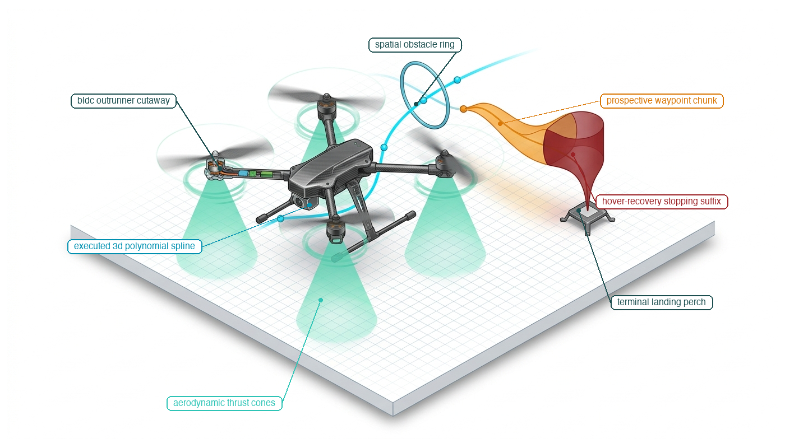
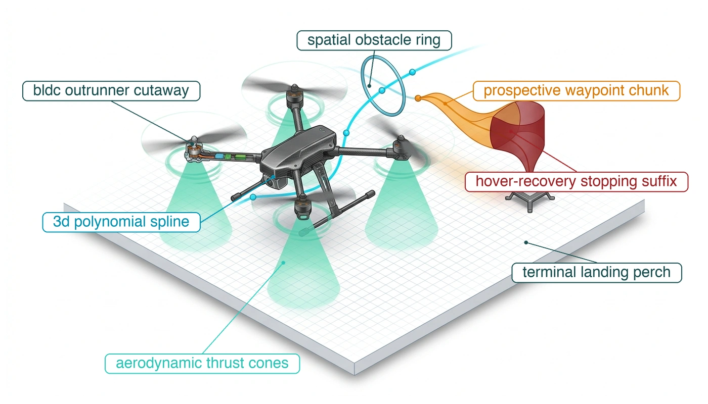

# Trajectory Planning {#sec-planning}

::: {layout-narrow}
::: {.column-margin}

\chapterminitoc

:::

::: {.content-visible when-format="pdf"}
\noindent
{fig-alt="Isometric blueprint showing 3D flight trajectory planning for an autonomous aerial quadrotor drone: BLDC outrunner cutaway, aerodynamic thrust cones, executed cyan 3D polynomial spline threading an obstacle ring, prospective amber waypoint chunk, and Harvard crimson hover-recovery stopping suffix landing on a terminal perch."}
:::

::: {.content-visible unless-format="pdf"}
{fig-alt="Isometric blueprint showing 3D flight trajectory planning for an autonomous aerial quadrotor drone: BLDC outrunner cutaway, aerodynamic thrust cones, executed cyan 3D polynomial spline threading an obstacle ring, prospective amber waypoint chunk, and Harvard crimson hover-recovery stopping suffix landing on a terminal perch."}
:::

:::

## Purpose {.unnumbered .unlisted}

::: {.content-visible when-format="pdf"}
\begin{marginfigure}
\vspace{1em}
\resizebox{\linewidth}{!}{\mlphysicalstackfull{100}{20}{20}{20}{20}}
\end{marginfigure}
:::

_What does a physical machine do during the unbudgeted milliseconds when the next neural trajectory chunk is late?_

A moving machine continues to carry momentum while its policy computes the next action. If the current trajectory ends before its replacement arrives, waiting is itself a physical behavior with consequences for clearance and stability. Abruptly substituting a new command can also demand accelerations that the actuators cannot deliver or excite vibration in the mechanism. Planning must turn successive proposals into motion that remains feasible through both their transitions and their absence. Smooth connections between trajectory segments protect the body during normal execution, while a stopping continuation gives the execution layer a defined response to an overdue plan. That continuation must remain feasible from the states the current plan can reach; attaching a stop command after the planning horizon has expired is too late. Trajectory planning therefore couples the brain's variable computation time to the nervous system's continuous execution and the body's capacity to change motion.



::: {.callout-learning-objectives}

- Select trajectory horizons from inference latency, observation freshness, and the time needed for fallback
- Evaluate trajectory feasibility and continuity against the body's actuator and transmission limits
- Specify physically feasible continuation behavior when a replacement trajectory arrives late or never arrives
- Distinguish trajectory failures detectable before execution from those requiring monitoring during physical motion

:::

## Continuous Trajectories {#sec-planning-11-1}

An articulated robotic arm lowering a cutting tool onto a moving workpiece possesses physical mass, structural inertia $\mathbf{M}(\mathbf{q})$, and continuous kinetic energy $E_k = \frac{1}{2} \dot{\mathbf{q}}^T \mathbf{M}(\mathbf{q}) \dot{\mathbf{q}}$. It cannot change velocity or direction instantaneously. Even when upstream autonomy grants a time-bounded intent lease—authorizing motion toward a grounded semantic goal—that semantic permission alone cannot turn motor shafts. To convert permission into safe physical work, the machine must synthesize a continuous trajectory that discharges the lease before its duration expires. At the low-level execution tier, the motor tracking loop runs at a deterministic $1000\text{ Hz}$ cadence on bare-metal microcontroller hardware, evaluating feedback control laws and updating pulse-width modulation setpoints every millisecond. Above this loop sits the cognitive deliberative brain, where modern robot learning policies—such as Action Chunking with Transformers (ACT) [@zhao2023learning] or score-based Diffusion Policies [@chi2024diffusionpolicy]—process multimodal observations to synthesize future reference paths on a Linux accelerator.[^fn-plan-action-chunking] But neural inference is stochastic and heavy-tailed: a forward pass that takes $40\text{ ms}$ under nominal conditions can stretch beyond $150\text{ ms}$ or $200\text{ ms}$ under PCIe bus contention, DRAM stalls, or operating system thread scheduling jitter.

[^fn-plan-action-chunking]: **Action chunking representations**\index{Action chunking!architectures}\index{Policy learning!temporal horizons}: Action Chunking with Transformers (ACT) predicts sequences of future joint setpoints using a conditional variational autoencoder with temporal ensembling, whereas Diffusion Policy generates continuous action trajectories via iterative score-based denoising solvers. Both paradigms decouple slow, stochastic neural inference from high-rate motor servoing loops. However, because multi-step chunk outputs lack intrinsic boundary derivative constraints, downstream controllers must synthesize transition splines to prevent acceleration shocks across replanning seams.

If an architecture attempts to predict actions only one step ahead ($H = 1$), the motor tracking loop starves immediately. If it generates a multi-step **action chunk** across a finite future horizon ($H > 1$), the machine encounters the peril of the **execution seam**. During the unbudgeted milliseconds when an active trajectory chunk finishes executing before its replacement clears the tail of the inference distribution, the controller faces an execution discontinuity. If the controller clamps to the final commanded position, the sudden drop in desired velocity demands infinite deceleration, saturating motor drives and stripping cycloidal gearbox teeth. If a newly arrived chunk begins with a velocity or acceleration that diverges from the physical state of the moving mechanism, the step discontinuity in commanded torque violently shakes the chassis. A trajectory plan must therefore define not only nominal motion, but continuous derivatives across chunk boundaries and an explicit, precomputed stopping continuation when replacement guidance is late.

::: {#dfn-planning-kinodynamic-feasibility-envelope .callout-definition title="Kinodynamic feasibility envelope"}

***Kinodynamic feasibility envelope***\index{Kinodynamic feasibility envelope!definition}\index{Feasibility!kinodynamic} is the subset of state space from which a physical machine can track a candidate trajectory while strictly satisfying simultaneous actuator torque limits, velocity ceilings, and third-order jerk bounds ($C^2$ continuity) without exceeding mechanical stopping margins.

1.  **Significance**: Geometric collision freedom is necessary but insufficient for physical execution; an arm may follow a collision-free path that nonetheless demands motor torques exceeding continuous thermal ratings or produces accelerations that tip an underactuated base. The kinodynamic envelope guarantees that motion commands remain physically trackable by the body's actuators.
2.  **Distinction**: Unlike pure kinematic reachability (which evaluates whether the robot's linkages can attain a spatial configuration), kinodynamic feasibility incorporates time parameterization, actuator force/torque envelopes, reflected inertia, and mechanical braking runways.
3.  **Common pitfall**: Checking feasibility only at discrete waypoints. Interpolation splines between sample points can produce intra-sample velocity overshoots and torque spikes that breach motor limits even when every individual waypoint passes validation.

:::

As shown in @fig-11-locator, the planner is the fifth and final deliberative stage of the cognitive brain. Intent defines the admissible goal; planning supplies the continuous motion, temporal parameterization, and dynamic limits needed to pursue that goal.

::: {#fig-11-locator fig-env="figure" fig-pos="htb" fig-cap="**Planner Stage Architecture Focus**: In the physical AI systems architecture, the deliberative brain proposes time-parameterized action chunks across an unprivileged boundary to the deterministic nervous system. Because neural inference latencies exhibit heavy-tailed stochastic distributions, every plan must define its own replacement timing, boundary derivatives, and precomputed stopping suffix before execution begins." fig-alt="Diagram titled Physical AI Systems Architecture Stack, drawn as four stacked tiers. Layer 4 is system governance and assurance at 0.1 to 1 hertz, holding boxes for shared autonomy, verification, safety cases, and frontier limits. Layer 3 is the brain, a cognitive deliberation tier at 1 to 50 hertz, holding five stages named ingestion, perception, memory, intent, and planner. A dashed proposal-permission privilege boundary separates it from layer 2, the nervous system, a real-time safety and timing tier at 1000 hertz. Layer 1 is the physical body and continuous plant. Layer 3 is shaded and its planner stage is outlined; the badge reads Active Focus, Chapter 11, Trajectory Planning."}
{width="100%"}
:::

Across the **proposal-permission boundary**, a plan is not a direct command written to actuator registers, nor is it a guaranteed physical path. It is an unprivileged proposal submitted across the MPU-to-MCU inter-processor communication bus to the tracking controller and the real-time safety enforcer (@sec-enforcement).[^fn-plan-nervous-gatekeeper] Because neural inference latencies follow empirical distributions with pronounced tails, the downstream tracking controller consumes references continuously and will never wait for an upstream model to finish. A plan must therefore be an atomic, self-contained contract: it must establish second-order derivative continuity ($C^2$ continuity) at its admission seam,[^fn-plan-c2-spline] budget its replacement dispatch epoch against extreme tail quantiles, and embed a resident, precomputed stopping suffix that guarantees a safe resting state if replacement plans fail to arrive.

[^fn-plan-nervous-gatekeeper]: **Deterministic proposal verification**\index{Nervous system!gatekeeper}\index{Safety enforcement!execution buffer}: The deterministic nervous system isolates unprivileged trajectory proposals within hardware-managed staging buffers, evaluating kinematic feasibility and tracking invariants before latching setpoints into motor control registers. If candidate chunks demand unachievable accelerations or violate geometric clearance barriers, the gatekeeper rejects the packet within a single servo tick and maintains the active trajectory. For runtime safety filter architectures, see @sec-enforcement-12-1.

[^fn-plan-c2-spline]: **$C^2$ derivative continuity**\index{C2 continuity@$C^2$ continuity}\index{Drivetrain!jerk dynamics}: Enforcing $C^2$ continuity guarantees that position, velocity, and acceleration remain unbroken functions of time across trajectory boundaries. In permanent-magnet synchronous motors (PMSM), electromagnetic torque couples directly to quadrature stator current ($\tau = K_t I_q$). A step discontinuity in commanded acceleration demands an instantaneous step change in current, producing destructive mechanical jerk that excites structural resonances and rapidly degrades precision gear teeth.

Bridging the temporal chasm between slow, variable neural inference and high-frequency, continuous actuator tracking requires treating trajectory generation as a time-bounded contract with explicit seam continuations. Rather than transmitting raw geometric waypoints or unconstrained torque arrays across the system bus, the deliberative planner must assemble a self-contained operational packet that encapsulates validity intervals, dynamic boundary derivatives, and certified fallback profiles before releasing authority to physical hardware.

To establish this execution discipline, this chapter investigates the planning pipeline across six progressive stages: the trajectory handoff interface (@sec-planning-11-2), generation methods bridging semantic goals to continuous splines (@sec-planning-11-3), kinodynamic feasibility and torque bounds (@sec-planning-11-4), boundary continuity and replacement seams (@sec-planning-11-5), failure modes from latency tails and state drift (@sec-planning-11-6), and the formal trajectory contract governing execution (@sec-planning-11-7).

We begin in @sec-planning-11-2 by defining the trajectory handoff packet, formalizing the exact typed payload passed from the deliberative brain to the tracking controller and runtime safety enforcer.

## What Planning Hands Over {#sec-planning-11-2}

A geometric path describes a sequence of configurations in space, parameterized by arc length $s \in [0, S]$ or a dimensionless progression variable $\sigma \in [0, 1]$, without reference to time.[^fn-math-apf-planning] Formulated in the foundational work of Lozano-Pérez [@lozanoperez1983spatial], the **configuration space**\index{Configuration space!definition} ($\mathcal{C}$-space) represents the topological manifold of all possible robot joint states $\mathbf{q} \in \mathcal{C}$. By mapping each kinematic degree of freedom to an independent coordinate axis, $\mathcal{C}$-space represents the entire physical geometry of the articulated mechanism as a single point, while mapping physical workspace obstacles into configuration space obstacles $\mathcal{C}_{\text{obs}}$. A path defines where the machine travels through the collision-free manifold $\mathcal{C}_{\text{free}} = \mathcal{C} \setminus \mathcal{C}_{\text{obs}}$, but it contains no information about velocity, acceleration, or actuation limits. To become an **executable trajectory**\index{Executable trajectory!definition}, the geometric path must be mapped to time, $t \mapsto \mathbf{x}(t) = [\mathbf{q}(t)^T, \dot{\mathbf{q}}(t)^T, \ddot{\mathbf{q}}(t)^T]^T$. Physically, this binds the spatial curve to a rigid schedule, assigning concrete physical states (positions), kinematic derivatives (velocities and accelerations), or actuator targets to explicit timestamps. Only when parameterized by time does the path expose the rates, accelerations, and temporal deadlines that the nervous system must evaluate. The data structure handed over from the upstream planner to the execution system is therefore never an abstract curve or an ungrounded tensor. It is a time-indexed **trajectory packet**\index{Trajectory packet!definition} delivered across the causal boundary (@sec-boundary-1-2) to two distinct consumers: the tracking controller and the safety enforcer. The **tracking controller**\index{Tracking controller} consumes the trajectory to interpolate high-rate actuator setpoints ($1\text{ kHz}$),[^fn-hw-setpoint-slew] and compute model-based feedforward torques. The **safety enforcer**\index{Safety enforcer} consumes the trajectory to independently verify that the planned motion remains within physical, thermal, and environmental boundaries before any command reaches the motor phase inverters (@sec-enforcement).

[^fn-math-apf-planning]: **Artificial Potential Field Lineage**\index{Artificial potential fields!provenance}: The artificial potential field method was introduced by @khatib1986real for real-time obstacle avoidance in operational space control. While computationally trivial ($O(1)$ per evaluation step), pure potential field methods suffer from local minima in non-convex obstacle fields, where attractive and repulsive gradient vectors sum to zero. Escaping these equilibrium points requires injecting stochastic perturbations or coupling reactive potentials with higher-level deliberative global search.

[^fn-hw-setpoint-slew]: **Setpoint slew limiting**\index{Setpoint!slew limiting}\index{Process control!transport lag}: In continuous process systems, setpoints govern mass feed valves or thermal heating elements subject to physical transport lag ($\tau = L/v$). Step changes in reference commands induce severe pressure transients and thermal gradients across structural conduits. Hardware slew limiters cap setpoint rates of change ($d\dot{m}/dt \le \dot{M}_{\max}$), suppressing hydraulic water hammer and thermal shock fractures in high-pressure delivery piping.

Every field in the trajectory handoff corresponds to a specific check that the tracker or enforcer must execute. The first requirement is spatial and temporal alignment. The trajectory packet must explicitly declare its coordinate reference frame identifier $\mathcal{F}$, its generation timestamp $t_0$, its planned initial state $\mathbf{x}_0$, and its validity interval $[t_{\text{start}}, t_{\text{exp}}]$. Without an explicit coordinate frame, the tracking controller cannot transform end-effector positions and velocities into joint coordinates. Without a generation timestamp and initial state, the enforcer cannot measure pipeline transport latency or detect state drift. Consider an inference pipeline that samples the robot state at $t = 0\text{ ms}$, requires $60\text{ ms}$ to compute a trajectory chunk on the Linux MPU, and delivers a trajectory starting at $\mathbf{x}_0$. If the physical mechanism was in motion during inference and drifted by $20\text{ mm}$, passing the trajectory directly to the tracker causes the control loop to instantly attempt a $20\text{ mm}$ teleportation. This mathematically instantaneous step error commands peak motor torque and induces a violent mechanical jerk that can damage gearing. By comparing the planned initial state $\mathbf{x}_0$ against the true state measured by MCU encoders at $t_{\text{start}}$, the enforcer can reject the chunk if the tracking discrepancy exceeds an allowed tolerance, or the tracker can synthesize a short transition spline to bridge the position offset. The validity interval defines the temporal window over which the planner guarantees internal consistency, setting the exact expiration time $t_{\text{exp}}$ when the chunk ceases to be authoritative.

The handoff represents a feasibility claim under declared body limits rather than a proof that the machine can execute the trajectory under every future disturbance. When a planner generates a trajectory, it verifies that the requested joint velocities $\dot{\mathbf{q}}(t)$, accelerations $\ddot{\mathbf{q}}(t)$, and torques $\boldsymbol{\tau}(t)$ fall within nominal operating bounds under an assumed dynamic model. It cannot account for unmodeled friction, external payloads, or sudden contact forces that arise during execution. The safety enforcer must independently evaluate this feasibility claim against conservative runtime limits before permitting the tracker to execute the trajectory. If a learned planner generates a trajectory assuming an empty gripper, demanding $80$ percent of peak actuator torque during high-speed acceleration, and the physical gripper is carrying a $4.0\text{ kg}$ payload, executing the trajectory would demand $130$ percent of rated motor torque. The resulting overcurrent would exceed the actuator thermal limits established in @sec-body-2-3, triggering thermal derating or causing severe tracking lag. The enforcer uses the explicit state derivatives and required forces in the handoff to reject plans that exceed safe margins under the actual physical configuration.

To allow continuous transitions between consecutive planning cycles, the trajectory must specify boundary conditions at both ends of its temporal horizon. A trajectory that guarantees only continuous position creates physical damage at the replacement seam. If the planner produces a trajectory whose initial velocity $\dot{\mathbf{q}}(t_{\text{start}})$ does not match the true velocity of the body at the moment of handoff, the resulting step change in velocity requires infinite acceleration, causing torque saturation and structural vibration. Even if velocity is continuous, a step discontinuity in acceleration causes a step change in motor torque, producing severe jerk that excites mechanical resonances in gearboxes and linkages. The handoff must therefore enforce second-order derivative continuity ($C^2$ continuity) at the seam, matching position, velocity, and acceleration to the terminal state of the currently executing trajectory chunk. Specifying terminal boundary conditions at $t_{\text{exp}}$ similarly ensures that if a successor plan arrives on time, the new trajectory can splice directly into the existing motion without arresting the body.

Because feasibility depends on physical context, the handoff must include the explicit assumptions under which the trajectory was generated. These metadata fields include the assumed payload mass and inertia, the expected contact state (such as free-space motion, sliding contact, or rigid fixture engagement), the allocated actuation budget, and the minimum spatial clearance to known obstacles. The safety enforcer compares these declared assumptions against independent sensor measurements in real time. If the handoff specifies a free-space motion with an expected contact force of $0\text{ N}$, but an onboard six-axis force-torque sensor registers an unexpected load of $25\text{ N}$ along the tool axis, the enforcer immediately invalidates the trajectory to maintain ISO 10218 and ISO/TS 15066 safety envelopes. The physical premise of the plan has been violated, and continuing along the precomputed path risks driving the tool into a rigid obstruction.

Every computing architecture exhibits latency tails where replacement plans arrive late or fail to arrive entirely. An executable handoff must therefore provide an explicit, finite **precomputed stopping suffix**\index{Precomputed stopping suffix!definition}—a dynamically feasible deceleration trajectory resident in execution memory upon chunk admission—that governs the body if the clock reaches $t_{\text{exp}}$ without a valid successor. Leaving terminal behavior unspecified or defaulting to an instantaneous position hold is physically dangerous. If a machine traveling at $1.2\text{ m/s}$ encounters an expired plan and defaults to holding its final position sample, the tracking controller attempts to bring the velocity to zero instantaneously. This requires an infinite acceleration impulse, saturating actuator braking torque, risking gearbox shear, and violating the $SE(3)$ base mounting constraint through overturning moments that exceed floor anchorage shear ratings. Instead, the terminal suffix begins at $t_{\text{exp}}$ and brings the machine to a safe resting state along the path tangent over a finite stopping time $T_{\text{stop}}$. Depending on the task and mechanical structure, this terminal behavior may decelerate to a stop along the path tangent, switch actuator control to passive damping, or descend to a mechanically stable resting posture. The critical systems requirement is that the terminal suffix is budgeted, checked for dynamic feasibility, and resident in memory before execution of the chunk begins.

On real-time embedded hardware, this handoff is realized inside an **embedded execution buffer**\index{Embedded execution buffer!definition} resident in fast on-chip static RAM (SRAM).[^fn-hw-dma-pingpong] Extending the proposal-permission architecture from @sec-brain-3-1 to decouple the asynchronous planning thread on the host processor from the deterministic kilohertz servo loop, the execution engine maintains a lockless double-buffer contract governed by atomic state flags (`BUFFER_EMPTY`, `BUFFER_READY`, `BUFFER_ACTIVE`, `BUFFER_EXPIRED`). When the upstream policy synthesizes a new action chunk, it populates the inactive background buffer over high-speed shared memory. At the admission boundary, the real-time safety enforcer executes an $O(1)$ algorithmic validation check on the candidate chunk—completing in constant, guaranteed time regardless of trajectory length. If the packet passes all invariant tests, the execution engine performs an atomic pointer swap at the next servo tick, seamlessly committing the new trajectory chunk to the active tracking loop without dynamic memory allocation, mutex contention, or timing jitter.

[^fn-hw-dma-pingpong]: **Inter-core shared-memory contracts**\index{Inter-processor communication!shared memory}\index{Real-time systems!memory barriers}: In heterogeneous system-on-chip (SoC) architectures, exchanging trajectory packets between asynchronous host planning threads and real-time execution cores requires strict memory fencing. The host processor enforces explicit data cache flushes and memory barriers before asserting completion flags in shared static RAM. This hardware discipline guarantees that the high-rate motor servo loop never dereferences partially written, unverified, or cache-incoherent trajectory setpoints.

Structuring the plan handoff as a bounded, hardware-grounded contract shifts the burden of safety and timing from the non-deterministic planner to the deterministic nervous system. The tracking controller receives the dense state targets, timestamps, and feedforward terms required to drive the actuators along a smooth path. The safety enforcer receives the generation metadata, dynamic assumptions, validity bounds, and terminal suffix needed to guard the machine against latency tails, state divergence, and physical model mismatches. When each field in the handoff corresponds to an explicit runtime verification, the nervous system can execute high-speed motions without relying on the assumption that the next inference cycle will always succeed.

::: {#chk-plan-trajectory-packet-contract .callout-checkpoint title="The trajectory packet contract"}

Before exploring the generation of trajectories from high-level intent, verify your understanding of the interface boundary between planning proposals and real-time execution:

- [ ] **Dual consumer roles**: Can you distinguish between the operational requirements of the tracking controller and the real-time safety enforcer when consuming a trajectory packet?
- [ ] **State alignment and drift**: Can you explain why a trajectory packet must declare both its generation timestamp $t_0$ and initial state $\mathbf{x}_0$, and how the nervous system detects execution drift?
- [ ] **Lockless buffer mechanics**: Can you describe how a double-buffered execution queue with atomic pointer swaps prevents race conditions between an asynchronous planning thread and a 1 kHz servo loop?

:::

## From Goal to Trajectory {#sec-planning-11-3}

An intent names a desired physical outcome—such as touching a workpiece with a specified contact force or placing an end-effector at a target pose (@sec-intent)—but an actuator cannot execute a goal. A goal defines where the machine should eventually arrive or what constraint it should satisfy, without providing the joint velocities, torque bounds, intermediate kinematic states, or continuous time schedule required to move physical mass through space. The nervous system requires a trajectory, which assigns concrete state targets, feedforward actuation terms, and explicit timestamps across a bounded temporal interval. If a learned policy could evaluate multimodal state observations and output valid motor currents instantaneously at the hardware control period ($1000\text{ Hz}$), planning as an architectural stage would not exist; the machine would operate purely as a high-frequency feedback controller. In physical systems, learned neural policies require tens or hundreds of milliseconds to compute a motion sequence, while the tracking controller and safety enforcer (extending the proposal-permission architecture from @sec-brain-3-1) must execute deterministically every few milliseconds. A plan exists precisely because a goal cannot be executed directly by hardware and neural inference operates far slower than the cadence of the control loop.

In classical robotics systems, bridging this gap was achieved through sampling-based path planning. Rather than constructing explicit algebraic representations of the high-dimensional configuration obstacle manifold $\mathcal{C}_{\text{obs}}$, algorithms randomly sample the free configuration space $\mathcal{C}_{\text{free}}$. Multi-query architectures, pioneered by @kavraki1996probabilistic through the **Probabilistic Roadmap (PRM)**\index{Probabilistic roadmap!definition}, construct a global topological roadmap of interconnected collision-free configurations during an offline preprocessing phase, enabling rapid online multi-query path lookups. For dynamic, single-query real-time navigation, @lavalle1998rapidly introduced the **Rapidly-Exploring Random Tree (RRT)**\index{Rapidly-exploring random tree!definition}, which incrementally grows a space-filling tree biased toward unexplored Voronoi regions of $\mathcal{C}_{\text{free}}$, guaranteeing probabilistic completeness without requiring precomputed graphs.

To span this temporal gap between slow model inference and high-frequency actuator control, modern robot learning architectures formulate policy execution via **receding-horizon action chunking**\index{Receding-horizon action chunking!definition}, predicting multi-step trajectory sequences over a forward horizon while committing only an initial temporal prefix before replanning on fresh observations.[^fn-math-bellman-dp] Two dominant paradigms characterize this generation:

[^fn-math-bellman-dp]: **Dynamic Programming Lineage**\index{Dynamic programming!provenance}: The principle of optimality and discrete dynamic programming algorithms were formalized by @bellman1957dynamic for sequential decision processes. While DP guarantees globally optimal trajectory synthesis over discretized state lattices, computational complexity scales exponentially as $O(K^d)$ where $d$ is state dimension and $K$ is grid resolution. In physical systems with high degrees of freedom, this exponential curse of dimensionality forces trajectory planners to employ continuous trajectory optimization or randomized sampling.

1. **Action Chunking with Transformers (ACT)**: Formulated as a Conditional Variational Autoencoder (CVAE) paired with a Transformer encoder-decoder [@zhao2023learning], ACT predicts a discrete sequence of future joint setpoints $\mathbf{A} = [\mathbf{a}_1, \dots, \mathbf{a}_H] \in \mathbb{R}^{H \times D}$ simultaneously across a prediction horizon $H$. To mitigate compounding trajectory drift across successive chunks, ACT applies *temporal ensembling*, maintaining an exponential moving average over overlapping predicted chunks ($w_i = \exp(-m \cdot i)$). While effective in simulation and low-speed teleoperation, temporal ensembling averages discrete coordinate samples without enforcing derivative continuity, which can inject high-frequency derivative chatter into real-time motor drives—manifesting physically as audible buzzing, rapid overheating (violating the actuator thermal limits established in @sec-body-2-5), and erratic mechanical vibration at the joints.
2. **Diffusion Policy**: Formulating trajectory synthesis as an iterative score-based denoising process [@chi2024diffusionpolicy], Diffusion Policy rolls out future action trajectories by solving a score Stochastic Differential Equation (SDE) or Denoising Diffusion Implicit Model (DDIM) ODE conditioned on visual and proprioceptive histories. A diffusion policy predicts a chunk of horizon $T_p$ (e.g., $16$ steps), executes a committed subset of steps $T_a$ (e.g., $8$ steps), and replans on subsequent sensor ingress (@fig-11-action-chunking-trace). While diffusion models capture rich multimodal distributions, their iterative denoising schedules ($K = 8\text{--}16$ steps) introduce significant inference latency and stochastic latency variance.
3. **Learned Policy Warm-Starting for Non-Convex Trajectory Optimization**: Rather than treating learned neural models and numerical Model Predictive Control (MPC) as mutually exclusive paradigms, high-performance physical AI architectures combine them through **learned warm-starting**\index{Learned warm-starting!definition}\index{Model Predictive Control!warm-started SQP}. Real-time trajectory generation in cluttered, contact-rich environments requires solving non-convex optimization problems subject to non-linear kinematics, obstacle avoidance boundaries, and motor torque limits:
   $$\min_{\mathbf{x}_{1:H}, \mathbf{u}_{1:H}} \sum_{t=1}^H \ell(\mathbf{x}_t, \mathbf{u}_t) \quad \text{subject to} \quad \mathbf{x}_{t+1} = f(\mathbf{x}_t, \mathbf{u}_t), \quad g(\mathbf{x}_t, \mathbf{u}_t) \le 0$$
   When solved via Sequential Quadratic Programming (SQP) or interior-point methods, "cold-starting" the solver from a naive linear interpolation or stale historical trajectory requires $30\text{--}50$ iterations to resolve active collision constraints, consuming $60\text{--}150\text{ ms}$ and frequently overrunning real-time control deadlines. By contrast, a learned foundation model or distilled diffusion policy infers a coarse, semantically guided trajectory proposal $(\mathbf{x}_{\text{proposal}}, \mathbf{u}_{\text{proposal}})$ in $5\text{--}10\text{ ms}$. While the neural proposal may exhibit slight dynamic infeasibility or joint torque chatter, it reliably identifies the correct topological homotopy class (such as navigating around an unexpected obstacle rather than into a local trap). Initializing the SQP solver at this primal proposal $(\mathbf{x}^{(0)}, \mathbf{u}^{(0)}) = (\mathbf{x}_{\text{proposal}}, \mathbf{u}_{\text{proposal}})$ places the numerical optimizer directly within the quadratic basin of attraction of the optimal local minimum. The active constraint set is pre-identified, collapsing the required SQP solve to just $2\text{--}4$ iterations ($4\text{--}8\text{ ms}$ on embedded multicore CPUs). This hybrid architecture unifies the open-world semantic intuition of deep learning with the certified feasibility and torque constraint guarantees of numerical optimization.

From an ML systems perspective, the parameter governing the handoff across these models is the **end-to-end replacement latency**\index{End-to-end replacement latency!definition}, denoted as random variable $L \sim \mathcal{D}(L)$. Treating model execution time on an isolated accelerator as the planning latency is an engineering error that undercounts the true physical delay—the total end-to-end latency from photon arrival at the camera sensor to commanded current in the motor phase windings. End-to-end replacement latency begins at the physical timestamp of the sensory observation used to condition the planner and spans six pipeline stages in @eq-plan-replacement-latency:
$$L = t_{\mathrm{sense\_ingress}} + t_{\mathrm{ipc\_dma}} + t_{\mathrm{infer}} + t_{\mathrm{deser}} + t_{\mathrm{validate}} + t_{\mathrm{admit}}$$ {#eq-plan-replacement-latency}
where $t_{\mathrm{sense\_ingress}}$ includes camera exposure and frame grabber serialization ($15\text{ ms}$), $t_{\mathrm{ipc\_dma}}$ is direct memory access transfer to the accelerator ($5\text{ ms}$), $t_{\mathrm{infer}}$ is neural forward pass or diffusion denoising ($65\text{ ms}$), $t_{\mathrm{deser}}$ is trajectory deserialization into engineering units ($2\text{ ms}$), $t_{\mathrm{validate}}$ is kinematic and constraint verification by the safety enforcer ($18\text{ ms}$), and $t_{\mathrm{admit}}$ is atomic buffer admission into the MCU execution queue ($1\text{ ms}$). In this representative deployment, while raw inference consumes $65\text{ ms}$, the true end-to-end replacement latency is $L = 106\text{ ms}$.

Because operating system scheduling, memory bus contention, and accelerator thermal throttling introduce variability into every stage, replacement latency exhibits an empirical distribution with a pronounced tail. If the tracking controller consumes the final state sample of an active chunk before a validated replacement is admitted into the embedded buffer, the execution queue suffers starvation, forcing the nervous system to abandon nominal tracking and trigger its precomputed deceleration suffix. Sizing the plan horizon against a conventional tail percentile such as $P_{99}$ without accounting for mission exposure guarantees regular physical interruptions. Consider the 7-DoF robotic manipulator picking components from a moving conveyor ($v_{\text{conveyor}} = 0.30\text{ m/s}$) from @sec-brain-3-4. Over an uninterrupted 10-minute shift ($600\text{ s}$) with replanning at $5\text{ Hz}$ ($T_{\text{step}} = 200\text{ ms}$), the system executes $K = 3000$ consecutive handoffs. If the trajectory horizon accommodates only the $P_{99}$ latency, the mission survival probability is $(1 - 0.01)^{3000} \approx 8 \times 10^{-14}$: thirty late seams per run, repeatedly triggering emergency deceleration. To achieve an acceptable mission failure budget of $\epsilon_{\mathrm{mission}} = 10^{-3}$ across $3000$ handoffs, the allowable per-plan exhaustion probability simplifies to $\epsilon \approx \epsilon_{\mathrm{mission}} / K \approx 3.3 \times 10^{-7}$, requiring the system to size its horizon against the extreme tail quantile $Q_{1-\epsilon}(L) \approx P_{99.99997}$.

Determining the length of each trajectory chunk requires scheduling when the replacement request is dispatched relative to the start of the current chunk. Requesting the next chunk immediately upon entering the active chunk generates motor plans from outdated sensor readings, accumulating state drift. The system therefore delays the dispatch until an execution lead time $T_{\mathrm{request}}$ has elapsed within the active chunk. From the instant of dispatch, the remaining execution time available in the active buffer must accommodate the full replacement latency at the target quantile $Q_{1-\epsilon}(L)$, plus a deterministic reserve $T_{\mathrm{reserve}}$ dedicated to trajectory splicing, safety validation, and timer jitter. If the control loop operates at a period of $T_c$, the minimum number of discrete trajectory samples $N$ that each generated chunk must contain is bounded by @eq-plan-action-chunk-horizon:
$$N = \left\lceil \frac{T_{\mathrm{request}} + Q_{1-\epsilon}(L) + T_{\mathrm{reserve}}}{T_c} \right\rceil$$ {#eq-plan-action-chunk-horizon}
Every parameter in this equation must be measured under maximum representative system load, including saturated direct memory access channels, peak bus traffic from adjacent sensor streams, and thermal throttling of the compute substrate.

In our conveyor-tracking manipulator cell ($f_c = 100\text{ Hz}$, $T_c = 10\text{ ms}$), worst-case thermal throttling and DRAM contention push the tail replacement latency to $Q_{1-\epsilon}(L) = 160\text{ ms}$ (@sec-brain-3-4). Budgeting safety enforcer reserve $T_{\mathrm{reserve}} = 20\text{ ms}$ and dispatch delay $T_{\mathrm{request}} = 60\text{ ms}$ into @eq-plan-action-chunk-horizon yields:
$$N = \left\lceil \frac{60\text{ ms} + 160\text{ ms} + 20\text{ ms}}{10\text{ ms}} \right\rceil = 24\text{ samples}$$
The policy must output at least $N = 24$ trajectory samples ($240\text{ ms}$ total horizon). Sizing naively against the $P_{99}$ latency ($120\text{ ms}$) shrinks the chunk to $N = 20$ samples ($200\text{ ms}$)—leaving zero headroom whenever compute exceeds $120\text{ ms}$. Over a 10-minute shift, that 1 percent tail triggers roughly 30 emergency stops (one every 20 seconds), repeatedly shocking cycloidal drive teeth and dumping massive $I^2 R$ heat pulses into the windings during restarts.

Crucially, this lower bound to avoid starvation must be reconciled with the upper bound imposed by physical state drift. With conveyor slip accelerating target drift at $a_{\text{drift}} = 0.50\text{ m/s}^2$ (@sec-brain-3-4), open-loop tracking error compounds quadratically ($\Delta x_{\text{drift}} = \frac{1}{2} a_{\text{drift}} t^2$). For a $15\text{ mm}$ gripper tolerance, the maximum allowable open-loop duration before breaching the capture envelope is:
$$T_{\max} = \sqrt{\frac{2 \Delta x_{\max}}{a_{\text{drift}}}} \approx 245\text{ ms}$$
Sizing the chunk horizon to $N = 24$ samples ($240\text{ ms}$) satisfies both constraints simultaneously: it guarantees that the execution buffer survives $Q_{1-\epsilon}(L)$ tail latencies without starvation, while remaining within the $245\text{ ms}$ drift ceiling set by physical conveyor slip.

::: {#psp-planning-tail-latency-horizon .callout-perspective title="The tail latency horizon invariant"}
Size the action chunk horizon $N$ against the mission tail quantile $Q_{1-\epsilon_{\mathrm{mission}}/K}(L)$ measured under maximum bus and memory contention, never against the median $P_{50}$ plus an informal round-number margin.
:::

::: {#chk-plan-action-chunk-horizon-tail .callout-checkpoint title="Action chunk horizon and tail latency budgeting"}

Before evaluating real-time disturbance recovery and future-state conditioning, verify your ability to dimension action chunk horizons against extreme latency tails:

- [ ] **Mission exposure and tail quantiles**: Can you explain why sizing an action chunk horizon against $P_{99}$ latency guarantees repeated trajectory starvation during extended multi-minute missions?
- [ ] **Horizon sizing trade-off**: Can you distinguish between the risk of trajectory buffer starvation from too short an action chunk and the risk of unmodeled state drift and stale perception from an excessively long chunk?
- [ ] **Reserve margin allocation**: Can you describe why the horizon equation requires an explicit reserve term $T_{\text{reserve}}$ dedicated to trajectory splicing, safety filtering, and timer jitter beyond raw inference latency?

:::

When a generative policy serves as the planner, iterative score evaluation and denoising steps govern the shape of this latency distribution. The internal mechanics of diffusion schedules, attention caching, and token generation sit below the first budgetable quantity of the physical AI system. Building on the causal boundary established in @sec-boundary-1-2, the systems interface treats the learned model strictly as a stochastic producer of motion chunks characterized by an empirical latency profile and an output horizon $N$. In physical hardware deployments of receding-horizon action chunking, the execution buffer absorbs inference latency while allowing the controller to react dynamically to disturbances (@fig-11-action-chunking-trace). Sizing $N$ against the latency tail guarantees that a replacement chunk is resident in memory before the active plan runs out of samples. Yet ensuring that a replacement trajectory arrives in time addresses only the temporal continuity of the plan. The state samples contained within the admitted chunk must also match the kinematic capabilities of the joints and remain continuous with the physical velocity and acceleration of the mechanism at the handoff seam.

::: {#fig-11-action-chunking-trace fig-env="figure" fig-pos="t" fig-cap="**Receding-Horizon Disturbance Recovery**: A receding-horizon diffusion policy predicting sixteen action steps and executing eight before replanning, on hardware, under three disturbances: camera occlusion, an in-flight shove of the target block, and a displacement after the terminal motion has begun. The execution buffer is what absorbs all three. It keeps the end-effector moving through inference jitter and gives the replanning cycle somewhere to insert a correction without stopping the arm (adapted from Chi et al. [-@chi2024diffusionpolicy])." fig-alt="Receding-horizon action chunking and closed-loop disturbance recovery on real robot hardware. Hardware deployment of a receding-horizon diffusion policy (Tp = 16 predicted action steps, Ta = 8 executed steps before replanning) on a canonical 6-DOF industrial manipulator performing the planar Push-T manipulation task under dynamic perturbations. (Left) Visual Occlusion: A human hand waving in front of the overhead tracking camera introduces perceptual noise and inference latency jitter, but the receding-horizon execution buffer prevents pipeline starvation and preserves continuous end-effector motion. (Middle) In-Flight State Divergence: A physical disturbance abruptly shifts the target T-block during the active pushing phase; the rolling replanning cycle detects state divergence from the recorded plan assumptions and immediately synthesizes a corrective trajectory chunk that re-acquires and aligns the block. (Right) Terminal Suffix Replanning: When the block is displaced after the manipulator has already initiated its terminal motion toward the designated end-zone, the policy aborts the terminal sequence, replans a return trajectory, and restores the block to the target alignment. (Adapted from Chi et al. [-@chi2024diffusionpolicy])."}
{width="100%"}
:::

In a receding-horizon planning framework—whether executing a score-based diffusion policy, an action chunking transformer, or trajectory optimization—replanning requires a finite end-to-end computational latency $\Delta t_{\text{plan}} = L$ (spanning sensing, direct memory access (DMA) transfer, neural inference, and constraint validation, typically $50\text{--}150\text{ ms}$). A widespread design error in robot learning architectures is conditioning the planner on the *current* measured physical state sampled at the request epoch $t_0$:
$$\mathbf{x}_{\text{meas}}(t_0) = \begin{bmatrix} \mathbf{q}(t_0) \\ \dot{\mathbf{q}}(t_0) \end{bmatrix}$$
By the time neural inference, safety validation, and buffer admission finish at $t_{\text{admit}} = t_0 + \Delta t_{\text{plan}}$, the physical robot has already moved under the previously active trajectory chunk ($A$) over the entire interval $\Delta t_{\text{plan}}$. The newly arrived trajectory chunk ($B$) begins at the historical state $\mathbf{x}_{\text{meas}}(t_0)$, but the physical plant is now located at $\mathbf{x}_A(t_0 + \Delta t_{\text{plan}})$. Attempting to execute chunk $B$ immediately injects an unmodeled step displacement into the tracking loop, as formulated in @eq-plan-execution-delay-gap:
$$\Delta \mathbf{x}_{\text{gap}} = \mathbf{x}_A(t_0 + \Delta t_{\text{plan}}) - \mathbf{x}_{\text{meas}}(t_0) \approx \int_{t_0}^{t_0 + \Delta t_{\text{plan}}} \dot{\mathbf{q}}_A(t) \, dt$$ {#eq-plan-execution-delay-gap}
For an industrial arm moving at joint velocity $\dot{q} = 0.50\text{ rad/s}$ across a planning latency $\Delta t_{\text{plan}} = 80\text{ ms}$, this execution delay gap creates an instantaneous step error of $\Delta q_{\text{gap}} = (0.50\text{ rad/s})(0.080\text{ s}) = 0.040\text{ rad}$ ($2.29^\circ$). When streamed to high-gain joint controllers, this step demands peak restoring torque ($\tau_{\text{step}} = K_p \Delta q_{\text{gap}}$), causing violent mechanical jerk, acoustic thumping, and overcurrent inverter trips.

To eliminate the planning execution delay gap, high-performance physical AI architectures implement **future-state conditioning**\index{Future-state conditioning!definition}. Instead of conditioning inference on the stale measured state $\mathbf{x}_{\text{meas}}(t_0)$, the upstream planner conditions its trajectory rollout on the *forward-simulated terminal state* of the currently executing trajectory chunk evaluated at the exact anticipated admission epoch $t_{\text{admit}} = t_0 + \Delta t_{\text{plan}}$:
$$\mathbf{x}_{\text{cond}} = \hat{\mathbf{x}}_A(t_0 + \Delta t_{\text{plan}}) = \begin{bmatrix} \mathbf{q}_A(t_0 + \Delta t_{\text{plan}}) \\ \dot{\mathbf{q}}_A(t_0 + \Delta t_{\text{plan}}) \\ \ddot{\mathbf{q}}_A(t_0 + \Delta t_{\text{plan}}) \end{bmatrix}$$
Because the low-level MCU tracks the active chunk $A$ deterministically, $\hat{\mathbf{x}}_A(t_0 + \Delta t_{\text{plan}})$ accurately predicts the robot's physical configuration at the handoff instant. When chunk $B$ arrives and is admitted at $t_{\text{admit}}$, its initial boundary values match the executing trajectory's position, velocity, and acceleration to machine precision:
$$\mathbf{q}_B(0) = \mathbf{q}_A(t_{\text{admit}}), \quad \dot{\mathbf{q}}_B(0) = \dot{\mathbf{q}}_A(t_{\text{admit}}), \quad \ddot{\mathbf{q}}_B(0) = \ddot{\mathbf{q}}_A(t_{\text{admit}})$$
This future-state conditioning guarantees that the replacement seam maintains strict $C^2$ continuity (seamless matching of position, velocity, and acceleration), eliminating the execution delay gap without requiring the machine to pause, decelerate, or suffer impulsive torque spikes.

::: {#dfn-planning-future-state-conditioning .callout-definition title="Future-state conditioning"}

***Future-state conditioning***\index{Future-state conditioning!definition}\index{Trajectory planning!future-state conditioning} is the real-time planning protocol wherein an upstream trajectory optimizer or generative action policy conditions its rollout on the forward-simulated kinematic state ($\hat{\mathbf{x}}_A(t_0 + \Delta t_{\text{plan}})$) of the currently executing plan evaluated at the anticipated replacement admission epoch.

1.  **Significance**: Finite neural inference latency ($\Delta t_{\text{plan}} \approx 50\text{--}150\text{ ms}$) introduces an execution delay gap ($\Delta \mathbf{x}_{\text{gap}}$) between the measured state at exposure and the state when the new plan arrives. Conditioning on the forward-simulated state aligns the new trajectory's origin with the robot's physical configuration at the handoff instant, eliminating tracking lag without requiring the machine to pause or decelerate.
2.  **Distinction**: Unlike classical open-loop replanning that naively sets the new plan's starting waypoint to stale sensor feedback ($\mathbf{q}_B(0) = \mathbf{q}_{\text{meas}}(t_0)$), future-state conditioning projects forward along the active trajectory chunk to ensure continuous momentum.
3.  **Common pitfall**: Assuming the forward-simulated state matches reality without checking tracking error. If an external contact disturbance displaced the robot during the planning interval ($\|\mathbf{x}_{\text{meas}} - \hat{\mathbf{x}}_A\| > \epsilon_{\text{tol}}$), the conditioned plan starts from a phantom state, demanding a runtime spline correction before admission.

:::

::: {#chk-plan-future-state-conditioning .callout-checkpoint title="Execution delay gaps and future-state conditioning"}

Before analyzing kinodynamic feasibility and transmission dynamics, evaluate your understanding of computational latency compensation at the handoff seam:

- [ ] **Execution delay gap origin**: Can you calculate the spatial offset injected into a robot joint if a planner conditions on the current measured state rather than projecting forward across computational latency?
- [ ] **Forward simulation protocol**: Can you explain how future-state conditioning eliminates boundary discontinuities at the replacement seam without requiring the machine to decelerate?
- [ ] **Disturbance vulnerability**: Can you identify the failure mode that occurs when a physical disturbance displaces the mechanism while an upstream planner is solving a future-conditioned rollout?

:::

## Kinodynamic Feasibility {#sec-planning-11-4}

A candidate trajectory produced by a learned policy or path planner is merely a sequence of geometric propositions until the nervous system verifies that the physical body can execute it. An admitted motion plan must satisfy simultaneous constraints across multiple physical domains, including joint position limits, angular velocity limits, actuator acceleration envelopes, contact force thresholds, workspace obstacle clearance, and the dynamic stopping distance required to prevent collision if an emergency occurs. A systems engineer does not compute full-body kinematics from first principles within the tracking loop [@craig2005introduction; @lynch2017modern]. Instead, the safety enforcer evaluates a machinery-specific rigid-body model that maps commanded joint positions $\mathbf{q}(t)$, velocities $\dot{\mathbf{q}}(t)$, and accelerations $\ddot{\mathbf{q}}(t)$ directly to actuator torques $\boldsymbol{\tau}(t) = \mathbf{M}(\mathbf{q})\ddot{\mathbf{q}} + \mathbf{C}(\mathbf{q}, \dot{\mathbf{q}})\dot{\mathbf{q}} + \mathbf{g}(\mathbf{q})$ and motor phase currents $I_i(t) = \tau_i(t) / k_{\tau,i}$. Within-plan **feasibility**\index{Feasibility!definition} is therefore established not by geometric reachability, but by verifying that the predicted peak torque remains within the continuous thermal limits and mechanical yield boundaries established in @sec-body-2-4 across the entire time horizon. In real hardware deployments, trajectory optimization frameworks solve these constrained optimization problems over parallelized GPU threads, generating time-parameterized minimum-jerk splines that dynamically steer industrial manipulators around obstacles while strictly enforcing kinematic and torque bounds (@fig-11-manipulator-trajectory). This transition from discrete geometric path smoothing to continuous trajectory optimization represents a major pillar of motion planning systems. @ratliff2009chomp introduced **Covariant Hamiltonian Optimization for Motion Planning (CHOMP)**\index{Covariant Hamiltonian optimization for motion planning!definition}, demonstrating how functional gradient techniques can optimize continuous trajectory splines directly over precomputed distance fields, simultaneously minimizing path roughness and obstacle proximity. @schulman2014motion formulated **TrajOpt**\index{TrajOpt!definition}, which recast motion planning as sequential convex programming with exact $L_1$ penalty metrics, integrating continuous-time swept-volume collision checking to eliminate collision tunneling between discrete time steps. For non-differentiable contact dynamics and agile dynamic maneuvering, @williams2017model formulated **Model Predictive Path Integral (MPPI)**\index{Model predictive path integral!definition} control, leveraging massively parallel GPU threads to sample thousands of candidate trajectories simultaneously, weighting rollouts via an information-theoretic free-energy objective that penalizes control variance while tracking progress toward the goal.

::: {#fig-11-manipulator-trajectory fig-env="figure" fig-pos="t" fig-cap="**Real-Time Trajectory Optimization**: GPU-accelerated motion generation executing minimum-jerk splines on hardware, avoiding a dynamic obstacle against a signed distance field, executing a constrained pick-and-lift, and coordinating two arms in a shared workspace. Collision distance is evaluated in continuous time rather than at waypoints, which is what allows the trajectory to be re-optimized while it is being executed. Adapted from [@sundaralingam2023curobo]." fig-alt="Real-Time Trajectory Optimization and Dynamic Obstacle Avoidance on Industrial Manipulators. Experimental deployment of GPU-accelerated motion generation (cuRobo) executing time-parameterized, minimum-jerk trajectory splines on physical hardware. (Top row) A canonical 6-DOF industrial manipulator executes an online obstacle avoidance trajectory around a dynamic workspace obstacle, continuously evaluating continuous-time collision distances against a 3D Euclidean Signed Distance Field (ESDF) voxel map generated via real-time depth perception. (Middle row) A canonical 6-DOF collaborative arm executes a collision-free pick-and-lift trajectory spline constrained by joint velocity, acceleration, and torque envelopes. (Bottom row) Coordinated multi-arm trajectory synthesis in simulation showing two canonical industrial manipulators executing synchronized, collision-free obstacle avoidance around shared workspace boundaries. Adapted from [@sundaralingam2023curobo]."}
{width="95%"}
:::

Validating feasibility solely at discrete planning waypoints creates a false sense of compliance. When a planner outputs trajectory points separated by a sampling interval $T_s$, the physical mechanism moves along an interpolated path between those samples. If the nervous system checks constraints only at the discrete sample timestamps $t_k = k T_s$, high-order trajectory derivatives can exceed physical bounds during the inter-sample interval $[t_k, t_{k+1}]$. Consider an analytical example of a linear joint with a maximum acceleration limit $a_{\max} = 20.0\text{ m/s}^2$ and a velocity ceiling $v_{\max} = 2.00\text{ m/s}$. If the planner outputs consecutive velocity samples $\dot{q}_k = 1.95\text{ m/s}$ and $\dot{q}_{k+1} = 1.95\text{ m/s}$ separated by $T_s = 20\text{ ms}$, a cubic spline interpolator that applies a peak acceleration of $a_{\max}$ produces an intra-sample velocity overshoot bounded by $\Delta v \le \frac{1}{4} a_{\max} T_s$ (integrating a worst-case triangular acceleration reversal across the sampling midpoint). Evaluating this bound yields:
$$\Delta v \le \frac{1}{4} (20.0\text{ m/s}^2)(0.020\text{ s}) = 0.10\text{ m/s}$$
The true physical velocity peaks at $1.95\text{ m/s} + 0.10\text{ m/s} = 2.05\text{ m/s}$ between the two valid waypoints, exceeding the $2.00\text{ m/s}$ limit and triggering an over-speed clamp. To guarantee continuous-time feasibility without evaluating every infinitesimal point, the admission filter must evaluate an interior contracted bound, $|\dot{q}_k| \le v_{\max} - \frac{1}{4} a_{\max} T_s$. This acts as a conservative safety margin that artificially shrinks the allowed velocity limit to absorb the maximum possible intra-sample overshoot.

Concatenating two trajectories that are each individually feasible over their respective time domains does not produce a feasible combined plan. Consider an active trajectory chunk $A$ defined over $t \in [0, T_A]$ and an incoming replacement chunk $B$ defined over $t \in [0, T_B]$, joined at the handoff timestamp $t_{\mathrm{seam}}$. Even when chunk $A$ and chunk $B$ strictly obey all kinematic and dynamic bounds in isolation, their intersection at $t = t_{\mathrm{seam}}$ can exhibit severe derivative discontinuities (@fig-11-action-chunk-seam-continuity). The level of continuity required across the seam is dictated by the low-level actuator interface. A position-controlled actuator receiving a continuous position command ($C^0$ continuity) may still experience a step change in velocity $\Delta \dot{q} = \dot{q}_B(0) - \dot{q}_A(t_{\mathrm{seam}})$. A velocity-controlled or torque-controlled actuator receiving matching velocity endpoints ($C^1$ continuity) will still experience a step change in commanded acceleration $\Delta \ddot{q} = \ddot{q}_B(0) - \ddot{q}_A(t_{\mathrm{seam}})$, demanding an instantaneous jump in actuator torque $\Delta \boldsymbol{\tau} = \mathbf{M}(\mathbf{q})\Delta \ddot{\mathbf{q}}$, subjecting the mechanical transmission to an impulsive impact load.

::: {#fig-11-action-chunk-seam-continuity fig-env="figure" fig-pos="t" fig-cap="**Action Chunk Seam Dynamics**: (a) Splicing a new action chunk by matching position alone ($C^0$) allows a velocity step $\Delta \dot{q}$ across a single digital servo tick $T_c$, which reflected drivetrain inertia ($J_{\text{eff}}$) converts into a violent impulsive torque shock $\tau_{\text{seam}} = J_{\text{eff}}(\Delta \dot{q} / T_c)$ that breaches the actuator shear limit $\tau_{\text{shear}}$. (b) Splicing via a fifth-order polynomial bridge over blend window $T_{\text{blend}}$ ($C^2$) enforces continuous acceleration and bounded jerk, keeping dynamic torque $\tau_{\text{blend}}$ strictly within the motor continuous rating $\tau_{\text{cont}}$ (synthesized from Flash & Hogan [-@flash1985coordination] and Craig [-@craig2005introduction])." fig-alt="Action Chunk Seam Boundary Dynamics: (a) Position-only splicing showing discontinuous step in velocity and impulsive torque spike breaching shear limit; (b) Fifth-order quintic spline synthesis over a blending window ensuring C^2 continuity and bounded torque within continuous rating."}
{width="100%"}
:::

::: {#dfn-planning-c-jerk-spline-seam .callout-definition title="The C² jerk spline seam"}

***$C^2$ jerk spline seam***\index{C2 jerk spline seam@$C^2$ jerk spline seam!definition}\index{Jerk spline seam!definition} is the temporal, kinematic, and dynamic boundary interface ($t_{\mathrm{seam}}$) between consecutive receding-horizon action chunks, where the nervous system enforces simultaneous second-order continuity of position ($\mathbf{q}$), velocity ($\dot{\mathbf{q}}$), and acceleration ($\ddot{\mathbf{q}}$) via online polynomial spline synthesis.

1.  **Significance**: Splicing two individually feasible action chunks with only position continuity ($C^0$) or velocity continuity ($C^1$) creates acceleration step jumps ($\Delta \ddot{\mathbf{q}}$). Reflected through the drivetrain inertia ($J_{\mathrm{eff}} = J_L + N_g^2 J_m$), these acceleration steps demand impulsive torque spikes ($\tau_{\mathrm{seam}} = J_{\mathrm{eff}} \Delta \ddot{\mathbf{q}}$) that shatter gear teeth, brinell bearings, and trip inverter overcurrent protections.
2.  **Distinction**: Unlike cosmetic trajectory smoothing that rounds corners after the fact, a $C^2$ seam bridge explicitly solves an online minimum-jerk boundary value problem between the active and incoming trajectory chunks.
3.  **Common pitfall**: Evaluating constraints only at discrete trajectory waypoints ($t_k$). High-order spline interpolators can peak between sampling intervals, exceeding velocity or acceleration limits in continuous time while passing discrete checks.

:::

When a discontinuous velocity command reaches the tracking controller, the resulting shock load is governed by the reflected inertia of the drive and the mechanical compliance of the transmission, not by the nominal step size alone. In an analytical example of a rotary robotic joint, a motor with rotor inertia $J_m = 1.2 \times 10^{-4}\text{ kg}\cdot\text{m}^2$ drives a link inertia $J_L = 1.5\text{ kg}\cdot\text{m}^2$ through a $100:1$ speed reducer with torsional stiffness $k_\theta = 2.0 \times 10^4\text{ N}\cdot\text{m/rad}$. Building on the primary reflected-inertia derivation established in @sec-body-2-4 ($J_{\mathrm{eff}} = J_L + N_g^2 J_m$), the total effective reflected inertia at the joint output evaluates to $J_{\mathrm{eff}} = 2.7\text{ kg}\cdot\text{m}^2$. If replacement chunk $B$ introduces a boundary velocity step $\Delta \dot{q} = 0.15\text{ rad/s}$ across a single digital control cycle $T_c = 2.0\text{ ms}$ ($500\text{ Hz}$), the tracking loop attempts to close the velocity gap by commanding an apparent acceleration $\ddot{q}_{\mathrm{cmd}} = \frac{\Delta \dot{q}}{T_c} = \frac{0.15\text{ rad/s}}{0.002\text{ s}} = 75.0\text{ rad/s}^2$. The inertial torque required to accelerate the reflected mass across this single period is governed by @eq-plan-seam-torque:
$$\tau_{\mathrm{seam}} = J_{\mathrm{eff}} \ddot{q}_{\mathrm{cmd}} = J_{\mathrm{eff}} \frac{\Delta \dot{q}}{T_c}$$ {#eq-plan-seam-torque}
Evaluating @eq-plan-seam-torque with $(2.7\text{ kg}\cdot\text{m}^2)(75.0\text{ rad/s}^2)$ yields $\tau_{\mathrm{seam}} = 202.5\text{ N}\cdot\text{m}$. If the joint transmission has a continuous torque rating of $45\text{ N}\cdot\text{m}$ and a transient peak ceiling of $120\text{ N}\cdot\text{m}$, this seam step demands $169$ percent of the maximum allowable transient rating. Across the elastic compliance of the transmission, this dynamic torque produces an instantaneous angular deflection $\theta_{\mathrm{deflect}} = \frac{\tau_{\mathrm{seam}}}{k_\theta} = \frac{202.5\text{ N}\cdot\text{m}}{20000\text{ N}\cdot\text{m/rad}} = 0.0101\text{ rad}$ ($0.58^\circ$). The command step does not appear dangerous in an unrendered coordinate plot, but the physical gearbox absorbs the entire kinetic pulse as tooth bending stress and bearing brinelling.[^fn-hw-pwm-trip]

[^fn-hw-pwm-trip]: **Inverter desaturation and bus pumping**\index{Inverter!desaturation trip}\index{Power electronics!DC bus pumping}: When an unblended action chunk commands a step discontinuity in joint acceleration, the motor current controller demands an instantaneous surge in stator current. In the power inverter, this current spike causes collector-emitter voltage desaturation across the IGBT or MOSFET bridge, triggering gate-driver hardware shutdowns within microseconds. Concurrently, rapid inductive energy discharge pumps the DC bus voltage above its overvoltage trip ceiling, forcing dynamic braking shunts to engage to prevent capacitor rupture.

The amplification becomes even more severe in high-precision joints operating at higher control cadences. Consider an industrial manipulator joint where a brushless permanent-magnet motor with rotor inertia $J_m = 1.5 \times 10^{-4}\text{ kg}\cdot\text{m}^2$ drives a link inertia $J_L = 1.0\text{ kg}\cdot\text{m}^2$ through a $N_g = 100:1$ strain-wave harmonic reducer ($\tau_{\text{cont}} = 50\text{ N}\cdot\text{m}$, $\tau_{\text{peak}} = 120\text{ N}\cdot\text{m}$) at $f_c = 1000\text{ Hz}$ ($T_c = 1.0\text{ ms}$). With effective reflected inertia $J_{\text{eff}} = 2.5\text{ kg}\cdot\text{m}^2$ (@sec-body-2-4), an incoming trajectory chunk that introduces an unblended boundary velocity jump of $\Delta \dot{q} = 0.20\text{ rad/s}$ across a single $1.0\text{ ms}$ servo tick demands an apparent acceleration of $\ddot{q}_{\mathrm{cmd}} = 0.20 / 0.001 = 200\text{ rad/s}^2$. By @eq-plan-seam-torque, this induces an inertial torque spike of $\tau_{\mathrm{seam}} = (2.5\text{ kg}\cdot\text{m}^2)(200\text{ rad/s}^2) = 500\text{ N}\cdot\text{m}$. This $500\text{ N}\cdot\text{m}$ impulse represents $10.0\times$ the continuous rating and $4.17\times$ the transient peak ceiling, instantly shattering flexspline gear teeth, brinelling bearing races, or tripping inverter desaturation overcurrent protections within microseconds. Conversely, synthesizing a quintic polynomial bridge over a blending window $T_{\text{blend}} = 40\text{ ms}$ caps peak acceleration at $\ddot{q}_{\text{peak}} \approx 1.5 \frac{\Delta \dot{q}}{T_{\text{blend}}} = 1.5 \frac{0.20}{0.040} = 7.5\text{ rad/s}^2$, collapsing peak dynamic torque to $\tau_{\text{blend}} = (2.5\text{ kg}\cdot\text{m}^2)(7.5\text{ rad/s}^2) = 18.75\text{ N}\cdot\text{m}$. This $26.7\times$ torque attenuation brings the load down to $37.5$ percent of continuous capacity, ensuring safe mechanical transmission without inverter trips or gear wear.

The physical consequences of an unmitigated seam discontinuity vary drastically across actuator architectures and mechanical drive technologies. As detailed in @tbl-11-transmission-dynamics, the effective reflected inertia $J_{\mathrm{eff}}$ (@sec-body-2-4) and torsional stiffness $k_\theta$ determine both the natural resonant frequency of the driveline ($f_{\mathrm{res}} \approx \frac{1}{2\pi}\sqrt{k_\theta / J_{\mathrm{eff}}}$) and its vulnerability to impulsive torque spikes. In high-ratio strain wave (harmonic) drives commonly employed in collaborative robots, the rotor inertia is amplified by $N_g^2 \approx 10^4\text{--}2.5\times 10^4$, creating low resonant frequencies[^fn-rule-servo-bandwidth] ($12\text{--}28\text{ Hz}$) that are readily excited by step acceleration commands, risking flexspline tooth fatigue. Conversely, quasi-direct drive (QDD) actuators in dynamic legged robots feature small gear ratios ($6:1\text{--}10:1$) and high mechanical bandwidth ($80\text{--}180\text{ Hz}$); while resilient against mechanical tooth shear, unblended command steps in QDD systems cause immediate inverter DC bus voltage pumping and current loop desaturation trips. Sizing trajectory derivative clamps therefore requires matching the planner's boundary checker to the physical impedance and resonance envelope of the specific actuator transmission.

| Embodiment & Actuator Architecture                       | Gear Ratio ($N_g$) & Torsional Stiffness ($k_\theta$)                                                          | Reflected Inertia Ratio ($N_g^2 J_m / J_L$)                           | Resonant Frequency ($f_{\mathrm{res}}$)                     | Continuous Jerk Limit ($\dddot{q}_{\mathrm{limit}}$) | Critical Seam Step Failure Mode                                       | Hardware Interceptor & Protective Filter                                           |
|:---------------------------------------------------------|:---------------------------------------------------------------------------------------------------------------|:----------------------------------------------------------------------|:------------------------------------------------------------|:-----------------------------------------------------|:----------------------------------------------------------------------|:-----------------------------------------------------------------------------------|
| **Precision Articulated Arm (Harmonic / Strain Wave)**   | $N_g = 100\text{--}160$; $k_\theta = 1.5\text{--}4.0 \times 10^4\text{ N}\cdot\text{m/rad}$; zero backlash     | $2.0\text{--}8.0 \times$ (rotor inertia dominates driveline dynamics) | $12\text{--}28\text{ Hz}$ (low structural anti-resonance)   | $15\text{--}45\text{ rad/s}^3$                       | Flexspline tooth fatigue, wave generator brinelling, limit cycles     | $5^{\text{th}}$-order polynomial bridge + notch filter tuned to $f_{\mathrm{res}}$ |
| **Heavy Industrial Manipulator (Cycloidal Drive)**       | $N_g = 40\text{--}120$; $k_\theta = 8.0\text{--}25.0 \times 10^4\text{ N}\cdot\text{m/rad}$; backlash $< 1.5'$ | $1.0\text{--}4.0 \times$ (balanced motor-to-link inertia)             | $35\text{--}75\text{ Hz}$ (stiff cycloidal pin assembly)    | $50\text{--}120\text{ rad/s}^3$                      | Input drive pin shear fracture, output roller spalling, keyway shear  | Model-based inverse dynamics torque limiter + hardware rate clamp                  |
| **Dynamic Legged Robot / Humanoid (Quasi-Direct Drive)** | $N_g = 6\text{--}10$; $k_\theta = 0.8\text{--}2.0 \times 10^3\text{ N}\cdot\text{m/rad}$; backdrivable         | $0.05\text{--}0.20 \times$ (link mass and impact dynamics dominate)   | $80\text{--}180\text{ Hz}$ (high structural bandwidth)      | $250\text{--}600\text{ rad/s}^3$                     | Inverter DC bus voltage pumping, current desaturation, stator heating | Microsecond CBF-QP torque filter + regenerative bus clamp shunt                    |
| **High-Speed Linear Gantry (Direct-Drive Ironless)**     | $N_g = 1$ (gearless); $k_x = 5.0\text{--}15.0 \times 10^6\text{ N/m}$; zero backlash                           | $0.0 \times$ (rotor mass equals carriage payload mass)                | $120\text{--}300\text{ Hz}$ (very high mechanical rigidity) | $40\text{--}100\text{ m/s}^3$                        | Carriage linear bearing pitting, magnetic pole slip, encoder loss     | FPGA-based $S$-curve interpolator with microsecond jerk limiter                    |

: **Mechanical Transmission Parameters, Resonance Frequencies, and Jerk Limits Across Physical AI Embodiments**: Gear ratio, torsional stiffness, and reflected inertia set each actuator architecture's resonant frequency and continuous jerk limit, which determine the failure mode an unblended seam step excites and the protective filter that must intercept it. {#tbl-11-transmission-dynamics tbl-colwidths="[14,14,14,16,14,14,14]"}

Smoothing this boundary discontinuity requires online **$C^2$ trajectory spline blending**\index{C2 trajectory spline blending@$C^2$ trajectory spline blending!definition}, which must be treated as the synthesis of an entirely new motion plan rather than as cosmetic filtering. When the nervous system inserts a polynomial bridge $\theta_{\mathrm{blend}}(t)$ over a transition interval $T_{\mathrm{blend}}$ to connect chunk $A$ and incoming chunk $B$, the resulting bridge segment must undergo the exact same dynamic feasibility checks as the primary chunks.[^fn-hw-jerk-limits]

[^fn-hw-jerk-limits]: **Trajectory jerk minimization**\index{Jerk!minimization}\index{Drivetrain!torsional resonance}: @flash1985coordination demonstrated that biological reaching movements naturally optimize a minimum-jerk kinematic objective. In robotic trajectory generation, strictly bounding dynamic jerk ($\dddot{\mathbf{q}}$) prevents the excitation of high-frequency torsional resonances in mechanical gear reducers. Bounded third-order derivatives ensure smooth motor current profiles, suppressing acoustic chatter and reducing mechanical bearing wear.

[^fn-rule-servo-bandwidth]: **The Tenfold Mechanical Bandwidth Rule**\index{Bandwidth!tenfold mechanical rule}: To prevent phase lag from destabilizing closed-loop control, the digital servo execution rate must exceed the highest mechanical resonant frequency of the actuator and drivetrain by at least a factor of ten ($f_{\text{ctrl}} \ge 10\,f_{\text{res}}$). For harmonic drive robotic joints with structural resonance near $10\text{ Hz}$, this mandates a rigid minimum control loop execution frequency of $100\text{ Hz}$.

From a physical AI perspective, why must the bridge be a fifth-order (quintic) polynomial? In an actuator drivetrain, motor torque is directly coupled to joint acceleration:
$$\tau = J_{\mathrm{eff}} \ddot{\theta}$$
Matching position alone ($C^0$) leaves a velocity step; matching velocity ($C^1$) still leaves an acceleration step. Any instantaneous step discontinuity in acceleration demands an unbounded impulse in actuator torque ($\Delta \tau = J_{\mathrm{eff}} \Delta \ddot{\theta}$) that strips gearbox teeth, brinells bearing races, or trips inverter overcurrent protections. Ensuring that acceleration is continuous ($C^2$ continuity) prevents these destructive torque jumps.

To guarantee $C^2$ continuity across the seam, the bridge must match position, velocity, and acceleration at both endpoints—a total of six boundary conditions:
$$\theta(0) = \theta_0, \quad \dot{\theta}(0) = \dot{\theta}_0, \quad \ddot{\theta}(0) = \ddot{\theta}_0$$
$$\theta(T_{\mathrm{blend}}) = \theta_1, \quad \dot{\theta}(T_{\mathrm{blend}}) = \dot{\theta}_1, \quad \ddot{\theta}(T_{\mathrm{blend}}) = \ddot{\theta}_1$$
where $(\theta_0, \dot{\theta}_0, \ddot{\theta}_0)$ is the terminal physical state of chunk $A$ at the handoff instant, and $(\theta_1, \dot{\theta}_1, \ddot{\theta}_1)$ is the target state on incoming chunk $B$ at $t = T_{\mathrm{blend}}$. Matching six boundary conditions requires six independent coefficients ($a_0 \dots a_5$), uniquely dictating a fifth-degree polynomial:
$$\theta(t) = a_0 + a_1 t + a_2 t^2 + a_3 t^3 + a_4 t^4 + a_5 t^5$$
Solving this linear boundary value problem yields exact closed-form expressions for the six coefficients.[^fn-math-quintic-spline] Differentiating three times reveals the dynamic **jerk profile**\index{Jerk profile!definition}:
$$\dddot{\theta}(t) = 6 a_3 + 24 a_4 t + 60 a_5 t^2$$
Because acceleration $\ddot{\theta}(t)$ is continuous, the jerk is linear and bounded throughout the blend. Bounding maximum dynamic jerk ($\max_{t \in [0, T_{\mathrm{blend}}]} |\dddot{\theta}(t)| \le \dddot{\theta}_{\mathrm{limit}}$) is non-negotiable in physical AI: it ensures that the spectrum of commanded torque contains no high-frequency energy near the transmission anti-resonance frequency $f_{\mathrm{res}} = \frac{1}{2\pi}\sqrt{k_\theta / J_{\mathrm{eff}}}$, preventing destructive limit cycles and structural vibration.

[^fn-math-quintic-spline]: **Quintic spline boundary value solutions**\index{Quintic spline!boundary solution}\index{Trajectory optimization!spline synthesis}: Matching position, velocity, and acceleration at both boundary endpoints yields a non-singular system of six linear algebraic equations. The unique polynomial solution guarantees continuous acceleration and piecewise-linear jerk across the blend duration $T_{\mathrm{blend}}$. For the complete closed-form matrix inversion and coefficient derivations, see @sec-appendix-control.

Crucially, because evaluating these closed-form coefficient formulas requires only 18 basic scalar arithmetic operations ($O(1)$ computational complexity), an embedded real-time MCU evaluates the full six-axis joint bridge in less than $5\,\mu\text{s}$—well within a $1\text{ kHz}$ ($1000\,\mu\text{s}$) servo timer interrupt.

Selecting an appropriate mathematical representation for candidate trajectories governs the trade-off between expressive policy generation, real-time computational overhead, and hardware-level derivative guarantees. As compared in @tbl-11-trajectory-representations, classical parameterizations such as quintic polynomial splines and minimum-jerk B-splines provide rigorous, closed-form continuity ($C^2$ and $C^4$) and strict interior derivative bounds with sub-millisecond evaluation times, making them directly consumable by motor drives. In contrast, discrete action chunks produced by autoregressive transformers (such as Action Chunking with Transformers) or iterative score-based diffusion policies operate across multi-millisecond inference horizons and output discrete waypoint sequences ($C^{-1}$). Because these raw generative proposals lack inherent physical feasibility guarantees and exhibit broad-spectrum derivative scatter, the nervous system must project them through intermediate spline synthesizers or safety-barrier filters before admission to the real-time execution queue.

| Trajectory Paradigm                                    | Mathematical Parameterization                                                                                                              | Continuity Order ($C^k$)                                                                   | Synthesis Latency ($T_{\mathrm{eval}}$)                                   | Dynamic Feasibility Guarantee                                      | Jerk Bounding & Vibration Control                                     | Seam Splicing Overhead                                                     |
|:-------------------------------------------------------|:-------------------------------------------------------------------------------------------------------------------------------------------|:-------------------------------------------------------------------------------------------|:--------------------------------------------------------------------------|:-------------------------------------------------------------------|:----------------------------------------------------------------------|:---------------------------------------------------------------------------|
| **Quintic Polynomial Spline ($5^{\text{th}}$-Order)**  | $q(t) = \sum_{i=0}^5 a_i t^i$, algebraic BVP on $[0, T]$                                                                                   | $C^2$ continuous ($q, \dot{q}, \ddot{q}$ matched; piecewise-linear $\dddot{q}$)            | $< 5\,\mu\text{s}$ ($\mathbf{A}_{6 \times 6}^{-1} \mathbf{b}$ on MCU/DSP) | Exact; algebraic extrema via derivative polynomial roots           | Closed-form linear jerk profile; avoids acceleration step shocks      | $O(1)$ closed-form boundary bridge matching $(q_0, \dot{q}_0, \ddot{q}_0)$ |
| **Minimum-Jerk B-Spline (Degree $p \ge 5$)**           | $q(t) = \sum_{j=0}^m \mathbf{P}_j N_{j,p}(t)$; $\min \int_0^T \Vert \dddot{q} \Vert^2 dt$                                                  | $C^{p-1}$ continuous (e.g., $C^4$ for quintic; smooth jerk $\dddot{q}$ and snap $q^{(4)}$) | $50\text{--}500\,\mu\text{s}$ (banded linear system solver)               | Convex hull property guarantees bounds within control polygon      | Globally minimizes total jerk integral; provably suppresses resonance | $O(m)$ banded knot insertion and degree elevation                          |
| **Receding Horizon Action Chunk (ACT / Transformers)** | Discrete sequence $\mathbf{A} = [\mathbf{a}_1, \dots, \mathbf{a}_H] \in \mathbb{R}^{H \times D}$                                           | $C^{-1}$ discrete / $C^0$ under zero-order or linear hold                                  | $15\text{--}60\text{ ms}$ (batched attention on accelerator)              | None; stochastic outputs may violate velocity and torque envelopes | Zero native jerk bounding; exhibits inter-sample derivative jitter    | Temporal ensembling / exponential moving average over chunks               |
| **Diffusion Policy / Flow-Matching Rollout**           | Continuous score ODE/SDE: $\mathbf{a}_{k-1} = \mathbf{a}_k - \gamma \mathbf{s}_\theta(\mathbf{a}_k) + \boldsymbol{\sigma}\boldsymbol{\xi}$ | $C^{-1}$ discrete waypoint sequence                                                        | $30\text{--}180\text{ ms}$ ($K=8\text{--}16$ denoising steps on NPU)      | Probabilistic; out-of-distribution drift causes trajectory spikes  | Unbounded output chatter; score noise injects driveline harmonics     | Receding-horizon re-sampling with initial-state conditioning               |

: **Trajectory Representation Comparison Matrix for Physical AI Systems**: Comparative analysis of classical continuous spline parameterizations and modern learned discrete action representations across continuity degree, synthesis latency, dynamic feasibility guarantees, and mechanical jerk mitigation. While generative models provide high-level semantic generalization, their discrete, unconstrained outputs ($C^{-1}$) require downstream spline interpolation ($C^2$/$C^3$) and constraint projection before reaching motor drive current loops. {#tbl-11-trajectory-representations tbl-colwidths="[14,14,14,16,14,14,14]"}

```{python}
#| label: calc-planning-seam-reflected-inertia
#| echo: false
# ┌─────────────────────────────────────────────────────────────────────────────
# │ PLANNING SEAM REFLECTED INERTIA AND TORQUE SPIKE (LEGO)
# ├─────────────────────────────────────────────────────────────────────────────
# │ Context: @nbk-planning-seam-acceleration-jump-reflected-inertia-torque
# │ Goal:    Quantify torque spikes from unblended velocity steps across seams.
# │ Show:    tau_unblended = 50 N*m collapses to tau_blended = 1 N*m (50x reduction).
# │ How:     Reflected inertia J_refl = N^2 * J_rotor, tau = J_refl * (delta_omega / dt).
# └─────────────────────────────────────────────────────────────────────────────
from mlsysim import *
from mlsysim.core.units import *
from mlsysim.fmt import (
    fmt_qty,
    fmt_latency,
    fmt_multiple,
    fmt,
    fmt_display_math,
    check,
)

class PlanningSeamInertia:
    """Reflected rotor inertia and seam torque spikes under trajectory discontinuities."""

    # ┌── 1. LOAD (Constants & Parameters) ─────────────────────────────────
    gear_ratio = 50.0
    rotor_inertia = 1e-4 * (kilogram * (meter**2))
    delta_omega = 0.2 * (ureg.radian / second)
    dt_tick = 1.0 * millisecond
    t_blend = 50.0 * millisecond

    # ┌── 2. EXECUTE (Compute) ─────────────────────────────────────────────
    j_reflected = calc_reflected_inertia(gear_ratio, rotor_inertia)
    alpha_unblended = (delta_omega / dt_tick).to(ureg.radian / (second**2))
    tau_unblended = calc_seam_acceleration_torque_jump(gear_ratio, rotor_inertia, alpha_unblended)
    alpha_blended = (delta_omega / t_blend).to(ureg.radian / (second**2))
    tau_blended = calc_seam_acceleration_torque_jump(gear_ratio, rotor_inertia, alpha_blended)
    torque_reduction_ratio = tau_unblended / tau_blended

    # ┌── 3. GUARD (Invariants) ───────────────────────────────────────────
    check(abs(j_reflected.magnitude - 0.25) < 0.001, f"Unexpected reflected inertia: {j_reflected}")
    check(abs(alpha_unblended.magnitude - 200.0) < 0.1, f"Unexpected unblended acceleration: {alpha_unblended}")
    check(abs(tau_unblended.magnitude - 50.0) < 0.1, f"Unexpected unblended torque: {tau_unblended}")
    check(abs(alpha_blended.magnitude - 4.0) < 0.01, f"Unexpected blended acceleration: {alpha_blended}")
    check(abs(tau_blended.magnitude - 1.0) < 0.01, f"Unexpected blended torque: {tau_blended}")
    check(abs(torque_reduction_ratio.magnitude - 50.0) < 0.1, f"Unexpected reduction ratio: {torque_reduction_ratio}")

    # ┌── 4. OUTPUT (Formatting) ──────────────────────────────────────────
    gear_ratio_str = fmt(gear_ratio, precision=0)
    rotor_inertia_str = fmt_qty(rotor_inertia, kilogram * (meter**2), precision=4)
    j_reflected_str = fmt_qty(j_reflected, kilogram * (meter**2), precision=2)
    delta_omega_str = fmt_qty(delta_omega, ureg.radian / second, precision=1)
    dt_tick_str = fmt_latency(dt_tick, unit=millisecond, precision=0)
    t_blend_str = fmt_latency(t_blend, unit=millisecond, precision=0)
    alpha_unblended_str = fmt_qty(alpha_unblended, ureg.radian / (second**2), precision=0)
    tau_unblended_str = fmt_qty(tau_unblended, ureg.newton * meter, precision=0)
    alpha_blended_str = fmt_qty(alpha_blended, ureg.radian / (second**2), precision=0)
    tau_blended_str = fmt_qty(tau_blended, ureg.newton * meter, precision=0)
    reduction_mult_str = fmt_multiple(50, precision=0)

    j_refl_display_math = fmt_display_math(
        rf"J_{{\text{{refl}}}} = N^2 J_{{\text{{rotor}}}} = ({gear_ratio_str})^2 \times ({rotor_inertia_str}) = {j_reflected_str}"
    )
    unblended_display_math = fmt_display_math(
        rf"\Delta \alpha_{{\text{{step}}}} = \frac{{\Delta \dot{{q}}}}{{\Delta t}} = \frac{{{delta_omega_str}}}{{{dt_tick_str}}} = {alpha_unblended_str} \implies \tau_{{\text{{spike}}}} = J_{{\text{{refl}}}} \cdot \Delta \alpha = ({j_reflected_str}) \times ({alpha_unblended_str}) = {tau_unblended_str}"
    )
    blended_display_math = fmt_display_math(
        rf"\Delta \alpha_{{\text{{smooth}}}} = \frac{{\Delta \dot{{q}}}}{{T_{{\text{{blend}}}}}} = \frac{{{delta_omega_str}}}{{{t_blend_str}}} = {alpha_blended_str} \implies \tau_{{\text{{smooth}}}} = ({j_reflected_str}) \times ({alpha_blended_str}) = {tau_blended_str}"
    )
```

::: {#nbk-planning-seam-acceleration-jump-reflected-inertia-torque .callout-notebook title="Seam acceleration and torque spikes"}
To quantify why $C^0$ position matching destroys transmissions, consider what happens when two trajectory chunks meet with a velocity mismatch across three physical machine embodiments:

**1. Industrial Manipulator Joint (Cycloidal Reducer):**

- Parameters: Rotor inertia $J_{\text{rotor}} =$ `{python} PlanningSeamInertia.rotor_inertia_str`, gear reduction ratio $N =$ `{python} PlanningSeamInertia.gear_ratio_str`, servo tick $\Delta t =$ `{python} PlanningSeamInertia.dt_tick_str`.
- Reflected rotor inertia seen at the link output shaft (@sec-body-2-4):
  `{python} PlanningSeamInertia.j_refl_display_math`
- Unblended seam jump: A velocity step $\Delta \dot{q} =$ `{python} PlanningSeamInertia.delta_omega_str` across a single control tick demands an extreme, instantaneous acceleration spike:
  `{python} PlanningSeamInertia.unblended_display_math`
  Even if the motor drive current loop saturates at its hardware limit, this shock exceeds the structural yield limit of the mechanical transmission, causing gear fracture almost instantly.
- Smooth Spline Solution: Splicing the transition over a blending window $T_{\text{blend}} =$ `{python} PlanningSeamInertia.t_blend_str` caps the peak acceleration:
  `{python} PlanningSeamInertia.blended_display_math`
  Blending achieves a `{python} PlanningSeamInertia.reduction_mult_str` torque reduction, operating safely within the continuous thermal envelope.

**2. Autonomous Mobile Robot (Differential-Drive AGV):**

- Parameters: Chassis mass, wheel radius, tire-ground friction coefficient, and control cadence.
- Unblended seam jump: A sudden forward velocity step across a single control cycle demands a massive acceleration spike. Following fundamental physics principles (@sec-appendix-systems), this forces the required traction force to far exceed the physical friction grip of the tires, causing total wheel lockup, tire skidding, and complete loss of odometric localization.

**3. Process Extrusion System (Polymer Flow Governor):**

- Parameters: Extruder screw barrel volume, polymer melt bulk modulus, nominal flow, and servo tick duration.
- Unblended seam jump: A small step change in volumetric feed rate over a single servo tick forces the stiff polymer melt into an unyielding barrel volume. Because the polymer is highly incompressible, this instantaneous volume change generates a severe pressure pulse that exceeds the barrel burst rupture rating, blowing out pressure transducer seals.
:::

::: {#psp-planning-c2-continuity .callout-perspective title="The C² continuity invariant"}
A trajectory without continuous acceleration ($\mathcal{C}^2$) is not a motion plan; unblended velocity steps across replanning seams are converted by driveline inertia into destructive torque spikes.
:::

A related physical failure arises from output chatter in learned policy proposals. High-frequency oscillations across successive planning chunks are frequently produced by stochastic sampling, score-matching noise, or autoregressive variance in generative policies. Even when every discrete sample in a chattering trajectory satisfies absolute position and velocity limits, the rapid sign reversals in commanded acceleration force the actuators into continuous torque reversal. Building on the actuator thermal limits established in @sec-body-2-4, an analytical duty cycle where an actuator reverses a torque of $30\text{ N}\cdot\text{m}$ at $25\text{ Hz}$ causes rapid current transitions that generate sustained $I^2 R$ resistive heating in the motor stator and hammer the gear teeth across their backlash zone.[^fn-hw-thermal-derating] The systems engineer budgets this high-frequency variation not as a perceptual roughness metric, but as an actuator thermal rise and transmission fatigue cost. A trajectory that excites structural resonances or exceeds the allowable thermal dissipation of the motor drive is physically infeasible, regardless of how accurately its geometric waypoints follow the nominal task objective. Even when a candidate chunk satisfies every internal and boundary feasibility check, the nervous system must still account for the reality that the next replacement chunk may fail to arrive before the active plan reaches its terminal sample.

[^fn-hw-thermal-derating]: **Actuator Thermal Derating**\index{Actuator thermal derating!physics}: Continuous peak current commands induce rapid Joule heating ($I^2R$) in motor windings, driving stator core temperatures past safe thermal thresholds and degrading permanent magnet flux density. To prevent irreversible demagnetization and winding insulation breakdown, motor controllers enforce thermal derating curves that dynamically throttle allowable continuous torque. In trajectory planning, ignoring this thermal governor causes aggressive velocity profiles to trigger mid-trajectory current limits, leading to dynamic tracking failure.

::: {#chk-plan-seam-reflected-torque-jump .callout-checkpoint title="Seam continuity and reflected inertia"}

Before examining seam timelines and fallback deceleration hierarchies, verify your understanding of reflected drivetrain inertia and higher-order spline continuity:

- [ ] **Continuity orders across seams**: Can you explain why $C^0$ position matching or $C^1$ velocity matching between consecutive action chunks still produces destructive torque spikes in high-reduction drivetrains?
- [ ] **Reflected inertia amplification**: Can you describe how a gearbox reduction ratio ($N_g$) squares the motor rotor inertia, and explain why high-ratio strain wave drives are far more vulnerable to velocity steps than direct-drive or quasi-direct-drive actuators?
- [ ] **Spline blending physics**: Can you distinguish between cosmetic trajectory smoothing and online fifth-order ($C^2$) polynomial spline synthesis across a replanning seam?

:::

## Behavior at the Seam {#sec-planning-11-5}

A replacement trajectory will eventually arrive late. Building on the causal boundary established in @sec-boundary-1-2, treating that delay as an asynchronous communication error or a generic software exception shifts responsibility away from the trajectory generator to software layers that lack physical state context. In an execution architecture governed by real-time deadlines, **seam lateness**\index{Seam lateness!definition} is not the event where inference time exceeds its median $P_{50}$ duration. It is the physical interval between the last admissible replacement time and the actual timestamp at which a verified replacement trajectory is accepted by the nervous system. When a learned policy runs on a compute substrate subject to memory contention, kernel launch jitter, and thermal throttling, tail latency at $P_{99}$ or $P_{99.9}$ routinely exceeds the nominal replanning period. The trajectory currently in execution must therefore contain its own behavioral resolution for that latency. What the machine does when the clock crosses the replanning deadline belongs to the plan itself, budgeted in millimeters, millivolts, and thermal energy before the first setpoint reaches the joint controllers.

Every active plan chunk operates across five distinct temporal milestones, as mapped across the replanning regimes and clearance budgets of @fig-11-seam-timeline-fallback. These are the **request point** $t_{\mathrm{req}}$\index{Request point}, the **blend deadline** $t_{\mathrm{blend}}$\index{Blend deadline}, the **fallback commitment point** $t_{\mathrm{commit}}$\index{Fallback commitment point}, the **nominal plan expiry** $t_{\mathrm{exp}}$\index{Nominal plan expiry}, and the **terminal-state deadline** $t_{\mathrm{term}}$\index{Terminal-state deadline}. Consider an analytical example of a direct-drive manipulator carrying a $4.0\text{ kg}$ payload at an operating speed of $v_0 = 1.2\text{ m/s}$ toward an assembly fixture, with an available downstream clearance of $d_{\mathrm{clear}} = 0.30\text{ m}$. The active chunk has a nominal execution duration of $T_{\mathrm{chunk}} = 500\text{ ms}$. At $t_{\mathrm{req}} = 0\text{ ms}$, the nervous system dispatches the current state estimate to the policy to compute the next chunk. Under nominal conditions, inference completes at $P_{50} = 180\text{ ms}$, leaving ample margin before the blend deadline at $t_{\mathrm{blend}} = 300\text{ ms}$. If the replacement chunk arrives before $t_{\mathrm{blend}}$, the controller blends the new waypoints over a nominal $100\text{ ms}$ window, achieving a continuous transition before the active chunk reaches its nominal expiry at $t_{\mathrm{exp}} = 400\text{ ms}$. If inference encounters tail delays and stretches to $P_{99} = 340\text{ ms}$, the replacement arrives after $t_{\mathrm{blend}}$ but before $t_{\mathrm{commit}} = 360\text{ ms}$. In that late-but-blendable interval, the blending window is compressed, forcing higher instantaneous accelerations across the remaining overlap.

::: {#fig-11-seam-timeline-fallback fig-env="figure" fig-pos="t" fig-cap="**Seam Timeline and Fallback Architecture**: (a) Execution milestones across an active chunk. An incoming chunk arriving before $t_{\mathrm{commit}}$ is spliced via a smooth quintic blend. Crossing $t_{\mathrm{commit}}$ triggers an unconditional branch to a precomputed $C^2$ deceleration suffix ($a_{\max}$), guaranteeing that cumulative drift ($d_{\mathrm{late}}$) plus braking distance ($d_{\mathrm{brake}}$) halts safely within physical clearance ($d_{\mathrm{total}} \le d_{\mathrm{clear}}$). (b) Real-time seam ingestion finite state machine showing nominal handoff loops and deterministic timeout fallback to clamp holding brakes (synthesized from Chi et al. [-@chi2024diffusionpolicy], Zhao et al. [-@zhao2023learning], and ISO 10218-1)." fig-alt="Deterministic Seam Timeline and Fallback State Machine: (a) Trajectory execution milestones mapping nominal blend versus fallback deceleration clearance consumption; (b) Finite state machine showing Active Chunk, Replan Pending, Spline Blend, and Structured Fallback states."}
{width="100%"}
:::

Once elapsed time reaches the fallback commitment point $t_{\mathrm{commit}}$, the window for evaluating and splicing an incoming replacement closes completely. Any candidate trajectory arriving after $t_{\mathrm{commit}}$ is rejected, because executing the validation arithmetic and interpolating an incoming boundary condition would consume time that the physical mechanism cannot spare. At $t_{\mathrm{commit}}$, the controller branches unconditionally into a precomputed **fallback suffix**\index{Fallback suffix!definition}. A fallback suffix is not an open-ended idle routine, but a deterministic, finite trajectory segment defined by an explicit entry condition, an execution duration, a bounded resource allocation, and an exact terminal state. The plan cannot simply instruct the nervous system to hold. In physical actuation, holding has three conflicting interpretations that consume different energy and clearance, and conflating them causes mechanical failure:

1. **Holding the last commanded torque or current**: Maintains constant actuator effort, which allows the mechanism to accelerate uncontrollably if external contact loads shift or if gravitational moments vary as the arm drifts.
2. **Holding the last position setpoint**: Commands an instantaneous zero velocity at the final waypoint. This presents the low-level tracking loop with a mathematically discontinuous step change in commanded velocity. The controller responds by commanding maximum torque, which draws peak current, trips motor drive overcurrent protection, and violently excites structural resonances against stiff contact surfaces.
3. **Continuing at the last commanded velocity**: Avoids transient current spikes but expends remaining clearance at full operating speed, causing the mechanism to drive through its workspace boundary.

A valid fallback suffix must specify a continuous deceleration profile that brings joint velocities to zero while satisfying actuator torque limits, DC bus voltage constraints, and winding thermal constraints throughout the braking maneuver.

The admissibility of the fallback deceleration profile is determined by whether the braking distance and stopping time fit within the physical clearance and available actuator torque. Continuing the analytical example, suppose the motor drives can sustain a maximum linear deceleration of $a_{\mathrm{max}} = 6.0\text{ m/s}^2$ without exceeding the thermal dissipation limits of the winding insulation. Between the blend deadline $t_{\mathrm{blend}} = 300\text{ ms}$ and the fallback commitment point $t_{\mathrm{commit}} = 360\text{ ms}$, the machine accumulates a late latency interval of $\Delta t_{\mathrm{late}} = 60\text{ ms} = 0.060\text{ s}$ while continuing along its nominal trajectory at $v_0 = 1.2\text{ m/s}$. During this unreplaced interval, the end-effector travels an initial distance of $d_{\mathrm{late}} = v_0 \cdot \Delta t_{\mathrm{late}} = 1.2\text{ m/s} \times 0.060\text{ s} = 0.072\text{ m}$. At $t_{\mathrm{commit}}$, the fallback deceleration begins. Bringing the mass from $v_0 = 1.2\text{ m/s}$ to rest at $a_{\mathrm{max}} = 6.0\text{ m/s}^2$ requires a braking duration of $t_{\mathrm{brake}} = v_0 / a_{\mathrm{max}} = 1.2 / 6.0 = 0.20\text{ s} = 200\text{ ms}$, covering a braking distance of $d_{\mathrm{brake}} = v_0^2 / (2 a_{\mathrm{max}}) = (1.44\text{ m}^2/\text{s}^2) / (12.0\text{ m/s}^2) = 0.120\text{ m}$. The total physical distance consumed from the blend deadline to a complete stop is governed by @eq-plan-stopping-clearance:
$$d_{\mathrm{total}} = d_{\mathrm{late}} + d_{\mathrm{brake}} = v_0 (t_{\mathrm{commit}} - t_{\mathrm{blend}}) + \frac{v_0^2}{2 a_{\max}}$$ {#eq-plan-stopping-clearance}
Evaluating @eq-plan-stopping-clearance yields $d_{\mathrm{total}} = 0.072\text{ m} + 0.120\text{ m} = 0.192\text{ m}$. Because $d_{\mathrm{total}} = 0.192\text{ m}$ is less than the available clearance $d_{\mathrm{clear}} = 0.30\text{ m}$, the machine halts safely at $t_{\mathrm{term}} = 560\text{ ms}$.[^fn-std-iso-stopping] If the clearance had been restricted to $0.150\text{ m}$, the plan would have been physically inadmissible from the moment of synthesis, because its fallback commitment point was scheduled too late to prevent contact.

[^fn-std-iso-stopping]: **ISO collaborative stopping envelopes**\index{ISO 10218!stopping envelope}\index{ISO/TS 15066!separation distance}: ISO 10218-1/2 and ISO/TS 15066 mandate protective separation distances $S = v_r T_r + v_h T_h + S_r + S_s + C$ that account for robot stopping time $T_r$, human approach speed $v_h$, sensor latency $T_h$, and protective margins. When safety zones contract dynamically, trajectory execution engines must compute verified decelerations that stay strictly within the receding boundary.

Clearance budgeting becomes equally critical in autonomous mobile robots approaching shared corridors. Consider an automated mobile robot (AMR) carrying a sensitive payload toward an intersection at cruise speed $v_0 = 1.50\text{ m/s}$. The active motion chunk spans $T_{\mathrm{chunk}} = 500\text{ ms}$, with nominal blend deadline $t_{\mathrm{blend}} = 300\text{ ms}$, fallback commitment scheduled at $t_{\mathrm{commit}} = 360\text{ ms}$, and available geometric clearance $d_{\mathrm{clear}} = 400\text{ mm}$. The drive motors enforce an emergency deceleration ceiling $a_{\max} = 5.0\text{ m/s}^2$. Under maximum deceleration, the vehicle requires $t_{\mathrm{brake}} = 1.50 / 5.0 = 0.300\text{ s}$ ($300\text{ ms}$) and braking displacement $d_{\mathrm{brake}} = (1.50)^2 / (2 \times 5.0) = 0.225\text{ m} = 225\text{ mm}$. During the late drift interval $\Delta t_{\mathrm{late}} = 360\text{ ms} - 300\text{ ms} = 60\text{ ms}$, cruising at $v_0 = 1.50\text{ m/s}$ consumes $d_{\mathrm{late}} = (1.50\text{ m/s})(0.060\text{ s}) = 0.090\text{ m} = 90\text{ mm}$. By @eq-plan-stopping-clearance, the total stopping displacement evaluates to $d_{\mathrm{total}} = 90\text{ mm} + 225\text{ mm} = 315\text{ mm}$, leaving a positive safety clearance margin of $\Delta d = 400\text{ mm} - 315\text{ mm} = 85\text{ mm}$. If an engineer mistakenly delays committing to fallback until the chunk expires at $t_{\mathrm{exp}} = 500\text{ ms}$ in the hope that delayed inference will complete, the unguided drift interval expands to $\Delta t_{\mathrm{late}} = 500\text{ ms} - 300\text{ ms} = 200\text{ ms}$, traversing $d_{\mathrm{late,delayed}} = (1.50)(0.200) = 300\text{ mm}$. Total stopping displacement becomes $d_{\mathrm{total,delayed}} = 300\text{ mm} + 225\text{ mm} = 525\text{ mm}$. Comparing against available clearance $d_{\mathrm{clear}} = 400\text{ mm}$ reveals a corridor breach of $525\text{ mm} - 400\text{ mm} = 125\text{ mm}$, driving the vehicle into the active intersection at an impact velocity of $v_{\text{impact}} = \sqrt{(1.50)^2 - 2(5.0)(0.400 - 0.300)} = \sqrt{1.25} \approx 1.12\text{ m/s}$. Waiting for delayed compute past $t_{\mathrm{commit}}$ consumes the physical braking runway and converts a software delay into an uncontained kinetic collision.

::: {#chk-plan-fallback-clearance-stopping-budget .callout-checkpoint title="Fallback commitment point and stopping clearance"}

Before exploring compressed overlap scaling and multi-tier fallback hierarchies, verify your ability to budget stopping clearance and schedule commitment horizons:

- [ ] **Commitment point timing**: Can you explain why the nervous system must commit unconditionally to a fallback stopping suffix at $t_{\mathrm{commit}}$ rather than waiting until the active chunk expires at $t_{\mathrm{exp}}$?
- [ ] **Clearance budgeting components**: Can you describe how total stopping clearance splits between unreplaced latency drift displacement and active deceleration distance?
- [ ] **Physical risks of naive holding**: Can you distinguish between holding position, holding torque, and continuing velocity when trajectory replanning stalls, and explain why each produces mechanical or safety failure?

:::

When a late replacement arrives before $t_{\mathrm{commit}}$, attempting to preserve continuous motion by blending the trajectories consumes the remaining overlap duration and risks violating actuator limits. If a replacement arrives at $t = 340\text{ ms}$, the available blending duration shrinks from the nominal $100\text{ ms}$ to $T_{\mathrm{blend}} = 60\text{ ms}$. A bridge polynomial connecting the active chunk state $(q_A, \dot{q}_A)$ to the replacement chunk state $(q_B, \dot{q}_B)$ across a compressed duration $T_{\mathrm{blend}}$ requires peak accelerations that scale inversely with $T_{\mathrm{blend}}^2$. If the spatial separation between the active trajectory and the new proposal at the blend boundary is $\Delta q = 0.015\text{ m}$, the additional acceleration induced solely by the bridging interpolation scales as approximately $6 \Delta q / T_{\mathrm{blend}}^2$ (the closed-form peak acceleration of a resting polynomial transition bridge), evaluating to $6(0.015\text{ m}) / (0.060\text{ s})^2 = 25.0\text{ m/s}^2$. Added to the baseline chunk acceleration, this peak demand exceeds the actuator limit of $a_{\mathrm{max}} = 6.0\text{ m/s}^2$. Even though Chunk A and Chunk B each satisfy kinematic and dynamic constraints when evaluated in isolation, aggressively splicing them across a compressed temporal seam demands more instantaneous force than the motor's magnetic fields can physically generate, causing an actuator overtorque condition. The trajectory generator must verify the algebraic extrema of the spliced segment before committing to the blend; if peak accelerations violate motor torque bounds, the controller must reject the replacement and execute the fallback deceleration.

In the terminal case where a replacement never arrives, the fallback suffix must guide the machine into a bounded, statically stable equilibrium before the terminal-state deadline $t_{\mathrm{term}}$ elapses. For a stationary manipulator, this equilibrium corresponds to zero velocity, zero acceleration, and engagement of mechanical holding brakes to zero the motor current. As established by the actuator thermal limits in @sec-body-2-3, this eliminates $I^2 R$ resistive winding heating, preventing the motor coils from overheating while countering gravitational moments to hold the payload in static equilibrium. For tasks where holding position in free space is impossible or hazardous, such as balancing an inverted pendulum or transferring a molten material that will solidify in a nozzle, reaching the terminal state without a new plan constitutes a loss of operational authority. In such regimes, the fallback suffix cannot resolve the failure on its own. Extending the proposal-permission architecture from @sec-brain-3-1, it must culminate in an explicit refusal request transmitted to the nervous system's safety enforcer (@sec-enforcement), triggering the deterministic shutdown sequence or protective interlock that governs unrecoverable state transitions.

To prevent catastrophic loss of physical authority when computation delays breach timing margins, the nervous system enforces a deterministic, multi-tier fallback hierarchy. As structured in @tbl-11-seam-fallback-hierarchy, each execution tier maps the five temporal milestones ($t_{\mathrm{req}}, t_{\mathrm{blend}}, t_{\mathrm{commit}}, t_{\mathrm{exp}}, t_{\mathrm{term}}$) to an explicit trajectory action, control mode, and enforcer invariant. In Tier 0, on-time arrivals ($t_{\mathrm{arr}} \le t_{\mathrm{blend}}$) execute nominal polynomial blending with zero dynamic penalty. In Tier 1, replacement chunks arriving during the late-but-blendable interval ($t_{\mathrm{blend}} < t_{\mathrm{arr}} \le t_{\mathrm{commit}}$) undergo compressed spline bridging, subject to strict algebraic peak-acceleration checks. Once time reaches the fallback commitment point $t_{\mathrm{commit}}$ without an admitted replacement, the system branches unconditionally to Tier 2, engaging the precomputed $C^2$ path-tangent deceleration suffix. If the physical embodiment encounters unexpected contact or workspace boundary violations during deceleration, control escalates to Tier 3 (compliant passive damping) or Tier 4 (Safe Torque Off and mechanical spring brake clamping). Under this structured contract, late computation never results in undefined hardware behavior or unguided momentum drift.

Architecturally, an essential distinction separates the planner-supplied stopping suffix from hardware safety fallbacks. The stopping suffix (`suffix_poly_coeffs`) contained within the trajectory chunk is a *nominal mission-abort trajectory* synthesized by the host trajectory planner and staged in shared memory. It executes when replanning delays breach $t_{\mathrm{commit}}$ while the host processor, communication links, and shared memory remain healthy. If the host MPU experiences a fatal failure—such as a kernel panic, memory bus stall, or unserviced hardware watchdog—the nervous system cannot trust pointers or polynomials in host shared DRAM. In that host-failure regime, the real-time microcontroller (MCU) executes its own hardcoded, immutable safety fallbacks compiled directly into its local tightly coupled memory (TCM) or internal ROM—branching to Level 2 (Safe Stop 2 active position hold) or Level 3 (Safe Stop 1 controlled dynamic stop) as governed by the deterministic fallback ladder in @sec-enforcement-12-9.

| Fallback Tier & Execution Regime                                  | Temporal Trigger Window                                                           | Active Trajectory Action                                                                                                            | Kinematic & Energy Budget Impact                                                                                                           | Actuator Control Mode                                                | Recovery & Re-entry Path                                                | Safety Enforcer Invariant & Interlock                                                                                                                           |
|:------------------------------------------------------------------|:----------------------------------------------------------------------------------|:------------------------------------------------------------------------------------------------------------------------------------|:-------------------------------------------------------------------------------------------------------------------------------------------|:---------------------------------------------------------------------|:------------------------------------------------------------------------|:----------------------------------------------------------------------------------------------------------------------------------------------------------------|
| **Tier 0: Nominal Handover (Synchronous Splicing)**               | $t_{\mathrm{arr}} \le t_{\mathrm{blend}}$ (On-time arrival)                       | Evaluate $5^{\text{th}}$-order polynomial blend bridge over $T_{\mathrm{blend}}$ ($100\text{ ms}$)                                  | Continuous $C^2$ transition; nominal torque profile with $0\%$ margin erosion                                                              | Feedforward torque + closed-loop trajectory tracking                 | Direct execution of incoming Chunk $B$; seamless continuation           | $\Vert \Delta \dot{\mathbf{q}} \Vert \le \Delta \dot{\mathbf{q}}_{\mathrm{allow}}$, $\tau_{\mathrm{blend}} \le \tau_{\mathrm{cont}}$, zero tracking error fault |
| **Tier 1: Compressed Overlap (Late-but-Blendable)**               | $t_{\mathrm{blend}} < t_{\mathrm{arr}} \le t_{\mathrm{commit}}$ (Delayed arrival) | Synthesize compressed spline bridge over $T_{\mathrm{blend}} = t_{\mathrm{exp}} - t_{\mathrm{arr}}$                                 | Acceleration scales as $O(1/T_{\mathrm{blend}}^2)$; consumes up to $85\%$ peak torque ceiling                                              | High-gain tracking with dynamic feedforward torque clamping          | Execute Chunk $B$ if algebraic peak checks pass; else drop to Tier 2    | $\max \vert \ddot{q}(t) \vert \le a_{\mathrm{max}}$, $\Delta v \le v_{\mathrm{safe}} - v_{\mathrm{limit}}$, intra-sample bound verified                         |
| **Tier 2: Path-Tangent Deceleration (Fallback Commitment)**       | $t \ge t_{\mathrm{commit}}$ with no valid replacement chunk                       | Unconditionally execute precomputed $C^2$ stopping suffix over $T_{\mathrm{stop}}$                                                  | Constant deceleration $a_{\mathrm{decel}} = -a_{\mathrm{max}}$; consumes clearance $d_{\mathrm{brake}} = \frac{v_0^2}{2 a_{\mathrm{max}}}$ | Closed-loop deceleration profile to zero velocity ($v \to 0$)        | Incoming chunks discarded; replanning must resume from stationary state | $d_{\mathrm{total}} = d_{\mathrm{late}} + d_{\mathrm{brake}} < d_{\mathrm{clearance}}$; ISO 10218-1 stopping envelope enforced                                  |
| **Tier 3: Compliant Passive Damping (Contact / Stall Fallback)**  | $t \ge t_{\mathrm{commit}}$ under contact load or boundary trip                   | Terminate trajectory tracking; engage Cartesian damping: $\boldsymbol{\tau} = -\mathbf{D}\dot{\mathbf{q}} + \mathbf{g}(\mathbf{q})$ | Kinetic energy dissipated into motor windings; bounds contact wrench                                                                       | Zero-stiffness joint torque control with virtual viscous damping     | Requires supervisor release clearance and workspace re-homing           | $\Vert F_{\mathrm{ext}} \Vert \le F_{\mathrm{contact,max}}$ ($< 50\text{ N}$ per ISO/TS 15066); motor RMS thermal current within envelope                       |
| **Tier 4: Mechanical Brake Clamping (Terminal Refusal / E-Stop)** | $t \ge t_{\mathrm{term}}$ (Plan exhausted) or watchdog trip                       | Planner emits formal refusal; de-energize motor stages and drop spring brakes                                                       | Actuator current zeroed; mechanical friction dissipates residual momentum                                                                  | Safe Torque Off (STO, IEC 61800-5-2 SIL 3) + spring brake engagement | Hard fault latch; requires operator reset and safety self-test          | $I_q = 0\text{ A}$; static holding torque $\tau_{\mathrm{brake}} \ge 1.5 \tau_{\mathrm{gravity}}$, zero electrical power                                        |

: **Action Chunk Seam Discontinuity and Replanning Latency Fallback Hierarchy**: Five-tier deterministic safety and execution escalation hierarchy mapping temporal arrival milestones ($t_{\mathrm{req}}, t_{\mathrm{blend}}, t_{\mathrm{commit}}, t_{\mathrm{exp}}, t_{\mathrm{term}}$) to trajectory actions, control modes, and enforcer invariants. When computational delays breach the fallback commitment point $t_{\mathrm{commit}}$, the nervous system unconditionally engages the precomputed deceleration suffix rather than accepting tardy, unverified neural proposals. {#tbl-11-seam-fallback-hierarchy tbl-colwidths="[14,14,14,16,14,14,14]"}

The deterministic execution loop that unifies receding-horizon chunk ingestion, $\mathcal{C}^2$ polynomial blending, and stopping suffix escalation on real-time microcontroller silicon is formalized below:

**Cadence & Invariants:**

- *Execution Cadence:* Hard real-time periodic interrupt ($f = 1000\text{ Hz}$, period $T_c = 1.0\text{ ms}$, maximum allowable timing jitter $< 50\,\mu\text{s}$).
- *Memory Invariant:* Zero dynamic heap allocation (`malloc`/`free` strictly forbidden; all state variables statically allocated in predictable, pre-allocated on-chip memory).
- *Execution Authority:* Direct dispatch of verified setpoints and model-based feedforward torques to the real-time actuator commutation loop and fieldbus interface.

**Execution Protocol:**

1. **Local State Sampling & Temporal Milestone Evaluation (Stage 1):**
   Sample current joint position $\mathbf{q}_t$ and velocity $\dot{\mathbf{q}}_t$ from high-rate encoder feedback telemetry. Compute elapsed chunk time $\tau_{\mathrm{chunk}} \leftarrow t_{\mathrm{now}} - \mathcal{C}_{\mathrm{active}}.t_{\mathrm{start}}$. If $\tau_{\mathrm{chunk}} \ge \mathcal{C}_{\mathrm{active}}.t_{\mathrm{commit}}$ and $\mathrm{BufferStatus} \ne \text{BUFFER\_SPLICED}$, transition immediately to Stage 4 (Stopping Suffix Escalation).

2. **Candidate Chunk Invariant Validation & Boundary Check (Stage 2):**
   If $\mathcal{C}_{\mathrm{cand}}$ is resident with status `BUFFER_READY` and $t_{\mathrm{now}} \le \mathcal{C}_{\mathrm{active}}.t_{\mathrm{commit}}$:

   - Evaluate boundary discontinuity at planned handover point $t_{\mathrm{seam}}$:
     $$\Delta \mathbf{q} = \mathbf{Q}_B(0) - \mathbf{Q}_A(t_{\mathrm{seam}}), \quad \Delta \dot{\mathbf{q}} = \dot{\mathbf{Q}}_B(0) - \dot{\mathbf{Q}}_A(t_{\mathrm{seam}}), \quad \Delta \ddot{\mathbf{q}} = \ddot{\mathbf{Q}}_B(0) - \ddot{\mathbf{Q}}_A(t_{\mathrm{seam}}).$$

   - Verify invariants: $\|\Delta \dot{\mathbf{q}}\| \le \Delta \dot{\mathbf{q}}_{\mathrm{allow}}$ and $\|\Delta \mathbf{q}\| \le \Delta \mathbf{q}_{\mathrm{tol}}$. If valid, proceed to Stage 3; else reject candidate and set `ERR_SEAM_DISCONTINUITY`.
3. **Closed-Form $\mathcal{C}^2$ Quintic Spline Synthesis (Stage 3):**
   Determine available blend duration $T_{\mathrm{blend}} \leftarrow \min(T_{\mathrm{nominal\_blend}}, \mathcal{C}_{\mathrm{active}}.t_{\mathrm{exp}} - t_{\mathrm{now}})$.
   Solve closed-form quintic coefficients $\mathbf{a}_0 \dots \mathbf{a}_5$ for each active joint channel using the quintic boundary bridge in @sec-planning-11-4.
   Verify interior peak acceleration $\max_{t} |\ddot{\mathbf{q}}_{\mathrm{blend}}(t)| \le \mathbf{a}_{\max}$ and jerk $\max_{t} |\dddot{\mathbf{q}}_{\mathrm{blend}}(t)| \le \dddot{\mathbf{q}}_{\max}$. If verified, atomically swap $\mathcal{C}_{\mathrm{active}} \leftarrow \mathcal{C}_{\mathrm{blend\_then\_cand}}$, mark `BUFFER_SPLICED`, and set $\mathrm{Regime} \leftarrow \text{BLEND\_SPLINE}$. Else, drop candidate chunk and escalate to Stage 4.

4. **Stopping Suffix Fallback Engagement (Stage 4):**
   If $\tau_{\mathrm{chunk}} \ge \mathcal{C}_{\mathrm{active}}.t_{\mathrm{commit}}$ without successful splice: set $\mathrm{Regime} \leftarrow \text{STOPPING\_SUFFIX}$ and interpolate precomputed stopping polynomial $\mathbf{q}_{\mathrm{stop}}(t)$ guaranteeing constant deceleration $-\mathbf{a}_{\max}$ to zero velocity along path tangent. If remaining clearance $d_{\mathrm{remain}} < d_{\mathrm{stop}}$ or external contact wrench $\|F_{\mathrm{ext}}\| > F_{\max}$, assert Safe Torque Off (`STO`) to galvanically decouple power from the inverter bridge, engage mechanical spring holding brakes, and set $\mathrm{Regime} \leftarrow \text{ESTOP\_CLAMP}$.

5. **Feedforward Torque Synthesis & Actuator Command Dispatch (Stage 5):**
   Evaluate rigid-body inverse dynamics $\boldsymbol{\tau}_{\mathrm{ff}} = \mathbf{M}(\mathbf{q}_t^*)\ddot{\mathbf{q}}_t^* + \mathbf{C}(\mathbf{q}_t^*, \dot{\mathbf{q}}_t^*)\dot{\mathbf{q}}_t^* + \mathbf{g}(\mathbf{q}_t^*)$, compute required torque $\boldsymbol{\tau}_{\mathrm{cmd}} = \boldsymbol{\tau}_{\mathrm{ff}} + \mathbf{K}_p(\mathbf{q}_t^* - \mathbf{q}_t) + \mathbf{K}_d(\dot{\mathbf{q}}_t^* - \dot{\mathbf{q}}_t)$, map to motor drive current targets ($I_q = \boldsymbol{\tau}_{\mathrm{cmd}} / K_t$), dispatch to the real-time torque controller, and commit execution telemetry records to the lockless ring buffer.

This real-time safety architecture enforces the precomputed suffix invariant: every trajectory chunk must carry its own precomputed stopping suffix resident in hardware memory upon admission, ensuring that when the replacement is late, the nervous system has zero microseconds of unbudgeted deliberation.

## How Plans Go Wrong {#sec-planning-11-6}

A plan can be feasible when issued and infeasible by the time it executes. Building on the causal boundary established in @sec-boundary-1-2, the latency between trajectory synthesis in the learned policy and physical actuation by the motor drives (including magnetic stator delays and digital communication bottlenecks such as SerDes serialization latency) creates a blind spot. During this temporal window, the physical state of the machine drifts, the environment shifts, or the geometric interface between consecutive trajectory chunks violates dynamic constraints. Failures in planned motion distribute across several distinct points of first visibility. Establishing where a failure first becomes visible dictates which subsystem possesses the signal and the time budget required to detect and reject it.

The earliest observable failure occurs when a generated chunk is internally invalid before any command reaches the motor drivers. An unconstrained neural policy or an imperfectly sampled trajectory can propose waypoint sequences that exceed physical hardware limits. A **pre-execution bound checker**\index{Bound Checker!pre-execution} evaluates candidate chunks against fixed kinematic and dynamic limits during the admission phase. Rather than evaluating arbitrary safety thresholds, the bound checker calculates the exact margin $M(t) = L_{\mathrm{limit}} - |x(t)|$ across every discrete trajectory point for position $q$, velocity $\dot{q}$, and acceleration $\ddot{q}$. In an analytical example of a manipulator joint governed by a velocity limit of $\dot{q}_{\mathrm{limit}} = 2.50\text{ rad/s}$, a candidate trajectory containing a velocity sample of $|\dot{q}(120\text{ ms})| = 2.65\text{ rad/s}$ produces a negative margin of $M(120\text{ ms}) = -0.15\text{ rad/s}$. The pre-execution checker intercepts the chunk before admission, emitting an explicit fault record containing the violated joint channel, the numerical limit, the timestamp of the violation, and the negative margin. Rejecting an invalid plan at the admission boundary incurs zero dynamic disturbance because the machine remains on its previously validated trajectory.

When two consecutive plans are each internally feasible, their concatenation can still produce an instantaneous dynamic violation at the temporal seam. If the terminal velocity or acceleration of the active plan does not match the initial state of the candidate replacement, splicing them across a discrete control cycle demands an instantaneous, infinite current spike from the motor amplifier, delivering a violent impulsive force to the drivetrain. A **boundary checker**\index{Boundary Checker} evaluates the kinematic mismatch across the transition boundary $t_{\mathrm{handover}}$ by comparing the terminal derivatives of the active plan with the initial derivatives of its candidate replacement. The checker evaluates the step differences $\Delta q = q_B(t_{\mathrm{handover}}) - q_A(t_{\mathrm{handover}})$, $\Delta \dot{q} = \dot{q}_B(t_{\mathrm{handover}}) - \dot{q}_A(t_{\mathrm{handover}})$, and $\Delta \ddot{q} = \ddot{q}_B(t_{\mathrm{handover}}) - \ddot{q}_A(t_{\mathrm{handover}})$. The admissible boundary velocity discontinuity $\Delta \dot{q}_{\mathrm{allow}}$ is derived from the peak torque rating $\tau_{\mathrm{max}}$ of the actuator and the total joint inertia $J$ over a single discrete control interval $\Delta t = 1.0\text{ ms}$. In an analytical example with link and rotor inertia $J = 0.080\text{ kg}\cdot\text{m}^2$ and an actuator torque limit of $\tau_{\mathrm{max}} = 40.0\text{ N}\cdot\text{m}$, the maximum velocity step that the actuator can bridge across $\Delta t = 0.001\text{ s}$ without saturating torque is $\Delta \dot{q}_{\mathrm{allow}} = \tau_{\mathrm{max}} \Delta t / J = (40.0\text{ N}\cdot\text{m})(0.001\text{ s}) / (0.080\text{ kg}\cdot\text{m}^2) = 0.50\text{ rad/s}$. If the boundary checker measures a velocity step exceeding $0.50\text{ rad/s}$, it rejects the candidate chunk before concatenation, preventing torque saturation, gear tooth impact, and mechanical fatigue in the drive train.

The physical severity of omitting boundary derivative checks follows directly from the drivetrain dynamics, without needing a case study to establish it.[^fn-inc-seam-trip]

[^fn-inc-seam-trip]: **Resonant torque trips and bearing damage**\index{Drivetrain!resonant frequency}\index{Inverter!desaturation trip}: Step discontinuities at action chunk handoffs excite drivetrain torsional anti-resonances ($15\text{--}40\text{ Hz}$), producing severe torque oscillations across gearbox backlash zones. In the power stage, abrupt current surges trip gate-driver desaturation protection ($V_{CE(\mathrm{sat})} > 7\text{ V}$), forcing emergency shutdown. The resulting impulsive shocks brinell bearing races and risk shearing input drive pins.

Even when a trajectory passes all pre-execution and boundary checks, changes in the physical world during execution can render the remainder of the plan infeasible. A grasped workpiece can slip from its intended $\mathrm{SE}(3)$ pose, an unmodeled obstacle can enter the workspace, or structural tracking error can accumulate beyond allowable tolerances. **Runtime monitors**\index{Runtime monitor} detect changed-world infeasibility by observing four dedicated signals, comprising joint state divergence, tracking error velocity, unexpected contact wrenches, and the invalidation of geometric assumptions recorded in the plan header. The tracking error allowance $\epsilon_{\mathrm{pos}}$ is derived directly from the geometric clearance $d_{\mathrm{clearance}}$ between the planned trajectory envelope and the nearest obstacle boundary minus the structural deflection and gearbox compliance allowance $\delta_{\mathrm{deflect}}$. In an analytical packaging cell with a budgeted clearance of $d_{\mathrm{clearance}} = 0.020\text{ m}$ and an unmodeled payload deflection and gearbox compliance allowance of $\delta_{\mathrm{deflect}} = 0.005\text{ m}$, the position error trip threshold evaluates to $\epsilon_{\mathrm{pos}} = d_{\mathrm{clearance}} - \delta_{\mathrm{deflect}} = 0.015\text{ m}$. If measured tracking error $|q_{\mathrm{actual}}(t) - q_{\mathrm{planned}}(t)|$ exceeds $0.015\text{ m}$, or if a six-axis force-torque sensor registers an unmodeled contact wrench exceeding $F_{\mathrm{contact}} = 10.0\text{ N}$ during a free-space motion phase, the runtime monitor invalidates the active plan and triggers immediate reflex deceleration.

A plan also becomes infeasible when time elapses faster than replacement plans arrive, leading to **horizon exhaustion**\index{Horizon Exhaustion}. Waiting for an execution pointer to fall off the end of an array, or relying on a zero-order hold to blindly repeat the final setpoint, forces a moving robot to attempt an instantaneous halt. This guarantees an abrupt loss of dynamic authority, resulting in saturated position gains and violent impacts with mechanical end stops. Horizon exhaustion must be detected by comparing the remaining executable duration $T_{\mathrm{remain}}(t) = t_{\mathrm{end}} - t$ against the worst-case stopping duration $T_{\mathrm{stop}}$. The stopping budget is derived from the maximum operational velocity and the constant emergency deceleration limit $a_{\mathrm{decel}}$ across all active joints, defined by $T_{\mathrm{stop}}(t) = \max_i (|\dot{q}_i(t)| / a_{\mathrm{decel},i})$. For an arm traveling at joint velocity $\dot{q} = 1.20\text{ rad/s}$ with an emergency deceleration limit of $a_{\mathrm{decel}} = 4.0\text{ rad/s}^2$, the minimum time required to bring the joint to rest is $T_{\mathrm{stop}} = (1.20\text{ rad/s}) / (4.0\text{ rad/s}^2) = 0.300\text{ s}$ ($300\text{ ms}$). The exhaustion detector fires precisely when $T_{\mathrm{remain}}(t) = 300\text{ ms}$, initiating controlled deceleration toward a static equilibrium that satisfies ISO 10218 safety envelopes before the trajectory buffer empties.

The most deceptive category of plan failure involves **cross-plan oscillation**\index{Cross-Plan Oscillation}, which cannot be observed within any single trajectory chunk. In this failure mode, every individual plan is smooth, kinematically bounded, and collision-free, yet the sequence of plans produces high-frequency reversals or spatial limit cycles. This behavior arises when a policy alternates between competing local minima, such as choosing between left and right avoidance paths around an obstacle, flipping its intent every inference cycle. Single-plan bound checkers and seam boundary checkers pass every individual proposal because each chunk is locally feasible. Detecting cross-plan oscillation requires a **sequence monitor**\index{Sequence Monitor} that maintains a bounded sliding history of previous plans over a rolling duration. The monitor tracks the directional reversal count and the total variation in acceleration across the chunk boundaries (@sec-appendix-control). Building on the actuator thermal limits established in @sec-body-2-5, the threshold for allowable directional reversals is derived from the Joule heating ($I^2R$) limits of the stator windings under continuous torque reversal. When the reversal count exceeds the thermal derating budget or when the total variation indicates thrashing without net spatial progress, the sequence monitor rejects the oscillating candidate and commands the nervous system to hold position or execute a deterministic fallback path.

::: {#ws-planning-sf-fog-fleet-deadlock .callout-war-story title="Autonomous fleet coastal fog deadlock (2023)"}
**Context**: In April 2023, during an early morning onset of dense coastal advection fog in the Balboa Terrace and Richmond districts of San Francisco, a commercial fleet of autonomous robotaxis encountered localized visibility drops [@nhtsa2023cruisepe; @quinnemanuel2024cruise].

**Mechanism**: The vehicle trajectory planners relied on multi-second continuous horizon generation, where the trajectory optimizer repeatedly evaluated candidate driving corridors against dynamic perception occupancy grids. As dense fog rolled in, LiDAR point clouds suffered severe atmospheric backscatter (producing clusters of floating phantom obstacle returns), while optical cameras experienced diffuse scattering and contrast loss. The online trajectory optimizer repeatedly found its candidate corridors blocked by transient phantom obstacles. When the solver attempted to replan, high solver iterations caused trajectory calculation times to exceed the nominal $100\text{ ms}$ replanning deadline. Crucially, the planners lacked a graceful trajectory seam or a precomputed stopping suffix for degraded visibility: each replanning timeout forced the optimizer to abort candidate chunks mid-solve.

**Impact**: Without a valid replacement trajectory chunk or a structured fallback seam, five autonomous vehicles simultaneously stalled in active traffic lanes along a major arterial corridor. The vehicles came to abrupt halts without executing coordinated pull-over trajectories, blocking municipal bus routes and creating a multi-hour traffic deadlock until manual recovery crews arrived.

**Response**: Fleet operators updated their planning architecture to mandate the precomputed suffix invariant: every emitted trajectory chunk must embed a certified, kinodynamically bounded stopping suffix resident in local microcontroller memory. Furthermore, trajectory planners incorporated fog-tolerant cost-space relaxations and deterministic fallback ladders that execute low-speed lane clearance rather than open-lane abort stalls upon replanning timeout.

**Systems lesson**: A trajectory planner cannot treat replanning success as a standing assumption. If the environmental representation becomes corrupted or the optimization solver exceeds its real-time deadline, relying on ad hoc holds or open-loop timeouts halts moving mass unpredictably in hazardous positions. Every trajectory chunk must be self-contained, packing its own mathematically valid stopping suffix and deterministic fallback seam before crossing the boundary into execution.
:::

Every detector in the planning pipeline relies on an explicit contract between the trajectory generator and the execution runtime. If a plan is delivered as a raw list of coordinates without metadata defining its valid lifespan, its geometric clearance bounds, its boundary derivatives, and its intended fallback behavior, the nervous system cannot determine whether an ongoing motion remains safe or has drifted into infeasibility. Making plan execution verifiable requires encapsulating waypoints within a structured record that binds kinematic trajectories to their temporal validity windows and monitoring thresholds.

::: {#chk-plan-failure-modes-monitoring .callout-checkpoint title="Trajectory failure modes and runtime detection"}

Before examining the wire-level schema and execution buffers of the trajectory contract, evaluate your understanding of real-time monitoring and failure detection:

- [ ] **Point-of-visibility classification**: Can you categorize trajectory failures into pre-execution invalidity, seam boundary steps, runtime world divergence, and horizon exhaustion?
- [ ] **Boundary torque limits**: Can you derive the maximum admissible velocity step $\Delta \dot{q}_{\mathrm{allow}}$ across a single control cycle from actuator peak torque and reflected joint inertia?
- [ ] **Cross-plan oscillation mechanics**: Can you explain why single-plan validators fail to detect policy dithering between competing local minima, and how sequence monitors track thermal derating budgets?

:::

## The Trajectory Contract {#sec-planning-11-7}

The **trajectory record**\index{Trajectory record!definition} is the immutable data structure that the planning system hands to the execution runtime at every replanning cycle. While the general schema, serialization format, and global provenance rules for system logs are established in @sec-nervous, trajectory management introduces domain-specific fields that enforce physical continuity and temporal deadlines. Within its kinematic definition, the record stores the geometric motion profile either as discrete kinematic setpoint arrays or as continuous polynomial spline coefficients. It pairs this representation with the sample cadence (such as $\Delta t = 10\text{ ms}$ for a $100\text{ Hz}$ setpoint stream), the total planned horizon $T_{\mathrm{plan}}$ (such as $400\text{ ms}$), the target coordinate frame identifier $\mathcal{F}$, the engineering SI units, and the exact initial-state timestamp $t_0$ matching the state measurement from which the path was computed. Recording the coordinate frame and units directly in the handoff prevents frame mismatches at the tracking layer, while the explicit cadence and timestamp allow the low-level joint controller to interpolate setpoints and evaluate kinematic derivatives without relying on ambient system clocks.

Because physical feasibility depends on the state of the world when the plan was formed, the record preserves the state estimate $\hat{\mathbf{x}}(t_0)$ and the environmental model against which the path was validated. This snapshot captures the assumed obstacle geometry, occupancy grid revisions, surface friction coefficients ($\mu = 0.80$ in an analytical dry-contact example), and estimated payload properties (such as a mass of $2.50\text{ kg}$). If a person suddenly steps toward the robot during execution, an active runtime monitor faces a crucial ambiguity: did the planning policy already see this person and route a safe path around them, or is the current path now in collision? The monitor cannot safely decide unless it evaluates the difference between the live sensor stream and the recorded snapshot assumptions. Retaining this state snapshot allows the runtime collision checker to compute relative displacement margins and trigger path replanning only when the physical world diverges from the planner's recorded assumptions.

Rather than storing a single boolean flag indicating that validation passed, the trajectory record logs every checked kinematic and dynamic limit alongside the validator software version and the computed safety margins. These fields record the minimum obstacle clearance distance ($d_{\mathrm{clear}} = 42\text{ mm}$ in an analytical corridor evaluation), the peak joint torque ratio ($\tau_{\mathrm{peak}}/\tau_{\mathrm{limit}} = 0.78$), the maximum anticipated Cartesian jerk $\dddot{\mathbf{x}}$, and any unresolved boundary conditions, such as unverified contact states in downstream grasping phases. When hardware operating conditions change, such as when an actuator approaches the thermal torque limits established in @sec-body-2-1, the nervous system can inspect these recorded margins directly. The runtime safety filter can immediately determine whether an ongoing trajectory violates the newly constrained limit and command a fallback maneuver without waiting for a complete replanning cycle.

To manage the boundary between successive trajectory chunks, the record defines the temporal contract and the terminal behavior of the motion. This contract specifies the boundary state $(\mathbf{q}(T_{\mathrm{plan}}), \dot{\mathbf{q}}(T_{\mathrm{plan}}), \ddot{\mathbf{q}}(T_{\mathrm{plan}}))$, the required continuity order $C^k$ (typically $C^2$ continuity across position, velocity, and acceleration boundaries to prevent impulsive torque transients in the drive stages), the replacement deadline $t_{\mathrm{replace}}$, the **fallback commitment point**\index{Fallback commitment point} $t_{\mathrm{commit}}$, the terminal suffix trajectory, and the terminal steady-state condition. Consider a trajectory chunk with an active horizon of $T_{\mathrm{plan}} = 400\text{ ms}$ and a stopping duration of $T_{\mathrm{stop}} = 150\text{ ms}$. The fallback commitment point falls at $t_{\mathrm{commit}} = T_{\mathrm{plan}} - T_{\mathrm{stop}} = 250\text{ ms}$. If a valid replacement plan is not admitted before $t = 250\text{ ms}$, the execution runtime abandons the expectation of an incoming chunk and executes the precomputed terminal suffix, bringing the arm to a controlled stop at $t = 400\text{ ms}$ without exceeding joint acceleration or jerk limits. This physically gentle deceleration respects the gearbox compliance and inductive stator delays established in @sec-body-2-1.

In real-time execution environments, this contract is materialized as a contiguous, fixed-size trajectory descriptor header (`struct PlannedTrajectoryChunk`\index{PlannedTrajectoryChunk}), detailed in @tbl-11-trajectory-schema, which pairs fixed safety metadata and suffix polynomials with an attached contiguous setpoint payload buffer in DMA shared memory. To guarantee deterministic execution without heap fragmentation, the record pre-allocates static arrays for active trajectory setpoints and stopping suffix coefficients in fast local memory. The execution engine maintains a lockless ping-pong buffer: the asynchronous planning thread populates the background record across the inter-processor boundary, while the real-time engine consumes the active record. When validation passes, an atomic pointer swap commits the new record to the tracking loop at the next servo tick with zero copy overhead. Crucially, the `suffix_poly_coeffs` array serialized in `struct PlannedTrajectoryChunk` represents a software-level mission deceleration profile executed by the real-time tracking engine when replanning is delayed under nominal operating conditions. It must not be conflated with the autonomous hardware safety fallbacks residing on the real-time microcontroller. If the host MPU crashes or corrupts shared memory, the MCU ignores host DRAM entirely and executes its own immutable, TCM-resident stopping routines (Safe Stop 1/2) established in @sec-enforcement-12-9.

| Byte Offset & Field Name                  | Data Type & Size           | Physical Units & Frame                                   | Real-Time Validation Invariant                                                                                                                            | Hardware Interceptor & Enforcement Mechanism                                                                                             |
|:------------------------------------------|:---------------------------|:---------------------------------------------------------|:----------------------------------------------------------------------------------------------------------------------------------------------------------|:-----------------------------------------------------------------------------------------------------------------------------------------|
| **0x00..0x07**: `sequence_id`             | `uint64_t` (8 bytes)       | Monotonic Counter (dimensionless)                        | $\text{Seq} > \text{Seq}_{\text{last\_committed}}$ (strictly monotonic; drops replayed packets)                                                           | Atomic sequence comparison in execution buffer ($< 50\text{ ns}$); drops stale chunks                                                    |
| **0x08..0x0F**: `t_generation_ns`         | `uint64_t` (8 bytes)       | Nanoseconds ($\text{ns}$) PTP Epoch                      | $t_{\mathrm{now}} - t_0 \le \Delta t_{\mathrm{transport\_max}}$ ($< 50\text{ ms}$; bounds transport lag)                                                  | Hardware timestamp comparator; rejects proposals delayed by bus contention                                                               |
| **0x10..0x2F**: `intent_lease_hash`       | `uint8_t[32]` (32 bytes)   | SHA-256 Digest (dimensionless)                           | $\text{Match}(\text{hash}, \mathcal{L}_{\mathrm{active\_intent}})$ (validates lease lineage)                                                              | Fast SRAM hash lookup; prevents execution for revoked intent leases                                                                      |
| **0x30..0x37**: `cadence_dt_ns`           | `uint64_t` (8 bytes)       | Nanoseconds ($\text{ns}$) per sample                     | $\Delta t = 10\,000\,000\text{ ns}$ ($10\text{ ms}$ nominal tracking cadence, $100\text{ Hz}$)                                                            | Hardware timer interval match check; prevents clock scale mismatch in interpolator                                                       |
| **0x38..0x3F**: `horizon_samples_N`       | `uint32_t` + pad (8 bytes) | Sample count ($N \in [16, 64]$)                          | $N \ge \lceil(T_{\mathrm{req}} + Q_{1-\epsilon}(L) + T_{\mathrm{res}})/T_c\rceil$ (tail latency horizon)                                                  | Pre-execution buffer size validator; drops undersized action chunks                                                                      |
| **0x40..0x47**: `t_commit_ns`             | `uint64_t` (8 bytes)       | Nanoseconds ($\text{ns}$) PTP Epoch                      | $t_{\mathrm{commit}} = t_{\mathrm{exp}} - T_{\mathrm{stop}}$ (hard mechanical stopping deadline)                                                          | Hardware countdown timer; triggers automatic deceleration suffix upon underflow                                                          |
| **0x48..0x8F**: `boundary_q_vel_acc`      | `float32[18]` (72 bytes)   | $\text{rad}$, $\text{rad/s}$, $\text{rad/s}^2$           | $\Vert \dot{\mathbf{q}}(0) - \dot{\mathbf{q}}_{\mathrm{active}}(t_{\mathrm{seam}}) \Vert \le \Delta \dot{\mathbf{q}}_{\mathrm{allow}}$ ($C^2$ continuity) | $O(1)$ boundary derivative validator; prevents cycloidal/harmonic torque shocks                                                          |
| **0x90..0x11F**: `suffix_poly_coeffs`     | `float32[36]` (144 bytes)  | Polynomial $\mathbf{a}_0 \dots \mathbf{a}_5$ per DOF     | $T_{\mathrm{stop}} \ge v_{\mathrm{boundary}} / a_{\mathrm{decel\_limit}}$ (stopping feasibility invariant)                                                | Real-time trajectory interpolator; drives deceleration suffix on replan stall (distinct from MCU ROM fallbacks in @sec-enforcement-12-9) |
| **0x120..0x14F**: `assumed_mass_friction` | `float32[12]` (48 bytes)   | $\text{kg}$, $\mu$, $\text{N}\cdot\text{m}$, $\text{mm}$ | $m_{\mathrm{payload}} \le m_{\mathrm{rated}}$, $\tau_{\mathrm{peak}} \le \tau_{\max}$, $d_{\mathrm{clear}} \ge d_{\mathrm{stop}}$                         | Dynamic model parameter validator; ensures model-based feedforward stability                                                             |
| **0x150..0x157**: `prng_seed_hash`        | `uint64_t` (8 bytes)       | Hash / Seed (dimensionless)                              | Link to exact diffusion denoising / ACT CVAE latent noise seed                                                                                            | Non-volatile provenance recorder; guarantees deterministic simulation replay                                                             |

: **Abstract Data Schema for Real-Time Planned Trajectory Chunk (`PlannedTrajectoryChunk`)**: Memory layout ($344\text{ bytes}$ total), data types, physical SI units, validation invariants, and enforcement mechanisms for trajectory proposals exchanged across the planner-execution engine boundary. {#tbl-11-trajectory-schema tbl-colwidths="[20,16,18,24,22]"}

Diagnosing cross-plan anomalies or mechanical failures requires offline reproduction from logged data. The trajectory record links the generated motion directly to the high-level intent identifier (@sec-intent), the planner binary version, the neural network weights hash, the configuration parameter vector, and the pseudorandom generator seed. Sampling-based motion planners and learned diffusion policies exhibit stochastic behavior across runs. If an execution failure occurs on the physical machine, attempting to re-evaluate the planner in simulation with identical sensor inputs will produce a different trajectory unless the original seed is supplied. Logging the exact seed and configuration hash ensures that an engineer can re-run the planning pipeline deterministically to isolate whether an anomalous motion originated from policy instability, sensor noise, or an unmodeled physical disturbance.

Finally, the record preserves a sequence of monotonic hardware timestamps marking each stage of the plan lifecycle. These include the planning request timestamp $t_{\mathrm{req}}$, the generation completion timestamp $t_{\mathrm{gen}}$, the validation completion timestamp $t_{\mathrm{val}}$, the runtime admission timestamp $t_{\mathrm{adm}}$, the physical activation timestamp $t_{\mathrm{act}}$, and the formal expiration timestamp $t_{\mathrm{exp}}$. Preserving this timing chain enables the automated detection of scheduling jitter, queue starvation, SerDes bandwidth saturation, and transmission jitter across the system bus that degrades low-level setpoint interpolation. In fault-injection testing, where synthetic delays are introduced to verify that safety monitors fire before physical limits are exceeded (@sec-verification), this timestamp ledger provides the ground truth required to measure exact detector latency. When an upstream computation stalls and $t_{\mathrm{adm}}$ slips past $t_{\mathrm{commit}}$, comparing the logged activation times against the planned replacement deadlines demonstrates whether the nervous system transferred authority to the terminal fallback path at the exact microsecond required by the body's momentum.

::: {#capstone-planning-humanoid-crucible .callout-perspective title="Centroidal momentum and multi-contact QP"}
Whole-body trajectory planning on a humanoid robot pushes real-time numerical optimization to its computational limits:

* **Centroidal Momentum and Underactuated Floating Base:** Unlike fixed manipulators where every degree of freedom has an active motor anchoring it to the floor, a humanoid possesses an underactuated 6-DoF floating base. Acceleration of the robot's center of mass (CoM) is governed strictly by external contact wrenches:
  $$\dot{\mathbf{h}}_{\text{lin}} = m \ddot{\mathbf{c}} = \sum_{k} \mathbf{f}_k + m \mathbf{g}, \quad \dot{\mathbf{h}}_{\text{ang}} = \sum_{k} (\mathbf{p}_k - \mathbf{c}) \times \mathbf{f}_k$$
  A planned trajectory cannot arbitrarily accelerate limbs without verifying that the required ground reaction forces $\mathbf{f}_k$ remain strictly inside friction cones ($\|\mathbf{f}_{k,\parallel}\| \le \mu f_{k,\perp}$) and unilateral contact constraints ($f_{k,\perp} \ge 0$). For the complete mathematical formulation of floating-base dynamics and hierarchical WBC-QP, see @sec-appendix-control-centroidal.
* **Whole-Body Control Quadratic Programming (WBC-QP) at 500 Hz:** To track high-level tasks while enforcing underactuated balance, humanoids solve a hierarchical Quadratic Program (QP) every $2\text{ ms}$. The QP optimizes joint accelerations $\ddot{\mathbf{q}}$ and contact forces subject to rigid-body kinematics ($\mathbf{J} \ddot{\mathbf{q}} + \dot{\mathbf{J}}\dot{\mathbf{q}} = \ddot{\mathbf{x}}$), actuator torque limits ($|\boldsymbol{\tau}| \le \boldsymbol{\tau}_{\max}$), and Center of Pressure (CoP) boundaries. If the numerical QP solver fails to converge within its $1.5\text{ ms}$ execution budget due to ill-conditioned contact configurations, the low-level controller has no valid feedforward torques for the current cycle.
* **Commitment Horizons and Dynamic Deceleration Seams:** If high-level trajectory replanning stalls, a wheeled AMR simply applies mechanical brakes along its current path. A walking humanoid cannot stop instantaneously without tipping forward over its toes. The planned trajectory chunk must include a certified **deceleration suffix**—a precomputed capture-step trajectory that safely transitions dynamic forward walking momentum into a double-support stationary balance before the commitment horizon ($t_{\text{commit}}$) expires.
:::

::: {#chk-plan-trajectory-contract-schema .callout-checkpoint title="Trajectory contract schema and timing ledgers"}

Before exploring the fallacies and pitfalls of robotic motion planning, verify your understanding of real-time trajectory serialization and hardware provenance:

- [ ] **Fixed-size memory invariance**: Can you explain why the trajectory handoff structure must avoid dynamic heap allocation (`malloc`) and allocate fixed static arrays in local SRAM?
- [ ] **Hardware timestamp chains**: Can you trace how logging monotonic hardware timestamps from request to expiration enables automated detection of bus contention and queue starvation?
- [ ] **Deterministic replay hashing**: Can you describe why recording PRNG seeds and network weight hashes is mandatory for diagnosing dynamic trajectory failures in physical robots?
- [ ] **Humanoid momentum contracts**: Can you explain why whole-body trajectory contracts on an underactuated bipedal robot must constrain ground reaction forces to friction cones while budgeting capture-step stopping suffixes?

:::

## Fallacies and Pitfalls {#sec-planning-11-8}

A trajectory remains feasible only while its physical assumptions hold, including at chunk boundaries and during fallback. Admission and execution checks must address those transitions as well as the nominal path.

::: {.fallacy-pitfall}

**Fallacy**: *Static admission checks protect a machine against obstacle displacements during active execution.*

An arm begins an admitted trajectory with $50.0\text{ mm}$ clearance from an assembly jig. During execution, another mechanism shifts the jig $70.0\text{ mm}$ into the tool's path. The admission check was correct for the earlier geometry, but it no longer supports continued motion. Execution monitoring\index{Execution monitoring!collision detection} must detect the changed clearance and initiate deceleration while sufficient stopping room remains. A fixed check at the start cannot establish that condition throughout the trajectory. The design must bound how quickly workspace changes become visible via sensor bus latency\index{Network!bus latency} and reserve the stopping margin needed to respond before the updated geometry becomes impossible to avoid safely, maintaining ISO/TS 15066\index{ISO/TS 15066!dynamic clearance} safety separation envelopes.

:::

::: {.fallacy-pitfall}

**Pitfall**: *Stitching individually feasible action chunks without checking derivative continuity across seams.*

A manipulator receives consecutive $200.0\text{ ms}$ chunks that repeatedly reverse a joint's direction. Each chunk passes its own acceleration and jerk checks, yet the sequence produces oscillatory motion that can excite the drivetrain's resonant frequencies\index{Drivetrain!resonant frequency} due to gearbox compliance\index{Gearbox!compliance}, causing violent shaking. Local limits do not establish that one chunk connects correctly to the next or that a repeated pattern remains acceptable. Admission must compare derivatives across each seam and retain enough recent motion history to detect recurring reversals that could induce excessive Joule heating ($I^2R$)\index{Motor!Joule heating} in the stator. These checks address the composed trajectory, which the motor and transmission actually execute. Treating chunks as independent requests hides behavior that appears only when the requests are joined.

:::

::: {.fallacy-pitfall}

**Pitfall**: *Delaying fallback transition past the hard stopping horizon in the hope that delayed compute finishes.*

A planner supplies a $300.0\text{ ms}$ chunk whose stopping suffix needs $T_{\mathrm{stop}} = 120.0\text{ ms}$. The controller must therefore commit to fallback\index{Fallback trajectory!commitment point} at $t_{\mathrm{commit}} = 180.0\text{ ms}$ unless it has admitted a valid replacement. At that point, the coprocessor reports inference nearly complete, but it has not delivered an executable plan over the SerDes\index{Network!SerDes bandwidth} link. Waiting consumes the critical physical runway already reserved for deceleration and leaves no dependable response if computation stalls again, guaranteeing a crash if the planner fails to deliver. The controller must follow the admitted stopping suffix at the commitment point. Progress reports cannot extend a mechanical stopping budget; only a newly validated trajectory can justify continued execution.

:::

::: {.fallacy-pitfall}

**Fallacy**: *Feasible boundary conditions at spline endpoints guarantee feasibility throughout the interior blend.*

A gantry blends perpendicular motion segments while carrying an $8.0\text{ kg}$ fixture. Its admission routine checks the endpoint conditions and accepts the blend without evaluating the interior motion. Centrifugal forces inside the blend can demand a dynamic torque that still exceeds the motor's available output\index{Motor!torque limit}, even when the checked endpoints are within bounds. The endpoint test has omitted the part of the trajectory where the constraint becomes active. Admission must establish velocity, acceleration, and SE(3) wrench\index{SE(3)!wrench feasibility} feasibility over the whole blend using the applicable trajectory model. Checking boundary values is sufficient only when that model also establishes the required interior bounds.

:::

::: {.fallacy-pitfall}

**Pitfall**: *Relying solely on feedforward dynamic models when physical contact or payload mass can change abruptly.*

An arm lifts a $6.0\text{ kg}$ casting using feedforward torque\index{Feedforward control!torque demand} computed for the loaded body. The casting slips, but the drives continue applying the same lifting torque to the now unloaded system, causing the arm to violently accelerate upward. The admitted trajectory has not changed; the physical dynamics that made its commands appropriate have. This resulting unmodeled acceleration and tracking error expose the mismatch only if the controller observes the physical response. Feedback monitoring\index{Feedback control!error monitoring} must detect that divergence and constrain the commands within the available margin to prevent thermal derating\index{Motor!thermal derating} or mechanical limit strikes. A feedforward model improves nominal tracking, but it cannot replace runtime checks for abrupt changes in payload or contact.

:::

::: {.fallacy-pitfall}

**Fallacy**: *A trajectory can omit an achievable terminal stopping suffix if replacement plans are expected to arrive in time.*

A gantry travels at $v = 2.0\text{ m/s}$ with deceleration limited to $a_{\mathrm{dec}} = 4.0\text{ m/s}^2$ due to actuator torque limits, requiring a minimum braking time\index{Trajectory!braking time} of $T_{\mathrm{min}} = v / a_{\mathrm{dec}} = 500.0\text{ ms}$ to stop. A proposed suffix allows only $T_{\mathrm{stop}} = 200.0\text{ ms}$, so it cannot stop the machine from that boundary speed without demanding an impossible amount of torque, which will trigger a hardware fault and cause the motor to enter an unforced freewheeling state. Expecting the next plan to arrive does not make this fallback executable. The admission gate must check $T_{\mathrm{stop}} \ge v_{\mathrm{boundary}} / a_{\mathrm{dec}}$ and reject a packet that fails. Every accepted trajectory needs a physically achievable termination path\index{Fallback trajectory!achievability} for the case in which no replacement becomes available.

:::

## Summary {#sec-planning-11-9}

**Trajectory planning**\index{Trajectory planning!time parameterization} in physical AI transforms discrete spatial intent into continuous, time-parameterized trajectories that strictly satisfy the **kinematic feasibility**\index{Kinematic feasibility} constraints of the physical plant. Operating within a receding-horizon **model predictive control (MPC)**\index{Model predictive control!receding horizon} framework, the planning subsystem repeatedly optimizes short, finite-horizon sequences of commands called **action chunks**\index{Action chunking!finite horizon} across rolling temporal windows. This guarantees smooth transitions (derivative continuity) across replanning seams while absorbing unpredictable delays in generating the next plan.

The physical machine does not execute a target coordinate or a geometric curve. It consumes voltage, current, and torque commands indexed against an uncompromising clock. An autonomous planner cannot emit a spatial path and leave the timing to downstream interpretation. The concrete artifact handed to the tracking hardware must be a time-parameterized trajectory, defined as an explicit sequence of states, feedforward inputs, and bounding envelopes specified at discrete time steps. A geometric line in configuration space carries no information about acceleration, jerk, or thermal dissipation in the motor windings. Only when every waypoint is bound to an explicit timestamp can the nervous system evaluate whether motor coils will overheat or whether an instantaneous acceleration step demands more torque than the power amplifiers can deliver.

Sizing the temporal duration of this trajectory is an exercise in **latency budgeting**\index{Latency!budgeting} rather than algorithmic preference. The active horizon cannot be chosen arbitrarily or tuned by intuition. It is dictated by the measured distribution of end-to-end **replacement latency**\index{Latency!replacement}, the total operational exposure time of the mission, and the permitted probability of trajectory exhaustion. If the planning pipeline exhibits a $P_{99.9}$ replacement latency of $180\text{ ms}$ under peak compute load, an active horizon of only $150\text{ ms}$ guarantees periodic starvation. The machine will physically run out of instructions and jerk to a halt during ordinary operation. Sizing the plan horizon requires calculating the tail percentile of compute, bus transfer, and queue delays across the entire mission duration, ensuring that the probability of the machine outrunning its buffer remains below the target safety threshold.

A plan that satisfies every mechanical constraint in isolation can still destroy the machine when spliced against its successor. Feasibility inside a single trajectory requires that every interior state transition respects torque limits, velocity ceilings, and kinematic reach. Yet the primary failure mode in physical AI systems occurs at the seam between two individually valid plans. When a newly generated trajectory arrives, its initial state must match the physical machine's projected state at the exact timestamp of handoff, preserving position, velocity, and acceleration continuity. A physical machine cannot instantly change velocity. A discontinuity of just $0.05\text{ m/s}$ in joint velocity across the seam forces an infinite instantaneous acceleration demand. This physically manifests as a massive spike in commanded current, causing motor current loops to saturate and immediately tripping overcurrent protection hardware. Therefore, within-plan smoothness is insufficient without explicit seam invariance across derivative boundary conditions.

Even when internally smooth and seam-continuous, trajectory feasibility remains strictly conditional on the state measurements and physical assumptions recorded at the moment of plan synthesis. A trajectory generated under the premise of a rigid $5.0\text{ kg}$ payload becomes dynamic fiction if the gripper drops the workpiece or if surface friction drops by half mid-motion. Building on the causal boundary established in @sec-boundary-1-2, because the robot is still applying the high forces (feedforward torques) intended to carry a heavy load that is no longer there, these forces now cross the boundary as violent physical disturbances rather than helpful tracking aids, causing the arm to accelerate unpredictably. Feasibility is not a static property stamped onto a mathematical function at creation time. It is a perishable contract that degrades as real-world states drift away from the state estimate and environmental model captured at the planning epoch.

Because compute stalls and communication delays are inevitable in real computing hardware, the plan must define what happens when a replacement fails to arrive on time. **Terminal behavior**\index{Terminal behavior!stopping suffix} is not an external exception handler or an asynchronous recovery routine patched onto the runtime. It is an integral, mandatory suffix of the trajectory itself. Every admissible plan must terminate in a dynamically achievable **stopping trajectory**\index{Stopping trajectory} or an invariant holding state, sized from first principles using maximum deceleration limits and current velocities. If an end-effector moves at $v = 1.5\text{ m/s}$ and the axis deceleration limit is $a_{\mathrm{dec}} = 3.0\text{ m/s}^2$, the minimum physical stopping duration is $T_{\mathrm{min}} = 500\text{ ms}$, requiring $0.375\text{ m}$ of clear deceleration travel. A plan that omits this safe terminal suffix is invalid before execution begins. When a computational deadline is missed, the fast low-level hardware controllers have no time to deliberate or ask for a new plan; they must already have the explicit braking instructions in hand.

The planning subsystem concludes its task by delivering a fully specified artifact for independent verification rather than by asserting its own safety. This handoff artifact contains five concrete elements, comprising a dated, time-indexed trajectory of reference states and feedforward inputs, declared physical bounds on velocity, acceleration, and torque, boundary conditions enforcing continuity at the handoff seam, explicit environmental validity assumptions, and a finite, mechanically achievable terminal behavior.

::: {.callout-takeaways title="Kinodynamic planning and jerk spline seams"}
* **Trajectories Are Time-Parameterized Contracts, Not Geometric Paths:** Physical actuators consume current, voltage, and torque indexed against an uncompromising clock. An admissible plan must explicitly bind every waypoint to timestamps, state vectors ($\mathbf{q}, \dot{\mathbf{q}}, \ddot{\mathbf{q}}$), and feedforward torques to evaluate winding heating and acceleration limits.
* **Action Chunk Horizons Are Dimensioned by Tail Replacement Latency:** Planning horizons ($H$) cannot be chosen arbitrarily. Sizing requires bounding the extreme mission tail quantile ($Q_{1-\epsilon_{\mathrm{mission}}/K}(L) \approx P_{99.99997}$) of end-to-end replacement latency across total mission exposure to prevent periodic starvation, ensuring the hardware buffer never empties before the next plan arrives.
* **Seam Invariance Trumps Internal Plan Smoothness:** Splicing two individually valid trajectories together without matching boundary derivatives ($\Delta \dot{\mathbf{q}} = 0.05\text{ m/s}$) demands infinite instantaneous acceleration ($\ddot{\mathbf{q}} \to \infty$), causing current loop saturation and inverter trips. Trajectories must enforce strict mathematical smoothness (such as $\mathcal{C}^2$ continuity across position, velocity, and acceleration) at handoff seams.
* **Terminal Stopping Suffixes Are Mandatory Architectural Components:** A trajectory lacking an explicit, physically achievable stopping suffix ($T_{\text{stop}} \ge v_{\text{bound}}/a_{\text{dec}}$) is invalid at creation. When an upstream replanning deadline is missed, the nervous system executes the terminal stopping deceleration without deliberating.
* **Feedforward Torques Degrade into Disturbances Upon Model Rupture:** Feasibility is conditional on payload and contact assumptions. A sudden loss of payload mass ($6.0\text{ kg} \to 0\text{ kg}$) turns planned feedforward torques into destructive disturbance forces that must be isolated by real-time tracking error monitors within milliseconds.
:::

A trajectory optimizer is only as safe as its numerical convergence guarantees and dynamic model fidelity. When non-linear solvers encounter kinematic singularities or exceed their allotted compute budgets, leaving the machine without a certified terminal stopping suffix guarantees an uncontrolled ballistic event. Physical machines require trajectory contracts whose worst-case expiration behavior is mathematically pre-computed to bring momentum to zero.

::: {.callout-chapter-connection title="From trajectory optimization to safety enforcement"}
Although the planning subsystem constructs kinodynamically feasible motion contracts, an unprivileged predictive optimization pipeline can never be permitted to certify its own physical execution. In @sec-enforcement, we construct the deterministic safety filter: evaluating set-theoretic forward invariance via Control Barrier Functions (CBFs) at kilohertz rates, using real-time quadratic programming to minimally intervene and enforce invariant boundaries before unverified proposals reach motor drives.
:::
