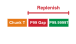
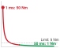

# Trajectory Planning {#sec-planning}

::: {layout-narrow}
::: {.column-margin}

\chapterminitoc

:::

::: {.content-visible when-format="pdf"}
\noindent
{fig-alt="Isometric blueprint showing 3D flight trajectory planning for an autonomous aerial quadrotor drone: BLDC outrunner cutaway, aerodynamic thrust cones, executed cyan 3D polynomial spline threading an obstacle ring, prospective amber waypoint chunk, and Harvard crimson hover-recovery stopping suffix landing on a terminal perch."}
:::

::: {.content-visible unless-format="pdf"}
{fig-alt="Isometric blueprint showing 3D flight trajectory planning for an autonomous aerial quadrotor drone: BLDC outrunner cutaway, aerodynamic thrust cones, executed cyan 3D polynomial spline threading an obstacle ring, prospective amber waypoint chunk, and Harvard crimson hover-recovery stopping suffix landing on a terminal perch."}
:::

:::

## Purpose {.unnumbered .unlisted}

::: {.content-visible when-format="pdf"}
\begin{marginfigure}
\vspace{1em}
\resizebox{\linewidth}{!}{\mlphysicalstackfull{100}{20}{20}{20}{20}}
\end{marginfigure}
:::

_What does a physical machine do during the unbudgeted milliseconds when the next neural trajectory chunk is late?_

A moving machine retains momentum while its policy computes the next action. If the current trajectory ends before its replacement arrives, waiting spends the clearance its stop will need. Abruptly substituting a new command can also demand accelerations that the actuators cannot deliver or excite vibration in the mechanism. Planning must convert successive proposals into motion that remains feasible during transitions and absence. Smooth connections between trajectory segments protect the body during normal execution, while a stopping continuation gives the execution layer a defined response to an overdue plan. That continuation must remain feasible from the states the current plan can reach; attaching a stop command after the planning horizon has expired is too late. Trajectory planning therefore couples the Brain's variable computation time to the Nervous System's continuous execution and the Body's capacity to change motion.



::: {.callout-learning-objectives}

- Select trajectory horizons from replacement latency, target-evidence age, and the time the stop needs
- Evaluate trajectory feasibility and seam continuity against the body's actuator and transmission limits
- Distinguish trajectory failures detectable before execution from those requiring monitoring during physical motion
- Calculate the distance a matched stop suffix adds to the machine's stopping budget and compare it with the clear distance
- Specify the commitment deadline and matched stop that govern a replacement trajectory arriving late or never
- Construct a trajectory record that the permission path can admit by content, from its parent lease, deadlines, and stop

:::

## Continuous Trajectories {#sec-planning-continuous-trajectories}

```{python}
#| label: calc-planning-opening-machine
#| echo: false
# ┌─────────────────────────────────────────────────────────────────────────────
# │ THE MACHINE'S ARM LOOP AND CHUNK-POLICY LATENCY
# ├─────────────────────────────────────────────────────────────────────────────
# │ Context: @sec-planning-continuous-trajectories (opening paragraph).
# │
# │ Goal:    Pin the arm tracking rate and chunk inference latency the opening
# │          quotes for the warehouse mobile manipulator.
# │ Show:    1 kHz joint loop; 40 ms P99 chunk inference; 150 ms interference tail.
# │ How:     RM registry fields; the tail is a scenario assumption.
# └─────────────────────────────────────────────────────────────────────────────
from mlsysim import *
from mlsysim.core.units import millisecond
from mlsysim.fmt import check, fmt_frequency, fmt_latency

RM = Embodied.MobileManipulator.WarehouseMobileManipulator

class PlanningOpeningMachine:
    """Arm tracking rate and chunk-policy inference latency on the machine."""

    # ┌── 1. LOAD (Constants) ──────────────────────
    f_track = RM.arm.control_frequency  # category: datasheet; arm joint loop, registry
    t_chunk = RM.chunk_inference_latency  # category: illustrative; P99 incl. vision, registry
    t_tail = 150 * millisecond  # category: illustrative; interference tail

    # ┌── 2. EXECUTE (The Compute) ─────────────────
    tail_over_nominal = (t_tail / t_chunk).to("dimensionless").magnitude

    # ┌── 3. GUARD (Invariants) ────────────────────
    check(abs(f_track.to("hertz").magnitude - 1000.0) < 1e-9, "arm loop rate changed")
    check(abs(t_chunk.to(millisecond).magnitude - 40.0) < 1e-9, "chunk inference latency changed")
    check(tail_over_nominal > 3, "interference tail no longer several times the nominal pass")

    # ┌── 4. OUTPUT (Formatting) ───────────────────
    f_track_str = fmt_frequency(f_track)
    t_chunk_str = fmt_latency(t_chunk, unit=millisecond)
    t_tail_str = fmt_latency(t_tail, unit=millisecond)
```

The arm of the warehouse mobile manipulator, reaching for a mug on a moving conveyor, possesses physical mass, structural inertia $\mathbf{M}(\mathbf{q})$, and continuous kinetic energy $E_k = \frac{1}{2} \dot{\mathbf{q}}^T \mathbf{M}(\mathbf{q}) \dot{\mathbf{q}}$. It cannot change velocity or direction instantly. Even when upstream autonomy grants a time-bounded intent lease—authorizing motion toward a grounded semantic goal—that semantic permission alone cannot turn motor shafts. The machine must synthesize continuous nominal motion while target evidence remains valid, plus a separately authorized stopping continuation if tracking authority ends. On this machine the arm's joint tracking loop evaluates feedback and setpoints at `{python} PlanningOpeningMachine.f_track_str` (datasheet; see the Reader Guide); that period does not specify the physical stopping response. Above this loop sits the Brain, where modern robot learning policies—such as Action Chunking with Transformers (ACT) [@zhao2023learning] or score-based Diffusion Policies [@chi2024diffusionpolicy]—process multimodal observations to synthesize future reference paths on the application processor.[^fn-plan-action-chunking] Inference latency varies with workload and contention. The machine's chunk policy is budgeted at an illustrative `{python} PlanningOpeningMachine.t_chunk_str` per pass at P99, vision included, yet memory or scheduling interference can stretch a single pass beyond `{python} PlanningOpeningMachine.t_tail_str`, so the horizon is sized from the deployed tail rather than from the budget.

::: {.column-margin .margin-pointer}
↰ **Prerequisite:** Kinetic energy ($E_k$) and joint torque limits are established in @sec-body-kinetic-momentum.
:::

If an architecture predicts actions one step ahead ($H = 1$), the motor tracking loop starves. If it generates a multi-step action chunk across a finite future horizon ($H > 1$), the machine encounters the peril of the **execution seam**. During the unbudgeted milliseconds when an active trajectory chunk finishes executing before its replacement clears the tail of the inference distribution, the controller faces an execution discontinuity. If the controller clamps to the final position, the reference velocity steps to zero and asks the drive to remove the arm's momentum within one servo tick. If a newly arrived chunk begins with a velocity or acceleration that diverges from the physical state of the moving mechanism, the commanded torque steps and excites the structure. A trajectory proposal must define nominal motion, boundary derivatives, and a stopping continuation admitted before motion begins.

[^fn-plan-action-chunking]: **Action chunking representations**\index{Action chunking!architectures}\index{Policy learning!temporal horizons}: ACT and Diffusion Policy both decouple slow, stochastic inference from high-rate servo loops by emitting multi-step chunks (@sec-brain-cognitive-pipeline). Their chunks carry no boundary-derivative constraints, so the planner must propose a transition bridge across each replanning seam, and the permission path checks it before admission.

::: {#dfn-planning-kinodynamic-feasibility-envelope .callout-definition title="Kinodynamic feasibility envelope"}

***Kinodynamic feasibility envelope***\index{Kinodynamic feasibility envelope!definition}\index{Feasibility!kinodynamic} is the subset of state space from which a physical machine can track a candidate trajectory while strictly satisfying simultaneous actuator torque limits, velocity ceilings, and jerk bounds, with position, velocity, and acceleration continuous across segment seams ($C^2$), without exceeding mechanical stopping margins.

1.  **Significance**: Geometric collision freedom is necessary but insufficient for physical execution; an arm may follow a collision-free path that nonetheless demands motor torques exceeding continuous thermal ratings or produces accelerations that tip an underactuated base. The envelope states the conditions under which the model predicts trackable motion; runtime sensing and actuator checks must still validate them.
2.  **Distinction**: Unlike pure kinematic reachability (which evaluates whether the robot's linkages can attain a spatial configuration), kinodynamic feasibility incorporates time parameterization, actuator force and torque limits, reflected inertia, and mechanical braking runways.
3.  **Common pitfall**: Checking feasibility only at discrete waypoints. Interpolation splines between sample points can produce intra-sample velocity overshoots and torque spikes that breach motor limits even when every individual waypoint passes validation.

:::

Intent defines the admissible goal; planning supplies the continuous motion, temporal parameterization, and dynamic limits needed to pursue that goal. Across the proposal boundary (@sec-boundary-machine-model), a plan is not a command written to actuator registers. It is an unprivileged proposal, sent from the application processor to the MCU, where the tracking controller follows it and the permission path (@sec-enforcement) checks it.[^fn-plan-nervous-gatekeeper] Because inference latency has a long tail, the downstream controller in this design consumes admitted references on its own clock and cannot suspend physical motion while the model finishes. A plan must therefore be an atomic, self-contained contract: it must establish second-order derivative continuity ($C^2$ continuity) at its admission seam,[^fn-plan-c2-spline] budget its replacement dispatch epoch against extreme tail quantiles, and include a stopping suffix admitted with the nominal motion.

::: {.column-margin .margin-pointer}
↰ **Prerequisite:** Expiring intent leases provide the bounded time windows discharged by trajectories in @sec-intent-lease.
:::

[^fn-plan-nervous-gatekeeper]: **Deterministic proposal verification**\index{Nervous system!gatekeeper}\index{Safety enforcement!execution buffer}: The permission path isolates unprivileged trajectory proposals within hardware-managed staging buffers, evaluating kinematic feasibility and tracking invariants before latching setpoints into motor control registers. A bounded admission pass checks the complete candidate before activation; a separate per-tick check monitors the active state. The measured admission budget depends on the maximum chunk size. For runtime safety filter architectures, see @sec-enforcement-deterministic-gatekeeper.

[^fn-plan-c2-spline]: **$C^2$ derivative continuity**\index{C2 continuity@$C^2$ continuity}\index{Drivetrain!jerk dynamics}: $C^2$ continuity means that position, velocity, and acceleration remain unbroken functions of time across trajectory boundaries. In permanent-magnet synchronous motors (PMSM), electromagnetic torque couples directly to quadrature stator current ($\tau = K_t I_q$). An acceleration step asks for a finite torque and current step under this model, while a velocity step implies an ideal acceleration impulse.

Momentum, a long inference tail, and a seam that must stay continuous together decide what a plan has to contain. The first decision is therefore what the planner hands to the tracking controller and the permission path while the arm is still moving.

## What Planning Hands Over {#sec-planning-handoff}

For a two-joint arm, one pair of joint angles $(q_1,q_2)$ is one point in **configuration space**\index{Configuration space!definition} $\mathcal{C}$. An obstacle excludes some angle pairs, leaving $\mathcal{C}_{\mathrm{free}}=\mathcal{C}\setminus\mathcal{C}_{\mathrm{obs}}$. A curve through that free set says where the arm may move, but not how quickly it may move or whether its motors can supply the required torque [@lozanoperez1983spatial]. A **trajectory**\index{Executable trajectory!definition} assigns time to the curve and exposes $\mathbf{x}(t)=[\mathbf{q}(t)^T,\dot{\mathbf{q}}(t)^T,\ddot{\mathbf{q}}(t)^T]^T$. The planner proposes that time-indexed reference, and the permission path checks it before any setpoint reaches the drive. The tracking controller interpolates an admitted reference at its configured cadence; the enforcer checks current state and limits during execution. A geometric path alone supplies neither timing nor fallback clearance.

The trajectory record names its coordinate frame $\mathcal{F}$, evidence time $t_0$, initial reference state, and four deadlines in the **MCU monotonic clock domain**: nominal tracking begins at $t_{\mathrm{start}}$, the nominal setpoints end at $t_{\mathrm{plan\_exp}}$, replacement closes at $t_{\mathrm{commit}}$, and the admitted stop finishes at $t_{\mathrm{stop\_end}}$. It also links to the active intent expiry $t_{\mathrm{intent\_exp}}$. Conversion from the sensor and host clocks carries a bounded error. The permission path permits nominal **TRACK** only while the intent and plan are valid. Without a successor it transfers to MCU-owned **STOP** no later than $t_{\mathrm{commit}}$; the protected stop may finish after the intent's tracking permission expires. Earlier lease expiry or unexpected invalidation requires a separate state-matched MCU fallback, because the suffix matched at $t_{\mathrm{commit}}$ cannot be played from an arbitrary earlier state.

The initial reference state matters because the plant keeps moving during inference, so a chunk anchored to the pose the host sampled would start behind the arm. Before admission, the MCU compares the candidate seam with its current encoder state, checks position, velocity, and acceleration, and either admits a feasible bridge or retains the active plan and fallback. Projecting the active *reference* forward helps form a candidate, but it is not a measurement of the plant.

The candidate declares payload, contact, effort, and obstacle assumptions. The MCU first validates its fixed header and lineage, then checks the complete bounded trajectory and suffix, including interior extrema, clearance, stopping distance, and a feasible response for reachable states. A scan over $N$ setpoints is $O(N)$, even with a fixed maximum $N$ and measured worst-case execution time. After admission, a distinct $O(1)$ per-tick check reads the current state and local reference. The MCU latches the validated payload and stop coefficients into protected memory before enabling TRACK; a host crash or shared-memory corruption cannot remove the resident fallback. A separately validated immutable baseline covers earlier invalidation or a state outside the matched suffix's entry region.

The two consumers have different jobs. The tracker interpolates the admitted reference and feedforward terms. The independent permission path monitors current limits and authority; it does not inherit the planner's feasibility claim as proof. A fresh obstacle, changed payload, or contact event can revoke nominal tracking and invoke the state-matched fallback. The record therefore binds nominal motion, the commitment point, and a physically checked stopping continuation into one reviewable request.[^fn-hw-dma-pingpong]

[^fn-hw-dma-pingpong]: **Inter-core shared-memory contracts**\index{Inter-processor communication!shared memory}\index{Real-time systems!memory barriers}: A shared-memory implementation needs an ownership protocol, cache maintenance where required, and release/acquire ordering. The MCU validates a completed candidate and copies the admitted plan and stop into protected memory before activation.

Structuring the plan handoff as a bounded, hardware-grounded contract shifts the burden of safety and timing from the non-deterministic planner to the Nervous System. The tracking controller receives the dense state targets, timestamps, and feedforward terms required to drive the actuators along a smooth path. The permission path receives the lineage and timing metadata, dynamic assumptions, validity bounds, and terminal suffix needed to guard the machine against latency tails, state divergence, and physical model mismatches. When each field in the handoff corresponds to an explicit runtime verification, the Nervous System can admit high-speed motions without relying on the assumption that the next inference cycle will always succeed. Producing such a record begins from a goal that carries no timing at all.

## From Goal to Trajectory {#sec-planning-goal-to-trajectory}

The intent lease for the mug grants a goal region and effort ceilings (@sec-intent-lease), but no actuator can execute a region. A goal defines where the machine should arrive or what constraint it should satisfy, without providing joint velocities, torque bounds, intermediate kinematic states, or a continuous time schedule to move physical mass through space. The tracking controller requires a trajectory, which assigns concrete state targets, feedforward actuation terms, and explicit timestamps across a bounded temporal interval. If a learned policy could evaluate multimodal state observations and output valid motor currents instantaneously at the hardware control period ($1000\text{ Hz}$), planning as an architectural stage would not exist; the machine would operate purely as a high-frequency feedback controller. In physical systems, learned neural policies require tens or hundreds of milliseconds to compute a motion sequence, while the tracking controller and the permission path below the proposal boundary (@sec-boundary-machine-model) must execute deterministically every few milliseconds. A plan assigns time and physical limits to a goal; the independent permission path decides whether its proposed motion may run.

Classical sampling-based planners answer the geometric half of this problem. A probabilistic roadmap\index{Probabilistic roadmap} [@kavraki1996probabilistic] or a rapidly-exploring random tree\index{Rapidly-exploring random tree} [@lavalle1998rapidly] searches $\mathcal{C}_{\text{free}}$ for a collision-free path without building an explicit model of the obstacles. A path from such a search, like a chunk from a learned policy, still carries no timing, no derivatives at its ends, and no stop, and those are what this chapter supplies.

Learned proposers span the gap between slow inference and fast actuator control by receding-horizon action chunking (@sec-brain-cognitive-pipeline), predicting a multi-step sequence, executing an initial prefix, and replanning on fresh observations. Three kinds of proposer fill this role, and each matters here through the latency and continuity of what it emits:

1. **Action Chunking with Transformers (ACT)**: ACT [@zhao2023learning] predicts a discrete sequence of future joint setpoints $\mathbf{A} = [\mathbf{a}_1, \dots, \mathbf{a}_H] \in \mathbb{R}^{H \times D}$ simultaneously across a prediction horizon $H$. To mitigate compounding trajectory drift across successive chunks, ACT applies *temporal ensembling*, which blends overlapping predicted chunks (@sec-brain-cognitive-pipeline). Temporal ensembling averages overlapping setpoints but does not enforce derivative continuity. If a downstream tracker admits such a seam unchecked, it may ask for high-rate reversals that must be assessed against the actuator thermal and vibration limits in @sec-body-thermal-duty-cycles.
2. **Diffusion Policy**: Formulating trajectory synthesis as an iterative score-based denoising process [@chi2024diffusionpolicy], Diffusion Policy rolls out future action trajectories by solving a score Stochastic Differential Equation (SDE) or Denoising Diffusion Implicit Model (DDIM) ODE conditioned on visual and proprioceptive histories. A diffusion policy predicts a chunk of horizon $T_p$ (16 steps in the real Push-T setup), executes a subset $T_a$ (six steps there), and replans on subsequent sensor ingress (@fig-11-action-chunking-trace). While diffusion models capture rich multimodal distributions, their iterative denoising schedules can add workload-dependent inference latency and variance.
3. **Learned warm-start for trajectory optimization:** A learned model can propose an initial path for a constrained solver. For state sequence $\mathbf{x}_{1:H}$ and controls $\mathbf{u}_{1:H}$, the numerical stage solves:
   $$\min_{\mathbf{x}_{1:H}, \mathbf{u}_{1:H}} \sum_{t=1}^{H}\ell(\mathbf{x}_t,\mathbf{u}_t) \quad\text{subject to}\quad \mathbf{x}_{t+1}=f(\mathbf{x}_t,\mathbf{u}_t),\quad g(\mathbf{x}_t,\mathbf{u}_t)\le0$$
   A useful proposal can reduce iterations when it lies near a feasible basin. It may also choose the wrong side of an obstacle or fail to converge by the deadline. The learned guess is never a feasibility certificate: admit only a converged candidate whose full path, seam, torque, and stop checks pass.

```{python}
#| label: calc-planning-replacement-ledger
#| echo: false
# ┌─────────────────────────────────────────────────────────────────────────────
# │ REPLACEMENT-LATENCY STAGE LEDGER FOR THE MACHINE'S CHUNK POLICY
# ├─────────────────────────────────────────────────────────────────────────────
# │ Context: @sec-planning-goal-to-trajectory (replacement-latency paragraph).
# │
# │ Goal:    Sum one representative pass of the replacement path, with the
# │          inference stage taken from the machine's chunk policy.
# │ Show:    15 + 5 + 40 + 2 + 18 + 1 = 81 ms.
# │ How:     RM chunk inference latency; other stages are scenario assumptions.
# └─────────────────────────────────────────────────────────────────────────────
from mlsysim import *
from mlsysim.core.units import millisecond
from mlsysim.fmt import check, fmt_latency

RM = Embodied.MobileManipulator.WarehouseMobileManipulator

class PlanningReplacementLedger:
    """Stage-by-stage replacement latency for one chunk-policy pass."""

    # ┌── 1. LOAD (Constants) ──────────────────────
    t_sense = 15 * millisecond  # category: illustrative; sensor ingress
    t_dma = 5 * millisecond  # category: illustrative; IPC and DMA transfer
    t_infer = RM.chunk_inference_latency  # category: illustrative; P99 incl. vision, registry
    t_deser = 2 * millisecond  # category: illustrative; deserialization
    t_validate = 18 * millisecond  # category: illustrative; full-trajectory validation
    t_admit = 1 * millisecond  # category: illustrative; activation

    # ┌── 2. EXECUTE (The Compute) ─────────────────
    t_sum = t_sense + t_dma + t_infer + t_deser + t_validate + t_admit

    # ┌── 3. GUARD (Invariants) ────────────────────
    check(abs(t_infer.to(millisecond).magnitude - 40.0) < 1e-9, "chunk inference latency changed")
    check(abs(t_sum.to(millisecond).magnitude - 81.0) < 1e-9, "stage ledger total changed")

    # ┌── 4. OUTPUT (Formatting) ───────────────────
    t_sense_str = fmt_latency(t_sense, unit=millisecond)
    t_dma_str = fmt_latency(t_dma, unit=millisecond)
    t_infer_str = fmt_latency(t_infer, unit=millisecond)
    t_deser_str = fmt_latency(t_deser, unit=millisecond)
    t_validate_str = fmt_latency(t_validate, unit=millisecond)
    t_admit_str = fmt_latency(t_admit, unit=millisecond)
    t_sum_str = fmt_latency(t_sum, unit=millisecond)
```

The scheduling quantity is **replacement latency** $L$: elapsed time from the observation needed for a new proposal through transfer, inference, full-trajectory validation, and admission. An illustrative stage ledger for the machine's chunk policy has `{python} PlanningReplacementLedger.t_sense_str` of sensing, `{python} PlanningReplacementLedger.t_dma_str` of DMA, the policy's `{python} PlanningReplacementLedger.t_infer_str` of inference, `{python} PlanningReplacementLedger.t_deser_str` of deserialization, `{python} PlanningReplacementLedger.t_validate_str` of validation, and `{python} PlanningReplacementLedger.t_admit_str` of activation, totaling `{python} PlanningReplacementLedger.t_sum_str`. When stages overlap or share contention, a sum of stage percentiles is not a percentile of the sum, so the horizon is sized from the end-to-end distribution of $L$.

$$L = t_{\mathrm{sense\_ingress}} + t_{\mathrm{ipc\_dma}} + t_{\mathrm{infer}} + t_{\mathrm{deser}} + t_{\mathrm{validate}} + t_{\mathrm{admit}}$$ {#eq-plan-replacement-latency}

The component sum in @eq-plan-replacement-latency is an elapsed replacement path, not an absolute timestamp. Consider $K=3000$ handoffs in a ten-minute, $5\text{ Hz}$ illustrative mission. If each handoff independently has a $0.01$ chance of exceeding a $P_{99}$ budget, the expected number of late handoffs is $30$ and the probability that *all* arrive on time is $(0.99)^{3000}\approx8\times10^{-14}$. Correlated contention clusters misses, which breaks the independence this arithmetic assumes. Allocating a mission exceedance target $\epsilon_{\mathrm{mission}}=10^{-3}$ equally gives a per-handoff target $\epsilon\le\epsilon_{\mathrm{mission}}/K\approx3.3\times10^{-7}$ by the union bound. The corresponding $P_{99.99997}$ is a **design quantile target**, a risk allocation rather than an observed latency. A deployment either supports it with representative load testing and a conservative bound, or accepts a higher fallback rate.

::: {.column-margin}
{width="100%" fig-alt="Conceptual strip comparing a P99 latency allowance with a much rarer design-tail target. The rarer percentile is a risk allocation."}

*The tail target allocates replacement risk; observed latency and confidence determine whether the chosen deadline is credible.*
:::

The next request is sent $T_{\mathrm{request}}$ after the active chunk starts. Admission must finish **before** $t_{\mathrm{commit}}$, not merely before the last nominal setpoint. With a replacement-latency target $Q_{1-\epsilon}(L)$ and reserve $T_{\mathrm{reserve}}$, require $t_{\mathrm{commit}}-t_{\mathrm{start}}\ge T_{\mathrm{request}}+Q_{1-\epsilon}(L)+T_{\mathrm{reserve}}$. The admitted stop then needs another $T_{\mathrm{stop}}$ under MCU authority. The complete **time horizon** $T_{\mathrm{record}}$ that the record must cover, regardless of encoding, has the lower bound:

$$T_{\mathrm{record}}\ge T_{\mathrm{request}}+Q_{1-\epsilon}(L)+T_{\mathrm{reserve}}+T_{\mathrm{stop}}$$ {#eq-plan-action-chunk-horizon}

```{python}
#| label: calc-planning-arm-timeline
#| echo: false
# ┌─────────────────────────────────────────────────────────────────────────────
# │ AUTHORITY TIMELINE FOR THE CONVEYOR-TRACKING ARM
# ├─────────────────────────────────────────────────────────────────────────────
# │ Context: @sec-planning-goal-to-trajectory (horizon paragraph, evidence
# │          age), @sec-planning-behavior-seam (arm case).
# │
# │ Goal:    Hold the arm's timeline inputs in one place so the horizon bound,
# │          the evidence-age check, the C2 arm case, and the trajectory record
# │          read the same values.
# │ Show:    20 ms setpoint period; 60 ms request delay vs the 50 ms chunk
# │          renewal period; 540 ms minimum authority (27 periods);
# │          240 ms replacement deadline; 300 ms commitment (60 ms slack);
# │          320 ms nominal end (H = 16 setpoints); 600 ms stop end (30 periods).
# │ How:     RM chunk step and horizon; the rest are scenario assumptions;
# │          eq-plan-action-chunk-horizon.
# └─────────────────────────────────────────────────────────────────────────────
from mlsysim import *
from mlsysim.core.units import millisecond
from mlsysim.fmt import check, fmt_frequency, fmt_latency, fmt_int

RM = Embodied.MobileManipulator.WarehouseMobileManipulator

class PlanningArmTimeline:
    """Replacement and stop timeline for the conveyor-tracking arm."""

    # ┌── 1. LOAD (Constants) ──────────────────────
    t_period = RM.chunk_step  # category: chosen; chunk setpoint period, registry
    n_horizon = RM.chunk_horizon  # category: chosen; setpoints per chunk, registry
    t_chunk = RM.chunk_inference_latency  # category: illustrative; P99 chunk pass incl. vision, registry
    t_request = 60 * millisecond  # category: chosen; request delay
    f_renew = RM.chunk_rate  # category: chosen; chunk renewal rate, registry
    q_latency = 160 * millisecond  # category: chosen; design-tail replacement-latency target
    t_reserve = 20 * millisecond  # category: chosen; admission reserve
    t_stop = 300 * millisecond  # category: illustrative; arm stop duration
    t_blend = 240 * millisecond  # category: chosen; preferred blend deadline
    t_commit = 300 * millisecond  # category: chosen; physical suffix onset

    # ┌── 2. EXECUTE (The Compute) ─────────────────
    f_step = (1 / t_period).to("hertz")
    t_renew = (1 / f_renew).to(millisecond)
    request_slack = t_request - t_renew
    t_plan_exp = (n_horizon * t_period).to(millisecond)
    t_replace_min = t_request + q_latency + t_reserve
    t_record_min = t_replace_min + t_stop
    n_record_min = round((t_record_min / t_period).to("dimensionless").magnitude)
    commit_slack = t_commit - t_replace_min
    t_stop_end = t_commit + t_stop
    n_window = round((t_stop_end / t_period).to("dimensionless").magnitude)

    # ┌── 3. GUARD (Invariants) ────────────────────
    check(abs(t_period.to(millisecond).magnitude - 20.0) < 1e-9, "chunk setpoint period changed")
    check(n_horizon == 16, "chunk horizon changed")
    check(abs(t_plan_exp.magnitude - 320.0) < 1e-9, "nominal end changed")
    check(q_latency > PlanningReplacementLedger.t_sum > t_chunk, "design-tail target no longer beyond the stage ledger")
    check(abs(t_replace_min.to(millisecond).magnitude - 240.0) < 1e-9, "replacement deadline changed")
    check(abs(t_record_min.to(millisecond).magnitude - 540.0) < 1e-9, "minimum authority horizon changed")
    check(n_record_min == 27, "minimum duration equivalents changed")
    check(abs(commit_slack.to(millisecond).magnitude - 60.0) < 1e-9, "commitment slack changed")
    check(abs(t_stop_end.to(millisecond).magnitude - 600.0) < 1e-9, "arm stop end changed")
    check(n_window == 30, "authority-window duration equivalents changed")
    check(t_replace_min <= t_blend < t_commit < t_plan_exp < t_stop_end, "arm deadline order broken")
    check(abs(t_renew.magnitude - 50.0) < 1e-9, "chunk renewal period changed")
    check(request_slack.magnitude > 0, "request delay no longer exceeds the renewal period")

    # ┌── 4. OUTPUT (Formatting) ───────────────────
    t_period_str = fmt_latency(t_period, unit=millisecond)
    f_step_str = fmt_frequency(f_step)
    n_horizon_str = fmt_int(n_horizon)
    t_chunk_str = fmt_latency(t_chunk, unit=millisecond)
    t_request_str = fmt_latency(t_request, unit=millisecond)
    t_renew_str = fmt_latency(t_renew, unit=millisecond)
    request_slack_str = fmt_latency(request_slack, unit=millisecond)
    q_latency_str = fmt_latency(q_latency, unit=millisecond)
    t_reserve_str = fmt_latency(t_reserve, unit=millisecond)
    t_stop_str = fmt_latency(t_stop, unit=millisecond)
    t_replace_min_str = fmt_latency(t_replace_min, unit=millisecond)
    t_record_min_str = fmt_latency(t_record_min, unit=millisecond)
    n_record_min_str = fmt_int(n_record_min)
    t_blend_str = fmt_latency(t_blend, unit=millisecond)
    t_commit_str = fmt_latency(t_commit, unit=millisecond)
    commit_slack_str = fmt_latency(commit_slack, unit=millisecond)
    t_plan_exp_str = fmt_latency(t_plan_exp, unit=millisecond)
    t_stop_end_str = fmt_latency(t_stop_end, unit=millisecond)
    n_window_str = fmt_int(n_window)
```

The complete duration in @eq-plan-action-chunk-horizon includes the stop suffix. The machine's chunk policy emits a setpoint every `{python} PlanningArmTimeline.t_period_str` (the setpoint period $\Delta t_{\text{step}}$), `{python} PlanningArmTimeline.n_horizon_str` to a chunk, so one chunk carries `{python} PlanningArmTimeline.t_plan_exp_str` of nominal motion. For the conveyor-tracking arm, a chosen request delay of `{python} PlanningArmTimeline.t_request_str`, replacement target of `{python} PlanningArmTimeline.q_latency_str`, and reserve of `{python} PlanningArmTimeline.t_reserve_str`, with a separately checked `{python} PlanningArmTimeline.t_stop_str` stop, require at least `{python} PlanningArmTimeline.t_record_min_str` of complete motion authority, or `{python} PlanningArmTimeline.n_record_min_str` setpoint-period **duration equivalents**. This does not mean `{python} PlanningArmTimeline.n_record_min_str` stored setpoints: $N$ in the record counts only nominal samples; the stop is represented by its separately validated polynomial coefficients.

The chunk policy sends its next request `{python} PlanningArmTimeline.t_renew_str` after a chunk starts (@sec-brain-cognitive-pipeline); the chosen request delay is `{python} PlanningArmTimeline.request_slack_str` longer, so the bound still holds for a request that leaves late by up to that much. The replacement target is a design-tail quantile of the whole replacement path, so it sits well beyond both the policy's `{python} PlanningArmTimeline.t_chunk_str` P99 pass and the `{python} PlanningReplacementLedger.t_sum_str` stage ledger. The nominal replacement deadline must be at least `{python} PlanningArmTimeline.t_replace_min_str` from start; the worked `{python} PlanningArmTimeline.t_commit_str` commitment below leaves `{python} PlanningArmTimeline.commit_slack_str` beyond that target. A `{python} PlanningArmTimeline.t_replace_min_str` *total* authority horizon would omit the stop runway. In the worked arm, the chunk's nominal setpoints end at `{python} PlanningArmTimeline.t_plan_exp_str` and the admitted stop completes at `{python} PlanningArmTimeline.t_stop_end_str`, so the complete authority window spans `{python} PlanningArmTimeline.n_window_str` setpoint-period duration equivalents.

```{python}
#| label: calc-planning-conveyor-evidence
#| echo: false
# ┌─────────────────────────────────────────────────────────────────────────────
# │ TRACKED EVIDENCE HORIZON FOR THE MUG ON THE CONVEYOR
# ├─────────────────────────────────────────────────────────────────────────────
# │ Context: @sec-planning-goal-to-trajectory (evidence-age paragraph).
# │
# │ Goal:    Bound how long one observation of the tracked mug stays usable.
# │ Show:    residual slip, grasp tolerance, and the ~245 ms horizon.
# │ How:     AISLE registry fields; t = sqrt(2 r_tol / a_slip).
# └─────────────────────────────────────────────────────────────────────────────
from mlsysim import *
from mlsysim.core.units import ureg, millisecond
from mlsysim.fmt import check, fmt_latency, fmt_length, fmt_acceleration

AISLE = Embodied.Scenario.WarehouseAisle

class PlanningConveyorEvidence:
    """Time for residual conveyor slip to consume the grasp tolerance."""

    # ┌── 1. LOAD (Constants) ──────────────────────
    a_slip = AISLE.a_conveyor_slip  # category: illustrative; residual slip after local tracking
    r_tol = AISLE.grasp_tolerance  # category: illustrative; grasp tolerance

    # ┌── 2. EXECUTE (The Compute) ─────────────────
    t_ev = ((2 * r_tol / a_slip) ** 0.5).to(millisecond)
    t_ev_ms = round(t_ev.magnitude) * millisecond  # whole-millisecond display

    # ┌── 3. GUARD (Invariants) ────────────────────
    check(abs(t_ev.magnitude - 244.95) < 5e-3, "tracked evidence horizon changed")
    check(t_ev < PlanningArmTimeline.t_commit, "horizon no longer ends before the worked commitment")

    # ┌── 4. OUTPUT (Formatting) ───────────────────
    a_slip_str = fmt_acceleration(a_slip)
    r_tol_str = fmt_length(r_tol, unit=ureg.millimeter)
    t_ev_str = fmt_latency(t_ev_ms, unit=millisecond)
```

This timing lower bound competes with target-evidence age. With the conveyor's residual slip of `{python} PlanningConveyorEvidence.a_slip_str` after local tracking and the `{python} PlanningConveyorEvidence.r_tol_str` grasp tolerance, $\Delta x=\tfrac12a_{\mathrm{slip}}t^2$ reaches the tolerance in about `{python} PlanningConveyorEvidence.t_ev_str`. A single observation cannot justify nominal tracking to the `{python} PlanningArmTimeline.t_commit_str` commitment. The machine needs a qualified local tracker and fresh intent evidence before that limit; otherwise TRACK ends at evidence expiry and the MCU uses its separately validated state-matched stop. Extending a target timestamp because the compute tail is long would invert the permission rule.

When a generative policy serves as the planner, iterative score evaluation and denoising steps govern the shape of this latency distribution. The internal mechanics of diffusion schedules, attention caching, and token generation sit below the first budgetable quantity of the physical AI system. The systems interface therefore treats the learned model strictly as a stochastic producer of motion chunks characterized by an empirical latency profile and an output horizon $N$. In physical hardware deployments of receding-horizon action chunking, the execution buffer absorbs inference latency while allowing the controller to react dynamically to disturbances (@fig-11-action-chunking-trace). Sizing $N$ against a validated latency distribution lowers the risk of a late replacement; the protected stop handles a miss.

::: {#fig-11-action-chunking-trace fig-env="figure" fig-pos="t" fig-cap="**Push-T disturbance recovery**: Chi et al. report a real Push-T configuration with 16 predicted and 6 executed action steps; 10 Hz commands were interpolated to 125 Hz. The recoveries show closed-loop replanning; the experiment includes no stopping suffix and no inference-starvation case [@chi2024diffusionpolicy]." fig-alt="Three Push-T examples show recovery from camera occlusion, in-flight target movement, and target movement near completion. The real Push-T configuration predicts 16 steps and executes 6 before replanning; the experiment includes no stopping suffix."}
{width="100%"}
:::

A replacement planner must account for motion during its computation. In an illustrative $80\text{ ms}$ delay at a constant joint speed of $0.50\text{ rad/s}$, a stale request-epoch pose lags the moving reference by $0.040\text{ rad}$ ($2.29^\circ$). A proposed replacement can instead start from the active plan's projected reference at the intended seam:

$$\Delta q_{\mathrm{reference}}=\int_{t_0}^{t_{\mathrm{seam}}}\dot q_A(t)\,dt,\qquad \hat{\mathbf{x}}_{\mathrm{seam}}=\mathbf{x}_A(t_{\mathrm{seam}})$$ {#eq-plan-execution-delay-gap}

The projected seam in @eq-plan-execution-delay-gap is useful for constructing a candidate; contact, tracking error, or scheduling changes can make the plant differ. The MCU therefore measures current encoder state, validates the actual seam $(q,\dot q,\ddot q)$ and any bridge, and refuses a candidate outside the admitted region. Matching two *reference* trajectories makes the references $C^2$, not the plant.

::: {#dfn-planning-future-state-conditioning .callout-definition title="Future-state conditioning"}

***Future-state conditioning***\index{Future-state conditioning!definition} is the practice of generating candidate motion plans anchored to the anticipated state at execution time rather than the stale state measured at plan initiation.

1.  **Significance**: Offsets computational latency $\Delta t_{\text{plan}}$, removing the reference jump at trajectory handoff that planning from the stale state would create, without zero-velocity stops between chunks.
2.  **Distinction**: Distinct from state estimation or filtering; it is a reference-planning strategy that projects the admitted trajectory forward rather than filtering sensor noise.
3.  **Common pitfall**: Treating the predicted execution state as the measured one; if a disturbance displaces the plant during planning, the candidate stays inadmissible until the MCU checks the seam against encoder state.

:::

The horizon now answers to two clocks. It must be long enough that a design-tail replacement lands before commitment with the stop still behind it, and the evidence behind the target must stay fresh for as long as TRACK runs. A replacement that arrives in time, however, secures only the plan's continuity in time. The setpoints it carries must also lie within what the joints can deliver and join the mechanism's actual velocity and acceleration at the seam.

::: {#chk-plan-action-chunk-horizon-tail .callout-checkpoint title="Action chunk horizon and tail latency budgeting"}

Before turning from replacement timing to the feasibility of the motion itself, verify your ability to size an action chunk horizon against the latency tail:

- [ ] **Mission exposure and tail quantiles**: In the stated independent-handoff illustration, what is the chance of one or more missed $P_{99}$ deadlines across 3000 handoffs, and why is that not a measured mission failure rate?
- [ ] **Horizon sizing trade-off**: Can you distinguish between the risk of trajectory buffer starvation from too short an action chunk and the risk of unmodeled state drift and stale perception from an excessively long chunk?
- [ ] **Projected seam state**: Can you explain why a candidate built from the active plan's projected reference still needs an encoder-state and bridge check at admission?

:::

## Kinodynamic Feasibility {#sec-planning-kinodynamic-feasibility}

A candidate trajectory is a geometric and timed proposal, not permission to move. Before admission, the planner-side check evaluates joint position and velocity, predicted actuator torque and current, contact limits, obstacle clearance, and the state-matched stopping suffix over the proposed horizon. For an arm, the rigid-body model maps $\mathbf{q}(t)$, $\dot{\mathbf{q}}(t)$, and $\ddot{\mathbf{q}}(t)$ to $\boldsymbol{\tau}(t)=\mathbf{M}(\mathbf{q})\ddot{\mathbf{q}}+\mathbf{C}(\mathbf{q},\dot{\mathbf{q}})\dot{\mathbf{q}}+\mathbf{g}(\mathbf{q})$ and $I_i(t)=\tau_i(t)/k_{\tau,i}$ [@craig2005introduction; @lynch2017modern]. The MCU admits the bounded trajectory only if its configured limits and complete stop clearance hold for the verified initial state; it then checks tracking, freshness, and the remaining stopping budget during execution. An optimizer may smooth a path or reduce obstacle proximity, but the admitted trajectory and resident stop—not the optimizer's objective value—define the motion permission (@fig-11-manipulator-trajectory).

::: {.column-margin .margin-pointer}
↰ **Prerequisite:** Actuator torque saturation limits and rotor inertia scaling ($N^2 J$) are derived in @sec-body-actuator-limits.
:::

::: {#fig-11-manipulator-trajectory fig-env="figure" fig-pos="t" fig-cap="**Real-time trajectory optimization**: GPU-accelerated motion generation executing minimum-jerk splines on hardware, avoiding a dynamic obstacle against a signed distance field, executing a constrained pick-and-lift, and coordinating two arms in a shared workspace. Collision distance is evaluated in continuous time rather than at waypoints, which is what allows the trajectory to be re-optimized while it is being executed. Adapted from [@sundaralingam2023curobo]." fig-alt="Real-Time Trajectory Optimization and Dynamic Obstacle Avoidance on Industrial Manipulators. Experimental deployment of GPU-accelerated motion generation (cuRobo) executing time-parameterized, minimum-jerk trajectory splines on physical hardware. (Top row) A canonical 6-DOF industrial manipulator executes an online obstacle avoidance trajectory around a dynamic workspace obstacle, continuously evaluating continuous-time collision distances against a 3D Euclidean Signed Distance Field (ESDF) voxel map generated via real-time depth perception. (Middle row) A canonical 6-DOF collaborative arm executes a collision-free pick-and-lift trajectory spline constrained by joint velocity, acceleration, and torque limits. (Bottom row) Coordinated multi-arm trajectory synthesis in simulation showing two canonical industrial manipulators executing synchronized, collision-free obstacle avoidance around shared workspace boundaries. Adapted from [@sundaralingam2023curobo]."}
{width="95%"}
:::

Validating feasibility only at discrete waypoints creates a false sense of compliance. When a planner outputs trajectory points separated by a sampling interval $T_s$, the physical mechanism moves along an interpolated path between those samples. If the admission check tests constraints only at the discrete sample timestamps $t_k = k T_s$, high-order trajectory derivatives can exceed physical bounds during the inter-sample interval $[t_k, t_{k+1}]$. Consider an illustrative linear joint with a maximum acceleration limit $a_{\max} = 20.0\text{ m/s}^2$ and a velocity ceiling $v_{\max} = 2.00\text{ m/s}$. If the planner outputs consecutive velocity samples $\dot{q}_k = 1.95\text{ m/s}$ and $\dot{q}_{k+1} = 1.95\text{ m/s}$ separated by $T_s = 20\text{ ms}$, a cubic spline interpolator that applies a peak acceleration of $a_{\max}$ produces an intra-sample velocity overshoot bounded by $\Delta v \le \frac{1}{4} a_{\max} T_s$ (integrating a worst-case triangular acceleration reversal across the sampling midpoint). Evaluating this bound yields:
$$\Delta v \le \frac{1}{4} (20.0\text{ m/s}^2)(0.020\text{ s}) = 0.10\text{ m/s}$$
The true physical velocity peaks at $1.95\text{ m/s} + 0.10\text{ m/s} = 2.05\text{ m/s}$ between the two valid waypoints, exceeding the $2.00\text{ m/s}$ limit and triggering an over-speed clamp. To bound velocity in continuous time without evaluating every point, the admission filter tests a contracted limit, $|\dot{q}_k| \le v_{\max} - \frac{1}{4} a_{\max} T_s$, which absorbs the largest intra-sample overshoot.

Concatenating individually feasible chunks can create an infeasible seam. Position-only matching ($C^0$) can leave a velocity step; matching velocity ($C^1$) can leave a finite acceleration and torque step. In a rigid-inertia approximation, a commanded velocity change $\Delta\dot q$ spread over servo period $T_c$ asks for the torque in @eq-plan-seam-torque. A physical drive saturates or filters that request according to its current limits and compliance. @Fig-11-action-chunk-seam-continuity places that request beside its remedy, a finite $C^2$ bridge that removes the reference velocity step.

::: {#fig-11-action-chunk-seam-continuity fig-env="figure" fig-pos="t" fig-cap="**Seam demand and checked bridge**: A position-matched velocity step creates a large one-tick inertial torque *request*. A finite $C^2$ bridge removes the reference velocity step, but its interior jerk, torque, and joint response still require validation." fig-alt="Panel (a) shows a velocity step at a trajectory seam and a high one-tick torque request. Panel (b) shows a smoother C-squared reference bridge. The diagram compares proposed reference demands, not measured torque."}
{width="100%"}
:::

::: {#dfn-planning-c-jerk-spline-seam .callout-definition title="C² spline seam"}

A ***$C^2$ spline seam***\index{C2 jerk spline seam@$C^2$ jerk spline seam!definition} is a trajectory junction that enforces continuity through the second time derivative (position, velocity, and acceleration) between adjoining motion segments.

1.  **Significance**: Prevents instantaneous acceleration steps across trajectory chunks, bounding the inertial torque spike $\tau_{\text{step}} = J_{\text{eff}} \Delta\ddot{q}$ demanded from actuators.
2.  **Distinction**: Distinct from $C^1$ continuity (which matches only velocity and allows finite acceleration jumps) and $C^0$ continuity (which matches only position and allows infinite acceleration impulses).
3.  **Common pitfall**: Assuming $C^2$ continuity guarantees torque feasibility; while acceleration is continuous, interior velocities, accelerations, or jerks within the blending bridge may still violate physical actuator or clearance limits.

:::

For an illustrative joint with $J_L=1.5\text{ kg m}^2$, $J_m=1.2\times10^{-4}\text{ kg m}^2$, and $N_g=100$, the output-side effective inertia is $J_{\mathrm{eff}}=J_L+N_g^2J_m=2.7\text{ kg m}^2$. A $0.15\text{ rad/s}$ reference velocity gap corrected in $2\text{ ms}$ requests $75\text{ rad/s}^2$ and $202.5\text{ N m}$ of inertial torque. An illustrative $120\text{ N m}$ peak ceiling on this joint would reject that request.[^fn-hw-pwm-trip]

$$\tau_{\mathrm{request}}=J_{\mathrm{eff}}\frac{\Delta\dot q}{T_c}$$ {#eq-plan-seam-torque}

[^fn-hw-pwm-trip]: **Drive protection depends on the device**\index{Inverter!desaturation trip}: Current limiting, desaturation detection, DC-bus protection, and braking behavior depend on the driver and its configured thresholds. A reference torque request above a rating is grounds for rejection; it does not prove the specific fault mode or damage outcome.

The transmission response depends on rotor and link inertia, gear ratio, stiffness, damping, and the selected drive protection. For a simple two-inertia model with load inertia $J_L$, motor inertia reflected to the load $J_{m,r}=N_g^2J_m$, and coupling stiffness $k_\theta$, the antiresonance and resonance frequencies [for this model](https://link.springer.com/article/10.1186/s10033-024-01041-5) are $\frac{1}{2\pi}\sqrt{k_\theta/J_L}$ and $\frac{1}{2\pi}\sqrt{k_\theta(1/J_L+1/J_{m,r})}$, respectively. With an illustrative $k_\theta=2.0\times10^4\text{ N m/rad}$, $J_L=1.5\text{ kg m}^2$, and $J_{m,r}=1.2\text{ kg m}^2$, these are about $18.4$ and $27.6\text{ Hz}$; a real joint's modes come from its identified inertia, stiffness, damping, and load. @Tbl-11-transmission-dynamics names the check each architecture needs rather than a frequency or jerk limit.[^fn-rule-servo-bandwidth]

| Architecture             | Relevant state and seam risk                                                             | Admission and runtime check                                                   |
|:-------------------------|:-----------------------------------------------------------------------------------------|:------------------------------------------------------------------------------|
| Strain-wave geared joint | Reflected rotor inertia and compliant transmission can amplify a sharp reference change. | Identify load-dependent modes; check bridge extrema, torque and drive limits. |
| Cycloidal geared joint   | Input and output compliance, load, and backlash affect response.                         | Check measured torque and oscillation margin for the chosen reducer.          |
| Quasi-direct-drive leg   | Lower ratio changes reflected inertia, but contact and electrical limits remain.         | Check current, DC bus and contact response for the actual drive.              |
| Direct-drive gantry      | No gear reduction, but moving motor mass and payload still contribute inertia.           | Check force, travel, jerk, and structural modes.                              |

: **Architecture-dependent seam checks**: These are mechanisms and validation tasks; no frequency, stiffness, or jerk range transfers between products without measured parameters. {#tbl-11-transmission-dynamics tbl-colwidths="[20,40,40]"}

Smoothing this boundary discontinuity requires online **$C^2$ trajectory spline blending**\index{C2 trajectory spline blending@$C^2$ trajectory spline blending!definition}, which must be treated as the synthesis of an entirely new motion plan rather than as cosmetic filtering. When the planner inserts a polynomial bridge $\theta_{\mathrm{blend}}(t)$ over a transition interval $T_{\mathrm{blend}}$ to connect chunk $A$ and incoming chunk $B$, the resulting bridge segment must undergo the exact same dynamic feasibility checks as the primary chunks.[^fn-hw-jerk-limits]

[^fn-hw-jerk-limits]: **Trajectory jerk**\index{Jerk!minimization}\index{Drivetrain!torsional resonance}: A jerk objective can make a particular bridge smoother. A finite jerk bound alone does not exclude energy near a measured resonance; the complete command spectrum and closed-loop response must be checked for the joint and load.

[^fn-rule-servo-bandwidth]: **Sampling and mechanical modes**\index{Bandwidth!servo sampling}: A control period faster than a mechanical mode can help resolve that mode but is not a stability proof. Controller phase margin, sensor delay, damping, filtering, and actuator bandwidth must be validated for the identified joint.

The bridge is a fifth-order (quintic) polynomial because torque follows acceleration ($\tau = J_{\mathrm{eff}}\ddot\theta$ in the rigid-inertia model), so a bridge that matches only velocity still leaves an acceleration step, and with it a torque step of $J_{\mathrm{eff}}\Delta\ddot\theta$. For $C^2$ continuity across the seam, the bridge must match position, velocity, and acceleration at both endpoints, a total of six boundary conditions:
$$\theta(0) = \theta_0, \quad \dot{\theta}(0) = \dot{\theta}_0, \quad \ddot{\theta}(0) = \ddot{\theta}_0$$
$$\theta(T_{\mathrm{blend}}) = \theta_1, \quad \dot{\theta}(T_{\mathrm{blend}}) = \dot{\theta}_1, \quad \ddot{\theta}(T_{\mathrm{blend}}) = \ddot{\theta}_1$$
where $(\theta_0, \dot{\theta}_0, \ddot{\theta}_0)$ is the terminal physical state of chunk $A$ at the handoff instant, and $(\theta_1, \dot{\theta}_1, \ddot{\theta}_1)$ is the target state on incoming chunk $B$ at $t = T_{\mathrm{blend}}$. Matching six boundary conditions requires six independent coefficients ($a_0 \dots a_5$), uniquely dictating a fifth-degree polynomial:
$$\theta(t) = a_0 + a_1 t + a_2 t^2 + a_3 t^3 + a_4 t^4 + a_5 t^5$$
The six coefficients follow in closed form from these boundary conditions (@sec-appendix-control-splines), and the bridge's jerk varies quadratically in time, finite over a finite blend. Admission must check its extrema and the measured joint response; $C^2$ endpoints alone do not suppress all resonant energy.

A fixed-degree polynomial can be evaluated with bounded work per axis on a chosen controller. Coefficient synthesis and whole-trajectory extrema checks occur at admission; the measured worst-case execution time, including memory access and monitoring, must fit the configured servo period.

Representation affects what can be proved at admission. @Tbl-11-trajectory-representations separates continuity supplied by the representation from the dynamic checks still required. A B-spline of degree $p$ has $C^{p-r}$ continuity at an interior knot of multiplicity $r$; its control-point convex hull bounds position, not automatically velocity, torque, or clearance. Minimizing an integrated jerk objective requires solving that optimization; choosing a B-spline does not itself solve it.

| Representation         | Native seam property                                                               | Checks before execution                                         |
|:-----------------------|:-----------------------------------------------------------------------------------|:----------------------------------------------------------------|
| Quintic bridge         | Can match $q,\dot q,\ddot q$ at both ends; jerk is generally quadratic.            | Check interior extrema, torque, clearance, and timed admission. |
| B-spline               | Continuity depends on degree and knot multiplicity.                                | Check derivatives, dynamics, clearance, and optimizer result.   |
| ACT action chunk       | Discrete setpoints; zero-order hold jumps at ticks, linear interpolation is $C^0$. | Construct and admit a feasible bridge and stop.                 |
| Diffusion action chunk | Discrete sampled actions; no intrinsic actuator authority.                         | Validate timing, state, bridge, limits, and stop.               |

: **Trajectory representations and required checks**: Smooth parameterization helps form a candidate but does not by itself prove dynamic feasibility. {#tbl-11-trajectory-representations tbl-colwidths="[22,35,43]"}

```{python}
#| label: calc-planning-seam-reflected-inertia
#| echo: false
from mlsysim import *
from mlsysim.core.units import *
from mlsysim.fmt import fmt_torque, fmt_multiple, check

class PlanningSeamInertia:
    """Illustrative one-tick velocity request versus symmetric C2 blend."""

    joint = Actuators.HarmonicDrive.CSG_25_50  # category: datasheet; gear ratio and rotor inertia
    j_reflected = joint.reflected_inertia  # category: derived; N^2 J_m, 0.25 kg m^2
    delta_omega = 0.2 * ureg.radian / second  # category: illustrative; reference velocity gap
    dt_tick = 1 * millisecond  # category: chosen; servo tick
    t_blend = 50 * millisecond  # category: illustrative; blend duration
    tau_step = calc_seam_acceleration_torque_jump(joint.gear_ratio, joint.rotor_inertia, (delta_omega / dt_tick).to(ureg.radian / second**2))
    tau_blend_mean = calc_seam_acceleration_torque_jump(joint.gear_ratio, joint.rotor_inertia, (delta_omega / t_blend).to(ureg.radian / second**2))
    # Symmetric C2 velocity blend: a(u)=6*delta_omega*u*(1-u)/T.
    tau_blend_peak = 1.5 * tau_blend_mean
    peak_reduction = tau_step / tau_blend_peak
    check(abs(tau_step.magnitude - 50) < 0.01, "one-tick request changed")
    check(abs(tau_blend_mean.magnitude - 1) < 0.01, "blend mean changed")
    check(abs(tau_blend_peak.magnitude - 1.5) < 0.01, "blend peak changed")
    check(abs(peak_reduction.magnitude - 50 / 1.5) < 0.01, "peak ratio changed")
    tau_step_str = fmt_torque(tau_step, precision=0)
    tau_mean_str = fmt_torque(tau_blend_mean, precision=0)
    tau_peak_str = fmt_torque(tau_blend_peak, precision=1)
    reduction_mult_str = fmt_multiple(peak_reduction.magnitude, precision=1)
```

::: {#nbk-planning-seam-acceleration-jump-reflected-inertia-torque .callout-notebook title="Seam acceleration and torque requests"}
For the registered CSG-25-50-2UH teaching example, reflected rotor inertia is $0.25\text{ kg m}^2$. Correcting a $0.2\text{ rad/s}$ reference velocity gap in one $1\text{ ms}$ tick asks for `{python} PlanningSeamInertia.tau_step_str` of inertial torque. The [manufacturer's specification](https://www.harmonicdrive.net/products/gear-units/gear-units/csg-2uh/csg-25-50-2uh) gives $51\text{ N m}$ rated L10 and $127\text{ N m}$ repeated peak; this one-tick **request** is below the rated value. A symmetric $C^2$ velocity blend over $50\text{ ms}$ has `{python} PlanningSeamInertia.tau_mean_str` mean and `{python} PlanningSeamInertia.tau_peak_str` peak inertial torque, a `{python} PlanningSeamInertia.reduction_mult_str` peak-request reduction. Total torque still includes load, gravity, friction, and control response; it needs a full peak and thermal check.
:::

<!-- The margin fig-alt and caption below hand-type values because they cannot hold inline python. Keep them in sync:
     "50 newton-meters"   = PlanningSeamInertia.tau_step_str
     "50-millisecond"     = PlanningSeamInertia.t_blend
     "1.5 newton-meter"   = PlanningSeamInertia.tau_peak_str
     "33.3x"              = PlanningSeamInertia.reduction_mult_str -->

::: {.column-margin}
{width="100%" fig-alt="Illustrative one-tick velocity-step request of 50 newton-meters versus a 50-millisecond C-squared blend with 1.5 newton-meter peak inertial torque."}

*In this inertia model, the C² blend cuts the peak inertial torque request by 33.3×.*
:::

A related physical failure arises from output chatter in learned policy proposals. High-frequency oscillations across successive planning chunks are frequently produced by stochastic sampling, score-matching noise, or autoregressive variance in generative policies. Even when every discrete sample in a chattering trajectory satisfies absolute position and velocity limits, rapid sign reversals in commanded acceleration can request repeated torque reversals. Building on the actuator thermal limits established in @sec-body-actuator-limits, an illustrative duty cycle where an actuator reverses a torque of $30\text{ N}\cdot\text{m}$ at $25\text{ Hz}$ would create current transitions and $I^2 R$ heating if the drive tracks them.[^fn-hw-thermal-derating] The systems engineer budgets this high-frequency variation not as a perceptual roughness metric, but as an actuator thermal rise and transmission fatigue cost. A trajectory that excites structural resonances or exceeds the motor drive's thermal dissipation limits is physically infeasible, regardless of how accurately its waypoints follow the task objective. Even when a candidate chunk satisfies every internal and boundary feasibility check, the record must still provide for the case that the next replacement chunk fails to arrive before the active plan reaches its terminal sample.

[^fn-hw-thermal-derating]: **Actuator Thermal Derating**\index{Actuator thermal derating!physics}: Continuous peak current commands induce rapid Joule heating ($I^2R$) in motor windings, driving stator core temperatures past safe thermal thresholds and degrading permanent magnet flux density. To prevent irreversible demagnetization and winding insulation breakdown, motor controllers enforce thermal derating curves that dynamically throttle allowable continuous torque. In trajectory planning, ignoring this thermal governor causes aggressive velocity profiles to trigger mid-trajectory current limits, leading to dynamic tracking failure.

## Behavior at the Seam {#sec-planning-behavior-seam}

Suppose the arm is reaching toward the mug and the preferred blend deadline $t_{\mathrm{blend}}$ passes with no replacement admitted. The arm keeps moving, and every millisecond the MCU waits is travel its stop can no longer use. The four deadlines of @sec-planning-handoff, compared in the MCU monotonic clock with $t_{\mathrm{intent\_exp}}$, now decide what happens. A replacement may still be admitted until $t_{\mathrm{commit}}$, the entry of the matched stop suffix, whose duration is $T_{\mathrm{stop}}=t_{\mathrm{stop\_end}}-t_{\mathrm{commit}}$. It must pass the full admission check before that cutoff; a late host progress report has no authority.

The two authority modes of @sec-planning-handoff divide that interval. TRACK follows the admitted nominal path only while the plan and intent evidence remain valid. If no successor is admitted before commitment, the MCU enters STOP and follows the suffix already latched in protected memory, which may finish after $t_{\mathrm{intent\_exp}}$ because it no longer pursues the target. If intent expires or a fault invalidates the path *before* the matched commitment state, the MCU uses a separately validated state-matched baseline; playing the suffix designed for a later state would violate its seam conditions. Admission therefore checks stopping clearance from all reachable pre-commit states and the specific suffix entry at commitment.

For a cruise entry with $q(t_{\mathrm{commit}})=q_c$, speed $v_c>0$, and zero entry acceleration, a $C^2$ position-and-velocity-matched stop over duration $T$ uses $u=(t-t_{\mathrm{commit}})/T$:

$$q(u)=q_c+v_cT\left(u-u^3+\tfrac12u^4\right),\qquad 0\le u\le1$$ {#eq-plan-c2-stopping-suffix}

Differentiating @eq-plan-c2-stopping-suffix gives speed $v_c(1-3u^2+2u^3)$ and acceleration $-6v_c u(1-u)/T$, peak deceleration is $1.5v_c/T$, and stopping distance is $v_cT/2$. Unlike a constant-deceleration switch, its acceleration begins and ends at zero. Holding the peak at the credible deceleration $a_{\text{brake}}$ fixes $T=1.5v_c/a_{\text{brake}}$ and a distance of $0.75v_c^2/a_{\text{brake}}$, half again the constant-deceleration distance $v_c^2/2a_{\text{brake}}$, so in a stopping budget the suffix behaves like constant braking at $a_{\text{eff}}=a_{\text{brake}}/1.5$. A nonzero measured entry acceleration requires a general quintic matching the actual $(q,\dot q,\ddot q)$ at entry and zero terminal velocity and acceleration; the enforcer checks its interior speed, acceleration, jerk, torque, and clearance.

```{python}
#| label: calc-planning-c2-stop-clearance
#| echo: false
# ┌─────────────────────────────────────────────────────────────────────────────
# │ C2 STOP SUFFIX ON THE WAREHOUSE MOBILE MANIPULATOR
# ├─────────────────────────────────────────────────────────────────────────────
# │ Context: @sec-planning-behavior-seam (arm case, base budget row, commitment
# │          counterfactual, checkpoint), @sec-planning-summary.
# │
# │ Goal:    Size the C2 suffix for the arm and the base and add its term to the
# │          base's stopping budget.
# │ Show:    Arm 150 mm suffix and 90 mm margin; base 1125 ms / 843.75 mm at
# │          1.5 m/s, +281.25 mm, running total 1194.15 mm past 1.10 m;
# │          975 ms / 633.75 mm at 1.3 m/s; 200 ms late commitment breaches by
# │          157.4 mm.
# │ How:     RM/AISLE registry fields; calc_c2_stop_suffix for each suffix;
# │          calc_safe_stopping_distance with a_brake (Ch8 total) and with
# │          a_eff = a_brake/1.5 (Ch11 total).
# │
# │ Note:    The 1.3 m/s spare adds eps_track, the inset that @sec-enforcement
# │          adds; the Ch12 table owns the finished budget.
# └─────────────────────────────────────────────────────────────────────────────
from mlsysim import *
from mlsysim.core.units import ureg, millisecond
from mlsysim.fmt import check, fmt_latency, fmt_length, fmt_velocity, fmt_acceleration

RM = Embodied.MobileManipulator.WarehouseMobileManipulator
AISLE = Embodied.Scenario.WarehouseAisle

class PlanningC2Stop:
    """C2 stop suffix for the machine's arm and base, and the budget row it adds."""

    # ┌── 1. LOAD (Constants) ──────────────────────
    # Arm: free-space stop from the machine's TCP speed limit.
    v_arm = RM.tcp_speed_limit  # category: chosen; registry
    t_blend = PlanningArmTimeline.t_blend  # category: chosen; calc-planning-arm-timeline
    t_commit = PlanningArmTimeline.t_commit  # category: chosen
    t_plan_exp = PlanningArmTimeline.t_plan_exp  # category: derived
    t_arm_stop = PlanningArmTimeline.t_stop  # category: illustrative
    d_arm_clear = 300 * ureg.millimeter  # category: illustrative; obstacle clearance
    # Base: the aisle stop at the rack end.
    v_drive = RM.base.max_velocity  # category: illustrative; registry drive limit
    v_aisle = AISLE.v_aisle  # category: chosen; aisle speed
    a_brake = AISLE.a_brake  # category: illustrative; credible deceleration, loaded, dry floor
    tau_delay = AISLE.tau_delay  # category: derived; total pre-brake delay
    delta_loc = AISLE.delta_loc  # category: illustrative
    delta_margin = AISLE.delta_margin  # category: chosen
    eps_track = AISLE.eps_track  # category: illustrative; tracking inset (@sec-enforcement)
    d_clear = AISLE.d_clear  # category: illustrative; rack-end clear distance
    t_wait = 200 * millisecond  # category: illustrative; nominal setpoints run past commitment

    # ┌── 2. EXECUTE (The Compute) ─────────────────
    a_arm_peak = (1.5 * v_arm / t_arm_stop).to(ureg.meter / ureg.second**2)
    arm_suffix = calc_c2_stop_suffix(v_arm, a_arm_peak)
    arm_cruise = (v_arm * (t_commit - t_blend)).to(ureg.millimeter)
    arm_stop_dist = arm_suffix["distance"].to(ureg.millimeter)
    arm_total = arm_cruise + arm_stop_dist
    arm_margin = d_arm_clear - arm_total
    t_stop_end = (t_commit + arm_suffix["duration"]).to(millisecond)

    c2_drive = calc_c2_stop_suffix(v_drive, a_brake)
    c2_aisle = calc_c2_stop_suffix(v_aisle, a_brake)
    brake_const = (v_drive**2 / (2 * a_brake)).to(ureg.millimeter)
    c2_increment = c2_drive["distance"].to(ureg.millimeter) - brake_const
    total_prev = calc_safe_stopping_distance(v_drive, tau_delay, a_brake, delta_loc, delta_margin).to(ureg.millimeter)
    total_new = calc_safe_stopping_distance(v_drive, tau_delay, a_brake / 1.5, delta_loc, delta_margin).to(ureg.millimeter)
    excess = total_new - d_clear.to(ureg.millimeter)
    finished_aisle = (calc_safe_stopping_distance(v_aisle, tau_delay, a_brake / 1.5, delta_loc, delta_margin) + eps_track).to(ureg.millimeter)
    spare_aisle = d_clear.to(ureg.millimeter) - finished_aisle
    late_cruise = (v_aisle * t_wait).to(ureg.millimeter)
    late_breach = late_cruise - spare_aisle

    # ┌── 3. GUARD (Invariants) ────────────────────
    check(abs(a_arm_peak.magnitude - 5.0) < 1e-9, "arm suffix peak changed")
    check(abs(arm_suffix["duration"].to(millisecond).magnitude - 300.0) < 1e-9, "arm suffix duration changed")
    check(abs(arm_stop_dist.magnitude - 150.0) < 1e-9, "arm suffix distance changed")
    check(abs(arm_cruise.magnitude - 60.0) < 1e-9, "arm pre-onset cruise changed")
    check(abs(arm_margin.magnitude - 90.0) < 1e-9, "arm clearance margin changed")
    check(abs(t_stop_end.magnitude - 600.0) < 1e-9, "arm stop end changed")
    check(t_stop_end == PlanningArmTimeline.t_stop_end, "C2 arm stop end disagrees with the timeline cell")
    check(t_blend < t_commit < t_plan_exp < t_stop_end, "arm deadline order broken")
    check(abs(c2_drive["duration"].to(millisecond).magnitude - 1125.0) < 1e-9, "C2 duration at drive limit changed")
    check(abs(c2_drive["distance"].to(ureg.millimeter).magnitude - 843.75) < 1e-9, "C2 distance at drive limit changed")
    check(abs(c2_aisle["duration"].to(millisecond).magnitude - 975.0) < 1e-9, "C2 duration at aisle speed changed")
    check(abs(c2_aisle["distance"].to(ureg.millimeter).magnitude - 633.75) < 1e-9, "C2 distance at aisle speed changed")
    check(abs(brake_const.magnitude - 562.5) < 1e-9, "constant-deceleration braking changed")
    check(abs(c2_increment.magnitude - 281.25) < 1e-9, "C2 budget increment changed")
    check(abs(total_prev.magnitude - 912.9) < 5e-3, "Ch8 running total changed")
    check(abs(total_new.magnitude - 1194.15) < 5e-3, "Ch11 running total changed")
    check(abs(excess.magnitude - 94.15) < 5e-3, "excess over clear distance changed")
    check(abs(finished_aisle.magnitude - 997.43) < 5e-3, "finished budget at aisle speed changed")
    check(abs(spare_aisle.magnitude - 102.57) < 5e-3, "spare at aisle speed changed")
    check(abs(late_cruise.magnitude - 260.0) < 1e-9, "late-commitment cruise changed")
    check(abs(late_breach.magnitude - 157.43) < 5e-3, "late-commitment breach changed")

    # ┌── 4. OUTPUT (Formatting) ───────────────────
    v_arm_str = fmt_velocity(v_arm)
    t_blend_str = fmt_latency(t_blend, unit=millisecond)
    t_commit_str = fmt_latency(t_commit, unit=millisecond)
    t_plan_exp_str = fmt_latency(t_plan_exp, unit=millisecond)
    t_stop_end_str = fmt_latency(t_stop_end, unit=millisecond)
    t_arm_stop_str = fmt_latency(t_arm_stop, unit=millisecond)
    a_arm_peak_str = fmt_acceleration(a_arm_peak)
    arm_stop_dist_str = fmt_length(arm_stop_dist, unit=ureg.millimeter)
    arm_cruise_str = fmt_length(arm_cruise, unit=ureg.millimeter)
    arm_total_str = fmt_length(arm_total, unit=ureg.millimeter)
    arm_margin_str = fmt_length(arm_margin, unit=ureg.millimeter)
    d_arm_clear_str = fmt_length(d_arm_clear, unit=ureg.millimeter)
    v_drive_str = fmt_velocity(v_drive)
    v_aisle_str = fmt_velocity(v_aisle)
    a_brake_str = fmt_acceleration(a_brake)
    c2_drive_time_str = fmt_latency(c2_drive["duration"], unit=millisecond, commas=True)
    c2_drive_dist_str = fmt_length(c2_drive["distance"], unit=ureg.millimeter, precision=2)
    c2_aisle_time_str = fmt_latency(c2_aisle["duration"], unit=millisecond)
    c2_aisle_dist_str = fmt_length(c2_aisle["distance"], unit=ureg.millimeter, precision=2)
    brake_const_str = fmt_length(brake_const, unit=ureg.millimeter, precision=1)
    c2_increment_str = fmt_length(c2_increment, unit=ureg.millimeter, precision=2)
    total_prev_str = fmt_length(total_prev, unit=ureg.millimeter, precision=1)
    total_new_str = fmt_length(total_new, unit=ureg.millimeter, precision=2)
    d_clear_str = fmt_length(d_clear, unit=ureg.meter, precision=2)
    excess_str = fmt_length(excess, unit=ureg.millimeter, precision=2)
    spare_aisle_str = fmt_length(spare_aisle, unit=ureg.millimeter, precision=1)
    t_wait_str = fmt_latency(t_wait, unit=millisecond)
    late_cruise_str = fmt_length(late_cruise, unit=ureg.millimeter)
    late_breach_str = fmt_length(late_breach, unit=ureg.millimeter, precision=1)
```

In the worked arm case, the blend deadline is `{python} PlanningC2Stop.t_blend_str`, matched commitment `{python} PlanningC2Stop.t_commit_str`, nominal setpoint end `{python} PlanningC2Stop.t_plan_exp_str`, and stop end `{python} PlanningC2Stop.t_stop_end_str`, so $T$ is `{python} PlanningC2Stop.t_arm_stop_str`. At the arm's `{python} PlanningC2Stop.v_arm_str` TCP speed limit, the suffix's peak deceleration is `{python} PlanningC2Stop.a_arm_peak_str` and it travels `{python} PlanningC2Stop.arm_stop_dist_str`. From the `{python} PlanningC2Stop.t_blend_str` clearance check to physical brake onset at `{python} PlanningC2Stop.t_commit_str`, continued cruise uses `{python} PlanningC2Stop.arm_cruise_str`; the full `{python} PlanningC2Stop.arm_total_str` leaves `{python} PlanningC2Stop.arm_margin_str` of an illustrative `{python} PlanningC2Stop.d_arm_clear_str` obstacle clearance. Sensing and model error must still come out of that geometric margin. The stated `{python} PlanningC2Stop.t_commit_str` is **physical suffix onset**: the MCU must close replacement admission and pretrigger any communication or actuator delay $\delta$ by that instant minus $\delta$. If it does not, add $v_c\delta$ of travel and shift the stop end; the `{python} PlanningC2Stop.arm_margin_str` margin is then smaller. Intent tracking may expire at `{python} PlanningC2Stop.t_plan_exp_str` while MCU STOP continues to `{python} PlanningC2Stop.t_stop_end_str`. The case assumes, as @sec-planning-goal-to-trajectory requires, that fresh target evidence reaches the local tracker before the `{python} PlanningConveyorEvidence.t_ev_str` evidence horizon; without it, TRACK ends at that horizon and the state-matched baseline stops the arm. @Fig-11-seam-timeline-fallback places those instants on a single axis and separates the two ownership regimes, so the point where nominal reference tracking ends can be read against the separately authorized stop that carries the arm to rest.

<!-- fig-alt below hand-types values because fig-alt cannot hold inline python. Keep them in sync with these cell outputs:
     "240 milliseconds" = PlanningC2Stop.t_blend_str
     "300"              = PlanningC2Stop.t_commit_str
     "320"              = PlanningC2Stop.t_plan_exp_str
     "600"              = PlanningC2Stop.t_stop_end_str -->

::: {#fig-11-seam-timeline-fallback fig-env="figure" fig-pos="t" fig-cap="**Nominal tracking and MCU-owned stop**: The worked arm permits a checked replacement before the `{python} PlanningC2Stop.t_commit_str` physical stop onset. Nominal references would end at `{python} PlanningC2Stop.t_plan_exp_str`, while the separately authorized, $C^2$ stop reaches rest at `{python} PlanningC2Stop.t_stop_end_str`. The suffix is matched to the commitment state; earlier invalidation needs a state-matched MCU baseline. All deadlines use the MCU monotonic clock, and physical clearance includes the full response and stop." fig-alt="Timeline distinguishes preferred blend at 240 milliseconds, physical stop commitment at 300, nominal setpoint end at 320, and MCU stop end at 600. A second panel shows tracking transferring to a protected stopping state when no replacement is admitted. The stop can continue after nominal or intent tracking permission ends."}
{width="100%"}
:::

The base of the mobile manipulator stops the same way, and for a reason of its own. The loaded tote rack tolerates the machine's credible deceleration only if that deceleration is reached gradually; a stop that begins and ends at zero acceleration costs half again the distance of an abrupt one at the same peak. That cost now enters the stopping budget. At the drive limit of `{python} PlanningC2Stop.v_drive_str`, a suffix that peaks at the credible `{python} PlanningC2Stop.a_brake_str` lasts `{python} PlanningC2Stop.c2_drive_time_str` and travels `{python} PlanningC2Stop.c2_drive_dist_str`, against the `{python} PlanningC2Stop.brake_const_str` of constant-deceleration braking in @eq-body-stopping-distance. The suffix therefore adds `{python} PlanningC2Stop.c2_increment_str` to the budget that @sec-perception-transduction-calibration left at `{python} PlanningC2Stop.total_prev_str`, for a running total of `{python} PlanningC2Stop.total_new_str`. That total passes the `{python} PlanningC2Stop.d_clear_str` rack-end clear distance by `{python} PlanningC2Stop.excess_str`. With a stop the tote rack tolerates, the machine can no longer run at its drive limit and still stop short of a person who has stepped out at the rack end. This is the stopping condition of principle \ref{pri-vol4-irreversibility} with one more measured term, because a stop the load can tolerate is a longer stop and the distance it adds comes out of the same clear distance.

At the `{python} PlanningC2Stop.v_aisle_str` aisle speed that @sec-enforcement-stopping-envelopes sets after adding the tracking inset, the same suffix lasts `{python} PlanningC2Stop.c2_aisle_time_str` and travels `{python} PlanningC2Stop.c2_aisle_dist_str`, and the budget with that inset leaves `{python} PlanningC2Stop.spare_aisle_str` of the clear distance. Commitment decides whether that margin survives. If the MCU waited `{python} PlanningC2Stop.t_wait_str` past commitment for the nominal setpoints to end, cruise would add `{python} PlanningC2Stop.late_cruise_str` before the same stop and breach the clear distance by `{python} PlanningC2Stop.late_breach_str`. A later stop must still match its actual entry state; this counterfactual holds cruise speed constant only to show the lost clearance. A machine that waits that long may already occupy a state from which no admissible control avoids the person.

::: {#dfn-planning-inevitable-collision-state .callout-definition title="Inevitable collision state"}

***Inevitable collision state***\index{Inevitable collision state!definition}\index{Collision avoidance!inevitable collision state} (ICS) is any dynamic plant state $\mathbf{x}(t) \in \mathcal{X}$ from which every physically admissible future control trajectory $\mathbf{u}_{[t, \infty)} \in \mathcal{U}$ inevitably produces collision with an obstacle or constraint boundary:
$$\mathbf{x} \in \text{ICS}(\mathcal{X}_{\text{obs}}) \iff \forall \mathbf{u}(\cdot) \in \mathcal{U}, \; \exists \tau \ge t \text{ such that } \mathbf{x}(\tau) \in \mathcal{X}_{\text{obs}}$$
where $\mathcal{U}$ denotes the admissible control input set bounded by actuator torque, traction, and deceleration limits.

1.  **Significance**: Sets the commitment deadline $t_{\text{commit}}$ in receding-horizon planning; continuing nominal motion past it without an admitted successor can carry the plant into an ICS, and no later replanning can bring it back out.
2.  **Distinction**: Unlike static geometric collision checks that evaluate only instantaneous spatial overlap ($\mathbf{x} \in \mathcal{X}_{\text{obs}}$), an ICS identifies dynamically trapped states where current momentum and finite braking torque make future boundary breach physically unavoidable.
3.  **Common pitfall**: Delaying emergency braking in the expectation that an overdue neural planner will complete an evasive path, ignoring that moving mass enters an ICS long before geometric contact occurs.

:::

A replacement received after the preferred blend deadline can still be admitted only if its full bridge and suffix validate before the commitment cutoff. A compressed bridge can raise acceleration and torque; the MCU evaluates its polynomial extrema and current encoder discrepancy before latching it. If the check cannot finish, it keeps the current plan and executes STOP. A candidate received after commitment cannot retrospectively restore the spent runway.

The planner proposes the suffix, but the MCU validates and latches its coefficients and immutable assumptions into protected local memory **before** nominal motion begins. At commitment, the MCU selects that resident path without reading host DRAM. A host crash, bus stall, or corrupted shared packet therefore does not erase the stop. If the measured state falls outside the latched suffix's entry region, the MCU uses the separately validated baseline appropriate to that state; torque disable or a spring brake is not a universal substitute for a controlled stop, especially with a suspended load.

The admission and fallback decisions in @tbl-11-seam-fallback-hierarchy are distinct from an emergency power cut.

| State                      | Trigger                                                             | MCU action and required evidence                                                                                                                     |
|:---------------------------|:--------------------------------------------------------------------|:-----------------------------------------------------------------------------------------------------------------------------------------------------|
| TRACK, ordinary handoff    | Replacement passes the complete admission check before commitment.  | Latch the new nominal path and its own stop, then transfer at a checked $C^2$ seam.                                                                  |
| TRACK, late candidate      | Candidate arrives after preferred blend but before commitment.      | Admit only if the compressed bridge, full path, stop, and timing still fit; otherwise keep the current record.                                       |
| STOP, matched suffix       | No successor admitted by commitment.                                | MCU follows its protected suffix from the validated entry state; target tracking may expire while STOP continues.                                    |
| STOP, earlier invalidation | Intent expiry, contact, state mismatch, or fault before commitment. | MCU selects a separately validated state-matched baseline with reserved clearance.                                                                   |
| Fault response             | Controlled stop cannot be assured from measured state.              | Use the machine-specific risk response (which may include drive inhibit, brake, or compliance) only under its validated load and timing assumptions. |

: **Tracking and MCU-owned fallback decisions**: Full candidate admission is $O(N)$ for $N$ samples and precedes commitment; the per-tick state check is bounded separately. A host crash does not remove a latched MCU stop. TRACK is the nominal mode; STOP is the stop rung of the fallback ladder in @sec-enforcement-fallback-ladder. {#tbl-11-seam-fallback-hierarchy tbl-colwidths="[18,29,53]"}

The MCU carries out these decisions through the admission and latch sequence of @sec-planning-handoff. Each row presumes that its trigger reaches the MCU in time. A failure can first show itself in the candidate, at the seam, or in the world, and each reaches the MCU on a different schedule.

::: {#chk-plan-fallback-clearance-stopping-budget .callout-checkpoint title="Commitment and full stopping clearance"}

Before committing an autonomous machine to an action chunk, verify your understanding of commitment deadlines, stopping budgets, and trajectory continuity:

- [ ] **Deadline distinction**: Can you distinguish nominal setpoint end, physical stop completion, and target-evidence expiry?
- [ ] **Continuous entry**: Why would a constant-deceleration switch fail $C^2$ matching at zero-acceleration cruise entry?
- [ ] **Clearance and latency**: The base's `{python} PlanningC2Stop.spare_aisle_str` margin at the aisle speed already charges the reserved pre-brake delay. Where must an unreserved delay $\delta$ beyond it be charged, and how much of that margin does $v\delta$ consume?

:::

## How Plans Go Wrong {#sec-planning-failure-modes}

A plan can become infeasible by execution time. The latency between trajectory synthesis in the learned policy and physical actuation at the causal boundary (@sec-boundary-causal-boundary) (including magnetic stator delays and digital communication bottlenecks such as SerDes serialization latency) creates a blind spot. During this temporal window, the physical state of the machine drifts, the environment shifts, or the geometric interface between consecutive trajectory chunks violates dynamic constraints. Failures in planned motion distribute across several distinct points of first visibility. Establishing where a failure first becomes visible dictates which subsystem possesses the signal and the time budget required to detect and reject it.

The earliest failure occurs when a generated chunk is invalid before reaching the motor drivers. An unconstrained neural policy or an imperfectly sampled trajectory can propose waypoint sequences that exceed physical hardware limits. A **pre-execution bound checker**\index{Bound Checker!pre-execution} evaluates candidate chunks against fixed kinematic and dynamic limits during the admission phase. Rather than evaluating arbitrary safety thresholds, the bound checker calculates the exact margin $M(t) = L_{\mathrm{limit}} - |x(t)|$ across every discrete trajectory point for position $q$, velocity $\dot{q}$, and acceleration $\ddot{q}$. For an illustrative manipulator joint governed by a velocity limit of $\dot{q}_{\mathrm{limit}} = 2.50\text{ rad/s}$, a candidate trajectory containing a velocity sample of $|\dot{q}(120\text{ ms})| = 2.65\text{ rad/s}$ produces a negative margin of $M(120\text{ ms}) = -0.15\text{ rad/s}$. The pre-execution checker intercepts the chunk before admission, emitting an explicit fault record containing the violated joint channel, the numerical limit, the timestamp of the violation, and the negative margin. Rejecting an invalid plan at the admission boundary incurs zero dynamic disturbance because the machine remains on its previously validated trajectory.

When two consecutive plans are each internally feasible, their concatenation can still produce an infeasible seam. A **boundary checker**\index{Boundary Checker} compares the candidate with the active plan and measured joint state at $t_{\mathrm{handover}}$, including $\Delta q$, $\Delta\dot q$, and $\Delta\ddot q$. A velocity step implies an ideal acceleration impulse; spreading the requested change over one servo period $\Delta t$ gives the simplified inertia estimate $\tau_{\mathrm{inertial}}\approx J\Delta\dot q/\Delta t$ for the torque the seam requests.

For $J=0.080\text{ kg m}^2$, $\Delta t=1.0\text{ ms}$, and $40.0\text{ N m}$ configured peak limit, allocating the entire limit to this acceleration gives an *idealized ceiling* $\Delta\dot q\le(40.0\text{ N m})(0.001\text{ s})/(0.080\text{ kg m}^2)=0.50\text{ rad/s}$. Available margin is smaller after gravity, payload, friction, other commanded torque, current rise time, and thermal or bus limits are accounted for. The enforcer must use that state-dependent margin and the measured drive response when evaluating a finite bridge. It rejects a direct velocity discontinuity even if its one-tick arithmetic falls below that ceiling; a bounded $C^2$ bridge and its interior checks are still required.[^fn-inc-seam-trip]

[^fn-inc-seam-trip]: **Drive and resonance response**\index{Drivetrain!resonant frequency}\index{Inverter!desaturation trip}: A sharp command can excite a joint's *identified* flexible modes, but their frequencies and damping depend on the transmission and load. Current limiting, desaturation detection, DC-bus response, and shutdown depend on the selected driver and its configuration; see the [TI gate-driver protection description](https://www.ti.com/document-viewer/lit/html/SLVAG18/GUID-1263241E-9C90-419F-B3D8-D2F599BCABEA).

Even with all pre-execution and boundary checks passed, changes in the physical world can render the plan infeasible. A grasped workpiece can slip from its intended $\mathrm{SE}(3)$ pose, an unmodeled obstacle can enter the workspace, or structural tracking error can accumulate beyond allowable tolerances. **Runtime monitors**\index{Runtime monitor} detect changed-world infeasibility by observing four dedicated signals, comprising joint state divergence, tracking error velocity, unexpected contact wrenches, and the invalidation of geometric assumptions recorded in the plan's sidecar. The tracking error allowance $\epsilon_{\mathrm{pos}}$ is derived directly from the geometric clearance $d_{\mathrm{clearance}}$ between the planned trajectory's swept volume and the nearest obstacle boundary minus the structural deflection and gearbox compliance allowance $\delta_{\mathrm{deflect}}$. For the mobile manipulator's arm reaching past the conveyor guard, with a budgeted clearance of $d_{\mathrm{clearance}} = 0.020\text{ m}$ and an unmodeled payload deflection and gearbox compliance allowance of $\delta_{\mathrm{deflect}} = 0.005\text{ m}$, the position error trip threshold evaluates to $\epsilon_{\mathrm{pos}} = d_{\mathrm{clearance}} - \delta_{\mathrm{deflect}} = 0.015\text{ m}$. If measured Cartesian tool-position error $\|\mathbf{x}_{\mathrm{tool,actual}}(t)-\mathbf{x}_{\mathrm{tool,planned}}(t)\|$ exceeds $0.015\text{ m}$, or a six-axis force-torque sensor reports an unmodeled $10.0\text{ N}$ contact in this free-space example, the monitor revokes nominal tracking and requests the validated state-matched fallback. Actual deceleration begins after the measured detection, dispatch, and actuator response delays.

A plan can also exhaust its nominal references before the next candidate passes admission. The MCU must not wait for the execution pointer to run off the array or treat a final-position hold as a stop; it applies the deadline rule of @sec-planning-handoff in its own monotonic clock. Complete stopping clearance includes detection, dispatch, actuator response, and motion under the selected profile; an assumed constant deceleration is insufficient for the $C^2$ worked suffix.

::: {#ws-planning-sf-fog-fleet-deadlock .callout-war-story title="A fleet stop in fog (2023)"}

Around 6 a.m. on 11 April 2023, five Waymo vehicles on San Aleso Avenue in San Francisco's Balboa Terrace neighborhood met very dense fog and pulled over. Human drivers had to steer around the idled, unstaffed cars until the fog began to lift, and Waymo said it had software updates planned to improve its "fog and parking performance" ([The Register](https://www.theregister.com/2023/04/12/waymo_san_francisco_fog_traffic/)). Waymo later wrote that it evaluated the scenario with a release issued shortly after the event and that its tests confirmed the vehicles could navigate that level of fog ([Waymo](https://waymo.com/blog/2023/08/the-waymo-drivers-rapid-learning-curve/)). The public accounts describe the stop and the fix, not the internal mechanism.

**Systems lesson:** When the evidence a planner needs degrades, the machine must still execute a stop that is feasible from the state it is in, and that stop is itself a planned trajectory that ends somewhere. A shared cause can trigger the same stop on every vehicle at once, so where each stop ends is part of its feasibility.
:::

Every detector in the planning pipeline relies on an explicit contract between the trajectory generator and the execution runtime. If a plan is delivered as a raw list of coordinates without metadata defining its valid lifespan, its geometric clearance bounds, its boundary derivatives, and its intended fallback behavior, the permission path cannot determine whether an ongoing motion remains safe or has drifted into infeasibility. Making plan execution verifiable requires encapsulating waypoints within a structured record that binds kinematic trajectories to their temporal validity windows and monitoring thresholds.

## The Trajectory Contract {#sec-planning-trajectory-contract}

Each time the chunk policy proposes `{python} PlanningArmTimeline.n_horizon_str` new setpoints for the reach toward the mug, the permission path must decide whether to admit them without asking the planner anything. The **trajectory record**\index{Trajectory record!definition} is the immutable record that makes that decision possible, handed to the permission path at every replanning cycle. It consumes the intent lease of @sec-intent-lease, carrying that lease's digest as its parent record, and every setpoint it proposes pursues the lease's target without exceeding its effort ceilings. No nominal setpoint is admitted unless its matched stop suffix is resident and feasible from every state reachable before $t_{\text{commit}}$. Within its kinematic definition, the record stores the geometric motion profile either as discrete kinematic setpoint arrays or as continuous polynomial spline coefficients. It pairs this representation with the sample cadence (on this machine a `{python} PlanningArmTimeline.t_period_str` period $\Delta t_{\text{step}}$, a `{python} PlanningArmTimeline.f_step_str` setpoint stream), the total planned horizon $T_{\mathrm{plan}}$ (`{python} PlanningArmTimeline.t_plan_exp_str` for one chunk), the target coordinate frame identifier $\mathcal{F}$, the engineering SI units, and the evidence time $t_0$ of the state measurement from which the path was computed. Recording the coordinate frame and units directly in the handoff prevents frame mismatches at the tracking layer, while the explicit cadence and timestamp allow the low-level joint controller to interpolate setpoints and evaluate kinematic derivatives without relying on ambient system clocks.

::: {.column-margin .margin-pointer}
↳ **Downstream:** Trajectory feasibility proposals are separately checked against conditional control barrier functions in @sec-enforcement-safe-sets-conditional-permission.
:::

Physical feasibility depends on the scene and load used to validate the plan. The immutable sidecar therefore identifies obstacle-map epochs, payload and friction assumptions, limits, validator version, measured margin, and the source observation. A digest in the fixed header binds both setpoints and sidecar. The sidecar's payload and friction assumptions must lie inside the target ODD of @sec-evaluation-logs; the permission path revokes TRACK when live state leaves them. A recorded margin is evidence for a stated scene, not a permanent safety flag. Solver seed and model hash belong in the audit sidecar for reproducibility where the toolchain supports it, not in the servo's per-tick path.

On this machine the chunk policy's output is the nominal part of each trajectory record: this chapter adds the seam state, the four deadlines, and the matched stop suffix, so the permission path admits one stream, and the chunk lease of @sec-nervous-cadences becomes the record's expiry. The record's fixed header groups its fields by purpose. Lineage fields give a sequence number, the evidence time $t_0$, and the digest of the parent intent lease. Timing fields give the four deadlines of @sec-planning-handoff. Seam fields give the frame, each joint's entry state $(q,\dot q,\ddot q)$, and the stop-suffix coefficients. Content fields give the payload kind and size and one digest over the setpoint payload and the sidecar. All time fields are absolute MCU-monotonic nanoseconds after a validated bounded conversion. The active intent record, referenced by digest, supplies $t_{\mathrm{intent\_exp}}$ separately. A variable-length setpoint payload and immutable provenance/assumption sidecar are outside the fixed header. The MCU verifies their digest, validates the complete bounded candidate in staging memory, then latches the admitted payload and suffix in protected memory before TRACK. The payload digest binds content, and the parent digest binds lineage. The record carries no keyed tag, because the permission path admits a proposal by its content rather than its origin (@sec-nervous-cadences).

::: {.column-margin .margin-pointer}
↳ **Byte layout:** The trajectory record's field offsets and sizes are given in @sec-appendix-systems-wire-trajectory.
:::

The deadline relation is $t_{\mathrm{commit}}=t_{\mathrm{stop\_end}}-T_{\mathrm{stop}}$, with $t_{\mathrm{start}}\le t_{\mathrm{commit}}<t_{\mathrm{plan\_exp}}<t_{\mathrm{stop\_end}}$ in the worked case. The MCU applies these deadlines under the TRACK and STOP rules of @sec-planning-handoff, and a header timestamp cannot make a mismatched suffix safe. A log records evidence, request, validation, admission, activation, transfer, and stop-completion times in a common converted domain so actual response delay can be measured.

Every record in the runtime chain, from the observation contract through the belief record and the intent lease to the trajectory record itself, now names what it rests on and when it expires. The trajectory record proves only what the planner could foresee, a stop feasible from the states reachable before commitment under the scene and load in its sidecar. Several of the fallacies that follow mistake that bounded proof for a broader one.

## Fallacies and Pitfalls {#sec-planning-fallacies-pitfalls}

A trajectory remains feasible only while its physical assumptions hold at chunk boundaries and during fallback. Admission and execution checks must address those transitions as well as the nominal path.

::: {.fallacy-pitfall}

**Fallacy**: *Static admission checks protect a machine against obstacle displacements during active execution.*

An arm begins an admitted trajectory with $50.0\text{ mm}$ clearance from an assembly jig. During execution, another mechanism shifts the jig $70.0\text{ mm}$ into the tool's path. The admission check was correct for the earlier geometry but no longer supports continued motion. Execution monitoring\index{Execution monitoring!collision detection} must detect the changed clearance and initiate deceleration while sufficient stopping room remains. A fixed check at the start cannot establish that condition throughout the trajectory. The design must bound how quickly workspace changes become visible via sensor bus latency\index{Network!bus latency} and reserve the stopping margin needed to respond before the updated geometry becomes impossible to avoid.

:::

::: {.fallacy-pitfall}

**Pitfall**: *Stitching individually feasible action chunks without checking derivative continuity across seams.*

A manipulator receives consecutive $200.0\text{ ms}$ chunks that repeatedly reverse a joint's direction. Each chunk passes its own acceleration and jerk checks, yet the sequence produces oscillatory motion that can excite the drivetrain's resonant frequencies\index{Drivetrain!resonant frequency} through gearbox compliance\index{Gearbox!compliance}. Local limits do not establish that one chunk connects correctly to the next or that a repeated pattern remains acceptable. Admission must compare derivatives across each seam and retain enough recent motion history to detect recurring reversals that could induce excessive Joule heating ($I^2R$)\index{Motor!Joule heating} in the stator. These checks address the composed trajectory, which the motor and transmission actually execute. Treating chunks as independent requests hides behavior that appears only when the requests are joined.

:::

::: {.fallacy-pitfall}

**Pitfall**: *Delaying fallback transition past the hard stopping horizon in the hope that delayed compute finishes.*

A planner supplies a $300.0\text{ ms}$ chunk whose stopping suffix needs $T_{\mathrm{stop}} = 120.0\text{ ms}$. The controller must therefore commit to fallback\index{Fallback trajectory!commitment point} at $t_{\mathrm{commit}} = 180.0\text{ ms}$ unless it has admitted a valid replacement. At that point, the coprocessor reports inference nearly complete, but it has not delivered an executable plan over the SerDes\index{Network!SerDes bandwidth} link. Waiting consumes the physical runway reserved for deceleration and can leave insufficient stopping clearance. The controller must follow the admitted stopping suffix at the commitment point. Progress reports cannot extend a mechanical stopping budget; only a newly validated trajectory can justify continued execution.

:::

::: {.fallacy-pitfall}

**Fallacy**: *Feasible boundary conditions at spline endpoints guarantee feasibility throughout the interior blend.*

A gantry blends perpendicular motion segments while carrying an $8.0\text{ kg}$ fixture. Its admission routine checks the endpoint conditions and accepts the blend without evaluating the interior motion. Centrifugal forces inside the blend can demand a dynamic torque that still exceeds the motor's available output\index{Motor!torque limit}, even when the checked endpoints are within bounds. The endpoint test has omitted the part of the trajectory where the constraint becomes active. Admission must establish velocity, acceleration, and SE(3) wrench\index{SE(3)!wrench feasibility} feasibility over the whole blend using the applicable trajectory model. Checking boundary values is sufficient only when that model also establishes the required interior bounds.

:::

::: {.fallacy-pitfall}

**Pitfall**: *Relying solely on feedforward dynamic models when physical contact or payload mass can change abruptly.*

An arm lifts a $6.0\text{ kg}$ casting using feedforward torque\index{Feedforward control!torque demand} computed for the loaded body. The casting slips, but the drives continue applying the same lifting torque to the now unloaded system, so the arm accelerates upward. The admitted trajectory has not changed; the physical dynamics that made its commands appropriate have. This resulting unmodeled acceleration and tracking error expose the mismatch only if the controller observes the physical response. Feedback monitoring\index{Feedback control!error monitoring} must detect that divergence and constrain the commands within the available margin to prevent thermal derating\index{Motor!thermal derating} or mechanical limit strikes. A feedforward model improves nominal tracking, but it cannot replace runtime checks for abrupt changes in payload or contact.

:::

::: {.fallacy-pitfall}

**Fallacy**: *A trajectory can omit an achievable terminal stopping suffix if replacement plans are expected to arrive in time.*

A gantry travels at $v = 2.0\text{ m/s}$ with deceleration limited to $a_{\mathrm{dec}} = 4.0\text{ m/s}^2$ due to actuator torque limits, requiring a minimum braking time\index{Trajectory!braking time} of $T_{\mathrm{min}} = v / a_{\mathrm{dec}} = 500.0\text{ ms}$ to stop. A proposed suffix allows only $T_{\mathrm{stop}} = 200.0\text{ ms}$, so it cannot stop the machine from that boundary speed within the torque limit. Expecting the next plan to arrive does not make this fallback executable. The admission gate must check $T_{\mathrm{stop}} \ge v_{\mathrm{boundary}} / a_{\mathrm{dec}}$ and reject a record that fails. Every accepted trajectory needs a physically achievable termination path\index{Fallback trajectory!achievability} for the case in which no replacement becomes available.

:::

## Summary {#sec-planning-summary}

A trajectory is a timed proposal, and what shapes it is the case in which the next one is late. An inference-latency quantile is a scheduling risk target, not a safety certificate. It sets how often the machine should expect a late replacement, and the resident stop is what the machine does when one comes due. Two clocks bound the horizon from opposite sides. The compute tail pushes the commitment point later, while target evidence expires on its own schedule; on the conveyor, one observation of the mug is good for about `{python} PlanningConveyorEvidence.t_ev_str`, less than the worked `{python} PlanningArmTimeline.t_commit_str` commitment, so tracking that long needs fresh evidence rather than a later timestamp.

Commitment is where these results meet. A replacement must pass full admission before $t_{\mathrm{commit}}$, not merely before the last nominal setpoint, and without one the MCU enters STOP and plays the $C^2$ suffix it latched before motion began; invalidation before commitment needs a state-matched baseline instead. The worked arm's `{python} PlanningC2Stop.arm_cruise_str` of cruise and `{python} PlanningC2Stop.arm_stop_dist_str` suffix leave `{python} PlanningC2Stop.arm_margin_str` of geometric margin before uncertainty and unreserved delay. On the mobile manipulator's base, the suffix the tote rack tolerates raises the stopping budget at the drive limit to `{python} PlanningC2Stop.total_new_str`, past the `{python} PlanningC2Stop.d_clear_str` rack-end clear distance.

The trajectory record carries these decisions to the permission path. It names the intent lease it consumes, states its four deadlines in the MCU monotonic clock, and holds the seam state and the stop coefficients, so the MCU can admit it by content and latch the stop before TRACK begins. $C^2$ continuity removes reference jumps at the seam; it does not bound the bridge's interior jerk, torque, or clearance, which admission checks against the actual drive.

::: {.callout-takeaways title="Timed motion and independent stopping"}
* **A latency quantile is a risk target**: The design-tail replacement target allocates the risk of a late plan and never certifies arrival, so every admitted trajectory carries a resident stop for the miss.
* **Commit before the runway is spent**: Admission closes at $t_{\mathrm{commit}}$, the deadline chosen so the matched stop still fits. On the base at aisle speed, waiting `{python} PlanningC2Stop.t_wait_str` longer breaches the clear distance by `{python} PlanningC2Stop.late_breach_str`.
* **Evidence age and the compute tail pull apart**: A long tail pushes commitment later while target evidence expires on its own clock. Tracking past the evidence horizon needs a fresh observation, never a stretched timestamp.
* **A gentle stop is a longer stop**: A $C^2$ stop at the same peak deceleration travels half again the constant-deceleration distance, and on the mobile manipulator adding that term carries the budget past the rack-end clear distance at the drive limit.
* **The stage that first sees a failure owns it**: An invalid chunk, an infeasible seam, and a changed world first become visible at admission, at the handover, and during motion, so each stage holds its own signal and its own time budget for rejecting the plan.
* **Continuity is not feasibility**: A $C^2$ seam removes reference jumps, but the bridge's interior jerk, torque, resonance, and clearance must still be checked against the actual drive.
* **The planner proposes, the MCU admits**: The trajectory record binds setpoints, deadlines, and stop coefficients under its parent lease's digest, so the permission path judges the proposal by its content and holds a stop no host failure can erase.
:::

The chapter gives the irreversibility law a deadline. Waiting for a late plan turns stopping distance into cruise, so whether a stop remains possible is settled by the planner's schedule before its answer arrives, and the commitment point is where that settlement falls.

::: {.callout-chapter-connection title="From admitted plans to per-tick permission"}
What must the permission path check on every tick once a trajectory has been admitted? This chapter admits whole proposals. The MCU checks a complete trajectory and its matched stop before commitment and latches the stop where no host failure can reach it. Admission judges the plan against the state the machine was in when the plan arrived, yet while the plan runs the plant can lag its reference, an obstacle can appear, and an actuator can saturate. @Sec-enforcement checks each tick against live state, insets the stopping distance by the tracking error the controller can bound, and owns the fallback ladder whose stop rung plays this chapter's resident suffix. That inset is the last term of the machine's stopping budget, and adding it sets the speed at which the mobile manipulator may run the aisle.
:::
