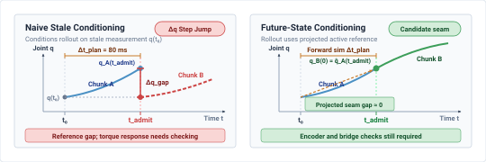
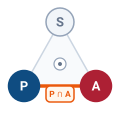
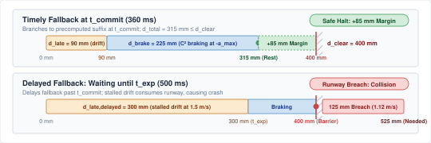

# Trajectory Planning {#sec-planning}

::: {layout-narrow}
::: {.column-margin}

\chapterminitoc

:::

::: {.content-visible when-format="pdf"}
\noindent
{fig-alt="Isometric blueprint showing 3D flight trajectory planning for an autonomous aerial quadrotor drone: BLDC outrunner cutaway, aerodynamic thrust cones, executed cyan 3D polynomial spline threading an obstacle ring, prospective amber waypoint chunk, and Harvard crimson hover-recovery stopping suffix landing on a terminal perch."}
:::

::: {.content-visible unless-format="pdf"}
{fig-alt="Isometric blueprint showing 3D flight trajectory planning for an autonomous aerial quadrotor drone: BLDC outrunner cutaway, aerodynamic thrust cones, executed cyan 3D polynomial spline threading an obstacle ring, prospective amber waypoint chunk, and Harvard crimson hover-recovery stopping suffix landing on a terminal perch."}
:::

:::

## Purpose {.unnumbered .unlisted}

::: {.content-visible when-format="pdf"}
\begin{marginfigure}
\vspace{1em}
\resizebox{\linewidth}{!}{\mlphysicalstackfull{100}{20}{20}{20}{20}}
\end{marginfigure}
:::

_What does a physical machine do during the unbudgeted milliseconds when the next neural trajectory chunk is late?_

A moving machine retains momentum while its policy computes the next action. If the current trajectory ends before its replacement arrives, waiting impacts clearance and stability. Abruptly substituting a new command can also demand accelerations that the actuators cannot deliver or excite vibration in the mechanism. Planning must convert successive proposals into motion that remains feasible during transitions and absence. Smooth connections between trajectory segments protect the body during normal execution, while a stopping continuation gives the execution layer a defined response to an overdue plan. That continuation must remain feasible from the states the current plan can reach; attaching a stop command after the planning horizon has expired is too late. Trajectory planning therefore couples the brain's variable computation time to the nervous system's continuous execution and the body's capacity to change motion.



::: {.callout-learning-objectives}

- Select trajectory horizons from inference latency, observation freshness, and the time needed for fallback
- Evaluate trajectory feasibility and continuity against the body's actuator and transmission limits
- Specify physically feasible continuation behavior when a replacement trajectory arrives late or never arrives
- Distinguish trajectory failures detectable before execution from those requiring monitoring during physical motion

:::

## Continuous Trajectories {#sec-planning-continuous-trajectories}

An articulated robotic arm lowering a cutting tool onto a moving workpiece possesses physical mass, structural inertia $\mathbf{M}(\mathbf{q})$, and continuous kinetic energy $E_k = \frac{1}{2} \dot{\mathbf{q}}^T \mathbf{M}(\mathbf{q}) \dot{\mathbf{q}}$. It cannot change velocity or direction instantly. Even when upstream autonomy grants a time-bounded intent lease—authorizing motion toward a grounded semantic goal—that semantic permission alone cannot turn motor shafts. The machine must synthesize continuous nominal motion while target evidence remains valid, plus a separately authorized stopping continuation if tracking authority ends. In the running implementation, a motor tracking loop evaluates feedback and setpoints at $1000\text{ Hz}$; that period does not specify the physical stopping response. Above this loop sits the cognitive deliberative brain, where modern robot learning policies—such as Action Chunking with Transformers (ACT) [@zhao2023learning] or score-based Diffusion Policies [@chi2024diffusionpolicy]—process multimodal observations to synthesize future reference paths on a Linux accelerator.[^fn-plan-action-chunking] Inference latency varies with workload and contention. In an illustrative measured trace, a nominal $40\text{ ms}$ forward pass could extend beyond $150\text{ ms}$ under memory or scheduling interference; the deployed tail needs its own measurement.

::: {.column-margin .margin-pointer}
↰ **Prerequisite:** Kinetic energy ($E_k$) and joint torque limits are established in @sec-body-kinetic-momentum.
:::

If an architecture predicts actions one step ahead ($H = 1$), the motor tracking loop starves. If it generates a multi-step **action chunk** across a finite future horizon ($H > 1$), the machine encounters the peril of the **execution seam**. During the unbudgeted milliseconds when an active trajectory chunk finishes executing before its replacement clears the tail of the inference distribution, the controller faces an execution discontinuity. If the controller clamps to the final position, the reference velocity steps to zero and the drive may saturate; actual torque and damage depend on current limits, compliance, and protection. If a newly arrived chunk begins with a velocity or acceleration that diverges from the physical state of the moving mechanism, the step discontinuity in commanded torque violently shakes the chassis. A trajectory proposal must define nominal motion, boundary derivatives, and a stopping continuation admitted before motion begins.

[^fn-plan-action-chunking]: **Action chunking representations**\index{Action chunking!architectures}\index{Policy learning!temporal horizons}: Action Chunking with Transformers (ACT) predicts sequences of future joint setpoints using a conditional variational autoencoder with temporal ensembling, whereas Diffusion Policy generates continuous action trajectories via iterative score-based denoising solvers. Both paradigms decouple slow, stochastic neural inference from high-rate motor servoing loops. However, because multi-step chunk outputs lack intrinsic boundary derivative constraints, downstream controllers must synthesize transition splines to prevent acceleration shocks across replanning seams.

::: {#dfn-planning-kinodynamic-feasibility-envelope .callout-definition title="Kinodynamic feasibility envelope"}

***Kinodynamic feasibility envelope***\index{Kinodynamic feasibility envelope!definition}\index{Feasibility!kinodynamic} is the subset of state space from which a physical machine can track a candidate trajectory while strictly satisfying simultaneous actuator torque limits, velocity ceilings, and third-order jerk bounds ($C^2$ continuity) without exceeding mechanical stopping margins.

1.  **Significance**: Geometric collision freedom is necessary but insufficient for physical execution; an arm may follow a collision-free path that nonetheless demands motor torques exceeding continuous thermal ratings or produces accelerations that tip an underactuated base. The envelope states the conditions under which the model predicts trackable motion; runtime sensing and actuator checks must still validate them.
2.  **Distinction**: Unlike pure kinematic reachability (which evaluates whether the robot's linkages can attain a spatial configuration), kinodynamic feasibility incorporates time parameterization, actuator force/torque envelopes, reflected inertia, and mechanical braking runways.
3.  **Common pitfall**: Checking feasibility only at discrete waypoints. Interpolation splines between sample points can produce intra-sample velocity overshoots and torque spikes that breach motor limits even when every individual waypoint passes validation.

:::

As shown in @fig-11-locator, the planner is the fifth and final deliberative stage of the cognitive brain. Intent defines the admissible goal; planning supplies the continuous motion, temporal parameterization, and dynamic limits needed to pursue that goal.

::: {#fig-11-locator fig-env="figure" fig-pos="htb" fig-cap="**Planner stage architecture focus**: In the physical AI systems architecture, the deliberative brain proposes time-parameterized action chunks across an unprivileged boundary to the deterministic nervous system. Because neural inference latencies exhibit heavy-tailed stochastic distributions, every plan must define its own replacement timing, boundary derivatives, and precomputed stopping suffix before execution begins." fig-alt="Diagram titled Physical AI Systems Architecture Stack, drawn as four stacked tiers. Layer 4 is system governance and assurance at 0.1 to 1 hertz, holding boxes for shared autonomy, verification, safety cases, and frontier limits. Layer 3 is the brain, a cognitive deliberation tier at 1 to 50 hertz, holding five stages named ingestion, perception, memory, intent, and planner. A dashed proposal-permission privilege boundary separates it from layer 2, the nervous system, a real-time safety and timing tier at 1000 hertz. Layer 1 is the physical body and continuous plant. Layer 3 is shaded and its planner stage is outlined; the badge reads Active Focus, Chapter 11, Trajectory Planning."}
{width="100%"}
:::

Across the **proposal-permission boundary**, a plan is not a direct command written to actuator registers, nor is it a guaranteed physical path. It is an unprivileged proposal submitted across the MPU-to-MCU inter-processor communication bus to the tracking controller and the real-time safety enforcer (@sec-enforcement).[^fn-plan-nervous-gatekeeper] Because measured inference latencies can have consequential tails, the downstream controller in this design consumes admitted references on its own clock and cannot suspend physical motion while the model finishes. A plan must therefore be an atomic, self-contained contract: it must establish second-order derivative continuity ($C^2$ continuity) at its admission seam,[^fn-plan-c2-spline] budget its replacement dispatch epoch against extreme tail quantiles, and include a stopping suffix admitted with the nominal motion, subject to the current state, clearance, and actuator assumptions.

::: {.column-margin .margin-pointer}
↰ **Prerequisite:** Expiring intent leases provide the bounded time windows discharged by trajectories in @sec-intent-lease.
:::

Connecting variable inference latency between slow, variable neural inference and high-frequency, continuous actuator tracking requires treating trajectory generation as a time-bounded contract with explicit seam continuations. Rather than transmitting raw geometric waypoints or unconstrained torque arrays across the system bus, the deliberative planner must assemble a self-contained operational packet that encapsulates validity intervals, dynamic boundary derivatives, and validated fallback profiles before releasing authority to physical hardware.

[^fn-plan-nervous-gatekeeper]: **Deterministic proposal verification**\index{Nervous system!gatekeeper}\index{Safety enforcement!execution buffer}: The deterministic nervous system isolates unprivileged trajectory proposals within hardware-managed staging buffers, evaluating kinematic feasibility and tracking invariants before latching setpoints into motor control registers. A bounded admission pass checks the complete candidate before activation; a separate per-tick check monitors the active state. The measured admission budget depends on the maximum chunk size. For runtime safety filter architectures, see @sec-enforcement-deterministic-gatekeeper.

[^fn-plan-c2-spline]: **$C^2$ derivative continuity**\index{C2 continuity@$C^2$ continuity}\index{Drivetrain!jerk dynamics}: Enforcing $C^2$ continuity guarantees that position, velocity, and acceleration remain unbroken functions of time across trajectory boundaries. In permanent-magnet synchronous motors (PMSM), electromagnetic torque couples directly to quadrature stator current ($\tau = K_t I_q$). An acceleration step asks for a finite torque and current step under this model, while a velocity step implies an ideal acceleration impulse. Neither $C^2$ matching nor a polynomial name alone bounds interior jerk or resonance response.

The first decision is what the planner must hand to the independent execution tier while the body is still moving.

## What Planning Hands Over {#sec-planning-handoff}

For a two-joint arm, one pair of joint angles $(q_1,q_2)$ is one point in **configuration space**\index{Configuration space!definition} $\mathcal{C}$. An obstacle excludes some angle pairs, leaving $\mathcal{C}_{\mathrm{free}}=\mathcal{C}\setminus\mathcal{C}_{\mathrm{obs}}$. A curve through that free set says where the arm may move, but not how quickly it may move or whether its motors can supply the required torque [@lozanoperez1983spatial]. A **trajectory**\index{Executable trajectory!definition} assigns time to the curve and exposes $\mathbf{x}(t)=[\mathbf{q}(t)^T,\dot{\mathbf{q}}(t)^T,\ddot{\mathbf{q}}(t)^T]^T$. The planner proposes that time-indexed reference, and the independent permission tier checks it before any setpoint reaches the drive. The tracking controller interpolates an admitted reference at its configured cadence; the enforcer checks current state and limits during execution. A geometric path alone supplies neither timing nor fallback clearance.

The packet names its coordinate frame $\mathcal{F}$, generation epoch $t_0$, initial reference state, and four deadlines in the **MCU monotonic clock domain**: nominal tracking begins at $t_{\mathrm{start}}$, the nominal setpoints end at $t_{\mathrm{plan\_exp}}$, replacement closes at $t_{\mathrm{commit}}$, and the admitted stop finishes at $t_{\mathrm{stop\_end}}$. It also links to the active intent expiry $t_{\mathrm{intent\_exp}}$. Conversion from the sensor and host clocks carries a bounded error. The independent tier permits nominal **TRACK** only while the intent and plan are valid. Without a successor it transfers to MCU-owned **STOP** no later than $t_{\mathrm{commit}}$; the protected stop may finish after the intent's tracking permission expires. Earlier lease expiry or unexpected invalidation requires a separate state-matched MCU fallback, because the suffix matched at $t_{\mathrm{commit}}$ cannot be played from an arbitrary earlier state.

The initial reference state matters while the plant moves during inference. Suppose the host samples at $t=0$ and spends $60\text{ ms}$ planning while the arm advances $20\text{ mm}$. Starting the new chunk from that historical pose would create a $20\text{ mm}$ reference error. Before admission, the MCU compares the candidate seam with its current encoder state, checks position, velocity, and acceleration, and either admits a feasible bridge or retains the active plan and fallback. Projecting the active *reference* forward helps form a candidate, but it is not a measurement of the plant.

The candidate declares payload, contact, effort, and obstacle assumptions. The MCU first validates its finite header and lineage, then checks the complete bounded trajectory and suffix, including interior extrema, clearance, stopping distance, and a feasible response for reachable states. A scan over $N$ setpoints is $O(N)$, even with a fixed maximum $N$ and measured worst-case execution time. After admission, a distinct $O(1)$ per-tick check reads the current state and local reference. The MCU latches the validated payload and stop coefficients into protected memory before enabling TRACK; a host crash or shared-memory corruption cannot remove the resident fallback. A separately validated immutable baseline covers earlier invalidation or a state outside the matched suffix's entry envelope.

The two consumers have different jobs. The tracker interpolates the admitted reference and feedforward terms. The independent permission path monitors current limits and authority; it does not inherit the planner's feasibility claim as proof. A fresh obstacle, changed payload, or contact event can revoke nominal tracking and invoke the state-matched fallback. The packet therefore binds nominal motion, the commitment point, and a physically checked stopping continuation into one reviewable request.[^fn-hw-dma-pingpong]

[^fn-hw-dma-pingpong]: **Inter-core shared-memory contracts**\index{Inter-processor communication!shared memory}\index{Real-time systems!memory barriers}: A shared-memory implementation needs an ownership protocol, cache maintenance where required, and release/acquire ordering. The MCU validates a completed candidate and copies the admitted plan and stop into protected memory before activation. The protocol must be tested on the selected platform.

Structuring the plan handoff as a bounded, hardware-grounded contract shifts the burden of safety and timing from the non-deterministic planner to the deterministic nervous system. The tracking controller receives the dense state targets, timestamps, and feedforward terms required to drive the actuators along a smooth path. The safety enforcer receives the generation metadata, dynamic assumptions, validity bounds, and terminal suffix needed to guard the machine against latency tails, state divergence, and physical model mismatches. When each field in the handoff corresponds to an explicit runtime verification, the nervous system can execute high-speed motions without relying on the assumption that the next inference cycle will always succeed.

::: {#chk-plan-trajectory-packet-contract .callout-checkpoint title="The trajectory packet contract"}

Before exploring the generation of trajectories from high-level intent, verify your understanding of the interface boundary between planning proposals and real-time execution:

- [ ] **Dual consumer roles**: Can you distinguish between the operational requirements of the tracking controller and the real-time safety enforcer when consuming a trajectory packet?
- [ ] **State alignment and drift**: Can you explain why a trajectory packet must declare both its generation timestamp $t_0$ and initial state $\mathbf{x}_0$, and how the nervous system detects execution drift?
- [ ] **Lockless buffer mechanics**: Can you describe how a double-buffered execution queue with atomic pointer swaps prevents race conditions between an asynchronous planning thread and a 1 kHz servo loop?

:::

## From Goal to Trajectory {#sec-planning-goal-to-trajectory}

An intent specifies a desired physical outcome—such as touching a workpiece with a specified contact force or placing an end-effector at a target pose (@sec-intent)—but an actuator cannot execute a goal. A goal defines where the machine should arrive or what constraint it should satisfy, without providing joint velocities, torque bounds, intermediate kinematic states, or a continuous time schedule to move physical mass through space. The nervous system requires a trajectory, which assigns concrete state targets, feedforward actuation terms, and explicit timestamps across a bounded temporal interval. If a learned policy could evaluate multimodal state observations and output valid motor currents instantaneously at the hardware control period ($1000\text{ Hz}$), planning as an architectural stage would not exist; the machine would operate purely as a high-frequency feedback controller. In physical systems, learned neural policies require tens or hundreds of milliseconds to compute a motion sequence, while the tracking controller and safety enforcer (extending the proposal-permission architecture from @sec-brain-embodied) must execute deterministically every few milliseconds. A plan assigns time and physical limits to a goal; the independent permission path decides whether its proposed motion may run.

In classical robotics systems, bridging this gap was achieved through sampling-based path planning. Rather than constructing explicit algebraic representations of the high-dimensional configuration obstacle manifold $\mathcal{C}_{\text{obs}}$, algorithms randomly sample the free configuration space $\mathcal{C}_{\text{free}}$. Multi-query architectures, pioneered by @kavraki1996probabilistic through the **Probabilistic Roadmap (PRM)**\index{Probabilistic roadmap!definition}, construct a global topological roadmap of interconnected collision-free configurations during an offline preprocessing phase, enabling rapid online multi-query path lookups. For dynamic, single-query real-time navigation, @lavalle1998rapidly introduced the **Rapidly-Exploring Random Tree (RRT)**\index{Rapidly-exploring random tree!definition}, which incrementally grows a space-filling tree biased toward unexplored Voronoi regions of $\mathcal{C}_{\text{free}}$, providing probabilistic completeness under its stated assumptions without requiring a precomputed roadmap under the usual sampling assumptions.

To span this temporal gap between slow model inference and high-frequency actuator control, modern robot learning architectures formulate policy execution via **receding-horizon action chunking**\index{Receding-horizon action chunking!definition}, predicting multi-step trajectory sequences over a forward horizon while committing only an initial temporal prefix before replanning on fresh observations.[^fn-math-bellman-dp] Two dominant paradigms characterize this generation:

[^fn-math-bellman-dp]: **Dynamic Programming Lineage**\index{Dynamic programming!provenance}: The principle of optimality and discrete dynamic programming algorithms were formalized by @bellman1957dynamic for sequential decision processes. While DP guarantees globally optimal trajectory synthesis over discretized state lattices, computational complexity scales exponentially as $O(K^d)$ where $d$ is state dimension and $K$ is grid resolution. In high-dimensional physical systems, this exponential curse of dimensionality forces trajectory planners to use continuous trajectory optimization or randomized sampling.

1. **Action Chunking with Transformers (ACT)**: Formulated as a Conditional Variational Autoencoder (CVAE) paired with a Transformer encoder-decoder [@zhao2023learning], ACT predicts a discrete sequence of future joint setpoints $\mathbf{A} = [\mathbf{a}_1, \dots, \mathbf{a}_H] \in \mathbb{R}^{H \times D}$ simultaneously across a prediction horizon $H$. To mitigate compounding trajectory drift across successive chunks, ACT applies *temporal ensembling*, maintaining an exponential moving average over overlapping predicted chunks ($w_i = \exp(-m \cdot i)$). Temporal ensembling averages overlapping setpoints but does not enforce derivative continuity. If a downstream tracker admits such a seam unchecked, it may ask for high-rate reversals that must be assessed against the actuator thermal and vibration limits in @sec-body-thermal-duty-cycles.
2. **Diffusion Policy**: Formulating trajectory synthesis as an iterative score-based denoising process [@chi2024diffusionpolicy], Diffusion Policy rolls out future action trajectories by solving a score Stochastic Differential Equation (SDE) or Denoising Diffusion Implicit Model (DDIM) ODE conditioned on visual and proprioceptive histories. A diffusion policy predicts a chunk of horizon $T_p$ (16 steps in the real Push-T setup), executes a subset $T_a$ (six steps there), and replans on subsequent sensor ingress (@fig-11-action-chunking-trace). While diffusion models capture rich multimodal distributions, their iterative denoising schedules can add workload-dependent inference latency and variance.
3. **Learned warm-start for trajectory optimization:** A learned model can propose an initial path for a constrained solver. For state sequence $\mathbf{x}_{1:H}$ and controls $\mathbf{u}_{1:H}$, the numerical stage solves:
   $$\min_{\mathbf{x}_{1:H}, \mathbf{u}_{1:H}} \sum_{t=1}^{H}\ell(\mathbf{x}_t,\mathbf{u}_t) \quad\text{subject to}\quad \mathbf{x}_{t+1}=f(\mathbf{x}_t,\mathbf{u}_t),\quad g(\mathbf{x}_t,\mathbf{u}_t)\le0$$
   A useful proposal can reduce iterations when it lies near a feasible basin. It may also choose the wrong side of an obstacle or fail to converge by the deadline. The learned guess is never a feasibility certificate: admit only a converged candidate whose full path, seam, torque, and stop checks pass. Iteration count and milliseconds depend on solver, scene, hardware, and workload and need a measured trace.

The scheduling quantity is **replacement latency** $L$: elapsed time from the observation needed for a new proposal through transfer, inference, full-trajectory validation, and admission. A representative stage ledger has $15$, $5$, $65$, $2$, $18$, and $1\text{ ms}$ for sensing, DMA, inference, deserialization, validation, and activation, respectively, totaling $106\text{ ms}$. These are scenario assumptions, not a hard bound; overlapping stages require a measured end-to-end trace rather than a sum of stage percentiles.

$$L = t_{\mathrm{sense\_ingress}} + t_{\mathrm{ipc\_dma}} + t_{\mathrm{infer}} + t_{\mathrm{deser}} + t_{\mathrm{validate}} + t_{\mathrm{admit}}$$ {#eq-plan-replacement-latency}

The component sum in @eq-plan-replacement-latency is an elapsed replacement path, not an absolute timestamp. Consider $K=3000$ handoffs in a ten-minute, $5\text{ Hz}$ illustrative mission. If each handoff independently has a $0.01$ chance of exceeding a $P_{99}$ budget, the expected number of late handoffs is $30$ and the probability that *all* arrive on time is $(0.99)^{3000}\approx8\times10^{-14}$. Correlated contention can cluster misses, so this binomial all-on-time value is not a measured mission reliability. Allocating a mission exceedance target $\epsilon_{\mathrm{mission}}=10^{-3}$ equally gives a per-handoff target $\epsilon\le\epsilon_{\mathrm{mission}}/K\approx3.3\times10^{-7}$ by the union bound. The corresponding $P_{99.99997}$ is a **design quantile target**, not a validated latency guarantee. A deployment must establish a conservative bound with representative load testing and uncertainty treatment, or accept a higher measured fallback rate.

::: {.column-margin}
{width="100%" fig-alt="Conceptual strip comparing a P99 latency allowance with a much rarer design-tail target. The rarer percentile is a risk allocation, not a measured guarantee."}

*The tail target allocates replacement risk; observed latency and confidence determine whether the chosen deadline is credible.*
:::

The next request is sent $T_{\mathrm{request}}$ after the active chunk starts. Admission must finish **before** $t_{\mathrm{commit}}$, not merely before the last nominal setpoint. With a replacement-latency target $Q_{1-\epsilon}(L)$ and reserve $T_{\mathrm{reserve}}$, require $t_{\mathrm{commit}}-t_{\mathrm{start}}\ge T_{\mathrm{request}}+Q_{1-\epsilon}(L)+T_{\mathrm{reserve}}$. The admitted stop then needs another $T_{\mathrm{stop}}$ under MCU authority. The complete **time horizon**, regardless of encoding, has the conditional lower bound:

$$T_{\mathrm{record}}\ge T_{\mathrm{request}}+Q_{1-\epsilon}(L)+T_{\mathrm{reserve}}+T_{\mathrm{stop}}$$ {#eq-plan-action-chunk-horizon}

The complete duration in @eq-plan-action-chunk-horizon includes the stop suffix. For the conveyor-tracking arm, stipulated $T_c=10\text{ ms}$, request delay $60\text{ ms}$, replacement target $160\text{ ms}$, reserve $20\text{ ms}$, and a separately checked $300\text{ ms}$ stop require at least $540\text{ ms}$ of complete motion authority, or 54 ten-millisecond **duration equivalents**. This does not mean 54 stored setpoints: $N$ in the packet counts only nominal samples; the stop is represented by its separately validated polynomial coefficients. The nominal replacement deadline must be at least $240\text{ ms}$ from start; the worked $360\text{ ms}$ commitment below leaves $120\text{ ms}$ beyond that target. A $240\text{ ms}$ *total* authority horizon would omit the stop runway. In the worked arm, nominal setpoints end at $400\text{ ms}$ and the admitted stop completes at $660\text{ ms}$, so the complete authority window spans 66 ten-millisecond duration equivalents.

This timing lower bound competes with target-evidence age. Under the illustrative conveyor drift model $a_{\mathrm{drift}}=0.50\text{ m/s}^2$ and $15\text{ mm}$ remaining tolerance, $\Delta x=\tfrac12a_{\mathrm{drift}}t^2$ reaches the allowance in about $245\text{ ms}$. A single observation cannot justify nominal tracking to the $360\text{ ms}$ commitment. The machine needs a qualified local tracker and fresh intent evidence before that limit; otherwise TRACK ends at evidence expiry and the MCU uses its separately validated state-matched stop. Extending a target timestamp because the compute tail is long would invert the permission rule.

::: {#psp-planning-tail-latency-horizon .callout-perspective title="The replacement and stop horizon"}
Budget replacement admission before $t_{\mathrm{commit}}$ and the complete stopping continuation after it. A tail percentile allocates risk; it does not replace observed timing and physical clearance validation.
:::

::: {#chk-plan-action-chunk-horizon-tail .callout-checkpoint title="Action chunk horizon and tail latency budgeting"}

Before evaluating real-time disturbance recovery and future-state conditioning, verify your ability to dimension action chunk horizons against extreme latency tails:

- [ ] **Mission exposure and tail quantiles**: In the stated independent-handoff illustration, what is the chance of one or more missed $P_{99}$ deadlines across 3000 handoffs, and why is that not a measured mission failure rate?
- [ ] **Horizon sizing trade-off**: Can you distinguish between the risk of trajectory buffer starvation from too short an action chunk and the risk of unmodeled state drift and stale perception from an excessively long chunk?
- [ ] **Reserve margin allocation**: Can you describe why the horizon equation requires an explicit reserve term $T_{\text{reserve}}$ dedicated to trajectory splicing, safety filtering, and timer jitter beyond raw inference latency?

:::

When a generative policy serves as the planner, iterative score evaluation and denoising steps govern the shape of this latency distribution. The internal mechanics of diffusion schedules, attention caching, and token generation sit below the first budgetable quantity of the physical AI system. Building on the causal boundary established in @sec-boundary-causal-boundary, the systems interface treats the learned model strictly as a stochastic producer of motion chunks characterized by an empirical latency profile and an output horizon $N$. In physical hardware deployments of receding-horizon action chunking, the execution buffer absorbs inference latency while allowing the controller to react dynamically to disturbances (@fig-11-action-chunking-trace). Sizing $N$ against a validated latency distribution lowers the risk of a late replacement; the protected stop handles a miss. Yet ensuring that a replacement trajectory arrives in time addresses only the temporal continuity of the plan. The state samples contained within the admitted chunk must also match the kinematic capabilities of the joints and remain continuous with the physical velocity and acceleration of the mechanism at the handoff seam.

::: {#fig-11-action-chunking-trace fig-env="figure" fig-pos="t" fig-cap="**Push-T disturbance recovery**: Chi et al. report a real Push-T configuration with 16 predicted and 6 executed action steps; 10 Hz commands were interpolated to 125 Hz. The illustrated recoveries show closed-loop replanning in those tests. They do not establish a validated stopping suffix or immunity to inference starvation [@chi2024diffusionpolicy]." fig-alt="Three Push-T examples show recovery from camera occlusion, in-flight target movement, and target movement near completion. The real Push-T configuration predicts 16 steps and executes 6 before replanning; the experiment does not measure a safety stopping suffix."}
{width="100%"}
:::

A replacement planner must account for motion during its computation. In an illustrative $80\text{ ms}$ delay at a constant joint speed of $0.50\text{ rad/s}$, a stale request-epoch pose lags the moving reference by $0.040\text{ rad}$ ($2.29^\circ$). This is a reference displacement, not a measured tracking error or a guaranteed inverter trip. A proposed replacement can instead start from the active plan's projected reference at the intended seam:

$$\Delta q_{\mathrm{reference}}=\int_{t_0}^{t_{\mathrm{seam}}}\dot q_A(t)\,dt,\qquad \hat{\mathbf{x}}_{\mathrm{seam}}=\mathbf{x}_A(t_{\mathrm{seam}})$$ {#eq-plan-execution-delay-gap}

The projected seam in @eq-plan-execution-delay-gap is useful for constructing a candidate; contact, tracking error, or scheduling changes can make the plant differ. The MCU therefore measures current encoder state, validates the actual seam $(q,\dot q,\ddot q)$ and any bridge, and refuses a candidate outside the admitted envelope. Algebraic matching of two *reference* trajectories gives $C^2$ continuity only for those references; it does not establish zero physical tracking gap.

::: {#dfn-planning-future-state-conditioning .callout-definition title="Future-state conditioning"}

***Future-state conditioning***\index{Future-state conditioning!definition} uses the active plan's projected reference at an anticipated handoff time to form the next candidate. It reduces the expected reference seam gap when timing and tracking remain close to the model. Admission still compares the proposal with measured state and checks a feasible bridge; a projection cannot certify the actual plant state.

:::

::: {#chk-plan-future-state-conditioning .callout-checkpoint title="Execution delay gaps and future-state conditioning"}

{fig-alt="Left: a new proposal starts from a request-time pose, leaving a reference gap after the arm moves during 80 milliseconds of planning. Right: projecting the active reference improves the candidate seam; the measured encoder state and bridge still need independent admission before tracking." width=100%}

Before analyzing kinodynamic feasibility and transmission dynamics, evaluate your understanding of computational latency compensation at the handoff seam:

- [ ] **Execution delay gap origin**: Can you calculate the spatial offset injected into a robot joint if a planner conditions on the current measured state rather than projecting forward across computational latency?
- [ ] **Forward simulation protocol**: Can you explain why projected reference matching still requires encoder-state and bridge checks at admission?
- [ ] **Disturbance vulnerability**: Can you identify the failure mode that occurs when a physical disturbance displaces the mechanism while an upstream planner is solving a future-conditioned rollout?

:::

## Kinodynamic Feasibility {#sec-planning-kinodynamic-feasibility}

A candidate trajectory is a geometric and timed proposal, not permission to move. Before admission, the planner-side check evaluates joint position and velocity, predicted actuator torque and current, contact limits, obstacle clearance, and the state-matched stopping suffix over the proposed horizon. For an arm, the rigid-body model maps $\mathbf{q}(t)$, $\dot{\mathbf{q}}(t)$, and $\ddot{\mathbf{q}}(t)$ to $\boldsymbol{\tau}(t)=\mathbf{M}(\mathbf{q})\ddot{\mathbf{q}}+\mathbf{C}(\mathbf{q},\dot{\mathbf{q}})\dot{\mathbf{q}}+\mathbf{g}(\mathbf{q})$ and $I_i(t)=\tau_i(t)/k_{\tau,i}$ [@craig2005introduction; @lynch2017modern]. The MCU admits the bounded trajectory only if its configured limits and complete stop clearance hold for the verified initial state; it then checks tracking, freshness, and the remaining stopping budget during execution. An optimizer may smooth a path or reduce obstacle proximity, but the admitted trajectory and resident stop—not the optimizer's objective value—define the motion permission (@fig-11-manipulator-trajectory).

::: {.column-margin .margin-pointer}
↰ **Prerequisite:** Actuator torque saturation limits and rotor inertia scaling ($N^2 J$) are derived in @sec-body-actuator-limits.
:::

::: {#fig-11-manipulator-trajectory fig-env="figure" fig-pos="t" fig-cap="**Real-time trajectory optimization**: GPU-accelerated motion generation executing minimum-jerk splines on hardware, avoiding a dynamic obstacle against a signed distance field, executing a constrained pick-and-lift, and coordinating two arms in a shared workspace. Collision distance is evaluated in continuous time rather than at waypoints, which is what allows the trajectory to be re-optimized while it is being executed. Adapted from [@sundaralingam2023curobo]." fig-alt="Real-Time Trajectory Optimization and Dynamic Obstacle Avoidance on Industrial Manipulators. Experimental deployment of GPU-accelerated motion generation (cuRobo) executing time-parameterized, minimum-jerk trajectory splines on physical hardware. (Top row) A canonical 6-DOF industrial manipulator executes an online obstacle avoidance trajectory around a dynamic workspace obstacle, continuously evaluating continuous-time collision distances against a 3D Euclidean Signed Distance Field (ESDF) voxel map generated via real-time depth perception. (Middle row) A canonical 6-DOF collaborative arm executes a collision-free pick-and-lift trajectory spline constrained by joint velocity, acceleration, and torque envelopes. (Bottom row) Coordinated multi-arm trajectory synthesis in simulation showing two canonical industrial manipulators executing synchronized, collision-free obstacle avoidance around shared workspace boundaries. Adapted from [@sundaralingam2023curobo]."}
{width="95%"}
:::

Validating feasibility only at discrete waypoints creates a false sense of compliance. When a planner outputs trajectory points separated by a sampling interval $T_s$, the physical mechanism moves along an interpolated path between those samples. If the nervous system checks constraints only at the discrete sample timestamps $t_k = k T_s$, high-order trajectory derivatives can exceed physical bounds during the inter-sample interval $[t_k, t_{k+1}]$. Consider an analytical example of a linear joint with a maximum acceleration limit $a_{\max} = 20.0\text{ m/s}^2$ and a velocity ceiling $v_{\max} = 2.00\text{ m/s}$. If the planner outputs consecutive velocity samples $\dot{q}_k = 1.95\text{ m/s}$ and $\dot{q}_{k+1} = 1.95\text{ m/s}$ separated by $T_s = 20\text{ ms}$, a cubic spline interpolator that applies a peak acceleration of $a_{\max}$ produces an intra-sample velocity overshoot bounded by $\Delta v \le \frac{1}{4} a_{\max} T_s$ (integrating a worst-case triangular acceleration reversal across the sampling midpoint). Evaluating this bound yields:
$$\Delta v \le \frac{1}{4} (20.0\text{ m/s}^2)(0.020\text{ s}) = 0.10\text{ m/s}$$
The true physical velocity peaks at $1.95\text{ m/s} + 0.10\text{ m/s} = 2.05\text{ m/s}$ between the two valid waypoints, exceeding the $2.00\text{ m/s}$ limit and triggering an over-speed clamp. To guarantee continuous-time feasibility without evaluating every infinitesimal point, the admission filter must evaluate an interior contracted bound, $|\dot{q}_k| \le v_{\max} - \frac{1}{4} a_{\max} T_s$. This acts as a conservative safety margin that artificially shrinks the allowed velocity limit to absorb the maximum possible intra-sample overshoot.

::: {.column-margin}
{width="100%" fig-alt="S·P·A locator triad highlighting the Plan-Act motion edge."}

*The Plan $\cap$ Act motion interface: synthesizing kinodynamically feasible $C^2$ splines and verified stopping suffixes.*
:::

Concatenating individually feasible chunks can create an infeasible seam. Position-only matching ($C^0$) can leave a velocity step; matching velocity ($C^1$) can leave a finite acceleration and torque step. In a rigid-inertia approximation, a commanded velocity change $\Delta\dot q$ spread over servo period $T_c$ asks for the torque in @eq-plan-seam-torque. A physical drive saturates or filters that request according to its current limits and compliance; the arithmetic is a demand estimate, not a measured impact load. @Fig-11-action-chunk-seam-continuity places that request beside its remedy, a finite $C^2$ bridge that removes the reference velocity step without thereby certifying the interior jerk and torque the bridge itself introduces.

::: {#fig-11-action-chunk-seam-continuity fig-env="figure" fig-pos="t" fig-cap="**Seam demand and checked bridge**: A position-matched velocity step creates a large one-tick inertial torque *request*. A finite $C^2$ bridge removes the reference velocity step, but its interior jerk, torque, and joint response still require validation." fig-alt="Panel (a) shows a velocity step at a trajectory seam and a high one-tick torque request. Panel (b) shows a smoother C-squared reference bridge. The diagram compares proposed reference demands; it does not guarantee actual torque or freedom from resonance."}
{width="100%"}
:::

::: {#dfn-planning-c-jerk-spline-seam .callout-definition title="The C² spline seam"}

A ***$C^2$ seam***\index{C2 jerk spline seam@$C^2$ jerk spline seam!definition} matches position, velocity, and acceleration of two admitted reference segments at their join. A quintic can satisfy six endpoint conditions. The controller must still check interior speed, acceleration, jerk, torque, and clearance and compare the candidate with measured plant state.

:::

For the stipulated joint with $J_L=1.5\text{ kg m}^2$, $J_m=1.2\times10^{-4}\text{ kg m}^2$, and $N_g=100$, the output-side effective inertia is $J_{\mathrm{eff}}=J_L+N_g^2J_m=2.7\text{ kg m}^2$. A $0.15\text{ rad/s}$ reference velocity gap corrected in $2\text{ ms}$ requests $75\text{ rad/s}^2$ and $202.5\text{ N m}$ of inertial torque. A separate model with a $120\text{ N m}$ peak ceiling would reject that request; this does not predict fracture or a particular inverter trip.[^fn-hw-pwm-trip] The product-specific Harmonic Drive example below uses its actual 51 N m rated and 127 N m repeated-peak specifications.

$$\tau_{\mathrm{request}}=J_{\mathrm{eff}}\frac{\Delta\dot q}{T_c}$$ {#eq-plan-seam-torque}

[^fn-hw-pwm-trip]: **Drive protection depends on the device**\index{Inverter!desaturation trip}: Current limiting, desaturation detection, DC-bus protection, and braking behavior depend on the driver and its configured thresholds. A reference torque request above a rating is grounds for rejection; it does not prove the specific fault mode or damage outcome.

The transmission response depends on rotor and link inertia, gear ratio, stiffness, damping, and the selected drive protection. For a simple two-inertia model with load inertia $J_L$, motor inertia reflected to the load $J_{m,r}=N_g^2J_m$, and coupling stiffness $k_\theta$, the antiresonance and resonance frequencies [for this model](https://link.springer.com/article/10.1186/s10033-024-01041-5) are $\frac{1}{2\pi}\sqrt{k_\theta/J_L}$ and $\frac{1}{2\pi}\sqrt{k_\theta(1/J_L+1/J_{m,r})}$, respectively. With stipulated $k_\theta=2.0\times10^4\text{ N m/rad}$, $J_L=1.5\text{ kg m}^2$, and $J_{m,r}=1.2\text{ kg m}^2$, these are about $18.4$ and $27.6\text{ Hz}$. Real joints require identified inertia, stiffness, damping, load, and boundary conditions. The comparison in @tbl-11-transmission-dynamics names checks, not universal frequency or jerk limits.[^fn-rule-servo-bandwidth]

| Architecture             | Relevant state and seam risk                                                             | Admission and runtime check                                                   |
|:-------------------------|:-----------------------------------------------------------------------------------------|:------------------------------------------------------------------------------|
| Strain-wave geared joint | Reflected rotor inertia and compliant transmission can amplify a sharp reference change. | Identify load-dependent modes; check bridge extrema, torque and drive limits. |
| Cycloidal geared joint   | Input and output compliance, load, and backlash affect response.                         | Check measured torque and oscillation margin for the chosen reducer.          |
| Quasi-direct-drive leg   | Lower ratio changes reflected inertia, but contact and electrical limits remain.         | Check current, DC bus and contact response for the actual drive.              |
| Direct-drive gantry      | No gear reduction, but moving motor mass and payload still contribute inertia.           | Check force, travel, jerk, and structural modes.                              |

: **Architecture-dependent seam checks**: These are mechanisms and validation tasks; no frequency, stiffness, or jerk range transfers between products without measured parameters. {#tbl-11-transmission-dynamics tbl-colwidths="[20,40,40]"}

Smoothing this boundary discontinuity requires online **$C^2$ trajectory spline blending**\index{C2 trajectory spline blending@$C^2$ trajectory spline blending!definition}, which must be treated as the synthesis of an entirely new motion plan rather than as cosmetic filtering. When the nervous system inserts a polynomial bridge $\theta_{\mathrm{blend}}(t)$ over a transition interval $T_{\mathrm{blend}}$ to connect chunk $A$ and incoming chunk $B$, the resulting bridge segment must undergo the exact same dynamic feasibility checks as the primary chunks.[^fn-hw-jerk-limits]

[^fn-hw-jerk-limits]: **Trajectory jerk**\index{Jerk!minimization}\index{Drivetrain!torsional resonance}: A jerk objective can make a particular bridge smoother. A finite jerk bound alone does not exclude energy near a measured resonance; the complete command spectrum and closed-loop response must be checked for the joint and load.

[^fn-rule-servo-bandwidth]: **Sampling and mechanical modes**\index{Bandwidth!servo sampling}: A control period faster than a mechanical mode can help resolve that mode but is not a stability proof. Controller phase margin, sensor delay, damping, filtering, and actuator bandwidth must be validated for the identified joint.

From a physical AI perspective, why must the bridge be a fifth-order (quintic) polynomial? In an actuator drivetrain, motor torque is directly coupled to joint acceleration:
$$\tau = J_{\mathrm{eff}} \ddot{\theta}$$
Matching position alone ($C^0$) leaves a velocity step; matching velocity ($C^1$) still leaves an acceleration step. An acceleration step asks for a finite torque step $\Delta \tau=J_{\mathrm{eff}}\Delta\ddot\theta$ in this rigid-inertia model; an ideal velocity step instead implies an acceleration and torque impulse. Actual drive current limits and compliance determine the response. Matching acceleration at the reference seam ($C^2$ continuity) removes the commanded acceleration step; interior torque and plant response still require validation.

To guarantee $C^2$ continuity across the seam, the bridge must match position, velocity, and acceleration at both endpoints—a total of six boundary conditions:
$$\theta(0) = \theta_0, \quad \dot{\theta}(0) = \dot{\theta}_0, \quad \ddot{\theta}(0) = \ddot{\theta}_0$$
$$\theta(T_{\mathrm{blend}}) = \theta_1, \quad \dot{\theta}(T_{\mathrm{blend}}) = \dot{\theta}_1, \quad \ddot{\theta}(T_{\mathrm{blend}}) = \ddot{\theta}_1$$
where $(\theta_0, \dot{\theta}_0, \ddot{\theta}_0)$ is the terminal physical state of chunk $A$ at the handoff instant, and $(\theta_1, \dot{\theta}_1, \ddot{\theta}_1)$ is the target state on incoming chunk $B$ at $t = T_{\mathrm{blend}}$. Matching six boundary conditions requires six independent coefficients ($a_0 \dots a_5$), uniquely dictating a fifth-degree polynomial:
$$\theta(t) = a_0 + a_1 t + a_2 t^2 + a_3 t^3 + a_4 t^4 + a_5 t^5$$
Solving this linear boundary value problem yields exact closed-form expressions for the six coefficients.[^fn-math-quintic-spline] Differentiating three times reveals the dynamic **jerk profile**\index{Jerk profile!definition}:
$$\dddot{\theta}(t) = 6 a_3 + 24 a_4 t + 60 a_5 t^2$$
The jerk is a quadratic function of time in general, and finite over a finite blend. Admission must check its extrema and the measured joint response; $C^2$ endpoints alone do not suppress all resonant energy.

[^fn-math-quintic-spline]: **Quintic spline boundary value solutions**\index{Quintic spline!boundary solution}\index{Trajectory optimization!spline synthesis}: Matching position, velocity, and acceleration at both boundary endpoints yields a non-singular system of six linear algebraic equations. The unique polynomial solution matches acceleration at the endpoints; its jerk is generally quadratic within the blend. For the complete closed-form matrix inversion and coefficient derivations, see @sec-appendix-control.

A fixed-degree polynomial can be evaluated with bounded work per axis on a chosen controller. Coefficient synthesis and whole-trajectory extrema checks occur at admission; the measured worst-case execution time, including memory access and monitoring, must fit the configured servo period.

Representation affects what can be proved at admission. @Tbl-11-trajectory-representations separates continuity supplied by the representation from the dynamic checks still required. A B-spline of degree $p$ has $C^{p-r}$ continuity at an interior knot of multiplicity $r$; its control-point convex hull bounds position, not automatically velocity, torque, or clearance. Minimizing an integrated jerk objective requires solving that optimization; choosing a B-spline does not itself solve it.

| Representation         | Native seam property                                                               | Checks before execution                                         |
|:-----------------------|:-----------------------------------------------------------------------------------|:----------------------------------------------------------------|
| Quintic bridge         | Can match $q,\dot q,\ddot q$ at both ends; jerk is generally quadratic.            | Check interior extrema, torque, clearance, and timed admission. |
| B-spline               | Continuity depends on degree and knot multiplicity.                                | Check derivatives, dynamics, clearance, and optimizer result.   |
| ACT action chunk       | Discrete setpoints; zero-order hold jumps at ticks, linear interpolation is $C^0$. | Construct and admit a feasible bridge and stop.                 |
| Diffusion action chunk | Discrete sampled actions; no intrinsic actuator authority.                         | Validate timing, state, bridge, limits, and stop.               |

: **Trajectory representations and required checks**: Smooth parameterization helps form a candidate but does not by itself prove dynamic feasibility. Latency depends on workload and hardware and must be measured. {#tbl-11-trajectory-representations tbl-colwidths="[22,35,43]"}

```{python}
#| label: calc-planning-seam-reflected-inertia
#| echo: false
from mlsysim import *
from mlsysim.core.units import *
from mlsysim.fmt import fmt_torque, fmt_multiple, check

class PlanningSeamInertia:
    """Illustrative one-tick velocity request versus symmetric C2 blend."""

    joint = Actuators.HarmonicDrive.CSG_25_50
    j_reflected = joint.reflected_inertia  # 0.25 kg m^2 in teaching registry
    delta_omega = 0.2 * ureg.radian / second
    dt_tick = 1 * millisecond
    t_blend = 50 * millisecond
    tau_step = calc_seam_acceleration_torque_jump(joint.gear_ratio, joint.rotor_inertia, (delta_omega / dt_tick).to(ureg.radian / second**2))
    tau_blend_mean = calc_seam_acceleration_torque_jump(joint.gear_ratio, joint.rotor_inertia, (delta_omega / t_blend).to(ureg.radian / second**2))
    # Symmetric C2 velocity blend: a(u)=6*delta_omega*u*(1-u)/T.
    tau_blend_peak = 1.5 * tau_blend_mean
    peak_reduction = tau_step / tau_blend_peak
    check(abs(tau_step.magnitude - 50) < 0.01, "one-tick request changed")
    check(abs(tau_blend_mean.magnitude - 1) < 0.01, "blend mean changed")
    check(abs(tau_blend_peak.magnitude - 1.5) < 0.01, "blend peak changed")
    check(abs(peak_reduction.magnitude - 50 / 1.5) < 0.01, "peak ratio changed")
    tau_step_str = fmt_torque(tau_step, precision=0)
    tau_mean_str = fmt_torque(tau_blend_mean, precision=0)
    tau_peak_str = fmt_torque(tau_blend_peak, precision=1)
    reduction_mult_str = fmt_multiple(peak_reduction.magnitude, precision=1)
```

::: {#nbk-planning-seam-acceleration-jump-reflected-inertia-torque .callout-notebook title="Seam acceleration and torque requests"}
For the registered CSG-25-50-2UH teaching example, reflected rotor inertia is $0.25\text{ kg m}^2$. Correcting a $0.2\text{ rad/s}$ reference velocity gap in one $1\text{ ms}$ tick asks for `{python} PlanningSeamInertia.tau_step_str` of inertial torque. The [manufacturer's specification](https://www.harmonicdrive.net/products/gear-units/gear-units/csg-2uh/csg-25-50-2uh) gives $51\text{ N m}$ rated L10 and $127\text{ N m}$ repeated peak; this one-tick **request** is below the rated value, not a predicted fracture. A symmetric $C^2$ velocity blend over $50\text{ ms}$ has `{python} PlanningSeamInertia.tau_mean_str` mean and `{python} PlanningSeamInertia.tau_peak_str` peak inertial torque, a `{python} PlanningSeamInertia.reduction_mult_str` peak-request reduction. Total torque still includes load, gravity, friction, and control response; it needs a full peak and thermal check.
:::

::: {#psp-planning-c2-continuity .callout-perspective title="The C² continuity invariant"}
$C^2$ reference continuity avoids a commanded velocity impulse; admission must still check the bridge's interior demands and the measured plant state.
:::

::: {.column-margin}
{width="100%" fig-alt="Illustrative one-tick velocity-step request of 50 newton-meters versus a 50-millisecond C-squared blend with 1.5 newton-meter peak inertial torque. Actual drive response and load torque require validation."}

*In this specified inertia model, the C² blend cuts peak inertial torque request by 33.3×; neither request predicts damage by itself.*
:::

A related physical failure arises from output chatter in learned policy proposals. High-frequency oscillations across successive planning chunks are frequently produced by stochastic sampling, score-matching noise, or autoregressive variance in generative policies. Even when every discrete sample in a chattering trajectory satisfies absolute position and velocity limits, rapid sign reversals in commanded acceleration can request repeated torque reversals. Building on the actuator thermal limits established in @sec-body-actuator-limits, an analytical duty cycle where an actuator reverses a torque of $30\text{ N}\cdot\text{m}$ at $25\text{ Hz}$ would create current transitions and $I^2 R$ heating if the drive tracks them; backlash impact and wear depend on the transmitted load and joint response.[^fn-hw-thermal-derating] The systems engineer budgets this high-frequency variation not as a perceptual roughness metric, but as an actuator thermal rise and transmission fatigue cost. A trajectory that excites structural resonances or exceeds the motor drive's thermal dissipation limits is physically infeasible, regardless of how accurately its waypoints follow the task objective. Even when a candidate chunk satisfies every internal and boundary feasibility check, the nervous system must still account for the reality that the next replacement chunk may fail to arrive before the active plan reaches its terminal sample.

[^fn-hw-thermal-derating]: **Actuator Thermal Derating**\index{Actuator thermal derating!physics}: Continuous peak current commands induce rapid Joule heating ($I^2R$) in motor windings, driving stator core temperatures past safe thermal thresholds and degrading permanent magnet flux density. To prevent irreversible demagnetization and winding insulation breakdown, motor controllers enforce thermal derating curves that dynamically throttle allowable continuous torque. In trajectory planning, ignoring this thermal governor causes aggressive velocity profiles to trigger mid-trajectory current limits, leading to dynamic tracking failure.

::: {#chk-plan-seam-reflected-torque-jump .callout-checkpoint title="Seam continuity and reflected inertia"}

Before examining seam timelines and fallback deceleration hierarchies, verify your understanding of reflected drivetrain inertia and higher-order spline continuity:

- [ ] **Continuity orders across seams**: Can you explain why $C^0$ position matching or $C^1$ velocity matching between consecutive action chunks can request a velocity impulse or torque step, and what determines the actual drivetrain response?
- [ ] **Reflected inertia amplification**: Can you describe how a gearbox reduction ratio ($N_g$) squares the motor rotor inertia, and explain why high-ratio strain wave drives are far more vulnerable to velocity steps than direct-drive or quasi-direct-drive actuators?
- [ ] **Spline blending physics**: Can you distinguish between cosmetic trajectory smoothing and online fifth-order ($C^2$) polynomial spline synthesis across a replanning seam?

:::

## Behavior at the Seam {#sec-planning-behavior-seam}

Because replacement latency varies, the execution tier must know when a candidate can still be admitted and how it will stop if no candidate arrives. The relevant times are distinct: $t_{\mathrm{blend}}$ is the preferred seam; $t_{\mathrm{commit}}$ is the matched stop-suffix entry; $t_{\mathrm{plan\_exp}}$ is the end of nominal reference setpoints; $t_{\mathrm{stop\_end}}$ is the end of the protected stopping continuation; and $t_{\mathrm{intent\_exp}}$ ends the current target's tracking permission. All are compared in one MCU monotonic clock domain with bounded conversion error. The suffix duration is $T_{\mathrm{stop}}=t_{\mathrm{stop\_end}}-t_{\mathrm{commit}}$. A replacement must pass the full admission check before the measured handoff cutoff; a late host progress report has no authority.

The controller has two authority modes. In **TRACK**, it follows an admitted nominal path only while the plan and intent evidence remain valid. If no successor is admitted before commitment, it transfers to MCU-owned **STOP** and follows the validated suffix already latched in protected memory. STOP may finish after $t_{\mathrm{intent\_exp}}$ because it no longer pursues the target. If intent expires or a fault invalidates the path *before* the matched commitment state, the MCU uses a separately validated state-matched baseline; playing the suffix designed for a later state would violate its seam conditions. Admission therefore checks stopping clearance from all reachable pre-commit states and the specific suffix entry at commitment.

For a cruise entry with $q(t_{\mathrm{commit}})=q_c$, speed $v_c>0$, and zero entry acceleration, a $C^2$ position-and-velocity-matched stop over duration $T$ uses $u=(t-t_{\mathrm{commit}})/T$:

$$q(u)=q_c+v_cT\left(u-u^3+\tfrac12u^4\right),\qquad 0\le u\le1$$ {#eq-plan-c2-stopping-suffix}

Differentiating @eq-plan-c2-stopping-suffix gives speed $v_c(1-3u^2+2u^3)$ and acceleration $-6v_c u(1-u)/T$, peak deceleration is $1.5v_c/T$, and stopping distance is $v_cT/2$. Unlike a constant-deceleration switch, its acceleration begins and ends at zero. A nonzero measured entry acceleration requires a general quintic matching the actual $(q,\dot q,\ddot q)$ at entry and zero terminal velocity and acceleration; the enforcer checks its interior speed, acceleration, jerk, torque, and clearance. Neither the polynomial degree nor $C^2$ matching by itself certifies those limits.

```{python}
#| label: calc-planning-c2-stop-clearance
#| echo: false
from mlsysim.core.units import ureg, meter, second, millisecond
from mlsysim.fmt import check

# Scenario assumptions: zero-acceleration cruise entry, verified C2 stop,
# no unreserved sensing or actuation delay.
v_arm = 1.2 * meter / second
t_arm = 300 * millisecond
arm_cruise = v_arm * (60 * millisecond)
arm_stop = v_arm * t_arm / 2
arm_clear = 300 * ureg.millimeter
arm_margin = arm_clear - arm_cruise - arm_stop
v_amr = 1.5 * meter / second
t_amr = 450 * millisecond
amr_cruise = v_amr * (60 * millisecond)
amr_stop = v_amr * t_amr / 2
amr_clear = 500 * ureg.millimeter
amr_margin = amr_clear - amr_cruise - amr_stop
late_cruise = v_amr * (200 * millisecond)
late_breach = late_cruise + amr_stop - amr_clear
check(abs(arm_margin.to(ureg.millimeter).magnitude - 48.0) < 1e-9, "arm clearance changed")
check(abs(amr_margin.to(ureg.millimeter).magnitude - 72.5) < 1e-9, "AMR clearance changed")
check(abs(late_breach.to(ureg.millimeter).magnitude - 137.5) < 1e-9, "late breach changed")
```

In the illustrative arm case, the blend deadline is $300\text{ ms}$, matched commitment $360\text{ ms}$, nominal setpoint end $400\text{ ms}$, and stop end $660\text{ ms}$. Thus $T=300\text{ ms}$. At $v_c=1.2\text{ m/s}$, the suffix's peak deceleration is $6.0\text{ m/s}^2$ and it travels $180\text{ mm}$. From the $300\text{ ms}$ clearance check to physical brake onset at $360\text{ ms}$, continued cruise uses $72\text{ mm}$; the full $252\text{ mm}$ leaves $48\text{ mm}$ of the stipulated $300\text{ mm}$ obstacle clearance. These are conditional geometric margins, with sensing and model error still to reserve. The stated $360\text{ ms}$ is **physical suffix onset**: the MCU must close replacement admission and pretrigger any communication or actuator delay $\delta$ by $360\text{ ms}-\delta$. If it does not, add $1.2\delta$ of travel and shift the stop end; the 48 mm margin is then smaller. Intent tracking may expire at $400\text{ ms}$ while MCU STOP continues to $660\text{ ms}$. @Fig-11-seam-timeline-fallback places those instants on a single axis and separates the two ownership regimes, so the point where nominal reference tracking ends can be read against the separately authorized stop that carries the arm to rest.

::: {#fig-11-seam-timeline-fallback fig-env="figure" fig-pos="t" fig-cap="**Nominal tracking and MCU-owned stop**: The worked arm permits a checked replacement before the 360 ms physical stop onset. Nominal references would end at 400 ms, while the separately authorized, $C^2$ stop reaches rest at 660 ms. The suffix is matched to the commitment state; earlier invalidation needs a state-matched MCU baseline. All deadlines use the MCU monotonic clock, and physical clearance includes the full response and stop." fig-alt="Timeline distinguishes preferred blend at 300 milliseconds, physical stop commitment at 360, nominal setpoint end at 400, and MCU stop end at 660. A second panel shows tracking transferring to a protected stopping state when no replacement is admitted. The stop can continue after nominal or intent tracking permission ends."}
{width="100%"}
:::

For a second illustrative AMR, choose blend at $300\text{ ms}$, commitment at $360\text{ ms}$, nominal end at $500\text{ ms}$, and a $450\text{ ms}$ stop ending at $810\text{ ms}$. From $v_c=1.5\text{ m/s}$, the same suffix has peak deceleration $5.0\text{ m/s}^2$ and travels $337.5\text{ mm}$. The 60 ms pre-stop cruise adds 90 mm; $427.5\text{ mm}$ total leaves $72.5\text{ mm}$ of a stipulated $500\text{ mm}$ corridor. Waiting until the nominal setpoints end at $500\text{ ms}$ would add 300 mm of cruise before the same stop: $637.5\text{ mm}$ total, breaching the corridor by $137.5\text{ mm}$. A later stop must still match its actual entry state; this counterfactual holds cruise speed constant only to show the lost clearance.

::: {#chk-plan-fallback-clearance-stopping-budget .callout-checkpoint title="Commitment and full stopping clearance"}

{fig-alt="Two AMR distance bars under an illustrative 500-millimeter corridor. Commitment at 360 milliseconds uses 90 millimeters of cruise plus 337.5 millimeters of C-squared braking and leaves 72.5 millimeters. Delaying until nominal end at 500 milliseconds uses 300 plus 337.5 millimeters and breaches the boundary by 137.5 millimeters. The comparison assumes 1.5 meters per second cruise and a validated 450-millisecond stop." width=100%}

- [ ] **Deadline distinction**: Can you distinguish nominal setpoint end, physical stop completion, and target-evidence expiry?
- [ ] **Continuous entry**: Why would a constant-deceleration switch fail $C^2$ matching at zero-acceleration cruise entry?
- [ ] **Clearance and latency**: Where must a nonzero brake-command delay appear in the 72.5 mm corridor margin?

:::

A replacement received after the preferred blend deadline can still be admitted only if its full bridge and suffix validate before the commitment cutoff. A compressed bridge can raise acceleration and torque; the controller evaluates its polynomial extrema and current encoder discrepancy before latching it. If the check cannot finish, it keeps the current plan and executes STOP. A candidate received after commitment cannot retrospectively restore the spent runway.

The planner proposes the suffix, but the MCU validates and latches its coefficients and immutable assumptions into protected local memory **before** nominal motion begins. At commitment, the MCU selects that resident path without reading host DRAM. A host crash, bus stall, or corrupted shared packet therefore does not erase the stop. If the measured state falls outside the latched suffix's entry envelope, the MCU uses the separately validated baseline appropriate to that state; torque disable or a spring brake is not a universal substitute for a controlled stop, especially with a suspended load.

The admission and fallback decisions in @tbl-11-seam-fallback-hierarchy are distinct from an emergency power cut. Each row is conditional on sensed state, available actuation, and the clearance checked for that response.

| State                      | Trigger                                                             | MCU action and required evidence                                                                                                                     |
|:---------------------------|:--------------------------------------------------------------------|:-----------------------------------------------------------------------------------------------------------------------------------------------------|
| TRACK, ordinary handoff    | Replacement passes the complete admission check before commitment.  | Latch the new nominal path and its own stop, then transfer at a checked $C^2$ seam.                                                                  |
| TRACK, late candidate      | Candidate arrives after preferred blend but before commitment.      | Admit only if the compressed bridge, full path, stop, and timing still fit; otherwise keep the current record.                                       |
| STOP, matched suffix       | No successor admitted by commitment.                                | MCU follows its protected suffix from the validated entry state; target tracking may expire while STOP continues.                                    |
| STOP, earlier invalidation | Intent expiry, contact, state mismatch, or fault before commitment. | MCU selects a separately validated state-matched baseline with reserved clearance.                                                                   |
| Fault response             | Controlled stop cannot be assured from measured state.              | Use the machine-specific risk response (which may include drive inhibit, brake, or compliance) only under its validated load and timing assumptions. |

: **Tracking and MCU-owned fallback decisions**: Full candidate admission is $O(N)$ for $N$ samples and precedes commitment; the per-tick state check is bounded separately. A host crash does not remove a latched MCU stop. {#tbl-11-seam-fallback-hierarchy tbl-colwidths="[18,29,53]"}

The following protocol describes the running MCU implementation. Its configured servo period is $1\text{ ms}$; that period is not a measured response time or a guarantee of physical stopping.

1. **Sample and compare absolute deadlines.** Read encoder state and $t_{\mathrm{now}}$ in the MCU monotonic domain. In TRACK, transfer to STOP at the earliest of commitment without a successor, intent expiry, or earlier invalidation. The matched suffix is allowed only when its entry-state envelope holds; earlier transfer uses the resident baseline.
2. **Validate a candidate before admission.** In a bounded background admission budget, verify sequence, active intent lineage, clock conversion, immutable payload and sidecar digest, sample count, every setpoint/interpolated extremum, torque, obstacle clearance, and both fallback paths. Compare the proposed seam against measured $(q,\dot q,\ddot q)$ and recheck entry state at activation. The complete scan is $O(N)$ and must finish before $t_{\mathrm{commit}}$; a candidate merely marked ready has no authority.
3. **Latch then transfer.** Copy the validated trajectory and stop into protected MCU memory. Only after the copy and final state check may an atomic active-record switch enable TRACK on the successor. If validation times out or the bridge is infeasible, keep the current record and its stop.
4. **Execute locally.** Each tick performs bounded reference interpolation and state/limit checks. At commitment without a successor, the MCU runs the latched $C^2$ suffix. On earlier invalidation it runs the appropriate state-matched baseline. Neither path reads host DRAM or asks a stalled optimizer for a new command.
5. **Log actual transitions.** Record request, validation, admission, activation, TRACK-to-STOP, and stop-completion times. Drive inhibit or mechanical braking is a separate device-specific response, not an automatic proof of a controlled stop.

The invariant is that an admitted trajectory has a resident and feasible response for its reachable states; it is not that the next inference call will finish.

## How Plans Go Wrong {#sec-planning-failure-modes}

A plan can become infeasible by execution time. Building on the causal boundary established in @sec-boundary-causal-boundary, the latency between trajectory synthesis in the learned policy and physical actuation by the motor drives (including magnetic stator delays and digital communication bottlenecks such as SerDes serialization latency) creates a blind spot. During this temporal window, the physical state of the machine drifts, the environment shifts, or the geometric interface between consecutive trajectory chunks violates dynamic constraints. Failures in planned motion distribute across several distinct points of first visibility. Establishing where a failure first becomes visible dictates which subsystem possesses the signal and the time budget required to detect and reject it.

The earliest failure occurs when a generated chunk is invalid before reaching the motor drivers. An unconstrained neural policy or an imperfectly sampled trajectory can propose waypoint sequences that exceed physical hardware limits. A **pre-execution bound checker**\index{Bound Checker!pre-execution} evaluates candidate chunks against fixed kinematic and dynamic limits during the admission phase. Rather than evaluating arbitrary safety thresholds, the bound checker calculates the exact margin $M(t) = L_{\mathrm{limit}} - |x(t)|$ across every discrete trajectory point for position $q$, velocity $\dot{q}$, and acceleration $\ddot{q}$. In an analytical example of a manipulator joint governed by a velocity limit of $\dot{q}_{\mathrm{limit}} = 2.50\text{ rad/s}$, a candidate trajectory containing a velocity sample of $|\dot{q}(120\text{ ms})| = 2.65\text{ rad/s}$ produces a negative margin of $M(120\text{ ms}) = -0.15\text{ rad/s}$. The pre-execution checker intercepts the chunk before admission, emitting an explicit fault record containing the violated joint channel, the numerical limit, the timestamp of the violation, and the negative margin. Rejecting an invalid plan at the admission boundary incurs zero dynamic disturbance because the machine remains on its previously validated trajectory.

When two consecutive plans are each internally feasible, their concatenation can still produce an infeasible seam. A **boundary checker**\index{Boundary Checker} compares the candidate with the active plan and measured joint state at $t_{\mathrm{handover}}$, including $\Delta q$, $\Delta\dot q$, and $\Delta\ddot q$. A velocity step implies an ideal acceleration impulse; spreading the requested change over one servo period $\Delta t$ gives the simplified inertia estimate $\tau_{\mathrm{inertial}}\approx J\Delta\dot q/\Delta t$. This is a **request**, not a prediction that the drive supplies it within one tick.

For an illustrative $J=0.080\text{ kg m}^2$, $\Delta t=1.0\text{ ms}$, and $40.0\text{ N m}$ configured peak limit, allocating the entire limit to this acceleration gives an *idealized ceiling* $\Delta\dot q\le(40.0\text{ N m})(0.001\text{ s})/(0.080\text{ kg m}^2)=0.50\text{ rad/s}$. Available margin is smaller after gravity, payload, friction, other commanded torque, current rise time, and thermal or bus limits are accounted for. The enforcer must use that state-dependent margin and the measured drive response when evaluating a finite bridge. It rejects a direct velocity discontinuity even if its one-tick arithmetic falls below the illustrative ceiling; a bounded $C^2$ bridge and its interior checks are still required.[^fn-inc-seam-trip]

[^fn-inc-seam-trip]: **Drive and resonance response**\index{Drivetrain!resonant frequency}\index{Inverter!desaturation trip}: A sharp command can excite a joint's *identified* flexible modes, but their frequencies and damping depend on the transmission and load. Current limiting, desaturation detection, DC-bus response, and shutdown depend on the selected driver and its configuration; see the [TI gate-driver protection description](https://www.ti.com/document-viewer/lit/html/SLVAG18/GUID-1263241E-9C90-419F-B3D8-D2F599BCABEA). Neither a requested torque nor this simplified model establishes a particular trip, bearing damage, or gear failure.

Even with all pre-execution and boundary checks passed, changes in the physical world can render the plan infeasible. A grasped workpiece can slip from its intended $\mathrm{SE}(3)$ pose, an unmodeled obstacle can enter the workspace, or structural tracking error can accumulate beyond allowable tolerances. **Runtime monitors**\index{Runtime monitor} detect changed-world infeasibility by observing four dedicated signals, comprising joint state divergence, tracking error velocity, unexpected contact wrenches, and the invalidation of geometric assumptions recorded in the plan header. The tracking error allowance $\epsilon_{\mathrm{pos}}$ is derived directly from the geometric clearance $d_{\mathrm{clearance}}$ between the planned trajectory envelope and the nearest obstacle boundary minus the structural deflection and gearbox compliance allowance $\delta_{\mathrm{deflect}}$. In an analytical packaging cell with a budgeted clearance of $d_{\mathrm{clearance}} = 0.020\text{ m}$ and an unmodeled payload deflection and gearbox compliance allowance of $\delta_{\mathrm{deflect}} = 0.005\text{ m}$, the position error trip threshold evaluates to $\epsilon_{\mathrm{pos}} = d_{\mathrm{clearance}} - \delta_{\mathrm{deflect}} = 0.015\text{ m}$. If measured Cartesian tool-position error $\|\mathbf{x}_{\mathrm{tool,actual}}(t)-\mathbf{x}_{\mathrm{tool,planned}}(t)\|$ exceeds $0.015\text{ m}$, or a six-axis force-torque sensor reports an unmodeled $10.0\text{ N}$ contact in this free-space example, the monitor revokes nominal tracking and requests the validated state-matched fallback. Actual deceleration begins after the measured detection, dispatch, and actuator response delays.

A plan can also exhaust its nominal references before the next candidate passes admission. The MCU must not wait for the execution pointer to run off the array or treat a final-position hold as a stop. It compares the absolute current time with the admitted commitment and intent deadlines in its own monotonic domain. At the earliest transfer event, it selects the matched protected suffix if its entry state is valid, or a separately validated state-matched baseline. Complete stopping clearance includes detection, dispatch, actuator response, and motion under the selected profile; an assumed constant deceleration is insufficient for the $C^2$ worked suffix.

::: {#ws-planning-sf-fog-fleet-deadlock .callout-war-story title="A fleet stop in fog (2023)"}

Waymo reported a heavy-fog interruption in San Francisco's Balboa Terrace neighborhood in 2023; its [public account](https://waymo.com/blog/2023/08/the-waymo-drivers-rapid-learning-curve/) says subsequent software changes were tested against the conditions. This was a Waymo event, not a Cruise incident. The public account does not establish a LiDAR-planner deadlock, a particular stopping-suffix design, or a postincident suffix redesign.

**Systems lesson:** For a machine already in motion, an unexpected pause in upstream planning is a useful *hypothetical* stress test: what local plan remains executable, when does tracking authority end, and can the independent fallback stop within the measured clearance? The answers require the system's own logs and validation, not an inferred mechanism from the fog report.
:::

Every detector in the planning pipeline relies on an explicit contract between the trajectory generator and the execution runtime. If a plan is delivered as a raw list of coordinates without metadata defining its valid lifespan, its geometric clearance bounds, its boundary derivatives, and its intended fallback behavior, the nervous system cannot determine whether an ongoing motion remains safe or has drifted into infeasibility. Making plan execution verifiable requires encapsulating waypoints within a structured record that binds kinematic trajectories to their temporal validity windows and monitoring thresholds.

::: {#chk-plan-failure-modes-monitoring .callout-checkpoint title="Trajectory failure modes and runtime detection"}

Before examining the wire-level schema and execution buffers of the trajectory contract, evaluate your understanding of real-time monitoring and failure detection:

- [ ] **Point-of-visibility classification**: Can you categorize trajectory failures into pre-execution invalidity, seam boundary steps, runtime world divergence, and horizon exhaustion?
- [ ] **Boundary torque limits**: Can you derive the maximum admissible velocity step $\Delta \dot{q}_{\mathrm{allow}}$ across a single control cycle from actuator peak torque and reflected joint inertia?
- [ ] **Cross-plan oscillation mechanics**: Can you explain why single-plan validators fail to detect policy dithering between competing local minima, and how sequence monitors track thermal derating budgets?

:::

## The Trajectory Contract {#sec-planning-trajectory-contract}

The **trajectory record**\index{Trajectory record!definition} is the immutable data structure that the planning system hands to the execution runtime at every replanning cycle. While the general schema, serialization format, and global provenance rules for system logs are established in @sec-nervous, trajectory management introduces domain-specific fields that enforce physical continuity and temporal deadlines. Within its kinematic definition, the record stores the geometric motion profile either as discrete kinematic setpoint arrays or as continuous polynomial spline coefficients. It pairs this representation with the sample cadence (such as $\Delta t = 10\text{ ms}$ for a $100\text{ Hz}$ setpoint stream), the total planned horizon $T_{\mathrm{plan}}$ (such as $400\text{ ms}$), the target coordinate frame identifier $\mathcal{F}$, the engineering SI units, and the exact initial-state timestamp $t_0$ matching the state measurement from which the path was computed. Recording the coordinate frame and units directly in the handoff prevents frame mismatches at the tracking layer, while the explicit cadence and timestamp allow the low-level joint controller to interpolate setpoints and evaluate kinematic derivatives without relying on ambient system clocks.

::: {.column-margin .margin-pointer}
↳ **Downstream:** Trajectory feasibility proposals are separately checked against conditional control barrier functions in @sec-enforcement-safe-sets-conditional-permission.
:::

Physical feasibility depends on the scene and load used to validate the plan. The immutable sidecar therefore identifies obstacle-map epochs, payload and friction assumptions, limits, validator version, measured margin, and the source observation. A digest in the fixed header binds both setpoints and sidecar. The MCU compares live state with those assumptions and revokes TRACK when they no longer hold; a recorded margin is evidence for a stated scene, not a permanent safety flag. Solver seed and model hash belong in the audit sidecar for reproducibility where the toolchain supports it, not in the servo's per-tick path.

For the six-axis worked implementation, @tbl-11-trajectory-schema gives a **344-byte header**. All time fields are absolute MCU-monotonic nanoseconds after a validated bounded conversion. The active intent record, referenced by digest, supplies $t_{\mathrm{intent\_exp}}$ separately. A variable-length setpoint payload and immutable provenance/assumption sidecar are outside the header. The MCU verifies their digest, validates the complete bounded candidate in staging memory, then latches the admitted payload and suffix in protected memory before TRACK. The digest binds content and lineage but is not a keyed authentication tag; transport authentication, if required, is a separate mechanism.

::: {.content-visible when-format="pdf"}
\Needspace{26\baselineskip}
:::

| Bytes    | Header field               | Shape           | Admission purpose                    |
|:---------|:---------------------------|:----------------|:-------------------------------------|
| 0x00–07  | `sequence_id`              | `u64`           | Reject replay.                       |
| 0x08–0F  | `generation`               | `u64`           | Bound age after clock conversion.    |
| 0x10–2F  | `intent_digest`            | `u8[32]`        | Match active intent lineage.         |
| 0x30–37  | `cadence,N,DOF,version`    | `u32,u16,u8,u8` | Bound payload size and decoder.      |
| 0x38–3F  | `t_start`                  | `u64`           | First nominal sample.                |
| 0x40–47  | `t_commit`                 | `u64`           | Latest matched-suffix entry.         |
| 0x48–4F  | `t_plan_exp`               | `u64`           | Nominal setpoint end.                |
| 0x50–57  | `t_stop_end`               | `u64`           | Protected stop completion.           |
| 0x58–5F  | `frame_id`                 | `u64`           | Check coordinate frame.              |
| 0x60–7F  | `payload_sidecar_digest`   | `u8[32]`        | Bind immutable evidence and samples. |
| 0x80–C7  | entry $(q,\dot q,\ddot q)$ | `f32[18]`       | Six-axis seam state.                 |
| 0xC8–157 | suffix coefficients        | `f32[36]`       | Six-axis quintic stop.               |

: **Worked six-axis trajectory header**: Offsets are contiguous and total 344 bytes; the separately bounded setpoint payload and assumptions/provenance sidecar are digested, validated, and latched before activation. {#tbl-11-trajectory-schema tbl-colwidths="[12,26,18,44]"}

The deadline relation is $t_{\mathrm{commit}}=t_{\mathrm{stop\_end}}-T_{\mathrm{stop}}$, with $t_{\mathrm{start}}\le t_{\mathrm{commit}}<t_{\mathrm{plan\_exp}}<t_{\mathrm{stop\_end}}$ in the worked case. The MCU permits TRACK only while the active intent and nominal plan remain valid. The protected suffix may continue after either expires. Earlier invalidation requires the separately admitted baseline; a header timestamp cannot make a mismatched suffix safe. A log records request, generation, validation, admission, activation, transfer, and stop-completion times in a common converted domain so actual response delay can be measured.

::: {#capstone-planning-humanoid-crucible .callout-perspective title="Centroidal momentum and multi-contact QP"}
Whole-body trajectory planning on a humanoid robot pushes real-time numerical optimization to its computational limits:

* **Centroidal Momentum and Underactuated Floating Base:** Unlike fixed manipulators where every degree of freedom has an active motor anchoring it to the floor, a humanoid possesses an underactuated 6-DoF floating base. Acceleration of the robot's center of mass (CoM) is governed strictly by external contact wrenches:
  $$\dot{\mathbf{h}}_{\text{lin}} = m \ddot{\mathbf{c}} = \sum_{k} \mathbf{f}_k + m \mathbf{g}, \quad \dot{\mathbf{h}}_{\text{ang}} = \sum_{k} (\mathbf{p}_k - \mathbf{c}) \times \mathbf{f}_k$$
  A planned trajectory cannot arbitrarily accelerate limbs without verifying that the required ground reaction forces $\mathbf{f}_k$ remain strictly inside friction cones ($\|\mathbf{f}_{k,\parallel}\| \le \mu f_{k,\perp}$) and unilateral contact constraints ($f_{k,\perp} \ge 0$). For the complete mathematical formulation of floating-base dynamics and hierarchical WBC-QP, see @sec-appendix-control-centroidal.
* **Whole-Body Control Quadratic Programming (WBC-QP):** One implementation solves a hierarchical Quadratic Program (QP) at a configured $500\text{ Hz}$ to track tasks while respecting underactuated balance constraints. The QP optimizes joint accelerations $\ddot{\mathbf{q}}$ and contact forces subject to rigid-body kinematics ($\mathbf{J} \ddot{\mathbf{q}} + \dot{\mathbf{J}}\dot{\mathbf{q}} = \ddot{\mathbf{x}}$), actuator torque limits ($|\boldsymbol{\tau}| \le \boldsymbol{\tau}_{\max}$), and Center of Pressure (CoP) boundaries. If that implementation misses its measured computation budget, the controller must switch to a separately admitted fallback for its current contact state.
* **Commitment Horizons and Dynamic Deceleration Seams:** If high-level trajectory replanning stalls, a wheeled AMR needs an admitted stop path and brake capability within remaining clearance. A walking humanoid cannot stop instantaneously without tipping forward over its toes. The planned trajectory chunk must include a **validated stopping response** matched to the current contact state and balance region. A learned capture-step proposal needs independent checks; a double-support outcome is not automatic.
:::

::: {#chk-plan-trajectory-contract-schema .callout-checkpoint title="Trajectory contract schema and timing ledgers"}

Before exploring the fallacies and pitfalls of robotic motion planning, verify your understanding of real-time trajectory serialization and hardware provenance:

- [ ] **Fixed-size memory invariance**: Can you explain why the trajectory handoff structure uses bounded staging and protected execution storage instead of allocating in the servo interrupt?
- [ ] **Hardware timestamp chains**: Can you trace how logging monotonic hardware timestamps from request to expiration enables automated detection of bus contention and queue starvation?
- [ ] **Deterministic replay hashing**: Can you describe why a logged seed, model hash, and solver configuration help reproduce a stochastic trajectory proposal?
- [ ] **Humanoid momentum contracts**: Can you explain why whole-body trajectory contracts on an underactuated bipedal robot must constrain ground reaction forces to friction cones while budgeting capture-step stopping suffixes?

:::

## Fallacies and Pitfalls {#sec-planning-fallacies-pitfalls}

A trajectory remains feasible only while its physical assumptions hold at chunk boundaries and during fallback. Admission and execution checks must address those transitions as well as the nominal path.

::: {.fallacy-pitfall}

**Fallacy**: *Static admission checks protect a machine against obstacle displacements during active execution.*

An arm begins an admitted trajectory with $50.0\text{ mm}$ clearance from an assembly jig. During execution, another mechanism shifts the jig $70.0\text{ mm}$ into the tool's path. The admission check was correct for the earlier geometry but no longer supports continued motion. Execution monitoring\index{Execution monitoring!collision detection} must detect the changed clearance and initiate deceleration while sufficient stopping room remains. A fixed check at the start cannot establish that condition throughout the trajectory. The design must bound how quickly workspace changes become visible via sensor bus latency\index{Network!bus latency} and reserve the stopping margin needed to respond before the updated geometry becomes impossible to avoid safely, under the application's validated separation and stopping assumptions.

:::

::: {.fallacy-pitfall}

**Pitfall**: *Stitching individually feasible action chunks without checking derivative continuity across seams.*

A manipulator receives consecutive $200.0\text{ ms}$ chunks that repeatedly reverse a joint's direction. Each chunk passes its own acceleration and jerk checks, yet the sequence produces oscillatory motion that can excite the drivetrain's resonant frequencies\index{Drivetrain!resonant frequency} due to gearbox compliance\index{Gearbox!compliance}, causing violent shaking. Local limits do not establish that one chunk connects correctly to the next or that a repeated pattern remains acceptable. Admission must compare derivatives across each seam and retain enough recent motion history to detect recurring reversals that could induce excessive Joule heating ($I^2R$)\index{Motor!Joule heating} in the stator. These checks address the composed trajectory, which the motor and transmission actually execute. Treating chunks as independent requests hides behavior that appears only when the requests are joined.

:::

::: {.fallacy-pitfall}

**Pitfall**: *Delaying fallback transition past the hard stopping horizon in the hope that delayed compute finishes.*

A planner supplies a $300.0\text{ ms}$ chunk whose stopping suffix needs $T_{\mathrm{stop}} = 120.0\text{ ms}$. The controller must therefore commit to fallback\index{Fallback trajectory!commitment point} at $t_{\mathrm{commit}} = 180.0\text{ ms}$ unless it has admitted a valid replacement. At that point, the coprocessor reports inference nearly complete, but it has not delivered an executable plan over the SerDes\index{Network!SerDes bandwidth} link. Waiting consumes the physical runway reserved for deceleration and can leave insufficient stopping clearance. The controller must follow the admitted stopping suffix at the commitment point. Progress reports cannot extend a mechanical stopping budget; only a newly validated trajectory can justify continued execution.

:::

::: {.fallacy-pitfall}

**Fallacy**: *Feasible boundary conditions at spline endpoints guarantee feasibility throughout the interior blend.*

A gantry blends perpendicular motion segments while carrying an $8.0\text{ kg}$ fixture. Its admission routine checks the endpoint conditions and accepts the blend without evaluating the interior motion. Centrifugal forces inside the blend can demand a dynamic torque that still exceeds the motor's available output\index{Motor!torque limit}, even when the checked endpoints are within bounds. The endpoint test has omitted the part of the trajectory where the constraint becomes active. Admission must establish velocity, acceleration, and SE(3) wrench\index{SE(3)!wrench feasibility} feasibility over the whole blend using the applicable trajectory model. Checking boundary values is sufficient only when that model also establishes the required interior bounds.

:::

::: {.fallacy-pitfall}

**Pitfall**: *Relying solely on feedforward dynamic models when physical contact or payload mass can change abruptly.*

An arm lifts a $6.0\text{ kg}$ casting using feedforward torque\index{Feedforward control!torque demand} computed for the loaded body. The casting slips, but the drives continue applying the same lifting torque to the now unloaded system, causing the arm to violently accelerate upward. The admitted trajectory has not changed; the physical dynamics that made its commands appropriate have. This resulting unmodeled acceleration and tracking error expose the mismatch only if the controller observes the physical response. Feedback monitoring\index{Feedback control!error monitoring} must detect that divergence and constrain the commands within the available margin to prevent thermal derating\index{Motor!thermal derating} or mechanical limit strikes. A feedforward model improves nominal tracking, but it cannot replace runtime checks for abrupt changes in payload or contact.

:::

::: {.fallacy-pitfall}

**Fallacy**: *A trajectory can omit an achievable terminal stopping suffix if replacement plans are expected to arrive in time.*

A gantry travels at $v = 2.0\text{ m/s}$ with deceleration limited to $a_{\mathrm{dec}} = 4.0\text{ m/s}^2$ due to actuator torque limits, requiring a minimum braking time\index{Trajectory!braking time} of $T_{\mathrm{min}} = v / a_{\mathrm{dec}} = 500.0\text{ ms}$ to stop. A proposed suffix allows only $T_{\mathrm{stop}} = 200.0\text{ ms}$, so it cannot stop the machine from that boundary speed without demanding an impossible amount of torque, which would exceed the stipulated deceleration capability. The drive response depends on its configuration. Expecting the next plan to arrive does not make this fallback executable. The admission gate must check $T_{\mathrm{stop}} \ge v_{\mathrm{boundary}} / a_{\mathrm{dec}}$ and reject a packet that fails. Every accepted trajectory needs a physically achievable termination path\index{Fallback trajectory!achievability} for the case in which no replacement becomes available.

:::

## Summary {#sec-planning-summary}

A planner turns spatial intent into a timed motion proposal. The execution tier admits that proposal only after checking current state, the complete nominal path, the seam bridge, and a stopping response. $C^2$ continuity removes reference position, velocity, and acceleration jumps at a seam; it does not by itself bound interior jerk, torque, vibration, or clearance.

Replacement timing has two ends. Nominal setpoints end at $t_{\mathrm{plan\_exp}}$, while the MCU-owned stop can finish later at $t_{\mathrm{stop\_end}}$. The decision to switch from TRACK to STOP occurs at commitment without a successor, intent expiry, or earlier invalidation. A matched suffix handles its validated commitment state; earlier transfer requires a state-matched resident baseline. Both require full response-delay and braking clearance. The worked arm's $72+180=252\text{ mm}$ stop leaves $48\text{ mm}$ of geometric margin before uncertainty and unreserved delay.

An inference-latency quantile is a scheduling risk target, not a safety certificate. The packet carries explicit time fields, frame, entry state, payload lineage, and stop coefficients. The bounded full-candidate admission scan is $O(N)$; after latching, the MCU performs bounded per-tick checks without depending on a host reply. Future-state projection helps construct the next candidate, while encoder measurements decide whether that candidate fits the real seam.

::: {.callout-takeaways title="Timed motion and independent stopping"}
* Admit a full trajectory and protected stop before nominal tracking begins.
* Compare absolute deadlines in one MCU-monotonic domain and reserve response plus stopping clearance.
* Check polynomial extrema and actual drive response; representation names alone prove neither feasibility nor resonance immunity.
* Retain a state-matched MCU baseline for early invalidation and a measured, logged TRACK-to-STOP transition.
:::

::: {.callout-chapter-connection title="From trajectory optimization to safety enforcement"}
Although the planning subsystem constructs kinodynamically feasible motion contracts, an unprivileged predictive optimization pipeline can never be permitted to certify its own physical execution. In @sec-enforcement, we construct the deterministic safety filter: checking proposed motion against state and model-dependent safe-set conditions. A feasible, timely safety-filter solution and a validated fallback are still required before unverified proposals reach motor drives.
:::
