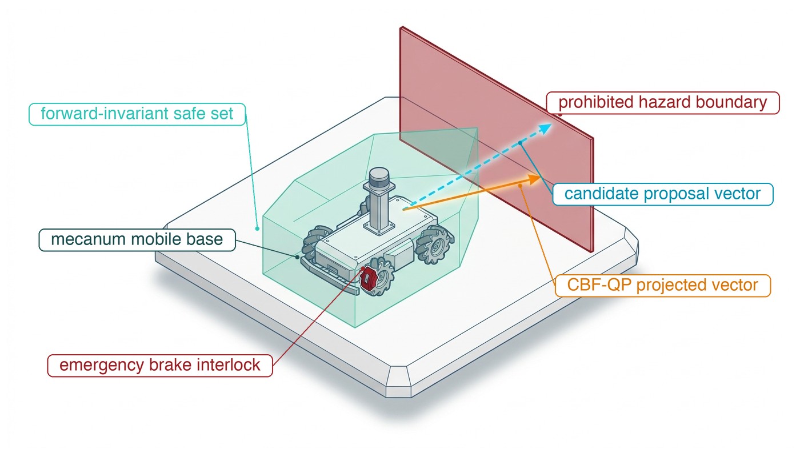
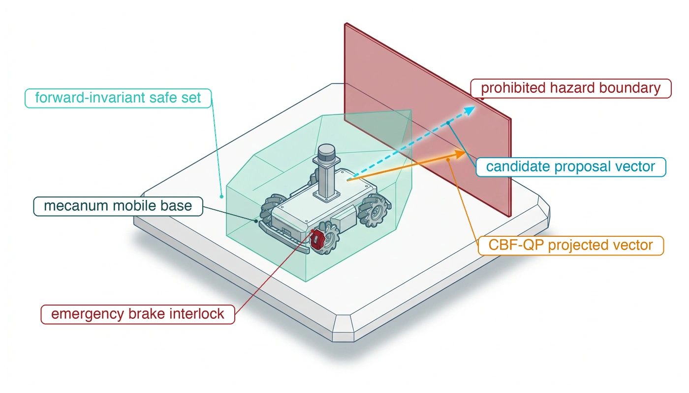
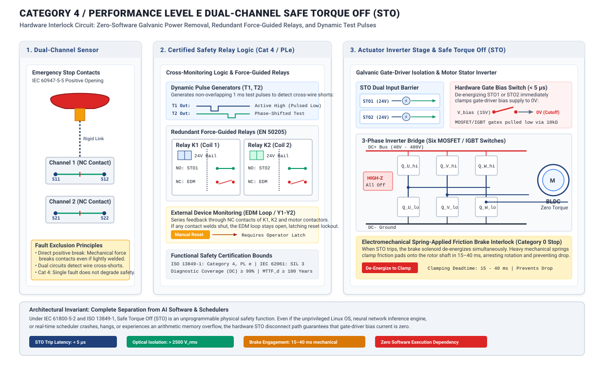
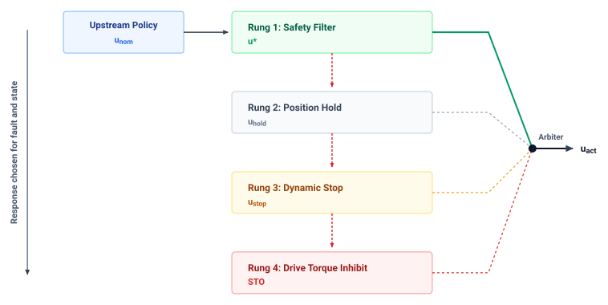

# Safety Enforcement {#sec-enforcement}

::: {layout-narrow}
::: {.column-margin}

\chapterminitoc

:::

::: {.content-visible when-format="pdf"}
\noindent
{fig-alt="Isometric blueprint showing runtime safety enforcement for an autonomous mobile robot: omnidirectional mecanum base, translucent mint-green forward-invariant safe set boundary, candidate cyan neural proposal vector pointing toward a prohibited crimson hazard wall, amber CBF-QP projected admissible vector, and crimson emergency brake interlock."}
:::

::: {.content-visible unless-format="pdf"}
{fig-alt="Isometric blueprint showing runtime safety enforcement for an autonomous mobile robot: omnidirectional mecanum base, translucent mint-green forward-invariant safe set boundary, candidate cyan neural proposal vector pointing toward a prohibited crimson hazard wall, amber CBF-QP projected admissible vector, and crimson emergency brake interlock."}
:::

:::

## Purpose {.unnumbered .unlisted}

::: {.content-visible when-format="pdf"}
\begin{marginfigure}
\vspace{1em}
\resizebox{\linewidth}{!}{\mlphysicalstackfull{20}{100}{20}{20}{20}}
\end{marginfigure}
:::

_How does an unprivileged software proposal become physical torque, and what lets the gatekeeper refuse it in time?_

A policy can propose commands exceeding the machine's clearance or actuator capacity. Once that command becomes motor current, diagnosing the model's mistake cannot undo the resulting motion. An independent enforcement path must evaluate proposals before they reach the actuators and retain the authority to reject them within a bounded time. Timely refusal is insufficient. The replacement command must also produce the intended physical response. A brake that has reached its current limit cannot deliver additional force because the safety calculation assumes it can. Enforcement therefore depends on measured state and on the tracking error of the feedback loops beneath it, and because every stop must fit inside the clearance that remains, the same check decides how fast the machine may move at all. When those conditions no longer support the requested motion, the machine needs a fallback whose limits are explicit, and a record of what it assumed and checked, which later testing and release must judge. Enforcement is the work of the Nervous System, which holds the permission path between the Brain's proposals and the Body's capacity to track and stop.



::: {.callout-learning-objectives}

- Explain the relationship between tracking accuracy, command permission, and independent enforcement at the actuator boundary
- Diagnose how update rate, feedback delay, and actuator saturation limit corrective control
- Calculate the finished stopping budget and the speed ceiling it sets from response delay, braking, localization, and tracking error
- Evaluate with a velocity-dependent barrier whether a proposed torque must be accepted, projected, or refused
- Select fallback responses when sensing, computation, or actuator limits invalidate normal enforcement
- Construct an enforcement record that binds each check to its detector, its fallback response, and the records it consumes

:::

## The Deterministic Gatekeeper {#sec-enforcement-deterministic-gatekeeper}

The MCU admits the warehouse mobile manipulator's run down the aisle only after the matched stop suffix named in its trajectory record (@sec-planning-trajectory-contract) is resident on the permission processor and feasible from every state reachable before commitment. That admission checks a plan once, before the motion starts. The machine then executes the plan one millisecond tick at a time, and on each tick the live state can drift from the one the planner assumed. The tracker lags its reference, a person steps out at the rack end, a payload loads the arm, or the chunk policy proposes a torque the admitted plan never contained. What follows is the check made on every tick, and the response it selects when even the resident stop no longer fits.

The learned proposers behind those commands (vision-language-action models, reinforcement learning policies, and diffusion policies) excel at open-ended manipulation and adaptive navigation in unmodeled environments, but they are unverified, non-deterministic optimizers. They can hallucinate infeasible paths, mistake specular reflections for open corridors, or emit joint commands that exceed mechanical torque limits. In standard software engineering, an algorithmic bug or invalid pointer can be trapped by a kernel exception handler or contained inside an application sandbox. In physical AI, containment of that kind ends once a command becomes current in a winding. By the irreversibility law of @sec-boundary-bedrock-laws, no exception handler can recall the momentum that current imparts, so a bad command has to be stopped before it reaches the drive.

The central problem of enforcement is to keep the task competence of stochastic learned policies without letting the machine breach geometric clearance, thermal limits, or human-safety invariants.

Solving it requires a gatekeeper on the permission side of the proposal boundary. The **reflex enforcer**\index{Reflex enforcer} is that gatekeeper: an edge-deployed, hard real-time component positioned directly in front of the actuator drive electronics. It evaluates candidate proposals, verifies invariant state bounds, and holds the exclusive, irrevocable hardware authority to permit current flow or command autonomous fallback braking.

::: {.column-margin .margin-pointer}
↰ **Prerequisite:** The proposal boundary is defined in @sec-boundary-machine-model.
:::

The proposal boundary creates an asymmetric authority relationship between the Brain and the Nervous System. Upstream neural policies emit candidate control proposals, each valid only until its chunk lease expires (@sec-nervous-cadences). But only the permission path, executing on bare-metal microcontroller hardware directly wired to motor drives and joint encoders, possesses the physical authority to turn a proposal into mechanical force. In the design this chapter follows, the enforcer evaluates incoming setpoints each millisecond control cycle against validated constraints using **Control Barrier Functions (CBFs)**[^fn-enf-barrier-function] [@ames2019control]. When a proposal is safe, it passes to the motor drives unaltered. When a proposal marginally threatens a boundary, an active-set Quadratic Program (CBF-QP) minimally modifies the command, minimizing torque deviation while enforcing the derived constraint.[^fn-enf-quadratic-program] When a proposal is structurally invalid or the proposer falls silent, the gatekeeper severs the command channel and triggers an autonomous fallback deceleration sequence.

[^fn-enf-barrier-function]: **Control barrier functions and forward invariance**\index{Control barrier function!forward invariance}\index{Safety filter!barrier certificate}: Control Barrier Functions define a continuously differentiable certificate $h(\mathbf{x}) \ge 0$ over an admissible safe set $\mathcal{C}$, enforcing the directional clearance derivative constraint $\dot{h}(\mathbf{x}, \mathbf{u}) \ge -\gamma(h(\mathbf{x}))$. Enforcing this inequality renders $\mathcal{C}$ forward-invariant: states initialized in a viable set can remain there while the barrier is feasible and the stated model and timing assumptions hold. When approaching the boundary, the constraint forces opposing actuation inputs that arrest momentum before physical contact can occur.

[^fn-enf-quadratic-program]: **Active-set quadratic programming for safety shields**\index{Quadratic programming!active-set solver}\index{Safety shield!sub-millisecond QP}: Active-set Quadratic Programming solvers operating on bare-metal microcontrollers compute $\min_{\mathbf{u}} \frac{1}{2} \|\mathbf{u} - \mathbf{u}_{\text{nom}}\|^2$ subject to linear barrier constraints $\mathbf{a}(\mathbf{x})^\top \mathbf{u} \le b(\mathbf{x})$. By restricting linear constraints to active boundary contacts and eliminating dynamic memory allocation, a fixed iteration limit and tested platform can bound termination; no universal $150\,\mu\text{s}$ limit follows from the solver type. If numerical ill-conditioning prevents convergence before the loop deadline, the solver aborts gracefully to an autonomous deceleration fallback.

However, an enforcer cannot guarantee safety beyond the physical tracking fidelity of the control loop beneath it. Every mathematical barrier certificate assumes that the closed-loop tracking controller follows commanded references within a bounded error. The enforcer consumes a single foundational contract from the controller: an explicit bound on the **worst-case tracking error** ($\epsilon_{\text{track}}$) between where the machine was commanded to be and where its physical mass actually resides. Every geometric clearance and dynamic velocity ceiling evaluated by the enforcer must be strictly inset by this error bound plus transport lag displacement.

Constructing this deterministic protective shield requires establishing the exact contractual boundaries between continuous tracking controllers, optimization-based safety filters, and bare-metal fallback actuators. The system cannot enforce safety in the abstract; it must ground barrier certificates in the verified tracking error and transport lag of the physical plant, structure asymmetric authority to reject ungrounded neural proposals, and place the enforcer where it acts on evidence the proposer cannot corrupt. When finite actuator torque and dynamic traps contract the admissible state space, minimal-intervention quadratic programs project candidate actions onto forward-invariant safe sets, or a state-matched fallback brings kinetic energy to zero, and the enforcement record states the premises of each response.

The first quantity the enforcer needs is the tracking error that remains after a permitted command reaches the physical plant.

## What the Tracker Hands Over {#sec-enforcement-handoff}

The tracker, the feedback controller that turns each admitted reference into a torque command on every tick (@sec-planning-handoff), isolates the enforcer from the plant's internal mechanics. It makes many internal guarantees, but only one critical metric passes upward across the systems interface. Within a validated envelope of reference acceleration, load, temperature, and disturbance, the tracker may provide a transient bound $\|x(t) - r(t)\| \le \epsilon_{\text{track}}$ over the complete maneuver. The enforcer\index{Enforcer!tracking contract} does not inspect transfer functions, root loci, or proportional-integral-derivative (PID) gains. To the software sitting above the loop, the tracker is a black box that turns reference setpoints into physical motion held within the error bound $\epsilon_{\text{track}}$\index{Tracking error bound} of the commanded path.

This bound is a physical distance, not a mathematical abstraction. A physical plant is governed by rotor inertia, transmission compliance, and actuator torque limits\index{Actuator torque limits}. The steady-state position error—the persistent physical gap between the commanded destination and the actual resting place—balances unmodeled external disturbances against the restoring control effort of the closed-loop stiffness\index{Closed-loop stiffness}. A steady-state stiffness calculation alone does not bound transient overshoot or settling; the required bound also needs validated dynamics or full-maneuver testing.[^fn-math-tracking-error]

[^fn-math-tracking-error]: **Closed-loop tracking stiffness and disturbance bounds**\index{Tracking error!disturbance bounds}\index{Control loop!closed-loop stiffness}: Sustained force and effective closed-loop stiffness determine static deflection. Transient tracking also depends on inertia, damping, command shape, and saturation. Disturbances outside the validated envelope invalidate the claimed tube; they need not produce exponential divergence.

Consider a linear positioning stage in which friction and payload variations introduce disturbance forces. If the largest disturbance produces a steady-state error of $5.0\text{ mm}$ (illustrative; see the Reader Guide), and the reference command executes a step of $100.0\text{ mm}$, the carriage accelerates and eventually settles. At steady state, the physical carriage does not sit precisely at $100.0\text{ mm}$. It rests anywhere within the interval $[95.0\text{ mm}, 105.0\text{ mm}]$.

For the clearance example that follows, assume that full-maneuver validation separately establishes $\epsilon_{\text{track}}=5.0\text{ mm}$; its equality with the settled error is a scenario choice. The controller holds that bound only while three conditions hold. First, the reference trajectory cannot demand accelerations beyond what the actuators can deliver. Second, external disturbances must remain strictly below $d_{\text{max}}$. Third, the actuator must operate below the continuous thermal derating limits established in @sec-body-thermal-duty-cycles (governed by Joule heating\index{Joule heating}) and voltage bus rails. If an upstream policy commands a trajectory that demands an acceleration of $15.0\text{ m/s}^2$ from an actuator whose peak torque caps acceleration at $10.0\text{ m/s}^2$, the feedback loop saturates\index{Actuator saturation}. The integrator winds up\index{Integrator windup}, phase lag accumulates, and the physical mechanism falls behind the reference by an amount that grows with every millisecond of saturation. If an unexpected external load exceeds the validated disturbance envelope, the controller can leave the assumed $\pm 5.0\text{ mm}$ transient corridor. Outside its rated envelope, the controller provides no bound at all.

Because physical reality can diverge from the reference command by up to $\epsilon_{\text{track}}$, every geometric and dynamic margin evaluated by an enforcer must be inset by that exact distance. If a robot arm must maintain a physical clearance of at least $20.0\text{ mm}$ from a fragile fixture, and the tracking loop's bound is $\epsilon_{\text{track}} = 5.0\text{ mm}$, the enforcer cannot evaluate safety against the nominal geometry. It must inset the admissible state space by adding a virtual buffer of $5.0\text{ mm}$, checking that the commanded reference maintains a clearance of at least $25.0\text{ mm}$ from the obstacle surface. Every geometric margin is inset by $\epsilon_{\text{track}}$ in the same way, and @sec-enforcement-stopping-envelopes carries that inset into the stopping distance, where delay and localization error also consume clearance.

If worn bearings\index{Wear!bearings}, thermal expansion, or altered motor parameters loosen the true tracking error from $5.0\text{ mm}$ to $12.0\text{ mm}$ without the enforcer updating its internal model, the true physical clearance to the fixture shrinks from $20.0\text{ mm}$ to $13.0\text{ mm}$. The enforcer believes it is operating with a comfortable safety margin while the physical hardware moves dangerously close to collision. A degraded tracking bound silently erodes safety margins across the entire software stack.

::: {.column-margin .margin-pointer}
↰ **Prerequisite:** Spatial clearance insetting from sensor covariance and transport delay originates in @sec-perception-error-clearance.
:::

A tracking bound never checked at runtime is an assumption, not a contract. Because environmental conditions fluctuate and mechanical components degrade, the Nervous System must publish $\epsilon_{\text{track}}$ alongside the explicit operational conditions that validate it, while monitoring the instantaneous tracking error $e(t) = \|x(t) - r(t)\|$ on every tick of the control cycle. If sensor feedback reveals that $e(t)$ approaches or exceeds $\epsilon_{\text{track}}$, the tracking contract has broken. When a disturbance force spikes to $40.0\text{ N}$ or an actuator enters thermal throttling, the permission path cannot treat the resulting divergence as a normal transient. It must detect the contract violation immediately, invalidating the spatial assumptions used by downstream filters before unmodeled deflection causes physical damage.

::: {#psp-enforcement-inset-margin .callout-perspective title="The inset margin invariant"}
Every spatial and dynamic safety boundary evaluated by an enforcer must be inset by the underlying tracking loop's verified worst-case tracking error, and the stopping envelope of @eq-enforce-stopping-envelope carries that inset, together with the travel during transport lag\index{Transport lag}, into every admission check. An enforcer that evaluates barrier certificates\index{Barrier certificates} against nominal geometric boundaries without insetting will permit trajectories that physically collide with obstacles whenever tracking error reaches its certified bound.
:::

The mathematical synthesis of tracking controllers, observer design, and disturbance rejection proofs are treated in depth by the control literature [@slotine1991applied; @astrom2021feedback]. For the systems engineer building physical AI architectures, the responsibility begins where control guarantees end. The tracking controller provides the mechanism to translate permitted references into physical currents, but it has no semantic awareness of obstacles, task goals, or system-level hazards. It will execute a command into a solid wall with the same closed-loop fidelity that it brings to free-space motion. Before any proposed action is handed to this tracking machinery, the system must determine whether the proposal is permitted to become force at all.

## The Authority to Refuse {#sec-enforcement-authority-refuse}

A chunk arrives from the application processor on time, well formed, and carrying a fresh evidence time, and one of its setpoints would drive the arm into a rack upright. Nothing in the packet marks that setpoint as wrong. The permission path therefore grants no authority to an incoming learned proposal until that proposal passes the configured state, input, freshness, and stopping-clearance checks. This is the third law, proposal is not permission (principle \ref{pri-vol4-proposal-permission}), enforced one tick at a time. In conventional automation, control pipelines operate on trust, executing commands under the assumption that the upstream software component produces valid setpoints. In physical AI, that assumption fails by design. A learned policy operating in high-dimensional perception space has no mathematical guarantees of stability, no bounded output variance, and no internal representation of actuator current limits or mechanical stress. The learned model cannot be held accountable for physical damage, so the permission path must not treat its outputs as authoritative. Upstream models produce advisory proposals, and only the permission path holds the physical authority to turn a proposal into force.

The Simplex architecture [@sha2001using] is one realization of the permission path.\index{Simplex architecture pattern} It resolves the tension between task performance and safety by decomposing the control system into four structural components:

1. **The advanced controller**\index{Simplex architecture!Advanced controller}: An unverified, high-capacity learned model (such as a Vision-Language-Action network, a residual reinforcement learning policy [@johannink2019residual], or a diffusion policy executing on a Linux MPU) that optimizes for complex, open-ended task performance.
2. **The baseline safety controller**\index{Simplex architecture!Baseline controller}: A certified, high-assurance deterministic controller (on this permission path, the matched stop suffix admitted with the trajectory in @sec-planning-behavior-seam, resident in bare-metal MCU firmware) that acts as the trusted low-level stabilization baseline of the physical plant, providing tested stability and stopping behavior under stated conditions.
3. **The safety manager**\index{Simplex architecture!Safety manager}: Deterministic arbitration logic that continuously evaluates the state of the machine against forward-invariant barrier sets, tracking error bounds, and execution deadlines.
4. **The output selector**\index{Output selector}: An atomic hardware or real-time firmware multiplexer that routes actuation signals to the motor bridge. The selector admits a checked proposal when conditions hold and transfers to a resident baseline within its qualified response delay when those conditions fail.

Under this contract, the upstream policy never commands the plant directly. Instead, communication across the causal boundary operates through the chunk lease of @sec-nervous-cadences, a dead-man permission that expires unless renewed by a fresh proposal. The Linux MPU transmits candidate control vectors as structured packets over shared SRAM mailboxes through a configured interprocessor channel, such as RPMsg.[^fn-hw-rpmsg-lease] Each proposal carries the proposal header of @sec-nervous-cadences, which gives a sequence number, the evidence time and expiry on the permission processor's clock with the conversion's error bound, and a checksum against accidental corruption, ahead of its candidate setpoints. It carries no keyed tag, because the permission path admits a proposal by its content, not its origin. In this implementation, the MCU checks command age on each control cycle, adding that conversion error bound. If the proposal is fresh, the state remains in the validated viable region, and tracking error remains bounded, the output selector permits the proposal (or its minimally projected variant) to drive the actuators. If the lease expires without renewal, tracking diverges, or the proposal threatens physical boundaries, the output selector revokes permission and engages the baseline safety controller unilaterally.[^fn-hw-pwm-tripzone] The upstream policy is not consulted, does not negotiate, and possesses no hardware mechanism to override the selector.

[^fn-hw-rpmsg-lease]: **Remote Processor Messaging**\index{Remote Processor Messaging!Shared SRAM leases}\index{Inter-processor communication!RPMSG}: Linux RPMsg provides virtio-based messaging between processors. Buffer ownership, copies, scheduling delay, and worst-case handover time depend on the platform; OpenAMP offers a separate no-copy API. The lease requires a measured, bounded delivery path.

[^fn-hw-pwm-tripzone]: **Hardware break circuits and PWM trip zones**\index{Hardware!Trip zones}\index{Pulse-width modulation!Hardware clamp}: A configured external timer break input such as `TIMx_BKIN` can force PWM outputs to a specified state without waiting for an interrupt. `EPWM_TZFRC` is a software force mechanism, not the external trip input. Output state and response time depend on the timer, gate drive, wiring, and qualification tests; the trip still needs a physically suitable stop path.

When a proposal conflicts with physical constraints, the enforcer chooses between two interventions: command filtering and outright veto. Command filtering applies when the proposal is structurally sound but marginally exceeds an admissible kinematic or dynamic boundary. If an analytical model of a six-axis manipulator shows that a proposed end-effector velocity vector demands a joint speed 4 percent above a rated motor limit of $3.0\text{ rad/s}$, the enforcer can shave off the excess by projecting the command onto the boundary of the safe set, the least-change correction that @sec-enforcement-minimal-intervention computes as a quadratic program\index{Quadratic programming} constrained by a Control Barrier Function\index{Control barrier function}.

Filtering must respect momentum as well as position. Whenever the machine is moving toward a boundary, the actuators must still be able to exert enough opposing torque to stop before clearance vanishes, and @sec-enforcement-safe-sets-conditional-permission builds the velocity-dependent barrier that encodes this requirement as a constraint on torque. Projection is permissible only when the deviation is local, continuous, and well clear of a hazard boundary. When a proposal exhibits structural invalidity—such as a discontinuous jump in commanded position across consecutive frames, a request for acceleration that exceeds maximum physical torque capabilities, or a trajectory vector aimed directly into an immovable obstacle—geometric projection becomes dangerous. A discontinuous or wildly infeasible proposal indicates that the upstream perception or inference pipeline has entered an unmodeled failure mode. Attempting to project an ungrounded hallucination onto the nearest safe boundary executes a synthetic motion that has no relationship to task intent. In such cases, the enforcer must veto the proposal entirely, and the output selector drops authority to a local fallback.

Filtering and veto both happen at runtime, and training the policy to behave cannot replace either. As @sec-boundary-bedrock-laws argues, penalty terms and barrier losses shape the distribution a policy learns but do not bound what the deployed policy emits. Constrained reinforcement learning\index{Constrained reinforcement learning} sharpens the point. It bounds the expected cost of violations over rollout episodes, and an expectation permits a collision in a small fraction of trials provided the remaining trials keep the average below its limit. An expected cost limit does not bound the consequence of an individual high-momentum collision, so the permission path checks each candidate at its sampled actuation boundary, whatever objective trained the proposer. When the proposal is safe, the check is transparent and the learned competence passes to the drive unchanged.

```{python}
#| label: calc-enforcement-lease-stop
#| echo: false
# ┌─────────────────────────────────────────────────────────────────────────────
# │ TIMING CONTRACT AND THE LEASE-EXPIRY WORST CASE
# ├─────────────────────────────────────────────────────────────────────────────
# │ Context: the lease paragraph below; the cycle timeline, @tbl-12-fallback-hierarchy,
# │          the enforcement record, and the summary reuse these strings.
# │ Goal:    state the three timers and the delay from last renewal to brake onset.
# │ Show:    chunk rate, lease, heartbeat rate and timeout, self-watchdog,
# │          tick, bus cycle, brake onset, renewal-to-onset delay.
# │ How:     the same RM/AISLE fields that size the lease in @sec-nervous-cadences.
# └─────────────────────────────────────────────────────────────────────────────
from mlsysim import *
from mlsysim.fmt import fmt, fmt_latency, check

RM = Embodied.MobileManipulator.WarehouseMobileManipulator
AISLE = Embodied.Scenario.WarehouseAisle

class EnforcementLeaseStop:
    # ┌── 1. LOAD ───────────────────────────────────────────────────────────
    chunk_rate = RM.chunk_rate  # category: chosen
    lease = AISLE.t_lease  # category: chosen
    heartbeat_rate = AISLE.heartbeat_rate  # category: chosen
    heartbeat_timeout = AISLE.heartbeat_timeout  # category: chosen
    self_watchdog = AISLE.mcu_self_watchdog  # category: chosen
    tick = AISLE.t_tick  # category: chosen
    bus = AISLE.t_bus  # category: illustrative
    onset = AISLE.t_brake_onset  # category: illustrative

    # ┌── 2. EXECUTE ────────────────────────────────────────────────────────
    chunk_period = (1 / chunk_rate).to(millisecond)
    renewal_to_onset = (lease + tick + bus + onset).to(millisecond)

    # ┌── 3. GUARD ──────────────────────────────────────────────────────────
    check(chunk_period < lease, "One chunk period must fit inside the lease.")
    check(heartbeat_timeout < lease, "A total host stall must trip the heartbeat before the lease expires.")
    check(abs(lease.to(millisecond).magnitude - 60.0) < 1e-9, "The chunk lease is 60 ms.")
    check(abs(renewal_to_onset.magnitude - 82.0) < 1e-9, "Brake onset comes 82 ms after the last valid renewal.")

    # ┌── 4. OUTPUT ─────────────────────────────────────────────────────────
    chunk_rate_hz_str = fmt(chunk_rate.to(hertz).magnitude, precision=0)
    lease_ms_str = fmt_latency(lease, unit=millisecond, precision=0)
    heartbeat_rate_hz_str = fmt(heartbeat_rate.to(hertz).magnitude, precision=0)
    heartbeat_timeout_ms_str = fmt_latency(heartbeat_timeout, unit=millisecond, precision=0)
    self_watchdog_ms_str = fmt_latency(self_watchdog, unit=millisecond, precision=0)
    tick_ms_str = fmt_latency(tick, unit=millisecond, precision=0)
    bus_ms_str = fmt_latency(bus, unit=millisecond, precision=0)
    onset_ms_str = fmt_latency(onset, unit=millisecond, precision=0)
    renewal_to_onset_ms_str = fmt_latency(renewal_to_onset, unit=millisecond, precision=0)
```

The enforcer keeps authority when the upstream host stalls because it holds the chunk lease of @sec-nervous-cadences, `{python} EnforcementLeaseStop.lease_ms_str`, sized there to outlast one chunk period and its renewal jitter. A separate `{python} EnforcementLeaseStop.heartbeat_rate_hz_str` $\text{Hz}$ host heartbeat has a validated maximum interval of $15\text{ ms}$ and a `{python} EnforcementLeaseStop.heartbeat_timeout_ms_str` silence timeout. The $1\text{ kHz}$ MCU loop feeds its own `{python} EnforcementLeaseStop.self_watchdog_ms_str` self-watchdog only after a successful cycle; a separate external trip covers MCU failure. At each timeout the MCU revokes the proposal and executes a resident, state-matched fallback, provided the reserved clearance and available braking still suffice. On the warehouse mobile manipulator, if a proposer renews its lease and then stalls, the brake still begins within `{python} EnforcementLeaseStop.renewal_to_onset_ms_str` of the last valid renewal. The age of the frame that showed the person adds to that delay, and @sec-enforcement-stopping-envelopes carries the sum into the admission check. This lease-expiry case assumes the separate heartbeat remains live while fresh admissible proposals stop arriving; a total host stall triggers the `{python} EnforcementLeaseStop.heartbeat_timeout_ms_str` heartbeat timeout earlier.

Severing upstream authority requires a defined physical response at the lowest hardware interface. The **zero-command floor**\index{Zero-command floor} is the configured response when active software control disappears; its safety depends on the plant state and available restraint. In software systems, halting an execution pipeline often corresponds to returning a null pointer or clearing a status register. In physical systems, writing zero to a motor drive register produces different mechanics depending on actuator electrical and mechanical topology. Setting current commands to zero in a low-friction, direct-drive motor removes motor torque, allowing a gravity-loaded arm to descend unless a separate restraint carries the load. Conversely, commanding zero velocity in a stiff position controller can request a large transient; actual transmitted load and damage depend on the drive, compliance, and mechanism. The system designer must select the zero-command response to match the plant. In geared transmissions with high backdrivability, dynamic braking\index{Dynamic braking} shorts the motor windings through low-resistance shunts or MOSFET bridges. This converts the back-electromotive force\index{Back-electromotive force} (the voltage a spinning motor naturally generates by acting as a generator) into electrical current that resists motion, generating braking torque that falls with speed. This damping can dissipate energy as heat, but it must be validated for the load and thermal endpoint and cannot hold at standstill by itself. When static holding or power-off safety is required, a separate spring-applied friction brake can hold the load only within its verified engagement speed and rating.

Refusal is therefore a steady-state decision, not only an emergency exception. On each millisecond control tick, the enforcer checks the proposal's freshness against its lease and evidence deadline, the separate host heartbeat, the actuator and kinetic limits that apply in the current state, tracking error against its bound, and that a fallback remains feasible from the current state. If a check fails, it revokes the proposal and selects the resident response appropriate to the current state and available clearance. That path must remain able to act when the upstream proposal source fails, and where it sits in the signal chain decides what it can see and how quickly it can act.

## Where the Enforcer Sits {#sec-enforcement-where-enforcer-sits}

The enforcer sits at a specific physical and logical boundary in the signal pipeline, determined by the dynamics' timescale and the latencies of the feeding channels. Two natural boundaries exist in every machine that translates learned proposals into motion. One boundary sits upstream of the feedback control loop, where the system executes reference checking. A reference checker validates planned trajectory waypoints, coordinate targets, or velocity vectors emitted by a high-level planner before those targets enter the tracking loop. Because it operates in kinematic space over a forward horizon, a kinematic reference checker\index{Reference checker!kinematic} operating at $50\text{ Hz}$ can evaluate a $300\text{ ms}$ trajectory segment against static geometric envelopes, workspace boundaries, and self-collision models. The strength of reference checking is wide spatial foresight, but its fundamental limitation is complete blindness to the actual physical state of the plant. If a planned path maintains a clearance of $5.0\text{ mm}$ from a steel bracket, the reference checker marks the command valid. Yet if the downstream tracking controller exhibits a transient position overshoot of $10.0\text{ mm}$ when accelerating a heavy load, the physical arm strikes the bracket despite passing every upstream validation step.

::: {.column-margin .margin-pointer}
↳ **Downstream:** Heterogeneous silicon partitioning of the reflex enforcer onto isolated microcontroller enclaves is mapped in @sec-placement-two-paths-one-die.
:::

The second boundary sits downstream of the feedback controller, near the power electronics, where the system executes command checking. A command checker inspects the raw physical quantities produced by the tracking loop, evaluating motor phase currents, hydraulic valve spool displacements, pulse-width modulation duty cycles, and joint torque references immediately before writing them to hardware registers. Operating at a plant-derived inner-loop frequency, illustrated here by $1000\text{ Hz}$, the command checker enforces hard instantaneous limits. It prevents electrical overcurrent, structural over-torque, and thermal runaway by clipping or zeroing signals that exceed the physical ratings of the plant. What the command checker gains in physical certainty, it surrenders in temporal foresight. A scalar command clamp lacks future-state information; a kinetic barrier at the same tick can use a validated stopping model. An instantaneous torque command of $18\text{ N}\cdot\text{m}$, which is well within a thermal continuous rating of $45\text{ N}\cdot\text{m}$, appears entirely safe to a post-control monitor. However, if that torque accelerates a $10\text{ kg}\cdot\text{m}^2$ linkage toward a rigid stop at $1.5\text{ rad/s}$, the rotational kinetic energy of the mechanism will exceed the maximum deceleration capacity of the actuator over the remaining travel distance. The command checker detects no fault until the linkage is inches from impact, at which point no allowable reverse torque can prevent a collision.

This split reveals the trade-off between latency and visibility. Reference checkers possess multi-step geometric visibility but suffer from high latency and blind spots regarding closed-loop tracking dynamics. In this example, operating at planning rates between $10\text{ Hz}$ and $50\text{ Hz}$, a reference filter cannot respond to unmodeled plant resonance, sensor noise amplification, or sudden control instability occurring at frequencies above its update rate. If a feedback controller develops a $60\text{ Hz}$ limit cycle oscillation, the reference setpoints remain stationary while the physical linkages shake. Conversely, command checkers can run each millisecond tick with a separately measured input-to-output delay, but their one-step horizon creates dynamic traps where every instantaneous torque is legal until an irrecoverable state is reached.

The placement of the enforcer also determines how it integrates into the computing fabric. In a sequential in-line architecture, every signal passes synchronously through the enforcement logic before reaching the next stage. A reference checker filters the trajectory before the controller reads it, or a command clamp modifies the torque register before the motor drive samples it. Sequential execution guarantees zero uninspected commands, but it inserts the worst-case execution time of the enforcer directly into the critical latency path. For a digital $1000\text{ Hz}$ control loop\index{Control loop!digital} with a total deadline of $1000\,\mu\text{s}$, allocating a $P_{99}$ latency of $250\,\mu\text{s}$ to an in-line safety check shrinks the budget available for feedback computation. If the enforcer overruns its execution budget, the entire cycle faults. In a parallel asynchronous architecture, the enforcer executes on a separate co-processor or an isolated processor core, monitoring the state of the machine and the command stream concurrently without intercepting every cycle. When the parallel monitor detects an invariant violation, it asserts a hardware line to open a safety contactor (physically severing high-voltage power to the actuators) or switch the motor drive to dynamic braking (shorting the motor phases to rapidly dissipate kinetic energy). Parallel execution preserves control loop timing, but the asynchronous detection and communication introduce an enforcement lag bounded by the monitor cycle time and bus jitter\index{Latency!bus jitter}, with empirical EtherCAT measurements showing $3.0\text{ ms}$ to $8.0\text{ ms}$ of communication transport lag. To compensate for this reaction delay, the system designer must expand the physical safety margins, slowing the machine or increasing its minimum clearance buffers.

Because neither single location provides both dynamic foresight and instantaneous protection, physical AI architectures resolve the tension through a **dual-stage enforcement pattern**\index{Dual-stage enforcement pattern}. This pattern maps onto the two-processor implementation of the machine model (@sec-boundary-machine-model):

- **Upstream Stage (Advisory Corridor Pre-Check on Application MPU):** Operating at $20\text{--}50\text{ Hz}$ on an unprivileged application microprocessor core, this stage screens multi-step trajectory chunks emitted by the learned policy against a dynamic stopping corridor under worst-case braking parameters and against static workspace envelopes before packing the waypoints into a leased chunk proposal sent over RPMsg. The stage is advisory. It spares the MCU proposals that would fail, but it runs on the proposer's side of the proposal boundary, so the binding admission of the trajectory and its stop suffix stays on the MCU (@sec-planning-behavior-seam).
- **Downstream Stage (Instantaneous CBF-QP Safety Shield on Bare-Metal MCU):** Operating inside a strict $1000\text{ Hz}$ ($1000\,\mu\text{s}$) timer interrupt loop on an isolated hard real-time safety microcontroller, this stage receives the proposed setpoint from shared SRAM, verifies tracking error bounds, solves an active-set Control Barrier Function (CBF-QP)\index{Safety shield!control barrier function} quadratic program in pre-allocated static SRAM, and clamps raw current and torque commands directly before writing to PWM timer registers. The barrier it enforces reduces to a single-step convex projection (@sec-enforcement-safe-sets-conditional-permission), whose execution time must be bounded on the selected hardware.

The advisory pre-check screens for a feasible stop before a chunk is sent, and the drive-side stage checks current observations and commands on every tick, but neither stage can recover a state that has already exhausted braking clearance.

Correct placement does not help if the enforcer's inputs share failure modes with the component it checks. An enforcer may only evaluate quantities that it can establish independently of the proposal path. If the advisory corridor pre-check, or any enforcer, calculates collision distances using a depth map generated by the same neural perception model that planned the motion, an out-of-distribution visual artifact will deceive both the planner and the enforcer simultaneously. Independent enforcement requires independent sensing and isolated computation. On two-processor system-on-chip (SoC) designs and industrial robotics controllers, the bare-metal safety MCU reads secondary optical encoders and hardware limit switches wired directly to its own GPIO and hardware timer capture registers over dedicated buses, completely isolated from the Linux virtual memory space and operating system scheduler. A collision enforcer must read dedicated safety lidar or ultrasonic proximity sensors whose signal conditioning relies on deterministic threshold logic rather than learned inference. Where no physically independent sensor exists, such as when estimating the friction coefficient of a wet roadway or the variable mass of an unmodeled payload, the systems engineer cannot construct an independent physical guarantee. In those operating regimes, the safety claim is only as strong as the learned estimator's bounded uncertainty. Every invariant that the enforcer checks, whether evaluated upstream across a geometric corridor or downstream at the motor terminals, ultimately assumes that the physical plant retains the control authority to arrest its own motion before crossing a forbidden boundary.

::: {#psp-enforcement-simplex-independence .callout-perspective title="The monitor independence rule"}
A safety monitor must never evaluate a state estimate produced by the component it is designed to constrain, nor share an un-preemptible communication bus, memory matrix, or clock tree with unverified processes. Where independent sensing is physically impossible, the safety claim rests on the estimator's bounded model uncertainty, not on hardware.
:::

## Stopping Envelopes {#sec-enforcement-stopping-envelopes}

The chapters that own a stopping term have each added it to the warehouse mobile manipulator's budget at the rack end, and one term remains. The stopping envelope is the set of states from which a validated braking response can arrest motion before a boundary, and the irreversibility law (principle \ref{pri-vol4-irreversibility}) sets its test, $d_{\text{stop}} \le D_{\text{clear}}$ with every term of $d_{\text{stop}}$ taken from a measured limit of this machine. Reserving that response costs achievable speed, because velocity increases reaction travel linearly and braking travel quadratically. The machine must remain inside this envelope before a fault or unsafe proposal occurs.

The pre-brake delay $\tau_{\text{delay}}$ in the stopping distance of @sec-body-kinetic-momentum already includes the enforcer's own permission-loop tick, which @sec-nervous-cadences budgets with the lease path. What remains is the gap between the reference and the plant that follows it.

A pure kinematic calculation assumes that the underlying feedback controller tracks the reference trajectory with zero error. A real plant diverges from its reference under external disturbances, unmodeled joint friction, and sensor quantization (@sec-body-measurement-freshness), and that divergence is bounded by $\epsilon_{\text{track}}$ (@sec-enforcement-handoff). The permission path defends the stopping distance of @eq-body-stopping-distance inset by the tracking bound $\epsilon_{\text{track}}$: a commanded reference can be admitted only if the plant, which may lag that reference by up to $\epsilon_{\text{track}}$, can still stop inside $D_{\text{clear}}$. The admission condition is the stopping envelope:[^fn-math-stopping-dist]
$$v\,\tau_{\text{delay}} + \frac{v^2}{2a_{\text{eff}}} + \delta_{\text{loc}} + \delta_{\text{margin}} + \epsilon_{\text{track}} \le D_{\text{clear}}$$ {#eq-enforce-stopping-envelope}
Here $a_{\text{eff}}$ is the deceleration the resident stop actually uses, equal to the credible deceleration $a_{\text{brake}}$ for a constant-deceleration stop and smaller when the stop is shaped as in @sec-planning-behavior-seam; $\delta_{\text{loc}}$ is the localization bound and $\delta_{\text{margin}}$ the fixed protective clearance. The left side is the stopping distance $d_{\text{stop}}(v)$ of @eq-body-stopping-distance plus the tracking inset $\epsilon_{\text{track}}$.

[^fn-math-stopping-dist]: **Kinematic stopping distance and latency components**\index{Stopping envelope!Kinematic distance}\index{Latency!Stopping distance contribution}: The inset stopping distance in this model compounds five terms: response-delay travel, braking distance under the credible deceleration, the localization bound, the fixed protective clearance, and the transient tracking bound. Omitting computational transport delay or tracking error results in premature encroachment on physical obstacles before peak braking can engage. See @sec-appendix-systems-stopping for formal kinematic derivations.

Under those delay, estimate, and braking assumptions, any trajectory proposal that places the machine at a distance less than $d_{\text{stop}}(v) + \epsilon_{\text{track}}$ in @eq-enforce-stopping-envelope from a physical constraint along the direction of motion is unsafe and physically inadmissible. The stopping envelope is fundamentally anisotropic\index{Stopping envelope!Anisotropy}; an obstacle behind the instantaneous velocity vector requires clearance only for the positional tracking error $\epsilon_{\text{track}}$.

```{python}
#| label: calc-enforcement-stopping-budget
#| echo: false
# ┌─────────────────────────────────────────────────────────────────────────────
# │ THE FINISHED STOPPING BUDGET OF THE WAREHOUSE MOBILE MANIPULATOR
# ├─────────────────────────────────────────────────────────────────────────────
# │ Context: row 7 and aisle-speed prose below, @tbl-enforcement-stopping-budget.
# │ Goal:    add the tracking inset (row 7), then choose the aisle speed that the
# │          finished budget allows.
# │ Show:    each row's term, value, running total, and remainder at the drive
# │          limit; the same terms at the aisle speed; the ceiling; the time rows.
# │ How:     RM/AISLE fields; calc_c2_stop_suffix (row 6, a_eff),
# │          calc_max_permitted_velocity (ceiling), calc_safe_stopping_distance
# │          (cross-check), calc_action_chunk_streaming_amortization (time row).
# └─────────────────────────────────────────────────────────────────────────────
from mlsysim import *
from mlsysim.core.units import ureg, BYTES_FP16
from mlsysim.physics.robotics import (
    calc_c2_stop_suffix,
    calc_max_permitted_velocity,
    calc_safe_stopping_distance,
    calc_action_chunk_streaming_amortization,
)
from mlsysim.fmt import fmt, fmt_length, fmt_velocity, fmt_latency, fmt_acceleration, fmt_magnitude, fmt_math, check

RM = Embodied.MobileManipulator.WarehouseMobileManipulator
AISLE = Embodied.Scenario.WarehouseAisle

class EnforcementStoppingBudget:
    # ┌── 1. LOAD ───────────────────────────────────────────────────────────
    v_drive = RM.base.max_velocity  # category: illustrative (drive limit)
    v_aisle = AISLE.v_aisle  # category: chosen
    a_brake = AISLE.a_brake  # category: illustrative (credible, loaded, dry floor)
    d_clear = AISLE.d_clear  # category: illustrative
    delta_loc = AISLE.delta_loc  # category: illustrative
    delta_margin = AISLE.delta_margin  # category: chosen
    eps_track = AISLE.eps_track  # category: illustrative
    t_act = AISLE.t_brake_onset  # category: illustrative
    t_lease = AISLE.t_lease  # category: chosen
    t_tick = AISLE.t_tick  # category: chosen
    t_bus = AISLE.t_bus  # category: illustrative
    t_age = AISLE.perception_age  # category: derived
    tau_delay = AISLE.tau_delay  # category: derived
    v_human = AISLE.v_human_approach  # category: datasheet (ISO 13855 K)
    wcet = AISLE.enforcer_wcet  # category: chosen (declared)
    deadline = AISLE.enforcer_deadline  # category: chosen
    mu_inspected = AISLE.mu_inspected_floor  # category: illustrative
    frame_rate = RM.nav_camera.frame_rate  # category: datasheet (navigation camera)
    intent_weights = memory_from_params(RM.intent_model.parameters, BYTES_FP16)  # category: derived

    # ┌── 2. EXECUTE ────────────────────────────────────────────────────────
    lease_path = (t_lease + t_tick + t_bus).to(millisecond)
    overhead = (delta_loc + delta_margin).to(millimeter)
    c2_drive = calc_c2_stop_suffix(v_drive, a_brake)["distance"].to(millimeter)
    c2_aisle = calc_c2_stop_suffix(v_aisle, a_brake)["distance"].to(millimeter)
    a_eff = (v_drive**2 / (2 * c2_drive)).to(meter / second**2)

    # Rows 1-7 at the drive limit, in book order
    brake_drive = (v_drive**2 / (2 * a_brake)).to(millimeter)
    onset_drive = (v_drive * t_act).to(millimeter)
    lease_drive = (v_drive * lease_path).to(millimeter)
    age_drive = (v_drive * t_age).to(millimeter)
    shape_drive = (c2_drive - brake_drive).to(millimeter)
    inset = eps_track.to(millimeter)
    run1 = brake_drive
    run2 = run1 + overhead
    run3 = run2 + onset_drive
    run4 = run3 + lease_drive
    run5 = run4 + age_drive
    run6 = run5 + shape_drive
    run7 = run6 + inset
    left = [
        (d_clear - run1).to(millimeter),
        (d_clear - run2).to(millimeter),
        (d_clear - run3).to(millimeter),
        (d_clear - run4).to(millimeter),
        (d_clear - run5).to(millimeter),
        (d_clear - run6).to(millimeter),
        (d_clear - run7).to(millimeter),
    ]

    # The same terms at the aisle speed
    brake_aisle = (v_aisle**2 / (2 * a_brake)).to(millimeter)
    onset_aisle = (v_aisle * t_act).to(millimeter)
    lease_aisle = (v_aisle * lease_path).to(millimeter)
    age_aisle = (v_aisle * t_age).to(millimeter)
    shape_aisle = (c2_aisle - brake_aisle).to(millimeter)
    total_aisle = (brake_aisle + overhead + onset_aisle + lease_aisle + age_aisle + shape_aisle + inset).to(millimeter)
    spare = (d_clear - total_aisle).to(millimeter)

    # Speed is the one free term: the ceiling of @eq-enforce-stopping-envelope
    ceiling = calc_max_permitted_velocity(d_clear, tau_delay, a_eff, loc_margin=delta_loc, physical_margin=delta_margin + eps_track).to(
        meter / second
    )
    total_check = calc_safe_stopping_distance(v_drive, tau_delay, a_eff, loc_margin=delta_loc, physical_margin=delta_margin + eps_track).to(
        millimeter
    )

    # Time rows (no distance added)
    intent_sweep = calc_action_chunk_streaming_amortization(intent_weights, RM.brain_soc.memory.bandwidth, RM.chunk_horizon, RM.dram_efficiency)[
        "t_stream"
    ].to(millisecond)
    belief_life = ((delta_margin - delta_loc) / v_human).to(millisecond)
    two_frames = (2 / frame_rate).to(millisecond)
    missed_tick = (v_aisle * t_tick).to(millimeter)
    t_latest = (spare / v_aisle).to(millisecond)
    mu_min = (a_brake / ureg.standard_gravity).to("dimensionless").magnitude
    a_inspected = min(a_brake, (mu_inspected * ureg.standard_gravity).to(meter / second**2))
    ceiling_inspected = calc_max_permitted_velocity(
        d_clear,
        tau_delay,
        a_inspected * (a_eff / a_brake).to("dimensionless"),
        loc_margin=delta_loc,
        physical_margin=delta_margin + eps_track,
    ).to(meter / second)

    # ┌── 3. GUARD ──────────────────────────────────────────────────────────
    check(abs(run1.magnitude - 562.5) < 1e-6, "Row 1 running total is 562.5 mm.")
    check(abs(run2.magnitude - 712.5) < 1e-6, "Row 2 running total is 712.5 mm.")
    check(abs(run3.magnitude - 742.5) < 1e-6, "Row 3 running total is 742.5 mm.")
    check(abs(run4.magnitude - 835.5) < 1e-6, "Row 4 running total is 835.5 mm.")
    check(abs(run5.magnitude - 912.9) < 1e-6, "Row 5 running total is 912.9 mm.")
    check(abs(run6.magnitude - 1194.15) < 1e-6, "Row 6 running total is 1194.15 mm.")
    check(abs(run7.magnitude - 1234.15) < 1e-6, "Row 7 running total is 1234.15 mm.")
    check(abs(total_check.magnitude - run7.magnitude) < 1e-6, "Row 7 total must equal @eq-enforce-stopping-envelope at the drive limit.")
    check(abs(left[6].magnitude + 134.15) < 1e-6, "Row 7 runs 134.15 mm past the clear distance.")
    check(abs(lease_path.magnitude - 62.0) < 1e-9, "Lease path is 62 ms.")
    check(abs(tau_delay.magnitude - 133.6) < 1e-9, "tau_delay is 133.6 ms.")
    check(abs(a_eff.magnitude - 2.0 / 1.5) < 1e-9, "The C2 suffix uses a_eff = a_brake / 1.5.")
    check(abs(ceiling.magnitude - 1.3898) < 5e-5, "Ceiling is 1.39 m/s.")
    check(v_aisle < ceiling, "The chosen aisle speed must sit under the ceiling.")
    check(abs(total_aisle.magnitude - 997.43) < 1e-6, "Budget at 1.3 m/s is 997.43 mm.")
    check(abs(spare.magnitude - 102.57) < 1e-6, "Spare at 1.3 m/s is 102.57 mm.")
    check(abs(intent_sweep.magnitude - 98.04) < 5e-3, "Intent weight sweep is 98.0 ms.")
    check(intent_sweep > t_lease, "The intent sweep cannot renew a chunk lease.")
    check(abs(belief_life.magnitude - 31.25) < 1e-9, "Occluded-rack-end belief expires in about 31 ms.")
    check(belief_life < two_frames, "The rack-end belief lapses in under two camera frames.")
    check(abs(missed_tick.magnitude - 1.3) < 1e-9, "One missed tick costs 1.3 mm at 1.3 m/s.")
    check(wcet < deadline, "Declared WCET sits inside the deadline.")
    check(abs(t_latest.magnitude - 78.9) < 5e-2, "The spare lasts 78.9 ms at 1.3 m/s.")
    check(abs(mu_min - 0.204) < 5e-4, "Friction premise is 0.204.")
    check(abs(ceiling_inspected.magnitude - 1.0947) < 5e-5, "Inspected-floor ceiling is 1.09 m/s.")

    # ┌── 4. OUTPUT ─────────────────────────────────────────────────────────
    v_drive_str = fmt_velocity(v_drive, precision=1)
    v_aisle_str = fmt_velocity(v_aisle, precision=1)
    ceiling_str = fmt_velocity(ceiling, precision=2)
    ceiling_inspected_str = fmt_velocity(ceiling_inspected, precision=2)
    d_clear_str = fmt_length(d_clear, unit=meter, precision=2)
    a_brake_str = fmt_acceleration(a_brake, precision=0)
    a_eff_str = fmt_acceleration(a_eff, precision=2)
    tau_delay_str = fmt_latency(tau_delay, unit=millisecond, precision=1)
    lease_path_str = fmt_latency(lease_path, unit=millisecond, precision=0)
    t_age_str = fmt_latency(t_age, unit=millisecond, precision=1)
    intent_sweep_str = fmt_latency(intent_sweep, unit=millisecond, precision=1)
    belief_life_str = fmt_latency(belief_life, unit=millisecond, precision=2)
    wcet_str = fmt_latency(wcet, unit=microsecond, precision=0)
    deadline_str = fmt_latency(deadline, unit=microsecond, precision=0)
    missed_tick_str = fmt_length(missed_tick, unit=millimeter, precision=1)
    t_latest_str = fmt_latency(t_latest, unit=millisecond, precision=1)
    mu_min_str = fmt(mu_min, precision=3)
    mu_inspected_str = fmt(mu_inspected, precision=2)
    inset_str = fmt_length(inset, unit=millimeter, precision=0)
    run6_str = fmt_length(run6, unit=millimeter, precision=2)
    run7_str = fmt_length(run7, unit=millimeter, precision=2)
    over7_str = fmt_length(-left[6], unit=millimeter, precision=2)
    total_aisle_str = fmt_length(total_aisle, unit=millimeter, precision=1)
    spare_str = fmt_length(spare, unit=millimeter, precision=1)
    # Table cells (the column headers carry mm)
    brake_drive_value_str = fmt_magnitude(brake_drive, millimeter, precision=1, commas=True)
    overhead_value_str = fmt_magnitude(overhead, millimeter, precision=0, commas=True)
    onset_drive_value_str = fmt_magnitude(onset_drive, millimeter, precision=0, commas=True)
    lease_drive_value_str = fmt_magnitude(lease_drive, millimeter, precision=0, commas=True)
    age_drive_value_str = fmt_magnitude(age_drive, millimeter, precision=1, commas=True)
    shape_drive_value_str = fmt_magnitude(shape_drive, millimeter, precision=2, commas=True)
    inset_value_str = fmt_magnitude(inset, millimeter, precision=0, commas=True)
    run1_value_str = fmt_magnitude(run1, millimeter, precision=1, commas=True)
    run2_value_str = fmt_magnitude(run2, millimeter, precision=1, commas=True)
    run3_value_str = fmt_magnitude(run3, millimeter, precision=1, commas=True)
    run4_value_str = fmt_magnitude(run4, millimeter, precision=1, commas=True)
    run5_value_str = fmt_magnitude(run5, millimeter, precision=1, commas=True)
    run6_value_str = fmt_magnitude(run6, millimeter, precision=2, commas=True)
    run7_value_str = fmt_magnitude(run7, millimeter, precision=2, commas=True)
    left1_value_str = fmt_magnitude(left[0], millimeter, precision=1, commas=True)
    left2_value_str = fmt_magnitude(left[1], millimeter, precision=1, commas=True)
    left3_value_str = fmt_magnitude(left[2], millimeter, precision=1, commas=True)
    left4_value_str = fmt_magnitude(left[3], millimeter, precision=1, commas=True)
    left5_value_str = fmt_magnitude(left[4], millimeter, precision=1, commas=True)
    left6_math = fmt_math(fmt_magnitude(left[5], millimeter, precision=2, commas=True))
    left7_math = fmt_math(fmt_magnitude(left[6], millimeter, precision=2, commas=True))
    brake_aisle_value_str = fmt_magnitude(brake_aisle, millimeter, precision=1, commas=True)
    onset_aisle_value_str = fmt_magnitude(onset_aisle, millimeter, precision=0, commas=True)
    lease_aisle_value_str = fmt_magnitude(lease_aisle, millimeter, precision=1, commas=True)
    age_aisle_value_str = fmt_magnitude(age_aisle, millimeter, precision=2, commas=True)
    shape_aisle_value_str = fmt_magnitude(shape_aisle, millimeter, precision=2, commas=True)
    total_aisle_value_str = fmt_magnitude(total_aisle, millimeter, precision=2, commas=True)
    spare_value_str = fmt_magnitude(spare, millimeter, precision=2, commas=True)
```

For the warehouse mobile manipulator, the inset is the base's tracking bound of `{python} EnforcementStoppingBudget.inset_str`, and it is the last distance term the budget receives. At the `{python} EnforcementStoppingBudget.v_drive_str` drive limit, the matched stop suffix of @sec-planning-behavior-seam had already carried the running total to `{python} EnforcementStoppingBudget.run6_str`, past the `{python} EnforcementStoppingBudget.d_clear_str` clear distance at the rack end. The inset brings it to `{python} EnforcementStoppingBudget.run7_str`, `{python} EnforcementStoppingBudget.over7_str` more than the clear distance. The budget protects a static obstacle at $D_{\text{clear}}$, a person who has stepped out from the rack or a dropped tote. A person who keeps walking toward the machine is the separate case that @sec-memory-belief-through-occlusion assigns to a site crossing rule.

Every other term in @eq-enforce-stopping-envelope is now fixed by the chapter that owns it: the credible deceleration and the fixed overheads by @sec-body-kinetic-momentum, the lease path by @sec-nervous-cadences, the observation age by @sec-perception-transduction-calibration, the stop's shape by @sec-planning-behavior-seam, and the inset here. Speed is the one term the machine can still choose. With $\tau_{\text{delay}} =$ `{python} EnforcementStoppingBudget.tau_delay_str` and the suffix's $a_{\text{eff}} =$ `{python} EnforcementStoppingBudget.a_eff_str` (@eq-plan-c2-stopping-suffix), @eq-enforce-stopping-envelope holds up to a ceiling of `{python} EnforcementStoppingBudget.ceiling_str`. The finished budget therefore sets the aisle speed at `{python} EnforcementStoppingBudget.v_aisle_str`, below that ceiling. At the aisle speed the stop needs `{python} EnforcementStoppingBudget.total_aisle_str` and leaves `{python} EnforcementStoppingBudget.spare_str` of the clear distance unspent. @Tbl-enforcement-stopping-budget lists every row at both speeds, and @fig-enforcement-stopping-budget draws them.

| Row | Added in                                 | Term                                                                                                                                                                                                                                                                                                                                      |                                        At drive limit (mm) |                                  Running total (mm) |                      Left of $D_{\text{clear}}$ (mm) |                                        At aisle speed (mm) |
|----:|:-----------------------------------------|:------------------------------------------------------------------------------------------------------------------------------------------------------------------------------------------------------------------------------------------------------------------------------------------------------------------------------------------|-----------------------------------------------------------:|----------------------------------------------------:|-----------------------------------------------------:|-----------------------------------------------------------:|
|   1 | @sec-body-kinetic-momentum               | Braking, $v^2/2a_{\text{brake}}$                                                                                                                                                                                                                                                                                                          | `{python} EnforcementStoppingBudget.brake_drive_value_str` | `{python} EnforcementStoppingBudget.run1_value_str` | `{python} EnforcementStoppingBudget.left1_value_str` | `{python} EnforcementStoppingBudget.brake_aisle_value_str` |
|   2 | @sec-body-kinetic-momentum               | Overhead, $\delta_{\text{loc}}+\delta_{\text{margin}}$                                                                                                                                                                                                                                                                                    |    `{python} EnforcementStoppingBudget.overhead_value_str` | `{python} EnforcementStoppingBudget.run2_value_str` | `{python} EnforcementStoppingBudget.left2_value_str` |    `{python} EnforcementStoppingBudget.overhead_value_str` |
|   3 | @sec-body-kinetic-momentum               | Brake onset, $vT_{\text{act}}$                                                                                                                                                                                                                                                                                                            | `{python} EnforcementStoppingBudget.onset_drive_value_str` | `{python} EnforcementStoppingBudget.run3_value_str` | `{python} EnforcementStoppingBudget.left3_value_str` | `{python} EnforcementStoppingBudget.onset_aisle_value_str` |
|   — | @sec-brain-cognitive-pipeline            | Time only: the chunk policy can renew a lease; the intent model's `{python} EnforcementStoppingBudget.intent_sweep_str` weight sweep cannot                                                                                                                                                                                               |                                                          — |                                                   — |                                                    — |                                                          — |
|   4 | @sec-nervous-cadences                    | Lease path, $v(T_{\text{lease}}+T_{\text{tick}}+T_{\text{bus}})$ over `{python} EnforcementStoppingBudget.lease_path_str`                                                                                                                                                                                                                 | `{python} EnforcementStoppingBudget.lease_drive_value_str` | `{python} EnforcementStoppingBudget.run4_value_str` | `{python} EnforcementStoppingBudget.left4_value_str` | `{python} EnforcementStoppingBudget.lease_aisle_value_str` |
|   5 | @sec-perception-transduction-calibration | Observation age, $v\,t_{\text{age}}$ over `{python} EnforcementStoppingBudget.t_age_str`                                                                                                                                                                                                                                                  |   `{python} EnforcementStoppingBudget.age_drive_value_str` | `{python} EnforcementStoppingBudget.run5_value_str` | `{python} EnforcementStoppingBudget.left5_value_str` |   `{python} EnforcementStoppingBudget.age_aisle_value_str` |
|   — | @sec-memory-belief-through-occlusion     | Time only: belief that an occluded rack end is clear expires in `{python} EnforcementStoppingBudget.belief_life_str`, under two camera frames, so memory cannot certify it                                                                                                                                                                |                                                          — |                                                   — |                                                    — |                                                          — |
|   6 | @sec-planning-behavior-seam              | C² stop suffix, $0.75v^2/a_{\text{brake}}$ in place of $0.5v^2/a_{\text{brake}}$                                                                                                                                                                                                                                                          | `{python} EnforcementStoppingBudget.shape_drive_value_str` | `{python} EnforcementStoppingBudget.run6_value_str` |      `{python} EnforcementStoppingBudget.left6_math` | `{python} EnforcementStoppingBudget.shape_aisle_value_str` |
|   7 | @sec-enforcement-stopping-envelopes      | Tracking inset, $\epsilon_{\text{track}}$                                                                                                                                                                                                                                                                                                 |       `{python} EnforcementStoppingBudget.inset_value_str` | `{python} EnforcementStoppingBudget.run7_value_str` |      `{python} EnforcementStoppingBudget.left7_math` |       `{python} EnforcementStoppingBudget.inset_value_str` |
|     |                                          | **Total**                                                                                                                                                                                                                                                                                                                                 |        `{python} EnforcementStoppingBudget.run7_value_str` |                                                     |                                                      | `{python} EnforcementStoppingBudget.total_aisle_value_str` |
|     |                                          | **Left of $D_{\text{clear}}$**                                                                                                                                                                                                                                                                                                            |            `{python} EnforcementStoppingBudget.left7_math` |                                                     |                                                      |       `{python} EnforcementStoppingBudget.spare_value_str` |
|   — | @sec-placement-testing-separation        | Time only: declared WCET `{python} EnforcementStoppingBudget.wcet_str` inside a `{python} EnforcementStoppingBudget.deadline_str` deadline; one missed tick costs `{python} EnforcementStoppingBudget.missed_tick_str` at the aisle speed                                                                                                 |                                                          — |                                                   — |                                                    — |                                                          — |
|   — | @sec-intervention-authority-transitions  | Spare spent as time: the unspent distance lasts `{python} EnforcementStoppingBudget.t_latest_str` at the aisle speed                                                                                                                                                                                                                      |                                                          — |                                                   — |                                                    — |                                                          — |
|   — | @sec-frontier-residual-claims-register   | Premise: the credible deceleration $a_{\text{brake}}$ binds only for floor friction of at least `{python} EnforcementStoppingBudget.mu_min_str`, since $a=\min(a_{\text{brake}},\mu g)$; at $\mu =$ `{python} EnforcementStoppingBudget.mu_inspected_str` the ceiling falls to `{python} EnforcementStoppingBudget.ceiling_inspected_str` |                                                          — |                                                   — |                                                    — |                                                          — |

: **The warehouse mobile manipulator's stopping budget**: Each numbered row is the distance one chapter adds, loaded and on a dry floor, at the `{python} EnforcementStoppingBudget.v_drive_str` drive limit and at the `{python} EnforcementStoppingBudget.v_aisle_str` aisle speed; the running total and remainder are at the drive limit, against the `{python} EnforcementStoppingBudget.d_clear_str` clear distance. Row 6 replaces constant-deceleration braking with the resident C² stop, so its entry is the added distance. Time rows add no distance; the last three show how later chapters spend the aisle-speed remainder or restrict the premise beneath it. {#tbl-enforcement-stopping-budget tbl-colwidths="[5,17,38,10,10,10,10]"}

::: {#fig-enforcement-stopping-budget fig-env="figure" fig-pos="t" fig-cap="**The stopping budget, row by row**: Each bar is the running total after one chapter adds its term, at the drive limit, loaded, on a dry floor. Braking, overhead, brake onset, the lease path, and the observation age stay inside the clear distance; the matched stop suffix carries the total past it, and the tracking inset widens the overrun. The final bar is the finished budget at the chosen aisle speed, which fits inside the clear distance with the remainder that later chapters spend." fig-alt="Stacked bar chart of stopping distance in millimeters. Seven bars at the drive limit grow from braking alone to the full budget, adding overhead, brake onset, lease path, observation age, the matched stop suffix, and the tracking inset; the sixth and seventh bars cross a dashed horizontal line marking the clear distance at the rack end. An eighth bar at the aisle speed, built from the same terms, ends below the line."}

```{python}
#| echo: false
# ┌─────────────────────────────────────────────────────────────────────────────
# │ THE STOPPING BUDGET, ROW BY ROW (FIGURE)
# │ Context: @fig-enforcement-stopping-budget
# │ Goal:    show each chapter's term accumulating against the clear distance
# │ Show:    seven stacked bars at the drive limit, one at the aisle speed,
# │          and the clear-distance line
# │ How:     the terms of @tbl-enforcement-stopping-budget from RM/AISLE
# ├─────────────────────────────────────────────────────────────────────────────
from mlsysim import *
from mlsysim.physics.robotics import calc_c2_stop_suffix
from mlsysim.fmt import check
from mlsysim import viz

RM = Embodied.MobileManipulator.WarehouseMobileManipulator
AISLE = Embodied.Scenario.WarehouseAisle

# ┌── 1. LOAD ─────────────────────────────────────────────────────────────────
v_drive = RM.base.max_velocity  # category: illustrative (drive limit)
v_aisle = AISLE.v_aisle  # category: chosen
a_brake = AISLE.a_brake  # category: illustrative
lease_path = AISLE.t_lease + AISLE.t_tick + AISLE.t_bus  # category: chosen (lease, tick) + illustrative (bus)
d_clear_mm = AISLE.d_clear.to(millimeter).magnitude  # category: illustrative

# ┌── 2. EXECUTE ──────────────────────────────────────────────────────────────
def terms(v):
    brake = (v**2 / (2 * a_brake)).to(millimeter).magnitude
    c2 = calc_c2_stop_suffix(v, a_brake)["distance"].to(millimeter).magnitude
    return {
        "braking": brake,
        "overhead": (AISLE.delta_loc + AISLE.delta_margin).to(millimeter).magnitude,
        "brake onset": (v * AISLE.t_brake_onset).to(millimeter).magnitude,
        "lease path": (v * lease_path).to(millimeter).magnitude,
        "observation age": (v * AISLE.perception_age).to(millimeter).magnitude,
        "stop-suffix shape": c2 - brake,
        "tracking inset": AISLE.eps_track.to(millimeter).magnitude,
    }

order = list(terms(v_drive).keys())
drive = terms(v_drive)
aisle = terms(v_aisle)
bars = [{k: (drive[k] if i <= n else 0.0) for i, k in enumerate(order)} for n in range(len(order))]
bars.append(aisle)
totals = [sum(b.values()) for b in bars]

# ┌── 3. GUARD ────────────────────────────────────────────────────────────────
check(abs(totals[6] - 1234.15) < 1e-6, "Row 7 total at the drive limit is 1234.15 mm.")
check(abs(totals[7] - 997.43) < 1e-6, "The aisle-speed bar is 997.43 mm.")
check(totals[4] < d_clear_mm < totals[5], "The budget first passes the clear distance at row 6.")

# ┌── 4. PLOT ─────────────────────────────────────────────────────────────────
fig, ax, COLORS, plt = viz.setup_plot(figsize=(8, 4.6))
palette = {
    "braking": COLORS["BlueLine"],
    "overhead": COLORS["grid"],
    "brake onset": COLORS["BrownLine"],
    "lease path": COLORS["VioletLine"],
    "observation age": COLORS["OrangeLine"],
    "stop-suffix shape": COLORS["BlueL"],
    "tracking inset": COLORS["GreenLine"],
}
labels = [
    "1\nbraking",
    "2\n+ overhead",
    "3\n+ onset",
    "4\n+ lease",
    "5\n+ age",
    "6\n+ C² stop",
    "7\n+ inset",
    f"aisle\n{v_aisle.to(meter / second).magnitude:.1f} m/s",
]
x = list(range(len(bars)))
bottoms = [0.0] * len(bars)
for k in order:
    heights = [b[k] for b in bars]
    ax.bar(x, heights, bottom=bottoms, width=0.66, color=palette[k], edgecolor="white", lw=0.6, label=k, zorder=3)
    bottoms = [bt + h for bt, h in zip(bottoms, heights)]
for xi, t in zip(x, totals):
    ax.text(xi, t + 18, f"{t:,.2f}".rstrip("0").rstrip("."), ha="center", va="bottom", fontsize=8.5, color=COLORS["primary"], zorder=5)

ax.axhline(d_clear_mm, color=COLORS["RedLine"], lw=1.4, ls=(0, (5, 3)), zorder=4)
ax.text(
    -0.45,
    d_clear_mm + 18,
    f"clear distance at the rack end, {d_clear_mm:,.0f} mm",
    color=COLORS["RedLine"],
    fontsize=8.5,
    ha="left",
    va="bottom",
    zorder=5,
)
ax.axvline(6.5, color=COLORS["grid"], lw=0.8, zorder=2)
ax.text(3.0, 1440, f"drive limit, {v_drive.to(meter / second).magnitude:.1f} m/s", fontsize=8.5, color=COLORS["primary"], ha="center", va="bottom")

ax.set_xticks(x)
ax.set_xticklabels(labels, fontsize=8.5)
ax.set_xlim(-0.6, len(bars) - 0.4)
ax.set_ylim(0, 1520)
ax.set_ylabel("Stopping distance (mm)")
handles, leg_labels = ax.get_legend_handles_labels()
ax.legend(handles[::-1], leg_labels[::-1], loc="upper left", bbox_to_anchor=(1.01, 1.0), fontsize=8.5, frameon=False)
plt.tight_layout()
plt.show()
```

:::

A mobile base can also sense the rack end through a risk-assessed protective field designed under the applicable vehicle and machinery standards, including ISO 3691-4 and ISO 13849, such as the time-of-flight safety laser scanner shown in @fig-12-real-laser-scanner. Its protective field must be at least as long as the stopping budget.

::: {#fig-12-real-laser-scanner fig-env="figure" fig-pos="t" fig-cap="**Industrial safety laser scanner**: A scanner can provide an early warning field and a protective field. The warning field requests earlier deceleration; the protective field's safety output feeds a controller that selects a risk-assessed stop. Protective-field length must include scanner response, controller and drive delay, braking travel, and uncertainty. A moving AMR does not become safe merely because motor torque is removed." fig-alt="Industrial safety laser scanner with outer warning and inner protective fields. The protective field initiates a safety-controller response whose total sensing, control, drive, braking, and uncertainty budget determines the required field length; drive torque removal alone may allow coasting."}
{width="85%"}
:::

::: {#fig-12-stopping-envelope-phase-plane fig-env="figure" fig-pos="t" fig-cap="**Conditional stopping envelope**: For the warehouse mobile manipulator's base, a parabolic boundary separates states with modeled braking clearance from states that have already exhausted it. The inset includes the pre-brake delay, the matched stop suffix's gentler deceleration, and the localization, protective, and tracking allowances. The curves are valid only for the stated credible deceleration and operating envelope." fig-alt="Phase portrait with obstacle distance on the horizontal axis and approach speed on the vertical axis. A braking-only parabola and an inset stopping boundary show the cost of pre-brake delay, the matched stop suffix, and the fixed allowances; a marker at the rack-end clear distance shows the speed ceiling, with the chosen aisle speed just below it."}

```{python}
#| echo: false
# ┌─────────────────────────────────────────────────────────────────────────────
# │ CONDITIONAL STOPPING ENVELOPE (FIGURE)
# │ Context: @fig-12-stopping-envelope-phase-plane
# │ Goal:    show the speed ceiling clearance imposes, independent of throughput
# │ Show:    the viable set in the distance-velocity plane, and what pre-brake
# │          delay, the C2 stop, and the overheads cost relative to pure braking
# │ How:     0.75 v^2/a + tau v + overhead <= d (@eq-enforce-stopping-envelope
# │          with a_eff = a_brake / 1.5), from RM/AISLE
# ├─────────────────────────────────────────────────────────────────────────────
import numpy as np
from mlsysim import *
from mlsysim.physics.robotics import calc_c2_stop_suffix, calc_max_permitted_velocity
from mlsysim.fmt import check
from mlsysim import viz

RM = Embodied.MobileManipulator.WarehouseMobileManipulator
AISLE = Embodied.Scenario.WarehouseAisle

# ┌── 1. LOAD ─────────────────────────────────────────────────────────────────
A_BRAKE = AISLE.a_brake.to(meter / second**2).magnitude  # category: illustrative
TAU_DELAY = AISLE.tau_delay.to(second).magnitude  # category: derived
OVERHEAD = AISLE.fixed_overhead.to(meter).magnitude  # category: illustrative + chosen
D_CLEAR = AISLE.d_clear.to(meter).magnitude  # category: illustrative
V_AISLE = AISLE.v_aisle.to(meter / second).magnitude  # category: chosen
_v_ref = RM.base.max_velocity  # category: illustrative (drive limit)
C2_COEFF = (calc_c2_stop_suffix(_v_ref, AISLE.a_brake)["distance"] * AISLE.a_brake / _v_ref**2).to("dimensionless").magnitude  # category: derived

# ┌── 2. EXECUTE ──────────────────────────────────────────────────────────────
def v_admissible(d):
    """Positive root of C2_COEFF v^2/a + tau v + (overhead - d) = 0."""
    qa = C2_COEFF / A_BRAKE
    disc = TAU_DELAY**2 + 4.0 * qa * np.maximum(d - OVERHEAD, 0.0)
    return (-TAU_DELAY + np.sqrt(disc)) / (2.0 * qa)

v_braking_only = lambda d: np.sqrt(2.0 * A_BRAKE * d)  # constant deceleration, no delay or allowances
v_ceiling = float(v_admissible(D_CLEAR))

# ┌── 3. GUARD ────────────────────────────────────────────────────────────────
check(abs(C2_COEFF - 0.75) < 1e-12, "The C2 stop costs 0.75 v^2 / a.")
check(abs(OVERHEAD - 0.190) < 1e-9, "Fixed overheads are 190 mm.")
_ceiling_ref = (
    calc_max_permitted_velocity(
        AISLE.d_clear,
        AISLE.tau_delay,
        AISLE.a_brake / 1.5,
        loc_margin=AISLE.delta_loc,
        physical_margin=AISLE.delta_margin + AISLE.eps_track,
    )
    .to(meter / second)
    .magnitude
)
check(abs(v_ceiling - _ceiling_ref) < 1e-9, "The figure's ceiling must match calc_max_permitted_velocity.")
check(V_AISLE < v_ceiling, "The aisle speed sits inside the viable set.")

d = np.linspace(0, 3.0, 500)

# ┌── 4. PLOT ─────────────────────────────────────────────────────────────────
fig, ax, COLORS, plt = viz.setup_plot(figsize=(8, 4.4))
ax.fill_between(d, v_admissible(d), 3.6, color=COLORS["RedFill"], alpha=0.55, zorder=1)
ax.fill_between(d, 0, v_admissible(d), color=COLORS["GreenFill"], alpha=0.55, zorder=1)
ax.plot(d, v_braking_only(d), color=COLORS["primary"], lw=1.5, ls=(0, (6, 3)), label="braking limit alone", zorder=4)
ax.plot(d, v_admissible(d), color=COLORS["BlueLine"], lw=2.4, label="conditional boundary (delay, C² stop, allowances)", zorder=5)

ax.text(0.55, 2.75, "forbidden set", color=COLORS["RedLine"], fontsize=9.5, fontweight="bold", ha="center", zorder=6)
ax.text(2.5, 0.22, "modeled viable set", color=COLORS["GreenLine"], fontsize=9.5, fontweight="bold", ha="center", zorder=6)

ax.plot([D_CLEAR], [v_ceiling], "o", ms=7, color=COLORS["BlueLine"], zorder=7)
ax.plot([D_CLEAR], [V_AISLE], "s", ms=5.5, color=COLORS["GreenLine"], zorder=7)
ax.vlines(D_CLEAR, 0, v_ceiling, color=COLORS["BlueLine"], lw=1.0, ls=(0, (1, 2)), zorder=4)
ax.hlines(v_ceiling, 0, D_CLEAR, color=COLORS["BlueLine"], lw=1.0, ls=(0, (1, 2)), zorder=4)
ax.annotate(
    f"rack end at {D_CLEAR:.2f} m\ncaps speed at {v_ceiling:.2f} m/s",
    xy=(D_CLEAR, v_ceiling),
    xytext=(D_CLEAR + 0.40, v_ceiling - 0.30),
    fontsize=9,
    color=COLORS["BlueLine"],
    ha="left",
    zorder=7,
    arrowprops=dict(arrowstyle="->", color=COLORS["BlueLine"], lw=0.9),
)
ax.annotate(
    f"aisle speed {V_AISLE:.1f} m/s",
    xy=(D_CLEAR, V_AISLE),
    xytext=(D_CLEAR + 0.40, V_AISLE - 0.75),
    fontsize=9,
    color=COLORS["GreenLine"],
    ha="left",
    zorder=7,
    arrowprops=dict(arrowstyle="->", color=COLORS["GreenLine"], lw=0.9),
)

ax.set_xlim(0, 3.0)
ax.set_ylim(0, 3.6)
ax.set_xlabel("Clearance to obstacle, $d$ (m)")
ax.set_ylabel("Velocity, $v$ (m/s)")
ax.legend(loc="upper left", fontsize=9)
plt.tight_layout()
plt.show()
```

:::

The necessity of a clear stopping envelope levies a tax on throughput. In the distance–velocity plane of @fig-12-stopping-envelope-phase-plane, the stopping equation draws a parabolic boundary between states that can still stop and states that have already exhausted their clearance. The gap between the braking-only curve and the envelope is the clearance consumed by pre-brake delay, the matched stop's gentler deceleration, and the fixed allowances before braking completes. Just as the roofline model [@williams2009roofline] caps attainable throughput by memory bandwidth, the stopping envelope caps legal speed by clear distance: at the rack end the ceiling holds however quickly the chunk policy proposes. To run faster, the engineer must raise the credible deceleration $a_{\text{brake}}$, shorten $\tau_{\text{delay}}$, or tighten $\epsilon_{\text{track}}$ and $\delta_{\text{loc}}$.

The parameters governing the stopping envelope are rarely stationary during physical operation. When a robotic manipulator grasps an unmodeled $15\text{ kg}$ steel billet, the combined inertia of the arm increases, reducing the credible deceleration $a_{\text{brake}}$ that joint actuators can produce without exceeding their peak mechanical torque ratings. Similarly, on a mobile robot, moisture or oil on a concrete floor reduces the tire friction coefficient, lowering the maximum tractive deceleration before wheel slip occurs and widening the tracking error $\epsilon_{\text{track}}$. Repeated hard decelerations also drive up rotor and inverter temperatures (Joule heating\index{Joule heating} via $I^2 R$ losses), triggering the actuator thermal derating\index{Thermal derating} limits (@sec-body-thermal-duty-cycles). An enforcer that treats $a_{\text{brake}}$ as a static datasheet constant will underestimate the stopping envelope precisely when the machine is under heavy load. The enforcer must use independently bounded braking capability and reduce permitted speed when validated friction, payload, or thermal conditions change; an uncertain estimate cannot by itself restore a guarantee.

Dynamic envelope adaptation functions only as long as the enforcer possesses accurate state estimates and the actuators retain the physical capacity to supply the requested forces. If surface contamination drops effective traction to near zero, or if a sustained duty cycle pushes winding temperatures past their thermal ceilings, the deceleration capability assumed in the safety calculation evaporates. Under those conditions, the mathematical envelope expands toward infinity while the physical machine continues along its ballistic path. Once the required deceleration torque exceeds what the hardware can produce, the enforcer can still detect the violation but can no longer prevent it.

## When the Enforcer Runs Out of Authority {#sec-enforcement-exhausted-authority}

In control engineering, **actuator saturation**\index{Actuator!saturation} is a bounded nonlinearity that introduces phase lag, degrades stability, and causes windup\index{Controller!windup} in feedback controllers. In the architecture of a physical AI system, saturation is more immediate and physical: it is the moment a motor is giving everything it has and simply cannot push any harder. It is the instant the permission path loses the physical capacity required to keep its safety warranty. The enforcer makes guarantees on the premise that it can interpose a corrective control action $u_{\text{corr}}$ whenever the machine approaches a forbidden state boundary. When an actuator reaches its mechanical limit (peak torque), its electrical limit (bus voltage or current clipping), or its thermal limit (the $I^2R$ Joule heating threshold, @sec-body-thermal-duty-cycles), that corrective force cannot be delivered at the commanded magnitude. The enforcer cannot protect a boundary using force that the physical body cannot generate.

A stopping envelope\index{Stopping envelope} computed under nominal assumptions becomes invalid as soon as authority is consumed. From first principles, actuator capacity is finite, and any authority expended to maintain steady-state motion (like climbing an incline or holding a payload against gravity) directly subtracts from the force available for emergency braking.[^fn-math-margin-loss] Under a steady-state bias torque $\tau_{\text{bias}}$, the effective deceleration available to arrest angular motion is:
$$\alpha_{\text{eff}} = \frac{\tau_{\max} - \tau_{\text{bias}}}{J}$$ {#eq-enforce-effective-deceleration}
where $J$ is the mechanism inertia and $\tau_{\max}$ is the peak dynamic torque limit. In linear translational systems with mass $m$ and bias force $u_{\text{bias}}$, @eq-enforce-effective-deceleration takes the equivalent form $a_{\text{eff}} = (u_{\max} - |u_{\text{bias}}|) / m$. A drive that spends three-quarters of its torque holding steady speed on an incline keeps one-quarter for braking, which quadruples its braking distance.

[^fn-math-margin-loss]: **Actuator bias torque and stopping margin loss**\index{Actuator!Bias torque}\index{Stopping envelope!Margin loss}: When an actuator allocates continuous baseline torque to counter gravitational loading or steady-state friction, available emergency braking headroom collapses proportionally. In vertical and heavily loaded axes, this depletion of net dynamic torque causes stopping distances to quadruple under seemingly modest bias loads. For a detailed derivation of saturated authority and stopping margin contraction, see @sec-appendix-control-cbf.

```{python}
#| label: calc-enforcement-authority-loss
#| echo: false
# ┌─────────────────────────────────────────────────────────────────────────────
# │ AUTHORITY LOSS ON THE MACHINE: ARM BIAS TORQUE AND BASE WINDUP
# ├─────────────────────────────────────────────────────────────────────────────
# │ Context: the descending-arm and windup paragraphs immediately below;
# │          reused by calc-enforcement-kinetic-barrier.
# │ Goal:    show that bias torque quarters the arm's braking and that windup
# │          delay on the base exceeds the finished budget's spare.
# │ Show:    arm stop with and without bias; unbraked windup travel vs spare.
# │ How:     RM.arm.max_torque, RM.tcp_speed_limit, AISLE fields,
# │          calc_c2_stop_suffix for the finished budget at the aisle speed.
# └─────────────────────────────────────────────────────────────────────────────
import math
from mlsysim import *
from mlsysim.physics.robotics import calc_c2_stop_suffix
from mlsysim.fmt import fmt, fmt_length, fmt_latency, fmt_velocity, fmt_torque, fmt_inertia, fmt_percent, check

RM = Embodied.MobileManipulator.WarehouseMobileManipulator
AISLE = Embodied.Scenario.WarehouseAisle

class EnforcementAuthorityLoss:
    # ┌── 1. LOAD ───────────────────────────────────────────────────────────
    torque_limit = RM.arm.max_torque  # category: datasheet (peak torque, axes 1-4)
    tcp_limit = RM.tcp_speed_limit  # category: chosen
    inertia = 3.0 * kilogram * meter**2  # scenario assumption; category: illustrative (joint with payload)
    link_length = 0.80 * meter  # scenario assumption; category: illustrative
    joint_speed = 1.2 / second  # rad/s; scenario assumption; category: illustrative
    bias_fraction = 0.75  # scenario assumption; share of peak torque holding the load on descent; category: illustrative
    windup_span = 200 * millisecond  # scenario assumption; category: illustrative
    unwind = 150 * millisecond  # scenario assumption; category: illustrative
    v_aisle = AISLE.v_aisle  # category: chosen
    a_brake = AISLE.a_brake  # category: illustrative
    tau_delay = AISLE.tau_delay  # category: derived
    fixed_overhead = AISLE.fixed_overhead  # category: illustrative + chosen
    d_clear = AISLE.d_clear  # category: illustrative

    # ┌── 2. EXECUTE ────────────────────────────────────────────────────────
    bias = (torque_limit * bias_fraction).to(newton * meter)
    net_torque = (torque_limit - bias).to(newton * meter)
    alpha_nom = (torque_limit / inertia).to(1 / second**2)
    alpha_eff = (net_torque / inertia).to(1 / second**2)
    angle_nom = (joint_speed**2 / (2 * alpha_nom)).to("dimensionless").magnitude
    angle_eff = (joint_speed**2 / (2 * alpha_eff)).to("dimensionless").magnitude
    d_nom = (link_length * angle_nom).to(millimeter)
    d_eff = (link_length * angle_eff).to(millimeter)
    overrun = (d_eff - d_nom).to(millimeter)
    tcp_speed = (link_length * joint_speed).to(meter / second)
    windup_travel = (v_aisle * unwind).to(millimeter)
    budget = (v_aisle * tau_delay + calc_c2_stop_suffix(v_aisle, a_brake)["distance"] + fixed_overhead).to(millimeter)
    spare = (d_clear - budget).to(millimeter)

    # ┌── 3. GUARD ──────────────────────────────────────────────────────────
    check(abs(bias.magnitude - 65.25) < 1e-9, "Bias is 65.25 of 87 N·m.")
    check(abs(alpha_nom.magnitude / alpha_eff.magnitude - 4.0) < 1e-9, "Bias quarters the braking deceleration.")
    check(abs(d_eff.magnitude / d_nom.magnitude - 4.0) < 1e-9, "Bias quadruples the tool stopping travel.")
    check(tcp_speed <= tcp_limit, "The descending tool point stays inside the free-space TCP limit.")
    check(abs(windup_travel.magnitude - 195.0) < 1e-9, "Windup at 1.3 m/s adds 195 mm.")
    check(abs(spare.magnitude - 102.57) < 1e-6, "The finished budget leaves 102.57 mm spare at 1.3 m/s.")
    check(windup_travel > 1.8 * spare, "Windup travel is almost twice the spare.")

    # ┌── 4. OUTPUT ─────────────────────────────────────────────────────────
    torque_limit_str = fmt_torque(torque_limit, precision=0)
    bias_str = fmt_torque(bias, precision=2)
    net_torque_str = fmt_torque(net_torque, precision=2)
    bias_pct_str = fmt_percent(bias_fraction, precision=0, style="prose")
    inertia_str = fmt_inertia(inertia, precision=0)
    link_length_str = fmt_length(link_length, unit=meter, precision=2)
    joint_speed_str = fmt(joint_speed.magnitude, precision=1)
    tcp_speed_str = fmt_velocity(tcp_speed, precision=2)
    tcp_limit_str = fmt_velocity(tcp_limit, precision=0)
    alpha_nom_str = fmt(alpha_nom.magnitude, precision=0)
    alpha_eff_str = fmt(alpha_eff.magnitude, precision=2)
    angle_nom_str = fmt(angle_nom, precision=4)
    angle_eff_str = fmt(angle_eff, precision=4)
    angle_nom_deg_str = fmt(math.degrees(angle_nom), precision=2)
    angle_eff_deg_str = fmt(math.degrees(angle_eff), precision=2)
    d_nom_str = fmt_length(d_nom, unit=millimeter, precision=2)
    d_eff_str = fmt_length(d_eff, unit=millimeter, precision=2)
    overrun_str = fmt_length(overrun, unit=millimeter, precision=2)
    windup_span_str = fmt_latency(windup_span, unit=millisecond, precision=0)
    unwind_str = fmt_latency(unwind, unit=millisecond, precision=0)
    v_aisle_str = fmt_velocity(v_aisle, precision=1)
    windup_travel_str = fmt_length(windup_travel, unit=millimeter, precision=0)
    spare_str = fmt_length(spare, unit=millimeter, precision=1)
```

Consider the warehouse mobile manipulator's arm lowering an item onto the packing station at a joint angular velocity $\omega_0 =$ `{python} EnforcementAuthorityLoss.joint_speed_str` $\text{rad/s}$. The effective link length is $\ell =$ `{python} EnforcementAuthorityLoss.link_length_str`, so the tool point moves at `{python} EnforcementAuthorityLoss.tcp_speed_str`, inside the arm's `{python} EnforcementAuthorityLoss.tcp_limit_str` free-space limit. The joint inertia with the item is $J =$ `{python} EnforcementAuthorityLoss.inertia_str`, and the joint's peak torque is $\tau_{\max} =$ `{python} EnforcementAuthorityLoss.torque_limit_str`. With no gravitational bias ($\tau_{\text{bias}} = 0$), the whole peak torque is available for braking, and the angular deceleration is $\alpha_{\text{nom}} = \tau_{\max}/J =$ `{python} EnforcementAuthorityLoss.alpha_nom_str` $\text{rad/s}^2$. The stopping angle from $\omega_0$ is $\Delta \theta_{\text{nom}} = \omega_0^2 / (2 \alpha_{\text{nom}}) =$ `{python} EnforcementAuthorityLoss.angle_nom_str` $\text{rad}$ (`{python} EnforcementAuthorityLoss.angle_nom_deg_str`$^\circ$), which moves the tool point $d_{\text{tool,nom}} = \ell \Delta \theta_{\text{nom}} =$ `{python} EnforcementAuthorityLoss.d_nom_str` along its arc.

During the descent, however, the item and the arm's geometry load the joint with a downward bias of $\tau_{\text{bias}} =$ `{python} EnforcementAuthorityLoss.bias_str`, `{python} EnforcementAuthorityLoss.bias_pct_str` of its peak torque. By @eq-enforce-effective-deceleration, the net torque left for braking is $\tau_{\max} - \tau_{\text{bias}} =$ `{python} EnforcementAuthorityLoss.net_torque_str`, and the angular deceleration falls fourfold to $\alpha_{\text{eff}} =$ `{python} EnforcementAuthorityLoss.alpha_eff_str` $\text{rad/s}^2$. The stopping angle grows fourfold to `{python} EnforcementAuthorityLoss.angle_eff_str` $\text{rad}$ (`{python} EnforcementAuthorityLoss.angle_eff_deg_str`$^\circ$), and the tool travels `{python} EnforcementAuthorityLoss.d_eff_str`, an unbudgeted overrun of `{python} EnforcementAuthorityLoss.overrun_str`. If the enforcer evaluates barrier envelopes with the datasheet torque $\tau_{\max}$ rather than the net headroom $\tau_{\max} - \tau_{\text{bias}}$, the real stop runs `{python} EnforcementAuthorityLoss.overrun_str` past the predicted one. Whether contact occurs or causes damage depends on the actual initial clearance and the fixture.

When tracking controllers beneath the enforcer employ integral action, saturation introduces an additional latency penalty. If an actuator reaches its limit while tracking error $\epsilon(t) = x_{\text{des}}(t) - x(t)$ persists, the integrator continues accumulating error, driving the internal control state far beyond the physical ceiling. Physically, the controller accumulates an unexecutable corrective command integral because the saturated plant cannot eliminate the error. When the enforcer intervenes to command full braking, the motor does not reverse force immediately. The physical output remains pinned at the forward saturation limit while this accumulated integrator error unwinds back below the clamping threshold. In an analytical example where tracking error accumulates over `{python} EnforcementAuthorityLoss.windup_span_str`, the integrator unwinding phase can introduce a recovery delay $\tau_{\text{unwind}} =$ `{python} EnforcementAuthorityLoss.unwind_str` before net negative force develops at the motor. On the mobile manipulator's base at the `{python} EnforcementAuthorityLoss.v_aisle_str` aisle speed, this delay adds $v\,\tau_{\text{unwind}} =$ `{python} EnforcementAuthorityLoss.windup_travel_str` of unbraked travel, almost twice the `{python} EnforcementAuthorityLoss.spare_str` that the finished stopping budget of @sec-enforcement-stopping-envelopes leaves spare. Control literature addresses this behavior through anti-windup clamping, back-calculation, and conditional integration (see @astrom2006advanced; @franklin1998digital). From the perspective of systems enforcement, the requirement is not merely to stabilize the control loop, but to measure this unwinding delay and budget its unbraked distance penalty inside the forward stopping horizon.

Actuator saturation is one of the few hardware failures with a direct, deterministic detector inside the permission path. At each execution cycle of the motor tracking loop, typically running at $1000\text{ Hz}$ ($1\text{ ms}$ tick interval), the permission path compares the commanded effort $u_{\text{cmd}}$ with the realizable actuator limit $u_{\text{act}} = \text{clip}(u_{\text{cmd}}, u_{\text{min}}, u_{\text{max}})$. A nonzero clipping difference, $|u_{\text{cmd}} - u_{\text{act}}| > 0$—meaning the software requested more torque than the hardware could physically deliver—or an inverter status register indicating current limit saturation, provides an immediate signal that the actuator has exhausted its authority. By tracking the duration and magnitude of this clamping signal, the permission path monitors available control authority on every millisecond tick without relying on noisy external state estimation.

Because authority consumption alters stopping distance immediately, the enforcer cannot treat actuator limits as static parameters in an offline calculation. Instead, the permission path must fold real-time authority consumption directly into the stopping envelope. When an actuator allocates baseline torque $u_{\text{bias}}$ to hold a payload against gravity or overcome an opposing grade, the enforcer recalculates effective deceleration as $a_{\text{eff}} = (u_{\text{max}} - |u_{\text{bias}}|) / m$ before verifying the next trajectory segment. As authority is consumed, the allowable speed ceiling decreases continuously. If authority depletion causes the calculated stopping distance to exceed the clear sensing horizon, the system reaches an authority deficit. The enforcer cannot allow the machine to maintain its speed. It must command deceleration while sufficient physical authority still remains.

Authority depletion is state information that must be exported upstream to the planner. A learned policy operating at $20\text{ Hz}$ that continues commanding accelerations to a motor saturated at $1000\text{ Hz}$ operates completely divorced from physical reality. If the planner does not receive saturation feedback, it will continue generating trajectories based on acceleration profiles the body cannot execute, rapidly widening the divergence between the model's expected state and the machine's true physical state. The permission path communicates saturation events to the policy layer as an active constraint violation. When an authority alarm triggers, the planner's active trajectory is revoked, requiring the model to re-plan from the machine's true, authority-constrained state.

Every dynamic stopping envelope and safety margin depends on the physical capacity of the machine to generate corrective force within the remaining distance. When that capacity is restricted by load, grade, or thermal derating, the space of executable safe trajectories contracts. An enforcer cannot verify safety simply by checking whether the current state is collision-free. It must confirm that the current state permits an executable sequence of future control actions that terminate safely under the actuator authority that actually exists.

::: {#psp-enforcement-actuator-authority .callout-perspective title="The actuator authority invariant"}
A Control Barrier Function\index{Control barrier function}, as formulated in @sec-appendix-control-cbf, is mathematically valid only while physical actuators retain sufficient current, voltage, and thermal headroom to deliver the computed corrective force: $u^* \in [u_{\min}, u_{\max}]$. When steady-state gravity or friction consumes the actuator's operating envelope, the enforcer must dynamically contract the safe set before control authority at the margin vanishes.
:::

::: {#chk-enforce-actuator-saturation-headroom .callout-checkpoint title="Stopping envelope and actuator headroom"}

Consider how the stopping envelope, and the actuator authority beneath it, bound permissible motion:

- [ ] **Quadratic envelope scaling**: Can you explain why the stopping budget grows faster than speed, so that the finished budget, rather than the drive limit, sets the aisle speed, and why no planning policy can bypass this kinematic floor?
- [ ] **Transport lag vs. braking power**: Can you distinguish between the spatial cost of computational transport delay ($v \cdot \tau_{\text{delay}}$) and active braking ($v^2 / 2 a_{\text{brake}}$), identifying which term dominates at low crawling speeds versus high transit speeds?
- [ ] **Effective deceleration collapse**: Can you describe the physical mechanism that causes stopping distance to quadruple when steady-state gravity consumes 75 percent of peak actuator torque?
- [ ] **Dynamic safe set contraction**: Can you explain why the permission path must actively shrink the admissible state space when an actuator approaches thermal or electrical saturation, rather than waiting for tracking error to breach a hard limit?
:::

## Safe Sets as Conditional Permission {#sec-enforcement-safe-sets-conditional-permission}

Once its bias torque is counted, the descending arm of @sec-enforcement-exhausted-authority needs `{python} EnforcementAuthorityLoss.d_eff_str` of tool travel to stop, and that travel grows with the square of approach speed, so a clearance that suffices at one speed is too short at a higher one, so the enforcer needs a predicate over position and speed together that it can evaluate on every tick of the control clock. In control theory, a **safe set**\index{Safe set} $\mathcal{C}$ is defined as the zero-superlevel set of a continuously differentiable scalar certificate $h(x): \mathcal{X} \to \mathbb{R}$, such that
$$\mathcal{C} = \{x \in \mathcal{X} \mid h(x) \ge 0\}, \quad \partial \mathcal{C} = \{x \in \mathcal{X} \mid h(x) = 0\}.$$
The mathematical foundation of **forward invariance**\index{Forward invariance}, established by Blanchini [@blanchini1999set], formulated through Hamilton-Jacobi reachability analysis and viability kernels by Mitchell, Bayen, and Tomlin [@mitchell2005time], and extended through Control Barrier Functions by @ames2014control and @ames2019control,[^fn-math-nagumo-invariance] characterizes conditions under which an admissible controller can keep a state within a viable set. Geometric clearance alone is not that set when stopping torque is finite.

[^fn-math-nagumo-invariance]: **Nagumo viability theorem and boundary tangent cones**\index{Nagumo theorem!Viability kernel}\index{Set invariance!Subtangentiality}: Nagumo's theorem establishes that a closed set is forward-invariant if and only if the system velocity vector belongs to the contingent cone of the set at every boundary point. Control Barrier Functions synthesize this geometric condition into real-time affine inequality constraints on actuator torque. Violating this subtangentiality condition causes immediate set exit, rendering future boundary enforcement unachievable; see @sec-appendix-control-cbf.

::: {#psp-enforcement-forward-invariance-lie-derivatives .callout-perspective title="Forward invariance and safety boundaries"}
Forward invariance formalizes safety by bounding trajectories within an admissible safe set $\mathcal{C}$ where kinematic, electrical, and thermal limits remain unbreached. Rather than forecasting the machine's multi-step future path through expensive non-convex trajectory optimization, Control Barrier Functions evaluate an instantaneous rate-of-approach condition: whether the commanded control input vectors the state toward the safe set boundary faster than available braking deceleration can arrest momentum.

By constraining the temporal derivative of the barrier function along the system vector fields, the nonlinear dynamics of the physical plant collapse into an instantaneous linear inequality constraint on actuator torque. If the barrier inequality remains feasible and the model, sensing, actuation, and timing bounds hold, this condition supports forward invariance from an initially viable state.

For formal mathematical derivations of Control Barrier Functions, Lie derivatives, and Nagumo's viability theorem, see @sec-appendix-control-cbf.
:::

::: {#dfn-enforcement-control-barrier-function-cbf-qp .callout-definition title="Control barrier function safety filter"}

***Control barrier function safety filter***\index{Control barrier function!definition}\index{CBF-QP safety filter!definition} is the constrained optimization filter that projects unverified nominal control proposals $\mathbf{u}_{\text{nom}}$ onto a forward-invariant safe set $\mathcal{C} = \{\mathbf{x} \mid h(\mathbf{x}) \ge 0\}$ by solving the quadratic program:
$$\min_{\mathbf{u}} \frac{1}{2}\|\mathbf{u} - \mathbf{u}_{\text{nom}}\|^2 \quad \text{s.t.} \quad \mathbf{a}(\mathbf{x})^\top \mathbf{u} \le b(\mathbf{x}), \quad \mathbf{u}_{\min} \le \mathbf{u} \le \mathbf{u}_{\max}$$
that enforces linear braking half-space constraints ($\mathbf{a}(\mathbf{x})^\top \mathbf{u} \le b(\mathbf{x})$), leaving candidate inputs that satisfy the safe boundary untouched and minimally projecting violating inputs in control space.

1.  **Significance**: Rather than attempting the impossible task of proving formal safety across billions of uninterpretable neural network weights, a CBF-QP filter decouples high-level policy innovation from low-level safety enforcement. The learned model is free to explore complex manipulation or navigation strategies, while the deterministic enforcer can preserve a validated viable set while its physical assumptions remain true.
2.  **Distinction**: Unlike a heuristic clamp that saturates control channels independently (destroying multi-axis coordination), a CBF-QP filter performs an optimal orthogonal projection in control space, minimizing the chosen torque-space distance; it does not automatically preserve a Cartesian path.
3.  **Common pitfall**: Formulating barrier constraints using raw geometric coordinates without accounting for relative degree ($r = 2$) or braking inertia. If the barrier does not incorporate stopping distance ($\Delta d_{\text{stop}} = v \tau + v^2 / 2a_{\max}$), the filter intervenes too late, after the vehicle's momentum has already made a boundary collision inevitable.

:::

When a learned neural policy proposes an unverified action $\mathbf{u}_{\text{nom}}$, the enforcer does not need to forecast the entire future path of the machine. It evaluates a single half-space inequality—a linear constraint representing the maximum safe approach speed toward the boundary—at the current state $\mathbf{x}$. If the proposed action satisfies this constraint, mathematically expressed as $\mathbf{a}(\mathbf{x})^\top \mathbf{u}_{\text{nom}} \le b(\mathbf{x})$, the enforcer passes the command to the motor untouched. If the proposed action violates a feasible half-space, the enforcer projects its torque vector.

The MCU evaluates this barrier on sampled cycles; the admission margin must cover intersample travel and measured sensing-to-torque delay. Consider a heavy cart moving down a track toward a wall. If the enforcer only looks at the distance to the wall, it realizes there is a problem too late—when the cart is already too close to stop given its current momentum.[^fn-math-cbf-degree] Instead, the enforcer's safety barrier must factor in both the cart's position and its kinetic stopping distance ($v^2 / 2 a_{\max}$).

[^fn-math-cbf-degree]: **Relative degree and inertia-aware barrier certificates**\index{Relative degree!Inertia-aware certificates}\index{Control barrier function!High-order}: When a safety barrier monitors position while the actuator commands torque, the control input is separated from the constraint by two time integrals ($r=2$). Enforcing a zero-order spatial barrier without embedding kinetic stopping distance produces an optimization problem with zero control authority on the boundary. A velocity-dependent barrier can support a conditional forward-invariance argument while braking remains feasible and the state, delay, and tracking margins hold; see @sec-appendix-control-cbf.

This dynamic exposes the foundational physical concept of **relative degree**\index{Relative degree}. The physical problem is that actuators command electrical current and torque, not velocity or position. Torque produces acceleration ($F = ma$). As a result, position is separated from the commanded control input by two time integrals:
$$\text{Actuation } u \xrightarrow{\int \frac{1}{m} dt} \text{Velocity } v \xrightarrow{\int dt} \text{Position } x$$
This two-step integration cascade defines relative degree $r = 2$. If an enforcer monitors only geometric distance without accounting for kinetic energy, actuator braking cannot overcome physical inertia once the stopping envelope is breached. Differentiating clearance once with respect to time yields velocity:
$$\dot{d} = -v$$
At this first derivative, the actuator control input $u$ (motor torque or phase current) has not yet appeared, because an electric motor cannot produce an instantaneous step change in physical velocity. Only when clearance is differentiated a second time does Newton's second law ($m \ddot{x} = u - d_{\text{ext}}$) enter the physical dynamics:
$$\ddot{d} = -\dot{v} = -\left( \frac{u - d_{\text{ext}}}{m} \right)$$
Because the commanded control input $u$ physically appears only on the second time derivative, geometric clearance has relative degree $r = 2$.

A raw-distance rule $\dot d\ge-\gamma d$ cannot directly constrain this torque input: $\dot d=-v$ contains no $u$. For an approaching arm, let $D=d_{\text{tool}}/\ell$ be the remaining angular clearance, $\omega>0$ its approach speed, $J\dot\omega=\tau+\tau_{\text{bias}}$, and $\alpha$ a validated lower bound on available angular braking. Define the kinetic barrier
$$h(D,\omega)=D-\frac{\omega^2}{2\alpha},\qquad \dot h=-\omega-\frac{\omega(\tau+\tau_{\text{bias}})}{J\alpha}.$$ {#eq-enforce-kinetic-barrier}
The raw distance $D$ has relative degree two; this velocity-dependent $h$ has relative degree one for $\omega>0$. Requiring $\dot h+\gamma h\ge0$ produces the actual affine torque half-space
$$\tau\le-\tau_{\text{bias}}+J\alpha\left(\frac{\gamma h}{\omega}-1\right),\qquad -\tau_{\max}\le\tau\le\tau_{\max}.$$ {#eq-enforce-kinetic-torque}
At standstill ($\omega=0$), the controller uses a separate no-approach and acceleration admission check; it does not divide by zero.

```{python}
#| label: calc-enforcement-kinetic-barrier
#| echo: false
# ┌─────────────────────────────────────────────────────────────────────────────
# │ KINETIC BARRIER ON THE MACHINE'S DESCENDING ARM JOINT
# ├─────────────────────────────────────────────────────────────────────────────
# │ Context: the loaded-arm paragraph immediately below (@eq-enforce-kinetic-torque).
# │ Goal:    evaluate the torque ceiling of the kinetic barrier at three clearances.
# │ Show:    alpha, h at 110 mm, the h = 0 clearance, and the braking torque demanded.
# │ How:     reuses the joint scenario of EnforcementAuthorityLoss (RM.arm torque).
# └─────────────────────────────────────────────────────────────────────────────
from mlsysim import *
from mlsysim.fmt import fmt, fmt_length, fmt_torque, check

class KineticBarrierArm:
    # ┌── 1. LOAD ───────────────────────────────────────────────────────────
    inertia = EnforcementAuthorityLoss.inertia  # scenario assumption; category: illustrative
    bias = EnforcementAuthorityLoss.bias  # scenario assumption; category: illustrative
    torque_limit = EnforcementAuthorityLoss.torque_limit  # category: datasheet
    speed = EnforcementAuthorityLoss.joint_speed  # rad/s; scenario assumption; category: illustrative
    radius = EnforcementAuthorityLoss.link_length  # scenario assumption; category: illustrative
    gamma = 10.0 / second  # scenario assumption; category: chosen (barrier gain)
    clear_far = 110 * millimeter  # scenario assumption; category: illustrative
    clear_near = 70 * millimeter  # scenario assumption; category: illustrative

    # ┌── 2. EXECUTE ────────────────────────────────────────────────────────
    alpha = ((torque_limit - bias) / inertia).to(1 / second**2)
    stop_angle = (speed**2 / (2 * alpha)).to("dimensionless")
    clear_zero = (radius * stop_angle).to(millimeter)
    angle_far = (clear_far / radius).to("dimensionless")
    h_far = angle_far - stop_angle
    h_near = (clear_near / radius).to("dimensionless") - stop_angle
    ceiling_far = (-bias + inertia * alpha * (gamma * h_far / speed - 1)).to(newton * meter)
    ceiling_zero = (-bias + inertia * alpha * (0 - 1)).to(newton * meter)
    ceiling_near = (-bias + inertia * alpha * (gamma * h_near / speed - 1)).to(newton * meter)

    # ┌── 3. GUARD ──────────────────────────────────────────────────────────
    check(abs(alpha.magnitude - 7.25) < 1e-9, "Net braking headroom gives 7.25 rad/s^2.")
    check(abs(ceiling_far.magnitude + 80.078125) < 1e-9, "At 110 mm the barrier demands at least 80.1 N·m of braking.")
    check(abs(ceiling_zero.magnitude + torque_limit.magnitude) < 1e-9, "At h = 0 the barrier demands the full peak torque.")
    check(-ceiling_near > torque_limit, "At 70 mm the demanded braking torque exceeds the joint's peak torque.")

    # ┌── 4. OUTPUT ─────────────────────────────────────────────────────────
    alpha_str = fmt(alpha.magnitude, precision=2)
    gamma_str = fmt(gamma.magnitude, precision=0)
    angle_far_str = fmt(angle_far.magnitude, precision=4)
    h_far_str = fmt(h_far.magnitude, precision=4)
    clear_far_str = fmt_length(clear_far, unit=millimeter, precision=0)
    clear_zero_str = fmt_length(clear_zero, unit=millimeter, precision=2)
    clear_near_str = fmt_length(clear_near, unit=millimeter, precision=0)
    brake_far_str = fmt_torque(-ceiling_far, precision=1)
    brake_zero_str = fmt_torque(-ceiling_zero, precision=0)
    brake_near_str = fmt_torque(-ceiling_near, precision=1)
```

Carry the descending-arm scenario of @sec-enforcement-exhausted-authority into this barrier: $J=$ `{python} EnforcementAuthorityLoss.inertia_str`, $\tau_{\text{bias}}=$ `{python} EnforcementAuthorityLoss.bias_str` toward the fixture, $|\tau|\le$ `{python} EnforcementAuthorityLoss.torque_limit_str`, $\alpha=(\tau_{\max}-\tau_{\text{bias}})/J=$ `{python} KineticBarrierArm.alpha_str` $\text{rad/s}^2$, $\ell=$ `{python} EnforcementAuthorityLoss.link_length_str`, $\omega=$ `{python} EnforcementAuthorityLoss.joint_speed_str` $\text{rad/s}$, and $\gamma=$ `{python} KineticBarrierArm.gamma_str` $\text{s}^{-1}$. These are stated joint-level scenario inputs; the bias is not inferred from the payload mass alone. At `{python} KineticBarrierArm.clear_far_str` of tool clearance, $D=$ `{python} KineticBarrierArm.angle_far_str` $\text{rad}$ and $h=$ `{python} KineticBarrierArm.h_far_str` $\text{rad}$, so @eq-enforce-kinetic-torque requires the joint to brake with at least `{python} KineticBarrierArm.brake_far_str`. At `{python} KineticBarrierArm.clear_zero_str`, $h=0$ and the requirement reaches `{python} KineticBarrierArm.brake_zero_str`, the joint's full peak torque. At `{python} KineticBarrierArm.clear_near_str`, it demands `{python} KineticBarrierArm.brake_near_str`, more than the joint can produce, so this state is already outside the modeled viable set. The enforcer must prevent entry into it; a fallback started there cannot restore the lost clearance.

A real machine does not execute continuous, ideal forces on an uncorrupted plant. The nominal barrier assumes exact state feedback and instantaneous torque realization, but the permission path operates subject to physical latency, including stator delays (the electromagnetic lag before current builds in the motor coils), bus jitter, and gearbox compliance (the mechanical springiness and slop in the transmission). Because of this, the enforcer cannot evaluate the barrier at the geometric edge of the safe set. It must mathematically inset the boundary to swallow the worst-case stopping deficit caused by these delays and mechanical compliances, forcing it to intervene earlier in the trajectory.

The safety warrant provided by the barrier calculation is strictly conditional. A forward-invariance claim requires a feasible barrier and the following bounded conditions; the list is necessary for this design, not an exhaustive if-and-only-if test:

1. **Model Fidelity:** The nominal plant dynamics $f(x)$ and $g(x)$ must capture the true system dynamics within a certified parameter error bound.
2. **Disturbance Bounds:** External forces and unmodeled friction acting on the mass must remain strictly within the modeled disturbance envelope $|d(t)| \le d_{\max}$.
3. **Actuation Authority:** Physical actuators must possess sufficient voltage, current, and thermal headroom to realize the commanded corrective force without saturation ($u^* \in [u_{\min}, u_{\max}]$).
4. **Solver Determinism:** The optimization solver or projection algorithm must terminate strictly within its allocated execution budget ($T_{\text{solve}} \le T_{\text{budget}} < T_{\text{loop}}$).
5. **Discretization Invariance:** The discrete sampling interval $T_{\text{ctrl}}$ must be sufficiently small that inter-sample state drift does not breach the continuous-time invariance boundary.

Each of these five conditions maps directly to physical system budgets, separating empirical bench characterization from assumptions that the release argument must explicitly carry. Model fidelity and disturbance bounds are measured on the bench through system identification and load testing, while operational envelopes assume these bounds hold. Actuation authority is governed by dynamometer curves under continuous load and actuator thermal limits (@sec-body-thermal-duty-cycles). Solver execution is governed by the latency budget of the permission-path processor, verified through static worst-case execution time analysis. Sampling interval validity is governed by the loop frequency budget, ensuring that the discrete control step $T_{\text{ctrl}} = 1.0\text{ ms}$ limits the unobserved physical drift that occurs between sensor readings (known mathematically as zero-order hold integration error) to a fraction of the safety margin $\delta_{\text{margin}}$.

Because a conditional guarantee whose conditions are unmonitored is an ungrounded assertion, the permission path must attach a dedicated hardware or software detector to each condition. A **disturbance observer**\index{Disturbance observer} calculates the residual between predicted acceleration and measured accelerometer data on every cycle, flagging unmodeled external forces that exceed the disturbance budget. Inverter status registers and current shunt monitors track **actuator saturation**\index{Actuator saturation}, reporting when commanded torque cannot be delivered. A dedicated hardware watchdog\index{Hardware watchdog} and a high-resolution cycle counter monitor solver execution latency against the sub-millisecond deadline, transferring authority to an independently validated fallback if the core halts or misses a deadline. Timestamp counters on the sensor bus monitor communication jitter and missed sample deadlines.

When any runtime detector trips, the mathematical premise of the safe set collapses. If an actuator overheats and drops its torque limit, or if an unexpected payload disturbance exceeds the observer threshold, the enforcer can no longer rely on tangential projection along $\partial \mathcal{C}$. The correct system response is not to recompute the barrier with optimistic parameters, but to execute an immediate transition to a dedicated fallback mode through the output selector\index{Output selector}. Triggering this pattern revokes the neural policy and requests a state-matched fallback whose response time and braking margin were reserved before the fault; later rungs may limit harm if the viable set has already been lost. The safe set provides a valid permission path only while its operating contract is intact, and the permission path enforces safety by knowing precisely when that contract has failed.

## Minimal Intervention {#sec-enforcement-minimal-intervention}

Suppose the chunk policy proposes a torque that the kinetic barrier of @eq-enforce-kinetic-torque forbids. Replacing the neural network's commands with a hand-crafted conservative controller discards the behavioral competence justifying the learned model. Overriding the proposal with an aggressive braking command at the first boundary encounter creates acceleration spikes, destabilizes balance, and interrupts task progress. The principle of **minimal intervention**\index{Minimal intervention} instead leaves an admitted proposal unchanged when it satisfies every active constraint and changes it when projection is both needed and feasible, even while the state remains inside the viable set. Minimal intervention treats safety enforcement as a **safety shield**\index{Safety shield}\index{Minimal-intervention QP projection (safety shield)} (projection operator). The permission path accepts the policy's proposal as the default intent and computes the smallest physical correction that keeps the system within the invariant set.

::: {.column-margin .margin-pointer}
↰ **Prerequisite:** Nominal trajectory setpoints and feedforward torques are synthesized by the planner in @sec-planning-goal-to-trajectory.
:::

This safety filtering mechanism is framed as a **control barrier function quadratic program (CBF-QP)**\index{Control barrier function!quadratic program} [@ames2016control]. In standard matrix form for the real-time solver, the CBF-QP evaluates a convex filter: checking a model-derived torque half-space before the stopping margin is exhausted. At each discrete control interval $T_{\text{ctrl}} = 1.0\text{ ms}$ on the bare-metal microcontroller, the tracker computes the nominal torque command $\mathbf{u}_{\text{nom}} \in \mathbb{R}^m$ each tick from the admitted reference (@sec-planning-handoff), and the enforcer solves the convex optimization problem:[^fn-hw-cortex-cycles]
$$\min_{\mathbf{u}} \frac{1}{2}\|\mathbf{u} - \mathbf{u}_{\text{nom}}\|^2 \quad \text{s.t.} \quad \mathbf{a}(\mathbf{x})^\top \mathbf{u} \le b(\mathbf{x}), \quad \mathbf{u}_{\min} \le \mathbf{u} \le \mathbf{u}_{\max}$$ {#eq-enforce-cbf-qp}
where $\mathbf{a}(\mathbf{x})^\top \mathbf{u} \le b(\mathbf{x})$ represents a torque constraint derived from a velocity-dependent barrier such as @eq-enforce-kinetic-torque,[^fn-math-cbf-lie] and $[\mathbf{u}_{\min}, \mathbf{u}_{\max}]$ represents the verified actuator torque envelope.

[^fn-math-cbf-lie]: **Control barrier functions and Lie derivatives**\index{Control barrier function!Lie derivatives}\index{Nonlinear control!Lie derivatives}: In nonlinear control theory, the unforced drift and actuator control authority are formalized using Lie derivatives ($L_f h(x)$ and $L_g h(x)$). When the safety boundary has relative degree one, the control input appears directly in the first time derivative of the barrier function, yielding an instantaneous affine constraint on commanded torque. If the relative degree is two, the enforcer must evaluate higher-order derivatives to prevent actuator saturation from rendering boundary violations inevitable; see @sec-appendix-control-cbf.

[^fn-hw-cortex-cycles]: **Worst-case execution time and active-set QP complexity**\index{Quadratic programming!Worst-case execution time}\index{Worst-case execution time!Active-set QP}: On bare-metal safety MCUs, QP safety filters execute within static memory arrays using fixed iteration limits. While typical active-set solve times range between $60\text{--}120\ \mu\text{s}$, an uncapped solve can run to $600\ \mu\text{s}$ under ill-conditioned or nearly degenerate constraint geometries, longer than the whole permission deadline. The fixed iteration cap exists to rule out that case. It bounds the solve to its declared share of the cycle, so the timing budget covers the capped solver rather than the uncapped worst case.

```{python}
#| label: calc-enforce-cbf-qp-projection
#| echo: false
import math
from mlsysim.physics.robotics import calc_cbf_qp_orthogonal_projection
from mlsysim.fmt import fmt

class CBFQPProjection:
    u_nom = [3.5, 3.0]  # N·m; category: illustrative (abstract proposal)
    a_vec = [2.0, 1.0]  # category: illustrative (abstract half-space normal)
    b_scalar = 5.0  # N·m; category: illustrative (abstract threshold)
    u_clip = [2.0, 3.0]  # N·m; category: illustrative (per-axis clamp for contrast)

    res = calc_cbf_qp_orthogonal_projection(u_nom, a_vec, b_scalar)
    u_proj = res["u_projected"]
    lambda_star = res["lambda_star"]
    correction_norm = res["correction_norm"]

    a_dot_u_nom = a_vec[0] * u_nom[0] + a_vec[1] * u_nom[1]
    breach = a_dot_u_nom - b_scalar
    a_dot_u_clip = a_vec[0] * u_clip[0] + a_vec[1] * u_clip[1]
    clip_penetration = a_dot_u_clip - b_scalar

    theta_nom_deg = math.degrees(math.atan2(u_nom[1], u_nom[0]))
    theta_clip_deg = math.degrees(math.atan2(u_clip[1], u_clip[0]))
    skew_deg = theta_clip_deg - theta_nom_deg

    # ┌── 4. OUTPUT (Format & Export) ────────────────────────────────────────
    u_nom_1_str = fmt(u_nom[0], precision=1)
    u_nom_2_str = fmt(u_nom[1], precision=0)
    a_1_str = fmt(a_vec[0], precision=0)
    a_2_str = fmt(a_vec[1], precision=0)
    b_str = fmt(b_scalar, precision=0)

    a_dot_u_nom_str = fmt(a_dot_u_nom, precision=0)
    breach_str = fmt(breach, precision=0)
    lambda_star_str = fmt(lambda_star, precision=0)
    u_proj_1_str = fmt(u_proj[0], precision=1)
    u_proj_2_str = fmt(u_proj[1], precision=0)
    correction_norm_str = fmt(correction_norm, precision=3)

    u_clip_1_str = fmt(u_clip[0], precision=0)
    u_clip_2_str = fmt(u_clip[1], precision=0)
    a_dot_u_clip_str = fmt(a_dot_u_clip, precision=0)
    clip_penetration_str = fmt(clip_penetration, precision=0)
    theta_nom_deg_str = fmt(theta_nom_deg, precision=1)
    theta_clip_deg_str = fmt(theta_clip_deg, precision=1)
    skew_deg_str = fmt(skew_deg, precision=1)
```

::: {#psp-enforcement-cbf-qp-formulation .callout-perspective title="Minimal intervention through optimization"}
**Objective**: Check each candidate against the active torque constraint, projecting a violating proposal with the least torque change while the state remains viable.

The safety filter receives unverified candidate torques and tests them against model-derived affine constraints. A feasible proposal passes unchanged; an infeasible proposal is projected when the admissible set is nonempty.

For a nonempty convex feasible set, the quadratic objective has a unique minimizer. A platform-specific iteration cap and measured worst-case execution bound are still needed for a hard deadline.

For a rigorous derivation of the closed-form projection and Lagrange multipliers used in the CBF-QP formulation, see @sec-appendix-control-cbf-qp.
:::

When enforcing a single active linear barrier constraint $\mathbf{a}^\top \mathbf{u} \le b$ in @eq-enforce-cbf-qp, the optimization admits an exact closed-form orthogonal projection:
$$\mathbf{u}^* = \mathbf{u}_{\text{nom}} - \frac{\mathbf{a}^\top \mathbf{u}_{\text{nom}} - b}{\|\mathbf{a}\|^2} \mathbf{a}$$ {#eq-enforce-cbf-projection}
where the optimal Lagrange multiplier $\lambda^* = (\mathbf{a}^\top \mathbf{u}_{\text{nom}} - b) / \|\mathbf{a}\|^2$ scales the minimal intervention vector $\Delta \mathbf{u} = -\lambda^* \mathbf{a}$.

Consider an analytical example of a 2-axis robotic manipulator governed by an unconstrained neural policy proposing joint torques $\mathbf{u}_{\text{nom}} = [$ `{python} CBFQPProjection.u_nom_1_str`, `{python} CBFQPProjection.u_nom_2_str` $]^\top\text{ N}\cdot\text{m}$. To isolate the projection arithmetic, suppose an abstract safety half-space has already been derived and validated: $\mathbf{a}^\top \mathbf{u} \le b$ with $\mathbf{a} = [$ `{python} CBFQPProjection.a_1_str`, `{python} CBFQPProjection.a_2_str` $]^\top$ and $b =$ `{python} CBFQPProjection.b_str` $\text{N}\cdot\text{m}$, with per-joint actuator saturation limits of $[-5.0, 5.0]\text{ N}\cdot\text{m}$. Evaluating the constraint on the candidate command yields $\mathbf{a}^\top \mathbf{u}_{\text{nom}} = 2.0(3.5) + 1.0(3.0) =$ `{python} CBFQPProjection.a_dot_u_nom_str` $\text{N}\cdot\text{m}$. Because $10 > 5$, the policy proposal breaches the barrier boundary by $\Delta b =$ `{python} CBFQPProjection.breach_str` $\text{N}\cdot\text{m}$, demanding intervention.

Applying the closed-form projection from @eq-enforce-cbf-projection, the optimal Lagrange multiplier is $\lambda^* = (10 - 5) / (2^2 + 1^2) = 5 / 5 =$ `{python} CBFQPProjection.lambda_star_str`. The minimal-intervention command is:
$$\mathbf{u}^* = \begin{bmatrix} 3.5 \\ 3.0 \end{bmatrix} - 1.0 \begin{bmatrix} 2.0 \\ 1.0 \end{bmatrix} = \begin{bmatrix} 1.5 \\ 2.0 \end{bmatrix}\text{ N}\cdot\text{m}$$
yielding $\mathbf{u}^* = [$ `{python} CBFQPProjection.u_proj_1_str`, `{python} CBFQPProjection.u_proj_2_str` $]^\top\text{ N}\cdot\text{m}$. Evaluating the barrier boundary confirms $\mathbf{a}^\top \mathbf{u}^* = 2.0(1.5) + 1.0(2.0) = 5\text{ N}\cdot\text{m}$, exactly satisfying the given half-space while both joints remain well within their $[-5.0, 5.0]\text{ N}\cdot\text{m}$ limits. The intervention norm is $\|\Delta \mathbf{u}\| = \sqrt{(-2.0)^2 + (-1.0)^2} = \sqrt{5} \approx$ `{python} CBFQPProjection.correction_norm_str` $\text{N}\cdot\text{m}$.

Heuristic per-axis clamping shows why the projection is needed. If an embedded controller naively clamps Joint 1 at $2\text{ N}\cdot\text{m}$ while passing Joint 2 at $3\text{ N}\cdot\text{m}$ ($\mathbf{u}_{\text{clip}} = [$ `{python} CBFQPProjection.u_clip_1_str`, `{python} CBFQPProjection.u_clip_2_str` $]^\top\text{ N}\cdot\text{m}$), evaluating the barrier yields $\mathbf{a}^\top \mathbf{u}_{\text{clip}} = 2.0(2.0) + 1.0(3.0) =$ `{python} CBFQPProjection.a_dot_u_clip_str` $\text{N}\cdot\text{m} > 5\text{ N}\cdot\text{m}$. The heuristic clamp fails this abstract torque constraint by `{python} CBFQPProjection.clip_penetration_str` $\text{N}\cdot\text{m}$. Furthermore, while the nominal command had an actuation angle of $\theta_{\text{nom}} = \arctan(3.0/3.5) \approx$ `{python} CBFQPProjection.theta_nom_deg_str`$^\circ$, the heuristic clamp shifts the torque vector to $\theta_{\text{clip}} = \arctan(3.0/2.0) \approx$ `{python} CBFQPProjection.theta_clip_deg_str`$^\circ$ (a `{python} CBFQPProjection.skew_deg_str`$^\circ$ uncoordinated skew). The clamp therefore both violates the constraint and distorts the command. The projection satisfies the constraint with the smallest possible torque change. It also rotates the torque vector, so the end-effector path still needs a check against the coupled plant model.

@Fig-12-cbf-safety-filter works the minimal-intervention architecture simultaneously across state space $\mathcal{X}$ and control input space $\mathcal{U}$. In state space (panel a), unconstrained policy proposals vectoring across the barrier into the unsafe region are deflected tangentially along the forward-invariant safe set boundary $\partial \mathcal{C}$ inset by the tracking error margin $\delta_{\text{margin}}$. In control space (panel b), the enforcer orthogonally projects the unconstrained command $\mathbf{u}_{\text{nom}}$ onto the linear half-space boundary $\mathbf{a}^\top \mathbf{u} \le b$, satisfying the half-space while the independently clamped vector violates it.

::: {#fig-12-cbf-safety-filter fig-env="figure" fig-pos="t" fig-cap="**Kinetic barrier and torque projection**: Panel (a) schematically shows a velocity-dependent viable boundary inset from geometric clearance; the raw distance alone has relative degree two for torque. Panel (b) illustrates Euclidean projection onto a supplied torque half-space. The $[2,1]$ normal and $5\text{ N}\cdot\text{m}$ threshold are abstract arithmetic inputs, not coefficients derived from the arm example." fig-alt="Two panels: a schematic inset stopping boundary in state space, and a two-axis torque plane in which a nominal proposal is projected onto a feasible half-space while a per-axis clamped command remains outside it."}
{width="100%"}
:::

Filter choice joins a mathematical condition to a measured execution budget and the machine's available braking authority. As summarized in @tbl-12-safety-filter-architectures, architectural choices differ in their handling of relative degree, solver worst-case execution time (WCET), forward invariance guarantees, and directional fidelity. Independent clamping can miss coupled constraints; a CBF-QP can enforce a derived half-space if it is feasible and finishes within the verified cycle. Predictive filters [@wabersich2021predictive] trade a longer horizon for configuration-dependent compute cost.

```{=latex}
\Needspace{26\baselineskip}
```

| Filter                         | Input and condition                                           | What it can establish                                            | Main validation task                                         |
|:-------------------------------|:--------------------------------------------------------------|:-----------------------------------------------------------------|:-------------------------------------------------------------|
| Independent torque clamp       | Each axis checked separately                                  | Hardware amplitude limit, not coupled stopping clearance         | Test coupled wrench and stopping behavior                    |
| First-order CBF-QP             | Barrier whose first derivative contains the input             | Conditional invariance from a viable initial state               | Validate model, feasible torque set, and cycle bound         |
| Kinetic / higher-order barrier | Position constraint with speed and braking authority included | Conditional stopping margin before geometric contact             | Bound bias torque, delay, estimate error, and discretization |
| Precomputed viable region      | State-to-permitted-input lookup                               | Containment for the modeled region                               | Verify lookup coverage and interpolation                     |
| Predictive safety filter       | Finite-horizon trajectory and terminal set                    | Recursive feasibility only under terminal and timing assumptions | Bound full solve time and fallback on timeout                |

: **Safety-filter decisions**: A filter's physical claim depends on the chosen barrier and validated plant, not on the algorithm name. Nominal solve measurements are not worst-case deadlines. {#tbl-12-safety-filter-architectures tbl-colwidths="[20,26,28,26]"}

Operating near an active safe-set boundary can produce chattering. If a learned policy repeatedly proposes an unsafe command, sampled enforcement may switch the active constraint across successive $1.0\text{ ms}$ ticks. Depending on the plant and controller, rapid torque changes can excite a structural mode or increase motor heating and transmission wear. A tested boundary layer or hysteresis can reduce switching, but its added tracking error must fit inside the validated stopping margin.

Beyond enforcing safety on each instantaneous cycle, the intervention vector $\Delta u = u^* - u_{\text{nom}}$ provides a continuous diagnostic measurement of upstream policy health. During nominal operation within the training distribution, a well-trained policy operates inside the safe set, producing zero intervention norm across most cycles. An increase in intervention frequency or magnitude can indicate proposal drift, a changed task, or a changed plant. By tracking the cumulative intervention metric over a rolling window of $W = 500\text{ ms}$, calculated as the discrete sum $\sum_{k=0}^{W/\Delta t - 1} \|u_k^* - u_{\text{nom}, k}\| \Delta t$, the permission path can flag a pattern for diagnosis while separate per-tick limits still protect the plant. When the $P_{95}$ intervention metric over the window exceeds a predetermined threshold, the system flags policy divergence, allowing the host architecture to trigger retraining data logging or operator notification.

Actuation authority, one of the five operating conditions of @sec-enforcement-safe-sets-conditional-permission, also assumes that the drive delivers the torque the filter computes. The $10\text{ kHz}$ current loop beneath the $1\text{ kHz}$ torque loop is one design, and its torque accuracy has to be tested rather than inferred from its rate.

```{python}
#| label: calc-enforcement-cycle-budget
#| echo: false
# ┌── LOAD: declared enforcer cycle budget ────────────────────────────────
from mlsysim import Embodied
from mlsysim.core.units import microsecond, millisecond
from mlsysim.fmt import fmt, fmt_latency, fmt_frequency, check

class EnforcementCycleBudget:
    scenario = Embodied.Scenario.WarehouseAisle
    wcet = scenario.enforcer_wcet  # category: chosen (declared, not measured)
    deadline = scenario.enforcer_deadline  # category: chosen
    tick = scenario.t_tick  # category: chosen
    unloaded = scenario.enforcer_unloaded  # category: illustrative (unloaded observed cycle)
    acquisition = 30 * microsecond  # category: chosen (sub-budget; with the proposal check it covers the unloaded 40 us read in Ch13)
    proposal_lease = 15 * microsecond  # category: chosen (sub-budget)
    tracking = 10 * microsecond  # category: chosen (sub-budget)
    qp = 150 * microsecond  # category: chosen (sub-budget)
    write = 15 * microsecond  # category: chosen (sub-budget)
    reserve = 30 * microsecond  # category: chosen (sub-budget)

    # ┌── EXECUTE ───────────────────────────────────────────────────────────
    total = (acquisition + proposal_lease + tracking + qp + write + reserve).to(microsecond)

    # ┌── GUARD ─────────────────────────────────────────────────────────────
    check(abs((total - wcet.to(microsecond)).magnitude) < 1e-9, "The stage sub-budgets must sum to the declared WCET.")
    check(wcet < deadline < tick, "The declared WCET must sit inside the deadline, and the deadline inside the tick.")
    check(unloaded < wcet, "The unloaded observed cycle must sit below the declared WCET.")

    # ┌── OUTPUT ────────────────────────────────────────────────────────────
    wcet_us_str = fmt(wcet.to(microsecond).magnitude, precision=0)
    deadline_us_str = fmt(deadline.to(microsecond).magnitude, precision=0)
    unloaded_us_str = fmt(unloaded.to(microsecond).magnitude, precision=0)
    acquisition_us_str = fmt(acquisition.magnitude, precision=0)
    proposal_lease_us_str = fmt(proposal_lease.magnitude, precision=0)
    tracking_us_str = fmt(tracking.magnitude, precision=0)
    qp_us_str = fmt(qp.magnitude, precision=0)
    write_us_str = fmt(write.magnitude, precision=0)
    reserve_us_str = fmt(reserve.magnitude, precision=0)
    tick_str = fmt_latency(tick.to(millisecond), unit=millisecond, precision=0)
    rate_str = fmt_frequency((1 / tick).to("Hz"))
```

::: {#nbk-enforcement-bare-metal-cpu-cycle-budget-sub .callout-notebook title="Microcontroller CBF-QP execution limits"}
**Design Problem**: *Can an embedded microcontroller evaluate convex safety optimizations at kilohertz frequencies without missing hard real-time deadlines?*

**Systems Analysis**: In this schedule, an illustrative unloaded cycle of acquisition, validation, and a typical active-set solve completes in about `{python} EnforcementCycleBudget.unloaded_us_str` $\mu\text{s}$, a nominal observation rather than a full-cycle bound.

The qualified full path instead declares a worst-case execution time of `{python} EnforcementCycleBudget.wcet_us_str` $\mu\text{s}$ for the whole cycle, of which the solver's share is `{python} EnforcementCycleBudget.qp_us_str` $\mu\text{s}$, inside a `{python} EnforcementCycleBudget.deadline_us_str` $\mu\text{s}$ deadline within the `{python} EnforcementCycleBudget.tick_str` tick; a timeout at the deadline transfers authority before an overrun. For a clock-cycle-accurate worst-case execution time (WCET) analysis, see @sec-appendix-systems-timers.
:::

In this heterogeneous design, the shield executes inside a `{python} EnforcementCycleBudget.rate_str` timer interrupt routine on the real-time microcontroller core. The declared worst-case budget divides `{python} EnforcementCycleBudget.wcet_us_str` $\mu\text{s}$ among the stages below, and the whole sequence must finish inside the `{python} EnforcementCycleBudget.deadline_us_str` $\mu\text{s}$ deadline:

1. **Interrupt Entry & State Acquisition (`{python} EnforcementCycleBudget.acquisition_us_str` $\mu\text{s}$):** The hardware timer triggers the ISR, and firmware latches the wheel and joint encoder registers and the latest IMU sample.
2. **Proposal & Lease Verification (`{python} EnforcementCycleBudget.proposal_lease_us_str` $\mu\text{s}$):** The MCU inspects the shared SRAM ring buffer populated by the Linux MPU over RPMSG or shared memory. It validates the checksum, confirms sequence order, reads the proposal's evidence epoch, and checks lease expiry. The proposal's age on the MCU clock may not exceed the `{python} EnforcementLeaseStop.lease_ms_str` chunk lease. A separate `{python} EnforcementLeaseStop.heartbeat_rate_hz_str` $\text{Hz}$ host heartbeat times out after `{python} EnforcementLeaseStop.heartbeat_timeout_ms_str` of silence. The MCU feeds its `{python} EnforcementLeaseStop.self_watchdog_ms_str` self-watchdog only after successful control cycles; an external trip covers MCU loss of execution.
3. **Tracking Contract Verification (`{python} EnforcementCycleBudget.tracking_us_str` $\mu\text{s}$):** Firmware evaluates instantaneous tracking error $e(t) = \|x(t) - r(t)\|$ against the certified bound $\epsilon_{\text{track}}$.
4. **CBF-QP Safety Shield Solve (`{python} EnforcementCycleBudget.qp_us_str` $\mu\text{s}$):** An active-set QP solver running in pre-allocated static DTCM SRAM (leveraging the low-latency memory architecture detailed in @sec-nervous-silicon-partitioning) evaluates active barrier inequalities and computes $u^* = \arg\min_u \frac{1}{2}\|u - u_{\text{nom}}\|^2$. A fixed iteration cap holds the solve inside its share even for ill-conditioned constraint geometry; nominal solves for one or two active constraints finish well within it. Dynamic memory allocation (`malloc`) is strictly forbidden, as searching for free memory blocks introduces unpredictable delays and risks non-deterministic heap fragmentation that could cause the solver to miss its strict sub-millisecond deadline.
5. **Output Selection & Setpoint Staging (`{python} EnforcementCycleBudget.write_us_str` $\mu\text{s}$):** If the QP is feasible and constraints hold, $u^*$ is staged as the admitted setpoints for the next EtherCAT frame to the drives, whose current loops apply it. If the chunk lease has expired, tracking error exceeds $\epsilon_{\text{track}}$, or actuator saturation renders the feasible control set empty ($\mathcal{U}_{\text{safe}} = \emptyset$), the output selector revokes the policy and selects the state-matched fallback.
6. **Completion & Reserve (`{python} EnforcementCycleBudget.reserve_us_str` $\mu\text{s}$):** The MCU checks the register write and services its own watchdog only after the cycle succeeds. The reserve absorbs variation in the stages above; a cycle that has not completed by the deadline transfers authority to the resident fallback before the next tick.

Every stage of this cycle assumes that the solve returns a feasible command. When saturation empties the admissible torque set, the lease lapses, or the cycle overruns its deadline, projection has nothing to return, and the permission path must already hold a response it can execute without the proposer.

## The Fallback Ladder {#sec-enforcement-fallback-ladder}

The fallback must be selected before the admissible set becomes empty. If it is already empty, escalation can contain a fault or limit harm but cannot promise to avoid a boundary crossing. A physical machine cannot treat safety as a single binary switch. If an enforcer cuts bus power whenever an upstream proposal brushes against a barrier margin, the system suffers uncoordinated deceleration, thermal cycling, and continuous mission aborts. If it instead relies on software optimization when an inverter bridge experiences a shoot-through current (@sec-body-actuator-limits), the gate drivers burn before an operating system can schedule an interrupt handler. The permission path resolves this tension through a deterministic escalation ladder, from feasible mathematical projection to plant-specific controlled stopping or torque removal.

Echoing the layered competence hierarchies of behavior-based robotics and the subsumption architecture\index{Subsumption architecture} [@brooks1986subsumption], the **fallback ladder**\index{Fallback ladder} is a graded, deterministic escalation hierarchy of defensive actions (project: minimal-intervention QP projection; hold: active position hold; stop: controlled dynamic stop; inhibit: drive torque inhibit) that transitions across independent execution substrates as control authority, solver feasibility, or hardware invariants degrade.

The first rung of the fallback ladder is least-squares projection\index{Least-squares projection}, executed on every control cycle while the feasible control set remains non-empty ($\mathcal{U}_{\text{safe}} \neq \emptyset$). When a nominal proposal $u_{\text{nom}}$ points outside the admissible half-spaces, the enforcer computes the minimal-norm modification $u^* = \arg\min_u \|u - u_{\text{nom}}\|^2$ subject to the active barrier inequalities. In the $1000\text{ Hz}$ loop, the solve fits within its `{python} EnforcementCycleBudget.qp_us_str` $\mu\text{s}$ share of the declared full-cycle budget. The projection succeeds only while the intersection of barrier constraints and achievable actuator torques contains a solution and the system remains in the validated viable region, so the admission path must preserve viability before saturation makes $\mathcal{U}_{\text{safe}}=\emptyset$. If infeasibility occurs anyway, the MCU revokes the proposal and invokes the best available state-matched response.

One possible second response is a controlled deceleration into an energized position hold, analogous to a Category 2 stop\index{Safe stop 2}.[^fn-std-iec60204-sil3] Rather than attempting to navigate along the planned trajectory, the permission path commands the actuators to arrest motion and maintain the current coordinate $x_{\text{hold}}$ under closed-loop feedback. Inverter gate drivers remain actively modulated by pulse-width modulation, driving stator currents to generate the reaction torques needed to resist gravitational load and payload inertia. This rung costs electrical energy and generates continuous Joule heating ($I^2 R$)\index{Joule heating} across the motor windings, accumulating thermal debt against actuator limits (@sec-body-thermal-duty-cycles), but it incurs zero friction wear on mechanical brake pads and leaves the kinematic state fully preserved. After a fresh proposal and state check, the enforcer may resume without homing if the plant and position estimate remained valid. If the proposal lease expires or tracking exceeds its bound, the MCU selects a validated stop; holding remains appropriate only while available torque and feedback support it.

[^fn-std-iec60204-sil3]: **Machine stop functions**\index{IEC 60204-1!Stopping categories}\index{Functional safety!Emergency stop categories}: IEC 60204-1 distinguishes uncontrolled power removal (Category 0), controlled stopping followed by power removal (Category 1), and controlled stopping with power retained (Category 2). IEC 61800-5-2 drive functions such as STO, SS1, and SS2 may implement parts of those responses. The required performance level, circuit architecture, and suitable stop are determined by the machine-specific risk assessment; ISO 13849-1 does not impose one universal PL or channel count.

```{python}
#| label: calc-enforcement-stop-rung
#| echo: false
# ┌─────────────────────────────────────────────────────────────────────────────
# │ THE STOP RUNG ON THE MACHINE'S BASE
# ├─────────────────────────────────────────────────────────────────────────────
# │ Context: the controlled-stop paragraph immediately below.
# │ Goal:    show that the stop rung executes the resident C2 suffix.
# │ Show:    aisle speed, credible deceleration, suffix duration and distance.
# │ How:     calc_c2_stop_suffix on AISLE.v_aisle and AISLE.a_brake.
# └─────────────────────────────────────────────────────────────────────────────
from mlsysim import *
from mlsysim.physics.robotics import calc_c2_stop_suffix
from mlsysim.fmt import fmt_length, fmt_latency, fmt_velocity, fmt_acceleration, check

RM = Embodied.MobileManipulator.WarehouseMobileManipulator
AISLE = Embodied.Scenario.WarehouseAisle

class EnforcementStopRung:
    # ┌── 1. LOAD ───────────────────────────────────────────────────────────
    v_aisle = AISLE.v_aisle  # category: chosen
    a_brake = AISLE.a_brake  # category: illustrative

    # ┌── 2. EXECUTE ────────────────────────────────────────────────────────
    suffix = calc_c2_stop_suffix(v_aisle, a_brake)
    duration = suffix["duration"].to(millisecond)
    distance = suffix["distance"].to(millimeter)

    # ┌── 3. GUARD ──────────────────────────────────────────────────────────
    check(abs(duration.magnitude - 975.0) < 1e-6, "The C2 stop from 1.3 m/s takes 975 ms.")
    check(abs(distance.magnitude - 633.75) < 1e-6, "The C2 stop from 1.3 m/s covers 633.75 mm.")

    # ┌── 4. OUTPUT ─────────────────────────────────────────────────────────
    v_aisle_str = fmt_velocity(v_aisle, precision=1)
    a_brake_str = fmt_acceleration(a_brake, precision=0)
    duration_str = fmt_latency(duration, unit=millisecond, precision=0)
    distance_str = fmt_length(distance, unit=millimeter, precision=2)
```

A third response is a controlled dynamic stop, analogous to a Category 1 stop under IEC 60204-1\index{Safe stop 1}. On the warehouse mobile manipulator's base, this rung executes the resident stop suffix admitted with the trajectory (@sec-planning-behavior-seam) rather than composing a stop at the moment of the fault. From the `{python} EnforcementStopRung.v_aisle_str` aisle speed, the C² suffix peaks at the `{python} EnforcementStopRung.a_brake_str` credible deceleration, lasts `{python} EnforcementStopRung.duration_str`, and covers `{python} EnforcementStopRung.distance_str`, the braking term already reserved in the stopping budget of @sec-enforcement-stopping-envelopes. The drive dissipates the stop through the energy path detailed in @sec-body-power-integrity. As counter-torque slows the moving mass, mechanical kinetic energy regenerates through the inverter bridge into the DC bus capacitors.[^fn-hw-chopper-clamp] The power stage must absorb this electrical surge through sized bus capacitance and dynamic brake chopper resistors to prevent DC-bus overvoltage faults. The profile must be checked for torque, regenerated energy or mechanical dissipation, and stopping clearance before use. Power removal, if specified, follows the measured standstill condition.

[^fn-hw-chopper-clamp]: **Dynamic brake choppers and DC-bus overvoltage clamping**\index{Power electronics!Brake chopper}\index{Dynamic braking!DC bus overvoltage}: In a regenerative Category 1 stop, mechanical kinetic energy flows through the inverter bridge into DC bus capacitors ($\Delta E = \frac{1}{2} m v^2$). A suitably rated chopper and resistor can dissipate energy when the DC bus rises; switching thresholds, pulse-energy rating, and thermal behavior must be validated for the stop profile. Other designs use mechanical dissipation or a battery that can accept regeneration.

A separate last-resort drive function can inhibit motor-generated torque. Drive Safe Torque Off (STO) does not itself disconnect the DC bus, apply a mechanical brake, or stop a moving motor; the motor may coast. In the illustrated architecture, an external safety controller may also command a separately rated contactor and spring-applied brake. Their response and stopping ability must be measured as one plant-specific path. Removing torque while a gravity-loaded arm or moving vehicle still depends on powered braking can worsen the hazard.

::: {.column-margin .margin-pointer}
↰ **Prerequisite:** Hardware trip zones and low-side MOSFET dynamic shunt braking are introduced in @sec-nervous-actuation-authority.
:::

Physical AI systems engineers must distinguish between **fail-safe** and **fail-operational** plants when configuring terminal fallbacks. In a machine already at a mechanically restrained standstill, removing drive torque may be safe after the restraint has been verified. In underactuated, open-loop unstable, or high-momentum machines, however, suddenly de-energizing actuators is itself a hazard:

1. **Aerial Platforms (Multirotors and eVTOLs)**: Cutting motor torque drops aerodynamic thrust to zero, transforming an airborne robot into a ballistic projectile in uncontrolled free fall.
2. **Dynamic Legged Systems (Bipedal Humanoids)**: During dynamic locomotion at $1.5\text{ m/s}$, the center of mass is outside the base of support. Abruptly removing the torque needed for balance can cause a fall; the direction and consequence depend on the gait phase and available restraint.
3. **High-Speed Autonomous Vehicles**: Removing powered steering or braking at highway speed can eliminate the authority needed for a controlled stop; the outcome depends on vehicle dynamics and backup actuation.

For such dynamic systems, the terminal fallback cannot simply be an uncoordinated power cut. Instead, the permission path must execute a deterministic **Minimal Risk Maneuver (MRM)**\index{Minimal Risk Maneuver!fail-operational systems}\index{Functional safety!fail-operational plants} running on an independent, qualified controller with the required sensing and actuator authority. For aerial and legged robots, any controlled descent or balance recovery must be validated for remaining propulsion, contact, energy, and state-estimate authority. A road vehicle needs a risk-assessed powered braking and steering path. Drive STO is requested only when a risk assessment shows that torque removal is safe in the current state; any supply isolation or brake engagement is a separate, checked action. The wiring that carries such a request is deliberately plain. @Fig-12-estop-interlock traces two emergency-stop contacts through safety relays into the drive's torque-inhibit input and keeps the spring-applied brake on its own path, because removing torque and arresting a moving load are different functions carrying different validation evidence.

::: {#fig-12-estop-interlock fig-env="figure" fig-pos="t" fig-cap="**Illustrative emergency-stop circuit**: Two emergency-stop contacts feed safety relays and drive STO inputs. A spring-applied brake is shown as a separate optional path; an external supply contactor, if fitted, is another independent function. The diagram specifies no response time, performance level, or stopping distance." fig-alt="Circuit with two emergency-stop contacts and safety relays feeding a drive torque-inhibit path. A separate spring brake is shown as an optional function requiring its own timing and load test; any supply contactor is separate; STO alone does not brake a moving motor."}
{width="100%"}
:::

The rungs trade intervention time, available control authority, and recovery cost. A controlled stop requires reserved clearance and a working drive; an STO request removes torque and may leave a moving machine coasting. The plant-specific response must be validated for the state at which each rung can be entered. @Fig-12-fallback-ladder arranges the four rungs by the fault condition that selects each one.

::: {#dfn-enforcement-dynamic-fallback-ladder .callout-definition title="Dynamic fallback ladder"}

***Dynamic fallback ladder***\index{Dynamic fallback ladder!definition}\index{Fallback ladder!definition} is the deterministic multi-tier mitigation hierarchy that escalates control authority from nominal safety filtering to progressively restrictive deterministic stopping modes ($u \in \{\mathcal{P}_{\mathcal{C}}(u_{\text{nom}}), u_{\text{hold}}, u_{\text{brake}}, u_{\text{STO}}\}$) upon detecting invariant violations, timing overrun, or hardware faults.

1.  **Significance**: Physical AI systems cannot treat all faults identically; cutting actuator power on dynamic, underactuated, or high-momentum plants (e.g., legged robots at speed, multirotors in flight) can cause a fall or tumble, requiring state-matched deceleration before terminal torque removal.
2.  **Distinction**: Unlike software exception handlers that unwind the call stack or kill a process thread, a dynamic fallback ladder operates against physical inertia, matching each escalation tier to the remaining valid sensing, control authority, and reserved stopping clearance.
3.  **Common pitfall**: Assuming higher ladder rungs (such as Safe Torque Off, STO) universally provide faster or safer arrest. On moving unbraked loads or gravity-loaded vertical axes, STO removes active holding torque, causing the plant to coast or drop unless paired with an independent, mechanically rated friction brake.

:::

::: {#fig-12-fallback-ladder fig-env="figure" fig-pos="t" fig-cap="**Available enforcement responses**: A deterministic arbiter can select feasible torque projection, controlled hold, controlled stop, or drive torque inhibit according to the current fault and measured plant state. The responses are alternatives with different prerequisites; descending the diagram does not imply increasing physical safety or faster arrest." fig-alt="Policy proposals reach a local arbiter with four possible outputs: a feasible torque projection, powered position hold, controlled braking stop, or drive torque inhibit. Each output requires a state-specific clearance and hardware response check; torque inhibit alone may allow coasting."}
{width="100%"}
:::

::: {#ws-enforcement-cruise-fallback-dragging .callout-war-story title="Cruise post-impact fallback (2023)"}
**Context**: In October 2023, a human-driven vehicle struck a pedestrian into the path of a Cruise robotaxi in San Francisco [@exponent2024cruise].

**Mechanism**: The Cruise vehicle initially braked and stopped. Its system then misclassified the event as a side impact and, having tracked the pedestrian only intermittently in the seconds before impact, initiated a pullover about $1.83\text{ s}$ after contact. The vehicle dragged the pedestrian roughly $20\text{ ft}$ at a maximum reported speed of $7.7\text{ mph}$.

**Response**: An independent impact and underbody-occupancy response should revoke ordinary policy authority, retain braking and steering needed for a controlled stop, and hold the vehicle once stationary. Safe Torque Off is appropriate only when removing drive torque leaves that vehicle in a validated safe state.

**Systems lesson**: A post-contact maneuver cannot infer clear space from a missing tracked object. The fallback must use independent evidence and preserve the ability to brake and hold.
:::

The stop categories describe power and control behavior, not a universal sequence of safer rungs. @Tbl-12-iec60204-stopping-categories separates the drive function from the plant response that must be tested.

| Response                                                    | Motor torque and power                                                         | Physical stop obligation                                                                           | Appropriate use                                          |
|:------------------------------------------------------------|:-------------------------------------------------------------------------------|:---------------------------------------------------------------------------------------------------|:---------------------------------------------------------|
| Admitted filtering                                          | Drive remains active                                                           | Recheck the feasible kinetic barrier and tracking bound every tick                                 | Nominal operation inside the validated envelope          |
| Controlled hold (Category 2 / SS2-like)                     | Power remains for braking and hold                                             | Verify stopping distance, thermal headroom, and static load support                                | Hold when feedback and torque authority remain available |
| Controlled stop then torque removal (Category 1 / SS1-like) | Power remains through deceleration; torque is removed afterward                | Verify the full braking and transition time under load                                             | Moving machine with enough reserved clearance            |
| Torque removal (Category 0 / STO-like)                      | Drive cannot produce commanded torque; DC bus isolation is a separate function | A moving motor may coast; a separate brake or mechanical restraint needs its own timing and rating | State for which loss of torque has been shown safe       |

: **Stop functions and physical response**: Each stop category mapped to the drive function it names and the plant response it leaves to be tested. No stop category alone supplies a safety integrity rating, a brake, galvanic isolation, or a guaranteed stopping distance. {#tbl-12-iec60204-stopping-categories tbl-colwidths="[18,21,34,27]"}

Every rung of the ladder assumes that the hardware executing the fallback remains independent of the fault that triggered the escalation. If an enforcer shares its power rail, crystal oscillator, or memory bus with the host processor producing the unsafe commands, a single electrical disturbance can compromise both the nominal planner and the defensive fallback. A deterministic state machine in firmware cannot provide safety if the physical substrate executing it lacks genuine isolation.

::: {#chk-enforcement-fallback-ladder-preemption .callout-checkpoint title="Choosing the physical fallback"}

Before selecting a defensive fallback strategy, verify your understanding of state-dependent stopping modes, safety functions, and timing reserves:

- [ ] **State-dependent stop**: Why can powered braking be safer than STO for a moving AMR, while drive torque inhibit may be appropriate after a separately verified restraint holds a stationary arm?
- [ ] **Independent functions**: What does STO inhibit, and which separate functions would remove bus power or apply a spring brake?
- [ ] **Timing and clearance**: Which measured detection, dispatch, drive, and brake delays belong in the stop reservation?
- [ ] **Lost viability**: What can a fallback still accomplish when the admissible torque set is empty?

:::

## How Enforcement Goes Wrong {#sec-enforcement-failure-modes}

A secondary processor alongside the primary compute module creates an illusion of architectural independence that physical packaging undermines. When a machine hosts a trajectory planner on a high-throughput system-on-chip\index{Hardware Architecture!system-on-chip (SoC)} and an enforcement monitor on a real-time microcontroller\index{Hardware Architecture!microcontroller}, both chips almost always share a common circuit board. That shared board introduces common-mode coupling\index{Hardware Architecture!common-mode coupling} across power distribution networks\index{Power Systems!power distribution network (PDN)}, clock sources, and shared copper ground planes. If a single $5.0\text{ V}$ to $3.3\text{ V}$ step-down regulator powers both processors, an electrical short, transient latch-up, or thermal shutdown on the host side drops the supply rail below the microcontroller operating threshold of $2.7\text{ V}$, resetting both chips simultaneously. Similarly, routing clock lines from a single crystal oscillator or distribution tree creates a shared failure point where a crystal fracture or line ringing halts both execution pipelines on the exact same cycle. High return currents from pulse-width-modulated motor drivers\index{Actuation!PWM drivers} elevate local potential across the digital ground plane\index{Hardware Architecture!ground plane}, inducing ground bounce\index{Hardware Architecture!ground bounce} that shifts reference potentials and corrupts logic thresholds on shared board-level communication buses such as I2C and SPI. These hardware failure modes are invisible to software running on the chips. A microcontroller brownout detector can pull a reset line when rail voltage collapses, but if the reference supply to the detector itself drops, the enforcer fails silently without executing its defensive routine.

Even when physical isolation across silicon and power supplies is complete, an enforcer fails if its computational delay falls out of phase with plant dynamics\index{Dynamics!plant dynamics}, causing the control action to reflect a stale historical state rather than current physical coordinates. A safety filter\index{Safety!safety filter} evaluates admissibility by projecting state trajectories or evaluating control barrier functions\index{Control barrier function} at each discrete control tick. If the calculation budget is allocated $1.0\text{ ms}$ within a $1000\text{ Hz}$ control loop, but complex boundary geometry or numerical conditioning issues push solver execution to $12.0\text{ ms}$, the resulting command arrives eleven cycles late. For an articulated link moving at an angular velocity of $3.0\text{ rad/s}$, a $12.0\text{ ms}$ delay represents an unmodeled angular displacement of $0.036\text{ rad}$, or approximately $2.1^{\circ}$. When the enforcer finally asserts an emergency braking torque computed for the earlier state, that torque acts against physical coordinates the machine has already passed. In an underdamped mechanical assembly, an intervention executed out of phase with plant velocity injects energy into the structural resonance instead of damping it, accelerating the body toward the obstacle the filter was designed to avoid. A hardware watchdog or real-time timer interrupt detects the deadline overrun and aborts the cycle, but it cannot undo the physical momentum accrued during the overrun period.

An enforcer cannot observe physical mechanics directly; it observes digital state estimates built from sensor data. When the sensing pipeline introduces phase lag\index{Sensing!phase lag}, calibration drift\index{Sensing!calibration drift}, or undetected mechanical slip\index{Mechanical Systems!mechanical slip}, the enforcer becomes blind to boundary violations occurring in the physical world. Consider an optical encoder\index{Sensing!optical encoder} measuring motor shaft angle across an elastomeric timing belt\index{Mechanical Systems!timing belt}. If dynamic belt stretch under high torque produces $4.0\text{ mm}$ of linear compliance, or if the drive pulley slips by several gear teeth during an aggressive acceleration transient, the joint state reported to the enforcer remains within allowable geometric limits while the physical link has breached a virtual wall. Low-pass filters applied to eliminate high-frequency sensor noise introduce group delay—an unavoidable time lag where the smoothed signal trails behind reality. A second-order filter with a $20\text{ Hz}$ cutoff frequency delays the velocity estimate by approximately $15\text{ ms}$. If an unexpected contact begins at $t = 0\text{ ms}$, the filtered velocity signal does not cross the over-speed fault threshold until impact forces have already peaked and loaded the mechanical transmission. Kinematic cross-validation against redundant absolute encoders\index{Sensing!absolute encoder} or joint torque sensors\index{Sensing!joint torque sensor} can detect large structural discrepancies, but slow thermal bias drift\index{Sensing!thermal bias drift} in inertial measurement units\index{Sensing!inertial measurement unit (IMU)} and sub-threshold mechanical slip remain undetected until physical contact occurs.

A common engineering misconception equates deterministic software execution with system safety. Determinism guarantees that a computation finishes in an exact number of clock cycles and produces bit-identical outputs for identical inputs, but it provides no guarantee regarding the physical validity of the underlying equations. A real-time operating system\index{Software Architecture!real-time operating system (RTOS)} executing a control barrier filter on an isolated core with negligible scheduling jitter\index{Software Architecture!scheduling jitter} is fully deterministic. Yet if the plant model programmed into that filter assumes a nominal friction coefficient of $\mu = 0.80$ when oil contamination on the rail has dropped the actual friction to $\mu = 0.15$, the enforcer calculates an analytical stopping distance of $0.40\text{ m}$ for a deceleration maneuver that physically requires $2.13\text{ m}$ of travel. The enforcer executes its intervention with microsecond precision, asserts the calculated braking current\index{Actuation!braking current} on schedule, and deterministically crashes the carriage into the mechanical end-stop\index{Mechanical Systems!end-stop}. When paired with an unmodeled payload mass\index{Dynamics!payload mass}, an inaccurate inertia tensor\index{Dynamics!inertia tensor}, or an uncalibrated force constant, determinism only makes the failure repeatable. Open-loop timing monitors cannot detect model inaccuracy, which reveals itself only when closed-loop tracking error diverges in downstream physical states.

Even when algorithms are verified and control threads are scheduled deterministically, contention on the shared SoC interconnect can defeat enforcement. A camera direct memory access (DMA) burst or a bulk flash write that holds the bus matrix can stall the torque command after the solver has already finished, so the burst adds directly to the command's age at the drive even though the enforcer met its own deadline. During the stall the inverter holds its last torque setpoint or faults, and the machine keeps moving. Whether the permission path survives such bursts under declared load is measured in @sec-placement-resource-contention.

At the operating system and middleware layers, runtime enforcement is equally vulnerable to **priority inversion**\index{Priority inversion} and synchronization hazards. In embedded architectures where real-time control routines execute under a real-time operating system (RTOS) or Linux PREEMPT_RT kernel, enforcement tasks share synchronization primitives with diagnostic logging and communication daemons. Priority inversion occurs when a low-priority thread (such as an asynchronous telemetry serializer) acquires a shared mutual exclusion lock (mutex) guarding a shared SPI peripheral or memory buffer, and is subsequently preempted by an unrelated medium-priority thread (such as an unprivileged Ethernet networking stack or garbage collection daemon). When the high-priority $1000\text{ Hz}$ reflex enforcer interrupt service routine executes and attempts to acquire the locked mutex, it is blocked. Because the medium-priority thread prevents the low-priority thread from running and releasing the mutex, the high-priority safety enforcer remains indefinitely stalled. Without strict priority inheritance protocols (`PTHREAD_PRIO_INHERIT`) or ceiling priority locking, the enforcer misses its hard real-time execution deadline, failing to check the chunk lease or assert corrective braking before mechanical limits are violated.

To expose these blind spots, physical AI systems engineering requires auditing runtime enforcement against a comprehensive **failure taxonomy**:

1. **Substrate and Packaging Coupling**: Common-mode electrical failures where high return currents from PWM motor switching induce ground bounce, shared DC-DC converters suffer transient brownouts, or shared crystal oscillator fractures halt both the learned planner and the enforcer simultaneously.
2. **Interconnect and Memory Contention**: Bus saturation that delays actuator commands after the enforcer has computed them (@sec-placement-resource-contention).
3. **Scheduling and Concurrency Hazards**: RTOS priority inversion, unbounded kernel preemption latency, or mutex deadlocks that cause safety enforcement tasks to miss microsecond timer deadlines.
4. **State Observability and Feedback Latency**: Unmodeled group delay in low-pass filtering, mechanical transmission compliance (such as timing belt stretch or gearbox backlash), encoder slip, and thermal sensor bias drift that mask true boundary violations.
5. **Model and Environmental Mismatch**: Actuator saturation, thermal derating ($I^2R$ heating), sudden friction coefficient collapse (such as wet or oily surfaces), and unmodeled payload mass that invalidate forward-invariant barrier certificates.

The Therac-25 radiotherapy accelerator shows the concurrency class with nothing independent behind it. Where its predecessors had independent protective circuits and mechanical interlocks, the Therac-25 relied chiefly on software running on the same computer that ran the treatment, where a race in operator data entry and a one-byte counter that rolled over to zero each let the machine fire a high-current beam without its target in place [@leveson1993investigating]. Between 1985 and 1987 six patients received massive overdoses, and several died.

Every failure mode in the enforcement layer traces back to a breakdown of independence or a divergence between the internal plant representation and physical reality. A mathematical barrier certificate, a dual-core silicon package, and a zero-jitter real-time scheduler establish safety only within the bounded envelope where power supplies remain isolated, state estimates match physical mechanics, and execution deadlines are met without exception. An enforcer that is to be audited against these failures has to state that envelope in advance: what it assumed, what it checked on each tick, and which response each failed check selects.

## The Enforcement Record {#sec-enforcement-telemetry}

When the warehouse mobile manipulator's base refuses a proposal at the rack end, a later reader of the log must be able to say which threshold failed, which detector measured it, and which rung it selected. The **enforcement record**\index{Enforcement record} is the specification contract and runtime audit ledger under which, on every tick, the drive receives either the projection of $u_{\text{nom}}$ onto the safe set or a fallback-ladder response, and nothing else. The record consumes four predecessors. The trajectory record of @sec-planning-trajectory-contract supplies the admitted reference and its matched stop suffix. The evaluation record of @sec-evaluation-logs supplies the runtime monitor specifications and the coverage-gap catalog, which become the record's monitor channels. The policy manifest of @sec-training-policy-manifest supplies the declared ODD, and the validity region stays inside the sampled part of it. The limit records of @sec-body-measuring-limits supply the braking, onset, and actuator limits with their conditions. To these the enforcement record adds what the permission path guarantees: the verified tracking bound $\epsilon_{\text{track}}$, the stopping time and distance ($t_{\text{stop}}, d_{\text{stop}}$, bounding the duration and displacement required to arrest plant momentum), Control Barrier Function\index{Control barrier function} coefficients, the loop period, per-check thresholds with their fallback-ladder rungs, and the validity region.

::: {.column-margin .margin-pointer}
↳ **Downstream:** High-rate enforcer refusal events populate the forensic evidence logs analyzed in @sec-intervention-authority-log.
:::

The specification contract grounds its guarantees in four primary quantified parameters: the verified tracking error bound $\epsilon_{\text{track}}$, the maximum stopping time $t_{\text{stop}}$, the barrier function coefficients, and the loop period $T_{\text{loop}}$. Consider an analytical example of a linear gantry stage that regulates contact force before translating a payload. The permission path executes its inner regulation loop at a fixed period of $T_{\text{loop}} = 1.0\text{ ms}$ ($1000\text{ Hz}$). The record's permission inset uses a transient bound $\epsilon_{\text{track}}=5.0\text{ mm}$, taken as validated over the declared load and disturbance envelope; a measured $P_{99.99}$ tracking error of $4.2\text{ mm}$ is evidence for that bound, not the bound itself. If the safety filter intervenes, the downstream braking mechanism brings the carriage to rest from its maximum allowable velocity of $1.5\text{ m/s}$ within $t_{\text{stop}} = 85\text{ ms}$, traversing an analytical stopping distance of $0.064\text{ m}$ under peak deceleration. When the intervention relies on a control barrier function $h(x) \ge 0$ with class-$\mathcal{K}$ linear parameter $\alpha = 12.0\text{ s}^{-1}$ (specifying the rate of decay of allowable approach velocity near the safe boundary), the record binds these exact values directly to the physical plant model. Upstream trajectory generators cannot treat the enforcer as an unconstrained safety net, because they must budget a minimum spatial clearance of $\Delta x_{\text{margin}} \ge \epsilon_{\text{track}} + v_{\text{max}} t_{\text{stop}}$ to prevent an intervention from contacting a physical limit.

Each numerical entry in the record carries the evidence category of its limit record (@sec-body-measuring-limits), whether measured, derived, datasheet, or illustrative, and the categories carry very different real-world confidence. A value derived from rigid-body equations provides a mathematical baseline, such as an ideal stopping time of $t_{\text{stop}} = 62\text{ ms}$ that assumes instantaneous current reversal and constant traction. A multibody simulation sweeping fifty thousand parameter variations might incorporate thermal winding degradation and give a $P_{99.9}$ tail of $t_{\text{stop}} = 78\text{ ms}$; that value is still derived, with the simulator named in its provenance. Only direct hardware injection on the physical rail, under cold-temperature lubricant conditions, yields a measured value, and it reveals contactor bounce and electromagnetic latching latency that neither derivation contains. A measured value alone still cannot support the record's $t_{\text{stop}} = 85\text{ ms}$, which needs a justified worst-case fault and stated operating conditions. Recording the category prevents an integrator from mistaking an uncalibrated simulation result for a measured hardware limit.

The record maps separately qualified thresholds to protective actions. Escalation does not rely on coarse error strings or unquantified health flags. In our analytical positioning stage, the machine stays on the project rung, where quadratic programming (QP)\index{Quadratic programming} filter adjustments are permitted, as long as tracking error satisfies $e(t) \le \epsilon_{\text{track}} = 5.0\text{ mm}$ and the solver stays within its declared `{python} EnforcementCycleBudget.qp_us_str` $\mu\text{s}$ share of the cycle budget. If tracking error diverges into the intermediate window between $5.0\text{ mm}$ and $\epsilon_{\text{crit}} = 8.0\text{ mm}$, or if the full-cycle deadline is at risk, the system escalates to the hold rung, overriding policy proposals with a controlled deceleration into an energized position hold. If tracking error exceeds $\epsilon_{\text{crit}} = 8.0\text{ mm}$ or the kinetic barrier reaches zero, the controller must enter the stop rung and use the prevalidated controlled stop while clearance remains. Passive winding shunting is a separate design option whose torque decays with speed. The `{python} EnforcementLeaseStop.self_watchdog_ms_str` MCU self-watchdog detects missed successful cycles; this design also assumes an independently wired supervisor output or external trip that requests the inhibit rung if the MCU fails. Its total trip response must be measured. A `{python} EnforcementLeaseStop.heartbeat_timeout_ms_str` host-heartbeat timeout revokes upstream authority but does not itself justify power removal. A contactor, if fitted, is an independently timed supply-isolation function.

Each field of the record is either an integrity field or a threshold that one of these checks reads: the proposal's sequence number and checksum, its evidence time against the lease, the tracking bound, the joint-velocity and torque-slew ceilings, the barrier margins, the phase-current and bus-voltage limits, and the watchdog timeout. The record binds each threshold to the independent hardware that measures it and to the rung that a failed check selects. @Tbl-12-fallback-hierarchy groups those rungs by the authority path that remains active after a failed check, together with the timer that triggers each one.

::: {.column-margin .margin-pointer}
↳ **Byte layout:** The enforcement record's fields, types, and units are given in @sec-appendix-systems-wire-enforcement.
:::

| State     | Trigger and authority                                                                                                                                                                  | Timing check                                                                                                                                                                                | Physical response to validate                                           |
|:----------|:---------------------------------------------------------------------------------------------------------------------------------------------------------------------------------------|:--------------------------------------------------------------------------------------------------------------------------------------------------------------------------------------------|:------------------------------------------------------------------------|
| `PROJECT` | Fresh proposal, healthy heartbeat, feasible kinetic barrier                                                                                                                            | $1\text{ ms}$ cycle; declared full-cycle WCET `{python} EnforcementCycleBudget.wcet_us_str` $\mu\text{s}$ inside a `{python} EnforcementCycleBudget.deadline_us_str` $\mu\text{s}$ deadline | Track admitted torque within qualified error and brake reserve          |
| `HOLD`    | Proposal age above the `{python} EnforcementLeaseStop.lease_ms_str` lease, host heartbeat silent beyond `{python} EnforcementLeaseStop.heartbeat_timeout_ms_str`, or failed validation | Transfer before reserved stopping delay expires                                                                                                                                             | State-matched powered hold or controlled stop if clearance permits      |
| `STOP`    | Tracking or model assumptions fail while powered braking remains available                                                                                                             | Include detection, dispatch, drive rise, and brake response                                                                                                                                 | Measured stop distance under load; no claim after viability is lost     |
| `INHIBIT` | Independent wired supervisor detects MCU cycle loss or a separate electrical trip                                                                                                      | Assumed `{python} EnforcementLeaseStop.self_watchdog_ms_str` detection plus measured drive, contactor, or brake response                                                                    | STO removes motor torque; motion may coast unless separately restrained |

: **Enforcement state contract**: The `{python} EnforcementLeaseStop.chunk_rate_hz_str` $\text{Hz}$ proposal, `{python} EnforcementLeaseStop.lease_ms_str` chunk lease, `{python} EnforcementLeaseStop.heartbeat_rate_hz_str` $\text{Hz}$ host heartbeat, and $1\text{ kHz}$ MCU loop have distinct renewal and failure paths. {#tbl-12-fallback-hierarchy tbl-colwidths="[18,29,22,31]"}

No enforcement guarantee holds when the machine operates outside its designed physical environment, so the record bounds the plant dynamics within an explicit validity region. The operating region the record bounds is the target ODD of @sec-evaluation-logs; a live state outside it is refused like any other failed check. For the gantry stage, the record specifies a Coulomb friction coefficient bounded by $\mu \in [0.65, 0.90]$, a total payload mass of $m_{\text{load}} \in [0.0\text{ kg}, 5.0\text{ kg}]$ attached to a carriage mass of $12.0\text{ kg}$, and an ambient operating temperature range between $5\ ^\circ\text{C}$ and $45\ ^\circ\text{C}$. If water contamination drops rail friction to $\mu = 0.20$, or if an unmodeled payload mass of $9.0\text{ kg}$ is mounted to the end-effector, the assumed actuator torque and kinetic-barrier model can become invalid if the reduced tractive force is insufficient for the reserved stopping clearance. The record exposes these constraints directly to supervisory monitors, which must revoke policy dispatch and trigger a controlled shutdown whenever sensors detect that physical parameters have crossed outside the validity region.

An enforcement record connects proposed motion to validated assumptions, thresholds, and observed fallback response. The execution platform must still meet its timing and physical braking contract under load. If an enforcer is mathematically verified but stalls on a saturated memory bus during a high-speed transit maneuver, the failure occurs in time rather than in logic.

## Fallacies and Pitfalls {#sec-enforcement-fallacies-pitfalls}

Physical enforcement ensures a machine stops before a collision or failure, relying on timely execution, usable state feedback, and sufficient actuator authority. Fault tests must establish how the safety filter responds when one of those physical assumptions fails, rather than checking its nominal mathematical equations alone.

::: {.fallacy-pitfall}

**Pitfall**: *Allowing a barrier QP solver to overrun its hard execution deadline in the hope of convergence.*

A gantry's barrier QP solver\index{Control barrier function!QP solver} normally finishes in $420.0\ \mu\text{s}$, but PCIe bus jitter\index{Hardware Architecture!PCIe bus jitter} stretches one solve beyond its $800.0\ \mu\text{s}$ hard deadline. Waiting for the mathematics to converge leaves the previous, now-stale torque command active while the heavy carriage continues toward the mechanical end stop at $2.4\text{ m/s}$. The real-time executive\index{Real-Time Systems!deadline enforcement} must enforce the timeout and assert the validated Category 1 stop\index{IEC 60204-1!Category 1 stop} already stored in local SRAM. That fallback braking maneuver also needs to fit within the remaining kinematic motion margin. A mean solve time says nothing about this case. Qualification must exercise solver overruns and verify the complete timed transition from missed computation to physical deceleration.

:::

::: {.fallacy-pitfall}

**Fallacy**: *Control Barrier Functions remain valid when actuators enter full current or voltage saturation.*

When an external load drives a gantry stator to its $I_{\text{peak}} = 28.0\text{ A}$ limit, Joule heating ($I^2R$)\index{Actuator!Joule heating} induces rapid thermal derating. If the tracking controller keeps accumulating integral error while fighting the load, suddenly removing that load can release an excessive "wound up" forward command just as the machine needs to brake. A barrier calculation that assumes physically unavailable torque will not correct that behavior. The physical enforcement model must include back-EMF voltage limits\index{Actuator!back-EMF} and inverter current saturation\index{Power Electronics!inverter saturation}, while the tracking controller actively prevents integral windup. When operating conditions reduce available control authority, the admissible SE(3) kinematic envelope\index{Kinematics!SE(3)} must reflect that physical reduction. The safety claim relies on achievable physical actuator torque, not just the ideal command calculated by the filter.

:::

::: {.fallacy-pitfall}

**Pitfall**: *Assuming high-level policy computers can be relied upon to execute graceful shutdown.*

A linear stage moves at $v = 2.0\text{ m/s}$ when the AI application processor suffers a kernel panic\index{Fault Tolerance!kernel panic}. The failed host cannot generate a deceleration trajectory, and merely dropping the motor enable signal to zero torque leaves the heavy carriage freely coasting under its own momentum toward its physical hard stops. The local motion controller must detect the lost heartbeat\index{Networking!heartbeat monitor} locally and independently execute the validated Category 1 stop\index{IEC 60204-1!Category 1 stop} deceleration response stored in its local flash memory. Both the heartbeat detection delay and the worst-case physical stopping distance belong in the available-clearance safety envelope\index{Safety Engineering!safety envelope}. A host shutdown handler may coordinate an orderly stop during normal operation, but protection against host failure requires a separately validated stopping path, sufficient clearance, and actuator torque authority that remain available after the high-level process disappears.

:::

::: {.fallacy-pitfall}

**Fallacy**: *A mathematically correct safety filter guarantees safety even when underlying state feedback has drifted.*

Particulate contamination, such as dust or grease, biases a motion stage's optical encoder\index{Sensor!optical encoder}, making the carriage appear farther from the safety boundary than it physically is. The CBF QP solver\index{Control barrier function!QP solver} can satisfy its mathematical inequalities on that drifted state estimate while dangerously delaying necessary braking on the physical machine. Comparing the encoder position with the integrated IMU\index{Sensor!IMU} response and redundant resolver\index{Sensor!resolver} sensing can expose the divergence, provided the fault is observable through those independent channels. Qualification must bound the filtering detection interval and the kinematic error that accumulates before switching feedback or engaging emergency braking. Enforcement depends entirely on the validity of its physical state estimate, so the ISO/TS 15066 safety margin\index{ISO/TS 15066!safety margin} must strictly account for sensor estimation error as well as network SerDes delays\index{Hardware Architecture!SerDes}, solver latency, and actuator rise times.

:::

::: {.fallacy-pitfall}

**Pitfall**: *Coupling safety braking authority to stochastic semantic classification rather than deterministic spatial clearance.*

When braking depends on upstream classification and path prediction, a detected object may still fail to trigger an effective stop, as the Tempe collision showed when the vehicle's own emergency braking had been disabled and the automated system's classification never produced a timely stop (@sec-boundary-when-fails). An independent geometric clearance check needs its own validated sensing, stopping authority, and timing. It refuses on distance and closing speed, whatever label the object carries.

:::

## Summary {#sec-enforcement-summary}

A physical AI system assigns actuator permission to a path independent of learned proposals. A kinetic barrier can help preserve a validated viable set when state error, model mismatch, actuation, and response delay stay inside their declared bounds. If braking authority or clearance is lost, the enforcer can revoke the proposal but cannot claim that a later fallback restores the original safe set.

```{python}
#| label: calc-enforcement-summary-budget
#| echo: false
# ┌─────────────────────────────────────────────────────────────────────────────
# │ THE FINISHED BUDGET AT THE AISLE SPEED (SUMMARY)
# ├─────────────────────────────────────────────────────────────────────────────
# │ Context: the summary paragraph immediately below.
# │ Goal:    restate the finished stopping budget term by term at the aisle speed.
# │ Show:    reaction, C2 stop, overheads, inset, total, and spare.
# │ How:     RM/AISLE fields; calc_c2_stop_suffix for the resident stop.
# └─────────────────────────────────────────────────────────────────────────────
from mlsysim import *
from mlsysim.physics.robotics import calc_c2_stop_suffix
from mlsysim.fmt import fmt_length, fmt_velocity, check

RM = Embodied.MobileManipulator.WarehouseMobileManipulator
AISLE = Embodied.Scenario.WarehouseAisle

class EnforcementSummaryBudget:
    # ┌── 1. LOAD ───────────────────────────────────────────────────────────
    v_aisle = AISLE.v_aisle  # category: chosen
    a_brake = AISLE.a_brake  # category: illustrative
    tau_delay = AISLE.tau_delay  # category: derived
    overhead = AISLE.delta_loc + AISLE.delta_margin  # category: illustrative + chosen
    eps_track = AISLE.eps_track  # category: illustrative
    d_clear = AISLE.d_clear  # category: illustrative
    v_drive = RM.base.max_velocity  # category: illustrative (drive limit)

    # ┌── 2. EXECUTE ────────────────────────────────────────────────────────
    reaction = (v_aisle * tau_delay).to(millimeter)
    braking = calc_c2_stop_suffix(v_aisle, a_brake)["distance"].to(millimeter)
    total = (reaction + braking + overhead + eps_track).to(millimeter)
    spare = (d_clear - total).to(millimeter)
    # The drive limit under constant-deceleration braking and under the C2 stop
    total_const_drive = (v_drive * tau_delay + v_drive**2 / (2 * a_brake) + overhead + eps_track).to(millimeter)
    total_c2_drive = (v_drive * tau_delay + calc_c2_stop_suffix(v_drive, a_brake)["distance"] + overhead + eps_track).to(millimeter)

    # ┌── 3. GUARD ──────────────────────────────────────────────────────────
    check(abs(reaction.magnitude - 173.68) < 1e-6, "Reaction over tau_delay at 1.3 m/s is 173.68 mm.")
    check(abs(braking.magnitude - 633.75) < 1e-6, "The C2 stop from 1.3 m/s is 633.75 mm.")
    check(abs(total.magnitude - 997.43) < 1e-6, "The finished budget at 1.3 m/s is 997.43 mm.")
    check(abs(spare.magnitude - 102.57) < 1e-6, "The finished budget leaves 102.57 mm spare.")
    check(total_const_drive < d_clear, "Constant-deceleration braking alone would admit the drive limit.")
    check(total_c2_drive > d_clear, "The finished budget runs past the clear distance at the drive limit.")

    # ┌── 4. OUTPUT ─────────────────────────────────────────────────────────
    v_aisle_str = fmt_velocity(v_aisle, precision=1)
    d_clear_str = fmt_length(d_clear, unit=meter, precision=2)
    reaction_str = fmt_length(reaction, unit=millimeter, precision=2)
    braking_str = fmt_length(braking, unit=millimeter, precision=2)
    overhead_str = fmt_length(overhead, unit=millimeter, precision=0)
    inset_str = fmt_length(eps_track, unit=millimeter, precision=0)
    total_str = fmt_length(total, unit=millimeter, precision=2)
    spare_str = fmt_length(spare, unit=millimeter, precision=2)
```

The physical clearance protecting a machine is never a static geometric measurement. It is a composite margin that compounds pre-brake delay, braking under the credible deceleration, the localization and protective allowances, and the tracking bound. The warehouse mobile manipulator at its `{python} EnforcementSummaryBudget.v_aisle_str` aisle speed shows the sum. Reaction travel over $\tau_{\text{delay}}$ takes `{python} EnforcementSummaryBudget.reaction_str`, the C² stop suffix `{python} EnforcementSummaryBudget.braking_str`, the localization bound and protective clearance `{python} EnforcementSummaryBudget.overhead_str`, and the tracking inset `{python} EnforcementSummaryBudget.inset_str`. Together they need `{python} EnforcementSummaryBudget.total_str` of the `{python} EnforcementSummaryBudget.d_clear_str` clear distance at the rack end and leave `{python} EnforcementSummaryBudget.spare_str`. A budget that counted only constant-deceleration braking would have admitted the drive limit, where the finished budget runs past the clear distance.

A planner checks a future trajectory; a local kinetic barrier checks the current proposal against the modeled ability to stop. For torque-controlled motion, raw clearance has relative degree two. The velocity-dependent barrier in @eq-enforce-kinetic-barrier produces the affine torque condition in @eq-enforce-kinetic-torque for positive approach speed. This local calculation still depends on a reserved stop, accurate state, and timely torque delivery.

The permission path needs an independent response when the proposal source stalls. On the warehouse mobile manipulator, a `{python} EnforcementLeaseStop.lease_ms_str` chunk lease, a `{python} EnforcementLeaseStop.heartbeat_timeout_ms_str` host-heartbeat timeout, and a `{python} EnforcementLeaseStop.self_watchdog_ms_str` MCU self-watchdog detect different failures. The MCU revokes proposal authority and chooses a prevalidated state-matched response; torque removal is reserved for states where coasting or separate restraint is acceptable.

The enforcement record is where the two strands of records meet. Each entry keeps its evidence category, so the record states what the permission path assumed as plainly as what it checked.

::: {.callout-takeaways title="Conditional enforcement and physical stopping"}
* **Tracking is a bounded premise:** A measured steady-state error or percentile is evidence, while a clearance inset needs a justified transient bound in the operating envelope.
* **The finished budget sets the speed:** Response travel, braking under the resident stop, transient tracking error, and position-estimate error all enter one admission check, so the clear distance, not the drive limit, decides how fast the machine may move.
* **The controlled barrier includes speed:** Raw distance has relative degree two for torque. A kinetic stopping barrier yields a torque half-space for positive approach speed, within the barrier's operating contract.
* **Fallback is state dependent:** Feasible projection, powered hold, controlled braking, and drive torque inhibit have different prerequisites. An empty admissible set cannot guarantee a safe stop.
* **Independent clocks detect different failures:** Proposal age, host heartbeat, MCU cycle progress, and external trips are checked separately; no one timeout is a universal braking guarantee.
* **Refusal must leave a record:** The enforcement record binds every threshold to the detector that measures it and the rung a failed check selects, so the premises of each guarantee can be tested on silicon and judged at release.
:::

On every tick the drive now receives either the projection of the proposal onto the safe set or a fallback-ladder response, and the proposer can neither delay nor override that choice. The third law thereby acquires a deadline, since a proposal becomes torque only through a check that finishes inside the tick. The irreversibility law became the finished stopping budget, which set a speed ceiling at the rack end, and the aisle speed was chosen beneath it. The kinetic barrier joined the two laws by making permission depend on speed as well as position, because a state from which the resident stop no longer fits is lost before any boundary is touched.

::: {.callout-chapter-connection title="From barrier certificates to heterogeneous SoC placement"}
Can the learned proposers share a chassis, a memory bus, and a power rail with the permission path without delaying it? The enforcement record declares a worst-case cycle inside the permission deadline on every tick. That deadline is a claim about silicon, and a barrier result holds only while the permission path meets it. In @sec-placement, we partition the learned proposers and the permission path across compute fabrics and test whether memory starvation, clock throttling, or bus contention can delay permission or fallback, recording the evidence in the placement record.
:::
