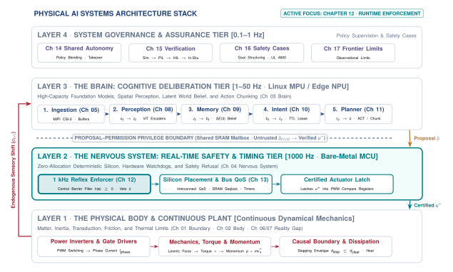
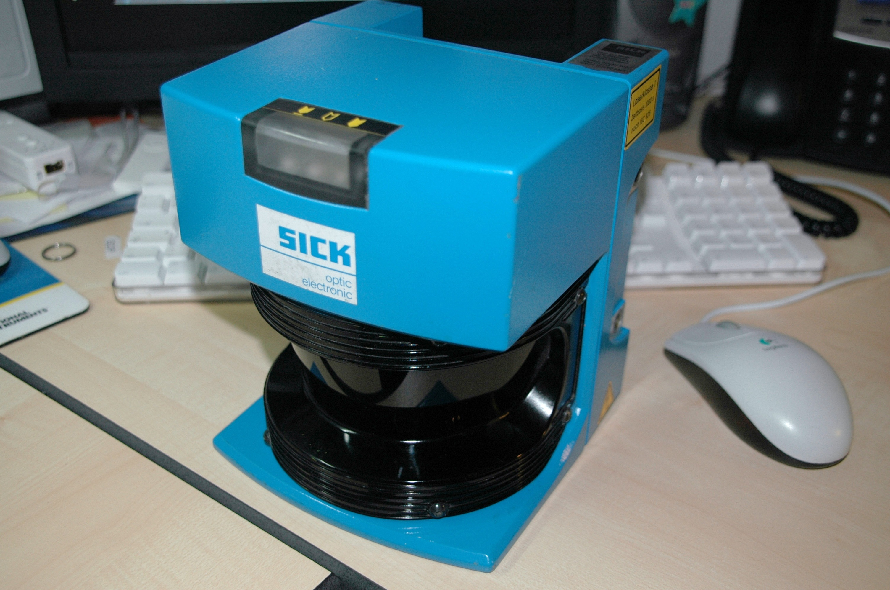
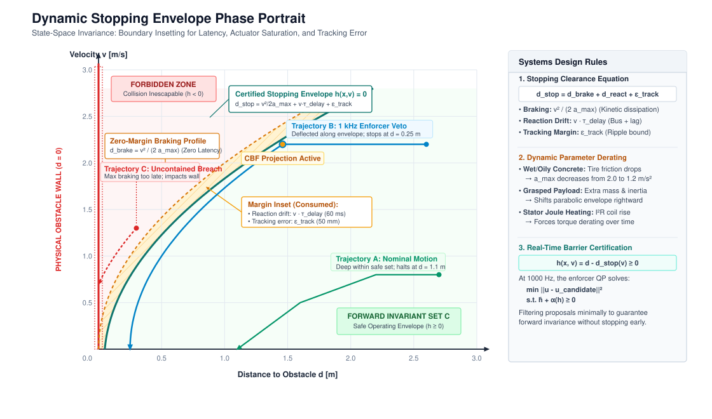
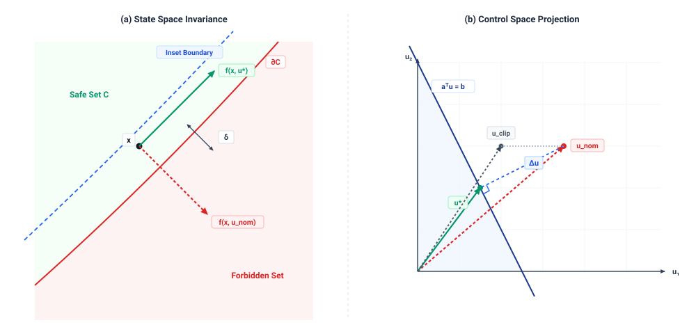
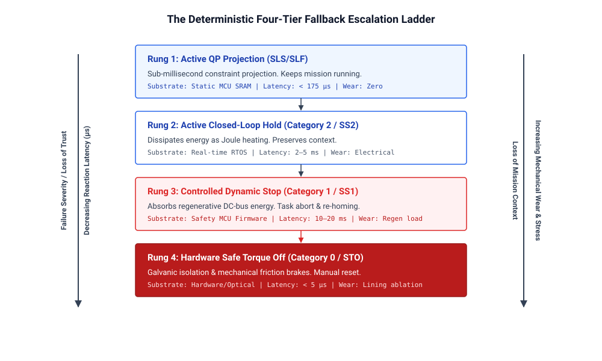

# Safety Enforcement {#sec-enforcement}

::: {.column-margin}

\chapterminitoc

:::

::: {#fig-12-locator fig-env="figure" fig-pos="H" fig-cap="**The Reflex Enforcer in the Physical AI Stack**: In the physical AI systems architecture, the deterministic nervous system sits between the unverified deliberative brain and the dynamical body, serving as the sole authority permitted to translate advisory commands into physical force or refuse them outright. Operating at microsecond control cadences, the enforcer projects candidate actions onto forward-invariant safe sets and manages a multi-tier fallback hierarchy to guarantee physical containment." fig-alt="Diagram titled Physical AI Systems Architecture Stack, drawn as four stacked tiers. Layer 4 is system governance and assurance at 0.1 to 1 hertz, holding boxes for shared autonomy, verification, safety cases, and frontier limits. Layer 3 is the brain, a cognitive deliberation tier at 1 to 50 hertz, holding five stages named ingestion, perception, memory, intent, and planner. A dashed proposal-permission privilege boundary separates it from layer 2, the nervous system, a real-time safety and timing tier at 1000 hertz. Layer 1 is the physical body and continuous plant. Layer 2 is shaded and its 1 kilohertz reflex enforcer box is outlined; the badge reads Active Focus, Chapter 12, Runtime Enforcement."}
{width="100%"}
:::

\begin{marginfigure}
\vspace{1em}
\resizebox{\linewidth}{!}{\mlphysicalstackfull{20}{100}{20}{20}{20}}
\end{marginfigure}

*How does an unprivileged software proposal become physical torque, and what guarantees that the gatekeeper can always say no in time?*

A learned policy can propose a command that exceeds the machine's available clearance or actuator capacity. Once that command becomes motor current, diagnosing the model's mistake cannot undo the resulting motion. An independent enforcement path must evaluate proposals before they reach the actuators and retain the authority to reject them within a bounded time. Timely refusal alone is insufficient, however. The replacement command must also produce the intended physical response. A brake that has reached its current limit cannot deliver additional force because the safety calculation assumes it can. Enforcement therefore depends on measured state and on the tracking error of the feedback loops beneath it. When those conditions no longer support the requested motion, the machine needs a fallback whose limits are explicit. The nervous system joins permission and execution into one contract, coupling the brain's proposed behavior to what the body can track and stop.



::: {.callout-learning-objectives}

- Explain the relationship between tracking accuracy, command permission, and independent enforcement at the actuator boundary
- Diagnose how update rate, feedback delay, and actuator saturation limit corrective control
- Calculate stopping margins accounting for state uncertainty, tracking error, response delay, and available braking
- Evaluate when measured safety constraints require accepting, modifying, or refusing a proposed actuator command
- Select fallback responses when sensing, computation, or actuator limits invalidate normal enforcement

:::

## The Deterministic Gatekeeper {#sec-enforcement-12-1}

A manipulator can receive a smooth, well-timed **SE(3) trajectory**\index{SE(3) trajectory}—a continuous path defining both the 3D position and orientation of the robot—that passes too close to a rigid fixture. The planner has supplied a candidate motion, but a tracking error or a changed observation can make that motion physically inadmissible before it reaches the motor drives. Proposals from vision-language-action models [@brohan2022rt1; @brohan2023rt2], trajectory diffusion networks, and learned manipulation systems such as ALOHA [@zhao2023aloha] therefore require an independent, deterministic execution decision. The machine needs an edge-deployed component that can reject or modify the proposal in time, coupled with a low-level tracking controller capable of enforcing the permitted physical response.

The **reflex enforcer**\index{Reflex enforcer} highlighted in @fig-12-locator sits on the nervous system's critical path to the motor inverter's PWM latch, the final hardware switch that physically gates electrical current to the motor windings. That placement joins two responsibilities that an upstream heuristic cannot establish: permission to execute and the ability to track the permitted command under physical load. The enforcer's decision depends on measured kinematic state, the worst-case execution time (WCET) guaranteeing a computation finishes before the next physical deadline, and the tracking compliance of the control loop beneath it.

::: {#dfn-enforcement-control-barrier-function-cbf-qp .callout-note title="Definition: Control barrier function (CBF-QP)"}
**Control barrier function (CBF-QP)**\index{Control barrier function (CBF-QP)} is a mathematical invariant used to guarantee that a dynamical system remains within a defined safe set. By framing safety enforcement as a quadratic program, the enforcer can minimally project unsafe neural proposals into an admissible action space in real time, serving as the deterministic gatekeeper at the physical machine boundary.
:::

The nervous system must maintain both responsibilities when upstream software fails. Extending the proposal-permission architecture from @sec-brain-3-1, while high-level computational nodes can propose a velocity, waypoint, or end-effector wrench, they cannot bypass the deterministic gatekeeper. The **permission path**\index{Permission path} controls direct access to the motor windings and retains the irrevocable ability to refuse an upstream request. A refusal must lead to a defined physical response—such as a controlled braking sequence—so tracking and fallback behaviors are inherent to this path rather than afterthoughts to the safety calculation.

Building on the causal boundary established in @sec-boundary-1-1, tracking and safety enforcement must be co-located at this physical machine boundary rather than delegated to upstream software layers. High-level learned models operate over deep computational pipelines with variable execution times, often exhibiting inference latencies between $100\text{ ms}$ and $500\text{ ms}$. In contrast, the physical plant is governed by mechanical momentum, where a delay of $5\text{ ms}$ in a high-speed motion can allow an unmonitored mass to exceed its allowable ISO 10218 travel envelope. If the authority to refuse were placed upstream, intermittent delays—such as SerDes cable bottlenecks, network bus jitter, or software garbage collection pauses in an inference runtime—would silently stall safety arbitration while the physical mechanism blindly continues its motion. The nervous system executes on local microcontroller or real-time hardware directly wired to motor drives and joint encoders via deterministic fieldbuses, evaluating commands at update rates of $1000\text{ Hz}$ or higher. At this boundary, safety is evaluated against the physical state that exists in the current millisecond rather than a stale estimate captured in an earlier sensor frame.

An enforcer cannot guarantee safety beyond the physical fidelity of the control loop beneath it. Every mathematical safety barrier, whether formulated as a geometric spatial boundary or a maximum torque limit, assumes that the tracking controller follows a commanded trajectory within a bounded error. Consider an analytical example where a robotic manipulator must maintain a minimum clearance of $20\text{ mm}$ from a rigid fixture while moving at $1.0\text{ m/s}$. If the underlying tracking loop exhibits a worst-case position tracking error of $e_{\max} = 15\text{ mm}$ under load disturbances, the safety enforcer must evaluate its barriers against a boundary expanded by that full $15\text{ mm}$. A safety certificate that assumes perfect tracking will permit a commanded path that physically collides with the obstacle. The certified clearance of the enforcer is strictly bounded by the tracking performance of the underlying loop. When actuator torque limits, gearbox compliance, or unmodeled friction cause the tracking error to grow, the available safety margin contracts by the exact same amount.

Even when mathematically sound, deterministic enforcers can fail because of physical and computational constraints in the systems architecture. An enforcer requires a finite processing budget to evaluate barrier functions, solve quadratic programs, or project proposals onto an admissible action set. If the constraint solver experiences a rare computation spike (a $P_{99}$ latency tail) that exceeds its allocated $1\text{ ms}$ execution budget, the system faces an immediate physical crisis, choosing between executing an unverified proposal or slamming on an uncoordinated emergency brake that may cause structural damage. Enforcers also fail when supplied with stale or phase-lagged state estimates. If a low-pass sensor filter introduces a $20\text{ ms}$ delay while an actuator moves at $1.0\text{ m/s}$ and accelerates at $5.0\text{ m/s}^2$, the computed state lags true position by $21.0\text{ mm}$ ($20.0\text{ mm}$ from velocity, $1.0\text{ mm}$ from acceleration), systematically corrupting barrier evaluations. Furthermore, shared hardware modes, such as common power supplies, shared communication buses, or single-point clock generators, can cause the tracking loop, the enforcer, and the sensor pipeline to fail simultaneously.

Constructing an enforcement architecture requires ordering the machine's software layers from inner physical reflexes to outer policy interfaces. The lowest layer governs the inner feedback mechanics that turn high-frequency setpoints into motor currents, compensating in real time for the actuator thermal limits and Joule heating dynamics established in @sec-actuators-2-1. Above this tracking foundation sits the barrier evaluation logic, which checks incoming proposals against invariant state constraints. When a proposal violates a constraint, a minimal intervention filter modifies the command just enough to restore feasibility, preserving the policy's intended motion to the extent physical limits allow. If no safe projection exists or if state estimation uncertainty exceeds verified thresholds, the architecture shifts authority to a deterministic fallback handler to bring the machine to a controlled stop.

The construction of this entire chain begins at the interface between the safety filter and the tracking controller. To determine whether an action is safe to execute, the enforcer does not need to analyze inner control loop gains, motor winding dynamics, or pulse-width modulation switching frequencies. It consumes a single contract from the controller beneath it, which is an explicit bound on the **worst-case tracking error**\index{Worst-case tracking error} between where the machine was commanded to be and where its physical mass actually resides.

## What Control Hands Over {#sec-enforcement-12-2}

The tracking contract isolates the enforcer from the internal mechanics of the plant. A feedback controller operating over continuous physical dynamics makes many promises internally, but only one number passes upward across the systems interface. For any commanded trajectory $r(t)$ satisfying admissible velocity and acceleration limits, the physical state $x(t)$ remains within a bounded distance $\|x(t) - r(t)\| \le \epsilon_{\text{track}}$. The enforcer\index{Enforcer!tracking contract} does not inspect transfer functions, root loci, or proportional-integral-derivative (PID) gains. To the software sitting above the loop, the controller is a black box that turns reference setpoints into physical motion, guaranteed to stay within the error bound $\epsilon_{\text{track}}$\index{Tracking error bound} of the commanded path.

This bound is a physical distance rather than a mathematical abstraction. A physical plant is governed by rotor inertia, transmission compliance, and actuator torque limits\index{Actuator torque limits}. The steady-state position error—the persistent physical gap between the commanded destination and the actual resting place—balances unmodeled external disturbances against the restoring control effort of the closed-loop stiffness\index{Closed-loop stiffness}. When disturbances are physically bounded, the worst-case tracking error bound $\epsilon_{\text{track}}$ derives directly from the closed-loop stiffness.[^fn-math-tracking-error]

Consider an analytical example of a linear positioning stage operating in an environment where friction and payload variations introduce disturbance forces. If the maximum theoretical disturbance translates to a steady-state error of $5.0\text{ mm}$, and the reference command executes a step of $100.0\text{ mm}$, the carriage accelerates, settles into the bounded corridor, and comes to rest. At steady state, the physical carriage does not sit precisely at $100.0\text{ mm}$. It rests anywhere within the interval $[95.0\text{ mm}, 105.0\text{ mm}]$.

That guarantee holds only within a defined envelope of physical operating conditions. The controller provides the bound $\epsilon_{\text{track}}$ under three physical conditions. First, the reference trajectory cannot demand accelerations beyond what the actuators can deliver. Second, external disturbances must remain strictly below $d_{\text{max}}$. Third, the actuator must operate below the continuous thermal derating limits established in @sec-hardware-2-2 (governed by Joule heating\index{Joule heating}) and voltage bus rails. If an upstream policy commands a trajectory that demands an acceleration of $15.0\text{ m/s}^2$ from an actuator whose peak torque caps acceleration at $10.0\text{ m/s}^2$, the feedback loop saturates\index{Actuator saturation}. The integrator winds up\index{Integrator windup}, phase lag accumulates, and the physical mechanism falls behind the reference by an amount that grows with every millisecond of saturation. If an unexpected external load exceeds $25.0\text{ N}$, the disturbance overpowers the restoring force of stiffness $K$, pulling the carriage outside the $\pm 5.0\text{ mm}$ corridor. Outside its rated envelope, the controller provides no bound at all.

Because physical reality can diverge from the reference command by up to $\epsilon_{\text{track}}$, every geometric and dynamic margin evaluated by an enforcer must be inset by that exact distance. If a robot arm must maintain a physical clearance of at least $20.0\text{ mm}$ from a fragile fixture, and the underlying tracking loop guarantees an error bound $\epsilon_{\text{track}} = 5.0\text{ mm}$, the enforcer cannot evaluate safety against the nominal geometry. It must inset the admissible state space by adding a virtual buffer of $5.0\text{ mm}$, checking that the commanded reference maintains a clearance of at least $25.0\text{ mm}$ from the obstacle surface. If worn bearings\index{Wear!bearings}, thermal expansion, or altered motor parameters loosen the true tracking error from $5.0\text{ mm}$ to $12.0\text{ mm}$ without the enforcer updating its internal model, the true physical clearance to the fixture shrinks from $20.0\text{ mm}$ to $13.0\text{ mm}$. The enforcer believes it is operating with a comfortable safety margin while the physical hardware moves dangerously close to collision. A degraded tracking bound silently erodes safety margins across the entire software stack.

A tracking bound that is never checked at run time is an assumption rather than a contract. Because environmental conditions fluctuate and mechanical components degrade, the nervous system must publish $\epsilon_{\text{track}}$ alongside the explicit operational conditions that validate it, while monitoring the instantaneous tracking error $e(t) = \|x(t) - r(t)\|$ on every tick of the control cycle. If sensor feedback reveals that $e(t)$ approaches or exceeds $\epsilon_{\text{track}}$, the tracking contract has broken. When a disturbance force spikes to $40.0\text{ N}$ or an actuator enters thermal throttling, the nervous system cannot treat the resulting divergence as a normal transient. It must detect the contract violation immediately, invalidating the spatial assumptions used by downstream filters before unmodeled deflection causes physical damage.

::: {#psp-enforcement-inset-margin .callout-perspective title="The inset margin invariant"}
Every spatial and dynamic safety boundary evaluated by an enforcer must be inset by the underlying tracking loop's verified worst-case tracking error plus the transport lag\index{Transport lag} displacement (the physical distance the hardware travels while a command traverses the network): $\delta_{\text{margin}} \ge \epsilon_{\text{track}} + v \cdot \tau_{\text{delay}} + \epsilon_{\text{est}}$. An enforcer that evaluates barrier certificates\index{Barrier certificates} against nominal geometric boundaries without insetting will permit trajectories that physically collide with obstacles whenever tracking error reaches its certified bound.
:::

The mathematical synthesis of tracking controllers, observer design, and disturbance rejection proofs are treated in depth by the control literature [@slotine1991applied; @astrom2021feedback]. For the systems engineer building physical AI architectures, the responsibility begins where control guarantees end. The tracking controller provides the mechanism to translate permitted references into physical currents, but it has no semantic awareness of obstacles, task goals, or system-level hazards. It will execute a command into a solid wall with the same closed-loop fidelity that it brings to free-space motion. Before any proposed action is handed to this tracking machinery, the system must determine whether the proposal is permitted to become force at all.

## The Authority to Refuse {#sec-enforcement-12-3}

The permission path is not a transmission line that relays actions while logging safety statistics in the background. It is a safety gate that admits actuation only when specific physical criteria are satisfied, treating every incoming proposal as unsafe until proven otherwise. In conventional automation, control pipelines operate on trust, executing commands under the assumption that the upstream software component produces valid setpoints. In physical AI, that assumption fails by design. A learned policy operating in high-dimensional perception space has no mathematical guarantees of stability, no bounded output variance, and no internal representation of actuator current limits or mechanical stress. Because the learned model cannot be held accountable for physical destruction, the nervous system must not treat its outputs as authoritative directives. Extending the proposal-permission architecture from @sec-brain-3-1, upstream models produce proposals, but only the nervous system possesses the authority to turn a proposal into force.

This division creates an asymmetric authority model between the brain and the nervous system, formalized in systems engineering as the **Simplex architecture pattern**\index{Simplex architecture pattern} [@sha2001using]. The Simplex pattern resolves the tension between high performance and safety by decomposing the control system into four structural components:

1. **The advanced controller**\index{Simplex architecture!Advanced controller}: An unverified, high-capacity learned model (such as a Vision-Language-Action network, a residual reinforcement learning policy [@johannink2019residual], or a diffusion policy executing on a Linux MPU) that optimizes for complex, open-ended task performance.
2. **The baseline safety controller**\index{Simplex architecture!Baseline controller}: A certified, high-assurance deterministic controller (such as a Lyapunov-based posture regulator or precomputed quintic deceleration spline executing on bare-metal MCU firmware) that acts as the trusted "muscle memory" of the robot, guaranteeing stability and physical containment within a known envelope.
3. **The safety manager**\index{Simplex architecture!Safety manager}: Deterministic arbitration logic that continuously evaluates the state of the machine against forward-invariant barrier sets, tracking error bounds, and execution deadlines.
4. **The Simplex switch**\index{Simplex architecture!Simplex switch}: An atomic hardware or real-time firmware multiplexer that routes actuation signals to the motor bridge. Think of this as a rapid railway switch: it routes the Advanced Controller's output when certified safe, but instantaneously diverts control to the Baseline Controller the moment safety envelopes are endangered.

Under this Simplex contract, the upstream policy never commands the plant directly. Instead, communication across the causal boundary established in @sec-boundary-1-1 operates through time-bounded **intent leases**\index{Intent lease}—a mechanism similar to a dead man's switch, where permission to move automatically expires unless it is continuously renewed by a healthy brain. The Linux MPU transmits candidate control vectors as structured packets over shared SRAM mailboxes using the Remote Processor Messaging (RPMSG) protocol.[^fn-hw-rpmsg] Each proposal payload contains a monotonic sequence identifier, a microsecond timestamp, an explicit lease duration ($\tau_{\text{lease}}$), candidate setpoints, and a cyclic redundancy check (CRC32). The real-time microcontroller inspects the lease on every control cycle. If the lease is valid, the state is within safe set boundaries, and tracking error remains bounded, the Simplex switch permits the proposal (or its minimally projected variant) to drive the actuators. If the lease expires without renewal, tracking diverges, or the proposal threatens physical boundaries, the Simplex switch revokes permission and engages the Baseline Safety Controller unilaterally.[^fn-hw-tim-pwm] The upstream policy is not consulted, does not negotiate, and possesses no hardware mechanism to override the switch.

When an incoming proposal conflicts with physical constraints, the enforcer chooses between two distinct interventions: command filtering and an outright veto. Command filtering applies when the proposal is structurally sound but marginally exceeds an admissible kinematic or dynamic boundary. If an analytical model of a six-axis manipulator shows that a proposed end-effector velocity vector demands a joint speed $4\%$ above a rated motor limit of $3.0\text{ rad/s}$, the nervous system can mathematically shave off the excess by projecting the reference onto the boundary of the safe set using control barrier functions\index{Control barrier functions} or quadratic programming\index{Quadratic programming} (CBF-QP, building on the formulations from Chapters 10 and 11). This projection preserves the geometric direction of the motion (so the arm still moves along the exact intended path) while scaling down the magnitude to obey the $3.0\text{ rad/s}$ ceiling. Projection is permissible only when the deviation is local, continuous, and cleanly separated from catastrophic hazards. When a proposal exhibits structural invalidity—such as a discontinuous jump in commanded position across consecutive frames, a request for acceleration that exceeds maximum physical torque capabilities, or a trajectory vector aimed directly into an immovable obstacle—geometric projection becomes dangerous. A discontinuous or wildly infeasible proposal indicates that the upstream perception or inference pipeline has entered an unmodeled failure mode. Attempting to project an ungrounded hallucination onto the nearest safe boundary executes a synthetic motion that has no relationship to task intent. In such cases, the enforcer must veto the proposal entirely, tripping the Simplex switch and dropping authority to a local fallback.

To maintain authority when the upstream system collapses, the refusal mechanism must operate with complete local autonomy. The nervous system cannot depend on the brain to report its own failures or request a shutdown. Consider an analytical example where an upstream policy publishes trajectory setpoints at $20\text{ Hz}$, or one frame every $50\text{ ms}$, across an inter-process communication bus to a nervous system running a joint tracking loop at $1000\text{ Hz}$. The nervous system couples incoming frames to a hardware-timed watchdog timer—a countdown clock built into the silicon that forces a safe shutdown if the brain stops checking in. If the upstream inference engine experiences an operating system scheduling stall, an out-of-memory exception, or a CUDA kernel panic, the flow of setpoints halts. If the intent lease duration is set to $\tau_{\text{lease}} = 150\text{ ms}$ and the watchdog timeout is configured for $t_{\text{timeout}} = 100\text{ ms}$ of heartbeat silence, the nervous system detects the fault within milliseconds of a missed frame. It does not freeze the last commanded actuator currents, which would cause an arm moving at $1.2\text{ m/s}$ to drift under momentum and strike environmental boundaries. Instead, the local enforcer immediately severs the upstream command channel and transitions to an autonomous position hold, synthesizing a smooth deceleration trajectory that brings joint velocities to zero at a controlled rate of $8.0\text{ m/s}^2$ while remaining within current limits.

Severing upstream authority requires a well-defined physical state at the lowest level of the hardware interface, which forms the **zero-command floor**\index{Zero-command floor}—the safest baseline physical condition the hardware defaults to when active software control is completely removed. In software engineering, halting an execution pipeline often means returning a null pointer or clearing a register to zero. In physical systems, writing a zero to a motor drive register produces radically different mechanics depending on actuator topology. Setting current commands to zero in a low-friction, direct-drive motor removes all resistive torque, causing a robot arm holding a $5.0\text{ kg}$ payload to drop under gravity in free fall. Conversely, commanding zero velocity in a stiff position controller with high proportional gains commands maximum peak current to arrest motion instantaneously, which can shear gear teeth or buckle structural linkages if momentum is high. The system designer must select the zero-command state to match the mechanical physics of the plant. In geared transmissions with high backdrivability, dynamic braking\index{Dynamic braking} shorts the motor windings through low-resistance shunts or MOSFET bridges. This converts the back-electromotive force\index{Back-electromotive force} (the voltage a spinning motor naturally generates by acting as a generator) into electrical current that physically resists the motion, generating a braking torque proportional to velocity. This dynamic damping smoothly dissipates kinetic energy as heat without requiring active software control, though it cannot resist static gravitational torque once motion ceases. When static holding or power-off safety is required, the zero-command state de-energizes electromechanical spring-applied friction brakes, clamping the joints mechanically after dynamic braking has reduced angular velocity below a threshold of $0.1\text{ rad/s}$ to prevent excessive friction lining wear.

Refusal is therefore not an emergency exception handler invoked only during rare failures. It is the steady-state operating discipline of the entire machine. On every millisecond tick of the control clock, the nervous system verifies that an incoming proposal is topologically valid, that communication heartbeats remain unbroken, that the commanded reference lies strictly inside invariant safety sets, and that tracking error remains bounded. If any condition fails, the enforcer says no, substituting an autonomous fallback or engaging the zero-command floor. Because the enforcer holds the ultimate authority to deny actuation, its implementation must not depend on the very components it is designed to constrain.

## Where the Enforcer Sits {#sec-enforcement-12-4}

The enforcer must sit at a specific physical and logical boundary in the signal pipeline, determined by the timescale of the dynamics it governs and the latencies of the channels feeding it. Two natural boundaries exist in every machine that translates learned proposals into motion. The first boundary sits upstream of the feedback control loop, where the system executes reference checking. A reference checker validates planned trajectory waypoints, coordinate targets, or velocity vectors emitted by a high-level planner before those targets enter the tracking loop. Because it operates in kinematic space over a forward horizon, a kinematic reference checker\index{Reference checker!kinematic} operating at $50\text{ Hz}$ can evaluate a $300\text{ ms}$ trajectory segment against static geometric envelopes, workspace boundaries, and self-collision models. The strength of reference checking is wide spatial foresight, but its fundamental limitation is complete blindness to the actual physical state of the plant. If a planned path maintains a clearance of $5.0\text{ mm}$ from a steel bracket, the reference checker marks the command valid. Yet if the downstream tracking controller exhibits a transient position overshoot of $10.0\text{ mm}$ when accelerating a heavy load, the physical arm strikes the bracket despite passing every upstream validation step.

The second boundary sits downstream of the feedback controller, directly in front of the power electronics, where the system executes command checking. A command checker inspects the raw physical quantities produced by the tracking loop, evaluating motor phase currents, hydraulic valve spool displacements, pulse-width modulation duty cycles, and joint torque references immediately before writing them to hardware registers. Operating at the inner control loop frequency, typically $1000\text{ Hz}$ with an execution budget under $100\text{ \mu s}$, the command checker enforces hard instantaneous limits. It prevents electrical overcurrent, structural over-torque, and thermal runaway by clipping or zeroing signals that exceed the physical ratings of the plant. What the command checker gains in physical certainty, it surrenders in temporal foresight. Operating on a single discrete time step $\Delta t = 1.0\text{ ms}$, it cannot evaluate future state evolution. An instantaneous torque command of $18\text{ N}\cdot\text{m}$, which is well within a thermal continuous rating of $45\text{ N}\cdot\text{m}$, appears entirely safe to a post-control monitor. However, if that torque accelerates a $10\text{ kg}\cdot\text{m}^2$ linkage toward a rigid stop at $1.5\text{ rad/s}$, the rotational kinetic energy of the mechanism will exceed the maximum deceleration capacity of the actuator over the remaining travel distance. The command checker detects no fault until the linkage is inches from impact, at which point no allowable reverse torque can prevent a collision.

This split reveals the fundamental trade between latency and visibility. Reference checkers possess multi-step geometric visibility but suffer from high latency and blind spots regarding closed-loop tracking dynamics. Operating at planning rates between $10\text{ Hz}$ and $50\text{ Hz}$, a reference filter cannot respond to unmodeled plant resonance, sensor noise amplification, or sudden control instability occurring at frequencies above its update rate. If a feedback controller develops a $60\text{ Hz}$ limit cycle oscillation, the reference setpoints remain stationary while the physical linkages shake. Conversely, command checkers respond within microseconds on every millisecond clock tick, eliminating latency, but their one-step horizon creates dynamic traps where every instantaneous torque is legal until an irrecoverable state is reached.

The placement of the enforcer also determines how it integrates into the computing fabric. In a sequential in-line architecture, every signal passes synchronously through the enforcement logic before reaching the next stage. A reference checker filters the trajectory before the controller reads it, or a command clamp modifies the torque register before the motor drive samples it. Sequential execution guarantees zero uninspected commands, but it inserts the worst-case execution time of the enforcer directly into the critical latency path. For a digital $1000\text{ Hz}$ control loop\index{Control loop!digital} with a total deadline of $1000\text{ \mu s}$, allocating a $P_{99}$ latency of $250\text{ \mu s}$ to an in-line safety check shrinks the budget available for feedback computation. If the enforcer overruns its execution budget, the entire cycle faults. In a parallel asynchronous architecture, the enforcer executes on a separate co-processor or an isolated processor core, monitoring the state of the machine and the command stream concurrently without intercepting every cycle. When the parallel monitor detects an invariant violation, it asserts a hardware line to open a safety contactor (physically severing high-voltage power to the actuators) or switch the motor drive to dynamic braking (shorting the motor phases to rapidly dissipate kinetic energy). Parallel execution preserves control loop timing, but the asynchronous detection and communication introduce an enforcement lag bounded by the monitor cycle time and bus jitter\index{Latency!bus jitter}, empirical EtherCAT measurements showing $3.0\text{ ms}$ to $8.0\text{ ms}$ of delay. To compensate for this reaction delay, the system designer must expand the physical safety margins, slowing the machine or increasing its minimum clearance buffers.

Because neither single location provides both dynamic foresight and instantaneous protection, physical AI architectures resolve the tension through a **dual-stage enforcement pattern**\index{Dual-stage enforcement pattern}. This pattern maps cleanly onto the canonical heterogeneous dual-brain System-on-Chip (SoC) architecture established in @sec-brain-3-1:

- **Upstream Stage (Pre-Control Corridor Filter on Application MPU):** Operating at $20\text{--}50\text{ Hz}$ on an unprivileged application microprocessor core, this stage accepts multi-step trajectory chunks emitted by the learned policy. It verifies that the planned path maintains a dynamic stopping corridor under worst-case braking parameters and validates geometric clearance against static workspace envelopes before packing the waypoints into an RPMSG intent lease, extending the proposal-permission architecture from @sec-brain-3-1.
- **Downstream Stage (Instantaneous CBF-QP Safety Shield on Bare-Metal MCU):** Operating inside a strict $1000\text{ Hz}$ ($1000\,\mu\text{s}$) timer interrupt loop on an isolated hard real-time safety microcontroller, this stage receives the proposed setpoint from shared SRAM, verifies tracking error bounds, solves an active-set Control Barrier Function (CBF-QP)\index{Safety shield!Control Barrier Function} quadratic program in pre-allocated static SRAM (building on the barrier formulations from Chapters 10 and 11), and clamps raw current and torque commands directly before writing to PWM timer registers.

The pre-control stage prevents the system from entering dynamic traps by ensuring that a valid deceleration trajectory always exists, while the post-control stage catches loop instability, mechanical overshoots, and transient sensor dropouts before current reaches the motor windings.

Placing the enforcer correctly is useless if its inputs share failure modes with the component it checks. An enforcer may only evaluate quantities that it can establish independently of the proposal path. If a pre-control corridor filter calculates collision distances using a depth map generated by the same neural perception model that planned the motion, an out-of-distribution visual artifact will deceive both the planner and the enforcer simultaneously. Independent enforcement requires independent sensing and isolated computation. On heterogeneous dual-brain SoCs and industrial robotics controllers, the bare-metal safety MCU reads secondary optical encoders and hardware limit switches wired directly to its own GPIO and hardware timer capture registers over dedicated buses, completely isolated from the Linux virtual memory space and operating system scheduler. A collision enforcer must read dedicated safety lidar or ultrasonic proximity sensors whose signal conditioning relies on deterministic threshold logic rather than learned inference. Where no physically independent sensor exists, such as when estimating the friction coefficient of a wet roadway or the variable mass of an unmodeled payload, the systems engineer cannot construct an independent physical guarantee. In those operating regimes, the safety assertion is conditional, its validity bounded by the statistical uncertainty of the learned estimator rather than guaranteed by the nervous system. Every invariant that the enforcer checks, whether evaluated upstream across a geometric corridor or downstream at the motor terminals, ultimately assumes that the physical plant retains the control authority to arrest its own motion before crossing a forbidden boundary.

::: {#psp-enforcement-simplex-independence .callout-perspective title="The Simplex independence rule"}
A safety monitor must never evaluate a state estimate produced by the component it is designed to constrain, nor share an un-preemptible communication bus, memory matrix, or clock tree with unverified processes. Where independent sensing is physically impossible, the safety claim is conditional on model uncertainty rather than guaranteed by hardware.
:::

## Stopping Envelopes {#sec-enforcement-12-5}

To guarantee that a machine never enters a forbidden state, the nervous system must know at every moment that an unassisted stop remains physically achievable. This guarantee defines the **stopping envelope**\index{Stopping envelope}, the set of all state trajectories from which maximum available braking can bring the system to rest without violating a spatial or kinematic boundary. Maintaining this guarantee requires reserving both distance and time for an emergency deceleration maneuver that the machine may never execute during nominal operation. Continually ensuring that a safe stop is available costs achievable speed, and managing this fundamental trade-off is the essence of safety design. Every increase in operating velocity expands the distance required to arrest momentum, consuming the spatial buffer between the machine and its physical constraints.

The geometry of the stopping envelope derives directly from Newtonian kinematics combined with the signal latency of the nervous system. Consider a body moving along a single axis at instantaneous velocity $v$. When an enforcer detects a boundary violation or receives an unsafe proposal, a finite transport delay $\tau_{\text{delay}}$ elapses before actuators can generate opposing force. This total delay compounds perception exposure time, transport latency over the internal communications bus (e.g., EtherCAT\index{EtherCAT} bus jitter, which introduces slight variations in message delivery time), enforcer evaluation cycle time, and the physical current rise time ($L/R$ time constant) in the stator\index{Stator} windings established in @sec-actuators-2-2. During $\tau_{\text{delay}}$, the body continues to travel under its pre-existing velocity, traversing a reaction distance of $v \cdot \tau_{\text{delay}}$. Once braking torque engages, assuming a constant maximum deceleration $a_{\text{max}}$, the time required to arrest the remaining velocity is $v / a_{\text{max}}$, during which the body traverses a braking distance of $v^2 / (2 a_{\text{max}})$.

A pure kinematic calculation assumes that the underlying feedback controller tracks the reference trajectory with zero error. By physical AI first principles, a real physical plant diverges from the reference trajectory due to external disturbances, unmodeled joint friction, and the sensor quantization limits established in @sec-sensors-2-1. This instantaneous tracking error is bounded by $\epsilon_{\text{track}}$, established by the low-level loop in @sec-enforcement-12-2. If an obstacle sits at a coordinate $x_{\text{obs}}$, placing the nominal stopping target exactly at $x_{\text{obs}}$ causes a collision whenever the tracking error reaches its positive bound. The enforcer must therefore inset the allowable reference boundary away from the obstacle by $\epsilon_{\text{track}}$. Combining reaction displacement, braking displacement, and the tracking bound yields the total minimum stopping distance.[^fn-math-stopping-dist]

Any trajectory proposal that places the machine at a distance less than the minimum stopping distance from a physical constraint in the direction of motion is unsafe. The stopping envelope is fundamentally anisotropic\index{Stopping envelope!Anisotropy}; an obstacle behind the instantaneous velocity vector only requires clearance for the positional tracking error $\epsilon_{\text{track}}$.

Consider an analytical example of an automated transport platform moving through an indoor industrial facility. The platform runs a $50\text{ Hz}$ trajectory planner, communicates over an internal bus with deterministic message delivery, and uses an enforcer co-processor operating at $1000\text{ Hz}$. Summing the perception pipeline latency ($30\text{ ms}$), the worst-case message transport interval ($20\text{ ms}$), and the motor drive torque response time ($10\text{ ms}$) yields a total nervous system delay $\tau_{\text{delay}} = 60\text{ ms}$. The mechanical brakes and motor drives provide a maximum deceleration $a_{\text{max}} = 2.0\text{ m/s}^2$, and encoder verification establishes a worst-case tracking error bound $\epsilon_{\text{track}} = 0.050\text{ m}$. At a moderate operational velocity $v = 1.5\text{ m/s}$, the reaction distance during delay is $1.5\text{ m/s} \times 0.060\text{ s} = 0.090\text{ m}$, and the braking distance is $(1.5\text{ m/s})^2 / (2 \times 2.0\text{ m/s}^2) = 0.563\text{ m}$. Adding the $0.050\text{ m}$ tracking inset yields a total required stopping clearance $d_{\text{stop}}(1.5\text{ m/s}) = 0.703\text{ m}$. If the system increases nominal speed by two-thirds to $v = 2.5\text{ m/s}$, the delay displacement rises to $0.150\text{ m}$ and the braking displacement scales quadratically to $1.563\text{ m}$, expanding the required envelope to $1.763\text{ m}$. A $67\%$ increase in velocity demands a $151\%$ increase in clear clearance ahead of the chassis. In physical autonomous mobile robots and automated guided vehicles, this dynamic clearance envelope is continuously scanned and enforced by dedicated safety-rated hardware according to ISO 13849\index{ISO 13849} and ISO/TS 15066\index{ISO/TS 15066!Speed and separation monitoring} standards, such as the time-of-flight safety laser scanner shown in @fig-12-real-laser-scanner.

::: {#fig-12-real-laser-scanner fig-env="figure" fig-pos="t" fig-cap="**Industrial Safety Laser Scanner and Dynamic Protective Field Enforcer**: A time-of-flight safety scanner sweeping a $270^\circ$ plane from the bumper of a mobile robot. It defends two nested fields rather than one perimeter, and the difference is where enforcement lives: the outer warning field prompts a software deceleration, while the inner protective field is wired through dual-channel relays to cut torque in hardware. Both boundaries move with speed, because the stopping distance they must cover grows with the square of it." fig-alt="Industrial Safety Laser Scanner and Dynamic Protective Field Enforcer. A physical time-of-flight (ToF) safety laser scanner commonly mounted on the leading bumper of automated guided vehicles (AGVs) and autonomous mobile robots (AMRs). The unit utilizes an internal motor-driven mirror rotating at 20--50 Hz to sweep pulsed infrared laser beams across a 270^ deg planar scanning plane, resolving obstacle distances via time-of-flight measurements. To enforce the dynamic stopping distance dstop(v) = v * taudelay + v^2/2 amax + epsilontrack, the scanner continuously switches between velocity-dependent zone profiles: outer warning fields that prompt soft advisory deceleration in software when breached, and inner protective fields wired through dual-channel safety relays to trigger immediate Category 0 (Safe Torque Off) or Category 1 hardware stops when penetrated."}
{width="85%"}
:::

Because velocity and obstacle distances change continuously, the enforcer cannot evaluate feasibility only when a new trajectory begins. It must verify feasibility at every cycle of the low-level loop. As illustrated in the phase portrait in @fig-12-stopping-envelope-phase-plane, where velocity is plotted against distance to the nearest constraint, the stopping equation defines a parabolic boundary that separates safe states from inescapable collision states. The region between the physical obstacle boundary and the tracking-inset curve represents the margin consumed by lower-level control uncertainty. At every cycle, the enforcer evaluates the current state $(x, v)$ against this phase-plane boundary. If the operating state crosses into the forbidden zone, the enforcer vetoes the planner's proposal and triggers an immediate hardware stop\index{Safe Torque Off (STO)}. Depending on the system architecture, this is either a Category 0 stop (which severs power instantly, letting mechanical friction arrest motion) or a Category 1 stop (which actively commands maximum braking torque before severing power).

::: {#fig-12-stopping-envelope-phase-plane fig-env="figure" fig-pos="t" fig-cap="**Dynamic Stopping Envelope Phase Portrait**: The stopping equation defines a parabolic boundary in state space separating safe operation from inescapable collision. Because physical enforcement involves perception delay and mechanical tracking error, the certified envelope (teal) must be inset from the true physical boundary (crimson). The margin between them represents the spatial budget consumed by the machine before it can generate peak braking torque." fig-alt="Dynamic Stopping Envelope Phase Portrait. A state-space phase portrait plotting velocity v on the vertical axis against distance to obstacle d on the horizontal axis. The vertical red axis at d = 0 marks the physical obstacle wall. A dashed parabolic curve d = v^2 / (2 amax) represents the zero-margin braking profile under maximum deceleration with zero latency. A solid teal parabolic curve dstop = v^2 / (2 amax) + v taudelay + epsilontrack represents the certified stopping envelope under Control Barrier Functions h(x, v) = 0. The region between them is an amber shaded margin representing reaction drift and tracking error. Three state trajectories illustrate system behavior: Trajectory A cruises safely deep inside Forward Invariant Set C; Trajectory B triggers a 1 kHz CBF enforcer veto as it strikes the certified boundary, projecting commands to decelerate along the safe envelope to a full stop at 0.25 m; Trajectory C penetrates the forbidden zone and impacts the obstacle wall at 0.7 m/s because maximum braking was engaged too late."}
{width="100%"}
:::

The physical necessity of maintaining a clear stopping envelope levies an inevitable tax on operational throughput. In any deployment where sensing range is finite or environmental visibility is restricted by geometry, the maximum detection horizon $d_{\text{sense}}$ dictates a hard ceiling on legal velocity. Just as the Patterson Roofline model [@williams2009roofline] in computer architecture relates peak compute performance to memory bandwidth limits, the stopping envelope dictates a strict kinematic roofline: if an onboard optical sensor can confirm an unobstructed corridor only up to $2.0\text{ m}$ ahead around a blind warehouse corner, the system cannot permit a speed exceeding $2.68\text{ m/s}$ under the parameters of the earlier example, regardless of how quickly the underlying machine learning model can compute actions. To run faster, the engineer must either increase braking torque $a_{\text{max}}$, compress signal latency $\tau_{\text{delay}}$, or tighten the tracking error $\epsilon_{\text{track}}$ through higher loop gains. When hardware limits prevent further reduction in those terms, the only remaining parameter is velocity.

The parameters governing the stopping envelope are rarely stationary during physical operation. When a robotic manipulator grasps an unmodeled $15\text{ kg}$ steel billet, the combined inertia of the arm increases, reducing the maximum angular deceleration $a_{\text{max}}$ that joint actuators can produce without exceeding their peak mechanical torque ratings. Similarly, on a mobile robot, moisture or oil on a concrete floor reduces the tire friction coefficient, lowering the maximum tractive deceleration before wheel slip occurs and widening the tracking error $\epsilon_{\text{track}}$. Repeated hard decelerations also drive up rotor and inverter temperatures (Joule heating\index{Joule heating} via $I^2 R$ losses), triggering the actuator thermal derating\index{Thermal derating} limits established in @sec-actuators-2-3. An enforcer that treats $a_{\text{max}}$ as a static datasheet constant will underestimate the stopping envelope precisely when the machine is under heavy load. The enforcer must adapt $d_{\text{stop}}(v)$ dynamically, pulling updated friction estimates, payload mass estimates, and thermal derating factors from the nervous system at runtime.

Dynamic envelope adaptation functions only as long as the enforcer possesses accurate state estimates and the actuators retain the physical capacity to supply the requested forces. If surface contamination drops effective traction to near zero, or if a sustained duty cycle pushes winding temperatures past their thermal ceilings, the deceleration capability assumed in the safety calculation evaporates. Under those conditions, the mathematical envelope expands toward infinity while the physical machine continues along its ballistic path. The moment the required deceleration torque exceeds what the physical hardware can produce, the enforcer transitions from a deterministic guardian into an impotent observer.

## When the Enforcer Runs Out of Authority {#sec-enforcement-12-6}

In control engineering, **actuator saturation**\index{Actuator!saturation} is treated as a bounded nonlinearity that introduces phase lag, degrades loop stability, and leads to windup\index{Controller!windup} in feedback controllers. In the architecture of a physical AI system, saturation is more immediate and physical: it is the moment a motor is giving everything it has and simply cannot push any harder. It is the instant the permission path loses the physical capacity required to keep its safety warranty. The enforcer makes guarantees on the premise that it can interpose a corrective control action $u_{\text{corr}}$ whenever the machine approaches a forbidden state boundary. When an actuator reaches its mechanical limit (peak torque), its electrical limit (bus voltage or current clipping), or its thermal limit (the $I^2R$ Joule heating threshold established in @sec-nervous-2-5), that corrective force cannot be delivered at the commanded magnitude. The enforcer cannot protect a boundary using force that the physical body cannot generate.

The consequence is that a stopping envelope\index{Stopping envelope} computed under nominal assumptions is invalidated the moment authority is consumed. From first principles, actuator capacity is finite, and any authority expended to maintain steady-state motion (like climbing an incline or overcoming friction) directly subtracts from the force available for emergency braking.[^fn-math-margin-loss]

Consider a mobile base that typically requires $0.50\text{ m}$ to stop. If the vehicle uses $75\%$ of its motor torque simply to maintain steady speed on a slope, only a quarter of its original force remains for deceleration. Its stopping distance expands dramatically, for example from $0.50\text{ m}$ to $2.00\text{ m}$. That $1.50\text{ m}$ of safety margin is spent during steady-state motion, long before the enforcer issues a deceleration command.

When tracking controllers beneath the enforcer employ integral action, saturation introduces an additional latency penalty. If an actuator reaches its limit while tracking error $\epsilon(t) = x_{\text{des}}(t) - x(t)$ persists, the integrator continues accumulating error, driving the internal control state far beyond the physical ceiling. Physically, the controller is accumulating a massive, unrealistic corrective command—like winding up a mathematical spring of frustration—because the physical machine cannot respond. When the enforcer intervenes to command full braking, the motor does not reverse force immediately. The physical output remains pinned at the forward saturation limit while this accumulated integrator error unwinds back below the clamping threshold. In an analytical example where tracking error accumulates over $200\text{ ms}$, the integrator unwinding phase can introduce a recovery delay $\tau_{\text{unwind}} = 150\text{ ms}$ before net negative force actually develops at the motor. At $v_0 = 2.0\text{ m/s}$, this delay adds an unbraked coasting distance $\Delta d_{\text{delay}} = v_0 \tau_{\text{unwind}} = 0.30\text{ m}$ directly to the stopping envelope. Control literature addresses this behavior through anti-windup clamping, back-calculation, and conditional integration (see @astrom2006advanced; @franklin1998digital). From the perspective of systems enforcement, the requirement is not merely to stabilize the control loop, but to measure this unwinding delay and budget its unbraked distance penalty inside the forward stopping horizon.

Actuator saturation is one of the few hardware failures with a direct, deterministic detector inside the nervous system. At each execution cycle of the motor tracking loop, typically running at $1000\text{ Hz}$ ($1\text{ ms}$ tick interval), the nervous system compares the commanded effort $u_{\text{cmd}}$ with the realizable actuator limit $u_{\text{act}} = \text{clip}(u_{\text{cmd}}, u_{\text{min}}, u_{\text{max}})$. A nonzero clipping difference, $|u_{\text{cmd}} - u_{\text{act}}| > 0$—meaning the software requested more torque than the hardware could physically deliver—or an inverter status register indicating current limit saturation, provides an immediate signal that the actuator has exhausted its authority. By tracking the duration and magnitude of this clamping signal, the nervous system monitors available control authority on every millisecond tick without relying on noisy external state estimation.

Because authority consumption alters stopping distance immediately, the enforcer cannot treat actuator limits as static parameters in an offline calculation. Instead, the nervous system must fold real-time authority consumption directly into the stopping envelope. When an actuator allocates baseline torque $u_{\text{bias}}$ to hold a payload against gravity or overcome an opposing grade, the enforcer recalculates effective deceleration as $a_{\text{eff}} = (u_{\text{max}} - |u_{\text{bias}}|) / m$ before verifying the next trajectory segment. As authority is consumed, the allowable speed ceiling decreases continuously. If authority depletion causes the calculated stopping distance to exceed the clear sensing horizon, the system reaches an authority deficit. The enforcer cannot allow the machine to maintain its speed. It must command deceleration while sufficient physical authority still remains.

Authority depletion is state information that must be exported upstream to the planner. A learned policy operating at $20\text{ Hz}$ that continues commanding accelerations to a motor saturated at $1000\text{ Hz}$ is operating completely divorced from physical reality, violating the proposal-permission architecture established in @sec-brain-3-1. If the planner does not receive saturation feedback, it will continue generating trajectories based on acceleration profiles the body cannot execute, rapidly widening the divergence between the model's expected state and the machine's true physical state. The nervous system communicates saturation events to the policy layer as an active constraint violation. When an authority alarm triggers, the planner's active trajectory is revoked, requiring the model to re-plan from the machine's true, authority-constrained state.

Every dynamic stopping envelope and safety margin depends on the physical capacity of the machine to generate corrective force within the remaining distance. When that capacity is restricted by load, grade, or thermal derating, the space of executable safe trajectories contracts. An enforcer cannot verify safety simply by checking whether the current state is collision-free. It must confirm that the current state permits an executable sequence of future control actions that terminate safely under the actuator authority that actually exists.

::: {#psp-enforcement-actuator-authority .callout-perspective title="The actuator authority invariant"}
A Control Barrier Function\index{Control Barrier Function}, as formulated in @sec-theory-10-3, is mathematically valid only while physical actuators retain sufficient current, voltage, and thermal headroom to deliver the computed corrective force: $u^* \in [u_{\min}, u_{\max}]$. When steady-state gravity or friction consumes the actuator's operating envelope, the enforcer must dynamically contract the safe set before control authority at the margin vanishes.
:::

## Safe Sets as Conditional Permission {#sec-enforcement-12-7}

A safe set gives the enforcer a concrete predicate that can be evaluated on every tick of the control clock. In control theory, a **safe set**\index{Safe set} $\mathcal{C}$ is defined as the zero-superlevel set of a continuously differentiable scalar certificate $h(x): \mathcal{X} \to \mathbb{R}$, such that
$$\mathcal{C} = \{x \in \mathcal{X} \mid h(x) \ge 0\}, \quad \partial \mathcal{C} = \{x \in \mathcal{X} \mid h(x) = 0\}.$$
The mathematical foundation of **forward invariance**\index{Forward invariance}, established by Blanchini [@blanchini1999set], formulated through Hamilton-Jacobi reachability analysis and viability kernels by Mitchell, Bayen, and Tomlin [@mitchell2005time], and extended through Control Barrier Functions by @ames2014control and @ames2019control,[^fn-math-nagumo-invariance] guarantees that if the initial physical state begins inside $\mathcal{C}$, there exists an admissible control input sequence that prevents the trajectory from ever leaving $\mathcal{C}$.

::: {#nbk-enforcement-forward-invariance-lie-derivatives .callout-notebook title="Forward invariance and safety boundaries"}
To keep the machine safe, we define a "safe set"—a region where no collisions or physical limits are breached. Rather than forecasting the machine's entire future path, Control Barrier Functions evaluate an instantaneous condition: is the current control command vectoring the machine toward a boundary faster than it can safely brake?

By mathematically constraining how fast the machine is allowed to approach the edge of the safe set, the nonlinear dynamics of the physical plant are transformed into a simple linear constraint on the control input. This guarantees that if the system starts in a safe state, it will always remain in a safe state, as the enforcer will intervene before the boundary is crossed.

For a formal mathematical derivation of Control Barrier Functions, Lie derivatives, and Nagumo's viability theorem, refer to @sec-appendix-control.
:::

::: {#dfn-enforcement-control-barrier-function-cbf-qp .callout-definition title="Control barrier function (CBF-QP)"}

***Control barrier function safety filter (CBF-QP)***\index{Control barrier function!definition}\index{CBF-QP safety filter!definition} is a certified, forward-invariant safety filter formulated as a sub-millisecond convex quadratic program:
$$\min_{\mathbf{u}} \frac{1}{2}\|\mathbf{u} - \mathbf{u}_{\text{nom}}\|^2 \quad \text{s.t.} \quad L_f h(\mathbf{x}) + L_g h(\mathbf{x})\mathbf{u} \ge -\gamma(h(\mathbf{x})), \quad \mathbf{u}_{\min} \le \mathbf{u} \le \mathbf{u}_{\max}$$
that continuously evaluates barrier certificates $h(\mathbf{x}) \ge 0$ along control-affine plant dynamics, admitting unverified learned proposals $\mathbf{u}_{\text{nom}}$ untouched in the safe set interior and minimally deflecting them on the boundary.

1.  **Significance**: Rather than attempting the impossible task of proving formal safety across billions of uninterpretable neural network weights, a CBF-QP filter decouples high-level policy innovation from low-level safety enforcement. The learned model is free to explore complex manipulation or navigation strategies, while the deterministic enforcer guarantees the physical machine never violates kinematic or thermal boundaries.
2.  **Distinction**: Unlike a heuristic clamp that saturates control channels independently (destroying multi-axis coordination), a CBF-QP filter performs an optimal orthogonal projection in control space, preserving directional intent while enforcing joint invariance.
3.  **Common pitfall**: Formulating barrier constraints using raw geometric coordinates without accounting for relative degree or braking inertia. If the barrier does not incorporate stopping distance ($\Delta d = v^2 / 2a_{\max}$), the filter intervenes too late, after the vehicle's momentum has already made a boundary collision inevitable.

:::

When a learned neural policy proposes an unverified action $u_{\text{nom}}$, the enforcer does not need to forecast the entire future path of the machine. It evaluates a single half-space inequality—a linear constraint representing the maximum safe approach speed toward the boundary—at the current state $x$. If the proposed action satisfies this constraint, mathematically expressed as $a(x)^T u_{\text{nom}} \le b(x)$, the enforcer passes the command to the motor untouched. If the proposed action vectors the trajectory across the boundary $\partial \mathcal{C}$ into the unsafe domain, the enforcer filters the command, deflecting the state trajectory tangentially along the boundary.

The arithmetic of this per-cycle barrier check is continuous and instantaneous. Consider a heavy cart moving down a track toward a wall. If the enforcer only looks at the distance to the wall, it might realize there is a problem too late—when the cart is too close to stop given its current momentum.[^fn-math-cbf-degree] Instead, the enforcer's safety barrier combines the cart's position with its kinetic stopping distance (which depends on velocity and braking strength).

At every millisecond, the enforcer calculates exactly how much buffer remains between the cart's required stopping distance and the wall. If the neural policy suddenly commands the cart to accelerate further, the enforcer instantly recognizes that accepting this command would shrink the buffer too fast. It overrides the neural policy and instead commands the exact braking force necessary to bring the cart to a safe halt right at the boundary. For the full mathematical derivations of relative degree and kinetic barrier functions, see @sec-appendix-control.

A real machine does not execute continuous, ideal forces on an uncorrupted plant. The nominal barrier assumes exact state feedback and instantaneous torque realization, but the nervous system operates subject to physical latency, including stator delays (the electromagnetic lag before current builds in the motor coils), bus jitter, and gearbox compliance (the mechanical springiness and slop in the transmission). Because of this, the enforcer cannot evaluate the barrier at the geometric edge of the safe set. It must mathematically inset the boundary to swallow the worst-case stopping deficit caused by these delays and mechanical compliances, forcing it to intervene earlier in the trajectory.

The safety warrant provided by the barrier calculation is strictly conditional. Forward invariance guarantees that the state remains within $\mathcal{C}$ if and only if five underlying conditions hold simultaneously:

1. **Model Fidelity:** The nominal plant dynamics $f(x)$ and $g(x)$ must capture the true system dynamics within a certified parameter error bound.
2. **Disturbance Bounds:** External forces and unmodeled friction acting on the mass must remain strictly within the modeled disturbance envelope $|d(t)| \le d_{\max}$.
3. **Actuation Authority:** Physical actuators must possess sufficient voltage, current, and thermal headroom to realize the commanded corrective force without saturation ($u^* \in [u_{\min}, u_{\max}]$).
4. **Solver Determinism:** The optimization solver or projection algorithm must terminate strictly within its allocated execution budget ($T_{\text{solve}} \le T_{\text{budget}} < T_{\text{loop}}$).
5. **Discretization Invariance:** The discrete sampling interval $T_{\text{ctrl}}$ must be sufficiently small that inter-sample state drift does not breach the continuous-time invariance boundary.

Each of these five conditions maps directly to the physical system budgets established in @sec-body, separating empirical bench characterization from assumptions that the release argument must explicitly carry. Model fidelity and disturbance bounds are measured on the bench through system identification and load testing, yet the release argument must assume that operational environments do not exceed the tested envelope. Building on the actuator thermal limits established in @sec-body-2-2, actuation authority is governed by these previously verified dynamometer curves under continuous load. Solver execution is governed by the latency budget of the nervous system processor, verified through static worst-case execution time analysis. Sampling interval validity is governed by the loop frequency budget, ensuring that the discrete control step $T_{\text{ctrl}} = 1.0\text{ ms}$ limits the unobserved physical drift that occurs between sensor readings (known mathematically as zero-order hold integration error) to a fraction of the safety margin $\delta_{\text{margin}}$.

Because a conditional guarantee whose conditions are unmonitored is an ungrounded assertion, the nervous system must attach a dedicated hardware or software detector to each condition. A **disturbance observer**\index{Disturbance observer} calculates the residual between predicted acceleration and measured accelerometer data on every cycle, flagging unmodeled external forces that exceed the disturbance budget. Inverter status registers and current shunt monitors track **actuator saturation**\index{Actuator saturation}, reporting when commanded torque cannot be delivered. A **hardware watchdog**\index{Hardware watchdog}—a dedicated hardware timer that forcibly halts the system if the main processor hangs or misses a deadline—and a high-resolution cycle counter monitor solver execution latency against the sub-millisecond deadline. Timestamp counters on the sensor bus monitor communication jitter and missed sample deadlines.

When any runtime detector trips, the mathematical premise of the safe set collapses. If an actuator overheats and drops its torque limit, or if an unexpected payload disturbance exceeds the observer threshold, the enforcer cannot continue claiming that tangential projection along $\partial \mathcal{C}$ guarantees safety. The correct system response is not to recompute the barrier with optimistic parameters, but to execute an immediate transition to a dedicated fallback mode via the **Simplex switch**\index{Simplex switch}. Triggering this architectural safety pattern instantly revokes the neural policy's authority, disengages normal tracking, and commands a verified emergency stop sequence or mechanical brake engagement. The safe set provides a valid permission path only while its operating contract is intact, and the nervous system enforces safety by knowing precisely when that contract has failed.

## Minimal Intervention {#sec-enforcement-12-8}

The principle of **minimal intervention**\index{Minimal intervention} grants the learned policy complete operational authority across the interior of the safe set, modifying a command if and only if the proposed action violates a barrier constraint. When an autonomous machine executes a task, replacing the neural network's commands with a hand-crafted conservative controller during nominal operation discards the behavioral competence that justified deploying a learned model. Conversely, overriding a proposed action by forcing an aggressive, full-magnitude braking command at the first encounter with a boundary creates large acceleration spikes, destabilizes dynamic balance, and interrupts task progress. Minimal intervention treats safety enforcement as a **safety shield**\index{Safety shield} (projection operator). The nervous system accepts the policy's proposal as the default intent and computes the smallest physical correction that keeps the system within the invariant set.

A **minimal-intervention QP projection (safety shield)**\index{Minimal-intervention QP projection (safety shield)} is a sub-millisecond convex optimization safety filter ($\min_{\mathbf{u}} \frac{1}{2}\|\mathbf{u} - \mathbf{u}_{\text{nom}}\|^2 \text{ s.t. } a(\mathbf{x})^T \mathbf{u} \le b(\mathbf{x}), \mathbf{u}_{\min} \le \mathbf{u} \le \mathbf{u}_{\max}$) that passes unverified learned policy proposals unaltered in the interior of the safe set and computes the least-squares orthogonal modification on the boundary, preserving task intent without uncoordinated scalar clipping.

Building on the barrier formulations from Chapters 10 and 11, this safety filtering mechanism is framed as a **control barrier function quadratic program (CBF-QP)**\index{Control barrier function quadratic program (CBF-QP)} [@ames2016control]. At each discrete control interval $T_{\text{ctrl}} = 1.0\text{ ms}$ on the bare-metal microcontroller, the enforcer receives a nominal torque command $u_{\text{nom}} \in \mathbb{R}^m$ from the policy mailbox and solves a convex optimization problem.[^fn-hw-cortex-cycles]

::: {#nbk-enforcement-cbf-qp-formulation .callout-notebook title="Minimal intervention through optimization"}
**Objective**: Intervene only when necessary, and change the command as little as possible.

The safety filter acts as a mathematical shield. It receives the unverified neural network proposal and checks it against the safety boundary constraints. If the proposal is safe, it passes through untouched. If the proposal would violate a boundary, the filter computes the smallest possible adjustment (the minimal intervention) that brings the command back into the safe zone, while preserving as much of the original intent as possible.

Because this calculation takes the form of a convex quadratic program, it is guaranteed to find a single, optimal solution extremely quickly—often in a fraction of a millisecond on a dedicated microcontroller.

For a rigorous derivation of the closed-form projection and Lagrange multipliers used in the CBF-QP formulation, see @sec-appendix-control.
:::

Consider a two-axis robotic arm where the learned policy requests a torque that pushes too far into an unsafe zone. Rather than completely zeroing out the commands or clipping each axis independently (which could cause a sudden, uncoordinated jerk), the enforcer mathematically calculates the shortest distance back to safety. It gently scales back the torque along the precise angle needed to graze the safety boundary. This guarantees the machine avoids the obstacle while preserving the maximum possible amount of the policy's original intent. For a step-by-step mathematical example of evaluating these vector projections, refer to @sec-appendix-control.

@Fig-12-cbf-safety-filter works the minimal-intervention architecture simultaneously across state space $\mathcal{X}$ and control input space $\mathcal{U}$. In state space (panel a), unconstrained policy proposals vectoring across the barrier into the unsafe region are deflected tangentially along the forward-invariant safe set boundary $\partial \mathcal{C}$ inset by the tracking error margin $\delta_{\text{margin}}$. In control space (panel b), the enforcer orthogonally projects the unconstrained command $u_{\text{nom}}$ onto the linear half-space boundary $a^T u \le b$, preserving multi-axis dynamic coupling where heuristic scalar clipping fails to guarantee safety.

::: {#fig-12-cbf-safety-filter fig-env="figure" fig-pos="t" fig-cap="**Control Barrier Function Safe Set Invariance and Minimal-Intervention Quadratic Program Projection**: The safe set is held forward-invariant by a Lie derivative condition, and a policy proposal aimed at the forbidden set is deflected tangentially along an inset boundary rather than blocked. Minimal intervention is the design claim, since the barrier certificate carves a half-space out of the torque plane and the enforcer picks the nearest admissible command inside it. The inset margin is what absorbs tracking error and sensing latency, so the certified boundary is never the physical one." fig-alt="Control Barrier Function Safe Set Invariance and Minimal-Intervention Quadratic Program Projection. (a) State Space Invariance (X): The safe set C = x in X mid h(x) >= 0 is rendered forward-invariant by evaluating the Lie derivative condition h_dot(x, u) = Lf h(x) + Lg h(x) u >= -gamma h(x). To guarantee physical safety under lower-level tracking error epsilontrack and sensing latency, the enforcer insets the boundary by deltamargin = epsilonp + (v epsilonv)/amax. When an unconstrained learned policy proposal vectors toward the forbidden set (red dashed vector f(x, unom)), the enforcer filters the command, deflecting the state trajectory tangentially along the inset boundary (teal vector f(x, u^)) in compliance with Nagumo's viability theorem (f in TC(x)). (b) Control Input Space Minimal Intervention (U): In the 2D torque space (u1, u2), the active barrier certificate establishes a linear half-space boundary a^T u <= b. An unsafe policy proposal unom = [4.0, 3.0]^T N*m is orthogonally projected via a sub-millisecond quadratic program onto the bounding hyperplane at u^ = [3.0, 1.0]^T N*m with minimal intervention correction Delta u = -lambda a. In contrast, heuristic per-axis scalar clipping uclip = [3.5, 2.0]^T N*m distorts the net Cartesian wrench angle and remains strictly outside the admissible control half-space (a^T uclip = 7.5 > 5.0)."}
{width="100%"}
:::

The geometric coordination of this projection distinguishes principled enforcement from heuristic clipping. A common implementation flaw in embedded motor controllers is independent per-axis saturation, where each joint command is clamped to an isolated scalar limit without evaluating coupling across degrees of freedom. In a multi-link articulated body, joint accelerations are coupled through the off-diagonal terms of the mass matrix. Clamping joint torques independently rotates the net Cartesian wrench vector (the total effective push or pull) away from its intended line of action. Physically, if the system clips the torque on a shoulder joint but leaves the elbow unrestricted, the arm does not just slow down—it violently swerves off its intended path. This uncoordinated saturation generates unmodeled twisting moments across structural linkages, introduces severe lateral vibrations, and increases mechanical fatigue on gear teeth and output bearings. Constrained quadratic projection prevents this swerve by preserving dynamic coupling, scaling the modification across all actuation axes simultaneously so the arm slows down along its original, intended trajectory.

The selection of an enforcement filtering paradigm establishes the boundary between microsecond real-time determinism, mathematical safety guarantees, and the preservation of learned task competence. As summarized in @tbl-12-safety-filter-architectures, architectural choices vary dramatically in their handling of relative degree, solver worst-case execution time (WCET), forward invariance guarantees, and directional fidelity. While naive per-axis clamping introduces uncoordinated net wrenches and predictive safety filters [@wabersich2021predictive] exceed microsecond motor loop deadlines, Control Barrier Function quadratic programs (ZCBF-QP and HOCBF-QP) provide the mathematical structure required for minimal intervention on embedded real-time silicon.

| Safety Filter Paradigm                                                       | Relative Degree ($r$)               | Mathematical Guarantee                                            | Optimization Formulation                                                                                                                                                         | Embedded Latency (WCET)                                         | Intervention Fidelity                         | Primary Failure Mode                                                         |
|:-----------------------------------------------------------------------------|:------------------------------------|:------------------------------------------------------------------|:---------------------------------------------------------------------------------------------------------------------------------------------------------------------------------|:----------------------------------------------------------------|:----------------------------------------------|:-----------------------------------------------------------------------------|
| **Per-Axis Heuristic Clamping**\index{Per-axis heuristic clamping}           | $r = 0$ / $1$ (Algebraic)           | None (Violates invariant set geometry)                            | $u_i^* = \text{clip}(u_{\text{nom}, i}, u_{\min, i}, u_{\max, i})$                                                                                                               | $< 1\,\mu\text{s}$ (Vectorized ALU)                             | Uncoordinated (Distorts net wrench direction) | High-frequency chattering; unmodeled joint stress                            |
| **Zeroing Control Barrier (ZCBF-QP)**                                        | $r = 1$ ($L_g h \neq \mathbf{0}$)   | Forward invariance $\mathcal{C}$ ($\dot{h} \ge -\gamma h$)        | $\min_{\mathbf{u}} \frac{1}{2}\Vert \mathbf{u} - \mathbf{u}_{\text{nom}}\Vert^2 \text{ s.t. } \mathbf{A}_{\text{cbf}}\mathbf{u} \le \mathbf{b}_{\text{cbf}}$                     | $15\text{--}120\,\mu\text{s}$ ($P_{99.9} \le 175\,\mu\text{s}$) | Optimal (Orthogonal half-space projection)    | Infeasible when actuators saturate ($\mathcal{U}_{\text{safe}} = \emptyset$) |
| **High-Order CBF (HOCBF / Kinetic Inset)**                                   | $r \ge 2$ (Position limits)         | Higher-order invariant set $\mathcal{C}_r$ via Lie derivatives    | $\min_{\mathbf{u}} \frac{1}{2}\Vert \mathbf{u} - \mathbf{u}_{\text{nom}}\Vert^2 \text{ s.t. } L_f^r h + L_g L_f^{r-1} h\,\mathbf{u} \ge -\boldsymbol{\alpha}(\boldsymbol{\psi})$ | $45\text{--}250\,\mu\text{s}$ ($P_{99.9} \le 350\,\mu\text{s}$) | Near-Optimal (Dissipation-aligned projection) | Highly sensitive to plant inertia / mass matrix error                        |
| **Explicit Polyhedral Reachability**\index{Explicit polyhedral reachability} | $r \in \mathbb{N}$ (Linear systems) | Robust positively invariant (RPI) set containment                 | Multi-parametric QP lookup: $\mathbf{H}_i \mathbf{x} + \mathbf{G}_i \mathbf{u} \le \mathbf{f}_i$                                                                                 | $5\text{--}30\,\mu\text{s}$ (Polytopic region search)           | Exact on polyhedral boundaries                | Polytopic complexity explosion ($>10^4$ regions for $n>6$)                   |
| **Predictive Safety Filter (MPSF)**                                          | Arbitrary ($N$-step horizon)        | Recursive feasibility with terminal invariant set $\mathcal{X}_f$ | $\min_{\mathbf{U}} \sum_{k=0}^{N-1}\Vert \mathbf{u}_k - \mathbf{u}_{\text{nom}, k}\Vert^2 + V_f(\mathbf{x}_N)$                                                                   | $2.0\text{--}15.0\text{ ms}$ (Real-time SQP solver)             | Global foresight (Avoids dynamic traps)       | Deadline overruns on microsecond motor control loops                         |

: **Comparative Systems Architecture of Real-Time Safety Enforcement and Filter Paradigms**: Comparison of mathematical guarantees, relative degree handling, algorithmic optimization structure, worst-case execution time (WCET) bounds on embedded bare-metal silicon, intervention directional fidelity, and primary failure modes across five candidate safety filtering architectures. Zeroing CBFs (ZCBF) and High-Order CBFs (HOCBF) provide the optimal trade-off between microsecond determinism and minimal intervention, whereas uncoordinated clamping compromises multi-axis dynamics and predictive filters exceed bare-metal control loop deadlines. {#tbl-12-safety-filter-architectures tbl-colwidths="[15,10,18,20,13,12,12]"}

Operating directly on the boundary of the safe set introduces a distinct physical failure mode known as boundary chattering. If a learned policy continuously drives the system against an active barrier, discrete-time enforcement creates a high-frequency limit cycle. At $T_{\text{ctrl}} = 1.0\text{ ms}$, the enforcer applies an orthogonal correction on one time step to satisfy the barrier, moving the state slightly into the safe set interior. On the subsequent time step, the policy again commands an unsafe action, triggering another correction. This alternating sequence switches the active constraint at frequencies approaching the $500\text{ Hz}$ Nyquist limit of the $1000\text{ Hz}$ control loop. Physically, these rapid torque reversals cause the robot to violently vibrate (exciting unmodeled structural resonances in the mechanical transmission), overheat the motor electronics (exceeding the actuator thermal limits established in @sec-actuators-2-3), and grind the gears (degrading flexspline tooth contact in harmonic drives). To eliminate this destructive boundary chattering, the nervous system incorporates boundary layer smoothing. Instead of waiting to apply a discontinuous step correction at the hard boundary, the system scales the projection through a thin margin parameter $\epsilon$ that continuously damps and brakes the command as the robot approaches the boundary, creating a smooth physical transition.

Beyond enforcing safety on each instantaneous cycle, the intervention vector $\Delta u = u^* - u_{\text{nom}}$ provides a continuous diagnostic measurement of upstream policy health. During nominal operation within the training distribution, a well-trained policy operates inside the safe set, producing zero intervention norm across most cycles. When sensory degradation, model drift, or novel environmental dynamics cause the policy to produce unsafe proposals, the frequency and magnitude of the enforcer's corrections increase. By tracking the cumulative intervention metric over a rolling window of $W = 500\text{ ms}$, calculated as the discrete sum $\sum_{k=0}^{W/\Delta t - 1} \|u_k^* - u_{\text{nom}, k}\| \Delta t$, the nervous system detects upstream failure before the machine reaches an irrecoverable state. When the $P_{95}$ intervention metric over the window exceeds a predetermined threshold, the system flags policy divergence, allowing the host architecture to trigger retraining data logging or operator notification.

The theoretical guarantee of this minimal intervention projection is an imported result that holds under three specific engineering assumptions. First, the plant dynamics must remain affine in the control input over the control period. Second, the underlying current tracking loop must achieve sufficient closed-loop bandwidth ($10\text{ kHz}$ current regulation beneath the $1000\text{ Hz}$ torque command loop) so that commanded torque matches delivered motor torque. Third, the intersection of the barrier half-spaces and physical actuator saturation limits must remain non-empty ($\mathcal{U}_{\text{safe}} \neq \emptyset$).

::: {#nbk-enforcement-bare-metal-cpu-cycle-budget-sub .callout-notebook title="Can a microcontroller calculate this fast enough?"}
**Question**: *Can a simple microcontroller execute complex safety optimization thousands of times a second without missing a deadline?*

**Verdict**: Yes. By avoiding complex operating systems and running directly on "bare-metal" hardware using dedicated, high-speed memory, the entire safety filter—including sensor reading, barrier evaluation, and the optimization solver—can execute in under a quarter of a millisecond ($<225\ \mu\text{s}$).

This uses less than 25 percent of the processor's available time during a standard 1-millisecond control loop, leaving plenty of headroom for normal motor control operations. For a rigorous, clock-cycle-accurate worst-case execution time (WCET) breakdown, see @sec-appendix-systems.
:::

On a canonical heterogeneous dual-brain SoC, this safety shield executes inside the bare-metal $1000\text{ Hz}$ ($1000\,\mu\text{s}$) timer interrupt service routine on the real-time microcontroller core. The execution follows a strict deterministic sequence:

1. **Interrupt Entry & State Acquisition ($0\text{--}15\,\mu\text{s}$):** Hardware timer triggers ISR; firmware reads raw optical encoder registers and ADC current shunts.
2. **Proposal & Lease Verification ($15\text{--}25\,\mu\text{s}$):** The MCU inspects the shared SRAM ring buffer populated by the Linux MPU over RPMSG or shared memory. It validates the CRC32 checksum, confirms monotonic sequence order, and verifies that the intent lease has not expired ($\tau_{\text{lease}} \le 40\text{ ms}$). Extending the proposal-permission architecture from @sec-brain-3-1, this lease ensures the robot does not execute stale instructions if the Linux brain hangs. The MCU then resets the hardware countdown watchdog ($\tau_{\text{watchdog}} \le 10\text{ ms}$), an independent fail-safe timer that forces a safe shutdown if the microcontroller software completely freezes.
3. **Tracking Contract Verification ($25\text{--}35\,\mu\text{s}$):** Firmware evaluates instantaneous tracking error $e(t) = \|x(t) - r(t)\|$ against the certified bound $\epsilon_{\text{track}}$.
4. **CBF-QP Safety Shield Solve ($35\text{--}150\,\mu\text{s}$):** An active-set QP solver running in pre-allocated static DTCM SRAM (leveraging the low-latency memory architecture detailed in @sec-brain-3-2) evaluates active barrier inequalities and computes $u^* = \arg\min_u \frac{1}{2}\|u - u_{\text{nom}}\|^2$. Dynamic memory allocation (`malloc`) is strictly forbidden, as searching for free memory blocks introduces unpredictable delays and risks non-deterministic heap fragmentation that could cause the solver to miss its strict sub-millisecond deadline.
5. **Simplex Switch Arbitration ($150\text{--}165\,\mu\text{s}$):** If the QP is feasible and constraints hold, $u^*$ is written directly to the PWM timer compare registers. If the intent lease has expired, tracking error exceeds $\epsilon_{\text{track}}$, or actuator saturation renders the feasible control set empty ($\mathcal{U}_{\text{safe}} = \emptyset$), the Simplex switch trips, immediately transferring authority from the unverified policy to the deterministic Fallback Ladder.

## The Fallback Ladder {#sec-enforcement-12-9}

When nothing admissible remains within the barrier constraints, the response is graded, and each rung costs more than the one before. A physical machine cannot treat safety as a single binary switch. If an enforcer cuts bus power whenever an upstream proposal brushes against a barrier margin, the system suffers uncoordinated deceleration, thermal cycling, and continuous mission aborts. If it instead relies on software optimization when an inverter bridge experiences a shoot-through current (@sec-actuators-2-4), the gate drivers burn before an operating system can schedule an interrupt handler. The nervous system resolves this tension through an escalation ladder of deterministic defensive actions, moving from microsecond mathematical projection down to galvanic power isolation.

Echoing the layered competence hierarchies of behavior-based robotics and the subsumption architecture\index{Subsumption architecture} [@brooks1986subsumption], the **four-tier fallback ladder**\index{Four-tier fallback ladder} is a graded, deterministic escalation hierarchy of defensive actions (Level 1: Minimal-Intervention QP Projection; Level 2: Active Position Hold; Level 3: Controlled Dynamic Stop; Level 4: Galvanic Safe Torque Off) that transitions across independent execution substrates as control authority, solver feasibility, or hardware invariants degrade.

Building on the control formulations from @sec-control-10-1 and the safety constraints in @sec-safety-11-2, the first rung is least-squares projection\index{Least-squares projection}, executed on every control cycle while the feasible control set remains non-empty ($\mathcal{U}_{\text{safe}} \neq \emptyset$). When a nominal proposal $u_{\text{nom}}$ points outside the admissible half-spaces, the enforcer computes the minimal-norm modification $u^* = \arg\min_u \|u - u_{\text{nom}}\|^2$ subject to the active barrier inequalities. In an analytical $1000\text{ Hz}$ control loop with a worst-case execution budget of $175\,\mu\text{s}$, this projection runs entirely in pre-allocated static SRAM. It guarantees forward invariance while maintaining active mission progress, charging zero mechanical wear and zero mission downtime. The projection succeeds only while the intersection of the barrier constraints and the actuator torque envelope contains at least one solution. When physical saturation, conflicting obstacle boundaries, or numerical divergence render the admissible control set empty ($\mathcal{U}_{\text{safe}} = \emptyset$), the mathematical premise of the projection fails, tripping the Simplex switch to escalate to the second rung.

The second rung is an active position hold, corresponding to an IEC 60204-1 Category 2 stop (Safe Stop 2)\index{Safe Stop 2 (SS2)}.[^fn-std-iec60204-sil3] Rather than attempting to navigate along the planned trajectory, the nervous system commands the actuators to arrest motion and maintain the current coordinate $x_{\text{hold}}$ under closed-loop feedback. Inverter gate drivers remain actively modulated by pulse-width modulation, driving stator currents to generate the reaction torques needed to resist gravitational load and payload inertia. This rung costs electrical energy and generates continuous Joule heating ($I^2 R$)\index{Joule heating} across the motor windings, accumulating thermal debt against the actuator limits established in @sec-actuators-2-5, but it incurs zero friction wear on mechanical brake pads and leaves the kinematic state fully preserved. If an upstream planner recovers within its lease timeout and provides a valid trajectory, the enforcer resumes nominal execution with zero homing overhead. If the intent lease expires without renewal, or if tracking error exceeds the closed-loop holding tolerance, the system abandons station-keeping and drops to the third rung.

The third rung is a controlled dynamic stop, classified under IEC 60204-1 as Category 1 (Safe Stop 1)\index{Safe Stop 1 (SS1)}. The nervous system overrides all task goals and commands maximum certified counter-electromotive braking, utilizing the regenerative dynamics detailed in @sec-actuators-2-3, along a dedicated deceleration profile ($a_{\text{brake}} = a_{\max}$). For an arm operating at a linear velocity of $2.0\text{ m/s}$ with a certified braking acceleration of $a_{\max} = 4.0\text{ m/s}^2$ and an actuation response delay of $12\text{ ms}$, stopping requires a deterministic clearance budget of $d_{\text{stop}} = v \tau + v^2 / (2 a_{\max}) = 0.524\text{ m}$. As counter-torque slows the moving mass, mechanical kinetic energy regenerates through the inverter bridge into the DC bus capacitors.[^fn-hw-brake-chopper] The power stage must absorb this electrical surge through sized bus capacitance and dynamic brake chopper resistors to prevent DC-bus overvoltage faults. A Category 1 stop imposes peak torque loads across gear teeth, aborts the active task, and requires a full state re-initialization sequence before motion can resume, but it brings the machine to a controlled standstill before isolating inverter power.

The fourth and final rung is a hard power cutoff, classified as an IEC 60204-1 Category 0 stop, or Safe Torque Off\index{Safe Torque Off (STO)}. This tier bypasses software execution entirely. @Fig-12-real-estop-interlock traces the interlock. When a physical emergency stop pushbutton is depressed, an over-current comparator trips, or a hardware watchdog timer (as introduced in @sec-compute-4-2) exceeds its $50\text{ ms}$ timeout, hardware optocouplers and safety relays de-energize the gate-driver bias supply in under $5\,\mu\text{s}$. The inverter MOSFET gates drop below their conduction threshold, forcing the bridge into high-impedance cutoff and eliminating electromagnetic torque regardless of processor register state. Electrically released, spring-actuated friction brakes clamp the motor shafts to arrest mechanical rotation. This rung provides galvanic and hardware-level isolation against silicon failure, but it exacts the highest physical penalty. Clamping friction brakes at high rotational speeds causes rapid lining ablation (physically burning away the brake pads), transmits undamped shock loads directly through the fragile flexsplines of harmonic gearboxes, and can induce gravitational payload drop during the millisecond mechanical dead-time before the brake pads physically seat.

::: {#fig-12-real-estop-interlock fig-env="figure" fig-pos="t" fig-cap="**Industrial Emergency Stop Pushbutton and Hardware Cutoff Gate**: A positive-break latching mushroom stop wired into certified safety relays under IEC 60204-1 and ISO 13849-1. Depressing it breaks the contactor coil circuit and interrupts the gate-driver rail in under $5\,\mu\text{s}$, and it does so without consulting a microcontroller, a scheduler, or any software decision at all. That independence is the whole reason the device exists." fig-alt="Industrial Emergency Stop Pushbutton and Hardware Cutoff Gate. A positive-break, mechanically latching mushroom emergency stop (E-stop) switch mounted on an industrial machine tool console. The prominent red actuator head and yellow high-visibility safety bezel govern dual-channel, positive-opening normally closed (NC) contacts wired directly into certified safety relays conforming to IEC 60204-1 (Category 0) and ISO 13849-1 (Category 4 / Performance Level e). Depressing the button physically breaks the electrical coil circuit to main safety contactors and interrupts the gate-driver power rail in under 5 mus, executing immediate Safe Torque Off (STO) and engaging mechanical spring-applied friction brakes without depending on microcontrollers, operating system schedulers, or software decision logic."}
{width="85%"}
:::

The justification for structuring enforcement as a ladder lies in the fundamental trade-off between engagement latency, structural stress, component wear, and mission reversibility. Rung 1 resolves deviations in microseconds with zero hardware degradation and complete reversibility. Rung 2 arrests motion in tens of milliseconds, consuming electrical power and thermal headroom while preserving the mission context. Rung 3 commits the machine to a complete stop over hundreds of milliseconds, dissipating regenerative energy and discarding the trajectory plan to guarantee collision avoidance. Rung 4 acts in microseconds at the silicon layer, sacrificing brake linings, gear life, and operational continuity to prevent electrical fires or unmitigated kinetic strikes.

The deterministic escalation hierarchy across these four defensive tiers is structured in @fig-12-fallback-ladder. As execution descends from software-level quadratic optimization to galvanic analog contactors, reaction latency drops and physical isolation increases, while mechanical wear costs and mission recovery penalties escalate irreversibly.

::: {#fig-12-fallback-ladder fig-env="figure" fig-pos="t" fig-cap="**The Deterministic Four-Tier Fallback Escalation Ladder**: Four defensive rungs, from a sub-millisecond quadratic program that keeps the mission running, through an active hold and a controlled stop, down to a hardware Safe Torque Off in under $5\,\mu\text{s}$. The ladder is ordered by what each rung stops trusting. Every step down discards more of the stack, sheds more mission context, and costs more mechanical wear, so the enforcer descends only as far as the failure requires." fig-alt="The Deterministic Four-Tier Fallback Escalation Ladder. The physical AI nervous system structures defensive actions into a graded hierarchy of four deterministic rungs across distinct execution substrates. Rung 1 executes sub-millisecond quadratic programming (QP) projections in static microcontroller SRAM, maintaining active mission progress with zero mechanical wear. Rung 2 executes an active closed-loop position hold (IEC 60204-1 Category 2 / SS2) on a real-time RTOS core, dissipating electrical Joule heating while preserving trajectory context. Rung 3 executes a controlled dynamic stop (IEC 60204-1 Category 1 / SS1) via dedicated safety MCU firmware, absorbing regenerative DC-bus energy into brake choppers at the cost of task abort and required re-homing. Rung 4 executes a hardware-level Safe Torque Off (IEC 60204-1 Category 0 / STO / ISO 13849-1 PLe) via optical isolators and spring-actuated mechanical friction brakes in under 5 mus, providing galvanic isolation against silicon and power rail failures at the expense of mechanical lining ablation and mandatory manual reset."}
{width="100%"}
:::

::: {#ws-enforcement-cruise-fallback-dragging .callout-war-story title="Blind fallback escalation and the Cruise dragging incident (2023)"}
**Context**: A Cruise autonomous robotaxi operating in San Francisco without a human driver [@exponent2024cruise].

**Mechanism**: The ML perception system tracked a pedestrian, but a human-driven car struck the pedestrian first, throwing them directly into the path of the Cruise robotaxi. The Cruise vehicle braked hard, but the pedestrian became pinned underneath the chassis. Crucially, the ML perception stack lost tracking of the pedestrian's location once they were underneath the sensor array.

**Impact**: Because the primary collision occurred and the obstacle "disappeared," the ML policy triggered a standard post-collision "pull over to a safe location" fallback maneuver. The vehicle accelerated and dragged the trapped pedestrian for 20 feet at $7\text{ mph}$ before finally coming to a halt.

**Response**: The California DMV immediately suspended Cruise's autonomous deployment permits, citing an unreasonable risk to public safety. The architecture required a fundamental redesign to ensure that severe physical impacts trigger an immediate, unconditional Safe Torque Off (Category 0 stop) rather than allowing a blind ML policy to attempt a complex lateral pullover maneuver.

**Systems lesson**: A fallback ladder is useless if the decision to descend it is left to a blinded ML policy. When a physical threshold is breached (e.g., a massive suspension shock or an emergency brake deployment), the deterministic safety enforcer must unconditionally revoke ML execution authority and hold the chassis stationary. A "smart" fallback maneuver executing without sensor visibility is vastly more dangerous than a "dumb" emergency halt.
:::

To bridge abstract control tiers with statutory machinery compliance, @tbl-12-iec60204-stopping-categories maps the four rungs of the fallback ladder to the standardized emergency stopping categories of IEC 60204-1, ISO 13849-1, and ISO 26262.

| Stop Category & Standard                                                  | Functional Definition & Power Status                                      | Deceleration & Braking Mechanism                                                             | Triggering Fault Condition                                                                                                                      | Engagement Latency ($\tau_{\text{engage}}$)                                                 | Mechanical Wear & Dynamic Stress                                       | Mission Context & Recovery Workflow                                               |
|:--------------------------------------------------------------------------|:--------------------------------------------------------------------------|:---------------------------------------------------------------------------------------------|:------------------------------------------------------------------------------------------------------------------------------------------------|:--------------------------------------------------------------------------------------------|:-----------------------------------------------------------------------|:----------------------------------------------------------------------------------|
| **Safely-Limited Speed / Force (SLS/SLF)** (IEC 61800-5-2 / ISO 10218)    | Power continuously applied; active closed-loop PWM modulation             | Real-time orthogonal QP projection ($\mathbf{u}^* = \text{proj}(\mathbf{u}_{\text{nom}})$)   | Nominal proposal encroaching on barrier margin ($a^T \mathbf{u}_{\text{nom}} > b$)                                                              | $< 175\,\mu\text{s}$ (Inline single-cycle DTCM projection)                                  | Zero friction wear; nominal inverter thermal dissipation               | Continuous; zero mission interruption; transparent to upstream planner            |
| **Category 2 (Safe Stop 2, SS2)** (IEC 60204-1 §9.2.2 / ISO 13849-1)      | Power continuously applied to motor drives; PWM switching active          | Controlled deceleration along safe profile to stationary position hold                       | Intent lease expiration ($\tau_{\text{lease}} > 40\text{ ms}$); minor tracking error ($\epsilon_{\text{track}} < e \le \epsilon_{\text{crit}}$) | $1.0\text{--}3.0\text{ ms}$ (Deterministic firmware interrupt)                              | Zero friction wear; continuous Joule heating ($I^2 R$) in windings     | Fully reversible; state space preserved; instant motion resumption on re-lease    |
| **Category 1 (Safe Stop 1, SS1)** (IEC 60204-1 §9.2.2 / SIL 3 / PLe)      | Power maintained during braking, then galvanically isolated (STO engaged) | Maximum counter-electromotive braking ($a_{\max}$) via inverter or dynamic chopper resistors | Critical tracking error ($e > \epsilon_{\text{crit}} = 8.0\text{ mm}$); barrier breach ($h \le 0$); QP infeasibility                            | $2.0\text{--}15.0\text{ ms}$ (MCU interrupt; braking duration $50\text{--}300\text{ ms}$)   | Peak gear-tooth torque; DC-bus regenerative surge absorbed by shunts   | Mission aborted; trajectory discarded; requires supervisor state-machine reset    |
| **Category 0 (Safe Torque Off, STO)** (IEC 60204-1 §9.2.2 / ASIL-D / PLe) | Immediate, uncoordinated removal of electrical power from motor windings  | Uncontrolled coasting arrested by passive spring-applied friction brakes                     | Hardware watchdog timeout ($t_{\text{timeout}} \ge 3.0\text{ ms}$); physical E-stop; rail limit switch                                          | $< 5\,\mu\text{s}$ silicon gate cutoff; $20\text{--}80\text{ ms}$ mechanical brake pad drop | Severe friction pad ablation; structural shock on harmonic flexsplines | Irreversible abort; possible lost absolute commutation; manual homing calibration |

: **IEC 60204-1 Emergency Stopping Categories and Hardware Implementation Standards**: Functional mapping of international safety stopping categories to electrical power states, braking mechanisms, activation latencies, mechanical component degradation, and mission recovery workflows. Category 2 (SS2) and Category 1 (SS1) utilize controlled electronic deceleration to eliminate friction brake ablation and structural shock, whereas Category 0 (STO) enforces uncoordinated galvanic isolation via dual-channel hardware safety paths to guarantee fail-safe de-energization during catastrophic hardware or timing faults. {#tbl-12-iec60204-stopping-categories tbl-colwidths="[18,16,18,16,10,10,12]"}

Every rung of the ladder assumes that the hardware executing the fallback remains independent of the fault that triggered the escalation. If an enforcer shares its power rail, crystal oscillator, or memory bus with the host processor producing the unsafe commands, a single electrical disturbance can compromise both the nominal planner and the defensive fallback. A deterministic state machine in firmware cannot provide safety if the physical substrate executing it lacks genuine isolation.

## How Enforcement Goes Wrong {#sec-enforcement-12-10}

Placing a secondary processor alongside the primary compute module creates an illusion of architectural independence that physical packaging routinely undermines. When a machine hosts a trajectory planner on a high-throughput system-on-chip\index{Hardware Architecture!system-on-chip (SoC)} and an enforcement monitor on a real-time microcontroller\index{Hardware Architecture!microcontroller}, both chips almost always share a common circuit board. That shared board introduces common-mode coupling\index{Hardware Architecture!common-mode coupling}—where electrical noise or voltage drops in one subsystem bleed directly into another—through power distribution networks\index{Power Systems!power distribution network (PDN)}, clock sources, and shared copper ground planes. If a single $5.0\text{ V}$ to $3.3\text{ V}$ step-down regulator powers both processors, an electrical short, transient latch-up, or thermal shutdown on the host side drops the supply rail below the microcontroller operating threshold of $2.7\text{ V}$, resetting both chips simultaneously. Similarly, routing clock lines from a single crystal oscillator or distribution tree creates a shared failure point where a crystal fracture or line ringing halts both execution pipelines on the exact same cycle. High return currents from pulse-width-modulated motor drivers\index{Actuation!PWM drivers} elevate local potential across the digital ground plane\index{Hardware Architecture!ground plane}, inducing ground bounce\index{Hardware Architecture!ground bounce}—a physical phenomenon where the baseline $0\text{ V}$ reference suddenly spikes, causing digital low signals to be misread as high—that corrupts logic thresholds on shared board-level communication buses like Inter-Integrated Circuit or Serial Peripheral Interface lines. These hardware failure modes are completely invisible to software running on the chips. A microcontroller brownout detector can pull a reset line when rail voltage collapses, but if the reference supply to the detector itself drops, the enforcer fails silently without executing its defensive routine.

Even when physical isolation across silicon and power supplies is complete, an enforcer fails if its computational delay falls out of phase with the dynamics of the plant\index{Dynamics!plant dynamics}, meaning the software is reacting to where the robot used to be rather than where it is now. Extending the control barrier function (CBF-QP) formulations from Chapters 10 and 11, a safety filter\index{Safety!safety filter} evaluates admissibility by projecting state trajectories or evaluating control barrier functions\index{Control Barrier Functions (CBF)} at each discrete control tick. If the calculation budget is allocated $1.0\text{ ms}$ within a $1000\text{ Hz}$ control loop, but complex boundary geometry or numerical conditioning issues push solver execution to $12.0\text{ ms}$, the resulting command arrives eleven cycles late. For an articulated link moving at an angular velocity of $3.0\text{ rad/s}$, a $12.0\text{ ms}$ delay represents an unmodeled angular displacement of $0.036\text{ rad}$, or approximately $2.1^{\circ}$. When the enforcer finally asserts an emergency braking torque computed for the earlier state, that torque acts against physical coordinates the machine has already passed. In an underdamped mechanical assembly, an intervention executed out of phase with plant velocity injects energy into the structural resonance instead of damping it, accelerating the body toward the obstacle the filter was constructed to avoid. A hardware watchdog or real-time timer interrupt detects the deadline overrun and aborts the cycle, but it cannot undo the physical momentum accrued during the overrun period.

Building on the causal boundary established in @sec-boundary-1-1, an enforcer cannot observe physical mechanics directly; it observes digital state estimates reconstructed from sensor data. When the sensing pipeline introduces phase lag\index{Sensing!phase lag}, calibration drift\index{Sensing!calibration drift}, or undetected mechanical slip\index{Mechanical Systems!mechanical slip}, the enforcer becomes blind to boundary violations occurring in the physical world. Consider an optical encoder\index{Sensing!optical encoder} measuring motor shaft angle across an elastomeric timing belt\index{Mechanical Systems!timing belt}. If dynamic belt stretch under high torque produces $4.0\text{ mm}$ of linear compliance, or if the drive pulley slips by several gear teeth during an aggressive acceleration transient, the joint state reported to the enforcer remains within allowable geometric limits while the physical link has breached a virtual wall. Low-pass filters applied to eliminate high-frequency sensor noise introduce group delay—an unavoidable time lag where the smoothed signal trails behind reality. A second-order filter with a $20\text{ Hz}$ cutoff frequency delays the velocity estimate by approximately $15\text{ ms}$. If an unexpected contact begins at $t = 0\text{ ms}$, the filtered velocity signal does not cross the over-speed fault threshold until impact forces have already peaked and loaded the mechanical transmission. Kinematic cross-validation against redundant absolute encoders\index{Sensing!absolute encoder} or joint torque sensors\index{Sensing!joint torque sensor} can detect large structural discrepancies, but slow thermal bias drift\index{Sensing!thermal bias drift} in inertial measurement units\index{Sensing!inertial measurement unit (IMU)} and sub-threshold mechanical slip remain undetected until physical contact occurs.

A common engineering misconception equates deterministic software execution with system safety. Determinism guarantees that a computation finishes in an exact number of clock cycles and produces bit-identical outputs for identical inputs, but it provides no guarantee regarding the physical validity of the underlying equations. A real-time operating system\index{Software Architecture!real-time operating system (RTOS)} executing a control barrier filter on an isolated core with zero microsecond scheduling jitter\index{Software Architecture!scheduling jitter} (meaning the software task starts at the exact same tick every control cycle) is fully deterministic. Yet if the plant model programmed into that filter assumes a nominal friction coefficient of $\mu = 0.80$ when oil contamination on the rail has dropped the actual friction to $\mu = 0.15$, the enforcer calculates an analytical stopping distance of $0.40\text{ m}$ for a deceleration maneuver that physically requires $2.13\text{ m}$ of travel. The enforcer executes its intervention with microsecond precision, asserts the calculated braking current\index{Actuation!braking current} on schedule, and deterministically crashes the carriage into the mechanical end-stop\index{Mechanical Systems!end-stop}. When paired with an unmodeled payload mass\index{Dynamics!payload mass}, an inaccurate inertia tensor\index{Dynamics!inertia tensor}, or an uncalibrated force constant, determinism simply guarantees that the failure is perfectly repeatable. Open-loop timing monitors cannot detect model inaccuracy, which reveals itself only when closed-loop tracking error diverges in downstream physical states.

Incident analysis demonstrates how software interlock elimination, bus contention (where multiple components fight for the same communication wire), and resource starvation defeat safety enforcement in production hardware.[^fn-hw-dma-starvation] During this communication dead-time, the actuator receives no updated torque commands, retaining its last valid setpoint while momentum carries the machine toward a physical barrier.[^fn-inc-therac-25]

::: {#ws-enforcement-therac-25-software-interlock-elimination .callout-war-story title="Therac-25 software interlock elimination"}
**Context**: The AECL Therac-25 was a dual-mode ($25\text{ MeV}$ electron / X-ray) medical linear accelerator and automated radiotherapy patient table, controlled by a single PDP-11 minicomputer running uniprocessor assembly firmware [@leveson1993investigating].

**Mechanism**: In preceding models (Therac-6 and Therac-20), physical safety was guaranteed by independent hardware interlocks: electromechanical microswitches, mechanical turntable detents, and analog diode steering circuits that physically prevented the accelerator from firing high-current beams unless the tungsten beam-flattening target was mechanically locked in place. In the Therac-25, engineers removed all physical hardware interlocks to reduce manufacturing costs, delegating exclusive safety enforcement to software. Concurrently, two latent software bugs defeated the software checks: an 8-bit shared variable (`Class3`) rolled over from 255 to 0 ($0\text{xFF} \to 0\text{x00}$) during setup, bypassing interlock evaluation; and a race condition allowed fast terminal keystrokes (< 8 seconds) to update operating modes without reconciling the physical turntable position with the commanded high-current beam energy.

**Impact**: Between 1985 and 1987, six patients received massive radiation overdoses up to $25{,}000\text{ rad}$ (more than 100 times the intended therapeutic dose), resulting in catastrophic radiation burns, severe physical trauma, and several patient fatalities.

**Response**: Regulatory agencies halted machine operations, prompting comprehensive investigations that led to modern medical device software engineering standards, mandatory independent hardware safety interlocks, and formal verification of safety-critical concurrent states.

**Systems lesson**: Software-only safety filters executing on complex, non-deterministic compute stacks cannot replace independent bare-metal hardware trip zones. The Therac-25 disaster is the canonical historical proof that removing physical interlocks in favor of software decision logic transforms transient concurrency bugs and arithmetic overflows directly into catastrophic kinetic and physical energy releases. In modern Physical AI architectures, the nervous system must isolate safety enforcement onto dedicated microcontrollers with hardware break circuits (`TIMx_BKIN`, Safe Torque Off relays) that physically de-energize gate drivers within microseconds, completely bypassing operating system schedulers and application software.
:::

Every failure mode in the enforcement layer traces back to a breakdown of independence or a divergence between the internal plant representation and physical reality. The nervous system cannot treat its safety claims as unconditional truths. A mathematical barrier certificate, a dual-core silicon package, and a zero-jitter real-time scheduler establish safety only within the bounded envelope where power supplies remain isolated, state estimates match physical mechanics, and execution deadlines are met without exception.

## Enforcer Telemetry {#sec-enforcement-12-11}

Building on the causal boundary established in @sec-boundary-1-1, the **enforcement record**\index{Enforcement record} is the immutable specification contract and runtime audit ledger that exports this boundary to system integration, deployment, and task-placement layers. Extending the proposal-permission architecture from @sec-brain-3-1, the record explicitly establishes what the permission path guarantees. It exports verified tracking error bounds ($\epsilon_{\text{track}}$), stopping envelopes ($t_{\text{stop}}, d_{\text{stop}}$, representing the maximum physical time and distance the robot needs to safely bleed off its momentum), Control Barrier Function\index{Control Barrier Function} parameters, discrete fallback escalation thresholds, and certified environmental operating assumptions. Following the baseline provenance conventions established in earlier chapters (such as @sec-nervous), this record appends the temporal, spatial, and dynamic fields unique to closed-loop force regulation and physical intervention.

The specification contract grounds its guarantees in four primary quantified parameters: the verified tracking error bound $\epsilon_{\text{track}}$, the maximum stopping time $t_{\text{stop}}$, the barrier function coefficients, and the loop period $T_{\text{loop}}$. Consider an analytical example of a linear gantry stage that regulates contact force before translating a payload. The nervous system executes its inner regulation loop at a fixed period of $T_{\text{loop}} = 1.0\text{ ms}$ ($1000\text{ Hz}$). Across nominal operations, closed-loop tracking remains within $\epsilon_{\text{track}} = 4.2\text{ mm}$ at $P_{99.99}$ under maximum rated load disturbance. If the safety filter intervenes, the downstream braking mechanism brings the carriage to rest from its maximum allowable velocity of $1.5\text{ m/s}$ within $t_{\text{stop}} = 85\text{ ms}$, traversing an analytical stopping distance of $0.064\text{ m}$ under peak deceleration. When the intervention relies on a control barrier function $h(x) \ge 0$ with class-$\mathcal{K}$ linear parameter $\alpha = 12.0\text{ s}^{-1}$ (a tuning value dictating how aggressively the robot must brake as it approaches a hazard), the record binds these exact values directly to the physical plant model. Upstream trajectory generators cannot treat the enforcer as an unconstrained safety net, because they must budget a minimum spatial clearance of $\Delta x_{\text{margin}} \ge \epsilon_{\text{track}} + v_{\text{max}} t_{\text{stop}}$ to prevent an intervention from contacting a physical limit.

Every numerical entry in the record carries an explicit provenance tag documenting whether the bound originates from analytical derivation, physics simulation, or hardware worst-case stress testing. These three sources offer vastly different levels of real-world confidence. An analytical derivation based on rigid-body equations provides a mathematical baseline, such as an ideal stopping time of $t_{\text{stop}} = 62\text{ ms}$ that assumes instantaneous current reversal and constant traction. A multibody physics simulation sweeping parameter variations across fifty thousand runs might incorporate thermal winding degradation and calculate a $P_{99.9}$ tail of $t_{\text{stop}} = 78\text{ ms}$. Direct hardware injection testing on the physical rail under cold-temperature lubricant conditions reveals contactor bounce and electromagnetic latching latency, establishing the true worst-case bound of $t_{\text{stop}} = 85\text{ ms}$. Documenting provenance prevents an integrator from mistaking an uncalibrated simulation boundary for an empirically validated hardware invariant.

The record formalizes the deterministic fallback ladder by mapping discrete numerical thresholds to specific protective actions. Escalation does not rely on coarse error strings or unquantified health flags. In our analytical positioning stage, Level 1 nominal operation permits quadratic programming (QP)\index{Quadratic Programming (QP)} filter adjustments as long as tracking error satisfies $e(t) \le \epsilon_{\text{track}} = 4.2\text{ mm}$ and optimization solver latency remains below $T_{\text{solve}} \le 650\ \mu\text{s}$. If tracking error diverges into the intermediate window between $4.2\text{ mm}$ and $\epsilon_{\text{crit}} = 8.0\text{ mm}$, or if solver execution exceeds $800\ \mu\text{s}$, the system escalates to Level 2, overriding policy proposals with a deterministic safe setpoint that smoothly decelerates the robot along a precomputed trajectory. If tracking error exceeds $\epsilon_{\text{crit}} = 8.0\text{ mm}$ or the barrier margin violates $h(x) \le 0$, the controller escalates to Level 3, shorting the motor windings through dynamic braking resistors to dissipate kinetic energy. Finally, if hardware watchdog heartbeats cease for more than $t_{\text{timeout}} = 3.0\text{ ms}$ or mechanical overtravel switches trip, the circuit escalates to Level 4, de-energizing the primary safety contactor to physically sever motor bus power completely.

To formalize this specification contract across the dual-brain boundary, @tbl-12-safety-schema defines the abstract data schema for the safety invariant envelope. Every field is bound to an explicit physical SI unit, a real-time validation invariant, an independent hardware verification substrate, and a deterministic fallback escalation tier.

| Schema Field Identifier  | Binary Type & Layout           | Physical SI Units            | Verification Invariant                                                       | Hardware Audit Substrate    | Fallback Escalation Tier                       |
|:-------------------------|:-------------------------------|:-----------------------------|:-----------------------------------------------------------------------------|:----------------------------|:-----------------------------------------------|
| `seq_id`                 | `uint64_t` ($8\text{ B}$)      | Monotonic counter            | $s_k = s_{k-1} + 1$                                                          | MCU DMA Packet Parser       | Level 2 (Hold on gap)                          |
| `timestamp_us`           | `uint64_t` ($8\text{ B}$)      | Microseconds ($\mu\text{s}$) | $t_{\text{now}} - t_{\text{stamp}} \le \tau_{\text{lease}}$                  | Hardware Timer 64-bit       | Level 2 ($\tau_{\text{lease}} > 40\text{ ms}$) |
| `pos_tracking_bound`     | `float32_t` ($4\text{ B}$)     | Meters ($\text{m}$)          | $\lvert x_{\text{meas}} - r_{\text{cmd}} \rvert \le \epsilon_{\text{track}}$ | Dual Optical Encoders       | Level 2 / Level 3                              |
| `vel_ceiling_limit`      | `float32_t` ($4\text{ B}$)     | Radians/sec ($\text{rad/s}$) | $\lvert \dot{q} \rvert \le \dot{q}_{\max}$                                   | Timer Input Capture         | Level 1 (QP Clamp)                             |
| `torque_slew_ceiling`    | `float32_t` ($4\text{ B}$)     | $\text{N}\cdot\text{m/s}$    | $\lvert \dot{\tau} \rvert \le \dot{\tau}_{\max}$                             | Inverter Current Loop       | Level 1 (Slew Limiter)                         |
| `cbf_barrier_margin`     | `float32_t[K]` ($24\text{ B}$) | Normalized distance          | $h_k(\mathbf{x}) \ge \delta_{\text{margin}, k}$                              | Active-Set QP Engine        | Level 1 / Level 3                              |
| `actuator_curr_limit`    | `float32_t` ($4\text{ B}$)     | Amperes ($\text{A}$)         | $\lvert I_{\text{phase}} \rvert \le I_{\text{peak}}$                         | ADC Current Shunts          | Level 3 (Dynamic Brake)                        |
| `dc_bus_overvolt_thresh` | `float32_t` ($4\text{ B}$)     | Volts ($\text{V}$)           | $V_{\text{bus}} \le V_{\text{max\_safe}}$                                    | Analog Comparator (`COMP1`) | Level 3 (Brake Chopper)                        |
| `watchdog_timeout_us`    | `uint32_t` ($4\text{ B}$)      | Microseconds ($\mu\text{s}$) | $t_{\text{silent}} \le t_{\text{timeout}}$                                   | Silicon Windowed Watchdog   | Level 4 (Safe Torque Off)                      |
| `crc32_checksum`         | `uint32_t` ($4\text{ B}$)      | CRC32-IEEE 802.3             | $\text{CRC}(\text{payload}) == \text{checksum}$                              | Hardware CRC Accelerator    | Level 2 (Reject packet)                        |

: **Abstract Data Schema for the Real-Time Safety Invariant Envelope (`SafetyInvariantEnvelope`)**: Specification contract layout ($68\text{ bytes}$ total), binary data types, physical SI units, mathematical verification invariants, hardware audit substrates, and deterministic escalation tiers governing real-time safety enforcement across the proposal–permission boundary. {#tbl-12-safety-schema tbl-colwidths="[18,16,16,22,14,14]"}

The complete specification contract for this multi-tiered defense-in-depth strategy is formalized in @tbl-12-fallback-hierarchy. By binding discrete quantitative thresholds directly to execution substrates, power-stage actuation states, stopping distance budgets, and mission recovery protocols, the enforcement record provides the deterministic boundary required for safe system integration.

| Escalation Level & Action          | Quantitative Trigger Bounds                                                                                                                | Execution Substrate & Silicon Isolation                                               | Actuation State & Power Stage Action                                                                       | Physical Arrest Budget ($v_{\max} = 1.5\text{ m/s}$)                                                                                 | Mission Reversibility & Protocol                                                                  |
|:-----------------------------------|:-------------------------------------------------------------------------------------------------------------------------------------------|:--------------------------------------------------------------------------------------|:-----------------------------------------------------------------------------------------------------------|:-------------------------------------------------------------------------------------------------------------------------------------|:--------------------------------------------------------------------------------------------------|
| **Level 1: Minimal Intervention**  | $e(t) \le 4.2\text{ mm}$, $T_{\text{solve}} \le 650\,\mu\text{s}$, $h(\mathbf{x}) > 0$, $\vert I_{\text{cmd}}\vert \le 12.0\text{ A}$      | Primary Real-Time Core (bare-metal MCU, static SRAM)                                  | Orthogonal QP projection $\mathbf{u}^*$; active closed-loop FOC PWM modulation at $20\text{ kHz}$          | Continuous tracking ($d_{\text{error}} \le \epsilon_{\text{track}} = 4.2\text{ mm}$)                                                 | Fully transparent; automatic resumption; logs $\Delta \mathbf{u}$ diagnostic metric               |
| **Level 2: Safe Trajectory Decel** | $4.2\text{ mm} < e(t) \le 8.0\text{ mm}$, $650\,\mu\text{s} < T_{\text{solve}} \le 800\,\mu\text{s}$, $\tau_{\text{lease}} > 40\text{ ms}$ | Local Safety MCU (Autonomous bare-metal execution; static ROM splines)                | Override policy setpoints; execute constant linear deceleration ($a = -8.0\text{ m/s}^2$) to position hold | $t_{\text{stop}} \le 190.5\text{ ms}$, $d_{\text{stop}} \le 145.1\text{ mm}$ (including $3\text{ ms}$ detection)                     | Reversible; auto-resumes if policy renews lease within $200\text{ ms}$, else escalates to Level 3 |
| **Level 3: Dynamic Shunt Braking** | $e(t) > 8.0\text{ mm}$, $h(\mathbf{x}) \le 0$, current saturation $> 5\text{ ms}$, $T_{\text{solve}} > 800\,\mu\text{s}$                   | Independent Safety Co-Processor / CPLD (Isolated power rail, direct SPI/PWM override) | Inhibit upstream PWM; switch low-side MOSFET bridge or engage dynamic braking chopper resistors            | $t_{\text{stop}} \le 85.0\text{ ms}$, $d_{\text{stop}} \le 64.0\text{ mm}$ (under peak electromagnetic counter-torque)               | Non-reversible in active cycle; mission aborted; requires safety latch reset and re-zeroing       |
| **Level 4: Galvanic Power Cutoff** | Watchdog trip ($t_{\text{timeout}} \ge 3.0\text{ ms}$), physical E-stop switch, overtravel limit switch                                    | Galvanically Isolated Discrete Safety Relay Logic (Hardware interlock; zero software) | De-energize gate-driver optocouplers ($< 5\,\mu\text{s}$); de-energize contactor coils; drop spring brakes | $t_{\text{stop}} \le 290.0\text{ ms}$, $d_{\text{stop}} \le 240.0\text{ mm}$ (including $30\text{ ms}$ brake pad latching dead-time) | Latched hardware fault; requires physical inspection, manual reset button, and homing calibration |

: **Deterministic Enforcer Fallback Hierarchy and Specification Contract Matrix**: Formal specification of the multi-tiered defense-in-depth fallback hierarchy recorded in the chapter enforcement record. The table details quantitative numerical triggers ($e(t)$, $T_{\text{solve}}$, $t_{\text{timeout}}$, $h(\mathbf{x})$, $I_{\text{cmd}}$), physical silicon execution substrates, inverter power-stage actions, certified worst-case stopping distance budgets from $v_{\max} = 1.5\text{ m/s}$, and recovery protocols across nominal, degraded, emergency, and catastrophic operating regimes. {#tbl-12-fallback-hierarchy tbl-colwidths="[16,16,18,18,16,16]"}

No enforcement guarantee holds when the machine operates outside its designed physical environment, so the record bounds the plant dynamics within an explicit operating envelope. For the gantry stage, the record specifies a Coulomb friction coefficient bounded by $\mu \in [0.65, 0.90]$, a total payload mass of $m_{\text{load}} \in [0.0\text{ kg}, 5.0\text{ kg}]$ attached to a carriage mass of $12.0\text{ kg}$, and an ambient operating temperature range between $5\ ^\circ\text{C}$ and $45\ ^\circ\text{C}$. If water contamination drops rail friction to $\mu = 0.20$, or if an unmodeled payload mass of $9.0\text{ kg}$ is mounted to the end-effector, the available actuator torque becomes mathematically incapable of satisfying the barrier contraction condition $\dot{h}(x) \ge -\alpha h(x)$ (meaning the robot simply lacks the physical grip to brake before hitting a boundary). The record exposes these constraints directly to supervisory monitors, which must revoke policy dispatch and trigger a controlled shutdown whenever sensors detect that physical parameters have crossed outside the certified envelope.

An enforcement record complete with verified mathematical parameters, strict escalation thresholds, and documented operating boundaries provides the formal contract required to integrate learned control into physical hardware. Yet a specification contract written to disk guarantees safety only if the underlying execution platform can satisfy its timing and computational constraints under physical load. If an enforcer is mathematically verified but stalls on a saturated memory bus during a high-speed transit maneuver, the failure occurs in time rather than in logic.

::: {#capstone-enforcement-humanoid-crucible .callout-perspective title="The humanoid crucible: High-relative-degree barrier functions for underactuated balance"}
Enforcing Control Barrier Functions (CBFs) on a bipedal humanoid exposes the severe mathematical challenges of underactuated floating-base dynamics:

* **High Relative Degree of Balance Constraints:** For a mobile robot or manipulator arm, kinematic velocity bounds and obstacle distances have relative degree 1 or 2 with respect to actuator inputs (joint torques $\boldsymbol{\tau}$ or motor voltages), allowing standard quadratic programming (CBF-QP) filters to enforce forward invariance. On a floating-base humanoid, however, center-of-mass balance and Zero Moment Point (ZMP) constraints possess higher relative degree ($\ge 2$) through underactuated centroidal dynamics. Modulating the ZMP requires propagating control actions through contact force distributions and foot angular accelerations. Applying a naive relative-degree-1 CBF creates severe constraint chattering or fails to halt tipping until the state has already breached the viable recovery basin.
* **Nonlinear Friction Cone Polytope Projection:** Bipedal balance requires that contact forces remain strictly within friction cones at the feet ($\sqrt{f_x^2 + f_y^2} \le \mu f_z$). In dynamic maneuvers, an unconstrained learned policy may propose aggressive torso twists or arm reaches that demand shear ground forces violating this cone. The real-time safety filter must project the policy's candidate joint torque proposals onto the safe polyhedral contact polytope at 1 kHz. If the QP projection solver experiences numerical ill-conditioning as a foot rolls onto its outer edge, the enforcer must instantly fall back to an analytical reflex (such as expanding ankle compliance) within $500\ \mu\text{s}$ before stator current can induce foot slip.
* **Minimal Intervention without Posture Collapse:** The core promise of minimal-intervention enforcement is that the filter alters the learned policy only when the safe boundary is threatened ($\min \|\mathbf{u} - \mathbf{u}_{\text{policy}}\|^2$). On a humanoid, however, modifying torques on a single joint alters accelerations across all links via the dense joint-space inertia matrix $\mathbf{M}(\mathbf{q})$. A local torque modification to avoid a hand collision with a table can inadvertently perturb the ground reaction wrench, initiating a tip-over. The safety filter must solve a coupled whole-body QP that accounts for the complete dynamically consistent null-space projection.
:::

## Fallacies and Pitfalls {#sec-enforcement-fallacies}

Physical enforcement—ensuring a machine stops before a collision or failure—depends on timely execution, usable state feedback, and sufficient actuator authority. Fault tests must establish how the safety filter responds when one of those physical assumptions fails, rather than checking its nominal mathematical equations alone.

::: {.fallacy-pitfall}

**Pitfall**: *Allowing a barrier QP solver to overrun its hard execution deadline in the hope of convergence.*

A gantry's barrier QP solver\index{Control Barrier Functions (CBF)!QP solver} normally finishes in $420.0\ \mu\text{s}$, but PCIe bus jitter\index{Hardware Architecture!PCIe bus jitter} stretches one solve beyond its $800.0\ \mu\text{s}$ hard deadline. Waiting for the mathematics to converge leaves the previous, now-stale torque command active while the heavy carriage continues toward the mechanical end stop at $2.4\text{ m/s}$. The real-time executive\index{Real-Time Systems!deadline enforcement} must enforce the timeout and assert the validated Category 1 stop\index{Safety Standards!ISO 10218!Category 1 stop} already stored in local SRAM. That fallback braking maneuver also needs to fit within the remaining kinematic motion margin. Mean solve time cannot establish this safety guarantee. Qualification must exercise solver overruns and verify the complete timed transition from missed computation to physical deceleration.

:::

::: {.fallacy-pitfall}

**Fallacy**: *Control Barrier Functions remain valid when actuators enter full current or voltage saturation.*

Building on the actuator thermal limits established in Chapter 2, an external load drives a gantry stator to its $I_{\text{peak}} = 28.0\text{ A}$ limit, inducing Joule heating ($I^2R$)\index{Actuators!Joule heating} and subsequent thermal derating. If the tracking controller keeps accumulating integral error while fighting the load, suddenly removing that load can release an excessive "wound up" forward command just as the machine needs to brake. A barrier calculation that assumes physically unavailable torque will not correct that behavior. The physical enforcement model must include back-EMF voltage limits\index{Actuators!back-EMF} and inverter current saturation\index{Power Electronics!inverter saturation}, while the tracking controller actively prevents integral windup. When operating conditions reduce available control authority, the admissible SE(3) kinematic envelope\index{Kinematics!SE(3)} must reflect that physical reduction. The relevant safety claim depends on achievable physical actuator torque, not merely the ideal command calculated by the filter.

:::

::: {.fallacy-pitfall}

**Pitfall**: *Assuming high-level policy computers can be relied upon to execute graceful shutdown.*

A linear stage moves at $v = 2.0\text{ m/s}$ when the AI application processor suffers a kernel panic\index{Fault Tolerance!kernel panic}. The failed host cannot generate a deceleration trajectory, and merely dropping the motor enable signal to zero torque leaves the heavy carriage freely coasting under its own momentum toward its physical hard stops. The local motion controller must detect the lost heartbeat\index{Networking!heartbeat monitor} locally and independently execute the validated Category 1 stop\index{Safety Standards!ISO 10218!Category 1 stop} deceleration response stored in its local flash memory. Both the heartbeat detection delay and the worst-case physical stopping distance belong in the available-clearance safety envelope\index{Safety Engineering!safety envelope}. A host shutdown handler may coordinate an orderly stop during normal operation, but protection against host failure requires a guaranteed stopping path and actuator torque authority that remain available after the high-level process disappears.

:::

::: {.fallacy-pitfall}

**Fallacy**: *A mathematically correct safety filter guarantees safety even when underlying state feedback has drifted.*

Particulate contamination, such as dust or grease, biases a motion stage's optical encoder\index{Sensors!optical encoder}, making the carriage appear farther from the safety boundary than it physically is. The CBF QP solver\index{Control Barrier Functions (CBF)!QP solver} can satisfy its mathematical inequalities on that drifted state estimate while dangerously delaying necessary braking on the physical machine. Comparing the encoder position with the integrated IMU\index{Sensors!IMU} response and redundant resolver\index{Sensors!resolver} sensing can expose the divergence, provided the fault is observable through those independent channels. Qualification must bound the filtering detection interval and the kinematic error that accumulates before switching feedback or engaging emergency braking. Enforcement depends entirely on the validity of its physical state estimate, so the ISO/TS 15066 safety margin\index{Safety Standards!ISO/TS 15066!safety margin} must strictly account for sensor estimation error as well as network SerDes delays\index{Hardware Architecture!SerDes}, solver latency, and actuator rise times.

:::

## Summary {#sec-enforcement-summary}

Extending the proposal-permission architecture from @sec-brain-3-1, a physical AI system guarantees mechanical safety by enforcing an uncompromising boundary between unverified learned policies and deterministic actuator execution. By evaluating set-theoretic **control barrier functions (CBFs)**\index{Control Barrier Functions (CBFs)} directly inside a bare-metal reflex loop—a dedicated hardware circuit that bypasses the operating system—the nervous system guarantees **forward invariance**\index{Forward Invariance}. This mathematical property ensures the machine never enters a state from which a crash becomes unavoidable, intercepting invalid actions and asserting corrective overrides within bounded reflex intervention latencies before physical limits are breached. The integrity of an enforcer depends on the tracking performance of the underlying loop. A **barrier certificate**\index{Barrier Certificate} derived on paper becomes invalid if the drive electronics cannot track the commanded braking current within the time and error bounds assumed during verification.

The physical clearance protecting a machine is never a static geometric measurement. It is a composite safety margin that compounds feedback tracking bounds, transport latency, actuator saturation limits, and state estimation error. As an analytical example, consider a linear carriage translating at $v = 1.5\text{ m/s}$ toward an end-stop. Four distinct physical realities compound to define the true stopping boundary. First, the current loop introduces a maximum tracking deviation $\epsilon_{\text{track}} = 4.0\text{ mm}$. Second, the transport delay across the communication bus creates a $t_{\text{delay}} = 2.0\text{ ms}$ lag, allowing the carriage to coast $d_{\text{delay}} = v \cdot t_{\text{delay}} = 3.0\text{ mm}$ before the inverter even receives the brake command. Third, the motor's physical current limits cap the braking acceleration at $a_{\text{max}} = 5.0\text{ m/s}^2$, dictating a kinematic stopping distance of $d_{\text{brake}} = v^2 / (2 a_{\text{max}}) = 225.0\text{ mm}$. Finally, the state estimator carries an unobservable residual uncertainty of $\epsilon_{\text{est}} = 3.5\text{ mm}$. The minimum certified clearance is the strict arithmetic sum of all these terms: $d_{\text{clear}} \ge \epsilon_{\text{track}} + d_{\text{delay}} + d_{\text{brake}} + \epsilon_{\text{est}} = 235.5\text{ mm}$. If an engineer budgets only the nominal stopping distance $d_{\text{brake}}$, the unmodeled transport lag, tracking jitter, and sensor uncertainty consume the remaining $10.5\text{ mm}$ of margin, and the carriage strikes the end-stop at velocity.

This deterministic containment is achieved through forward invariance rather than multi-step trajectory prediction. Upstream planners attempt to ensure safety by projecting candidate trajectories forward over finite horizons, but trajectory optimization remains vulnerable to distribution shifts, model inaccuracies, and compute exhaustion. When an unmodeled load appears or numerical optimization fails to converge before the sample deadline, a predictive planner cannot certify safety. In contrast, set-theoretic **barrier enforcement**\index{Barrier Enforcement} evaluates an instantaneous inequality directly on the proposed control input at the current state. By constraining the instantaneous time derivative of a barrier function $\dot{h}(\mathbf{x}, \mathbf{u}) \ge -\alpha(h(\mathbf{x}))$—which mathematically ensures that the rate at which the machine approaches a physical danger ($\dot{h}$) is strictly limited by its current distance from that danger ($\alpha(h)$)—the enforcer maintains the forward invariance of the safe set at every control cycle. The nervous system does not need to forecast the trajectory ten steps into the future to guarantee that the machine remains within admissible physical bounds right now.

To enforce invariance under physical fault conditions, the permission path must operate with complete architectural autonomy at the hardware floor. If the enforcer relies on the high-level policy computer for execution or heartbeats, any operating system stall, memory exhaustion, or thermal throttling event compromises mechanical safety. The nervous system isolates enforcement onto dedicated **real-time microcontrollers**\index{Microcontrollers!real-time} or programmable logic running synchronously with the motor inverters at $1000\text{ Hz}$ or higher. This **bare-metal**\index{Bare-metal} layer treats the upstream learned model as an untrusted client. When transport monitors detect dropped packets, **watchdog timers**\index{Watchdog Timers} expire (meaning the main computer failed to send its required 'I am alive' heartbeat in time), or state estimates diverge beyond residual thresholds, the local permission path revokes the policy's authority and asserts deterministic braking profiles autonomously. Safety is maintained not by hoping that the upstream software recovers, but by designing the nervous system to govern physical forces when upstream software crashes.

::: {.callout-takeaways title="Deterministic safety and control barrier functions"}
* **Tracking and Refusal Form a Single Mathematical Contract:** The brain proposes actions ($p_t$), but the deterministic nervous system holds exclusive hardware authority over motor gate drivers. Safety enforcement requires an inner tracking loop that can reliably convert permitted commands into physical counter-torque within bounded tracking error ($\epsilon_{\text{track}}$).
* **Composite Clearance Bounds Must Compound All Inelastic Delays:** Physical stopping clearance is never just nominal stopping distance ($v^2/2a_{\max}$). The certified margin must strictly sum tracking error bounds ($\epsilon_{\text{track}}$), transport bus latency ($v \cdot t_{\text{delay}}$), kinematic deceleration ($v^2/2a_{\max}$), and unobservable state estimation residual ($\epsilon_{\text{est}}$).
* **Forward Invariance Outperforms Multi-Step Trajectory Prediction:** Receding-horizon trajectory optimizers are vulnerable to solver timeouts and model divergence. Control Barrier Functions evaluate instantaneous set-theoretic constraints ($\dot{h}(\mathbf{x}, \mathbf{u}) \ge -\alpha h(\mathbf{x})$) at $1000\text{ Hz}$, ensuring safety at the current microsecond step regardless of downstream replanning stalls.
* **The Deterministic 4-Tier Fallback Ladder:** When perturbations strike, the system escalates deterministically: Level 1 (QP orthogonal projection), Level 2 (autonomous MCU deceleration spline), Level 3 (dynamic shunt braking via low-side MOSFET shorting), and Level 4 (galvanic power cutoff via discrete safety relays).
* **Hardware Watchdogs Fail Closed on Upstream Policy Crashes:** Application processors executing learned policies are non-deterministic and crash-prone. When Linux kernel panics or mailbox heartbeats cease ($t_{\text{timeout}} \ge 3.0\text{ ms}$), the isolated bare-metal MCU autonomously arrests the plant without waiting for upstream recovery.
:::

Safety enforcement is not a software check; it is an architectural contract between mathematics and electrical silicon. When an autonomous system attempts to verify its own safety inside the same operating system thread running neural inference, any thread priority inversion or memory allocation stall disables the safety net at the exact instant of crisis. Real-time invariance requires an enforcer that lives on isolated hardware and possesses the uncompromised physical authority to say no.

::: {.callout-chapter-connection title="From barrier certificates to heterogeneous SoC placement"}
The mathematical guarantees of control barrier functions hold only as long as the underlying silicon satisfies its real-time deadlines under physical stress. In @sec-placement, we transition from mathematical safety filtering to hardware isolation and heterogeneous SoC placement: examining how to partition cognitive deliberation and reflex enforcement across heterogeneous compute fabrics so that memory starvation, clock throttling, and bus contention never compromise the deterministic enforcement boundary.
:::

[^fn-hw-brake-chopper]: **Brake Chopper**\index{Brake Chopper}: During high-deceleration braking (Category 1 SS1), kinetic energy charges DC bus capacitors ($\Delta E = \frac{1}{2} m v^2$). Hardware comparators activate dynamic braking chopper MOSFETs to dissipate regenerative current through ceramic resistors, preventing bus overvoltage faults.

[^fn-hw-cortex-cycles]: **Cortex Cycles**\index{Cortex Cycles}: On bare-metal safety MCUs, QP safety filters use static memory arrays with hard iteration ceilings. While typical active-set solve times range from $60\text{--}120\ \mu\text{s}$, worst-case execution time spikes to $600\ \mu\text{s}$ under nearly degenerate constraints, requiring static WCET budgeting.

[^fn-hw-dma-starvation]: **DMA Starvation**\index{DMA Starvation}: On SoC interconnects (ARM AHB matrix), round-robin direct memory access (DMA) arbitration allows bulk telemetry dumps (8 KB flash writes) to saturate the bus matrix. In physical terms, while the system is busy saving a large log file, it clogs the internal data highways. This starves the real-time SPI DMA channels driving the motor DACs, causing the robot to blow past its safety limits by milliseconds even if the main processor cores are sitting idle.

[^fn-hw-tim-pwm]: **Tim PWM**\index{Tim PWM}: In canonical safety microcontrollers, hardware trip zones (`EPWM_TZFRC`, `TIMx_BKIN`) operate independently of the CPU. Hardware break circuits force complementary PWM outputs into high-impedance or low-side clamp states within $<50\text{ ns}$, preventing shoot-through before software ISRs execute.

[^fn-inc-therac-25]: **Therac 25**\index{Therac 25}: @leveson1993investigating demonstrated the fatal hazard of replacing physical hardware interlocks with software logic. Therac-25 suffered arithmetic counter overflows, missing mechanical turntable feedback, and shared UI/actuator execution threads, causing catastrophic radiation overdoses.

[^fn-math-cbf-degree]: **CBF Degree**\index{CBF Degree}: If a safety barrier only checks position but the motor commands torque (which affects acceleration), the math cannot see the danger until it is too late. The barrier must look at stopping distance—which involves velocity—so the safety filter can intervene in time. For an in-depth mathematical treatment of relative degree and High-Order CBFs, see @sec-appendix-control.

[^fn-math-margin-loss]: **Margin Loss**\index{Margin Loss}: When an actuator uses much of its force just to overcome gravity or steady-state friction, it has less reserve power available for emergency braking. This causes the required stopping distance to expand significantly. For a detailed derivation of how saturated authority impacts stopping margins, see @sec-appendix-control.

[^fn-math-nagumo-invariance]: **Nagumo Invariance**\index{Nagumo Invariance}: In essence, if a machine is currently safe and its trajectory always points along or into the safe region whenever it hits the boundary, it will never become unsafe. Control Barrier Functions turn this geometric idea into a simple rule for the motor. For the formal theorems on set invariance and tangent cones, see @sec-appendix-control.

[^fn-math-stopping-dist]: **Stopping Dist**\index{Stopping Dist}: The total stopping distance must add up three physical realities: how far the machine travels before the brakes even engage (due to latency), how far it slides while braking (kinetic energy), and the maximum tracking error of the control loop. See @sec-appendix-control for the kinematic derivations.

[^fn-math-tracking-error]: **Tracking Error**\index{Tracking Error}: The stiffer the control loop, the tighter the tracking error under an external disturbance force. A weaker control loop will be deflected further by the same force. For the closed-loop stiffness equations, refer to @sec-appendix-control.

[^fn-std-iec60204-sil3]: **IEC 60204-1 SIL 3**\index{IEC 60204-1 SIL 3}: IEC 60204-1 defines functional stops in intuitive physical terms: Category 0 (Safe Torque Off, STO; cutting motor power immediately so the joint goes limp), Category 1 (Safe Stop 1, SS1; actively braking to a halt, then cutting power), and Category 2 (Safe Stop 2, SS2; actively braking and forcefully holding that standstill). ISO 13849-1 PLe mandates dual-channel hardware safety paths to ensure no single point of failure.

[^fn-hw-rpmsg]: **Remote Processor Messaging**\index{Remote Processor Messaging}: RPMSG is a standard Linux kernel framework that provides a virtio-based inter-processor communication bus. It enables high-bandwidth, low-latency asymmetric multiprocessing (AMP) by passing pointers to shared SRAM rather than copying memory payloads, crucial for sub-millisecond intent lease handovers between unprivileged policies and deterministic enforcers.
