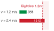
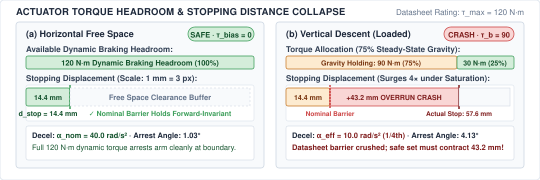
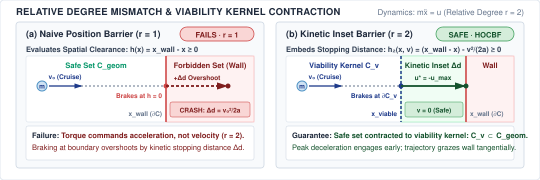
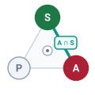
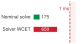
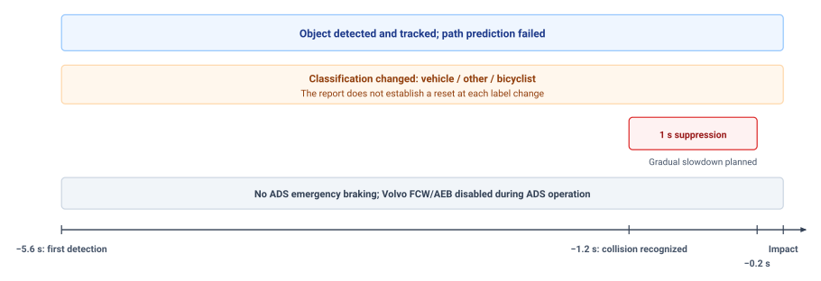

# Safety Enforcement {#sec-enforcement}

::: {layout-narrow}
::: {.column-margin}

\chapterminitoc

:::

::: {.content-visible when-format="pdf"}
\noindent
{fig-alt="Isometric blueprint showing runtime safety enforcement for an autonomous mobile robot: omnidirectional mecanum base, translucent mint-green forward-invariant safe set boundary, candidate cyan neural proposal vector pointing toward a prohibited crimson hazard wall, amber CBF-QP projected admissible vector, and crimson emergency brake interlock."}
:::

::: {.content-visible unless-format="pdf"}
{fig-alt="Isometric blueprint showing runtime safety enforcement for an autonomous mobile robot: omnidirectional mecanum base, translucent mint-green forward-invariant safe set boundary, candidate cyan neural proposal vector pointing toward a prohibited crimson hazard wall, amber CBF-QP projected admissible vector, and crimson emergency brake interlock."}
:::

:::

## Purpose {.unnumbered .unlisted}

::: {.content-visible when-format="pdf"}
\begin{marginfigure}
\vspace{1em}
\resizebox{\linewidth}{!}{\mlphysicalstackfull{20}{100}{20}{20}{20}}
\end{marginfigure}
:::

_How does an unprivileged software proposal become physical torque, and what guarantees that the gatekeeper can always say no in time?_

A policy can propose commands exceeding the machine's clearance or actuator capacity. Once that command becomes motor current, diagnosing the model's mistake cannot undo the resulting motion. An independent enforcement path must evaluate proposals before they reach the actuators and retain the authority to reject them within a bounded time. Timely refusal is insufficient. The replacement command must also produce the intended physical response. A brake that has reached its current limit cannot deliver additional force because the safety calculation assumes it can. Enforcement therefore depends on measured state and on the tracking error of the feedback loops beneath it. When those conditions no longer support the requested motion, the machine needs a fallback whose limits are explicit. The nervous system combines permission and execution, linking the brain's proposed behavior to the body's tracking and stopping capabilities.



::: {.callout-learning-objectives}

- Explain the relationship between tracking accuracy, command permission, and independent enforcement at the actuator boundary
- Diagnose how update rate, feedback delay, and actuator saturation limit corrective control
- Calculate stopping margins accounting for state uncertainty, tracking error, response delay, and available braking
- Evaluate when measured safety constraints require accepting, modifying, or refusing a proposed actuator command
- Select fallback responses when sensing, computation, or actuator limits invalidate normal enforcement

:::

## The Deterministic Gatekeeper {#sec-enforcement-deterministic-gatekeeper}

High-capacity learned neural policies—vision-language-action foundation models, deep reinforcement learning agents, and trajectory diffusion networks—excel at open-ended manipulation and adaptive navigation in unmodeled environments. Even when an upstream deliberative brain synthesizes smooth splines to guide the robot, candidate trajectories remain unprivileged proposals across the causal boundary. Neural policies are fundamentally unverified, non-deterministic optimizers. They can hallucinate infeasible paths, mistake specular reflections for open corridors, or emit joint commands that exceed mechanical torque limits. In standard software engineering, an algorithmic bug or invalid pointer can be trapped by a kernel exception handler or contained inside an application sandbox. In physical AI, software isolation alone is useless once motion begins. The instant a digital command triggers pulse-width modulation (PWM) switching in a motor inverter, electrical current energizes stator windings, generating magnetic flux that accelerates physical mass. At that point, software diagnosis is powerless: momentum cannot be trapped by an exception handler, and kinetic energy cannot be recalled once released into the physical plant.

The central dilemma of physical AI systems engineering is reconciling two irreconcilable realities: *How do we harness the task intelligence of stochastic neural policies while ensuring the physical machine never breaches geometric clearance, thermal limits, or human safety invariants?*

Solving this dilemma requires stepping across the **proposal-permission boundary** from Layer 3 (The Cognitive Brain) down to Layer 2 (The Deterministic Nervous System), as highlighted in @fig-12-locator. The **reflex enforcer**\index{Reflex enforcer} is the physical gatekeeper of the machine: an edge-deployed, hard real-time component positioned directly in front of the actuator drive electronics. It evaluates candidate proposals, verifies invariant state bounds, and holds the exclusive, irrevocable hardware authority to permit current flow or command autonomous fallback braking.

::: {#fig-12-locator fig-env="figure" fig-pos="htb" fig-cap="**Reflex Enforcer Architecture Focus**: In the physical AI systems architecture, the deterministic nervous system sits between the unverified deliberative brain and the dynamical body, serving as the sole authority permitted to translate advisory commands into physical force or refuse them outright. Operating at microsecond control cadences, the enforcer projects candidate actions onto forward-invariant safe sets and manages a multi-tier fallback hierarchy to guarantee physical containment." fig-alt="Diagram titled Physical AI Systems Architecture Stack, drawn as four stacked tiers. Layer 4 is system governance and assurance at 0.1 to 1 hertz, holding boxes for shared autonomy, verification, safety cases, and frontier limits. Layer 3 is the brain, a cognitive deliberation tier at 1 to 50 hertz, holding five stages named ingestion, perception, memory, intent, and planner. A dashed proposal-permission privilege boundary separates it from layer 2, the nervous system, a real-time safety and timing tier at 1000 hertz. Layer 1 is the physical body and continuous plant. Layer 2 is shaded and its 1 kilohertz reflex enforcer box is outlined; the badge reads Active Focus, Chapter 12, Runtime Enforcement."}
{width="100%"}
:::

::: {#dfn-enforcement-reflex-enforcer .callout-definition title="Reflex enforcer"}

***Reflex enforcer***\index{Reflex enforcer!definition} is an edge-deployed deterministic gatekeeper positioned between unverified deliberative software proposals and physical actuator drive electronics, executing at kilohertz frequencies to evaluate state invariants, project unsafe commands onto forward-invariant safe sets, and unilaterally command fallback deceleration when invariants degrade.

1.  **Significance**: Physical momentum and actuator saturation make late software intervention catastrophic. Co-locating the enforcer at the microsecond PWM/inverter boundary ensures that no uninspected command can reach motor windings.
2.  **Distinction**: Unlike high-level trajectory planners that optimize multi-step paths over hundreds of milliseconds, a reflex enforcer performs instantaneous, single-step feasibility checks and projections under strict sub-millisecond execution deadlines.
3.  **Common pitfall**: Treating the enforcer as an emergency exception handler invoked only during crashes. In practice, the enforcer is a continuous, per-tick gatekeeper; if its state estimates drift or its execution overruns the loop deadline, mechanical safety collapses immediately.

:::

::: {.column-margin .margin-pointer}
↰ **Prerequisite:** The dual-brain proposal-permission privilege split was established in @sec-boundary-dual-brain.
:::

This division creates an asymmetric authority relationship between the brain and the nervous system, formalized in systems engineering as the **Simplex architecture pattern**[^fn-enf-simplex-architecture] [@sha2001using]. Upstream neural policies emit candidate control proposals across time-bounded intent leases (@sec-intent-lease). But only the nervous system, executing on bare-metal microcontroller hardware directly wired to motor drives and joint encoders, possesses the physical authority to turn a proposal into mechanical force. The enforcer evaluates every incoming setpoint on a microsecond-level clock tick against forward-invariant safe sets using **Control Barrier Functions (CBFs)**[^fn-enf-barrier-function] [@ames2019control]. When a proposal is safe, it passes to the motor drives unaltered. When a proposal marginally threatens a boundary, an active-set Quadratic Program (CBF-QP) minimally modifies the command, preserving policy intent while strictly enforcing physical invariants.[^fn-enf-quadratic-program] When a proposal is structurally invalid or the cognitive brain falls silent, the gatekeeper severs the command channel and triggers an autonomous fallback deceleration sequence.

[^fn-enf-simplex-architecture]: **Simplex architecture and safety switching**\index{Simplex architecture!formal safety}\index{Fault tolerance!Simplex switch}: Formulated by @sha2001using, the Simplex architecture provides runtime safety assurance by pairing an unverified advanced controller with a certified baseline safety controller, arbitrated by a deterministic safety manager. The hardware multiplexer switch intercepts output channels, instantly diverting authority to the baseline controller if state invariants degrade. Bypassing unverified software in hardware guarantees system stability even if the primary neural policy hangs or exhibits non-deterministic memory faults.

[^fn-enf-barrier-function]: **Control barrier functions and forward invariance**\index{Control barrier function!forward invariance}\index{Safety filter!barrier certificate}: Control Barrier Functions define a continuously differentiable certificate $h(\mathbf{x}) \ge 0$ over an admissible safe set $\mathcal{C}$, enforcing the directional clearance derivative constraint $\dot{h}(\mathbf{x}, \mathbf{u}) \ge -\gamma(h(\mathbf{x}))$. Enforcing this inequality renders $\mathcal{C}$ forward-invariant: states that originate within the safe boundary are mathematically guaranteed never to exit it under continuous control. When approaching the boundary, the constraint forces opposing actuation inputs that arrest momentum before physical contact can occur.

[^fn-enf-quadratic-program]: **Active-set quadratic programming for safety shields**\index{Quadratic programming!active-set solver}\index{Safety shield!sub-millisecond QP}: Active-set Quadratic Programming solvers operating on bare-metal microcontrollers compute $\min_{\mathbf{u}} \frac{1}{2} \|\mathbf{u} - \mathbf{u}_{\text{nom}}\|^2$ subject to linear barrier constraints $\mathbf{a}(\mathbf{x})^\top \mathbf{u} \le b(\mathbf{x})$. By restricting linear constraints to active boundary contacts and eliminating dynamic memory allocation, these solvers guarantee deterministic termination within strict execution budgets ($<150\,\mu\text{s}$). If numerical ill-conditioning prevents convergence before the loop deadline, the solver aborts gracefully to an autonomous deceleration fallback.

However, an enforcer cannot guarantee safety beyond the physical tracking fidelity of the control loop beneath it. Every mathematical barrier certificate assumes that the closed-loop tracking controller follows commanded references within a bounded error. The enforcer consumes a single foundational contract from the controller: an explicit bound on the **worst-case tracking error** ($\epsilon_{\text{track}}$) between where the machine was commanded to be and where its physical mass actually resides. Every geometric clearance and dynamic velocity ceiling evaluated by the enforcer must be strictly inset by this error bound plus transport lag displacement.

Constructing this deterministic protective shield requires establishing the exact contractual boundaries between continuous tracking controllers, optimization-based safety filters, and bare-metal fallback actuators. The system cannot enforce safety in the abstract; it must ground barrier certificates in the verified tracking error and transport lag of the physical plant, structure asymmetric authority to reject ungrounded neural proposals, and position dual-stage filters across application processors and real-time silicon. When finite actuator torque and dynamic traps contract the admissible state space, minimal-intervention quadratic programs project candidate actions onto forward-invariant safe sets or cascade down an escalation ladder to bring kinetic energy safely to zero.

To systematically build this deterministic shield, this chapter unfolds across ten mechanisms: the tracking error contract passed from lower-level control (@sec-enforcement-handoff), the architectural authority to refuse unsafe proposals (@sec-enforcement-authority-refuse), the physical placement of the enforcer at the microsecond inverter boundary (@sec-enforcement-where-enforcer-sits), dynamic stopping envelopes (@sec-enforcement-stopping-envelopes), limits on enforcer authority under control saturation (@sec-enforcement-exhausted-authority), forward-invariant safe sets via Control Barrier Functions (@sec-enforcement-safe-sets-conditional-permission), active-set quadratic programming for minimal intervention (@sec-enforcement-minimal-intervention), the deterministic fallback ladder (@sec-enforcement-fallback-ladder), failure modes under model error (@sec-enforcement-failure-modes), and real-time enforcer telemetry (@sec-enforcement-telemetry).

We begin in @sec-enforcement-handoff by examining what continuous control hands over to the safety layer, formalizing the worst-case tracking error bound that anchors all subsequent barrier evaluations in physical reality.

## What Control Hands Over {#sec-enforcement-handoff}

The tracking contract isolates the enforcer from the plant's internal mechanics. A feedback controller operating over continuous physical dynamics makes many promises internally, but only one number passes upward across the systems interface. For any commanded trajectory $r(t)$ satisfying admissible velocity and acceleration limits, the physical state $x(t)$ remains within a bounded distance $\|x(t) - r(t)\| \le \epsilon_{\text{track}}$. The enforcer\index{Enforcer!tracking contract} does not inspect transfer functions, root loci, or proportional-integral-derivative (PID) gains. To the software sitting above the loop, the controller is a black box that turns reference setpoints into physical motion, guaranteed to stay within the error bound $\epsilon_{\text{track}}$\index{Tracking error bound} of the commanded path.

This bound is a physical distance, not a mathematical abstraction. A physical plant is governed by rotor inertia, transmission compliance, and actuator torque limits\index{Actuator torque limits}. The steady-state position error—the persistent physical gap between the commanded destination and the actual resting place—balances unmodeled external disturbances against the restoring control effort of the closed-loop stiffness\index{Closed-loop stiffness}. When disturbances are physically bounded, the worst-case tracking error bound $\epsilon_{\text{track}}$ derives directly from the closed-loop stiffness.[^fn-math-tracking-error]

[^fn-math-tracking-error]: **Closed-loop tracking stiffness and disturbance bounds**\index{Tracking error!disturbance bounds}\index{Control loop!closed-loop stiffness}: The physical tracking error $\epsilon_{\text{track}}$ under bounded external disturbance forces $d_{\max}$ is inversely proportional to the active closed-loop gain and mechanical transmission stiffness ($K_{\text{loop}}$). Compliant joints or soft feedback gains increase deflection under sustained contact loads, expanding the spatial error tube around the commanded trajectory. If external disturbance forces exceed the modeled bound ($d > d_{\max}$), tracking error diverges exponentially, invalidating the geometric assumptions of downstream safety filters.

Consider an analytical example of a linear positioning stage operating in an environment where friction and payload variations introduce disturbance forces. If the maximum theoretical disturbance translates to a steady-state error of $5.0\text{ mm}$, and the reference command executes a step of $100.0\text{ mm}$, the carriage accelerates, settles into the bounded corridor, and comes to rest. At steady state, the physical carriage does not sit precisely at $100.0\text{ mm}$. It rests anywhere within the interval $[95.0\text{ mm}, 105.0\text{ mm}]$.

This guarantee holds only within defined physical operating conditions. The controller provides the bound $\epsilon_{\text{track}}$ under three physical conditions. First, the reference trajectory cannot demand accelerations beyond what the actuators can deliver. Second, external disturbances must remain strictly below $d_{\text{max}}$. Third, the actuator must operate below the continuous thermal derating limits established in @sec-body-thermal-duty-cycles (governed by Joule heating\index{Joule heating}) and voltage bus rails. If an upstream policy commands a trajectory that demands an acceleration of $15.0\text{ m/s}^2$ from an actuator whose peak torque caps acceleration at $10.0\text{ m/s}^2$, the feedback loop saturates\index{Actuator saturation}. The integrator winds up\index{Integrator windup}, phase lag accumulates, and the physical mechanism falls behind the reference by an amount that grows with every millisecond of saturation. If an unexpected external load exceeds $25.0\text{ N}$, the disturbance overpowers the restoring force of stiffness $K$, pulling the carriage outside the $\pm 5.0\text{ mm}$ corridor. Outside its rated envelope, the controller provides no bound at all.

Because physical reality can diverge from the reference command by up to $\epsilon_{\text{track}}$, every geometric and dynamic margin evaluated by an enforcer must be inset by that exact distance. If a robot arm must maintain a physical clearance of at least $20.0\text{ mm}$ from a fragile fixture, and the underlying tracking loop guarantees an error bound $\epsilon_{\text{track}} = 5.0\text{ mm}$, the enforcer cannot evaluate safety against the nominal geometry. It must inset the admissible state space by adding a virtual buffer of $5.0\text{ mm}$, checking that the commanded reference maintains a clearance of at least $25.0\text{ mm}$ from the obstacle surface. Compounding tracking error, transport delay displacement, and state estimation residual yields the composite inset margin invariant:
$$\delta_{\text{margin}} \ge \epsilon_{\text{track}} + v \cdot \tau_{\text{delay}} + \epsilon_{\text{est}}$$ {#eq-enforce-inset-margin}
As formalized in @eq-enforce-inset-margin, if worn bearings\index{Wear!bearings}, thermal expansion, or altered motor parameters loosen the true tracking error from $5.0\text{ mm}$ to $12.0\text{ mm}$ without the enforcer updating its internal model, the true physical clearance to the fixture shrinks from $20.0\text{ mm}$ to $13.0\text{ mm}$. The enforcer believes it is operating with a comfortable safety margin while the physical hardware moves dangerously close to collision. A degraded tracking bound silently erodes safety margins across the entire software stack.

::: {.column-margin .margin-pointer}
↰ **Prerequisite:** Spatial clearance insetting from sensor covariance and transport delay originates in @sec-perception-error-clearance.
:::

A tracking bound never checked at runtime is an assumption, not a contract. Because environmental conditions fluctuate and mechanical components degrade, the nervous system must publish $\epsilon_{\text{track}}$ alongside the explicit operational conditions that validate it, while monitoring the instantaneous tracking error $e(t) = \|x(t) - r(t)\|$ on every tick of the control cycle. If sensor feedback reveals that $e(t)$ approaches or exceeds $\epsilon_{\text{track}}$, the tracking contract has broken. When a disturbance force spikes to $40.0\text{ N}$ or an actuator enters thermal throttling, the nervous system cannot treat the resulting divergence as a normal transient. It must detect the contract violation immediately, invalidating the spatial assumptions used by downstream filters before unmodeled deflection causes physical damage.

::: {#psp-enforcement-inset-margin .callout-perspective title="The inset margin invariant"}
Every spatial and dynamic safety boundary evaluated by an enforcer must be inset by the underlying tracking loop's verified worst-case tracking error plus the transport lag\index{Transport lag} displacement according to @eq-enforce-inset-margin: $\delta_{\text{margin}} \ge \epsilon_{\text{track}} + v \cdot \tau_{\text{delay}} + \epsilon_{\text{est}}$. An enforcer that evaluates barrier certificates\index{Barrier certificates} against nominal geometric boundaries without insetting will permit trajectories that physically collide with obstacles whenever tracking error reaches its certified bound.
:::

The mathematical synthesis of tracking controllers, observer design, and disturbance rejection proofs are treated in depth by the control literature [@slotine1991applied; @astrom2021feedback]. For the systems engineer building physical AI architectures, the responsibility begins where control guarantees end. The tracking controller provides the mechanism to translate permitted references into physical currents, but it has no semantic awareness of obstacles, task goals, or system-level hazards. It will execute a command into a solid wall with the same closed-loop fidelity that it brings to free-space motion. Before any proposed action is handed to this tracking machinery, the system must determine whether the proposal is permitted to become force at all.

## The Authority to Refuse {#sec-enforcement-authority-refuse}

The permission path is a safety gate that admits actuation only when specific physical criteria are satisfied. It is a safety gate that admits actuation only when specific physical criteria are satisfied, treating every incoming proposal as unsafe until proven otherwise. In conventional automation, control pipelines operate on trust, executing commands under the assumption that the upstream software component produces valid setpoints. In physical AI, that assumption fails by design. A learned policy operating in high-dimensional perception space has no mathematical guarantees of stability, no bounded output variance, and no internal representation of actuator current limits or mechanical stress. The learned model cannot be held accountable for physical destruction; thus, the nervous system must not treat its outputs as authoritative. Within this architecture, upstream models produce advisory proposals, but only the nervous system possesses the physical authority to turn a proposal into force.

This division creates an asymmetric authority model between the brain and the nervous system, formalized in systems engineering as the **Simplex architecture pattern**\index{Simplex architecture pattern} [@sha2001using]. The Simplex pattern resolves the tension between high performance and safety by decomposing the control system into four structural components:

1. **The advanced controller**\index{Simplex architecture!Advanced controller}: An unverified, high-capacity learned model (such as a Vision-Language-Action network, a residual reinforcement learning policy [@johannink2019residual], or a diffusion policy executing on a Linux MPU) that optimizes for complex, open-ended task performance.
2. **The baseline safety controller**\index{Simplex architecture!Baseline controller}: A certified, high-assurance deterministic controller (such as a Lyapunov-based posture regulator or precomputed quintic deceleration spline executing on bare-metal MCU firmware) that acts as the trusted low-level stabilization baseline of the physical plant, guaranteeing stability and physical containment within a known envelope.
3. **The safety manager**\index{Simplex architecture!Safety manager}: Deterministic arbitration logic that continuously evaluates the state of the machine against forward-invariant barrier sets, tracking error bounds, and execution deadlines.
4. **The Simplex switch**\index{Simplex architecture!Simplex switch}: An atomic hardware or real-time firmware multiplexer that routes actuation signals to the motor bridge. The switch routes the Advanced Controller's output when certified safe, and instantaneously diverts control to the Baseline Controller the moment safety envelopes are endangered.

Under this Simplex contract, the upstream policy never commands the plant directly. Instead, communication across the causal boundary operates through time-bounded **intent leases**\index{Intent lease}—a mechanism analogous to an industrial dead-man watchdog, where permission to move automatically expires unless continuously renewed by a verified, healthy brain. The Linux MPU transmits candidate control vectors as structured packets over shared SRAM mailboxes using the Remote Processor Messaging (RPMSG) protocol.[^fn-hw-rpmsg-lease] Each proposal payload contains a monotonic sequence identifier, a microsecond timestamp, an explicit lease duration ($\tau_{\text{lease}}$), candidate setpoints, a transmission integrity checksum (CRC32), and, across unprivileged operating system boundaries, a cryptographic Message Authentication Code (MAC) (such as AUTOSAR SecOC with AES-128 CMAC) to prevent unauthorized command spoofing. The real-time microcontroller inspects the lease on every control cycle. If the lease is valid, the state is within safe set boundaries, and tracking error remains bounded, the Simplex switch permits the proposal (or its minimally projected variant) to drive the actuators. If the lease expires without renewal, tracking diverges, or the proposal threatens physical boundaries, the Simplex switch revokes permission and engages the Baseline Safety Controller unilaterally.[^fn-hw-pwm-tripzone] The upstream policy is not consulted, does not negotiate, and possesses no hardware mechanism to override the switch.

[^fn-hw-rpmsg-lease]: **Remote Processor Messaging**\index{Remote Processor Messaging!Shared SRAM leases}\index{Inter-processor communication!RPMSG}: RPMSG is a standard Linux kernel framework that provides a virtio-based inter-processor communication bus. It enables deterministic asymmetric multiprocessing by passing pointers to shared SRAM rather than copying memory payloads. This zero-copy transport guarantees sub-millisecond intent lease handovers between unprivileged policies and real-time enforcers without operating system buffering jitter.

[^fn-hw-pwm-tripzone]: **Hardware break circuits and PWM trip zones**\index{Hardware!Trip zones}\index{Pulse-width modulation!Hardware clamp}: In canonical safety microcontrollers, hardware trip zones (`EPWM_TZFRC`, `TIMx_BKIN`) operate independently of the main CPU core. Dedicated break circuits force complementary PWM outputs into high-impedance or low-side clamp states within $<50\text{ ns}$. This autonomous hardware interlock prevents bridge shoot-through and actuator runaway before software interrupt service routines can execute.

When a proposal conflicts with physical constraints, the enforcer chooses between two interventions: command filtering and outright veto. Command filtering applies when the proposal is structurally sound but marginally exceeds an admissible kinematic or dynamic boundary. If an analytical model of a six-axis manipulator shows that a proposed end-effector velocity vector demands a joint speed 4 percent above a rated motor limit of $3.0\text{ rad/s}$, the nervous system can mathematically shave off the excess by projecting the reference onto the boundary of the safe set using Control Barrier Functions\index{Control barrier function} or quadratic programming\index{Quadratic programming} (CBF-QP).

At the physical layer, evaluating whether an action is safe evaluates whether physical clearance decreases faster than maximum available braking deceleration can arrest momentum. Actuators command electrical current and torque, not velocity or position. Torque produces acceleration ($F = ma$), meaning position is separated from the control input by two time integrals. If an enforcer only monitors geometric distance to an obstacle without factoring in momentum, motor braking cannot overcome physical inertia in time to prevent impact. To guarantee safety, the enforcer verifies that the rate of change of clearance $\dot{d}$ does not decrease faster than available braking deceleration:
$$\dot{d}(\mathbf{x}, \mathbf{u}) \ge -\gamma \cdot d(\mathbf{x})$$
where $d(\mathbf{x})$ represents remaining clearance, and $\gamma > 0$ dictates how aggressively the machine must shed speed as the boundary nears. In standard matrix form for a real-time convex solver, this clearance check translates into a linear constraint on the commanded actuator torque $\mathbf{u}$:[^fn-math-cbf-lie]
$$\mathbf{a}(\mathbf{x})^\top \mathbf{u} \le b(\mathbf{x})$$
where $\mathbf{a}(\mathbf{x})^\top \mathbf{u}$ isolates the braking deceleration delivered by the actuators, and $b(\mathbf{x})$ captures the allowable deceleration budget after accounting for unforced physical drift, gravitational load, and momentum.

[^fn-math-cbf-lie]: **Control barrier functions and Lie derivatives**\index{Control barrier function!Lie derivatives}\index{Nonlinear control!Lie derivatives}: In nonlinear control theory, the unforced drift and actuator control authority are formalized using Lie derivatives ($L_f h(x)$ and $L_g h(x)$). When the safety boundary has relative degree one, the control input appears directly in the first time derivative of the barrier function, yielding an instantaneous affine constraint on commanded torque. If the relative degree is two, the enforcer must evaluate higher-order derivatives to prevent actuator saturation from rendering boundary violations inevitable; see @sec-appendix-control.

Forward invariance requires that this clearance rate constraint holds continuously. Physically, this means that whenever momentum carries the machine toward a boundary, the actuators must exert sufficient opposing torque to decelerate before clearance vanishes. When a proposal marginally threatens a boundary, the CBF-QP safety filter minimally adjusts the commanded torques to satisfy $\mathbf{a}(\mathbf{x})^\top \mathbf{u} \le b(\mathbf{x})$. This projection preserves the geometric direction of the motion (so the arm still moves along the exact intended path) while scaling down the magnitude to obey the $3.0\text{ rad/s}$ ceiling. Projection is permissible only when the deviation is local, continuous, and cleanly separated from catastrophic hazards. When a proposal exhibits structural invalidity—such as a discontinuous jump in commanded position across consecutive frames, a request for acceleration that exceeds maximum physical torque capabilities, or a trajectory vector aimed directly into an immovable obstacle—geometric projection becomes dangerous. A discontinuous or wildly infeasible proposal indicates that the upstream perception or inference pipeline has entered an unmodeled failure mode. Attempting to project an ungrounded hallucination onto the nearest safe boundary executes a synthetic motion that has no relationship to task intent. In such cases, the enforcer must veto the proposal entirely, tripping the Simplex switch and dropping authority to a local fallback.

### Constrained reinforcement learning versus runtime projection shields

Machine learning practitioners question why an architecture needs an independent hard real-time quadratic programming solver on a microcontroller to enforce physical boundaries: *Why not train the neural policy to be safe using Constrained Reinforcement Learning (Constrained RL) or Lagrangian penalty formulations?*

In Constrained RL, the optimization problem maximizes task reward subject to expected cost bounds across rollout episodes:
$$\max_\theta \mathbb{E}_{\tau \sim \pi_\theta} \left[ \sum_{t=0}^T \gamma^t R(s_t, a_t) \right] \quad \text{subject to} \quad \mathbb{E}_{\tau \sim \pi_\theta} \left[ \sum_{t=0}^T \gamma^t C(s_t, a_t) \right] \le d$$
where $C(s_t, a_t)$ denotes a constraint violation penalty (such as proximity to a wall or exceeding a motor current limit) and $d$ represents the allowable constraint budget. Solved via Lagrangian primal-dual updates ($\min_\lambda \max_\theta \mathcal{L}(\theta, \lambda)$), this approach attempts to internalize safety constraints directly into the neural network's weight tensors.

While mathematically elegant in simulation, training-time constraint penalties fail on physical hardware for four fundamental reasons:

1. **Expectation versus Pointwise Guarantees:** Constrained RL enforces constraints *in expectation* over the stationary policy distribution ($\mathbb{E}[C] \le d$). An expectation allows the robot to violently collide with an obstacle in 1 percent of trials, provided it behaves with extreme conservatism in the remaining 99 percent to keep the statistical average below $d$. On physical iron, there is no acceptable average crash rate: a single high-momentum collision fractures linkages and burns out inverter stages. Physical safety must hold *pointwise in time* ($\forall t \ge 0$), a guarantee that statistical expectation cannot provide.
2. **The Reward Shaping Dilemma and the Freezing Robot Trap:** Balancing task reward against constraint penalties is notoriously brittle. If the Lagrange multiplier $\lambda$ is initialized too low, exploratory policy gradients prioritize task completion, causing destructive physical breaches. If $\lambda$ is increased to guarantee containment, policy gradients in the vicinity of the boundary become excessively steep or vanish, driving the policy into a pathological local minimum where the robot refuses to move at all—the classic "freezing robot" problem.
3. **Destructive Exploratory Rollouts:** In reinforcement learning, the policy learns constraint boundaries by experiencing violations and backpropagating the resulting penalties. In a simulated environment, a catastrophic crash is resolved by invoking an instantaneous software reset. On physical hardware, exploratory collisions destroy transmissions, strip gearboxes, and trigger hardware E-stops, rendering trial-and-error constraint discovery physically infeasible.
4. **Uncertainty Under Test-Time Distribution Shift:** Even if a policy achieves zero violations across billions of simulated training steps, real-world deployment introduces unmodeled friction variations, sensor lens contamination, and payload fluctuations. Because deep neural policies lack certified Lipschitz continuity outside their training support, a minor perceptual shift can produce an out-of-distribution action that violates physical invariants without warning.

By contrast, the physical AI architecture decouples task optimization from runtime safety enforcement. The learned policy (whether trained via unconstrained RL, imitation learning, or diffusion) focuses 100 percent of its capacity on open-ended task optimization, proposing unconstrained nominal controls $\mathbf{u}_{\text{nom}}$. Downstream, the deterministic CBF-QP safety shield executing on the real-time microcontroller solves the minimal convex projection:
$$\mathbf{u}^* = \arg\min_{\mathbf{u} \in \mathcal{U}} \frac{1}{2} \|\mathbf{u} - \mathbf{u}_{\text{nom}}\|^2 \quad \text{subject to} \quad \mathbf{a}(\mathbf{x})^\top \mathbf{u} \le b(\mathbf{x})$$
When the policy's proposal is safe, the shield is completely transparent ($\mathbf{u}^* = \mathbf{u}_{\text{nom}}$), leaving nominal task execution unhindered. When a boundary is threatened, the shield projects the command onto the boundary of the safe set, mathematically guaranteeing forward invariance ($h(\mathbf{x}) \ge 0, \forall t$) with zero violations and sub-millisecond determinism.

To maintain authority when the upstream system collapses, the refusal mechanism must operate with complete local autonomy. The nervous system cannot depend on the brain to report its own failures or request a shutdown. Consider an analytical example where an upstream policy publishes trajectory setpoints at $20\text{ Hz}$, or one frame every $50\text{ ms}$, across an inter-process communication bus to a nervous system running a joint tracking loop at $1000\text{ Hz}$. The nervous system couples incoming frames to a hardware countdown timer integrated into the microcontroller silicon that forces an autonomous safe shutdown if communication heartbeats lapse. If the upstream inference engine experiences an operating system scheduling stall, an out-of-memory exception, or a CUDA kernel panic, the flow of setpoints halts. If the intent lease duration is set to $\tau_{\text{lease}} = 150\text{ ms}$ and the watchdog timeout is configured for $t_{\text{timeout}} = 100\text{ ms}$ of heartbeat silence, the nervous system detects the fault within milliseconds of a missed frame. It does not freeze the last commanded actuator currents, which would cause an arm moving at $1.2\text{ m/s}$ to drift under momentum and strike environmental boundaries. Instead, the local enforcer immediately severs the upstream command channel and transitions to an autonomous position hold, synthesizing a smooth deceleration trajectory that brings joint velocities to zero at a controlled rate of $8.0\text{ m/s}^2$ while remaining within current limits.

Severing upstream authority requires a well-defined physical state at the lowest level of the hardware interface, which forms the **zero-command floor**\index{Zero-command floor}—the safest baseline physical condition the hardware defaults to when active software control is completely removed. In software systems, halting an execution pipeline often corresponds to returning a null pointer or clearing a status register. In physical systems, writing zero to a motor drive register produces radically different mechanics depending on actuator electrical and mechanical topology. Setting current commands to zero in a low-friction, direct-drive motor removes all resistive torque, causing a robot arm holding a $5.0\text{ kg}$ payload to drop under gravity in free fall. Conversely, commanding zero velocity in a stiff position controller with high proportional gains commands maximum peak current to arrest motion instantaneously, which can shear gear teeth or buckle structural linkages if momentum is high. The system designer must select the zero-command state to match the mechanical physics of the plant. In geared transmissions with high backdrivability, dynamic braking\index{Dynamic braking} shorts the motor windings through low-resistance shunts or MOSFET bridges. This converts the back-electromotive force\index{Back-electromotive force} (the voltage a spinning motor naturally generates by acting as a generator) into electrical current that physically resists the motion, generating a braking torque proportional to velocity. This dynamic damping smoothly dissipates kinetic energy as heat without requiring active software control, though it cannot resist static gravitational torque once motion ceases. When static holding or power-off safety is required, the zero-command state de-energizes electromechanical spring-applied friction brakes, clamping the joints mechanically after dynamic braking has reduced angular velocity below a threshold of $0.1\text{ rad/s}$ to prevent excessive friction lining wear.

Refusal is therefore not an emergency exception handler invoked only during rare failures. It is the steady-state operating discipline of the entire machine. On every millisecond tick of the control clock, the nervous system verifies that an incoming proposal is topologically valid, that communication heartbeats remain unbroken, that the commanded reference lies strictly inside invariant safety sets, and that tracking error remains bounded. If any condition fails, the enforcer says no, substituting an autonomous fallback or engaging the zero-command floor. Because the enforcer holds the ultimate authority to deny actuation, its implementation must not depend on the very components it is designed to constrain.

## Where the Enforcer Sits {#sec-enforcement-where-enforcer-sits}

The enforcer sits at a specific physical and logical boundary in the signal pipeline, determined by the dynamics' timescale and the latencies of the feeding channels. Two natural boundaries exist in every machine that translates learned proposals into motion. The first boundary sits upstream of the feedback control loop, where the system executes reference checking. A reference checker validates planned trajectory waypoints, coordinate targets, or velocity vectors emitted by a high-level planner before those targets enter the tracking loop. Because it operates in kinematic space over a forward horizon, a kinematic reference checker\index{Reference checker!kinematic} operating at $50\text{ Hz}$ can evaluate a $300\text{ ms}$ trajectory segment against static geometric envelopes, workspace boundaries, and self-collision models. The strength of reference checking is wide spatial foresight, but its fundamental limitation is complete blindness to the actual physical state of the plant. If a planned path maintains a clearance of $5.0\text{ mm}$ from a steel bracket, the reference checker marks the command valid. Yet if the downstream tracking controller exhibits a transient position overshoot of $10.0\text{ mm}$ when accelerating a heavy load, the physical arm strikes the bracket despite passing every upstream validation step.

::: {.column-margin .margin-pointer}
↳ **Downstream:** Heterogeneous silicon partitioning of the reflex enforcer onto isolated microcontroller enclaves is mapped in @sec-placement-two-paths-one-die.
:::

The second boundary sits downstream of the feedback controller, directly in front of the power electronics, where the system executes command checking. A command checker inspects the raw physical quantities produced by the tracking loop, evaluating motor phase currents, hydraulic valve spool displacements, pulse-width modulation duty cycles, and joint torque references immediately before writing them to hardware registers. Operating at the inner control loop frequency, typically $1000\text{ Hz}$ with an execution budget under $100\,\mu\text{s}$, the command checker enforces hard instantaneous limits. It prevents electrical overcurrent, structural over-torque, and thermal runaway by clipping or zeroing signals that exceed the physical ratings of the plant. What the command checker gains in physical certainty, it surrenders in temporal foresight. Operating on a single discrete time step $\Delta t = 1.0\text{ ms}$, it cannot evaluate future state evolution. An instantaneous torque command of $18\text{ N}\cdot\text{m}$, which is well within a thermal continuous rating of $45\text{ N}\cdot\text{m}$, appears entirely safe to a post-control monitor. However, if that torque accelerates a $10\text{ kg}\cdot\text{m}^2$ linkage toward a rigid stop at $1.5\text{ rad/s}$, the rotational kinetic energy of the mechanism will exceed the maximum deceleration capacity of the actuator over the remaining travel distance. The command checker detects no fault until the linkage is inches from impact, at which point no allowable reverse torque can prevent a collision.

This split reveals the trade-off between latency and visibility. Reference checkers possess multi-step geometric visibility but suffer from high latency and blind spots regarding closed-loop tracking dynamics. Operating at planning rates between $10\text{ Hz}$ and $50\text{ Hz}$, a reference filter cannot respond to unmodeled plant resonance, sensor noise amplification, or sudden control instability occurring at frequencies above its update rate. If a feedback controller develops a $60\text{ Hz}$ limit cycle oscillation, the reference setpoints remain stationary while the physical linkages shake. Conversely, command checkers respond within microseconds on every millisecond clock tick, eliminating latency, but their one-step horizon creates dynamic traps where every instantaneous torque is legal until an irrecoverable state is reached.

The placement of the enforcer also determines how it integrates into the computing fabric. In a sequential in-line architecture, every signal passes synchronously through the enforcement logic before reaching the next stage. A reference checker filters the trajectory before the controller reads it, or a command clamp modifies the torque register before the motor drive samples it. Sequential execution guarantees zero uninspected commands, but it inserts the worst-case execution time of the enforcer directly into the critical latency path. For a digital $1000\text{ Hz}$ control loop\index{Control loop!digital} with a total deadline of $1000\,\mu\text{s}$, allocating a $P_{99}$ latency of $250\,\mu\text{s}$ to an in-line safety check shrinks the budget available for feedback computation. If the enforcer overruns its execution budget, the entire cycle faults. In a parallel asynchronous architecture, the enforcer executes on a separate co-processor or an isolated processor core, monitoring the state of the machine and the command stream concurrently without intercepting every cycle. When the parallel monitor detects an invariant violation, it asserts a hardware line to open a safety contactor (physically severing high-voltage power to the actuators) or switch the motor drive to dynamic braking (shorting the motor phases to rapidly dissipate kinetic energy). Parallel execution preserves control loop timing, but the asynchronous detection and communication introduce an enforcement lag bounded by the monitor cycle time and bus jitter\index{Latency!bus jitter}, with empirical EtherCAT measurements showing $3.0\text{ ms}$ to $8.0\text{ ms}$ of communication transport lag. To compensate for this reaction delay, the system designer must expand the physical safety margins, slowing the machine or increasing its minimum clearance buffers.

Because neither single location provides both dynamic foresight and instantaneous protection, physical AI architectures resolve the tension through a **dual-stage enforcement pattern**\index{Dual-stage enforcement pattern}. This pattern maps cleanly onto the heterogeneous dual-brain System-on-Chip (SoC) architecture (@sec-brain-embodied):

- **Upstream Stage (Pre-Control Corridor Filter on Application MPU):** Operating at $20\text{--}50\text{ Hz}$ on an unprivileged application microprocessor core, this stage accepts multi-step trajectory chunks emitted by the learned policy. It verifies that the planned path maintains a dynamic stopping corridor under worst-case braking parameters and validates geometric clearance against static workspace envelopes before packing the waypoints into an RPMSG intent lease.
- **Downstream Stage (Instantaneous CBF-QP Safety Shield on Bare-Metal MCU):** Operating inside a strict $1000\text{ Hz}$ ($1000\,\mu\text{s}$) timer interrupt loop on an isolated hard real-time safety microcontroller, this stage receives the proposed setpoint from shared SRAM, verifies tracking error bounds, solves an active-set Control Barrier Function (CBF-QP)\index{Safety shield!control barrier function} quadratic program in pre-allocated static SRAM, and clamps raw current and torque commands directly before writing to PWM timer registers. Because the clearance rate constraint $\dot{d} \ge -\gamma \cdot d$ separates unforced physical momentum from actuator braking authority as a standard linear inequality $\mathbf{a}(\mathbf{x})^\top \mathbf{u} \le b(\mathbf{x})$, this safety check reduces to a single-step convex projection that executes in tens of microseconds.

The pre-control stage prevents the system from entering dynamic traps by ensuring that a valid deceleration trajectory always exists, while the post-control stage catches loop instability, mechanical overshoots, and transient sensor dropouts before current reaches the motor windings.

Placing the enforcer correctly is useless if its inputs share failure modes with the component it checks. An enforcer may only evaluate quantities that it can establish independently of the proposal path. If a pre-control corridor filter calculates collision distances using a depth map generated by the same neural perception model that planned the motion, an out-of-distribution visual artifact will deceive both the planner and the enforcer simultaneously. Independent enforcement requires independent sensing and isolated computation. On heterogeneous dual-brain SoCs and industrial robotics controllers, the bare-metal safety MCU reads secondary optical encoders and hardware limit switches wired directly to its own GPIO and hardware timer capture registers over dedicated buses, completely isolated from the Linux virtual memory space and operating system scheduler. A collision enforcer must read dedicated safety lidar or ultrasonic proximity sensors whose signal conditioning relies on deterministic threshold logic rather than learned inference. Where no physically independent sensor exists, such as when estimating the friction coefficient of a wet roadway or the variable mass of an unmodeled payload, the systems engineer cannot construct an independent physical guarantee. In those operating regimes, the safety assertion is conditional, its validity bounded by the statistical uncertainty of the learned estimator rather than guaranteed by the nervous system. Every invariant that the enforcer checks, whether evaluated upstream across a geometric corridor or downstream at the motor terminals, ultimately assumes that the physical plant retains the control authority to arrest its own motion before crossing a forbidden boundary.

::: {#psp-enforcement-simplex-independence .callout-perspective title="The Simplex independence rule"}
A safety monitor must never evaluate a state estimate produced by the component it is designed to constrain, nor share an un-preemptible communication bus, memory matrix, or clock tree with unverified processes. Where independent sensing is physically impossible, the safety claim is conditional on model uncertainty rather than guaranteed by hardware.
:::

::: {#chk-enforcement-placement-boundaries .callout-checkpoint title="Zero-jitter enforcement boundaries and hardware trip paths"}

Before analyzing dynamic stopping equations, verify your architectural understanding of where safety enforcement must execute relative to the operating system and motor hardware:

- [ ] **Co-location vulnerability**: Can you explain why running safety filtering inside the same Linux user-space process as a vision-language policy exposes the machine to unbudgeted kernel scheduling jitter ($> 20\text{ ms}$)?
- [ ] **Hardware break circuits**: Can you identify the physical silicon mechanism (e.g., advanced timer break input pins like `TIMx_BKIN`) that forces motor PWM pins into high-impedance cutoff without executing software instructions?
- [ ] **Asymmetric privilege boundaries**: Can you contrast the fault domain of an unprivileged Linux Application Processor (MPU) with a bare-metal microcontroller (MCU) running deterministic 1 kHz safety loops?
- [ ] **Shared-bus starvation**: Can you describe how high-throughput direct memory access (DMA) bursts from camera image sensors can stall real-time SPI torque command packets across shared system crossbars?

*Never place a hard real-time safety enforcer downstream of a preemptible general-purpose operating system scheduler; safety reflexes require bare-metal execution and direct hardware trip paths.*
:::

## Stopping Envelopes {#sec-enforcement-stopping-envelopes}

To ensure a machine never enters a forbidden state, the nervous system must know an unassisted stop is always physically achievable. This guarantee defines the **stopping envelope**\index{Stopping envelope}, the set of all state trajectories from which maximum available braking can bring the system to rest without violating a spatial or kinematic boundary. To maintain safety, it is essential to reserve both distance and time for an emergency deceleration maneuver. Even if the machine operates normally, designers must account for these reserves in the system's operational constraints. This reservation impacts overall system design by creating trade-offs between speed and safety, ensuring that the machine can react effectively in critical situations. Continually ensuring that a safe stop is available costs achievable speed, and managing this fundamental trade-off is the essence of safety design. Every increase in operating velocity expands the distance required to arrest momentum, consuming the spatial buffer between the machine and its physical constraints.

The stopping envelope geometry derives from Newtonian kinematics and the nervous system's signal latency. Consider a body moving along a single axis at instantaneous velocity $v$. When an enforcer detects a boundary violation or receives an unsafe proposal, a finite transport delay $\tau_{\text{delay}}$ elapses before actuators can generate opposing force. This total delay compounds perception exposure time, transport latency over the internal communications bus (e.g., EtherCAT\index{EtherCAT} bus jitter, which introduces slight variations in message delivery time), enforcer evaluation cycle time, and the physical current rise time ($L/R$ time constant) in the stator\index{Stator} windings (@sec-body-five-budgets). During $\tau_{\text{delay}}$, the body continues to travel under its pre-existing velocity, traversing a reaction distance of $v \cdot \tau_{\text{delay}}$. Once braking torque engages, assuming a constant maximum deceleration $a_{\text{max}}$, the time required to arrest the remaining velocity is $v / a_{\text{max}}$, during which the body traverses a braking distance of $v^2 / (2 a_{\text{max}})$.

A pure kinematic calculation assumes that the underlying feedback controller tracks the reference trajectory with zero error. By physical AI first principles, a real physical plant diverges from the reference trajectory due to external disturbances, unmodeled joint friction, and the sensor quantization limits (@sec-body-measurement-freshness). This instantaneous tracking error is bounded by $\epsilon_{\text{track}}$ (@sec-enforcement-handoff). If an obstacle sits at a coordinate $x_{\text{obs}}$, placing the nominal stopping target exactly at $x_{\text{obs}}$ causes a collision whenever the tracking error reaches its positive bound. The enforcer must therefore inset the allowable reference boundary away from the obstacle by $\epsilon_{\text{track}}$. Combining reaction displacement during transport lag, active braking deceleration, and the low-level tracking error bound yields the fundamental stopping envelope invariant:[^fn-math-stopping-dist]
$$d_{\text{stop}}(v) = v \tau_{\text{delay}} + \frac{v^2}{2 a_{\max}} + \epsilon_{\text{track}}$$ {#eq-enforce-stopping-envelope}

[^fn-math-stopping-dist]: **Kinematic stopping distance and latency components**\index{Stopping envelope!Kinematic distance}\index{Latency!Stopping distance contribution}: The total stopping distance compounds three distinct physical quantities: transport reaction displacement during sensor and communication lag, kinetic braking displacement under peak actuator deceleration, and closed-loop tracking error bounds. Omitting computational transport delay or tracking error results in premature encroachment on physical obstacles before peak braking can engage. See @sec-appendix-control for formal kinematic derivations.

Any trajectory proposal that places the machine at a distance less than $d_{\text{stop}}(v)$ in @eq-enforce-stopping-envelope from a physical constraint along the direction of motion is unsafe and physically inadmissible. The stopping envelope is fundamentally anisotropic\index{Stopping envelope!Anisotropy}; an obstacle behind the instantaneous velocity vector requires clearance only for the positional tracking error $\epsilon_{\text{track}}$.

Consider an analytical example of an autonomous mobile robot (AMR) navigating an industrial facility with an onboard safety LiDAR sensor offering a clear detection horizon $d_{\text{sense}} = 2.50\text{ m}$. The nervous system exhibits a total command transport and electrical rise delay $\tau_{\text{delay}} = 50\text{ ms} = 0.050\text{ s}$ (accounting for sensor ingress, fieldbus packet exchange, safety filter solve, and motor inverter rise time). The chassis friction braking system guarantees maximum emergency deceleration $a_{\max} = 2.50\text{ m/s}^2$, and the low-level tracking controller provides a verified worst-case odometric tracking error $\epsilon_{\text{track}} = 40\text{ mm} = 0.040\text{ m}$.

At a nominal cruising speed $v_1 = 1.20\text{ m/s}$, the reaction drift distance during transport lag is $d_{\text{react}} = v_1 \tau_{\text{delay}} = (1.20\text{ m/s})(0.050\text{ s}) = 0.060\text{ m} = 60\text{ mm}$. The active braking distance is $d_{\text{brake}} = v_1^2 / (2 a_{\max}) = (1.20\text{ m/s})^2 / (2 \times 2.50\text{ m/s}^2) = 0.288\text{ m} = 288\text{ mm}$. Summing these with the tracking margin yields a total required stopping clearance of $d_{\text{stop}}(1.20) = 0.060\text{ m} + 0.288\text{ m} + 0.040\text{ m} = 0.388\text{ m} = 388\text{ mm}$.

If an optimization policy doubles vehicle velocity to $v_2 = 2.40\text{ m/s}$ to increase warehouse throughput, the reaction drift expands linearly to $d_{\text{react}} = (2.40)(0.050) = 0.120\text{ m} = 120\text{ mm}$, while the active braking distance quadruples to $d_{\text{brake}} = (2.40)^2 / (2 \times 2.50) = 1.152\text{ m} = 1152\text{ mm}$. The total required stopping clearance surges to $d_{\text{stop}}(2.40) = 0.120\text{ m} + 1.152\text{ m} + 0.040\text{ m} = 1.312\text{ m} = 1312\text{ mm}$. While velocity increased by 100 percent ($2.0\times$), the required stopping clearance expanded by 238 percent ($3.38\times$), demonstrating how the quadratic scaling of kinetic braking energy ($E_k \propto v^2$) dominates spatial clearance demands.

::: {.column-margin}
{width="100%" fig-alt="Budget envelope showing vehicle stopping clearance expanding from 388mm to 1312mm and exhausting a 1.2-meter blind corner budget."}

*Doubling velocity quadruples braking distance, burning completely through the blind-corner clearance envelope.*
:::

Furthermore, if the robot approaches a blind warehouse rack aisle where structural shelving limits the unobstructed sightline to $d_{\text{corner}} = 1.20\text{ m}$, the stopping envelope constraint from @eq-enforce-stopping-envelope requires:
$$\frac{1}{2 a_{\max}} v^2 + \tau_{\text{delay}} v + (\epsilon_{\text{track}} - d_{\text{corner}}) \le 0$$
Substituting the physical parameters yields $0.20 v^2 + 0.050 v - 1.160 \le 0$, which solves to a positive quadratic root of $v_{\text{roofline}} \approx 2.29\text{ m/s}$. Regardless of neural inference throughput, the kinematic roofline imposes a hard velocity ceiling of $v \le 2.29\text{ m/s}$. Any policy requesting higher speed around the blind corner violates the forward-invariant stopping contract and must be vetoed by the enforcer. In physical autonomous mobile robots and automated guided vehicles, this dynamic clearance envelope is continuously scanned and enforced by dedicated safety-rated hardware according to ISO 13849\index{ISO 13849} and ISO/TS 15066\index{ISO/TS 15066!Speed and separation monitoring} standards\index{Safety standards|seealso{ISO/TS 15066}}, such as the time-of-flight safety laser scanner shown in @fig-12-real-laser-scanner.

::: {#fig-12-real-laser-scanner fig-env="figure" fig-pos="t" fig-cap="**Industrial Safety Laser Scanner**: A time-of-flight safety scanner sweeping a $270^\circ$ plane from the bumper of a mobile robot. It defends two nested fields rather than one perimeter, and the difference is where enforcement lives: the outer warning field prompts a software deceleration, while the inner protective field is wired through dual-channel relays to cut torque in hardware. Both boundaries move with speed, because the stopping distance they must cover grows with the square of it." fig-alt="Industrial Safety Laser Scanner and Dynamic Protective Field Enforcer. A physical time-of-flight (ToF) safety laser scanner commonly mounted on the leading bumper of automated guided vehicles (AGVs) and autonomous mobile robots (AMRs). The unit utilizes an internal motor-driven mirror rotating at 20--50 Hz to sweep pulsed infrared laser beams across a 270^ deg planar scanning plane, resolving obstacle distances via time-of-flight measurements. To enforce the dynamic stopping distance dstop(v) = v * taudelay + v^2/2 amax + epsilontrack, the scanner continuously switches between velocity-dependent zone profiles: outer warning fields that prompt soft advisory deceleration in software when breached, and inner protective fields wired through dual-channel safety relays to trigger immediate Category 0 (Safe Torque Off) or Category 1 hardware stops when penetrated."}
{width="85%"}
:::

::: {#fig-12-stopping-envelope-phase-plane fig-env="figure" fig-pos="t" fig-cap="**Stopping Envelope Phase Portrait**: The stopping equation defines a parabolic boundary in state space separating safe operation from inescapable collision. Because physical enforcement involves perception delay and mechanical tracking error, the certified envelope (teal) must be inset from the true physical boundary (crimson). The margin between them represents the spatial budget consumed by the machine before it can generate peak braking torque." fig-alt="Dynamic Stopping Envelope Phase Portrait. A state-space phase portrait plotting velocity v on the vertical axis against distance to obstacle d on the horizontal axis. The vertical red axis at d = 0 marks the physical obstacle wall. A dashed parabolic curve d = v^2 / (2 amax) represents the zero-margin braking profile under maximum deceleration with zero latency. A solid teal parabolic curve dstop = v^2 / (2 amax) + v taudelay + epsilontrack represents the certified stopping envelope under Control Barrier Functions h(x, v) = 0. The region between them is an amber shaded margin representing reaction drift and tracking error. Three state trajectories illustrate system behavior: Trajectory A cruises safely deep inside Forward Invariant Set C; Trajectory B triggers a 1 kHz CBF enforcer veto as it strikes the certified boundary, projecting commands to decelerate along the safe envelope to a full stop at 0.25 m; Trajectory C penetrates the forbidden zone and impacts the obstacle wall at 0.7 m/s because maximum braking was engaged too late."}
{width="100%"}
:::

The physical necessity of maintaining a clear stopping envelope levies an inevitable tax on operational throughput. In a state-space phase portrait plotting velocity against distance to the nearest obstacle (@fig-12-stopping-envelope-phase-plane), the stopping equation defines a parabolic boundary separating safe operation from inescapable collision. The margin between the physical obstacle boundary and the certified envelope represents the spatial budget consumed by perception delay, transport lag, and tracking error before peak braking engages. In any deployment where sensing range is finite or environmental visibility is restricted by geometry, the maximum detection horizon $d_{\text{sense}}$ dictates a hard ceiling on legal velocity. Just as the Patterson Roofline model [@williams2009roofline] in computer architecture relates peak compute performance to memory bandwidth limits, the stopping envelope dictates a strict kinematic roofline: if an onboard optical sensor can confirm an unobstructed corridor only up to $2.0\text{ m}$ ahead around a blind warehouse corner, the system cannot permit a speed exceeding $3.01\text{ m/s}$ (or $2.68\text{ m/s}$ for a $1.61\text{ m}$ sightline) under the parameters of the earlier example, regardless of how quickly the underlying machine learning model can compute actions. To run faster, the engineer must either increase braking torque $a_{\text{max}}$, compress signal latency $\tau_{\text{delay}}$, or tighten the tracking error $\epsilon_{\text{track}}$ through higher loop gains. When hardware limits prevent further reduction in those terms, the only remaining parameter is velocity.

::: {#chk-enforce-stopping-envelope-speed-tradeoff .callout-checkpoint title="Stopping envelopes and transport lag"}
Consider how the stopping envelope dictates the boundaries of permissible autonomous motion:

- [ ] **Quadratic envelope scaling**: Can you explain why a doubling of operating velocity requires more than triple the stopping clearance, and why higher-order planning policies cannot bypass this kinematic floor?
- [ ] **Transport lag versus braking power**: Can you distinguish between the spatial cost of computational transport delay ($v \cdot \tau_{\text{delay}}$) and active braking ($v^2 / 2 a_{\max}$), identifying which term dominates at low crawling speeds versus high transit speeds?
- [ ] **The kinematic roofline principle**: Can you describe how finite sensor detection horizons and occluded sightlines (such as warehouse blind corners) impose an unyielding ceiling on safe operating speed, regardless of how fast neural inference can propose trajectories?
:::

The parameters governing the stopping envelope are rarely stationary during physical operation. When a robotic manipulator grasps an unmodeled $15\text{ kg}$ steel billet, the combined inertia of the arm increases, reducing the maximum angular deceleration $a_{\text{max}}$ that joint actuators can produce without exceeding their peak mechanical torque ratings. Similarly, on a mobile robot, moisture or oil on a concrete floor reduces the tire friction coefficient, lowering the maximum tractive deceleration before wheel slip occurs and widening the tracking error $\epsilon_{\text{track}}$. Repeated hard decelerations also drive up rotor and inverter temperatures (Joule heating\index{Joule heating} via $I^2 R$ losses), triggering the actuator thermal derating\index{Thermal derating} limits (@sec-body-thermal-duty-cycles). An enforcer that treats $a_{\text{max}}$ as a static datasheet constant will underestimate the stopping envelope precisely when the machine is under heavy load. The enforcer must adapt $d_{\text{stop}}(v)$ dynamically, pulling updated friction estimates, payload mass estimates, and thermal derating factors from the nervous system at runtime.

Dynamic envelope adaptation functions only as long as the enforcer possesses accurate state estimates and the actuators retain the physical capacity to supply the requested forces. If surface contamination drops effective traction to near zero, or if a sustained duty cycle pushes winding temperatures past their thermal ceilings, the deceleration capability assumed in the safety calculation evaporates. Under those conditions, the mathematical envelope expands toward infinity while the physical machine continues along its ballistic path. The moment the required deceleration torque exceeds what the physical hardware can produce, the enforcer transitions from a deterministic guardian into an impotent observer.

## When the Enforcer Runs Out of Authority {#sec-enforcement-exhausted-authority}

In control engineering, **actuator saturation**\index{Actuator!saturation} is a bounded nonlinearity that introduces phase lag, degrades stability, and causes windup\index{Controller!windup} in feedback controllers. In the architecture of a physical AI system, saturation is more immediate and physical: it is the moment a motor is giving everything it has and simply cannot push any harder. It is the instant the permission path loses the physical capacity required to keep its safety warranty. The enforcer makes guarantees on the premise that it can interpose a corrective control action $u_{\text{corr}}$ whenever the machine approaches a forbidden state boundary. When an actuator reaches its mechanical limit (peak torque), its electrical limit (bus voltage or current clipping), or its thermal limit (the $I^2R$ Joule heating threshold, @sec-body-thermal-duty-cycles), that corrective force cannot be delivered at the commanded magnitude. The enforcer cannot protect a boundary using force that the physical body cannot generate.

A stopping envelope\index{Stopping envelope} computed under nominal assumptions becomes invalid as soon as authority is consumed. From first principles, actuator capacity is finite, and any authority expended to maintain steady-state motion (like climbing an incline or holding a payload against gravity) directly subtracts from the force available for emergency braking.[^fn-math-margin-loss] Under a steady-state bias torque $\tau_{\text{bias}}$, the effective deceleration available to arrest angular motion is:
$$\alpha_{\text{eff}} = \frac{\tau_{\max} - \tau_{\text{bias}}}{J}$$ {#eq-enforce-effective-deceleration}
where $J$ is the mechanism inertia and $\tau_{\max}$ is the peak dynamic torque limit. In linear translational systems with mass $m$ and bias force $u_{\text{bias}}$, @eq-enforce-effective-deceleration takes the equivalent form $a_{\text{eff}} = (u_{\max} - |u_{\text{bias}}|) / m$. For example, if a mobile base requiring $0.50\text{ m}$ to stop consumes 75 percent of its motor torque simply to maintain steady speed on an incline, only one-quarter of its force remains for braking, quadrupling its stopping distance to $2.00\text{ m}$.

[^fn-math-margin-loss]: **Actuator bias torque and stopping margin loss**\index{Actuator!Bias torque}\index{Stopping envelope!Margin loss}: When an actuator allocates continuous baseline torque to counter gravitational loading or steady-state friction, available emergency braking headroom collapses proportionally. In vertical and heavily loaded axes, this depletion of net dynamic torque causes stopping distances to quadruple under seemingly modest bias loads. For a detailed derivation of saturated authority and stopping margin contraction, see @sec-appendix-control.

Consider an analytical example of an articulated industrial manipulator lowering an end-effector payload of $m_{\text{load}} = 5.0\text{ kg}$ vertically downward at joint angular velocity $\omega_0 = 1.20\text{ rad/s}$ toward an assembly fixture. The effective linkage length is $\ell = 0.80\text{ m}$, the total joint inertia is $J = 3.0\text{ kg}\cdot\text{m}^2$, and the joint motor drive provides a peak dynamic torque limit $\tau_{\max} = 120\text{ N}\cdot\text{m}$. In horizontal free space where gravitational bias is absent ($\tau_{\text{bias}} = 0$), the entire peak torque is available for braking, yielding a nominal maximum angular deceleration of $\alpha_{\text{nom}} = 120\text{ N}\cdot\text{m} / 3.0\text{ kg}\cdot\text{m}^2 = 40.0\text{ rad/s}^2$. The nominal stopping angle from $\omega_0 = 1.20\text{ rad/s}$ is $\Delta \theta_{\text{nom}} = \omega_0^2 / (2 \alpha_{\text{nom}}) = (1.20)^2 / (2 \times 40.0) = 0.018\text{ rad} = 1.03^\circ$, which produces a Cartesian tool-point linear stopping displacement along arc of $d_{\text{tool,nom}} = \ell \Delta \theta_{\text{nom}} = (0.80\text{ m})(0.018\text{ rad}) = 0.0144\text{ m} = 14.4\text{ mm}$.

However, during vertical downward descent, gravity continuously exerts a downward holding load requiring $\tau_{\text{bias}} = 90\text{ N}\cdot\text{m}$, consuming 75 percent of the motor's total torque capacity. According to @eq-enforce-effective-deceleration, the net upward torque available for emergency deceleration collapses to $\tau_{\text{net}} = \tau_{\max} - \tau_{\text{bias}} = 120 - 90 = 30\text{ N}\cdot\text{m}$. The effective angular deceleration collapses by a factor of four to $\alpha_{\text{eff}} = 30 / 3.0 = 10.0\text{ rad/s}^2$, causing the stopping angle to expand fourfold to $\Delta \theta_{\text{eff}} = (1.20)^2 / (2 \times 10.0) = 0.072\text{ rad} = 4.13^\circ$. The tool stopping displacement surges to $d_{\text{tool,eff}} = (0.80\text{ m})(0.072\text{ rad}) = 0.0576\text{ m} = 57.6\text{ mm}$, an unbudgeted overrun of $\Delta d = 57.6\text{ mm} - 14.4\text{ mm} = 43.2\text{ mm}$. If the enforcer evaluates barrier envelopes using datasheet torque $\tau_{\max}$ rather than net dynamic headroom $\tau_{\max} - \tau_{\text{bias}}$, the tool drives $43.2\text{ mm}$ into the rigid fixture, crushing the tooling and buckling the wrist gearbox before the motor can halt motion.

When tracking controllers beneath the enforcer employ integral action, saturation introduces an additional latency penalty. If an actuator reaches its limit while tracking error $\epsilon(t) = x_{\text{des}}(t) - x(t)$ persists, the integrator continues accumulating error, driving the internal control state far beyond the physical ceiling. Physically, the controller accumulates an unexecutable corrective command integral because the saturated plant cannot eliminate the error. When the enforcer intervenes to command full braking, the motor does not reverse force immediately. The physical output remains pinned at the forward saturation limit while this accumulated integrator error unwinds back below the clamping threshold. In an analytical example where tracking error accumulates over $200\text{ ms}$, the integrator unwinding phase can introduce a recovery delay $\tau_{\text{unwind}} = 150\text{ ms}$ before net negative force actually develops at the motor. At $v_0 = 2.0\text{ m/s}$, this delay adds an unbraked coasting distance $\Delta d_{\text{delay}} = v_0 \tau_{\text{unwind}} = 0.30\text{ m}$ directly to the stopping envelope. Control literature addresses this behavior through anti-windup clamping, back-calculation, and conditional integration (see @astrom2006advanced; @franklin1998digital). From the perspective of systems enforcement, the requirement is not merely to stabilize the control loop, but to measure this unwinding delay and budget its unbraked distance penalty inside the forward stopping horizon.

Actuator saturation is one of the few hardware failures with a direct, deterministic detector inside the nervous system. At each execution cycle of the motor tracking loop, typically running at $1000\text{ Hz}$ ($1\text{ ms}$ tick interval), the nervous system compares the commanded effort $u_{\text{cmd}}$ with the realizable actuator limit $u_{\text{act}} = \text{clip}(u_{\text{cmd}}, u_{\text{min}}, u_{\text{max}})$. A nonzero clipping difference, $|u_{\text{cmd}} - u_{\text{act}}| > 0$—meaning the software requested more torque than the hardware could physically deliver—or an inverter status register indicating current limit saturation, provides an immediate signal that the actuator has exhausted its authority. By tracking the duration and magnitude of this clamping signal, the nervous system monitors available control authority on every millisecond tick without relying on noisy external state estimation.

Because authority consumption alters stopping distance immediately, the enforcer cannot treat actuator limits as static parameters in an offline calculation. Instead, the nervous system must fold real-time authority consumption directly into the stopping envelope. When an actuator allocates baseline torque $u_{\text{bias}}$ to hold a payload against gravity or overcome an opposing grade, the enforcer recalculates effective deceleration as $a_{\text{eff}} = (u_{\text{max}} - |u_{\text{bias}}|) / m$ before verifying the next trajectory segment. As authority is consumed, the allowable speed ceiling decreases continuously. If authority depletion causes the calculated stopping distance to exceed the clear sensing horizon, the system reaches an authority deficit. The enforcer cannot allow the machine to maintain its speed. It must command deceleration while sufficient physical authority still remains.

Authority depletion is state information that must be exported upstream to the planner. A learned policy operating at $20\text{ Hz}$ that continues commanding accelerations to a motor saturated at $1000\text{ Hz}$ operates completely divorced from physical reality. If the planner does not receive saturation feedback, it will continue generating trajectories based on acceleration profiles the body cannot execute, rapidly widening the divergence between the model's expected state and the machine's true physical state. The nervous system communicates saturation events to the policy layer as an active constraint violation. When an authority alarm triggers, the planner's active trajectory is revoked, requiring the model to re-plan from the machine's true, authority-constrained state.

Every dynamic stopping envelope and safety margin depends on the physical capacity of the machine to generate corrective force within the remaining distance. When that capacity is restricted by load, grade, or thermal derating, the space of executable safe trajectories contracts. An enforcer cannot verify safety simply by checking whether the current state is collision-free. It must confirm that the current state permits an executable sequence of future control actions that terminate safely under the actuator authority that actually exists.

::: {#psp-enforcement-actuator-authority .callout-perspective title="The actuator authority invariant"}
A Control Barrier Function\index{Control barrier function}, as formulated in @sec-intent-request-to-proposal, is mathematically valid only while physical actuators retain sufficient current, voltage, and thermal headroom to deliver the computed corrective force: $u^* \in [u_{\min}, u_{\max}]$. When steady-state gravity or friction consumes the actuator's operating envelope, the enforcer must dynamically contract the safe set before control authority at the margin vanishes.
:::

::: {#chk-enforce-actuator-saturation-headroom .callout-checkpoint title="Actuator headroom and barrier contraction"}

{fig-alt="Two-panel comparison card showing actuator torque headroom and stopping distance collapse. Panel A shows horizontal unloaded motion where 100 percent of peak torque (120 Newton-meters) is available, producing 40 rad/s^2 deceleration that arrests the arm in 14.4 millimeters with a 43.2-millimeter clearance buffer. Panel B shows vertical descent where gravity consumes 75 percent (90 Newton-meters) of motor torque, reducing dynamic headroom to 30 Newton-meters and deceleration to 10 rad/s^2. As a result, stopping distance quadruples to 57.6 millimeters, crashing through the nominal 14.4-millimeter barrier by 43.2 millimeters unless the safety boundary is contracted dynamically." width=100%}

Consider how steady-state gravitational and external loads reshape actuator control authority:

- [ ] **Datasheet limits versus dynamic headroom**: Can you explain why evaluating safety barriers using nominal datasheet torque ratings creates a false sense of security during vertical or loaded maneuvers?
- [ ] **Effective deceleration collapse**: Can you describe the physical mechanism that causes stopping distance to quadruple when steady-state gravity consumes 75 percent of peak actuator torque?
- [ ] **Dynamic safe set contraction**: Can you explain why the nervous system must actively shrink the admissible state space when an actuator approaches thermal or electrical saturation, rather than waiting for tracking error to breach a hard limit?
:::

## Safe Sets as Conditional Permission {#sec-enforcement-safe-sets-conditional-permission}

A safe set gives the enforcer a concrete predicate that can be evaluated on every tick of the control clock. In control theory, a **safe set**\index{Safe set} $\mathcal{C}$ is defined as the zero-superlevel set of a continuously differentiable scalar certificate $h(x): \mathcal{X} \to \mathbb{R}$, such that
$$\mathcal{C} = \{x \in \mathcal{X} \mid h(x) \ge 0\}, \quad \partial \mathcal{C} = \{x \in \mathcal{X} \mid h(x) = 0\}.$$
The mathematical foundation of **forward invariance**\index{Forward invariance}, established by Blanchini [@blanchini1999set], formulated through Hamilton-Jacobi reachability analysis and viability kernels by Mitchell, Bayen, and Tomlin [@mitchell2005time], and extended through Control Barrier Functions by @ames2014control and @ames2019control,[^fn-math-nagumo-invariance] guarantees that if the initial physical state begins inside $\mathcal{C}$, there exists an admissible control input sequence that prevents the trajectory from ever leaving $\mathcal{C}$.

[^fn-math-nagumo-invariance]: **Nagumo viability theorem and boundary tangent cones**\index{Nagumo theorem!Viability kernel}\index{Set invariance!Subtangentiality}: Nagumo's theorem establishes that a closed set is forward-invariant if and only if the system velocity vector belongs to the contingent cone of the set at every boundary point. Control Barrier Functions synthesize this geometric condition into real-time affine inequality constraints on actuator torque. Violating this subtangentiality condition causes immediate set exit, rendering future boundary enforcement unachievable; see @sec-appendix-control.

::: {#nbk-enforcement-forward-invariance-lie-derivatives .callout-notebook title="Forward invariance and safety boundaries"}
Forward invariance formalizes safety by bounding trajectories within an admissible safe set $\mathcal{C}$ where kinematic, electrical, and thermal limits remain unbreached. Rather than forecasting the machine's multi-step future path through expensive non-convex trajectory optimization, Control Barrier Functions evaluate an instantaneous rate-of-approach condition: whether the commanded control input vectors the state toward the safe set boundary faster than available braking deceleration can arrest momentum.

By constraining the temporal derivative of the barrier function along the system vector fields, the nonlinear dynamics of the physical plant collapse into an instantaneous linear inequality constraint on actuator torque. This condition guarantees that any trajectory initialized within $\mathcal{C}$ remains confined to $\mathcal{C}$ for all forward time, as the enforcer intervenes before the boundary can be breached.

For formal mathematical derivations of Control Barrier Functions, Lie derivatives, and Nagumo's viability theorem, see @sec-appendix-control.
:::

::: {#dfn-enforcement-control-barrier-function-cbf-qp .callout-definition title="Control barrier function (CBF-QP)"}

***Control barrier function safety filter (CBF-QP)***\index{Control barrier function!definition}\index{CBF-QP safety filter!definition} is a certified, forward-invariant safety filter formulated as a sub-millisecond convex quadratic program:
$$\min_{\mathbf{u}} \frac{1}{2}\|\mathbf{u} - \mathbf{u}_{\text{nom}}\|^2 \quad \text{s.t.} \quad \mathbf{a}(\mathbf{x})^\top \mathbf{u} \le b(\mathbf{x}), \quad \mathbf{u}_{\min} \le \mathbf{u} \le \mathbf{u}_{\max}$$
that projects unverified learned proposals $\mathbf{u}_{\text{nom}}$ onto linear braking constraints ($\mathbf{a}(\mathbf{x})^\top \mathbf{u} \le b(\mathbf{x})$), admitting commands untouched in the safe set interior and minimally deflecting them on the boundary whenever clearance decreases faster than allowable braking deceleration ($\dot{d} \ge -\gamma \cdot d$).

1.  **Significance**: Rather than attempting the impossible task of proving formal safety across billions of uninterpretable neural network weights, a CBF-QP filter decouples high-level policy innovation from low-level safety enforcement. The learned model is free to explore complex manipulation or navigation strategies, while the deterministic enforcer guarantees the physical machine never violates kinematic or thermal boundaries.
2.  **Distinction**: Unlike a heuristic clamp that saturates control channels independently (destroying multi-axis coordination), a CBF-QP filter performs an optimal orthogonal projection in control space, preserving directional intent while enforcing joint invariance.
3.  **Common pitfall**: Formulating barrier constraints using raw geometric coordinates without accounting for relative degree or braking inertia. If the barrier does not incorporate stopping distance ($\Delta d = v^2 / 2a_{\max}$), the filter intervenes too late, after the vehicle's momentum has already made a boundary collision inevitable.

:::

When a learned neural policy proposes an unverified action $\mathbf{u}_{\text{nom}}$, the enforcer does not need to forecast the entire future path of the machine. It evaluates a single half-space inequality—a linear constraint representing the maximum safe approach speed toward the boundary—at the current state $\mathbf{x}$. If the proposed action satisfies this constraint, mathematically expressed as $\mathbf{a}(\mathbf{x})^\top \mathbf{u}_{\text{nom}} \le b(\mathbf{x})$, the enforcer passes the command to the motor untouched. If the proposed action vectors the trajectory across the boundary $\partial \mathcal{C}$ into the unsafe domain, the enforcer filters the command, deflecting the state trajectory tangentially along the boundary.

This per-cycle barrier check is continuous and instantaneous. Consider a heavy cart moving down a track toward a wall. If the enforcer only looks at the distance to the wall, it realizes there is a problem too late—when the cart is already too close to stop given its current momentum.[^fn-math-cbf-degree] Instead, the enforcer's safety barrier must factor in both the cart's position and its kinetic stopping distance ($v^2 / 2 a_{\max}$).

[^fn-math-cbf-degree]: **Relative degree and inertia-aware barrier certificates**\index{Relative degree!Inertia-aware certificates}\index{Control barrier function!High-order}: When a safety barrier monitors position while the actuator commands torque, the control input is separated from the constraint by two time integrals ($r=2$). Enforcing a zero-order spatial barrier without embedding kinetic stopping distance produces an optimization problem with zero control authority on the boundary. The barrier must explicitly incorporate velocity and braking deceleration bounds to guarantee forward invariance before momentum causes an inescapable collision; see @sec-appendix-control.

This dynamic exposes the foundational physical concept of **relative degree**\index{Relative degree}. The physical problem is that actuators command electrical current and torque, not velocity or position. Torque produces acceleration ($F = ma$). As a result, position is separated from the commanded control input by two time integrals:
$$\text{Actuation } u \xrightarrow{\int \frac{1}{m} dt} \text{Velocity } v \xrightarrow{\int dt} \text{Position } x$$
This two-step integration cascade defines relative degree $r = 2$. If an enforcer monitors only geometric distance without accounting for kinetic energy, actuator braking cannot overcome physical inertia once the stopping envelope is breached. Differentiating clearance once with respect to time yields velocity:
$$\dot{d} = -v$$
At this first derivative, the actuator control input $u$ (motor torque or phase current) has not yet appeared, because an electric motor cannot produce an instantaneous step change in physical velocity. Only when clearance is differentiated a second time does Newton's second law ($m \ddot{x} = u - d_{\text{ext}}$) enter the physical dynamics:
$$\ddot{d} = -\dot{v} = -\left( \frac{u - d_{\text{ext}}}{m} \right)$$
Because the commanded control input $u$ physically appears only on the second time derivative, geometric clearance has relative degree $r = 2$.

If an enforcer naively applies a relative-degree-1 barrier directly to position without factoring in momentum, it assumes the motor can brake instantaneously. In physical reality, motor braking cannot overcome inertia in time to prevent impact once the stopping envelope is breached. To enforce forward invariance when relative degree $r = 2$, the enforcer embeds the plant's kinetic stopping distance ($v^2 / 2a_{\max}$) directly into an inset barrier certificate. Checking that clearance decreases no faster than allowable braking deceleration ($\dot{d} \ge -\gamma \cdot d$) makes the control input $u$ appear immediately on the first derivative ($\dot{d}$). This transforms the physical safety constraint into a standard linear inequality for the real-time QP solver:
$$\mathbf{a}(\mathbf{x})^\top \mathbf{u} \le b(\mathbf{x})$$

On every control cycle, the enforcer evaluates remaining clearance against required stopping distance. If the upstream policy commands acceleration that would compress clearance faster than braking limits allow, the enforcer detects the impending violation, overrides the unverified proposal, and solves for the minimal braking torque necessary to arrest motion precisely at the safe boundary. For formal mathematical derivations of relative degree, Lie derivatives, and kinetic barrier certificates, see @sec-appendix-control.

A real machine does not execute continuous, ideal forces on an uncorrupted plant. The nominal barrier assumes exact state feedback and instantaneous torque realization, but the nervous system operates subject to physical latency, including stator delays (the electromagnetic lag before current builds in the motor coils), bus jitter, and gearbox compliance (the mechanical springiness and slop in the transmission). Because of this, the enforcer cannot evaluate the barrier at the geometric edge of the safe set. It must mathematically inset the boundary to swallow the worst-case stopping deficit caused by these delays and mechanical compliances, forcing it to intervene earlier in the trajectory.

The safety warrant provided by the barrier calculation is strictly conditional. Forward invariance guarantees that the state remains within $\mathcal{C}$ if and only if five underlying conditions hold simultaneously:

1. **Model Fidelity:** The nominal plant dynamics $f(x)$ and $g(x)$ must capture the true system dynamics within a certified parameter error bound.
2. **Disturbance Bounds:** External forces and unmodeled friction acting on the mass must remain strictly within the modeled disturbance envelope $|d(t)| \le d_{\max}$.
3. **Actuation Authority:** Physical actuators must possess sufficient voltage, current, and thermal headroom to realize the commanded corrective force without saturation ($u^* \in [u_{\min}, u_{\max}]$).
4. **Solver Determinism:** The optimization solver or projection algorithm must terminate strictly within its allocated execution budget ($T_{\text{solve}} \le T_{\text{budget}} < T_{\text{loop}}$).
5. **Discretization Invariance:** The discrete sampling interval $T_{\text{ctrl}}$ must be sufficiently small that inter-sample state drift does not breach the continuous-time invariance boundary.

Each of these five conditions maps directly to physical system budgets, separating empirical bench characterization from assumptions that the release argument must explicitly carry. Model fidelity and disturbance bounds are measured on the bench through system identification and load testing, while operational envelopes assume these bounds hold. Actuation authority is governed by dynamometer curves under continuous load and actuator thermal limits (@sec-body-thermal-duty-cycles). Solver execution is governed by the latency budget of the nervous system processor, verified through static worst-case execution time analysis. Sampling interval validity is governed by the loop frequency budget, ensuring that the discrete control step $T_{\text{ctrl}} = 1.0\text{ ms}$ limits the unobserved physical drift that occurs between sensor readings (known mathematically as zero-order hold integration error) to a fraction of the safety margin $\delta_{\text{margin}}$.

Because a conditional guarantee whose conditions are unmonitored is an ungrounded assertion, the nervous system must attach a dedicated hardware or software detector to each condition. A **disturbance observer**\index{Disturbance observer} calculates the residual between predicted acceleration and measured accelerometer data on every cycle, flagging unmodeled external forces that exceed the disturbance budget. Inverter status registers and current shunt monitors track **actuator saturation**\index{Actuator saturation}, reporting when commanded torque cannot be delivered. A dedicated hardware watchdog\index{Hardware watchdog} and a high-resolution cycle counter monitor solver execution latency against the sub-millisecond deadline, forcing an autonomous hardware shutdown if the core halts or misses an execution deadline. Timestamp counters on the sensor bus monitor communication jitter and missed sample deadlines.

When any runtime detector trips, the mathematical premise of the safe set collapses. If an actuator overheats and drops its torque limit, or if an unexpected payload disturbance exceeds the observer threshold, the enforcer cannot continue claiming that tangential projection along $\partial \mathcal{C}$ guarantees safety. The correct system response is not to recompute the barrier with optimistic parameters, but to execute an immediate transition to a dedicated fallback mode via the **Simplex switch**\index{Simplex switch}. Triggering this architectural safety pattern instantly revokes the neural policy's authority, disengages normal tracking, and commands a verified emergency stop sequence or mechanical brake engagement. The safe set provides a valid permission path only while its operating contract is intact, and the nervous system enforces safety by knowing precisely when that contract has failed.

::: {#chk-enforcement-forward-invariance-guarantees .callout-checkpoint title="Forward invariance, Lie derivatives, and viability kernels"}

{fig-alt="Two-panel comparison card demonstrating relative degree mismatch and viability kernel contraction. Panel A shows a naive relative-degree-1 position barrier h(x) applied to an acceleration plant with relative degree two; braking engages only when touching the physical wall at h=0, but actuator torque cannot alter velocity instantaneously, causing an overshoot penetration of Delta d = v^2/(2a) into the forbidden wall. Panel B shows a High-Order Control Barrier Function (HOCBF) with relative degree two that incorporates kinetic stopping distance, contracting the safe set into a viability kernel C_viable inset by Delta d; peak deceleration engages early at the viability boundary, bringing velocity to zero exactly as the machine reaches the physical wall with zero boundary penetration." width=100%}

Before studying minimal intervention filters, verify your mathematical understanding of how forward invariance guarantees containment under worst-case plant dynamics:

- [ ] **Nagumo viability condition**: Can you explain why the system velocity vector must belong to the contingent cone of the safe set at every boundary point ($\dot{h}(\mathbf{x}, \mathbf{u}) \ge -\alpha(h(\mathbf{x}))$) to guarantee set invariance?
- [ ] **Relative degree mismatch**: Can you describe why applying a first-order Control Barrier Function directly to an acceleration-controlled plant with relative degree two creates an uncontrolled boundary overshoot?
- [ ] **Lie derivative projection**: Can you demonstrate how Lie derivatives ($L_f h(\mathbf{x}) + L_g h(\mathbf{x}) \mathbf{u}$) linearize nonlinear plant dynamics into an instantaneous affine half-space constraint on actuator torque?
- [ ] **Viability kernel shrinkage**: Can you explain why the topological safe set $\mathcal{C}$ must be strictly smaller than the kinematic free-space manifold to account for finite actuator deceleration capacity?

*A state is not safe merely because it is currently collision-free; it is safe only if there exists an executable sequence of future control actions that terminates within the admissible boundary under physical torque limits.*
:::

## Minimal Intervention {#sec-enforcement-minimal-intervention}

The principle of **minimal intervention**\index{Minimal intervention} grants the learned policy complete operational authority across the interior of the safe set, modifying a command if and only if the proposed action violates a barrier constraint. Replacing the neural network's commands with a hand-crafted conservative controller during nominal operation discards the behavioral competence justifying the learned model. Overriding a proposed action with an aggressive braking command at the first boundary encounter creates acceleration spikes, destabilizes balance, and interrupts task progress. Minimal intervention treats safety enforcement as a **safety shield**\index{Safety shield} (projection operator). The nervous system accepts the policy's proposal as the default intent and computes the smallest physical correction that keeps the system within the invariant set.

::: {.column-margin}
{width="100%" fig-alt="S·P·A locator triad highlighting the Act-Sense reflex edge."}

*The Act $\cap$ Sense reflex shield: $1\text{ kHz}$ Control Barrier Functions and hardware veto authority.*
:::

A **minimal-intervention QP projection (safety shield)**\index{Minimal-intervention QP projection (safety shield)} is a sub-millisecond convex optimization safety filter ($\min_{\mathbf{u}} \frac{1}{2}\|\mathbf{u} - \mathbf{u}_{\text{nom}}\|^2 \text{ s.t. } \mathbf{a}(\mathbf{x})^\top \mathbf{u} \le b(\mathbf{x}), \mathbf{u}_{\min} \le \mathbf{u} \le \mathbf{u}_{\max}$) that passes unverified learned policy proposals unaltered in the interior of the safe set and computes the least-squares orthogonal modification on the boundary, preserving task intent without uncoordinated scalar clipping.

::: {.column-margin .margin-pointer}
↰ **Prerequisite:** Nominal trajectory setpoints and feedforward torques are synthesized by the planner in @sec-planning-goal-to-trajectory.
:::

This safety filtering mechanism is framed as a **control barrier function quadratic program (CBF-QP)**\index{Control barrier function!quadratic program} [@ames2016control]. In standard matrix form for the real-time solver, the CBF-QP evaluates an intuitive convex filter: checking whether clearance is decreasing faster than maximum available braking deceleration ($\dot{d} \ge -\gamma \cdot d$). At each discrete control interval $T_{\text{ctrl}} = 1.0\text{ ms}$ on the bare-metal microcontroller, the enforcer receives a nominal torque command $\mathbf{u}_{\text{nom}} \in \mathbb{R}^m$ from the policy mailbox and solves the convex optimization problem:[^fn-hw-cortex-cycles]
$$\min_{\mathbf{u}} \frac{1}{2}\|\mathbf{u} - \mathbf{u}_{\text{nom}}\|^2 \quad \text{s.t.} \quad \mathbf{a}(\mathbf{x})^\top \mathbf{u} \le b(\mathbf{x}), \quad \mathbf{u}_{\min} \le \mathbf{u} \le \mathbf{u}_{\max}$$ {#eq-enforce-cbf-qp}
where $\mathbf{a}(\mathbf{x})^\top \mathbf{u} \le b(\mathbf{x})$ represents the linear braking constraint enforcing the rate-of-approach condition ($\dot{d} \ge -\gamma \cdot d$),[^fn-math-cbf-lie] and $[\mathbf{u}_{\min}, \mathbf{u}_{\max}]$ represents the verified actuator torque envelope.

[^fn-hw-cortex-cycles]: **Worst-case execution time and active-set QP complexity**\index{Quadratic programming!Worst-case execution time}\index{Worst-case execution time!Active-set QP}: On bare-metal safety MCUs, QP safety filters execute within static memory arrays using fixed iteration limits. While typical active-set solve times range between $60\text{--}120\ \mu\text{s}$, worst-case execution time spikes to $600\ \mu\text{s}$ under ill-conditioned or nearly degenerate constraint geometries. Hard real-time control loops must budget for this maximum execution envelope to prevent timing overruns from causing uncommanded actuator hold states.

```{python}
#| label: calc-enforce-cbf-qp-projection
#| echo: false
import math
from mlsysim.physics.robotics import calc_cbf_qp_orthogonal_projection
from mlsysim.fmt import fmt

class CBFQPProjection:
    u_nom = [3.5, 3.0]
    a_vec = [2.0, 1.0]
    b_scalar = 5.0
    u_clip = [2.0, 3.0]

    res = calc_cbf_qp_orthogonal_projection(u_nom, a_vec, b_scalar)
    u_proj = res["u_projected"]
    lambda_star = res["lambda_star"]
    correction_norm = res["correction_norm"]

    a_dot_u_nom = a_vec[0] * u_nom[0] + a_vec[1] * u_nom[1]
    breach = a_dot_u_nom - b_scalar
    a_dot_u_clip = a_vec[0] * u_clip[0] + a_vec[1] * u_clip[1]
    clip_penetration = a_dot_u_clip - b_scalar

    theta_nom_deg = math.degrees(math.atan2(u_nom[1], u_nom[0]))
    theta_clip_deg = math.degrees(math.atan2(u_clip[1], u_clip[0]))
    skew_deg = theta_clip_deg - theta_nom_deg

    # ┌── 4. OUTPUT (Format & Export) ────────────────────────────────────────
    u_nom_1_str = fmt(u_nom[0], precision=1)
    u_nom_2_str = fmt(u_nom[1], precision=0)
    a_1_str = fmt(a_vec[0], precision=0)
    a_2_str = fmt(a_vec[1], precision=0)
    b_str = fmt(b_scalar, precision=0)

    a_dot_u_nom_str = fmt(a_dot_u_nom, precision=0)
    breach_str = fmt(breach, precision=0)
    lambda_star_str = fmt(lambda_star, precision=0)
    u_proj_1_str = fmt(u_proj[0], precision=1)
    u_proj_2_str = fmt(u_proj[1], precision=0)
    correction_norm_str = fmt(correction_norm, precision=3)

    u_clip_1_str = fmt(u_clip[0], precision=0)
    u_clip_2_str = fmt(u_clip[1], precision=0)
    a_dot_u_clip_str = fmt(a_dot_u_clip, precision=0)
    clip_penetration_str = fmt(clip_penetration, precision=0)
    theta_nom_deg_str = fmt(theta_nom_deg, precision=1)
    theta_clip_deg_str = fmt(theta_clip_deg, precision=1)
    skew_deg_str = fmt(skew_deg, precision=1)
```

::: {#nbk-enforcement-cbf-qp-formulation .callout-notebook title="Minimal intervention through optimization"}
**Objective**: Intervene strictly on the boundary of the safe set while minimizing modification of nominal policy commands.

The safety filter operates as a projection shield, receiving candidate actions from unverified neural policies and evaluating them against affine safety half-spaces. When a proposed action satisfies the forward-invariance constraints, the enforcer passes the command unaltered. When an action threatens a boundary, the filter computes the minimum-norm orthogonal adjustment in control space, modifying actuator commands just enough to maintain forward invariance while preserving the multi-axis directional intent of the high-level policy.

Because the formulation constitutes a strictly convex quadratic program with linear constraints, it admits a unique global optimum solvable with deterministic, sub-millisecond execution times on embedded real-time microcontrollers.

For a rigorous derivation of the closed-form projection and Lagrange multipliers used in the CBF-QP formulation, see @sec-appendix-control.
:::

When enforcing a single active linear barrier constraint $\mathbf{a}^\top \mathbf{u} \le b$ in @eq-enforce-cbf-qp, the optimization admits an exact closed-form orthogonal projection:
$$\mathbf{u}^* = \mathbf{u}_{\text{nom}} - \frac{\mathbf{a}^\top \mathbf{u}_{\text{nom}} - b}{\|\mathbf{a}\|^2} \mathbf{a}$$ {#eq-enforce-cbf-projection}
where the optimal Lagrange multiplier $\lambda^* = (\mathbf{a}^\top \mathbf{u}_{\text{nom}} - b) / \|\mathbf{a}\|^2$ scales the minimal intervention vector $\Delta \mathbf{u} = -\lambda^* \mathbf{a}$.

Consider an analytical example of a 2-axis robotic manipulator governed by an unconstrained neural policy proposing joint torques $\mathbf{u}_{\text{nom}} = [$ `{python} CBFQPProjection.u_nom_1_str`, `{python} CBFQPProjection.u_nom_2_str` $]^\top\text{ N}\cdot\text{m}$. A low-level safety filter must enforce a single Control Barrier Function constraint $\mathbf{a}^\top \mathbf{u} \le b$ where $\mathbf{a} = [$ `{python} CBFQPProjection.a_1_str`, `{python} CBFQPProjection.a_2_str` $]^\top$ and $b =$ `{python} CBFQPProjection.b_str` $\text{N}\cdot\text{m}$, with per-joint actuator saturation limits of $[-5.0, 5.0]\text{ N}\cdot\text{m}$. Evaluating the constraint on the candidate command yields $\mathbf{a}^\top \mathbf{u}_{\text{nom}} = 2.0(3.5) + 1.0(3.0) =$ `{python} CBFQPProjection.a_dot_u_nom_str` $\text{N}\cdot\text{m}$. Because $10 > 5$, the policy proposal breaches the barrier boundary by $\Delta b =$ `{python} CBFQPProjection.breach_str` $\text{N}\cdot\text{m}$, demanding intervention.

Applying the closed-form projection from @eq-enforce-cbf-projection, the optimal Lagrange multiplier is $\lambda^* = (10 - 5) / (2^2 + 1^2) = 5 / 5 =$ `{python} CBFQPProjection.lambda_star_str`. The minimal-intervention command is:
$$\mathbf{u}^* = \begin{bmatrix} 3.5 \\ 3.0 \end{bmatrix} - 1.0 \begin{bmatrix} 2.0 \\ 1.0 \end{bmatrix} = \begin{bmatrix} 1.5 \\ 2.0 \end{bmatrix}\text{ N}\cdot\text{m}$$
yielding $\mathbf{u}^* = [$ `{python} CBFQPProjection.u_proj_1_str`, `{python} CBFQPProjection.u_proj_2_str` $]^\top\text{ N}\cdot\text{m}$. Evaluating the barrier boundary confirms $\mathbf{a}^\top \mathbf{u}^* = 2.0(1.5) + 1.0(2.0) = 5\text{ N}\cdot\text{m}$, exactly satisfying forward invariance while both joints remain well within their $[-5.0, 5.0]\text{ N}\cdot\text{m}$ limits. The intervention norm is $\|\Delta \mathbf{u}\| = \sqrt{(-2.0)^2 + (-1.0)^2} = \sqrt{5} \approx$ `{python} CBFQPProjection.correction_norm_str` $\text{N}\cdot\text{m}$.

The geometric necessity of this projection becomes obvious when contrasted with heuristic per-axis clamping. If an embedded controller naively clamps Joint 1 at $2\text{ N}\cdot\text{m}$ while passing Joint 2 at $3\text{ N}\cdot\text{m}$ ($\mathbf{u}_{\text{clip}} = [$ `{python} CBFQPProjection.u_clip_1_str`, `{python} CBFQPProjection.u_clip_2_str` $]^\top\text{ N}\cdot\text{m}$), evaluating the barrier yields $\mathbf{a}^\top \mathbf{u}_{\text{clip}} = 2.0(2.0) + 1.0(3.0) =$ `{python} CBFQPProjection.a_dot_u_clip_str` $\text{N}\cdot\text{m} > 5\text{ N}\cdot\text{m}$. The heuristic clamp fails to enforce safety, allowing the physical state to penetrate the unsafe set by `{python} CBFQPProjection.clip_penetration_str` $\text{N}\cdot\text{m}$. Furthermore, while the nominal command had an actuation angle of $\theta_{\text{nom}} = \arctan(3.0/3.5) \approx$ `{python} CBFQPProjection.theta_nom_deg_str`$^\circ$, the heuristic clamp shifts the torque vector to $\theta_{\text{clip}} = \arctan(3.0/2.0) \approx$ `{python} CBFQPProjection.theta_clip_deg_str`$^\circ$ (a `{python} CBFQPProjection.skew_deg_str`$^\circ$ uncoordinated skew). In an articulated body, clamping joint torques independently rotates the net Cartesian wrench vector away from its intended line of action, causing the arm to swerve violently off its intended path, exciting structural vibrations, and increasing gear wear. Constrained quadratic projection via @eq-enforce-cbf-qp prevents this distortion by scaling the modification across all actuation axes simultaneously.

@Fig-12-cbf-safety-filter works the minimal-intervention architecture simultaneously across state space $\mathcal{X}$ and control input space $\mathcal{U}$. In state space (panel a), unconstrained policy proposals vectoring across the barrier into the unsafe region are deflected tangentially along the forward-invariant safe set boundary $\partial \mathcal{C}$ inset by the tracking error margin $\delta_{\text{margin}}$. In control space (panel b), the enforcer orthogonally projects the unconstrained command $\mathbf{u}_{\text{nom}}$ onto the linear half-space boundary $\mathbf{a}^\top \mathbf{u} \le b$, preserving multi-axis dynamic coupling where heuristic scalar clipping fails to guarantee safety.

::: {#fig-12-cbf-safety-filter fig-env="figure" fig-pos="t" fig-cap="**Control Barrier Function Invariance**: The safe set is held forward-invariant by a clearance rate condition ($\dot{d} \ge -\gamma \cdot d$), and a policy proposal aimed at the forbidden set is deflected tangentially along an inset boundary rather than blocked. Minimal intervention is the design claim, since the barrier certificate carves a linear half-space ($\mathbf{a}^\top \mathbf{u} \le b$) out of the torque plane and the enforcer picks the nearest admissible command inside it. The inset margin is what absorbs tracking error and sensing latency, so the certified boundary is never the physical one." fig-alt="Control Barrier Function Safe Set Invariance and Minimal-Intervention Quadratic Program Projection. (a) State Space Invariance (X): The safe set C = x in X mid d(x) >= 0 is rendered forward-invariant by evaluating the clearance rate condition d_dot(x, u) >= -gamma * d(x). To guarantee physical safety under lower-level tracking error epsilontrack and sensing latency, the enforcer insets the boundary by deltamargin = epsilonp + (v epsilonv)/amax. When an unconstrained learned policy proposal vectors toward the forbidden set (red dashed vector f(x, unom)), the enforcer filters the command, deflecting the state trajectory tangentially along the inset boundary (teal vector f(x, u*)) in compliance with Nagumo's viability theorem (f in TC(x)). (b) Control Input Space Minimal Intervention (U): In the 2D torque space (u1, u2), the active barrier certificate establishes a linear half-space boundary a^T u <= b. An unsafe policy proposal unom = [3.5, 3.0]^T N*m is orthogonally projected via a sub-millisecond quadratic program onto the bounding hyperplane at u* = [1.5, 2.0]^T N*m with minimal intervention correction Delta u = -lambda* a. In contrast, heuristic per-axis scalar clipping uclip = [2.0, 3.0]^T N*m distorts the net Cartesian wrench angle and remains strictly outside the admissible control half-space (a^T uclip = 7.0 > 5.0)."}
{width="100%"}
:::

The selection of an enforcement filtering paradigm establishes the boundary between microsecond real-time determinism, mathematical safety guarantees, and the preservation of learned task competence. As summarized in @tbl-12-safety-filter-architectures, architectural choices vary dramatically in their handling of relative degree, solver worst-case execution time (WCET), forward invariance guarantees, and directional fidelity. While naive per-axis clamping introduces uncoordinated net wrenches and predictive safety filters [@wabersich2021predictive] exceed microsecond motor loop deadlines, Control Barrier Function quadratic programs (ZCBF-QP and HOCBF-QP) provide the mathematical structure required for minimal intervention on embedded real-time silicon.

| Safety Filter Paradigm                                                 | Relative Degree ($r$)               | Mathematical Guarantee                                            | Optimization Formulation                                                                                                                                  | Embedded Latency (WCET)                                         | Intervention Fidelity                         | Primary Failure Mode                                                         |
|:-----------------------------------------------------------------------|:------------------------------------|:------------------------------------------------------------------|:----------------------------------------------------------------------------------------------------------------------------------------------------------|:----------------------------------------------------------------|:----------------------------------------------|:-----------------------------------------------------------------------------|
| **Per-Axis Heuristic Clamping**\index{Per-axis heuristic clamping}     | $r = 0$ / $1$ (Algebraic)           | None (Violates invariant set geometry)                            | $u_i^* = \text{clip}(u_{\text{nom}, i}, u_{\min, i}, u_{\max, i})$                                                                                        | $< 1\,\mu\text{s}$ (Vectorized ALU)                             | Uncoordinated (Distorts net wrench direction) | High-frequency chattering; unmodeled joint stress                            |
| **Zeroing Control Barrier (ZCBF-QP)**                                  | $r = 1$ (Velocity limits)           | Forward invariance $\mathcal{C}$ ($\dot{d} \ge -\gamma \cdot d$)  | $\min_{\mathbf{u}} \frac{1}{2}\Vert \mathbf{u} - \mathbf{u}_{\text{nom}}\Vert^2 \text{ s.t. } \mathbf{a}_{\text{cbf}}^\top \mathbf{u} \le b_{\text{cbf}}$ | $15\text{--}120\,\mu\text{s}$ ($P_{99.9} \le 175\,\mu\text{s}$) | Optimal (Orthogonal half-space projection)    | Infeasible when actuators saturate ($\mathcal{U}_{\text{safe}} = \emptyset$) |
| **High-Order CBF (HOCBF / Kinetic Inset)**                             | $r \ge 2$ (Position limits)         | Higher-order invariant set $\mathcal{C}_r$ (Braking bound)        | $\min_{\mathbf{u}} \frac{1}{2}\Vert \mathbf{u} - \mathbf{u}_{\text{nom}}\Vert^2 \text{ s.t. } \mathbf{a}_{\text{kin}}^\top \mathbf{u} \le b_{\text{kin}}$ | $45\text{--}250\,\mu\text{s}$ ($P_{99.9} \le 350\,\mu\text{s}$) | Near-Optimal (Dissipation-aligned projection) | Highly sensitive to plant inertia / mass matrix error                        |
| **Precomputed Polyhedral Lookup**\index{Precomputed polyhedral lookup} | $r \in \mathbb{N}$ (Linear systems) | Positively invariant polytope containment                         | Piecewise affine lookup: $\mathbf{K}_i \mathbf{x} + \mathbf{k}_i$                                                                                         | $5\text{--}30\,\mu\text{s}$ (Polytopic region search)           | Exact on polyhedral boundaries                | Polytopic complexity explosion ($>10^4$ regions for $n>6$)                   |
| **Predictive Safety Filter (MPSF)**                                    | Arbitrary ($N$-step horizon)        | Recursive feasibility with terminal invariant set $\mathcal{X}_f$ | $\min_{\mathbf{U}} \sum_{k=0}^{N-1}\Vert \mathbf{u}_k - \mathbf{u}_{\text{nom}, k}\Vert^2 + V_f(\mathbf{x}_N)$                                            | $2.0\text{--}15.0\text{ ms}$ (Real-time SQP solver)             | Global foresight (Avoids dynamic traps)       | Deadline overruns on microsecond motor control loops                         |

: **Comparative Systems Architecture of Real-Time Safety Enforcement and Filter Paradigms**: Comparison of mathematical guarantees, relative degree handling, algorithmic optimization structure, worst-case execution time (WCET) bounds on embedded bare-metal silicon, intervention directional fidelity, and primary failure modes across five candidate safety filtering architectures. Zeroing CBFs (ZCBF) and High-Order CBFs (HOCBF) provide the optimal trade-off between microsecond determinism and minimal intervention, whereas uncoordinated clamping compromises multi-axis dynamics and predictive filters exceed bare-metal control loop deadlines. {#tbl-12-safety-filter-architectures tbl-colwidths="[15,10,18,20,13,12,12]"}

Operating directly on the boundary of the safe set introduces a distinct physical failure mode known as boundary chattering. If a learned policy continuously drives the system against an active barrier, discrete-time enforcement creates a high-frequency limit cycle. At $T_{\text{ctrl}} = 1.0\text{ ms}$, the enforcer applies an orthogonal correction on one time step to satisfy the barrier, moving the state slightly into the safe set interior. On the subsequent time step, the policy again commands an unsafe action, triggering another correction. This alternating sequence switches the active constraint at frequencies approaching the $500\text{ Hz}$ Nyquist limit of the $1000\text{ Hz}$ control loop. Physically, these rapid torque reversals cause the robot to violently vibrate (exciting unmodeled structural resonances in the mechanical transmission), overheat the motor electronics (exceeding the actuator thermal limits established in @sec-body-thermal-duty-cycles), and grind the gears (degrading flexspline tooth contact in harmonic drives). To eliminate this destructive boundary chattering, the nervous system incorporates boundary layer smoothing. Instead of waiting to apply a discontinuous step correction at the hard boundary, the system scales the projection through a thin margin parameter $\epsilon$ that continuously damps and brakes the command as the robot approaches the boundary, creating a smooth physical transition.

Beyond enforcing safety on each instantaneous cycle, the intervention vector $\Delta u = u^* - u_{\text{nom}}$ provides a continuous diagnostic measurement of upstream policy health. During nominal operation within the training distribution, a well-trained policy operates inside the safe set, producing zero intervention norm across most cycles. When sensory degradation, model drift, or novel environmental dynamics cause the policy to produce unsafe proposals, the frequency and magnitude of the enforcer's corrections increase. By tracking the cumulative intervention metric over a rolling window of $W = 500\text{ ms}$, calculated as the discrete sum $\sum_{k=0}^{W/\Delta t - 1} \|u_k^* - u_{\text{nom}, k}\| \Delta t$, the nervous system detects upstream failure before the machine reaches an irrecoverable state. When the $P_{95}$ intervention metric over the window exceeds a predetermined threshold, the system flags policy divergence, allowing the host architecture to trigger retraining data logging or operator notification.

The theoretical guarantee of this minimal intervention projection is an imported result that holds under three specific engineering assumptions. First, the plant dynamics must remain affine in the control input over the control period. Second, the underlying current tracking loop must achieve sufficient closed-loop bandwidth ($10\text{ kHz}$ current regulation beneath the $1000\text{ Hz}$ torque command loop) so that commanded torque matches delivered motor torque. Third, the intersection of the barrier half-spaces and physical actuator saturation limits must remain non-empty ($\mathcal{U}_{\text{safe}} \neq \emptyset$).

::: {#nbk-enforcement-bare-metal-cpu-cycle-budget-sub .callout-notebook title="Microcontroller CBF-QP execution limits"}
**Design Problem**: *Can an embedded microcontroller evaluate convex safety optimizations at kilohertz frequencies without missing hard real-time deadlines?*

**Systems Analysis**: By bypassing general-purpose operating system schedulers and executing directly on bare-metal hardware with tightly coupled memory (TCM), the complete safety filter pipeline—including sensor register acquisition, barrier boundary evaluation, and active-set quadratic optimization—executes in under $225\ \mu\text{s}$.

This pipeline consumes less than 25 percent of the available execution budget during a standard $1.0\text{ ms}$ ($1000\text{ Hz}$) control interval, preserving deterministic margins for field-oriented current regulation and communication verification. For a clock-cycle-accurate worst-case execution time (WCET) analysis, see @sec-appendix-systems.
:::

On a canonical heterogeneous dual-brain SoC, this safety shield executes inside the bare-metal $1000\text{ Hz}$ ($1000\,\mu\text{s}$) timer interrupt service routine on the real-time microcontroller core. The execution follows a strict deterministic sequence:

1. **Interrupt Entry & State Acquisition ($0\text{--}15\,\mu\text{s}$):** Hardware timer triggers ISR; firmware reads raw optical encoder registers and ADC current shunts.
2. **Proposal & Lease Verification ($15\text{--}25\,\mu\text{s}$):** The MCU inspects the shared SRAM ring buffer populated by the Linux MPU over RPMSG or shared memory. It validates the CRC32 checksum (verifying transport integrity) and authenticates the cryptographic MAC (verifying origin authenticity), confirms monotonic sequence order, and verifies that the intent lease has not expired ($\tau_{\text{lease}} \le 40\text{ ms}$). This lease guarantees that the actuator drive does not execute stale instructions if the host application processor stalls. The MCU then resets the hardware countdown watchdog ($\tau_{\text{watchdog}} \le 10\text{ ms}$), an independent silicon timer that asserts a hardware reset if real-time firmware execution halts.
3. **Tracking Contract Verification ($25\text{--}35\,\mu\text{s}$):** Firmware evaluates instantaneous tracking error $e(t) = \|x(t) - r(t)\|$ against the certified bound $\epsilon_{\text{track}}$.
4. **CBF-QP Safety Shield Solve ($35\text{--}150\,\mu\text{s}$):** An active-set QP solver running in pre-allocated static DTCM SRAM (leveraging the low-latency memory architecture detailed in @sec-nervous-silicon-partitioning) evaluates active barrier inequalities and computes $u^* = \arg\min_u \frac{1}{2}\|u - u_{\text{nom}}\|^2$. Nominal solve latency spans $35\text{--}150\,\mu\text{s}$ for 1-DoF and 2-DoF active constraints, with certified worst-case execution time (WCET) capped at $650\,\mu\text{s}$ under maximum constraint iteration. Dynamic memory allocation (`malloc`) is strictly forbidden, as searching for free memory blocks introduces unpredictable delays and risks non-deterministic heap fragmentation that could cause the solver to miss its strict sub-millisecond deadline.
5. **Simplex Switch Arbitration ($150\text{--}165\,\mu\text{s}$):** If the QP is feasible and constraints hold, $u^*$ is written directly to the PWM timer compare registers. If the intent lease has expired, tracking error exceeds $\epsilon_{\text{track}}$, or actuator saturation renders the feasible control set empty ($\mathcal{U}_{\text{safe}} = \emptyset$), the Simplex switch trips, immediately transferring authority from the unverified policy to the deterministic Fallback Ladder.

::: {#chk-enforce-cbf-qp-projection-divergence .callout-checkpoint title="CBF-QP projection vs. heuristic clamping"}
Consider the mathematical and physical differences between structured optimization filters and heuristic saturation:

- [ ] **Directional intent preservation**: Can you explain why an orthogonal minimum-norm projection ($\mathbf{u}^* = \mathbf{u}_{\text{nom}} - \lambda^* \mathbf{a}$) preserves the physical intent of a learned policy while independent scalar clamping distorts the net Cartesian wrench?
- [ ] **Multi-axis dynamic coupling**: Can you describe how clamping individual joint torques independently can fail to enforce a coupled safety barrier, allowing the physical state to cross into forbidden territory despite local saturation?
- [ ] **Sub-millisecond solver determinism**: Can you distinguish between the computational requirements of an active-set quadratic program in static SRAM and a general numerical optimizer, explaining why dynamic heap allocation is strictly prohibited in real-time safety shields?
:::

## The Fallback Ladder {#sec-enforcement-fallback-ladder}

When no admissible options remain within the barrier constraints, the response escalates, with each rung incurring greater costs. A physical machine cannot treat safety as a single binary switch. If an enforcer cuts bus power whenever an upstream proposal brushes against a barrier margin, the system suffers uncoordinated deceleration, thermal cycling, and continuous mission aborts. If it instead relies on software optimization when an inverter bridge experiences a shoot-through current (@sec-body-actuator-limits), the gate drivers burn before an operating system can schedule an interrupt handler. The nervous system resolves this tension through a deterministic escalation ladder, from microsecond mathematical projection to galvanic power isolation.

Echoing the layered competence hierarchies of behavior-based robotics and the subsumption architecture\index{Subsumption architecture} [@brooks1986subsumption], the **four-tier fallback ladder**\index{Four-tier fallback ladder} is a graded, deterministic escalation hierarchy of defensive actions (Level 1: Minimal-Intervention QP Projection; Level 2: Active Position Hold; Level 3: Controlled Dynamic Stop; Level 4: Galvanic Safe Torque Off) that transitions across independent execution substrates as control authority, solver feasibility, or hardware invariants degrade.

The first rung of the fallback ladder is least-squares projection\index{Least-squares projection}, executed on every control cycle while the feasible control set remains non-empty ($\mathcal{U}_{\text{safe}} \neq \emptyset$). When a nominal proposal $u_{\text{nom}}$ points outside the admissible half-spaces, the enforcer computes the minimal-norm modification $u^* = \arg\min_u \|u - u_{\text{nom}}\|^2$ subject to the active barrier inequalities. In an analytical $1000\text{ Hz}$ control loop with a worst-case execution budget of $175\,\mu\text{s}$, this projection runs entirely in pre-allocated static SRAM. It guarantees forward invariance while maintaining active mission progress, charging zero mechanical wear and zero mission downtime. The projection succeeds only while the intersection of the barrier constraints and the actuator torque envelope contains at least one solution. When physical saturation, conflicting obstacle boundaries, or numerical divergence render the admissible control set empty ($\mathcal{U}_{\text{safe}} = \emptyset$), the mathematical premise of the projection fails, tripping the Simplex switch to escalate to the second rung.

::: {.column-margin}
{width="100%" fig-alt="Budget envelope showing active-set CBF-QP solve finishing in 175 microseconds within a 1000-microsecond control cycle."}

*Embedded active-set CBF-QP solves finish in 175 microseconds, well within the 1000-microsecond control tick.*
:::

The second rung is an active position hold, corresponding to an IEC 60204-1 Category 2 stop (Safe Stop 2)\index{Safe stop 2}.[^fn-std-iec60204-sil3] Rather than attempting to navigate along the planned trajectory, the nervous system commands the actuators to arrest motion and maintain the current coordinate $x_{\text{hold}}$ under closed-loop feedback. Inverter gate drivers remain actively modulated by pulse-width modulation, driving stator currents to generate the reaction torques needed to resist gravitational load and payload inertia. This rung costs electrical energy and generates continuous Joule heating ($I^2 R$)\index{Joule heating} across the motor windings, accumulating thermal debt against actuator limits (@sec-body-thermal-duty-cycles), but it incurs zero friction wear on mechanical brake pads and leaves the kinematic state fully preserved. If an upstream planner recovers within its lease timeout and provides a valid trajectory, the enforcer resumes nominal execution with zero homing overhead. If the intent lease expires without renewal, or if tracking error exceeds the closed-loop holding tolerance, the system abandons station-keeping and drops to the third rung.

[^fn-std-iec60204-sil3]: **IEC 60204-1 emergency stopping categories**\index{IEC 60204-1!Stopping categories}\index{Functional safety!Emergency stop categories}: IEC 60204-1 formalizes industrial stop categories based on power state and deceleration dynamics: Category 0 (Safe Torque Off, cutting motor gate power immediately), Category 1 (Safe Stop 1, actively decelerating to zero velocity under power before cutting gate drive), and Category 2 (Safe Stop 2, decelerating under closed-loop control to an energized standstill). Functional safety standards such as ISO 13849-1 (PL e) mandate dual-channel hardware interlocks so that no single component fault disables these protective stopping sequences.

The third rung is a controlled dynamic stop, classified under IEC 60204-1 as Category 1 (Safe Stop 1)\index{Safe stop 1}. The nervous system overrides all task goals and commands maximum certified counter-electromotive braking, utilizing the regenerative dynamics detailed in @sec-body-power-integrity, along a dedicated deceleration profile ($a_{\text{brake}} = a_{\max}$). For an arm operating at a linear velocity of $2.0\text{ m/s}$ with a certified braking acceleration of $a_{\max} = 4.0\text{ m/s}^2$ and an actuation response delay of $12\text{ ms}$, stopping requires a deterministic clearance budget of $d_{\text{stop}} = v \tau + v^2 / (2 a_{\max}) = 0.524\text{ m}$. As counter-torque slows the moving mass, mechanical kinetic energy regenerates through the inverter bridge into the DC bus capacitors.[^fn-hw-chopper-clamp] The power stage must absorb this electrical surge through sized bus capacitance and dynamic brake chopper resistors to prevent DC-bus overvoltage faults. A Category 1 stop imposes peak torque loads across gear teeth, aborts the active task, and requires a full state re-initialization sequence before motion can resume, but it brings the machine to a controlled standstill before isolating inverter power.

[^fn-hw-chopper-clamp]: **Dynamic brake choppers and DC-bus overvoltage clamping**\index{Power electronics!Brake chopper}\index{Dynamic braking!DC bus overvoltage}: During high-deceleration braking (Category 1 SS1), mechanical kinetic energy regenerates through the inverter bridge into DC bus capacitors ($\Delta E = \frac{1}{2} m v^2$). Hardware comparators activate dynamic braking chopper MOSFETs to shunt regenerative current into high-power ceramic resistors whenever DC-bus voltage exceeds safe limits. Sizing chopper resistance correctly prevents inverter overvoltage trips that would otherwise cause the drive to enter uncommanded high-impedance freewheeling during emergency stops.

The fourth and final rung is a hard power cutoff, classified as an IEC 60204-1 Category 0 stop, or Safe Torque Off\index{Safe torque off}. This tier bypasses software execution entirely. @Fig-12-real-estop-interlock traces the interlock. When a physical emergency stop pushbutton is depressed, an over-current comparator trips, or a hardware watchdog timer (as introduced in @sec-nervous-silicon-partitioning) exceeds its $50\text{ ms}$ timeout, hardware optocouplers and safety relays de-energize the gate-driver bias supply in under $5\,\mu\text{s}$. The inverter MOSFET gates drop below their conduction threshold, forcing the bridge into high-impedance cutoff and eliminating electromagnetic torque regardless of processor register state. Electrically released, spring-actuated friction brakes clamp the motor shafts to arrest mechanical rotation. This rung provides galvanic and hardware-level isolation against silicon failure, but it exacts the highest physical penalty. Clamping friction brakes at high rotational speeds causes rapid friction lining ablation, transmits undamped shock loads directly through harmonic drive flexsplines, and can induce gravitational payload drop during the mechanical dead-time before brake pads seat.

::: {.column-margin .margin-pointer}
↰ **Prerequisite:** Hardware trip zones and low-side MOSFET dynamic shunt braking are introduced in @sec-nervous-actuation-authority.
:::

Crucially, physical AI systems engineers must distinguish between **fail-safe** and **fail-operational** plants when configuring terminal fallbacks. In quasi-static, fully actuated systems—such as factory robotic arms, conveyor lines, and low-speed ground rovers—arresting motion or isolating power brings the system to an inherently safe, low-energy equilibrium. In underactuated, open-loop unstable, or high-momentum machines, however, suddenly de-energizing actuators is itself a catastrophic hazard:

1. **Aerial Platforms (Multirotors and eVTOLs)**: Cutting motor torque drops aerodynamic thrust to zero, transforming an airborne robot into a ballistic projectile in uncontrolled free fall.
2. **Dynamic Legged Systems (Bipedal Humanoids)**: During dynamic locomotion at $1.5\text{ m/s}$, the center of mass is outside the base of support. Abruptly releasing spring brakes or isolating inverter gates causes an immediate, uncontrolled forward topple onto nearby humans or workcells.
3. **High-Speed Autonomous Vehicles**: Cutting steering or braking torque at $70\text{ mph}$ induces immediate trailer jackknifing, loss of directional stability, or vehicle rollover.

For such dynamic systems, the terminal fallback cannot simply be an uncoordinated power cut. Instead, the nervous system must execute a deterministic **Minimal Risk Maneuver (MRM)**\index{Minimal Risk Maneuver!fail-operational systems}\index{Functional safety!fail-operational plants} running on isolated, certified microcontroller silicon. For an aerial robot, the MRM engages an auto-rotation or fixed-attitude descent routine; for a humanoid, it executes dynamic stepping reflexes (such as capture-point stepping) to bring the feet into a stable, wide-stance polygon before lowering the torso; for an autonomous vehicle, it executes a controlled, power-assisted deceleration along the highway shoulder. Only once kinetic energy is fully dissipated and the machine reaches a verifiable **Minimal Risk Condition (MRC)** does the architecture engage galvanic Safe Torque Off.

::: {#fig-12-real-estop-interlock fig-env="figure" fig-pos="t" fig-cap="**Safe Torque Off (STO) Hardware Interlock (Rung 4 Cutoff)**: Category 4 / Performance Level e hardware disconnect under IEC 60204-1 (Category 0 Stop) and IEC 61800-5-2. Depressing the positive-break contacts de-energizes redundant force-guided safety relays ($K_1, K_2$), clamping the gate-driver bias supply to $0\,\text{V}$ in under $5\,\mu\text{s}$ to place inverter MOSFET gates into high-impedance cutoff and releasing mechanical spring brakes to clamp motor shafts, operating with zero software dependency. (Source: ISO 13849-1 and IEC 61800-5-2 functional safety architecture)." fig-alt="Schematic of Category 4 / Performance Level e dual-channel Safe Torque Off hardware interlock circuit showing positive-break contacts, redundant force-guided relays, external device monitoring, and galvanic gate-driver cutoff."}
{width="100%"}
:::

The justification for structuring enforcement as a ladder lies in the fundamental trade-off between engagement latency, structural stress, component wear, and mission reversibility. Rung 1 resolves deviations in microseconds with zero hardware degradation and complete reversibility. Rung 2 arrests motion in tens of milliseconds, consuming electrical power and thermal headroom while preserving the mission context. Rung 3 commits the machine to a complete stop over hundreds of milliseconds, dissipating regenerative energy and discarding the trajectory plan to guarantee collision avoidance. Rung 4 acts in microseconds at the silicon layer, sacrificing brake linings, gear life, and operational continuity to prevent electrical fires or unmitigated kinetic strikes.

The deterministic escalation hierarchy across these four defensive tiers is structured in @fig-12-fallback-ladder. As execution descends from software-level quadratic optimization to galvanic analog contactors, reaction latency drops and physical isolation increases, while mechanical wear costs and mission recovery penalties escalate irreversibly.

::: {#fig-12-fallback-ladder fig-env="figure" fig-pos="t" fig-cap="**Deterministic Fallback Escalation Architecture**: Upstream policy proposals $\mathbf{u}_{\text{nom}}$ flow through a 4-tier defensive cascade evaluated by a deterministic arbiter: Rung 1 active QP barrier projection ($\mathbf{u}^*$), Rung 2 active position holding ($\mathbf{u}_{\\text{hold}}$), Rung 3 controlled dynamic stopping ($\mathbf{u}_{\\text{stop}}$), and Rung 4 galvanic Safe Torque Off ($0\\,\\text{V}$). Every step down sheds software layers, reduces decision latency, and incurs escalating mechanical wear to guarantee forward invariance under upstream software fault (synthesized from IEC 60204-1, ISO 13849-1, IEC 61800-5-2, and Sha et al. 2001 [@sha2001using])." fig-alt="Deterministic Fallback Escalation Architecture. A real-time signal-flow arbiter and cascade from upstream MPU policy proposals to an actuator output selected across four defensive tiers: Rung 1 QP barrier projection, Rung 2 active closed-loop position hold, Rung 3 controlled dynamic stop, and Rung 4 galvanic Safe Torque Off, with an escalation arrow denoting increasing invariance and irreversibility."}
{width="100%"}
:::

::: {#ws-enforcement-cruise-fallback-dragging .callout-war-story title="Blind fallback escalation at Cruise (2023)"}
**Context**: A Cruise autonomous robotaxi operating in San Francisco without a human driver [@exponent2024cruise].

**Mechanism**: The ML perception system tracked a pedestrian, but a human-driven car struck the pedestrian first, throwing them directly into the path of the Cruise robotaxi. The Cruise vehicle braked hard, but the pedestrian became pinned underneath the chassis. Crucially, the ML perception stack lost tracking of the pedestrian's location once they were underneath the sensor array.

**Impact**: Because the primary collision occurred and the obstacle "disappeared," the ML policy triggered a standard post-collision "pull over to a safe location" fallback maneuver. The vehicle accelerated and dragged the trapped pedestrian for 20 feet at $7\text{ mph}$ before finally coming to a halt.

**Response**: The California DMV immediately suspended Cruise's autonomous deployment permits, citing an unreasonable risk to public safety. The architecture required a fundamental redesign to ensure that severe physical impacts trigger an immediate, unconditional Safe Torque Off (Category 0 stop) rather than allowing a blind ML policy to attempt a complex lateral pullover maneuver.

**Systems lesson**: A fallback ladder is useless if the decision to descend it is left to a blinded ML policy. When a physical threshold is breached (e.g., a massive suspension shock or an emergency brake deployment), the deterministic safety enforcer must unconditionally revoke ML execution authority and hold the chassis stationary. A "smart" fallback maneuver executing without sensor visibility is vastly more dangerous than a "dumb" emergency halt.
:::

To bridge abstract control tiers with statutory machinery compliance, @tbl-12-iec60204-stopping-categories maps the four rungs of the fallback ladder to the standardized emergency stopping categories of IEC 60204-1, ISO 13849-1, and ISO 26262.

| Safety Standard & Function                                                 | Electrical Drive & Gate Power State                                              | Deceleration & Braking Dynamics                                                            | Safety Integrity Level (SIL/PL)                                    | Mechanical & Thermal Stress Penalty                                    | Post-Fault Recovery Classification                                                |
|:---------------------------------------------------------------------------|:---------------------------------------------------------------------------------|:-------------------------------------------------------------------------------------------|:-------------------------------------------------------------------|:-----------------------------------------------------------------------|:----------------------------------------------------------------------------------|
| **Safely-Limited Speed / Force (SLS/SLF)** (IEC 61800-5-2 / ISO 10218-1)   | Power continuously applied; high-frequency PWM switching active                  | Real-time orthogonal QP projection ($\mathbf{u}^* = \text{proj}(\mathbf{u}_{\text{nom}})$) | SIL 2 / PL d (Monitored software safety filter)                    | Zero friction wear; nominal inverter thermal conduction losses         | Continuous; zero mission interruption; transparent to upstream planner            |
| **Category 2: Safe Stop 2 (SS2 / SOS)** (IEC 60204-1 §9.2.2 / ISO 13849-1) | Power continuously applied; PWM holds zero-velocity reference                    | Controlled closed-loop deceleration profile to energized stationary position hold          | SIL 2 / PL d (Dual-channel position tracking surveillance)         | Zero friction wear; continuous stator Joule heating ($I^2 R$)          | Fully reversible; state space preserved; instant motion resumption on re-lease    |
| **Category 1: Safe Stop 1 (SS1)** (IEC 60204-1 §9.2.2 / IEC 61800-5-2)     | Power maintained during braking ramp; gate drive disabled once stationary        | Maximum counter-electromotive braking ($a_{\max}$) into DC bus and brake chopper           | SIL 3 / PL e (Hardware-supervised timed or deceleration ramp)      | Peak gear-tooth torque; DC-bus regenerative surge absorbed by shunts   | Mission aborted; trajectory discarded; requires supervisor state-machine reset    |
| **Category 0: Safe Torque Off (STO / SBC)** (IEC 60204-1 / ISO 13849-1)    | Immediate hardware de-energization; gate driver bias killed ($< 5\,\mu\text{s}$) | Uncontrolled ballistic coasting arrested by passive spring-applied friction brakes         | SIL 3 / PL e / ASIL D (Category 4 dual-channel galvanic isolation) | Severe friction pad ablation; structural shock on harmonic flexsplines | Irreversible abort; possible lost absolute commutation; manual homing calibration |

: **IEC 60204-1 and ISO 13849-1 Emergency Stopping Categories and Electrical Power States**: Functional mapping of international machinery safety standards to drive electronics power rail states, deceleration dynamics, safety integrity levels, and mechanical stress penalties. Category 2 (SS2) and Category 1 (SS1) utilize controlled electronic deceleration to eliminate friction brake ablation and structural shock, whereas Category 0 (STO) enforces uncoordinated galvanic isolation via dual-channel hardware safety paths to guarantee fail-safe de-energization during catastrophic hardware or timing faults. {#tbl-12-iec60204-stopping-categories tbl-colwidths="[18,17,18,15,16,16]"}

Every rung of the ladder assumes that the hardware executing the fallback remains independent of the fault that triggered the escalation. If an enforcer shares its power rail, crystal oscillator, or memory bus with the host processor producing the unsafe commands, a single electrical disturbance can compromise both the nominal planner and the defensive fallback. A deterministic state machine in firmware cannot provide safety if the physical substrate executing it lacks genuine isolation.

::: {#chk-enforcement-fallback-ladder-preemption .callout-checkpoint title="Deterministic fallback escalation and fail-operational transitions"}

Before implementing emergency responses, audit the deterministic escalation path between software optimization and physical power cutoffs:

- [ ] **Fail-safe versus fail-operational**: Can you explain why cutting actuator power (Category 0 Safe Torque Off) is safe for a stationary manipulator but immediately catastrophic for an airborne drone or balancing bipedal humanoid?
- [ ] **Four-tier escalation hierarchy**: Can you trace the transition latencies, reversibility penalties, and hardware degradation costs across Rung 1 (QP filter), Rung 2 (position hold), Rung 3 (controlled dynamic stop), and Rung 4 (galvanic STO)?
- [ ] **Minimal Risk Maneuver execution**: Can you describe the autonomous sequencing required to transition an unstable dynamic machine to a verified Minimal Risk Condition (MRC) before releasing spring brakes?
- [ ] **Dynamic brake choppers**: Can you explain how regenerative kinetic energy is dissipated through dynamic braking resistors during a Category 1 stop to prevent destructive DC bus overvoltage spikes?

*Structure fallbacks as an irreversible descending ladder where lower rungs sacrifice mission context and hardware lifetime to guarantee physical containment.*
:::

## How Enforcement Goes Wrong {#sec-enforcement-failure-modes}

A secondary processor alongside the primary compute module creates an illusion of architectural independence that physical packaging undermines. When a machine hosts a trajectory planner on a high-throughput system-on-chip\index{Hardware Architecture!system-on-chip (SoC)} and an enforcement monitor on a real-time microcontroller\index{Hardware Architecture!microcontroller}, both chips almost always share a common circuit board. That shared board introduces Common-mode coupling refers to a situation in electrical systems where signals share a common path, leading to interference that can degrade system performance. For example, in a circuit with shared power and ground planes, fluctuations in one component can affect others, leading to potential failures.\index{Hardware Architecture!common-mode coupling} across power distribution networks\index{Power Systems!power distribution network (PDN)}, clock sources, and shared copper ground planes. If a single $5.0\text{ V}$ to $3.3\text{ V}$ step-down regulator powers both processors, an electrical short, transient latch-up, or thermal shutdown on the host side drops the supply rail below the microcontroller operating threshold of $2.7\text{ V}$, resetting both chips simultaneously. Similarly, routing clock lines from a single crystal oscillator or distribution tree creates a shared failure point where a crystal fracture or line ringing halts both execution pipelines on the exact same cycle. High return currents from pulse-width-modulated motor drivers\index{Actuation!PWM drivers} elevate local potential across the digital ground plane\index{Hardware Architecture!ground plane}, inducing ground bounce\index{Hardware Architecture!ground bounce} that shifts reference potentials and corrupts logic thresholds on shared board-level communication buses such as I2C and SPI. These hardware failure modes are invisible to software running on the chips. A microcontroller brownout detector can pull a reset line when rail voltage collapses, but if the reference supply to the detector itself drops, the enforcer fails silently without executing its defensive routine.

Even when physical isolation across silicon and power supplies is complete, an enforcer fails if its computational delay falls out of phase with plant dynamics\index{Dynamics!plant dynamics}, causing the control action to reflect a stale historical state rather than current physical coordinates. A safety filter\index{Safety!safety filter} evaluates admissibility by projecting state trajectories or evaluating control barrier functions\index{Control barrier function} at each discrete control tick. If the calculation budget is allocated $1.0\text{ ms}$ within a $1000\text{ Hz}$ control loop, but complex boundary geometry or numerical conditioning issues push solver execution to $12.0\text{ ms}$, the resulting command arrives eleven cycles late. For an articulated link moving at an angular velocity of $3.0\text{ rad/s}$, a $12.0\text{ ms}$ delay represents an unmodeled angular displacement of $0.036\text{ rad}$, or approximately $2.1^{\circ}$. When the enforcer finally asserts an emergency braking torque computed for the earlier state, that torque acts against physical coordinates the machine has already passed. In an underdamped mechanical assembly, an intervention executed out of phase with plant velocity injects energy into the structural resonance instead of damping it, accelerating the body toward the obstacle the filter was constructed to avoid. A hardware watchdog or real-time timer interrupt detects the deadline overrun and aborts the cycle, but it cannot undo the physical momentum accrued during the overrun period.

An enforcer cannot observe physical mechanics directly; it observes digital state estimates reconstructed from sensor data. When the sensing pipeline introduces phase lag\index{Sensing!phase lag}, calibration drift\index{Sensing!calibration drift}, or undetected mechanical slip\index{Mechanical Systems!mechanical slip}, the enforcer becomes blind to boundary violations occurring in the physical world. Consider an optical encoder\index{Sensing!optical encoder} measuring motor shaft angle across an elastomeric timing belt\index{Mechanical Systems!timing belt}. If dynamic belt stretch under high torque produces $4.0\text{ mm}$ of linear compliance, or if the drive pulley slips by several gear teeth during an aggressive acceleration transient, the joint state reported to the enforcer remains within allowable geometric limits while the physical link has breached a virtual wall. Low-pass filters applied to eliminate high-frequency sensor noise introduce group delay—an unavoidable time lag where the smoothed signal trails behind reality. A second-order filter with a $20\text{ Hz}$ cutoff frequency delays the velocity estimate by approximately $15\text{ ms}$. If an unexpected contact begins at $t = 0\text{ ms}$, the filtered velocity signal does not cross the over-speed fault threshold until impact forces have already peaked and loaded the mechanical transmission. Kinematic cross-validation against redundant absolute encoders\index{Sensing!absolute encoder} or joint torque sensors\index{Sensing!joint torque sensor} can detect large structural discrepancies, but slow thermal bias drift\index{Sensing!thermal bias drift} in inertial measurement units\index{Sensing!inertial measurement unit (IMU)} and sub-threshold mechanical slip remain undetected until physical contact occurs.

A common engineering misconception equates deterministic software execution with system safety. Determinism guarantees that a computation finishes in an exact number of clock cycles and produces bit-identical outputs for identical inputs, but it provides no guarantee regarding the physical validity of the underlying equations. A real-time operating system\index{Software Architecture!real-time operating system (RTOS)} executing a control barrier filter on an isolated core with negligible scheduling jitter\index{Software Architecture!scheduling jitter} is fully deterministic. Yet if the plant model programmed into that filter assumes a nominal friction coefficient of $\mu = 0.80$ when oil contamination on the rail has dropped the actual friction to $\mu = 0.15$, the enforcer calculates an analytical stopping distance of $0.40\text{ m}$ for a deceleration maneuver that physically requires $2.13\text{ m}$ of travel. The enforcer executes its intervention with microsecond precision, asserts the calculated braking current\index{Actuation!braking current} on schedule, and deterministically crashes the carriage into the mechanical end-stop\index{Mechanical Systems!end-stop}. When paired with an unmodeled payload mass\index{Dynamics!payload mass}, an inaccurate inertia tensor\index{Dynamics!inertia tensor}, or an uncalibrated force constant, determinism simply guarantees that the failure is perfectly repeatable. Open-loop timing monitors cannot detect model inaccuracy, which reveals itself only when closed-loop tracking error diverges in downstream physical states.

Even when algorithms are verified and control threads are scheduled deterministically, architectural resource contention within the underlying SoC interconnect routinely defeats safety enforcement. Modern physical AI SoCs route high-bandwidth data streams—such as neural network weights, camera frame buffers, and real-time motor commands—across shared multi-layer bus fabrics (such as ARM CoreLink AXI or AHB crossbar matrices). When high-throughput hardware peripherals initiate bulk direct memory access (DMA) transfers, they compete directly with real-time motor peripherals for memory bus access. For example, when an image sensor processor (ISP) streams raw high-resolution video frames or a background black-box diagnostic thread executes an $8\text{ KB}$ burst write to non-volatile flash memory, an unweighted round-robin DMA arbiter allows the bulk logging traffic to saturate the bus matrix. This **DMA memory contention**\index{DMA memory contention} saturates available bus bandwidth and starves the real-time SPI or CAN-FD channels responsible for transmitting updated torque commands to motor inverters.[^fn-hw-dma-starvation] Although the microcontroller CPU core may finish solving its barrier quadratic program well within its $150\,\mu\text{s}$ deadline, the resulting command word remains stalled at the bus interface. During this **bus starvation**\index{Bus starvation} dead-time, the motor inverter either retains its last commanded torque setpoint or trips an uncommanded communication fault, allowing mechanical momentum to carry the machine across the safety boundary before physical braking can engage.[^fn-hw-safety-interlocks]

[^fn-hw-dma-starvation]: **Direct memory access bus contention and telemetry starvation**\index{Direct memory access!Bus contention}\index{Hardware Architecture!DMA starvation}: On SoC interconnects (such as ARM AXI or AHB crossbar matrices), unweighted round-robin arbitration allows bulk telemetry dumps to saturate available bus bandwidth. This contention blocks high-priority SPI DMA transfers destined for motor drive digital-to-analog converters, introducing multi-millisecond command latencies that breach stopping boundaries even while processor cores remain completely unburdened.

[^fn-hw-safety-interlocks]: **Hardware Safety Interlock Isolation**\index{Safety interlocks!hardware isolation}: Safety standards (IEC 61508 SIL-3 and ISO 13849 Category 4) require hardware interlocks and watchdog monitors to be electrically isolated from shared processor buses. When safety-critical enforcers share memory controllers or DMA channels with high-bandwidth perception pipelines, bus contention can delay deadline evaluations even while firmware threads report nominal status. Hardwired interlock lines bypass the system bus entirely, guaranteeing that power to motor inverters is cut regardless of software lockups.

At the operating system and middleware layers, runtime enforcement is equally vulnerable to **priority inversion**\index{Priority inversion} and synchronization hazards. In embedded architectures where real-time control routines execute under a real-time operating system (RTOS) or Linux PREEMPT_RT kernel, enforcement tasks share synchronization primitives with diagnostic logging and communication daemons. Priority inversion occurs when a low-priority thread (such as an asynchronous telemetry serializer) acquires a shared mutual exclusion lock (mutex) guarding a shared SPI peripheral or memory buffer, and is subsequently preempted by an unrelated medium-priority thread (such as an unprivileged Ethernet networking stack or garbage collection daemon). When the high-priority $1000\text{ Hz}$ reflex enforcer interrupt service routine executes and attempts to acquire the locked mutex, it is blocked. Because the medium-priority thread prevents the low-priority thread from running and releasing the mutex, the high-priority safety enforcer remains indefinitely stalled. Without strict priority inheritance protocols (`PTHREAD_PRIO_INHERIT`) or ceiling priority locking, the enforcer misses its hard real-time execution deadline, failing to refresh the intent lease or assert corrective braking before mechanical limits are violated.

To prevent catastrophic blind spots, physical AI systems engineering requires auditing runtime enforcement against a comprehensive **failure taxonomy**:

1. **Substrate and Packaging Coupling**: Common-mode electrical failures where high return currents from PWM motor switching induce ground bounce, shared DC-DC converters suffer transient brownouts, or shared crystal oscillator fractures halt both cognitive planning and reflex enforcement simultaneously.
2. **Interconnect and Memory Contention**: Hardware bus saturation where bulk camera DMA ingestion or background flash logging starves real-time actuator communication channels at the crossbar matrix.
3. **Scheduling and Concurrency Hazards**: RTOS priority inversion, unbounded kernel preemption latency, or mutex deadlocks that cause safety enforcement tasks to miss microsecond timer deadlines.
4. **State Observability and Feedback Latency**: Unmodeled group delay in low-pass filtering, mechanical transmission compliance (such as timing belt stretch or gearbox backlash), encoder slip, and thermal sensor bias drift that mask true boundary violations.
5. **Model and Environmental Mismatch**: Actuator saturation, thermal derating ($I^2R$ heating), sudden friction coefficient collapse (such as wet or oily surfaces), and unmodeled payload mass that invalidate forward-invariant barrier certificates.

::: {#ws-enforcement-therac-25-software-interlock-elimination .callout-war-story title="Therac-25 software interlock elimination"}
**Context**: The AECL Therac-25 was a dual-mode ($25\text{ MeV}$ electron / X-ray) medical linear accelerator and automated radiotherapy patient table, controlled by a single PDP-11 minicomputer running uniprocessor assembly firmware [@leveson1993investigating].

**Mechanism**: In preceding models (Therac-6 and Therac-20), physical safety was guaranteed by independent hardware interlocks: electromechanical microswitches, mechanical turntable detents, and analog diode steering circuits that physically prevented the accelerator from firing high-current beams unless the tungsten beam-flattening target was mechanically locked in place. In the Therac-25, engineers removed all physical hardware interlocks to reduce manufacturing costs, delegating exclusive safety enforcement to software. Concurrently, two latent software bugs defeated the software checks: an 8-bit shared variable (`Class3`) rolled over from 255 to 0 ($0\text{xFF} \to 0\text{x00}$) during setup, bypassing interlock evaluation; and a race condition allowed fast terminal keystrokes (< 8 seconds) to update operating modes without reconciling the physical turntable position with the commanded high-current beam energy.

**Impact**: Between 1985 and 1987, six patients received massive radiation overdoses up to $25{,}000\text{ rad}$ (more than 100 times the intended therapeutic dose), resulting in catastrophic radiation burns, severe physical trauma, and several patient fatalities.

**Response**: Regulatory agencies halted machine operations, prompting comprehensive investigations that led to modern medical device software engineering standards, mandatory independent hardware safety interlocks, and formal verification of safety-critical concurrent states.

**Systems lesson**: Software-only safety filters executing on complex, non-deterministic compute stacks cannot replace independent bare-metal hardware trip zones. The Therac-25 disaster is the canonical historical proof that removing physical interlocks in favor of software decision logic transforms transient concurrency bugs and arithmetic overflows directly into catastrophic kinetic and physical energy releases. In modern Physical AI architectures, the nervous system must isolate safety enforcement onto dedicated microcontrollers with hardware break circuits (`TIMx_BKIN`, Safe Torque Off relays) that physically de-energize gate drivers within microseconds, completely bypassing operating system schedulers and application software.
:::

Every failure mode in the enforcement layer traces back to a breakdown of independence or a divergence between the internal plant representation and physical reality. The nervous system cannot treat its safety claims as unconditional truths. A mathematical barrier certificate, a dual-core silicon package, and a zero-jitter real-time scheduler establish safety only within the bounded envelope where power supplies remain isolated, state estimates match physical mechanics, and execution deadlines are met without exception.

## Enforcer Telemetry {#sec-enforcement-telemetry}

The **enforcement record**\index{Enforcement record} is the immutable specification contract and runtime audit ledger that defines the physical safety boundary for system integration, deployment, and task placement. The record explicitly establishes what the permission path guarantees: verified tracking error bounds ($\epsilon_{\text{track}}$), stopping envelopes ($t_{\text{stop}}, d_{\text{stop}}$, bounding the maximum physical duration and displacement required to arrest plant momentum), Control Barrier Function\index{Control barrier function} parameters, discrete fallback escalation thresholds, and certified environmental operating assumptions. This record appends temporal, spatial, and dynamic fields unique to closed-loop force regulation and physical intervention.

::: {.column-margin .margin-pointer}
↳ **Downstream:** High-rate enforcer refusal events populate the forensic evidence logs analyzed in @sec-intervention-authority-log.
:::

The specification contract grounds its guarantees in four primary quantified parameters: the verified tracking error bound $\epsilon_{\text{track}}$, the maximum stopping time $t_{\text{stop}}$, the barrier function coefficients, and the loop period $T_{\text{loop}}$. Consider an analytical example of a linear gantry stage that regulates contact force before translating a payload. The nervous system executes its inner regulation loop at a fixed period of $T_{\text{loop}} = 1.0\text{ ms}$ ($1000\text{ Hz}$). Across nominal operations, closed-loop tracking remains within $\epsilon_{\text{track}} = 4.2\text{ mm}$ at $P_{99.99}$ under maximum rated load disturbance. If the safety filter intervenes, the downstream braking mechanism brings the carriage to rest from its maximum allowable velocity of $1.5\text{ m/s}$ within $t_{\text{stop}} = 85\text{ ms}$, traversing an analytical stopping distance of $0.064\text{ m}$ under peak deceleration. When the intervention relies on a control barrier function $h(x) \ge 0$ with class-$\mathcal{K}$ linear parameter $\alpha = 12.0\text{ s}^{-1}$ (specifying the rate of decay of allowable approach velocity near the safe boundary), the record binds these exact values directly to the physical plant model. Upstream trajectory generators cannot treat the enforcer as an unconstrained safety net, because they must budget a minimum spatial clearance of $\Delta x_{\text{margin}} \ge \epsilon_{\text{track}} + v_{\text{max}} t_{\text{stop}}$ to prevent an intervention from contacting a physical limit.

Each numerical entry in the record carries a provenance tag indicating whether the bound originates from analytical derivation, physics simulation, or hardware stress testing. These three sources offer vastly different levels of real-world confidence. An analytical derivation based on rigid-body equations provides a mathematical baseline, such as an ideal stopping time of $t_{\text{stop}} = 62\text{ ms}$ that assumes instantaneous current reversal and constant traction. A multibody physics simulation sweeping parameter variations across fifty thousand runs might incorporate thermal winding degradation and calculate a $P_{99.9}$ tail of $t_{\text{stop}} = 78\text{ ms}$. Direct hardware injection testing on the physical rail under cold-temperature lubricant conditions reveals contactor bounce and electromagnetic latching latency, establishing the true worst-case bound of $t_{\text{stop}} = 85\text{ ms}$. Documenting provenance prevents an integrator from mistaking an uncalibrated simulation boundary for an empirically validated hardware invariant.

The record formalizes the deterministic fallback ladder by mapping discrete numerical thresholds to specific protective actions. Escalation does not rely on coarse error strings or unquantified health flags. In our analytical positioning stage, Level 1 nominal operation permits quadratic programming (QP)\index{Quadratic programming} filter adjustments as long as tracking error satisfies $e(t) \le \epsilon_{\text{track}} = 4.2\text{ mm}$ and optimization solver latency remains below $T_{\text{solve}} \le 650\ \mu\text{s}$. If tracking error diverges into the intermediate window between $4.2\text{ mm}$ and $\epsilon_{\text{crit}} = 8.0\text{ mm}$, or if solver execution exceeds $800\ \mu\text{s}$, the system escalates to Level 2, overriding policy proposals with a deterministic safe setpoint that smoothly decelerates the robot along a precomputed trajectory. If tracking error exceeds $\epsilon_{\text{crit}} = 8.0\text{ mm}$ or the barrier margin violates $h(x) \le 0$, the controller escalates to Level 3, shorting the motor windings through dynamic braking resistors to dissipate kinetic energy. Finally, if hardware watchdog heartbeats cease for more than $t_{\text{timeout}} = 3.0\text{ ms}$ or mechanical overtravel switches trip, the circuit escalates to Level 4, de-energizing the primary safety contactor to physically sever motor bus power completely.

To formalize this specification contract across the dual-brain boundary, @tbl-12-safety-schema defines the abstract data schema for the safety invariant envelope. Every field is bound to an explicit physical SI unit, a real-time validation invariant, an independent hardware verification substrate, and a deterministic fallback escalation tier.

| Schema Field Identifier  | Binary Type & Layout           | Physical SI Units            | Verification Invariant                                                       | Hardware Audit Substrate    | Fallback Escalation Tier                       |
|:-------------------------|:-------------------------------|:-----------------------------|:-----------------------------------------------------------------------------|:----------------------------|:-----------------------------------------------|
| `seq_id`                 | `uint64_t` ($8\text{ B}$)      | Monotonic counter            | $s_k = s_{k-1} + 1$                                                          | MCU DMA Packet Parser       | Level 2 (Hold on gap)                          |
| `timestamp_us`           | `uint64_t` ($8\text{ B}$)      | Microseconds ($\mu\text{s}$) | $t_{\text{now}} - t_{\text{stamp}} \le \tau_{\text{lease}}$                  | Hardware Timer 64-bit       | Level 2 ($\tau_{\text{lease}} > 40\text{ ms}$) |
| `pos_tracking_bound`     | `float32_t` ($4\text{ B}$)     | Meters ($\text{m}$)          | $\lvert x_{\text{meas}} - r_{\text{cmd}} \rvert \le \epsilon_{\text{track}}$ | Dual Optical Encoders       | Level 2 / Level 3                              |
| `vel_ceiling_limit`      | `float32_t` ($4\text{ B}$)     | Radians/sec ($\text{rad/s}$) | $\lvert \dot{q} \rvert \le \dot{q}_{\max}$                                   | Timer Input Capture         | Level 1 (QP Clamp)                             |
| `torque_slew_ceiling`    | `float32_t` ($4\text{ B}$)     | $\text{N}\cdot\text{m/s}$    | $\lvert \dot{\tau} \rvert \le \dot{\tau}_{\max}$                             | Inverter Current Loop       | Level 1 (Slew Limiter)                         |
| `cbf_barrier_margin`     | `float32_t[K]` ($24\text{ B}$) | Normalized distance          | $h_k(\mathbf{x}) \ge \delta_{\text{margin}, k}$                              | Active-Set QP Engine        | Level 1 / Level 3                              |
| `actuator_curr_limit`    | `float32_t` ($4\text{ B}$)     | Amperes ($\text{A}$)         | $\lvert I_{\text{phase}} \rvert \le I_{\text{peak}}$                         | ADC Current Shunts          | Level 3 (Dynamic Brake)                        |
| `dc_bus_overvolt_thresh` | `float32_t` ($4\text{ B}$)     | Volts ($\text{V}$)           | $V_{\text{bus}} \le V_{\text{max\_safe}}$                                    | Analog Comparator (`COMP1`) | Level 3 (Brake Chopper)                        |
| `watchdog_timeout_us`    | `uint32_t` ($4\text{ B}$)      | Microseconds ($\mu\text{s}$) | $t_{\text{silent}} \le t_{\text{timeout}}$                                   | Silicon Windowed Watchdog   | Level 4 (Safe Torque Off)                      |
| `crc32_checksum`         | `uint32_t` ($4\text{ B}$)      | CRC32-IEEE 802.3             | $\text{CRC}(\text{payload}) == \text{checksum}$                              | Hardware CRC Accelerator    | Level 2 (Reject packet)                        |

: **Abstract Data Schema for the Real-Time Safety Invariant Envelope (`SafetyInvariantEnvelope`)**: Specification contract layout ($68\text{ bytes}$ total), binary data types, physical SI units, mathematical verification invariants, hardware audit substrates, and deterministic escalation tiers governing real-time safety enforcement across the proposal–permission boundary. {#tbl-12-safety-schema tbl-colwidths="[18,16,16,22,14,14]"}

The runtime telemetry dispatch and state machine contract governing this multi-tiered defense-in-depth hierarchy is formalized in @tbl-12-fallback-hierarchy. By binding the data fields of the `SafetyInvariantEnvelope` (@tbl-12-safety-schema) directly to discrete enforcer operating states, isolated silicon substrates, real-time dispatch deadlines, physical stopping distance budgets, and recovery handshakes, the record establishes the deterministic contract required for hardware-software safety co-design.

| Enforcer State Machine & Tier                                    | Bound Telemetry Schema Fields (@tbl-12-safety-schema)                                                                                                                                                                             | Silicon Substrate & Memory Bus                                                                                | Real-Time Dispatch Deadline                                                                                                   | Gantry Physical Arrest Budget ($v_{\max} = 1.5\text{ m/s}$)                                                                                 | Transition Invariant & Recovery Handshake                                                                      |
|:-----------------------------------------------------------------|:----------------------------------------------------------------------------------------------------------------------------------------------------------------------------------------------------------------------------------|:--------------------------------------------------------------------------------------------------------------|:------------------------------------------------------------------------------------------------------------------------------|:--------------------------------------------------------------------------------------------------------------------------------------------|:---------------------------------------------------------------------------------------------------------------|
| **`STATE_INLINE_SHIELD`** (Tier 1: Minimal Intervention)         | `pos_tracking_bound` ($\lvert e(t)\rvert \le 4.2\text{ mm}$), `vel_ceiling_limit` ($\le \dot{q}_{\max}$), `cbf_barrier_margin` ($h_k \ge \delta_{\text{margin}}$), $T_{\text{solve}} \le 650\,\mu\text{s}$                        | Primary Real-Time Core (ARM Cortex-M7 Core 0, tightly coupled memory TCM SRAM, zero-wait-state bus)           | $< 50\,\mu\text{s}$ (synchronous with $1.0\text{ kHz}$ FOC inner loop; solver budget $T_{\text{solve}} \le 650\,\mu\text{s}$) | Continuous tracking; zero stopping ($d_{\text{error}} \le \epsilon_{\text{track}} = 4.2\text{ mm}$, $t_{\text{stop}} = 0\text{ ms}$)        | Fully transparent pass-through; policy retains control; streams $\Delta \mathbf{u}$ correction to audit ledger |
| **`STATE_AUTONOMOUS_HOLD`** (Tier 2: Controlled Kinematic Decel) | `pos_tracking_bound` ($4.2 < \lvert e(t)\rvert \le 8.0\text{ mm}$), `timestamp_us` ($\tau_{\text{lease}} > 40\text{ ms}$), `seq_id` (gap $> 0$), `crc32_checksum` (mismatch)                                                      | Safety Supervisor Core (ARM Cortex-M7 Core 1, isolated TCM SRAM, precomputed ROM deceleration splines)        | $< 1.0\text{ ms}$ (autonomous spline dispatch on heartbeat/lease lapse or solver overrun)                                     | $t_{\text{stop}} \le 190.5\text{ ms}$, $d_{\text{stop}} \le 145.1\text{ mm}$ (controlled $-8.0\text{ m/s}^2$ ramp, $3\text{ ms}$ detection) | Reversible; auto-resumes if policy renews valid lease within $200\text{ ms}$; else transitions to Tier 3       |
| **`STATE_DYNAMIC_SHUNT`** (Tier 3: Electromagnetic Shunt Brake)  | `pos_tracking_bound` ($\lvert e(t)\rvert > 8.0\text{ mm}$), `cbf_barrier_margin` ($h_k < 0$), `actuator_curr_limit` ($> I_{\text{peak}}$ for $> 5\text{ ms}$), `dc_bus_overvolt_thresh` ($V_{\text{bus}} > V_{\text{max\_safe}}$) | Independent Safety Co-Processor / CPLD (Separate power rail, direct SPI/PWM override, zero bus contention)    | $< 500\text{ ns}$ (analog comparator trip / CPLD hardware pin toggle directly to gate drivers)                                | $t_{\text{stop}} \le 85.0\text{ ms}$, $d_{\text{stop}} \le 64.0\text{ mm}$ (peak electromagnetic counter-torque into dynamic brake shunts)  | Non-reversible in active cycle; supervisor abort; requires dynamic brake hold, reset, and re-zeroing           |
| **`STATE_HARDWARE_LOCKOUT`** (Tier 4: Galvanic Power Severance)  | `watchdog_timeout_us` ($t_{\text{silent}} \ge 3.0\text{ ms}$), physical E-stop contactor, overtravel limit switch assertion                                                                                                       | Galvanically Isolated Discrete Safety Relay Logic (Hardware interlock, zero software execution, dry contacts) | $< 5\,\mu\text{s}$ (de-energize gate optocouplers); $< 30\text{ ms}$ (mechanical contactor drop & brake latch)                | $t_{\text{stop}} \le 290.0\text{ ms}$, $d_{\text{stop}} \le 240.0\text{ mm}$ (spring-applied friction brake latching dead-time)             | Latched hardware fault; requires manual physical inspection, reset pushbutton cycle, and homing calibration    |

: **Runtime Telemetry Dispatch and State Machine Contract Matrix**: Explicit architectural binding between the \texttt{SafetyInvariantEnvelope} telemetry schema (@tbl-12-safety-schema) and the deterministic enforcer state machine. For each escalation tier, the table maps the active telemetry trigger fields, isolated silicon substrate, hard real-time dispatch deadline, physical stopping budget for the $1.5\text{ m/s}$ gantry stage, and state transition handshake governing mission recovery. {#tbl-12-fallback-hierarchy tbl-colwidths="[16,18,17,15,17,17]"}

No enforcement guarantee holds when the machine operates outside its designed physical environment, so the record bounds the plant dynamics within an explicit operating envelope. For the gantry stage, the record specifies a Coulomb friction coefficient bounded by $\mu \in [0.65, 0.90]$, a total payload mass of $m_{\text{load}} \in [0.0\text{ kg}, 5.0\text{ kg}]$ attached to a carriage mass of $12.0\text{ kg}$, and an ambient operating temperature range between $5\ ^\circ\text{C}$ and $45\ ^\circ\text{C}$. If water contamination drops rail friction to $\mu = 0.20$, or if an unmodeled payload mass of $9.0\text{ kg}$ is mounted to the end-effector, the available actuator torque becomes physically incapable of satisfying the clearance rate condition $\dot{d} \ge -\gamma \cdot d$, because available tractive force cannot arrest momentum before boundary penetration occurs. The record exposes these constraints directly to supervisory monitors, which must revoke policy dispatch and trigger a controlled shutdown whenever sensors detect that physical parameters have crossed outside the certified envelope.

An enforcement record complete with verified mathematical parameters, strict escalation thresholds, and documented operating boundaries provides the formal contract required to integrate learned control into physical hardware. Yet a specification contract written to disk guarantees safety only if the underlying execution platform can satisfy its timing and computational constraints under physical load. If an enforcer is mathematically verified but stalls on a saturated memory bus during a high-speed transit maneuver, the failure occurs in time rather than in logic.

::: {#capstone-enforcement-humanoid-crucible .callout-perspective title="High-relative-degree barrier functions"}
Enforcing Control Barrier Functions (CBFs) on a bipedal humanoid exposes the severe mathematical challenges of underactuated floating-base dynamics:

* **High Relative Degree of Balance Constraints:** For a mobile robot or manipulator arm, kinematic velocity bounds and obstacle distances have relative degree 1 or 2 with respect to actuator inputs (joint torques $\boldsymbol{\tau}$ or motor voltages), allowing standard quadratic programming (CBF-QP) filters to enforce forward invariance. On a floating-base humanoid, however, center-of-mass balance and Zero Moment Point (ZMP) constraints possess higher relative degree ($\ge 2$) through underactuated centroidal dynamics. Modulating the ZMP requires propagating control actions through contact force distributions and foot angular accelerations. Applying a naive relative-degree-1 CBF creates severe constraint chattering or fails to halt tipping until the state has already breached the viable recovery basin.
* **Nonlinear Friction Cone Polytope Projection:** Bipedal balance requires that contact forces remain strictly within friction cones at the feet ($\sqrt{f_x^2 + f_y^2} \le \mu f_z$). In dynamic maneuvers, an unconstrained learned policy may propose aggressive torso twists or arm reaches that demand shear ground forces violating this cone. The real-time safety filter must project the policy's candidate joint torque proposals onto the safe polyhedral contact polytope at 1 kHz. If the QP projection solver experiences numerical ill-conditioning as a foot rolls onto its outer edge, the enforcer must instantly fall back to an analytical reflex (such as expanding ankle compliance) within $500\ \mu\text{s}$ before stator current can induce foot slip.
* **Minimal Intervention without Posture Collapse:** The core promise of minimal-intervention enforcement is that the filter alters the learned policy only when the safe boundary is threatened ($\min \|\mathbf{u} - \mathbf{u}_{\text{policy}}\|^2$). On a humanoid, however, modifying torques on a single joint alters accelerations across all links via the dense joint-space inertia matrix $\mathbf{M}(\mathbf{q})$. A local torque modification to avoid a hand collision with a table can inadvertently perturb the ground reaction wrench, initiating a tip-over. The safety filter must solve a coupled whole-body QP that accounts for the complete dynamically consistent null-space projection.
:::

::: {#chk-enforcement-telemetry-auditability .callout-checkpoint title="Enforcement records, flight recorders, and empirical bounds"}

Before examining common fallacies and pitfalls, review the data schema and provenance requirements necessary to make safety interventions auditable across deployment lifecycles:

- [ ] **Provenance tag differentiation**: Can you distinguish between safety parameter bounds derived from analytical rigid-body physics, multibody Monte Carlo simulations, and empirical hardware fault injection?
- [ ] **Black-box ring buffering**: Can you explain why flight-recorder telemetry buffers must reside in lock-free pre-allocated SRAM rather than dynamic heap memory to guarantee capture during fatal kernel panics?
- [ ] **Shadow mode divergence tracking**: Can you describe how running an experimental neural policy in shadow mode alongside an active deterministic controller quantifies safety barrier breach rates prior to deployment?
- [ ] **Intervention chatter detection**: Can you formulate a metric to detect high-frequency boundary chattering between policy proposals and safety filter projections before stator winding thermal limits are breached?

*Every safety intervention must produce an immutable cryptographic trace linking the triggering state estimate, barrier margin, and actuator veto to physical sensor evidence.*
:::

## Fallacies and Pitfalls {#sec-enforcement-fallacies-pitfalls}

Physical enforcement ensures a machine stops before a collision or failure, relying on timely execution, usable state feedback, and sufficient actuator authority. Fault tests must establish how the safety filter responds when one of those physical assumptions fails, rather than checking its nominal mathematical equations alone.

::: {.fallacy-pitfall}

**Pitfall**: *Allowing a barrier QP solver to overrun its hard execution deadline in the hope of convergence.*

A gantry's barrier QP solver\index{Control barrier function!QP solver} normally finishes in $420.0\ \mu\text{s}$, but PCIe bus jitter\index{Hardware Architecture!PCIe bus jitter} stretches one solve beyond its $800.0\ \mu\text{s}$ hard deadline. Waiting for the mathematics to converge leaves the previous, now-stale torque command active while the heavy carriage continues toward the mechanical end stop at $2.4\text{ m/s}$. The real-time executive\index{Real-Time Systems!deadline enforcement} must enforce the timeout and assert the validated Category 1 stop\index{ISO 10218!Category 1 stop}\index{Safety standards|seealso{ISO 10218}} already stored in local SRAM. That fallback braking maneuver also needs to fit within the remaining kinematic motion margin. Mean solve time cannot establish this safety guarantee. Qualification must exercise solver overruns and verify the complete timed transition from missed computation to physical deceleration.

:::

::: {.fallacy-pitfall}

**Fallacy**: *Control Barrier Functions remain valid when actuators enter full current or voltage saturation.*

When an external load drives a gantry stator to its $I_{\text{peak}} = 28.0\text{ A}$ limit, Joule heating ($I^2R$)\index{Actuator!Joule heating} induces rapid thermal derating. If the tracking controller keeps accumulating integral error while fighting the load, suddenly removing that load can release an excessive "wound up" forward command just as the machine needs to brake. A barrier calculation that assumes physically unavailable torque will not correct that behavior. The physical enforcement model must include back-EMF voltage limits\index{Actuator!back-EMF} and inverter current saturation\index{Power Electronics!inverter saturation}, while the tracking controller actively prevents integral windup. When operating conditions reduce available control authority, the admissible SE(3) kinematic envelope\index{Kinematics!SE(3)} must reflect that physical reduction. The safety claim relies on achievable physical actuator torque, not just the ideal command calculated by the filter.

:::

::: {.fallacy-pitfall}

**Pitfall**: *Assuming high-level policy computers can be relied upon to execute graceful shutdown.*

A linear stage moves at $v = 2.0\text{ m/s}$ when the AI application processor suffers a kernel panic\index{Fault Tolerance!kernel panic}. The failed host cannot generate a deceleration trajectory, and merely dropping the motor enable signal to zero torque leaves the heavy carriage freely coasting under its own momentum toward its physical hard stops. The local motion controller must detect the lost heartbeat\index{Networking!heartbeat monitor} locally and independently execute the validated Category 1 stop\index{ISO 10218!Category 1 stop} deceleration response stored in its local flash memory. Both the heartbeat detection delay and the worst-case physical stopping distance belong in the available-clearance safety envelope\index{Safety Engineering!safety envelope}. A host shutdown handler may coordinate an orderly stop during normal operation, but protection against host failure requires a guaranteed stopping path and actuator torque authority that remain available after the high-level process disappears.

:::

::: {.fallacy-pitfall}

**Fallacy**: *A mathematically correct safety filter guarantees safety even when underlying state feedback has drifted.*

Particulate contamination, such as dust or grease, biases a motion stage's optical encoder\index{Sensor!optical encoder}, making the carriage appear farther from the safety boundary than it physically is. The CBF QP solver\index{Control barrier function!QP solver} can satisfy its mathematical inequalities on that drifted state estimate while dangerously delaying necessary braking on the physical machine. Comparing the encoder position with the integrated IMU\index{Sensor!IMU} response and redundant resolver\index{Sensor!resolver} sensing can expose the divergence, provided the fault is observable through those independent channels. Qualification must bound the filtering detection interval and the kinematic error that accumulates before switching feedback or engaging emergency braking. Enforcement depends entirely on the validity of its physical state estimate, so the ISO/TS 15066 safety margin\index{ISO/TS 15066!safety margin} must strictly account for sensor estimation error as well as network SerDes delays\index{Hardware Architecture!SerDes}, solver latency, and actuator rise times.

:::

::: {.fallacy-pitfall}

**Pitfall**: *Coupling safety braking authority to stochastic semantic classification rather than deterministic spatial clearance.*

When safety mechanisms depend on upstream deep learning models to correctly classify an obstacle before authorizing emergency deceleration, classification instability erases kinematic state. In the fatal March 2018 Tempe collision (@fig-12-uber-tempe-timeline), the autonomous perception system tracked an obstacle across $5.6\text{ seconds}$ of continuous optical LiDAR and radar contact, yet failed to brake. As the neural model toggled classifications between 'unknown object', 'vehicle', and 'bicycle', the tracking pipeline reset the obstacle's Kalman filter history at each transition, zeroing its velocity estimate. Compounding this failure, software engineers introduced a $1.2\text{ s}$ artificial suppression delay to prevent false-positive braking jitter, while disabling factory emergency braking. The first principle of runtime enforcement is that the reflex enforcer must base stopping clearance strictly on raw geometric occupancy and range rate on isolated MCU silicon, completely decoupled from stochastic semantic classification.

:::

::: {#fig-12-uber-tempe-timeline fig-env="figure" fig-pos="t" fig-cap="**Forensic Timeline of Enforcement Failure (Tempe Collision)**: NTSB documentation of the fatal March 2018 crash demonstrating the breakdown of the proposal-permission contract. Across $5.6\text{ seconds}$ of continuous sensor contact, the perception system toggled object classifications (unknown object $\to$ vehicle $\to$ static $\to$ bicycle), repeatedly erasing Kalman filter velocity states and resetting the stopping distance calculation. An artificial $1.2\text{ s}$ software suppression delay prevented braking to avoid 'erratic behavior', while factory automated emergency braking was suppressed in software. The deterministic enforcement invariant requires that stopping clearance depends strictly on geometric spatial occupancy and range rate on bare-metal MCU silicon, completely decoupled from stochastic upstream classification labels. (Adapted from NTSB Report NTSB/HAR-19/03 [@ntsb2019uber])." fig-alt="Forensic sensor and tracking state sequence of the 2018 Tempe autonomous vehicle collision showing classification toggling, software suppression delay, and the architectural safety invariant requiring geometric clearance over semantic labels."}
{width="100%"}
:::

## Summary {#sec-enforcement-summary}

A physical AI system ensures mechanical safety by enforcing a strict boundary between unverified learned policies and deterministic actuator execution. By evaluating set-theoretic **control barrier functions (CBFs)**\index{Control barrier function} directly inside a bare-metal reflex loop executing on an isolated microcontroller core, the nervous system guarantees **forward invariance**\index{Forward Invariance}. This property ensures the machine never enters a state where an unmitigated collision is inevitable, intercepting invalid actions and asserting corrective overrides within bounded reflex latencies before breaching physical limits. An enforcer's integrity depends on the underlying loop's tracking performance. A **barrier certificate**\index{Barrier Certificate} derived on paper becomes invalid if the drive electronics cannot track the commanded braking current within the time and error bounds assumed during verification.

The physical clearance protecting a machine is never a static geometric measurement. It is a composite safety margin that compounds feedback tracking bounds, transport latency, actuator saturation limits, and state estimation error. As an analytical example, consider a linear carriage translating at $v = 1.5\text{ m/s}$ toward an end-stop. Four distinct physical realities compound to define the true stopping boundary. First, the current loop introduces a maximum tracking deviation $\epsilon_{\text{track}} = 4.0\text{ mm}$. Second, the transport delay across the communication bus creates a $t_{\text{delay}} = 2.0\text{ ms}$ lag, allowing the carriage to coast $d_{\text{delay}} = v \cdot t_{\text{delay}} = 3.0\text{ mm}$ before the inverter even receives the brake command. Third, the motor's physical current limits cap the braking acceleration at $a_{\text{max}} = 5.0\text{ m/s}^2$, dictating a kinematic stopping distance of $d_{\text{brake}} = v^2 / (2 a_{\text{max}}) = 225.0\text{ mm}$. Finally, the state estimator carries an unobservable residual uncertainty of $\epsilon_{\text{est}} = 3.5\text{ mm}$. The minimum certified clearance is the strict arithmetic sum of all these terms: $d_{\text{clear}} \ge \epsilon_{\text{track}} + d_{\text{delay}} + d_{\text{brake}} + \epsilon_{\text{est}} = 235.5\text{ mm}$. If an engineer budgets only the nominal stopping distance $d_{\text{brake}}$, the unmodeled transport lag, tracking jitter, and sensor uncertainty consume the remaining $10.5\text{ mm}$ of margin, and the carriage strikes the end-stop at velocity.

This deterministic containment is achieved through forward invariance rather than multi-step trajectory prediction. Upstream planners attempt to ensure safety by projecting candidate trajectories forward over finite horizons, but trajectory optimization remains vulnerable to distribution shifts, model inaccuracies, and compute exhaustion. When an unmodeled load appears or numerical optimization fails to converge before the sample deadline, a predictive planner cannot certify safety. In contrast, set-theoretic **barrier enforcement**\index{Barrier Enforcement} evaluates an instantaneous inequality directly on the proposed control input at the current state. By constraining the rate of approach toward a safety boundary ($\dot{d} \ge -\gamma \cdot d$, realized as $\mathbf{a}(\mathbf{x})^\top \mathbf{u} \le b(\mathbf{x})$) such that approach velocity is strictly bounded by remaining clearance and available braking deceleration, the enforcer maintains forward invariance on every control cycle. The nervous system does not need to forecast the trajectory ten steps into the future to guarantee that the machine remains within admissible physical bounds right now.

To enforce invariance under physical fault conditions, the permission path must operate with complete architectural autonomy at the hardware floor. If the enforcer relies on the high-level policy computer for execution or heartbeats, any operating system stall, memory exhaustion, or thermal throttling event compromises mechanical safety. The nervous system isolates enforcement onto dedicated **real-time microcontrollers**\index{Microcontroller!real-time} or programmable logic running synchronously with the motor inverters at $1000\text{ Hz}$ or higher. This **bare-metal**\index{Bare-metal} layer treats the upstream learned model as an untrusted client. When transport monitors detect dropped packets, watchdog timers\index{Watchdog timer} expire upon heartbeat lapse, or state estimates diverge beyond residual thresholds, the local permission path revokes the policy's authority and asserts deterministic braking profiles autonomously. Safety is maintained not by hoping that the upstream software recovers, but by designing the nervous system to govern physical forces when upstream software crashes.

::: {.callout-takeaways title="Deterministic safety and control barrier functions"}
* **Tracking and Refusal Form a Single Mathematical Contract:** The brain proposes actions ($p_t$), but the deterministic nervous system holds exclusive hardware authority over motor gate drivers. Safety enforcement requires an inner tracking loop that can reliably convert permitted commands into physical counter-torque within bounded tracking error ($\epsilon_{\text{track}}$).
* **Composite Clearance Bounds Must Compound All Inelastic Delays:** Physical stopping clearance is never just nominal stopping distance ($v^2/2a_{\max}$). The certified margin must strictly sum tracking error bounds ($\epsilon_{\text{track}}$), transport bus latency ($v \cdot t_{\text{delay}}$), kinematic deceleration ($v^2/2a_{\max}$), and unobservable state estimation residual ($\epsilon_{\text{est}}$).
* **Forward Invariance Outperforms Multi-Step Trajectory Prediction:** Receding-horizon trajectory optimizers are vulnerable to solver timeouts and model divergence. Control Barrier Functions evaluate instantaneous linear braking constraints ($\mathbf{a}(\mathbf{x})^\top \mathbf{u} \le b(\mathbf{x})$, enforcing $\dot{d} \ge -\gamma \cdot d$) at $1000\text{ Hz}$, ensuring safety at the current microsecond step regardless of downstream replanning stalls.
* **The Deterministic 4-Tier Fallback Ladder:** When perturbations strike, the system escalates deterministically: Level 1 (QP orthogonal projection), Level 2 (autonomous MCU deceleration spline), Level 3 (dynamic shunt braking via low-side MOSFET shorting), and Level 4 (galvanic power cutoff via discrete safety relays).
* **Hardware Watchdogs Fail Closed on Upstream Policy Crashes:** Application processors executing learned policies are non-deterministic and crash-prone. When Linux kernel panics or mailbox heartbeats cease ($t_{\text{timeout}} \ge 3.0\text{ ms}$), the isolated bare-metal MCU autonomously arrests the plant without waiting for upstream recovery.
:::

Safety enforcement is not a software check; it is an architectural contract between mathematics and silicon. When an autonomous system attempts to verify its own safety inside the same operating system thread running neural inference, any thread priority inversion or memory allocation stall disables the safety net at the exact instant of crisis. Real-time invariance requires an enforcer that lives on isolated hardware and possesses the uncompromised physical authority to say no.

::: {.callout-chapter-connection title="From barrier certificates to heterogeneous SoC placement"}
The mathematical guarantees of control barrier functions hold only as long as the underlying silicon satisfies its real-time deadlines under physical stress. In @sec-placement, we transition from mathematical safety filtering to hardware isolation and heterogeneous SoC placement: examining how to partition cognitive deliberation and reflex enforcement across heterogeneous compute fabrics so that memory starvation, clock throttling, and bus contention never compromise the deterministic enforcement boundary.
:::
