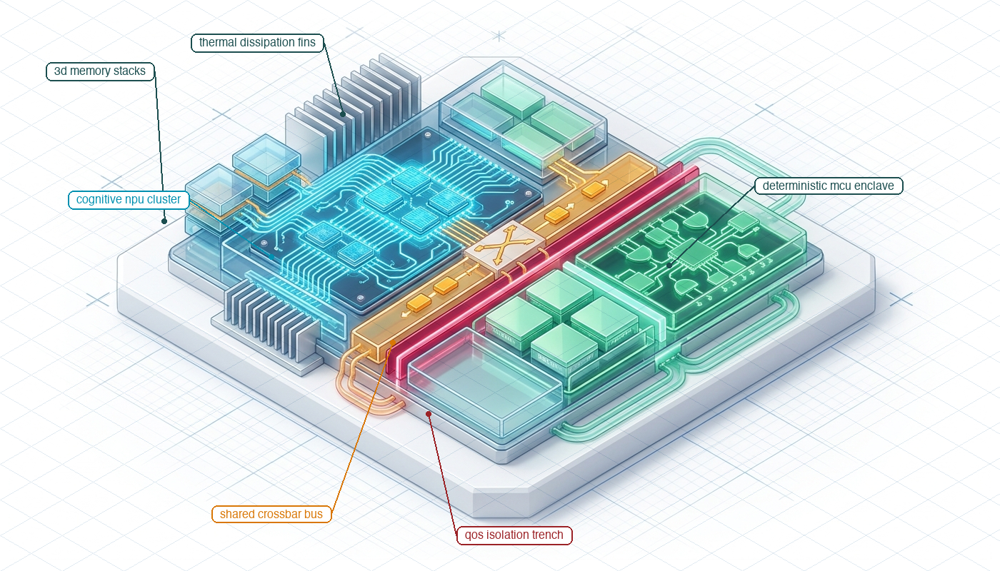
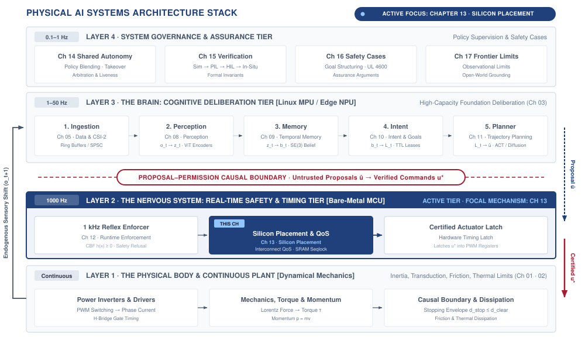
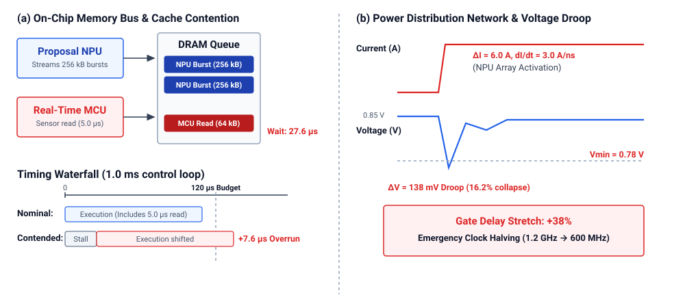
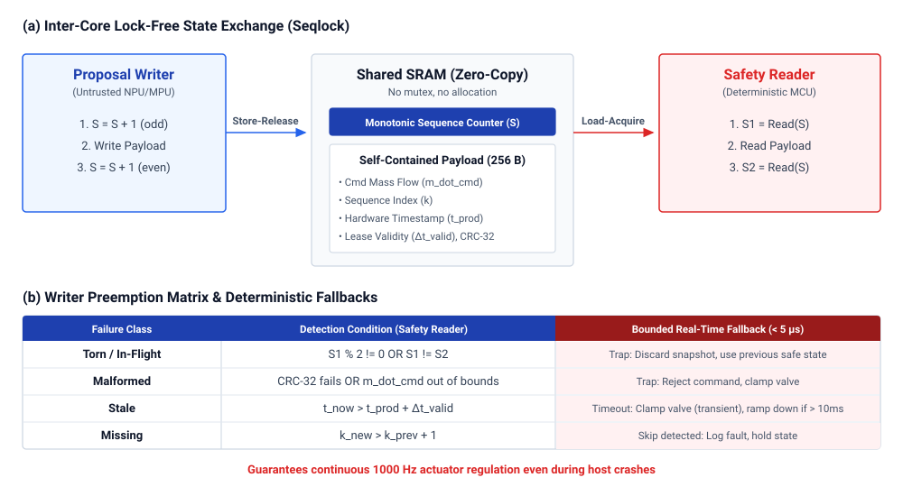
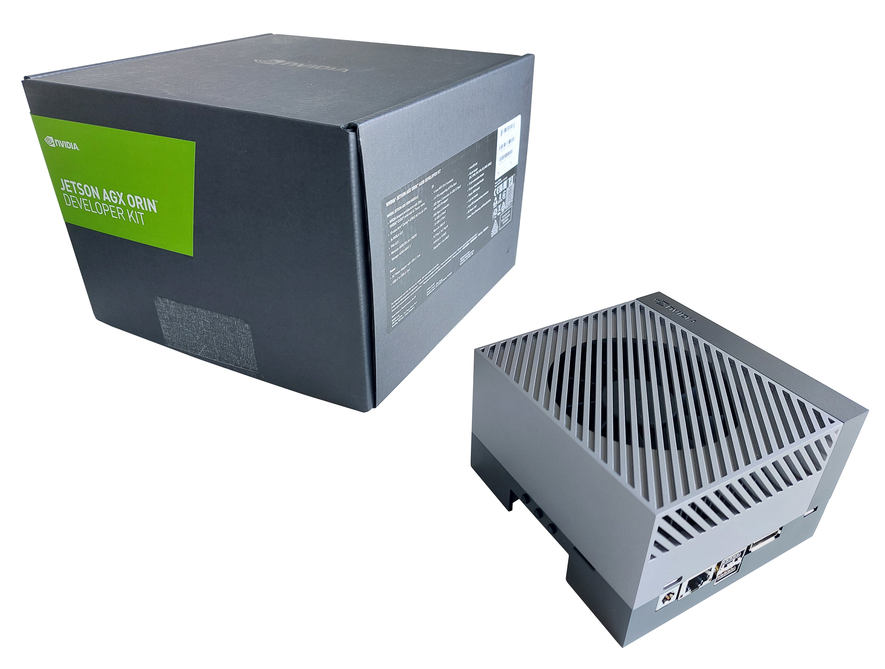
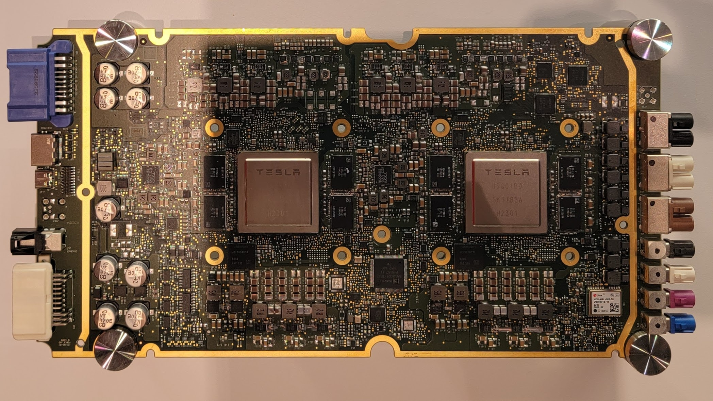

# Silicon Placement {#sec-placement}

::: {layout-narrow}
::: {.column-margin}

\chapterminitoc

:::

::: {.content-visible when-format="pdf"}
\noindent
{fig-alt="Isometric blueprint showing silicon placement: heterogeneous physical AI SoC with deliberative cognitive NPU cluster, 3D memory stacks, perimeter thermal dissipation fins, shared interconnect crossbar bus, isolated deterministic real-time MCU enclave, and Harvard crimson QoS isolation trench."}
:::

::: {.content-visible unless-format="pdf"}
{fig-alt="Isometric blueprint showing silicon placement: heterogeneous physical AI SoC with deliberative cognitive NPU cluster, 3D memory stacks, perimeter thermal dissipation fins, shared interconnect crossbar bus, isolated deterministic real-time MCU enclave, and Harvard crimson QoS isolation trench."}
:::

:::

## Purpose {.unnumbered .unlisted}

::: {.content-visible when-format="pdf"}
\begin{marginfigure}
\vspace{1em}
\resizebox{\linewidth}{!}{\mlphysicalstackfull{20}{100}{20}{20}{20}}
\end{marginfigure}
:::

_Why do the architectural boundaries drawn between brain and nervous system collapse the moment they share memory buses and power rails on the same die?_

Separate blocks in an architecture diagram can still compete for the same memory bus, power supply, and cooling capacity. A burst of neural computation may delay a control task even when the tasks run on different processor cores. The delay matters because the machine continues moving while the safety path waits for data or recovers from a power disturbance. Compute placement must therefore establish how much interference each shared resource permits and whether the remaining response time fits the physical deadline. Software privilege boundaries alone cannot answer that question. Measurements under contention can expose a failed isolation claim, while resource reservations or separate hardware can reduce the coupling that caused it. Those choices also consume space and power that the machine must supply. Placing the brain and nervous system on silicon is consequently a co-design decision about workload interference, execution deadlines, and the body's tolerance for delayed correction.



::: {.callout-learning-objectives}

- Inventory shared hardware resources used by learned proposal and safety enforcement paths
- Measure enforcement latency while competing workloads stress shared memory, power, and thermal resources
- Design tests that could disprove a claimed separation between proposal and enforcement
- Analyze how power transients and thermal coupling change the safety path's timing margins
- Select isolation remedies using measured interference, resource availability, and the plant's response deadlines

:::

## The Silicon Substrate {#sec-placement-13-1}

In @sec-enforcement, we formulated runtime safety filters—Control Barrier Functions, simplex architectures, and fail-operational minimal risk maneuvers—that mathematically guarantee forward invariance of the physical state space. But these analytical proofs hold under one foundational assumption: that the computing machinery evaluates its quadratic program or projection filter strictly within its hard physical sampling deadline ($T_{\text{enforce}} \le 1.0\text{ ms}$). Where do these algorithms actually execute on the physical machine? On a software architecture diagram, the boundary between the Cognitive Deliberation Tier and the Deterministic Nervous System is cleanly drawn as a neat, dashed privilege boundary. On physical silicon, that boundary collapses onto a single shared die. Consider a modern heterogeneous System-on-Chip (SoC) governing an autonomous mobile robot or industrial bypass valve. A learned vision-language-action policy executes on the embedded GPU or neural accelerator, while a deterministic safety enforcer executes on an adjacent real-time microcontroller core. When the neural policy initiates an inference pass across a multi-billion parameter model, billions of switching transistors activate simultaneously. This massive, instantaneous current surge ($dI/dt$) induces an inductive and resistive voltage droop ($\Delta V = L \cdot dI/dt + IR$) across the chip's internal Power Distribution Network (PDN), risking clock instability and timing closure failures in adjacent real-time logic.[^fn-place-voltage-droop] Concurrently, dense tensor matrix multiplications saturate the shared LPDDR memory bus, streaming gigabytes of activation maps and evicting the safety enforcer's pinned sensor tables from the last-level cache.

[^fn-place-voltage-droop]: **Inductive Voltage Droop Mechanics**\index{Power Distribution Network!inductive voltage droop}\index{Inductive voltage droop!VLSI design}: In high-performance VLSI design, inductive voltage droop ($\Delta V = L \cdot dI/dt$) occurs across the parasitic inductance ($L$) of power distribution package pins and on-chip power grids when massive numbers of logic gates switch simultaneously. If the local rail voltage drops below the minimum operating threshold ($V_{\min}$), digital flip-flops suffer setup-time violations, metastabilities, or brownout resets that disrupt deterministic real-time execution.

When the real-time safety reflex attempts to read a 64-kilobyte sensor buffer to evaluate a $1.0\text{ ms}$ physical control deadline, its memory requests stall in queue behind long bursts of direct memory access reads. An enforcer with an uncontended execution time of $120\,\mu\text{s}$ sees its observed tail latency at $P_{99.9}$ stretch past $1055\,\mu\text{s}$. The enforcer misses its hard physical deadline, not because its own algorithmic workload changed, but because the unprivileged cognitive workload occupied the shared memory controller. The software privilege separation was mathematically impeccable, but the physical machine collided because the silicon substrate failed to provide operational independence.

This chapter confronts the physical foundation of the entire Part III execution pipeline, highlighted in @fig-13-locator. All preceding software contracts—the sensor timestamps of @sec-perception, the decaying spatial beliefs of @sec-memory, the expiring intent leases of @sec-intent, the continuous action chunks of @sec-planning, and the reflex enforcers of @sec-enforcement—rely on the bedrock assumption that software execution deadlines correspond to physical reality.

::: {#fig-13-locator fig-env="figure" fig-pos="htb" fig-cap="**Silicon Placement Architecture Focus**: The four-tier physical AI systems architecture highlights the real-time safety tier, with silicon placement as this chapter's active focus. Read the highlighted box as the physical co-location boundary where cognitive bursts and hard real-time reflex loops land on one system-on-chip and then compete for memory controllers, interconnect crossbars, power rails, and thermal mass." fig-alt="Diagram titled Physical AI Systems Architecture Stack, drawn as four stacked tiers. Layer 4 is system governance and assurance at 0.1 to 1 hertz, holding boxes for shared autonomy, verification, safety cases, and frontier limits. Layer 3 is the brain, a cognitive deliberation tier at 1 to 50 hertz, holding five stages named ingestion, perception, memory, intent, and planner. A dashed proposal-permission privilege boundary separates it from layer 2, the nervous system, a real-time safety and timing tier at 1000 hertz. Layer 1 is the physical body and continuous plant. Layer 2 is shaded and its silicon placement and bus quality of service box is outlined; the badge reads Active Focus, Chapter 13, Silicon Placement."}
{width="100%"}
:::

This shared-silicon reality governs every domain of physical embodiment across all **Three Physical Machine Archetypes**\index{Three Physical Machine Archetypes}:

- In **Mobile Systems (Class 1)**, an autonomous chassis co-locates multi-camera vision-language-action navigation models [@brohan2023rt2] on an embedded GPU with $1000\text{ Hz}$ steer-by-wire and emergency braking reflexes on an adjacent real-time core. A memory bus stall during feature extraction delays an obstacle-avoidance brake command, allowing moving kinetic mass to breach safety stopping margins.
- In **Manipulators (Class 2)**, an articulated robot arm executes high-dimensional diffusion grasping policies ($20\text{--}50\text{ Hz}$) alongside high-gain $SE(3)$ kinematics and joint torque loops ($1000\text{ Hz}$). If an accelerator tensor burst evicts safety state tables from the shared last-level cache, the resulting microsecond bus jitter degrades feedback phase margins, exciting gearbox compliance, inducing motor torque ripple, or breaching ISO 10218 safety envelopes.
- In **Process and Energy Systems (Class 3)**, industrial chemical bypass valves and high-voltage grid battery inverters co-locate continuous thermodynamic optimization with hard real-time overpressure and power-stage shoot-through interlocks. A delayed safety interrupt allows manifold pressure to spike beyond structural burst limits or power transistors to enter catastrophic thermal runaway.

Following the end-to-end argument in system design [@saltzer1984end], memory protection and operating system process isolation do not by themselves establish operational independence. On a heterogeneous die,[^fn-place-system-chip] **operational independence**\index{Operational independence!definition} requires that proposal-side activity cannot push enforcement execution beyond its hard physical deadline, and that proposal-side crashes or thermal overruns cannot disable the nervous system's authority to refuse.

[^fn-place-system-chip]: **Heterogeneous System-on-Chip Architecture**\index{Heterogeneous system-on-chip!architecture}\index{System-on-Chip (SoC)!heterogeneous compute}: Heterogeneous SoCs integrate multiple distinct compute domains onto a single silicon substrate, combining high-throughput application processors and neural accelerators with deterministic real-time safety islands. Although memory management units isolate software address spaces across domains, hardware subcomponents continue to share power distribution networks, clock distribution trees, and DRAM controllers. Under peak cognitive burst workloads, uncoordinated resource contention across these shared physical structures can degrade real-time response times beyond critical physical deadlines.

Because these couplings are governed by physical solid-state phenomena rather than software abstractions, architectural claims of isolation must be treated as hypotheses to be falsified through rigorous measurement. Verifying a system requires four distinct engineering steps: building an exhaustive claimant inventory of every shared silicon resource; subjecting the proposal path to synthetic worst-case compute, memory, and bus contention while measuring the tail latency distribution of the enforcement path at $P_{99}$ and $P_{99.9}$; measuring thermal dissipation and voltage droop under sustained Joule heating; and recording a formal placement decision that bounds worst-case response times within physical safety margins.

Transforming logical software separation into verifiable physical isolation requires auditing and partitioning every shared hardware resource on the silicon die. We begin in @sec-placement-13-2 by analyzing the co-location of cognitive proposals and deterministic safety enforcement across heterogeneous execution engines, mapping their competing timing demands and isolation requirements. In @sec-placement-13-3, we quantify microarchitectural contention across interconnect crossbars, shared caches, and DRAM controllers, applying queuing models and arithmetic intensity to evaluate memory saturation. @Sec-placement-13-4 establishes the formal boundary contract, examining lock-free state exchange mailboxes and bounded fallback behaviors that prevent reader stalling. We then analyze thermal and electrical coupling in @sec-placement-13-5, modeling Joule heating, clock throttling hysteresis, and power-rail collapse. @Sec-placement-13-6 develops loaded adversarial test harnesses to empirically falsify claimed architectural independence. Finally, @sec-placement-13-7 through @sec-placement-13-10 formulate the hierarchy of silicon isolation decisions, synthesize full-system hardware allocation budgets, review critical systems fallacies, and summarize the complete placement methodology.

## Two Paths on One Die {#sec-placement-13-2}

Placement cannot be deferred to integration, because the physical assignment of software functions to hardware execution engines determines whether separation exists at all. Consider a valve regulating high-pressure fluid flow in a chemical processing line, where a learned model adjusts the valve trim position to track a variable target flow rate while an enforcement filter prevents downstream pressure transients that would rupture the pipe. The machine partitions this control across two paths with conflicting requirements: the proposal path ingests downstream pressure histories, acoustic vibration signals, and temperature logs over a moving window of one hundred samples, running a learned neural policy at $20\text{ Hz}$ to calculate a recommended valve displacement. It operates under a soft deadline of $45\text{ ms}$, holds no direct hardware authority over the motor driver, and runs in an unprivileged user space. The enforcement path samples raw differential pressure transducers at $1000\text{ Hz}$, evaluates physical boundary constraints on pressure slew rates and cavitation limits, and generates electrical drive commands for the valve servo. It executes under a hard physical deadline of $1.0\text{ ms}$, requires an execution budget bounded at $400\,\mu\text{s}$ to leave sufficient margin for mechanical valve transit, and runs in a privileged real-time execution domain. Only the enforcement path holds memory-mapped input-output (MMIO)\index{Memory-mapped I/O} access to the pulse-width modulation (PWM) registers\index{Pulse-width modulation!registers} to command the valve motor.

::: {#dfn-placement-heterogeneous-silicon-partitioning .callout-definition title="Heterogeneous silicon partitioning"}

***Heterogeneous silicon partitioning***\index{Heterogeneous silicon partitioning!definition}\index{Silicon partitioning!definition} is the architectural allocation of stochastic, high-capacity cognitive workloads (perception, learned policy evaluation) and deterministic reflex loops (safety invariant checks, actuator commutation) across specialized execution domains isolated in hardware.

1.  **Significance**: Placing high-capacity neural deliberation and real-time safety enforcement on the same general-purpose operating system or compute engine creates catastrophic common-mode failures. Kernel thread preemption, dynamic memory allocation, and GPU warp scheduling inject multi-millisecond tail jitter that causes the safety reflex to miss physical control deadlines.
2.  **Distinction**: Unlike logical software process isolation (such as Linux containers or POSIX process priorities), silicon partitioning enforces isolation across independent hardware registers, tightly-coupled static memories (TCM), and dedicated peripheral buses.
3.  **Common pitfall**: Assuming multi-core CPU affinity provides true failure-domain separation. Cores that share on-chip L3 caches, DRAM memory controllers, phase-locked loop (PLL) clock trees, or power distribution rails remain vulnerable to cross-core interference, thermal throttling, and voltage droop brownouts.

:::

To assign concrete performance numbers, these functions must be mapped onto physical silicon domains. In a heterogeneous dual-brain system-on-chip, such as the canonical dual-brain architecture introduced in @sec-nervous, proposal inference maps onto an unprivileged Linux Application Processor (MPU) or dedicated neural accelerator. State exchange between the paths maps onto a shared static memory mailbox\index{Static memory mailbox} or ring buffer in dynamic random-access memory (DRAM)\index{DRAM}\index{Dynamic random-access memory|see{DRAM}}. Safety enforcement and sensor validation map onto a dedicated Real-Time Controller Subsystem (MCU) running bare-metal firmware or a deterministic real-time operating system. Device input-output maps onto dedicated serial peripheral interface controllers, analog-to-digital converters, and timer channels directly wired to the MCU. Telemetry logging, network communications, and fault recording map onto the Linux MPU. As detailed in @tbl-13-compute-allocation, extending the classical cyber foraging and edge-placement paradigms of pervasive computing [@satyanarayanan2001pervasive] to heterogeneous autonomous silicon, each compute domain on a modern physical AI platform exhibits distinct trade-offs across nominal clock rate, tail latency determinism, operating system isolation, and memory bus coupling.

| Compute Engine Domain                                       | Nominal Clock & Power                                    | Latency Determinism ($P_{99.99}$)                                                   | OS & Privilege Isolation                                               | Memory & Interconnect Coupling                                                 | Target Workload Assignment                                                                               |
|:------------------------------------------------------------|:---------------------------------------------------------|:------------------------------------------------------------------------------------|:-----------------------------------------------------------------------|:-------------------------------------------------------------------------------|:---------------------------------------------------------------------------------------------------------|
| **Application Processor Subsystem (MPU)**                   | $1.0\text{--}2.2\text{ GHz}$, $2\text{--}10\text{ W}$    | Non-deterministic (Jitter $> 20\text{ ms}$; MMU paging, kernel preemption)          | Rich OS (Linux / POSIX), Ring 3 user space vs. Ring 0 kernel           | Shared coherent L3 cache, virtual memory via MMU, unified DRAM                 | Telemetry logging, edge VLMs/VLAs, PyTorch, ROS2 policy evaluation ($10\text{--}50\text{ Hz}$)           |
| **GPU Tensor Core Engine**                                  | $0.8\text{--}1.3\text{ GHz}$, $10\text{--}40\text{ W}$   | Semi-deterministic (Jitter $\approx 200\text{--}800\,\mu\text{s}$; warp scheduling) | Host driver queue, user-space runtime, unified virtual memory          | High-throughput LPDDR5/HBM, wide AXI bursts ($256\text{ B}$), high DRAM load   | High-throughput perception, multi-camera feature extraction, dense VLM inference                         |
| **Dedicated Neural Processing Unit** (NPU / Systolic Array) | $0.6\text{--}1.0\text{ GHz}$, $2\text{--}8\text{ W}$     | High determinism (Jitter $< 50\,\mu\text{s}$; static graph execution)               | Hardware mailbox, fixed-depth systolic pipeline, pinned memory buffers | Dedicated on-chip SRAM ($8\text{--}32\text{ MB}$), periodic DMA bursts to DRAM | Learned policy evaluation, low-latency trajectory chunk generation ($20\text{--}100\text{ Hz}$)          |
| **Real-Time Controller Subsystem (MCU)**                    | $200\text{--}800\text{ MHz}$, $0.1\text{--}1.5\text{ W}$ | Strictly bounded (Jitter $< 5.0\,\mu\text{s}$; deterministic in-order core)         | RTOS (FreeRTOS / Zephyr) or Bare-Metal, MPU memory regions             | Tightly-Coupled Memory (TCM / SRAM), private peripheral bus, zero paging       | Deterministic safety invariants, $1\text{ kHz}$ CBF safety filters [@ames2019control], direct PWM timers |
| **Discrete Safety Microcontroller**                         | $200\text{--}400\text{ MHz}$, $0.2\text{--}1\text{ W}$   | Fully invariant (Jitter $< 50\text{ ns}$; cycle-accurate lockstep core)             | Bare-metal / AUTOSAR Classic, hardware Fault Collection Unit (FCCU)    | Isolated SRAM/Flash, independent external power rails, dedicated crystal       | Emergency mechanical clamping, hardware interlocks, supervisory watchdog trips                           |

: **Heterogeneous Compute Allocation and Execution Domain Characteristics**: Allocation decisions dictate latency determinism, failure isolation, and memory contention, establishing why safety-critical reflex loops cannot execute on general-purpose application cores or GPUs without hardware-enforced isolation. {#tbl-13-compute-allocation tbl-colwidths="[16,16,18,18,16,16]"}

In an analytical evaluation of the unloaded system, the computational budgets appear generous. In the enforcement path on the real-time MCU, reading four pressure sensors over a high-speed peripheral bus requires $40\,\mu\text{s}$, evaluating the constraint envelope and computing the actuator signal takes $80\,\mu\text{s}$, and writing the resulting register values to the motor controller timer takes $15\,\mu\text{s}$. The total unloaded execution demand is $135\,\mu\text{s}$. Against the $400\,\mu\text{s}$ computational deadline mandated by the $1.0\text{ ms}$ physical cycle (which reserves $600\,\mu\text{s}$ for servo motor settling), the enforcement path exhibits an unloaded slack of $265\,\mu\text{s}$. In the proposal path on the Linux MPU, a policy requiring $3.2\text{ GFLOP}$ per step executes on an accelerator capable of $2.0\text{ TFLOPS}$ sustained throughput, yielding an inference time of $1.6\text{ ms}$. Adding $0.8\text{ ms}$ for tensor formatting and $0.1\text{ ms}$ to publish the proposal to the shared ring buffer, the proposal path requires $2.5\text{ ms}$ of computation per $50\text{ ms}$ cycle, leaving $47.5\text{ ms}$ of unloaded slack. Evaluated in isolation, both loops operate with comfortable margins.

Assigning these tasks to separate processor cores does not establish independent failure domains if the underlying silicon infrastructure remains shared.[^fn-std-cast-32a] While the real-time core executes instructions independently from the application processor, both cores rely on common hardware services:

- *Shared interrupt routing:* The Generic Interrupt Controller (GIC) routes peripheral and inter-processor notifications across a shared fabric, where a flood of Ethernet packet interrupts on the Linux MPU can delay the timer interrupt that triggers the $1000\text{ Hz}$ MCU safety loop.
- *Shared memory controllers:* Both paths access the same dynamic memory controller\index{Memory controller} and interconnect crossbar\index{Interconnect crossbar}, where large matrix tile loads generated by the neural accelerator saturate DRAM command queues, turning an expected $20\text{ ns}$ level-two cache refill on the real-time core into a $350\text{ ns}$ round-trip to main memory.
- *Shared clock trees:* The cores share phase-locked loops (PLLs) for clock generation, where dynamic voltage and frequency scaling (DVFS) transients on the application processor introduce clock jitter across adjacent real-time domains.
- *Shared power rails:* A single Power Distribution Network (PDN) delivers current to both domains, where switching surges from the neural accelerator drop the internal voltage rail, risking logic state corruption or brownout resets.
- *Shared reset domains:* A kernel panic on the Linux MPU that triggers a hardware watchdog\index{Watchdog timer!hardware} reset can pull down the shared peripheral bus or system interconnect, disabling PWM outputs and leaving the valve unpowered.

[^fn-std-cast-32a]: **Avionic Multicore Certification**\index{Multicore interference!FAA AC 20-193 / CAST-32A}\index{Worst-case execution time!multicore certification}: FAA Advisory Circular AC 20-193 and CAST-32A formalize multicore interference analysis for safety-critical avionics. The standard requires rigorous bounding of worst-case execution times by demonstrating that shared caches, interconnect crossbars, and memory controllers cannot cause critical tasks to overrun execution deadlines. Without hardware-enforced quality-of-service partitions or dedicated interconnect channels, cross-core memory traffic invalidates deterministic timing guarantees.

Evaluating candidate placements reveals how physical coupling governs system feasibility. In a unified placement where proposal, enforcement, and logging execute as threads under a single symmetric multiprocessing operating system on shared application cores, communication between paths takes less than $1\,\mu\text{s}$ via shared pointer passing. However, cache eviction and kernel preemption cause the tail latency of the enforcement path to reach $2.8\text{ ms}$ at $P_{99.9}$, repeatedly missing the $1.0\text{ ms}$ hard deadline and risking pipe overpressure. In a heterogeneous single-die placement (e.g., dual-brain SoC with Linux MPU + Real-Time MCU on one chip), proposal runs on the MPU/NPU and enforcement runs on an isolated MCU core; communication across on-chip shared static random-access memory requires $12\,\mu\text{s}$. Under synthetic worst-case memory contention, enforcement latency rises to $380\,\mu\text{s}$, which still fits within the $400\,\mu\text{s}$ compute budget. However, when the accelerator dissipates sustained peak power, local thermal elevation triggers automatic clock frequency halving, stretching enforcement execution to $540\,\mu\text{s}$ and violating the physical deadline. In a dual-die placement where enforcement resides on a physically isolated microcontroller with its own power regulation, crystal oscillator, and memory, communication across an external serialized peripheral interface costs $150\,\mu\text{s}$. Because the failure domains are physically decoupled, the enforcement execution time remains invariant at $135\,\mu\text{s}$, guaranteeing that if the proposal path stalls, crashes, or overheats, the enforcement core detects the missing heartbeat and transitions the flow valve to a safe mechanical relief position within a single $1.0\text{ ms}$ cycle.

## Contention for Shared Resources {#sec-placement-13-3}

Every shared resource has more than one claimant, and a number that does not say what it competes with is not yet a systems number. On a system-on-chip regulating a fluid pipeline, physical wires do not respect functional boundaries drawn on a software architecture diagram. The proposal path, the enforcement path, and the system infrastructure share the same silicon die, competing directly for the same memory controllers, crossbar switches, and power distribution rails. An inventory of digital claimants on the main memory bus includes sensor direct memory access streams that deposit raw pressure transducer readings and acoustic flow telemetry into dynamic random-access memory, the neural accelerator fetching model weight matrices and spilling intermediate activation tensors, the real-time core reading pipeline boundary invariants and historic sensor ring buffers, actuator write buffers pushing pulse-width modulation commands to the flow valve driver, cache controllers executing dirty line writebacks, and diagnostic logging processes writing state records to nonvolatile storage buffers.

In physical AI hardware design, **crossbar bus and DRAM bank contention**\index{Crossbar bus and DRAM bank contention!definition} is the physical queuing delay and priority inversion induced when high-throughput memory or direct memory access (DMA) bursts from unconstrained compute masters saturate shared on-chip interconnect crossbars and DRAM controllers. Under packet-atomic non-preemptive burst arbitration, once a wide data transfer begins traversing a physical crossbar link, the channel remains locked until the entire burst commits. A high-priority real-time safety transaction arriving immediately after burst commencement is subjected to head-of-line blocking, forcing the safety read to wait for the entire multi-kilobyte transfer to drain before gaining channel access. This delay is further compounded inside the memory subsystem by DRAM row-buffer bank conflicts.[^fn-place-dram-bandwidth]

[^fn-place-dram-bandwidth]: **DRAM Bank Conflicts and Precharge Latency**\index{DRAM!bank conflicts}\index{Memory controller!row-buffer precharge}: Modern dynamic RAM is structured into independent banks with dedicated row buffers. When a high-priority read targets a closed row in an active bank, the controller must precharge the bitlines ($t_{\text{RP}}$) and activate the new row ($t_{\text{RCD}}$) before issuing the column read command. Under continuous burst traffic from a neural accelerator, repeated bank conflicts multiply baseline memory latency by $3\text{--}5\times$, rapidly consuming execution slack in co-located real-time safety loops.

Each claimant imposes a demand that can be derived from its transfer size per event and its event rate. In an analytical example of a flow-regulation controller sharing a single $64\text{-bit}$ LPDDR4 memory channel rated at $12.8\text{ GB/s}$ peak bandwidth, sensor direct memory access transfers a $64\text{ kB}$ buffer at $1000\text{ Hz}$, generating an average demand of $64.0\text{ MB/s}$. The learned proposal model executes an inference pass every $20\text{ ms}$ ($50\text{ Hz}$), streaming $60\text{ MB}$ of parameters and activation data for an average demand of $3.0\text{ GB/s}$. The enforcement path executes every $1.0\text{ ms}$ ($1000\text{ Hz}$), reading $4\text{ kB}$ of pipeline state and historical sensor logs, consuming $4.0\text{ MB/s}$ on average. Actuator writes require $1\text{ kB}$ per millisecond ($1.0\text{ MB/s}$), cache maintenance evictions contribute $128.0\text{ MB/s}$ in writebacks, and diagnostic telemetry logging transfers $32\text{ kB}$ records at $100\text{ Hz}$ ($3.2\text{ MB/s}$). Summing these rates gives an aggregate demand of $3.2002\text{ GB/s}$, which represents 25.0 percent of the channel capacity. An engineer who inspects only average utilization would conclude that three-quarters of the bus capacity remains available. But memory arbiters do not schedule average rates, they arbitrate discrete bursts, and two workloads with identical average throughput create distinct interference profiles if one streams continuously in small packets while the other arrives in long, saturating blocks.

**Arithmetic intensity**\index{Arithmetic intensity!definition}, defined as the ratio of arithmetic operations to memory bytes transferred [@williams2009roofline], indicates whether a computational routine is bounded by execution units or by memory bandwidth during steady-state execution. For a convolution or dense matrix multiplication on the proposal path, an arithmetic intensity of $120\text{ FLOP/byte}$ indicates that arithmetic units will be fully occupied once data resides in local cache or static memory. However, during the initial phase where weights are transferred from dynamic memory, the operational arithmetic intensity drops to zero. Physically, the accelerator ceases to be a computation engine and instead acts as a blunt, high-bandwidth direct memory access engine that aggressively saturates the shared memory bus. Arithmetic intensity reveals whether a workload can hide memory transfer latency behind arithmetic work in isolation, but it provides no information about queue contention, transfer priority, burst duration, or which request waits when two paths access the bus simultaneously. The same imbalance that governs a data center accelerator governs the memory channel on a robot, only with less headroom. @Fig-placement-memory-wall shows compute outrunning bandwidth roughly two to one across four generations, which is why an arithmetic-intensity argument decides placement more often than a raw throughput number does.

::: {#fig-placement-memory-wall fig-env="figure" fig-pos="htb" fig-cap="**Memory Bandwidth Deficit**: Peak compute and memory bandwidth for data center accelerators, normalized to the V100. Compute rises 18$\times$ against bandwidth's 8.9$\times$, and a placement decision works against that ratio because an on-robot budget cannot buy its way past a bandwidth limit. Specifications come from the MLSysIM hardware registry." fig-alt="Line chart normalized to the V100 showing compute at 18 times and bandwidth at 8.9 times by the B200, the divergence a placement decision must respect."}

```{python}
#| echo: false
import pandas as pd
from mlsysim import viz

data = pd.read_csv("vol4/13_placement/data/gpu_memory_wall.csv")
base = data.iloc[0]
data["Compute"] = data["Peak_TFLOPS"] / base["Peak_TFLOPS"]
data["Bandwidth"] = data["Memory_Bandwidth_GBps"] / base["Memory_Bandwidth_GBps"]

fig, ax, COLORS, plt = viz.setup_plot(figsize=(7, 4.2))
labels = data["Accelerator"] + "\n" + data["Year"].astype(str)
ax.plot(labels, data["Compute"], marker="o", color=COLORS["RedLine"], linewidth=2, label="Peak compute")
ax.plot(labels, data["Bandwidth"], marker="s", color=COLORS["BlueLine"], linewidth=2, label="Memory bandwidth")

for col, colour in [("Compute", COLORS["RedLine"]), ("Bandwidth", COLORS["BlueLine"])]:
    ax.annotate(
        f'{data[col].iloc[-1]:.0f}x',
        xy=(len(data) - 1, data[col].iloc[-1]),
        xytext=(6, 0),
        textcoords="offset points",
        va="center",
        fontweight="bold",
        color=colour,
    )

ax.set_ylabel(f'Growth relative to {base["Accelerator"]} ({int(base["Year"])})')
ax.set_xlabel("NVIDIA data center accelerator")
ax.legend(loc="upper left", frameon=False)
ax.margins(x=0.12)
fig.tight_layout()
```

:::

The latency experienced by the enforcement path depends directly on the longest uninterrupted burst permitted on the shared interconnect and the internal banking dynamics of the DRAM subsystem (@fig-13-soc-contention-droop a). In this analytical system, the neural accelerator transfers weights in $256\text{ kB}$ tiles. Across a $12.8\text{ GB/s}$ interface, an uninterrupted $256\text{ kB}$ burst occupies the physical bus for $20.0\,\mu\text{s}$. When the on-chip interconnect uses packet-atomic non-preemptive arbitration (meaning a transfer cannot be paused mid-flight, even if a late-arriving request carries high-priority AMBA AXI Quality-of-Service `AxQOS` tags), an enforcement request that arrives immediately after a tile transfer begins must wait the full $20.0\,\mu\text{s}$ transfer duration. Contention is further compounded inside the dynamic memory controller. Dynamic random-access memory is physically organized into independent banks, where each bank contains a two-dimensional array of storage cells managed by a single row buffer. When an access targets a row already loaded into the buffer (a **row-buffer hit**\index{Row-buffer hit}), data is transferred in column access time ($t_{\text{CAS}} \approx 14\text{ ns}$). If an access targets a different row in the same bank (a **bank conflict**\index{Bank conflict} or **row-buffer miss**\index{Row-buffer miss}), the controller must first restore and close the open row by precharging the bank ($t_{\text{RP}} \approx 14\text{ ns}$), activate the newly requested row ($t_{\text{RCD}} \approx 14\text{ ns}$), and execute the column read ($t_{\text{CAS}} \approx 14\text{ ns}$), tripling baseline access latency.

Crucially, modern DRAM memory controllers employ **First-Ready First-Come-First-Served (FR-FCFS)**\index{FR-FCFS scheduling!definition} scheduling algorithms designed to maximize aggregate bus utilization by prioritizing row-buffer hits over raw transaction arrival order. Because opening and closing DRAM rows is physically slow, the controller unfairly favors whichever master is currently reading from an open row. When the neural engine streams a continuous matrix tile, it holds open active row buffers across multiple DRAM banks. If a high-priority real-time safety read targeting a closed row arrives from the MCU, the DRAM controller will repeatedly reorder the queue, servicing the neural stream's remaining hits first while leaving the safety read starved. When multiple transactions queue ahead of the safety transaction and induce row-buffer bank conflicts, total queuing latency $t_{\text{queue}}$ before the enforcer's request is serviced is governed by:
$$t_{\text{queue}} = \sum_{k \in \mathcal{Q}} \frac{B_k}{\text{BW}_{\text{peak}}} + N_{\text{conflicts}} (t_{\text{RP}} + t_{\text{RCD}})$$ {#eq-placement-dram-queuing}
where $\mathcal{Q}$ represents the set of in-flight and pending bus transactions of size $B_k$, $\text{BW}_{\text{peak}}$ is peak bus bandwidth, and $N_{\text{conflicts}}$ is the count of DRAM bank row-misses.

To ground this interference in an analytical example, consider a mobile robot pairing a learned VLA policy on an integrated accelerator with a $1000\text{ Hz}$ safety reflex loop on a real-time microcontroller core ($T_{\text{ctrl}} = 1.0\text{ ms}$, allocated compute budget $120.0\,\mu\text{s}$, comprising $95.0\,\mu\text{s}$ baseline computation, $5.0\,\mu\text{s}$ nominal sensor read, and $20.0\,\mu\text{s}$ timing slack). Unloaded, reading the $64\text{ KB}$ sensor history buffer over the $12.8\text{ GB/s}$ bus requires $t_{\text{sensor,nom}} = (64 \times 10^3\text{ B}) / (12.8 \times 10^9\text{ B/s}) = 5.0\,\mu\text{s}$. During operation, the accelerator transfers weight tiles in $256\text{ KB}$ non-preemptive AXI bursts ($t_{\text{tile}} = 20.0\,\mu\text{s}$). When the enforcer initiates its read, the controller queue $\mathcal{Q}$ holds an in-flight $256\text{ KB}$ tile burst, a pending $64\text{ KB}$ camera DMA stream ($t_{\text{cam}} = 5.0\,\mu\text{s}$), and a pending $32\text{ KB}$ telemetry write ($t_{\text{telem}} = 2.5\,\mu\text{s}$), summing to $27.5\,\mu\text{s}$ of bus transmission time. If each transaction targets a different row in the same DRAM bank as the safety buffer, $N_{\text{conflicts}} = 3$ bank conflicts add $3 \times (t_{\text{RP}} + t_{\text{RCD}}) = 3 \times (14 + 14)\text{ ns} = 84\text{ ns} = 0.084\,\mu\text{s}$. Under @eq-placement-dram-queuing, the total non-preemptive queuing latency reaches $t_{\text{queue}} = 27.5\,\mu\text{s} + 0.084\,\mu\text{s} \approx 27.6\,\mu\text{s}$. The loaded sensor read duration expands to $t_{\text{sensor,loaded}} = t_{\text{queue}} + t_{\text{sensor,nom}} = 27.584\,\mu\text{s} + 5.0\,\mu\text{s} \approx 32.6\,\mu\text{s}$, pushing total execution time to $t_{\text{exec,loaded}} = 95.0\,\mu\text{s} + 32.6\,\mu\text{s} = 127.6\,\mu\text{s}$. The safety reflex consumes its entire $20.0\,\mu\text{s}$ timing slack and overruns the $120.0\,\mu\text{s}$ budget by $7.6\,\mu\text{s}$ (a $6.3$ percent overrun), delaying actuator update dispatch. Provisioning a $128\text{ KB}$ on-chip dual-port Tightly-Coupled Memory (TCM) SRAM partition isolates the $64\text{ KB}$ sensor buffer and an $8\text{ KB}$ safety state table ($72\text{ KB}$ total), eliminating external DRAM arbitration entirely and reducing read latency to zero-wait-state access ($< 5\text{ ns}$).

::: {#psp-placement-memory-contention .callout-perspective title="The memory contention invariant"}
Average memory bus bandwidth is a vanity metric; real-time safety is dictated entirely by worst-case burst length, DRAM bank conflict precharge latencies, and non-preemptive crossbar queue depths.
:::

::: {#chk-placement-dram-burst-queuing-delay .callout-checkpoint title="DRAM burst queuing and real-time control overrun"}
- [ ] **Average bandwidth fallacy**: Can you explain why average memory bus bandwidth utilization can appear safely under-utilized while a hard real-time safety task experiences catastrophic deadline overruns on the same bus?
- [ ] **FR-FCFS priority inversion**: Can you trace how non-preemptive AXI burst arbitration and First-Ready First-Come-First-Served (FR-FCFS) DRAM row-buffer scheduling combine to invert transaction priorities against high-privilege real-time reads?
- [ ] **Queuing delay sizing**: Can you calculate the worst-case queuing delay $t_{\text{queue}}$ and loaded execution time for a $64\text{ KB}$ sensor read on a $12.8\text{ GB/s}$ bus when blocked behind a $256\text{ KB}$ weight burst and 3 DRAM bank row-misses ($t_{\text{RP}} = t_{\text{RCD}} = 14\text{ ns}$)?
- [ ] **TCM SRAM isolation**: Can you evaluate why provisioning dedicated Tightly-Coupled Memory (TCM) SRAM eliminates bus-induced tail jitter more effectively than software thread priority or cache-pinning alone?
:::

Contention extends to the power distribution network, where claimants compete for charge rather than bandwidth (@fig-13-soc-contention-droop b). When the neural accelerator starts a matrix multiply across thousands of parallel multiply-accumulate units, its current draw spikes rapidly. Across a shared power distribution network with an effective loop inductance $L$ and equivalent series resistance $R$, an abrupt current transient $dI/dt$ with peak step $\Delta I$ induces an instantaneous rail droop $\Delta V_{\text{droop}}$ governed by:[^fn-math-rail-droop]
$$\Delta V_{\text{droop}} = L \frac{dI}{dt} + \Delta I \cdot R$$ {#eq-placement-voltage-droop}

[^fn-math-rail-droop]: **Inductive Power-Rail Droop Mechanics**\index{Power Distribution Network!inductive rail droop}\index{Voltage droop!transient response}: Rapid current transients ($dI/dt$) across the parasitic inductance of package balls, bond wires, and printed circuit board traces induce instantaneous supply voltage sags ($\Delta V = L \cdot dI/dt$). Because off-chip voltage regulator modules respond on microsecond timescales, nanosecond current spikes deplete local on-die decoupling capacitance. If the resulting droop breaches the minimum operating voltage threshold, logic cells experience setup-time timing violations or trigger uncommanded brownout resets.

**PDN voltage droop coupling**\index{PDN voltage droop coupling!definition} is the instantaneous electrical rail collapse induced across shared on-die power distribution networks. Across a shared power delivery network, when steep, high-amplitude current steps from parallel neural execution units suddenly deplete local decoupling capacitance, the operating voltage drops precipitously. This transient voltage sag stretches CMOS logic gate propagation delays, risking clock frequency degradation, flip-flop setup-time violations, or uncommanded brownout resets across co-located real-time cores.

On a nominal $0.85\text{ V}$ core supply, a typical voltage collapse can drop well below the minimum operating voltage of the co-located real-time core. The off-chip Voltage Regulator Module (VRM) operates with a control loop bandwidth that is several orders of magnitude too slow to counteract a nanosecond transient—it simply cannot push more current into the chip fast enough to catch the falling voltage. Therefore, first-stage charge delivery relies entirely on integrated on-die deep-trench decoupling capacitors (DTCs), which supply localized charge directly adjacent to switching logic blocks. If local capacitance is depleted before the current transient settles, supply voltage collapses.

To ground this physical vulnerability on silicon, consider an analytical heterogeneous SoC powering a systolic array neural accelerator and a real-time safety processor from a shared $V_{\text{core}} = 0.85\text{ V}$ power distribution network. The PDN package loop exhibits parasitic inductance $L = 30\text{ pH}$ and equivalent series resistance $R = 8.0\text{ m}\Omega$. When the neural accelerator starts a matrix multiply, its current demand surges by $\Delta I = 6.0\text{ A}$ with rise time $t_r = 2.0\text{ ns}$ ($dI/dt = 3.0\text{ A/ns}$). Evaluating the electrical collapse via @eq-placement-voltage-droop yields inductive drop $\Delta V_{\text{ind}} = (30 \times 10^{-12}\text{ H}) \times (3.0 \times 10^9\text{ A/s}) = 0.090\text{ V} = 90.0\text{ mV}$ and resistive drop $\Delta V_{\text{res}} = 6.0\text{ A} \times 0.008\,\Omega = 48.0\text{ mV}$, producing a total rail droop of $\Delta V_{\text{droop}} = 138.0\text{ mV} = 0.138\text{ V}$. The drooped core voltage falls from $0.850\text{ V}$ to $0.712\text{ V}$—an instantaneous $16.2$ percent voltage drop.

The physical principle is direct: a 16 percent transient voltage droop on the core rail causes transistor switching to slow down, increasing gate propagation delay by +38 percent (assuming FinFET threshold voltage $V_{\text{th}} = 0.42\text{ V}$ and velocity saturation index $\alpha = 1.3$).[^fn-hw-alpha-power] For a hard real-time safety loop with a 10 percent latency slack, this power droop pushes the thread past its deadline, causing a watchdog trip. At the silicon level, the resulting gate delay stretch breaches flip-flop setup-time margins, corrupting pipeline register state or triggering hardware brownout resets that immediately drop valve actuation drive signals unless protected by isolated power domains or on-die deep-trench decoupling capacitors.

[^fn-hw-alpha-power]: **Alpha-Power CMOS Delay Law**\index{Alpha-Power CMOS delay law}\index{Gate propagation delay!voltage headroom}: Gate propagation delay scales inversely with supply voltage headroom: $t_{\text{prop}} \propto V / (V - V_{\text{th}})^\alpha$, where $\alpha \approx 1.3$ for sub-micron FinFET processes. Under a 16 percent transient voltage droop on an active rail, logic propagation delay expands by $+38$ percent ($V_{\text{th}} = 0.42\text{ V}$, $\alpha = 1.3$). This gate delay stretch instantly consumes real-time scheduling margins and induces timing closure violations in synchronous flip-flops.

::: {#nbk-placement-inductive-power-rail-voltage-droop-timing .callout-notebook title="Power rail voltage droop and timing margins"}
**Practical Engineering Question**: Why does activating a neural accelerator's systolic array cause an adjacent real-time safety microcontroller core on the same die to fail setup-time timing closure, even when the power supply is rated for $100\text{ W}$?

When thousands of multiply-accumulate units in a neural accelerator suddenly turn on, they demand a massive, instantaneous surge in current. Even though the overall power supply might be large enough, the tiny physical wires and package bumps connecting the silicon to the supply have microscopic amounts of resistance and inductance.

Because of this physical reality, the sudden rush of current causes the voltage supplied to the entire chip to briefly drop, a phenomenon known as **voltage droop**\index{Voltage droop}. If the voltage sags below the minimum operating level of the adjacent real-time core, the microscopic transistors inside that core cannot switch fast enough to meet their clock timings.

For the rigorous mathematical derivation of inductive rail droop and the alpha-power law governing gate delay stretch, see @sec-appendix-systems.

**Systems insight**: A logic pipeline designed with a generous setup-time margin can still suffer catastrophic timing violations if a neighboring accelerator abruptly pulls too much current. To survive, the system-on-chip must use localized power islands with deep-trench capacitors, or physically separate the safety enforcer from the cognitive accelerator altogether.
:::

::: {#fig-13-soc-contention-droop fig-env="figure" fig-pos="t" fig-cap="**Heterogeneous SoC Interference**: (a) Memory bus contention where burst transfers from a proposal engine saturate the shared DRAM queue, stalling the real-time enforcer and causing a hard deadline overrun. (b) Power Distribution Network (PDN) transient droop where a rapid current step $\Delta I$ from accelerator array activation induces inductive voltage collapse $\Delta V$ below $V_{\min}$, stretching logic gate propagation delay beyond timing closure." fig-alt="Heterogeneous SoC Resource Contention and Power-Rail Droop: (a) Shared DRAM memory bus contention showing proposal engine bursts stalling real-time enforcer reads and pushing execution past deadline; (b) Power rail inductive droop waveform showing rapid current surge inducing supply voltage collapse below minimum operating threshold, resulting in gate propagation delay stretch."}
{width="95%"}
:::

::: {#chk-placement-pdn-voltage-droop-gate-stretch .callout-checkpoint title="PDN voltage droop and propagation stretch"}
- [ ] **Transient droop mechanics**: Can you distinguish between steady-state bulk power delivery and high-frequency $L \cdot dI/dt$ transient voltage droop on a shared power distribution network?
- [ ] **Rail droop sizing**: Can you compute the instantaneous voltage sag on a $0.85\text{ V}$ rail when a systolic array surge ($\Delta I = 6.0\text{ A}$ in $2.0\text{ ns}$) hits a PDN with $L = 30\text{ pH}$ and $R = 8.0\text{ m}\Omega$?
- [ ] **Alpha-power delay scaling**: Can you explain why an unmitigated voltage droop causes logic gate propagation delay to stretch nonlinearly according to the Sakurai-Newton alpha-power law rather than a simple linear scaling?
- [ ] **Hardware vs. privilege boundary**: Can you explain why software privilege rings (such as ARM TrustZone or hypervisors) are fundamentally incapable of preventing setup-time violations caused by adjacent accelerator current surges?
:::

Detecting these interactions requires dedicated hardware instrumentation, because software running on a core that has been stalled cannot record the duration of its own stall. Memory-controller performance counters log queue occupancy, bank conflicts, and per-master read and write transaction counts. Performance monitoring units on the real-time core record cache miss counts and stall cycles against an invariant free-running counter. On the electrical side, on-die analog-to-digital converters and fast comparator circuits record voltage excursions on internal rails, thermal diodes log junction temperature gradients across the floorplan, and power-management logs record dynamic frequency throttling states. When an uncommanded reset occurs, reset-cause registers distinguish a software watchdog expiration from an under-voltage brownout or a thermal emergency trip.

When contention is budgeted through measured burst times, queue structures, and power supply impedances rather than assumed from isolated benchmarks, the boundary between proposal and enforcement ceases to be a conceptual line on a block diagram. @Tbl-13-contention-channels summarizes these physical interference channels and their required hardware mitigations.

| Contention Channel                   | Physical Coupling Mechanism                                                               | Contention Trigger & Workload Dynamics                                                                         | Nominal vs. Contended Delay                                                                | Systems Failure Manifestation                                                                | Hardware Mitigation & Interceptor                                                    |
|:-------------------------------------|:------------------------------------------------------------------------------------------|:---------------------------------------------------------------------------------------------------------------|:-------------------------------------------------------------------------------------------|:---------------------------------------------------------------------------------------------|:-------------------------------------------------------------------------------------|
| **DRAM Memory Bus & Controller**     | Non-preemptive burst arbitration, bank conflicts ($t_{\text{RCD}}$, $t_{\text{RP}}$)      | Accelerator weight tile prefetch ($256\text{ kB}$ bursts) overlapping sensor history reads                     | $5.0\,\mu\text{s} \rightarrow 80.0\,\mu\text{s}$ ($16\times$ inflation per $64\text{ kB}$) | Sensor buffer starvation, $1.0\text{ ms}$ control loop overrun, delayed clamp                | AXI QoS priority tags (`AxQOS`), dedicated DRAM channels, DMA token buckets          |
| **Shared Last-Level Cache (L3)**     | Cache line capacity thrashing via pseudo-LRU replacement policy                           | Large parameter tensor streaming ($>10\text{ MB}$) evicting safety state tables                                | $20\text{ ns}$ (L2 hit) $\rightarrow 350\text{ ns}$ (DRAM round-trip penalty)              | Pipeline stalls in invariant checkers, tail latency jitter at $P_{99.9}$                     | Cache way-partitioning (ARM MPAM, Intel CAT), cache-line locking, private TCM        |
| **On-Chip Interconnect Crossbar**    | Arbiter queue head-of-line blocking on multi-layer AXI/NoC fabrics                        | Concurrent camera DMA streams and diagnostic circular ring-buffer flushes                                      | $35\text{ ns} \rightarrow 840\text{ ns}$ transaction stall ($24\times$ inflation)          | Actuator packet dispatch delay, PWM register jitter, missed heartbeat checks                 | Segregated virtual channels, strict-priority crossbar routing, decoupled slave ports |
| **Power Distribution Network (PDN)** | Inductive ($L\cdot dI/dt$) and resistive ($I\cdot R$) rail voltage collapse               | Simultaneous unclocked MAC array activation ($\Delta I = 6\text{--}22\text{ A}$, $t_r < 5\text{ ns}$)          | $\Delta V = 138\text{--}165\text{ mV}$ droop ($>16\%$ drop on $0.85\text{ V}$ rail)        | Gate propagation stretch, timing closure violations, under-voltage reset                     | On-package deep-trench capacitors (DTC), current-slew limiters, isolated PMIC rails  |
| **Shared Thermal Package**           | Substrate heat diffusion through package spreader ($\theta_{\text{JA}} = 2.0\text{ K/W}$) | Sustained peak inference ($15\text{--}25\text{ W}$) driving junction past $T_{\text{trip}} = 95^\circ\text{C}$ | Clock halved ($1.2\text{ GHz} \rightarrow 600\text{ MHz}$), execution $2.0\times$          | Enforcement execution expands ($0.70\text{ ms} \rightarrow 1.40\text{ ms}$), deadline missed | Independent PLL domains, NPU thermal throttling caps, physical dual-die split        |

: **Shared SoC Resource Contention Channels and Physical Coupling Mechanisms**: Breakdown of five physical interference vectors on unified silicon. Contention operates at microsecond and nanosecond timescales beneath operating system visibility, requiring architectural partitioning or dedicated hardware isolation to prevent cognitive bursts from violating reflex timing bounds. {#tbl-13-contention-channels tbl-colwidths="[16,16,18,18,16,16]"}

The interaction between two paths on one die cannot be left to uncoordinated arbitration. What crosses the physical boundary must be defined by explicit guarantees on production time, validity, and failure response.

## The Boundary Contract {#sec-placement-13-4}

What crosses between the proposal path and the enforcement path is a deterministic boundary contract\index{Boundary contract}, not an unqualified pointer into shared memory. Passing a raw memory address across the trust boundary couples the reader directly to the writer's internal memory layout, execution timing, and failure domain. If a vision-language model or deep neural policy running on an accelerator provides only a pointer to its private output buffer, the real-time core that regulates a gas valve has no mechanism to determine whether the writer is still modifying the buffer, has stalled mid-inference, or has encountered an unhandled fault. The boundary payload must therefore be an immutable, self-contained record. For a fluid flow regulator, this record contains the target mass flow rate command $\dot{m}_{\text{cmd}}$, a monotonically increasing sequence counter $k$, a generation timestamp $t_{\text{prod}}$ sampled from an invariant hardware timer, an expiration lease duration $\Delta t_{\text{valid}}$, and an integrity checksum calculated over the payload bytes. In a canonical heterogeneous dual-brain architecture (as formalized in the intent contract in @sec-nervous), this interface manifests as a packed struct exchanged across zero-copy shared SRAM mailboxes\index{Shared memory!SRAM mailboxes}, binding spatial target vectors, velocity/acceleration limits, epistemic model confidence $\gamma_{\text{conf}}$, and an IEEE 802.3 32-bit CRC checksum. The enforcement path reads the record as an isolated snapshot, evaluating its temporal freshness and physical validity before any value reaches the valve actuator.

Preserving temporal isolation across a shared die requires eliminating all blocking synchronization primitives at the exchange interface. If the real-time enforcement loop acquires a mutual exclusion lock held by the proposal generator, any execution stall in the neural pipeline propagates directly into the physical plant. In an analytical example of a flow regulation loop operating at $1000\text{ Hz}$ with a $1.0\text{ ms}$ tick budget, a $25\text{ ms}$ inference tail stall on the host processor would cause the real-time core to miss 25 consecutive actuation updates while gas pressure in the manifold continues to rise. Dynamic memory allocation introduces the same vulnerability, because allocating or freeing buffer structures from a shared heap contends for allocator spinlocks and triggers unpredictable memory reclamation latency. Backpressure is equally prohibited. The proposal path cannot throttle the rate of the enforcement loop when the plant requires continuous regulation, and the enforcement path cannot stall the policy pipeline when fresh sensor frames arrive. The interaction must be one-way, non-blocking, and asynchronous, ensuring that the enforcement core runs to completion on every tick regardless of the operational state of the publisher.

When the proposal path emits trajectory chunks rather than single setpoints, the exchange boundary requires a bounded ring buffer sized to decouple the two execution rates. Consider an analytical example where the learned policy produces flow setpoint updates at a rate of $f_{\text{prop}} = 50\text{ Hz}$, giving a production period of $T_{\text{prop}} = 20\text{ ms}$, while the enforcement loop services the valve at $f_{\text{enf}} = 1000\text{ Hz}$ with a period of $T_{\text{enf}} = 1.0\text{ ms}$. If the real-time core experiences a maximum servicing delay of $\Delta t_{\text{stall}} = 60\text{ ms}$ during emergency sensor diagnostics or flash logging, the producer emits proposals that the consumer cannot immediately drain. The minimum buffer capacity $N$ required to preserve all unread proposals during this worst-case consumer stall is derived from the producer rate and the stall duration, $N = \lceil f_{\text{prop}} \cdot \Delta t_{\text{stall}} \rceil + 1 = \lceil 50\text{ Hz} \cdot 0.060\text{ s} \rceil + 1 = 4\text{ slots}$. If the buffer fills beyond $N$ slots, the exchange policy must define whether to discard the oldest unread proposal, reject the incoming write, or initiate a fallback. In a flow regulation system where physical valve dynamics evolve forward in time, retaining stale trajectory targets while rejecting new state corrections degrades tracking accuracy. The exchange contract therefore overwrites the oldest slot on overflow while setting a queue-overrun flag, forcing the consumer to recognize that intermediate proposals were dropped.

Preventing the enforcement reader from observing a partially written or mixed-version record requires a lock-free publication protocol governed by memory barriers (@fig-13-lockfree-boundary-contract a).[^fn-hw-dmb-barriers] The writer and reader coordinate through a single shared sequence counter\index{Seqlock!sequence counter} $S$. Before modifying the payload buffer, the writer increments $S$ from an even value to an odd value, executes a store-release memory barrier\index{Memory barriers!store-release} to ensure that the updated sequence is visible to interconnect arbiters, writes the payload fields, executes a second store-release barrier, and increments $S$ to the next even integer. The enforcement reader reads $S$, storing the initial value $S_1$. If $S_1$ is odd ($S_1 \pmod 2 = 1$), the writer is actively modifying the buffer, and the reader rejects the slot without touching the payload. If $S_1$ is even, the reader executes a read memory barrier\index{Memory barriers!read barrier}, reads the payload fields, executes a second read memory barrier, and samples the counter a second time as $S_2$. The reader accepts the data if and only if $S_1 = S_2$. If $S_1 \neq S_2$, the writer updated or started modifying the record during the read operation, indicating that the data is torn\index{Seqlock!torn read}. Tracing the writer across all preemption points demonstrates why a mixed-version record cannot be exposed. If the writer halts before the first increment, the reader samples the previous even sequence and obtains the prior intact record. If the writer halts after setting $S$ odd or during payload writes, the reader observes an odd sequence on every subsequent cycle and rejects the buffer. If the writer halts after the final even increment, the reader receives the new, fully committed record. At no point can a stalled or preempted writer force the reader to consume inconsistent bytes.

[^fn-hw-dmb-barriers]: **Data Memory Barrier Semantics**\index{Memory barriers!data memory barrier (`DMB`)}\index{Out-of-order execution!memory consistency}: Out-of-order processor pipelines and non-blocking memory interconnects can reorder load and store transactions across distinct compute masters. Hardware data memory barriers (such as ARM `DMB ISH`) enforce explicit memory consistency by ensuring that preceding memory transactions commit before subsequent operations become visible across the inner-shareable domain. In lock-free state exchange mailboxes, these barriers prevent real-time readers from observing torn or stale payload structures.

::: {#psp-placement-asymmetric-decoupling .callout-perspective title="Lock-free asymmetric decoupling"}
Never share a blocking synchronization primitive across cognitive deliberation and hard real-time safety domains; asynchronous lock-free sequence mailboxes guarantee that reader execution latency is bounded ($< 5\,\mu\text{s}$) regardless of writer preemption, crashes, or unhandled faults.
:::

The architectural behavioral specification for hardware crossbar QoS arbitration and autonomous thermal supervision is formalized in @algo-hardware-crossbar-qos. Rather than an operating system software scheduler, this specification defines the cycle-by-cycle hardware arbitration logic and state-machine transitions executed directly by the on-chip interconnect switch fabric and the Power Management Controller (PMC).

```pseudocode
#| label: algo-hardware-crossbar-qos
#| pdf-line-number: true
#| pdf-right-comment: false
#| html-comment-delimiter: "▷"

\begin{algorithm}
\caption{Architectural behavioral specification for hardware crossbar QoS arbitration and thermal supervision}
\begin{algorithmic}
\Require Ingress transaction request $\text{req} = \{\text{master\_id}, \text{addr}, \text{burst\_len}, \text{qos\_tag}\}$, junction temperature $T_j$, credit token register $C_{\text{tokens}}$
\Ensure Interconnect channel grant signal $\text{grant}$, routed bus transaction $\text{txn}$, clock frequency control registers $f_{\text{target}}$
\Statex
\State \textbf{Hardware State Machine 1: Interconnect Crossbar Arbiter (Cycle Clock $\tau_{\text{clk}}$)}
\If{$\text{req}.\text{qos\_tag} = \text{QOS\_CRITICAL}$}
    \State Ingress transaction to high-priority FIFO: $Q_{\text{realtime}} \gets \text{req}$ \Comment{MCU safety transaction}
\Else
    \State Ingress transaction to best-effort FIFO: $Q_{\text{besteffort}} \gets \text{req}$ \Comment{accelerator or DMA burst}
\EndIf
\If{$\text{InterconnectIdle} = \mathbf{true}$ \textbf{and} $\Call{NotEmpty}{Q_{\text{realtime}}}$}
    \State $\text{txn} \gets \Call{Dequeue}{Q_{\text{realtime}}}$
    \State Route $\text{txn}$ to dedicated low-latency channel: $\Call{AssertGrant}{\text{channel} = \text{CH\_DIRECT}}$
\ElsIf{$\text{InterconnectIdle} = \mathbf{true}$ \textbf{and} $\Call{NotEmpty}{Q_{\text{besteffort}}}$}
    \State $\text{txn} \gets \Call{Dequeue}{Q_{\text{besteffort}}}$
    \If{$C_{\text{tokens}} \ge \text{txn}.\text{burst\_len}$}
        \State Deduct bandwidth credit: $C_{\text{tokens}} \gets C_{\text{tokens}} - \text{txn}.\text{burst\_len}$
        \State Route $\text{txn}$ to shared channel: $\Call{AssertGrant}{\text{channel} = \text{CH\_SHARED}}$
    \Else
        \State Deassert AXI ready signal: $\Call{DeassertReady}{\text{txn}.\text{master\_id}}$ \Comment{hardware backpressure}
    \EndIf
\EndIf
\Statex
\State \textbf{Hardware State Machine 2: Autonomous Thermal and Clock Governor (PMC)}
\If{$T_j \ge T_{\text{trip}}$}
    \State Scale cognitive PLL divider: $f_{\text{target}}(\text{DOMAIN\_NPU}) \gets f_{\text{npu\_nom}} / 2$ \Comment{hardware thermal throttling}
    \State Enforce hardware lock on safety PLL: $f_{\text{target}}(\text{DOMAIN\_MCU}) \gets f_{\text{nom}}$ \Comment{protect reflex clock}
    \State Assert status register: $\text{REG\_THERMAL\_STATUS} \gets \text{STATUS\_DEGRADED}$
\ElsIf{$T_j \le T_{\text{clear}}$}
    \State Restore cognitive PLL divider: $f_{\text{target}}(\text{DOMAIN\_NPU}) \gets f_{\text{npu\_nom}}$
    \State Clear status register: $\text{REG\_THERMAL\_STATUS} \gets \text{STATUS\_NOMINAL}$
\EndIf
\end{algorithmic}
\end{algorithm}
```

Every read operation on the enforcement side must evaluate the published record against four distinct failure classes\index{Boundary contract!failure modes|seealso{Boundary contract failure mode}} and execute a pre-computed fallback within the single-tick control window (@fig-13-lockfree-boundary-contract b, @tbl-13-boundary-fallbacks). A record is classified as malformed\index{Boundary contract failure mode!malformed} if the payload checksum fails or if the commanded flow $\dot{m}_{\text{cmd}}$ violates physical bounds, such as a negative mass flow or a valve displacement exceeding mechanical stops. A record is classified as stale\index{Boundary contract failure mode!stale} when the local monotonic hardware clock $t_{\text{now}}$ exceeds the expiration limit, $t_{\text{now}} > t_{\text{prod}} + \Delta t_{\text{valid}}$, indicating the proposal is too old to be trusted for real-time safety. A record is classified as missing\index{Boundary contract failure mode!missing} when the sequence counter skips an expected index ($k_{\text{new}} > k_{\text{prev}} + 1$), and classified as torn\index{Boundary contract failure mode!torn} when the sequence check fails ($S_1 \neq S_2$). In every failure case, the enforcement loop cannot pause to request retransmission or wait for the host processor to recover. Instead, the loop branches to a deterministic fallback action parameterized by the duration of the outage. For transient dropouts lasting less than a hold threshold $\tau_{\text{hold}} = 10\text{ ms}$, the controller clamps the valve at its last verified safe orifice position. If the fault persists beyond $\tau_{\text{hold}}$, the controller executes a predefined deceleration ramp to close the valve at a bounded rate of $d\dot{m}/dt = -5.0\text{ (kg/s)/s}$, preventing pressure transients in the upstream piping before de-energizing the actuator drive.

::: {#fig-13-lockfree-boundary-contract fig-env="figure" fig-pos="t" fig-cap="**Lock-Free Boundary Contract**: (a) Inter-core lock-free state exchange architecture where an untrusted proposal writer and a real-time safety reader coordinate through a shared mailbox using atomic memory barriers and a monotonic sequence counter $S$. (b) Non-blocking validation decision flow where sampling sequence snapshots ($S_1, S_2$) immediately detects and rejects in-flight updates ($S_1 \text{ odd}$) or torn reads ($S_1 \neq S_2$) without acquiring locks or waiting on the writer." fig-alt="Lock-Free Seqlock Boundary Contract: (a) Shared mailbox architecture with monotonic sequence counter and payload coordinated via store-release and load-acquire memory barriers between proposal writer and safety reader; (b) Reader validation flow showing deterministic detection of odd and mismatched sequence snapshots to trap in-flight or torn updates."}
{width="95%"}
:::

| Failure Class        | Reader Detection Condition                                                        | Physical Systems Fallback Action                                          | Bounded Response                     |
|:---------------------|:----------------------------------------------------------------------------------|:--------------------------------------------------------------------------|:-------------------------------------|
| **Torn / In-Flight** | $S_1 \pmod 2 \neq 0 \lor S_1 \neq S_2$                                            | Discard torn snapshot; hold previous safe orifice position                | $< 5.0\,\mu\text{s}$                 |
| **Malformed**        | CRC-32 fails $\lor\ \dot{m}_{\text{cmd}} \notin [\dot{m}_{\min}, \dot{m}_{\max}]$ | Reject command payload; clamp valve at verified setpoint                  | $< 5.0\,\mu\text{s}$                 |
| **Stale**            | $t_{\text{now}} > t_{\text{prod}} + \Delta t_{\text{valid}}$                      | Clamp orifice ($\le 10\text{ ms}$); execute ramp-down if timeout persists | $d\dot{m}/dt = -5.0\text{ (kg/s)/s}$ |
| **Missing**          | $k_{\text{new}} > k_{\text{prev}} + 1$                                            | Log skipped index counter; hold state until sequence resynchronizes       | Single tick                          |

: **Boundary Contract Failure Classes and Deterministic Fallback Matrix**: Systematic classification of exchange faults across the proposal-enforcement boundary. Deterministic fallback paths guarantee continuous actuation regulation without blocking on host recovery. {#tbl-13-boundary-fallbacks tbl-colwidths="[20,30,35,15]"}

Enforcing these guarantees in hardware memory and software state ensures that software crashes, memory corruptions, and pipeline stalls on the proposal side cannot breach the timing bounds of the physical controller. The contract decouples the logical validity of each command from the operational state of the generating core, allowing the flow regulator to maintain safe containment even when the neural network enters an uncommanded reset.

### Windowed watchdog timers and execution liveness

Software memory boundaries and lock-free seqlocks protect against torn reads, but they cannot guarantee that the code executing the safety enforcer is actually alive and progressing through its intended sequence of operations. In embedded robotics and automotive controllers, supervisory hardware relies on watchdog timers to catch execution stalls. Yet standard countdown watchdogs introduce a treacherous architectural vulnerability.

A conventional watchdog timer (WDT)\index{Watchdog timer!conventional countdown} is a simple down-counter initialized to a maximum duration $T_{\text{max}}$. Software must periodically execute a service instruction ("kicking" or "feeding" the watchdog) before the counter reaches zero; if the counter expires, the hardware asserts an unmaskable reset or trips a Safe Torque Off (STO)\index{Safe torque off} line. In practice, this mechanism frequently fails to detect catastrophic software failure. If a task becomes corrupted—for instance, stuck in an infinite error spin-loop, preempted by a runaway interrupt service routine (ISR)\index{Interrupt service routine} that continues firing on a hardware timer, or jumping to an invalid program counter that repeatedly executes a subroutine containing the feed call—the software continues kicking the watchdog indefinitely. The control task has deadlocked or abandoned its physical state checks, yet the hardware watchdog never trips because the timer is reset before $T_{\text{max}}$. This "task-blind" watchdog failure was a central forensic finding in the automotive electronic throttle investigations (*Bookout v. Toyota*, 2013), where an asynchronous operating system heartbeat task continued refreshing the watchdog long after the throttle control task had died.

To defeat this pathology, high-integrity physical AI architectures enforce **Windowed Watchdog Timers (WWDT)**\index{Windowed Watchdog Timer!hardware mechanics}\index{Watchdog timer!windowed}. A windowed watchdog rejects any refresh that occurs either too early or too late. The timer hardware defines a service window parameterized by a lower bound (the closed window, $T_{\text{lower}}$) and an upper bound (the open window, $T_{\text{upper}}$):

1. **Early-kick violation ($t_{\text{service}} < T_{\text{lower}}$)**: If software attempts to refresh the watchdog before the lower threshold has elapsed, the hardware immediately triggers a fault reset. An early kick indicates that the software has bypassed required algorithmic stages, branched into a pathological short loop, or suffered execution speedup from clock corruption.
2. **Late-kick violation ($t_{\text{service}} > T_{\text{upper}}$)**: If the timer counts down past $T_{\text{upper}}$ without receiving a valid refresh, the counter underflows, asserting a hardware reset. A late kick indicates that the enforcer was starved of compute cycles by interconnect contention, deadlocked on an unhandled exception, or delayed by excessive cache evictions.
3. **Valid service window ($T_{\text{lower}} \le t_{\text{service}} \le T_{\text{upper}}$)**: The enforcer is verified as temporally live if and only if the refresh instruction commits strictly inside the open temporal window.

In deterministic control loops operating at period $T_{\text{period}}$ (such as $1.0\text{ ms}$), the service window is tightly bound to the minimum and maximum execution times of the enforcement task:
$$T_{\text{lower}} = t_{\text{exec,\min}} - \Delta t_{\text{jitter}}, \qquad T_{\text{upper}} = t_{\text{exec,\max}} + \Delta t_{\text{slack}}$$
where $\Delta t_{\text{slack}} = T_{\text{period}} - t_{\text{actuator\_transit}} - t_{\text{exec,\max}}$ represents the available timing margin before actuator control is breached.

Furthermore, state-of-the-art safety microcontrollers (such as Automotive Safety Integrity Level (ASIL) D dual-core lockstep chips) couple the windowed timer with **algorithmic challenge-response tokens**\index{Watchdog timer!challenge-response}: the watchdog hardware presents a pseudo-random seed register, and the safety firmware must compute an intermediate state signature across multiple checkpoints in the invariant evaluation code (sensor validation, barrier evaluation, and actuation clamping). Writing to the watchdog register clears the timer only if the signature is mathematically correct *and* arrives within $[T_{\text{lower}}, T_{\text{upper}}]$. Neither an infinite spin-loop nor an independent timer ISR can manufacture the correct state signature.

However, establishing clean boundaries in memory, interconnect arbitration, and watchdog execution liveness solves only the logical and timing half of co-location. When the accelerator and the real-time processor share the same silicon die, the high power dissipated during dense matrix operations conducts directly through the substrate, elevating local junction temperatures and altering transistor switching speeds across adjacent cores.

::: {#chk-placement-lockfree-boundary-contract .callout-checkpoint title="Lock-free state exchange and boundary contracts"}

- [ ] **Seqlock protocol mechanics**: Can you trace how atomic store-release and load-acquire memory barriers coordinate state exchange through a monotonic sequence counter $S$ without blocking?
- [ ] **Torn read detection**: Can you explain why an enforcement reader sampling odd sequence counters or mismatched snapshots ($S_1 \neq S_2$) can immediately trap an interrupted writer in under $5\,\mu\text{s}$?
- [ ] **Ring buffer capacity sizing**: Can you calculate the minimum slot capacity $N$ required to decouple a $50\text{ Hz}$ proposal policy from a $1000\text{ Hz}$ enforcement loop during a worst-case consumer diagnostic stall of $\Delta t_{\text{stall}} = 60\text{ ms}$?
- [ ] **Windowed watchdog mechanics**: Can you derive why standard countdown watchdogs fail against infinite spin-loops, and how the open window $[T_{\text{lower}}, T_{\text{upper}}]$ catches both starved and runaway execution?
- [ ] **Deterministic fallback matrix**: Can you map the four boundary contract failure classes (malformed, stale, missing, torn) to their bounded physical actuation fallbacks?

:::

## Thermal and Timing Coupling {#sec-placement-13-5}

Every watt dissipated on a silicon die flows into a single thermal domain. In a co-located architecture, heat generation is not confined to the compute cores executing the proposal policy. Power dissipation divides across four coupled mechanisms, comprising dense matrix units performing neural inference, general-purpose cores executing the real-time enforcement loop, memory interface transceivers driving high-bandwidth external memory traffic, and parasitic losses inside integrated voltage regulators. While the enforcement loop consumes a predictable, low-power baseline, the proposal path exhibits large dynamic swings depending on batch dimensions and model activation patterns. Because the package heat spreader, thermal interface material, and protective enclosure present a finite thermal conductivity to ambient air, heat produced by peak accelerator activity raises the common junction temperature across all adjacent circuits on the die.

In physical AI systems engineering, **thermal clock throttling**\index{Thermal clock throttling!definition} is the automatic, hardware-enforced reduction of processor clock frequency triggered when sustained high-power cognitive inference elevates silicon junction temperature ($T_j$) past thermal trip thresholds ($T_{\text{trip}}$). To prevent physical damage to the die, the hardware abruptly cuts the clock speed. This introduces a lingering, temperature-dependent slowdown (hysteresis) that inflates execution times even after the cognitive workload subsides, forcing co-located real-time safety loops to overrun their hard physical deadlines.

Device temperature cannot be approximated by ambient room conditions. A machine operating in an industrial flow-control enclosure at an ambient temperature of $45.0\,^{\circ}\text{C}$ experiences an internal temperature rise governed by total power dissipation and the thermal resistance of the assembly. On a modern heterogeneous robotics platform, such as the high-density heterogeneous SoC architecture shown in @fig-13-jetson-orin, high-density neural accelerators, general-purpose application cores, and real-time processing clusters reside within millimeters of each other under a common heatsink and fan assembly. Consider an analytical example where a shared system-on-chip is mounted on a conduction-cooled enclosure with an effective **junction-to-ambient thermal resistance**\index{Thermal resistance!junction-to-ambient} of $\theta_{\text{JA}} = 2.0\text{ K/W}$ and a **thermal time constant**\index{Thermal time constant} of $\tau_{\text{th}} = 8.0\text{ s}$. When the enforcement loop runs in isolation, drawing $P_{\text{enf}} = 1.5\text{ W}$ alongside baseline idle and memory power of $P_{\text{base}} = 2.5\text{ W}$, total dissipation is $4.0\text{ W}$, producing a steady-state temperature rise of $8.0\text{ K}$ and maintaining the junction at $53.0\,^{\circ}\text{C}$. When a high-rate vision-language-action policy begins continuous proposal inference, the accelerator draws an additional $P_{\text{prop}} = 16.0\text{ W}$, memory traffic adds $P_{\text{mem}} = 3.5\text{ W}$, and internal power regulator inefficiencies contribute $P_{\text{reg}} = 2.5\text{ W}$. Total power steps to $P_{\text{total}} = 26.0\text{ W}$. The steady-state junction temperature rises by $\Delta T = P_{\text{total}} \times \theta_{\text{JA}} = 26.0\text{ W} \times 2.0\text{ K/W} = 52.0\text{ K}$, elevating the silicon substrate to $T_j = 97.0\,^{\circ}\text{C}$.

::: {#fig-13-jetson-orin fig-env="figure" fig-pos="t" fig-cap="**Edge Robotics Compute Architecture**: An edge System-on-Module combining GPU, deep learning accelerators, and real-time processor clusters over unified LPDDR5, with the finned heatsink and fan the $15\text{--}60\text{ W}$ inference load requires. Cooling is a real-time concern rather than a reliability one, because a junction temperature crossing the trip threshold throttles clocks, and the clock it throttles is the one the safety loop runs on. Attribution: Hardware photo courtesy of NVIDIA Corporation (CC BY-NC 4.0)." fig-alt="Heterogeneous Edge Robotics Compute Architecture and Thermal Management. High-density edge robotics System-on-Module (SoM) and carrier board architecture. An integrated SoC combines a high-throughput GPU, dedicated deep learning accelerators (e.g., systolic arrays), and real-time application and safety processor clusters sharing a unified LPDDR5 memory subsystem. Under peak cognitive inference workloads (15--60 W TDP), localized substrate heat dissipation necessitates a massive finned aluminum heatsink with PWM fan cooling to prevent junction temperatures (Tj) from crossing thermal trip thresholds (Ttrip) that forcibly throttle real-time safety loop clock frequencies. Peripheral interfaces (PCIe Gen4, 10GbE, USB 3.2, and 40-pin nervous system headers) illustrate the physical coupling between high-bandwidth sensor streams and deterministic actuator lines. Attribution: Hardware photo courtesy of NVIDIA Corporation (CC BY-NC 4.0)."}
{width="85%"}
:::

Silicon thermal management controllers protect the die from permanent structural degradation through automated clock throttling. When the internal temperature sensor registers a junction temperature crossing a hardware trip threshold $T_{\text{trip}} = 95.0\,^{\circ}\text{C}$, the clock distribution network forcibly reduces operating frequencies. In this analytical example, the real-time core cluster shifts from a nominal frequency of $f_{\text{nom}} = 1.20\text{ GHz}$ down to a throttled frequency of $f_{\text{throt}} = 600\text{ MHz}$. For an enforcement cycle requiring $N_{\text{cycles}} = 8.4 \times 10^5\text{ cycles}$ to parse telemetry, verify sequence records, compute pressure derivatives, and evaluate safety polygons, nominal execution time is $t_{\text{exec}} = 0.70\text{ ms}$. Within a $1000\text{ Hz}$ control period ($1.00\text{ ms}$ tick deadline), nominal execution leaves a timing margin of $0.30\text{ ms}$. Under the throttled state, execution time scales inversely with frequency, expanding to $t_{\text{exec,throt}} = 8.4 \times 10^5 / (600 \times 10^6\text{ s}^{-1}) = 1.40\text{ ms}$. The enforcement task overruns its period by $0.40\text{ ms}$ (a 40 percent period overrun), dropping control cycles and triggering uncommanded safety trips.

Thermal throttling introduces **state-dependent hysteresis**\index{Hysteresis!state-dependent} that extends deadline violations long after the triggering load subsides. Hardware thermal managers do not restore nominal clock frequencies immediately when temperature drops below $T_{\text{trip}}$. To prevent the system from frantically toggling between fast and slow clocks as the temperature hovers near the trip line (thermal oscillation), the controller enforces a cooler clearance threshold, such as $T_{\text{clear}} = 85.0\,^{\circ}\text{C}$. This requires the junction to cool by a full $10.0\text{ K}$ before restoring the $1.20\text{ GHz}$ clock. After power returns to baseline, Newton's law of cooling governs substrate temperature recovery:
$$T_j(t) = T_{j,\text{target}} + (T_{j,\text{start}} - T_{j,\text{target}}) e^{-t/\tau_{\text{th}}}$$ {#eq-placement-cooling-recovery}
where $T_{j,\text{start}}$ is junction temperature when throttling begins, $T_{j,\text{target}}$ is the asymptotic equilibrium temperature under baseline power, and $\tau_{\text{th}}$ is the package thermal time constant.

In this analytical system, once the supervisory system detects the deadline overrun and halts the VLA policy (dropping power to $P_{\text{base}} = 4.0\text{ W}$), the target equilibrium drops to $T_{j,\text{target}} = 45.0^\circ\text{C} + 4.0\text{ W} \times 2.0\text{ K/W} = 53.0^\circ\text{C}$. Under @eq-placement-cooling-recovery, the die cannot clear throttling until the junction cools from $T_{j,\text{start}} = 95.0^\circ\text{C}$ down to $T_{\text{clear}} = 85.0^\circ\text{C}$. Solving for the recovery duration yields the minimum clearance interval:
$$t_{\text{recov}} = \tau_{\text{th}} \ln\left( \frac{T_{j,\text{start}} - T_{j,\text{target}}}{T_{\text{clear}} - T_{j,\text{target}}} \right) = 8.0\text{ s} \cdot \ln\left(\frac{42.0}{32.0}\right) \approx 2.18\text{ s}$$
Because the enforcement loop operates at $1000\text{ Hz}$ ($1.0\text{ ms}$ per cycle), the real-time core remains trapped in the throttled state for over $2,100$ consecutive control cycles ($2.18\text{ s} / 0.001\text{ s} = 2,175\text{ ticks}$). Even after the cognitive workload has completely halted, silicon thermal mass acts as multi-second latency memory.

::: {#psp-placement-thermal-mass-latency .callout-perspective title="Thermal mass as latency memory"}
Thermal mass acts as a low-pass filter on power, but a long-duration memory on execution timing: once a heavy cognitive workload trips thermal clock throttling, the real-time core remains trapped at degraded clock frequencies for multiple seconds after the cognitive workload has halted.
:::

::: {#chk-placement-thermal-throttling-hysteresis .callout-checkpoint title="Junction temperature and clock throttling"}
- [ ] **Thermal mass latency memory**: Can you explain why physical thermal mass acts as a long-duration memory on real-time task execution latency even after the offending cognitive workload has been terminated?
- [ ] **Cooling recovery sizing**: Can you derive the clearance time $t_{\text{recov}}$ required for an SoC with thermal time constant $\tau_{\text{th}} = 8.0\text{ s}$ to cool from $T_{\text{trip}} = 95^\circ\text{C}$ to $T_{\text{clear}} = 85^\circ\text{C}$ under a $53^\circ\text{C}$ baseline equilibrium?
- [ ] **Governor hysteresis purpose**: Can you explain the purpose of temperature hysteresis ($T_{\text{trip}}$ vs. $T_{\text{clear}}$) in hardware thermal governors and describe how it prevents high-frequency clock oscillation?
- [ ] **Physical segregation mandate**: Can you contrast when thermal co-design mandates physically separating real-time safety cores onto discrete silicon packages versus when fan or heatsink throttling policies suffice?
:::

Diagnosing execution-time expansion requires separating thermal degradation from **electrical power-rail coupling**\index{Power-rail coupling}. Both failure modes originate in heavy accelerator activity, but they operate on distinct physical timescales. Power-rail coupling manifests as instantaneous supply rail depressions across shared power distribution networks within microseconds of a parallel accelerator burst. If the supply voltage sags below minimum operating margins, logic gates lack the energy to switch states fast enough. This causes pipeline timing violations or triggers immediate **brownout resets**\index{Brownout reset}, where the processor abruptly reboots to prevent data corruption. Thermal coupling develops over hundreds of milliseconds to several seconds as heat diffuses through silicon and packaging. Correlating execution-time drift against high-frequency oscilloscope captures of core supply voltage $V_{\text{core}}(t)$ and low-frequency telemetry from on-die thermal diodes $T_j(t)$ isolates the root cause. A timing fault that tracks the envelope of temperature rather than instantaneous current transients confirms thermal throttling rather than rail collapse.

Relocating the proposal model to a physically separate processor or discrete companion accelerator eliminates on-die thermal interference, but it alters the timing and resource balance of the entire machine. Moving the neural workload off-chip replaces intra-die shared memory transfers with board-level serial buses such as PCIe or Ethernet. Squeezing wide data streams through serial links (SerDes bandwidth limits), packaging data into network frames, and waiting for congested buses to clear (jitter) collectively add hundreds of microseconds to several milliseconds of latency to proposal delivery. This physical transport delay increases the required validity window $\Delta t_{\text{valid}}$ defined in the causal boundary established in @sec-boundary-1-2. Off-chip transceivers also increase board-level power consumption, shift heat dissipation toward peripheral power converters, and introduce new contention points on external memory buses. Partitioning computation to resolve a thermal deadline violation redistributes electrical, communication, and timing constraints, requiring the complete placement budget to be recalculated from physical measurements.

## Testing the Separation {#sec-placement-13-6}

An independence claim on shared silicon is not a structural property established by a block diagram. It is an empirical hypothesis, and the verification procedure is an experiment designed to refute it. In a machine that regulates a fluid or gas flow, the nervous system guarantees that a throttling valve actuates within a deterministic deadline regardless of what the learned policy executes on the shared processor. Stating this guarantee requires expressing independence as a measurable bound on enforcement latency and refusal availability across all permitted proposal workloads, chip temperatures, and operating modes. If memory contention or thermal throttling from the proposal engine delays a safety refusal past the deadline, the two paths are coupled, and the logical isolation drawn in the system architecture is false.

The pass threshold for this experiment derives directly from physical dynamics. Consider a high-pressure gas regulation manifold where downstream pipe compliance and fluid compressibility dictate a hard physical deadline $t_{\text{deadline}} = 15.0\text{ ms}$ to initiate valve closure before line pressure breaches safe containment limits. Fixed sensing overhead consumes $t_{\text{sense}} = 3.5\text{ ms}$ for pressure transducer sampling, analog-to-digital conversion, and direct memory access ingest into local buffers. Fixed output overhead consumes $t_{\text{act}} = 2.1\text{ ms}$ for serial bus transmission\index{Serial bus transmission} to the valve drive, command cyclic redundancy checks\index{Cyclic redundancy check}, and actuator coil energization. Setting aside an instrumentation uncertainty margin $t_{\text{uncert}} = 0.4\text{ ms}$ to account for measurement jitter and timer resolution, the maximum duration permitted for enforcement computation is derived by subtraction in @eq-placement-falsification-threshold:
$$t_{\text{enf,max}} = t_{\text{deadline}} - t_{\text{sense}} - t_{\text{act}} - t_{\text{uncert}} = 15.0\text{ ms} - 3.5\text{ ms} - 2.1\text{ ms} - 0.4\text{ ms} = 9.0\text{ ms}$$ {#eq-placement-falsification-threshold}
This $9.0\text{ ms}$ boundary is the **falsification threshold**\index{Falsification threshold!definition}. If any enforcement cycle under test exceeds this value, the independence hypothesis is refuted.

Refuting an independence claim requires synthetic workloads engineered to induce worst-case resource contention\index{Resource contention!worst-case} rather than standard benchmarks that report average throughput.[^fn-math-wcet-anomalies] High average utilization schedules memory accesses evenly across clock cycles, making the system look safely underloaded, whereas actual physical interference peaks during synchronized bursts when multiple components demand the same wires at the exact same instant. The test framework must deliberately flood shared memory channels with unaligned direct memory access transfers, thrash shared cache capacity with dirty line writebacks from transformer weight tensors, trigger accelerator matrix multiplications that induce rapid supply rail voltage droops ($L \cdot di/dt$)\index{Voltage droop}, and stream peak-rate sensor telemetry while diagnostic logging writes to non-volatile flash storage. These stress profiles reproduce the transient contention that occurs when a proposal model initiates a large attention pass at the exact microsecond the flow enforcement loop reads pressure telemetry.

[^fn-math-wcet-anomalies]: **Microarchitectural Timing Anomalies**\index{Timing anomalies!worst-case execution time}\index{Worst-case execution time!timing anomalies}: In out-of-order and speculative processing architectures, a local performance improvement—such as a cache hit or accelerated branch evaluation—can alter instruction scheduling and resource contention, resulting in a net increase in global execution time. This counterintuitive behavior invalidates simple compositional worst-case execution time analysis. Safety verification under multicore contention mandates empirical measurement or fully non-speculative deterministic cores to guarantee hard execution bounds.

Measuring end-to-end latency across the complete control loop conceals the physical site of interference. When total response time drifts, an external pin measurement cannot distinguish between memory bus stalls during invariant evaluation, pipeline stalls in the central processor, or queue buildup on the peripheral bus. Instrumentation must record hardware timestamps at three distinct boundaries, specifically enforcement-path entry when sensor frames arrive in local memory ($t_0$), decision completion when the safety contract resolves ($t_1$), and actuator publication when the command byte commits to the transmit queue ($t_2$). The computation interval $t_1 - t_0$ isolates core execution, cache misses, and local memory stalls, while the dispatch interval $t_2 - t_1$ isolates bus arbitration and output queue contention caused by concurrent background traffic.

Coupling mechanisms compound across physical, electrical, and logical domains, requiring a full factorial experimental matrix. The evaluation sweeps across cold junction conditions ($T_j = 35^\circ\text{C}$) and warm junction conditions ($T_j = 85^\circ\text{C}$), an idle proposal path versus a saturated proposal engine executing maximum-batch inference, diagnostic circular logging disabled versus streaming at full non-volatile memory bandwidth, and nominal tracking commands versus boundary-violating commands that trigger refusal routines. Testing refusal paths under full stress is mandatory because executing a safe clamping trajectory or entering emergency shutdown involves cold branch paths, non-cached error-handling code, and secondary bus transactions that never execute during steady-state flow regulation.

Consider an analytical example of a flow regulation processor evaluated across $10^7$ control cycles. In the baseline configuration with an idle proposal path and a cold die at $T_j = 35^\circ\text{C}$, the enforcement path exhibits tight timing bounds, with a median latency $P_{50} = 1.8\text{ ms}$, a ninety-ninth percentile $P_{99} = 2.4\text{ ms}$, and a maximum observed excursion of $2.9\text{ ms}$, well below the $9.0\text{ ms}$ falsification threshold. When the proposal path runs sustained vision-language inference with full diagnostic logging active on a warm die at $T_j = 85^\circ\text{C}$, shared cache evictions\index{Cache!eviction} and memory bus arbitration\index{Bus arbitration!memory} expand the distribution. In this loaded state, median latency increases to $P_{50} = 4.6\text{ ms}$, while the tail latency reaches $P_{99} = 8.1\text{ ms}$ and $P_{99.9} = 9.7\text{ ms}$, with a worst-case peak excursion of $11.4\text{ ms}$. Although the median remains within the acceptable window, the $P_{99.9}$ metric and the peak excursion cross the $9.0\text{ ms}$ threshold, refuting the independence hypothesis. Reporting average execution time or passing percentiles obscures the reality that one out of every thousand cycles violates the physical deadline and risks fluid overpressure.

Completing millions of test cycles without a timing violation does not prove absolute independence. It proves only that interference remained below the falsification threshold across the specific trajectory of states exercised during that test window. A rigorous verification report presents the full empirical latency distribution, the maximum observed excursion, the exact sample count, the total test duration, and the explicit list of unexercised operational conditions. Operating states excluded from the bench setup, including electromagnetic interference from nearby pump motors, degraded power supply rails, and silicon aging effects, remain unverified risks rather than proven boundaries.[^fn-hw-silicon-aging]

[^fn-hw-silicon-aging]: **Silicon Substrate Aging and Timing Margins**\index{Silicon aging!timing margins}: Long-term substrate degradation mechanisms, such as Negative Bias Temperature Instability (NBTI) and Hot Carrier Injection (HCI), gradually increase transistor switching delays over years of operation. When coupled with transient supply-voltage droop under sudden multi-core current steps ($\frac{di}{dt}$), aged silicon experiences propagation delays that exceed design margins. In hard real-time systems, these physical timing degradations cause intermittent race conditions and missed scheduler deadlines that never manifest during clean bench qualification.

::: {#ws-placement-1997-mars-pathfinder-priority-inversion .callout-war-story title="The Mars Pathfinder priority inversion and real-time task placement (1997)"}
**Context**: In July 1997, the Mars Pathfinder spacecraft touched down on Mars. Its single 20 MHz RAD6000 processor executed workloads of sharply differing criticality under the VxWorks real-time operating system: high-priority spacecraft attitude control and 1553 bus scheduling (`bc_sched`), medium-priority communications and science tasks, and a low-priority meteorological data collection thread (`ASI/MET`) [@reeves1997pathfinder; @sha1990priority].

**Mechanism**: The low-priority `ASI/MET` thread acquired a mutual exclusion lock to publish sensor data to an inter-thread pipe. Before it could complete the transfer and release the mutex, a medium-priority communications thread preempted it because the communications task had higher nominal thread priority and did not require the mutex. Moments later, the hard real-time attitude control thread (`bc_sched`) awakened to service its physical control cycle and attempted to acquire the shared bus pipe. The attitude thread was immediately blocked by the mutex held by `ASI/MET`. Because uncritical medium-priority threads continued executing without yielding the processor, `ASI/MET` was starved of compute cycles and could not finish its critical section to release the lock. This induced unbounded priority inversion.

**Impact**: Starved of execution cycles, the high-priority attitude control loop missed its hard real-time execution deadline. A supervisory hardware watchdog timer detected that the critical loop had failed to complete within its timing window and forced a complete system reboot, re-initializing the flight computer and repeatedly terminating Martian surface operations.

**Response**: JPL engineers reproduced the scheduling pathology on an identical ground testbed, diagnosed the missing inheritance parameter, and uploaded an interpretive C patch that enabled priority inheritance on the mutex semaphore, dynamically elevating the priority of any lock-holding thread to that of the highest blocked claimant.

**Systems lesson**: Nominal priority rankings cannot protect a real-time safety loop when tasks of different criticalities share execution, memory, or synchronization structures without hardware-enforced isolation or priority inheritance. On a heterogeneous SoC, this priority inversion recurs not only in software mutexes, but across the silicon substrate: an unprivileged neural accelerator streaming high-bandwidth DMA bursts can monopolize a non-preemptive memory crossbar or DRAM bank, starving a co-located real-time safety enforcer until the physical machine breaches containment.
:::

A fundamental systems distinction separates algorithmic guidance software failures from real-time scheduling priority inversion and resource contention. The loss of Ariane 5 Flight 501 in 1996 [@lions1996ariane5] exemplifies an algorithmic specification and code-reuse failure: an unhandled arithmetic overflow occurred when converting a 64-bit floating-point horizontal velocity to a 16-bit integer because the rocket's flight envelope exceeded the design limits of the legacy Ariane 4 inertial reference software. The inertial platform halted and emitted raw diagnostic bit patterns onto the shared MIL-STD-1553 bus, which the flight computer misinterpreted as physical attitude deviations, commanding full nozzle deflection and vehicle breakup. Ariane 5 was not a failure of task scheduling, memory contention, or priority inversion; both the primary and backup computers failed identically because both executed identical, unhandled mathematical logic.

In contrast, true real-time contention failures—exemplified by the Mars Pathfinder priority inversion in 1997 and the Apollo 11 lunar module 1202 alarms in 1969—stem directly from resource competition and task placement across shared execution substrates. During Apollo 11's powered lunar descent, an improperly positioned rendezvous radar switch generated a flood of asynchronous 800 Hz counter pulses into the Apollo Guidance Computer (AGC). The radar interrupts stole approximately 15 percent of all CPU and core memory cycles, threatening the real-time descent engine throttle loop. The lander survived because Hal Laning and Margaret Hamilton had engineered a priority-scheduled executive with phase-driven task shedding: when overloaded, the AGC dropped low-priority display and keyboard routines—issuing 1201 and 1202 alarm codes—while preserving high-priority navigation and thruster control cycles. Mars Pathfinder lacked such isolation at touchdown, surviving only through a post-landing software patch.

On modern safety silicon, placing high-throughput cognitive policies and hard real-time safety reflexes on a single die exposes the physical machine to the hardware analog of both pathologies. The following analytical scenario demonstrates how unexercised coupling paths breach physical boundaries on shared silicon. On the bench, the proposal path executed steady-state flow optimization while the enforcement loop processed nominal valve adjustments. In the field, an abrupt upstream pressure spike caused the enforcement monitor to trigger an emergency refusal and command rapid valve closure. Simultaneously, the policy engine detected an anomaly and initiated a high-priority diagnostic memory dump over the shared direct memory access bus. The diagnostic transfer saturated the memory arbiter for $8.9\text{ ms}$, expanding the refusal calculation time from its nominal $3.2\text{ ms}$ to $12.1\text{ ms}$. Because the bench test suite had evaluated refusal logic and diagnostic memory logging in isolation rather than in combination, the arbiter lockup went undetected until the delayed valve command allowed line pressure to rupture the downstream burst disc. The numbers here are illustrative; what is not illustrative is the structure, in which two subsystems that pass every test separately contend for one memory controller the moment they run together.

Falsifying an independence claim localizes the precise mechanism of interference, identifying whether isolation collapsed in the shared cache banks, across the memory bus arbiter, through thermal clock throttling, or within peripheral serialization queues. Once measurement proves that the logical boundary drawn on the block diagram does not exist on the die, the engineering task shifts from characterization to remediation, determining which shared resources must be partitioned, reserved, or physically separated across distinct packages.

## Silicon Isolation Decisions {#sec-placement-13-7}

When an empirical test falsifies an independence claim—revealing that two software tasks supposed to run in isolation actually physically interfere with one another—it demonstrates that a boundary drawn on an architectural diagram does not exist in the physical silicon. Resolving that failure requires an explicit engineering choice among four distinct interventions, comprising static reservation, spatial partitioning, workload reduction, and physical relocation to separate silicon. As structured in the decision framework (@tbl-13-replacement-decisions), each intervention trades specific performance margins and physical costs to restore predictable bounds to the nervous system.

| Remediation Strategy     | Target Coupling Layer                                              | Implementation Mechanism                                                                                             | Systems Engineering Trade-Off                                                                                                | Residual Vulnerability                                                                      | Physical Silicon Migration Trigger                                                                           |
|:-------------------------|:-------------------------------------------------------------------|:---------------------------------------------------------------------------------------------------------------------|:-----------------------------------------------------------------------------------------------------------------------------|:--------------------------------------------------------------------------------------------|:-------------------------------------------------------------------------------------------------------------|
| **Static Reservation**   | CPU execution time, OS scheduling preemption                       | Fixed-priority preemptive scheduling (`SCHED_FIFO`), static time-slot slicing (ARINC 653)                            | Idle capacity ($20\text{--}40\%$ throughput loss); unallocated cycles wasted during quiescent states                         | Micro-architectural contention beneath OS visibility (shared L3, DRAM bank conflicts)       | Memory bus or cache stalls violate real-time deadlines despite $100\%$ CPU core allocation                   |
| **Spatial Partitioning** | Cache capacity thrashing, DRAM bus contention                      | Cache way-partitioning (ARM MPAM, Intel CAT), MPU/IOMMU domains, AXI QoS rate limiters                               | Structural fragmentation; reduced L3 working set for perception ($+15\text{--}30\text{ ns}$ DRAM access penalty)             | Unpartitionable DRAM controller queues, row-buffer locality reordering, PDN voltage droop   | Matrix engine current steps ($\Delta I > 10\text{ A}$) trigger rail droop, or DRAM queue stalls exceed slack |
| **Workload Reduction**   | Memory throughput saturation, peak thermal power                   | Model quantization (INT8/FP8), context downsampling, reduced policy rate ($50\text{ Hz} \rightarrow 20\text{ Hz}$)   | Degraded policy tracking fidelity; increased control phase lag near dynamic stability boundaries                             | Common clock distribution trees, shared Power Management Units (PMU), unified reset domains | Model accuracy drops below operational limits, or shared clock/reset faults propagate across domains         |
| **Physical Relocation**  | Power rail collapse, clock loss, thermal propagation, common reset | Segregate safety reflex to discrete lockstep MCU (e.g., dual-core lockstep processor) with isolated PMIC and crystal | Increased board area, BOM cost, and inter-chip transport latency ($0.2\,\mu\text{s} \rightarrow 1.5\text{ ms}$ over SPI/CAN) | External harness EMI, PCB transceiver failures, inter-chip serialization delay overhead     | Mandatory for ISO 26262 ASIL D / IEC 61508 SIL 3 where substrate-level common-cause faults are prohibited    |

: **Workload Re-Placement and Isolation Decision Matrix**: Systematic evaluation of remediation pathways when empirical testing falsifies independence on shared silicon. Each tier trades distinct engineering currencies (throughput, capacity, latency, board footprint) to eliminate contention channels before escalating to physically segregated silicon. {#tbl-13-replacement-decisions tbl-colwidths="[16,16,18,18,16,16]"}

**Static reservation**\index{Static reservation} preserves the physical placement of workloads on the shared chip while allocating a guaranteed fraction of a shared resource to the critical path. Reservation assigns dedicated execution slots or fixed memory bus bandwidth to the nominal tracking loop. The cost of reservation is idle capacity. If the tracking loop requires $2.0\text{ ms}$ of memory arbiter access during every $10\text{ ms}$ control window to guarantee deadline compliance during fluid pressure transients, that 20 percent slice of memory bandwidth remains unavailable to the background model during steady-state operation, even when the valve position is stationary and no fluid correction is needed.

**Spatial partitioning**\index{Spatial partitioning} divides physical hardware structures so that workloads no longer compete for the same physical cells.[^fn-std-iso-placement] Cache way-partitioning, core pinning, and dedicated memory channels establish hardware barriers within a single die. The cost of partitioning is lost flexibility and structural fragmentation. Splitting an eight-megabyte shared cache into a six-megabyte partition for the policy model and a two-megabyte partition for flow safety logic prevents cache line evictions across the boundary. However, it permanently restricts the working set of the learned model, forcing higher DRAM access rates and increasing mean memory latency by tens of nanoseconds on every inference step.

[^fn-std-iso-placement]: **Automotive Freedom From Interference**\index{Freedom from interference!ISO 26262}\index{Automotive safety!FFI}: ISO 26262 Part 9 formalizes Freedom From Interference (FFI) as the absence of cascading faults between software elements with different safety integrity levels. In heterogeneous robotics SoCs, achieving FFI requires hardware-enforced spatial partitioning (memory protection units, IOMMU page tables) and temporal partitioning (fixed-priority bus arbitration, TDMA interconnects) to prevent unprivileged perception models from degrading safety-critical enforcement tasks.

::: {#psp-placement-substrate-failure-domain .callout-perspective title="Substrate failure domain invariant"}
When functional safety standards (ISO 26262 ASIL D, IEC 61508 SIL 3) prohibit common-cause power, clock, and reset failures, software partitioning on a single SoC is legally and physically insufficient; safety reflexes must execute on a physically segregated microcontroller package.
:::

**Workload reduction**\index{Workload reduction} resolves contention by shrinking the computational or memory footprint of the non-critical workload until its peak demand falls within the uncontended margins of the shared system. An engineer might downsample telemetry logging from $1000\text{ Hz}$ to $100\text{ Hz}$, quantize policy weights from sixteen-bit floating point to eight-bit integers to cut memory bus traffic in half, or lower the execution frequency of the flow optimization model. The cost of reduction is degraded functional authority. Lowering the update rate of the policy increases the phase lag of its control proposals, while weight quantization can degrade the accuracy of flow predictions near non-linear valve operating limits.

When software reservations, spatial partitioning, and workload reduction fail to guarantee isolation, the remaining remedy is **physical relocation**\index{Physical relocation} to separate silicon. Software reservations and cache partitioning succeed when interference is confined to processor cores and cache hierarchies where the operating system or hypervisor can enforce strict scheduling policies. They fail when contention occurs in unpartitionable hardware structures beneath the visibility of software. DRAM bank arbiters, command queues, memory bus crossbars, and peripheral direct memory access controllers process transactions based on physical arrival times and low-level bus protocols. If a learned policy model initiates a wide burst transfer that occupies the memory bus while a valve refusal monitor attempts an emergency register write, the hardware arbiter will complete the in-flight transfer before servicing the write. If the resulting queuing delay expands the monitor response time beyond the physical tolerance of the hydraulic line, no software priority assignment can prevent the line from overpressuring.

Physical coupling beyond the digital logic also forces a move to separate silicon. When high-performance neural compute cores draw transient currents of tens of amperes during complex inference bursts, localized voltage droop ($L \cdot di/dt$) on shared power rails can force the system-on-chip power management unit to throttle clock frequencies across the entire die. If that thermal or electrical throttling slows the nervous system's flow monitoring loop from $1000\text{ Hz}$ to $500\text{ Hz}$, the safety mechanism violates its control deadline through physical rail coupling rather than bus contention. Furthermore, sharing a single substrate couples the failure domains. A hardware fault, memory parity panic, or watchdog reset triggered by the learned policy restarts the entire system-on-chip, extinguishing the enforcement monitor at the exact moment when valve control authority is lost. Placing the nervous system on a physically isolated microcontroller or provisioning dual redundant compute nodes on a single domain controller board (@fig-13-fsd-board) restores independent power, clocking, and reset circuitry.

::: {#fig-13-fsd-board fig-env="figure" fig-pos="t" fig-cap="**Dual-Silicon Domain Controller**: Two fully redundant SoC packages on one automotive board, each with its own DRAM, power management, rails, and flash. Redundancy here is physical rather than logical, since separate silicon, separate rails, and separate storage are what make the two failure domains independent, and a shared cold plate is the only thing they hold in common. Attribution: Hardware photo courtesy of Tesla, Inc. / Ingineerix teardown analysis." fig-alt="Dual-Silicon Automotive Domain Controller Motherboard and Physical Relocation. Dual-SoC fail-operational compute motherboard from a canonical autonomous vehicle domain controller. Two fully redundant System-on-Chip packages (Node A and Node B) are placed side-by-side on a single automotive-grade printed circuit board. Each compute node is provisioned with its own discrete LPDDR4 DRAM chips (four packages per SoC), isolated power management integrated circuits (PMICs), dedicated power rails, and localized flash storage. Threaded mounting standoffs provide a perimeter interface for a shared liquid-cooling cold plate, dissipating thermal energy from simultaneous high-rate vision inference. Peripheral interfaces along the board perimeter integrate multi-channel coaxial FPD-Link/GMSL camera deserializers, CAN bus transceivers, and redundant vehicle power feeds, physically enforcing independent failure domains across the two autonomous compute engines. Attribution: Hardware photo courtesy of Tesla, Inc. / Ingineerix teardown analysis (fair use for educational critique)."}
{width="85%"}
:::

Relocating a workload to separate silicon is rarely a localized modification. It triggers a cascade of placement and communication adjustments across the entire machine. Moving the flow enforcement monitor off the primary system-on-chip replaces an internal, zero-copy shared-memory pointer exchange that completed in $0.2\,\mu\text{s}$ with an external serial or packetized bus interface. A point-to-point serial peripheral interface or controller area network bus operating across board traces introduces serialization delays, packet framing overhead, and transceiver latency, expanding the transport time of each sensor reading and valve command to $1.5\text{ ms}$ or more.

This added transport latency consumes a substantial portion of the total reaction budget. In a system with a strict $10.0\text{ ms}$ deadline to arrest a fluid pressure surge, spending $3.0\text{ ms}$ on round-trip cross-chip communication leaves only $7.0\text{ ms}$ for sensor conversion, state estimation, and physical valve actuation. The engineering team must then re-evaluate the placement of upstream sensor interfaces, deciding whether pressure transducers should wire directly to the safety microcontroller or remain on the primary board. Moving the sensor interface offloads the main chip and eliminates communication latency for the safety loop, but it simultaneously forces the learned policy model to receive its observation stream over the slower external link. Every re-placement decision propagates through the physical interconnects, shifting bottlenecks from on-die memory arbiters to board-level pin counts, wiring runs, and serial buses.

::: {#chk-placement-isolation-decision-ladder .callout-checkpoint title="Silicon isolation trade-offs and physical migration"}
- [ ] **Remediation hierarchy trade-offs**: Can you evaluate the systems engineering trade-offs between static reservation, spatial partitioning, workload reduction, and physical relocation?
- [ ] **Hardware unpartitionability**: Can you identify the specific microarchitectural structures beneath operating system visibility that render software-only partitioning ineffective under heavy AXI burst contention?
- [ ] **Physical migration penalties**: Can you quantify the communication latency and wiring penalties incurred when migrating an enforcement loop from on-die shared SRAM ($0.2\,\mu\text{s}$) to an external serial bus ($1.5\text{ ms}$)?
- [ ] **Common-cause failure isolation**: Can you explain why safety standards such as ISO 26262 ASIL D mandate physically segregated silicon packages rather than single-SoC logical partitions?
:::

## Hardware Allocation {#sec-placement-13-8}

Every placement choice settles a trade-off between communication latency and resource contention, but an engineering team cannot rely on unwritten assumptions to track where those boundaries fall. The **placement record**\index{Placement record!definition} formalizes this physical topology in the systems engineering notebook. Building upon the baseline schema, versioning rules, and provenance requirements established in @sec-nervous, this chapter introduces the specific descriptors required to capture on-die co-location and silicon contention.

The placement record is the formal systems specification contract and empirical verification ledger that documents the physical execution domain, privilege level, activation period, loaded execution bounds, shared resource inventory, hardware arbitration mechanisms, and pre-declared falsification criteria across co-located silicon domains. As formalized in the memory-mapped specification contract in @tbl-13-placement-record-schema (`struct HeterogeneousPlacementRecord_t`), the placement record binds ten core hardware and timing descriptors across every function in the machine, spanning both the high-level policy regulating flow demand and the hard-real-time monitor managing valve safety.

| Offset & Field Name                  | Type & Size         | Units & Topology               | Structural Invariant & Bound                                                               | Hardware Audit Substrate          |
|:-------------------------------------|:--------------------|:-------------------------------|:-------------------------------------------------------------------------------------------|:----------------------------------|
| `0x00`: `execution_domain_id`        | `uint64_t` (8B)     | Core Enum                      | `domain_id` $\in \{\text{MPU}, \text{NPU}, \text{GPU}, \text{MCU}, \text{LOCKSTEP}\}$      | Memory Protection Unit (MPU)      |
| `0x08`: `privilege_and_ring`         | `uint64_t` (8B)     | Privilege Level                | Proposal $\le \text{EL0}$, Enforcer $\ge \text{EL1}/\text{Secure}$                         | ARM TrustZone / HSM               |
| `0x10`: `nominal_period_ns`          | `uint64_t` (8B)     | $\text{ns}$                    | $T_s \in [10^6, 5 \times 10^7]\text{ ns}$ ($1.0\text{ ms}$ enforcer)                       | Free-running monotonic timer      |
| `0x18`: `hard_deadline_ns`           | `uint64_t` (8B)     | $\text{ns}$                    | $t_{\text{deadline}} = T_{\text{period}} - t_{\text{actuator\_transit}}$ ($1.0\text{ ms}$) | Hardware watchdog timer (WDT)     |
| `0x20`: `wcet_unloaded_ns`           | `uint64_t` (8B)     | $\text{ns}$                    | $t_{\text{exec,nom}} \le 135\,000\text{ ns}$ ($135\,\mu\text{s}$ baseline)                 | PMU cycle counter (`PMCCNTR`)     |
| `0x28`: `wcet_loaded_synthetic_ns`   | `uint64_t` (8B)     | $\text{ns}$                    | $t_{\text{exec,max}} \le 380\,000\text{ ns}$ (under full AXI load)                         | Factorial contention test harness |
| `0x30`: `shared_axi_channel_qos`     | `uint64_t` (8B)     | AMBA `AxQOS`                   | $\text{QoS}_{\text{MCU}} = \text{0xF}$, $\text{QoS}_{\text{NPU}} \le \text{0x4}$           | Crossbar QoS priority registers   |
| `0x38`: `max_pdn_droop_thermal_trip` | `uint32_t[2]` (8B)  | $\text{mV}$ & $^\circ\text{C}$ | $\Delta V_{\text{droop}} \le 70\text{ mV}$, $T_{\text{trip}} \le 95.0^\circ\text{C}$       | On-die comparator & thermal diode |
| `0x40`: `hardware_mitigation_flags`  | `uint8_t[32]` (32B) | Bitfield                       | Active: TCM SRAM, MPAM, Isolated Rail                                                      | Register lock (`SYSCON_LOCK`)     |
| `0x60`: `model_firmware_sha256`      | `uint8_t[32]` (32B) | SHA-256                        | Cryptographic digest (weights, kernel, RTOS)                                               | Secure Boot ROM / RoT signature   |

: **Abstract Data Schema for the Heterogeneous SoC Placement Record (`HeterogeneousPlacementRecord_t`)**: Formal systems specification contract and empirical verification ledger layout ($128\text{ bytes}$ total), field types, physical SI units, structural invariants, and hardware audit substrates. This record establishes Freedom From Interference (FFI)\index{Freedom from interference} across co-located silicon domains and is passed directly to the verification and release pipelines. {#tbl-13-placement-record-schema tbl-colwidths="[18,16,18,26,22]"}

For example, when a fluid pressure estimator is allocated to a lockstep microcontroller running at $1000\text{ Hz}$ with a $0.8\text{ ms}$ hard deadline (allowing $0.2\text{ ms}$ for actuator transit), the record documents both the unloaded execution time of $135\,\mu\text{s}$ and the worst-case bound of $380\,\mu\text{s}$ observed when all co-located execution units operate under maximum synthetic AXI bus contention.

Beyond per-function properties, the record constructs an inventory of shared physical resources across the die and board. This inventory names every memory interconnect, shared last-level cache\index{Last-level cache}, external memory channel, DMA engine\index{DMA}, and power rail that connects two or more execution domains. For each shared element, the entry lists the competing claimants, the hardware arbitration or partitioning mechanism, and the maximum interference observed during validation. In a shared-die system where a $50\text{ Hz}$ flow regulation policy and a $1000\text{ Hz}$ valve actuation loop access the same physical LPDDR5\index{LPDDR5} memory controller, contention can inflate memory read latencies. If AMBA QoS\index{AMBA QoS} channel priorities or cache-line locking mechanisms are engaged, the record logs their hardware register configurations alongside the resulting tail latency. In an analytical test scenario, logging an unmitigated LPDDR5 read stall inflation from $45\text{ ns}$ to $310\text{ ns}$ establishes an empirical baseline that explains why the hard-real-time safety loop requires dedicated Tightly Coupled Memory (TCM)\index{Tightly coupled memory} SRAM buffers.

An interference measurement is incomplete without the exact operational state of the silicon when the sample was taken. The placement record therefore preserves the complete test environment, binding the data to immutable hardware and software identifiers. This metadata includes the exact neural network weight checksums, firmware versions, kernel configuration hashes, and clock management policies, specifying whether Dynamic Voltage and Frequency Scaling (DVFS)\index{Dynamic voltage and frequency scaling} was active or locked to fixed clock frequencies. It documents the physical test fixture, including the enclosure geometry, the Thermal Interface Material (TIM)\index{Thermal interface material}, the ambient room temperature, and the physical instrumentation attached to the board, such as logic analyzer channels or current sense resistors on power rails. The workload description must record the synthetic traffic generators used to saturate memory channels, the sensor sampling rates driving input buffers, and the statistical sample count, requiring a minimum of $10^7$ operational cycles to capture rare tail events at $P_{99.99}$ confidence.

Every placement entry requires a predeclared falsification criterion written before the test executes. This criterion specifies the physical threshold that constitutes architectural failure, such as any instance where a valve current clamp command is delayed beyond $0.80\text{ ms}$ during simultaneous neural accelerator bursts and DMA transfers\index{DMA}. The record logs the measured empirical distribution against this criterion, noting whether the hypothesis of non-interference was sustained or falsified. When interference violates the target budget and forces an engineering change, the record details the exact mitigation applied, such as enabling memory bus bandwidth throttling on the neural accelerator or moving the pressure sensor DMA buffer to an isolated Tightly Coupled Memory (TCM)\index{Tightly coupled memory} bank. The entry must also document the boundary conditions that were not exercised during the test run, such as operating states above $45^\circ\text{C}$ ambient temperature, multi-bit memory error injection, or simultaneous sensor transceiver fault states.

Documenting these boundaries during physical integration provides the structural substrate for the safety analysis in subsequent chapters. The placement record cannot be generated during the logical architecture design in @sec-enforcement, because logical block diagrams do not contain physical pin assignments, clock trees, or memory arbiter contention profiles. Instead, this record is handed forward directly to the verification and release workflows. @Sec-verification consumes the recorded arbitration points and shared power rails as the target map for hardware and software fault injection\index{Fault Injection}, deliberately corrupting shared structures to prove that fault propagation matches the predicted failure domains. @Sec-release incorporates the recorded loaded execution bounds and unexercised test limits into the formal safety case\index{Safety Case}, transforming empirical measurements into evidentiary arguments for operational deployment.

A placement record produced under standard test conditions demonstrates that physical separation mechanisms function when the hardware operates within nominal parameters. However, an interference envelope measured on a cold bench or across a short sample sequence does not guarantee separation when physical thermal mass saturates and junction temperatures climb.

::: {#capstone-placement-humanoid-crucible .callout-perspective title="Torso thermal and power bus packaging"}
Silicon placement within a humanoid torso presents an unforgiving co-design problem across compute density, thermal dissipation, and electrical transient stability:

* **Enclosed Torso Thermal Packaging:** An adult-sized humanoid torso houses multi-camera SerDes receivers, high-power neural accelerators (typically consuming 75–150 W thermal design power (TDP)), real-time safety microcontrollers, and DC-DC power regulation stages. Unlike rack servers or autonomous vehicles with large forward-facing radiators, an agile humanoid cannot accommodate heavy liquid cooling pumps, coolant reservoirs, and plumbing without drastically increasing torso inertia and compromising dynamic balance. Thermal dissipation relies on sealed chassis conduction and internal blower ducts. When vision-language policies burst to maximum GPU utilization during complex manipulation tasks, junction temperatures climb toward throttling limits ($T_j > 95^\circ\text{C}$), risking sudden compute slowdowns precisely when dynamic tracking is active.
* **Transient Power Bus Coupling under Multi-Joint Lunges:** The shared DC power bus (typically $48\text{ V}$) powers both the high-TDP compute module and dozens of motor inverters. During dynamic lunge or jump recovery maneuvers, simultaneous multi-axis current draw creates steep transients ($dI/dt > 150\text{ A/ms}$) across battery internal impedance and internal wiring inductances. Without strict physical separation—such as dedicated galvanically isolated DC-DC converters and localized supercapacitor hold-up banks—bus voltage droop ($\Delta V_{\text{droop}}$) crosses the undervoltage reset threshold of the compute SoC, triggering an instantaneous brownout reboot that crashes the brain mid-lunge.
* **Cross-Die Contention on Heterogeneous SoCs:** Deploying both high-throughput neural inference and hard real-time balance control onto a single monolithic SoC creates severe cross-domain interference. When large transformer model weights stream across shared LPDDR5 memory channels, memory arbiter contention can inflate real-time memory access latencies from $60\text{ ns}$ to over $400\text{ ns}$. For a 1 kHz balance thread executing from shared DRAM, this tail latency spike causes missed control deadlines. Silicon placement mandates that safety-critical floating-base balance routines execute exclusively from isolated Cortex-R/M cores with dedicated Tightly Coupled Memory (TCM) or physically separate bare-metal microcontrollers.
:::

## Fallacies and Pitfalls {#sec-placement-13-9}

Placement determines which physical resources the complex proposal algorithms and the critical enforcement routines must share. Traces of normal operation cannot prove these systems are truly independent when rare physical events—such as power voltage transients, clock faults, memory contention, or a stalled producer—stress those shared hardware pathways.

::: {.fallacy-pitfall}

**Fallacy**: *Logical privilege rings protect real-time enforcers from shared-rail electrical droop.*\index{Voltage droop!clock throttling}\index{Interference!shared power rail}

A gas-flow controller places a neural accelerator and a lockstep enforcement core on the same SoC. An accelerator current burst ($di/dt$) depresses their shared power rail, causing the power-management circuitry to reduce the enforcer clock from $400.0\text{ MHz}$ to $200.0\text{ MHz}$ to prevent a complete brownout. The enforcement task then exceeds its physical pressure-response deadline, despite retaining its highest-priority software privileges. Access control prevents unauthorized memory writes, but it cannot preserve execution timing through the physical electrical transient. Placement qualification must test shared-rail interference and establish adequate capacitance decoupling, $di/dt$ slew limits, or physical supply separation so accelerator activity does not consume the enforcer's timing margin.

:::

::: {.fallacy-pitfall}

**Pitfall**: *Sharing Phase-Locked Loops or reset controllers across proposal and permission domains.*\index{Phase-locked loop!shared dependency}\index{Reset controller!isolation}

A propellant regulator uses one shared Phase-Locked Loop (PLL) and one reset controller for both the proposal and permission domains (@sec-brain-4-1). A thermal clock fault or a watchdog reset of the stalled policy cluster can therefore abruptly halt the critical enforcement domain as well. The nominal block diagram shows separate processors, but both depend on fragile silicon infrastructure that a single event can silently disable. Clock and reset trees must be traced through the physical implementation, ensuring independent resources where continuous enforcement is required. The physical valve drivers also need a defined hardware transition to their passive return state (e.g., via pull-down resistors) when active PWM control becomes unavailable; restarting the policy processor cannot be the only recovery mechanism.

:::

::: {.fallacy-pitfall}

**Fallacy**: *Low average memory bus utilization guarantees bounded read latency for real-time safety tasks.*\index{Memory bandwidth!worst-case execution time}\index{Tightly coupled memory}

A metering machine uses only 28 percent of its average memory bandwidth, but camera DMA bursts and logging flushes sometimes dangerously coincide with critical enforcement reads. Routine DRAM refresh cycles further delay service, producing an $840.0\ \mu\text{s}$ latency tail on a control loop that runs at $1000\text{ Hz}$ (a $1.0\text{ ms}$ period). This leaves only $160.0\ \mu\text{s}$ for computation and actuator output, severely violating the Worst-Case Execution Time (WCET) budget. The average utilization obscures the temporal reality of when the critical request must wait. Locating safety state and calibration tables in SRAM-based Tightly Coupled Memory (TCM)\index{Tightly coupled memory!SRAM allocation} removes that shared-DRAM dependency, subject to verification of the bus interconnect paths. Placement decisions must follow worst-case interference at the physical deadline, rather than available bandwidth averaged over a longer operational interval.

:::

::: {.fallacy-pitfall}

**Pitfall**: *Using blocking software mutexes across inter-processor communication boundaries with untrusted neural policies.*\index{Mutex!inter-processor blocking}\index{Wait-free data structures!sequence locks}

A gas-blending policy crashes halfway through publishing a $256\text{ byte}$ flow schedule to shared memory. If the physical enforcer must acquire a hardware mutex (or spinlock) held by that producer, the policy failure effectively freezes the enforcer indefinitely. A wait-free publication protocol (such as a sequence lock or seqlock)\index{Sequence lock (seqlock)} allows the consumer to identify an incomplete or "torn" data record and cleanly reject it without ever blocking, but its retry behavior must remain tightly temporally bounded. The safety controller must proceed with its defined fallback actuation instead of waiting for the crashed producer to finish or repair the record. The physical communication contract must specify timing behavior for interrupted publications as rigorously as it specifies the payload format.

:::

## Summary {#sec-placement-13-10}

Heterogeneous SoC architectures\index{SoC architectures!heterogeneous} resolve the tension between deep learning throughput and real-time determinism by partitioning workloads across distinct fault domains, isolating untrusted neural proposal policies on Linux application processors (MPUs)\index{Microprocessor!Linux} from deterministic safety enforcers on bare-metal microcontrollers (MCUs)\index{Microcontroller!bare-metal}.

However, this physical isolation collapses unless memory bus contention, crossbar arbitration, and power rail transients are rigorously measured and bounded, preventing high-bandwidth tensor bursts from starving microsecond enforcement loops. A placement result is an empirical claim whose validity extends only as far as the measured envelope. It does not establish that two software components are independent in an absolute sense. Instead, the placement record demonstrates that under an analytical stress workload executing at a specific ambient temperature, with fixed clock governance policies and documented fault domains, the shared physical substrates of the die did not cause the untrusted path to violate the timing constraints of the safety path. On a gas blending manifold regulating high-velocity flows at $25.0\text{ m/s}$, drawing the policy and the safety enforcer in separate boxes on an architectural diagram does not isolate them from a shared voltage regulator, a common memory crossbar, or the heat sink clamped across both processor clusters. If the matrix multiplication core executing the learned flow proposal draws peak current while all four memory channels service direct memory access transfers, the resulting voltage drop and thermal dissipation affect the enforcer core immediately. The boundaries drawn during system design exist on the silicon only when verified against these shared electrical, thermal, and architectural limits.

The placement record converts qualitative architectural intent into five budgetable physical quantities. First, it defines the loaded enforcement latency\index{Latency!enforcement}, measured not in isolation but during concurrent maximum-bandwidth DMA transfers\index{DMA} and peak inference activity, establishing an analytical $P_{99.99}$ execution bound of $85\,\mu\text{s}$ against a hard $100\,\mu\text{s}$ control deadline. Second, it documents shared-resource headroom, confirming that average memory bus saturation remains below 68 percent under peak burst traffic, which preserves the 12 percent channel availability required for high-temperature DRAM refresh cycles. Third, it identifies common-mode failure mechanisms, including frequency throttling triggered by thermal sensors that slow down deterministic safety cores alongside policy engines, or phase-aligned bus collisions that lock arbitration logic. Fourth, it measures detector coverage, proving that corrupt packets, deadlocks, and stalled ring buffers are trapped within a deterministic window of $5.0\,\mu\text{s}$ without requiring the enforcer to wait on an unresponsive thread. Fifth, it catalogs the untested conditions, explicitly specifying the operating temperatures above $85^\circ\text{C}$ ambient temperature, the unprofiled sensor burst patterns, and the degraded power supply voltages where separation guarantees have not been established.

With the completion of this placement analysis, the five architectural handoffs of Part III form a single measured machine. The flow of data from sensor ingress into state estimation, from estimated state into learned policy proposal, from proposal into reflex enforcement, and from enforcement into physical valve actuation can no longer be treated as independent software modules communicating across idealized channels. The logical boundaries established across earlier chapters provide the structure needed to reason about authority and failure propagation, but physical reality governs their execution. A memory controller does not recognize software privilege levels when arbitrating row-buffer conflicts (where multiple cores attempt to physically open different pages of the same memory bank simultaneously), and an interrupt line asserts whether the processor is executing user-space code or an enforcer loop. When a valve controller commands a proportional solenoid to alter gas mixture ratios, the action is the culmination of a pipeline whose timing, power, and memory footprints have been measured together on one die.

::: {.callout-takeaways title="Heterogeneous silicon placement and memory contention"}
* **Logical Privilege Rings Do Not Isolate Shared Electrical Rails:** An accelerator power surge ($22.0\text{ A}$ current transient, $35\text{ ns}$ rise time) drops shared silicon rail voltage ($L \, dI/dt$), triggering Dynamic Voltage and Frequency Scaling (DVFS) clock throttling that halves core operating frequencies to preserve electrical integrity, doubling safety enforcer execution latency and causing deadline overruns unless protected by isolated power domains.
* **Clock Distribution Networks and Reset Lines Are Common-Mode Vectors:** Sharing on-chip Phase-Locked Loops (PLLs) or reset controllers across proposal and permission domains allows an unhandled exception in an unverified policy engine to reset or glitch the real-time enforcer's register files.
* **Phase-Aligned Bus Collisions Corrupt Real-Time Determinism:** Average memory bus utilization (28 percent) is meaningless for real-time safety. Simultaneous DMA bursts and DRAM refresh cycles inflate enforcer read latency from $35\ \text{ns}$ to $840\ \text{ns}$ ($P_{99.99}$), requiring safety-critical state to be locked in Tightly-Coupled SRAM (TCM)\index{SRAM!tightly-coupled}.
* **Untrusted Policy Engines Must Be Treated as Adversarial Producers:** Upstream neural policies crash, hang, or leave sequence counters partially updated. The enforcer must consume shared ring buffers via lock-free seqlocks with monotonic version counters to trap in-flight modifications, validating payload checksums in $<5.0\ \mu\text{s}$ without acquiring blocking synchronization primitives.
* **The Placement Deliverable Quintet:** Before deploying an architecture, five physical invariants must be measured under concurrent maximum load: loaded enforcement latency ($P_{99.99}$), shared-resource headroom, common-mode failure paths, detector fault coverage, and cataloged untested boundaries.
:::

Logical boundaries drawn on architectural diagrams do not shield software components from shared silicon physics. When high-throughput neural inference engines share voltage regulators, clock trees, and memory crossbars with deterministic safety enforcers, electrical transients and memory contention can destroy real-time guarantees. Maintaining the integrity of the proposal–permission privilege boundary requires budgeting and measuring physical contention across the silicon substrate under worst-case concurrent loads.

::: {.callout-chapter-connection title="From compute placement to supervisory intervention"}
With physical placement and bus contention quantified across the silicon substrate, **Part III (Running the Machine)** concludes having integrated the end-to-end runtime pipeline. **Part IV (Governing the Machine)** steps back from execution mechanics to confront the disciplines of justification, verification, and operational authority. @Sec-intervention opens this governance framework by addressing supervisory intervention: examining how the nervous system arbitrates authority between learned policies and human supervisors, executing bumpless, deterministic transfers that preserve plant stability and acceleration limits when physical reality diverges from the autonomous plan.
:::

```{=latex}
\part{key:vol4_governance}
```
