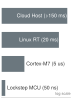
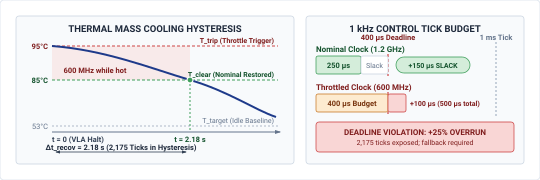

# Silicon Placement {#sec-placement}

::: {layout-narrow}
::: {.column-margin}

\chapterminitoc

:::

::: {.content-visible when-format="pdf"}
\noindent
{fig-alt="Isometric blueprint showing silicon placement: heterogeneous physical AI SoC with a neural accelerator cluster for the learned models, 3D memory stacks, perimeter thermal dissipation fins, shared interconnect crossbar bus, isolated deterministic real-time MCU enclave, and Harvard crimson QoS isolation trench."}
:::

::: {.content-visible unless-format="pdf"}
{fig-alt="Isometric blueprint showing silicon placement: heterogeneous physical AI SoC with a neural accelerator cluster for the learned models, 3D memory stacks, perimeter thermal dissipation fins, shared interconnect crossbar bus, isolated deterministic real-time MCU enclave, and Harvard crimson QoS isolation trench."}
:::

:::

## Purpose {.unnumbered .unlisted}

::: {.content-visible when-format="pdf"}
\begin{marginfigure}
\vspace{1em}
\resizebox{\linewidth}{!}{\mlphysicalstackfull{20}{100}{20}{20}{20}}
\end{marginfigure}
:::

_Why can a learned model delay a safety check that runs on a different processor core?_

Blocks drawn apart in an architecture diagram can still share a memory bus, a power supply, a clock, and a path for heat. A burst of neural computation can then delay a safety check running on another core, and the machine keeps moving while the check waits for data or recovers from a power disturbance. Software privilege boundaries decide which memory a task may touch, not how long its requests wait or how fast its clock runs, so they cannot settle whether the safety path still meets its deadline. Only measurement under contention can settle it, and such a measurement can refute a claimed separation as readily as support it. The remedies, from reserved bandwidth to a separate controller, each cost capacity, board area, or power that the machine must supply. Where the Brain and the Nervous System run on silicon therefore decides whether a refusal arrives before a command crosses the causal boundary, because an unmeasured delay is paid in distance the stop can no longer use.



::: {.callout-learning-objectives}

- Inventory the memory, interconnect, power, clock, reset, and thermal resources that proposal and permission paths share
- Explain why average bus utilization cannot bound a deadline, using transaction size, queue policy, and bank timing
- Size a windowed watchdog's service window from measured completion jitter for a non-blocking record exchange between the two paths
- Analyze how rail droop and thermal throttling stretch the permission path's execution time on different timescales
- Design a loaded stress test whose falsification threshold is the permission path's declared worst-case execution time
- Select among reservation, partitioning, workload reduction, and relocation from measured interference and the lease's timing allowance
- Construct a placement record that scopes loaded observed maxima, mitigations, and untested conditions for release review

:::

## The Silicon Substrate {#sec-placement-silicon-substrate}

The warehouse mobile manipulator carries its application processor and its permission path in one chassis. On its software architecture diagram, the proposal boundary between the Brain and the Nervous System is a clean dashed line. The barrier filter and fallback ladder of @sec-enforcement keep their guarantees only while the permission path finishes its check inside its deadline on every tick, and that condition depends on where the check executes, which the diagram does not show. On physical silicon, the dashed line can collapse onto a single shared die. Suppose both paths ran on one heterogeneous System-on-Chip (SoC). The chunk policy and the intent model would execute on the embedded accelerator while the permission path executed on an adjacent real-time core. When the intent model begins an inference pass across its multi-billion-parameter weights, billions of transistors activate simultaneously. This current surge ($dI/dt$) induces an inductive and resistive voltage droop ($\Delta V = L \cdot dI/dt + IR$) across the chip's internal Power Distribution Network (PDN), risking clock instability and timing closure failures in adjacent real-time logic.[^fn-place-voltage-droop] Concurrently, dense tensor matrix multiplications saturate the shared LPDDR memory bus, streaming gigabytes of activation maps and evicting the safety enforcer's pinned sensor tables from the last-level cache.

[^fn-place-voltage-droop]: **Inductive Voltage Droop Mechanics**\index{Power Distribution Network!inductive voltage droop}\index{Inductive voltage droop!VLSI design}: In high-performance VLSI design, inductive voltage droop ($\Delta V = L \cdot dI/dt$) occurs across the parasitic inductance ($L$) of power distribution package pins and on-chip power grids when large numbers of logic gates switch simultaneously. If the local rail voltage drops below the minimum operating threshold ($V_{\min}$), digital flip-flops suffer setup-time violations, metastabilities, or brownout resets that disrupt deterministic real-time execution.

When a real-time safety reflex reads a sensor buffer while the proposal workload occupies the shared memory controller, its requests queue behind direct memory access traffic, and the wait can consume the share of the deadline that the enforcer's computation needed. Logical privilege does nothing to prevent that wait, because it governs which addresses a task may touch, not where its requests wait in the memory queue.

::: {.column-margin .margin-pointer}
↰ **Prerequisite:** Hardware execution cadences and microcontroller timing loops were defined in @sec-nervous-cadences.
:::

Both of the machine's jobs would feel shared-die coupling. For the Class 1 base, a memory stall during feature extraction delays the permission path's refusal while the loaded base closes on a rack end, and every tick of delay beyond the one the stopping budget counts is distance it never reserved. For the Class 2 arm, an accelerator burst that evicts the permission path's tables from a shared cache delays the contact check while the gripper presses on the spring-latched door.

Following the end-to-end argument in system design [@saltzer1984end], memory protection and operating system process isolation do not by themselves establish operational independence. On a heterogeneous die,[^fn-place-system-chip] **operational independence**\index{Operational independence!definition} requires that proposal-side activity cannot push enforcement execution beyond its hard physical deadline, and that proposal-side crashes or thermal overruns cannot disable the permission path's authority to refuse.

[^fn-place-system-chip]: **Heterogeneous System-on-Chip Architecture**\index{Heterogeneous system-on-chip!architecture}\index{System-on-Chip (SoC)!heterogeneous compute}: Heterogeneous SoCs integrate multiple distinct compute domains onto a single silicon substrate, combining high-throughput application processors and neural accelerators with deterministic real-time safety islands. Although memory management units isolate software address spaces across domains, hardware subcomponents continue to share power distribution networks, clock distribution trees, and DRAM controllers. Under peak cognitive burst workloads, uncoordinated resource contention across these shared physical structures can degrade real-time response times beyond critical physical deadlines.

Because these couplings are governed by physical solid-state phenomena rather than software abstractions, architectural claims of isolation must be treated as hypotheses to be falsified through measurement. Testing such a claim takes four engineering steps: an inventory of every shared silicon resource and its claimants; a stress campaign that drives the proposal path to worst-case compute, memory, and bus contention while recording the enforcement path's latency distribution and observed maximum; measurements of voltage droop and junction temperature under sustained load; and a placement record that states the observed maxima against the deadline together with the conditions left untested. Those steps recur through the rest of the chapter, which begins on the mobile manipulator with what each path must compute, where it runs, and how much slack it keeps when nothing competes with it.

## Two Paths on One Die {#sec-placement-two-paths-one-die}

```{python}
#| label: calc-placement-machine-paths
#| echo: false
# ┌─────────────────────────────────────────────────────────────────────────────
# │ MACHINE PATHS: PROPOSAL AND PERMISSION BUDGETS
# ├─────────────────────────────────────────────────────────────────────────────
# │ Context: @sec-placement-two-paths-one-die, @sec-placement-isolation-decisions,
# │          @sec-placement-hardware-allocation, @sec-placement-fallacies-pitfalls,
# │          @sec-placement-summary
# │
# │ Goal: Size the running machine's two paths from the registry before any
# │       contention: the chunk policy on the application processor and the
# │       enforcer tick on the discrete safety MCU.
# │ Show: 135 µs unloaded = 40 + 80 + 15 µs = 54,000 cycles at 400 MHz, against
# │       a declared 250 µs WCET and a chosen 400 µs deadline in the 1 ms tick.
# │       The permission path's isolated rail holds up for 2 s (a placement
# │       fact recorded here; decided in Ch2, sized in Ch12).
# │ How: Registry fields of the warehouse mobile manipulator and its aisle
# │      scenario; the three enforcer sub-costs are chapter-local.
# └─────────────────────────────────────────────────────────────────────────────
from mlsysim import *
from mlsysim.core.units import microsecond, millisecond, second, hertz
from mlsysim.fmt import fmt_int, fmt_latency, fmt_frequency, check

RM = Embodied.MobileManipulator.WarehouseMobileManipulator
AISLE = Embodied.Scenario.WarehouseAisle

class PlacementMachine:
    # ┌── 1. LOAD ───────────────────────────────────────────────────────────
    chunk_rate = RM.chunk_rate  # category: chosen
    chunk_inference = RM.chunk_inference_latency  # category: illustrative (P99, vision included)
    chunk_horizon = RM.chunk_horizon  # category: chosen
    permission_rate = RM.permission_rate  # category: chosen
    mcu_clock = RM.permission_mcu.compute.clock_rate  # category: illustrative (reference class)
    tick = AISLE.t_tick  # category: chosen
    t_bus = AISLE.t_bus  # category: illustrative
    lease = AISLE.t_lease  # category: chosen
    unloaded = AISLE.enforcer_unloaded  # category: illustrative
    wcet = AISLE.enforcer_wcet  # category: chosen (declared, not measured)
    deadline = AISLE.enforcer_deadline  # category: chosen
    self_watchdog = AISLE.mcu_self_watchdog  # category: chosen
    rail_holdup = RM.permission_rail_holdup  # category: chosen (permission-rail hold-up)
    sense = 40 * microsecond  # scenario assumption; category: illustrative (encoders, IMU, evidence epoch)
    constraint = 80 * microsecond  # scenario assumption; category: illustrative
    write = 15 * microsecond  # scenario assumption; category: illustrative (drive-frame staging)

    # ┌── 2. EXECUTE ────────────────────────────────────────────────────────
    chunk_period = (1 / chunk_rate).to(millisecond)
    chunk_slack = (chunk_period - chunk_inference).to(millisecond)
    unloaded_sum = (sense + constraint + write).to(microsecond)
    unloaded_slack = (deadline - unloaded).to(microsecond)
    wcet_margin = (deadline - wcet).to(microsecond)
    unloaded_cycles = (unloaded * mcu_clock).to("dimensionless").magnitude
    min_chunk_rate = (1 / lease).to(hertz)
    compute_after_sense = (constraint + write).to(microsecond)

    # ┌── 3. GUARD ──────────────────────────────────────────────────────────
    check(
        abs((unloaded_sum - unloaded).to(microsecond).magnitude) < 1e-9, "Sense + constraint + write must equal the registry's 135 µs unloaded cycle."
    )
    check(abs(unloaded.to(microsecond).magnitude - 135.0) < 1e-9, "Canon: 135 µs unloaded.")
    check(abs(unloaded_cycles - 54_000) < 1e-6, "Canon: 135 µs = 54,000 cycles at 400 MHz.")
    check(wcet < deadline < tick, "Declared WCET inside the deadline, deadline inside the tick.")
    check(
        abs(wcet.to(microsecond).magnitude - 250.0) < 1e-9 and abs(deadline.to(microsecond).magnitude - 400.0) < 1e-9,
        "Canon: 250 µs WCET, 400 µs deadline.",
    )
    check(abs(chunk_slack.to(millisecond).magnitude - 10.0) < 1e-9, "The 40 ms chunk inference leaves 10 ms of the 50 ms period.")
    check(
        chunk_period < lease, "Lease rule: the lease outlasts one chunk period, leaving the renewal-jitter allowance that absorbs the proposal link."
    )
    check(abs(rail_holdup.to(second).magnitude - 2.0) < 1e-9, "Canon (D15): the permission rail holds up for 2.0 s.")

    # ┌── 4. OUTPUT ─────────────────────────────────────────────────────────
    chunk_rate_str = fmt_frequency(chunk_rate, precision=0)
    chunk_period_str = fmt_latency(chunk_period, unit=millisecond, precision=0)
    chunk_inference_str = fmt_latency(chunk_inference, unit=millisecond, precision=0)
    chunk_slack_str = fmt_latency(chunk_slack, unit=millisecond, precision=0)
    chunk_horizon_str = fmt_int(chunk_horizon)
    permission_rate_str = fmt_frequency(permission_rate, precision=0)
    mcu_clock_str = fmt_frequency(mcu_clock, precision=0)
    tick_str = fmt_latency(tick, unit=millisecond, precision=0)
    t_bus_str = fmt_latency(t_bus, unit=millisecond, precision=0)
    lease_str = fmt_latency(lease, unit=millisecond, precision=0)
    min_chunk_rate_str = fmt_frequency(min_chunk_rate, precision=1)
    sense_str = fmt_latency(sense, unit=microsecond, precision=0)
    constraint_str = fmt_latency(constraint, unit=microsecond, precision=0)
    write_str = fmt_latency(write, unit=microsecond, precision=0)
    compute_after_sense_str = fmt_latency(compute_after_sense, unit=microsecond, precision=0)
    unloaded_str = fmt_latency(unloaded, unit=microsecond, precision=0)
    unloaded_cycles_str = fmt_int(unloaded_cycles)
    unloaded_slack_str = fmt_latency(unloaded_slack, unit=microsecond, precision=0)
    wcet_str = fmt_latency(wcet, unit=microsecond, precision=0)
    wcet_margin_str = fmt_latency(wcet_margin, unit=microsecond, precision=0)
    deadline_str = fmt_latency(deadline, unit=microsecond, precision=0)
    self_watchdog_str = fmt_latency(self_watchdog, unit=millisecond, precision=0)
    rail_holdup_str = fmt_latency(rail_holdup, unit=second, precision=0)
```

Placement cannot defer to integration; the physical assignment of software functions to hardware execution engines determines separation. The mobile manipulator partitions its control across two paths with conflicting requirements. The proposal path runs the chunk policy on the application processor at `{python} PlacementMachine.chunk_rate_str`, taking the navigation and wrist camera streams and emitting base velocity and arm joint targets together. Its P99 inference, vision included, takes `{python} PlacementMachine.chunk_inference_str` (illustrative; see the Reader Guide) of each `{python} PlacementMachine.chunk_period_str` chunk period; it holds no direct hardware authority over the drives and runs in unprivileged user space. The permission path runs on the discrete safety microcontroller at `{python} PlacementMachine.permission_rate_str`. Each tick it reads the wheel and joint encoders, the IMU, and the evidence epoch of the latest proposal, checks that proposal against the stopping envelope of @sec-enforcement-stopping-envelopes, and stages the admitted setpoints for the EtherCAT frame to the drives. It must finish inside a chosen `{python} PlacementMachine.deadline_str` deadline within its `{python} PlacementMachine.tick_str` tick, and it runs in a privileged real-time execution domain on a dual-core lockstep controller,[^fn-place-asild-lockstep] whose comparator diagnostics cover the permission path's own failure, because an envelope check cannot detect a fault in the core that executes it. Only the permission path holds memory-mapped input-output (MMIO)\index{Memory-mapped I/O} access to the fieldbus master that carries drive commands.

::: {#dfn-placement-heterogeneous-silicon-partitioning .callout-definition title="Heterogeneous silicon partitioning"}

***Heterogeneous silicon partitioning***\index{Heterogeneous silicon partitioning!definition}\index{Silicon partitioning!definition} is the architectural allocation of stochastic, high-capacity cognitive workloads (perception, learned policy evaluation) and deterministic reflex loops (safety invariant checks, actuator commutation) across specialized execution domains isolated in hardware.

1.  **Significance**: Placing high-capacity neural deliberation and real-time safety enforcement on the same general-purpose operating system or compute engine creates common-mode failures. Kernel thread preemption, dynamic memory allocation, and GPU warp scheduling inject multi-millisecond tail jitter that causes the safety reflex to miss physical control deadlines.
2.  **Distinction**: Unlike logical software process isolation (such as Linux containers or POSIX process priorities), silicon partitioning enforces isolation across independent hardware registers, tightly-coupled static memories (TCM), and dedicated peripheral buses.
3.  **Common pitfall**: Assuming multi-core CPU affinity provides true failure-domain separation. Cores that share on-chip L3 caches, DRAM memory controllers, phase-locked loop (PLL) clock trees, or power distribution rails remain vulnerable to cross-core interference, thermal throttling, and voltage droop brownouts.

:::

::: {.column-margin .margin-pointer}
↰ **Prerequisite:** The sub-millisecond execution deadline of the CBF-QP reflex enforcer was established in @sec-enforcement-minimal-intervention.
:::

The machine maps these functions onto the two-processor implementation of @sec-nervous-silicon-partitioning. Proposal inference, telemetry logging, network communication, and fault recording run on the application processor under Linux, whose scheduling tail stays exposed to kernel and driver jitter even in a real-time configuration.[^fn-place-preempt-rt] Enforcement and sensor validation run on the discrete safety microcontroller as bare-metal firmware behind a hardware memory protection unit,[^fn-place-memory-partitioning] with the encoder interfaces, the IMU, and the timer channels wired directly to it. Each proposal reaches the microcontroller over a board-level link and is published there through the seqlock mailbox of @sec-nervous-cadences, so no dynamic random-access memory (DRAM)\index{DRAM}\index{Dynamic random-access memory|see{DRAM}} is shared between the paths. On the supply side the two paths share only the battery. The microcontroller, the drive logic, and the spring-brake coils sit on the isolated rail of @sec-body-archetype-matrix, which carries no proposal-side load and is held up by a local store for `{python} PlacementMachine.rail_holdup_str`, longer than any stop the enforcer can command inside the envelope (@sec-enforcement-fallback-ladder). A sag on the shared control rail therefore cannot reset the permission path.

On the unloaded machine the computational budgets appear generous. Illustrative sub-costs on the safety microcontroller put reading the encoders, the IMU, and the proposal's evidence epoch at `{python} PlacementMachine.sense_str`, evaluating the constraints at `{python} PlacementMachine.constraint_str`, and staging the admitted setpoints for the drive frame at `{python} PlacementMachine.write_str`. The unloaded tick totals `{python} PlacementMachine.unloaded_str`, which at the microcontroller's `{python} PlacementMachine.mcu_clock_str` clock is `{python} PlacementMachine.unloaded_cycles_str` cycles. Against the `{python} PlacementMachine.deadline_str` deadline, the unloaded path leaves `{python} PlacementMachine.unloaded_slack_str` of slack, and the declared worst-case execution time of `{python} PlacementMachine.wcet_str`, the qualified budget of @sec-enforcement-minimal-intervention, still leaves `{python} PlacementMachine.wcet_margin_str`. On the application processor, the chunk policy's `{python} PlacementMachine.chunk_inference_str` inference leaves `{python} PlacementMachine.chunk_slack_str` of its `{python} PlacementMachine.chunk_period_str` period. Evaluated in isolation, both loops operate with comfortable margins.

::: {.column-margin}
{width="100%" fig-alt="Four horizontal bars on a log scale, longest to shortest: cloud host above 150 ms, Linux RT 20 ms, Cortex-M7 5 microseconds, and lockstep MCU 50 nanoseconds."}

*Candidate execution domains differ in their timing controls; measured tails determine placement.*
:::

Assigning tasks to separate processor cores does not create independent failure domains if the silicon infrastructure is shared.[^fn-std-cast-32a] @sec-nervous-hardware-isolation traced these common-cause paths on the machine's board, where separate packages and the isolated rail cut the memory and supply paths. On a shared die, the rejected option for this machine, they move inside one package. The real-time core executes instructions independently from the application processor, yet both cores rely on common hardware services:

- *Shared interrupt routing:* The Generic Interrupt Controller (GIC) routes peripheral and inter-processor notifications across a shared fabric, where a flood of Ethernet packet interrupts on the Linux MPU can delay the timer interrupt that triggers the `{python} PlacementMachine.permission_rate_str` MCU safety loop.
- *Shared memory controllers:* Both paths access the same dynamic memory controller\index{Memory controller} and interconnect crossbar\index{Interconnect crossbar}, where large matrix tile loads generated by the neural accelerator saturate DRAM command queues, turning an expected $20\text{ ns}$ level-two cache refill on the real-time core into a $350\text{ ns}$ round-trip to main memory.[^fn-place-cache-coloring]
- *Shared clock trees:* The cores share phase-locked loops (PLLs) for clock generation, where dynamic voltage and frequency scaling (DVFS) transients on the application processor introduce clock jitter across adjacent real-time domains.
- *Shared power rails:* A single Power Distribution Network (PDN) delivers current to both domains, where switching surges from the neural accelerator drop the internal voltage rail, risking logic state corruption or brownout resets.
- *Shared reset domains:* A kernel panic on the Linux MPU that triggers a hardware watchdog\index{Watchdog timer!hardware} reset can pull down the shared peripheral bus or system interconnect, disabling the drive outputs and leaving the base without a permitted command.

[^fn-std-cast-32a]: **Avionic Multicore Certification**\index{Multicore interference!FAA AC 20-193 / CAST-32A}\index{Worst-case execution time!multicore certification}: FAA Advisory Circular AC 20-193 and CAST-32A formalize multicore interference analysis for safety-critical avionics. The guidance requires bounding worst-case execution times by demonstrating that shared caches, interconnect crossbars, and memory controllers cannot cause critical tasks to overrun execution deadlines. Without hardware-enforced quality-of-service partitions or dedicated interconnect channels, cross-core memory traffic invalidates a single-core timing bound.

[^fn-place-preempt-rt]: **PREEMPT_RT**\index{Preempt RT!kernel latency}: A Linux real-time configuration reduces some scheduler latencies, but its tail depends on kernel, drivers, workload, and shared hardware. No portable sub-$50\,\mu\text{s}$ or bare-metal comparison follows without measurement.

[^fn-place-memory-partitioning]: **Hardware memory protection and IOMMU domains**\index{Memory Protection Unit!spatial isolation}\index{IOMMU!DMA isolation}: Physical silicon structures that enforce spatial address isolation. While an on-chip Memory Protection Unit (MPU) confines CPU thread execution to bounded memory segments, an Input-Output Memory Management Unit (IOMMU) translates and polices direct memory access (DMA) requests from peripheral bus masters (such as PCIe neural accelerators or camera deserializers), physically preventing an untrusted device from corrupting safety state buffers.

[^fn-place-asild-lockstep]: **Dual-core lockstep**\index{Lockstep processor!fault detection}: Two cores can execute matching instruction streams while comparator logic detects selected divergences. Detection coverage, delay, shared-rail vulnerability, and diagnostic response depend on the device and the application safety case, so lockstep is one element of an ASIL D argument, not the whole of it.

[^fn-place-cache-coloring]: **Cache coloring and way partitioning**\index{Cache coloring!memory isolation}\index{ARM MPAM!cache partitioning}: Techniques that divide shared cache capacity among competing tasks. Software cache coloring partitions physical page allocations so that addresses from distinct processes map to non-overlapping cache sets, while hardware partitioning mechanisms (such as ARM Memory System Resource Partitioning and Monitoring, MPAM, or Intel Cache Allocation Technology, CAT) dynamically restrict the cache ways an untrusted neural accelerator can allocate, preventing line evictions in critical safety threads.

For the machine's permission loop, compare three placements. Shared application cores give an illustrative $P_{99.9}=2.8\text{ ms}$, which misses not only the `{python} PlacementMachine.deadline_str` deadline but the `{python} PlacementMachine.tick_str` tick itself. A real-time cluster on the application SoC keeps its own core but shares the die's memory controller, rails, and thermal path; @sec-placement-thermal-timing-coupling shows the clock throttle that rejects it. The discrete safety microcontroller that the machine uses pays for its separation in transport instead, a board-level hop from the application processor that neither shared-die option needs and that @sec-placement-isolation-decisions charges to the lease. The choice among the three rests on each option's measured sensor-to-drive response under interference, not on how many packages it uses.

Principle \ref{pri-vol4-proposal-permission} requires a permission path that learned workloads cannot delay, and the three placements differ precisely in which resources the two paths still share. Even the discrete microcontroller's separation is a claim about timing under load, which only a measurement of its tick under that load can support. Every resource the two paths share has claimants on that tick, and the memory system is where they collide first.

## Contention for Shared Resources {#sec-placement-resource-contention}

Every shared physical resource has multiple claimants; a utilization metric that ignores concurrent competition cannot bound a deadline. Had the mobile manipulator placed its permission path on the application SoC, the proposal path, the enforcement path, and the system infrastructure would compete directly for the same memory controllers, crossbar switches, and power distribution rails. Digital claimants on that shared memory bus would include camera and lidar DMA streams depositing frames into DRAM, the neural accelerator fetching model weight matrices and intermediate activation tensors, the real-time core reading its constraint tables and sensor history, actuator write buffers for drive commands, cache controllers executing dirty line writebacks, and diagnostic logging processes writing state records to nonvolatile storage. On the machine as built, the same bursts stay on the application processor, where they delay the observation and the chunk rather than the permission tick. The permission path meets them as evidence age (@sec-perception-cost-ingestion), refusing evidence older than its refusal threshold and entering its fallback if no admitted chunk renews the lease.

In physical AI hardware design, **crossbar bus and DRAM bank contention**\index{Crossbar bus and DRAM bank contention!definition} is queuing delay when memory and DMA transactions share an interconnect and controller. One in-flight AXI4 transaction may finish before a newly arrived safety request; blocking by a whole model tile requires a specified repeated-grant or FIFO policy. Row-buffer scheduling can add delay, so the actual bound depends on transaction size, queue capacity, QoS semantics, bank mapping, and new arrivals.[^fn-place-dram-bandwidth]

[^fn-place-dram-bandwidth]: **DRAM bank conflicts**\index{DRAM!bank conflicts}: A different row in the same active bank may require precharge and activation before column service. Actual bank mapping, overlap, and scheduling determine the added delay.

Each claimant's average demand follows from its transfer size and event rate, and on a shared LPDDR channel the camera streams, weight fetches at the policy rate, the enforcer's reads, drive writes, writebacks, and logging together occupy a small fraction of its capacity on average. An engineer who inspects only that average concludes that most of the bus remains free. Memory arbiters do not schedule average rates. They arbitrate discrete bursts, and two workloads with identical average throughput interfere differently if one streams in small packets while the other arrives in long, saturating blocks.

**Arithmetic intensity**\index{Arithmetic intensity!definition}, the ratio of arithmetic operations to bytes moved [@williams2009roofline], says whether a routine is bound by execution units or by memory bandwidth in steady state; it says nothing about which request waits when two paths reach the bus together. While weights stream in from DRAM, the accelerator's operational intensity is zero, and it acts as a high-bandwidth direct memory access engine that saturates the shared bus. Weight streaming is also what caps the rate of fresh proposals in the memory wall of @sec-brain-cognitive-pipeline. Placement sees the other side of that limit, because every weight transfer that bounds the proposer is traffic a co-located permission path would wait behind.

How long a safety read waits depends on transaction arbitration and DRAM scheduling. An accelerator that moves weights in $262{,}144$-byte tiles does not issue one burst: [Arm’s AXI4 specification](https://documentation-service.arm.com/static/64256e84314e245d086bc88f) permits at most 256 beats per burst and forbids a burst from crossing a $4{,}096$-byte address boundary, so on an assumed 128-bit internal path a tile becomes 64 aligned transactions. An in-flight transaction may be non-preemptible, and whether the remaining tile transactions block a later safety read depends on whether the controller implements priority bypass. DRAM adds its own delay, because only one row per bank is open at a time: like a clerk who must shut one drawer before opening another, a read to a closed row waits for precharge ($t_{\text{RP}}=14\text{ ns}$) and activation ($t_{\text{RCD}}=14\text{ ns}$) before column service.

Controllers that use **First-Ready First-Come-First-Served (FR-FCFS)**\index{FR-FCFS scheduling!definition} scheduling let ready row hits overtake older requests, and a streaming accelerator supplies row hits in abundance, so that policy needs its own starvation bound. Under a FIFO queue that lets no later arrival pass the safety read, the idealized wait is
$$t_{\text{queue}} = \sum_{k \in \mathcal{Q}} \frac{B_k}{\text{BW}_{\text{peak}}} + N_{\text{conflicts}} (t_{\text{RP}} + t_{\text{RCD}})$$ {#eq-placement-dram-queuing}
where $\mathcal{Q}$ holds the transactions ahead of the read, $B_k$ is each one's byte count, $N_{\text{conflicts}}$ counts bank switches, and $\text{BW}_{\text{peak}}$ is an optimistic service rate, so arbitration overhead and refresh add to the result.

```{python}
#| label: calc-placement-loaded-read
#| echo: false
# ┌─────────────────────────────────────────────────────────────────────────────
# │ THE PERMISSION PATH'S LOADED READ ON A SHARED DIE (REJECTED PLACEMENT)
# ├─────────────────────────────────────────────────────────────────────────────
# │ Context: @sec-placement-resource-contention, @sec-placement-fallacies-pitfalls
# │
# │ Goal: Charge a FIFO backlog on shared DRAM to the machine's 40 µs sense
# │       allowance and 400 µs deadline, to show why the bound is a property of
# │       the memory controller rather than of the workload.
# │ Show: one backlog of 88 transactions (360,448 bytes) waits 28.244 µs; a 4 KiB
# │       snapshot then reads in 28.564 µs, inside the 40 µs allowance (one
# │       backlog fits, two do not); the declared 250 µs WCET is crossed after
# │       more than five backlogs (155 µs read), refuting independence, while the
# │       deadline holds until more than ten (305 µs read); priority bypass cuts
# │       the read to 0.64 µs.
# │ How: calc_axi_fifo_contention with PlacementMachine's sub-costs; queue
# │      composition and snapshot size are scenario inputs.
# └─────────────────────────────────────────────────────────────────────────────
import math
from mlsysim.core.units import Q_, microsecond
from mlsysim.physics.robotics import calc_axi_fifo_contention
from mlsysim.fmt import fmt, fmt_int, fmt_latency, check

class PlacementLoadedRead:
    # ┌── 1. LOAD ───────────────────────────────────────────────────────────
    sense = PlacementMachine.sense  # category: illustrative (sense allowance)
    compute_after_sense = PlacementMachine.compute_after_sense  # category: illustrative (80 + 15 µs)
    deadline = PlacementMachine.deadline  # category: chosen
    wcet = PlacementMachine.wcet  # category: chosen (declared WCET, the falsification threshold)
    tile_bytes = 256 * 1024  # category: illustrative (weight tile)
    camera_bytes = 64 * 1024  # category: illustrative
    telemetry_bytes = 32 * 1024  # category: illustrative
    snapshot_bytes = 4 * 1024  # category: illustrative (encoder, IMU, and evidence-epoch snapshot)
    transaction_bytes = 4 * 1024  # category: datasheet (AXI4 4 KiB boundary)
    bandwidth = Q_("12.8 GB/s")  # category: illustrative (peak rate)
    bank_switches = 3  # category: illustrative
    bank_switch_time = Q_("28 ns")  # category: illustrative (t_RP + t_RCD)

    # ┌── 2. EXECUTE ────────────────────────────────────────────────────────
    result = calc_axi_fifo_contention(
        tile_bytes=tile_bytes,
        camera_bytes=camera_bytes,
        telemetry_bytes=telemetry_bytes,
        safety_read_bytes=snapshot_bytes,
        transaction_bytes=transaction_bytes,
        bandwidth=bandwidth,
        bank_switches=bank_switches,
        bank_switch_time=bank_switch_time,
        compute_time=compute_after_sense,
    )
    backlog_bytes = tile_bytes + camera_bytes + telemetry_bytes
    queue = result["queue_fifo"].to(microsecond)
    own_read = result["own_read"].to(microsecond)
    loaded_read = (queue + own_read).to(microsecond)
    sense_left = (sense - loaded_read).to(microsecond)
    read_ceiling = (deadline - compute_after_sense).to(microsecond)
    wcet_read_ceiling = (wcet - compute_after_sense).to(microsecond)
    backlogs_wcet = math.floor(((wcet_read_ceiling - own_read) / queue).to("dimensionless").magnitude)
    backlogs_sense = math.floor(((sense - own_read) / queue).to("dimensionless").magnitude)
    backlogs_deadline = math.floor(((read_ceiling - own_read) / queue).to("dimensionless").magnitude)
    bypass_read = (result["queue_priority_bypass"] + own_read).to(microsecond)

    # ┌── 3. GUARD ──────────────────────────────────────────────────────────
    check(result["queued_transactions"] == 88 and result["tile_transactions"] == 64, "88 queued transactions, 64 of them from one tile.")
    check(abs(queue.magnitude - 28.244) < 1e-9, "360,448 bytes at 12.8 GB/s plus three 28 ns switches is 28.244 µs.")
    check(loaded_read < sense < 2 * queue + own_read, "One backlog fits inside the sense allowance; two do not.")
    check(abs(read_ceiling.magnitude - 305.0) < 1e-9, "The deadline leaves 305 µs for the read after 95 µs of compute.")
    check(backlogs_sense == 1 and backlogs_deadline == 10, "The sense allowance absorbs one backlog, the deadline ten.")
    check(abs(wcet_read_ceiling.magnitude - 155.0) < 1e-9 and backlogs_wcet == 5, "The declared WCET leaves 155 µs for the read, five backlogs.")
    check(bypass_read < own_read * 3, "Priority bypass leaves one in-flight transaction ahead of the read.")

    # ┌── 4. OUTPUT ─────────────────────────────────────────────────────────
    sense_str = fmt_latency(sense, unit=microsecond, precision=0)
    compute_after_sense_str = fmt_latency(compute_after_sense, unit=microsecond, precision=0)
    deadline_str = fmt_latency(deadline, unit=microsecond, precision=0)
    n_tx_str = fmt_int(result["queued_transactions"])
    tile_tx_str = fmt_int(result["tile_transactions"])
    backlog_bytes_str = fmt_int(backlog_bytes)
    snapshot_bytes_str = fmt_int(snapshot_bytes)
    queue_str = fmt(queue.magnitude, precision=3)
    own_read_str = fmt(own_read.magnitude, precision=2)
    loaded_read_str = fmt(loaded_read.magnitude, precision=3)
    sense_left_str = fmt(sense_left.magnitude, precision=3)
    read_ceiling_str = fmt_latency(read_ceiling, unit=microsecond, precision=0)
    backlogs_deadline_str = fmt_int(backlogs_deadline)
    wcet_str = fmt_latency(wcet, unit=microsecond, precision=0)
    wcet_read_ceiling_str = fmt_latency(wcet_read_ceiling, unit=microsecond, precision=0)
    backlogs_wcet_str = fmt_int(backlogs_wcet)
    bypass_read_str = fmt(bypass_read.magnitude, precision=2)
    bandwidth_str = fmt(bandwidth.to("GB/s").magnitude, precision=1)
    bank_switch_str = fmt(bank_switch_time.to("ns").magnitude, precision=0)
    bank_switches_str = fmt_int(bank_switches)
```

::: {#nbk-placement-loaded-read .callout-notebook title="The permission path's loaded read on a shared die"}

**Problem**: Suppose the permission path read its sensor snapshot from the application SoC's shared DRAM. How much queued traffic could precede that read before the tick exceeds its sense allowance, its declared worst-case execution time, and its deadline?

**Variables**: The tick allots `{python} PlacementLoadedRead.sense_str` to sensing and `{python} PlacementLoadedRead.compute_after_sense_str` to constraint evaluation and the drive-frame write, inside a `{python} PlacementLoadedRead.deadline_str` deadline. The snapshot is `{python} PlacementLoadedRead.snapshot_bytes_str` bytes on a `{python} PlacementLoadedRead.bandwidth_str` GB/s channel. Ahead of it the FIFO holds one weight tile (`{python} PlacementLoadedRead.tile_tx_str` transactions), a camera transfer, and a telemetry record: `{python} PlacementLoadedRead.n_tx_str` transactions, `{python} PlacementLoadedRead.backlog_bytes_str` bytes, `{python} PlacementLoadedRead.bank_switches_str` bank switches.

**Math**: By @eq-placement-dram-queuing, serving the backlog's `{python} PlacementLoadedRead.backlog_bytes_str` bytes at `{python} PlacementLoadedRead.bandwidth_str` GB/s, plus `{python} PlacementLoadedRead.bank_switches_str` switches of `{python} PlacementLoadedRead.bank_switch_str` ns, takes `{python} PlacementLoadedRead.queue_str` $\mu\text{s}$. The snapshot itself reads in `{python} PlacementLoadedRead.own_read_str` $\mu\text{s}$, so the loaded read takes `{python} PlacementLoadedRead.loaded_read_str` $\mu\text{s}$ and leaves `{python} PlacementLoadedRead.sense_left_str` $\mu\text{s}$ of the sense allowance. A second backlog would overrun it. The declared worst-case execution time of `{python} PlacementLoadedRead.wcet_str` is crossed once the read exceeds `{python} PlacementLoadedRead.wcet_read_ceiling_str`, which takes more than `{python} PlacementLoadedRead.backlogs_wcet_str` backlogs, and that crossing already refutes independence even though the tick still meets its deadline. The deadline itself holds until the read exceeds `{python} PlacementLoadedRead.read_ceiling_str`, which takes more than `{python} PlacementLoadedRead.backlogs_deadline_str` backlogs, so a tick that meets its deadline is no evidence that the placement is sound. With validated priority bypass, only the one in-flight transaction waits ahead, and the read takes `{python} PlacementLoadedRead.bypass_read_str` $\mu\text{s}$.

**Systems insight**: The read's bound belongs to the memory controller, not to the workload. It exists only if the controller limits how much traffic it admits ahead of a safety read or lets that read bypass the queue, and an FR-FCFS controller serving a streaming accelerator provides neither unless its configuration is qualified to do so. The machine's discrete microcontroller removes the question by reading its snapshot from tightly coupled memory on its own bus.

:::

Contention extends to the power distribution network, where claimants compete for charge rather than bandwidth. The droop of @sec-placement-silicon-substrate, $\Delta V = L\,dI/dt + IR$, grows with both the rate and the size of the current step. An off-chip voltage regulator responds far too slowly to catch a nanosecond current step, so the first charge comes from on-die decoupling capacitance, and once that is depleted the shared rail sags under every core it feeds.

```{python}
#| label: calc-placement-inductive-pdn-droop
#| echo: false
from mlsysim.core.units import ureg, nanosecond
from mlsysim.physics.robotics import (
    calc_voltage_droop,
    calc_inductive_voltage_droop,
    calc_alpha_power_gate_delay_stretch,
)
from mlsysim.fmt import fmt, fmt_int, fmt_percent

class InductivePDNVoltageDroop:
    v_core = 0.850 * ureg.volt  # category: illustrative
    l_pkg = 30.0 * ureg.picohenry  # category: illustrative
    r_pkg = 8.0 * ureg.milliohm  # category: illustrative
    delta_i = 6.0 * ureg.ampere  # category: illustrative
    t_rise = 2.0 * nanosecond  # category: illustrative
    di_dt = delta_i / t_rise

    v_ind = calc_inductive_voltage_droop(l_pkg, di_dt)
    v_res = calc_voltage_droop(delta_i, r_pkg)
    v_droop = v_ind + v_res
    v_drooped = v_core - v_droop

    v_th = 0.420 * ureg.volt  # category: illustrative
    alpha = 1.3  # category: illustrative
    res_stretch = calc_alpha_power_gate_delay_stretch(
        nominal_voltage=v_core,
        drooped_voltage=v_drooped,
        threshold_voltage=v_th,
        alpha=alpha,
    )
    delay_expansion_pct = res_stretch["delay_expansion_percent"]

    # ┌── 4. OUTPUT (Format & Export) ────────────────────────────────────────
    v_core_str = fmt(v_core.to(ureg.volt).magnitude, precision=2)
    v_core_3dec_str = fmt(v_core.to(ureg.volt).magnitude, precision=3)
    l_pkg_str = fmt(l_pkg.to(ureg.picohenry).magnitude, precision=0)
    r_pkg_str = fmt(r_pkg.to(ureg.milliohm).magnitude, precision=0)
    delta_i_str = fmt(delta_i.to(ureg.ampere).magnitude, precision=0)
    t_rise_str = fmt(t_rise.to(nanosecond).magnitude, precision=0)
    v_ind_mv_str = fmt(v_ind.to(ureg.millivolt).magnitude, precision=0)
    v_res_mv_str = fmt(v_res.to(ureg.millivolt).magnitude, precision=0)
    v_droop_mv_str = fmt(v_droop.to(ureg.millivolt).magnitude, precision=0)
    v_droop_v_str = fmt(v_droop.to(ureg.volt).magnitude, precision=3)
    v_drooped_str = fmt(v_drooped.to(ureg.volt).magnitude, precision=3)
    droop_pct_str = fmt_percent((v_droop / v_core).magnitude, precision=1)
    delay_expansion_pct_str = fmt_int(round(delay_expansion_pct))
```

On a shared $V_{\text{core}} =$ `{python} InductivePDNVoltageDroop.v_core_str` $\text{V}$ supply with package inductance $L =$ `{python} InductivePDNVoltageDroop.l_pkg_str` $\text{pH}$ and resistance $R =$ `{python} InductivePDNVoltageDroop.r_pkg_str` $\text{m}\Omega$, an accelerator current step of $\Delta I =$ `{python} InductivePDNVoltageDroop.delta_i_str` $\text{A}$ in `{python} InductivePDNVoltageDroop.t_rise_str` $\text{ns}$ produces `{python} InductivePDNVoltageDroop.v_ind_mv_str` $\text{mV}$ of inductive and `{python} InductivePDNVoltageDroop.v_res_mv_str` $\text{mV}$ of resistive drop, `{python} InductivePDNVoltageDroop.v_droop_mv_str` $\text{mV}$ in all, a `{python} InductivePDNVoltageDroop.droop_pct_str` percent sag to `{python} InductivePDNVoltageDroop.v_drooped_str` $\text{V}$. The alpha-power gate model[^fn-hw-alpha-power] turns that sag into a `{python} InductivePDNVoltageDroop.delay_expansion_pct_str` percent increase in propagation delay (@sec-appendix-systems-droop derives both steps). That is a gate delay, not a tick. Whether it consumes the permission path's slack, trips a brownout reset, or does nothing depends on the device's minimum operating voltage and clock policy, and only rail and timing measurements under the declared current step can settle it. A shared die would leave that question open for every accelerator burst; the discrete microcontroller, on its own rail, does not inherit it.

[^fn-hw-alpha-power]: **Alpha-Power CMOS Delay Model**\index{Alpha-Power CMOS delay law}\index{Gate propagation delay!voltage headroom}: The model uses $t_{\text{prop}} \propto V/(V-V_{\text{th}})^\alpha$ with $V_{\text{th}}=0.42\text{ V}$ and $\alpha=1.3$. It relates supply voltage to the switching delay of one gate; setup failures and brownout behavior come from device characterization.

Detecting these interactions requires dedicated hardware instrumentation, because software running on a core that has been stalled cannot record the duration of its own stall. Memory-controller performance counters log queue occupancy, bank conflicts, and per-master read and write transaction counts. Performance monitoring units on the real-time core record cache miss counts and stall cycles against an invariant free-running counter. On the electrical side, on-die analog-to-digital converters and fast comparator circuits record voltage excursions on internal rails, thermal diodes log junction temperature gradients across the floorplan, and power-management logs record dynamic frequency throttling states. When an uncommanded reset occurs, reset-cause registers distinguish a software watchdog expiration from an under-voltage brownout or a thermal emergency trip.

A shared die can meter these couplings in hardware, with a crossbar arbiter that routes tagged safety transactions through their own queue while metering accelerator bursts with bandwidth credits, and a power-management controller that throttles only the accelerator's clock at a thermal trip. Each is a property of the controller that the placement test must confirm, not a scheduler setting the block diagram can assume. Arbitration decides when a transaction moves, not what it carries. What crosses the physical boundary between the two paths must be defined by explicit guarantees on production time, validity, and failure response.

## The Boundary Contract {#sec-placement-boundary-contract}

What crosses between the proposal and enforcement paths under a boundary contract\index{Boundary contract} is a record, not an unqualified pointer into shared memory, because passing a raw memory address across the trust boundary couples the reader directly to the writer's internal memory layout, execution timing, and failure domain. If the chunk policy running on the accelerator provides only a pointer to its private output buffer, the permission path has no mechanism to determine whether the writer is still modifying the buffer, has stalled mid-inference, or has encountered an unhandled fault. The boundary payload must therefore be an immutable, self-contained record. The record that crosses is the proposal header of @sec-nervous-cadences, published through its seqlock mailbox; placement adds no fields, only the evidence that the exchange meets its deadline under load. The enforcement path reads the record as an isolated snapshot, evaluating its temporal freshness and physical validity before any setpoint reaches a drive.

Preserving temporal isolation, whether the exchange crosses a shared die or the machine's board-level link, requires eliminating blocking synchronization at the exchange interface. If the real-time enforcement loop acquires a lock held by the proposal generator, an inference stall can delay a physical decision. A $25\text{ ms}$ host stall must therefore leave the `{python} PlacementMachine.permission_rate_str` enforcer running each tick: it may use the last validated chunk only while its lease and current state remain admissible, then transfer to its independently validated fallback. Allocation and logging on the enforcement path likewise need measured time bounds. The producer may stall or drop updates; it cannot backpressure the plant's enforcement cadence.

The mailbox rejection rules of @tbl-04-boundary-fallbacks keep a failed producer from forcing the enforcer to wait. A rejected proposal leaves the admitted setpoints in force until the lease lapses; if no admissible proposal renews it and the machine is moving, the MCU executes the stop rung of @sec-enforcement-fallback-ladder, the base's resident suffix and the arm's state-matched stop, neither of which waits for the proposer. That fallback must still complete within a bounded time, and the placement test measures that bound under load on the silicon that hosts the path.

### Windowed watchdog timers and execution liveness

Software memory boundaries and lock-free seqlocks protect against torn reads, but cannot guarantee that the safety enforcer code is alive and progressing through its intended operations. The chunk lease of @sec-nervous-cadences bounds how long an admitted proposal may act, and it is sized from the stopping budget rather than chosen as a timeout. Liveness of the enforcer itself belongs to the self-watchdog of @sec-nervous-hardware-isolation, which is fed only after a completed tick. A countdown watchdog serviced from a timer interrupt stays blind to a dead task, the failure argued in *Bookout v. Toyota*. On shared silicon, the enforcer can also be starved by interconnect contention or run too fast after clock corruption, so placement needs a stronger form of that self-watchdog, one that constrains the feed from both sides.

High-integrity physical AI architectures therefore enforce **Windowed Watchdog Timers (WWDT)**\index{Windowed Watchdog Timer!hardware mechanics}\index{Watchdog timer!windowed}.[^fn-place-windowed-watchdog] A windowed watchdog rejects any refresh that occurs either too early or too late. The timer hardware defines a service window parameterized by a lower bound (the closed window, $T_{\text{lower}}$) and an upper bound (the open window, $T_{\text{upper}}$):

[^fn-place-windowed-watchdog]: **Windowed watchdog timers**\index{Watchdog timer!windowed service}\index{Hardware safety!WWDG}: An autonomous hardware timer that enforces both an upper and lower time bound on software refresh operations ("pets"). Unlike standard watchdogs that reset only on underflow, a windowed watchdog asserts a hardware system reset if serviced too early (which may indicate execution loop corruption or clock runaway) as well as if serviced too late (which may indicate task deadlock or starvation).

1. **Early-kick violation ($t_{\text{service}} < T_{\text{lower}}$)**: If software attempts to refresh the watchdog before the lower threshold has elapsed, the hardware immediately triggers a fault reset. An early kick can indicate that the software has bypassed required algorithmic stages, branched into a pathological short loop, or suffered execution speedup from clock corruption.
2. **Late-kick violation ($t_{\text{service}} > T_{\text{upper}}$)**: If the timer counts down past $T_{\text{upper}}$ without receiving a valid refresh, the counter underflows, asserting a hardware reset. A late kick can indicate that the enforcer was starved of compute cycles by interconnect contention, deadlocked on an unhandled exception, or delayed by excessive cache evictions.
3. **Valid service window ($T_{\text{lower}} \le t_{\text{service}} \le T_{\text{upper}}$)**: A refresh inside the window shows the feed path met its timing condition; task progress still needs a suitable challenge or independent supervision.

If the controller feeds once after each successful tick, the watchdog measures the interval *between feeds*. Let completion offset $c_n$ from tick $n$ start lie in $[c_{\min},c_{\max}]$, and bound tick-phase variation by $J_{\text{phase}}$. A conservative range for the inter-feed interval is
$$T_{\text{feed}}\in[T_{\text{period}}-(c_{\max}-c_{\min})-J_{\text{phase}},\;T_{\text{period}}+(c_{\max}-c_{\min})+J_{\text{phase}}].$$
Configure $T_{\text{lower}}$ and $T_{\text{upper}}$ around that *measured or justified* range, while keeping the late-trip response within the plant's separately derived fault budget. A one-tick execution time alone does not set a watchdog service interval. On the machine, $T_{\text{period}}$ is the `{python} PlacementMachine.tick_str` tick and the declared `{python} PlacementMachine.wcet_str` worst case supplies $c_{\max}$. The unloaded `{python} PlacementMachine.unloaded_str` path does not supply $c_{\min}$, because the enforcer's shortest branch can complete sooner than its nominal one, so the lower bound comes from the shortest completion the stress campaign records. $J_{\text{phase}}$ is the jitter of the microcontroller's tick timer against its reference, measured under the same load. That range would give the machine's timeout-only self-watchdog the $T_{\text{lower}}$ it lacks, while $T_{\text{upper}}$ stays at the chosen `{python} PlacementMachine.self_watchdog_str` timeout of @sec-nervous-cadences, so the window tolerates several missed ticks before it trips. The tolerance is deliberate. One missed tick costs millimeters of travel at aisle speed (@sec-placement-testing-separation), well inside the fault budget, and a window that closed on a single late feed would halt a healthy enforcer to save that displacement. A lower bound taken from estimates rather than recorded completions trips on healthy ticks, and an upper bound wider than the fault budget hides the starvation the window exists to catch.

Some designs add **challenge-response checkpointing**\index{Watchdog timer!challenge-response}: the feed depends on fresh sensor validation, permission evaluation, and output-state checks rather than a timer ISR alone. Its fault coverage depends on where the challenge is generated, who can compute or replay the response, and whether failed enforcer states can still execute the feed path. The scheme's coverage is therefore a fault-injection result, not a property of the token.

However, establishing clean boundaries in memory, interconnect arbitration, and watchdog execution liveness solves only the logical and timing half of co-location. When the accelerator and the real-time processor share the same silicon die, the high power dissipated during dense matrix operations conducts directly through the substrate, elevating local junction temperatures and altering transistor switching speeds across adjacent cores.

## Thermal and Timing Coupling {#sec-placement-thermal-timing-coupling}

Every watt dissipated on a silicon die flows into a single thermal domain. On a shared SoC the matrix units, the application cores, the memory interface, and the integrated regulators all heat one package, and while the enforcement loop draws a small, steady baseline, the proposal path swings with its workload. The package's finite conductance to ambient lets peak accelerator activity raise the junction temperature of every circuit on the die.

In physical AI systems engineering, **thermal clock throttling**\index{Thermal clock throttling!definition} is the automatic, hardware-enforced reduction of processor clock frequency triggered when sustained high-power cognitive inference elevates silicon junction temperature ($T_j$) past thermal trip thresholds ($T_{\text{trip}}$). To prevent damage to the die, the hardware abruptly cuts clock speed. This introduces a lingering, temperature-dependent slowdown (hysteresis) that inflates execution times even after the cognitive workload subsides and can push co-located real-time safety loops past their hard physical deadlines.

The electronics bay in the machine's base sits at $45.0\,^{\circ}\text{C}$ ambient. Suppose the shared SoC were conduction-cooled with a **junction-to-ambient thermal resistance**\index{Thermal resistance!junction-to-ambient} of $\theta_{\text{JA}} = 2.0\text{ K/W}$ and a **thermal time constant**\index{Thermal time constant} of $\tau_{\text{th}} = 8.0\text{ s}$. The enforcement loop with idle and memory power draws $4.0\text{ W}$ and holds the junction at $53.0\,^{\circ}\text{C}$. Continuous proposal inference adds accelerator, memory-traffic, and regulator losses, and a total of $26.0\text{ W}$ raises the steady state by $26.0\text{ W} \times 2.0\text{ K/W} = 52.0\text{ K}$ to $T_j = 97.0\,^{\circ}\text{C}$. @Fig-13-jetson-orin shows the developer kit of the module class the machine uses as its application processor; its enclosure reveals neither the heat path nor the clock domains on which this outcome depends.

::: {#fig-13-jetson-orin fig-env="figure" fig-pos="t" fig-cap="**Enclosed edge-compute kit**: The photograph shows a Jetson AGX Orin Developer Kit box and a closed, vented enclosure. The SoC, memory, cooling hardware, and clock domains are not visible; the thermal model in the text is a separate illustrative scenario. Photograph: [Auledas](https://commons.wikimedia.org/wiki/File:NVidia_Jetson_Orin_AGX.png), [CC BY 4.0](https://creativecommons.org/licenses/by/4.0/), via Wikimedia Commons; local copy re-encoded." fig-alt="Jetson AGX Orin Developer Kit retail box beside a closed gray enclosure with ventilation slots and external connectors. Internal components and cooling paths are not visible. Photograph by Auledas, CC BY 4.0; local copy re-encoded."}
{width="85%"}
:::

```{python}
#| label: calc-placement-rejected-throttle
#| echo: false
# ┌─────────────────────────────────────────────────────────────────────────────
# │ THE REJECTED PLACEMENT: A THROTTLED SHARED-DIE PERMISSION TICK
# ├─────────────────────────────────────────────────────────────────────────────
# │ Context: @sec-placement-thermal-timing-coupling
# │
# │ Goal: Show why the machine does not run its permission path on a real-time
# │       cluster of the application SoC: a thermal governor halves that
# │       cluster's clock and the tick overruns its deadline for seconds.
# │ Show: a cluster sized to the declared 250 µs WCET at 1.2 GHz needs 3.0e5
# │       cycles (300,000); throttled to 600 MHz it takes 500 µs, past the 400 µs deadline
# │       (25% overrun) and past the WCET that falsifies independence; 2.18 s of
# │       hysteresis spans 2,175 ticks.
# │ How: WCET, deadline, and tick from the aisle scenario; cluster clocks and
# │      the thermal model are scenario inputs for the rejected design.
# │
# │ Note: The clocks, times, and tick count match the checkpoint SVG
# │       chk_placement_thermal_throttling_hysteresis.svg.
# └─────────────────────────────────────────────────────────────────────────────
import math
from mlsysim import *
from mlsysim.core.units import microsecond, millisecond, second, ureg
from mlsysim.fmt import fmt_int, fmt_latency, fmt_frequency, fmt_percent, check

AISLE = Embodied.Scenario.WarehouseAisle

class RejectedPlacementThrottle:
    # ┌── 1. LOAD ───────────────────────────────────────────────────────────
    tick = AISLE.t_tick  # category: chosen
    wcet = AISLE.enforcer_wcet  # category: chosen (declared, not measured)
    deadline = AISLE.enforcer_deadline  # category: chosen
    f_nom = 1.20 * ureg.gigahertz  # scenario assumption; category: illustrative (shared-die cluster)
    f_throt = 600 * ureg.megahertz  # scenario assumption; category: illustrative (governor halves the clock)
    tau_th = 8.0 * second  # scenario assumption; category: illustrative
    t_ambient = 45.0  # °C, electronics-bay ambient; scenario assumption; category: illustrative
    p_base = 4.0  # W, enforcer plus idle and memory power; scenario assumption; category: illustrative
    theta_ja = 2.0  # K/W, junction-to-ambient; scenario assumption; category: illustrative
    t_start = 95.0  # °C, trip threshold; category: illustrative
    t_clear = 85.0  # °C, clearance threshold; category: illustrative
    mcu_unloaded = AISLE.enforcer_unloaded  # category: illustrative
    mcu_clock = RM.permission_mcu.compute.clock_rate  # category: illustrative (reference class)

    # ┌── 2. EXECUTE ────────────────────────────────────────────────────────
    n_cycles = (wcet * f_nom).to("dimensionless").magnitude  # cluster sized to meet the declared WCET
    t_exec = (n_cycles / f_nom).to(microsecond)
    t_exec_throt = (n_cycles / f_throt).to(microsecond)
    slack = (deadline - t_exec).to(microsecond)
    overrun = (t_exec_throt - deadline).to(microsecond)
    overrun_ratio = (overrun / deadline).to("dimensionless").magnitude
    t_target = t_ambient + p_base * theta_ja  # °C, baseline equilibrium
    t_recov = (tau_th * math.log((t_start - t_target) / (t_clear - t_target))).to(second)
    ticks_exposed = math.floor((t_recov / tick).to("dimensionless").magnitude)
    mcu_cycles = (mcu_unloaded * mcu_clock).to("dimensionless").magnitude  # TCM-resident unloaded tick on the discrete MCU

    # ┌── 3. GUARD ──────────────────────────────────────────────────────────
    check(abs(n_cycles - 3.0e5) < 1e-6, "250 µs at 1.2 GHz is 3.0e5 cycles.")
    check(
        abs(t_exec.magnitude - 250.0) < 1e-9 and abs(t_exec_throt.magnitude - 500.0) < 1e-9,
        "Nominal 250 µs and throttled 500 µs, as the SVG draws them.",
    )
    check(t_exec < deadline < t_exec_throt < tick, "The nominal tick meets the deadline; the throttled tick misses it inside the 1 ms period.")
    check(t_exec_throt > wcet, "The throttled tick exceeds the declared WCET, the falsification threshold.")
    check(abs(overrun_ratio - 0.25) < 1e-9, "The throttled tick overruns the 400 µs deadline by 25%.")
    check(abs(t_target - 53.0) < 1e-9, "Baseline equilibrium 45 °C + 4.0 W x 2.0 K/W = 53 °C.")
    check(abs(t_recov.magnitude - 2.18) < 5e-3, "Recovery from 95 to 85 °C takes about 2.18 s.")
    check(n_cycles > mcu_cycles, "The shared-die cluster, without TCM, spends more cycles per tick than the discrete MCU's unloaded 54,000.")
    check(ticks_exposed == 2175, "2,175 scheduled ticks fall inside the hysteresis, as the SVG labels them.")

    # ┌── 4. OUTPUT ─────────────────────────────────────────────────────────
    tick_str = fmt_latency(tick, unit=millisecond, precision=0)
    wcet_str = fmt_latency(wcet, unit=microsecond, precision=0)
    deadline_str = fmt_latency(deadline, unit=microsecond, precision=0)
    f_nom_str = fmt_frequency(f_nom, precision=1)
    f_throt_str = fmt_frequency(f_throt, precision=0)
    n_cycles_str = fmt_int(n_cycles)
    t_exec_str = fmt_latency(t_exec, unit=microsecond, precision=0)
    t_exec_throt_str = fmt_latency(t_exec_throt, unit=microsecond, precision=0)
    slack_str = fmt_latency(slack, unit=microsecond, precision=0)
    overrun_str = fmt_latency(overrun, unit=microsecond, precision=0)
    overrun_pct_str = fmt_percent(overrun_ratio, precision=0)
    t_recov_str = fmt_latency(t_recov, unit=second, precision=2)
    ticks_exposed_str = fmt_int(ticks_exposed)
```

Thermal management alone rejects the shared-die placement for the mobile manipulator. Suppose its permission path ran on a real-time cluster of the application SoC at $f_{\text{nom}} =$ `{python} RejectedPlacementThrottle.f_nom_str`, costing $N_{\text{cycles}} =$ `{python} RejectedPlacementThrottle.n_cycles_str` cycles per tick, several times the `{python} PlacementMachine.unloaded_cycles_str` cycles the discrete microcontroller needs unloaded, because a cluster without tightly coupled memory pays cache-refill and coherence cycles on every snapshot and table read. When the junction crosses $T_{\text{trip}} = 95.0\,^{\circ}\text{C}$, the governor drops the cluster to $f_{\text{throt}} =$ `{python} RejectedPlacementThrottle.f_throt_str` and the tick stretches to $t_{\text{exec,throt}} =$ `{python} RejectedPlacementThrottle.t_exec_throt_str`, missing the `{python} RejectedPlacementThrottle.deadline_str` deadline by `{python} RejectedPlacementThrottle.overrun_str` (a `{python} RejectedPlacementThrottle.overrun_pct_str` percent overrun) and far exceeding the declared bound on which every margin above the enforcer was sized. The discrete microcontroller runs on its own clock and rail, beyond the reach of that governor.

The overrun outlasts the load because the governor applies **state-dependent hysteresis**\index{Hysteresis!state-dependent}, restoring `{python} RejectedPlacementThrottle.f_nom_str` only after the junction cools to $T_{\text{clear}} = 85.0\,^{\circ}\text{C}$ so that the clock does not oscillate around the trip line. With the policy halted and power back at $4.0\text{ W}$, the junction relaxes toward its $53.0\,^{\circ}\text{C}$ baseline:
$$T_j(t) = T_{j,\text{target}} + (T_{j,\text{start}} - T_{j,\text{target}}) e^{-t/\tau_{\text{th}}}$$ {#eq-placement-cooling-recovery}
where $T_{j,\text{start}}$ is the junction temperature when throttling begins, $T_{j,\text{target}}$ is the baseline equilibrium, and $\tau_{\text{th}}$ is the package thermal time constant. Solving @eq-placement-cooling-recovery for the fall from $95.0$ to $85.0\,^{\circ}\text{C}$ gives $t_{\text{recov}} = \tau_{\text{th}} \ln[(T_{j,\text{start}} - T_{j,\text{target}})/(T_{\text{clear}} - T_{j,\text{target}})] =$ `{python} RejectedPlacementThrottle.t_recov_str`. At the machine's `{python} RejectedPlacementThrottle.tick_str` tick, `{python} RejectedPlacementThrottle.ticks_exposed_str` scheduled ticks fall inside that cooldown, and a shared-die design would need a separately timed fallback active for every one of them.

A stretched tick on a shared die can also come from **electrical power-rail coupling**\index{Power-rail coupling}, on a different timescale. Rail droop arrives within nanoseconds of an accelerator burst and can stretch gate delays or force a **brownout reset**\index{Brownout reset}, in which the processor reboots to prevent data corruption, while thermal coupling builds over seconds as heat diffuses through the package. A timing fault that tracks junction temperature $T_j(t)$ rather than transients in $V_{\text{core}}(t)$ is throttling, not rail collapse.

::: {#chk-placement-thermal-throttling-hysteresis .callout-checkpoint title="Junction temperature and clock throttling"}

{fig-alt="Dynamic timing diagram of thermal clock throttling hysteresis. Left: Junction temperature cooling curve showing that after halting cognitive inference at t=0, cooling from 95°C to the 85°C clearance threshold takes 2.18 seconds. Right: Comparison within a 1 millisecond control tick showing nominal execution at 1.2 GHz finishing in 250 microseconds with 150 microseconds of slack before a 400 microsecond deadline, versus throttled execution at 600 MHz expanding to 500 microseconds, a 25 percent deadline overrun, while 2,175 scheduled ticks are exposed during cooling; a separate fallback must carry control." width=100%}

Before relying on software thermal management for real-time safety guarantees, verify your understanding of junction temperature dynamics and clock throttling hysteresis:

- [ ] **Thermal mass latency memory**: Can you explain why physical thermal mass acts as a long-duration memory on real-time task execution latency even after the offending cognitive workload has been terminated?
- [ ] **Cooling recovery sizing**: Can you derive the clearance time $t_{\text{recov}}$ required for an SoC with thermal time constant $\tau_{\text{th}} = 8.0\text{ s}$ to cool from $T_{\text{trip}} = 95^\circ\text{C}$ to $T_{\text{clear}} = 85^\circ\text{C}$ under a $53^\circ\text{C}$ baseline equilibrium?
- [ ] **Governor hysteresis purpose**: Can you explain the purpose of temperature hysteresis ($T_{\text{trip}}$ vs. $T_{\text{clear}}$) in hardware thermal governors and describe how it prevents high-frequency clock oscillation?
- [ ] **Physical segregation decision**: What measured clock, power, and timing evidence would justify a shared die, and when would a separate controller be needed?
:::

## Testing the Separation {#sec-placement-testing-separation}

An independence claim on shared silicon is a testable bound on enforcement latency and refusal availability across declared proposal workloads, chip temperatures, and modes. If contention delays a refusal past the physical deadline, the claimed operational separation fails.

::: {.column-margin .margin-pointer}
↳ **Downstream:** Adversarial microarchitectural contention tests inform the hardware fault injection suite in @sec-verification-fault-injection.
:::

```{python}
#| label: calc-placement-separation-budget
#| echo: false
# ┌─────────────────────────────────────────────────────────────────────────────
# │ WHAT A MISSED TICK COSTS THE STOPPING BUDGET
# ├─────────────────────────────────────────────────────────────────────────────
# │ Context: @sec-placement-testing-separation, @sec-placement-hardware-allocation
# │
# │ Goal: Tie the placement test to the machine's finished stopping budget and
# │       show that the bound, not the distance, is what placement protects.
# │ Show: WCET 250 µs < deadline 400 µs < tick 1 ms; budget 997.4 mm at 1.3 m/s
# │       with 102.6 mm spare; one missed tick 1.3 mm; renewal-to-onset 82 ms;
# │       an illustrative 10^7-tick trace that refutes the rejected placement.
# │ How: calc_safe_stopping_distance with a_eff = a_brake / 1.5 (the C² stop)
# │      and the aisle scenario's overheads; trace percentiles are illustrative.
# └─────────────────────────────────────────────────────────────────────────────
from mlsysim import *
from mlsysim.core.units import microsecond, millisecond, millimeter, meter, second
from mlsysim.physics.robotics import calc_safe_stopping_distance
from mlsysim.fmt import fmt, fmt_int, fmt_latency, fmt_length, fmt_velocity, check

AISLE = Embodied.Scenario.WarehouseAisle

class PlacementSeparationBudget:
    # ┌── 1. LOAD ───────────────────────────────────────────────────────────
    wcet = AISLE.enforcer_wcet  # category: chosen (declared)
    deadline = AISLE.enforcer_deadline  # category: chosen
    tick = AISLE.t_tick  # category: chosen
    v_aisle = AISLE.v_aisle  # category: chosen
    tau_delay = AISLE.tau_delay  # category: derived
    a_brake = AISLE.a_brake  # category: illustrative
    overhead = AISLE.fixed_overhead  # category: illustrative + chosen (delta_loc + delta_margin + eps_track)
    d_clear = AISLE.d_clear  # category: illustrative
    t_lease = AISLE.t_lease  # category: chosen
    t_bus = AISLE.t_bus  # category: illustrative
    t_onset = AISLE.t_brake_onset  # category: illustrative
    n_ticks = 10_000_000  # scenario assumption; category: chosen (trace length)
    # Illustrative trace for the rejected placement (not a measurement)
    cold_p50 = 95 * microsecond  # category: illustrative
    cold_p99 = 128 * microsecond  # category: illustrative
    cold_max = 152 * microsecond  # category: illustrative
    warm_p50 = 210 * microsecond  # category: illustrative
    warm_p99 = 330 * microsecond  # category: illustrative
    warm_p999 = 395 * microsecond  # category: illustrative
    warm_max = 468 * microsecond  # category: illustrative

    # ┌── 2. EXECUTE ────────────────────────────────────────────────────────
    a_eff = a_brake / 1.5
    budget = calc_safe_stopping_distance(v_aisle, tau_delay, a_eff, physical_margin=overhead).to(millimeter)
    spare = (d_clear - budget).to(millimeter)
    missed_tick = (v_aisle * tick).to(millimeter)
    renewal_to_onset = (t_lease + tick + t_bus + t_onset).to(millisecond)
    trace_s = (n_ticks * tick).to(second).magnitude
    trace_h = int(trace_s // 3600)
    trace_min = int((trace_s % 3600) // 60)
    trace_sec = int(round(trace_s % 60))

    # ┌── 3. GUARD ──────────────────────────────────────────────────────────
    check(wcet < deadline < tick, "Declared WCET < deadline < tick.")
    check(abs(budget.magnitude - 997.43) < 5e-3, "Canon: budget at 1.3 m/s is 997.43 mm.")
    check(abs(spare.magnitude - 102.57) < 5e-3, "Canon: spare at 1.3 m/s is 102.57 mm.")
    check(abs(missed_tick.magnitude - 1.3) < 1e-9, "Canon: one missed tick costs 1.3 mm at 1.3 m/s.")
    check(abs(renewal_to_onset.magnitude - 82.0) < 1e-9, "Canon: renewal-to-onset bound is 82 ms.")
    check((trace_h, trace_min, trace_sec) == (2, 46, 40), "10^7 ticks at 1 ms span 2 h 46 min 40 s.")
    check(cold_max < wcet, "The cold trace stays under the declared WCET.")
    check(warm_p99 > wcet and warm_p999 < deadline < warm_max, "The loaded trace breaks the declared WCET and its maximum crosses the deadline.")

    # ┌── 4. OUTPUT ─────────────────────────────────────────────────────────
    wcet_str = fmt_latency(wcet, unit=microsecond, precision=0)
    deadline_str = fmt_latency(deadline, unit=microsecond, precision=0)
    tick_str = fmt_latency(tick, unit=millisecond, precision=0)
    v_aisle_str = fmt_velocity(v_aisle, precision=1)
    budget_str = fmt_length(budget, unit=millimeter, precision=1)
    spare_str = fmt_length(spare, unit=millimeter, precision=1)
    d_clear_str = fmt_length(d_clear, precision=2)
    missed_tick_str = fmt_length(missed_tick, unit=millimeter, precision=1)
    renewal_to_onset_str = fmt_latency(renewal_to_onset, unit=millisecond, precision=0)
    trace_s_str = fmt_latency(trace_s * second, unit=second, precision=0, commas=True)
    trace_h_str = fmt_int(trace_h)
    trace_min_str = fmt_int(trace_min)
    trace_sec_str = fmt_int(trace_sec)
    cold_p50_str = fmt_latency(cold_p50, unit=microsecond, precision=0)
    cold_p99_str = fmt_latency(cold_p99, unit=microsecond, precision=0)
    cold_max_str = fmt_latency(cold_max, unit=microsecond, precision=0)
    warm_p50_str = fmt_latency(warm_p50, unit=microsecond, precision=0)
    warm_p99_str = fmt_latency(warm_p99, unit=microsecond, precision=0)
    warm_p999_str = fmt_latency(warm_p999, unit=microsecond, precision=0)
    warm_max_str = fmt_latency(warm_max, unit=microsecond, precision=0)
```

The pass threshold for this experiment comes from the claim under test. The machine's permission path declares a worst-case execution time $C_{\text{wcet}} =$ `{python} PlacementSeparationBudget.wcet_str` and must finish each tick inside its chosen deadline $D_{\text{enf}} =$ `{python} PlacementSeparationBudget.deadline_str`, which sits inside the tick $T_{\text{tick}} =$ `{python} PlacementSeparationBudget.tick_str`. Every measured enforcement time $t_{\text{enf}}$ must respect that chain, as @eq-placement-falsification-threshold states:
$$t_{\text{enf}} \le C_{\text{wcet}} < D_{\text{enf}} < T_{\text{tick}}$$ {#eq-placement-falsification-threshold}
The declared bound $C_{\text{wcet}}$ is the **falsification threshold**\index{Falsification threshold!definition}. If any enforcement cycle under test exceeds it, the independence hypothesis is refuted, even when the cycle still meets the deadline, because every margin above the enforcer, from its deadline to the tick that the stopping budget counts, was sized on the declared number. A measured maximum can refute the declared bound but cannot establish it, because a campaign samples only the states it reaches, and on speculative cores timing anomalies can place the true worst case above every cycle recorded.[^fn-math-wcet-anomalies]

[^fn-math-wcet-anomalies]: **Microarchitectural Timing Anomalies**\index{Timing anomalies!worst-case execution time}\index{Worst-case execution time!timing anomalies}: In out-of-order and speculative processing architectures, a local performance improvement—such as a cache hit or accelerated branch evaluation—can alter instruction scheduling and resource contention, resulting in a net increase in global execution time. This counterintuitive behavior invalidates simple compositional worst-case execution time analysis. Safety verification needs a justified bound for the declared workload, arbitration, temperature, and fault conditions; measurements alone and a non-speculative core alone do not establish a hard end-to-end bound.

The distance at stake in one tick is small, which makes the bound easy to undervalue. The finished budget in @tbl-enforcement-stopping-budget stops the machine in `{python} PlacementSeparationBudget.budget_str` at the `{python} PlacementSeparationBudget.v_aisle_str` aisle speed, `{python} PlacementSeparationBudget.spare_str` inside the `{python} PlacementSeparationBudget.d_clear_str` clear distance, and one missed tick adds only $v\,T_{\text{tick}} =$ `{python} PlacementSeparationBudget.missed_tick_str`. What placement protects is the bound itself, because $\tau_{\text{delay}}$ counts exactly one $T_{\text{tick}}$, and contention without a bound is a stall of unknown length.

Refuting an independence claim requires synthetic workloads engineered to induce worst-case resource contention\index{Resource contention!worst-case} rather than standard benchmarks that report average throughput. High average utilization schedules memory accesses evenly across clock cycles, making the system look safely underloaded, whereas actual physical interference peaks during synchronized bursts when multiple components demand the same wires at the exact same instant. The test framework must deliberately flood shared memory channels with unaligned direct memory access transfers, thrash shared cache capacity with dirty line writebacks from transformer weight tensors, trigger accelerator matrix multiplications that induce rapid supply rail voltage droops ($L \cdot di/dt$)\index{Voltage droop}, and stream peak-rate sensor telemetry while diagnostic logging writes to non-volatile flash storage. These stress profiles reproduce the transient contention that occurs when a proposal model initiates a large attention pass at the exact microsecond the permission loop reads its sensor snapshot.

Instrumentation records enforcement entry after the sensor snapshot is coherent ($t_0$), permission completion ($t_1$), and publication of the admitted setpoints to the drive frame ($t_2$). These diagnose compute and dispatch, but $t_2$ is not braking. The frame's arrival at the drive ($t_3$) and measured brake onset ($t_4$) complete the physical chain. The endpoint that matters is $t_4$ measured from the last valid lease renewal, with clock error included. Brake onset must follow within `{python} PlacementSeparationBudget.renewal_to_onset_str`, the sum of the lease, one tick, one bus cycle, and brake onset in @sec-nervous-cadences. The `{python} PlacementSeparationBudget.wcet_str` computation bound alone is insufficient.

Coupling mechanisms compound across physical, electrical, and logical domains, requiring a full factorial experimental matrix. The evaluation sweeps across cold junction conditions ($T_j = 35^\circ\text{C}$) and warm junction conditions ($T_j = 85^\circ\text{C}$), an idle proposal path versus a saturated proposal engine executing maximum-batch inference, diagnostic circular logging disabled versus streaming at full non-volatile memory bandwidth, and nominal tracking commands versus boundary-violating commands that trigger refusal routines. Testing refusal paths under full stress is mandatory because executing a safe clamping trajectory or entering emergency shutdown involves cold branch paths, non-cached error-handling code, and secondary bus transactions that never execute during steady-state aisle driving.

On the rejected shared-die placement, the pair the matrix exists to catch is specific. A person steps out at a rack end, and the permission path takes its refusal branch toward the stop rung, a cold path through uncached code. At the same instant the application processor, having flagged the same anomaly, starts a diagnostic memory dump over the shared direct memory access fabric. A test suite that exercises refusal and diagnostic logging separately passes both and never measures the pair, because the two subsystems contend for one memory controller only when they run together.

Consider an illustrative $10^7$-tick stress trace for the rejected placement, the permission path on a real-time cluster of the application SoC. At one tick per `{python} PlacementSeparationBudget.tick_str`, the trace spans `{python} PlacementSeparationBudget.trace_s_str`, or `{python} PlacementSeparationBudget.trace_h_str` h `{python} PlacementSeparationBudget.trace_min_str` min `{python} PlacementSeparationBudget.trace_sec_str` s, before reset or setup time. The cold trace has $P_{50}=$ `{python} PlacementSeparationBudget.cold_p50_str`, $P_{99}=$ `{python} PlacementSeparationBudget.cold_p99_str`, and observed maximum `{python} PlacementSeparationBudget.cold_max_str`; the warm, loaded trace has $P_{50}=$ `{python} PlacementSeparationBudget.warm_p50_str`, $P_{99}=$ `{python} PlacementSeparationBudget.warm_p99_str`, $P_{99.9}=$ `{python} PlacementSeparationBudget.warm_p999_str`, and observed maximum `{python} PlacementSeparationBudget.warm_max_str`. The loaded $P_{99}$ already exceeds the `{python} PlacementSeparationBudget.wcet_str` declared bound, and the maximum crosses the `{python} PlacementSeparationBudget.deadline_str` deadline, so the trace refutes that placement.

Had the trace passed, its ticks would show only that observed interference stayed below the threshold in the tested states. A report gives the latency distribution, observed maximum, sample count, duration, and unexercised conditions, including supply degradation, electromagnetic interference, and aging.[^fn-hw-silicon-aging]

[^fn-hw-silicon-aging]: **Silicon Substrate Aging and Timing Margins**\index{Silicon aging!timing margins}: Long-term substrate degradation mechanisms, such as Negative Bias Temperature Instability (NBTI) and Hot Carrier Injection (HCI), gradually increase transistor switching delays over years of operation. When coupled with transient supply-voltage droop under sudden multi-core current steps ($\frac{di}{dt}$), aged silicon experiences propagation delays that exceed design margins. In hard real-time systems, these physical timing degradations cause intermittent race conditions and missed scheduler deadlines that never manifest during clean bench qualification.

::: {#ws-placement-1969-apollo11-radar-overload .callout-war-story title="Apollo 11 radar load and computer restarts (1969)"}
**Context**: On July 20, 1969, the Apollo 11 Lunar Module *Eagle* was executing its powered descent toward the lunar surface. The Apollo Guidance Computer (AGC), a $1.024\text{ MHz}$ machine with core-rope program memory, executed guidance, navigation, and descent engine throttle loops under an asynchronous, priority-scheduled Executive developed at the MIT Instrumentation Laboratory [@martin1969apollo11; @mindell2008digital].

**Mechanism**: With the rendezvous-radar mode switch out of its `LGC` position, the radar resolvers were excited by an $800\text{ Hz}$ supply that was locked in frequency but not in phase with the guidance system's reference. The coupling data units read the phase difference as antenna motion and sent a continuous stream of counter pulses to the computer. NASA's [mission report, section 16](https://www.nasa.gov/wp-content/uploads/static/apollo50th/pdf/A11_MissionReport.pdf) gives a maximum of 12,800 pulses per second from the two data units, each taking one $11.7\,\mu\text{s}$ memory cycle, or 15 percent of computer time, while the computer normally ran at about 90 percent of capacity during powered descent. Repetitive jobs that could not finish were scheduled again, each reserving another memory area, until the Executive ran out of them.

**Impact**: Five Executive overflow alarms (1201 and 1202) occurred before the low-gate phase of the descent. The mission report states that the performance of guidance and control functions was not affected.

**Response**: Each alarm initiated a software restart, and the AGC resumed its essential guidance and display work according to priority while the crew and mission control assessed the alarms and descent continued. Later missions zeroed the data units whenever the switch was not in `LGC`, removing the spurious pulses at their source.

**Systems lesson**: A peripheral can consume execution capacity at the same moment guidance needs it. Modern placement tests should account for asynchronous peripheral load and verify that the critical path and its recovery behavior remain within their declared timing bounds.
:::

Apollo 11’s Executive alarms and the Mars Pathfinder priority inversion (examined in @sec-nervous-deterministic-fieldbuses) illustrate two distinct forms of real-time resource contention. In Apollo 11 a peripheral consumed execution capacity; in Pathfinder a low-priority task held a resource that a high-priority task needed. Neither was a memory-bus queue of the kind this chapter analyzes. Ariane 501 marks what contention testing cannot catch. Its unprotected floating-point conversion was a specification and exception-handling fault that no timing measurement would have exposed [@lions1996ariane5].

A failed interference test identifies where the assumed separation may collapse: cache, memory arbitration, thermal clocks, power, or output queues. Further instrumentation localizes the mechanism before the team reserves, partitions, or relocates the shared resource.

## Silicon Isolation Decisions {#sec-placement-isolation-decisions}

An empirical test that falsifies an independence claim—showing that two software tasks intended to run in isolation physically interfere—demonstrates that a boundary on an architectural diagram does not exist in the silicon. Resolving that failure requires an explicit engineering choice among four distinct interventions, comprising static reservation, spatial partitioning, workload reduction, and physical relocation to separate silicon. As structured in the decision framework (@tbl-13-replacement-decisions), each intervention trades specific performance margins and physical costs to restore predictable bounds to the permission path.

| Remediation Strategy     | Target Coupling Layer                                            | Implementation Mechanism                                                                                           | Systems Engineering Trade-Off                                                                                    | Residual Vulnerability                                                                      | Physical Silicon Migration Trigger                                                                           |
|:-------------------------|:-----------------------------------------------------------------|:-------------------------------------------------------------------------------------------------------------------|:-----------------------------------------------------------------------------------------------------------------|:--------------------------------------------------------------------------------------------|:-------------------------------------------------------------------------------------------------------------|
| **Static Reservation**   | CPU execution time, OS scheduling preemption                     | Fixed-priority preemptive scheduling (`SCHED_FIFO`), static time-slot slicing (ARINC 653)                          | Idle capacity ($20\text{--}40\%$ throughput loss); unallocated cycles wasted during quiescent states             | Micro-architectural contention beneath OS visibility (shared L3, DRAM bank conflicts)       | Memory bus or cache stalls violate real-time deadlines despite $100\%$ CPU core allocation                   |
| **Spatial Partitioning** | Cache capacity thrashing, DRAM bus contention                    | Cache way-partitioning (ARM MPAM, Intel CAT), MPU/IOMMU domains, AXI QoS rate limiters                             | Structural fragmentation; reduced L3 working set for perception ($+15\text{--}30\text{ ns}$ DRAM access penalty) | Unpartitionable DRAM controller queues, row-buffer locality reordering, PDN voltage droop   | Matrix engine current steps ($\Delta I > 10\text{ A}$) trigger rail droop, or DRAM queue stalls exceed slack |
| **Workload Reduction**   | Memory throughput saturation, peak thermal power                 | Model quantization (INT8/FP8), context downsampling, reduced policy rate ($50\text{ Hz} \rightarrow 20\text{ Hz}$) | Degraded policy tracking fidelity; increased control phase lag near dynamic stability boundaries                 | Common clock distribution trees, shared Power Management Units (PMU), unified reset domains | Model accuracy drops below operational limits, or shared clock/reset faults propagate across domains         |
| **Physical Relocation**  | Shared power, clock, reset, or unbounded controller interference | Separate enforcer MCU with independently assessed power, clock, memory, and sensor/actuator path                   | More board area and an external communication budget                                                             | Harness, transceiver, and common-supply faults remain                                       | Choose when the shared die cannot provide evidence for required timing and fault containment                 |

: **Workload re-placement and isolation decision matrix**: Systematic evaluation of remediation pathways when empirical testing falsifies independence on shared silicon. Each tier trades distinct engineering currencies (throughput, capacity, latency, board footprint) to eliminate contention channels before escalating to physically segregated silicon. {#tbl-13-replacement-decisions tbl-colwidths="[16,16,18,18,16,16]"}

**Static reservation**\index{Static reservation} preserves the physical placement of workloads on the shared chip while allocating a guaranteed fraction of a shared resource to the critical path. Reservation assigns dedicated execution slots or fixed memory bus bandwidth to the critical loop. The cost of reservation is idle capacity. Had the machine's permission path shared the die, an arbiter slot sized to its snapshot read's worst case would stay reserved in every `{python} PlacementMachine.tick_str` tick, unavailable to the policy model even while the base is parked and no stop is under way.

**Spatial partitioning**\index{Spatial partitioning} divides physical hardware structures so that workloads no longer compete for the same physical cells.[^fn-std-iso-placement] Cache way-partitioning, core pinning, and dedicated memory channels establish hardware barriers within a single die. The cost of partitioning is lost flexibility and structural fragmentation. Splitting an eight-megabyte shared cache into a six-megabyte partition for the policy model and a two-megabyte partition for the permission path's tables prevents cache line evictions across the boundary. However, it permanently restricts the working set of the learned model, forcing higher DRAM access rates and increasing mean memory latency by tens of nanoseconds on every inference step.

[^fn-std-iso-placement]: **Automotive Freedom From Interference**\index{Freedom from interference!ISO 26262}\index{Automotive safety!FFI}: ISO 26262 Part 9 formalizes Freedom From Interference (FFI) as the absence of cascading faults between software elements with different safety integrity levels. In heterogeneous robotics SoCs, achieving FFI requires hardware-enforced spatial partitioning (memory protection units, IOMMU page tables) and temporal partitioning (fixed-priority bus arbitration, TDMA interconnects) to prevent unprivileged perception models from degrading safety-critical enforcement tasks.

**Workload reduction**\index{Workload reduction} resolves contention by shrinking the computational or memory footprint of the non-critical workload until its peak demand falls within the uncontended margins of the shared system. An engineer might downsample telemetry logging from $1000\text{ Hz}$ to $100\text{ Hz}$, quantize policy weights from sixteen-bit floating point to eight-bit integers to cut memory bus traffic in half, or lower the chunk policy's rate. The cost of reduction is degraded functional authority. On the mobile manipulator the lease bounds the last lever. A chunk period longer than the `{python} PlacementMachine.lease_str` lease of @sec-nervous-cadences lets proposals expire between renewals, so the policy's rate must stay above `{python} PlacementMachine.min_chunk_rate_str` even before renewal jitter is counted, which leaves little room below its `{python} PlacementMachine.chunk_rate_str`. Weight quantization can degrade the policy's accuracy near the grasp tolerance of the conveyor pick.

If reservations, partitioning, and workload reduction cannot establish the required response bound, physical relocation is a candidate remedy, and the integrity target it serves rests on the application's safety case, not on a count of packages. An external controller adds transport and common-supply obligations, so its sensor and actuator path must be measured as a whole.

Relocation also reaches couplings that reservation and partitioning cannot. A rail sag or thermal throttle that slows the permission core stretches its tick through physics rather than through bus contention, and a shared reset or clock domain lets one fault halt both paths; a partitioned SoC that claims to contain such a fault has to show it by design and injection tests. A separate controller removes these common-cause paths only as far as its power, clock, reset, sensor, and actuator independence are designed and tested.

Relocating a workload to separate silicon is rarely a localized modification. It triggers a cascade of placement and communication adjustments across the entire machine, and the mobile manipulator shows where that cost lands. The $T_{\text{bus}}$ term of @sec-nervous-cadences does not change, because drive commands cross the EtherCAT fieldbus wherever the permission path runs. What relocation adds is the proposal's crossing from the application processor to the microcontroller over a board-level link instead of an on-die mailbox. That delay enters no new term of $\tau_{\text{delay}}$. A proposal that arrives late spends part of the renewal-jitter allowance that the lease rule of @sec-nervous-coupled-budget places in the gap between the `{python} PlacementMachine.chunk_period_str` chunk period and the `{python} PlacementMachine.lease_str` lease, so the link's worst case, measured under load, must fit inside that allowance with the proposer's own jitter.

The harder decision is where each sensor attaches. The machine keeps the encoders and the IMU on the microcontroller's side of the link, because those are what the permission path reads every tick, and it leaves the cameras and the lidar on the application processor, because the learned models consume them and the permission path reads only the proposal's evidence epoch. Moving a camera interface to the microcontroller would offload the main chip, but it would force the learned models to receive their observation stream over the slower external link and add to the observation age that @sec-perception measured. Every re-placement decision propagates through the physical interconnects, shifting bottlenecks from on-die memory arbiters to board-level pin counts, wiring runs, and serial buses.

## Hardware Allocation {#sec-placement-hardware-allocation}

The mobile manipulator now has a placement for its permission path, a deadline, an unloaded execution estimate, and a test that could refute the separation. None of it reaches the release decision unless it is written down with the conditions under which it holds. The **placement record**\index{Placement record!definition} consumes the enforcement record of @sec-enforcement-telemetry, from which it takes the permission path's declared worst-case execution time and deadline, and adds the evidence that the declared bound holds under load on the silicon where the path runs: execution domain, privilege, period, unloaded and loaded observed maxima, arbitration settings, droop and thermal trips, mitigations, and a digest of the test ledger. The loaded maxima decide the independence claim, which stands only while every one of them stays at or below the declared worst-case execution time under the declared load; as @sec-nervous-deterministic-fieldbuses argued for any observed latency distribution, a sample maximum is evidence about that bound and never replaces it.

The record has two parts. A compact header holds the configuration values and the observed maxima, and it carries the digest of an external test ledger. The ledger holds what does not fit a fixed layout: inventories, the latency distributions and sample counts behind each maximum, test conditions, mitigations, and open limits.

::: {.column-margin .margin-pointer}
↳ **Byte layout:** The placement record's field offsets and sizes are given in @sec-appendix-systems-wire-placement.
:::

For the mobile manipulator, the header records the `{python} PlacementMachine.tick_str` tick, the `{python} PlacementMachine.deadline_str` deadline, and the `{python} PlacementMachine.unloaded_str` unloaded maximum, with the permission path's isolated rail among its mitigation flags; example domain IDs are MPU, NPU, GPU, MCU, and lockstep controller. Its loaded field stays empty, because no loaded test ledger exists for this machine yet. Filling it takes the campaign of @sec-placement-testing-separation run on the machine itself, with the discrete microcontroller ticking while the application processor runs peak proposal inference with full logging, at warm junction, with the refusal branch exercised in the same trials. Every loaded maximum that campaign records must stay at or below the declared `{python} PlacementMachine.wcet_str`, and brake onset, timed from the last valid renewal, must follow within `{python} PlacementSeparationBudget.renewal_to_onset_str`. Until those measurements exist, the permission-independence claim that @sec-release weighs rests on a declared bound with nothing behind it, and a verdict that needs the claim cannot be granted on it.

The external ledger inventories memory channels, cache partitions, DMA engines, power rails, and their competing claimants. For each it records the arbitration configuration and measured interference. For the permission rail it records the `{python} PlacementMachine.rail_holdup_str` hold-up, which the feed-loss injection of @sec-verification-hardware-fault-injection exercises, and a claimant list that carries the isolation claim itself, naming the microcontroller, the drive logic, and the spring-brake coils and no proposal-side load. A read inflation large enough to threaten the sense allowance is the kind of entry that motivates a local TCM snapshot, but the deadline itself is judged on the whole tick.

An interference measurement needs its operating state: model and firmware hashes, clock policy, enclosure and thermal interface, ambient and junction temperatures, power rail, arbitration settings, traffic generators, sampling rates, instrumentation, sample count, and test duration. The ledger carries those fields beside the latency distributions and unexercised states they qualify, and the header's observed maxima summarize those distributions. The $10^7$-tick trace of @sec-placement-testing-separation spans only `{python} PlacementSeparationBudget.trace_h_str` h `{python} PlacementSeparationBudget.trace_min_str` min `{python} PlacementSeparationBudget.trace_sec_str` s of one machine's operation, too short to resolve a $P_{99.99}$ tail.

Every placement entry requires a predeclared falsification criterion written before the test executes. This criterion specifies the physical threshold that constitutes architectural failure, such as any enforcement cycle longer than the declared `{python} PlacementMachine.wcet_str` worst case during simultaneous neural accelerator bursts and DMA transfers\index{DMA}. The record logs the measured empirical distribution against this criterion, noting whether the tested claim was not falsified or was falsified. When interference violates the target budget and forces an engineering change, the record details the exact mitigation applied, such as enabling memory bus bandwidth throttling on the neural accelerator or moving the encoder and IMU snapshot to an isolated Tightly Coupled Memory (TCM)\index{Tightly coupled memory} bank. The entry must also document the boundary conditions that were not exercised during the test run, such as operating states above $45^\circ\text{C}$ ambient temperature, multi-bit memory error injection, or simultaneous sensor transceiver fault states.

Documenting these boundaries during integration provides the foundation for safety analysis in later chapters. The placement record cannot be generated during the logical architecture design in @sec-enforcement, because logical block diagrams do not contain physical pin assignments, clock trees, or memory arbiter contention profiles. Instead, this record is handed forward directly to the verification and release workflows. @Sec-verification consumes the recorded arbitration points and shared power rails as the target map for hardware and software fault injection\index{Fault Injection}, deliberately corrupting shared structures to test whether fault propagation matches the predicted failure domains. @Sec-release incorporates the recorded loaded execution bounds and unexercised test limits into the formal safety case\index{Safety Case}, transforming empirical measurements into evidentiary arguments for operational deployment.

::: {.column-margin .margin-pointer}
↳ **Downstream:** Hardware placement safety cases provide evidentiary warrants for production deployment in @sec-release-safety-cases-claims.
:::

```{python}
#| label: calc-placement-humanoid-offset
#| echo: false
# ┌─────────────────────────────────────────────────────────────────────────────
# │ PART III CAPSTONE: A CAMERA-IMU OFFSET ON A TURNING HEAD
# ├─────────────────────────────────────────────────────────────────────────────
# │ Context: @sec-placement-hardware-allocation (capstone-placement-humanoid-crucible)
# │
# │ Goal: Show that the observation-age row of the stopping budget survives on
# │       a biped: an uncalibrated camera-IMU offset during a head turn
# │       misplaces a point just as information age displaces a moving base.
# │ Show: 10 ms at 1.5 rad/s misplaces a point at 5 m by 7.5 cm.
# │ How: calc_spatial_information_age_displacement with the point's tangential
# │      speed omega * r; the three inputs are scenario assumptions.
# └─────────────────────────────────────────────────────────────────────────────
from mlsysim.core.units import millisecond, meter, second, ureg
from mlsysim.physics.robotics import calc_spatial_information_age_displacement
from mlsysim.fmt import fmt, fmt_latency, fmt_length, check

class HumanoidOffset:
    # ┌── 1. LOAD ───────────────────────────────────────────────────────────
    offset = 10 * millisecond  # scenario assumption; category: illustrative (uncalibrated camera-IMU offset)
    omega = 1.5 * ureg.radian / second  # scenario assumption; category: illustrative (head turn rate)
    lookahead = 5.0 * meter  # scenario assumption; category: illustrative (range to the point)

    # ┌── 2. EXECUTE ────────────────────────────────────────────────────────
    v_tangential = (omega * lookahead).to(meter / second)
    displacement = calc_spatial_information_age_displacement(v_tangential, offset).to(ureg.centimeter)

    # ┌── 3. GUARD ──────────────────────────────────────────────────────────
    check(abs(displacement.magnitude - 7.5) < 1e-9, "Canon: 10 ms at 1.5 rad/s misplaces a point at 5 m by 7.5 cm.")

    # ┌── 4. OUTPUT ─────────────────────────────────────────────────────────
    offset_str = fmt_latency(offset, unit=millisecond, precision=0)
    omega_str = fmt(omega.to(ureg.radian / second).magnitude, precision=1)
    lookahead_str = fmt_length(lookahead, unit=meter, precision=0)
    displacement_str = fmt_length(displacement, unit=ureg.centimeter, precision=1)
```

::: {#capstone-placement-humanoid-crucible .callout-perspective title="When the fallback is a step"}
**Question**: Which rows of the stopping budget survive when the fallback is a step rather than a stop?

Part III has assembled its stopping budget around a fallback that brakes the machine to rest, as the mobile manipulator's does. A walking humanoid has no rest state to brake into mid-stride, so its fallback is a recovery step, and each row of the budget has to be rechecked against that maneuver.

* **Observation age survives.** Age still becomes displacement (@sec-perception-photons-to-claims), and on a turning head the error is angular. An uncalibrated `{python} HumanoidOffset.offset_str` camera–IMU offset during a `{python} HumanoidOffset.omega_str` rad/s head turn misplaces a point `{python} HumanoidOffset.lookahead_str` ahead by `{python} HumanoidOffset.displacement_str`.
* **Commitment changes.** The latched stop suffix of @sec-planning-behavior-seam becomes a validated step, admitted with the trajectory as before but ending on a new foothold rather than at rest.
* **The inset changes.** A balance constraint can have relative degree above one, the case that @sec-enforcement-safe-sets-conditional-permission resolves for raw clearance by folding velocity into the barrier. The balance barrier needs that same construction, and the tracking inset then applies to the barrier it produces.
:::

## Fallacies and Pitfalls {#sec-placement-fallacies-pitfalls}

Placement determines the physical resources shared by complex proposal algorithms and critical enforcement routines. Traces of normal operation cannot prove these systems are truly independent when rare physical events—such as power voltage transients, clock faults, memory contention, or a stalled producer—stress those shared hardware pathways.

```{python}
#| label: calc-placement-fallacy-margins
#| echo: false
# ┌─────────────────────────────────────────────────────────────────────────────
# │ FALLACY MARGINS ON THE MACHINE'S PERMISSION TICK
# ├─────────────────────────────────────────────────────────────────────────────
# │ Context: @sec-placement-fallacies-pitfalls
# │
# │ Goal: Put the rail-droop and average-utilization fallacies on the machine's
# │       own enforcer budget.
# │ Show: on a shared 0.85 V supply the accelerator step sags the rail by
# │       138 mV and stretches every gate delay by about 39 percent, whatever
# │       the enforcer's privilege; a 320 µs read tail leaves 80 µs, less than
# │       the 95 µs that constraint evaluation and the drive-frame write need.
# │ How: Reuses InductivePDNVoltageDroop (the droop worked example) and
# │      PlacementMachine (registry fields and chapter-local sub-costs); the
# │      read tail is a scenario input.
# └─────────────────────────────────────────────────────────────────────────────
from mlsysim.core.units import microsecond, ureg
from mlsysim.fmt import fmt, fmt_int, fmt_latency, check

class PlacementFallacyMargins:
    # ┌── 1. LOAD ───────────────────────────────────────────────────────────
    v_core = InductivePDNVoltageDroop.v_core  # category: illustrative (shared-die supply)
    v_droop = InductivePDNVoltageDroop.v_droop  # category: derived (L dI/dt + I R)
    gate_stretch_pct = InductivePDNVoltageDroop.delay_expansion_pct  # category: derived (alpha-power model)
    deadline = PlacementMachine.deadline  # category: chosen (registry)
    compute_after_sense = PlacementMachine.compute_after_sense  # category: illustrative (80 + 15 µs)
    read_tail = 320 * microsecond  # scenario assumption; category: illustrative (shared-DRAM read tail)

    # ┌── 2. EXECUTE ────────────────────────────────────────────────────────
    after_read = (deadline - read_tail).to(microsecond)

    # ┌── 3. GUARD ──────────────────────────────────────────────────────────
    check(abs(v_droop.to(ureg.millivolt).magnitude - 138.0) < 1e-6, "90 mV inductive + 48 mV resistive = 138 mV of droop.")
    check(round(gate_stretch_pct) == 39, "The alpha-power model stretches gate delay by about 39 percent at 0.712 V.")
    check(after_read < compute_after_sense, "The read tail leaves less than the 95 µs of constraint and write work.")

    # ┌── 4. OUTPUT ─────────────────────────────────────────────────────────
    v_core_str = fmt(v_core.to(ureg.volt).magnitude, precision=2)
    v_droop_mv_str = fmt(v_droop.to(ureg.millivolt).magnitude, precision=0)
    gate_stretch_pct_str = fmt_int(round(gate_stretch_pct))
    deadline_str = fmt_latency(deadline, unit=microsecond, precision=0)
    read_tail_str = fmt_latency(read_tail, unit=microsecond, precision=0)
    after_read_str = fmt_latency(after_read, unit=microsecond, precision=0)
    compute_after_sense_str = fmt_latency(compute_after_sense, unit=microsecond, precision=0)
```

::: {.fallacy-pitfall}

**Fallacy**: *Logical privilege rings protect real-time enforcers from shared-rail electrical droop.*\index{Voltage droop!gate delay}\index{Interference!shared power rail}

Suppose the mobile manipulator placed its lockstep permission core on the accelerator's supply in one SoC. The accelerator current step of @sec-placement-resource-contention sags that shared `{python} PlacementFallacyMargins.v_core_str` $\text{V}$ rail by `{python} PlacementFallacyMargins.v_droop_mv_str` $\text{mV}$, and the alpha-power model stretches the propagation delay of every gate on it by `{python} PlacementFallacyMargins.gate_stretch_pct_str` percent, the permission core's gates included, whatever priority its software holds. A core whose clock leaves less timing slack than that stretch misses setup time on its critical paths. Both lockstep cores see the same sag, so they can latch the same wrong value and the comparator stays silent, or the brownout detector resets the enforcer while the base is moving. Access control decides which addresses the enforcer may write; it has no term for the voltage at its flip-flops. Placement qualification must bound the droop with decoupling capacitance or $di/dt$ slew limits and show the timing margin under the declared current step, or remove the shared supply. The machine removes it, running its permission path on the isolated, held-up rail of @sec-body-power-integrity, which the accelerator does not draw on.

:::

::: {.fallacy-pitfall}

**Pitfall**: *Sharing Phase-Locked Loops or reset controllers across proposal and permission domains.*\index{Phase-locked loop!shared dependency}\index{Reset controller!isolation}

Had the machine's application processor and permission domains shared one Phase-Locked Loop (PLL) and one reset controller (@sec-boundary-machine-model), a thermal clock fault or a watchdog reset of the stalled policy cluster could have halted the permission domain as well. The nominal block diagram shows separate processors, but both depend on fragile silicon infrastructure that a single event can silently disable. Trace clock and reset trees through the physical implementation to ensure independent resources for continuous enforcement. The base and arm drives also need a defined hardware transition to a safe state when permitted commands stop arriving; restarting the application processor cannot be the only recovery mechanism.

:::

::: {.fallacy-pitfall}

**Fallacy**: *Low average memory bus utilization guarantees bounded read latency for real-time safety tasks.*\index{Memory bandwidth!worst-case execution time}\index{Tightly coupled memory}

Suppose the machine's permission path read its sensor snapshot from shared DRAM, where a modest average bus use hides camera and logging bursts that coincide with its reads. The loaded read of \ref{nbk-placement-loaded-read} fits the sense allowance only while a single backlog precedes it, and nothing in the average bounds how many backlogs do. An assumed `{python} PlacementFallacyMargins.read_tail_str` read tail leaves `{python} PlacementFallacyMargins.after_read_str` of the `{python} PlacementFallacyMargins.deadline_str` deadline, less than the `{python} PlacementFallacyMargins.compute_after_sense_str` that constraint evaluation and the drive-frame write need, so this configuration fails. A coherent TCM snapshot may remove the shared-DRAM read, provided its DMA completion, capacity, and local transfer time are qualified. Average utilization alone cannot establish the deadline.

:::

::: {.fallacy-pitfall}

**Pitfall**: *Using blocking software mutexes across inter-processor communication boundaries with untrusted neural policies.*\index{Mutex!inter-processor blocking}\index{Wait-free data structures!sequence locks}

The chunk policy crashes halfway through publishing a chunk of `{python} PlacementMachine.chunk_horizon_str` setpoints to shared memory. If the physical enforcer must acquire a hardware mutex (or spinlock) held by that producer, the policy failure effectively freezes the enforcer indefinitely. A wait-free publication protocol (such as a sequence lock or seqlock)\index{Sequence lock (seqlock)} allows the consumer to identify an incomplete or "torn" data record and cleanly reject it without ever blocking, but its retry behavior must remain tightly temporally bounded. The safety controller must proceed with its defined fallback actuation instead of waiting for the crashed producer to finish or repair the record. The physical communication contract must specify timing behavior for interrupted publications as rigorously as it specifies the payload format.

:::

## Summary {#sec-placement-summary}

Heterogeneous SoC architectures\index{SoC architectures!heterogeneous} place learned proposers on Linux application processors (MPUs)\index{Microprocessor!Linux} and accelerators and the permission path on bare-metal microcontrollers (MCUs)\index{Microcontroller!bare-metal}, but that allocation alone does not separate them, because privilege boundaries govern none of the physical resources the two paths still share. Partitioning is therefore a design hypothesis until a loaded test fails to refute it.

Physical isolation must be supported by measured bounds on memory queues, crossbar arbitration, power transients, and the actuator path. A placement result is an empirical claim scoped to the measured conditions. A passing placement record shows that under a declared stress workload executing at a specific ambient temperature, with fixed clock governance policies and documented fault domains, the shared physical substrates of the die did not cause the untrusted path to violate the timing constraints of the safety path. On the warehouse mobile manipulator, drawing the chunk policy and the permission path in separate boxes on an architectural diagram would not have isolated them from a shared voltage regulator, a common memory crossbar, or a heat sink clamped across both processor clusters. Had the accelerator executing the learned proposal drawn peak current while every memory channel serviced direct memory access transfers, the resulting voltage drop would have reached a co-located permission core within nanoseconds and the heat within seconds; the machine places that core on separate silicon for this reason. The boundaries drawn during system design exist on the silicon only when verified against these shared electrical, thermal, and architectural limits.

The placement record carries that evidence forward. It takes the permission path's declared worst-case execution time and deadline from the enforcement record and adds the loaded observed maxima for the declared test conditions, the shared-resource queue and power headroom, the common power, clock, reset, and memory failure paths, and the conditions left untested. The machine's own record holds a `{python} PlacementMachine.unloaded_str` unloaded maximum against the declared `{python} PlacementMachine.wcet_str` worst case inside the `{python} PlacementMachine.deadline_str` deadline and still awaits a loaded ledger, which must name the arbitration policy, clocks, sample count, and physical endpoint before any release claim can rest on it.

With the completion of this placement analysis, the stages of Part III form a single machine that must be measured as one. Data flow from sensor ingress to state estimation, from estimated state to policy proposal, from proposal to reflex enforcement, and from enforcement to drive actuation can no longer be treated as independent software modules communicating across idealized channels. The logical boundaries established across earlier chapters provide the structure needed to reason about authority and failure propagation, but physical reality governs their execution. A memory controller follows configured arbitration and row scheduling, which need not reflect software privilege, and an interrupt can arrive during either workload. When the permission path admits a base velocity setpoint, the action is the last step of a pipeline whose timing, power, and memory footprints must be measured together on one chassis. The earlier chapters assumed that learned workloads could not delay the permission path that Principle \ref{pri-vol4-proposal-permission} demands, and placement turns that assumption into a falsifiable threshold with a stress test and a record behind it.

::: {.callout-takeaways title="Heterogeneous silicon placement and memory contention"}
* **Logical separation is a hypothesis about hardware:** Privilege rings govern which addresses a task may touch, not where its requests wait, which rail feeds it, or which clock and reset tree it depends on. An independence claim stands only after a loaded test fails to refute it.
* **Averages cannot bound a deadline:** On the rejected shared die, one backlog of weight-tile, camera, and telemetry transactions stretches the permission path's snapshot read from `{python} PlacementLoadedRead.own_read_str` to `{python} PlacementLoadedRead.loaded_read_str` $\mu\text{s}$. More than `{python} PlacementLoadedRead.backlogs_wcet_str` such backlogs cross the declared worst-case execution time, which nothing in the average forbids. Transaction size, queue policy, and bypass behavior decide the wait, so the bound belongs to the memory controller.
* **Coupling runs on three timescales:** Rail droop acts in nanoseconds, queueing in microseconds, and thermal throttling persists for seconds after the load stops. In the rejected shared-die placement, a halved clock stretches the `{python} RejectedPlacementThrottle.wcet_str` tick to `{python} RejectedPlacementThrottle.t_exec_throt_str` for `{python} RejectedPlacementThrottle.ticks_exposed_str` ticks.
* **The declared bound is the falsification threshold:** Any loaded cycle above the declared worst-case execution time refutes independence even when the deadline still holds, because every margin above the enforcer was sized on that number. A passing trace supports only the states it tested.
* **A refuted claim forces a priced choice:** Reservation costs idle capacity, partitioning costs working set, workload reduction costs policy authority, and relocation adds a board-level link whose worst case must fit inside the lease's renewal-jitter allowance.
* **The placement record scopes what was shown:** It takes its declared worst-case execution time and deadline from the enforcement record and adds loaded observed maxima, mitigations, and untested conditions. On the mobile manipulator the loaded field is still empty, so the independence claim reaches release review without evidence.
:::

::: {.callout-chapter-connection title="From compute placement to supervisory intervention"}
What happens to the stopping budget when the slowest delay belongs to a person? Every delay this chapter examined belonged to the machine (a queued read, a stretched gate, a throttled clock), and each one can be bounded or refuted by a test on the chassis. @Sec-intervention opens Part IV with a delay that no placement can bound. A remote assistant who takes over the mobile manipulator in an aisle reacts more slowly than any term measured here, over a link the permission path does not control, and that reaction spends the same stopping budget. Authority must then pass among the learned proposer, the permission path, and a human without the handover itself producing the motion it was meant to prevent, and every tick must record who held it.
:::

```{=latex}
\part{key:vol4_governance}
```
